# Data Mart HLD — Phân hệ Nhà Đầu Tư Nước Ngoài (NDTNN)

**Phiên bản:** 2.6
**Ngày:** 22/05/2026

---

## Quy ước trạng thái

| Ký hiệu | Ý nghĩa |
|---|---|
| READY | Atomic đủ — thiết kế đầy đủ |
| PENDING | Atomic chưa có — placeholder + lý do |

---

## Section 1 — Data Lineage: Source → Atomic → Data Mart

##### Cụm 1a: Giao dịch NĐTNN toàn thị trường (Securities Foreign Trading Snapshot)

Phục vụ Tab GIAO DỊCH Nhóm 1 — Box 1 (Tỷ lệ tham gia, Tổng GT mua/bán/toàn thị trường) và Nhóm 2 (Tổng GT mua/bán ròng + Lũy kế + Top ngành/mã).

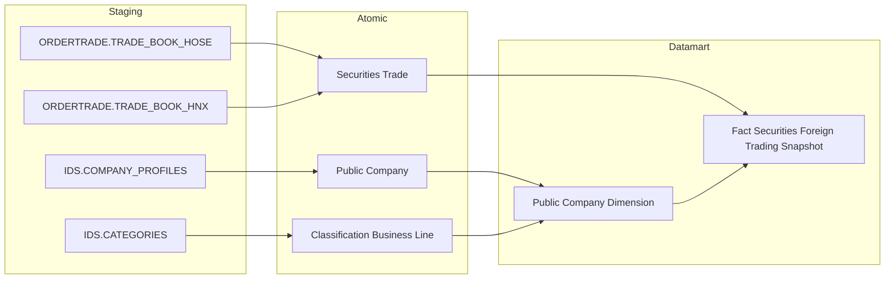

---

##### Cụm 1b: Đăng ký NĐT nước ngoài (Foreign Investor Registration) — PENDING

**Trạng thái:** PENDING — xem Nhóm 1 Box 2–4 (Section 2). Nguồn thực tế là báo cáo định kỳ PLVI-TT51 (VSDC, kỳ tháng), không phải `FIMS.INVESTOR.DateCreated` như thiết kế trước đây. Giữ lại Cụm này ở trạng thái tham khảo — không dùng làm nguồn chính thức cho đến khi xác nhận generic store TT51 tương ứng.

---

##### Cụm 2: Hồ sơ 360° NĐT nước ngoài (Foreign Investor 360 Profile)

Phục vụ Tab NĐTNN 360 — Danh sách tìm kiếm + Sub-tab A Hồ sơ định danh.

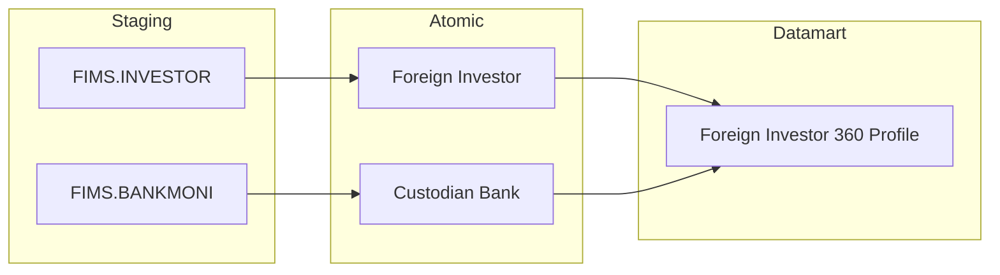

---

##### Cụm 3a: Danh mục chứng khoán NĐTNN (Fact Foreign Investor Portfolio Snapshot) — PENDING

**Trạng thái:** PENDING — xem Nhóm 6 (Section 2). Entity Atomic `Foreign Investor Stock Portfolio Snapshot` ghi trong thiết kế cũ **không tồn tại** trong `DataModel/working/Atomic/lld/manifest.yaml` hiện hành — `FIMS.CATEGORIESSTOCK` thực chất đã gộp vào entity `Foreign Investor Securities Account` (table_type Fundamental, current-state 1 tài khoản × 1 CTCK, KHÔNG phải Fact Snapshot theo tháng, không có `Portfolio Market Value`). Ngoài ra 6/7 KPI của Nhóm 6 đánh dấu Dữ liệu động (nguồn thật là báo cáo PLIII-TT51/2021/TT-BTC, kỳ tháng) — xem chi tiết Nhóm 6. Giữ lại Cụm này ở trạng thái tham khảo — không dùng `Foreign Investor Securities Account` làm nguồn chính thức cho Fact Snapshot này cho đến khi xác nhận nguồn giá trị thị trường danh mục (Portfolio Market Value) qua generic store TT51.

---

##### Cụm 3b: Foreign Investor Dimension / Public Company Dimension (READY — dùng chung nhiều Nhóm)

**Trạng thái:** READY — 2 entity này vẫn READY, dùng chung cho các Nhóm khác của module (Nhóm 2, 4, 9...).

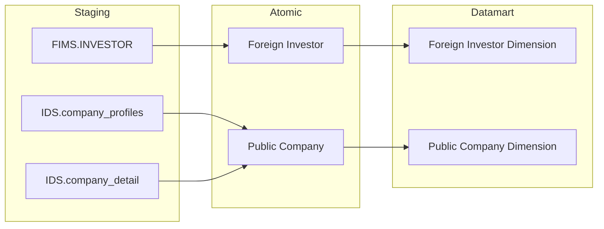

---

##### Cụm 3c: Quốc gia NĐTNN (Geographic Area Dimension) — PENDING

**Trạng thái:** PENDING — thiết kế cũ ghi nguồn `FIMS.NATIONAL` cho `Geographic Area`, nhưng đối chiếu `DataModel/working/Atomic/lld/manifest.yaml`, entity `Geographic Area` (approved) chỉ có nguồn từ `ECAT.COUNTRY/REGION/PROVINCE_NEW/WARD_NEW` — không có entry nào từ `FIMS`/`FIMS.NATIONAL`. Quốc gia/quốc tịch của NĐTNN trong FIMS chưa được xác nhận map vào Atomic `Geographic Area` — cần entity nguồn riêng hoặc xác nhận bảng FIMS thật lưu quốc tịch NĐT (nghi ngờ tên "NATIONAL" trong thiết kế cũ cũng sai/lỗi thời, cần Data Modeler xác nhận tên bảng FIMS thật). Không dùng `Geographic Area` (nguồn ECAT) làm nguồn chính thức cho Chiều "Quốc gia NĐTNN" cho đến khi xác nhận đúng bảng nguồn FIMS.

---

##### Cụm 4: Lịch sử tuân thủ NĐTNN (Investor Compliance History)

Phục vụ Tab NĐTNN 360 — Sub-tab C Lịch sử tuân thủ. Atomic từ phân hệ Thanh Tra (luồng GS_).

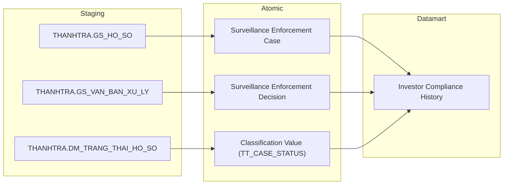

---

##### Cụm 5a: Dòng vốn đầu tư gián tiếp (Foreign Investor Capital Flow) — PENDING

**Trạng thái:** PENDING — xem Nhóm 3, 4, 5 (Section 2) + Nhóm 11a (Data Explorer). Toàn bộ measure "Dòng vốn/tiền vào/ra/ròng" đánh dấu Dữ liệu động — nguồn thực tế là báo cáo định kỳ PLIV-TT51 (Ngân hàng lưu ký gửi, kỳ nửa tháng), chưa thống nhất quy tắc khai thác trong generic store TT51 (Cụm 7). `Foreign Investor` vẫn READY (dùng chung Nhóm 2/4/6/9) — riêng `Geographic Area` giờ cũng PENDING (xem Cụm 3c — nguồn ECAT, không có entry FIMS, không dùng được cho Chiều quốc gia NĐTNN) — không dùng `Member Report Value`/`Member Regulatory Report` làm nguồn chính thức cho Fact động này cho đến khi xác nhận Report Code/Cell Code tương ứng.

---

##### Cụm 5b: Foreign Investor Dimension (READY — dùng chung nhiều Nhóm)

**Trạng thái:** READY — `Foreign Investor` vẫn READY, dùng chung Nhóm 2/4/6/9. Không còn Fact READY nào join tới ở trạng thái hiện tại (Fact chính từng dùng, `Fact Foreign Investor Portfolio Snapshot`, đã chuyển PENDING — xem Cụm 3a/O_NDTNN_21) — Dimension vẫn giữ READY vì bản thân entity Atomic không phụ thuộc trạng thái Fact.

---

##### Cụm 5c: Chỉ số thị trường (Market Index Snapshot)

Phục vụ Tab GIÁM SÁT DÒNG VỐN Nhóm 5 — Điểm đóng cửa VN-Index (K_NDTNN_24b).

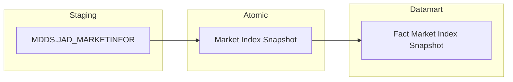

---

##### Cụm 6: Giới hạn sở hữu nước ngoài — ROOM (Fact Public Company Foreign Ownership Snapshot) — PENDING

**Trạng thái:** PENDING — xem Nhóm 9 (Section 2) + O_NDTNN_22. BA STT=9 xác nhận toàn bộ 6/6 dòng nguồn là báo cáo BM67 "Quản lý thông tin nhà đầu tư nước ngoài" (VSDC, chưa số hoá CSDL) hoặc Dữ liệu động — **không dùng** `Public Company Foreign Ownership Limit` (IDS.FOREIGN_OWNER_LIMIT) hay `Foreign Investor Securities Account` (FIMS) dù 2 entity này có sẵn và khớp khái niệm nghiệp vụ (Room tối đa, Ownership Rate). Giữ lại Cụm này ở trạng thái tham khảo — không dùng làm nguồn chính thức cho đến khi Data Modeler xác nhận nguồn go-live là BM67 (cần số hoá) hay entity IDS/FIMS đã có.

---

##### Cụm 7: Báo cáo TT51 — Generic Store (NDTNN Regulatory Report Store)

Phục vụ Tab DATA EXPLORER Nhóm 12 — 26 mẫu biểu TT51/2021.

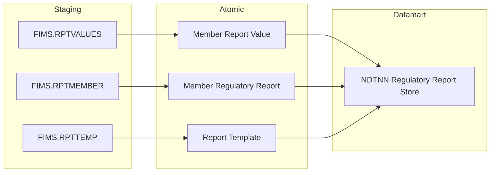

---

## Section 2 — Tổng quan báo cáo

### Tab: GIAO DỊCH

**Slicer chung:** Ngày (date picker — ví dụ: 12/31/2024)

---

#### Nhóm 1 — KPI Cards tổng quan

**Mockup:**

| Tỷ lệ tham gia | Tăng trưởng NĐT mới | Tăng trưởng NĐT Cá nhân mới | Tăng trưởng NĐT Tổ chức mới |
|:---:|:---:|:---:|:---:|
| **12.4** % | **2,450** Mã | **1,830** Mã | **620** Mã |

---

> Phân loại: **Phân tích**
> Atomic (Box 1): `Securities Trade` ← ORDERTRADE.TRADE_BOOK_HOSE / ORDERTRADE.TRADE_BOOK_HNX — **READY**
> Atomic (Box 2-4): xem dòng PENDING trong bảng KPI dưới đây
> Loại dữ liệu: Dữ liệu tĩnh (Box 1, BA đã chốt logic mapping + SQL tham khảo đầy đủ) / Dữ liệu động (Box 2-4)

**Source:** `Fact Securities Foreign Trading Snapshot` → `Calendar Date Dimension`

**Bảng KPI:**

| KPI ID | Tên | Đơn vị | Tính chất | Công thức / Mô tả | Ghi chú | Trạng thái |
|---|---|---|---|---|---|---|
| K_NDTNN_2 | Tổng giá trị mua của NĐTNN | Tỷ đồng | Cơ sở | `SUM(Foreign_Buy_Value)` GROUP BY `Trade Date Dimension Id` WHERE `Trade Date = :pdate` (SUM xuyên suốt mọi mã CK trong ngày) | Grain Fact = 1 mã CK × 1 ngày (xem Nhóm 2) — Box 1 pre-aggregate SUM lên cấp "1 ngày toàn thị trường" | READY |
| K_NDTNN_3 | Tổng giá trị bán của NĐTNN | Tỷ đồng | Cơ sở | `SUM(Foreign_Sell_Value)` GROUP BY `Trade Date Dimension Id` WHERE `Trade Date = :pdate` (SUM xuyên suốt mọi mã CK trong ngày) | Pre-aggregate như trên | READY |
| K_NDTNN_4 | Tổng giá trị giao dịch toàn thị trường | Tỷ đồng | Cơ sở | `SUM(Total_Market_Value)` GROUP BY `Trade Date Dimension Id` WHERE `Trade Date = :pdate` (SUM xuyên suốt mọi mã CK trong ngày, không lọc theo NĐT) | Pre-aggregate như trên | READY |
| K_NDTNN_1 | Tỷ lệ tham gia | % | Phái sinh | `(K_NDTNN_2 + K_NDTNN_3) × 100 / (K_NDTNN_4 × 2)` | Derived từ K_NDTNN_2/3/4 cùng ngày | READY |
| K_NDTNN_5 | Tăng trưởng NĐT mới | — | Phái sinh | TBD — chờ Atomic | **Lý do pending:** Dữ liệu động — nguồn thực tế báo cáo định kỳ PLVI-TT51/2021/TT-BTC (VSDC, kỳ tháng), COUNT "Mã số giao dịch chứng khoán" tại Mục "I. Thông tin chung" (Dòng Tổng, cột "Tổng số lượng tới thời điểm báo cáo") — không phải COUNT event FIMS.INVESTOR.DateCreated như thiết kế cũ (xem O_NDTNN_1). **Atomic cần bổ sung:** xác nhận báo cáo PLVI-TT51 thuộc generic store `Member Regulatory Report`/`Member Report Value` (Cụm 7) hay cần entity riêng — cần Report Code/Cell Code. **Mart dự kiến:** `Fact Foreign Investor Registration Report` (tên tạm) — grain 1 kỳ báo cáo (tháng) × 1 phân loại NĐT | PENDING |
| K_NDTNN_6 | Tăng trưởng NĐT Cá nhân mới | — | Phái sinh | TBD — chờ Atomic | Cùng lý do/nguồn với K_NDTNN_5 — Dòng "Cá nhân" trong báo cáo PLVI-TT51 | PENDING |
| K_NDTNN_7 | Tăng trưởng NĐT Tổ chức mới | — | Phái sinh | TBD — chờ Atomic | Cùng lý do/nguồn với K_NDTNN_5 — Dòng "Tổ chức" trong báo cáo PLVI-TT51 | PENDING |
| K_NDTNN_5_YOY | YoY% NĐT mới | — | Phái sinh | TBD — chờ Atomic | Cùng lý do/nguồn với K_NDTNN_5 — YoY dựa trên cùng chỉ tiêu | PENDING |

**Bảng mapping nguồn (Atomic Placeholder):**

| Tên KPI | Bảng nguồn (BA) | Atomic entity dự kiến | Atomic table dự kiến |
|---|---|---|---|
| Tăng trưởng NĐT mới / Cá nhân / Tổ chức / YoY | Báo cáo PLVI-TT51/2021/TT-BTC (VSDC, kỳ tháng) | Member Regulatory Report / Member Report Value (Cụm 7 — cần xác nhận Report Code) | TBD |

**Star Schema:**

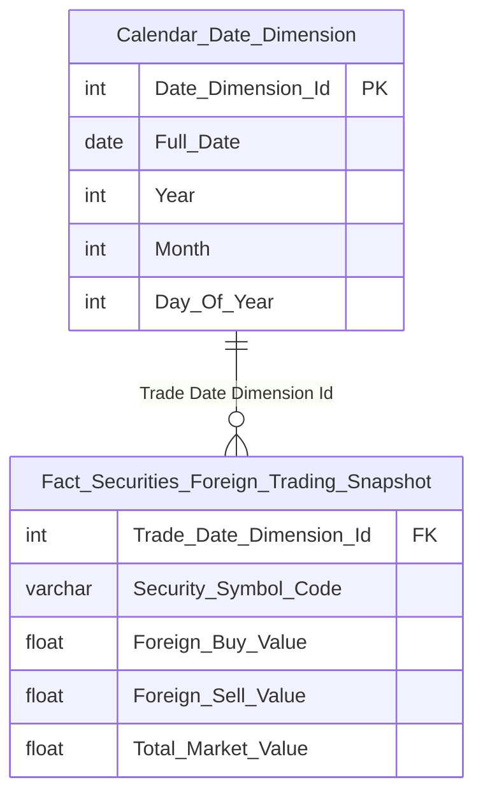

> **Lưu ý grain:** Fact có grain "1 mã CK × 1 ngày" (mở rộng ở Nhóm 2 để phục vụ Top ngành/mã). Box 1 (K_NDTNN_1-4) hiển thị số toàn thị trường — không phân theo mã CK — nên công thức phải `GROUP BY Trade_Date_Dimension_Id` (SUM xuyên suốt `Security_Symbol_Code`), không SUM trực tiếp theo dòng.

**Lineage Mart → Báo cáo:**

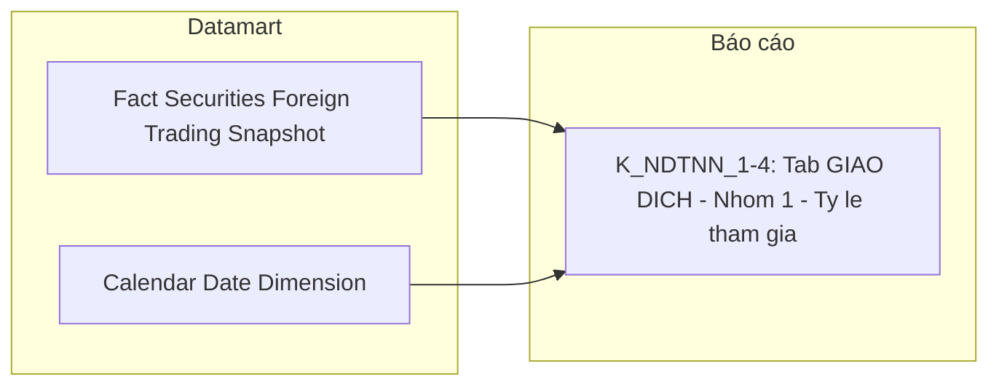

**Bảng grain:**

| Tên bảng | Grain |
|---|---|
| Fact Securities Foreign Trading Snapshot | 1 row = 1 mã CK × 1 ngày giao dịch (ETL pre-aggregate SUM Execution Value từ Securities Trade theo mã CK, tách theo Buy/Sell Foreign Investor Type Code) — xem Nhóm 2 cho chi tiết đầy đủ |
| Calendar Date Dimension | 1 row = 1 ngày giao dịch |

---

#### Nhóm 2 — Tổng giá trị mua/bán ròng của NĐTNN

**Mockup:**

| Bar chart | Lũy kế mua/bán ròng |
|:---|---:|
| Trục X: Tháng (Jan → Oct) | -8,300 B |
| Trục Y: Giá trị (tỉ đồng) | (lũy kế kỳ chọn) |

| TOP NGÀNH BÁN RÒNG | | TOP NGÀNH MUA RÒNG | | TOP MÃ BÁN RÒNG | | TOP MÃ MUA RÒNG | |
|:---|---:|:---|---:|:---|---:|:---|---:|
| Bất động sản | -1200B | Ngân hàng | +4500B | VHM | -700B | HPG | +3300B |
| Thực phẩm | -450B | Thép / Tài nguyên | +2800B | MSN | -400B | VCB | +600B |

**Slicer:** Từ ngày — Đến ngày (date range picker)

---

> Phân loại: **Phân tích**
> Atomic: `Securities Trade` ← ORDERTRADE.TRADE_BOOK_HOSE/HNX — **READY** (dùng chung Nhóm 1)
> Atomic (Ngành): `Classification Business Line` ← IDS.CATEGORIES — **READY (draft)**
> Atomic (Mã CK → Ngành): `Public Company` ← IDS.COMPANY_PROFILES — **READY (draft, working)** — join qua `Equity Ticker Symbol` = `Security Symbol Code`, và `Business Line Level 1/2 Code` → `Classification Business Line Code`
> Loại dữ liệu: Dữ liệu tĩnh

**Source:** `Fact Securities Foreign Trading Snapshot` → `Calendar Date Dimension`, `Public Company Dimension` (join `Classification Business Line` cho Top ngành)

**Bảng KPI:**

| KPI ID | Tên | Đơn vị | Tính chất | Công thức / Mô tả | Ghi chú | Trạng thái |
|---|---|---|---|---|---|---|
| K_NDTNN_9 | Ngành | — | Chiều | `Public_Company_Dimension.Classification_Business_Line_Name` (đã đệm sẵn từ join `Public_Company_Dimension.Business_Line_Level1_Code` = `Classification_Business_Line.cl_business_line_code` lúc ETL populate Dimension) | Dùng GROUP BY cho Top ngành (K_NDTNN_12/13/16) | READY |
| K_NDTNN_10 | Mã CK | — | Chiều | `Fact_Securities_Foreign_Trading_Snapshot.Security_Symbol_Code` | Dùng GROUP BY cho Top mã (K_NDTNN_14/15) | READY |
| K_NDTNN_8 | Giá trị mua/bán ròng | Tỷ đồng | Phái sinh | `Foreign_Buy_Value − Foreign_Sell_Value` per mã CK × ngày; nếu group theo Tháng: `SUM(Foreign_Buy_Value − Foreign_Sell_Value)` GROUP BY Tháng | Bar chart trục X = Tháng | READY |
| K_NDTNN_11 | Lũy kế mua/bán ròng | Tỷ đồng | Phái sinh | `SUM(Foreign_Buy_Value) − SUM(Foreign_Sell_Value)` WHERE `Trade_Date_Dimension_Id` BETWEEN `:pdate` AND `:pdate1` (SUM xuyên suốt mọi mã CK trong khoảng ngày) | — | READY |
| K_NDTNN_12 | Top 5 ngành bán ròng | Tỷ đồng | Phái sinh | `SUM(Foreign_Sell_Value)` WHERE `Trade_Date = :pdate` GROUP BY `Public_Company_Dimension.Classification_Business_Line_Name` ORDER BY SUM DESC FETCH FIRST 5 ROWS ONLY | Join `Fact` → `Public_Company_Dimension` | READY |
| K_NDTNN_13 | Top 5 ngành mua ròng | Tỷ đồng | Phái sinh | `SUM(Foreign_Buy_Value)` WHERE `Trade_Date = :pdate` GROUP BY `Public_Company_Dimension.Classification_Business_Line_Name` ORDER BY SUM DESC FETCH FIRST 5 ROWS ONLY | Join như trên | READY |
| K_NDTNN_14 | Top 5 mã bán ròng | Tỷ đồng | Phái sinh | `SUM(Foreign_Sell_Value) − SUM(Foreign_Buy_Value)` WHERE `Trade_Date` BETWEEN `:pdate` AND `:pdate1` GROUP BY `Security_Symbol_Code` ORDER BY kết quả DESC FETCH FIRST 5 ROWS ONLY | — | READY |
| K_NDTNN_15 | Top 5 mã mua ròng | Tỷ đồng | Phái sinh | `SUM(Foreign_Buy_Value) − SUM(Foreign_Sell_Value)` WHERE `Trade_Date` BETWEEN `:pdate` AND `:pdate1` GROUP BY `Security_Symbol_Code` ORDER BY kết quả DESC FETCH FIRST 5 ROWS ONLY | — | READY |
| K_NDTNN_16 | Tỷ trọng theo ngành | % | Phái sinh | `ROUND(SUM(Foreign_Buy_Value + Foreign_Sell_Value) / NULLIF(SUM(Total_Market_Value)*2, 0) * 100, 2)` WHERE `Trade_Date = :pdate` GROUP BY `Public_Company_Dimension.Classification_Business_Line_Name` — mẫu số SUM theo TOÀN NGÀNH (mọi mã CK cùng ngành) | Khác K_NDTNN_159 — mẫu số theo ngành, không phải theo mã | READY |
| K_NDTNN_159 | Top mã tỷ trọng cao | % | Phái sinh | `ROUND(SUM(Foreign_Buy_Value + Foreign_Sell_Value) / NULLIF(SUM(Total_Market_Value)*2, 0) * 100, 2)` WHERE `Trade_Date = :pdate` GROUP BY `Security_Symbol_Code` ORDER BY kết quả DESC FETCH FIRST 5 ROWS ONLY | Mẫu số SUM theo TỪNG MÃ CK (1 mã × 1 ngày, không cần GROUP thêm vì Fact đã ở đúng grain này). BA Mã=22 (STT=2) — đổi từ K_NDTNN_22 vì ID đó đã dùng cho "Giá trị mua/bán ròng" ở Nhóm 5 (STT=5) | READY |
| K_NDTNN_2 (reuse) | Tổng giá trị mua của NĐTNN | Tỷ đồng | Cơ sở | `SUM(Foreign_Buy_Value)` GROUP BY `Trade_Date_Dimension_Id` WHERE `Trade_Date = :pdate` | Reuse từ Nhóm 1 | READY |
| K_NDTNN_3 (reuse) | Tổng giá trị bán của NĐTNN | Tỷ đồng | Cơ sở | `SUM(Foreign_Sell_Value)` GROUP BY `Trade_Date_Dimension_Id` WHERE `Trade_Date = :pdate` | Reuse từ Nhóm 1 | READY |
| K_NDTNN_4 (reuse) | Tổng giá trị giao dịch toàn thị trường | Tỷ đồng | Cơ sở | `SUM(Total_Market_Value)` GROUP BY `Trade_Date_Dimension_Id` WHERE `Trade_Date = :pdate` | Reuse từ Nhóm 1 | READY |
| K_NDTNN_1 (reuse) | Tỷ trọng giao dịch theo ngày | % | Phái sinh | `(K_NDTNN_2 + K_NDTNN_3) × 100 / (K_NDTNN_4 × 2)` | Reuse từ Nhóm 1 — tên hiển thị khác ("Tỷ trọng GD theo ngày" thay vì "Tỷ lệ tham gia") nhưng cùng công thức | READY |
| — (=K_NDTNN_2+3, reuse) | Tổng giá trị giao dịch NĐTNN | Tỷ đồng | Phái sinh | `K_NDTNN_2 + K_NDTNN_3` cùng ngày | Reuse công thức từ Nhóm 1, không cấp KPI_ID mới (derived thuần từ 2 KPI cùng bảng) | READY |
| K_NDTNN_158 | Tỷ trọng TB phiên | % | Phái sinh | `AVG(ty_trong_ngay)` WHERE `Trade_Date` BETWEEN `:pdate` AND `:pdate1`, trong đó `ty_trong_ngay = (Foreign_Buy_Value + Foreign_Sell_Value) / (Total_Market_Value × 2) × 100` tính theo từng ngày (SUM xuyên mọi mã CK trong ngày đó trước khi tính tỷ trọng ngày, rồi AVG qua các ngày) | BA note "Tái sử dụng logic từ chỉ tiêu đã mapping ở nhóm trước" (= công thức K_NDTNN_1, nhưng là KPI độc lập — không note "Trùng" nên cấp ID riêng theo đúng dải liên tục tiếp theo, không chèn giữa dải 1-157). Cần xác nhận `Trade_Date` là ngày GD thực tế hay ngày khớp lệnh — BA tự ghi chú nghi vấn này | READY |

**Star Schema:**

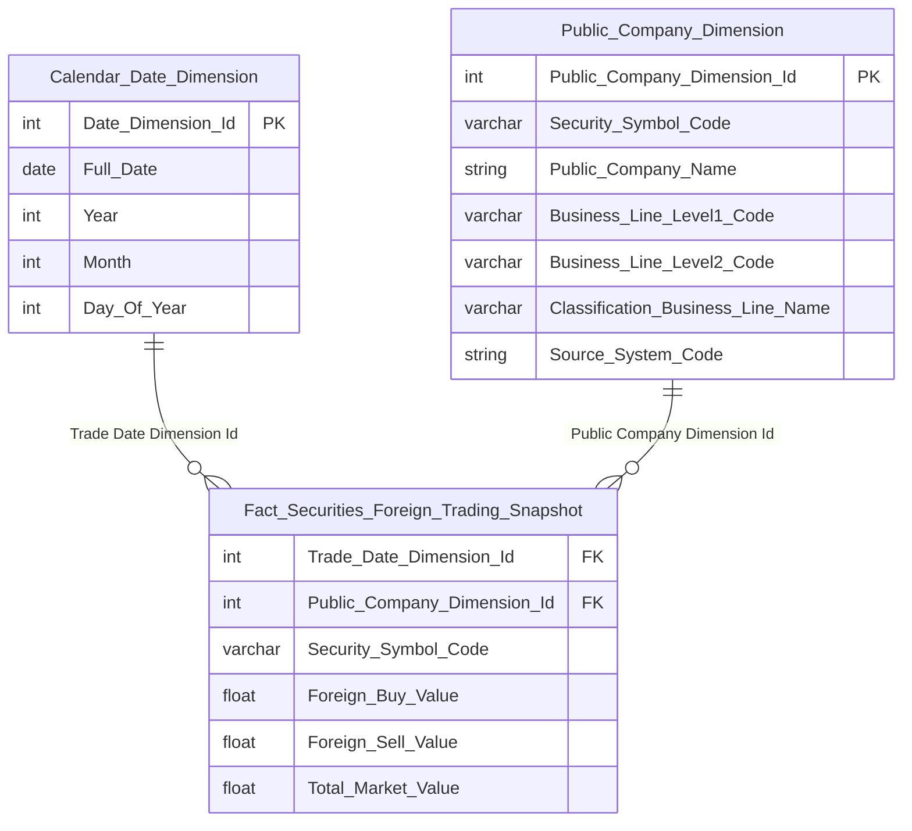

> **Ghi chú thiết kế:** `Public_Company_Dimension.Classification_Business_Line_Name` là ETL-derived — join `Public Company.Business_Line_Level1/2_Code` sang `Classification Business Line.cl_business_line_code` lúc populate Dimension, lưu đệm tên ngành để tránh join 3 tầng khi query Top ngành.

**Lineage Mart → Báo cáo:**

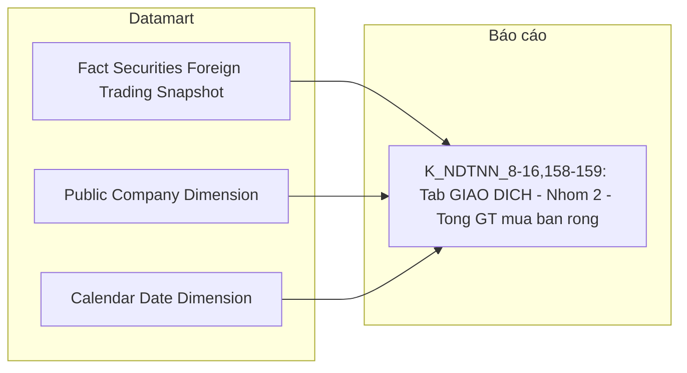

**Bảng grain:**

| Tên bảng | Grain |
|---|---|
| Fact Securities Foreign Trading Snapshot | 1 row = 1 mã CK × 1 ngày giao dịch (ETL pre-aggregate SUM Execution Value từ Securities Trade theo mã CK, tách theo Buy/Sell Foreign Investor Type Code) |
| Public Company Dimension | 1 row = 1 mã CK niêm yết (SCD2) — bao gồm Classification Business Line Name đệm sẵn |
| Calendar Date Dimension | 1 row = 1 ngày giao dịch |

---

### Tab: GIÁM SÁT DÒNG VỐN

**Slicer chung:** Từ ngày — Đến ngày (date range picker)

---

#### Nhóm 3 — KPI Cards: Dòng tiền vào / ra / ròng (STT=3)

**Mockup:**

| Dòng tiền vào | Dòng tiền ra | Dòng tiền ròng |
|:---:|:---:|:---:|
| **1,284.3** Tỉ đồng | **1,736.8** Tỉ đồng | **-452.5** Tỉ đồng |

**Slicer:** Từ ngày — Đến ngày (date range picker)

---

> Phân loại: **Phân tích**
> Atomic: xem cột Ghi chú trong bảng KPI dưới đây
> Loại dữ liệu: Dữ liệu động (cả 3 dòng)

**Bảng KPI:**

| KPI ID | Tên KPI | Đơn vị | Tính chất | Công thức | Ghi chú | Trạng thái |
|---|---|---|---|---|---|---|
| K_NDTNN_23 | Dòng tiền vào | — | Phái sinh | TBD — chờ Atomic | **Lý do pending:** Dữ liệu động — nguồn báo cáo định kỳ PLIV-TT51/2021/TT-BTC (Báo cáo hoạt động chu chuyển vốn NĐTNN, Ngân hàng lưu ký gửi, kỳ NỬA THÁNG), cột "GT dòng vốn vào" tại Dòng "Tổng = (1)+(2)". Note BA: "Báo cáo tại ngày (lấy ngày cuối tháng)". **Atomic cần bổ sung:** xác nhận báo cáo PLIV-TT51 thuộc generic store `Member Regulatory Report`/`Member Report Value` (Cụm 7) hay cần entity riêng — cần Report Code/Cell Code. Không dùng lại thiết kế cũ (`Fact Foreign Investor Capital Flow` ← FIMS.RPTVALUES/RPTMEMBER trực tiếp) vì chưa xác nhận đúng mapping. **Mart dự kiến:** `Fact Foreign Investor Capital Flow Report` (tên tạm) — grain 1 kỳ báo cáo (nửa tháng) × 1 chiều dòng vốn | PENDING |
| K_NDTNN_24 | Dòng tiền ra | — | Phái sinh | TBD — chờ Atomic | Cùng lý do/nguồn với K_NDTNN_23 — cột "GT ngoại tệ đổi ra VND" | PENDING |
| K_NDTNN_25 | Dòng tiền ròng | — | Phái sinh | TBD — chờ Atomic | Cùng lý do/nguồn với K_NDTNN_23 — Dòng tiền vào − Dòng tiền ra | PENDING |

**Bảng mapping nguồn (Atomic Placeholder):**

| Tên KPI | Bảng nguồn (BA) | Atomic entity dự kiến | Atomic table dự kiến |
|---|---|---|---|
| Dòng tiền vào / ra / ròng | Báo cáo PLIV-TT51/2021/TT-BTC (Ngân hàng lưu ký, kỳ nửa tháng) | Member Regulatory Report / Member Report Value (Cụm 7 — cần xác nhận Report Code) | TBD |

---

#### Nhóm 4 — Dòng vốn đầu tư gián tiếp nước ngoài (STT=4)

**Mockup** *(theo screenshot — stacked bar theo tháng + 4 bảng Top)*:

| Stacked bar | Trục X | Trục Y | Legend |
|:---|:---|:---|:---|
| Dòng vốn ròng theo loại hình NĐT | Tháng T1→T12 | Tỉ đồng | Cá nhân / Quỹ / Tổ chức khác quỹ |

**Slicer:** Từ ngày — Đến ngày + Loại hình NĐTNN + Quốc gia

---

> Phân loại: **Phân tích**
> Atomic: xem cột Ghi chú trong bảng KPI dưới đây
> Loại dữ liệu: Dữ liệu động (8/10 dòng) / Dữ liệu tĩnh (2 Chiều — Loại hình NĐTNN, Quốc gia — dùng filter/GROUP BY cho measure động, không tự đứng độc lập)

**Bảng KPI:**

| KPI ID | Tên KPI | Đơn vị | Tính chất | Công thức | Ghi chú | Trạng thái |
|---|---|---|---|---|---|---|
| K_NDTNN_160 | Loại hình NĐTNN | — | Chiều | TBD — chờ Atomic | Dùng filter K_NDTNN_27/28/29. Atomic `Foreign Investor Dimension.Investor Object Type Code` đã READY (dùng chung Nhóm 6) nhưng chưa join được vì Fact động (K_26-33) của Nhóm này chưa sẵn sàng | PENDING |
| K_NDTNN_161 | Quốc gia | — | Chiều | TBD — chờ Atomic | Dùng GROUP BY K_NDTNN_30/31. Atomic `Geographic Area Dimension.Geographic Area Name` đã READY (dùng chung Nhóm 6) nhưng chưa join được vì Fact động của Nhóm này chưa sẵn sàng | PENDING |
| K_NDTNN_26 | Dòng vốn ròng | — | Phái sinh | TBD — chờ Atomic | **Lý do pending:** Dữ liệu động — nguồn báo cáo định kỳ PLIV-TT51 (Ngân hàng lưu ký, kỳ nửa tháng) như Nhóm 3, chưa thống nhất quy tắc khai thác generic store TT51. **Atomic cần bổ sung:** xem Nhóm 3 (Member Regulatory Report/Member Report Value — cần Report Code). **Mart dự kiến:** `Fact Foreign Investor Capital Flow Report` (tên tạm, xem Nhóm 3) — grain 1 kỳ báo cáo (nửa tháng) × 1 NĐT × 1 quốc gia. Khi sẵn sàng join `Foreign Investor Dimension`+`Geographic Area Dimension` (đã READY, không cần Dimension mới) | PENDING |
| K_NDTNN_27 | Dòng vốn ròng — Quỹ | — | Phái sinh | TBD — chờ Atomic | Cùng lý do/nguồn/mart dự kiến với K_NDTNN_26 — filter Loại hình = Quỹ (K_NDTNN_160) | PENDING |
| K_NDTNN_28 | Dòng vốn ròng — Cá nhân | — | Phái sinh | TBD — chờ Atomic | Cùng lý do/nguồn/mart dự kiến với K_NDTNN_26 — filter Loại hình = Cá nhân (K_NDTNN_160) | PENDING |
| K_NDTNN_29 | Dòng vốn ròng — Tổ chức khác quỹ | — | Phái sinh | TBD — chờ Atomic | Cùng lý do/nguồn/mart dự kiến với K_NDTNN_26 — filter Loại hình = Tổ chức khác quỹ (K_NDTNN_160) | PENDING |
| K_NDTNN_30 | Top 5 quốc gia vào ròng | — | Phái sinh | TBD — chờ Atomic | Cùng lý do/nguồn/mart dự kiến với K_NDTNN_26 — GROUP BY Quốc gia (K_NDTNN_161), TOP 5 dòng vào ròng DESC | PENDING |
| K_NDTNN_31 | Top 5 quốc gia rút ròng | — | Phái sinh | TBD — chờ Atomic | Cùng lý do/nguồn/mart dự kiến với K_NDTNN_26 — GROUP BY Quốc gia (K_NDTNN_161), TOP 5 dòng rút ròng | PENDING |
| K_NDTNN_32 | Top 5 NĐT vào ròng | — | Phái sinh | TBD — chờ Atomic | Cùng lý do/nguồn/mart dự kiến với K_NDTNN_26 — GROUP BY NĐT, TOP 5 dòng vào ròng DESC | PENDING |
| K_NDTNN_33 | Top 5 NĐT rút ròng | — | Phái sinh | TBD — chờ Atomic | Cùng lý do/nguồn/mart dự kiến với K_NDTNN_26 — GROUP BY NĐT, TOP 5 dòng rút ròng | PENDING |

---

#### Nhóm 5 — Tương quan Net Flow & VN-Index (STT=5)

**Mockup** *(theo screenshot — 3 series line chart dual Y-axis)*:

| Series | Nguồn | Trục Y |
|:---|:---|:---|
| MUA/BÁN RÒNG (đỏ) | Securities Trade (ORDERTRADE) | Trái (Tỉ đồng) |
| DÒNG TIỀN RÒNG (xanh lá) | Báo cáo PLIV-TT51 (Ngân hàng lưu ký) | Trái (Tỉ đồng) |
| VN-INDEX (tím) | MDDS (JAD_MARKETINFOR) | Phải (Điểm) |

> **Ghi chú thiết kế:** 3 series từ 3 fact riêng biệt — presentation layer chịu trách nhiệm query độc lập và align theo trục ngày/tháng.

---

> Phân loại: **Phân tích**
> Atomic (Giá trị mua/bán ròng): `Securities Trade` ← ORDERTRADE.TRADE_BOOK_HOSE/HNX — **READY** (dùng chung Nhóm 1/2)
> Atomic (VN-Index): `Market Index Snapshot` ← MDDS.JAD_MARKETINFOR — **READY (approved)**
> Atomic (Dòng tiền ròng lũy kế): xem cột Ghi chú trong bảng KPI dưới đây
> Loại dữ liệu: Dữ liệu tĩnh (Giá trị mua/bán ròng, VN-Index) / Dữ liệu động (Dòng tiền ròng lũy kế — reuse K_NDTNN_25 Nhóm 3)

**Source:** `Fact Securities Foreign Trading Snapshot` (reuse Nhóm 2) + `Fact Market Index Snapshot` (mới) → `Calendar Date Dimension`

**Bảng KPI:**

| KPI ID | Tên | Đơn vị | Tính chất | Công thức / Mô tả | Ghi chú | Trạng thái |
|---|---|---|---|---|---|---|
| K_NDTNN_22 | Giá trị mua/bán ròng | Tỷ đồng | Phái sinh | `SUM(Foreign_Buy_Value) − SUM(Foreign_Sell_Value)` GROUP BY `Trade_Date_Dimension_Id` (SUM xuyên suốt mọi mã CK trong ngày) | Cùng công thức K_NDTNN_8 (Nhóm 2) — BA độ chi tiết Ngày, không phải tháng như thiết kế cũ. Reuse `Fact Securities Foreign Trading Snapshot`, không cần bản pre-aggregate mới | READY |
| K_NDTNN_24b | Điểm đóng cửa chỉ số (VN-Index) | Điểm | Cơ sở | `Market_Index_Value` WHERE `Market_Id = '10'` AND `Market_Code = 'HOSE'`, lấy bản ghi có `Index_Time` lớn nhất (MAX) trong mỗi `Trading_Date` (ROW_NUMBER PARTITION BY Market_Id, Market_Code, Trading_Date ORDER BY Index_Time DESC, lấy rn=1) | Atomic `Market Index Snapshot` grain = 1 lần chụp/chỉ số — ETL lấy giá trị chốt cuối phiên mỗi ngày. Filter đúng theo SQL BA (`Market_Id`+`Market_Code`, KHÔNG dùng `Index_Type_Code` — scheme `MDDS_INDEX_TYPE` chưa profile giá trị, xem Open Issue) | READY |
| K_NDTNN_25b | Dòng tiền ròng lũy kế (tháng) (reuse công thức từ K_NDTNN_25 — Nhóm 3) | — | Phái sinh | TBD — chờ Atomic | **Lý do pending:** Reuse K_NDTNN_25 (Nhóm 3), giờ K_NDTNN_25 PENDING (Dữ liệu động — xem Nhóm 3) nên K_NDTNN_25b PENDING theo. **Atomic cần bổ sung:** xem Nhóm 3. **Mart dự kiến:** `Fact Foreign Investor Capital Flow Report` (tên tạm, xem Nhóm 3) — grain 1 tháng | PENDING |

**Star Schema:**

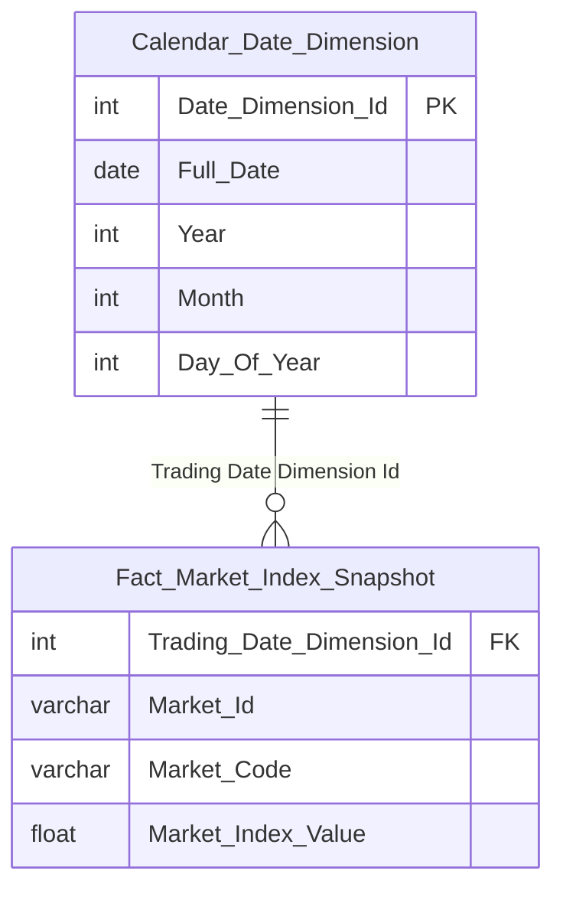

> **Ghi chú:** K_NDTNN_22 reuse trực tiếp `Fact Securities Foreign Trading Snapshot` (xem Star Schema Nhóm 2) — không cần erDiagram riêng. K_NDTNN_24b cần Fact mới `Fact Market Index Snapshot` (Fact Snapshot, grain 1 ngày × 1 chỉ số, ETL lấy bản ghi cuối phiên từ `Market Index Snapshot` Atomic).

**Lineage Mart → Báo cáo:**

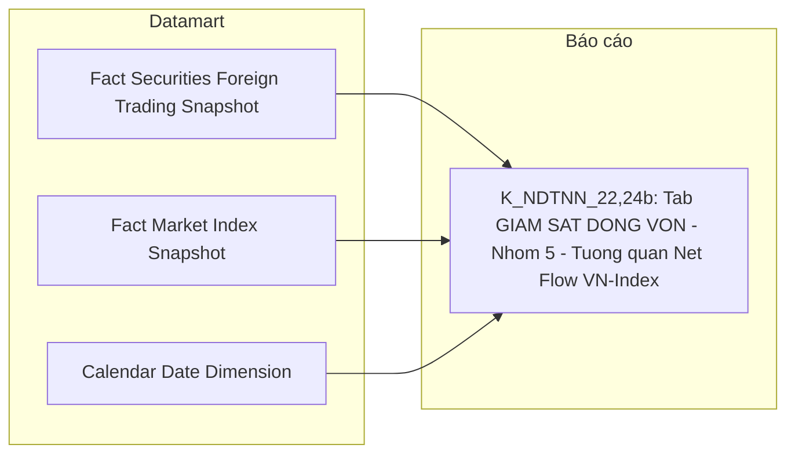

**Bảng grain:**

| Tên bảng | Grain |
|---|---|
| Fact Securities Foreign Trading Snapshot | 1 row = 1 mã CK × 1 ngày giao dịch (reuse từ Nhóm 2) |
| Fact Market Index Snapshot | 1 row = 1 chỉ số (VN-Index/HNX-Index/UPCOM-Index) × 1 ngày (ETL lấy bản ghi cuối phiên từ `Market Index Snapshot`) |
| Calendar Date Dimension | 1 row = 1 ngày |

---

### Tab: DANH MỤC

**Slicer chung:** Kỳ (Tháng + Năm) cho danh mục / Ngày (date picker) cho ROOM

---

#### Nhóm 6 - Thống kê danh mục (STT=6)

> Phân loại: **Phân tích**
> Atomic (Loại hình nhà đầu tư): `Foreign Investor` ← FIMS.INVESTOR/INVESTORTYPE — **READY (draft)**
> Atomic (Tổng GTDM + Top quốc gia/NĐT): xem cột Ghi chú trong bảng KPI dưới đây
> Loại dữ liệu: Dữ liệu tĩnh (Loại hình nhà đầu tư) / Dữ liệu động (6 KPI còn lại)

**Mockup:**

| Tổng GTDM | Danh mục Cá nhân | Danh mục Quỹ | Danh mục Tổ chức khác quỹ |
|:---:|:---:|:---:|:---:|
| **1,315** Tỉ đồng | **284.6** Tỉ đồng | **752.3** Tỉ đồng | **278.1** Tỉ đồng |

**Bảng KPI:**

| KPI ID | Tên | Đơn vị | Tính chất | Công thức | Ghi chú | Trạng thái |
|---|---|---|---|---|---|---|
| K_NDTNN_162 | Loại hình nhà đầu tư | — | Chiều | `Foreign_Investor.Investor_Type_Code` (từ `FIMS.INVESTOR.InvestorTypeId`) | Dùng filter K_NDTNN_35/36/37. Atomic `Foreign Investor` đã READY (draft), dùng chung Nhóm 2/4/9 | READY |
| K_NDTNN_34 | Tổng giá trị danh mục | — | Phái sinh | TBD — chờ Atomic | **Lý do pending:** Dữ liệu động — nguồn báo cáo định kỳ PLIII-TT51/2021/TT-BTC (Báo cáo thống kê danh mục lưu ký NĐTNN, do CTCK và Ngân hàng lưu ký gửi, kỳ THÁNG), Mục "II. Báo cáo cơ cấu danh mục theo tỷ trọng đầu tư của tổ chức và cá nhân", Dòng "Tổng = (1)+(2)", Cột "Tổng giá trị danh mục". **Atomic cần bổ sung:** xác nhận báo cáo PLIII-TT51 thuộc generic store `Member Regulatory Report`/`Member Report Value` (Cụm 7) hay cần entity riêng — cần Report Code/Cell Code Mục II. Atomic `Foreign Investor Securities Account` (gộp SECURITIESACCOUNT+CATEGORIESSTOCK, table_type Fundamental) KHÔNG dùng được — chỉ có Current Holding Quantity/Ownership Rate current-state, không có Portfolio Market Value theo tháng. **Mart dự kiến:** `Fact Foreign Investor Portfolio Value Report` (tên tạm) — grain 1 kỳ báo cáo (tháng) × 1 NĐT | PENDING |
| K_NDTNN_35 | Danh mục Cá nhân | — | Phái sinh | TBD — chờ Atomic | Cùng lý do/nguồn/mart dự kiến với K_NDTNN_34 — Dòng "Tổng(2)-Cá nhân" | PENDING |
| K_NDTNN_36 | Danh mục Quỹ | — | Phái sinh | TBD — chờ Atomic | Cùng lý do/nguồn/mart dự kiến với K_NDTNN_34 — Subset Tổng(1) lọc Loại hình = Quỹ (K_NDTNN_162) | PENDING |
| K_NDTNN_37 | Danh mục Tổ chức khác quỹ | — | Phái sinh | TBD — chờ Atomic | Cùng lý do/nguồn/mart dự kiến với K_NDTNN_34 — Subset Tổng(1) lọc Loại hình khác Quỹ (K_NDTNN_162) | PENDING |
| K_NDTNN_38 | Top 5 quốc gia theo GTDM | — | Phái sinh | TBD — chờ Atomic | Cùng lý do/nguồn với K_NDTNN_34 — GROUP BY Quốc tịch, TOP 5 DESC. **Atomic cần bổ sung thêm:** Chiều Quốc gia chưa có nguồn xác nhận — xem O_NDTNN_21 (Cụm 3c, `Geographic Area` chỉ có nguồn ECAT, không có FIMS) | PENDING |
| K_NDTNN_39 | Top 5 NĐT theo GTDM | — | Phái sinh | TBD — chờ Atomic | Cùng lý do/nguồn/mart dự kiến với K_NDTNN_34 — GROUP BY Tên khách hàng, TOP 5 DESC | PENDING |

**Bảng mapping nguồn (Atomic Placeholder):**

| Tên KPI | Bảng nguồn (BA) | Atomic entity dự kiến | Atomic table dự kiến |
|---|---|---|---|
| Tổng giá trị danh mục / Cá nhân / Quỹ / Tổ chức khác quỹ / Top 5 quốc gia / Top 5 NĐT | Báo cáo PLIII-TT51/2021/TT-BTC (CTCK + Ngân hàng lưu ký, kỳ tháng) | Member Regulatory Report / Member Report Value (Cụm 7 — cần xác nhận Report Code Mục II) | TBD |

---

#### Nhóm 7 - Cơ cấu danh mục theo loại hình tài sản (STT=7)

> Phân loại: **Phân tích**
> Atomic: xem cột Ghi chú trong bảng KPI dưới đây
> Loại dữ liệu: Dữ liệu động (toàn bộ 7/7 dòng BA)

**Mockup:**

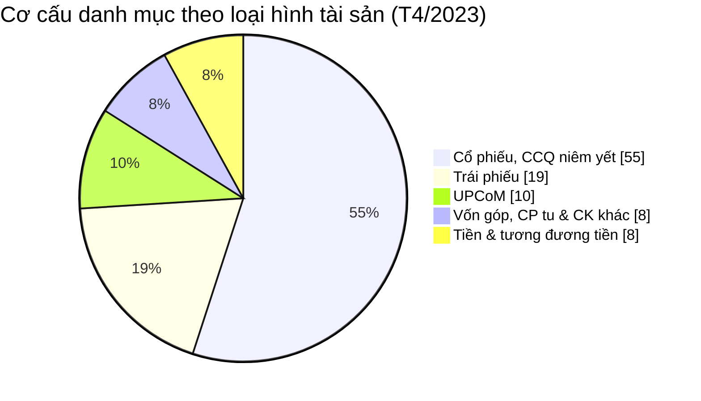

**Bảng KPI:**

| KPI ID | Tên | Đơn vị | Tính chất | Công thức | Ghi chú | Trạng thái |
|---|---|---|---|---|---|---|
| K_NDTNN_163 | Giá trị tài sản | — | Cơ sở | TBD — chờ Atomic | **Lý do pending:** Dữ liệu động — Bảng nguồn BA ghi `CATEGORIESSTOCK.Quantity` + `SECURITIES.ClosingPrice` (độ chi tiết Tháng), nhưng đối chiếu Atomic thì `CATEGORIESSTOCK` đã gộp vào `Foreign Investor Securities Account` (Fundamental, current-state, không phải Snapshot theo tháng) — không dùng được để tính giá trị tài sản theo tháng. **Atomic cần bổ sung:** xem Nhóm 6 (measure tương tự "Tổng giá trị danh mục", cùng nghi vấn nguồn PLIII-TT51). **Mart dự kiến:** chung Fact với Nhóm 6 (`Fact Foreign Investor Portfolio Value Report`, tên tạm) | PENDING |
| K_NDTNN_164 | Loại tài sản | — | Chiều | TBD — chờ Atomic | Dùng filter K_NDTNN_40-44. Bảng nguồn BA `RELATEDPROPERTIES.Name` (filter `Deleted=0`) — đã tra Atomic: `RELATEDPROPERTIES` chỉ được model hóa cho scheme `FIMS_RELATED_PROPERTY` ("Hình thức liên quan trong ủy quyền CBTT/giao dịch", dùng bởi `Info Disclosure Authorization`/`Trading Authorization`) — KHÔNG liên quan "Loại tài sản danh mục đầu tư". Đây là bảng lookup dùng chung nhiều mục đích trong FIMS, giá trị "Loại tài sản" (Cổ phiếu/Trái phiếu/UPCoM...) chưa được model hóa riêng trong Atomic. **Atomic cần bổ sung:** entity/scheme riêng cho phân loại tài sản danh mục đầu tư NĐTNN | PENDING |
| K_NDTNN_40 | GT tài sản — Cổ phiếu/CCQ niêm yết | — | Phái sinh | TBD — chờ Atomic | Cùng lý do/nguồn/mart dự kiến với K_NDTNN_163 — subset filter Loại tài sản = Cổ phiếu/CCQ niêm yết (K_NDTNN_164), nguồn báo cáo PLIII-TT51 Mục II, Cột "Cổ phiếu/CCQ niêm yết" | PENDING |
| K_NDTNN_41 | GT tài sản — Trái phiếu | — | Phái sinh | TBD — chờ Atomic | Cùng lý do/nguồn/mart dự kiến với K_NDTNN_163 — subset filter Loại tài sản = Trái phiếu, nguồn báo cáo PLIII-TT51 Mục II, Cột "Trái phiếu" (SUM 3 loại trái phiếu theo BA note) | PENDING |
| K_NDTNN_42 | GT tài sản — UPCoM | — | Phái sinh | TBD — chờ Atomic | Cùng lý do/nguồn/mart dự kiến với K_NDTNN_163 — subset filter Loại tài sản = UPCoM, nguồn báo cáo PLIII-TT51 Mục II, Cột "Cổ phiếu công ty đại chúng đăng ký giao dịch (upcom)" | PENDING |
| K_NDTNN_43 | GT tài sản — Vốn góp/CP tư/CK khác | — | Phái sinh | TBD — chờ Atomic | Cùng lý do/nguồn/mart dự kiến với K_NDTNN_163 — subset filter Loại tài sản = Vốn góp/mua CP/quỹ thành viên/CK khác, nguồn báo cáo PLIII-TT51 Mục II | PENDING |
| K_NDTNN_44 | GT tài sản — Tiền và tương đương | — | Phái sinh | TBD — chờ Atomic | Cùng lý do/nguồn/mart dự kiến với K_NDTNN_163 — subset filter Loại tài sản = Tiền và tương đương, nguồn báo cáo PLIII-TT51 Mục II. BA note: "Lấy từ báo cáo NHLK" | PENDING |

**Bảng mapping nguồn (Atomic Placeholder):**

| Tên KPI | Bảng nguồn (BA) | Atomic entity dự kiến | Atomic table dự kiến |
|---|---|---|---|
| Giá trị tài sản / GT tài sản theo loại (5 subset) | Báo cáo PLIII-TT51/2021/TT-BTC (CTCK + Ngân hàng lưu ký, kỳ tháng) | Member Regulatory Report / Member Report Value (Cụm 7 — cần xác nhận Report Code Mục II) | TBD |
| Loại tài sản (Chiều) | FIMS.RELATEDPROPERTIES (dùng chung — cần entity/scheme riêng cho ngữ cảnh danh mục đầu tư) | TBD (không dùng scheme `FIMS_RELATED_PROPERTY` hiện có — sai ngữ cảnh) | TBD |

---

#### Nhóm 8 - Phân ngành của NĐTNN (STT=8)

> Phân loại: **Phân tích** (1 dòng Chiều READY) + **Chỉ tiêu phái sinh** (1 dòng PENDING)
> Atomic:
> - `Classification Business Line` (IDS.CATEGORIES, draft) — **READY**. Join chain 2 bước: `Public Company.Business_Line_Level1_Code` → `Classification Business Line.cl_business_line_code` → lấy `Classification Business Line Name`.
> - `Public Company` (IDS.COMPANY_PROFILES, draft) — READY, dùng làm cầu nối (Business Line Level1/2 Id/Code).
> - `Foreign Investor Securities Account` (FIMS.SECURITIESACCOUNT+CATEGORIESSTOCK, draft) — có `Current Holding Quantity`, KHÔNG có giá đóng cửa/market value.

**Ghi chú thiết kế:**
- **Sửa O_NDTNN_12:** `Industry Category Dimension` (tên cũ) KHÔNG ETL-derived trực tiếp từ `Public Company` như thiết kế trước — `Public Company` chỉ có `Business Line Level 1/2 Id/Code` (FK), tên ngành thật nằm ở entity riêng `Classification Business Line` (nguồn `IDS.CATEGORIES`, gộp với `ECAT.BUSINESS_LINE_LEVEL_1/2`).
- **Reuse (Lớp 3/4 — Section 3 Check Reuse):** `Public Company Dimension` đã thiết kế đầy đủ ở Nhóm 2 (Section 2), có sẵn cột `Classification_Business_Line_Name` đệm sẵn qua đúng join chain 2 bước này (xem Nhóm 2, dòng K_NDTNN_9). Nhóm 8 **reuse thẳng** `Public Company Dimension`, KHÔNG tạo Dimension `Industry Category`/`Business Line` mới — tránh trùng lặp 2 Dimension cùng chứa 1 thông tin.
- **Sửa O_NDTNN_21:** Bỏ `Fact Foreign Investor Portfolio Snapshot` (entity ảo, không tồn tại trong manifest) khỏi Source — measure "Giá trị tài sản" (đã khai sinh K_NDTNN_163 ở Nhóm 7, PENDING) chưa có nguồn giá đóng cửa trong FIMS/IDS, nên KPI "Tỷ trọng theo ngành" (cần chia theo giá trị tài sản, không phải theo số lượng cổ phiếu) tiếp tục PENDING — cùng gốc rễ thiếu measure với Nhóm 7.

**Mockup:**

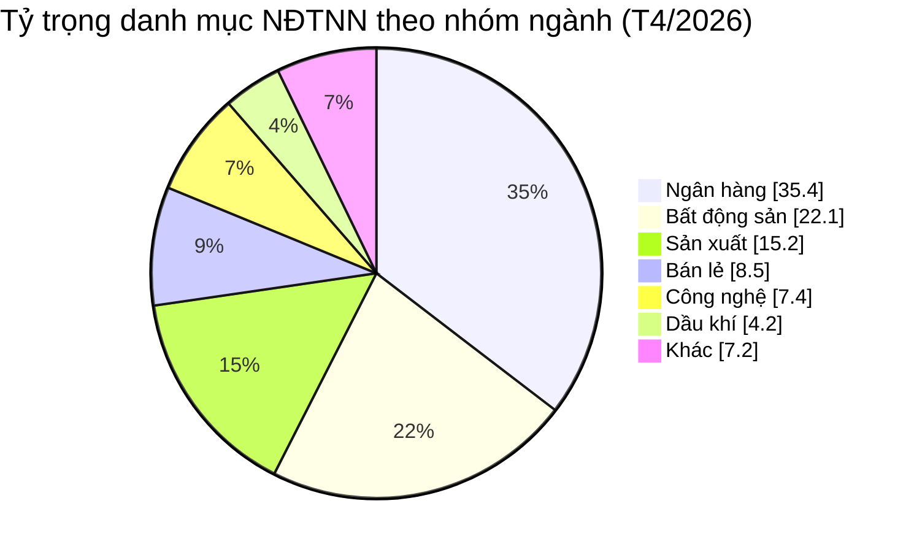

**Source:** `Public Company Dimension` (reuse từ Nhóm 2)

**Bảng KPI:**

| KPI ID | Tên KPI | Đơn vị | Tính chất | Công thức | Ghi chú | Trạng thái |
|---|---|---|---|---|---|---|
| K_NDTNN_51a | Nhóm ngành | — | Chiều | `Public_Company_Dimension.Classification_Business_Line_Name` | Reuse `Public Company Dimension` từ Nhóm 2 (đã đệm sẵn tên ngành qua join `Business_Line_Level1_Code` → `Classification Business Line.cl_business_line_code`, IDS.CATEGORIES). Sửa O_NDTNN_12 — không tạo Dimension riêng | READY |
| K_NDTNN_51 | Tỷ trọng danh mục theo ngành | % | Derived | TBD — chờ Atomic | Lý do pending: thiếu measure "Giá trị tài sản NĐTNN" (Quantity × giá đóng cửa) — `Foreign Investor Securities Account` chỉ có `Current Holding Quantity`, không có giá đóng cửa trong hệ thống nguồn FIMS/IDS mà BA khai báo (giống O_NDTNN_21 mục Nhóm 7 — K_NDTNN_163 cũng PENDING vì lý do này). Atomic cần bổ sung: field giá đóng cửa chứng khoán trong FIMS/IDS, hoặc xác nhận cross-module join với `Security Trading Snapshot` (MDDS). Mart dự kiến: `Fact Foreign Investor Portfolio Snapshot` (grain 1 NĐT × 1 mã CK × 1 kỳ) | PENDING |

**Star Schema:** Reuse nguyên trạng `Public Company Dimension` — xem erDiagram tại Nhóm 2 (Section 2), không định nghĩa lại.

**Lineage Mart → Báo cáo:**

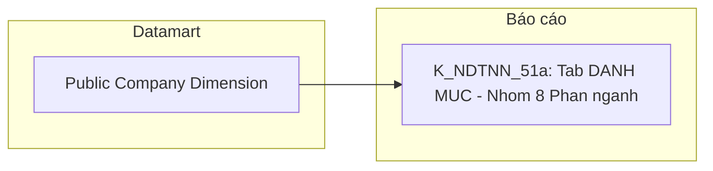

**Bảng mapping nguồn (Atomic Placeholder):**

| Bảng nguồn BA | Atomic entity dự kiến | Atomic table dự kiến | Ghi chú |
|---|---|---|---|
| CATEGORIESSTOCK, SECURITIES | Fact Foreign Investor Portfolio Snapshot (chưa thiết kế) | TBD | Cần measure giá đóng cửa chứng khoán — chưa có nguồn Atomic trong FIMS/IDS (xem O_NDTNN_21) |

**Bảng grain:**

| Tên bảng | Grain |
|---|---|
| Public Company Dimension | 1 row = 1 mã CK niêm yết (SCD2) — reuse từ Nhóm 2, đã bao gồm Classification Business Line Name đệm sẵn |

---

#### Nhóm 9 - Sở hữu NĐT nước ngoài ROOM (STT=9)

> Phân loại: **Phân tích** (100% PENDING)
> Atomic tham khảo: `Public Company Foreign Ownership Limit` (IDS.FOREIGN_OWNER_LIMIT, draft) — có `Maximum Foreign Ownership Rate Percentage`, khớp khái niệm "Room tối đa" nhưng KHÔNG dùng được vì BA chỉ định nguồn khác (xem Ghi chú thiết kế). `Foreign Investor Securities Account` (FIMS, draft) — có `Current Holding Quantity`, cũng không dùng được vì cùng lý do.

**Ghi chú thiết kế:**
- **Sửa O_NDTNN_21:** Bỏ hẳn `Fact Foreign Ownership Snapshot` với measure `SUM(Ownership Rate)` từ entity ảo `Foreign Investor Stock Portfolio Snapshot` (không tồn tại trong manifest).
- **Rà soát BA xác nhận toàn bộ 6/6 dòng của Nhóm 9 đều PENDING** — không phải do thiếu Atomic, mà do BA chỉ định rõ nguồn là **báo cáo BM67 "Quản lý thông tin nhà đầu tư nước ngoài"** (báo cáo thủ công VSDC, chưa số hoá CSDL) hoặc đánh dấu "Dữ liệu động". Xem O_NDTNN_22 — Atomic đã có sẵn entity số hoá tương đương cho 2/6 khái niệm (Room tối đa, Ownership Rate) nhưng KHÔNG dùng theo đúng gate rule "Loại dữ liệu", vì BA yêu cầu nguồn báo cáo thủ công chứ không phải entity đã số hoá.
- **"Mã CK" (dòng 1):** BA ghi nguồn `FIMS.SECURITIES.SecuritiesTypeId` — không tìm thấy bảng `FIMS.SECURITIES` nào trong manifest (chỉ 6 source table FIMS đã xác nhận từ Nhóm 6/7/8, không có SECURITIES) — cùng gap "không có bảng giá/danh mục chứng khoán trong FIMS" đã ghi nhận ở Nhóm 8. Giữ nguyên PENDING theo đúng gate rule (Loại dữ liệu = Dữ liệu động), không suy diễn thêm.

**Bảng KPI:**

| KPI ID | Tên KPI | Đơn vị | Tính chất | Công thức | Ghi chú | Trạng thái |
|---|---|---|---|---|---|---|
| K_NDTNN_45 | Mã CK | — | Chiều | TBD — chờ Atomic | Lý do pending: nguồn `FIMS.SECURITIES.SecuritiesTypeId` — không có bảng `FIMS.SECURITIES` trong manifest (cùng gap Nhóm 8). Dữ liệu động — chưa thống nhất quy tắc khai thác. Mart dự kiến: `Fact Public Company Foreign Ownership Snapshot` (grain 1 mã CK × 1 ngày) | PENDING |
| K_NDTNN_46 | Tỷ lệ sở hữu (theo mã CK) | % | Cơ sở | TBD — chờ Atomic | Lý do pending: BA chỉ định nguồn báo cáo BM67 VSDC (Dữ liệu động), công thức "Số lượng CP NĐTNN nắm giữ × 100 / Tổng số CP phát hành". Atomic cần bổ sung: xác nhận generic store TT51/BM67 tương ứng. Tham khảo — entity `Foreign Investor Securities Account` (FIMS) có `Current Holding Quantity` nhưng không dùng vì BA yêu cầu nguồn BM67 khác (xem O_NDTNN_22). Mart dự kiến: `Fact Public Company Foreign Ownership Snapshot` | PENDING |
| K_NDTNN_47 | Room còn lại (theo mã CK) | % | Derived | TBD — chờ Atomic | Lý do pending: nguồn BM67 VSDC, "Chưa có CSDL - Map biểu mẫu", công thức "Số lượng CP còn được phép nắm giữ × 100 / Tổng số CP phát hành". Atomic cần bổ sung: số hoá biểu mẫu BM67. Mart dự kiến: `Fact Public Company Foreign Ownership Snapshot` | PENDING |
| K_NDTNN_48 | Room tối đa | % | Cơ sở | TBD — chờ Atomic | Lý do pending: nguồn BM67 VSDC, "Chưa có CSDL - Map biểu mẫu", trường "Tỷ lệ sở hữu nước ngoài tối đa (%)". Tham khảo — entity `Public Company Foreign Ownership Limit` (IDS.FOREIGN_OWNER_LIMIT) có `Maximum Foreign Ownership Rate Percentage` khớp khái niệm nhưng không dùng vì BA yêu cầu nguồn BM67 khác (xem O_NDTNN_22). Mart dự kiến: `Fact Public Company Foreign Ownership Snapshot` | PENDING |
| K_NDTNN_49 | Top 5 mã có room còn lại thấp nhất | — | Derived | TBD — chờ Atomic | Lý do pending: cùng nguồn/công thức K_NDTNN_47 (BM67 VSDC), Dữ liệu động, ORDER BY Room còn lại ASC FETCH FIRST 5 ROWS. Atomic cần bổ sung: xem K_NDTNN_47. Mart dự kiến: `Fact Public Company Foreign Ownership Snapshot` | PENDING |
| K_NDTNN_50 | Room theo ngành (%) | % | Derived | TBD — chờ Atomic | Lý do pending: `SUM(Quantity NĐT)/SUM(Tổng CP tối đa NĐT có thể sở hữu) × 100%` GROUP BY `Classification Business Line` (IDS.CATEGORIES.INDUSTRY_NAME) — Dữ liệu động, nguồn tổng CP tối đa vẫn là BM67. Atomic cần bổ sung: xem K_NDTNN_46/48. Chiều Ngành có thể reuse `Public Company Dimension` (xem Nhóm 8) khi Fact sẵn sàng. Mart dự kiến: `Fact Public Company Foreign Ownership Snapshot` | PENDING |

**Bảng mapping nguồn (Atomic Placeholder):**

| Bảng nguồn BA | Atomic entity dự kiến | Atomic table dự kiến | Ghi chú |
|---|---|---|---|
| FIMS.SECURITIES | Fact Public Company Foreign Ownership Snapshot (chưa thiết kế) | TBD | Không tìm thấy bảng `FIMS.SECURITIES` trong manifest — cùng gap Nhóm 8 |
| BM 67_Quản lý thông tin nhà đầu tư nước ngoài | Fact Public Company Foreign Ownership Snapshot (chưa thiết kế) | TBD | Báo cáo thủ công VSDC, chưa số hoá CSDL — xem O_NDTNN_22 (2 nguồn khác nhau cùng khái niệm Room) |
| IDS.CATEGORIES | — (reuse Public Company Dimension khi Fact sẵn sàng) | cl_business_line | Đã READY (Classification Business Line), chỉ chờ Fact chính |

---

### Tab: NĐTNN 360

**Mô tả chung:** Tra cứu hồ sơ 360° của từng NĐT nước ngoài. Chọn NĐT qua thanh tìm kiếm (Mã FII hoặc Tên NĐT) → hiển thị 3 sub-tab: Hồ sơ định danh / Biến động tài sản / Lịch sử tuân thủ.

**Slicer chung:** Mã FII hoặc Tên NĐT (search box) + Date picker.

---

#### Danh sách tìm kiếm NĐT

**Mockup:**

| # | Tên NĐT | Mã MSGD | Quốc gia | Loại hình | |
|---|---|---|---|---|---|
| 01 | Công ty A | FII001 | UK/VN | INSTITUTIONAL | 360° → |
| 02 | Quỹ tín dụng B | FII002 | Taiwan | INSTITUTIONAL | 360° → |

**Source:** `Foreign Investor 360 Profile`

**Bảng KPI:**

| KPI ID | Tên | Tính chất | Mô tả |
|---|---|---|---|
| K_NDTNN_L1 | Tên NĐT | Attribute | `Foreign Investor 360 Profile.Investor Name` |
| K_NDTNN_L2 | Mã MSGD | Attribute | `Foreign Investor 360 Profile.Investor Code` (= Transaction Code) |
| K_NDTNN_L3 | Quốc gia | Attribute | `Foreign Investor 360 Profile.Nationality Code` |
| K_NDTNN_L4 | Loại hình | Attribute | `Foreign Investor 360 Profile.Investor Type Code` |

---

#### Sub-tab A: Hồ sơ định danh — READY

> Phân loại: **Tác nghiệp**
> Atomic: `Foreign Investor` (FIMS.INVESTOR) + `Custodian Bank` (FIMS.BANKMONI) — **READY**

**Mockup:**

| THÔNG TIN CƠ BẢN | | ĐẠI DIỆN GIAO DỊCH |
|---|---|---|
| QUỐC TỊCH | UK/VN | NGUYỄN VĂN A |
| MÃ SỐ GIAO DỊCH (MSGD) | FII001 | CCCD: 0123xxxx5678 |
| NGÂN HÀNG LƯU KÝ | Ngân hàng A | Status: Verified |
| LOẠI HÌNH NĐT | Institutional | |

**Source:** `Foreign Investor 360 Profile` — lookup 1 NĐT theo Mã FII.

**Bảng KPI:**

| KPI ID | Tên | Tính chất | Mô tả — column trong bảng tác nghiệp |
|---|---|---|---|
| K_NDTNN_P1 | Quốc tịch | Attribute | `Nationality Code` — từ FIMS.INVESTOR.NaId lookup |
| K_NDTNN_P2 | Mã số giao dịch (MSGD) | Attribute | `Investor Code` = Transaction Code — FIMS.INVESTOR.TransactionCode |
| K_NDTNN_P3 | Ngân hàng lưu ký | Attribute | `Custodian Bank Name` — denorm từ FIMS.BANKMONI.Name qua INVESTOR.BankAddId |
| K_NDTNN_P4 | Loại hình NĐT | Attribute | `Investor Type Code` — FIMS.INVESTOR.InvestorTypeId |
| K_NDTNN_P5 | Đại diện giao dịch | Attribute | `Director Name` — FIMS.INVESTOR.Director |

**Schema bảng tác nghiệp:**

> `Investor_Id` — PK surrogate (ETL generated). `Investor_Code` — BK (FIMS.INVESTOR.TransactionCode), join anchor ETL debug.

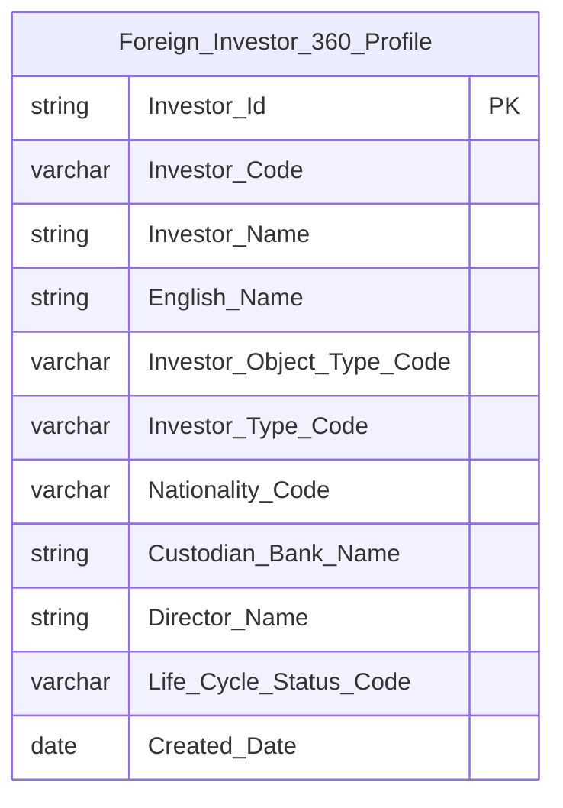

**Lineage Mart → Báo cáo:**

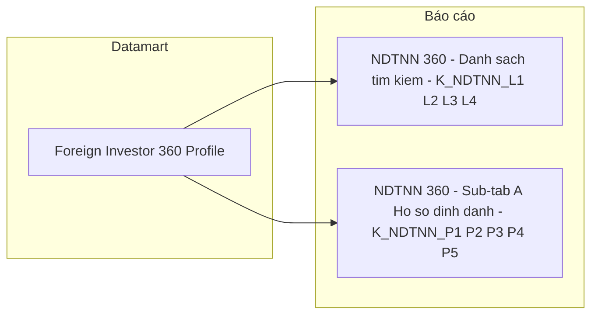

**Bảng grain:**

| Tên bảng | Grain |
|---|---|
| Foreign Investor 360 Profile | 1 row = 1 NĐT NN (trạng thái mới nhất) |

---

#### Sub-tab B: Biến động tài sản — READY

> Phân loại: **Phân tích**
> Atomic: `Foreign Investor Stock Portfolio Snapshot` (FIMS.CATEGORIESSTOCK) — **READY**

**Mockup:**

```
GIÁ TRỊ DANH MỤC HIỆN TẠI
125,000 B

LỊCH SỬ BIẾN ĐỘNG TÀI SẢN (12 THÁNG)
Line chart — Trục X: T1 đến T12 / Trục Y: Giá trị (tỉ đồng)
```

**Source:** `Fact Foreign Investor Portfolio Snapshot` → `Foreign Investor Dimension`, `Calendar Date Dimension`

**Bảng KPI:**

| KPI ID | Tên | Đơn vị | Tính chất | Công thức / Mô tả |
|---|---|---|---|---|
| K_NDTNN_A1 | Giá trị danh mục hiện tại | Tỉ đồng | Stock (Base) | `SUM(Portfolio Market Value)` WHERE `Investor Dimension Id = selected` AND `Snapshot Date = MAX(Snapshot Date)` |
| K_NDTNN_A2 | Lịch sử giá trị danh mục 12 tháng | Tỉ đồng | Stock (Base) | `SUM(Portfolio Market Value)` WHERE `Investor Dimension Id = selected` GROUP BY Snapshot Date, lấy 12 tháng gần nhất |

**Star Schema:**

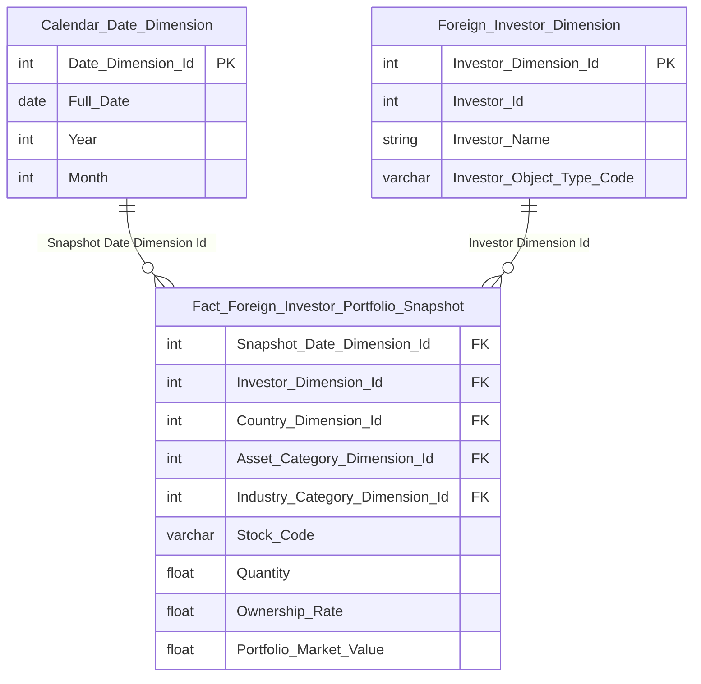

**Lineage Mart → Báo cáo:**

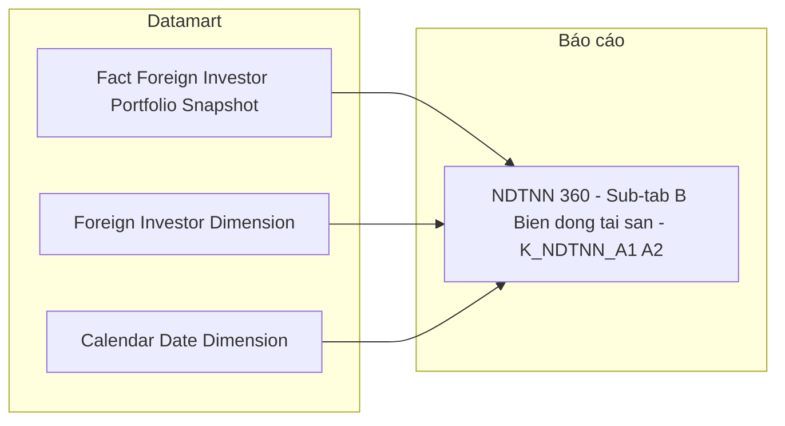

**Bảng grain:**

| Tên bảng | Grain |
|---|---|
| Fact Foreign Investor Portfolio Snapshot | 1 row = 1 NĐT NN × 1 mã tài sản × 1 tháng snapshot |
| Foreign Investor Dimension | 1 row = 1 NĐT NN (SCD2) |
| Calendar Date Dimension | 1 row = 1 ngày (ngày cuối tháng = Snapshot Date) |

---

#### Sub-tab C: Lịch sử tuân thủ — READY

> Phân loại: **Tác nghiệp**
> Atomic: `Surveillance Enforcement Case` (TT.GS_HO_SO) + `Surveillance Enforcement Decision` (TT.GS_VAN_BAN_XU_LY) — **READY**

**Mockup:**

| NGÀY QUYẾT ĐỊNH | PHÂN LOẠI | NỘI DUNG / TRÍCH YẾU | MỨC ĐỘ | TRẠNG THÁI |
|:---|:---|:---|:---|:---|
| 15/10/2023 | REMINDER | Chậm báo cáo tỷ trọng sở hữu | LOW | Resolved |
| 12/05/2023 | ADMINISTRATIVE SANCTION | Giao dịch không công bố đúng thời hạn | MEDIUM | Penalty Paid |

**Source:** `Investor Compliance History` — denormalize từ `Surveillance Enforcement Case` + `Surveillance Enforcement Decision`, filter theo Investor Code = NĐT đang chọn.

**Bảng KPI:**

| KPI ID | Tên | Tính chất | Mô tả — column và Atomic source thực tế |
|---|---|---|---|
| K_NDTNN_C1 | Ngày quyết định | Attribute | `Decision Date` — từ `surveil_nfrc_dcsn.vln_rpt_dt` |
| K_NDTNN_C2 | Phân loại | Attribute | `Decision Status Code` (scheme TT_CASE_STATUS) — loại hình quyết định xử lý (nhắc nhở / xử phạt HC...) từ `surveil_nfrc_dcsn.dcsn_st_code` |
| K_NDTNN_C3 | Nội dung / Trích yếu | Attribute | `Penalty Content` — từ `surveil_nfrc_dcsn.pny_cntnt` |
| K_NDTNN_C4 | Mức độ | Attribute | `Case Status Code` (scheme TT_CASE_STATUS) — mức độ hồ sơ từ `surveil_nfrc_case.case_st_code` |
| K_NDTNN_C5 | Trạng thái | Attribute | `Case Status Code` (scheme TT_CASE_STATUS) — tiến độ/kết quả xử lý hồ sơ cha (đã khắc phục / đang xử lý...) từ `surveil_nfrc_case.case_st_code` |

**Schema bảng tác nghiệp:**

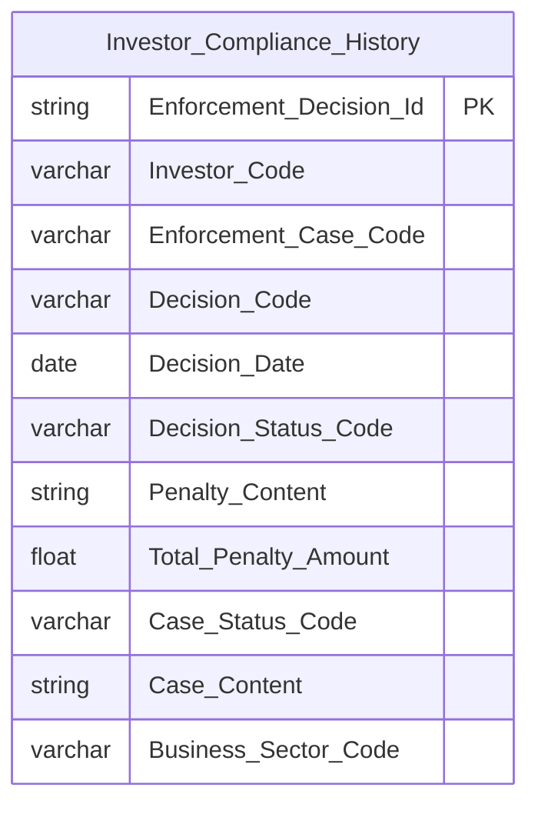

**Lineage Mart → Báo cáo:**

```mermaid
flowchart LR
    subgraph Datamart["Datamart"]
        G1["Investor Compliance History"]
    end
    subgraph RPT["Báo cáo"]
        R1["NDTNN 360 - Sub-tab C Lich su tuan thu - K_NDTNN_C1 C2 C3 C4 C5"]
    end
    G1 --> R1
```

**Bảng grain:**

| Tên bảng | Grain |
|---|---|
| Investor Compliance History | 1 row = 1 quyết định xử phạt / văn bản xử lý của 1 NĐT NN |

---

### Tab: BÁO CÁO

**Slicer chung:** Kỳ báo cáo (Năm / Quý / Tháng), Loại báo cáo

#### Nhóm 10 — Báo cáo thống kê tình hình giao dịch NĐTNN

##### PENDING — Nhóm 10a: Báo cáo thống kê tổng hợp (STT 1–12 nhóm Báo cáo)

**KPI liên quan:** GT mua/bán/ròng theo loại CK (Cổ phiếu, Trái phiếu, CCQ) — tổng hợp theo tháng/quý/năm

**Lý do pending:** Phụ thuộc Atomic SGDCK (khớp lệnh theo loại CK) và VSDC (danh mục lưu ký). Chưa có Atomic entity.

**Atomic cần bổ sung:** `Securities Foreign Trading Record` (SGDCK), `Securities Custody Record` (VSDC)

**Mart dự kiến khi Atomic sẵn sàng:** `Fact Securities Foreign Trading Snapshot` — grain = 1 mã CK × 1 loại CK × 1 kỳ

##### PENDING — Nhóm 10b: Báo cáo chi tiết giao dịch (STT 1–6 nhóm Báo cáo chi tiết)

**KPI liên quan:** Tài khoản GD NĐTNN, Mã CK, KL mua/bán, GT mua/bán per NĐT per kỳ

**Lý do pending:** Cùng nguồn SGDCK. Grain chi tiết hơn Nhóm 10a — cần `Listed Security Dimension`.

**Atomic cần bổ sung:** `Securities Foreign Trading Record` (SGDCK)

**Mart dự kiến khi Atomic sẵn sàng:** `Fact Securities Foreign Trading Snapshot` — grain = 1 NĐT × 1 mã CK × 1 ngày GD

---

### Tab: DATA EXPLORER

**Mô tả tổng thể:** Data Explorer là tab tra cứu và xuất dữ liệu báo cáo nộp vào FIMS theo các biểu mẫu TT51/2021/TT-BTC.

---

#### Nhóm 11a — Data Explorer: Dòng vốn ròng của NĐTNN (STT 16)

**Mockup:**

| Tháng | Quốc gia | Nhà đầu tư | Vốn vào ròng (Tỉ đồng) | Vốn rút ròng (Tỉ đồng) |
|---|---|---|---|---|
| T1/2024 | Hàn Quốc | GD437560 | +3.300 | 0 |
| T1/2024 | Nhật Bản | GD426069 | 0 | -700 |

---

##### PENDING — Nhóm 11a: Data Explorer Dòng vốn ròng của NĐTNN (STT 16)

**KPI liên quan:** K_NDTNN_DE1a, K_NDTNN_DE1b, K_NDTNN_DE1c, K_NDTNN_DE1d, K_NDTNN_DE1e

**Lý do pending:** Toàn bộ 5 dòng BA (STT=16) đánh dấu **Dữ liệu động** — cùng nguồn báo cáo PLIV-TT51 (Ngân hàng lưu ký, kỳ nửa tháng) như Nhóm 3/5, reuse `Fact Foreign Investor Capital Flow` giờ đã PENDING (xem Nhóm 3) — Data Explorer này không còn Fact READY để query.

**Atomic cần bổ sung:** Xem Nhóm 3 (Member Regulatory Report/Member Report Value — cần xác nhận Report Code báo cáo PLIV-TT51).

**Mart dự kiến:** `Fact Foreign Investor Capital Flow Report` (tên tạm, xem Nhóm 3) — reuse khi sẵn sàng, join `Foreign Investor Dimension` + `Geographic Area Dimension` + `Calendar Date Dimension` (đã READY, dùng chung Nhóm 6).

**Bảng KPI PENDING:**

| KPI ID | Tên KPI | Tính chất | Trạng thái |
|---|---|---|---|
| K_NDTNN_DE1a | Tháng | Chiều | PENDING |
| K_NDTNN_DE1b | Quốc gia | Chiều | PENDING |
| K_NDTNN_DE1c | Nhà đầu tư | Chiều | PENDING |
| K_NDTNN_DE1d | Vốn đầu tư vào ròng | Phái sinh | PENDING |
| K_NDTNN_DE1e | Vốn đầu tư rút ròng | Phái sinh | PENDING |

---

#### Nhóm 11b — Data Explorer: Tổng giá trị danh mục của NĐTNN (READY)

> Phân loại: **Phân tích**
> Atomic: `Foreign Investor Stock Portfolio Snapshot` ← FIMS.CATEGORIESSTOCK — **READY**
> Ghi chú: Reuse `Fact Foreign Investor Portfolio Snapshot` — không tạo bảng Datamart mới

**Mockup:**

| Tháng | Quốc gia | Tên NĐT | Tổng GTDM (Tỉ đồng) |
|---|---|---|---|
| T1/2024 | Hàn Quốc | GD437560 | 4.500 |
| T1/2024 | Nhật Bản | GD426069 | 2.800 |

**Bảng KPI:**

| KPI ID | Tên | Chiều / Measure | Mart | Logic |
|---|---|---|---|---|
| K_NDTNN_DE2a | Tháng | Chiều (SLICER) | Calendar Date Dimension | GROUP BY Calendar Date Dimension.Month — bắt buộc |
| K_NDTNN_DE2b | Quốc gia | Chiều (GROUP BY tùy chọn) | Geographic Area Dimension | GROUP BY Geographic Area Dimension.Geographic Area Name |
| K_NDTNN_DE2c | Tên NĐT | Chiều (GROUP BY tùy chọn) | Foreign Investor Dimension | GROUP BY Foreign Investor Dimension.Investor Name |
| K_NDTNN_DE2d | Tổng giá trị danh mục | Measure | Fact Foreign Investor Portfolio Snapshot | `SUM(Portfolio Market Value)` GROUP BY các chiều đã chọn — Snapshot Date = last_day(selected_month) |

**Source:** `Fact Foreign Investor Portfolio Snapshot` → `Foreign Investor Dimension`, `Geographic Area Dimension`, `Calendar Date Dimension`

**Lineage Mart → Báo cáo:**

```mermaid
flowchart LR
    subgraph Datamart["Datamart"]
        G1["Fact Foreign Investor Portfolio Snapshot"]
        G2["Foreign Investor Dimension"]
        G3["Geographic Area Dimension"]
        G4["Calendar Date Dimension"]
    end
    subgraph RPT["Báo cáo"]
        R1["Tab DATA EXPLORER - Nhom 11b - Tong GTDM"]
    end
    G1 --> R1
    G2 --> R1
    G3 --> R1
    G4 --> R1
```

**Bảng grain:**

| Tên bảng | Grain |
|---|---|
| Fact Foreign Investor Portfolio Snapshot | 1 row = 1 NĐT × 1 mã tài sản × 1 tháng (reuse) |

---

#### Nhóm 12 — Data Explorer Pass-through Báo cáo TT51 (READY)

> Phân loại: **Tác nghiệp**
> Atomic: `Member Regulatory Report` ← FIMS.RPTMEMBER + `Member Report Value` ← FIMS.RPTVALUES + `Report Template` ← FIMS.RPTTEMP — **READY**
> Ghi chú: **26 mẫu biểu** TT51/2021 từ 8 nhóm đối tượng nộp. Thiết kế **1 bảng tác nghiệp Generic** (`NDTNN Regulatory Report Store`) — filter theo `Report Template Code` + `Member Object Type Code` để lấy đúng mẫu biểu.

**Mockup:**

| Loại báo cáo | Kỳ báo cáo | Mã báo cáo | Tên báo cáo | Mã chỉ tiêu | Tên chỉ tiêu | Giá trị |
|---|---|---|---|---|---|---|
| PLV_CTQLQ | Tháng 3/2026 | RPT-001 | Hoạt động QL DMĐT (PLV-TT51) | CT_01 | Tổng tài sản | 1,234,567 |
| PLIII_CTCK | Tháng 3/2026 | RPT-002 | Thống kê danh mục lưu ký (PLIII-TT51) | CT_05 | Số lượng NĐT | 98,765 |

**Bảng KPI:**

| KPI ID | Tên | Tính chất | Mart column | Logic |
|---|---|---|---|---|
| K_NDTNN_DE3 | Loại báo cáo | Attribute | `Report Template Code` | SELECT DISTINCT per `Member Object Type Code` + `Report Template Code` |
| K_NDTNN_DE4 | Kỳ báo cáo | Attribute | `Reporting Period Type Code` + `Period Value` + `Report Year` | SELECT DISTINCT kỳ WHERE `Report Template Code` = selected |
| K_NDTNN_DE5 | Mã báo cáo | Attribute | `Member Regulatory Report Code` | SELECT WHERE `Report Template Code` = selected AND period = selected |
| K_NDTNN_DE6 | Tên báo cáo | Attribute | `Report Template Name` | SELECT WHERE `Report Template Code` = selected |
| K_NDTNN_DE7 | Mã chỉ tiêu | Attribute | `Cell Code` | SELECT WHERE `Member Regulatory Report Code` = selected ORDER BY Cell Code |
| K_NDTNN_DE7b | Tên chỉ tiêu | Attribute | `Cell Name` | SELECT WHERE `Member Regulatory Report Code` = selected AND `Cell Code` = selected |
| K_NDTNN_DE8 | Giá trị | Attribute | `Cell Value` | SELECT WHERE `Member Regulatory Report Code` = selected AND `Cell Code` = selected |

**Schema bảng tác nghiệp:**

```mermaid
erDiagram
    NDTNN_Regulatory_Report_Store {
        string Member_Regulatory_Report_Id PK
        varchar Member_Regulatory_Report_Code
        varchar Report_Template_Code
        string Report_Template_Name
        varchar Member_Object_Type_Code
        varchar Member_Code
        varchar Reporting_Period_Type_Code
        int Period_Value
        int Report_Year
        date Report_Date
        date Submission_Date
        varchar Submission_Status_Code
        varchar Cell_Code
        string Cell_Name
        varchar Cell_Value
    }
```

**Lineage Mart → Báo cáo:**

```mermaid
flowchart LR
    subgraph Datamart["Datamart"]
        G1["NDTNN Regulatory Report Store"]
    end
    subgraph RPT["Báo cáo"]
        R1["Tab DATA EXPLORER - Nhom 12 - 26 mau bieu TT51"]
    end
    G1 --> R1
```

**Bảng grain:**

| Tên bảng | Grain |
|---|---|
| NDTNN Regulatory Report Store | 1 row = 1 lần nộp báo cáo (`Member Regulatory Report`) × 1 chỉ tiêu (`Cell Code`) |

---


### Bổ sung Loại 1 — KPI đã có trong HLD, đổi tên sang K_NDTNN_x

#### Tab: DATA EXPLORER — Nhóm 12 — Pass-through TT51 | Metadata điều hướng

##### PENDING

**KPI liên quan:** K_NDTNN_52 – K_NDTNN_58

**Lý do pending:** Thiếu trong DM — đổi tên từ K_NDTNN_DE3–8 sang K_NDTNN_52–58

**Atomic cần bổ sung:** Atomic `Member Regulatory Report` + `Member Report Value` + `Report Template` (FIMS) — READY

**Mart dự kiến:**
- `NDTNN Regulatory Report Store` — grain: 1 NĐTNN × 1 mẫu BC × 1 kỳ × 1 dòng chỉ tiêu

| KPI ID | Tên KPI | Tính chất | Trạng thái |
|---|---|---|---|
| K_NDTNN_52 | Loại báo cáo | Chiều | PENDING |
| K_NDTNN_53 | Kỳ báo cáo | Chiều | PENDING |
| K_NDTNN_54 | Mã báo cáo | Chiều | PENDING |
| K_NDTNN_55 | Tên báo cáo | Chiều | PENDING |
| K_NDTNN_56 | Mã chỉ tiêu | Chiều | PENDING |
| K_NDTNN_57 | Tên chỉ tiêu | Chiều | PENDING |
| K_NDTNN_58 | Giá trị | Cơ sở | PENDING |

---
### Bổ sung Loại 2 — BA NDTNN (99 dòng, trạng thái mapping trống)

#### Tab: BÁO CÁO — Nhóm — Báo cáo thống kê biểu chi tiết

##### PENDING

**KPI liên quan:** K_NDTNN_143 – K_NDTNN_148

**Lý do pending:** Chưa thiết kế Atomic source cho tab Báo cáo NĐTNN

**Atomic cần bổ sung:** Atomic `Securities Foreign Trading Record` (SGDCK)

**Mart dự kiến:**
- `Fact Securities Foreign Trading Snapshot` — grain: 1 mã CK × 1 ngày GD

| KPI ID | Tên KPI | Tính chất | Trạng thái |
|---|---|---|---|
| K_NDTNN_143 | Tài khoản giao dịch NĐTNN | Chiều | PENDING |
| K_NDTNN_144 | Mã CK | Chiều | PENDING |
| K_NDTNN_145 | KL mua chứng khoán | Phái sinh | PENDING |
| K_NDTNN_146 | KL bán CK | Phái sinh | PENDING |
| K_NDTNN_147 | GT mua chứng khoán | Phái sinh | PENDING |
| K_NDTNN_148 | GT bán chứng khoán | Phái sinh | PENDING |

#### Tab: BÁO CÁO — Nhóm — Báo cáo thống kê tình hình giao dịch

##### PENDING

**KPI liên quan:** K_NDTNN_131 – K_NDTNN_142

**Lý do pending:** Chưa thiết kế Atomic source cho tab Báo cáo NĐTNN

**Atomic cần bổ sung:** Atomic `Securities Foreign Trading Record` (SGDCK)

**Mart dự kiến:**
- `Fact Securities Foreign Trading Snapshot` — grain: 1 mã CK × 1 ngày GD

| KPI ID | Tên KPI | Tính chất | Trạng thái |
|---|---|---|---|
| K_NDTNN_131 | Cổ phiếu - GT NĐTNN mua chứng khoán (triệu VNĐ) | Phái sinh | PENDING |
| K_NDTNN_132 | Cổ phiếu - GT NĐTNN bán chứng khoán (triệu VNĐ) | Phái sinh | PENDING |
| K_NDTNN_133 | Cổ phiếu - GT NĐTNN mua/bán ròng chứng khoán (triệu VNĐ) | Phái sinh | PENDING |
| K_NDTNN_134 | Trái phiếu - GT NĐTNN mua chứng khoán (triệu VNĐ) | Phái sinh | PENDING |
| K_NDTNN_135 | Trái phiếu - GT NĐTNN bán chứng khoán (triệu VNĐ) | Phái sinh | PENDING |
| K_NDTNN_136 | Trái phiếu - GT NĐTNN mua/bán ròng chứng khoán (triệu VNĐ) | Phái sinh | PENDING |
| K_NDTNN_137 | CCQ - GT NĐTNN mua chứng khoán (triệu VNĐ) | Phái sinh | PENDING |
| K_NDTNN_138 | CCQ - GT NĐTNN bán chứng khoán (triệu VNĐ) | Phái sinh | PENDING |
| K_NDTNN_139 | CCQ - GT NĐTNN mua/bán ròng chứng khoán (triệu VNĐ) | Phái sinh | PENDING |
| K_NDTNN_140 | Tổng - GT NĐTNN mua chứng khoán (triệu VNĐ) | Phái sinh | PENDING |
| K_NDTNN_141 | Tổng - GT NĐTNN bán chứng khoán (triệu VNĐ) | Phái sinh | PENDING |
| K_NDTNN_142 | Tổng - GT NĐTNN mua/bán ròng chứng khoán (triệu VNĐ) | Phái sinh | PENDING |

#### Tab: DANH MỤC — Nhóm — Danh mục

##### PENDING

**KPI liên quan:** K_NDTNN_98 – K_NDTNN_119

**Lý do pending:** Chưa thiết kế đầy đủ cho tab Danh mục

**Atomic cần bổ sung:** Atomic `Foreign Investor Stock Portfolio Snapshot` (FIMS) + `Public Company Foreign Ownership Limit` (IDS)

**Mart dự kiến:**
- `Fact Foreign Investor Portfolio Snapshot` + `Fact Foreign Ownership Snapshot`

| KPI ID | Tên KPI | Tính chất | Trạng thái |
|---|---|---|---|
| K_NDTNN_98 | Tổng giá trị danh mục | Phái sinh | PENDING |
| K_NDTNN_99 | Loại hình nhà đầu tư | Chiều | PENDING |
| K_NDTNN_100 | Tổng giá trị danh mục của cá nhân | Phái sinh | PENDING |
| K_NDTNN_101 | Tổng giá trị danh mục của quỹ | Phái sinh | PENDING |
| K_NDTNN_102 | Tổng giá trị danh mục của tổ chức khác quỹ | Phái sinh | PENDING |
| K_NDTNN_103 | Top 5 quốc gia | Phái sinh | PENDING |
| K_NDTNN_104 | Top 5 NĐT | Phái sinh | PENDING |
| K_NDTNN_105 | Giá trị tài sản | Phái sinh | PENDING |
| K_NDTNN_106 | Loại tài sản | Chiều | PENDING |
| K_NDTNN_107 | Cổ phiếu, CCQ niêm yết | Phái sinh | PENDING |
| K_NDTNN_108 | Trái phiếu | Phái sinh | PENDING |
| K_NDTNN_109 | Upcom | Phái sinh | PENDING |
| K_NDTNN_110 | Giá trị vốn góp, mua cổ phần, quỹ thành viên và chứng khoán khác | Phái sinh | PENDING |
| K_NDTNN_111 | Tiền và tương đương với tiền | Phái sinh | PENDING |
| K_NDTNN_112 | Nhóm ngành | Chiều | PENDING |
| K_NDTNN_113 | Tỷ trọng theo ngành | Phái sinh | PENDING |
| K_NDTNN_114 | Tỷ lệ sở hữu (theo mã CK) | Cơ sở | PENDING |
| K_NDTNN_115 | Room còn lại (theo mã CK) | Phái sinh | PENDING |
| K_NDTNN_116 | Room tối đa | Cơ sở | PENDING |
| K_NDTNN_117 | Danh sách cạn kiệt room | Phái sinh | PENDING |
| K_NDTNN_118 | Room theo ngành (%) | Phái sinh | PENDING |
| K_NDTNN_119 | Room còn lại (cổ phiếu) | Phái sinh | PENDING |

#### Tab: DATA EXPLORER — Nhóm — Dòng vốn ròng của NĐTNN

##### PENDING

**KPI liên quan:** K_NDTNN_149 – K_NDTNN_153

**Lý do pending:** Chưa thiết kế từng chỉ tiêu chi tiết cho Data Explorer

**Atomic cần bổ sung:** Atomic `Member Report Value` (FIMS) + `Foreign Investor Capital Flow` (FIMS)

**Mart dự kiến:**
- `NDTNN Regulatory Report Store` + `Fact Foreign Investor Capital Flow`

| KPI ID | Tên KPI | Tính chất | Trạng thái |
|---|---|---|---|
| K_NDTNN_149 | Tháng | Chiều | PENDING |
| K_NDTNN_150 | Quốc gia | Phái sinh | PENDING |
| K_NDTNN_151 | Nhà đầu tư | Phái sinh | PENDING |
| K_NDTNN_152 | Vốn đầu tư vào ròng | Phái sinh | PENDING |
| K_NDTNN_153 | Vốn đầu tư rút ròng | Phái sinh | PENDING |

#### Tab: DATA EXPLORER — Nhóm — Tổng giá trị danh mục của NĐTNN

##### PENDING

**KPI liên quan:** K_NDTNN_154 – K_NDTNN_157

**Lý do pending:** Chưa thiết kế từng chỉ tiêu chi tiết cho Data Explorer

**Atomic cần bổ sung:** Atomic `Member Report Value` (FIMS) + `Foreign Investor Capital Flow` (FIMS)

**Mart dự kiến:**
- `NDTNN Regulatory Report Store` + `Fact Foreign Investor Capital Flow`

| KPI ID | Tên KPI | Tính chất | Trạng thái |
|---|---|---|---|
| K_NDTNN_154 | Tháng | Chiều | PENDING |
| K_NDTNN_155 | Quốc gia | Phái sinh | PENDING |
| K_NDTNN_156 | Tên NĐT | Phái sinh | PENDING |
| K_NDTNN_157 | Tổng giá trị danh mục | Phái sinh | PENDING |

#### Tab: GIAO DỊCH — Nhóm — Giao dịch

##### PENDING

**KPI liên quan:** K_NDTNN_59 – K_NDTNN_81

**Lý do pending:** Chưa thiết kế Atomic source chi tiết cho giao dịch NĐTNN (SGDCK)

**Atomic cần bổ sung:** Atomic `Securities Foreign Trading Record` (SGDCK)

**Mart dự kiến:**
- `Fact Securities Foreign Trading Snapshot` — grain: 1 mã CK × 1 ngày GD

| KPI ID | Tên KPI | Tính chất | Trạng thái |
|---|---|---|---|
| K_NDTNN_59 | Tỷ lệ tham gia | Phái sinh | PENDING |
| K_NDTNN_60 | Tổng giá trị mua của NĐTNN | Phái sinh | PENDING |
| K_NDTNN_61 | Tổng giá trị bán của NĐTNN | Phái sinh | PENDING |
| K_NDTNN_62 | Tổng giá trị giao dịch toàn thị trường | Phái sinh | PENDING |
| K_NDTNN_63 | Tăng trưởng NĐT mới | Phái sinh | PENDING |
| K_NDTNN_64 | Tăng trưởng NĐT mới là cá nhân | Phái sinh | PENDING |
| K_NDTNN_65 | Tăng trưởng NĐT mới là tổ chức | Phái sinh | PENDING |
| K_NDTNN_66 | Giá trị mua/bán ròng | Phái sinh | PENDING |
| K_NDTNN_67 | Ngành | Chiều | PENDING |
| K_NDTNN_68 | Mã CK | Chiều | PENDING |
| K_NDTNN_69 | Lũy kế mua/bán ròng | Phái sinh | PENDING |
| K_NDTNN_70 | Top ngành bán ròng | Phái sinh | PENDING |
| K_NDTNN_71 | Top ngành mua ròng | Phái sinh | PENDING |
| K_NDTNN_72 | Top mã bán ròng | Phái sinh | PENDING |
| K_NDTNN_73 | Top mã mua ròng | Phái sinh | PENDING |
| K_NDTNN_74 | Tỷ trọng giao dịch theo ngày | Phái sinh | PENDING |
| K_NDTNN_75 | Tổng giá trị giao dịch NĐTNN | Phái sinh | PENDING |
| K_NDTNN_76 | Tổng giá trị mua của NĐTNN | Phái sinh | PENDING |
| K_NDTNN_77 | Tổng giá trị bán của NĐTNN | Phái sinh | PENDING |
| K_NDTNN_78 | Tổng giá trị giao dịch toàn thị trường | Phái sinh | PENDING |
| K_NDTNN_79 | Tỷ trọng TB phiên | Phái sinh | PENDING |
| K_NDTNN_80 | Tỷ trọng theo ngành | Phái sinh | PENDING |
| K_NDTNN_81 | Top mã tỷ trọng cao | Phái sinh | PENDING |

#### Tab: GIÁM SÁT DÒNG VỐN — Nhóm — Giám sát dòng vốn

##### PENDING

**KPI liên quan:** K_NDTNN_82 – K_NDTNN_97

**Lý do pending:** Chưa thiết kế đầy đủ cho tab Giám sát dòng vốn

**Atomic cần bổ sung:** Atomic `Foreign Investor Capital Flow` (FIMS) + `Securities Foreign Trading Record` (SGDCK)

**Mart dự kiến:**
- `Fact Foreign Investor Capital Flow` + `Fact Securities Foreign Trading Snapshot`

| KPI ID | Tên KPI | Tính chất | Trạng thái |
|---|---|---|---|
| K_NDTNN_82 | Dòng tiền ròng | Phái sinh | PENDING |
| K_NDTNN_83 | Dòng tiền vào | Phái sinh | PENDING |
| K_NDTNN_84 | Dòng tiền ra | Phái sinh | PENDING |
| K_NDTNN_85 | Dòng vốn ròng | Phái sinh | PENDING |
| K_NDTNN_86 | Loại hình NĐTNN | Chiều | PENDING |
| K_NDTNN_87 | Quốc gia | Chiều | PENDING |
| K_NDTNN_88 | Quỹ | Phái sinh | PENDING |
| K_NDTNN_89 | Cá nhân | Phái sinh | PENDING |
| K_NDTNN_90 | Tổ chức khác quỹ | Phái sinh | PENDING |
| K_NDTNN_91 | Top 5 quốc gia vào ròng | Phái sinh | PENDING |
| K_NDTNN_92 | Top 5 quốc gia rút ròng | Phái sinh | PENDING |
| K_NDTNN_93 | Top 5 NĐT vào ròng | Phái sinh | PENDING |
| K_NDTNN_94 | Top 5 NĐT  rút ròng | Phái sinh | PENDING |
| K_NDTNN_95 | Dòng tiền ròng | Phái sinh | PENDING |
| K_NDTNN_96 | Giá trị mua/bán ròng | Phái sinh | PENDING |
| K_NDTNN_97 | Điểm đóng cửa chỉ số | Cơ sở | PENDING |

#### Tab: NĐTNN 360 — Nhóm — NĐT 360

##### PENDING

**KPI liên quan:** K_NDTNN_120 – K_NDTNN_130

**Lý do pending:** Chưa thiết kế đầy đủ cho tab NĐTNN 360

**Atomic cần bổ sung:** Atomic `Foreign Investor` (FIMS) + `Member Regulatory Report` (FIMS)

**Mart dự kiến:**
- `Foreign Investor 360 Profile` (tác nghiệp)

| KPI ID | Tên KPI | Tính chất | Trạng thái |
|---|---|---|---|
| K_NDTNN_120 | Quốc tịch | Cơ sở | PENDING |
| K_NDTNN_121 | Mã số giao dịch | Cơ sở | PENDING |
| K_NDTNN_122 | Ngân hàng lưu ký | Cơ sở | PENDING |
| K_NDTNN_123 | Loại hình nhà đầu tư | Cơ sở | PENDING |
| K_NDTNN_124 | Đại diện giao dịch | Cơ sở | PENDING |
| K_NDTNN_125 | Tổng giá trị danh mục | Cơ sở | PENDING |
| K_NDTNN_126 | Ngày quyết định | Chiều | PENDING |
| K_NDTNN_127 | Phân loại | Chiều | PENDING |
| K_NDTNN_128 | Nội dung/ Trích yếu | Cơ sở | PENDING |
| K_NDTNN_129 | Mức độ | Cơ sở | PENDING |
| K_NDTNN_130 | Trạng thái | Cơ sở | PENDING |

## Section 3 — Mô hình tổng thể (READY only)

```mermaid
graph TB
    classDef dim fill:#E6F1FB,stroke:#185FA5,color:#0C447C
    classDef fact fill:#FAECE7,stroke:#993C1D,color:#4A1B0C
    classDef oper fill:#E8F5E9,stroke:#2E7D32,color:#1B5E20

    DIM_DATE["Calendar Date Dimension"]:::dim
    DIM_INVESTOR["Foreign Investor Dimension"]:::dim
    DIM_GEO["Geographic Area Dimension"]:::dim
    DIM_ASSET["Asset Category Dimension"]:::dim
    DIM_PUBCO["Public Company Dimension"]:::dim

    FACT_TRADE["Fact Securities Foreign Trading Snapshot"]:::fact
    FACT_MKTIDX["Fact Market Index Snapshot"]:::fact

    OPR_PROFILE["Foreign Investor 360 Profile"]:::oper
    OPR_COMPLY["Investor Compliance History"]:::oper
    OPR_REPORT["NDTNN Regulatory Report Store"]:::oper

    DIM_DATE --> FACT_TRADE
    DIM_PUBCO --> FACT_TRADE

    DIM_DATE --> FACT_MKTIDX
```

> **Ghi chú:** `Foreign Investor Dimension`, `Geographic Area Dimension`, `Asset Category Dimension` tạm thời không xuất hiện trong graph này vì Fact duy nhất dùng chúng (`Fact Foreign Investor Portfolio Snapshot`, Nhóm 6) đã chuyển PENDING — xem O_NDTNN_21. Các Dimension này vẫn READY (dùng chung Nhóm 2/4/9), chỉ chưa có Fact READY nào join tới ở trạng thái hiện tại. `Industry Category Dimension` (tên cũ) đã bỏ hẳn khỏi mô hình — Nhóm 8 (nơi duy nhất định nghĩa entity này) đã chuyển sang reuse `Public Company Dimension` thay thế (xem O_NDTNN_12). `Fact Foreign Ownership Snapshot` (tên cũ, entity ảo) đã bỏ khỏi mô hình — Nhóm 9 (nơi duy nhất định nghĩa Fact này) đã chuyển 100% PENDING, thay bằng `Fact Public Company Foreign Ownership Snapshot` (xem O_NDTNN_21/O_NDTNN_22).

### Bảng Phân tích (Star Schema)

| Tên bảng Datamart | Mô tả | Fact Pattern | Grain | Nguồn Atomic chính |
|---|---|---|---|---|
| Fact Securities Foreign Trading Snapshot | Snapshot giá trị mua/bán của NĐTNN theo mã CK và toàn thị trường theo ngày | Fact Snapshot | 1 mã CK × 1 ngày giao dịch | Securities Trade (ORDERTRADE) |
| Fact Market Index Snapshot | Snapshot chỉ số thị trường (VN-Index/HNX-Index/UPCOM-Index) cuối phiên theo ngày | Fact Snapshot | 1 chỉ số × 1 ngày (ETL lấy bản ghi cuối phiên) | Market Index Snapshot (MDDS.JAD_MARKETINFOR) |

### Bảng Tác nghiệp (Denormalized)

| Tên bảng Datamart | Mô tả | Grain | Nguồn Atomic chính |
|---|---|---|---|
| Foreign Investor 360 Profile | Hồ sơ định danh 360° của NĐTNN — trạng thái mới nhất | 1 row = 1 NĐT NN (trạng thái mới nhất) | Foreign Investor (FIMS) + Custodian Bank (FIMS) |
| Investor Compliance History | Lịch sử tuân thủ và xử phạt của NĐTNN | 1 row = 1 quyết định xử phạt per NĐT | Surveillance Enforcement Case + Decision (Thanh Tra) |
| NDTNN Regulatory Report Store | Generic store 26 mẫu biểu báo cáo TT51/2021 | 1 row = 1 lần nộp × 1 chỉ tiêu (Cell Code) | Member Regulatory Report + Report Value + Template (FIMS) |

### Bảng Dimension

*Tất cả Dimension áp dụng SCD Type 4A.*

| Tên bảng Datamart | Mô tả | Grain | Nguồn Atomic chính | Conformed |
|---|---|---|---|---|
| Calendar Date Dimension | Lịch ngày — ETL tự sinh trên mart | 1 row = 1 ngày | ETL generated | Có |
| Foreign Investor Dimension | Thông tin định danh NĐT nước ngoài | 1 row = 1 NĐT NN (SCD2) | Foreign Investor (FIMS) | Có |
| Geographic Area Dimension | Thông tin quốc gia / quốc tịch | 1 row = 1 quốc gia (SCD2) | Geographic Area (FIMS) | Có |
| Asset Category Dimension | Loại hình tài sản đầu tư (5 giá trị) | 1 row = 1 loại tài sản (SCD2) | Classification Value (FIMS_SECURITIES_TYPE) | Không |
| Public Company Dimension | Công ty đại chúng — mã CK + nhóm ngành (đệm Classification Business Line Name qua join Business Line Level 1/2 Code) | 1 row = 1 công ty đại chúng (SCD2) | Public Company (IDS.COMPANY_PROFILES) + Classification Business Line (IDS.CATEGORIES) | Có |

---

## Section 4 — Reuse Analysis

`Datamart/datamart_model.yaml` chưa có entity nào của module NDTNN tại thời điểm thiết kế — toàn bộ bảng là `new`, trừ `Calendar Date Dimension` (Lớp 1 — Conformed Dimension Whitelist, luôn reuse `cdr_dt_dim`).

| Datamart Entity | datamart_table | reuse_status | Ghi chú |
|---|---|---|---|
| Fact Securities Foreign Trading Snapshot | fct_scr_forgn_trd_snpst | new | Chưa có trong master — nguồn Securities Trade (ORDERTRADE), grain mở rộng 1 mã CK × 1 ngày (Nhóm 2) |
| Fact Foreign Investor Portfolio Snapshot | fct_forgn_invtr_port_snpst | n/a | **Bỏ khỏi Section 3/4** — Nhóm 6 (nơi duy nhất định nghĩa Fact này) đã chuyển 100% PENDING vì Atomic nguồn sai (entity không tồn tại) + Dữ liệu động. Chờ thiết kế lại theo generic store TT51 — xem O_NDTNN_21 |
| Fact Public Company Foreign Ownership Snapshot | fct_pc_forgn_ownr_snpst | n/a | **Bỏ khỏi Section 3/4** — Nhóm 9 (nơi duy nhất định nghĩa Fact này) đã chuyển 100% PENDING: BA yêu cầu nguồn báo cáo BM67 VSDC (chưa số hoá) thay vì entity IDS/FIMS đã có sẵn — xem O_NDTNN_21/O_NDTNN_22 |
| Fact Market Index Snapshot | fct_mkt_idx_snpst | new | Chưa có trong master — nguồn Market Index Snapshot (MDDS.JAD_MARKETINFOR), phục vụ Nhóm 5 (K_NDTNN_24b) |
| Foreign Investor 360 Profile | opr_forgn_invtr_360_prfl | new | Chưa có trong master |
| Investor Compliance History | opr_invtr_cmpl_hist | new | Chưa có trong master |
| NDTNN Regulatory Report Store | opr_ndtnn_rgltr_rpt_str | new | Chưa có trong master |
| Calendar Date Dimension | cdr_dt_dim | reuse | Conformed Dim toàn hệ thống — đã có sẵn từ module khác |
| Foreign Investor Dimension | dim_forgn_invtr | new | Chưa có trong master |
| Geographic Area Dimension | dim_geo_area | new | Chưa có trong master |
| Asset Category Dimension | dim_asst_ctg | new | Chưa có trong master |
| Public Company Dimension | dim_pub_co | new | Chưa có trong master — nguồn Public Company (IDS.COMPANY_PROFILES) + Classification Business Line (IDS.CATEGORIES), dùng chung Nhóm 2, 8 và Nhóm 9 |

---

## Section 5 — Vấn đề mở

| ID | Vấn đề | Giả định hiện tại | KPI liên quan | Trạng thái |
|---|---|---|---|---|
| O_NDTNN_1 | **Registration Date — nguồn sai:** Thiết kế cũ dùng `FIMS.INVESTOR.DateCreated` làm Registration Date. BA xác nhận nguồn thực tế là báo cáo định kỳ PLVI-TT51 (VSDC, kỳ tháng), không phải FIMS.INVESTOR. | Đã đổi Box 2–4 (Nhóm 1) sang PENDING, chờ xác nhận generic store TT51 tương ứng — xem Nhóm 1 Section 2. | K_NDTNN_5–7 | Closed — nguồn xác định lại, PENDING chờ Atomic |
| O_NDTNN_2 | **Investor Object Type mapping:** `FIMS.INVESTOR.ObjectType` là INT (1=Cá nhân / 2=Tổ chức). Không còn áp dụng cho K_NDTNN_6/7 (đã đổi nguồn sang báo cáo VSDC — phân loại Cá nhân/Tổ chức lấy trực tiếp từ Dòng báo cáo, không qua ObjectType). Giữ lại tham khảo nếu sau này cần đối chiếu chéo với FIMS.INVESTOR. | Không áp dụng cho thiết kế hiện tại của K_NDTNN_6/7. | K_NDTNN_6, K_NDTNN_7 | Closed — không còn áp dụng |
| O_NDTNN_3a | **Tỷ lệ tham gia + GT mua/bán/toàn TT (STT 1–4):** Atomic `Securities Trade` (ORDERTRADE.TRADE_BOOK_HOSE/HNX) đã xác nhận READY. | Đã thiết kế `Fact Securities Foreign Trading Snapshot` — xem Nhóm 1 Box 1 (Section 2), Cụm 1a (Section 1). | K_NDTNN_1–4 | Closed |
| O_NDTNN_3c | **GT mua/bán ròng + Lũy kế + Top ngành/mã (STT 8, 9, 10, 11, 13, 14, 15, 16, 21, 22 — Nhóm 2):** Atomic `Securities Trade` READY (dùng chung Nhóm 1). Ngành xác nhận nguồn `Classification Business Line` (IDS.CATEGORIES), Mã CK join qua `Public Company.Equity Ticker Symbol` (IDS.COMPANY_PROFILES). Lưu ý: BA Mã=22 "Top mã tỷ trọng cao" cấp KPI_ID K_NDTNN_159 (không phải K_NDTNN_22 — số đó đã dùng cho "Giá trị mua/bán ròng" ở Nhóm 5, STT=5). BA dòng không mã "Tỷ trọng TB phiên" cấp K_NDTNN_158. | Đã thiết kế `Fact Securities Foreign Trading Snapshot` (grain mở rộng 1 mã CK × 1 ngày) + `Public Company Dimension` (reuse từ Nhóm 9) — xem Nhóm 2 Section 2. | K_NDTNN_8, 9, 10, 11, 12, 13, 14, 15, 16, 158, 159 | Closed |
| O_NDTNN_3d | **K_NDTNN_17-21 ("Nhóm 3 — Tỷ trọng giao dịch NĐTNN", Tab GIAO DỊCH) không truy được về BA hiện hành:** Đối chiếu lại cột STT thật (cột 0) trong `BA_analyst_NDTNN.csv` — con số "17–21" ghi trong header cũ thực chất là cột **Mã** (mã KPI) của các Dashboard/Data Explorer khác hoàn toàn không liên quan (STT=16 Data Explorer Dòng vốn ròng, STT=17 Data Explorer Tổng giá trị danh mục...), không phải STT của 1 Nhóm "Tỷ trọng giao dịch" nào. Xác nhận đây là thiết kế cũ trước khi BA tái cấu trúc — nội dung 5 KPI (Tỷ trọng TB phiên, Tỷ trọng GD theo ngày, Tỷ trọng theo ngành, Top mã tỷ trọng cao, Tổng GT GD NĐTNN theo ngày) đã được phủ đủ 100% ở Nhóm 2 hiện hành (K_NDTNN_158, K_NDTNN_1 reuse, K_NDTNN_16, K_NDTNN_159, K_NDTNN_4/21). | **Đã xóa** toàn bộ Nhóm 3 "Tỷ trọng giao dịch NĐTNN" (Tab GIAO DỊCH) — cả block chính lẫn block trùng lặp "Bổ sung Loại 1" — nội dung đã có đầy đủ ở Nhóm 2. | K_NDTNN_17, 18, 19, 20, 21 | Closed — đã xóa, nội dung trùng Nhóm 2 |
| O_NDTNN_13 | **`Source_System_Code` thiếu trên nhiều Dimension (lỗi cấu trúc có sẵn từ bản gốc, phát hiện khi chạy Bước 5B mục #3 sau sửa Nhóm 2):** `Foreign_Investor_Dimension`, `Geographic_Area_Dimension`, `Asset_Category_Dimension`, `Industry_Category_Dimension`, và block `Public_Company_Dimension` ở Nhóm 9 (Section 2) đều thiếu trường `Source_System_Code` trong erDiagram — vi phạm checklist erDiagram chuẩn. Đã tự sửa riêng block `Public_Company_Dimension` mới thêm ở Nhóm 2 (Section 2) vì thuộc phạm vi đang xử lý; các Dimension khác chưa sửa vì ngoài phạm vi Nhóm 2. | Chưa sửa — cần rà soát lại toàn bộ erDiagram Dimension trong file khi review đến đúng Nhóm tương ứng (Nhóm 4, 6, 7, 8, 9, NĐT 360). | K_NDTNN_5-7 (PENDING), 26-33, 34-44, 51 | Open — chờ rà soát toàn file |
| O_NDTNN_17 | **Số Nhóm trong Section 2 không khớp STT thật của BA (Tab GIÁM SÁT DÒNG VỐN) — phát hiện khi user chỉ ra 2026-07-22:** Nguyên tắc bắt buộc "Nhóm trong HLD = STT trong BA analyst (tuyệt đối)" bị vi phạm — HLD cũ đánh `Nhóm 4` cho nội dung STT=5 (Tương quan Net Flow & VN-Index) và `Nhóm 5` cho nội dung STT=4 (Dòng vốn đầu tư gián tiếp), đảo ngược thứ tự thật. Cùng lúc phát hiện K_NDTNN_22 (Giá trị mua/bán ròng) và K_NDTNN_24b (Điểm đóng cửa VN-Index) bị PENDING sai: BA độ chi tiết Ngày (không phải tháng như thiết kế cũ), Dữ liệu tĩnh, Atomic `Securities Trade` (K_22, dùng chung Nhóm 1/2) và `Market Index Snapshot` ← MDDS.JAD_MARKETINFOR (K_24b, approved) đều đã READY. | Đã đổi số: Nhóm 4 = STT4 (Dòng vốn đầu tư gián tiếp), Nhóm 5 = STT5 (Tương quan Net Flow & VN-Index). Đã chuyển K_NDTNN_22 và K_NDTNN_24b sang READY (Fact Securities Foreign Trading Snapshot reuse Nhóm 2 + Fact Market Index Snapshot mới). Xóa block "Bổ sung Loại 1" trùng lặp (Tab GIÁM SÁT DÒNG VỐN — Nhóm 4 cũ) vì nội dung đã lỗi thời hoàn toàn. Còn Nhóm 6-9 (đang ghi "không STT" nhưng có STT=6,7,8,9 thật) và Nhóm 12 chưa rà — xem O_NDTNN_18. | K_NDTNN_22, 24b, 25b, 160, 161, 26-33 | Closed — đã đổi số Nhóm 4↔5 và sửa 2 KPI PENDING sai |
| O_NDTNN_18 | **Nghi ngờ lệch STT tương tự ở Nhóm 6-9 và Nhóm 12 — đã xác nhận đúng cho Nhóm 6, 7, 8, 9; còn 12 chưa rà:** Nhóm 6 xác nhận STT=6, Nhóm 7 xác nhận STT=7 (Cơ cấu tài sản), Nhóm 8 xác nhận STT=8 (Phân ngành), Nhóm 9 xác nhận STT=9 (ROOM) — cả 4 đã sửa xong header đúng STT. Nhóm 12 (Data Explorer Pass-through TT51) chưa xác nhận khớp STT nào (nghi ngờ STT=18 theo tên Dashboard "CTQLQ..."). Đây là hệ quả cùng gốc với O_NDTNN_17, cùng phạm vi với O_NDTNN_21 — cần rà khi review tuần tự đến đúng Nhóm. | Đã xử lý Nhóm 6, 7, 8, 9. Chưa xử lý Nhóm 12. | Nhóm 12 | Open — chờ review đến đúng Nhóm |
| O_NDTNN_19 | **K_NDTNN_24b (Điểm đóng cửa VN-Index, Nhóm 5) — chưa xác nhận `Market_Id='10'`+`Market_Code='HOSE'` chỉ trả về đúng 1 chỉ số/ngày:** BA SQL tham khảo chỉ filter `marketId='10'` + `marketCode='HOSE'`, không filter theo loại chỉ số (`Index_Type_Code`/`INDEXTYPECODE`) — scheme `MDDS_INDEX_TYPE` (`classification_schemes.yaml`) tồn tại nhưng `values: []` chưa profile. Giả định hiện tại: combo `Market_Id='10'`+`Market_Code='HOSE'` là duy nhất và tương ứng VN-Index (không có nhiều chỉ số khác cùng combo này trong 1 ngày) — CHƯA xác nhận với BA/profile dữ liệu thật. Nếu 1 ngày có nhiều dòng cùng `Market_Id`+`Market_Code` khác `Index_Time` do nhiều chỉ số khác nhau publish cùng lúc (không chỉ do nhiều lần cập nhật trong phiên) thì công thức `ROW_NUMBER... rn=1` sẽ lấy nhầm chỉ số. | Tạm dùng đúng theo SQL BA (không filter thêm `Index_Type_Code` vì BA không yêu cầu) — cần profile dữ liệu MDDS.JAD_MARKETINFOR thật hoặc hỏi BA xác nhận trước khi go-live. | K_NDTNN_24b | Open — chờ xác nhận profile dữ liệu |
| O_NDTNN_4 | **Industry source — đã xác định là IDS:** BA ghi `IDS - GSĐC` nhưng ngành nghề công ty đại chúng nằm trong `Public Company` (IDS.company_profiles → category_l1_id/l2_id). Atomic READY. Join chain: FIMS.CATEGORIESSTOCK (mã CK) → `Public Company` (IDS, có ngành) → `Industry Category Dimension`. | Thiết kế theo IDS — `Industry Category Dimension` READY. | STT 13–14, Nhóm 8 | Closed |
| O_NDTNN_5 | **[Cập nhật 2026-07-23] Portfolio Market Value source — xác nhận rõ nguyên nhân gốc khi review Nhóm 6:** Atomic `CATEGORIESSTOCK` (nay đã gộp vào entity `Foreign Investor Securities Account`, table_type Fundamental) chỉ có `Current Holding Quantity`/`Current Ownership Rate` (current-state, không phải Snapshot theo tháng) — không có giá trị thị trường tính sẵn, và bản thân entity cũng không đúng grain cho Fact Snapshot theo tháng. Xem O_NDTNN_21 để biết toàn bộ phân tích. | Đã xác nhận: measure "Tổng giá trị danh mục" (Nhóm 6) thực chất là Dữ liệu động, nguồn thật là báo cáo PLIII-TT51 (generic store TT51), không phải tính từ CATEGORIESSTOCK × giá SGDCK như giả định cũ. | K_NDTNN_34–44, A1–A2 | Closed — nguyên nhân xác định lại, xem O_NDTNN_21 |
| O_NDTNN_6 | **Atomic Thanh Tra:** Đã có `Surveillance Enforcement Case` + `Surveillance Enforcement Decision`. Đã thiết kế `Investor Compliance History`. | Đã giải quyết. | K_NDTNN_C1–C5 | Closed |
| O_NDTNN_7 | **FK NĐT trong GS_HO_SO:** Atomic chỉ có `Subject Name` (text tự do — `GS_HO_SO.TEN_DOI_TUONG`) — không có FK sang `FIMS.INVESTOR`. ETL phải resolve qua text matching hoặc lookup bảng khác. | Tạm giả định resolve qua Subject Name match với `INVESTOR.name`. | K_NDTNN_C1–C5 | Open |
| O_NDTNN_8 | **Phân loại và Mức độ trên Sub-tab C:** Mockup hiển thị `REMINDER / ADMINISTRATIVE SANCTION` và `LOW / MEDIUM / HIGH` nhưng Atomic GS_ chỉ có scheme `TT_CASE_STATUS`. | C2 = `Decision Status Code` (`dcsn_st_code`) — loại hình quyết định. C4/C5 = `Case Status Code` (`case_st_code`) — mức độ và tiến độ hồ sơ cha. C4 và C5 cùng cột nguồn nhưng ngữ nghĩa hiển thị khác nhau — BA Thanh Tra xác nhận scheme đủ phân biệt. | K_NDTNN_C2, K_NDTNN_C4, K_NDTNN_C5 | Confirmed |
| O_NDTNN_9 | **[Cập nhật 2026-07-23] Asset Category scheme — không còn áp dụng:** Giả định cũ dùng scheme `FIMS_SECURITIES_TYPE` cho 5 loại tài sản (K_NDTNN_40-44) không còn đúng — đối chiếu BA Nhóm 7 xác nhận toàn bộ measure là Dữ liệu động (nguồn báo cáo PLIII-TT51), Chiều "Loại tài sản" thật sự lấy từ `FIMS.RELATEDPROPERTIES` (không phải `FIMS_SECURITIES_TYPE`) nhưng bảng này cũng chưa được model hóa đúng ngữ cảnh danh mục đầu tư trong Atomic (chỉ có scheme `FIMS_RELATED_PROPERTY` cho ngữ cảnh ủy quyền CBTT/giao dịch, khác hẳn). Xem O_NDTNN_21. | Không dùng `FIMS_SECURITIES_TYPE` — cần entity/scheme Atomic riêng cho phân loại tài sản danh mục đầu tư NĐTNN, xác nhận qua generic store TT51. | K_NDTNN_40–44, 163, 164 | Closed — giả định cũ sai, xem O_NDTNN_21 |
| O_NDTNN_10 | **[Cập nhật 2026-07-23] ROOM source — giả định cũ sai, xem O_NDTNN_22:** Giả định trước đây "IDS.foreign_owner_limit là nguồn chính thức, K_NDTNN_45–49 READY" không còn đúng — rà soát BA STT=9 (Nhóm 9) xác nhận toàn bộ 6/6 dòng đều PENDING, nguồn thật là báo cáo BM67 VSDC (chưa số hoá) hoặc Dữ liệu động, không phải trực tiếp từ IDS.FOREIGN_OWNER_LIMIT/FIMS. | Đã chuyển toàn bộ Nhóm 9 (K_NDTNN_45–50) sang PENDING — xem O_NDTNN_22 để biết chi tiết 2 nguồn khác nhau cùng khái niệm. | K_NDTNN_45–50 | Closed — nguyên nhân xác định lại, xem O_NDTNN_22 |
| O_NDTNN_11 | **[Superseded bởi O_NDTNN_22] Room theo ngành (K_NDTNN_50):** Vấn đề gốc (thiếu nguồn tổng CP lưu hành) không còn là gốc rễ chính — toàn bộ Nhóm 9 đã PENDING vì BA yêu cầu nguồn BM67 VSDC, không riêng K_NDTNN_50. | Không còn áp dụng riêng lẻ — xem O_NDTNN_22 cho toàn bộ Nhóm 9. | K_NDTNN_50 | Closed — superseded bởi O_NDTNN_22 |
| O_NDTNN_12 | **[Đã sửa qua Nhóm 8, 2026-07-23] `Industry Category Dimension` — sai tên field + thiếu 1 bước join, phát hiện khi review Nhóm 2 (2026-07-22):** Header Nhóm 8 (cũ) ghi "Atomic: `Public Company` (IDS.company_profiles + IDS.company_detail)" — `company_detail` không tồn tại trong Atomic (chỉ có `IDS.COMPANY_PROFILES`, xem `DataModel/working/Atomic/lld/IDS/lld_IDS_COMPANY_PROFILES.yaml`, entity `Public Company`, draft). Entity này có `Business Line Level 1/2 Id/Code` (FK, từ `CATEGORY_L1_ID/L2_ID`) — **không tự chứa tên ngành**. Tên ngành thật nằm ở entity riêng `Classification Business Line` (physical_name `cl_business_line`, nguồn `IDS.CATEGORIES` + `ECAT.BUSINESS_LINE_LEVEL_1/2`, draft), có `Classification Business Line Code/Name`. erDiagram cũ tự đặt field `Industry_Category_Code`/`Industry_Category_Name` không khớp attribute thật nào của cả 2 entity trên — vi phạm rule "tên trường erDiagram phải khớp attribute.name YAML". | Nhóm 8 đã sửa: bỏ hẳn `Industry Category Dimension` (tên/field tự đặt sai), **reuse thẳng `Public Company Dimension`** (đã thiết kế đầy đủ ở Nhóm 2, có sẵn cột `Classification_Business_Line_Name` đệm đúng qua join chain 2 bước `Public Company.Business_Line_Level1_Code` → `Classification Business Line.cl_business_line_code`) — không tạo Dimension riêng mới. K_NDTNN_51a (Chiều Nhóm ngành) chuyển READY. Nhóm 9 chưa rà — xem O_NDTNN_21. | K_NDTNN_51a (Nhóm 8, đã sửa); mọi KPI dùng chiều ngành ở Nhóm 9 (chưa rà) | Closed cho Nhóm 8 — còn Nhóm 9 xem O_NDTNN_21 |
| O_NDTNN_14 | **[SUPERSEDED bởi O_NDTNN_20] Header READY/PENDING không đồng nhất text mô tả (phát hiện 2026-07-22, user chỉ ra):** 3 style khác nhau cho cùng 1 cấp heading `##### READY`/`##### PENDING`. Vấn đề gốc không còn áp dụng — xem O_NDTNN_20 (đổi thiết kế: bỏ hẳn header con `##### READY`/`##### PENDING`, gộp 1 bảng KPI duy nhất/Nhóm). | Không còn áp dụng — thiết kế mới không còn header con để "đồng nhất style" nữa, đã thay bằng cột Trạng thái trong 1 bảng KPI chung. | Toàn bộ header READY/PENDING trong file (Nhóm 1-5 đã sửa, còn 6-12 + block Loại 1/2 chờ xử lý — xem O_NDTNN_20) | Closed — superseded bởi thay đổi thiết kế O_NDTNN_20 |
| O_NDTNN_20 | **Thay đổi thiết kế: bỏ tách Block READY/PENDING riêng, gộp 1 bảng KPI duy nhất/Nhóm (2026-07-23, theo yêu cầu user):** Format cũ (`##### READY`/`##### PENDING` header con, bảng KPI READY 6 cột tách biệt bảng KPI PENDING 4 cột) đã đổi thành 1 bảng KPI 7 cột duy nhất cho mọi Nhóm (KPI ID/Tên/Đơn vị/Tính chất/Công thức/Ghi chú/Trạng thái) — dòng PENDING vẫn nằm trong cùng bảng, cột Ghi chú chứa Lý do pending/Atomic cần bổ sung/Mart dự kiến. Đã sửa `section_structure.md` + `SKILL.md` + `naming_conventions.md` (skill `datamart-hld-design`) phản ánh thiết kế mới. | Đã chuyển đổi Nhóm 1-9 sang format mới, đối chiếu lại số lượng BA↔KPI khớp tuyệt đối (Nhóm 1=7, Nhóm 2=16, Nhóm 3=3, Nhóm 4=10, Nhóm 5=3, Nhóm 6=7, Nhóm 7=7, Nhóm 8=2, Nhóm 9=6). Nhóm 10-12 và các block "Bổ sung Loại 1/2" còn lại (Section 2, trước Section 3) vẫn ở format cũ — chuyển đổi khi review tuần tự đến đúng Nhóm/block đó, KHÔNG sửa hàng loạt 1 lần theo yêu cầu user (đúng phong cách review đang áp dụng). | Toàn bộ KPI Nhóm 1-9 (đã format mới); Nhóm 10-12 + block Loại 1/2 (chờ format mới) | Open — chờ áp dụng cho Nhóm 10-12 + block Loại 1/2 khi review tới |
| O_NDTNN_15 | **10 block "Bổ sung Loại 1/2" (trước Section 3) sai cấu trúc + trùng lặp nội dung với Nhóm gốc — phát hiện khi chuẩn hóa header theo yêu cầu user (2026-07-22):** (1) **2 block "Loại 1" còn lại** (DANH MỤC Nhóm 9, DATA EXPLORER Nhóm 12) **trùng lặp hoàn toàn** với Nhóm gốc đã có sẵn phía trên trong Section 2 — cùng KPI_ID, cùng nội dung, chỉ khác format bảng (4 cột chuẩn KPI ID/Tên/Tính chất/Trạng thái vs format cũ). Block thứ 3 (GIAO DỊCH Nhóm 3 — Tỷ trọng GD NĐTNN) đã xóa — xem O_NDTNN_3d. Block thứ 4 (GIÁM SÁT DÒNG VỐN — Nhóm 4/5 Net Flow) đã xóa hẳn vì K_NDTNN_22/24b đã chuyển READY, nội dung PENDING cũ không còn đúng — xem O_NDTNN_17. Block Nhóm 9 đã xóa (2026-07-23) — xem O_NDTNN_22, chỉ còn block Nhóm 12 (DATA EXPLORER) chưa xử lý. Đây chính là nguyên nhân gây ra lỗi trùng K_NDTNN_22 (đã sửa — xem lịch sử: K_NDTNN_22 dùng cho cả "Giá trị mua/bán ròng tháng" ở Nhóm cũ lẫn bị tôi vô tình gán lại cho "Top mã tỷ trọng cao" ở Nhóm 2 khi không kiểm tra đã dùng). (2) **8 block "Loại 2"** (K_NDTNN_59-97, 98-119, 120-130, 131-148, 149-157) dùng header sai cấu trúc `#### Tab: X — Nhóm — Y` (không có STT, không phải con đúng của `### Tab` đã khai báo ở Section 2 phía trên) — vi phạm chuẩn `### Tab` → `#### Nhóm {STT} - {tên}`. Các block này đại diện cho ~99 dòng BA cũ (trạng thái mapping trống) chưa từng được thiết kế đầy đủ, đặt sai vị trí thay vì nằm đúng bên trong Nhóm STT tương ứng. Lưu ý bổ sung (2026-07-22, sau khi sửa Nhóm 3/4/5): block "Loại 2 — Data Explorer Dòng vốn ròng" (K_NDTNN_149-153) trùng lặp với K_NDTNN_DE1a-e (Nhóm 11a, đã giữ nguyên vị trí đúng, giờ PENDING) — cùng 1 khái niệm khai sinh 2 lần. | Đã xóa 2/4 block "Loại 1" (GIAO DỊCH Nhóm 3 — xem O_NDTNN_3d; GIÁM SÁT DÒNG VỐN Nhóm 4/5 — xem O_NDTNN_17) + block Nhóm 9 (2026-07-23 — xem O_NDTNN_22). Còn lại: (a) xóa block "Loại 1" Nhóm 12 sau khi xác nhận Nhóm gốc đã đủ thông tin; (b) di chuyển nội dung 8 block "Loại 2" vào đúng vị trí PENDING bên trong Nhóm STT gốc tương ứng trong Section 2, xóa header `#### Tab: X — Nhóm — Y` sai cấu trúc — riêng "Data Explorer Dòng vốn ròng" (K_NDTNN_149-153) xóa hẳn vì đã trùng K_NDTNN_DE1a-e. Việc này ảnh hưởng toàn bộ Section 2 — nên xử lý theo từng Nhóm khi review tuần tự đến đúng Nhóm đó, KHÔNG sửa hàng loạt 1 lần để tránh gây thêm lỗi trùng ID như đã xảy ra với K_NDTNN_22. | K_NDTNN_52-58 (Loại 1 còn lại — Nhóm 12); K_NDTNN_59-157 (Loại 2, trừ ID đã dùng nơi khác) | Open — chờ xử lý tuần tự theo từng Nhóm |
| O_NDTNN_16 | **`Fact Foreign Investor Capital Flow` toàn bộ measure là Dữ liệu động — phát hiện khi review Nhóm 3 (2026-07-22):** BA đánh dấu Dữ liệu động cho toàn bộ measure "Dòng vốn/tiền vào/ra/ròng" ở Nhóm 3 (STT=3, K_NDTNN_23-25), Nhóm 4 (STT=4, K_NDTNN_26-33), Nhóm 5 phần K_NDTNN_25b (STT=5), và Nhóm 11a Data Explorer (STT=16, K_NDTNN_DE1a-e) — tất cả cùng nguồn báo cáo định kỳ PLIV-TT51/2021/TT-BTC (Ngân hàng lưu ký gửi, kỳ nửa tháng). Thiết kế cũ (`Fact Foreign Investor Capital Flow` ← FIMS.RPTVALUES/RPTMEMBER trực tiếp) không phản ánh đúng gating "Loại dữ liệu" — đã chuyển toàn bộ 4 Nhóm liên quan sang PENDING, xóa Fact khỏi Section 3 (Bảng Phân tích). | Đã chuyển Nhóm 3, 4 (K_NDTNN_26-33), 5 (K_NDTNN_25b), 11a sang PENDING — chờ xác nhận Report Code/Cell Code của báo cáo PLIV-TT51 trong generic store TT51 (Cụm 7) trước khi thiết kế lại Fact. Khai sinh mới K_NDTNN_160/161 (Loại hình NĐTNN, Quốc gia — Chiều dùng filter cho measure PENDING của Nhóm 4). Riêng K_NDTNN_22/24b (Nhóm 5) đã xác nhận Dữ liệu tĩnh + Atomic READY — chuyển sang READY, xem O_NDTNN_17. [Cập nhật 2026-07-23] `Geographic Area` KHÔNG còn READY — xem O_NDTNN_21 (nguồn ECAT, không có entry FIMS). | K_NDTNN_23-25, 25b, 26-33, 160-161, DE1a-e | Closed — đã chuyển PENDING, chờ Atomic |
| O_NDTNN_21 | **[GỐC RỄ LỚN] Entity Atomic ảo `Foreign Investor Stock Portfolio Snapshot` dùng lan rộng nhiều Nhóm + nguồn `FIMS.NATIONAL` cho Geographic Area không tồn tại — phát hiện khi review Nhóm 6 (2026-07-23):** (1) HLD (Cụm 3 cũ, Nhóm 6/7, và tham chiếu ở Nhóm 8/9/Sub-tab B/Nhóm 11b) dùng tên entity `Foreign Investor Stock Portfolio Snapshot` (nguồn `FIMS.CATEGORIESSTOCK`) — entity này KHÔNG tồn tại trong `DataModel/working/Atomic/lld/manifest.yaml` hiện hành. Grep xác nhận `CATEGORIESSTOCK` đã gộp vào entity `Foreign Investor Securities Account` (SECURITIESACCOUNT+CATEGORIESSTOCK, quyết định Data Modeler 2026-07-19, `table_type: Fundamental` — current-state 1 tài khoản × 1 CTCK, KHÔNG phải Fact Snapshot theo tháng, không có `Portfolio Market Value`). (2) HLD dùng nguồn `FIMS.NATIONAL` cho `Geographic Area` — nhưng entity `Geographic Area` approved chỉ có nguồn từ `ECAT.COUNTRY/REGION/PROVINCE_NEW/WARD_NEW`, không có entry FIMS nào — Chiều "Quốc gia NĐTNN" chưa có Atomic nguồn xác nhận. (3) Nhóm 7 xác nhận thêm: toàn bộ 7/7 KPI (không có dòng tĩnh nào) đều Dữ liệu động, và Chiều "Loại tài sản" dùng `FIMS.RELATEDPROPERTIES` nhưng bảng này trong Atomic chỉ model hóa cho ngữ cảnh ủy quyền CBTT/giao dịch (`FIMS_RELATED_PROPERTY`), khác hẳn ngữ cảnh "loại tài sản danh mục đầu tư" — cần entity/scheme Atomic riêng. (4) Nhóm 8 xác nhận thêm: KPI "Tỷ trọng theo ngành" (K_NDTNN_51) cùng gốc rễ thiếu measure giá trị tài sản (không có giá đóng cửa trong FIMS/IDS) — PENDING; riêng Chiều "Nhóm ngành" (K_NDTNN_51a) không phụ thuộc entity ảo này, đã sửa xong và READY qua reuse `Public Company Dimension` (xem O_NDTNN_12). (5) Nhóm 9 xác nhận thêm: `Fact Foreign Ownership Snapshot` (tên cũ) dùng `Public Company Foreign Ownership Limit` (IDS) + entity ảo — sai vì BA yêu cầu nguồn báo cáo BM67 VSDC (chưa số hoá), không phải entity IDS/FIMS đã có sẵn — toàn bộ 6/6 KPI PENDING (xem O_NDTNN_22). (6) Đã sửa phạm vi Nhóm 6, 7, 8, 9 + Cụm 3 (tách 3a/3b/3c) + Cụm 6 (PENDING) trong các đợt này — CHƯA sửa Sub-tab B, Nhóm 11b — các block này vẫn tham chiếu `Fact Foreign Investor Portfolio Snapshot`/entity ảo trong Bảng grain, cần re-verify độc lập khi review đến đúng phần (không suy diễn đã đúng vì Nhóm 6/7/8/9 đã sai). | Đã sửa Nhóm 6 (100% PENDING trừ Chiều Loại hình NĐT) + Nhóm 7 (100% PENDING, khai sinh K_NDTNN_163/164) + Nhóm 8 (1 READY qua reuse Public Company Dimension + 1 PENDING) + Nhóm 9 (100% PENDING, xem O_NDTNN_22) + Section 1 Cụm 3/Cụm 6 + Section 3/4 (xóa `Fact Foreign Investor Portfolio Snapshot`/`Fact Foreign Ownership Snapshot` khỏi bảng Phân tích/Reuse Analysis). Sub-tab B/Nhóm 11b CHƯA sửa — vẫn ở nội dung cũ (sai), chờ review tuần tự đến đúng phần. | K_NDTNN_34-39 (Nhóm 6, đã sửa); K_NDTNN_40-44, 163-164 (Nhóm 7, đã sửa); K_NDTNN_51/51a (Nhóm 8, đã sửa); K_NDTNN_45-50 (Nhóm 9, đã sửa); K_NDTNN_98-119, A1-A2, DE2a-d (Sub-tab B/11b, chưa sửa) | Open — chờ review đến Sub-tab B/11b |
| O_NDTNN_22 | **Nhóm 9 (ROOM) — 2 nguồn khác nhau cùng khái niệm nghiệp vụ, BA ưu tiên báo cáo thủ công BM67 — phát hiện khi review Nhóm 9 (2026-07-23):** BA STT=9 chỉ định rõ nguồn "Room tối đa" và "Tỷ lệ sở hữu (theo mã CK)" là báo cáo **BM67 "Quản lý thông tin nhà đầu tư nước ngoài"** (VSDC, chưa số hoá CSDL cho 2/6 dòng — Loại dữ liệu "Chưa có CSDL - Map biểu mẫu"; 4/6 dòng còn lại "Dữ liệu động"). Tuy nhiên Atomic đã có sẵn 2 entity số hoá tương đương đúng khái niệm: `Public Company Foreign Ownership Limit` (IDS.FOREIGN_OWNER_LIMIT, draft, field `Maximum Foreign Ownership Rate Percentage` = "Room tối đa") và `Foreign Investor Securities Account` (FIMS, draft, `Current Holding Quantity`/`Current Ownership Rate` liên quan "Tỷ lệ sở hữu"). Theo xác nhận Data Modeler (2026-07-23): tuân thủ đúng gate rule theo BA — toàn bộ 6 KPI PENDING, KHÔNG dùng 2 entity IDS/FIMS này để "lách" gate rule dù khái niệm nghiệp vụ khớp, vì đây không phải trường hợp "chưa có Atomic" mà là "BA yêu cầu nguồn báo cáo thủ công khác với entity đã số hoá". | Đã chuyển toàn bộ Nhóm 9 (K_NDTNN_45-50) sang PENDING, ghi rõ trong cột Ghi chú của từng dòng cả nguồn BA yêu cầu (BM67) lẫn entity Atomic tương đương đã có (để không mất thông tin tra cứu). Cần Data Modeler xác nhận thêm: nguồn chính thức cho go-live là BM67 (cần số hoá CSDL mới) hay entity IDS/FIMS đã có (cần đổi lại thiết kế BA). | K_NDTNN_45-50 | Open — chờ Data Modeler xác nhận nguồn go-live chính thức |
