# Data Mart HLD — Phân hệ Nhà Đầu Tư Nước Ngoài (NDTNN)

**Phiên bản:** 2.6
**Ngày:** 22/05/2026

---

## Quy ước trạng thái

| Ký hiệu | Ý nghĩa |
|---|---|
| READY | Atomic đủ — thiết kế đầy đủ |
| PENDING | Atomic chưa có — placeholder + lý do |

---

## Section 1 — Data Lineage: Source → Atomic → Data Mart

##### Cụm 1a: Giao dịch NĐTNN toàn thị trường (Securities Foreign Trading Snapshot)

Phục vụ Tab GIAO DỊCH Nhóm 1 — Box 1 (Tỷ lệ tham gia, Tổng GT mua/bán/toàn thị trường) và Nhóm 2 (Tổng GT mua/bán ròng + Lũy kế + Top ngành/mã). `Securities Dimension` (grain 1 mã CK, SCD4A, Conformed — module: SHARED) thay thế join text-match `Security_Symbol_Code = Equity_Ticker_Symbol` trước đây — xem O_NDTNN_28. **[Cập nhật 2026-07-24]** Nhóm 15 (trước đây dùng chung Dimension này qua Cụm 8) đã chuyển sang bảng Tác nghiệp denormalize, không còn FK tới `Securities Dimension` — xem O_NDTNN_30.

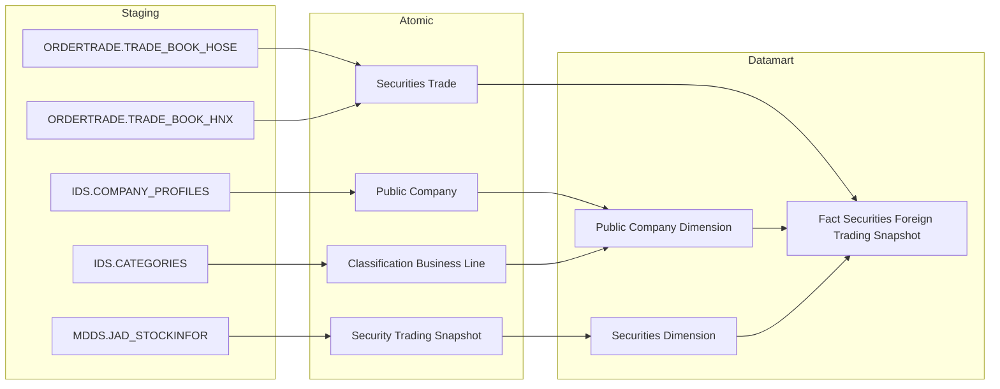

---

##### Cụm 1c: Báo cáo thống kê giao dịch NĐTNN theo loại chứng khoán (Foreign Investor Trading Statistics Report)

Phục vụ Tab BÁO CÁO Nhóm 14 (Báo cáo thống kê tình hình giao dịch NĐTNN theo loại chứng khoán). **Sửa Kịch bản D (2026-07-24) — thay đổi kiến trúc:** BA cột "Chiều dữ liệu" ghi rõ grain báo cáo là "Ngày, Loại CK" (1 ngày × 1 trong 4 nhóm loại CK: Cổ phiếu/Trái phiếu/CCQ/Tổng) — khác hẳn 3 điều kiện lọc độc lập cho từng nhóm loại CK (đặc biệt CCQ dùng `Investor_Type_Code='7000'`, một attribute hoàn toàn khác `Foreign_Investor_Type_Code` mà 9 KPI Cổ phiếu/Trái phiếu/Tổng dùng — không thể filter query-time trên `Foreign_Buy_Value`/`Foreign_Sell_Value` đã pre-aggregate của `Fact Securities Foreign Trading Snapshot`). Đã đánh giá và loại bỏ 3 phương án (Fact riêng cho CCQ — vi phạm 1 báo cáo nhiều Fact; sparse column trên Fact chung — NULL tràn lan; đưa Investor Type vào Securities Dimension — sai bản chất Kimball, đây là thuộc tính per-trade không phải per-mã CK). **Quyết định:** tách thành 1 bảng TÁC NGHIỆP (Operational) riêng — báo cáo này là số liệu tổng hợp đã "đóng gói" sẵn theo từng nhóm loại CK, không cần Star Schema drill-down tự do như Nhóm 1/2 — xem O_NDTNN_24.

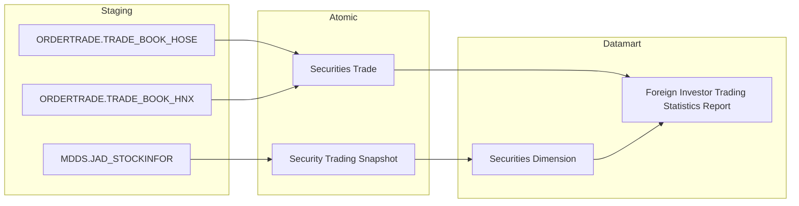

---

##### Cụm 1b: Đăng ký NĐT nước ngoài (Foreign Investor Registration) — PENDING

**Trạng thái:** PENDING — xem Nhóm 1 Box 2–4 (Section 2). Nguồn thực tế là báo cáo định kỳ PLVI-TT51 (VSDC, kỳ tháng), không phải `FIMS.INVESTOR.DateCreated` như thiết kế trước đây. Giữ lại Cụm này ở trạng thái tham khảo — không dùng làm nguồn chính thức cho đến khi xác nhận generic store TT51 tương ứng.

---

##### Cụm 2: Hồ sơ 360° NĐT nước ngoài (Operational Foreign Investor 360 Profile)

Phục vụ Tab NĐTNN 360 — Nhóm 11 (Hồ sơ định danh). **Sửa 2026-07-30:** Nguồn `Custodian Bank` thực tế là **FMS.BANK_MONI** (không phải `FIMS.BANKMONI` — bảng này không tồn tại trong hệ thống nguồn). FK `Foreign Investor.Custodian_Bank_Id` (từ `FIMS.INVESTOR.BankAddId`) đã được người thiết kế Atomic cập nhật trỏ đúng `custodian_bank.custodian_bank_id` (hash `hash_id('FMS.BANK_MONI', BankAddId)`).

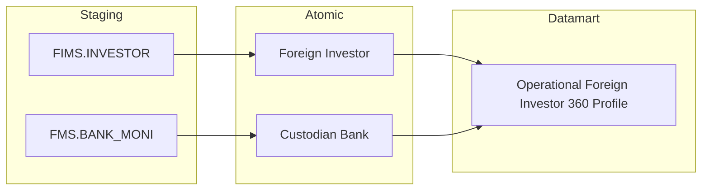

---

##### Cụm 3a: Danh mục đầu tư của NĐTNN (Fact Foreign Investor Portfolio Snapshot) — PENDING

**Trạng thái:** PENDING — xem Nhóm 6 (Section 2). Entity Atomic `Foreign Investor Stock Portfolio Snapshot` ghi trong thiết kế cũ **không tồn tại** trong `DataModel/working/Atomic/lld/manifest.yaml` hiện hành — `FIMS.CATEGORIESSTOCK` thực chất đã gộp vào entity `Foreign Investor Securities Account` (table_type Fundamental, current-state 1 tài khoản × 1 CTCK, KHÔNG phải Fact Snapshot theo tháng, không có `Portfolio Market Value`). Ngoài ra 6/7 KPI của Nhóm 6 đánh dấu Dữ liệu động (nguồn thật là báo cáo PLIII-TT51/2021/TT-BTC, kỳ tháng) — xem chi tiết Nhóm 6. Giữ lại Cụm này ở trạng thái tham khảo — không dùng `Foreign Investor Securities Account` làm nguồn chính thức cho Fact Snapshot này cho đến khi xác nhận nguồn giá trị thị trường danh mục (Portfolio Market Value) qua generic store TT51.

---

##### Cụm 3b: Foreign Investor Dimension / Public Company Dimension (READY — dùng chung nhiều Nhóm)

**Trạng thái:** READY — 2 entity này vẫn READY, dùng chung cho các Nhóm khác của module (Nhóm 2, 4, 9...).

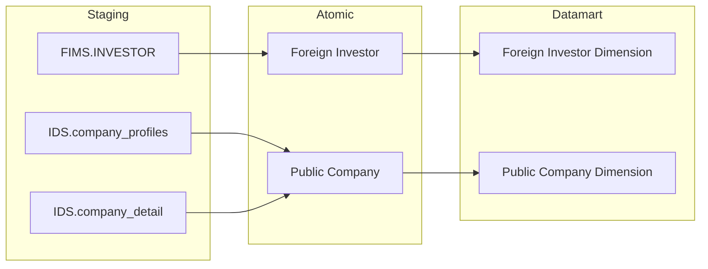

---

##### Cụm 3c: Quốc gia NĐTNN (Geographic Area Dimension) — PENDING

**Trạng thái:** PENDING — thiết kế cũ ghi nguồn `FIMS.NATIONAL` cho `Geographic Area`, nhưng đối chiếu `DataModel/working/Atomic/lld/manifest.yaml`, entity `Geographic Area` (approved) chỉ có nguồn từ `ECAT.COUNTRY/REGION/PROVINCE_NEW/WARD_NEW` — không có entry nào từ `FIMS`/`FIMS.NATIONAL`. Quốc gia/quốc tịch của NĐTNN trong FIMS chưa được xác nhận map vào Atomic `Geographic Area` — cần entity nguồn riêng hoặc xác nhận bảng FIMS thật lưu quốc tịch NĐT (nghi ngờ tên "NATIONAL" trong thiết kế cũ cũng sai/lỗi thời, cần Data Modeler xác nhận tên bảng FIMS thật). Không dùng `Geographic Area` (nguồn ECAT) làm nguồn chính thức cho Chiều "Quốc gia NĐTNN" cho đến khi xác nhận đúng bảng nguồn FIMS.

---

##### Cụm 4: Lịch sử tuân thủ NĐTNN (Operational Investor Compliance History)

Phục vụ Tab NĐTNN 360 — Nhóm 13 (Lịch sử tuân thủ). Atomic từ phân hệ Thanh Tra, nguồn `PENALTY_DECISION*`/`PENALTY_TYPE` — **sửa Kịch bản D** (2026-07-23): nguồn cũ ghi `GS_HO_SO`/`GS_VAN_BAN_XU_LY` (entity `Surveillance Enforcement Case`/`Decision`) không khớp BA thật — xem O_NDTNN_26.

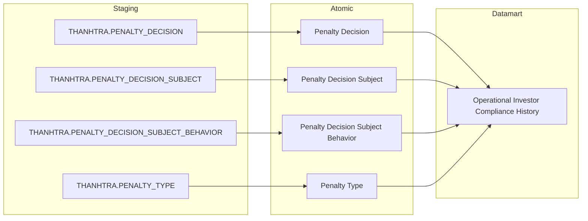

---

##### Cụm 5a: Dòng vốn đầu tư gián tiếp (Foreign Investor Capital Flow) — PENDING

**Trạng thái:** PENDING — xem Nhóm 3, 4, 5 (Section 2) + Nhóm 16 (Data Explorer). Toàn bộ measure "Dòng vốn/tiền vào/ra/ròng" đánh dấu Dữ liệu động — nguồn thực tế là báo cáo định kỳ PLIV-TT51 (Ngân hàng lưu ký gửi, kỳ nửa tháng), chưa thống nhất quy tắc khai thác trong generic store TT51 (Cụm 7). `Foreign Investor` vẫn READY (dùng chung Nhóm 2/4/6/9) — riêng `Geographic Area` giờ cũng PENDING (xem Cụm 3c — nguồn ECAT, không có entry FIMS, không dùng được cho Chiều quốc gia NĐTNN) — không dùng `Member Report Value`/`Member Regulatory Report` làm nguồn chính thức cho Fact động này cho đến khi xác nhận Report Code/Cell Code tương ứng.

---

##### Cụm 5b: Foreign Investor Dimension (READY — dùng chung nhiều Nhóm)

**Trạng thái:** READY — `Foreign Investor` vẫn READY, dùng chung Nhóm 2/4/6/9 + Nhóm 12 (K_NDTNN_A1, xem O_NDTNN_21). Không còn Fact READY nào join tới ở trạng thái hiện tại (Fact chính từng dùng, `Fact Foreign Investor Portfolio Snapshot`, đã chuyển PENDING — xem Cụm 3a/O_NDTNN_21) — Dimension vẫn giữ READY vì bản thân entity Atomic không phụ thuộc trạng thái Fact.

---

##### Cụm 5c: Chỉ số thị trường (Fact Market Index Snapshot)

Phục vụ Tab GIÁM SÁT DÒNG VỐN Nhóm 5 — Điểm đóng cửa VN-Index (K_NDTNN_34). `Market Index Dimension` (grain 1 combo Market_Id+Market_Code, SCD4A) thay thế lưu `Market_Id`/`Market_Code` dạng text trực tiếp trên Fact trước đây — xem O_NDTNN_29. **Sửa 24/07/2026:** Fact (`fct_market_index_snpst`) và Dimension (`market_index_dim`) sở hữu bởi QLKD, NDTNN reuse — xem Cụm 6b `DTM_QLKD_HLD.md`. Fact join `Calendar Date Dimension` (qua `snpst_dt_dim_id`) và `Market Index Dimension` (qua `market_index_dim_id`). **Sửa 24/07/2026 (datamart-review):** Grain vật lý Fact thống nhất **1 chỉ số × 1 ngày** cho cả QLKD lẫn NDTNN (trước đây Fact populate grain 1 tháng — QLKD lấy bản ghi cuối tháng, khiến K_NDTNN_34 filter `WHERE cdr_dt = :pdate` theo ngày bất kỳ trả về rỗng cho mọi ngày không phải cuối tháng). QLKD nay tự filter/JOIN đúng ngày cuối tháng trên Fact grain-ngày này — xem `DTM_QLKD_HLD.md` Cụm 6b.

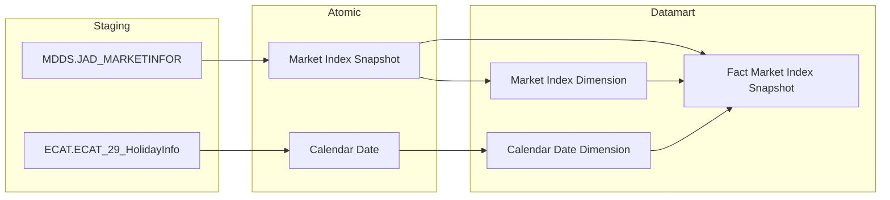

---

##### Cụm 6: Giới hạn sở hữu nước ngoài — ROOM (Fact Public Company Foreign Ownership Snapshot) — PENDING

**Trạng thái:** PENDING — xem Nhóm 9 (Section 2) + O_NDTNN_22. BA STT=9 xác nhận toàn bộ 6/6 dòng nguồn là báo cáo BM67 "Quản lý thông tin nhà đầu tư nước ngoài" (VSDC, chưa số hoá CSDL) hoặc Dữ liệu động — **không dùng** `Public Company Foreign Ownership Limit` (IDS.FOREIGN_OWNER_LIMIT) hay `Foreign Investor Securities Account` (FIMS) dù 2 entity này có sẵn và khớp khái niệm nghiệp vụ (Room tối đa, Ownership Rate). Giữ lại Cụm này ở trạng thái tham khảo — không dùng làm nguồn chính thức cho đến khi Data Modeler xác nhận nguồn go-live là BM67 (cần số hoá) hay entity IDS/FIMS đã có.

---

##### Cụm 7: Báo cáo TT51 — Generic Store (NDTNN Regulatory Report Store) — PENDING

**Trạng thái:** PENDING — xem Nhóm 18 + Nhóm 19-43 (Section 2) + O_NDTNN_25/O_NDTNN_27. Nhóm 18 (STT=18) và 25 Nhóm mới Nhóm 19-43 (STT=19-43, cùng pattern Data Explorer Pass-through PLII/III/IV/V/VI/VII/VIII/IX/X-TT51, TT96) đều xác nhận 100% dòng BA là Dữ liệu động → PENDING theo gate rule, dù `Member Regulatory Report`/`Member Report Value`/`Report Template` (FIMS) đã có LLD draft. Giữ lại Cụm này ở trạng thái tham khảo — không dùng làm nguồn chính thức cho đến khi xác nhận 26 Report Code/Cell Code tương ứng (1 cho mỗi loại báo cáo, cùng gốc rễ Nhóm 3/4/5/6/9/17).

---

##### Cụm 8: Báo cáo chi tiết giao dịch NĐTNN theo tài khoản (Foreign Investor Trading Detail Report)

Phục vụ Tab BÁO CÁO Nhóm 15. **Sửa Kịch bản D (2026-07-24) — thay đổi kiến trúc:** BA cột "Chiều dữ liệu" ghi tắt "Ngày, NĐT" nhưng câu lệnh tham khảo SQL thực tế ghi rõ `GROUP BY Buy_Acct_No, Symbol` (HOSE) / `GROUP BY Buy_account_number, Issue_Code` (HNX) — grain thật vẫn là 1 ngày × 1 Account × 1 Symbol × 1 bên (Buy/Sell), không rút gọn. Đồng thời phát hiện lại đúng pattern grain-mismatch đã sửa ở Nhóm 14 — 2 attribute Investor Type độc lập trên `Securities Trade` (`Foreign_Investor_Type_Code` dùng cho K_NDTNN_84/85, `Investor_Type_Code` dùng cho K_NDTNN_86-89). Nhóm 15 thuộc Tab BÁO CÁO (đóng gói cố định, không cần drill-down tự do) — chuyển từ Phân tích (Star Schema) sang Tác nghiệp (Operational), denormalize hoàn toàn (bỏ FK `Securities Dimension`, bỏ Dimension tài khoản riêng) — xem O_NDTNN_30.

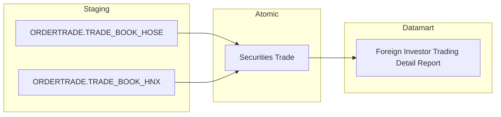

---

## Section 2 — Tổng quan báo cáo

#### Nhóm 1 — KPI Cards tổng quan

**Mockup:**

| Tỷ lệ tham gia | Tăng trưởng NĐT mới | Tăng trưởng NĐT Cá nhân mới | Tăng trưởng NĐT Tổ chức mới |
|:---:|:---:|:---:|:---:|
| **12.4** % | **2,450** Mã | **1,830** Mã | **620** Mã |

---

> Phân loại: **Phân tích**
> Atomic (Box 1): `Securities Trade` ← ORDERTRADE.TRADE_BOOK_HOSE / ORDERTRADE.TRADE_BOOK_HNX — **READY**
> Atomic (Box 2-4): xem dòng PENDING trong bảng KPI dưới đây
> Loại dữ liệu: Dữ liệu tĩnh (Box 1, BA đã chốt logic mapping + SQL tham khảo đầy đủ) / Dữ liệu động (Box 2-4)

**Source:** `Fact Securities Foreign Trading Snapshot` → `Calendar Date Dimension`

**Bảng KPI:**

| KPI ID | Tên | Đơn vị | Tính chất | Công thức / Mô tả | Ghi chú | Trạng thái |
|---|---|---|---|---|---|---|
| K_NDTNN_1 | Tổng giá trị mua của NĐTNN | Tỷ đồng | Cơ sở | `SUM(Foreign_Buy_Value)` GROUP BY `Trade Date Dimension Id` WHERE `Trade Date = :pdate` (SUM xuyên suốt mọi mã CK trong ngày) | Grain Fact = 1 mã CK × 1 ngày (xem Nhóm 2) — Box 1 pre-aggregate SUM lên cấp "1 ngày toàn thị trường" | READY |
| K_NDTNN_2 | Tổng giá trị bán của NĐTNN | Tỷ đồng | Cơ sở | `SUM(Foreign_Sell_Value)` GROUP BY `Trade Date Dimension Id` WHERE `Trade Date = :pdate` (SUM xuyên suốt mọi mã CK trong ngày) | Pre-aggregate như trên | READY |
| K_NDTNN_3 | Tổng giá trị giao dịch toàn thị trường | Tỷ đồng | Cơ sở | `SUM(Total_Market_Value)` GROUP BY `Trade Date Dimension Id` WHERE `Trade Date = :pdate` (SUM xuyên suốt mọi mã CK trong ngày, không lọc theo NĐT) | Pre-aggregate như trên | READY |
| K_NDTNN_4 | Tỷ lệ tham gia | % | Phái sinh | `(K_NDTNN_1 + K_NDTNN_2) × 100 / (K_NDTNN_3 × 2)` | Derived từ K_NDTNN_1/3/4 cùng ngày | READY |
| K_NDTNN_5 | Tăng trưởng NĐT mới | — | Phái sinh | TBD — chờ Atomic | **Lý do pending:** Dữ liệu động — nguồn thực tế báo cáo định kỳ PLVI-TT51/2021/TT-BTC (VSDC, kỳ tháng), COUNT "Mã số giao dịch chứng khoán" tại Mục "I. Thông tin chung" (Dòng Tổng, cột "Tổng số lượng tới thời điểm báo cáo") — không phải COUNT event FIMS.INVESTOR.DateCreated như thiết kế cũ (xem O_NDTNN_1). **Atomic cần bổ sung:** xác nhận báo cáo PLVI-TT51 thuộc generic store `Member Regulatory Report`/`Member Report Value` (Cụm 7) hay cần entity riêng — cần Report Code/Cell Code. **Mart dự kiến:** `Fact Foreign Investor Registration Report` (tên tạm) — grain 1 kỳ báo cáo (tháng) × 1 phân loại NĐT | PENDING |
| K_NDTNN_6 | Tăng trưởng NĐT Cá nhân mới | — | Phái sinh | TBD — chờ Atomic | Cùng lý do/nguồn với K_NDTNN_5 — Dòng "Cá nhân" trong báo cáo PLVI-TT51 | PENDING |
| K_NDTNN_7 | Tăng trưởng NĐT Tổ chức mới | — | Phái sinh | TBD — chờ Atomic | Cùng lý do/nguồn với K_NDTNN_5 — Dòng "Tổ chức" trong báo cáo PLVI-TT51 | PENDING |

**Bảng mapping nguồn (Atomic Placeholder):**

| Tên KPI | Bảng nguồn (BA) | Atomic entity dự kiến | Atomic table dự kiến |
|---|---|---|---|
| Tăng trưởng NĐT mới / Cá nhân / Tổ chức / YoY | Báo cáo PLVI-TT51/2021/TT-BTC (VSDC, kỳ tháng) | Member Regulatory Report / Member Report Value (Cụm 7 — cần xác nhận Report Code) | TBD |

**Star Schema:**

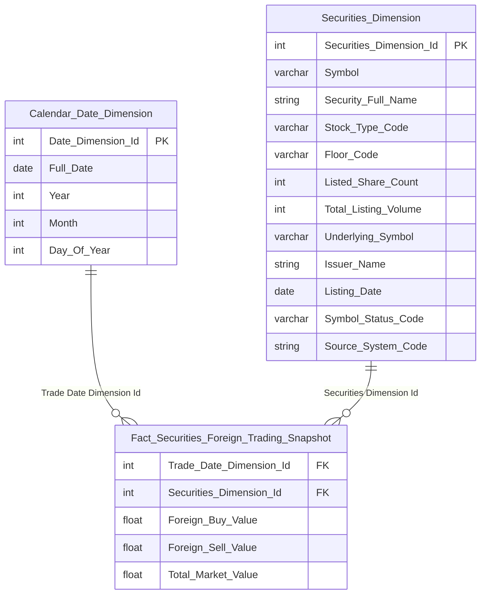

> **Lưu ý grain:** Fact có grain "1 mã CK × 1 ngày" (mở rộng ở Nhóm 2 để phục vụ Top ngành/mã). Box 1 (K_NDTNN_4-4) hiển thị số toàn thị trường — không phân theo mã CK — nên công thức phải `GROUP BY Trade_Date_Dimension_Id` (SUM xuyên suốt `Securities_Dimension_Id`), không SUM trực tiếp theo dòng.

**Lineage Mart → Báo cáo:**


**Bảng grain:**

| Tên bảng | Grain |
|---|---|
| Fact Securities Foreign Trading Snapshot | 1 row = 1 mã CK × 1 ngày giao dịch (ETL pre-aggregate SUM Execution Value từ Securities Trade theo mã CK, tách theo Buy/Sell Foreign Investor Type Code) — xem Nhóm 2 cho chi tiết đầy đủ |
| Calendar Date Dimension | 1 row = 1 ngày giao dịch |

---

#### Nhóm 2 — Tổng giá trị mua/bán ròng của NĐTNN

**Mockup:**

| Bar chart | Lũy kế mua/bán ròng |
|:---|---:|
| Trục X: Tháng (Jan → Oct) | -8,300 B |
| Trục Y: Giá trị (tỉ đồng) | (lũy kế kỳ chọn) |

| TOP NGÀNH BÁN RÒNG | | TOP NGÀNH MUA RÒNG | | TOP MÃ BÁN RÒNG | | TOP MÃ MUA RÒNG | |
|:---|---:|:---|---:|:---|---:|:---|---:|
| Bất động sản | -1200B | Ngân hàng | +4500B | VHM | -700B | HPG | +3300B |
| Thực phẩm | -450B | Thép / Tài nguyên | +2800B | MSN | -400B | VCB | +600B |

**Slicer:** Từ ngày — Đến ngày (date range picker)

---

> Phân loại: **Phân tích**
> Atomic: `Securities Trade` ← ORDERTRADE.TRADE_BOOK_HOSE/HNX — **READY** (dùng chung Nhóm 1)
> Atomic (Ngành): `Classification Business Line` ← IDS.CATEGORIES — **READY (draft)**
> Atomic (Mã CK → Ngành): `Public Company` ← IDS.COMPANY_PROFILES — **READY (draft, working)** — join qua `Equity Ticker Symbol` = `Securities_Dimension.Symbol`, và `Business Line Level 1/2 Code` → `Classification Business Line Code`
> Atomic (Danh mục mã CK): `Security Trading Snapshot` ← MDDS.JAD_STOCKINFOR — **READY (draft, working)** — xem Cụm 1a (Section 1). Dimension `Securities Dimension` (grain 1 mã CK, SCD4A) thay thế join text-match trực tiếp trước đây.
> Loại dữ liệu: Dữ liệu tĩnh

**Source:** `Fact Securities Foreign Trading Snapshot` → `Calendar Date Dimension`, `Securities Dimension`, `Public Company Dimension` (join `Classification Business Line` cho Top ngành)

**Bảng KPI:**

| KPI ID | Tên | Đơn vị | Tính chất | Công thức / Mô tả | Ghi chú | Trạng thái |
|---|---|---|---|---|---|---|
| K_NDTNN_8 | Ngành | — | Chiều | `Public_Company_Dimension.Classification_Business_Line_Name` (đã đệm sẵn từ join `Public_Company_Dimension.Business_Line_Level1_Code` = `Classification_Business_Line.cl_business_line_code` lúc ETL populate Dimension) | Dùng GROUP BY cho Top ngành (K_NDTNN_12/13/16) | READY |
| K_NDTNN_9 | Mã CK | — | Chiều | `Securities_Dimension.Symbol` | Dùng GROUP BY cho Top mã (K_NDTNN_14/15). Đổi nguồn từ `Fact.Security_Symbol_Code` (text lặp) sang FK `Securities_Dimension_Id` — xem Cụm 1a (Section 1) | READY |
| K_NDTNN_10 | Giá trị mua/bán ròng | Tỷ đồng | Phái sinh | `Foreign_Buy_Value − Foreign_Sell_Value` per mã CK × ngày; nếu group theo Tháng: `SUM(Foreign_Buy_Value − Foreign_Sell_Value)` GROUP BY Tháng | Bar chart trục X = Tháng | READY |
| K_NDTNN_11 | Lũy kế mua/bán ròng | Tỷ đồng | Phái sinh | `SUM(Foreign_Buy_Value) − SUM(Foreign_Sell_Value)` WHERE `Trade_Date_Dimension_Id` BETWEEN `:pdate` AND `:pdate1` (SUM xuyên suốt mọi mã CK trong khoảng ngày) | — | READY |
| K_NDTNN_12 | Top 5 ngành bán ròng | Tỷ đồng | Phái sinh | `SUM(Foreign_Sell_Value)` WHERE `Trade_Date = :pdate` GROUP BY `Public_Company_Dimension.Classification_Business_Line_Name` ORDER BY SUM DESC FETCH FIRST 5 ROWS ONLY | Join `Fact` → `Public_Company_Dimension` | READY |
| K_NDTNN_13 | Top 5 ngành mua ròng | Tỷ đồng | Phái sinh | `SUM(Foreign_Buy_Value)` WHERE `Trade_Date = :pdate` GROUP BY `Public_Company_Dimension.Classification_Business_Line_Name` ORDER BY SUM DESC FETCH FIRST 5 ROWS ONLY | Join như trên | READY |
| K_NDTNN_14 | Top 5 mã bán ròng | Tỷ đồng | Phái sinh | `SUM(Foreign_Sell_Value) − SUM(Foreign_Buy_Value)` WHERE `Trade_Date` BETWEEN `:pdate` AND `:pdate1` GROUP BY `Securities_Dimension.Symbol` ORDER BY kết quả DESC FETCH FIRST 5 ROWS ONLY | — | READY |
| K_NDTNN_15 | Top 5 mã mua ròng | Tỷ đồng | Phái sinh | `SUM(Foreign_Buy_Value) − SUM(Foreign_Sell_Value)` WHERE `Trade_Date` BETWEEN `:pdate` AND `:pdate1` GROUP BY `Securities_Dimension.Symbol` ORDER BY kết quả DESC FETCH FIRST 5 ROWS ONLY | — | READY |
| K_NDTNN_16 | Tỷ trọng theo ngành | % | Phái sinh | `ROUND(SUM(Foreign_Buy_Value + Foreign_Sell_Value) / NULLIF(SUM(Total_Market_Value)*2, 0) * 100, 2)` WHERE `Trade_Date = :pdate` GROUP BY `Public_Company_Dimension.Classification_Business_Line_Name` — mẫu số SUM theo TOÀN NGÀNH (mọi mã CK cùng ngành) | Khác K_NDTNN_17 — mẫu số theo ngành, không phải theo mã | READY |
| K_NDTNN_17 | Top mã tỷ trọng cao | % | Phái sinh | `ROUND(SUM(Foreign_Buy_Value + Foreign_Sell_Value) / NULLIF(SUM(Total_Market_Value)*2, 0) * 100, 2)` WHERE `Trade_Date = :pdate` GROUP BY `Securities_Dimension.Symbol` ORDER BY kết quả DESC FETCH FIRST 5 ROWS ONLY | Mẫu số SUM theo TỪNG MÃ CK (1 mã × 1 ngày, không cần GROUP thêm vì Fact đã ở đúng grain này). BA Mã=22 (STT=2) — đổi từ K_NDTNN_33 vì ID đó đã dùng cho "Giá trị mua/bán ròng" ở Nhóm 5 (STT=5) | READY |
| K_NDTNN_1 | Tổng giá trị mua của NĐTNN | Tỷ đồng | Cơ sở | `SUM(Foreign_Buy_Value)` GROUP BY `Trade_Date_Dimension_Id` WHERE `Trade_Date = :pdate` | Reuse từ Nhóm 1 | READY |
| K_NDTNN_2 | Tổng giá trị bán của NĐTNN | Tỷ đồng | Cơ sở | `SUM(Foreign_Sell_Value)` GROUP BY `Trade_Date_Dimension_Id` WHERE `Trade_Date = :pdate` | Reuse từ Nhóm 1 | READY |
| K_NDTNN_3 | Tổng giá trị giao dịch toàn thị trường | Tỷ đồng | Cơ sở | `SUM(Total_Market_Value)` GROUP BY `Trade_Date_Dimension_Id` WHERE `Trade_Date = :pdate` | Reuse từ Nhóm 1 | READY |
| K_NDTNN_4 | Tỷ trọng giao dịch theo ngày | % | Phái sinh | `(K_NDTNN_1 + K_NDTNN_2) × 100 / (K_NDTNN_3 × 2)` | Reuse từ Nhóm 1 — tên hiển thị khác ("Tỷ trọng GD theo ngày" thay vì "Tỷ lệ tham gia") nhưng cùng công thức | READY |
| K_NDTNN_18 | Tổng giá trị giao dịch NĐTNN | Tỷ đồng | Phái sinh | `K_NDTNN_1 + K_NDTNN_2` cùng ngày | BA STT=2, Đánh giá "Trùng" (logic tái sử dụng K_NDTNN_1/2, xem note BA "Tái sử dụng logic từ chỉ tiêu đã mapping ở nhóm trước") nhưng là dòng BA độc lập, khái niệm khác K_NDTNN_3 (Tổng GT toàn thị trường)/K_NDTNN_4 (Tỷ lệ tham gia) — cấp KPI_ID riêng theo đúng vị trí vật lý trong bảng (giữa K_NDTNN_4 và K_NDTNN_18 cũ, nay dịch thành K_NDTNN_19) | READY |
| K_NDTNN_19 | Tỷ trọng TB phiên | % | Phái sinh | `AVG(ty_trong_ngay)` WHERE `Trade_Date` BETWEEN `:pdate` AND `:pdate1`, trong đó `ty_trong_ngay = (Foreign_Buy_Value + Foreign_Sell_Value) / (Total_Market_Value × 2) × 100` tính theo từng ngày (SUM xuyên mọi mã CK trong ngày đó trước khi tính tỷ trọng ngày, rồi AVG qua các ngày) | BA note "Tái sử dụng logic từ chỉ tiêu đã mapping ở nhóm trước" (= công thức K_NDTNN_4, nhưng là KPI độc lập — không note "Trùng" nên cấp ID riêng theo đúng dải liên tục tiếp theo, không chèn giữa dải 1-157). Cần xác nhận `Trade_Date` là ngày GD thực tế hay ngày khớp lệnh — BA tự ghi chú nghi vấn này | READY |

**Star Schema:**

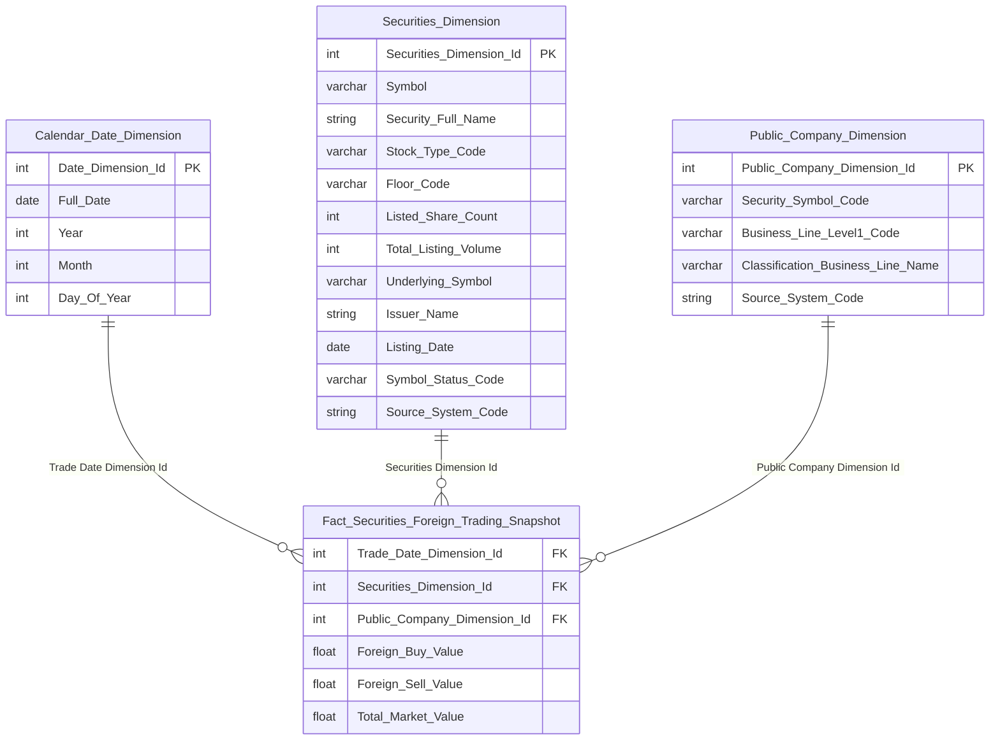

> **Ghi chú thiết kế:** `Public_Company_Dimension.Classification_Business_Line_Name` là ETL-derived — join `Public Company.Business_Line_Level1/2_Code` sang `Classification Business Line.cl_business_line_code` lúc populate Dimension, lưu đệm tên ngành để tránh join 3 tầng khi query Top ngành. `Securities_Dimension` (grain 1 mã CK, SCD4A) thay thế join text-match trực tiếp `Fact.Security_Symbol_Code` trước đây — ETL derive từ `Security Trading Snapshot` (Fact Snapshot, MDDS.JAD_STOCKINFOR), lấy bản ghi mới nhất theo `Symbol`, chỉ giữ thuộc tính tĩnh (loại bỏ toàn bộ field giá/khối lượng/sổ lệnh biến động theo phiên) — xem Cụm 1a (Section 1).

**Lineage Mart → Báo cáo:**

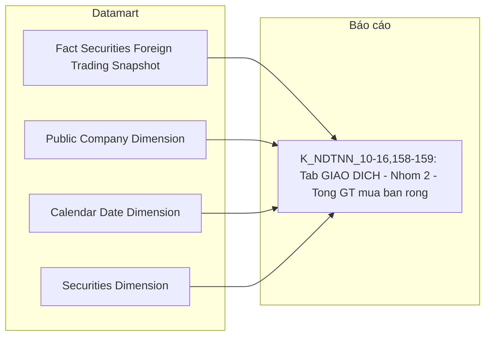

**Bảng grain:**

| Tên bảng | Grain |
|---|---|
| Fact Securities Foreign Trading Snapshot | 1 row = 1 mã CK × 1 ngày giao dịch (ETL pre-aggregate SUM Execution Value từ Securities Trade theo mã CK, tách theo Buy/Sell Foreign Investor Type Code) |
| Public Company Dimension | 1 row = 1 công ty đại chúng (SCD4A current-state) — bao gồm Classification Business Line Name đệm sẵn; `Equity_Ticker_Symbol` là snapshot hiện tại (current-state), không phủ lịch sử đổi mã/nhiều loại CK — xem O_NDTNN_28 |
| Securities Dimension | 1 row = 1 mã chứng khoán (SCD4A current-state) — ETL derive từ `Security Trading Snapshot` (Fact Snapshot), lấy bản ghi mới nhất theo Symbol |
| Calendar Date Dimension | 1 row = 1 ngày giao dịch |

---

#### Nhóm 3 — KPI Cards: Dòng tiền vào / ra / ròng (STT=3)

**Mockup:**

| Dòng tiền vào | Dòng tiền ra | Dòng tiền ròng |
|:---:|:---:|:---:|
| **1,284.3** Tỉ đồng | **1,736.8** Tỉ đồng | **-452.5** Tỉ đồng |

**Slicer:** Từ ngày — Đến ngày (date range picker)

---

> Phân loại: **Phân tích**
> Atomic: xem cột Ghi chú trong bảng KPI dưới đây
> Loại dữ liệu: Dữ liệu động (cả 3 dòng)

**Bảng KPI:**

| KPI ID | Tên KPI | Đơn vị | Tính chất | Công thức | Ghi chú | Trạng thái |
|---|---|---|---|---|---|---|
| K_NDTNN_20 | Dòng tiền vào | — | Phái sinh | TBD — chờ Atomic | **Lý do pending:** Dữ liệu động — nguồn báo cáo định kỳ PLIV-TT51/2021/TT-BTC (Báo cáo hoạt động chu chuyển vốn NĐTNN, Ngân hàng lưu ký gửi, kỳ NỬA THÁNG), cột "GT dòng vốn vào" tại Dòng "Tổng = (1)+(2)". Note BA: "Báo cáo tại ngày (lấy ngày cuối tháng)". **Atomic cần bổ sung:** xác nhận báo cáo PLIV-TT51 thuộc generic store `Member Regulatory Report`/`Member Report Value` (Cụm 7) hay cần entity riêng — cần Report Code/Cell Code. Không dùng lại thiết kế cũ (`Fact Foreign Investor Capital Flow` ← FIMS.RPTVALUES/RPTMEMBER trực tiếp) vì chưa xác nhận đúng mapping. **Mart dự kiến:** `Fact Foreign Investor Capital Flow Report` (tên tạm) — grain 1 kỳ báo cáo (nửa tháng) × 1 chiều dòng vốn | PENDING |
| K_NDTNN_21 | Dòng tiền ra | — | Phái sinh | TBD — chờ Atomic | Cùng lý do/nguồn với K_NDTNN_20 — cột "GT ngoại tệ đổi ra VND" | PENDING |
| K_NDTNN_22 | Dòng tiền ròng | — | Phái sinh | TBD — chờ Atomic | Cùng lý do/nguồn với K_NDTNN_20 — Dòng tiền vào − Dòng tiền ra | PENDING |

**Bảng mapping nguồn (Atomic Placeholder):**

| Tên KPI | Bảng nguồn (BA) | Atomic entity dự kiến | Atomic table dự kiến |
|---|---|---|---|
| Dòng tiền vào / ra / ròng | Báo cáo PLIV-TT51/2021/TT-BTC (Ngân hàng lưu ký, kỳ nửa tháng) | Member Regulatory Report / Member Report Value (Cụm 7 — cần xác nhận Report Code) | TBD |

---

#### Nhóm 4 — Dòng vốn đầu tư gián tiếp nước ngoài (STT=4)

**Mockup** *(theo screenshot — stacked bar theo tháng + 4 bảng Top)*:

| Stacked bar | Trục X | Trục Y | Legend |
|:---|:---|:---|:---|
| Dòng vốn ròng theo loại hình NĐT | Tháng T1→T12 | Tỉ đồng | Cá nhân / Quỹ / Tổ chức khác quỹ |

**Slicer:** Từ ngày — Đến ngày + Loại hình NĐTNN + Quốc gia

---

> Phân loại: **Phân tích**
> Atomic: xem cột Ghi chú trong bảng KPI dưới đây
> Loại dữ liệu: Dữ liệu động (8/10 dòng) / Dữ liệu tĩnh (2 Chiều — Loại hình NĐTNN, Quốc gia — dùng filter/GROUP BY cho measure động, không tự đứng độc lập)

**Bảng KPI:**

| KPI ID | Tên KPI | Đơn vị | Tính chất | Công thức | Ghi chú | Trạng thái |
|---|---|---|---|---|---|---|
| K_NDTNN_23 | Loại hình NĐTNN | — | Chiều | TBD — chờ Atomic | Dùng filter K_NDTNN_26/27/28. Atomic `Foreign Investor Dimension.Investor Object Type Code` đã READY (dùng chung Nhóm 6) nhưng chưa join được vì Fact động (K_NDTNN_25-32) của Nhóm này chưa sẵn sàng | PENDING |
| K_NDTNN_24 | Quốc gia | — | Chiều | TBD — chờ Atomic | Dùng GROUP BY K_NDTNN_29/30. Atomic `Geographic Area Dimension.Geographic Area Name` đã READY (dùng chung Nhóm 6) nhưng chưa join được vì Fact động của Nhóm này chưa sẵn sàng | PENDING |
| K_NDTNN_25 | Dòng vốn ròng | — | Phái sinh | TBD — chờ Atomic | **Lý do pending:** Dữ liệu động — nguồn báo cáo định kỳ PLIV-TT51 (Ngân hàng lưu ký, kỳ nửa tháng) như Nhóm 3, chưa thống nhất quy tắc khai thác generic store TT51. **Atomic cần bổ sung:** xem Nhóm 3 (Member Regulatory Report/Member Report Value — cần Report Code). **Mart dự kiến:** `Fact Foreign Investor Capital Flow Report` (tên tạm, xem Nhóm 3) — grain 1 kỳ báo cáo (nửa tháng) × 1 NĐT × 1 quốc gia. Khi sẵn sàng join `Foreign Investor Dimension`+`Geographic Area Dimension` (đã READY, không cần Dimension mới) | PENDING |
| K_NDTNN_26 | Dòng vốn ròng — Quỹ | — | Phái sinh | TBD — chờ Atomic | Cùng lý do/nguồn/mart dự kiến với K_NDTNN_25 — filter Loại hình = Quỹ (K_NDTNN_23) | PENDING |
| K_NDTNN_27 | Dòng vốn ròng — Cá nhân | — | Phái sinh | TBD — chờ Atomic | Cùng lý do/nguồn/mart dự kiến với K_NDTNN_25 — filter Loại hình = Cá nhân (K_NDTNN_23) | PENDING |
| K_NDTNN_28 | Dòng vốn ròng — Tổ chức khác quỹ | — | Phái sinh | TBD — chờ Atomic | Cùng lý do/nguồn/mart dự kiến với K_NDTNN_25 — filter Loại hình = Tổ chức khác quỹ (K_NDTNN_23) | PENDING |
| K_NDTNN_29 | Top 5 quốc gia vào ròng | — | Phái sinh | TBD — chờ Atomic | Cùng lý do/nguồn/mart dự kiến với K_NDTNN_25 — GROUP BY Quốc gia (K_NDTNN_24), TOP 5 dòng vào ròng DESC | PENDING |
| K_NDTNN_30 | Top 5 quốc gia rút ròng | — | Phái sinh | TBD — chờ Atomic | Cùng lý do/nguồn/mart dự kiến với K_NDTNN_25 — GROUP BY Quốc gia (K_NDTNN_24), TOP 5 dòng rút ròng | PENDING |
| K_NDTNN_31 | Top 5 NĐT vào ròng | — | Phái sinh | TBD — chờ Atomic | Cùng lý do/nguồn/mart dự kiến với K_NDTNN_25 — GROUP BY NĐT, TOP 5 dòng vào ròng DESC | PENDING |
| K_NDTNN_32 | Top 5 NĐT rút ròng | — | Phái sinh | TBD — chờ Atomic | Cùng lý do/nguồn/mart dự kiến với K_NDTNN_25 — GROUP BY NĐT, TOP 5 dòng rút ròng | PENDING |

---

#### Nhóm 5 — Tương quan Net Flow & VN-Index (STT=5)

**Mockup** *(theo screenshot — 3 series line chart dual Y-axis)*:

| Series | Nguồn | Trục Y |
|:---|:---|:---|
| MUA/BÁN RÒNG (đỏ) | Securities Trade (ORDERTRADE) | Trái (Tỉ đồng) |
| DÒNG TIỀN RÒNG (xanh lá) | Báo cáo PLIV-TT51 (Ngân hàng lưu ký) | Trái (Tỉ đồng) |
| VN-INDEX (tím) | MDDS (JAD_MARKETINFOR) | Phải (Điểm) |

> **Ghi chú thiết kế:** 3 series từ 3 fact riêng biệt — presentation layer chịu trách nhiệm query độc lập và align theo trục ngày/tháng.

---

> Phân loại: **Phân tích**
> Atomic (Giá trị mua/bán ròng): `Securities Trade` ← ORDERTRADE.TRADE_BOOK_HOSE/HNX — **READY** (dùng chung Nhóm 1/2)
> Atomic (VN-Index): `Market Index Snapshot` ← MDDS.JAD_MARKETINFOR — **READY** (LLD draft `DataModel/working/Atomic/lld/MDDS/lld_MDDS_JAD_MARKETINFOR.yaml`, chưa có entry `dm_manifest.yaml` — coi như READY nhất quán với QLKD, xem Cụm 6b `DTM_QLKD_HLD.md`)
> Atomic (Dòng tiền ròng lũy kế): xem cột Ghi chú trong bảng KPI dưới đây
> Loại dữ liệu: Dữ liệu tĩnh (Giá trị mua/bán ròng, VN-Index) / Dữ liệu động (Dòng tiền ròng lũy kế — reuse K_NDTNN_22 Nhóm 3)

**Source:** `Fact Securities Foreign Trading Snapshot` (reuse Nhóm 2) + `Fact Market Index Snapshot` (reuse — sở hữu QLKD, xem Cụm 6b `DTM_QLKD_HLD.md`) → `Calendar Date Dimension`, `Market Index Dimension` (reuse — sở hữu QLKD)

**Bảng KPI:**

| KPI ID | Tên | Đơn vị | Tính chất | Công thức / Mô tả | Ghi chú | Trạng thái |
|---|---|---|---|---|---|---|
| K_NDTNN_33 | Giá trị mua/bán ròng | Tỷ đồng | Phái sinh | `SUM(Foreign_Buy_Value) − SUM(Foreign_Sell_Value)` GROUP BY `Trade_Date_Dimension_Id` (SUM xuyên suốt mọi mã CK trong ngày) | Cùng công thức K_NDTNN_10 (Nhóm 2) — BA độ chi tiết Ngày, không phải tháng như thiết kế cũ. Reuse `Fact Securities Foreign Trading Snapshot`, không cần bản pre-aggregate mới | READY |
| K_NDTNN_34 | Điểm đóng cửa chỉ số (VN-Index) | Điểm | Cơ sở | `fct_market_index_snpst.market_index_val` JOIN `market_index_dim` WHERE `market_index_dim.market_id = '10'` AND `market_index_dim.market_code = 'HOSE'` JOIN `cdr_dt_dim` ON `snpst_dt_dim_id` WHERE `cdr_dt_dim.cdr_dt = :pdate` | Atomic `Market Index Snapshot` grain = 1 lần chụp/chỉ số — ETL lấy bản ghi có `Index_Time` lớn nhất trong ngày khi populate Fact (`fct_market_index_snpst`, reuse từ QLKD — xem Cụm 6b `DTM_QLKD_HLD.md`). **Sửa 24/07/2026 (datamart-review):** Fact nay populate grain **1 chỉ số × 1 ngày** thống nhất cho cả QLKD lẫn NDTNN (trước đây populate grain 1 tháng khiến filter `:pdate` theo ngày bất kỳ trả về rỗng — QLKD nay tự filter đúng ngày cuối tháng trên Fact grain-ngày này). Filter qua FK `market_index_dim_id` (thay `Market_Id`/`Market_Code` text trực tiếp) — xem O_NDTNN_29 (Closed) | READY |
| K_NDTNN_35 | Dòng tiền ròng lũy kế (tháng) (reuse công thức từ K_NDTNN_22 — Nhóm 3) | — | Phái sinh | TBD — chờ Atomic | **Lý do pending:** Reuse K_NDTNN_22 (Nhóm 3), giờ K_NDTNN_22 PENDING (Dữ liệu động — xem Nhóm 3) nên K_NDTNN_35 PENDING theo. **Atomic cần bổ sung:** xem Nhóm 3. **Mart dự kiến:** `Fact Foreign Investor Capital Flow Report` (tên tạm, xem Nhóm 3) — grain 1 tháng | PENDING |

**Star Schema:**

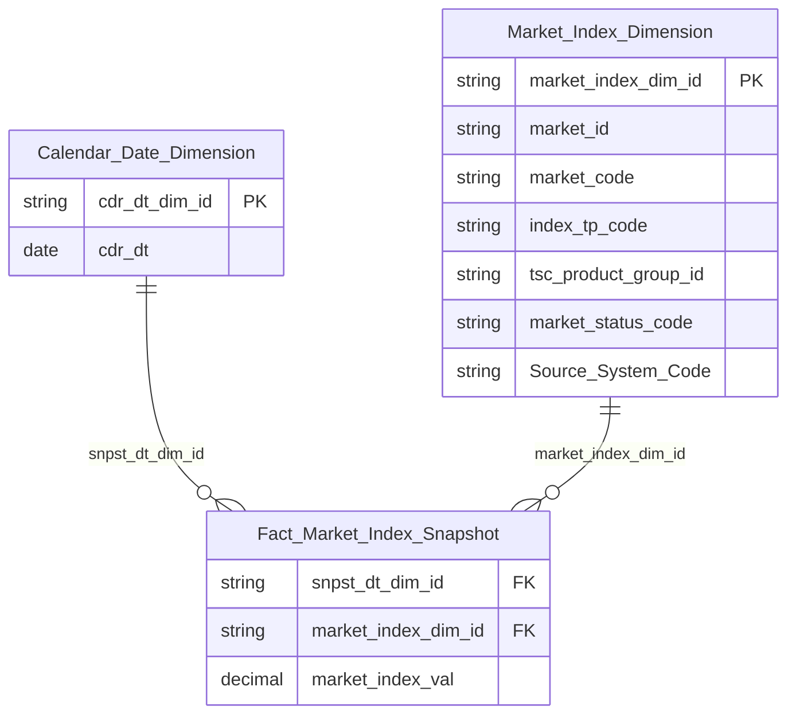

> **Ghi chú:** K_NDTNN_33 reuse trực tiếp `Fact Securities Foreign Trading Snapshot` (xem Star Schema Nhóm 2) — không cần erDiagram riêng. K_NDTNN_34 reuse `Fact Market Index Snapshot` (`fct_market_index_snpst`) sở hữu bởi QLKD (Cụm 6b, `DTM_QLKD_HLD.md`) — không tạo Fact riêng. **Sửa 24/07/2026 (datamart-review):** Grain vật lý Fact nay thống nhất **1 chỉ số × 1 ngày** cho cả QLKD lẫn NDTNN (trước đây ghi "grain gốc QLKD 1 tháng, NDTNN filter query-time xuống grain 1 ngày" — sai, vì Fact grain-tháng không có dữ liệu cho ngày giữa tháng; QLKD nay tự filter đúng ngày cuối tháng trên Fact grain-ngày này). `Market Index Dimension` (`market_index_dim`, grain 1 combo Market_Id+Market_Code, SCD4A) cũng sở hữu QLKD, NDTNN reuse — xem O_NDTNN_29 (Closed).

**Lineage Mart → Báo cáo:**

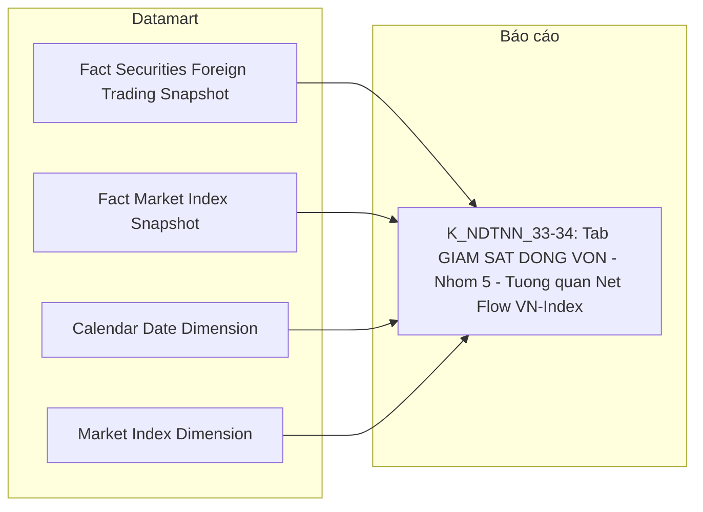

**Bảng grain:**

| Tên bảng | Grain |
|---|---|
| Fact Securities Foreign Trading Snapshot | 1 row = 1 mã CK × 1 ngày giao dịch (reuse từ Nhóm 2) |
| Fact Market Index Snapshot (`fct_market_index_snpst`, reuse — sở hữu QLKD) | 1 row = 1 chỉ số (market_code) × 1 ngày (lấy bản ghi Index Time lớn nhất trong ngày) — grain vật lý thống nhất cho cả QLKD lẫn NDTNN (sửa 24/07/2026, datamart-review). QLKD (cần số liệu cuối tháng) tự filter/JOIN đúng ngày cuối tháng trên Fact grain-ngày này |
| Calendar Date Dimension | 1 row = 1 ngày |
| Market Index Dimension (`market_index_dim`, reuse — sở hữu QLKD) | 1 row = 1 combo Market_Id + Market_Code (SCD4A current-state) — ETL derive từ `Market Index Snapshot`, giữ 5 thuộc tính tĩnh (Market Id, Market Code, Index Type Code, TSC Product Group Id, Market Status Code) |

---

#### Nhóm 6 - Thống kê danh mục (STT=6)

> Phân loại: **Phân tích**
> Atomic (Loại hình nhà đầu tư): `Foreign Investor` ← FIMS.INVESTOR/INVESTORTYPE — **READY (draft)**
> Atomic (Tổng GTDM + Top quốc gia/NĐT): xem cột Ghi chú trong bảng KPI dưới đây
> Loại dữ liệu: Dữ liệu tĩnh (Loại hình nhà đầu tư) / Dữ liệu động (6 KPI còn lại)

**Mockup:**

| Tổng GTDM | Danh mục Cá nhân | Danh mục Quỹ | Danh mục Tổ chức khác quỹ |
|:---:|:---:|:---:|:---:|
| **1,315** Tỉ đồng | **284.6** Tỉ đồng | **752.3** Tỉ đồng | **278.1** Tỉ đồng |

**Bảng KPI:**

| KPI ID | Tên | Đơn vị | Tính chất | Công thức | Ghi chú | Trạng thái |
|---|---|---|---|---|---|---|
| K_NDTNN_36 | Loại hình nhà đầu tư | — | Chiều | `foreign_investor_dim.investor_tp_code` (từ `FIMS.INVESTOR.InvestorTypeId`, nguồn BA `INVESTORTYPE.Name`) | Dùng filter K_NDTNN_38/39/40. Atomic `Foreign Investor` đã READY (draft), dùng chung Nhóm 2/4/9. **Sửa 2026-07-24 (datamart-review):** Attributes trước đây map nhầm sang `Investor_Object_Type_Code` (2 giá trị Cá nhân/Tổ chức, từ `ObjectType`) — đã sửa dùng đúng `Investor_Type_Code` (3 giá trị Cá nhân/Quỹ/Tổ chức khác quỹ) | READY |
| K_NDTNN_37 | Tổng giá trị danh mục | — | Phái sinh | TBD — chờ Atomic | **Lý do pending:** Dữ liệu động — nguồn báo cáo định kỳ PLIII-TT51/2021/TT-BTC (Báo cáo thống kê danh mục lưu ký NĐTNN, do CTCK và Ngân hàng lưu ký gửi, kỳ THÁNG), Mục "II. Báo cáo cơ cấu danh mục theo tỷ trọng đầu tư của tổ chức và cá nhân", Dòng "Tổng = (1)+(2)", Cột "Tổng giá trị danh mục". **Atomic cần bổ sung:** xác nhận báo cáo PLIII-TT51 thuộc generic store `Member Regulatory Report`/`Member Report Value` (Cụm 7) hay cần entity riêng — cần Report Code/Cell Code Mục II. Atomic `Foreign Investor Securities Account` (gộp SECURITIESACCOUNT+CATEGORIESSTOCK, table_type Fundamental) KHÔNG dùng được — chỉ có Current Holding Quantity/Ownership Rate current-state, không có Portfolio Market Value theo tháng. **Mart dự kiến:** `Fact Foreign Investor Portfolio Value Report` (tên tạm) — grain 1 kỳ báo cáo (tháng) × 1 NĐT | PENDING |
| K_NDTNN_38 | Danh mục Cá nhân | — | Phái sinh | TBD — chờ Atomic | Cùng lý do/nguồn/mart dự kiến với K_NDTNN_37 — Dòng "Tổng(2)-Cá nhân" | PENDING |
| K_NDTNN_39 | Danh mục Quỹ | — | Phái sinh | TBD — chờ Atomic | Cùng lý do/nguồn/mart dự kiến với K_NDTNN_37 — Subset Tổng(1) lọc Loại hình = Quỹ (K_NDTNN_36) | PENDING |
| K_NDTNN_40 | Danh mục Tổ chức khác quỹ | — | Phái sinh | TBD — chờ Atomic | Cùng lý do/nguồn/mart dự kiến với K_NDTNN_37 — Subset Tổng(1) lọc Loại hình khác Quỹ (K_NDTNN_36) | PENDING |
| K_NDTNN_41 | Top 5 quốc gia theo GTDM | — | Phái sinh | TBD — chờ Atomic | Cùng lý do/nguồn với K_NDTNN_37 — GROUP BY Quốc tịch, TOP 5 DESC. **Atomic cần bổ sung thêm:** Chiều Quốc gia chưa có nguồn xác nhận — xem O_NDTNN_21 (Cụm 3c, `Geographic Area` chỉ có nguồn ECAT, không có FIMS) | PENDING |
| K_NDTNN_42 | Top 5 NĐT theo GTDM | — | Phái sinh | TBD — chờ Atomic | Cùng lý do/nguồn/mart dự kiến với K_NDTNN_37 — GROUP BY Tên khách hàng, TOP 5 DESC | PENDING |

**Bảng mapping nguồn (Atomic Placeholder):**

| Tên KPI | Bảng nguồn (BA) | Atomic entity dự kiến | Atomic table dự kiến |
|---|---|---|---|
| Tổng giá trị danh mục / Cá nhân / Quỹ / Tổ chức khác quỹ / Top 5 quốc gia / Top 5 NĐT | Báo cáo PLIII-TT51/2021/TT-BTC (CTCK + Ngân hàng lưu ký, kỳ tháng) | Member Regulatory Report / Member Report Value (Cụm 7 — cần xác nhận Report Code Mục II) | TBD |

---

#### Nhóm 7 - Cơ cấu danh mục theo loại hình tài sản (STT=7)

> Phân loại: **Phân tích**
> Atomic: xem cột Ghi chú trong bảng KPI dưới đây
> Loại dữ liệu: Dữ liệu động (toàn bộ 7/7 dòng BA)

**Mockup:**

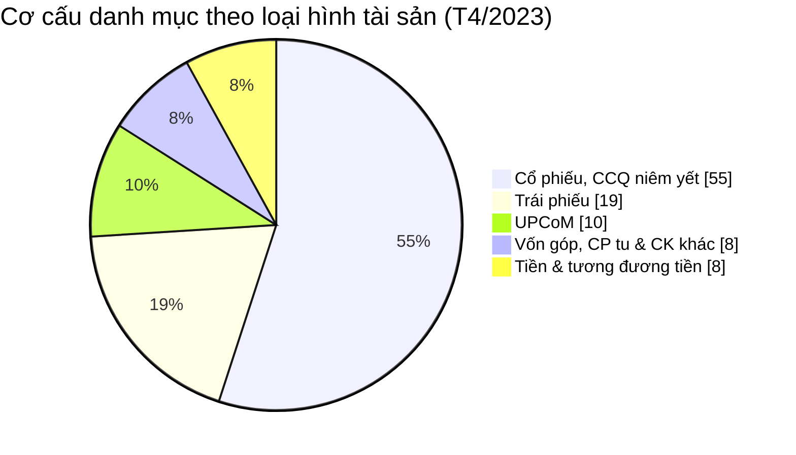

**Bảng KPI:**

| KPI ID | Tên | Đơn vị | Tính chất | Công thức | Ghi chú | Trạng thái |
|---|---|---|---|---|---|---|
| K_NDTNN_43 | Giá trị tài sản | — | Cơ sở | TBD — chờ Atomic | **Lý do pending:** Dữ liệu động — Bảng nguồn BA ghi `CATEGORIESSTOCK.Quantity` + `SECURITIES.ClosingPrice` (độ chi tiết Tháng), nhưng đối chiếu Atomic thì `CATEGORIESSTOCK` đã gộp vào `Foreign Investor Securities Account` (Fundamental, current-state, không phải Snapshot theo tháng) — không dùng được để tính giá trị tài sản theo tháng. **Atomic cần bổ sung:** xem Nhóm 6 (measure tương tự "Tổng giá trị danh mục", cùng nghi vấn nguồn PLIII-TT51). **Mart dự kiến:** chung Fact với Nhóm 6 (`Fact Foreign Investor Portfolio Value Report`, tên tạm) | PENDING |
| K_NDTNN_44 | Loại tài sản | — | Chiều | TBD — chờ Atomic | Dùng filter K_NDTNN_45-49. Bảng nguồn BA `RELATEDPROPERTIES.Name` (filter `Deleted=0`) — đã tra Atomic: `RELATEDPROPERTIES` chỉ được model hóa cho scheme `FIMS_RELATED_PROPERTY` ("Hình thức liên quan trong ủy quyền CBTT/giao dịch", dùng bởi `Info Disclosure Authorization`/`Trading Authorization`) — KHÔNG liên quan "Loại tài sản danh mục đầu tư". Đây là bảng lookup dùng chung nhiều mục đích trong FIMS, giá trị "Loại tài sản" (Cổ phiếu/Trái phiếu/UPCoM...) chưa được model hóa riêng trong Atomic. **Atomic cần bổ sung:** entity/scheme riêng cho phân loại tài sản danh mục đầu tư NĐTNN | PENDING |
| K_NDTNN_45 | GT tài sản — Cổ phiếu/CCQ niêm yết | — | Phái sinh | TBD — chờ Atomic | Cùng lý do/nguồn/mart dự kiến với K_NDTNN_43 — subset filter Loại tài sản = Cổ phiếu/CCQ niêm yết (K_NDTNN_44), nguồn báo cáo PLIII-TT51 Mục II, Cột "Cổ phiếu/CCQ niêm yết" | PENDING |
| K_NDTNN_46 | GT tài sản — Trái phiếu | — | Phái sinh | TBD — chờ Atomic | Cùng lý do/nguồn/mart dự kiến với K_NDTNN_43 — subset filter Loại tài sản = Trái phiếu, nguồn báo cáo PLIII-TT51 Mục II, Cột "Trái phiếu" (SUM 3 loại trái phiếu theo BA note) | PENDING |
| K_NDTNN_47 | GT tài sản — UPCoM | — | Phái sinh | TBD — chờ Atomic | Cùng lý do/nguồn/mart dự kiến với K_NDTNN_43 — subset filter Loại tài sản = UPCoM, nguồn báo cáo PLIII-TT51 Mục II, Cột "Cổ phiếu công ty đại chúng đăng ký giao dịch (upcom)" | PENDING |
| K_NDTNN_48 | GT tài sản — Vốn góp/CP tư/CK khác | — | Phái sinh | TBD — chờ Atomic | Cùng lý do/nguồn/mart dự kiến với K_NDTNN_43 — subset filter Loại tài sản = Vốn góp/mua CP/quỹ thành viên/CK khác, nguồn báo cáo PLIII-TT51 Mục II | PENDING |
| K_NDTNN_49 | GT tài sản — Tiền và tương đương | — | Phái sinh | TBD — chờ Atomic | Cùng lý do/nguồn/mart dự kiến với K_NDTNN_43 — subset filter Loại tài sản = Tiền và tương đương, nguồn báo cáo PLIII-TT51 Mục II. BA note: "Lấy từ báo cáo NHLK" | PENDING |

**Bảng mapping nguồn (Atomic Placeholder):**

| Tên KPI | Bảng nguồn (BA) | Atomic entity dự kiến | Atomic table dự kiến |
|---|---|---|---|
| Giá trị tài sản / GT tài sản theo loại (5 subset) | Báo cáo PLIII-TT51/2021/TT-BTC (CTCK + Ngân hàng lưu ký, kỳ tháng) | Member Regulatory Report / Member Report Value (Cụm 7 — cần xác nhận Report Code Mục II) | TBD |
| Loại tài sản (Chiều) | FIMS.RELATEDPROPERTIES (dùng chung — cần entity/scheme riêng cho ngữ cảnh danh mục đầu tư) | TBD (không dùng scheme `FIMS_RELATED_PROPERTY` hiện có — sai ngữ cảnh) | TBD |

---

#### Nhóm 8 - Phân ngành của NĐTNN (STT=8)

> Phân loại: **Phân tích** (100% PENDING)
> Atomic:
> - `Classification Business Line` (IDS.CATEGORIES, draft) — **READY**. Join chain 2 bước: `Public Company.Business_Line_Level1_Code` → `Classification Business Line.cl_business_line_code` → lấy `Classification Business Line Name`.
> - `Public Company` (IDS.COMPANY_PROFILES, draft) — READY, dùng làm cầu nối (Business Line Level1/2 Id/Code).
> - `Foreign Investor Securities Account` (FIMS.SECURITIESACCOUNT+CATEGORIESSTOCK, draft) — có `Current Holding Quantity`, KHÔNG có giá đóng cửa/market value.

**Ghi chú thiết kế:**
- **Sửa O_NDTNN_12:** `Industry Category Dimension` (tên cũ) KHÔNG ETL-derived trực tiếp từ `Public Company` như thiết kế trước — `Public Company` chỉ có `Business Line Level 1/2 Id/Code` (FK), tên ngành thật nằm ở entity riêng `Classification Business Line` (nguồn `IDS.CATEGORIES`, gộp với `ECAT.BUSINESS_LINE_LEVEL_1/2`).
- **Sửa O_NDTNN_21:** Bỏ `Fact Foreign Investor Portfolio Snapshot` (entity ảo, không tồn tại trong manifest) khỏi Source — measure "Giá trị tài sản" (đã khai sinh K_NDTNN_43 ở Nhóm 7, PENDING) chưa có nguồn giá đóng cửa trong FIMS/IDS, nên KPI "Tỷ trọng theo ngành" (cần chia theo giá trị tài sản, không phải theo số lượng cổ phiếu) tiếp tục PENDING — cùng gốc rễ thiếu measure với Nhóm 7.
- **Sửa O_NDTNN_12 (2026-07-24) — chuyển K_NDTNN_50 sang PENDING:** Dù `Public Company Dimension` (reuse từ Nhóm 2) đã READY đúng nghĩa Atomic, K_NDTNN_50 là Chiều duy nhất của Nhóm nhưng KHÔNG có bất kỳ measure nào khác trong Nhóm 8 dùng để filter/GROUP BY (K_NDTNN_51 — measure duy nhất — đang PENDING). Một Chiều đứng độc lập không phục vụ được báo cáo nào — chuyển PENDING theo cùng trạng thái K_NDTNN_51, Nhóm 8 nay 100% PENDING.

**Mockup:**

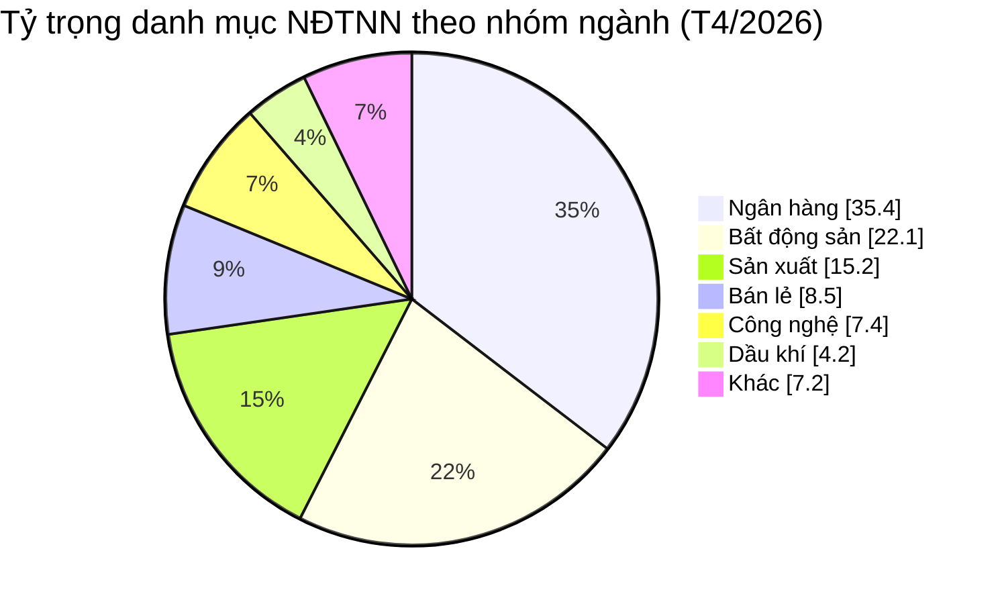

**Bảng KPI:**

| KPI ID | Tên KPI | Đơn vị | Tính chất | Công thức | Ghi chú | Trạng thái |
|---|---|---|---|---|---|---|
| K_NDTNN_50 | Nhóm ngành | — | Chiều | `Public_Company_Dimension.Classification_Business_Line_Name` | **Chuyển PENDING (2026-07-24)** — Chiều này chỉ phục vụ K_NDTNN_51 (đang PENDING), không có measure nào khác trong Nhóm dùng đến, nên đứng độc lập không phục vụ được báo cáo nào. Atomic (`Public Company Dimension`, reuse Nhóm 2) vẫn READY — sẽ chuyển lại READY ngay khi K_NDTNN_51 sẵn sàng. Không phải gap Atomic | PENDING |
| K_NDTNN_51 | Tỷ trọng danh mục theo ngành | % | Derived | TBD — chờ Atomic | Lý do pending: thiếu measure "Giá trị tài sản NĐTNN" (Quantity × giá đóng cửa) — `Foreign Investor Securities Account` chỉ có `Current Holding Quantity`, không có giá đóng cửa trong hệ thống nguồn FIMS/IDS mà BA khai báo (giống O_NDTNN_21 mục Nhóm 7 — K_NDTNN_43 cũng PENDING vì lý do này). Atomic cần bổ sung: field giá đóng cửa chứng khoán trong FIMS/IDS, hoặc xác nhận cross-module join với `Security Trading Snapshot` (MDDS). Mart dự kiến: `Fact Foreign Investor Portfolio Snapshot` (grain 1 NĐT × 1 mã CK × 1 kỳ) | PENDING |

**Bảng mapping nguồn (Atomic Placeholder):**

| Bảng nguồn BA | Atomic entity dự kiến | Atomic table dự kiến | Ghi chú |
|---|---|---|---|
| CATEGORIESSTOCK, SECURITIES | Fact Foreign Investor Portfolio Snapshot (chưa thiết kế) | TBD | Cần measure giá đóng cửa chứng khoán — chưa có nguồn Atomic trong FIMS/IDS (xem O_NDTNN_21) — phục vụ K_NDTNN_51 |
| IDS.COMPANY_PROFILES, IDS.CATEGORIES | Public Company Dimension (đã thiết kế, reuse Nhóm 2) | dim_pub_co | **Atomic đã READY** — không phải gap Atomic. K_NDTNN_50 PENDING vì đứng độc lập không có measure đi kèm trong Nhóm (xem Ghi chú thiết kế) |

---

#### Nhóm 9 - Sở hữu NĐT nước ngoài ROOM (STT=9)

> Phân loại: **Phân tích** (100% PENDING)
> Atomic tham khảo: `Public Company Foreign Ownership Limit` (IDS.FOREIGN_OWNER_LIMIT, draft) — có `Maximum Foreign Ownership Rate Percentage`, khớp khái niệm "Room tối đa" nhưng KHÔNG dùng được vì BA chỉ định nguồn khác (xem Ghi chú thiết kế). `Foreign Investor Securities Account` (FIMS, draft) — có `Current Holding Quantity`, cũng không dùng được vì cùng lý do.

**Ghi chú thiết kế:**
- **Sửa O_NDTNN_21:** Bỏ hẳn `Fact Foreign Ownership Snapshot` với measure `SUM(Ownership Rate)` từ entity ảo `Foreign Investor Stock Portfolio Snapshot` (không tồn tại trong manifest).
- **Rà soát BA xác nhận toàn bộ 6/6 dòng của Nhóm 9 đều PENDING** — không phải do thiếu Atomic, mà do BA chỉ định rõ nguồn là **báo cáo BM67 "Quản lý thông tin nhà đầu tư nước ngoài"** (báo cáo thủ công VSDC, chưa số hoá CSDL) hoặc đánh dấu "Dữ liệu động". Xem O_NDTNN_22 — Atomic đã có sẵn entity số hoá tương đương cho 2/6 khái niệm (Room tối đa, Ownership Rate) nhưng KHÔNG dùng theo đúng gate rule "Loại dữ liệu", vì BA yêu cầu nguồn báo cáo thủ công chứ không phải entity đã số hoá.
- **"Mã CK" (dòng 1):** BA ghi nguồn `FIMS.SECURITIES.SecuritiesTypeId` — không tìm thấy bảng `FIMS.SECURITIES` nào trong manifest (chỉ 6 source table FIMS đã xác nhận từ Nhóm 6/7/8, không có SECURITIES) — cùng gap "không có bảng giá/danh mục chứng khoán trong FIMS" đã ghi nhận ở Nhóm 8. Giữ nguyên PENDING theo đúng gate rule (Loại dữ liệu = Dữ liệu động), không suy diễn thêm.

**Bảng KPI:**

| KPI ID | Tên KPI | Đơn vị | Tính chất | Công thức | Ghi chú | Trạng thái |
|---|---|---|---|---|---|---|
| K_NDTNN_52 | Mã CK | — | Chiều | TBD — chờ Atomic | Lý do pending: nguồn `FIMS.SECURITIES.SecuritiesTypeId` — không có bảng `FIMS.SECURITIES` trong manifest (cùng gap Nhóm 8). Dữ liệu động — chưa thống nhất quy tắc khai thác. Mart dự kiến: `Fact Public Company Foreign Ownership Snapshot` (grain 1 mã CK × 1 ngày) | PENDING |
| K_NDTNN_53 | Tỷ lệ sở hữu (theo mã CK) | % | Cơ sở | TBD — chờ Atomic | Lý do pending: BA chỉ định nguồn báo cáo BM67 VSDC (Dữ liệu động), công thức "Số lượng CP NĐTNN nắm giữ × 100 / Tổng số CP phát hành". Atomic cần bổ sung: xác nhận generic store TT51/BM67 tương ứng. Tham khảo — entity `Foreign Investor Securities Account` (FIMS) có `Current Holding Quantity` nhưng không dùng vì BA yêu cầu nguồn BM67 khác (xem O_NDTNN_22). Mart dự kiến: `Fact Public Company Foreign Ownership Snapshot` | PENDING |
| K_NDTNN_54 | Room còn lại (theo mã CK) | % | Derived | TBD — chờ Atomic | Lý do pending: nguồn BM67 VSDC, "Chưa có CSDL - Map biểu mẫu", công thức "Số lượng CP còn được phép nắm giữ × 100 / Tổng số CP phát hành". Atomic cần bổ sung: số hoá biểu mẫu BM67. Mart dự kiến: `Fact Public Company Foreign Ownership Snapshot` | PENDING |
| K_NDTNN_55 | Room tối đa | % | Cơ sở | TBD — chờ Atomic | Lý do pending: nguồn BM67 VSDC, "Chưa có CSDL - Map biểu mẫu", trường "Tỷ lệ sở hữu nước ngoài tối đa (%)". Tham khảo — entity `Public Company Foreign Ownership Limit` (IDS.FOREIGN_OWNER_LIMIT) có `Maximum Foreign Ownership Rate Percentage` khớp khái niệm nhưng không dùng vì BA yêu cầu nguồn BM67 khác (xem O_NDTNN_22). Mart dự kiến: `Fact Public Company Foreign Ownership Snapshot` | PENDING |
| K_NDTNN_56 | Top 5 mã có room còn lại thấp nhất | — | Derived | TBD — chờ Atomic | Lý do pending: cùng nguồn/công thức K_NDTNN_54 (BM67 VSDC), Dữ liệu động, ORDER BY Room còn lại ASC FETCH FIRST 5 ROWS. Atomic cần bổ sung: xem K_NDTNN_54. Mart dự kiến: `Fact Public Company Foreign Ownership Snapshot` | PENDING |
| K_NDTNN_57 | Room theo ngành (%) | % | Derived | TBD — chờ Atomic | Lý do pending: `SUM(Quantity NĐT)/SUM(Tổng CP tối đa NĐT có thể sở hữu) × 100%` GROUP BY `Classification Business Line` (IDS.CATEGORIES.INDUSTRY_NAME) — Dữ liệu động, nguồn tổng CP tối đa vẫn là BM67. Atomic cần bổ sung: xem K_NDTNN_53/48. Chiều Ngành có thể reuse `Public Company Dimension` (xem Nhóm 8) khi Fact sẵn sàng. Mart dự kiến: `Fact Public Company Foreign Ownership Snapshot` | PENDING |

**Bảng mapping nguồn (Atomic Placeholder):**

| Bảng nguồn BA | Atomic entity dự kiến | Atomic table dự kiến | Ghi chú |
|---|---|---|---|
| FIMS.SECURITIES | Fact Public Company Foreign Ownership Snapshot (chưa thiết kế) | TBD | Không tìm thấy bảng `FIMS.SECURITIES` trong manifest — cùng gap Nhóm 8 |
| BM 67_Quản lý thông tin nhà đầu tư nước ngoài | Fact Public Company Foreign Ownership Snapshot (chưa thiết kế) | TBD | Báo cáo thủ công VSDC, chưa số hoá CSDL — xem O_NDTNN_22 (2 nguồn khác nhau cùng khái niệm Room) |
| IDS.CATEGORIES | — (reuse Public Company Dimension khi Fact sẵn sàng) | cl_business_line | Đã READY (Classification Business Line), chỉ chờ Fact chính |

---

#### Nhóm 10 - Cảnh báo ngưỡng Room còn lại của NĐTNN (STT=10)

> Phân loại: **Phân tích** (100% PENDING)
> Atomic: đồng bộ với Nhóm 9 — xem O_NDTNN_22.

**Ghi chú thiết kế:** BA đánh giá "Trùng" — reuse trực tiếp K_NDTNN_55 (Nhóm 9, "Room tối đa"... thực chất công thức trùng K_NDTNN_54 "Room còn lại (theo mã CK)"), filter thêm điều kiện `Room còn lại = 0`. Trạng thái đồng bộ theo KPI gốc: K_NDTNN_54 đang PENDING (Nhóm 9, 100% PENDING) → Nhóm 10 cũng PENDING.

**Bảng KPI:**

| KPI ID | Tên KPI | Đơn vị | Tính chất | Công thức | Ghi chú | Trạng thái |
|---|---|---|---|---|---|---|
| K_NDTNN_54 | Room còn lại (cổ phiếu) | — | Derived | TBD — chờ Atomic | Reuse từ Nhóm 9 (K_NDTNN_54 "Room còn lại (theo mã CK)"), filter `WHERE Room còn lại = 0` — danh sách mã CK "kín room". Trạng thái đồng bộ với gốc — xem O_NDTNN_22 | PENDING |

---

#### Nhóm 11 - Hồ sơ định danh

> Phân loại: **Tác nghiệp**
> Atomic: `Foreign Investor` (FIMS.INVESTOR) + `Custodian Bank` (FMS.BANK_MONI) — **READY**. **Sửa 2026-07-30:** Nguồn `Custodian Bank` đúng là FMS.BANK_MONI (không phải FIMS.BANKMONI — không tồn tại). FK `Foreign_Investor.Custodian_Bank_Id` (FIMS.INVESTOR.BankAddId) đã được xác nhận trỏ đúng entity qua hash `hash_id('FMS.BANK_MONI', BankAddId)`.

**Mockup:**

| THÔNG TIN CƠ BẢN | | ĐẠI DIỆN GIAO DỊCH |
|---|---|---|
| QUỐC TỊCH | UK/VN | NGUYỄN VĂN A |
| MÃ SỐ GIAO DỊCH (MSGD) | FII001 | CCCD: 0123xxxx5678 |
| NGÂN HÀNG LƯU KÝ | Ngân hàng A | Status: Verified |
| LOẠI HÌNH NĐT | Institutional | |

**Source:** `Operational Foreign Investor 360 Profile` — lookup 1 NĐT theo Mã FII.

**Bảng KPI:**

| KPI ID | Tên | Đơn vị | Tính chất | Công thức | Ghi chú | Trạng thái |
|---|---|---|---|---|---|---|
| K_NDTNN_58 | Thông tin nhà đầu tư | — | Attribute | `opr_foreign_investor_360_profile.investor_nm` — FIMS.INVESTOR.Name | — | READY |
| K_NDTNN_59 | Quốc tịch | — | Attribute | `opr_foreign_investor_360_profile.nationality_code` — từ FIMS.INVESTOR.NaId lookup | — | READY |
| K_NDTNN_60 | Mã số giao dịch (MSGD) | — | Attribute | `opr_foreign_investor_360_profile.investor_code` = Transaction Code — FIMS.INVESTOR.TransactionCode | — | READY |
| K_NDTNN_61 | Ngân hàng lưu ký | — | Attribute | `opr_foreign_investor_360_profile.custodian_bank_nm` — denorm từ `custodian_bank.custodian_bank_full_nm` (FMS.BANK_MONI) qua FK `Foreign_Investor.custodian_bank_id` (INVESTOR.BankAddId) | Sửa 2026-07-30 — nguồn cũ ghi FIMS.BANKMONI (không tồn tại) | READY |
| K_NDTNN_62 | Loại hình NĐT | — | Attribute | `opr_foreign_investor_360_profile.investor_tp_code` — FIMS.INVESTOR.InvestorTypeId | — | READY |
| K_NDTNN_63 | Đại diện giao dịch | — | Attribute | `opr_foreign_investor_360_profile.director_nm` — FIMS.INVESTOR.Director | — | READY |

**Schema bảng tác nghiệp:**

> `Investor_Id` — PK surrogate (ETL generated). `Investor_Code` — BK (FIMS.INVESTOR.TransactionCode), join anchor ETL debug.

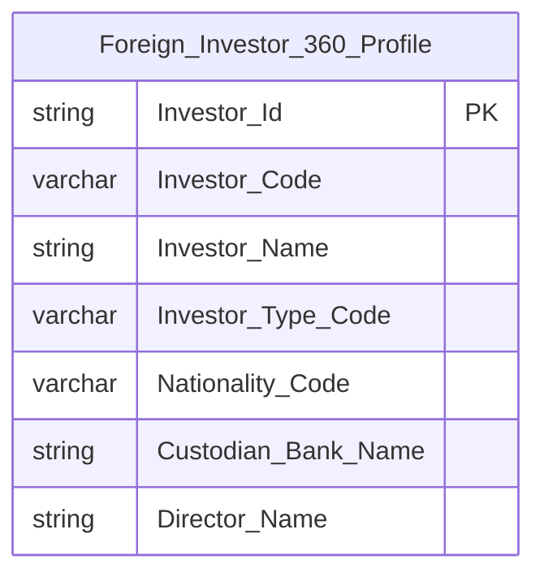

**Lineage Mart → Báo cáo:**

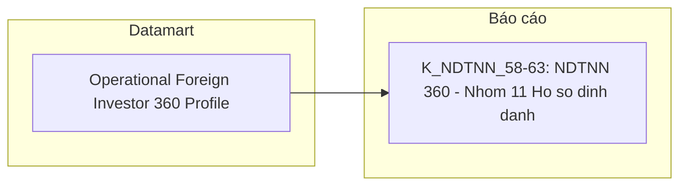

**Bảng grain:**

| Tên bảng | Grain |
|---|---|
| Operational Foreign Investor 360 Profile | 1 row = 1 NĐT NN (trạng thái mới nhất) |

---

#### Nhóm 12 - Biến động tài sản

> Phân loại: **Phân tích**
> Atomic (K_NDTNN_64): `Foreign Investor` (FIMS.INVESTOR) — **READY**, dùng chung Nhóm 2/4/6/9 qua `Foreign Investor Dimension`.
> Atomic (K_NDTNN_65): xem cột Ghi chú trong bảng KPI dưới đây.
> **Sửa Kịch bản D (2026-07-23, xem O_NDTNN_21):** Header cũ dùng entity ảo `Foreign Investor Stock Portfolio Snapshot` (FIMS.CATEGORIESSTOCK) — entity này KHÔNG tồn tại trong `DataModel/working/Atomic/lld/manifest.yaml`; `CATEGORIESSTOCK` đã gộp vào `Foreign Investor Securities Account` (Fundamental, current-state, không có `Portfolio Market Value`). BA STT=12 xác nhận chỉ 2 dòng: "Thông tin nhà đầu tư" (tĩnh) và "Tổng giá trị danh mục" (động, nguồn báo cáo PLIII-TT51 — cùng gốc rễ K_NDTNN_37, Nhóm 6).

**Mockup:**

```
GIÁ TRỊ DANH MỤC HIỆN TẠI
125,000 B

LỊCH SỬ BIẾN ĐỘNG TÀI SẢN (12 THÁNG)
Line chart — Trục X: T1 đến T12 / Trục Y: Giá trị (tỉ đồng)
```

**Source:** `Foreign Investor Dimension` (reuse nguyên trạng — không qua Fact)

**Bảng KPI:**

| KPI ID | Tên | Đơn vị | Tính chất | Công thức / Mô tả | Ghi chú | Trạng thái |
|---|---|---|---|---|---|---|
| K_NDTNN_64 | Thông tin nhà đầu tư | — | Attribute | `Foreign_Investor_Dimension.Investor_Name` | Reuse `Foreign Investor Dimension` (đã READY, dùng chung Nhóm 2/4/6/9) — không qua Fact | READY |
| K_NDTNN_65 | Tổng giá trị danh mục | Tỷ đồng | Phái sinh | TBD — chờ Atomic | **Lý do pending:** Dữ liệu động — cùng nguồn/lý do với K_NDTNN_37 (Nhóm 6, báo cáo PLIII-TT51/2021/TT-BTC, generic store TT51). **Atomic cần bổ sung:** xác nhận Report Code/Cell Code báo cáo PLIII-TT51 trong `Member Regulatory Report`/`Member Report Value` (Cụm 7). **Mart dự kiến:** cùng Fact dự kiến với K_NDTNN_37 (Nhóm 6) | PENDING |

**Star Schema:**

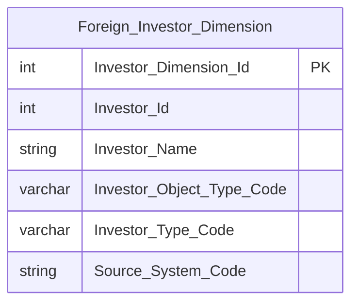

**Lineage Mart → Báo cáo:**

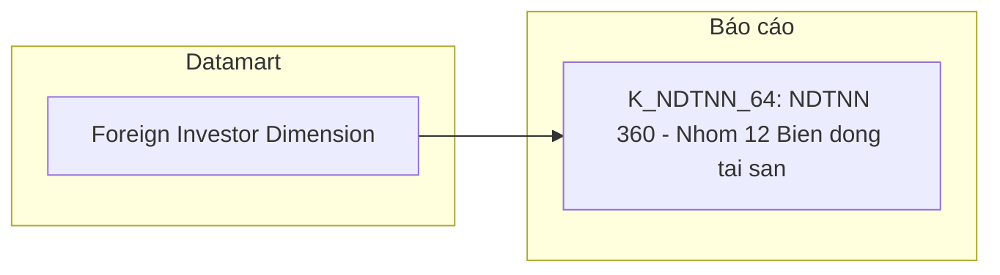

**Bảng grain:**

| Tên bảng | Grain |
|---|---|
| Foreign Investor Dimension | 1 row = 1 NĐT NN (SCD4A current-state) |

---

#### Nhóm 13 - Lịch sử tuân thủ

> Phân loại: **Tác nghiệp** (5/6 KPI READY, 1 Out-of-scope)
> Atomic: `Penalty Decision` (THANHTRA.PENALTY_DECISION, approved) + `Penalty Decision Subject` (approved) + `Penalty Decision Subject Behavior` (approved) + `Penalty Type` (approved) — **READY**
> **Sửa Kịch bản D:** Header cũ dùng entity `Surveillance Enforcement Case`/`Surveillance Enforcement Decision` (TT.GS_HO_SO/GS_VAN_BAN_XU_LY) — BA STT=13 thực tế xác nhận nguồn hoàn toàn khác: `PENALTY_DECISION*`/`PENALTY_TYPE` (THANHTRA). Đã tra lại đúng entity approved — xem O_NDTNN_26.

**Mockup:**

| NGÀY QUYẾT ĐỊNH | PHÂN LOẠI | NỘI DUNG / TRÍCH YẾU | MỨC ĐỘ | TRẠNG THÁI |
|:---|:---|:---|:---|:---|
| 15/10/2023 | REMINDER | Chậm báo cáo tỷ trọng sở hữu | LOW | Resolved |
| 12/05/2023 | ADMINISTRATIVE SANCTION | Giao dịch không công bố đúng thời hạn | MEDIUM | Penalty Paid |

**Source:** `Operational Investor Compliance History` — denormalize từ `Penalty Decision` + `Penalty Decision Subject` + `Penalty Decision Subject Behavior` + `Penalty Type`, filter theo Subject = NĐT đang chọn.

**Bảng KPI:**

| KPI ID | Tên KPI | Đơn vị | Tính chất | Công thức | Ghi chú | Trạng thái |
|---|---|---|---|---|---|---|
| K_NDTNN_66 | Thông tin nhà đầu tư | — | Cơ sở | `Penalty_Decision_Subject.Subject_Name` | Đánh giá BA "Trùng" — tên/MSGD NĐTNN, dùng chung hồ sơ 360 | READY |
| K_NDTNN_67 | Ngày quyết định | — | Cơ sở | `Penalty_Decision.Issued_Date` | — | READY |
| K_NDTNN_68 | Phân loại | — | Cơ sở | `Penalty_Type.Penalty_Type_Name` — join qua `Penalty_Decision_Subject_Behavior.Penalty_Type_Id` | Phân loại hình thức xử lý (nhắc nhở/xử phạt hành chính...) | READY |
| K_NDTNN_69 | Nội dung/Trích yếu | — | Cơ sở | `Penalty_Decision_Subject_Behavior.Description` | — | READY |
| K_NDTNN_70 | Mức độ | — | Cơ sở | — | **Out-of-scope** — BA tự ghi chú "không có trường thông tin xác định mức độ vi phạm" (giá trị NULL), đề xuất trao đổi với BA để loại bỏ trường này khỏi màn hình | Out-of-scope |
| K_NDTNN_71 | Trạng thái | — | Cơ sở | `Penalty_Decision.Life_Cycle_Status_Code` | Trạng thái xử lý (đã khắc phục/đã nộp phạt...) | READY |

**Star Schema:**

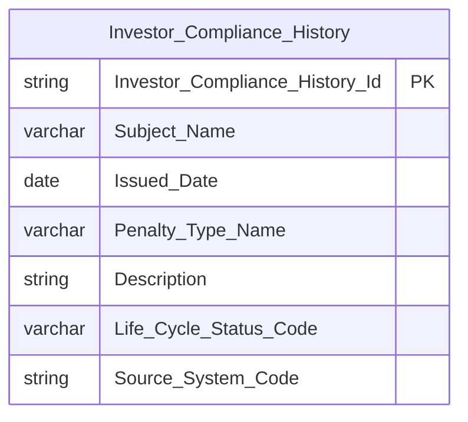

**Lineage Mart → Báo cáo:**

```mermaid
flowchart LR
    subgraph Datamart["Datamart"]
        G1["Operational Investor Compliance History"]
    end
    subgraph RPT["Báo cáo"]
        R1["K_NDTNN_66-71: NDTNN 360 - Nhom 13 Lich su tuan thu"]
    end
    G1 --> R1
```

**Bảng grain:**

| Tên bảng | Grain |
|---|---|
| Operational Investor Compliance History | 1 row = 1 hành vi vi phạm × 1 đối tượng bị xử phạt (denormalize Penalty Decision + Subject + Subject Behavior + Penalty Type) |

---

#### Nhóm 14 - Báo cáo thống kê tình hình giao dịch của NĐTNN trên thị trường chứng khoán (STT=14)

> Phân loại: **Tác nghiệp** (12/12 KPI READY)
> Atomic: `Securities Trade` (ORDERTRADE.TRADE_BOOK_HOSE/HNX) — **READY**, cùng entity đã dùng Nhóm 1/2/15. `Securities Dimension` (Cụm 1a, reuse) — chỉ dùng cho dòng CCQ.
> **Sửa lỗi lệch STT (cùng gốc O_NDTNN_17/18):** Nội dung "Nhóm 10" trước đây (header "Báo cáo thống kê tình hình giao dịch NĐTNN") thực chất là BA STT=14, bị đặt sai số — xem O_NDTNN_23.
> **Sửa Kịch bản D (2026-07-24) — đổi kiến trúc từ Phân tích (Star Schema) sang Tác nghiệp:** xem chi tiết O_NDTNN_24.

**Ghi chú thiết kế:** BA cột "Chiều dữ liệu" ghi rõ grain báo cáo = **"Ngày, Loại CK"** (1 ngày × 1 trong 4 nhóm loại CK cố định: Cổ phiếu/Trái phiếu/CCQ/Tổng) cho cả 12/12 dòng — đây là báo cáo tổng hợp đã "đóng gói" sẵn theo đúng công thức riêng cho từng nhóm, không phải use-case Star Schema cần drill-down tự do theo Symbol (khác Nhóm 1/2). Bảng tác nghiệp mới `Foreign Investor Trading Statistics Report` — grain **1 ngày × 1 Security_Type_Group** (4 giá trị cố định: STOCK/BOND/FUND_CERT/TOTAL) — ETL tính riêng `Buy_Value`/`Sell_Value` cho mỗi group theo đúng điều kiện BA:
- **STOCK** (Cổ phiếu): HOSE `Market_Id_Code='STO'` (`Foreign_Investor_Type_Code<>'00'`) UNION HNX `Market_Id_Code IN ('STX','UPX')` (`Foreign_Investor_Type_Code IN ('10','20')`)
- **BOND** (Trái phiếu): HOSE `Market_Id_Code='BDO'` UNION HNX `Market_Id_Code IN ('BDX','HCX')` — cùng điều kiện Foreign_Investor_Type như STOCK
- **FUND_CERT** (CCQ) — sửa O_NDTNN_24: `Market_Id_Code='STO'` AND `Investor_Type_Code='7000'` (KHÔNG phải `Foreign_Investor_Type_Code` — đây là attribute khác hẳn, `buy/sell_investor_type_code` scheme `ORDERTRADE_INVESTOR_TYPE`, so với `buy/sell_foreign_investor_type_code` scheme `ORDERTRADE_FOREIGN_INVESTOR_TYPE` dùng ở STOCK/BOND/TOTAL — 2 attribute độc lập trên `Securities Trade`) AND join `Securities_Dimension.Stock_Type_Code='3'` (giá trị nguyên văn BA — scheme `MDDS_STOCK_TYPE` chưa profile, không diễn giải sang 'MF'/Mutual Fund)
- **TOTAL** (Tổng): không filter Market_Id_Code, chỉ filter Foreign_Investor_Type_Code (như STOCK/BOND) — SUM toàn bộ Securities Trade

**Lý do tách bảng riêng (không dùng chung `Fact Securities Foreign Trading Snapshot` với Nhóm 1/2):** `Foreign_Buy_Value`/`Foreign_Sell_Value` trên Fact đó đã pre-aggregate SUM cố định theo `Foreign_Investor_Type_Code` — không filter theo `Investor_Type_Code`. CCQ cần 1 con số hoàn toàn khác (SUM theo điều kiện `Investor_Type_Code='7000'`), không thể filter thêm ở query-time trên measure đã collapse. Đã đánh giá và loại bỏ 3 phương án khác — xem O_NDTNN_24.

**Bảng KPI:**

| KPI ID | Tên KPI | Đơn vị | Tính chất | Công thức | Ghi chú | Trạng thái |
|---|---|---|---|---|---|---|
| K_NDTNN_72 | Cổ phiếu - GT NĐTNN mua chứng khoán | Triệu VNĐ | Cơ sở | `Buy_Value` WHERE `Security_Type_Group='STOCK'` | — | READY |
| K_NDTNN_73 | Cổ phiếu - GT NĐTNN bán chứng khoán | Triệu VNĐ | Cơ sở | `Sell_Value` WHERE `Security_Type_Group='STOCK'` | — | READY |
| K_NDTNN_74 | Cổ phiếu - GT NĐTNN mua/bán ròng chứng khoán | Triệu VNĐ | Derived | `K_NDTNN_72 - K_NDTNN_73` | — | READY |
| K_NDTNN_75 | Trái phiếu - GT NĐTNN mua chứng khoán | Triệu VNĐ | Cơ sở | `Buy_Value` WHERE `Security_Type_Group='BOND'` | — | READY |
| K_NDTNN_76 | Trái phiếu - GT NĐTNN bán chứng khoán | Triệu VNĐ | Cơ sở | `Sell_Value` WHERE `Security_Type_Group='BOND'` | — | READY |
| K_NDTNN_77 | Trái phiếu - GT NĐTNN mua/bán ròng chứng khoán | Triệu VNĐ | Derived | `K_NDTNN_75 - K_NDTNN_76` | — | READY |
| K_NDTNN_78 | CCQ - GT NĐTNN mua chứng khoán | Triệu VNĐ | Cơ sở | `Buy_Value` WHERE `Security_Type_Group='FUND_CERT'` | Sửa O_NDTNN_24 — ETL filter `Investor_Type_Code='7000'` (khác Foreign_Investor_Type_Code) + `Market_Id_Code='STO'` + join `Securities_Dimension.Stock_Type_Code='3'` (nguyên văn BA, chưa xác nhận tên gọi chuẩn hoá) | READY |
| K_NDTNN_79 | CCQ - GT NĐTNN bán chứng khoán | Triệu VNĐ | Cơ sở | `Sell_Value` WHERE `Security_Type_Group='FUND_CERT'` | Sửa O_NDTNN_24 — cùng điều kiện ETL như K_NDTNN_78 | READY |
| K_NDTNN_80 | CCQ - GT NĐTNN mua/bán ròng chứng khoán | Triệu VNĐ | Derived | `K_NDTNN_78 - K_NDTNN_79` | Sửa O_NDTNN_24 | READY |
| K_NDTNN_81 | Tổng - GT NĐTNN mua chứng khoán | Triệu VNĐ | Cơ sở | `Buy_Value` WHERE `Security_Type_Group='TOTAL'` | — | READY |
| K_NDTNN_82 | Tổng - GT NĐTNN bán chứng khoán | Triệu VNĐ | Cơ sở | `Sell_Value` WHERE `Security_Type_Group='TOTAL'` | — | READY |
| K_NDTNN_83 | Tổng - GT NĐTNN mua/bán ròng chứng khoán | Triệu VNĐ | Derived | `K_NDTNN_81 - K_NDTNN_82` | — | READY |

**Schema bảng tác nghiệp:**

> `Report_Date` + `Security_Type_Group` — composite grain key (`key: DD`, theo TC2b Fact không được có `key = PK` — xem O_NDTNN_31b). `Security_Type_Group` là Classification Value nội bộ Datamart (không tồn tại trên Atomic) — 4 giá trị cố định: STOCK/BOND/FUND_CERT/TOTAL.

```mermaid
erDiagram
    Foreign_Investor_Trading_Statistics_Report {
        date Report_Date
        varchar Security_Type_Group
        float Buy_Value
        float Sell_Value
        string Source_System_Code
    }
```

**Lineage Mart → Báo cáo:**

```mermaid
flowchart LR
    subgraph Datamart["Datamart"]
        G1["Foreign Investor Trading Statistics Report"]
    end
    subgraph RPT["Báo cáo"]
        R1["K_NDTNN_72-83: Tab BAO CAO - Nhom 14 - Bao cao thong ke tong hop"]
    end
    G1 --> R1
```

**Bảng grain:**

| Tên bảng | Grain |
|---|---|
| Foreign Investor Trading Statistics Report | 1 row = 1 ngày × 1 Security_Type_Group (STOCK/BOND/FUND_CERT/TOTAL) — ETL SUM(Execution_Value) từ Securities Trade theo đúng điều kiện filter riêng của từng group (xem Ghi chú thiết kế) |

---

#### Nhóm 15 - Báo cáo thống kê tình hình giao dịch của NĐTNN trên thị trường chứng khoán – biểu chi tiết (STT=15)

> Phân loại: **Tác nghiệp** (100% READY)
> Atomic: `Securities Trade` (ORDERTRADE.TRADE_BOOK_HOSE/HNX) — **READY**, field `Buy/Sell Account Number`, `Buy/Sell Account Holder Name`, `Security Symbol Code`, `Execution Volume`, `Execution Value`, `Buy/Sell Foreign Investor Type Code`, `Buy/Sell Investor Type Code`.
> **Sửa lỗi lệch STT (cùng gốc O_NDTNN_17/18):** Nội dung "Nhóm 10b" trước đây thực chất là BA STT=15, bị đặt sai số — xem O_NDTNN_23.
> **Sửa Kịch bản D (2026-07-24) — đổi kiến trúc từ Phân tích (Star Schema) sang Tác nghiệp:** xem chi tiết O_NDTNN_30.

**Ghi chú thiết kế:** BA cột "Chiều dữ liệu" ghi tắt "Ngày, NĐT" nhưng câu lệnh tham khảo SQL xác nhận grain thật là **1 ngày × 1 Account_Number × 1 Symbol × 1 bên (Buy/Sell)** — `GROUP BY Buy_Acct_No, Symbol` (HOSE) / `GROUP BY Buy_account_number, Issue_Code` (HNX). Bảng tác nghiệp mới `Foreign Investor Trading Detail Report` denormalize hoàn toàn (không qua Star Schema): `Symbol` lưu trực tiếp (text), `Account_Holder_Name` đệm sẵn từ `Securities Trade`. Điều kiện lọc dòng vào báo cáo dùng **2 attribute Investor Type độc lập** trên `Securities Trade` — `Foreign_Investor_Type_Code` (scheme `ORDERTRADE_FOREIGN_INVESTOR_TYPE`, dùng cho danh sách Account/Symbol) và `Investor_Type_Code` (scheme `ORDERTRADE_INVESTOR_TYPE`, dùng cho KL/GT mua-bán) — cả 2 là điều kiện ETL filter, KHÔNG lưu thành cột trên bảng kết quả. `Buy/Sell Client House Classification Code` không được KPI nào dùng — loại khỏi thiết kế.

**Bảng KPI:**

| KPI ID | Tên KPI | Đơn vị | Tính chất | Công thức | Ghi chú | Trạng thái |
|---|---|---|---|---|---|---|
| K_NDTNN_84 | Tài khoản giao dịch NĐTNN | — | Chiều | `Foreign_Investor_Trading_Detail_Report.Account_Number` | Từ Buy/Sell Account Number (HNX) hoặc Buy/Sell Acct No (HOSE) | READY |
| K_NDTNN_85 | Mã CK | — | Chiều | `Foreign_Investor_Trading_Detail_Report.Symbol` | Từ Issue Code (HNX) hoặc Symbol (HOSE). Denormalize text trực tiếp — không qua FK Securities Dimension (bảng Tác nghiệp) | READY |
| K_NDTNN_86 | KL mua chứng khoán | CP | Cơ sở | `Execution_Volume` WHERE `Trade_Direction_Code='BUY'` | ETL filter: `Buy_Foreign_Investor_Type_Code IN ('10','20')` OR `Buy_Investor_Type_Code='7000'` (2 attribute độc lập, sửa O_NDTNN_30) | READY |
| K_NDTNN_87 | KL bán CK | CP | Cơ sở | `Execution_Volume` WHERE `Trade_Direction_Code='SELL'` | ETL filter: `Sell_Foreign_Investor_Type_Code IN ('10','20')` OR `Sell_Investor_Type_Code='7000'` (2 attribute độc lập, sửa O_NDTNN_30) | READY |
| K_NDTNN_88 | GT mua chứng khoán | Triệu VNĐ | Cơ sở | `Execution_Value` (HNX: Trade_price×Trade_quantity) WHERE `Trade_Direction_Code='BUY'` | Cùng điều kiện ETL filter với K_NDTNN_86 | READY |
| K_NDTNN_89 | GT bán chứng khoán | Triệu VNĐ | Cơ sở | `Execution_Value` (HNX: Trade_price×Trade_quantity) WHERE `Trade_Direction_Code='SELL'` | Cùng điều kiện ETL filter với K_NDTNN_87 | READY |

**Schema bảng tác nghiệp:**

> `Report_Date` + `Account_Number` + `Symbol` + `Trade_Direction_Code` — composite grain key (`key: DD`, theo TC2b Fact không được có `key = PK` — xem O_NDTNN_31b). `Trade_Direction_Code` (Buy/Sell) là 1 phần grain — tách từ `Securities Trade` (1 row per lệnh khớp có cả Buy và Sell).

```mermaid
erDiagram
    Foreign_Investor_Trading_Detail_Report {
        date Report_Date
        varchar Account_Number
        varchar Symbol
        varchar Trade_Direction_Code
        string Account_Holder_Name
        float Execution_Volume
        float Execution_Value
        string Source_System_Code
    }
```

**Lineage Mart → Báo cáo:**

```mermaid
flowchart LR
    subgraph Datamart["Datamart"]
        G1["Foreign Investor Trading Detail Report"]
    end
    subgraph RPT["Báo cáo"]
        R1["K_NDTNN_84-89: Tab BAO CAO - Nhom 15 - Bao cao thong ke chi tiet"]
    end
    G1 --> R1
```

**Bảng grain:**

| Tên bảng | Grain |
|---|---|
| Foreign Investor Trading Detail Report | 1 row = 1 ngày × 1 Account_Number × 1 Symbol × 1 bên (Buy/Sell) — ETL SUM(Execution_Volume/Value) từ Securities Trade theo đúng điều kiện filter (xem Ghi chú thiết kế) |

---

#### Nhóm 16 - Data Explorer Dòng vốn ròng của NĐTNN

> Phân loại: **Phân tích** (100% PENDING)
> Atomic: cùng gốc Nhóm 3/5 — `Member Regulatory Report`/`Member Report Value` (Cụm 7), chưa xác nhận Report Code cho báo cáo PLIV-TT51.
> **Đổi format KPI ID:** `K_NDTNN_DE1a-e` (format cũ, không đúng naming convention `K_{MODULE}_{N}`) → đổi thành `K_NDTNN_90-93` (số liên tục theo max hiện có). Module chưa có Attributes/Detail Mapping LLD nên đổi ID an toàn, không ảnh hưởng file khác.

**Mockup:**

| Tháng | Quốc gia | Nhà đầu tư | Vốn vào ròng (Tỉ đồng) | Vốn rút ròng (Tỉ đồng) |
|---|---|---|---|---|
| T1/2024 | Hàn Quốc | GD437560 | +3.300 | 0 |
| T1/2024 | Nhật Bản | GD426069 | 0 | -700 |

**Bảng KPI:**

| KPI ID | Tên KPI | Đơn vị | Tính chất | Công thức | Ghi chú | Trạng thái |
|---|---|---|---|---|---|---|
| K_NDTNN_90 | Tháng | — | Chiều | TBD — chờ Atomic | Đánh giá BA "Trùng" — cùng khái niệm Chiều thời gian đã dùng Nhóm 3/4/5. Dữ liệu động — nguồn `RPTMEMBER.PeriodValue`. Mart dự kiến: `Fact Foreign Investor Capital Flow Report` (tên tạm, xem Nhóm 3) | PENDING |
| K_NDTNN_91 | Quốc gia | — | Chiều | TBD — chờ Atomic | Đánh giá BA "Trùng" — GROUP BY Quốc tịch. Dữ liệu động — nguồn báo cáo PLIV-TT51 (Ngân hàng lưu ký, kỳ nửa tháng). Chiều Quốc gia chưa có Atomic nguồn xác nhận (xem O_NDTNN_21, Geographic Area chỉ có nguồn ECAT). Mart dự kiến: `Fact Foreign Investor Capital Flow Report` | PENDING |
| K_NDTNN_92 | Nhà đầu tư | — | Chiều | TBD — chờ Atomic | Đánh giá BA "Trùng" — GROUP BY Tên nhà đầu tư. Dữ liệu động, cùng nguồn PLIV-TT51. Mart dự kiến: `Fact Foreign Investor Capital Flow Report` | PENDING |
| K_NDTNN_93 | Vốn đầu tư vào ròng | Tỷ đồng | Derived | TBD — chờ Atomic | Đánh giá BA "Trùng" — filter theo `RPTVALUES.Code`, cột "GT dòng vốn vào (3)". Dữ liệu động — cùng nguồn/lý do pending K_NDTNN_20 (Nhóm 3). Mart dự kiến: `Fact Foreign Investor Capital Flow Report` | PENDING |
| K_NDTNN_94 | Vốn đầu tư rút ròng | Tỷ đồng | Derived | TBD — chờ Atomic | Đánh giá BA "Trùng" — filter theo `RPTVALUES.Code`, cột "GT dòng vốn vào (3)" (BA note dùng chung cột, khác điều kiện lọc Code). Dữ liệu động. Mart dự kiến: `Fact Foreign Investor Capital Flow Report` | PENDING |

**Atomic cần bổ sung:** Xem Nhóm 3 (Member Regulatory Report/Member Report Value — cần xác nhận Report Code báo cáo PLIV-TT51).

**Bảng mapping nguồn (Atomic Placeholder):**

| Bảng nguồn BA | Atomic entity dự kiến | Atomic table dự kiến | Ghi chú |
|---|---|---|---|
| RPTMEMBER, Báo cáo PLIV-TT51/2021/TT-BTC | Member Regulatory Report / Member Report Value (Cụm 7) | TBD | Cần xác nhận Report Code — xem Nhóm 3/5, O_NDTNN_16 |

---

#### Nhóm 17 - Data Explorer Tổng giá trị danh mục của NĐTNN

> Phân loại: **Phân tích** (100% PENDING)
> Atomic tham khảo: `Foreign Investor Securities Account` (FIMS, draft) — có `Current Holding Quantity`, KHÔNG có `Portfolio Market Value` (giống gốc rễ Nhóm 6/7 — xem O_NDTNN_21).
> **Sửa O_NDTNN_21 + lỗi lệch STT:** Header cũ ghi sai STT ("không STT") và dùng entity ảo `Foreign Investor Stock Portfolio Snapshot` (không tồn tại) đánh READY — BA thực tế xác nhận STT=17, toàn bộ 4/4 dòng Dữ liệu động (nguồn báo cáo PLIII-TT51, cùng gốc rễ Nhóm 6) → PENDING.

**Mockup:**

| Tháng | Quốc gia | Tên NĐT | Tổng GTDM (Tỉ đồng) |
|---|---|---|---|
| T1/2024 | Hàn Quốc | GD437560 | 4.500 |
| T1/2024 | Nhật Bản | GD426069 | 2.800 |

**Bảng KPI:**

| KPI ID | Tên KPI | Đơn vị | Tính chất | Công thức | Ghi chú | Trạng thái |
|---|---|---|---|---|---|---|
| K_NDTNN_95 | Tháng | — | Chiều | TBD — chờ Atomic | Đánh giá BA "Trùng" — nguồn `RPTMEMBER.PeriodValue`, filter `WHERE tên báo cáo = ""`. Dữ liệu động. Mart dự kiến: `Fact Public Company Financial Report Value`/generic store TT51 (xem Nhóm 6) | PENDING |
| K_NDTNN_96 | Quốc gia | — | Chiều | TBD — chờ Atomic | Đánh giá BA "Trùng" — GROUP BY Quốc tịch, nguồn báo cáo PLIII-TT51 Mục II. Dữ liệu động. Chiều Quốc gia cũng chưa có Atomic nguồn xác nhận (xem O_NDTNN_21, Geographic Area chỉ có nguồn ECAT) | PENDING |
| K_NDTNN_97 | Tên NĐT | — | Chiều | TBD — chờ Atomic | Đánh giá BA "Trùng" — GROUP BY Tên khách hàng, cùng nguồn PLIII-TT51 Mục II | PENDING |
| K_NDTNN_98 | Tổng giá trị danh mục | Tỷ đồng | Cơ sở | TBD — chờ Atomic | Đánh giá BA "Trùng" — cột "Tổng giá trị danh mục", hàng "Tổng=(1)+(2)". Cùng lý do/nguồn K_NDTNN_37 (Nhóm 6) — Atomic `Foreign Investor Securities Account` KHÔNG có Portfolio Market Value | PENDING |

**Bảng mapping nguồn (Atomic Placeholder):**

| Bảng nguồn BA | Atomic entity dự kiến | Atomic table dự kiến | Ghi chú |
|---|---|---|---|
| Báo cáo PLIII-TT51/2021/TT-BTC (Mục II) | Member Regulatory Report / Member Report Value (Cụm 7) | TBD | Cần xác nhận Report Code Mục II — cùng gốc Nhóm 6 (K_NDTNN_37) |

---

#### Nhóm 18 - Data Explorer Pass-through PLV-TT51

> Phân loại: **Tác nghiệp** (100% PENDING)
> Atomic tham khảo: `Member Regulatory Report`/`Member Report Value`/`Report Template` (FIMS) — draft.
> **Sửa gating "Loại dữ liệu" + KPI thừa không có dòng BA:** HLD cũ đánh READY toàn bộ (đúng gốc rễ đã sửa ở Nhóm 6/7/9/17) — BA STT=18 xác nhận **toàn bộ 6/6 dòng đều Dữ liệu động** → PENDING theo gate rule. Đồng thời "Giá trị" (`K_NDTNN_DE8` cũ) **không có dòng BA tương ứng** — BA chỉ có 6 dòng (Loại/Kỳ/Mã/Tên báo cáo + Mã/Tên chỉ tiêu), không có dòng "Giá trị" độc lập nào — đã loại khỏi bảng KPI theo xác nhận Data Modeler (2026-07-23). Xem O_NDTNN_25.
> **Đổi format KPI ID:** `K_NDTNN_DE3-DE7b` (Nhóm 18 cũ) và `K_NDTNN_99-104` (block "Bổ sung Loại 1", trùng nội dung) — cả 2 bộ ID đều dùng chung 1 nội dung. Giữ ID nhỏ hơn đã khai sinh trước (`K_NDTNN_99-104`), xóa hẳn bộ `DE3-DE7b` trùng lặp.

**Mockup:**

| Loại báo cáo | Kỳ báo cáo | Mã báo cáo | Tên báo cáo | Mã chỉ tiêu | Tên chỉ tiêu |
|---|---|---|---|---|---|
| Định kỳ | Tháng 3/2026 | RPT-001 | Hoạt động QL DMĐT (PLV-TT51) | CT_01 | Tổng tài sản |

**Bảng KPI:**

| KPI ID | Tên KPI | Đơn vị | Tính chất | Công thức | Ghi chú | Trạng thái |
|---|---|---|---|---|---|---|
| K_NDTNN_99 | Loại báo cáo | — | Chiều | TBD — chờ Atomic | Nguồn `REPORTTYPE.NAME`/`RPTMEMBER.REPORTTypeID`. Dữ liệu động. Mart dự kiến: `NDTNN Regulatory Report Store` (Cụm 7) | PENDING |
| K_NDTNN_100 | Kỳ báo cáo | — | Chiều | TBD — chờ Atomic | Nguồn `RPTMEMBER.PeriodType`. Dữ liệu động | PENDING |
| K_NDTNN_101 | Mã báo cáo | — | Chiều | TBD — chờ Atomic | Nguồn `RPTMEMBER.RPID`. Dữ liệu động | PENDING |
| K_NDTNN_102 | Tên báo cáo | — | Chiều | TBD — chờ Atomic | Nguồn tên báo cáo (PLV-TT51/2021/TT-BTC — Hoạt động QL DMĐT/chỉ định đầu tư). Dữ liệu động | PENDING |
| K_NDTNN_103 | Mã chỉ tiêu | — | Chiều | TBD — chờ Atomic | Nguồn `RPT_FIELD_CATALOG.MA_CHI_TIEU`. Dữ liệu động | PENDING |
| K_NDTNN_104 | Tên chỉ tiêu | — | Chiều | TBD — chờ Atomic | Nguồn `RPT_FIELD_CATALOG.TEN_CHI_TIEU`. Dữ liệu động | PENDING |

**Atomic cần bổ sung:** `Member Regulatory Report` + `Member Report Value` + `Report Template` (FIMS) — cần xác nhận Report Code cho PLV-TT51 (xem Cụm 7).

**Bảng mapping nguồn (Atomic Placeholder):**

| Bảng nguồn BA | Atomic entity dự kiến | Atomic table dự kiến | Ghi chú |
|---|---|---|---|
| REPORTTYPE, RPTMEMBER, RPT_FIELD_CATALOG | Member Regulatory Report / Member Report Value / Report Template (Cụm 7) | TBD | Cần xác nhận Report Code PLV-TT51 |

---
#### Nhóm 19 - CTCK - Báo cáo thống kê danh mục lưu ký NĐTNN, tổ chức phát hành CCLK tại nước ngoài (PLIII-TT51/2021/TT-BTC) (STT=19)

> Phân loại: **Tác nghiệp** (100% PENDING)
> Atomic tham khảo: `Member Regulatory Report`/`Member Report Value`/`Report Template` (FIMS, draft) — generic store TT51 (Cụm 7), cùng pattern Nhóm 18 (STT=18). Cần xác nhận Report Code riêng cho báo cáo này — xem O_NDTNN_27.

**Bảng KPI:**

| KPI ID | Tên KPI | Đơn vị | Tính chất | Công thức | Ghi chú | Trạng thái |
|---|---|---|---|---|---|---|
| K_NDTNN_105 | Loại báo cáo | — | Chiều | TBD — chờ Atomic | Nguồn `REPORTTYPE.NAME`/`RPTMEMBER.REPORTTypeID`. Dữ liệu động. Mart dự kiến: `NDTNN Regulatory Report Store` (Cụm 7) | PENDING |
| K_NDTNN_106 | Kỳ báo cáo | — | Chiều | TBD — chờ Atomic | Nguồn `RPTMEMBER.PeriodType`. Dữ liệu động | PENDING |
| K_NDTNN_107 | Mã báo cáo | — | Chiều | TBD — chờ Atomic | Nguồn `RPTMEMBER.RPID`. Dữ liệu động | PENDING |
| K_NDTNN_108 | Tên báo cáo | — | Chiều | TBD — chờ Atomic | Tên cố định: "CTCK - Báo cáo thống kê danh mục lưu ký NĐTNN, tổ chức phát hành CCLK tại nước ngoài (PLIII-TT51/2021/TT-BTC)". Dữ liệu động | PENDING |
| K_NDTNN_109 | Mã chỉ tiêu | — | Chiều | TBD — chờ Atomic | Nguồn `RPT_FIELD_CATALOG.MA_CHI_TIEU`. Dữ liệu động | PENDING |
| K_NDTNN_110 | Tên chỉ tiêu | — | Chiều | TBD — chờ Atomic | Nguồn `RPT_FIELD_CATALOG.TEN_CHI_TIEU`. Dữ liệu động | PENDING |

**Atomic cần bổ sung:** `Member Regulatory Report` + `Member Report Value` + `Report Template` (FIMS) — cần xác nhận Report Code riêng cho báo cáo này (xem Cụm 7, O_NDTNN_27).

**Bảng mapping nguồn (Atomic Placeholder):**

| Bảng nguồn BA | Atomic entity dự kiến | Atomic table dự kiến | Ghi chú |
|---|---|---|---|
| REPORTTYPE, RPTMEMBER, RPT_FIELD_CATALOG | Member Regulatory Report / Member Report Value / Report Template (Cụm 7) | TBD | Cần xác nhận Report Code — xem O_NDTNN_27 |

---

#### Nhóm 20 - CTCK - Hoạt động quản lý danh mục đầu tư/chỉ định đầu tư cho NĐTNN (PLV-TT51/2021/TT-BTC) (STT=20)

> Phân loại: **Tác nghiệp** (100% PENDING)
> Atomic tham khảo: `Member Regulatory Report`/`Member Report Value`/`Report Template` (FIMS, draft) — generic store TT51 (Cụm 7), cùng pattern Nhóm 18 (STT=18). Cần xác nhận Report Code riêng cho báo cáo này — xem O_NDTNN_27.

**Bảng KPI:**

| KPI ID | Tên KPI | Đơn vị | Tính chất | Công thức | Ghi chú | Trạng thái |
|---|---|---|---|---|---|---|
| K_NDTNN_111 | Loại báo cáo | — | Chiều | TBD — chờ Atomic | Nguồn `REPORTTYPE.NAME`/`RPTMEMBER.REPORTTypeID`. Dữ liệu động. Mart dự kiến: `NDTNN Regulatory Report Store` (Cụm 7) | PENDING |
| K_NDTNN_112 | Kỳ báo cáo | — | Chiều | TBD — chờ Atomic | Nguồn `RPTMEMBER.PeriodType`. Dữ liệu động | PENDING |
| K_NDTNN_113 | Mã báo cáo | — | Chiều | TBD — chờ Atomic | Nguồn `RPTMEMBER.RPID`. Dữ liệu động | PENDING |
| K_NDTNN_114 | Tên báo cáo | — | Chiều | TBD — chờ Atomic | Tên cố định: "CTCK - Hoạt động quản lý danh mục đầu tư/chỉ định đầu tư cho NĐTNN (PLV-TT51/2021/TT-BTC)". Dữ liệu động | PENDING |
| K_NDTNN_115 | Mã chỉ tiêu | — | Chiều | TBD — chờ Atomic | Nguồn `RPT_FIELD_CATALOG.MA_CHI_TIEU`. Dữ liệu động | PENDING |
| K_NDTNN_116 | Tên chỉ tiêu | — | Chiều | TBD — chờ Atomic | Nguồn `RPT_FIELD_CATALOG.TEN_CHI_TIEU`. Dữ liệu động | PENDING |

**Atomic cần bổ sung:** `Member Regulatory Report` + `Member Report Value` + `Report Template` (FIMS) — cần xác nhận Report Code riêng cho báo cáo này (xem Cụm 7, O_NDTNN_27).

**Bảng mapping nguồn (Atomic Placeholder):**

| Bảng nguồn BA | Atomic entity dự kiến | Atomic table dự kiến | Ghi chú |
|---|---|---|---|
| REPORTTYPE, RPTMEMBER, RPT_FIELD_CATALOG | Member Regulatory Report / Member Report Value / Report Template (Cụm 7) | TBD | Cần xác nhận Report Code — xem O_NDTNN_27 |

---

#### Nhóm 21 - Ngân hàng lưu ký - Báo cáo thống kê danh mục lưu ký NĐTNN, tổ chức phát hành CCLK tại nước ngoài (PLIII-TT51/2011/TT-BTC) (STT=21)

> Phân loại: **Tác nghiệp** (100% PENDING)
> Atomic tham khảo: `Member Regulatory Report`/`Member Report Value`/`Report Template` (FIMS, draft) — generic store TT51 (Cụm 7), cùng pattern Nhóm 18 (STT=18). Cần xác nhận Report Code riêng cho báo cáo này — xem O_NDTNN_27.

**Bảng KPI:**

| KPI ID | Tên KPI | Đơn vị | Tính chất | Công thức | Ghi chú | Trạng thái |
|---|---|---|---|---|---|---|
| K_NDTNN_117 | Loại báo cáo | — | Chiều | TBD — chờ Atomic | Nguồn `REPORTTYPE.NAME`/`RPTMEMBER.REPORTTypeID`. Dữ liệu động. Mart dự kiến: `NDTNN Regulatory Report Store` (Cụm 7) | PENDING |
| K_NDTNN_118 | Kỳ báo cáo | — | Chiều | TBD — chờ Atomic | Nguồn `RPTMEMBER.PeriodType`. Dữ liệu động | PENDING |
| K_NDTNN_119 | Mã báo cáo | — | Chiều | TBD — chờ Atomic | Nguồn `RPTMEMBER.RPID`. Dữ liệu động | PENDING |
| K_NDTNN_120 | Tên báo cáo | — | Chiều | TBD — chờ Atomic | Tên cố định: "Ngân hàng lưu ký - Báo cáo thống kê danh mục lưu ký NĐTNN, tổ chức phát hành CCLK tại nước ngoài (PLIII-TT51/2011/TT-BTC)". Dữ liệu động | PENDING |
| K_NDTNN_121 | Mã chỉ tiêu | — | Chiều | TBD — chờ Atomic | Nguồn `RPT_FIELD_CATALOG.MA_CHI_TIEU`. Dữ liệu động | PENDING |
| K_NDTNN_122 | Tên chỉ tiêu | — | Chiều | TBD — chờ Atomic | Nguồn `RPT_FIELD_CATALOG.TEN_CHI_TIEU`. Dữ liệu động | PENDING |

**Atomic cần bổ sung:** `Member Regulatory Report` + `Member Report Value` + `Report Template` (FIMS) — cần xác nhận Report Code riêng cho báo cáo này (xem Cụm 7, O_NDTNN_27).

**Bảng mapping nguồn (Atomic Placeholder):**

| Bảng nguồn BA | Atomic entity dự kiến | Atomic table dự kiến | Ghi chú |
|---|---|---|---|
| REPORTTYPE, RPTMEMBER, RPT_FIELD_CATALOG | Member Regulatory Report / Member Report Value / Report Template (Cụm 7) | TBD | Cần xác nhận Report Code — xem O_NDTNN_27 |

---

#### Nhóm 22 - Ngân hàng lưu ký - Báo cáo hoạt động chu chuyển vốn của NĐTNN, tổ chức phát hành CCLK tại nước ngoài (PLIV-TT51/2021/TT-BTC) (STT=22)

> Phân loại: **Tác nghiệp** (100% PENDING)
> Atomic tham khảo: `Member Regulatory Report`/`Member Report Value`/`Report Template` (FIMS, draft) — generic store TT51 (Cụm 7), cùng pattern Nhóm 18 (STT=18). Cần xác nhận Report Code riêng cho báo cáo này — xem O_NDTNN_27.

**Bảng KPI:**

| KPI ID | Tên KPI | Đơn vị | Tính chất | Công thức | Ghi chú | Trạng thái |
|---|---|---|---|---|---|---|
| K_NDTNN_123 | Loại báo cáo | — | Chiều | TBD — chờ Atomic | Nguồn `REPORTTYPE.NAME`/`RPTMEMBER.REPORTTypeID`. Dữ liệu động. Mart dự kiến: `NDTNN Regulatory Report Store` (Cụm 7) | PENDING |
| K_NDTNN_124 | Kỳ báo cáo | — | Chiều | TBD — chờ Atomic | Nguồn `RPTMEMBER.PeriodType`. Dữ liệu động | PENDING |
| K_NDTNN_125 | Mã báo cáo | — | Chiều | TBD — chờ Atomic | Nguồn `RPTMEMBER.RPID`. Dữ liệu động | PENDING |
| K_NDTNN_126 | Tên báo cáo | — | Chiều | TBD — chờ Atomic | Tên cố định: "Ngân hàng lưu ký - Báo cáo hoạt động chu chuyển vốn của NĐTNN, tổ chức phát hành CCLK tại nước ngoài (PLIV-TT51/2021/TT-BTC)". Dữ liệu động | PENDING |
| K_NDTNN_127 | Mã chỉ tiêu | — | Chiều | TBD — chờ Atomic | Nguồn `RPT_FIELD_CATALOG.MA_CHI_TIEU`. Dữ liệu động | PENDING |
| K_NDTNN_128 | Tên chỉ tiêu | — | Chiều | TBD — chờ Atomic | Nguồn `RPT_FIELD_CATALOG.TEN_CHI_TIEU`. Dữ liệu động | PENDING |

**Atomic cần bổ sung:** `Member Regulatory Report` + `Member Report Value` + `Report Template` (FIMS) — cần xác nhận Report Code riêng cho báo cáo này (xem Cụm 7, O_NDTNN_27).

**Bảng mapping nguồn (Atomic Placeholder):**

| Bảng nguồn BA | Atomic entity dự kiến | Atomic table dự kiến | Ghi chú |
|---|---|---|---|
| REPORTTYPE, RPTMEMBER, RPT_FIELD_CATALOG | Member Regulatory Report / Member Report Value / Report Template (Cụm 7) | TBD | Cần xác nhận Report Code — xem O_NDTNN_27 |

---

#### Nhóm 23 - Ngân hàng lưu ký - Báo cáo số liệu hoạt động NĐTNN (STT=23)

> Phân loại: **Tác nghiệp** (100% PENDING)
> Atomic tham khảo: `Member Regulatory Report`/`Member Report Value`/`Report Template` (FIMS, draft) — generic store TT51 (Cụm 7), cùng pattern Nhóm 18 (STT=18). Cần xác nhận Report Code riêng cho báo cáo này — xem O_NDTNN_27.

**Bảng KPI:**

| KPI ID | Tên KPI | Đơn vị | Tính chất | Công thức | Ghi chú | Trạng thái |
|---|---|---|---|---|---|---|
| K_NDTNN_129 | Loại báo cáo | — | Chiều | TBD — chờ Atomic | Nguồn `REPORTTYPE.NAME`/`RPTMEMBER.REPORTTypeID`. Dữ liệu động. Mart dự kiến: `NDTNN Regulatory Report Store` (Cụm 7) | PENDING |
| K_NDTNN_130 | Kỳ báo cáo | — | Chiều | TBD — chờ Atomic | Nguồn `RPTMEMBER.PeriodType`. Dữ liệu động | PENDING |
| K_NDTNN_131 | Mã báo cáo | — | Chiều | TBD — chờ Atomic | Nguồn `RPTMEMBER.RPID`. Dữ liệu động | PENDING |
| K_NDTNN_132 | Tên báo cáo | — | Chiều | TBD — chờ Atomic | Tên cố định: "Ngân hàng lưu ký - Báo cáo số liệu hoạt động NĐTNN". Dữ liệu động | PENDING |
| K_NDTNN_133 | Mã chỉ tiêu | — | Chiều | TBD — chờ Atomic | Nguồn `RPT_FIELD_CATALOG.MA_CHI_TIEU`. Dữ liệu động | PENDING |
| K_NDTNN_134 | Tên chỉ tiêu | — | Chiều | TBD — chờ Atomic | Nguồn `RPT_FIELD_CATALOG.TEN_CHI_TIEU`. Dữ liệu động | PENDING |

**Atomic cần bổ sung:** `Member Regulatory Report` + `Member Report Value` + `Report Template` (FIMS) — cần xác nhận Report Code riêng cho báo cáo này (xem Cụm 7, O_NDTNN_27).

**Bảng mapping nguồn (Atomic Placeholder):**

| Bảng nguồn BA | Atomic entity dự kiến | Atomic table dự kiến | Ghi chú |
|---|---|---|---|
| REPORTTYPE, RPTMEMBER, RPT_FIELD_CATALOG | Member Regulatory Report / Member Report Value / Report Template (Cụm 7) | TBD | Cần xác nhận Report Code — xem O_NDTNN_27 |

---

#### Nhóm 24 - Ngân hàng lưu ký - Báo cáo Hoạt động lưu ký chứng khoán của NĐTNN (STT=24)

> Phân loại: **Tác nghiệp** (100% PENDING)
> Atomic tham khảo: `Member Regulatory Report`/`Member Report Value`/`Report Template` (FIMS, draft) — generic store TT51 (Cụm 7), cùng pattern Nhóm 18 (STT=18). Cần xác nhận Report Code riêng cho báo cáo này — xem O_NDTNN_27.

**Bảng KPI:**

| KPI ID | Tên KPI | Đơn vị | Tính chất | Công thức | Ghi chú | Trạng thái |
|---|---|---|---|---|---|---|
| K_NDTNN_135 | Loại báo cáo | — | Chiều | TBD — chờ Atomic | Nguồn `REPORTTYPE.NAME`/`RPTMEMBER.REPORTTypeID`. Dữ liệu động. Mart dự kiến: `NDTNN Regulatory Report Store` (Cụm 7) | PENDING |
| K_NDTNN_136 | Kỳ báo cáo | — | Chiều | TBD — chờ Atomic | Nguồn `RPTMEMBER.PeriodType`. Dữ liệu động | PENDING |
| K_NDTNN_137 | Mã báo cáo | — | Chiều | TBD — chờ Atomic | Nguồn `RPTMEMBER.RPID`. Dữ liệu động | PENDING |
| K_NDTNN_138 | Tên báo cáo | — | Chiều | TBD — chờ Atomic | Tên cố định: "Ngân hàng lưu ký - Báo cáo Hoạt động lưu ký chứng khoán của NĐTNN". Dữ liệu động | PENDING |
| K_NDTNN_139 | Mã chỉ tiêu | — | Chiều | TBD — chờ Atomic | Nguồn `RPT_FIELD_CATALOG.MA_CHI_TIEU`. Dữ liệu động | PENDING |
| K_NDTNN_140 | Tên chỉ tiêu | — | Chiều | TBD — chờ Atomic | Nguồn `RPT_FIELD_CATALOG.TEN_CHI_TIEU`. Dữ liệu động | PENDING |

**Atomic cần bổ sung:** `Member Regulatory Report` + `Member Report Value` + `Report Template` (FIMS) — cần xác nhận Report Code riêng cho báo cáo này (xem Cụm 7, O_NDTNN_27).

**Bảng mapping nguồn (Atomic Placeholder):**

| Bảng nguồn BA | Atomic entity dự kiến | Atomic table dự kiến | Ghi chú |
|---|---|---|---|
| REPORTTYPE, RPTMEMBER, RPT_FIELD_CATALOG | Member Regulatory Report / Member Report Value / Report Template (Cụm 7) | TBD | Cần xác nhận Report Code — xem O_NDTNN_27 |

---

#### Nhóm 25 - Đại diện CBTT - Giấy chỉ định/ủy quyền thực hiện CBTT của NĐTNN hoặc nhóm NĐTNN có liên quan (STT=25)

> Phân loại: **Tác nghiệp** (100% PENDING)
> Atomic tham khảo: `Member Regulatory Report`/`Member Report Value`/`Report Template` (FIMS, draft) — generic store TT51 (Cụm 7), cùng pattern Nhóm 18 (STT=18). Cần xác nhận Report Code riêng cho báo cáo này — xem O_NDTNN_27.

**Bảng KPI:**

| KPI ID | Tên KPI | Đơn vị | Tính chất | Công thức | Ghi chú | Trạng thái |
|---|---|---|---|---|---|---|
| K_NDTNN_141 | Loại báo cáo | — | Chiều | TBD — chờ Atomic | Nguồn `REPORTTYPE.NAME`/`RPTMEMBER.REPORTTypeID`. Dữ liệu động. Mart dự kiến: `NDTNN Regulatory Report Store` (Cụm 7) | PENDING |
| K_NDTNN_142 | Kỳ báo cáo | — | Chiều | TBD — chờ Atomic | Nguồn `RPTMEMBER.PeriodType`. Dữ liệu động | PENDING |
| K_NDTNN_143 | Mã báo cáo | — | Chiều | TBD — chờ Atomic | Nguồn `RPTMEMBER.RPID`. Dữ liệu động | PENDING |
| K_NDTNN_144 | Tên báo cáo | — | Chiều | TBD — chờ Atomic | Tên cố định: "Đại diện CBTT - Giấy chỉ định/ủy quyền thực hiện CBTT của NĐTNN hoặc nhóm NĐTNN có liên quan". Dữ liệu động | PENDING |
| K_NDTNN_145 | Mã chỉ tiêu | — | Chiều | TBD — chờ Atomic | Nguồn `RPT_FIELD_CATALOG.MA_CHI_TIEU`. Dữ liệu động | PENDING |
| K_NDTNN_146 | Tên chỉ tiêu | — | Chiều | TBD — chờ Atomic | Nguồn `RPT_FIELD_CATALOG.TEN_CHI_TIEU`. Dữ liệu động | PENDING |

**Atomic cần bổ sung:** `Member Regulatory Report` + `Member Report Value` + `Report Template` (FIMS) — cần xác nhận Report Code riêng cho báo cáo này (xem Cụm 7, O_NDTNN_27).

**Bảng mapping nguồn (Atomic Placeholder):**

| Bảng nguồn BA | Atomic entity dự kiến | Atomic table dự kiến | Ghi chú |
|---|---|---|---|
| REPORTTYPE, RPTMEMBER, RPT_FIELD_CATALOG | Member Regulatory Report / Member Report Value / Report Template (Cụm 7) | TBD | Cần xác nhận Report Code — xem O_NDTNN_27 |

---

#### Nhóm 26 - Đại diện CBTT - Báo cáo về sở hữu của nhóm NĐTNN có liên quan là cổ đông lớn, NĐT nắm giữ từ 5% trở lên CP/CCQ đóng (PLIX-TT96/2020/TT-BTC) (STT=26)

> Phân loại: **Tác nghiệp** (100% PENDING)
> Atomic tham khảo: `Member Regulatory Report`/`Member Report Value`/`Report Template` (FIMS, draft) — generic store TT51 (Cụm 7), cùng pattern Nhóm 18 (STT=18). Cần xác nhận Report Code riêng cho báo cáo này — xem O_NDTNN_27.

**Bảng KPI:**

| KPI ID | Tên KPI | Đơn vị | Tính chất | Công thức | Ghi chú | Trạng thái |
|---|---|---|---|---|---|---|
| K_NDTNN_147 | Loại báo cáo | — | Chiều | TBD — chờ Atomic | Nguồn `REPORTTYPE.NAME`/`RPTMEMBER.REPORTTypeID`. Dữ liệu động. Mart dự kiến: `NDTNN Regulatory Report Store` (Cụm 7) | PENDING |
| K_NDTNN_148 | Kỳ báo cáo | — | Chiều | TBD — chờ Atomic | Nguồn `RPTMEMBER.PeriodType`. Dữ liệu động | PENDING |
| K_NDTNN_149 | Mã báo cáo | — | Chiều | TBD — chờ Atomic | Nguồn `RPTMEMBER.RPID`. Dữ liệu động | PENDING |
| K_NDTNN_150 | Tên báo cáo | — | Chiều | TBD — chờ Atomic | Tên cố định: "Đại diện CBTT - Báo cáo về sở hữu của nhóm NĐTNN có liên quan là cổ đông lớn, NĐT nắm giữ từ 5% trở lên CP/CCQ đóng (PLIX-TT96/2020/TT-BTC)". Dữ liệu động | PENDING |
| K_NDTNN_151 | Mã chỉ tiêu | — | Chiều | TBD — chờ Atomic | Nguồn `RPT_FIELD_CATALOG.MA_CHI_TIEU`. Dữ liệu động | PENDING |
| K_NDTNN_152 | Tên chỉ tiêu | — | Chiều | TBD — chờ Atomic | Nguồn `RPT_FIELD_CATALOG.TEN_CHI_TIEU`. Dữ liệu động | PENDING |

**Atomic cần bổ sung:** `Member Regulatory Report` + `Member Report Value` + `Report Template` (FIMS) — cần xác nhận Report Code riêng cho báo cáo này (xem Cụm 7, O_NDTNN_27).

**Bảng mapping nguồn (Atomic Placeholder):**

| Bảng nguồn BA | Atomic entity dự kiến | Atomic table dự kiến | Ghi chú |
|---|---|---|---|
| REPORTTYPE, RPTMEMBER, RPT_FIELD_CATALOG | Member Regulatory Report / Member Report Value / Report Template (Cụm 7) | TBD | Cần xác nhận Report Code — xem O_NDTNN_27 |

---

#### Nhóm 27 - Đại diện CBTT - Báo cáo thay đổi về sở hữu của nhóm NĐTNN có liên quan là cổ đông lớn, NĐT nắm giữ từ 5% trở lên CP/CCQ đóng (PLX-TT96/2020/TT-BTC) (STT=27)

> Phân loại: **Tác nghiệp** (100% PENDING)
> Atomic tham khảo: `Member Regulatory Report`/`Member Report Value`/`Report Template` (FIMS, draft) — generic store TT51 (Cụm 7), cùng pattern Nhóm 18 (STT=18). Cần xác nhận Report Code riêng cho báo cáo này — xem O_NDTNN_27.

**Bảng KPI:**

| KPI ID | Tên KPI | Đơn vị | Tính chất | Công thức | Ghi chú | Trạng thái |
|---|---|---|---|---|---|---|
| K_NDTNN_153 | Loại báo cáo | — | Chiều | TBD — chờ Atomic | Nguồn `REPORTTYPE.NAME`/`RPTMEMBER.REPORTTypeID`. Dữ liệu động. Mart dự kiến: `NDTNN Regulatory Report Store` (Cụm 7) | PENDING |
| K_NDTNN_154 | Kỳ báo cáo | — | Chiều | TBD — chờ Atomic | Nguồn `RPTMEMBER.PeriodType`. Dữ liệu động | PENDING |
| K_NDTNN_155 | Mã báo cáo | — | Chiều | TBD — chờ Atomic | Nguồn `RPTMEMBER.RPID`. Dữ liệu động | PENDING |
| K_NDTNN_156 | Tên báo cáo | — | Chiều | TBD — chờ Atomic | Tên cố định: "Đại diện CBTT - Báo cáo thay đổi về sở hữu của nhóm NĐTNN có liên quan là cổ đông lớn, NĐT nắm giữ từ 5% trở lên CP/CCQ đóng (PLX-TT96/2020/TT-BTC)". Dữ liệu động | PENDING |
| K_NDTNN_157 | Mã chỉ tiêu | — | Chiều | TBD — chờ Atomic | Nguồn `RPT_FIELD_CATALOG.MA_CHI_TIEU`. Dữ liệu động | PENDING |
| K_NDTNN_158 | Tên chỉ tiêu | — | Chiều | TBD — chờ Atomic | Nguồn `RPT_FIELD_CATALOG.TEN_CHI_TIEU`. Dữ liệu động | PENDING |

**Atomic cần bổ sung:** `Member Regulatory Report` + `Member Report Value` + `Report Template` (FIMS) — cần xác nhận Report Code riêng cho báo cáo này (xem Cụm 7, O_NDTNN_27).

**Bảng mapping nguồn (Atomic Placeholder):**

| Bảng nguồn BA | Atomic entity dự kiến | Atomic table dự kiến | Ghi chú |
|---|---|---|---|
| REPORTTYPE, RPTMEMBER, RPT_FIELD_CATALOG | Member Regulatory Report / Member Report Value / Report Template (Cụm 7) | TBD | Cần xác nhận Report Code — xem O_NDTNN_27 |

---

#### Nhóm 28 - Đại diện CBTT - Báo cáo về ngày trở thành/không còn là cổ đông lớn, NĐT nắm giữ từ 5% trở lên CP/CCQ đóng (STT=28)

> Phân loại: **Tác nghiệp** (100% PENDING)
> Atomic tham khảo: `Member Regulatory Report`/`Member Report Value`/`Report Template` (FIMS, draft) — generic store TT51 (Cụm 7), cùng pattern Nhóm 18 (STT=18). Cần xác nhận Report Code riêng cho báo cáo này — xem O_NDTNN_27.

**Bảng KPI:**

| KPI ID | Tên KPI | Đơn vị | Tính chất | Công thức | Ghi chú | Trạng thái |
|---|---|---|---|---|---|---|
| K_NDTNN_159 | Loại báo cáo | — | Chiều | TBD — chờ Atomic | Nguồn `REPORTTYPE.NAME`/`RPTMEMBER.REPORTTypeID`. Dữ liệu động. Mart dự kiến: `NDTNN Regulatory Report Store` (Cụm 7) | PENDING |
| K_NDTNN_160 | Kỳ báo cáo | — | Chiều | TBD — chờ Atomic | Nguồn `RPTMEMBER.PeriodType`. Dữ liệu động | PENDING |
| K_NDTNN_161 | Mã báo cáo | — | Chiều | TBD — chờ Atomic | Nguồn `RPTMEMBER.RPID`. Dữ liệu động | PENDING |
| K_NDTNN_162 | Tên báo cáo | — | Chiều | TBD — chờ Atomic | Tên cố định: "Đại diện CBTT - Báo cáo về ngày trở thành/không còn là cổ đông lớn, NĐT nắm giữ từ 5% trở lên CP/CCQ đóng". Dữ liệu động | PENDING |
| K_NDTNN_163 | Mã chỉ tiêu | — | Chiều | TBD — chờ Atomic | Nguồn `RPT_FIELD_CATALOG.MA_CHI_TIEU`. Dữ liệu động | PENDING |
| K_NDTNN_164 | Tên chỉ tiêu | — | Chiều | TBD — chờ Atomic | Nguồn `RPT_FIELD_CATALOG.TEN_CHI_TIEU`. Dữ liệu động | PENDING |

**Atomic cần bổ sung:** `Member Regulatory Report` + `Member Report Value` + `Report Template` (FIMS) — cần xác nhận Report Code riêng cho báo cáo này (xem Cụm 7, O_NDTNN_27).

**Bảng mapping nguồn (Atomic Placeholder):**

| Bảng nguồn BA | Atomic entity dự kiến | Atomic table dự kiến | Ghi chú |
|---|---|---|---|
| REPORTTYPE, RPTMEMBER, RPT_FIELD_CATALOG | Member Regulatory Report / Member Report Value / Report Template (Cụm 7) | TBD | Cần xác nhận Report Code — xem O_NDTNN_27 |

---

#### Nhóm 29 - Đại diện CBTT - Báo cáo về thay đổi sở hữu của cổ đông lớn, NĐT nắm giữ từ 5% trở lên CP/CCQ đóng (STT=29)

> Phân loại: **Tác nghiệp** (100% PENDING)
> Atomic tham khảo: `Member Regulatory Report`/`Member Report Value`/`Report Template` (FIMS, draft) — generic store TT51 (Cụm 7), cùng pattern Nhóm 18 (STT=18). Cần xác nhận Report Code riêng cho báo cáo này — xem O_NDTNN_27.

**Bảng KPI:**

| KPI ID | Tên KPI | Đơn vị | Tính chất | Công thức | Ghi chú | Trạng thái |
|---|---|---|---|---|---|---|
| K_NDTNN_165 | Loại báo cáo | — | Chiều | TBD — chờ Atomic | Nguồn `REPORTTYPE.NAME`/`RPTMEMBER.REPORTTypeID`. Dữ liệu động. Mart dự kiến: `NDTNN Regulatory Report Store` (Cụm 7) | PENDING |
| K_NDTNN_166 | Kỳ báo cáo | — | Chiều | TBD — chờ Atomic | Nguồn `RPTMEMBER.PeriodType`. Dữ liệu động | PENDING |
| K_NDTNN_167 | Mã báo cáo | — | Chiều | TBD — chờ Atomic | Nguồn `RPTMEMBER.RPID`. Dữ liệu động | PENDING |
| K_NDTNN_168 | Tên báo cáo | — | Chiều | TBD — chờ Atomic | Tên cố định: "Đại diện CBTT - Báo cáo về thay đổi sở hữu của cổ đông lớn, NĐT nắm giữ từ 5% trở lên CP/CCQ đóng". Dữ liệu động | PENDING |
| K_NDTNN_169 | Mã chỉ tiêu | — | Chiều | TBD — chờ Atomic | Nguồn `RPT_FIELD_CATALOG.MA_CHI_TIEU`. Dữ liệu động | PENDING |
| K_NDTNN_170 | Tên chỉ tiêu | — | Chiều | TBD — chờ Atomic | Nguồn `RPT_FIELD_CATALOG.TEN_CHI_TIEU`. Dữ liệu động | PENDING |

**Atomic cần bổ sung:** `Member Regulatory Report` + `Member Report Value` + `Report Template` (FIMS) — cần xác nhận Report Code riêng cho báo cáo này (xem Cụm 7, O_NDTNN_27).

**Bảng mapping nguồn (Atomic Placeholder):**

| Bảng nguồn BA | Atomic entity dự kiến | Atomic table dự kiến | Ghi chú |
|---|---|---|---|
| REPORTTYPE, RPTMEMBER, RPT_FIELD_CATALOG | Member Regulatory Report / Member Report Value / Report Template (Cụm 7) | TBD | Cần xác nhận Report Code — xem O_NDTNN_27 |

---

#### Nhóm 30 - Đại diện CBTT - Cập nhật thay đổi về danh sách nhóm NĐTNN có liên quan (PLII-TT51/2021/TT-BTC) (STT=30)

> Phân loại: **Tác nghiệp** (100% PENDING)
> Atomic tham khảo: `Member Regulatory Report`/`Member Report Value`/`Report Template` (FIMS, draft) — generic store TT51 (Cụm 7), cùng pattern Nhóm 18 (STT=18). Cần xác nhận Report Code riêng cho báo cáo này — xem O_NDTNN_27.

**Bảng KPI:**

| KPI ID | Tên KPI | Đơn vị | Tính chất | Công thức | Ghi chú | Trạng thái |
|---|---|---|---|---|---|---|
| K_NDTNN_171 | Loại báo cáo | — | Chiều | TBD — chờ Atomic | Nguồn `REPORTTYPE.NAME`/`RPTMEMBER.REPORTTypeID`. Dữ liệu động. Mart dự kiến: `NDTNN Regulatory Report Store` (Cụm 7) | PENDING |
| K_NDTNN_172 | Kỳ báo cáo | — | Chiều | TBD — chờ Atomic | Nguồn `RPTMEMBER.PeriodType`. Dữ liệu động | PENDING |
| K_NDTNN_173 | Mã báo cáo | — | Chiều | TBD — chờ Atomic | Nguồn `RPTMEMBER.RPID`. Dữ liệu động | PENDING |
| K_NDTNN_174 | Tên báo cáo | — | Chiều | TBD — chờ Atomic | Tên cố định: "Đại diện CBTT - Cập nhật thay đổi về danh sách nhóm NĐTNN có liên quan (PLII-TT51/2021/TT-BTC)". Dữ liệu động | PENDING |
| K_NDTNN_175 | Mã chỉ tiêu | — | Chiều | TBD — chờ Atomic | Nguồn `RPT_FIELD_CATALOG.MA_CHI_TIEU`. Dữ liệu động | PENDING |
| K_NDTNN_176 | Tên chỉ tiêu | — | Chiều | TBD — chờ Atomic | Nguồn `RPT_FIELD_CATALOG.TEN_CHI_TIEU`. Dữ liệu động | PENDING |

**Atomic cần bổ sung:** `Member Regulatory Report` + `Member Report Value` + `Report Template` (FIMS) — cần xác nhận Report Code riêng cho báo cáo này (xem Cụm 7, O_NDTNN_27).

**Bảng mapping nguồn (Atomic Placeholder):**

| Bảng nguồn BA | Atomic entity dự kiến | Atomic table dự kiến | Ghi chú |
|---|---|---|---|
| REPORTTYPE, RPTMEMBER, RPT_FIELD_CATALOG | Member Regulatory Report / Member Report Value / Report Template (Cụm 7) | TBD | Cần xác nhận Report Code — xem O_NDTNN_27 |

---

#### Nhóm 31 - Đại diện giao dịch - Báo cáo tình hình hoạt động đầu tư của NĐTNN (PLVIII-TT51/2021/TT-BTC) (STT=31)

> Phân loại: **Tác nghiệp** (100% PENDING)
> Atomic tham khảo: `Member Regulatory Report`/`Member Report Value`/`Report Template` (FIMS, draft) — generic store TT51 (Cụm 7), cùng pattern Nhóm 18 (STT=18). Cần xác nhận Report Code riêng cho báo cáo này — xem O_NDTNN_27.

**Bảng KPI:**

| KPI ID | Tên KPI | Đơn vị | Tính chất | Công thức | Ghi chú | Trạng thái |
|---|---|---|---|---|---|---|
| K_NDTNN_177 | Loại báo cáo | — | Chiều | TBD — chờ Atomic | Nguồn `REPORTTYPE.NAME`/`RPTMEMBER.REPORTTypeID`. Dữ liệu động. Mart dự kiến: `NDTNN Regulatory Report Store` (Cụm 7) | PENDING |
| K_NDTNN_178 | Kỳ báo cáo | — | Chiều | TBD — chờ Atomic | Nguồn `RPTMEMBER.PeriodType`. Dữ liệu động | PENDING |
| K_NDTNN_179 | Mã báo cáo | — | Chiều | TBD — chờ Atomic | Nguồn `RPTMEMBER.RPID`. Dữ liệu động | PENDING |
| K_NDTNN_180 | Tên báo cáo | — | Chiều | TBD — chờ Atomic | Tên cố định: "Đại diện giao dịch - Báo cáo tình hình hoạt động đầu tư của NĐTNN (PLVIII-TT51/2021/TT-BTC)". Dữ liệu động | PENDING |
| K_NDTNN_181 | Mã chỉ tiêu | — | Chiều | TBD — chờ Atomic | Nguồn `RPT_FIELD_CATALOG.MA_CHI_TIEU`. Dữ liệu động | PENDING |
| K_NDTNN_182 | Tên chỉ tiêu | — | Chiều | TBD — chờ Atomic | Nguồn `RPT_FIELD_CATALOG.TEN_CHI_TIEU`. Dữ liệu động | PENDING |

**Atomic cần bổ sung:** `Member Regulatory Report` + `Member Report Value` + `Report Template` (FIMS) — cần xác nhận Report Code riêng cho báo cáo này (xem Cụm 7, O_NDTNN_27).

**Bảng mapping nguồn (Atomic Placeholder):**

| Bảng nguồn BA | Atomic entity dự kiến | Atomic table dự kiến | Ghi chú |
|---|---|---|---|
| REPORTTYPE, RPTMEMBER, RPT_FIELD_CATALOG | Member Regulatory Report / Member Report Value / Report Template (Cụm 7) | TBD | Cần xác nhận Report Code — xem O_NDTNN_27 |

---

#### Nhóm 32 - NĐTNN - Báo cáo về ngày trở thành/không còn là cổ đông lớn, NĐT nắm giữ từ 5% trở lên CP/CCQ đóng (STT=32)

> Phân loại: **Tác nghiệp** (100% PENDING)
> Atomic tham khảo: `Member Regulatory Report`/`Member Report Value`/`Report Template` (FIMS, draft) — generic store TT51 (Cụm 7), cùng pattern Nhóm 18 (STT=18). Cần xác nhận Report Code riêng cho báo cáo này — xem O_NDTNN_27.

**Bảng KPI:**

| KPI ID | Tên KPI | Đơn vị | Tính chất | Công thức | Ghi chú | Trạng thái |
|---|---|---|---|---|---|---|
| K_NDTNN_183 | Loại báo cáo | — | Chiều | TBD — chờ Atomic | Nguồn `REPORTTYPE.NAME`/`RPTMEMBER.REPORTTypeID`. Dữ liệu động. Mart dự kiến: `NDTNN Regulatory Report Store` (Cụm 7) | PENDING |
| K_NDTNN_184 | Kỳ báo cáo | — | Chiều | TBD — chờ Atomic | Nguồn `RPTMEMBER.PeriodType`. Dữ liệu động | PENDING |
| K_NDTNN_185 | Mã báo cáo | — | Chiều | TBD — chờ Atomic | Nguồn `RPTMEMBER.RPID`. Dữ liệu động | PENDING |
| K_NDTNN_186 | Tên báo cáo | — | Chiều | TBD — chờ Atomic | Tên cố định: "NĐTNN - Báo cáo về ngày trở thành/không còn là cổ đông lớn, NĐT nắm giữ từ 5% trở lên CP/CCQ đóng". Dữ liệu động | PENDING |
| K_NDTNN_187 | Mã chỉ tiêu | — | Chiều | TBD — chờ Atomic | Nguồn `RPT_FIELD_CATALOG.MA_CHI_TIEU`. Dữ liệu động | PENDING |
| K_NDTNN_188 | Tên chỉ tiêu | — | Chiều | TBD — chờ Atomic | Nguồn `RPT_FIELD_CATALOG.TEN_CHI_TIEU`. Dữ liệu động | PENDING |

**Atomic cần bổ sung:** `Member Regulatory Report` + `Member Report Value` + `Report Template` (FIMS) — cần xác nhận Report Code riêng cho báo cáo này (xem Cụm 7, O_NDTNN_27).

**Bảng mapping nguồn (Atomic Placeholder):**

| Bảng nguồn BA | Atomic entity dự kiến | Atomic table dự kiến | Ghi chú |
|---|---|---|---|
| REPORTTYPE, RPTMEMBER, RPT_FIELD_CATALOG | Member Regulatory Report / Member Report Value / Report Template (Cụm 7) | TBD | Cần xác nhận Report Code — xem O_NDTNN_27 |

---

#### Nhóm 33 - NĐTNN - Báo cáo về thay đổi sở hữu của cổ đông lớn, NĐT nắm giữ từ 5% trở lên CP/CCQ đóng (STT=33)

> Phân loại: **Tác nghiệp** (100% PENDING)
> Atomic tham khảo: `Member Regulatory Report`/`Member Report Value`/`Report Template` (FIMS, draft) — generic store TT51 (Cụm 7), cùng pattern Nhóm 18 (STT=18). Cần xác nhận Report Code riêng cho báo cáo này — xem O_NDTNN_27.

**Bảng KPI:**

| KPI ID | Tên KPI | Đơn vị | Tính chất | Công thức | Ghi chú | Trạng thái |
|---|---|---|---|---|---|---|
| K_NDTNN_189 | Loại báo cáo | — | Chiều | TBD — chờ Atomic | Nguồn `REPORTTYPE.NAME`/`RPTMEMBER.REPORTTypeID`. Dữ liệu động. Mart dự kiến: `NDTNN Regulatory Report Store` (Cụm 7) | PENDING |
| K_NDTNN_190 | Kỳ báo cáo | — | Chiều | TBD — chờ Atomic | Nguồn `RPTMEMBER.PeriodType`. Dữ liệu động | PENDING |
| K_NDTNN_191 | Mã báo cáo | — | Chiều | TBD — chờ Atomic | Nguồn `RPTMEMBER.RPID`. Dữ liệu động | PENDING |
| K_NDTNN_192 | Tên báo cáo | — | Chiều | TBD — chờ Atomic | Tên cố định: "NĐTNN - Báo cáo về thay đổi sở hữu của cổ đông lớn, NĐT nắm giữ từ 5% trở lên CP/CCQ đóng". Dữ liệu động | PENDING |
| K_NDTNN_193 | Mã chỉ tiêu | — | Chiều | TBD — chờ Atomic | Nguồn `RPT_FIELD_CATALOG.MA_CHI_TIEU`. Dữ liệu động | PENDING |
| K_NDTNN_194 | Tên chỉ tiêu | — | Chiều | TBD — chờ Atomic | Nguồn `RPT_FIELD_CATALOG.TEN_CHI_TIEU`. Dữ liệu động | PENDING |

**Atomic cần bổ sung:** `Member Regulatory Report` + `Member Report Value` + `Report Template` (FIMS) — cần xác nhận Report Code riêng cho báo cáo này (xem Cụm 7, O_NDTNN_27).

**Bảng mapping nguồn (Atomic Placeholder):**

| Bảng nguồn BA | Atomic entity dự kiến | Atomic table dự kiến | Ghi chú |
|---|---|---|---|
| REPORTTYPE, RPTMEMBER, RPT_FIELD_CATALOG | Member Regulatory Report / Member Report Value / Report Template (Cụm 7) | TBD | Cần xác nhận Report Code — xem O_NDTNN_27 |

---

#### Nhóm 34 - NĐTNN - Thông báo giao dịch CP/CCQ/chứng quyền có bảo đảm của người nội bộ và người có liên quan (STT=34)

> Phân loại: **Tác nghiệp** (100% PENDING)
> Atomic tham khảo: `Member Regulatory Report`/`Member Report Value`/`Report Template` (FIMS, draft) — generic store TT51 (Cụm 7), cùng pattern Nhóm 18 (STT=18). Cần xác nhận Report Code riêng cho báo cáo này — xem O_NDTNN_27.

**Bảng KPI:**

| KPI ID | Tên KPI | Đơn vị | Tính chất | Công thức | Ghi chú | Trạng thái |
|---|---|---|---|---|---|---|
| K_NDTNN_195 | Loại báo cáo | — | Chiều | TBD — chờ Atomic | Nguồn `REPORTTYPE.NAME`/`RPTMEMBER.REPORTTypeID`. Dữ liệu động. Mart dự kiến: `NDTNN Regulatory Report Store` (Cụm 7) | PENDING |
| K_NDTNN_196 | Kỳ báo cáo | — | Chiều | TBD — chờ Atomic | Nguồn `RPTMEMBER.PeriodType`. Dữ liệu động | PENDING |
| K_NDTNN_197 | Mã báo cáo | — | Chiều | TBD — chờ Atomic | Nguồn `RPTMEMBER.RPID`. Dữ liệu động | PENDING |
| K_NDTNN_198 | Tên báo cáo | — | Chiều | TBD — chờ Atomic | Tên cố định: "NĐTNN - Thông báo giao dịch CP/CCQ/chứng quyền có bảo đảm của người nội bộ và người có liên quan". Dữ liệu động | PENDING |
| K_NDTNN_199 | Mã chỉ tiêu | — | Chiều | TBD — chờ Atomic | Nguồn `RPT_FIELD_CATALOG.MA_CHI_TIEU`. Dữ liệu động | PENDING |
| K_NDTNN_200 | Tên chỉ tiêu | — | Chiều | TBD — chờ Atomic | Nguồn `RPT_FIELD_CATALOG.TEN_CHI_TIEU`. Dữ liệu động | PENDING |

**Atomic cần bổ sung:** `Member Regulatory Report` + `Member Report Value` + `Report Template` (FIMS) — cần xác nhận Report Code riêng cho báo cáo này (xem Cụm 7, O_NDTNN_27).

**Bảng mapping nguồn (Atomic Placeholder):**

| Bảng nguồn BA | Atomic entity dự kiến | Atomic table dự kiến | Ghi chú |
|---|---|---|---|
| REPORTTYPE, RPTMEMBER, RPT_FIELD_CATALOG | Member Regulatory Report / Member Report Value / Report Template (Cụm 7) | TBD | Cần xác nhận Report Code — xem O_NDTNN_27 |

---

#### Nhóm 35 - NĐTNN - Thông báo giao dịch trái phiếu chuyển đổi, quyền mua CP/CCQ, quyền mua TPCĐ của người nội bộ và người có liên quan (STT=35)

> Phân loại: **Tác nghiệp** (100% PENDING)
> Atomic tham khảo: `Member Regulatory Report`/`Member Report Value`/`Report Template` (FIMS, draft) — generic store TT51 (Cụm 7), cùng pattern Nhóm 18 (STT=18). Cần xác nhận Report Code riêng cho báo cáo này — xem O_NDTNN_27.

**Bảng KPI:**

| KPI ID | Tên KPI | Đơn vị | Tính chất | Công thức | Ghi chú | Trạng thái |
|---|---|---|---|---|---|---|
| K_NDTNN_201 | Loại báo cáo | — | Chiều | TBD — chờ Atomic | Nguồn `REPORTTYPE.NAME`/`RPTMEMBER.REPORTTypeID`. Dữ liệu động. Mart dự kiến: `NDTNN Regulatory Report Store` (Cụm 7) | PENDING |
| K_NDTNN_202 | Kỳ báo cáo | — | Chiều | TBD — chờ Atomic | Nguồn `RPTMEMBER.PeriodType`. Dữ liệu động | PENDING |
| K_NDTNN_203 | Mã báo cáo | — | Chiều | TBD — chờ Atomic | Nguồn `RPTMEMBER.RPID`. Dữ liệu động | PENDING |
| K_NDTNN_204 | Tên báo cáo | — | Chiều | TBD — chờ Atomic | Tên cố định: "NĐTNN - Thông báo giao dịch trái phiếu chuyển đổi, quyền mua CP/CCQ, quyền mua TPCĐ của người nội bộ và người có liên quan". Dữ liệu động | PENDING |
| K_NDTNN_205 | Mã chỉ tiêu | — | Chiều | TBD — chờ Atomic | Nguồn `RPT_FIELD_CATALOG.MA_CHI_TIEU`. Dữ liệu động | PENDING |
| K_NDTNN_206 | Tên chỉ tiêu | — | Chiều | TBD — chờ Atomic | Nguồn `RPT_FIELD_CATALOG.TEN_CHI_TIEU`. Dữ liệu động | PENDING |

**Atomic cần bổ sung:** `Member Regulatory Report` + `Member Report Value` + `Report Template` (FIMS) — cần xác nhận Report Code riêng cho báo cáo này (xem Cụm 7, O_NDTNN_27).

**Bảng mapping nguồn (Atomic Placeholder):**

| Bảng nguồn BA | Atomic entity dự kiến | Atomic table dự kiến | Ghi chú |
|---|---|---|---|
| REPORTTYPE, RPTMEMBER, RPT_FIELD_CATALOG | Member Regulatory Report / Member Report Value / Report Template (Cụm 7) | TBD | Cần xác nhận Report Code — xem O_NDTNN_27 |

---

#### Nhóm 36 - NĐTNN - Báo cáo kết quả giao dịch CP/CCQ/chứng quyền có bảo đảm của người nội bộ và người có liên quan (STT=36)

> Phân loại: **Tác nghiệp** (100% PENDING)
> Atomic tham khảo: `Member Regulatory Report`/`Member Report Value`/`Report Template` (FIMS, draft) — generic store TT51 (Cụm 7), cùng pattern Nhóm 18 (STT=18). Cần xác nhận Report Code riêng cho báo cáo này — xem O_NDTNN_27.

**Bảng KPI:**

| KPI ID | Tên KPI | Đơn vị | Tính chất | Công thức | Ghi chú | Trạng thái |
|---|---|---|---|---|---|---|
| K_NDTNN_207 | Loại báo cáo | — | Chiều | TBD — chờ Atomic | Nguồn `REPORTTYPE.NAME`/`RPTMEMBER.REPORTTypeID`. Dữ liệu động. Mart dự kiến: `NDTNN Regulatory Report Store` (Cụm 7) | PENDING |
| K_NDTNN_208 | Kỳ báo cáo | — | Chiều | TBD — chờ Atomic | Nguồn `RPTMEMBER.PeriodType`. Dữ liệu động | PENDING |
| K_NDTNN_209 | Mã báo cáo | — | Chiều | TBD — chờ Atomic | Nguồn `RPTMEMBER.RPID`. Dữ liệu động | PENDING |
| K_NDTNN_210 | Tên báo cáo | — | Chiều | TBD — chờ Atomic | Tên cố định: "NĐTNN - Báo cáo kết quả giao dịch CP/CCQ/chứng quyền có bảo đảm của người nội bộ và người có liên quan". Dữ liệu động | PENDING |
| K_NDTNN_211 | Mã chỉ tiêu | — | Chiều | TBD — chờ Atomic | Nguồn `RPT_FIELD_CATALOG.MA_CHI_TIEU`. Dữ liệu động | PENDING |
| K_NDTNN_212 | Tên chỉ tiêu | — | Chiều | TBD — chờ Atomic | Nguồn `RPT_FIELD_CATALOG.TEN_CHI_TIEU`. Dữ liệu động | PENDING |

**Atomic cần bổ sung:** `Member Regulatory Report` + `Member Report Value` + `Report Template` (FIMS) — cần xác nhận Report Code riêng cho báo cáo này (xem Cụm 7, O_NDTNN_27).

**Bảng mapping nguồn (Atomic Placeholder):**

| Bảng nguồn BA | Atomic entity dự kiến | Atomic table dự kiến | Ghi chú |
|---|---|---|---|
| REPORTTYPE, RPTMEMBER, RPT_FIELD_CATALOG | Member Regulatory Report / Member Report Value / Report Template (Cụm 7) | TBD | Cần xác nhận Report Code — xem O_NDTNN_27 |

---

#### Nhóm 37 - NĐTNN - Báo cáo kết quả giao dịch TPCĐ, quyền mua CP/CCQ, quyền mua TPCĐ của người nội bộ và người có liên quan (STT=37)

> Phân loại: **Tác nghiệp** (100% PENDING)
> Atomic tham khảo: `Member Regulatory Report`/`Member Report Value`/`Report Template` (FIMS, draft) — generic store TT51 (Cụm 7), cùng pattern Nhóm 18 (STT=18). Cần xác nhận Report Code riêng cho báo cáo này — xem O_NDTNN_27.

**Bảng KPI:**

| KPI ID | Tên KPI | Đơn vị | Tính chất | Công thức | Ghi chú | Trạng thái |
|---|---|---|---|---|---|---|
| K_NDTNN_213 | Loại báo cáo | — | Chiều | TBD — chờ Atomic | Nguồn `REPORTTYPE.NAME`/`RPTMEMBER.REPORTTypeID`. Dữ liệu động. Mart dự kiến: `NDTNN Regulatory Report Store` (Cụm 7) | PENDING |
| K_NDTNN_214 | Kỳ báo cáo | — | Chiều | TBD — chờ Atomic | Nguồn `RPTMEMBER.PeriodType`. Dữ liệu động | PENDING |
| K_NDTNN_215 | Mã báo cáo | — | Chiều | TBD — chờ Atomic | Nguồn `RPTMEMBER.RPID`. Dữ liệu động | PENDING |
| K_NDTNN_216 | Tên báo cáo | — | Chiều | TBD — chờ Atomic | Tên cố định: "NĐTNN - Báo cáo kết quả giao dịch TPCĐ, quyền mua CP/CCQ, quyền mua TPCĐ của người nội bộ và người có liên quan". Dữ liệu động | PENDING |
| K_NDTNN_217 | Mã chỉ tiêu | — | Chiều | TBD — chờ Atomic | Nguồn `RPT_FIELD_CATALOG.MA_CHI_TIEU`. Dữ liệu động | PENDING |
| K_NDTNN_218 | Tên chỉ tiêu | — | Chiều | TBD — chờ Atomic | Nguồn `RPT_FIELD_CATALOG.TEN_CHI_TIEU`. Dữ liệu động | PENDING |

**Atomic cần bổ sung:** `Member Regulatory Report` + `Member Report Value` + `Report Template` (FIMS) — cần xác nhận Report Code riêng cho báo cáo này (xem Cụm 7, O_NDTNN_27).

**Bảng mapping nguồn (Atomic Placeholder):**

| Bảng nguồn BA | Atomic entity dự kiến | Atomic table dự kiến | Ghi chú |
|---|---|---|---|
| REPORTTYPE, RPTMEMBER, RPT_FIELD_CATALOG | Member Regulatory Report / Member Report Value / Report Template (Cụm 7) | TBD | Cần xác nhận Report Code — xem O_NDTNN_27 |

---

#### Nhóm 38 - SGDCK - Báo cáo tình hình giao dịch của NĐTNN, tổ chức phát hành CCLK tại nước ngoài (PLVII-TT51/2021/TT-BTC) (STT=38)

> Phân loại: **Tác nghiệp** (100% PENDING)
> Atomic tham khảo: `Member Regulatory Report`/`Member Report Value`/`Report Template` (FIMS, draft) — generic store TT51 (Cụm 7), cùng pattern Nhóm 18 (STT=18). Cần xác nhận Report Code riêng cho báo cáo này — xem O_NDTNN_27.

**Bảng KPI:**

| KPI ID | Tên KPI | Đơn vị | Tính chất | Công thức | Ghi chú | Trạng thái |
|---|---|---|---|---|---|---|
| K_NDTNN_219 | Loại báo cáo | — | Chiều | TBD — chờ Atomic | Nguồn `REPORTTYPE.NAME`/`RPTMEMBER.REPORTTypeID`. Dữ liệu động. Mart dự kiến: `NDTNN Regulatory Report Store` (Cụm 7) | PENDING |
| K_NDTNN_220 | Kỳ báo cáo | — | Chiều | TBD — chờ Atomic | Nguồn `RPTMEMBER.PeriodType`. Dữ liệu động | PENDING |
| K_NDTNN_221 | Mã báo cáo | — | Chiều | TBD — chờ Atomic | Nguồn `RPTMEMBER.RPID`. Dữ liệu động | PENDING |
| K_NDTNN_222 | Tên báo cáo | — | Chiều | TBD — chờ Atomic | Tên cố định: "SGDCK - Báo cáo tình hình giao dịch của NĐTNN, tổ chức phát hành CCLK tại nước ngoài (PLVII-TT51/2021/TT-BTC)". Dữ liệu động | PENDING |
| K_NDTNN_223 | Mã chỉ tiêu | — | Chiều | TBD — chờ Atomic | Nguồn `RPT_FIELD_CATALOG.MA_CHI_TIEU`. Dữ liệu động | PENDING |
| K_NDTNN_224 | Tên chỉ tiêu | — | Chiều | TBD — chờ Atomic | Nguồn `RPT_FIELD_CATALOG.TEN_CHI_TIEU`. Dữ liệu động | PENDING |

**Atomic cần bổ sung:** `Member Regulatory Report` + `Member Report Value` + `Report Template` (FIMS) — cần xác nhận Report Code riêng cho báo cáo này (xem Cụm 7, O_NDTNN_27).

**Bảng mapping nguồn (Atomic Placeholder):**

| Bảng nguồn BA | Atomic entity dự kiến | Atomic table dự kiến | Ghi chú |
|---|---|---|---|
| REPORTTYPE, RPTMEMBER, RPT_FIELD_CATALOG | Member Regulatory Report / Member Report Value / Report Template (Cụm 7) | TBD | Cần xác nhận Report Code — xem O_NDTNN_27 |

---

#### Nhóm 39 - VSDC - Báo cáo hoạt động cấp mã số giao dịch (PLVI-TT51/2021/TT-BTC) (STT=39)

> Phân loại: **Tác nghiệp** (100% PENDING)
> Atomic tham khảo: `Member Regulatory Report`/`Member Report Value`/`Report Template` (FIMS, draft) — generic store TT51 (Cụm 7), cùng pattern Nhóm 18 (STT=18). Cần xác nhận Report Code riêng cho báo cáo này — xem O_NDTNN_27.

**Bảng KPI:**

| KPI ID | Tên KPI | Đơn vị | Tính chất | Công thức | Ghi chú | Trạng thái |
|---|---|---|---|---|---|---|
| K_NDTNN_225 | Loại báo cáo | — | Chiều | TBD — chờ Atomic | Nguồn `REPORTTYPE.NAME`/`RPTMEMBER.REPORTTypeID`. Dữ liệu động. Mart dự kiến: `NDTNN Regulatory Report Store` (Cụm 7) | PENDING |
| K_NDTNN_226 | Kỳ báo cáo | — | Chiều | TBD — chờ Atomic | Nguồn `RPTMEMBER.PeriodType`. Dữ liệu động | PENDING |
| K_NDTNN_227 | Mã báo cáo | — | Chiều | TBD — chờ Atomic | Nguồn `RPTMEMBER.RPID`. Dữ liệu động | PENDING |
| K_NDTNN_228 | Tên báo cáo | — | Chiều | TBD — chờ Atomic | Tên cố định: "VSDC - Báo cáo hoạt động cấp mã số giao dịch (PLVI-TT51/2021/TT-BTC)". Dữ liệu động | PENDING |
| K_NDTNN_229 | Mã chỉ tiêu | — | Chiều | TBD — chờ Atomic | Nguồn `RPT_FIELD_CATALOG.MA_CHI_TIEU`. Dữ liệu động | PENDING |
| K_NDTNN_230 | Tên chỉ tiêu | — | Chiều | TBD — chờ Atomic | Nguồn `RPT_FIELD_CATALOG.TEN_CHI_TIEU`. Dữ liệu động | PENDING |

**Atomic cần bổ sung:** `Member Regulatory Report` + `Member Report Value` + `Report Template` (FIMS) — cần xác nhận Report Code riêng cho báo cáo này (xem Cụm 7, O_NDTNN_27).

**Bảng mapping nguồn (Atomic Placeholder):**

| Bảng nguồn BA | Atomic entity dự kiến | Atomic table dự kiến | Ghi chú |
|---|---|---|---|
| REPORTTYPE, RPTMEMBER, RPT_FIELD_CATALOG | Member Regulatory Report / Member Report Value / Report Template (Cụm 7) | TBD | Cần xác nhận Report Code — xem O_NDTNN_27 |

---

#### Nhóm 40 - VSDC - Báo cáo danh mục của từng NĐT nước ngoài (STT=40)

> Phân loại: **Tác nghiệp** (100% PENDING)
> Atomic tham khảo: `Member Regulatory Report`/`Member Report Value`/`Report Template` (FIMS, draft) — generic store TT51 (Cụm 7), cùng pattern Nhóm 18 (STT=18). Cần xác nhận Report Code riêng cho báo cáo này — xem O_NDTNN_27.

**Bảng KPI:**

| KPI ID | Tên KPI | Đơn vị | Tính chất | Công thức | Ghi chú | Trạng thái |
|---|---|---|---|---|---|---|
| K_NDTNN_231 | Loại báo cáo | — | Chiều | TBD — chờ Atomic | Nguồn `REPORTTYPE.NAME`/`RPTMEMBER.REPORTTypeID`. Dữ liệu động. Mart dự kiến: `NDTNN Regulatory Report Store` (Cụm 7) | PENDING |
| K_NDTNN_232 | Kỳ báo cáo | — | Chiều | TBD — chờ Atomic | Nguồn `RPTMEMBER.PeriodType`. Dữ liệu động | PENDING |
| K_NDTNN_233 | Mã báo cáo | — | Chiều | TBD — chờ Atomic | Nguồn `RPTMEMBER.RPID`. Dữ liệu động | PENDING |
| K_NDTNN_234 | Tên báo cáo | — | Chiều | TBD — chờ Atomic | Tên cố định: "VSDC - Báo cáo danh mục của từng NĐT nước ngoài". Dữ liệu động | PENDING |
| K_NDTNN_235 | Mã chỉ tiêu | — | Chiều | TBD — chờ Atomic | Nguồn `RPT_FIELD_CATALOG.MA_CHI_TIEU`. Dữ liệu động | PENDING |
| K_NDTNN_236 | Tên chỉ tiêu | — | Chiều | TBD — chờ Atomic | Nguồn `RPT_FIELD_CATALOG.TEN_CHI_TIEU`. Dữ liệu động | PENDING |

**Atomic cần bổ sung:** `Member Regulatory Report` + `Member Report Value` + `Report Template` (FIMS) — cần xác nhận Report Code riêng cho báo cáo này (xem Cụm 7, O_NDTNN_27).

**Bảng mapping nguồn (Atomic Placeholder):**

| Bảng nguồn BA | Atomic entity dự kiến | Atomic table dự kiến | Ghi chú |
|---|---|---|---|
| REPORTTYPE, RPTMEMBER, RPT_FIELD_CATALOG | Member Regulatory Report / Member Report Value / Report Template (Cụm 7) | TBD | Cần xác nhận Report Code — xem O_NDTNN_27 |

---

#### Nhóm 41 - VSDC - Báo cáo thống kê tình hình nắm giữ chứng khoán của NĐTNN (STT=41)

> Phân loại: **Tác nghiệp** (100% PENDING)
> Atomic tham khảo: `Member Regulatory Report`/`Member Report Value`/`Report Template` (FIMS, draft) — generic store TT51 (Cụm 7), cùng pattern Nhóm 18 (STT=18). Cần xác nhận Report Code riêng cho báo cáo này — xem O_NDTNN_27.

**Bảng KPI:**

| KPI ID | Tên KPI | Đơn vị | Tính chất | Công thức | Ghi chú | Trạng thái |
|---|---|---|---|---|---|---|
| K_NDTNN_237 | Loại báo cáo | — | Chiều | TBD — chờ Atomic | Nguồn `REPORTTYPE.NAME`/`RPTMEMBER.REPORTTypeID`. Dữ liệu động. Mart dự kiến: `NDTNN Regulatory Report Store` (Cụm 7) | PENDING |
| K_NDTNN_238 | Kỳ báo cáo | — | Chiều | TBD — chờ Atomic | Nguồn `RPTMEMBER.PeriodType`. Dữ liệu động | PENDING |
| K_NDTNN_239 | Mã báo cáo | — | Chiều | TBD — chờ Atomic | Nguồn `RPTMEMBER.RPID`. Dữ liệu động | PENDING |
| K_NDTNN_240 | Tên báo cáo | — | Chiều | TBD — chờ Atomic | Tên cố định: "VSDC - Báo cáo thống kê tình hình nắm giữ chứng khoán của NĐTNN". Dữ liệu động | PENDING |
| K_NDTNN_241 | Mã chỉ tiêu | — | Chiều | TBD — chờ Atomic | Nguồn `RPT_FIELD_CATALOG.MA_CHI_TIEU`. Dữ liệu động | PENDING |
| K_NDTNN_242 | Tên chỉ tiêu | — | Chiều | TBD — chờ Atomic | Nguồn `RPT_FIELD_CATALOG.TEN_CHI_TIEU`. Dữ liệu động | PENDING |

**Atomic cần bổ sung:** `Member Regulatory Report` + `Member Report Value` + `Report Template` (FIMS) — cần xác nhận Report Code riêng cho báo cáo này (xem Cụm 7, O_NDTNN_27).

**Bảng mapping nguồn (Atomic Placeholder):**

| Bảng nguồn BA | Atomic entity dự kiến | Atomic table dự kiến | Ghi chú |
|---|---|---|---|
| REPORTTYPE, RPTMEMBER, RPT_FIELD_CATALOG | Member Regulatory Report / Member Report Value / Report Template (Cụm 7) | TBD | Cần xác nhận Report Code — xem O_NDTNN_27 |

---

#### Nhóm 42 - VSDC - Báo cáo thống kê tình hình phát hành chứng khoán ra công chúng, phát hành thêm chứng khoán đã niêm yết/đăng ký giao dịch (STT=42)

> Phân loại: **Tác nghiệp** (100% PENDING)
> Atomic tham khảo: `Member Regulatory Report`/`Member Report Value`/`Report Template` (FIMS, draft) — generic store TT51 (Cụm 7), cùng pattern Nhóm 18 (STT=18). Cần xác nhận Report Code riêng cho báo cáo này — xem O_NDTNN_27.

**Bảng KPI:**

| KPI ID | Tên KPI | Đơn vị | Tính chất | Công thức | Ghi chú | Trạng thái |
|---|---|---|---|---|---|---|
| K_NDTNN_243 | Loại báo cáo | — | Chiều | TBD — chờ Atomic | Nguồn `REPORTTYPE.NAME`/`RPTMEMBER.REPORTTypeID`. Dữ liệu động. Mart dự kiến: `NDTNN Regulatory Report Store` (Cụm 7) | PENDING |
| K_NDTNN_244 | Kỳ báo cáo | — | Chiều | TBD — chờ Atomic | Nguồn `RPTMEMBER.PeriodType`. Dữ liệu động | PENDING |
| K_NDTNN_245 | Mã báo cáo | — | Chiều | TBD — chờ Atomic | Nguồn `RPTMEMBER.RPID`. Dữ liệu động | PENDING |
| K_NDTNN_246 | Tên báo cáo | — | Chiều | TBD — chờ Atomic | Tên cố định: "VSDC - Báo cáo thống kê tình hình phát hành chứng khoán ra công chúng, phát hành thêm chứng khoán đã niêm yết/đăng ký giao dịch". Dữ liệu động | PENDING |
| K_NDTNN_247 | Mã chỉ tiêu | — | Chiều | TBD — chờ Atomic | Nguồn `RPT_FIELD_CATALOG.MA_CHI_TIEU`. Dữ liệu động | PENDING |
| K_NDTNN_248 | Tên chỉ tiêu | — | Chiều | TBD — chờ Atomic | Nguồn `RPT_FIELD_CATALOG.TEN_CHI_TIEU`. Dữ liệu động | PENDING |

**Atomic cần bổ sung:** `Member Regulatory Report` + `Member Report Value` + `Report Template` (FIMS) — cần xác nhận Report Code riêng cho báo cáo này (xem Cụm 7, O_NDTNN_27).

**Bảng mapping nguồn (Atomic Placeholder):**

| Bảng nguồn BA | Atomic entity dự kiến | Atomic table dự kiến | Ghi chú |
|---|---|---|---|
| REPORTTYPE, RPTMEMBER, RPT_FIELD_CATALOG | Member Regulatory Report / Member Report Value / Report Template (Cụm 7) | TBD | Cần xác nhận Report Code — xem O_NDTNN_27 |

---

#### Nhóm 43 - VSDC - Báo cáo thống kê tình hình chia cổ tức cho NĐTNN (STT=43)

> Phân loại: **Tác nghiệp** (100% PENDING)
> Atomic tham khảo: `Member Regulatory Report`/`Member Report Value`/`Report Template` (FIMS, draft) — generic store TT51 (Cụm 7), cùng pattern Nhóm 18 (STT=18). Cần xác nhận Report Code riêng cho báo cáo này — xem O_NDTNN_27.

**Bảng KPI:**

| KPI ID | Tên KPI | Đơn vị | Tính chất | Công thức | Ghi chú | Trạng thái |
|---|---|---|---|---|---|---|
| K_NDTNN_249 | Loại báo cáo | — | Chiều | TBD — chờ Atomic | Nguồn `REPORTTYPE.NAME`/`RPTMEMBER.REPORTTypeID`. Dữ liệu động. Mart dự kiến: `NDTNN Regulatory Report Store` (Cụm 7) | PENDING |
| K_NDTNN_250 | Kỳ báo cáo | — | Chiều | TBD — chờ Atomic | Nguồn `RPTMEMBER.PeriodType`. Dữ liệu động | PENDING |
| K_NDTNN_251 | Mã báo cáo | — | Chiều | TBD — chờ Atomic | Nguồn `RPTMEMBER.RPID`. Dữ liệu động | PENDING |
| K_NDTNN_252 | Tên báo cáo | — | Chiều | TBD — chờ Atomic | Tên cố định: "VSDC - Báo cáo thống kê tình hình chia cổ tức cho NĐTNN". Dữ liệu động | PENDING |
| K_NDTNN_253 | Mã chỉ tiêu | — | Chiều | TBD — chờ Atomic | Nguồn `RPT_FIELD_CATALOG.MA_CHI_TIEU`. Dữ liệu động | PENDING |
| K_NDTNN_254 | Tên chỉ tiêu | — | Chiều | TBD — chờ Atomic | Nguồn `RPT_FIELD_CATALOG.TEN_CHI_TIEU`. Dữ liệu động | PENDING |

**Atomic cần bổ sung:** `Member Regulatory Report` + `Member Report Value` + `Report Template` (FIMS) — cần xác nhận Report Code riêng cho báo cáo này (xem Cụm 7, O_NDTNN_27).

**Bảng mapping nguồn (Atomic Placeholder):**

| Bảng nguồn BA | Atomic entity dự kiến | Atomic table dự kiến | Ghi chú |
|---|---|---|---|
| REPORTTYPE, RPTMEMBER, RPT_FIELD_CATALOG | Member Regulatory Report / Member Report Value / Report Template (Cụm 7) | TBD | Cần xác nhận Report Code — xem O_NDTNN_27 |

---

## Section 3 — Mô hình tổng thể (READY only)

```mermaid
graph TB
    classDef dim fill:#E6F1FB,stroke:#185FA5,color:#0C447C
    classDef fact fill:#FAECE7,stroke:#993C1D,color:#4A1B0C
    classDef oper fill:#E8F5E9,stroke:#2E7D32,color:#1B5E20

    DIM_DATE["Calendar Date Dimension"]:::dim
    DIM_INVESTOR["Foreign Investor Dimension"]:::dim
    DIM_GEO["Geographic Area Dimension"]:::dim
    DIM_ASSET["Asset Category Dimension"]:::dim
    DIM_PUBCO["Public Company Dimension"]:::dim
    DIM_SECURITIES["Securities Dimension"]:::dim
    DIM_MKTIDX["Market Index Dimension"]:::dim

    FACT_TRADE["Fact Securities Foreign Trading Snapshot"]:::fact
    FACT_MKTIDX["Fact Market Index Snapshot"]:::fact
    FACT_TRADESTAT["Foreign Investor Trading Statistics Report"]:::fact
    FACT_TRADEDETAIL["Foreign Investor Trading Detail Report"]:::fact

    OPR_PROFILE["Operational Foreign Investor 360 Profile"]:::oper
    OPR_COMPLY["Operational Investor Compliance History"]:::oper

    DIM_DATE --> FACT_TRADE
    DIM_PUBCO --> FACT_TRADE
    DIM_SECURITIES --> FACT_TRADE

    DIM_DATE --> FACT_MKTIDX
    DIM_MKTIDX --> FACT_MKTIDX
```

> **Ghi chú:** `Foreign Investor Dimension`, `Geographic Area Dimension`, `Asset Category Dimension` tạm thời không xuất hiện trong graph này vì Fact duy nhất dùng chúng (`Fact Foreign Investor Portfolio Snapshot`, Nhóm 6) đã chuyển PENDING — xem O_NDTNN_21. Các Dimension này vẫn READY (dùng chung Nhóm 2/4/9), chỉ chưa có Fact READY nào join tới ở trạng thái hiện tại. `Industry Category Dimension` (tên cũ) đã bỏ hẳn khỏi mô hình — Nhóm 8 (nơi duy nhất định nghĩa entity này) đã chuyển sang reuse `Public Company Dimension` thay thế (xem O_NDTNN_12). `Fact Foreign Ownership Snapshot` (tên cũ, entity ảo) đã bỏ khỏi mô hình — Nhóm 9 (nơi duy nhất định nghĩa Fact này) đã chuyển 100% PENDING, thay bằng `Fact Public Company Foreign Ownership Snapshot` (xem O_NDTNN_21/O_NDTNN_22). `NDTNN Regulatory Report Store` đã bỏ khỏi mô hình — Nhóm 18 (nơi duy nhất định nghĩa bảng tác nghiệp này) đã chuyển 100% PENDING (xem O_NDTNN_25). **[Cập nhật 2026-07-24]** `Foreign Investor Trading Statistics Report` (Nhóm 14) — bảng tác nghiệp mới, KHÔNG join Dimension trên graph này (ETL populate độc lập, chỉ dùng `Securities Dimension` nội bộ ETL để filter dòng FUND_CERT — không phải FK query-time) — xem O_NDTNN_24. **[Cập nhật 2026-07-24]** `Fact Securities Foreign Investor Trade Detail` (Nhóm 15) đã bỏ khỏi mô hình — thay bằng bảng tác nghiệp `Foreign Investor Trading Detail Report`, denormalize hoàn toàn (không join Dimension nào trên graph này) — xem O_NDTNN_30.

### Bảng Phân tích (Star Schema)

| Tên bảng Datamart | Mô tả | Fact Pattern | Grain | Nguồn Atomic chính |
|---|---|---|---|---|
| Fact Securities Foreign Trading Snapshot | Snapshot giá trị mua/bán của NĐTNN theo mã CK và toàn thị trường theo ngày | Fact Snapshot | 1 mã CK × 1 ngày giao dịch | Securities Trade (ORDERTRADE) |
| Fact Market Index Snapshot | Snapshot chỉ số thị trường (VN-Index/HNX-Index/UPCOM-Index) cuối phiên theo ngày (đã thêm FK Market Index Dimension, xem O_NDTNN_29) | Fact Snapshot | 1 chỉ số × 1 ngày (ETL lấy bản ghi cuối phiên) | Market Index Snapshot (MDDS.JAD_MARKETINFOR) |
| Foreign Investor Trading Statistics Report | Báo cáo thống kê GT mua/bán/ròng NĐTNN theo 4 nhóm loại CK (biểu tổng hợp Nhóm 14) — xem O_NDTNN_24 | Fact Report (append, denormalize) | 1 row = 1 ngày × 1 Security_Type_Group (STOCK/BOND/FUND_CERT/TOTAL) | Securities Trade (ORDERTRADE) + Securities Dimension (chỉ dòng FUND_CERT) |
| Foreign Investor Trading Detail Report | Báo cáo chi tiết giao dịch NĐTNN theo tài khoản (biểu chi tiết Nhóm 15) — xem O_NDTNN_30 | Fact Report (append, denormalize) | 1 row = 1 ngày × 1 Account_Number × 1 Symbol × 1 bên (Buy/Sell) | Securities Trade (ORDERTRADE) |

### Bảng Tác nghiệp (Denormalized)

| Tên bảng Datamart | Mô tả | Grain | Nguồn Atomic chính |
|---|---|---|---|
| Operational Foreign Investor 360 Profile | Hồ sơ định danh 360° của NĐTNN — trạng thái mới nhất | 1 row = 1 NĐT NN (trạng thái mới nhất) | Foreign Investor (FIMS) + Custodian Bank (FMS.BANK_MONI) |
| Operational Investor Compliance History | Lịch sử tuân thủ và xử phạt của NĐTNN | 1 row = 1 hành vi vi phạm × 1 đối tượng bị xử phạt | Penalty Decision + Subject + Subject Behavior + Penalty Type (Thanh Tra) |

### Bảng Dimension

*Tất cả Dimension áp dụng SCD Type 4A.*

| Tên bảng Datamart | Mô tả | Grain | Nguồn Atomic chính | Conformed |
|---|---|---|---|---|
| Calendar Date Dimension | Lịch ngày — ETL tự sinh trên mart | 1 row = 1 ngày | ETL generated | Có |
| Foreign Investor Dimension | Thông tin định danh NĐT nước ngoài | 1 row = 1 NĐT NN (SCD4A current-state) | Foreign Investor (FIMS) | Có |
| Geographic Area Dimension | Thông tin quốc gia / quốc tịch | 1 row = 1 quốc gia (SCD4A current-state) | Geographic Area (FIMS) | Có |
| Asset Category Dimension | Loại hình tài sản đầu tư (5 giá trị) | 1 row = 1 loại tài sản (SCD4A current-state) | Classification Value (FIMS_SECURITIES_TYPE) | Không |
| Public Company Dimension | Công ty đại chúng — mã CK + nhóm ngành (đệm Classification Business Line Name qua join Business Line Level 1/2 Code) | 1 row = 1 công ty đại chúng (SCD4A current-state) | Public Company (IDS.COMPANY_PROFILES) + Classification Business Line (IDS.CATEGORIES) | Có |
| Securities Dimension | Danh mục mã chứng khoán (mã, tên, loại CK, sàn, trạng thái) — dùng chung Nhóm 2 (Star Schema FK) + Nhóm 14 (ETL filter nội bộ, không FK) | 1 row = 1 mã chứng khoán (SCD4A) | Security Trading Snapshot (MDDS.JAD_STOCKINFOR) | Có |
| Market Index Dimension | Danh mục chỉ số thị trường (Market Id, Market Code, loại index, mã sản phẩm, trạng thái phiên hiện tại) — sở hữu QLKD, reuse Nhóm 5 NDTNN | 1 row = 1 combo Market_Id + Market_Code (SCD4A) | Market Index Snapshot (MDDS.JAD_MARKETINFOR) | Có |

---

## Section 4 — Reuse Analysis

`Datamart/datamart_model.yaml` chưa có entity nào của module NDTNN tại thời điểm thiết kế — toàn bộ bảng là `new`, trừ `Calendar Date Dimension` (Lớp 1 — Conformed Dimension Whitelist, luôn reuse `cdr_dt_dim`).

| Datamart Entity | datamart_table | reuse_status | Ghi chú |
|---|---|---|---|
| Fact Securities Foreign Trading Snapshot | fct_scr_forgn_trd_snpst | reuse | Đã có từ Nhóm 2 — dùng chung Nhóm 1/2/5. **[Cập nhật 2026-07-24]** Nhóm 14 KHÔNG còn dùng bảng này — đã tách sang bảng tác nghiệp riêng `Foreign Investor Trading Statistics Report` (xem O_NDTNN_24) |
| Fact Securities Foreign Investor Trade Detail | fct_scr_forgn_invtr_trd_dtl | new | **[Cập nhật 2026-07-24]** Nhóm 15 KHÔNG còn dùng bảng này — đã tách sang bảng tác nghiệp riêng `Foreign Investor Trading Detail Report` (xem O_NDTNN_30) |
| Fact Market Index Snapshot | fct_market_index_snpst | reuse | **Sửa 24/07/2026 (đóng O_NDTNN_29):** Reuse Fact sở hữu bởi QLKD (`fct_market_index_snpst`, Cụm 6b) — QLKD đã nâng schema thêm FK `Market_Index_Dimension_Id` để dùng chung. NDTNN filter grain 1 ngày (QLKD grain 1 tháng) trên cùng 1 Fact logic. Nguồn Market Index Snapshot (MDDS.JAD_MARKETINFOR), phục vụ Nhóm 5 (K_NDTNN_34) |
| Operational Foreign Investor 360 Profile | opr_foreign_investor_360_profile | new | Chưa có trong master |
| Operational Investor Compliance History | opr_investor_compliance_hist | new | Chưa có trong master |
| Foreign Investor Trading Statistics Report | foreign_investor_trading_statistics_rpt | new | Chưa có trong master — nguồn Securities Trade (ORDERTRADE) + Securities Dimension (chỉ dòng FUND_CERT), phục vụ Nhóm 14. **[Cập nhật 2026-07-24, Kịch bản D]** Thay thế thiết kế trước dùng chung `Fact Securities Foreign Trading Snapshot` (Star Schema) — chuyển sang bảng tác nghiệp riêng vì grain "1 ngày × 1 Loại CK" cần 3 bộ điều kiện lọc độc lập (đặc biệt CCQ dùng attribute Investor_Type_Code khác hẳn Foreign_Investor_Type_Code, không thể filter query-time trên measure đã pre-aggregate của Fact chung) — xem O_NDTNN_24 |
| Calendar Date Dimension | cdr_dt_dim | reuse | Conformed Dim toàn hệ thống — đã có sẵn từ module khác |
| Foreign Investor Dimension | dim_forgn_invtr | new | Chưa có trong master |
| Geographic Area Dimension | dim_geo_area | new | Chưa có trong master |
| Asset Category Dimension | dim_asst_ctg | new | Chưa có trong master |
| Public Company Dimension | dim_pub_co | new | Chưa có trong master — nguồn Public Company (IDS.COMPANY_PROFILES) + Classification Business Line (IDS.CATEGORIES), dùng chung Nhóm 2, 8 và Nhóm 9 |
| Securities Dimension | securities_dim | new | Chưa có trong master — nguồn Security Trading Snapshot (MDDS.JAD_STOCKINFOR, working/draft), grain 1 mã CK, dùng chung Nhóm 2/14. **Conformed Dimension (module: SHARED)** — module GSTT đã tự thiết kế cùng khái niệm (`scr_tdg_snpst_dim`) ở cấp HLD riêng nhưng chưa đăng ký `datamart_model.yaml`; NDTNN là module đầu tiên đăng ký chính thức, tên/physical_name theo đúng `rule_physical_name_exceptions_datamart.csv` — xem O_NDTNN_28 |
| Foreign Investor Trading Detail Report | foreign_investor_trading_detail_rpt | new | Chưa có trong master — nguồn Securities Trade (ORDERTRADE), phục vụ Nhóm 15. **[Cập nhật 2026-07-24, Kịch bản D]** Thay thế thiết kế trước dùng `Fact Securities Foreign Investor Trade Detail` (Star Schema) — chuyển sang bảng tác nghiệp riêng, denormalize hoàn toàn (không FK Securities Dimension) vì Nhóm 15 thuộc Tab BÁO CÁO (đóng gói cố định) — xem O_NDTNN_30 |
| Market Index Dimension | market_index_dim | reuse | **Sửa 24/07/2026:** Chuyển sở hữu sang QLKD (cùng module với Fact `fct_market_index_snpst`) — NDTNN reuse. Grain 1 combo Market_Id+Market_Code (SCD4A current-state), dùng cho Nhóm 5. Nguồn Market Index Snapshot (MDDS.JAD_MARKETINFOR, working/draft) — xem O_NDTNN_29 (Closed) |

---

## Section 5 — Vấn đề mở

| ID | Vấn đề | Giả định hiện tại | KPI liên quan | Trạng thái |
|---|---|---|---|---|
| O_NDTNN_1 | **Registration Date — nguồn sai:** Thiết kế cũ dùng `FIMS.INVESTOR.DateCreated` làm Registration Date. BA xác nhận nguồn thực tế là báo cáo định kỳ PLVI-TT51 (VSDC, kỳ tháng), không phải FIMS.INVESTOR. | Đã đổi Box 2–4 (Nhóm 1) sang PENDING, chờ xác nhận generic store TT51 tương ứng — xem Nhóm 1 Section 2. | K_NDTNN_5–7 | Closed — nguồn xác định lại, PENDING chờ Atomic |
| O_NDTNN_2 | **Investor Object Type mapping:** `FIMS.INVESTOR.ObjectType` là INT (1=Cá nhân / 2=Tổ chức). Không còn áp dụng cho K_NDTNN_6/7 (đã đổi nguồn sang báo cáo VSDC — phân loại Cá nhân/Tổ chức lấy trực tiếp từ Dòng báo cáo, không qua ObjectType). Giữ lại tham khảo nếu sau này cần đối chiếu chéo với FIMS.INVESTOR. | Không áp dụng cho thiết kế hiện tại của K_NDTNN_6/7. | K_NDTNN_6, K_NDTNN_7 | Closed — không còn áp dụng |
| O_NDTNN_3a | **Tỷ lệ tham gia + GT mua/bán/toàn TT (STT 1–4):** Atomic `Securities Trade` (ORDERTRADE.TRADE_BOOK_HOSE/HNX) đã xác nhận READY. | Đã thiết kế `Fact Securities Foreign Trading Snapshot` — xem Nhóm 1 Box 1 (Section 2), Cụm 1a (Section 1). | K_NDTNN_1–4 | Closed |
| O_NDTNN_3c | **GT mua/bán ròng + Lũy kế + Top ngành/mã (STT 8, 9, 10, 11, 13, 14, 15, 16, 21, 22 — Nhóm 2):** Atomic `Securities Trade` READY (dùng chung Nhóm 1). Ngành xác nhận nguồn `Classification Business Line` (IDS.CATEGORIES), Mã CK join qua `Public Company.Equity Ticker Symbol` (IDS.COMPANY_PROFILES). Lưu ý: BA Mã=22 "Top mã tỷ trọng cao" cấp KPI_ID K_NDTNN_160 (không phải K_NDTNN_23 — số đó đã dùng cho "Giá trị mua/bán ròng" ở Nhóm 5, STT=5). BA dòng không mã "Tỷ trọng TB phiên" cấp K_NDTNN_159. | Đã thiết kế `Fact Securities Foreign Trading Snapshot` (grain mở rộng 1 mã CK × 1 ngày) + `Public Company Dimension` (reuse từ Nhóm 9) — xem Nhóm 2 Section 2. | K_NDTNN_8, 9, 10, 11, 12, 13, 14, 15, 16, 158, 159 | Closed |
| O_NDTNN_3d | **K_NDTNN_17-21 ("Nhóm 3 — Tỷ trọng giao dịch NĐTNN", Tab GIAO DỊCH) không truy được về BA hiện hành:** Đối chiếu lại cột STT thật (cột 0) trong `BA_analyst_NDTNN.csv` — con số "17–21" ghi trong header cũ thực chất là cột **Mã** (mã KPI) của các Dashboard/Data Explorer khác hoàn toàn không liên quan (STT=16 Data Explorer Dòng vốn ròng, STT=17 Data Explorer Tổng giá trị danh mục...), không phải STT của 1 Nhóm "Tỷ trọng giao dịch" nào. Xác nhận đây là thiết kế cũ trước khi BA tái cấu trúc — nội dung 5 KPI (Tỷ trọng TB phiên, Tỷ trọng GD theo ngày, Tỷ trọng theo ngành, Top mã tỷ trọng cao, Tổng GT GD NĐTNN theo ngày) đã được phủ đủ 100% ở Nhóm 2 hiện hành (K_NDTNN_159, K_NDTNN_1 reuse, K_NDTNN_16, K_NDTNN_160, K_NDTNN_4/21). | **Đã xóa** toàn bộ Nhóm 3 "Tỷ trọng giao dịch NĐTNN" (Tab GIAO DỊCH) — cả block chính lẫn block trùng lặp "Bổ sung Loại 1" — nội dung đã có đầy đủ ở Nhóm 2. | K_NDTNN_17, 18, 19, 20, 21 | Closed — đã xóa, nội dung trùng Nhóm 2 |
| O_NDTNN_13 | **`Source_System_Code` thiếu trên nhiều Dimension (lỗi cấu trúc có sẵn từ bản gốc, phát hiện khi chạy Bước 5B mục #3 sau sửa Nhóm 2):** `Foreign_Investor_Dimension`, `Geographic_Area_Dimension`, `Asset_Category_Dimension`, `Industry_Category_Dimension`, và block `Public_Company_Dimension` ở Nhóm 9 (Section 2) đều thiếu trường `Source_System_Code` trong erDiagram — vi phạm checklist erDiagram chuẩn. Đã tự sửa riêng block `Public_Company_Dimension` mới thêm ở Nhóm 2 (Section 2) vì thuộc phạm vi đang xử lý; các Dimension khác chưa sửa vì ngoài phạm vi Nhóm 2. | Chưa sửa — cần rà soát lại toàn bộ erDiagram Dimension trong file khi review đến đúng Nhóm tương ứng (Nhóm 4, 6, 7, 8, 9, NĐT 360). | K_NDTNN_5-7 (PENDING, Nhóm 1), 23-32 (Nhóm 4), 37-49 (Nhóm 6/7), 50 (Nhóm 8) | Open — chờ rà soát toàn file |
| O_NDTNN_17 | **Số Nhóm trong Section 2 không khớp STT thật của BA (Tab GIÁM SÁT DÒNG VỐN) — phát hiện khi user chỉ ra 2026-07-22:** Nguyên tắc bắt buộc "Nhóm trong HLD = STT trong BA analyst (tuyệt đối)" bị vi phạm — HLD cũ đánh `Nhóm 4` cho nội dung STT=5 (Tương quan Net Flow & VN-Index) và `Nhóm 5` cho nội dung STT=4 (Dòng vốn đầu tư gián tiếp), đảo ngược thứ tự thật. Cùng lúc phát hiện KPI "Giá trị mua/bán ròng" (Nhóm 5) và "Điểm đóng cửa VN-Index" (Nhóm 5) bị PENDING sai: BA độ chi tiết Ngày (không phải tháng như thiết kế cũ), Dữ liệu tĩnh, Atomic `Securities Trade` (dùng chung Nhóm 1/2) và `Market Index Snapshot` ← MDDS.JAD_MARKETINFOR (approved) đều đã READY. | Đã đổi số: Nhóm 4 = STT4 (Dòng vốn đầu tư gián tiếp), Nhóm 5 = STT5 (Tương quan Net Flow & VN-Index). Đã chuyển 2 KPI trên sang READY (Fact Securities Foreign Trading Snapshot reuse Nhóm 2 + Fact Market Index Snapshot mới). Xóa block "Bổ sung Loại 1" trùng lặp (Tab GIÁM SÁT DÒNG VỐN — Nhóm 4 cũ) vì nội dung đã lỗi thời hoàn toàn. Còn Nhóm 6-9 (đang ghi "không STT" nhưng có STT=6,7,8,9 thật) và Nhóm 18 chưa rà — xem O_NDTNN_18. | K_NDTNN_33 (Giá trị mua/bán ròng), K_NDTNN_34 (Điểm đóng cửa VN-Index), K_NDTNN_35 (Nhóm 5); K_NDTNN_23-32 (Nhóm 4) | Closed — đã đổi số Nhóm 4↔5 và sửa 2 KPI PENDING sai |
| O_NDTNN_18 | **Nghi ngờ lệch STT tương tự ở Nhóm 6-9 và Nhóm 18 — đã xác nhận đúng cho toàn bộ Nhóm 6-9, 16-18; phát hiện thêm 25 STT (19-43) hoàn toàn chưa có Nhóm HLD nào:** Nhóm 6 xác nhận STT=6, Nhóm 7 xác nhận STT=7 (Cơ cấu tài sản), Nhóm 8 xác nhận STT=8 (Phân ngành), Nhóm 9 xác nhận STT=9 (ROOM) — cả 4 đã sửa xong header đúng STT. "Nhóm 10" cũ (Tab BÁO CÁO, "Báo cáo thống kê tình hình giao dịch NĐTNN") xác nhận thực chất là STT=14+15, đã tách và đổi số đúng — xem O_NDTNN_23. STT=10 thật (Room còn lại, Tab DANH MỤC) đã bổ sung đúng vị trí. Nhóm 17 xác nhận STT=17 (đã sai "không STT" + entity ảo, đã sửa — xem O_NDTNN_21). Nhóm 18 xác nhận STT=18 (Data Explorer Pass-through PLV-TT51, tên Dashboard "CTQLQ, CN CTQLQ nước ngoài...") — đã sửa gating "Loại dữ liệu" sai (READY→PENDING) — xem O_NDTNN_25. **[Cập nhật 2026-07-23]** Rà soát toàn bộ BA (43 STT) phát hiện thêm STT 19-43 (25 STT, 150 dòng BA) — cùng pattern Data Explorer Pass-through hệt Nhóm 18, nhưng HOÀN TOÀN chưa có Nhóm HLD nào (khác 8 block "Bổ sung Loại 2" hiện có trong file — đó là nội dung cũ trùng lặp Nhóm 1-9, không liên quan STT 19-43). Đây là hệ quả cùng gốc với O_NDTNN_17, cùng phạm vi với O_NDTNN_21. | Đã xử lý toàn bộ Nhóm 6-9, 16-18 + khai sinh mới Nhóm 19-43 (100% PENDING, K_NDTNN_105-254) — xem O_NDTNN_27. | K_NDTNN_105-254 (Nhóm 19-43, mới khai sinh) | Closed — đã xử lý hết phạm vi Nhóm 6-9, 16-18 + khai sinh Nhóm 19-43 |
| O_NDTNN_19 | **K_NDTNN_34 (Điểm đóng cửa VN-Index, Nhóm 5) — chưa xác nhận `Market_Id='10'`+`Market_Code='HOSE'` chỉ trả về đúng 1 chỉ số/ngày:** BA SQL tham khảo chỉ filter `marketId='10'` + `marketCode='HOSE'`, không filter theo loại chỉ số (`Index_Type_Code`/`INDEXTYPECODE`) — scheme `MDDS_INDEX_TYPE` (`classification_schemes.yaml`) tồn tại nhưng `values: []` chưa profile. Giả định hiện tại: combo `Market_Id='10'`+`Market_Code='HOSE'` là duy nhất và tương ứng VN-Index (không có nhiều chỉ số khác cùng combo này trong 1 ngày) — CHƯA xác nhận với BA/profile dữ liệu thật. Nếu 1 ngày có nhiều dòng cùng `Market_Id`+`Market_Code` khác `Index_Time` do nhiều chỉ số khác nhau publish cùng lúc (không chỉ do nhiều lần cập nhật trong phiên) thì công thức `ROW_NUMBER... rn=1` sẽ lấy nhầm chỉ số. | Tạm dùng đúng theo SQL BA (không filter thêm `Index_Type_Code` vì BA không yêu cầu) — cần profile dữ liệu MDDS.JAD_MARKETINFOR thật hoặc hỏi BA xác nhận trước khi go-live. **[Cập nhật 2026-07-23]** Đã tách `Market Index Dimension` làm FK chính thức thay `Market_Id`/`Market_Code` text trực tiếp — xem O_NDTNN_29. Dimension kiểm soát được giá trị hợp lệ qua FK nhưng KHÔNG tự chứng minh tính duy nhất 1 chỉ số/ngày — vấn đề gốc (cần profile dữ liệu thật) vẫn còn nguyên, chưa đóng. | K_NDTNN_34 | Open — chờ xác nhận profile dữ liệu, xem thêm O_NDTNN_29 |
| O_NDTNN_4 | **Industry source — đã xác định là IDS:** BA ghi `IDS - GSĐC` nhưng ngành nghề công ty đại chúng nằm trong `Public Company` (IDS.company_profiles → category_l1_id/l2_id). Atomic READY. Join chain: FIMS.CATEGORIESSTOCK (mã CK) → `Public Company` (IDS, có ngành) → `Industry Category Dimension`. | Thiết kế theo IDS — `Industry Category Dimension` READY. | STT 13–14, Nhóm 8 | Closed |
| O_NDTNN_5 | **[Cập nhật 2026-07-23] Portfolio Market Value source — xác nhận rõ nguyên nhân gốc khi review Nhóm 6:** Atomic `CATEGORIESSTOCK` (nay đã gộp vào entity `Foreign Investor Securities Account`, table_type Fundamental) chỉ có `Current Holding Quantity`/`Current Ownership Rate` (current-state, không phải Snapshot theo tháng) — không có giá trị thị trường tính sẵn, và bản thân entity cũng không đúng grain cho Fact Snapshot theo tháng. Xem O_NDTNN_21 để biết toàn bộ phân tích. | Đã xác nhận: measure "Tổng giá trị danh mục" (Nhóm 6) thực chất là Dữ liệu động, nguồn thật là báo cáo PLIII-TT51 (generic store TT51), không phải tính từ CATEGORIESSTOCK × giá SGDCK như giả định cũ. | K_NDTNN_36-42 (Nhóm 6), 45-49 (Nhóm 7), 64-65 (Nhóm 12) | Closed — nguyên nhân xác định lại, xem O_NDTNN_21 |
| O_NDTNN_6 | **[Cập nhật 2026-07-23] Atomic Thanh Tra — giả định nguồn cũ sai, xem O_NDTNN_26:** Giả định trước đây "`Surveillance Enforcement Case` + `Surveillance Enforcement Decision`" không đúng — rà soát BA STT=13 xác nhận nguồn thật là `PENALTY_DECISION*`/`PENALTY_TYPE` (THANHTRA, approved). | Đã sửa `Operational Investor Compliance History` dùng đúng entity `Penalty Decision`/`Penalty Decision Subject`/`Penalty Decision Subject Behavior`/`Penalty Type` — xem O_NDTNN_26. | K_NDTNN_66-71 | Closed — nguyên nhân xác định lại, xem O_NDTNN_26 |
| O_NDTNN_9 | **[Cập nhật 2026-07-23] Asset Category scheme — không còn áp dụng:** Giả định cũ dùng scheme `FIMS_SECURITIES_TYPE` cho 5 loại tài sản (Nhóm 7) không còn đúng — đối chiếu BA Nhóm 7 xác nhận toàn bộ measure là Dữ liệu động (nguồn báo cáo PLIII-TT51), Chiều "Loại tài sản" thật sự lấy từ `FIMS.RELATEDPROPERTIES` (không phải `FIMS_SECURITIES_TYPE`) nhưng bảng này cũng chưa được model hóa đúng ngữ cảnh danh mục đầu tư trong Atomic (chỉ có scheme `FIMS_RELATED_PROPERTY` cho ngữ cảnh ủy quyền CBTT/giao dịch, khác hẳn). Xem O_NDTNN_21. | Không dùng `FIMS_SECURITIES_TYPE` — cần entity/scheme Atomic riêng cho phân loại tài sản danh mục đầu tư NĐTNN, xác nhận qua generic store TT51. | K_NDTNN_45-49, 43, 44 | Closed — giả định cũ sai, xem O_NDTNN_21 |
| O_NDTNN_10 | **[Cập nhật 2026-07-23] ROOM source — giả định cũ sai, xem O_NDTNN_22:** Giả định trước đây "IDS.foreign_owner_limit là nguồn chính thức, Nhóm 9 READY" không còn đúng — rà soát BA STT=9 (Nhóm 9) xác nhận toàn bộ 6/6 dòng đều PENDING, nguồn thật là báo cáo BM67 VSDC (chưa số hoá) hoặc Dữ liệu động, không phải trực tiếp từ IDS.FOREIGN_OWNER_LIMIT/FIMS. | Đã chuyển toàn bộ Nhóm 9 (K_NDTNN_52-57) sang PENDING — xem O_NDTNN_22 để biết chi tiết 2 nguồn khác nhau cùng khái niệm. | K_NDTNN_52-57 | Closed — nguyên nhân xác định lại, xem O_NDTNN_22 |
| O_NDTNN_11 | **[Superseded bởi O_NDTNN_22] Room theo ngành (K_NDTNN_57):** Vấn đề gốc (thiếu nguồn tổng CP lưu hành) không còn là gốc rễ chính — toàn bộ Nhóm 9 đã PENDING vì BA yêu cầu nguồn BM67 VSDC, không riêng K_NDTNN_57. | Không còn áp dụng riêng lẻ — xem O_NDTNN_22 cho toàn bộ Nhóm 9. | K_NDTNN_57 | Closed — superseded bởi O_NDTNN_22 |
| O_NDTNN_12 | **[Cập nhật 2026-07-24] `Industry Category Dimension` — sai tên field + thiếu 1 bước join, phát hiện khi review Nhóm 2 (2026-07-22); K_NDTNN_50 sau đó chuyển lại PENDING vì đứng độc lập không measure:** Header Nhóm 8 (cũ) ghi "Atomic: `Public Company` (IDS.company_profiles + IDS.company_detail)" — `company_detail` không tồn tại trong Atomic (chỉ có `IDS.COMPANY_PROFILES`, xem `DataModel/working/Atomic/lld/IDS/lld_IDS_COMPANY_PROFILES.yaml`, entity `Public Company`, draft). Entity này có `Business Line Level 1/2 Id/Code` (FK, từ `CATEGORY_L1_ID/L2_ID`) — **không tự chứa tên ngành**. Tên ngành thật nằm ở entity riêng `Classification Business Line` (physical_name `cl_business_line`, nguồn `IDS.CATEGORIES` + `ECAT.BUSINESS_LINE_LEVEL_1/2`, draft), có `Classification Business Line Code/Name`. erDiagram cũ tự đặt field `Industry_Category_Code`/`Industry_Category_Name` không khớp attribute thật nào của cả 2 entity trên — vi phạm rule "tên trường erDiagram phải khớp attribute.name YAML". **[Cập nhật 2026-07-24]** User chỉ ra: K_NDTNN_50 (Chiều) là KPI duy nhất còn lại của Nhóm 8 sau khi sửa lỗi Dimension, nhưng measure duy nhất trong Nhóm dùng nó (K_NDTNN_51) vẫn PENDING (xem O_NDTNN_21) — 1 Chiều đứng độc lập không có measure nào để filter/GROUP BY thì không phục vụ được báo cáo nào, dù bản thân Atomic đã sẵn sàng. | Nhóm 8 đã sửa (2026-07-23): bỏ hẳn `Industry Category Dimension` (tên/field tự đặt sai), **reuse thẳng `Public Company Dimension`** (đã thiết kế đầy đủ ở Nhóm 2, có sẵn cột `Classification_Business_Line_Name` đệm đúng qua join chain 2 bước `Public Company.Business_Line_Level1_Code` → `Classification Business Line.cl_business_line_code`) — không tạo Dimension riêng mới. **[Cập nhật 2026-07-24]** K_NDTNN_50 chuyển lại **PENDING** (đứng độc lập không measure đi kèm) — Nhóm 8 nay 100% PENDING, đã bỏ Source/Star Schema/Lineage/Bảng grain theo đúng format Nhóm PENDING toàn bộ. Atomic (`Public Company Dimension`) không đổi trạng thái — vẫn READY, chỉ chưa dùng được cho báo cáo này. Nhóm 9 chưa rà — xem O_NDTNN_21. | K_NDTNN_50 (Nhóm 8, PENDING — chờ K_NDTNN_51); mọi KPI dùng chiều ngành ở Nhóm 9 (chưa rà) | Open — chờ K_NDTNN_51 (measure giá đóng cửa) sẵn sàng để chuyển lại READY; còn Nhóm 9 xem O_NDTNN_21 |
| O_NDTNN_14 | **[SUPERSEDED bởi O_NDTNN_20] Header READY/PENDING không đồng nhất text mô tả (phát hiện 2026-07-22, user chỉ ra):** 3 style khác nhau cho cùng 1 cấp heading `##### READY`/`##### PENDING`. Vấn đề gốc không còn áp dụng — xem O_NDTNN_20 (đổi thiết kế: bỏ hẳn header con `##### READY`/`##### PENDING`, gộp 1 bảng KPI duy nhất/Nhóm). | Không còn áp dụng — thiết kế mới không còn header con để "đồng nhất style" nữa, đã thay bằng cột Trạng thái trong 1 bảng KPI chung. | Toàn bộ header READY/PENDING trong file (Nhóm 1-5 đã sửa, còn 6-12 + block Loại 1/2 chờ xử lý — xem O_NDTNN_20) | Closed — superseded bởi thay đổi thiết kế O_NDTNN_20 |
| O_NDTNN_20 | **Thay đổi thiết kế: bỏ tách Block READY/PENDING riêng, gộp 1 bảng KPI duy nhất/Nhóm (2026-07-23, theo yêu cầu user):** Format cũ (`##### READY`/`##### PENDING` header con, bảng KPI READY 6 cột tách biệt bảng KPI PENDING 4 cột) đã đổi thành 1 bảng KPI 7 cột duy nhất cho mọi Nhóm (KPI ID/Tên/Đơn vị/Tính chất/Công thức/Ghi chú/Trạng thái) — dòng PENDING vẫn nằm trong cùng bảng, cột Ghi chú chứa Lý do pending/Atomic cần bổ sung/Mart dự kiến. Đã sửa `section_structure.md` + `SKILL.md` + `naming_conventions.md` (skill `datamart-hld-design`) phản ánh thiết kế mới. | Đã chuyển đổi Nhóm 1-43 sang format mới, đối chiếu lại số lượng BA↔KPI khớp tuyệt đối (Nhóm 1=7, Nhóm 2=16, Nhóm 3=3, Nhóm 4=10, Nhóm 5=3, Nhóm 6=7, Nhóm 7=7, Nhóm 8=2, Nhóm 9=6, Nhóm 10=1, Nhóm 11=6, Nhóm 12=2, Nhóm 13=6, Nhóm 14=12, Nhóm 15=6, Nhóm 16=5, Nhóm 17=4, Nhóm 18=6, Nhóm 19-43=6 mỗi Nhóm). 8 block "Bổ sung Loại 2" (format cũ) đã xóa hẳn (2026-07-23) sau khi xác nhận trùng lặp 100% với các Nhóm đã thiết kế — xem O_NDTNN_15. Ngoài ra, toàn bộ header Section 2 đã đổi từ cấu trúc "Sub-tab A/B/C" + "Nhóm 11a/11b/12" (không đúng STT) sang đúng chuẩn `#### Nhóm {STT}` và sắp xếp lại vật lý tăng dần 1→43 (2026-07-23, theo yêu cầu user) — kéo theo đánh lại toàn bộ KPI_ID liên tục 1→253 (xem ghi chú cuối Section 5). | Toàn bộ HLD nay dùng thống nhất 1 format bảng KPI 7 cột, đúng cấu trúc header STT, KPI_ID liên tục 1→253. | Open — chờ user duyệt Phase 1 hoàn chỉnh |
| O_NDTNN_15 | **10 block "Bổ sung Loại 1/2" (trước Section 3) sai cấu trúc + trùng lặp nội dung với Nhóm gốc — phát hiện khi chuẩn hóa header theo yêu cầu user (2026-07-22):** (1) **2 block "Loại 1"** (DANH MỤC Nhóm 9, DATA EXPLORER Nhóm 18) **trùng lặp hoàn toàn** với Nhóm gốc đã có sẵn phía trên trong Section 2 — cùng KPI_ID, cùng nội dung, chỉ khác format bảng. Cả 2 đã xóa (Nhóm 9: 2026-07-23, xem O_NDTNN_22; Nhóm 18: 2026-07-23, xem O_NDTNN_25 — giữ ID khai sinh trước làm chính thức, xóa bộ `DE3-DE7b` trùng ở Nhóm 18 gốc). Block thứ 3 (GIAO DỊCH Nhóm 3 cũ, không phải Nhóm 3 hiện hành) đã xóa — xem O_NDTNN_3d. Block thứ 4 (GIÁM SÁT DÒNG VỐN — Nhóm 4/5) đã xóa — xem O_NDTNN_17. (2) **8 block "Loại 2"** (ID lịch sử đã xóa, không còn tồn tại trong HLD) dùng header sai cấu trúc `#### Tab: X — Nhóm — Y` (không có STT) — vi phạm chuẩn `### Tab` → `#### Nhóm {STT} - {tên}`. Đối chiếu từng KPI_ID với các Nhóm 1-15/Nhóm 11/13 đã thiết kế xác nhận **cả 8/8 block trùng lặp hoàn toàn 100%** — không có nội dung mới nào (block 1 ↔ Nhóm 1+2; block 2 ↔ Nhóm 3/4/5; block 3 ↔ Nhóm 6/7/8/9/10; block 4 ↔ Nhóm 11 + Nhóm 13; block 5 ↔ Nhóm 14; block 6 ↔ Nhóm 15; block 7 ↔ Nhóm 16; block 8 ↔ Nhóm 17). | **Toàn bộ 4/4 block "Loại 1" và 8/8 block "Loại 2" đã xóa (2026-07-23)** — không di chuyển nội dung nào sang Section 2 vì xác nhận trùng lặp 100%, không có KPI mới. Toàn bộ ~99 dòng BA "trạng thái mapping trống" đại diện bởi các block này thực chất đã được phủ đủ bởi Nhóm 1-15 + Nhóm 11/13 hiện hành. | Không còn KPI nào thuộc phạm vi block Loại 1/2 — toàn bộ đã có KPI_ID chính thức ở Nhóm tương ứng | Closed — đã xóa toàn bộ 4+8 block, xác nhận trùng lặp 100% |
| O_NDTNN_16 | **`Fact Foreign Investor Capital Flow` toàn bộ measure là Dữ liệu động — phát hiện khi review Nhóm 3 (2026-07-22):** BA đánh dấu Dữ liệu động cho toàn bộ measure "Dòng vốn/tiền vào/ra/ròng" ở Nhóm 3 (STT=3), Nhóm 4 (STT=4), Nhóm 5 (phần Dòng tiền ròng lũy kế, STT=5), và Nhóm 16 Data Explorer (STT=16) — tất cả cùng nguồn báo cáo định kỳ PLIV-TT51/2021/TT-BTC (Ngân hàng lưu ký gửi, kỳ nửa tháng). Thiết kế cũ (`Fact Foreign Investor Capital Flow` ← FIMS.RPTVALUES/RPTMEMBER trực tiếp) không phản ánh đúng gating "Loại dữ liệu" — đã chuyển toàn bộ 4 Nhóm liên quan sang PENDING, xóa Fact khỏi Section 3 (Bảng Phân tích). | Đã chuyển Nhóm 3, 4, 5 (phần Dòng tiền ròng lũy kế), 16 sang PENDING — chờ xác nhận Report Code/Cell Code của báo cáo PLIV-TT51 trong generic store TT51 (Cụm 7) trước khi thiết kế lại Fact. Khai sinh mới K_NDTNN_23/24 (Loại hình NĐTNN, Quốc gia — Chiều dùng filter cho measure PENDING của Nhóm 4). Riêng K_NDTNN_33/34 (Nhóm 5, Giá trị mua/bán ròng + Điểm đóng cửa VN-Index) đã xác nhận Dữ liệu tĩnh + Atomic READY — chuyển sang READY, xem O_NDTNN_17. [Cập nhật 2026-07-23] `Geographic Area` KHÔNG còn READY — xem O_NDTNN_21 (nguồn ECAT, không có entry FIMS). | K_NDTNN_20-22 (Nhóm 3), 23-32 (Nhóm 4), 35 (Nhóm 5), 90-94 (Nhóm 16) | Closed — đã chuyển PENDING, chờ Atomic |
| O_NDTNN_21 | **[GỐC RỄ LỚN] Entity Atomic ảo `Foreign Investor Stock Portfolio Snapshot` dùng lan rộng nhiều Nhóm + nguồn `FIMS.NATIONAL` cho Geographic Area không tồn tại — phát hiện khi review Nhóm 6 (2026-07-23):** (1) HLD (Cụm 3 cũ, Nhóm 6/7, và tham chiếu ở Nhóm 8/9/Nhóm 12/Nhóm 17) dùng tên entity `Foreign Investor Stock Portfolio Snapshot` (nguồn `FIMS.CATEGORIESSTOCK`) — entity này KHÔNG tồn tại trong `DataModel/working/Atomic/lld/manifest.yaml` hiện hành. Grep xác nhận `CATEGORIESSTOCK` đã gộp vào entity `Foreign Investor Securities Account` (SECURITIESACCOUNT+CATEGORIESSTOCK, quyết định Data Modeler 2026-07-19, `table_type: Fundamental` — current-state 1 tài khoản × 1 CTCK, KHÔNG phải Fact Snapshot theo tháng, không có `Portfolio Market Value`). (2) HLD dùng nguồn `FIMS.NATIONAL` cho `Geographic Area` — nhưng entity `Geographic Area` approved chỉ có nguồn từ `ECAT.COUNTRY/REGION/PROVINCE_NEW/WARD_NEW`, không có entry FIMS nào — Chiều "Quốc gia NĐTNN" chưa có Atomic nguồn xác nhận. (3) Nhóm 7 xác nhận thêm: toàn bộ 7/7 KPI (không có dòng tĩnh nào) đều Dữ liệu động, và Chiều "Loại tài sản" dùng `FIMS.RELATEDPROPERTIES` nhưng bảng này trong Atomic chỉ model hóa cho ngữ cảnh ủy quyền CBTT/giao dịch (`FIMS_RELATED_PROPERTY`), khác hẳn ngữ cảnh "loại tài sản danh mục đầu tư" — cần entity/scheme Atomic riêng. (4) Nhóm 8 xác nhận thêm: KPI "Tỷ trọng theo ngành" (K_NDTNN_51) cùng gốc rễ thiếu measure giá trị tài sản (không có giá đóng cửa trong FIMS/IDS) — PENDING; riêng Chiều "Nhóm ngành" (K_NDTNN_50) không phụ thuộc entity ảo này, đã sửa xong và READY qua reuse `Public Company Dimension` (xem O_NDTNN_12). (5) Nhóm 9 xác nhận thêm: `Fact Foreign Ownership Snapshot` (tên cũ) dùng `Public Company Foreign Ownership Limit` (IDS) + entity ảo — sai vì BA yêu cầu nguồn báo cáo BM67 VSDC (chưa số hoá), không phải entity IDS/FIMS đã có sẵn — toàn bộ 6/6 KPI PENDING (xem O_NDTNN_22). (6) Nhóm 17 xác nhận thêm: cùng dùng entity ảo, đánh READY sai — BA xác nhận STT=17, toàn bộ 4/4 KPI Dữ liệu động (nguồn PLIII-TT51, cùng gốc Nhóm 6) → PENDING. (7) Nhóm 12 (STT=12, "Biến động tài sản") xác nhận thêm — phát hiện khi rà soát lệch số lượng (2026-07-23): cùng dùng entity ảo + Fact/Dimension ảo (Country/Asset/Industry Category Dimension), đánh READY sai cho cả 2 KPI (K_NDTNN_64 "Giá trị danh mục hiện tại", K_NDTNN_65 "Lịch sử giá trị danh mục 12 tháng") dù BA STT=12 chỉ có 2 dòng: "Thông tin nhà đầu tư" (tĩnh) và "Tổng giá trị danh mục" (động, cùng nguồn PLIII-TT51 với K_NDTNN_37). (8) Đã sửa phạm vi Nhóm 6, 7, 8, 9, 17, 12 + Cụm 3 (tách 3a/3b/3c) + Cụm 6 (PENDING) trong các đợt này. Block "Bổ sung Loại 2 — Tab DANH MỤC — Nhóm — Danh mục" (từng tham chiếu entity ảo) đã xóa hẳn (2026-07-23, xem O_NDTNN_15) — xác nhận trùng lặp 100% với Nhóm 6/7/8/9/10 đã sửa đúng, không còn nội dung sai sót nào tồn đọng. | Đã sửa Nhóm 6 (100% PENDING trừ Chiều Loại hình NĐT) + Nhóm 7 (100% PENDING, khai sinh K_NDTNN_43/44) + Nhóm 8 (1 READY qua reuse Public Company Dimension + 1 PENDING) + Nhóm 9 (100% PENDING, xem O_NDTNN_22) + Nhóm 17 (100% PENDING, đổi STT + KPI ID K_NDTNN_95-98) + Nhóm 12 (1 READY qua reuse Foreign Investor Dimension, đổi tên K_NDTNN_64 thành "Thông tin nhà đầu tư" + 1 PENDING K_NDTNN_65) + Section 1 Cụm 3/Cụm 6 + Section 3/4 (xóa `Fact Foreign Investor Portfolio Snapshot`/`Fact Foreign Ownership Snapshot` khỏi bảng Phân tích/Reuse Analysis). Block "Bổ sung Loại 2" đã xóa — xem O_NDTNN_15. | K_NDTNN_36-42 (Nhóm 6, đã sửa); K_NDTNN_43-44, 45-49 (Nhóm 7, đã sửa); K_NDTNN_50/51 (Nhóm 8, đã sửa); K_NDTNN_52-57 (Nhóm 9, đã sửa); K_NDTNN_95-98 (Nhóm 17, đã sửa); K_NDTNN_64-65 (Nhóm 12, đã sửa) | Closed — đã xử lý toàn bộ phạm vi, bao gồm xóa block Loại 2 trùng lặp |
| O_NDTNN_22 | **Nhóm 9 (ROOM) — 2 nguồn khác nhau cùng khái niệm nghiệp vụ, BA ưu tiên báo cáo thủ công BM67 — phát hiện khi review Nhóm 9 (2026-07-23):** BA STT=9 chỉ định rõ nguồn "Room tối đa" và "Tỷ lệ sở hữu (theo mã CK)" là báo cáo **BM67 "Quản lý thông tin nhà đầu tư nước ngoài"** (VSDC, chưa số hoá CSDL cho 2/6 dòng — Loại dữ liệu "Chưa có CSDL - Map biểu mẫu"; 4/6 dòng còn lại "Dữ liệu động"). Tuy nhiên Atomic đã có sẵn 2 entity số hoá tương đương đúng khái niệm: `Public Company Foreign Ownership Limit` (IDS.FOREIGN_OWNER_LIMIT, draft, field `Maximum Foreign Ownership Rate Percentage` = "Room tối đa") và `Foreign Investor Securities Account` (FIMS, draft, `Current Holding Quantity`/`Current Ownership Rate` liên quan "Tỷ lệ sở hữu"). Theo xác nhận Data Modeler (2026-07-23): tuân thủ đúng gate rule theo BA — toàn bộ 6 KPI PENDING, KHÔNG dùng 2 entity IDS/FIMS này để "lách" gate rule dù khái niệm nghiệp vụ khớp, vì đây không phải trường hợp "chưa có Atomic" mà là "BA yêu cầu nguồn báo cáo thủ công khác với entity đã số hoá". | Đã chuyển toàn bộ Nhóm 9 (K_NDTNN_52-57) sang PENDING, ghi rõ trong cột Ghi chú của từng dòng cả nguồn BA yêu cầu (BM67) lẫn entity Atomic tương đương đã có (để không mất thông tin tra cứu). Cần Data Modeler xác nhận thêm: nguồn chính thức cho go-live là BM67 (cần số hoá CSDL mới) hay entity IDS/FIMS đã có (cần đổi lại thiết kế BA). | K_NDTNN_52-57 | Open — chờ Data Modeler xác nhận nguồn go-live chính thức |
| O_NDTNN_23 | **"Nhóm 10" cũ (Tab BÁO CÁO) thực chất là BA STT=14+15, bị đặt sai số — phát hiện khi review Nhóm 10 (2026-07-23):** Header "Nhóm 10 — Báo cáo thống kê tình hình giao dịch NĐTNN" (Tab BÁO CÁO) không khớp BA STT=10 thật (STT=10 là "Room còn lại", Tab DANH MỤC, 1 dòng, Trùng K_NDTNN_54). Nội dung thực chất khớp BA STT=14 (Báo cáo thống kê tổng hợp, 12 dòng) + STT=15 (Báo cáo thống kê chi tiết, 6 dòng) — cùng gốc lỗi lệch STT với O_NDTNN_17/18. | Đã tách và đổi số đúng: "Nhóm 14" (STT=14, 12/12 KPI READY qua bảng Tác nghiệp mới Foreign Investor Trading Statistics Report — xem O_NDTNN_24) và "Nhóm 15" (STT=15, 6/6 KPI READY qua bảng Tác nghiệp mới Foreign Investor Trading Detail Report — xem O_NDTNN_30). Đã bổ sung "Nhóm 10" đúng (Tab DANH MỤC, reuse K_NDTNN_54, PENDING). | K_NDTNN_72-83 (Nhóm 14), K_NDTNN_84-89 (Nhóm 15), K_NDTNN_54 (Nhóm 10, reuse) | Closed — đã tách và đổi số đúng |
| O_NDTNN_24 | **[Cập nhật 2026-07-24 — thay đổi kiến trúc, xem O_NDTNN_28] Nhóm 14 (STT=14) — đổi từ Star Schema (Fact dùng chung Nhóm 1/2) sang bảng Tác nghiệp riêng; giá trị filter CCQ chưa xác nhận tên gọi chuẩn hoá:** Lịch sử: (1) BA tự ghi chú "[M-01] Cần bổ sung bảng danh mục loại CK để filter CCQ", nguyên văn SQL tham khảo `JAD_STOCKINFOR.stocktype = '3'`. Bản thiết kế 2026-07-23 từng tuyên bố "đã đối chiếu đúng giá trị chuẩn hoá Atomic" và dùng `'MF'` thay cho `'3'` — tuyên bố SAI, không có căn cứ (scheme `MDDS_STOCK_TYPE` `values: []`, chưa profile — `'MF'` chỉ là suy diễn từ tên mô tả scheme). Đã sửa dùng đúng `'3'` nguyên văn (2026-07-24). (2) Đối chiếu tiếp nguyên văn BA đầy đủ hơn phát hiện công thức CCQ còn thiếu 2 điều kiện: `Market ID = 'STO'` và `Investor_Type_Code = '7000'` — attribute này KHÁC HẲN `Foreign_Investor_Type_Code` dùng ở 9 KPI Cổ phiếu/Trái phiếu/Tổng (2 attribute độc lập trên `Securities Trade`: `buy/sell_investor_type_code` scheme `ORDERTRADE_INVESTOR_TYPE` vs `buy/sell_foreign_investor_type_code` scheme `ORDERTRADE_FOREIGN_INVESTOR_TYPE`). (3) **Phát hiện gốc rễ (2026-07-24):** Vì `Foreign_Buy_Value`/`Foreign_Sell_Value` trên `Fact Securities Foreign Trading Snapshot` đã pre-aggregate SUM cố định theo `Foreign_Investor_Type_Code` — filter thêm `Investor_Type_Code='7000'` ở query-time trên measure đã collapse là VÔ NGHĨA (2 điều kiện độc lập, không lồng nhau). Đã đánh giá và loại bỏ 3 phương án: (a) Fact riêng cho CCQ — vi phạm nguyên tắc 1 báo cáo không ghép nhiều Fact; (b) thêm 2 measure sparse vào Fact chung — NULL tràn lan cho dòng CP/TP; (c) đưa Investor Type vào Securities Dimension — sai bản chất Kimball (per-trade attribute, không phải per-mã CK). (4) Đối chiếu cột "Chiều dữ liệu" BA xác nhận grain thật của báo cáo là "Ngày, Loại CK" (1 ngày × 1 trong 4 nhóm loại CK cố định) — đúng bản chất báo cáo tổng hợp đã đóng gói, không phải use-case Star Schema. | Đã tách Nhóm 14 thành bảng TÁC NGHIỆP riêng `Foreign Investor Trading Statistics Report` (grain 1 ngày × 1 Security_Type_Group: STOCK/BOND/FUND_CERT/TOTAL) — không còn dùng `Fact Securities Foreign Trading Snapshot`. FUND_CERT filter đúng 3 điều kiện: `Market_Id_Code='STO'` AND `Investor_Type_Code='7000'` AND join `Securities_Dimension.Stock_Type_Code='3'` (giá trị nguyên văn BA). 12/12 KPI giữ **READY** — BA đã cung cấp đủ giá trị filter cụ thể để thực thi; chỉ chưa biết TÊN GỌI chuẩn hoá của `'3'` (không ảnh hưởng khả năng chạy). Cần Data Modeler xác nhận/profile scheme `MDDS_STOCK_TYPE` để biết `'3'` thực sự tương ứng loại chứng khoán nào trên MDDS. | K_NDTNN_72-83 | Open — dùng được ngay, chờ Data Modeler xác nhận tên gọi chuẩn hoá qua profile scheme MDDS_STOCK_TYPE |
| O_NDTNN_25 | **Nhóm 18 (STT=18) — gating "Loại dữ liệu" sai + KPI thừa không có dòng BA — phát hiện khi review Nhóm 18 (2026-07-23):** HLD cũ đánh READY toàn bộ "26 mẫu biểu TT51/2021" (Nhóm 18 gốc + block "Bổ sung Loại 1" trùng lặp) dù BA STT=18 xác nhận **toàn bộ 6/6 dòng đều Dữ liệu động**. Đồng thời KPI "Giá trị" (`K_NDTNN_DE8` cũ, Cell Value) **không có dòng BA tương ứng** — BA STT=18 chỉ có 6 dòng (Loại/Kỳ/Mã/Tên báo cáo + Mã/Tên chỉ tiêu), không dòng nào là "Giá trị" độc lập; các STT Data Explorer khác cùng pattern (19, 20...) cũng chỉ 6 dòng, xác nhận đây không phải thiếu sót ngẫu nhiên của riêng STT=18. | Theo xác nhận Data Modeler (2026-07-23): (1) Chuyển toàn bộ Nhóm 18 sang PENDING theo gate rule. (2) Loại bỏ KPI "Giá trị" khỏi bảng KPI — tuân thủ đúng rule "cấm thêm KPI không có dòng BA", dù hợp lý về nghiệp vụ (Pass-through cần measure). (3) Giữ ID khai sinh trước (từ block "Bổ sung Loại 1"), xóa bộ `K_NDTNN_DE3-DE7b` trùng lặp ở Nhóm 18 gốc — xem O_NDTNN_15. (4) Xóa `NDTNN Regulatory Report Store` khỏi Section 3 Bảng Tác nghiệp/graph TB, chuyển Cụm 7 (Section 1) sang PENDING. **Đề xuất bổ sung BA:** nếu màn hình Pass-through thực sự cần hiển thị giá trị chỉ tiêu, cần yêu cầu BA bổ sung dòng "Giá trị" vào STT=18 trước khi thiết kế lại. | K_NDTNN_99-104 (Nhóm 18, đã sửa); "Giá trị" (đã loại bỏ, chờ BA xác nhận bổ sung) | Open — chờ BA xác nhận có cần bổ sung dòng "Giá trị" hay không |
| O_NDTNN_26 | **Nhóm 13 Lịch sử tuân thủ (STT=13) — entity Atomic sai hoàn toàn, phát hiện khi review theo yêu cầu rà soát BA (2026-07-23):** HLD cũ dùng `Surveillance Enforcement Case` (TT.GS_HO_SO) + `Surveillance Enforcement Decision` (TT.GS_VAN_BAN_XU_LY) — BA STT=13 (6 dòng, 100% Dữ liệu tĩnh) xác nhận nguồn thật hoàn toàn khác: `PENALTY_DECISION` (Ngày quyết định, Trạng thái), `PENALTY_DECISION_SUBJECT` (Thông tin nhà đầu tư), `PENALTY_DECISION_SUBJECT_BEHAVIOR` (Nội dung/Trích yếu), `PENALTY_TYPE` (Phân loại) — cả 4 entity đều `design_status: approved` trong manifest. Đây không phải cùng 1 concept khác tên gọi — 2 bộ entity (GS_* vs PENALTY_*) là 2 luồng nghiệp vụ Thanh Tra khác nhau hoàn toàn (Surveillance case-based workflow vs Penalty decision-based workflow). BA cũng ghi rõ dòng "Mức độ" không có trường nguồn (giá trị NULL, đề xuất loại bỏ khỏi màn hình). | Đã sửa `Operational Investor Compliance History` dùng đúng 4 entity Penalty Decision/Subject/Subject Behavior/Penalty Type — 5/6 KPI READY (K_NDTNN_66-68,70), 1 Out-of-scope (K_NDTNN_70 "Mức độ", theo đúng ghi chú BA). Cập nhật Section 1 Cụm 4, Section 3 Bảng Tác nghiệp, O_NDTNN_6. | K_NDTNN_66-70 | Closed — đã sửa đúng entity Atomic |
| O_NDTNN_27 | **Nhóm 19-43 (STT 19-43) — 25 loại báo cáo Pass-through TT51/TT96 khác nhau, cần xác nhận 25 Report Code riêng biệt — phát hiện khi rà soát toàn bộ BA 43 STT (2026-07-23):** Sau khi phát hiện 25 STT (19-43) chưa có Nhóm HLD (xem O_NDTNN_18), đã khai sinh mới toàn bộ theo đúng pattern Nhóm 18 (STT=18) — mỗi Nhóm 6 KPI (Loại/Kỳ/Mã/Tên báo cáo + Mã/Tên chỉ tiêu), 100% PENDING (Dữ liệu động), reuse chung `NDTNN Regulatory Report Store` (generic store TT51, Cụm 7). Khác Nhóm 18, mỗi Nhóm trong số 25 Nhóm này ứng với 1 loại báo cáo/tổ chức nộp khác nhau (CTCK, Ngân hàng lưu ký, Đại diện CBTT, Đại diện giao dịch, NĐTNN, SGDCK, VSDC — theo các phụ lục PLII/III/IV/V/VI/VII/VIII/IX/X-TT51/2021/TT-BTC và TT96/2020/TT-BTC) — cần xác nhận 25 Report Code riêng biệt (1 cho mỗi loại báo cáo) trong generic store trước khi go-live, không thể dùng chung 1 Report Code cho cả 25 Nhóm. | Đã khai sinh 25 Nhóm mới (Nhóm 19-43), 100% PENDING, K_NDTNN_105-254 (150 KPI, 6 KPI/Nhóm). Cần Data Modeler/BA xác nhận 25 Report Code tương ứng trong `Member Regulatory Report`/`Report Template` trước khi thiết kế lại thành READY. | K_NDTNN_105-254 | Open — chờ xác nhận 25 Report Code riêng biệt |
| O_NDTNN_28 | **[GỐC RỄ] `Security_Symbol_Code` trên Fact là degenerate text, join Public Company Dimension chỉ là text-match không FK chính thức — phát hiện khi rà soát độ dư thừa thiết kế (2026-07-23):** Rà soát Atomic xác nhận: (1) `Securities Trade` (ORDERTRADE, nguồn của Fact) chỉ có 1 field text `Security Symbol Code` (`data_domain: Text`, không FK, `comment: null`) — không có entity "Securities"/danh mục mã CK nào khác đi kèm. (2) `Public Company` (IDS.COMPANY_PROFILES, approved) có grain **1 công ty đại chúng** (PK=Public_Company_Id), KHÔNG phải "1 mã CK" như HLD từng ghi sai — 1 công ty có thể có nhiều mã CK khác nhau (Equity Ticker Symbol + Bond Ticker Symbol là 2 field riêng trên cùng 1 dòng), và join `Security_Symbol_Code = Equity_Ticker_Symbol` trước đây chỉ là text-match tự nhiên, không có FK khai báo — chỉ phủ được cổ phiếu hiện tại (current-state), không phủ trái phiếu/CCQ/lịch sử đổi mã. (3) `Public Company Stock Listing History`/`Bond Listing History` (IDS, working/lld, **draft**) là nguồn đúng cấp lịch sử niêm yết nhưng chưa approved — không dùng được. (4) Xác nhận nguồn đúng grain "1 mã CK" là `Security Trading Snapshot` (MDDS.JAD_STOCKINFOR, `design_status: approved` ở cấp LLD table-level dù chưa sync vào `dm_manifest.yaml`/`DataModel/Atomic/` chính thức) — module GSTT đã tự thiết kế Dimension cùng khái niệm (`scr_tdg_snpst_dim`) ở cấp HLD/Entities.csv riêng nhưng CHƯA đăng ký `datamart_model.yaml`, nên không thể `reuse` chính thức. | Đã tạo `Securities Dimension` (`securities_dim`, Cụm 1a Section 1, Conformed Dimension module: SHARED) — grain 1 mã CK (SCD4A), ETL derive từ `Security Trading Snapshot` (Fact Snapshot) lấy bản ghi mới nhất theo Symbol, giữ 10 thuộc tính tĩnh (Symbol/Security Full Name/Stock Type Code/Floor Code/Listed Share Count/Total Listing Volume/Underlying Symbol/Issuer Name/Listing Date/Symbol Status Code — loại bỏ toàn bộ field giá/khối lượng/sổ lệnh biến động). Thêm FK `Securities_Dimension_Id` vào `Fact Securities Foreign Trading Snapshot` (Nhóm 1/2), thay thế cột text `Security_Symbol_Code` lặp lại trên Fact. Sửa lại grain `Public Company Dimension` (Nhóm 2/8) từ "1 mã CK niêm yết" thành đúng "1 công ty đại chúng" — vẫn giữ join text-match `Equity_Ticker_Symbol = Securities_Dimension.Symbol` cho Chiều Ngành (không có FK chính thức ở tầng Atomic, đã ghi rõ rủi ro). **[Cập nhật 2026-07-24]** Nhóm 14 (K_NDTNN_78-80) KHÔNG còn dùng `Securities_Dimension` qua FK Star Schema — đã chuyển thành ETL filter nội bộ trong bảng tác nghiệp `Foreign Investor Trading Statistics Report` (xem O_NDTNN_24). **[Cập nhật 2026-07-24]** Nhóm 15 KHÔNG còn dùng `Securities_Dimension` — đã chuyển sang bảng tác nghiệp `Foreign Investor Trading Detail Report`, denormalize `Symbol` trực tiếp (text), không qua FK (xem O_NDTNN_30). **Cần Data Modeler xác nhận thêm:** (a) đồng bộ `Security Trading Snapshot` vào `dm_manifest.yaml`/`DataModel/Atomic/` chính thức; (b) đăng ký `Securities Dimension`/`securities_dim` vào `datamart_model.yaml` với `module: SHARED` để GSTT (và module khác) reuse thay vì tự tạo bản riêng `scr_tdg_snpst_dim`. | K_NDTNN_9 (Nhóm 2) | Open — chờ đồng bộ Atomic manifest + đăng ký Conformed Dimension |
| O_NDTNN_29 | **`Market_Id`/`Market_Code` trên Fact Market Index Snapshot là degenerate text, cùng pattern O_NDTNN_28 — phát hiện khi đánh giá thêm chiều liên kết Nhóm 5 (2026-07-23):** Rà soát Atomic `Market Index Snapshot` (MDDS.JAD_MARKETINFOR, 34 attribute) xác nhận 5 cột mang tính định danh/mô tả tĩnh — KHÔNG đổi theo từng lần snapshot — tách biệt rõ khỏi 29 cột còn lại (measure giá/khối lượng/trạng thái biến động theo phiên): `Market Id`, `Market Code` (composite key BA dùng để định danh 1 chỉ số — cả 2 cùng xuất hiện trong SELECT lẫn PARTITION BY của SQL BA K_NDTNN_34, không chỉ dùng ngầm trong WHERE), `Index Type Code` (scheme `MDDS_INDEX_TYPE`, `values: []` chưa profile), `TSC Product Group Id` (mã sản phẩm giao dịch hose/hnx/upcom), `Market Status Code` (trạng thái phiên, lấy current-state theo SCD4A). Atomic KHÔNG có field tên chỉ số tường minh (không có `Index_Name`) — xác nhận qua BA gốc: tên "VN-Index" trong mockup chỉ là nhãn tiêu đề BA tự đặt gắn với đúng 1 combo filter cứng `marketId='10' AND marketCode='HOSE'`, không xuất phát từ bất kỳ danh mục chuẩn hoá nào. Đồng thời phát hiện module QLKD đã có `Fact Market Index Snapshot` riêng (`market_index_snpst` trong `datamart_model.yaml`, grain 1 chỉ số × 1 tháng, chỉ dùng `Market_Code` text) từ cùng nguồn Atomic nhưng chưa từng tách Dimension. | Đã tạo `Market Index Dimension` (`market_index_dim`, Cụm 5c Section 1, Conformed Dimension module: SHARED) — grain 1 combo Market_Id+Market_Code (SCD4A current-state), giữ 5 thuộc tính tĩnh nêu trên. Thêm FK `Market_Index_Dimension_Id` vào `Fact Market Index Snapshot` (Nhóm 5), thay thế cột text `Market_Id`/`Market_Code` lặp lại trên Fact. Không hardcode tên hiển thị "VN-Index" trên Dimension vì Atomic không có nguồn — chỉ giữ đúng các cột tĩnh kéo 1-1 từ Atomic. **Chưa đóng hoàn toàn O_NDTNN_19** — Dimension kiểm soát được giá trị hợp lệ qua FK thay vì free-text, nhưng KHÔNG chứng minh được tính duy nhất 1 chỉ số/ngày (vẫn cần profile dữ liệu thật để xác nhận `Index_Time` không trùng do nhiều chỉ số khác publish cùng combo). **Sửa 24/07/2026:** Data Modeler đã xác nhận — thay vì QLKD tạo Fact riêng dùng `Market_Code` text, đã gộp thành 1 Fact logic `fct_market_index_snpst` sở hữu bởi QLKD (module phát triển trước), nâng schema thêm FK `Market_Index_Dimension_Id`; NDTNN reuse nguyên Fact này (`datamart_model.yaml` id `DTM-fct_market_index_snpst`, `modules_using: [QLKD, NDTNN]`). `Market Index Dimension` (`market_index_dim`) cũng chuyển module sang QLKD (cùng module sở hữu Fact), NDTNN reuse. **[Cập nhật 24/07/2026, datamart-review]** Phát hiện thêm: Fact gộp lúc đó vẫn giữ ETL populate grain 1 tháng (QLKD) — khiến K_NDTNN_34 filter `:pdate` theo ngày bất kỳ trả về rỗng cho mọi ngày không phải cuối tháng, vì Fact không có dòng cho ngày giữa tháng. Đã sửa: đổi grain vật lý Fact sang **1 chỉ số × 1 ngày** thống nhất — QLKD nay tự filter/JOIN đúng ngày cuối tháng trên Fact grain-ngày này (`DTM_QLKD_Detail_Mapping.csv` K_QLKD_88-91 đã bổ sung filter `cdr_dt = LAST_DAY(:pmonth)`). | K_NDTNN_34 (Nhóm 5) | **Closed** — Fact gộp + Dimension dùng chung đã đăng ký trong `datamart_model.yaml`, cả hai sở hữu QLKD. Grain đã thống nhất về ngày (24/07/2026). Chưa đóng hoàn toàn O_NDTNN_19 (vẫn cần profile dữ liệu thật xác nhận tính duy nhất 1 chỉ số/ngày) |
| O_NDTNN_30 | **[Cập nhật 2026-07-24 — thay đổi kiến trúc] Nhóm 15 (STT=15) — đổi từ Star Schema (Fact riêng) sang bảng Tác nghiệp; phát hiện lại pattern grain-mismatch 2 attribute Investor Type độc lập, giống O_NDTNN_24:** Lịch sử: (1) Thiết kế trước dùng `Fact Securities Foreign Investor Trade Detail` + FK `Calendar Date Dimension`/`Securities Dimension` (Star Schema), phân loại "Phân tích". User chỉ ra 2 vấn đề: `Account_Number`/`Trade_Direction_Code` trên Fact không phải chiều (không FK Dimension) cũng không phải measure — đúng bản chất là degenerate key + grain component, không phải lỗi thiết kế nhưng cần đánh giá đúng vai trò. (2) Đánh giá tách `Investor_Account_Dimension` riêng (Account_Number + Account_Holder_Name + 3 cột phân loại Investor Type/Foreign Investor Type/Client House) — sau khi đọc kỹ `business_meaning` trong Atomic YAML (`"...của lệnh mua/bán"` — sở hữu cách gắn với giao dịch, không phải account cố định) xác nhận 3 cột phân loại là **per-trade attribute**, không phải per-account — chỉ giữ `Account_Number` + `Account_Holder_Name` trong Dimension nếu tách, còn 3 cột phân loại phải ở Fact. (3) Rà soát tiếp: `Client_House_Classification_Code` không được KPI nào của Nhóm 15 dùng — loại khỏi thiết kế. `Foreign_Investor_Type_Code` (K_NDTNN_84/85 dùng `<> '00'`) và `Investor_Type_Code` (K_NDTNN_86-89 dùng `='7000'`) là **2 attribute Atomic độc lập** — cả 2 đều cần giữ (không phải ghi chú lỏng lẻo). (4) **Quyết định kiến trúc cuối:** Nhóm 15 thuộc Tab BÁO CÁO (đóng gói cố định, không cần drill-down Star Schema tự do — giống Nhóm 14) — chuyển hẳn sang bảng Tác nghiệp `Foreign Investor Trading Detail Report`, denormalize hoàn toàn: bỏ `Investor_Account_Dimension` (không tách), bỏ FK `Securities_Dimension` (denormalize `Symbol` text trực tiếp), `Account_Holder_Name` đệm sẵn trực tiếp trên bảng. (5) Đối chiếu lại BA cột "Chiều dữ liệu" (ghi tắt "Ngày, NĐT") với câu lệnh tham khảo SQL thật (`GROUP BY Buy_Acct_No, Symbol`) xác nhận grain đầy đủ vẫn là **1 ngày × 1 Account × 1 Symbol × 1 bên (Buy/Sell)** — không rút gọn bỏ Symbol như cách đọc tắt cột tóm tắt có thể gây hiểu lầm. | Đã tách Nhóm 15 thành bảng `Foreign Investor Trading Detail Report` (`foreign_investor_trading_detail_rpt`, grain 1 ngày × 1 Account_Number × 1 Symbol × 1 Trade_Direction_Code, composite grain 4 cột — đổi `table_type: fact` xem O_NDTNN_31b) — không còn dùng `Fact Securities Foreign Investor Trade Detail`/`Securities Dimension` FK. `Foreign_Investor_Type_Code`/`Investor_Type_Code` là điều kiện ETL filter (OR 2 điều kiện độc lập), không lưu thành cột trên bảng kết quả. 6/6 KPI giữ **READY**. | K_NDTNN_84-89 | Closed — đã tách bảng Tác nghiệp, denormalize hoàn toàn |
| O_NDTNN_31b | **[Cập nhật 2026-07-24] `Foreign Investor Trading Statistics Report` và `Foreign Investor Trading Detail Report` (Nhóm 14/15) — đăng ký sai `table_type: operational`, đúng phải là `fact`:** Cả 2 bảng là ETL append-only theo Report Date (mỗi lần chạy ETL thêm dòng mới cho ngày báo cáo mới, không update/replace lịch sử của cùng 1 khóa) — đúng bản chất Fact, không phải Operational (Operational dùng SCD4A — giữ current-state, ETL update/replace theo latest). Ban đầu đăng ký `table_type: operational` vì gọi là "bảng Tác nghiệp" (denormalize, không Star Schema) — nhưng "denormalize" và "table_type" là 2 tiêu chí độc lập: 1 bảng có thể denormalize hoàn toàn (không FK Dimension) mà vẫn là Fact nếu ETL append theo thời gian. | Đổi `table_type` cả 2 bảng từ `operational` sang `fact` trong `datamart_model.yaml`. Đổi tên vật lý: bỏ tiền tố `opr_` (không thêm `fct_`) — nhóm Fact dạng report/đóng gói theo kỳ chỉ cần hậu tố `_rpt` làm dấu hiệu nhận diện, theo quy ước riêng đã bổ sung vào `SKILL.md` (`datamart-lld-design`, TC8 — ngoại lệ Fact-report không bắt buộc tiền tố `fct_`). Đổi `logical_name` từ "Operational..." sang "Fact...". Xóa `key: PK` trên các cột grain (Report Date, Security Type Group / Account Number / Symbol / Trade Direction Code), đổi thành `key: DD` — theo TC2b, Fact không được có `key = PK`. Đồng bộ `datamart_attributes.csv`, file Attributes detail 2 bảng, `DTM_NDTNN_Detail_Mapping.csv`. | K_NDTNN_72-89 (Nhóm 14/15) | Closed — đã đổi table_type, tên vật lý, và key theo đúng quy ước Fact |
| O_NDTNN_31 | **[Phát hiện tại Phase 1 LLD, 2026-07-24] `Public Company Dimension` reuse_status ghi sai `new` trong Entities.csv — đã tồn tại từ module GSDC/QLCB (`datamart_model.yaml`, 9 cột: PK, BK `Public_Company_Code`, `Equity_Ticker_Symbol`, `Public_Company_Name`, `Equity_Listing_Exchange_Code`, `Business_Line_Level_1_Code`, `Ids_Registration_Date`, `Public_Company_Status_Code`, `Source_System_Code`), cùng nguồn Atomic `public_company`, cùng grain 1 công ty đại chúng:** Khi merge Attributes CSV của NDTNN vào `datamart_attributes.csv` master, phát hiện trùng key `(public_company_dim, public_company_dim_id)` và `(public_company_dim, src_stm_code)` với dữ liệu đã có sẵn từ GSDC/QLCB — đúng Lớp 3 (Source Match) của Bước 3 Check Reuse mà Phase 0 Plan đã bỏ sót (Plan ghi `new` dựa theo Entities.csv cũ, không tự grep lại `datamart_model.yaml` cho riêng bảng này). NDTNN chỉ thực sự cần thêm 1 cột mới: `Classification Business Line Name` (đệm tên ngành qua join `cl_business_line`, phục vụ K_NDTNN_8 Nhóm 2). Đã rollback merge sai (xóa 63 dòng nhiễm), xác nhận với Data Modeler phương án xử lý. | Đổi `reuse_status` từ `new` → `partial` trong `DTM_NDTNN_Entities.csv`. Chỉ thêm 1 dòng delta (`Classification Business Line Name`/`classification_business_line_nm`, `join_atomic` từ `cl_business_line`) vào `datamart_attributes.csv` — dùng lại nguyên 8 cột GSDC/QLCB hiện có, không tạo cột trùng lặp ý nghĩa (`equity_ticker_symbol` thay vì tự đặt `security_symbol_code`). Sửa `Fact Securities Foreign Trading Snapshot` (Nhóm 1/2) dùng join key `public_company_dim.equity_ticker_symbol` (không phải cột tự đặt). Cập nhật `datamart_model.yaml`: thêm `"NDTNN"` vào `modules_using` của `DTM-public_company_dim`, thêm 1 cột delta. | K_NDTNN_8 (Nhóm 2) | Closed — đã xử lý partial, merge lại thành công không còn trùng key |
