# Data Mart HLD — Phân hệ Nhà Đầu Tư Nước Ngoài (NDTNN)

**Phiên bản:** 2.8
**Ngày:** 17/09/2026
**Thay đổi 2026-10-07 (All-Tier Cleanup — bãi bỏ `Foreign Investor Reporting Entity Dimension`, Data Modeler duyệt):** chiều này 0 KPI dùng (Gate 8) và BA không cần slicer theo đối tượng nộp báo cáo. Gỡ: LLD `foreign_investor_reporting_entity_dim`, master, `datamart_model.yaml`, Entities, FK `Foreign_Investor_Reporting_Entity_Dimension_Id` ở 3 Fact (Report Value, Capital Flow, Portfolio Report), nút/cạnh lineage + ER + bảng grain + Source/Atomic trong các Nhóm, flat (FK + 4 cột denormalize + LEFT JOIN), catalog. Detail Mapping không đổi (0 dòng tham chiếu). Chi tiết: Section 4.
**Thay đổi 2026-10-07 (đồng bộ Atomic FIMS UAT 20261006 — commit `e9378756`):** Atomic bỏ `foreign_investor.investor_tp_code`/`activity_status_code` (scheme `FIMS_INVESTOR_TYPE`/`FIMS_ACTIVITY_STATUS` đã deprecated 2026-10-05) và thay bằng 2 entity phân loại riêng `Classification FIMS Investor Type` (`cl_fims_investor_type`) / `Classification FIMS Status` (`cl_fims_status`) qua FK `cl_fims_investor_tp_id`/`cl_fims_status_id`. (1) `Operational Foreign Investor 360 Profile`: `investor_tp_code` ← `cl_fims_investor_tp_code`, `investor_status_code` ← `cl_fims_status_code`, `investor_tp_nm`/`investor_status_nm` join entity mới thay `cl_value`; `identification_nbr` thêm lọc loại ≠ `BUSINESS_LICENSE` vì `IP Alternative Identification` FIMS_INVESTOR nay có thêm dòng BusinessNumber cho NĐT tổ chức (tránh nhân dòng). (2) `Foreign Investor Dimension.Investor_Type_Code` ← `cl_fims_investor_tp_code`. (3) `Custodian Bank` nay gộp FIMS.BANKMONI + FMS.BANK_MONI — đính chính ghi chú 2026-07-30 (FIMS.BANKMONI có tồn tại theo DDL UAT). Cập nhật Section 1 (Cụm 2), Nhóm 11 (K_NDTNN_60/62/255), Entities, Detail Mapping, LLD/master/yaml. (4) `custodian_bank_nm` đổi `JOIN` → `LEFT JOIN` (FK nullable). (5) `Entities.csv`: `Market Index Dimension` đổi `reuse_status` new → reuse (thực thể sở hữu bởi QLKD, khớp Entities.md/registry) — hết cảnh báo ghost entity ở Gate 3. Xem O_NDTNN_40. Số phiên bản giữ 2.8 (các lần sửa 10/2026 trước đây cũng không bump).
**Thay đổi v2.8 (đóng O_NDTNN_22 — Room sở hữu NĐTNN):** Atomic entity `Foreign Ownership Info` (VSDC.FOREIGN_INVESTOR_INFO) vừa được thiết kế theo yêu cầu trực tiếp Data Modeler (lấy từ mapping doc VSDC, chưa qua source-survey/HLD Overview đầy đủ — lối tắt có ghi nhận). Khai sinh `Fact Public Company Foreign Ownership Snapshot` (grain 1 mã CK × 1 ngày). Chuyển Nhóm 9 (K_NDTNN_52-57) và Nhóm 10 (K_NDTNN_54) từ PENDING sang READY. Đã sinh đủ Attributes + Master Registry + `datamart_model.yaml` + Detail Mapping + Flat Table SQL (DDL+DML). `check_parity`/`check_orphan`/`check_date_fk`/`check_flat_table`/`check_ba_mapping --lint-detail-mapping` (module NDTNN, `--strict`): tất cả PASS.
**Thay đổi v2.7:** Nhóm 14 (Báo cáo thống kê tình hình giao dịch NĐTNN) — BA cập nhật filter ngày từ tham số đơn `:pdate` sang khoảng ngày `:pdat1`/`:pdat2` (Từ ngày/Đến ngày) cho cả HOSE và HNX, xác nhận qua câu lệnh tham khảo SQL mới nhất (điều kiện `to_date(ds_snpst_dt)=:pdate` đã comment out, chỉ giữ `trade_date BETWEEN :pdat1 AND :pdat2`). Không đổi grain lưu trữ (`Foreign Investor Trading Statistics Report` vẫn 1 ngày × 1 Security_Type_Group, ETL populate theo `:etl_date` không đổi) — chỉ đổi filter tại tầng Detail Mapping (BI query-time) từ `report_dt = :pdate` sang `report_dt BETWEEN :pdat1 AND :pdat2` cho 8 dòng FILTER (K_NDTNN_72/73/75/76/78/79/81/82). Nhóm 15 (biểu chi tiết) giữ nguyên `:pdate` đơn — BA không đổi filter cho Nhóm này.

---

## Quy ước trạng thái

| Ký hiệu | Ý nghĩa |
|---|---|
| READY | Atomic đủ — thiết kế đầy đủ |
| PENDING | Atomic chưa có — placeholder + lý do |

---

## Section 1 — Data Lineage: Source → Atomic → Data Mart

##### Cụm 1a: Giao dịch NĐTNN toàn thị trường (Securities Foreign Trading Snapshot)

Phục vụ Tab GIAO DỊCH Nhóm 1 — Box 1 (Tỷ lệ tham gia, Tổng GT mua/bán/toàn thị trường) và Nhóm 2 (Tổng GT mua/bán ròng + Lũy kế + Top ngành/mã). `Securities Dimension` (grain 1 mã CK, SCD4A, Conformed — module: SHARED) thay thế join text-match `Security_Symbol_Code = Equity_Ticker_Symbol` trước đây — xem O_NDTNN_28. **[Cập nhật 2026-07-24]** Nhóm 15 (trước đây dùng chung Dimension này qua Cụm 8) đã chuyển sang bảng Tác nghiệp denormalize, không còn FK tới `Securities Dimension` — xem O_NDTNN_30.

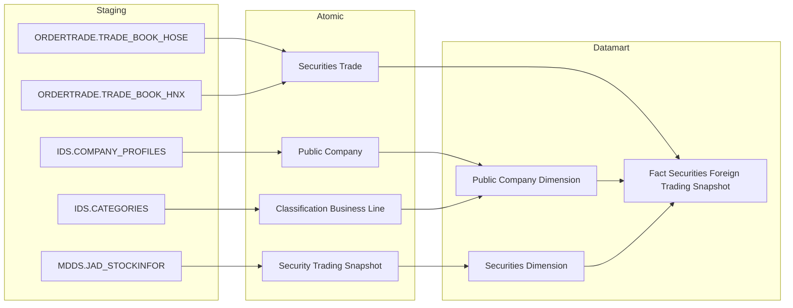
```mermaid
flowchart LR
    subgraph SRC["Staging"]
        S1["ORDERTRADE.TRADE_BOOK_HOSE"]
        S2["ORDERTRADE.TRADE_BOOK_HNX"]
        S3["IDS.COMPANY_PROFILES"]
        S4["IDS.CATEGORIES"]
        S5["MDDS.JAD_STOCKINFOR"]
    end

    subgraph SIL["Atomic"]
        SV1["Securities Trade"]
        SV2["Public Company"]
        SV3["Classification Business Line"]
        SV4["Security Trading Snapshot"]
    end

    subgraph GOLD["Datamart"]
        G1["Fact Securities Foreign Trading Snapshot"]
        G2["Public Company Dimension"]
        G3["Securities Dimension"]
    end

    S1 --> SV1
    S2 --> SV1
    S3 --> SV2
    S4 --> SV3
    S5 --> SV4

    SV1 --> G1
    SV2 --> G2
    SV3 --> G2
    SV4 --> G3
    G2 --> G1
    G3 --> G1
```

---

##### Cụm 1c: Báo cáo thống kê giao dịch NĐTNN theo loại chứng khoán (Foreign Investor Trading Statistics Report)

Phục vụ Tab BÁO CÁO Nhóm 14 (Báo cáo thống kê tình hình giao dịch NĐTNN theo loại chứng khoán). **Sửa Kịch bản D (2026-07-24) — thay đổi kiến trúc:** BA cột "Chiều dữ liệu" ghi rõ grain báo cáo là "Ngày, Loại CK" (1 ngày × 1 trong 4 nhóm loại CK: Cổ phiếu/Trái phiếu/CCQ/Tổng) — khác hẳn 3 điều kiện lọc độc lập cho từng nhóm loại CK (đặc biệt CCQ dùng `Investor_Type_Code='7000'`, một attribute hoàn toàn khác `Foreign_Investor_Type_Code` mà 9 KPI Cổ phiếu/Trái phiếu/Tổng dùng — không thể filter query-time trên `Foreign_Buy_Value`/`Foreign_Sell_Value` đã pre-aggregate của `Fact Securities Foreign Trading Snapshot`). Đã đánh giá và loại bỏ 3 phương án (Fact riêng cho CCQ — vi phạm 1 báo cáo nhiều Fact; sparse column trên Fact chung — NULL tràn lan; đưa Investor Type vào Securities Dimension — sai bản chất Kimball, đây là thuộc tính per-trade không phải per-mã CK). **Quyết định:** tách thành 1 bảng TÁC NGHIỆP (Operational) riêng — báo cáo này là số liệu tổng hợp đã "đóng gói" sẵn theo từng nhóm loại CK, không cần Star Schema drill-down tự do như Nhóm 1/2 — xem O_NDTNN_24.

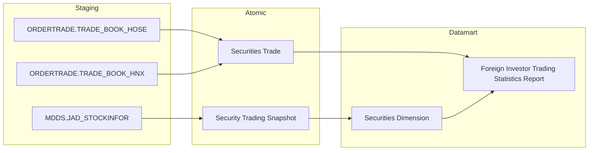
```mermaid
flowchart LR
    subgraph SRC["Staging"]
        S1["ORDERTRADE.TRADE_BOOK_HOSE"]
        S2["ORDERTRADE.TRADE_BOOK_HNX"]
        S3["MDDS.JAD_STOCKINFOR"]
    end

    subgraph SIL["Atomic"]
        SV1["Securities Trade"]
        SV2["Security Trading Snapshot"]
    end

    subgraph GOLD["Datamart"]
        G1["Foreign Investor Trading Statistics Report"]
        G2["Securities Dimension"]
    end

    S1 --> SV1
    S2 --> SV1
    S3 --> SV2

    SV1 --> G1
    SV2 --> G2
    G2 --> G1
```

---

##### Cụm 1b: Đăng ký NĐT nước ngoài (Foreign Investor Registration) — PENDING

**Trạng thái:** PENDING — xem Nhóm 1 Box 2–4 (Section 2). **[SỬA 2026-09-16]** Nguồn thực tế là `uat_fims_ods.item_list` + `uat_fims_ods.item_value` (FIMS, `report_code='H0I8J'`) — không phải báo cáo PLVI-TT51 (VSDC) như ghi nhận trước đó (thông tin đó sai, đã đính chính — xem O_NDTNN_1), và cũng không phải `FIMS.INVESTOR.DateCreated` như thiết kế gốc ban đầu. Giữ lại Cụm này ở trạng thái tham khảo — không dùng làm nguồn chính thức cho đến khi Atomic thiết kế xong entity cho `item_list`/`item_value`.

---

##### Cụm 2: Hồ sơ 360° NĐT nước ngoài (Operational Foreign Investor 360 Profile)

Phục vụ Tab NĐTNN 360 — Nhóm 11 (Hồ sơ định danh). **Sửa 2026-07-30:** Nguồn `Custodian Bank` thực tế là **FMS.BANK_MONI** (không phải `FIMS.BANKMONI` — bảng này không tồn tại trong hệ thống nguồn). FK `Foreign Investor.Custodian_Bank_Id` (từ `FIMS.INVESTOR.BankAddId`) đã được người thiết kế Atomic cập nhật trỏ đúng `custodian_bank.custodian_bank_id` (hash `hash_id('FMS.BANK_MONI', BankAddId)`). **[SỬA 2026-10-07, đồng bộ Atomic FIMS UAT 20261006]** Entity `Custodian Bank` nay gộp FIMS.BANKMONI + FMS.BANK_MONI (FK `Foreign Investor.Custodian_Bank_Id` hash `hash_id('FIMS_BANKMONI', BankAddId)`) — FIMS.BANKMONI có tồn tại theo DDL UAT, đính chính ghi chú trên. Loại hình/Trạng thái NĐT lấy từ 2 entity `Classification FIMS Investor Type` / `Classification FIMS Status` (thay `Classification Value`).

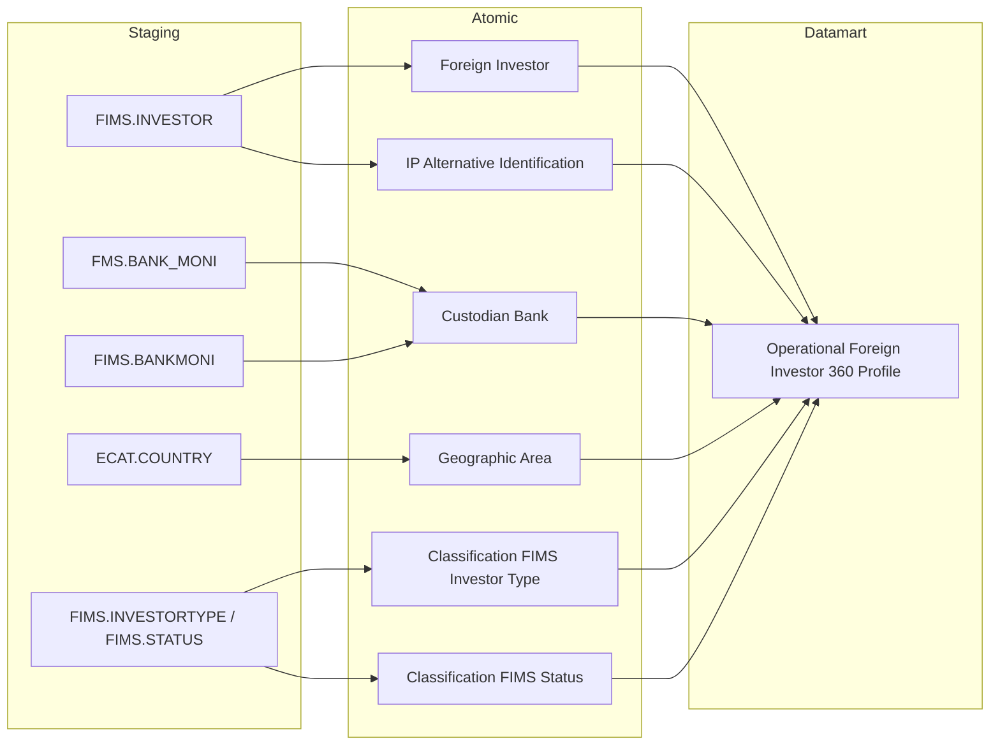
```mermaid
flowchart LR
    subgraph SRC["Staging"]
        S1["FIMS.INVESTOR"]
        S2["FMS.BANK_MONI"]
        S2b["FIMS.BANKMONI"]
        S3["ECAT.COUNTRY"]
        S4["FIMS.INVESTORTYPE / FIMS.STATUS"]
    end

    subgraph SIL["Atomic"]
        SV1["Foreign Investor"]
        SV2["Custodian Bank"]
        SV3["Geographic Area"]
        SV4["Classification FIMS Investor Type"]
        SV6["Classification FIMS Status"]
        SV5["IP Alternative Identification"]
    end

    subgraph GOLD["Datamart"]
        G1["Operational Foreign Investor 360 Profile"]
    end

    S1 --> SV1
    S2 --> SV2
    S2b --> SV2
    S3 --> SV3
    S4 --> SV4
    S4 --> SV6
    S1 --> SV5

    SV1 --> G1
    SV2 --> G1
    SV3 --> G1
    SV4 --> G1
    SV6 --> G1
    SV5 --> G1
```

---

##### Cụm 3a: Danh mục đầu tư của NĐTNN (Fact Foreign Investor Portfolio Snapshot) — ĐÃ THIẾT KẾ LẠI (xem Cụm 12: Fact Foreign Investor Portfolio Report Snapshot)

**Trạng thái:** PENDING — xem Nhóm 6 (Section 2). Entity Atomic `Foreign Investor Stock Portfolio Snapshot` ghi trong thiết kế cũ **không tồn tại** trong `DataModel/working/Atomic/lld/manifest.yaml` hiện hành — `FIMS.CATEGORIESSTOCK` thực chất đã gộp vào entity `Foreign Investor Securities Account` (table_type Fundamental, current-state 1 tài khoản × 1 CTCK, KHÔNG phải Fact Snapshot theo tháng, không có `Portfolio Market Value`). Ngoài ra 6/7 KPI của Nhóm 6 đánh dấu Dữ liệu động (nguồn thật là báo cáo PLIII-TT51/2021/TT-BTC, kỳ tháng) — xem chi tiết Nhóm 6. Giữ lại Cụm này ở trạng thái tham khảo — không dùng `Foreign Investor Securities Account` làm nguồn chính thức cho Fact Snapshot này cho đến khi xác nhận nguồn giá trị thị trường danh mục (Portfolio Market Value) qua generic store TT51.

---

##### Cụm 3b: Foreign Investor Dimension / Public Company Dimension (READY — dùng chung nhiều Nhóm)

**Trạng thái:** READY — 2 entity này vẫn READY, dùng chung cho các Nhóm khác của module (Nhóm 2, 4, 9...).

Cụm chỉ gồm 2 Dimension dùng chung (không có Fact nên không vẽ flowchart 3 subgraph): `Foreign Investor Dimension` ← `Foreign Investor` (FIMS.INVESTOR); `Public Company Dimension` ← `Public Company` (IDS.company_profiles, IDS.company_detail).

---

##### Cụm 3c: Quốc gia NĐTNN (Geographic Area Dimension) — BÃI BỎ 2026-10-02 (thay bằng cột `nationality_nm` trên Fact báo cáo động, xem Cụm 12)

**Trạng thái:** **[BÃI BỎ 2026-10-02]** Chiều quốc gia/quốc tịch nay là cột văn bản `nationality_nm` trên `Fact Foreign Investor Capital Flow Snapshot`/`Fact Foreign Investor Portfolio Report Snapshot` (cột "Quốc tịch" của báo cáo PLIII/PLIV-TT51), `Geographic Area Dimension` và `Asset Category Dimension` không còn KPI nào dùng nên gỡ khỏi Entities (Asset Category thay bằng 6 cột giá trị tài sản trên Fact danh mục); nội dung dưới đây là lịch sử. Trước đó PENDING — thiết kế cũ ghi nguồn `FIMS.NATIONAL` cho `Geographic Area`, nhưng đối chiếu `DataModel/working/Atomic/lld/manifest.yaml`, entity `Geographic Area` (approved) chỉ có nguồn từ `ECAT.COUNTRY/REGION/PROVINCE_NEW/WARD_NEW` — không có entry nào từ `FIMS`/`FIMS.NATIONAL`. Quốc gia/quốc tịch của NĐTNN trong FIMS chưa được xác nhận map vào Atomic `Geographic Area` — cần entity nguồn riêng hoặc xác nhận bảng FIMS thật lưu quốc tịch NĐT (nghi ngờ tên "NATIONAL" trong thiết kế cũ cũng sai/lỗi thời, cần Data Modeler xác nhận tên bảng FIMS thật). Không dùng `Geographic Area` (nguồn ECAT) làm nguồn chính thức cho Chiều "Quốc gia NĐTNN" cho đến khi xác nhận đúng bảng nguồn FIMS.

---

##### Cụm 3d: Phân ngành của NĐTNN (Fact Public Company Listing Info Snapshot — reuse partial GSDC)

**Trạng thái:** READY — **[MỚI 2026-09-18, Resolved một phần O_NDTNN_12]** BA cập nhật STT8 sang nguồn VSDC `foreign_investor_info` — reuse `Fact Public Company Listing Info Snapshot` (sở hữu module GSDC, grain 1 mã CK/tháng), bổ sung cột `Foreign Holding Value` = `Current Foreign Holding Quantity × Close Price` (JOIN `Security Trading Snapshot`, MDDS). Xem Nhóm 8 (Section 2) và `DTM_GSDC_HLD.md` (Cụm sở hữu chính, Section 4).

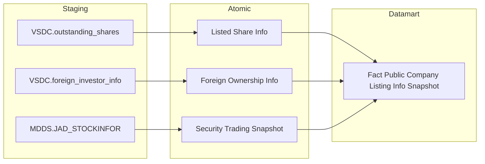
```mermaid
flowchart LR
    subgraph SRC["Staging"]
        S1["VSDC.outstanding_shares"]
        S2["VSDC.foreign_investor_info"]
        S3["MDDS.JAD_STOCKINFOR"]
    end
    subgraph SIL["Atomic"]
        SV1["Listed Share Info"]
        SV2["Foreign Ownership Info"]
        SV3["Security Trading Snapshot"]
    end
    subgraph GOLD["Datamart"]
        G1["Fact Public Company Listing Info Snapshot"]
    end
    S1 --> SV1
    S2 --> SV2
    S3 --> SV3
    SV1 --> G1
    SV2 --> G1
    SV3 --> G1
```

---

##### Cụm 4: Lịch sử tuân thủ NĐTNN (Operational Investor Compliance History)

Phục vụ Tab NĐTNN 360 — Nhóm 13 (Lịch sử tuân thủ). Atomic từ phân hệ Thanh Tra, nguồn `PENALTY_DECISION*`/`PENALTY_TYPE` — **sửa Kịch bản D** (2026-07-23): nguồn cũ ghi `GS_HO_SO`/`GS_VAN_BAN_XU_LY` (entity `Surveillance Enforcement Case`/`Decision`) không khớp BA thật — xem O_NDTNN_26.

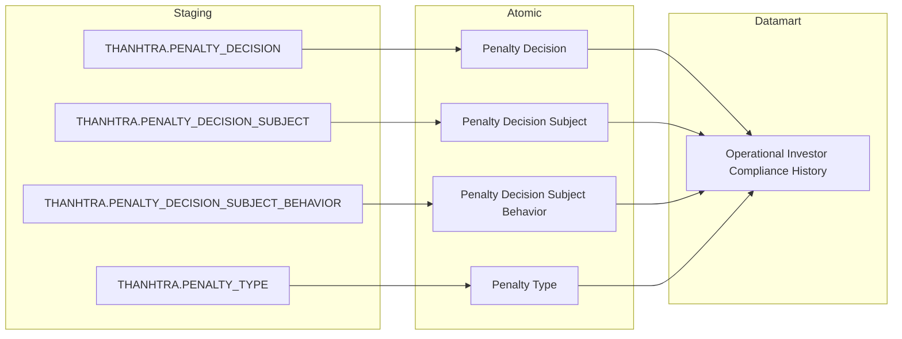
```mermaid
flowchart LR
    subgraph SRC["Staging"]
        S1["THANHTRA.PENALTY_DECISION"]
        S2["THANHTRA.PENALTY_DECISION_SUBJECT"]
        S3["THANHTRA.PENALTY_DECISION_SUBJECT_BEHAVIOR"]
        S4["THANHTRA.PENALTY_TYPE"]
    end

    subgraph SIL["Atomic"]
        SV1["Penalty Decision"]
        SV2["Penalty Decision Subject"]
        SV3["Penalty Decision Subject Behavior"]
        SV4["Penalty Type"]
    end

    subgraph GOLD["Datamart"]
        G1["Operational Investor Compliance History"]
    end

    S1 --> SV1
    S2 --> SV2
    S3 --> SV3
    S4 --> SV4

    SV1 --> G1
    SV2 --> G1
    SV3 --> G1
    SV4 --> G1
```

---

##### Cụm 5a: Dòng vốn đầu tư gián tiếp (Foreign Investor Capital Flow) — ĐÃ THIẾT KẾ LẠI (xem Cụm 12)

**Trạng thái:** **[2026-10-02] ĐÃ THIẾT KẾ LẠI — xem Cụm 12 (Fact Foreign Investor Report Value / Capital Flow Snapshot); nội dung dưới đây là lịch sử.** Trước đó PENDING — xem Nhóm 3, 4, 5 (Section 2) + Nhóm 16 (Data Explorer). Toàn bộ measure "Dòng vốn/tiền vào/ra/ròng" đánh dấu Dữ liệu động — nguồn thực tế là báo cáo định kỳ PLIV-TT51 (Ngân hàng lưu ký gửi, kỳ nửa tháng), chưa thống nhất quy tắc khai thác trong generic store TT51 (Cụm 7). `Foreign Investor` vẫn READY (dùng chung Nhóm 2/4/6/9) — riêng `Geographic Area` giờ cũng PENDING (xem Cụm 3c — nguồn ECAT, không có entry FIMS, không dùng được cho Chiều quốc gia NĐTNN) — không dùng `Member Report Value`/`Member Regulatory Report` làm nguồn chính thức cho Fact động này cho đến khi xác nhận Report Code/Cell Code tương ứng.

---

##### Cụm 5b: Foreign Investor Dimension (READY — dùng chung nhiều Nhóm)

**Trạng thái:** READY — `Foreign Investor` vẫn READY, dùng chung Nhóm 2/4/6/9 + Nhóm 12 (K_NDTNN_A1, xem O_NDTNN_21). Không còn Fact READY nào join tới ở trạng thái hiện tại (Fact chính từng dùng, `Fact Foreign Investor Portfolio Snapshot`, đã chuyển PENDING — xem Cụm 3a/O_NDTNN_21) — Dimension vẫn giữ READY vì bản thân entity Atomic không phụ thuộc trạng thái Fact.

---

##### Cụm 5c: Tương quan Net Flow & VN-Index (Fact Foreign Net Flow Market Index Snapshot)

Phục vụ Tab GIÁM SÁT DÒNG VỐN Nhóm 5 — K_NDTNN_33 (Giá trị mua/bán ròng), K_NDTNN_34 (Điểm đóng cửa VN-Index), K_NDTNN_35 (Dòng tiền ròng lũy kế — PENDING). **[THIẾT KẾ LẠI 2026-09-24, theo yêu cầu Data Modeler]:** Thay reuse `Fact Market Index Snapshot` (QLKD) + `Fact Securities Foreign Trading Snapshot` (Nhóm 2) bằng 1 Fact riêng `Fact Foreign Net Flow Market Index Snapshot` (`fct_foreign_net_flow_market_index_snpst`), grain 1 ngày giao dịch × 1 chỉ số tham chiếu — đọc thẳng Atomic `Securities Trade` + `Security Trading Snapshot` + `Market Index Snapshot`. Chỉ còn reuse Dimension `Market Index Dimension` (`market_index_dim`, sở hữu QLKD — xem O_NDTNN_29) và `Calendar Date Dimension`. `Fact Market Index Snapshot` vẫn thuộc QLKD, NDTNN không còn dùng. Nguồn dòng tiền ròng (FIMS.RPTVALUES → Atomic `Report Import Value`) chưa có LLD Atomic — xem O_NDTNN_33.

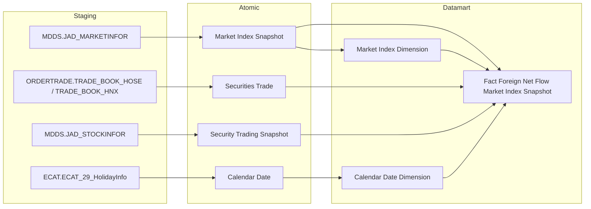
```mermaid
flowchart LR
    subgraph SRC["Staging"]
        S1["MDDS.JAD_MARKETINFOR"]
        S2["ORDERTRADE.TRADE_BOOK_HOSE / TRADE_BOOK_HNX"]
        S3["MDDS.JAD_STOCKINFOR"]
        ECAT_ECAT_29_HolidayInfo["ECAT.ECAT_29_HolidayInfo"]
    end

    subgraph SIL["Atomic"]
        SV1["Market Index Snapshot"]
        SV2["Securities Trade"]
        SV3["Security Trading Snapshot"]
        Calendar_Date["Calendar Date"]
    end

    subgraph GOLD["Datamart"]
        G1["Fact Foreign Net Flow Market Index Snapshot"]
        G2["Market Index Dimension"]
        G3["Calendar Date Dimension"]
    end

    S1 --> SV1
    S2 --> SV2
    S3 --> SV3
    ECAT_ECAT_29_HolidayInfo --> Calendar_Date

    SV1 --> G1
    SV2 --> G1
    SV3 --> G1
    SV1 --> G2
    Calendar_Date --> G3

    G2 --> G1
    G3 --> G1
```

---

##### Cụm 6: Giới hạn sở hữu nước ngoài — ROOM (Fact Public Company Foreign Ownership Snapshot) — PENDING

**Trạng thái:** PENDING — xem Nhóm 9 (Section 2) + O_NDTNN_22. **[SỬA 2026-09-16]** BA STT=9 nay xác nhận nguồn cụ thể là bảng staging `UAT_VSDC_STG.FOREIGN_INVESTOR_INFO` (VSDC) cho toàn bộ 6/6 dòng — thay cho mô tả cũ "báo cáo giấy BM67 thủ công". Đã tra 2 manifest Atomic, chưa có entity nào cho bảng này → vẫn PENDING (Nhóm 3 — ngoại lai VSDC, chưa qua Atomic), nhưng nay có tên bảng + cột cụ thể để Atomic team bắt đầu thiết kế entity, không còn phải chờ số hoá biểu mẫu giấy. Vẫn **không dùng** `Public Company Foreign Ownership Limit` (IDS.FOREIGN_OWNER_LIMIT) hay `Foreign Investor Securities Account` (FIMS) dù 2 entity này có sẵn và khớp khái niệm nghiệp vụ (Room tối đa, Ownership Rate) — BA chỉ định rõ nguồn VSDC riêng. Giữ lại Cụm này ở trạng thái tham khảo — không dùng làm nguồn chính thức cho đến khi Atomic thiết kế xong entity từ `UAT_VSDC_STG.FOREIGN_INVESTOR_INFO`.

---

##### Cụm 7: Báo cáo TT51 — Generic Store (NDTNN Regulatory Report Store) — ĐÃ THIẾT KẾ LẠI (xem Cụm 12)

**Trạng thái:** **[2026-10-02] ĐÃ THIẾT KẾ LẠI — xem Cụm 12 (Fact Foreign Investor Report Value + Foreign Investor Report Structure Dimension); nội dung dưới đây là lịch sử.** Trước đó PENDING — xem Nhóm 18 + Nhóm 19-43 (Section 2) + O_NDTNN_25/O_NDTNN_27. Nhóm 18 (STT=18) và 25 Nhóm mới Nhóm 19-43 (STT=19-43, cùng pattern Data Explorer Pass-through PLII/III/IV/V/VI/VII/VIII/IX/X-TT51, TT96) đều xác nhận 100% dòng BA là Dữ liệu động → PENDING theo gate rule, dù `Member Regulatory Report`/`Member Report Value`/`Report Template` (FIMS) đã có LLD draft. Giữ lại Cụm này ở trạng thái tham khảo — không dùng làm nguồn chính thức cho đến khi xác nhận 26 Report Code/Cell Code tương ứng (1 cho mỗi loại báo cáo, cùng gốc rễ Nhóm 3/4/5/6/9/17).

---

##### Cụm 8: Báo cáo chi tiết giao dịch NĐTNN theo tài khoản (Foreign Investor Trading Detail Report)

Phục vụ Tab BÁO CÁO Nhóm 15. **Sửa Kịch bản D (2026-07-24) — thay đổi kiến trúc:** BA cột "Chiều dữ liệu" ghi tắt "Ngày, NĐT" nhưng câu lệnh tham khảo SQL thực tế ghi rõ `GROUP BY Buy_Acct_No, Symbol` (HOSE) / `GROUP BY Buy_account_number, Issue_Code` (HNX) — grain thật vẫn là 1 ngày × 1 Account × 1 Symbol × 1 bên (Buy/Sell), không rút gọn. Đồng thời phát hiện lại đúng pattern grain-mismatch đã sửa ở Nhóm 14 — 2 attribute Investor Type độc lập trên `Securities Trade` (`Foreign_Investor_Type_Code` dùng cho K_NDTNN_84/85, `Investor_Type_Code` dùng cho K_NDTNN_86-89). Nhóm 15 thuộc Tab BÁO CÁO (đóng gói cố định, không cần drill-down tự do) — chuyển từ Phân tích (Star Schema) sang Tác nghiệp (Operational), denormalize hoàn toàn (bỏ FK `Securities Dimension`, bỏ Dimension tài khoản riêng) — xem O_NDTNN_30.


```mermaid
flowchart LR
    subgraph SRC["Staging"]
        S1["ORDERTRADE.TRADE_BOOK_HOSE"]
        S2["ORDERTRADE.TRADE_BOOK_HNX"]
        S3["MDDS.JAD_STOCKINFOR"]
    end

    subgraph SIL["Atomic"]
        SV1["Securities Trade"]
        SV2["Security Trading Snapshot"]
    end

    subgraph GOLD["Datamart"]
        D1["Securities Dimension"]
        G1["Foreign Investor Trading Detail Report"]
    end

    S1 --> SV1
    S2 --> SV1
    S3 --> SV2

    SV2 --> D1
    SV1 --> G1
    D1 --> G1
```

##### Cụm 12: Báo cáo động FIMS (Foreign Investor Report — generic store TT51/TT96)

**Cụm 12a — Fact Foreign Investor Report Value (EAV, 1 ô × 1 lần nộp × 1 dòng động):**

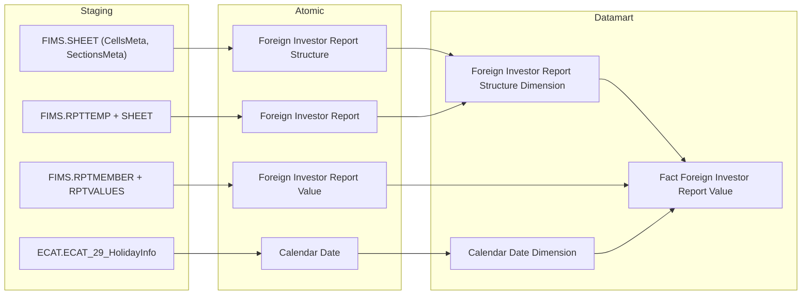
```mermaid
flowchart LR
    subgraph SRC["Staging"]
        FIMS_STG_RPTVALUES_a["FIMS.RPTMEMBER + RPTVALUES"]
        FIMS_STG_RPTTEMP_a["FIMS.RPTTEMP + SHEET"]
        FIMS_STG_SHEET_a["FIMS.SHEET (CellsMeta, SectionsMeta)"]
        ECAT_HolidayInfo_a["ECAT.ECAT_29_HolidayInfo"]
    end
    subgraph SIL["Atomic"]
        fir_value_a["Foreign Investor Report Value"]
        fir_structure_a["Foreign Investor Report Structure"]
        foreign_investor_report_a["Foreign Investor Report"]
        Calendar_Date_a["Calendar Date"]
    end
    subgraph GOLD["Datamart"]
        fact_a["Fact Foreign Investor Report Value"]
        dim_struct_a["Foreign Investor Report Structure Dimension"]
        cdr_dt_dim_a["Calendar Date Dimension"]
    end
    FIMS_STG_RPTVALUES_a --> fir_value_a
    FIMS_STG_RPTTEMP_a --> foreign_investor_report_a
    FIMS_STG_SHEET_a --> fir_structure_a
    fir_structure_a --> dim_struct_a
    foreign_investor_report_a --> dim_struct_a
    dim_struct_a --> fact_a
    ECAT_HolidayInfo_a --> Calendar_Date_a
    Calendar_Date_a --> cdr_dt_dim_a
    fir_value_a --> fact_a
    cdr_dt_dim_a --> fact_a
```

**Cụm 12b — Fact Foreign Investor Capital Flow Snapshot (pivot IBOU9 sheet I):**

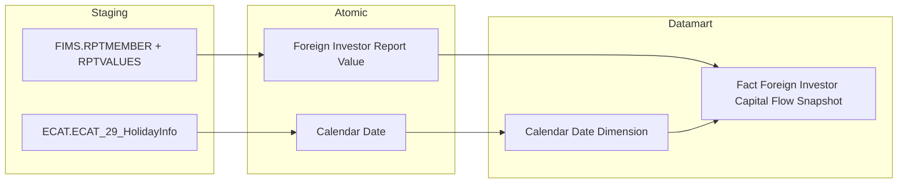
```mermaid
flowchart LR
    subgraph SRC["Staging"]
        FIMS_STG_RPTVALUES_b["FIMS.RPTMEMBER + RPTVALUES"]
        ECAT_HolidayInfo_b["ECAT.ECAT_29_HolidayInfo"]
    end
    subgraph SIL["Atomic"]
        fir_value_b["Foreign Investor Report Value"]
        Calendar_Date_b["Calendar Date"]
    end
    subgraph GOLD["Datamart"]
        fact_b["Fact Foreign Investor Capital Flow Snapshot"]
        cdr_dt_dim_b["Calendar Date Dimension"]
    end
    FIMS_STG_RPTVALUES_b --> fir_value_b
    ECAT_HolidayInfo_b --> Calendar_Date_b
    Calendar_Date_b --> cdr_dt_dim_b
    fir_value_b --> fact_b
    cdr_dt_dim_b --> fact_b
```

**Cụm 12c — Fact Foreign Investor Portfolio Report Snapshot (pivot 59WJB/BZ5X4 sheet II):**


```mermaid
flowchart LR
    subgraph SRC["Staging"]
        FIMS_STG_RPTVALUES_c["FIMS.RPTMEMBER + RPTVALUES"]
        ECAT_HolidayInfo_c["ECAT.ECAT_29_HolidayInfo"]
    end
    subgraph SIL["Atomic"]
        fir_value_c["Foreign Investor Report Value"]
        Calendar_Date_c["Calendar Date"]
    end
    subgraph GOLD["Datamart"]
        fact_c["Fact Foreign Investor Portfolio Report Snapshot"]
        cdr_dt_dim_c["Calendar Date Dimension"]
    end
    FIMS_STG_RPTVALUES_c --> fir_value_c
    ECAT_HolidayInfo_c --> Calendar_Date_c
    Calendar_Date_c --> cdr_dt_dim_c
    fir_value_c --> fact_c
    cdr_dt_dim_c --> fact_c
```

**Trạng thái:** READY — **[THIẾT KẾ 2026-10-02]** BA đã map xong các chỉ tiêu "Dữ liệu động" vào `uat_fims_ods.fir_value` (BA cập nhật 2026-10-02 — trước đó ghi tên ODS cũ `fact_report_cell`) và Atomic FIMS luồng báo cáo động đã thiết kế (`DataModel/Atomic/Documentation/` + `Common/`, approved 2026-10-05: `fir_value`, `fir_structure`, `foreign_investor_report`, `cl_foreign_investor_reporting_entity`; `fir_value` đã bỏ `val_nbr`/`val_string`) — thay thế `Member Regulatory Report`/`Member Report Value`/`Report Template` và các Fact tạm (`Capital Flow Report`, `Portfolio Value Report`, `Registration Report`, `NDTNN Regulatory Report Store`) ở Cụm 1b/3a/5a/7. Ánh xạ cột BA → Atomic: `report_code` → `foreign_investor_report.rpt_code`; `sheet_name` → `sheet_nm`; `row_path`/`column_path`/`section_id` → `fir_structure`; `ngay_nop` → `fir_value.submission_dt`; `value_raw` → `val_raw` (BA còn ghi `value_num`/`value_text` nhưng nguồn dev chỉ có `value_raw` — Datamart ép số/chuỗi từ `val_raw`, O_NDTNN_39); `row_order` → `dynamic_row_order`; `report_log_id` → `rpt_log_id`; `is_total_row`/`is_section_echo`/`is_band_overflow`/`is_static_copy`/`is_template_marker` → `total_row_ind`/`section_echo_ind`/`band_overflow_ind`/`static_copy_ind`/`rpt_marker_ind`; `is_mirror` đã lọc ở bước ODS → ATM.

Kiến trúc 3 Fact: (1) `Fact Foreign Investor Report Value` — EAV, grain 1 ô × 1 lần nộp × 1 dòng động, phục vụ chỉ tiêu 1 ô (Nhóm 1 K_NDTNN_5–7, Nhóm 3, Nhóm 5 K_NDTNN_35 qua cột vật lý dự phòng) và Data Explorer (Nhóm 18–43: metadata báo cáo); (2) `Fact Foreign Investor Capital Flow Snapshot` — pivot 1 dòng báo cáo IBOU9 sheet I (Quốc tịch, Tên nhà đầu tư, GT dòng vốn vào ròng +/-), phục vụ Nhóm 4 (Top 5) và Nhóm 16; (3) `Fact Foreign Investor Portfolio Report Snapshot` — pivot 1 dòng báo cáo PLIII-TT51 (59WJB/BZ5X4 sheet II: quốc tịch, loại hình, tên khách hàng, 6 giá trị tài sản, tổng danh mục, 3 cờ cá nhân/quỹ/tổ chức khác quỹ), phục vụ Nhóm 4, 6, 7, 17. Pivot dùng 5 cờ = 0 (không dòng tổng/echo/overflow/static/marker) theo SQL BA. Các điểm chờ BA/dev xác nhận: xem **O_NDTNN_38**.

---

---

## Section 2 — Tổng quan báo cáo

#### Nhóm 1 — KPI Cards tổng quan

**Mockup:**

| Tỷ lệ tham gia | Tăng trưởng NĐT mới | Tăng trưởng NĐT Cá nhân mới | Tăng trưởng NĐT Tổ chức mới |
|:---:|:---:|:---:|:---:|
| **12.4** % | **2,450** Mã | **1,830** Mã | **620** Mã |

---

> Phân loại: **Phân tích**
> Atomic (Box 1): `Securities Trade` ← ORDERTRADE.TRADE_BOOK_HOSE / ORDERTRADE.TRADE_BOOK_HNX — **READY**
> Atomic (Box 2-4): `Foreign Investor Report Value` (`fir_value`) / `Foreign Investor Report Structure` (`fir_structure`) / `Foreign Investor Report` (`foreign_investor_report`) ← FIMS báo cáo động (PLVI-TT51, report H0I8J) — thiết kế 2026-10-02
> Loại dữ liệu: Dữ liệu tĩnh (Box 1, BA đã chốt logic mapping + SQL tham khảo đầy đủ) / Dữ liệu động (Box 2-4)
> **[SỬA 2026-09-24]** K_NDTNN_1/2/3 (Foreign Buy/Sell Value, Total Market Value) — phạm vi mã CK lấy từ Atomic `Security Trading Snapshot` theo Symbol × Trading Date với `Stock Type Code IN ('1','2','3')` (thay JOIN `Securities Dimension` current-state, sửa 2026-09-22), giá trị dùng Execution Value cho cả 2 sàn (Atomic đã tính sẵn cho HNX — đối chiếu dữ liệu UAT 2026-09-25), lọc NĐTNN `IN ('10','20')` — đúng CTE `stockinfor` và câu lệnh BA; chi tiết xem Nhóm 2 STT 1. Chi tiết xem Nhóm 2 (nơi khai sinh Fact).

**Source:** `Fact Securities Foreign Trading Snapshot` → `Calendar Date Dimension`; `Fact Foreign Investor Report Value` (K_NDTNN_5-7) → `Calendar Date Dimension`, `Foreign Investor Report Structure Dimension`

**Bảng KPI:**

| KPI ID | Tên KPI | Đơn vị | Tính chất | Công thức | Ghi chú | Trạng thái |
|---|---|---|---|---|---|---|
| K_NDTNN_1 | Tổng giá trị mua của NĐTNN | Tỷ đồng | Cơ sở | `SUM(Foreign_Buy_Value)` GROUP BY `Snapshot Date Dimension Id` WHERE `Trade Date = :pdate` (SUM xuyên suốt mọi mã CK trong ngày) | Grain Fact = 1 mã CK × 1 ngày (xem Nhóm 2) — Box 1 pre-aggregate SUM lên cấp "1 ngày toàn thị trường" | READY |
| K_NDTNN_2 | Tổng giá trị bán của NĐTNN | Tỷ đồng | Cơ sở | `SUM(Foreign_Sell_Value)` GROUP BY `Snapshot Date Dimension Id` WHERE `Trade Date = :pdate` (SUM xuyên suốt mọi mã CK trong ngày) | Pre-aggregate như trên | READY |
| K_NDTNN_3 | Tổng giá trị giao dịch toàn thị trường | Tỷ đồng | Cơ sở | `SUM(Total_Market_Value)` GROUP BY `Snapshot Date Dimension Id` WHERE `Trade Date = :pdate` (SUM xuyên suốt mọi mã CK trong ngày, không lọc theo NĐT) | Pre-aggregate như trên | READY |
| K_NDTNN_4 | Tỷ lệ tham gia | % | Phái sinh | `(K_NDTNN_1 + K_NDTNN_2) × 100 / (K_NDTNN_3 × 2)` | Derived từ K_NDTNN_1/3/4 cùng ngày | READY |
| K_NDTNN_5 | Tăng trưởng NĐT mới | — | Phái sinh | `SUM(TRY_CAST(REGEXP_REPLACE(Fact_Foreign_Investor_Report_Value.Value_Raw, '^''', '') AS DECIMAL(38,10)))` WHERE `Foreign_Investor_Report_Structure_Dimension.Report_Code = 'H0I8J'` AND `Foreign_Investor_Report_Structure_Dimension.Sheet_Name = 'I'` AND `Foreign_Investor_Report_Structure_Dimension.Column_Path = 'Tổng số lượng tới thời điểm báo cáo'` AND `Foreign_Investor_Report_Structure_Dimension.Row_Path = 'Tổng'` AND `Submission Date = :ngaynop` | [THIẾT KẾ 2026-10-02 — BA đã map báo cáo động, Atomic FIMS fir_* đã thiết kế] BA dòng 8: báo cáo PLVI-TT51 (VSDC, kỳ tháng) mục I, dòng "Tổng", cột "Tổng số lượng tới thời điểm báo cáo" (lũy kế mã số GD cấp mới, YTD). Đọc 1 ô từ Fact Foreign Investor Report Value. SQL BA có lỗi cú pháp (dấu ; thừa, thiếu đóng nháy row_path) — thiết kế theo Điều kiện. O_NDTNN_38 | READY |
| K_NDTNN_6 | Tăng trưởng NĐT Cá nhân mới | — | Phái sinh | `SUM(TRY_CAST(REGEXP_REPLACE(Fact_Foreign_Investor_Report_Value.Value_Raw, '^''', '') AS DECIMAL(38,10)))` WHERE `Foreign_Investor_Report_Structure_Dimension.Report_Code = 'H0I8J'` AND `Foreign_Investor_Report_Structure_Dimension.Sheet_Name = 'I'` AND `Foreign_Investor_Report_Structure_Dimension.Column_Path = 'Tổng số lượng tới thời điểm báo cáo'` AND `Foreign_Investor_Report_Structure_Dimension.Row_Path = 'Cá nhân'` AND `Submission Date = :ngaynop` | [THIẾT KẾ 2026-10-02 — BA đã map báo cáo động, Atomic FIMS fir_* đã thiết kế] BA dòng 9: báo cáo PLVI-TT51 (VSDC, kỳ tháng) mục I, dòng "Cá nhân", cột "Tổng số lượng tới thời điểm báo cáo" (lũy kế mã số GD cấp mới, YTD). Đọc 1 ô từ Fact Foreign Investor Report Value. SQL BA có lỗi cú pháp (dấu ; thừa, thiếu đóng nháy row_path) — thiết kế theo Điều kiện. O_NDTNN_38 | READY |
| K_NDTNN_7 | Tăng trưởng NĐT Tổ chức mới | — | Phái sinh | `SUM(TRY_CAST(REGEXP_REPLACE(Fact_Foreign_Investor_Report_Value.Value_Raw, '^''', '') AS DECIMAL(38,10)))` WHERE `Foreign_Investor_Report_Structure_Dimension.Report_Code = 'H0I8J'` AND `Foreign_Investor_Report_Structure_Dimension.Sheet_Name = 'I'` AND `Foreign_Investor_Report_Structure_Dimension.Column_Path = 'Tổng số lượng tới thời điểm báo cáo'` AND `Foreign_Investor_Report_Structure_Dimension.Row_Path = 'Tổ chức'` AND `Submission Date = :ngaynop` | [THIẾT KẾ 2026-10-02 — BA đã map báo cáo động, Atomic FIMS fir_* đã thiết kế] BA dòng 10: báo cáo PLVI-TT51 (VSDC, kỳ tháng) mục I, dòng "Tổ chức", cột "Tổng số lượng tới thời điểm báo cáo" (lũy kế mã số GD cấp mới, YTD). Đọc 1 ô từ Fact Foreign Investor Report Value. SQL BA có lỗi cú pháp (dấu ; thừa, thiếu đóng nháy row_path) — thiết kế theo Điều kiện. O_NDTNN_38 | READY |

**Star Schema:**

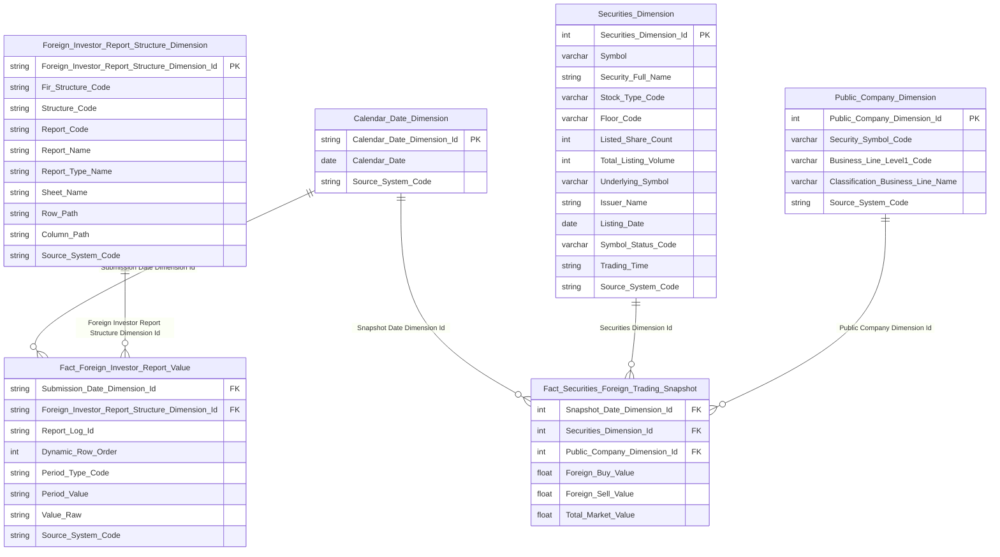
```mermaid
erDiagram
    Fact_Foreign_Investor_Report_Value {
        string Submission_Date_Dimension_Id FK
        string Foreign_Investor_Report_Structure_Dimension_Id FK
        string Report_Log_Id
        int Dynamic_Row_Order
        string Period_Type_Code
        string Period_Value
        string Value_Raw
        string Source_System_Code
    }
    Foreign_Investor_Report_Structure_Dimension {
        string Foreign_Investor_Report_Structure_Dimension_Id PK
        string Fir_Structure_Code
        string Structure_Code
        string Report_Code
        string Report_Name
        string Report_Type_Name
        string Sheet_Name
        string Row_Path
        string Column_Path
        string Source_System_Code
    }
    Calendar_Date_Dimension {
        string Calendar_Date_Dimension_Id PK
        date Calendar_Date
        string Source_System_Code
    }
    Securities_Dimension {
        int Securities_Dimension_Id PK
        varchar Symbol
        string Security_Full_Name
        varchar Stock_Type_Code
        varchar Floor_Code
        int Listed_Share_Count
        int Total_Listing_Volume
        varchar Underlying_Symbol
        string Issuer_Name
        date Listing_Date
        varchar Symbol_Status_Code
        string Trading_Time
        string Source_System_Code
    }
    Public_Company_Dimension {
        int Public_Company_Dimension_Id PK
        varchar Security_Symbol_Code
        varchar Business_Line_Level1_Code
        varchar Classification_Business_Line_Name
        string Source_System_Code
    }
    Fact_Securities_Foreign_Trading_Snapshot {
        int Snapshot_Date_Dimension_Id FK
        int Securities_Dimension_Id FK
        int Public_Company_Dimension_Id FK
        float Foreign_Buy_Value
        float Foreign_Sell_Value
        float Total_Market_Value
    }

    Calendar_Date_Dimension ||--o{ Fact_Securities_Foreign_Trading_Snapshot : "Snapshot Date Dimension Id"
    Securities_Dimension ||--o{ Fact_Securities_Foreign_Trading_Snapshot : "Securities Dimension Id"
    Public_Company_Dimension ||--o{ Fact_Securities_Foreign_Trading_Snapshot : "Public Company Dimension Id"
    Calendar_Date_Dimension ||--o{ Fact_Foreign_Investor_Report_Value : "Submission Date Dimension Id"
    Foreign_Investor_Report_Structure_Dimension ||--o{ Fact_Foreign_Investor_Report_Value : "Foreign Investor Report Structure Dimension Id"
```

> **Lưu ý grain:** Fact có grain "1 mã CK × 1 ngày" (mở rộng ở Nhóm 2 để phục vụ Top ngành/mã). Box 1 (K_NDTNN_4-4) hiển thị số toàn thị trường — không phân theo mã CK — nên công thức phải `GROUP BY Snapshot_Date_Dimension_Id` (SUM xuyên suốt `Securities_Dimension_Id`), không SUM trực tiếp theo dòng.

**Lineage Mart → Báo cáo:**

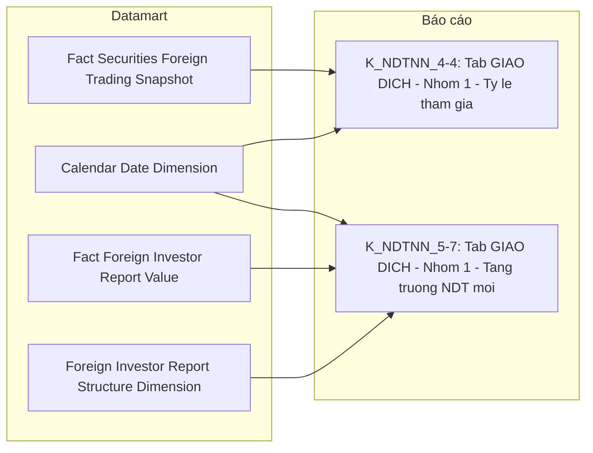
```mermaid
flowchart LR
    subgraph Datamart["Datamart"]
        G1["Fact Securities Foreign Trading Snapshot"]
        G2["Calendar Date Dimension"]
        G3["Fact Foreign Investor Report Value"]
        G4["Foreign Investor Report Structure Dimension"]
    end
    subgraph RPT["Báo cáo"]
        R1["K_NDTNN_4-4: Tab GIAO DICH - Nhom 1 - Ty le tham gia"]
        R2["K_NDTNN_5-7: Tab GIAO DICH - Nhom 1 - Tang truong NDT moi"]
    end
    G1 --> R1
    G2 --> R1
    G3 --> R2
    G4 --> R2
    G2 --> R2
```

**Bảng grain:**

| Tên bảng | Grain |
|---|---|
| Fact Securities Foreign Trading Snapshot | 1 row = 1 mã CK × 1 ngày giao dịch (ETL pre-aggregate SUM Execution Value từ Securities Trade theo mã CK, tách theo Buy/Sell Foreign Investor Type Code) — xem Nhóm 2 cho chi tiết đầy đủ |
| Calendar Date Dimension | 1 row = 1 ngày giao dịch |
| Fact Foreign Investor Report Value | 1 row = 1 ô báo cáo × 1 lần nộp × 1 dòng động (FIMS báo cáo động, EAV) |
| Foreign Investor Report Structure Dimension | 1 row = 1 ô template trong 1 sheet (SCD4A current-state) |

---

#### Nhóm 2 — Tổng giá trị mua/bán ròng của NĐTNN

**Mockup:**

| Bar chart | Lũy kế mua/bán ròng |
|:---|---:|
| Trục X: Tháng (Jan → Oct) | -8,300 B |
| Trục Y: Giá trị (tỉ đồng) | (lũy kế kỳ chọn) |

| TOP NGÀNH BÁN RÒNG | | TOP NGÀNH MUA RÒNG | | TOP MÃ BÁN RÒNG | | TOP MÃ MUA RÒNG | |
|:---|---:|:---|---:|:---|---:|:---|---:|
| Bất động sản | -1200B | Ngân hàng | +4500B | VHM | -700B | HPG | +3300B |
| Thực phẩm | -450B | Thép / Tài nguyên | +2800B | MSN | -400B | VCB | +600B |

**Slicer:** Từ ngày — Đến ngày (date range picker)

---

> Phân loại: **Phân tích**
> Atomic: `Securities Trade` ← ORDERTRADE.TRADE_BOOK_HOSE/HNX — **READY** (dùng chung Nhóm 1)
> Atomic (Ngành): `Classification Business Line` ← IDS.CATEGORIES — **READY (draft)**
> Atomic (Mã CK → Ngành): `Public Company` ← IDS.COMPANY_PROFILES — **READY (draft, working)** — join qua `Equity Ticker Symbol` = `Securities_Dimension.Symbol`, và `Business Line Level 1/2 Code` → `Classification Business Line Code`
> Atomic (Danh mục mã CK): `Security Trading Snapshot` ← MDDS.JAD_STOCKINFOR — **READY (draft, working)** — xem Cụm 1a (Section 1). Dimension `Securities Dimension` (grain 1 mã CK, SCD4A) thay thế join text-match trực tiếp trước đây.
> Loại dữ liệu: Dữ liệu tĩnh
> **[SỬA 2026-09-24, đối chiếu lại câu lệnh tham khảo BA STT 2 theo yêu cầu Data Modeler — thay ghi chú 2026-09-22]** ETL `Fact Securities Foreign Trading Snapshot` (dùng chung Nhóm 1/2): (1) Giá trị giao dịch dùng `execution_val` cho cả 2 sàn — **[SỬA 2026-09-25]** bảng Atomic `securities_trade` đã tính sẵn `execution_val` cho HNX (= Trade price × Trade quantity, đối chiếu dữ liệu UAT); hoàn tác nhánh `execution_price × execution_vol` đã thêm 2026-09-24 do suy luận sai từ YAML LLD HNX (thiếu khai báo cột); (2) phạm vi mã CK lấy trực tiếp từ Atomic `Security Trading Snapshot` theo **Symbol × Trading Date** (bản ghi `trading_time` mới nhất trong ngày, `stock_tp_code IN ('1','2','3')`) đúng CTE `stockinfor` của BA — bỏ JOIN `Securities Dimension` current-state + điều kiện `Trading Time = MAX` theo Stock Type Code (câu lệnh BA hiện hành không có; Dimension current-state làm rơi mã khi chạy lại lịch sử). HOSE nối `symbol`, HNX nối `isin_code` = `issue_code`; (3) lọc NĐTNN `IN ('10','20')` cho cả 2 sàn (đúng BA STT 2; tương đương `<> '00'` của BA STT 1 trên domain 00/10/20). Tầng KPI: Top ngành/Top mã/Tỷ trọng ngành/Top mã tỷ trọng lọc **khoảng ngày** `BETWEEN :pdate AND :pdate1` (BA `trade_date BETWEEN :pdat1 AND :pdat2`), điều kiện HAVING ròng > 0 và top 5 nằm trong logic, ngành COALESCE 'Chưa phân ngành'. Điểm chờ BA chốt: khóa nối HNX ↔ stockinfor (BA dùng lẫn `symbolisin` và `symbol`), INNER JOIN `company_profiles` ở dòng BA 11, công thức Tỷ trọng TB phiên — xem O_NDTNN_34.

**Source:** `Fact Securities Foreign Trading Snapshot` → `Calendar Date Dimension`, `Securities Dimension`, `Public Company Dimension` (join `Classification Business Line` cho Top ngành)

**Bảng KPI:**

| KPI ID | Tên KPI | Đơn vị | Tính chất | Công thức | Ghi chú | Trạng thái |
|---|---|---|---|---|---|---|
| K_NDTNN_8 | Ngành | — | Chiều | COALESCE(`Public_Company_Dimension.Classification_Business_Line_Name`, 'Chưa phân ngành') (tên ngành đã đệm sẵn từ join `Public_Company_Dimension.Business_Line_Level1_Code` = `Classification_Business_Line.cl_business_line_code` lúc ETL populate Dimension) | Dùng GROUP BY cho Top ngành (K_NDTNN_12/13/16). **[2026-09-24]** Thêm COALESCE theo BA — mã không có ngành/không phải công ty đại chúng gom vào 'Chưa phân ngành' | READY |
| K_NDTNN_9 | Mã CK | — | Chiều | `Securities_Dimension.Symbol` | Dùng GROUP BY cho Top mã (K_NDTNN_14/15). Đổi nguồn từ `Fact.Security_Symbol_Code` (text lặp) sang FK `Securities_Dimension_Id` — xem Cụm 1a (Section 1) | READY |
| K_NDTNN_10 | Giá trị mua/bán ròng | Tỷ đồng | Phái sinh | `Foreign_Buy_Value − Foreign_Sell_Value` per mã CK × ngày; nếu group theo Tháng: `SUM(Foreign_Buy_Value − Foreign_Sell_Value)` GROUP BY Tháng | Bar chart trục X = Tháng | READY |
| K_NDTNN_11 | Lũy kế mua/bán ròng | Tỷ đồng | Phái sinh | `SUM(Foreign_Buy_Value) − SUM(Foreign_Sell_Value)` WHERE `Snapshot_Date_Dimension_Id` BETWEEN `:pdate` AND `:pdate1` (SUM xuyên suốt mọi mã CK trong khoảng ngày) | — | READY |
| K_NDTNN_12 | Top 5 ngành bán ròng | Tỷ đồng | Phái sinh | `SUM(Foreign_Sell_Value) − SUM(Foreign_Buy_Value)` WHERE `Calendar_Date` BETWEEN `:pdate` AND `:pdate1` GROUP BY COALESCE(`Public_Company_Dimension.Classification_Business_Line_Name`, 'Chưa phân ngành') HAVING kết quả > 0 ORDER BY kết quả DESC FETCH FIRST 5 ROWS ONLY | LEFT JOIN `Fact` → `Public_Company_Dimension`. **[SỬA 2026-09-24]** Đổi lọc 1 ngày `:pdate` → khoảng ngày; công thức bán ròng (trước ghi `SUM(Foreign_Sell_Value)`, lệch Detail Mapping) — BA `HAVING mua_ban_rong < 0 ORDER BY ASC LIMIT 5` | READY |
| K_NDTNN_13 | Top 5 ngành mua ròng | Tỷ đồng | Phái sinh | `SUM(Foreign_Buy_Value) − SUM(Foreign_Sell_Value)` WHERE `Calendar_Date` BETWEEN `:pdate` AND `:pdate1` GROUP BY COALESCE(`Public_Company_Dimension.Classification_Business_Line_Name`, 'Chưa phân ngành') HAVING kết quả > 0 ORDER BY kết quả DESC FETCH FIRST 5 ROWS ONLY | Join như trên. **[SỬA 2026-09-24]** Khoảng ngày + mua ròng (trước ghi `SUM(Foreign_Buy_Value)`) | READY |
| K_NDTNN_14 | Top 5 mã bán ròng | Tỷ đồng | Phái sinh | `SUM(Foreign_Sell_Value) − SUM(Foreign_Buy_Value)` WHERE `Calendar_Date` BETWEEN `:pdate` AND `:pdate1` GROUP BY `Securities_Dimension.Symbol` HAVING kết quả > 0 ORDER BY kết quả DESC FETCH FIRST 5 ROWS ONLY | **[2026-09-24]** HAVING đưa vào logic (BA `HAVING < 0`) | READY |
| K_NDTNN_15 | Top 5 mã mua ròng | Tỷ đồng | Phái sinh | `SUM(Foreign_Buy_Value) − SUM(Foreign_Sell_Value)` WHERE `Calendar_Date` BETWEEN `:pdate` AND `:pdate1` GROUP BY `Securities_Dimension.Symbol` HAVING kết quả > 0 ORDER BY kết quả DESC FETCH FIRST 5 ROWS ONLY | **[2026-09-24]** HAVING đưa vào logic (BA `HAVING > 0`) | READY |
| K_NDTNN_16 | Tỷ trọng theo ngành | % | Phái sinh | `ROUND(SUM(Foreign_Buy_Value + Foreign_Sell_Value) / NULLIF(SUM(Total_Market_Value)*2, 0) * 100, 2)` WHERE `Calendar_Date` BETWEEN `:pdate` AND `:pdate1` GROUP BY COALESCE(`Public_Company_Dimension.Classification_Business_Line_Name`, 'Chưa phân ngành') ORDER BY kết quả DESC FETCH FIRST 5 ROWS ONLY — mẫu số SUM theo TOÀN NGÀNH (mọi mã CK cùng ngành) | Khác K_NDTNN_17 — mẫu số theo ngành. **[SỬA 2026-09-24]** Khoảng ngày + top 5 (BA "Tỷ trọng theo ngành (top ngành)" `ORDER BY DESC LIMIT 5`) | READY |
| K_NDTNN_17 | Top mã tỷ trọng cao | % | Phái sinh | `ROUND(SUM(Foreign_Buy_Value + Foreign_Sell_Value) / NULLIF(SUM(Total_Market_Value)*2, 0) * 100, 2)` WHERE `Calendar_Date` BETWEEN `:pdate` AND `:pdate1` GROUP BY `Securities_Dimension.Symbol` ORDER BY kết quả DESC FETCH FIRST 5 ROWS ONLY | Mẫu số SUM theo TỪNG MÃ CK qua các ngày trong khoảng. **[SỬA 2026-09-24]** Đổi lọc 1 ngày → khoảng ngày (BA `trade_date BETWEEN`). BA Mã=22 (STT=2) — đổi từ K_NDTNN_33 vì ID đó đã dùng cho "Giá trị mua/bán ròng" ở Nhóm 5 (STT=5) | READY |
| K_NDTNN_1 | Tổng giá trị mua của NĐTNN | Tỷ đồng | Cơ sở | `SUM(Foreign_Buy_Value)` GROUP BY `Snapshot_Date_Dimension_Id` WHERE `Trade_Date = :pdate` | Reuse từ Nhóm 1 | READY |
| K_NDTNN_2 | Tổng giá trị bán của NĐTNN | Tỷ đồng | Cơ sở | `SUM(Foreign_Sell_Value)` GROUP BY `Snapshot_Date_Dimension_Id` WHERE `Trade_Date = :pdate` | Reuse từ Nhóm 1 | READY |
| K_NDTNN_3 | Tổng giá trị giao dịch toàn thị trường | Tỷ đồng | Cơ sở | `SUM(Total_Market_Value)` GROUP BY `Snapshot_Date_Dimension_Id` WHERE `Trade_Date = :pdate` | Reuse từ Nhóm 1 | READY |
| K_NDTNN_4 | Tỷ trọng giao dịch theo ngày | % | Phái sinh | `(K_NDTNN_1 + K_NDTNN_2) × 100 / (K_NDTNN_3 × 2)` GROUP BY `Calendar_Date` WHERE `Calendar_Date` BETWEEN `:pdate` AND `:pdate1` (chuỗi theo ngày) | Reuse từ Nhóm 1 — tên hiển thị khác ("Tỷ trọng GD theo ngày" thay vì "Tỷ lệ tham gia") nhưng cùng công thức. **[2026-09-24]** Bổ sung GROUP BY ngày theo BA (`GROUP BY trade_date`) | READY |
| K_NDTNN_18 | Tổng giá trị giao dịch NĐTNN | Tỷ đồng | Phái sinh | `K_NDTNN_1 + K_NDTNN_2` cùng ngày | BA STT=2, Đánh giá "Trùng" (logic tái sử dụng K_NDTNN_1/2, xem note BA "Tái sử dụng logic từ chỉ tiêu đã mapping ở nhóm trước") nhưng là dòng BA độc lập, khái niệm khác K_NDTNN_3 (Tổng GT toàn thị trường)/K_NDTNN_4 (Tỷ lệ tham gia) — cấp KPI_ID riêng theo đúng vị trí vật lý trong bảng (giữa K_NDTNN_4 và K_NDTNN_18 cũ, nay dịch thành K_NDTNN_19) | READY |
| K_NDTNN_19 | Tỷ trọng TB phiên | % | Phái sinh | `AVG(ty_trong_ngay)` WHERE `Trade_Date` BETWEEN `:pdate` AND `:pdate1`, trong đó `ty_trong_ngay = (Foreign_Buy_Value + Foreign_Sell_Value) / (Total_Market_Value × 2) × 100` tính theo từng ngày (SUM xuyên mọi mã CK trong ngày đó trước khi tính tỷ trọng ngày, rồi AVG qua các ngày) | BA note "Tái sử dụng logic từ chỉ tiêu đã mapping ở nhóm trước" (= công thức K_NDTNN_4, nhưng là KPI độc lập — không note "Trùng" nên cấp ID riêng theo đúng dải liên tục tiếp theo, không chèn giữa dải 1-157). Cần xác nhận `Trade_Date` là ngày GD thực tế hay ngày khớp lệnh — BA tự ghi chú nghi vấn này. **[2026-09-24]** Mô tả BA (trung bình tỷ trọng các ngày) mâu thuẫn câu lệnh BA (tỷ trọng gộp cả kỳ / số ngày GD) — thiết kế giữ theo mô tả, chờ BA chốt (O_NDTNN_34) | READY |

**Star Schema:**

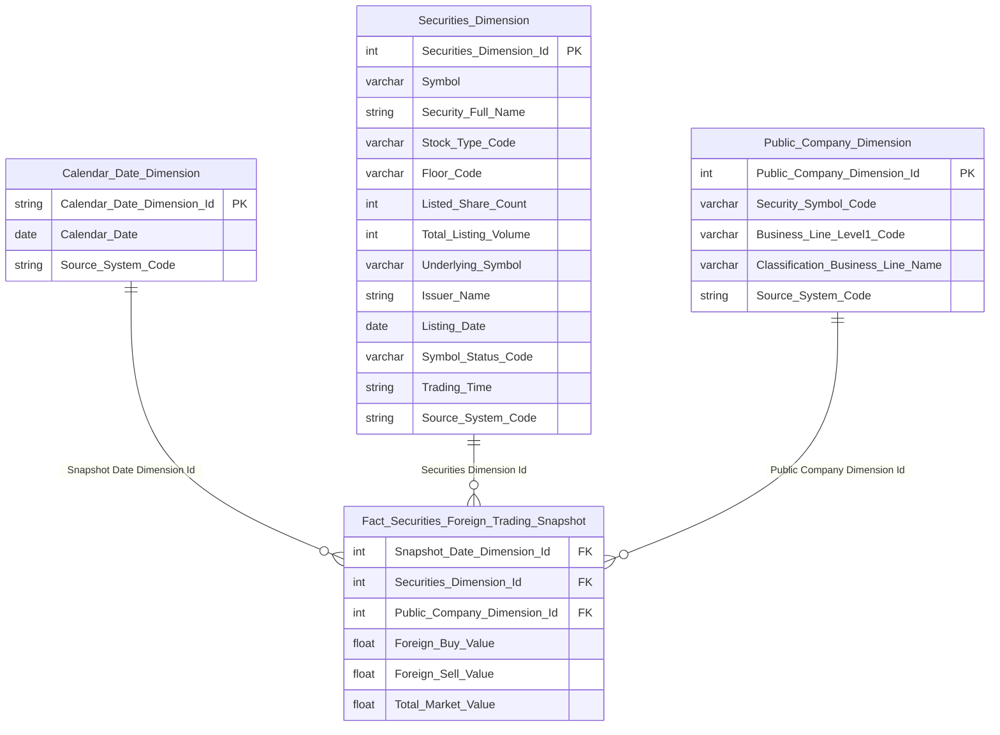
```mermaid
erDiagram
    Calendar_Date_Dimension {
        string Calendar_Date_Dimension_Id PK
        date Calendar_Date
        string Source_System_Code
    }
    Securities_Dimension {
        int Securities_Dimension_Id PK
        varchar Symbol
        string Security_Full_Name
        varchar Stock_Type_Code
        varchar Floor_Code
        int Listed_Share_Count
        int Total_Listing_Volume
        varchar Underlying_Symbol
        string Issuer_Name
        date Listing_Date
        varchar Symbol_Status_Code
        string Trading_Time
        string Source_System_Code
    }
    Public_Company_Dimension {
        int Public_Company_Dimension_Id PK
        varchar Security_Symbol_Code
        varchar Business_Line_Level1_Code
        varchar Classification_Business_Line_Name
        string Source_System_Code
    }
    Fact_Securities_Foreign_Trading_Snapshot {
        int Snapshot_Date_Dimension_Id FK
        int Securities_Dimension_Id FK
        int Public_Company_Dimension_Id FK
        float Foreign_Buy_Value
        float Foreign_Sell_Value
        float Total_Market_Value
    }

    Calendar_Date_Dimension ||--o{ Fact_Securities_Foreign_Trading_Snapshot : "Snapshot Date Dimension Id"
    Securities_Dimension ||--o{ Fact_Securities_Foreign_Trading_Snapshot : "Securities Dimension Id"
    Public_Company_Dimension ||--o{ Fact_Securities_Foreign_Trading_Snapshot : "Public Company Dimension Id"
```

> **Ghi chú thiết kế:** `Public_Company_Dimension.Classification_Business_Line_Name` là ETL-derived — join `Public Company.Business_Line_Level1/2_Code` sang `Classification Business Line.cl_business_line_code` lúc populate Dimension, lưu đệm tên ngành để tránh join 3 tầng khi query Top ngành. `Securities_Dimension` (grain 1 mã CK, SCD4A) thay thế join text-match trực tiếp `Fact.Security_Symbol_Code` trước đây — ETL derive từ `Security Trading Snapshot` (Fact Snapshot, MDDS.JAD_STOCKINFOR), lấy bản ghi mới nhất theo `Symbol`, chỉ giữ thuộc tính tĩnh (loại bỏ toàn bộ field giá/khối lượng/sổ lệnh biến động theo phiên) — xem Cụm 1a (Section 1).

**Lineage Mart → Báo cáo:**

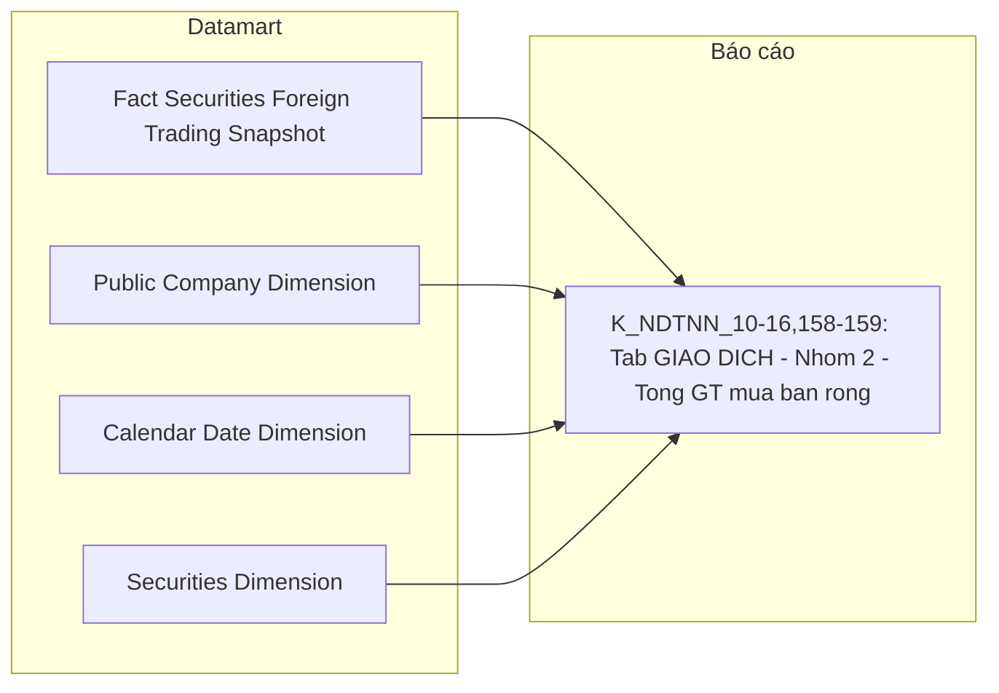
```mermaid
flowchart LR
    subgraph Datamart["Datamart"]
        G1["Fact Securities Foreign Trading Snapshot"]
        G2["Public Company Dimension"]
        G3["Calendar Date Dimension"]
        G4["Securities Dimension"]
    end
    subgraph RPT["Báo cáo"]
        R1["K_NDTNN_10-16,158-159: Tab GIAO DICH - Nhom 2 - Tong GT mua ban rong"]
    end
    G1 --> R1
    G2 --> R1
    G3 --> R1
    G4 --> R1
```

**Bảng grain:**

| Tên bảng | Grain |
|---|---|
| Fact Securities Foreign Trading Snapshot | 1 row = 1 mã CK × 1 ngày giao dịch (ETL pre-aggregate SUM Execution Value từ Securities Trade theo mã CK, tách theo Buy/Sell Foreign Investor Type Code IN ('10','20')). **[SỬA 2026-09-24]** Chỉ tính mã CK có trong `Security Trading Snapshot` cùng ngày giao dịch với `Stock Type Code IN ('1','2','3')` (Trái phiếu/Cổ phiếu/Chứng chỉ quỹ) — đúng CTE `stockinfor` của BA |
| Public Company Dimension | 1 row = 1 công ty đại chúng (SCD4A current-state) — bao gồm Classification Business Line Name đệm sẵn; `Equity_Ticker_Symbol` là snapshot hiện tại (current-state), không phủ lịch sử đổi mã/nhiều loại CK — xem O_NDTNN_28 |
| Securities Dimension | 1 row = 1 mã chứng khoán (SCD4A current-state) — ETL derive từ `Security Trading Snapshot` (Fact Snapshot), lấy bản ghi mới nhất theo Symbol |
| Calendar Date Dimension | 1 row = 1 ngày giao dịch |

---

#### Nhóm 3 — KPI Cards: Dòng tiền vào / ra / ròng (STT=3)

**Mockup:**

| Dòng tiền vào | Dòng tiền ra | Dòng tiền ròng |
|:---:|:---:|:---:|
| **1,284.3** Tỉ đồng | **1,736.8** Tỉ đồng | **-452.5** Tỉ đồng |

**Slicer:** Từ ngày — Đến ngày (date range picker)

---

> Phân loại: **Phân tích**
> Atomic: `Foreign Investor Report Value` (`fir_value`) ← FIMS.FIR_VALUE — **approved** | `Foreign Investor Report Structure` (`fir_structure`) ← FIMS.FIR_STRUCTURE — **approved** | `Foreign Investor Report` (`foreign_investor_report`) ← FIMS.FOREIGN_INVESTOR_REPORT — **approved**
> Loại dữ liệu: Dữ liệu động (cả 3 dòng)

**Source:** `Fact Foreign Investor Report Value` → `Calendar Date Dimension`, `Foreign Investor Report Structure Dimension`

**Bảng KPI:**

| KPI ID | Tên KPI | Đơn vị | Tính chất | Công thức | Ghi chú | Trạng thái |
|---|---|---|---|---|---|---|
| K_NDTNN_20 | Dòng tiền vào | — | Phái sinh | `SUM(TRY_CAST(REGEXP_REPLACE(Fact_Foreign_Investor_Report_Value.Value_Raw, '^''', '') AS DECIMAL(38,10)))` WHERE `Foreign_Investor_Report_Structure_Dimension.Report_Code = 'IBOU9'` AND `Foreign_Investor_Report_Structure_Dimension.Column_Path = 'Tổng giá trị ngoại tệ đổi sang VND trong kỳ báo cáo (đơn vị USD)'` AND `Foreign_Investor_Report_Structure_Dimension.Row_Path = 'Tổng= (1) + (2)'` AND `Submission Date = :ngaynop` | [THIẾT KẾ 2026-10-02 — BA đã map báo cáo động, Atomic FIMS fir_* đã thiết kế] BA dòng 28: báo cáo PLIV-TT51 (IBOU9, Ngân hàng lưu ký, kỳ nửa tháng), dòng "Tổng= (1) + (2)", cột "Tổng giá trị ngoại tệ đổi sang VND trong kỳ báo cáo (đơn vị USD)". Đơn vị USD. Lấy ngày cuối tháng (Note BA); đơn vị USD khác VND của các Nhóm khác | READY |
| K_NDTNN_21 | Dòng tiền ra | — | Phái sinh | `SUM(TRY_CAST(REGEXP_REPLACE(Fact_Foreign_Investor_Report_Value.Value_Raw, '^''', '') AS DECIMAL(38,10)))` WHERE `Foreign_Investor_Report_Structure_Dimension.Report_Code = 'IBOU9'` AND `Foreign_Investor_Report_Structure_Dimension.Column_Path = 'Tổng giá trị VND đổi ra ngoại tệ và chuyển ra trong kỳ báo cáo (đơn vị USD)'` AND `Foreign_Investor_Report_Structure_Dimension.Row_Path = 'Tổng= (1) + (2)'` AND `Submission Date = :ngaynop` | [THIẾT KẾ 2026-10-02 — BA đã map báo cáo động, Atomic FIMS fir_* đã thiết kế] BA dòng 29: báo cáo PLIV-TT51 (IBOU9, Ngân hàng lưu ký, kỳ nửa tháng), dòng "Tổng= (1) + (2)", cột "Tổng giá trị VND đổi ra ngoại tệ và chuyển ra trong kỳ báo cáo (đơn vị USD)". Đơn vị USD. Lấy ngày cuối tháng (Note BA); đơn vị USD khác VND của các Nhóm khác | READY |
| K_NDTNN_22 | Dòng tiền ròng | — | Phái sinh | `SUM(TRY_CAST(REGEXP_REPLACE(Fact_Foreign_Investor_Report_Value.Value_Raw, '^''', '') AS DECIMAL(38,10)))` WHERE `Foreign_Investor_Report_Structure_Dimension.Report_Code = 'IBOU9'` AND `Foreign_Investor_Report_Structure_Dimension.Column_Path = 'Giá trị dòng vốn vào trong kỳ báo cáo (+/-) (đơn vị USD)'` AND `Foreign_Investor_Report_Structure_Dimension.Row_Path = 'Tổng= (1) + (2)'` AND `Submission Date = :ngaynop` | [THIẾT KẾ 2026-10-02 — BA đã map báo cáo động, Atomic FIMS fir_* đã thiết kế] BA dòng 27: báo cáo PLIV-TT51 (IBOU9, Ngân hàng lưu ký, kỳ nửa tháng), dòng "Tổng= (1) + (2)", cột "Giá trị dòng vốn vào trong kỳ báo cáo (+/-) (đơn vị USD)". Đơn vị USD. Lấy ngày cuối tháng (Note BA); K_NDTNN_22 đọc trực tiếp ô (+/-) theo BA (không tính vào − ra như HLD cũ); nên đối chiếu K_NDTNN_22 = K_NDTNN_20 − K_NDTNN_21 khi có dữ liệu. O_NDTNN_38 | READY |

**Star Schema:**

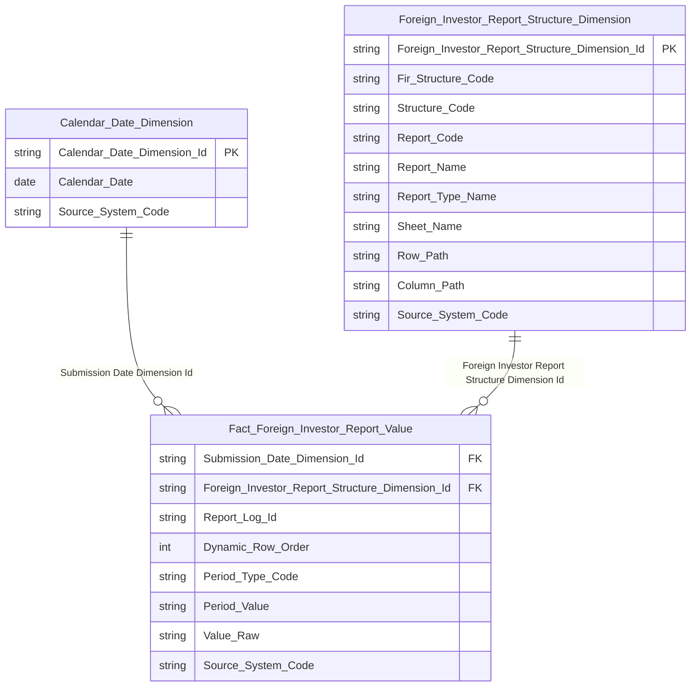
```mermaid
erDiagram
    Fact_Foreign_Investor_Report_Value {
        string Submission_Date_Dimension_Id FK
        string Foreign_Investor_Report_Structure_Dimension_Id FK
        string Report_Log_Id
        int Dynamic_Row_Order
        string Period_Type_Code
        string Period_Value
        string Value_Raw
        string Source_System_Code
    }
    Calendar_Date_Dimension {
        string Calendar_Date_Dimension_Id PK
        date Calendar_Date
        string Source_System_Code
    }
    Foreign_Investor_Report_Structure_Dimension {
        string Foreign_Investor_Report_Structure_Dimension_Id PK
        string Fir_Structure_Code
        string Structure_Code
        string Report_Code
        string Report_Name
        string Report_Type_Name
        string Sheet_Name
        string Row_Path
        string Column_Path
        string Source_System_Code
    }

    Calendar_Date_Dimension ||--o{ Fact_Foreign_Investor_Report_Value : "Submission Date Dimension Id"
    Foreign_Investor_Report_Structure_Dimension ||--o{ Fact_Foreign_Investor_Report_Value : "Foreign Investor Report Structure Dimension Id"
```

**Lineage Mart → Báo cáo:**

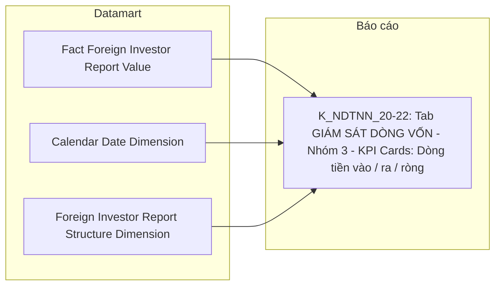
```mermaid
flowchart LR
    subgraph Datamart["Datamart"]
        G1["Fact Foreign Investor Report Value"]
        G2["Calendar Date Dimension"]
        G3["Foreign Investor Report Structure Dimension"]
    end
    subgraph RPT["Báo cáo"]
        R1["K_NDTNN_20-22: Tab GIÁM SÁT DÒNG VỐN - Nhóm 3 - KPI Cards: Dòng tiền vào / ra / ròng"]
    end
    G1 --> R1
    G2 --> R1
    G3 --> R1
```

**Bảng grain:**

| Tên bảng | Grain |
|---|---|
| Fact Foreign Investor Report Value | 1 row = 1 ô báo cáo × 1 lần nộp × 1 dòng động (FIMS báo cáo động, EAV) |
| Calendar Date Dimension | 1 row = 1 ngày |
| Foreign Investor Report Structure Dimension | 1 row = 1 ô template trong 1 sheet (SCD4A current-state) |

---

#### Nhóm 4 — Dòng vốn đầu tư gián tiếp nước ngoài (STT=4)

**Mockup** *(theo screenshot — stacked bar theo tháng + 4 bảng Top)*:

| Stacked bar | Trục X | Trục Y | Legend |
|:---|:---|:---|:---|
| Dòng vốn ròng theo loại hình NĐT | Tháng T1→T12 | Tỉ đồng | Cá nhân / Quỹ / Tổ chức khác quỹ |

**Slicer:** Từ ngày — Đến ngày + Loại hình NĐTNN + Quốc gia

---

> Phân loại: **Phân tích**
> Atomic: `Foreign Investor Report Value` (`fir_value`) ← FIMS.FIR_VALUE — **approved** | `Foreign Investor Report Structure` (`fir_structure`) ← FIMS.FIR_STRUCTURE — **approved** | `Foreign Investor Report` (`foreign_investor_report`) ← FIMS.FOREIGN_INVESTOR_REPORT — **approved**
> Loại dữ liệu: Dữ liệu động (8/10 dòng) / Dữ liệu tĩnh (2 Chiều — Loại hình NĐTNN, Quốc gia — dùng filter/GROUP BY cho measure động, không tự đứng độc lập)

**Source:** `Fact Foreign Investor Portfolio Report Snapshot` → `Calendar Date Dimension`; `Fact Foreign Investor Capital Flow Snapshot` → `Calendar Date Dimension`

**Bảng KPI:**

| KPI ID | Tên KPI | Đơn vị | Tính chất | Công thức | Ghi chú | Trạng thái |
|---|---|---|---|---|---|---|
| K_NDTNN_23 | Loại hình NĐTNN | — | Chiều | Fact_Foreign_Investor_Portfolio_Report_Snapshot.Investor_Type_Name | [THIẾT KẾ 2026-10-02 — BA đã map báo cáo động, Atomic FIMS fir_* đã thiết kế] BA dòng 31: cột "Loại hình đối với tổ chức" của báo cáo PLIII-TT51 (59WJB/BZ5X4, sheet II). BA Note: nếu loại hình có chi tiết thì lấy luôn phân loại theo báo cáo | READY |
| K_NDTNN_24 | Quốc gia | — | Chiều | Fact_Foreign_Investor_Portfolio_Report_Snapshot.Nationality_Name | [THIẾT KẾ 2026-10-02 — BA đã map báo cáo động, Atomic FIMS fir_* đã thiết kế] BA dòng 32: cột "Quốc tịch" của báo cáo PLIII-TT51 (59WJB/BZ5X4, sheet II). Dùng cột văn bản trên Fact, không dùng Geographic Area Dimension (chưa có nguồn Atomic — O_NDTNN_21) | READY |
| K_NDTNN_25 | Dòng vốn ròng | — | Phái sinh | `SUM(Fact_Foreign_Investor_Portfolio_Report_Snapshot.Total_Portfolio_Value)` WHERE `Submission Date = :ngaynop` | [THIẾT KẾ 2026-10-02 — BA đã map báo cáo động, Atomic FIMS fir_* đã thiết kế] BA dòng 30 (Dòng vốn ròng): thiết kế theo Điều kiện + SQL tham khảo của BA — báo cáo PLIII-TT51 59WJB/BZ5X4 sheet II, SUM cột "Tổng giá trị danh mục > Giá trị" theo loại hình. Mô tả BA gọi là "dòng vốn ròng" (IBOU9) nhưng phép tính BA là tổng giá trị danh mục, trùng Nhóm 6 (BA đánh giá Trùng); nếu BA đổi sang IBOU9 thì chuyển sang Fact Foreign Investor Capital Flow Snapshot. O_NDTNN_38 | READY |
| K_NDTNN_26 | Dòng vốn ròng — Quỹ | — | Phái sinh | `SUM(Fact_Foreign_Investor_Portfolio_Report_Snapshot.Total_Portfolio_Value)` WHERE `Submission Date = :ngaynop` AND `Fact_Foreign_Investor_Portfolio_Report_Snapshot.Fund_Indicator = 1` | [THIẾT KẾ 2026-10-02 — BA đã map báo cáo động, Atomic FIMS fir_* đã thiết kế] BA dòng 33 (Quỹ): thiết kế theo Điều kiện + SQL tham khảo của BA — báo cáo PLIII-TT51 59WJB/BZ5X4 sheet II, SUM cột "Tổng giá trị danh mục > Giá trị" theo loại hình. Mô tả BA gọi là "dòng vốn ròng" (IBOU9) nhưng phép tính BA là tổng giá trị danh mục, trùng Nhóm 6 (BA đánh giá Trùng); nếu BA đổi sang IBOU9 thì chuyển sang Fact Foreign Investor Capital Flow Snapshot. O_NDTNN_38 | READY |
| K_NDTNN_27 | Dòng vốn ròng — Cá nhân | — | Phái sinh | `SUM(Fact_Foreign_Investor_Portfolio_Report_Snapshot.Total_Portfolio_Value)` WHERE `Submission Date = :ngaynop` AND `Fact_Foreign_Investor_Portfolio_Report_Snapshot.Individual_Indicator = 1` | [THIẾT KẾ 2026-10-02 — BA đã map báo cáo động, Atomic FIMS fir_* đã thiết kế] BA dòng 34 (Cá nhân): thiết kế theo Điều kiện + SQL tham khảo của BA — báo cáo PLIII-TT51 59WJB/BZ5X4 sheet II, SUM cột "Tổng giá trị danh mục > Giá trị" theo loại hình. Mô tả BA gọi là "dòng vốn ròng" (IBOU9) nhưng phép tính BA là tổng giá trị danh mục, trùng Nhóm 6 (BA đánh giá Trùng); nếu BA đổi sang IBOU9 thì chuyển sang Fact Foreign Investor Capital Flow Snapshot. O_NDTNN_38 | READY |
| K_NDTNN_28 | Dòng vốn ròng — Tổ chức khác quỹ | — | Phái sinh | `SUM(Fact_Foreign_Investor_Portfolio_Report_Snapshot.Total_Portfolio_Value)` WHERE `Submission Date = :ngaynop` AND `Fact_Foreign_Investor_Portfolio_Report_Snapshot.Non_Fund_Organization_Indicator = 1` | [THIẾT KẾ 2026-10-02 — BA đã map báo cáo động, Atomic FIMS fir_* đã thiết kế] BA dòng 35 (Tổ chức khác quỹ): thiết kế theo Điều kiện + SQL tham khảo của BA — báo cáo PLIII-TT51 59WJB/BZ5X4 sheet II, SUM cột "Tổng giá trị danh mục > Giá trị" theo loại hình. Mô tả BA gọi là "dòng vốn ròng" (IBOU9) nhưng phép tính BA là tổng giá trị danh mục, trùng Nhóm 6 (BA đánh giá Trùng); nếu BA đổi sang IBOU9 thì chuyển sang Fact Foreign Investor Capital Flow Snapshot. O_NDTNN_38 | READY |
| K_NDTNN_29 | Top 5 quốc gia vào ròng | — | Phái sinh | `SUM(Fact_Foreign_Investor_Capital_Flow_Snapshot.Capital_Flow_Net_Value)` WHERE `Submission Date = :ngaynop` GROUP BY `Fact_Foreign_Investor_Capital_Flow_Snapshot.Nationality_Name` HAVING `SUM(...) > 0` ORDER BY `SUM(...) DESC` LIMIT 5 | [THIẾT KẾ 2026-10-02 — BA đã map báo cáo động, Atomic FIMS fir_* đã thiết kế] BA dòng 36: IBOU9 sheet I, SUM cột "Giá trị dòng vốn vào trong kỳ báo cáo (+/-) (đơn vị USD)" theo Quốc tịch, top 5 dương. Top-N xử lý ở lớp báo cáo | READY |
| K_NDTNN_30 | Top 5 quốc gia rút ròng | — | Phái sinh | `SUM(Fact_Foreign_Investor_Capital_Flow_Snapshot.Capital_Flow_Net_Value)` WHERE `Submission Date = :ngaynop` GROUP BY `Fact_Foreign_Investor_Capital_Flow_Snapshot.Nationality_Name` HAVING `SUM(...) < 0` ORDER BY `SUM(...) ASC` LIMIT 5 | [THIẾT KẾ 2026-10-02 — BA đã map báo cáo động, Atomic FIMS fir_* đã thiết kế] BA dòng 37: như K_NDTNN_29 nhưng top 5 âm nhiều nhất | READY |
| K_NDTNN_31 | Top 5 NĐT vào ròng | — | Phái sinh | `SUM(Fact_Foreign_Investor_Capital_Flow_Snapshot.Capital_Flow_Net_Value)` WHERE `Submission Date = :ngaynop` GROUP BY `Fact_Foreign_Investor_Capital_Flow_Snapshot.Investor_Name` HAVING `SUM(...) > 0` ORDER BY `SUM(...) DESC` LIMIT 5 | [THIẾT KẾ 2026-10-02 — BA đã map báo cáo động, Atomic FIMS fir_* đã thiết kế] BA dòng 38: IBOU9 sheet I, SUM theo "Tên nhà đầu tư", top 5 dương | READY |
| K_NDTNN_32 | Top 5 NĐT rút ròng | — | Phái sinh | `SUM(Fact_Foreign_Investor_Capital_Flow_Snapshot.Capital_Flow_Net_Value)` WHERE `Submission Date = :ngaynop` GROUP BY `Fact_Foreign_Investor_Capital_Flow_Snapshot.Investor_Name` HAVING `SUM(...) < 0` ORDER BY `SUM(...) ASC` LIMIT 5 | [THIẾT KẾ 2026-10-02 — BA đã map báo cáo động, Atomic FIMS fir_* đã thiết kế] BA dòng 39: như K_NDTNN_31 nhưng top 5 âm nhiều nhất | READY |

**Star Schema:**

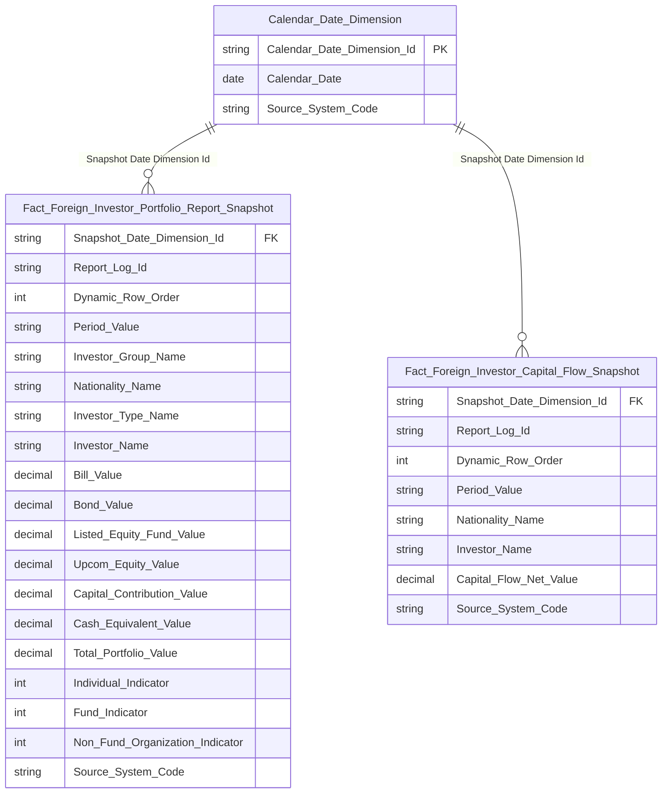
```mermaid
erDiagram
    Fact_Foreign_Investor_Portfolio_Report_Snapshot {
        string Snapshot_Date_Dimension_Id FK
        string Report_Log_Id
        int Dynamic_Row_Order
        string Period_Value
        string Investor_Group_Name
        string Nationality_Name
        string Investor_Type_Name
        string Investor_Name
        decimal Bill_Value
        decimal Bond_Value
        decimal Listed_Equity_Fund_Value
        decimal Upcom_Equity_Value
        decimal Capital_Contribution_Value
        decimal Cash_Equivalent_Value
        decimal Total_Portfolio_Value
        int Individual_Indicator
        int Fund_Indicator
        int Non_Fund_Organization_Indicator
        string Source_System_Code
    }
    Fact_Foreign_Investor_Capital_Flow_Snapshot {
        string Snapshot_Date_Dimension_Id FK
        string Report_Log_Id
        int Dynamic_Row_Order
        string Period_Value
        string Nationality_Name
        string Investor_Name
        decimal Capital_Flow_Net_Value
        string Source_System_Code
    }
    Calendar_Date_Dimension {
        string Calendar_Date_Dimension_Id PK
        date Calendar_Date
        string Source_System_Code
    }

    Calendar_Date_Dimension ||--o{ Fact_Foreign_Investor_Portfolio_Report_Snapshot : "Snapshot Date Dimension Id"
    Calendar_Date_Dimension ||--o{ Fact_Foreign_Investor_Capital_Flow_Snapshot : "Snapshot Date Dimension Id"
```

**Lineage Mart → Báo cáo:**

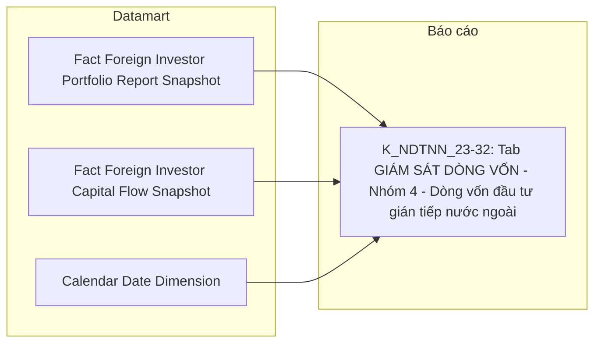
```mermaid
flowchart LR
    subgraph Datamart["Datamart"]
        G1["Fact Foreign Investor Portfolio Report Snapshot"]
        G2["Fact Foreign Investor Capital Flow Snapshot"]
        G3["Calendar Date Dimension"]
    end
    subgraph RPT["Báo cáo"]
        R1["K_NDTNN_23-32: Tab GIÁM SÁT DÒNG VỐN - Nhóm 4 - Dòng vốn đầu tư gián tiếp nước ngoài"]
    end
    G1 --> R1
    G2 --> R1
    G3 --> R1
```

**Bảng grain:**

| Tên bảng | Grain |
|---|---|
| Fact Foreign Investor Portfolio Report Snapshot | 1 row = 1 dòng báo cáo 59WJB/BZ5X4 sheet II (lần nộp × section × dòng động), pivot các cột |
| Fact Foreign Investor Capital Flow Snapshot | 1 row = 1 dòng báo cáo IBOU9 sheet I (lần nộp × section × dòng động), pivot các cột |
| Calendar Date Dimension | 1 row = 1 ngày |

---

#### Nhóm 5 — Tương quan Net Flow & VN-Index (STT=5)

**Mockup** *(theo screenshot — 3 series line chart dual Y-axis)*:

| Series | Nguồn | Trục Y |
|:---|:---|:---|
| MUA/BÁN RÒNG (đỏ) | Securities Trade (ORDERTRADE) | Trái (Tỉ đồng) |
| DÒNG TIỀN RÒNG (xanh lá) | Báo cáo PLIV-TT51 (Ngân hàng lưu ký) | Trái (Tỉ đồng — nguồn USD, xem K_NDTNN_35) |
| VN-INDEX (tím) | MDDS (JAD_MARKETINFOR) | Phải (Điểm) |

> **Ghi chú thiết kế — [THIẾT KẾ LẠI 2026-09-24, theo yêu cầu Data Modeler]:** Thay thiết kế cũ (3 series từ 3 Fact riêng — reuse `Fact Securities Foreign Trading Snapshot` Nhóm 2 + `Fact Market Index Snapshot` QLKD, presentation tự align theo ngày) bằng **1 Fact riêng cho Nhóm 5** `Fact Foreign Net Flow Market Index Snapshot` — cả 3 series nằm cùng 1 dòng/ngày, presentation chỉ SELECT theo khoảng ngày. Lý do: (1) biểu đồ tương quan cần 3 series khớp đúng cùng trục ngày — gom tại ETL tránh lệch ngày giữa 3 query độc lập; (2) Fact Nhóm 2 grain 1 mã CK × 1 ngày, dùng cho Nhóm 5 phải SUM lại toàn thị trường mỗi lần query; (3) Fact Market Index Snapshot sở hữu QLKD, mọi thay đổi grain/cột phía QLKD ảnh hưởng ngược NDTNN (đã xảy ra 24/07/2026). Fact mới đọc thẳng Atomic, không phụ thuộc Fact nào khác.

---

> Phân loại: **Phân tích**
> Atomic (Giá trị mua/bán ròng): `Securities Trade` ← ORDERTRADE.TRADE_BOOK_HOSE/HNX + `Security Trading Snapshot` ← MDDS.JAD_STOCKINFOR — **READY**
> Atomic (VN-Index): `Market Index Snapshot` ← MDDS.JAD_MARKETINFOR — **READY** (LLD draft `DataModel/working/Atomic/lld/MDDS/lld_MDDS_JAD_MARKETINFOR.yaml`, nhất quán với QLKD Cụm 6b)
> Atomic (Dòng tiền ròng lũy kế): `Report Import Value` ← FIMS.RPTVALUES — **CHƯA SẴN** (mới có ở `FIMS_HLD_Overview.md`, chưa có LLD/`dm_manifest.yaml`) — xem O_NDTNN_33
> Loại dữ liệu: Dữ liệu tĩnh (Giá trị mua/bán ròng, VN-Index) / Dữ liệu động (Dòng tiền ròng)

> **[SỬA 2026-10-02 — K_NDTNN_35 READY]** BA dòng 40 (IBOU9, dòng "Tổng= (1) + (2)", cột GT dòng vốn vào (+/-) USD) đã map vào Atomic FIMS báo cáo động (`fir_value`/`fir_structure`/`foreign_investor_report`, thiết kế 2026-09-30). Cột vật lý `foreign_net_capital_flow_mtd_amt` trên Fact này được nạp từ `fir_value` — không thêm Fact mới. Quy tắc "ưu tiên kỳ nửa tháng" và đơn vị USD vẫn chờ dev/BA (O_NDTNN_33/38).

**Source:** `Fact Foreign Net Flow Market Index Snapshot` (new, riêng Nhóm 5) → `Calendar Date Dimension`, `Market Index Dimension` (reuse Dimension — sở hữu QLKD)

**Bảng KPI:**

| KPI ID | Tên KPI | Đơn vị | Tính chất | Công thức | Ghi chú | Trạng thái |
|---|---|---|---|---|---|---|
| K_NDTNN_33 | Giá trị mua/bán ròng | Tỷ đồng | Phái sinh | `fct_foreign_net_flow_market_index_snpst.foreign_net_trading_val` (= `foreign_buy_val − foreign_sell_val`, SUM xuyên mọi mã CK loại 1/2/3 cả HOSE lẫn HNX trong ngày) JOIN `cdr_dt_dim` ON `snpst_dt_dim_id` WHERE `cdr_dt BETWEEN :tu_ngay AND :den_ngay` | **[2026-09-24]** Lưu vật lý tại Fact mới. ETL rẽ nhánh theo `src_stm_code` đúng câu lệnh BA dòng 41: giá trị dùng `execution_val` cho cả 2 sàn (Atomic đã tính sẵn cho HNX — sửa 2026-09-25); NĐTNN = `IN ('10','20')` cho cả 2 sàn (BA dòng 41 ghi HOSE `<> '00'` — tương đương trên domain 00/10/20, thống nhất với Fact Nhóm 1/2). JOIN `security_trading_snapshot` bản ghi `trading_time` mới nhất theo mã × ngày (HOSE nối `symbol`, HNX nối `isin_code` = issue_code). Lưu VND, quy đổi Tỷ đồng ở presentation | READY |
| K_NDTNN_34 | Điểm đóng cửa chỉ số (VN-Index) | Điểm | Cơ sở | `fct_foreign_net_flow_market_index_snpst.market_index_close_val` JOIN `market_index_dim` ON `market_index_dim_id` WHERE `market_id = '10'` AND `market_code = 'HOSE'` | **[2026-09-24]** ETL lấy bản ghi `index_time` lớn nhất trong ngày từ Atomic `Market Index Snapshot` (câu lệnh BA dòng 42) — không còn đi qua `fct_market_index_snpst` (QLKD). Giữ FK `market_index_dim_id` thay vì hard-code để mở rộng chỉ số khác sau này mà không đổi grain | READY |
| K_NDTNN_35 | Dòng tiền ròng lũy kế (tháng) | USD | Phái sinh | `Fact_Foreign_Net_Flow_Market_Index_Snapshot.Foreign_Net_Capital_Flow_MTD_Amount` | [THIẾT KẾ 2026-10-02 — BA đã map báo cáo động, Atomic FIMS fir_* đã thiết kế] BA dòng 40: IBOU9, dòng "Tổng= (1) + (2)", cột "Giá trị dòng vốn vào trong kỳ báo cáo (+/-) (đơn vị USD)". Cột vật lý đã dự phòng trên Fact; ETL lấy từ fir_value (xem LLD). USD khác 2 series VND; semi-additive. Quy tắc "ưu tiên kỳ nửa tháng" chờ dev (O_NDTNN_33/38) | READY |

**Star Schema:**

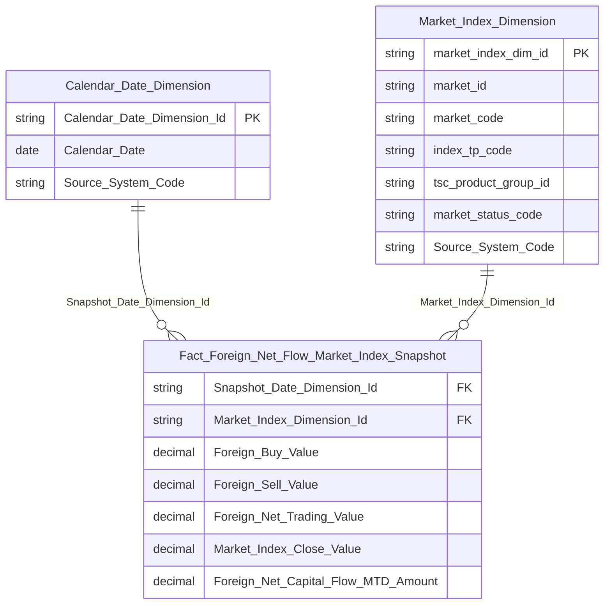
```mermaid
erDiagram
    Calendar_Date_Dimension {
        string Calendar_Date_Dimension_Id PK
        date Calendar_Date
        string Source_System_Code
    }
    Market_Index_Dimension {
        string market_index_dim_id PK
        string market_id
        string market_code
        string index_tp_code
        string tsc_product_group_id
        string market_status_code
        string Source_System_Code
    }
    Fact_Foreign_Net_Flow_Market_Index_Snapshot {
        string Snapshot_Date_Dimension_Id FK
        string Market_Index_Dimension_Id FK
        decimal Foreign_Buy_Value
        decimal Foreign_Sell_Value
        decimal Foreign_Net_Trading_Value
        decimal Market_Index_Close_Value
        decimal Foreign_Net_Capital_Flow_MTD_Amount
    }

    Calendar_Date_Dimension ||--o{ Fact_Foreign_Net_Flow_Market_Index_Snapshot : "Snapshot_Date_Dimension_Id"
    Market_Index_Dimension ||--o{ Fact_Foreign_Net_Flow_Market_Index_Snapshot : "Market_Index_Dimension_Id"
```

> **Ghi chú:** Fact mới không reuse `Fact Securities Foreign Trading Snapshot` (Nhóm 2) lẫn `Fact Market Index Snapshot` (QLKD) — cả 2 Fact đó giữ nguyên, không thay đổi. Chỉ reuse Dimension: `Calendar Date Dimension` (conformed) và `Market Index Dimension` (`market_index_dim`, sở hữu QLKD). LLD: `Datamart/lld/NDTNN/DTM_NDTNN_fct_foreign_net_flow_market_index_snpst.csv`.

**Lineage Mart → Báo cáo:**

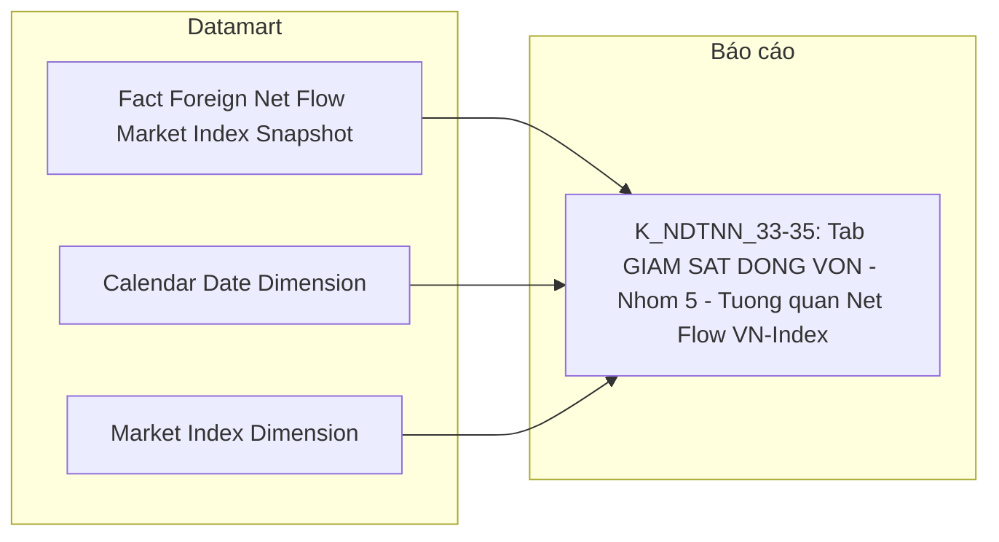
```mermaid
flowchart LR
    subgraph Datamart["Datamart"]
        G1["Fact Foreign Net Flow Market Index Snapshot"]
        G3["Calendar Date Dimension"]
        G4["Market Index Dimension"]
    end
    subgraph RPT["Báo cáo"]
        R1["K_NDTNN_33-35: Tab GIAM SAT DONG VON - Nhom 5 - Tuong quan Net Flow VN-Index"]
    end
    G1 --> R1
    G3 --> R1
    G4 --> R1
```

**Bảng grain:**

| Tên bảng | Grain |
|---|---|
| Fact Foreign Net Flow Market Index Snapshot (`fct_foreign_net_flow_market_index_snpst`, new) | 1 row = 1 ngày giao dịch × 1 chỉ số tham chiếu (hiện chỉ VN-Index HOSE) |
| Calendar Date Dimension | 1 row = 1 ngày |
| Market Index Dimension (`market_index_dim`, reuse — sở hữu QLKD) | 1 row = 1 combo Market_Id + Market_Code (SCD4A current-state) |

---

#### Nhóm 6 - Thống kê danh mục (STT=6)

> Phân loại: **Phân tích**
> Atomic: `Foreign Investor Report Value` (`fir_value`) ← FIMS.FIR_VALUE — **approved** | `Foreign Investor Report Structure` (`fir_structure`) ← FIMS.FIR_STRUCTURE — **approved** | `Foreign Investor Report` (`foreign_investor_report`) ← FIMS.FOREIGN_INVESTOR_REPORT — **approved**
> Loại dữ liệu: Dữ liệu tĩnh (Loại hình nhà đầu tư) / Dữ liệu động (6 KPI còn lại)

**Mockup:**

| Tổng GTDM | Danh mục Cá nhân | Danh mục Quỹ | Danh mục Tổ chức khác quỹ |
|:---:|:---:|:---:|:---:|
| **1,315** Tỉ đồng | **284.6** Tỉ đồng | **752.3** Tỉ đồng | **278.1** Tỉ đồng |

**Source:** `Fact Foreign Investor Portfolio Report Snapshot` → `Calendar Date Dimension`

**Bảng KPI:**

| KPI ID | Tên KPI | Đơn vị | Tính chất | Công thức | Ghi chú | Trạng thái |
|---|---|---|---|---|---|---|
| K_NDTNN_36 | Loại hình nhà đầu tư | — | Chiều | Fact_Foreign_Investor_Portfolio_Report_Snapshot.Investor_Type_Name | [THIẾT KẾ 2026-10-02 — BA đã map báo cáo động, Atomic FIMS fir_* đã thiết kế] BA dòng 44: cột "Loại hình đối với tổ chức" của báo cáo PLIII-TT51 (Trùng K_NDTNN_23). **[ĐỔI NGUỒN]** trước đây dùng `Foreign Investor Dimension.Investor Type Code` (FIMS.INVESTOR) | READY |
| K_NDTNN_37 | Tổng giá trị danh mục | — | Phái sinh | `SUM(Fact_Foreign_Investor_Portfolio_Report_Snapshot.Total_Portfolio_Value)` WHERE `Submission Date = :ngaynop` | [THIẾT KẾ 2026-10-02 — BA đã map báo cáo động, Atomic FIMS fir_* đã thiết kế] BA dòng 43: PLIII-TT51 (59WJB/BZ5X4) sheet II, cột "Tổng giá trị danh mục > Giá trị", bỏ dòng tổng — lọc ở ETL nạp Fact (WHERE fir_value.total_row_ind = 0, cùng section_echo/band_overflow/static_copy/rpt_marker = 0), nên Fact KHÔNG có cột total_row_ind và KPI không cần lọc thêm. Độ chi tiết tháng, toàn thị trường | READY |
| K_NDTNN_38 | Danh mục Cá nhân | — | Phái sinh | `SUM(Fact_Foreign_Investor_Portfolio_Report_Snapshot.Total_Portfolio_Value)` WHERE `Fact_Foreign_Investor_Portfolio_Report_Snapshot.Individual_Indicator = 1` AND `Submission Date = :ngaynop` | [THIẾT KẾ 2026-10-02 — BA đã map báo cáo động, Atomic FIMS fir_* đã thiết kế] BA dòng 45: tổng giá trị danh mục của NĐTNN Cá nhân. row_path = B-Cá nhân | READY |
| K_NDTNN_39 | Danh mục Quỹ | — | Phái sinh | `SUM(Fact_Foreign_Investor_Portfolio_Report_Snapshot.Total_Portfolio_Value)` WHERE `Fact_Foreign_Investor_Portfolio_Report_Snapshot.Fund_Indicator = 1` AND `Submission Date = :ngaynop` | [THIẾT KẾ 2026-10-02 — BA đã map báo cáo động, Atomic FIMS fir_* đã thiết kế] BA dòng 46: tổng giá trị danh mục của NĐTNN Quỹ. Điều kiện của BA không loại trừ lẫn nhau giữa "quỹ" và "tổ chức khác quỹ" (loại hình chứa cả "Công ty" và "quỹ") — giữ nguyên theo BA, xem O_NDTNN_38 | READY |
| K_NDTNN_40 | Danh mục Tổ chức khác quỹ | — | Phái sinh | `SUM(Fact_Foreign_Investor_Portfolio_Report_Snapshot.Total_Portfolio_Value)` WHERE `Fact_Foreign_Investor_Portfolio_Report_Snapshot.Non_Fund_Organization_Indicator = 1` AND `Submission Date = :ngaynop` | [THIẾT KẾ 2026-10-02 — BA đã map báo cáo động, Atomic FIMS fir_* đã thiết kế] BA dòng 47: tổng giá trị danh mục của NĐTNN Tổ chức khác quỹ. Điều kiện của BA không loại trừ lẫn nhau giữa "quỹ" và "tổ chức khác quỹ" (loại hình chứa cả "Công ty" và "quỹ") — giữ nguyên theo BA, xem O_NDTNN_38 | READY |
| K_NDTNN_41 | Top 5 quốc gia theo GTDM | — | Phái sinh | `SUM(Fact_Foreign_Investor_Portfolio_Report_Snapshot.Total_Portfolio_Value)` WHERE `Submission Date = :ngaynop` GROUP BY `Fact_Foreign_Investor_Portfolio_Report_Snapshot.Nationality_Name` ORDER BY `SUM(...)` DESC LIMIT 5 | [THIẾT KẾ 2026-10-02 — BA đã map báo cáo động, Atomic FIMS fir_* đã thiết kế] BA dòng 48: top 5 quốc tịch theo tổng giá trị danh mục. Top-N ở lớp báo cáo | READY |
| K_NDTNN_42 | Top 5 NĐT theo GTDM | — | Phái sinh | `SUM(Fact_Foreign_Investor_Portfolio_Report_Snapshot.Total_Portfolio_Value)` WHERE `Submission Date = :ngaynop` GROUP BY `Fact_Foreign_Investor_Portfolio_Report_Snapshot.Investor_Name` ORDER BY `SUM(...)` DESC LIMIT 5 | [THIẾT KẾ 2026-10-02 — BA đã map báo cáo động, Atomic FIMS fir_* đã thiết kế] BA dòng 49: top 5 nhà đầu tư (Tên khách hàng) theo tổng giá trị danh mục | READY |

**Star Schema:**

```mermaid
erDiagram
    Fact_Foreign_Investor_Portfolio_Report_Snapshot {
        string Snapshot_Date_Dimension_Id FK
        string Report_Log_Id
        int Dynamic_Row_Order
        string Period_Value
        string Investor_Group_Name
        string Nationality_Name
        string Investor_Type_Name
        string Investor_Name
        decimal Bill_Value
        decimal Bond_Value
        decimal Listed_Equity_Fund_Value
        decimal Upcom_Equity_Value
        decimal Capital_Contribution_Value
        decimal Cash_Equivalent_Value
        decimal Total_Portfolio_Value
        int Individual_Indicator
        int Fund_Indicator
        int Non_Fund_Organization_Indicator
        string Source_System_Code
    }
    Calendar_Date_Dimension {
        string Calendar_Date_Dimension_Id PK
        date Calendar_Date
        string Source_System_Code
    }

    Calendar_Date_Dimension ||--o{ Fact_Foreign_Investor_Portfolio_Report_Snapshot : "Snapshot Date Dimension Id"
```

**Lineage Mart → Báo cáo:**

```mermaid
flowchart LR
    subgraph Datamart["Datamart"]
        G1["Fact Foreign Investor Portfolio Report Snapshot"]
        G2["Calendar Date Dimension"]
    end
    subgraph RPT["Báo cáo"]
        R1["K_NDTNN_36-42: Tab DANH MỤC - Nhóm 6 - Thống kê danh mục"]
    end
    G1 --> R1
    G2 --> R1
```

**Bảng grain:**

| Tên bảng | Grain |
|---|---|
| Fact Foreign Investor Portfolio Report Snapshot | 1 row = 1 dòng báo cáo 59WJB/BZ5X4 sheet II (lần nộp × section × dòng động), pivot các cột |
| Calendar Date Dimension | 1 row = 1 ngày |

---

#### Nhóm 7 - Cơ cấu danh mục theo loại hình tài sản (STT=7)

> Phân loại: **Phân tích**
> Atomic: `Foreign Investor Report Value` (`fir_value`) ← FIMS.FIR_VALUE — **approved** | `Foreign Investor Report Structure` (`fir_structure`) ← FIMS.FIR_STRUCTURE — **approved** | `Foreign Investor Report` (`foreign_investor_report`) ← FIMS.FOREIGN_INVESTOR_REPORT — **approved**
> Loại dữ liệu: Dữ liệu động (toàn bộ 7/7 dòng BA)

**Mockup:**

```mermaid
pie showData
    title Cơ cấu danh mục theo loại hình tài sản (T4/2023)
    "Cổ phiếu, CCQ niêm yết" : 55
    "Trái phiếu" : 19
    "UPCoM" : 10
    "Vốn góp, CP tu & CK khác" : 8
    "Tiền & tương đương tiền" : 8
```

**Source:** `Fact Foreign Investor Portfolio Report Snapshot` → `Calendar Date Dimension`

**Bảng KPI:**

| KPI ID | Tên KPI | Đơn vị | Tính chất | Công thức | Ghi chú | Trạng thái |
|---|---|---|---|---|---|---|
| K_NDTNN_43 | Giá trị tài sản | — | Cơ sở | `SUM(Fact_Foreign_Investor_Portfolio_Report_Snapshot.Total_Portfolio_Value)` WHERE `Submission Date = :ngaynop` | [THIẾT KẾ 2026-10-02 — BA đã map báo cáo động, Atomic FIMS fir_* đã thiết kế] BA dòng 50: giá trị tài sản (mẫu số tỷ trọng) = tổng giá trị danh mục. Cột `bill_val` (tín phiếu) đã lưu nhưng BA không có dòng KPI riêng | READY |
| K_NDTNN_44 | Loại tài sản | — | Chiều | Tên cột tài sản của `Fact Foreign Investor Portfolio Report Snapshot` (UNPIVOT tại lớp báo cáo) | [THIẾT KẾ 2026-10-02 — BA đã map báo cáo động, Atomic FIMS fir_* đã thiết kế] BA dòng 51 — chiều không lưu cột vật lý | READY |
| K_NDTNN_45 | GT tài sản — Cổ phiếu/CCQ niêm yết | — | Phái sinh | `SUM(Fact_Foreign_Investor_Portfolio_Report_Snapshot.Listed_Equity_Fund_Value)` WHERE `Submission Date = :ngaynop` (tỷ trọng = `SUM(Fact_Foreign_Investor_Portfolio_Report_Snapshot.Listed_Equity_Fund_Value) × 100 / SUM(Fact_Foreign_Investor_Portfolio_Report_Snapshot.Total_Portfolio_Value)` tại lớp báo cáo) | [THIẾT KẾ 2026-10-02 — BA đã map báo cáo động, Atomic FIMS fir_* đã thiết kế] BA dòng 52: Cổ phiếu, CCQ niêm yết. Trái phiếu = tổng 3 kỳ hạn còn lại (<12 tháng, 12–24 tháng, >24 tháng) nếu là K_NDTNN_46 | READY |
| K_NDTNN_46 | GT tài sản — Trái phiếu | — | Phái sinh | `SUM(Fact_Foreign_Investor_Portfolio_Report_Snapshot.Bond_Value)` WHERE `Submission Date = :ngaynop` (tỷ trọng = `SUM(Fact_Foreign_Investor_Portfolio_Report_Snapshot.Bond_Value) × 100 / SUM(Fact_Foreign_Investor_Portfolio_Report_Snapshot.Total_Portfolio_Value)` tại lớp báo cáo) | [THIẾT KẾ 2026-10-02 — BA đã map báo cáo động, Atomic FIMS fir_* đã thiết kế] BA dòng 53: Trái phiếu. Trái phiếu = tổng 3 kỳ hạn còn lại (<12 tháng, 12–24 tháng, >24 tháng) nếu là K_NDTNN_46 | READY |
| K_NDTNN_47 | GT tài sản — UPCoM | — | Phái sinh | `SUM(Fact_Foreign_Investor_Portfolio_Report_Snapshot.Upcom_Equity_Value)` WHERE `Submission Date = :ngaynop` (tỷ trọng = `SUM(Fact_Foreign_Investor_Portfolio_Report_Snapshot.Upcom_Equity_Value) × 100 / SUM(Fact_Foreign_Investor_Portfolio_Report_Snapshot.Total_Portfolio_Value)` tại lớp báo cáo) | [THIẾT KẾ 2026-10-02 — BA đã map báo cáo động, Atomic FIMS fir_* đã thiết kế] BA dòng 54: UPCoM. Trái phiếu = tổng 3 kỳ hạn còn lại (<12 tháng, 12–24 tháng, >24 tháng) nếu là K_NDTNN_46 | READY |
| K_NDTNN_48 | GT tài sản — Vốn góp/CP tư/CK khác | — | Phái sinh | `SUM(Fact_Foreign_Investor_Portfolio_Report_Snapshot.Capital_Contribution_Value)` WHERE `Submission Date = :ngaynop` (tỷ trọng = `SUM(Fact_Foreign_Investor_Portfolio_Report_Snapshot.Capital_Contribution_Value) × 100 / SUM(Fact_Foreign_Investor_Portfolio_Report_Snapshot.Total_Portfolio_Value)` tại lớp báo cáo) | [THIẾT KẾ 2026-10-02 — BA đã map báo cáo động, Atomic FIMS fir_* đã thiết kế] BA dòng 55: Vốn góp, mua cổ phần, quỹ thành viên và chứng khoán khác. Trái phiếu = tổng 3 kỳ hạn còn lại (<12 tháng, 12–24 tháng, >24 tháng) nếu là K_NDTNN_46 | READY |
| K_NDTNN_49 | GT tài sản — Tiền và tương đương | — | Phái sinh | `SUM(Fact_Foreign_Investor_Portfolio_Report_Snapshot.Cash_Equivalent_Value)` WHERE `Submission Date = :ngaynop` (tỷ trọng = `SUM(Fact_Foreign_Investor_Portfolio_Report_Snapshot.Cash_Equivalent_Value) × 100 / SUM(Fact_Foreign_Investor_Portfolio_Report_Snapshot.Total_Portfolio_Value)` tại lớp báo cáo) | [THIẾT KẾ 2026-10-02 — BA đã map báo cáo động, Atomic FIMS fir_* đã thiết kế] BA dòng 56: Tiền và tương đương tiền. Trái phiếu = tổng 3 kỳ hạn còn lại (<12 tháng, 12–24 tháng, >24 tháng) nếu là K_NDTNN_46 | READY |

**Star Schema:**

```mermaid
erDiagram
    Fact_Foreign_Investor_Portfolio_Report_Snapshot {
        string Snapshot_Date_Dimension_Id FK
        string Report_Log_Id
        int Dynamic_Row_Order
        string Period_Value
        string Investor_Group_Name
        string Nationality_Name
        string Investor_Type_Name
        string Investor_Name
        decimal Bill_Value
        decimal Bond_Value
        decimal Listed_Equity_Fund_Value
        decimal Upcom_Equity_Value
        decimal Capital_Contribution_Value
        decimal Cash_Equivalent_Value
        decimal Total_Portfolio_Value
        int Individual_Indicator
        int Fund_Indicator
        int Non_Fund_Organization_Indicator
        string Source_System_Code
    }
    Calendar_Date_Dimension {
        string Calendar_Date_Dimension_Id PK
        date Calendar_Date
        string Source_System_Code
    }

    Calendar_Date_Dimension ||--o{ Fact_Foreign_Investor_Portfolio_Report_Snapshot : "Snapshot Date Dimension Id"
```

**Lineage Mart → Báo cáo:**

```mermaid
flowchart LR
    subgraph Datamart["Datamart"]
        G1["Fact Foreign Investor Portfolio Report Snapshot"]
        G2["Calendar Date Dimension"]
    end
    subgraph RPT["Báo cáo"]
        R1["K_NDTNN_43-49: Tab DANH MỤC - Nhóm 7 - Cơ cấu danh mục theo loại hình tài sản"]
    end
    G1 --> R1
    G2 --> R1
```

**Bảng grain:**

| Tên bảng | Grain |
|---|---|
| Fact Foreign Investor Portfolio Report Snapshot | 1 row = 1 dòng báo cáo 59WJB/BZ5X4 sheet II (lần nộp × section × dòng động), pivot các cột |
| Calendar Date Dimension | 1 row = 1 ngày |

---

#### Nhóm 8 - Phân ngành của NĐTNN (STT=8)

> Phân loại: **Phân tích**
> Atomic:
> - `Classification Business Line` (IDS.CATEGORIES, draft) — **READY**. Join chain 2 bước: `Public Company.Business_Line_Level1_Code` → `Classification Business Line.cl_business_line_code` → lấy `Classification Business Line Name`.
> - `Public Company` (IDS.COMPANY_PROFILES, draft) — READY, dùng làm cầu nối (Business Line Level1/2 Id/Code).
> - `Listed Share Info` (VSDC, `uat_vsdc_stg.outstanding_shares`) — **READY**, driving table của `Fact Public Company Listing Info Snapshot` (reuse cross-module từ GSDC).
> - `Foreign Ownership Info` (VSDC, `uat_vsdc_stg.foreign_investor_info`) — **READY** (ngoại lệ Data Modeler xác nhận, chưa có LDM YAML/manifest chính thức — cùng ngoại lệ đã dùng cho GSTT/GSDC, xem `mapping_vsdc_ods_atm.md` Bảng 9). Có `Current Foreign Holding Quantity`, `Total Issued Share Quantity`.
> - `Security Trading Snapshot` (MDDS.JAD_STOCKINFOR) — **READY**, dùng lấy giá đóng cửa gần nhất để quy đổi Khối lượng → Giá trị.
>
> **[SỬA 2026-09-18, BA cập nhật STT8 — Resolved một phần O_NDTNN_12]** BA đổi nguồn STT8 từ FIMS (`SECURITIESACCOUNT`+`CATEGORIESSTOCK`, chỉ có `Current Holding Quantity`, không giá) sang VSDC `uat_vsdc_stg.foreign_investor_info` — đúng nguồn `Foreign Ownership Info` đã READY (ngoại lệ VSDC). Kết hợp gợi ý cũ trong O_NDTNN_21 ("xác nhận cross-module join với Security Trading Snapshot") — **reuse (partial) `Fact Public Company Listing Info Snapshot` của module GSDC** (grain 1 mã CK/tháng, khớp đúng "Độ chi tiết: Tháng" của BA), bổ sung 1 cột mới `Foreign Holding Value` = `Current Foreign Holding Quantity × Close Price` (JOIN `Security Trading Snapshot` lấy giá đóng cửa gần nhất `<=` ngày snapshot) — xem `Datamart/lld/GSDC/DTM_GSDC_fct_public_company_listing_info_snpst.csv`. Không tạo Fact riêng cho NDTNN — tránh trùng lặp dữ liệu VSDC đã có ở GSDC (theo Rule A5, `modules_using` nay gồm cả GSDC và NDTNN).
> Nhóm ngành (K_NDTNN_50) và Tỷ trọng danh mục theo ngành (K_NDTNN_51) — cả 2 chuyển **READY**.

**Mockup:**

```mermaid
pie showData
    title Tỷ trọng danh mục NĐTNN theo nhóm ngành (T4/2026)
    "Ngân hàng" : 35.4
    "Bất động sản" : 22.1
    "Sản xuất" : 15.2
    "Bán lẻ" : 8.5
    "Công nghệ" : 7.4
    "Dầu khí" : 4.2
    "Khác" : 7.2
```

**Source:** `Fact Public Company Listing Info Snapshot` (reuse partial từ GSDC) → `Calendar Date Dimension`, `Public Company Dimension`

**Bảng KPI:**

| KPI ID | Tên KPI | Đơn vị | Tính chất | Công thức | Ghi chú | Trạng thái |
|---|---|---|---|---|---|---|
| K_NDTNN_50 | Nhóm ngành | — | Chiều | `Public_Company_Dimension.Classification_Business_Line_Name` | **[SỬA 2026-09-18]** Chuyển lại READY — K_NDTNN_51 (measure duy nhất dùng Chiều này) nay đã có nguồn. Reuse `Public Company Dimension` (đã thiết kế Nhóm 2), công thức không đổi | READY |
| K_NDTNN_51 | Tỷ trọng danh mục theo ngành | % | Phái sinh | `SUM(Fact_Public_Company_Listing_Info_Snapshot.Foreign_Holding_Value) GROUP BY Public_Company_Dimension.Classification_Business_Line_Name / SUM(Fact_Public_Company_Listing_Info_Snapshot.Foreign_Holding_Value) toàn thị trường (cùng Snapshot_Date_Dimension_Id) × 100` | **[SỬA 2026-09-18, Resolved một phần O_NDTNN_12]** Chuyển READY — nguồn `Foreign Holding Value` mới bổ sung trên `Fact Public Company Listing Info Snapshot` (reuse partial GSDC, xem ghi chú Atomic trên). Mẫu số SUM toàn thị trường tại cùng kỳ snapshot (tháng) | READY |

**Star Schema:**

```mermaid
erDiagram
    Fact_Public_Company_Listing_Info_Snapshot {
        string Public_Company_Dimension_Id FK
        string Snapshot_Date_Dimension_Id FK
        int Current_Foreign_Holding_Quantity
        decimal Foreign_Holding_Value
    }
    Public_Company_Dimension {
        int Public_Company_Dimension_Id PK
        varchar Security_Symbol_Code
        varchar Business_Line_Level1_Code
        varchar Classification_Business_Line_Name
        string Source_System_Code
    }
    Calendar_Date_Dimension {
        string Calendar_Date_Dimension_Id PK
        date Calendar_Date
        string Source_System_Code
    }
    Public_Company_Dimension ||--o{ Fact_Public_Company_Listing_Info_Snapshot : " "
    Calendar_Date_Dimension ||--o{ Fact_Public_Company_Listing_Info_Snapshot : " "
```

> **Ghi chú:** `Fact Public Company Listing Info Snapshot` — bảng dùng chung, sở hữu module **GSDC** (đầy đủ 12 cột, xem `DTM_GSDC_HLD.md`) — chỉ liệt kê 2 cột NDTNN dùng trực tiếp (`Current_Foreign_Holding_Quantity` tham khảo, `Foreign_Holding_Value` cho K_NDTNN_51). `Public_Company_Dimension` reuse nguyên trạng từ Nhóm 2 (đã có sẵn `Classification_Business_Line_Name`).

**Lineage Mart → Báo cáo:**

```mermaid
flowchart LR
    subgraph Datamart["Datamart"]
        G1["Fact Public Company Listing Info Snapshot"]
        G2["Public Company Dimension"]
        G3["Calendar Date Dimension"]
    end
    subgraph RPT["Báo cáo"]
        R1["K_NDTNN_50-51: Tab DANH MUC - Nhom 8 - Phan nganh cua NDTNN"]
    end
    G1 --> R1
    G2 --> R1
    G3 --> R1
```

**Bảng grain:**

| Tên bảng | Grain |
|---|---|
| Fact Public Company Listing Info Snapshot | 1 row = 1 mã CK × 1 tháng (reuse partial từ GSDC — xem `DTM_GSDC_HLD.md`) |
| Public Company Dimension | 1 row = 1 công ty đại chúng (SCD4A current-state) — reuse từ Nhóm 2 |
| Calendar Date Dimension | 1 row = 1 ngày |

> **Coverage rule:** Không áp dụng — Nhóm này không tạo bảng mới, 100% reuse (`Fact Public Company Listing Info Snapshot` partial từ GSDC + `Public Company Dimension`/`Calendar Date Dimension` từ Nhóm 2).

---

#### Nhóm 9 - Sở hữu NĐT nước ngoài ROOM (STT=9)

> Phân loại: **Phân tích** (100% READY — 2026-09-17)
> Atomic: `Foreign Ownership Info` ← VSDC.FOREIGN_INVESTOR_INFO — **READY** (Nguồn 2, draft — mới thiết kế 2026-09-17, đóng O_NDTNN_22). Atomic tham khảo cũ `Public Company Foreign Ownership Limit`/`Foreign Investor Securities Account` KHÔNG dùng (BA chỉ định rõ nguồn VSDC).

**Ghi chú thiết kế:**
- **Sửa O_NDTNN_21:** Bỏ hẳn `Fact Foreign Ownership Snapshot` với measure `SUM(Ownership Rate)` từ entity ảo `Foreign Investor Stock Portfolio Snapshot` (không tồn tại trong manifest).
- **[SỬA 2026-09-17, đóng O_NDTNN_22]** Atomic entity `Foreign Ownership Info` (`foreign_ownership_info`) vừa được thiết kế trực tiếp từ mapping doc `DataModel/working/Atomic/lld/VSDC/mapping_vsdc_ods_atm.md` (Bảng 9), theo yêu cầu trực tiếp Data Modeler — VSDC chưa qua source-survey/atomic-hld-design đầy đủ (chưa có BRD/Source/VSDC, chưa có HLD Overview), ghi nhận là lối tắt có chủ đích. `design_status: draft` — vẫn coi READY theo quy tắc Nguồn 2. Khai sinh `Fact Public Company Foreign Ownership Snapshot` — grain 1 mã CK × 1 ngày, driving table `foreign_ownership_info`, FK `Public Company Dimension` (qua `Ticker Symbol` = `Equity Ticker Symbol`, nullable — không phải mọi mã CK đều là công ty đại chúng).
- **"Room theo ngành (%)" (K_NDTNN_57):** join `Public Company Dimension.Classification Business Line Name` (reuse GSDC, đã dùng ở Nhóm 8) qua FK `Public Company Dimension Id` trên Fact mới.
- **Điểm cần theo dõi (chưa chốt, xem notes Atomic LLD):** (1) BK/PK grain thật của `foreign_ownership_info` tạm dùng Ticker Symbol — cần xác nhận PK kỹ thuật thật của bảng nguồn khi VSDC qua source-survey chính thức; (2) cơ chế gán `ds_snpst_dt` (ETL theo ngày batch, không có cột nguồn) cần xác nhận thêm.

**Bảng KPI:**

| KPI ID | Tên KPI | Đơn vị | Tính chất | Công thức | Ghi chú | Trạng thái |
|---|---|---|---|---|---|---|
| K_NDTNN_52 | Mã CK | — | Chiều | `Fact Public Company Foreign Ownership Snapshot.Ticker Symbol` | **[MỚI 2026-09-17]** Đóng O_NDTNN_22 | READY |
| K_NDTNN_53 | Tỷ lệ sở hữu (theo mã CK) | % | Cơ sở | `Fact Public Company Foreign Ownership Snapshot.Max Foreign Ownership Ratio` | [SỬA 2026-10-02 — BA cập nhật SQL Nhóm 9/10] BA dòng 59/60: tỷ lệ sở hữu lấy trực tiếp cột nguồn `max_foreign_ownership_ratio` (ty_le_so_huu), thay công thức current × 100 / max trước đây (Đóng O_NDTNN_22) | READY |
| K_NDTNN_54 | Room còn lại (theo mã CK) | % | Derived | `Remaining Foreign Holding Quantity × 100 / Total Issued Share Quantity` | **[MỚI 2026-09-17]** DERIVED tại BI. Đóng O_NDTNN_22 | READY |
| K_NDTNN_55 | Room tối đa | CP | Cơ sở | `Fact Public Company Foreign Ownership Snapshot.Max Foreign Holding Quantity` | [SỬA 2026-10-02 — BA cập nhật SQL Nhóm 9/10] BA dòng 62: Room tối đa = `max_shares_foreign_can_hold` (room_toi_da) → `max_foreign_holding_quantity` (trước đây trỏ `max_foreign_ownership_ratio`, nay thuộc K_NDTNN_53). Đơn vị cổ phiếu | READY |
| K_NDTNN_56 | Top 5 mã có room còn lại thấp nhất | CP | Derived | `Remaining Foreign Holding Quantity` `ORDER BY Remaining Foreign Holding Quantity ASC FETCH FIRST 5 ROWS ONLY` (không lọc Max Foreign Holding Quantity) | [SỬA 2026-10-02 — BA cập nhật SQL Nhóm 9/10] BA dòng 63: SQL `order by remaining_shares_foreign_can_hold asc limit 5`, BỎ điều kiện `max_shares_foreign_can_hold > 0` (mã kín room nay nằm trong Top 5); xếp theo số cổ phiếu còn lại như SQL BA | READY |
| K_NDTNN_57 | Room theo ngành (%) | % | Derived | `SUM(Current Foreign Holding Quantity) × 100 / SUM(Max Foreign Holding Quantity) GROUP BY Public Company Dimension.Classification Business Line Name` | **[MỚI 2026-09-17]** Join Public Company Dimension (reuse GSDC, Nhóm 8). Đóng O_NDTNN_22 | READY |

**Star Schema:**

```mermaid
erDiagram
    Calendar_Date_Dimension {
        string Calendar_Date_Dimension_Id PK
        date Calendar_Date
        string Source_System_Code
    }
    Public_Company_Dimension {
        int Public_Company_Dimension_Id PK
        varchar Security_Symbol_Code
        varchar Business_Line_Level1_Code
        varchar Classification_Business_Line_Name
        string Source_System_Code
    }
    Fact_Public_Company_Foreign_Ownership_Snapshot {
        string Snapshot_Date_Dimension_Id FK
        string Public_Company_Dimension_Id FK
        string Ticker_Symbol
        int Total_Issued_Share_Quantity
        float Max_Foreign_Ownership_Ratio
        int Max_Foreign_Holding_Quantity
        int Current_Foreign_Holding_Quantity
        int Remaining_Foreign_Holding_Quantity
        string Source_System_Code
    }
    Calendar_Date_Dimension ||--o{ Fact_Public_Company_Foreign_Ownership_Snapshot : "Snapshot Date"
    Public_Company_Dimension |o--o{ Fact_Public_Company_Foreign_Ownership_Snapshot : " "
```

**Bảng grain:**

| Tên bảng | Grain |
|---|---|
| Fact Public Company Foreign Ownership Snapshot | 1 row = 1 mã CK × 1 ngày snapshot |

---

#### Nhóm 10 - Cảnh báo ngưỡng Room còn lại của NĐTNN (STT=10)

> Phân loại: **Phân tích** (100% READY — 2026-09-17)
> Atomic: đồng bộ với Nhóm 9 — xem O_NDTNN_22 (Closed).

**Ghi chú thiết kế:** BA đánh giá "Trùng" — reuse trực tiếp K_NDTNN_54 (Nhóm 9, "Room còn lại (theo mã CK)"), filter thêm điều kiện `WHERE Max Foreign Holding Quantity = 0` (danh sách mã CK "kín room"). **[SỬA 2026-09-17]** Nâng READY cùng lúc với Nhóm 9 — Atomic `Foreign Ownership Info` đã sẵn sàng.

**Bảng KPI:**

| KPI ID | Tên KPI | Đơn vị | Tính chất | Công thức | Ghi chú | Trạng thái |
|---|---|---|---|---|---|---|
| K_NDTNN_54 | Room còn lại (cổ phiếu) | CP | Derived | `Remaining Foreign Holding Quantity` `WHERE Max Foreign Holding Quantity = 0 ORDER BY Remaining Foreign Holding Quantity ASC` (không giới hạn số dòng) | [SỬA 2026-10-02 — BA cập nhật SQL Nhóm 9/10] BA dòng 65: BỎ `limit 5` — trả toàn bộ mã kín room (max_shares_foreign_can_hold = 0), sắp xếp room còn lại tăng dần; giá trị là số cổ phiếu còn lại theo SQL BA | READY |

---

#### Nhóm 11 - Hồ sơ định danh

> Phân loại: **Tác nghiệp**
> Atomic: `Foreign Investor` (FIMS.INVESTOR) + `Custodian Bank` (FMS.BANK_MONI) — **READY**. **Sửa 2026-07-30:** Nguồn `Custodian Bank` đúng là FMS.BANK_MONI (không phải FIMS.BANKMONI — không tồn tại). FK `Foreign_Investor.Custodian_Bank_Id` (FIMS.INVESTOR.BankAddId) đã được xác nhận trỏ đúng entity qua hash `hash_id('FMS.BANK_MONI', BankAddId)`. **[SỬA 2026-10-07, đồng bộ Atomic FIMS UAT 20261006]** Atomic nay gồm: `Foreign Investor` (FIMS.INVESTOR) + `Custodian Bank` (FIMS.BANKMONI + FMS.BANK_MONI) + `Classification FIMS Investor Type` (FIMS.INVESTORTYPE) + `Classification FIMS Status` (FIMS.STATUS) + `IP Alternative Identification` + `Geographic Area` — **READY**.
> **[SỬA 2026-10-01 — khóa nối Nhóm 13]** Thêm `Identification_Number` (Atomic `IP Alternative Identification`, FIMS.INVESTOR.IdNo — giá trị ĐÃ MASKED, Data Modeler xác nhận) làm khóa nối kỹ thuật tới Lịch sử tuân thủ (`pd_subject.subject_id_nbr`), không hiển thị. Xem O_NDTNN_36. **[SỬA 2026-10-07, đồng bộ Atomic FIMS UAT 20261006]** `IP Alternative Identification` FIMS_INVESTOR nay có thêm dòng BusinessNumber (loại BUSINESS_LICENSE, chỉ NĐT tổ chức): ETL chỉ lấy dòng IdNo (`Identification_Type_Code <> 'BUSINESS_LICENSE'`) để không nhân dòng — O_NDTNN_40.
> **[SỬA 2026-10-01 — bảng Tác nghiệp thiếu cột tên]** BA STT 11 lấy `NATIONAL.Name`, `INVESTORTYPE.Name`, `STATUS.Name` (tên hiển thị) nhưng bảng chỉ lưu mã → bổ sung 3 cột `Nationality_Name` (Atomic `Geographic Area`, ECAT_COUNTRY), `Investor_Type_Name`, `Investor_Status_Name` (Atomic `Classification Value`, scheme FIMS_INVESTOR_TYPE / FIMS_ACTIVITY_STATUS). Các cột mã giữ nguyên làm khóa lọc. "Đại diện giao dịch" BA mô tả Tên/số CCCD/Trạng thái nhưng Trường nguồn chỉ `INVESTOR.Director` — số CCCD không đưa lên Datamart (PII). Xem O_NDTNN_36. **[SỬA 2026-10-07, đồng bộ Atomic FIMS UAT 20261006]** `Investor_Type_Name`/`Investor_Status_Name` nay lấy từ entity `Classification FIMS Investor Type`/`Classification FIMS Status` (không còn `Classification Value` scheme FIMS_INVESTOR_TYPE / FIMS_ACTIVITY_STATUS — đã deprecated 2026-10-05).
> **[SỬA 2026-09-28]** BA STT 11 dòng 72 (Đại diện giao dịch — Trạng thái) chưa từng có KPI: đối soát `datamart_progress_analyzer.py` phát hiện HLD chỉ có 6/7 dòng BA. Trường nguồn dòng 72 là `INVESTOR.StatusId` + `STATUS.Name`, khớp thẳng attribute có sẵn `foreign_investor.activity_status_code` (Atomic FIMS.INVESTOR.StatusId, Scheme `FIMS_ACTIVITY_STATUS`, chưa enumerate values — dùng nguyên mã code). Atomic chỉ có Activity Status ở cấp Investor, không tách riêng theo Director — BA hiển thị ở thẻ "Đại diện giao dịch" (mockup "Status: Verified") nên dùng attribute này làm proxy, ghi rõ trong Ghi chú KPI. Bổ sung K_NDTNN_255. **[SỬA 2026-10-07, đồng bộ Atomic FIMS UAT 20261006]** Attribute `foreign_investor.activity_status_code` đã bị bỏ — nay là `foreign_investor.cl_fims_status_code` (FIMS.INVESTOR.StatusId → FIMS.STATUS.Code, entity `Classification FIMS Status`).

**Mockup:**

| THÔNG TIN CƠ BẢN | | ĐẠI DIỆN GIAO DỊCH |
|---|---|---|
| QUỐC TỊCH | UK/VN | NGUYỄN VĂN A |
| MÃ SỐ GIAO DỊCH (MSGD) | FII001 | CCCD: 0123xxxx5678 |
| NGÂN HÀNG LƯU KÝ | Ngân hàng A | Status: Verified (K_NDTNN_255) |
| LOẠI HÌNH NĐT | Institutional | |

**Source:** `Operational Foreign Investor 360 Profile` — lookup 1 NĐT theo Mã FII.

**Bảng KPI:**

| KPI ID | Tên KPI | Đơn vị | Tính chất | Công thức | Ghi chú | Trạng thái |
|---|---|---|---|---|---|---|
| K_NDTNN_58 | Thông tin nhà đầu tư | — | Attribute | `opr_foreign_investor_360_profile.investor_nm` — FIMS.INVESTOR.Name | — | READY |
| K_NDTNN_59 | Quốc tịch | — | Attribute | `opr_foreign_investor_360_profile.nationality_nm` — tên quốc tịch (ECAT.COUNTRY qua `nationality_id`) | **Sửa 2026-10-01:** BA dòng 67 `NATIONAL.Name` — trước đây chỉ có mã (`nationality_code`). Tên lấy từ `Geographic Area` (ECAT) sau crosswalk FIMS.NATIONAL.SName — O_NDTNN_36 | READY |
| K_NDTNN_60 | Mã số giao dịch (MSGD) | — | Attribute | `opr_foreign_investor_360_profile.investor_code` = Transaction Code — FIMS.INVESTOR.TransactionCode | **Sửa 2026-10-01:** cột kỹ thuật `identification_nbr` (số giấy tờ đã masked) cùng bảng làm khóa nối sang Nhóm 13. | READY |
| K_NDTNN_61 | Ngân hàng lưu ký | — | Attribute | `opr_foreign_investor_360_profile.custodian_bank_nm` — denorm từ `custodian_bank.custodian_bank_full_nm` (FMS.BANK_MONI) qua FK `Foreign_Investor.custodian_bank_id` (INVESTOR.BankAddId) | Sửa 2026-07-30 — nguồn cũ ghi FIMS.BANKMONI (không tồn tại) | READY |
| K_NDTNN_62 | Loại hình NĐT | — | Attribute | `opr_foreign_investor_360_profile.investor_tp_nm` — tên loại hình (`Classification FIMS Investor Type`.`Classification FIMS Investor Type Name` ← FIMS.INVESTORTYPE.Name) | **Sửa 2026-10-01:** BA dòng 70 `INVESTORTYPE.Name` — trước đây chỉ có mã (`investor_tp_code`, giữ làm khóa lọc) **[SỬA 2026-10-07, đồng bộ Atomic FIMS UAT 20261006]** Join entity `cl_fims_investor_type` thay `Classification Value`; `investor_tp_code` = `cl_fims_investor_tp_code` (SName) — O_NDTNN_40. | READY |
| K_NDTNN_63 | Đại diện giao dịch | — | Attribute | `opr_foreign_investor_360_profile.director_nm` — FIMS.INVESTOR.Director | — | READY |
| K_NDTNN_255 | Trạng thái xác thực đại diện giao dịch | — | Attribute | `opr_foreign_investor_360_profile.investor_status_nm` — tên trạng thái (`Classification FIMS Status`.`Classification FIMS Status Name` ← FIMS.STATUS.Name) | [SỬA 2026-09-28] BA STT 11 dòng 72 — proxy cấp Investor (Atomic không có status riêng theo Director). Scheme FIMS_ACTIVITY_STATUS chưa enumerate values **Sửa 2026-10-01:** BA dòng 72 `STATUS.Name` — hiển thị tên thay vì mã (`investor_status_code` giữ làm khóa lọc). **[SỬA 2026-10-07, đồng bộ Atomic FIMS UAT 20261006]** Join entity `cl_fims_status` thay `Classification Value`; `investor_status_code` = `cl_fims_status_code` (FIMS.STATUS.Code) — O_NDTNN_40. | READY |

**Schema bảng tác nghiệp:**

> `Investor_Id` — PK surrogate (ETL generated). `Investor_Code` — BK (FIMS.INVESTOR.TransactionCode), join anchor ETL debug.

```mermaid
erDiagram
    Foreign_Investor_360_Profile {
        string Investor_Id PK
        varchar Investor_Code
        string Investor_Name
        varchar Investor_Type_Code
        string Investor_Type_Name
        varchar Nationality_Code
        string Nationality_Name
        string Custodian_Bank_Name
        string Director_Name
        varchar Investor_Status_Code
        string Investor_Status_Name
        string Identification_Number
    }

```

**Lineage Mart → Báo cáo:**

```mermaid
flowchart LR
    subgraph Datamart["Datamart"]
        G1["Operational Foreign Investor 360 Profile"]
    end
    subgraph RPT["Báo cáo"]
        R1["K_NDTNN_58-63,255: NDTNN 360 - Nhom 11 Ho so dinh danh"]
    end
    G1 --> R1
```

**Bảng grain:**

| Tên bảng | Grain |
|---|---|
| Operational Foreign Investor 360 Profile | 1 row = 1 NĐT NN (trạng thái mới nhất) |

---

#### Nhóm 12 - Biến động tài sản

> Phân loại: **Phân tích**
> Atomic: `Foreign Investor Report Value` (`fir_value`) ← FIMS.FIR_VALUE — **approved** | `Foreign Investor Report Structure` (`fir_structure`) ← FIMS.FIR_STRUCTURE — **approved** | `Foreign Investor Report` (`foreign_investor_report`) ← FIMS.FOREIGN_INVESTOR_REPORT — **approved**
> **Sửa Kịch bản D (2026-07-23, xem O_NDTNN_21):** Header cũ dùng entity ảo `Foreign Investor Stock Portfolio Snapshot` (FIMS.CATEGORIESSTOCK) — entity này KHÔNG tồn tại trong `DataModel/working/Atomic/lld/manifest.yaml`; `CATEGORIESSTOCK` đã gộp vào `Foreign Investor Securities Account` (Fundamental, current-state, không có `Portfolio Market Value`). BA STT=12 xác nhận chỉ 2 dòng: "Thông tin nhà đầu tư" (tĩnh) và "Tổng giá trị danh mục" (động, nguồn báo cáo PLIII-TT51 — cùng gốc rễ K_NDTNN_37, Nhóm 6).

**Mockup:**

```
GIÁ TRỊ DANH MỤC HIỆN TẠI
125,000 B

LỊCH SỬ BIẾN ĐỘNG TÀI SẢN (12 THÁNG)
Line chart — Trục X: T1 đến T12 / Trục Y: Giá trị (tỉ đồng)
```

**Source:** `Foreign Investor Dimension` (reuse nguyên trạng — không qua Fact)

**Source:** `Foreign Investor Dimension` (K_NDTNN_64); `Fact Foreign Investor Portfolio Report Snapshot` → `Calendar Date Dimension`

**Bảng KPI:**

| KPI ID | Tên KPI | Đơn vị | Tính chất | Công thức | Ghi chú | Trạng thái |
|---|---|---|---|---|---|---|
| K_NDTNN_64 | Thông tin nhà đầu tư | — | Attribute | `Foreign_Investor_Dimension.Investor_Name` | [SỬA 2026-10-02 — giữ Dimension] BA dòng 73 "Tên, MSGD của NĐTNN" (Doing): dùng lại `Foreign Investor Dimension` (FIMS.INVESTOR — tên `investor_nm`, mã số GD `investor_id`) làm slicer chọn nhà đầu tư; K_NDTNN_65 lọc `fct_foreign_investor_portfolio_report_snpst.investor_nm = :ten_ndt` (nối theo tên khách hàng vì Fact báo cáo chưa có cột MSGD). O_NDTNN_38 | READY |
| K_NDTNN_65 | Tổng giá trị danh mục | Tỷ đồng | Phái sinh | `SUM(Fact_Foreign_Investor_Portfolio_Report_Snapshot.Total_Portfolio_Value)` WHERE `Fact_Foreign_Investor_Portfolio_Report_Snapshot.Investor_Name = :ten_ndt` AND `Submission Date = :ngaynop` GROUP BY `Fact_Foreign_Investor_Portfolio_Report_Snapshot.Investor_Name` | [THIẾT KẾ 2026-10-02 — BA đã map báo cáo động, Atomic FIMS fir_* đã thiết kế] BA dòng 74: PIVOT "Tên khách hàng" + "Tổng giá trị danh mục > Giá trị" (PLIII-TT51 59WJB/BZ5X4 sheet II) theo từng nhà đầu tư. BA còn Doing — thiết kế theo SQL tham khảo hiện có. O_NDTNN_38 | READY |

**Star Schema:**

```mermaid
erDiagram
    Foreign_Investor_Dimension {
        string Foreign_Investor_Dimension_Id PK
        string Investor_Id
        string Investor_Name
        string Source_System_Code
    }
    Fact_Foreign_Investor_Portfolio_Report_Snapshot {
        string Snapshot_Date_Dimension_Id FK
        string Report_Log_Id
        int Dynamic_Row_Order
        string Period_Value
        string Investor_Group_Name
        string Nationality_Name
        string Investor_Type_Name
        string Investor_Name
        decimal Bill_Value
        decimal Bond_Value
        decimal Listed_Equity_Fund_Value
        decimal Upcom_Equity_Value
        decimal Capital_Contribution_Value
        decimal Cash_Equivalent_Value
        decimal Total_Portfolio_Value
        int Individual_Indicator
        int Fund_Indicator
        int Non_Fund_Organization_Indicator
        string Source_System_Code
    }
    Calendar_Date_Dimension {
        string Calendar_Date_Dimension_Id PK
        date Calendar_Date
        string Source_System_Code
    }

    Calendar_Date_Dimension ||--o{ Fact_Foreign_Investor_Portfolio_Report_Snapshot : "Snapshot Date Dimension Id"
```

**Lineage Mart → Báo cáo:**

```mermaid
flowchart LR
    subgraph Datamart["Datamart"]
        G1["Fact Foreign Investor Portfolio Report Snapshot"]
        G9["Foreign Investor Dimension"]
        G2["Calendar Date Dimension"]
    end
    subgraph RPT["Báo cáo"]
        R1["K_NDTNN_64-65: Tab NĐT 360 - Nhóm 12 - Biến động tài sản"]
    end
    G1 --> R1
    G2 --> R1
    G9 --> R1
```

**Bảng grain:**

| Tên bảng | Grain |
|---|---|
| Fact Foreign Investor Portfolio Report Snapshot | 1 row = 1 dòng báo cáo 59WJB/BZ5X4 sheet II (lần nộp × section × dòng động), pivot các cột |
| Calendar Date Dimension | 1 row = 1 ngày |
| Foreign Investor Dimension | 1 row = 1 NĐT nước ngoài (SCD4A current-state) — slicer K_NDTNN_64, không join Fact (nối theo tên khách hàng) |

---

#### Nhóm 13 - Lịch sử tuân thủ

> Phân loại: **Tác nghiệp** (5/6 KPI READY, 1 Out-of-scope)
> Atomic: `Penalty Decision` (THANHTRA.PENALTY_DECISION, approved) + `Penalty Decision Subject` (approved) + `Penalty Decision Subject Behavior` (approved) + `Penalty Type` (approved) — **READY**
> **Sửa Kịch bản D:** Header cũ dùng entity `Surveillance Enforcement Case`/`Surveillance Enforcement Decision` (TT.GS_HO_SO/GS_VAN_BAN_XU_LY) — BA STT=13 thực tế xác nhận nguồn hoàn toàn khác: `PENALTY_DECISION*`/`PENALTY_TYPE` (THANHTRA). Đã tra lại đúng entity approved — xem O_NDTNN_26.

> **[SỬA 2026-10-01 — BA SQL STT 13]** Bảng chính của SQL là `PENALTY_DECISION_SUBJECT` (LEFT JOIN `PENALTY_DECISION`, `PENALTY_DECISION_SUBJECT_BEHAVIOR`, `PENALTY_TYPE`) nên Operational đổi driving sang `Penalty Decision Subject`, grain 1 đối tượng × 1 hành vi; đối tượng chưa có hành vi vẫn có 1 dòng (khóa = mã hành vi, thiếu thì mã đối tượng). `src_stm_code` = `THANHTRA_PENALTY_DECISION_SUBJECT`. Khóa liên kết NĐTNN ↔ đối tượng xử phạt: số giấy tờ ĐÃ MASKED (`Subject_Id_Number` ↔ `Identification_Number` của hồ sơ 360) — Data Modeler xác nhận 2026-10-01 (O_NDTNN_36).

**Mockup:**

| NGÀY QUYẾT ĐỊNH | PHÂN LOẠI | NỘI DUNG / TRÍCH YẾU | MỨC ĐỘ | TRẠNG THÁI |
|:---|:---|:---|:---|:---|
| 15/10/2023 | REMINDER | Chậm báo cáo tỷ trọng sở hữu | LOW | Resolved |
| 12/05/2023 | ADMINISTRATIVE SANCTION | Giao dịch không công bố đúng thời hạn | MEDIUM | Penalty Paid |

**Source:** `Operational Investor Compliance History` — denormalize từ `Penalty Decision` + `Penalty Decision Subject` + `Penalty Decision Subject Behavior` + `Penalty Type`, filter theo Subject = NĐT đang chọn.

**Bảng KPI:**

| KPI ID | Tên KPI | Đơn vị | Tính chất | Công thức | Ghi chú | Trạng thái |
|---|---|---|---|---|---|---|
| K_NDTNN_66 | Thông tin nhà đầu tư | — | Cơ sở | `Penalty_Decision_Subject.Subject_Name` | Đánh giá BA "Trùng" — tên/MSGD NĐTNN, dùng chung hồ sơ 360. **Sửa 2026-10-01:** FILTER NĐT đang chọn theo SỐ GIẤY TỜ ĐÃ MASKED: `subject_id_nbr` (pd_subject.SUBJECT_ID_NUMBER) = `identification_nbr` của hồ sơ 360 (Nhóm 11, FIMS.INVESTOR.IdNo) — Data Modeler xác nhận hai giá trị đã masked (không phải PII thô). BA SQL chỉ lọc `ISSUED_DATE`; FILTER cũ nhầm theo mã hành vi. Giả định cùng cơ chế masking ở FIMS và THANHTRA — O_NDTNN_36. | READY |
| K_NDTNN_67 | Ngày quyết định | — | Cơ sở | `Penalty_Decision.Issued_Date` | **Sửa 2026-10-01:** lọc `Issued_Date BETWEEN :pdate1 AND :pdate2` theo BA (khoảng ngày, không chỉ 1 ngày) | READY |
| K_NDTNN_68 | Phân loại | — | Cơ sở | `Penalty_Type.Penalty_Type_Name` — join qua `Penalty_Decision_Subject_Behavior.Penalty_Type_Id` | Phân loại hình thức xử lý (nhắc nhở/xử phạt hành chính...) **Sửa 2026-10-01:** LEFT JOIN `Penalty Decision Subject Behavior` → `Penalty Type` đúng SQL BA — hành vi chưa có loại xử lý vẫn giữ dòng (trước đây JOIN thường làm mất dòng). | READY |
| K_NDTNN_69 | Nội dung/Trích yếu | — | Cơ sở | `Penalty_Decision_Subject_Behavior.Description` | — | READY |
| K_NDTNN_70 | Mức độ | — | Cơ sở | — | **Out-of-scope** — BA tự ghi chú "không có trường thông tin xác định mức độ vi phạm" (giá trị NULL), đề xuất trao đổi với BA để loại bỏ trường này khỏi màn hình | Out-of-scope |
| K_NDTNN_71 | Trạng thái | — | Cơ sở | `Penalty_Decision.Life_Cycle_Status_Code` | Trạng thái xử lý (đã khắc phục/đã nộp phạt...) | READY |

**Star Schema:**

```mermaid
erDiagram
    Investor_Compliance_History {
        string Investor_Compliance_History_Id PK
        varchar Subject_Name
        varchar Subject_Id_Number
        date Issued_Date
        varchar Penalty_Type_Name
        string Description
        varchar Life_Cycle_Status_Code
        string Source_System_Code
    }
```

**Lineage Mart → Báo cáo:**

```mermaid
flowchart LR
    subgraph Datamart["Datamart"]
        G1["Operational Investor Compliance History"]
    end
    subgraph RPT["Báo cáo"]
        R1["K_NDTNN_66-71: NDTNN 360 - Nhom 13 Lich su tuan thu"]
    end
    G1 --> R1
```

**Bảng grain:**

| Tên bảng | Grain |
|---|---|
| Operational Investor Compliance History | 1 row = 1 hành vi vi phạm × 1 đối tượng bị xử phạt (denormalize Penalty Decision + Subject + Subject Behavior + Penalty Type) |

---

#### Nhóm 14 - Báo cáo thống kê tình hình giao dịch của NĐTNN trên thị trường chứng khoán (STT=14)

> Phân loại: **Tác nghiệp** (12/12 KPI READY)
> Atomic: `Securities Trade` (ORDERTRADE.TRADE_BOOK_HOSE/HNX) — **READY**, cùng entity đã dùng Nhóm 1/2/15. `Security Trading Snapshot` (MDDS.JAD_STOCKINFOR, Atomic Nguồn 1) — **[MỚI 2026-09-28]** dùng để phân loại STOCK/BOND/FUND_CERT, xem O_NDTNN_35.
> **Sửa lỗi lệch STT (cùng gốc O_NDTNN_17/18):** Nội dung "Nhóm 10" trước đây (header "Báo cáo thống kê tình hình giao dịch NĐTNN") thực chất là BA STT=14, bị đặt sai số — xem O_NDTNN_23.
> **Sửa Kịch bản D (2026-07-24) — đổi kiến trúc từ Phân tích (Star Schema) sang Tác nghiệp:** xem chi tiết O_NDTNN_24.
> **[SỬA 2026-09-28] Đổi cơ chế phân loại STOCK/BOND/FUND_CERT — xem O_NDTNN_35:** Câu lệnh tham khảo BA (từ commit BA cập nhật 2026-09-17, chưa đổi tiếp tới nay) không còn dùng `Market_Id_Code` để phân biệt Cổ phiếu/Trái phiếu/CCQ như thiết kế Kịch bản D (2026-07-24) từng giả định — thay vào đó JOIN `trade_book` với `MDDS.jad_stockinfor` (Atomic: `Security Trading Snapshot`) qua Symbol (HOSE)/ISIN (HNX) + Ngày giao dịch, lấy dòng có Trading Time mới nhất trong ngày (dedupe — BA dùng `ROW_NUMBER() OVER (PARTITION BY symbol, tradingdate ORDER BY tradingtime DESC)`), rồi phân loại theo `stocktype = 1` (Cổ phiếu) / `= 2` (Trái phiếu) / `IN (3,6)` (CCQ). Đợt sửa 2026-09-17 trước đây chỉ bắt được phần đổi filter ngày (`report_dt = :pdate` → `BETWEEN`), bỏ sót hoàn toàn phần đổi cơ chế phân loại này — đã tồn tại sai lệch giữa thiết kế và BA hơn 1 tuần cho tới khi phát hiện lại hôm nay. **Thiết kế lại dùng nguyên pattern đã duyệt ở `Fact Securities Foreign Trading Snapshot`** (Nhóm 1/2, sửa 2026-09-25 — cùng CTE `ROW_NUMBER` trên `Security Trading Snapshot`, cùng khóa nối Symbol/ISIN) — xem Cụm 1a.

**Ghi chú thiết kế:** BA cột "Chiều dữ liệu" ghi rõ grain báo cáo = **"Ngày, Loại CK"** (1 ngày × 1 trong 4 nhóm loại CK cố định: Cổ phiếu/Trái phiếu/CCQ/Tổng) cho cả 12/12 dòng — đây là báo cáo tổng hợp đã "đóng gói" sẵn theo đúng công thức riêng cho từng nhóm, không phải use-case Star Schema cần drill-down tự do theo Symbol (khác Nhóm 1/2). Bảng tác nghiệp mới `Foreign Investor Trading Statistics Report` — grain **1 ngày × 1 Security_Type_Group** (4 giá trị cố định: STOCK/BOND/FUND_CERT/TOTAL) — ETL populate 1 dòng/ngày theo `:etl_date` (không đổi). ETL tính riêng `Buy_Value`/`Sell_Value` cho mỗi group theo đúng điều kiện BA:

**[SỬA 2026-09-17, đồng bộ BA mới] Filter tại tầng BI (Detail Mapping) đổi từ 1 ngày sang khoảng ngày:** Câu lệnh tham khảo SQL mới nhất của BA dùng `trade_date BETWEEN :pdat1 AND :pdat2` (Từ ngày/Đến ngày) cho cả HOSE và HNX — điều kiện `to_date(ds_snpst_dt) = :pdate` (1 ngày) đã bị comment out trong SQL, xác nhận báo cáo này tính TỔNG theo khoảng kỳ báo cáo do người dùng chọn, không phải 1 ngày cố định. Đã đổi filter Report Date của 8 KPI cơ sở (K_NDTNN_72/73/75/76/78/79/81/82) từ `report_dt = :pdate` → `report_dt BETWEEN :pdat1 AND :pdat2`; 4 KPI derived (K_NDTNN_74/77/80/83) tự động kế thừa vì tính từ 2 KPI cơ sở tương ứng đã SUM theo khoảng. Grain lưu trữ trên `Foreign Investor Trading Statistics Report` không đổi (vẫn 1 ngày × 1 Security_Type_Group) — Datamart lưu daily, BI tự SUM khi user chọn khoảng ngày.

**[SỬA 2026-09-28] Điều kiện phân loại theo Câu lệnh tham khảo BA hiện hành, thiết kế lại theo pattern đã duyệt ở Fact Securities Foreign Trading Snapshot Nhóm 1/2 (thay thế toàn bộ mô tả Market_Id_Code cũ — xem O_NDTNN_35):**
- **Điều kiện NĐTNN mua/bán** (chung cho cả 4 group): `Foreign_Investor_Type_Code IN ('10','20')` — dùng THỐNG NHẤT cho cả HOSE lẫn HNX ở tầng Atomic (khác biệt với `<> '00'` riêng HOSE trong SQL thô của BA — SQL thô của BA chạy trực tiếp trên staging trước khi Atomic hoà hợp 2 nguồn; ở tầng Atomic `Securities Trade` đã hoà hợp về cùng 1 scheme `('10','20')` cho cả 2 sàn, đã xác nhận qua Fact Nhóm 1/2 đang chạy đúng với pattern này). Không còn cần phân biệt theo `Market_Id_Code` hay `Source_System_Code` cho điều kiện này.
- **STOCK** (Cổ phiếu): JOIN `Security Trading Snapshot` (khóa nối: HOSE theo Symbol, HNX theo ISIN Code; cùng Ngày giao dịch; lấy dòng Trading Time mới nhất trong ngày qua CTE `ROW_NUMBER`) `WHERE Stock_Type_Code = '1'`.
- **BOND** (Trái phiếu): cùng JOIN, `WHERE Stock_Type_Code = '2'`.
- **FUND_CERT** (CCQ): cùng JOIN, `WHERE Stock_Type_Code IN ('3','6')` — giá trị `'3'` đã xác nhận gián tiếp qua Fact Nhóm 1/2 (dùng `IN ('1','2','3')`); riêng `'6'` (theo Câu lệnh tham khảo BA `stocktype IN (3,6)`) **CHƯA có xác nhận độc lập nào khác** — scheme `MDDS_STOCK_TYPE` chưa được Atomic team profile đầy đủ giá trị (hiện `values: []`), xem O_NDTNN_35.
- **TOTAL** (Tổng): không JOIN `Security Trading Snapshot` — chỉ áp điều kiện NĐTNN mua/bán ở trên, SUM toàn bộ Securities Trade, khớp Câu lệnh tham khảo BA (không lọc theo loại CK).

**Lý do tách bảng riêng (không dùng chung `Fact Securities Foreign Trading Snapshot` với Nhóm 1/2):** `Foreign_Buy_Value`/`Foreign_Sell_Value` trên Fact đó đã pre-aggregate SUM cố định không phân biệt loại chứng khoán (Stock/Bond/Fund Cert) — Nhóm 14 cần 4 con số tách riêng theo group mà không thể filter thêm ở query-time trên measure đã collapse. Đã đánh giá và loại bỏ 3 phương án khác — xem O_NDTNN_24 (lý do tách bảng vẫn đúng, chỉ đổi cơ chế phân loại nội bộ và điều kiện NĐTNN mua/bán — xem O_NDTNN_35).

**Bảng KPI:**

| KPI ID | Tên KPI | Đơn vị | Tính chất | Công thức | Ghi chú | Trạng thái |
|---|---|---|---|---|---|---|
| K_NDTNN_72 | Cổ phiếu - GT NĐTNN mua chứng khoán | Triệu VNĐ | Cơ sở | `SUM(Buy_Value) WHERE Security_Type_Group='STOCK' AND Report_Date BETWEEN :pdat1 AND :pdat2` | **[SỬA 2026-09-28]** Phân loại STOCK đổi từ Market_Id_Code sang JOIN Security Trading Snapshot (Stock_Type_Code='1'), pattern đã duyệt ở Nhóm 1/2, xem O_NDTNN_35 | READY |
| K_NDTNN_73 | Cổ phiếu - GT NĐTNN bán chứng khoán | Triệu VNĐ | Cơ sở | `SUM(Sell_Value) WHERE Security_Type_Group='STOCK' AND Report_Date BETWEEN :pdat1 AND :pdat2` | **[SỬA 2026-09-28]** Cùng lý do K_NDTNN_72 | READY |
| K_NDTNN_74 | Cổ phiếu - GT NĐTNN mua/bán ròng chứng khoán | Triệu VNĐ | Derived | `K_NDTNN_72 - K_NDTNN_73` | — | READY |
| K_NDTNN_75 | Trái phiếu - GT NĐTNN mua chứng khoán | Triệu VNĐ | Cơ sở | `SUM(Buy_Value) WHERE Security_Type_Group='BOND' AND Report_Date BETWEEN :pdat1 AND :pdat2` | **[SỬA 2026-09-28]** Phân loại BOND đổi sang JOIN Security Trading Snapshot (Stock_Type_Code='2'), xem O_NDTNN_35 | READY |
| K_NDTNN_76 | Trái phiếu - GT NĐTNN bán chứng khoán | Triệu VNĐ | Cơ sở | `SUM(Sell_Value) WHERE Security_Type_Group='BOND' AND Report_Date BETWEEN :pdat1 AND :pdat2` | **[SỬA 2026-09-28]** Cùng lý do K_NDTNN_75 | READY |
| K_NDTNN_77 | Trái phiếu - GT NĐTNN mua/bán ròng chứng khoán | Triệu VNĐ | Derived | `K_NDTNN_75 - K_NDTNN_76` | — | READY |
| K_NDTNN_78 | CCQ - GT NĐTNN mua chứng khoán | Triệu VNĐ | Cơ sở | `SUM(Buy_Value) WHERE Security_Type_Group='FUND_CERT' AND Report_Date BETWEEN :pdat1 AND :pdat2` | **[SỬA 2026-09-28 — thay thế O_NDTNN_24]** Phân loại FUND_CERT đổi từ `Market_Id_Code='STO' AND Investor_Type_Code='7000' AND Securities_Dimension.Stock_Type_Code='3'` sang JOIN Security Trading Snapshot (`Stock_Type_Code IN ('3','6')`) — đồng bộ Câu lệnh tham khảo BA hiện hành; giá trị `'6'` chưa xác nhận độc lập, xem O_NDTNN_35 | READY |
| K_NDTNN_79 | CCQ - GT NĐTNN bán chứng khoán | Triệu VNĐ | Cơ sở | `SUM(Sell_Value) WHERE Security_Type_Group='FUND_CERT' AND Report_Date BETWEEN :pdat1 AND :pdat2` | **[SỬA 2026-09-28]** Cùng lý do K_NDTNN_78 | READY |
| K_NDTNN_80 | CCQ - GT NĐTNN mua/bán ròng chứng khoán | Triệu VNĐ | Derived | `K_NDTNN_78 - K_NDTNN_79` | — | READY |
| K_NDTNN_81 | Tổng - GT NĐTNN mua chứng khoán | Triệu VNĐ | Cơ sở | `SUM(Buy_Value) WHERE Security_Type_Group='TOTAL' AND Report_Date BETWEEN :pdat1 AND :pdat2` | **[SỬA 2026-09-28]** Điều kiện NĐTNN mua/bán chuẩn hoá thành `IN ('10','20')` thống nhất HOSE/HNX ở tầng Atomic (bỏ branching theo Market_Id_Code cũ), không đổi kết quả logic — xem O_NDTNN_35 | READY |
| K_NDTNN_82 | Tổng - GT NĐTNN bán chứng khoán | Triệu VNĐ | Cơ sở | `SUM(Sell_Value) WHERE Security_Type_Group='TOTAL' AND Report_Date BETWEEN :pdat1 AND :pdat2` | **[SỬA 2026-09-28]** Cùng lý do K_NDTNN_81 | READY |
| K_NDTNN_83 | Tổng - GT NĐTNN mua/bán ròng chứng khoán | Triệu VNĐ | Derived | `K_NDTNN_81 - K_NDTNN_82` | — | READY |

**Schema bảng tác nghiệp:**

> `Report_Date` + `Security_Type_Group` — composite grain key (`key: DD`, theo TC2b Fact không được có `key = PK` — xem O_NDTNN_31b). `Security_Type_Group` là Classification Value nội bộ Datamart (không tồn tại trên Atomic) — 4 giá trị cố định: STOCK/BOND/FUND_CERT/TOTAL.

```mermaid
erDiagram
    Foreign_Investor_Trading_Statistics_Report {
        date Report_Date
        varchar Security_Type_Group
        float Buy_Value
        float Sell_Value
        string Source_System_Code
    }
```

**Lineage Mart → Báo cáo:**

```mermaid
flowchart LR
    subgraph Datamart["Datamart"]
        G1["Foreign Investor Trading Statistics Report"]
    end
    subgraph RPT["Báo cáo"]
        R1["K_NDTNN_72-83: Tab BAO CAO - Nhom 14 - Bao cao thong ke tong hop"]
    end
    G1 --> R1
```

**Bảng grain:**

| Tên bảng | Grain |
|---|---|
| Foreign Investor Trading Statistics Report | 1 row = 1 ngày × 1 Security_Type_Group (STOCK/BOND/FUND_CERT/TOTAL) — ETL SUM(Execution_Value) từ Securities Trade theo đúng điều kiện filter riêng của từng group, JOIN Security Trading Snapshot để phân loại STOCK/BOND/FUND_CERT (xem Ghi chú thiết kế, O_NDTNN_35) |

---

#### Nhóm 15 - Báo cáo thống kê tình hình giao dịch của NĐTNN trên thị trường chứng khoán – biểu chi tiết (STT=15)

> Phân loại: **Tác nghiệp** (100% READY)
> Atomic: `Security Trading Snapshot` (MDDS.JAD_STOCKINFOR, Nguồn 1) — **READY**, nguồn của Dimension `Securities Dimension` (dùng lại, reuse Case 1) — map HNX Issue Code (ISIN) → mã CK trong nước và loại giao dịch không có trong stockinfor (BA SQL 2026-10-01).
> Atomic: `Securities Trade` (ORDERTRADE.TRADE_BOOK_HOSE/HNX) — **READY**, field `Buy/Sell Account Number`, `Buy/Sell Account Holder Name`, `Security Symbol Code`, `Execution Volume`, `Execution Value`, `Buy/Sell Foreign Investor Type Code`, `Buy/Sell Investor Type Code`.
> **Sửa lỗi lệch STT (cùng gốc O_NDTNN_17/18):** Nội dung "Nhóm 10b" trước đây thực chất là BA STT=15, bị đặt sai số — xem O_NDTNN_23.
> **Sửa Kịch bản D (2026-07-24) — đổi kiến trúc từ Phân tích (Star Schema) sang Tác nghiệp:** xem chi tiết O_NDTNN_30.

> **[SỬA 2026-10-01 — BA cập nhật SQL STT 15]** (1) HNX: `Issue Code` là ISIN nên mã CK lấy từ `JAD_STOCKINFOR.symbol` qua `symbolisin = issue_code`; HOSE `symbol = symbol`; stockinfor lấy dòng mới nhất theo (symbol, ngày giao dịch). (2) `LEFT JOIN` → `JOIN` stockinfor: loại giao dịch không có trong stockinfor. (3) Điều kiện NĐTNN đặt ở WHERE theo từng sàn: HOSE `<> '00'`, HNX `IN ('10','20')`. (4) Khoảng ngày `BETWEEN :pdat1 AND :pdat2` + lọc 1 tài khoản; KQ gộp theo (tài khoản, mã CK). (5) BA vẫn ghi ở Trường nguồn "Invest Type = '7000'" nhưng SQL không dùng — theo SQL, xem O_NDTNN_36.

**Ghi chú thiết kế:** BA cột "Chiều dữ liệu" ghi tắt "Ngày, NĐT" nhưng câu lệnh tham khảo SQL xác nhận grain thật là **1 ngày × 1 Account_Number × 1 Symbol × 1 bên (Buy/Sell)** — `GROUP BY Buy_Acct_No, Symbol` (HOSE) / `GROUP BY Buy_account_number, Issue_Code` (HNX). Bảng tác nghiệp mới `Foreign Investor Trading Detail Report` denormalize hoàn toàn (không qua Star Schema): `Symbol` lưu trực tiếp (text), `Account_Holder_Name` đệm sẵn từ `Securities Trade`. Điều kiện lọc dòng vào báo cáo dùng **2 attribute Investor Type độc lập** trên `Securities Trade` — `Foreign_Investor_Type_Code` (scheme `ORDERTRADE_FOREIGN_INVESTOR_TYPE`, dùng cho danh sách Account/Symbol) và `Investor_Type_Code` (scheme `ORDERTRADE_INVESTOR_TYPE`, dùng cho KL/GT mua-bán) — cả 2 là điều kiện ETL filter, KHÔNG lưu thành cột trên bảng kết quả. `Buy/Sell Client House Classification Code` không được KPI nào dùng — loại khỏi thiết kế.

> **[SỬA 2026-10-01 — Mã CK qua Securities Dimension]** Yêu cầu Data Modeler: `Symbol` lấy bằng JOIN `Securities Dimension` (`securities_dim`) thay vì join trực tiếp `Security Trading Snapshot`: HOSE `securities_dim.symbol = security_symbol_code`, HNX `securities_dim.isin_code = security_symbol_code` → `securities_dim.symbol` (cùng pattern với `Fact Securities Foreign Trading Snapshot`). INNER JOIN giữ nguyên. Chỉ lấy giá trị text, KHÔNG lưu FK `securities_dim_id` trên bảng báo cáo.

**Bảng KPI:**

| KPI ID | Tên KPI | Đơn vị | Tính chất | Công thức | Ghi chú | Trạng thái |
|---|---|---|---|---|---|---|
| K_NDTNN_84 | Tài khoản giao dịch NĐTNN | — | Chiều | `Foreign_Investor_Trading_Detail_Report.Account_Number` | Từ Buy/Sell Account Number (HNX) hoặc Buy/Sell Acct No (HOSE) **Sửa 2026-10-01:** BA lọc 1 tài khoản NĐT đang chọn (khóa mã hóa PII) và khoảng ngày `trade_date BETWEEN :pdat1 AND :pdat2`; KQ gộp theo (tài khoản, mã CK) trên cả khoảng ngày — bảng giữ grain ngày để BI SUM theo khoảng | READY |
| K_NDTNN_85 | Mã CK | — | Chiều | `Foreign_Investor_Trading_Detail_Report.Symbol` | HOSE `Symbol`; HNX `Issue Code` (ISIN) → symbol qua JOIN `Securities Dimension` (`isin_code` → `symbol`). **Sửa 2026-10-01:** INNER JOIN Securities Dimension (nguồn MDDS JAD_STOCKINFOR) như SQL BA — giao dịch không có trong dim bị loại. Denormalize text trực tiếp, không lưu FK Securities Dimension | READY |
| K_NDTNN_86 | KL mua chứng khoán | CP | Cơ sở | `Execution_Volume` WHERE `Trade_Direction_Code='BUY'` | ETL filter theo SQL BA 2026-10-01: HOSE `Buy_Foreign_Investor_Type_Code <> '00'`; HNX `IN ('10','20')`. **Sửa 2026-10-01:** bỏ điều kiện `Investor_Type_Code = '7000'` (không có trong SQL BA hiện hành — O_NDTNN_36) | READY |
| K_NDTNN_87 | KL bán CK | CP | Cơ sở | `Execution_Volume` WHERE `Trade_Direction_Code='SELL'` | ETL filter theo SQL BA 2026-10-01: HOSE `Sell_Foreign_Investor_Type_Code <> '00'`; HNX `IN ('10','20')`. **Sửa 2026-10-01:** bỏ điều kiện `Investor_Type_Code = '7000'` (không có trong SQL BA hiện hành — O_NDTNN_36) | READY |
| K_NDTNN_88 | GT mua chứng khoán | Triệu VNĐ | Cơ sở | `Execution_Value` (HNX: Trade_price×Trade_quantity) WHERE `Trade_Direction_Code='BUY'` | ETL filter theo SQL BA 2026-10-01: HOSE `Buy_Foreign_Investor_Type_Code <> '00'`; HNX `IN ('10','20')`. **Sửa 2026-10-01:** bỏ điều kiện `Investor_Type_Code = '7000'` (không có trong SQL BA hiện hành — O_NDTNN_36) | READY |
| K_NDTNN_89 | GT bán chứng khoán | Triệu VNĐ | Cơ sở | `Execution_Value` (HNX: Trade_price×Trade_quantity) WHERE `Trade_Direction_Code='SELL'` | ETL filter theo SQL BA 2026-10-01: HOSE `Sell_Foreign_Investor_Type_Code <> '00'`; HNX `IN ('10','20')`. **Sửa 2026-10-01:** bỏ điều kiện `Investor_Type_Code = '7000'` (không có trong SQL BA hiện hành — O_NDTNN_36) | READY |

**Schema bảng tác nghiệp:**

> `Report_Date` + `Account_Number` + `Symbol` + `Trade_Direction_Code` — composite grain key (`key: DD`, theo TC2b Fact không được có `key = PK` — xem O_NDTNN_31b). `Trade_Direction_Code` (Buy/Sell) là 1 phần grain — tách từ `Securities Trade` (1 row per lệnh khớp có cả Buy và Sell).

```mermaid
erDiagram
    Foreign_Investor_Trading_Detail_Report {
        date Report_Date
        varchar Account_Number
        varchar Symbol
        varchar Trade_Direction_Code
        string Account_Holder_Name
        float Execution_Volume
        float Execution_Value
        string Source_System_Code
    }
```

**Lineage Mart → Báo cáo:**

```mermaid
flowchart LR
    subgraph Datamart["Datamart"]
        D1["Securities Dimension"]
        G1["Foreign Investor Trading Detail Report"]
    end
    subgraph RPT["Báo cáo"]
        R1["K_NDTNN_84-89: Tab BAO CAO - Nhom 15 - Bao cao thong ke chi tiet"]
    end
    D1 --> G1
    G1 --> R1
```

**Bảng grain:**

| Tên bảng | Grain |
|---|---|
| Foreign Investor Trading Detail Report | 1 row = 1 ngày × 1 Account_Number × 1 Symbol × 1 bên (Buy/Sell) — ETL SUM(Execution_Volume/Value) từ Securities Trade theo đúng điều kiện filter (xem Ghi chú thiết kế) |

---

#### Nhóm 16 - Data Explorer Dòng vốn ròng của NĐTNN

> Phân loại: **Phân tích**
> Atomic: `Foreign Investor Report Value` (`fir_value`) ← FIMS.FIR_VALUE — **approved** | `Foreign Investor Report Structure` (`fir_structure`) ← FIMS.FIR_STRUCTURE — **approved** | `Foreign Investor Report` (`foreign_investor_report`) ← FIMS.FOREIGN_INVESTOR_REPORT — **approved**

**Mockup:**

| Tháng | Quốc gia | Nhà đầu tư | Vốn vào ròng (Tỉ đồng) | Vốn rút ròng (Tỉ đồng) |
|---|---|---|---|---|
| T1/2024 | Hàn Quốc | GD437560 | +3.300 | 0 |
| T1/2024 | Nhật Bản | GD426069 | 0 | -700 |

**Source:** `Fact Foreign Investor Capital Flow Snapshot` → `Calendar Date Dimension`

**Bảng KPI:**

| KPI ID | Tên KPI | Đơn vị | Tính chất | Công thức | Ghi chú | Trạng thái |
|---|---|---|---|---|---|---|
| K_NDTNN_90 | Tháng | — | Chiều | Fact_Foreign_Investor_Capital_Flow_Snapshot.Period_Value | [THIẾT KẾ 2026-10-02 — BA đã map báo cáo động, Atomic FIMS fir_* đã thiết kế] BA dòng 99: RPTMEMBER.PeriodValue → `period_val` (VD T09/2026) | READY |
| K_NDTNN_91 | Quốc gia | — | Chiều | Fact_Foreign_Investor_Capital_Flow_Snapshot.Nationality_Name | [THIẾT KẾ 2026-10-02 — BA đã map báo cáo động, Atomic FIMS fir_* đã thiết kế] BA dòng 100: tổng hợp vốn vào/rút ròng theo Quốc gia | READY |
| K_NDTNN_92 | Nhà đầu tư | — | Chiều | Fact_Foreign_Investor_Capital_Flow_Snapshot.Investor_Name | [THIẾT KẾ 2026-10-02 — BA đã map báo cáo động, Atomic FIMS fir_* đã thiết kế] BA dòng 101: tổng hợp theo nhà đầu tư | READY |
| K_NDTNN_93 | Vốn đầu tư vào ròng | Tỷ đồng | Derived | `GREATEST(SUM(Fact_Foreign_Investor_Capital_Flow_Snapshot.Capital_Flow_Net_Value), 0)` GROUP BY Tháng, Quốc gia, Nhà đầu tư | [THIẾT KẾ 2026-10-02 — BA đã map báo cáo động, Atomic FIMS fir_* đã thiết kế] BA dòng 102: cột (3) GT dòng vốn vào. Vào ròng = phần dương của tổng (giả định — O_NDTNN_38) | READY |
| K_NDTNN_94 | Vốn đầu tư rút ròng | Tỷ đồng | Derived | `GREATEST(-SUM(Fact_Foreign_Investor_Capital_Flow_Snapshot.Capital_Flow_Net_Value), 0)` GROUP BY Tháng, Quốc gia, Nhà đầu tư | [THIẾT KẾ 2026-10-02 — BA đã map báo cáo động, Atomic FIMS fir_* đã thiết kế] BA dòng 103: rút ròng = phần âm của tổng, lấy giá trị tuyệt đối (giả định — O_NDTNN_38) | READY |

**Star Schema:**

```mermaid
erDiagram
    Fact_Foreign_Investor_Capital_Flow_Snapshot {
        string Snapshot_Date_Dimension_Id FK
        string Report_Log_Id
        int Dynamic_Row_Order
        string Period_Value
        string Nationality_Name
        string Investor_Name
        decimal Capital_Flow_Net_Value
        string Source_System_Code
    }
    Calendar_Date_Dimension {
        string Calendar_Date_Dimension_Id PK
        date Calendar_Date
        string Source_System_Code
    }

    Calendar_Date_Dimension ||--o{ Fact_Foreign_Investor_Capital_Flow_Snapshot : "Snapshot Date Dimension Id"
```

**Lineage Mart → Báo cáo:**

```mermaid
flowchart LR
    subgraph Datamart["Datamart"]
        G1["Fact Foreign Investor Capital Flow Snapshot"]
        G2["Calendar Date Dimension"]
    end
    subgraph RPT["Báo cáo"]
        R1["K_NDTNN_90-94: Tab DATA EXPLORER - Nhóm 16 - Data Explorer Dòng vốn ròng của NĐTNN"]
    end
    G1 --> R1
    G2 --> R1
```

**Bảng grain:**

| Tên bảng | Grain |
|---|---|
| Fact Foreign Investor Capital Flow Snapshot | 1 row = 1 dòng báo cáo IBOU9 sheet I (lần nộp × section × dòng động), pivot các cột |
| Calendar Date Dimension | 1 row = 1 ngày |

---

#### Nhóm 17 - Data Explorer Tổng giá trị danh mục của NĐTNN

> Phân loại: **Phân tích**
> Atomic: `Foreign Investor Report Value` (`fir_value`) ← FIMS.FIR_VALUE — **approved** | `Foreign Investor Report Structure` (`fir_structure`) ← FIMS.FIR_STRUCTURE — **approved** | `Foreign Investor Report` (`foreign_investor_report`) ← FIMS.FOREIGN_INVESTOR_REPORT — **approved**
> **Sửa O_NDTNN_21 + lỗi lệch STT:** Header cũ ghi sai STT ("không STT") và dùng entity ảo `Foreign Investor Stock Portfolio Snapshot` (không tồn tại) đánh READY — BA thực tế xác nhận STT=17, toàn bộ 4/4 dòng Dữ liệu động (nguồn báo cáo PLIII-TT51, cùng gốc rễ Nhóm 6) → PENDING.

**Mockup:**

| Tháng | Quốc gia | Tên NĐT | Tổng GTDM (Tỉ đồng) |
|---|---|---|---|
| T1/2024 | Hàn Quốc | GD437560 | 4.500 |
| T1/2024 | Nhật Bản | GD426069 | 2.800 |

**Source:** `Fact Foreign Investor Portfolio Report Snapshot` → `Calendar Date Dimension`

**Bảng KPI:**

| KPI ID | Tên KPI | Đơn vị | Tính chất | Công thức | Ghi chú | Trạng thái |
|---|---|---|---|---|---|---|
| K_NDTNN_95 | Tháng | — | Chiều | Fact_Foreign_Investor_Portfolio_Report_Snapshot.Period_Value | [THIẾT KẾ 2026-10-02 — BA đã map báo cáo động, Atomic FIMS fir_* đã thiết kế] BA dòng 104: RPTMEMBER.PeriodValue → `period_val` | READY |
| K_NDTNN_96 | Quốc gia | — | Chiều | Fact_Foreign_Investor_Portfolio_Report_Snapshot.Nationality_Name | [THIẾT KẾ 2026-10-02 — BA đã map báo cáo động, Atomic FIMS fir_* đã thiết kế] BA dòng 105: GROUP BY Quốc tịch | READY |
| K_NDTNN_97 | Tên NĐT | — | Chiều | Fact_Foreign_Investor_Portfolio_Report_Snapshot.Investor_Name | [THIẾT KẾ 2026-10-02 — BA đã map báo cáo động, Atomic FIMS fir_* đã thiết kế] BA dòng 106: GROUP BY Tên khách hàng | READY |
| K_NDTNN_98 | Tổng giá trị danh mục | Tỷ đồng | Cơ sở | `SUM(Fact_Foreign_Investor_Portfolio_Report_Snapshot.Total_Portfolio_Value)` GROUP BY Tháng, Quốc gia, Tên NĐT | [THIẾT KẾ 2026-10-02 — BA đã map báo cáo động, Atomic FIMS fir_* đã thiết kế] BA dòng 107: cột Tổng giá trị danh mục, dòng Tổng= (1)+(2) → dòng báo cáo (bỏ dòng tổng để không cộng trùng) | READY |

**Star Schema:**

```mermaid
erDiagram
    Fact_Foreign_Investor_Portfolio_Report_Snapshot {
        string Snapshot_Date_Dimension_Id FK
        string Report_Log_Id
        int Dynamic_Row_Order
        string Period_Value
        string Investor_Group_Name
        string Nationality_Name
        string Investor_Type_Name
        string Investor_Name
        decimal Bill_Value
        decimal Bond_Value
        decimal Listed_Equity_Fund_Value
        decimal Upcom_Equity_Value
        decimal Capital_Contribution_Value
        decimal Cash_Equivalent_Value
        decimal Total_Portfolio_Value
        int Individual_Indicator
        int Fund_Indicator
        int Non_Fund_Organization_Indicator
        string Source_System_Code
    }
    Calendar_Date_Dimension {
        string Calendar_Date_Dimension_Id PK
        date Calendar_Date
        string Source_System_Code
    }

    Calendar_Date_Dimension ||--o{ Fact_Foreign_Investor_Portfolio_Report_Snapshot : "Snapshot Date Dimension Id"
```

**Lineage Mart → Báo cáo:**

```mermaid
flowchart LR
    subgraph Datamart["Datamart"]
        G1["Fact Foreign Investor Portfolio Report Snapshot"]
        G2["Calendar Date Dimension"]
    end
    subgraph RPT["Báo cáo"]
        R1["K_NDTNN_95-98: Tab DATA EXPLORER - Nhóm 17 - Data Explorer Tổng giá trị danh mục của NĐTNN"]
    end
    G1 --> R1
    G2 --> R1
```

**Bảng grain:**

| Tên bảng | Grain |
|---|---|
| Fact Foreign Investor Portfolio Report Snapshot | 1 row = 1 dòng báo cáo 59WJB/BZ5X4 sheet II (lần nộp × section × dòng động), pivot các cột |
| Calendar Date Dimension | 1 row = 1 ngày |

---

#### Nhóm 18 - Data Explorer Pass-through PLV-TT51

> Phân loại: **Phân tích**
> Atomic: `Foreign Investor Report Value` (`fir_value`) ← FIMS.FIR_VALUE — **approved** | `Foreign Investor Report Structure` (`fir_structure`) ← FIMS.FIR_STRUCTURE — **approved** | `Foreign Investor Report` (`foreign_investor_report`) ← FIMS.FOREIGN_INVESTOR_REPORT — **approved**
> **Sửa gating "Loại dữ liệu" + KPI thừa không có dòng BA:** HLD cũ đánh READY toàn bộ (đúng gốc rễ đã sửa ở Nhóm 6/7/9/17) — BA STT=18 xác nhận **toàn bộ 6/6 dòng đều Dữ liệu động** → PENDING theo gate rule. Đồng thời "Giá trị" (`K_NDTNN_DE8` cũ) **không có dòng BA tương ứng** — BA chỉ có 6 dòng (Loại/Kỳ/Mã/Tên báo cáo + Mã/Tên chỉ tiêu), không có dòng "Giá trị" độc lập nào — đã loại khỏi bảng KPI theo xác nhận Data Modeler (2026-07-23). Xem O_NDTNN_25.

**Mockup:**

| Loại báo cáo | Kỳ báo cáo | Mã báo cáo | Tên báo cáo | Mã chỉ tiêu | Tên chỉ tiêu |
|---|---|---|---|---|---|
| Định kỳ | Tháng 3/2026 | RPT-001 | Hoạt động QL DMĐT (PLV-TT51) | CT_01 | Tổng tài sản |

**Source:** `Fact Foreign Investor Report Value` → `Calendar Date Dimension`, `Foreign Investor Report Structure Dimension`

**Bảng KPI:**

| KPI ID | Tên KPI | Đơn vị | Tính chất | Công thức | Ghi chú | Trạng thái |
|---|---|---|---|---|---|---|
| K_NDTNN_99 | Loại báo cáo | — | Chiều | `Foreign_Investor_Report_Structure_Dimension.Report_Type_Name` WHERE `Foreign_Investor_Report_Structure_Dimension.Report_Name = 'Hoạt động quản lý danh mục đầu tư/chỉ định đầu tư cho nhà đầu tư nước ngoài (PLV-TT51/2021/TT-BTC)'` | [THIẾT KẾ 2026-10-02 — BA đã map báo cáo động, Atomic FIMS fir_* đã thiết kế] Data Explorer: metadata của báo cáo động trong generic store FIMS (Fact Foreign Investor Report Value). Báo cáo xác định theo tên (BA "Tên báo cáo"); cần profile dữ liệu để chốt Report Code — O_NDTNN_27/38. Loại báo cáo = `report_type_nm` (Định kỳ/Bất thường) — BA: REPORTTYPE.NAME; Atomic fir_* không có nguồn nên suy ra theo danh sách báo cáo bất thường của BA (LLD Foreign Investor Report Structure Dimension) — O_NDTNN_38 | READY |
| K_NDTNN_100 | Kỳ báo cáo | — | Chiều | `Fact_Foreign_Investor_Report_Value.Period_Type_Code` WHERE `Foreign_Investor_Report_Structure_Dimension.Report_Name = 'Hoạt động quản lý danh mục đầu tư/chỉ định đầu tư cho nhà đầu tư nước ngoài (PLV-TT51/2021/TT-BTC)'` | [THIẾT KẾ 2026-10-02 — BA đã map báo cáo động, Atomic FIMS fir_* đã thiết kế] Data Explorer: metadata của báo cáo động trong generic store FIMS (Fact Foreign Investor Report Value). Báo cáo xác định theo tên (BA "Tên báo cáo"); cần profile dữ liệu để chốt Report Code — O_NDTNN_27/38. Kỳ báo cáo = `period_tp_code` (BA: RPTMEMBER.PeriodType) | READY |
| K_NDTNN_101 | Mã báo cáo | — | Chiều | `Foreign_Investor_Report_Structure_Dimension.Report_Code` WHERE `Foreign_Investor_Report_Structure_Dimension.Report_Name = 'Hoạt động quản lý danh mục đầu tư/chỉ định đầu tư cho nhà đầu tư nước ngoài (PLV-TT51/2021/TT-BTC)'` | [THIẾT KẾ 2026-10-02 — BA đã map báo cáo động, Atomic FIMS fir_* đã thiết kế] Data Explorer: metadata của báo cáo động trong generic store FIMS (Fact Foreign Investor Report Value). Báo cáo xác định theo tên (BA "Tên báo cáo"); cần profile dữ liệu để chốt Report Code — O_NDTNN_27/38. Mã báo cáo = `rpt_code` (BA: RPTMEMBER.RPID) | READY |
| K_NDTNN_102 | Tên báo cáo | — | Chiều | `Foreign_Investor_Report_Structure_Dimension.Report_Name` = 'Hoạt động quản lý danh mục đầu tư/chỉ định đầu tư cho nhà đầu tư nước ngoài (PLV-TT51/2021/TT-BTC)' | [THIẾT KẾ 2026-10-02 — BA đã map báo cáo động, Atomic FIMS fir_* đã thiết kế] Data Explorer: metadata của báo cáo động trong generic store FIMS (Fact Foreign Investor Report Value). Báo cáo xác định theo tên (BA "Tên báo cáo"); cần profile dữ liệu để chốt Report Code — O_NDTNN_27/38. Tên báo cáo cố định theo BA | READY |
| K_NDTNN_103 | Mã chỉ tiêu | — | Chiều | `Foreign_Investor_Report_Structure_Dimension.Structure_Code` WHERE `Foreign_Investor_Report_Structure_Dimension.Report_Name = 'Hoạt động quản lý danh mục đầu tư/chỉ định đầu tư cho nhà đầu tư nước ngoài (PLV-TT51/2021/TT-BTC)'` | [THIẾT KẾ 2026-10-02 — BA đã map báo cáo động, Atomic FIMS fir_* đã thiết kế] Data Explorer: metadata của báo cáo động trong generic store FIMS (Fact Foreign Investor Report Value). Báo cáo xác định theo tên (BA "Tên báo cáo"); cần profile dữ liệu để chốt Report Code — O_NDTNN_27/38. Mã chỉ tiêu = mã ô cấu trúc `structure_code` (BA: RPT_FIELD_CATALOG.MA_CHI_TIEU) — giả định, O_NDTNN_38 | READY |
| K_NDTNN_104 | Tên chỉ tiêu | — | Chiều | `CONCAT(Foreign_Investor_Report_Structure_Dimension.Row_Path, ' > ', Foreign_Investor_Report_Structure_Dimension.Column_Path)` WHERE `Foreign_Investor_Report_Structure_Dimension.Report_Name = 'Hoạt động quản lý danh mục đầu tư/chỉ định đầu tư cho nhà đầu tư nước ngoài (PLV-TT51/2021/TT-BTC)'` | [THIẾT KẾ 2026-10-02 — BA đã map báo cáo động, Atomic FIMS fir_* đã thiết kế] Data Explorer: metadata của báo cáo động trong generic store FIMS (Fact Foreign Investor Report Value). Báo cáo xác định theo tên (BA "Tên báo cáo"); cần profile dữ liệu để chốt Report Code — O_NDTNN_27/38. Tên chỉ tiêu = nhãn dòng > nhãn cột của ô (BA: RPT_FIELD_CATALOG.TEN_CHI_TIEU) — giả định, O_NDTNN_38 | READY |

**Star Schema:**

```mermaid
erDiagram
    Fact_Foreign_Investor_Report_Value {
        string Submission_Date_Dimension_Id FK
        string Foreign_Investor_Report_Structure_Dimension_Id FK
        string Report_Log_Id
        int Dynamic_Row_Order
        string Period_Type_Code
        string Period_Value
        string Value_Raw
        string Source_System_Code
    }
    Calendar_Date_Dimension {
        string Calendar_Date_Dimension_Id PK
        date Calendar_Date
        string Source_System_Code
    }
    Foreign_Investor_Report_Structure_Dimension {
        string Foreign_Investor_Report_Structure_Dimension_Id PK
        string Fir_Structure_Code
        string Structure_Code
        string Report_Code
        string Report_Name
        string Report_Type_Name
        string Sheet_Name
        string Row_Path
        string Column_Path
        string Source_System_Code
    }

    Calendar_Date_Dimension ||--o{ Fact_Foreign_Investor_Report_Value : "Submission Date Dimension Id"
    Foreign_Investor_Report_Structure_Dimension ||--o{ Fact_Foreign_Investor_Report_Value : "Foreign Investor Report Structure Dimension Id"
```

**Lineage Mart → Báo cáo:**

```mermaid
flowchart LR
    subgraph Datamart["Datamart"]
        G1["Fact Foreign Investor Report Value"]
        G2["Calendar Date Dimension"]
        G3["Foreign Investor Report Structure Dimension"]
    end
    subgraph RPT["Báo cáo"]
        R1["K_NDTNN_99-104: Tab DATA EXPLORER - Nhóm 18 - Data Explorer Pass-through PLV-TT51"]
    end
    G1 --> R1
    G2 --> R1
    G3 --> R1
```

**Bảng grain:**

| Tên bảng | Grain |
|---|---|
| Fact Foreign Investor Report Value | 1 row = 1 ô báo cáo × 1 lần nộp × 1 dòng động (FIMS báo cáo động, EAV) |
| Calendar Date Dimension | 1 row = 1 ngày |
| Foreign Investor Report Structure Dimension | 1 row = 1 ô template trong 1 sheet (SCD4A current-state) |

---

#### Nhóm 19 - CTCK - Báo cáo thống kê danh mục lưu ký NĐTNN, tổ chức phát hành CCLK tại nước ngoài (PLIII-TT51/2021/TT-BTC) (STT=19)

> Phân loại: **Phân tích**
> Atomic: `Foreign Investor Report Value` (`fir_value`) ← FIMS.FIR_VALUE — **approved** | `Foreign Investor Report Structure` (`fir_structure`) ← FIMS.FIR_STRUCTURE — **approved** | `Foreign Investor Report` (`foreign_investor_report`) ← FIMS.FOREIGN_INVESTOR_REPORT — **approved**

**Source:** `Fact Foreign Investor Report Value` → `Calendar Date Dimension`, `Foreign Investor Report Structure Dimension`

**Bảng KPI:**

| KPI ID | Tên KPI | Đơn vị | Tính chất | Công thức | Ghi chú | Trạng thái |
|---|---|---|---|---|---|---|
| K_NDTNN_105 | Loại báo cáo | — | Chiều | `Foreign_Investor_Report_Structure_Dimension.Report_Type_Name` WHERE `Foreign_Investor_Report_Structure_Dimension.Report_Name = 'Báo cáo thống kê danh mục lưu ký của nhà đầu tư nước ngoài, tổ chức phát hành chứng chỉ lưu ký tại nước ngoài (PLIII-TT51/2021/TT-BTC)'` | [THIẾT KẾ 2026-10-02 — BA đã map báo cáo động, Atomic FIMS fir_* đã thiết kế] Data Explorer: metadata của báo cáo động trong generic store FIMS (Fact Foreign Investor Report Value). Báo cáo xác định theo tên (BA "Tên báo cáo"); cần profile dữ liệu để chốt Report Code — O_NDTNN_27/38. Loại báo cáo = `report_type_nm` (Định kỳ/Bất thường) — BA: REPORTTYPE.NAME; Atomic fir_* không có nguồn nên suy ra theo danh sách báo cáo bất thường của BA (LLD Foreign Investor Report Structure Dimension) — O_NDTNN_38 | READY |
| K_NDTNN_106 | Kỳ báo cáo | — | Chiều | `Fact_Foreign_Investor_Report_Value.Period_Type_Code` WHERE `Foreign_Investor_Report_Structure_Dimension.Report_Name = 'Báo cáo thống kê danh mục lưu ký của nhà đầu tư nước ngoài, tổ chức phát hành chứng chỉ lưu ký tại nước ngoài (PLIII-TT51/2021/TT-BTC)'` | [THIẾT KẾ 2026-10-02 — BA đã map báo cáo động, Atomic FIMS fir_* đã thiết kế] Data Explorer: metadata của báo cáo động trong generic store FIMS (Fact Foreign Investor Report Value). Báo cáo xác định theo tên (BA "Tên báo cáo"); cần profile dữ liệu để chốt Report Code — O_NDTNN_27/38. Kỳ báo cáo = `period_tp_code` (BA: RPTMEMBER.PeriodType) | READY |
| K_NDTNN_107 | Mã báo cáo | — | Chiều | `Foreign_Investor_Report_Structure_Dimension.Report_Code` WHERE `Foreign_Investor_Report_Structure_Dimension.Report_Name = 'Báo cáo thống kê danh mục lưu ký của nhà đầu tư nước ngoài, tổ chức phát hành chứng chỉ lưu ký tại nước ngoài (PLIII-TT51/2021/TT-BTC)'` | [THIẾT KẾ 2026-10-02 — BA đã map báo cáo động, Atomic FIMS fir_* đã thiết kế] Data Explorer: metadata của báo cáo động trong generic store FIMS (Fact Foreign Investor Report Value). Báo cáo xác định theo tên (BA "Tên báo cáo"); cần profile dữ liệu để chốt Report Code — O_NDTNN_27/38. Mã báo cáo = `rpt_code` (BA: RPTMEMBER.RPID) | READY |
| K_NDTNN_108 | Tên báo cáo | — | Chiều | `Foreign_Investor_Report_Structure_Dimension.Report_Name` = 'Báo cáo thống kê danh mục lưu ký của nhà đầu tư nước ngoài, tổ chức phát hành chứng chỉ lưu ký tại nước ngoài (PLIII-TT51/2021/TT-BTC)' | [THIẾT KẾ 2026-10-02 — BA đã map báo cáo động, Atomic FIMS fir_* đã thiết kế] Data Explorer: metadata của báo cáo động trong generic store FIMS (Fact Foreign Investor Report Value). Báo cáo xác định theo tên (BA "Tên báo cáo"); cần profile dữ liệu để chốt Report Code — O_NDTNN_27/38. Tên báo cáo cố định theo BA | READY |
| K_NDTNN_109 | Mã chỉ tiêu | — | Chiều | `Foreign_Investor_Report_Structure_Dimension.Structure_Code` WHERE `Foreign_Investor_Report_Structure_Dimension.Report_Name = 'Báo cáo thống kê danh mục lưu ký của nhà đầu tư nước ngoài, tổ chức phát hành chứng chỉ lưu ký tại nước ngoài (PLIII-TT51/2021/TT-BTC)'` | [THIẾT KẾ 2026-10-02 — BA đã map báo cáo động, Atomic FIMS fir_* đã thiết kế] Data Explorer: metadata của báo cáo động trong generic store FIMS (Fact Foreign Investor Report Value). Báo cáo xác định theo tên (BA "Tên báo cáo"); cần profile dữ liệu để chốt Report Code — O_NDTNN_27/38. Mã chỉ tiêu = mã ô cấu trúc `structure_code` (BA: RPT_FIELD_CATALOG.MA_CHI_TIEU) — giả định, O_NDTNN_38 | READY |
| K_NDTNN_110 | Tên chỉ tiêu | — | Chiều | `CONCAT(Foreign_Investor_Report_Structure_Dimension.Row_Path, ' > ', Foreign_Investor_Report_Structure_Dimension.Column_Path)` WHERE `Foreign_Investor_Report_Structure_Dimension.Report_Name = 'Báo cáo thống kê danh mục lưu ký của nhà đầu tư nước ngoài, tổ chức phát hành chứng chỉ lưu ký tại nước ngoài (PLIII-TT51/2021/TT-BTC)'` | [THIẾT KẾ 2026-10-02 — BA đã map báo cáo động, Atomic FIMS fir_* đã thiết kế] Data Explorer: metadata của báo cáo động trong generic store FIMS (Fact Foreign Investor Report Value). Báo cáo xác định theo tên (BA "Tên báo cáo"); cần profile dữ liệu để chốt Report Code — O_NDTNN_27/38. Tên chỉ tiêu = nhãn dòng > nhãn cột của ô (BA: RPT_FIELD_CATALOG.TEN_CHI_TIEU) — giả định, O_NDTNN_38 | READY |

**Star Schema:**

```mermaid
erDiagram
    Fact_Foreign_Investor_Report_Value {
        string Submission_Date_Dimension_Id FK
        string Foreign_Investor_Report_Structure_Dimension_Id FK
        string Report_Log_Id
        int Dynamic_Row_Order
        string Period_Type_Code
        string Period_Value
        string Value_Raw
        string Source_System_Code
    }
    Calendar_Date_Dimension {
        string Calendar_Date_Dimension_Id PK
        date Calendar_Date
        string Source_System_Code
    }
    Foreign_Investor_Report_Structure_Dimension {
        string Foreign_Investor_Report_Structure_Dimension_Id PK
        string Fir_Structure_Code
        string Structure_Code
        string Report_Code
        string Report_Name
        string Report_Type_Name
        string Sheet_Name
        string Row_Path
        string Column_Path
        string Source_System_Code
    }

    Calendar_Date_Dimension ||--o{ Fact_Foreign_Investor_Report_Value : "Submission Date Dimension Id"
    Foreign_Investor_Report_Structure_Dimension ||--o{ Fact_Foreign_Investor_Report_Value : "Foreign Investor Report Structure Dimension Id"
```

**Lineage Mart → Báo cáo:**

```mermaid
flowchart LR
    subgraph Datamart["Datamart"]
        G1["Fact Foreign Investor Report Value"]
        G2["Calendar Date Dimension"]
        G3["Foreign Investor Report Structure Dimension"]
    end
    subgraph RPT["Báo cáo"]
        R1["K_NDTNN_105-110: Tab DATA EXPLORER - Nhóm 19 - CTCK - Báo cáo thống kê danh mục lưu ký NĐTNN, tổ chức phát hành CCLK "]
    end
    G1 --> R1
    G2 --> R1
    G3 --> R1
```

**Bảng grain:**

| Tên bảng | Grain |
|---|---|
| Fact Foreign Investor Report Value | 1 row = 1 ô báo cáo × 1 lần nộp × 1 dòng động (FIMS báo cáo động, EAV) |
| Calendar Date Dimension | 1 row = 1 ngày |
| Foreign Investor Report Structure Dimension | 1 row = 1 ô template trong 1 sheet (SCD4A current-state) |

---

#### Nhóm 20 - CTCK - Hoạt động quản lý danh mục đầu tư/chỉ định đầu tư cho NĐTNN (PLV-TT51/2021/TT-BTC) (STT=20)

> Phân loại: **Phân tích**
> Atomic: `Foreign Investor Report Value` (`fir_value`) ← FIMS.FIR_VALUE — **approved** | `Foreign Investor Report Structure` (`fir_structure`) ← FIMS.FIR_STRUCTURE — **approved** | `Foreign Investor Report` (`foreign_investor_report`) ← FIMS.FOREIGN_INVESTOR_REPORT — **approved**

**Source:** `Fact Foreign Investor Report Value` → `Calendar Date Dimension`, `Foreign Investor Report Structure Dimension`

**Bảng KPI:**

| KPI ID | Tên KPI | Đơn vị | Tính chất | Công thức | Ghi chú | Trạng thái |
|---|---|---|---|---|---|---|
| K_NDTNN_111 | Loại báo cáo | — | Chiều | `Foreign_Investor_Report_Structure_Dimension.Report_Type_Name` WHERE `Foreign_Investor_Report_Structure_Dimension.Report_Name = 'Hoạt động quản lý danh mục đầu tư/chỉ định đầu tư cho nhà đầu tư nước ngoài (PLV-TT51/2021/TT-BTC)'` | [THIẾT KẾ 2026-10-02 — BA đã map báo cáo động, Atomic FIMS fir_* đã thiết kế] Data Explorer: metadata của báo cáo động trong generic store FIMS (Fact Foreign Investor Report Value). Báo cáo xác định theo tên (BA "Tên báo cáo"); cần profile dữ liệu để chốt Report Code — O_NDTNN_27/38. Loại báo cáo = `report_type_nm` (Định kỳ/Bất thường) — BA: REPORTTYPE.NAME; Atomic fir_* không có nguồn nên suy ra theo danh sách báo cáo bất thường của BA (LLD Foreign Investor Report Structure Dimension) — O_NDTNN_38 | READY |
| K_NDTNN_112 | Kỳ báo cáo | — | Chiều | `Fact_Foreign_Investor_Report_Value.Period_Type_Code` WHERE `Foreign_Investor_Report_Structure_Dimension.Report_Name = 'Hoạt động quản lý danh mục đầu tư/chỉ định đầu tư cho nhà đầu tư nước ngoài (PLV-TT51/2021/TT-BTC)'` | [THIẾT KẾ 2026-10-02 — BA đã map báo cáo động, Atomic FIMS fir_* đã thiết kế] Data Explorer: metadata của báo cáo động trong generic store FIMS (Fact Foreign Investor Report Value). Báo cáo xác định theo tên (BA "Tên báo cáo"); cần profile dữ liệu để chốt Report Code — O_NDTNN_27/38. Kỳ báo cáo = `period_tp_code` (BA: RPTMEMBER.PeriodType) | READY |
| K_NDTNN_113 | Mã báo cáo | — | Chiều | `Foreign_Investor_Report_Structure_Dimension.Report_Code` WHERE `Foreign_Investor_Report_Structure_Dimension.Report_Name = 'Hoạt động quản lý danh mục đầu tư/chỉ định đầu tư cho nhà đầu tư nước ngoài (PLV-TT51/2021/TT-BTC)'` | [THIẾT KẾ 2026-10-02 — BA đã map báo cáo động, Atomic FIMS fir_* đã thiết kế] Data Explorer: metadata của báo cáo động trong generic store FIMS (Fact Foreign Investor Report Value). Báo cáo xác định theo tên (BA "Tên báo cáo"); cần profile dữ liệu để chốt Report Code — O_NDTNN_27/38. Mã báo cáo = `rpt_code` (BA: RPTMEMBER.RPID) | READY |
| K_NDTNN_114 | Tên báo cáo | — | Chiều | `Foreign_Investor_Report_Structure_Dimension.Report_Name` = 'Hoạt động quản lý danh mục đầu tư/chỉ định đầu tư cho nhà đầu tư nước ngoài (PLV-TT51/2021/TT-BTC)' | [THIẾT KẾ 2026-10-02 — BA đã map báo cáo động, Atomic FIMS fir_* đã thiết kế] Data Explorer: metadata của báo cáo động trong generic store FIMS (Fact Foreign Investor Report Value). Báo cáo xác định theo tên (BA "Tên báo cáo"); cần profile dữ liệu để chốt Report Code — O_NDTNN_27/38. Tên báo cáo cố định theo BA | READY |
| K_NDTNN_115 | Mã chỉ tiêu | — | Chiều | `Foreign_Investor_Report_Structure_Dimension.Structure_Code` WHERE `Foreign_Investor_Report_Structure_Dimension.Report_Name = 'Hoạt động quản lý danh mục đầu tư/chỉ định đầu tư cho nhà đầu tư nước ngoài (PLV-TT51/2021/TT-BTC)'` | [THIẾT KẾ 2026-10-02 — BA đã map báo cáo động, Atomic FIMS fir_* đã thiết kế] Data Explorer: metadata của báo cáo động trong generic store FIMS (Fact Foreign Investor Report Value). Báo cáo xác định theo tên (BA "Tên báo cáo"); cần profile dữ liệu để chốt Report Code — O_NDTNN_27/38. Mã chỉ tiêu = mã ô cấu trúc `structure_code` (BA: RPT_FIELD_CATALOG.MA_CHI_TIEU) — giả định, O_NDTNN_38 | READY |
| K_NDTNN_116 | Tên chỉ tiêu | — | Chiều | `CONCAT(Foreign_Investor_Report_Structure_Dimension.Row_Path, ' > ', Foreign_Investor_Report_Structure_Dimension.Column_Path)` WHERE `Foreign_Investor_Report_Structure_Dimension.Report_Name = 'Hoạt động quản lý danh mục đầu tư/chỉ định đầu tư cho nhà đầu tư nước ngoài (PLV-TT51/2021/TT-BTC)'` | [THIẾT KẾ 2026-10-02 — BA đã map báo cáo động, Atomic FIMS fir_* đã thiết kế] Data Explorer: metadata của báo cáo động trong generic store FIMS (Fact Foreign Investor Report Value). Báo cáo xác định theo tên (BA "Tên báo cáo"); cần profile dữ liệu để chốt Report Code — O_NDTNN_27/38. Tên chỉ tiêu = nhãn dòng > nhãn cột của ô (BA: RPT_FIELD_CATALOG.TEN_CHI_TIEU) — giả định, O_NDTNN_38 | READY |

**Star Schema:**

```mermaid
erDiagram
    Fact_Foreign_Investor_Report_Value {
        string Submission_Date_Dimension_Id FK
        string Foreign_Investor_Report_Structure_Dimension_Id FK
        string Report_Log_Id
        int Dynamic_Row_Order
        string Period_Type_Code
        string Period_Value
        string Value_Raw
        string Source_System_Code
    }
    Calendar_Date_Dimension {
        string Calendar_Date_Dimension_Id PK
        date Calendar_Date
        string Source_System_Code
    }
    Foreign_Investor_Report_Structure_Dimension {
        string Foreign_Investor_Report_Structure_Dimension_Id PK
        string Fir_Structure_Code
        string Structure_Code
        string Report_Code
        string Report_Name
        string Report_Type_Name
        string Sheet_Name
        string Row_Path
        string Column_Path
        string Source_System_Code
    }

    Calendar_Date_Dimension ||--o{ Fact_Foreign_Investor_Report_Value : "Submission Date Dimension Id"
    Foreign_Investor_Report_Structure_Dimension ||--o{ Fact_Foreign_Investor_Report_Value : "Foreign Investor Report Structure Dimension Id"
```

**Lineage Mart → Báo cáo:**

```mermaid
flowchart LR
    subgraph Datamart["Datamart"]
        G1["Fact Foreign Investor Report Value"]
        G2["Calendar Date Dimension"]
        G3["Foreign Investor Report Structure Dimension"]
    end
    subgraph RPT["Báo cáo"]
        R1["K_NDTNN_111-116: Tab DATA EXPLORER - Nhóm 20 - CTCK - Hoạt động quản lý danh mục đầu tư/chỉ định đầu tư cho NĐTNN (PL"]
    end
    G1 --> R1
    G2 --> R1
    G3 --> R1
```

**Bảng grain:**

| Tên bảng | Grain |
|---|---|
| Fact Foreign Investor Report Value | 1 row = 1 ô báo cáo × 1 lần nộp × 1 dòng động (FIMS báo cáo động, EAV) |
| Calendar Date Dimension | 1 row = 1 ngày |
| Foreign Investor Report Structure Dimension | 1 row = 1 ô template trong 1 sheet (SCD4A current-state) |

---

#### Nhóm 21 - Ngân hàng lưu ký - Báo cáo thống kê danh mục lưu ký NĐTNN, tổ chức phát hành CCLK tại nước ngoài (PLIII-TT51/2011/TT-BTC) (STT=21)

> Phân loại: **Phân tích**
> Atomic: `Foreign Investor Report Value` (`fir_value`) ← FIMS.FIR_VALUE — **approved** | `Foreign Investor Report Structure` (`fir_structure`) ← FIMS.FIR_STRUCTURE — **approved** | `Foreign Investor Report` (`foreign_investor_report`) ← FIMS.FOREIGN_INVESTOR_REPORT — **approved**

**Source:** `Fact Foreign Investor Report Value` → `Calendar Date Dimension`, `Foreign Investor Report Structure Dimension`

**Bảng KPI:**

| KPI ID | Tên KPI | Đơn vị | Tính chất | Công thức | Ghi chú | Trạng thái |
|---|---|---|---|---|---|---|
| K_NDTNN_117 | Loại báo cáo | — | Chiều | `Foreign_Investor_Report_Structure_Dimension.Report_Type_Name` WHERE `Foreign_Investor_Report_Structure_Dimension.Report_Name = 'Báo cáo thống kê danh mục lưu ký của nhà đầu tư nước ngoài, tổ chức phát hành chứng chỉ lưu ký tại nước ngoài (PLIII-TT51/2011/TT-BTC)'` | [THIẾT KẾ 2026-10-02 — BA đã map báo cáo động, Atomic FIMS fir_* đã thiết kế] Data Explorer: metadata của báo cáo động trong generic store FIMS (Fact Foreign Investor Report Value). Báo cáo xác định theo tên (BA "Tên báo cáo"); cần profile dữ liệu để chốt Report Code — O_NDTNN_27/38. Loại báo cáo = `report_type_nm` (Định kỳ/Bất thường) — BA: REPORTTYPE.NAME; Atomic fir_* không có nguồn nên suy ra theo danh sách báo cáo bất thường của BA (LLD Foreign Investor Report Structure Dimension) — O_NDTNN_38 | READY |
| K_NDTNN_118 | Kỳ báo cáo | — | Chiều | `Fact_Foreign_Investor_Report_Value.Period_Type_Code` WHERE `Foreign_Investor_Report_Structure_Dimension.Report_Name = 'Báo cáo thống kê danh mục lưu ký của nhà đầu tư nước ngoài, tổ chức phát hành chứng chỉ lưu ký tại nước ngoài (PLIII-TT51/2011/TT-BTC)'` | [THIẾT KẾ 2026-10-02 — BA đã map báo cáo động, Atomic FIMS fir_* đã thiết kế] Data Explorer: metadata của báo cáo động trong generic store FIMS (Fact Foreign Investor Report Value). Báo cáo xác định theo tên (BA "Tên báo cáo"); cần profile dữ liệu để chốt Report Code — O_NDTNN_27/38. Kỳ báo cáo = `period_tp_code` (BA: RPTMEMBER.PeriodType) | READY |
| K_NDTNN_119 | Mã báo cáo | — | Chiều | `Foreign_Investor_Report_Structure_Dimension.Report_Code` WHERE `Foreign_Investor_Report_Structure_Dimension.Report_Name = 'Báo cáo thống kê danh mục lưu ký của nhà đầu tư nước ngoài, tổ chức phát hành chứng chỉ lưu ký tại nước ngoài (PLIII-TT51/2011/TT-BTC)'` | [THIẾT KẾ 2026-10-02 — BA đã map báo cáo động, Atomic FIMS fir_* đã thiết kế] Data Explorer: metadata của báo cáo động trong generic store FIMS (Fact Foreign Investor Report Value). Báo cáo xác định theo tên (BA "Tên báo cáo"); cần profile dữ liệu để chốt Report Code — O_NDTNN_27/38. Mã báo cáo = `rpt_code` (BA: RPTMEMBER.RPID) | READY |
| K_NDTNN_120 | Tên báo cáo | — | Chiều | `Foreign_Investor_Report_Structure_Dimension.Report_Name` = 'Báo cáo thống kê danh mục lưu ký của nhà đầu tư nước ngoài, tổ chức phát hành chứng chỉ lưu ký tại nước ngoài (PLIII-TT51/2011/TT-BTC)' | [THIẾT KẾ 2026-10-02 — BA đã map báo cáo động, Atomic FIMS fir_* đã thiết kế] Data Explorer: metadata của báo cáo động trong generic store FIMS (Fact Foreign Investor Report Value). Báo cáo xác định theo tên (BA "Tên báo cáo"); cần profile dữ liệu để chốt Report Code — O_NDTNN_27/38. Tên báo cáo cố định theo BA | READY |
| K_NDTNN_121 | Mã chỉ tiêu | — | Chiều | `Foreign_Investor_Report_Structure_Dimension.Structure_Code` WHERE `Foreign_Investor_Report_Structure_Dimension.Report_Name = 'Báo cáo thống kê danh mục lưu ký của nhà đầu tư nước ngoài, tổ chức phát hành chứng chỉ lưu ký tại nước ngoài (PLIII-TT51/2011/TT-BTC)'` | [THIẾT KẾ 2026-10-02 — BA đã map báo cáo động, Atomic FIMS fir_* đã thiết kế] Data Explorer: metadata của báo cáo động trong generic store FIMS (Fact Foreign Investor Report Value). Báo cáo xác định theo tên (BA "Tên báo cáo"); cần profile dữ liệu để chốt Report Code — O_NDTNN_27/38. Mã chỉ tiêu = mã ô cấu trúc `structure_code` (BA: RPT_FIELD_CATALOG.MA_CHI_TIEU) — giả định, O_NDTNN_38 | READY |
| K_NDTNN_122 | Tên chỉ tiêu | — | Chiều | `CONCAT(Foreign_Investor_Report_Structure_Dimension.Row_Path, ' > ', Foreign_Investor_Report_Structure_Dimension.Column_Path)` WHERE `Foreign_Investor_Report_Structure_Dimension.Report_Name = 'Báo cáo thống kê danh mục lưu ký của nhà đầu tư nước ngoài, tổ chức phát hành chứng chỉ lưu ký tại nước ngoài (PLIII-TT51/2011/TT-BTC)'` | [THIẾT KẾ 2026-10-02 — BA đã map báo cáo động, Atomic FIMS fir_* đã thiết kế] Data Explorer: metadata của báo cáo động trong generic store FIMS (Fact Foreign Investor Report Value). Báo cáo xác định theo tên (BA "Tên báo cáo"); cần profile dữ liệu để chốt Report Code — O_NDTNN_27/38. Tên chỉ tiêu = nhãn dòng > nhãn cột của ô (BA: RPT_FIELD_CATALOG.TEN_CHI_TIEU) — giả định, O_NDTNN_38 | READY |

**Star Schema:**

```mermaid
erDiagram
    Fact_Foreign_Investor_Report_Value {
        string Submission_Date_Dimension_Id FK
        string Foreign_Investor_Report_Structure_Dimension_Id FK
        string Report_Log_Id
        int Dynamic_Row_Order
        string Period_Type_Code
        string Period_Value
        string Value_Raw
        string Source_System_Code
    }
    Calendar_Date_Dimension {
        string Calendar_Date_Dimension_Id PK
        date Calendar_Date
        string Source_System_Code
    }
    Foreign_Investor_Report_Structure_Dimension {
        string Foreign_Investor_Report_Structure_Dimension_Id PK
        string Fir_Structure_Code
        string Structure_Code
        string Report_Code
        string Report_Name
        string Report_Type_Name
        string Sheet_Name
        string Row_Path
        string Column_Path
        string Source_System_Code
    }

    Calendar_Date_Dimension ||--o{ Fact_Foreign_Investor_Report_Value : "Submission Date Dimension Id"
    Foreign_Investor_Report_Structure_Dimension ||--o{ Fact_Foreign_Investor_Report_Value : "Foreign Investor Report Structure Dimension Id"
```

**Lineage Mart → Báo cáo:**

```mermaid
flowchart LR
    subgraph Datamart["Datamart"]
        G1["Fact Foreign Investor Report Value"]
        G2["Calendar Date Dimension"]
        G3["Foreign Investor Report Structure Dimension"]
    end
    subgraph RPT["Báo cáo"]
        R1["K_NDTNN_117-122: Tab DATA EXPLORER - Nhóm 21 - Ngân hàng lưu ký - Báo cáo thống kê danh mục lưu ký NĐTNN, tổ chức phá"]
    end
    G1 --> R1
    G2 --> R1
    G3 --> R1
```

**Bảng grain:**

| Tên bảng | Grain |
|---|---|
| Fact Foreign Investor Report Value | 1 row = 1 ô báo cáo × 1 lần nộp × 1 dòng động (FIMS báo cáo động, EAV) |
| Calendar Date Dimension | 1 row = 1 ngày |
| Foreign Investor Report Structure Dimension | 1 row = 1 ô template trong 1 sheet (SCD4A current-state) |

---

#### Nhóm 22 - Ngân hàng lưu ký - Báo cáo hoạt động chu chuyển vốn của NĐTNN, tổ chức phát hành CCLK tại nước ngoài (PLIV-TT51/2021/TT-BTC) (STT=22)

> Phân loại: **Phân tích**
> Atomic: `Foreign Investor Report Value` (`fir_value`) ← FIMS.FIR_VALUE — **approved** | `Foreign Investor Report Structure` (`fir_structure`) ← FIMS.FIR_STRUCTURE — **approved** | `Foreign Investor Report` (`foreign_investor_report`) ← FIMS.FOREIGN_INVESTOR_REPORT — **approved**

**Source:** `Fact Foreign Investor Report Value` → `Calendar Date Dimension`, `Foreign Investor Report Structure Dimension`

**Bảng KPI:**

| KPI ID | Tên KPI | Đơn vị | Tính chất | Công thức | Ghi chú | Trạng thái |
|---|---|---|---|---|---|---|
| K_NDTNN_123 | Loại báo cáo | — | Chiều | `Foreign_Investor_Report_Structure_Dimension.Report_Type_Name` WHERE `Foreign_Investor_Report_Structure_Dimension.Report_Name = 'Báo cáo hoạt động chu chuyển vốn của nhà đầu tư nước ngoài, tổ chức phát hành chứng chỉ lưu ký tại nước ngoài (PLIV- TT51/2021/TT-BTC)'` | [THIẾT KẾ 2026-10-02 — BA đã map báo cáo động, Atomic FIMS fir_* đã thiết kế] Data Explorer: metadata của báo cáo động trong generic store FIMS (Fact Foreign Investor Report Value). Báo cáo xác định theo tên (BA "Tên báo cáo"); cần profile dữ liệu để chốt Report Code — O_NDTNN_27/38. Loại báo cáo = `report_type_nm` (Định kỳ/Bất thường) — BA: REPORTTYPE.NAME; Atomic fir_* không có nguồn nên suy ra theo danh sách báo cáo bất thường của BA (LLD Foreign Investor Report Structure Dimension) — O_NDTNN_38 | READY |
| K_NDTNN_124 | Kỳ báo cáo | — | Chiều | `Fact_Foreign_Investor_Report_Value.Period_Type_Code` WHERE `Foreign_Investor_Report_Structure_Dimension.Report_Name = 'Báo cáo hoạt động chu chuyển vốn của nhà đầu tư nước ngoài, tổ chức phát hành chứng chỉ lưu ký tại nước ngoài (PLIV- TT51/2021/TT-BTC)'` | [THIẾT KẾ 2026-10-02 — BA đã map báo cáo động, Atomic FIMS fir_* đã thiết kế] Data Explorer: metadata của báo cáo động trong generic store FIMS (Fact Foreign Investor Report Value). Báo cáo xác định theo tên (BA "Tên báo cáo"); cần profile dữ liệu để chốt Report Code — O_NDTNN_27/38. Kỳ báo cáo = `period_tp_code` (BA: RPTMEMBER.PeriodType) | READY |
| K_NDTNN_125 | Mã báo cáo | — | Chiều | `Foreign_Investor_Report_Structure_Dimension.Report_Code` WHERE `Foreign_Investor_Report_Structure_Dimension.Report_Name = 'Báo cáo hoạt động chu chuyển vốn của nhà đầu tư nước ngoài, tổ chức phát hành chứng chỉ lưu ký tại nước ngoài (PLIV- TT51/2021/TT-BTC)'` | [THIẾT KẾ 2026-10-02 — BA đã map báo cáo động, Atomic FIMS fir_* đã thiết kế] Data Explorer: metadata của báo cáo động trong generic store FIMS (Fact Foreign Investor Report Value). Báo cáo xác định theo tên (BA "Tên báo cáo"); cần profile dữ liệu để chốt Report Code — O_NDTNN_27/38. Mã báo cáo = `rpt_code` (BA: RPTMEMBER.RPID) | READY |
| K_NDTNN_126 | Tên báo cáo | — | Chiều | `Foreign_Investor_Report_Structure_Dimension.Report_Name` = 'Báo cáo hoạt động chu chuyển vốn của nhà đầu tư nước ngoài, tổ chức phát hành chứng chỉ lưu ký tại nước ngoài (PLIV- TT51/2021/TT-BTC)' | [THIẾT KẾ 2026-10-02 — BA đã map báo cáo động, Atomic FIMS fir_* đã thiết kế] Data Explorer: metadata của báo cáo động trong generic store FIMS (Fact Foreign Investor Report Value). Báo cáo xác định theo tên (BA "Tên báo cáo"); cần profile dữ liệu để chốt Report Code — O_NDTNN_27/38. Tên báo cáo cố định theo BA | READY |
| K_NDTNN_127 | Mã chỉ tiêu | — | Chiều | `Foreign_Investor_Report_Structure_Dimension.Structure_Code` WHERE `Foreign_Investor_Report_Structure_Dimension.Report_Name = 'Báo cáo hoạt động chu chuyển vốn của nhà đầu tư nước ngoài, tổ chức phát hành chứng chỉ lưu ký tại nước ngoài (PLIV- TT51/2021/TT-BTC)'` | [THIẾT KẾ 2026-10-02 — BA đã map báo cáo động, Atomic FIMS fir_* đã thiết kế] Data Explorer: metadata của báo cáo động trong generic store FIMS (Fact Foreign Investor Report Value). Báo cáo xác định theo tên (BA "Tên báo cáo"); cần profile dữ liệu để chốt Report Code — O_NDTNN_27/38. Mã chỉ tiêu = mã ô cấu trúc `structure_code` (BA: RPT_FIELD_CATALOG.MA_CHI_TIEU) — giả định, O_NDTNN_38 | READY |
| K_NDTNN_128 | Tên chỉ tiêu | — | Chiều | `CONCAT(Foreign_Investor_Report_Structure_Dimension.Row_Path, ' > ', Foreign_Investor_Report_Structure_Dimension.Column_Path)` WHERE `Foreign_Investor_Report_Structure_Dimension.Report_Name = 'Báo cáo hoạt động chu chuyển vốn của nhà đầu tư nước ngoài, tổ chức phát hành chứng chỉ lưu ký tại nước ngoài (PLIV- TT51/2021/TT-BTC)'` | [THIẾT KẾ 2026-10-02 — BA đã map báo cáo động, Atomic FIMS fir_* đã thiết kế] Data Explorer: metadata của báo cáo động trong generic store FIMS (Fact Foreign Investor Report Value). Báo cáo xác định theo tên (BA "Tên báo cáo"); cần profile dữ liệu để chốt Report Code — O_NDTNN_27/38. Tên chỉ tiêu = nhãn dòng > nhãn cột của ô (BA: RPT_FIELD_CATALOG.TEN_CHI_TIEU) — giả định, O_NDTNN_38 | READY |

**Star Schema:**

```mermaid
erDiagram
    Fact_Foreign_Investor_Report_Value {
        string Submission_Date_Dimension_Id FK
        string Foreign_Investor_Report_Structure_Dimension_Id FK
        string Report_Log_Id
        int Dynamic_Row_Order
        string Period_Type_Code
        string Period_Value
        string Value_Raw
        string Source_System_Code
    }
    Calendar_Date_Dimension {
        string Calendar_Date_Dimension_Id PK
        date Calendar_Date
        string Source_System_Code
    }
    Foreign_Investor_Report_Structure_Dimension {
        string Foreign_Investor_Report_Structure_Dimension_Id PK
        string Fir_Structure_Code
        string Structure_Code
        string Report_Code
        string Report_Name
        string Report_Type_Name
        string Sheet_Name
        string Row_Path
        string Column_Path
        string Source_System_Code
    }

    Calendar_Date_Dimension ||--o{ Fact_Foreign_Investor_Report_Value : "Submission Date Dimension Id"
    Foreign_Investor_Report_Structure_Dimension ||--o{ Fact_Foreign_Investor_Report_Value : "Foreign Investor Report Structure Dimension Id"
```

**Lineage Mart → Báo cáo:**

```mermaid
flowchart LR
    subgraph Datamart["Datamart"]
        G1["Fact Foreign Investor Report Value"]
        G2["Calendar Date Dimension"]
        G3["Foreign Investor Report Structure Dimension"]
    end
    subgraph RPT["Báo cáo"]
        R1["K_NDTNN_123-128: Tab DATA EXPLORER - Nhóm 22 - Ngân hàng lưu ký - Báo cáo hoạt động chu chuyển vốn của NĐTNN, tổ chức"]
    end
    G1 --> R1
    G2 --> R1
    G3 --> R1
```

**Bảng grain:**

| Tên bảng | Grain |
|---|---|
| Fact Foreign Investor Report Value | 1 row = 1 ô báo cáo × 1 lần nộp × 1 dòng động (FIMS báo cáo động, EAV) |
| Calendar Date Dimension | 1 row = 1 ngày |
| Foreign Investor Report Structure Dimension | 1 row = 1 ô template trong 1 sheet (SCD4A current-state) |

---

#### Nhóm 23 - Ngân hàng lưu ký - Báo cáo số liệu hoạt động NĐTNN (STT=23)

> Phân loại: **Phân tích**
> Atomic: `Foreign Investor Report Value` (`fir_value`) ← FIMS.FIR_VALUE — **approved** | `Foreign Investor Report Structure` (`fir_structure`) ← FIMS.FIR_STRUCTURE — **approved** | `Foreign Investor Report` (`foreign_investor_report`) ← FIMS.FOREIGN_INVESTOR_REPORT — **approved**

**Source:** `Fact Foreign Investor Report Value` → `Calendar Date Dimension`, `Foreign Investor Report Structure Dimension`

**Bảng KPI:**

| KPI ID | Tên KPI | Đơn vị | Tính chất | Công thức | Ghi chú | Trạng thái |
|---|---|---|---|---|---|---|
| K_NDTNN_129 | Loại báo cáo | — | Chiều | `Foreign_Investor_Report_Structure_Dimension.Report_Type_Name` WHERE `Foreign_Investor_Report_Structure_Dimension.Report_Name = 'Báo cáo số liệu hoạt động nhà đầu tư nước ngoài'` | [THIẾT KẾ 2026-10-02 — BA đã map báo cáo động, Atomic FIMS fir_* đã thiết kế] Data Explorer: metadata của báo cáo động trong generic store FIMS (Fact Foreign Investor Report Value). Báo cáo xác định theo tên (BA "Tên báo cáo"); cần profile dữ liệu để chốt Report Code — O_NDTNN_27/38. Loại báo cáo = `report_type_nm` (Định kỳ/Bất thường) — BA: REPORTTYPE.NAME; Atomic fir_* không có nguồn nên suy ra theo danh sách báo cáo bất thường của BA (LLD Foreign Investor Report Structure Dimension) — O_NDTNN_38 | READY |
| K_NDTNN_130 | Kỳ báo cáo | — | Chiều | `Fact_Foreign_Investor_Report_Value.Period_Type_Code` WHERE `Foreign_Investor_Report_Structure_Dimension.Report_Name = 'Báo cáo số liệu hoạt động nhà đầu tư nước ngoài'` | [THIẾT KẾ 2026-10-02 — BA đã map báo cáo động, Atomic FIMS fir_* đã thiết kế] Data Explorer: metadata của báo cáo động trong generic store FIMS (Fact Foreign Investor Report Value). Báo cáo xác định theo tên (BA "Tên báo cáo"); cần profile dữ liệu để chốt Report Code — O_NDTNN_27/38. Kỳ báo cáo = `period_tp_code` (BA: RPTMEMBER.PeriodType) | READY |
| K_NDTNN_131 | Mã báo cáo | — | Chiều | `Foreign_Investor_Report_Structure_Dimension.Report_Code` WHERE `Foreign_Investor_Report_Structure_Dimension.Report_Name = 'Báo cáo số liệu hoạt động nhà đầu tư nước ngoài'` | [THIẾT KẾ 2026-10-02 — BA đã map báo cáo động, Atomic FIMS fir_* đã thiết kế] Data Explorer: metadata của báo cáo động trong generic store FIMS (Fact Foreign Investor Report Value). Báo cáo xác định theo tên (BA "Tên báo cáo"); cần profile dữ liệu để chốt Report Code — O_NDTNN_27/38. Mã báo cáo = `rpt_code` (BA: RPTMEMBER.RPID) | READY |
| K_NDTNN_132 | Tên báo cáo | — | Chiều | `Foreign_Investor_Report_Structure_Dimension.Report_Name` = 'Báo cáo số liệu hoạt động nhà đầu tư nước ngoài' | [THIẾT KẾ 2026-10-02 — BA đã map báo cáo động, Atomic FIMS fir_* đã thiết kế] Data Explorer: metadata của báo cáo động trong generic store FIMS (Fact Foreign Investor Report Value). Báo cáo xác định theo tên (BA "Tên báo cáo"); cần profile dữ liệu để chốt Report Code — O_NDTNN_27/38. Tên báo cáo cố định theo BA | READY |
| K_NDTNN_133 | Mã chỉ tiêu | — | Chiều | `Foreign_Investor_Report_Structure_Dimension.Structure_Code` WHERE `Foreign_Investor_Report_Structure_Dimension.Report_Name = 'Báo cáo số liệu hoạt động nhà đầu tư nước ngoài'` | [THIẾT KẾ 2026-10-02 — BA đã map báo cáo động, Atomic FIMS fir_* đã thiết kế] Data Explorer: metadata của báo cáo động trong generic store FIMS (Fact Foreign Investor Report Value). Báo cáo xác định theo tên (BA "Tên báo cáo"); cần profile dữ liệu để chốt Report Code — O_NDTNN_27/38. Mã chỉ tiêu = mã ô cấu trúc `structure_code` (BA: RPT_FIELD_CATALOG.MA_CHI_TIEU) — giả định, O_NDTNN_38 | READY |
| K_NDTNN_134 | Tên chỉ tiêu | — | Chiều | `CONCAT(Foreign_Investor_Report_Structure_Dimension.Row_Path, ' > ', Foreign_Investor_Report_Structure_Dimension.Column_Path)` WHERE `Foreign_Investor_Report_Structure_Dimension.Report_Name = 'Báo cáo số liệu hoạt động nhà đầu tư nước ngoài'` | [THIẾT KẾ 2026-10-02 — BA đã map báo cáo động, Atomic FIMS fir_* đã thiết kế] Data Explorer: metadata của báo cáo động trong generic store FIMS (Fact Foreign Investor Report Value). Báo cáo xác định theo tên (BA "Tên báo cáo"); cần profile dữ liệu để chốt Report Code — O_NDTNN_27/38. Tên chỉ tiêu = nhãn dòng > nhãn cột của ô (BA: RPT_FIELD_CATALOG.TEN_CHI_TIEU) — giả định, O_NDTNN_38 | READY |

**Star Schema:**

```mermaid
erDiagram
    Fact_Foreign_Investor_Report_Value {
        string Submission_Date_Dimension_Id FK
        string Foreign_Investor_Report_Structure_Dimension_Id FK
        string Report_Log_Id
        int Dynamic_Row_Order
        string Period_Type_Code
        string Period_Value
        string Value_Raw
        string Source_System_Code
    }
    Calendar_Date_Dimension {
        string Calendar_Date_Dimension_Id PK
        date Calendar_Date
        string Source_System_Code
    }
    Foreign_Investor_Report_Structure_Dimension {
        string Foreign_Investor_Report_Structure_Dimension_Id PK
        string Fir_Structure_Code
        string Structure_Code
        string Report_Code
        string Report_Name
        string Report_Type_Name
        string Sheet_Name
        string Row_Path
        string Column_Path
        string Source_System_Code
    }

    Calendar_Date_Dimension ||--o{ Fact_Foreign_Investor_Report_Value : "Submission Date Dimension Id"
    Foreign_Investor_Report_Structure_Dimension ||--o{ Fact_Foreign_Investor_Report_Value : "Foreign Investor Report Structure Dimension Id"
```

**Lineage Mart → Báo cáo:**

```mermaid
flowchart LR
    subgraph Datamart["Datamart"]
        G1["Fact Foreign Investor Report Value"]
        G2["Calendar Date Dimension"]
        G3["Foreign Investor Report Structure Dimension"]
    end
    subgraph RPT["Báo cáo"]
        R1["K_NDTNN_129-134: Tab DATA EXPLORER - Nhóm 23 - Ngân hàng lưu ký - Báo cáo số liệu hoạt động NĐTNN"]
    end
    G1 --> R1
    G2 --> R1
    G3 --> R1
```

**Bảng grain:**

| Tên bảng | Grain |
|---|---|
| Fact Foreign Investor Report Value | 1 row = 1 ô báo cáo × 1 lần nộp × 1 dòng động (FIMS báo cáo động, EAV) |
| Calendar Date Dimension | 1 row = 1 ngày |
| Foreign Investor Report Structure Dimension | 1 row = 1 ô template trong 1 sheet (SCD4A current-state) |

---

#### Nhóm 24 - Ngân hàng lưu ký - Báo cáo Hoạt động lưu ký chứng khoán của NĐTNN (STT=24)

> Phân loại: **Phân tích**
> Atomic: `Foreign Investor Report Value` (`fir_value`) ← FIMS.FIR_VALUE — **approved** | `Foreign Investor Report Structure` (`fir_structure`) ← FIMS.FIR_STRUCTURE — **approved** | `Foreign Investor Report` (`foreign_investor_report`) ← FIMS.FOREIGN_INVESTOR_REPORT — **approved**

**Source:** `Fact Foreign Investor Report Value` → `Calendar Date Dimension`, `Foreign Investor Report Structure Dimension`

**Bảng KPI:**

| KPI ID | Tên KPI | Đơn vị | Tính chất | Công thức | Ghi chú | Trạng thái |
|---|---|---|---|---|---|---|
| K_NDTNN_135 | Loại báo cáo | — | Chiều | `Foreign_Investor_Report_Structure_Dimension.Report_Type_Name` WHERE `Foreign_Investor_Report_Structure_Dimension.Report_Name = 'Báo cáo Hoạt động lưu ký chứng khoán của NĐTNN'` | [THIẾT KẾ 2026-10-02 — BA đã map báo cáo động, Atomic FIMS fir_* đã thiết kế] Data Explorer: metadata của báo cáo động trong generic store FIMS (Fact Foreign Investor Report Value). Báo cáo xác định theo tên (BA "Tên báo cáo"); cần profile dữ liệu để chốt Report Code — O_NDTNN_27/38. Loại báo cáo = `report_type_nm` (Định kỳ/Bất thường) — BA: REPORTTYPE.NAME; Atomic fir_* không có nguồn nên suy ra theo danh sách báo cáo bất thường của BA (LLD Foreign Investor Report Structure Dimension) — O_NDTNN_38 | READY |
| K_NDTNN_136 | Kỳ báo cáo | — | Chiều | `Fact_Foreign_Investor_Report_Value.Period_Type_Code` WHERE `Foreign_Investor_Report_Structure_Dimension.Report_Name = 'Báo cáo Hoạt động lưu ký chứng khoán của NĐTNN'` | [THIẾT KẾ 2026-10-02 — BA đã map báo cáo động, Atomic FIMS fir_* đã thiết kế] Data Explorer: metadata của báo cáo động trong generic store FIMS (Fact Foreign Investor Report Value). Báo cáo xác định theo tên (BA "Tên báo cáo"); cần profile dữ liệu để chốt Report Code — O_NDTNN_27/38. Kỳ báo cáo = `period_tp_code` (BA: RPTMEMBER.PeriodType) | READY |
| K_NDTNN_137 | Mã báo cáo | — | Chiều | `Foreign_Investor_Report_Structure_Dimension.Report_Code` WHERE `Foreign_Investor_Report_Structure_Dimension.Report_Name = 'Báo cáo Hoạt động lưu ký chứng khoán của NĐTNN'` | [THIẾT KẾ 2026-10-02 — BA đã map báo cáo động, Atomic FIMS fir_* đã thiết kế] Data Explorer: metadata của báo cáo động trong generic store FIMS (Fact Foreign Investor Report Value). Báo cáo xác định theo tên (BA "Tên báo cáo"); cần profile dữ liệu để chốt Report Code — O_NDTNN_27/38. Mã báo cáo = `rpt_code` (BA: RPTMEMBER.RPID) | READY |
| K_NDTNN_138 | Tên báo cáo | — | Chiều | `Foreign_Investor_Report_Structure_Dimension.Report_Name` = 'Báo cáo Hoạt động lưu ký chứng khoán của NĐTNN' | [THIẾT KẾ 2026-10-02 — BA đã map báo cáo động, Atomic FIMS fir_* đã thiết kế] Data Explorer: metadata của báo cáo động trong generic store FIMS (Fact Foreign Investor Report Value). Báo cáo xác định theo tên (BA "Tên báo cáo"); cần profile dữ liệu để chốt Report Code — O_NDTNN_27/38. Tên báo cáo cố định theo BA | READY |
| K_NDTNN_139 | Mã chỉ tiêu | — | Chiều | `Foreign_Investor_Report_Structure_Dimension.Structure_Code` WHERE `Foreign_Investor_Report_Structure_Dimension.Report_Name = 'Báo cáo Hoạt động lưu ký chứng khoán của NĐTNN'` | [THIẾT KẾ 2026-10-02 — BA đã map báo cáo động, Atomic FIMS fir_* đã thiết kế] Data Explorer: metadata của báo cáo động trong generic store FIMS (Fact Foreign Investor Report Value). Báo cáo xác định theo tên (BA "Tên báo cáo"); cần profile dữ liệu để chốt Report Code — O_NDTNN_27/38. Mã chỉ tiêu = mã ô cấu trúc `structure_code` (BA: RPT_FIELD_CATALOG.MA_CHI_TIEU) — giả định, O_NDTNN_38 | READY |
| K_NDTNN_140 | Tên chỉ tiêu | — | Chiều | `CONCAT(Foreign_Investor_Report_Structure_Dimension.Row_Path, ' > ', Foreign_Investor_Report_Structure_Dimension.Column_Path)` WHERE `Foreign_Investor_Report_Structure_Dimension.Report_Name = 'Báo cáo Hoạt động lưu ký chứng khoán của NĐTNN'` | [THIẾT KẾ 2026-10-02 — BA đã map báo cáo động, Atomic FIMS fir_* đã thiết kế] Data Explorer: metadata của báo cáo động trong generic store FIMS (Fact Foreign Investor Report Value). Báo cáo xác định theo tên (BA "Tên báo cáo"); cần profile dữ liệu để chốt Report Code — O_NDTNN_27/38. Tên chỉ tiêu = nhãn dòng > nhãn cột của ô (BA: RPT_FIELD_CATALOG.TEN_CHI_TIEU) — giả định, O_NDTNN_38 | READY |

**Star Schema:**

```mermaid
erDiagram
    Fact_Foreign_Investor_Report_Value {
        string Submission_Date_Dimension_Id FK
        string Foreign_Investor_Report_Structure_Dimension_Id FK
        string Report_Log_Id
        int Dynamic_Row_Order
        string Period_Type_Code
        string Period_Value
        string Value_Raw
        string Source_System_Code
    }
    Calendar_Date_Dimension {
        string Calendar_Date_Dimension_Id PK
        date Calendar_Date
        string Source_System_Code
    }
    Foreign_Investor_Report_Structure_Dimension {
        string Foreign_Investor_Report_Structure_Dimension_Id PK
        string Fir_Structure_Code
        string Structure_Code
        string Report_Code
        string Report_Name
        string Report_Type_Name
        string Sheet_Name
        string Row_Path
        string Column_Path
        string Source_System_Code
    }

    Calendar_Date_Dimension ||--o{ Fact_Foreign_Investor_Report_Value : "Submission Date Dimension Id"
    Foreign_Investor_Report_Structure_Dimension ||--o{ Fact_Foreign_Investor_Report_Value : "Foreign Investor Report Structure Dimension Id"
```

**Lineage Mart → Báo cáo:**

```mermaid
flowchart LR
    subgraph Datamart["Datamart"]
        G1["Fact Foreign Investor Report Value"]
        G2["Calendar Date Dimension"]
        G3["Foreign Investor Report Structure Dimension"]
    end
    subgraph RPT["Báo cáo"]
        R1["K_NDTNN_135-140: Tab DATA EXPLORER - Nhóm 24 - Ngân hàng lưu ký - Báo cáo Hoạt động lưu ký chứng khoán của NĐTNN"]
    end
    G1 --> R1
    G2 --> R1
    G3 --> R1
```

**Bảng grain:**

| Tên bảng | Grain |
|---|---|
| Fact Foreign Investor Report Value | 1 row = 1 ô báo cáo × 1 lần nộp × 1 dòng động (FIMS báo cáo động, EAV) |
| Calendar Date Dimension | 1 row = 1 ngày |
| Foreign Investor Report Structure Dimension | 1 row = 1 ô template trong 1 sheet (SCD4A current-state) |

---

#### Nhóm 25 - Đại diện CBTT - Giấy chỉ định/ủy quyền thực hiện CBTT của NĐTNN hoặc nhóm NĐTNN có liên quan (STT=25)

> Phân loại: **Phân tích**
> Atomic: `Foreign Investor Report Value` (`fir_value`) ← FIMS.FIR_VALUE — **approved** | `Foreign Investor Report Structure` (`fir_structure`) ← FIMS.FIR_STRUCTURE — **approved** | `Foreign Investor Report` (`foreign_investor_report`) ← FIMS.FOREIGN_INVESTOR_REPORT — **approved**

**Source:** `Fact Foreign Investor Report Value` → `Calendar Date Dimension`, `Foreign Investor Report Structure Dimension`

**Bảng KPI:**

| KPI ID | Tên KPI | Đơn vị | Tính chất | Công thức | Ghi chú | Trạng thái |
|---|---|---|---|---|---|---|
| K_NDTNN_141 | Loại báo cáo | — | Chiều | `Foreign_Investor_Report_Structure_Dimension.Report_Type_Name` WHERE `Foreign_Investor_Report_Structure_Dimension.Report_Name = 'Giấy chỉ định/ủy quyền thực hiện công bố thông tin của nhà đầu tư nước ngoài hoặc nhóm các nhà đầu tư nước ngoài có liên quan'` | [THIẾT KẾ 2026-10-02 — BA đã map báo cáo động, Atomic FIMS fir_* đã thiết kế] Data Explorer: metadata của báo cáo động trong generic store FIMS (Fact Foreign Investor Report Value). Báo cáo xác định theo tên (BA "Tên báo cáo"); cần profile dữ liệu để chốt Report Code — O_NDTNN_27/38. Loại báo cáo = `report_type_nm` (Định kỳ/Bất thường) — BA: REPORTTYPE.NAME; Atomic fir_* không có nguồn nên suy ra theo danh sách báo cáo bất thường của BA (LLD Foreign Investor Report Structure Dimension) — O_NDTNN_38 | READY |
| K_NDTNN_142 | Kỳ báo cáo | — | Chiều | `Fact_Foreign_Investor_Report_Value.Period_Type_Code` WHERE `Foreign_Investor_Report_Structure_Dimension.Report_Name = 'Giấy chỉ định/ủy quyền thực hiện công bố thông tin của nhà đầu tư nước ngoài hoặc nhóm các nhà đầu tư nước ngoài có liên quan'` | [THIẾT KẾ 2026-10-02 — BA đã map báo cáo động, Atomic FIMS fir_* đã thiết kế] Data Explorer: metadata của báo cáo động trong generic store FIMS (Fact Foreign Investor Report Value). Báo cáo xác định theo tên (BA "Tên báo cáo"); cần profile dữ liệu để chốt Report Code — O_NDTNN_27/38. Kỳ báo cáo = `period_tp_code` (BA: RPTMEMBER.PeriodType) | READY |
| K_NDTNN_143 | Mã báo cáo | — | Chiều | `Foreign_Investor_Report_Structure_Dimension.Report_Code` WHERE `Foreign_Investor_Report_Structure_Dimension.Report_Name = 'Giấy chỉ định/ủy quyền thực hiện công bố thông tin của nhà đầu tư nước ngoài hoặc nhóm các nhà đầu tư nước ngoài có liên quan'` | [THIẾT KẾ 2026-10-02 — BA đã map báo cáo động, Atomic FIMS fir_* đã thiết kế] Data Explorer: metadata của báo cáo động trong generic store FIMS (Fact Foreign Investor Report Value). Báo cáo xác định theo tên (BA "Tên báo cáo"); cần profile dữ liệu để chốt Report Code — O_NDTNN_27/38. Mã báo cáo = `rpt_code` (BA: RPTMEMBER.RPID) | READY |
| K_NDTNN_144 | Tên báo cáo | — | Chiều | `Foreign_Investor_Report_Structure_Dimension.Report_Name` = 'Giấy chỉ định/ủy quyền thực hiện công bố thông tin của nhà đầu tư nước ngoài hoặc nhóm các nhà đầu tư nước ngoài có liên quan' | [THIẾT KẾ 2026-10-02 — BA đã map báo cáo động, Atomic FIMS fir_* đã thiết kế] Data Explorer: metadata của báo cáo động trong generic store FIMS (Fact Foreign Investor Report Value). Báo cáo xác định theo tên (BA "Tên báo cáo"); cần profile dữ liệu để chốt Report Code — O_NDTNN_27/38. Tên báo cáo cố định theo BA | READY |
| K_NDTNN_145 | Mã chỉ tiêu | — | Chiều | `Foreign_Investor_Report_Structure_Dimension.Structure_Code` WHERE `Foreign_Investor_Report_Structure_Dimension.Report_Name = 'Giấy chỉ định/ủy quyền thực hiện công bố thông tin của nhà đầu tư nước ngoài hoặc nhóm các nhà đầu tư nước ngoài có liên quan'` | [THIẾT KẾ 2026-10-02 — BA đã map báo cáo động, Atomic FIMS fir_* đã thiết kế] Data Explorer: metadata của báo cáo động trong generic store FIMS (Fact Foreign Investor Report Value). Báo cáo xác định theo tên (BA "Tên báo cáo"); cần profile dữ liệu để chốt Report Code — O_NDTNN_27/38. Mã chỉ tiêu = mã ô cấu trúc `structure_code` (BA: RPT_FIELD_CATALOG.MA_CHI_TIEU) — giả định, O_NDTNN_38 | READY |
| K_NDTNN_146 | Tên chỉ tiêu | — | Chiều | `CONCAT(Foreign_Investor_Report_Structure_Dimension.Row_Path, ' > ', Foreign_Investor_Report_Structure_Dimension.Column_Path)` WHERE `Foreign_Investor_Report_Structure_Dimension.Report_Name = 'Giấy chỉ định/ủy quyền thực hiện công bố thông tin của nhà đầu tư nước ngoài hoặc nhóm các nhà đầu tư nước ngoài có liên quan'` | [THIẾT KẾ 2026-10-02 — BA đã map báo cáo động, Atomic FIMS fir_* đã thiết kế] Data Explorer: metadata của báo cáo động trong generic store FIMS (Fact Foreign Investor Report Value). Báo cáo xác định theo tên (BA "Tên báo cáo"); cần profile dữ liệu để chốt Report Code — O_NDTNN_27/38. Tên chỉ tiêu = nhãn dòng > nhãn cột của ô (BA: RPT_FIELD_CATALOG.TEN_CHI_TIEU) — giả định, O_NDTNN_38 | READY |

**Star Schema:**

```mermaid
erDiagram
    Fact_Foreign_Investor_Report_Value {
        string Submission_Date_Dimension_Id FK
        string Foreign_Investor_Report_Structure_Dimension_Id FK
        string Report_Log_Id
        int Dynamic_Row_Order
        string Period_Type_Code
        string Period_Value
        string Value_Raw
        string Source_System_Code
    }
    Calendar_Date_Dimension {
        string Calendar_Date_Dimension_Id PK
        date Calendar_Date
        string Source_System_Code
    }
    Foreign_Investor_Report_Structure_Dimension {
        string Foreign_Investor_Report_Structure_Dimension_Id PK
        string Fir_Structure_Code
        string Structure_Code
        string Report_Code
        string Report_Name
        string Report_Type_Name
        string Sheet_Name
        string Row_Path
        string Column_Path
        string Source_System_Code
    }

    Calendar_Date_Dimension ||--o{ Fact_Foreign_Investor_Report_Value : "Submission Date Dimension Id"
    Foreign_Investor_Report_Structure_Dimension ||--o{ Fact_Foreign_Investor_Report_Value : "Foreign Investor Report Structure Dimension Id"
```

**Lineage Mart → Báo cáo:**

```mermaid
flowchart LR
    subgraph Datamart["Datamart"]
        G1["Fact Foreign Investor Report Value"]
        G2["Calendar Date Dimension"]
        G3["Foreign Investor Report Structure Dimension"]
    end
    subgraph RPT["Báo cáo"]
        R1["K_NDTNN_141-146: Tab DATA EXPLORER - Nhóm 25 - Đại diện CBTT - Giấy chỉ định/ủy quyền thực hiện CBTT của NĐTNN hoặc n"]
    end
    G1 --> R1
    G2 --> R1
    G3 --> R1
```

**Bảng grain:**

| Tên bảng | Grain |
|---|---|
| Fact Foreign Investor Report Value | 1 row = 1 ô báo cáo × 1 lần nộp × 1 dòng động (FIMS báo cáo động, EAV) |
| Calendar Date Dimension | 1 row = 1 ngày |
| Foreign Investor Report Structure Dimension | 1 row = 1 ô template trong 1 sheet (SCD4A current-state) |

---

#### Nhóm 26 - Đại diện CBTT - Báo cáo về sở hữu của nhóm NĐTNN có liên quan là cổ đông lớn, NĐT nắm giữ từ 5% trở lên CP/CCQ đóng (PLIX-TT96/2020/TT-BTC) (STT=26)

> Phân loại: **Phân tích**
> Atomic: `Foreign Investor Report Value` (`fir_value`) ← FIMS.FIR_VALUE — **approved** | `Foreign Investor Report Structure` (`fir_structure`) ← FIMS.FIR_STRUCTURE — **approved** | `Foreign Investor Report` (`foreign_investor_report`) ← FIMS.FOREIGN_INVESTOR_REPORT — **approved**

**Source:** `Fact Foreign Investor Report Value` → `Calendar Date Dimension`, `Foreign Investor Report Structure Dimension`

**Bảng KPI:**

| KPI ID | Tên KPI | Đơn vị | Tính chất | Công thức | Ghi chú | Trạng thái |
|---|---|---|---|---|---|---|
| K_NDTNN_147 | Loại báo cáo | — | Chiều | `Foreign_Investor_Report_Structure_Dimension.Report_Type_Name` WHERE `Foreign_Investor_Report_Structure_Dimension.Report_Name = 'Báo cáo về sở hữu của nhóm nhà đầu tư nước ngoài có liên quan là cổ đông lớn, nhà đầu tư nắm giữ từ 5% trở lên cổ phiếu/chứng chỉ quỹ đóng (PLIX- TT96/2020/TT-BTC)'` | [THIẾT KẾ 2026-10-02 — BA đã map báo cáo động, Atomic FIMS fir_* đã thiết kế] Data Explorer: metadata của báo cáo động trong generic store FIMS (Fact Foreign Investor Report Value). Báo cáo xác định theo tên (BA "Tên báo cáo"); cần profile dữ liệu để chốt Report Code — O_NDTNN_27/38. Loại báo cáo = `report_type_nm` (Định kỳ/Bất thường) — BA: REPORTTYPE.NAME; Atomic fir_* không có nguồn nên suy ra theo danh sách báo cáo bất thường của BA (LLD Foreign Investor Report Structure Dimension) — O_NDTNN_38 | READY |
| K_NDTNN_148 | Kỳ báo cáo | — | Chiều | `Fact_Foreign_Investor_Report_Value.Period_Type_Code` WHERE `Foreign_Investor_Report_Structure_Dimension.Report_Name = 'Báo cáo về sở hữu của nhóm nhà đầu tư nước ngoài có liên quan là cổ đông lớn, nhà đầu tư nắm giữ từ 5% trở lên cổ phiếu/chứng chỉ quỹ đóng (PLIX- TT96/2020/TT-BTC)'` | [THIẾT KẾ 2026-10-02 — BA đã map báo cáo động, Atomic FIMS fir_* đã thiết kế] Data Explorer: metadata của báo cáo động trong generic store FIMS (Fact Foreign Investor Report Value). Báo cáo xác định theo tên (BA "Tên báo cáo"); cần profile dữ liệu để chốt Report Code — O_NDTNN_27/38. Kỳ báo cáo = `period_tp_code` (BA: RPTMEMBER.PeriodType) | READY |
| K_NDTNN_149 | Mã báo cáo | — | Chiều | `Foreign_Investor_Report_Structure_Dimension.Report_Code` WHERE `Foreign_Investor_Report_Structure_Dimension.Report_Name = 'Báo cáo về sở hữu của nhóm nhà đầu tư nước ngoài có liên quan là cổ đông lớn, nhà đầu tư nắm giữ từ 5% trở lên cổ phiếu/chứng chỉ quỹ đóng (PLIX- TT96/2020/TT-BTC)'` | [THIẾT KẾ 2026-10-02 — BA đã map báo cáo động, Atomic FIMS fir_* đã thiết kế] Data Explorer: metadata của báo cáo động trong generic store FIMS (Fact Foreign Investor Report Value). Báo cáo xác định theo tên (BA "Tên báo cáo"); cần profile dữ liệu để chốt Report Code — O_NDTNN_27/38. Mã báo cáo = `rpt_code` (BA: RPTMEMBER.RPID) | READY |
| K_NDTNN_150 | Tên báo cáo | — | Chiều | `Foreign_Investor_Report_Structure_Dimension.Report_Name` = 'Báo cáo về sở hữu của nhóm nhà đầu tư nước ngoài có liên quan là cổ đông lớn, nhà đầu tư nắm giữ từ 5% trở lên cổ phiếu/chứng chỉ quỹ đóng (PLIX- TT96/2020/TT-BTC)' | [THIẾT KẾ 2026-10-02 — BA đã map báo cáo động, Atomic FIMS fir_* đã thiết kế] Data Explorer: metadata của báo cáo động trong generic store FIMS (Fact Foreign Investor Report Value). Báo cáo xác định theo tên (BA "Tên báo cáo"); cần profile dữ liệu để chốt Report Code — O_NDTNN_27/38. Tên báo cáo cố định theo BA | READY |
| K_NDTNN_151 | Mã chỉ tiêu | — | Chiều | `Foreign_Investor_Report_Structure_Dimension.Structure_Code` WHERE `Foreign_Investor_Report_Structure_Dimension.Report_Name = 'Báo cáo về sở hữu của nhóm nhà đầu tư nước ngoài có liên quan là cổ đông lớn, nhà đầu tư nắm giữ từ 5% trở lên cổ phiếu/chứng chỉ quỹ đóng (PLIX- TT96/2020/TT-BTC)'` | [THIẾT KẾ 2026-10-02 — BA đã map báo cáo động, Atomic FIMS fir_* đã thiết kế] Data Explorer: metadata của báo cáo động trong generic store FIMS (Fact Foreign Investor Report Value). Báo cáo xác định theo tên (BA "Tên báo cáo"); cần profile dữ liệu để chốt Report Code — O_NDTNN_27/38. Mã chỉ tiêu = mã ô cấu trúc `structure_code` (BA: RPT_FIELD_CATALOG.MA_CHI_TIEU) — giả định, O_NDTNN_38 | READY |
| K_NDTNN_152 | Tên chỉ tiêu | — | Chiều | `CONCAT(Foreign_Investor_Report_Structure_Dimension.Row_Path, ' > ', Foreign_Investor_Report_Structure_Dimension.Column_Path)` WHERE `Foreign_Investor_Report_Structure_Dimension.Report_Name = 'Báo cáo về sở hữu của nhóm nhà đầu tư nước ngoài có liên quan là cổ đông lớn, nhà đầu tư nắm giữ từ 5% trở lên cổ phiếu/chứng chỉ quỹ đóng (PLIX- TT96/2020/TT-BTC)'` | [THIẾT KẾ 2026-10-02 — BA đã map báo cáo động, Atomic FIMS fir_* đã thiết kế] Data Explorer: metadata của báo cáo động trong generic store FIMS (Fact Foreign Investor Report Value). Báo cáo xác định theo tên (BA "Tên báo cáo"); cần profile dữ liệu để chốt Report Code — O_NDTNN_27/38. Tên chỉ tiêu = nhãn dòng > nhãn cột của ô (BA: RPT_FIELD_CATALOG.TEN_CHI_TIEU) — giả định, O_NDTNN_38 | READY |

**Star Schema:**

```mermaid
erDiagram
    Fact_Foreign_Investor_Report_Value {
        string Submission_Date_Dimension_Id FK
        string Foreign_Investor_Report_Structure_Dimension_Id FK
        string Report_Log_Id
        int Dynamic_Row_Order
        string Period_Type_Code
        string Period_Value
        string Value_Raw
        string Source_System_Code
    }
    Calendar_Date_Dimension {
        string Calendar_Date_Dimension_Id PK
        date Calendar_Date
        string Source_System_Code
    }
    Foreign_Investor_Report_Structure_Dimension {
        string Foreign_Investor_Report_Structure_Dimension_Id PK
        string Fir_Structure_Code
        string Structure_Code
        string Report_Code
        string Report_Name
        string Report_Type_Name
        string Sheet_Name
        string Row_Path
        string Column_Path
        string Source_System_Code
    }

    Calendar_Date_Dimension ||--o{ Fact_Foreign_Investor_Report_Value : "Submission Date Dimension Id"
    Foreign_Investor_Report_Structure_Dimension ||--o{ Fact_Foreign_Investor_Report_Value : "Foreign Investor Report Structure Dimension Id"
```

**Lineage Mart → Báo cáo:**

```mermaid
flowchart LR
    subgraph Datamart["Datamart"]
        G1["Fact Foreign Investor Report Value"]
        G2["Calendar Date Dimension"]
        G3["Foreign Investor Report Structure Dimension"]
    end
    subgraph RPT["Báo cáo"]
        R1["K_NDTNN_147-152: Tab DATA EXPLORER - Nhóm 26 - Đại diện CBTT - Báo cáo về sở hữu của nhóm NĐTNN có liên quan là cổ đô"]
    end
    G1 --> R1
    G2 --> R1
    G3 --> R1
```

**Bảng grain:**

| Tên bảng | Grain |
|---|---|
| Fact Foreign Investor Report Value | 1 row = 1 ô báo cáo × 1 lần nộp × 1 dòng động (FIMS báo cáo động, EAV) |
| Calendar Date Dimension | 1 row = 1 ngày |
| Foreign Investor Report Structure Dimension | 1 row = 1 ô template trong 1 sheet (SCD4A current-state) |

---

#### Nhóm 27 - Đại diện CBTT - Báo cáo thay đổi về sở hữu của nhóm NĐTNN có liên quan là cổ đông lớn, NĐT nắm giữ từ 5% trở lên CP/CCQ đóng (PLX-TT96/2020/TT-BTC) (STT=27)

> Phân loại: **Phân tích**
> Atomic: `Foreign Investor Report Value` (`fir_value`) ← FIMS.FIR_VALUE — **approved** | `Foreign Investor Report Structure` (`fir_structure`) ← FIMS.FIR_STRUCTURE — **approved** | `Foreign Investor Report` (`foreign_investor_report`) ← FIMS.FOREIGN_INVESTOR_REPORT — **approved**

**Source:** `Fact Foreign Investor Report Value` → `Calendar Date Dimension`, `Foreign Investor Report Structure Dimension`

**Bảng KPI:**

| KPI ID | Tên KPI | Đơn vị | Tính chất | Công thức | Ghi chú | Trạng thái |
|---|---|---|---|---|---|---|
| K_NDTNN_153 | Loại báo cáo | — | Chiều | `Foreign_Investor_Report_Structure_Dimension.Report_Type_Name` WHERE `Foreign_Investor_Report_Structure_Dimension.Report_Name = 'Báo cáo thay đổi về sở hữu của nhóm nhà đầu tư nước ngoài có liên quan là cổ động lớn, nhà đầu tư nắm giữ từ 5% trở lên cổ phiếu/ chứng chỉ quỹ đóng (PLX- TT96/2020/TT-BTC)'` | [THIẾT KẾ 2026-10-02 — BA đã map báo cáo động, Atomic FIMS fir_* đã thiết kế] Data Explorer: metadata của báo cáo động trong generic store FIMS (Fact Foreign Investor Report Value). Báo cáo xác định theo tên (BA "Tên báo cáo"); cần profile dữ liệu để chốt Report Code — O_NDTNN_27/38. Loại báo cáo = `report_type_nm` (Định kỳ/Bất thường) — BA: REPORTTYPE.NAME; Atomic fir_* không có nguồn nên suy ra theo danh sách báo cáo bất thường của BA (LLD Foreign Investor Report Structure Dimension) — O_NDTNN_38 | READY |
| K_NDTNN_154 | Kỳ báo cáo | — | Chiều | `Fact_Foreign_Investor_Report_Value.Period_Type_Code` WHERE `Foreign_Investor_Report_Structure_Dimension.Report_Name = 'Báo cáo thay đổi về sở hữu của nhóm nhà đầu tư nước ngoài có liên quan là cổ động lớn, nhà đầu tư nắm giữ từ 5% trở lên cổ phiếu/ chứng chỉ quỹ đóng (PLX- TT96/2020/TT-BTC)'` | [THIẾT KẾ 2026-10-02 — BA đã map báo cáo động, Atomic FIMS fir_* đã thiết kế] Data Explorer: metadata của báo cáo động trong generic store FIMS (Fact Foreign Investor Report Value). Báo cáo xác định theo tên (BA "Tên báo cáo"); cần profile dữ liệu để chốt Report Code — O_NDTNN_27/38. Kỳ báo cáo = `period_tp_code` (BA: RPTMEMBER.PeriodType) | READY |
| K_NDTNN_155 | Mã báo cáo | — | Chiều | `Foreign_Investor_Report_Structure_Dimension.Report_Code` WHERE `Foreign_Investor_Report_Structure_Dimension.Report_Name = 'Báo cáo thay đổi về sở hữu của nhóm nhà đầu tư nước ngoài có liên quan là cổ động lớn, nhà đầu tư nắm giữ từ 5% trở lên cổ phiếu/ chứng chỉ quỹ đóng (PLX- TT96/2020/TT-BTC)'` | [THIẾT KẾ 2026-10-02 — BA đã map báo cáo động, Atomic FIMS fir_* đã thiết kế] Data Explorer: metadata của báo cáo động trong generic store FIMS (Fact Foreign Investor Report Value). Báo cáo xác định theo tên (BA "Tên báo cáo"); cần profile dữ liệu để chốt Report Code — O_NDTNN_27/38. Mã báo cáo = `rpt_code` (BA: RPTMEMBER.RPID) | READY |
| K_NDTNN_156 | Tên báo cáo | — | Chiều | `Foreign_Investor_Report_Structure_Dimension.Report_Name` = 'Báo cáo thay đổi về sở hữu của nhóm nhà đầu tư nước ngoài có liên quan là cổ động lớn, nhà đầu tư nắm giữ từ 5% trở lên cổ phiếu/ chứng chỉ quỹ đóng (PLX- TT96/2020/TT-BTC)' | [THIẾT KẾ 2026-10-02 — BA đã map báo cáo động, Atomic FIMS fir_* đã thiết kế] Data Explorer: metadata của báo cáo động trong generic store FIMS (Fact Foreign Investor Report Value). Báo cáo xác định theo tên (BA "Tên báo cáo"); cần profile dữ liệu để chốt Report Code — O_NDTNN_27/38. Tên báo cáo cố định theo BA | READY |
| K_NDTNN_157 | Mã chỉ tiêu | — | Chiều | `Foreign_Investor_Report_Structure_Dimension.Structure_Code` WHERE `Foreign_Investor_Report_Structure_Dimension.Report_Name = 'Báo cáo thay đổi về sở hữu của nhóm nhà đầu tư nước ngoài có liên quan là cổ động lớn, nhà đầu tư nắm giữ từ 5% trở lên cổ phiếu/ chứng chỉ quỹ đóng (PLX- TT96/2020/TT-BTC)'` | [THIẾT KẾ 2026-10-02 — BA đã map báo cáo động, Atomic FIMS fir_* đã thiết kế] Data Explorer: metadata của báo cáo động trong generic store FIMS (Fact Foreign Investor Report Value). Báo cáo xác định theo tên (BA "Tên báo cáo"); cần profile dữ liệu để chốt Report Code — O_NDTNN_27/38. Mã chỉ tiêu = mã ô cấu trúc `structure_code` (BA: RPT_FIELD_CATALOG.MA_CHI_TIEU) — giả định, O_NDTNN_38 | READY |
| K_NDTNN_158 | Tên chỉ tiêu | — | Chiều | `CONCAT(Foreign_Investor_Report_Structure_Dimension.Row_Path, ' > ', Foreign_Investor_Report_Structure_Dimension.Column_Path)` WHERE `Foreign_Investor_Report_Structure_Dimension.Report_Name = 'Báo cáo thay đổi về sở hữu của nhóm nhà đầu tư nước ngoài có liên quan là cổ động lớn, nhà đầu tư nắm giữ từ 5% trở lên cổ phiếu/ chứng chỉ quỹ đóng (PLX- TT96/2020/TT-BTC)'` | [THIẾT KẾ 2026-10-02 — BA đã map báo cáo động, Atomic FIMS fir_* đã thiết kế] Data Explorer: metadata của báo cáo động trong generic store FIMS (Fact Foreign Investor Report Value). Báo cáo xác định theo tên (BA "Tên báo cáo"); cần profile dữ liệu để chốt Report Code — O_NDTNN_27/38. Tên chỉ tiêu = nhãn dòng > nhãn cột của ô (BA: RPT_FIELD_CATALOG.TEN_CHI_TIEU) — giả định, O_NDTNN_38 | READY |

**Star Schema:**

```mermaid
erDiagram
    Fact_Foreign_Investor_Report_Value {
        string Submission_Date_Dimension_Id FK
        string Foreign_Investor_Report_Structure_Dimension_Id FK
        string Report_Log_Id
        int Dynamic_Row_Order
        string Period_Type_Code
        string Period_Value
        string Value_Raw
        string Source_System_Code
    }
    Calendar_Date_Dimension {
        string Calendar_Date_Dimension_Id PK
        date Calendar_Date
        string Source_System_Code
    }
    Foreign_Investor_Report_Structure_Dimension {
        string Foreign_Investor_Report_Structure_Dimension_Id PK
        string Fir_Structure_Code
        string Structure_Code
        string Report_Code
        string Report_Name
        string Report_Type_Name
        string Sheet_Name
        string Row_Path
        string Column_Path
        string Source_System_Code
    }

    Calendar_Date_Dimension ||--o{ Fact_Foreign_Investor_Report_Value : "Submission Date Dimension Id"
    Foreign_Investor_Report_Structure_Dimension ||--o{ Fact_Foreign_Investor_Report_Value : "Foreign Investor Report Structure Dimension Id"
```

**Lineage Mart → Báo cáo:**

```mermaid
flowchart LR
    subgraph Datamart["Datamart"]
        G1["Fact Foreign Investor Report Value"]
        G2["Calendar Date Dimension"]
        G3["Foreign Investor Report Structure Dimension"]
    end
    subgraph RPT["Báo cáo"]
        R1["K_NDTNN_153-158: Tab DATA EXPLORER - Nhóm 27 - Đại diện CBTT - Báo cáo thay đổi về sở hữu của nhóm NĐTNN có liên quan"]
    end
    G1 --> R1
    G2 --> R1
    G3 --> R1
```

**Bảng grain:**

| Tên bảng | Grain |
|---|---|
| Fact Foreign Investor Report Value | 1 row = 1 ô báo cáo × 1 lần nộp × 1 dòng động (FIMS báo cáo động, EAV) |
| Calendar Date Dimension | 1 row = 1 ngày |
| Foreign Investor Report Structure Dimension | 1 row = 1 ô template trong 1 sheet (SCD4A current-state) |

---

#### Nhóm 28 - Đại diện CBTT - Báo cáo về ngày trở thành/không còn là cổ đông lớn, NĐT nắm giữ từ 5% trở lên CP/CCQ đóng (STT=28)

> Phân loại: **Phân tích**
> Atomic: `Foreign Investor Report Value` (`fir_value`) ← FIMS.FIR_VALUE — **approved** | `Foreign Investor Report Structure` (`fir_structure`) ← FIMS.FIR_STRUCTURE — **approved** | `Foreign Investor Report` (`foreign_investor_report`) ← FIMS.FOREIGN_INVESTOR_REPORT — **approved**

**Source:** `Fact Foreign Investor Report Value` → `Calendar Date Dimension`, `Foreign Investor Report Structure Dimension`

**Bảng KPI:**

| KPI ID | Tên KPI | Đơn vị | Tính chất | Công thức | Ghi chú | Trạng thái |
|---|---|---|---|---|---|---|
| K_NDTNN_159 | Loại báo cáo | — | Chiều | `Foreign_Investor_Report_Structure_Dimension.Report_Type_Name` WHERE `Foreign_Investor_Report_Structure_Dimension.Report_Name = 'Báo cáo về ngày trở thành/không còn là cổ đông lớn, nhà đầu tư nắm giữ từ 5% trở lên cổ phiếu/chứng chỉ quỹ đóng'` | [THIẾT KẾ 2026-10-02 — BA đã map báo cáo động, Atomic FIMS fir_* đã thiết kế] Data Explorer: metadata của báo cáo động trong generic store FIMS (Fact Foreign Investor Report Value). Báo cáo xác định theo tên (BA "Tên báo cáo"); cần profile dữ liệu để chốt Report Code — O_NDTNN_27/38. Loại báo cáo = `report_type_nm` (Định kỳ/Bất thường) — BA: REPORTTYPE.NAME; Atomic fir_* không có nguồn nên suy ra theo danh sách báo cáo bất thường của BA (LLD Foreign Investor Report Structure Dimension) — O_NDTNN_38 | READY |
| K_NDTNN_160 | Kỳ báo cáo | — | Chiều | `Fact_Foreign_Investor_Report_Value.Period_Type_Code` WHERE `Foreign_Investor_Report_Structure_Dimension.Report_Name = 'Báo cáo về ngày trở thành/không còn là cổ đông lớn, nhà đầu tư nắm giữ từ 5% trở lên cổ phiếu/chứng chỉ quỹ đóng'` | [THIẾT KẾ 2026-10-02 — BA đã map báo cáo động, Atomic FIMS fir_* đã thiết kế] Data Explorer: metadata của báo cáo động trong generic store FIMS (Fact Foreign Investor Report Value). Báo cáo xác định theo tên (BA "Tên báo cáo"); cần profile dữ liệu để chốt Report Code — O_NDTNN_27/38. Kỳ báo cáo = `period_tp_code` (BA: RPTMEMBER.PeriodType) | READY |
| K_NDTNN_161 | Mã báo cáo | — | Chiều | `Foreign_Investor_Report_Structure_Dimension.Report_Code` WHERE `Foreign_Investor_Report_Structure_Dimension.Report_Name = 'Báo cáo về ngày trở thành/không còn là cổ đông lớn, nhà đầu tư nắm giữ từ 5% trở lên cổ phiếu/chứng chỉ quỹ đóng'` | [THIẾT KẾ 2026-10-02 — BA đã map báo cáo động, Atomic FIMS fir_* đã thiết kế] Data Explorer: metadata của báo cáo động trong generic store FIMS (Fact Foreign Investor Report Value). Báo cáo xác định theo tên (BA "Tên báo cáo"); cần profile dữ liệu để chốt Report Code — O_NDTNN_27/38. Mã báo cáo = `rpt_code` (BA: RPTMEMBER.RPID) | READY |
| K_NDTNN_162 | Tên báo cáo | — | Chiều | `Foreign_Investor_Report_Structure_Dimension.Report_Name` = 'Báo cáo về ngày trở thành/không còn là cổ đông lớn, nhà đầu tư nắm giữ từ 5% trở lên cổ phiếu/chứng chỉ quỹ đóng' | [THIẾT KẾ 2026-10-02 — BA đã map báo cáo động, Atomic FIMS fir_* đã thiết kế] Data Explorer: metadata của báo cáo động trong generic store FIMS (Fact Foreign Investor Report Value). Báo cáo xác định theo tên (BA "Tên báo cáo"); cần profile dữ liệu để chốt Report Code — O_NDTNN_27/38. Tên báo cáo cố định theo BA | READY |
| K_NDTNN_163 | Mã chỉ tiêu | — | Chiều | `Foreign_Investor_Report_Structure_Dimension.Structure_Code` WHERE `Foreign_Investor_Report_Structure_Dimension.Report_Name = 'Báo cáo về ngày trở thành/không còn là cổ đông lớn, nhà đầu tư nắm giữ từ 5% trở lên cổ phiếu/chứng chỉ quỹ đóng'` | [THIẾT KẾ 2026-10-02 — BA đã map báo cáo động, Atomic FIMS fir_* đã thiết kế] Data Explorer: metadata của báo cáo động trong generic store FIMS (Fact Foreign Investor Report Value). Báo cáo xác định theo tên (BA "Tên báo cáo"); cần profile dữ liệu để chốt Report Code — O_NDTNN_27/38. Mã chỉ tiêu = mã ô cấu trúc `structure_code` (BA: RPT_FIELD_CATALOG.MA_CHI_TIEU) — giả định, O_NDTNN_38 | READY |
| K_NDTNN_164 | Tên chỉ tiêu | — | Chiều | `CONCAT(Foreign_Investor_Report_Structure_Dimension.Row_Path, ' > ', Foreign_Investor_Report_Structure_Dimension.Column_Path)` WHERE `Foreign_Investor_Report_Structure_Dimension.Report_Name = 'Báo cáo về ngày trở thành/không còn là cổ đông lớn, nhà đầu tư nắm giữ từ 5% trở lên cổ phiếu/chứng chỉ quỹ đóng'` | [THIẾT KẾ 2026-10-02 — BA đã map báo cáo động, Atomic FIMS fir_* đã thiết kế] Data Explorer: metadata của báo cáo động trong generic store FIMS (Fact Foreign Investor Report Value). Báo cáo xác định theo tên (BA "Tên báo cáo"); cần profile dữ liệu để chốt Report Code — O_NDTNN_27/38. Tên chỉ tiêu = nhãn dòng > nhãn cột của ô (BA: RPT_FIELD_CATALOG.TEN_CHI_TIEU) — giả định, O_NDTNN_38 | READY |

**Star Schema:**

```mermaid
erDiagram
    Fact_Foreign_Investor_Report_Value {
        string Submission_Date_Dimension_Id FK
        string Foreign_Investor_Report_Structure_Dimension_Id FK
        string Report_Log_Id
        int Dynamic_Row_Order
        string Period_Type_Code
        string Period_Value
        string Value_Raw
        string Source_System_Code
    }
    Calendar_Date_Dimension {
        string Calendar_Date_Dimension_Id PK
        date Calendar_Date
        string Source_System_Code
    }
    Foreign_Investor_Report_Structure_Dimension {
        string Foreign_Investor_Report_Structure_Dimension_Id PK
        string Fir_Structure_Code
        string Structure_Code
        string Report_Code
        string Report_Name
        string Report_Type_Name
        string Sheet_Name
        string Row_Path
        string Column_Path
        string Source_System_Code
    }

    Calendar_Date_Dimension ||--o{ Fact_Foreign_Investor_Report_Value : "Submission Date Dimension Id"
    Foreign_Investor_Report_Structure_Dimension ||--o{ Fact_Foreign_Investor_Report_Value : "Foreign Investor Report Structure Dimension Id"
```

**Lineage Mart → Báo cáo:**

```mermaid
flowchart LR
    subgraph Datamart["Datamart"]
        G1["Fact Foreign Investor Report Value"]
        G2["Calendar Date Dimension"]
        G3["Foreign Investor Report Structure Dimension"]
    end
    subgraph RPT["Báo cáo"]
        R1["K_NDTNN_159-164: Tab DATA EXPLORER - Nhóm 28 - Đại diện CBTT - Báo cáo về ngày trở thành/không còn là cổ đông lớn, NĐ"]
    end
    G1 --> R1
    G2 --> R1
    G3 --> R1
```

**Bảng grain:**

| Tên bảng | Grain |
|---|---|
| Fact Foreign Investor Report Value | 1 row = 1 ô báo cáo × 1 lần nộp × 1 dòng động (FIMS báo cáo động, EAV) |
| Calendar Date Dimension | 1 row = 1 ngày |
| Foreign Investor Report Structure Dimension | 1 row = 1 ô template trong 1 sheet (SCD4A current-state) |

---

#### Nhóm 29 - Đại diện CBTT - Báo cáo về thay đổi sở hữu của cổ đông lớn, NĐT nắm giữ từ 5% trở lên CP/CCQ đóng (STT=29)

> Phân loại: **Phân tích**
> Atomic: `Foreign Investor Report Value` (`fir_value`) ← FIMS.FIR_VALUE — **approved** | `Foreign Investor Report Structure` (`fir_structure`) ← FIMS.FIR_STRUCTURE — **approved** | `Foreign Investor Report` (`foreign_investor_report`) ← FIMS.FOREIGN_INVESTOR_REPORT — **approved**

**Source:** `Fact Foreign Investor Report Value` → `Calendar Date Dimension`, `Foreign Investor Report Structure Dimension`

**Bảng KPI:**

| KPI ID | Tên KPI | Đơn vị | Tính chất | Công thức | Ghi chú | Trạng thái |
|---|---|---|---|---|---|---|
| K_NDTNN_165 | Loại báo cáo | — | Chiều | `Foreign_Investor_Report_Structure_Dimension.Report_Type_Name` WHERE `Foreign_Investor_Report_Structure_Dimension.Report_Name = 'Báo cáo về thay đổi sở hữu của cổ đông lớn, nhà đầu tư nắm giữ từ 5% trở lên cổ phiếu/chứng chỉ quỹ đóng'` | [THIẾT KẾ 2026-10-02 — BA đã map báo cáo động, Atomic FIMS fir_* đã thiết kế] Data Explorer: metadata của báo cáo động trong generic store FIMS (Fact Foreign Investor Report Value). Báo cáo xác định theo tên (BA "Tên báo cáo"); cần profile dữ liệu để chốt Report Code — O_NDTNN_27/38. Loại báo cáo = `report_type_nm` (Định kỳ/Bất thường) — BA: REPORTTYPE.NAME; Atomic fir_* không có nguồn nên suy ra theo danh sách báo cáo bất thường của BA (LLD Foreign Investor Report Structure Dimension) — O_NDTNN_38 | READY |
| K_NDTNN_166 | Kỳ báo cáo | — | Chiều | `Fact_Foreign_Investor_Report_Value.Period_Type_Code` WHERE `Foreign_Investor_Report_Structure_Dimension.Report_Name = 'Báo cáo về thay đổi sở hữu của cổ đông lớn, nhà đầu tư nắm giữ từ 5% trở lên cổ phiếu/chứng chỉ quỹ đóng'` | [THIẾT KẾ 2026-10-02 — BA đã map báo cáo động, Atomic FIMS fir_* đã thiết kế] Data Explorer: metadata của báo cáo động trong generic store FIMS (Fact Foreign Investor Report Value). Báo cáo xác định theo tên (BA "Tên báo cáo"); cần profile dữ liệu để chốt Report Code — O_NDTNN_27/38. Kỳ báo cáo = `period_tp_code` (BA: RPTMEMBER.PeriodType) | READY |
| K_NDTNN_167 | Mã báo cáo | — | Chiều | `Foreign_Investor_Report_Structure_Dimension.Report_Code` WHERE `Foreign_Investor_Report_Structure_Dimension.Report_Name = 'Báo cáo về thay đổi sở hữu của cổ đông lớn, nhà đầu tư nắm giữ từ 5% trở lên cổ phiếu/chứng chỉ quỹ đóng'` | [THIẾT KẾ 2026-10-02 — BA đã map báo cáo động, Atomic FIMS fir_* đã thiết kế] Data Explorer: metadata của báo cáo động trong generic store FIMS (Fact Foreign Investor Report Value). Báo cáo xác định theo tên (BA "Tên báo cáo"); cần profile dữ liệu để chốt Report Code — O_NDTNN_27/38. Mã báo cáo = `rpt_code` (BA: RPTMEMBER.RPID) | READY |
| K_NDTNN_168 | Tên báo cáo | — | Chiều | `Foreign_Investor_Report_Structure_Dimension.Report_Name` = 'Báo cáo về thay đổi sở hữu của cổ đông lớn, nhà đầu tư nắm giữ từ 5% trở lên cổ phiếu/chứng chỉ quỹ đóng' | [THIẾT KẾ 2026-10-02 — BA đã map báo cáo động, Atomic FIMS fir_* đã thiết kế] Data Explorer: metadata của báo cáo động trong generic store FIMS (Fact Foreign Investor Report Value). Báo cáo xác định theo tên (BA "Tên báo cáo"); cần profile dữ liệu để chốt Report Code — O_NDTNN_27/38. Tên báo cáo cố định theo BA | READY |
| K_NDTNN_169 | Mã chỉ tiêu | — | Chiều | `Foreign_Investor_Report_Structure_Dimension.Structure_Code` WHERE `Foreign_Investor_Report_Structure_Dimension.Report_Name = 'Báo cáo về thay đổi sở hữu của cổ đông lớn, nhà đầu tư nắm giữ từ 5% trở lên cổ phiếu/chứng chỉ quỹ đóng'` | [THIẾT KẾ 2026-10-02 — BA đã map báo cáo động, Atomic FIMS fir_* đã thiết kế] Data Explorer: metadata của báo cáo động trong generic store FIMS (Fact Foreign Investor Report Value). Báo cáo xác định theo tên (BA "Tên báo cáo"); cần profile dữ liệu để chốt Report Code — O_NDTNN_27/38. Mã chỉ tiêu = mã ô cấu trúc `structure_code` (BA: RPT_FIELD_CATALOG.MA_CHI_TIEU) — giả định, O_NDTNN_38 | READY |
| K_NDTNN_170 | Tên chỉ tiêu | — | Chiều | `CONCAT(Foreign_Investor_Report_Structure_Dimension.Row_Path, ' > ', Foreign_Investor_Report_Structure_Dimension.Column_Path)` WHERE `Foreign_Investor_Report_Structure_Dimension.Report_Name = 'Báo cáo về thay đổi sở hữu của cổ đông lớn, nhà đầu tư nắm giữ từ 5% trở lên cổ phiếu/chứng chỉ quỹ đóng'` | [THIẾT KẾ 2026-10-02 — BA đã map báo cáo động, Atomic FIMS fir_* đã thiết kế] Data Explorer: metadata của báo cáo động trong generic store FIMS (Fact Foreign Investor Report Value). Báo cáo xác định theo tên (BA "Tên báo cáo"); cần profile dữ liệu để chốt Report Code — O_NDTNN_27/38. Tên chỉ tiêu = nhãn dòng > nhãn cột của ô (BA: RPT_FIELD_CATALOG.TEN_CHI_TIEU) — giả định, O_NDTNN_38 | READY |

**Star Schema:**

```mermaid
erDiagram
    Fact_Foreign_Investor_Report_Value {
        string Submission_Date_Dimension_Id FK
        string Foreign_Investor_Report_Structure_Dimension_Id FK
        string Report_Log_Id
        int Dynamic_Row_Order
        string Period_Type_Code
        string Period_Value
        string Value_Raw
        string Source_System_Code
    }
    Calendar_Date_Dimension {
        string Calendar_Date_Dimension_Id PK
        date Calendar_Date
        string Source_System_Code
    }
    Foreign_Investor_Report_Structure_Dimension {
        string Foreign_Investor_Report_Structure_Dimension_Id PK
        string Fir_Structure_Code
        string Structure_Code
        string Report_Code
        string Report_Name
        string Report_Type_Name
        string Sheet_Name
        string Row_Path
        string Column_Path
        string Source_System_Code
    }

    Calendar_Date_Dimension ||--o{ Fact_Foreign_Investor_Report_Value : "Submission Date Dimension Id"
    Foreign_Investor_Report_Structure_Dimension ||--o{ Fact_Foreign_Investor_Report_Value : "Foreign Investor Report Structure Dimension Id"
```

**Lineage Mart → Báo cáo:**

```mermaid
flowchart LR
    subgraph Datamart["Datamart"]
        G1["Fact Foreign Investor Report Value"]
        G2["Calendar Date Dimension"]
        G3["Foreign Investor Report Structure Dimension"]
    end
    subgraph RPT["Báo cáo"]
        R1["K_NDTNN_165-170: Tab DATA EXPLORER - Nhóm 29 - Đại diện CBTT - Báo cáo về thay đổi sở hữu của cổ đông lớn, NĐT nắm gi"]
    end
    G1 --> R1
    G2 --> R1
    G3 --> R1
```

**Bảng grain:**

| Tên bảng | Grain |
|---|---|
| Fact Foreign Investor Report Value | 1 row = 1 ô báo cáo × 1 lần nộp × 1 dòng động (FIMS báo cáo động, EAV) |
| Calendar Date Dimension | 1 row = 1 ngày |
| Foreign Investor Report Structure Dimension | 1 row = 1 ô template trong 1 sheet (SCD4A current-state) |

---

#### Nhóm 30 - Đại diện CBTT - Cập nhật thay đổi về danh sách nhóm NĐTNN có liên quan (PLII-TT51/2021/TT-BTC) (STT=30)

> Phân loại: **Phân tích**
> Atomic: `Foreign Investor Report Value` (`fir_value`) ← FIMS.FIR_VALUE — **approved** | `Foreign Investor Report Structure` (`fir_structure`) ← FIMS.FIR_STRUCTURE — **approved** | `Foreign Investor Report` (`foreign_investor_report`) ← FIMS.FOREIGN_INVESTOR_REPORT — **approved**

**Source:** `Fact Foreign Investor Report Value` → `Calendar Date Dimension`, `Foreign Investor Report Structure Dimension`

**Bảng KPI:**

| KPI ID | Tên KPI | Đơn vị | Tính chất | Công thức | Ghi chú | Trạng thái |
|---|---|---|---|---|---|---|
| K_NDTNN_171 | Loại báo cáo | — | Chiều | `Foreign_Investor_Report_Structure_Dimension.Report_Type_Name` WHERE `Foreign_Investor_Report_Structure_Dimension.Report_Name = 'Cập nhật thay đổi về danh sách nhóm NĐT NN có liên quan (PL II- TT51/2021/TT-BTC)'` | [THIẾT KẾ 2026-10-02 — BA đã map báo cáo động, Atomic FIMS fir_* đã thiết kế] Data Explorer: metadata của báo cáo động trong generic store FIMS (Fact Foreign Investor Report Value). Báo cáo xác định theo tên (BA "Tên báo cáo"); cần profile dữ liệu để chốt Report Code — O_NDTNN_27/38. Loại báo cáo = `report_type_nm` (Định kỳ/Bất thường) — BA: REPORTTYPE.NAME; Atomic fir_* không có nguồn nên suy ra theo danh sách báo cáo bất thường của BA (LLD Foreign Investor Report Structure Dimension) — O_NDTNN_38 | READY |
| K_NDTNN_172 | Kỳ báo cáo | — | Chiều | `Fact_Foreign_Investor_Report_Value.Period_Type_Code` WHERE `Foreign_Investor_Report_Structure_Dimension.Report_Name = 'Cập nhật thay đổi về danh sách nhóm NĐT NN có liên quan (PL II- TT51/2021/TT-BTC)'` | [THIẾT KẾ 2026-10-02 — BA đã map báo cáo động, Atomic FIMS fir_* đã thiết kế] Data Explorer: metadata của báo cáo động trong generic store FIMS (Fact Foreign Investor Report Value). Báo cáo xác định theo tên (BA "Tên báo cáo"); cần profile dữ liệu để chốt Report Code — O_NDTNN_27/38. Kỳ báo cáo = `period_tp_code` (BA: RPTMEMBER.PeriodType) | READY |
| K_NDTNN_173 | Mã báo cáo | — | Chiều | `Foreign_Investor_Report_Structure_Dimension.Report_Code` WHERE `Foreign_Investor_Report_Structure_Dimension.Report_Name = 'Cập nhật thay đổi về danh sách nhóm NĐT NN có liên quan (PL II- TT51/2021/TT-BTC)'` | [THIẾT KẾ 2026-10-02 — BA đã map báo cáo động, Atomic FIMS fir_* đã thiết kế] Data Explorer: metadata của báo cáo động trong generic store FIMS (Fact Foreign Investor Report Value). Báo cáo xác định theo tên (BA "Tên báo cáo"); cần profile dữ liệu để chốt Report Code — O_NDTNN_27/38. Mã báo cáo = `rpt_code` (BA: RPTMEMBER.RPID) | READY |
| K_NDTNN_174 | Tên báo cáo | — | Chiều | `Foreign_Investor_Report_Structure_Dimension.Report_Name` = 'Cập nhật thay đổi về danh sách nhóm NĐT NN có liên quan (PL II- TT51/2021/TT-BTC)' | [THIẾT KẾ 2026-10-02 — BA đã map báo cáo động, Atomic FIMS fir_* đã thiết kế] Data Explorer: metadata của báo cáo động trong generic store FIMS (Fact Foreign Investor Report Value). Báo cáo xác định theo tên (BA "Tên báo cáo"); cần profile dữ liệu để chốt Report Code — O_NDTNN_27/38. Tên báo cáo cố định theo BA | READY |
| K_NDTNN_175 | Mã chỉ tiêu | — | Chiều | `Foreign_Investor_Report_Structure_Dimension.Structure_Code` WHERE `Foreign_Investor_Report_Structure_Dimension.Report_Name = 'Cập nhật thay đổi về danh sách nhóm NĐT NN có liên quan (PL II- TT51/2021/TT-BTC)'` | [THIẾT KẾ 2026-10-02 — BA đã map báo cáo động, Atomic FIMS fir_* đã thiết kế] Data Explorer: metadata của báo cáo động trong generic store FIMS (Fact Foreign Investor Report Value). Báo cáo xác định theo tên (BA "Tên báo cáo"); cần profile dữ liệu để chốt Report Code — O_NDTNN_27/38. Mã chỉ tiêu = mã ô cấu trúc `structure_code` (BA: RPT_FIELD_CATALOG.MA_CHI_TIEU) — giả định, O_NDTNN_38 | READY |
| K_NDTNN_176 | Tên chỉ tiêu | — | Chiều | `CONCAT(Foreign_Investor_Report_Structure_Dimension.Row_Path, ' > ', Foreign_Investor_Report_Structure_Dimension.Column_Path)` WHERE `Foreign_Investor_Report_Structure_Dimension.Report_Name = 'Cập nhật thay đổi về danh sách nhóm NĐT NN có liên quan (PL II- TT51/2021/TT-BTC)'` | [THIẾT KẾ 2026-10-02 — BA đã map báo cáo động, Atomic FIMS fir_* đã thiết kế] Data Explorer: metadata của báo cáo động trong generic store FIMS (Fact Foreign Investor Report Value). Báo cáo xác định theo tên (BA "Tên báo cáo"); cần profile dữ liệu để chốt Report Code — O_NDTNN_27/38. Tên chỉ tiêu = nhãn dòng > nhãn cột của ô (BA: RPT_FIELD_CATALOG.TEN_CHI_TIEU) — giả định, O_NDTNN_38 | READY |

**Star Schema:**

```mermaid
erDiagram
    Fact_Foreign_Investor_Report_Value {
        string Submission_Date_Dimension_Id FK
        string Foreign_Investor_Report_Structure_Dimension_Id FK
        string Report_Log_Id
        int Dynamic_Row_Order
        string Period_Type_Code
        string Period_Value
        string Value_Raw
        string Source_System_Code
    }
    Calendar_Date_Dimension {
        string Calendar_Date_Dimension_Id PK
        date Calendar_Date
        string Source_System_Code
    }
    Foreign_Investor_Report_Structure_Dimension {
        string Foreign_Investor_Report_Structure_Dimension_Id PK
        string Fir_Structure_Code
        string Structure_Code
        string Report_Code
        string Report_Name
        string Report_Type_Name
        string Sheet_Name
        string Row_Path
        string Column_Path
        string Source_System_Code
    }

    Calendar_Date_Dimension ||--o{ Fact_Foreign_Investor_Report_Value : "Submission Date Dimension Id"
    Foreign_Investor_Report_Structure_Dimension ||--o{ Fact_Foreign_Investor_Report_Value : "Foreign Investor Report Structure Dimension Id"
```

**Lineage Mart → Báo cáo:**

```mermaid
flowchart LR
    subgraph Datamart["Datamart"]
        G1["Fact Foreign Investor Report Value"]
        G2["Calendar Date Dimension"]
        G3["Foreign Investor Report Structure Dimension"]
    end
    subgraph RPT["Báo cáo"]
        R1["K_NDTNN_171-176: Tab DATA EXPLORER - Nhóm 30 - Đại diện CBTT - Cập nhật thay đổi về danh sách nhóm NĐTNN có liên quan"]
    end
    G1 --> R1
    G2 --> R1
    G3 --> R1
```

**Bảng grain:**

| Tên bảng | Grain |
|---|---|
| Fact Foreign Investor Report Value | 1 row = 1 ô báo cáo × 1 lần nộp × 1 dòng động (FIMS báo cáo động, EAV) |
| Calendar Date Dimension | 1 row = 1 ngày |
| Foreign Investor Report Structure Dimension | 1 row = 1 ô template trong 1 sheet (SCD4A current-state) |

---

#### Nhóm 31 - Đại diện giao dịch - Báo cáo tình hình hoạt động đầu tư của NĐTNN (PLVIII-TT51/2021/TT-BTC) (STT=31)

> Phân loại: **Phân tích**
> Atomic: `Foreign Investor Report Value` (`fir_value`) ← FIMS.FIR_VALUE — **approved** | `Foreign Investor Report Structure` (`fir_structure`) ← FIMS.FIR_STRUCTURE — **approved** | `Foreign Investor Report` (`foreign_investor_report`) ← FIMS.FOREIGN_INVESTOR_REPORT — **approved**

**Source:** `Fact Foreign Investor Report Value` → `Calendar Date Dimension`, `Foreign Investor Report Structure Dimension`

**Bảng KPI:**

| KPI ID | Tên KPI | Đơn vị | Tính chất | Công thức | Ghi chú | Trạng thái |
|---|---|---|---|---|---|---|
| K_NDTNN_177 | Loại báo cáo | — | Chiều | `Foreign_Investor_Report_Structure_Dimension.Report_Type_Name` WHERE `Foreign_Investor_Report_Structure_Dimension.Report_Name = 'Báo cáo tình hình hoạt động đầu tư của nhà đầu tư nước ngoài (PL VIII-TT51/2021/TT-BTC)'` | [THIẾT KẾ 2026-10-02 — BA đã map báo cáo động, Atomic FIMS fir_* đã thiết kế] Data Explorer: metadata của báo cáo động trong generic store FIMS (Fact Foreign Investor Report Value). Báo cáo xác định theo tên (BA "Tên báo cáo"); cần profile dữ liệu để chốt Report Code — O_NDTNN_27/38. Loại báo cáo = `report_type_nm` (Định kỳ/Bất thường) — BA: REPORTTYPE.NAME; Atomic fir_* không có nguồn nên suy ra theo danh sách báo cáo bất thường của BA (LLD Foreign Investor Report Structure Dimension) — O_NDTNN_38 | READY |
| K_NDTNN_178 | Kỳ báo cáo | — | Chiều | `Fact_Foreign_Investor_Report_Value.Period_Type_Code` WHERE `Foreign_Investor_Report_Structure_Dimension.Report_Name = 'Báo cáo tình hình hoạt động đầu tư của nhà đầu tư nước ngoài (PL VIII-TT51/2021/TT-BTC)'` | [THIẾT KẾ 2026-10-02 — BA đã map báo cáo động, Atomic FIMS fir_* đã thiết kế] Data Explorer: metadata của báo cáo động trong generic store FIMS (Fact Foreign Investor Report Value). Báo cáo xác định theo tên (BA "Tên báo cáo"); cần profile dữ liệu để chốt Report Code — O_NDTNN_27/38. Kỳ báo cáo = `period_tp_code` (BA: RPTMEMBER.PeriodType) | READY |
| K_NDTNN_179 | Mã báo cáo | — | Chiều | `Foreign_Investor_Report_Structure_Dimension.Report_Code` WHERE `Foreign_Investor_Report_Structure_Dimension.Report_Name = 'Báo cáo tình hình hoạt động đầu tư của nhà đầu tư nước ngoài (PL VIII-TT51/2021/TT-BTC)'` | [THIẾT KẾ 2026-10-02 — BA đã map báo cáo động, Atomic FIMS fir_* đã thiết kế] Data Explorer: metadata của báo cáo động trong generic store FIMS (Fact Foreign Investor Report Value). Báo cáo xác định theo tên (BA "Tên báo cáo"); cần profile dữ liệu để chốt Report Code — O_NDTNN_27/38. Mã báo cáo = `rpt_code` (BA: RPTMEMBER.RPID) | READY |
| K_NDTNN_180 | Tên báo cáo | — | Chiều | `Foreign_Investor_Report_Structure_Dimension.Report_Name` = 'Báo cáo tình hình hoạt động đầu tư của nhà đầu tư nước ngoài (PL VIII-TT51/2021/TT-BTC)' | [THIẾT KẾ 2026-10-02 — BA đã map báo cáo động, Atomic FIMS fir_* đã thiết kế] Data Explorer: metadata của báo cáo động trong generic store FIMS (Fact Foreign Investor Report Value). Báo cáo xác định theo tên (BA "Tên báo cáo"); cần profile dữ liệu để chốt Report Code — O_NDTNN_27/38. Tên báo cáo cố định theo BA | READY |
| K_NDTNN_181 | Mã chỉ tiêu | — | Chiều | `Foreign_Investor_Report_Structure_Dimension.Structure_Code` WHERE `Foreign_Investor_Report_Structure_Dimension.Report_Name = 'Báo cáo tình hình hoạt động đầu tư của nhà đầu tư nước ngoài (PL VIII-TT51/2021/TT-BTC)'` | [THIẾT KẾ 2026-10-02 — BA đã map báo cáo động, Atomic FIMS fir_* đã thiết kế] Data Explorer: metadata của báo cáo động trong generic store FIMS (Fact Foreign Investor Report Value). Báo cáo xác định theo tên (BA "Tên báo cáo"); cần profile dữ liệu để chốt Report Code — O_NDTNN_27/38. Mã chỉ tiêu = mã ô cấu trúc `structure_code` (BA: RPT_FIELD_CATALOG.MA_CHI_TIEU) — giả định, O_NDTNN_38 | READY |
| K_NDTNN_182 | Tên chỉ tiêu | — | Chiều | `CONCAT(Foreign_Investor_Report_Structure_Dimension.Row_Path, ' > ', Foreign_Investor_Report_Structure_Dimension.Column_Path)` WHERE `Foreign_Investor_Report_Structure_Dimension.Report_Name = 'Báo cáo tình hình hoạt động đầu tư của nhà đầu tư nước ngoài (PL VIII-TT51/2021/TT-BTC)'` | [THIẾT KẾ 2026-10-02 — BA đã map báo cáo động, Atomic FIMS fir_* đã thiết kế] Data Explorer: metadata của báo cáo động trong generic store FIMS (Fact Foreign Investor Report Value). Báo cáo xác định theo tên (BA "Tên báo cáo"); cần profile dữ liệu để chốt Report Code — O_NDTNN_27/38. Tên chỉ tiêu = nhãn dòng > nhãn cột của ô (BA: RPT_FIELD_CATALOG.TEN_CHI_TIEU) — giả định, O_NDTNN_38 | READY |

**Star Schema:**

```mermaid
erDiagram
    Fact_Foreign_Investor_Report_Value {
        string Submission_Date_Dimension_Id FK
        string Foreign_Investor_Report_Structure_Dimension_Id FK
        string Report_Log_Id
        int Dynamic_Row_Order
        string Period_Type_Code
        string Period_Value
        string Value_Raw
        string Source_System_Code
    }
    Calendar_Date_Dimension {
        string Calendar_Date_Dimension_Id PK
        date Calendar_Date
        string Source_System_Code
    }
    Foreign_Investor_Report_Structure_Dimension {
        string Foreign_Investor_Report_Structure_Dimension_Id PK
        string Fir_Structure_Code
        string Structure_Code
        string Report_Code
        string Report_Name
        string Report_Type_Name
        string Sheet_Name
        string Row_Path
        string Column_Path
        string Source_System_Code
    }

    Calendar_Date_Dimension ||--o{ Fact_Foreign_Investor_Report_Value : "Submission Date Dimension Id"
    Foreign_Investor_Report_Structure_Dimension ||--o{ Fact_Foreign_Investor_Report_Value : "Foreign Investor Report Structure Dimension Id"
```

**Lineage Mart → Báo cáo:**

```mermaid
flowchart LR
    subgraph Datamart["Datamart"]
        G1["Fact Foreign Investor Report Value"]
        G2["Calendar Date Dimension"]
        G3["Foreign Investor Report Structure Dimension"]
    end
    subgraph RPT["Báo cáo"]
        R1["K_NDTNN_177-182: Tab DATA EXPLORER - Nhóm 31 - Đại diện giao dịch - Báo cáo tình hình hoạt động đầu tư của NĐTNN (PLV"]
    end
    G1 --> R1
    G2 --> R1
    G3 --> R1
```

**Bảng grain:**

| Tên bảng | Grain |
|---|---|
| Fact Foreign Investor Report Value | 1 row = 1 ô báo cáo × 1 lần nộp × 1 dòng động (FIMS báo cáo động, EAV) |
| Calendar Date Dimension | 1 row = 1 ngày |
| Foreign Investor Report Structure Dimension | 1 row = 1 ô template trong 1 sheet (SCD4A current-state) |

---

#### Nhóm 32 - NĐTNN - Báo cáo về ngày trở thành/không còn là cổ đông lớn, NĐT nắm giữ từ 5% trở lên CP/CCQ đóng (STT=32)

> Phân loại: **Phân tích**
> Atomic: `Foreign Investor Report Value` (`fir_value`) ← FIMS.FIR_VALUE — **approved** | `Foreign Investor Report Structure` (`fir_structure`) ← FIMS.FIR_STRUCTURE — **approved** | `Foreign Investor Report` (`foreign_investor_report`) ← FIMS.FOREIGN_INVESTOR_REPORT — **approved**

**Source:** `Fact Foreign Investor Report Value` → `Calendar Date Dimension`, `Foreign Investor Report Structure Dimension`

**Bảng KPI:**

| KPI ID | Tên KPI | Đơn vị | Tính chất | Công thức | Ghi chú | Trạng thái |
|---|---|---|---|---|---|---|
| K_NDTNN_183 | Loại báo cáo | — | Chiều | `Foreign_Investor_Report_Structure_Dimension.Report_Type_Name` WHERE `Foreign_Investor_Report_Structure_Dimension.Report_Name = 'Báo cáo về ngày trở thành/không còn là cổ đông lớn, nhà đầu tư nắm giữ từ 5% trở lên cổ phiếu/chứng chỉ quỹ đóng'` | [THIẾT KẾ 2026-10-02 — BA đã map báo cáo động, Atomic FIMS fir_* đã thiết kế] Data Explorer: metadata của báo cáo động trong generic store FIMS (Fact Foreign Investor Report Value). Báo cáo xác định theo tên (BA "Tên báo cáo"); cần profile dữ liệu để chốt Report Code — O_NDTNN_27/38. Loại báo cáo = `report_type_nm` (Định kỳ/Bất thường) — BA: REPORTTYPE.NAME; Atomic fir_* không có nguồn nên suy ra theo danh sách báo cáo bất thường của BA (LLD Foreign Investor Report Structure Dimension) — O_NDTNN_38 | READY |
| K_NDTNN_184 | Kỳ báo cáo | — | Chiều | `Fact_Foreign_Investor_Report_Value.Period_Type_Code` WHERE `Foreign_Investor_Report_Structure_Dimension.Report_Name = 'Báo cáo về ngày trở thành/không còn là cổ đông lớn, nhà đầu tư nắm giữ từ 5% trở lên cổ phiếu/chứng chỉ quỹ đóng'` | [THIẾT KẾ 2026-10-02 — BA đã map báo cáo động, Atomic FIMS fir_* đã thiết kế] Data Explorer: metadata của báo cáo động trong generic store FIMS (Fact Foreign Investor Report Value). Báo cáo xác định theo tên (BA "Tên báo cáo"); cần profile dữ liệu để chốt Report Code — O_NDTNN_27/38. Kỳ báo cáo = `period_tp_code` (BA: RPTMEMBER.PeriodType) | READY |
| K_NDTNN_185 | Mã báo cáo | — | Chiều | `Foreign_Investor_Report_Structure_Dimension.Report_Code` WHERE `Foreign_Investor_Report_Structure_Dimension.Report_Name = 'Báo cáo về ngày trở thành/không còn là cổ đông lớn, nhà đầu tư nắm giữ từ 5% trở lên cổ phiếu/chứng chỉ quỹ đóng'` | [THIẾT KẾ 2026-10-02 — BA đã map báo cáo động, Atomic FIMS fir_* đã thiết kế] Data Explorer: metadata của báo cáo động trong generic store FIMS (Fact Foreign Investor Report Value). Báo cáo xác định theo tên (BA "Tên báo cáo"); cần profile dữ liệu để chốt Report Code — O_NDTNN_27/38. Mã báo cáo = `rpt_code` (BA: RPTMEMBER.RPID) | READY |
| K_NDTNN_186 | Tên báo cáo | — | Chiều | `Foreign_Investor_Report_Structure_Dimension.Report_Name` = 'Báo cáo về ngày trở thành/không còn là cổ đông lớn, nhà đầu tư nắm giữ từ 5% trở lên cổ phiếu/chứng chỉ quỹ đóng' | [THIẾT KẾ 2026-10-02 — BA đã map báo cáo động, Atomic FIMS fir_* đã thiết kế] Data Explorer: metadata của báo cáo động trong generic store FIMS (Fact Foreign Investor Report Value). Báo cáo xác định theo tên (BA "Tên báo cáo"); cần profile dữ liệu để chốt Report Code — O_NDTNN_27/38. Tên báo cáo cố định theo BA | READY |
| K_NDTNN_187 | Mã chỉ tiêu | — | Chiều | `Foreign_Investor_Report_Structure_Dimension.Structure_Code` WHERE `Foreign_Investor_Report_Structure_Dimension.Report_Name = 'Báo cáo về ngày trở thành/không còn là cổ đông lớn, nhà đầu tư nắm giữ từ 5% trở lên cổ phiếu/chứng chỉ quỹ đóng'` | [THIẾT KẾ 2026-10-02 — BA đã map báo cáo động, Atomic FIMS fir_* đã thiết kế] Data Explorer: metadata của báo cáo động trong generic store FIMS (Fact Foreign Investor Report Value). Báo cáo xác định theo tên (BA "Tên báo cáo"); cần profile dữ liệu để chốt Report Code — O_NDTNN_27/38. Mã chỉ tiêu = mã ô cấu trúc `structure_code` (BA: RPT_FIELD_CATALOG.MA_CHI_TIEU) — giả định, O_NDTNN_38 | READY |
| K_NDTNN_188 | Tên chỉ tiêu | — | Chiều | `CONCAT(Foreign_Investor_Report_Structure_Dimension.Row_Path, ' > ', Foreign_Investor_Report_Structure_Dimension.Column_Path)` WHERE `Foreign_Investor_Report_Structure_Dimension.Report_Name = 'Báo cáo về ngày trở thành/không còn là cổ đông lớn, nhà đầu tư nắm giữ từ 5% trở lên cổ phiếu/chứng chỉ quỹ đóng'` | [THIẾT KẾ 2026-10-02 — BA đã map báo cáo động, Atomic FIMS fir_* đã thiết kế] Data Explorer: metadata của báo cáo động trong generic store FIMS (Fact Foreign Investor Report Value). Báo cáo xác định theo tên (BA "Tên báo cáo"); cần profile dữ liệu để chốt Report Code — O_NDTNN_27/38. Tên chỉ tiêu = nhãn dòng > nhãn cột của ô (BA: RPT_FIELD_CATALOG.TEN_CHI_TIEU) — giả định, O_NDTNN_38 | READY |

**Star Schema:**

```mermaid
erDiagram
    Fact_Foreign_Investor_Report_Value {
        string Submission_Date_Dimension_Id FK
        string Foreign_Investor_Report_Structure_Dimension_Id FK
        string Report_Log_Id
        int Dynamic_Row_Order
        string Period_Type_Code
        string Period_Value
        string Value_Raw
        string Source_System_Code
    }
    Calendar_Date_Dimension {
        string Calendar_Date_Dimension_Id PK
        date Calendar_Date
        string Source_System_Code
    }
    Foreign_Investor_Report_Structure_Dimension {
        string Foreign_Investor_Report_Structure_Dimension_Id PK
        string Fir_Structure_Code
        string Structure_Code
        string Report_Code
        string Report_Name
        string Report_Type_Name
        string Sheet_Name
        string Row_Path
        string Column_Path
        string Source_System_Code
    }

    Calendar_Date_Dimension ||--o{ Fact_Foreign_Investor_Report_Value : "Submission Date Dimension Id"
    Foreign_Investor_Report_Structure_Dimension ||--o{ Fact_Foreign_Investor_Report_Value : "Foreign Investor Report Structure Dimension Id"
```

**Lineage Mart → Báo cáo:**

```mermaid
flowchart LR
    subgraph Datamart["Datamart"]
        G1["Fact Foreign Investor Report Value"]
        G2["Calendar Date Dimension"]
        G3["Foreign Investor Report Structure Dimension"]
    end
    subgraph RPT["Báo cáo"]
        R1["K_NDTNN_183-188: Tab DATA EXPLORER - Nhóm 32 - NĐTNN - Báo cáo về ngày trở thành/không còn là cổ đông lớn, NĐT nắm gi"]
    end
    G1 --> R1
    G2 --> R1
    G3 --> R1
```

**Bảng grain:**

| Tên bảng | Grain |
|---|---|
| Fact Foreign Investor Report Value | 1 row = 1 ô báo cáo × 1 lần nộp × 1 dòng động (FIMS báo cáo động, EAV) |
| Calendar Date Dimension | 1 row = 1 ngày |
| Foreign Investor Report Structure Dimension | 1 row = 1 ô template trong 1 sheet (SCD4A current-state) |

---

#### Nhóm 33 - NĐTNN - Báo cáo về thay đổi sở hữu của cổ đông lớn, NĐT nắm giữ từ 5% trở lên CP/CCQ đóng (STT=33)

> Phân loại: **Phân tích**
> Atomic: `Foreign Investor Report Value` (`fir_value`) ← FIMS.FIR_VALUE — **approved** | `Foreign Investor Report Structure` (`fir_structure`) ← FIMS.FIR_STRUCTURE — **approved** | `Foreign Investor Report` (`foreign_investor_report`) ← FIMS.FOREIGN_INVESTOR_REPORT — **approved**

**Source:** `Fact Foreign Investor Report Value` → `Calendar Date Dimension`, `Foreign Investor Report Structure Dimension`

**Bảng KPI:**

| KPI ID | Tên KPI | Đơn vị | Tính chất | Công thức | Ghi chú | Trạng thái |
|---|---|---|---|---|---|---|
| K_NDTNN_189 | Loại báo cáo | — | Chiều | `Foreign_Investor_Report_Structure_Dimension.Report_Type_Name` WHERE `Foreign_Investor_Report_Structure_Dimension.Report_Name = 'Báo cáo về thay đổi sở hữu của cổ đông lớn, nhà đầu tư nắm giữ từ 5% trở lên cổ phiếu/chứng chỉ quỹ đóng'` | [THIẾT KẾ 2026-10-02 — BA đã map báo cáo động, Atomic FIMS fir_* đã thiết kế] Data Explorer: metadata của báo cáo động trong generic store FIMS (Fact Foreign Investor Report Value). Báo cáo xác định theo tên (BA "Tên báo cáo"); cần profile dữ liệu để chốt Report Code — O_NDTNN_27/38. Loại báo cáo = `report_type_nm` (Định kỳ/Bất thường) — BA: REPORTTYPE.NAME; Atomic fir_* không có nguồn nên suy ra theo danh sách báo cáo bất thường của BA (LLD Foreign Investor Report Structure Dimension) — O_NDTNN_38 | READY |
| K_NDTNN_190 | Kỳ báo cáo | — | Chiều | `Fact_Foreign_Investor_Report_Value.Period_Type_Code` WHERE `Foreign_Investor_Report_Structure_Dimension.Report_Name = 'Báo cáo về thay đổi sở hữu của cổ đông lớn, nhà đầu tư nắm giữ từ 5% trở lên cổ phiếu/chứng chỉ quỹ đóng'` | [THIẾT KẾ 2026-10-02 — BA đã map báo cáo động, Atomic FIMS fir_* đã thiết kế] Data Explorer: metadata của báo cáo động trong generic store FIMS (Fact Foreign Investor Report Value). Báo cáo xác định theo tên (BA "Tên báo cáo"); cần profile dữ liệu để chốt Report Code — O_NDTNN_27/38. Kỳ báo cáo = `period_tp_code` (BA: RPTMEMBER.PeriodType) | READY |
| K_NDTNN_191 | Mã báo cáo | — | Chiều | `Foreign_Investor_Report_Structure_Dimension.Report_Code` WHERE `Foreign_Investor_Report_Structure_Dimension.Report_Name = 'Báo cáo về thay đổi sở hữu của cổ đông lớn, nhà đầu tư nắm giữ từ 5% trở lên cổ phiếu/chứng chỉ quỹ đóng'` | [THIẾT KẾ 2026-10-02 — BA đã map báo cáo động, Atomic FIMS fir_* đã thiết kế] Data Explorer: metadata của báo cáo động trong generic store FIMS (Fact Foreign Investor Report Value). Báo cáo xác định theo tên (BA "Tên báo cáo"); cần profile dữ liệu để chốt Report Code — O_NDTNN_27/38. Mã báo cáo = `rpt_code` (BA: RPTMEMBER.RPID) | READY |
| K_NDTNN_192 | Tên báo cáo | — | Chiều | `Foreign_Investor_Report_Structure_Dimension.Report_Name` = 'Báo cáo về thay đổi sở hữu của cổ đông lớn, nhà đầu tư nắm giữ từ 5% trở lên cổ phiếu/chứng chỉ quỹ đóng' | [THIẾT KẾ 2026-10-02 — BA đã map báo cáo động, Atomic FIMS fir_* đã thiết kế] Data Explorer: metadata của báo cáo động trong generic store FIMS (Fact Foreign Investor Report Value). Báo cáo xác định theo tên (BA "Tên báo cáo"); cần profile dữ liệu để chốt Report Code — O_NDTNN_27/38. Tên báo cáo cố định theo BA | READY |
| K_NDTNN_193 | Mã chỉ tiêu | — | Chiều | `Foreign_Investor_Report_Structure_Dimension.Structure_Code` WHERE `Foreign_Investor_Report_Structure_Dimension.Report_Name = 'Báo cáo về thay đổi sở hữu của cổ đông lớn, nhà đầu tư nắm giữ từ 5% trở lên cổ phiếu/chứng chỉ quỹ đóng'` | [THIẾT KẾ 2026-10-02 — BA đã map báo cáo động, Atomic FIMS fir_* đã thiết kế] Data Explorer: metadata của báo cáo động trong generic store FIMS (Fact Foreign Investor Report Value). Báo cáo xác định theo tên (BA "Tên báo cáo"); cần profile dữ liệu để chốt Report Code — O_NDTNN_27/38. Mã chỉ tiêu = mã ô cấu trúc `structure_code` (BA: RPT_FIELD_CATALOG.MA_CHI_TIEU) — giả định, O_NDTNN_38 | READY |
| K_NDTNN_194 | Tên chỉ tiêu | — | Chiều | `CONCAT(Foreign_Investor_Report_Structure_Dimension.Row_Path, ' > ', Foreign_Investor_Report_Structure_Dimension.Column_Path)` WHERE `Foreign_Investor_Report_Structure_Dimension.Report_Name = 'Báo cáo về thay đổi sở hữu của cổ đông lớn, nhà đầu tư nắm giữ từ 5% trở lên cổ phiếu/chứng chỉ quỹ đóng'` | [THIẾT KẾ 2026-10-02 — BA đã map báo cáo động, Atomic FIMS fir_* đã thiết kế] Data Explorer: metadata của báo cáo động trong generic store FIMS (Fact Foreign Investor Report Value). Báo cáo xác định theo tên (BA "Tên báo cáo"); cần profile dữ liệu để chốt Report Code — O_NDTNN_27/38. Tên chỉ tiêu = nhãn dòng > nhãn cột của ô (BA: RPT_FIELD_CATALOG.TEN_CHI_TIEU) — giả định, O_NDTNN_38 | READY |

**Star Schema:**

```mermaid
erDiagram
    Fact_Foreign_Investor_Report_Value {
        string Submission_Date_Dimension_Id FK
        string Foreign_Investor_Report_Structure_Dimension_Id FK
        string Report_Log_Id
        int Dynamic_Row_Order
        string Period_Type_Code
        string Period_Value
        string Value_Raw
        string Source_System_Code
    }
    Calendar_Date_Dimension {
        string Calendar_Date_Dimension_Id PK
        date Calendar_Date
        string Source_System_Code
    }
    Foreign_Investor_Report_Structure_Dimension {
        string Foreign_Investor_Report_Structure_Dimension_Id PK
        string Fir_Structure_Code
        string Structure_Code
        string Report_Code
        string Report_Name
        string Report_Type_Name
        string Sheet_Name
        string Row_Path
        string Column_Path
        string Source_System_Code
    }

    Calendar_Date_Dimension ||--o{ Fact_Foreign_Investor_Report_Value : "Submission Date Dimension Id"
    Foreign_Investor_Report_Structure_Dimension ||--o{ Fact_Foreign_Investor_Report_Value : "Foreign Investor Report Structure Dimension Id"
```

**Lineage Mart → Báo cáo:**

```mermaid
flowchart LR
    subgraph Datamart["Datamart"]
        G1["Fact Foreign Investor Report Value"]
        G2["Calendar Date Dimension"]
        G3["Foreign Investor Report Structure Dimension"]
    end
    subgraph RPT["Báo cáo"]
        R1["K_NDTNN_189-194: Tab DATA EXPLORER - Nhóm 33 - NĐTNN - Báo cáo về thay đổi sở hữu của cổ đông lớn, NĐT nắm giữ từ 5% "]
    end
    G1 --> R1
    G2 --> R1
    G3 --> R1
```

**Bảng grain:**

| Tên bảng | Grain |
|---|---|
| Fact Foreign Investor Report Value | 1 row = 1 ô báo cáo × 1 lần nộp × 1 dòng động (FIMS báo cáo động, EAV) |
| Calendar Date Dimension | 1 row = 1 ngày |
| Foreign Investor Report Structure Dimension | 1 row = 1 ô template trong 1 sheet (SCD4A current-state) |

---

#### Nhóm 34 - NĐTNN - Thông báo giao dịch CP/CCQ/chứng quyền có bảo đảm của người nội bộ và người có liên quan (STT=34)

> Phân loại: **Phân tích**
> Atomic: `Foreign Investor Report Value` (`fir_value`) ← FIMS.FIR_VALUE — **approved** | `Foreign Investor Report Structure` (`fir_structure`) ← FIMS.FIR_STRUCTURE — **approved** | `Foreign Investor Report` (`foreign_investor_report`) ← FIMS.FOREIGN_INVESTOR_REPORT — **approved**

**Source:** `Fact Foreign Investor Report Value` → `Calendar Date Dimension`, `Foreign Investor Report Structure Dimension`

**Bảng KPI:**

| KPI ID | Tên KPI | Đơn vị | Tính chất | Công thức | Ghi chú | Trạng thái |
|---|---|---|---|---|---|---|
| K_NDTNN_195 | Loại báo cáo | — | Chiều | `Foreign_Investor_Report_Structure_Dimension.Report_Type_Name` WHERE `Foreign_Investor_Report_Structure_Dimension.Report_Name = 'Thông báo giao dịch cổ phiếu/chứng chỉ quỹ/chứng quyền có bảo đảm của người nội bộ và người có liên quan của người nội bộ'` | [THIẾT KẾ 2026-10-02 — BA đã map báo cáo động, Atomic FIMS fir_* đã thiết kế] Data Explorer: metadata của báo cáo động trong generic store FIMS (Fact Foreign Investor Report Value). Báo cáo xác định theo tên (BA "Tên báo cáo"); cần profile dữ liệu để chốt Report Code — O_NDTNN_27/38. Loại báo cáo = `report_type_nm` (Định kỳ/Bất thường) — BA: REPORTTYPE.NAME; Atomic fir_* không có nguồn nên suy ra theo danh sách báo cáo bất thường của BA (LLD Foreign Investor Report Structure Dimension) — O_NDTNN_38 | READY |
| K_NDTNN_196 | Kỳ báo cáo | — | Chiều | `Fact_Foreign_Investor_Report_Value.Period_Type_Code` WHERE `Foreign_Investor_Report_Structure_Dimension.Report_Name = 'Thông báo giao dịch cổ phiếu/chứng chỉ quỹ/chứng quyền có bảo đảm của người nội bộ và người có liên quan của người nội bộ'` | [THIẾT KẾ 2026-10-02 — BA đã map báo cáo động, Atomic FIMS fir_* đã thiết kế] Data Explorer: metadata của báo cáo động trong generic store FIMS (Fact Foreign Investor Report Value). Báo cáo xác định theo tên (BA "Tên báo cáo"); cần profile dữ liệu để chốt Report Code — O_NDTNN_27/38. Kỳ báo cáo = `period_tp_code` (BA: RPTMEMBER.PeriodType) | READY |
| K_NDTNN_197 | Mã báo cáo | — | Chiều | `Foreign_Investor_Report_Structure_Dimension.Report_Code` WHERE `Foreign_Investor_Report_Structure_Dimension.Report_Name = 'Thông báo giao dịch cổ phiếu/chứng chỉ quỹ/chứng quyền có bảo đảm của người nội bộ và người có liên quan của người nội bộ'` | [THIẾT KẾ 2026-10-02 — BA đã map báo cáo động, Atomic FIMS fir_* đã thiết kế] Data Explorer: metadata của báo cáo động trong generic store FIMS (Fact Foreign Investor Report Value). Báo cáo xác định theo tên (BA "Tên báo cáo"); cần profile dữ liệu để chốt Report Code — O_NDTNN_27/38. Mã báo cáo = `rpt_code` (BA: RPTMEMBER.RPID) | READY |
| K_NDTNN_198 | Tên báo cáo | — | Chiều | `Foreign_Investor_Report_Structure_Dimension.Report_Name` = 'Thông báo giao dịch cổ phiếu/chứng chỉ quỹ/chứng quyền có bảo đảm của người nội bộ và người có liên quan của người nội bộ' | [THIẾT KẾ 2026-10-02 — BA đã map báo cáo động, Atomic FIMS fir_* đã thiết kế] Data Explorer: metadata của báo cáo động trong generic store FIMS (Fact Foreign Investor Report Value). Báo cáo xác định theo tên (BA "Tên báo cáo"); cần profile dữ liệu để chốt Report Code — O_NDTNN_27/38. Tên báo cáo cố định theo BA | READY |
| K_NDTNN_199 | Mã chỉ tiêu | — | Chiều | `Foreign_Investor_Report_Structure_Dimension.Structure_Code` WHERE `Foreign_Investor_Report_Structure_Dimension.Report_Name = 'Thông báo giao dịch cổ phiếu/chứng chỉ quỹ/chứng quyền có bảo đảm của người nội bộ và người có liên quan của người nội bộ'` | [THIẾT KẾ 2026-10-02 — BA đã map báo cáo động, Atomic FIMS fir_* đã thiết kế] Data Explorer: metadata của báo cáo động trong generic store FIMS (Fact Foreign Investor Report Value). Báo cáo xác định theo tên (BA "Tên báo cáo"); cần profile dữ liệu để chốt Report Code — O_NDTNN_27/38. Mã chỉ tiêu = mã ô cấu trúc `structure_code` (BA: RPT_FIELD_CATALOG.MA_CHI_TIEU) — giả định, O_NDTNN_38 | READY |
| K_NDTNN_200 | Tên chỉ tiêu | — | Chiều | `CONCAT(Foreign_Investor_Report_Structure_Dimension.Row_Path, ' > ', Foreign_Investor_Report_Structure_Dimension.Column_Path)` WHERE `Foreign_Investor_Report_Structure_Dimension.Report_Name = 'Thông báo giao dịch cổ phiếu/chứng chỉ quỹ/chứng quyền có bảo đảm của người nội bộ và người có liên quan của người nội bộ'` | [THIẾT KẾ 2026-10-02 — BA đã map báo cáo động, Atomic FIMS fir_* đã thiết kế] Data Explorer: metadata của báo cáo động trong generic store FIMS (Fact Foreign Investor Report Value). Báo cáo xác định theo tên (BA "Tên báo cáo"); cần profile dữ liệu để chốt Report Code — O_NDTNN_27/38. Tên chỉ tiêu = nhãn dòng > nhãn cột của ô (BA: RPT_FIELD_CATALOG.TEN_CHI_TIEU) — giả định, O_NDTNN_38 | READY |

**Star Schema:**

```mermaid
erDiagram
    Fact_Foreign_Investor_Report_Value {
        string Submission_Date_Dimension_Id FK
        string Foreign_Investor_Report_Structure_Dimension_Id FK
        string Report_Log_Id
        int Dynamic_Row_Order
        string Period_Type_Code
        string Period_Value
        string Value_Raw
        string Source_System_Code
    }
    Calendar_Date_Dimension {
        string Calendar_Date_Dimension_Id PK
        date Calendar_Date
        string Source_System_Code
    }
    Foreign_Investor_Report_Structure_Dimension {
        string Foreign_Investor_Report_Structure_Dimension_Id PK
        string Fir_Structure_Code
        string Structure_Code
        string Report_Code
        string Report_Name
        string Report_Type_Name
        string Sheet_Name
        string Row_Path
        string Column_Path
        string Source_System_Code
    }

    Calendar_Date_Dimension ||--o{ Fact_Foreign_Investor_Report_Value : "Submission Date Dimension Id"
    Foreign_Investor_Report_Structure_Dimension ||--o{ Fact_Foreign_Investor_Report_Value : "Foreign Investor Report Structure Dimension Id"
```

**Lineage Mart → Báo cáo:**

```mermaid
flowchart LR
    subgraph Datamart["Datamart"]
        G1["Fact Foreign Investor Report Value"]
        G2["Calendar Date Dimension"]
        G3["Foreign Investor Report Structure Dimension"]
    end
    subgraph RPT["Báo cáo"]
        R1["K_NDTNN_195-200: Tab DATA EXPLORER - Nhóm 34 - NĐTNN - Thông báo giao dịch CP/CCQ/chứng quyền có bảo đảm của người nộ"]
    end
    G1 --> R1
    G2 --> R1
    G3 --> R1
```

**Bảng grain:**

| Tên bảng | Grain |
|---|---|
| Fact Foreign Investor Report Value | 1 row = 1 ô báo cáo × 1 lần nộp × 1 dòng động (FIMS báo cáo động, EAV) |
| Calendar Date Dimension | 1 row = 1 ngày |
| Foreign Investor Report Structure Dimension | 1 row = 1 ô template trong 1 sheet (SCD4A current-state) |

---

#### Nhóm 35 - NĐTNN - Thông báo giao dịch trái phiếu chuyển đổi, quyền mua CP/CCQ, quyền mua TPCĐ của người nội bộ và người có liên quan (STT=35)

> Phân loại: **Phân tích**
> Atomic: `Foreign Investor Report Value` (`fir_value`) ← FIMS.FIR_VALUE — **approved** | `Foreign Investor Report Structure` (`fir_structure`) ← FIMS.FIR_STRUCTURE — **approved** | `Foreign Investor Report` (`foreign_investor_report`) ← FIMS.FOREIGN_INVESTOR_REPORT — **approved**

**Source:** `Fact Foreign Investor Report Value` → `Calendar Date Dimension`, `Foreign Investor Report Structure Dimension`

**Bảng KPI:**

| KPI ID | Tên KPI | Đơn vị | Tính chất | Công thức | Ghi chú | Trạng thái |
|---|---|---|---|---|---|---|
| K_NDTNN_201 | Loại báo cáo | — | Chiều | `Foreign_Investor_Report_Structure_Dimension.Report_Type_Name` WHERE `Foreign_Investor_Report_Structure_Dimension.Report_Name = 'Thông báo giao dịch trái phiếu chuyển đổi, quyền mua cổ phiếu/chứng chỉ quỹ, quyền mua trái phiếu chuyển đổi của người nội bộ và người có liên quan của người nội bộ'` | [THIẾT KẾ 2026-10-02 — BA đã map báo cáo động, Atomic FIMS fir_* đã thiết kế] Data Explorer: metadata của báo cáo động trong generic store FIMS (Fact Foreign Investor Report Value). Báo cáo xác định theo tên (BA "Tên báo cáo"); cần profile dữ liệu để chốt Report Code — O_NDTNN_27/38. Loại báo cáo = `report_type_nm` (Định kỳ/Bất thường) — BA: REPORTTYPE.NAME; Atomic fir_* không có nguồn nên suy ra theo danh sách báo cáo bất thường của BA (LLD Foreign Investor Report Structure Dimension) — O_NDTNN_38 | READY |
| K_NDTNN_202 | Kỳ báo cáo | — | Chiều | `Fact_Foreign_Investor_Report_Value.Period_Type_Code` WHERE `Foreign_Investor_Report_Structure_Dimension.Report_Name = 'Thông báo giao dịch trái phiếu chuyển đổi, quyền mua cổ phiếu/chứng chỉ quỹ, quyền mua trái phiếu chuyển đổi của người nội bộ và người có liên quan của người nội bộ'` | [THIẾT KẾ 2026-10-02 — BA đã map báo cáo động, Atomic FIMS fir_* đã thiết kế] Data Explorer: metadata của báo cáo động trong generic store FIMS (Fact Foreign Investor Report Value). Báo cáo xác định theo tên (BA "Tên báo cáo"); cần profile dữ liệu để chốt Report Code — O_NDTNN_27/38. Kỳ báo cáo = `period_tp_code` (BA: RPTMEMBER.PeriodType) | READY |
| K_NDTNN_203 | Mã báo cáo | — | Chiều | `Foreign_Investor_Report_Structure_Dimension.Report_Code` WHERE `Foreign_Investor_Report_Structure_Dimension.Report_Name = 'Thông báo giao dịch trái phiếu chuyển đổi, quyền mua cổ phiếu/chứng chỉ quỹ, quyền mua trái phiếu chuyển đổi của người nội bộ và người có liên quan của người nội bộ'` | [THIẾT KẾ 2026-10-02 — BA đã map báo cáo động, Atomic FIMS fir_* đã thiết kế] Data Explorer: metadata của báo cáo động trong generic store FIMS (Fact Foreign Investor Report Value). Báo cáo xác định theo tên (BA "Tên báo cáo"); cần profile dữ liệu để chốt Report Code — O_NDTNN_27/38. Mã báo cáo = `rpt_code` (BA: RPTMEMBER.RPID) | READY |
| K_NDTNN_204 | Tên báo cáo | — | Chiều | `Foreign_Investor_Report_Structure_Dimension.Report_Name` = 'Thông báo giao dịch trái phiếu chuyển đổi, quyền mua cổ phiếu/chứng chỉ quỹ, quyền mua trái phiếu chuyển đổi của người nội bộ và người có liên quan của người nội bộ' | [THIẾT KẾ 2026-10-02 — BA đã map báo cáo động, Atomic FIMS fir_* đã thiết kế] Data Explorer: metadata của báo cáo động trong generic store FIMS (Fact Foreign Investor Report Value). Báo cáo xác định theo tên (BA "Tên báo cáo"); cần profile dữ liệu để chốt Report Code — O_NDTNN_27/38. Tên báo cáo cố định theo BA | READY |
| K_NDTNN_205 | Mã chỉ tiêu | — | Chiều | `Foreign_Investor_Report_Structure_Dimension.Structure_Code` WHERE `Foreign_Investor_Report_Structure_Dimension.Report_Name = 'Thông báo giao dịch trái phiếu chuyển đổi, quyền mua cổ phiếu/chứng chỉ quỹ, quyền mua trái phiếu chuyển đổi của người nội bộ và người có liên quan của người nội bộ'` | [THIẾT KẾ 2026-10-02 — BA đã map báo cáo động, Atomic FIMS fir_* đã thiết kế] Data Explorer: metadata của báo cáo động trong generic store FIMS (Fact Foreign Investor Report Value). Báo cáo xác định theo tên (BA "Tên báo cáo"); cần profile dữ liệu để chốt Report Code — O_NDTNN_27/38. Mã chỉ tiêu = mã ô cấu trúc `structure_code` (BA: RPT_FIELD_CATALOG.MA_CHI_TIEU) — giả định, O_NDTNN_38 | READY |
| K_NDTNN_206 | Tên chỉ tiêu | — | Chiều | `CONCAT(Foreign_Investor_Report_Structure_Dimension.Row_Path, ' > ', Foreign_Investor_Report_Structure_Dimension.Column_Path)` WHERE `Foreign_Investor_Report_Structure_Dimension.Report_Name = 'Thông báo giao dịch trái phiếu chuyển đổi, quyền mua cổ phiếu/chứng chỉ quỹ, quyền mua trái phiếu chuyển đổi của người nội bộ và người có liên quan của người nội bộ'` | [THIẾT KẾ 2026-10-02 — BA đã map báo cáo động, Atomic FIMS fir_* đã thiết kế] Data Explorer: metadata của báo cáo động trong generic store FIMS (Fact Foreign Investor Report Value). Báo cáo xác định theo tên (BA "Tên báo cáo"); cần profile dữ liệu để chốt Report Code — O_NDTNN_27/38. Tên chỉ tiêu = nhãn dòng > nhãn cột của ô (BA: RPT_FIELD_CATALOG.TEN_CHI_TIEU) — giả định, O_NDTNN_38 | READY |

**Star Schema:**

```mermaid
erDiagram
    Fact_Foreign_Investor_Report_Value {
        string Submission_Date_Dimension_Id FK
        string Foreign_Investor_Report_Structure_Dimension_Id FK
        string Report_Log_Id
        int Dynamic_Row_Order
        string Period_Type_Code
        string Period_Value
        string Value_Raw
        string Source_System_Code
    }
    Calendar_Date_Dimension {
        string Calendar_Date_Dimension_Id PK
        date Calendar_Date
        string Source_System_Code
    }
    Foreign_Investor_Report_Structure_Dimension {
        string Foreign_Investor_Report_Structure_Dimension_Id PK
        string Fir_Structure_Code
        string Structure_Code
        string Report_Code
        string Report_Name
        string Report_Type_Name
        string Sheet_Name
        string Row_Path
        string Column_Path
        string Source_System_Code
    }

    Calendar_Date_Dimension ||--o{ Fact_Foreign_Investor_Report_Value : "Submission Date Dimension Id"
    Foreign_Investor_Report_Structure_Dimension ||--o{ Fact_Foreign_Investor_Report_Value : "Foreign Investor Report Structure Dimension Id"
```

**Lineage Mart → Báo cáo:**

```mermaid
flowchart LR
    subgraph Datamart["Datamart"]
        G1["Fact Foreign Investor Report Value"]
        G2["Calendar Date Dimension"]
        G3["Foreign Investor Report Structure Dimension"]
    end
    subgraph RPT["Báo cáo"]
        R1["K_NDTNN_201-206: Tab DATA EXPLORER - Nhóm 35 - NĐTNN - Thông báo giao dịch trái phiếu chuyển đổi, quyền mua CP/CCQ, q"]
    end
    G1 --> R1
    G2 --> R1
    G3 --> R1
```

**Bảng grain:**

| Tên bảng | Grain |
|---|---|
| Fact Foreign Investor Report Value | 1 row = 1 ô báo cáo × 1 lần nộp × 1 dòng động (FIMS báo cáo động, EAV) |
| Calendar Date Dimension | 1 row = 1 ngày |
| Foreign Investor Report Structure Dimension | 1 row = 1 ô template trong 1 sheet (SCD4A current-state) |

---

#### Nhóm 36 - NĐTNN - Báo cáo kết quả giao dịch CP/CCQ/chứng quyền có bảo đảm của người nội bộ và người có liên quan (STT=36)

> Phân loại: **Phân tích**
> Atomic: `Foreign Investor Report Value` (`fir_value`) ← FIMS.FIR_VALUE — **approved** | `Foreign Investor Report Structure` (`fir_structure`) ← FIMS.FIR_STRUCTURE — **approved** | `Foreign Investor Report` (`foreign_investor_report`) ← FIMS.FOREIGN_INVESTOR_REPORT — **approved**

**Source:** `Fact Foreign Investor Report Value` → `Calendar Date Dimension`, `Foreign Investor Report Structure Dimension`

**Bảng KPI:**

| KPI ID | Tên KPI | Đơn vị | Tính chất | Công thức | Ghi chú | Trạng thái |
|---|---|---|---|---|---|---|
| K_NDTNN_207 | Loại báo cáo | — | Chiều | `Foreign_Investor_Report_Structure_Dimension.Report_Type_Name` WHERE `Foreign_Investor_Report_Structure_Dimension.Report_Name = 'Báo cáo kết quả giao dịch cổ phiếu/chứng chỉ quỹ/chứng quyền có bảo đảm của người nội bộ và người có liên quan của người nội bộ'` | [THIẾT KẾ 2026-10-02 — BA đã map báo cáo động, Atomic FIMS fir_* đã thiết kế] Data Explorer: metadata của báo cáo động trong generic store FIMS (Fact Foreign Investor Report Value). Báo cáo xác định theo tên (BA "Tên báo cáo"); cần profile dữ liệu để chốt Report Code — O_NDTNN_27/38. Loại báo cáo = `report_type_nm` (Định kỳ/Bất thường) — BA: REPORTTYPE.NAME; Atomic fir_* không có nguồn nên suy ra theo danh sách báo cáo bất thường của BA (LLD Foreign Investor Report Structure Dimension) — O_NDTNN_38 | READY |
| K_NDTNN_208 | Kỳ báo cáo | — | Chiều | `Fact_Foreign_Investor_Report_Value.Period_Type_Code` WHERE `Foreign_Investor_Report_Structure_Dimension.Report_Name = 'Báo cáo kết quả giao dịch cổ phiếu/chứng chỉ quỹ/chứng quyền có bảo đảm của người nội bộ và người có liên quan của người nội bộ'` | [THIẾT KẾ 2026-10-02 — BA đã map báo cáo động, Atomic FIMS fir_* đã thiết kế] Data Explorer: metadata của báo cáo động trong generic store FIMS (Fact Foreign Investor Report Value). Báo cáo xác định theo tên (BA "Tên báo cáo"); cần profile dữ liệu để chốt Report Code — O_NDTNN_27/38. Kỳ báo cáo = `period_tp_code` (BA: RPTMEMBER.PeriodType) | READY |
| K_NDTNN_209 | Mã báo cáo | — | Chiều | `Foreign_Investor_Report_Structure_Dimension.Report_Code` WHERE `Foreign_Investor_Report_Structure_Dimension.Report_Name = 'Báo cáo kết quả giao dịch cổ phiếu/chứng chỉ quỹ/chứng quyền có bảo đảm của người nội bộ và người có liên quan của người nội bộ'` | [THIẾT KẾ 2026-10-02 — BA đã map báo cáo động, Atomic FIMS fir_* đã thiết kế] Data Explorer: metadata của báo cáo động trong generic store FIMS (Fact Foreign Investor Report Value). Báo cáo xác định theo tên (BA "Tên báo cáo"); cần profile dữ liệu để chốt Report Code — O_NDTNN_27/38. Mã báo cáo = `rpt_code` (BA: RPTMEMBER.RPID) | READY |
| K_NDTNN_210 | Tên báo cáo | — | Chiều | `Foreign_Investor_Report_Structure_Dimension.Report_Name` = 'Báo cáo kết quả giao dịch cổ phiếu/chứng chỉ quỹ/chứng quyền có bảo đảm của người nội bộ và người có liên quan của người nội bộ' | [THIẾT KẾ 2026-10-02 — BA đã map báo cáo động, Atomic FIMS fir_* đã thiết kế] Data Explorer: metadata của báo cáo động trong generic store FIMS (Fact Foreign Investor Report Value). Báo cáo xác định theo tên (BA "Tên báo cáo"); cần profile dữ liệu để chốt Report Code — O_NDTNN_27/38. Tên báo cáo cố định theo BA | READY |
| K_NDTNN_211 | Mã chỉ tiêu | — | Chiều | `Foreign_Investor_Report_Structure_Dimension.Structure_Code` WHERE `Foreign_Investor_Report_Structure_Dimension.Report_Name = 'Báo cáo kết quả giao dịch cổ phiếu/chứng chỉ quỹ/chứng quyền có bảo đảm của người nội bộ và người có liên quan của người nội bộ'` | [THIẾT KẾ 2026-10-02 — BA đã map báo cáo động, Atomic FIMS fir_* đã thiết kế] Data Explorer: metadata của báo cáo động trong generic store FIMS (Fact Foreign Investor Report Value). Báo cáo xác định theo tên (BA "Tên báo cáo"); cần profile dữ liệu để chốt Report Code — O_NDTNN_27/38. Mã chỉ tiêu = mã ô cấu trúc `structure_code` (BA: RPT_FIELD_CATALOG.MA_CHI_TIEU) — giả định, O_NDTNN_38 | READY |
| K_NDTNN_212 | Tên chỉ tiêu | — | Chiều | `CONCAT(Foreign_Investor_Report_Structure_Dimension.Row_Path, ' > ', Foreign_Investor_Report_Structure_Dimension.Column_Path)` WHERE `Foreign_Investor_Report_Structure_Dimension.Report_Name = 'Báo cáo kết quả giao dịch cổ phiếu/chứng chỉ quỹ/chứng quyền có bảo đảm của người nội bộ và người có liên quan của người nội bộ'` | [THIẾT KẾ 2026-10-02 — BA đã map báo cáo động, Atomic FIMS fir_* đã thiết kế] Data Explorer: metadata của báo cáo động trong generic store FIMS (Fact Foreign Investor Report Value). Báo cáo xác định theo tên (BA "Tên báo cáo"); cần profile dữ liệu để chốt Report Code — O_NDTNN_27/38. Tên chỉ tiêu = nhãn dòng > nhãn cột của ô (BA: RPT_FIELD_CATALOG.TEN_CHI_TIEU) — giả định, O_NDTNN_38 | READY |

**Star Schema:**

```mermaid
erDiagram
    Fact_Foreign_Investor_Report_Value {
        string Submission_Date_Dimension_Id FK
        string Foreign_Investor_Report_Structure_Dimension_Id FK
        string Report_Log_Id
        int Dynamic_Row_Order
        string Period_Type_Code
        string Period_Value
        string Value_Raw
        string Source_System_Code
    }
    Calendar_Date_Dimension {
        string Calendar_Date_Dimension_Id PK
        date Calendar_Date
        string Source_System_Code
    }
    Foreign_Investor_Report_Structure_Dimension {
        string Foreign_Investor_Report_Structure_Dimension_Id PK
        string Fir_Structure_Code
        string Structure_Code
        string Report_Code
        string Report_Name
        string Report_Type_Name
        string Sheet_Name
        string Row_Path
        string Column_Path
        string Source_System_Code
    }

    Calendar_Date_Dimension ||--o{ Fact_Foreign_Investor_Report_Value : "Submission Date Dimension Id"
    Foreign_Investor_Report_Structure_Dimension ||--o{ Fact_Foreign_Investor_Report_Value : "Foreign Investor Report Structure Dimension Id"
```

**Lineage Mart → Báo cáo:**

```mermaid
flowchart LR
    subgraph Datamart["Datamart"]
        G1["Fact Foreign Investor Report Value"]
        G2["Calendar Date Dimension"]
        G3["Foreign Investor Report Structure Dimension"]
    end
    subgraph RPT["Báo cáo"]
        R1["K_NDTNN_207-212: Tab DATA EXPLORER - Nhóm 36 - NĐTNN - Báo cáo kết quả giao dịch CP/CCQ/chứng quyền có bảo đảm của ng"]
    end
    G1 --> R1
    G2 --> R1
    G3 --> R1
```

**Bảng grain:**

| Tên bảng | Grain |
|---|---|
| Fact Foreign Investor Report Value | 1 row = 1 ô báo cáo × 1 lần nộp × 1 dòng động (FIMS báo cáo động, EAV) |
| Calendar Date Dimension | 1 row = 1 ngày |
| Foreign Investor Report Structure Dimension | 1 row = 1 ô template trong 1 sheet (SCD4A current-state) |

---

#### Nhóm 37 - NĐTNN - Báo cáo kết quả giao dịch TPCĐ, quyền mua CP/CCQ, quyền mua TPCĐ của người nội bộ và người có liên quan (STT=37)

> Phân loại: **Phân tích**
> Atomic: `Foreign Investor Report Value` (`fir_value`) ← FIMS.FIR_VALUE — **approved** | `Foreign Investor Report Structure` (`fir_structure`) ← FIMS.FIR_STRUCTURE — **approved** | `Foreign Investor Report` (`foreign_investor_report`) ← FIMS.FOREIGN_INVESTOR_REPORT — **approved**

**Source:** `Fact Foreign Investor Report Value` → `Calendar Date Dimension`, `Foreign Investor Report Structure Dimension`

**Bảng KPI:**

| KPI ID | Tên KPI | Đơn vị | Tính chất | Công thức | Ghi chú | Trạng thái |
|---|---|---|---|---|---|---|
| K_NDTNN_213 | Loại báo cáo | — | Chiều | `Foreign_Investor_Report_Structure_Dimension.Report_Type_Name` WHERE `Foreign_Investor_Report_Structure_Dimension.Report_Name = 'Báo cáo kết quả giao dịch trái phiếu chuyển đổi, quyền mua cổ phiếu/chứng chỉ quỹ, quyền mua trái phiếu chuyển đổi của người nội bộ và người có liên quan của người nội bộ'` | [THIẾT KẾ 2026-10-02 — BA đã map báo cáo động, Atomic FIMS fir_* đã thiết kế] Data Explorer: metadata của báo cáo động trong generic store FIMS (Fact Foreign Investor Report Value). Báo cáo xác định theo tên (BA "Tên báo cáo"); cần profile dữ liệu để chốt Report Code — O_NDTNN_27/38. Loại báo cáo = `report_type_nm` (Định kỳ/Bất thường) — BA: REPORTTYPE.NAME; Atomic fir_* không có nguồn nên suy ra theo danh sách báo cáo bất thường của BA (LLD Foreign Investor Report Structure Dimension) — O_NDTNN_38 | READY |
| K_NDTNN_214 | Kỳ báo cáo | — | Chiều | `Fact_Foreign_Investor_Report_Value.Period_Type_Code` WHERE `Foreign_Investor_Report_Structure_Dimension.Report_Name = 'Báo cáo kết quả giao dịch trái phiếu chuyển đổi, quyền mua cổ phiếu/chứng chỉ quỹ, quyền mua trái phiếu chuyển đổi của người nội bộ và người có liên quan của người nội bộ'` | [THIẾT KẾ 2026-10-02 — BA đã map báo cáo động, Atomic FIMS fir_* đã thiết kế] Data Explorer: metadata của báo cáo động trong generic store FIMS (Fact Foreign Investor Report Value). Báo cáo xác định theo tên (BA "Tên báo cáo"); cần profile dữ liệu để chốt Report Code — O_NDTNN_27/38. Kỳ báo cáo = `period_tp_code` (BA: RPTMEMBER.PeriodType) | READY |
| K_NDTNN_215 | Mã báo cáo | — | Chiều | `Foreign_Investor_Report_Structure_Dimension.Report_Code` WHERE `Foreign_Investor_Report_Structure_Dimension.Report_Name = 'Báo cáo kết quả giao dịch trái phiếu chuyển đổi, quyền mua cổ phiếu/chứng chỉ quỹ, quyền mua trái phiếu chuyển đổi của người nội bộ và người có liên quan của người nội bộ'` | [THIẾT KẾ 2026-10-02 — BA đã map báo cáo động, Atomic FIMS fir_* đã thiết kế] Data Explorer: metadata của báo cáo động trong generic store FIMS (Fact Foreign Investor Report Value). Báo cáo xác định theo tên (BA "Tên báo cáo"); cần profile dữ liệu để chốt Report Code — O_NDTNN_27/38. Mã báo cáo = `rpt_code` (BA: RPTMEMBER.RPID) | READY |
| K_NDTNN_216 | Tên báo cáo | — | Chiều | `Foreign_Investor_Report_Structure_Dimension.Report_Name` = 'Báo cáo kết quả giao dịch trái phiếu chuyển đổi, quyền mua cổ phiếu/chứng chỉ quỹ, quyền mua trái phiếu chuyển đổi của người nội bộ và người có liên quan của người nội bộ' | [THIẾT KẾ 2026-10-02 — BA đã map báo cáo động, Atomic FIMS fir_* đã thiết kế] Data Explorer: metadata của báo cáo động trong generic store FIMS (Fact Foreign Investor Report Value). Báo cáo xác định theo tên (BA "Tên báo cáo"); cần profile dữ liệu để chốt Report Code — O_NDTNN_27/38. Tên báo cáo cố định theo BA | READY |
| K_NDTNN_217 | Mã chỉ tiêu | — | Chiều | `Foreign_Investor_Report_Structure_Dimension.Structure_Code` WHERE `Foreign_Investor_Report_Structure_Dimension.Report_Name = 'Báo cáo kết quả giao dịch trái phiếu chuyển đổi, quyền mua cổ phiếu/chứng chỉ quỹ, quyền mua trái phiếu chuyển đổi của người nội bộ và người có liên quan của người nội bộ'` | [THIẾT KẾ 2026-10-02 — BA đã map báo cáo động, Atomic FIMS fir_* đã thiết kế] Data Explorer: metadata của báo cáo động trong generic store FIMS (Fact Foreign Investor Report Value). Báo cáo xác định theo tên (BA "Tên báo cáo"); cần profile dữ liệu để chốt Report Code — O_NDTNN_27/38. Mã chỉ tiêu = mã ô cấu trúc `structure_code` (BA: RPT_FIELD_CATALOG.MA_CHI_TIEU) — giả định, O_NDTNN_38 | READY |
| K_NDTNN_218 | Tên chỉ tiêu | — | Chiều | `CONCAT(Foreign_Investor_Report_Structure_Dimension.Row_Path, ' > ', Foreign_Investor_Report_Structure_Dimension.Column_Path)` WHERE `Foreign_Investor_Report_Structure_Dimension.Report_Name = 'Báo cáo kết quả giao dịch trái phiếu chuyển đổi, quyền mua cổ phiếu/chứng chỉ quỹ, quyền mua trái phiếu chuyển đổi của người nội bộ và người có liên quan của người nội bộ'` | [THIẾT KẾ 2026-10-02 — BA đã map báo cáo động, Atomic FIMS fir_* đã thiết kế] Data Explorer: metadata của báo cáo động trong generic store FIMS (Fact Foreign Investor Report Value). Báo cáo xác định theo tên (BA "Tên báo cáo"); cần profile dữ liệu để chốt Report Code — O_NDTNN_27/38. Tên chỉ tiêu = nhãn dòng > nhãn cột của ô (BA: RPT_FIELD_CATALOG.TEN_CHI_TIEU) — giả định, O_NDTNN_38 | READY |

**Star Schema:**

```mermaid
erDiagram
    Fact_Foreign_Investor_Report_Value {
        string Submission_Date_Dimension_Id FK
        string Foreign_Investor_Report_Structure_Dimension_Id FK
        string Report_Log_Id
        int Dynamic_Row_Order
        string Period_Type_Code
        string Period_Value
        string Value_Raw
        string Source_System_Code
    }
    Calendar_Date_Dimension {
        string Calendar_Date_Dimension_Id PK
        date Calendar_Date
        string Source_System_Code
    }
    Foreign_Investor_Report_Structure_Dimension {
        string Foreign_Investor_Report_Structure_Dimension_Id PK
        string Fir_Structure_Code
        string Structure_Code
        string Report_Code
        string Report_Name
        string Report_Type_Name
        string Sheet_Name
        string Row_Path
        string Column_Path
        string Source_System_Code
    }

    Calendar_Date_Dimension ||--o{ Fact_Foreign_Investor_Report_Value : "Submission Date Dimension Id"
    Foreign_Investor_Report_Structure_Dimension ||--o{ Fact_Foreign_Investor_Report_Value : "Foreign Investor Report Structure Dimension Id"
```

**Lineage Mart → Báo cáo:**

```mermaid
flowchart LR
    subgraph Datamart["Datamart"]
        G1["Fact Foreign Investor Report Value"]
        G2["Calendar Date Dimension"]
        G3["Foreign Investor Report Structure Dimension"]
    end
    subgraph RPT["Báo cáo"]
        R1["K_NDTNN_213-218: Tab DATA EXPLORER - Nhóm 37 - NĐTNN - Báo cáo kết quả giao dịch TPCĐ, quyền mua CP/CCQ, quyền mua TP"]
    end
    G1 --> R1
    G2 --> R1
    G3 --> R1
```

**Bảng grain:**

| Tên bảng | Grain |
|---|---|
| Fact Foreign Investor Report Value | 1 row = 1 ô báo cáo × 1 lần nộp × 1 dòng động (FIMS báo cáo động, EAV) |
| Calendar Date Dimension | 1 row = 1 ngày |
| Foreign Investor Report Structure Dimension | 1 row = 1 ô template trong 1 sheet (SCD4A current-state) |

---

#### Nhóm 38 - SGDCK - Báo cáo tình hình giao dịch của NĐTNN, tổ chức phát hành CCLK tại nước ngoài (PLVII-TT51/2021/TT-BTC) (STT=38)

> Phân loại: **Phân tích**
> Atomic: `Foreign Investor Report Value` (`fir_value`) ← FIMS.FIR_VALUE — **approved** | `Foreign Investor Report Structure` (`fir_structure`) ← FIMS.FIR_STRUCTURE — **approved** | `Foreign Investor Report` (`foreign_investor_report`) ← FIMS.FOREIGN_INVESTOR_REPORT — **approved**

**Source:** `Fact Foreign Investor Report Value` → `Calendar Date Dimension`, `Foreign Investor Report Structure Dimension`

**Bảng KPI:**

| KPI ID | Tên KPI | Đơn vị | Tính chất | Công thức | Ghi chú | Trạng thái |
|---|---|---|---|---|---|---|
| K_NDTNN_219 | Loại báo cáo | — | Chiều | `Foreign_Investor_Report_Structure_Dimension.Report_Type_Name` WHERE `Foreign_Investor_Report_Structure_Dimension.Report_Name = 'Báo cáo tình hình giao dịch của nhà đầu tư nước ngoài, tổ chức phát hành chứng chỉ lưu ký tại nước ngoài (PLVII- TT51/2021/TT-BTC).'` | [THIẾT KẾ 2026-10-02 — BA đã map báo cáo động, Atomic FIMS fir_* đã thiết kế] Data Explorer: metadata của báo cáo động trong generic store FIMS (Fact Foreign Investor Report Value). Báo cáo xác định theo tên (BA "Tên báo cáo"); cần profile dữ liệu để chốt Report Code — O_NDTNN_27/38. Loại báo cáo = `report_type_nm` (Định kỳ/Bất thường) — BA: REPORTTYPE.NAME; Atomic fir_* không có nguồn nên suy ra theo danh sách báo cáo bất thường của BA (LLD Foreign Investor Report Structure Dimension) — O_NDTNN_38 | READY |
| K_NDTNN_220 | Kỳ báo cáo | — | Chiều | `Fact_Foreign_Investor_Report_Value.Period_Type_Code` WHERE `Foreign_Investor_Report_Structure_Dimension.Report_Name = 'Báo cáo tình hình giao dịch của nhà đầu tư nước ngoài, tổ chức phát hành chứng chỉ lưu ký tại nước ngoài (PLVII- TT51/2021/TT-BTC).'` | [THIẾT KẾ 2026-10-02 — BA đã map báo cáo động, Atomic FIMS fir_* đã thiết kế] Data Explorer: metadata của báo cáo động trong generic store FIMS (Fact Foreign Investor Report Value). Báo cáo xác định theo tên (BA "Tên báo cáo"); cần profile dữ liệu để chốt Report Code — O_NDTNN_27/38. Kỳ báo cáo = `period_tp_code` (BA: RPTMEMBER.PeriodType) | READY |
| K_NDTNN_221 | Mã báo cáo | — | Chiều | `Foreign_Investor_Report_Structure_Dimension.Report_Code` WHERE `Foreign_Investor_Report_Structure_Dimension.Report_Name = 'Báo cáo tình hình giao dịch của nhà đầu tư nước ngoài, tổ chức phát hành chứng chỉ lưu ký tại nước ngoài (PLVII- TT51/2021/TT-BTC).'` | [THIẾT KẾ 2026-10-02 — BA đã map báo cáo động, Atomic FIMS fir_* đã thiết kế] Data Explorer: metadata của báo cáo động trong generic store FIMS (Fact Foreign Investor Report Value). Báo cáo xác định theo tên (BA "Tên báo cáo"); cần profile dữ liệu để chốt Report Code — O_NDTNN_27/38. Mã báo cáo = `rpt_code` (BA: RPTMEMBER.RPID) | READY |
| K_NDTNN_222 | Tên báo cáo | — | Chiều | `Foreign_Investor_Report_Structure_Dimension.Report_Name` = 'Báo cáo tình hình giao dịch của nhà đầu tư nước ngoài, tổ chức phát hành chứng chỉ lưu ký tại nước ngoài (PLVII- TT51/2021/TT-BTC).' | [THIẾT KẾ 2026-10-02 — BA đã map báo cáo động, Atomic FIMS fir_* đã thiết kế] Data Explorer: metadata của báo cáo động trong generic store FIMS (Fact Foreign Investor Report Value). Báo cáo xác định theo tên (BA "Tên báo cáo"); cần profile dữ liệu để chốt Report Code — O_NDTNN_27/38. Tên báo cáo cố định theo BA | READY |
| K_NDTNN_223 | Mã chỉ tiêu | — | Chiều | `Foreign_Investor_Report_Structure_Dimension.Structure_Code` WHERE `Foreign_Investor_Report_Structure_Dimension.Report_Name = 'Báo cáo tình hình giao dịch của nhà đầu tư nước ngoài, tổ chức phát hành chứng chỉ lưu ký tại nước ngoài (PLVII- TT51/2021/TT-BTC).'` | [THIẾT KẾ 2026-10-02 — BA đã map báo cáo động, Atomic FIMS fir_* đã thiết kế] Data Explorer: metadata của báo cáo động trong generic store FIMS (Fact Foreign Investor Report Value). Báo cáo xác định theo tên (BA "Tên báo cáo"); cần profile dữ liệu để chốt Report Code — O_NDTNN_27/38. Mã chỉ tiêu = mã ô cấu trúc `structure_code` (BA: RPT_FIELD_CATALOG.MA_CHI_TIEU) — giả định, O_NDTNN_38 | READY |
| K_NDTNN_224 | Tên chỉ tiêu | — | Chiều | `CONCAT(Foreign_Investor_Report_Structure_Dimension.Row_Path, ' > ', Foreign_Investor_Report_Structure_Dimension.Column_Path)` WHERE `Foreign_Investor_Report_Structure_Dimension.Report_Name = 'Báo cáo tình hình giao dịch của nhà đầu tư nước ngoài, tổ chức phát hành chứng chỉ lưu ký tại nước ngoài (PLVII- TT51/2021/TT-BTC).'` | [THIẾT KẾ 2026-10-02 — BA đã map báo cáo động, Atomic FIMS fir_* đã thiết kế] Data Explorer: metadata của báo cáo động trong generic store FIMS (Fact Foreign Investor Report Value). Báo cáo xác định theo tên (BA "Tên báo cáo"); cần profile dữ liệu để chốt Report Code — O_NDTNN_27/38. Tên chỉ tiêu = nhãn dòng > nhãn cột của ô (BA: RPT_FIELD_CATALOG.TEN_CHI_TIEU) — giả định, O_NDTNN_38 | READY |

**Star Schema:**

```mermaid
erDiagram
    Fact_Foreign_Investor_Report_Value {
        string Submission_Date_Dimension_Id FK
        string Foreign_Investor_Report_Structure_Dimension_Id FK
        string Report_Log_Id
        int Dynamic_Row_Order
        string Period_Type_Code
        string Period_Value
        string Value_Raw
        string Source_System_Code
    }
    Calendar_Date_Dimension {
        string Calendar_Date_Dimension_Id PK
        date Calendar_Date
        string Source_System_Code
    }
    Foreign_Investor_Report_Structure_Dimension {
        string Foreign_Investor_Report_Structure_Dimension_Id PK
        string Fir_Structure_Code
        string Structure_Code
        string Report_Code
        string Report_Name
        string Report_Type_Name
        string Sheet_Name
        string Row_Path
        string Column_Path
        string Source_System_Code
    }

    Calendar_Date_Dimension ||--o{ Fact_Foreign_Investor_Report_Value : "Submission Date Dimension Id"
    Foreign_Investor_Report_Structure_Dimension ||--o{ Fact_Foreign_Investor_Report_Value : "Foreign Investor Report Structure Dimension Id"
```

**Lineage Mart → Báo cáo:**

```mermaid
flowchart LR
    subgraph Datamart["Datamart"]
        G1["Fact Foreign Investor Report Value"]
        G2["Calendar Date Dimension"]
        G3["Foreign Investor Report Structure Dimension"]
    end
    subgraph RPT["Báo cáo"]
        R1["K_NDTNN_219-224: Tab DATA EXPLORER - Nhóm 38 - SGDCK - Báo cáo tình hình giao dịch của NĐTNN, tổ chức phát hành CCLK "]
    end
    G1 --> R1
    G2 --> R1
    G3 --> R1
```

**Bảng grain:**

| Tên bảng | Grain |
|---|---|
| Fact Foreign Investor Report Value | 1 row = 1 ô báo cáo × 1 lần nộp × 1 dòng động (FIMS báo cáo động, EAV) |
| Calendar Date Dimension | 1 row = 1 ngày |
| Foreign Investor Report Structure Dimension | 1 row = 1 ô template trong 1 sheet (SCD4A current-state) |

---

#### Nhóm 39 - VSDC - Báo cáo hoạt động cấp mã số giao dịch (PLVI-TT51/2021/TT-BTC) (STT=39)

> Phân loại: **Phân tích**
> Atomic: `Foreign Investor Report Value` (`fir_value`) ← FIMS.FIR_VALUE — **approved** | `Foreign Investor Report Structure` (`fir_structure`) ← FIMS.FIR_STRUCTURE — **approved** | `Foreign Investor Report` (`foreign_investor_report`) ← FIMS.FOREIGN_INVESTOR_REPORT — **approved**

**Source:** `Fact Foreign Investor Report Value` → `Calendar Date Dimension`, `Foreign Investor Report Structure Dimension`

**Bảng KPI:**

| KPI ID | Tên KPI | Đơn vị | Tính chất | Công thức | Ghi chú | Trạng thái |
|---|---|---|---|---|---|---|
| K_NDTNN_225 | Loại báo cáo | — | Chiều | `Foreign_Investor_Report_Structure_Dimension.Report_Type_Name` WHERE `Foreign_Investor_Report_Structure_Dimension.Report_Name = 'Báo cáo hoạt động cấp mã số giao dịch (PLVI-TT51/2021/TT-BTC)'` | [THIẾT KẾ 2026-10-02 — BA đã map báo cáo động, Atomic FIMS fir_* đã thiết kế] Data Explorer: metadata của báo cáo động trong generic store FIMS (Fact Foreign Investor Report Value). Báo cáo xác định theo tên (BA "Tên báo cáo"); cần profile dữ liệu để chốt Report Code — O_NDTNN_27/38. Loại báo cáo = `report_type_nm` (Định kỳ/Bất thường) — BA: REPORTTYPE.NAME; Atomic fir_* không có nguồn nên suy ra theo danh sách báo cáo bất thường của BA (LLD Foreign Investor Report Structure Dimension) — O_NDTNN_38 | READY |
| K_NDTNN_226 | Kỳ báo cáo | — | Chiều | `Fact_Foreign_Investor_Report_Value.Period_Type_Code` WHERE `Foreign_Investor_Report_Structure_Dimension.Report_Name = 'Báo cáo hoạt động cấp mã số giao dịch (PLVI-TT51/2021/TT-BTC)'` | [THIẾT KẾ 2026-10-02 — BA đã map báo cáo động, Atomic FIMS fir_* đã thiết kế] Data Explorer: metadata của báo cáo động trong generic store FIMS (Fact Foreign Investor Report Value). Báo cáo xác định theo tên (BA "Tên báo cáo"); cần profile dữ liệu để chốt Report Code — O_NDTNN_27/38. Kỳ báo cáo = `period_tp_code` (BA: RPTMEMBER.PeriodType) | READY |
| K_NDTNN_227 | Mã báo cáo | — | Chiều | `Foreign_Investor_Report_Structure_Dimension.Report_Code` WHERE `Foreign_Investor_Report_Structure_Dimension.Report_Name = 'Báo cáo hoạt động cấp mã số giao dịch (PLVI-TT51/2021/TT-BTC)'` | [THIẾT KẾ 2026-10-02 — BA đã map báo cáo động, Atomic FIMS fir_* đã thiết kế] Data Explorer: metadata của báo cáo động trong generic store FIMS (Fact Foreign Investor Report Value). Báo cáo xác định theo tên (BA "Tên báo cáo"); cần profile dữ liệu để chốt Report Code — O_NDTNN_27/38. Mã báo cáo = `rpt_code` (BA: RPTMEMBER.RPID) | READY |
| K_NDTNN_228 | Tên báo cáo | — | Chiều | `Foreign_Investor_Report_Structure_Dimension.Report_Name` = 'Báo cáo hoạt động cấp mã số giao dịch (PLVI-TT51/2021/TT-BTC)' | [THIẾT KẾ 2026-10-02 — BA đã map báo cáo động, Atomic FIMS fir_* đã thiết kế] Data Explorer: metadata của báo cáo động trong generic store FIMS (Fact Foreign Investor Report Value). Báo cáo xác định theo tên (BA "Tên báo cáo"); cần profile dữ liệu để chốt Report Code — O_NDTNN_27/38. Tên báo cáo cố định theo BA | READY |
| K_NDTNN_229 | Mã chỉ tiêu | — | Chiều | `Foreign_Investor_Report_Structure_Dimension.Structure_Code` WHERE `Foreign_Investor_Report_Structure_Dimension.Report_Name = 'Báo cáo hoạt động cấp mã số giao dịch (PLVI-TT51/2021/TT-BTC)'` | [THIẾT KẾ 2026-10-02 — BA đã map báo cáo động, Atomic FIMS fir_* đã thiết kế] Data Explorer: metadata của báo cáo động trong generic store FIMS (Fact Foreign Investor Report Value). Báo cáo xác định theo tên (BA "Tên báo cáo"); cần profile dữ liệu để chốt Report Code — O_NDTNN_27/38. Mã chỉ tiêu = mã ô cấu trúc `structure_code` (BA: RPT_FIELD_CATALOG.MA_CHI_TIEU) — giả định, O_NDTNN_38 | READY |
| K_NDTNN_230 | Tên chỉ tiêu | — | Chiều | `CONCAT(Foreign_Investor_Report_Structure_Dimension.Row_Path, ' > ', Foreign_Investor_Report_Structure_Dimension.Column_Path)` WHERE `Foreign_Investor_Report_Structure_Dimension.Report_Name = 'Báo cáo hoạt động cấp mã số giao dịch (PLVI-TT51/2021/TT-BTC)'` | [THIẾT KẾ 2026-10-02 — BA đã map báo cáo động, Atomic FIMS fir_* đã thiết kế] Data Explorer: metadata của báo cáo động trong generic store FIMS (Fact Foreign Investor Report Value). Báo cáo xác định theo tên (BA "Tên báo cáo"); cần profile dữ liệu để chốt Report Code — O_NDTNN_27/38. Tên chỉ tiêu = nhãn dòng > nhãn cột của ô (BA: RPT_FIELD_CATALOG.TEN_CHI_TIEU) — giả định, O_NDTNN_38 | READY |

**Star Schema:**

```mermaid
erDiagram
    Fact_Foreign_Investor_Report_Value {
        string Submission_Date_Dimension_Id FK
        string Foreign_Investor_Report_Structure_Dimension_Id FK
        string Report_Log_Id
        int Dynamic_Row_Order
        string Period_Type_Code
        string Period_Value
        string Value_Raw
        string Source_System_Code
    }
    Calendar_Date_Dimension {
        string Calendar_Date_Dimension_Id PK
        date Calendar_Date
        string Source_System_Code
    }
    Foreign_Investor_Report_Structure_Dimension {
        string Foreign_Investor_Report_Structure_Dimension_Id PK
        string Fir_Structure_Code
        string Structure_Code
        string Report_Code
        string Report_Name
        string Report_Type_Name
        string Sheet_Name
        string Row_Path
        string Column_Path
        string Source_System_Code
    }

    Calendar_Date_Dimension ||--o{ Fact_Foreign_Investor_Report_Value : "Submission Date Dimension Id"
    Foreign_Investor_Report_Structure_Dimension ||--o{ Fact_Foreign_Investor_Report_Value : "Foreign Investor Report Structure Dimension Id"
```

**Lineage Mart → Báo cáo:**

```mermaid
flowchart LR
    subgraph Datamart["Datamart"]
        G1["Fact Foreign Investor Report Value"]
        G2["Calendar Date Dimension"]
        G3["Foreign Investor Report Structure Dimension"]
    end
    subgraph RPT["Báo cáo"]
        R1["K_NDTNN_225-230: Tab DATA EXPLORER - Nhóm 39 - VSDC - Báo cáo hoạt động cấp mã số giao dịch (PLVI-TT51/2021/TT-BTC)"]
    end
    G1 --> R1
    G2 --> R1
    G3 --> R1
```

**Bảng grain:**

| Tên bảng | Grain |
|---|---|
| Fact Foreign Investor Report Value | 1 row = 1 ô báo cáo × 1 lần nộp × 1 dòng động (FIMS báo cáo động, EAV) |
| Calendar Date Dimension | 1 row = 1 ngày |
| Foreign Investor Report Structure Dimension | 1 row = 1 ô template trong 1 sheet (SCD4A current-state) |

---

#### Nhóm 40 - VSDC - Báo cáo danh mục của từng NĐT nước ngoài (STT=40)

> Phân loại: **Phân tích**
> Atomic: `Foreign Investor Report Value` (`fir_value`) ← FIMS.FIR_VALUE — **approved** | `Foreign Investor Report Structure` (`fir_structure`) ← FIMS.FIR_STRUCTURE — **approved** | `Foreign Investor Report` (`foreign_investor_report`) ← FIMS.FOREIGN_INVESTOR_REPORT — **approved**

**Source:** `Fact Foreign Investor Report Value` → `Calendar Date Dimension`, `Foreign Investor Report Structure Dimension`

**Bảng KPI:**

| KPI ID | Tên KPI | Đơn vị | Tính chất | Công thức | Ghi chú | Trạng thái |
|---|---|---|---|---|---|---|
| K_NDTNN_231 | Loại báo cáo | — | Chiều | `Foreign_Investor_Report_Structure_Dimension.Report_Type_Name` WHERE `Foreign_Investor_Report_Structure_Dimension.Report_Name = 'Báo cáo danh mục của từng NĐT nước ngoài'` | [THIẾT KẾ 2026-10-02 — BA đã map báo cáo động, Atomic FIMS fir_* đã thiết kế] Data Explorer: metadata của báo cáo động trong generic store FIMS (Fact Foreign Investor Report Value). Báo cáo xác định theo tên (BA "Tên báo cáo"); cần profile dữ liệu để chốt Report Code — O_NDTNN_27/38. Loại báo cáo = `report_type_nm` (Định kỳ/Bất thường) — BA: REPORTTYPE.NAME; Atomic fir_* không có nguồn nên suy ra theo danh sách báo cáo bất thường của BA (LLD Foreign Investor Report Structure Dimension) — O_NDTNN_38 | READY |
| K_NDTNN_232 | Kỳ báo cáo | — | Chiều | `Fact_Foreign_Investor_Report_Value.Period_Type_Code` WHERE `Foreign_Investor_Report_Structure_Dimension.Report_Name = 'Báo cáo danh mục của từng NĐT nước ngoài'` | [THIẾT KẾ 2026-10-02 — BA đã map báo cáo động, Atomic FIMS fir_* đã thiết kế] Data Explorer: metadata của báo cáo động trong generic store FIMS (Fact Foreign Investor Report Value). Báo cáo xác định theo tên (BA "Tên báo cáo"); cần profile dữ liệu để chốt Report Code — O_NDTNN_27/38. Kỳ báo cáo = `period_tp_code` (BA: RPTMEMBER.PeriodType) | READY |
| K_NDTNN_233 | Mã báo cáo | — | Chiều | `Foreign_Investor_Report_Structure_Dimension.Report_Code` WHERE `Foreign_Investor_Report_Structure_Dimension.Report_Name = 'Báo cáo danh mục của từng NĐT nước ngoài'` | [THIẾT KẾ 2026-10-02 — BA đã map báo cáo động, Atomic FIMS fir_* đã thiết kế] Data Explorer: metadata của báo cáo động trong generic store FIMS (Fact Foreign Investor Report Value). Báo cáo xác định theo tên (BA "Tên báo cáo"); cần profile dữ liệu để chốt Report Code — O_NDTNN_27/38. Mã báo cáo = `rpt_code` (BA: RPTMEMBER.RPID) | READY |
| K_NDTNN_234 | Tên báo cáo | — | Chiều | `Foreign_Investor_Report_Structure_Dimension.Report_Name` = 'Báo cáo danh mục của từng NĐT nước ngoài' | [THIẾT KẾ 2026-10-02 — BA đã map báo cáo động, Atomic FIMS fir_* đã thiết kế] Data Explorer: metadata của báo cáo động trong generic store FIMS (Fact Foreign Investor Report Value). Báo cáo xác định theo tên (BA "Tên báo cáo"); cần profile dữ liệu để chốt Report Code — O_NDTNN_27/38. Tên báo cáo cố định theo BA | READY |
| K_NDTNN_235 | Mã chỉ tiêu | — | Chiều | `Foreign_Investor_Report_Structure_Dimension.Structure_Code` WHERE `Foreign_Investor_Report_Structure_Dimension.Report_Name = 'Báo cáo danh mục của từng NĐT nước ngoài'` | [THIẾT KẾ 2026-10-02 — BA đã map báo cáo động, Atomic FIMS fir_* đã thiết kế] Data Explorer: metadata của báo cáo động trong generic store FIMS (Fact Foreign Investor Report Value). Báo cáo xác định theo tên (BA "Tên báo cáo"); cần profile dữ liệu để chốt Report Code — O_NDTNN_27/38. Mã chỉ tiêu = mã ô cấu trúc `structure_code` (BA: RPT_FIELD_CATALOG.MA_CHI_TIEU) — giả định, O_NDTNN_38 | READY |
| K_NDTNN_236 | Tên chỉ tiêu | — | Chiều | `CONCAT(Foreign_Investor_Report_Structure_Dimension.Row_Path, ' > ', Foreign_Investor_Report_Structure_Dimension.Column_Path)` WHERE `Foreign_Investor_Report_Structure_Dimension.Report_Name = 'Báo cáo danh mục của từng NĐT nước ngoài'` | [THIẾT KẾ 2026-10-02 — BA đã map báo cáo động, Atomic FIMS fir_* đã thiết kế] Data Explorer: metadata của báo cáo động trong generic store FIMS (Fact Foreign Investor Report Value). Báo cáo xác định theo tên (BA "Tên báo cáo"); cần profile dữ liệu để chốt Report Code — O_NDTNN_27/38. Tên chỉ tiêu = nhãn dòng > nhãn cột của ô (BA: RPT_FIELD_CATALOG.TEN_CHI_TIEU) — giả định, O_NDTNN_38 | READY |

**Star Schema:**

```mermaid
erDiagram
    Fact_Foreign_Investor_Report_Value {
        string Submission_Date_Dimension_Id FK
        string Foreign_Investor_Report_Structure_Dimension_Id FK
        string Report_Log_Id
        int Dynamic_Row_Order
        string Period_Type_Code
        string Period_Value
        string Value_Raw
        string Source_System_Code
    }
    Calendar_Date_Dimension {
        string Calendar_Date_Dimension_Id PK
        date Calendar_Date
        string Source_System_Code
    }
    Foreign_Investor_Report_Structure_Dimension {
        string Foreign_Investor_Report_Structure_Dimension_Id PK
        string Fir_Structure_Code
        string Structure_Code
        string Report_Code
        string Report_Name
        string Report_Type_Name
        string Sheet_Name
        string Row_Path
        string Column_Path
        string Source_System_Code
    }

    Calendar_Date_Dimension ||--o{ Fact_Foreign_Investor_Report_Value : "Submission Date Dimension Id"
    Foreign_Investor_Report_Structure_Dimension ||--o{ Fact_Foreign_Investor_Report_Value : "Foreign Investor Report Structure Dimension Id"
```

**Lineage Mart → Báo cáo:**

```mermaid
flowchart LR
    subgraph Datamart["Datamart"]
        G1["Fact Foreign Investor Report Value"]
        G2["Calendar Date Dimension"]
        G3["Foreign Investor Report Structure Dimension"]
    end
    subgraph RPT["Báo cáo"]
        R1["K_NDTNN_231-236: Tab DATA EXPLORER - Nhóm 40 - VSDC - Báo cáo danh mục của từng NĐT nước ngoài"]
    end
    G1 --> R1
    G2 --> R1
    G3 --> R1
```

**Bảng grain:**

| Tên bảng | Grain |
|---|---|
| Fact Foreign Investor Report Value | 1 row = 1 ô báo cáo × 1 lần nộp × 1 dòng động (FIMS báo cáo động, EAV) |
| Calendar Date Dimension | 1 row = 1 ngày |
| Foreign Investor Report Structure Dimension | 1 row = 1 ô template trong 1 sheet (SCD4A current-state) |

---

#### Nhóm 41 - VSDC - Báo cáo thống kê tình hình nắm giữ chứng khoán của NĐTNN (STT=41)

> Phân loại: **Phân tích**
> Atomic: `Foreign Investor Report Value` (`fir_value`) ← FIMS.FIR_VALUE — **approved** | `Foreign Investor Report Structure` (`fir_structure`) ← FIMS.FIR_STRUCTURE — **approved** | `Foreign Investor Report` (`foreign_investor_report`) ← FIMS.FOREIGN_INVESTOR_REPORT — **approved**

**Source:** `Fact Foreign Investor Report Value` → `Calendar Date Dimension`, `Foreign Investor Report Structure Dimension`

**Bảng KPI:**

| KPI ID | Tên KPI | Đơn vị | Tính chất | Công thức | Ghi chú | Trạng thái |
|---|---|---|---|---|---|---|
| K_NDTNN_237 | Loại báo cáo | — | Chiều | `Foreign_Investor_Report_Structure_Dimension.Report_Type_Name` WHERE `Foreign_Investor_Report_Structure_Dimension.Report_Name = 'Báo cáo thống kê tình hình nắm giữ chứng khoán của nhà đầu tư nước ngoài'` | [THIẾT KẾ 2026-10-02 — BA đã map báo cáo động, Atomic FIMS fir_* đã thiết kế] Data Explorer: metadata của báo cáo động trong generic store FIMS (Fact Foreign Investor Report Value). Báo cáo xác định theo tên (BA "Tên báo cáo"); cần profile dữ liệu để chốt Report Code — O_NDTNN_27/38. Loại báo cáo = `report_type_nm` (Định kỳ/Bất thường) — BA: REPORTTYPE.NAME; Atomic fir_* không có nguồn nên suy ra theo danh sách báo cáo bất thường của BA (LLD Foreign Investor Report Structure Dimension) — O_NDTNN_38 | READY |
| K_NDTNN_238 | Kỳ báo cáo | — | Chiều | `Fact_Foreign_Investor_Report_Value.Period_Type_Code` WHERE `Foreign_Investor_Report_Structure_Dimension.Report_Name = 'Báo cáo thống kê tình hình nắm giữ chứng khoán của nhà đầu tư nước ngoài'` | [THIẾT KẾ 2026-10-02 — BA đã map báo cáo động, Atomic FIMS fir_* đã thiết kế] Data Explorer: metadata của báo cáo động trong generic store FIMS (Fact Foreign Investor Report Value). Báo cáo xác định theo tên (BA "Tên báo cáo"); cần profile dữ liệu để chốt Report Code — O_NDTNN_27/38. Kỳ báo cáo = `period_tp_code` (BA: RPTMEMBER.PeriodType) | READY |
| K_NDTNN_239 | Mã báo cáo | — | Chiều | `Foreign_Investor_Report_Structure_Dimension.Report_Code` WHERE `Foreign_Investor_Report_Structure_Dimension.Report_Name = 'Báo cáo thống kê tình hình nắm giữ chứng khoán của nhà đầu tư nước ngoài'` | [THIẾT KẾ 2026-10-02 — BA đã map báo cáo động, Atomic FIMS fir_* đã thiết kế] Data Explorer: metadata của báo cáo động trong generic store FIMS (Fact Foreign Investor Report Value). Báo cáo xác định theo tên (BA "Tên báo cáo"); cần profile dữ liệu để chốt Report Code — O_NDTNN_27/38. Mã báo cáo = `rpt_code` (BA: RPTMEMBER.RPID) | READY |
| K_NDTNN_240 | Tên báo cáo | — | Chiều | `Foreign_Investor_Report_Structure_Dimension.Report_Name` = 'Báo cáo thống kê tình hình nắm giữ chứng khoán của nhà đầu tư nước ngoài' | [THIẾT KẾ 2026-10-02 — BA đã map báo cáo động, Atomic FIMS fir_* đã thiết kế] Data Explorer: metadata của báo cáo động trong generic store FIMS (Fact Foreign Investor Report Value). Báo cáo xác định theo tên (BA "Tên báo cáo"); cần profile dữ liệu để chốt Report Code — O_NDTNN_27/38. Tên báo cáo cố định theo BA | READY |
| K_NDTNN_241 | Mã chỉ tiêu | — | Chiều | `Foreign_Investor_Report_Structure_Dimension.Structure_Code` WHERE `Foreign_Investor_Report_Structure_Dimension.Report_Name = 'Báo cáo thống kê tình hình nắm giữ chứng khoán của nhà đầu tư nước ngoài'` | [THIẾT KẾ 2026-10-02 — BA đã map báo cáo động, Atomic FIMS fir_* đã thiết kế] Data Explorer: metadata của báo cáo động trong generic store FIMS (Fact Foreign Investor Report Value). Báo cáo xác định theo tên (BA "Tên báo cáo"); cần profile dữ liệu để chốt Report Code — O_NDTNN_27/38. Mã chỉ tiêu = mã ô cấu trúc `structure_code` (BA: RPT_FIELD_CATALOG.MA_CHI_TIEU) — giả định, O_NDTNN_38 | READY |
| K_NDTNN_242 | Tên chỉ tiêu | — | Chiều | `CONCAT(Foreign_Investor_Report_Structure_Dimension.Row_Path, ' > ', Foreign_Investor_Report_Structure_Dimension.Column_Path)` WHERE `Foreign_Investor_Report_Structure_Dimension.Report_Name = 'Báo cáo thống kê tình hình nắm giữ chứng khoán của nhà đầu tư nước ngoài'` | [THIẾT KẾ 2026-10-02 — BA đã map báo cáo động, Atomic FIMS fir_* đã thiết kế] Data Explorer: metadata của báo cáo động trong generic store FIMS (Fact Foreign Investor Report Value). Báo cáo xác định theo tên (BA "Tên báo cáo"); cần profile dữ liệu để chốt Report Code — O_NDTNN_27/38. Tên chỉ tiêu = nhãn dòng > nhãn cột của ô (BA: RPT_FIELD_CATALOG.TEN_CHI_TIEU) — giả định, O_NDTNN_38 | READY |

**Star Schema:**

```mermaid
erDiagram
    Fact_Foreign_Investor_Report_Value {
        string Submission_Date_Dimension_Id FK
        string Foreign_Investor_Report_Structure_Dimension_Id FK
        string Report_Log_Id
        int Dynamic_Row_Order
        string Period_Type_Code
        string Period_Value
        string Value_Raw
        string Source_System_Code
    }
    Calendar_Date_Dimension {
        string Calendar_Date_Dimension_Id PK
        date Calendar_Date
        string Source_System_Code
    }
    Foreign_Investor_Report_Structure_Dimension {
        string Foreign_Investor_Report_Structure_Dimension_Id PK
        string Fir_Structure_Code
        string Structure_Code
        string Report_Code
        string Report_Name
        string Report_Type_Name
        string Sheet_Name
        string Row_Path
        string Column_Path
        string Source_System_Code
    }

    Calendar_Date_Dimension ||--o{ Fact_Foreign_Investor_Report_Value : "Submission Date Dimension Id"
    Foreign_Investor_Report_Structure_Dimension ||--o{ Fact_Foreign_Investor_Report_Value : "Foreign Investor Report Structure Dimension Id"
```

**Lineage Mart → Báo cáo:**

```mermaid
flowchart LR
    subgraph Datamart["Datamart"]
        G1["Fact Foreign Investor Report Value"]
        G2["Calendar Date Dimension"]
        G3["Foreign Investor Report Structure Dimension"]
    end
    subgraph RPT["Báo cáo"]
        R1["K_NDTNN_237-242: Tab DATA EXPLORER - Nhóm 41 - VSDC - Báo cáo thống kê tình hình nắm giữ chứng khoán của NĐTNN"]
    end
    G1 --> R1
    G2 --> R1
    G3 --> R1
```

**Bảng grain:**

| Tên bảng | Grain |
|---|---|
| Fact Foreign Investor Report Value | 1 row = 1 ô báo cáo × 1 lần nộp × 1 dòng động (FIMS báo cáo động, EAV) |
| Calendar Date Dimension | 1 row = 1 ngày |
| Foreign Investor Report Structure Dimension | 1 row = 1 ô template trong 1 sheet (SCD4A current-state) |

---

#### Nhóm 42 - VSDC - Báo cáo thống kê tình hình phát hành chứng khoán ra công chúng, phát hành thêm chứng khoán đã niêm yết/đăng ký giao dịch (STT=42)

> Phân loại: **Phân tích**
> Atomic: `Foreign Investor Report Value` (`fir_value`) ← FIMS.FIR_VALUE — **approved** | `Foreign Investor Report Structure` (`fir_structure`) ← FIMS.FIR_STRUCTURE — **approved** | `Foreign Investor Report` (`foreign_investor_report`) ← FIMS.FOREIGN_INVESTOR_REPORT — **approved**

**Source:** `Fact Foreign Investor Report Value` → `Calendar Date Dimension`, `Foreign Investor Report Structure Dimension`

**Bảng KPI:**

| KPI ID | Tên KPI | Đơn vị | Tính chất | Công thức | Ghi chú | Trạng thái |
|---|---|---|---|---|---|---|
| K_NDTNN_243 | Loại báo cáo | — | Chiều | `Foreign_Investor_Report_Structure_Dimension.Report_Type_Name` WHERE `Foreign_Investor_Report_Structure_Dimension.Report_Name = 'Báo cáo thống kê tình hình phát hành chứng khoán ra công chúng, phát hành thêm chứng khoán đã niêm yết/ đăng ký giao dịch'` | [THIẾT KẾ 2026-10-02 — BA đã map báo cáo động, Atomic FIMS fir_* đã thiết kế] Data Explorer: metadata của báo cáo động trong generic store FIMS (Fact Foreign Investor Report Value). Báo cáo xác định theo tên (BA "Tên báo cáo"); cần profile dữ liệu để chốt Report Code — O_NDTNN_27/38. Loại báo cáo = `report_type_nm` (Định kỳ/Bất thường) — BA: REPORTTYPE.NAME; Atomic fir_* không có nguồn nên suy ra theo danh sách báo cáo bất thường của BA (LLD Foreign Investor Report Structure Dimension) — O_NDTNN_38 | READY |
| K_NDTNN_244 | Kỳ báo cáo | — | Chiều | `Fact_Foreign_Investor_Report_Value.Period_Type_Code` WHERE `Foreign_Investor_Report_Structure_Dimension.Report_Name = 'Báo cáo thống kê tình hình phát hành chứng khoán ra công chúng, phát hành thêm chứng khoán đã niêm yết/ đăng ký giao dịch'` | [THIẾT KẾ 2026-10-02 — BA đã map báo cáo động, Atomic FIMS fir_* đã thiết kế] Data Explorer: metadata của báo cáo động trong generic store FIMS (Fact Foreign Investor Report Value). Báo cáo xác định theo tên (BA "Tên báo cáo"); cần profile dữ liệu để chốt Report Code — O_NDTNN_27/38. Kỳ báo cáo = `period_tp_code` (BA: RPTMEMBER.PeriodType) | READY |
| K_NDTNN_245 | Mã báo cáo | — | Chiều | `Foreign_Investor_Report_Structure_Dimension.Report_Code` WHERE `Foreign_Investor_Report_Structure_Dimension.Report_Name = 'Báo cáo thống kê tình hình phát hành chứng khoán ra công chúng, phát hành thêm chứng khoán đã niêm yết/ đăng ký giao dịch'` | [THIẾT KẾ 2026-10-02 — BA đã map báo cáo động, Atomic FIMS fir_* đã thiết kế] Data Explorer: metadata của báo cáo động trong generic store FIMS (Fact Foreign Investor Report Value). Báo cáo xác định theo tên (BA "Tên báo cáo"); cần profile dữ liệu để chốt Report Code — O_NDTNN_27/38. Mã báo cáo = `rpt_code` (BA: RPTMEMBER.RPID) | READY |
| K_NDTNN_246 | Tên báo cáo | — | Chiều | `Foreign_Investor_Report_Structure_Dimension.Report_Name` = 'Báo cáo thống kê tình hình phát hành chứng khoán ra công chúng, phát hành thêm chứng khoán đã niêm yết/ đăng ký giao dịch' | [THIẾT KẾ 2026-10-02 — BA đã map báo cáo động, Atomic FIMS fir_* đã thiết kế] Data Explorer: metadata của báo cáo động trong generic store FIMS (Fact Foreign Investor Report Value). Báo cáo xác định theo tên (BA "Tên báo cáo"); cần profile dữ liệu để chốt Report Code — O_NDTNN_27/38. Tên báo cáo cố định theo BA | READY |
| K_NDTNN_247 | Mã chỉ tiêu | — | Chiều | `Foreign_Investor_Report_Structure_Dimension.Structure_Code` WHERE `Foreign_Investor_Report_Structure_Dimension.Report_Name = 'Báo cáo thống kê tình hình phát hành chứng khoán ra công chúng, phát hành thêm chứng khoán đã niêm yết/ đăng ký giao dịch'` | [THIẾT KẾ 2026-10-02 — BA đã map báo cáo động, Atomic FIMS fir_* đã thiết kế] Data Explorer: metadata của báo cáo động trong generic store FIMS (Fact Foreign Investor Report Value). Báo cáo xác định theo tên (BA "Tên báo cáo"); cần profile dữ liệu để chốt Report Code — O_NDTNN_27/38. Mã chỉ tiêu = mã ô cấu trúc `structure_code` (BA: RPT_FIELD_CATALOG.MA_CHI_TIEU) — giả định, O_NDTNN_38 | READY |
| K_NDTNN_248 | Tên chỉ tiêu | — | Chiều | `CONCAT(Foreign_Investor_Report_Structure_Dimension.Row_Path, ' > ', Foreign_Investor_Report_Structure_Dimension.Column_Path)` WHERE `Foreign_Investor_Report_Structure_Dimension.Report_Name = 'Báo cáo thống kê tình hình phát hành chứng khoán ra công chúng, phát hành thêm chứng khoán đã niêm yết/ đăng ký giao dịch'` | [THIẾT KẾ 2026-10-02 — BA đã map báo cáo động, Atomic FIMS fir_* đã thiết kế] Data Explorer: metadata của báo cáo động trong generic store FIMS (Fact Foreign Investor Report Value). Báo cáo xác định theo tên (BA "Tên báo cáo"); cần profile dữ liệu để chốt Report Code — O_NDTNN_27/38. Tên chỉ tiêu = nhãn dòng > nhãn cột của ô (BA: RPT_FIELD_CATALOG.TEN_CHI_TIEU) — giả định, O_NDTNN_38 | READY |

**Star Schema:**

```mermaid
erDiagram
    Fact_Foreign_Investor_Report_Value {
        string Submission_Date_Dimension_Id FK
        string Foreign_Investor_Report_Structure_Dimension_Id FK
        string Report_Log_Id
        int Dynamic_Row_Order
        string Period_Type_Code
        string Period_Value
        string Value_Raw
        string Source_System_Code
    }
    Calendar_Date_Dimension {
        string Calendar_Date_Dimension_Id PK
        date Calendar_Date
        string Source_System_Code
    }
    Foreign_Investor_Report_Structure_Dimension {
        string Foreign_Investor_Report_Structure_Dimension_Id PK
        string Fir_Structure_Code
        string Structure_Code
        string Report_Code
        string Report_Name
        string Report_Type_Name
        string Sheet_Name
        string Row_Path
        string Column_Path
        string Source_System_Code
    }

    Calendar_Date_Dimension ||--o{ Fact_Foreign_Investor_Report_Value : "Submission Date Dimension Id"
    Foreign_Investor_Report_Structure_Dimension ||--o{ Fact_Foreign_Investor_Report_Value : "Foreign Investor Report Structure Dimension Id"
```

**Lineage Mart → Báo cáo:**

```mermaid
flowchart LR
    subgraph Datamart["Datamart"]
        G1["Fact Foreign Investor Report Value"]
        G2["Calendar Date Dimension"]
        G3["Foreign Investor Report Structure Dimension"]
    end
    subgraph RPT["Báo cáo"]
        R1["K_NDTNN_243-248: Tab DATA EXPLORER - Nhóm 42 - VSDC - Báo cáo thống kê tình hình phát hành chứng khoán ra công chúng,"]
    end
    G1 --> R1
    G2 --> R1
    G3 --> R1
```

**Bảng grain:**

| Tên bảng | Grain |
|---|---|
| Fact Foreign Investor Report Value | 1 row = 1 ô báo cáo × 1 lần nộp × 1 dòng động (FIMS báo cáo động, EAV) |
| Calendar Date Dimension | 1 row = 1 ngày |
| Foreign Investor Report Structure Dimension | 1 row = 1 ô template trong 1 sheet (SCD4A current-state) |

---

#### Nhóm 43 - VSDC - Báo cáo thống kê tình hình chia cổ tức cho NĐTNN (STT=43)

> Phân loại: **Phân tích**
> Atomic: `Foreign Investor Report Value` (`fir_value`) ← FIMS.FIR_VALUE — **approved** | `Foreign Investor Report Structure` (`fir_structure`) ← FIMS.FIR_STRUCTURE — **approved** | `Foreign Investor Report` (`foreign_investor_report`) ← FIMS.FOREIGN_INVESTOR_REPORT — **approved**

**Source:** `Fact Foreign Investor Report Value` → `Calendar Date Dimension`, `Foreign Investor Report Structure Dimension`

**Bảng KPI:**

| KPI ID | Tên KPI | Đơn vị | Tính chất | Công thức | Ghi chú | Trạng thái |
|---|---|---|---|---|---|---|
| K_NDTNN_249 | Loại báo cáo | — | Chiều | `Foreign_Investor_Report_Structure_Dimension.Report_Type_Name` WHERE `Foreign_Investor_Report_Structure_Dimension.Report_Name = 'Báo cáo thống kê tình hình chia cổ tức cho nhà đầu tư nước ngoài'` | [THIẾT KẾ 2026-10-02 — BA đã map báo cáo động, Atomic FIMS fir_* đã thiết kế] Data Explorer: metadata của báo cáo động trong generic store FIMS (Fact Foreign Investor Report Value). Báo cáo xác định theo tên (BA "Tên báo cáo"); cần profile dữ liệu để chốt Report Code — O_NDTNN_27/38. Loại báo cáo = `report_type_nm` (Định kỳ/Bất thường) — BA: REPORTTYPE.NAME; Atomic fir_* không có nguồn nên suy ra theo danh sách báo cáo bất thường của BA (LLD Foreign Investor Report Structure Dimension) — O_NDTNN_38 | READY |
| K_NDTNN_250 | Kỳ báo cáo | — | Chiều | `Fact_Foreign_Investor_Report_Value.Period_Type_Code` WHERE `Foreign_Investor_Report_Structure_Dimension.Report_Name = 'Báo cáo thống kê tình hình chia cổ tức cho nhà đầu tư nước ngoài'` | [THIẾT KẾ 2026-10-02 — BA đã map báo cáo động, Atomic FIMS fir_* đã thiết kế] Data Explorer: metadata của báo cáo động trong generic store FIMS (Fact Foreign Investor Report Value). Báo cáo xác định theo tên (BA "Tên báo cáo"); cần profile dữ liệu để chốt Report Code — O_NDTNN_27/38. Kỳ báo cáo = `period_tp_code` (BA: RPTMEMBER.PeriodType) | READY |
| K_NDTNN_251 | Mã báo cáo | — | Chiều | `Foreign_Investor_Report_Structure_Dimension.Report_Code` WHERE `Foreign_Investor_Report_Structure_Dimension.Report_Name = 'Báo cáo thống kê tình hình chia cổ tức cho nhà đầu tư nước ngoài'` | [THIẾT KẾ 2026-10-02 — BA đã map báo cáo động, Atomic FIMS fir_* đã thiết kế] Data Explorer: metadata của báo cáo động trong generic store FIMS (Fact Foreign Investor Report Value). Báo cáo xác định theo tên (BA "Tên báo cáo"); cần profile dữ liệu để chốt Report Code — O_NDTNN_27/38. Mã báo cáo = `rpt_code` (BA: RPTMEMBER.RPID) | READY |
| K_NDTNN_252 | Tên báo cáo | — | Chiều | `Foreign_Investor_Report_Structure_Dimension.Report_Name` = 'Báo cáo thống kê tình hình chia cổ tức cho nhà đầu tư nước ngoài' | [THIẾT KẾ 2026-10-02 — BA đã map báo cáo động, Atomic FIMS fir_* đã thiết kế] Data Explorer: metadata của báo cáo động trong generic store FIMS (Fact Foreign Investor Report Value). Báo cáo xác định theo tên (BA "Tên báo cáo"); cần profile dữ liệu để chốt Report Code — O_NDTNN_27/38. Tên báo cáo cố định theo BA | READY |
| K_NDTNN_253 | Mã chỉ tiêu | — | Chiều | `Foreign_Investor_Report_Structure_Dimension.Structure_Code` WHERE `Foreign_Investor_Report_Structure_Dimension.Report_Name = 'Báo cáo thống kê tình hình chia cổ tức cho nhà đầu tư nước ngoài'` | [THIẾT KẾ 2026-10-02 — BA đã map báo cáo động, Atomic FIMS fir_* đã thiết kế] Data Explorer: metadata của báo cáo động trong generic store FIMS (Fact Foreign Investor Report Value). Báo cáo xác định theo tên (BA "Tên báo cáo"); cần profile dữ liệu để chốt Report Code — O_NDTNN_27/38. Mã chỉ tiêu = mã ô cấu trúc `structure_code` (BA: RPT_FIELD_CATALOG.MA_CHI_TIEU) — giả định, O_NDTNN_38 | READY |
| K_NDTNN_254 | Tên chỉ tiêu | — | Chiều | `CONCAT(Foreign_Investor_Report_Structure_Dimension.Row_Path, ' > ', Foreign_Investor_Report_Structure_Dimension.Column_Path)` WHERE `Foreign_Investor_Report_Structure_Dimension.Report_Name = 'Báo cáo thống kê tình hình chia cổ tức cho nhà đầu tư nước ngoài'` | [THIẾT KẾ 2026-10-02 — BA đã map báo cáo động, Atomic FIMS fir_* đã thiết kế] Data Explorer: metadata của báo cáo động trong generic store FIMS (Fact Foreign Investor Report Value). Báo cáo xác định theo tên (BA "Tên báo cáo"); cần profile dữ liệu để chốt Report Code — O_NDTNN_27/38. Tên chỉ tiêu = nhãn dòng > nhãn cột của ô (BA: RPT_FIELD_CATALOG.TEN_CHI_TIEU) — giả định, O_NDTNN_38 | READY |

**Star Schema:**

```mermaid
erDiagram
    Fact_Foreign_Investor_Report_Value {
        string Submission_Date_Dimension_Id FK
        string Foreign_Investor_Report_Structure_Dimension_Id FK
        string Report_Log_Id
        int Dynamic_Row_Order
        string Period_Type_Code
        string Period_Value
        string Value_Raw
        string Source_System_Code
    }
    Calendar_Date_Dimension {
        string Calendar_Date_Dimension_Id PK
        date Calendar_Date
        string Source_System_Code
    }
    Foreign_Investor_Report_Structure_Dimension {
        string Foreign_Investor_Report_Structure_Dimension_Id PK
        string Fir_Structure_Code
        string Structure_Code
        string Report_Code
        string Report_Name
        string Report_Type_Name
        string Sheet_Name
        string Row_Path
        string Column_Path
        string Source_System_Code
    }

    Calendar_Date_Dimension ||--o{ Fact_Foreign_Investor_Report_Value : "Submission Date Dimension Id"
    Foreign_Investor_Report_Structure_Dimension ||--o{ Fact_Foreign_Investor_Report_Value : "Foreign Investor Report Structure Dimension Id"
```

**Lineage Mart → Báo cáo:**

```mermaid
flowchart LR
    subgraph Datamart["Datamart"]
        G1["Fact Foreign Investor Report Value"]
        G2["Calendar Date Dimension"]
        G3["Foreign Investor Report Structure Dimension"]
    end
    subgraph RPT["Báo cáo"]
        R1["K_NDTNN_249-254: Tab DATA EXPLORER - Nhóm 43 - VSDC - Báo cáo thống kê tình hình chia cổ tức cho NĐTNN"]
    end
    G1 --> R1
    G2 --> R1
    G3 --> R1
```

**Bảng grain:**

| Tên bảng | Grain |
|---|---|
| Fact Foreign Investor Report Value | 1 row = 1 ô báo cáo × 1 lần nộp × 1 dòng động (FIMS báo cáo động, EAV) |
| Calendar Date Dimension | 1 row = 1 ngày |
| Foreign Investor Report Structure Dimension | 1 row = 1 ô template trong 1 sheet (SCD4A current-state) |

---

## Section 3 — Mô hình tổng thể (READY only)

```mermaid
graph TB
    classDef dim fill:#E6F1FB,stroke:#185FA5,color:#0C447C
    classDef fact fill:#FAECE7,stroke:#993C1D,color:#4A1B0C
    classDef oper fill:#E8F5E9,stroke:#2E7D32,color:#1B5E20

    DIM_DATE["Calendar Date Dimension"]:::dim
    DIM_INVESTOR["Foreign Investor Dimension"]:::dim
    DIM_PUBCO["Public Company Dimension"]:::dim
    DIM_SECURITIES["Securities Dimension"]:::dim
    DIM_MKTIDX["Market Index Dimension"]:::dim
    DIM_RPTSTR["Foreign Investor Report Structure Dimension"]:::dim

    FACT_TRADE["Fact Securities Foreign Trading Snapshot"]:::fact
    FACT_NETFLOW["Fact Foreign Net Flow Market Index Snapshot"]:::fact
    FACT_TRADESTAT["Foreign Investor Trading Statistics Report"]:::fact
    FACT_TRADEDETAIL["Foreign Investor Trading Detail Report"]:::fact
    FACT_LISTINGINFO["Fact Public Company Listing Info Snapshot"]:::fact
    FACT_RPTVAL["Fact Foreign Investor Report Value"]:::fact
    FACT_CAPFLOW["Fact Foreign Investor Capital Flow Snapshot"]:::fact
    FACT_PORTRPT["Fact Foreign Investor Portfolio Report Snapshot"]:::fact

    OPR_PROFILE["Operational Foreign Investor 360 Profile"]:::oper
    OPR_COMPLY["Operational Investor Compliance History"]:::oper

    DIM_DATE --> FACT_TRADE
    DIM_PUBCO --> FACT_TRADE
    DIM_SECURITIES --> FACT_TRADE

    DIM_DATE --> FACT_NETFLOW
    DIM_MKTIDX --> FACT_NETFLOW

    DIM_DATE --> FACT_LISTINGINFO
    DIM_PUBCO --> FACT_LISTINGINFO

    DIM_DATE --> FACT_RPTVAL
    DIM_RPTSTR --> FACT_RPTVAL
    DIM_DATE --> FACT_CAPFLOW
    DIM_DATE --> FACT_PORTRPT
```

> **Ghi chú:** `Foreign Investor Dimension` không xuất hiện trong graph này vì không có Fact READY nào join tới (dùng cho các KPI Dimension-only Nhóm 9/11/13). **[2026-10-02]** `Geographic Area Dimension` và `Asset Category Dimension` đã bãi bỏ — xem Cụm 3c/Cụm 12.

### Bảng Phân tích (Star Schema)

| Tên bảng Datamart | Mô tả | Fact Pattern | Grain | Nguồn Atomic chính |
|---|---|---|---|---|
| Fact Securities Foreign Trading Snapshot | Snapshot giá trị mua/bán của NĐTNN theo mã CK và toàn thị trường theo ngày | Fact Snapshot | 1 mã CK × 1 ngày giao dịch | Securities Trade (ORDERTRADE) |
| Fact Foreign Net Flow Market Index Snapshot | [MỚI 2026-09-24] Fact riêng Nhóm 5 — GT mua/bán/ròng NĐTNN toàn thị trường (HOSE+HNX), điểm đóng cửa VN-Index, dòng tiền ròng lũy kế tháng (PENDING — O_NDTNN_33). Thay reuse Fact Market Index Snapshot (QLKD) | Fact Snapshot | 1 ngày giao dịch × 1 chỉ số tham chiếu | Securities Trade (ORDERTRADE) + Security Trading Snapshot + Market Index Snapshot (MDDS) |
| Foreign Investor Trading Statistics Report | Báo cáo thống kê GT mua/bán/ròng NĐTNN theo 4 nhóm loại CK (biểu tổng hợp Nhóm 14) — xem O_NDTNN_24 | Fact Report (append, denormalize) | 1 row = 1 ngày × 1 Security_Type_Group (STOCK/BOND/FUND_CERT/TOTAL) | Securities Trade (ORDERTRADE) + Securities Dimension (chỉ dòng FUND_CERT) |
| Foreign Investor Trading Detail Report | Báo cáo chi tiết giao dịch NĐTNN theo tài khoản (biểu chi tiết Nhóm 15) — xem O_NDTNN_30 | Fact Report (append, denormalize) | 1 row = 1 ngày × 1 Account_Number × 1 Symbol × 1 bên (Buy/Sell) | Securities Trade (ORDERTRADE) |
| Fact Public Company Listing Info Snapshot | Cơ cấu khối lượng CP niêm yết + sở hữu nước ngoài theo mã CK — reuse partial từ GSDC, phục vụ Nhóm 8 — xem O_NDTNN_12 | Fact Snapshot | 1 mã CK × 1 tháng | Listed Share Info / Foreign Ownership Info (VSDC) |
| Fact Foreign Investor Report Value | [MỚI 2026-10-02] Giá trị ô báo cáo động FIMS (EAV) — chỉ tiêu 1 ô Nhóm 1/3 và Data Explorer Nhóm 18–43 — xem Cụm 12, O_NDTNN_38 | Fact Snapshot | 1 ô × 1 lần nộp × 1 dòng động | Foreign Investor Report Value / Structure / Report (FIMS báo cáo động) |
| Fact Foreign Investor Capital Flow Snapshot | [MỚI 2026-10-02] Dòng vốn ròng theo quốc tịch / nhà đầu tư — pivot báo cáo IBOU9 sheet I — Nhóm 4 (Top 5), Nhóm 16 | Fact Snapshot | 1 dòng báo cáo IBOU9 sheet I | Foreign Investor Report Value / Structure / Report (FIMS báo cáo động) |
| Fact Foreign Investor Portfolio Report Snapshot | [MỚI 2026-10-02] Danh mục NĐTNN theo loại tài sản — pivot báo cáo PLIII-TT51 (59WJB/BZ5X4 sheet II) — Nhóm 4, 6, 7, 17 | Fact Snapshot | 1 dòng báo cáo 59WJB/BZ5X4 sheet II | Foreign Investor Report Value / Structure / Report (FIMS báo cáo động) |

### Bảng Tác nghiệp (Denormalized)

| Tên bảng Datamart | Mô tả | Grain | Nguồn Atomic chính |
|---|---|---|---|
| Operational Foreign Investor 360 Profile | Hồ sơ định danh 360° của NĐTNN — trạng thái mới nhất | 1 row = 1 NĐT NN (trạng thái mới nhất) | Foreign Investor (FIMS) + Custodian Bank (FMS.BANK_MONI) |
| Operational Investor Compliance History | Lịch sử tuân thủ và xử phạt của NĐTNN | 1 row = 1 hành vi vi phạm × 1 đối tượng bị xử phạt | Penalty Decision + Subject + Subject Behavior + Penalty Type (Thanh Tra) |

### Bảng Dimension

*Tất cả Dimension áp dụng SCD Type 4A.*

| Tên bảng Datamart | Mô tả | Grain | Nguồn Atomic chính | Conformed |
|---|---|---|---|---|
| Calendar Date Dimension | Lịch ngày — ETL tự sinh trên mart | 1 row = 1 ngày | ETL generated | Có |
| Foreign Investor Dimension | Thông tin định danh NĐT nước ngoài | 1 row = 1 NĐT NN (SCD4A current-state) | Foreign Investor (FIMS) | Có |
| Public Company Dimension | Công ty đại chúng — mã CK + nhóm ngành (đệm Classification Business Line Name qua join Business Line Level 1/2 Code) | 1 row = 1 công ty đại chúng (SCD4A current-state) | Public Company (IDS.COMPANY_PROFILES) + Classification Business Line (IDS.CATEGORIES) | Có |
| Securities Dimension | Danh mục mã chứng khoán (mã, tên, loại CK, sàn, trạng thái) — dùng chung Nhóm 2 (Star Schema FK) + Nhóm 14 (ETL filter nội bộ, không FK) + Nhóm 15 (JOIN lấy mã CK text, không FK) | 1 row = 1 mã chứng khoán (SCD4A) | Security Trading Snapshot (MDDS.JAD_STOCKINFOR) | Có |
| Market Index Dimension | Danh mục chỉ số thị trường (Market Id, Market Code, loại index, mã sản phẩm, trạng thái phiên hiện tại) — sở hữu QLKD, reuse Nhóm 5 NDTNN | 1 row = 1 combo Market_Id + Market_Code (SCD4A) | Market Index Snapshot (MDDS.JAD_MARKETINFOR) | Có |
| Foreign Investor Report Structure Dimension | [MỚI 2026-10-02] Cấu trúc báo cáo động FIMS (báo cáo, sheet, dòng, cột, section) | 1 row = 1 ô template trong 1 sheet | Foreign Investor Report Structure + Foreign Investor Report (FIMS) | Không |

---

## Section 4 — Reuse Analysis

`Datamart/datamart_model.yaml` chưa có entity nào của module NDTNN tại thời điểm thiết kế — toàn bộ bảng là `new`, trừ `Calendar Date Dimension` (Lớp 1 — Conformed Dimension Whitelist, luôn reuse `cdr_dt_dim`).

| Datamart Entity | datamart_table | reuse_status | Ghi chú |
|---|---|---|---|
| Fact Securities Foreign Trading Snapshot | fct_scr_forgn_trd_snpst | reuse | Đã có từ Nhóm 2 — dùng chung Nhóm 1/2/5. **[Cập nhật 2026-07-24]** Nhóm 14 KHÔNG còn dùng bảng này — đã tách sang bảng tác nghiệp riêng `Foreign Investor Trading Statistics Report` (xem O_NDTNN_24) |
| Fact Securities Foreign Investor Trade Detail | fct_scr_forgn_invtr_trd_dtl | new | **[Cập nhật 2026-07-24]** Nhóm 15 KHÔNG còn dùng bảng này — đã tách sang bảng tác nghiệp riêng `Foreign Investor Trading Detail Report` (xem O_NDTNN_30) |
| Fact Foreign Net Flow Market Index Snapshot | fct_foreign_net_flow_market_index_snpst | new | **[MỚI 2026-09-24]** Fact riêng Nhóm 5, thay reuse `fct_market_index_snpst` (QLKD) cho K_NDTNN_34 và `fct_securities_foreign_trading_snpst` cho K_NDTNN_33 — NDTNN không còn dùng `Fact Market Index Snapshot` (Fact vẫn thuộc QLKD, không đổi). Nguồn Securities Trade + Security Trading Snapshot + Market Index Snapshot |
| Operational Foreign Investor 360 Profile | opr_foreign_investor_360_profile | new | Chưa có trong master |
| Operational Investor Compliance History | opr_investor_compliance_hist | new | Chưa có trong master |
| Foreign Investor Trading Statistics Report | foreign_investor_trading_statistics_rpt | new | Chưa có trong master — nguồn Securities Trade (ORDERTRADE) + Securities Dimension (chỉ dòng FUND_CERT), phục vụ Nhóm 14. **[Cập nhật 2026-07-24, Kịch bản D]** Thay thế thiết kế trước dùng chung `Fact Securities Foreign Trading Snapshot` (Star Schema) — chuyển sang bảng tác nghiệp riêng vì grain "1 ngày × 1 Loại CK" cần 3 bộ điều kiện lọc độc lập (đặc biệt CCQ dùng attribute Investor_Type_Code khác hẳn Foreign_Investor_Type_Code, không thể filter query-time trên measure đã pre-aggregate của Fact chung) — xem O_NDTNN_24 |
| Calendar Date Dimension | cdr_dt_dim | reuse | Conformed Dim toàn hệ thống — đã có sẵn từ module khác |
| Foreign Investor Dimension | dim_forgn_invtr | new | Chưa có trong master |
| Geographic Area Dimension | dim_geo_area | BÃI BỎ | **[2026-10-02]** Thay bằng cột `nationality_nm` trên Fact báo cáo động (Cụm 12) |
| Asset Category Dimension | dim_asst_ctg | BÃI BỎ | **[2026-10-02]** Thay bằng 6 cột giá trị tài sản trên `Fact Foreign Investor Portfolio Report Snapshot` (Cụm 12) |
| Public Company Dimension | dim_pub_co | new | Chưa có trong master — nguồn Public Company (IDS.COMPANY_PROFILES) + Classification Business Line (IDS.CATEGORIES), dùng chung Nhóm 2, 8 và Nhóm 9 |
| Securities Dimension | securities_dim | new | Chưa có trong master — nguồn Security Trading Snapshot (MDDS.JAD_STOCKINFOR, working/draft), grain 1 mã CK, dùng chung Nhóm 2/14/15. **Conformed Dimension (module: SHARED)** — module GSTT đã tự thiết kế cùng khái niệm (`scr_tdg_snpst_dim`) ở cấp HLD riêng nhưng chưa đăng ký `datamart_model.yaml`; NDTNN là module đầu tiên đăng ký chính thức, tên/physical_name theo đúng `rule_physical_name_exceptions_datamart.csv` — xem O_NDTNN_28 |
| Foreign Investor Trading Detail Report | foreign_investor_trading_detail_rpt | new | Chưa có trong master — nguồn Securities Trade (ORDERTRADE) + Securities Dimension (JOIN lấy `symbol`, 2026-10-01), phục vụ Nhóm 15. **[Cập nhật 2026-07-24, Kịch bản D]** Thay thế thiết kế trước dùng `Fact Securities Foreign Investor Trade Detail` (Star Schema) — chuyển sang bảng tác nghiệp riêng, denormalize hoàn toàn (không FK Securities Dimension) vì Nhóm 15 thuộc Tab BÁO CÁO (đóng gói cố định) — xem O_NDTNN_30 |
| Market Index Dimension | market_index_dim | reuse | **Sửa 24/07/2026:** Chuyển sở hữu sang QLKD (cùng module với Fact `fct_market_index_snpst`) — NDTNN reuse. Grain 1 combo Market_Id+Market_Code (SCD4A current-state), dùng cho Nhóm 5. Nguồn Market Index Snapshot (MDDS.JAD_MARKETINFOR, working/draft) — xem O_NDTNN_29 (Closed) |
| Fact Public Company Listing Info Snapshot | fct_public_company_listing_info_snpst | partial | **[MỚI 2026-09-18, Resolved một phần O_NDTNN_12]** Reuse cross-module — sở hữu GSDC (10 cột sẵn có: Outstanding/Total Issued/Treasury/Free Float Share Quantity, Current Foreign Holding Quantity, Foreign/Max Foreign Ownership Ratio, Remaining Foreign Holding Quantity, State Owned Share Quantity/Ratio). NDTNN bổ sung 1 cột mới `Foreign Holding Value` (JOIN thêm `Security Trading Snapshot` lấy giá đóng cửa) — phục vụ K_NDTNN_51 (Nhóm 8). Grain giữ nguyên 1 mã CK/tháng, không đổi cột/measure hiện có của GSDC — xem `DTM_GSDC_HLD.md` |
| Fact Foreign Investor Report Value | fct_foreign_investor_report_value | new | **[MỚI 2026-10-02]** Fact EAV báo cáo động FIMS — thay `Member Report Value` cũ (Cụm 7); xem Cụm 12, O_NDTNN_38 |
| Fact Foreign Investor Capital Flow Snapshot | fct_foreign_investor_capital_flow_snpst | new | **[MỚI 2026-10-02]** Thay Fact tạm `Capital Flow Report` (Cụm 5a); pivot IBOU9 sheet I |
| Fact Foreign Investor Portfolio Report Snapshot | fct_foreign_investor_portfolio_report_snpst | new | **[MỚI 2026-10-02]** Thay Fact tạm `Portfolio Value Report` (Cụm 3a); pivot 59WJB/BZ5X4 sheet II. Khác `Fact Foreign Investor Portfolio Snapshot` (grain NĐT × mã CK, vẫn PENDING — O_NDTNN_21) |
| Foreign Investor Report Structure Dimension | foreign_investor_report_structure_dim | new | **[MỚI 2026-10-02]** Từ `fir_structure` + `foreign_investor_report` |
| Foreign Investor Reporting Entity Dimension | foreign_investor_reporting_entity_dim | **deprecated/removed** | **[BÃI BỎ 2026-10-07]** Chiều (khai sinh 2026-10-02 từ `cl_foreign_investor_reporting_entity`) bị bãi bỏ — 0 KPI dùng (Gate 8 `L2-TABLE-ZERO-USAGE`), BA không có chỉ tiêu nào cần slicer theo đối tượng nộp báo cáo; HLD cũ ghi K_NDTNN_5–7 dùng nhưng Detail Mapping không join. Đã gỡ LLD, master, `datamart_model.yaml`, 3 cột FK `Foreign_Investor_Reporting_Entity_Dimension_Id` (Fact Report Value / Capital Flow / Portfolio Report) và 4 cột denormalize ở flat. Khi cần lọc theo đối tượng nộp: thiết kế lại từ `cl_foreign_investor_reporting_entity` (Atomic vẫn còn). |

---

## Section 5 — Vấn đề mở

| ID | Vấn đề | Giả định hiện tại | KPI liên quan | Trạng thái |
|---|---|---|---|---|
| O_NDTNN_1 | **Registration Date — nguồn sai, sửa lần 2 (2026-09-16):** Thiết kế cũ dùng `FIMS.INVESTOR.DateCreated` làm Registration Date. Bản sửa lần 1 (BA cũ) ghi nguồn là báo cáo định kỳ PLVI-TT51 (VSDC, kỳ tháng) — **[SỬA 2026-09-16] Thông tin này SAI, đã phát hiện qua rà soát lại BA mới nhất:** nguồn thật là `uat_fims_ods.item_list` + `uat_fims_ods.item_value` (FIMS nội bộ, `report_code='H0I8J'`), không phải VSDC. | Đã đổi Box 2–4 (Nhóm 1) sang PENDING với nguồn FIMS chính xác (`item_list`/`item_value`), chờ Atomic thiết kế entity mới — xem Nhóm 1 Section 2. | K_NDTNN_5–7 | Closed — nguồn xác định lại lần 2, PENDING chờ Atomic |
| O_NDTNN_2 | **Investor Object Type mapping:** `FIMS.INVESTOR.ObjectType` là INT (1=Cá nhân / 2=Tổ chức). Không còn áp dụng cho K_NDTNN_6/7 (đã đổi nguồn sang báo cáo VSDC — phân loại Cá nhân/Tổ chức lấy trực tiếp từ Dòng báo cáo, không qua ObjectType). Giữ lại tham khảo nếu sau này cần đối chiếu chéo với FIMS.INVESTOR. | Không áp dụng cho thiết kế hiện tại của K_NDTNN_6/7. | K_NDTNN_6, K_NDTNN_7 | Closed — không còn áp dụng |
| O_NDTNN_3a | **Tỷ lệ tham gia + GT mua/bán/toàn TT (STT 1–4):** Atomic `Securities Trade` (ORDERTRADE.TRADE_BOOK_HOSE/HNX) đã xác nhận READY. | Đã thiết kế `Fact Securities Foreign Trading Snapshot` — xem Nhóm 1 Box 1 (Section 2), Cụm 1a (Section 1). | K_NDTNN_1–4 | Closed |
| O_NDTNN_3c | **GT mua/bán ròng + Lũy kế + Top ngành/mã (STT 8, 9, 10, 11, 13, 14, 15, 16, 21, 22 — Nhóm 2):** Atomic `Securities Trade` READY (dùng chung Nhóm 1). Ngành xác nhận nguồn `Classification Business Line` (IDS.CATEGORIES), Mã CK join qua `Public Company.Equity Ticker Symbol` (IDS.COMPANY_PROFILES). Lưu ý: BA Mã=22 "Top mã tỷ trọng cao" cấp KPI_ID K_NDTNN_160 (không phải K_NDTNN_23 — số đó đã dùng cho "Giá trị mua/bán ròng" ở Nhóm 5, STT=5). BA dòng không mã "Tỷ trọng TB phiên" cấp K_NDTNN_159. | Đã thiết kế `Fact Securities Foreign Trading Snapshot` (grain mở rộng 1 mã CK × 1 ngày) + `Public Company Dimension` (reuse từ Nhóm 9) — xem Nhóm 2 Section 2. | K_NDTNN_8, 9, 10, 11, 12, 13, 14, 15, 16, 158, 159 | Closed |
| O_NDTNN_3d | **K_NDTNN_17-21 ("Nhóm 3 — Tỷ trọng giao dịch NĐTNN", Tab GIAO DỊCH) không truy được về BA hiện hành:** Đối chiếu lại cột STT thật (cột 0) trong `BA_analyst_NDTNN.csv` — con số "17–21" ghi trong header cũ thực chất là cột **Mã** (mã KPI) của các Dashboard/Data Explorer khác hoàn toàn không liên quan (STT=16 Data Explorer Dòng vốn ròng, STT=17 Data Explorer Tổng giá trị danh mục...), không phải STT của 1 Nhóm "Tỷ trọng giao dịch" nào. Xác nhận đây là thiết kế cũ trước khi BA tái cấu trúc — nội dung 5 KPI (Tỷ trọng TB phiên, Tỷ trọng GD theo ngày, Tỷ trọng theo ngành, Top mã tỷ trọng cao, Tổng GT GD NĐTNN theo ngày) đã được phủ đủ 100% ở Nhóm 2 hiện hành (K_NDTNN_159, K_NDTNN_1 reuse, K_NDTNN_16, K_NDTNN_160, K_NDTNN_4/21). | **Đã xóa** toàn bộ Nhóm 3 "Tỷ trọng giao dịch NĐTNN" (Tab GIAO DỊCH) — cả block chính lẫn block trùng lặp "Bổ sung Loại 1" — nội dung đã có đầy đủ ở Nhóm 2. | K_NDTNN_17, 18, 19, 20, 21 | Closed — đã xóa, nội dung trùng Nhóm 2 |
| O_NDTNN_13 | **`Source_System_Code` thiếu trên nhiều Dimension (lỗi cấu trúc có sẵn từ bản gốc, phát hiện khi chạy Bước 5B mục #3 sau sửa Nhóm 2):** `Foreign_Investor_Dimension`, `Geographic_Area_Dimension`, `Asset_Category_Dimension`, `Industry_Category_Dimension`, và block `Public_Company_Dimension` ở Nhóm 9 (Section 2) đều thiếu trường `Source_System_Code` trong erDiagram — vi phạm checklist erDiagram chuẩn. Đã tự sửa riêng block `Public_Company_Dimension` mới thêm ở Nhóm 2 (Section 2) vì thuộc phạm vi đang xử lý; các Dimension khác chưa sửa vì ngoài phạm vi Nhóm 2. | Chưa sửa — cần rà soát lại toàn bộ erDiagram Dimension trong file khi review đến đúng Nhóm tương ứng (Nhóm 4, 6, 7, 8, 9, NĐT 360). | K_NDTNN_5-7 (PENDING, Nhóm 1), 23-32 (Nhóm 4), 37-49 (Nhóm 6/7), 50 (Nhóm 8) | Open — chờ rà soát toàn file |
| O_NDTNN_17 | **Số Nhóm trong Section 2 không khớp STT thật của BA (Tab GIÁM SÁT DÒNG VỐN) — phát hiện khi user chỉ ra 2026-07-22:** Nguyên tắc bắt buộc "Nhóm trong HLD = STT trong BA analyst (tuyệt đối)" bị vi phạm — HLD cũ đánh `Nhóm 4` cho nội dung STT=5 (Tương quan Net Flow & VN-Index) và `Nhóm 5` cho nội dung STT=4 (Dòng vốn đầu tư gián tiếp), đảo ngược thứ tự thật. Cùng lúc phát hiện KPI "Giá trị mua/bán ròng" (Nhóm 5) và "Điểm đóng cửa VN-Index" (Nhóm 5) bị PENDING sai: BA độ chi tiết Ngày (không phải tháng như thiết kế cũ), Dữ liệu tĩnh, Atomic `Securities Trade` (dùng chung Nhóm 1/2) và `Market Index Snapshot` ← MDDS.JAD_MARKETINFOR (approved) đều đã READY. | Đã đổi số: Nhóm 4 = STT4 (Dòng vốn đầu tư gián tiếp), Nhóm 5 = STT5 (Tương quan Net Flow & VN-Index). Đã chuyển 2 KPI trên sang READY (Fact Securities Foreign Trading Snapshot reuse Nhóm 2 + Fact Market Index Snapshot mới). Xóa block "Bổ sung Loại 1" trùng lặp (Tab GIÁM SÁT DÒNG VỐN — Nhóm 4 cũ) vì nội dung đã lỗi thời hoàn toàn. Còn Nhóm 6-9 (đang ghi "không STT" nhưng có STT=6,7,8,9 thật) và Nhóm 18 chưa rà — xem O_NDTNN_18. | K_NDTNN_33 (Giá trị mua/bán ròng), K_NDTNN_34 (Điểm đóng cửa VN-Index), K_NDTNN_35 (Nhóm 5); K_NDTNN_23-32 (Nhóm 4) | Closed — đã đổi số Nhóm 4↔5 và sửa 2 KPI PENDING sai |
| O_NDTNN_18 | **Nghi ngờ lệch STT tương tự ở Nhóm 6-9 và Nhóm 18 — đã xác nhận đúng cho toàn bộ Nhóm 6-9, 16-18; phát hiện thêm 25 STT (19-43) hoàn toàn chưa có Nhóm HLD nào:** Nhóm 6 xác nhận STT=6, Nhóm 7 xác nhận STT=7 (Cơ cấu tài sản), Nhóm 8 xác nhận STT=8 (Phân ngành), Nhóm 9 xác nhận STT=9 (ROOM) — cả 4 đã sửa xong header đúng STT. "Nhóm 10" cũ (Tab BÁO CÁO, "Báo cáo thống kê tình hình giao dịch NĐTNN") xác nhận thực chất là STT=14+15, đã tách và đổi số đúng — xem O_NDTNN_23. STT=10 thật (Room còn lại, Tab DANH MỤC) đã bổ sung đúng vị trí. Nhóm 17 xác nhận STT=17 (đã sai "không STT" + entity ảo, đã sửa — xem O_NDTNN_21). Nhóm 18 xác nhận STT=18 (Data Explorer Pass-through PLV-TT51, tên Dashboard "CTQLQ, CN CTQLQ nước ngoài...") — đã sửa gating "Loại dữ liệu" sai (READY→PENDING) — xem O_NDTNN_25. **[Cập nhật 2026-07-23]** Rà soát toàn bộ BA (43 STT) phát hiện thêm STT 19-43 (25 STT, 150 dòng BA) — cùng pattern Data Explorer Pass-through hệt Nhóm 18, nhưng HOÀN TOÀN chưa có Nhóm HLD nào (khác 8 block "Bổ sung Loại 2" hiện có trong file — đó là nội dung cũ trùng lặp Nhóm 1-9, không liên quan STT 19-43). Đây là hệ quả cùng gốc với O_NDTNN_17, cùng phạm vi với O_NDTNN_21. | Đã xử lý toàn bộ Nhóm 6-9, 16-18 + khai sinh mới Nhóm 19-43 (100% PENDING, K_NDTNN_105-254) — xem O_NDTNN_27. | K_NDTNN_105-254 (Nhóm 19-43, mới khai sinh) | Closed — đã xử lý hết phạm vi Nhóm 6-9, 16-18 + khai sinh Nhóm 19-43 |
| O_NDTNN_19 | **K_NDTNN_34 (Điểm đóng cửa VN-Index, Nhóm 5) — chưa xác nhận `Market_Id='10'`+`Market_Code='HOSE'` chỉ trả về đúng 1 chỉ số/ngày:** BA SQL tham khảo chỉ filter `marketId='10'` + `marketCode='HOSE'`, không filter theo loại chỉ số (`Index_Type_Code`/`INDEXTYPECODE`) — scheme `MDDS_INDEX_TYPE` (`classification_schemes.yaml`) tồn tại nhưng `values: []` chưa profile. Giả định hiện tại: combo `Market_Id='10'`+`Market_Code='HOSE'` là duy nhất và tương ứng VN-Index (không có nhiều chỉ số khác cùng combo này trong 1 ngày) — CHƯA xác nhận với BA/profile dữ liệu thật. Nếu 1 ngày có nhiều dòng cùng `Market_Id`+`Market_Code` khác `Index_Time` do nhiều chỉ số khác nhau publish cùng lúc (không chỉ do nhiều lần cập nhật trong phiên) thì công thức `ROW_NUMBER... rn=1` sẽ lấy nhầm chỉ số. | Tạm dùng đúng theo SQL BA (không filter thêm `Index_Type_Code` vì BA không yêu cầu) — cần profile dữ liệu MDDS.JAD_MARKETINFOR thật hoặc hỏi BA xác nhận trước khi go-live. **[Cập nhật 2026-07-23]** Đã tách `Market Index Dimension` làm FK chính thức thay `Market_Id`/`Market_Code` text trực tiếp — xem O_NDTNN_29. Dimension kiểm soát được giá trị hợp lệ qua FK nhưng KHÔNG tự chứng minh tính duy nhất 1 chỉ số/ngày — vấn đề gốc (cần profile dữ liệu thật) vẫn còn nguyên, chưa đóng. | K_NDTNN_34 | Open — chờ xác nhận profile dữ liệu, xem thêm O_NDTNN_29 |
| O_NDTNN_4 | **Industry source — đã xác định là IDS:** BA ghi `IDS - GSĐC` nhưng ngành nghề công ty đại chúng nằm trong `Public Company` (IDS.company_profiles → category_l1_id/l2_id). Atomic READY. Join chain: FIMS.CATEGORIESSTOCK (mã CK) → `Public Company` (IDS, có ngành) → `Industry Category Dimension`. | Thiết kế theo IDS — `Industry Category Dimension` READY. | STT 13–14, Nhóm 8 | Closed |
| O_NDTNN_5 | **[Cập nhật 2026-07-23] Portfolio Market Value source — xác nhận rõ nguyên nhân gốc khi review Nhóm 6:** Atomic `CATEGORIESSTOCK` (nay đã gộp vào entity `Foreign Investor Securities Account`, table_type Fundamental) chỉ có `Current Holding Quantity`/`Current Ownership Rate` (current-state, không phải Snapshot theo tháng) — không có giá trị thị trường tính sẵn, và bản thân entity cũng không đúng grain cho Fact Snapshot theo tháng. Xem O_NDTNN_21 để biết toàn bộ phân tích. | Đã xác nhận: measure "Tổng giá trị danh mục" (Nhóm 6) thực chất là Dữ liệu động, nguồn thật là báo cáo PLIII-TT51 (generic store TT51), không phải tính từ CATEGORIESSTOCK × giá SGDCK như giả định cũ. | K_NDTNN_36-42 (Nhóm 6), 45-49 (Nhóm 7), 64-65 (Nhóm 12) | Closed — nguyên nhân xác định lại, xem O_NDTNN_21 |
| O_NDTNN_6 | **[Cập nhật 2026-07-23] Atomic Thanh Tra — giả định nguồn cũ sai, xem O_NDTNN_26:** Giả định trước đây "`Surveillance Enforcement Case` + `Surveillance Enforcement Decision`" không đúng — rà soát BA STT=13 xác nhận nguồn thật là `PENALTY_DECISION*`/`PENALTY_TYPE` (THANHTRA, approved). | Đã sửa `Operational Investor Compliance History` dùng đúng entity `Penalty Decision`/`Penalty Decision Subject`/`Penalty Decision Subject Behavior`/`Penalty Type` — xem O_NDTNN_26. | K_NDTNN_66-71 | Closed — nguyên nhân xác định lại, xem O_NDTNN_26 |
| O_NDTNN_9 | **[Cập nhật 2026-07-23] Asset Category scheme — không còn áp dụng:** Giả định cũ dùng scheme `FIMS_SECURITIES_TYPE` cho 5 loại tài sản (Nhóm 7) không còn đúng — đối chiếu BA Nhóm 7 xác nhận toàn bộ measure là Dữ liệu động (nguồn báo cáo PLIII-TT51), Chiều "Loại tài sản" thật sự lấy từ `FIMS.RELATEDPROPERTIES` (không phải `FIMS_SECURITIES_TYPE`) nhưng bảng này cũng chưa được model hóa đúng ngữ cảnh danh mục đầu tư trong Atomic (chỉ có scheme `FIMS_RELATED_PROPERTY` cho ngữ cảnh ủy quyền CBTT/giao dịch, khác hẳn). Xem O_NDTNN_21. | Không dùng `FIMS_SECURITIES_TYPE` — cần entity/scheme Atomic riêng cho phân loại tài sản danh mục đầu tư NĐTNN, xác nhận qua generic store TT51. | K_NDTNN_45-49, 43, 44 | Closed — giả định cũ sai, xem O_NDTNN_21 |
| O_NDTNN_10 | **[Cập nhật 2026-07-23] ROOM source — giả định cũ sai, xem O_NDTNN_22:** Giả định trước đây "IDS.foreign_owner_limit là nguồn chính thức, Nhóm 9 READY" không còn đúng — rà soát BA STT=9 (Nhóm 9) xác nhận toàn bộ 6/6 dòng đều PENDING, nguồn thật là báo cáo BM67 VSDC (chưa số hoá) hoặc Dữ liệu động, không phải trực tiếp từ IDS.FOREIGN_OWNER_LIMIT/FIMS. | Đã chuyển toàn bộ Nhóm 9 (K_NDTNN_52-57) sang PENDING — xem O_NDTNN_22 để biết chi tiết 2 nguồn khác nhau cùng khái niệm. | K_NDTNN_52-57 | Closed — nguyên nhân xác định lại, xem O_NDTNN_22 |
| O_NDTNN_11 | **[Superseded bởi O_NDTNN_22] Room theo ngành (K_NDTNN_57):** Vấn đề gốc (thiếu nguồn tổng CP lưu hành) không còn là gốc rễ chính — toàn bộ Nhóm 9 đã PENDING vì BA yêu cầu nguồn BM67 VSDC, không riêng K_NDTNN_57. | Không còn áp dụng riêng lẻ — xem O_NDTNN_22 cho toàn bộ Nhóm 9. | K_NDTNN_57 | Closed — superseded bởi O_NDTNN_22 |
| O_NDTNN_12 | **[Cập nhật 2026-07-24] `Industry Category Dimension` — sai tên field + thiếu 1 bước join, phát hiện khi review Nhóm 2 (2026-07-22); K_NDTNN_50 sau đó chuyển lại PENDING vì đứng độc lập không measure:** Header Nhóm 8 (cũ) ghi "Atomic: `Public Company` (IDS.company_profiles + IDS.company_detail)" — `company_detail` không tồn tại trong Atomic (chỉ có `IDS.COMPANY_PROFILES`, xem `DataModel/working/Atomic/lld/IDS/lld_IDS_COMPANY_PROFILES.yaml`, entity `Public Company`, draft). Entity này có `Business Line Level 1/2 Id/Code` (FK, từ `CATEGORY_L1_ID/L2_ID`) — **không tự chứa tên ngành**. Tên ngành thật nằm ở entity riêng `Classification Business Line` (physical_name `cl_business_line`, nguồn `IDS.CATEGORIES` + `ECAT.BUSINESS_LINE_LEVEL_1/2`, draft), có `Classification Business Line Code/Name`. erDiagram cũ tự đặt field `Industry_Category_Code`/`Industry_Category_Name` không khớp attribute thật nào của cả 2 entity trên — vi phạm rule "tên trường erDiagram phải khớp attribute.name YAML". **[Cập nhật 2026-07-24]** User chỉ ra: K_NDTNN_50 (Chiều) là KPI duy nhất còn lại của Nhóm 8 sau khi sửa lỗi Dimension, nhưng measure duy nhất trong Nhóm dùng nó (K_NDTNN_51) vẫn PENDING (xem O_NDTNN_21) — 1 Chiều đứng độc lập không có measure nào để filter/GROUP BY thì không phục vụ được báo cáo nào, dù bản thân Atomic đã sẵn sàng. | Nhóm 8 đã sửa (2026-07-23): bỏ hẳn `Industry Category Dimension` (tên/field tự đặt sai), **reuse thẳng `Public Company Dimension`** (đã thiết kế đầy đủ ở Nhóm 2, có sẵn cột `Classification_Business_Line_Name` đệm đúng qua join chain 2 bước `Public Company.Business_Line_Level1_Code` → `Classification Business Line.cl_business_line_code`) — không tạo Dimension riêng mới. **[Cập nhật 2026-07-24]** K_NDTNN_50 chuyển lại **PENDING** (đứng độc lập không measure đi kèm) — Nhóm 8 nay 100% PENDING, đã bỏ Source/Star Schema/Lineage/Bảng grain theo đúng format Nhóm PENDING toàn bộ. Atomic (`Public Company Dimension`) không đổi trạng thái — vẫn READY, chỉ chưa dùng được cho báo cáo này. Nhóm 9 chưa rà — xem O_NDTNN_21. | K_NDTNN_50/51 (Nhóm 8, **Resolved 2026-09-18** — cả 2 chuyển READY, xem ghi chú dưới); mọi KPI dùng chiều ngành ở Nhóm 9 (chưa rà, vẫn Open) | **[SỬA 2026-09-18]** Resolved một phần — Nhóm 8: BA cập nhật nguồn STT8 sang VSDC `foreign_investor_info`, kết hợp reuse partial `Fact Public Company Listing Info Snapshot` (GSDC) + JOIN `Security Trading Snapshot` lấy giá đóng cửa → đủ nguồn "Giá trị tài sản NĐTNN" (Quantity × Close Price), K_NDTNN_50/51 chuyển READY. Nhóm 9 (chiều ngành, KPI khác) **chưa rà** — vẫn Open, cần xử lý riêng | Resolved một phần — Nhóm 8 Closed; Nhóm 9 còn Open |
| O_NDTNN_14 | **[SUPERSEDED bởi O_NDTNN_20] Header READY/PENDING không đồng nhất text mô tả (phát hiện 2026-07-22, user chỉ ra):** 3 style khác nhau cho cùng 1 cấp heading `##### READY`/`##### PENDING`. Vấn đề gốc không còn áp dụng — xem O_NDTNN_20 (đổi thiết kế: bỏ hẳn header con `##### READY`/`##### PENDING`, gộp 1 bảng KPI duy nhất/Nhóm). | Không còn áp dụng — thiết kế mới không còn header con để "đồng nhất style" nữa, đã thay bằng cột Trạng thái trong 1 bảng KPI chung. | Toàn bộ header READY/PENDING trong file (Nhóm 1-5 đã sửa, còn 6-12 + block Loại 1/2 chờ xử lý — xem O_NDTNN_20) | Closed — superseded bởi thay đổi thiết kế O_NDTNN_20 |
| O_NDTNN_20 | **Thay đổi thiết kế: bỏ tách Block READY/PENDING riêng, gộp 1 bảng KPI duy nhất/Nhóm (2026-07-23, theo yêu cầu user):** Format cũ (`##### READY`/`##### PENDING` header con, bảng KPI READY 6 cột tách biệt bảng KPI PENDING 4 cột) đã đổi thành 1 bảng KPI 7 cột duy nhất cho mọi Nhóm (KPI ID/Tên/Đơn vị/Tính chất/Công thức/Ghi chú/Trạng thái) — dòng PENDING vẫn nằm trong cùng bảng, cột Ghi chú chứa Lý do pending/Atomic cần bổ sung/Mart dự kiến. Đã sửa `section_structure.md` + `SKILL.md` + `naming_conventions.md` (skill `datamart-hld-design`) phản ánh thiết kế mới. | Đã chuyển đổi Nhóm 1-43 sang format mới, đối chiếu lại số lượng BA↔KPI khớp tuyệt đối (Nhóm 1=7, Nhóm 2=16, Nhóm 3=3, Nhóm 4=10, Nhóm 5=3, Nhóm 6=7, Nhóm 7=7, Nhóm 8=2, Nhóm 9=6, Nhóm 10=1, Nhóm 11=6, Nhóm 12=2, Nhóm 13=6, Nhóm 14=12, Nhóm 15=6, Nhóm 16=5, Nhóm 17=4, Nhóm 18=6, Nhóm 19-43=6 mỗi Nhóm). 8 block "Bổ sung Loại 2" (format cũ) đã xóa hẳn (2026-07-23) sau khi xác nhận trùng lặp 100% với các Nhóm đã thiết kế — xem O_NDTNN_15. Ngoài ra, toàn bộ header Section 2 đã đổi từ cấu trúc "Sub-tab A/B/C" + "Nhóm 11a/11b/12" (không đúng STT) sang đúng chuẩn `#### Nhóm {STT}` và sắp xếp lại vật lý tăng dần 1→43 (2026-07-23, theo yêu cầu user) — kéo theo đánh lại toàn bộ KPI_ID liên tục 1→253 (xem ghi chú cuối Section 5). | Toàn bộ HLD nay dùng thống nhất 1 format bảng KPI 7 cột, đúng cấu trúc header STT, KPI_ID liên tục 1→253. | Open — chờ user duyệt Phase 1 hoàn chỉnh |
| O_NDTNN_15 | **10 block "Bổ sung Loại 1/2" (trước Section 3) sai cấu trúc + trùng lặp nội dung với Nhóm gốc — phát hiện khi chuẩn hóa header theo yêu cầu user (2026-07-22):** (1) **2 block "Loại 1"** (DANH MỤC Nhóm 9, DATA EXPLORER Nhóm 18) **trùng lặp hoàn toàn** với Nhóm gốc đã có sẵn phía trên trong Section 2 — cùng KPI_ID, cùng nội dung, chỉ khác format bảng. Cả 2 đã xóa (Nhóm 9: 2026-07-23, xem O_NDTNN_22; Nhóm 18: 2026-07-23, xem O_NDTNN_25 — giữ ID khai sinh trước làm chính thức, xóa bộ `DE3-DE7b` trùng ở Nhóm 18 gốc). Block thứ 3 (GIAO DỊCH Nhóm 3 cũ, không phải Nhóm 3 hiện hành) đã xóa — xem O_NDTNN_3d. Block thứ 4 (GIÁM SÁT DÒNG VỐN — Nhóm 4/5) đã xóa — xem O_NDTNN_17. (2) **8 block "Loại 2"** (ID lịch sử đã xóa, không còn tồn tại trong HLD) dùng header sai cấu trúc `#### Tab: X — Nhóm — Y` (không có STT) — vi phạm chuẩn `### Tab` → `#### Nhóm {STT} - {tên}`. Đối chiếu từng KPI_ID với các Nhóm 1-15/Nhóm 11/13 đã thiết kế xác nhận **cả 8/8 block trùng lặp hoàn toàn 100%** — không có nội dung mới nào (block 1 ↔ Nhóm 1+2; block 2 ↔ Nhóm 3/4/5; block 3 ↔ Nhóm 6/7/8/9/10; block 4 ↔ Nhóm 11 + Nhóm 13; block 5 ↔ Nhóm 14; block 6 ↔ Nhóm 15; block 7 ↔ Nhóm 16; block 8 ↔ Nhóm 17). | **Toàn bộ 4/4 block "Loại 1" và 8/8 block "Loại 2" đã xóa (2026-07-23)** — không di chuyển nội dung nào sang Section 2 vì xác nhận trùng lặp 100%, không có KPI mới. Toàn bộ ~99 dòng BA "trạng thái mapping trống" đại diện bởi các block này thực chất đã được phủ đủ bởi Nhóm 1-15 + Nhóm 11/13 hiện hành. | Không còn KPI nào thuộc phạm vi block Loại 1/2 — toàn bộ đã có KPI_ID chính thức ở Nhóm tương ứng | Closed — đã xóa toàn bộ 4+8 block, xác nhận trùng lặp 100% |
| O_NDTNN_16 | **`Fact Foreign Investor Capital Flow` toàn bộ measure là Dữ liệu động — phát hiện khi review Nhóm 3 (2026-07-22):** BA đánh dấu Dữ liệu động cho toàn bộ measure "Dòng vốn/tiền vào/ra/ròng" ở Nhóm 3 (STT=3), Nhóm 4 (STT=4), Nhóm 5 (phần Dòng tiền ròng lũy kế, STT=5), và Nhóm 16 Data Explorer (STT=16) — tất cả cùng nguồn báo cáo định kỳ PLIV-TT51/2021/TT-BTC (Ngân hàng lưu ký gửi, kỳ nửa tháng). Thiết kế cũ (`Fact Foreign Investor Capital Flow` ← FIMS.RPTVALUES/RPTMEMBER trực tiếp) không phản ánh đúng gating "Loại dữ liệu" — đã chuyển toàn bộ 4 Nhóm liên quan sang PENDING, xóa Fact khỏi Section 3 (Bảng Phân tích). | Đã chuyển Nhóm 3, 4, 5 (phần Dòng tiền ròng lũy kế), 16 sang PENDING — chờ xác nhận Report Code/Cell Code của báo cáo PLIV-TT51 trong generic store TT51 (Cụm 7) trước khi thiết kế lại Fact. Khai sinh mới K_NDTNN_23/24 (Loại hình NĐTNN, Quốc gia — Chiều dùng filter cho measure PENDING của Nhóm 4). Riêng K_NDTNN_33/34 (Nhóm 5, Giá trị mua/bán ròng + Điểm đóng cửa VN-Index) đã xác nhận Dữ liệu tĩnh + Atomic READY — chuyển sang READY, xem O_NDTNN_17. [Cập nhật 2026-07-23] `Geographic Area` KHÔNG còn READY — xem O_NDTNN_21 (nguồn ECAT, không có entry FIMS). | K_NDTNN_20-22 (Nhóm 3), 23-32 (Nhóm 4), 35 (Nhóm 5), 90-94 (Nhóm 16) | Closed — đã chuyển PENDING, chờ Atomic. **[2026-10-02] Đã thiết kế lại theo Atomic FIMS báo cáo động — xem Cụm 12, O_NDTNN_38** |
| O_NDTNN_21 | **[GỐC RỄ LỚN] Entity Atomic ảo `Foreign Investor Stock Portfolio Snapshot` dùng lan rộng nhiều Nhóm + nguồn `FIMS.NATIONAL` cho Geographic Area không tồn tại — phát hiện khi review Nhóm 6 (2026-07-23):** (1) HLD (Cụm 3 cũ, Nhóm 6/7, và tham chiếu ở Nhóm 8/9/Nhóm 12/Nhóm 17) dùng tên entity `Foreign Investor Stock Portfolio Snapshot` (nguồn `FIMS.CATEGORIESSTOCK`) — entity này KHÔNG tồn tại trong `DataModel/working/Atomic/lld/manifest.yaml` hiện hành. Grep xác nhận `CATEGORIESSTOCK` đã gộp vào entity `Foreign Investor Securities Account` (SECURITIESACCOUNT+CATEGORIESSTOCK, quyết định Data Modeler 2026-07-19, `table_type: Fundamental` — current-state 1 tài khoản × 1 CTCK, KHÔNG phải Fact Snapshot theo tháng, không có `Portfolio Market Value`). (2) HLD dùng nguồn `FIMS.NATIONAL` cho `Geographic Area` — nhưng entity `Geographic Area` approved chỉ có nguồn từ `ECAT.COUNTRY/REGION/PROVINCE_NEW/WARD_NEW`, không có entry FIMS nào — Chiều "Quốc gia NĐTNN" chưa có Atomic nguồn xác nhận. (3) Nhóm 7 xác nhận thêm: toàn bộ 7/7 KPI (không có dòng tĩnh nào) đều Dữ liệu động, và Chiều "Loại tài sản" dùng `FIMS.RELATEDPROPERTIES` nhưng bảng này trong Atomic chỉ model hóa cho ngữ cảnh ủy quyền CBTT/giao dịch (`FIMS_RELATED_PROPERTY`), khác hẳn ngữ cảnh "loại tài sản danh mục đầu tư" — cần entity/scheme Atomic riêng. (4) Nhóm 8 xác nhận thêm: KPI "Tỷ trọng theo ngành" (K_NDTNN_51) cùng gốc rễ thiếu measure giá trị tài sản (không có giá đóng cửa trong FIMS/IDS) — PENDING; riêng Chiều "Nhóm ngành" (K_NDTNN_50) không phụ thuộc entity ảo này, đã sửa xong và READY qua reuse `Public Company Dimension` (xem O_NDTNN_12). (5) Nhóm 9 xác nhận thêm: `Fact Foreign Ownership Snapshot` (tên cũ) dùng `Public Company Foreign Ownership Limit` (IDS) + entity ảo — sai vì BA yêu cầu nguồn báo cáo BM67 VSDC (chưa số hoá), không phải entity IDS/FIMS đã có sẵn — toàn bộ 6/6 KPI PENDING (xem O_NDTNN_22). (6) Nhóm 17 xác nhận thêm: cùng dùng entity ảo, đánh READY sai — BA xác nhận STT=17, toàn bộ 4/4 KPI Dữ liệu động (nguồn PLIII-TT51, cùng gốc Nhóm 6) → PENDING. (7) Nhóm 12 (STT=12, "Biến động tài sản") xác nhận thêm — phát hiện khi rà soát lệch số lượng (2026-07-23): cùng dùng entity ảo + Fact/Dimension ảo (Country/Asset/Industry Category Dimension), đánh READY sai cho cả 2 KPI (K_NDTNN_64 "Giá trị danh mục hiện tại", K_NDTNN_65 "Lịch sử giá trị danh mục 12 tháng") dù BA STT=12 chỉ có 2 dòng: "Thông tin nhà đầu tư" (tĩnh) và "Tổng giá trị danh mục" (động, cùng nguồn PLIII-TT51 với K_NDTNN_37). (8) Đã sửa phạm vi Nhóm 6, 7, 8, 9, 17, 12 + Cụm 3 (tách 3a/3b/3c) + Cụm 6 (PENDING) trong các đợt này. Block "Bổ sung Loại 2 — Tab DANH MỤC — Nhóm — Danh mục" (từng tham chiếu entity ảo) đã xóa hẳn (2026-07-23, xem O_NDTNN_15) — xác nhận trùng lặp 100% với Nhóm 6/7/8/9/10 đã sửa đúng, không còn nội dung sai sót nào tồn đọng. | Đã sửa Nhóm 6 (100% PENDING trừ Chiều Loại hình NĐT) + Nhóm 7 (100% PENDING, khai sinh K_NDTNN_43/44) + Nhóm 8 (1 READY qua reuse Public Company Dimension + 1 PENDING) + Nhóm 9 (100% PENDING, xem O_NDTNN_22) + Nhóm 17 (100% PENDING, đổi STT + KPI ID K_NDTNN_95-98) + Nhóm 12 (1 READY qua reuse Foreign Investor Dimension, đổi tên K_NDTNN_64 thành "Thông tin nhà đầu tư" + 1 PENDING K_NDTNN_65) + Section 1 Cụm 3/Cụm 6 + Section 3/4 (xóa `Fact Foreign Investor Portfolio Snapshot`/`Fact Foreign Ownership Snapshot` khỏi bảng Phân tích/Reuse Analysis). Block "Bổ sung Loại 2" đã xóa — xem O_NDTNN_15. | K_NDTNN_36-42 (Nhóm 6, đã sửa); K_NDTNN_43-44, 45-49 (Nhóm 7, đã sửa); K_NDTNN_50/51 (Nhóm 8, đã sửa); K_NDTNN_52-57 (Nhóm 9, đã sửa); K_NDTNN_95-98 (Nhóm 17, đã sửa); K_NDTNN_64-65 (Nhóm 12, đã sửa) | Closed — đã xử lý toàn bộ phạm vi, bao gồm xóa block Loại 2 trùng lặp |
| O_NDTNN_22 | **Nhóm 9 (ROOM) — 2 nguồn khác nhau cùng khái niệm nghiệp vụ, BA ưu tiên nguồn VSDC riêng — phát hiện khi review Nhóm 9 (2026-07-23), cập nhật nguồn cụ thể (2026-09-16):** BA STT=9 chỉ định rõ nguồn "Room tối đa" và "Tỷ lệ sở hữu (theo mã CK)" là báo cáo VSDC ("Chưa có CSDL - Map biểu mẫu" cho cả 6/6 dòng theo BA mới nhất). **[CẬP NHẬT 2026-09-16]** BA nay bổ sung tên bảng nguồn cụ thể: `UAT_VSDC_STG.FOREIGN_INVESTOR_INFO` (cột `ticker_symbol`, `current_shares_foreign_hold`, `max_shares_foreign_can_hold`, `remaining_shares_foreign_can_hold`) — thay cho mô tả trước đây chỉ ghi tên báo cáo giấy BM67. Đã tra lại cả 2 manifest Atomic (`DataModel/Atomic/dm_manifest.yaml` + `DataModel/working/Atomic/lld/manifest.yaml`) — KHÔNG có entry nào cho bảng `FOREIGN_INVESTOR_INFO`, giữ nguyên PENDING (đổi đúng nhóm nguyên nhân sang Nhóm 3 — ngoại lai VSDC, chưa qua Atomic). Atomic đã có sẵn 2 entity số hoá tương đương đúng khái niệm nhưng khác nguồn: `Public Company Foreign Ownership Limit` (IDS.FOREIGN_OWNER_LIMIT, draft, field `Maximum Foreign Ownership Rate Percentage` = "Room tối đa") và `Foreign Investor Securities Account` (FIMS, draft, `Current Holding Quantity`/`Current Ownership Rate` liên quan "Tỷ lệ sở hữu"). Theo xác nhận Data Modeler (2026-07-23, vẫn còn hiệu lực sau cập nhật 2026-09-16): tuân thủ đúng gate rule theo BA — toàn bộ 6 KPI PENDING, KHÔNG dùng 2 entity IDS/FIMS này để "lách" gate rule dù khái niệm nghiệp vụ khớp, vì BA yêu cầu nguồn VSDC riêng, khác entity đã số hoá. | Đã chuyển toàn bộ Nhóm 9 (K_NDTNN_52-57) + Nhóm 10 (K_NDTNN_54) sang PENDING, ghi rõ trong cột Ghi chú của từng dòng cả nguồn BA yêu cầu (`UAT_VSDC_STG.FOREIGN_INVESTOR_INFO`) lẫn entity Atomic tương đương đã có (để không mất thông tin tra cứu). Atomic team nay có đủ tên bảng + tên cột cụ thể để bắt đầu thiết kế entity mới, không còn phải chờ số hoá biểu mẫu giấy. Cần Data Modeler xác nhận thêm: nguồn chính thức cho go-live là `UAT_VSDC_STG.FOREIGN_INVESTOR_INFO` (cần thiết kế entity Atomic mới) hay entity IDS/FIMS đã có (cần đổi lại thiết kế BA). | K_NDTNN_52-57 | **[Closed 2026-09-17]** Atomic entity `Foreign Ownership Info` (VSDC.FOREIGN_INVESTOR_INFO) đã thiết kế trực tiếp từ mapping doc (`DataModel/working/Atomic/lld/VSDC/lld_VSDC_FOREIGN_INVESTOR_INFO.yaml`, draft) theo yêu cầu trực tiếp Data Modeler — xác nhận nguồn go-live chính thức là VSDC (không dùng IDS/FIMS). Đã khai sinh `Fact Public Company Foreign Ownership Snapshot`, chuyển Nhóm 9 (K_NDTNN_52-57) + Nhóm 10 (K_NDTNN_54) sang READY — xem Section 2  **[Cập nhật 2026-10-02 — BA sửa SQL Nhóm 9/10]** K_NDTNN_53 lấy trực tiếp `max_foreign_ownership_ratio`; K_NDTNN_55 (Room tối đa) = `max_foreign_holding_quantity`; K_NDTNN_56 bỏ điều kiện `max_shares_foreign_can_hold > 0`, xếp theo số CP còn lại; Nhóm 10 bỏ `limit 5`. |
| O_NDTNN_23 | **"Nhóm 10" cũ (Tab BÁO CÁO) thực chất là BA STT=14+15, bị đặt sai số — phát hiện khi review Nhóm 10 (2026-07-23):** Header "Nhóm 10 — Báo cáo thống kê tình hình giao dịch NĐTNN" (Tab BÁO CÁO) không khớp BA STT=10 thật (STT=10 là "Room còn lại", Tab DANH MỤC, 1 dòng, Trùng K_NDTNN_54). Nội dung thực chất khớp BA STT=14 (Báo cáo thống kê tổng hợp, 12 dòng) + STT=15 (Báo cáo thống kê chi tiết, 6 dòng) — cùng gốc lỗi lệch STT với O_NDTNN_17/18. | Đã tách và đổi số đúng: "Nhóm 14" (STT=14, 12/12 KPI READY qua bảng Tác nghiệp mới Foreign Investor Trading Statistics Report — xem O_NDTNN_24) và "Nhóm 15" (STT=15, 6/6 KPI READY qua bảng Tác nghiệp mới Foreign Investor Trading Detail Report — xem O_NDTNN_30). Đã bổ sung "Nhóm 10" đúng (Tab DANH MỤC, reuse K_NDTNN_54, PENDING). | K_NDTNN_72-83 (Nhóm 14), K_NDTNN_84-89 (Nhóm 15), K_NDTNN_54 (Nhóm 10, reuse) | Closed — đã tách và đổi số đúng |
| O_NDTNN_24 | **[Cập nhật 2026-07-24 — thay đổi kiến trúc, xem O_NDTNN_28] Nhóm 14 (STT=14) — đổi từ Star Schema (Fact dùng chung Nhóm 1/2) sang bảng Tác nghiệp riêng; giá trị filter CCQ chưa xác nhận tên gọi chuẩn hoá:** Lịch sử: (1) BA tự ghi chú "[M-01] Cần bổ sung bảng danh mục loại CK để filter CCQ", nguyên văn SQL tham khảo `JAD_STOCKINFOR.stocktype = '3'`. Bản thiết kế 2026-07-23 từng tuyên bố "đã đối chiếu đúng giá trị chuẩn hoá Atomic" và dùng `'MF'` thay cho `'3'` — tuyên bố SAI, không có căn cứ (scheme `MDDS_STOCK_TYPE` `values: []`, chưa profile — `'MF'` chỉ là suy diễn từ tên mô tả scheme). Đã sửa dùng đúng `'3'` nguyên văn (2026-07-24). (2) Đối chiếu tiếp nguyên văn BA đầy đủ hơn phát hiện công thức CCQ còn thiếu 2 điều kiện: `Market ID = 'STO'` và `Investor_Type_Code = '7000'` — attribute này KHÁC HẲN `Foreign_Investor_Type_Code` dùng ở 9 KPI Cổ phiếu/Trái phiếu/Tổng (2 attribute độc lập trên `Securities Trade`: `buy/sell_investor_tp_code` scheme `ORDERTRADE_INVESTOR_TYPE` vs `buy/sell_foreign_investor_tp_code` scheme `ORDERTRADE_FOREIGN_INVESTOR_TYPE`). (3) **Phát hiện gốc rễ (2026-07-24):** Vì `Foreign_Buy_Value`/`Foreign_Sell_Value` trên `Fact Securities Foreign Trading Snapshot` đã pre-aggregate SUM cố định theo `Foreign_Investor_Type_Code` — filter thêm `Investor_Type_Code='7000'` ở query-time trên measure đã collapse là VÔ NGHĨA (2 điều kiện độc lập, không lồng nhau). Đã đánh giá và loại bỏ 3 phương án: (a) Fact riêng cho CCQ — vi phạm nguyên tắc 1 báo cáo không ghép nhiều Fact; (b) thêm 2 measure sparse vào Fact chung — NULL tràn lan cho dòng CP/TP; (c) đưa Investor Type vào Securities Dimension — sai bản chất Kimball (per-trade attribute, không phải per-mã CK). (4) Đối chiếu cột "Chiều dữ liệu" BA xác nhận grain thật của báo cáo là "Ngày, Loại CK" (1 ngày × 1 trong 4 nhóm loại CK cố định) — đúng bản chất báo cáo tổng hợp đã đóng gói, không phải use-case Star Schema. | Đã tách Nhóm 14 thành bảng TÁC NGHIỆP riêng `Foreign Investor Trading Statistics Report` (grain 1 ngày × 1 Security_Type_Group: STOCK/BOND/FUND_CERT/TOTAL) — không còn dùng `Fact Securities Foreign Trading Snapshot`. FUND_CERT filter đúng 3 điều kiện: `Market_Id_Code='STO'` AND `Investor_Type_Code='7000'` AND join `Securities_Dimension.Stock_Type_Code='3'` (giá trị nguyên văn BA). 12/12 KPI giữ **READY** — BA đã cung cấp đủ giá trị filter cụ thể để thực thi; chỉ chưa biết TÊN GỌI chuẩn hoá của `'3'` (không ảnh hưởng khả năng chạy). Cần Data Modeler xác nhận/profile scheme `MDDS_STOCK_TYPE` để biết `'3'` thực sự tương ứng loại chứng khoán nào trên MDDS. | K_NDTNN_72-83 | Open — dùng được ngay, chờ Data Modeler xác nhận tên gọi chuẩn hoá qua profile scheme MDDS_STOCK_TYPE |
| O_NDTNN_25 | **Nhóm 18 (STT=18) — gating "Loại dữ liệu" sai + KPI thừa không có dòng BA — phát hiện khi review Nhóm 18 (2026-07-23):** HLD cũ đánh READY toàn bộ "26 mẫu biểu TT51/2021" (Nhóm 18 gốc + block "Bổ sung Loại 1" trùng lặp) dù BA STT=18 xác nhận **toàn bộ 6/6 dòng đều Dữ liệu động**. Đồng thời KPI "Giá trị" (`K_NDTNN_DE8` cũ, Cell Value) **không có dòng BA tương ứng** — BA STT=18 chỉ có 6 dòng (Loại/Kỳ/Mã/Tên báo cáo + Mã/Tên chỉ tiêu), không dòng nào là "Giá trị" độc lập; các STT Data Explorer khác cùng pattern (19, 20...) cũng chỉ 6 dòng, xác nhận đây không phải thiếu sót ngẫu nhiên của riêng STT=18. | Theo xác nhận Data Modeler (2026-07-23): (1) Chuyển toàn bộ Nhóm 18 sang PENDING theo gate rule. (2) Loại bỏ KPI "Giá trị" khỏi bảng KPI — tuân thủ đúng rule "cấm thêm KPI không có dòng BA", dù hợp lý về nghiệp vụ (Pass-through cần measure). (3) Giữ ID khai sinh trước (từ block "Bổ sung Loại 1"), xóa bộ `K_NDTNN_DE3-DE7b` trùng lặp ở Nhóm 18 gốc — xem O_NDTNN_15. (4) Xóa `NDTNN Regulatory Report Store` khỏi Section 3 Bảng Tác nghiệp/graph TB, chuyển Cụm 7 (Section 1) sang PENDING. **Đề xuất bổ sung BA:** nếu màn hình Pass-through thực sự cần hiển thị giá trị chỉ tiêu, cần yêu cầu BA bổ sung dòng "Giá trị" vào STT=18 trước khi thiết kế lại. | K_NDTNN_99-104 (Nhóm 18, đã sửa); "Giá trị" (đã loại bỏ, chờ BA xác nhận bổ sung) | Open — chờ BA xác nhận có cần bổ sung dòng "Giá trị" hay không |
| O_NDTNN_26 | **Nhóm 13 Lịch sử tuân thủ (STT=13) — entity Atomic sai hoàn toàn, phát hiện khi review theo yêu cầu rà soát BA (2026-07-23):** HLD cũ dùng `Surveillance Enforcement Case` (TT.GS_HO_SO) + `Surveillance Enforcement Decision` (TT.GS_VAN_BAN_XU_LY) — BA STT=13 (6 dòng, 100% Dữ liệu tĩnh) xác nhận nguồn thật hoàn toàn khác: `PENALTY_DECISION` (Ngày quyết định, Trạng thái), `PENALTY_DECISION_SUBJECT` (Thông tin nhà đầu tư), `PENALTY_DECISION_SUBJECT_BEHAVIOR` (Nội dung/Trích yếu), `PENALTY_TYPE` (Phân loại) — cả 4 entity đều `design_status: approved` trong manifest. Đây không phải cùng 1 concept khác tên gọi — 2 bộ entity (GS_* vs PENALTY_*) là 2 luồng nghiệp vụ Thanh Tra khác nhau hoàn toàn (Surveillance case-based workflow vs Penalty decision-based workflow). BA cũng ghi rõ dòng "Mức độ" không có trường nguồn (giá trị NULL, đề xuất loại bỏ khỏi màn hình). | Đã sửa `Operational Investor Compliance History` dùng đúng 4 entity Penalty Decision/Subject/Subject Behavior/Penalty Type — 5/6 KPI READY (K_NDTNN_66-68,70), 1 Out-of-scope (K_NDTNN_70 "Mức độ", theo đúng ghi chú BA). Cập nhật Section 1 Cụm 4, Section 3 Bảng Tác nghiệp, O_NDTNN_6. | K_NDTNN_66-70 | Closed — đã sửa đúng entity Atomic |
| O_NDTNN_27 | **Nhóm 19-43 (STT 19-43) — 25 loại báo cáo Pass-through TT51/TT96 khác nhau, cần xác nhận 25 Report Code riêng biệt — phát hiện khi rà soát toàn bộ BA 43 STT (2026-07-23):** Sau khi phát hiện 25 STT (19-43) chưa có Nhóm HLD (xem O_NDTNN_18), đã khai sinh mới toàn bộ theo đúng pattern Nhóm 18 (STT=18) — mỗi Nhóm 6 KPI (Loại/Kỳ/Mã/Tên báo cáo + Mã/Tên chỉ tiêu), ban đầu 100% PENDING (Dữ liệu động) — nay đã READY, xem O_NDTNN_38, reuse chung `NDTNN Regulatory Report Store` (generic store TT51, Cụm 7). Khác Nhóm 18, mỗi Nhóm trong số 25 Nhóm này ứng với 1 loại báo cáo/tổ chức nộp khác nhau (CTCK, Ngân hàng lưu ký, Đại diện CBTT, Đại diện giao dịch, NĐTNN, SGDCK, VSDC — theo các phụ lục PLII/III/IV/V/VI/VII/VIII/IX/X-TT51/2021/TT-BTC và TT96/2020/TT-BTC) — cần xác nhận 25 Report Code riêng biệt (1 cho mỗi loại báo cáo) trong generic store trước khi go-live, không thể dùng chung 1 Report Code cho cả 25 Nhóm. | Đã khai sinh 25 Nhóm mới (Nhóm 19-43), ban đầu 100% PENDING (nay READY từ 2026-10-02), K_NDTNN_105-254 (150 KPI, 6 KPI/Nhóm). Cần Data Modeler/BA xác nhận 25 Report Code tương ứng trong `Member Regulatory Report`/`Report Template` trước khi thiết kế lại thành READY. | K_NDTNN_105-254 | **Closed (2026-10-05)** — đã thiết kế Nhóm 18–43 theo `rpt_nm` (Tên báo cáo BA), toàn bộ READY (2026-10-02). Việc xác nhận 25 Report Code riêng biệt chuyển sang O_NDTNN_38 mục (3) |
| O_NDTNN_28 | **[GỐC RỄ] `Security_Symbol_Code` trên Fact là degenerate text, join Public Company Dimension chỉ là text-match không FK chính thức — phát hiện khi rà soát độ dư thừa thiết kế (2026-07-23):** Rà soát Atomic xác nhận: (1) `Securities Trade` (ORDERTRADE, nguồn của Fact) chỉ có 1 field text `Security Symbol Code` (`data_domain: Text`, không FK, `comment: null`) — không có entity "Securities"/danh mục mã CK nào khác đi kèm. (2) `Public Company` (IDS.COMPANY_PROFILES, approved) có grain **1 công ty đại chúng** (PK=Public_Company_Id), KHÔNG phải "1 mã CK" như HLD từng ghi sai — 1 công ty có thể có nhiều mã CK khác nhau (Equity Ticker Symbol + Bond Ticker Symbol là 2 field riêng trên cùng 1 dòng), và join `Security_Symbol_Code = Equity_Ticker_Symbol` trước đây chỉ là text-match tự nhiên, không có FK khai báo — chỉ phủ được cổ phiếu hiện tại (current-state), không phủ trái phiếu/CCQ/lịch sử đổi mã. (3) `Public Company Stock Listing History`/`Bond Listing History` (IDS, working/lld, **draft**) là nguồn đúng cấp lịch sử niêm yết nhưng chưa approved — không dùng được. (4) Xác nhận nguồn đúng grain "1 mã CK" là `Security Trading Snapshot` (MDDS.JAD_STOCKINFOR, `design_status: approved` ở cấp LLD table-level dù chưa sync vào `dm_manifest.yaml`/`DataModel/Atomic/` chính thức) — module GSTT đã tự thiết kế Dimension cùng khái niệm (`scr_tdg_snpst_dim`) ở cấp HLD/Entities.csv riêng nhưng CHƯA đăng ký `datamart_model.yaml`, nên không thể `reuse` chính thức. | Đã tạo `Securities Dimension` (`securities_dim`, Cụm 1a Section 1, Conformed Dimension module: SHARED) — grain 1 mã CK (SCD4A), ETL derive từ `Security Trading Snapshot` (Fact Snapshot) lấy bản ghi mới nhất theo Symbol, giữ 10 thuộc tính tĩnh (Symbol/Security Full Name/Stock Type Code/Floor Code/Listed Share Count/Total Listing Volume/Underlying Symbol/Issuer Name/Listing Date/Symbol Status Code — loại bỏ toàn bộ field giá/khối lượng/sổ lệnh biến động). Thêm FK `Securities_Dimension_Id` vào `Fact Securities Foreign Trading Snapshot` (Nhóm 1/2), thay thế cột text `Security_Symbol_Code` lặp lại trên Fact. Sửa lại grain `Public Company Dimension` (Nhóm 2/8) từ "1 mã CK niêm yết" thành đúng "1 công ty đại chúng" — vẫn giữ join text-match `Equity_Ticker_Symbol = Securities_Dimension.Symbol` cho Chiều Ngành (không có FK chính thức ở tầng Atomic, đã ghi rõ rủi ro). **[Cập nhật 2026-07-24]** Nhóm 14 (K_NDTNN_78-80) KHÔNG còn dùng `Securities_Dimension` qua FK Star Schema — đã chuyển thành ETL filter nội bộ trong bảng tác nghiệp `Foreign Investor Trading Statistics Report` (xem O_NDTNN_24). **[Cập nhật 2026-07-24]** Nhóm 15 KHÔNG còn dùng `Securities_Dimension` — đã chuyển sang bảng tác nghiệp `Foreign Investor Trading Detail Report`, denormalize `Symbol` trực tiếp (text), không qua FK (xem O_NDTNN_30). **Cần Data Modeler xác nhận thêm:** (a) đồng bộ `Security Trading Snapshot` vào `dm_manifest.yaml`/`DataModel/Atomic/` chính thức; (b) đăng ký `Securities Dimension`/`securities_dim` vào `datamart_model.yaml` với `module: SHARED` để GSTT (và module khác) reuse thay vì tự tạo bản riêng `scr_tdg_snpst_dim`. | K_NDTNN_9 (Nhóm 2) | Open — chờ đồng bộ Atomic manifest + đăng ký Conformed Dimension |
| O_NDTNN_29 | **`Market_Id`/`Market_Code` trên Fact Market Index Snapshot là degenerate text, cùng pattern O_NDTNN_28 — phát hiện khi đánh giá thêm chiều liên kết Nhóm 5 (2026-07-23):** Rà soát Atomic `Market Index Snapshot` (MDDS.JAD_MARKETINFOR, 34 attribute) xác nhận 5 cột mang tính định danh/mô tả tĩnh — KHÔNG đổi theo từng lần snapshot — tách biệt rõ khỏi 29 cột còn lại (measure giá/khối lượng/trạng thái biến động theo phiên): `Market Id`, `Market Code` (composite key BA dùng để định danh 1 chỉ số — cả 2 cùng xuất hiện trong SELECT lẫn PARTITION BY của SQL BA K_NDTNN_34, không chỉ dùng ngầm trong WHERE), `Index Type Code` (scheme `MDDS_INDEX_TYPE`, `values: []` chưa profile), `TSC Product Group Id` (mã sản phẩm giao dịch hose/hnx/upcom), `Market Status Code` (trạng thái phiên, lấy current-state theo SCD4A). Atomic KHÔNG có field tên chỉ số tường minh (không có `Index_Name`) — xác nhận qua BA gốc: tên "VN-Index" trong mockup chỉ là nhãn tiêu đề BA tự đặt gắn với đúng 1 combo filter cứng `marketId='10' AND marketCode='HOSE'`, không xuất phát từ bất kỳ danh mục chuẩn hoá nào. Đồng thời phát hiện module QLKD đã có `Fact Market Index Snapshot` riêng (`market_index_snpst` trong `datamart_model.yaml`, grain 1 chỉ số × 1 tháng, chỉ dùng `Market_Code` text) từ cùng nguồn Atomic nhưng chưa từng tách Dimension. | Đã tạo `Market Index Dimension` (`market_index_dim`, Cụm 5c Section 1, Conformed Dimension module: SHARED) — grain 1 combo Market_Id+Market_Code (SCD4A current-state), giữ 5 thuộc tính tĩnh nêu trên. Thêm FK `Market_Index_Dimension_Id` vào `Fact Market Index Snapshot` (Nhóm 5), thay thế cột text `Market_Id`/`Market_Code` lặp lại trên Fact. Không hardcode tên hiển thị "VN-Index" trên Dimension vì Atomic không có nguồn — chỉ giữ đúng các cột tĩnh kéo 1-1 từ Atomic. **Chưa đóng hoàn toàn O_NDTNN_19** — Dimension kiểm soát được giá trị hợp lệ qua FK thay vì free-text, nhưng KHÔNG chứng minh được tính duy nhất 1 chỉ số/ngày (vẫn cần profile dữ liệu thật để xác nhận `Index_Time` không trùng do nhiều chỉ số khác publish cùng combo). **Sửa 24/07/2026:** Data Modeler đã xác nhận — thay vì QLKD tạo Fact riêng dùng `Market_Code` text, đã gộp thành 1 Fact logic `fct_market_index_snpst` sở hữu bởi QLKD (module phát triển trước), nâng schema thêm FK `Market_Index_Dimension_Id`; NDTNN reuse nguyên Fact này (`datamart_model.yaml` id `DTM-fct_market_index_snpst`, `modules_using: [QLKD, NDTNN]`). `Market Index Dimension` (`market_index_dim`) cũng chuyển module sang QLKD (cùng module sở hữu Fact), NDTNN reuse. **[Cập nhật 24/07/2026, datamart-review]** Phát hiện thêm: Fact gộp lúc đó vẫn giữ ETL populate grain 1 tháng (QLKD) — khiến K_NDTNN_34 filter `:pdate` theo ngày bất kỳ trả về rỗng cho mọi ngày không phải cuối tháng, vì Fact không có dòng cho ngày giữa tháng. Đã sửa: đổi grain vật lý Fact sang **1 chỉ số × 1 ngày** thống nhất — QLKD nay tự filter/JOIN đúng ngày cuối tháng trên Fact grain-ngày này (`DTM_QLKD_Detail_Mapping.csv` K_QLKD_88-91 đã bổ sung filter `cdr_dt = LAST_DAY(:pmonth)`). | K_NDTNN_34 (Nhóm 5) | **Closed** — Fact gộp + Dimension dùng chung đã đăng ký trong `datamart_model.yaml`, cả hai sở hữu QLKD. Grain đã thống nhất về ngày (24/07/2026). Chưa đóng hoàn toàn O_NDTNN_19 (vẫn cần profile dữ liệu thật xác nhận tính duy nhất 1 chỉ số/ngày) |
| O_NDTNN_37 | **[MỞ 2026-10-02 — đồng bộ tên entity VSDC, K_NDTNN_50/51 Nhóm 8 và K_GSDC_1381–1390]** Fact `Fact Public Company Listing Info Snapshot` (GSDC) từng dùng tên `listed_security_info_snapshot`/`foreign_ownership_info_snapshot` và `src_stm_code` `VSDC_LISTED_SECURITY_INFO_SNAPSHOT`/`VSDC_FOREIGN_OWNERSHIP_INFO_SNAPSHOT` — không tồn tại ở đâu trong `DataModel/` (HLD GSDC khẳng định sai là đã có YAML trong `DataModel/Atomic/Product/`). Data Modeler xác nhận 2026-10-02: đúng là `listed_share_info` và `foreign_ownership_info` (`mapping_vsdc_ods_atm.md` Bảng 1/19/27 và Bảng 9). Đã đồng bộ tên entity, tên logic và `src_stm_code` (`VSDC_OUTSTANDING_SHARES`, `VSDC_FOREIGN_INVESTOR_INFO` — cùng giá trị các module GSTT/PTTT/NDTNN đang dùng) ở GSDC/GSTT/NDTNN (LLD, Detail Mapping, HLD, flat, `datamart_model.yaml`). Còn mở: (1) hai entity vẫn là ngoại lệ VSDC — chưa có YAML Atomic/manifest, Gate 0 còn cảnh báo `L0-ATOMIC-COLUMN-NOT-FOUND`; (2) `foreign_holding_value` thêm dedup bản ghi cuối phiên của `security_trading_snapshot` (tránh nhân dòng khi nhiều bản ghi/phiên); (3) grain `ds_snpst_dt` (ngày dev xử lý) chưa được dev xác nhận là cuối tháng. | Dùng tên mapping VSDC; chờ thiết kế YAML Atomic cho VSDC (Bảng 1/19/27, 9) để đóng Gate 0. | K_NDTNN_50, K_NDTNN_51, K_GSDC_1381–1390 | Open |
| O_NDTNN_38 | **[MỞ 2026-10-02 — thiết kế mới theo BA báo cáo động + Atomic FIMS fir_*; 100% KPI NDTNN đã thiết kế, không còn PENDING]** Các quyết định thiết kế và giả định chưa BA/dev xác nhận: (1) **K_NDTNN_25–28 (Nhóm 4)** thiết kế theo Điều kiện + SQL tham khảo của BA (báo cáo 59WJB/BZ5X4 sheet II, SUM "Tổng giá trị danh mục > Giá trị") dù mô tả BA là dòng vốn ròng (IBOU9) — nếu BA đổi sang IBOU9 thì chuyển sang `Fact Foreign Investor Capital Flow Snapshot`; (2) tên sheet BA (`sheet_name` = I/II) giả định = `foreign_investor_report.sheet_nm`; (3) Data Explorer Nhóm 18–43: báo cáo xác định theo `rpt_nm` = "Tên báo cáo" của BA (chưa có 25 Report Code — O_NDTNN_27; các cặp Nhóm 28/32, 29/33 trùng tên báo cáo, khác đối tượng nộp); "Loại báo cáo" = `report_type_nm` suy ra theo danh sách báo cáo bất thường của BA vì Atomic fir_* không có `REPORTTYPE.NAME`; "Mã chỉ tiêu" = `structure_code`, "Tên chỉ tiêu" = nhãn dòng > nhãn cột (giả định); (4) K_NDTNN_22 đọc trực tiếp ô "(+/-)" theo BA thay vì (vào − ra) như HLD cũ — cần đối chiếu số; (5) K_NDTNN_5–7 cột "Tổng số lượng tới thời điểm báo cáo" là lũy kế, BA mô tả "mới cấp YTD" — chưa có công thức tăng trưởng; SQL BA có lỗi cú pháp; (6) K_NDTNN_93/94 (Data Explorer) vào ròng = phần dương, rút ròng = phần âm (tuyệt đối) của tổng — giả định; (7) BA tách Quỹ / Tổ chức khác quỹ bằng LIKE chồng lấn — giữ nguyên 3 cờ độc lập `individual_ind`/`fund_ind`/`non_fund_org_ind`; (8) **[BA cập nhật 2026-10-02]** nguồn đổi tên `uat_fims_ods.fir_value`; Nhóm 9: tỷ lệ sở hữu = `max_foreign_ownership_ratio`, Room tối đa = `max_foreign_holding_quantity`, Top 5 room thấp nhất bỏ điều kiện `max > 0`; Nhóm 10 bỏ `limit 5`; K_NDTNN_35: quy tắc ưu tiên kỳ nửa tháng khi trùng bản ngày (O_NDTNN_33) và đơn vị USD; (9) Nhóm 12 (K_NDTNN_64/65) BA còn Doing — K_NDTNN_64 giữ `Foreign Investor Dimension` (tên + mã số GD), K_NDTNN_65 đọc `Fact Foreign Investor Portfolio Report Snapshot` lọc theo tên khách hàng; cột MSGD của báo cáo (nối cụm INVESTOR) chưa pivot vì chưa biết nhãn cột; (10) `fir_value` đã approved (2026-10-05) và bỏ `val_nbr`/`val_string`; cột Datamart `val_nbr` đã **bỏ** khỏi `fct_foreign_investor_report_value` (2026-10-06): KPI số ép trực tiếp từ `val_raw` tại Detail Mapping (`TRY_CAST(REGEXP_REPLACE(val_raw, '^''', '') AS DECIMAL(38,10))`) — độ chính xác của tỷ lệ xem O_NDTNN_39; SQL BA Nhóm 7 tham chiếu `fir_value_spk2` (tên bảng không có trong Atomic) và `base_rows` thiếu `report_log_id`. | Thiết kế theo SQL/Điều kiện BA; ghi giả định ở từng KPI; profile dữ liệu UAT trước go-live (tỷ lệ khớp tên báo cáo, giá trị sheet, danh sách báo cáo bất thường). | K_NDTNN_5–7, 20–22, 23–32, 35–49, 64–65, 90–254 | Open |
| O_NDTNN_39 | **[MỞ 2026-10-05 — dev rà báo cáo động NDTNN]** (1) **Nguồn chỉ có `VALUE_RAW`:** dev xác nhận ODS `fir_value` không có `VALUE_NUM`/`VALUE_TEXT` — BA SQL vẫn ghi `value_num`/`value_text` và Atomic `fir_value.val_nbr`/`val_string` khai nguồn là 2 cột này; 4 bảng Fact Datamart đang đọc 2 cột đó (`fct_foreign_investor_report_value` 2 cột, `portfolio_report_snpst` 10 cột, `capital_flow_snpst` 3 cột, `foreign_net_flow_market_index_snpst` 1 cột). (2) **Khóa ô cấu trúc:** LLD dim đặt BK là `structure_code` (= `INDICATOR_UID`, chỉ duy nhất trong 1 sheet) và Fact `report_value` tra theo cột này → gán nhầm ô giữa các sheet; khóa thật là `fir_structure_code` = `SHEET_ID ‖ INDICATOR_UID`. | (1) Bỏ mọi tham chiếu `val_nbr`/`val_string` ở Datamart: số = `TRY_CAST(REGEXP_REPLACE(val_raw, '^''', '') AS DECIMAL(38,10))` (NULL nếu không ép được), chữ = `val_raw`; cột `val_string` đã bỏ khỏi Fact `report_value` (2026-10-05, trùng `val_raw`; flat đã deploy cần `ALTER TABLE … DROP COLUMN val_string` nếu muốn dọn); `val_nbr` cũng đã bỏ khỏi Fact `report_value` (2026-10-06, Data Modeler yêu cầu) — KPI số ép trực tiếp từ `val_raw` ở Detail Mapping; flat đã deploy cần `ALTER TABLE … DROP COLUMN val_nbr`. Cần: Atomic team bỏ/sửa `val_nbr`, `val_string` của `fir_value`; profile `val_raw` (dấu nháy đầu, dấu phân cách nghìn/thập phân, %) vì cách ép số giả định chỉ bỏ nháy đầu. (2) Dim `foreign_investor_report_structure_dim` đổi BK sang cột mới `fir_structure_code`; `structure_code` giữ làm thuộc tính hiển thị 'Mã chỉ tiêu' (K_NDTNN_103–253, giả định O_NDTNN_38; trùng giữa các sheet nên lọc kèm `rpt_nm`/`sheet_code`); Fact lookup `fir_structure_code = fir_value.fir_structure_code`; flat `ndtnn_fct_foreign_investor_report_value_flat` thêm cột cuối `fir_structure_code` (cần `ALTER TABLE … ADD COLUMN` trên ClickHouse). | Nhóm 4, 6, 16, 18+ (báo cáo động), K_NDTNN_5–7, 20–22, 36–42, 103–253 | Open |
| O_NDTNN_30 | **[Cập nhật 2026-07-24 — thay đổi kiến trúc] Nhóm 15 (STT=15) — đổi từ Star Schema (Fact riêng) sang bảng Tác nghiệp; phát hiện lại pattern grain-mismatch 2 attribute Investor Type độc lập, giống O_NDTNN_24:** Lịch sử: (1) Thiết kế trước dùng `Fact Securities Foreign Investor Trade Detail` + FK `Calendar Date Dimension`/`Securities Dimension` (Star Schema), phân loại "Phân tích". User chỉ ra 2 vấn đề: `Account_Number`/`Trade_Direction_Code` trên Fact không phải chiều (không FK Dimension) cũng không phải measure — đúng bản chất là degenerate key + grain component, không phải lỗi thiết kế nhưng cần đánh giá đúng vai trò. (2) Đánh giá tách `Investor_Account_Dimension` riêng (Account_Number + Account_Holder_Name + 3 cột phân loại Investor Type/Foreign Investor Type/Client House) — sau khi đọc kỹ `business_meaning` trong Atomic YAML (`"...của lệnh mua/bán"` — sở hữu cách gắn với giao dịch, không phải account cố định) xác nhận 3 cột phân loại là **per-trade attribute**, không phải per-account — chỉ giữ `Account_Number` + `Account_Holder_Name` trong Dimension nếu tách, còn 3 cột phân loại phải ở Fact. (3) Rà soát tiếp: `Client_House_Classification_Code` không được KPI nào của Nhóm 15 dùng — loại khỏi thiết kế. `Foreign_Investor_Type_Code` (K_NDTNN_84/85 dùng `<> '00'`) và `Investor_Type_Code` (K_NDTNN_86-89 dùng `='7000'`) là **2 attribute Atomic độc lập** — cả 2 đều cần giữ (không phải ghi chú lỏng lẻo). (4) **Quyết định kiến trúc cuối:** Nhóm 15 thuộc Tab BÁO CÁO (đóng gói cố định, không cần drill-down Star Schema tự do — giống Nhóm 14) — chuyển hẳn sang bảng Tác nghiệp `Foreign Investor Trading Detail Report`, denormalize hoàn toàn: bỏ `Investor_Account_Dimension` (không tách), bỏ FK `Securities_Dimension` (denormalize `Symbol` text trực tiếp), `Account_Holder_Name` đệm sẵn trực tiếp trên bảng. (5) Đối chiếu lại BA cột "Chiều dữ liệu" (ghi tắt "Ngày, NĐT") với câu lệnh tham khảo SQL thật (`GROUP BY Buy_Acct_No, Symbol`) xác nhận grain đầy đủ vẫn là **1 ngày × 1 Account × 1 Symbol × 1 bên (Buy/Sell)** — không rút gọn bỏ Symbol như cách đọc tắt cột tóm tắt có thể gây hiểu lầm. | Đã tách Nhóm 15 thành bảng `Foreign Investor Trading Detail Report` (`foreign_investor_trading_detail_rpt`, grain 1 ngày × 1 Account_Number × 1 Symbol × 1 Trade_Direction_Code, composite grain 4 cột — đổi `table_type: fact` xem O_NDTNN_31b) — không còn dùng `Fact Securities Foreign Investor Trade Detail`/`Securities Dimension` FK. `Foreign_Investor_Type_Code`/`Investor_Type_Code` là điều kiện ETL filter (OR 2 điều kiện độc lập), không lưu thành cột trên bảng kết quả. 6/6 KPI giữ **READY**. | K_NDTNN_84-89 | Closed — đã tách bảng Tác nghiệp, denormalize hoàn toàn |
| O_NDTNN_32 | **[Phát hiện 2026-09-16, qua audit bắt buộc Bước 5B] `Fact Securities Foreign Trading Snapshot` (Nhóm 1/2/5) dùng sai tên FK ngày — `Trade_Date_Dimension_Id` thay vì `Snapshot_Date_Dimension_Id`:** `check_date_fk.py --module NDTNN --strict` phát hiện `fct_securities_foreign_trading_snpst.trade_dt_dim_id` vi phạm chuẩn Role-Playing Date FK — Fact có hậu tố `_Snapshot`/`_snpst` (grain 1 mã CK × 1 ngày, không phải Fact Event) bắt buộc dùng `Snapshot_Date_Dimension_Id`/`snpst_dt_dim_id`, không được dùng tên vai trò khác. Cùng đợt phát hiện: script `check_ba_mapping.py`/`datamart_ba_cross_checker.py`/`module_resolver.py` tìm sai tên file BA (`BA_analyst_NDTNN.csv` ASCII thay vì `BA_analyst_NĐTNN.csv` có dấu Đ) khiến audit BA↔HLD không đối soát được gì. | Đổi `trade_dt_dim_id`/`Trade_Date_Dimension_Id`/`Trade Date Dimension Id` → `snpst_dt_dim_id`/`Snapshot_Date_Dimension_Id`/`Snapshot Date Dimension Id` xuyên suốt `DTM_NDTNN_HLD.md`, `DTM_NDTNN_Detail_Mapping.csv`, `DTM_NDTNN_fct_securities_foreign_trading_snpst.csv`, `01_create_ndtnn_flat_tables.sql`, `02_populate_ndtnn_flat_tables.sql`, `datamart_model.yaml`. Bổ sung alias `"NDTNN": "NĐTNN"` / `"NĐTNN": "NĐTNN"` vào `MODULE_ALIASES` của `datamart_ba_cross_checker.py` và `scripts/datamart_common/module_resolver.py` (cùng pattern đã áp dụng cho GSĐC) — `check_ba_mapping.py` nay PASS, đối soát đúng 260 dòng BA. | K_NDTNN_1-19, 33-34 (Nhóm 1/2/5) | Closed — đã đổi tên cột + sửa script resolver |
| O_NDTNN_31b | **[Cập nhật 2026-07-24] `Foreign Investor Trading Statistics Report` và `Foreign Investor Trading Detail Report` (Nhóm 14/15) — đăng ký sai `table_type: operational`, đúng phải là `fact`:** Cả 2 bảng là ETL append-only theo Report Date (mỗi lần chạy ETL thêm dòng mới cho ngày báo cáo mới, không update/replace lịch sử của cùng 1 khóa) — đúng bản chất Fact, không phải Operational (Operational dùng SCD4A — giữ current-state, ETL update/replace theo latest). Ban đầu đăng ký `table_type: operational` vì gọi là "bảng Tác nghiệp" (denormalize, không Star Schema) — nhưng "denormalize" và "table_type" là 2 tiêu chí độc lập: 1 bảng có thể denormalize hoàn toàn (không FK Dimension) mà vẫn là Fact nếu ETL append theo thời gian. | Đổi `table_type` cả 2 bảng từ `operational` sang `fact` trong `datamart_model.yaml`. Đổi tên vật lý: bỏ tiền tố `opr_` (không thêm `fct_`) — nhóm Fact dạng report/đóng gói theo kỳ chỉ cần hậu tố `_rpt` làm dấu hiệu nhận diện, theo quy ước riêng đã bổ sung vào `SKILL.md` (`datamart-lld-design`, TC8 — ngoại lệ Fact-report không bắt buộc tiền tố `fct_`). Đổi `logical_name` từ "Operational..." sang "Fact...". Xóa `key: PK` trên các cột grain (Report Date, Security Type Group / Account Number / Symbol / Trade Direction Code), đổi thành `key: DD` — theo TC2b, Fact không được có `key = PK`. Đồng bộ `datamart_attributes.csv`, file Attributes detail 2 bảng, `DTM_NDTNN_Detail_Mapping.csv`. | K_NDTNN_72-89 (Nhóm 14/15) | Closed — đã đổi table_type, tên vật lý, và key theo đúng quy ước Fact |
| O_NDTNN_31 | **[Phát hiện tại Phase 1 LLD, 2026-07-24] `Public Company Dimension` reuse_status ghi sai `new` trong Entities.csv — đã tồn tại từ module GSDC/QLCB (`datamart_model.yaml`, 9 cột: PK, BK `Public_Company_Code`, `Equity_Ticker_Symbol`, `Public_Company_Name`, `Equity_Listing_Exchange_Code`, `Business_Line_Level_1_Code`, `Ids_Registration_Date`, `Public_Company_Status_Code`, `Source_System_Code`), cùng nguồn Atomic `public_company`, cùng grain 1 công ty đại chúng:** Khi merge Attributes CSV của NDTNN vào `datamart_attributes.csv` master, phát hiện trùng key `(public_company_dim, public_company_dim_id)` và `(public_company_dim, src_stm_code)` với dữ liệu đã có sẵn từ GSDC/QLCB — đúng Lớp 3 (Source Match) của Bước 3 Check Reuse mà Phase 0 Plan đã bỏ sót (Plan ghi `new` dựa theo Entities.csv cũ, không tự grep lại `datamart_model.yaml` cho riêng bảng này). NDTNN chỉ thực sự cần thêm 1 cột mới: `Classification Business Line Name` (đệm tên ngành qua join `cl_business_line`, phục vụ K_NDTNN_8 Nhóm 2). Đã rollback merge sai (xóa 63 dòng nhiễm), xác nhận với Data Modeler phương án xử lý. | Đổi `reuse_status` từ `new` → `partial` trong `DTM_NDTNN_Entities.csv`. Chỉ thêm 1 dòng delta (`Classification Business Line Name`/`classification_business_line_nm`, `join_atomic` từ `cl_business_line`) vào `datamart_attributes.csv` — dùng lại nguyên 8 cột GSDC/QLCB hiện có, không tạo cột trùng lặp ý nghĩa (`equity_ticker_symbol` thay vì tự đặt `security_symbol_code`). Sửa `Fact Securities Foreign Trading Snapshot` (Nhóm 1/2) dùng join key `public_company_dim.equity_ticker_symbol` (không phải cột tự đặt). Cập nhật `datamart_model.yaml`: thêm `"NDTNN"` vào `modules_using` của `DTM-public_company_dim`, thêm 1 cột delta. | K_NDTNN_8 (Nhóm 2) | Closed — đã xử lý partial, merge lại thành công không còn trùng key |
| O_NDTNN_33 | **[2026-09-24] Nhóm 5 K_NDTNN_35 (Dòng tiền ròng lũy kế) — BA đã Done nhưng Atomic chưa sẵn:** BA dòng 40 dùng `uat_fims_ods.fir_value` (trước 2026-10-02 ghi `fact_report_cell`) (báo cáo IBOU9 — PLIV-TT51, Ngân hàng lưu ký gửi kỳ nửa tháng, `column_path` = 'Giá trị dòng vốn vào trong kỳ báo cáo (+/-) (đơn vị USD)', `row_path` = 'Tổng= (1) + (2)'). Atomic tương ứng `Report Import Value` (FIMS.RPTVALUES) mới có ở `FIMS_HLD_Overview.md`, chưa có LLD/`dm_manifest.yaml`. Ngoài ra cần BA chốt: (1) đơn vị USD khác 2 series còn lại (VND/Tỷ đồng) trên cùng trục trái; (2) quy tắc "ưu tiên kỳ nửa tháng" khi cùng kỳ có cả bản ngày. | Cột vật lý `foreign_net_capital_flow_mtd_amt` đã dự phòng trên `fct_foreign_net_flow_market_index_snpst` (nullable, USD, semi-additive — lũy kế từ đầu tháng tới ngày snapshot), để NULL tới khi Atomic READY | K_NDTNN_35 | Open — chờ BA chốt đơn vị và quy tắc kỳ nửa tháng. **[2026-10-02] Atomic đã có (`fir_value`), cột `foreign_net_capital_flow_mtd_amt` đã có etl_logic — O_NDTNN_38** |
| O_NDTNN_34 | **[2026-09-24] Nhóm 1/2 — 3 điểm mâu thuẫn trong câu lệnh tham khảo BA STT 2, cần BA chốt (phát hiện khi đối chiếu lại BA theo yêu cầu Data Modeler):** (1) **Khóa nối HNX ↔ stockinfor:** dòng BA 15–18 (và STT 1) dùng `js.symbolisin = tb.issue_code`, dòng 11/19/24/25/26 dùng `tb.issue_code = js.symbol`. (2) **Dòng BA 11 (K_NDTNN_10)** INNER JOIN `company_profiles` — loại mọi mã không phải công ty đại chúng (trái phiếu/CCQ), các dòng khác LEFT JOIN; ngoài ra BA nối `company_profiles` bằng `t.symbol` mà với HNX `t.symbol` = `issue_code` (ISIN) nên không bao giờ khớp `equity_ticker`. (3) **K_NDTNN_19 Tỷ trọng TB phiên:** mô tả = tổng tỷ trọng các ngày / số ngày GD, câu lệnh = (ΣGT mua + ΣGT bán) / (ΣGT toàn TT × 2) / số ngày (tỷ trọng gộp chia số ngày — sai bản chất). | (1) Nối HNX qua `isin_code` (khớp STT 1 + Top ngành/mã, đúng bản chất issue_code = ISIN). (2) Không lọc theo công ty đại chúng ở K_NDTNN_10 (FK `public_company_dim_id` nullable); nối công ty đại chúng qua `securities_dim.symbol` đã resolve đúng HOSE/HNX. (3) Giữ theo mô tả — AVG tỷ trọng ngày | K_NDTNN_1-4, K_NDTNN_10, K_NDTNN_12-17, K_NDTNN_19 | Open — chờ BA xác nhận 3 điểm |
| O_NDTNN_35 | **[2026-09-28] Nhóm 14 — thiết kế cũ (Kịch bản D, 2026-07-24) phân loại STOCK/BOND/FUND_CERT bằng `Market_Id_Code` (+ `Investor_Type_Code='7000'` và JOIN `Securities_Dimension.Stock_Type_Code='3'` riêng cho FUND_CERT) không còn khớp Câu lệnh tham khảo BA — xác minh qua `git log` (BA đổi cơ chế phân loại tại commit cập nhật thiết kế "v2.8" ngày 2026-09-17, cùng lúc với đợt sửa filter ngày, nhưng đợt sửa đó chỉ bắt được phần filter ngày, bỏ sót phần phân loại; BA không đổi tiếp tới commit gần nhất 2026-09-23). Câu lệnh tham khảo BA hiện hành JOIN `trade_book` với `MDDS.jad_stockinfor` (Atomic: `Security Trading Snapshot`) qua Symbol(HOSE)/ISIN(HNX) + Ngày giao dịch, lấy dòng `trading_time` mới nhất trong ngày, phân loại theo `stock_tp_code = '1'` (Cổ phiếu) / `'2'` (Trái phiếu) / `IN ('3','6')` (CCQ). | Thiết kế lại theo đúng Câu lệnh tham khảo BA — dùng lại nguyên pattern CTE `ROW_NUMBER() OVER (PARTITION BY symbol, trading_dt ORDER BY trading_time DESC)` đã duyệt ở `Fact Securities Foreign Trading Snapshot` (Nhóm 1/2, sửa 2026-09-25, xem ghi chú Cụm 1a) — đồng thời xác nhận lại điều kiện NĐTNN mua/bán dùng `IN ('10','20')` thống nhất cho cả HOSE/HNX ở tầng Atomic (khác `<>'00'` riêng HOSE trong SQL thô của BA — SQL thô chạy trên staging trước khi Atomic harmonize, không phải quy tắc cần giữ nguyên ở Datamart). **Còn mở:** giá trị `stock_tp_code IN ('1','2','3')` đã được xác nhận gián tiếp qua Fact Nhóm 1/2 đang chạy, nhưng riêng giá trị `'6'` (nhánh CCQ mở rộng theo Câu lệnh tham khảo BA `stocktype IN (3,6)`) chưa có xác nhận độc lập nào khác — cần Atomic team profile đầy đủ scheme `MDDS_STOCK_TYPE` (hiện `values: []`, chưa enum hoá) trước khi khẳng định chắc chắn. | K_NDTNN_72–83 (Nhóm 14) | Open một phần — đã thiết kế lại, chờ Atomic team xác nhận giá trị `stock_tp_code = '6'` |
| O_NDTNN_36 | **[MỚI 2026-10-01 — BA cập nhật mapping Nhóm 15 + rà soát Nhóm 11, 13]** (1) **Nhóm 11:** bảng Tác nghiệp chỉ lưu mã (`nationality_code`, `investor_tp_code`, `investor_status_code`) trong khi BA lấy tên (`NATIONAL.Name`, `INVESTORTYPE.Name`, `STATUS.Name`) → thêm `nationality_nm` (Atomic `geographic_area` ECAT_COUNTRY qua `nationality_id`), `investor_tp_nm`, `investor_status_nm` (Atomic `cl_value` scheme FIMS_INVESTOR_TYPE / FIMS_ACTIVITY_STATUS). Tên quốc tịch lấy từ ECAT (sau crosswalk SName) nên có thể khác chính tả `FIMS.NATIONAL.Name` — Atomic Team xác nhận crosswalk và việc `cl_value` đã nạp tên của 2 scheme FIMS. 'Đại diện giao dịch' BA mô tả Tên/CCCD/Trạng thái nhưng Trường nguồn chỉ `INVESTOR.Director` — CCCD không lên Datamart (PII). (2) **Nhóm 13:** SQL BA lấy `PENALTY_DECISION_SUBJECT` làm bảng chính (LEFT JOIN hành vi, loại xử lý) → Operational đổi driving sang `pd_subject` (đối tượng chưa có hành vi vẫn có dòng; PK = `COALESCE(mã hành vi, mã đối tượng)`; `src_stm_code` = THANHTRA_PENALTY_DECISION_SUBJECT; JOIN `penalty_type` đổi LEFT). **Khóa nối NĐTNN ↔ đối tượng xử phạt** (BA SQL chỉ lọc `ISSUED_DATE`): FILTER cũ `investor_compliance_hist_code = :selected_investor` là nhầm (mã hành vi). **Data Modeler xác nhận 2026-10-01: số giấy tờ ĐÃ MASKED** → thêm `subject_id_nbr` (Nhóm 13) và `identification_nbr` (Nhóm 11, Atomic `ip_alternative_identification`) làm khóa nối kỹ thuật, không hiển thị. Giả định cơ chế masking giống nhau ở FIMS và THANHTRA (cùng số giấy tờ → cùng giá trị masked) — Atomic Team xác nhận trước go-live. K_NDTNN_70 'Mức độ' vẫn Out-of-scope (BA tự ghi không có trường). (3) **Nhóm 15:** SQL BA mới — HNX `issue_code` là ISIN nên mã CK lấy qua `JAD_STOCKINFOR.symbolisin` (Atomic `security_trading_snapshot`), INNER JOIN stockinfor (loại giao dịch không có trong stockinfor), điều kiện NĐTNN theo sàn (HOSE `<> '00'`, HNX `IN ('10','20')`), lọc khoảng ngày + 1 tài khoản, gộp theo (tài khoản, mã CK). Bỏ điều kiện `Investor_Type_Code = '7000'` vì SQL không còn dùng — **Data Modeler xác nhận bỏ 2026-10-01**; BA nên sửa Trường nguồn dòng 95–98 cho khớp SQL. KPI: K_NDTNN_59, 62, 66–68, 84–89, 255 | Mở — Atomic Team xác nhận (1) và cơ chế masking (2); (3) **[Đã đóng 2026-10-02]** BA đã sửa Trường nguồn dòng 95–98 (bỏ điều kiện Invest Type = 7000) và bỏ điều kiện khóa PII cứng khỏi SQL dòng 93 |
| O_NDTNN_40 | **[MỞ 2026-10-07 — đồng bộ Atomic FIMS UAT 20261006]** Atomic bỏ `foreign_investor.investor_tp_code`/`activity_status_code` (scheme deprecated 2026-10-05), thay bằng entity `cl_fims_investor_type`/`cl_fims_status`. Cần dev xác nhận: (1) miền giá trị `investor_tp_code`/`investor_status_code` nay là `FIMS.INVESTORTYPE.SName`/`FIMS.STATUS.Code` — có thể khác giá trị cũ (`InvestorTypeId`/`StatusId` thô) nếu BI hoặc dữ liệu lịch sử đang lọc theo mã; (2) `IP Alternative Identification` FIMS_INVESTOR có 2 loại dòng cho NĐT tổ chức (IdNo; BusinessNumber/BUSINESS_LICENSE) — thiết kế lọc `identification_tp_code <> 'BUSINESS_LICENSE'` để lấy IdNo làm khóa nối Nhóm 13, cần xác nhận IdNo của NĐT tổ chức khớp `pd_subject.subject_id_nbr`; (3) **[Đã sửa 2026-10-07]** cột `custodian_bank_nm` đổi `JOIN` (inner) → `LEFT JOIN` (FK `custodian_bank_id` nullable) để NĐT không có ngân hàng lưu ký không rơi khỏi bảng. | Code = SName/Code của entity phân loại FIMS; IdNo là khóa nối Nhóm 13 | K_NDTNN_58–63, K_NDTNN_66, K_NDTNN_255, `foreign_investor_dim.investor_tp_code` | Open |
