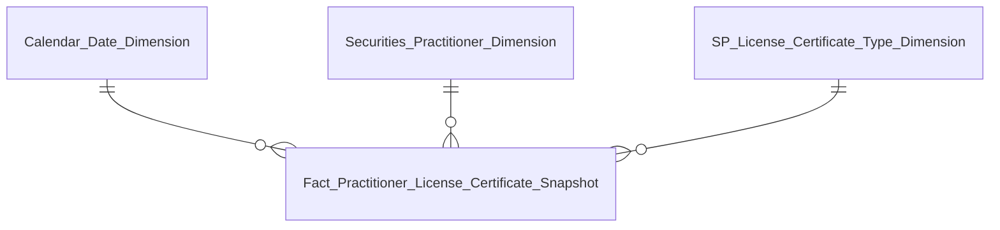
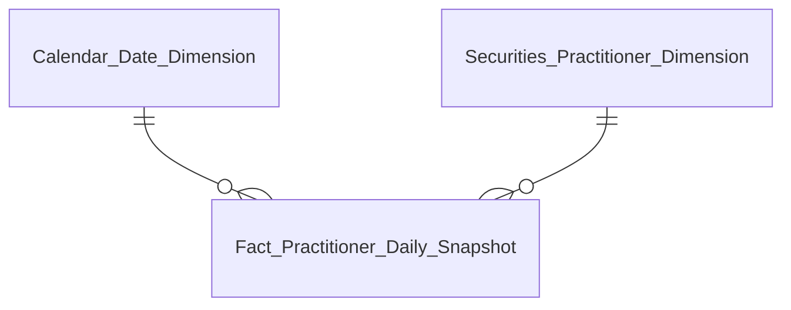

# Datamart Entities Overview — NHNCK (Người hành nghề chứng khoán)

**Module:** NHNCK  
**Phiên bản:** 1.2  
**Ngày:** 20/07/2026  
**Ghi chú:** Tất cả Dimension áp dụng SCD Type 4A (current state). Đồng bộ theo DTM_NHNCK_HLD.md sau review 2026-07-20 (Certificate Type tách Fundamental entity riêng, K_NHNCK_93 đã xóa, K_NHNCK_103 mới thêm).

---

## Tổng quan Star Schema — DATAMART NHNCK

```mermaid
graph TB
    classDef dim fill:#E6F1FB,stroke:#185FA5,color:#0C447C
    classDef fact fill:#FAECE7,stroke:#993C1D,color:#4A1B0C
    classDef oper fill:#E8F5E9,stroke:#2E7D32,color:#1B5E20

    DIM_DATE["Calendar Date Dimension"]:::dim
    DIM_PRAC["Securities Practitioner Dimension"]:::dim
    DIM_CLASS["Classification Dimension"]:::dim
    DIM_CTF["SP License Certificate Type Dimension"]:::dim

    FACT_CERT["Fact Practitioner License Certificate Snapshot"]:::fact
    FACT_ANN["Fact Practitioner Daily Snapshot"]:::fact

    OPR1["Practitioner 360 Profile"]:::oper
    OPR2["Practitioner Related Party Profile"]:::oper
    OPR3["Practitioner Listed Company Role"]:::oper
    OPR4["Practitioner Certificate History"]:::oper
    OPR5["Practitioner Employment History"]:::oper
    OPR6["Practitioner Violation History"]:::oper
    OPR7["Practitioner Exam History"]:::oper
    OPR8["Practitioner Training History"]:::oper
    OPR9["Practitioner Data Explorer"]:::oper

    DIM_DATE --> FACT_CERT
    DIM_DATE --> FACT_ANN
    DIM_PRAC --> FACT_CERT
    DIM_PRAC --> FACT_ANN
    DIM_CTF --> FACT_CERT
```

---

## Tab THỐNG KÊ CHUNG

### Nhóm 1a — Chứng chỉ hành nghề — Thống kê tổng hợp (KPI thẻ CCHN)

| Datamart Entity | Loại | Reuse | Mô tả | Grain | KPI |
|---|---|---|---|---|---|
| Fact Practitioner License Certificate Snapshot | Fact Snapshot | new | Periodic Snapshot CCHN theo trạng thái, loại hình, cấp mới, thu hồi | 1 CCHN × 1 tháng | K_NHNCK_2, 2a, 2b, 3, 5, 6, 7, 8 |
| Securities Practitioner Dimension | Dimension | new | NHN — định danh, trình độ, quốc tịch, trạng thái (SCD4A) | 1 NHN (current state) | — |
| Calendar Date Dimension | Dimension | new | Lịch ngày (Conformed) | 1 ngày | — |
| SP License Certificate Type Dimension | Dimension | new | (Sửa 2026-07-20) Loại CCHN — Fundamental entity riêng (không phải Classification Value). SCD4A | 1 loại CCHN | — |

---

### Nhóm 1b — Người hành nghề — Thống kê tổng hợp (KPI thẻ NHN)

| Datamart Entity | Loại | Reuse | Mô tả | Grain | KPI |
|---|---|---|---|---|---|
| Fact Practitioner Daily Snapshot | Fact Snapshot | new | Periodic Snapshot NHN — tổng NHN, cảnh báo vi phạm, trình độ, độ tuổi | 1 NHN × 1 ngày | K_NHNCK_1, 4 |
| Securities Practitioner Dimension | Dimension | new | NHN — định danh, trình độ, quốc tịch, trạng thái (SCD4A) | 1 NHN (current state) | — |
| Calendar Date Dimension | Dimension | new | Lịch ngày (Conformed) | 1 ngày | — |

---

### Nhóm 2 — Biểu đồ Trình độ chuyên môn

| Datamart Entity | Loại | Reuse | Mô tả | Grain | KPI |
|---|---|---|---|---|---|
| Fact Practitioner Daily Snapshot | Fact Snapshot | new | Dùng chung với Nhóm 1b — GROUP BY Education_Level_Code | 1 NHN × 1 ngày | K_NHNCK_9–14 |
| Securities Practitioner Dimension | Dimension | new | NHN — Education Level Code (SCD4A) | 1 NHN (current state) | — |
| Calendar Date Dimension | Dimension | new | Lịch ngày (Conformed) | 1 ngày | — |

---

### Nhóm 3 — Biểu đồ cơ cấu theo loại hình CCHN

| Datamart Entity | Loại | Reuse | Mô tả | Grain | KPI |
|---|---|---|---|---|---|
| Fact Practitioner License Certificate Snapshot | Fact Snapshot | new | Dùng chung với Nhóm 1a — GROUP BY Certificate_Type_Code | 1 CCHN × 1 tháng | K_NHNCK_17–22 |
| Securities Practitioner Dimension | Dimension | new | NHN — định danh (SCD4A) | 1 NHN (current state) | — |
| Calendar Date Dimension | Dimension | new | Lịch ngày (Conformed) | 1 ngày | — |
| SP License Certificate Type Dimension | Dimension | new | (Sửa 2026-07-20) Certificate_Type_Code là chiều lọc chính — Fundamental entity riêng (không phải Classification Value/scheme) | 1 loại CCHN | — |

---

### Nhóm 4 — Biểu đồ Phân bổ độ tuổi

| Datamart Entity | Loại | Reuse | Mô tả | Grain | KPI |
|---|---|---|---|---|---|
| Fact Practitioner Daily Snapshot | Fact Snapshot | new | Dùng chung với Nhóm 1b — GROUP BY Age band + Nationality_Code | 1 NHN × 1 ngày | K_NHNCK_23–32 |
| Securities Practitioner Dimension | Dimension | new | NHN — Nationality Code (SCD4A) | 1 NHN (current state) | — |
| Calendar Date Dimension | Dimension | new | Lịch ngày (Conformed) | 1 ngày | — |

---

## Tab TRA CỨU HỒ SƠ 360°

### Nhóm 5 — Dashboard Tra cứu hồ sơ 360° — Thông tin chung

*Không có relationship line — bảng tác nghiệp*

| Datamart Entity | Loại | Reuse | Mô tả | Grain | KPI |
|---|---|---|---|---|---|
| Practitioner 360 Profile | Operational | new | Hồ sơ 360° NHN — latest state: họ tên, tuổi, quốc tịch, nơi công tác, CCHN hiện tại, trạng thái | 1 NHN | K_NHNCK_33–41 |

---

### Nhóm 6 — Sub-tab Mạng lưới người liên quan

*Không có relationship line — bảng tác nghiệp*

| Datamart Entity | Loại | Reuse | Mô tả | Grain | KPI |
|---|---|---|---|---|---|
| Practitioner Related Party Profile | Operational | new | Mạng lưới người liên quan — toàn bộ: họ tên, quan hệ, nghề nghiệp, CCCD, quốc tịch, địa chỉ | 1 người liên quan per NHN | K_NHNCK_75–80, K_NHNCK_86 |

---

### Nhóm 7 — Dashboard Hồ sơ & Danh mục — Vai trò tại DN niêm yết

*Không có relationship line — bảng tác nghiệp*

| Datamart Entity | Loại | Reuse | Mô tả | Grain | KPI |
|---|---|---|---|---|---|
| Practitioner Listed Company Role | Operational | new | Vai trò tại DN niêm yết/UPCOM — tất cả lịch sử: tên DN, vị trí, mã CTCK, trạng thái | 1 lần báo cáo tổ chức per NHN | K_NHNCK_81–84 (READY); K_NHNCK_85, 87–89, 103 (PENDING) (Sửa 2026-07-20: thêm K_NHNCK_103 — Số lượng chứng khoán VSDC sở hữu Cuối kỳ) |

---

### Nhóm 8 — Sub-tab Quá trình hành nghề

*Không có relationship line — bảng tác nghiệp*

| Datamart Entity | Loại | Reuse | Mô tả | Grain | KPI |
|---|---|---|---|---|---|
| Practitioner Employment History | Operational | new | Quá trình hành nghề — toàn bộ lần công tác: tổ chức, phân loại, vị trí, phòng ban, từ tháng, đến tháng | 1 lần công tác per NHN | K_NHNCK_49–53, K_NHNCK_90, K_NHNCK_91 |

---

### Nhóm 9 — Sub-tab Lịch sử cấp chứng chỉ hành nghề

*Không có relationship line — bảng tác nghiệp*

| Datamart Entity | Loại | Reuse | Mô tả | Grain | KPI |
|---|---|---|---|---|---|
| Practitioner Certificate History | Operational | new | Lịch sử cấp CCHN — toàn bộ: số CCHN, loại hình, ngày cấp, ngày thu hồi, số quyết định cấp/thu hồi, trạng thái | 1 CCHN per NHN | K_NHNCK_43–48, K_NHNCK_92 |

---

### Nhóm 10 — Sub-tab Đợt thi sát hạch

*Không có relationship line — bảng tác nghiệp*

| Datamart Entity | Loại | Reuse | Mô tả | Grain | KPI |
|---|---|---|---|---|---|
| Practitioner Exam History | Operational | new | Lịch sử thi sát hạch — toàn bộ lần thi: đợt thi, ngày thi, điểm, kết quả, số quyết định công bố | 1 lần thi per NHN | K_NHNCK_59–63, K_NHNCK_94–95, K_NHNCK_102 (Sửa 2026-07-20: K_NHNCK_93 đã xóa — BA v2 không còn yêu cầu Điểm thi chuyên môn) |

---

### Nhóm 11 — Sub-tab Cập nhật kiến thức hành nghề

*Không có relationship line — bảng tác nghiệp*

| Datamart Entity | Loại | Reuse | Mô tả | Grain | KPI |
|---|---|---|---|---|---|
| Practitioner Training History | Operational | new | Lịch sử cập nhật kiến thức — 1 enrollment per NHN; GROUP BY năm học khi hiển thị. DRAFT — thiếu Training Hours (O_NHNCK_9) | 1 enrollment per NHN | K_NHNCK_66, K_NHNCK_96–100 (READY); K_NHNCK_67 (PENDING) |

---

### Nhóm 12 — Sub-tab Lịch sử vi phạm & xử phạt hành chính

*Không có relationship line — bảng tác nghiệp*

| Datamart Entity | Loại | Reuse | Mô tả | Grain | KPI |
|---|---|---|---|---|---|
| Practitioner Violation History | Operational | new | Lịch sử vi phạm — toàn bộ vi phạm: loại vi phạm, nội dung, số quyết định xử phạt, ngày quyết định | 1 vi phạm per NHN | K_NHNCK_54–57 (READY); K_NHNCK_58 (PENDING) |

---

## Tab DATA EXPLORER

### Nhóm 13 — Practitioner Data Explorer

*Không có relationship line — bảng tác nghiệp*

| Datamart Entity | Loại | Reuse | Mô tả | Grain | KPI |
|---|---|---|---|---|---|
| Practitioner Data Explorer | Operational | new | Flat list CCHN toàn thị trường — slicer Loại hình và Trạng thái filter tại query time. Dùng cho Tab DATA EXPLORER | 1 CCHN per NHN | K_NHNCK_68–74, K_NHNCK_101 |

---

## Tổng hợp tất cả Entities

| Datamart Entity | Loại | Reuse | Mô tả | Grain | KPI |
|---|---|---|---|---|---|
| Calendar Date Dimension | Dimension | new | Lịch ngày — năm/quý/tháng/ngày lễ (Conformed, SCD4A) | 1 ngày | — |
| Securities Practitioner Dimension | Dimension | new | NHN — định danh, trình độ, quốc tịch, trạng thái (SCD4A) | 1 NHN (current state) | — |
| Classification Dimension | Dimension | new | Danh mục phân loại — toàn bộ cv Atomic. PK surrogate cl_dim_id. BK: (scm_code, cl_code). Conformed Dim | 1 giá trị phân loại per scheme | — |
| SP License Certificate Type Dimension | Dimension | new | (Sửa 2026-07-20) Loại CCHN — Fundamental entity riêng (không phải Classification Value). SCD4A | 1 loại CCHN | — |
| Fact Practitioner License Certificate Snapshot | Fact Snapshot | new | Periodic Snapshot CCHN — đếm theo trạng thái, loại hình, cấp mới, thu hồi | 1 CCHN × 1 tháng | K_NHNCK_2, 2a, 2b, 3, 5–8, 17–22 |
| Fact Practitioner Daily Snapshot | Fact Snapshot | new | Periodic Snapshot NHN — tổng NHN, cảnh báo, trình độ, độ tuổi | 1 NHN × 1 ngày | K_NHNCK_1, 4, 9–14, 23–32 |
| Practitioner 360 Profile | Operational | new | Hồ sơ 360° NHN — latest state | 1 NHN | K_NHNCK_33–41 |
| Practitioner Related Party Profile | Operational | new | Mạng lưới người liên quan per NHN | 1 người liên quan per NHN | K_NHNCK_75–80, K_NHNCK_86 |
| Practitioner Listed Company Role | Operational | new | Vai trò tại DN niêm yết/UPCOM per NHN | 1 lần báo cáo tổ chức per NHN | K_NHNCK_81–85, 87–89, 103 |
| Practitioner Certificate History | Operational | new | Lịch sử cấp CCHN per NHN | 1 CCHN per NHN | K_NHNCK_43–48, K_NHNCK_92 |
| Practitioner Employment History | Operational | new | Quá trình hành nghề per NHN | 1 lần công tác per NHN | K_NHNCK_49–53, K_NHNCK_90, K_NHNCK_91 |
| Practitioner Violation History | Operational | new | Lịch sử vi phạm & xử phạt per NHN | 1 vi phạm per NHN | K_NHNCK_54–58 |
| Practitioner Exam History | Operational | new | Lịch sử thi sát hạch per NHN | 1 lần thi per NHN | K_NHNCK_59–63, K_NHNCK_94–95, K_NHNCK_102 |
| Practitioner Training History | Operational | new | Lịch sử cập nhật kiến thức per NHN (DRAFT) | 1 enrollment per NHN | K_NHNCK_66, K_NHNCK_67, K_NHNCK_96–100 |
| Practitioner Data Explorer | Operational | new | Flat list CCHN toàn thị trường (Data Explorer) | 1 CCHN per NHN | K_NHNCK_68–74, K_NHNCK_101 |
