# DTM_NHNCK_HLD — High Level Design
**Module:** NHNCK — Người hành nghề chứng khoán  
**Phiên bản:** 6.3  
**Ngày:** 27/04/2026  
**Phạm vi:** Tab THỐNG KÊ CHUNG + Tab TRA CỨU HỒ SƠ 360° + Tab DATA EXPLORER

---

## Section 1 — Data Lineage: Source → Atomic → Data Mart

### Cụm 1: Chứng chỉ hành nghề — Thống kê tổng hợp (`Fact Practitioner License Certificate Snapshot`)

Phục vụ **Tab THỐNG KÊ CHUNG** — Nhóm 1a (KPI thẻ đếm CCHN theo trạng thái) và Nhóm 3 (Cơ cấu theo loại hình CCHN).

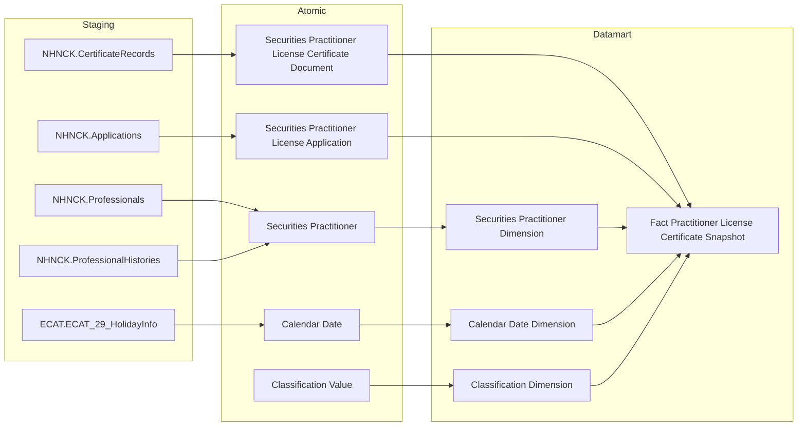

---

### Cụm 2: Người hành nghề — Thống kê tổng hợp (`Fact Practitioner Daily Snapshot`)

Phục vụ **Tab THỐNG KÊ CHUNG** — Nhóm 1b (Tổng NHN, Cảnh báo NHNCK), Nhóm 2 (Trình độ chuyên môn), Nhóm 4 (Phân bổ độ tuổi).

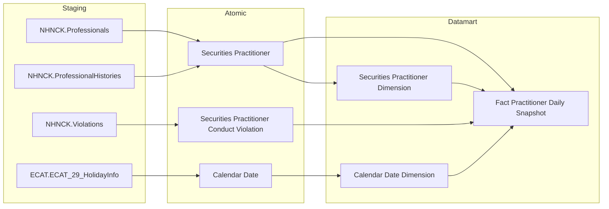

---

### Cụm 3: Tra cứu NHN 360° — Danh sách & Header (`Practitioner 360 Profile`)

Phục vụ **Tab TRA CỨU HỒ SƠ 360°** — Nhóm 5 (màn hình danh sách tra cứu và header thông tin tổng quát của từng NHN).

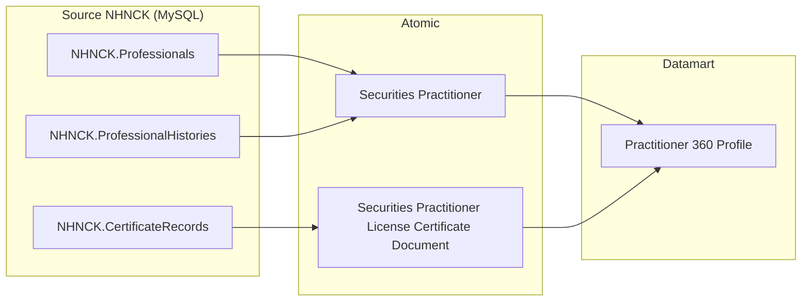

---

### Cụm 4: Mạng lưới người liên quan (`Practitioner Related Party Profile`)

Phục vụ **Tab TRA CỨU HỒ SƠ 360°** — Nhóm 6 (Mạng lưới người liên quan).

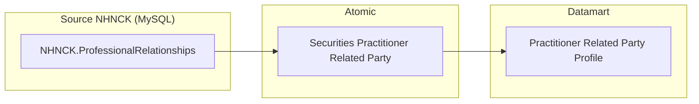

---

### Cụm 5: Vai trò tại DN niêm yết (`Practitioner Listed Company Role`)

Phục vụ **Tab TRA CỨU HỒ SƠ 360°** — Nhóm 7 (Vai trò tại DN niêm yết/UPCOM, Tài khoản cross-broker PENDING).

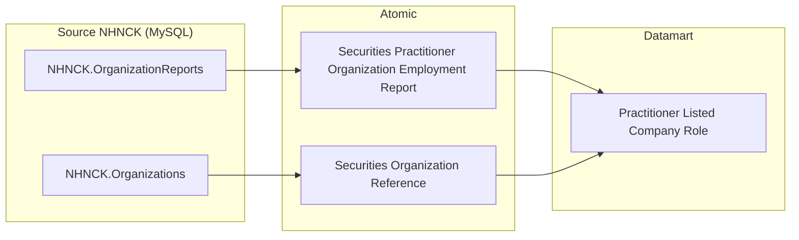

---

### Cụm 6: Lịch sử cấp CCHN (`Practitioner Certificate History`)

Phục vụ **Tab TRA CỨU HỒ SƠ 360°** — Nhóm 9 (sub-tab Lịch sử cấp chứng chỉ hành nghề).

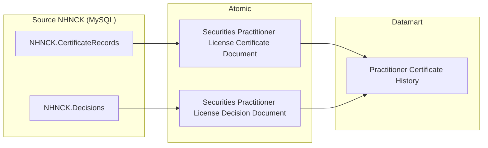

---

### Cụm 7: Quá trình hành nghề (`Practitioner Employment History`)

Phục vụ **Tab TRA CỨU HỒ SƠ 360°** — Nhóm 8 (sub-tab Quá trình hành nghề).

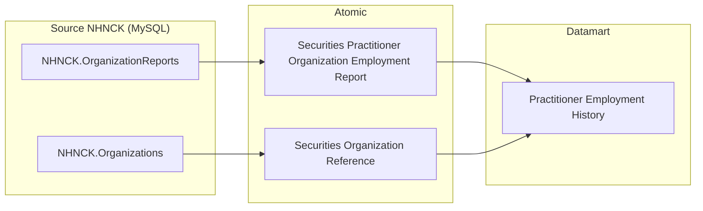

> **Ghi chú Cụm 7:** Nguồn chính từ `NHNCK.OrganizationReports`; join thêm `Securities Organization Reference` để lấy tên tổ chức và phân loại. Không có Atomic entity từ `ProfessionalWorkHistories` trong scope này.

---

### Cụm 8: Lịch sử vi phạm & xử phạt (`Practitioner Violation History`)

Phục vụ **Tab TRA CỨU HỒ SƠ 360°** — Nhóm 12 (sub-tab Lịch sử vi phạm & xử phạt hành chính).

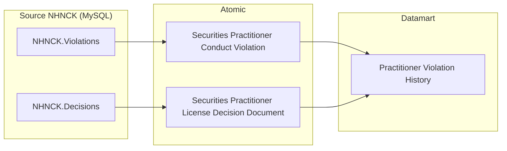

---

### Cụm 9: Đợt thi sát hạch (`Practitioner Exam History`)

Phục vụ **Tab TRA CỨU HỒ SƠ 360°** — Nhóm 10 (sub-tab Đợt thi sát hạch).

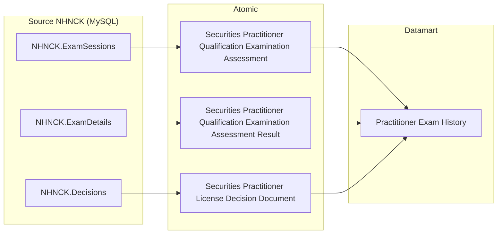

---

### Cụm 10: Cập nhật kiến thức hành nghề (`Practitioner Training History`)

Phục vụ **Tab TRA CỨU HỒ SƠ 360°** — Nhóm 11 (sub-tab Cập nhật kiến thức hành nghề).

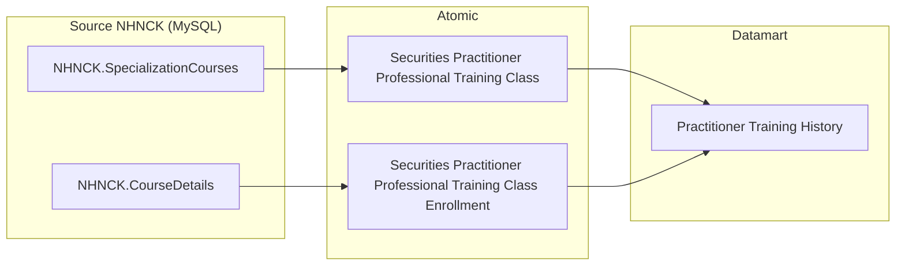

---

### Cụm 11: Data Explorer — Tra cứu danh sách CCHN (`Practitioner Data Explorer`)

Phục vụ **Tab DATA EXPLORER** — Nhóm 13 (bảng tra cứu flat toàn bộ CCHN theo filter Loại chứng chỉ và Trạng thái). Lấy trực tiếp từ Atomic, không khai thác qua Fact/Dim.

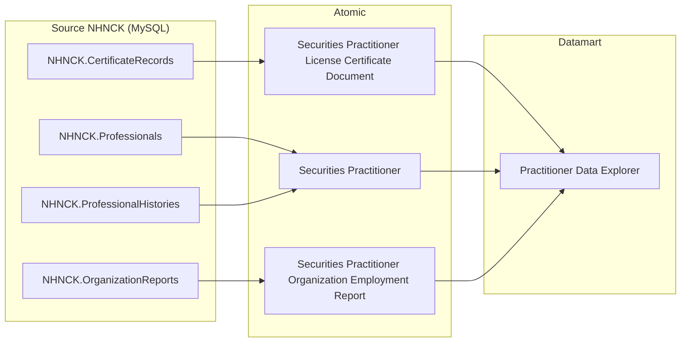

---

## Section 2 — Tổng quan báo cáo

### Tab: THỐNG KÊ CHUNG

**Slicer chung:** Năm (Year) — lấy từ `Calendar Date Dimension`. KPI lũy kế tính đến cuối năm đã chọn; KPI YTD (năm hiện tại) tính từ 01/01 đến today; KPI năm quá khứ tính đến 31/12/Y.

---

#### Nhóm 1a — Chứng chỉ hành nghề — Thống kê tổng hợp (KPI thẻ CCHN)

> Phân loại: **Phân tích**
> Atomic: `Securities Practitioner License Certificate Document` ← NHNCK.CertificateRecords — **READY**
> Atomic: `Securities Practitioner License Application` ← NHNCK.Applications — **READY**
> Atomic: `Securities Practitioner` ← NHNCK.Professionals / NHNCK.ProfessionalHistories — **READY** (dùng cho K_NHNCK_7)
> Atomic: `SP License Certificate Type` ← NHNCK.CERTIFICATES — **READY**
> Ghi chú: `Certificate_Type_Unique_Key` (= CERTIFICATES.CERTIFICATE_CODE) lưu dư thừa trong Fact (filter/display nhanh không cần join). FK đến `SP License Certificate Type Dimension` qua surrogate Id `Certificate_Type_Dimension_Id`. Certificate Status không lưu trong Fact — staging đã lọc chỉ bản ghi hiệu lực.

**Mockup:**

| KPI thẻ | Giá trị | So sánh cùng kỳ |
|---|---|---|
| Chứng chỉ cấp mới (YTD) | 1,580 CCHN (Cấp mới: 1,290 / Cấp lại: 290) | +13.7% |
| Bị thu hồi | 95 CCHN | +8% |
| CCHN đang hoạt động | 20,180 CCHN | +7.7% |
| CCHN Thu hồi 3 năm | 312 CCHN | -12.2% |
| CCHN Thu hồi vĩnh viễn | 98 CCHN | +11.4% |
| CCHN Đã bị hủy | 750 CCHN | -5% |

**Source:** `Fact Practitioner License Certificate Snapshot` → `Securities Practitioner Dimension`, `Calendar Date Dimension`, `SP License Certificate Type Dimension`

**Bảng KPI:**

| KPI ID | Tên KPI | Đơn vị | Tính chất | Công thức | Ghi chú |
|---|---|---|---|---|---|
| K_NHNCK_2 | Chứng chỉ cấp mới (YTD) | CCHN | Phái sinh | COUNT(DISTINCT License Certificate Document Code) WHERE Application Type IN ('0','1','2','3') AND Issue Date BETWEEN 01/01/Y AND today (Y hiện tại) hoặc 31/12/Y (Y quá khứ) | |
| K_NHNCK_2a | Cấp mới (lần đầu) | CCHN | Phái sinh | COUNT(DISTINCT License Certificate Document Code) WHERE Application Type = '0' AND Issue Date trong năm chọn | Sub-component của K_NHNCK_2 |
| K_NHNCK_2b | Cấp lại | CCHN | Phái sinh | COUNT(DISTINCT License Certificate Document Code) WHERE Application Type IN ('1','2','3') AND Issue Date trong năm chọn | Sub-component của K_NHNCK_2 |
| K_NHNCK_2_YOY | So sánh cùng kỳ — CCHN cấp mới YTD | % | Phái sinh | (K_NHNCK_2[Y] − K_NHNCK_2[Y−1]) / K_NHNCK_2[Y−1] × 100% | |
| K_NHNCK_3 | Bị thu hồi (lũy kế) | CCHN | Phái sinh | COUNT(DISTINCT License Certificate Document Code) WHERE Decision Type = '2' (Thu hồi) AND Revocation Date ≤ 31/12/Y (quá khứ) hoặc ≤ MAX(Snapshot Date) trong Y (hiện tại) | Nguồn: Certificate_Records JOIN DECISIONS |
| K_NHNCK_3_YOY | So sánh cùng kỳ — Bị thu hồi | % | Phái sinh | (K_NHNCK_3[Y] − K_NHNCK_3[Y−1]) / K_NHNCK_3[Y−1] × 100% | |
| K_NHNCK_5 | CCHN đang hoạt động (lũy kế) | CCHN | Phái sinh | COUNT(DISTINCT License Certificate Document Code) WHERE Record Status = '1' (Đang hoạt động) tại Snapshot Date = 31/12/Y (quá khứ) hoặc MAX(Snapshot Date) trong Y (hiện tại) | |
| K_NHNCK_5_YOY | So sánh cùng kỳ — CCHN đang hoạt động | % | Phái sinh | (K_NHNCK_5[Y] − K_NHNCK_5[Y−1]) / K_NHNCK_5[Y−1] × 100% | |
| K_NHNCK_6 | CCHN Thu hồi 3 năm (lũy kế) | CCHN | Phái sinh | COUNT(DISTINCT License Certificate Document Code) WHERE Decision Type = '2' AND Reissuance Allowed Count > 0 AND Revocation Date ≤ 31/12/Y (quá khứ) hoặc ≤ MAX(Snapshot Date) trong Y (hiện tại) | |
| K_NHNCK_6_YOY | So sánh cùng kỳ — Thu hồi 3 năm | % | Phái sinh | (K_NHNCK_6[Y] − K_NHNCK_6[Y−1]) / K_NHNCK_6[Y−1] × 100% | |
| K_NHNCK_7 | CCHN Thu hồi vĩnh viễn (lũy kế) | CCHN | Phái sinh | COUNT(DISTINCT License Certificate Document Code) của các NHN có Practice Status Code = '3' (STATUS_WORK=3) AND Snapshot Date = 31/12/Y (quá khứ) hoặc MAX(Snapshot Date) trong Y (hiện tại) | ETL: join scr_prac (Practice_Status_Code='3') → lấy CCHN của NHN đó |
| K_NHNCK_7_YOY | So sánh cùng kỳ — Thu hồi vĩnh viễn | % | Phái sinh | (K_NHNCK_7[Y] − K_NHNCK_7[Y−1]) / K_NHNCK_7[Y−1] × 100% | |
| K_NHNCK_8 | CCHN Đã bị hủy (lũy kế) | CCHN | Phái sinh | COUNT(DISTINCT License Certificate Document Code) WHERE Decision Type = '6' (Hủy CCHN) AND Revocation Date ≤ 31/12/Y (quá khứ) hoặc ≤ MAX(Snapshot Date) trong Y (hiện tại) | Nguồn: Certificate_Records JOIN DECISIONS |
| K_NHNCK_8_YOY | So sánh cùng kỳ — Đã bị hủy | % | Phái sinh | (K_NHNCK_8[Y] − K_NHNCK_8[Y−1]) / K_NHNCK_8[Y−1] × 100% | |

> **Ghi chú KPI:** K_NHNCK_7 đếm **CCHN** (không phải NHN) — nguồn `Professionals.STATUS_WORK='3'` nhưng đếm Certificate_Number. ETL join `scr_prac (Practice_Status_Code='3') → scr_prac_license_ctf_doc` để lấy danh sách CCHN của các NHN bị thu hồi vĩnh viễn. K_NHNCK_15 và K_NHNCK_16 không sử dụng — gap do điều chỉnh phân loại, không re-number.

**Star Schema — Nhóm 1a (Fact Practitioner License Certificate Snapshot):**

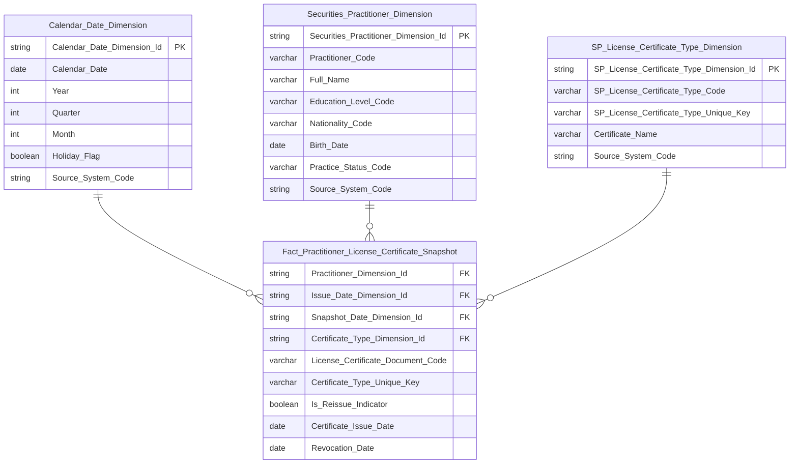

> **Ghi chú erDiagram:** Fact có FK đến `SP_License_Certificate_Type_Dimension` qua `Certificate_Type_Dimension_Id`. `Certificate_Type_Unique_Key` (= CERTIFICATES.CERTIFICATE_CODE) lưu dư thừa để filter/display nhanh không cần join. Certificate Status không lưu trong Fact — staging đã lọc chỉ bản ghi hiệu lực. `License_Certificate_Document_Code` là DD — đơn vị đếm `COUNT(DISTINCT ...)`. `Is_Reissue_Indicator` ETL-derived: TRUE nếu Application_Type IN ('1','2','3'), FALSE nếu Application_Type = '0'. Fact có 2 FK date: `Issue_Date_Dimension_Id` (ngày cấp) và `Snapshot_Date_Dimension_Id` (ngày chụp trạng thái) — cả 2 đều trỏ về `Calendar_Date_Dimension`.

**Lineage Mart → Báo cáo — Nhóm 1a:**

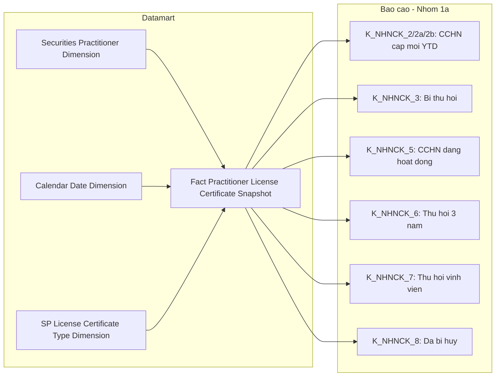

**Bảng grain — Nhóm 1a:**

| Tên bảng | Grain |
|---|---|
| `Fact Practitioner License Certificate Snapshot` | 1 CCHN × 1 tháng snapshot (cuối tháng) |
| `Securities Practitioner Dimension` | 1 NHN per SCD4A (current state) |
| `Calendar Date Dimension` | 1 ngày |
| `SP License Certificate Type Dimension` | 1 loại CCHN per SCD4A (current state) |

---

#### Nhóm 1b — Người hành nghề — Thống kê tổng hợp (KPI thẻ NHN)

> Phân loại: **Phân tích**
> Atomic: `Securities Practitioner` ← NHNCK.Professionals / NHNCK.ProfessionalHistories — **READY**
> Atomic: `Securities Practitioner Conduct Violation` ← NHNCK.Violations — **READY**

**Mockup:**

| KPI thẻ | Giá trị | So sánh cùng kỳ |
|---|---|---|
| Tổng người hành nghề | 21,340 NHN | +7.7% |
| Cảnh báo NHNCK | 148 NHN | +8.8% |

**Source:** `Fact Practitioner Daily Snapshot` → `Securities Practitioner Dimension`, `Calendar Date Dimension`

**Bảng KPI:**

| KPI ID | Tên KPI | Đơn vị | Tính chất | Công thức | Ghi chú |
|---|---|---|---|---|---|
| K_NHNCK_1 | Tổng người hành nghề | NHN | Phái sinh | COUNT(DISTINCT Practitioner Code) WHERE Snapshot Date = 31/12/Y (quá khứ) hoặc MAX(Snapshot Date) trong Y (hiện tại) | Nguồn: Professionals |
| K_NHNCK_1_YOY | So sánh cùng kỳ — Tổng NHN | % | Phái sinh | (K_NHNCK_1[Y] − K_NHNCK_1[Y−1]) / K_NHNCK_1[Y−1] × 100% | |
| K_NHNCK_4 | Cảnh báo NHNCK | NHN | Phái sinh | COUNT(DISTINCT Practitioner Code) WHERE Has Active Violation = true AND Snapshot Date = 31/12/Y (quá khứ) hoặc MAX(Snapshot Date) trong Y (hiện tại) | Nguồn: Professionals JOIN Violations |
| K_NHNCK_4_YOY | So sánh cùng kỳ — Cảnh báo | % | Phái sinh | (K_NHNCK_4[Y] − K_NHNCK_4[Y−1]) / K_NHNCK_4[Y−1] × 100% | |

**Star Schema — Nhóm 1b (Fact Practitioner Daily Snapshot):**

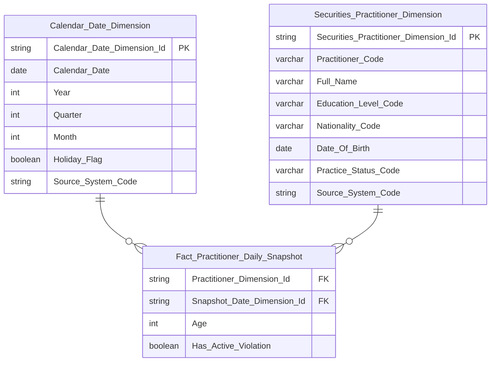

> **Ghi chú erDiagram:**
> - `Has_Active_Violation` = ETL-derived boolean: TRUE nếu NHN có ít nhất 1 vi phạm đang active tại ngày snapshot. Phục vụ K_NHNCK_4 (filter = true).
> - `Age` = ETL-derived: Year(Snapshot_Date) − Year(Date_Of_Birth). Phục vụ Nhóm 4.

**Lineage Mart → Báo cáo — Nhóm 1b:**

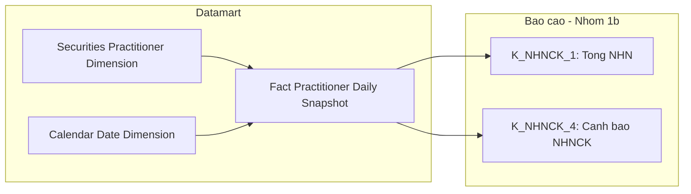

**Bảng grain — Nhóm 1b:**

| Tên bảng | Grain |
|---|---|
| `Fact Practitioner Daily Snapshot` | 1 NHN × 1 ngày snapshot |
| `Securities Practitioner Dimension` | 1 NHN per SCD4A (current state) |
| `Calendar Date Dimension` | 1 ngày |

---

#### Nhóm 2 — Biểu đồ Trình độ chuyên môn

> Phân loại: **Phân tích**
> Atomic: `Securities Practitioner` ← NHNCK.Professionals / NHNCK.ProfessionalHistories — **READY**

**Source:** `Fact Practitioner Daily Snapshot` → `Securities Practitioner Dimension`, `Calendar Date Dimension`

**Mockup:**

| Trình độ | Số NHN | Tỷ lệ |
|---|---|---|
| Tiến sĩ | 450 | 2.1% |
| Thạc sĩ | 5,200 | 24.4% |
| Đại học | 15,690 | 73.5% |

**Bảng KPI:**

| KPI ID | Tên KPI | Đơn vị | Tính chất | Công thức |
|---|---|---|---|---|
| K_NHNCK_9 | Số lượng NHN Tiến sĩ | Người | Base | COUNT(DISTINCT Dim.Practitioner Code) WHERE Dim.Education Level Code = 'DOCTORATE' AND Snapshot_Date = 31/12/Y (quá khứ) hoặc MAX(Snapshot_Date) trong Y (hiện tại) |
| K_NHNCK_10 | Số lượng NHN Thạc sĩ | Người | Base | COUNT(DISTINCT Dim.Practitioner Code) WHERE Dim.Education Level Code = 'MASTER' AND Snapshot_Date = 31/12/Y (quá khứ) hoặc MAX(Snapshot_Date) trong Y (hiện tại) |
| K_NHNCK_11 | Số lượng NHN Đại học | Người | Base | COUNT(DISTINCT Dim.Practitioner Code) WHERE Dim.Education Level Code = 'BACHELOR' AND Snapshot_Date = 31/12/Y (quá khứ) hoặc MAX(Snapshot_Date) trong Y (hiện tại) |
| K_NHNCK_12 | Tỷ lệ Tiến sĩ | % | Derived | K_NHNCK_9 / K_NHNCK_1 × 100% |
| K_NHNCK_13 | Tỷ lệ Thạc sĩ | % | Derived | K_NHNCK_10 / K_NHNCK_1 × 100% |
| K_NHNCK_14 | Tỷ lệ Đại học | % | Derived | K_NHNCK_11 / K_NHNCK_1 × 100% |

**Star Schema — Nhóm 2 (Fact Practitioner Daily Snapshot):**


> **Ghi chú Fact Practitioner Daily Snapshot:**
> - Grain ngày: ETL append 1 row per NHN mỗi ngày. Slicer "chọn năm Y" = filter `Snapshot_Date = 31/12/Y` (năm quá khứ) hoặc `Snapshot_Date = MAX(Snapshot_Date) WHERE Year = Y` (năm hiện tại = ngày mới nhất có dữ liệu).
> - `Age` = ETL-derived int = Year(Snapshot_Date) − Year(Date_Of_Birth), tính từ `ProfessionalHistories.BirthDate`. Presentation layer tự nhóm thành age bands.
> - `Has_Active_Violation` = boolean ETL-derived: TRUE nếu NHN có ít nhất 1 vi phạm có `Violation_Status_Code = 1 (ACTIVE)` tại ngày snapshot. Xem O_NHNCK_5. Phục vụ K_NHNCK_4 (filter = true).
> - Thông tin Education_Level_Code, Nationality_Code, Practitioner_Code đọc qua JOIN `Securities Practitioner Dimension`.

**Lineage Mart → Báo cáo — Nhóm 2:**

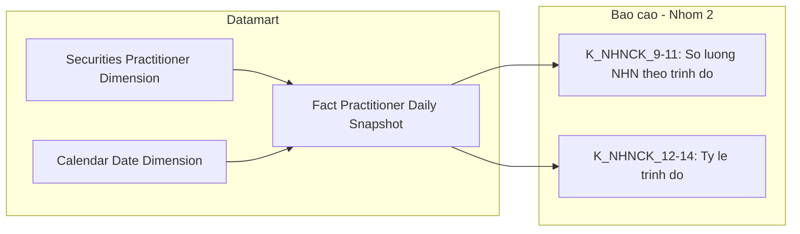

**Bảng grain — Nhóm 2:**

| Tên bảng | Grain |
|---|---|
| `Fact Practitioner Daily Snapshot` | 1 NHN × 1 ngày snapshot |
| `Securities Practitioner Dimension` | 1 NHN per SCD4A (current state) |
| `Calendar Date Dimension` | 1 ngày |

---

#### Nhóm 3 — Biểu đồ cơ cấu theo loại hình CCHN

> Phân loại: **Phân tích**
> Atomic: `Securities Practitioner License Certificate Document` ← NHNCK.CertificateRecords — **READY**
> Ghi chú: Dùng chung `Fact Practitioner License Certificate Snapshot` với Nhóm 1 — không thiết kế bảng mới.

**Source:** `Fact Practitioner License Certificate Snapshot` → `Securities Practitioner Dimension`, `Calendar Date Dimension`, `SP License Certificate Type Dimension`

**Bảng KPI:**

| KPI ID | Tên KPI | Đơn vị | Tính chất | Công thức |
|---|---|---|---|---|
| K_NHNCK_17 | Số lượng CCHN là Môi giới | CCHN | Base | COUNT(DISTINCT License Certificate Document Code) WHERE Certificate Type Unique Key = 'MGCK' AND Snapshot Date = 31/12/Y (quá khứ) hoặc MAX(Snapshot_Date) trong Y (hiện tại) — staging đã lọc bản ghi hiệu lực |
| K_NHNCK_18 | Số lượng CCHN là Phân tích | CCHN | Base | COUNT(DISTINCT License Certificate Document Code) WHERE Certificate Type Unique Key = 'PTTC' AND Snapshot Date = 31/12/Y (quá khứ) hoặc MAX(Snapshot_Date) trong Y (hiện tại) — staging đã lọc bản ghi hiệu lực |
| K_NHNCK_19 | Số lượng CCHN là QLQ | CCHN | Base | COUNT(DISTINCT License Certificate Document Code) WHERE Certificate Type Unique Key = 'QLQ' AND Snapshot Date = 31/12/Y (quá khứ) hoặc MAX(Snapshot_Date) trong Y (hiện tại) — staging đã lọc bản ghi hiệu lực |
| K_NHNCK_20 | Tỷ lệ CCHN Môi giới | % | Derived | K_NHNCK_17 / K_NHNCK_5 × 100% |
| K_NHNCK_21 | Tỷ lệ CCHN Phân tích | % | Derived | K_NHNCK_18 / K_NHNCK_5 × 100% |
| K_NHNCK_22 | Tỷ lệ CCHN QLQ | % | Derived | K_NHNCK_19 / K_NHNCK_5 × 100% |

**Star Schema — Nhóm 3 (Fact Practitioner License Certificate Snapshot):**

```mermaid
erDiagram
    Calendar_Date_Dimension ||--o{ Fact_Practitioner_License_Certificate_Snapshot : " "
    Securities_Practitioner_Dimension ||--o{ Fact_Practitioner_License_Certificate_Snapshot : " "
    SP_License_Certificate_Type_Dimension ||--o{ Fact_Practitioner_License_Certificate_Snapshot : " "

    Fact_Practitioner_License_Certificate_Snapshot {
        string Practitioner_Dimension_Id FK
        string Issue_Date_Dimension_Id FK
        string Snapshot_Date_Dimension_Id FK
        string Certificate_Type_Dimension_Id FK
        varchar License_Certificate_Document_Code DD
        varchar Certificate_Type_Unique_Key
        boolean Allow_Reissue_Indicator
        boolean Is_Reissue_Indicator
        date Certificate_Issue_Date
        date Revocation_Date
        string Decision_Type_Code
    }

    Calendar_Date_Dimension {
        string Calendar_Date_Dimension_Id PK
        date Calendar_Date
        int Year
        int Quarter
        int Month
        boolean Holiday_Flag
        string Source_System_Code
    }

    Securities_Practitioner_Dimension {
        string Securities_Practitioner_Dimension_Id PK
        varchar Practitioner_Code
        varchar Full_Name
        varchar Education_Level_Code
        varchar Nationality_Code
        date Birth_Date
        varchar Practice_Status_Code
        string Source_System_Code
    }

    SP_License_Certificate_Type_Dimension {
        string SP_License_Certificate_Type_Dimension_Id PK
        varchar SP_License_Certificate_Type_Code
        varchar SP_License_Certificate_Type_Unique_Key
        varchar Certificate_Name
        string Source_System_Code
    }
```

> **Ghi chú erDiagram Nhóm 3:** Dùng chung schema với Nhóm 1a. Fact có FK đến `SP_License_Certificate_Type_Dimension` (không dùng `Classification_Dimension`): `Certificate_Type_Dimension_Id` — chiều lọc chính cho KPI K_NHNCK_17–22. `Certificate_Type_Unique_Key` lưu dư thừa (= CERTIFICATES.CERTIFICATE_CODE) để filter nhanh không cần join. Không có trường trạng thái CCHN — staging đã lọc chỉ bản ghi hiệu lực.

**Lineage Mart → Báo cáo — Nhóm 3:**

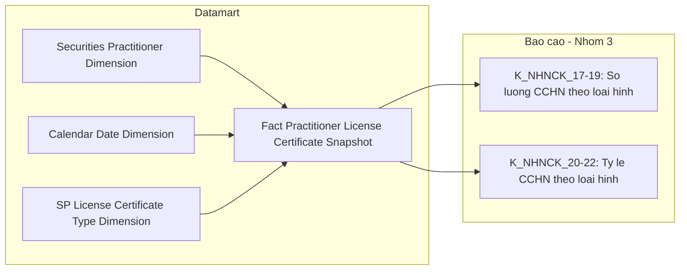

**Bảng grain — Nhóm 3:**

| Tên bảng | Grain |
|---|---|
| `Fact Practitioner License Certificate Snapshot` | 1 CCHN × 1 tháng snapshot (cuối tháng) — dùng chung với Nhóm 1 |
| `SP License Certificate Type Dimension` | 1 loại CCHN per SCD4A (current state) |

---

#### Nhóm 4 — Biểu đồ Phân bổ độ tuổi

> Phân loại: **Phân tích**
> Atomic: `Securities Practitioner` ← NHNCK.Professionals / NHNCK.ProfessionalHistories — **READY**

**Source:** `Fact Practitioner Daily Snapshot` → `Securities Practitioner Dimension`, `Calendar Date Dimension`

**Mockup:**

| Nhóm tuổi | Quốc tịch VN | Nước ngoài |
|---|---|---|
| 18–21 | 120 | 5 |
| 22–30 | 4,500 | 85 |
| 31–40 | 9,800 | 210 |
| 41–50 | 5,200 | 180 |
| 50+ | 1,200 | 40 |

**Bảng KPI:**

| KPI ID | Tên KPI | Đơn vị | Tính chất | Công thức |
|---|---|---|---|---|
| K_NHNCK_23 | Số NHN 18–21 quốc tịch VN | Người | Base | COUNT(DISTINCT Dim.Practitioner Code) WHERE Age BETWEEN 18 AND 21 AND Dim.Nationality Code = 'VN' AND Snapshot_Date = 31/12/Y (quá khứ) hoặc MAX(Snapshot_Date) trong Y (hiện tại) |
| K_NHNCK_24 | Số NHN 22–30 quốc tịch VN | Người | Base | COUNT(DISTINCT Dim.Practitioner Code) WHERE Age BETWEEN 22 AND 30 AND Dim.Nationality Code = 'VN' AND Snapshot_Date = 31/12/Y (quá khứ) hoặc MAX(Snapshot_Date) trong Y (hiện tại) |
| K_NHNCK_25 | Số NHN 31–40 quốc tịch VN | Người | Base | COUNT(DISTINCT Dim.Practitioner Code) WHERE Age BETWEEN 31 AND 40 AND Dim.Nationality Code = 'VN' AND Snapshot_Date = 31/12/Y (quá khứ) hoặc MAX(Snapshot_Date) trong Y (hiện tại) |
| K_NHNCK_26 | Số NHN 41–50 quốc tịch VN | Người | Base | COUNT(DISTINCT Dim.Practitioner Code) WHERE Age BETWEEN 41 AND 50 AND Dim.Nationality Code = 'VN' AND Snapshot_Date = 31/12/Y (quá khứ) hoặc MAX(Snapshot_Date) trong Y (hiện tại) |
| K_NHNCK_27 | Số NHN 50+ quốc tịch VN | Người | Base | COUNT(DISTINCT Dim.Practitioner Code) WHERE Age > 50 AND Dim.Nationality Code = 'VN' AND Snapshot_Date = 31/12/Y (quá khứ) hoặc MAX(Snapshot_Date) trong Y (hiện tại) |
| K_NHNCK_28 | Số NHN 18–21 nước ngoài | Người | Base | COUNT(DISTINCT Dim.Practitioner Code) WHERE Age BETWEEN 18 AND 21 AND Dim.Nationality Code != 'VN' AND Snapshot_Date = 31/12/Y (quá khứ) hoặc MAX(Snapshot_Date) trong Y (hiện tại) |
| K_NHNCK_29 | Số NHN 22–30 nước ngoài | Người | Base | COUNT(DISTINCT Dim.Practitioner Code) WHERE Age BETWEEN 22 AND 30 AND Dim.Nationality Code != 'VN' AND Snapshot_Date = 31/12/Y (quá khứ) hoặc MAX(Snapshot_Date) trong Y (hiện tại) |
| K_NHNCK_30 | Số NHN 31–40 nước ngoài | Người | Base | COUNT(DISTINCT Dim.Practitioner Code) WHERE Age BETWEEN 31 AND 40 AND Dim.Nationality Code != 'VN' AND Snapshot_Date = 31/12/Y (quá khứ) hoặc MAX(Snapshot_Date) trong Y (hiện tại) |
| K_NHNCK_31 | Số NHN 41–50 nước ngoài | Người | Base | COUNT(DISTINCT Dim.Practitioner Code) WHERE Age BETWEEN 41 AND 50 AND Dim.Nationality Code != 'VN' AND Snapshot_Date = 31/12/Y (quá khứ) hoặc MAX(Snapshot_Date) trong Y (hiện tại) |
| K_NHNCK_32 | Số NHN 50+ nước ngoài | Người | Base | COUNT(DISTINCT Dim.Practitioner Code) WHERE Age > 50 AND Dim.Nationality Code != 'VN' AND Snapshot_Date = 31/12/Y (quá khứ) hoặc MAX(Snapshot_Date) trong Y (hiện tại) |

**Star Schema — Nhóm 4 (Fact Practitioner Daily Snapshot):**


> **Ghi chú Fact Practitioner Daily Snapshot:**
> - Grain ngày: ETL append 1 row per NHN mỗi ngày. Slicer "chọn năm Y" = filter `Snapshot_Date = 31/12/Y` (năm quá khứ) hoặc `Snapshot_Date = MAX(Snapshot_Date) WHERE Year = Y` (năm hiện tại = ngày mới nhất có dữ liệu).
> - `Age` = ETL-derived int = Year(Snapshot_Date) − Year(Date_Of_Birth), tính từ `ProfessionalHistories.BirthDate`. Presentation layer tự nhóm thành age bands.
> - `Has_Active_Violation` = boolean ETL-derived: TRUE nếu NHN có ít nhất 1 vi phạm có `Violation_Status_Code = 1 (ACTIVE)` tại ngày snapshot. Xem O_NHNCK_5. Phục vụ K_NHNCK_4 (filter = true).
> - Thông tin Education_Level_Code, Nationality_Code, Practitioner_Code đọc qua JOIN `Securities Practitioner Dimension`.

**Lineage Mart → Báo cáo — Nhóm 4:**

```mermaid
flowchart LR
    subgraph Datamart["Datamart"]
        G1["Fact Practitioner Daily Snapshot"]
        G2["Securities Practitioner Dimension"]
        G3["Calendar Date Dimension"]
    end
    subgraph RPT["Bao cao - Nhom 4"]
        R1["K_NHNCK_23-32: Phan bo do tuoi VN va nuoc ngoai"]
    end
    G1 --> R1
    G2 --> G1
    G3 --> G1
```

**Bảng grain — Nhóm 4:**

| Tên bảng | Grain |
|---|---|
| `Fact Practitioner Daily Snapshot` | 1 NHN × 1 ngày snapshot |
| `Securities Practitioner Dimension` | 1 NHN per SCD4A (current state) |
| `Calendar Date Dimension` | 1 ngày |

---

### Tab: TRA CỨU HỒ SƠ 360°

**Slicer:** Tìm kiếm theo Tên, Số CCHN, Nơi công tác. Filter Loại chứng chỉ. Không có slicer thời gian.

---

#### Nhóm 5 — Dashboard Tra cứu hồ sơ 360° — Thông tin chung của NHNCK

> Phân loại: **Tác nghiệp**
> STT BA: 5
> Atomic: `Securities Practitioner` ← NHNCK.Professionals / NHNCK.ProfessionalHistories — **READY**
> Atomic: `Securities Practitioner License Certificate Document` ← NHNCK.CertificateRecords — **READY**

**Mockup — Danh sách:**

| Tên | Tuổi | Quốc tịch | Loại CCHN | Số CCHN | Nơi công tác | Trạng thái |
|---|---|---|---|---|---|---|
| Nguyễn Văn A | 34 tuổi | Việt Nam | Môi giới | CCHN-2023-001 | TESLA | Đang hoạt động |
| Lê Thị Thu B | 37 tuổi | Việt Nam | Phân tích | CCHN-2024-045 | META | Đang hoạt động |
| Trần Minh C | 42 tuổi | Nhật | Quản lý quỹ | CCHN-QLQ-2019-112 | GOOGLE | Đang hoạt động |

**Mockup — Header chi tiết NHN:**

```
[Avatar] Nguyễn Văn A  ● Môi giới chứng khoán
15/03/1991 (34y) | Việt Nam | 001091003456 | TESLA | ĐANG HOẠT ĐỘNG
```

**Source:** `Practitioner 360 Profile` (Tác nghiệp — trực tiếp từ Atomic)

**Bảng KPI:**

| KPI ID | Tên KPI | Đơn vị | Tính chất | Nguồn |
|---|---|---|---|---|
| K_NHNCK_33 | Họ tên NHN | Text | Base | `Securities Practitioner`.Full Name |
| K_NHNCK_34 | Ngày sinh | Date | Base | `Securities Practitioner`.Birth Date — dùng `brth_dt`; nếu null thì fallback `Birth Year` (`brth_yr`) |
| K_NHNCK_35 | Tuổi | Int | Derived | ETL-derived: `COALESCE(YEAR(brth_dt), CAST(brth_yr AS INT))` → tính `YEAR(CURRENT_DATE) − giá_trị_đó` khi populate bảng |
| K_NHNCK_36 | Quốc tịch | Text | Base | `Securities Practitioner`.Nationality Code — ETL denormalize Nationality Name từ `Geographic Area` khi populate bảng |
| K_NHNCK_37 | Số định danh / Hộ chiếu | Text | Base | `Involved Party Alternative Identification`.Identification Number — join qua `ip_id = scr_prac_id`, lấy bản ghi `Identification Type Code` = CCCD hoặc PASSPORT |
| K_NHNCK_38 | Nơi công tác hiện tại | Text | Base | `Securities Practitioner`.Workplace — text tự do từ `Professionals.WORKPLACE` |
| K_NHNCK_39 | Loại CCHN hiện tại | Text | Base | `Securities Practitioner License Certificate Document`.Certificate Type Code + Name — CCHN trạng thái ACTIVE |
| K_NHNCK_40 | Số CCHN hiện tại | Text | Base | `Securities Practitioner License Certificate Document`.Certificate Number — CCHN trạng thái ACTIVE |
| K_NHNCK_41 | Trạng thái NHNCK | Text | Base | `Securities Practitioner`.Practice Status Code — ETL denormalize Practice Status Name; 0=Chưa HN, 1=Đang HN, 2=Thu hồi cấp lại, 3=Thu hồi không cấp lại, 4=Có thời hạn |

**Schema bảng tác nghiệp:**

```mermaid
erDiagram
    Practitioner_360_Profile {
        varchar Practitioner_Code PK
        varchar Full_Name
        date Birth_Date
        int Age
        varchar Nationality_Code
        varchar Nationality_Name
        varchar Identification_Number
        varchar Workplace
        varchar Practice_Status_Code
        varchar Practice_Status_Name
        varchar Active_Certificate_Type_Code
        varchar Active_Certificate_Type_Name
        varchar Active_Certificate_Number
        string Source_System_Code

    }
```

> **Ghi chú schema:** `Nationality_Name`, `Practice_Status_Name`, `Active_Certificate_Type_Name` là ETL-derived — denormalize từ Classification tại thời điểm populate bảng, không join ở query time. `Workplace` lấy trực tiếp từ `Professionals.WORKPLACE` (text tự do) — để tra nơi công tác theo báo cáo tổ chức chính thức, dùng `Practitioner Employment History` (Nhóm 8).

**Lineage Mart → Báo cáo — Nhóm 5:**

```mermaid
flowchart LR
    subgraph SIL["Atomic"]
        SV1["Securities Practitioner"]
        SV2["Securities Practitioner License Certificate Document"]
    end
    subgraph Datamart["Datamart"]
        G1["Practitioner 360 Profile"]
    end
    subgraph RPT["Bao cao - Nhom 5"]
        R1["K_NHNCK_33-41: Thong tin chung NHN 360"]
    end
    SV1 --> G1
    SV2 --> G1
    G1 --> R1
```

**Bảng grain — Nhóm 5:**

| Tên bảng | Grain |
|---|---|
| `Practitioner 360 Profile` | 1 NHN (latest state) |

---

#### Nhóm 6 — Sub-tab Mạng lưới người liên quan

> Phân loại: **Tác nghiệp**
> Atomic: `Securities Practitioner Related Party` ← NHNCK.ProfessionalRelationships — **READY**
> Atomic: `Securities Practitioner Organization Employment Report` ← NHNCK.OrganizationReports — **READY** (reuse từ Nhóm 7 — chỉ K_NHNCK_81, 82)
> Ghi chú: Phục vụ phần "Mạng lưới người liên quan" trong sub-tab Hồ sơ. Mỗi row = 1 người liên quan của NHN (vợ/chồng, con, bố/mẹ...). K_NHNCK_81, K_NHNCK_82 khai sinh ở Nhóm 7 — reuse vào bảng này để hiển thị vai trò NHN tại DN niêm yết trong cùng màn hình mạng lưới.

**Mockup:**

| Họ và tên | Mối quan hệ | Nghề nghiệp | Nơi làm việc |
|---|---|---|---|
| Lê Thị Hồng A | Vợ | Kinh doanh tự do | — |
| Nguyễn Thế B | Con trai | Du học sinh | — |
| Trần Văn C | Em rể | Giám đốc DN tư nhân | — |

**Source:** `Practitioner Related Party Profile` (Tác nghiệp — trực tiếp từ Atomic)

**Bảng KPI:**

| KPI ID | Tên KPI | Đơn vị | Tính chất | Nguồn | Ghi chú |
|---|---|---|---|---|---|
| K_NHNCK_75 | Họ và tên người liên quan | Text | Base | `Securities Practitioner Related Party`.Related Individual Full Name | |
| K_NHNCK_76 | Mối quan hệ | Text | Base | `Securities Practitioner Related Party`.Relationship Type Code — ETL denormalize Relationship Type Name (scheme: RELATIONSHIP_TYPE) khi populate bảng | |
| K_NHNCK_77 | Nghề nghiệp người liên quan | Text | Base | `Securities Practitioner Related Party`.Related Individual Occupation | |
| K_NHNCK_78 | Nơi làm việc người liên quan | Text | Base | `Securities Practitioner Related Party`.Related Individual Workplace | |
| K_NHNCK_79 | CCCD/CMND người liên quan | Text | Base | `Securities Practitioner Related Party`.Related Individual Identity Number — ETL lấy từ `ProfessionalRelationships.IDENTITY_ID` | |
| K_NHNCK_80 | Quốc tịch người liên quan | Text | Base | `Securities Practitioner Related Party`.Country Code — ETL denormalize Country Name từ Geographic Area khi populate bảng | |
| K_NHNCK_86 | Địa chỉ người liên quan | Text | Base | `Securities Practitioner Related Party`.Related Individual Address | |
| K_NHNCK_81 | Tên DN niêm yết/UPCOM (NHN tham gia) | Text | Base | `Securities Practitioner Organization Employment Report`.Practitioner Workplace At Report | Reuse từ Nhóm 7 |
| K_NHNCK_82 | Vai trò NHN tại DN niêm yết/UPCOM | Text | Base | `Securities Practitioner Organization Employment Report`.Practitioner Position At Report | Reuse từ Nhóm 7 |

**Schema bảng tác nghiệp:**

```mermaid
erDiagram
    Practitioner_Related_Party_Profile {
        varchar Practitioner_Code PK
        varchar Securities_Practitioner_Related_Party_Code PK
        varchar Related_Individual_Full_Name
        varchar Relationship_Type_Code
        varchar Relationship_Type_Name
        varchar Related_Individual_Occupation
        varchar Related_Individual_Workplace
        varchar Related_Individual_Identity_Number
        varchar Country_Code
        varchar Country_Name
        varchar Related_Individual_Address

    }
```

> **Ghi chú schema Nhóm 6:** `Relationship_Type_Name` ETL-derived — denormalize từ Classification (scheme: RELATIONSHIP_TYPE). `Country_Name` ETL-derived — denormalize từ Geographic Area. K_NHNCK_81, K_NHNCK_82 phục vụ hiển thị bổ sung trong màn hình mạng lưới — đọc trực tiếp từ `Practitioner Listed Company Role` (Nhóm 7), không gộp vào `Practitioner Related Party Profile`.

**Lineage Mart → Báo cáo — Nhóm 6:**

```mermaid
flowchart LR
    subgraph SIL["Atomic"]
        SV1["Securities Practitioner Related Party"]
        SV2["Securities Practitioner Organization Employment Report"]
    end
    subgraph Datamart["Datamart"]
        G1["Practitioner Related Party Profile"]
        G2["Practitioner Listed Company Role"]
    end
    subgraph RPT["Bao cao - Nhom 6"]
        R1["K_NHNCK_75-80,86: Nguoi lien quan"]
        R2["K_NHNCK_81-82: DN niem yet (reuse Nhom 7)"]
    end
    SV1 --> G1
    SV2 --> G2
    G1 --> R1
    G2 --> R2
```

**Bảng grain — Nhóm 6:**

| Tên bảng | Grain |
|---|---|
| `Practitioner Related Party Profile` | 1 người liên quan per NHN (toàn bộ) |
| `Practitioner Listed Company Role` | Reuse từ Nhóm 7 — 1 vai trò per NHN per DN niêm yết |

---

#### Nhóm 7 — Dashboard Hồ sơ & Danh mục của NHNCK

> Phân loại: **Tác nghiệp** (2 bảng tác nghiệp riêng biệt)
> Atomic chính: `Securities Practitioner Organization Employment Report` (`scr_prac_org_emp_rpt`) ← NHNCK.ORGANIZATION_REPORTS — **READY**
> Atomic phụ: `Securities Organization Reference` (`scr_org_refr`) ← NHNCK.ORGANIZATIONS — join để lấy tên tổ chức và lọc loại hình CTCK
> Ghi chú: Panel "Vai trò tại DN niêm yết" và panel "Mạng lưới người liên quan" là 2 bảng tác nghiệp độc lập. Panel "Tài khoản & Số dư" (VSDC/MSS) PENDING toàn bộ — không thiết kế bảng riêng, gom PENDING KPI vào bảng `Practitioner Listed Company Role`. Sửa tên attribute: `Workplace Name` → `Practitioner Workplace At Report`; `Position Name` → `Practitioner Position At Report` (theo YAML `scr_prac_org_emp_rpt`).

**Bảng KPI:**

| KPI ID | Tên KPI | Tính chất | Trạng thái | Nguồn | Ghi chú |
|---|---|---|---|---|---|
| K_NHNCK_81 | Tên DN niêm yết/UPCOM | Base | READY | `Securities Practitioner Organization Employment Report`.Practitioner Workplace At Report | Khai sinh tại Nhóm 7 |
| K_NHNCK_82 | Vai trò tại DN | Base | READY | `Securities Practitioner Organization Employment Report`.Practitioner Position At Report | Khai sinh tại Nhóm 7 |
| K_NHNCK_83 | Trạng thái vai trò | Derived | READY | Derived: `Termination Date IS NULL → "Hiện tại"`, có giá trị → "Đã kết thúc" | |
| K_NHNCK_84 | Mã CTCK | Base | READY | `Securities Practitioner Organization Employment Report`.Securities Organization Reference Code — join `Securities Organization Reference` filter `Organization Type Code = 'CTCK'` | |
| K_NHNCK_85 | Số lượng cổ phiếu sở hữu | Derived | PENDING — nguồn VSDC chưa có Atomic | — | |
| K_NHNCK_75 | Họ và tên người liên quan | Base | READY | `Securities Practitioner Related Party`.Related Individual Full Name | Reuse từ Nhóm 6 |
| K_NHNCK_76 | Mối quan hệ | Base | READY | `Securities Practitioner Related Party`.Relationship Type Code — ETL denormalize Relationship Type Name (scheme: RELATIONSHIP_TYPE) khi populate bảng | Reuse từ Nhóm 6 |
| K_NHNCK_77 | Nghề nghiệp người liên quan | Base | READY | `Securities Practitioner Related Party`.Related Individual Occupation | Reuse từ Nhóm 6 |
| K_NHNCK_79 | CCCD/CMND người liên quan | Base | READY | `Securities Practitioner Related Party`.Related Individual Identity Number — ETL lấy từ `ProfessionalRelationships.IDENTITY_ID` | Reuse từ Nhóm 6 |
| K_NHNCK_87 | Số tài khoản | Base | PENDING — nguồn VSDC/MSS chưa có Atomic | — | |
| K_NHNCK_88 | Tên chủ tài khoản | Base | PENDING — nguồn VSDC/MSS chưa có Atomic | — | |
| K_NHNCK_89 | Mã CK nắm giữ chính | Base | PENDING — nguồn VSDC chưa có Atomic | — | |

**Schema bảng tác nghiệp:**

```mermaid
erDiagram
    Practitioner_Listed_Company_Role {
        varchar Practitioner_Code PK
        varchar Organization_Employment_Report_Code PK
        varchar Practitioner_Workplace_At_Report
        varchar Practitioner_Position_At_Report
        varchar Organization_Type_Code
        varchar Securities_Organization_Reference_Code
        varchar Employment_Status
        date Hire_Date
        date Termination_Date

    }

    Practitioner_Related_Party_Profile {
        varchar Practitioner_Code PK
        varchar Securities_Practitioner_Related_Party_Code PK
    }
```

**Lineage Mart → Báo cáo — Nhóm 7:**

```mermaid
flowchart LR
    subgraph SIL["Atomic"]
        SV1["Securities Practitioner Organization Employment Report"]
        SV2["Securities Organization Reference"]
        SV3["Securities Practitioner Related Party"]
    end
    subgraph Datamart["Datamart"]
        G1["Practitioner Listed Company Role"]
        G2["Practitioner Related Party Profile (Reuse Nhóm 6)"]
    end
    subgraph RPT["Bao cao - Nhom 7"]
        R1["K_NHNCK_81-85: Vai tro tai DN niem yet"]
        R2["K_NHNCK_75,76,77,79: Mang luoi nguoi lien quan (Reuse)"]
        R3["K_NHNCK_87-89: Tai khoan cross-broker (PENDING)"]
    end
    SV1 --> G1
    SV2 --> G1
    SV3 --> G2
    G1 --> R1
    G1 --> R3
    G2 --> R2
```

**Bảng grain — Nhóm 7:**

| Tên bảng | Grain | Trạng thái |
|---|---|---|
| `Practitioner Listed Company Role` | 1 lần báo cáo tổ chức per NHN (tất cả lịch sử, filter type=CTCK/DN niêm yết) | new |
| `Practitioner Related Party Profile` | Reuse từ Nhóm 6 | reuse |

---

#### Nhóm 8 — Sub-tab Quá trình hành nghề

> Phân loại: **Tác nghiệp**
> Atomic chính: `Securities Practitioner Organization Employment Report` (`scr_prac_org_emp_rpt`) ← NHNCK.OrganizationReports — **READY**
> Atomic phụ: `Securities Organization Reference` (`scr_org_refr`) ← NHNCK.Organizations — join để lấy tên tổ chức và phân loại tổ chức
> Ghi chú: Nguồn là `NHNCK.OrganizationReports` — không phải `ProfessionalWorkHistories`. Tên tổ chức và phân loại ETL-derived qua join `scr_org_refr` theo `scr_org_refr_code`.

**Mockup:**

| Tổ chức | Phân loại | Vị trí | Phòng ban | Từ tháng | Đến tháng | Trạng thái |
|---|---|---|---|---|---|---|
| Tesla | CTCK | Môi giới chứng khoán | Phòng Môi giới | 12/05/2023 | Hiện nay | Hiện tại |
| Công ty CP Chứng khoán AAA | CTCK | Trưởng phòng Môi giới | Phòng Môi giới | 12/01/2018 | 11/05/2023 | Quá khứ |
| Vụ Giám sát TTCK - UBCKNN | Khác | Chuyên viên chính | — | 30/10/2012 | 11/01/2018 | Quá khứ |

**Source:** `Practitioner Employment History` (Tác nghiệp)

**Bảng KPI:**

| KPI ID | Tên KPI | Đơn vị | Tính chất | Nguồn | Ghi chú |
|---|---|---|---|---|---|
| K_NHNCK_49 | Tên tổ chức | Text | Base | `Securities Practitioner Organization Employment Report`.Securities Organization Reference Code — ETL join `Securities Organization Reference`.Securities Organization Reference Name theo `scr_org_refr_code` khi populate bảng | Khai sinh tại Nhóm 8 |
| K_NHNCK_90 | Phân loại tổ chức | Text | Base | `Securities Organization Reference`.Organization Type Code — ETL join `scr_org_refr` theo `scr_org_refr_code`, denormalize Organization Type Name (scheme: ORGANIZATION_TYPE) khi populate bảng | Khai sinh tại Nhóm 8 |
| K_NHNCK_50 | Vị trí công tác | Text | Base | `Securities Practitioner Organization Employment Report`.Practitioner Position At Report | Khai sinh tại Nhóm 8 |
| K_NHNCK_91 | Phòng ban | Text | Base | `Securities Practitioner Organization Employment Report`.Practitioner Department At Report | Khai sinh tại Nhóm 8 |
| K_NHNCK_51 | Từ tháng | Date | Base | `Securities Practitioner Organization Employment Report`.Hire Date | Khai sinh tại Nhóm 8 |
| K_NHNCK_52 | Đến tháng | Date | Base | `Securities Practitioner Organization Employment Report`.Termination Date — NULL hiển thị "Hiện nay" tại presentation layer | Khai sinh tại Nhóm 8 |
| K_NHNCK_53 | Trạng thái làm việc | Text | Derived | Derived: `Termination Date IS NULL → "Hiện tại"`, có giá trị → "Quá khứ" — derive tại presentation layer | |

**Schema bảng tác nghiệp:**

```mermaid
erDiagram
    Practitioner_Employment_History {
        varchar Practitioner_Code PK
        varchar Organization_Employment_Report_Code PK
        varchar Securities_Organization_Reference_Code
        varchar Securities_Organization_Name
        varchar Organization_Type_Code
        varchar Organization_Type_Name
        varchar Practitioner_Position_At_Report
        varchar Practitioner_Department_At_Report
        date Hire_Date
        date Termination_Date

    }
```

> **Ghi chú schema Nhóm 8:** `Securities_Organization_Name` ETL-derived — join `scr_org_refr.scr_org_refr_nm` theo `scr_org_refr_code`. `Organization_Type_Name` ETL-derived — denormalize từ Classification (scheme: ORGANIZATION_TYPE) tại thời điểm populate. Presentation layer đọc trực tiếp, không join Atomic ở query time.

**Lineage Mart → Báo cáo — Nhóm 8:**

```mermaid
flowchart LR
    subgraph SIL["Atomic"]
        SV1["Securities Practitioner Organization Employment Report"]
        SV2["Securities Organization Reference"]
    end
    subgraph Datamart["Datamart"]
        G1["Practitioner Employment History"]
    end
    subgraph RPT["Bao cao - Nhom 8"]
        R1["K_NHNCK_49,50,51,52,53,90,91: Qua trinh hanh nghe"]
    end
    SV1 --> G1
    SV2 --> G1
    G1 --> R1
```

**Bảng grain — Nhóm 8:**

| Tên bảng | Grain |
|---|---|
| `Practitioner Employment History` | 1 lần công tác per NHN (toàn bộ lịch sử) |

---

#### Nhóm 9 — Sub-tab Lịch sử cấp chứng chỉ hành nghề

> Phân loại: **Tác nghiệp**
> Atomic chính: `Securities Practitioner License Certificate Document` (`scr_prac_license_ctf_doc`) ← NHNCK.CertificateRecords — **READY**
> Atomic phụ: `Securities Practitioner License Decision Document` (`scr_prac_license_dcsn_doc`) ← NHNCK.Decisions — join để lấy số quyết định cấp và thu hồi

**Mockup:**

| Số CCHN | Loại hình | Ngày cấp | Ngày thu hồi | Quyết định cấp | Quyết định thu hồi | Trạng thái |
|---|---|---|---|---|---|---|
| CCHN-2023-001 | Môi giới chứng khoán | 12/05/2023 | — | 145/QĐ-UBCK | — | Đang hiệu lực |
| CCHN-2020-045 | Phân tích chứng khoán | 20/10/2020 | 20/10/2023 | 89/QĐ-UBCK | 91/QĐ-UBCK | Thu hồi trong 3 năm |
| CCHN-2017-012 | Môi giới chứng khoán | 15/01/2017 | 15/01/2020 | 12/QĐ-UBCK | 15/QĐ-UBCK | Thu hồi vĩnh viễn |

**Source:** `Practitioner Certificate History` (Tác nghiệp)

**Bảng KPI:**

| KPI ID | Tên KPI | Đơn vị | Tính chất | Nguồn | Ghi chú |
|---|---|---|---|---|---|
| K_NHNCK_43 | Số CCHN | Text | Base | `Securities Practitioner License Certificate Document`.Certificate Number | Khai sinh tại Nhóm 9 |
| K_NHNCK_44 | Loại hình hành nghề | Text | Base | `Securities Practitioner License Certificate Document`.Certificate Type Code — ETL denormalize Certificate Type Name (scheme: CERTIFICATE_TYPE) khi populate bảng | Khai sinh tại Nhóm 9 |
| K_NHNCK_45 | Ngày cấp | Date | Base | `Securities Practitioner License Certificate Document`.Issue Date | Khai sinh tại Nhóm 9 |
| K_NHNCK_46 | Ngày thu hồi | Date | Base | `Securities Practitioner License Certificate Document`.Revocation Date — NULL nếu chưa thu hồi | Khai sinh tại Nhóm 9 |
| K_NHNCK_47 | Số quyết định cấp | Text | Base | `Securities Practitioner License Certificate Document`.Issue License Decision Code — ETL join `Securities Practitioner License Decision Document`.Decision Number theo `issu_license_dcsn_code` khi populate bảng | Khai sinh tại Nhóm 9 |
| K_NHNCK_92 | Số quyết định thu hồi | Text | Base | `Securities Practitioner License Certificate Document`.Revocation License Decision Code — ETL join `Securities Practitioner License Decision Document`.Decision Number theo `revocation_license_dcsn_code` khi populate bảng; NULL nếu chưa thu hồi | Khai sinh tại Nhóm 9 |
| K_NHNCK_48 | Trạng thái CCHN | Text | Base | `Securities Practitioner License Certificate Document`.Process Status Code — ETL denormalize Process Status Name (scheme: LICENSE_CERTIFICATE_PROCESS_STATUS) khi populate bảng | Khai sinh tại Nhóm 9 |

**Schema bảng tác nghiệp:**

```mermaid
erDiagram
    Practitioner_Certificate_History {
        varchar Practitioner_Code PK
        varchar License_Certificate_Document_Code PK
        varchar Certificate_Number
        varchar Certificate_Type_Code
        varchar Certificate_Type_Name
        date Issue_Date
        date Revocation_Date
        varchar Issuance_Decision_Number
        varchar Revocation_Decision_Number
        varchar Process_Status_Code
        varchar Process_Status_Name

    }
```

> **Ghi chú schema Nhóm 9:** `Certificate_Type_Name` và `Process_Status_Name` là ETL-derived — denormalize từ Classification tại thời điểm populate bảng Tác nghiệp. `Revocation_Decision_Number` NULL nếu CCHN chưa bị thu hồi. Presentation layer đọc trực tiếp từ bảng này, không join Classification ở query time.

**Lineage Mart → Báo cáo — Nhóm 9:**

```mermaid
flowchart LR
    subgraph SIL["Atomic"]
        SV1["Securities Practitioner License Certificate Document"]
        SV2["Securities Practitioner License Decision Document"]
    end
    subgraph Datamart["Datamart"]
        G1["Practitioner Certificate History"]
    end
    subgraph RPT["Bao cao - Nhom 9"]
        R1["K_NHNCK_43-48,92: Lich su cap CCHN"]
    end
    SV1 --> G1
    SV2 --> G1
    G1 --> R1
```

**Bảng grain — Nhóm 9:**

| Tên bảng | Grain |
|---|---|
| `Practitioner Certificate History` | 1 CCHN per NHN (toàn bộ lịch sử) |

---

#### Nhóm 10 — Sub-tab Đợt thi sát hạch

> Phân loại: **Tác nghiệp**
> Atomic chính: `Securities Practitioner Qualification Examination Assessment Result` (`scr_prac_qualf_exam_ases_rslt`) ← NHNCK.ExamDetails — **READY**
> Atomic phụ: `Securities Practitioner Qualification Examination Assessment` (`scr_prac_qualf_exam_ases`) ← NHNCK.ExamSessions — join để lấy tên đợt thi, ngày thi, số quyết định công bố
> Atomic phụ: `Securities Practitioner License Decision Document` (`scr_prac_license_dcsn_doc`) ← NHNCK.Decisions — join qua `License Decision Code` để lấy số quyết định và ngày ký

**Mockup:**

| Đợt thi | Ngày thi | Điểm luật | Điểm CM | KQ luật | KQ CM | Số quyết định công bố | Trạng thái |
|---|---|---|---|---|---|---|---|
| Đợt 1/2025 | 15/03/2025 | 82 | 85 | Đạt | Đạt | 45/QĐ-UBCK · 20/03/2025 | Đạt |
| Đợt 2/2024 | 10/09/2023 | 45 | 58 | Không đạt | Không đạt | — | Không đạt |
| Đợt 1/2023 | 18/03/2023 | 75 | 80 | Đạt | Đạt | 28/QĐ-UBCK · 25/03/2023 | Đạt |

**Source:** `Practitioner Exam History` (Tác nghiệp)

**Bảng KPI:**

| KPI ID | Tên KPI | Đơn vị | Tính chất | Nguồn | Ghi chú |
|---|---|---|---|---|---|
| K_NHNCK_59 | Tên đợt thi | Text | Base | `Securities Practitioner Qualification Examination Assessment`.Assessment Name | Khai sinh tại Nhóm 10 |
| K_NHNCK_103 | Kỳ thi | Text | Derived | `Securities Practitioner Qualification Examination Assessment`.Report Year + Examination Session Number — ETL concat thành chuỗi hiển thị (VD: "2025_1") khi populate bảng | Khai sinh tại Nhóm 10 |
| K_NHNCK_60 | Ngày thi | Date | Base | `Securities Practitioner Qualification Examination Assessment`.Examination Start Date | Khai sinh tại Nhóm 10 |
| K_NHNCK_61 | Điểm thi luật | Text | Base | `Securities Practitioner Qualification Examination Assessment Result`.Law Score | Khai sinh tại Nhóm 10 |
| K_NHNCK_93 | Điểm thi chuyên môn | Text | Base | `Securities Practitioner Qualification Examination Assessment Result`.Specialization Score | Khai sinh tại Nhóm 10 |
| K_NHNCK_94 | Kết quả thi luật | Text | Base | `Securities Practitioner Qualification Examination Assessment Result`.Law Result Code — ETL denormalize Law Result Name (scheme: EXAM_RESULT: -1=Không thi, 0=Không đạt, 1=Đạt) khi populate bảng | Khai sinh tại Nhóm 10 |
| K_NHNCK_95 | Kết quả thi chuyên môn | Text | Base | `Securities Practitioner Qualification Examination Assessment Result`.Specialization Result Code — ETL denormalize Specialization Result Name (scheme: EXAM_RESULT) khi populate bảng | Khai sinh tại Nhóm 10 |
| K_NHNCK_62 | Số quyết định công bố | Text | Base | `Securities Practitioner Qualification Examination Assessment`.License Decision Code — ETL join `Securities Practitioner License Decision Document`.Decision Number theo `license_dcsn_code` khi populate bảng; NULL nếu chưa có quyết định | Khai sinh tại Nhóm 10 |
| K_NHNCK_63 | Trạng thái Đạt/Không đạt | Text | Base | `Securities Practitioner Qualification Examination Assessment Result`.Overall Result Code — ETL denormalize Overall Result Name (scheme: EXAM_RESULT: -1=Không thi, 0=Không đạt, 1=Đạt) khi populate bảng | Khai sinh tại Nhóm 10 |

**Schema bảng tác nghiệp:**

```mermaid
erDiagram
    Practitioner_Exam_History {
        varchar Practitioner_Code PK
        varchar Examination_Assessment_Result_Code PK
        varchar Assessment_Name
        int Report_Year
        int Examination_Session_Number
        varchar Examination_Period
        date Examination_Start_Date
        varchar Law_Score
        varchar Specialization_Score
        varchar Law_Result_Code
        varchar Law_Result_Name
        varchar Specialization_Result_Code
        varchar Specialization_Result_Name
        varchar Overall_Result_Code
        varchar Overall_Result_Name
        varchar Decision_Number
        date Decision_Signed_Date

    }
```

> **Ghi chú schema Nhóm 10:** `Law_Result_Name`, `Specialization_Result_Name`, `Overall_Result_Name` là ETL-derived — denormalize từ Classification (scheme: EXAM_RESULT, giá trị: -1=Không thi, 0=Không đạt, 1=Đạt) tại thời điểm populate bảng. `Decision_Number` NULL nếu đợt thi chưa có quyết định công bố. Presentation layer đọc trực tiếp, không join ở query time.

**Lineage Mart → Báo cáo — Nhóm 10:**

```mermaid
flowchart LR
    subgraph SIL["Atomic"]
        SV1["Securities Practitioner Qualification Examination Assessment Result"]
        SV2["Securities Practitioner Qualification Examination Assessment"]
        SV3["Securities Practitioner License Decision Document"]
    end
    subgraph Datamart["Datamart"]
        G1["Practitioner Exam History"]
    end
    subgraph RPT["Bao cao - Nhom 10"]
        R1["K_NHNCK_59-63,93-95,103: Dot thi sat hach"]
    end
    SV1 --> G1
    SV2 --> G1
    SV3 --> G1
    G1 --> R1
```

**Bảng grain — Nhóm 10:**

| Tên bảng | Grain |
|---|---|
| `Practitioner Exam History` | 1 lần thi per NHN (toàn bộ lịch sử) |

---

#### Nhóm 11 — Sub-tab Cập nhật kiến thức hành nghề

> Phân loại: **Tác nghiệp**
> Atomic chính: `Securities Practitioner Professional Training Class Enrollment` (`scr_prac_prof_trn_clss_enrollment`) ← NHNCK.SPECIALIZATION_COURSE_DETAILS — **READY**
> Atomic phụ: `Securities Practitioner Professional Training Class` (`scr_prac_prof_trn_clss`) ← NHNCK.SPECIALIZATION_COURSES — join để lấy tên khóa học, năm học, ngày thi
> Ghi chú: Grain bảng = 1 enrollment per NHN. Presentation layer GROUP BY `(Practitioner_Code, Academic_Year)` để hiển thị summary theo năm trên màn hình. Số giờ (`POST_CERT_TRAINING_COURSES`) chưa có Atomic entity — PENDING theo O_NHNCK_9.

**Mockup — Màn hình:**

| Năm | Số giờ | Kết quả | Trạng thái |
|---|---|---|---|
| 2024 | 10/8h | Loại A | Đã đủ 8h |
| 2023 | 5/8h | Chưa kiểm tra | Chưa đủ 8h |
| 2022 | 0/8h | N/A | Chưa đủ 8h |
| 2021 | 8/8h | Loại B | Đã đủ 8h |

**Source:** `Practitioner Training History` (Tác nghiệp)

**Bảng KPI:**

| KPI ID | Tên KPI | Đơn vị | Tính chất | Nguồn | Ghi chú |
|---|---|---|---|---|---|
| K_NHNCK_100 | Mã khóa học chuyên môn | Text | Base | `Securities Practitioner Professional Training Class`.Training Class Code (`scr_prac_prof_trn_clss_code`) — direct từ Enrollment via FK | Khai sinh tại Nhóm 11 |
| K_NHNCK_96 | Tên khóa học | Text | Base | `Securities Practitioner Professional Training Class`.Training Class Name — ETL join `scr_prac_prof_trn_clss` theo `scr_prac_prof_trn_clss_code` | Khai sinh tại Nhóm 11 |
| K_NHNCK_97 | Ngày bắt đầu thi | Date | Base | `Securities Practitioner Professional Training Class`.Exam Start Date — ETL join `scr_prac_prof_trn_clss` theo `scr_prac_prof_trn_clss_code` | Khai sinh tại Nhóm 11 |
| K_NHNCK_98 | Ngày kết thúc thi | Text | Base | `Securities Practitioner Professional Training Class`.Exam End Date — ETL join `scr_prac_prof_trn_clss` theo `scr_prac_prof_trn_clss_code`; kiểu Text do nguồn VARCHAR (conversion risk) | Khai sinh tại Nhóm 11 |
| K_NHNCK_99 | Điểm thi | Percentage | Base | `Securities Practitioner Professional Training Class Enrollment`.Exam Score — kiểu decimal(5,2); nullable | Khai sinh tại Nhóm 11 |
| K_NHNCK_66 | Kết quả thi | Text | Base | `Securities Practitioner Professional Training Class Enrollment`.Training Result Code (`trn_rslt_code`) — ETL denormalize Training Result Name (scheme: EXAM_RESULT: -1=Không thi, 0=Không đạt, 1=Đạt) khi populate bảng ← Specialization_Course_Details.Result | Khai sinh tại Nhóm 11 |
| K_NHNCK_101 | Kết quả kiểm tra, phân loại | Text | Base | **PENDING** — `POST_CERT_TRAINING_COURSES.RECORD_STATUS` là trường kỹ thuật xác định trạng thái bản ghi, không phải thông tin nghiệp vụ. Chờ BA xác nhận trường nghiệp vụ thay thế. | |
| K_NHNCK_67 | Trạng thái đủ 8h | Text | Phái sinh | **PENDING** — nguồn `POST_CERT_TRAINING_COURSES` chưa có Atomic entity. Logic dự kiến: SUM(Training_Hours per Academic_Year) ≥ 8h → "Đã đủ 8h". Xem O_NHNCK_9 | |

**Schema bảng tác nghiệp:**

```mermaid
erDiagram
    Practitioner_Training_History {
        varchar Practitioner_Code PK
        varchar Training_Class_Enrollment_Code PK
        varchar Training_Class_Code
        varchar Training_Class_Name
        int Academic_Year
        date Exam_Start_Date
        varchar Exam_End_Date
        decimal Exam_Score
        varchar Training_Result_Code
        varchar Training_Result_Name

    }
```

> **Ghi chú schema Nhóm 11:** `Training_Class_Name` ETL-derived — join `scr_prac_prof_trn_clss` theo `scr_prac_prof_trn_clss_code`. `Training_Result_Name` ETL-derived — denormalize từ Classification (scheme: EXAM_RESULT) tại thời điểm populate. `Exam_End_Date` kiểu varchar (giữ nguyên như Atomic — nguồn EXAM_DATE_TO kiểu VARCHAR2(200), conversion risk). `Exam_Score` nullable — có thể null nếu chưa thi. Trường `Training_Hours` và `Is_Hours_Sufficient` chưa đưa vào schema — chờ O_NHNCK_9 giải quyết.

**Lineage Mart → Báo cáo — Nhóm 11:**

```mermaid
flowchart LR
    subgraph SIL["Atomic"]
        SV1["Securities Practitioner Professional Training Class Enrollment"]
        SV2["Securities Practitioner Professional Training Class"]
    end
    subgraph Datamart["Datamart"]
        G1["Practitioner Training History"]
    end
    subgraph RPT["Bao cao - Nhom 11"]
        R1["K_NHNCK_66,96-100: Chi tiet enrollment"]
        R2["K_NHNCK_67: Trang thai du 8h (PENDING)"]
    end
    SV1 --> G1
    SV2 --> G1
    G1 --> R1
    G1 --> R2
```

**Bảng grain — Nhóm 11:**

| Tên bảng | Grain |
|---|---|
| `Practitioner Training History` | 1 enrollment per NHN — presentation GROUP BY `(Practitioner_Code, Academic_Year)` để hiển thị summary theo năm |

---

#### Nhóm 12 — Sub-tab Lịch sử vi phạm & xử phạt hành chính

> Phân loại: **Tác nghiệp**
> Atomic: `Securities Practitioner Conduct Violation` ← NHNCK.Violations — **READY**
> Atomic: `Securities Practitioner License Decision Document` ← NHNCK.Decisions — **READY**

**Mockup:**

| Ngày quyết định | Số quyết định | Nội dung vi phạm | Hình thức xử phạt | Trạng thái |
|---|---|---|---|---|
| 15/10/2023 | 142/QĐ-XPHC | Thao túng giá chứng khoán | 550,000,000 VND | Đã thực thi |
| 05/02/2021 | 24/QĐ-UBCK | Chậm công bố thông tin sở hữu | Cảnh cáo | Đã ban hành |
| 12/11/2019 | BC-0012/CTCK | Vi phạm quy trình mở tài khoản | Đình chỉ hành nghề 3 tháng | Đang thực thi |

**Source:** `Practitioner Violation History` (Tác nghiệp)

**Bảng KPI:**

| KPI ID | Tên KPI | Đơn vị | Tính chất | Nguồn | Ghi chú |
|---|---|---|---|---|---|
| K_NHNCK_54 | Số quyết định xử phạt | Text | Base | `Securities Practitioner License Decision Document`.Decision Number (`dcsn_nbr`) ← DECISIONS.DECISION_NUMBER | |
| K_NHNCK_55 | Ngày quyết định | Date | Base | `Securities Practitioner License Decision Document`.Decision Signed Date (`dcsn_signed_dt`) ← DECISIONS.SIGNED_DATE | |
| K_NHNCK_56 | Nội dung vi phạm | Text | Base | `Securities Practitioner Conduct Violation`.Note (`note`) ← VIOLATIONS.Note | nullable |
| K_NHNCK_57 | Hình thức xử phạt | Text | Base | `Securities Practitioner Conduct Violation`.Record Type Code (`record_tp_code`) — ETL denormalize Record Type Name (scheme: RECORD_TYPE: 1=Hành chính, 2=Pháp luật) khi populate bảng ← VIOLATIONS.RECORD_TYPE | |
| K_NHNCK_58 | Trạng thái vi phạm | Text | Base | **PENDING** — `VIOLATIONS.RECORD_STATUS` là trường kỹ thuật xác định trạng thái bản ghi, không phải thông tin nghiệp vụ. Chờ BA xác nhận trường nghiệp vụ thay thế. | BA liệt kê 6 trạng thái: Chưa thực thi, Đã thực thi, Cưỡng chế thi hành, Đang thực thi, Đã hoàn thành, Đã ban hành |

**Schema bảng tác nghiệp:**

```mermaid
erDiagram
    Practitioner_Violation_History {
        varchar Practitioner_Code PK
        varchar Conduct_Violation_Code PK
        varchar Record_Type_Code
        varchar Record_Type_Name
        varchar Note
        varchar Record_Status_Code
        varchar Record_Status_Name
        varchar Decision_Number
        date Decision_Signed_Date

    }
```

> **Ghi chú schema Nhóm 12:** `Record_Type_Name` ETL-derived — denormalize từ Classification (scheme: RECORD_TYPE) tại thời điểm populate. `Record_Status_Name` ETL-derived — denormalize từ Classification (scheme: RECORD_STATUS). `Decision_Signed_Date` lấy từ `Securities Practitioner License Decision Document`.Decision Signed Date (`dcsn_signed_dt`). Presentation đọc trực tiếp.

**Lineage Mart → Báo cáo — Nhóm 12:**

```mermaid
flowchart LR
    subgraph SIL["Atomic"]
        SV1["Securities Practitioner Conduct Violation"]
        SV2["Securities Practitioner License Decision Document"]
    end
    subgraph Datamart["Datamart"]
        G1["Practitioner Violation History"]
    end
    subgraph RPT["Bao cao - Nhom 12"]
        R1["K_NHNCK_54-58: Lich su vi pham"]
    end
    SV1 --> G1
    SV2 --> G1
    G1 --> R1
```

**Bảng grain — Nhóm 12:**

| Tên bảng | Grain |
|---|---|
| `Practitioner Violation History` | 1 vi phạm per NHN (toàn bộ lịch sử) |

---

### Tab: DATA EXPLORER

**Slicer:** Loại chứng chỉ (Mọi loại / MGCK / PTTC / QLQ) + Trạng thái (Đang hoạt động / Thu hồi / Đã hủy). Hiển thị "KẾT QUẢ: N NHN" góc phải. Hỗ trợ export file.

---

#### Nhóm 13 — Practitioner Data Explorer (bảng tra cứu tổng hợp)

> Phân loại: **Tác nghiệp**
> Atomic: `Securities Practitioner License Certificate Document` ← NHNCK.CertificateRecords — **READY**
> Atomic: `Securities Practitioner` ← NHNCK.Professionals / NHNCK.ProfessionalHistories — **READY**
> Atomic: `Securities Practitioner Organization Employment Report` ← NHNCK.OrganizationReports — **READY**
> Ghi chú: Bảng flat denormalized ETL trực tiếp từ Atomic — không khai thác qua Fact/Dim. Grain = 1 CCHN per NHN (latest active state). Slicer Loại chứng chỉ và Trạng thái filter trực tiếp trên `Certificate_Type_Code` và `Certificate_Status_Code` trong bảng này.

**Mockup:**

| Tên cán bộ | Số CCHN | Loại hình | Công ty | Ngày cấp | Trạng thái |
|---|---|---|---|---|---|
| Nguyễn Văn A | CCHN-2023-001 | Môi giới chứng khoán | TESLA | 12/05/2023 | Đang hoạt động |
| Lê Thị Thu B | CCHN-2024-045 | Phân tích chứng khoán | META | 20/10/2022 | Đang hoạt động |
| Trần Minh C | CCHN-QLQ-2019-112 | Quản lý quỹ | GOOGLE | 05/01/2019 | Đang hoạt động |
| Đinh Quốc G | CCHN-QLQ-2020-055 | Quản lý quỹ | DEEPSEEK | 22/07/2020 | Đang hoạt động |

**Source:** `Practitioner Data Explorer` (Tác nghiệp — trực tiếp từ Atomic)

**Bảng KPI:**

| KPI ID | Tên KPI | Đơn vị | Tính chất | Nguồn |
|---|---|---|---|---|
| K_NHNCK_68 | Tên cán bộ | Text | Base | `Securities Practitioner`.Full Name |
| K_NHNCK_69 | Số CCHN | Text | Base | `Securities Practitioner License Certificate Document`.Certificate Number |
| K_NHNCK_70 | Loại hình hành nghề | Text | Base | `Securities Practitioner License Certificate Document`.Certificate Type Code — ETL denormalize Certificate Type Name khi populate bảng |
| K_NHNCK_71 | Công ty (nơi công tác hiện tại) | Text | Base | `Securities Practitioner Organization Employment Report`.Securities Organization Code — bản report mới nhất có Termination Date = NULL, ETL lookup Organization Name từ `Securities Organization Reference` |
| K_NHNCK_72 | Ngày cấp CCHN | Date | Base | `Securities Practitioner License Certificate Document`.Certificate Issue Date |
| K_NHNCK_73 | Trạng thái NHN | Text | Base | `Securities Practitioner`.Practice Status Code (`securities_practitioner_dim.practice_status_code`) ← `PROFESSIONALS.STATUS_WORK` (scheme: 0=Chưa hành nghề, 1=Đang hành nghề, 2=Thu hồi có cấp lại, 3=Thu hồi không cấp lại) |
| K_NHNCK_74 | Tổng số kết quả (NHN) | Int | Phái sinh | COUNT(DISTINCT Practitioner Code) sau khi áp slicer — hiển thị "KẾT QUẢ: N NHN" |
| K_NHNCK_102 | Mã định danh | Text | Base | `Involved Party Alternative Identification`.Identification Type Code (Classification Value, scheme: IP_ALT_ID_TYPE — 1=CMND, 2=CCCD, 3=PASSPORT) ← `PROFESSIONALS.IDENTITY_TYPE` |

**Schema bảng tác nghiệp:**

```mermaid
erDiagram
    Practitioner_Data_Explorer {
        varchar Practitioner_Code PK
        varchar License_Certificate_Document_Code PK
        varchar Full_Name
        varchar Certificate_Number
        varchar Certificate_Type_Code
        varchar Certificate_Type_Name
        varchar Practice_Status_Code
        date Certificate_Issue_Date
        varchar Current_Organization_Name
        varchar Identification_Type_Code

    }
```

> **Ghi chú schema:** Grain = 1 CCHN per NHN. Slicer "Loại hình" filter trên `Certificate_Type_Code`; slicer "Trạng thái" filter trên `Practice_Status_Code` — cả hai filter tại query time, không pre-filter khi ETL populate. `Practice_Status_Code` phục vụ đồng thời K_NHNCK_73 (hiển thị) và slicer Trạng thái (filter) — 1 cột duy nhất, không tạo cột riêng cho slicer. `Certificate_Type_Name` ETL-denormalized từ Classification khi populate — presentation không join ở query time. `Current_Organization_Name` ETL-derived từ `Organization Employment Report` mới nhất có Termination Date = NULL. `Identification_Type_Code` (K_NHNCK_102) lấy từ `ip_alt_identn` join qua `scr_prac_id`.

**Lineage Mart → Báo cáo — Nhóm 13:**

```mermaid
flowchart LR
    subgraph SIL["Atomic"]
        SV1["Securities Practitioner"]
        SV2["Securities Practitioner License Certificate Document"]
        SV3["Securities Practitioner Organization Employment Report"]
    end
    subgraph Datamart["Datamart"]
        G1["Practitioner Data Explorer"]
    end
    subgraph RPT["Bao cao - Nhom 13"]
        R1["K_NHNCK_68-73: Bang tra cuu CCHN"]
        R2["K_NHNCK_74: Tong so NHN"]
    end
    SV1 --> G1
    SV2 --> G1
    SV3 --> G1
    G1 --> R1
    G1 --> R2
```

**Bảng grain — Nhóm 13:**

| Tên bảng | Grain |
|---|---|
| `Practitioner Data Explorer` | 1 CCHN per NHN (toàn bộ trạng thái — slicer filter tại query time) |

---

## Section 3 — Mô hình tổng thể (READY only)

```mermaid
graph TB
    classDef dim fill:#E6F1FB,stroke:#185FA5,color:#0C447C
    classDef fact fill:#FAECE7,stroke:#993C1D,color:#4A1B0C
    classDef oper fill:#E8F5E9,stroke:#2E7D32,color:#1B5E20

    DIM_DATE["Calendar Date Dimension"]:::dim
    DIM_PRAC["Securities Practitioner Dimension"]:::dim
    DIM_CLASS["Classification Dimension"]:::dim

    FACT_CERT["Fact Practitioner License Certificate Snapshot"]:::fact
    FACT_ANN["Fact Practitioner Daily Snapshot"]:::fact

    OPR1["Practitioner 360 Profile"]:::oper
    OPR2["Practitioner Certificate History"]:::oper
    OPR3["Practitioner Employment History"]:::oper
    OPR4["Practitioner Violation History"]:::oper
    OPR5["Practitioner Exam History"]:::oper
    OPR6["Practitioner Training History"]:::oper
    OPR7["Practitioner Related Party Profile"]:::oper
    OPR8["Practitioner Data Explorer"]:::oper

    DIM_DATE --> FACT_CERT
    DIM_DATE --> FACT_ANN
    DIM_PRAC --> FACT_CERT
    DIM_PRAC --> FACT_ANN
    DIM_CLASS --> FACT_CERT
```

**Bảng Phân tích (Star Schema):**

| Bảng | Pattern | Grain | KPI | Trạng thái |
|---|---|---|---|---|
| `Fact Practitioner License Certificate Snapshot` | Periodic Snapshot | 1 CCHN × 1 tháng | K_NHNCK_2, 2a, 2b, 3, 5, 6, 7, 8, 17–22 (Nhóm 1a, 3) | READY |
| `Fact Practitioner Daily Snapshot` | Periodic Snapshot | 1 NHN × 1 ngày | K_NHNCK_1, 4, 9–14, 23–32 (Nhóm 1b, 2, 4) | READY |

**Bảng Tác nghiệp (Denormalized):**

| Bảng | Grain | KPI | Trạng thái |
|---|---|---|---|
| `Practitioner 360 Profile` | 1 NHN (latest state) | K_NHNCK_33–41 (Nhóm 5) | READY |
| `Practitioner Certificate History` | 1 CCHN per NHN | K_NHNCK_43–48 READY; K_NHNCK_92 (Số quyết định thu hồi) READY | READY |
| `Practitioner Employment History` | 1 lần công tác per NHN | K_NHNCK_49–53, K_NHNCK_90 (Phân loại tổ chức), K_NHNCK_91 (Phòng ban) | READY |
| `Practitioner Violation History` | 1 vi phạm per NHN | K_NHNCK_54, K_NHNCK_55, K_NHNCK_56, K_NHNCK_57 READY; K_NHNCK_58 PENDING (O_NHNCK_15 — RECORD_STATUS là trường kỹ thuật) | PARTIAL |
| `Practitioner Exam History` | 1 lần thi per NHN | K_NHNCK_59–63 READY; K_NHNCK_93 (Điểm CM), K_NHNCK_94 (KQ luật), K_NHNCK_95 (KQ CM), K_NHNCK_103 (Kỳ thi) READY | READY |
| `Practitioner Training History` | 1 enrollment per NHN | K_NHNCK_100, K_NHNCK_96, K_NHNCK_97, K_NHNCK_98, K_NHNCK_99, K_NHNCK_66 READY; K_NHNCK_101 PENDING (O_NHNCK_15 — RECORD_STATUS là trường kỹ thuật); K_NHNCK_67 PENDING (O_NHNCK_9 — chờ Atomic entity) | DRAFT |
| `Practitioner Related Party Profile` | 1 người liên quan per NHN | K_NHNCK_75–80 READY; K_NHNCK_86 (Địa chỉ) READY | READY |
| `Practitioner Listed Company Role` | 1 vai trò per NHN per DN niêm yết | K_NHNCK_81–84 READY; K_NHNCK_85 PENDING (VSDC); K_NHNCK_87–89 PENDING (VSDC/MSS) | PARTIAL |
| `Practitioner Data Explorer` | 1 CCHN per NHN (slicer filter tại query time) | K_NHNCK_68–74 READY; K_NHNCK_102 (Mã định danh) READY | READY |

**Bảng Dimension:**

| Dimension | Loại | Mô tả | Scheme | Trạng thái |
|---|---|---|---|---|
| `Calendar Date Dimension` | Conformed | Lịch ngày — năm/quý/tháng/ngày | — | READY |
| `Securities Practitioner Dimension` | Reference per module (SCD4A) | NHN — định danh, trình độ, quốc tịch, ngày sinh, trạng thái | — | READY |
| `Classification Dimension` | Conformed | Danh mục phân loại — toàn bộ `cv` Atomic. PK surrogate `cl_dim_id`. BK: `(scm_code, cl_code)`. Fact join qua surrogate Id, lưu dư thừa Code field | CERTIFICATE_TYPE, CERTIFICATE_STATUS, CONDUCT_VIOLATION_TYPE, VIOLATION_STATUS | READY |

---

## Section 4 — Reuse Analysis

| Datamart Entity | datamart_table | reuse_status | Ghi chú |
|---|---|---|---|
| Calendar Date Dimension | cdr_dt_dim | new | Module đầu tiên — NHNCK thiết kế bảng này |
| Securities Practitioner Dimension | securities_practitioner_dim | new | Chưa có trong datamart_model.yaml |
| Fact Practitioner License Certificate Snapshot | fct_practitioner_license_certificate_snpst | new | Chưa có trong datamart_model.yaml |
| Fact Practitioner Daily Snapshot | fct_practitioner_daily_snpst | new | Chưa có trong datamart_model.yaml |
| Classification Dimension | cl_dim | new | Chưa có trong datamart_model.yaml |
| Practitioner 360 Profile | prac_360_prfl | new | Chưa có trong datamart_model.yaml |
| Practitioner Certificate History | prac_ctf_hist | new | Chưa có trong datamart_model.yaml |
| Practitioner Employment History | prac_emp_hist | new | Chưa có trong datamart_model.yaml |
| Practitioner Violation History | prac_vln_hist | new | Chưa có trong datamart_model.yaml |
| Practitioner Exam History | prac_exam_hist | new | Chưa có trong datamart_model.yaml |
| Practitioner Training History | prac_trn_hist | new | Chưa có trong datamart_model.yaml |
| Practitioner Related Party Profile | prac_rel_p_prfl | new | Chưa có trong datamart_model.yaml |
| Practitioner Listed Company Role | prac_listd_co_role | new | Chưa có trong datamart_model.yaml |
| Practitioner Data Explorer | prac_data_explr | new | Chưa có trong datamart_model.yaml |

---

## Section 5 — Vấn đề mở

| ID | Vấn đề | Giả định hiện tại | KPI liên quan | Trạng thái |
|---|---|---|---|---|
| O_NHNCK_1 | Phân biệt Thu hồi 3 năm vs Thu hồi vĩnh viễn qua `Reissuance_Allowed_Count`. | Atomic entity `sp_license_certificate_document` đổi từ `Allow Reissue Indicator` (boolean) sang `Reissuance Allowed Count` (int). Logic: `> 0` → Thu hồi 3 năm (có thời hạn); `= 0` → Thu hồi vĩnh viễn (không cấp lại). K_NHNCK_6 cập nhật công thức theo. | K_NHNCK_6, K_NHNCK_7 | Closed |
| O_NHNCK_2 | `Nationality_Code` nguồn từ `ProfessionalHistories.NationalityCode`. | Đã xác nhận — có trên Atomic. | K_NHNCK_23–32 | Closed |
| O_NHNCK_3 | Logic YTD: năm hiện tại đến today; năm quá khứ đến 31/12/Y. | Đã xác nhận. | K_NHNCK_2, 2a, 2b | Closed |
| O_NHNCK_4 | Tuổi tính từ `Date_Of_Birth` (date) từ `ProfessionalHistories.BirthDate`. | `Age = Year(Snapshot_Date) − Year(Date_Of_Birth)`. Đã xác nhận. | K_NHNCK_23–32, K_NHNCK_35 | Closed |
| O_NHNCK_5 | `Has_Active_Violation`: ETL tính tại thời điểm snapshot chạy hàng ngày — Atomic không lưu lịch sử thay đổi trạng thái vi phạm theo ngày nên không thể tính point-in-time chính xác. Logic tạm: `Has_Active_Violation = TRUE` nếu NHN có ít nhất 1 `Conduct Violation` có `Violation_Status_Code = 1 (ACTIVE)` tại thời điểm ETL chạy. Slicer năm lấy row Snapshot_Date = 31/12/Y (quá khứ) hoặc MAX ngày (hiện tại). | Tạm chấp nhận — cần BA xác nhận có đúng yêu cầu nghiệp vụ không. | K_NHNCK_4 | Open |
| O_NHNCK_6 | (Cập nhật v6.5) K_NHNCK_81–84 đã READY. K_NHNCK_84 (Mã CTCK): `scr_prac_org_emp_rpt.scr_org_refr_code` JOIN `scr_org_refr` filter `Organization Type Code = 'CTCK'` — xác nhận Atomic có attribute này. Tên DN: `Practitioner Workplace At Report` (đã fix từ "Workplace Name"). PENDING còn lại: K_NHNCK_85 (Số cổ phiếu — VSDC), K_NHNCK_87/88/89 (Tài khoản cross-broker — VSDC/MSS). | K_NHNCK_81–84 READY. K_NHNCK_85, 87–89 PENDING. | K_NHNCK_81–89 | Open |
| O_NHNCK_7 | Counter "N N/Quan": nguồn `Securities Practitioner Related Party` (NHNCK) READY. Cần BA xác nhận filter loại quan hệ: toàn bộ hay chỉ một số loại (vợ/chồng, con, bố/mẹ...)? Counter "N Doanh nghiệp": PENDING chờ Atomic SGDCK. | K_NHNCK_42 đã bị xóa khỏi BA analyst — KPI không còn tồn tại trong scope. Issue tự đóng. | K_NHNCK_42 | Closed |
| O_NHNCK_8 | Logic Đạt/Không đạt trong `Practitioner Exam History`: Atomic `ExamDetails` có `Examination_Result_Code` (scheme: EXAMINATION_RESULT — 1: Đạt, 0: Không đạt) — đã có sẵn, không cần derive. | Dùng `Examination_Result_Code` trực tiếp từ Atomic. Đã xác nhận. | K_NHNCK_63 | Closed |
| O_NHNCK_9 | `POST_CERT_TRAINING_COURSES` chưa có Atomic entity — blocking K_NHNCK_67 "Trạng thái đủ 8h" (logic SUM giờ ≥ 8h theo năm học). Nguồn staging rõ nhưng cần HTTT model Atomic `POST_CERT_TRAINING_COURSES` trước. (K_NHNCK_101 tách sang O_NHNCK_15 — lý do pending khác.) | `Practitioner Training History` ở trạng thái DRAFT — chờ Atomic entity `post_cert_trn_crs`. K_NHNCK_67 PENDING chờ HTTT. | K_NHNCK_67 | Open |
| O_NHNCK_10 | `Is_Reissue_Indicator` trên Fact Certificate Snapshot: ETL-derived bằng cách join `CertificateRecords → Applications` lấy `Application_Type_Code` (scheme: APPLICATION_TYPE). BA v2 xác nhận scheme APPLICATION_TYPE có 4 giá trị: (1) "Hồ sơ cấp mới" → `Is_Reissue_Indicator = FALSE`; (2) "Hồ sơ cấp lại do thu hồi", (3) "Hồ sơ cấp lại do hỏng mất", (4) "Hồ sơ cấp lại do thay đổi thông tin" → `Is_Reissue_Indicator = TRUE`. ETL logic: nếu Application_Type_Code thuộc nhóm (2)/(3)/(4) thì TRUE, chỉ (1) là FALSE. K_NHNCK_2b đếm tất cả 3 loại cấp lại gộp chung. | `Is_Reissue_Indicator = TRUE` nếu ApplicationType ∈ {cấp lại do thu hồi, do hỏng mất, do thay đổi thông tin}. Đã xác nhận logic với BA v2. | K_NHNCK_2a, K_NHNCK_2b | Closed |
| O_NHNCK_11 | (Cập nhật v6.5) "Mạng lưới người có liên quan" — nguồn NHNCK READY. K_NHNCK_75–80 và K_NHNCK_86 đều READY: K_NHNCK_79 (CCCD), K_NHNCK_80 (Quốc tịch — `Country Code` từ `Securities Practitioner Related Party`), K_NHNCK_86 (Địa chỉ — `Related Individual Address`). O_NHNCK_11 không còn PENDING. | K_NHNCK_75–80, K_NHNCK_86 đều READY. | K_NHNCK_75–80, K_NHNCK_86 | Closed |
| O_NHNCK_12 | K_NHNCK_101 "Kết quả kiểm tra, phân loại": BA cập nhật xác nhận nguồn là `POST_CERT_TRAINING_COURSES.RECORD_STATUS` (không phải `SPECIALIZATION_COURSES.RESULT` như BA ban đầu ghi). Join `SPECIALIZATION_COURSES ON COURSE_CODE`, filter `POST_CERT_TRAINING_COURSES.RECORD_STATUS = '1'`. Nguồn staging rõ ràng — vấn đề mapping nguồn đã giải quyết. Blocking chuyển sang O_NHNCK_9 (chờ Atomic entity). | Đã xác nhận nguồn staging. K_NHNCK_101 di chuyển về O_NHNCK_9. | K_NHNCK_101 | Closed |
| O_NHNCK_13 | K_NHNCK_57 "Hình thức xử phạt": BA (STT 12, row 406) ghi nguồn `Violations.RECORD_TYPE` → Atomic `record_tp_code` (scheme RECORD_TYPE: 1=Hành chính, 2=Pháp luật). Màn hình mockup hiển thị nội dung xử phạt chi tiết ("550,000,000 VND", "Cảnh cáo"...) nhưng đây là **dữ liệu giả lập** — không phải nguồn sự thật. Mapping `record_tp_code` theo BA là đúng. | Đã xác nhận — mapping theo BA. | K_NHNCK_57 | Closed |
| O_NHNCK_14 | K_NHNCK_73 "Trạng thái": BA ghi `PROFESSIONALS.RECORD_STATUS`; người thiết kế xác nhận đây là **trạng thái NHN** (không phải trạng thái CCHN). Đã đổi nguồn → `securities_practitioner_dim.practice_status_code` ← `PROFESSIONALS.STATUS_WORK` (scheme: 0=Chưa hành nghề, 1=Đang hành nghề, 2=Thu hồi có cấp lại, 3=Thu hồi không cấp lại). Tên KPI đổi từ "Trạng thái CCHN" → "Trạng thái NHN". | Đã xác nhận — mapping cập nhật về `practice_status_code`. | K_NHNCK_73 | Closed |
| O_NHNCK_15 | K_NHNCK_58 "Trạng thái vi phạm" và K_NHNCK_101 "Kết quả kiểm tra, phân loại": BA mapping về `VIOLATIONS.RECORD_STATUS` và `POST_CERT_TRAINING_COURSES.RECORD_STATUS` — đây là trường kỹ thuật (`RECORD_STATUS`) xác định trạng thái bản ghi T24, không phải thông tin nghiệp vụ. Chờ BA xác nhận trường nghiệp vụ thay thế cho cả 2 KPI. | K_NHNCK_58 và K_NHNCK_101 chuyển PENDING. | K_NHNCK_58, K_NHNCK_101 | Open |
