# DTM_NHNCK_HLD — High Level Design
**Module:** NHNCK — Người hành nghề chứng khoán  
**Phiên bản:** 6.3  
**Ngày:** 27/04/2026  
**Phạm vi:** Tab THỐNG KÊ CHUNG + Tab TRA CỨU HỒ SƠ 360° + Tab DATA EXPLORER

---

## Section 1 — Data Lineage: Source → Atomic → Data Mart

### Cụm 1: Chứng chỉ hành nghề — Thống kê tổng hợp (`Fact Practitioner License Certificate Snapshot`)

Phục vụ **Tab THỐNG KÊ CHUNG** — Nhóm 1a (KPI thẻ đếm CCHN theo trạng thái) và Nhóm 3 (Cơ cấu theo loại hình CCHN).

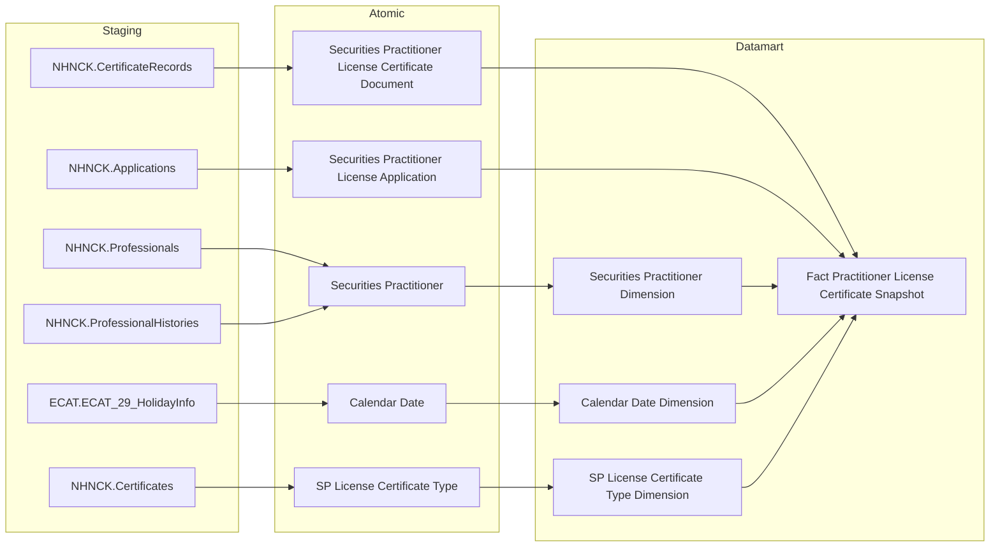

---

### Cụm 2: Người hành nghề — Thống kê tổng hợp (`Fact Practitioner Daily Snapshot`)

Phục vụ **Tab THỐNG KÊ CHUNG** — Nhóm 1b (Tổng NHN, Cảnh báo NHNCK), Nhóm 2 (Trình độ chuyên môn), Nhóm 4 (Phân bổ độ tuổi).

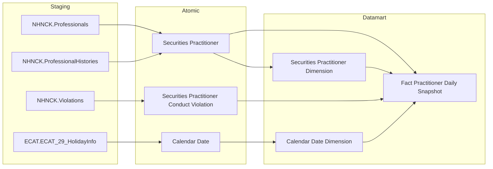

---

### Cụm 3: Tra cứu NHN 360° — Danh sách & Header (`Operational Practitioner 360 Profile`)

Phục vụ **Tab TRA CỨU HỒ SƠ 360°** — Nhóm 5 (màn hình danh sách tra cứu và header thông tin tổng quát của từng NHN).

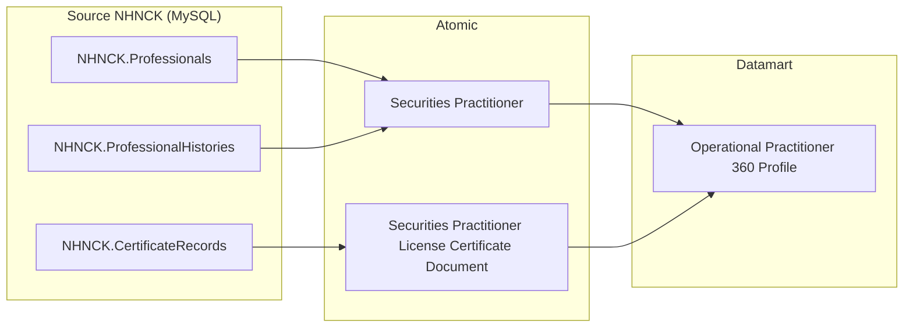

---

### Cụm 4: Mạng lưới người liên quan (`Operational Practitioner Related Party Profile`)

Phục vụ **Tab TRA CỨU HỒ SƠ 360°** — Nhóm 6 (Mạng lưới người liên quan).

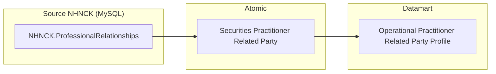

---

### Cụm 5: Vai trò tại DN niêm yết (`Operational Practitioner Listed Company Role`)

Phục vụ **Tab TRA CỨU HỒ SƠ 360°** — Nhóm 7 (Vai trò tại DN niêm yết/UPCOM, Tài khoản cross-broker PENDING).


---

### Cụm 6: Lịch sử cấp CCHN (`Operational Practitioner Certificate History`)

Phục vụ **Tab TRA CỨU HỒ SƠ 360°** — Nhóm 9 (sub-tab Lịch sử cấp chứng chỉ hành nghề).

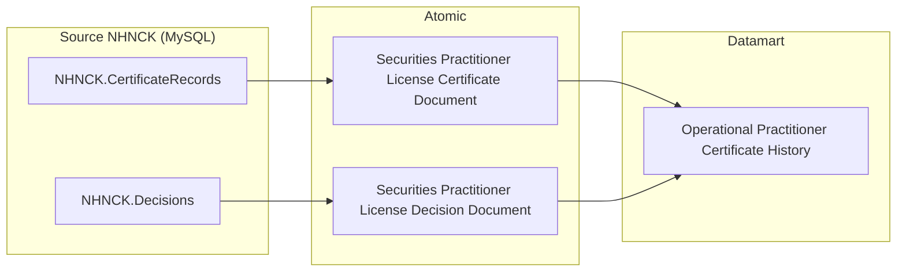

---

### Cụm 7: Quá trình hành nghề (`Operational Practitioner Employment History`)

Phục vụ **Tab TRA CỨU HỒ SƠ 360°** — Nhóm 8 (sub-tab Quá trình hành nghề).

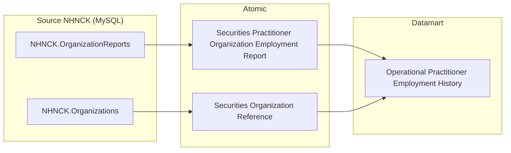

> **Ghi chú Cụm 7:** Nguồn chính từ `NHNCK.OrganizationReports`; join thêm `Securities Organization Reference` để lấy tên tổ chức và phân loại. Không có Atomic entity từ `ProfessionalWorkHistories` trong scope này.

---

### Cụm 8: Lịch sử vi phạm & xử phạt (`Operational Practitioner Violation History`)

Phục vụ **Tab TRA CỨU HỒ SƠ 360°** — Nhóm 12 (sub-tab Lịch sử vi phạm & xử phạt hành chính).

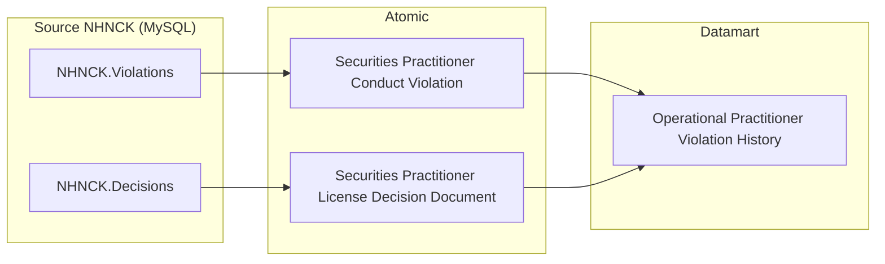

---

### Cụm 9: Đợt thi sát hạch (`Operational Practitioner Exam History`)

Phục vụ **Tab TRA CỨU HỒ SƠ 360°** — Nhóm 10 (sub-tab Đợt thi sát hạch).

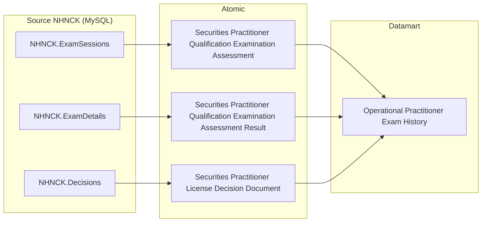

---

### Cụm 10: Cập nhật kiến thức hành nghề (`Operational Practitioner Training History`)

Phục vụ **Tab TRA CỨU HỒ SƠ 360°** — Nhóm 11 (sub-tab Cập nhật kiến thức hành nghề).

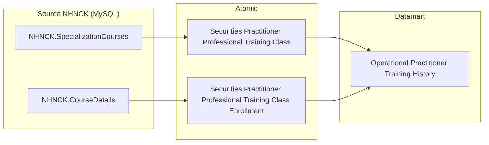

---

### Cụm 11: Data Explorer — Tra cứu danh sách CCHN (`Operational Practitioner Data Explorer`)

Phục vụ **Tab DATA EXPLORER** — Nhóm 13 (bảng tra cứu flat toàn bộ CCHN theo filter Loại chứng chỉ và Trạng thái). Lấy trực tiếp từ Atomic, không khai thác qua Fact/Dim.

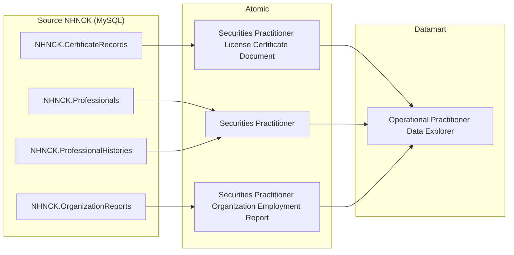

---

## Section 2 — Tổng quan báo cáo

### Tab: THỐNG KÊ CHUNG

**Slicer chung:** Năm (Year) — lấy từ `Calendar Date Dimension`. KPI lũy kế tính đến cuối năm đã chọn; KPI YTD (năm hiện tại) tính từ 01/01 đến today; KPI năm quá khứ tính đến 31/12/Y.

---

#### Nhóm 1a — Chứng chỉ hành nghề — Thống kê tổng hợp (KPI thẻ CCHN)

> Phân loại: **Phân tích**
> Atomic: `Securities Practitioner License Certificate Document` ← NHNCK.CertificateRecords — **READY**
> Atomic: `Securities Practitioner License Application` ← NHNCK.Applications — **READY**
> Atomic: `Securities Practitioner` ← NHNCK.Professionals / NHNCK.ProfessionalHistories — **READY** (dùng cho K_NHNCK_7)
> Atomic: `SP License Certificate Type` ← NHNCK.CERTIFICATES — **READY**
> Ghi chú: `Certificate_Type_Code` (= CERTIFICATES.CERTIFICATE_CODE) lưu dư thừa trong Fact (filter/display nhanh không cần join). FK đến `SP License Certificate Type Dimension` qua surrogate Id `Certificate_Type_Dimension_Id`. Certificate Status không lưu trong Fact — staging đã lọc chỉ bản ghi hiệu lực.

**Mockup:**

| KPI thẻ | Giá trị | So sánh cùng kỳ |
|---|---|---|
| Chứng chỉ cấp mới (YTD) | 1,580 CCHN (Cấp mới: 1,290 / Cấp lại: 290) | +13.7% |
| Bị thu hồi | 95 CCHN | +8% |
| CCHN đang hoạt động | 20,180 CCHN | +7.7% |
| Thu hồi thuộc trường hợp được cấp lại | 312 CCHN | -12.2% |
| Thu hồi thuộc trường hợp không được cấp lại | 98 CCHN | +11.4% |
| CCHN Đã bị hủy | 750 CCHN | -5% |

**Source:** `Fact Practitioner License Certificate Snapshot` → `Securities Practitioner Dimension`, `Calendar Date Dimension`, `SP License Certificate Type Dimension`

**Bảng KPI:**

| KPI ID | Tên KPI | Đơn vị | Tính chất | Công thức | Ghi chú |
|---|---|---|---|---|---|
| K_NHNCK_2 | Chứng chỉ cấp mới (YTD) | CCHN | Phái sinh | COUNT(DISTINCT License Certificate Document Code) WHERE Application Type IN ('0','1','2','3') AND Issue Date BETWEEN 01/01/Y AND today (Y hiện tại) hoặc 31/12/Y (Y quá khứ) | |
| K_NHNCK_2a | Cấp mới (lần đầu) | CCHN | Phái sinh | COUNT(DISTINCT License Certificate Document Code) WHERE Application Type = '0' AND Issue Date trong năm chọn | Sub-component của K_NHNCK_2 |
| K_NHNCK_2b | Cấp lại | CCHN | Phái sinh | COUNT(DISTINCT License Certificate Document Code) WHERE Application Type IN ('1','2','3') AND Issue Date trong năm chọn | Sub-component của K_NHNCK_2 |
| K_NHNCK_2_YOY | So sánh cùng kỳ — CCHN cấp mới YTD | % | Phái sinh | (K_NHNCK_2[Y] − K_NHNCK_2[Y−1]) / K_NHNCK_2[Y−1] × 100% | |
| K_NHNCK_3 | Bị thu hồi (lũy kế) | CCHN | Phái sinh | COUNT(DISTINCT License Certificate Document Code) WHERE Decision Type = '2' (Thu hồi) AND Revocation Date ≤ 31/12/Y (quá khứ) hoặc ≤ MAX(Snapshot Date) trong Y (hiện tại) | Nguồn: Certificate_Records JOIN DECISIONS |
| K_NHNCK_3_YOY | So sánh cùng kỳ — Bị thu hồi | % | Phái sinh | (K_NHNCK_3[Y] − K_NHNCK_3[Y−1]) / K_NHNCK_3[Y−1] × 100% | |
| K_NHNCK_5 | CCHN đang hoạt động (lũy kế) | CCHN | Phái sinh | COUNT(DISTINCT License Certificate Document Code) của các NHN có Practice Status Code = '1' (STATUS_WORK=1) AND Snapshot Date = 31/12/Y (quá khứ) hoặc MAX(Snapshot Date) trong Y (hiện tại) | (Sửa 2026-07-17) Bổ sung filter Practice Status Code — ghi chú cũ "staging đã lọc chỉ bản ghi hiệu lực" không đúng, staging/ODS không filter RECORD_STATUS |
| K_NHNCK_5_YOY | So sánh cùng kỳ — CCHN đang hoạt động | % | Phái sinh | (K_NHNCK_5[Y] − K_NHNCK_5[Y−1]) / K_NHNCK_5[Y−1] × 100% | |
| K_NHNCK_6 | Thu hồi thuộc trường hợp được cấp lại (lũy kế) | CCHN | Phái sinh | COUNT(DISTINCT License Certificate Document Code) của các NHN có Practice Status Code = '2' (STATUS_WORK=2) AND Decision Type = '2' AND Revocation Date ≤ 31/12/Y (quá khứ) hoặc ≤ MAX(Snapshot Date) trong Y (hiện tại) | (Sửa 2026-07-20) Đổi tên theo BA mới — "CCHN Thu hồi 3 năm" là tên diễn giải cũ, dễ gây hiểu lầm về thời hạn cụ thể; tên mới bám sát đúng định nghĩa STATUS_WORK=2 (Thu hồi có cấp lại). Logic không đổi |
| K_NHNCK_6_YOY | So sánh cùng kỳ — Thu hồi thuộc trường hợp được cấp lại | % | Phái sinh | (K_NHNCK_6[Y] − K_NHNCK_6[Y−1]) / K_NHNCK_6[Y−1] × 100% | |
| K_NHNCK_7 | Thu hồi thuộc trường hợp không được cấp lại (lũy kế) | CCHN | Phái sinh | COUNT(DISTINCT License Certificate Document Code) của các NHN có Practice Status Code = '3' (STATUS_WORK=3) AND Decision Type = '2' AND Snapshot Date = 31/12/Y (quá khứ) hoặc MAX(Snapshot Date) trong Y (hiện tại) | (Sửa 2026-07-20) Đổi tên theo BA mới — "CCHN Thu hồi vĩnh viễn" là tên diễn giải cũ; tên mới bám sát đúng định nghĩa STATUS_WORK=3 (Thu hồi không cấp lại). Logic không đổi |
| K_NHNCK_7_YOY | So sánh cùng kỳ — Thu hồi thuộc trường hợp không được cấp lại | % | Phái sinh | (K_NHNCK_7[Y] − K_NHNCK_7[Y−1]) / K_NHNCK_7[Y−1] × 100% | |
| K_NHNCK_8 | CCHN Đã bị hủy (lũy kế) | CCHN | Phái sinh | COUNT(DISTINCT License Certificate Document Code) WHERE Decision Type = '6' (Hủy CCHN) AND Revocation Date ≤ 31/12/Y (quá khứ) hoặc ≤ MAX(Snapshot Date) trong Y (hiện tại) | Nguồn: Certificate_Records JOIN DECISIONS |
| K_NHNCK_8_YOY | So sánh cùng kỳ — Đã bị hủy | % | Phái sinh | (K_NHNCK_8[Y] − K_NHNCK_8[Y−1]) / K_NHNCK_8[Y−1] × 100% | |

> **Ghi chú KPI:** K_NHNCK_7 đếm **CCHN** (không phải NHN) — nguồn `Professionals.STATUS_WORK='3'` nhưng đếm Certificate_Number. ETL join `securities_practitioner (Practice_Status_Code='3') → sp_license_certificate_document` để lấy danh sách CCHN của các NHN thuộc trường hợp thu hồi không được cấp lại. K_NHNCK_15 và K_NHNCK_16 không sử dụng — gap do điều chỉnh phân loại, không re-number.

**Star Schema — Nhóm 1a (Fact Practitioner License Certificate Snapshot):**

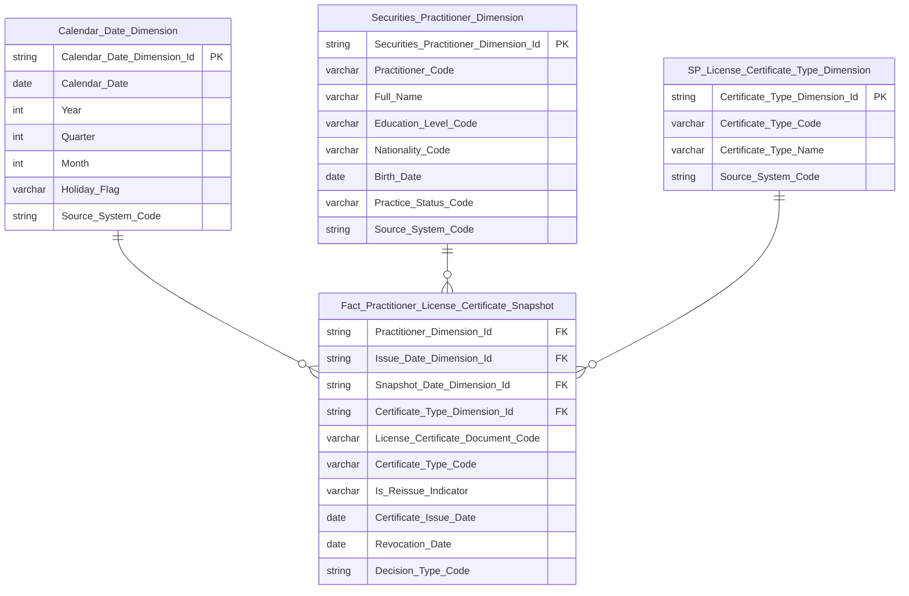

> **Ghi chú erDiagram:** Fact có FK đến `SP_License_Certificate_Type_Dimension` qua `Certificate_Type_Dimension_Id`. `Certificate_Type_Code` (= CERTIFICATES.CERTIFICATE_CODE) lưu dư thừa để filter/display nhanh không cần join. Certificate Status không lưu trong Fact — staging đã lọc chỉ bản ghi hiệu lực. `License_Certificate_Document_Code` là DD — đơn vị đếm `COUNT(DISTINCT ...)`. `Is_Reissue_Indicator` — Indicator (Y/N), ETL-derived: Y nếu Application_Type IN ('1','2','3'), N nếu Application_Type = '0'. `Decision_Type_Code` — Classification Value (scheme: LICENSE_CERTIFICATE_DECISION_TYPE: 2=Thu hồi, 6=Hủy CCHN), NULL nếu chưa có quyết định — phục vụ filter K_NHNCK_3, K_NHNCK_6, K_NHNCK_7, K_NHNCK_8. Fact có 2 FK date: `Issue_Date_Dimension_Id` (ngày cấp) và `Snapshot_Date_Dimension_Id` (ngày chụp trạng thái) — cả 2 đều trỏ về `Calendar_Date_Dimension`. (Sửa 2026-07-17) `Allow_Reissue_Indicator` đã loại khỏi schema — K_NHNCK_6 đổi sang dùng `Practice_Status_Code` (join `Securities_Practitioner_Dimension`), xem O_NHNCK_1 (revised).

**Lineage Mart → Báo cáo — Nhóm 1a:**

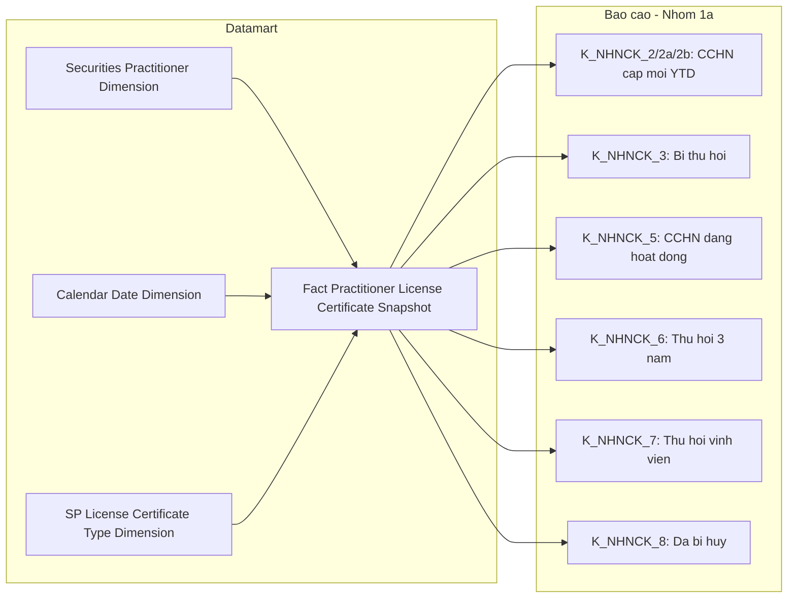

**Bảng grain — Nhóm 1a:**

| Tên bảng | Grain |
|---|---|
| `Fact Practitioner License Certificate Snapshot` | 1 CCHN × 1 tháng snapshot (cuối tháng) |
| `Securities Practitioner Dimension` | 1 NHN per SCD4A (current state) |
| `Calendar Date Dimension` | 1 ngày |
| `SP License Certificate Type Dimension` | 1 loại CCHN per SCD4A (current state) |

---

#### Nhóm 1b — Người hành nghề — Thống kê tổng hợp (KPI thẻ NHN)

> Phân loại: **Phân tích**
> Atomic: `Securities Practitioner` ← NHNCK.Professionals / NHNCK.ProfessionalHistories — **READY**
> Atomic: `Securities Practitioner Conduct Violation` ← NHNCK.Violations — **READY**

**Mockup:**

| KPI thẻ | Giá trị | So sánh cùng kỳ |
|---|---|---|
| Tổng người hành nghề | 21,340 NHN | +7.7% |
| Cảnh báo NHNCK | 148 NHN | +8.8% |

**Source:** `Fact Practitioner Daily Snapshot` → `Securities Practitioner Dimension`, `Calendar Date Dimension`

**Bảng KPI:**

| KPI ID | Tên KPI | Đơn vị | Tính chất | Công thức | Ghi chú |
|---|---|---|---|---|---|
| K_NHNCK_1 | Tổng người hành nghề | NHN | Phái sinh | COUNT(DISTINCT Practitioner Code) WHERE Snapshot Date = 31/12/Y (quá khứ) hoặc MAX(Snapshot Date) trong Y (hiện tại) | Nguồn: Professionals. (Xác nhận 2026-07-17) Bám sát SQL BA gốc — không filter, đếm mọi NHN trong `Professionals`. BA Mô tả ghi "có ít nhất 1 CCHN" nhưng SQL tham khảo không JOIN `Certificate_Records` — giữ nguyên theo SQL, không tự suy diễn thêm điều kiện |
| K_NHNCK_1_YOY | So sánh cùng kỳ — Tổng NHN | % | Phái sinh | (K_NHNCK_1[Y] − K_NHNCK_1[Y−1]) / K_NHNCK_1[Y−1] × 100% | |
| K_NHNCK_4 | Cảnh báo NHNCK | NHN | Phái sinh | COUNT(DISTINCT Practitioner Code) WHERE Has Active Violation = 'Y' AND Snapshot Date = 31/12/Y (quá khứ) hoặc MAX(Snapshot Date) trong Y (hiện tại) | (Sửa 2026-07-21) Nguồn: `Professionals JOIN Violations` — SQL BA gốc chỉ JOIN kiểm tra tồn tại bản ghi vi phạm (`JOIN Violations v ON a.ID = v.Professional_Id`), không có điều kiện lọc trạng thái. Ghi chú công thức trước đây nhắc `Violation_Status_Code=1 (ACTIVE)` không khớp SQL BA — đã bỏ, xem O_NHNCK_5 |
| K_NHNCK_4_YOY | So sánh cùng kỳ — Cảnh báo | % | Phái sinh | (K_NHNCK_4[Y] − K_NHNCK_4[Y−1]) / K_NHNCK_4[Y−1] × 100% | |

**Star Schema — Nhóm 1b (Fact Practitioner Daily Snapshot):**

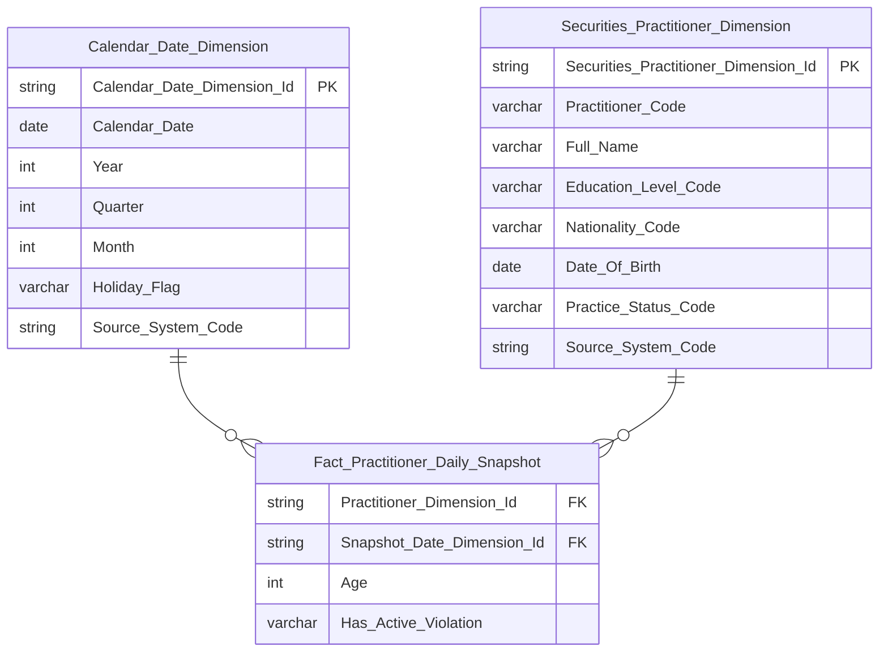

> **Ghi chú erDiagram:**
> - `Has_Active_Violation` = ETL-derived Indicator (Y/N): Y nếu NHN có ít nhất 1 bản ghi `Conduct Violation` (bất kỳ), N nếu không có — bám sát SQL BA gốc (`JOIN Violations`, không filter trạng thái). Phục vụ K_NHNCK_4 (filter = 'Y'). (Sửa 2026-07-17: đổi từ boolean sang Y/N cho đúng data domain Indicator; Sửa 2026-07-21: bỏ mô tả "đang active" — Atomic `sp_conduct_violation` không có field trạng thái vi phạm và SQL BA cũng không yêu cầu lọc, xem O_NHNCK_5)
> - `Age` = ETL-derived: Year(Snapshot_Date) − Year(Date_Of_Birth). Phục vụ Nhóm 4.

**Lineage Mart → Báo cáo — Nhóm 1b:**

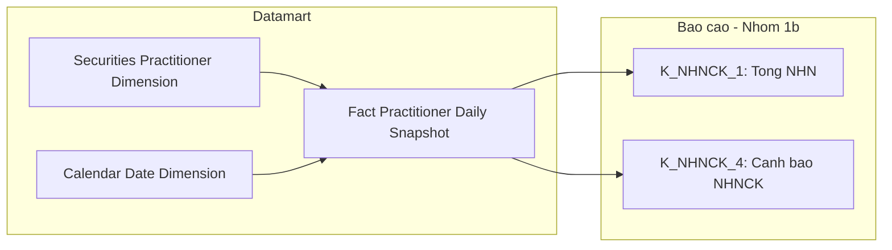

**Bảng grain — Nhóm 1b:**

| Tên bảng | Grain |
|---|---|
| `Fact Practitioner Daily Snapshot` | 1 NHN × 1 ngày snapshot |
| `Securities Practitioner Dimension` | 1 NHN per SCD4A (current state) |
| `Calendar Date Dimension` | 1 ngày |

---

#### Nhóm 2 — Biểu đồ Trình độ chuyên môn

> Phân loại: **Phân tích**
> Atomic: `Securities Practitioner` ← NHNCK.Professionals / NHNCK.ProfessionalHistories — **READY**

**Source:** `Fact Practitioner Daily Snapshot` → `Securities Practitioner Dimension`, `Calendar Date Dimension`

**Mockup:**

| Trình độ | Số NHN | Tỷ lệ |
|---|---|---|
| Tiến sĩ | 450 | 2.1% |
| Thạc sĩ | 5,200 | 24.4% |
| Đại học | 15,690 | 73.5% |

**Bảng KPI:**

| KPI ID | Tên KPI | Đơn vị | Tính chất | Công thức | Ghi chú |
|---|---|---|---|---|---|
| K_NHNCK_9 | Số lượng NHN Tiến sĩ | Người | Base | COUNT(DISTINCT Dim.Practitioner Code) WHERE Dim.Education Level Code = 'DOCTORATE' AND Snapshot_Date = 31/12/Y (quá khứ) hoặc MAX(Snapshot_Date) trong Y (hiện tại) | |
| K_NHNCK_10 | Số lượng NHN Thạc sĩ | Người | Base | COUNT(DISTINCT Dim.Practitioner Code) WHERE Dim.Education Level Code = 'MASTER' AND Snapshot_Date = 31/12/Y (quá khứ) hoặc MAX(Snapshot_Date) trong Y (hiện tại) | |
| K_NHNCK_11 | Số lượng NHN Đại học | Người | Base | COUNT(DISTINCT Dim.Practitioner Code) WHERE Dim.Education Level Code = 'BACHELOR' AND Snapshot_Date = 31/12/Y (quá khứ) hoặc MAX(Snapshot_Date) trong Y (hiện tại) | |
| K_NHNCK_12 | Tỷ lệ Tiến sĩ | % | Derived | K_NHNCK_9 / K_NHNCK_1 × 100% | |
| K_NHNCK_13 | Tỷ lệ Thạc sĩ | % | Derived | K_NHNCK_10 / K_NHNCK_1 × 100% | |
| K_NHNCK_14 | Tỷ lệ Đại học | % | Derived | K_NHNCK_11 / K_NHNCK_1 × 100% | |

**Star Schema — Nhóm 2 (Fact Practitioner Daily Snapshot):**


> **Ghi chú Fact Practitioner Daily Snapshot:**
> - Grain ngày: ETL append 1 row per NHN mỗi ngày. Slicer "chọn năm Y" = filter `Snapshot_Date = 31/12/Y` (năm quá khứ) hoặc `Snapshot_Date = MAX(Snapshot_Date) WHERE Year = Y` (năm hiện tại = ngày mới nhất có dữ liệu).
> - `Age` = ETL-derived int = Year(Snapshot_Date) − Year(Date_Of_Birth), tính từ `ProfessionalHistories.BirthDate`. Presentation layer tự nhóm thành age bands.
> - `Has_Active_Violation` = ETL-derived Indicator (Y/N): Y nếu NHN có ít nhất 1 bản ghi `Conduct Violation` (bất kỳ), N nếu không có — bám sát SQL BA gốc (`JOIN Violations`, không filter trạng thái). Xem O_NHNCK_5. Phục vụ K_NHNCK_4 (filter = 'Y'). (Sửa 2026-07-17: đổi từ boolean sang Y/N; Sửa 2026-07-21: bỏ mô tả "Violation_Status_Code=1 (ACTIVE)" — Atomic không có field này và SQL BA cũng không yêu cầu lọc trạng thái)
> - Thông tin Education_Level_Code, Nationality_Code, Practitioner_Code đọc qua JOIN `Securities Practitioner Dimension`.

**Lineage Mart → Báo cáo — Nhóm 2:**

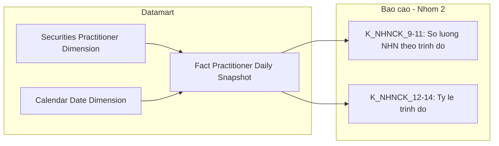

**Bảng grain — Nhóm 2:**

| Tên bảng | Grain |
|---|---|
| `Fact Practitioner Daily Snapshot` | 1 NHN × 1 ngày snapshot |
| `Securities Practitioner Dimension` | 1 NHN per SCD4A (current state) |
| `Calendar Date Dimension` | 1 ngày |

---

#### Nhóm 3 — Biểu đồ cơ cấu theo loại hình CCHN

> Phân loại: **Phân tích**
> Atomic: `Securities Practitioner License Certificate Document` ← NHNCK.CertificateRecords — **READY**
> Ghi chú: Dùng chung `Fact Practitioner License Certificate Snapshot` với Nhóm 1 — không thiết kế bảng mới.

**Source:** `Fact Practitioner License Certificate Snapshot` → `Securities Practitioner Dimension`, `Calendar Date Dimension`, `SP License Certificate Type Dimension`

**Bảng KPI:**

| KPI ID | Tên KPI | Đơn vị | Tính chất | Công thức | Ghi chú |
|---|---|---|---|---|---|
| K_NHNCK_17 | Số lượng CCHN là Môi giới | CCHN | Base | COUNT(DISTINCT License Certificate Document Code) WHERE Certificate Type Code = 'MGCK' AND Snapshot Date = 31/12/Y (quá khứ) hoặc MAX(Snapshot_Date) trong Y (hiện tại) — staging đã lọc bản ghi hiệu lực | |
| K_NHNCK_18 | Số lượng CCHN là Phân tích | CCHN | Base | COUNT(DISTINCT License Certificate Document Code) WHERE Certificate Type Code = 'PTTC' AND Snapshot Date = 31/12/Y (quá khứ) hoặc MAX(Snapshot_Date) trong Y (hiện tại) — staging đã lọc bản ghi hiệu lực | |
| K_NHNCK_19 | Số lượng CCHN là QLQ | CCHN | Base | COUNT(DISTINCT License Certificate Document Code) WHERE Certificate Type Code = 'QLQ' AND Snapshot Date = 31/12/Y (quá khứ) hoặc MAX(Snapshot_Date) trong Y (hiện tại) — staging đã lọc bản ghi hiệu lực | |
| K_NHNCK_20 | Tỷ lệ CCHN Môi giới | % | Derived | K_NHNCK_17 / K_NHNCK_5 × 100% | |
| K_NHNCK_21 | Tỷ lệ CCHN Phân tích | % | Derived | K_NHNCK_18 / K_NHNCK_5 × 100% | |
| K_NHNCK_22 | Tỷ lệ CCHN QLQ | % | Derived | K_NHNCK_19 / K_NHNCK_5 × 100% | |

**Star Schema — Nhóm 3 (Fact Practitioner License Certificate Snapshot):**

```mermaid
erDiagram
    Calendar_Date_Dimension ||--o{ Fact_Practitioner_License_Certificate_Snapshot : " "
    Securities_Practitioner_Dimension ||--o{ Fact_Practitioner_License_Certificate_Snapshot : " "
    SP_License_Certificate_Type_Dimension ||--o{ Fact_Practitioner_License_Certificate_Snapshot : " "

    Fact_Practitioner_License_Certificate_Snapshot {
        string Practitioner_Dimension_Id FK
        string Issue_Date_Dimension_Id FK
        string Snapshot_Date_Dimension_Id FK
        string Certificate_Type_Dimension_Id FK
        varchar License_Certificate_Document_Code DD
        varchar Certificate_Type_Code
        varchar Is_Reissue_Indicator
        date Certificate_Issue_Date
        date Revocation_Date
        string Decision_Type_Code
    }

    Calendar_Date_Dimension {
        string Calendar_Date_Dimension_Id PK
        date Calendar_Date
        int Year
        int Quarter
        int Month
        varchar Holiday_Flag
        string Source_System_Code
    }

    Securities_Practitioner_Dimension {
        string Securities_Practitioner_Dimension_Id PK
        varchar Practitioner_Code
        varchar Full_Name
        varchar Education_Level_Code
        varchar Nationality_Code
        date Birth_Date
        varchar Practice_Status_Code
        string Source_System_Code
    }

    SP_License_Certificate_Type_Dimension {
        string Certificate_Type_Dimension_Id PK
        varchar Certificate_Type_Code
        varchar Certificate_Type_Name
        string Source_System_Code
    }
```

> **Ghi chú erDiagram Nhóm 3:** Dùng chung schema với Nhóm 1a. Fact có FK đến `SP_License_Certificate_Type_Dimension` (không dùng `Classification_Dimension`): `Certificate_Type_Dimension_Id` — chiều lọc chính cho KPI K_NHNCK_17–22. `Certificate_Type_Code` lưu dư thừa (= CERTIFICATES.CERTIFICATE_CODE) để filter nhanh không cần join. Không có trường trạng thái CCHN — staging đã lọc chỉ bản ghi hiệu lực.

**Lineage Mart → Báo cáo — Nhóm 3:**

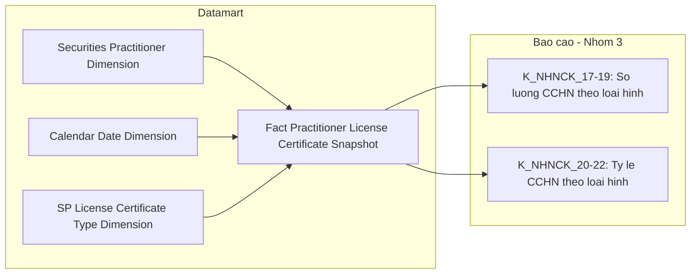

**Bảng grain — Nhóm 3:**

| Tên bảng | Grain |
|---|---|
| `Fact Practitioner License Certificate Snapshot` | 1 CCHN × 1 tháng snapshot (cuối tháng) — dùng chung với Nhóm 1 |
| `SP License Certificate Type Dimension` | 1 loại CCHN per SCD4A (current state) |

---

#### Nhóm 4 — Biểu đồ Phân bổ độ tuổi

> Phân loại: **Phân tích**
> Atomic: `Securities Practitioner` ← NHNCK.Professionals / NHNCK.ProfessionalHistories — **READY**

**Source:** `Fact Practitioner Daily Snapshot` → `Securities Practitioner Dimension`, `Calendar Date Dimension`

**Mockup:**

| Nhóm tuổi | Quốc tịch VN | Nước ngoài |
|---|---|---|
| 18–21 | 120 | 5 |
| 22–30 | 4,500 | 85 |
| 31–40 | 9,800 | 210 |
| 41–50 | 5,200 | 180 |
| 50+ | 1,200 | 40 |

**Bảng KPI:**

| KPI ID | Tên KPI | Đơn vị | Tính chất | Công thức | Ghi chú |
|---|---|---|---|---|---|
| K_NHNCK_23 | Số NHN 18–21 quốc tịch VN | Người | Base | COUNT(DISTINCT Dim.Practitioner Code) WHERE Age BETWEEN 18 AND 21 AND Dim.Nationality Code = 'VN' AND Snapshot_Date = 31/12/Y (quá khứ) hoặc MAX(Snapshot_Date) trong Y (hiện tại) |  |
| K_NHNCK_24 | Số NHN 22–30 quốc tịch VN | Người | Base | COUNT(DISTINCT Dim.Practitioner Code) WHERE Age BETWEEN 22 AND 30 AND Dim.Nationality Code = 'VN' AND Snapshot_Date = 31/12/Y (quá khứ) hoặc MAX(Snapshot_Date) trong Y (hiện tại) |  |
| K_NHNCK_25 | Số NHN 31–40 quốc tịch VN | Người | Base | COUNT(DISTINCT Dim.Practitioner Code) WHERE Age BETWEEN 31 AND 40 AND Dim.Nationality Code = 'VN' AND Snapshot_Date = 31/12/Y (quá khứ) hoặc MAX(Snapshot_Date) trong Y (hiện tại) |  |
| K_NHNCK_26 | Số NHN 41–50 quốc tịch VN | Người | Base | COUNT(DISTINCT Dim.Practitioner Code) WHERE Age BETWEEN 41 AND 50 AND Dim.Nationality Code = 'VN' AND Snapshot_Date = 31/12/Y (quá khứ) hoặc MAX(Snapshot_Date) trong Y (hiện tại) |  |
| K_NHNCK_27 | Số NHN 50+ quốc tịch VN | Người | Base | COUNT(DISTINCT Dim.Practitioner Code) WHERE Age > 50 AND Dim.Nationality Code = 'VN' AND Snapshot_Date = 31/12/Y (quá khứ) hoặc MAX(Snapshot_Date) trong Y (hiện tại) |  |
| K_NHNCK_28 | Số NHN 18–21 nước ngoài | Người | Base | COUNT(DISTINCT Dim.Practitioner Code) WHERE Age BETWEEN 18 AND 21 AND Dim.Nationality Code != 'VN' AND Snapshot_Date = 31/12/Y (quá khứ) hoặc MAX(Snapshot_Date) trong Y (hiện tại) |  |
| K_NHNCK_29 | Số NHN 22–30 nước ngoài | Người | Base | COUNT(DISTINCT Dim.Practitioner Code) WHERE Age BETWEEN 22 AND 30 AND Dim.Nationality Code != 'VN' AND Snapshot_Date = 31/12/Y (quá khứ) hoặc MAX(Snapshot_Date) trong Y (hiện tại) |  |
| K_NHNCK_30 | Số NHN 31–40 nước ngoài | Người | Base | COUNT(DISTINCT Dim.Practitioner Code) WHERE Age BETWEEN 31 AND 40 AND Dim.Nationality Code != 'VN' AND Snapshot_Date = 31/12/Y (quá khứ) hoặc MAX(Snapshot_Date) trong Y (hiện tại) |  |
| K_NHNCK_31 | Số NHN 41–50 nước ngoài | Người | Base | COUNT(DISTINCT Dim.Practitioner Code) WHERE Age BETWEEN 41 AND 50 AND Dim.Nationality Code != 'VN' AND Snapshot_Date = 31/12/Y (quá khứ) hoặc MAX(Snapshot_Date) trong Y (hiện tại) |  |
| K_NHNCK_32 | Số NHN 50+ nước ngoài | Người | Base | COUNT(DISTINCT Dim.Practitioner Code) WHERE Age > 50 AND Dim.Nationality Code != 'VN' AND Snapshot_Date = 31/12/Y (quá khứ) hoặc MAX(Snapshot_Date) trong Y (hiện tại) |  |

**Star Schema — Nhóm 4 (Fact Practitioner Daily Snapshot):**


> **Ghi chú Fact Practitioner Daily Snapshot:**
> - Grain ngày: ETL append 1 row per NHN mỗi ngày. Slicer "chọn năm Y" = filter `Snapshot_Date = 31/12/Y` (năm quá khứ) hoặc `Snapshot_Date = MAX(Snapshot_Date) WHERE Year = Y` (năm hiện tại = ngày mới nhất có dữ liệu).
> - `Age` = ETL-derived int = Year(Snapshot_Date) − Year(Date_Of_Birth), tính từ `ProfessionalHistories.BirthDate`. Presentation layer tự nhóm thành age bands.
> - `Has_Active_Violation` = ETL-derived Indicator (Y/N): Y nếu NHN có ít nhất 1 bản ghi `Conduct Violation` (bất kỳ), N nếu không có — bám sát SQL BA gốc (`JOIN Violations`, không filter trạng thái). Xem O_NHNCK_5. Phục vụ K_NHNCK_4 (filter = 'Y'). (Sửa 2026-07-17: đổi từ boolean sang Y/N; Sửa 2026-07-21: bỏ mô tả "Violation_Status_Code=1 (ACTIVE)" — Atomic không có field này và SQL BA cũng không yêu cầu lọc trạng thái)
> - Thông tin Education_Level_Code, Nationality_Code, Practitioner_Code đọc qua JOIN `Securities Practitioner Dimension`.

**Lineage Mart → Báo cáo — Nhóm 4:**

```mermaid
flowchart LR
    subgraph Datamart["Datamart"]
        G1["Fact Practitioner Daily Snapshot"]
        G2["Securities Practitioner Dimension"]
        G3["Calendar Date Dimension"]
    end
    subgraph RPT["Bao cao - Nhom 4"]
        R1["K_NHNCK_23-32: Phan bo do tuoi VN va nuoc ngoai"]
    end
    G1 --> R1
    G2 --> G1
    G3 --> G1
```

**Bảng grain — Nhóm 4:**

| Tên bảng | Grain |
|---|---|
| `Fact Practitioner Daily Snapshot` | 1 NHN × 1 ngày snapshot |
| `Securities Practitioner Dimension` | 1 NHN per SCD4A (current state) |
| `Calendar Date Dimension` | 1 ngày |

---

### Tab: TRA CỨU HỒ SƠ 360°

**Slicer:** Tìm kiếm theo Tên, Số CCHN, Nơi công tác. Filter Loại chứng chỉ. Không có slicer thời gian.

---

#### Nhóm 5 — Dashboard Tra cứu hồ sơ 360° — Thông tin chung của NHNCK

> Phân loại: **Tác nghiệp**
> STT BA: 5
> Atomic: `Securities Practitioner` ← NHNCK.Professionals / NHNCK.ProfessionalHistories — **READY**
> Atomic: `Securities Practitioner License Certificate Document` ← NHNCK.CertificateRecords — **READY**

**Mockup — Danh sách:**

| Tên | Tuổi | Quốc tịch | Loại CCHN | Số CCHN | Nơi công tác | Trạng thái |
|---|---|---|---|---|---|---|
| Nguyễn Văn A | 34 tuổi | Việt Nam | Môi giới | CCHN-2023-001 | TESLA | Đang hoạt động |
| Lê Thị Thu B | 37 tuổi | Việt Nam | Phân tích | CCHN-2024-045 | META | Đang hoạt động |
| Trần Minh C | 42 tuổi | Nhật | Quản lý quỹ | CCHN-QLQ-2019-112 | GOOGLE | Đang hoạt động |

**Mockup — Header chi tiết NHN:**

```
[Avatar] Nguyễn Văn A  ● Môi giới chứng khoán
15/03/1991 (34y) | Việt Nam | 001091003456 | TESLA | ĐANG HOẠT ĐỘNG
```

**Source:** `Operational Practitioner 360 Profile` (Tác nghiệp — trực tiếp từ Atomic)

**Bảng KPI:**

| KPI ID | Tên KPI | Đơn vị | Tính chất | Nguồn | Ghi chú |
|---|---|---|---|---|---|
| K_NHNCK_33 | Họ tên NHN | Text | Base | `Securities Practitioner`.Full Name |  |
| K_NHNCK_34 | Ngày sinh | Date | Base | `Securities Practitioner`.Birth Date — dùng `brth_dt`; nếu null thì fallback `Birth Year` (`brth_yr`) |  |
| K_NHNCK_35 | Tuổi | Int | Derived | ETL-derived: `COALESCE(YEAR(brth_dt), CAST(brth_yr AS INT))` → tính `YEAR(CURRENT_DATE) − giá_trị_đó` khi populate bảng |  |
| K_NHNCK_36 | Quốc tịch | Text | Base | `Securities Practitioner`.Nationality Code — ETL denormalize Nationality Name từ `Geographic Area` khi populate bảng |  |
| K_NHNCK_37 | Số định danh / Hộ chiếu | Text | Base | `Involved Party Alternative Identification`.Identification Number — join qua `ip_id = securities_practitioner_id`, lấy bản ghi `Identification Type Code` = CCCD hoặc PASSPORT |  |
| K_NHNCK_38 | Nơi công tác hiện tại | Text | Base | (Sửa 2026-07-20 — BA v2) `Securities Practitioner Organization Employment Report`.Practitioner Workplace At Report — lấy bản ghi báo cáo tổ chức mới nhất (MAX Report Date ≤ ETL date) |  |
| K_NHNCK_39 | Loại CCHN hiện tại | Text | Base | (Sửa 2026-07-20 — BA v2) `Securities Practitioner Organization Employment Report`.Certificate Type Code + Name — lấy bản ghi báo cáo tổ chức mới nhất (MAX Report Date ≤ ETL date), không dùng `revocation_dt IS NULL` |  |
| K_NHNCK_40 | Số CCHN hiện tại | Text | Base | (Sửa 2026-07-20 — BA v2) `Securities Practitioner Organization Employment Report`.Certificate Number At Report — lấy bản ghi báo cáo tổ chức mới nhất (MAX Report Date ≤ ETL date), không dùng `revocation_dt IS NULL` |  |
| K_NHNCK_41 | Trạng thái NHNCK | Text | Base | `Securities Practitioner`.Practice Status Code — ETL denormalize Practice Status Name; 0=Chưa HN, 1=Đang HN, 2=Thu hồi cấp lại, 3=Thu hồi không cấp lại, 4=Có thời hạn |  |

**Schema bảng tác nghiệp:**

```mermaid
erDiagram
    Operational_Practitioner_360_Profile {
        varchar Practitioner_Code PK
        varchar Full_Name
        date Birth_Date
        int Age
        varchar Nationality_Code
        varchar Nationality_Name
        varchar Identification_Number
        varchar Education_Level_Code
        varchar Education_Level_Name
        varchar Workplace
        varchar Practice_Status_Code
        varchar Practice_Status_Name
        varchar Active_Certificate_Type_Code
        varchar Active_Certificate_Type_Name
        varchar Active_Certificate_Number
        string Source_System_Code

    }
```

> **Ghi chú schema:** `Nationality_Name`, `Practice_Status_Name` là ETL-derived — denormalize từ Classification tại thời điểm populate bảng, không join ở query time. (Sửa 2026-07-20 — BA v2) `Workplace`, `Active_Certificate_Type_Code/Name`, `Active_Certificate_Number` (K_NHNCK_38/39/40): đổi nguồn từ `PROFESSIONALS.WORKPLACE`/Certificate Document sang `Securities Practitioner Organization Employment Report` — bảng này là Fact Append (mỗi bản ghi = 1 lần báo cáo tổ chức), lấy bản ghi mới nhất theo `MAX(Report Date) ≤ ETL date` để phản ánh đúng trạng thái công tác/CCHN hiện tại tại thời điểm populate. Lý do đổi: `revocation_dt IS NULL` chỉ xác định CCHN CHƯA bị thu hồi, không đảm bảo đây là CCHN đang được báo cáo hiện tại (1 NHN có thể có nhiều Certificate Number qua các lần cấp/cấp lại khác nhau). RECORD_STATUS/STATUS ở nguồn (system field xác định bản ghi LIVE) không cần lưu attribute riêng trên Atomic — Bronze→Atomic đã filter LIVE sẵn theo quy ước T24. `Education_Level_Code/Name` (Sửa 2026-07-22) — ETL denormalize từ Classification (scheme EDUCATION_LEVEL) tại thời điểm populate, cùng pattern với `Nationality_Name`/`Practice_Status_Name`. Không có KPI riêng ở Nhóm 5 (BA không yêu cầu hiển thị trên dashboard 360°) — cột này tồn tại để phục vụ JOIN từ Nhóm 13 (Data Explorer), nơi khai sinh K_NHNCK_106.

**Lineage Mart → Báo cáo — Nhóm 5:**

```mermaid
flowchart LR
    subgraph Datamart["Datamart"]
        G1["Operational Practitioner 360 Profile"]
    end
    subgraph RPT["Bao cao - Nhom 5"]
        R1["K_NHNCK_33-41: Thong tin chung NHN 360"]
    end
    G1 --> R1
```

**Bảng grain — Nhóm 5:**

| Tên bảng | Grain |
|---|---|
| `Operational Practitioner 360 Profile` | 1 NHN (latest state) |

---

#### Nhóm 6 — Sub-tab Mạng lưới người liên quan

> Phân loại: **Tác nghiệp**
> Atomic: `Securities Practitioner Related Party` ← NHNCK.ProfessionalRelationships — **READY**
> Atomic: `Securities Practitioner Organization Employment Report` ← NHNCK.OrganizationReports — **READY** (reuse từ Nhóm 7 — chỉ K_NHNCK_81, 82)
> Ghi chú: Phục vụ phần "Mạng lưới người liên quan" trong sub-tab Hồ sơ. Mỗi row = 1 người liên quan của NHN (vợ/chồng, con, bố/mẹ...). K_NHNCK_81, K_NHNCK_82 khai sinh ở Nhóm 7 — reuse vào bảng này để hiển thị vai trò NHN tại DN niêm yết trong cùng màn hình mạng lưới.

**Mockup:**

| Họ và tên | Mối quan hệ | Nghề nghiệp | Nơi làm việc |
|---|---|---|---|
| Lê Thị Hồng A | Vợ | Kinh doanh tự do | — |
| Nguyễn Thế B | Con trai | Du học sinh | — |
| Trần Văn C | Em rể | Giám đốc DN tư nhân | — |

**Source:** `Operational Practitioner Related Party Profile` (Tác nghiệp — trực tiếp từ Atomic)

**Bảng KPI:**

| KPI ID | Tên KPI | Đơn vị | Tính chất | Nguồn | Ghi chú |
|---|---|---|---|---|---|
| K_NHNCK_75 | Họ và tên người liên quan | Text | Base | `Securities Practitioner Related Party`.Related Individual Full Name | |
| K_NHNCK_76 | Mối quan hệ | Text | Base | `Securities Practitioner Related Party`.Relationship Type Code — ETL denormalize Relationship Type Name (scheme: RELATIONSHIP_TYPE) khi populate bảng | |
| K_NHNCK_77 | Nghề nghiệp người liên quan | Text | Base | `Securities Practitioner Related Party`.Related Individual Occupation | |
| K_NHNCK_78 | Nơi làm việc người liên quan | Text | Base | `Securities Practitioner Related Party`.Related Individual Workplace | |
| K_NHNCK_79 | CCCD/CMND người liên quan | Text | PENDING | — | Nguồn thật `IDENTITY_INFO_C06S.IDENTITY_NUMBER` — bảng này đang out-of-scope Atomic (xem `NHNCK_HLD_Human_Review.txt`). `PROFESSIONAL_RELATIONSHIPS.IDENTITY_ID` chỉ là FK, không phải số CMND/CCCD — không dùng trực tiếp. Atomic cần bổ sung entity cho `IDENTITY_INFO_C06S` |
| K_NHNCK_80 | Quốc tịch người liên quan | Text | Base | `Securities Practitioner Related Party`.Country Code — ETL denormalize Country Name từ Geographic Area khi populate bảng | |
| K_NHNCK_86 | Địa chỉ người liên quan | Text | Base | `Securities Practitioner Related Party`.Related Individual Address | |
| K_NHNCK_81 | Tên DN niêm yết/UPCOM (NHN tham gia) | Text | Base | `Securities Practitioner Organization Employment Report`.Practitioner Workplace At Report | Reuse từ Nhóm 7 |
| K_NHNCK_82 | Vai trò NHN tại DN niêm yết/UPCOM | Text | Base | `Securities Practitioner Organization Employment Report`.Practitioner Position At Report | Reuse từ Nhóm 7 |

**Schema bảng tác nghiệp:**

```mermaid
erDiagram
    Operational_Practitioner_Related_Party_Profile {
        varchar Practitioner_Code PK
        varchar Securities_Practitioner_Related_Party_Code PK
        varchar Related_Individual_Full_Name
        varchar Relationship_Type_Code
        varchar Relationship_Type_Name
        varchar Related_Individual_Occupation
        varchar Related_Individual_Workplace
        varchar Related_Individual_Identity_Number
        varchar Country_Code
        varchar Country_Name
        varchar Related_Individual_Address
        string Source_System_Code

    }
```

> **Ghi chú schema Nhóm 6:** `Relationship_Type_Name` ETL-derived — denormalize từ Classification (scheme: RELATIONSHIP_TYPE). `Country_Name` ETL-derived — denormalize từ Geographic Area. K_NHNCK_81, K_NHNCK_82 phục vụ hiển thị bổ sung trong màn hình mạng lưới — đọc trực tiếp từ `Operational Practitioner Listed Company Role` (Nhóm 7), không gộp vào `Operational Practitioner Related Party Profile`.

**Lineage Mart → Báo cáo — Nhóm 6:**

```mermaid
flowchart LR
    subgraph Datamart["Datamart"]
        G1["Operational Practitioner Related Party Profile"]
        G2["Operational Practitioner Listed Company Role"]
    end
    subgraph RPT["Bao cao - Nhom 6"]
        R1["K_NHNCK_75-82,86: Mang luoi nguoi lien quan"]
    end
    G1 --> R1
    G2 --> R1
```

**Bảng grain — Nhóm 6:**

| Tên bảng | Grain |
|---|---|
| `Operational Practitioner Related Party Profile` | 1 người liên quan per NHN (toàn bộ) |
| `Operational Practitioner Listed Company Role` | Reuse từ Nhóm 7 — 1 vai trò per NHN per DN niêm yết |

---

#### Nhóm 7 — Dashboard Hồ sơ & Danh mục của NHNCK

> Phân loại: **Tác nghiệp** (2 bảng tác nghiệp riêng biệt)
> Atomic chính: `Securities Practitioner Organization Employment Report` (`sp_organization_employment_report`) ← NHNCK.ORGANIZATION_REPORTS — **READY**
> Atomic phụ: `Securities Organization Reference` (`securities_organization_reference`) ← NHNCK.ORGANIZATIONS — join để lấy tên tổ chức và lọc loại hình CTCK
> Atomic phụ (K_NHNCK_85): `Securities Company Shareholder` (`securities_company_shareholder`) ← SCMS.SC_FIRM_SHAREHOLDER — **READY**; `Involved Party Alternative Identification` (`ip_alternative_identification`, nguồn NHNCK.PROFESSIONALS và nguồn SCMS.SC_FIRM_SHAREHOLDER) — **READY**, dùng làm cầu nối xác định đúng NHN theo CCCD giữa 2 hệ nguồn, có FK trực tiếp (`ip_id`) tới `securities_company_shareholder`. (Sửa 2026-07-20) Đã bỏ `Sc Insider Related Person` khỏi chuỗi join — entity này không có FK trực tiếp tới `securities_company_shareholder`, join qua `sc_id` (CTCK) chỉ đảm bảo cùng công ty chứng khoán, không xác định đúng người và gây fan-out
> Ghi chú: Panel "Vai trò tại DN niêm yết" và panel "Mạng lưới người liên quan" là 2 bảng tác nghiệp độc lập. Panel "Tài khoản & Số dư" (VSDC/MSS) PENDING — không thiết kế bảng riêng, gom PENDING KPI vào bảng `Operational Practitioner Listed Company Role` (còn lại K_NHNCK_87/88/89/103). K_NHNCK_85 "Số lượng cổ phiếu sở hữu" đã xác nhận nguồn thật là SCMS (không phải VSDC) — chuyển READY, xem O_NHNCK_6. Sửa tên attribute: `Workplace Name` → `Practitioner Workplace At Report`; `Position Name` → `Practitioner Position At Report` (theo YAML `sp_organization_employment_report`). (Sửa 2026-07-20) Attributes bổ sung 4 cột PENDING (`account_nbr`, `account_holder_nm`, `main_held_securities_code`, `vsdc_held_securities_vol`, `etl_logic_type=pending`) theo đúng convention Nhóm 12 — không đưa vào mermaid schema (chỉ track trong Attributes + bảng KPI, chờ Atomic VSDC/MSS).

**Bảng KPI:**

| KPI ID | Tên KPI | Tính chất | Trạng thái | Nguồn | Ghi chú |
|---|---|---|---|---|---|
| K_NHNCK_81 | Tên DN niêm yết/UPCOM | Base | READY | `Securities Practitioner Organization Employment Report`.Practitioner Workplace At Report | Khai sinh tại Nhóm 7 |
| K_NHNCK_82 | Vai trò tại DN | Base | READY | `Securities Practitioner Organization Employment Report`.Practitioner Position At Report | Khai sinh tại Nhóm 7 |
| K_NHNCK_83 | Trạng thái vai trò | Derived | READY | Derived: `Termination Date IS NULL → "Hiện tại"`, có giá trị → "Đã kết thúc" | |
| K_NHNCK_84 | Mã CTCK | Base | READY | `Securities Practitioner Organization Employment Report`.Securities Organization Reference Code — join `Securities Organization Reference` filter `Organization Type Code = 'CTCK'` | |
| K_NHNCK_85 | Số lượng cổ phiếu sở hữu | Base | READY | `Securities Company Shareholder`.Shares Held — xác định đúng NHN qua `Involved Party Alternative Identification` (NHNCK, `identification_nbr`=CCCD NHN) = `Involved Party Alternative Identification` (SCMS nguồn SC_FIRM_SHAREHOLDER, `identification_nbr`=ID_NUMBER), FK trực tiếp (`ip_id`) tới `Securities Company Shareholder` | (Sửa 2026-07-20) Nguồn thật là SCMS `SC_FIRM_SHAREHOLDER`, không phải VSDC như thiết kế trước — xem O_NHNCK_6. Đã fix gap join: bỏ `Sc Insider Related Person` (không có FK trực tiếp, join qua `sc_id` sai người/fan-out) |
| K_NHNCK_75 | Họ và tên người liên quan | Base | READY | `Securities Practitioner Related Party`.Related Individual Full Name | Reuse từ Nhóm 6 |
| K_NHNCK_76 | Mối quan hệ | Base | READY | `Securities Practitioner Related Party`.Relationship Type Code — ETL denormalize Relationship Type Name (scheme: RELATIONSHIP_TYPE) khi populate bảng | Reuse từ Nhóm 6 |
| K_NHNCK_77 | Nghề nghiệp người liên quan | Base | READY | `Securities Practitioner Related Party`.Related Individual Occupation | Reuse từ Nhóm 6 |
| K_NHNCK_79 | CCCD/CMND người liên quan | Base | PENDING — nguồn `IDENTITY_INFO_C06S` chưa có Atomic (out-of-scope) | — | Xem ghi chú Nhóm 6 |
| K_NHNCK_87 | Số tài khoản | Base | PENDING — nguồn VSDC/MSS chưa có Atomic | — | |
| K_NHNCK_88 | Tên chủ tài khoản | Base | PENDING — nguồn VSDC/MSS chưa có Atomic | — | |
| K_NHNCK_89 | Mã CK nắm giữ chính | Base | PENDING — nguồn VSDC chưa có Atomic | — | |
| K_NHNCK_103 | Số lượng chứng khoán VSDC sở hữu (Cuối kỳ) | Base | PENDING — nguồn VSDC chưa có Atomic | — | (Thêm 2026-07-20) BA row 60, cùng nguồn `VSDC_BM 8` với K_NHNCK_89 — BA quên điền tên KPI ở cột "Thông tin", đã bổ sung theo "Trường nguồn" |

**Schema bảng tác nghiệp:**

```mermaid
erDiagram
    Operational_Practitioner_Listed_Company_Role {
        varchar Practitioner_Code PK
        varchar Organization_Employment_Report_Code PK
        varchar Practitioner_Workplace_At_Report
        varchar Practitioner_Position_At_Report
        varchar Organization_Type_Code
        varchar Securities_Organization_Reference_Code
        varchar Employment_Status
        date Hire_Date
        date Termination_Date
        int Shares_Held
        string Source_System_Code

    }

    Operational_Practitioner_Related_Party_Profile {
        varchar Practitioner_Code PK
        varchar Securities_Practitioner_Related_Party_Code PK
    }
```

> **Ghi chú schema Nhóm 7:** `Shares_Held` (K_NHNCK_85) ETL-populate từ `Securities Company Shareholder.Shares Held` (SCMS) — không phải từ `Securities Practitioner Organization Employment Report` như các cột còn lại. ETL xác định đúng NHN bằng cách đối chiếu CCCD: `Involved Party Alternative Identification` (nguồn NHNCK, `identification_nbr`) so khớp với `Involved Party Alternative Identification` (nguồn SCMS `SC_FIRM_SHAREHOLDER`, `identification_nbr` ← `SC_FIRM_SHAREHOLDER.ID_NUMBER`), entity này có FK trực tiếp (`ip_id`) tới `Securities Company Shareholder` — lấy `Shares_Held` trực tiếp, không qua bảng trung gian nào. NULL nếu NHN không phải cổ đông của DN niêm yết đang xét. (Sửa 2026-07-20) Đã fix gap: chuỗi join cũ đi qua `Sc Insider Related Person` rồi join `sc_id` (CTCK) tới `Securities Company Shareholder` — entity này KHÔNG có FK trực tiếp tới `Securities Company Shareholder`, join theo `sc_id` chỉ đảm bảo cùng 1 CTCK (nhiều insider × nhiều shareholder cùng công ty) → sai người + fan-out nhân dòng.

**Lineage Mart → Báo cáo — Nhóm 7:**

```mermaid
flowchart LR
    subgraph Datamart["Datamart"]
        G1["Operational Practitioner Listed Company Role"]
        G2["Operational Practitioner Related Party Profile (Reuse Nhóm 6)"]
    end
    subgraph RPT["Bao cao - Nhom 7"]
        R1["K_NHNCK_75-89: Ho so va Danh muc NHNCK"]
    end
    G1 --> R1
    G2 --> R1
```

**Bảng grain — Nhóm 7:**

| Tên bảng | Grain | Trạng thái |
|---|---|---|
| `Operational Practitioner Listed Company Role` | 1 lần báo cáo tổ chức per NHN (tất cả lịch sử, filter type=CTCK/DN niêm yết) | new |
| `Operational Practitioner Related Party Profile` | Reuse từ Nhóm 6 | reuse |

---

#### Nhóm 8 — Sub-tab Quá trình hành nghề

> Phân loại: **Tác nghiệp**
> Atomic chính: `Securities Practitioner Organization Employment Report` (`sp_organization_employment_report`) ← NHNCK.OrganizationReports — **READY**
> Atomic phụ: `Securities Organization Reference` (`securities_organization_reference`) ← NHNCK.Organizations — join để lấy tên tổ chức và phân loại tổ chức
> Ghi chú: Nguồn là `NHNCK.OrganizationReports` — không phải `ProfessionalWorkHistories`. Tên tổ chức và phân loại ETL-derived qua join `securities_organization_reference` theo `securities_organization_reference_code`.

**Mockup:**

| Tổ chức | Phân loại | Vị trí | Phòng ban | Từ tháng | Đến tháng | Trạng thái |
|---|---|---|---|---|---|---|
| Tesla | CTCK | Môi giới chứng khoán | Phòng Môi giới | 12/05/2023 | Hiện nay | Hiện tại |
| Công ty CP Chứng khoán AAA | CTCK | Trưởng phòng Môi giới | Phòng Môi giới | 12/01/2018 | 11/05/2023 | Quá khứ |
| Vụ Giám sát TTCK - UBCKNN | Khác | Chuyên viên chính | — | 30/10/2012 | 11/01/2018 | Quá khứ |

**Source:** `Operational Practitioner Employment History` (Tác nghiệp)

**Bảng KPI:**

| KPI ID | Tên KPI | Đơn vị | Tính chất | Nguồn | Ghi chú |
|---|---|---|---|---|---|
| K_NHNCK_49 | Tên tổ chức | Text | Base | `Securities Practitioner Organization Employment Report`.Securities Organization Reference Code — ETL join `Securities Organization Reference`.Securities Organization Reference Name theo `securities_organization_reference_code` khi populate bảng | Khai sinh tại Nhóm 8 |
| K_NHNCK_90 | Phân loại tổ chức | Text | Base | `Securities Organization Reference`.Organization Type Code — ETL join `securities_organization_reference` theo `securities_organization_reference_code`, denormalize Organization Type Name (scheme: ORGANIZATION_TYPE) khi populate bảng | Khai sinh tại Nhóm 8 |
| K_NHNCK_50 | Vị trí công tác | Text | Base | `Securities Practitioner Organization Employment Report`.Practitioner Position At Report | Khai sinh tại Nhóm 8 |
| K_NHNCK_91 | Phòng ban | Text | Base | `Securities Practitioner Organization Employment Report`.Practitioner Department At Report | Khai sinh tại Nhóm 8 |
| K_NHNCK_51 | Từ tháng | Date | Base | `Securities Practitioner Organization Employment Report`.Hire Date | Khai sinh tại Nhóm 8 |
| K_NHNCK_52 | Đến tháng | Date | Base | `Securities Practitioner Organization Employment Report`.Termination Date — NULL hiển thị "Hiện nay" tại presentation layer | Khai sinh tại Nhóm 8 |
| K_NHNCK_53 | Trạng thái làm việc | Text | Derived | Derived: `Termination Date IS NULL → "Hiện tại"`, có giá trị → "Quá khứ" — derive tại presentation layer | |

**Schema bảng tác nghiệp:**

```mermaid
erDiagram
    Operational_Practitioner_Employment_History {
        varchar Practitioner_Code PK
        varchar Organization_Employment_Report_Code PK
        varchar Securities_Organization_Reference_Code
        varchar Securities_Organization_Name
        varchar Organization_Type_Code
        varchar Organization_Type_Name
        varchar Practitioner_Position_At_Report
        varchar Practitioner_Department_At_Report
        date Hire_Date
        date Termination_Date
        string Source_System_Code

    }
```

> **Ghi chú schema Nhóm 8:** `Securities_Organization_Name` ETL-derived — join `securities_organization_reference.securities_organization_reference_nm` theo `securities_organization_reference_code`. `Organization_Type_Name` ETL-derived — denormalize từ Classification (scheme: ORGANIZATION_TYPE) tại thời điểm populate. Presentation layer đọc trực tiếp, không join Atomic ở query time.

**Lineage Mart → Báo cáo — Nhóm 8:**

```mermaid
flowchart LR
    subgraph Datamart["Datamart"]
        G1["Operational Practitioner Employment History"]
    end
    subgraph RPT["Bao cao - Nhom 8"]
        R1["K_NHNCK_49,50,51,52,53,90,91: Qua trinh hanh nghe"]
    end
    G1 --> R1
```

**Bảng grain — Nhóm 8:**

| Tên bảng | Grain |
|---|---|
| `Operational Practitioner Employment History` | 1 lần công tác per NHN (toàn bộ lịch sử) |

---

#### Nhóm 9 — Sub-tab Lịch sử cấp chứng chỉ hành nghề

> Phân loại: **Tác nghiệp**
> Atomic chính: `Securities Practitioner License Certificate Document` (`sp_license_certificate_document`) ← NHNCK.CertificateRecords — **READY**
> Atomic phụ: `Securities Practitioner License Decision Document` (`sp_license_decision_document`) ← NHNCK.Decisions — join để lấy số quyết định cấp và thu hồi
> Atomic phụ (K_NHNCK_43 — Sửa 2026-07-20): `Securities Practitioner Organization Employment Report` (`sp_organization_employment_report`) ← NHNCK.OrganizationReports — join qua FK `Securities Practitioner License Certificate Document Id` để lấy Certificate Number denormalized tại báo cáo gần nhất, theo đúng BA v2
> Ghi chú: Cột "Trạng thái" trong Mockup (K_NHNCK_48) — **PENDING**, xem O_NHNCK_16.

**Mockup:**

| Số CCHN | Loại hình | Ngày cấp | Ngày thu hồi | Quyết định cấp | Quyết định thu hồi | Trạng thái |
|---|---|---|---|---|---|---|
| CCHN-2023-001 | Môi giới chứng khoán | 12/05/2023 | — | 145/QĐ-UBCK | — | Đang hiệu lực |
| CCHN-2020-045 | Phân tích chứng khoán | 20/10/2020 | 20/10/2023 | 89/QĐ-UBCK | 91/QĐ-UBCK | Thu hồi trong 3 năm |
| CCHN-2017-012 | Môi giới chứng khoán | 15/01/2017 | 15/01/2020 | 12/QĐ-UBCK | 15/QĐ-UBCK | Thu hồi vĩnh viễn |

**Source:** `Operational Practitioner Certificate History` (Tác nghiệp)

**Bảng KPI:**

| KPI ID | Tên KPI | Đơn vị | Tính chất | Nguồn | Ghi chú |
|---|---|---|---|---|---|
| K_NHNCK_43 | Số CCHN | Text | Base | (Sửa 2026-07-20 — BA v2) `Securities Practitioner Organization Employment Report`.Certificate Number At Report — bản ghi báo cáo gần nhất theo Report Date CỦA CHÍNH CCHN đang xét (join qua FK Certificate Document Id trên ORGANIZATION_REPORTS, không phải gần nhất của NHN) | Khai sinh tại Nhóm 9 |
| K_NHNCK_44 | Loại hình hành nghề | Text | Base | `Securities Practitioner License Certificate Document`.Certificate Type Code — ETL join `SP License Certificate Type` (Fundamental entity), denormalize Certificate Type Name khi populate bảng | Khai sinh tại Nhóm 9 |
| K_NHNCK_45 | Ngày cấp | Date | Base | `Securities Practitioner License Certificate Document`.Issue Date | Khai sinh tại Nhóm 9 |
| K_NHNCK_46 | Ngày thu hồi | Date | Base | `Securities Practitioner License Certificate Document`.Revocation Date — NULL nếu chưa thu hồi | Khai sinh tại Nhóm 9 |
| K_NHNCK_47 | Số quyết định cấp | Text | Base | `Securities Practitioner License Certificate Document`.Issue License Decision Code — ETL join `Securities Practitioner License Decision Document`.Decision Number theo `issu_license_dcsn_code` khi populate bảng | Khai sinh tại Nhóm 9 |
| K_NHNCK_92 | Số quyết định thu hồi | Text | Base | `Securities Practitioner License Certificate Document`.Revocation License Decision Code — ETL join `Securities Practitioner License Decision Document`.Decision Number theo `revocation_license_dcsn_code` khi populate bảng; NULL nếu chưa thu hồi | Khai sinh tại Nhóm 9 |
| K_NHNCK_48 | Trạng thái CCHN | Text | PENDING | — | Nguồn thật `CERTIFICATE_RECORD_STATUS_HISTORIES.NEW_STATUS` (0-5: Chưa sử dụng/Đang sử dụng/Thu hồi có cấp lại/Thu hồi không cấp lại/Đã hủy/Hết hiệu lực) — bảng này out-of-scope Atomic (audit log, xem `NHNCK_HLD_Human_Review.txt`). `Process Status Code` (scheme LICENSE_CERTIFICATE_PROCESS_STATUS: Đã cấp/Đã ký nháy/Đã ký/Đã trả) là trạng thái workflow xử lý hồ sơ — KHÁC ý nghĩa hiệu lực CCHN, không dùng thay thế |

**Schema bảng tác nghiệp:**

```mermaid
erDiagram
    Operational_Practitioner_Certificate_History {
        varchar Practitioner_Code PK
        varchar License_Certificate_Document_Code PK
        varchar Certificate_Number
        varchar Certificate_Type_Code
        varchar Certificate_Type_Name
        date Issue_Date
        date Revocation_Date
        varchar Issuance_Decision_Number
        varchar Revocation_Decision_Number
        string Source_System_Code

    }
```

> **Ghi chú schema Nhóm 9:** `Certificate_Type_Name` là ETL-derived — denormalize từ Classification tại thời điểm populate bảng Tác nghiệp. `Revocation_Decision_Number` NULL nếu CCHN chưa bị thu hồi. Presentation layer đọc trực tiếp từ bảng này, không join Classification ở query time. `Process_Status_Code`/`Process_Status_Name` đã loại khỏi schema — xem K_NHNCK_48 PENDING ở trên.

**Lineage Mart → Báo cáo — Nhóm 9:**

```mermaid
flowchart LR
    subgraph Datamart["Datamart"]
        G1["Operational Practitioner Certificate History"]
    end
    subgraph RPT["Bao cao - Nhom 9"]
        R1["K_NHNCK_43-48,92: Lich su cap CCHN"]
    end
    G1 --> R1
```

**Bảng grain — Nhóm 9:**

| Tên bảng | Grain |
|---|---|
| `Operational Practitioner Certificate History` | 1 CCHN per NHN (toàn bộ lịch sử) |

---

#### Nhóm 10 — Sub-tab Đợt thi sát hạch

> Phân loại: **Tác nghiệp**
> Atomic chính: `Securities Practitioner Qualification Examination Assessment Result` (`sp_qualification_examination_assessment_result`) ← NHNCK.ExamDetails — **READY**
> Atomic phụ: `Securities Practitioner Qualification Examination Assessment` (`sp_qualification_examination_assessment`) ← NHNCK.ExamSessions — join để lấy tên đợt thi, ngày thi, số quyết định công bố
> Atomic phụ: `Securities Practitioner License Decision Document` (`sp_license_decision_document`) ← NHNCK.Decisions — join qua `License Decision Code` để lấy số quyết định và ngày ký

**Mockup:**

| Đợt thi | Ngày thi | Điểm luật | KQ luật | KQ CM | Số quyết định công bố | Trạng thái |
|---|---|---|---|---|---|---|
| Đợt 1/2025 | 15/03/2025 | 82 | Đạt | Đạt | 45/QĐ-UBCK · 20/03/2025 | Đạt |
| Đợt 2/2024 | 10/09/2023 | 45 | Không đạt | Không đạt | — | Không đạt |
| Đợt 1/2023 | 18/03/2023 | 75 | Đạt | Đạt | 28/QĐ-UBCK · 25/03/2023 | Đạt |

**Source:** `Operational Practitioner Exam History` (Tác nghiệp)

**Bảng KPI:**

| KPI ID | Tên KPI | Đơn vị | Tính chất | Nguồn | Ghi chú |
|---|---|---|---|---|---|
| K_NHNCK_59 | Tên đợt thi | Text | Base | `Securities Practitioner Qualification Examination Assessment`.Assessment Name | Khai sinh tại Nhóm 10 |
| K_NHNCK_102 | Kỳ thi | Text | Derived | `Securities Practitioner Qualification Examination Assessment`.Report Year + Examination Session Number — ETL concat thành chuỗi hiển thị (VD: "2025_1") khi populate bảng | Khai sinh tại Nhóm 10 |
| K_NHNCK_60 | Ngày thi | Date | Base | `Securities Practitioner Qualification Examination Assessment`.Examination Start Date | Khai sinh tại Nhóm 10 |
| K_NHNCK_61 | Điểm thi luật | Text | Base | `Securities Practitioner Qualification Examination Assessment Result`.Law Score | Khai sinh tại Nhóm 10 |
| K_NHNCK_94 | Kết quả thi luật | Text | Base | `Securities Practitioner Qualification Examination Assessment Result`.Law Result Code — ETL denormalize Law Result Name (scheme: EXAM_RESULT: -1=Không thi, 0=Không đạt, 1=Đạt) khi populate bảng | Khai sinh tại Nhóm 10 |
| K_NHNCK_95 | Kết quả thi chuyên môn | Text | Base | `Securities Practitioner Qualification Examination Assessment Result`.Specialization Result Code — ETL denormalize Specialization Result Name (scheme: EXAM_RESULT) khi populate bảng | Khai sinh tại Nhóm 10 |
| K_NHNCK_62 | Số quyết định công bố | Text | Base | `Securities Practitioner Qualification Examination Assessment`.License Decision Code — ETL join `Securities Practitioner License Decision Document`.Decision Number theo `license_dcsn_code` khi populate bảng; NULL nếu chưa có quyết định | Khai sinh tại Nhóm 10 |
| K_NHNCK_63 | Trạng thái Đạt/Không đạt | Text | Base | `Securities Practitioner Qualification Examination Assessment Result`.Overall Result Code — ETL denormalize Overall Result Name (scheme: EXAM_RESULT: -1=Không thi, 0=Không đạt, 1=Đạt) khi populate bảng | Khai sinh tại Nhóm 10 |

**Schema bảng tác nghiệp:**

```mermaid
erDiagram
    Operational_Practitioner_Exam_History {
        varchar Practitioner_Code PK
        varchar Examination_Assessment_Result_Code PK
        varchar Assessment_Name
        int Report_Year
        int Examination_Session_Number
        varchar Examination_Period
        date Examination_Start_Date
        date Examination_End_Date
        varchar Law_Score
        varchar Law_Result_Code
        varchar Law_Result_Name
        varchar Specialization_Result_Code
        varchar Specialization_Result_Name
        varchar Overall_Result_Code
        varchar Overall_Result_Name
        varchar Decision_Number
        date Decision_Signed_Date
        string Source_System_Code

    }
```

> **Ghi chú schema Nhóm 10:** `Law_Result_Name`, `Specialization_Result_Name`, `Overall_Result_Name` là ETL-derived — denormalize từ Classification (scheme: EXAM_RESULT, giá trị: -1=Không thi, 0=Không đạt, 1=Đạt) tại thời điểm populate bảng. `Decision_Number` NULL nếu đợt thi chưa có quyết định công bố. Presentation layer đọc trực tiếp, không join ở query time. `Examination_End_Date` (Sửa 2026-07-22) — direct từ Atomic driving-phụ `sp_qualification_examination_assessment`, cùng pattern JOIN với `Examination_Start_Date`. Không có KPI riêng ở Nhóm 10 (BA không yêu cầu hiển thị trên dashboard 360°) — cột này tồn tại để phục vụ JOIN từ Nhóm 13 (Data Explorer), nơi khai sinh K_NHNCK_113.

**Lineage Mart → Báo cáo — Nhóm 10:**

```mermaid
flowchart LR
    subgraph Datamart["Datamart"]
        G1["Operational Practitioner Exam History"]
    end
    subgraph RPT["Bao cao - Nhom 10"]
        R1["K_NHNCK_59-63,94-95,102: Dot thi sat hach"]
    end
    G1 --> R1
```

**Bảng grain — Nhóm 10:**

| Tên bảng | Grain |
|---|---|
| `Operational Practitioner Exam History` | 1 lần thi per NHN (toàn bộ lịch sử) |

---

#### Nhóm 11 — Sub-tab Cập nhật kiến thức hành nghề

> Phân loại: **Tác nghiệp**
> Atomic chính: `Securities Practitioner Professional Training Class Enrollment` (`sp_professional_training_class_enrollment`) ← NHNCK.SPECIALIZATION_COURSE_DETAILS — **READY**
> Atomic phụ: `Securities Practitioner Professional Training Class` (`sp_professional_training_class`) ← NHNCK.SPECIALIZATION_COURSES — join để lấy tên khóa học, năm học, ngày thi
> Ghi chú: Grain bảng = 1 enrollment per NHN. Presentation layer GROUP BY `(Practitioner_Code, Academic_Year)` để hiển thị summary theo năm trên màn hình. Số giờ (`POST_CERT_TRAINING_RESULTS.TRAINING_HOURS`) chưa có Atomic entity — PENDING theo O_NHNCK_9. (Sửa 2026-07-17: tên bảng nguồn đúng là `POST_CERT_TRAINING_RESULTS`, không phải `POST_CERT_TRAINING_COURSES` — bảng sau chỉ là danh mục khóa học, không có TRAINING_HOURS.)

**Mockup — Màn hình:**

| Năm | Số giờ | Kết quả | Trạng thái |
|---|---|---|---|
| 2024 | 10/8h | Loại A | Đã đủ 8h |
| 2023 | 5/8h | Chưa kiểm tra | Chưa đủ 8h |
| 2022 | 0/8h | N/A | Chưa đủ 8h |
| 2021 | 8/8h | Loại B | Đã đủ 8h |

**Source:** `Operational Practitioner Training History` (Tác nghiệp)

**Bảng KPI:**

| KPI ID | Tên KPI | Đơn vị | Tính chất | Nguồn | Ghi chú |
|---|---|---|---|---|---|
| K_NHNCK_100 | Mã khóa học chuyên môn | Text | Base | `Securities Practitioner Professional Training Class`.Training Class Code (`sp_professional_training_class_code`) — direct từ Enrollment via FK | Khai sinh tại Nhóm 11 |
| K_NHNCK_96 | Tên khóa học | Text | Base | `Securities Practitioner Professional Training Class`.Training Class Name — ETL join `sp_professional_training_class` theo `sp_professional_training_class_code` | Khai sinh tại Nhóm 11 |
| K_NHNCK_97 | Ngày bắt đầu thi | Date | Base | `Securities Practitioner Professional Training Class`.Exam Start Date — ETL join `sp_professional_training_class` theo `sp_professional_training_class_code` | Khai sinh tại Nhóm 11 |
| K_NHNCK_98 | Ngày kết thúc thi | Text | Base | `Securities Practitioner Professional Training Class`.Exam End Date — ETL join `sp_professional_training_class` theo `sp_professional_training_class_code`; kiểu Text do nguồn VARCHAR (conversion risk) | Khai sinh tại Nhóm 11 |
| K_NHNCK_99 | Điểm thi | Percentage | Base | `Securities Practitioner Professional Training Class Enrollment`.Exam Score — kiểu decimal(5,2); nullable | Khai sinh tại Nhóm 11 |
| K_NHNCK_66 | Kết quả thi / Kết quả kiểm tra, phân loại | Text | Base | `Securities Practitioner Professional Training Class Enrollment`.Training Result Code (`trn_rslt_code`) — ETL denormalize Training Result Name (scheme: EXAM_RESULT: -1=Không thi, 0=Không đạt, 1=Đạt) khi populate bảng ← Specialization_Course_Details.Result | Khai sinh tại Nhóm 11 — (Sửa 2026-07-17) BA có 2 dòng mô tả trùng cùng 1 cột vật lý (row 86 "Kết quả kiểm tra, phân loại" + row 93 "Kết quả thi"); reuse chung 1 KPI_ID K_NHNCK_66, đã xóa K_NHNCK_101 (cũ, xem O_NHNCK_12; sau renumber "K_NHNCK_101" hiện là KPI khác — "Mã định danh") |
| K_NHNCK_67 | Trạng thái đủ 8h | Text | Phái sinh | **PENDING** — nguồn `POST_CERT_TRAINING_RESULTS.TRAINING_HOURS` chưa có Atomic entity. Logic dự kiến: SUM(Training_Hours per Academic_Year) ≥ 8h → "Đã đủ 8h". Xem O_NHNCK_9 | |

**Schema bảng tác nghiệp:**

```mermaid
erDiagram
    Operational_Practitioner_Training_History {
        varchar Practitioner_Code PK
        varchar Training_Class_Enrollment_Code PK
        varchar Training_Class_Code
        varchar Training_Class_Name
        int Academic_Year
        date Exam_Start_Date
        varchar Exam_End_Date
        decimal Exam_Score
        varchar Training_Result_Code
        varchar Training_Result_Name
        string Source_System_Code

    }
```

> **Ghi chú schema Nhóm 11:** `Training_Class_Name` ETL-derived — join `sp_professional_training_class` theo `sp_professional_training_class_code`. `Training_Result_Name` ETL-derived — denormalize từ Classification (scheme: EXAM_RESULT) tại thời điểm populate. `Exam_End_Date` kiểu varchar (giữ nguyên như Atomic — nguồn EXAM_DATE_TO kiểu VARCHAR2(200), conversion risk). `Exam_Score` nullable — có thể null nếu chưa thi. Trường `Training_Hours` và `Is_Hours_Sufficient` chưa đưa vào schema — chờ O_NHNCK_9 giải quyết.

**Lineage Mart → Báo cáo — Nhóm 11:**

```mermaid
flowchart LR
    subgraph Datamart["Datamart"]
        G1["Operational Practitioner Training History"]
    end
    subgraph RPT["Bao cao - Nhom 11"]
        R1["K_NHNCK_66,67,96-100: Cap nhat kien thuc hanh nghe"]
    end
    G1 --> R1
```

**Bảng grain — Nhóm 11:**

| Tên bảng | Grain |
|---|---|
| `Operational Practitioner Training History` | 1 enrollment per NHN — presentation GROUP BY `(Practitioner_Code, Academic_Year)` để hiển thị summary theo năm |

---

#### Nhóm 12 — Sub-tab Lịch sử vi phạm & xử phạt hành chính

> Phân loại: **Tác nghiệp**
> Atomic: `Securities Practitioner Conduct Violation` ← NHNCK.Violations — **READY**
> Atomic: `Securities Practitioner License Decision Document` ← NHNCK.Decisions — **READY**

**Mockup:**

| Ngày quyết định | Số quyết định | Nội dung vi phạm | Hình thức xử phạt | Trạng thái |
|---|---|---|---|---|
| 15/10/2023 | 142/QĐ-XPHC | Thao túng giá chứng khoán | 550,000,000 VND | Đã thực thi |
| 05/02/2021 | 24/QĐ-UBCK | Chậm công bố thông tin sở hữu | Cảnh cáo | Đã ban hành |
| 12/11/2019 | BC-0012/CTCK | Vi phạm quy trình mở tài khoản | Đình chỉ hành nghề 3 tháng | Đang thực thi |

**Source:** `Operational Practitioner Violation History` (Tác nghiệp)

**Bảng KPI:**

| KPI ID | Tên KPI | Đơn vị | Tính chất | Nguồn | Ghi chú |
|---|---|---|---|---|---|
| K_NHNCK_54 | Số quyết định xử phạt | Text | Base | `Securities Practitioner License Decision Document`.Decision Number (`dcsn_nbr`) ← DECISIONS.DECISION_NUMBER | |
| K_NHNCK_55 | Ngày quyết định | Date | Base | `Securities Practitioner License Decision Document`.Decision Signed Date (`dcsn_signed_dt`) ← DECISIONS.SIGNED_DATE | |
| K_NHNCK_56 | Nội dung vi phạm | Text | Base | `Securities Practitioner Conduct Violation`.Note (`note`) ← VIOLATIONS.Note | nullable |
| K_NHNCK_57 | Hình thức xử phạt | Text | Base | **PENDING** (Sửa 2026-07-17) — Atomic `sp_conduct_violation` (approved, NHNCK.VIOLATIONS) không có field `Record Type Code`/`record_tp_code` như thiết kế trước đó ghi nhận. Chờ bổ sung Atomic entity cho `VIOLATIONS.RECORD_TYPE`. Xem O_NHNCK_17. | (Trước đó ghi nhầm READY — field không tồn tại trong YAML approved) |
| K_NHNCK_58 | Trạng thái vi phạm | Text | Base | **PENDING** — `VIOLATIONS.STATUS` (Sửa 2026-07-17: tên cột đúng là `STATUS`, không phải `RECORD_STATUS`) chỉ có 2 giá trị kỹ thuật (1=Đang hoạt động/Hiệu lực, 0=Không hoạt động) xác định trạng thái bản ghi, không phải thông tin nghiệp vụ. Chờ BA xác nhận trường nghiệp vụ thay thế. | BA liệt kê 6 trạng thái: Chưa thực thi, Đã thực thi, Cưỡng chế thi hành, Đang thực thi, Đã hoàn thành, Đã ban hành |

**Schema bảng tác nghiệp:**

```mermaid
erDiagram
    Operational_Practitioner_Violation_History {
        varchar Practitioner_Code PK
        varchar Conduct_Violation_Code PK
        varchar Note
        varchar Decision_Number
        date Decision_Signed_Date
        string Source_System_Code

    }
```

> **Ghi chú schema Nhóm 12:** (Sửa 2026-07-17) `Record_Type_Code/Name` (K_NHNCK_57) và `Record_Status_Code/Name` (K_NHNCK_58) đã loại khỏi schema — Atomic `sp_conduct_violation` không có 2 field này, xem O_NHNCK_17 và O_NHNCK_15. `Decision_Signed_Date` lấy từ `Securities Practitioner License Decision Document`.Decision Signed Date (`dcsn_signed_dt`). Presentation đọc trực tiếp.

**Lineage Mart → Báo cáo — Nhóm 12:**

```mermaid
flowchart LR
    subgraph Datamart["Datamart"]
        G1["Operational Practitioner Violation History"]
    end
    subgraph RPT["Bao cao - Nhom 12"]
        R1["K_NHNCK_54-58: Lich su vi pham"]
    end
    G1 --> R1
```

**Bảng grain — Nhóm 12:**

| Tên bảng | Grain |
|---|---|
| `Operational Practitioner Violation History` | 1 vi phạm per NHN (toàn bộ lịch sử) |

---

### Tab: DATA EXPLORER

**Slicer:** Loại chứng chỉ (Mọi loại / MGCK / PTTC / QLQ) + Trạng thái (Đang hoạt động / Thu hồi / Đã hủy). Hiển thị "KẾT QUẢ: N NHN" góc phải. Hỗ trợ export file.

---

#### Nhóm 13 — Operational Practitioner Data Explorer (bảng tra cứu tổng hợp)

> Phân loại: **Tác nghiệp**
> Atomic: `Securities Practitioner License Certificate Document` ← NHNCK.CertificateRecords — **READY**
> Atomic: `Securities Practitioner` ← NHNCK.Professionals / NHNCK.ProfessionalHistories — **READY**
> Atomic: `Securities Practitioner Organization Employment Report` ← NHNCK.OrganizationReports — **READY**
> Ghi chú: Bảng flat denormalized ETL trực tiếp từ Atomic — không khai thác qua Fact/Dim. (Sửa 2026-07-20) Grain = 1 CCHN per NHN — **toàn bộ CCHN** (không lọc chỉ CCHN active), giống Nhóm 9. Lý do: 1 NHN có thể có nhiều CCHN đồng thời (Môi giới + Phân tích + QLQ) — nếu gộp về 1 dòng/NHN, slicer "Loại hình" sẽ không hiển thị đúng khi NHN có nhiều loại CCHN. BA không có điều kiện lọc `revocation_dt`/active nào cho Nhóm này. Slicer Loại chứng chỉ và Trạng thái filter trực tiếp trên `Certificate_Type_Code` và `Practice_Status_Code` trong bảng này.
> **(Sửa 2026-07-22 — BA bổ sung nhóm Người hành nghề/Đợt thi/Vi phạm, tương tự dữ liệu Tab TRA CỨU HỒ SƠ 360°):** Không denormalize toàn bộ trường mới vào cùng 1 bảng flat này. Các trường 1-1 với NHN (ngày sinh, số định danh, học vấn, tuổi, quốc tịch) đã có sẵn ở `Operational Practitioner 360 Profile` — chỉ Education Level là gap thật, bổ sung trực tiếp vào bảng đó (xem Nhóm 5). Các trường 1-N với NHN (đợt thi, vi phạm) đã có sẵn ở `Operational Practitioner Exam History` (Nhóm 10) và `Operational Practitioner Violation History` (Nhóm 12) — **không** đưa vào Data Explorer để tránh fan-out phá vỡ grain 1 CCHN/NHN của bảng chính. Bước Datamart → Chỉ tiêu báo cáo sẽ JOIN `Operational Practitioner Data Explorer` với 3 bảng trên theo `Practitioner Code` tại query time — chấp nhận fan-out (1 NHN có N đợt thi × M vi phạm sẽ nhân dòng khi hiển thị đồng thời cả 2 lịch sử). Riêng `Practice Status Name` (tên hiển thị của `Practice_Status_Code` đã có sẵn) bổ sung trực tiếp vào chính bảng này (1-1, không fan-out).

**Mockup:**

| Tên cán bộ | Ngày sinh | Số định danh/Hộ chiếu | Học vấn | Tuổi | Quốc tịch | Số CCHN | Loại hình | Trạng thái CCHN | Công ty | Ngày cấp |
|---|---|---|---|---|---|---|---|---|---|---|
| Nguyễn Văn A | 12/05/1985 | 001085012345 | Đại học | 40 | Việt Nam | CCHN-2023-001 | Môi giới chứng khoán | Đang hành nghề | TESLA | 12/05/2023 |
| Lê Thị Thu B | 20/10/1990 | 001190067890 | Thạc sĩ | 35 | Việt Nam | CCHN-2024-045 | Phân tích chứng khoán | Đang hành nghề | META | 20/10/2022 |

> Đợt thi sát hạch và Vi phạm (nếu có) hiển thị dạng bảng con khi drill-down 1 dòng NHN — xem Mockup Nhóm 10 / Nhóm 12.

**Source:** `Operational Practitioner Data Explorer` (Tác nghiệp — trực tiếp từ Atomic) JOIN `Operational Practitioner 360 Profile` + `Operational Practitioner Exam History` + `Operational Practitioner Violation History` theo `Practitioner Code` (JOIN thực hiện tại bước Chỉ tiêu báo cáo, không denormalize vật lý)

**Bảng KPI:**

| KPI ID | Tên KPI | Đơn vị | Tính chất | Nguồn | Ghi chú |
|---|---|---|---|---|---|
| K_NHNCK_68 | Tên cán bộ | Text | Base | `Securities Practitioner`.Full Name |  |
| K_NHNCK_69 | Số CCHN | Text | Base | `Securities Practitioner License Certificate Document`.Certificate Number |  |
| K_NHNCK_70 | Loại hình hành nghề | Text | Base | `Securities Practitioner License Certificate Document`.Certificate Type Code — ETL denormalize Certificate Type Name khi populate bảng |  |
| K_NHNCK_71 | Công ty (nơi công tác hiện tại) | Text | Base | `Securities Practitioner Organization Employment Report` → `Securities Organization Reference`.Securities Organization Reference Name (`current_organization_nm`) — bản report mới nhất có Termination Date = NULL |  |
| K_NHNCK_72 | Ngày cấp CCHN | Date | Base | `Securities Practitioner License Certificate Document`.Certificate Issue Date |  |
| K_NHNCK_73 | Trạng thái NHN | Text | Base | `Securities Practitioner`.Practice Status Code (`securities_practitioner_dim.practice_status_code`) ← `PROFESSIONALS.STATUS_WORK` (scheme: 0=Chưa hành nghề, 1=Đang hành nghề, 2=Thu hồi có cấp lại, 3=Thu hồi không cấp lại) |  |
| K_NHNCK_74 | Tổng số kết quả (NHN) | Int | Phái sinh | COUNT(DISTINCT Practitioner Code) sau khi áp slicer — hiển thị "KẾT QUẢ: N NHN" |  |
| K_NHNCK_101 | Mã định danh | Text | Base | `Involved Party Alternative Identification`.Identification Type Code (Classification Value, scheme: IP_ALT_ID_TYPE — 1=CMND, 2=CCCD, 3=PASSPORT) ← `PROFESSIONALS.IDENTITY_TYPE` |  |
| K_NHNCK_104 | Ngày sinh | Date | Base | `Operational Practitioner 360 Profile`.Birth Date — JOIN theo Practitioner Code | (Sửa 2026-07-22) Khai sinh tại Nhóm 13, reuse cột có sẵn Nhóm 5 |
| K_NHNCK_105 | Số định danh/Hộ chiếu | Text | Base | `Operational Practitioner 360 Profile`.Identification Number — JOIN theo Practitioner Code | (Sửa 2026-07-22) Khai sinh tại Nhóm 13, reuse cột có sẵn Nhóm 5. Khác K_NHNCK_101 (Identification Type Code — loại giấy tờ) |
| K_NHNCK_106 | Trình độ học vấn | Text | Base | `Operational Practitioner 360 Profile`.Education Level Name — JOIN theo Practitioner Code | (Sửa 2026-07-22) Khai sinh tại Nhóm 13. Gap cột vật lý — bổ sung `Education Level Code/Name` vào schema bảng `Operational Practitioner 360 Profile` (Nhóm 5, chỉ để phục vụ JOIN, không có KPI riêng ở Nhóm 5) vì trước đây chưa có ở bất kỳ bảng operational nào, chỉ có ở `securities_practitioner_dim` |
| K_NHNCK_107 | Tuổi | Int | Derived | `Operational Practitioner 360 Profile`.Age — JOIN theo Practitioner Code | (Sửa 2026-07-22) Khai sinh tại Nhóm 13, reuse cột có sẵn Nhóm 5 |
| K_NHNCK_108 | Quốc tịch | Text | Base | `Operational Practitioner 360 Profile`.Nationality Name — JOIN theo Practitioner Code | (Sửa 2026-07-22) Khai sinh tại Nhóm 13, reuse cột có sẵn Nhóm 5 |
| K_NHNCK_109 | Trạng thái CCHN | Text | Base | `Operational Practitioner Data Explorer`.Practice Status Name — denormalize từ `Practice_Status_Code` đã có sẵn trong chính bảng này | (Sửa 2026-07-22) Gap nhỏ — bổ sung cặp Name cho cột Code đã có |
| K_NHNCK_110 | Đợt thi | Text | Base | `Operational Practitioner Exam History`.Assessment Name — JOIN theo Practitioner Code | (Sửa 2026-07-22) 1-N — hiển thị toàn bộ lịch sử, fan-out khi kết hợp Nhóm vi phạm |
| K_NHNCK_111 | Kỳ thi | Text | Derived | `Operational Practitioner Exam History`.Examination Period — JOIN theo Practitioner Code | (Sửa 2026-07-22) 1-N, cùng dòng fan-out với K_NHNCK_110 |
| K_NHNCK_112 | Ngày bắt đầu thi | Date | Base | `Operational Practitioner Exam History`.Examination Start Date — JOIN theo Practitioner Code | (Sửa 2026-07-22) 1-N, cùng dòng fan-out với K_NHNCK_110 |
| K_NHNCK_113 | Ngày kết thúc thi | Date | Base | `Operational Practitioner Exam History`.Examination End Date — JOIN theo Practitioner Code | (Sửa 2026-07-22) Khai sinh tại Nhóm 13. Gap cột vật lý — bổ sung `examination_end_dt` vào schema bảng `Operational Practitioner Exam History` (Nhóm 10, chỉ để phục vụ JOIN, không có KPI riêng ở Nhóm 10) vì Atomic có sẵn nhưng chưa đưa vào Mart |
| K_NHNCK_114 | Kết quả thi | Text | Base | `Operational Practitioner Exam History`.Overall Result Name — JOIN theo Practitioner Code | (Sửa 2026-07-22) 1-N, cùng dòng fan-out với K_NHNCK_110 |
| K_NHNCK_115 | Số QĐ vi phạm | Text | Base | `Operational Practitioner Violation History`.Decision Number — JOIN theo Practitioner Code | (Sửa 2026-07-22) 1-N — hiển thị toàn bộ lịch sử, fan-out khi kết hợp Nhóm đợt thi |
| K_NHNCK_116 | Ngày QĐ vi phạm | Date | Base | `Operational Practitioner Violation History`.Decision Signed Date — JOIN theo Practitioner Code | (Sửa 2026-07-22) 1-N, cùng dòng fan-out với K_NHNCK_115 |
| K_NHNCK_117 | Nội dung vi phạm | Text | Base | `Operational Practitioner Violation History`.Note — JOIN theo Practitioner Code | (Sửa 2026-07-22) 1-N, cùng dòng fan-out với K_NHNCK_115 |

**Schema bảng tác nghiệp:**

```mermaid
erDiagram
    Operational_Practitioner_Data_Explorer {
        varchar Practitioner_Code PK
        varchar License_Certificate_Document_Code PK
        varchar Full_Name
        varchar Certificate_Number
        varchar Certificate_Type_Code
        varchar Certificate_Type_Name
        varchar Practice_Status_Code
        varchar Practice_Status_Name
        date Certificate_Issue_Date
        varchar Current_Organization_Name
        varchar Identification_Type_Code
        string Source_System_Code

    }
```

> **Ghi chú schema:** Grain = 1 CCHN per NHN. Slicer "Loại hình" filter trên `Certificate_Type_Code`; slicer "Trạng thái" filter trên `Practice_Status_Code` — cả hai filter tại query time, không pre-filter khi ETL populate. `Practice_Status_Code` phục vụ đồng thời K_NHNCK_73 (hiển thị) và slicer Trạng thái (filter) — 1 cột duy nhất, không tạo cột riêng cho slicer. `Practice_Status_Name` (K_NHNCK_109, Sửa 2026-07-22) ETL-denormalized từ Classification (scheme PRACTITIONER_PRACTICE_STATUS) khi populate — cặp Code/Name cho cùng 1 cột, không phải slicer riêng. `Certificate_Type_Name` ETL-denormalized từ Classification khi populate — presentation không join ở query time. `Current_Organization_Name` ETL-derived từ `Organization Employment Report` mới nhất có Termination Date = NULL. `Identification_Type_Code` (K_NHNCK_101) lấy từ `ip_alt_identn` join qua `securities_practitioner_id`.
> **(Sửa 2026-07-22)** K_NHNCK_104–108 (Ngày sinh, Số định danh, Học vấn, Tuổi, Quốc tịch) và K_NHNCK_110–117 (Đợt thi, Vi phạm) **không phải cột vật lý của bảng này** — lấy bằng JOIN sang `Operational Practitioner 360 Profile` / `Operational Practitioner Exam History` / `Operational Practitioner Violation History` theo `Practitioner Code` tại bước Chỉ tiêu báo cáo, do đó không xuất hiện trong mermaid schema trên. Xem Detail Mapping để biết logic JOIN đầy đủ.

**Lineage Mart → Báo cáo — Nhóm 13:**

```mermaid
flowchart LR
    subgraph Datamart["Datamart"]
        G1["Operational Practitioner Data Explorer"]
        G2["Operational Practitioner 360 Profile"]
        G3["Operational Practitioner Exam History"]
        G4["Operational Practitioner Violation History"]
    end
    subgraph RPT["Bao cao - Nhom 13"]
        R1["K_NHNCK_68-74,101,109: Bang tra cuu CCHN"]
        R2["K_NHNCK_104-108: Thong tin NHN"]
        R3["K_NHNCK_110-114: Dot thi sat hach"]
        R4["K_NHNCK_115-117: Vi pham"]
    end
    G1 --> R1
    G2 -- "JOIN theo Practitioner Code" --> R2
    G3 -- "JOIN theo Practitioner Code, fan-out" --> R3
    G4 -- "JOIN theo Practitioner Code, fan-out" --> R4
```

**Bảng grain — Nhóm 13:**

| Tên bảng | Grain |
|---|---|
| `Operational Practitioner Data Explorer` | 1 CCHN per NHN (toàn bộ trạng thái — slicer filter tại query time) |

> Grain hiển thị thực tế tại bước Chỉ tiêu báo cáo có thể lớn hơn 1 CCHN/NHN khi JOIN đồng thời Exam History và Violation History (N đợt thi × M vi phạm) — xem ghi chú JOIN ở đầu Nhóm 13.

---

## Section 3 — Mô hình tổng thể (READY only)

```mermaid
graph TB
    classDef dim fill:#E6F1FB,stroke:#185FA5,color:#0C447C
    classDef fact fill:#FAECE7,stroke:#993C1D,color:#4A1B0C
    classDef oper fill:#E8F5E9,stroke:#2E7D32,color:#1B5E20

    DIM_DATE["Calendar Date Dimension"]:::dim
    DIM_PRAC["Securities Practitioner Dimension"]:::dim
    DIM_CTFTP["SP License Certificate Type Dimension"]:::dim

    FACT_CERT["Fact Practitioner License Certificate Snapshot"]:::fact
    FACT_ANN["Fact Practitioner Daily Snapshot"]:::fact

    OPR1["Operational Practitioner 360 Profile"]:::oper
    OPR2["Operational Practitioner Certificate History"]:::oper
    OPR3["Operational Practitioner Employment History"]:::oper
    OPR4["Operational Practitioner Violation History"]:::oper
    OPR5["Operational Practitioner Exam History"]:::oper
    OPR6["Operational Practitioner Training History"]:::oper
    OPR7["Operational Practitioner Related Party Profile"]:::oper
    OPR8["Operational Practitioner Data Explorer"]:::oper

    DIM_DATE --> FACT_CERT
    DIM_DATE --> FACT_ANN
    DIM_PRAC --> FACT_CERT
    DIM_PRAC --> FACT_ANN
    DIM_CTFTP --> FACT_CERT
```

**Bảng Phân tích (Star Schema):**

| Bảng | Pattern | Grain | KPI | Trạng thái |
|---|---|---|---|---|
| `Fact Practitioner License Certificate Snapshot` | Periodic Snapshot | 1 CCHN × 1 tháng | K_NHNCK_2, 2a, 2b, 3, 5, 6, 7, 8, 17–22 (Nhóm 1a, 3) | READY |
| `Fact Practitioner Daily Snapshot` | Periodic Snapshot | 1 NHN × 1 ngày | K_NHNCK_1, 4, 9–14, 23–32 (Nhóm 1b, 2, 4) | READY |

**Bảng Tác nghiệp (Denormalized):**

| Bảng | Grain | KPI | Trạng thái |
|---|---|---|---|
| `Operational Practitioner 360 Profile` | 1 NHN (latest state) | K_NHNCK_33–41 (Nhóm 5) | READY |
| `Operational Practitioner Certificate History` | 1 CCHN per NHN | K_NHNCK_43–48 READY; K_NHNCK_92 (Số quyết định thu hồi) READY | READY |
| `Operational Practitioner Employment History` | 1 lần công tác per NHN | K_NHNCK_49–53, K_NHNCK_90 (Phân loại tổ chức), K_NHNCK_91 (Phòng ban) | READY |
| `Operational Practitioner Violation History` | 1 vi phạm per NHN | K_NHNCK_54, K_NHNCK_55, K_NHNCK_56 READY; K_NHNCK_57 PENDING (O_NHNCK_17 — Atomic thiếu field Record Type Code); K_NHNCK_58 PENDING (O_NHNCK_15 — trường kỹ thuật) | PARTIAL |
| `Operational Practitioner Exam History` | 1 lần thi per NHN | K_NHNCK_59–63 READY; K_NHNCK_94 (KQ luật), K_NHNCK_95 (KQ CM), K_NHNCK_102 (Kỳ thi) READY. (Sửa 2026-07-20) K_NHNCK_93 (Điểm CM) đã xóa — BA v2 không còn yêu cầu field này | READY |
| `Operational Practitioner Training History` | 1 enrollment per NHN | K_NHNCK_100, K_NHNCK_96, K_NHNCK_97, K_NHNCK_98, K_NHNCK_99, K_NHNCK_66 READY; K_NHNCK_67 PENDING (O_NHNCK_9 — chờ Atomic entity cho `POST_CERT_TRAINING_RESULTS`) | PARTIAL |
| `Operational Practitioner Related Party Profile` | 1 người liên quan per NHN | K_NHNCK_75–80 READY; K_NHNCK_86 (Địa chỉ) READY | READY |
| `Operational Practitioner Listed Company Role` | 1 vai trò per NHN per DN niêm yết | K_NHNCK_81–85 READY; K_NHNCK_87–89 PENDING (VSDC/MSS) | PARTIAL |
| `Operational Practitioner Data Explorer` | 1 CCHN per NHN (slicer filter tại query time) | K_NHNCK_68–74 READY; K_NHNCK_101 (Mã định danh) READY | READY |

**Bảng Dimension:**

| Dimension | Loại | Mô tả | Scheme | Trạng thái |
|---|---|---|---|---|
| `Calendar Date Dimension` | Conformed | Lịch ngày — năm/quý/tháng/ngày | — | READY |
| `Securities Practitioner Dimension` | Reference per module (SCD4A) | NHN — định danh, trình độ, quốc tịch, ngày sinh, trạng thái | — | READY |
| `SP License Certificate Type Dimension` | Reference per module (SCD4A) | Loại CCHN (Môi giới, Phân tích, QLQ...) — Fundamental entity riêng, nguồn `NHNCK.CERTIFICATES` (Atomic: `sp_license_certificate_type`). Không còn là Classification Value scheme (scheme `CERTIFICATE_TYPE`/`NHNCK_CERTIFICATE_TYPE` đã bị xóa khỏi `classification_schemes.yaml` từ 2026-07-07) | — | READY |

---

## Section 4 — Reuse Analysis

| Datamart Entity | datamart_table | reuse_status | Ghi chú |
|---|---|---|---|
| Calendar Date Dimension | cdr_dt_dim | new | Module đầu tiên — NHNCK thiết kế bảng này |
| Securities Practitioner Dimension | securities_practitioner_dim | new | Chưa có trong datamart_model.yaml |
| SP License Certificate Type Dimension | sp_license_certificate_type_dim | new | Khai sinh chính thức (2026-07-20) — trước đó chỉ xuất hiện trong mermaid/mô tả HLD, chưa có trong Entities.csv/datamart_model.yaml. Atomic nguồn `sp_license_certificate_type` (`DataModel/working/Atomic`) coi là READY theo quy ước Datamart |
| Fact Practitioner License Certificate Snapshot | fct_practitioner_license_certificate_snpst | new | Chưa có trong datamart_model.yaml |
| Fact Practitioner Daily Snapshot | fct_practitioner_daily_snpst | new | Chưa có trong datamart_model.yaml |
| Operational Practitioner 360 Profile | prac_360_prfl | new | Chưa có trong datamart_model.yaml |
| Operational Practitioner Certificate History | prac_ctf_hist | new | Chưa có trong datamart_model.yaml |
| Operational Practitioner Employment History | prac_emp_hist | new | Chưa có trong datamart_model.yaml |
| Operational Practitioner Violation History | prac_vln_hist | new | Chưa có trong datamart_model.yaml |
| Operational Practitioner Exam History | prac_exam_hist | new | Chưa có trong datamart_model.yaml |
| Operational Practitioner Training History | prac_trn_hist | new | Chưa có trong datamart_model.yaml |
| Operational Practitioner Related Party Profile | prac_rel_p_prfl | new | Chưa có trong datamart_model.yaml |
| Operational Practitioner Listed Company Role | prac_listd_co_role | new | Chưa có trong datamart_model.yaml |
| Operational Practitioner Data Explorer | prac_data_explr | new | Chưa có trong datamart_model.yaml |

---

## Section 5 — Vấn đề mở

| ID | Vấn đề | Giả định hiện tại | KPI liên quan | Trạng thái |
|---|---|---|---|---|
| O_NHNCK_1 | (Revised 2026-07-17) Phân biệt Thu hồi 3 năm vs Thu hồi vĩnh viễn. Quyết định trước đó (dùng `Reissuance_Allowed_Count` trên `sp_license_certificate_document`, cấp CCHN) đã được xem xét lại: BA gốc thực chất yêu cầu filter theo `PROFESSIONALS.STATUS_WORK` (cấp NHN) — Atomic `securities_practitioner.practice_status_code` chính là source column trực tiếp của `STATUS_WORK` nên đã sẵn sàng dùng, không cần đổi field. K_NHNCK_6 revert về `Practice_Status_Code='2'` (JOIN `Securities_Practitioner_Dimension`), khớp đúng BA gốc và nhất quán với K_NHNCK_7 (`Practice_Status_Code='3'`). Cột `Allow_Reissue_Indicator`/`Reissuance_Allowed_Count` không còn dùng — đã loại khỏi Fact schema. K_NHNCK_7 cũng bổ sung thêm filter `Decision_Type_Code='2'` (trước đó thiếu). K_NHNCK_5 bổ sung filter `Practice_Status_Code='1'` (trước đó không filter gì, ghi chú "staging đã lọc chỉ bản ghi hiệu lực" không đúng vì staging/ODS không filter RECORD_STATUS). | K_NHNCK_5, K_NHNCK_6, K_NHNCK_7 | Closed |
| O_NHNCK_2 | `Nationality_Code` nguồn từ `ProfessionalHistories.NationalityCode`. | Đã xác nhận — có trên Atomic. | K_NHNCK_23–32 | Closed |
| O_NHNCK_3 | Logic YTD: năm hiện tại đến today; năm quá khứ đến 31/12/Y. | Đã xác nhận. | K_NHNCK_2, 2a, 2b | Closed |
| O_NHNCK_4 | Tuổi tính từ `Date_Of_Birth` (date) từ `ProfessionalHistories.BirthDate`. | `Age = Year(Snapshot_Date) − Year(Date_Of_Birth)`. Đã xác nhận. | K_NHNCK_23–32, K_NHNCK_35 | Closed |
| O_NHNCK_5 | (Sửa 2026-07-21 — review datamart-review) `Has_Active_Violation`: thiết kế trước đó (2026-07-17) ghi công thức `Violation_Status_Code = 1 (ACTIVE)` — cột này không tồn tại trong Atomic `sp_conduct_violation` (chỉ 10 attribute: Id/Code, Source System Code, Practitioner Id/Code, License Decision Document Id/Code, Practitioner Name/Birth Date/Identity Number At Violation, Violation Record Date, Note). Đối chiếu lại SQL BA gốc (`SELECT COUNT(DISTINCT t.Certificate_Number) FROM Certificate_Records t JOIN Professionals a ON t.PROFESSIONAL_ID = a.ID JOIN Violations v ON a.ID = v.Professional_Id`) xác nhận BA **không có điều kiện lọc trạng thái** — chỉ cần tồn tại ít nhất 1 bản ghi vi phạm. Kết luận: `Has_Active_Violation = 'Y'` nếu NHN có ít nhất 1 `Conduct Violation` (bất kỳ, không phân biệt trạng thái), `'N'` nếu không có — khớp đúng SQL BA, không phải gap Atomic. Attributes/Detail Mapping (`IS NOT NULL`) đã triển khai đúng ngay từ đầu; chỉ có Ghi chú công thức trong HLD (Nhóm 1b/2/4) mô tả sai — đã sửa khớp BA. | Đã xác nhận khớp SQL BA gốc — không cần bổ sung Atomic. K_NHNCK_4 giữ READY. | K_NHNCK_4 | Closed |
| O_NHNCK_6 | (Cập nhật v6.5) K_NHNCK_81–84 đã READY. K_NHNCK_84 (Mã CTCK): `sp_organization_employment_report.securities_organization_reference_code` JOIN `securities_organization_reference` filter `Organization Type Code = 'CTCK'` — xác nhận Atomic có attribute này. Tên DN: `Practitioner Workplace At Report` (đã fix từ "Workplace Name"). (Cập nhật 2026-07-17) **K_NHNCK_85 reopen review — chuyển READY**: nguồn thật là SCMS (`SC_FIRM_SHAREHOLDER.SHARES_HELD`), không phải VSDC như ghi nhận trước đó — người thiết kế đã xác nhận qua kiểm tra Atomic. (Sửa 2026-07-20) **Fix gap logic join (2 lỗi)**: (1) chuỗi ban đầu đi qua `Sc Insider Related Person` rồi join `sc_id` (CTCK) tới `Securities Company Shareholder` — 2 entity này KHÔNG có FK trực tiếp, join theo `sc_id` chỉ đảm bảo cùng 1 CTCK (nhiều insider × nhiều shareholder) → sai người + fan-out; (2) driving-placeholder sai — `Securities Practitioner` không phải bảng nguồn khai báo của mapping này, phải bắt cầu qua `sp_id` có sẵn trên driving table `Securities Practitioner Organization Employment Report` (FK trực tiếp tới `Securities Practitioner`). Join đúng đã xác nhận: `Securities Practitioner Organization Employment Report`.sp_id (driving) → `Involved Party Alternative Identification` (NHNCK, CCCD) = `Involved Party Alternative Identification` (SCMS nguồn `SC_FIRM_SHAREHOLDER`, `ID_NUMBER`) → FK trực tiếp (`ip_id`) → `Securities Company Shareholder`.Shares Held — không qua `Sc Insider Related Person`. Cả 3 entity Atomic trong chuỗi join đều đã approved — không còn gap. PENDING còn lại: K_NHNCK_87/88/89 (Tài khoản cross-broker — VSDC/MSS, nguồn dạng biểu mẫu thủ công, chưa có CSDL). | K_NHNCK_81–85 READY. K_NHNCK_87–89 PENDING. | K_NHNCK_81–89 | Closed (K_NHNCK_85) — Open (K_NHNCK_87–89, chờ CSDL VSDC/MSS) |
| O_NHNCK_7 | Counter "N N/Quan": nguồn `Securities Practitioner Related Party` (NHNCK) READY. Cần BA xác nhận filter loại quan hệ: toàn bộ hay chỉ một số loại (vợ/chồng, con, bố/mẹ...)? Counter "N Doanh nghiệp": PENDING chờ Atomic SGDCK. | K_NHNCK_42 đã bị xóa khỏi BA analyst — KPI không còn tồn tại trong scope. Issue tự đóng. | K_NHNCK_42 | Closed |
| O_NHNCK_8 | Logic Đạt/Không đạt trong `Operational Practitioner Exam History`: Atomic `ExamDetails` có `Examination_Result_Code` (scheme: EXAMINATION_RESULT — 1: Đạt, 0: Không đạt) — đã có sẵn, không cần derive. | Dùng `Examination_Result_Code` trực tiếp từ Atomic. Đã xác nhận. | K_NHNCK_63 | Closed |
| O_NHNCK_9 | (Sửa 2026-07-17) `POST_CERT_TRAINING_RESULTS` chưa có Atomic entity — blocking K_NHNCK_67 "Trạng thái đủ 8h" (logic SUM `TRAINING_HOURS` per Academic_Year ≥ 8h). Tên bảng nguồn đúng là `POST_CERT_TRAINING_RESULTS` (không phải `POST_CERT_TRAINING_COURSES` như ghi trước đó — bảng đó chỉ là danh mục khóa học, không có `TRAINING_HOURS`; xem BRD `brd_NHNCK_POST_CERT_TRAINING_RESULTS.yaml`). Nguồn staging rõ nhưng cần HTTT model Atomic `POST_CERT_TRAINING_RESULTS` trước. | `Operational Practitioner Training History` ở trạng thái DRAFT — chờ Atomic entity cho `POST_CERT_TRAINING_RESULTS`. K_NHNCK_67 PENDING chờ HTTT. | K_NHNCK_67 | Open |
| O_NHNCK_10 | `Is_Reissue_Indicator` (Indicator Y/N) trên Fact Certificate Snapshot: ETL-derived bằng cách join `CertificateRecords → Applications` lấy `Application_Type_Code` (scheme: APPLICATION_TYPE). BA v2 xác nhận scheme APPLICATION_TYPE có 4 giá trị: (1) "Hồ sơ cấp mới" → `Is_Reissue_Indicator = 'N'`; (2) "Hồ sơ cấp lại do thu hồi", (3) "Hồ sơ cấp lại do hỏng mất", (4) "Hồ sơ cấp lại do thay đổi thông tin" → `Is_Reissue_Indicator = 'Y'`. ETL logic: nếu Application_Type_Code thuộc nhóm (2)/(3)/(4) thì 'Y', chỉ (1) là 'N'. K_NHNCK_2b đếm tất cả 3 loại cấp lại gộp chung. | `Is_Reissue_Indicator = 'Y'` nếu ApplicationType ∈ {cấp lại do thu hồi, do hỏng mất, do thay đổi thông tin}. Đã xác nhận logic với BA v2. | K_NHNCK_2a, K_NHNCK_2b | Closed |
| O_NHNCK_11 | (Cập nhật review 2026-07-16) "Mạng lưới người có liên quan" — K_NHNCK_75–78, 80, 86 READY. **K_NHNCK_79 (CCCD/CMND) reopen PENDING**: thiết kế trước đó dùng `PROFESSIONAL_RELATIONSHIPS.IDENTITY_ID` làm giá trị hiển thị, nhưng đây chỉ là FK trỏ tới `IDENTITY_INFO_C06S.ID` — số CMND/CCCD thật nằm ở `IDENTITY_INFO_C06S.IDENTITY_NUMBER` (theo SQL BA tham khảo). `IDENTITY_INFO_C06S` đang out-of-scope Atomic (xem `NHNCK_HLD_Human_Review.txt` dòng 62) nên chưa thể join lấy đúng giá trị. | K_NHNCK_75–78, 80, 86 READY. K_NHNCK_79 PENDING — chờ Atomic bổ sung entity cho `IDENTITY_INFO_C06S`. | K_NHNCK_75–80, K_NHNCK_86 | Open |
| O_NHNCK_12 | (Sửa 2026-07-17) K_NHNCK_101 (cũ) "Kết quả kiểm tra, phân loại" (BA row 86, Nhóm 11) và K_NHNCK_66 "Kết quả thi" (BA row 93, Nhóm 11) là 2 dòng mô tả BA khác câu chữ nhưng cùng trỏ về 1 nguồn vật lý duy nhất: `NHNCK.SPECIALIZATION_COURSE_DETAILS.RESULT` → Atomic `sp_professional_training_class_enrollment.trn_rslt_code` (scheme EXAM_RESULT) → cùng cột `training_result_code`/`training_result_nm` trên `opr_practitioner_training_hist`. Không giữ 2 KPI_ID song song cho cùng 1 cột vật lý (gây trùng slicer khi Detail Mapping join) → xóa K_NHNCK_101 (cũ), reuse thẳng K_NHNCK_66. (Renumber 2026-07-17: sau khi xóa, các ID phía sau dịch chuyển — K_NHNCK_102 (cũ, Mã định danh) → **K_NHNCK_101 (mới)**; K_NHNCK_103 (cũ, Kỳ thi) → **K_NHNCK_102 (mới)**. Số "K_NHNCK_101" trong toàn bộ ghi chú lịch sử từ đây trở về trước luôn chỉ ID cũ đã xóa, KHÔNG phải "Mã định danh".) | K_NHNCK_101 (cũ) đã xóa — reuse K_NHNCK_66. ID phía sau renumber lùi 1. | K_NHNCK_66, K_NHNCK_101 (cũ, removed), K_NHNCK_101/102 (mới, renumbered) | Closed |
| O_NHNCK_13 | K_NHNCK_57 "Hình thức xử phạt": BA (STT 12, row 406) ghi nguồn `Violations.RECORD_TYPE` → Atomic `record_tp_code` (scheme RECORD_TYPE: 1=Hành chính, 2=Pháp luật). Màn hình mockup hiển thị nội dung xử phạt chi tiết ("550,000,000 VND", "Cảnh cáo"...) nhưng đây là **dữ liệu giả lập** — không phải nguồn sự thật. Mapping `record_tp_code` theo BA là đúng. | Đã xác nhận — mapping theo BA. | K_NHNCK_57 | Closed |
| O_NHNCK_14 | K_NHNCK_73 "Trạng thái": BA ghi `PROFESSIONALS.RECORD_STATUS`; người thiết kế xác nhận đây là **trạng thái NHN** (không phải trạng thái CCHN). Đã đổi nguồn → `securities_practitioner_dim.practice_status_code` ← `PROFESSIONALS.STATUS_WORK` (scheme: 0=Chưa hành nghề, 1=Đang hành nghề, 2=Thu hồi có cấp lại, 3=Thu hồi không cấp lại). Tên KPI đổi từ "Trạng thái CCHN" → "Trạng thái NHN". | Đã xác nhận — mapping cập nhật về `practice_status_code`. | K_NHNCK_73 | Closed |
| O_NHNCK_15 | (Sửa 2026-07-17) K_NHNCK_58 "Trạng thái vi phạm": BA mapping về `VIOLATIONS.STATUS` (tên cột đúng theo BRD source là `STATUS`, không phải `RECORD_STATUS`) — chỉ có 2 giá trị kỹ thuật (1=Đang hoạt động/Hiệu lực, 0=Không hoạt động) xác định trạng thái bản ghi T24, không phải thông tin nghiệp vụ 6 trạng thái BA yêu cầu. Chờ BA xác nhận trường nghiệp vụ thay thế. (K_NHNCK_101 (cũ) tách ra — xem O_NHNCK_12, đã xóa và reuse K_NHNCK_66, không còn liên quan issue này. Lưu ý: sau renumber, "K_NHNCK_101" hiện dùng cho KPI khác — "Mã định danh".) | K_NHNCK_58 PENDING. | K_NHNCK_58 | Open |
| O_NHNCK_16 | (Phát hiện review 2026-07-16) K_NHNCK_48 "Trạng thái CCHN" (Nhóm 9): BA ghi nguồn `CERTIFICATE_RECORD_STATUS_HISTORIES.NEW_STATUS` (scheme 0-5: Chưa sử dụng/Đang sử dụng/Thu hồi có cấp lại/Thu hồi không cấp lại/Đã hủy/Hết hiệu lực — khớp đúng ý nghĩa Mockup "Đang hiệu lực/Thu hồi 3 năm/Thu hồi vĩnh viễn"), nhưng thiết kế trước đó dùng nhầm `Process Status Code` (scheme LICENSE_CERTIFICATE_PROCESS_STATUS: Đã cấp/Đã ký nháy/Đã ký/Đã trả — trạng thái workflow xử lý hồ sơ, khác ý nghĩa hoàn toàn). `CERTIFICATE_RECORD_STATUS_HISTORIES` đang out-of-scope Atomic (bảng audit log, xem `NHNCK_HLD_Human_Review.txt` dòng 35). | K_NHNCK_48 chuyển PENDING — chờ Atomic bổ sung entity cho `CERTIFICATE_RECORD_STATUS_HISTORIES`. | K_NHNCK_48 | Open |
| O_NHNCK_17 | (Phát hiện review 2026-07-17) K_NHNCK_57 "Hình thức xử phạt" (Nhóm 12): thiết kế trước đó ghi nguồn `Securities Practitioner Conduct Violation.Record Type Code` (`record_tp_code`, scheme RECORD_TYPE) và đánh READY — nhưng Atomic entity `sp_conduct_violation` (YAML approved, NHNCK.VIOLATIONS) thực tế **không có** field `record_tp_code` (chỉ có 10 attribute: Id/Code, Source System Code, Practitioner Id/Code, License Decision Document Id/Code, Practitioner Name/Birth Date/Identity Number At Violation, Violation Record Date, Note). BA gốc ghi nguồn `VIOLATIONS.TYPE` (scheme: 1=Hành chính, 2=Pháp luật). Cần bổ sung Atomic attribute cho `VIOLATIONS.TYPE` trước khi thiết kế lại Datamart mapping. | K_NHNCK_57 chuyển PENDING — chờ Atomic bổ sung field cho `VIOLATIONS.TYPE`. | K_NHNCK_57 | Open |
| O_NHNCK_18 | (Phát hiện review 2026-07-20) `SP License Certificate Type Dimension` — Atomic nguồn `sp_license_certificate_type` (NHNCK.CERTIFICATES, `DataModel/working/Atomic`) đã đổi pattern Id+Code+Unique Key → Id+Code (2026-07-13; Code nay = `sp_license_certificate_type_code` thay ID cũ) — coi là READY theo quy ước Datamart (working = đã review, chỉ chờ designer sign-off hành chính). Dimension đã có mermaid/grain trong HLD Section 3 nhưng chưa được khai sinh chính thức trong Entities.csv/datamart_model.yaml — đã bổ sung (2026-07-20). 5 dòng Attributes (`opr_practitioner_certificate_hist`, `opr_practitioner_data_explorer`, `opr_practitioner_360_profile` x2, `fct_practitioner_license_certificate_snpst`) đang tham chiếu `sp_license_certificate_type_unique_key` — cột không tồn tại trong Atomic YAML, đã sửa về `sp_license_certificate_type_code`. | Đã khai sinh Dimension + sửa Attributes map đúng cột. K_NHNCK_17/18/19/39/44/70 READY. | K_NHNCK_17, K_NHNCK_18, K_NHNCK_19, K_NHNCK_39, K_NHNCK_44, K_NHNCK_70 | Closed |
