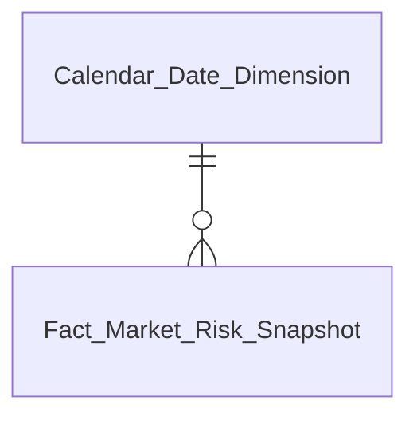
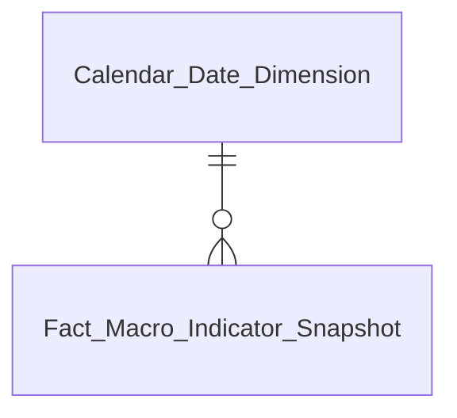
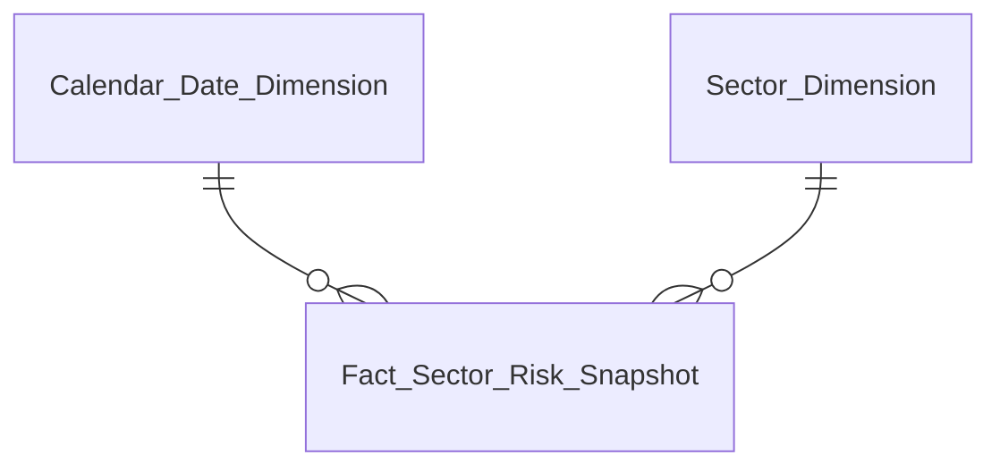
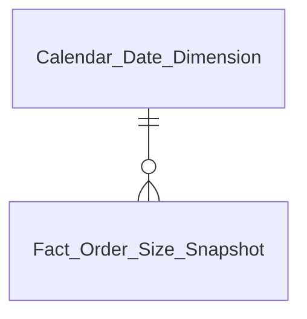
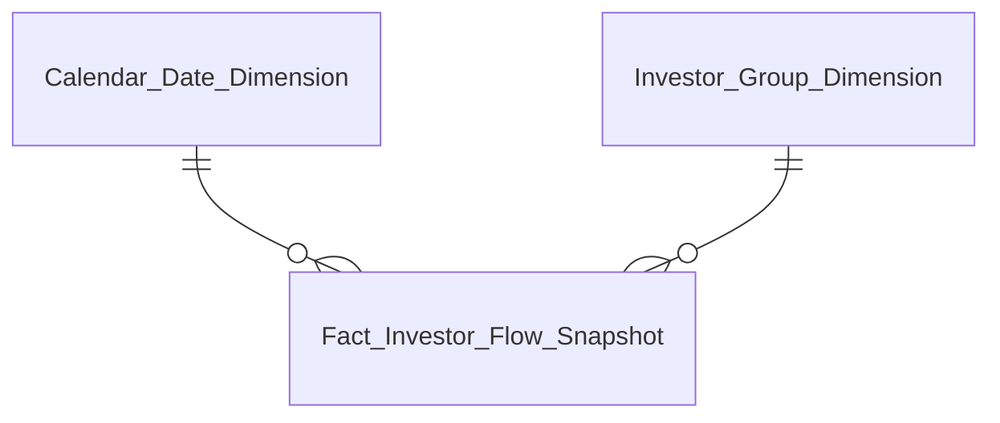
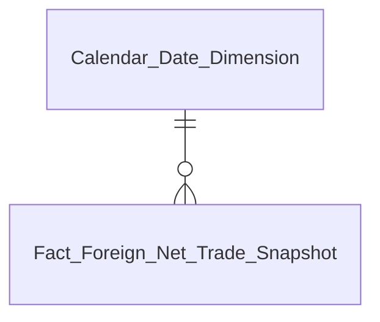
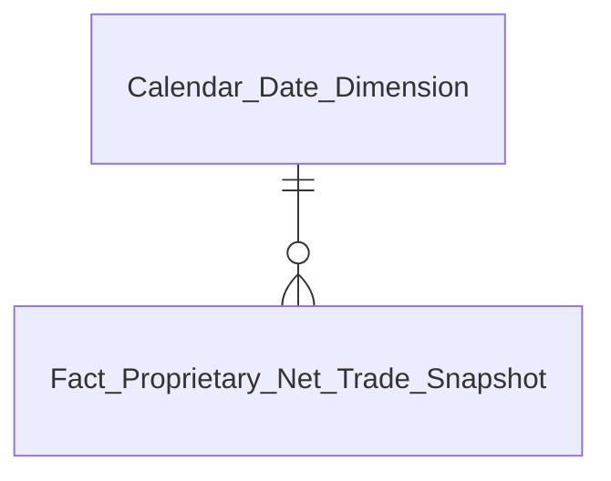
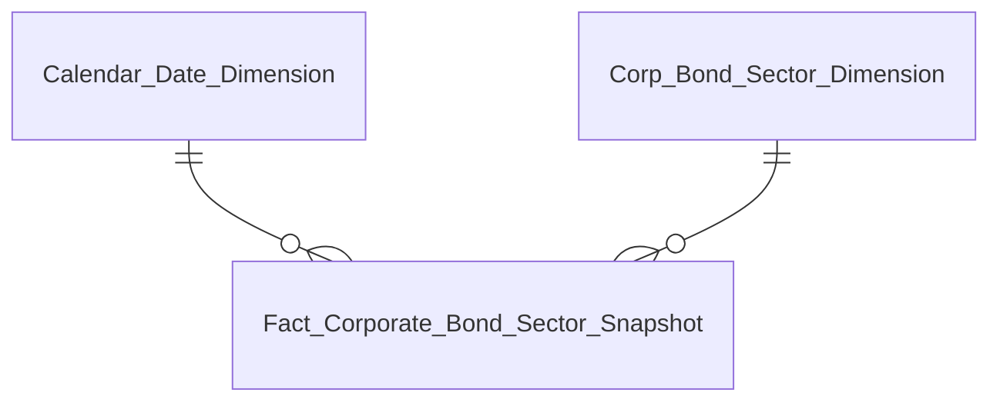
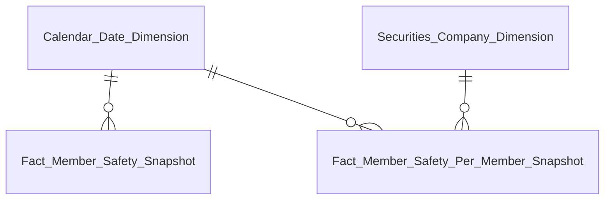

# DTM PTTT — Entities

Module: PTTT (Phân tích thị trường)
Trạng thái: draft — chờ reviewer duyệt từng bảng

---

## Tổng quan mô hình

```mermaid
erDiagram
    Calendar_Date_Dimension ||--o{ Fact_Market_Risk_Snapshot : " "
    Calendar_Date_Dimension ||--o{ Fact_Macro_Indicator_Snapshot : " "
    Calendar_Date_Dimension ||--o{ Fact_Sector_Risk_Snapshot : " "
    Sector_Dimension ||--o{ Fact_Sector_Risk_Snapshot : " "
    Calendar_Date_Dimension ||--o{ Fact_Order_Size_Snapshot : " "
    Calendar_Date_Dimension ||--o{ Fact_Investor_Flow_Snapshot : " "
    Investor_Group_Dimension ||--o{ Fact_Investor_Flow_Snapshot : " "
    Calendar_Date_Dimension ||--o{ Fact_Foreign_Net_Trade_Snapshot : " "
    Calendar_Date_Dimension ||--o{ Fact_Proprietary_Net_Trade_Snapshot : " "
    Calendar_Date_Dimension ||--o{ Fact_Corporate_Bond_Sector_Snapshot : " "
    Corp_Bond_Sector_Dimension ||--o{ Fact_Corporate_Bond_Sector_Snapshot : " "
    Calendar_Date_Dimension ||--o{ Fact_Member_Safety_Snapshot : " "
    Calendar_Date_Dimension ||--o{ Fact_Member_Safety_Per_Member_Snapshot : " "
    Securities_Company_Dimension ||--o{ Fact_Member_Safety_Per_Member_Snapshot : " "
```

---

## Tab Dashboard Giám sát rủi ro thị trường

### Nhóm 1–2: Chỉ số rủi ro hệ thống & Phân tích đóng góp rủi ro

| Datamart Entity | Loại | Mô tả | Grain | KPI |
|---|---|---|---|---|
| Fact Market Risk Snapshot | Fact Snapshot | Chỉ số rủi ro hệ thống VN-Index + Z-score + tâm lý + thanh khoản | 1 row / ngày | K_PTTT_1, K_PTTT_2, K_PTTT_3, K_PTTT_4, K_PTTT_5, K_PTTT_6, K_PTTT_7, K_PTTT_8, K_PTTT_9, K_PTTT_10, K_PTTT_11, K_PTTT_12, K_PTTT_13, K_PTTT_14, K_PTTT_15, K_PTTT_16, K_PTTT_17, K_PTTT_18, K_PTTT_19, K_PTTT_20, K_PTTT_21, K_PTTT_22, K_PTTT_23, K_PTTT_24, K_PTTT_25, K_PTTT_26, K_PTTT_27 |

### Nhóm 3–6: Chỉ số vĩ mô

| Datamart Entity | Loại | Mô tả | Grain | KPI |
|---|---|---|---|---|
| Fact Macro Indicator Snapshot | Fact Snapshot | Chỉ tiêu vĩ mô (lãi suất/CPI/GDP/tỷ giá) per kỳ báo cáo | 1 row / chỉ tiêu / kỳ | K_PTTT_28, K_PTTT_29, K_PTTT_30, K_PTTT_31, K_PTTT_32, K_PTTT_33, K_PTTT_34, K_PTTT_35, K_PTTT_36, K_PTTT_37, K_PTTT_38, K_PTTT_39, K_PTTT_40, K_PTTT_41, K_PTTT_59, K_PTTT_65, K_PTTT_66, K_PTTT_67, K_PTTT_68, K_PTTT_69, K_PTTT_70, K_PTTT_71, K_PTTT_72, K_PTTT_73, K_PTTT_74, K_PTTT_75, K_PTTT_76, K_PTTT_77, K_PTTT_78 |

### Nhóm 4: Biểu đồ sức khỏe hệ thống

| Datamart Entity | Loại | Mô tả | Grain | KPI |
|---|---|---|---|---|
| Fact Market Risk Snapshot | Fact Snapshot | Reuse — chỉ số sức khỏe hệ thống tổng hợp | 1 row / ngày | K_PTTT_41, K_PTTT_42, K_PTTT_43, K_PTTT_44, K_PTTT_45, K_PTTT_46, K_PTTT_47, K_PTTT_48, K_PTTT_49, K_PTTT_50, K_PTTT_51, K_PTTT_52, K_PTTT_53, K_PTTT_54, K_PTTT_55, K_PTTT_56, K_PTTT_57, K_PTTT_58, K_PTTT_59, K_PTTT_60, K_PTTT_61, K_PTTT_62, K_PTTT_63, K_PTTT_64 |

---

## Tab Dashboard Giám sát rủi ro ngành

### Nhóm 7: Biểu đồ áp lực ngành

| Datamart Entity | Loại | Mô tả | Grain | KPI |
|---|---|---|---|---|
| Sector Dimension | Dimension | Chiều ngành nghề chứng khoán (SCD4A) | 1 row / ngành | — |
| Fact Sector Risk Snapshot | Fact Snapshot | Chỉ số áp lực rủi ro per ngành CK | 1 row / ngành / ngày | K_PTTT_41, K_PTTT_79, K_PTTT_80, K_PTTT_81, K_PTTT_82, K_PTTT_83, K_PTTT_84, K_PTTT_85, K_PTTT_86, K_PTTT_87, K_PTTT_88, K_PTTT_89, K_PTTT_90, K_PTTT_91, K_PTTT_92, K_PTTT_93, K_PTTT_94, K_PTTT_95, K_PTTT_96, K_PTTT_97, K_PTTT_98, K_PTTT_99, K_PTTT_100, K_PTTT_101, K_PTTT_102, K_PTTT_103, K_PTTT_111, K_PTTT_117, K_PTTT_126, K_PTTT_127, K_PTTT_128, K_PTTT_129, K_PTTT_160, K_PTTT_161, K_PTTT_174, K_PTTT_175, K_PTTT_176, K_PTTT_177 |

---

## Tab Dashboard Giám sát thanh khoản thị trường

### Nhóm 8–10: Chỉ số thanh khoản & Margin Stress

| Datamart Entity | Loại | Mô tả | Grain | KPI |
|---|---|---|---|---|
| Fact Market Risk Snapshot | Fact Snapshot | Reuse — thanh khoản thị trường + áp lực đòn bẩy | 1 row / ngày | K_PTTT_41, K_PTTT_55, K_PTTT_96, K_PTTT_97, K_PTTT_104, K_PTTT_105, K_PTTT_106, K_PTTT_107, K_PTTT_108, K_PTTT_109, K_PTTT_110, K_PTTT_111, K_PTTT_112, K_PTTT_113, K_PTTT_114, K_PTTT_115, K_PTTT_116, K_PTTT_117, K_PTTT_118, K_PTTT_119, K_PTTT_120, K_PTTT_121, K_PTTT_122, K_PTTT_123 |

### Nhóm 11: Cấu trúc quy mô lệnh

| Datamart Entity | Loại | Mô tả | Grain | KPI |
|---|---|---|---|---|
| Fact Order Size Snapshot | Fact Snapshot | GTGD và KL per mã CK theo band quy mô lệnh | 1 row / mã CK / band / ngày | K_PTTT_41, K_PTTT_111, K_PTTT_117, K_PTTT_124, K_PTTT_125 |

---

## Tab Dashboard Giám sát dòng tiền

### Nhóm 13–15: Dòng tiền nhóm NĐT

| Datamart Entity | Loại | Mô tả | Grain | KPI |
|---|---|---|---|---|
| Investor Group Dimension | Dimension | Chiều nhóm NĐT — 4 loại (SCD4A) | 1 row / nhóm | — |
| Fact Investor Flow Snapshot | Fact Snapshot | Dòng tiền mua/bán/ròng theo nhóm NĐT | 1 row / nhóm NĐT / ngày | K_PTTT_41, K_PTTT_104, K_PTTT_111, K_PTTT_117, K_PTTT_130, K_PTTT_131, K_PTTT_132, K_PTTT_133, K_PTTT_134, K_PTTT_135, K_PTTT_136, K_PTTT_137, K_PTTT_138, K_PTTT_139, K_PTTT_140, K_PTTT_141, K_PTTT_142, K_PTTT_143, K_PTTT_144, K_PTTT_145, K_PTTT_146, K_PTTT_147, K_PTTT_148, K_PTTT_149, K_PTTT_150, K_PTTT_151, K_PTTT_152 |

### Nhóm 16: Top mua bán ròng NĐTNN

| Datamart Entity | Loại | Mô tả | Grain | KPI |
|---|---|---|---|---|
| Fact Foreign Net Trade Snapshot | Fact Snapshot | Giao dịch ròng NĐTNN per mã CK | 1 row / mã CK / ngày | K_PTTT_41, K_PTTT_153, K_PTTT_154, K_PTTT_155, K_PTTT_156 |

### Nhóm 17: Top mua bán ròng tự doanh

| Datamart Entity | Loại | Mô tả | Grain | KPI |
|---|---|---|---|---|
| Fact Proprietary Net Trade Snapshot | Fact Snapshot | Giao dịch ròng tự doanh per mã CK | 1 row / mã CK / ngày | K_PTTT_41, K_PTTT_153, K_PTTT_157, K_PTTT_158, K_PTTT_159 |

---

## Tab Dashboard Giám sát trái phiếu doanh nghiệp

### Nhóm 18–20: Thống kê TPDN theo ngành

| Datamart Entity | Loại | Mô tả | Grain | KPI |
|---|---|---|---|---|
| Corp Bond Sector Dimension | Dimension | Chiều ngành TCPH trái phiếu DN (SCD4A) | 1 row / ngành TCPH | — |
| Fact Corporate Bond Sector Snapshot | Fact Snapshot | GTGD và tỷ trọng TPDN theo ngành TCPH | 1 row / ngành / ngày | K_PTTT_41, K_PTTT_160, K_PTTT_161, K_PTTT_162, K_PTTT_163, K_PTTT_164, K_PTTT_165, K_PTTT_166, K_PTTT_167, K_PTTT_168, K_PTTT_169, K_PTTT_170, K_PTTT_171, K_PTTT_172, K_PTTT_173, K_PTTT_174, K_PTTT_175, K_PTTT_176, K_PTTT_177 |

### Nhóm 21: Danh mục giám sát tín dụng TCPH

| Datamart Entity | Loại | Mô tả | Grain | KPI |
|---|---|---|---|---|
| Operational Corporate Bond Issuer Credit Monitor | Operational | Theo dõi tín dụng TCPH: D/E, ROE, xếp hạng (partial pending) | 1 row / mã TP / kỳ | K_PTTT_41, K_PTTT_160, K_PTTT_161, K_PTTT_173, K_PTTT_178, K_PTTT_179, K_PTTT_180, K_PTTT_181, K_PTTT_182, K_PTTT_183, K_PTTT_184, K_PTTT_185, K_PTTT_186, K_PTTT_187, K_PTTT_188 |

---

## Tab Dashboard An toàn tài chính CTCK

### Nhóm 22–25: Chỉ số ATTC hệ thống & per CTCK

| Datamart Entity | Loại | Mô tả | Grain | KPI |
|---|---|---|---|---|
| Securities Company Dimension | Dimension | Chiều công ty chứng khoán thành viên (SCD4A) | 1 row / CTCK | — |
| Fact Member Safety Snapshot | Fact Snapshot | Tổng hợp ATTC toàn hệ thống CTCK | 1 row / ngày | K_PTTT_41, K_PTTT_55, K_PTTT_189, K_PTTT_190, K_PTTT_191, K_PTTT_192, K_PTTT_193, K_PTTT_194, K_PTTT_195, K_PTTT_196, K_PTTT_197, K_PTTT_198, K_PTTT_199, K_PTTT_200 |
| Fact Member Safety Per Member Snapshot | Fact Snapshot | Chỉ số ATTC per CTCK | 1 row / CTCK / ngày | K_PTTT_41, K_PTTT_55, K_PTTT_189, K_PTTT_190, K_PTTT_191, K_PTTT_192, K_PTTT_193, K_PTTT_194, K_PTTT_195, K_PTTT_196, K_PTTT_197, K_PTTT_198, K_PTTT_199, K_PTTT_200 |
| Operational Member Safety Monitor | Operational | Danh sách giám sát rủi ro dư nợ margin per CTCK | 1 row / CTCK / ngày | K_PTTT_41, K_PTTT_55, K_PTTT_189, K_PTTT_191, K_PTTT_195, K_PTTT_200 |

---

## Danh sách toàn bộ entity

| Datamart Entity | Loại | Mô tả | Grain | KPI |
|---|---|---|---|---|
| Sector Dimension | Dimension | Chiều ngành CK (SCD4A) | 1 row / ngành | — |
| Corp Bond Sector Dimension | Dimension | Chiều ngành TCPH TPDN (SCD4A) | 1 row / ngành TCPH | — |
| Investor Group Dimension | Dimension | Chiều nhóm NĐT 4 loại (SCD4A) | 1 row / nhóm | — |
| Securities Company Dimension | Dimension | Chiều CTCK thành viên (SCD4A) | 1 row / CTCK | — |
| Fact Market Risk Snapshot | Fact Snapshot | Chỉ số rủi ro hệ thống + tâm lý + thanh khoản VN-Index | 1 row / ngày | K_PTTT_1, K_PTTT_2, K_PTTT_3, K_PTTT_4, K_PTTT_5, K_PTTT_6, K_PTTT_7, K_PTTT_8, K_PTTT_9, K_PTTT_10, K_PTTT_11, K_PTTT_12, K_PTTT_13, K_PTTT_14, K_PTTT_15, K_PTTT_16, K_PTTT_17, K_PTTT_18, K_PTTT_19, K_PTTT_20, K_PTTT_21, K_PTTT_22, K_PTTT_23, K_PTTT_24, K_PTTT_25, K_PTTT_26, K_PTTT_27, K_PTTT_28, K_PTTT_29, K_PTTT_41, K_PTTT_42, K_PTTT_43, K_PTTT_44, K_PTTT_45, K_PTTT_46, K_PTTT_47, K_PTTT_48, K_PTTT_49, K_PTTT_50, K_PTTT_51, K_PTTT_52, K_PTTT_53, K_PTTT_54, K_PTTT_55, K_PTTT_56, K_PTTT_57, K_PTTT_58, K_PTTT_59, K_PTTT_60, K_PTTT_61, K_PTTT_62, K_PTTT_63, K_PTTT_64, K_PTTT_65, K_PTTT_66, K_PTTT_67, K_PTTT_68, K_PTTT_69, K_PTTT_70, K_PTTT_71, K_PTTT_72, K_PTTT_73, K_PTTT_74, K_PTTT_75, K_PTTT_76, K_PTTT_77, K_PTTT_78, K_PTTT_96, K_PTTT_97, K_PTTT_104, K_PTTT_105, K_PTTT_106, K_PTTT_107, K_PTTT_108, K_PTTT_109, K_PTTT_110, K_PTTT_111, K_PTTT_112, K_PTTT_113, K_PTTT_114, K_PTTT_115, K_PTTT_116, K_PTTT_117, K_PTTT_118, K_PTTT_119, K_PTTT_120, K_PTTT_121, K_PTTT_122, K_PTTT_123 |
| Fact Macro Indicator Snapshot | Fact Snapshot | Chỉ tiêu vĩ mô per chỉ tiêu / kỳ báo cáo | 1 row / chỉ tiêu / kỳ | K_PTTT_28, K_PTTT_29, K_PTTT_30, K_PTTT_31, K_PTTT_32, K_PTTT_33, K_PTTT_34, K_PTTT_35, K_PTTT_36, K_PTTT_37, K_PTTT_38, K_PTTT_39, K_PTTT_40, K_PTTT_41, K_PTTT_59, K_PTTT_65, K_PTTT_66, K_PTTT_67, K_PTTT_68, K_PTTT_69, K_PTTT_70, K_PTTT_71, K_PTTT_72, K_PTTT_73, K_PTTT_74, K_PTTT_75, K_PTTT_76, K_PTTT_77, K_PTTT_78 |
| Fact Sector Risk Snapshot | Fact Snapshot | Áp lực rủi ro per ngành CK | 1 row / ngành / ngày | K_PTTT_41, K_PTTT_79, K_PTTT_80, K_PTTT_81, K_PTTT_82, K_PTTT_83, K_PTTT_84, K_PTTT_85, K_PTTT_86, K_PTTT_87, K_PTTT_88, K_PTTT_89, K_PTTT_90, K_PTTT_91, K_PTTT_92, K_PTTT_93, K_PTTT_94, K_PTTT_95, K_PTTT_96, K_PTTT_97, K_PTTT_98, K_PTTT_99, K_PTTT_100, K_PTTT_101, K_PTTT_102, K_PTTT_103, K_PTTT_111, K_PTTT_117, K_PTTT_126, K_PTTT_127, K_PTTT_128, K_PTTT_129, K_PTTT_160, K_PTTT_161, K_PTTT_174, K_PTTT_175, K_PTTT_176, K_PTTT_177 |
| Fact Order Size Snapshot | Fact Snapshot | Quy mô lệnh per mã CK / band | 1 row / mã CK / band / ngày | K_PTTT_41, K_PTTT_111, K_PTTT_117, K_PTTT_124, K_PTTT_125 |
| Fact Investor Flow Snapshot | Fact Snapshot | Dòng tiền theo nhóm NĐT | 1 row / nhóm NĐT / ngày | K_PTTT_41, K_PTTT_104, K_PTTT_111, K_PTTT_117, K_PTTT_130, K_PTTT_131, K_PTTT_132, K_PTTT_133, K_PTTT_134, K_PTTT_135, K_PTTT_136, K_PTTT_137, K_PTTT_138, K_PTTT_139, K_PTTT_140, K_PTTT_141, K_PTTT_142, K_PTTT_143, K_PTTT_144, K_PTTT_145, K_PTTT_146, K_PTTT_147, K_PTTT_148, K_PTTT_149, K_PTTT_150, K_PTTT_151, K_PTTT_152 |
| Fact Foreign Net Trade Snapshot | Fact Snapshot | Giao dịch ròng NĐTNN per mã CK | 1 row / mã CK / ngày | K_PTTT_41, K_PTTT_153, K_PTTT_154, K_PTTT_155, K_PTTT_156 |
| Fact Proprietary Net Trade Snapshot | Fact Snapshot | Giao dịch ròng tự doanh per mã CK | 1 row / mã CK / ngày | K_PTTT_41, K_PTTT_153, K_PTTT_157, K_PTTT_158, K_PTTT_159 |
| Fact Corporate Bond Sector Snapshot | Fact Snapshot | GTGD TPDN per ngành TCPH | 1 row / ngành / ngày | K_PTTT_41, K_PTTT_160, K_PTTT_161, K_PTTT_162, K_PTTT_163, K_PTTT_164, K_PTTT_165, K_PTTT_166, K_PTTT_167, K_PTTT_168, K_PTTT_169, K_PTTT_170, K_PTTT_171, K_PTTT_172, K_PTTT_173, K_PTTT_174, K_PTTT_175, K_PTTT_176, K_PTTT_177 |
| Fact Member Safety Snapshot | Fact Snapshot | ATTC tổng hợp toàn hệ thống CTCK | 1 row / ngày | K_PTTT_41, K_PTTT_55, K_PTTT_189, K_PTTT_190, K_PTTT_191, K_PTTT_192, K_PTTT_193, K_PTTT_194, K_PTTT_195, K_PTTT_196, K_PTTT_197, K_PTTT_198, K_PTTT_199, K_PTTT_200 |
| Fact Member Safety Per Member Snapshot | Fact Snapshot | ATTC per CTCK | 1 row / CTCK / ngày | K_PTTT_41, K_PTTT_55, K_PTTT_189, K_PTTT_190, K_PTTT_191, K_PTTT_192, K_PTTT_193, K_PTTT_194, K_PTTT_195, K_PTTT_196, K_PTTT_197, K_PTTT_198, K_PTTT_199, K_PTTT_200 |
| Operational Corporate Bond Issuer Credit Monitor | Operational | Giám sát tín dụng TCPH TPDN (partial pending) | 1 row / mã TP / kỳ | K_PTTT_41, K_PTTT_160, K_PTTT_161, K_PTTT_173, K_PTTT_178, K_PTTT_179, K_PTTT_180, K_PTTT_181, K_PTTT_182, K_PTTT_183, K_PTTT_184, K_PTTT_185, K_PTTT_186, K_PTTT_187, K_PTTT_188 |
| Operational Member Safety Monitor | Operational | Danh sách giám sát dư nợ margin per CTCK | 1 row / CTCK / ngày | K_PTTT_41, K_PTTT_55, K_PTTT_189, K_PTTT_191, K_PTTT_195, K_PTTT_200 |

> **Ghi chú:** Calendar Date Dimension tái sử dụng từ module khác — không thiết kế mới cho PTTT.
> Tất cả Dimension áp dụng SCD Type 4A.
