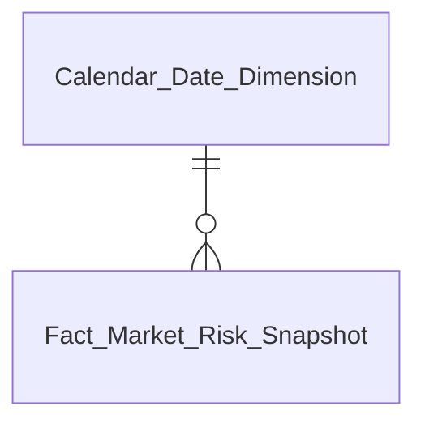
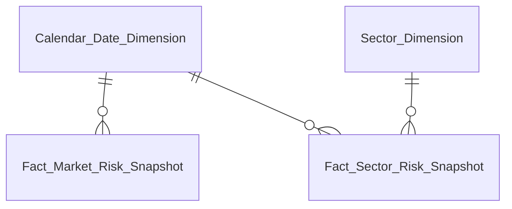
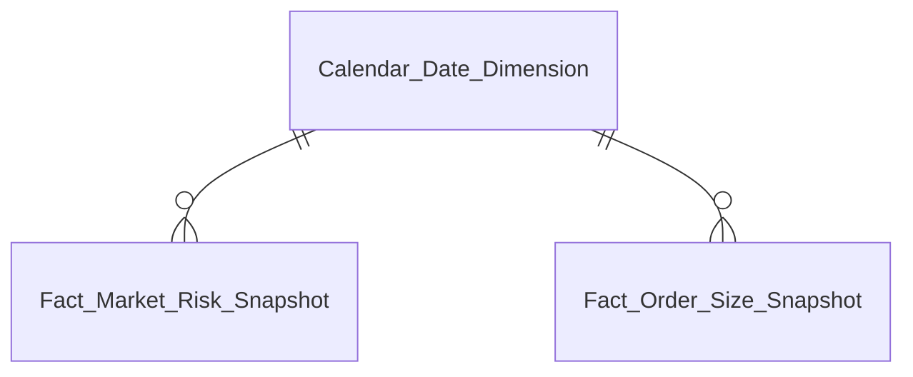
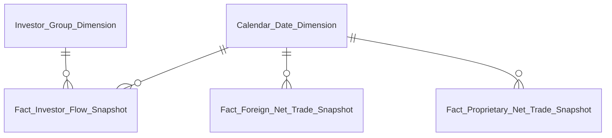
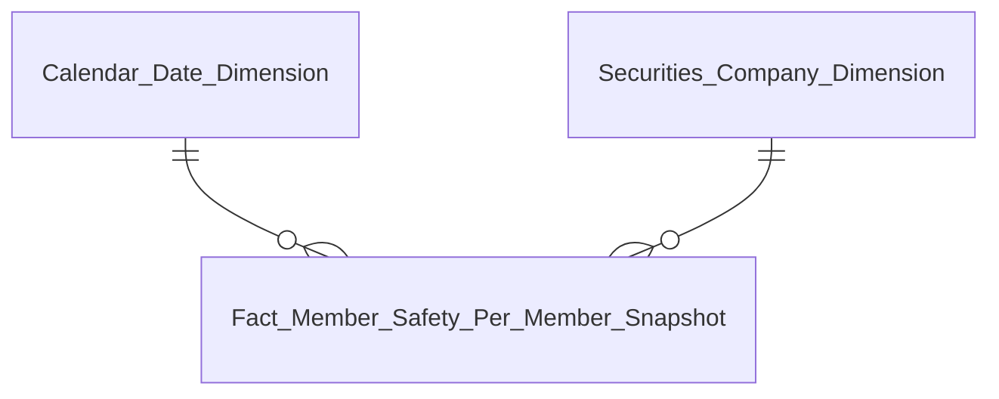
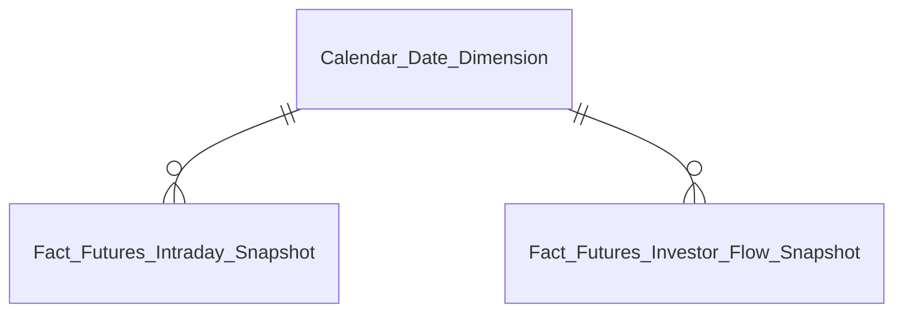
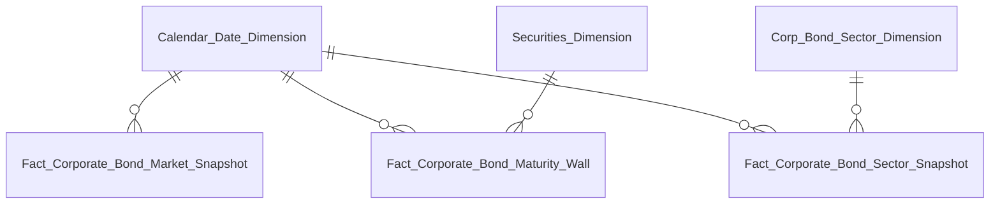
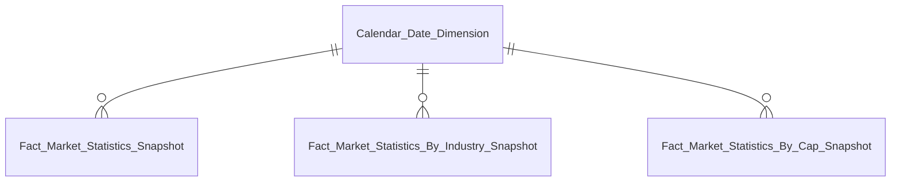

# DTM PTTT — Entities

Module: PTTT (Phân tích thị trường)
Trạng thái: draft — chờ reviewer duyệt từng bảng

---

## Tổng quan mô hình

```mermaid
erDiagram
    Calendar_Date_Dimension ||--o{ Fact_Market_Risk_Snapshot : " "
    Calendar_Date_Dimension ||--o{ Fact_Sector_Risk_Snapshot : " "
    Sector_Dimension ||--o{ Fact_Sector_Risk_Snapshot : " "
    Calendar_Date_Dimension ||--o{ Fact_Order_Size_Snapshot : " "
    Calendar_Date_Dimension ||--o{ Fact_Investor_Flow_Snapshot : " "
    Investor_Group_Dimension ||--o{ Fact_Investor_Flow_Snapshot : " "
    Calendar_Date_Dimension ||--o{ Fact_Foreign_Net_Trade_Snapshot : " "
    Calendar_Date_Dimension ||--o{ Fact_Proprietary_Net_Trade_Snapshot : " "
    Calendar_Date_Dimension ||--o{ Fact_Corporate_Bond_Sector_Snapshot : " "
    Corp_Bond_Sector_Dimension ||--o{ Fact_Corporate_Bond_Sector_Snapshot : " "
    Calendar_Date_Dimension ||--o{ Fact_Member_Safety_Snapshot : " "
    Calendar_Date_Dimension ||--o{ Fact_Member_Safety_Per_Member_Snapshot : " "
    Securities_Company_Dimension ||--o{ Fact_Member_Safety_Per_Member_Snapshot : " "
    Calendar_Date_Dimension ||--o{ Fact_Corporate_Bond_Market_Snapshot : " "
    Calendar_Date_Dimension ||--o{ Fact_Corporate_Bond_Maturity_Wall : " "
    Securities_Dimension ||--o{ Fact_Corporate_Bond_Maturity_Wall : " "
    Calendar_Date_Dimension ||--o{ Fact_Futures_Intraday_Snapshot : " "
    Calendar_Date_Dimension ||--o{ Fact_Futures_Investor_Flow_Snapshot : " "
    Calendar_Date_Dimension ||--o{ Fact_Market_Statistics_Snapshot : " "
    Calendar_Date_Dimension ||--o{ Fact_Market_Statistics_By_Industry_Snapshot : " "
    Calendar_Date_Dimension ||--o{ Fact_Market_Statistics_By_Cap_Snapshot : " "
```

> **Ghi chú:** `Fact Macro Indicator Snapshot` (Nhóm 3) và `Fact Cap Group Snapshot` (Nhóm 12) 100% PENDING toàn bộ KPI — không đưa vào mô hình/Entities.csv, xem mục "Bảng PENDING" cuối file.

---

## Tab Dashboard Giám sát rủi ro (Nhóm 1-2)

| Datamart Entity | Loại | Reuse | Mô tả | Grain | KPI |
|---|---|---|---|---|---|
| Calendar Date Dimension | Dimension | reuse | Chiều thời gian | 1 row / ngày | — |
| Fact Market Risk Snapshot | Fact Snapshot | new | Risk Index, Volatility, 6 Z-score, 6 Mức độ tác động, 6 Tỷ trọng | 1 row / ngày | K_PTTT_1~24, K_PTTT_25~29 |

---

## Tab Dashboard Sức khỏe thị trường và vĩ mô (Nhóm 3-7)

| Datamart Entity | Loại | Reuse | Mô tả | Grain | KPI |
|---|---|---|---|---|---|
| Calendar Date Dimension | Dimension | reuse | Chiều thời gian | 1 row / ngày | — |
| Sector Dimension | Dimension | new | Chiều ngành nghề kinh doanh mã CK | 1 row / ngành | — |
| Fact Market Risk Snapshot | Fact Snapshot | new | Điểm chứng khoán, Sentiment, Margin Tension, Systemic Vol (reuse từ Nhóm 1, dùng thêm cho Nhóm 4-6) | 1 row / ngày | K_PTTT_30~42 (PENDING, Nhóm 3), K_PTTT_43~80 |
| Fact Sector Risk Snapshot | Fact Snapshot | new | StressScore, D/E, GTGD theo ngành | 1 row / ngành / ngày | K_PTTT_43,62,81~106 |

> Nhóm 3 (Chỉ tiêu vĩ mô) 100% PENDING — gap Atomic `Risk Indicator`/`Risk Indicator Value` (O_PTTT_11), tạm gán `Fact Market Risk Snapshot` làm Mart dự kiến, chưa có measure thật nào populate.

---

## Tab Dashboard Thanh khoản và đòn bẩy (Nhóm 8-12)

| Datamart Entity | Loại | Reuse | Mô tả | Grain | KPI |
|---|---|---|---|---|---|
| Calendar Date Dimension | Dimension | reuse | Chiều thời gian | 1 row / ngày | — |
| Fact Market Risk Snapshot | Fact Snapshot | new | GTGD phiên, Dư nợ margin, Margin Stress, TVI (reuse từ Nhóm 1/4) | 1 row / ngày | K_PTTT_43,58,60,107~126 |
| Fact Order Size Snapshot | Fact Snapshot | new | GTGD và phân loại quy mô lệnh per mã CK | 1 row / mã CK / order_size_band / ngày | K_PTTT_43,114,120,127,128 |

> Nhóm 12 (Phân bổ thanh khoản theo nhóm vốn hóa) 100% PENDING — gap KL CP lưu hành VSDC BM1 (O_PTTT_3/O_PTTT_6), Mart dự kiến `Fact Cap Group Snapshot` — không đưa vào Entities.csv, xem mục "Bảng PENDING".

---

## Tab Dashboard Dòng tiền và cơ cấu nhà đầu tư (Nhóm 13-17)

| Datamart Entity | Loại | Reuse | Mô tả | Grain | KPI |
|---|---|---|---|---|---|
| Calendar Date Dimension | Dimension | reuse | Chiều thời gian | 1 row / ngày | — |
| Investor Group Dimension | Dimension | new | Chiều nhóm nhà đầu tư (NĐTNN/Tự doanh/Tổ chức/Cá nhân) | 1 row / nhóm NĐT | — |
| Fact Investor Flow Snapshot | Fact Snapshot | new | GTGD mua/bán/dòng tiền ròng theo nhóm NĐT | 1 row / nhóm NĐT / ngày | K_PTTT_43,114,120,133~155 |
| Fact Foreign Net Trade Snapshot | Fact Snapshot | new | GTGD mua/bán/dòng tiền ròng NĐTNN per mã CK | 1 row / mã CK / ngày | K_PTTT_43,133,134,156~159 |
| Fact Proprietary Net Trade Snapshot | Fact Snapshot | new | GTGD mua/bán/dòng tiền ròng tự doanh per mã CK | 1 row / mã CK / ngày | K_PTTT_43,136,137,156,160~162 |

---

## Tab Dashboard An toàn CTCK (Nhóm 22-25)

| Datamart Entity | Loại | Reuse | Mô tả | Grain | KPI |
|---|---|---|---|---|---|
| Calendar Date Dimension | Dimension | reuse | Chiều thời gian | 1 row / ngày | — |
| Securities Company Dimension | Dimension | new | Chiều công ty chứng khoán | 1 row / CTCK | — |
| Fact Member Safety Per Member Snapshot | Fact Snapshot | new | VCSH, dư nợ margin, xếp hạng ATTC per CTCK — chỉ Chiều Mã CTCK (K_PTTT_208) READY, còn lại PENDING (O_PTTT_13) | 1 row / CTCK / ngày | K_PTTT_43,58,197,199,202,203,204~208 |
| Operational Member Safety Monitor | Operational | new | Danh sách CTCK giám sát rủi ro dư nợ margin — PENDING (cùng gap O_PTTT_13) | 1 row / CTCK / ngày | — |

> Toàn bộ measure chính (Dư nợ margin, VCSH, D/E) của Tab này còn PENDING — chỉ Chiều Mã CTCK (dùng `securities_company` READY) đã READY. Xem O_PTTT_13. `Fact Member Safety Snapshot` (Nhóm 22/23, grain toàn hệ thống) 100% PENDING — loại khỏi Entities.csv, xem mục "Bảng PENDING" cuối file.

---

## Tab Dashboard Phái sinh (Nhóm 26-31)

| Datamart Entity | Loại | Reuse | Mô tả | Grain | KPI |
|---|---|---|---|---|---|
| Calendar Date Dimension | Dimension | reuse | Chiều thời gian | 1 row / ngày | — |
| Fact Futures Intraday Snapshot | Fact Snapshot | new | Biến động giá/KLGD trong phiên của HĐTL chỉ số (VN30/VN100) — dùng chung entity equity | 1 row / mã HĐTL / mốc thời gian | K_PTTT_43,209~220 |
| Fact Futures Investor Flow Snapshot | Fact Snapshot | new | GTGD mua/bán/dòng tiền ròng NĐTNN + Tự doanh trên HĐTL chỉ số | 1 row / nhóm NĐT / mã HĐTL / ngày | K_PTTT_43,221~226 |

> Nhóm 29/30/31 (VN100) 100% reuse ID từ Nhóm 26/27/28 (VN30) — cùng Fact, chỉ khác điều kiện lọc `underlying_symbol`. Chỉ `Vị thế mở (OI)` (K_PTTT_214) còn PENDING — nguồn VSDC BM2 chưa có CSDL (O_PTTT_10).

---

## Tab Dashboard Trái phiếu doanh nghiệp (Nhóm 18-21)

| Datamart Entity | Loại | Reuse | Mô tả | Grain | KPI |
|---|---|---|---|---|---|
| Calendar Date Dimension | Dimension | reuse | Chiều thời gian | 1 row / ngày | — |
| Securities Dimension | Dimension | reuse | Chiều mã CK/mã TP (reuse module NDTNN) | 1 row / mã CK | — |
| Corp Bond Sector Dimension | Dimension | new | Chiều ngành nghề TCPH | 1 row / ngành | — |
| Fact Corporate Bond Market Snapshot | Fact Snapshot | new | Quy mô thị trường TPDN tổng hợp — mệnh giá, dư nợ, áp lực đáo hạn, GTGD, YTM | 1 row / ngày | K_PTTT_46,163~173 |
| Fact Corporate Bond Maturity Wall | Fact Snapshot | new | Lịch biểu đáo hạn per mã TP — 2 luồng (niêm yết READY / riêng lẻ VSDC BM29 PENDING) | 1 row / mã TP / kỳ (quý) | K_PTTT_46,163~166,174~178,238 |
| Fact Corporate Bond Sector Snapshot | Fact Snapshot | new | GTGD và tỷ trọng dư nợ theo ngành TCPH | 1 row / ngành TCPH / ngày | K_PTTT_43,81,164,165,166,179~182 |
| Operational Corporate Bond Issuer Credit Monitor | Operational | new | Danh sách TCPH kèm D/E, ROE, xếp hạng tín nhiệm để giám sát rủi ro | 1 row / TCPH / kỳ báo cáo | K_PTTT_43,177,178,183~196 |

> Nhánh riêng lẻ (không niêm yết, nguồn VSDC.BM29) của `Fact Corporate Bond Maturity Wall` còn PENDING — O_PTTT_7. Nhánh niêm yết đã READY.

---

## Tab Data Explorer (Nhóm 32-34)

| Datamart Entity | Loại | Reuse | Mô tả | Grain | KPI |
|---|---|---|---|---|---|
| Calendar Date Dimension | Dimension | reuse | Chiều thời gian | 1 row / ngày | — |
| Fact Market Statistics Snapshot | Fact Snapshot | new | KLGD, giá, P/E, EPS, LNST, số CP lưu hành, GTGD, Margin per chỉ số | 1 row / chỉ số / ngày | K_PTTT_227~240 |
| Fact Market Statistics By Industry Snapshot | Fact Snapshot | new | GTGD, dòng tiền NĐTNN/Tự doanh, P/E, LNST theo ngành | 1 row / ngành / ngày | K_PTTT_230,234,236,237,241~244 |
| Fact Market Statistics By Cap Snapshot | Fact Snapshot | new | Chiều Sàn/Ngành, GTGD, GTGD/GDP theo nhóm vốn hóa | 1 row / (ngành × nhóm vốn hóa) / ngày | K_PTTT_30,228,229,237,241,245~250 |

> Chiều "Chỉ số" (`market_code`) và "Ngành nghề kinh tế" (`IDS.CATEGORIES`) hiện dùng trực tiếp text trên Fact, chưa tách Dimension riêng — chưa có Atomic entity/Classification Value chuẩn hóa (O_PTTT_14). EPS/LNST/Số CP lưu hành/Margin/GDP đều PENDING (O_PTTT_11/O_PTTT_13, VSDC BM1).

---

## Bảng PENDING (không thiết kế trong Phase 2)

| Datamart Entity | Lý do PENDING | Issue |
|---|---|---|
| Fact Macro Indicator Snapshot | 100% KPI (13/13, Nhóm 3) PENDING — gap Atomic `Risk Indicator`/`Risk Indicator Value`, chưa có entity nào tồn tại trên Atomic repo | O_PTTT_11 |
| Fact Cap Group Snapshot | 100% KPI (10/10, Nhóm 12) PENDING — gap KL CP lưu hành từ VSDC BM1, cần Atomic entity `Security Listing Volume` | O_PTTT_3, O_PTTT_6 |
| Fact Member Safety Snapshot | 100% KPI (9/9 Nhóm 22 + 9/9 Nhóm 23) PENDING — gap EAV báo cáo định kỳ CTCK, entity `mbr_rpt_ind_val` không tồn tại trên Atomic repo | O_PTTT_13 |
