# DTM_PTTT_Entities — Danh mục Entity Datamart

**Module:** PTTT — Phân tích thị trường  
**Cập nhật:** 2026-09-18 (Phase 2 — đồng bộ theo Section 3 + Section 4 của `DTM_PTTT_HLD.md`)

---

## 1. Sơ đồ quan hệ Fact ↔ Dimension

```mermaid
erDiagram
    Calendar_Date_Dimension ||--o{ Fact_Market_Risk_Snapshot : " "
    Calendar_Date_Dimension ||--o{ Fact_Macro_Indicator_Snapshot : " "
    Calendar_Date_Dimension ||--o{ Fact_Sector_Risk_Snapshot : " "
    Industry_Dimension ||--o{ Fact_Sector_Risk_Snapshot : " "
    Calendar_Date_Dimension ||--o{ Fact_Order_Size_Snapshot : " "
    Calendar_Date_Dimension ||--o{ Fact_Investor_Flow_Snapshot : " "
    Investor_Group_Dimension ||--o{ Fact_Investor_Flow_Snapshot : " "
    Calendar_Date_Dimension ||--o{ Fact_Foreign_Net_Trade_Snapshot : " "
    Calendar_Date_Dimension ||--o{ Fact_Proprietary_Net_Trade_Snapshot : " "
    Calendar_Date_Dimension ||--o{ Fact_Corporate_Bond_Sector_Snapshot : " "
    Corp_Bond_Industry_Dimension ||--o{ Fact_Corporate_Bond_Sector_Snapshot : " "
    Calendar_Date_Dimension ||--o{ Fact_Securities_Company_Financial_Structure_Snapshot : " "
    Securities_Company_Dimension ||--o{ Fact_Securities_Company_Financial_Structure_Snapshot : " "
    Report_Indicator_Dimension ||--o{ Fact_Securities_Company_Financial_Structure_Snapshot : " "
    Calendar_Date_Dimension ||--o{ Fact_Corporate_Bond_Market_Snapshot : " "
    Calendar_Date_Dimension ||--o{ Fact_Corporate_Bond_Maturity_Wall : " "
    Securities_Dimension ||--o{ Fact_Corporate_Bond_Maturity_Wall : " "
    Calendar_Date_Dimension ||--o{ Fact_Futures_Intraday_Snapshot : " "
    Calendar_Date_Dimension ||--o{ Fact_Futures_Investor_Flow_Snapshot : " "
    Calendar_Date_Dimension ||--o{ Fact_Market_Statistics_Snapshot : " "
    Calendar_Date_Dimension ||--o{ Fact_Cap_Group_Snapshot : " "
```

---

## 2. Bảng entity

| Datamart Entity | Loại | Reuse | Mô tả & Grain | Nguồn Atomic |
|---|---|---|---|---|
| Calendar Date Dimension | dim | reuse | Chiều thời gian dùng chung toàn hệ thống — SCD4A — grain 1 row/ngày | `cdr_dt` |
| Industry Dimension | dim | reuse | Chiều ngành nghề kinh doanh mã CK — SCD4A — reuse từ GSDC (2026-08-17) — grain 1 row/ngành | `public_company` |
| Investor Group Dimension | dim | new | Chiều nhóm nhà đầu tư (NĐTNN/Tự doanh/Tổ chức trong nước/Cá nhân trong nước) — SCD4A — grain 1 row/nhóm NĐT | `securities_trade` |
| Corp Bond Industry Dimension | dim | new | Chiều ngành nghề tổ chức phát hành trái phiếu doanh nghiệp — SCD4A — grain 1 row/ngành TCPH | `public_company` |
| Securities Company Dimension | dim | reuse | Chiều công ty chứng khoán — mã/tên/trạng thái hoạt động — SCD4A — grain 1 row/CTCK — reuse securities_company_dim từ module QLKD | `securities_company` |
| Report Indicator Dimension | dim | reuse | Chiều chỉ tiêu báo cáo định kỳ CTCK — cell_id/mã chỉ tiêu/nhóm chỉ tiêu/loại BCTC — SCD4A — grain 1 row/chỉ tiêu (cell_id) — reuse report_indicator_dim từ module QLKD | `sc_report_input_value` |
| Securities Dimension | dim | reuse | Chiều mã chứng khoán/HĐTL/mã TP (reuse từ module NDTNN) — SCD4A — grain 1 row/mã CK | `security_trading_snapshot` |
| Fact Market Risk Snapshot | fact | new | Chỉ số rủi ro hệ thống tổng hợp theo ngày — Risk Index, Volatility, Z-score, Sentiment, Margin Tension/Stress — grain 1 row/ngày | `market_index_snapshot / securities_trade / security_trading_snapshot / cl_risk_indicator_value / sc_report_input_value / risk_weight_config` |
| Fact Macro Indicator Snapshot | fact | new | Chỉ tiêu vĩ mô — lãi suất LNH, tỷ giá USD/VND, CPI, GDP, DXY — grain 1 row/chỉ tiêu vĩ mô/kỳ công bố | `cl_risk_indicator / cl_risk_indicator_value` |
| Fact Sector Risk Snapshot | fact | new | Chỉ số áp lực, thanh khoản và sức khỏe tài chính theo ngành — StressScore, D/E, GTGD ngành — grain 1 row/ngành/ngày | `security_trading_snapshot / securities_trade / public_company` |
| Fact Order Size Snapshot | fact | new | GTGD và phân loại quy mô lệnh per mã CK theo ngày — grain 1 row/mã CK/order_size_band/ngày | `securities_trade` |
| Fact Investor Flow Snapshot | fact | new | GTGD mua/bán/dòng tiền ròng theo nhóm nhà đầu tư — grain 1 row/nhóm NĐT/ngày | `securities_trade` |
| Fact Foreign Net Trade Snapshot | fact | new | GTGD mua/bán/dòng tiền ròng NĐTNN per mã CK — grain 1 row/mã CK/ngày | `securities_trade` |
| Fact Proprietary Net Trade Snapshot | fact | new | GTGD mua/bán/dòng tiền ròng khối tự doanh per mã CK — grain 1 row/mã CK/ngày | `securities_trade` |
| Fact Corporate Bond Sector Snapshot | fact | new | GTGD trái phiếu và tỷ trọng dư nợ theo ngành TCPH — grain 1 row/ngành TCPH/kỳ báo cáo | `security_trading_snapshot / securities_trade / public_company` |
| Fact Securities Company Financial Structure Snapshot | fact | reuse | Periodic Snapshot cơ cấu tài chính định kỳ CTCK theo cấu trúc EAV (dư nợ margin, VCSH, nợ phải trả, tỷ lệ vốn khả dụng) — reuse 100% từ QLKD — grain 1 CTCK × 1 kỳ báo cáo × 1 chỉ tiêu | `sc_report_input_value / sc_report_input_submission / sc_periodic_report / securities_company` |
| Fact Corporate Bond Market Snapshot | fact | new | Quy mô thị trường TPDN tổng hợp toàn thị trường theo ngày — grain 1 row/ngày | `security_trading_snapshot / securities_trade` |
| Fact Corporate Bond Maturity Wall | fact | new | Lịch biểu đáo hạn trái phiếu per mã TP — 2 luồng nguồn (niêm yết READY / riêng lẻ VSDC BM29 PENDING) — grain 1 row/mã TP/kỳ (quý) | `security_trading_snapshot / pc_bond_evaluation` |
| Fact Futures Intraday Snapshot | fact | new | Biến động giá/KLGD trong phiên của HĐTL chỉ số (VN30/VN100) — dùng chung entity equity — grain 1 row/mã HĐTL/mốc thời gian | `security_trading_snapshot / securities_trade` |
| Fact Futures Investor Flow Snapshot | fact | new | GTGD mua/bán/dòng tiền ròng NĐTNN + Tự doanh trên HĐTL chỉ số — grain 1 row/nhóm NĐT/mã HĐTL/ngày | `securities_trade / security_trading_snapshot` |
| Fact Market Statistics Snapshot | fact | new | Bộ chỉ tiêu thống kê theo chỉ số (Data Explorer) — grain 1 row/chỉ số/ngày | `market_index_snapshot / index_constituent_snapshot / security_trading_snapshot / securities_trade` |
| Operational Corporate Bond Issuer Credit Monitor | operational | new | Danh sách TCPH TPDN kèm chỉ tiêu tín dụng (D/E, ROE) để giám sát rủi ro — grain 1 row/TCPH/kỳ báo cáo | `corporate_bond_trading_snapshot / public_company / pc_bond_evaluation / pc_evaluation_detail` |
| Fact Cap Group Snapshot | fact | new | **[SỬA 2026-09-21]** GTGD và tỷ trọng thanh khoản theo nhóm vốn hóa (Small/Mid/Large-cap, ngưỡng USD) — mở khóa nhờ ngoại lệ `listed_share_info` (VSDC, đồng bộ Nhóm 7/8) — grain 1 row/nhóm vốn hóa/ngày | `security_trading_snapshot / securities_trade / listed_share_info / cl_risk_indicator_value / status_threshold_config` |

---

## 3. Bảng PENDING (không đưa vào Entities.csv)

Không còn bảng nào — `Fact Cap Group Snapshot` đã chuyển sang Bảng entity (mục 2) ngày 2026-09-21, xem ghi chú Nhóm 12 trong `DTM_PTTT_HLD.md`.

## 4. Bảng đã bãi bỏ / chưa khai sinh

| Datamart Entity | datamart_table | Ghi chú |
|---|---|---|
| Operational Member Safety Monitor | opr_mbr_sfty_monitor | Bãi bỏ 2026-09-18 — thiết kế trên entity giả `Member Report Indicator Value`, từng khai nguồn là bảng Datamart. Nhóm 25 đọc trực tiếp Fact Securities Company Financial Structure Snapshot + Dimension. |
| Fact Market Statistics By Industry Snapshot | — | Chưa khai sinh — sẽ tách khỏi Fact Market Statistics Snapshot khi Chiều Ngành nghề kinh tế hết PENDING (O_PTTT_14). |
| Fact Market Statistics By Cap Snapshot | — | Chưa khai sinh — sẽ tách khi Chiều Nhóm vốn hóa hết PENDING (O_PTTT_14). |
| Corp Bond Sector Dimension | — | Tên cũ đã thay bằng `Corp Bond Industry Dimension` (corp_bond_industry_dim) — gỡ khỏi Entities 2026-09-18. |
