# DTM_PTTT_HLD — Phân tích thị trường (PTTT)

---

## Section 1 — Data Lineage

##### Cụm 1: Rủi ro thị trường (Fact Market Risk Snapshot)

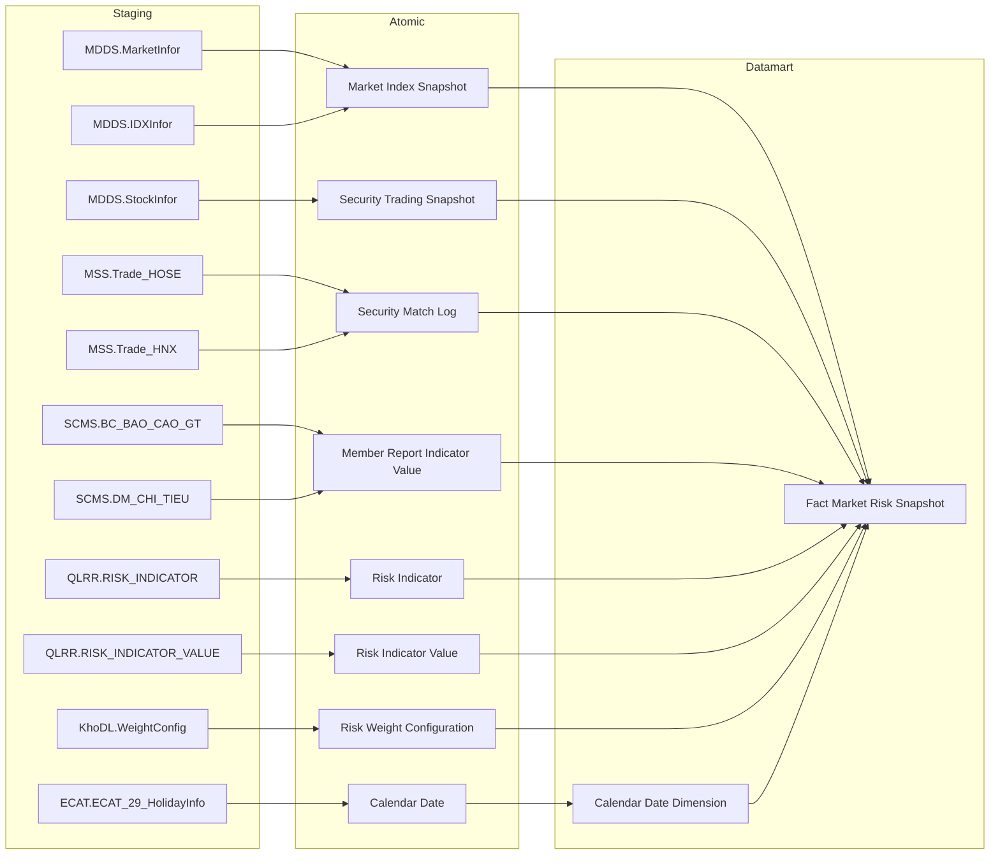

##### Cụm 2: Chỉ số vĩ mô (Fact Macro Indicator Snapshot)

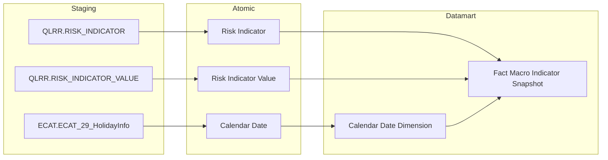

---

##### Cụm 3: Rủi ro ngành (Fact Sector Risk Snapshot)

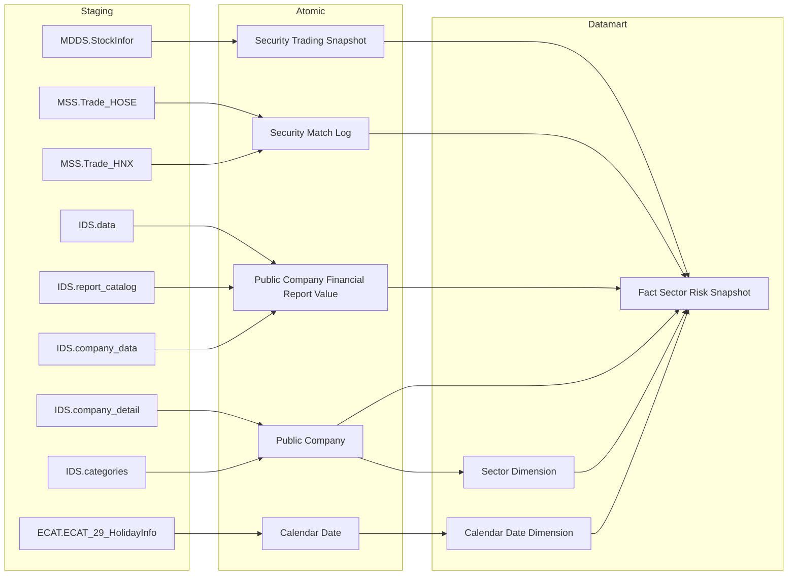

---

##### Cụm 4: Quy mô lệnh per mã CK (Fact Order Size Snapshot)

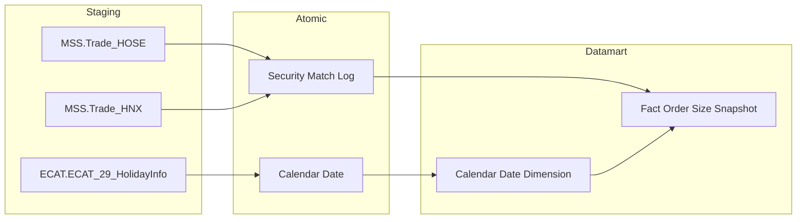

---

##### Cụm 5: Dòng tiền nhà đầu tư (Fact Investor Flow Snapshot)

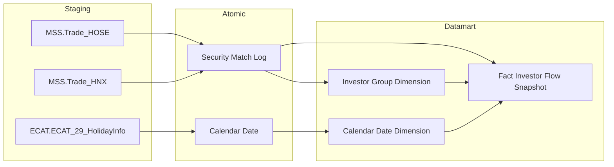

---

##### Cụm 6: Top giao dịch NĐTNN per mã CK (Fact Foreign Net Trade Snapshot)

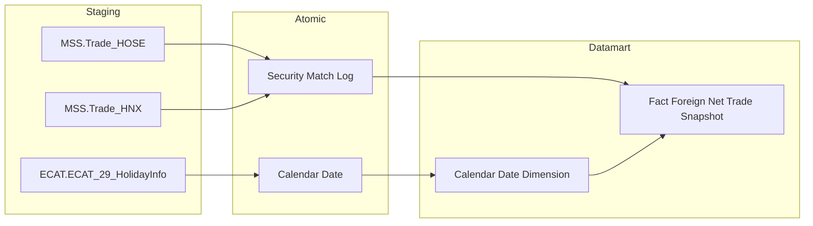

---

##### Cụm 7: Top giao dịch tự doanh per mã CK (Fact Proprietary Net Trade Snapshot)


---

##### Cụm 8: Cơ cấu nợ vay trái phiếu theo ngành (Fact Corporate Bond Sector Snapshot)

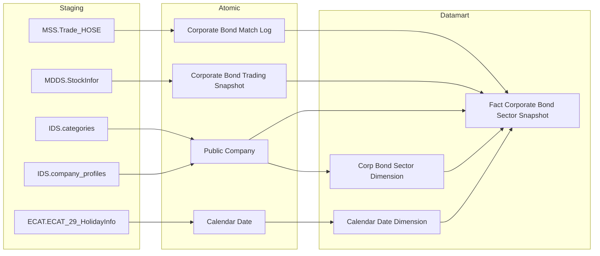

---

##### Cụm 9: Danh mục tổ chức phát hành cần giám sát tín dụng (Operational Corporate Bond Issuer Credit Monitor)

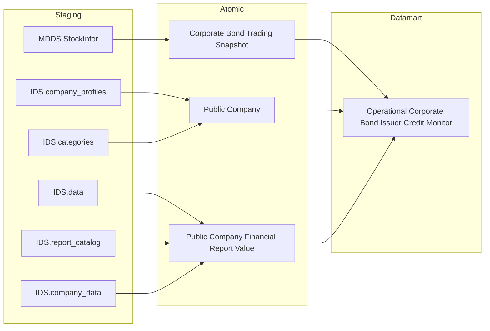

---

##### Cụm 10: Bộ chỉ tiêu an toàn CTCK (Fact Member Safety Snapshot)

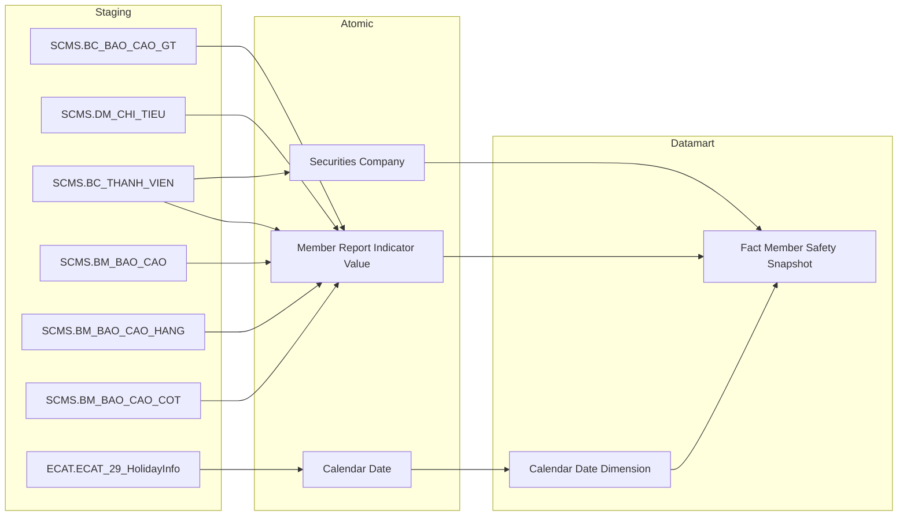

---

##### Cụm 11: Chỉ tiêu an toàn per CTCK (Fact Member Safety Per Member Snapshot)

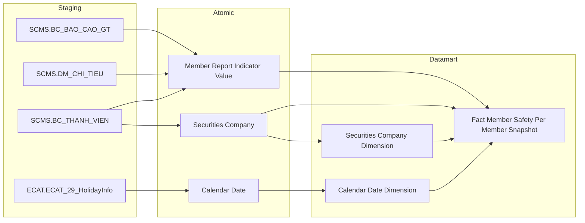

---

## Section 2 — Tổng quan báo cáo

### Tab Dashboard Giám sát rủi ro

#### Nhóm 1 - Chỉ số rủi ro hệ thống

##### READY

> Phân loại: **Phân tích**
> Atomic: `Market Index Snapshot` ← MDDS.IDXInfor — **READY** | `Security Trading Snapshot` ← MDDS.StockInfor — **READY** | `Security Match Log` ← MDDS.TransLog/MSS — **READY** | `Risk Indicator Value` ← QLRR.risk_indicator_value — **READY** | `Member Report Indicator Value` ← SCMS.BC_BAO_CAO_GT — **READY** | `Risk Weight Configuration` ← KhoDL.WeightConfig — **READY**

**Mockup:**

| Chỉ tiêu | Giá trị |
|---|---|
| Volatility 30 phiên (σ) | 0.012 |
| Z-score Biến động | 1.45 |
| Z-score Thanh khoản (ILLIQ) | -0.87 |
| Z-score Dư nợ Margin | 0.63 |
| Z-score Lãi suất | 0.21 |
| Z-score Dòng tiền ròng NĐTNN | -1.02 |
| Tổng vốn hóa MCAPₜ | 5,234 tỷ VND |
| Tỷ lệ Margin/MCAP | 2.3% |
| Tỷ trọng Biến động | 20% |
| Tỷ trọng Thanh khoản | 20% |
| Tỷ trọng Dư nợ Margin | 15% |
| Tỷ trọng Lãi suất | 15% |
| Tỷ trọng Dòng tiền ròng NĐTNN | 15% |
| Tỷ trọng Huy động vốn | 15% |

*(K_PTTT_1, K_PTTT_8, K_PTTT_11 — PENDING)*

**Source:** `Fact Market Risk Snapshot` → `Calendar Date Dimension`

**Bảng KPI:**

| KPI ID | Tên KPI | Đơn vị | Tính chất | Công thức | Ghi chú |
|---|---|---|---|---|---|
| K_PTTT_2 | Volatility — Biến động giá VN-Index 30 phiên (σ) | Số thực | Phái sinh | `σ = STDDEV_SAMP(Rₜ)` trên 30 ngày gần nhất, `Rₜ = LN(mkt_indx_snpst.cls_indx_val[t] / mkt_indx_snpst.cls_indx_val[t-1])`, lọc `mkt_indx_snpst.indx_code = 'VNINDEX'` ORDER BY `mkt_indx_snpst.tdg_dt` DESC | |
| K_PTTT_3 | Z-score Biến động giá | Số thực | Phái sinh | `(K_PTTT_2 − AVG(K_PTTT_2 lịch sử)) / STDDEV_SAMP(K_PTTT_2 lịch sử)`, AVG/STDDEV tính trên toàn bộ `mkt_indx_snpst.tdg_dt <= snapshot_date` WHERE `mkt_indx_snpst.indx_code = 'VNINDEX'` | |
| K_PTTT_4 | Z-score Thanh khoản (ILLIQ) | Số thực | Phái sinh | `(ILLIQ30_t − AVG(ILLIQ30 lịch sử)) / STDDEV_SAMP(ILLIQ30 lịch sử)` trong đó `ILLIQ30_t = AVG(ABS(Rₜ) / scr_mtch_log.acm_val)` trên 30 ngày GROUP BY `scr_mtch_log.tdg_dt`, `Rₜ` từ `mkt_indx_snpst.cls_indx_val`, `scr_mtch_log.acm_val` = giá trị khớp lũy kế ngày t | |
| K_PTTT_5 | Z-score Dư nợ Margin | Số thực | Phái sinh | `(Mₜ − AVG(M lịch sử)) / STDDEV_SAMP(M lịch sử)` trong đó `Mₜ = SUM(mbr_rpt_ind_val.val WHERE mbr_rpt_ind_val.rpt_dt = snapshot_date AND mbr_rpt_ind_val.rpt_ind_code = [mã dư nợ margin]) / K_PTTT_9` | sub-components σ, Mₜ, M̄ → xem K_PTTT_24~27 (PENDING) |
| K_PTTT_6 | Z-score Lãi suất liên ngân hàng | Số thực | Phái sinh | `(rsk_ind_val.val − AVG(rsk_ind_val.val lịch sử)) / STDDEV_SAMP(rsk_ind_val.val lịch sử)`, lọc JOIN `rsk_ind.bsn_key = 'INTERBANK_IR'` AND `rsk_ind_val.prd_tp_code = 1` (kỳ ngày), ORDER BY `rsk_ind_val.prd_dt` DESC | |
| K_PTTT_7 | Z-score Dòng tiền ròng NĐTNN | Số thực | Phái sinh | `(AVG(Fₜ lịch sử) − Fₜ) / STDDEV_SAMP(Fₜ lịch sử)` (đảo chiều) trong đó `Fₜ = SUM(scr_tdg_snpst.frgn_buy_vol × scr_tdg_snpst.cls_prc) − SUM(scr_tdg_snpst.frgn_sell_vol × scr_tdg_snpst.cls_prc)` GROUP BY `scr_tdg_snpst.tdg_dt`, lọc `scr_tdg_snpst.flr_code IN ('02','04','10')` | |
| K_PTTT_9 | Tổng vốn hóa thị trường MCAPₜ | Tỷ VND | Phái sinh | `SUM(scr_tdg_snpst.cls_prc × scr_tdg_snpst.tot_listing_vol)` GROUP BY `scr_tdg_snpst.tdg_dt`, lọc `scr_tdg_snpst.flr_code IN ('02','04','10')` AND `scr_tdg_snpst.stk_tp_code IN ('2','S','U','E','3')` | `tot_listing_vol` ← MDDS.StockInfor.TotalListingQtty; HOSE xem O_PTTT_3 |
| K_PTTT_10 | Tỷ lệ Dư nợ Margin / Tổng vốn hóa Mₜ | % | Phái sinh | `SUM(mbr_rpt_ind_val.val WHERE mbr_rpt_ind_val.rpt_dt = snapshot_date AND mbr_rpt_ind_val.rpt_ind_code = [mã dư nợ margin]) / K_PTTT_9 × 100` | |
| K_PTTT_18 | Tỷ trọng (Weight) — Biến động chỉ số VN-Index | % | Phái sinh | `rsk_wgt_cfg.weight` WHERE `rsk_wgt_cfg.risk_factor_code = 'VOLATILITY'` AND `rsk_wgt_cfg.effective_date = MAX(effective_date) <= snapshot_date` | |
| K_PTTT_19 | Tỷ trọng (Weight) — Thanh khoản | % | Phái sinh | `rsk_wgt_cfg.weight` WHERE `rsk_wgt_cfg.risk_factor_code = 'LIQUIDITY'` AND `rsk_wgt_cfg.effective_date = MAX(effective_date) <= snapshot_date` | |
| K_PTTT_20 | Tỷ trọng (Weight) — Dư nợ Margin | % | Phái sinh | `rsk_wgt_cfg.weight` WHERE `rsk_wgt_cfg.risk_factor_code = 'MARGIN'` AND `rsk_wgt_cfg.effective_date = MAX(effective_date) <= snapshot_date` | |
| K_PTTT_21 | Tỷ trọng (Weight) — Lãi suất liên ngân hàng | % | Phái sinh | `rsk_wgt_cfg.weight` WHERE `rsk_wgt_cfg.risk_factor_code = 'INTEREST_RATE'` AND `rsk_wgt_cfg.effective_date = MAX(effective_date) <= snapshot_date` | |
| K_PTTT_22 | Tỷ trọng (Weight) — Dòng tiền ròng NĐTNN | % | Phái sinh | `rsk_wgt_cfg.weight` WHERE `rsk_wgt_cfg.risk_factor_code = 'FOREIGN_FLOW'` AND `rsk_wgt_cfg.effective_date = MAX(effective_date) <= snapshot_date` | |
| K_PTTT_23 | Tỷ trọng (Weight) — Huy động vốn cổ phần | % | Phái sinh | `rsk_wgt_cfg.weight` WHERE `rsk_wgt_cfg.risk_factor_code = 'EQUITY_RAISE'` AND `rsk_wgt_cfg.effective_date = MAX(effective_date) <= snapshot_date` | |

**Star Schema:**

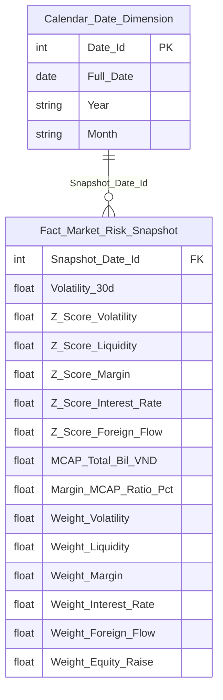

**Lineage Mart → Báo cáo:**

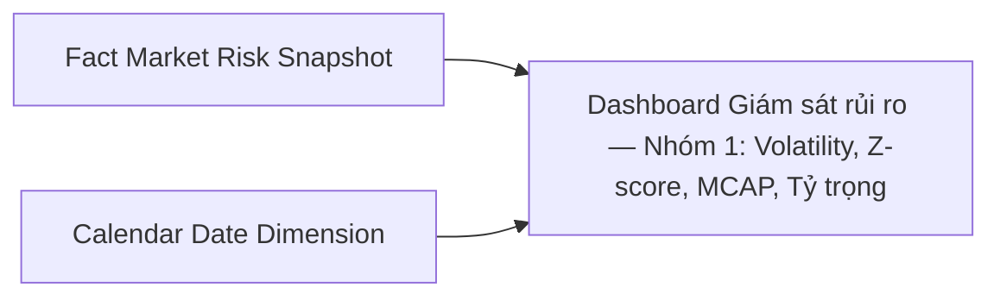

**Bảng grain:**

| Tên bảng | Grain |
|---|---|
| Fact Market Risk Snapshot | 1 row / ngày |
| Calendar Date Dimension | 1 row / ngày |

---

##### PENDING (Risk Index + Huy động vốn + Sub-components Dư nợ Margin)

**KPI liên quan:** K_PTTT_1, K_PTTT_8, K_PTTT_11, K_PTTT_24, K_PTTT_25, K_PTTT_26, K_PTTT_27

**Lý do pending:**
- K_PTTT_8, K_PTTT_11 (Huy động vốn cổ phần): cần 3 nguồn SCMS.CBTT_CHAO_BAN_CHUNG_KHOAN + IDS-GSĐC + FMS — chưa có Atomic entity tương ứng
- K_PTTT_1 (Risk Index): phụ thuộc K_PTTT_8
- K_PTTT_24~27 (Sub-components Z-score Dư nợ Margin): BA đánh `Trạng thái mapping = Pending` — thiếu mapping nguồn cho MDₜ (dư nợ margin theo ngày vs tháng), MCAPₜ khi tính chuỗi lịch sử

**Atomic cần bổ sung:**
- Entity từ SCMS/IDS-GSĐC/FMS cho nghiệp vụ huy động vốn cổ phần (CBTT chào bán chứng khoán)
- Xác nhận mapping `mbr_rpt_ind_val.rpt_ind_code` → mã chỉ tiêu dư nợ margin (SCMS.DM_CHI_TIEU) để hoàn thiện chuỗi lịch sử K_PTTT_24~27

**Mart dự kiến:**
- `Fact Market Risk Snapshot` — grain: 1 row / ngày (bổ sung thêm Risk_Index, Z_Score_Equity_Raise, Equity_Raise_Amount khi Atomic sẵn sàng)

**Bảng mapping nguồn (Atomic Placeholder):**

| Tên KPI | Bảng nguồn (BA) | Atomic entity dự kiến | Atomic table dự kiến |
|---|---|---|---|
| Huy động vốn cổ phần tại ngày t | SCMS.CBTT_CHAO_BAN_CHUNG_KHOAN | TBD (SCMS) | TBD |
| Huy động vốn cổ phần — IDS-GSĐC | IDS-GSĐC | TBD (IDS) | TBD |
| Huy động vốn cổ phần — FMS | FMS | TBD (FMS) | TBD |

**Bảng KPI PENDING:**

| KPI ID | Tên KPI | Tính chất | Trạng thái |
|---|---|---|---|
| K_PTTT_1 | Risk Index (Chỉ số rủi ro hệ thống tổng hợp) | Phái sinh | PENDING |
| K_PTTT_8 | Z-score Huy động vốn cổ phần | Phái sinh | PENDING |
| K_PTTT_11 | Huy động vốn cổ phần thị trường tại ngày t | Phái sinh | PENDING |
| K_PTTT_24 | Z-score Dư nợ Margin — giá trị chuẩn hóa ngày t | Phái sinh | PENDING |
| K_PTTT_25 | Độ lệch chuẩn chuỗi tỷ lệ Dư nợ Margin/MCAP (σ) | Phái sinh | PENDING |
| K_PTTT_26 | Tỷ lệ Dư nợ Margin / Tổng vốn hóa tại ngày t (Mₜ) | Phái sinh | PENDING |
| K_PTTT_27 | Tỷ lệ Dư nợ Margin / Tổng vốn hóa trung bình (M̄) | Phái sinh | PENDING |

---

#### Nhóm 2 - Phân tích đóng góp rủi ro

##### READY

> Phân loại: **Phân tích**
> Atomic: `Market Index Snapshot` ← MDDS.IDXInfor — **READY** | `Security Match Log` ← MDDS.TransLog/MSS — **READY** | `Risk Indicator Value` ← QLRR.risk_indicator_value — **READY** | `Member Report Indicator Value` ← SCMS.BC_BAO_CAO_GT — **READY** | `Security Trading Snapshot` ← MDDS.StockInfor — **READY** | `Risk Weight Configuration` ← KhoDL.WeightConfig — **READY**

**Mockup:**

| Chỉ tiêu rủi ro | Giá trị hiện tại (raw value) | Mức độ tác động (Z-score) | Tỷ trọng |
|---|---|---|---|
| Biến động chỉ số VN-Index | Rₜ = 0.0082 (log return ngày t) | 1.45 | 20% |
| Thanh khoản thị trường | ILLIQₜ = 0.000031 | -0.87 | 20% |
| Dư nợ Margin | Mₜ = 12.3% (Dư nợ / MCAP) | 0.63 | 15% |
| Lãi suất liên ngân hàng | IRₜ = 4.85% | 0.21 | 15% |
| Dòng tiền ròng NĐTNN | Fₜ = -320 tỷ VND | -1.02 | 15% |
| Huy động vốn cổ phần | Cₜ = — | — | 15% |

*(Huy động vốn cổ phần — PENDING)*

> **Ghi chú mockup:** "Giá trị hiện tại" = raw value xₜ tại ngày t (Rₜ, ILLIQₜ, Mₜ, IRₜ, Fₜ, Cₜ). "Mức độ tác động" = Z-score chuẩn hóa = (xₜ − μ) / σ. Hai cột này độc lập, không tính Z × Weight.

**Source:** `Fact Market Risk Snapshot` → `Calendar Date Dimension`

**Bảng KPI:**

| KPI ID | Tên KPI | Đơn vị | Tính chất | Công thức | Ghi chú |
|---|---|---|---|---|---|
| **Giá trị hiện tại (raw value tại ngày t)** | | | | | |
| K_PTTT_12 | Giá trị hiện tại — Biến động chỉ số VN-Index (Rₜ) | Số thực | Cơ sở | `fct_mkt_rsk_snpst.indx_log_rtn_t` | Log return ngày t: ln(Pₜ/Pₜ₋₁) |
| K_PTTT_13 | Giá trị hiện tại — Thanh khoản ILLIQ (ILLIQₜ) | Số thực | Cơ sở | `fct_mkt_rsk_snpst.illiq_t` | ILLIQₜ = \|Rₜ\| / VOLDₜ |
| K_PTTT_10 | Giá trị hiện tại — Dư nợ Margin (Mₜ) | % | Phái sinh | `fct_mkt_rsk_snpst.mrgn_mcap_rto_pct` | Reuse từ Nhóm 1: Mₜ = MDₜ/MCAPₜ × 100 |
| K_PTTT_14 | Giá trị hiện tại — Lãi suất liên ngân hàng (IRₜ) | % | Cơ sở | `fct_mkt_rsk_snpst.ir_t_pct` | Lãi suất tại ngày t từ RISK_INDICATOR_VALUE |
| K_PTTT_15 | Giá trị hiện tại — Dòng tiền ròng NĐTNN (Fₜ) | Tỷ VND | Cơ sở | `fct_mkt_rsk_snpst.frgn_net_flw_t_bil` | Fₜ = SUM(buy) − SUM(sell) NĐTNN ngày t |
| K_PTTT_16 | Giá trị hiện tại — Huy động vốn cổ phần (Cₜ) | Tỷ VND | Cơ sở | `fct_mkt_rsk_snpst.eqty_rse_t_bil` | PENDING — nguồn BA chưa mapping |
| **Mức độ tác động (= Z-score chuẩn hóa, reuse từ Nhóm 1)** | | | | | |
| K_PTTT_3 | Mức độ tác động — Biến động VN-Index (Z-score) | Số thực | Phái sinh | `fct_mkt_rsk_snpst.z_scr_vol` | Reuse K_PTTT_3 từ Nhóm 1 — Mức độ tác động = Z-score |
| K_PTTT_4 | Mức độ tác động — Thanh khoản ILLIQ (Z-score) | Số thực | Phái sinh | `fct_mkt_rsk_snpst.z_scr_lqdt` | Reuse K_PTTT_4 từ Nhóm 1 — Mức độ tác động = Z-score |
| K_PTTT_5 | Mức độ tác động — Dư nợ Margin (Z-score) | Số thực | Phái sinh | `fct_mkt_rsk_snpst.z_scr_mrgn` | Reuse K_PTTT_5 từ Nhóm 1 — Mức độ tác động = Z-score |
| K_PTTT_6 | Mức độ tác động — Lãi suất liên ngân hàng (Z-score) | Số thực | Phái sinh | `fct_mkt_rsk_snpst.z_scr_ir` | Reuse K_PTTT_6 từ Nhóm 1 — Mức độ tác động = Z-score |
| K_PTTT_7 | Mức độ tác động — Dòng tiền ròng NĐTNN (Z-score) | Số thực | Phái sinh | `fct_mkt_rsk_snpst.z_scr_frgn_flw` | Reuse K_PTTT_7 từ Nhóm 1 — Mức độ tác động = Z-score |
| **Tỷ trọng (Weight)** | | | | | |
| K_PTTT_18 | Tỷ trọng (Weight) — Biến động chỉ số VN-Index | % | Phái sinh | `fct_mkt_rsk_snpst.wgt_vol` | Reuse từ Nhóm 1 |
| K_PTTT_19 | Tỷ trọng (Weight) — Thanh khoản | % | Phái sinh | `fct_mkt_rsk_snpst.wgt_lqdt` | Reuse từ Nhóm 1 |
| K_PTTT_20 | Tỷ trọng (Weight) — Dư nợ Margin | % | Phái sinh | `fct_mkt_rsk_snpst.wgt_mrgn` | Reuse từ Nhóm 1 |
| K_PTTT_21 | Tỷ trọng (Weight) — Lãi suất liên ngân hàng | % | Phái sinh | `fct_mkt_rsk_snpst.wgt_ir` | Reuse từ Nhóm 1 |
| K_PTTT_22 | Tỷ trọng (Weight) — Dòng tiền ròng NĐTNN | % | Phái sinh | `fct_mkt_rsk_snpst.wgt_frgn_flw` | Reuse từ Nhóm 1 |
| K_PTTT_23 | Tỷ trọng (Weight) — Huy động vốn cổ phần | % | Phái sinh | `fct_mkt_rsk_snpst.wgt_eqty_rse` | Reuse từ Nhóm 1 |

**Star Schema:**

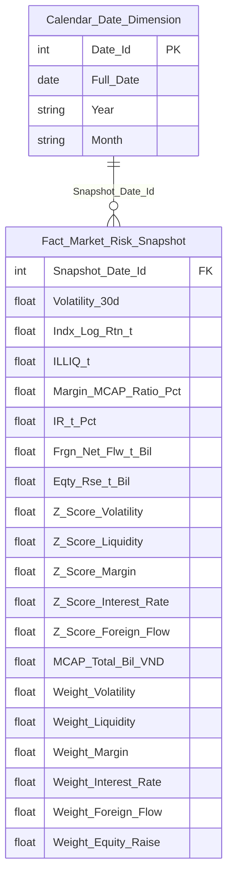

**Lineage Mart → Báo cáo:**

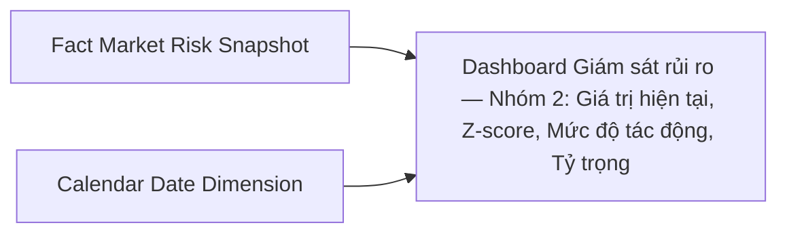

**Bảng grain:**

| Tên bảng | Grain |
|---|---|
| Fact Market Risk Snapshot | 1 row / ngày |
| Calendar Date Dimension | 1 row / ngày |

---

##### PENDING (Huy động vốn cổ phần)

**KPI liên quan:** K_PTTT_8, K_PTTT_16

**Lý do pending:** K_PTTT_16 (Giá trị hiện tại — Huy động vốn Cₜ) và K_PTTT_8 (Z-score Huy động vốn) cần nguồn SCMS.CBTT_CHAO_BAN + IDS-GSĐC + FMS — chưa có Atomic entity.

**Atomic cần bổ sung:** Xem Nhóm 1 — PENDING (Z-score Huy động vốn).

**Mart dự kiến:**
- `Fact Market Risk Snapshot` — grain: 1 row / ngày (bổ sung thêm Z_Score_Equity_Raise, Impact_Equity_Raise)

**Bảng mapping nguồn (Atomic Placeholder):**

| Tên KPI | Bảng nguồn (BA) | Atomic entity dự kiến | Atomic table dự kiến |
|---|---|---|---|
| Huy động vốn cổ phần — SCMS | SCMS.CBTT_CHAO_BAN_CHUNG_KHOAN | TBD (SCMS) | TBD |
| Huy động vốn cổ phần — IDS-GSĐC | IDS-GSĐC | TBD (IDS) | TBD |
| Huy động vốn cổ phần — FMS | FMS | TBD (FMS) | TBD |

**Bảng KPI PENDING:**

| KPI ID | Tên KPI | Tính chất | Trạng thái |
|---|---|---|---|
| K_PTTT_16 | Giá trị hiện tại — Huy động vốn cổ phần (Cₜ) | Cơ sở | PENDING — nguồn BA chưa mapping |
| K_PTTT_8 | Mức độ tác động — Huy động vốn cổ phần (Z-score, reuse từ Nhóm 1) | Phái sinh | PENDING |

---

### Tab Dashboard Sức khỏe thị trường và vĩ mô

#### Nhóm 3 - Chỉ số vĩ mô – tiền tệ

##### READY

> Phân loại: **Phân tích**
> Atomic: `Risk Indicator` ← QLRR.RISK_INDICATOR — **READY** | `Risk Indicator Value` ← QLRR.RISK_INDICATOR_VALUE — **READY**

**Mockup:**

| Chỉ tiêu | Giá trị | Kỳ trước | % Thay đổi |
|---|---|---|---|
| Lãi suất liên ngân hàng (ON) | 4.38% | 4.23% | +0.15 |
| Tỷ giá USD/VND | 25,510 | 25,497 | +0.05% |
| Chỉ số CPI (YoY) | 3.97% | 4.09% | -0.12 |
| Tăng trưởng GDP | 5.55% | 5.21% | +0.34 |

**Source:** `Fact Macro Indicator Snapshot` → `Calendar Date Dimension`

**Bảng KPI:**

| KPI ID | Tên KPI | Đơn vị | Tính chất | Công thức | Ghi chú |
|---|---|---|---|---|---|
| K_PTTT_28 | Lãi suất liên ngân hàng qua đêm (ON) tại ngày t — IRₜ | %/năm | Cơ sở | `rsk_ind_val.val` WHERE JOIN `rsk_ind.bsn_key = 'INTERBANK_IR'` AND `rsk_ind_val.prd_dt = snapshot_date` | prd_tp_code = 1 (kỳ ngày) |
| K_PTTT_29 | Lãi suất liên ngân hàng qua đêm ngày trước — IRₜ₋₁ | %/năm | Cơ sở | `rsk_ind_val.val` WHERE JOIN `rsk_ind.bsn_key = 'INTERBANK_IR'` AND `rsk_ind_val.prd_dt = MAX(prd_dt) < snapshot_date` | |
| K_PTTT_30 | % thay đổi lãi suất liên ngân hàng | % | Phái sinh | `(K_PTTT_28 − K_PTTT_29) / K_PTTT_29 × 100` | |
| K_PTTT_31 | Tỷ giá USD/VND tại ngày — FXₜ | VND/USD | Cơ sở | `rsk_ind_val.val` WHERE JOIN `rsk_ind.bsn_key = 'EX_RATE_VND_USD'` AND `rsk_ind_val.prd_dt = snapshot_date` | |
| K_PTTT_32 | Tỷ giá USD/VND ngày trước — FXₜ₋₁ | VND/USD | Cơ sở | `rsk_ind_val.val` WHERE JOIN `rsk_ind.bsn_key = 'EX_RATE_VND_USD'` AND `rsk_ind_val.prd_dt = MAX(prd_dt) < snapshot_date` | |
| K_PTTT_33 | % thay đổi tỷ giá USD/VND | % | Phái sinh | `(K_PTTT_31 − K_PTTT_32) / K_PTTT_32 × 100` | |
| K_PTTT_34 | Chỉ số CPI (YoY) tại kỳ t | % | Cơ sở | `rsk_ind_val.val` WHERE JOIN `rsk_ind.bsn_key = 'CPI_VN'` AND `rsk_ind_val.prd_dt <= snapshot_date` ORDER BY `prd_dt` DESC LIMIT 1 | Tần suất tháng — lấy kỳ gần nhất |
| K_PTTT_35 | CPI cùng kỳ năm trước | % | Cơ sở | `rsk_ind_val.val` WHERE JOIN `rsk_ind.bsn_key = 'CPI_VN'` AND `rsk_ind_val.prd_dt = MAX(prd_dt) < snapshot_date` | |
| K_PTTT_36 | % thay đổi CPI YoY | % | Phái sinh | `(K_PTTT_34 − K_PTTT_35) / K_PTTT_35 × 100` | |
| K_PTTT_37 | GDP kỳ hiện tại | Nghìn tỷ VND | Cơ sở | `rsk_ind_val.val` WHERE JOIN `rsk_ind.bsn_key = 'GDP_VN'` AND `rsk_ind_val.prd_dt <= snapshot_date` ORDER BY `prd_dt` DESC LIMIT 1 | Tần suất quý — lấy kỳ gần nhất |
| K_PTTT_38 | GDP kỳ trước | Nghìn tỷ VND | Cơ sở | `rsk_ind_val.val` WHERE JOIN `rsk_ind.bsn_key = 'GDP_VN'` AND `rsk_ind_val.prd_dt = MAX(prd_dt) < snapshot_date WHERE bsn_key = 'GDP_VN'` | |
| K_PTTT_39 | Tăng trưởng GDP | % | Phái sinh | `(K_PTTT_37 − K_PTTT_38) / K_PTTT_38 × 100` | |

**Star Schema:**

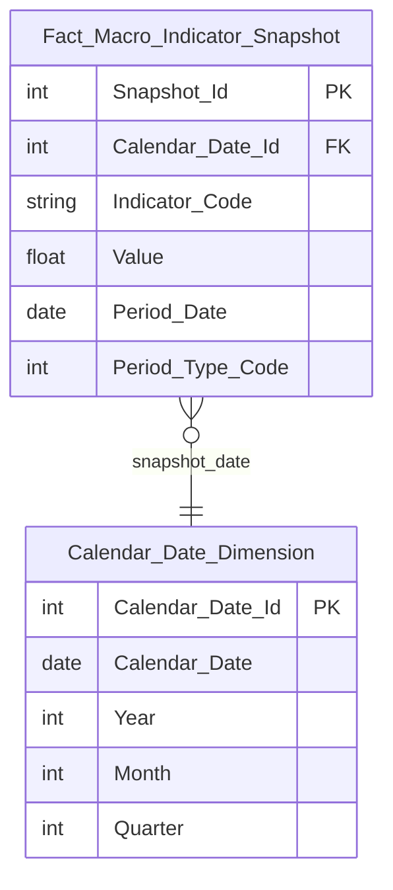

**Lineage Mart → Báo cáo:**


**Bảng grain:**

| Tên bảng | Grain |
|---|---|
| Fact Macro Indicator Snapshot | 1 row / indicator_code / kỳ báo cáo (prd_dt) |
| Calendar Date Dimension | 1 row / ngày |

##### PENDING

**KPI liên quan:** K_PTTT_40 (mới)

**Lý do pending:** Chiều "Thời gian" (Ngày thống kê) — tần suất dữ liệu không đồng nhất giữa các chỉ tiêu vĩ mô: lãi suất = ngày giao dịch, tỷ giá = ngày giao dịch, CPI = tháng, GDP = quý. Không thể dùng cùng 1 trục thời gian thống nhất.

**Atomic cần bổ sung:** Cần thống nhất nghiệp vụ về cách hiển thị chiều thời gian cho dashboard vĩ mô (chọn ngày giao dịch gần nhất có giá trị, hay kỳ báo cáo riêng cho từng loại).

**Mart dự kiến:**
- Fact Macro Indicator Snapshot — grain: 1 row / indicator_code / kỳ báo cáo (đã thiết kế trong READY, sẽ dùng khi thống nhất cách lọc chiều thời gian)

**Bảng mapping nguồn (Atomic Placeholder):**

| Tên KPI | Bảng nguồn (BA) | Atomic entity dự kiến | Atomic table dự kiến |
|---|---|---|---|
| Ngày thống kê (Chiều thời gian vĩ mô) | QLRR.RISK_INDICATOR | Risk Indicator | rsk_ind |

**Bảng KPI PENDING:**

| KPI ID | Tên KPI | Tính chất | Trạng thái |
|---|---|---|---|
| K_PTTT_40 | Ngày thống kê (Chiều thời gian vĩ mô) | Chiều | PENDING |

#### Nhóm 4 - Biểu đồ chỉ số sức khỏe hệ thống

##### READY

> Phân loại: **Phân tích**
> Atomic: `Security Trading Snapshot` ← MDDS.StockInfor — **READY** | `Security Match Log` ← MSS.Trade_HOSE/Trade_HNX — **READY** | `Market Index Snapshot` ← MDDS.MarketInfor — **READY** | `Member Report Indicator Value` ← SCMS.BC_BAO_CAO_GT — **READY** | `Risk Weight Configuration` ← KhoDL.WeightConfig — **READY**

**Mockup:**

| Chỉ số | Giá trị | Trạng thái |
|---|---|---|
| Sentiment Index | 70 | Optimistic |
| Margin Tension | 82% | Near Saturation |
| Systemic Vol | 29% | Stable |

**Source:** `Fact Market Risk Snapshot` → `Calendar Date Dimension`

**Bảng KPI:**

| KPI ID | Tên KPI | Đơn vị | Tính chất | Công thức | Ghi chú |
|---|---|---|---|---|---|
| K_PTTT_41 | Ngày thống kê (Chiều thời gian) | Ngày | Chiều | `mkt_indx_snpst.tdg_dt` WHERE `indx_code = 'VNINDEX'` | |
| K_PTTT_42 | Khối lượng khớp lệnh ngày t của mã CK — Vₜ | KL | Cơ sở | `scr_mtch_log.acm_vol` GROUP BY `scr_mtch_log.scr_code`, `scr_mtch_log.tdg_dt` | dùng trong formula S_liquidity |
| K_PTTT_43 | Khối lượng khớp lệnh trung bình 20 phiên — MAvol(20) | KL | Phái sinh | `AVG(scr_mtch_log.acm_vol)` trên 20 ngày gần nhất GROUP BY `scr_mtch_log.scr_code` | |
| K_PTTT_44 | Tỷ lệ dòng tiền — Flow Ratio | Số thực | Phái sinh | `K_PTTT_42 / K_PTTT_43` — tức `Vₜ / MAvol(20)` | |
| K_PTTT_45 | Dấu dòng tiền — Sign(PriceChange) | Số nguyên | Phái sinh | `CASE WHEN scr_tdg_snpst.cls_prc > scr_tdg_snpst.opn_prc THEN 1 WHEN scr_tdg_snpst.cls_prc < scr_tdg_snpst.opn_prc THEN -1 ELSE 0 END` | +1 tăng, -1 giảm |
| K_PTTT_46 | Điểm thanh khoản — S_liquidity | Điểm (0–100) | Phái sinh | `50 + K_PTTT_45 × LEAST(K_PTTT_44 × 25, 50)` | |
| K_PTTT_47 | Giá cao nhất trong phiên — Hₜ | VND | Cơ sở | `scr_tdg_snpst.hi_prc` | |
| K_PTTT_48 | Giá thấp nhất trong phiên — Lₜ | VND | Cơ sở | `scr_tdg_snpst.lo_prc` | |
| K_PTTT_49 | ER – Volatility Efficiency Ratio (Vp/Vc) | Số thực | Phái sinh | `Vp / Vc` trong đó `Vc = LN(scr_tdg_snpst.cls_prc / cls_prc[t-1])`, `Vp = SQRT(1/(4N×LN(2)) × SUM(LN(scr_tdg_snpst.hi_prc/scr_tdg_snpst.lo_prc)²))` trên N phiên | |
| K_PTTT_50 | Điểm ổn định — S_stability | Điểm (0–100) | Phái sinh | `GREATEST(0, 100 - (K_PTTT_49 × 50))` | |
| K_PTTT_51 | Trọng số W1 (S_liquidity) và W2 (S_stability) | % | Cơ sở | `rsk_wgt_cfg.weight` WHERE `rsk_wgt_cfg.risk_factor_code IN ('SENTIMENT_W1', 'SENTIMENT_W2')` AND `MAX(effective_date) <= snapshot_date` | |
| K_PTTT_52 | Sentiment Score của từng mã CK | Điểm (0–100) | Phái sinh | `W1 × K_PTTT_46 + W2 × K_PTTT_50` (W1, W2 từ K_PTTT_51) | |
| K_PTTT_53 | Sentiment Index (chỉ số tâm lý giao dịch toàn thị trường) | Điểm (0–100) | Phái sinh | `SUM(K_PTTT_52 × scr_mtch_log.acm_val) / SUM(scr_mtch_log.acm_val)` GROUP BY `tdg_dt`, lọc `flr_code IN ('02','04','10')` | Weighted avg theo GTGD |
| K_PTTT_54 | Ngưỡng trạng thái Sentiment Index | Text | Phái sinh | `rsk_wgt_cfg` hoặc lookup bảng config: 0-20 Extreme Fear, 20-40 Pessimistic, 40-60 Neutral, 60-80 Optimistic, 80-100 Euphoria | Cấu hình từ Kho dữ liệu |
| K_PTTT_55 | Tổng dư nợ vay margin tất cả CTCK | Tỷ VND | Phái sinh | `SUM(mbr_rpt_ind_val.val)` WHERE `rpt_ind_code = [mã dư nợ margin]` AND `rpt_dt = snapshot_date` | từ SCMS.BC_BAO_CAO_GT |
| K_PTTT_56 | Tổng hạn mức margin (tối đa 2× VCSH) | Tỷ VND | Phái sinh | `SUM(mbr_rpt_ind_val.val × 2)` WHERE `rpt_ind_code = [mã VCSH]` AND `rpt_dt = snapshot_date` | VCSH × 2 per CTCK |
| K_PTTT_57 | Margin Tension (chỉ số độ căng margin) | % | Phái sinh | `K_PTTT_55 / K_PTTT_56 × 100` | |
| K_PTTT_58 | Ngưỡng trạng thái Margin Tension | Text | Phái sinh | Lookup config: <50 Dư dả, 50-70 Tối ưu, 70-85 Căng, 85-95 Báo động, >95 Vi phạm | Cấu hình từ Kho dữ liệu |
| K_PTTT_59 | Lợi suất ngày VN-Index — Rₜ | % | Phái sinh | `(mkt_indx_snpst.cls_indx_val[t] - mkt_indx_snpst.cls_indx_val[t-1]) / mkt_indx_snpst.cls_indx_val[t-1]` WHERE `indx_code = 'VNINDEX'` | |
| K_PTTT_60 | σ_current — Độ lệch chuẩn biến động VN-Index 20 phiên (annualized) | % | Phái sinh | `STDDEV_SAMP(K_PTTT_59) × SQRT(252)` trên 20 ngày gần nhất WHERE `indx_code = 'VNINDEX'` | |
| K_PTTT_61 | σ_max — Độ lệch chuẩn biến động VN-Index lịch sử tối đa | % | Phái sinh | `MAX(σ_current_lịch sử)` trên toàn bộ `mkt_indx_snpst.tdg_dt <= snapshot_date` WHERE `indx_code = 'VNINDEX'` | |
| K_PTTT_62 | Systemic Vol (chỉ số biến động hệ thống) | % | Phái sinh | `K_PTTT_60 / K_PTTT_61 × 100` | |
| K_PTTT_63 | Ngưỡng trạng thái Systemic Vol | Text | Phái sinh | Lookup config từ Kho dữ liệu | Cấu hình từ Kho dữ liệu |

**Star Schema:**

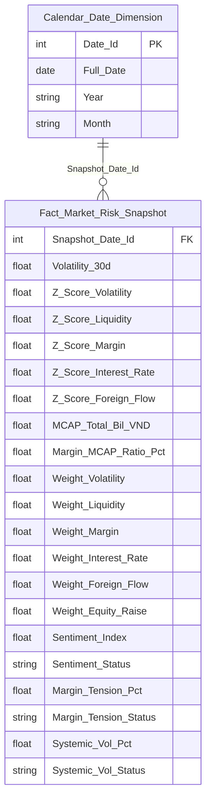

**Lineage Mart → Báo cáo:**


**Bảng grain:**

| Tên bảng | Grain |
|---|---|
| Fact Market Risk Snapshot | 1 row / ngày |
| Calendar Date Dimension | 1 row / ngày |

##### PENDING

**KPI liên quan:** K_PTTT_64 (mới)

**Lý do pending:** "Chuẩn hóa thang điểm" — BA ghi Pending. Logic chuẩn hóa S_liquidity về thang 0-100 dựa trên ngưỡng giá tăng/giảm/volume chưa được thống nhất hoàn toàn (rule: nếu giá giảm < 40, tăng nhẹ + vol thấp = 40-60, tăng + vol cao Flow > 1.2 = > 60). Atomic entity đã sẵn sàng — đây là vấn đề nghiệp vụ, không phải Atomic.

**Atomic cần bổ sung:** Không cần bổ sung Atomic. Cần BA xác nhận logic chuẩn hóa ngưỡng.

**Mart dự kiến:**
- `Fact Market Risk Snapshot` — grain: 1 row / ngày (bổ sung logic chuẩn hóa khi BA xác nhận)

**Bảng mapping nguồn (Atomic Placeholder):**

| Tên KPI | Bảng nguồn (BA) | Atomic entity dự kiến | Atomic table dự kiến |
|---|---|---|---|
| Chuẩn hóa thang điểm S_liquidity | MDDS.StockInfor | Security Trading Snapshot | scr_tdg_snpst |

**Bảng KPI PENDING:**

| KPI ID | Tên KPI | Tính chất | Trạng thái |
|---|---|---|---|
| K_PTTT_64 | Chuẩn hóa thang điểm S_liquidity (rule ngưỡng) | Phái sinh | PENDING |

#### Nhóm 5 - Biểu đồ Macro correlation map

> Phân loại: **Phân tích**
> Atomic: `Market Index Snapshot` ← MDDS.MarketInfor — **READY**; `Risk Indicator Value` ← QLRR.RISK_INDICATOR_VALUE — **READY**

**Mockup:**

| Chỉ báo | Hệ số tương quan | Đánh giá |
|---|---|---|
| Tương quan Chỉ số & Lãi suất thực tế | -0.8 | Nghịch quan mạnh (Downside Risk) |
| Index vs DXY Index | -0.63 | Nghịch quan vừa (FX Pressure) |

**Source:** `Fact Market Risk Snapshot` → `Calendar Date Dimension`

**Bảng KPI:**

| KPI ID | Tên KPI | Đơn vị | Tính chất | Công thức | Ghi chú |
|---|---|---|---|---|---|
| K_PTTT_41 | Chiều Thời gian (snapshot_date) | Ngày | Chiều | mkt_indx_snpst.tdg_dt WHERE indx_code='VNINDEX' | Reuse từ Nhóm 4 |
| K_PTTT_65 | Index Code (VN-Index) | Text | Chiều | mkt_indx_snpst.indx_code; CSIDXInfor.indexCode → lọc index thành phần | ETL filter: indx_code='VNINDEX' |
| K_PTTT_28 | Lãi suất LNH tại t (IRₜ) | %/năm | Cơ sở | rsk_ind_val.val WHERE bsn_key='INTERBANK_IR' AND prd_dt=snapshot_date | Reuse từ Nhóm 3 |
| K_PTTT_29 | Lãi suất LNH tại t-1 (IRₜ₋₁) | %/năm | Cơ sở | rsk_ind_val.val WHERE bsn_key='INTERBANK_IR' AND prd_dt=MAX(prd_dt)<snapshot_date | Reuse từ Nhóm 3 |
| K_PTTT_66 | DXY Index tại t (DXYₜ) | Điểm | Cơ sở | rsk_ind_val.val WHERE bsn_key='DXY' AND prd_dt=snapshot_date | |
| K_PTTT_70 | Giá VN-Index tại t (Pₜ) | Điểm | Cơ sở | mkt_indx_snpst.cls_indx_val WHERE indx_code='VNINDEX' AND tdg_dt=snapshot_date | Sub-component tính Rₜ; BA note "Trùng dòng 9" = ghi chú nội bộ BA |
| K_PTTT_71 | Giá VN-Index tại t-1 (Pₜ₋₁) | Điểm | Cơ sở | mkt_indx_snpst.cls_indx_val WHERE indx_code='VNINDEX' AND tdg_dt=MAX(tdg_dt)<snapshot_date | Sub-component tính Rₜ; BA note "Trùng dòng 10" = ghi chú nội bộ BA |
| K_PTTT_59 | Return VN-Index tại t (Rₜ) | % | Phái sinh | LN(K_PTTT_70 / K_PTTT_71) | Reuse từ Nhóm 4 |
| K_PTTT_69 | Return VN-Index trung bình N phiên (R̄ₙ) | % | Phái sinh | AVG(LN(cls_indx_val[t]/cls_indx_val[t-1])) trên N phiên gần nhất WHERE indx_code='VNINDEX' | N phiên = cửa sổ tính correlation (mặc định 30 phiên) |
| K_PTTT_72 | ΔLãi suất LNH tại t (ΔIRₜ) | pp | Phái sinh | K_PTTT_28 − K_PTTT_29 | pp = percentage point |
| K_PTTT_73 | ΔLãi suất LNH trung bình N phiên (ΔIR̄ₙ) | pp | Phái sinh | AVG(rsk_ind_val.val[t] − rsk_ind_val.val[t-1]) trên N phiên WHERE bsn_key='INTERBANK_IR' | |
| K_PTTT_76 | DXY Index tại t-1 (DXYₜ₋₁) | Điểm | Cơ sở | rsk_ind_val.val WHERE bsn_key='DXY' AND prd_dt=MAX(prd_dt)<snapshot_date | |
| K_PTTT_74 | Return DXY tại t (Return_DXYₜ) | % | Phái sinh | LN(K_PTTT_66 / K_PTTT_76) | |
| K_PTTT_75 | Return DXY trung bình N phiên (Return_DXȲₙ) | % | Phái sinh | AVG(LN(rsk_ind_val.val[t]/rsk_ind_val.val[t-1])) trên N phiên WHERE bsn_key='DXY' | |
| K_PTTT_67 | Tương quan VN-Index & Lãi suất thực tế | Hệ số [-1,1] | Phái sinh | Σ[(Rₜ−R̄)(ΔIRₜ−ΔIR̄)] / √[Σ(Rₜ−R̄)² × Σ(ΔIRₜ−ΔIR̄)²] trên N phiên | Pearson correlation; K_PTTT_59,69,72,73 là intermediate |
| K_PTTT_68 | Tương quan VN-Index & DXY Index | Hệ số [-1,1] | Phái sinh | Σ[(Rₜ−R̄)(Return_DXYₜ−Return_DXȲ)] / √[Σ(Rₜ−R̄)² × Σ(Return_DXYₜ−Return_DXȲ)²] trên N phiên | Pearson correlation; K_PTTT_59,69,74,75 là intermediate |

**Star Schema:**

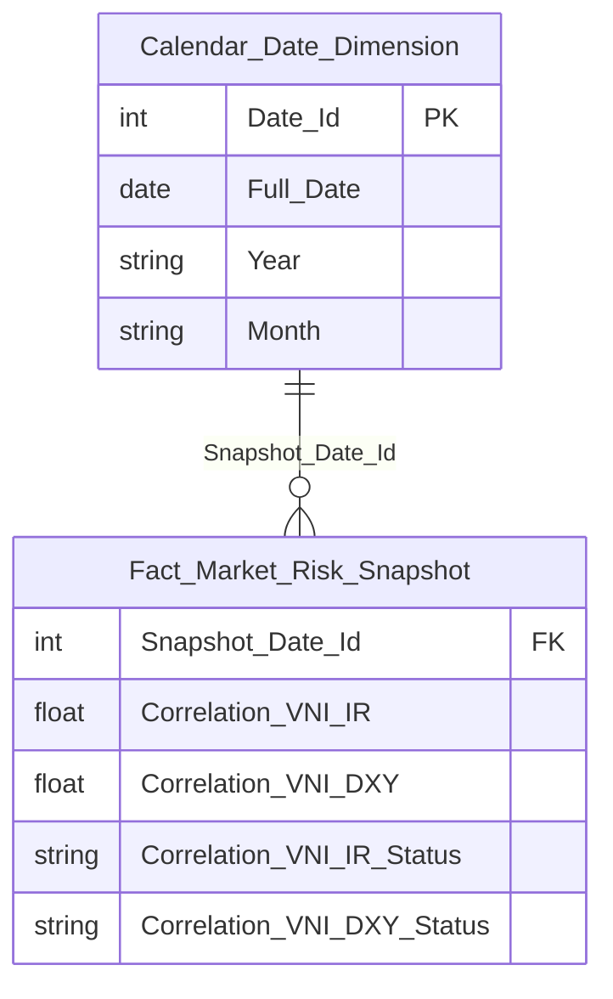

**Lineage Mart → Báo cáo:**

```mermaid
flowchart LR
    fct_mkt_rsk_snpst["Fact Market Risk Snapshot"]
    cdr_dt_dim["Calendar Date Dimension"]
    rpt_nhom5["Nhóm 5 - Biểu đồ Macro correlation map"]
    cdr_dt_dim --> fct_mkt_rsk_snpst
    fct_mkt_rsk_snpst --> rpt_nhom5
```

**Bảng grain:**

| Tên bảng | Grain |
|---|---|
| Fact Market Risk Snapshot | 1 row / ngày |
| Calendar Date Dimension | 1 row / ngày |

---

#### Nhóm 6 - Tương quan chỉ số và lãi suất thực tế

> Phân loại: **Phân tích**
> Atomic: `Market Index Snapshot` ← MDDS.MarketInfor — **READY**
> Atomic: `Risk Indicator Value` ← QLRR.RISK_INDICATOR_VALUE — **READY**

**Mockup:**

| Thời gian | VN-Index bình quân | Lãi suất bình quân (%) |
|---|---|---|
| 01/03 | 1248.2 | 6.05 |
| 07/03 | 1260.5 | 6.05 |
| 14/03 | 1263.1 | 6.04 |
| ... | ... | ... |
| 31/03 | 1290.3 | 6.03 |

**Source:** `Fact Market Risk Snapshot` → `Calendar Date Dimension`

**Bảng KPI:**

| KPI ID | Tên KPI | Đơn vị | Tính chất | Công thức | Ghi chú |
|---|---|---|---|---|---|
| K_PTTT_41 | Chiều Thời gian (Ngày thống kê) | Ngày | Chiều | :input_date — tham số người dùng chọn | Reuse từ Nhóm 4 |
| K_PTTT_65 | Chỉ số VN-Index tại ngày t | Điểm | Cơ sở | mkt_indx_snpst.cls_indx_val WHERE indx_code='VNINDEX' AND tdg_dt=snapshot_date | Reuse từ Nhóm 5 |
| K_PTTT_28 | Lãi suất liên ngân hàng tại ngày t (IRₜ) | % | Cơ sở | rsk_ind_val.val WHERE bsn_key='INTERBANK_IR' AND prd_dt=snapshot_date | Reuse từ Nhóm 3 |
| K_PTTT_77 | Chỉ số Index bình quân tháng (VN-Index AVG) | Điểm | Phái sinh | AVG(mkt_indx_snpst.cls_indx_val WHERE indx_code='VNINDEX') GROUP BY TRUNC(tdg_dt,'MM') | |
| K_PTTT_78 | Lãi suất bình quân tháng (IR AVG) | % | Phái sinh | AVG(rsk_ind_val.val WHERE bsn_key='INTERBANK_IR') GROUP BY TRUNC(prd_dt,'MM') | |

**Star Schema:**

```mermaid
erDiagram
    Fact_Market_Risk_Snapshot {
        int Snapshot_Date_Id FK
        float VNIndex_Close
        float Interbank_IR
        float VNIndex_Monthly_Avg
        float IR_Monthly_Avg
    }
    Calendar_Date_Dimension {
        int Date_Id PK
        date Trading_Date
        int Year
        int Month
    }
    Calendar_Date_Dimension ||--o{ Fact_Market_Risk_Snapshot : "Snapshot_Date_Id"
```

**Lineage Mart → Báo cáo:**

```mermaid
flowchart LR
    fct_mkt_rsk_snpst["Fact Market Risk Snapshot"]
    cdr_dt_dim["Calendar Date Dimension"]
    rpt_nhom6["Nhóm 6 - Tương quan chỉ số và lãi suất thực tế"]
    cdr_dt_dim --> fct_mkt_rsk_snpst
    fct_mkt_rsk_snpst --> rpt_nhom6
```

**Bảng grain:**

| Tên bảng | Grain |
|---|---|
| Fact Market Risk Snapshot | 1 row / ngày |
| Calendar Date Dimension | 1 row / ngày |

---

#### Nhóm 7 - Biểu đồ áp lực ngành

##### READY

> Phân loại: **Phân tích**
> Atomic: `Security Trading Snapshot` ← MDDS.StockInfor — **READY** | `Security Match Log` ← MSS.Trade_HOSE/Trade_HNX — **READY** | `Public Company Financial Report Value` ← IDS.data/report_catalog/company_data — **READY** | `Public Company` ← IDS.categories/company_detail — **READY**

**Mockup:**

| Nhóm ngành | Áp lực (StressScore) | Thanh khoản (LiquidScore) | Nợ (D/E) | Đánh giá |
|---|---|---|---|---|
| Ngân hàng | 12 | 87 | 91 | SAFE |
| BĐS | 82 | 30 | 44 | HIGH RISK |
| Xây dựng | 68 | 42 | 55 | WARNING |
| Công nghệ | 15 | 98 | 99 | EXCELLENT |
| Dầu khí | 35 | 66 | 76 | STABLE |
| Bán lẻ | 42 | 70 | 83 | WATCH |

*(StressScoreSector tổng hợp, LiquidScore, Xếp hạng — PENDING do thiếu MarketCap)*

**Source:** `Fact Sector Risk Snapshot` → `Calendar Date Dimension`

**Bảng KPI:**

| KPI ID | Tên KPI | Đơn vị | Tính chất | Công thức | Ghi chú |
|---|---|---|---|---|---|
| K_PTTT_41 | Chiều Thời gian (Ngày thống kê) | Ngày | Chiều | scr_tdg_snpst.tdg_dt = :input_date | Reuse từ Nhóm 4 |
| K_PTTT_79 | Chiều Nhóm ngành | Text | Chiều | pblc_co.category_l1_id JOIN IDS.categories WHERE active_flg=1 | |
| K_PTTT_80 | Giá đóng cửa mã CK tại t (Pₜ) | VND | Cơ sở | scr_tdg_snpst.cls_prc WHERE tdg_dt=:input_date AND flr_code IN ('02','04','10') | per stock |
| K_PTTT_81 | Giá đóng cửa mã CK tại t-1 (Pₜ₋₁) | VND | Cơ sở | scr_tdg_snpst.cls_prc WHERE tdg_dt=MAX(tdg_dt)<:input_date AND flr_code IN ('02','04','10') | per stock |
| K_PTTT_82 | Lợi suất ngày per-stock (Rₜ) | % | Cơ sở | LN(K_PTTT_80 / K_PTTT_81) — scr_tdg_snpst | per stock; khác K_PTTT_59 (VN-Index level) |
| K_PTTT_83 | Lợi suất trung bình 30 phiên per-stock (R̄) | % | Phái sinh | AVG(LN(cls_prc[t]/cls_prc[t-1])) trên 30 ngày gần nhất per scr_tdg_snpst.scr_code | |
| K_PTTT_84 | Độ lệch chuẩn lợi suất per-stock (σᵢ) | Số thực | Phái sinh | SQRT(SUM((Rₜ − K_PTTT_83)²)/(N−1)) trên N phiên per scr_tdg_snpst.scr_code | |
| K_PTTT_85 | σ_min toàn thị trường trong N phiên | Số thực | Phái sinh | MIN(K_PTTT_84) GROUP BY tdg_dt | aggregate toàn bộ mã |
| K_PTTT_86 | σ_max toàn thị trường trong N phiên | Số thực | Phái sinh | MAX(K_PTTT_84) GROUP BY tdg_dt | aggregate toàn bộ mã |
| K_PTTT_87 | Pvolatility — Điểm biến động chuẩn hóa | Điểm (0–100) | Phái sinh | (K_PTTT_84 − K_PTTT_85) / (K_PTTT_86 − K_PTTT_85) × 100 | per stock |
| K_PTTT_88 | Giá cao nhất N phiên per-stock | VND | Cơ sở | MAX(scr_tdg_snpst.cls_prc) trên N phiên gần nhất per scr_code | |
| K_PTTT_89 | Pdrawdown — Price Drawdown | Điểm (0–100) | Phái sinh | (K_PTTT_88 − K_PTTT_80) / K_PTTT_88 × 100 | per stock |
| K_PTTT_90 | SellVolume_i — Khối lượng bán chủ động N phiên | KL | Phái sinh | SUM(scr_mtch_log.acm_vol WHERE mtch_drc_code='S') per scr_code, N phiên | TransLog → scr_mtch_log |
| K_PTTT_91 | TotalVolume_i — Tổng khối lượng giao dịch N phiên | KL | Phái sinh | SUM(scr_mtch_log.acm_vol) per scr_code, N phiên WHERE market_id IN ('STO','STX','UPX') | |
| K_PTTT_92 | Pselling — Selling Pressure | Điểm (0–1) | Phái sinh | K_PTTT_90 / K_PTTT_91 | per stock |
| K_PTTT_93 | StressScore từng mã CK (StressScoreᵢ) | Điểm (0–100) | Phái sinh | (W₁ × K_PTTT_89) + (W₂ × K_PTTT_87) + (W₃ × K_PTTT_92 × 100) | W₁+W₂+W₃=1; cấu hình từ Kho dữ liệu |
| K_PTTT_94 | TotalValue_Sector — Tổng GTGD ngành | Tỷ VND | Phái sinh | SUM(scr_tdg_snpst.cls_prc × scr_mtch_log.acm_vol) JOIN scr_tdg_snpst.scr_code = scr_mtch_log.scr_code AND scr_tdg_snpst.tdg_dt = scr_mtch_log.tdg_dt GROUP BY pblc_co.category_l1_id AND tdg_dt | Giá từ scr_tdg_snpst; KL khớp từ scr_mtch_log; ngành từ pblc_co.category_l1_id |
| K_PTTT_95 | Sector Debt Score (D/E ngành) | Lần | Phái sinh | SUM(pblc_co_fnc_rpt_val.val WHERE row_desc∈{'300' dn,'300' bh,'400' td}) / SUM(pblc_co_fnc_rpt_val.val WHERE row_desc∈{'400' dn,'400' bh,'500' td}) GROUP BY category_l1_id | IDS.data → pblc_co_fnc_rpt_val; GROUP BY ngành |

**Star Schema:**

```mermaid
erDiagram
    Fact_Sector_Risk_Snapshot {
        int Snapshot_Date_Id FK
        int Sector_Id FK
        float Sector_Avg_Pdrawdown
        float Sector_Avg_Pvolatility
        float Sector_Avg_Pselling
        float Sector_Avg_Stress_Score
        float Sector_Total_Value
        float Sector_Debt_Score
    }
    Calendar_Date_Dimension {
        int Date_Id PK
        date Full_Date
        string Year
        string Month
    }
    Sector_Dimension {
        int Sector_Id PK
        string Sector_Code
        string Sector_Name
    }
    Calendar_Date_Dimension ||--o{ Fact_Sector_Risk_Snapshot : "Snapshot_Date_Id"
    Sector_Dimension ||--o{ Fact_Sector_Risk_Snapshot : "Sector_Id"
```

**Lineage Mart → Báo cáo:**

```mermaid
flowchart LR
    fct_sctr_rsk_snpst["Fact Sector Risk Snapshot"]
    cdr_dt_dim["Calendar Date Dimension"]
    sctr_dim["Sector Dimension"]
    rpt_nhom7["Nhóm 7 - Biểu đồ áp lực ngành"]
    cdr_dt_dim --> fct_sctr_rsk_snpst
    sctr_dim --> fct_sctr_rsk_snpst
    fct_sctr_rsk_snpst --> rpt_nhom7
```

**Bảng grain:**

| Tên bảng | Grain |
|---|---|
| Fact Sector Risk Snapshot | 1 row / ngành / ngày |
| Calendar Date Dimension | 1 row / ngày |
| Sector Dimension | 1 row / ngành |

##### PENDING

**KPI liên quan:** K_PTTT_96, K_PTTT_97, K_PTTT_98, K_PTTT_99, K_PTTT_100, K_PTTT_101, K_PTTT_102, K_PTTT_103

**Lý do pending:** Khối lượng cổ phiếu lưu hành per mã CK đến từ nguồn VSDC (Báo cáo TT138.2025.TT.BTC) — chưa có Atomic entity tương ứng. Các KPI phụ thuộc MarketCap (wi, TotalCap_Sector, LiquidScore, StressScoreSector tổng hợp, Biến động áp lực, Xếp hạng) đều PENDING theo.

**Atomic cần bổ sung:** Atomic entity cho KL CK lưu hành từ VSDC — hiện `scr_tdg_snpst.tot_listing_vol` chỉ có cho MDDS.StockInfor (xem O_PTTT_3), VSDC là nguồn mới chưa thiết kế Atomic.

**Mart dự kiến:**
- `Fact Sector Risk Snapshot` — grain: 1 row / ngành / ngày (bổ sung thêm Sector_Liquid_Score, Sector_Stress_Score_Weighted, Sector_Stress_Delta, Sector_Rating khi Atomic VSDC sẵn sàng)

**Bảng mapping nguồn (Atomic Placeholder):**

| Tên KPI | Bảng nguồn (BA) | Atomic entity dự kiến | Atomic table dự kiến |
|---|---|---|---|
| KL CK lưu hành per mã | VSDC.TT138_2025_BaoCaoKLCK | Security Listing Volume | scr_listing_vol hoặc TBD |

**Bảng KPI PENDING:**

| KPI ID | Tên KPI | Tính chất | Trạng thái |
|---|---|---|---|
| K_PTTT_96 | KL cổ phiếu lưu hành per mã CK | Cơ sở | PENDING |
| K_PTTT_97 | MarketCap_i (Vốn hóa từng mã) | Phái sinh | PENDING |
| K_PTTT_98 | TotalCap_Sector (Tổng vốn hóa ngành) | Phái sinh | PENDING |
| K_PTTT_99 | wᵢ — Trọng số vốn hóa per mã trong ngành | Phái sinh | PENDING |
| K_PTTT_100 | StressScoreSector — Chỉ số căng thẳng ngành tổng hợp | Phái sinh | PENDING |
| K_PTTT_101 | Sector Liquid Score (TotalValue / TotalCap) | Phái sinh | PENDING |
| K_PTTT_102 | Biến động áp lực (Stress Score kỳ này − kỳ trước) | Phái sinh | PENDING |
| K_PTTT_103 | Xếp hạng ngành (EXCELLENT / WARNING / HIGH RISK...) | Phái sinh | PENDING |

---

### Tab Dashboard Thanh khoản và đòn bẩy

#### Nhóm 8 - Chỉ số chung

##### READY

> Phân loại: **Phân tích**
> Atomic: `Security Match Log` ← MSS.Trade_HOSE/Trade_HNX — **READY** | `Member Report Indicator Value` ← SCMS.BC_BAO_CAO_GT — **READY**

**Mockup:**

| Chỉ tiêu | Giá trị | % thay đổi |
|---|---|---|
| GTGD phiên (Tỷ VND) | 25.800 | +9.3% |
| Dư nợ margin (Tỷ VND) | 252.000 | +3.1% |
| Quy mô lệnh TB (M) | 45.2 | Stable |

**Source:** `Fact Market Risk Snapshot` → `Calendar Date Dimension`

**Bảng KPI:**

| KPI ID | Tên KPI | Đơn vị | Tính chất | Công thức | Ghi chú |
|---|---|---|---|---|---|
| K_PTTT_41 | Chiều Thời gian (Ngày thống kê) | Ngày | Chiều | `scr_mtch_log.tdg_dt = :input_date` | Reuse từ Nhóm 4 |
| K_PTTT_104 | GTGDₜ — Tổng GTGD khớp lệnh toàn thị trường ngày t | Tỷ VND | Cơ sở | `SUM(scr_mtch_log.acm_val)` WHERE `scr_mtch_log.tdg_dt = :input_date` AND `mkt_id IN ('STO','STX','UPX')` AND `brd_tp_code IN ('G1','G2','G3')` | acm_val = Execution-Value (HOSE) hoặc trade_price × trade_quantity (HNX/UPCOM) |
| K_PTTT_105 | GTGDt-1 — Tổng GTGD khớp lệnh ngày giao dịch trước | Tỷ VND | Cơ sở | `SUM(scr_mtch_log.acm_val)` WHERE `scr_mtch_log.tdg_dt = MAX(tdg_dt) < :input_date` AND `mkt_id IN ('STO','STX','UPX')` AND `brd_tp_code IN ('G1','G2','G3')` | |
| K_PTTT_106 | % thay đổi GTGD phiên | % | Phái sinh | `(K_PTTT_104 − K_PTTT_105) / K_PTTT_105 × 100` | |
| K_PTTT_107 | GTGD phiên tổng kỳ (từ ngày → đến ngày) | Tỷ VND | Phái sinh | `SUM(scr_mtch_log.acm_val)` WHERE `scr_mtch_log.tdg_dt BETWEEN :from_date AND :to_date` AND `mkt_id IN ('STO','STX','UPX')` AND `brd_tp_code IN ('G1','G2','G3')` | |
| K_PTTT_55 | Dư nợ margin tổng các CTCK | Tỷ VND | Cơ sở | `SUM(mbr_rpt_ind_val.val)` WHERE `rpt_ind_code = [mã 'Giá trị chứng khoán ký quỹ']` AND `rpt_dt = :input_date` | Reuse từ Nhóm 4; SCMS.BC_BAO_CAO_GT → mbr_rpt_ind_val |
| K_PTTT_108 | Tổng GTGD khớp lệnh tại ngày | Tỷ VND | Phái sinh | `SUM(scr_mtch_log.acm_val)` WHERE `tdg_dt = :input_date` AND `mkt_id IN ('STO','STX','UPX')` AND `brd_tp_code IN ('G1','G2','G3')` | Dùng trong mẫu số Quy mô lệnh TB |
| K_PTTT_109 | Tổng số lệnh khớp tại ngày | Lệnh | Phái sinh | `COUNT(*)` FROM `scr_mtch_log` WHERE `tdg_dt = :input_date` AND `mkt_id IN ('STO','STX','UPX')` AND `brd_tp_code IN ('G1','G2','G3')` | Mỗi bản ghi = 1 lệnh khớp |
| K_PTTT_110 | Quy mô lệnh trung bình | Triệu VND | Phái sinh | `K_PTTT_108 / K_PTTT_109` | |
| K_PTTT_111 | KLGD khớp lệnh tại ngày | Cổ phần | Cơ sở | `SUM(scr_mtch_log.acm_vol)` WHERE `tdg_dt = :input_date` AND `mkt_id IN ('STO','STX','UPX')` AND `brd_tp_code IN ('G1','G2','G3')` | Execution-Volume (HOSE) hoặc Trade_quantity (HNX) |

**Star Schema:**

```mermaid
erDiagram
    Fact_Market_Risk_Snapshot {
        int Snapshot_Date_Id FK
        float Trading_Value_Bil_VND
        float Trading_Value_Prev_Day_Bil_VND
        float Trading_Value_Pct_Change
        float Trading_Value_Period_Total_Bil_VND
        float Margin_Debt_Total_Bil_VND
        float Avg_Order_Size_Mil_VND
        float Total_Match_Volume
    }
    Calendar_Date_Dimension {
        int Date_Id PK
        date Full_Date
        string Year
        string Month
    }
    Calendar_Date_Dimension ||--o{ Fact_Market_Risk_Snapshot : "Snapshot_Date_Id"
```

**Lineage Mart → Báo cáo:**

```mermaid
flowchart LR
    fct_mkt_rsk_snpst["Fact Market Risk Snapshot"]
    cdr_dt_dim["Calendar Date Dimension"]
    rpt_nhom8["Nhóm 8 - Chỉ số chung (Thanh khoản & Đòn bẩy)"]
    cdr_dt_dim --> fct_mkt_rsk_snpst
    fct_mkt_rsk_snpst --> rpt_nhom8
```

**Bảng grain:**

| Tên bảng | Grain |
|---|---|
| Fact Market Risk Snapshot | 1 row / ngày |
| Calendar Date Dimension | 1 row / ngày |

##### PENDING (Tốc độ vòng quay TVI)

**KPI liên quan:** K_PTTT_96 (reuse từ Nhóm 7), K_PTTT_97 (reuse từ Nhóm 7), K_PTTT_112, K_PTTT_113, K_PTTT_114, K_PTTT_115

**Lý do pending:** Tốc độ vòng quay TVI = Σ GTGD / Σ Average MarketCap × 252 — phụ thuộc MarketCap (giá × KL CK lưu hành). KL CK lưu hành đến từ VSDC (TT138.2025.TT.BTC) — chưa có Atomic entity, đã ghi nhận tại O_PTTT_3.

**Atomic cần bổ sung:** Xem O_PTTT_3 — Atomic entity `Security Listing Volume` từ VSDC.

**Mart dự kiến:**
- `Fact Market Risk Snapshot` — grain: 1 row / ngày (bổ sung thêm TVI, Avg_Market_Cap, Turnover_Classification khi VSDC Atomic sẵn sàng)

**Bảng mapping nguồn (Atomic Placeholder):**

| Tên KPI | Bảng nguồn (BA) | Atomic entity dự kiến | Atomic table dự kiến |
|---|---|---|---|
| KL CK lưu hành per mã | VSDC.TT138_2025_BaoCaoKLCK | Security Listing Volume | scr_listing_vol hoặc TBD |

**Bảng KPI PENDING:**

| KPI ID | Tên KPI | Tính chất | Trạng thái |
|---|---|---|---|
| K_PTTT_96 | KL cổ phiếu lưu hành per mã CK (reuse từ Nhóm 7) | Cơ sở | PENDING |
| K_PTTT_97 | MarketCap_i — Vốn hóa từng mã (reuse từ Nhóm 7) | Phái sinh | PENDING |
| K_PTTT_112 | Σ Average MarketCap — Tổng vốn hóa bình quân toàn thị trường | Phái sinh | PENDING |
| K_PTTT_113 | Vốn hóa bình quân qua N ngày — AVG(MarketCapₜ) | Phái sinh | PENDING |
| K_PTTT_114 | Tốc độ vòng quay TVI | Lần | PENDING |
| K_PTTT_115 | Phân loại TVI (Cold / Healthy / Overheated) | Phái sinh | PENDING |

#### Nhóm 9 - Xu hướng thanh khoản thị trường

> Phân loại: **Phân tích**
> Atomic: `Security Match Log` ← MSS.Trade_HOSE/Trade_HNX — **READY**

**Mockup:**

| Ngày | GTGD Phiên (Tỷ VND) | TB 50 Phiên (Tỷ VND) |
|---|---|---|
| 2026-03-01 | 18,500 | 16,200 |
| 2026-03-05 | 20,500 | 16,350 |
| 2026-03-10 | 19,800 | 16,480 |
| ... | ... | ... |
| 2026-03-31 | 25,800 | 16,950 |

**Source:** `Fact Market Risk Snapshot` → `Calendar Date Dimension`

**Bảng KPI:**

| KPI ID | Tên KPI | Đơn vị | Tính chất | Công thức | Ghi chú |
|---|---|---|---|---|---|
| K_PTTT_41 | Chiều Thời gian (Ngày giao dịch) | Ngày | Chiều | `scr_mtch_log.tdg_dt` WHERE `mkt_id IN ('STO','STX','UPX')` | Reuse từ Nhóm 4 |
| K_PTTT_104 | GTGDₜ — Tổng GTGD khớp lệnh toàn thị trường ngày t | Tỷ VND | Cơ sở | `SUM(scr_mtch_log.acm_val)` WHERE `tdg_dt = :input_date` AND `mkt_id IN ('STO','STX','UPX')` AND `brd_tp_code IN ('G1','G2','G3')` | Reuse từ Nhóm 8 |
| K_PTTT_116 | GTGD MA50 — Trung bình GTGD khớp lệnh 50 phiên giao dịch gần nhất tại ngày t | Tỷ VND | Phái sinh | `AVG(daily_gtgd)` trong đó `daily_gtgd = SUM(scr_mtch_log.acm_val)` GROUP BY `tdg_dt`, lấy 50 ngày giao dịch gần nhất có `tdg_dt <= :input_date` WHERE `mkt_id IN ('STO','STX','UPX')` AND `brd_tp_code IN ('G1','G2','G3')` | Window: 50 phiên liên tiếp kết thúc tại ngày t |
| K_PTTT_111 | KLGD khớp lệnh tại ngày | Cổ phần | Cơ sở | `SUM(scr_mtch_log.acm_vol)` WHERE `tdg_dt = :input_date` AND `mkt_id IN ('STO','STX','UPX')` AND `brd_tp_code IN ('G1','G2','G3')` | Reuse từ Nhóm 8 |
| K_PTTT_117 | Giá khớp per giao dịch | VND | Cơ sở | `scr_mtch_log.mtch_prc` (HOSE: Execution price; HNX: Trade price) WHERE `mkt_id IN ('STO','STX','UPX')` | Sub-component tính GTGD = acm_vol × mtch_prc; không aggregate |

**Star Schema:**

```mermaid
erDiagram
    Fact_Market_Risk_Snapshot {
        int Snapshot_Date_Id FK
        float Trading_Value_Bil_VND
        float Trading_Value_MA50_Bil_VND
        float Total_Match_Volume
    }
    Calendar_Date_Dimension {
        int Date_Id PK
        date Full_Date
        string Year
        string Month
    }
    Calendar_Date_Dimension ||--o{ Fact_Market_Risk_Snapshot : "Snapshot_Date_Id"
```

**Lineage Mart → Báo cáo:**

```mermaid
flowchart LR
    fct_mkt_rsk_snpst["Fact Market Risk Snapshot"]
    cdr_dt_dim["Calendar Date Dimension"]
    rpt_nhom9["Nhóm 9 - Xu hướng thanh khoản thị trường"]
    cdr_dt_dim --> fct_mkt_rsk_snpst
    fct_mkt_rsk_snpst --> rpt_nhom9
```

**Bảng grain:**

| Tên bảng | Grain |
|---|---|
| Fact Market Risk Snapshot | 1 row / ngày |
| Calendar Date Dimension | 1 row / ngày |

#### Nhóm 10 - Áp lực đòn bẩy hệ thống (Margin Stress)

> Phân loại: **Phân tích**
> Atomic: `Member Report Indicator Value` ← SCMS.BC_BAO_CAO_GT/DM_CHI_TIEU — **READY** | `Security Match Log` ← MSS.Trade_HOSE/Trade_HNX — **READY**

**Mockup:**

| Chỉ tiêu | Giá trị |
|---|---|
| Margin Stress (Tỷ lệ bão hòa) | 79% SATURATION |
| Trạng thái | NGƯỠNG THẬN TRỌNG |

**Source:** `Fact Market Risk Snapshot` → `Calendar Date Dimension`

**Bảng KPI:**

| KPI ID | Tên KPI | Đơn vị | Tính chất | Công thức | Ghi chú |
|---|---|---|---|---|---|
| K_PTTT_41 | Chiều Thời gian (Ngày thống kê) | Ngày | Chiều | `scr_mtch_log.tdg_dt = :input_date` | Reuse từ Nhóm 4 |
| K_PTTT_55 | Tổng dư nợ margin các CTCK | Tỷ VND | Phái sinh | `SUM(mbr_rpt_ind_val.val)` WHERE `rpt_ind_code = [mã 'Giá trị chứng khoán ký quỹ']` AND `rpt_dt = MAX(rpt_dt) <= :input_date` | Reuse từ Nhóm 4; SCMS tần suất tháng — lấy kỳ gần nhất |
| K_PTTT_118 | Margin tháng t — dư nợ margin kỳ hiện tại | Tỷ VND | Cơ sở | `SUM(mbr_rpt_ind_val.val)` WHERE `rpt_ind_code = [mã 'Giá trị chứng khoán ký quỹ']` AND `rpt_dt = MAX(rpt_dt) <= :input_date` | SCMS.BC_BAO_CAO_GT; cùng nguồn K_PTTT_55, dùng riêng trong công thức Δ |
| K_PTTT_119 | Margin tháng t-1 — dư nợ margin kỳ trước | Tỷ VND | Cơ sở | `SUM(mbr_rpt_ind_val.val)` WHERE `rpt_ind_code = [mã 'Giá trị chứng khoán ký quỹ']` AND `rpt_dt = MAX(rpt_dt) < (rpt_dt của K_PTTT_118)` | Kỳ tháng liền trước K_PTTT_118 |
| K_PTTT_120 | Δ Margin Balance — thay đổi dư nợ margin giữa 2 kỳ | Tỷ VND | Phái sinh | `K_PTTT_118 − K_PTTT_119` | |
| K_PTTT_104 | GTGDₜ — Tổng GTGD khớp lệnh toàn thị trường ngày t | Tỷ VND | Cơ sở | `SUM(scr_mtch_log.acm_val)` WHERE `tdg_dt = :input_date` AND `mkt_id IN ('STO','STX','UPX')` AND `brd_tp_code IN ('G1','G2','G3')` | Reuse từ Nhóm 8 |
| K_PTTT_121 | Avg Trading Value — GTGD bình quân N phiên | Tỷ VND | Phái sinh | `AVG(daily_gtgd)` trong đó `daily_gtgd = SUM(scr_mtch_log.acm_val)` GROUP BY `tdg_dt`, lấy N ngày giao dịch gần nhất có `tdg_dt <= :input_date` WHERE `mkt_id IN ('STO','STX','UPX')` AND `brd_tp_code IN ('G1','G2','G3')` | Mẫu số công thức Margin Stress; N ngày = cấu hình (mặc định 30 phiên) |
| K_PTTT_122 | Margin Stress — Tỷ lệ bão hòa đòn bẩy | % | Phái sinh | `ABS(K_PTTT_120) / K_PTTT_121 × 100` | Công thức: `\|Δmargin Balance\| / Avg Trading Value × 100`; khác K_PTTT_57 (Margin Tension = TotalMargin / 2×VCSH) |
| K_PTTT_123 | Trạng thái Margin Stress | Text | Phái sinh | Lookup: `< 60% → An toàn`, `60–75% → Theo dõi`, `> 75% → Thận trọng / Cảnh báo` | Ngưỡng cấu hình từ Kho dữ liệu |

**Star Schema:**

```mermaid
erDiagram
    Fact_Market_Risk_Snapshot {
        int Snapshot_Date_Id FK
        float Margin_Debt_Total_Bil_VND
        float Margin_Delta_Bil_VND
        float Avg_Trading_Value_Bil_VND
        float Margin_Stress_Pct
        string Margin_Stress_Status
    }
    Calendar_Date_Dimension {
        int Date_Id PK
        date Full_Date
        string Year
        string Month
    }
    Calendar_Date_Dimension ||--o{ Fact_Market_Risk_Snapshot : "Snapshot_Date_Id"
```

**Lineage Mart → Báo cáo:**

```mermaid
flowchart LR
    fct_mkt_rsk_snpst["Fact Market Risk Snapshot"]
    cdr_dt_dim["Calendar Date Dimension"]
    rpt_nhom10["Nhóm 10 - Áp lực đòn bẩy hệ thống (Margin Stress)"]
    cdr_dt_dim --> fct_mkt_rsk_snpst
    fct_mkt_rsk_snpst --> rpt_nhom10
```

**Bảng grain:**

| Tên bảng | Grain |
|---|---|
| Fact Market Risk Snapshot | 1 row / ngày |
| Calendar Date Dimension | 1 row / ngày |

#### Nhóm 11 - Cấu trúc quy mô lệnh

> Phân loại: **Phân tích**
> Atomic: `Security Match Log` ← MSS.Trade_HOSE/Trade_HNX — **READY**

**Mockup:**

| Mã CK | Ngày | GTGD (Tỷ VND) | Nhóm quy mô | KL khớp |
|---|---|---|---|---|
| VCB | 2026-03-31 | 1.85 | GTGD ≥ 1 tỷ | 720,000 |
| TCB | 2026-03-31 | 0.43 | GTGD < 1 tỷ | 185,000 |
| FPT | 2026-03-31 | 2.10 | GTGD ≥ 1 tỷ | 480,000 |
| ... | ... | ... | ... | ... |

Biểu đồ thanh — phân loại 25.600 mã theo 2 band: GTGD cao (≥ 1 tỷ) màu xanh / GTGD thấp (< 1 tỷ) màu đỏ.

**Source:** `Fact Order Size Snapshot` → `Calendar Date Dimension`

**Bảng KPI:**

| KPI ID | Tên KPI | Đơn vị | Tính chất | Công thức | Ghi chú |
|---|---|---|---|---|---|
| K_PTTT_41 | Chiều Thời gian (Ngày thống kê) | Ngày | Chiều | `:input_date` — tham số đầu vào người dùng chọn | Reuse từ Nhóm 4 |
| K_PTTT_124 | GTGD per mã CK tại ngày t | Tỷ VND | Phái sinh | `SUM(scr_mtch_log.acm_val)` GROUP BY `scr_mtch_log.scr_code`, `scr_mtch_log.tdg_dt` WHERE `tdg_dt = :input_date` AND `mkt_id IN ('STO','STX','UPX')` AND `brd_tp_code IN ('G1','G2','G3')` | per-symbol; khác K_PTTT_104 là tổng toàn thị trường |
| K_PTTT_125 | Phân loại quy mô lệnh (Order Size Band) | Text | Phái sinh | `CASE WHEN K_PTTT_124 >= 1,000,000,000 THEN 'GTGD >= 1 ty' ELSE 'GTGD < 1 ty' END` | Ngưỡng 1 tỷ VND per mã per ngày |
| K_PTTT_111 | KL khớp lệnh tại ngày | Cổ phần | Cơ sở | `SUM(scr_mtch_log.acm_vol)` GROUP BY `scr_mtch_log.scr_code`, `scr_mtch_log.tdg_dt` WHERE `tdg_dt = :input_date` AND `mkt_id IN ('STO','STX','UPX')` AND `brd_tp_code IN ('G1','G2','G3')` | Reuse từ Nhóm 8; ở đây GROUP BY per-symbol |
| K_PTTT_117 | Giá khớp per giao dịch | VND | Cơ sở | `scr_mtch_log.mtch_prc` WHERE `tdg_dt = :input_date` AND `mkt_id IN ('STO','STX','UPX')` | Reuse từ Nhóm 9; sub-component tính GTGD = acm_vol × mtch_prc |

**Star Schema:**

```mermaid
erDiagram
    Fact_Order_Size_Snapshot {
        int Snapshot_Date_Id FK
        string Security_Code
        string Order_Size_Band
        float Trading_Value_Bil_VND
        float Match_Volume
    }
    Calendar_Date_Dimension {
        int Date_Id PK
        date Full_Date
        string Year
        string Month
    }
    Calendar_Date_Dimension ||--o{ Fact_Order_Size_Snapshot : "Snapshot_Date_Id"
```

**Lineage Mart → Báo cáo:**

```mermaid
flowchart LR
    fct_ordr_sz_snpst["Fact Order Size Snapshot"]
    cdr_dt_dim["Calendar Date Dimension"]
    rpt_nhom11["Nhóm 11 - Cấu trúc quy mô lệnh"]
    cdr_dt_dim --> fct_ordr_sz_snpst
    fct_ordr_sz_snpst --> rpt_nhom11
```

**Bảng grain:**

| Tên bảng | Grain |
|---|---|
| Fact Order Size Snapshot | 1 row / mã CK / order_size_band / ngày |
| Calendar Date Dimension | 1 row / ngày |

#### Nhóm 12 - Phân bổ thanh khoản theo nhóm vốn hóa

**KPI liên quan:** K_PTTT_126 (mới); K_PTTT_127 (mới); K_PTTT_128 (mới); K_PTTT_129 (mới); K_PTTT_96, K_PTTT_97 (reuse từ Nhóm 7); K_PTTT_41, K_PTTT_80, K_PTTT_111, K_PTTT_117 (reuse từ các Nhóm trước)

**Lý do pending:** Phân nhóm vốn hóa (Large/Mid/Small-cap) yêu cầu MarketCap = Giá đóng cửa × KL CK lưu hành. KL CK lưu hành đến từ VSDC (Báo cáo TT138.2025.TT.BTC) — chưa có Atomic entity tương ứng. Blocker đồng nhất với Nhóm 7 (O_PTTT_3 + O_PTTT_6).

**Atomic cần bổ sung:** Atomic entity `Security Listing Volume` từ VSDC — xem O_PTTT_3 và O_PTTT_6.

**Mart dự kiến:**
- `Fact Cap Group Snapshot` (`fct_cap_grp_snpst`) — grain: 1 row / nhóm vốn hóa / ngày

**Bảng mapping nguồn (Atomic Placeholder):**

| Tên KPI | Bảng nguồn (BA) | Atomic entity dự kiến | Atomic table dự kiến |
|---|---|---|---|
| KL CK lưu hành per mã CK | VSDC.TT138_2025_BaoCaoKLCK | Security Listing Volume | scr_listing_vol hoặc TBD |
| Giá đóng cửa per mã CK | MDDS.StockInfor (PriceBoardAPI) | Security Trading Snapshot | scr_tdg_snpst |
| GTGD khớp lệnh per mã CK | MSS.Trade_HOSE / Trade_HNX | Security Match Log | scr_mtch_log |

**Bảng KPI PENDING:**

| KPI ID | Tên KPI | Tính chất | Trạng thái |
|---|---|---|---|
| K_PTTT_41 | Ngày thống kê (Chiều Thời gian) (reuse từ Nhóm 4) | Chiều | PENDING |
| K_PTTT_96 | KL cổ phiếu lưu hành per mã CK (reuse từ Nhóm 7) | Cơ sở | PENDING |
| K_PTTT_80 | Giá đóng cửa mã CK tại t (reuse từ Nhóm 7) | Cơ sở | PENDING |
| K_PTTT_97 | MarketCap_i — Vốn hóa từng mã (reuse từ Nhóm 7) | Phái sinh | PENDING |
| K_PTTT_111 | KL khớp lệnh per mã CK tại ngày (reuse từ Nhóm 8) | Cơ sở | PENDING |
| K_PTTT_117 | Giá khớp per giao dịch (reuse từ Nhóm 9) | Cơ sở | PENDING |
| K_PTTT_126 | Nhóm vốn hóa (Cap Group) — Chiều phân nhóm Large/Mid/Small-cap | Chiều | PENDING |
| K_PTTT_127 | Phân loại vốn hóa — band ngưỡng (< 2 tỷ USD / 2–10 tỷ USD / ≥ 10 tỷ USD) | Phái sinh | PENDING |
| K_PTTT_128 | GTGD nhóm vốn hóa — tổng GTGD khớp per nhóm per ngày | Phái sinh | PENDING |
| K_PTTT_129 | Tỷ trọng thanh khoản nhóm — GTGD nhóm / GTGD toàn thị trường × 100 | Phái sinh | PENDING |

---

### Tab Dashboard Dòng tiền và cơ cấu nhà đầu tư

#### Nhóm 13 - Chỉ số chung

> Phân loại: **Phân tích**
> Atomic: `Security Match Log` ← MSS.Trade_HOSE/Trade_HNX — **READY**

**Mockup:**

| Nhóm NĐT | Dòng tiền ròng (Tỷ VND) |
|---|---|
| NĐT nước ngoài (NET) | -48.1 |
| Tự doanh (NET) | +85.2 |
| Tổ chức nội (NET) | +42.0 |
| Cá nhân nội (NET) | +25.2 |

**Source:** `Fact Investor Flow Snapshot` → `Calendar Date Dimension`, `Investor Group Dimension`

**Bảng KPI:**

| KPI ID | Tên KPI | Đơn vị | Tính chất | Công thức | Ghi chú |
|---|---|---|---|---|---|
| K_PTTT_41 | Chiều Thời gian (Ngày thống kê) | Ngày | Chiều | `scr_mtch_log.tdg_dt = :input_date` | Reuse từ Nhóm 4 |
| K_PTTT_111 | KLGD khớp lệnh tại ngày | Cổ phần | Cơ sở | `SUM(scr_mtch_log.acm_vol)` WHERE `tdg_dt = :input_date` AND `mkt_id IN ('STO','STX','UPX')` | Reuse từ Nhóm 8 |
| K_PTTT_117 | Giá khớp per giao dịch | VND | Cơ sở | `scr_mtch_log.mtch_prc` (HOSE: Execution price; HNX: Trade price) WHERE `mkt_id IN ('STO','STX','UPX')` | Reuse từ Nhóm 9 |
| K_PTTT_130 | GTGD mua NĐTNN | Tỷ VND | Phái sinh | `SUM(scr_mtch_log.acm_vol × scr_mtch_log.mtch_prc)` WHERE `tdg_dt = :input_date` AND `mkt_id IN ('STO','STX','UPX')` AND `buy_frgn_ivsr_tp_code IN ('10','20')` | HOSE: Execution-Volume × Execution-Price; HNX: Trade_quantity × Trade_price |
| K_PTTT_131 | GTGD bán NĐTNN | Tỷ VND | Phái sinh | `SUM(scr_mtch_log.acm_vol × scr_mtch_log.mtch_prc)` WHERE `tdg_dt = :input_date` AND `mkt_id IN ('STO','STX','UPX')` AND `sell_frgn_ivsr_tp_code IN ('10','20')` | |
| K_PTTT_132 | Dòng tiền ròng NĐTNN | Tỷ VND | Phái sinh | `K_PTTT_130 − K_PTTT_131` | > 0 = Mua ròng; < 0 = Bán ròng |
| K_PTTT_133 | GTGD mua NĐT Tự doanh | Tỷ VND | Phái sinh | `SUM(scr_mtch_log.acm_vol × scr_mtch_log.mtch_prc)` WHERE `tdg_dt = :input_date` AND `mkt_id IN ('STO','STX','UPX')` AND `buy_clnt_hse_cls_code IN ('30')` | |
| K_PTTT_134 | GTGD bán NĐT Tự doanh | Tỷ VND | Phái sinh | `SUM(scr_mtch_log.acm_vol × scr_mtch_log.mtch_prc)` WHERE `tdg_dt = :input_date` AND `mkt_id IN ('STO','STX','UPX')` AND `sell_clnt_hse_cls_code IN ('30')` | |
| K_PTTT_135 | Dòng tiền ròng Tự doanh | Tỷ VND | Phái sinh | `K_PTTT_133 − K_PTTT_134` | |
| K_PTTT_136 | GTGD mua NĐT Tổ chức trong nước | Tỷ VND | Phái sinh | `SUM(scr_mtch_log.acm_vol × scr_mtch_log.mtch_prc)` WHERE `tdg_dt = :input_date` AND `mkt_id IN ('STO','STX','UPX')` AND `buy_ivsr_cls_code <> '8000'` | Tổ chức nội = buy_ivsr_cls_code ≠ '8000' |
| K_PTTT_137 | GTGD bán NĐT Tổ chức trong nước | Tỷ VND | Phái sinh | `SUM(scr_mtch_log.acm_vol × scr_mtch_log.mtch_prc)` WHERE `tdg_dt = :input_date` AND `mkt_id IN ('STO','STX','UPX')` AND `sell_ivsr_cls_code <> '8000'` | |
| K_PTTT_138 | Dòng tiền ròng Tổ chức trong nước | Tỷ VND | Phái sinh | `K_PTTT_136 − K_PTTT_137` | |
| K_PTTT_139 | GTGD mua NĐT Cá nhân trong nước | Tỷ VND | Phái sinh | `SUM(scr_mtch_log.acm_vol × scr_mtch_log.mtch_prc)` WHERE `tdg_dt = :input_date` AND `mkt_id IN ('STO','STX','UPX')` AND `buy_ivsr_cls_code = '8000'` | Cá nhân nội = buy_ivsr_cls_code = '8000' |
| K_PTTT_140 | GTGD bán NĐT Cá nhân trong nước | Tỷ VND | Phái sinh | `SUM(scr_mtch_log.acm_vol × scr_mtch_log.mtch_prc)` WHERE `tdg_dt = :input_date` AND `mkt_id IN ('STO','STX','UPX')` AND `sell_ivsr_cls_code = '8000'` | |
| K_PTTT_141 | Dòng tiền ròng Cá nhân trong nước | Tỷ VND | Phái sinh | `K_PTTT_139 − K_PTTT_140` | |

**Star Schema:**

```mermaid
erDiagram
    Fact_Investor_Flow_Snapshot {
        int Snapshot_Date_Id FK
        int Investor_Group_Id FK
        float Buy_Value_Bil_VND
        float Sell_Value_Bil_VND
        float Net_Flow_Bil_VND
        float Net_Flow_MA30_Bil_VND
        float Net_Flow_Correlation_30d
        float Trading_Value_Bil_VND
        float Trading_Value_Ratio_Pct
    }
    Calendar_Date_Dimension {
        int Date_Id PK
        date Full_Date
        string Year
        string Month
    }
    Investor_Group_Dimension {
        int Investor_Group_Id PK
        string Investor_Group_Code
        string Investor_Group_Name
    }
    Calendar_Date_Dimension ||--o{ Fact_Investor_Flow_Snapshot : "Snapshot_Date_Id"
    Investor_Group_Dimension ||--o{ Fact_Investor_Flow_Snapshot : "Investor_Group_Id"
```

**Lineage Mart → Báo cáo:**

```mermaid
flowchart LR
    fct_ivsr_flw_snpst["Fact Investor Flow Snapshot"]
    cdr_dt_dim["Calendar Date Dimension"]
    ivsr_grp_dim["Investor Group Dimension"]
    rpt_nhom13["Nhóm 13 - Chỉ số chung (Dòng tiền NĐT)"]
    cdr_dt_dim --> fct_ivsr_flw_snpst
    ivsr_grp_dim --> fct_ivsr_flw_snpst
    fct_ivsr_flw_snpst --> rpt_nhom13
```

**Bảng grain:**

| Tên bảng | Grain |
|---|---|
| Fact Investor Flow Snapshot | 1 row / nhóm NĐT / ngày |
| Calendar Date Dimension | 1 row / ngày |
| Investor Group Dimension | 1 row / nhóm NĐT |

#### Nhóm 14 - Tương quan dòng tiền khối ngoại và tự doanh

> Phân loại: **Phân tích**
> Atomic: `Security Match Log` ← MSS.Trade_HOSE/Trade_HNX — **READY**

**Mockup:**

| Ngày | Khối ngoại (NET) | Tự doanh (NET) |
|---|---|---|
| 2026-03-06 | -80 | — |
| 2026-03-07 | -130 | +185 |
| 2026-03-08 | -60 | -80 |
| 2026-03-10 | -518 | +90 |
| 2026-03-12 | -120 | +130 |
| 2026-03-13 | -100 | -80 |
| 2026-03-14 | -80 | +80 |
| 2026-03-15 | -430 | -60 |

*Bar chart (Khối ngoại NET màu hồng/đỏ) + Line chart (Tự doanh NET màu xanh tím). Tooltip: ngày, Khối ngoại Net, Tự doanh Net.*

**Source:** `Fact Investor Flow Snapshot` → `Calendar Date Dimension`, `Investor Group Dimension`

**Bảng KPI:**

| KPI ID | Tên KPI | Đơn vị | Tính chất | Công thức | Ghi chú |
|---|---|---|---|---|---|
| K_PTTT_41 | Chiều Thời gian (Ngày thống kê) | Ngày | Chiều | `scr_mtch_log.tdg_dt` | Reuse từ Nhóm 4 |
| K_PTTT_130 | GTGD mua NĐTNN | Tỷ VND | Phái sinh | `SUM(scr_mtch_log.acm_vol × scr_mtch_log.mtch_prc)` WHERE `buy_frgn_ivsr_tp_code IN ('10','20')` | Reuse từ Nhóm 13 |
| K_PTTT_131 | GTGD bán NĐTNN | Tỷ VND | Phái sinh | `SUM(scr_mtch_log.acm_vol × scr_mtch_log.mtch_prc)` WHERE `sell_frgn_ivsr_tp_code IN ('10','20')` | Reuse từ Nhóm 13 |
| K_PTTT_132 | Dòng tiền ròng NĐTNN | Tỷ VND | Phái sinh | `K_PTTT_130 − K_PTTT_131` | Reuse từ Nhóm 13 |
| K_PTTT_133 | GTGD mua NĐT Tự doanh | Tỷ VND | Phái sinh | `SUM(scr_mtch_log.acm_vol × scr_mtch_log.mtch_prc)` WHERE `buy_clnt_hse_cls_code IN ('30')` | Reuse từ Nhóm 13 |
| K_PTTT_134 | GTGD bán NĐT Tự doanh | Tỷ VND | Phái sinh | `SUM(scr_mtch_log.acm_vol × scr_mtch_log.mtch_prc)` WHERE `sell_clnt_hse_cls_code IN ('30')` | Reuse từ Nhóm 13 |
| K_PTTT_135 | Dòng tiền ròng Tự doanh | Tỷ VND | Phái sinh | `K_PTTT_133 − K_PTTT_134` | Reuse từ Nhóm 13 |
| K_PTTT_142 | Dòng tiền ròng NĐTNN trung bình 30 phiên (MA30_NĐTNN) | Tỷ VND | Phái sinh | `AVG(K_PTTT_132)` trên 30 ngày giao dịch gần nhất có `tdg_dt <= :input_date`, GROUP BY không (toàn thị trường) | Window 30 phiên liên tiếp kết thúc tại ngày t |
| K_PTTT_143 | Dòng tiền ròng Tự doanh trung bình 30 phiên (MA30_TựDoanh) | Tỷ VND | Phái sinh | `AVG(K_PTTT_135)` trên 30 ngày giao dịch gần nhất có `tdg_dt <= :input_date` | Window 30 phiên liên tiếp kết thúc tại ngày t |
| K_PTTT_144 | Hệ số tương quan Pearson — Khối ngoại & Tự doanh | Hệ số [-1, 1] | Phái sinh | `Σ[(Xₜ − X̄)(Yₜ − Ȳ)] / √[Σ(Xₜ − X̄)² × Σ(Yₜ − Ȳ)²]` trong đó `Xₜ = K_PTTT_132` (NĐTNN), `Ȳ = K_PTTT_142` (MA30_NĐTNN), `Yₜ = K_PTTT_135` (Tự doanh), `Ȳ = K_PTTT_143` (MA30_Tự doanh), tính trên 30 phiên gần nhất | Pearson correlation; cửa sổ 30 phiên |

**Star Schema:**

```mermaid
erDiagram
    Fact_Investor_Flow_Snapshot {
        int Snapshot_Date_Id FK
        int Investor_Group_Id FK
        float Buy_Value_Bil_VND
        float Sell_Value_Bil_VND
        float Net_Flow_Bil_VND
        float Net_Flow_MA30_Bil_VND
        float Net_Flow_Correlation_30d
        float Trading_Value_Bil_VND
        float Trading_Value_Ratio_Pct
    }
    Calendar_Date_Dimension {
        int Date_Id PK
        date Full_Date
        string Year
        string Month
    }
    Investor_Group_Dimension {
        int Investor_Group_Id PK
        string Investor_Group_Code
        string Investor_Group_Name
    }
    Calendar_Date_Dimension ||--o{ Fact_Investor_Flow_Snapshot : "Snapshot_Date_Id"
    Investor_Group_Dimension ||--o{ Fact_Investor_Flow_Snapshot : "Investor_Group_Id"
```

**Lineage Mart → Báo cáo:**

```mermaid
flowchart LR
    fct_ivsr_flw_snpst["Fact Investor Flow Snapshot"]
    cdr_dt_dim["Calendar Date Dimension"]
    ivsr_grp_dim["Investor Group Dimension"]
    rpt_nhom14["Nhóm 14 - Tương quan dòng tiền khối ngoại và tự doanh"]
    cdr_dt_dim --> fct_ivsr_flw_snpst
    ivsr_grp_dim --> fct_ivsr_flw_snpst
    fct_ivsr_flw_snpst --> rpt_nhom14
```

**Bảng grain:**

| Tên bảng | Grain |
|---|---|
| Fact Investor Flow Snapshot | 1 row / nhóm NĐT / ngày |
| Calendar Date Dimension | 1 row / ngày |
| Investor Group Dimension | 1 row / nhóm NĐT |

#### Nhóm 15 - Cấu trúc nhà đầu tư

> Phân loại: **Phân tích**
> Atomic: `Security Match Log` ← MSS.Trade_HOSE/Trade_HNX — **READY**

**Mockup:**

| Nhóm NĐT | GTGD (Tỷ VND) | Tỷ trọng (%) |
|---|---|---|
| Cá nhân TN (xanh dương) | 18,540 | ~72% |
| Tổ chức TN (vàng) | 2,480 | ~10% |
| Nước ngoài (xanh lá) | 3,180 | ~12% |
| Tự doanh (tím) | 1,600 | ~6% |

*Donut chart — 4 slice màu, legend dưới: CÁ NHÂN TN / NƯỚC NGOÀI / TỔ CHỨC TN / TỰ DOANH. Tỷ trọng = % GTGD.*

**Source:** `Fact Investor Flow Snapshot` → `Calendar Date Dimension`, `Investor Group Dimension`

**Bảng KPI:**

| KPI ID | Tên KPI | Đơn vị | Tính chất | Công thức | Ghi chú |
|---|---|---|---|---|---|
| K_PTTT_41 | Chiều Thời gian (Ngày thống kê) | Ngày | Chiều | `scr_mtch_log.tdg_dt = :input_date` | Reuse từ Nhóm 4 |
| K_PTTT_104 | GTGDₜ — Tổng GTGD toàn thị trường ngày t | Tỷ VND | Cơ sở | `SUM(scr_mtch_log.acm_val)` WHERE `tdg_dt = :input_date` AND `mkt_id IN ('STO','STX','UPX')` AND `brd_tp_code IN ('G1','G2','G3')` | Reuse từ Nhóm 8; dùng làm mẫu số tỷ trọng |
| K_PTTT_145 | GTGD nhóm Cá nhân trong nước | Tỷ VND | Phái sinh | `SUM(buy_val + sell_val)` WHERE HOSE: `buy/sell_ivsr_tp_code = '1100'`; HNX: `buy/sell_ivsr_cls_code = '8000'` AND `buy/sell_frgn_ivsr_tp_code = '00'`; buy_val = acm_vol × mtch_prc | HOSE Invest Type '1100' = Cá nhân trong nước |
| K_PTTT_146 | GTGD nhóm Cá nhân nước ngoài | Tỷ VND | Phái sinh | `SUM(buy_val + sell_val)` WHERE HOSE: `buy/sell_ivsr_tp_code = '7200'`; HNX: `buy/sell_ivsr_cls_code = '8000'` AND `buy/sell_frgn_ivsr_tp_code IN ('10','20')` | HOSE Invest Type '7200' = Cá nhân nước ngoài |
| K_PTTT_147 | GTGD nhóm Tổ chức trong nước | Tỷ VND | Phái sinh | `SUM(buy_val + sell_val)` WHERE HOSE: `buy/sell_ivsr_tp_code NOT IN ('1100','1200')` AND `frgn_ivsr_tp_code = '00'`; HNX: `buy/sell_ivsr_cls_code <> '8000'` AND `buy/sell_frgn_ivsr_tp_code = '00'` | HOSE loại trừ Cá nhân TN ('1100') và Tự doanh ('1200') |
| K_PTTT_148 | GTGD nhóm Tổ chức nước ngoài | Tỷ VND | Phái sinh | `SUM(buy_val + sell_val)` WHERE HOSE: `buy/sell_ivsr_tp_code = '7100'`; HNX: `buy/sell_ivsr_cls_code <> '8000'` AND `buy/sell_frgn_ivsr_tp_code IN ('10','20')` | HOSE Invest Type '7100' = Tổ chức nước ngoài |
| K_PTTT_149 | Tỷ trọng GTGD nhóm Cá nhân trong nước | % | Phái sinh | `K_PTTT_145 / K_PTTT_104 × 100` | |
| K_PTTT_150 | Tỷ trọng GTGD nhóm Cá nhân nước ngoài | % | Phái sinh | `K_PTTT_146 / K_PTTT_104 × 100` | |
| K_PTTT_151 | Tỷ trọng GTGD nhóm Tổ chức trong nước | % | Phái sinh | `K_PTTT_147 / K_PTTT_104 × 100` | |
| K_PTTT_152 | Tỷ trọng GTGD nhóm Tổ chức nước ngoài | % | Phái sinh | `K_PTTT_148 / K_PTTT_104 × 100` | |

**Star Schema:**

```mermaid
erDiagram
    Fact_Investor_Flow_Snapshot {
        int Snapshot_Date_Id FK
        int Investor_Group_Id FK
        float Buy_Value_Bil_VND
        float Sell_Value_Bil_VND
        float Net_Flow_Bil_VND
        float Net_Flow_MA30_Bil_VND
        float Net_Flow_Correlation_30d
        float Trading_Value_Bil_VND
        float Trading_Value_Ratio_Pct
    }
    Calendar_Date_Dimension {
        int Date_Id PK
        date Full_Date
        string Year
        string Month
    }
    Investor_Group_Dimension {
        int Investor_Group_Id PK
        string Investor_Group_Code
        string Investor_Group_Name
    }
    Calendar_Date_Dimension ||--o{ Fact_Investor_Flow_Snapshot : "Snapshot_Date_Id"
    Investor_Group_Dimension ||--o{ Fact_Investor_Flow_Snapshot : "Investor_Group_Id"
```

**Lineage Mart → Báo cáo:**

```mermaid
flowchart LR
    fct_ivsr_flw_snpst["Fact Investor Flow Snapshot"]
    cdr_dt_dim["Calendar Date Dimension"]
    ivsr_grp_dim["Investor Group Dimension"]
    rpt_nhom15["Nhóm 15 - Cấu trúc nhà đầu tư"]
    cdr_dt_dim --> fct_ivsr_flw_snpst
    ivsr_grp_dim --> fct_ivsr_flw_snpst
    fct_ivsr_flw_snpst --> rpt_nhom15
```

**Bảng grain:**

| Tên bảng | Grain |
|---|---|
| Fact Investor Flow Snapshot | 1 row / nhóm NĐT / ngày |
| Calendar Date Dimension | 1 row / ngày |
| Investor Group Dimension | 1 row / nhóm NĐT |

#### Nhóm 16 - Top mua bán ròng khối ngoại

> Phân loại: **Phân tích**
> Atomic: `Security Match Log` ← MSS.Trade_HOSE/Trade_HNX — **READY**

**Mockup:**

| Mã CK | Mua (Tỷ VND) | Bán (Tỷ VND) | Ròng (Tỷ VND) |
|---|---|---|---|
| HPG | 4.700 | 1.400 | +3.300 |
| VCB | 2.600 | 3.400 | -800 |
| FPT | 2.200 | 1.600 | +600 |
| SSI | 2.000 | 2.300 | -300 |
| VHM | 3.400 | 900 | +2.500 |

*Bảng danh sách — Top N mã CK theo GTGD ròng NĐTNN (sắp xếp giảm dần theo |Ròng|). Ròng dương = xanh, ròng âm = đỏ.*

**Source:** `Fact Foreign Net Trade Snapshot` → `Calendar Date Dimension`

**Bảng KPI:**

| KPI ID | Tên KPI | Đơn vị | Tính chất | Công thức | Ghi chú |
|---|---|---|---|---|---|
| K_PTTT_41 | Chiều Thời gian (Ngày thống kê) | Ngày | Chiều | `scr_mtch_log.tdg_dt = :input_date` | Reuse từ Nhóm 4 |
| K_PTTT_153 | Chiều Mã CK | Text | Chiều | `scr_mtch_log.scr_code` WHERE `mkt_id IN ('STO','STX','UPX')` | Dimension per-symbol |
| K_PTTT_154 | GTGD mua NĐTNN per mã CK | Tỷ VND | Phái sinh | `SUM(scr_mtch_log.acm_vol × scr_mtch_log.mtch_prc)` GROUP BY `scr_code`, `tdg_dt` WHERE `tdg_dt = :input_date` AND `mkt_id IN ('STO','STX','UPX')` AND HOSE: `buy_frgn_ivsr_tp_code IN ('10','20')`; HNX: `buy_frgn_ivsr_tp_code IN ('10','20')` | Khác K_PTTT_130 (toàn thị trường); đây là per-symbol |
| K_PTTT_155 | GTGD bán NĐTNN per mã CK | Tỷ VND | Phái sinh | `SUM(scr_mtch_log.acm_vol × scr_mtch_log.mtch_prc)` GROUP BY `scr_code`, `tdg_dt` WHERE `tdg_dt = :input_date` AND `mkt_id IN ('STO','STX','UPX')` AND HOSE: `sell_frgn_ivsr_tp_code IN ('10','20')`; HNX: `sell_frgn_ivsr_tp_code IN ('10','20')` | Khác K_PTTT_131 (toàn thị trường); đây là per-symbol |
| K_PTTT_156 | Dòng tiền ròng NĐTNN per mã CK | Tỷ VND | Phái sinh | `K_PTTT_154 − K_PTTT_155` GROUP BY `scr_code`, `tdg_dt` | > 0 = Mua ròng; < 0 = Bán ròng |

**Star Schema:**

```mermaid
erDiagram
    Fact_Foreign_Net_Trade_Snapshot {
        int Snapshot_Date_Id FK
        string Security_Code
        float Foreign_Buy_Value_Bil_VND
        float Foreign_Sell_Value_Bil_VND
        float Foreign_Net_Value_Bil_VND
    }
    Calendar_Date_Dimension {
        int Date_Id PK
        date Full_Date
        string Year
        string Month
    }
    Calendar_Date_Dimension ||--o{ Fact_Foreign_Net_Trade_Snapshot : "Snapshot_Date_Id"
```

**Lineage Mart → Báo cáo:**

```mermaid
flowchart LR
    fct_frgn_net_trd_snpst["Fact Foreign Net Trade Snapshot"]
    cdr_dt_dim["Calendar Date Dimension"]
    rpt_nhom16["Nhóm 16 - Top mua bán ròng khối ngoại"]
    cdr_dt_dim --> fct_frgn_net_trd_snpst
    fct_frgn_net_trd_snpst --> rpt_nhom16
```

**Bảng grain:**

| Tên bảng | Grain |
|---|---|
| Fact Foreign Net Trade Snapshot | 1 row / mã CK / ngày |
| Calendar Date Dimension | 1 row / ngày |

#### Nhóm 17 - Top mua bán ròng tự doanh

> Phân loại: **Phân tích**
> Atomic: `Security Match Log` ← MSS.Trade_HOSE/Trade_HNX — **READY**

**Mockup:**

| Mã CK | Mua (Tỷ VND) | Bán (Tỷ VND) | Ròng (Tỷ VND) |
|---|---|---|---|
| HPG | 1.880 | 420 | +1.460 |
| VCB | 1.040 | 1.020 | +20 |
| FPT | 880 | 480 | +400 |
| SSI | 800 | 690 | +110 |
| VHM | 1.360 | 270 | +1.090 |

*Bảng danh sách — Top N mã CK theo GTGD ròng tự doanh (sắp xếp giảm dần theo |Ròng|). Ròng dương = xanh, ròng âm = đỏ.*

**Source:** `Fact Proprietary Net Trade Snapshot` → `Calendar Date Dimension`

**Bảng KPI:**

| KPI ID | Tên KPI | Đơn vị | Tính chất | Công thức | Ghi chú |
|---|---|---|---|---|---|
| K_PTTT_41 | Chiều Thời gian (Ngày thống kê) | Ngày | Chiều | `scr_mtch_log.tdg_dt = :input_date` | Reuse từ Nhóm 4 |
| K_PTTT_153 | Chiều Mã CK | Text | Chiều | `scr_mtch_log.scr_code` WHERE `mkt_id IN ('STO','STX','UPX')` | Reuse từ Nhóm 16 |
| K_PTTT_157 | GTGD mua tự doanh per mã CK | Tỷ VND | Phái sinh | `SUM(scr_mtch_log.acm_vol × scr_mtch_log.mtch_prc)` GROUP BY `scr_code`, `tdg_dt` WHERE `tdg_dt = :input_date` AND `mkt_id IN ('STO','STX','UPX')` AND HOSE: `buy_clnt_hse_cls_code IN ('30')`; HNX: `buy_clnt_hse_cls_code IN ('30')` | Khác K_PTTT_133 (toàn thị trường); đây là per-symbol |
| K_PTTT_158 | GTGD bán tự doanh per mã CK | Tỷ VND | Phái sinh | `SUM(scr_mtch_log.acm_vol × scr_mtch_log.mtch_prc)` GROUP BY `scr_code`, `tdg_dt` WHERE `tdg_dt = :input_date` AND `mkt_id IN ('STO','STX','UPX')` AND HOSE: `sell_clnt_hse_cls_code IN ('30')`; HNX: `sell_clnt_hse_cls_code IN ('30')` | Khác K_PTTT_134 (toàn thị trường); đây là per-symbol |
| K_PTTT_159 | Dòng tiền ròng tự doanh per mã CK | Tỷ VND | Phái sinh | `K_PTTT_157 − K_PTTT_158` GROUP BY `scr_code`, `tdg_dt` | > 0 = Mua ròng; < 0 = Bán ròng |

**Star Schema:**

```mermaid
erDiagram
    Fact_Proprietary_Net_Trade_Snapshot {
        int Snapshot_Date_Id FK
        string Security_Code
        float Proprietary_Buy_Value_Bil_VND
        float Proprietary_Sell_Value_Bil_VND
        float Proprietary_Net_Value_Bil_VND
    }
    Calendar_Date_Dimension {
        int Date_Id PK
        date Full_Date
        string Year
        string Month
    }
    Calendar_Date_Dimension ||--o{ Fact_Proprietary_Net_Trade_Snapshot : "Snapshot_Date_Id"
```

**Lineage Mart → Báo cáo:**

```mermaid
flowchart LR
    fct_prpty_net_trd_snpst["Fact Proprietary Net Trade Snapshot"]
    cdr_dt_dim["Calendar Date Dimension"]
    rpt_nhom17["Nhóm 17 - Top mua bán ròng tự doanh"]
    cdr_dt_dim --> fct_prpty_net_trd_snpst
    fct_prpty_net_trd_snpst --> rpt_nhom17
```

**Bảng grain:**

| Tên bảng | Grain |
|---|---|
| Fact Proprietary Net Trade Snapshot | 1 row / mã CK / ngày |
| Calendar Date Dimension | 1 row / ngày |

---

### Tab Dashboard An toàn CTCK

#### Nhóm 22 - Bộ chỉ tiêu chung

> Phân loại: **Phân tích**
> Atomic: `Member Report Indicator Value` ← SCMS.BC_BAO_CAO_GT/DM_CHI_TIEU/BC_THANH_VIEN/BM_BAO_CAO/BM_BAO_CAO_HANG/BM_BAO_CAO_COT — **READY** | `Securities Company` ← SCMS.BC_THANH_VIEN — **READY**

**Mockup:**

| Chỉ tiêu | Giá trị |
|---|---|
| Dư nợ margin (Tỷ lệ / VCSH) | 146% |
| CTCK cần kiểm soát | 02 |
| Tổng vốn CSH (Tỷ VND) | 225.4 |
| Hệ số đòn bẩy trung bình | 1.2x |

**Source:** `Fact Member Safety Snapshot` → `Calendar Date Dimension`

**Bảng KPI:**

| KPI ID | Tên KPI | Đơn vị | Tính chất | Công thức | Ghi chú |
|---|---|---|---|---|---|
| K_PTTT_41 | Chiều Thời gian (Ngày thống kê) | Ngày | Chiều | `mbr_rpt_ind_val.rpt_dt = :input_date` | Reuse từ Nhóm 4 |
| K_PTTT_55 | Tổng dư nợ margin tất cả CTCK | Tỷ VND | Cơ sở | `SUM(mbr_rpt_ind_val.val)` WHERE `rpt_ind_code = 'DU_NO_MARGIN'` AND `rpt_dt = MAX(rpt_dt) <= :input_date` AND `rpt_status IN (4,6)` AND `del_flg = 0` | Reuse từ Nhóm 4; SCMS.BC_BAO_CAO_GT → mbr_rpt_ind_val |
| K_PTTT_189 | Tổng VCSH tất cả CTCK | Tỷ VND | Cơ sở | `SUM(mbr_rpt_ind_val.val)` WHERE `rpt_ind_code = 'VON_CHU_SO_HUU'` AND `rpt_dt = LAST_DAY(ADD_MONTHS(TRUNC(:input_date,'Q'),2))` AND `rpt_status IN (4,6)` AND `del_flg = 0` | Tần suất quý — lấy cuối quý gần nhất; SCMS.BC_BAO_CAO_GT |
| K_PTTT_190 | Tổng nợ phải trả tất cả CTCK | Tỷ VND | Cơ sở | `SUM(mbr_rpt_ind_val.val)` WHERE `rpt_bc_code LIKE 'BCTCRLCTCK'` AND `row_code = '70'` AND `col_name = 'Số đầu năm'` AND `rpt_dt = MAX(rpt_dt) <= :input_date` AND `rpt_status IN (2,3)` | SCMS.BM_BAO_CAO+BM_BAO_CAO_HANG+BM_BAO_CAO_COT → mbr_rpt_ind_val; MA_HANG='70' = C. NỢ PHẢI TRẢ |
| K_PTTT_191 | Tỷ lệ dư nợ margin / VCSH bình quân các CTCK | % | Phái sinh | `AVG(mbr_rpt_ind_val_margin.val / NULLIF(mbr_rpt_ind_val_vcsh.val, 0) × 100)` GROUP BY `scr_co.mbr_id` — join VCSH theo kỳ quý gần nhất | Tính per-CTCK rồi AVG; ngưỡng kiểm soát = TY_LE_VON_KHA_DUNG; dashboard hiển thị tỷ lệ bình quân |
| K_PTTT_192 | D/E trung bình hệ thống CTCK | Lần | Phái sinh | `SUM(K_PTTT_190) / NULLIF(SUM(K_PTTT_189), 0)` — Σ Nợ phải trả / Σ VCSH tất cả CTCK | |
| K_PTTT_193 | Số CTCK cần kiểm soát | CTCK | Phái sinh | `COUNT(DISTINCT scr_co.mbr_id)` WHERE tỷ lệ dư nợ margin / VCSH per-CTCK > ngưỡng quy định kiểm soát (`TY_LE_VON_KHA_DUNG < 120%`) | Ngưỡng kiểm soát: TY_LE_VON_KHA_DUNG < 120 (Mức thấp theo quy định) |
| K_PTTT_194 | Tỷ lệ vốn khả dụng per CTCK | % | Cơ sở | `TO_NUMBER(mbr_rpt_ind_val.val)` WHERE `rpt_ind_code = 'TY_LE_VON_KHA_DUNG'` AND `scr_co.mbr_id = :ctck_id` AND `rpt_dt = MAX(rpt_dt) <= :input_date` | Dùng phân loại xếp hạng ATTC per CTCK |
| K_PTTT_195 | Xếp hạng tỷ lệ an toàn tài chính (ATTC) | Text | Phái sinh | `CASE WHEN K_PTTT_194 > 150 THEN 'Mức cao' WHEN K_PTTT_194 >= 120 THEN 'Mức trung bình' ELSE 'Mức thấp' END` per CTCK | Theo quy định UBCKNN: > 150% = Cao, 120–150% = Trung bình, < 120% = Thấp |

**Star Schema:**

```mermaid
erDiagram
    Fact_Member_Safety_Snapshot {
        int Snapshot_Date_Id FK
        float Margin_Debt_Total_Bil_VND
        float Total_Equity_Bil_VND
        float Total_Debt_Bil_VND
        float Avg_Margin_To_Equity_Ratio_Pct
        float DE_Ratio_Avg
        int Member_Control_Count
    }
    Calendar_Date_Dimension {
        int Date_Id PK
        date Full_Date
        string Year
        string Month
    }
    Calendar_Date_Dimension ||--o{ Fact_Member_Safety_Snapshot : "Snapshot_Date_Id"
```

**Lineage Mart → Báo cáo:**

```mermaid
flowchart LR
    fct_mbr_sfty_snpst["Fact Member Safety Snapshot"] --> rpt_nhom22["Nhóm 22 - Bộ chỉ tiêu chung (An toàn CTCK)"]
    cdr_dt_dim["Calendar Date Dimension"] --> fct_mbr_sfty_snpst
```

**Bảng grain:**

| Tên bảng | Grain |
|---|---|
| Fact Member Safety Snapshot | 1 row / ngày |
| Calendar Date Dimension | 1 row / ngày |

---

#### Nhóm 23 - Phân bổ dư nợ margin

> Phân loại: **Phân tích**
> Atomic: `Member Report Indicator Value` ← SCMS.BC_BAO_CAO_GT/DM_CHI_TIEU/BC_THANH_VIEN — **READY**

**Mockup:**

| Mức xếp hạng | Số CTCK |
|---|---|
| Thấp (≤120%) | N |
| Trung bình (121–160%) | N |
| Cao (>160%) | N |

*Bar chart ngang — 3 band màu (xanh lá / cam / đỏ). Càng thấp tỷ lệ dư nợ margin càng an toàn.*

**Source:** `Fact Member Safety Snapshot` → `Calendar Date Dimension`

**Bảng KPI:**

| KPI ID | Tên KPI | Đơn vị | Tính chất | Công thức | Ghi chú |
|---|---|---|---|---|---|
| K_PTTT_41 | Chiều Thời gian (Ngày thống kê) | Ngày | Chiều | `mbr_rpt_ind_val.rpt_dt = :input_date` | Reuse từ Nhóm 4 |
| K_PTTT_199 | Chiều Mức xếp hạng ATTC | Text | Chiều | `CASE WHEN TY_LE_VON_KHA_DUNG > 150 THEN 'Cao' WHEN TY_LE_VON_KHA_DUNG >= 120 THEN 'Trung bình' ELSE 'Thấp' END` | Phân loại per CTCK per ngày; ngưỡng đồng nhất Nhóm 22: >150% / 120–150% / <120% |
| K_PTTT_55 | Dư nợ margin tất cả CTCK | Tỷ VND | Cơ sở | `SUM(mbr_rpt_ind_val.val)` WHERE `rpt_ind_code = 'DU_NO_MARGIN'` AND `rpt_dt = MAX(rpt_dt) <= :input_date` AND `rpt_status IN (4,6)` AND `del_flg = 0` | Reuse từ Nhóm 4 |
| K_PTTT_189 | Tổng VCSH tất cả CTCK | Tỷ VND | Cơ sở | `SUM(mbr_rpt_ind_val.val)` WHERE `rpt_ind_code = 'VON_CHU_SO_HUU'` AND `rpt_dt = LAST_DAY(ADD_MONTHS(TRUNC(:input_date,'Q'),2))` AND `rpt_status IN (4,6)` AND `del_flg = 0` | Reuse từ Nhóm 22; tần suất quý |
| K_PTTT_191 | Tỷ lệ dư nợ margin / VCSH bình quân | % | Phái sinh | `AVG(margin_val / NULLIF(vcsh_val, 0) × 100)` per CTCK — join VCSH kỳ quý gần nhất | Reuse từ Nhóm 22; đây là bình quân toàn hệ thống |
| K_PTTT_195 | Xếp hạng tỷ lệ an toàn tài chính per CTCK | Text | Phái sinh | `CASE WHEN K_PTTT_194 > 150 THEN 'Cao' WHEN K_PTTT_194 >= 120 THEN 'Trung bình' ELSE 'Thấp' END` | Reuse từ Nhóm 22; ngưỡng đồng nhất: >150% / 120–150% / <120% |
| K_PTTT_196 | Số CTCK xếp hạng Cao (TY_LE_VON_KHA_DUNG > 150%) | CTCK | Phái sinh | `COUNT(DISTINCT gt.MA_CTCK)` WHERE `rpt_ind_code = 'TY_LE_VON_KHA_DUNG'` AND `TO_NUMBER(val) > 150` AND `rpt_dt = :input_date` | Nguồn: SCMS.BC_BAO_CAO_GT; ngưỡng >150% |
| K_PTTT_197 | Số CTCK xếp hạng Trung bình (120% ≤ TY_LE_VON_KHA_DUNG ≤ 150%) | CTCK | Phái sinh | `COUNT(DISTINCT gt.MA_CTCK)` WHERE `rpt_ind_code = 'TY_LE_VON_KHA_DUNG'` AND `TO_NUMBER(val) >= 120` AND `TO_NUMBER(val) <= 150` AND `rpt_dt = :input_date` | Ngưỡng 120–150% |
| K_PTTT_198 | Số CTCK xếp hạng Thấp (TY_LE_VON_KHA_DUNG < 120%) | CTCK | Phái sinh | `COUNT(DISTINCT gt.MA_CTCK)` WHERE `rpt_ind_code = 'TY_LE_VON_KHA_DUNG'` AND `TO_NUMBER(val) < 120` AND `rpt_dt = :input_date` | Đây là nhóm cần kiểm soát (đồng nhất K_PTTT_193 Nhóm 22) |

**Star Schema:**

```mermaid
erDiagram
    Fact_Member_Safety_Snapshot {
        int Snapshot_Date_Id FK
        float Margin_Debt_Total_Bil_VND
        float Total_Equity_Bil_VND
        float Total_Debt_Bil_VND
        float Avg_Margin_To_Equity_Ratio_Pct
        float DE_Ratio_Avg
        int Member_Control_Count
        int Member_Count_High
        int Member_Count_Medium
        int Member_Count_Low
    }
    Calendar_Date_Dimension {
        int Date_Id PK
        date Full_Date
        string Year
        string Month
    }
    Calendar_Date_Dimension ||--o{ Fact_Member_Safety_Snapshot : "Snapshot_Date_Id"
```

**Lineage Mart → Báo cáo:**

```mermaid
flowchart LR
    fct_mbr_sfty_snpst["Fact Member Safety Snapshot"] --> rpt_nhom23["Nhóm 23 - Phân bổ dư nợ margin (An toàn CTCK)"]
    cdr_dt_dim["Calendar Date Dimension"] --> fct_mbr_sfty_snpst
```

**Bảng grain:**

| Tên bảng | Grain |
|---|---|
| Fact Member Safety Snapshot | 1 row / ngày |
| Calendar Date Dimension | 1 row / ngày |

---

#### Nhóm 24 - Biểu đồ tương quan vốn và dư nợ margin

> Phân loại: **Phân tích**
> Atomic: `Member Report Indicator Value` ← SCMS.BC_BAO_CAO_GT/DM_CHI_TIEU/BC_THANH_VIEN — **READY** | `Securities Company` ← SCMS.BC_THANH_VIEN — **READY**

**Mockup:**

| Trục | Nội dung |
|---|---|
| X | VCSH per CTCK (Tỷ VND) — 0B → 28.000B |
| Y | Tỷ lệ dư nợ margin/VCSH (%) — 70% → 200% |
| Kích thước bubble | Dư nợ margin per CTCK (Tỷ VND) |
| Màu bubble | Xếp hạng ATTC: Đỏ = Cao (>150%) / Vàng = Trung bình (120–150%) / Xanh = Thấp (<120%) |
| Đường kẻ dọc | Ngưỡng Cao (~160% – đường đỏ dash) |
| Đường kẻ dọc | Ngưỡng Thấp (~120% – đường xanh dash) |

*Scatter/Bubble chart — mỗi CTCK = 1 bubble. Tooltip: Mã CTCK, VCSH, Dư nợ margin, Tỷ lệ margin/VCSH, Xếp hạng.*

**Source:** `Fact Member Safety Per Member Snapshot` → `Calendar Date Dimension`, `Securities Company Dimension`

**Bảng KPI:**

| KPI ID | Tên KPI | Đơn vị | Tính chất | Công thức | Ghi chú |
|---|---|---|---|---|---|
| K_PTTT_41 | Chiều Thời gian (Ngày thống kê) | Ngày | Chiều | `mbr_rpt_ind_val.rpt_dt = :input_date` | Reuse từ Nhóm 4 |
| K_PTTT_200 | Chiều Mã CTCK | Text | Chiều | `scr_co.mbr_id` — mã CTCK từ SCMS.BC_THANH_VIEN; `ctt.MA_SO` trong SQL ref | Dimension per-CTCK; JOIN qua `bc_thanh_vien.CTCK_THONG_TIN_ID` |
| K_PTTT_189 | VCSH per CTCK | Tỷ VND | Cơ sở | `TO_NUMBER(mbr_rpt_ind_val.val)` WHERE `rpt_ind_code = 'VON_CHU_SO_HUU'` AND `scr_co.mbr_id = :ctck_id` AND `rpt_dt = LAST_DAY(ADD_MONTHS(TRUNC(:input_date,'Q'),2))` AND `rpt_status IN (4,6)` AND `del_flg = 0` | Reuse từ Nhóm 22; ở đây per-CTCK thay vì SUM tổng |
| K_PTTT_55 | Dư nợ margin per CTCK | Tỷ VND | Cơ sở | `TO_NUMBER(mbr_rpt_ind_val.val)` WHERE `rpt_ind_code = 'DU_NO_MARGIN'` AND `scr_co.mbr_id = :ctck_id` AND `rpt_dt = MAX(rpt_dt) <= :input_date` AND `rpt_status IN (4,6)` AND `del_flg = 0` | Reuse từ Nhóm 4; ở đây per-CTCK |
| K_PTTT_191 | Tỷ lệ dư nợ margin/VCSH per CTCK | % | Phái sinh | `K_PTTT_55 / NULLIF(K_PTTT_189, 0) × 100` per `scr_co.mbr_id` | Reuse từ Nhóm 22; ở đây per-CTCK, không AVG |
| K_PTTT_195 | Xếp hạng ATTC per CTCK | Text | Phái sinh | `CASE WHEN K_PTTT_194 > 150 THEN 'Cao' WHEN K_PTTT_194 >= 120 THEN 'Trung bình' ELSE 'Thấp' END` per `scr_co.mbr_id` | Reuse từ Nhóm 22; ngưỡng >150%/120–150%/<120% |

**Star Schema:**

```mermaid
erDiagram
    Fact_Member_Safety_Per_Member_Snapshot {
        int Snapshot_Date_Id FK
        int Securities_Company_Id FK
        float Equity_Bil_VND
        float Margin_Debt_Bil_VND
        float Margin_To_Equity_Ratio_Pct
        string ATTC_Rating
    }
    Calendar_Date_Dimension {
        int Date_Id PK
        date Full_Date
        string Year
        string Month
    }
    Securities_Company_Dimension {
        int Securities_Company_Id PK
        string Member_Code
        string Member_Name
    }
    Calendar_Date_Dimension ||--o{ Fact_Member_Safety_Per_Member_Snapshot : "Snapshot_Date_Id"
    Securities_Company_Dimension ||--o{ Fact_Member_Safety_Per_Member_Snapshot : "Securities_Company_Id"
```

**Lineage Mart → Báo cáo:**

```mermaid
flowchart LR
    fct_mbr_sfty_per_mbr_snpst["Fact Member Safety Per Member Snapshot"] --> rpt_nhom24["Nhóm 24 - Bản đồ tương quan vốn vs dư nợ margin (An toàn CTCK)"]
    cdr_dt_dim["Calendar Date Dimension"] --> fct_mbr_sfty_per_mbr_snpst
    scr_co_dim["Securities Company Dimension"] --> fct_mbr_sfty_per_mbr_snpst
```

**Bảng grain:**

| Tên bảng | Grain |
|---|---|
| Fact Member Safety Per Member Snapshot | 1 row / CTCK / ngày |
| Calendar Date Dimension | 1 row / ngày |
| Securities Company Dimension | 1 row / CTCK |

---

#### Nhóm 25 - Danh sách giám sát rủi ro dư nợ margin

> Phân loại: **Tác nghiệp**
> Atomic: `Member Report Indicator Value` ← SCMS.BC_BAO_CAO_GT/DM_CHI_TIEU/BC_THANH_VIEN — **READY** | `Securities Company` ← SCMS.BC_THANH_VIEN — **READY**

**Mockup:**

| Mã CTCK | Vốn CSH (Tỷ VND) | Tỷ lệ dư nợ margin (%) | Xếp hạng ATTC |
|---|---|---|---|
| NBS | 10.500 | 180% | Cao |
| AIS | 8.800 | 180% | Cao |
| ASC | 24.500 | 170% | Cao |
| PKC | 12.800 | 170% | Cao |
| TDS | 17.200 | 160% | Trung bình |
| KPS | 14.800 | 160% | Trung bình |
| KCI | 13.500 | 130% | Trung bình |
| NLS | 11.200 | 120% | Trung bình |
| BAS | 16.500 | 100% | Thấp |
| TKS | 26.500 | 90% | Thấp |

*Bảng danh sách — sắp xếp giảm dần theo Tỷ lệ dư nợ margin. Màu: Đỏ (>150%) / Cam (120–150%) / Xanh (<120%).*

**Source:** `Operational Member Safety Monitor` (`opr_mbr_sfty_monitor`)

**Bảng KPI:**

| KPI ID | Tên KPI | Đơn vị | Tính chất | Công thức | Ghi chú |
|---|---|---|---|---|---|
| K_PTTT_41 | Chiều Thời gian (Ngày thống kê) | Ngày | Chiều | `mbr_rpt_ind_val.rpt_dt = :input_date` | Reuse từ Nhóm 4 |
| K_PTTT_200 | Chiều Mã CTCK | Text | Chiều | `scr_co.mbr_id` — mã CTCK từ SCMS.BC_THANH_VIEN | Reuse từ Nhóm 24 |
| K_PTTT_189 | VCSH per CTCK | Tỷ VND | Cơ sở | `TO_NUMBER(mbr_rpt_ind_val.val)` WHERE `rpt_ind_code = 'VON_CHU_SO_HUU'` AND `scr_co.mbr_id = :ctck_id` AND `rpt_dt = LAST_DAY(ADD_MONTHS(TRUNC(:input_date,'Q'),2))` AND `rpt_status IN (4,6)` AND `del_flg = 0` | Reuse từ Nhóm 22; per-CTCK |
| K_PTTT_55 | Dư nợ margin per CTCK | Tỷ VND | Cơ sở | `TO_NUMBER(mbr_rpt_ind_val.val)` WHERE `rpt_ind_code = 'DU_NO_MARGIN'` AND `scr_co.mbr_id = :ctck_id` AND `rpt_dt = MAX(rpt_dt) <= :input_date` AND `rpt_status IN (4,6)` AND `del_flg = 0` | Reuse từ Nhóm 4; per-CTCK |
| K_PTTT_191 | Tỷ lệ dư nợ margin/VCSH per CTCK | % | Phái sinh | `K_PTTT_55 / NULLIF(K_PTTT_189, 0) × 100` per `scr_co.mbr_id` | Reuse từ Nhóm 22; per-CTCK |
| K_PTTT_195 | Xếp hạng ATTC per CTCK | Text | Phái sinh | `CASE WHEN K_PTTT_194 > 150 THEN 'Cao' WHEN K_PTTT_194 >= 120 THEN 'Trung bình' ELSE 'Thấp' END` per `scr_co.mbr_id` | Reuse từ Nhóm 22; ngưỡng >150%/120–150%/<120% |

**Lineage Mart → Báo cáo:**

```mermaid
flowchart LR
    opr_mbr_sfty_monitor["Operational Member Safety Monitor"] --> rpt_nhom25["Nhóm 25 - Danh sách giám sát rủi ro dư nợ margin"]
```

**Bảng grain:**

| Tên bảng | Grain |
|---|---|
| Operational Member Safety Monitor | 1 row / CTCK / ngày |

---

### Tab Dashboard Phái sinh

#### Nhóm 26 - Biến động trong phiên/ VN30

**KPI liên quan:** K_PTTT_201 (mới); K_PTTT_202 (mới); K_PTTT_203 (mới); K_PTTT_204 (mới); K_PTTT_41 (reuse từ Nhóm 4)

**Lý do pending:** Atomic layer chưa có entity cho thị trường Phái sinh (FDS — flr_code='03'). Cần ít nhất `Futures Trading Snapshot` (giá HĐTL F1M/F2M intraday và daily) tương tự `scr_tdg_snpst` cho cổ phiếu. Ngoài ra Vị thế mở (OI) từ VSDC.TT138 chưa có Atomic entity (đồng nhất blocker KL CK lưu hành). `Trạng thái mapping` = blank toàn bộ nhóm.

**Atomic cần bổ sung:**
- `Futures Trading Snapshot` — giá trị chỉ số HĐTL (F1M/F2M) theo mã hợp đồng và ngày; từ MDDS (Thông tin thị trường FDS)
- `Futures Match Log` — KLGD theo mốc thời gian intraday; từ MDDS Sổ lệnh FDS
- `Futures Open Interest` — Vị thế mở cuối ngày per mã HĐTL; từ VSDC.TT138

**Mart dự kiến:**
- `Fact Futures Intraday Snapshot` (`fct_futures_intraday_snpst`) — grain: 1 row / mã HĐTL / mốc thời gian / ngày

**Bảng mapping nguồn (Atomic Placeholder):**

| Tên KPI | Bảng nguồn (BA) | Atomic entity dự kiến | Atomic table dự kiến |
|---|---|---|---|
| Giá trị chỉ số HĐTL VN30 | MDDS (Thông tin thị trường) | Futures Trading Snapshot | futures_tdg_snpst hoặc TBD |
| KLGD HĐTL tại các mốc thời gian | MDDS (Sổ lệnh FDS) | Futures Match Log | futures_mtch_log hoặc TBD |
| Vị thế mở (OI) HĐTL VN30 | VSDC.TT138 | Futures Open Interest | futures_oi hoặc TBD |

**Bảng KPI PENDING:**

| KPI ID | Tên KPI | Tính chất | Trạng thái |
|---|---|---|---|
| K_PTTT_41 | Chiều Thời gian (Ngày thống kê) (reuse từ Nhóm 4) | Chiều | PENDING |
| K_PTTT_201 | Chiều Hợp đồng tương lai (mã HĐTL — VN30F1M/VN30F2M...) | Chiều | PENDING |
| K_PTTT_202 | Giá trị chỉ số HĐTL VN30 tại mốc thời gian | Cơ sở | PENDING |
| K_PTTT_203 | KLGD HĐTL VN30 tại các mốc thời gian trong phiên | Phái sinh | PENDING |
| K_PTTT_204 | Vị thế mở (OI) — tổng vị thế mở cuối ngày tất cả mã HĐTL VN30 | Cơ sở | PENDING |

---

#### Nhóm 27 - Biến động (%) — VN30

**KPI liên quan:** K_PTTT_205 (mới); K_PTTT_206 (mới); K_PTTT_207 (mới); K_PTTT_208 (mới); K_PTTT_209 (mới); K_PTTT_210 (mới); K_PTTT_41 (reuse từ Nhóm 4); K_PTTT_201 (reuse từ Nhóm 26)

**Lý do pending:** Cùng blocker Nhóm 26 — Atomic chưa có `Futures Trading Snapshot`. Giá đóng cửa HĐTL (Pt, Pt-1), KLGD per mã HĐTL đều phụ thuộc entity này. `Trạng thái mapping` = blank toàn bộ nhóm.

**Atomic cần bổ sung:** Xem Nhóm 26 — `Futures Trading Snapshot` từ MDDS FDS.

**Mart dự kiến:**
- `Fact Futures Daily Snapshot` (`fct_futures_daily_snpst`) — grain: 1 row / mã HĐTL / ngày

**Bảng mapping nguồn (Atomic Placeholder):**

| Tên KPI | Bảng nguồn (BA) | Atomic entity dự kiến | Atomic table dự kiến |
|---|---|---|---|
| Giá đóng cửa HĐTL ngày t/t-1 | MDDS (Thông tin thị trường) | Futures Trading Snapshot | futures_tdg_snpst hoặc TBD |
| KLGD HĐTL ngày t / MA50 | MDDS (Thông tin thị trường) | Futures Trading Snapshot | futures_tdg_snpst hoặc TBD |

**Bảng KPI PENDING:**

| KPI ID | Tên KPI | Tính chất | Trạng thái |
|---|---|---|---|
| K_PTTT_41 | Chiều Thời gian (Ngày thống kê) (reuse từ Nhóm 4) | Chiều | PENDING |
| K_PTTT_201 | Chiều Hợp đồng tương lai (reuse từ Nhóm 26) | Chiều | PENDING |
| K_PTTT_206 | Giá đóng cửa HĐTL VN30 ngày t (Pt) | Cơ sở | PENDING |
| K_PTTT_207 | Giá đóng cửa HĐTL VN30 ngày t-1 (Pt-1 / Ptc — giá tham chiếu) | Cơ sở | PENDING |
| K_PTTT_205 | Tỷ lệ thay đổi giá HĐTL (%) = (K_PTTT_206 − K_PTTT_207) / K_PTTT_207 × 100 | Phái sinh | PENDING |
| K_PTTT_209 | KLGD HĐTL VN30 ngày t | Cơ sở | PENDING |
| K_PTTT_210 | KLGD HĐTL VN30 trung bình 50 phiên (MA50) | Cơ sở | PENDING |
| K_PTTT_208 | Tỷ lệ đột biến thanh khoản HĐTL = K_PTTT_209 / K_PTTT_210 | Phái sinh | PENDING |

---

#### Nhóm 28 - Giao dịch nhà đầu tư nước ngoài và khối tự doanh — VN30

**KPI liên quan:** K_PTTT_211 (mới); K_PTTT_212 (mới); K_PTTT_213 (mới); K_PTTT_214 (mới); K_PTTT_215 (mới); K_PTTT_216 (mới); K_PTTT_41 (reuse từ Nhóm 4)

**Lý do pending:** Nguồn MSS Sổ lệnh FDS (flr_code='03') — Atomic `scr_mtch_log` hiện tại chưa xác nhận có phân biệt thị trường phái sinh hay không. Cần Source Analysis riêng cho FDS. `Trạng thái mapping` = blank toàn bộ nhóm.

**Atomic cần bổ sung:**
- Xác nhận `scr_mtch_log` hoặc `Futures Match Log` có cột phân loại nhóm NĐT (NĐTNN/Tự doanh) tương tự equity — hoặc cần entity riêng `Futures Trade Flow`.

**Mart dự kiến:**
- `Fact Futures Investor Flow Snapshot` (`fct_futures_ivsr_flw_snpst`) — grain: 1 row / nhóm NĐT / ngày (NĐTNN + Tự doanh)

**Bảng mapping nguồn (Atomic Placeholder):**

| Tên KPI | Bảng nguồn (BA) | Atomic entity dự kiến | Atomic table dự kiến |
|---|---|---|---|
| GTGD NĐTNN mua/bán FDS | MSS (Sổ lệnh FDS) | Futures Match Log | futures_mtch_log hoặc TBD |
| GTGD Tự doanh mua/bán FDS | MSS (Sổ lệnh FDS) | Futures Match Log | futures_mtch_log hoặc TBD |

**Bảng KPI PENDING:**

| KPI ID | Tên KPI | Tính chất | Trạng thái |
|---|---|---|---|
| K_PTTT_41 | Chiều Thời gian (Ngày thống kê) (reuse từ Nhóm 4) | Chiều | PENDING |
| K_PTTT_211 | GTGD NĐTNN mua HĐTL VN30 | Phái sinh | PENDING |
| K_PTTT_212 | GTGD NĐTNN bán HĐTL VN30 | Phái sinh | PENDING |
| K_PTTT_213 | Dòng tiền ròng NĐTNN HĐTL VN30 = K_PTTT_211 − K_PTTT_212 | Phái sinh | PENDING |
| K_PTTT_214 | GTGD Tự doanh mua HĐTL VN30 | Phái sinh | PENDING |
| K_PTTT_215 | GTGD Tự doanh bán HĐTL VN30 | Phái sinh | PENDING |
| K_PTTT_216 | Dòng tiền ròng Tự doanh HĐTL VN30 = K_PTTT_214 − K_PTTT_215 | Phái sinh | PENDING |

---

#### Nhóm 29 - Biến động trong phiên/ VN100

**KPI liên quan:** K_PTTT_201 (reuse từ Nhóm 26); K_PTTT_202 (reuse từ Nhóm 26); K_PTTT_203 (reuse từ Nhóm 26); K_PTTT_204 (reuse từ Nhóm 26); K_PTTT_41 (reuse từ Nhóm 4)

**Lý do pending:** Cùng cấu trúc Nhóm 26 (VN30) — xem Nhóm 26.

**Atomic cần bổ sung:** Xem Nhóm 26.

**Mart dự kiến:**
- `Fact Futures Intraday Snapshot` (`fct_futures_intraday_snpst`) — grain: 1 row / mã HĐTL / mốc thời gian / ngày (reuse)

**Bảng mapping nguồn (Atomic Placeholder):**

| Tên KPI | Bảng nguồn (BA) | Atomic entity dự kiến | Atomic table dự kiến |
|---|---|---|---|
| Giá trị chỉ số HĐTL VN100 | MDDS (Thông tin thị trường) | Futures Trading Snapshot | futures_tdg_snpst hoặc TBD |
| KLGD / OI HĐTL VN100 | MDDS (Sổ lệnh FDS) / VSDC.TT138 | Futures Match Log / Futures Open Interest | TBD |

**Bảng KPI PENDING:**

| KPI ID | Tên KPI | Tính chất | Trạng thái |
|---|---|---|---|
| K_PTTT_41 | Chiều Thời gian (Ngày thống kê) (reuse từ Nhóm 4) | Chiều | PENDING |
| K_PTTT_201 | Chiều Hợp đồng tương lai (reuse từ Nhóm 26) | Chiều | PENDING |
| K_PTTT_202 | Giá trị chỉ số HĐTL VN100 tại mốc thời gian (reuse từ Nhóm 26) | Cơ sở | PENDING |
| K_PTTT_203 | KLGD HĐTL VN100 tại các mốc thời gian trong phiên (reuse từ Nhóm 26) | Phái sinh | PENDING |
| K_PTTT_204 | Vị thế mở (OI) HĐTL VN100 cuối ngày (reuse từ Nhóm 26) | Cơ sở | PENDING |

---

#### Nhóm 30 - Biến động (%) — VN100

**KPI liên quan:** K_PTTT_205 (reuse từ Nhóm 27); K_PTTT_206 (reuse từ Nhóm 27); K_PTTT_207 (reuse từ Nhóm 27); K_PTTT_208 (reuse từ Nhóm 27); K_PTTT_209 (reuse từ Nhóm 27); K_PTTT_210 (reuse từ Nhóm 27); K_PTTT_41 (reuse từ Nhóm 4); K_PTTT_201 (reuse từ Nhóm 26)

**Lý do pending:** Cùng cấu trúc Nhóm 27 (VN30) — xem Nhóm 27.

**Atomic cần bổ sung:** Xem Nhóm 26.

**Mart dự kiến:**
- `Fact Futures Daily Snapshot` (`fct_futures_daily_snpst`) — grain: 1 row / mã HĐTL / ngày (reuse)

**Bảng mapping nguồn (Atomic Placeholder):**

| Tên KPI | Bảng nguồn (BA) | Atomic entity dự kiến | Atomic table dự kiến |
|---|---|---|---|
| Giá đóng cửa HĐTL VN100 ngày t/t-1, KLGD | MDDS (Thông tin thị trường) | Futures Trading Snapshot | futures_tdg_snpst hoặc TBD |

**Bảng KPI PENDING:**

| KPI ID | Tên KPI | Tính chất | Trạng thái |
|---|---|---|---|
| K_PTTT_41 | Chiều Thời gian (Ngày thống kê) (reuse từ Nhóm 4) | Chiều | PENDING |
| K_PTTT_201 | Chiều Hợp đồng tương lai (reuse từ Nhóm 26) | Chiều | PENDING |
| K_PTTT_206 | Giá đóng cửa HĐTL VN100 ngày t (reuse từ Nhóm 27) | Cơ sở | PENDING |
| K_PTTT_207 | Giá đóng cửa HĐTL VN100 ngày t-1 (reuse từ Nhóm 27) | Cơ sở | PENDING |
| K_PTTT_205 | Tỷ lệ thay đổi giá HĐTL VN100 (%) (reuse từ Nhóm 27) | Phái sinh | PENDING |
| K_PTTT_209 | KLGD HĐTL VN100 ngày t (reuse từ Nhóm 27) | Cơ sở | PENDING |
| K_PTTT_210 | KLGD HĐTL VN100 trung bình 50 phiên (reuse từ Nhóm 27) | Cơ sở | PENDING |
| K_PTTT_208 | Tỷ lệ đột biến thanh khoản HĐTL VN100 (%) (reuse từ Nhóm 27) | Phái sinh | PENDING |

---

#### Nhóm 31 - Giao dịch nhà đầu tư nước ngoài và khối tự doanh — VN100

**KPI liên quan:** K_PTTT_211 (reuse từ Nhóm 28); K_PTTT_212 (reuse từ Nhóm 28); K_PTTT_213 (reuse từ Nhóm 28); K_PTTT_214 (reuse từ Nhóm 28); K_PTTT_215 (reuse từ Nhóm 28); K_PTTT_216 (reuse từ Nhóm 28); K_PTTT_41 (reuse từ Nhóm 4)

**Lý do pending:** Cùng cấu trúc Nhóm 28 (VN30) — xem Nhóm 28.

**Atomic cần bổ sung:** Xem Nhóm 28.

**Mart dự kiến:**
- `Fact Futures Investor Flow Snapshot` (`fct_futures_ivsr_flw_snpst`) — grain: 1 row / nhóm NĐT / ngày (reuse)

**Bảng mapping nguồn (Atomic Placeholder):**

| Tên KPI | Bảng nguồn (BA) | Atomic entity dự kiến | Atomic table dự kiến |
|---|---|---|---|
| GTGD NĐTNN/Tự doanh mua/bán HĐTL VN100 | MSS (Sổ lệnh FDS) | Futures Match Log | futures_mtch_log hoặc TBD |

**Bảng KPI PENDING:**

| KPI ID | Tên KPI | Tính chất | Trạng thái |
|---|---|---|---|
| K_PTTT_41 | Chiều Thời gian (Ngày thống kê) (reuse từ Nhóm 4) | Chiều | PENDING |
| K_PTTT_211 | GTGD NĐTNN mua HĐTL VN100 (reuse từ Nhóm 28) | Phái sinh | PENDING |
| K_PTTT_212 | GTGD NĐTNN bán HĐTL VN100 (reuse từ Nhóm 28) | Phái sinh | PENDING |
| K_PTTT_213 | Dòng tiền ròng NĐTNN HĐTL VN100 (reuse từ Nhóm 28) | Phái sinh | PENDING |
| K_PTTT_214 | GTGD Tự doanh mua HĐTL VN100 (reuse từ Nhóm 28) | Phái sinh | PENDING |
| K_PTTT_215 | GTGD Tự doanh bán HĐTL VN100 (reuse từ Nhóm 28) | Phái sinh | PENDING |
| K_PTTT_216 | Dòng tiền ròng Tự doanh HĐTL VN100 (reuse từ Nhóm 28) | Phái sinh | PENDING |

---

#### Nhóm 32 - Biến động trong phiên/ HĐTL TPCP

**KPI liên quan:** K_PTTT_201 (reuse từ Nhóm 26); K_PTTT_202 (reuse từ Nhóm 26); K_PTTT_203 (reuse từ Nhóm 26); K_PTTT_204 (reuse từ Nhóm 26); K_PTTT_41 (reuse từ Nhóm 4)

**Lý do pending:** Cùng cấu trúc Nhóm 26 (VN30) — xem Nhóm 26.

**Atomic cần bổ sung:** Xem Nhóm 26.

**Mart dự kiến:**
- `Fact Futures Intraday Snapshot` (`fct_futures_intraday_snpst`) — grain: 1 row / mã HĐTL / mốc thời gian / ngày (reuse)

**Bảng mapping nguồn (Atomic Placeholder):**

| Tên KPI | Bảng nguồn (BA) | Atomic entity dự kiến | Atomic table dự kiến |
|---|---|---|---|
| Giá trị chỉ số HĐTL TPCP | MDDS (Thông tin thị trường) | Futures Trading Snapshot | futures_tdg_snpst hoặc TBD |
| KLGD / OI HĐTL TPCP | MDDS (Sổ lệnh FDS) / VSDC.TT138 | Futures Match Log / Futures Open Interest | TBD |

**Bảng KPI PENDING:**

| KPI ID | Tên KPI | Tính chất | Trạng thái |
|---|---|---|---|
| K_PTTT_41 | Chiều Thời gian (Ngày thống kê) (reuse từ Nhóm 4) | Chiều | PENDING |
| K_PTTT_201 | Chiều Hợp đồng tương lai (reuse từ Nhóm 26) | Chiều | PENDING |
| K_PTTT_202 | Giá trị chỉ số HĐTL TPCP tại mốc thời gian (reuse từ Nhóm 26) | Cơ sở | PENDING |
| K_PTTT_203 | KLGD HĐTL TPCP tại các mốc thời gian trong phiên (reuse từ Nhóm 26) | Phái sinh | PENDING |
| K_PTTT_204 | Vị thế mở (OI) HĐTL TPCP cuối ngày (reuse từ Nhóm 26) | Cơ sở | PENDING |

---

#### Nhóm 33 - Biến động (%) — HĐTL TPCP

**KPI liên quan:** K_PTTT_205 (reuse từ Nhóm 27); K_PTTT_206 (reuse từ Nhóm 27); K_PTTT_207 (reuse từ Nhóm 27); K_PTTT_208 (reuse từ Nhóm 27); K_PTTT_209 (reuse từ Nhóm 27); K_PTTT_210 (reuse từ Nhóm 27); K_PTTT_41 (reuse từ Nhóm 4); K_PTTT_201 (reuse từ Nhóm 26)

**Lý do pending:** Cùng cấu trúc Nhóm 27 (VN30) — xem Nhóm 27.

**Atomic cần bổ sung:** Xem Nhóm 26.

**Mart dự kiến:**
- `Fact Futures Daily Snapshot` (`fct_futures_daily_snpst`) — grain: 1 row / mã HĐTL / ngày (reuse)

**Bảng mapping nguồn (Atomic Placeholder):**

| Tên KPI | Bảng nguồn (BA) | Atomic entity dự kiến | Atomic table dự kiến |
|---|---|---|---|
| Giá đóng cửa HĐTL TPCP ngày t/t-1, KLGD | MDDS (Thông tin thị trường) | Futures Trading Snapshot | futures_tdg_snpst hoặc TBD |

**Bảng KPI PENDING:**

| KPI ID | Tên KPI | Tính chất | Trạng thái |
|---|---|---|---|
| K_PTTT_41 | Chiều Thời gian (Ngày thống kê) (reuse từ Nhóm 4) | Chiều | PENDING |
| K_PTTT_201 | Chiều Hợp đồng tương lai (reuse từ Nhóm 26) | Chiều | PENDING |
| K_PTTT_206 | Giá đóng cửa HĐTL TPCP ngày t (reuse từ Nhóm 27) | Cơ sở | PENDING |
| K_PTTT_207 | Giá đóng cửa HĐTL TPCP ngày t-1 (reuse từ Nhóm 27) | Cơ sở | PENDING |
| K_PTTT_205 | Tỷ lệ thay đổi giá HĐTL TPCP (%) (reuse từ Nhóm 27) | Phái sinh | PENDING |
| K_PTTT_209 | KLGD HĐTL TPCP ngày t (reuse từ Nhóm 27) | Cơ sở | PENDING |
| K_PTTT_210 | KLGD HĐTL TPCP trung bình 50 phiên (reuse từ Nhóm 27) | Cơ sở | PENDING |
| K_PTTT_208 | Tỷ lệ đột biến thanh khoản HĐTL TPCP (%) (reuse từ Nhóm 27) | Phái sinh | PENDING |

---

#### Nhóm 34 - Giao dịch nhà đầu tư nước ngoài và khối tự doanh — HĐTL TPCP

**KPI liên quan:** K_PTTT_211 (reuse từ Nhóm 28); K_PTTT_212 (reuse từ Nhóm 28); K_PTTT_213 (reuse từ Nhóm 28); K_PTTT_214 (reuse từ Nhóm 28); K_PTTT_215 (reuse từ Nhóm 28); K_PTTT_216 (reuse từ Nhóm 28); K_PTTT_41 (reuse từ Nhóm 4)

**Lý do pending:** Cùng cấu trúc Nhóm 28 (VN30) — xem Nhóm 28.

**Atomic cần bổ sung:** Xem Nhóm 28.

**Mart dự kiến:**
- `Fact Futures Investor Flow Snapshot` (`fct_futures_ivsr_flw_snpst`) — grain: 1 row / nhóm NĐT / ngày (reuse)

**Bảng mapping nguồn (Atomic Placeholder):**

| Tên KPI | Bảng nguồn (BA) | Atomic entity dự kiến | Atomic table dự kiến |
|---|---|---|---|
| GTGD NĐTNN/Tự doanh mua/bán HĐTL TPCP | MSS (Sổ lệnh FDS) | Futures Match Log | futures_mtch_log hoặc TBD |

**Bảng KPI PENDING:**

| KPI ID | Tên KPI | Tính chất | Trạng thái |
|---|---|---|---|
| K_PTTT_41 | Chiều Thời gian (Ngày thống kê) (reuse từ Nhóm 4) | Chiều | PENDING |
| K_PTTT_211 | GTGD NĐTNN mua HĐTL TPCP (reuse từ Nhóm 28) | Phái sinh | PENDING |
| K_PTTT_212 | GTGD NĐTNN bán HĐTL TPCP (reuse từ Nhóm 28) | Phái sinh | PENDING |
| K_PTTT_213 | Dòng tiền ròng NĐTNN HĐTL TPCP (reuse từ Nhóm 28) | Phái sinh | PENDING |
| K_PTTT_214 | GTGD Tự doanh mua HĐTL TPCP (reuse từ Nhóm 28) | Phái sinh | PENDING |
| K_PTTT_215 | GTGD Tự doanh bán HĐTL TPCP (reuse từ Nhóm 28) | Phái sinh | PENDING |
| K_PTTT_216 | Dòng tiền ròng Tự doanh HĐTL TPCP (reuse từ Nhóm 28) | Phái sinh | PENDING |

---

### Tab Dashboard Trái phiếu doanh nghiệp

#### Nhóm 18 - Chỉ số chung

**KPI liên quan:** K_PTTT_41 (reuse từ Nhóm 4); K_PTTT_160, K_PTTT_161, K_PTTT_162, K_PTTT_163, K_PTTT_164, K_PTTT_165, K_PTTT_166, K_PTTT_167, K_PTTT_168, K_PTTT_169 (mới)

**Lý do pending:**
- `KL TP lưu hành` (K_PTTT_161): VSDC lập báo cáo TT138 — đã xin thiết kế CSDL, đang chờ HTTT phản hồi. Chưa có Atomic entity.
- `Tổng dư nợ TP` (K_PTTT_162) = Σ(Mệnh giá × KL TP lưu hành) — phụ thuộc K_PTTT_161.
- `Áp lực đáo hạn 12T / kỳ này / kỳ trước / Tăng trưởng` (K_PTTT_163~166) — phụ thuộc K_PTTT_161.
- `YTMi` (K_PTTT_168): Sổ lệnh (scr_mtch_log) đang bổ sung trường YTM, dữ liệu từ Sở tính sẵn — chưa có trường này trong Atomic hiện tại.
- `Lợi suất TP AVG` (K_PTTT_169) = Σ(YTMi × GTGDi) / ΣGTGDi — phụ thuộc K_PTTT_168.
- `Mệnh giá` (K_PTTT_160) và `GTGD trái phiếu` (K_PTTT_167) Done về nguồn nhưng là sub-component của các KPI PENDING trên — không có Fact READY độc lập để đặt.

**Atomic cần bổ sung:**
- `Corporate Bond Listing Volume` từ VSDC.TT138 — KL TP lưu hành theo mã, theo ngày.
- Bổ sung trường `YTM` vào `Corporate Bond Match Log` (hoặc entity tương đương) — Sở cung cấp YTM tính sẵn theo giao dịch thứ cấp.

**Mart dự kiến:**
- `Fact Corporate Bond Market Snapshot` (`fct_corp_bond_mkt_snpst`) — grain: 1 row / ngày (Tổng dư nợ TP toàn thị trường, Áp lực đáo hạn 12T, Lợi suất TP AVG)

**Bảng mapping nguồn (Atomic Placeholder):**

| Tên KPI | Bảng nguồn (BA) | Atomic entity dự kiến | Atomic table dự kiến |
|---|---|---|---|
| KL TP lưu hành | VSDC.TT138_BaoCaoKLTP | Corporate Bond Listing Volume | corp_bond_listing_vol hoặc TBD |
| Mệnh giá trái phiếu | MDDS.CSIDXInfor (Danh mục CK) | Corporate Bond Trading Snapshot | corp_bond_tdg_snpst |
| GTGD trái phiếu | MSS.Trade_HOSE / Trade_HNX (Market ID = 'BDO') | Corporate Bond Match Log | corp_bond_mtch_log |
| YTMi — Lợi suất thực tế trái phiếu | MDDS.CSIDXInfor / Sổ lệnh (trường bổ sung) | Corporate Bond Match Log | corp_bond_mtch_log |

**Bảng KPI PENDING:**

| KPI ID | Tên KPI | Tính chất | Trạng thái |
|---|---|---|---|
| K_PTTT_41 | Chiều Thời gian (Ngày thống kê) (reuse từ Nhóm 4) | Chiều | PENDING |
| K_PTTT_160 | Mệnh giá trái phiếu (100.000 VND/TP) | Cơ sở | PENDING |
| K_PTTT_161 | KL TP lưu hành | Cơ sở | PENDING |
| K_PTTT_162 | Tổng dư nợ TP = Σ(Mệnh giá × KL TP lưu hành) | Phái sinh | PENDING |
| K_PTTT_163 | Áp lực đáo hạn 12T = Σ(Mệnh giá × KL TP đáo hạn trong 12T tới) | Phái sinh | PENDING |
| K_PTTT_164 | Áp lực đáo hạn 12T kỳ này | Phái sinh | PENDING |
| K_PTTT_165 | Áp lực đáo hạn 12T kỳ trước | Phái sinh | PENDING |
| K_PTTT_166 | Tăng trưởng áp lực đáo hạn = (K_PTTT_164 − K_PTTT_165) / K_PTTT_165 × 100 | Phái sinh | PENDING |
| K_PTTT_167 | GTGD trái phiếu tại ngày (Market ID = 'BDO') | Cơ sở | PENDING |
| K_PTTT_168 | YTMi — Lợi suất thực tế trái phiếu i | Cơ sở | PENDING |
| K_PTTT_169 | Lợi suất TP bình quân AVG = Σ(YTMi × GTGDi) / ΣGTGDi | Phái sinh | PENDING |

#### Nhóm 19 - Lịch biểu đáo hạn trái phiếu

**KPI liên quan:** K_PTTT_41 (reuse từ Nhóm 4); K_PTTT_160, K_PTTT_161 (reuse từ Nhóm 18); K_PTTT_170, K_PTTT_171, K_PTTT_172, K_PTTT_173 (mới)

**Lý do pending:**
- `KL TP lưu hành` (K_PTTT_161): blocker đồng nhất Nhóm 18 — VSDC.TT138 chưa có Atomic entity.
- `Giá trị đáo hạn` (K_PTTT_170) = Σ(Mệnh giá × KL TP đáo hạn trong kỳ) — phụ thuộc K_PTTT_161 + ngày đáo hạn từ Danh mục CK.
- `Tổng dư nợ TP theo nhóm ngành` (K_PTTT_171) = Σ(Mệnh giá × KL TP lưu hành) GROUP BY ngành TCPH — phụ thuộc K_PTTT_161 + mapping ngành.
- `Giá trị đáo hạn rủi ro cao` (K_PTTT_172) = Σ giá trị đáo hạn của DN xếp hạng tín nhiệm thấp — phụ thuộc K_PTTT_170 + K_PTTT_173.
- `Xếp hạng tín nhiệm DN` (K_PTTT_173): nguồn IDS-GSĐC — BA ghi "Chưa có bảng trong thiết kế CSDL".
- `Mệnh giá` (K_PTTT_160): Done về nguồn nhưng là sub-component của K_PTTT_170/171/172 đều PENDING — không có Fact READY độc lập.

**Atomic cần bổ sung:**
- Xem Nhóm 18 — `Corporate Bond Listing Volume` từ VSDC.TT138 (blocker chính).
- Entity xếp hạng tín nhiệm DN từ IDS-GSĐC — chưa có thiết kế CSDL.

**Mart dự kiến:**
- `Fact Corporate Bond Market Snapshot` (`fct_corp_bond_mkt_snpst`) — grain: 1 row / ngày (reuse, bổ sung thêm Bond_Maturity_Value, Bond_Maturity_Value_High_Risk, Bond_Outstanding_By_Sector)
- `Fact Corporate Bond Maturity Wall` (`fct_corp_bond_mtrt_wall`) — grain: 1 row / nhóm ngành TCPH / kỳ đáo hạn (quý/năm)

**Bảng mapping nguồn (Atomic Placeholder):**

| Tên KPI | Bảng nguồn (BA) | Atomic entity dự kiến | Atomic table dự kiến |
|---|---|---|---|
| KL TP lưu hành | VSDC.TT138_BaoCaoKLTP | Corporate Bond Listing Volume | corp_bond_listing_vol hoặc TBD |
| Mệnh giá trái phiếu | MDDS.CSIDXInfor (Danh mục CK) | Corporate Bond Trading Snapshot | corp_bond_tdg_snpst |
| Ngày đáo hạn trái phiếu | MDDS.CSIDXInfor (Danh mục CK) | Corporate Bond Trading Snapshot | corp_bond_tdg_snpst |
| Xếp hạng tín nhiệm DN | IDS-GSĐC | TBD (IDS-GSĐC) | TBD |
| Nhóm ngành TCPH | MDDS.CSIDXInfor / IDS.categories | Corporate Bond Trading Snapshot / Public Company | corp_bond_tdg_snpst / pblc_co |

**Bảng KPI PENDING:**

| KPI ID | Tên KPI | Tính chất | Trạng thái |
|---|---|---|---|
| K_PTTT_41 | Chiều Thời gian (Ngày thống kê) (reuse từ Nhóm 4) | Chiều | PENDING |
| K_PTTT_160 | Mệnh giá trái phiếu (100.000 VND/TP) (reuse từ Nhóm 18) | Cơ sở | PENDING |
| K_PTTT_161 | KL TP lưu hành (reuse từ Nhóm 18) | Cơ sở | PENDING |
| K_PTTT_170 | Giá trị đáo hạn = Σ(Mệnh giá × KL TP đáo hạn trong kỳ) | Phái sinh | PENDING |
| K_PTTT_171 | Tổng dư nợ TP theo nhóm ngành = Σ(Mệnh giá × KL TP lưu hành) GROUP BY ngành | Phái sinh | PENDING |
| K_PTTT_172 | Giá trị đáo hạn rủi ro cao = Σ giá trị đáo hạn của DN xếp hạng tín nhiệm thấp | Phái sinh | PENDING |
| K_PTTT_173 | Xếp hạng tín nhiệm DN | Cơ sở | PENDING |

---

#### Nhóm 20 - Cơ cấu nợ vay theo ngành

##### READY

> Phân loại: **Phân tích**
> Atomic: `Corporate Bond Match Log` ← MSS.Trade_HOSE (Market ID='BDO') — **READY** | `Corporate Bond Trading Snapshot` ← MDDS.StockInfor (FloorCode='06') — **READY** | `Public Company` ← IDS.categories/company_profiles — **READY**

**Mockup:**

| Nhóm ngành | GTGD TP (Tỷ VND) | Tỷ trọng (%) |
|---|---|---|
| Bất động sản | 4.200 | 38% |
| Ngân hàng | 3.500 | 32% |
| Năng lượng | 1.800 | 16% |
| Khác | 1.500 | 14% |

*Donut chart — 4 slice màu theo ngành TCPH. Legend: BẤT ĐỘNG SẢN / NGÂN HÀNG / NĂNG LƯỢNG / KHÁC.*

**Source:** `Fact Corporate Bond Sector Snapshot` → `Calendar Date Dimension`, `Corp Bond Sector Dimension`

**Bảng KPI:**

| KPI ID | Tên KPI | Đơn vị | Tính chất | Công thức | Ghi chú |
|---|---|---|---|---|---|
| K_PTTT_41 | Chiều Thời gian (Ngày thống kê) | Ngày | Chiều | `corp_bond_mtch_log.tdg_dt = :input_date` | Reuse từ Nhóm 4 |
| K_PTTT_174 | Chiều Ngành nghề TCPH | Text | Chiều | `IDS.categories.industry_cd \|\| '-' \|\| industry_name` WHERE `active_flg = 1` — via `IDS.company_profiles.equity_ticker` JOIN `MDDS.StockInfor.IssuerName` | Ngành của tổ chức phát hành (TCPH); khác K_PTTT_79 (ngành CK equity cổ phiếu) |
| K_PTTT_177 | GTGD TP per ngành TCPH | Tỷ VND | Phái sinh | `SUM(corp_bond_mtch_log.acm_val)` GROUP BY `pblc_co.industry_cd` WHERE `corp_bond_mtch_log.tdg_dt BETWEEN :from_date AND :to_date` AND filter `corp_bond_tdg_snpst.flr_code = '06'` (TPDN niêm yết) JOIN `pblc_co.equity_ticker` via `corp_bond_tdg_snpst.issuer_name` | Execution-Value HOSE Market ID='BDO'; join ngành qua IssuerName → equity_ticker → company_profiles → categories |
| K_PTTT_175 | Dư nợ TP toàn thị trường (GTGD-based) | Tỷ VND | Phái sinh | `SUM(K_PTTT_177)` GROUP BY `tdg_dt` — tổng GTGD tất cả ngành | Cách tính khác K_PTTT_162 (Σ Mệnh giá × KL lưu hành): đây dùng Execution-Value từ MSS |
| K_PTTT_176 | Tỷ trọng GTGD TP per ngành | % | Phái sinh | `K_PTTT_177 / K_PTTT_175 × 100` GROUP BY `pblc_co.industry_cd` | |

**Star Schema:**

```mermaid
erDiagram
    Fact_Corporate_Bond_Sector_Snapshot {
        int Snapshot_Date_Id FK
        int Sector_Id FK
        float Bond_Trading_Value_Bil_VND
        float Bond_Trading_Value_Total_Bil_VND
        float Bond_Trading_Value_Ratio_Pct
    }
    Calendar_Date_Dimension {
        int Date_Id PK
        date Full_Date
        string Year
        string Month
    }
    Corp_Bond_Sector_Dimension {
        int Sector_Id PK
        string Sector_Code
        string Sector_Name
    }
    Calendar_Date_Dimension ||--o{ Fact_Corporate_Bond_Sector_Snapshot : "Snapshot_Date_Id"
    Corp_Bond_Sector_Dimension ||--o{ Fact_Corporate_Bond_Sector_Snapshot : "Sector_Id"
```

**Lineage Mart → Báo cáo:**

```mermaid
flowchart LR
    fct_corp_bond_sctr_snpst["Fact Corporate Bond Sector Snapshot"]
    cdr_dt_dim["Calendar Date Dimension"]
    corp_bond_sctr_dim["Corp Bond Sector Dimension"]
    rpt_nhom20["Nhóm 20 - Cơ cấu nợ vay theo ngành"]
    cdr_dt_dim --> fct_corp_bond_sctr_snpst
    corp_bond_sctr_dim --> fct_corp_bond_sctr_snpst
    fct_corp_bond_sctr_snpst --> rpt_nhom20
```

**Bảng grain:**

| Tên bảng | Grain |
|---|---|
| Fact Corporate Bond Sector Snapshot | 1 row / ngành TCPH / kỳ báo cáo |
| Calendar Date Dimension | 1 row / ngày |
| Corp Bond Sector Dimension | 1 row / ngành |

##### PENDING

**KPI liên quan:** K_PTTT_160 (reuse từ Nhóm 18), K_PTTT_161 (reuse từ Nhóm 18)

**Lý do pending:** Mệnh giá (K_PTTT_160) và KL TP lưu hành (K_PTTT_161) là sub-components tính dư nợ TP theo cách KL-based (Σ Mệnh giá × KL TP lưu hành) — blocker đồng nhất Nhóm 18/19: VSDC.TT138 chưa có Atomic entity. Lưu ý: Nhóm 20 READY sử dụng GTGD-based (Execution-Value từ MSS), đây là góc nhìn bổ sung, không thay thế KL-based.

**Atomic cần bổ sung:** Xem O_PTTT_7 — `Corporate Bond Listing Volume` từ VSDC.TT138.

**Mart dự kiến:**
- `Fact Corporate Bond Sector Snapshot` — grain: 1 row / ngành TCPH / kỳ (bổ sung thêm Bond_Outstanding_By_Sector khi VSDC Atomic sẵn sàng)

**Bảng mapping nguồn (Atomic Placeholder):**

| Tên KPI | Bảng nguồn (BA) | Atomic entity dự kiến | Atomic table dự kiến |
|---|---|---|---|
| KL TP lưu hành | VSDC.TT138_BaoCaoKLTP | Corporate Bond Listing Volume | corp_bond_listing_vol hoặc TBD |
| Mệnh giá trái phiếu | MDDS.CSIDXInfor (Danh mục CK) | Corporate Bond Trading Snapshot | corp_bond_tdg_snpst |

**Bảng KPI PENDING:**

| KPI ID | Tên KPI | Tính chất | Trạng thái |
|---|---|---|---|
| K_PTTT_160 | Mệnh giá trái phiếu (100.000 VND/TP) (reuse từ Nhóm 18) | Cơ sở | PENDING |
| K_PTTT_161 | KL TP lưu hành (reuse từ Nhóm 18) | Cơ sở | PENDING |

---

#### Nhóm 21 - Danh mục tổ chức phát hành cần giám sát tín dụng

##### READY

> Phân loại: **Tác nghiệp**
> Atomic: `Corporate Bond Trading Snapshot` ← MDDS.StockInfor (FloorCode='06') — **READY** | `Public Company` ← IDS.company_profiles/categories — **READY** | `Public Company Financial Report Value` ← IDS.data/report_catalog/company_data — **READY**

**Mockup:**

| Tổ chức phát hành | Dư nợ (Tỷ VND) | Hệ số D/E | ROE (%) | Audit | Xếp hạng rủi ro | Xếp hạng tín nhiệm |
|---|---|---|---|---|---|---|
| Khải Hoàng (KHM) | 85.200 | 0.8x | 22.5% | UNQUALIFIED | LOW | BBB+ |
| Nhân Phát (NXL) | 53.400 | 3.4x | 4.1% | QUALIFIED | HIGH | BBB |
| Mê San (MSX) | 46.000 | 1.6x | 13.4% | UNQUALIFIED | MEDIUM | BBB- |
| Phát Đình (PDX) | 13.500 | 1.3x | 9.1% | UNQUALIFIED | MEDIUM | BB- |

*(Dư nợ, Ý kiến kiểm toán, Xếp hạng tín nhiệm, Xếp loại rủi ro — PENDING)*

**Source:** `Operational Corporate Bond Issuer Credit Monitor`

**Bảng KPI:**

| KPI ID | Tên KPI | Đơn vị | Tính chất | Công thức | Ghi chú |
|---|---|---|---|---|---|
| K_PTTT_41 | Chiều Thời gian (Ngày thống kê) | Ngày | Chiều | `corp_bond_tdg_snpst.tdg_dt = :input_date` | Reuse từ Nhóm 4 |
| K_PTTT_178 | Chiều Tổ chức phát hành (TCPH) | Text | Chiều | `pblc_co.company_name_vn` JOIN `corp_bond_tdg_snpst.issuer_name` WHERE `corp_bond_tdg_snpst.flr_code = '06'` AND `tdg_dt = :input_date` | Định danh TCPH per mã TP; join path: MDDS.StockInfor(FloorCode='06').IssuerName → MDDS.StockInfor(FloorCode IN '02','04','10').IssuerName → IDS.company_profiles.equity_ticker |
| K_PTTT_179 | Tổng nợ phải trả per TCPH | Tỷ VND | Cơ sở | `SUM(pblc_co_fnc_rpt_val.val)` WHERE `report_cd LIKE 'BCDKT%'` AND `col_desc = '1'` AND (`enterprise_type_cd='dn'` AND `row_desc='300'`) OR (`enterprise_type_cd='bh'` AND `row_desc='300'`) OR (`enterprise_type_cd='td'` AND `row_desc='400'`) AND `report_year=:year` AND `report_quarter=:quarter` GROUP BY TCPH | IDS.data → pblc_co_fnc_rpt_val; join qua pblc_co.equity_ticker |
| K_PTTT_180 | VCSH cuối kỳ per TCPH | Tỷ VND | Cơ sở | `SUM(pblc_co_fnc_rpt_val.val)` WHERE `report_cd LIKE 'BCDKT%'` AND `col_desc = '1'` AND (`enterprise_type_cd='dn'` AND `row_desc='400'`) OR (`enterprise_type_cd='bh'` AND `row_desc='400'`) OR (`enterprise_type_cd='td'` AND `row_desc='500'`) AND `report_year=:year` AND `report_quarter=:quarter` GROUP BY TCPH | Cùng nguồn K_PTTT_179; khác row_desc |
| K_PTTT_181 | Hệ số D/E per TCPH | Lần | Phái sinh | `K_PTTT_179 / NULLIF(K_PTTT_180, 0)` GROUP BY TCPH | Tổng nợ phải trả / Vốn chủ sở hữu cuối kỳ |
| K_PTTT_182 | VCSH đầu kỳ per TCPH | Tỷ VND | Cơ sở | `SUM(pblc_co_fnc_rpt_val.val)` WHERE cùng điều kiện K_PTTT_180 nhưng `report_year=prev_year` AND `report_quarter=prev_quarter` GROUP BY TCPH | Kỳ trước = VCSH đầu kỳ; prev_year/quarter tính từ :year/:quarter |
| K_PTTT_183 | VCSH bình quân per TCPH | Tỷ VND | Cơ sở | `(K_PTTT_182 + K_PTTT_180) / 2` GROUP BY TCPH | (VCSH đầu kỳ + VCSH cuối kỳ) / 2 |
| K_PTTT_184 | LNST per TCPH | Tỷ VND | Cơ sở | `SUM(pblc_co_fnc_rpt_val.val)` WHERE `report_cd LIKE 'BCKQKD%'` AND `col_desc = '1'` AND (`enterprise_type_cd='dn'` AND `row_desc='60'`) OR (`enterprise_type_cd='bh'` AND `row_desc='60'`) OR (`enterprise_type_cd='td'` AND `row_desc='21'`) AND `report_year=:year` AND `report_quarter=:quarter` GROUP BY TCPH | IDS.data KQKD; lợi nhuận sau thuế |
| K_PTTT_185 | ROE per TCPH | % | Phái sinh | `K_PTTT_184 / NULLIF(K_PTTT_183, 0) × 100` GROUP BY TCPH | LNST / VCSH bình quân × 100 |

**Lineage Mart → Báo cáo:**

```mermaid
flowchart LR
    opr_corp_bond_issuer_credit["Operational Corporate Bond Issuer Credit Monitor"] --> rpt_nhom21["Nhóm 21 - Danh mục TCPH cần giám sát tín dụng"]
```

**Bảng grain:**

| Tên bảng | Grain |
|---|---|
| Operational Corporate Bond Issuer Credit Monitor | 1 row / TCPH / kỳ báo cáo |

---

##### PENDING

**KPI liên quan:** K_PTTT_160 (reuse từ Nhóm 18), K_PTTT_161 (reuse từ Nhóm 18), K_PTTT_173 (reuse từ Nhóm 19), K_PTTT_186, K_PTTT_187, K_PTTT_188

**Lý do pending:**
- `Dư nợ TP per TCPH` (K_PTTT_188) = Σ(Mệnh giá × KL TP lưu hành) GROUP BY TCPH — blocker VSDC.TT138 đồng nhất Nhóm 18/19.
- `Ý kiến kiểm toán` (K_PTTT_186): BA ghi "Chưa có bảng nguồn" — IDS-GSĐC chưa thiết kế CSDL cho trường này.
- `Xếp hạng tín nhiệm` (K_PTTT_173): đã khai sinh tại Nhóm 19, cùng blocker IDS-GSĐC.
- `Xếp loại rủi ro` (K_PTTT_187) phụ thuộc K_PTTT_173.

**Atomic cần bổ sung:**
- Xem O_PTTT_7 — `Corporate Bond Listing Volume` từ VSDC.TT138 (blocker Dư nợ TP).
- Xem O_PTTT_8 — Entity Ý kiến kiểm toán + Xếp hạng tín nhiệm từ IDS-GSĐC.

**Mart dự kiến:**
- `Operational Corporate Bond Issuer Credit Monitor` — grain: 1 row / TCPH / kỳ (bổ sung thêm Bond_Outstanding_Bil_VND, Audit_Opinion, Credit_Rating, Risk_Level khi Atomic IDS-GSĐC/VSDC sẵn sàng)

**Bảng mapping nguồn (Atomic Placeholder):**

| Tên KPI | Bảng nguồn (BA) | Atomic entity dự kiến | Atomic table dự kiến |
|---|---|---|---|
| KL TP lưu hành | VSDC.TT138_BaoCaoKLTP | Corporate Bond Listing Volume | corp_bond_listing_vol hoặc TBD |
| Mệnh giá trái phiếu | MDDS.CSIDXInfor (Danh mục CK) | Corporate Bond Trading Snapshot | corp_bond_tdg_snpst |
| Ý kiến kiểm toán | IDS-GSĐC | TBD (IDS-GSĐC) | TBD |
| Xếp hạng tín nhiệm DN | IDS-GSĐC | TBD (IDS-GSĐC) | TBD |

**Bảng KPI PENDING:**

| KPI ID | Tên KPI | Tính chất | Trạng thái |
|---|---|---|---|
| K_PTTT_160 | Mệnh giá trái phiếu (100.000 VND/TP) (reuse từ Nhóm 18) | Cơ sở | PENDING |
| K_PTTT_161 | KL TP lưu hành (reuse từ Nhóm 18) | Cơ sở | PENDING |
| K_PTTT_188 | Dư nợ TP per TCPH = Σ(Mệnh giá × KL TP lưu hành) GROUP BY TCPH | Phái sinh | PENDING |
| K_PTTT_186 | Ý kiến kiểm toán BCTC trong kỳ | Phái sinh | PENDING |
| K_PTTT_173 | Xếp hạng tín nhiệm DN (reuse từ Nhóm 19) | Phái sinh | PENDING |
| K_PTTT_187 | Xếp loại rủi ro (LOW/MEDIUM/HIGH) theo xếp hạng tín nhiệm | Phái sinh | PENDING |

---

### Tab Data Explorer

#### Nhóm 35 - Thống kê theo chỉ số

**KPI liên quan:** K_PTTT_41 (reuse từ Nhóm 4); K_PTTT_65 (reuse từ Nhóm 5); K_PTTT_80 (reuse từ Nhóm 7); K_PTTT_82 (reuse từ Nhóm 7); K_PTTT_111 (reuse từ Nhóm 8); K_PTTT_55 (reuse từ Nhóm 4); K_PTTT_218 (mới); K_PTTT_219 (mới); K_PTTT_220 (mới); K_PTTT_221 (mới — PENDING P/E)

**Lý do pending:** `Trạng thái mapping` = blank toàn bộ nhóm — xử lý như Pending. Ngoài ra P/E thị trường (K_PTTT_221) có explicit Pending: phụ thuộc KL cổ phiếu lưu hành từ VSDC.TT138 (đồng nhất blocker O_PTTT_3/O_PTTT_6).

**Atomic cần bổ sung:**
- `Market Index Snapshot` (`mkt_indx_snpst`) và `Security Match Log` (`scr_mtch_log`) đã READY — đủ cho KLGD, Giá đóng cửa, %thay đổi, GTGD, GTGD MA50
- `Security Listing Volume` từ VSDC.TT138 — blocker riêng cho P/E (EPS = LNST / KL CK lưu hành)
- `Public Company Financial Report Value` (`pblc_co_fnc_rpt_val`) đã READY — đủ cho LNST per mã CK

**Mart dự kiến:**
- `Fact Index Trading Snapshot` (`fct_indx_tdg_snpst`) — grain: 1 row / chỉ số / ngày

**Bảng mapping nguồn (Atomic Placeholder):**

| Tên KPI | Bảng nguồn (BA) | Atomic entity dự kiến | Atomic table dự kiến |
|---|---|---|---|
| KLGD per chỉ số | MDDS (Thông tin thị trường) | Security Match Log | scr_mtch_log |
| Giá đóng cửa chỉ số | MDDS (Thông tin thị trường) | Market Index Snapshot | mkt_indx_snpst |
| GTGD phiên per chỉ số | MDDS (Thông tin thị trường) | Security Match Log | scr_mtch_log |
| GTGD MA50 per chỉ số | MDDS (Thông tin thị trường) | Security Match Log | scr_mtch_log |
| Dư nợ Margin | SCMS | Member Report Indicator Value | mbr_rpt_ind_val |
| LNST per mã CK (EPS) | IDS-GSĐC | Public Company Financial Report Value | pblc_co_fnc_rpt_val |
| KL cổ phiếu lưu hành (P/E) | VSDC.TT138_2025_BaoCaoKLCK | Security Listing Volume | scr_listing_vol hoặc TBD |

**Bảng KPI PENDING:**

| KPI ID | Tên KPI | Tính chất | Trạng thái |
|---|---|---|---|
| K_PTTT_41 | Chiều Thời gian (Ngày thống kê) (reuse từ Nhóm 4) | Chiều | PENDING |
| K_PTTT_65 | Chiều Chỉ số (indx_code — VNINDEX/VN30/HNX30...) (reuse từ Nhóm 5) | Chiều | PENDING |
| K_PTTT_111 | KLGD khớp lệnh tại ngày (reuse từ Nhóm 8) | Cơ sở | PENDING |
| K_PTTT_80 | Giá đóng cửa chỉ số tại ngày t (reuse từ Nhóm 7) | Cơ sở | PENDING |
| K_PTTT_82 | % thay đổi giá chỉ số = (Pt − Pt-1) / Pt-1 × 100 (reuse từ Nhóm 7) | Phái sinh | PENDING |
| K_PTTT_218 | GTGD phiên per chỉ số — SUM(acm_val) GROUP BY indx_code ngày t | Phái sinh | PENDING |
| K_PTTT_219 | GTGD MA50 per chỉ số — AVG(daily_GTGD per indx_code) trên 50 phiên gần nhất | Phái sinh | PENDING |
| K_PTTT_55 | Dư nợ Margin tổng hệ thống (reuse từ Nhóm 4) | Cơ sở | PENDING |
| K_PTTT_220 | Tỷ lệ Dư nợ Margin / VCSH toàn hệ thống = K_PTTT_55 / SUM(VCSH tất cả CTCK) × 100 | Phái sinh | PENDING |
| K_PTTT_221 | P/E thị trường per chỉ số = Giá đóng cửa / EPS (EPS = LNST / KL cổ phiếu lưu hành) | Phái sinh | PENDING |

---

#### Nhóm 36 - Theo ngành

**KPI liên quan:** K_PTTT_41 (reuse từ Nhóm 4); K_PTTT_79 (reuse từ Nhóm 7); K_PTTT_94 (reuse từ Nhóm 7); K_PTTT_222 (mới); K_PTTT_223 (mới); K_PTTT_224 (mới — PENDING P/E)

**Lý do pending:** `Trạng thái mapping` = blank toàn bộ nhóm — xử lý như Pending. P/E per ngành (K_PTTT_224) explicit Pending: cùng blocker VSDC.TT138 với K_PTTT_221 (Nhóm 35).

**Atomic cần bổ sung:**
- `Security Match Log` (`scr_mtch_log`) đã READY — đủ cho GTGD per ngành, Dòng tiền ròng NĐTNN/Tự doanh per ngành
- `Public Company` (`pblc_co`) đã READY — mapping mã CK → ngành qua IDS.categories
- `Security Listing Volume` từ VSDC.TT138 — blocker riêng cho P/E per ngành

**Mart dự kiến:**
- `Fact Sector Trading Snapshot` (`fct_sctr_tdg_snpst`) — grain: 1 row / ngành / ngày

**Bảng mapping nguồn (Atomic Placeholder):**

| Tên KPI | Bảng nguồn (BA) | Atomic entity dự kiến | Atomic table dự kiến |
|---|---|---|---|
| GTGD per ngành | MDDS (Thông tin thị trường) | Security Match Log | scr_mtch_log |
| Dòng tiền ròng NĐTNN per ngành | MSS (Sổ lệnh) | Security Match Log | scr_mtch_log |
| Dòng tiền ròng Tự doanh per ngành | MSS (Sổ lệnh) | Security Match Log | scr_mtch_log |
| Ngành nghề mã CK | IDS-GSĐC | Public Company | pblc_co |
| KL cổ phiếu lưu hành (P/E per ngành) | VSDC.TT138_2025_BaoCaoKLCK | Security Listing Volume | scr_listing_vol hoặc TBD |

**Bảng KPI PENDING:**

| KPI ID | Tên KPI | Tính chất | Trạng thái |
|---|---|---|---|
| K_PTTT_41 | Chiều Thời gian (Ngày thống kê) (reuse từ Nhóm 4) | Chiều | PENDING |
| K_PTTT_79 | Chiều Ngành nghề (industry_cd — IDS.categories) (reuse từ Nhóm 7) | Chiều | PENDING |
| K_PTTT_94 | GTGD per ngành — SUM(cls_prc × acm_vol) GROUP BY industry_cd (reuse từ Nhóm 7) | Phái sinh | PENDING |
| K_PTTT_222 | Dòng tiền ròng NĐTNN per ngành = SUM(GTGD mua NN − GTGD bán NN) GROUP BY industry_cd ngày t | Phái sinh | PENDING |
| K_PTTT_223 | Dòng tiền ròng Tự doanh per ngành = SUM(GTGD mua TD − GTGD bán TD) GROUP BY industry_cd ngày t | Phái sinh | PENDING |
| K_PTTT_224 | P/E per ngành = AVG(P/E các mã CK trong ngành) weighted by MarketCap | Phái sinh | PENDING |

---

#### Nhóm 37 - Vốn hóa thị trường

**KPI liên quan:** K_PTTT_41 (reuse từ Nhóm 4); K_PTTT_65 (reuse từ Nhóm 5); K_PTTT_79 (reuse từ Nhóm 7); K_PTTT_111 (reuse từ Nhóm 8); K_PTTT_117 (reuse từ Nhóm 9); K_PTTT_128 (reuse từ Nhóm 12); K_PTTT_37 (reuse từ Nhóm 3); K_PTTT_217 (mới); K_PTTT_225 (mới); K_PTTT_226 (mới); K_PTTT_227 (mới)

**Lý do pending:** `Trạng thái mapping` = blank toàn bộ nhóm — xử lý như Pending. Ngoài ra nhóm này có một số dòng có col5='Dashboard' (GTGD nhóm vốn hóa, KL khớp Dashboard) cùng cơ chế reuse K_PTTT_128 đang PENDING (Nhóm 12 — blocker VSDC). GTGD/GDP (%) phụ thuộc GDP từ QLRR (đã có K_PTTT_37) nhưng cần GTGD tổng thị trường theo ngày × năm — công thức chưa được BA mapping rõ.

**Atomic cần bổ sung:**
- `Security Match Log` (`scr_mtch_log`) đã READY — KLGD, Giá khớp, GTGD per ngành/chỉ số/sàn
- `Public Company` (`pblc_co`) đã READY — mapping ngành
- `Market Index Snapshot` (`mkt_indx_snpst`) đã READY — Chỉ số (indx_code)
- `Security Trading Snapshot` (`scr_tdg_snpst`) đã READY — Sàn (flr_code)
- `Security Listing Volume` từ VSDC.TT138 — blocker riêng cho GTGD nhóm vốn hóa (K_PTTT_128)

**Mart dự kiến:**
- `Fact Market Cap Explorer Snapshot` (`fct_mkt_cap_expl_snpst`) — grain: 1 row / ngành / chỉ số / sàn / ngày

**Bảng mapping nguồn (Atomic Placeholder):**

| Tên KPI | Bảng nguồn (BA) | Atomic entity dự kiến | Atomic table dự kiến |
|---|---|---|---|
| Ngành nghề kinh tế | IDS-GSĐC | Public Company | pblc_co |
| Chỉ số | MDDS (Thông tin thị trường) | Market Index Snapshot | mkt_indx_snpst |
| Sàn giao dịch | MDDS (Thông tin thị trường) | Security Trading Snapshot | scr_tdg_snpst |
| KLGD / GTGD / Giá khớp per ngành/chỉ số/sàn | MSS (Sổ lệnh) | Security Match Log | scr_mtch_log |
| GTGD nhóm vốn hóa | MSS (Sổ lệnh) | Security Match Log | scr_mtch_log |
| GDP (mẫu số GTGD/GDP) | QLRR.RISK_INDICATOR_VALUE | Risk Indicator Value | rsk_ind_val |

**Bảng KPI PENDING:**

| KPI ID | Tên KPI | Tính chất | Trạng thái |
|---|---|---|---|
| K_PTTT_41 | Chiều Thời gian (Ngày thống kê) (reuse từ Nhóm 4) | Chiều | PENDING |
| K_PTTT_79 | Chiều Ngành nghề kinh tế (reuse từ Nhóm 7) | Chiều | PENDING |
| K_PTTT_65 | Chiều Chỉ số (reuse từ Nhóm 5) | Chiều | PENDING |
| K_PTTT_217 | Chiều Sàn giao dịch (flr_code: 02=HNX / 04=UPCOM / 10=HOSE) | Chiều | PENDING |
| K_PTTT_225 | GTGD per ngành / chỉ số / sàn — SUM(acm_vol × mtch_prc) GROUP BY industry_cd, indx_code, flr_code ngày t | Phái sinh | PENDING |
| K_PTTT_226 | KLGD per ngành / chỉ số / sàn — SUM(acm_vol) GROUP BY industry_cd, indx_code, flr_code ngày t | Cơ sở | PENDING |
| K_PTTT_111 | KLGD khớp lệnh tại ngày per mã CK (reuse từ Nhóm 8) | Cơ sở | PENDING |
| K_PTTT_117 | Giá khớp per giao dịch (reuse từ Nhóm 9) | Cơ sở | PENDING |
| K_PTTT_128 | GTGD nhóm vốn hóa = SUM(acm_val) GROUP BY cap_group, ngày (reuse từ Nhóm 12) | Phái sinh | PENDING |
| K_PTTT_37 | GDP kỳ hiện tại (reuse từ Nhóm 3) | Cơ sở | PENDING |
| K_PTTT_227 | GTGD/GDP (%) = Tổng GTGD toàn thị trường năm t / GDP năm t × 100 | Phái sinh | PENDING |

---

## Section 3 — Mô hình tổng thể

### 3.1 graph TB

```mermaid
graph TB
    classDef fact fill:#4472C4,color:#fff
    classDef dim fill:#70AD47,color:#fff
    classDef operational fill:#ED7D31,color:#fff

    fct_mkt_rsk_snpst(["Fact Market Risk Snapshot"]):::fact
    fct_mcr_ind_snpst(["Fact Macro Indicator Snapshot"]):::fact
    fct_sctr_rsk_snpst(["Fact Sector Risk Snapshot"]):::fact
    cdr_dt_dim(["Calendar Date Dimension"]):::dim
    sctr_dim(["Sector Dimension"]):::dim

    fct_ordr_sz_snpst(["Fact Order Size Snapshot"]):::fact
    fct_ivsr_flw_snpst(["Fact Investor Flow Snapshot"]):::fact
    ivsr_grp_dim(["Investor Group Dimension"]):::dim
    fct_frgn_net_trd_snpst(["Fact Foreign Net Trade Snapshot"]):::fact
    fct_prpty_net_trd_snpst(["Fact Proprietary Net Trade Snapshot"]):::fact
    fct_corp_bond_sctr_snpst(["Fact Corporate Bond Sector Snapshot"]):::fact
    corp_bond_sctr_dim(["Corp Bond Sector Dimension"]):::dim
    opr_corp_bond_issuer_credit(["Operational Corporate Bond Issuer Credit Monitor"]):::operational
    opr_mbr_sfty_monitor(["Operational Member Safety Monitor"]):::operational
    fct_mbr_sfty_snpst(["Fact Member Safety Snapshot"]):::fact
    fct_mbr_sfty_per_mbr_snpst(["Fact Member Safety Per Member Snapshot"]):::fact
    scr_co_dim(["Securities Company Dimension"]):::dim
    cdr_dt_dim --> fct_mkt_rsk_snpst
    cdr_dt_dim --> fct_mcr_ind_snpst
    cdr_dt_dim --> fct_sctr_rsk_snpst
    cdr_dt_dim --> fct_ordr_sz_snpst
    cdr_dt_dim --> fct_ivsr_flw_snpst
    cdr_dt_dim --> fct_frgn_net_trd_snpst
    cdr_dt_dim --> fct_prpty_net_trd_snpst
    cdr_dt_dim --> fct_corp_bond_sctr_snpst
    sctr_dim --> fct_sctr_rsk_snpst
    ivsr_grp_dim --> fct_ivsr_flw_snpst
    corp_bond_sctr_dim --> fct_corp_bond_sctr_snpst
    cdr_dt_dim --> fct_mbr_sfty_snpst
    cdr_dt_dim --> fct_mbr_sfty_per_mbr_snpst
    scr_co_dim --> fct_mbr_sfty_per_mbr_snpst
```

### 3.2 Bảng Phân tích

| Tên bảng Datamart | Mô tả | Fact Pattern | Grain | Nguồn Atomic chính |
|---|---|---|---|---|
| Fact Market Risk Snapshot | Chỉ số rủi ro hệ thống tổng hợp theo ngày — Risk Index, Volatility, 6 Z-score, 6 Mức độ tác động, 6 Tỷ trọng (denormalized as measures) | Fact Snapshot | 1 row / ngày | Market Index Snapshot (MDDS), Security Match Log (MDDS/GSGD), Risk Indicator Value (QLRR), Member Report Indicator Value (SCMS), Security Trading Snapshot (MDDS), Risk Weight Configuration (Kho dữ liệu) |
| Fact Macro Indicator Snapshot | Chỉ tiêu vĩ mô (lãi suất, tỷ giá, CPI, GDP) theo kỳ báo cáo — 1 dòng per chỉ tiêu per kỳ | Fact Snapshot | 1 row / indicator_code / kỳ báo cáo (prd_dt) | Risk Indicator (QLRR), Risk Indicator Value (QLRR) |
| Fact Sector Risk Snapshot | Chỉ số áp lực, thanh khoản và sức khỏe tài chính theo ngành — StressScore, D/E, GTGD ngành | Fact Snapshot | 1 row / ngành / ngày | Security Trading Snapshot (MDDS), Security Match Log (MSS), Public Company Financial Report Value (IDS), Public Company (IDS) |
| Fact Order Size Snapshot | GTGD và phân loại quy mô lệnh per mã CK theo ngày — phân band ≥ 1 tỷ / < 1 tỷ | Fact Snapshot | 1 row / mã CK / order_size_band / ngày | Security Match Log (MSS.Trade_HOSE/Trade_HNX) |
| Fact Investor Flow Snapshot | GTGD mua, GTGD bán và dòng tiền ròng theo nhóm nhà đầu tư (NĐTNN / Tự doanh / Tổ chức / Cá nhân) per ngày | Fact Snapshot | 1 row / nhóm NĐT / ngày | Security Match Log (MSS.Trade_HOSE/Trade_HNX) |
| Fact Foreign Net Trade Snapshot | GTGD mua, GTGD bán và dòng tiền ròng của NĐTNN per mã CK per ngày — phục vụ bảng Top mua/bán ròng | Fact Snapshot | 1 row / mã CK / ngày | Security Match Log (MSS.Trade_HOSE/Trade_HNX) |
| Fact Proprietary Net Trade Snapshot | GTGD mua, GTGD bán và dòng tiền ròng của khối tự doanh per mã CK per ngày — phục vụ bảng Top mua/bán ròng tự doanh | Fact Snapshot | 1 row / mã CK / ngày | Security Match Log (MSS.Trade_HOSE/Trade_HNX) |
| Fact Corporate Bond Sector Snapshot | GTGD trái phiếu và tỷ trọng dư nợ theo ngành TCPH — donut chart cơ cấu nợ vay TPDN | Fact Snapshot | 1 row / ngành TCPH / kỳ báo cáo | Corporate Bond Match Log (MSS.Trade_HOSE Market ID='BDO'), Corporate Bond Trading Snapshot (MDDS.StockInfor FloorCode='06'), Public Company (IDS) |
| Fact Member Safety Snapshot | Chỉ tiêu an toàn tài chính tổng hợp CTCK theo ngày — dư nợ margin, VCSH, nợ phải trả, D/E, số CTCK cần kiểm soát | Fact Snapshot | 1 row / ngày | Member Report Indicator Value (SCMS), Securities Company (SCMS) |
| Fact Member Safety Per Member Snapshot | Chỉ tiêu an toàn tài chính per CTCK per ngày — VCSH, dư nợ margin, tỷ lệ margin/VCSH, xếp hạng ATTC per công ty — phục vụ bubble chart tương quan vốn & dư nợ | Fact Snapshot | 1 row / CTCK / ngày | Member Report Indicator Value (SCMS), Securities Company (SCMS) |

### 3.3 Bảng Tác nghiệp

| Tên bảng Datamart | Mô tả | Grain | Nguồn Atomic chính |
|---|---|---|---|
| Operational Corporate Bond Issuer Credit Monitor | Danh sách TCPH TPDN kèm chỉ tiêu tín dụng (D/E, ROE) để giám sát rủi ro per tổ chức phát hành | 1 row / TCPH / kỳ báo cáo | Corporate Bond Trading Snapshot (MDDS.StockInfor FloorCode='06'), Public Company (IDS.company_profiles), Public Company Financial Report Value (IDS.data) |
| Operational Member Safety Monitor | Danh sách CTCK kèm VCSH, dư nợ margin, tỷ lệ margin/VCSH và xếp hạng ATTC — sắp xếp theo mức độ rủi ro | 1 row / CTCK / ngày | Member Report Indicator Value (SCMS), Securities Company (SCMS.BC_THANH_VIEN) |

### 3.4 Bảng Dimension

*Tất cả Dimension áp dụng SCD Type 4A.*

| Tên bảng Datamart | Mô tả | Grain | Nguồn Atomic chính | Conformed |
|---|---|---|---|---|
| Calendar Date Dimension | Chiều thời gian — ngày giao dịch, ngày lịch | 1 row / ngày | Calendar Date (ECAT) | Có |
| Sector Dimension | Chiều ngành nghề kinh doanh — mã ngành, tên ngành | 1 row / ngành | Public Company (IDS.categories) | Không |
| Investor Group Dimension | Chiều nhóm nhà đầu tư — NĐTNN / Tự doanh / Tổ chức nội / Cá nhân nội | 1 row / nhóm NĐT | Security Match Log — investor type/classification code (MSS) | Không |
| Corp Bond Sector Dimension | Chiều ngành nghề tổ chức phát hành TPDN — mã ngành, tên ngành IDS | 1 row / ngành | Public Company (IDS.categories) | Không |
| Securities Company Dimension | Chiều công ty chứng khoán — mã CTCK, tên CTCK | 1 row / CTCK | Securities Company (SCMS.BC_THANH_VIEN) | Không |

---

## Section 4 — Vấn đề mở

| ID | Vấn đề | Giả định hiện tại | KPI liên quan | Trạng thái |
|---|---|---|---|---|
| O_PTTT_1 | Atomic entity cho huy động vốn cổ phần (SCMS.CBTT_CHAO_BAN_CHUNG_KHOAN, IDS-GSĐC, FMS) chưa tồn tại trong thiết kế Atomic old — chưa có entity nào map đến nghiệp vụ chào bán chứng khoán | Các entity còn lại (MDDS/QLRR/SCMS BC_BAO_CAO_GT) đã xác nhận READY từ Atomic old. Cần bổ sung thiết kế Atomic cho 3 nguồn huy động vốn | K_PTTT_1, K_PTTT_8, K_PTTT_11, K_PTTT_17 | Open |
| O_PTTT_2 | Kho dữ liệu (trọng số Risk Weight Configuration) chưa có Source Analysis — luồng upload file → Kho dữ liệu → Staging → Atomic chưa được thiết kế | Atomic có entity Risk Weight Configuration với 4 cột: Risk_Factor_Code, Risk_Factor_Name, Weight (%), Effective_Date. ETL join: MAX(Effective_Date) <= snapshot_date. 6 cột Weight denormalized vào Fact làm measure. Không có bảng Tác nghiệp trên Datamart. | K_PTTT_18, K_PTTT_19, K_PTTT_20, K_PTTT_21, K_PTTT_22, K_PTTT_23 | Confirmed |
| O_PTTT_3 | KL CK lưu hành (TotalListingQtty) trong Atomic old được map vào `scr_tdg_snpst.tot_listing_vol` — BA ghi nguồn MSS nhưng thực tế field này từ MDDS.StockInfor | Xác nhận `scr_tdg_snpst.tot_listing_vol` dùng cho MCAP. Lưu ý: HOSE không có TotalListingQtty trực tiếp — cần xác nhận logic tính MCAP cho HOSE với thiết kế Atomic | K_PTTT_9, K_PTTT_10 | Open |
| O_PTTT_4 | Z-score Huy động vốn cổ phần (K_PTTT_8, K_PTTT_11) cần 3 nguồn: SCMS, IDS-GSĐC, FMS — BA ghi Pending, chưa có mapping chi tiết | Sẽ xác nhận khi Atomic entity từ SCMS/IDS/FMS được thiết kế cho nghiệp vụ huy động vốn | K_PTTT_8, K_PTTT_11, K_PTTT_17, K_PTTT_23 | Open |
| O_PTTT_5 | Sub-components Z-score Dư nợ Margin (K_PTTT_24~27) BA ghi Pending — cần xác nhận mã chỉ tiêu dư nợ margin trong `SCMS.DM_CHI_TIEU` (TEN_CHI_TIEU = 'Giá trị chứng khoán ký quỹ') để map sang `mbr_rpt_ind_val.rpt_ind_code` | Tổng dư nợ margin MDₜ (K_PTTT_9 sub) đã Done từ SCMS.BC_BAO_CAO_GT. K_PTTT_5 (Z-score tổng hợp) giữ READY vì có đủ công thức Atomic-level. K_PTTT_24~27 là sub-components chi tiết chưa đủ mapping chuỗi lịch sử | K_PTTT_24, K_PTTT_25, K_PTTT_26, K_PTTT_27 | Open |
| O_PTTT_6 | Nhóm 12 cần phân loại MarketCap theo ngưỡng USD (< 2 tỷ / 2–10 tỷ / ≥ 10 tỷ) — ngoài blocker KL CK lưu hành (VSDC), còn cần tỷ giá USD/VND tại ngày t để quy đổi MarketCap từ VND sang USD | Tỷ giá USD/VND đã có trong `rsk_ind_val` (bsn_key = 'EX_RATE_VND_USD') — reuse K_PTTT_31. KL CK lưu hành vẫn là blocker chính (O_PTTT_3). Khi Atomic VSDC sẵn sàng, phân loại cap band = MarketCap_VND / FX_rate: LARGE ≥ 10B USD, MID 2–10B USD, SMALL < 2B USD | K_PTTT_126, K_PTTT_127, K_PTTT_128, K_PTTT_129 | Open |
| O_PTTT_7 | Tab TPDN (Nhóm 18+): KL TP lưu hành từ VSDC.TT138 chưa có Atomic entity — blocker chính cho Tổng dư nợ TP, Áp lực đáo hạn 12T. YTMi chưa có trong Atomic (Sổ lệnh đang bổ sung trường, Sở tính sẵn) | Chờ HTTT phản hồi thiết kế CSDL VSDC. Mệnh giá fix cứng 100.000 VND/TP (Danh mục CK — MDDS.CSIDXInfor). GTGD trái phiếu lấy từ MSS.Trade_HOSE/HNX với Market ID = 'BDO'. Atomic entities dự kiến: `corp_bond_tdg_snpst`, `corp_bond_mtch_log` (đã có trong Atomic old), `corp_bond_listing_vol` (mới từ VSDC) | K_PTTT_160, K_PTTT_161, K_PTTT_162, K_PTTT_163, K_PTTT_164, K_PTTT_165, K_PTTT_166, K_PTTT_167, K_PTTT_168, K_PTTT_169 | Open |
| O_PTTT_8 | Nhóm 19/21 — Xếp hạng tín nhiệm DN (K_PTTT_173) và Ý kiến kiểm toán (K_PTTT_186): nguồn IDS-GSĐC chưa có bảng trong thiết kế CSDL — blocker cho Giá trị đáo hạn rủi ro cao (K_PTTT_172) và Xếp loại rủi ro (K_PTTT_187). Ngoài ra cần mapping ngành TCPH (MDDS.CSIDXInfor → IDS.categories) cho Tổng dư nợ TP theo nhóm ngành (K_PTTT_171) | Blocker VSDC.TT138 (O_PTTT_7) là blocker ưu tiên. Xếp hạng tín nhiệm và Ý kiến kiểm toán là blocker thứ cấp — chờ IDS-GSĐC thiết kế CSDL. Ngày đáo hạn TP có thể lấy từ MDDS.CSIDXInfor (Danh mục CK, trường MaturityDate). Maturity Wall grain dự kiến: 1 row / ngành TCPH / kỳ đáo hạn (quý). | K_PTTT_170, K_PTTT_171, K_PTTT_172, K_PTTT_173, K_PTTT_186, K_PTTT_187 | Open |
| O_PTTT_10 | Tab Dashboard Phái sinh (STT=26~34): Atomic layer chưa có entity cho thị trường FDS (flr_code='03'). Cần thiết kế `Futures Trading Snapshot` (giá HĐTL F1M/F2M theo mã/ngày), `Futures Match Log` (sổ lệnh FDS intraday), `Futures Open Interest` (OI từ VSDC.TT138). Ngoài ra chưa xác nhận `scr_mtch_log` (equity) có thể dùng chung cho FDS hay cần entity riêng. | Atomic entities cho Phái sinh là thiết kế mới hoàn toàn — không tái sử dụng từ equity. Đặt tên theo pattern: `futures_tdg_snpst`, `futures_mtch_log`, `futures_oi`. Khi Atomic FDS sẵn sàng, chuyển STT=26~34 sang READY theo từng sub-tab (Biến động trong phiên / Biến động % / Dòng tiền NĐT). | K_PTTT_201, K_PTTT_202, K_PTTT_203, K_PTTT_204, K_PTTT_205, K_PTTT_206, K_PTTT_207, K_PTTT_208, K_PTTT_209, K_PTTT_210, K_PTTT_211, K_PTTT_212, K_PTTT_213, K_PTTT_214, K_PTTT_215, K_PTTT_216 | Open |
| O_PTTT_9 | Mâu thuẫn ngưỡng xếp hạng ATTC giữa screenshot Nhóm 23 và SQL tham khảo BA: screenshot hiển thị >160% = Cao / 121–160% = Trung bình / ≤120% = Thấp; SQL BA Nhóm 23 dùng ngưỡng >150% = Cao / 120–150% = Trung bình / <120% = Thấp — đồng nhất với SQL Nhóm 22. | **Đã xác nhận (BA SQL):** Dùng bộ ngưỡng duy nhất >150%/120–150%/<120% cho cả Nhóm 22 và 23 (K_PTTT_193, 195, 196, 197, 199). Screenshot mockup không phản ánh ngưỡng chính xác. | K_PTTT_193, K_PTTT_195, K_PTTT_196, K_PTTT_197, K_PTTT_198, K_PTTT_199 | Confirmed |
