# DTM_PTTT_HLD — Phân tích thị trường (PTTT)

**Thay đổi 2026-09-23 (BA PTTT cập nhật 14:49):** BA chuyển Done → Pending hàng loạt — hạ PENDING KPI tương ứng ở Nhóm 8, 10, 12, 13, 14, 22, 23, 24, 25 (Nhóm có >30% chỉ tiêu Pending, theo yêu cầu Data Modeler không thiết kế tiếp); KPI ứng với dòng BA còn Done giữ READY. Thiết kế Fact/Attributes giữ nguyên — thiết kế cũ ghi lại trong Ghi chú để nâng READY khi BA Done lại. Nhóm 19 (44% Pending) không đổi — 6 KPI hiện có đều ứng với dòng Done.

**Thay đổi 2026-09-23 — Nhóm 1 (BA 15:03, 38/38 Done):** margin READY theo tháng (Data Modeler duyệt) — K_PTTT_5/18/22/23/24 READY, cột mới `total_margin_balance`, gỡ 2 cột trùng `margin_to_market_cap_ratio`/`z_score_margin_balance_current`; bổ sung 16 dòng BA trước chưa có KPI (reuse K_PTTT_25/68/69/70/26/107/58/82/98/31/28/133/134/145, mới K_PTTT_255–261); K_PTTT_8 đổi sang MCAP VSDC; sửa logic K_PTTT_6; K_PTTT_21 DEPRECATED (trùng K_PTTT_5).

**Thay đổi 2026-09-23 — Nhóm 32/33/34 (Data Explorer, BA Done 100%):** Chiều Ngành (K_PTTT_241/247) READY qua `industry_dim` (IDS.CATEGORIES đã vào `public_company.business_line_level_1_code`); Nhóm 33 đặt measure ngành trên `fct_sector_risk_snpst` + 3 cột mới (`total_trading_val_matched_sector`, `foreign_net_val_sector`, `proprietary_net_val_sector`), KPI mới K_PTTT_262 (GTGD theo ngành, Iso-Grain); K_PTTT_242/243/249/250 READY; sửa DM Nhóm 34 K_PTTT_30 → K_PTTT_40; K_PTTT_236 giữ PENDING (BA `Chưa có CSDL - Map biểu mẫu`), EPS/LNST/P/E giữ PENDING (IDS.DATA), margin grain chỉ số giữ PENDING (O_PTTT_16); mở O_PTTT_17 (đơn vị GDP).

**Thay đổi 2026-09-23 — bỏ gating cột Z (Loại dữ liệu) theo Data Modeler:** cột `Loại dữ liệu` của BA không còn là căn cứ hạ PENDING. K_PTTT_236 (Nhóm 32) READY qua cột mới `fct_market_statistics_snpst.total_outstanding_share_quantity`; Nhóm 33 thay K_PTTT_236 bằng KPI mới K_PTTT_263 (grain ngành) — cột `fct_sector_risk_snpst.total_outstanding_share_quantity_sector`. KPI PENDING còn lại đều do thiếu entity Atomic hoặc lệch grain, không do cột Z.

**Thay đổi 2026-09-23 — Nhóm 4 (BA 30/30 Done):** Margin Tension READY — K_PTTT_58 reuse `total_margin_balance` (Nhóm 1), K_PTTT_59 `total_margin_limit_amt` theo cell_id VCSH thật (O_PTTT_15 Resolved một phần), K_PTTT_60 `margin_tension` = K_58/K_59 × 100; bỏ tham chiếu Fact EAV `fct_securities_company_financial_structure_snpst` khỏi Nhóm 4. KPI mới K_PTTT_264 (Vc), K_PTTT_265 (Vp), K_PTTT_266 (P(t-1) per mã); reuse K_PTTT_82, K_PTTT_69.

**Thay đổi 2026-09-23 — Đợt 2–3 (Nhóm 5, 7, 18, 21, 29, 3, 6, 9, 11, 15, 16):** sửa lỗi thiết kế cũ — Nhóm 5 log return (K_PTTT_25 thay K_PTTT_62), K_PTTT_71/72/75/76 DERIVED (trước map nhầm `ma_n_val`/`pct_change`, cửa sổ ORDER BY surrogate key); Nhóm 3 K_PTTT_38 DERIVED cùng kỳ năm trước + K_PTTT_39 `yoy_pct_change`; Nhóm 6 K_PTTT_80 DERIVED AVG tháng qua `cdr_dt_dim.year/month`; Nhóm 11 K_PTTT_273 (KL khớp per mã, Iso-Grain thay K_PTTT_114); Nhóm 15 etl `fct_investor_flow_snpst.investor_group_dim_id` 4 nhánh cá nhân/tổ chức dùng `investor_tp_code` theo sàn (trước lọc nhầm `client_house_cl_code`); Nhóm 7 hạ PENDING K_PTTT_99–102/104 theo BA, KPI mới K_PTTT_267–272; Nhóm 18 K_PTTT_172 (YTMi) READY. Mở O_PTTT_18 (SQL BA copy nhầm).

**Thay đổi 2026-09-23 — Đợt 4 (Nhóm 17, 20, 26, 27, 28, 30, 31):** Nhóm 26 K_PTTT_214 (OI VN30) READY — cột mới `fct_futures_intraday_snpst.open_interest_quantity` từ VSDC `end_of_day_open_interest`; Nhóm 26/27 bổ sung filter `underlying_symbol = 'VN30'` (trước thiếu); Nhóm 20 K_PTTT_274 (KL TP lưu hành per mã TP, Iso-Grain thay K_PTTT_165); Nhóm 28/31 giữ đo KL cho dòng tiền ròng phái sinh — Nhóm 31 BA ghi 'GTGD' mâu thuẫn Trường nguồn, xem O_PTTT_18.

---

## Section 1 — Data Lineage

##### Cụm 1: Rủi ro thị trường (Fact Market Risk Snapshot)

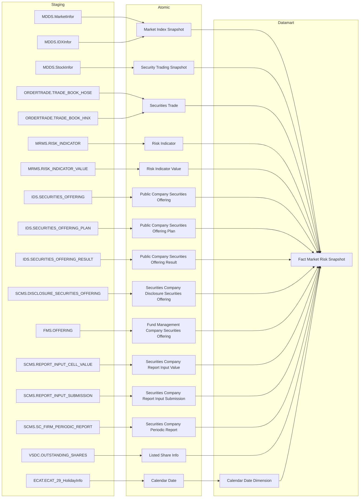

> **Risk Weight Configuration (dự kiến Atomic, CHƯA vẽ node — chưa tồn tại thật trên Atomic repo):** bảng `rsk_wgt_cfg` — cột `risk_factor_code` (8 mã: RISK_INDEX=β0, VNINDEX_VOLATILITY/ILLIQ/MARGIN_BALANCE/INTERBANK_RATE/FOREIGN_NET_FLOW/EQUITY_CAPITAL_RAISING=β1~β6, EPSILON=ε), `weight` (hệ số do chuyên viên nhập tay), `data_dt` (trường kỹ thuật — ngày người dùng nhập). Đã grep xác nhận **không tồn tại** ở `DataModel/Atomic/` lẫn `DataModel/working/Atomic/` — cấu trúc chỉ mới thống nhất với user, chưa import vào Atomic. Giữ **PENDING** (K_PTTT_18, 18~23, 228, 229), không vẽ node trong sơ đồ cho tới khi entity tồn tại thật (xem O_PTTT_2).
>
> **`Public Company Securities Offering`/`Public Company Securities Offering Plan`/`Public Company Securities Offering Result`/`Securities Company Disclosure Securities Offering`/`Fund Management Company Securities Offering`:** BA đã cung cấp SQL join UNION ALL hoàn chỉnh (lọc `offering_method_code`/`offering_type`, GROUP BY ngày công văn) — logic khai thác "huy động vốn cổ phần" đã thống nhất, chuyển **READY**, có edge nối vào `fct_market_risk_snpst` (K_PTTT_19, 11).
>
> **Loại khỏi sơ đồ Cụm 1 (dữ liệu động, chưa có Atomic entity nào):** `SSC_SCMS.MEMBER_REPORT/FORM_REPORT/REPORT_CELL_VALUE` (nguồn Dư nợ Margin, K_PTTT_5/10/24~27) — không vẽ node vì chưa có Atomic entity chuẩn hóa nào, chỉ ghi nhận PENDING bằng text. Tương tự VSDC `BM1_BCKLLH` (KL lưu hành cho MCAPₜ, xem O_PTTT_3).

##### Cụm 2: Chỉ số vĩ mô (Fact Macro Indicator Snapshot)

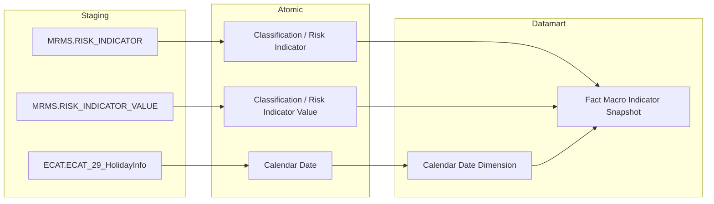

> **READY [CẬP NHẬT 2026-09-17]:** `Fact Macro Indicator Snapshot` (`fct_macro_indicator_snpst`) ánh xạ tới các entity Atomic `cl_risk_indicator` & `cl_risk_indicator_value` (nguồn `MRMS.RISK_INDICATOR`/`RISK_INDICATOR_VALUE`). Toàn bộ 13 chỉ tiêu vĩ mô (Lãi suất liên ngân hàng, Tỷ giá, CPI, GDP...) của Nhóm 3 (K_PTTT_30~42) đã chuyển sang READY (giải quyết O_PTTT_11).

---

##### Cụm 3: Rủi ro ngành (Fact Sector Risk Snapshot)

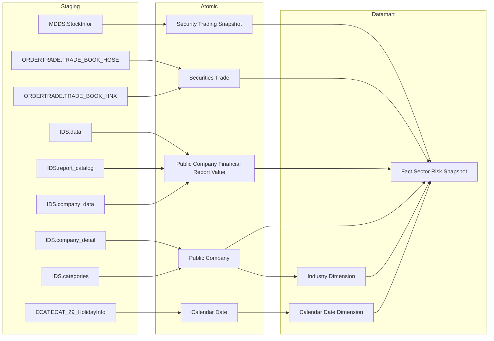

---

##### Cụm 4: Quy mô lệnh per mã CK (Fact Order Size Snapshot)

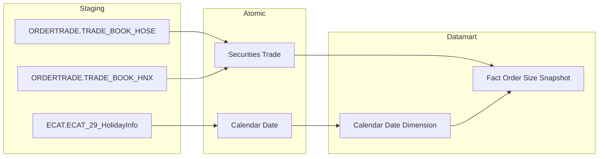

---

##### Cụm 5: Dòng tiền nhà đầu tư (Fact Investor Flow Snapshot)

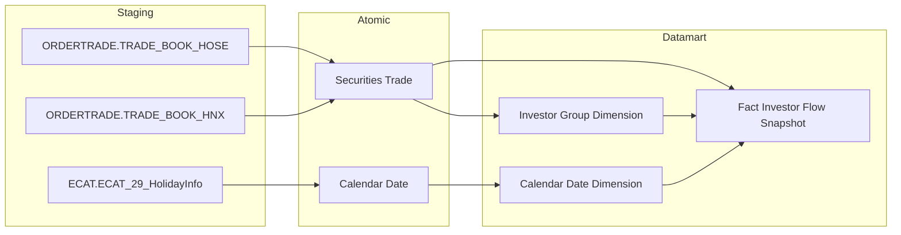

---

##### Cụm 6: Top giao dịch NĐTNN per mã CK (Fact Foreign Net Trade Snapshot)

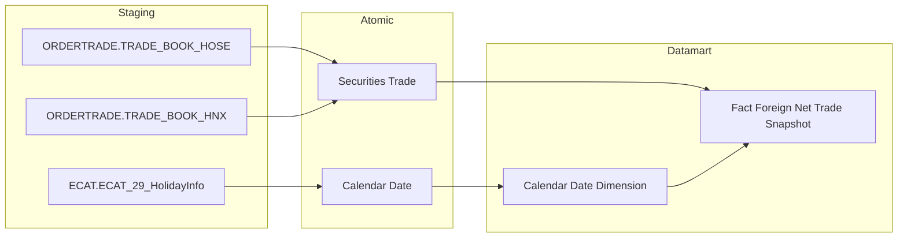

---

##### Cụm 7: Top giao dịch tự doanh per mã CK (Fact Proprietary Net Trade Snapshot)


---

##### Cụm 8: Cơ cấu nợ vay trái phiếu theo ngành (Fact Corporate Bond Sector Snapshot)


---

##### Cụm 9: Danh mục tổ chức phát hành cần giám sát tín dụng (Operational Corporate Bond Issuer Credit Monitor)

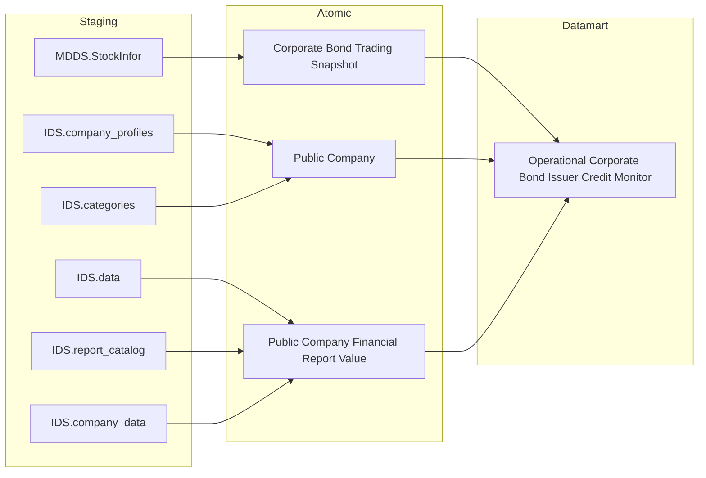

---

##### Cụm 10 & 11: An toàn CTCK & Dư nợ Margin (Fact Securities Company Financial Structure Snapshot — Reuse QLKD)

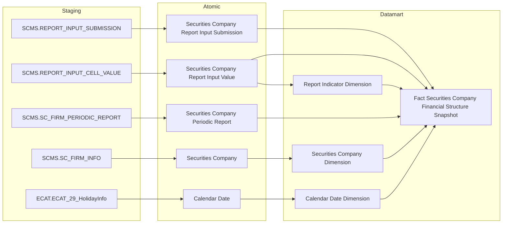

> **READY một phần [CẬP NHẬT 2026-09-18 — thay thế ghi chú 2026-09-17]:** Cụm An toàn CTCK & Dư nợ Margin (Nhóm 22-25) tái sử dụng 100% Fact `fct_securities_company_financial_structure_snpst` từ phân hệ QLKD. Nguồn Atomic đã xác minh tồn tại: `sc_report_input_value` (`DataModel/working/Atomic/lld/SCMS/lld_SCMS_REPORT_INPUT_CELL_VALUE.yaml`, `design_status: approved`), `sc_report_input_submission` (`DataModel/Atomic/Documentation/`), `sc_periodic_report` (`DataModel/Atomic/`), `securities_company`.
>
> **Grain bắt buộc:** Fact này có grain **1 CTCK × 1 kỳ báo cáo × 1 chỉ tiêu (EAV)** — KHÔNG phải 1 CTCK/ngày. Mọi chỉ tiêu Dư nợ margin / VCSH / D/E / ATTC của Nhóm 22-25 và các measure margin reuse ở Nhóm 4/8/10 đều READY **ở grain kỳ báo cáo**; các chỉ tiêu yêu cầu grain ngày thật (Z-score Dư nợ Margin theo phiên, rolling 20 phiên) vẫn PENDING — xem **O_PTTT_16**. Ghi chú cũ ghi tên entity `sc_report_input_cell_value` là sai (đó là tên bảng nguồn, không phải physical name Atomic) — đã sửa.

---

## Section 2 — Tổng quan báo cáo

### Tab Dashboard Giám sát rủi ro

#### Nhóm 1 - Chỉ số rủi ro hệ thống

> Phân loại: **Phân tích**
> Atomic: `Market Index Snapshot` (`market_index_snapshot`) ← MDDS.JAD_MARKETINFOR — **READY** | `Security Trading Snapshot` (`security_trading_snapshot`) ← MDDS.JAD_STOCKINFOR — **READY** | `Securities Trade` (`securities_trade`) ← ORDERTRADE.TRADE_BOOK_HOSE/TRADE_BOOK_HNX — **READY** | `Risk Indicator`/`Risk Indicator Value` ← RISK_INDICATOR/RISK_INDICATOR_VALUE — **PENDING** (chưa tồn tại trên Atomic, xem O_PTTT_11) | `Risk Weight Configuration` (`risk_weight_config`: risk_factor_code/risk_factor_name/risk_factor_type/weight/data_dt) — **READY** (cấu trúc đã thống nhất với user, 2026-07-30 — coi là READY cho thiết kế Datamart dù chưa import vào Atomic repo, xem O_PTTT_2 cập nhật; Nhóm 1&2 chỉ dùng 8 mã có `risk_factor_type = 'Chỉ số rủi ro hệ thống'`: RISK_INDEX=β0, VNINDEX_VOLATILITY/ILLIQ/MARGIN_BALANCE/INTERBANK_RATE/FOREIGN_NET_FLOW/EQUITY_CAPITAL_RAISING=β1~β6, UNEXPLAINED_ERROR_TERM=ε) | `Public Company Securities Offering` (`pc_securities_offering`) ← IDS.SECURITIES_OFFERING — **READY** | `Public Company Securities Offering Plan` (`pc_securities_offering_plan`) ← IDS.SECURITIES_OFFERING_PLAN — **READY** | `Public Company Securities Offering Result` (`pc_securities_offering_result`) ← IDS.SECURITIES_OFFERING_RESULT — **READY** | `Securities Company Disclosure Securities Offering` (`sc_disclosure_securities_offering`) ← SCMS.DISCLOSURE_SECURITIES_OFFERING — **READY** | `Fund Management Company Securities Offering` (`fmc_securities_offering`, draft) ← FMS.OFFERING — **READY** (BA đã cung cấp SQL join UNION ALL 3 nguồn hoàn chỉnh, logic khai thác đã thống nhất — xem O_PTTT_1/O_PTTT_4 cập nhật)
>
> **[SỬA 2026-07-30 — Kịch bản D, phát hiện qua review cross-check]** HLD trước đây dùng alias `market_index_snapshot`/`scr_tdg_snpst`/`scr_mtch_log` với tên cột bịa (`trading_dt`, `cls_prc`, `market_index_val`, `market_code`, `acm_val`...) không khớp Atomic approved, và dùng sai entity `Security Match Log` (MDDS.JAD_TRANSLOG — chỉ tick-by-tick, không phân biệt sàn/board) cho công thức ILLIQ/Dòng tiền NĐTNN thay vì entity đúng `Securities Trade` (ORDERTRADE.TRADE_BOOK_HOSE/HNX — có `market_id_code`/`board_tp_code`/`buy,sell_foreign_investor_tp_code`). Đã sửa lại toàn bộ theo physical_name thật trong YAML approved. Riêng filter "VN-Index" trên `Market Index Snapshot`: entity này KHÔNG có cột mã chỉ số (`Index Code`) — chỉ có `Market Code`/`Market Id` (mã sàn HOSE/HNX/UPCOM do FSS quy định) và `Index Type Code` (loại index theo Sở). User xác nhận (2026-07-30): dùng `market_code = 'HOSE'` thay cho mọi filter `IndexCode='HOSE'`/`IndexCode='VNINDEX'` trong SQL BA gốc (BA có mâu thuẫn nội tại giữa 2 giá trị — đã chốt dùng `market_code='HOSE'` làm đại diện cho "chỉ số thị trường HOSE = VN-Index" ở toàn Nhóm 1&2).
>
> **[SỬA 2026-09-23 — BA PTTT cập nhật 15:03, Data Modeler duyệt margin theo tháng]** BA đã mapping xong toàn bộ 38 dòng (Done). Dư nợ margin (MDₜ) nay có nguồn cụ thể theo SQL tham khảo BA dòng 22: SCMS báo cáo `BCTHHD_CTCK` (INPUT), sheet II.8, cell `TS024` "VII. Tổng dư nợ cho vay giao dịch ký quỹ", kỳ THÁNG trùng tháng ngày t, submission mới nhất, `RECORD_STATUS IN (1,2)` → Atomic `sc_report_input_value` ⋈ `sc_report_input_submission` ⋈ `sc_periodic_report` (đã grep xác nhận cột). MCAPₜ theo VSDC `outstanding_shares` (`total_market_cap_vsdc`). Cột Loại dữ liệu BA vẫn ghi "Chưa có CSDL - Map biểu mẫu" nhưng Data Modeler duyệt nâng READY — grain margin là THÁNG (giữ nguyên cho mọi ngày trong tháng), không phải ngày. **Rủi ro còn lại (O_PTTT_16):** (1) lọc sheet II.8 chưa áp dụng được vì Atomic chỉ có `sheet_id` (GUID), dựa vào cell `TS024` duy nhất trong form; (2) `sc_rpt_code = 'BCTHHD_CTCK'` giả định mã FORM_REPORT — cần xác nhận khi UAT. **Đối soát:** BA 38 dòng ↔ 35 KPI hiệu lực (dòng 16/17/18 "Trùng" dùng chung KPI dòng 8/9/10) + 8 KPI β/ε (K_PTTT_10–17, thành phần dòng 5) + 1 DEPRECATED (K_PTTT_21) = 44. K_PTTT_9 (trùng K_PTTT_23) gỡ khỏi Nhóm này, ID giữ cho Nhóm 2.

**Mockup:**

| Chỉ tiêu | Giá trị |
|---|---|
| Volatility 30 phiên (σ) | 0.012 |
| Z-score Biến động | 1.45 |
| Z-score Thanh khoản (ILLIQ) | -0.87 |
| Z-score Dư nợ Margin | 0.63 |
| Z-score Lãi suất | 0.21 |
| Z-score Dòng tiền ròng NĐTNN | -1.02 |
| Tổng vốn hóa MCAPₜ | 5,234 tỷ VND |
| Tỷ lệ Margin/MCAP | 2.3% |
| Tỷ trọng Biến động | 20% |
| Tỷ trọng Thanh khoản | 20% |
| Tỷ trọng Dư nợ Margin | 15% |
| Tỷ trọng Lãi suất | 15% |
| Tỷ trọng Dòng tiền ròng NĐTNN | 15% |
| Tỷ trọng Huy động vốn | 15% |

*(K_PTTT_18, K_PTTT_5, K_PTTT_9, K_PTTT_21~24 — PENDING do phụ thuộc chuỗi Dư nợ Margin/MCAP ("Chưa có CSDL - Map biểu mẫu" — KL CK lưu hành VSDC BM1); K_PTTT_6 (Z-score Lãi suất) — PENDING do gap Atomic Risk Indicator/Risk Indicator Value (xem O_PTTT_11), xem cột Trạng thái. K_PTTT_10~17 (Hệ số hồi quy β/ε) nay đã READY nhờ `Risk Weight Configuration` có cấu trúc xác nhận. K_PTTT_19, K_PTTT_20 — Huy động vốn cổ phần — vẫn READY)*

**Source:** `Fact Market Risk Snapshot` → `Calendar Date Dimension`

**Bảng KPI:**

| KPI ID | Tên KPI | Đơn vị | Tính chất | Công thức | Ghi chú | Trạng thái |
|---|---|---|---|---|---|---|
| K_PTTT_1 | Ngày thống kê (Chiều thời gian) | Ngày | Chiều | `market_index_snapshot.trading_dt` WHERE `market_index_snapshot.market_code = 'HOSE'` | Khai sinh riêng cho Nhóm 1&2 — khác K_PTTT_43 (khai sinh tại Nhóm 4, dùng cho nhiều Fact khác nhau, xem backlog tách KPI theo nguồn vật lý) | READY |
| K_PTTT_18 | Risk Index (Chỉ số rủi ro hệ thống tổng hợp — Logistic Regression) | — | Phái sinh | `Fact Market Risk Snapshot.Risk Index` = β0 + β_L·Z_L + β_V·Z_V + β_M·Z_M + β_I·Z_I + β_F·Z_F + β_C·Z_C + ε (tính sẵn tại ETL) | **[SỬA 2026-09-23 — BA PTTT 15:03]** READY — dòng 5. Trước đây PENDING vì Z_M (margin) thiếu nguồn; nay đủ 6 Z-score | READY |
| K_PTTT_10 | Hệ số hồi quy β — Biến động chỉ số VN-Index (β_V) | Số thực | Cơ sở | `risk_weight_config.weight` WHERE `risk_weight_config.risk_factor_code = 'VNINDEX_VOLATILITY'` AND `risk_weight_config.risk_factor_type = 'Chỉ số rủi ro hệ thống'` AND `risk_weight_config.data_dt = MAX(data_dt) <= snapshot_date` | Trọng số do chuyên viên nhập tay trên Kho dữ liệu — xem O_PTTT_2 — thành phần β/ε của dòng BA 5 ("Các giá trị β, ε do cán bộ nhập"), không có dòng BA riêng | READY |
| K_PTTT_11 | Hệ số hồi quy β — Thanh khoản (β_L) | Số thực | Cơ sở | `risk_weight_config.weight` WHERE `risk_weight_config.risk_factor_code = 'ILLIQ'` AND `risk_weight_config.risk_factor_type = 'Chỉ số rủi ro hệ thống'` AND `risk_weight_config.data_dt = MAX(data_dt) <= snapshot_date` | — thành phần β/ε của dòng BA 5 ("Các giá trị β, ε do cán bộ nhập"), không có dòng BA riêng | READY |
| K_PTTT_12 | Hệ số hồi quy β — Dư nợ Margin (β_M) | Số thực | Cơ sở | `risk_weight_config.weight` WHERE `risk_weight_config.risk_factor_code = 'MARGIN_BALANCE'` AND `risk_weight_config.risk_factor_type = 'Chỉ số rủi ro hệ thống'` AND `risk_weight_config.data_dt = MAX(data_dt) <= snapshot_date` | — thành phần β/ε của dòng BA 5 ("Các giá trị β, ε do cán bộ nhập"), không có dòng BA riêng | READY |
| K_PTTT_13 | Hệ số hồi quy β — Lãi suất liên ngân hàng (β_I) | Số thực | Cơ sở | `risk_weight_config.weight` WHERE `risk_weight_config.risk_factor_code = 'INTERBANK_RATE'` AND `risk_weight_config.risk_factor_type = 'Chỉ số rủi ro hệ thống'` AND `risk_weight_config.data_dt = MAX(data_dt) <= snapshot_date` | — thành phần β/ε của dòng BA 5 ("Các giá trị β, ε do cán bộ nhập"), không có dòng BA riêng | READY |
| K_PTTT_14 | Hệ số hồi quy β — Dòng tiền ròng NĐTNN (β_F) | Số thực | Cơ sở | `risk_weight_config.weight` WHERE `risk_weight_config.risk_factor_code = 'FOREIGN_NET_FLOW'` AND `risk_weight_config.risk_factor_type = 'Chỉ số rủi ro hệ thống'` AND `risk_weight_config.data_dt = MAX(data_dt) <= snapshot_date` | — thành phần β/ε của dòng BA 5 ("Các giá trị β, ε do cán bộ nhập"), không có dòng BA riêng | READY |
| K_PTTT_15 | Hệ số hồi quy β — Huy động vốn cổ phần (β_C) | Số thực | Cơ sở | `risk_weight_config.weight` WHERE `risk_weight_config.risk_factor_code = 'EQUITY_CAPITAL_RAISING'` AND `risk_weight_config.risk_factor_type = 'Chỉ số rủi ro hệ thống'` AND `risk_weight_config.data_dt = MAX(data_dt) <= snapshot_date` | — thành phần β/ε của dòng BA 5 ("Các giá trị β, ε do cán bộ nhập"), không có dòng BA riêng | READY |
| K_PTTT_16 | Hằng số hồi quy β0 (Intercept) | Số thực | Cơ sở | `risk_weight_config.weight` WHERE `risk_weight_config.risk_factor_code = 'RISK_INDEX'` AND `risk_weight_config.risk_factor_type = 'Chỉ số rủi ro hệ thống'` AND `risk_weight_config.data_dt = MAX(data_dt) <= snapshot_date` | Mã `RISK_INDEX` trong `risk_weight_config` là β0 (hằng số hồi quy), không phải giá trị Risk Index đầu ra — thành phần β/ε của dòng BA 5 ("Các giá trị β, ε do cán bộ nhập"), không có dòng BA riêng | READY |
| K_PTTT_17 | Sai số hồi quy ε (Epsilon) | Số thực | Cơ sở | `risk_weight_config.weight` WHERE `risk_weight_config.risk_factor_code = 'UNEXPLAINED_ERROR_TERM'` AND `risk_weight_config.risk_factor_type = 'Chỉ số rủi ro hệ thống'` AND `risk_weight_config.data_dt = MAX(data_dt) <= snapshot_date` | — thành phần β/ε của dòng BA 5 ("Các giá trị β, ε do cán bộ nhập"), không có dòng BA riêng | READY |
| K_PTTT_3 | Z-score Biến động giá | Số thực | Phái sinh | `(K_PTTT_2 − AVG(K_PTTT_2 lịch sử)) / STDDEV_SAMP(K_PTTT_2 lịch sử)`, AVG/STDDEV tính trên toàn bộ `market_index_snapshot.trading_dt <= snapshot_date` WHERE `market_index_snapshot.market_code = 'HOSE'` | | READY |
| K_PTTT_2 | Volatility — Biến động giá VN-Index 30 phiên (σ) | Số thực | Phái sinh | `σ = STDDEV_SAMP(Rₜ)` trên 30 ngày gần nhất, `Rₜ = LN(market_index_snapshot.market_index_val[t] / market_index_snapshot.market_index_val[t-1])`, lọc `market_index_snapshot.market_code = 'HOSE'` ORDER BY `market_index_snapshot.trading_dt` DESC | | READY |
| K_PTTT_25 | Lợi suất ngày Rₜ | — | Cơ sở | `Fact Market Risk Snapshot.Index Log Return` = LN(Pₜ / Pₜ₋₁) | **[SỬA 2026-09-23 — BA PTTT 15:03]** Reuse từ Nhóm 2 — dòng 8; dòng 16 "\|Rₜ\|" BA ghi "Trùng dòng 8" → dùng chung (ABS tại BI) | READY |
| K_PTTT_68 | Giá đóng cửa VN-Index P(t) | Điểm | Cơ sở | `Fact Market Risk Snapshot.VNIndex Value` | **[SỬA 2026-09-23 — BA PTTT 15:03]** Reuse từ Nhóm 5 — dòng 9; dòng 17 "Trùng dòng 9" | READY |
| K_PTTT_69 | Giá đóng cửa VN-Index P(t-1) | Điểm | Cơ sở | `Fact Market Risk Snapshot.VNIndex Value Previous Day` | **[SỬA 2026-09-23 — BA PTTT 15:03]** Reuse từ Nhóm 5 — dòng 10; dòng 18 "Trùng dòng 10" | READY |
| K_PTTT_70 | Lợi suất trung bình 30 phiên (μ) | — | Phái sinh | `Fact Market Risk Snapshot.VNIndex Daily Return Average` (30 phiên) | **[SỬA 2026-09-23 — BA PTTT 15:03]** Reuse từ Nhóm 5 — dòng 11 | READY |
| K_PTTT_4 | Z-score Thanh khoản (ILLIQ) | Số thực | Phái sinh | `(ILLIQ30_t − AVG(ILLIQ30 lịch sử)) / STDDEV_SAMP(ILLIQ30 lịch sử)` trong đó `ILLIQ30_t = ABS(Rₜ) / SUM(securities_trade.execution_val)` trên 30 ngày GROUP BY `securities_trade.trade_dt`, `Rₜ` từ `market_index_snapshot.market_index_val`, lọc `securities_trade.market_id_code IN ('STO','STX','UPX')` AND `securities_trade.board_tp_code IN ('G1','G2','G3')` | Nguồn GTGD: `Securities Trade` (ORDERTRADE.TRADE_BOOK_HOSE/HNX) — HOSE có sẵn `execution_val`; HNX ETL derive = `trade_price × trade_qty` (đã sửa từ `Security Match Log`/`scr_mtch_log.acm_val` — entity sai, không có cột phân loại Market/Board) | READY |
| K_PTTT_255 | Độ lệch chuẩn ILLIQ 30 phiên (σ) | — | Phái sinh | `STDDEV_SAMP(Fact Market Risk Snapshot.Illiquidity Ratio) OVER (ORDER BY Snapshot Date ROWS BETWEEN 29 PRECEDING AND CURRENT ROW)` | **[SỬA 2026-09-23 — BA PTTT 15:03]** MỚI — dòng 13 | READY |
| K_PTTT_256 | ILLIQ trung bình 30 phiên | — | Phái sinh | `AVG(Fact Market Risk Snapshot.Illiquidity Ratio) OVER (ORDER BY Snapshot Date ROWS BETWEEN 29 PRECEDING AND CURRENT ROW)` | **[SỬA 2026-09-23 — BA PTTT 15:03]** MỚI — dòng 14 (ILLIQ30 = Σ ILLIQₜ / N) | READY |
| K_PTTT_26 | Giá trị ILLIQ ngày t | — | Cơ sở | `Fact Market Risk Snapshot.Illiquidity Ratio` = \|Rₜ\| / VOLDₜ | **[SỬA 2026-09-23 — BA PTTT 15:03]** Reuse từ Nhóm 2 — dòng 15 | READY |
| K_PTTT_107 | Giá trị giao dịch tại ngày t VOLDₜ | VND | Cơ sở | `Fact Market Risk Snapshot.Total Trading Value Matched` | **[SỬA 2026-09-23 — BA PTTT 15:03]** Reuse từ Nhóm 9 — dòng 19 | READY |
| K_PTTT_5 | Z-score Dư nợ Margin | — | Phái sinh | `Fact Market Risk Snapshot.Z Score Margin Balance` = (Mₜ − M̄) / σ trên chuỗi 30 phiên | **[SỬA 2026-09-23 — BA PTTT 15:03]** READY (Data Modeler duyệt margin theo tháng) — dòng 20. Grain: MDₜ = dư nợ margin kỳ THÁNG chứa ngày t (giữ nguyên cả tháng) / MCAPₜ ngày — đúng BA "Margin theo tháng". Xem O_PTTT_16 | READY |
| K_PTTT_22 | Độ lệch chuẩn chuỗi tỷ lệ Dư nợ Margin/MCAP (σ) | — | Phái sinh | `Fact Market Risk Snapshot.Margin To Cap Ratio Stddev` = STDDEV_SAMP(Mₜ) 30 phiên | **[SỬA 2026-09-23 — BA PTTT 15:03]** READY — dòng 21 | READY |
| K_PTTT_23 | Tỷ lệ Dư nợ Margin / Tổng vốn hóa tại ngày t (Mₜ) | % | Phái sinh | `Fact Market Risk Snapshot.Margin To Cap Ratio Current` = MDₜ / MCAPₜ × 100 | **[SỬA 2026-09-23 — BA PTTT 15:03]** READY — dòng 22 | READY |
| K_PTTT_24 | Tỷ lệ Dư nợ Margin / Tổng vốn hóa trung bình (M̄) | % | Phái sinh | `Fact Market Risk Snapshot.Margin To Cap Ratio Avg` = AVG(Mₜ) 30 phiên | **[SỬA 2026-09-23 — BA PTTT 15:03]** READY — dòng 23 | READY |
| K_PTTT_58 | Tổng dư nợ margin (dữ liệu của các CTCK theo tháng) MDₜ | VND | Cơ sở | `Fact Market Risk Snapshot.Total Margin Balance` = SUM(`Securities Company Report Input Value.Item Value`) WHERE Cell Id = 'TS024' — báo cáo `BCTHHD_CTCK`, kỳ THÁNG trùng tháng ngày t, submission mới nhất, trạng thái nộp IN ('1','2') | **[SỬA 2026-09-23 — BA PTTT 15:03]** Reuse khái niệm từ Nhóm 4 — dòng 24. Tại Nhóm này đọc cột mới `Total Margin Balance` trên Fact Market Risk Snapshot (cùng nguồn với Mₜ) theo đúng SQL tham khảo BA dòng 22 | READY |
| K_PTTT_8 | Tổng vốn hóa thị trường MCAPₜ | VND | Cơ sở | `Fact Market Risk Snapshot.Total Market Cap VSDC` = Σ(Giá đóng cửa × KL lưu hành VSDC gần nhất ≤ ngày t) | **[SỬA 2026-09-23 — BA PTTT 15:03]** Đổi nguồn — dòng 25 BA dùng VSDC `outstanding_shares`; trước đây `Total Market Cap` (KL niêm yết) | READY |
| K_PTTT_82 | Giá đóng cửa mã CK tại ngày | VND | Cơ sở | `Security Trading Snapshot.Close Price` | **[SỬA 2026-09-23 — BA PTTT 15:03]** Reuse từ Nhóm 7 — dòng 26 | READY |
| K_PTTT_98 | KL CK lưu hành tại ngày | CP | Cơ sở | `Listed Share Info.Outstanding Share Quantity` (VSDC, bản gần nhất ≤ ngày t) | **[SỬA 2026-09-23 — BA PTTT 15:03]** Reuse từ Nhóm 7 — dòng 27 | READY |
| K_PTTT_6 | Z-score Lãi suất liên ngân hàng | — | Phái sinh | `Fact Market Risk Snapshot.Z Score Interbank Rate` | **[SỬA 2026-09-23 — BA PTTT 15:03]** Sửa Detail Mapping — trước đây logic đọc giá trị lãi suất thô với mã 'INTERBANK_RATE' (không tồn tại, mã đúng 'INTERBANK_IR'), nay đọc đúng cột Z-score. Dòng 28 | READY |
| K_PTTT_31 | Lãi suất tại ngày t | % | Cơ sở | `Fact Macro Indicator Snapshot.Indicator Value` WHERE Macro Indicator Code = 'INTERBANK_IR' | **[SỬA 2026-09-23 — BA PTTT 15:03]** Reuse từ Nhóm 3 — dòng 29 | READY |
| K_PTTT_257 | Lãi suất trung bình N phiên | % | Phái sinh | `AVG(Fact Macro Indicator Snapshot.Indicator Value) OVER (ORDER BY Period Date ROWS BETWEEN 29 PRECEDING AND CURRENT ROW)` WHERE Code = 'INTERBANK_IR' | **[SỬA 2026-09-23 — BA PTTT 15:03]** MỚI — dòng 30 (N mặc định 30) | READY |
| K_PTTT_258 | Độ lệch chuẩn lãi suất N phiên | % | Phái sinh | `STDDEV_SAMP(Fact Macro Indicator Snapshot.Indicator Value)` cùng cửa sổ K_PTTT_257 | **[SỬA 2026-09-23 — BA PTTT 15:03]** MỚI — dòng 31 | READY |
| K_PTTT_7 | Z-score Dòng tiền ròng NĐTNN | Số thực | Phái sinh | `(AVG(Fₜ lịch sử) − Fₜ) / STDDEV_SAMP(Fₜ lịch sử)` (đảo chiều) trong đó `Fₜ = SUM(securities_trade.execution_val WHERE buy_foreign_investor_tp_code IN ('10','20')) − SUM(securities_trade.execution_val WHERE sell_foreign_investor_tp_code IN ('10','20'))` GROUP BY `securities_trade.trade_dt`, lọc `securities_trade.market_id_code IN ('STO','STX','UPX')` | Đã sửa nguồn từ `Security Trading Snapshot`/`scr_tdg_snpst.frgn_buy_vol` (per-mã-CK theo ngày, không phân biệt lệnh mua/bán riêng) sang `Securities Trade`/`securities_trade` (ORDERTRADE.TRADE_BOOK_HOSE/HNX) — đúng theo SQL BA gốc dùng `Execution - Value`/`Buy,Sell Foreign Investor type` trên sổ lệnh TRADE_BOOK | READY |
| K_PTTT_259 | Độ lệch chuẩn dòng tiền ròng NĐTNN 30 phiên | VND | Phái sinh | `STDDEV_SAMP(Fact Market Risk Snapshot.Foreign Net Flow) OVER (ORDER BY Snapshot Date ROWS BETWEEN 29 PRECEDING AND CURRENT ROW)` | **[SỬA 2026-09-23 — BA PTTT 15:03]** MỚI — dòng 33 | READY |
| K_PTTT_28 | Dòng tiền ròng NĐTNN tại ngày t | VND | Cơ sở | `Fact Market Risk Snapshot.Foreign Net Flow` | **[SỬA 2026-09-23 — BA PTTT 15:03]** Reuse từ Nhóm 2 — dòng 34 | READY |
| K_PTTT_133 | GTGD mua của NĐTNN tại ngày t | VND | Phái sinh | `Fact Investor Flow Snapshot.Buy Value` WHERE Investor Group Code = 'FOREIGN' | **[SỬA 2026-09-23 — BA PTTT 15:03]** Reuse từ Nhóm 13 — dòng 35 | READY |
| K_PTTT_134 | GTGD bán của NĐTNN tại ngày t | VND | Phái sinh | `Fact Investor Flow Snapshot.Sell Value` WHERE Investor Group Code = 'FOREIGN' | **[SỬA 2026-09-23 — BA PTTT 15:03]** Reuse từ Nhóm 13 — dòng 36 | READY |
| K_PTTT_145 | Dòng tiền ròng NĐTNN trung bình phiên | VND | Phái sinh | `Fact Market Risk Snapshot.Net Flow Foreign Average 30 Days` | **[SỬA 2026-09-23 — BA PTTT 15:03]** Reuse từ Nhóm 14 — dòng 37 | READY |
| K_PTTT_19 | Z-score Huy động vốn cổ phần | Số thực | Phái sinh | `(MU − RT) / SIGMA` (Z-score đảo chiều) trong đó `RT` = tổng huy động vốn ngày t (xem K_PTTT_20), `MU`/`SIGMA` = AVG/STDDEV trên 20 phiên gần nhất | Nguồn: UNION ALL `pc_securities_offering` JOIN `pc_securities_offering_plan` JOIN `pc_securities_offering_result` (lọc `pc_securities_offering_plan.offering_method_code IN ('1','2','3','5','9','11')`, theo `pc_securities_offering.official_letter_dt`) + `sc_disclosure_securities_offering` (lọc `offering_tp_code IN ('1','4','5','6','7')`, theo `document_dt`) + `fmc_securities_offering` (theo `approval_document_dt`, draft entity FMS) — GROUP BY ngày, 20 phiên gần nhất. Logic khai thác đã thống nhất (BA cung cấp SQL đầy đủ) | READY |
| K_PTTT_260 | Độ lệch chuẩn huy động vốn cổ phần 30 phiên | VND | Phái sinh | `STDDEV_SAMP(Fact Market Risk Snapshot.Equity Capital Raising Amount) OVER (ORDER BY Snapshot Date ROWS BETWEEN 29 PRECEDING AND CURRENT ROW)` | **[SỬA 2026-09-23 — BA PTTT 15:03]** MỚI — dòng 39 | READY |
| K_PTTT_20 | Huy động vốn cổ phần thị trường tại ngày t | Tỷ VND | Phái sinh | `COALESCE(SUM(pc_securities_offering_result.total_collected_amt),0) + COALESCE(SUM(sc_disclosure_securities_offering.proceeds_collected_amt),0) + COALESCE(SUM(fmc_securities_offering.actual_total_val_amt),0)` WHERE ngày công văn (`pc_securities_offering.official_letter_dt` / `sc_disclosure_securities_offering.document_dt` / `fmc_securities_offering.approval_document_dt`) `= snapshot_date`, cùng filter `offering_method_code`/`offering_tp_code` như K_PTTT_19 | Huy động vốn cổ phần tại ngày t — UNION ALL 3 nguồn IDS/SCMS/FMS | READY |
| K_PTTT_261 | Huy động vốn cổ phần trung bình 30 phiên | VND | Phái sinh | `AVG(Fact Market Risk Snapshot.Equity Capital Raising Amount) OVER (ORDER BY Snapshot Date ROWS BETWEEN 29 PRECEDING AND CURRENT ROW)` | **[SỬA 2026-09-23 — BA PTTT 15:03]** MỚI — dòng 41 | READY |
| K_PTTT_21 | Z-score Dư nợ Margin — giá trị chuẩn hóa ngày t | — | Phái sinh | — | **[SỬA 2026-09-23 — BA PTTT 15:03]** DEPRECATED — trùng K_PTTT_5 (BA chỉ 1 dòng Z-score Dư nợ margin — dòng 20); cột vật lý đã gỡ | DEPRECATED |

**Star Schema:**

```mermaid
erDiagram
    Fact_Market_Risk_Snapshot {
        int Snapshot_Date_Dimension_Id FK
        float Volatility_30_Days
        float Z_Score_Volatility
        float Z_Score_Liquidity
        float Z_Score_Foreign_Net_Flow
        float Total_Market_Cap
        float Beta_Volatility
        float Beta_Liquidity
        float Beta_Margin_Balance
        float Beta_Interbank_Rate
        float Beta_Foreign_Net_Flow
        float Beta_Equity_Capital_Raising
        float Beta_Intercept
        float Epsilon_Error_Term
        float Z_Score_Equity_Capital_Raising
        float Equity_Capital_Raising_Amt
        float Index_Log_Return
        float Illiquidity_Ratio
        float Foreign_Net_Flow
        float Vnindex_Val
        float Weight_Liquidity
        float Weight_Stability
        float Sentiment_Index
        string Sentiment_Index_Status
        float Vnindex_Daily_Return
        float Systemic_Vol_Current
        float Systemic_Vol_Max
        float Systemic_Vol
        string Systemic_Vol_Status
        float Vnindex_Val_Previous_Day
        float Vnindex_Daily_Return_Average
        float Index_Val_Monthly_Average
        float Total_Trading_Val_Matched
        float Total_Trading_Val_Matched_Previous_Day
        int Total_Order_Count_Matched
        float Average_Order_Size
        int Total_Trading_Vol_Matched
        float Total_Trading_Val_Matched_Average_50_Days
        float Total_Trading_Val_Matched_Average_N_Days
        float Net_Flow_Foreign_Average_30_Days
        float Net_Flow_Proprietary_Average_30_Days
        float Net_Flow_Correlation_Foreign_Proprietary
        float Z_Score_Interbank_Rate
        float Total_Margin_Limit_Amt
        float Margin_Tension
        string Margin_Tension_Status
        float Margin_Balance_Delta
        float Margin_Stress
        string Margin_Stress_Status
        float Corr_Index_Interbank_Rate
        float Corr_Index_Dxy
        float Total_Market_Cap_VSDC
        float Total_Market_Cap_VSDC_Average_N_Days
        float Turnover_Velocity_Index
        string Turnover_Velocity_Status
        float Total_Margin_Balance
        float Margin_To_Cap_Ratio_Current
        float Margin_To_Cap_Ratio_Avg
        float Margin_To_Cap_Ratio_Stddev
        float Z_Score_Margin_Balance
        float Risk_Index
    }
    Calendar_Date_Dimension {
        string Calendar_Date_Dimension_Id PK
        date Calendar_Date
        int Calendar_Year
        int Calendar_Quarter
        int Calendar_Month
        string Source_System_Code
    }
    Calendar_Date_Dimension ||--o{ Fact_Market_Risk_Snapshot : "Snapshot_Date_Dimension_Id"
```

> **Ghi chú:** Cột Beta_Risk_Index/Beta_Vnindex_Volatility/Beta_Illiq/Beta_Margin_Balance/Beta_Interbank_Rate/Beta_Foreign_Net_Flow/Beta_Equity_Capital_Raising/Unexplained_Error_Term (K_PTTT_10~17) đã bổ sung vào Star Schema — tên cột đặt theo đúng `risk_factor_code` trong `risk_weight_config` (không dùng ký hiệu toán học β/ε rút gọn để dễ truy ngược nguồn). Nguồn `risk_weight_config` nay đã READY. Cột Risk_Index, Z_Score_Margin, Z_Score_Interest_Rate **vẫn chưa đưa vào Star Schema** — Risk_Index/Z_Score_Margin thuộc K_PTTT_18, 5 đang PENDING do phụ thuộc chuỗi Dư nợ Margin/MCAP (xem O_PTTT_3); Z_Score_Interest_Rate thuộc K_PTTT_6 đang PENDING do gap Atomic Risk Indicator/Risk Indicator Value (xem O_PTTT_11) — sẽ bổ sung khi hết PENDING.

**Lineage Mart → Báo cáo:**

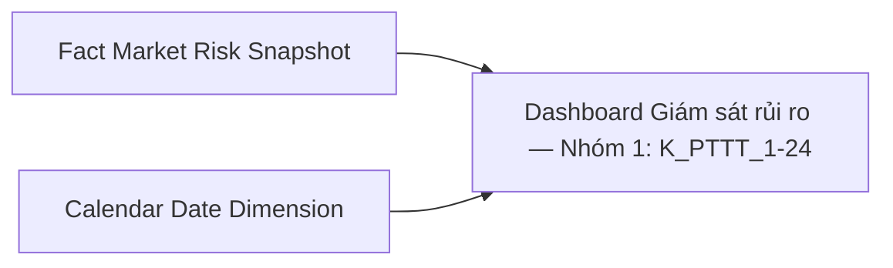

**Bảng grain:**

| Tên bảng | Grain |
|---|---|
| Fact Market Risk Snapshot | 1 row / ngày (SCD4A current state) |
| Calendar Date Dimension | 1 row / ngày (SCD4A current state) |

---

#### Nhóm 2 - Phân tích đóng góp rủi ro

> Phân loại: **Phân tích**
> Atomic: `Market Index Snapshot` ← MDDS.JAD_MARKETINFOR — **READY** | `Securities Trade` ← ORDERTRADE.TRADE_BOOK_HOSE/HNX — **READY** | `Classification Risk Indicator`/`Classification Risk Indicator Value` ← MRMS.RISK_INDICATOR/RISK_INDICATOR_VALUE — **READY** (O_PTTT_11 Resolved) | `Security Trading Snapshot` ← MDDS.JAD_STOCKINFOR — **READY** | `Risk Weight Configuration` (`risk_weight_config`) — **READY** (`risk_factor_type = 'Chỉ số rủi ro hệ thống'`) | Dư nợ Margin SCMS (`sc_report_input_value`/`sc_report_input_submission`/`sc_periodic_report`) — **READY theo tháng** (Data Modeler duyệt 2026-09-23, xem Nhóm 1) | `Listed Share Info` ← VSDC.OUTSTANDING_SHARES — **READY** (ngoại lệ đã duyệt 2026-09-21) | `Public Company Securities Offering` ← IDS/SCMS/FMS — **READY**
>
> **[SỬA 2026-09-23 — BA PTTT 14:49, 52/52 Done]** BA mở rộng Nhóm 2 từ 18 lên 52 dòng: 6 dòng Tỷ trọng + 6 dòng Giá trị hiện tại + 40 dòng thành phần công thức Z-score (Đánh giá: Trùng — lặp lại cấu trúc dòng 7–41 Nhóm 1). Thiết kế: **reuse toàn bộ KPI Nhóm 1**, không thêm cột vật lý. 52 dòng BA → 39 KPI (13 dòng trùng trong Nhóm gộp theo Rule 6: 56/61/75→K_PTTT_25, 60/74→K_PTTT_26, 65→K_PTTT_23, 80→K_PTTT_31, 85→K_PTTT_28, 91→K_PTTT_20, 76→K_PTTT_68, 77→K_PTTT_69, 78→K_PTTT_107, 89→K_PTTT_259) + K_PTTT_1 (Chiều thời gian dùng chung) = 40 KPI hiệu lực. K_PTTT_9/27/29 (chỉ tồn tại ở Nhóm 2, trùng K_PTTT_23/31/20) → DEPRECATED. K_PTTT_5 (Z-score margin) nâng READY theo quyết định margin theo tháng.

**Mockup:**

| Chỉ tiêu rủi ro | Giá trị hiện tại (raw value) | Mức độ tác động (Z-score) | Tỷ trọng |
|---|---|---|---|
| Biến động chỉ số VN-Index | Rₜ = 0.0082 (log return ngày t) | 1.45 | 20% |
| Thanh khoản thị trường | ILLIQₜ = 0.000031 | -0.87 | 20% |
| Dư nợ Margin | Mₜ = 12.3% (Dư nợ / MCAP) | 0.63 | 15% |
| Lãi suất liên ngân hàng | IRₜ = 4.85% | 0.21 | 15% |
| Dòng tiền ròng NĐTNN | Fₜ = -320 tỷ VND | -1.02 | 15% |
| Huy động vốn cổ phần | Cₜ = — | — | 15% |

> **Ghi chú mockup:** "Giá trị hiện tại" = raw value xₜ tại ngày t (Rₜ, ILLIQₜ, Mₜ, IRₜ, Fₜ, Cₜ). "Mức độ tác động" = Z-score chuẩn hóa = (xₜ − μ) / σ. "Tỷ trọng" = trọng số nhập tay (`WEIGHT_CONFIG`) — cùng cột với hệ số β của Nhóm 1. Hai cột Giá trị/Z-score độc lập, không tính Z × Weight. Dư nợ margin (Mₜ) dùng margin kỳ tháng chứa ngày t (xem Nhóm 1).

**Source:** `Fact Market Risk Snapshot` → `Calendar Date Dimension`; `Fact Macro Indicator Snapshot` → `Calendar Date Dimension`

**Bảng KPI:**

| KPI ID | Tên KPI | Đơn vị | Tính chất | Công thức | Ghi chú | Trạng thái |
|---|---|---|---|---|---|---|
| K_PTTT_1 | Ngày thống kê (Chiều thời gian) | Ngày | Chiều | `market_index_snapshot.trading_dt` WHERE `market_index_snapshot.market_code = 'HOSE'` | [SỬA 2026-09-23 — BA PTTT 14:49, Nhóm 2 52/52 Done]. Chiều thời gian dùng chung với Nhóm 1 — BA Nhóm 2 không tách dòng Chiều riêng (dashboard lọc theo ngày thống kê của Nhóm 1) | READY |
| K_PTTT_11 | Tỷ trọng (Weight) — Thanh khoản | Số thực | Cơ sở | `risk_weight_config.weight` WHERE `risk_factor_code = 'ILLIQ'` AND `risk_factor_type = 'Chỉ số rủi ro hệ thống'` AND `data_dt = MAX(data_dt) <= snapshot_date` | [SỬA 2026-09-23 — BA PTTT 14:49, Nhóm 2 52/52 Done] BA dòng 42 — BA `WEIGHT_CONFIG.WEIGHT` = `risk_weight_config.weight`, cùng cột `beta_*` với Hệ số β Nhóm 1 | READY |
| K_PTTT_10 | Tỷ trọng (Weight) — Biến động chỉ số VN-Index | Số thực | Cơ sở | `risk_weight_config.weight` WHERE `risk_factor_code = 'VNINDEX_VOLATILITY'` AND `risk_factor_type = 'Chỉ số rủi ro hệ thống'` AND `data_dt = MAX(data_dt) <= snapshot_date` | [SỬA 2026-09-23 — BA PTTT 14:49, Nhóm 2 52/52 Done] BA dòng 43 — BA `WEIGHT_CONFIG.WEIGHT` = `risk_weight_config.weight`, cùng cột `beta_*` với Hệ số β Nhóm 1 | READY |
| K_PTTT_12 | Tỷ trọng (Weight) — Dư nợ Margin | Số thực | Cơ sở | `risk_weight_config.weight` WHERE `risk_factor_code = 'MARGIN_BALANCE'` AND `risk_factor_type = 'Chỉ số rủi ro hệ thống'` AND `data_dt = MAX(data_dt) <= snapshot_date` | [SỬA 2026-09-23 — BA PTTT 14:49, Nhóm 2 52/52 Done] BA dòng 44 — BA `WEIGHT_CONFIG.WEIGHT` = `risk_weight_config.weight`, cùng cột `beta_*` với Hệ số β Nhóm 1 | READY |
| K_PTTT_13 | Tỷ trọng (Weight) — Lãi suất liên ngân hàng | Số thực | Cơ sở | `risk_weight_config.weight` WHERE `risk_factor_code = 'INTERBANK_RATE'` AND `risk_factor_type = 'Chỉ số rủi ro hệ thống'` AND `data_dt = MAX(data_dt) <= snapshot_date` | [SỬA 2026-09-23 — BA PTTT 14:49, Nhóm 2 52/52 Done] BA dòng 45 — BA `WEIGHT_CONFIG.WEIGHT` = `risk_weight_config.weight`, cùng cột `beta_*` với Hệ số β Nhóm 1 | READY |
| K_PTTT_14 | Tỷ trọng (Weight) — Dòng tiền ròng NĐTNN | Số thực | Cơ sở | `risk_weight_config.weight` WHERE `risk_factor_code = 'FOREIGN_NET_FLOW'` AND `risk_factor_type = 'Chỉ số rủi ro hệ thống'` AND `data_dt = MAX(data_dt) <= snapshot_date` | [SỬA 2026-09-23 — BA PTTT 14:49, Nhóm 2 52/52 Done] BA dòng 46 — BA `WEIGHT_CONFIG.WEIGHT` = `risk_weight_config.weight`, cùng cột `beta_*` với Hệ số β Nhóm 1 | READY |
| K_PTTT_15 | Tỷ trọng (Weight) — Huy động vốn cổ phần | Số thực | Cơ sở | `risk_weight_config.weight` WHERE `risk_factor_code = 'EQUITY_CAPITAL_RAISING'` AND `risk_factor_type = 'Chỉ số rủi ro hệ thống'` AND `data_dt = MAX(data_dt) <= snapshot_date` | [SỬA 2026-09-23 — BA PTTT 14:49, Nhóm 2 52/52 Done] BA dòng 47 — BA `WEIGHT_CONFIG.WEIGHT` = `risk_weight_config.weight`, cùng cột `beta_*` với Hệ số β Nhóm 1 | READY |
| K_PTTT_25 | Giá trị hiện tại — Biến động giá (Lợi suất ngày Rₜ) | — | Cơ sở | `Fact Market Risk Snapshot.Index Log Return` = LN(Pₜ / Pₜ₋₁) | [SỬA 2026-09-23 — BA PTTT 14:49, Nhóm 2 52/52 Done] Reuse từ Nhóm 1 — BA dòng 48, 56, 61, 75 (Đánh giá: Trùng). BA dòng 61 dùng `marketCode = 'VNINDEX'` (tên hiển thị), dòng 75 dùng `'HOSE'` — theo khóa đã xác nhận `market_code = index_code` dùng `'HOSE'`; \|Rₜ\| (dòng 61/75) = ABS tại BI như Nhóm 1 | READY |
| K_PTTT_26 | Giá trị hiện tại — Thanh khoản (ILLIQₜ) | — | Cơ sở | `Fact Market Risk Snapshot.Illiquidity Ratio` = \|Rₜ\| / VOLDₜ | [SỬA 2026-09-23 — BA PTTT 14:49, Nhóm 2 52/52 Done] Reuse từ Nhóm 1 — BA dòng 49, 60, 74 (Đánh giá: Trùng) | READY |
| K_PTTT_23 | Giá trị hiện tại — Tỷ lệ Dư nợ Margin / Tổng vốn hóa (Mₜ) | % | Phái sinh | `Fact Market Risk Snapshot.Margin To Cap Ratio Current` = MDₜ / MCAPₜ × 100 | [SỬA 2026-09-23 — BA PTTT 14:49, Nhóm 2 52/52 Done] Reuse từ Nhóm 1 — BA dòng 50, 65 (Đánh giá: Trùng) | READY |
| K_PTTT_31 | Giá trị hiện tại — Lãi suất liên ngân hàng tại ngày t (IRₜ) | % | Cơ sở | `Fact Macro Indicator Snapshot.Indicator Value` WHERE Macro Indicator Code = 'INTERBANK_IR' | [SỬA 2026-09-23 — BA PTTT 14:49, Nhóm 2 52/52 Done] Reuse từ Nhóm 1 — BA dòng 51, 80 (Đánh giá: Trùng) | READY |
| K_PTTT_28 | Giá trị hiện tại — Dòng tiền ròng NĐTNN tại ngày t (Fₜ) | VND | Cơ sở | `Fact Market Risk Snapshot.Foreign Net Flow` | [SỬA 2026-09-23 — BA PTTT 14:49, Nhóm 2 52/52 Done] Reuse từ Nhóm 1 — BA dòng 52, 85 (Đánh giá: Trùng) | READY |
| K_PTTT_20 | Giá trị hiện tại — Huy động vốn cổ phần tại ngày t (Cₜ) | Tỷ VND | Phái sinh | `COALESCE(SUM(pc_securities_offering_result.total_collected_amt),0) + COALESCE(SUM(sc_disclosure_securities_offering.proceeds_collected_amt),0) + COALESCE(SUM(fmc_securities_offering.actual_total_val_amt),0)` WHERE ngày công văn (`pc_securities_offering.official_letter_dt` / `sc_disclosure_securities_offering.document_dt` / `fmc_securities_offering.approval_document_dt`) `= snapshot_date`, cùng filter `offering_method_code`/`offering_tp_code` như K_PTTT_19 | [SỬA 2026-09-23 — BA PTTT 14:49, Nhóm 2 52/52 Done] Reuse từ Nhóm 1 — BA dòng 53, 91 (Đánh giá: Trùng) | READY |
| K_PTTT_3 | Z-score Biến động giá | Số thực | Phái sinh | `(K_PTTT_2 − AVG(K_PTTT_2 lịch sử)) / STDDEV_SAMP(K_PTTT_2 lịch sử)`, AVG/STDDEV tính trên toàn bộ `market_index_snapshot.trading_dt <= snapshot_date` WHERE `market_index_snapshot.market_code = 'HOSE'` | [SỬA 2026-09-23 — BA PTTT 14:49, Nhóm 2 52/52 Done] Reuse từ Nhóm 1 — BA dòng 54 (Đánh giá: Trùng) | READY |
| K_PTTT_2 | Volatility — Biến động giá VN-Index 30 phiên (σ) | Số thực | Phái sinh | `σ = STDDEV_SAMP(Rₜ)` trên 30 ngày gần nhất, `Rₜ = LN(market_index_snapshot.market_index_val[t] / market_index_snapshot.market_index_val[t-1])`, lọc `market_index_snapshot.market_code = 'HOSE'` ORDER BY `market_index_snapshot.trading_dt` DESC | [SỬA 2026-09-23 — BA PTTT 14:49, Nhóm 2 52/52 Done] Reuse từ Nhóm 1 — BA dòng 55 (Đánh giá: Trùng) | READY |
| K_PTTT_68 | Giá đóng cửa VN-Index P(t) | Điểm | Cơ sở | `Fact Market Risk Snapshot.VNIndex Value` | [SỬA 2026-09-23 — BA PTTT 14:49, Nhóm 2 52/52 Done] Reuse từ Nhóm 1 — BA dòng 57, 76 (Đánh giá: Trùng) | READY |
| K_PTTT_69 | Giá đóng cửa VN-Index P(t-1) | Điểm | Cơ sở | `Fact Market Risk Snapshot.VNIndex Value Previous Day` | [SỬA 2026-09-23 — BA PTTT 14:49, Nhóm 2 52/52 Done] Reuse từ Nhóm 1 — BA dòng 58, 77 (Đánh giá: Trùng) | READY |
| K_PTTT_70 | Lợi suất trung bình 30 phiên (μ) | — | Phái sinh | `Fact Market Risk Snapshot.VNIndex Daily Return Average` (30 phiên) | [SỬA 2026-09-23 — BA PTTT 14:49, Nhóm 2 52/52 Done] Reuse từ Nhóm 1 — BA dòng 59 (Đánh giá: Trùng) | READY |
| K_PTTT_107 | Giá trị giao dịch tại ngày t VOLDₜ | VND | Cơ sở | `Fact Market Risk Snapshot.Total Trading Value Matched` | [SỬA 2026-09-23 — BA PTTT 14:49, Nhóm 2 52/52 Done] Reuse từ Nhóm 1 — BA dòng 62, 78 (Đánh giá: Trùng) | READY |
| K_PTTT_5 | Z-score Dư nợ Margin | — | Phái sinh | `Fact Market Risk Snapshot.Z Score Margin Balance` = (Mₜ − M̄) / σ trên chuỗi 30 phiên | [SỬA 2026-09-23 — BA PTTT 14:49, Nhóm 2 52/52 Done] Reuse từ Nhóm 1 — BA dòng 63 (Đánh giá: Trùng). Nâng READY theo quyết định margin theo tháng (Nhóm 1) | READY |
| K_PTTT_22 | Độ lệch chuẩn chuỗi tỷ lệ Dư nợ Margin/MCAP (σ) | — | Phái sinh | `Fact Market Risk Snapshot.Margin To Cap Ratio Stddev` = STDDEV_SAMP(Mₜ) 30 phiên | [SỬA 2026-09-23 — BA PTTT 14:49, Nhóm 2 52/52 Done] Reuse từ Nhóm 1 — BA dòng 64 (Đánh giá: Trùng) | READY |
| K_PTTT_24 | Tỷ lệ Dư nợ Margin / Tổng vốn hóa trung bình (M̄) | % | Phái sinh | `Fact Market Risk Snapshot.Margin To Cap Ratio Avg` = AVG(Mₜ) 30 phiên | [SỬA 2026-09-23 — BA PTTT 14:49, Nhóm 2 52/52 Done] Reuse từ Nhóm 1 — BA dòng 66 (Đánh giá: Trùng) | READY |
| K_PTTT_58 | Tổng dư nợ margin (dữ liệu của các CTCK theo tháng) MDₜ | VND | Cơ sở | `Fact Market Risk Snapshot.Total Margin Balance` = SUM(`Securities Company Report Input Value.Item Value`) WHERE Cell Id = 'TS024' — báo cáo `BCTHHD_CTCK`, kỳ THÁNG trùng tháng ngày t, submission mới nhất, trạng thái nộp IN ('1','2') | [SỬA 2026-09-23 — BA PTTT 14:49, Nhóm 2 52/52 Done] Reuse từ Nhóm 1 — BA dòng 67 (Đánh giá: Trùng) | READY |
| K_PTTT_8 | Tổng vốn hóa thị trường MCAPₜ | VND | Cơ sở | `Fact Market Risk Snapshot.Total Market Cap VSDC` = Σ(Giá đóng cửa × KL lưu hành VSDC gần nhất ≤ ngày t) | [SỬA 2026-09-23 — BA PTTT 14:49, Nhóm 2 52/52 Done] Reuse từ Nhóm 1 — BA dòng 68 (Đánh giá: Trùng) | READY |
| K_PTTT_82 | Giá đóng cửa mã CK tại ngày | VND | Cơ sở | `Security Trading Snapshot.Close Price` | [SỬA 2026-09-23 — BA PTTT 14:49, Nhóm 2 52/52 Done] Reuse từ Nhóm 1 — BA dòng 69 (Đánh giá: Trùng) | READY |
| K_PTTT_98 | KL CK lưu hành tại ngày | CP | Cơ sở | `Listed Share Info.Outstanding Share Quantity` (VSDC, bản gần nhất ≤ ngày t) | [SỬA 2026-09-23 — BA PTTT 14:49, Nhóm 2 52/52 Done] Reuse từ Nhóm 1 — BA dòng 70 (Đánh giá: Trùng) | READY |
| K_PTTT_4 | Z-score Thanh khoản (ILLIQ) | Số thực | Phái sinh | `(ILLIQ30_t − AVG(ILLIQ30 lịch sử)) / STDDEV_SAMP(ILLIQ30 lịch sử)` trong đó `ILLIQ30_t = ABS(Rₜ) / SUM(securities_trade.execution_val)` trên 30 ngày GROUP BY `securities_trade.trade_dt`, `Rₜ` từ `market_index_snapshot.market_index_val`, lọc `securities_trade.market_id_code IN ('STO','STX','UPX')` AND `securities_trade.board_tp_code IN ('G1','G2','G3')` | [SỬA 2026-09-23 — BA PTTT 14:49, Nhóm 2 52/52 Done] Reuse từ Nhóm 1 — BA dòng 71 (Đánh giá: Trùng) | READY |
| K_PTTT_255 | Độ lệch chuẩn ILLIQ 30 phiên (σ) | — | Phái sinh | `STDDEV_SAMP(Fact Market Risk Snapshot.Illiquidity Ratio) OVER (ORDER BY Snapshot Date ROWS BETWEEN 29 PRECEDING AND CURRENT ROW)` | [SỬA 2026-09-23 — BA PTTT 14:49, Nhóm 2 52/52 Done] Reuse từ Nhóm 1 — BA dòng 72 (Đánh giá: Trùng) | READY |
| K_PTTT_256 | ILLIQ trung bình 30 phiên | — | Phái sinh | `AVG(Fact Market Risk Snapshot.Illiquidity Ratio) OVER (ORDER BY Snapshot Date ROWS BETWEEN 29 PRECEDING AND CURRENT ROW)` | [SỬA 2026-09-23 — BA PTTT 14:49, Nhóm 2 52/52 Done] Reuse từ Nhóm 1 — BA dòng 73 (Đánh giá: Trùng) | READY |
| K_PTTT_6 | Z-score Lãi suất liên ngân hàng | — | Phái sinh | `Fact Market Risk Snapshot.Z Score Interbank Rate` | [SỬA 2026-09-23 — BA PTTT 14:49, Nhóm 2 52/52 Done] Reuse từ Nhóm 1 — BA dòng 79 (Đánh giá: Trùng). Sửa logic DM cũ (đọc giá trị thô `'INTERBANK_RATE'`) → `z_score_interbank_rate` như Nhóm 1 | READY |
| K_PTTT_257 | Lãi suất trung bình N phiên | % | Phái sinh | `AVG(Fact Macro Indicator Snapshot.Indicator Value) OVER (ORDER BY Period Date ROWS BETWEEN 29 PRECEDING AND CURRENT ROW)` WHERE Code = 'INTERBANK_IR' | [SỬA 2026-09-23 — BA PTTT 14:49, Nhóm 2 52/52 Done] Reuse từ Nhóm 1 — BA dòng 81 (Đánh giá: Trùng) | READY |
| K_PTTT_258 | Độ lệch chuẩn lãi suất N phiên | % | Phái sinh | `STDDEV_SAMP(Fact Macro Indicator Snapshot.Indicator Value)` cùng cửa sổ K_PTTT_257 | [SỬA 2026-09-23 — BA PTTT 14:49, Nhóm 2 52/52 Done] Reuse từ Nhóm 1 — BA dòng 82 (Đánh giá: Trùng) | READY |
| K_PTTT_7 | Z-score Dòng tiền ròng NĐTNN | Số thực | Phái sinh | `(AVG(Fₜ lịch sử) − Fₜ) / STDDEV_SAMP(Fₜ lịch sử)` (đảo chiều) trong đó `Fₜ = SUM(securities_trade.execution_val WHERE buy_foreign_investor_tp_code IN ('10','20')) − SUM(securities_trade.execution_val WHERE sell_foreign_investor_tp_code IN ('10','20'))` GROUP BY `securities_trade.trade_dt`, lọc `securities_trade.market_id_code IN ('STO','STX','UPX')` | [SỬA 2026-09-23 — BA PTTT 14:49, Nhóm 2 52/52 Done] Reuse từ Nhóm 1 — BA dòng 83 (Đánh giá: Trùng) | READY |
| K_PTTT_259 | Độ lệch chuẩn dòng tiền ròng NĐTNN 30 phiên | VND | Phái sinh | `STDDEV_SAMP(Fact Market Risk Snapshot.Foreign Net Flow) OVER (ORDER BY Snapshot Date ROWS BETWEEN 29 PRECEDING AND CURRENT ROW)` | [SỬA 2026-09-23 — BA PTTT 14:49, Nhóm 2 52/52 Done] Reuse từ Nhóm 1 — BA dòng 84, 89 (Đánh giá: Trùng) | READY |
| K_PTTT_133 | GTGD mua của NĐTNN tại ngày t | VND | Phái sinh | `Fact Investor Flow Snapshot.Buy Value` WHERE Investor Group Code = 'FOREIGN' | [SỬA 2026-09-23 — BA PTTT 14:49, Nhóm 2 52/52 Done] Reuse từ Nhóm 1 — BA dòng 86 (Đánh giá: Trùng) | READY |
| K_PTTT_134 | GTGD bán của NĐTNN tại ngày t | VND | Phái sinh | `Fact Investor Flow Snapshot.Sell Value` WHERE Investor Group Code = 'FOREIGN' | [SỬA 2026-09-23 — BA PTTT 14:49, Nhóm 2 52/52 Done] Reuse từ Nhóm 1 — BA dòng 87 (Đánh giá: Trùng) | READY |
| K_PTTT_145 | Dòng tiền ròng NĐTNN trung bình phiên | VND | Phái sinh | `Fact Market Risk Snapshot.Net Flow Foreign Average 30 Days` | [SỬA 2026-09-23 — BA PTTT 14:49, Nhóm 2 52/52 Done] Reuse từ Nhóm 1 — BA dòng 88 (Đánh giá: Trùng) | READY |
| K_PTTT_19 | Z-score Huy động vốn cổ phần | Số thực | Phái sinh | `(MU − RT) / SIGMA` (Z-score đảo chiều) trong đó `RT` = tổng huy động vốn ngày t (xem K_PTTT_20), `MU`/`SIGMA` = AVG/STDDEV trên 20 phiên gần nhất | [SỬA 2026-09-23 — BA PTTT 14:49, Nhóm 2 52/52 Done] Reuse từ Nhóm 1 — BA dòng 90 (Đánh giá: Trùng) | READY |
| K_PTTT_261 | Huy động vốn cổ phần trung bình 30 phiên | VND | Phái sinh | `AVG(Fact Market Risk Snapshot.Equity Capital Raising Amount) OVER (ORDER BY Snapshot Date ROWS BETWEEN 29 PRECEDING AND CURRENT ROW)` | [SỬA 2026-09-23 — BA PTTT 14:49, Nhóm 2 52/52 Done] Reuse từ Nhóm 1 — BA dòng 92 (Đánh giá: Trùng) | READY |
| K_PTTT_260 | Độ lệch chuẩn huy động vốn cổ phần 30 phiên | VND | Phái sinh | `STDDEV_SAMP(Fact Market Risk Snapshot.Equity Capital Raising Amount) OVER (ORDER BY Snapshot Date ROWS BETWEEN 29 PRECEDING AND CURRENT ROW)` | [SỬA 2026-09-23 — BA PTTT 14:49, Nhóm 2 52/52 Done] Reuse từ Nhóm 1 — BA dòng 93 (Đánh giá: Trùng) | READY |
| K_PTTT_9 | Giá trị hiện tại — Dư nợ Margin (Mₜ) | — | Phái sinh | — | [SỬA 2026-09-23 — BA PTTT 14:49, Nhóm 2 52/52 Done] DEPRECATED — trùng K_PTTT_23 (Nhóm 1); BA dòng 50/65 gộp vào K_PTTT_23 (Rule 6) | DEPRECATED |
| K_PTTT_27 | Giá trị hiện tại — Lãi suất liên ngân hàng (IRₜ) | %/năm | Cơ sở | — | [SỬA 2026-09-23 — BA PTTT 14:49, Nhóm 2 52/52 Done] DEPRECATED — trùng K_PTTT_31 (Nhóm 1); BA dòng 51/80 gộp vào K_PTTT_31 (Rule 6) | DEPRECATED |
| K_PTTT_29 | Giá trị hiện tại — Huy động vốn cổ phần (Cₜ) | Tỷ VND | Cơ sở | — | [SỬA 2026-09-23 — BA PTTT 14:49, Nhóm 2 52/52 Done] DEPRECATED — trùng K_PTTT_20 (Nhóm 1); BA dòng 53/91 gộp vào K_PTTT_20 (Rule 6) | DEPRECATED |

**Star Schema:**

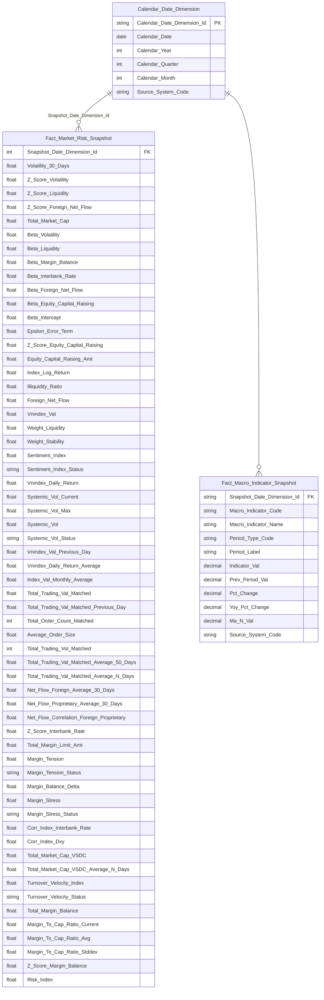


**Lineage Mart → Báo cáo:**

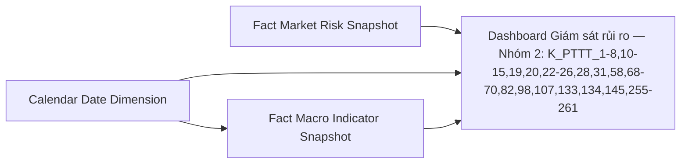

**Bảng grain:**

| Tên bảng | Grain |
|---|---|
| Fact Market Risk Snapshot | 1 row / ngày (SCD4A current state) |
| Calendar Date Dimension | 1 row / ngày (SCD4A current state) |
| Fact Macro Indicator Snapshot | 1 row / chỉ tiêu vĩ mô / kỳ công bố |

---

### Tab Dashboard Sức khỏe thị trường và vĩ mô

#### Nhóm 3 - Chỉ số vĩ mô – tiền tệ

> Phân loại: **Phân tích**
> Atomic: `Classification Risk Indicator` (`cl_risk_indicator` ← MRMS.RISK_INDICATOR) — **READY** | `Classification Risk Indicator Value` (`cl_risk_indicator_value` ← MRMS.RISK_INDICATOR_VALUE) — **READY**

**Mockup:**

| Chỉ tiêu | Giá trị | Kỳ trước | % Thay đổi |
|---|---|---|---|
| Lãi suất liên ngân hàng (ON) | 4.38% | 4.23% | +0.15 |
| Tỷ giá USD/VND | 25,510 | 25,497 | +0.05% |
| Chỉ số CPI (YoY) | 3.97% | 4.09% | -0.12 |
| Tăng trưởng GDP | 5.55% | 5.21% | +0.34 |

*(Toàn bộ 13/13 KPI của Nhóm này đã chuyển **READY** ngày 2026-09-18 sau khi O_PTTT_11 được giải quyết — nguồn Atomic `cl_risk_indicator`/`cl_risk_indicator_value` đã verify tồn tại tại `DataModel/Atomic/Common/`.)*

**Source:** `Fact Macro Indicator Snapshot` → `Calendar Date Dimension`

**Bảng KPI:**

| KPI ID | Tên KPI | Đơn vị | Tính chất | Công thức | Ghi chú | Trạng thái |
|---|---|---|---|---|---|---|
| K_PTTT_30 | Ngày thống kê (Chiều thời gian vĩ mô) | Kỳ | Chiều | `cdr_dt_dim.cdr_dt` JOIN qua `fct_macro_indicator_snpst.snpst_dt_dim_id` | **[SỬA 2026-09-18 — O_PTTT_11 Resolved]** Nguồn Atomic `cl_risk_indicator`/`cl_risk_indicator_value` (MRMS.RISK_INDICATOR/RISK_INDICATOR_VALUE) đã verify tồn tại tại `DataModel/Atomic/Common/`. Grain kỳ công bố của chỉ tiêu vĩ mô (`cl_risk_indicator_value.period_dt`) — tần suất khác nhau theo từng chỉ tiêu (ngày/tháng/quý), phân biệt bằng `period_tp_code` | READY |
| K_PTTT_31 | Lãi suất liên ngân hàng qua đêm (ON) tại ngày t — IRₜ | %/năm | Cơ sở | `fct_macro_indicator_snpst.indicator_val` WHERE `macro_indicator_code = 'INTERBANK_IR'` | **[SỬA 2026-09-18 — O_PTTT_11 Resolved]** Nguồn Atomic `cl_risk_indicator`/`cl_risk_indicator_value` (MRMS.RISK_INDICATOR/RISK_INDICATOR_VALUE) đã verify tồn tại tại `DataModel/Atomic/Common/` | READY |
| K_PTTT_32 | Lãi suất liên ngân hàng qua đêm ngày trước — IRₜ₋₁ | %/năm | Cơ sở | `fct_macro_indicator_snpst.prev_period_val` WHERE `macro_indicator_code = 'INTERBANK_IR'` | **[SỬA 2026-09-18 — O_PTTT_11 Resolved]** Nguồn Atomic `cl_risk_indicator`/`cl_risk_indicator_value` (MRMS.RISK_INDICATOR/RISK_INDICATOR_VALUE) đã verify tồn tại tại `DataModel/Atomic/Common/`. `prev_period_val` = LAG 1 kỳ trên chuỗi `period_dt` cùng `macro_indicator_code` | READY |
| K_PTTT_33 | % thay đổi lãi suất liên ngân hàng | % | Phái sinh | `fct_macro_indicator_snpst.pct_change` WHERE `macro_indicator_code = 'INTERBANK_IR'` | **[SỬA 2026-09-18 — O_PTTT_11 Resolved]** Nguồn Atomic `cl_risk_indicator`/`cl_risk_indicator_value` (MRMS.RISK_INDICATOR/RISK_INDICATOR_VALUE) đã verify tồn tại tại `DataModel/Atomic/Common/` | READY |
| K_PTTT_34 | Tỷ giá USD/VND tại ngày — FXₜ | VND/USD | Cơ sở | `fct_macro_indicator_snpst.indicator_val` WHERE `macro_indicator_code = 'EX_RATE_VND_USD'` | **[SỬA 2026-09-18 — O_PTTT_11 Resolved]** Nguồn Atomic `cl_risk_indicator`/`cl_risk_indicator_value` (MRMS.RISK_INDICATOR/RISK_INDICATOR_VALUE) đã verify tồn tại tại `DataModel/Atomic/Common/` | READY |
| K_PTTT_35 | Tỷ giá USD/VND ngày trước — FXₜ₋₁ | VND/USD | Cơ sở | `fct_macro_indicator_snpst.prev_period_val` WHERE `macro_indicator_code = 'EX_RATE_VND_USD'` | **[SỬA 2026-09-18 — O_PTTT_11 Resolved]** Nguồn Atomic `cl_risk_indicator`/`cl_risk_indicator_value` (MRMS.RISK_INDICATOR/RISK_INDICATOR_VALUE) đã verify tồn tại tại `DataModel/Atomic/Common/` | READY |
| K_PTTT_36 | % thay đổi tỷ giá USD/VND | % | Phái sinh | `fct_macro_indicator_snpst.pct_change` WHERE `macro_indicator_code = 'EX_RATE_VND_USD'` | **[SỬA 2026-09-18 — O_PTTT_11 Resolved]** Nguồn Atomic `cl_risk_indicator`/`cl_risk_indicator_value` (MRMS.RISK_INDICATOR/RISK_INDICATOR_VALUE) đã verify tồn tại tại `DataModel/Atomic/Common/` | READY |
| K_PTTT_37 | Chỉ số CPI (YoY) tại kỳ t | % | Cơ sở | `fct_macro_indicator_snpst.indicator_val` WHERE `macro_indicator_code = 'CPI_VN'` | **[SỬA 2026-09-18 — O_PTTT_11 Resolved]** Nguồn Atomic `cl_risk_indicator`/`cl_risk_indicator_value` (MRMS.RISK_INDICATOR/RISK_INDICATOR_VALUE) đã verify tồn tại tại `DataModel/Atomic/Common/`. CPI là chỉ tiêu tháng (`period_tp_code` = 2) | READY |
| K_PTTT_38 | CPI cùng kỳ năm trước | % | Cơ sở | `fct_macro_indicator_snpst.indicator_val` WHERE `macro_indicator_code = 'CPI_VN'` AND `period_year` = năm hiện tại − 1 AND `period_val` = kỳ hiện tại | [SỬA 2026-09-23 — BA PTTT 14:49, Nhóm 3 13/13 Done] DERIVED (LAG cùng tháng năm trước qua `cdr_dt_dim`); SQL BA dòng 102 lấy kỳ liền trước — copy nhầm, xem O_PTTT_18. **[SỬA 2026-09-18 — O_PTTT_11 Resolved]** Nguồn Atomic `cl_risk_indicator`/`cl_risk_indicator_value` (MRMS.RISK_INDICATOR/RISK_INDICATOR_VALUE) đã verify tồn tại tại `DataModel/Atomic/Common/`. Lùi cùng kỳ năm trước theo cặp (`period_year`, `period_val`) — KHÔNG dùng LAG theo số dòng vì chuỗi CPI có thể khuyết kỳ | READY |
| K_PTTT_39 | % thay đổi CPI YoY | % | Phái sinh | `fct_macro_indicator_snpst.yoy_pct_change` WHERE `macro_indicator_code = 'CPI_VN'` | [SỬA 2026-09-23 — BA PTTT 14:49, Nhóm 3 13/13 Done] SQL BA dòng 103 copy nhầm từ dòng tỷ giá — thiết kế theo Mô tả YoY, xem O_PTTT_18. **[SỬA 2026-09-18 — O_PTTT_11 Resolved]** Nguồn Atomic `cl_risk_indicator`/`cl_risk_indicator_value` (MRMS.RISK_INDICATOR/RISK_INDICATOR_VALUE) đã verify tồn tại tại `DataModel/Atomic/Common/` | READY |
| K_PTTT_40 | GDP kỳ hiện tại | Nghìn tỷ VND | Cơ sở | `fct_macro_indicator_snpst.indicator_val` WHERE `macro_indicator_code = 'GDP_VN'` | **[SỬA 2026-09-18 — O_PTTT_11 Resolved]** Nguồn Atomic `cl_risk_indicator`/`cl_risk_indicator_value` (MRMS.RISK_INDICATOR/RISK_INDICATOR_VALUE) đã verify tồn tại tại `DataModel/Atomic/Common/`. GDP là chỉ tiêu quý (`period_tp_code` = 3) | READY |
| K_PTTT_41 | GDP kỳ trước | Nghìn tỷ VND | Cơ sở | `fct_macro_indicator_snpst.prev_period_val` WHERE `macro_indicator_code = 'GDP_VN'` | **[SỬA 2026-09-18 — O_PTTT_11 Resolved]** Nguồn Atomic `cl_risk_indicator`/`cl_risk_indicator_value` (MRMS.RISK_INDICATOR/RISK_INDICATOR_VALUE) đã verify tồn tại tại `DataModel/Atomic/Common/` | READY |
| K_PTTT_42 | Tăng trưởng GDP | % | Phái sinh | `fct_macro_indicator_snpst.pct_change` WHERE `macro_indicator_code = 'GDP_VN'` | **[SỬA 2026-09-18 — O_PTTT_11 Resolved]** Nguồn Atomic `cl_risk_indicator`/`cl_risk_indicator_value` (MRMS.RISK_INDICATOR/RISK_INDICATOR_VALUE) đã verify tồn tại tại `DataModel/Atomic/Common/` | READY |

**Star Schema:**

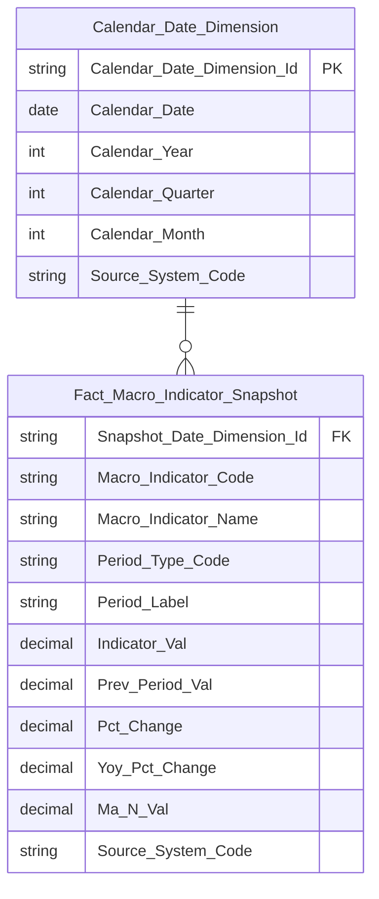

> **Ghi chú:** `Macro_Indicator_Code`/`Macro_Indicator_Name` là Degenerate Dimension trên Fact — chưa tách `Macro Indicator Dimension` riêng vì danh mục chỉ tiêu vĩ mô hiện chỉ có Code + Name (reference data set, không phải entity concept). Tách Dimension khi Atomic bổ sung thuộc tính phân nhóm chỉ tiêu.

**Lineage Mart → Báo cáo:**


**Bảng grain:**

| Tên bảng | Grain |
|---|---|
| Fact Macro Indicator Snapshot | 1 row / chỉ tiêu vĩ mô / kỳ công bố |
| Calendar Date Dimension | 1 row / ngày |

#### Nhóm 4 - Biểu đồ chỉ số sức khỏe hệ thống

> Phân loại: **Phân tích**
> Atomic: `Security Trading Snapshot` ← MDDS.StockInfor — **READY** | `Securities Trade` ← ORDERTRADE.TRADE_BOOK_HOSE/HNX — **READY** | `Market Index Snapshot` ← MDDS.MarketInfor — **READY** | `Risk Weight Configuration` (`risk_weight_config`) — **READY** (xem O_PTTT_2 cập nhật; Nhóm 4 dùng `risk_factor_type = 'Chỉ số tâm lý giao dịch của mã chứng khoán'`: S_LIQUIDITY=W1, S_STABILITY=W2) | nguồn Dư nợ Margin (SSC_SCMS.MEMBER_REPORT/FORM_REPORT/REPORT_CELL_VALUE) — **PENDING** (chưa có Atomic entity chuẩn hóa, xem Nhóm 1)

>
> **SỬA 2026-09-23 — BA PTTT 14:49, Nhóm 4 30/30 Done** Đối chiếu BA 30 dòng ↔ 29 KPI (dòng 130 gộp K_PTTT_61, dòng 135 gộp K_PTTT_44 theo Rule 6; K_PTTT_64 σ_max không có dòng BA riêng — thành phần K_PTTT_65). Margin: bỏ nguồn EAV `Fact Securities Company Financial Structure Snapshot` — K_PTTT_58 reuse Nhóm 1 (`total_margin_balance`), K_PTTT_59 cập nhật etl theo cell_id BA (BCTCHN TS359 / BCTCRL TS223–TS221), K_PTTT_60 tính trên Fact. KPI mới: K_PTTT_264 (Vc), K_PTTT_265 (Vp), K_PTTT_266 (P(t-1) per mã); reuse K_PTTT_82 (P(t) per mã, dòng 124), K_PTTT_69 (dòng 136).

**Mockup:**

| Chỉ số | Giá trị | Trạng thái |
|---|---|---|
| Sentiment Index | 70 | Optimistic |
| Margin Tension | 82% | Near Saturation |
| Systemic Vol | 29% | Stable |

*(Cả 3 chỉ số READY — Margin Tension dùng margin kỳ tháng (Nhóm 1) / hạn mức 2×VCSH theo báo cáo định kỳ CTCK)*

**Source:** `Fact Market Risk Snapshot` → `Calendar Date Dimension`

**Bảng KPI:**

| KPI ID | Tên KPI | Đơn vị | Tính chất | Công thức | Ghi chú | Trạng thái |
|---|---|---|---|---|---|---|
| K_PTTT_43 | Ngày thống kê (Chiều thời gian) | Ngày | Chiều | `market_index_snapshot.trading_dt` WHERE `market_code = 'HOSE'` | [SỬA 2026-09-23 — BA PTTT 14:49, Nhóm 4 30/30 Done] BA dòng 107 | READY |
| K_PTTT_44 | Điểm chứng khoán (như VN-Index) | Điểm | Cơ sở | `market_index_snapshot.market_index_val` WHERE `market_code = 'HOSE'` AND `trading_dt = snapshot_date` | [SỬA 2026-09-23 — BA PTTT 14:49, Nhóm 4 30/30 Done] BA dòng 116, 135 ('Giá tại thời điểm t' — gộp Rule 6) | READY |
| K_PTTT_45 | Khối lượng khớp lệnh ngày t của mã CK — Vₜ | KL | Cơ sở | `securities_trade.execution_vol` GROUP BY `securities_trade.security_symbol_code`, `securities_trade.trading_dt` | [SỬA 2026-09-23 — BA PTTT 14:49, Nhóm 4 30/30 Done] BA dòng 114 | READY |
| K_PTTT_46 | Khối lượng khớp lệnh trung bình 20 phiên — MAvol(20) | KL | Phái sinh | `AVG(securities_trade.execution_vol)` trên 20 ngày gần nhất GROUP BY `securities_trade.security_symbol_code` | [SỬA 2026-09-23 — BA PTTT 14:49, Nhóm 4 30/30 Done] BA dòng 115 | READY |
| K_PTTT_47 | Tỷ lệ dòng tiền — Flow Ratio | Số thực | Phái sinh | `K_PTTT_45 / K_PTTT_46` — tức `Vₜ / MAvol(20)` | [SỬA 2026-09-23 — BA PTTT 14:49, Nhóm 4 30/30 Done] BA dòng 113 | READY |
| K_PTTT_48 | Dấu dòng tiền — Sign(PriceChange) | Số nguyên | Phái sinh | `CASE WHEN security_trading_snapshot.close_price > security_trading_snapshot.open_price THEN 1 WHEN security_trading_snapshot.close_price < security_trading_snapshot.open_price THEN -1 ELSE 0 END` | [SỬA 2026-09-23 — BA PTTT 14:49, Nhóm 4 30/30 Done] BA dòng 117 | READY |
| K_PTTT_49 | Điểm thanh khoản — S_liquidity | Điểm (0–100) | Phái sinh | `50 + K_PTTT_48 × LEAST(K_PTTT_47 × 25, 50)` | [SỬA 2026-09-23 — BA PTTT 14:49, Nhóm 4 30/30 Done] BA dòng 112 | READY |
| K_PTTT_50 | Giá cao nhất trong phiên — Hₜ | VND | Cơ sở | `security_trading_snapshot.high_price` | [SỬA 2026-09-23 — BA PTTT 14:49, Nhóm 4 30/30 Done] BA dòng 122 | READY |
| K_PTTT_51 | Giá thấp nhất trong phiên — Lₜ | VND | Cơ sở | `security_trading_snapshot.low_price` | [SỬA 2026-09-23 — BA PTTT 14:49, Nhóm 4 30/30 Done] BA dòng 123 | READY |
| K_PTTT_82 | Giá đóng cửa mã CK ngày P(t) | VND | Cơ sở | `Security Trading Snapshot.Close Price` | [SỬA 2026-09-23 — BA PTTT 14:49, Nhóm 4 30/30 Done] Reuse từ Nhóm 1 — BA dòng 124 (Đánh giá: Trùng), per mã CK | READY |
| K_PTTT_266 | Giá đóng cửa mã CK ngày P(t-1) | VND | Cơ sở | `security_trading_snapshot.close_price` WHERE `floor_code IN ('02','04','10')` AND `trading_dt = MAX(trading_dt) < :input_date` per `symbol` | [SỬA 2026-09-23 — BA PTTT 14:49, Nhóm 4 30/30 Done] **[MỚI]** BA dòng 125 (BA ghi 'Trùng dòng 10' nhưng dòng 10 là VN-Index; đây là giá per mã) — DERIVED, không lưu cột | READY |
| K_PTTT_264 | Vc — Biến động giá đóng cửa per mã | Số thực | Phái sinh | `ABS(LN(security_trading_snapshot.close_price / close_price[t-1]))` per `symbol`, `floor_code IN ('02','04','10')` | [SỬA 2026-09-23 — BA PTTT 14:49, Nhóm 4 30/30 Done] **[MỚI]** BA dòng 120 — DERIVED, không lưu cột | READY |
| K_PTTT_265 | Vp — Biến động Parkinson 20 phiên per mã | Số thực | Phái sinh | `SQRT(1/(4×20×LN(2)) × SUM(LN(security_trading_snapshot.high_price / security_trading_snapshot.low_price)²))` OVER (PARTITION BY `symbol` ORDER BY `trading_dt` ROWS BETWEEN 19 PRECEDING AND CURRENT ROW) | [SỬA 2026-09-23 — BA PTTT 14:49, Nhóm 4 30/30 Done] **[MỚI]** BA dòng 121 — DERIVED, không lưu cột | READY |
| K_PTTT_52 | ER – Volatility Efficiency Ratio (Vp/Vc) | Số thực | Phái sinh | `K_PTTT_265 / NULLIF(K_PTTT_264, 0)` — Vp / Vc | [SỬA 2026-09-23 — BA PTTT 14:49, Nhóm 4 30/30 Done] BA dòng 119 — ER = Vp / Vc (K_PTTT_265 / K_PTTT_264) | READY |
| K_PTTT_53 | Điểm ổn định — S_stability | Điểm (0–100) | Phái sinh | `GREATEST(0, 100 - (K_PTTT_52 × 50))` | [SỬA 2026-09-23 — BA PTTT 14:49, Nhóm 4 30/30 Done] BA dòng 118 | READY |
| K_PTTT_54 | Trọng số W1 (S_liquidity) và W2 (S_stability) | Số thực | Cơ sở | `risk_weight_config.weight` WHERE `risk_weight_config.risk_factor_code IN ('S_LIQUIDITY','S_STABILITY')` AND `risk_weight_config.risk_factor_type = 'Chỉ số tâm lý giao dịch của mã chứng khoán'` AND `risk_weight_config.data_dt = MAX(data_dt) <= snapshot_date` | [SỬA 2026-09-23 — BA PTTT 14:49, Nhóm 4 30/30 Done] BA dòng 111 'Trọng số của chỉ tiêu' | READY |
| K_PTTT_55 | Sentiment Score của từng mã CK | Điểm | Phái sinh | `K_PTTT_54(W1) × K_PTTT_49 + K_PTTT_54(W2) × K_PTTT_53` — tức `W1 × S_liquidity + W2 × S_stability` per mã CK | [SỬA 2026-09-23 — BA PTTT 14:49, Nhóm 4 30/30 Done] BA dòng 110 | READY |
| K_PTTT_56 | Sentiment Index (chỉ số tâm lý giao dịch toàn thị trường) | Điểm | Phái sinh | `SUM(K_PTTT_55 × security_trading_snapshot.total_trading_val) / NULLIF(SUM(security_trading_snapshot.total_trading_val), 0)` GROUP BY `security_trading_snapshot.trading_dt` — weighted average theo GTGD, KHÔNG phải AVG số học đơn giản | [SỬA 2026-09-23 — BA PTTT 14:49, Nhóm 4 30/30 Done] BA dòng 109 | READY |
| K_PTTT_57 | Ngưỡng trạng thái Sentiment Index | Text | Phái sinh | `LOOKUP status_threshold_config ON status_threshold_config.index_code = 'SENTIMENTINDEX' AND fct_market_risk_snpst.sentiment_index BETWEEN status_threshold_config.from_value AND status_threshold_config.to_value → status_threshold_config.status` | [SỬA 2026-09-23 — BA PTTT 14:49, Nhóm 4 30/30 Done] BA dòng 108 | READY |
| K_PTTT_58 | Tổng dư nợ vay margin tất cả CTCK | Tỷ VND | Phái sinh | `Fact Market Risk Snapshot.Total Margin Balance` | [SỬA 2026-09-23 — BA PTTT 14:49, Nhóm 4 30/30 Done] Reuse từ Nhóm 1 — BA dòng 128 cùng nguồn `BCTHHD_CTCK` sheet II.8 cell `TS024`, kỳ THÁNG (margin giữ nguyên trong tháng); bỏ nguồn EAV cũ | READY |
| K_PTTT_59 | Tổng hạn mức margin (tối đa 2× VCSH) | Tỷ VND | Phái sinh | `fct_market_risk_snpst.total_margin_limit_amt` = `2 * SUM(TO_NUMBER(sc_report_input_value.item_val))` theo cell_id VCSH | [SỬA 2026-09-23 — BA PTTT 14:49, Nhóm 4 30/30 Done] BA dòng 129 — `2 × Σ VCSH`; mỗi CTCK (`sc_periodic_report.sc_id`) 1 báo cáo ưu tiên Năm > Bán niên > Quý, `sent_tms` mới nhất trong năm của ngày t; VCSH `BCTCHN` cell `TS359`, thiếu thì `BCTCRL` `TS223` (fallback `TS221`). **O_PTTT_15 Resolved một phần** | READY |
| K_PTTT_60 | Margin Tension (chỉ số độ căng margin) | % | Phái sinh | `K_PTTT_58 / NULLIF(K_PTTT_59, 0) * 100` | [SỬA 2026-09-23 — BA PTTT 14:49, Nhóm 4 30/30 Done] BA dòng 127 — grain: margin tháng chứa ngày t / hạn mức theo báo cáo VCSH mới nhất trong năm. Khác K_PTTT_125 (Margin Stress) | READY |
| K_PTTT_61 | Ngưỡng trạng thái Margin Tension | Text | Phái sinh | `LOOKUP status_threshold_config ON status_threshold_config.index_code = 'MARGINTENSION' AND fct_market_risk_snpst.margin_tension BETWEEN status_threshold_config.from_value AND status_threshold_config.to_value → status_threshold_config.status` | [SỬA 2026-09-23 — BA PTTT 14:49, Nhóm 4 30/30 Done] BA dòng 126, 130 ('Cấu hình ngưỡng trạng thái' — SQL cũ SSC_SCMS, gộp Rule 6) | READY |
| K_PTTT_62 | Lợi suất ngày VN-Index — Rₜ | % | Phái sinh | `(market_index_snapshot.market_index_val[t] - market_index_snapshot.market_index_val[t-1]) / market_index_snapshot.market_index_val[t-1]` WHERE `market_code = 'HOSE'` | [SỬA 2026-09-23 — BA PTTT 14:49, Nhóm 4 30/30 Done] BA dòng 134 | READY |
| K_PTTT_63 | σ_current — Độ lệch chuẩn biến động VN-Index 20 phiên (annualized) | % | Phái sinh | `STDDEV_SAMP(K_PTTT_62) × SQRT(252)` trên 20 ngày gần nhất | [SỬA 2026-09-23 — BA PTTT 14:49, Nhóm 4 30/30 Done] BA dòng 133 | READY |
| K_PTTT_64 | σ_max — Độ lệch chuẩn biến động VN-Index lịch sử tối đa | % | Phái sinh | `MAX(σ_current_lịch sử)` trên toàn bộ `market_index_snapshot.trading_dt <= snapshot_date` | [SỬA 2026-09-23 — BA PTTT 14:49, Nhóm 4 30/30 Done] Không có dòng BA riêng — thành phần mẫu số của K_PTTT_65 (BA dòng 132 σ_current / σ_max) | READY |
| K_PTTT_65 | Systemic Vol (chỉ số biến động hệ thống) | % | Phái sinh | `K_PTTT_63 / K_PTTT_64 × 100` | [SỬA 2026-09-23 — BA PTTT 14:49, Nhóm 4 30/30 Done] BA dòng 132 | READY |
| K_PTTT_66 | Ngưỡng trạng thái Systemic Vol | Text | Phái sinh | `LOOKUP status_threshold_config ON status_threshold_config.index_code = 'SYSTEMICVOL' AND fct_market_risk_snpst.systemic_vol BETWEEN status_threshold_config.from_value AND status_threshold_config.to_value → status_threshold_config.status` | [SỬA 2026-09-23 — BA PTTT 14:49, Nhóm 4 30/30 Done] BA dòng 131 | READY |
| K_PTTT_69 | Giá VN-Index tại thời điểm t-1 | Điểm | Cơ sở | `Fact Market Risk Snapshot.VNIndex Value Previous Day` | [SỬA 2026-09-23 — BA PTTT 14:49, Nhóm 4 30/30 Done] Reuse từ Nhóm 1 — BA dòng 136 | READY |

**Star Schema:**


> **Ghi chú:** `VNIndex_Close` (K_PTTT_44 — "Điểm chứng khoán (như VN-Index)") mới bổ sung vào Star Schema — khai sinh riêng cho Nhóm 4, nguồn `market_index_snapshot.market_index_val WHERE market_code='HOSE'` (**[SỬA 2026-09-07]** đồng bộ Attributes, xem [SỬA 2026-07-30] Nhóm 1&2). Nhóm 6 (K_PTTT_67 cũ) đã chuyển sang reuse KPI này, dùng cùng tên cột `VNIndex_Close` trên `Fact Market Risk Snapshot`. `Sentiment_Weight_Liquidity`/`Sentiment_Weight_Stability`/`Sentiment_Score`/`Sentiment_Index`/`Sentiment_Status` (K_PTTT_54~57) cũng mới bổ sung — Risk Weight Configuration nay đã READY (xem O_PTTT_2), dùng `risk_factor_type = 'Chỉ số tâm lý giao dịch của mã chứng khoán'`.

**Lineage Mart → Báo cáo:**


**Bảng grain:**

| Tên bảng | Grain |
|---|---|
| Fact Market Risk Snapshot | 1 row / ngày (SCD4A current state) |
| Calendar Date Dimension | 1 row / ngày (SCD4A current state) |

#### Nhóm 5 - Biểu đồ Macro correlation map

> Phân loại: **Phân tích**
> Atomic: `Classification Risk Indicator` (`cl_risk_indicator` ← MRMS.RISK_INDICATOR) — **READY** | `Classification Risk Indicator Value` (`cl_risk_indicator_value` ← MRMS.RISK_INDICATOR_VALUE) — **READY** | `Market Index Snapshot` ← MDDS.JAD_MARKETINFOR — **READY**

>
> **SỬA 2026-09-23 — BA PTTT 14:49, Nhóm 5 18/18 Done** Đối chiếu BA 18 dòng ↔ 16 KPI (dòng 149 gộp K_PTTT_31, 153 gộp K_PTTT_73). Sửa: (1) dòng 143 là log return → K_PTTT_25 thay K_PTTT_62; (2) K_PTTT_71/72/75/76 chuyển DERIVED — trước map nhầm `ma_n_val`/`pct_change` và cửa sổ ORDER BY surrogate key; (3) K_PTTT_67 role FILTER → DERIVED. SQL BA dòng 152 copy nhầm từ Δ lãi suất — thiết kế theo Mô tả, cần BA sửa.

**Mockup:**

| Chỉ báo | Hệ số tương quan | Đánh giá |
|---|---|---|
| Tương quan Chỉ số & Lãi suất thực tế | -0.8 | Nghịch quan mạnh (Downside Risk) |
| Index vs DXY Index | -0.63 | Nghịch quan vừa (FX Pressure) |

*(Toàn bộ 2 chỉ báo tương quan trên mockup — PENDING do gap Atomic Risk Indicator/Risk Indicator Value, xem O_PTTT_11. Chỉ các sub-component nguồn VN-Index (Return, Giá) — READY)*

**Source:** `Fact Market Risk Snapshot` → `Calendar Date Dimension`; `Fact Macro Indicator Snapshot` → `Calendar Date Dimension`

**Bảng KPI:**

| KPI ID | Tên KPI | Đơn vị | Tính chất | Công thức | Ghi chú | Trạng thái |
|---|---|---|---|---|---|---|
| K_PTTT_43 | Chiều Thời gian (snapshot_date) | Ngày | Chiều | `market_index_snapshot.trading_dt` WHERE `market_code='HOSE'` | [SỬA 2026-09-23 — BA PTTT 14:49, Nhóm 5 18/18 Done] BA dòng 137 | READY |
| K_PTTT_67 | Index Code (VN-Index) | Text | Chiều | `market_index_snapshot.market_code`; `CSIDXInfor.indexCode` → lọc index thành phần | [SỬA 2026-09-23 — BA PTTT 14:49, Nhóm 5 18/18 Done] BA dòng 138 — ETL filter cố định `market_code = 'HOSE'` trên toàn Fact, không lưu cột; đổi role FILTER → DERIVED (sửa L0-HLD-LLD-STATUS-DESYNC) | READY |
| K_PTTT_68 | Giá VN-Index tại t (Pₜ) | Điểm | Cơ sở | `market_index_snapshot.market_index_val` WHERE `market_code='HOSE'` AND `trading_dt=snapshot_date` | [SỬA 2026-09-23 — BA PTTT 14:49, Nhóm 5 18/18 Done] BA dòng 145 ('Trùng dòng 9') | READY |
| K_PTTT_69 | Giá VN-Index tại t-1 (Pₜ₋₁) | Điểm | Cơ sở | `market_index_snapshot.market_index_val` WHERE `market_code='HOSE'` AND `trading_dt=MAX(trading_dt)<snapshot_date` | [SỬA 2026-09-23 — BA PTTT 14:49, Nhóm 5 18/18 Done] BA dòng 146 ('Trùng dòng 10') | READY |
| K_PTTT_25 | Return VN-Index tại t (Rₜ = ln(Pₜ/Pₜ₋₁)) | — | Cơ sở | `Fact Market Risk Snapshot.Index Log Return` = LN(Pₜ / Pₜ₋₁) | [SỬA 2026-09-23 — BA PTTT 14:49, Nhóm 5 18/18 Done] BA dòng 143 — log return = K_PTTT_25 (Nhóm 1); thay reuse K_PTTT_62 (lợi suất đơn giản của Nhóm 4) | READY |
| K_PTTT_70 | Return VN-Index trung bình N phiên (R̄ₙ) | % | Phái sinh | `AVG(LN(market_index_val[t]/market_index_val[t-1]))` trên N phiên gần nhất WHERE `market_code='HOSE'` | [SỬA 2026-09-23 — BA PTTT 14:49, Nhóm 5 18/18 Done] BA dòng 144 — Σ ln(Pt/Pt-1) / 30 | READY |
| K_PTTT_31 | Lãi suất LNH tại t (IRₜ) | %/năm | Cơ sở | Reuse từ Nhóm 3 — `fct_macro_indicator_snpst.indicator_val` WHERE `macro_indicator_code = 'INTERBANK_IR'` | [SỬA 2026-09-23 — BA PTTT 14:49, Nhóm 5 18/18 Done] BA dòng 139, 149 (gộp Rule 6) | READY |
| K_PTTT_32 | Lãi suất LNH tại t-1 (IRₜ₋₁) | %/năm | Cơ sở | Reuse từ Nhóm 3 — `fct_macro_indicator_snpst.prev_period_val` WHERE `macro_indicator_code = 'INTERBANK_IR'` | [SỬA 2026-09-23 — BA PTTT 14:49, Nhóm 5 18/18 Done] BA dòng 150 | READY |
| K_PTTT_71 | ΔLãi suất LNH tại t (ΔIRₜ) | Điểm % | Phái sinh | `K_PTTT_31 − K_PTTT_32` | [SỬA 2026-09-23 — BA PTTT 14:49, Nhóm 5 18/18 Done] BA dòng 147 — Reuse Case 2, tính tại BI | READY |
| K_PTTT_72 | ΔLãi suất LNH trung bình N phiên (ΔIR̄ₙ) | Điểm % | Phái sinh | `AVG(K_PTTT_71)` OVER (PARTITION BY `macro_indicator_code` ORDER BY `cdr_dt_dim.cdr_dt` ASC ROWS BETWEEN 29 PRECEDING AND CURRENT ROW) | [SỬA 2026-09-23 — BA PTTT 14:49, Nhóm 5 18/18 Done] BA dòng 148 — N = 30; sửa: trước map nhầm `ma_n_val` (= AVG giá trị gốc, không phải AVG Δ) và ORDER BY surrogate key (A8) | READY |
| K_PTTT_73 | DXY Index tại t (DXYₜ) | Điểm | Cơ sở | `fct_macro_indicator_snpst.indicator_val` WHERE `macro_indicator_code = 'DXY'` | [SỬA 2026-09-23 — BA PTTT 14:49, Nhóm 5 18/18 Done] BA dòng 140, 153 (gộp Rule 6) | READY |
| K_PTTT_74 | DXY Index tại t-1 (DXYₜ₋₁) | Điểm | Cơ sở | `fct_macro_indicator_snpst.prev_period_val` WHERE `macro_indicator_code = 'DXY'` | [SỬA 2026-09-23 — BA PTTT 14:49, Nhóm 5 18/18 Done] BA dòng 154 | READY |
| K_PTTT_75 | Return DXY tại t (Return_DXYₜ) | Số thực | Phái sinh | `LN(K_PTTT_73 / NULLIF(K_PTTT_74, 0))` | [SỬA 2026-09-23 — BA PTTT 14:49, Nhóm 5 18/18 Done] BA dòng 151 — sửa: trước map nhầm `pct_change` (= % thay đổi, không phải log return) | READY |
| K_PTTT_76 | Return DXY trung bình N phiên (Return_DXȲₙ) | Số thực | Phái sinh | `AVG(K_PTTT_75)` OVER (PARTITION BY `macro_indicator_code` ORDER BY `cdr_dt_dim.cdr_dt` ASC ROWS BETWEEN 29 PRECEDING AND CURRENT ROW) | [SỬA 2026-09-23 — BA PTTT 14:49, Nhóm 5 18/18 Done] BA dòng 152 — N = 30; SQL BA dòng 152 copy nhầm của Δ lãi suất (INTERBANK_IR) → thiết kế theo Mô tả 'Σ ln(DXYt/DXYt-1)/N'; sửa ma_n_val + ORDER BY surrogate key (A8) | READY |
| K_PTTT_77 | Tương quan VN-Index & Lãi suất thực tế | Số thực | Phái sinh | `fct_market_risk_snpst.corr_index_interbank_rate` = `CORR(fct_market_risk_snpst.index_log_return, K_PTTT_71) OVER (ORDER BY fct_market_risk_snpst.snpst_dt_dim_id ROWS BETWEEN 29 PRECEDING AND CURRENT ROW)` | [SỬA 2026-09-23 — BA PTTT 14:49, Nhóm 5 18/18 Done] BA dòng 141 | READY |
| K_PTTT_78 | Tương quan VN-Index & DXY Index | Số thực | Phái sinh | `fct_market_risk_snpst.corr_index_dxy` = `CORR(fct_market_risk_snpst.index_log_return, K_PTTT_75) OVER (ORDER BY fct_market_risk_snpst.snpst_dt_dim_id ROWS BETWEEN 29 PRECEDING AND CURRENT ROW)` | [SỬA 2026-09-23 — BA PTTT 14:49, Nhóm 5 18/18 Done] BA dòng 142 | READY |

**Star Schema:**


> **Ghi chú:** `Correlation_VNI_IR`/`Correlation_VNI_DXY`/status (K_PTTT_77, 68) **chưa đưa vào Star Schema** — phụ thuộc gap Atomic `Risk Indicator`/`Risk Indicator Value` (xem O_PTTT_11), sẽ bổ sung khi hết PENDING. `VNIndex_Close` dùng chung với Nhóm 4/6 (K_PTTT_44/70/71).

**Lineage Mart → Báo cáo:**

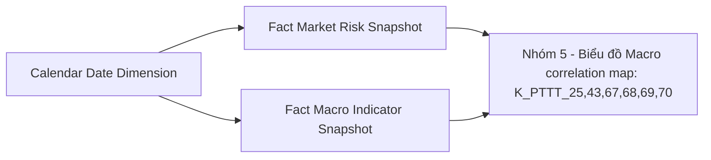

**Bảng grain:**

| Tên bảng | Grain |
|---|---|
| Fact Market Risk Snapshot | 1 row / ngày |
| Calendar Date Dimension | 1 row / ngày |
| Fact Macro Indicator Snapshot | 1 row / chỉ tiêu vĩ mô / kỳ công bố |


---

#### Nhóm 6 - Tương quan chỉ số và lãi suất thực tế

> Phân loại: **Phân tích**
> Atomic: `Classification Risk Indicator` (`cl_risk_indicator` ← MRMS.RISK_INDICATOR) — **READY** | `Classification Risk Indicator Value` (`cl_risk_indicator_value` ← MRMS.RISK_INDICATOR_VALUE) — **READY** | `Market Index Snapshot` ← MDDS.JAD_MARKETINFOR — **READY**

**Mockup:**

| Thời gian | VN-Index bình quân | Lãi suất bình quân (%) |
|---|---|---|
| 01/03 | 1248.2 | 6.05 |
| 07/03 | 1260.5 | 6.05 |
| 14/03 | 1263.1 | 6.04 |
| ... | ... | ... |
| 31/03 | 1290.3 | 6.03 |

*(Lãi suất tại t, Lãi suất bình quân tháng — PENDING do gap Atomic Risk Indicator/Risk Indicator Value, xem O_PTTT_11)*

**Source:** `Fact Market Risk Snapshot` → `Calendar Date Dimension`; `Fact Macro Indicator Snapshot` → `Calendar Date Dimension`

**Bảng KPI:**

| KPI ID | Tên KPI | Đơn vị | Tính chất | Công thức | Ghi chú | Trạng thái |
|---|---|---|---|---|---|---|
| K_PTTT_43 | Chiều Thời gian (Ngày thống kê) | Ngày | Chiều | `:input_date` — tham số người dùng chọn | Reuse từ Nhóm 4 | READY |
| K_PTTT_44 | Chỉ số VN-Index tại ngày t (Điểm chứng khoán) | Điểm | Cơ sở | `market_index_snapshot.market_index_val` WHERE `market_code='HOSE'` AND `trading_dt=snapshot_date`, bản ghi cuối ngày `ROW_NUMBER() OVER (PARTITION BY market_code, trading_dt ORDER BY index_time DESC) = 1` | **[SỬA 2026-09-24]** BA bổ sung lấy bản ghi `indexTime` mới nhất trong ngày — ETL `fct_market_risk_snpst` áp dụng cho mọi cột đọc `market_index_snapshot.market_index_val` (vnindex_val, previous_day, daily_return, index_log_return, average, monthly average). Reuse từ Nhóm 4 (khai sinh gốc là K_PTTT_67 cũ — đã sửa lại do trùng ID với "Index Code" Chiều của Nhóm 5). **[SỬA 2026-09-07]** filter đổi VNINDEX→HOSE, đồng bộ Attributes | READY |
| K_PTTT_79 | Chỉ số Index bình quân tháng (VN-Index AVG) | Điểm | Phái sinh | `AVG(market_index_snapshot.market_index_val)` (bản ghi cuối ngày, như K_PTTT_44) GROUP BY `TRUNC(market_index_snapshot.trading_dt,'MM')` WHERE `market_code='HOSE'` AND `trading_dt` trong tháng chứa `:input_date` | **[SỬA 2026-08-04]** HLD cũ ghi sai `market_code='VNINDEX'` — SQL BA gốc (STT 6, "Chỉ số Index bình quân") xác nhận filter `marketCode='HOSE'`, không phải VNINDEX. AVG toàn bộ tháng chứa `:input_date` (không rolling đến ngày t) | READY |
| K_PTTT_31 | Lãi suất liên ngân hàng tại ngày t (IRₜ) | %/năm | Cơ sở | Reuse từ Nhóm 3 — `fct_macro_indicator_snpst.indicator_val` WHERE `macro_indicator_code = 'INTERBANK_IR'` | Reuse Case 1 | READY |
| K_PTTT_80 | Lãi suất bình quân tháng (IR AVG) | %/năm | Phái sinh | `AVG(fct_macro_indicator_snpst.indicator_val)` WHERE `macro_indicator_code = 'INTERBANK_IR'` GROUP BY `cdr_dt_dim.year`, `cdr_dt_dim.month` (tháng chứa `:input_date`) | [SỬA 2026-09-23 — BA PTTT 14:49, Nhóm 6 5/5 Done] BA dòng 157 — DERIVED (Reuse Case 2). Sửa: trước map `ma_n_val` (AVG trượt 30 kỳ) và tên cột `cdr_year/cdr_month` không tồn tại. Gom nhóm qua `Calendar Date Dimension` — KHÔNG dùng TRUNC surrogate key (A8) | READY |

**Star Schema:**

```mermaid
erDiagram
    Fact_Market_Risk_Snapshot {
        int Snapshot_Date_Dimension_Id FK
        float Volatility_30_Days
        float Z_Score_Volatility
        float Z_Score_Liquidity
        float Z_Score_Foreign_Net_Flow
        float Total_Market_Cap
        float Beta_Volatility
        float Beta_Liquidity
        float Beta_Margin_Balance
        float Beta_Interbank_Rate
        float Beta_Foreign_Net_Flow
        float Beta_Equity_Capital_Raising
        float Beta_Intercept
        float Epsilon_Error_Term
        float Z_Score_Equity_Capital_Raising
        float Equity_Capital_Raising_Amt
        float Index_Log_Return
        float Illiquidity_Ratio
        float Foreign_Net_Flow
        float Vnindex_Val
        float Weight_Liquidity
        float Weight_Stability
        float Sentiment_Index
        string Sentiment_Index_Status
        float Vnindex_Daily_Return
        float Systemic_Vol_Current
        float Systemic_Vol_Max
        float Systemic_Vol
        string Systemic_Vol_Status
        float Vnindex_Val_Previous_Day
        float Vnindex_Daily_Return_Average
        float Index_Val_Monthly_Average
        float Total_Trading_Val_Matched
        float Total_Trading_Val_Matched_Previous_Day
        int Total_Order_Count_Matched
        float Average_Order_Size
        int Total_Trading_Vol_Matched
        float Total_Trading_Val_Matched_Average_50_Days
        float Total_Trading_Val_Matched_Average_N_Days
        float Net_Flow_Foreign_Average_30_Days
        float Net_Flow_Proprietary_Average_30_Days
        float Net_Flow_Correlation_Foreign_Proprietary
        float Z_Score_Interbank_Rate
        float Total_Margin_Limit_Amt
        float Margin_Tension
        string Margin_Tension_Status
        float Margin_Balance_Delta
        float Margin_Stress
        string Margin_Stress_Status
        float Corr_Index_Interbank_Rate
        float Corr_Index_Dxy
        float Total_Market_Cap_VSDC
        float Total_Market_Cap_VSDC_Average_N_Days
        float Turnover_Velocity_Index
        string Turnover_Velocity_Status
        float Total_Margin_Balance
        float Margin_To_Cap_Ratio_Current
        float Margin_To_Cap_Ratio_Avg
        float Margin_To_Cap_Ratio_Stddev
        float Z_Score_Margin_Balance
        float Risk_Index
    }
    Calendar_Date_Dimension {
        string Calendar_Date_Dimension_Id PK
        date Calendar_Date
        int Calendar_Year
        int Calendar_Quarter
        int Calendar_Month
        string Source_System_Code
    }
    Calendar_Date_Dimension ||--o{ Fact_Market_Risk_Snapshot : "Snapshot_Date_Dimension_Id"
    Fact_Macro_Indicator_Snapshot {
        string Snapshot_Date_Dimension_Id FK
        string Macro_Indicator_Code
        string Macro_Indicator_Name
        string Period_Type_Code
        string Period_Label
        decimal Indicator_Val
        decimal Prev_Period_Val
        decimal Pct_Change
        decimal Yoy_Pct_Change
        decimal Ma_N_Val
        string Source_System_Code
    }
    Calendar_Date_Dimension ||--o{ Fact_Macro_Indicator_Snapshot : " "
```

> **Ghi chú:** `Interbank_IR`/`IR_Monthly_Avg` (K_PTTT_31, 80) **chưa đưa vào Star Schema** — phụ thuộc gap Atomic `Risk Indicator`/`Risk Indicator Value` (xem O_PTTT_11), sẽ bổ sung khi hết PENDING.

**Lineage Mart → Báo cáo:**

```mermaid
flowchart LR
    fct_market_risk_snpst["Fact Market Risk Snapshot"] --> rpt_nhom6["Nhóm 6 - Tương quan chỉ số và lãi suất thực tế: K_PTTT_43,44,79"]
    cdr_dt_dim["Calendar Date Dimension"] --> fct_market_risk_snpst
    fct_macro_indicator_snpst["Fact Macro Indicator Snapshot"] --> rpt_nhom6
    cdr_dt_dim["Calendar Date Dimension"] --> fct_macro_indicator_snpst
```

**Bảng grain:**

| Tên bảng | Grain |
|---|---|
| Fact Market Risk Snapshot | 1 row / ngày |
| Calendar Date Dimension | 1 row / ngày |
| Fact Macro Indicator Snapshot | 1 row / chỉ tiêu vĩ mô / kỳ công bố |


---

#### Nhóm 7 - Biểu đồ áp lực ngành

> Phân loại: **Phân tích**
> Atomic: `Security Trading Snapshot` ← MDDS.StockInfor — **READY** | `Securities Trade` ← ORDERTRADE.TRADE_BOOK_HOSE/HNX — **READY** | `Public Company` ← IDS.COMPANY_PROFILES — **READY** | `Classification Business Line` (`cl_business_line`) ← ECAT.BUSINESS_LINE_LEVEL_1 — **READY** | `Public Company Financial Report Value` (`fr_value`/`fr_catalog`/`fr_row_template`/`fr_column_template`/`pc_report_submission`) — **READY** (2026-09-21, xem O_PTTT_12 Resolved — 5 entity đã approved trên Atomic, đồng bộ chain đã dùng cho GSTT/Nhóm 21) | Khối lượng cổ phiếu lưu hành cho grain per-mã-CK Nhóm 7 (`listed_share_info`, VSDC_OUTSTANDING_SHARES) — **READY** (ngoại lệ Data Modeler xác nhận 2026-09-21, đồng bộ GSTT — chưa có manifest entry chính thức; **KHÔNG thuộc phạm vi O_PTTT_3** — O_PTTT_3 là blocker riêng cho MCAPₜ trong công thức Margin ratio ở Nhóm 1/2, vẫn giữ nguyên PENDING theo quyết định 2026-07-30 "VSDC là nguồn pháp lý riêng có thể khác giá trị")
>
> **[SỬA 2026-08-04 — Kịch bản D]** (1) Alias `pblc_co.category_l1_id` là tên bịa — entity thật `public_company` (IDS.COMPANY_PROFILES), field `business_line_level_1_code` (FK → `cl_business_line.cl_business_line_id`, JOIN qua Id không phải Code trực tiếp theo comment YAML Atomic). `category_l1_id` chỉ là ID kỹ thuật IDS.CATEGORIES dùng để join lấy `INDUSTRY_CD`, không phải field final. `Industry Dimension` (`industry_dim`) reuse cấu trúc code+name từ `cl_business_line`, giữ Dimension riêng theo quyết định người thiết kế (không denormalize vào Fact như pattern NDTNN). (2) K_PTTT_97 (Sector Debt Score) đã đánh sai READY dù nguồn `Public Company Financial Report Value` không tồn tại trên Atomic (loại khỏi scope 2026-07-14) — chuyển lại đúng PENDING, xem O_PTTT_12.
> **[SỬA 2026-09-21]** Data Modeler xác nhận dùng `listed_share_info` (nguồn `uat_vsdc_stg.outstanding_shares`, `src_stm_code = 'VSDC_OUTSTANDING_SHARES'` — xem `mapping_vsdc_ods_atm.md`) làm nguồn KL cổ phiếu lưu hành cho chuỗi Nhóm 7 — cùng ngoại lệ đã chấp nhận cho GSTT (chưa có LDM YAML/manifest chính thức). **Lưu ý phạm vi:** quyết định này KHÔNG đóng O_PTTT_3 — O_PTTT_3 là blocker riêng, chặt chẽ hơn, cho MCAPₜ trong công thức Margin ratio (K_PTTT_5/9/18/21-24, Nhóm 1/2), nơi Data Modeler đã từ chối dứt khoát mọi nguồn thay thế ngoài đúng báo cáo VSDC TT138 Mẫu 01 (quyết định 2026-07-30) — giữ nguyên PENDING, không đụng tới trong lần sửa này. Mở khóa toàn bộ chuỗi K_PTTT_98~106 (trừ K_PTTT_97 — vẫn PENDING vì phụ thuộc `Public Company Financial Report Value`, gap khác không liên quan). W1/W2/W3 của StressScore_i (K_PTTT_95) dùng `risk_weight_config` với `risk_factor_type = 'Chỉ số áp lực ngành'` (3 mã `W1_DRAWDOWN`/`W2_VOLATILITY`/`W3_SELLING`) — đồng bộ pattern đã chấp nhận ở Nhóm 4 (O_PTTT_2). Bổ sung 6 cột mới trên `Fact Sector Risk Snapshot`: `total_market_cap_sector`, `stress_score_sector`, `sector_liquid_score`, `stress_score_sector_previous_day`, `sector_stress_delta`, `sector_rating`.

>
> **SỬA 2026-09-23 — BA PTTT 14:49, Nhóm 7 34 Done / 8 Pending** Đối chiếu BA 42 dòng ↔ 34 KPI (8 dòng gộp Rule 6: 174/180/189/193→K_PTTT_82, 191→K_PTTT_100, 192→K_PTTT_99, 194→K_PTTT_98, 199→K_PTTT_102). KPI mới DERIVED: K_PTTT_267/268/269 (trọng số W1/W2/W3, dòng 169–171), K_PTTT_270 (TradingValue_i, dòng 188), K_PTTT_271/272 (Nợ phải trả / VCSH ngành, dòng 196–197); reuse K_PTTT_45 (dòng 190). K_PTTT_90/91: cửa sổ giá cao nhất đổi 30 phiên → '3 tháng + 2 ngày' (Note BA dòng 173).

**Mockup:**

| Nhóm ngành | Áp lực (StressScore) | Thanh khoản (LiquidScore) | Nợ (D/E) | Đánh giá |
|---|---|---|---|---|
| Ngân hàng | 12 | 87 | 91 | SAFE |
| BĐS | 82 | 30 | 44 | HIGH RISK |
| Xây dựng | 68 | 42 | 55 | WARNING |
| Công nghệ | 15 | 98 | 99 | EXCELLENT |
| Dầu khí | 35 | 66 | 76 | STABLE |
| Bán lẻ | 42 | 70 | 83 | WATCH |

*(2026-09-23: BA chuyển Pending chuỗi vốn hóa / Stress Score ngành (dòng 162–165, 191–192, 199–200) → K_PTTT_99/100/101/102/104 PENDING; các KPI Done phụ thuộc (K_PTTT_103/105/106) giữ READY, cột vật lý giữ nguyên)*

**Source:** `Fact Sector Risk Snapshot` → `Calendar Date Dimension`

> **[ĐỐI SOÁT 2026-09-24 — BA cập nhật 16:39: 42/42 Done]** 42 dòng BA ↔ 34 KPI (Δ = −8, hợp lệ theo Rule 6 — dòng BA trùng nghĩa gộp chung KPI): dòng 162 + 199 → K_PTTT_102; dòng 200 → K_PTTT_104; dòng 164 + 191 → K_PTTT_100; dòng 165 + 192 → K_PTTT_99; dòng 163 → K_PTTT_101; các dòng thành phần lặp lại trong công thức (167 KL CK lưu hành → K_PTTT_98; 173 giá đóng cửa cao nhất → K_PTTT_90; 180/189/193 giá đóng cửa/giá cổ phiếu → K_PTTT_82; 175 Volatility → K_PTTT_89; 188 TradingValue_i → K_PTTT_270) đã có từ trước. 5 KPI K_PTTT_99/100/101/102/104 nâng READY; bổ sung lọc `floor_code IN ('02','04','10')` cho vốn hóa theo CTE `gdc` của BA.

**Bảng KPI:**

| KPI ID | Tên KPI | Đơn vị | Tính chất | Công thức | Ghi chú | Trạng thái |
|---|---|---|---|---|---|---|
| K_PTTT_43 | Chiều Thời gian (Ngày thống kê) | Ngày | Chiều | `security_trading_snapshot.trading_dt = :input_date` | [SỬA 2026-09-23 — BA PTTT 14:49, Nhóm 7 34 Done / 8 Pending] BA dòng 161 | READY |
| K_PTTT_81 | Chiều Nhóm ngành | Text | Chiều | `public_company.business_line_level_1_code` JOIN `cl_business_line ON cl_business_line.cl_business_line_id = public_company.business_line_level_1_id` | [SỬA 2026-09-23 — BA PTTT 14:49, Nhóm 7 34 Done / 8 Pending] BA dòng 160 | READY |
| K_PTTT_82 | Giá đóng cửa mã CK tại t (Pₜ) | VND | Cơ sở | `security_trading_snapshot.close_price` WHERE `trading_dt=:input_date` AND `floor_code IN ('02','04','10')` | [SỬA 2026-09-23 — BA PTTT 14:49, Nhóm 7 34 Done / 8 Pending] BA dòng 166, 174, 180, 189, 193 (gộp Rule 6) | READY |
| K_PTTT_83 | Giá đóng cửa mã CK tại t-1 (Pₜ₋₁) | VND | Cơ sở | `security_trading_snapshot.close_price` WHERE `trading_dt=MAX(trading_dt)<:input_date` AND `floor_code IN ('02','04','10')` | [SỬA 2026-09-23 — BA PTTT 14:49, Nhóm 7 34 Done / 8 Pending] BA dòng 181 | READY |
| K_PTTT_84 | Lợi suất ngày per-stock (Rₜ) | % | Cơ sở | `LN(K_PTTT_82 / K_PTTT_83)` — security_trading_snapshot | [SỬA 2026-09-23 — BA PTTT 14:49, Nhóm 7 34 Done / 8 Pending] BA dòng 179 | READY |
| K_PTTT_85 | Lợi suất trung bình 30 phiên per-stock (R̄) | % | Phái sinh | `AVG(LN(close_price[t]/close_price[t-1]))` trên 30 ngày gần nhất per `security_trading_snapshot.symbol` | [SỬA 2026-09-23 — BA PTTT 14:49, Nhóm 7 34 Done / 8 Pending] BA dòng 182 | READY |
| K_PTTT_86 | Độ lệch chuẩn lợi suất per-stock (σᵢ) | Số thực | Phái sinh | `SQRT(SUM((Rₜ − K_PTTT_85)²)/(N−1))` trên N phiên per `security_trading_snapshot.symbol` | [SỬA 2026-09-23 — BA PTTT 14:49, Nhóm 7 34 Done / 8 Pending] BA dòng 176 | READY |
| K_PTTT_87 | σ_min toàn thị trường trong N phiên | Số thực | Phái sinh | `MIN(K_PTTT_86)` GROUP BY `trading_dt` | [SỬA 2026-09-23 — BA PTTT 14:49, Nhóm 7 34 Done / 8 Pending] BA dòng 177 | READY |
| K_PTTT_88 | σ_max toàn thị trường trong N phiên | Số thực | Phái sinh | `MAX(K_PTTT_86)` GROUP BY `trading_dt` | [SỬA 2026-09-23 — BA PTTT 14:49, Nhóm 7 34 Done / 8 Pending] BA dòng 178 | READY |
| K_PTTT_89 | Pvolatility — Điểm biến động chuẩn hóa | Điểm (0–100) | Phái sinh | `(K_PTTT_86 − K_PTTT_87) / (K_PTTT_88 − K_PTTT_87) × 100` | [SỬA 2026-09-23 — BA PTTT 14:49, Nhóm 7 34 Done / 8 Pending] BA dòng 175 | READY |
| K_PTTT_90 | Giá cao nhất N phiên per-stock | VND | Cơ sở | `MAX(security_trading_snapshot.close_price)` WHERE `trading_dt` từ `ADD_MONTHS(:input_date, -3) - 2 ngày` tới `:input_date` per `symbol` | [SỬA 2026-09-23 — BA PTTT 14:49, Nhóm 7 34 Done / 8 Pending] BA dòng 173; cửa sổ đổi 30 phiên → '3 tháng + 2 ngày' theo Note BA dòng 173 | READY |
| K_PTTT_91 | Pdrawdown — Price Drawdown | Điểm (0–100) | Phái sinh | `(K_PTTT_90 − K_PTTT_82) / K_PTTT_90 × 100` | [SỬA 2026-09-23 — BA PTTT 14:49, Nhóm 7 34 Done / 8 Pending] BA dòng 172; cửa sổ đổi 30 phiên → '3 tháng + 2 ngày' theo Note BA dòng 173 | READY |
| K_PTTT_92 | SellVolume_i — Khối lượng bán chủ động N phiên | KL | Phái sinh | `SUM(security_match_log.match_vol)` WHERE `trade_direction_code = 'S'` GROUP BY `security_match_log.symbol`, N phiên | [SỬA 2026-09-23 — BA PTTT 14:49, Nhóm 7 34 Done / 8 Pending] BA dòng 184 | READY |
| K_PTTT_93 | TotalVolume_i — Tổng khối lượng giao dịch N phiên | KL | Phái sinh | `SUM(securities_trade.execution_vol)` per `security_symbol_code`, N phiên WHERE `market_id_code IN ('STO','STX','UPX')` | [SỬA 2026-09-23 — BA PTTT 14:49, Nhóm 7 34 Done / 8 Pending] BA dòng 185 | READY |
| K_PTTT_45 | Khối lượng khớp lệnh ngày t của mã CK — Vₜ | KL | Cơ sở | `securities_trade.execution_vol` GROUP BY `securities_trade.security_symbol_code`, `securities_trade.trading_dt` | [SỬA 2026-09-23 — BA PTTT 14:49, Nhóm 7 34 Done / 8 Pending] Reuse từ Nhóm 4 — BA dòng 190 'Khối lượng giao dịch' (Trùng) — KL khớp per mã ngày t | READY |
| K_PTTT_94 | Pselling — Selling Pressure | Điểm (0–1) | Phái sinh | `K_PTTT_92 / K_PTTT_93` | [SỬA 2026-09-23 — BA PTTT 14:49, Nhóm 7 34 Done / 8 Pending] BA dòng 183 | READY |
| K_PTTT_95 | StressScore từng mã CK (StressScoreᵢ) | Điểm (0–100) | Phái sinh | `(W₁ × K_PTTT_91) + (W₂ × K_PTTT_89) + (W₃ × K_PTTT_94 × 100)` | [SỬA 2026-09-23 — BA PTTT 14:49, Nhóm 7 34 Done / 8 Pending] BA dòng 168 | READY |
| K_PTTT_267 | Trọng số W1 — Pdrawdown | Số thực | Cơ sở | `risk_weight_config.weight` WHERE `risk_factor_code = 'W1_DRAWDOWN'` AND `risk_factor_type = 'Chỉ số áp lực ngành'` | [SỬA 2026-09-23 — BA PTTT 14:49, Nhóm 7 34 Done / 8 Pending] **[MỚI]** BA dòng 169 — DERIVED, không lưu cột | READY |
| K_PTTT_268 | Trọng số W2 — Pvolatility | Số thực | Cơ sở | `risk_weight_config.weight` WHERE `risk_factor_code = 'W2_VOLATILITY'` AND `risk_factor_type = 'Chỉ số áp lực ngành'` | [SỬA 2026-09-23 — BA PTTT 14:49, Nhóm 7 34 Done / 8 Pending] **[MỚI]** BA dòng 170 — DERIVED, không lưu cột | READY |
| K_PTTT_269 | Trọng số W3 — Pselling | Số thực | Cơ sở | `risk_weight_config.weight` WHERE `risk_factor_code = 'W3_SELLING'` AND `risk_factor_type = 'Chỉ số áp lực ngành'` | [SỬA 2026-09-23 — BA PTTT 14:49, Nhóm 7 34 Done / 8 Pending] **[MỚI]** BA dòng 171 — DERIVED, không lưu cột | READY |
| K_PTTT_96 | TotalValue_Sector — Tổng GTGD ngành | Tỷ VND | Phái sinh | `SUM(security_trading_snapshot.close_price × securities_trade.execution_vol)` JOIN `security_trading_snapshot.symbol = securities_trade.security_symbol_code` AND `security_trading_snapshot.trading_dt = securities_trade.trade_dt` GROUP BY `public_company.business_line_level_1_code` AND `trading_dt` | [SỬA 2026-09-23 — BA PTTT 14:49, Nhóm 7 34 Done / 8 Pending] BA dòng 187 | READY |
| K_PTTT_270 | TradingValue_i — GTGD per mã CK | VND | Phái sinh | `security_trading_snapshot.close_price × SUM(securities_trade.execution_vol)` per `symbol`, ngày t | [SỬA 2026-09-23 — BA PTTT 14:49, Nhóm 7 34 Done / 8 Pending] **[MỚI]** BA dòng 188 — DERIVED, không lưu cột | READY |
| K_PTTT_97 | Sector Debt Score (D/E ngành) | Lần | Phái sinh | `SUM(Nợ phải trả toàn ngành) / SUM(VCSH toàn ngành)` — dùng chain `pc_report_submission`→`fr_value`→`fr_catalog`→`fr_row_template`→`fr_column_template`, BCDKT row_desc 300(DN/BH)/400(TD) cho Nợ phải trả, 400(DN/BH)/500(TD) col_desc=1 cho VCSH | [SỬA 2026-09-23 — BA PTTT 14:49, Nhóm 7 34 Done / 8 Pending] BA dòng 195 | READY |
| K_PTTT_271 | Nợ phải trả (ngành) | VND | Cơ sở | `SUM(TotalLiabilities_i)` GROUP BY `public_company.business_line_level_1_code` — BCĐKT row_desc 300 (DN/BH) / 400 (TD), col_desc = '1' | [SỬA 2026-09-23 — BA PTTT 14:49, Nhóm 7 34 Done / 8 Pending] **[MỚI]** BA dòng 196 — DERIVED, không lưu cột | READY |
| K_PTTT_272 | VCSH (ngành) | VND | Cơ sở | `SUM(OwnerEquity_i)` GROUP BY `public_company.business_line_level_1_code` — BCĐKT row_desc 400 (DN/BH) / 500 (TD), col_desc = '1' | [SỬA 2026-09-23 — BA PTTT 14:49, Nhóm 7 34 Done / 8 Pending] **[MỚI]** BA dòng 197 — DERIVED, không lưu cột | READY |
| K_PTTT_98 | KL cổ phiếu lưu hành per mã CK | — | Cơ sở | `listed_share_info.outstanding_share_quantity` WHERE `listed_share_info.ticker_symbol = symbol` AND `src_stm_code = 'VSDC_OUTSTANDING_SHARES'` AND lookback bản ghi gần nhất `<= trading_dt` | [SỬA 2026-09-23 — BA PTTT 14:49, Nhóm 7 34 Done / 8 Pending] BA dòng 167, 194 (gộp Rule 6) | READY |
| K_PTTT_99 | MarketCap_i (Vốn hóa từng mã) | — | Phái sinh | `security_trading_snapshot.close_price × ` `listed_share_info.outstanding_share_quantity` (VSDC, bản `ds_snpst_dt` mới nhất ≤ ngày, `src_stm_code = 'VSDC_OUTSTANDING_SHARES'`) WHERE `trading_dt = :input_date` AND `security_trading_snapshot.floor_code IN ('02','04','10')` | **[SỬA 2026-09-24 — BA cập nhật 16:39, chuyển Done lại]** BA dòng 165, 192. DERIVED per mã (Fact grain ngành × ngày) | READY |
| K_PTTT_100 | TotalCap_Sector (Tổng vốn hóa ngành) | Tỷ VND | Phái sinh | `SUM(close_price × outstanding_share_quantity)` GROUP BY `public_company.business_line_level_1_code`, `trading_dt`, lọc `security_trading_snapshot.floor_code IN ('02','04','10')` | **[SỬA 2026-09-24 — BA cập nhật 16:39, chuyển Done lại]** BA dòng 164, 191. Cột `fct_sector_risk_snpst.total_market_cap_sector` — ETL bổ sung lọc FloorCode theo CTE `gdc` của BA | READY |
| K_PTTT_101 | wᵢ — Trọng số vốn hóa per mã trong ngành | — | Phái sinh | `MarketCap_i / NULLIF(SUM(MarketCap_i) OVER (PARTITION BY business_line_level_1_code, trading_dt), 0)`, lọc `security_trading_snapshot.floor_code IN ('02','04','10')` | **[SỬA 2026-09-24 — BA cập nhật 16:39, chuyển Done lại]** BA dòng 163 (`SUM(market_cap) OVER (PARTITION BY industry_cd)`) | READY |
| K_PTTT_102 | StressScoreSector — Chỉ số căng thẳng ngành tổng hợp | Điểm (0–100) | Phái sinh | `SUM(StressScore_i × wᵢ)` GROUP BY `public_company.business_line_level_1_code`, `trading_dt` | **[SỬA 2026-09-24 — BA cập nhật 16:39, chuyển Done lại]** BA dòng 162, 199. Cột `fct_sector_risk_snpst.stress_score_sector` (wᵢ lọc FloorCode như K_PTTT_101) | READY |
| K_PTTT_103 | Sector Liquid Score (TotalValue / TotalCap) | % | Phái sinh | `K_PTTT_96 / K_PTTT_100` | [SỬA 2026-09-23 — BA PTTT 14:49, Nhóm 7 34 Done / 8 Pending] BA dòng 186; phụ thuộc K_PTTT_100 — cột vật lý giữ nguyên | READY |
| K_PTTT_104 | Sector Stress Score kỳ trước | Điểm (0–100) | Phái sinh | `LAG(stress_score_sector) OVER (PARTITION BY industry_dim_id ORDER BY cdr_dt_dim.cdr_dt)` | **[SỬA 2026-09-24 — BA cập nhật 16:39, chuyển Done lại]** BA dòng 200. Cột `fct_sector_risk_snpst.stress_score_sector_previous_day` | READY |
| K_PTTT_105 | Biến động áp lực (Stress Score kỳ này − kỳ trước) | Điểm | Phái sinh | `K_PTTT_102 − K_PTTT_104` | [SỬA 2026-09-23 — BA PTTT 14:49, Nhóm 7 34 Done / 8 Pending] BA dòng 198; phụ thuộc K_PTTT_102/104 — cột vật lý giữ nguyên | READY |
| K_PTTT_106 | Xếp hạng ngành (Rất thấp/Thấp/Trung bình/Cao/Rất cao) | Text | Phái sinh | `LOOKUP status_threshold_config ON status_threshold_config.index_code = 'STRESS_SCORE' AND fct_sector_risk_snpst.stress_score_sector BETWEEN status_threshold_config.from_value AND status_threshold_config.to_value → status_threshold_config.status` | [SỬA 2026-09-23 — BA PTTT 14:49, Nhóm 7 34 Done / 8 Pending] BA dòng 201; phụ thuộc K_PTTT_102 — cột vật lý giữ nguyên | READY |

**Star Schema:**

```mermaid
erDiagram
    Fact_Sector_Risk_Snapshot {
        int Snapshot_Date_Dimension_Id FK
        int Industry_Id FK
        float Sector_Total_Value
        float Total_Market_Cap_Sector
        float Stress_Score_Sector
        float Sector_Liquid_Score
        float Stress_Score_Sector_Previous_Day
        float Sector_Stress_Delta
        string Sector_Rating
        float Sector_Debt_Score
        float Total_Trading_Value_Matched_Sector
        float Foreign_Net_Value_Sector
        float Proprietary_Net_Value_Sector
        float Total_Outstanding_Share_Quantity_Sector
        float Net_Profit_After_Tax_Amount_Sector
        float Sector_PE
    }
    Calendar_Date_Dimension {
        string Calendar_Date_Dimension_Id PK
        date Calendar_Date
        int Calendar_Year
        int Calendar_Quarter
        int Calendar_Month
        string Source_System_Code
    }
    Industry_Dimension {
        int Industry_Id PK
        string Industry_Code
        string Industry_Name
        string Source_System_Code
    }
    Calendar_Date_Dimension ||--o{ Fact_Sector_Risk_Snapshot : "Snapshot_Date_Dimension_Id"
    Industry_Dimension ||--o{ Fact_Sector_Risk_Snapshot : "Industry_Id"
```

> **Ghi chú:** **[SỬA 2026-09-21]** `Total_Market_Cap_Sector`/`Stress_Score_Sector`/`Sector_Liquid_Score`/`Stress_Score_Sector_Previous_Day`/`Sector_Stress_Delta`/`Sector_Rating` (K_PTTT_100,102,103,104,105,106) nay đã READY và đưa vào Star Schema — nhờ ngoại lệ dùng `listed_share_info` (đồng bộ GSTT), quyết định 2026-09-21 tách biệt không đụng tới O_PTTT_3 (blocker Margin ratio, vẫn Open). `Sector_Debt_Score` (K_PTTT_97) cũng nay đã READY và đưa vào Star Schema — nguồn `Public Company Financial Report Value` đã approved trên Atomic (O_PTTT_12 Resolved), không còn ngoài scope như quyết định 2026-07-14. **[SỬA 2026-08-04]** Đã loại bỏ `Sector_Avg_Pdrawdown`/`Sector_Avg_Pvolatility`/`Sector_Avg_Pselling`/`Sector_Avg_Stress_Score` khỏi Star Schema — đây là cột suy diễn không trace được về KPI nào (K_PTTT_89/91/94/95 là measure **per mã CK**, không phải per-ngành).

**Lineage Mart → Báo cáo:**

```mermaid
flowchart LR
    fct_sector_risk_snpst["Fact Sector Risk Snapshot"] --> rpt_nhom7["Nhóm 7 - Biểu đồ áp lực ngành: K_PTTT_43,81-106"]
    cdr_dt_dim["Calendar Date Dimension"] --> fct_sector_risk_snpst
    industry_dim["Industry Dimension"] --> fct_sector_risk_snpst
```

**Bảng grain:**

| Tên bảng | Grain |
|---|---|
| Fact Sector Risk Snapshot | 1 row / ngành / ngày |
| Calendar Date Dimension | 1 row / ngày |
| Industry Dimension | 1 row / ngành |

**Bảng mapping nguồn (Atomic Placeholder):** Không còn — toàn bộ chỉ tiêu Nhóm này đã READY (xem O_PTTT_12 Resolved).

---

### Tab Dashboard Thanh khoản và đòn bẩy

#### Nhóm 8 - Chỉ số chung

> Phân loại: **Phân tích**
> Atomic: `Securities Trade` (`securities_trade`) ← ORDERTRADE.TRADE_BOOK_HOSE/TRADE_BOOK_HNX — **READY** | EAV báo cáo định kỳ CTCK (`SSC_SCMS.MEMBER_REPORT`/...) — **PENDING** (xem O_PTTT_13) | Khối lượng cổ phiếu lưu hành cho TVI (`listed_share_info`, VSDC_OUTSTANDING_SHARES) — **READY** (ngoại lệ Data Modeler xác nhận 2026-09-21, đồng bộ Nhóm 7/GSTT — KHÔNG thuộc phạm vi O_PTTT_3, blocker Margin ratio riêng vẫn Open)
>
> **[SỬA 2026-08-03 — Kịch bản D, phát hiện khi chuẩn hóa lại format Nhóm 8]** Chuyển đúng format 1 bảng KPI duy nhất (bỏ tách `##### READY`/`##### PENDING`). Đồng thời sửa 2 lỗi nội dung sót từ trước: (1) alias `scr_mtch_log`/`mkt_id`/`brd_tp_code`/`tdg_dt` là tên bịa — physical_name thật là `securities_trade` (`trade_dt`/`execution_val`/`execution_vol`/`market_id_code`/`board_tp_code`), đồng nhất Nhóm 1/11/12/13; (2) K_PTTT_58 (Dư nợ margin) dùng entity giả `mbr_rpt_ind_val` (đã xác nhận không tồn tại, xem O_PTTT_13) — chuyển lại đúng **PENDING** theo đúng nguyên tắc reuse chỉ kế thừa trạng thái từ KPI khai sinh gốc (Nhóm 4), không tự nâng cấp READY.
> **[SỬA 2026-09-21]** TVI (K_PTTT_117/118) dùng `listed_share_info` (VSDC_OUTSTANDING_SHARES) cho MarketCap toàn thị trường — theo đúng Câu lệnh tham khảo BA (dòng 216/217, BA yêu cầu rõ nguồn `BM1_BCKLLH`, KHÔNG dùng `security_trading_snapshot.total_listing_vol`/MDDS dù đã có sẵn cho `Total Market Cap`/K_PTTT_8 — 2 khái niệm vốn hóa khác nhau, không thay thế lẫn nhau). Bổ sung 4 cột mới trên `Fact Market Risk Snapshot`: `total_market_cap_vsdc`, `total_market_cap_vsdc_average_n_days`, `turnover_velocity_index`, `turnover_velocity_status`. N=252 phiên cho trung bình vốn hóa — giả định theo hệ số annualization ×252 của công thức TVI, **cần BA xác nhận lại số phiên chính xác**. Ngưỡng phân loại TVI (A<0.5/B 0.5-3.0/C>5.0) dùng `status_threshold_config` (index_code='TVI') — khoảng 3.0-5.0 BA không định nghĩa, giữ nguyên gap như SQL BA gốc.

**Mockup:**

| Chỉ tiêu | Giá trị | % thay đổi |
|---|---|---|
| GTGD phiên (Tỷ VND) | 25.800 | +9.3% |
| Dư nợ margin (Tỷ VND) | 252.000 | +3.1% |
| Quy mô lệnh TB (M) | 45.2 | Stable |

*(Dư nợ margin — PENDING do gap Atomic EAV báo cáo định kỳ CTCK, xem O_PTTT_13. Tốc độ vòng quay TVI nay đã READY — xem quyết định 2026-09-21)*

**Source:** `Fact Market Risk Snapshot` → `Calendar Date Dimension`; `Fact Securities Company Financial Structure Snapshot` → `Calendar Date Dimension`, `Securities Company Dimension`, `Report Indicator Dimension`

**Bảng KPI:**

| KPI ID | Tên KPI | Đơn vị | Tính chất | Công thức | Ghi chú | Trạng thái |
|---|---|---|---|---|---|---|
| K_PTTT_43 | Chiều Thời gian (Ngày thống kê) | Ngày | Chiều | `securities_trade.trade_dt = :input_date` WHERE `market_id_code IN ('STO','STX','UPX')` AND `board_tp_code IN ('G1','G2','G3')` | Reuse từ Nhóm 4 | READY |
| K_PTTT_107 | GTGDₜ — Tổng GTGD khớp lệnh toàn thị trường ngày t | Tỷ VND | Cơ sở | TBD — chờ BA | **Lý do pending:** [Nhóm 1 - BA chưa mapping xong]: BA chuyển Pending 2026-09-23. **Atomic cần bổ sung:** Đã có đủ. **Mart dự kiến:** giữ thiết kế trước — `SUM(securities_trade.execution_val)` WHERE `trade_dt = :input_date` AND `market_id_code IN ('STO','STX','UPX')` AND `board_tp_code IN ('G1','G2','G3')` (ghi chú cũ: HOSE có sẵn `execution_val`; HNX ETL derive = `execution_price × execution_vol`) | PENDING |
| K_PTTT_108 | GTGDt-1 — Tổng GTGD khớp lệnh ngày giao dịch trước | Tỷ VND | Cơ sở | TBD — chờ BA | **Lý do pending:** [Nhóm 1 - BA chưa mapping xong]: BA chuyển Pending 2026-09-23. **Atomic cần bổ sung:** Đã có đủ. **Mart dự kiến:** giữ thiết kế trước — `SUM(securities_trade.execution_val)` WHERE `trade_dt = MAX(trade_dt) < :input_date` AND `market_id_code IN ('STO','STX','UPX')` AND `board_tp_code IN ('G1','G2','G3')` / | PENDING |
| K_PTTT_109 | % thay đổi GTGD phiên | % | Phái sinh | TBD — chờ BA | **Lý do pending:** [Nhóm 1 - BA chưa mapping xong]: BA chuyển Pending 2026-09-23. **Atomic cần bổ sung:** Đã có đủ. **Mart dự kiến:** giữ thiết kế trước — `(K_PTTT_107 − K_PTTT_108) / K_PTTT_108 × 100` / | PENDING |
| K_PTTT_110 | GTGD phiên tổng kỳ (từ ngày → đến ngày) | Tỷ VND | Phái sinh | TBD — chờ BA | **Lý do pending:** [Nhóm 1 - BA chưa mapping xong]: BA chuyển Pending 2026-09-23. **Atomic cần bổ sung:** Đã có đủ. **Mart dự kiến:** giữ thiết kế trước — `SUM(fct_market_risk_snpst.total_trading_val_matched)` WHERE `snpst_dt_dim_id BETWEEN :from_date AND :to_date` (ghi chú cũ: **[SỬA 2026-08-04]** Runtime aggregation trên measure ngày K_PTTT_107 đã có sẵn (`total_trading_val_matched`) — không cần cột riêng, BI tool SUM trực tiếp qua khoảng ngày) | PENDING |
| K_PTTT_58 | Dư nợ margin tổng các CTCK | Tỷ VND | Cơ sở | Reuse từ Nhóm 4 — `SUM(fct_securities_company_financial_structure_snpst.indicator_val_amt)` WHERE `report_indicator_dim.indicator_code = 'DU_NO_MARGIN'` GROUP BY `snpst_dt_dim_id` | Reuse Case 1 — measure vật lý trên Fact reuse từ QLKD. Grain kỳ báo cáo, carry-forward lên trục ngày (xem Nhóm 4 K_PTTT_58) | READY |
| K_PTTT_111 | Tổng GTGD khớp lệnh tại ngày | Tỷ VND | Phái sinh | TBD — chờ BA | **Lý do pending:** [Nhóm 1 - BA chưa mapping xong]: BA chuyển Pending 2026-09-23. **Atomic cần bổ sung:** Đã có đủ. **Mart dự kiến:** giữ thiết kế trước — `SUM(securities_trade.execution_val)` WHERE `trade_dt = :input_date` AND `market_id_code IN ('STO','STX','UPX')` AND `board_tp_code IN ('G1','G2','G3')` (ghi chú cũ: **[SỬA 2026-08-04]** Reuse từ K_PTTT_107 (cùng SQL BA gốc tuyệt đối — ROW 208 = ROW 203, chỉ khác tên gọi "Tổng GTGD khớp lệnh" vs "GTGDₜ"). Không tạo cột riêng, dùng thẳng `total_trading_val_matched`. Dùng trong mẫu số Quy mô lệnh TB) | PENDING |
| K_PTTT_112 | Tổng số lệnh khớp tại ngày | Lệnh | Phái sinh | TBD — chờ BA | **Lý do pending:** [Nhóm 1 - BA chưa mapping xong]: BA chuyển Pending 2026-09-23. **Atomic cần bổ sung:** Đã có đủ. **Mart dự kiến:** giữ thiết kế trước — `COUNT(*)` FROM `securities_trade` WHERE `trade_dt = :input_date` AND `market_id_code IN ('STO','STX','UPX')` AND `board_tp_code IN ('G1','G2','G3')` (ghi chú cũ: Mỗi bản ghi = 1 lệnh khớp) | PENDING |
| K_PTTT_113 | Quy mô lệnh trung bình | Triệu VND | Phái sinh | TBD — chờ BA | **Lý do pending:** [Nhóm 1 - BA chưa mapping xong]: BA chuyển Pending 2026-09-23. **Atomic cần bổ sung:** Đã có đủ. **Mart dự kiến:** giữ thiết kế trước — `K_PTTT_111 / K_PTTT_112` / | PENDING |
| K_PTTT_114 | KLGD khớp lệnh tại ngày | Cổ phần | Cơ sở | TBD — chờ BA | **Lý do pending:** [Nhóm 1 - BA chưa mapping xong]: BA chuyển Pending 2026-09-23. **Atomic cần bổ sung:** Đã có đủ. **Mart dự kiến:** giữ thiết kế trước — `SUM(securities_trade.execution_vol)` WHERE `trade_dt = :input_date` AND `market_id_code IN ('STO','STX','UPX')` AND `board_tp_code IN ('G1','G2','G3')` (ghi chú cũ: Execution-Volume (HOSE) hoặc Trade_quantity (HNX)) | PENDING |
| K_PTTT_98 | KL cổ phiếu lưu hành per mã CK | — | Cơ sở | TBD — chờ BA | **Lý do pending:** [Nhóm 1 - BA chưa mapping xong]: BA chuyển Pending 2026-09-23. **Atomic cần bổ sung:** Đã có đủ. **Mart dự kiến:** giữ thiết kế trước — `listed_share_info.outstanding_share_quantity` (VSDC_OUTSTANDING_SHARES, lookback `<= trading_dt`) (ghi chú cũ: **[SỬA 2026-09-21]** Reuse pattern từ Nhóm 7. Sub-component chuỗi K_PTTT_99/115 — không lưu cột riêng) | PENDING |
| K_PTTT_99 | MarketCap_i — Vốn hóa từng mã | — | Phái sinh | TBD — chờ BA | **Lý do pending:** [Nhóm 1 - BA chưa mapping xong]: BA chuyển Pending 2026-09-23. **Atomic cần bổ sung:** Đã có đủ. **Mart dự kiến:** giữ thiết kế trước — `security_trading_snapshot.close_price × K_PTTT_98` (ghi chú cũ: **[SỬA 2026-09-21]** Sub-component chuỗi K_PTTT_115 — không lưu cột riêng) | PENDING |
| K_PTTT_115 | Σ Average MarketCap — Tổng vốn hóa bình quân toàn thị trường | Tỷ VND | Phái sinh | TBD — chờ BA | **Lý do pending:** [Nhóm 1 - BA chưa mapping xong]: BA chuyển Pending 2026-09-23. **Atomic cần bổ sung:** Đã có đủ. **Mart dự kiến:** giữ thiết kế trước — `SUM(K_PTTT_99)` GROUP BY `trading_dt` (toàn thị trường, không GROUP BY ngành) (ghi chú cũ: **[SỬA 2026-09-21]** Cột vật lý mới `fct_market_risk_snpst.total_market_cap_vsdc` — khác `Total Market Cap` (K_PTTT_8, dùng MDDS) theo đúng yêu cầu nguồn VSDC riêng của BA cho TVI) | PENDING |
| K_PTTT_116 | Vốn hóa bình quân qua N ngày — AVG(MarketCapₜ) | Tỷ VND | Phái sinh | TBD — chờ BA | **Lý do pending:** [Nhóm 1 - BA chưa mapping xong]: BA chuyển Pending 2026-09-23. **Atomic cần bổ sung:** Đã có đủ. **Mart dự kiến:** giữ thiết kế trước — `AVG(K_PTTT_115)` trên N phiên gần nhất (ghi chú cũ: **[SỬA 2026-09-21]** Cột vật lý mới `fct_market_risk_snpst.total_market_cap_vsdc_average_n_days` — N=252 giả định theo hệ số ×252 công thức TVI, cần BA xác nhận lại) | PENDING |
| K_PTTT_117 | Tốc độ vòng quay TVI | Lần | Phái sinh | TBD — chờ BA | **Lý do pending:** [Nhóm 1 - BA chưa mapping xong]: BA chuyển Pending 2026-09-23. **Atomic cần bổ sung:** Đã có đủ. **Mart dự kiến:** giữ thiết kế trước — `K_PTTT_107 / K_PTTT_116 × 252` (ghi chú cũ: **[SỬA 2026-09-21]** Cột vật lý mới `fct_market_risk_snpst.turnover_velocity_index`) | PENDING |
| K_PTTT_118 | Phân loại TVI (Cold / Healthy / Overheated) | Text | Phái sinh | TBD — chờ BA | **Lý do pending:** [Nhóm 1 - BA chưa mapping xong]: BA chuyển Pending 2026-09-23. **Atomic cần bổ sung:** Đã có đủ. **Mart dự kiến:** giữ thiết kế trước — `LOOKUP status_threshold_config ON status_threshold_config.index_code = 'TVI' AND fct_market_risk_snpst.turnover_velocity_index BETWEEN status_threshold_config.from_value AND status_threshold_config.to_value → status_threshold_config.status` (ghi chú cũ: **[SỬA 2026-09-21]** Cột vật lý mới `fct_market_risk_snpst.turnover_velocity_status`. Ngưỡng A<0.5/B 0.5-3.0/C>5.0 — khoảng 3.0-5.0 BA không định nghĩa (giữ gap như SQL gốc, cần BA xác nhận)) | PENDING |

**Star Schema:**

```mermaid
erDiagram
    Fact_Market_Risk_Snapshot {
        int Snapshot_Date_Dimension_Id FK
        float Volatility_30_Days
        float Z_Score_Volatility
        float Z_Score_Liquidity
        float Z_Score_Foreign_Net_Flow
        float Total_Market_Cap
        float Beta_Volatility
        float Beta_Liquidity
        float Beta_Margin_Balance
        float Beta_Interbank_Rate
        float Beta_Foreign_Net_Flow
        float Beta_Equity_Capital_Raising
        float Beta_Intercept
        float Epsilon_Error_Term
        float Z_Score_Equity_Capital_Raising
        float Equity_Capital_Raising_Amt
        float Index_Log_Return
        float Illiquidity_Ratio
        float Foreign_Net_Flow
        float Vnindex_Val
        float Weight_Liquidity
        float Weight_Stability
        float Sentiment_Index
        string Sentiment_Index_Status
        float Vnindex_Daily_Return
        float Systemic_Vol_Current
        float Systemic_Vol_Max
        float Systemic_Vol
        string Systemic_Vol_Status
        float Vnindex_Val_Previous_Day
        float Vnindex_Daily_Return_Average
        float Index_Val_Monthly_Average
        float Total_Trading_Val_Matched
        float Total_Trading_Val_Matched_Previous_Day
        int Total_Order_Count_Matched
        float Average_Order_Size
        int Total_Trading_Vol_Matched
        float Total_Trading_Val_Matched_Average_50_Days
        float Total_Trading_Val_Matched_Average_N_Days
        float Net_Flow_Foreign_Average_30_Days
        float Net_Flow_Proprietary_Average_30_Days
        float Net_Flow_Correlation_Foreign_Proprietary
        float Z_Score_Interbank_Rate
        float Total_Margin_Limit_Amt
        float Margin_Tension
        string Margin_Tension_Status
        float Margin_Balance_Delta
        float Margin_Stress
        string Margin_Stress_Status
        float Corr_Index_Interbank_Rate
        float Corr_Index_Dxy
        float Total_Market_Cap_VSDC
        float Total_Market_Cap_VSDC_Average_N_Days
        float Turnover_Velocity_Index
        string Turnover_Velocity_Status
        float Total_Margin_Balance
        float Margin_To_Cap_Ratio_Current
        float Margin_To_Cap_Ratio_Avg
        float Margin_To_Cap_Ratio_Stddev
        float Z_Score_Margin_Balance
        float Risk_Index
    }
    Calendar_Date_Dimension {
        string Calendar_Date_Dimension_Id PK
        date Calendar_Date
        int Calendar_Year
        int Calendar_Quarter
        int Calendar_Month
        string Source_System_Code
    }
    Calendar_Date_Dimension ||--o{ Fact_Market_Risk_Snapshot : "Snapshot_Date_Dimension_Id"
    Fact_Securities_Company_Financial_Structure_Snapshot {
        string Snapshot_Date_Dimension_Id FK
        string Securities_Company_Dimension_Id FK
        string Report_Indicator_Dimension_Id FK
        int Report_Year
        string Report_Period_Type_Code
        int Period_Number
        decimal Indicator_Value_Amount
        string Report_Code
        date Submission_Date
        string Submission_Status_Code
        string Source_System_Code
    }
    Securities_Company_Dimension {
        string Securities_Company_Dimension_Id PK
        string Securities_Company_Id
        string Securities_Company_Code
        string Securities_Company_Name
        string Company_Status_Code
        string Source_System_Code
    }
    Report_Indicator_Dimension {
        string Report_Indicator_Dimension_Id PK
        string Cell_Id
        string Indicator_Code
        string Indicator_Name
        string Indicator_Group_Name
        string Statement_Type_Code
        string Unit_Of_Measure
        string Source_System_Code
    }
    Calendar_Date_Dimension ||--o{ Fact_Securities_Company_Financial_Structure_Snapshot : " "
    Securities_Company_Dimension ||--o{ Fact_Securities_Company_Financial_Structure_Snapshot : " "
    Report_Indicator_Dimension ||--o{ Fact_Securities_Company_Financial_Structure_Snapshot : " "
```

> **Ghi chú:** Bỏ cột `Margin_Debt_Total` khỏi Star Schema Nhóm này — K_PTTT_58 chuyển PENDING, chưa có measure thật populate. Cột này vẫn tồn tại trên schema hợp nhất chung (xem Nhóm 1) do các Nhóm khác dùng chung Fact có thể có measure liên quan khác trạng thái. **[SỬA 2026-08-04]** `% thay đổi GTGD phiên` (K_PTTT_109) và `GTGD phiên tổng kỳ` (K_PTTT_110) không đưa vào schema — derived runtime từ `Total_Trading_Value_Matched`/`Total_Trading_Value_Matched_Previous_Day`, không lưu cột riêng. **[SỬA 2026-09-21]** `Total_Market_Cap_VSDC`/`Total_Market_Cap_VSDC_Average_N_Days`/`Turnover_Velocity_Index`/`Turnover_Velocity_Status` (K_PTTT_115~118) nay đã READY và đưa vào Star Schema — dùng ngoại lệ `listed_share_info`, KHÔNG đụng tới O_PTTT_3 (blocker Margin ratio, vẫn Open).

**Lineage Mart → Báo cáo:**

```mermaid
flowchart LR
    fct_market_risk_snpst["Fact Market Risk Snapshot"]
    cdr_dt_dim["Calendar Date Dimension"]
    rpt_nhom8["Nhóm 8 - Chỉ số chung (Thanh khoản & Đòn bẩy): K_PTTT_43,107-118"]
    cdr_dt_dim --> fct_market_risk_snpst
    fct_market_risk_snpst --> rpt_nhom8
    cdr_dt_dim["Calendar Date Dimension"] --> fct_securities_company_financial_structure_snpst
    securities_company_dim["Securities Company Dimension"] --> fct_securities_company_financial_structure_snpst
    report_indicator_dim["Report Indicator Dimension"] --> fct_securities_company_financial_structure_snpst
```

**Bảng grain:**

| Tên bảng | Grain |
|---|---|
| Fact Market Risk Snapshot | 1 row / ngày |
| Calendar Date Dimension | 1 row / ngày |
| Fact Securities Company Financial Structure Snapshot | 1 row / CTCK / kỳ báo cáo / chỉ tiêu |
| Securities Company Dimension | 1 row / CTCK |
| Report Indicator Dimension | 1 row / chỉ tiêu báo cáo (cell_id) |

**Bảng mapping nguồn (Atomic Placeholder):**

| Tên KPI | Bảng nguồn (BA) | Atomic entity dự kiến | Atomic table dự kiến |
|---|---|---|---|
| Dư nợ margin (K_PTTT_58) | SSC_SCMS.MEMBER_REPORT/FORM_REPORT/REPORT_CELL_VALUE | Entity chuẩn hóa báo cáo định kỳ CTCK (chưa thiết kế) | TBD — xem O_PTTT_13 |

#### Nhóm 9 - Xu hướng thanh khoản thị trường

> Phân loại: **Phân tích**
> Atomic: `Securities Trade` ← ORDERTRADE.TRADE_BOOK_HOSE/HNX — **READY**

**Mockup:**

| Ngày | GTGD Phiên (Tỷ VND) | TB 50 Phiên (Tỷ VND) |
|---|---|---|
| 2026-03-01 | 18,500 | 16,200 |
| 2026-03-05 | 20,500 | 16,350 |
| 2026-03-10 | 19,800 | 16,480 |
| ... | ... | ... |
| 2026-03-31 | 25,800 | 16,950 |

**Source:** `Fact Market Risk Snapshot` → `Calendar Date Dimension`

**Bảng KPI:**

| KPI ID | Tên KPI | Đơn vị | Tính chất | Công thức | Ghi chú | Trạng thái |
|---|---|---|---|---|---|---|
| K_PTTT_43 | Chiều Thời gian (Ngày giao dịch) | Ngày | Chiều | `securities_trade.trade_dt` WHERE `market_id_code IN ('STO','STX','UPX')` | Reuse từ Nhóm 4 | READY |
| K_PTTT_107 | GTGDₜ — Tổng GTGD khớp lệnh toàn thị trường ngày t | Tỷ VND | Cơ sở | `SUM(securities_trade.execution_val)` WHERE `trade_dt = :input_date` AND `market_id_code IN ('STO','STX','UPX')` AND `board_tp_code IN ('G1','G2','G3')` | Reuse từ Nhóm 8 | READY |
| K_PTTT_119 | GTGD MA50 — Trung bình GTGD khớp lệnh 50 phiên giao dịch gần nhất tại ngày t | Tỷ VND | Phái sinh | `AVG(daily_gtgd)` trong đó `daily_gtgd = SUM(securities_trade.execution_val)` GROUP BY `trade_dt`, lấy 50 ngày giao dịch gần nhất có `trade_dt <= :input_date` WHERE `market_id_code IN ('STO','STX','UPX')` AND `board_tp_code IN ('G1','G2','G3')` | Window: 50 phiên liên tiếp kết thúc tại ngày t | READY |
| K_PTTT_114 | KLGD khớp lệnh tại ngày | Cổ phần | Cơ sở | `SUM(securities_trade.execution_vol)` WHERE `trade_dt = :input_date` AND `market_id_code IN ('STO','STX','UPX')` AND `board_tp_code IN ('G1','G2','G3')` | Reuse từ Nhóm 8 | READY |
| K_PTTT_120 | Giá khớp per giao dịch | VND | Cơ sở | `securities_trade.execution_price` (HOSE: Execution price; HNX: Trade price) WHERE `market_id_code IN ('STO','STX','UPX')` | Sub-component tính GTGD = execution_vol × execution_price; không aggregate — grain per-trade, không phải per-ngày như Fact. Không lưu cột riêng trên `fct_market_risk_snpst` (đã dùng trực tiếp `securities_trade.execution_price` trong `etl_logic` của K_PTTT_107/execution_val Atomic sẵn có) | READY |

**Star Schema:**

```mermaid
erDiagram
    Fact_Market_Risk_Snapshot {
        int Snapshot_Date_Dimension_Id FK
        float Volatility_30_Days
        float Z_Score_Volatility
        float Z_Score_Liquidity
        float Z_Score_Foreign_Net_Flow
        float Total_Market_Cap
        float Beta_Volatility
        float Beta_Liquidity
        float Beta_Margin_Balance
        float Beta_Interbank_Rate
        float Beta_Foreign_Net_Flow
        float Beta_Equity_Capital_Raising
        float Beta_Intercept
        float Epsilon_Error_Term
        float Z_Score_Equity_Capital_Raising
        float Equity_Capital_Raising_Amt
        float Index_Log_Return
        float Illiquidity_Ratio
        float Foreign_Net_Flow
        float Vnindex_Val
        float Weight_Liquidity
        float Weight_Stability
        float Sentiment_Index
        string Sentiment_Index_Status
        float Vnindex_Daily_Return
        float Systemic_Vol_Current
        float Systemic_Vol_Max
        float Systemic_Vol
        string Systemic_Vol_Status
        float Vnindex_Val_Previous_Day
        float Vnindex_Daily_Return_Average
        float Index_Val_Monthly_Average
        float Total_Trading_Val_Matched
        float Total_Trading_Val_Matched_Previous_Day
        int Total_Order_Count_Matched
        float Average_Order_Size
        int Total_Trading_Vol_Matched
        float Total_Trading_Val_Matched_Average_50_Days
        float Total_Trading_Val_Matched_Average_N_Days
        float Net_Flow_Foreign_Average_30_Days
        float Net_Flow_Proprietary_Average_30_Days
        float Net_Flow_Correlation_Foreign_Proprietary
        float Z_Score_Interbank_Rate
        float Total_Margin_Limit_Amt
        float Margin_Tension
        string Margin_Tension_Status
        float Margin_Balance_Delta
        float Margin_Stress
        string Margin_Stress_Status
        float Corr_Index_Interbank_Rate
        float Corr_Index_Dxy
        float Total_Market_Cap_VSDC
        float Total_Market_Cap_VSDC_Average_N_Days
        float Turnover_Velocity_Index
        string Turnover_Velocity_Status
        float Total_Margin_Balance
        float Margin_To_Cap_Ratio_Current
        float Margin_To_Cap_Ratio_Avg
        float Margin_To_Cap_Ratio_Stddev
        float Z_Score_Margin_Balance
        float Risk_Index
    }
    Calendar_Date_Dimension {
        string Calendar_Date_Dimension_Id PK
        date Calendar_Date
        int Calendar_Year
        int Calendar_Quarter
        int Calendar_Month
        string Source_System_Code
    }
    Calendar_Date_Dimension ||--o{ Fact_Market_Risk_Snapshot : "Snapshot_Date_Dimension_Id"
```

> **Ghi chú:** `Giá khớp per giao dịch` (K_PTTT_120) không đưa vào Star Schema — grain per-trade, không phải per-ngày như Fact; chỉ là sub-component tính GTGD, không lưu cột riêng.

**Lineage Mart → Báo cáo:**

```mermaid
flowchart LR
    fct_market_risk_snpst["Fact Market Risk Snapshot"]
    cdr_dt_dim["Calendar Date Dimension"]
    rpt_nhom9["Nhóm 9 - Xu hướng thanh khoản thị trường: K_PTTT_43,107,114,119,120"]
    cdr_dt_dim --> fct_market_risk_snpst
    fct_market_risk_snpst --> rpt_nhom9
```

**Bảng grain:**

| Tên bảng | Grain |
|---|---|
| Fact Market Risk Snapshot | 1 row / ngày |
| Calendar Date Dimension | 1 row / ngày |

#### Nhóm 10 - Áp lực đòn bẩy hệ thống (Margin Stress)

> Phân loại: **Phân tích**
> Atomic: `Member Report Indicator Value` (`mbr_rpt_ind_val`, nguồn `SCMS.BC_BAO_CAO_GT/DM_CHI_TIEU`) — **PENDING** (entity giả, đã grep xác nhận không tồn tại trong `dm_manifest.yaml` lẫn `working/Atomic/lld/manifest.yaml`, xem O_PTTT_13) | `Securities Trade` ← ORDERTRADE.TRADE_BOOK_HOSE/HNX — **READY**

**Mockup:**

| Chỉ tiêu | Giá trị |
|---|---|
| Margin Stress (Tỷ lệ bão hòa) | 79% SATURATION |
| Trạng thái | NGƯỠNG THẬN TRỌNG |

**Source:** `Fact Market Risk Snapshot` → `Calendar Date Dimension`; `Fact Securities Company Financial Structure Snapshot` → `Calendar Date Dimension`, `Securities Company Dimension`, `Report Indicator Dimension`

**Bảng KPI:**

| KPI ID | Tên KPI | Đơn vị | Tính chất | Công thức | Ghi chú | Trạng thái |
|---|---|---|---|---|---|---|
| K_PTTT_43 | Chiều Thời gian (Ngày thống kê) | Ngày | Chiều | `securities_trade.trade_dt = :input_date` | Reuse từ Nhóm 4 | READY |
| K_PTTT_58 | Tổng dư nợ margin các CTCK | Tỷ VND | Phái sinh | TBD — chờ BA | **Lý do pending:** [Nhóm 1 - BA chưa mapping xong]: BA chuyển Pending 2026-09-23. **Atomic cần bổ sung:** Đã có đủ. **Mart dự kiến:** giữ thiết kế trước — Reuse từ Nhóm 4 — `SUM(fct_securities_company_financial_structure_snpst.indicator_val_amt)` WHERE `report_indicator_dim.indicator_code = 'DU_NO_MARGIN'` GROUP BY `snpst_dt_dim_id` (ghi chú cũ: Reuse Case 1. Grain kỳ báo cáo (xem Nhóm 4 K_PTTT_58)) | PENDING |
| K_PTTT_121 | Margin tháng t — dư nợ margin kỳ hiện tại | Tỷ VND | Cơ sở | TBD — chờ BA | **Lý do pending:** [Nhóm 1 - BA chưa mapping xong]: BA chuyển Pending 2026-09-23. **Atomic cần bổ sung:** Đã có đủ. **Mart dự kiến:** giữ thiết kế trước — `SUM(fct_securities_company_financial_structure_snpst.indicator_val_amt)` WHERE `report_indicator_dim.indicator_code = 'DU_NO_MARGIN'` AND `rpt_period_tp_code = 'THANG'` GROUP BY `rpt_year`, `period_nbr` (ghi chú cũ: **[SỬA 2026-09-18]** Grain kỳ báo cáo tháng — đúng bản chất nguồn (báo cáo định kỳ CTCK), khớp tên chỉ tiêu BA "dữ liệu của các CTCK theo tháng") | PENDING |
| K_PTTT_122 | Margin tháng t-1 — dư nợ margin kỳ trước | Tỷ VND | Cơ sở | TBD — chờ BA | **Lý do pending:** [Nhóm 1 - BA chưa mapping xong]: BA chuyển Pending 2026-09-23. **Atomic cần bổ sung:** Đã có đủ. **Mart dự kiến:** giữ thiết kế trước — `LAG(K_PTTT_121, 1) OVER (ORDER BY fct_securities_company_financial_structure_snpst.rpt_year, fct_securities_company_financial_structure_snpst.period_nbr)` — lùi đúng 1 kỳ báo cáo tháng (ghi chú cũ: **[SỬA 2026-09-18]** Cửa sổ trên chuỗi kỳ báo cáo tháng, KHÔNG phải chuỗi phiên giao dịch) | PENDING |
| K_PTTT_123 | Δ Margin Balance — thay đổi dư nợ margin giữa 2 kỳ | Tỷ VND | Phái sinh | TBD — chờ BA | **Lý do pending:** [Nhóm 1 - BA chưa mapping xong]: BA chuyển Pending 2026-09-23. **Atomic cần bổ sung:** Đã có đủ. **Mart dự kiến:** giữ thiết kế trước — `K_PTTT_121 − K_PTTT_122` (ghi chú cũ: **[SỬA 2026-09-18]** Cả 2 thành phần cùng grain kỳ báo cáo tháng) | PENDING |
| K_PTTT_107 | GTGDₜ — Tổng GTGD khớp lệnh toàn thị trường ngày t | Tỷ VND | Cơ sở | TBD — chờ BA | **Lý do pending:** [Nhóm 1 - BA chưa mapping xong]: BA chuyển Pending 2026-09-23. **Atomic cần bổ sung:** Đã có đủ. **Mart dự kiến:** giữ thiết kế trước — `SUM(securities_trade.execution_val)` WHERE `trade_dt = :input_date` AND `market_id_code IN ('STO','STX','UPX')` AND `board_tp_code IN ('G1','G2','G3')` (ghi chú cũ: Reuse từ Nhóm 8) | PENDING |
| K_PTTT_124 | Avg Trading Value — GTGD bình quân N phiên | Tỷ VND | Phái sinh | TBD — chờ BA | **Lý do pending:** [Nhóm 1 - BA chưa mapping xong]: BA chuyển Pending 2026-09-23. **Atomic cần bổ sung:** Đã có đủ. **Mart dự kiến:** giữ thiết kế trước — `AVG(fct_market_risk_snpst.total_trading_val_matched)` trên N phiên giao dịch gần nhất có `snpst_dt_dim_id <= :input_date` (N = tham số `:n`) (ghi chú cũ: **[SỬA 2026-08-04]** SQL BA gốc (ROW 231) có JOIN `JAD_CSIDXINFOR` lọc theo `:ma_chi_so`, nhưng BA xác nhận lại (2026-08-04) không cần lọc theo index — dùng toàn thị trường, khớp cách tính K_PTTT_107/119. Mẫu số công thức Margin Stress; N = tham số cấu hình `:n`) | PENDING |
| K_PTTT_125 | Margin Stress — Tỷ lệ bão hòa đòn bẩy | % | Phái sinh | TBD — chờ BA | **Lý do pending:** [Nhóm 1 - BA chưa mapping xong]: BA chuyển Pending 2026-09-23. **Atomic cần bổ sung:** Đã có đủ. **Mart dự kiến:** giữ thiết kế trước — `ABS(K_PTTT_123) / NULLIF(K_PTTT_124, 0) * 100` (ghi chú cũ: **[SỬA 2026-09-18]** Δ Margin Balance ở grain **kỳ báo cáo tháng**, còn K_PTTT_124 (GTGD bình quân) ở grain **N phiên giao dịch** — lệch hệ quy chiếu thời gian theo đúng công thức BA gốc, cần BA xác nhận (xem O_PTTT_15). Khác K_PTTT_60 (Margin Tension = TotalMargin / 2×VCSH)) | PENDING |
| K_PTTT_126 | Trạng thái Margin Stress | Text | Phái sinh | TBD — chờ BA | **Lý do pending:** [Nhóm 1 - BA chưa mapping xong]: BA chuyển Pending 2026-09-23. **Atomic cần bổ sung:** Đã có đủ. **Mart dự kiến:** giữ thiết kế trước — `LOOKUP status_threshold_config ON status_threshold_config.index_code = 'MARGINSTRESS' AND fct_market_risk_snpst.margin_stress BETWEEN status_threshold_config.from_value AND status_threshold_config.to_value → status_threshold_config.status` (ghi chú cũ: **[SỬA 2026-09-18]** Bảng ngưỡng `status_threshold_config` đã có (0-60 An toàn, 60-75 Theo dõi, 75-100 Thận trọng) — input K_PTTT_125 nay đã READY) | PENDING |

**Star Schema:**

```mermaid
erDiagram
    Fact_Market_Risk_Snapshot {
        int Snapshot_Date_Dimension_Id FK
        float Volatility_30_Days
        float Z_Score_Volatility
        float Z_Score_Liquidity
        float Z_Score_Foreign_Net_Flow
        float Total_Market_Cap
        float Beta_Volatility
        float Beta_Liquidity
        float Beta_Margin_Balance
        float Beta_Interbank_Rate
        float Beta_Foreign_Net_Flow
        float Beta_Equity_Capital_Raising
        float Beta_Intercept
        float Epsilon_Error_Term
        float Z_Score_Equity_Capital_Raising
        float Equity_Capital_Raising_Amt
        float Index_Log_Return
        float Illiquidity_Ratio
        float Foreign_Net_Flow
        float Vnindex_Val
        float Weight_Liquidity
        float Weight_Stability
        float Sentiment_Index
        string Sentiment_Index_Status
        float Vnindex_Daily_Return
        float Systemic_Vol_Current
        float Systemic_Vol_Max
        float Systemic_Vol
        string Systemic_Vol_Status
        float Vnindex_Val_Previous_Day
        float Vnindex_Daily_Return_Average
        float Index_Val_Monthly_Average
        float Total_Trading_Val_Matched
        float Total_Trading_Val_Matched_Previous_Day
        int Total_Order_Count_Matched
        float Average_Order_Size
        int Total_Trading_Vol_Matched
        float Total_Trading_Val_Matched_Average_50_Days
        float Total_Trading_Val_Matched_Average_N_Days
        float Net_Flow_Foreign_Average_30_Days
        float Net_Flow_Proprietary_Average_30_Days
        float Net_Flow_Correlation_Foreign_Proprietary
        float Z_Score_Interbank_Rate
        float Total_Margin_Limit_Amt
        float Margin_Tension
        string Margin_Tension_Status
        float Margin_Balance_Delta
        float Margin_Stress
        string Margin_Stress_Status
        float Corr_Index_Interbank_Rate
        float Corr_Index_Dxy
        float Total_Market_Cap_VSDC
        float Total_Market_Cap_VSDC_Average_N_Days
        float Turnover_Velocity_Index
        string Turnover_Velocity_Status
        float Total_Margin_Balance
        float Margin_To_Cap_Ratio_Current
        float Margin_To_Cap_Ratio_Avg
        float Margin_To_Cap_Ratio_Stddev
        float Z_Score_Margin_Balance
        float Risk_Index
    }
    Calendar_Date_Dimension {
        string Calendar_Date_Dimension_Id PK
        date Calendar_Date
        int Calendar_Year
        int Calendar_Quarter
        int Calendar_Month
        string Source_System_Code
    }
    Calendar_Date_Dimension ||--o{ Fact_Market_Risk_Snapshot : "Snapshot_Date_Dimension_Id"
    Fact_Securities_Company_Financial_Structure_Snapshot {
        string Snapshot_Date_Dimension_Id FK
        string Securities_Company_Dimension_Id FK
        string Report_Indicator_Dimension_Id FK
        int Report_Year
        string Report_Period_Type_Code
        int Period_Number
        decimal Indicator_Value_Amount
        string Report_Code
        date Submission_Date
        string Submission_Status_Code
        string Source_System_Code
    }
    Securities_Company_Dimension {
        string Securities_Company_Dimension_Id PK
        string Securities_Company_Id
        string Securities_Company_Code
        string Securities_Company_Name
        string Company_Status_Code
        string Source_System_Code
    }
    Report_Indicator_Dimension {
        string Report_Indicator_Dimension_Id PK
        string Cell_Id
        string Indicator_Code
        string Indicator_Name
        string Indicator_Group_Name
        string Statement_Type_Code
        string Unit_Of_Measure
        string Source_System_Code
    }
    Calendar_Date_Dimension ||--o{ Fact_Securities_Company_Financial_Structure_Snapshot : " "
    Securities_Company_Dimension ||--o{ Fact_Securities_Company_Financial_Structure_Snapshot : " "
    Report_Indicator_Dimension ||--o{ Fact_Securities_Company_Financial_Structure_Snapshot : " "
```

**Lineage Mart → Báo cáo:**

```mermaid
flowchart LR
    fct_market_risk_snpst["Fact Market Risk Snapshot"]
    cdr_dt_dim["Calendar Date Dimension"]
    rpt_nhom10["Nhóm 10 - Áp lực đòn bẩy hệ thống (Margin Stress): K_PTTT_43,107,124"]
    cdr_dt_dim --> fct_market_risk_snpst
    fct_market_risk_snpst --> rpt_nhom10
    cdr_dt_dim["Calendar Date Dimension"] --> fct_securities_company_financial_structure_snpst
    securities_company_dim["Securities Company Dimension"] --> fct_securities_company_financial_structure_snpst
    report_indicator_dim["Report Indicator Dimension"] --> fct_securities_company_financial_structure_snpst
```

**Bảng grain:**

| Tên bảng | Grain |
|---|---|
| Fact Market Risk Snapshot | 1 row / ngày |
| Calendar Date Dimension | 1 row / ngày |
| Fact Securities Company Financial Structure Snapshot | 1 row / CTCK / kỳ báo cáo / chỉ tiêu |
| Securities Company Dimension | 1 row / CTCK |
| Report Indicator Dimension | 1 row / chỉ tiêu báo cáo (cell_id) |

#### Nhóm 11 - Cấu trúc quy mô lệnh

> Phân loại: **Phân tích**
> Atomic: `Securities Trade` ← ORDERTRADE.TRADE_BOOK_HOSE/HNX — **READY**

**Mockup:**

| Mã CK | Ngày | GTGD (Tỷ VND) | Nhóm quy mô | KL khớp |
|---|---|---|---|---|
| VCB | 2026-03-31 | 1.85 | GTGD ≥ 1 tỷ | 720,000 |
| TCB | 2026-03-31 | 0.43 | GTGD < 1 tỷ | 185,000 |
| FPT | 2026-03-31 | 2.10 | GTGD ≥ 1 tỷ | 480,000 |
| ... | ... | ... | ... | ... |

Biểu đồ thanh — phân loại 25.600 mã theo 2 band: GTGD cao (≥ 1 tỷ) màu xanh / GTGD thấp (< 1 tỷ) màu đỏ.

**Source:** `Fact Order Size Snapshot` → `Calendar Date Dimension`

**Bảng KPI:**

| KPI ID | Tên KPI | Đơn vị | Tính chất | Công thức | Ghi chú | Trạng thái |
|---|---|---|---|---|---|---|
| K_PTTT_43 | Chiều Thời gian (Ngày thống kê) | Ngày | Chiều | `:input_date` — tham số đầu vào người dùng chọn | Reuse từ Nhóm 4 | READY |
| K_PTTT_127 | GTGD per mã CK tại ngày t | Tỷ VND | Phái sinh | `SUM(securities_trade.execution_val)` GROUP BY `securities_trade.security_symbol_code`, `securities_trade.trade_dt` WHERE `trade_dt = :input_date` AND `market_id_code IN ('STO','STX','UPX')` AND `board_tp_code IN ('G1','G2','G3')` | per-symbol; khác K_PTTT_107 là tổng toàn thị trường | READY |
| K_PTTT_128 | Phân loại quy mô lệnh (Order Size Band) | Text | Phái sinh | `CASE WHEN K_PTTT_127 >= 1,000,000,000 THEN 'GTGD >= 1 ty' ELSE 'GTGD < 1 ty' END` | Ngưỡng 1 tỷ VND per mã per ngày | READY |
| K_PTTT_273 | KL khớp lệnh per mã CK tại ngày | Cổ phần | Cơ sở | `SUM(securities_trade.execution_vol)` GROUP BY `securities_trade.security_symbol_code`, `securities_trade.trade_dt` WHERE `trade_dt = :input_date` AND `market_id_code IN ('STO','STX','UPX')` AND `board_tp_code IN ('G1','G2','G3')` | [SỬA 2026-09-23 — BA PTTT 14:49, Nhóm 11 5/5 Done] **[MỚI]** BA dòng 238 — Iso-Grain: thay K_PTTT_114 (grain toàn thị trường, Nhóm 8/9/13) bằng KPI grain per mã CK | READY |
| K_PTTT_120 | Giá khớp per giao dịch | VND | Cơ sở | `securities_trade.execution_price` WHERE `trade_dt = :input_date` AND `market_id_code IN ('STO','STX','UPX')` | Reuse từ Nhóm 9; sub-component tính GTGD = execution_vol × execution_price — grain per-trade, không lưu cột riêng trên `fct_order_size_snpst` (grain per mã CK/ngày) | READY |

**Star Schema:**

```mermaid
erDiagram
    Fact_Order_Size_Snapshot {
        int Snapshot_Date_Dimension_Id FK
        string Security_Symbol_Code
        float Total_Trading_Value_Matched
        string Order_Size_Band
        float Total_Trading_Volume_Matched
    }
    Calendar_Date_Dimension {
        string Calendar_Date_Dimension_Id PK
        date Calendar_Date
        int Calendar_Year
        int Calendar_Quarter
        int Calendar_Month
        string Source_System_Code
    }
    Calendar_Date_Dimension ||--o{ Fact_Order_Size_Snapshot : "Snapshot_Date_Dimension_Id"
```

**Lineage Mart → Báo cáo:**

```mermaid
flowchart LR
    fct_order_size_snpst["Fact Order Size Snapshot"]
    cdr_dt_dim["Calendar Date Dimension"]
    rpt_nhom11["Nhóm 11 - Cấu trúc quy mô lệnh: K_PTTT_43,114,120,127,128"]
    cdr_dt_dim --> fct_order_size_snpst
    fct_order_size_snpst --> rpt_nhom11
```

**Bảng grain:**

| Tên bảng | Grain |
|---|---|
| Fact Order Size Snapshot | 1 row / mã CK / order_size_band / ngày |
| Calendar Date Dimension | 1 row / ngày |

#### Nhóm 12 - Phân bổ thanh khoản theo nhóm vốn hóa

> Phân loại: **Phân tích**
> Atomic: `Securities Trade` ← ORDERTRADE.TRADE_BOOK_HOSE/HNX — **READY** | `Security Trading Snapshot` ← MDDS.StockInfor — **READY** | Khối lượng cổ phiếu lưu hành (`listed_share_info`, VSDC_OUTSTANDING_SHARES) — **READY** (ngoại lệ Data Modeler xác nhận 2026-09-21, đồng bộ Nhóm 7/8 — KHÔNG thuộc phạm vi O_PTTT_3, blocker Margin ratio riêng vẫn Open) | Tỷ giá USD/VND (`cl_risk_indicator_value`, EX_RATE_VND_USD) ← MRMS.RISK_INDICATOR_VALUE — **READY** (reuse từ Nhóm 3, O_PTTT_11 Resolved)
>
> **[SỬA 2026-09-21 — Kịch bản B, khai sinh Fact mới]** Toàn bộ Nhóm chuyển từ "100% PENDING chờ Atomic" (O_PTTT_3/O_PTTT_6) sang READY nhờ ngoại lệ `listed_share_info` (đồng bộ Nhóm 7/8) kết hợp tỷ giá USD/VND đã có sẵn từ Nhóm 3. Khai sinh Fact mới **`Fact Cap Group Snapshot`** (`fct_cap_grp_snpst`) — grain 1 row/nhóm vốn hóa/ngày, đăng ký trong `DTM_PTTT_Entities.csv`. Nhóm vốn hóa (Small/Mid/Large-cap) là **Classification tính toán theo ngưỡng** (không phải Atomic classification scheme có sẵn) — theo đúng pattern `status_threshold_config` đã dùng cho Sentiment Index/Margin Tension/Systemic Vol (Nhóm 4)/StressScore Sector (Nhóm 7)/TVI (Nhóm 8), thêm `index_code = 'CAP_GROUP'` với 3 ngưỡng USD: <2 tỷ Small-cap, 2–10 tỷ Mid-cap, ≥10 tỷ Large-cap — **cần DWH admin nhập 3 dòng threshold mới**, chưa có sẵn dữ liệu. K_PTTT_129/130 (BA liệt kê 2 dòng cùng định nghĩa, dòng 241/242 BA_analyst) dùng chung 1 cột `cap_group_code`.

**Mockup:**

| Nhóm vốn hóa | GTGD nhóm (Tỷ VND) | Tỷ trọng thanh khoản |
|---|---|---|
| Large-cap | 18,200 | 71.5% |
| Mid-cap | 5,900 | 23.1% |
| Small-cap | 1,400 | 5.4% |

**Source:** `Fact Cap Group Snapshot` → `Calendar Date Dimension`

**Bảng KPI:**

| KPI ID | Tên KPI | Đơn vị | Tính chất | Công thức | Ghi chú | Trạng thái |
|---|---|---|---|---|---|---|
| K_PTTT_43 | Ngày thống kê (Chiều Thời gian) | Ngày | Chiều | `cdr_dt_dim.cdr_dt` qua `fct_cap_grp_snpst.snpst_dt_dim_id` | Reuse Calendar Date Dimension | READY |
| K_PTTT_98 | KL cổ phiếu lưu hành per mã CK | CP | Cơ sở | TBD — chờ BA | **Lý do pending:** [Nhóm 1 - BA chưa mapping xong]: BA chuyển Pending 2026-09-23. **Atomic cần bổ sung:** Đã có đủ. **Mart dự kiến:** giữ thiết kế trước — `listed_share_info.outstanding_share_quantity` (VSDC_OUTSTANDING_SHARES, lookback `<= trading_dt`) (ghi chú cũ: Reuse từ Nhóm 7. Sub-component chuỗi K_PTTT_99/129 — không lưu cột riêng) | PENDING |
| K_PTTT_82 | Giá đóng cửa mã CK tại t | VND | Cơ sở | TBD — chờ BA | **Lý do pending:** [Nhóm 1 - BA chưa mapping xong]: BA chuyển Pending 2026-09-23. **Atomic cần bổ sung:** Đã có đủ. **Mart dự kiến:** giữ thiết kế trước — `security_trading_snapshot.close_price` WHERE `trading_dt=:input_date` AND `floor_code IN ('02','04','10')` (ghi chú cũ: Reuse từ Nhóm 7. Sub-component chuỗi K_PTTT_99/129 — không lưu cột riêng) | PENDING |
| K_PTTT_99 | MarketCap_i — Vốn hóa từng mã | Tỷ VND | Phái sinh | TBD — chờ BA | **Lý do pending:** [Nhóm 1 - BA chưa mapping xong]: BA chuyển Pending 2026-09-23. **Atomic cần bổ sung:** Đã có đủ. **Mart dự kiến:** giữ thiết kế trước — `K_PTTT_82 × K_PTTT_98` (ghi chú cũ: Sub-component chuỗi K_PTTT_129 — không lưu cột riêng) | PENDING |
| K_PTTT_114 | KL khớp lệnh per mã CK tại ngày | Cổ phần | Cơ sở | TBD — chờ BA | **Lý do pending:** [Nhóm 1 - BA chưa mapping xong]: BA chuyển Pending 2026-09-23. **Atomic cần bổ sung:** Đã có đủ. **Mart dự kiến:** giữ thiết kế trước — `SUM(securities_trade.execution_vol)` GROUP BY `security_symbol_code`, `trade_dt` WHERE `trade_dt = :input_date` AND `market_id_code IN ('STO','STX','UPX')` (ghi chú cũ: Reuse từ Nhóm 8 — building-block per mã CK, không dùng trực tiếp trong GTGD nhóm (K_PTTT_131 dùng `execution_val`)) | PENDING |
| K_PTTT_120 | Giá khớp per giao dịch | VND | Cơ sở | TBD — chờ BA | **Lý do pending:** [Nhóm 1 - BA chưa mapping xong]: BA chuyển Pending 2026-09-23. **Atomic cần bổ sung:** Đã có đủ. **Mart dự kiến:** giữ thiết kế trước — `securities_trade.execution_price` WHERE `market_id_code IN ('STO','STX','UPX')` (ghi chú cũ: Reuse từ Nhóm 9/11 — grain per-trade, không lưu cột riêng) | PENDING |
| K_PTTT_129 | Nhóm vốn hóa (Cap Group) | Text | Chiều | `LOOKUP status_threshold_config ON status_threshold_config.index_code = 'CAP_GROUP' AND (K_PTTT_99 / cl_risk_indicator_value.val WHERE cl_risk_ind_code='EX_RATE_VND_USD') BETWEEN status_threshold_config.from_value AND status_threshold_config.to_value → status_threshold_config.status` | Grain key `Fact Cap Group Snapshot.cap_group_code`. Ngưỡng USD: <2 tỷ Small-cap, 2–10 tỷ Mid-cap, ≥10 tỷ Large-cap — **cần DWH admin nhập 3 dòng threshold `CAP_GROUP` vào `status_threshold_config`** | READY |
| K_PTTT_130 | Phân loại vốn hóa | Text | Phái sinh | TBD — chờ BA | **Lý do pending:** [Nhóm 1 - BA chưa mapping xong]: BA chuyển Pending 2026-09-23. **Atomic cần bổ sung:** Đã có đủ. **Mart dự kiến:** giữ thiết kế trước — Trùng định nghĩa K_PTTT_129 (BA dòng 241/242 cùng ngưỡng) (ghi chú cũ: Dùng chung cột `cap_group_code`, không tạo cột riêng) | PENDING |
| K_PTTT_131 | GTGD nhóm vốn hóa | Tỷ VND | Phái sinh | TBD — chờ BA | **Lý do pending:** [Nhóm 1 - BA chưa mapping xong]: BA chuyển Pending 2026-09-23. **Atomic cần bổ sung:** Đã có đủ. **Mart dự kiến:** giữ thiết kế trước — `SUM(securities_trade.execution_val)` GROUP BY `K_PTTT_129 (cap_group_code)`, `trading_dt` WHERE `market_id_code IN ('STO','STX','UPX')` (ghi chú cũ: Cột vật lý mới `fct_cap_grp_snpst.total_trading_val`) | PENDING |
| K_PTTT_132 | Tỷ trọng thanh khoản nhóm | % | Phái sinh | TBD — chờ BA | **Lý do pending:** [Nhóm 1 - BA chưa mapping xong]: BA chuyển Pending 2026-09-23. **Atomic cần bổ sung:** Đã có đủ. **Mart dự kiến:** giữ thiết kế trước — `K_PTTT_131 / SUM(K_PTTT_131 mọi nhóm cùng ngày) × 100` (ghi chú cũ: Cột vật lý mới `fct_cap_grp_snpst.liquidity_share_ratio`) | PENDING |

**Star Schema:**

```mermaid
erDiagram
    Fact_Cap_Group_Snapshot {
        int Snapshot_Date_Dimension_Id FK
        string Cap_Group_Code
        float Total_Trading_Value
        float Liquidity_Share_Ratio
    }
    Calendar_Date_Dimension {
        string Calendar_Date_Dimension_Id PK
        date Calendar_Date
        int Calendar_Year
        int Calendar_Quarter
        int Calendar_Month
        string Source_System_Code
    }
    Calendar_Date_Dimension ||--o{ Fact_Cap_Group_Snapshot : "Snapshot_Date_Dimension_Id"
```

> **Ghi chú:** `Cap Group Code` không phải Dimension riêng (theo Rule #11 — bảng chỉ có 3 giá trị cố định, không phải Atomic classification scheme có sẵn) mà là Classification tính-toán-theo-ngưỡng lưu trực tiếp trên Fact, cùng pattern `status_threshold_config` đã dùng ở Nhóm 4/7/8 — khác với `Industry Dimension` (Nhóm 7, có Atomic classification scheme thật từ ECAT).

**Lineage Mart → Báo cáo:**

```mermaid
flowchart LR
    fct_cap_grp_snpst["Fact Cap Group Snapshot"] --> rpt_nhom12["Nhóm 12 - Phân bổ thanh khoản theo nhóm vốn hóa: K_PTTT_43,82,98,99,114,120,129-132"]
    cdr_dt_dim["Calendar Date Dimension"] --> fct_cap_grp_snpst
```

**Bảng grain:**

| Tên bảng | Grain |
|---|---|
| Fact Cap Group Snapshot | 1 row / nhóm vốn hóa / ngày |
| Calendar Date Dimension | 1 row / ngày |

---

### Tab Dashboard Dòng tiền và cơ cấu nhà đầu tư

#### Nhóm 13 - Chỉ số chung

> Phân loại: **Phân tích**
> Atomic: `Securities Trade` ← ORDERTRADE.TRADE_BOOK_HOSE/HNX — **READY**

**Mockup:**

| Nhóm NĐT | Dòng tiền ròng (Tỷ VND) |
|---|---|
| NĐT nước ngoài (NET) | -48.1 |
| Tự doanh (NET) | +85.2 |
| Tổ chức nội (NET) | +42.0 |
| Cá nhân nội (NET) | +25.2 |

**Source:** `Fact Investor Flow Snapshot` → `Calendar Date Dimension`, `Investor Group Dimension`

**Bảng KPI:**

| KPI ID | Tên KPI | Đơn vị | Tính chất | Công thức | Ghi chú | Trạng thái |
|---|---|---|---|---|---|---|
| K_PTTT_43 | Chiều Thời gian (Ngày thống kê) | Ngày | Chiều | `securities_trade.trade_dt = :input_date` | Reuse từ Nhóm 4 | READY |
| K_PTTT_114 | KLGD khớp lệnh tại ngày | Cổ phần | Cơ sở | TBD — chờ BA | **Lý do pending:** [Nhóm 1 - BA chưa mapping xong]: BA chuyển Pending 2026-09-23. **Atomic cần bổ sung:** Đã có đủ. **Mart dự kiến:** giữ thiết kế trước — `SUM(securities_trade.execution_vol)` WHERE `trade_dt = :input_date` AND `market_id_code IN ('STO','STX','UPX')` (ghi chú cũ: Reuse từ Nhóm 8) | PENDING |
| K_PTTT_120 | Giá khớp per giao dịch | VND | Cơ sở | TBD — chờ BA | **Lý do pending:** [Nhóm 1 - BA chưa mapping xong]: BA chuyển Pending 2026-09-23. **Atomic cần bổ sung:** Đã có đủ. **Mart dự kiến:** giữ thiết kế trước — `securities_trade.execution_price` (HOSE: Execution price; HNX: Trade price) WHERE `market_id_code IN ('STO','STX','UPX')` (ghi chú cũ: Reuse từ Nhóm 9) | PENDING |
| K_PTTT_133 | GTGD mua NĐTNN | Tỷ VND | Phái sinh | TBD — chờ BA | **Lý do pending:** [Nhóm 1 - BA chưa mapping xong]: BA chuyển Pending 2026-09-23. **Atomic cần bổ sung:** Đã có đủ. **Mart dự kiến:** giữ thiết kế trước — `SUM(securities_trade.execution_vol × securities_trade.execution_price)` WHERE `trade_dt = :input_date` AND `market_id_code IN ('STO','STX','UPX')` AND `buy_foreign_investor_tp_code IN ('10','20')` (ghi chú cũ: HOSE: Execution-Volume × Execution-Price; HNX: Trade_quantity × Trade_price) | PENDING |
| K_PTTT_134 | GTGD bán NĐTNN | Tỷ VND | Phái sinh | TBD — chờ BA | **Lý do pending:** [Nhóm 1 - BA chưa mapping xong]: BA chuyển Pending 2026-09-23. **Atomic cần bổ sung:** Đã có đủ. **Mart dự kiến:** giữ thiết kế trước — `SUM(securities_trade.execution_vol × securities_trade.execution_price)` WHERE `trade_dt = :input_date` AND `market_id_code IN ('STO','STX','UPX')` AND `sell_foreign_investor_tp_code IN ('10','20')` / | PENDING |
| K_PTTT_135 | Dòng tiền ròng NĐTNN | Tỷ VND | Phái sinh | TBD — chờ BA | **Lý do pending:** [Nhóm 1 - BA chưa mapping xong]: BA chuyển Pending 2026-09-23. **Atomic cần bổ sung:** Đã có đủ. **Mart dự kiến:** giữ thiết kế trước — `K_PTTT_133 − K_PTTT_134` (ghi chú cũ: > 0 = Mua ròng; < 0 = Bán ròng) | PENDING |
| K_PTTT_136 | GTGD mua NĐT Tự doanh | Tỷ VND | Phái sinh | TBD — chờ BA | **Lý do pending:** [Nhóm 1 - BA chưa mapping xong]: BA chuyển Pending 2026-09-23. **Atomic cần bổ sung:** Đã có đủ. **Mart dự kiến:** giữ thiết kế trước — `SUM(securities_trade.execution_vol × securities_trade.execution_price)` WHERE `trade_dt = :input_date` AND `market_id_code IN ('STO','STX','UPX')` AND `buy_client_house_cl_code IN ('30')` / | PENDING |
| K_PTTT_137 | GTGD bán NĐT Tự doanh | Tỷ VND | Phái sinh | TBD — chờ BA | **Lý do pending:** [Nhóm 1 - BA chưa mapping xong]: BA chuyển Pending 2026-09-23. **Atomic cần bổ sung:** Đã có đủ. **Mart dự kiến:** giữ thiết kế trước — `SUM(securities_trade.execution_vol × securities_trade.execution_price)` WHERE `trade_dt = :input_date` AND `market_id_code IN ('STO','STX','UPX')` AND `sell_client_house_cl_code IN ('30')` / | PENDING |
| K_PTTT_138 | Dòng tiền ròng Tự doanh | Tỷ VND | Phái sinh | TBD — chờ BA | **Lý do pending:** [Nhóm 1 - BA chưa mapping xong]: BA chuyển Pending 2026-09-23. **Atomic cần bổ sung:** Đã có đủ. **Mart dự kiến:** giữ thiết kế trước — `K_PTTT_136 − K_PTTT_137` / | PENDING |
| K_PTTT_139 | GTGD mua NĐT Tổ chức trong nước | Tỷ VND | Phái sinh | TBD — chờ BA | **Lý do pending:** [Nhóm 1 - BA chưa mapping xong]: BA chuyển Pending 2026-09-23. **Atomic cần bổ sung:** Đã có đủ. **Mart dự kiến:** giữ thiết kế trước — `SUM(securities_trade.execution_vol × securities_trade.execution_price)` WHERE `trade_dt = :input_date` AND `market_id_code IN ('STO','STX','UPX')` AND `buy_client_house_cl_code <> '8000'` (ghi chú cũ: Tổ chức nội = buy_client_house_cl_code ≠ '8000') | PENDING |
| K_PTTT_140 | GTGD bán NĐT Tổ chức trong nước | Tỷ VND | Phái sinh | TBD — chờ BA | **Lý do pending:** [Nhóm 1 - BA chưa mapping xong]: BA chuyển Pending 2026-09-23. **Atomic cần bổ sung:** Đã có đủ. **Mart dự kiến:** giữ thiết kế trước — `SUM(securities_trade.execution_vol × securities_trade.execution_price)` WHERE `trade_dt = :input_date` AND `market_id_code IN ('STO','STX','UPX')` AND `sell_client_house_cl_code <> '8000'` / | PENDING |
| K_PTTT_141 | Dòng tiền ròng Tổ chức trong nước | Tỷ VND | Phái sinh | TBD — chờ BA | **Lý do pending:** [Nhóm 1 - BA chưa mapping xong]: BA chuyển Pending 2026-09-23. **Atomic cần bổ sung:** Đã có đủ. **Mart dự kiến:** giữ thiết kế trước — `K_PTTT_139 − K_PTTT_140` / | PENDING |
| K_PTTT_142 | GTGD mua NĐT Cá nhân trong nước | Tỷ VND | Phái sinh | TBD — chờ BA | **Lý do pending:** [Nhóm 1 - BA chưa mapping xong]: BA chuyển Pending 2026-09-23. **Atomic cần bổ sung:** Đã có đủ. **Mart dự kiến:** giữ thiết kế trước — `SUM(securities_trade.execution_vol × securities_trade.execution_price)` WHERE `trade_dt = :input_date` AND `market_id_code IN ('STO','STX','UPX')` AND `buy_client_house_cl_code = '8000'` (ghi chú cũ: Cá nhân nội = buy_client_house_cl_code = '8000') | PENDING |
| K_PTTT_143 | GTGD bán NĐT Cá nhân trong nước | Tỷ VND | Phái sinh | TBD — chờ BA | **Lý do pending:** [Nhóm 1 - BA chưa mapping xong]: BA chuyển Pending 2026-09-23. **Atomic cần bổ sung:** Đã có đủ. **Mart dự kiến:** giữ thiết kế trước — `SUM(securities_trade.execution_vol × securities_trade.execution_price)` WHERE `trade_dt = :input_date` AND `market_id_code IN ('STO','STX','UPX')` AND `sell_client_house_cl_code = '8000'` / | PENDING |
| K_PTTT_144 | Dòng tiền ròng Cá nhân trong nước | Tỷ VND | Phái sinh | TBD — chờ BA | **Lý do pending:** [Nhóm 1 - BA chưa mapping xong]: BA chuyển Pending 2026-09-23. **Atomic cần bổ sung:** Đã có đủ. **Mart dự kiến:** giữ thiết kế trước — `K_PTTT_142 − K_PTTT_143` / | PENDING |

**Star Schema:**

```mermaid
erDiagram
    Fact_Investor_Flow_Snapshot {
        int Snapshot_Date_Dimension_Id FK
        int Investor_Group_Id FK
        float Buy_Value_Bil_VND
        float Sell_Value_Bil_VND
        float Net_Flow_Bil_VND
        float Trading_Value_Ratio_Pct
    }
    Calendar_Date_Dimension {
        string Calendar_Date_Dimension_Id PK
        date Calendar_Date
        int Calendar_Year
        int Calendar_Quarter
        int Calendar_Month
        string Source_System_Code
    }
    Investor_Group_Dimension {
        int Investor_Group_Id PK
        string Investor_Group_Code
        string Investor_Group_Name
        string Source_System_Code
    }
    Calendar_Date_Dimension ||--o{ Fact_Investor_Flow_Snapshot : "Snapshot_Date_Dimension_Id"
    Investor_Group_Dimension ||--o{ Fact_Investor_Flow_Snapshot : "Investor_Group_Id"
```

> **Ghi chú:** **[SỬA 2026-08-04]** Đã loại `Net_Flow_MA30`/`Net_Flow_Correlation_30d`/`Trading_Value_Ratio_Pct` khỏi Star Schema — cột suy diễn không trace được về KPI thật của Nhóm 13 (bảng KPI chỉ có 12 dòng K_PTTT_133~144, không có MA30/Correlation/Ratio). MA30/Correlation khai sinh ở Nhóm 14 (K_PTTT_145~147), lưu trên `fct_market_risk_snpst` — xem Nhóm 14.

**Lineage Mart → Báo cáo:**

```mermaid
flowchart LR
    fct_investor_flow_snpst["Fact Investor Flow Snapshot"]
    cdr_dt_dim["Calendar Date Dimension"]
    investor_group_dim["Investor Group Dimension"]
    rpt_nhom13["Nhóm 13 - Chỉ số chung (Dòng tiền NĐT): K_PTTT_43,114,120,133-144"]
    cdr_dt_dim --> fct_investor_flow_snpst
    investor_group_dim --> fct_investor_flow_snpst
    fct_investor_flow_snpst --> rpt_nhom13
```

**Bảng grain:**

| Tên bảng | Grain |
|---|---|
| Fact Investor Flow Snapshot | 1 row / nhóm NĐT / ngày |
| Calendar Date Dimension | 1 row / ngày |
| Investor Group Dimension | 1 row / nhóm NĐT |

#### Nhóm 14 - Tương quan dòng tiền khối ngoại và tự doanh

> Phân loại: **Phân tích**
> Atomic: `Securities Trade` ← ORDERTRADE.TRADE_BOOK_HOSE/HNX — **READY**

**Mockup:**

| Ngày | Khối ngoại (NET) | Tự doanh (NET) |
|---|---|---|
| 2026-03-06 | -80 | — |
| 2026-03-07 | -130 | +185 |
| 2026-03-08 | -60 | -80 |
| 2026-03-10 | -518 | +90 |
| 2026-03-12 | -120 | +130 |
| 2026-03-13 | -100 | -80 |
| 2026-03-14 | -80 | +80 |
| 2026-03-15 | -430 | -60 |

*Bar chart (Khối ngoại NET màu hồng/đỏ) + Line chart (Tự doanh NET màu xanh tím). Tooltip: ngày, Khối ngoại Net, Tự doanh Net.*

**Source:** `Fact Investor Flow Snapshot` → `Calendar Date Dimension`, `Investor Group Dimension`

**Bảng KPI:**

| KPI ID | Tên KPI | Đơn vị | Tính chất | Công thức | Ghi chú | Trạng thái |
|---|---|---|---|---|---|---|
| K_PTTT_43 | Chiều Thời gian (Ngày thống kê) | Ngày | Chiều | TBD — chờ BA | **Lý do pending:** [Nhóm 1 - BA chưa mapping xong]: BA chuyển Pending 2026-09-23. **Atomic cần bổ sung:** Đã có đủ. **Mart dự kiến:** giữ thiết kế trước — `securities_trade.trade_dt` (ghi chú cũ: Reuse từ Nhóm 4) | PENDING |
| K_PTTT_133 | GTGD mua NĐTNN | Tỷ VND | Phái sinh | TBD — chờ BA | **Lý do pending:** [Nhóm 1 - BA chưa mapping xong]: BA chuyển Pending 2026-09-23. **Atomic cần bổ sung:** Đã có đủ. **Mart dự kiến:** giữ thiết kế trước — `SUM(securities_trade.execution_vol × securities_trade.execution_price)` WHERE `buy_foreign_investor_tp_code IN ('10','20')` (ghi chú cũ: **[SỬA 2026-08-04]** Ghi chú cũ sai "Reuse từ Nhóm 4" — khai sinh gốc thực tế ở Nhóm 13 (grain per-nhóm-NĐT/ngày trên `fct_investor_flow_snpst`, filter investor_group_code='FOREIGN'). Reuse từ Nhóm 13) | PENDING |
| K_PTTT_134 | GTGD bán NĐTNN | Tỷ VND | Phái sinh | TBD — chờ BA | **Lý do pending:** [Nhóm 1 - BA chưa mapping xong]: BA chuyển Pending 2026-09-23. **Atomic cần bổ sung:** Đã có đủ. **Mart dự kiến:** giữ thiết kế trước — `SUM(securities_trade.execution_vol × securities_trade.execution_price)` WHERE `sell_foreign_investor_tp_code IN ('10','20')` (ghi chú cũ: **[SỬA 2026-08-04]** Reuse từ Nhóm 13 (không phải Nhóm 4)) | PENDING |
| K_PTTT_135 | Dòng tiền ròng NĐTNN | Tỷ VND | Phái sinh | TBD — chờ BA | **Lý do pending:** [Nhóm 1 - BA chưa mapping xong]: BA chuyển Pending 2026-09-23. **Atomic cần bổ sung:** Đã có đủ. **Mart dự kiến:** giữ thiết kế trước — `K_PTTT_133 − K_PTTT_134` (ghi chú cũ: **[SỬA 2026-08-04]** Reuse từ Nhóm 13 (không phải Nhóm 4)) | PENDING |
| K_PTTT_136 | GTGD mua NĐT Tự doanh | Tỷ VND | Phái sinh | TBD — chờ BA | **Lý do pending:** [Nhóm 1 - BA chưa mapping xong]: BA chuyển Pending 2026-09-23. **Atomic cần bổ sung:** Đã có đủ. **Mart dự kiến:** giữ thiết kế trước — `SUM(securities_trade.execution_vol × securities_trade.execution_price)` WHERE `buy_client_house_cl_code IN ('30')` (ghi chú cũ: **[SỬA 2026-08-04]** Reuse từ Nhóm 13 (không phải Nhóm 4)) | PENDING |
| K_PTTT_137 | GTGD bán NĐT Tự doanh | Tỷ VND | Phái sinh | TBD — chờ BA | **Lý do pending:** [Nhóm 1 - BA chưa mapping xong]: BA chuyển Pending 2026-09-23. **Atomic cần bổ sung:** Đã có đủ. **Mart dự kiến:** giữ thiết kế trước — `SUM(securities_trade.execution_vol × securities_trade.execution_price)` WHERE `sell_client_house_cl_code IN ('30')` (ghi chú cũ: **[SỬA 2026-08-04]** Reuse từ Nhóm 13 (không phải Nhóm 4)) | PENDING |
| K_PTTT_138 | Dòng tiền ròng Tự doanh | Tỷ VND | Phái sinh | TBD — chờ BA | **Lý do pending:** [Nhóm 1 - BA chưa mapping xong]: BA chuyển Pending 2026-09-23. **Atomic cần bổ sung:** Đã có đủ. **Mart dự kiến:** giữ thiết kế trước — `K_PTTT_136 − K_PTTT_137` (ghi chú cũ: **[SỬA 2026-08-04]** Reuse từ Nhóm 13 (không phải Nhóm 4)) | PENDING |
| K_PTTT_145 | Dòng tiền ròng NĐTNN trung bình 30 phiên (MA30_NĐTNN) | Tỷ VND | Phái sinh | TBD — chờ BA | **Lý do pending:** [Nhóm 1 - BA chưa mapping xong]: BA chuyển Pending 2026-09-23. **Atomic cần bổ sung:** Đã có đủ. **Mart dự kiến:** giữ thiết kế trước — `AVG(K_PTTT_135)` trên 30 ngày giao dịch gần nhất có `trade_dt <= :input_date`, GROUP BY không (toàn thị trường) (ghi chú cũ: Window 30 phiên liên tiếp kết thúc tại ngày t. **[SỬA 2026-08-04]** Giá trị toàn thị trường/ngày, không phân theo Investor_Group_Id — grain không khớp `fct_investor_flow_snpst` (per-nhóm/ngày). Lưu trên `fct_market_risk_snpst` (grain 1 row/ngày)) | PENDING |
| K_PTTT_146 | Dòng tiền ròng Tự doanh trung bình 30 phiên (MA30_TựDoanh) | Tỷ VND | Phái sinh | TBD — chờ BA | **Lý do pending:** [Nhóm 1 - BA chưa mapping xong]: BA chuyển Pending 2026-09-23. **Atomic cần bổ sung:** Đã có đủ. **Mart dự kiến:** giữ thiết kế trước — `AVG(K_PTTT_138)` trên 30 ngày giao dịch gần nhất có `trade_dt <= :input_date` (ghi chú cũ: Window 30 phiên liên tiếp kết thúc tại ngày t. **[SỬA 2026-08-04]** Cùng lý do K_PTTT_145 — lưu trên `fct_market_risk_snpst`) | PENDING |
| K_PTTT_147 | Hệ số tương quan Pearson — Khối ngoại & Tự doanh | Hệ số [-1, 1] | Phái sinh | TBD — chờ BA | **Lý do pending:** [Nhóm 1 - BA chưa mapping xong]: BA chuyển Pending 2026-09-23. **Atomic cần bổ sung:** Đã có đủ. **Mart dự kiến:** giữ thiết kế trước — `Σ[(Xₜ − X̄)(Yₜ − Ȳ)] / √[Σ(Xₜ − X̄)² × Σ(Yₜ − Ȳ)²]` trong đó `Xₜ = K_PTTT_135` (NĐTNN), `Ȳ = K_PTTT_145` (MA30_NĐTNN), `Yₜ = K_PTTT_138` (Tự doanh), `Ȳ = K_PTTT_146` (MA30_Tự doanh), tính trên 30 phiên gần nhất (ghi chú cũ: Pearson correlation; cửa sổ 30 phiên. **[SỬA 2026-08-04]** Giá trị toàn thị trường/ngày (so sánh 2 nhóm cố định NĐTNN/Tự doanh) — không khớp grain `fct_investor_flow_snpst`. Lưu trên `fct_market_risk_snpst`) | PENDING |

**Star Schema:**

```mermaid
erDiagram
    Fact_Investor_Flow_Snapshot {
        int Snapshot_Date_Dimension_Id FK
        int Investor_Group_Id FK
        float Buy_Value_Bil_VND
        float Sell_Value_Bil_VND
        float Net_Flow_Bil_VND
        float Trading_Value_Ratio_Pct
    }
    Calendar_Date_Dimension {
        string Calendar_Date_Dimension_Id PK
        date Calendar_Date
        int Calendar_Year
        int Calendar_Quarter
        int Calendar_Month
        string Source_System_Code
    }
    Investor_Group_Dimension {
        int Investor_Group_Id PK
        string Investor_Group_Code
        string Investor_Group_Name
        string Source_System_Code
    }
    Calendar_Date_Dimension ||--o{ Fact_Investor_Flow_Snapshot : "Snapshot_Date_Dimension_Id"
    Investor_Group_Dimension ||--o{ Fact_Investor_Flow_Snapshot : "Investor_Group_Id"
```

> **Ghi chú:** `Net_Flow_MA30_Foreign`/`Net_Flow_MA30_Proprietary`/`Net_Flow_Correlation_Foreign_Proprietary` (K_PTTT_145/146/147) **không đưa vào Star Schema của Fact này** — giá trị toàn thị trường/ngày (không phân theo Investor_Group_Id), grain không khớp `fct_investor_flow_snpst`. Lưu trên `fct_market_risk_snpst` (grain 1 row/ngày) — xem Star Schema hợp nhất Nhóm 1/4.

**Lineage Mart → Báo cáo:**

```mermaid
flowchart LR
    fct_investor_flow_snpst["Fact Investor Flow Snapshot"]
    fct_market_risk_snpst["Fact Market Risk Snapshot"]
    cdr_dt_dim["Calendar Date Dimension"]
    investor_group_dim["Investor Group Dimension"]
    rpt_nhom14["Nhóm 14 - Tương quan dòng tiền khối ngoại và tự doanh: K_PTTT_43,133-138,145-147"]
    cdr_dt_dim --> fct_investor_flow_snpst
    cdr_dt_dim --> fct_market_risk_snpst
    investor_group_dim --> fct_investor_flow_snpst
    fct_investor_flow_snpst --> rpt_nhom14
    fct_market_risk_snpst --> rpt_nhom14
```

**Bảng grain:**

| Tên bảng | Grain |
|---|---|
| Fact Investor Flow Snapshot | 1 row / nhóm NĐT / ngày |
| Calendar Date Dimension | 1 row / ngày |
| Investor Group Dimension | 1 row / nhóm NĐT |

#### Nhóm 15 - Cấu trúc nhà đầu tư

> Phân loại: **Phân tích**
> Atomic: `Securities Trade` ← ORDERTRADE.TRADE_BOOK_HOSE/HNX — **READY**

**Mockup:**

| Nhóm NĐT | GTGD (Tỷ VND) | Tỷ trọng (%) |
|---|---|---|
| Cá nhân TN (xanh dương) | 18,540 | ~72% |
| Tổ chức TN (vàng) | 2,480 | ~10% |
| Nước ngoài (xanh lá) | 3,180 | ~12% |
| Tự doanh (tím) | 1,600 | ~6% |

*Donut chart — 4 slice màu, legend dưới: CÁ NHÂN TN / NƯỚC NGOÀI / TỔ CHỨC TN / TỰ DOANH. Tỷ trọng = % GTGD.*

**Source:** `Fact Investor Flow Snapshot` → `Calendar Date Dimension`, `Investor Group Dimension`

**Bảng KPI:**

| KPI ID | Tên KPI | Đơn vị | Tính chất | Công thức | Ghi chú | Trạng thái |
|---|---|---|---|---|---|---|
| K_PTTT_43 | Chiều Thời gian (Ngày thống kê) | Ngày | Chiều | `securities_trade.trade_dt = :input_date` | [SỬA 2026-09-23 — BA PTTT 14:49, Nhóm 15 9/9 Done] BA dòng 277. Reuse từ Nhóm 4 | READY |
| K_PTTT_107 | GTGDₜ — Tổng GTGD toàn thị trường ngày t | Tỷ VND | Cơ sở | `SUM(securities_trade.execution_val)` WHERE `trade_dt = :input_date` AND `market_id_code IN ('STO','STX','UPX')` AND `board_tp_code IN ('G1','G2','G3')` | Reuse từ Nhóm 8; dùng làm mẫu số tỷ trọng | READY |
| K_PTTT_148 | GTGD nhóm Cá nhân trong nước | Tỷ VND | Phái sinh | `SUM(securities_trade.execution_vol × securities_trade.execution_price)` mua + bán, lọc theo sàn: HOSE `investor_tp_code = '1100'`; HNX `investor_tp_code = '8000'` AND `foreign_investor_tp_code = '00'` (áp cho cả buy_/sell_) — `investor_group_code = 'DOMESTIC_INDIVIDUAL'` | [SỬA 2026-09-23 — BA PTTT 14:49, Nhóm 15 9/9 Done] BA dòng 278 — sửa: trước lọc nhầm trên `client_house_cl_code` (khách hàng/tự doanh), đúng là `investor_tp_code` (HOSE Invest Type / HNX Investor classification code) | READY |
| K_PTTT_149 | GTGD nhóm Cá nhân nước ngoài | Tỷ VND | Phái sinh | `SUM(securities_trade.execution_vol × securities_trade.execution_price)` mua + bán, lọc theo sàn: HOSE `investor_tp_code = '7200'`; HNX `investor_tp_code = '8000'` AND `foreign_investor_tp_code IN ('10','20')` (áp cho cả buy_/sell_) — `investor_group_code = 'FOREIGN_INDIVIDUAL'` | [SỬA 2026-09-23 — BA PTTT 14:49, Nhóm 15 9/9 Done] BA dòng 279 — sửa: trước lọc nhầm trên `client_house_cl_code` (khách hàng/tự doanh), đúng là `investor_tp_code` (HOSE Invest Type / HNX Investor classification code) | READY |
| K_PTTT_150 | GTGD nhóm Tổ chức trong nước | Tỷ VND | Phái sinh | `SUM(securities_trade.execution_vol × securities_trade.execution_price)` mua + bán, lọc theo sàn: HOSE `investor_tp_code NOT IN ('1100','1200')` AND `foreign_investor_tp_code = '00'`; HNX `investor_tp_code <> '8000'` AND `foreign_investor_tp_code = '00'` (áp cho cả buy_/sell_) — `investor_group_code = 'DOMESTIC_INSTITUTION'` | [SỬA 2026-09-23 — BA PTTT 14:49, Nhóm 15 9/9 Done] BA dòng 280 — sửa: trước lọc nhầm trên `client_house_cl_code` (khách hàng/tự doanh), đúng là `investor_tp_code` (HOSE Invest Type / HNX Investor classification code) | READY |
| K_PTTT_151 | GTGD nhóm Tổ chức nước ngoài | Tỷ VND | Phái sinh | `SUM(securities_trade.execution_vol × securities_trade.execution_price)` mua + bán, lọc theo sàn: HOSE `investor_tp_code = '7100'`; HNX `investor_tp_code <> '8000'` AND `foreign_investor_tp_code IN ('10','20')` (áp cho cả buy_/sell_) — `investor_group_code = 'FOREIGN_INSTITUTION'` | [SỬA 2026-09-23 — BA PTTT 14:49, Nhóm 15 9/9 Done] BA dòng 281 — sửa: trước lọc nhầm trên `client_house_cl_code` (khách hàng/tự doanh), đúng là `investor_tp_code` (HOSE Invest Type / HNX Investor classification code) | READY |
| K_PTTT_152 | Tỷ trọng GTGD nhóm Cá nhân trong nước | % | Phái sinh | `K_PTTT_148 / K_PTTT_107 × 100` | [SỬA 2026-09-23 — BA PTTT 14:49, Nhóm 15 9/9 Done] BA dòng 282 | READY |
| K_PTTT_153 | Tỷ trọng GTGD nhóm Cá nhân nước ngoài | % | Phái sinh | `K_PTTT_149 / K_PTTT_107 × 100` | [SỬA 2026-09-23 — BA PTTT 14:49, Nhóm 15 9/9 Done] BA dòng 283 | READY |
| K_PTTT_154 | Tỷ trọng GTGD nhóm Tổ chức trong nước | % | Phái sinh | `K_PTTT_150 / K_PTTT_107 × 100` | [SỬA 2026-09-23 — BA PTTT 14:49, Nhóm 15 9/9 Done] BA dòng 284 | READY |
| K_PTTT_155 | Tỷ trọng GTGD nhóm Tổ chức nước ngoài | % | Phái sinh | `K_PTTT_151 / K_PTTT_107 × 100` | [SỬA 2026-09-23 — BA PTTT 14:49, Nhóm 15 9/9 Done] BA dòng 285 | READY |

**Star Schema:**

```mermaid
erDiagram
    Fact_Investor_Flow_Snapshot {
        int Snapshot_Date_Dimension_Id FK
        int Investor_Group_Id FK
        float Buy_Value_Bil_VND
        float Sell_Value_Bil_VND
        float Net_Flow_Bil_VND
        float Trading_Value_Ratio_Pct
    }
    Calendar_Date_Dimension {
        string Calendar_Date_Dimension_Id PK
        date Calendar_Date
        int Calendar_Year
        int Calendar_Quarter
        int Calendar_Month
        string Source_System_Code
    }
    Investor_Group_Dimension {
        int Investor_Group_Id PK
        string Investor_Group_Code
        string Investor_Group_Name
        string Source_System_Code
    }
    Calendar_Date_Dimension ||--o{ Fact_Investor_Flow_Snapshot : "Snapshot_Date_Dimension_Id"
    Investor_Group_Dimension ||--o{ Fact_Investor_Flow_Snapshot : "Investor_Group_Id"
```

> **Ghi chú:** **[SỬA 2026-08-04]** Đã loại `Net_Flow_MA30`/`Net_Flow_Correlation_30d` khỏi Star Schema — không thuộc KPI Nhóm 15 (K_PTTT_148~155 chỉ có GTGD mua/bán + Tỷ trọng, không có MA30/Correlation). `Trading_Value_Bil_VND` = `Buy_Value + Sell_Value` (GTGD nhóm), `Trading_Value_Ratio_Pct` = Tỷ trọng GTGD nhóm/tổng thị trường (K_PTTT_152~155).

**Lineage Mart → Báo cáo:**

```mermaid
flowchart LR
    fct_investor_flow_snpst["Fact Investor Flow Snapshot"]
    cdr_dt_dim["Calendar Date Dimension"]
    investor_group_dim["Investor Group Dimension"]
    rpt_nhom15["Nhóm 15 - Cấu trúc nhà đầu tư: K_PTTT_43,107,148-155"]
    cdr_dt_dim --> fct_investor_flow_snpst
    investor_group_dim --> fct_investor_flow_snpst
    fct_investor_flow_snpst --> rpt_nhom15
```

**Bảng grain:**

| Tên bảng | Grain |
|---|---|
| Fact Investor Flow Snapshot | 1 row / nhóm NĐT / ngày |
| Calendar Date Dimension | 1 row / ngày |
| Investor Group Dimension | 1 row / nhóm NĐT |

#### Nhóm 16 - Top mua bán ròng khối ngoại

> Phân loại: **Phân tích**
> Atomic: `Securities Trade` ← ORDERTRADE.TRADE_BOOK_HOSE/HNX — **READY**

**Mockup:**

| Mã CK | Mua (Tỷ VND) | Bán (Tỷ VND) | Ròng (Tỷ VND) |
|---|---|---|---|
| HPG | 4.700 | 1.400 | +3.300 |
| VCB | 2.600 | 3.400 | -800 |
| FPT | 2.200 | 1.600 | +600 |
| SSI | 2.000 | 2.300 | -300 |
| VHM | 3.400 | 900 | +2.500 |

*Bảng danh sách — Top N mã CK theo GTGD ròng NĐTNN (sắp xếp giảm dần theo |Ròng|). Ròng dương = xanh, ròng âm = đỏ.*

**Source:** `Fact Foreign Net Trade Snapshot` → `Calendar Date Dimension`

**Bảng KPI:**

| KPI ID | Tên KPI | Đơn vị | Tính chất | Công thức | Ghi chú | Trạng thái |
|---|---|---|---|---|---|---|
| K_PTTT_43 | Chiều Thời gian (Ngày thống kê) | Ngày | Chiều | `securities_trade.trade_dt = :input_date` | Reuse từ Nhóm 4 | READY |
| K_PTTT_156 | Chiều Mã CK | Text | Chiều | `securities_trade.security_symbol_code` WHERE `market_id_code IN ('STO','STX','UPX')` | Dimension per-symbol | READY |
| K_PTTT_157 | GTGD mua NĐTNN per mã CK | Tỷ VND | Phái sinh | `SUM(securities_trade.execution_vol × securities_trade.execution_price)` GROUP BY `security_symbol_code`, `trade_dt` WHERE `trade_dt = :input_date` AND `market_id_code IN ('STO','STX','UPX')` AND HOSE: `buy_foreign_investor_tp_code IN ('10','20')`; HNX: `buy_foreign_investor_tp_code IN ('10','20')` | Khác K_PTTT_133 (toàn thị trường); đây là per-symbol | READY |
| K_PTTT_158 | GTGD bán NĐTNN per mã CK | Tỷ VND | Phái sinh | `SUM(securities_trade.execution_vol × securities_trade.execution_price)` GROUP BY `security_symbol_code`, `trade_dt` WHERE `trade_dt = :input_date` AND `market_id_code IN ('STO','STX','UPX')` AND HOSE: `sell_foreign_investor_tp_code IN ('10','20')`; HNX: `sell_foreign_investor_tp_code IN ('10','20')` | Khác K_PTTT_134 (toàn thị trường); đây là per-symbol | READY |
| K_PTTT_159 | Dòng tiền ròng NĐTNN per mã CK | Tỷ VND | Phái sinh | `K_PTTT_157 − K_PTTT_158` GROUP BY `security_symbol_code`, `trade_dt` | > 0 = Mua ròng; < 0 = Bán ròng | READY |

**Star Schema:**

```mermaid
erDiagram
    Fact_Foreign_Net_Trade_Snapshot {
        int Snapshot_Date_Dimension_Id FK
        string Security_Symbol_Code
        float Foreign_Buy_Value
        float Foreign_Sell_Value
        float Foreign_Net_Value
    }
    Calendar_Date_Dimension {
        string Calendar_Date_Dimension_Id PK
        date Calendar_Date
        int Calendar_Year
        int Calendar_Quarter
        int Calendar_Month
        string Source_System_Code
    }
    Calendar_Date_Dimension ||--o{ Fact_Foreign_Net_Trade_Snapshot : "Snapshot_Date_Dimension_Id"
```

**Lineage Mart → Báo cáo:**

```mermaid
flowchart LR
    fct_foreign_net_trade_snpst["Fact Foreign Net Trade Snapshot"]
    cdr_dt_dim["Calendar Date Dimension"]
    rpt_nhom16["Nhóm 16 - Top mua bán ròng khối ngoại: K_PTTT_43,156-159"]
    cdr_dt_dim --> fct_foreign_net_trade_snpst
    fct_foreign_net_trade_snpst --> rpt_nhom16
```

**Bảng grain:**

| Tên bảng | Grain |
|---|---|
| Fact Foreign Net Trade Snapshot | 1 row / mã CK / ngày |
| Calendar Date Dimension | 1 row / ngày |

#### Nhóm 17 - Top mua bán ròng tự doanh

> Phân loại: **Phân tích**
> Atomic: `Securities Trade` ← ORDERTRADE.TRADE_BOOK_HOSE/HNX — **READY**

**Mockup:**

| Mã CK | Mua (Tỷ VND) | Bán (Tỷ VND) | Ròng (Tỷ VND) |
|---|---|---|---|
| HPG | 1.880 | 420 | +1.460 |
| VCB | 1.040 | 1.020 | +20 |
| FPT | 880 | 480 | +400 |
| SSI | 800 | 690 | +110 |
| VHM | 1.360 | 270 | +1.090 |

*Bảng danh sách — Top N mã CK theo GTGD ròng tự doanh (sắp xếp giảm dần theo |Ròng|). Ròng dương = xanh, ròng âm = đỏ.*

**Source:** `Fact Proprietary Net Trade Snapshot` → `Calendar Date Dimension`

**Bảng KPI:**

| KPI ID | Tên KPI | Đơn vị | Tính chất | Công thức | Ghi chú | Trạng thái |
|---|---|---|---|---|---|---|
| K_PTTT_43 | Chiều Thời gian (Ngày thống kê) | Ngày | Chiều | `securities_trade.trade_dt = :input_date` | Reuse từ Nhóm 4 | READY |
| K_PTTT_156 | Chiều Mã CK | Text | Chiều | `securities_trade.security_symbol_code` WHERE `market_id_code IN ('STO','STX','UPX')` | Reuse từ Nhóm 16 | READY |
| K_PTTT_160 | GTGD mua tự doanh per mã CK | Tỷ VND | Phái sinh | `SUM(securities_trade.execution_vol × securities_trade.execution_price)` GROUP BY `security_symbol_code`, `trade_dt` WHERE `trade_dt = :input_date` AND `market_id_code IN ('STO','STX','UPX')` AND HOSE: `buy_client_house_cl_code IN ('30')`; HNX: `buy_client_house_cl_code IN ('30')` | Khác K_PTTT_136 (toàn thị trường); đây là per-symbol | READY |
| K_PTTT_161 | GTGD bán tự doanh per mã CK | Tỷ VND | Phái sinh | `SUM(securities_trade.execution_vol × securities_trade.execution_price)` GROUP BY `security_symbol_code`, `trade_dt` WHERE `trade_dt = :input_date` AND `market_id_code IN ('STO','STX','UPX')` AND HOSE: `sell_client_house_cl_code IN ('30')`; HNX: `sell_client_house_cl_code IN ('30')` | Khác K_PTTT_137 (toàn thị trường); đây là per-symbol | READY |
| K_PTTT_162 | Dòng tiền ròng tự doanh per mã CK | Tỷ VND | Phái sinh | `K_PTTT_160 − K_PTTT_161` GROUP BY `security_symbol_code`, `trade_dt` | > 0 = Mua ròng; < 0 = Bán ròng | READY |

**Star Schema:**

```mermaid
erDiagram
    Fact_Proprietary_Net_Trade_Snapshot {
        int Snapshot_Date_Dimension_Id FK
        string Security_Symbol_Code
        float Proprietary_Buy_Value
        float Proprietary_Sell_Value
        float Proprietary_Net_Value
    }
    Calendar_Date_Dimension {
        string Calendar_Date_Dimension_Id PK
        date Calendar_Date
        int Calendar_Year
        int Calendar_Quarter
        int Calendar_Month
        string Source_System_Code
    }
    Calendar_Date_Dimension ||--o{ Fact_Proprietary_Net_Trade_Snapshot : "Snapshot_Date_Dimension_Id"
```

**Lineage Mart → Báo cáo:**

```mermaid
flowchart LR
    fct_proprietary_net_trade_snpst["Fact Proprietary Net Trade Snapshot"]
    cdr_dt_dim["Calendar Date Dimension"]
    rpt_nhom17["Nhóm 17 - Top mua bán ròng tự doanh: K_PTTT_43,156,160-162"]
    cdr_dt_dim --> fct_proprietary_net_trade_snpst
    fct_proprietary_net_trade_snpst --> rpt_nhom17
```

**Bảng grain:**

| Tên bảng | Grain |
|---|---|
| Fact Proprietary Net Trade Snapshot | 1 row / mã CK / ngày |
| Calendar Date Dimension | 1 row / ngày |

---

### Tab Dashboard An toàn CTCK

#### Nhóm 22 - Bộ chỉ tiêu chung

> Phân loại: **Phân tích**
> Atomic: `Securities Company Report Input Value` (`sc_report_input_value` ← SCMS.REPORT_INPUT_CELL_VALUE) — **READY** | `Securities Company Report Input Submission` (`sc_report_input_submission` ← SCMS.REPORT_INPUT_SUBMISSION) — **READY** | `Securities Company Periodic Report` (`sc_periodic_report` ← SCMS.SC_FIRM_PERIODIC_REPORT) — **READY** | `Securities Company` (`securities_company` ← SCMS.SC_FIRM_INFO) — **READY**

**Mockup:**

| Chỉ tiêu | Giá trị |
|---|---|
| Dư nợ margin (Tỷ lệ / VCSH) | 146% |
| CTCK cần kiểm soát | 02 |
| Tổng vốn CSH (Tỷ VND) | 225.4 |
| Hệ số đòn bẩy trung bình | 1.2x |

**Source:** `Fact Securities Company Financial Structure Snapshot` → `Calendar Date Dimension`, `Securities Company Dimension`, `Report Indicator Dimension`

**Bảng KPI:**

| KPI ID | Tên KPI | Đơn vị | Tính chất | Công thức | Ghi chú | Trạng thái |
|---|---|---|---|---|---|---|
| K_PTTT_254 | Chiều Thời gian (Kỳ báo cáo CTCK) | Kỳ báo cáo | Chiều | TBD — chờ BA | **Lý do pending:** [Nhóm 1 - BA chưa mapping xong]: BA chuyển Pending 2026-09-23. **Atomic cần bổ sung:** Đã có đủ. **Mart dự kiến:** giữ thiết kế trước — `cdr_dt_dim.cdr_dt` JOIN qua `fct_securities_company_financial_structure_snpst.snpst_dt_dim_id` — ngày cuối kỳ báo cáo định kỳ CTCK (ghi chú cũ: **[MỚI 2026-09-18]** Khai sinh ID riêng thay cho K_PTTT_43 (grain ngày giao dịch, nguồn `securities_trade.trade_dt`) — Nhóm 22~25 chạy trên grain **kỳ báo cáo định kỳ CTCK (tháng/quý)**, không phải ngày giao dịch. Tách ID theo đúng tiền lệ K_PTTT_251/252/253 để tránh Grain Mismatch) | PENDING |
| K_PTTT_58 | Tổng dư nợ margin tất cả CTCK | Tỷ VND | Cơ sở | TBD — chờ BA | **Lý do pending:** [Nhóm 1 - BA chưa mapping xong]: BA chuyển Pending 2026-09-23. **Atomic cần bổ sung:** Đã có đủ. **Mart dự kiến:** giữ thiết kế trước — `SUM(fct_securities_company_financial_structure_snpst.indicator_val_amt)` WHERE `report_indicator_dim.indicator_code = 'DU_NO_MARGIN'` GROUP BY `snpst_dt_dim_id` (ghi chú cũ: **[SỬA 2026-09-18 — O_PTTT_13 Resolved một phần]** Nguồn EAV chuẩn hoá `sc_report_input_value` đã tồn tại trên Atomic → chuyển READY ở **grain kỳ báo cáo**, không phải grain ngày. Ánh xạ `cell_id → indicator_code = 'DU_NO_MARGIN'` còn chờ BA xác nhận — xem O_PTTT_15) | PENDING |
| K_PTTT_197 | Tổng VCSH tất cả CTCK | Tỷ VND | Cơ sở | TBD — chờ BA | **Lý do pending:** [Nhóm 1 - BA chưa mapping xong]: BA chuyển Pending 2026-09-23. **Atomic cần bổ sung:** Đã có đủ. **Mart dự kiến:** giữ thiết kế trước — `SUM(fct_securities_company_financial_structure_snpst.indicator_val_amt)` WHERE `report_indicator_dim.indicator_code = 'VON_CHU_SO_HUU'` GROUP BY `snpst_dt_dim_id` (ghi chú cũ: **[SỬA 2026-09-18]** Nguồn cell BCTC CTCK (`NV035`/`NV135`) đã được QLKD chuẩn hoá trên cùng Fact — reuse Case 1. Tần suất quý) | PENDING |
| K_PTTT_198 | Tổng nợ phải trả tất cả CTCK | Tỷ VND | Cơ sở | TBD — chờ BA | **Lý do pending:** [Nhóm 1 - BA chưa mapping xong]: BA chuyển Pending 2026-09-23. **Atomic cần bổ sung:** Đã có đủ. **Mart dự kiến:** giữ thiết kế trước — `SUM(fct_securities_company_financial_structure_snpst.indicator_val_amt)` WHERE `report_indicator_dim.indicator_code = 'NO_PHAI_TRA'` GROUP BY `snpst_dt_dim_id` (ghi chú cũ: **[SỬA 2026-09-18]** Cùng Fact và cùng kỳ báo cáo với K_PTTT_197) | PENDING |
| K_PTTT_199 | Tỷ lệ dư nợ margin / VCSH bình quân các CTCK | % | Phái sinh | TBD — chờ BA | **Lý do pending:** [Nhóm 1 - BA chưa mapping xong]: BA chuyển Pending 2026-09-23. **Atomic cần bổ sung:** Đã có đủ. **Mart dự kiến:** giữ thiết kế trước — `K_PTTT_58 / NULLIF(K_PTTT_197, 0) * 100` — tử số và mẫu số lấy **cùng một kỳ báo cáo** (`snpst_dt_dim_id`), không cộng dồn VCSH qua nhiều kỳ (ghi chú cũ: **[SỬA 2026-09-18]** Tuân thủ quy tắc nhất quán chu kỳ tỷ số tài chính — CẤM `SUM(VCSH)` qua nhiều kỳ vì VCSH là biến số dư thời điểm) | PENDING |
| K_PTTT_200 | D/E trung bình hệ thống CTCK | Lần | Phái sinh | TBD — chờ BA | **Lý do pending:** [Nhóm 1 - BA chưa mapping xong]: BA chuyển Pending 2026-09-23. **Atomic cần bổ sung:** Đã có đủ. **Mart dự kiến:** giữ thiết kế trước — `K_PTTT_198 / NULLIF(K_PTTT_197, 0)` — cùng kỳ báo cáo (ghi chú cũ: **[SỬA 2026-09-18]** Cùng hệ quy chiếu thời gian với K_PTTT_197/198) | PENDING |
| K_PTTT_201 | Số CTCK cần kiểm soát | CTCK | Phái sinh | TBD — chờ BA | **Lý do pending:** [Nhóm 1 - BA chưa mapping xong]: BA chuyển Pending 2026-09-23. **Atomic cần bổ sung:** Đã có đủ. **Mart dự kiến:** giữ thiết kế trước — `COUNT(DISTINCT securities_company_dim.sc_code)` WHERE `K_PTTT_202 < 120` — đồng nhất với K_PTTT_207 (nhóm xếp hạng Thấp) (ghi chú cũ: Ngưỡng theo SQL BA: <120% (xem O_PTTT_9)) | PENDING |
| K_PTTT_202 | Tỷ lệ vốn khả dụng per CTCK | % | Cơ sở | TBD — chờ BA | **Lý do pending:** [Nhóm 1 - BA chưa mapping xong]: BA chuyển Pending 2026-09-23. **Atomic cần bổ sung:** Đã có đủ. **Mart dự kiến:** giữ thiết kế trước — `fct_securities_company_financial_structure_snpst.indicator_val_amt` WHERE `report_indicator_dim.indicator_code = 'TY_LE_VON_KHA_DUNG'` per `securities_company_dim.sc_code` per kỳ báo cáo (ghi chú cũ: **[SỬA 2026-09-18]** Chỉ tiêu ATTC nộp theo biểu mẫu định kỳ CTCK — ánh xạ `cell_id` chờ BA xác nhận (O_PTTT_15)) | PENDING |
| K_PTTT_203 | Xếp hạng tỷ lệ an toàn tài chính (ATTC) | Text | Phái sinh | TBD — chờ BA | **Lý do pending:** [Nhóm 1 - BA chưa mapping xong]: BA chuyển Pending 2026-09-23. **Atomic cần bổ sung:** Đã có đủ. **Mart dự kiến:** giữ thiết kế trước — `CASE WHEN K_PTTT_202 > 150 THEN 'Cao' WHEN K_PTTT_202 >= 120 THEN 'Trung bình' ELSE 'Thấp' END` (ghi chú cũ: Ngưỡng đồng nhất Nhóm 22/23: >150% / 120–150% / <120% (O_PTTT_9 Confirmed)) | PENDING |

**Star Schema:**

```mermaid
erDiagram
    Fact_Securities_Company_Financial_Structure_Snapshot {
        string Snapshot_Date_Dimension_Id FK
        string Securities_Company_Dimension_Id FK
        string Report_Indicator_Dimension_Id FK
        int Report_Year
        string Report_Period_Type_Code
        int Period_Number
        decimal Indicator_Value_Amount
        string Report_Code
        date Submission_Date
        string Submission_Status_Code
        string Source_System_Code
    }
    Calendar_Date_Dimension {
        string Calendar_Date_Dimension_Id PK
        date Calendar_Date
        int Calendar_Year
        int Calendar_Quarter
        int Calendar_Month
        string Source_System_Code
    }
    Securities_Company_Dimension {
        string Securities_Company_Dimension_Id PK
        string Securities_Company_Id
        string Securities_Company_Code
        string Securities_Company_Name
        string Company_Status_Code
        string Source_System_Code
    }
    Report_Indicator_Dimension {
        string Report_Indicator_Dimension_Id PK
        string Cell_Id
        string Indicator_Code
        string Indicator_Name
        string Indicator_Group_Name
        string Statement_Type_Code
        string Unit_Of_Measure
        string Source_System_Code
    }
    Calendar_Date_Dimension ||--o{ Fact_Securities_Company_Financial_Structure_Snapshot : " "
    Securities_Company_Dimension ||--o{ Fact_Securities_Company_Financial_Structure_Snapshot : " "
    Report_Indicator_Dimension ||--o{ Fact_Securities_Company_Financial_Structure_Snapshot : " "
```

**Lineage Mart → Báo cáo:**

```mermaid
flowchart LR
    fct_securities_company_financial_structure_snpst["Fact Securities Company Financial Structure Snapshot"] --> rpt_nhom22["Nhóm 22 - Bộ chỉ tiêu chung (An toàn CTCK): K_PTTT_254,58,197,198,199,200,201,202,203"]
    cdr_dt_dim["Calendar Date Dimension"] --> fct_securities_company_financial_structure_snpst
    securities_company_dim["Securities Company Dimension"] --> fct_securities_company_financial_structure_snpst
    report_indicator_dim["Report Indicator Dimension"] --> fct_securities_company_financial_structure_snpst
```

**Bảng grain:**

| Tên bảng | Grain |
|---|---|
| Fact Securities Company Financial Structure Snapshot | 1 row / CTCK / kỳ báo cáo / chỉ tiêu |
| Calendar Date Dimension | 1 row / ngày |
| Securities Company Dimension | 1 row / CTCK |
| Report Indicator Dimension | 1 row / chỉ tiêu báo cáo (cell_id) |

---

#### Nhóm 23 - Phân bổ dư nợ margin

> Phân loại: **Phân tích**
> Atomic: `Securities Company Report Input Value` (`sc_report_input_value` ← SCMS.REPORT_INPUT_CELL_VALUE) — **READY** | `Securities Company Periodic Report` (`sc_periodic_report` ← SCMS.SC_FIRM_PERIODIC_REPORT) — **READY** | `Securities Company` (`securities_company` ← SCMS.SC_FIRM_INFO) — **READY**

**Mockup:**

| Mức xếp hạng | Số CTCK |
|---|---|
| Thấp (≤120%) | N |
| Trung bình (121–160%) | N |
| Cao (>160%) | N |

*Bar chart ngang — 3 band màu (xanh lá / cam / đỏ). Càng thấp tỷ lệ dư nợ margin càng an toàn.*

**Source:** `Fact Securities Company Financial Structure Snapshot` → `Calendar Date Dimension`, `Securities Company Dimension`, `Report Indicator Dimension`

**Bảng KPI:**

| KPI ID | Tên KPI | Đơn vị | Tính chất | Công thức | Ghi chú | Trạng thái |
|---|---|---|---|---|---|---|
| K_PTTT_254 | Chiều Thời gian (Kỳ báo cáo CTCK) | Kỳ báo cáo | Chiều | TBD — chờ BA | **Lý do pending:** [Nhóm 1 - BA chưa mapping xong]: BA chuyển Pending 2026-09-23. **Atomic cần bổ sung:** Đã có đủ. **Mart dự kiến:** giữ thiết kế trước — `cdr_dt_dim.cdr_dt` JOIN qua `fct_securities_company_financial_structure_snpst.snpst_dt_dim_id` (ghi chú cũ: Reuse từ Nhóm 22) | PENDING |
| K_PTTT_204 | Chiều Mức xếp hạng ATTC | Text | Chiều | TBD — chờ BA | **Lý do pending:** [Nhóm 1 - BA chưa mapping xong]: BA chuyển Pending 2026-09-23. **Atomic cần bổ sung:** Đã có đủ. **Mart dự kiến:** giữ thiết kế trước — `K_PTTT_203` (Cao / Trung bình / Thấp) — slicer tính tại presentation layer từ `K_PTTT_202` (ghi chú cũ: Reuse Case 2 (Presentation/Derived) — không tạo cột vật lý. Ngưỡng >150% / 120–150% / <120%) | PENDING |
| K_PTTT_58 | Dư nợ margin tất cả CTCK | Tỷ VND | Cơ sở | TBD — chờ BA | **Lý do pending:** [Nhóm 1 - BA chưa mapping xong]: BA chuyển Pending 2026-09-23. **Atomic cần bổ sung:** Đã có đủ. **Mart dự kiến:** giữ thiết kế trước — Reuse từ Nhóm 22 — `SUM(fct_securities_company_financial_structure_snpst.indicator_val_amt)` WHERE `report_indicator_dim.indicator_code = 'DU_NO_MARGIN'` (ghi chú cũ: Reuse Case 1 — measure vật lý trên Fact) | PENDING |
| K_PTTT_197 | Tổng VCSH tất cả CTCK | Tỷ VND | Cơ sở | TBD — chờ BA | **Lý do pending:** [Nhóm 1 - BA chưa mapping xong]: BA chuyển Pending 2026-09-23. **Atomic cần bổ sung:** Đã có đủ. **Mart dự kiến:** giữ thiết kế trước — Reuse từ Nhóm 22 — `SUM(...)` WHERE `report_indicator_dim.indicator_code = 'VON_CHU_SO_HUU'` (ghi chú cũ: Reuse Case 1; tần suất quý) | PENDING |
| K_PTTT_199 | Tỷ lệ dư nợ margin / VCSH bình quân | % | Phái sinh | TBD — chờ BA | **Lý do pending:** [Nhóm 1 - BA chưa mapping xong]: BA chuyển Pending 2026-09-23. **Atomic cần bổ sung:** Đã có đủ. **Mart dự kiến:** giữ thiết kế trước — Reuse từ Nhóm 22 — `K_PTTT_58 / NULLIF(K_PTTT_197, 0) * 100`, cùng kỳ báo cáo (ghi chú cũ: Reuse Case 2 — bình quân toàn hệ thống) | PENDING |
| K_PTTT_203 | Xếp hạng tỷ lệ an toàn tài chính per CTCK | Text | Phái sinh | TBD — chờ BA | **Lý do pending:** [Nhóm 1 - BA chưa mapping xong]: BA chuyển Pending 2026-09-23. **Atomic cần bổ sung:** Đã có đủ. **Mart dự kiến:** giữ thiết kế trước — `CASE WHEN K_PTTT_202 > 150 THEN 'Cao' WHEN K_PTTT_202 >= 120 THEN 'Trung bình' ELSE 'Thấp' END` (ghi chú cũ: Reuse từ Nhóm 22; ngưỡng đồng nhất) | PENDING |
| K_PTTT_205 | Số CTCK xếp hạng Cao (TY_LE_VON_KHA_DUNG > 150%) | CTCK | Phái sinh | TBD — chờ BA | **Lý do pending:** [Nhóm 1 - BA chưa mapping xong]: BA chuyển Pending 2026-09-23. **Atomic cần bổ sung:** Đã có đủ. **Mart dự kiến:** giữ thiết kế trước — `COUNT(DISTINCT securities_company_dim.sc_code)` WHERE `K_PTTT_202 > 150` (ghi chú cũ: Ngưỡng >150% (O_PTTT_9)) | PENDING |
| K_PTTT_206 | Số CTCK xếp hạng Trung bình (120% ≤ TY_LE_VON_KHA_DUNG ≤ 150%) | CTCK | Phái sinh | TBD — chờ BA | **Lý do pending:** [Nhóm 1 - BA chưa mapping xong]: BA chuyển Pending 2026-09-23. **Atomic cần bổ sung:** Đã có đủ. **Mart dự kiến:** giữ thiết kế trước — `COUNT(DISTINCT securities_company_dim.sc_code)` WHERE `K_PTTT_202 BETWEEN 120 AND 150` (ghi chú cũ: Ngưỡng 120–150%) | PENDING |
| K_PTTT_207 | Số CTCK xếp hạng Thấp (TY_LE_VON_KHA_DUNG < 120%) | CTCK | Phái sinh | TBD — chờ BA | **Lý do pending:** [Nhóm 1 - BA chưa mapping xong]: BA chuyển Pending 2026-09-23. **Atomic cần bổ sung:** Đã có đủ. **Mart dự kiến:** giữ thiết kế trước — `COUNT(DISTINCT securities_company_dim.sc_code)` WHERE `K_PTTT_202 < 120` (ghi chú cũ: Đồng nhất K_PTTT_201 Nhóm 22) | PENDING |

**Star Schema:**

```mermaid
erDiagram
    Fact_Securities_Company_Financial_Structure_Snapshot {
        string Snapshot_Date_Dimension_Id FK
        string Securities_Company_Dimension_Id FK
        string Report_Indicator_Dimension_Id FK
        int Report_Year
        string Report_Period_Type_Code
        int Period_Number
        decimal Indicator_Value_Amount
        string Report_Code
        date Submission_Date
        string Submission_Status_Code
        string Source_System_Code
    }
    Calendar_Date_Dimension {
        string Calendar_Date_Dimension_Id PK
        date Calendar_Date
        int Calendar_Year
        int Calendar_Quarter
        int Calendar_Month
        string Source_System_Code
    }
    Securities_Company_Dimension {
        string Securities_Company_Dimension_Id PK
        string Securities_Company_Id
        string Securities_Company_Code
        string Securities_Company_Name
        string Company_Status_Code
        string Source_System_Code
    }
    Report_Indicator_Dimension {
        string Report_Indicator_Dimension_Id PK
        string Cell_Id
        string Indicator_Code
        string Indicator_Name
        string Indicator_Group_Name
        string Statement_Type_Code
        string Unit_Of_Measure
        string Source_System_Code
    }
    Calendar_Date_Dimension ||--o{ Fact_Securities_Company_Financial_Structure_Snapshot : " "
    Securities_Company_Dimension ||--o{ Fact_Securities_Company_Financial_Structure_Snapshot : " "
    Report_Indicator_Dimension ||--o{ Fact_Securities_Company_Financial_Structure_Snapshot : " "
```

**Lineage Mart → Báo cáo:**

```mermaid
flowchart LR
    fct_securities_company_financial_structure_snpst["Fact Securities Company Financial Structure Snapshot"] --> rpt_nhom23["Nhóm 23 - Phân bổ dư nợ margin (An toàn CTCK): K_PTTT_254,204,58,197,199,203,205,206,207"]
    cdr_dt_dim["Calendar Date Dimension"] --> fct_securities_company_financial_structure_snpst
    securities_company_dim["Securities Company Dimension"] --> fct_securities_company_financial_structure_snpst
    report_indicator_dim["Report Indicator Dimension"] --> fct_securities_company_financial_structure_snpst
```

**Bảng grain:**

| Tên bảng | Grain |
|---|---|
| Fact Securities Company Financial Structure Snapshot | 1 row / CTCK / kỳ báo cáo / chỉ tiêu |
| Calendar Date Dimension | 1 row / ngày |
| Securities Company Dimension | 1 row / CTCK |
| Report Indicator Dimension | 1 row / chỉ tiêu báo cáo (cell_id) |

---

#### Nhóm 24 - Biểu đồ tương quan vốn và dư nợ margin

> Phân loại: **Phân tích**
> Atomic: `Securities Company Report Input Value` (`sc_report_input_value` ← SCMS.REPORT_INPUT_CELL_VALUE) — **READY** | `Securities Company Periodic Report` (`sc_periodic_report` ← SCMS.SC_FIRM_PERIODIC_REPORT) — **READY** | `Securities Company` (`securities_company` ← SCMS.SC_FIRM_INFO) — **READY**

**Mockup:**

| Trục | Nội dung |
|---|---|
| X | VCSH per CTCK (Tỷ VND) — 0B → 28.000B |
| Y | Tỷ lệ dư nợ margin/VCSH (%) — 70% → 200% |
| Kích thước bubble | Dư nợ margin per CTCK (Tỷ VND) |
| Màu bubble | Xếp hạng ATTC: Đỏ = Cao (>150%) / Vàng = Trung bình (120–150%) / Xanh = Thấp (<120%) |
| Đường kẻ dọc | Ngưỡng Cao (~160% – đường đỏ dash) |
| Đường kẻ dọc | Ngưỡng Thấp (~120% – đường xanh dash) |

*Scatter/Bubble chart — mỗi CTCK = 1 bubble. Tooltip: Mã CTCK, VCSH, Dư nợ margin, Tỷ lệ margin/VCSH, Xếp hạng.*

**Source:** `Fact Securities Company Financial Structure Snapshot` → `Calendar Date Dimension`, `Securities Company Dimension`, `Report Indicator Dimension`

**Bảng KPI:**

| KPI ID | Tên KPI | Đơn vị | Tính chất | Công thức | Ghi chú | Trạng thái |
|---|---|---|---|---|---|---|
| K_PTTT_254 | Chiều Thời gian (Kỳ báo cáo CTCK) | Kỳ báo cáo | Chiều | TBD — chờ BA | **Lý do pending:** [Nhóm 1 - BA chưa mapping xong]: BA chuyển Pending 2026-09-23. **Atomic cần bổ sung:** Đã có đủ. **Mart dự kiến:** giữ thiết kế trước — `cdr_dt_dim.cdr_dt` JOIN qua `fct_securities_company_financial_structure_snpst.snpst_dt_dim_id` (ghi chú cũ: Reuse từ Nhóm 22) | PENDING |
| K_PTTT_208 | Chiều Mã CTCK | Text | Chiều | TBD — chờ BA | **Lý do pending:** [Nhóm 1 - BA chưa mapping xong]: BA chuyển Pending 2026-09-23. **Atomic cần bổ sung:** Đã có đủ. **Mart dự kiến:** giữ thiết kế trước — `securities_company_dim.sc_code` (ghi chú cũ: Nguồn `SCMS.SC_FIRM_INFO` — reuse `securities_company_dim` từ QLKD (không tạo `scr_co_dim` mới)) | PENDING |
| K_PTTT_251 | VCSH per CTCK | Tỷ VND | Cơ sở | TBD — chờ BA | **Lý do pending:** [Nhóm 1 - BA chưa mapping xong]: BA chuyển Pending 2026-09-23. **Atomic cần bổ sung:** Đã có đủ. **Mart dự kiến:** giữ thiết kế trước — `fct_securities_company_financial_structure_snpst.indicator_val_amt` WHERE `report_indicator_dim.indicator_code = 'VON_CHU_SO_HUU'` per `securities_company_dim.sc_code` per kỳ báo cáo (ghi chú cũ: **[SỬA 2026-09-18]** Grain per-CTCK per kỳ (không SUM toàn hệ thống như K_PTTT_197)) | PENDING |
| K_PTTT_252 | Dư nợ margin per CTCK | Tỷ VND | Cơ sở | TBD — chờ BA | **Lý do pending:** [Nhóm 1 - BA chưa mapping xong]: BA chuyển Pending 2026-09-23. **Atomic cần bổ sung:** Đã có đủ. **Mart dự kiến:** giữ thiết kế trước — `fct_securities_company_financial_structure_snpst.indicator_val_amt` WHERE `report_indicator_dim.indicator_code = 'DU_NO_MARGIN'` per `securities_company_dim.sc_code` per kỳ báo cáo (ghi chú cũ: **[SỬA 2026-09-18]** Ánh xạ `cell_id` chờ BA xác nhận — xem O_PTTT_15) | PENDING |
| K_PTTT_253 | Tỷ lệ dư nợ margin/VCSH per CTCK | % | Phái sinh | TBD — chờ BA | **Lý do pending:** [Nhóm 1 - BA chưa mapping xong]: BA chuyển Pending 2026-09-23. **Atomic cần bổ sung:** Đã có đủ. **Mart dự kiến:** giữ thiết kế trước — `K_PTTT_252 / NULLIF(K_PTTT_251, 0) * 100` — cùng CTCK, cùng kỳ báo cáo (ghi chú cũ: Reuse Case 2 — không AVG toàn hệ thống) | PENDING |
| K_PTTT_203 | Xếp hạng ATTC per CTCK | Text | Phái sinh | TBD — chờ BA | **Lý do pending:** [Nhóm 1 - BA chưa mapping xong]: BA chuyển Pending 2026-09-23. **Atomic cần bổ sung:** Đã có đủ. **Mart dự kiến:** giữ thiết kế trước — `CASE WHEN K_PTTT_202 > 150 THEN 'Cao' WHEN K_PTTT_202 >= 120 THEN 'Trung bình' ELSE 'Thấp' END` per `securities_company_dim.sc_code` (ghi chú cũ: Reuse từ Nhóm 22; ngưỡng >150%/120–150%/<120%) | PENDING |

**Star Schema:**

```mermaid
erDiagram
    Fact_Securities_Company_Financial_Structure_Snapshot {
        string Snapshot_Date_Dimension_Id FK
        string Securities_Company_Dimension_Id FK
        string Report_Indicator_Dimension_Id FK
        int Report_Year
        string Report_Period_Type_Code
        int Period_Number
        decimal Indicator_Value_Amount
        string Report_Code
        date Submission_Date
        string Submission_Status_Code
        string Source_System_Code
    }
    Calendar_Date_Dimension {
        string Calendar_Date_Dimension_Id PK
        date Calendar_Date
        int Calendar_Year
        int Calendar_Quarter
        int Calendar_Month
        string Source_System_Code
    }
    Securities_Company_Dimension {
        string Securities_Company_Dimension_Id PK
        string Securities_Company_Id
        string Securities_Company_Code
        string Securities_Company_Name
        string Company_Status_Code
        string Source_System_Code
    }
    Report_Indicator_Dimension {
        string Report_Indicator_Dimension_Id PK
        string Cell_Id
        string Indicator_Code
        string Indicator_Name
        string Indicator_Group_Name
        string Statement_Type_Code
        string Unit_Of_Measure
        string Source_System_Code
    }
    Calendar_Date_Dimension ||--o{ Fact_Securities_Company_Financial_Structure_Snapshot : " "
    Securities_Company_Dimension ||--o{ Fact_Securities_Company_Financial_Structure_Snapshot : " "
    Report_Indicator_Dimension ||--o{ Fact_Securities_Company_Financial_Structure_Snapshot : " "
```

**Lineage Mart → Báo cáo:**

```mermaid
flowchart LR
    fct_securities_company_financial_structure_snpst["Fact Securities Company Financial Structure Snapshot"] --> rpt_nhom24["Nhóm 24 - Bản đồ tương quan vốn vs dư nợ margin (An toàn CTCK): K_PTTT_254,208,251,252,253,203"]
    cdr_dt_dim["Calendar Date Dimension"] --> fct_securities_company_financial_structure_snpst
    securities_company_dim["Securities Company Dimension"] --> fct_securities_company_financial_structure_snpst
    report_indicator_dim["Report Indicator Dimension"] --> fct_securities_company_financial_structure_snpst
```

**Bảng grain:**

| Tên bảng | Grain |
|---|---|
| Fact Securities Company Financial Structure Snapshot | 1 row / CTCK / kỳ báo cáo / chỉ tiêu |
| Calendar Date Dimension | 1 row / ngày |
| Securities Company Dimension | 1 row / CTCK |
| Report Indicator Dimension | 1 row / chỉ tiêu báo cáo (cell_id) |

---

#### Nhóm 25 - Danh sách giám sát rủi ro dư nợ margin

> Phân loại: **Phân tích**
> Atomic: `Securities Company Report Input Value` (`sc_report_input_value` ← SCMS.REPORT_INPUT_CELL_VALUE) — **READY** | `Securities Company Periodic Report` (`sc_periodic_report` ← SCMS.SC_FIRM_PERIODIC_REPORT) — **READY** | `Securities Company` (`securities_company` ← SCMS.SC_FIRM_INFO) — **READY**

**Mockup:**

| Mã CTCK | Vốn CSH (Tỷ VND) | Tỷ lệ dư nợ margin (%) | Xếp hạng ATTC |
|---|---|---|---|
| NBS | 10.500 | 180% | Cao |
| AIS | 8.800 | 180% | Cao |
| ASC | 24.500 | 170% | Cao |
| PKC | 12.800 | 170% | Cao |
| TDS | 17.200 | 160% | Trung bình |
| KPS | 14.800 | 160% | Trung bình |
| KCI | 13.500 | 130% | Trung bình |
| NLS | 11.200 | 120% | Trung bình |
| BAS | 16.500 | 100% | Thấp |
| TKS | 26.500 | 90% | Thấp |

*Bảng danh sách — sắp xếp giảm dần theo Tỷ lệ dư nợ margin. Màu: Đỏ (>150%) / Cam (120–150%) / Xanh (<120%).*

**Source:** `Fact Securities Company Financial Structure Snapshot` → `Calendar Date Dimension`, `Securities Company Dimension`, `Report Indicator Dimension`

> **[SỬA 2026-09-18]** Bãi bỏ bảng tác nghiệp `Operational Member Safety Monitor` (`opr_mbr_sfty_monitor`) — bảng này được thiết kế trên entity giả `Member Report Indicator Value` và từng khai nguồn là một bảng Datamart (`fct_securities_company_financial_structure_snpst`), vi phạm quy tắc "nguồn của bảng Datamart phải là Atomic entity". Nhóm 25 là danh sách xếp hạng đọc trực tiếp từ Fact và các Dimension, không cần bảng tác nghiệp riêng. Áp dụng Giao thức Bãi bỏ Bảng 5 tầng — xem Section 4.

**Bảng KPI:**

| KPI ID | Tên KPI | Đơn vị | Tính chất | Công thức | Ghi chú | Trạng thái |
|---|---|---|---|---|---|---|
| K_PTTT_254 | Chiều Thời gian (Kỳ báo cáo CTCK) | Kỳ báo cáo | Chiều | TBD — chờ BA | **Lý do pending:** [Nhóm 1 - BA chưa mapping xong]: BA chuyển Pending 2026-09-23. **Atomic cần bổ sung:** Đã có đủ. **Mart dự kiến:** giữ thiết kế trước — `cdr_dt_dim.cdr_dt` JOIN qua `fct_securities_company_financial_structure_snpst.snpst_dt_dim_id` (ghi chú cũ: Reuse từ Nhóm 22) | PENDING |
| K_PTTT_208 | Chiều Mã CTCK | Text | Chiều | TBD — chờ BA | **Lý do pending:** [Nhóm 1 - BA chưa mapping xong]: BA chuyển Pending 2026-09-23. **Atomic cần bổ sung:** Đã có đủ. **Mart dự kiến:** giữ thiết kế trước — `securities_company_dim.sc_code` (ghi chú cũ: Reuse từ Nhóm 24) | PENDING |
| K_PTTT_251 | VCSH per CTCK | Tỷ VND | Cơ sở | TBD — chờ BA | **Lý do pending:** [Nhóm 1 - BA chưa mapping xong]: BA chuyển Pending 2026-09-23. **Atomic cần bổ sung:** Đã có đủ. **Mart dự kiến:** giữ thiết kế trước — Reuse từ Nhóm 24 — `indicator_val_amt` WHERE `report_indicator_dim.indicator_code = 'VON_CHU_SO_HUU'` per CTCK per kỳ (ghi chú cũ: Reuse Case 1) | PENDING |
| K_PTTT_252 | Dư nợ margin per CTCK | Tỷ VND | Cơ sở | TBD — chờ BA | **Lý do pending:** [Nhóm 1 - BA chưa mapping xong]: BA chuyển Pending 2026-09-23. **Atomic cần bổ sung:** Đã có đủ. **Mart dự kiến:** giữ thiết kế trước — Reuse từ Nhóm 24 — `indicator_val_amt` WHERE `report_indicator_dim.indicator_code = 'DU_NO_MARGIN'` per CTCK per kỳ (ghi chú cũ: Reuse Case 1; ánh xạ `cell_id` xem O_PTTT_15) | PENDING |
| K_PTTT_253 | Tỷ lệ dư nợ margin/VCSH per CTCK | % | Phái sinh | TBD — chờ BA | **Lý do pending:** [Nhóm 1 - BA chưa mapping xong]: BA chuyển Pending 2026-09-23. **Atomic cần bổ sung:** Đã có đủ. **Mart dự kiến:** giữ thiết kế trước — Reuse từ Nhóm 24 — `K_PTTT_252 / NULLIF(K_PTTT_251, 0) * 100` (ghi chú cũ: Reuse Case 2) | PENDING |
| K_PTTT_203 | Xếp hạng ATTC per CTCK | Text | Phái sinh | TBD — chờ BA | **Lý do pending:** [Nhóm 1 - BA chưa mapping xong]: BA chuyển Pending 2026-09-23. **Atomic cần bổ sung:** Đã có đủ. **Mart dự kiến:** giữ thiết kế trước — Reuse từ Nhóm 22/24 — `CASE WHEN K_PTTT_202 > 150 THEN 'Cao' WHEN K_PTTT_202 >= 120 THEN 'Trung bình' ELSE 'Thấp' END` (ghi chú cũ: Reuse Case 2) | PENDING |

**Star Schema:**

```mermaid
erDiagram
    Fact_Securities_Company_Financial_Structure_Snapshot {
        string Snapshot_Date_Dimension_Id FK
        string Securities_Company_Dimension_Id FK
        string Report_Indicator_Dimension_Id FK
        int Report_Year
        string Report_Period_Type_Code
        int Period_Number
        decimal Indicator_Value_Amount
        string Report_Code
        date Submission_Date
        string Submission_Status_Code
        string Source_System_Code
    }
    Calendar_Date_Dimension {
        string Calendar_Date_Dimension_Id PK
        date Calendar_Date
        int Calendar_Year
        int Calendar_Quarter
        int Calendar_Month
        string Source_System_Code
    }
    Securities_Company_Dimension {
        string Securities_Company_Dimension_Id PK
        string Securities_Company_Id
        string Securities_Company_Code
        string Securities_Company_Name
        string Company_Status_Code
        string Source_System_Code
    }
    Report_Indicator_Dimension {
        string Report_Indicator_Dimension_Id PK
        string Cell_Id
        string Indicator_Code
        string Indicator_Name
        string Indicator_Group_Name
        string Statement_Type_Code
        string Unit_Of_Measure
        string Source_System_Code
    }
    Calendar_Date_Dimension ||--o{ Fact_Securities_Company_Financial_Structure_Snapshot : " "
    Securities_Company_Dimension ||--o{ Fact_Securities_Company_Financial_Structure_Snapshot : " "
    Report_Indicator_Dimension ||--o{ Fact_Securities_Company_Financial_Structure_Snapshot : " "
```

**Lineage Mart → Báo cáo:**

```mermaid
flowchart LR
    fct_securities_company_financial_structure_snpst["Fact Securities Company Financial Structure Snapshot"] --> rpt_nhom25["Nhóm 25 - Danh sách giám sát rủi ro dư nợ margin: K_PTTT_254,208,251,252,253,203"]
    cdr_dt_dim["Calendar Date Dimension"] --> fct_securities_company_financial_structure_snpst
    securities_company_dim["Securities Company Dimension"] --> fct_securities_company_financial_structure_snpst
    report_indicator_dim["Report Indicator Dimension"] --> fct_securities_company_financial_structure_snpst
```

**Bảng grain:**

| Tên bảng | Grain |
|---|---|
| Fact Securities Company Financial Structure Snapshot | 1 row / CTCK / kỳ báo cáo / chỉ tiêu |
| Calendar Date Dimension | 1 row / ngày |
| Securities Company Dimension | 1 row / CTCK |
| Report Indicator Dimension | 1 row / chỉ tiêu báo cáo (cell_id) |

---

### Tab Dashboard Phái sinh

#### Nhóm 26 - Biến động trong phiên/ VN30

> Phân loại: **Phân tích**
> Atomic: `Security Trading Snapshot` ← `MDDS.JAD_STOCKINFOR` — **READY** | `Securities Trade` ← `ORDERTRADE.TRADE_BOOK_HNX` — **READY**
>
> **[SỬA 2026-07-31 — Kịch bản D, phát hiện khi review Nhóm 26]** HLD trước đây kết luận sai "Atomic chưa có entity cho FDS" — grep xác nhận `security_trading_snapshot` (MDDS.JAD_STOCKINFOR, có `stock_tp_code`='FU', `floor_code`='03', `underlying_symbol`, `maturity_month_year`, `close_price`, `open_interest`) và `securities_trade` (ORDERTRADE.TRADE_BOOK_HNX, status approved, có `market_id_code`, `execution_vol`) đã tồn tại và đủ field cho Phái sinh — không cần entity `Futures Trading Snapshot`/`Futures Match Log` riêng, dữ liệu Phái sinh nằm CHUNG trong 2 entity equity này, phân biệt bằng `stock_tp_code`/`floor_code`/`underlying_symbol`. BA gốc Nhóm 26 (6/7 dòng Done) xác nhận đúng 2 nguồn này. Chuyển 6/7 KPI sang **READY**; chỉ giữ Vị thế mở (OI, VSDC BM2) PENDING — nguồn `Chưa có CSDL - Map biểu mẫu`.

**Mockup:**

*(6/7 KPI của Nhóm này — READY; chỉ Vị thế mở (OI) PENDING do nguồn VSDC BM2 chưa có CSDL, xem O_PTTT_10)*

**Source:** `Fact Futures Intraday Snapshot` → `Calendar Date Dimension`

**Bảng KPI:**

| KPI ID | Tên KPI | Đơn vị | Tính chất | Công thức | Ghi chú | Trạng thái |
|---|---|---|---|---|---|---|
| K_PTTT_43 | Chiều Thời gian (Ngày thống kê) | Ngày | Chiều | `security_trading_snapshot.trading_dt = :input_date` | Reuse từ Nhóm 4 | READY |
| K_PTTT_209 | Chiều Hợp đồng tương lai (mã HĐTL — VN30F1M/VN30F2M...) | Text | Chiều | `security_trading_snapshot.symbol` WHERE `stock_tp_code = 'FU'` AND `floor_code = '03'` AND `underlying_symbol LIKE 'VN30%'` | Phân biệt F1M (tháng hiện tại)/F2M (tháng kế tiếp) qua `maturity_month_year` | READY |
| K_PTTT_210 | Giá trị chỉ số HĐTL VN30 tại mốc thời gian (tháng gần nhất) | VND | Cơ sở | `security_trading_snapshot.close_price` WHERE `underlying_symbol LIKE 'VN30%'` AND `TRUNC(maturity_month_year,'MM') = TRUNC(:input_date,'MM')` | Tháng đáo hạn gần nhất | READY |
| K_PTTT_211 | Giá trị chỉ số HĐTL VN30 tại mốc thời gian (tháng tiếp theo) | VND | Cơ sở | `security_trading_snapshot.close_price` WHERE `underlying_symbol LIKE 'VN30%'` AND `TRUNC(maturity_month_year,'MM') = ADD_MONTHS(TRUNC(:input_date,'MM'),1)` | Cùng cột `close_price` với K_PTTT_210, khác filter tháng đáo hạn | READY |
| K_PTTT_212 | KLGD HĐTL VN30 tại các mốc thời gian trong phiên (tháng gần nhất) | HĐ | Phái sinh | `SUM(securities_trade.execution_vol)` JOIN `security_trading_snapshot` ON `symbol` WHERE `market_id_code = 'DVX'` AND `stock_tp_code = '4'` AND `underlying_symbol = 'VN30'` AND `TRUNC(maturity_month_year,'MM') = TRUNC(:input_date,'MM')` | Tháng đáo hạn gần nhất | READY |
| K_PTTT_213 | KLGD HĐTL VN30 tại các mốc thời gian trong phiên (tháng tiếp theo) | HĐ | Phái sinh | Như K_PTTT_212, filter `TRUNC(maturity_month_year,'MM') = ADD_MONTHS(TRUNC(:input_date,'MM'),1)` | Tháng đáo hạn kế tiếp | READY |
| K_PTTT_214 | Vị thế mở (OI) — tổng vị thế mở cuối ngày tất cả mã HĐTL VN30 | HĐ | Cơ sở | `SUM(fct_futures_intraday_snpst.open_interest_quantity)` WHERE `underlying_symbol = 'VN30'` — `end_of_day_open_interest.open_interest_quantity` JOIN theo `ticker_symbol = symbol`, `ds_snpst_dt = trading_dt` | [SỬA 2026-09-23 — BA PTTT 14:49, Nhóm 26 7/7 Done] Nâng READY — BA dòng 385 Done (VSDC BM2). Atomic `end_of_day_open_interest` (VSDC, mapping md `mapping_vsdc_ods_atm.md` Bảng 6 — cùng mức ngoại lệ `listed_share_info`). Cột mới `open_interest_quantity`; `src_stm_code` VSDC OI chưa khai trong mapping md — không lọc | READY |

---

#### Nhóm 27 - Biến động (%) — VN30

> Phân loại: **Phân tích**
> Atomic: `Security Trading Snapshot` ← `MDDS.JAD_STOCKINFOR` — **READY** | `Securities Trade` ← `ORDERTRADE.TRADE_BOOK_HNX` — **READY**
>
> **[SỬA 2026-07-31 — Kịch bản D, cùng gap đã xác nhận ở Nhóm 26]** O_PTTT_10 kết luận sai "chưa có Atomic entity cho FDS" — thực tế `security_trading_snapshot`/`securities_trade` đã đủ field (xem Nhóm 26). BA gốc Nhóm 27 (8/8 dòng Done, `Dữ liệu tĩnh`) xác nhận đúng nguồn `MDDS.JAD_STOCKINFOR`/`MSS.Trade_HNX`≡`TRADE_BOOK_HNX`. Chuyển toàn bộ 8 KPI sang **READY**.

**Mockup:**

*(8/8 KPI của Nhóm này — READY)*

**Source:** `Fact Futures Intraday Snapshot` → `Calendar Date Dimension`

**Bảng KPI:**

| KPI ID | Tên KPI | Đơn vị | Tính chất | Công thức | Ghi chú | Trạng thái |
|---|---|---|---|---|---|---|
| K_PTTT_43 | Chiều Thời gian (Ngày thống kê) | Ngày | Chiều | `security_trading_snapshot.trading_dt = :input_date` | Reuse từ Nhóm 4 | READY |
| K_PTTT_209 | Chiều Hợp đồng tương lai (mã HĐTL) | Text | Chiều | `security_trading_snapshot.symbol`, `security_full_nm` WHERE `underlying_symbol = 'VN30'` AND `floor_code = '03'` AND `stock_tp_code = 'FU'` | Reuse từ Nhóm 26 | READY |
| K_PTTT_215 | Giá đóng cửa HĐTL VN30 ngày t (Pt) | VND | Cơ sở | `security_trading_snapshot.close_price` WHERE `underlying_symbol = 'VN30'` AND `floor_code = '03'` AND `stock_tp_code = 'FU'` AND `trading_dt = :input_date` | | READY |
| K_PTTT_216 | Giá đóng cửa HĐTL VN30 ngày t-1 (Ptc — giá tham chiếu) | VND | Cơ sở | `security_trading_snapshot.reference_price` WHERE `underlying_symbol = 'VN30'` AND `floor_code = '03'` AND `stock_tp_code = 'FU'` AND `trading_dt = :input_date` | `reference_price` = giá tham chiếu ngày t (giá đóng cửa ngày t-1 theo quy tắc khớp lệnh) | READY |
| K_PTTT_217 | Tỷ lệ thay đổi giá HĐTL (%) = (K_PTTT_215 − K_PTTT_216) / K_PTTT_216 × 100 | % | Phái sinh | `(close_price - reference_price) / NULLIF(reference_price,0) × 100` | Atomic có sẵn `price_change` (=Pt-Ptc tuyệt đối) nhưng KPI cần tỷ lệ %, tự tính thêm | READY |
| K_PTTT_218 | KLGD HĐTL VN30 ngày t | HĐ | Cơ sở | `SUM(securities_trade.execution_vol)` JOIN `security_trading_snapshot` ON `symbol` WHERE `market_id_code = 'DVX'` AND `underlying_symbol = 'VN30'` AND `floor_code = '03'` AND `stock_tp_code = 'FU'` AND `trading_dt = :input_date` | | READY |
| K_PTTT_219 | KLGD HĐTL VN30 trung bình 50 phiên (MA50) | HĐ | Cơ sở | `AVG(SUM(execution_vol))` theo ngày, 50 phiên gần nhất `<= :input_date` | | READY |
| K_PTTT_220 | Tỷ lệ đột biến thanh khoản HĐTL = K_PTTT_218 / K_PTTT_219 | % | Phái sinh | `K_PTTT_218 / NULLIF(K_PTTT_219, 0) × 100` | | READY |

---

#### Nhóm 28 - Giao dịch nhà đầu tư nước ngoài và khối tự doanh — VN30

> Phân loại: **Phân tích**
> Atomic: `Securities Trade` ← `ORDERTRADE.TRADE_BOOK_HNX` — **READY** | `Security Trading Snapshot` ← `MDDS.JAD_STOCKINFOR` — **READY**
>
> **[SỬA 2026-07-31 — Kịch bản D, cùng gap đã xác nhận ở Nhóm 26/27]** O_PTTT_10 kết luận sai "chưa xác nhận `scr_mtch_log` có phân biệt phái sinh" — grep xác nhận `securities_trade` (TRADE_BOOK_HNX) đã có đủ 4 field phân loại NĐT: `buy_foreign_investor_tp_code`, `sell_foreign_investor_tp_code`, `buy_client_house_cl_code`, `sell_client_house_cl_code`. BA gốc Nhóm 28 (7/7 dòng Done, `Dữ liệu tĩnh`) dùng đúng các field này, JOIN `security_trading_snapshot` để lọc `underlyingSymbol='VN30'`/`FloorCode='03'`/`StockType='FU'`. Chuyển toàn bộ 7 KPI sang **READY**.

**Mockup:**

*(7/7 KPI của Nhóm này — READY)*

**Source:** `Fact Futures Investor Flow Snapshot` → `Calendar Date Dimension`

**Bảng KPI:**

| KPI ID | Tên KPI | Đơn vị | Tính chất | Công thức | Ghi chú | Trạng thái |
|---|---|---|---|---|---|---|
| K_PTTT_43 | Chiều Thời gian (Ngày thống kê) | Ngày | Chiều | `securities_trade` JOIN `security_trading_snapshot` — `trading_dt = :input_date` | Reuse từ Nhóm 4 | READY |
| K_PTTT_221 | KLGD NĐTNN mua HĐTL VN30 | HĐ | Phái sinh | `SUM(securities_trade.execution_vol)` JOIN `security_trading_snapshot` ON `symbol` WHERE `market_id_code = 'DVX'` AND `stock_tp_code = 'FU'` AND `underlying_symbol = 'VN30'` AND `floor_code = '03'` AND `buy_foreign_investor_tp_code <> '00'` AND `trading_dt BETWEEN :from_date AND :to_date` | **[SỬA — đổi tên khớp BA gốc]** Tên cũ "GTGD" sai — BA gốc đặt tên "KLGD" (Khối lượng giao dịch), công thức dùng `execution_vol` (khối lượng) và đơn vị "HĐ" (hợp đồng), không phải giá trị tiền tệ | READY |
| K_PTTT_222 | KLGD NĐTNN bán HĐTL VN30 | HĐ | Phái sinh | Như K_PTTT_221, filter `sell_foreign_investor_tp_code <> '00'` | **[SỬA — đổi tên khớp BA gốc]** Tên cũ "GTGD" sai, xem K_PTTT_221 | READY |
| K_PTTT_223 | Dòng tiền ròng NĐTNN HĐTL VN30 | HĐ | Phái sinh | `K_PTTT_221 − K_PTTT_222` | [SỬA 2026-09-23 — BA PTTT 14:49, Nhóm 28 7/7 Done] BA dòng 399/400 Mô tả 'Chênh lệch KLGD mua và KLGD bán' → đo KL (S5 'Dòng tiền ròng' là báo nhầm) | READY |
| K_PTTT_224 | KLGD Tự doanh mua HĐTL VN30 | HĐ | Phái sinh | Như K_PTTT_221, filter `buy_client_house_cl_code IN ('30')` | **[SỬA — đổi tên khớp BA gốc]** Tên cũ "GTGD" sai, xem K_PTTT_221 | READY |
| K_PTTT_225 | KLGD Tự doanh bán HĐTL VN30 | HĐ | Phái sinh | Như K_PTTT_221, filter `sell_client_house_cl_code IN ('30')` | **[SỬA — đổi tên khớp BA gốc]** Tên cũ "GTGD" sai, xem K_PTTT_221 | READY |
| K_PTTT_226 | Dòng tiền ròng Tự doanh HĐTL VN30 | HĐ | Phái sinh | `K_PTTT_224 − K_PTTT_225` | [SỬA 2026-09-23 — BA PTTT 14:49, Nhóm 28 7/7 Done] BA dòng 399/400 Mô tả 'Chênh lệch KLGD mua và KLGD bán' → đo KL (S5 'Dòng tiền ròng' là báo nhầm) | READY |

---

#### Nhóm 29 - Biến động trong phiên/ VN100

> Phân loại: **Phân tích**
> Atomic: `Security Trading Snapshot` ← `MDDS.JAD_STOCKINFOR` — **READY** | `Securities Trade` ← `ORDERTRADE.TRADE_BOOK_HNX` — **READY**
>
> **[SỬA 2026-07-31 — Kịch bản D, cùng gap đã xác nhận ở Nhóm 26]** Cùng cấu trúc Nhóm 26 (VN30), chỉ khác filter `underlying_symbol = 'VN100'` — reuse-Chiều hợp lệ theo Rule 5 (cùng Fact + cùng cột vật lý, chỉ khác WHERE filter phân biệt nhóm), không tách ID mới cho phần base. Chuyển 6/7 KPI sang **READY**; chỉ giữ Vị thế mở (OI, VSDC BM2) PENDING — cùng lý do Nhóm 26.

**Mockup:**

*(6/7 KPI của Nhóm này — READY; chỉ Vị thế mở (OI) PENDING do nguồn VSDC BM2 chưa có CSDL, xem O_PTTT_10)*

**Source:** `Fact Futures Intraday Snapshot` → `Calendar Date Dimension`

**Bảng KPI:**

| KPI ID | Tên KPI | Đơn vị | Tính chất | Công thức | Ghi chú | Trạng thái |
|---|---|---|---|---|---|---|
| K_PTTT_43 | Chiều Thời gian (Ngày thống kê) | Ngày | Chiều | `security_trading_snapshot.trading_dt = :input_date` | Reuse từ Nhóm 4 | READY |
| K_PTTT_209 | Chiều Hợp đồng tương lai (mã HĐTL — VN100F1M/VN100F2M...) | Text | Chiều | `security_trading_snapshot.symbol` WHERE `stock_tp_code = 'FU'` AND `floor_code = '03'` AND `underlying_symbol LIKE 'VN100%'` | Reuse từ Nhóm 26; chỉ khác filter `underlying_symbol` | READY |
| K_PTTT_210 | Giá trị chỉ số HĐTL VN100 tại mốc thời gian (tháng gần nhất) | VND | Cơ sở | `security_trading_snapshot.close_price` WHERE `underlying_symbol LIKE 'VN100%'` AND `TRUNC(maturity_month_year,'MM') = TRUNC(:input_date,'MM')` | Reuse từ Nhóm 26 | READY |
| K_PTTT_211 | Giá trị chỉ số HĐTL VN100 tại mốc thời gian (tháng tiếp theo) | VND | Cơ sở | `security_trading_snapshot.close_price` WHERE `underlying_symbol LIKE 'VN100%'` AND `TRUNC(maturity_month_year,'MM') = ADD_MONTHS(TRUNC(:input_date,'MM'),1)` | Reuse từ Nhóm 26 | READY |
| K_PTTT_212 | KLGD HĐTL VN100 tại các mốc thời gian trong phiên (tháng gần nhất) | HĐ | Phái sinh | `SUM(securities_trade.execution_vol)` JOIN `security_trading_snapshot` ON `symbol` WHERE `market_id_code = 'DVX'` AND `stock_tp_code = '4'` AND `underlying_symbol = 'VN100'` AND `TRUNC(maturity_month_year,'MM') = TRUNC(:input_date,'MM')` | Reuse từ Nhóm 26 | READY |
| K_PTTT_213 | KLGD HĐTL VN100 tại các mốc thời gian trong phiên (tháng tiếp theo) | HĐ | Phái sinh | Như K_PTTT_212, filter `TRUNC(maturity_month_year,'MM') = ADD_MONTHS(TRUNC(:input_date,'MM'),1)` | Reuse từ Nhóm 26 | READY |
| K_PTTT_214 | Vị thế mở (OI) — tổng vị thế mở cuối ngày tất cả mã HĐTL VN100 | HĐ | Cơ sở | TBD — chờ BA | **Lý do pending:** [Nhóm 1 - BA chưa mapping xong]: BA chuyển Pending 2026-09-23 (BA dòng 407, VSDC BM2 `Mã hợp đồng = 'HĐTL VN100'`). **Atomic cần bổ sung:** Đã có đủ — `end_of_day_open_interest` (VSDC). **Mart dự kiến:** `SUM(fct_futures_intraday_snpst.open_interest_quantity)` WHERE `underlying_symbol = 'VN100'` (cột đã có từ Nhóm 26) | PENDING |

---

#### Nhóm 30 - Biến động (%) — VN100

> Phân loại: **Phân tích**
> Atomic: `Security Trading Snapshot` ← `MDDS.JAD_STOCKINFOR` — **READY** | `Securities Trade` ← `ORDERTRADE.TRADE_BOOK_HNX` — **READY**
>
> **[SỬA 2026-07-31 — Kịch bản D, cùng gap đã xác nhận ở Nhóm 26/27]** Cùng cấu trúc Nhóm 27 (VN30), chỉ khác filter `underlying_symbol = 'VN100'` — reuse-Chiều hợp lệ theo Rule 5. Chuyển toàn bộ 8 KPI sang **READY**.

**Mockup:**

*(8/8 KPI của Nhóm này — READY)*

**Source:** `Fact Futures Intraday Snapshot` → `Calendar Date Dimension`

**Bảng KPI:**

| KPI ID | Tên KPI | Đơn vị | Tính chất | Công thức | Ghi chú | Trạng thái |
|---|---|---|---|---|---|---|
| K_PTTT_43 | Chiều Thời gian (Ngày thống kê) | Ngày | Chiều | `security_trading_snapshot.trading_dt = :input_date` | Reuse từ Nhóm 4 | READY |
| K_PTTT_209 | Chiều Hợp đồng tương lai (mã HĐTL VN100) | Text | Chiều | `security_trading_snapshot.symbol`, `security_full_nm` WHERE `underlying_symbol LIKE 'VN100%'` AND `floor_code = '03'` AND `stock_tp_code = 'FU'` | Reuse từ Nhóm 26; chỉ khác filter `underlying_symbol` | READY |
| K_PTTT_215 | Giá đóng cửa HĐTL VN100 ngày t (Pt) | VND | Cơ sở | `security_trading_snapshot.close_price` WHERE `underlying_symbol LIKE 'VN100%'` AND `floor_code = '03'` AND `stock_tp_code = 'FU'` AND `trading_dt = :input_date` | Reuse từ Nhóm 27 | READY |
| K_PTTT_216 | Giá đóng cửa HĐTL VN100 ngày t-1 (Ptc — giá tham chiếu) | VND | Cơ sở | `security_trading_snapshot.reference_price` WHERE `underlying_symbol LIKE 'VN100%'` AND `floor_code = '03'` AND `stock_tp_code = 'FU'` AND `trading_dt = :input_date` | Reuse từ Nhóm 27 | READY |
| K_PTTT_217 | Tỷ lệ thay đổi giá HĐTL VN100 (%) | % | Phái sinh | `(close_price - reference_price) / NULLIF(reference_price,0) × 100` | Reuse từ Nhóm 27 | READY |
| K_PTTT_218 | KLGD HĐTL VN100 ngày t | HĐ | Cơ sở | `SUM(securities_trade.execution_vol)` JOIN `security_trading_snapshot` ON `symbol` WHERE `market_id_code = 'DVX'` AND `underlying_symbol LIKE 'VN100%'` AND `floor_code = '03'` AND `stock_tp_code = 'FU'` AND `trading_dt = :input_date` | Reuse từ Nhóm 27 | READY |
| K_PTTT_219 | KLGD HĐTL VN100 trung bình 50 phiên (MA50) | HĐ | Cơ sở | `AVG(SUM(execution_vol))` theo ngày, 50 phiên gần nhất `<= :input_date` | Reuse từ Nhóm 27 | READY |
| K_PTTT_220 | Tỷ lệ đột biến thanh khoản HĐTL VN100 (%) | % | Phái sinh | `K_PTTT_218 / NULLIF(K_PTTT_219, 0) × 100` | Reuse từ Nhóm 27 | READY |

---

#### Nhóm 31 - Giao dịch nhà đầu tư nước ngoài và khối tự doanh — VN100

> Phân loại: **Phân tích**
> Atomic: `Securities Trade` ← `ORDERTRADE.TRADE_BOOK_HNX` — **READY** | `Security Trading Snapshot` ← `MDDS.JAD_STOCKINFOR` — **READY**
>
> **[SỬA 2026-07-31 — Kịch bản D, cùng gap đã xác nhận ở Nhóm 26/28]** Cùng cấu trúc Nhóm 28 (VN30), chỉ khác filter `underlying_symbol = 'VN100'` — reuse-Chiều hợp lệ theo Rule 5. Chuyển toàn bộ 7 KPI sang **READY**.

**Mockup:**

*(7/7 KPI của Nhóm này — READY)*

**Source:** `Fact Futures Investor Flow Snapshot` → `Calendar Date Dimension`

**Bảng KPI:**

| KPI ID | Tên KPI | Đơn vị | Tính chất | Công thức | Ghi chú | Trạng thái |
|---|---|---|---|---|---|---|
| K_PTTT_43 | Chiều Thời gian (Ngày thống kê) | Ngày | Chiều | `securities_trade` JOIN `security_trading_snapshot` — `trading_dt = :input_date` | Reuse từ Nhóm 4 | READY |
| K_PTTT_221 | KLGD NĐTNN mua HĐTL VN100 | HĐ | Phái sinh | `SUM(securities_trade.execution_vol)` JOIN `security_trading_snapshot` ON `symbol` WHERE `market_id_code = 'DVX'` AND `stock_tp_code = 'FU'` AND `underlying_symbol LIKE 'VN100%'` AND `floor_code = '03'` AND `buy_foreign_investor_tp_code <> '00'` AND `trading_dt BETWEEN :from_date AND :to_date` | Reuse từ Nhóm 28. **[SỬA — đổi tên khớp BA gốc]** Tên cũ "GTGD" sai, xem ghi chú K_PTTT_221 Nhóm 28 | READY |
| K_PTTT_222 | KLGD NĐTNN bán HĐTL VN100 | HĐ | Phái sinh | Như K_PTTT_221, filter `sell_foreign_investor_tp_code <> '00'` | Reuse từ Nhóm 28. **[SỬA — đổi tên khớp BA gốc]** | READY |
| K_PTTT_223 | Dòng tiền ròng NĐTNN HĐTL VN100 | HĐ | Phái sinh | `K_PTTT_221 − K_PTTT_222` | [SỬA 2026-09-23 — BA PTTT 14:49, Nhóm 31 7/7 Done] BA dòng 417–422 đặt tên/Mô tả 'GTGD' nhưng Trường nguồn 'Trade quantity' — trái Nhóm 28 (VN30, cùng cấu trúc, ghi KLGD); giữ KL, chờ BA xác nhận (O_PTTT_18). Nếu đúng GTGD: cần giá × KL × hệ số nhân HĐ, bổ sung 6 cột *_val trên fct_futures_investor_flow_snpst. Reuse từ Nhóm 28 | READY |
| K_PTTT_224 | KLGD Tự doanh mua HĐTL VN100 | HĐ | Phái sinh | Như K_PTTT_221, filter `buy_client_house_cl_code IN ('30')` | Reuse từ Nhóm 28. **[SỬA — đổi tên khớp BA gốc]** | READY |
| K_PTTT_225 | KLGD Tự doanh bán HĐTL VN100 | HĐ | Phái sinh | Như K_PTTT_221, filter `sell_client_house_cl_code IN ('30')` | Reuse từ Nhóm 28. **[SỬA — đổi tên khớp BA gốc]** | READY |
| K_PTTT_226 | Dòng tiền ròng Tự doanh HĐTL VN100 | HĐ | Phái sinh | `K_PTTT_224 − K_PTTT_225` | [SỬA 2026-09-23 — BA PTTT 14:49, Nhóm 31 7/7 Done] BA dòng 417–422 đặt tên/Mô tả 'GTGD' nhưng Trường nguồn 'Trade quantity' — trái Nhóm 28 (VN30, cùng cấu trúc, ghi KLGD); giữ KL, chờ BA xác nhận (O_PTTT_18). Nếu đúng GTGD: cần giá × KL × hệ số nhân HĐ, bổ sung 6 cột *_val trên fct_futures_investor_flow_snpst. Reuse từ Nhóm 28 | READY |

---

### Tab Dashboard Trái phiếu doanh nghiệp

#### Nhóm 18 - Chỉ số chung

> Phân loại: **Phân tích**
> Atomic: `Security Trading Snapshot` (`security_trading_snapshot`) ← MDDS.JAD_STOCKINFOR — **READY** | `Corporate Bond Trading Snapshot` (`corporate_bond_trading_snapshot`) ← MDDS.JAD_CORPBONDINFOR — **READY** | `Corporate Bond Match Log` (dự kiến, GTGD/YTM trái phiếu, Market ID='BDO') — **PENDING** (chưa tồn tại trên Atomic, xem O_PTTT_7)
>
> **[SỬA 2026-07-31 — Kịch bản D, phát hiện khi review Nhóm 19]** HLD trước đây kết luận sai KL TP lưu hành (K_PTTT_165) phải chờ VSDC.TT138 — nhưng BA SQL gốc dùng trực tiếp `JAD_STOCKINFOR.ListedShare` filter `StockType IN ('B','1','D')` (mã trái phiếu). Đã verify: cột này chính là `security_trading_snapshot.total_listing_vol` (`source_column: MDDS.JAD_STOCKINFOR.LISTEDSHARE`, đã READY trên Atomic — dùng chung mọi loại CK, phân biệt qua `stock_tp_code`). Đã chuyển K_PTTT_164/161/162/163/164/165/166 sang **READY**. Riêng K_PTTT_166 (GTGD trái phiếu, Market ID='BDO')/K_PTTT_172 (YTMi)/K_PTTT_168 (Lợi suất TP AVG) — vẫn PENDING vì cần entity `Corporate Bond Match Log` (sổ khớp lệnh trái phiếu, chưa tồn tại trên Atomic, khác `Corporate Bond Trading Snapshot` chỉ có giá/KL cuối phiên).

**Mockup:**

| Chỉ tiêu | Giá trị |
|---|---|
| Tổng dư nợ TP toàn thị trường | — |
| Áp lực đáo hạn 12T | — |
| Lợi suất TP AVG | — |

*(Lợi suất TP AVG — PENDING do thiếu Corporate Bond Match Log, xem cột Trạng thái. Tổng dư nợ TP/Áp lực đáo hạn — nay READY)*

**Source:** `Fact Corporate Bond Market Snapshot` → `Calendar Date Dimension`

**Bảng KPI:**

| KPI ID | Tên KPI | Đơn vị | Tính chất | Công thức | Ghi chú | Trạng thái |
|---|---|---|---|---|---|---|
| K_PTTT_163 | Chiều Thời gian (Ngày thống kê) | Ngày | Chiều | `security_trading_snapshot.trading_dt` WHERE `security_trading_snapshot.stock_tp_code IN ('B','1','D')` | KPI mới (ID liền mạch, không trùng K_PTTT_46 — Khối lượng khớp lệnh TB 20 phiên, Nhóm 4). Dùng chung nguồn `security_trading_snapshot`, filter riêng cho trái phiếu | READY |
| K_PTTT_164 | Mệnh giá trái phiếu (100.000 VND/TP) | VND | Cơ sở | `100000` (hardcode) | BA note "Fix sẵn 100.000/1 trái phiếu" — không tra bảng nguồn | READY |
| K_PTTT_165 | KL TP lưu hành | TP | Cơ sở | `security_trading_snapshot.total_listing_vol` WHERE `stock_tp_code IN ('B','1','D')` AND `trading_dt = snapshot_date` | Cột thật: `MDDS.JAD_STOCKINFOR.LISTEDSHARE` — đã sửa từ giả định VSDC.TT138 sai sang nguồn Atomic đã READY | READY |
| K_PTTT_166 | Tổng dư nợ TP | Tỷ VND | Phái sinh | `SUM(K_PTTT_164 × K_PTTT_165)` GROUP BY `trading_dt` | | READY |
| K_PTTT_167 | Áp lực đáo hạn 12T | Tỷ VND | Phái sinh | `SUM(K_PTTT_164 × K_PTTT_165)` WHERE ngày đáo hạn TP trong 12 tháng tới (cần cột Maturity Date — MDDS.CSIDXInfor, xem Nhóm 19) | | READY |
| K_PTTT_168 | Áp lực đáo hạn 12T kỳ này | Tỷ VND | Cơ sở | `K_PTTT_167` tại `snapshot_date` | **[XÁC NHẬN 2026-08-04]** BA ghi công thức "Đã xin thiết kế CSDL, đang chờ HTTT phản hồi" ở dòng riêng, nhưng dòng K_PTTT_167 (cùng khái niệm) đã có SQL đầy đủ: `MaturityDate BETWEEN :ngay_gd AND :ngay_gd + 365`. Logic đã rõ ràng và nhất quán — giữ READY | READY |
| K_PTTT_169 | Áp lực đáo hạn 12T kỳ trước | Tỷ VND | Cơ sở | `K_PTTT_167` tại kỳ liền trước `snapshot_date` | KPI mới (ID liền mạch, không trùng K_PTTT_164 — Mệnh giá). Cùng công thức K_PTTT_167, tính tại `:ngay_gd` = ngày kỳ liền trước | READY |
| K_PTTT_170 | Tăng trưởng áp lực đáo hạn | % | Phái sinh | `(K_PTTT_168 − K_PTTT_169) / K_PTTT_169 × 100` | KPI mới (ID liền mạch, không trùng K_PTTT_165 — KL TP lưu hành) | READY |
| K_PTTT_171 | GTGD trái phiếu tại ngày | Tỷ VND | Cơ sở | TBD — chờ BA | **Lý do pending:** [Nhóm 1 - BA chưa mapping xong]: BA chuyển Pending 2026-09-23 (BA dòng 306). **Atomic cần bổ sung:** nguồn `Corporate Bond Match Log` (Market ID='BDO') — xem O_PTTT_7. **Mart dự kiến:** `Fact Corporate Bond Market Snapshot` | PENDING |
| K_PTTT_172 | YTMi — Lợi suất thực tế trái phiếu i | % | Cơ sở | `security_trading_snapshot.yield` WHERE `floor_code = '06'` AND `trading_dt = :input_date` per `symbol` (mã TP) | [SỬA 2026-09-23 — BA PTTT 14:49, Nhóm 18 9 Done / 2 Pending] Nâng READY — BA dòng 305 đổi nguồn sang `JAD_STOCKINFOR.yield` (Atomic `security_trading_snapshot.yield` ← `MDDS.JAD_STOCKINFOR.YIELD`, đã có). Grain per mã TP → DERIVED, không lưu cột | READY |
| K_PTTT_173 | Lợi suất TP bình quân AVG | % | Phái sinh | TBD — chờ BA | **Lý do pending:** [Nhóm 1 - BA chưa mapping xong]: BA chuyển Pending 2026-09-23 (BA dòng 304) — = Σ(YTMi × GTGDi) / ΣGTGDi, phụ thuộc K_PTTT_171 (GTGD) cũng Pending. **Atomic cần bổ sung:** như K_PTTT_171. **Mart dự kiến:** `Fact Corporate Bond Market Snapshot` | PENDING |

**Star Schema:**

```mermaid
erDiagram
    Fact_Corporate_Bond_Market_Snapshot {
        int Snapshot_Date_Dimension_Id FK
        float Par_Value
        float Outstanding_Volume
        float Bond_Outstanding_Value
        float Maturity_Pressure_12_Months
        float Maturity_Pressure_12_Months_Previous
        float Maturity_Pressure_Growth_Percentage
    }
    Calendar_Date_Dimension {
        string Calendar_Date_Dimension_Id PK
        date Calendar_Date
        int Calendar_Year
        int Calendar_Quarter
        int Calendar_Month
        string Source_System_Code
    }
    Calendar_Date_Dimension ||--o{ Fact_Corporate_Bond_Market_Snapshot : "Snapshot_Date_Dimension_Id"
```

> **Ghi chú:** Bỏ hậu tố đơn vị `_Bil_VND` khỏi tên field (`Bond_Outstanding_Value`, `Maturity_Pressure_12M`, `Maturity_Pressure_12M_Prev`, `Trading_Value`) — đơn vị đã có ở cột "Đơn vị" của bảng KPI, đồng nhất quy tắc áp dụng từ Nhóm 8/11/19. `Trading_Value`/`YTM_Avg_Pct` (K_PTTT_171/178) chưa populate — phụ thuộc `Corporate Bond Match Log` (xem O_PTTT_7).

**Lineage Mart → Báo cáo:**

```mermaid
flowchart LR
    fct_corporate_bond_market_snpst["Fact Corporate Bond Market Snapshot"] --> rpt_nhom18["Nhóm 18 - Chỉ số chung (TPDN): K_PTTT_163~173"]
    cdr_dt_dim["Calendar Date Dimension"] --> fct_corporate_bond_market_snpst
```

**Bảng grain:**

| Tên bảng | Grain |
|---|---|
| Fact Corporate Bond Market Snapshot | 1 row / ngày |
| Calendar Date Dimension | 1 row / ngày |

**Atomic cần bổ sung:**
- Entity `Corporate Bond Match Log` — sổ khớp lệnh trái phiếu (Market ID='BDO'), có trường YTM — chưa tồn tại trên Atomic.

**Bảng mapping nguồn (Atomic Placeholder):**

| Tên KPI | Bảng nguồn (BA) | Atomic entity dự kiến | Atomic table dự kiến |
|---|---|---|---|
| GTGD trái phiếu | MSS.Trade_HOSE / Trade_HNX (Market ID = 'BDO') | Corporate Bond Match Log | corp_bond_mtch_log |

#### Nhóm 19 - Lịch biểu đáo hạn trái phiếu

> Phân loại: **Phân tích**
> Atomic: `Security Trading Snapshot` (`security_trading_snapshot`) ← MDDS.JAD_STOCKINFOR — **READY** (nhánh niêm yết) | `Public Company Bond Evaluation` (`pc_bond_evaluation`) ← IDS.EVALUATION_CBONDS — **READY** | Entity chuẩn hóa VSDC.BM29 (nhánh riêng lẻ) — **PENDING** (xem O_PTTT_7)

**KPI liên quan:** K_PTTT_46 (reuse từ Nhóm 4); K_PTTT_177 (mới); K_PTTT_176, K_PTTT_178, K_PTTT_175, K_PTTT_174 (mới)

> **[SỬA 2026-07-31 — Kịch bản D]** HLD trước đây chỉ phản ánh 1 nhánh nguồn (TP niêm yết) trong khi BA (18 dòng) mô tả **2 nhánh nguồn vật lý khác nhau cho cùng khái niệm KPI**: TP niêm yết (nguồn `JAD_STOCKINFOR`) và TP riêng lẻ (nguồn `VSDC.BM29_QUY_MO_DKGD_KL_LUU_HANH` — biểu mẫu báo cáo Sở, khác hẳn JAD_STOCKINFOR). BA dòng 6,7,8 và 15,16,17 đánh giá "Trùng" với dòng 2,3,4 và 11,12,13 → gộp theo Rule 6. "Xếp hạng tín nhiệm DN" dùng **chung 1 nguồn** cho cả 2 nhánh (verify qua Câu lệnh tham khảo dòng 9 và 18 — cùng SQL `SELECT company_id, ecb.ranking FROM evaluation_cbonds ecb WHERE company_id=:p AND year=:y AND month=:m`) → chỉ 1 KPI_ID chung (K_PTTT_177, reuse nguyên trạng). Theo quyết định user (2026-07-31): **gộp 1 Fact chung, thêm cột phân loại `Bond_Type_Code` (LISTED/PRIVATE)** thay vì tách 2 Fact riêng.
>
> **[SỬA LẦN 2, 2026-07-31 — user phát hiện mâu thuẫn thiết kế]** Lần sửa đầu tách "KL TP lưu hành"/"Mệnh giá" thành 4 KPI_ID base riêng theo nguồn (K_PTTT_164/161 niêm yết, K_PTTT_238/237 riêng lẻ) — mâu thuẫn với chính công thức K_PTTT_176 (`GROUP BY Bond_Type_Code` trên 1 cột measure duy nhất): nếu đã tách sẵn 2 cột base theo nguồn thì không cần GROUP BY, còn nếu dùng GROUP BY thì phải populate 1 cột chung. Đã sửa theo **Mô hình B** (do user chọn): gộp lại thành **1 KPI_ID duy nhất per khái niệm** — `KL TP lưu hành per Bond Type` (K_PTTT_175) và `Mệnh giá per Bond Type` (K_PTTT_174) — mỗi KPI ETL populate theo 2 luồng khác nguồn tùy `Bond_Type_Code` của dòng (giống cách Nhóm 8 xử lý GTGD HOSE có sẵn `execution_val` vs HNX phải derive = giá×KL). K_PTTT_164/161/236/237 (4 ID base cũ, tách sai theo nguồn) — **retired**, không dùng nữa.
>
> **[SỬA LẦN 3, 2026-07-31 — BA cập nhật, phát hiện Atomic entity mới]** BA đổi "Loại dữ liệu" của 2 dòng "Xếp hạng tín nhiệm DN" (dòng 9 niêm yết, dòng 18 riêng lẻ) từ chưa xác nhận sang **"Dữ liệu tĩnh"**. Đồng thời phát hiện Atomic entity `Public Company Bond Evaluation` (`pc_bond_evaluation`, nguồn `IDS.EVALUATION_CBONDS`) đã có trong `DataModel/Atomic/dm_manifest.yaml` (status: draft — vẫn coi READY theo Nguồn 1). Entity có đủ attribute khớp SQL BA: `pc_id` (company_id), `evaluation_year`, `evaluation_month`, `ranking_code` (ranking) — grain "1 CTĐC × 1 kỳ" khớp đúng nhu cầu BA. Note BA "Phân hệ đang pending ev.status" nhắc đến bảng **`EVALUATIONS`/`ev`** (entity Atomic riêng `pc_evaluation`, mô tả "trạng thái phê duyệt tổng thể") — đã verify qua YAML: `pc_bond_evaluation` ghi rõ "Không FK đến Public Company Evaluation — grain riêng" → 2 bảng độc lập hoàn toàn, Note không phải blocker cho khái niệm Xếp hạng tín nhiệm trái phiếu này. Đã chuyển **K_PTTT_177 sang READY**, công thức sửa theo physical_name thật: `pc_bond_evaluation.ranking_code` (không dùng tên bảng nguồn Oracle `evaluation_cbonds.ranking`).
>
> **[SỬA LẦN 4, 2026-07-31 — user chỉ ra phần niêm yết cũng đã READY]** Giống phát hiện ở Nhóm 18 (xem ghi chú Nhóm 18): `security_trading_snapshot.total_listing_vol` (`MDDS.JAD_STOCKINFOR.LISTEDSHARE`) đã READY, dùng được cho KL TP lưu hành **nhánh niêm yết** (filter `stock_tp_code IN ('B','1','D')`) — không cần chờ VSDC.TT138 như giả định trước. K_PTTT_175/240/235 giờ **READY một phần** — ETL luồng LISTED populate được ngay, chỉ luồng PRIVATE (BM29) còn PENDING. Do 1 measure có 2 luồng ETL khác mức độ sẵn sàng (tương tự rule "Cell nhiều giá trị Loại dữ liệu" ở Bước 2 Scope Gating), quy tắc **áp dụng mức thấp nhất** → cả 3 KPI vẫn đánh Trạng thái PENDING tổng thể (vì luồng PRIVATE thiếu), nhưng Ghi chú nêu rõ luồng LISTED đã dùng được để không đánh mất tiến độ đã đạt. K_PTTT_178 (Giá trị đáo hạn rủi ro cao) tương tự — vẫn PENDING vì phụ thuộc K_PTTT_176 theo nguyên tắc AND.

**Mockup:**

| Mã TP | Loại TP | Xếp hạng tín nhiệm | Giá trị đáo hạn (kỳ) |
|---|---|---|---|
| — | LISTED / PRIVATE | A / B / C / E | — |

*(Giá trị đáo hạn, Tổng dư nợ theo nhóm — PENDING toàn phần do luồng riêng lẻ (BM29) chưa sẵn sàng, xem cột Trạng thái và Ghi chú. Xếp hạng tín nhiệm — READY)*

**Source:** `Fact Corporate Bond Maturity Wall` → `Calendar Date Dimension`

**Bảng KPI:**

| KPI ID | Tên KPI | Đơn vị | Tính chất | Công thức | Ghi chú | Trạng thái |
|---|---|---|---|---|---|---|
| K_PTTT_163 | Chiều Thời gian (Quý thống kê) | Ngày | Chiều | `security_trading_snapshot.trading_dt` WHERE `stock_tp_code IN ('B','1','D')` — reuse từ Nhóm 18 | Nhánh niêm yết dùng chung Chiều với Nhóm 18 (đã READY); nhánh riêng lẻ (BM29) chưa có nguồn ngày riêng — TBD khi hết PENDING | READY |
| K_PTTT_174 | Mệnh giá per mã TP | VND | Cơ sở | ETL 2 luồng theo `securities_dim.src_stm_code`: `= 'MDDS_JAD_STOCKINFOR'` → `100000` (hardcode); khác → TBD, chờ Atomic | **Luồng niêm yết đã READY** (giống K_PTTT_164 Nhóm 18, BA note "Fix sẵn 100.000/1 trái phiếu"). **Luồng riêng lẻ PENDING:** nguồn VSDC.BM29 chưa có Atomic entity, xem O_PTTT_7. Đánh giá tổng thể theo mức thấp nhất (áp dụng cho cả measure) | PENDING |
| K_PTTT_175 | KL TP lưu hành per mã TP | TP | Cơ sở | ETL 2 luồng theo `securities_dim.src_stm_code`: `= 'MDDS_JAD_STOCKINFOR'` → `security_trading_snapshot.total_listing_vol` WHERE `stock_tp_code IN ('B','1','D')`; khác → TBD, chờ Atomic | **Luồng niêm yết đã READY** — cột thật `MDDS.JAD_STOCKINFOR.LISTEDSHARE` (giống K_PTTT_165 Nhóm 18). **Luồng riêng lẻ PENDING:** nguồn VSDC.BM29 chưa có Atomic entity, xem O_PTTT_7. Đánh giá tổng thể theo mức thấp nhất | PENDING |
| K_PTTT_176 | Tổng dư nợ TP per mã TP | Tỷ VND | Phái sinh | `SUM(K_PTTT_174 × K_PTTT_175)` GROUP BY `securities_dim.symbol` | **Luồng niêm yết đã READY** (dùng K_PTTT_175/240 phần niêm yết, giống K_PTTT_166 Nhóm 18). **Luồng riêng lẻ PENDING** — phụ thuộc K_PTTT_175/240 phần riêng lẻ. Đánh giá tổng thể theo mức thấp nhất | PENDING |
| K_PTTT_177 | Xếp hạng tín nhiệm DN | Text | Cơ sở | `pc_bond_evaluation.ranking_code` WHERE `pc_bond_evaluation.pc_id = :company_id` AND `pc_bond_evaluation.evaluation_year = :p_year` AND `pc_bond_evaluation.evaluation_month = :p_month` | Dùng chung cho cả nhánh niêm yết + riêng lẻ (BA verify cùng nguồn); Atomic entity `Public Company Bond Evaluation` — status draft, coi READY theo Nguồn 1 | READY |
| K_PTTT_178 | Giá trị đáo hạn rủi ro cao per mã TP | Tỷ VND | Phái sinh | `SUM(giá trị đáo hạn)` WHERE DN có `K_PTTT_177` (Xếp hạng) thuộc nhóm rủi ro cao, GROUP BY `securities_dim.symbol` | **Lý do pending:** phụ thuộc K_PTTT_176 (Tổng dư nợ) — luồng riêng lẻ của K_PTTT_176 đang PENDING theo nguyên tắc AND, dù K_PTTT_177 (Xếp hạng) đã READY. **Atomic cần bổ sung:** xem O_PTTT_7 (phần dư nợ luồng riêng lẻ). **Mart dự kiến:** `Fact Corporate Bond Maturity Wall` | PENDING |

**Star Schema:**

```mermaid
erDiagram
    Fact_Corporate_Bond_Maturity_Wall {
        int Snapshot_Date_Dimension_Id FK
        int Securities_Dimension_Id FK
        string Ranking_Code
    }
    Calendar_Date_Dimension {
        string Calendar_Date_Dimension_Id PK
        date Calendar_Date
        int Calendar_Year
        int Calendar_Quarter
        int Calendar_Month
        string Source_System_Code
    }
    Securities_Dimension {
        int Securities_Dimension_Id PK
        string Symbol
        string Stock_Type_Code
        string Source_System_Code
    }
    Calendar_Date_Dimension ||--o{ Fact_Corporate_Bond_Maturity_Wall : "Snapshot_Date_Dimension_Id"
    Securities_Dimension ||--o{ Fact_Corporate_Bond_Maturity_Wall : "Securities_Dimension_Id"
```

> **Ghi chú [SỬA 2026-07-31 — user chỉ ra dư thừa]:** Đã bỏ `Corp_Bond_Dimension` (thiết kế dư thừa — chỉ chứa `Security_Code`/`Bond_Type_Code`, trùng chức năng với `Securities_Dimension` đã có trong `datamart_model.yaml`, module NDTNN). Reuse thẳng `Securities_Dimension` (`securities_dim`, ETL derive từ `security_trading_snapshot`, đã có `Symbol`/`Stock_Type_Code`/`Floor_Code`/`Source_System_Code`) — không cần cột `Bond_Type_Code` riêng: phân biệt LISTED/PRIVATE dùng thẳng `Source_System_Code` (`= 'MDDS_JAD_STOCKINFOR'` → niêm yết, khác → riêng lẻ). Nhánh PRIVATE (mã TP riêng lẻ) sẽ được bổ sung sau vào cùng `Securities_Dimension` này (user xác nhận), không tạo Dimension riêng.
>
> **[SỬA 2026-08-04]** Star Schema chỉ giữ `Ranking_Code` (K_PTTT_177, READY toàn phần) — đã loại `Par_Value`/`Outstanding_Vol`/`Bond_Outstanding_Value`/`Maturity_Value_High_Risk` (K_PTTT_174/175/176/178) vì Trạng thái tổng thể vẫn PENDING (mức thấp nhất, luồng PRIVATE chưa sẵn sàng — xem Bước 2 Scope Gating). Sẽ bổ sung 4 cột này vào schema khi hết PENDING (có Atomic entity VSDC.BM29, xem O_PTTT_7).

**Lineage Mart → Báo cáo:**

```mermaid
flowchart LR
    fct_corporate_bond_maturity_wall["Fact Corporate Bond Maturity Wall"] --> rpt_nhom19["Nhóm 19 - Lịch biểu đáo hạn trái phiếu: K_PTTT_163,174~178"]
    cdr_dt_dim["Calendar Date Dimension"] --> fct_corporate_bond_maturity_wall
    securities_dim["Securities Dimension"] --> fct_corporate_bond_maturity_wall
```

**Bảng grain:**

| Tên bảng | Grain |
|---|---|
| Fact Corporate Bond Maturity Wall | 1 row / mã TP / kỳ (quý) |
| Calendar Date Dimension | 1 row / ngày |
| Securities Dimension | 1 row / mã CK (reuse từ module NDTNN) |

**Atomic cần bổ sung:**
- Entity chuẩn hóa từ `VSDC.BM29_QUY_MO_DKGD_KL_LUU_HANH` (Mệnh giá/KL lưu hành trái phiếu riêng lẻ) — chưa có Atomic entity, xem O_PTTT_7 (biểu mẫu VSDC chưa tích hợp CSDL).

**Bảng mapping nguồn (Atomic Placeholder):**

| Tên KPI | Bảng nguồn (BA) | Atomic entity dự kiến | Atomic table dự kiến |
|---|---|---|---|
| Mệnh giá/KL TP lưu hành (riêng lẻ) | VSDC.BM29_QUY_MO_DKGD_KL_LUU_HANH | TBD (chuẩn hóa biểu mẫu VSDC BM29) | TBD |

---

#### Nhóm 20 - Cơ cấu nợ vay theo ngành

> Phân loại: **Phân tích**
> Atomic: `Security Trading Snapshot` (`security_trading_snapshot`) ← MDDS.JAD_STOCKINFOR — **READY** | `Public Company` (`public_company`) ← IDS.COMPANY_PROFILES — **READY**
>
> **[THIẾT KẾ LẠI 2026-08-03 — Kịch bản D, phát hiện khi review lại Nhóm 20 theo skill datamart-hld-design]** HLD trước đây (bản "SỬA 2026-07-31") tuy đã kết luận đúng hướng KL-based, nhưng nội dung bảng KPI thực tế vẫn giữ format cũ mâu thuẫn với chính kết luận đó: dùng `corp_bond_mtch_log.acm_val` (Execution-Value/GTGD) và entity `Corporate Bond Match Log` — thứ mà chính văn bản SỬA đã nói loại bỏ; tách block `##### PENDING` (vi phạm rule "1 bảng KPI duy nhất"); tham chiếu "Nhóm 48" không tồn tại trong module PTTT. Đọc lại nguyên văn SQL BA (7/7 dòng Done, `Dữ liệu tĩnh`): công thức chính thức duy nhất là `SUM(ListedShare × 100000)` GROUP BY ngành — đúng KL-based, JOIN `IDS.company_info`/`categories` lấy ngành TCPH qua mã TP. Verify Atomic: `JAD_STOCKINFOR.ListedShare` = `security_trading_snapshot.total_listing_vol` (đã READY, dùng chung equity/bond qua `stock_tp_code`); `IDS.company_info`/`categories` = `public_company.bond_ticker_symbol` JOIN `business_line_level_1_id/code` (đã READY). Thiết kế lại toàn bộ theo đúng KL-based: reuse thẳng K_PTTT_43 (Chiều Thời gian, Nhóm 4), K_PTTT_164/K_PTTT_165 (Mệnh giá/KL TP lưu hành, đã khai sinh Nhóm 18 — cùng nguồn `total_listing_vol`, chỉ khác breakdown theo ngành thay vì per-mã-TP) — không cấp lại KPI_ID base mới, chỉ khai sinh 1 Chiều Ngành TCPH mới + 3 chỉ tiêu SUM-up theo ngành.

**Mockup:**

| Nhóm ngành | Dư nợ TP (Tỷ VND) | Tỷ trọng (%) |
|---|---|---|
| Bất động sản | 4.200 | 38% |
| Ngân hàng | 3.500 | 32% |
| Năng lượng | 1.800 | 16% |
| Khác | 1.500 | 14% |

*Donut chart — 4 slice màu theo ngành TCPH. Legend: BẤT ĐỘNG SẢN / NGÂN HÀNG / NĂNG LƯỢNG / KHÁC.*

**Source:** `Fact Corporate Bond Sector Snapshot` → `Calendar Date Dimension`, `Corp Bond Industry Dimension`

**Bảng KPI:**

| KPI ID | Tên KPI | Đơn vị | Tính chất | Công thức | Ghi chú | Trạng thái |
|---|---|---|---|---|---|---|
| K_PTTT_43 | Chiều Thời gian (Ngày thống kê) | Ngày | Chiều | `security_trading_snapshot.trading_dt` WHERE `stock_tp_code IN ('B','1','D')` | Reuse từ Nhóm 4 | READY |
| K_PTTT_179 | Chiều Ngành nghề TCPH | Text | Chiều | `public_company.business_line_level_1_code`, `business_line_level_1_id` WHERE `public_company.bond_ticker_symbol = security_trading_snapshot.symbol` | Ngành của tổ chức phát hành (TCPH), join qua mã TP; khác K_PTTT_81 (ngành CK equity, join qua `equity_ticker_symbol`) | READY |
| K_PTTT_164 | Mệnh giá trái phiếu (100.000 VND/TP) | VND | Cơ sở | `100000` (hardcode) | Reuse từ Nhóm 18 — BA note "Fix sẵn 100.000/1 trái phiếu" | READY |
| K_PTTT_274 | KL TP lưu hành per mã TP | TP | Cơ sở | `security_trading_snapshot.total_listing_vol` WHERE `stock_tp_code IN ('B','1','D')` AND `trading_dt = :input_date` per `symbol` (mã TP) | [SỬA 2026-09-23 — BA PTTT 14:49, Nhóm 20 7/7 Done] **[MỚI]** BA dòng 331 — SQL per mã TP; Iso-Grain: thay K_PTTT_165 (tổng toàn thị trường, Nhóm 18). DERIVED, không lưu cột | READY |
| K_PTTT_180 | Tổng dư nợ TP theo ngành | Tỷ VND | Phái sinh | `SUM(K_PTTT_164 × K_PTTT_165)` GROUP BY `public_company.business_line_level_1_code` WHERE `trading_dt = :ngay_gd` | Breakdown K_PTTT_166 (Nhóm 18, tổng toàn TT) theo Chiều Ngành TCPH mới | READY |
| K_PTTT_181 | Dư nợ TP toàn thị trường | Tỷ VND | Phái sinh | `SUM(K_PTTT_180)` GROUP BY `trading_dt` — tổng tất cả ngành | Tương đương K_PTTT_166 (Nhóm 18) — cùng công thức, tính lại từ K_PTTT_180 để đảm bảo khớp mẫu số Tỷ trọng | READY |
| K_PTTT_182 | Tỷ trọng dư nợ theo ngành | % | Phái sinh | `K_PTTT_180 / K_PTTT_181 × 100` GROUP BY `public_company.business_line_level_1_code` |  | READY |

**Star Schema:**

```mermaid
erDiagram
    Fact_Corporate_Bond_Sector_Snapshot {
        int Snapshot_Date_Dimension_Id FK
        int Corp_Bond_Industry_Dimension_Id FK
        float Bond_Outstanding_Value
        float Bond_Outstanding_Value_Total
        float Bond_Outstanding_Ratio
    }
    Calendar_Date_Dimension {
        string Calendar_Date_Dimension_Id PK
        date Calendar_Date
        int Calendar_Year
        int Calendar_Quarter
        int Calendar_Month
        string Source_System_Code
    }
    Corp_Bond_Industry_Dimension {
        int Corp_Bond_Industry_Dimension_Id PK
        string Industry_Code
        string Industry_Name
        string Source_System_Code
    }
    Calendar_Date_Dimension ||--o{ Fact_Corporate_Bond_Sector_Snapshot : "Snapshot_Date_Dimension_Id"
    Corp_Bond_Industry_Dimension ||--o{ Fact_Corporate_Bond_Sector_Snapshot : "Corp_Bond_Industry_Dimension_Id"
```

**Lineage Mart → Báo cáo:**

```mermaid
flowchart LR
    fct_corporate_bond_sector_snpst["Fact Corporate Bond Sector Snapshot"]
    cdr_dt_dim["Calendar Date Dimension"]
    corp_bond_industry_dim["Corp Bond Industry Dimension"]
    rpt_nhom20["Nhóm 20 - Cơ cấu nợ vay theo ngành: K_PTTT_43,164,165,179~182"]
    cdr_dt_dim --> fct_corporate_bond_sector_snpst
    corp_bond_industry_dim --> fct_corporate_bond_sector_snpst
    fct_corporate_bond_sector_snpst --> rpt_nhom20
```

**Bảng grain:**

| Tên bảng | Grain |
|---|---|
| Fact Corporate Bond Sector Snapshot | 1 row / ngành TCPH / ngày |
| Calendar Date Dimension | 1 row / ngày |
| Corp Bond Industry Dimension | 1 row / ngành |

---

#### Nhóm 21 - Danh mục tổ chức phát hành cần giám sát tín dụng

> Phân loại: **Tác nghiệp**
> Atomic: `Security Trading Snapshot` ← `MDDS.JAD_STOCKINFOR` — **READY** | `Public Company Bond Evaluation` (`pc_bond_evaluation`) ← `IDS.EVALUATION_CBONDS` — **READY** | `Public Company Evaluation Detail`/`Criterion`/`Group`/`Evaluation`/`Period` ← `IDS.EVALUATION_DETAILS`/`CRITERIA`/`GROUPS`/`EVALUATIONS`/`PERIODS` — **READY** | `Public Company Financial Report Value` (`fr_value`/`fr_catalog`/`fr_row_template`/`fr_column_template`/`pc_report_submission`) ← `IDS.DATA`/`REPORT_CATALOG`/`RROW`/`RCOL`/`COMPANY_DATA` — **READY** (2026-09-21, xem O_PTTT_12 Resolved — 5 entity đã approved trên Atomic, đồng bộ chain đã dùng cho GSTT)
>
> **[THIẾT KẾ LẠI 2026-08-03 — Kịch bản D, phát hiện khi chuẩn hóa lại format Nhóm 21]** Chuyển đúng format 1 bảng KPI duy nhất (bỏ header `##### READY` thừa). Đối chiếu BA (16/16 dòng Done) phát hiện HLD trước đây **bỏ sót 8/16 dòng BA** — không có KPI_ID cho "Dư nợ", "Mệnh giá", "KL TP lưu hành" (nguồn `JAD_STOCKINFOR.ListedShare`, đã READY qua `security_trading_snapshot.total_listing_vol`, đồng nhất Nhóm 18/20), và "Ý kiến kiểm toán"/"Xếp hạng tín nhiệm"/"Xếp loại rủi ro" (nguồn `IDS.EVALUATION_CBONDS`/`EVALUATION_DETAILS`+`CRITERIA`+`GROUPS`+`EVALUATIONS`+`PERIODS` — grep xác nhận cả 2 nhóm entity đều đã READY trên Atomic: `pc_bond_evaluation.ranking_code`, `pc_evaluation_detail.evaluation_score`/`evaluation_result_text` join `pc_evaluation_criterion.pc_evaluation_criterion_code`/`pc_evaluation_group.pc_evaluation_group_code`). Bổ sung đủ 8 KPI còn thiếu, tất cả READY.
>
> **[SỬA 2026-08-04 — Kịch bản D]** Phát hiện tiếp: K_PTTT_187-193 (7 KPI, Tổng nợ/VCSH/D-E/LNST/ROE per TCPH) đã đánh sai READY dù nguồn `Public Company Financial Report Value` không tồn tại trên Atomic (loại khỏi scope 2026-07-14, cùng gap đã ghi nhận đúng ở O_PTTT_12 cho Nhóm 19 nhưng bị bỏ sót khi thiết kế lại Nhóm 21 03/08). Chuyển lại đúng PENDING, bổ sung vào O_PTTT_12.
>
> **[SỬA 2026-09-21 — O_PTTT_12 Resolved]** Grep xác nhận `fr_value`/`fr_catalog`/`fr_row_template`/`fr_column_template`/`pc_report_submission` đều đã **approved** trong `DataModel/Atomic/` (chain giống hệt đã dùng cho GSTT, sync 2026-09-19) — quyết định "loại khỏi scope Atomic hoàn toàn" 2026-07-14 đã lỗi thời. Chuyển K_PTTT_187-193 sang READY: BCDKT row_desc 300(DN/BH)/400(TD) col_desc=1 cho Tổng nợ phải trả; row_desc 400(DN/BH)/500(TD) col_desc=1(cuối kỳ)/2(đầu kỳ) cho VCSH; BCKQKD row_desc 60(DN/BH)/21(TD) col_desc=1 cho LNST — theo đúng mã BA cung cấp (dòng 338-344 BA_analyst_PTTT.csv), khớp quy ước row_description_reference đã dùng cho GSTT (60/21 NPAT, 400/500 Owner Equity). D/E và ROE tính runtime từ các measure trên. Bổ sung 7 cột vật lý mới trên `Operational Corporate Bond Issuer Credit Monitor`.

**Mockup:**

| Tổ chức phát hành | Dư nợ (Tỷ VND) | Hệ số D/E | ROE (%) | Audit | Xếp hạng rủi ro | Xếp hạng tín nhiệm |
|---|---|---|---|---|---|---|
| Khải Hoàng (KHM) | 85.200 | 0.8x | 22.5% | UNQUALIFIED | LOW | BBB+ |
| Nhân Phát (NXL) | 53.400 | 3.4x | 4.1% | QUALIFIED | HIGH | BBB |
| Mê San (MSX) | 46.000 | 1.6x | 13.4% | UNQUALIFIED | MEDIUM | BBB- |
| Phát Đình (PDX) | 13.500 | 1.3x | 9.1% | UNQUALIFIED | MEDIUM | BB- |

*(16/16 KPI của Nhóm này — READY)*

**Source:** `Operational Corporate Bond Issuer Credit Monitor`

**Bảng KPI:**

| KPI ID | Tên KPI | Đơn vị | Tính chất | Công thức | Ghi chú | Trạng thái |
|---|---|---|---|---|---|---|
| K_PTTT_43 | Chiều Thời gian (Ngày thống kê) | Ngày | Chiều | `security_trading_snapshot.trading_dt = :input_date` | Reuse từ Nhóm 4 | READY |
| K_PTTT_183 | Chiều Tổ chức phát hành (TCPH) | Text | Chiều | `security_trading_snapshot.symbol` WHERE `stock_tp_code IN ('B','1','D')` AND `trading_dt = :ngay_gd` | Định danh TCPH per mã TP. KPI mới (ID liền mạch, không trùng K_PTTT_177 — Xếp hạng tín nhiệm DN, Nhóm 19) | READY |
| K_PTTT_184 | Dư nợ TP per TCPH | Tỷ VND | Phái sinh | `100000 × security_trading_snapshot.total_listing_vol` WHERE `stock_tp_code IN ('B','1','D')` AND `trading_dt = :ngay_gd` | `ListedShare × 100000`, đồng nhất Nhóm 18/20 | READY |
| K_PTTT_185 | Mệnh giá trái phiếu (100.000 VND/TP) | VND | Cơ sở | `100000` (hardcode) | Reuse từ Nhóm 18 | READY |
| K_PTTT_186 | KL TP lưu hành per TCPH | TP | Cơ sở | `security_trading_snapshot.total_listing_vol` WHERE `stock_tp_code IN ('B','1','D')` AND `trading_dt = :ngay_gd` | Reuse từ Nhóm 18 | READY |
| K_PTTT_187 | Tổng nợ phải trả per TCPH | Tỷ VND | Cơ sở | `fr_value.data_val` — BCDKT, `row_description_reference` 300 (DN/BH) / 400 (TD), `column_description_reference` = 1, kỳ báo cáo gần nhất đã duyệt (ưu tiên HN>TH>ME>RI) | **[SỬA 2026-09-21 — O_PTTT_12 Resolved]** Chain `pc_report_submission`→`fr_value`→`fr_catalog`→`fr_row_template`→`fr_column_template` đã approved trên Atomic | READY |
| K_PTTT_188 | VCSH cuối kỳ per TCPH | Tỷ VND | Cơ sở | `fr_value.data_val` — BCDKT, row_desc 400(DN/BH)/500(TD), col_desc=1 (cuối kỳ) | [SỬA 2026-09-23 — BA PTTT 14:49, Nhóm 21 16/16 Done] BA dòng 339 'VCSH' + 344 'VCSH cuối kỳ' — cùng SQL SUM(d.data_value) AS vcsh, gộp Rule 6. **[SỬA 2026-09-21]** | READY |
| K_PTTT_189 | Hệ số D/E per TCPH | Lần | Phái sinh | `K_PTTT_187 / K_PTTT_188` | **[SỬA 2026-09-21]** | READY |
| K_PTTT_190 | VCSH đầu kỳ per TCPH | Tỷ VND | Cơ sở | `fr_value.data_val` — BCDKT, row_desc 400(DN/BH)/500(TD), col_desc=2 (đầu kỳ) | **[SỬA 2026-09-21]** | READY |
| K_PTTT_191 | VCSH bình quân per TCPH | Tỷ VND | Cơ sở | `(K_PTTT_190 + K_PTTT_188) / 2` — nếu đầu kỳ NULL thì lấy đúng cuối kỳ (BA note) | **[SỬA 2026-09-21]** | READY |
| K_PTTT_192 | LNST per TCPH | Tỷ VND | Cơ sở | `fr_value.data_val` — BCKQKD, row_desc 60(DN/BH)/21(TD), col_desc=1 | **[SỬA 2026-09-21]** | READY |
| K_PTTT_193 | ROE per TCPH | % | Phái sinh | `K_PTTT_192 / K_PTTT_191 × 100` | **[SỬA 2026-09-21]** | READY |
| K_PTTT_194 | Ý kiến kiểm toán per TCPH | Text | Cơ sở | `pc_evaluation_detail.evaluation_result_text`, `evaluation_score` JOIN `pc_evaluation_criterion` ON `pc_evaluation_criterion_code = 'TAI_CHINH_YKKT'` JOIN `pc_evaluation_group` ON `pc_evaluation_group_code = 'TAI_CHINH'` JOIN `pc_evaluation`/`pc_evaluation_period` WHERE `pc_id = :p_company_id` AND `evaluation_year = :p_year` AND `evaluation_month = :p_month` | [SỬA 2026-09-23 — BA PTTT 14:49, Nhóm 21 16/16 Done] BA dòng 345 ghi 'Chưa có bảng nguồn' nhưng Atomic pc_evaluation_detail/criterion/group/evaluation/period (IDS) đã có — giữ READY. IDS.EVALUATION_DETAILS/CRITERIA/GROUPS/EVALUATIONS/PERIODS — 5 entity đều READY | READY |
| K_PTTT_195 | Xếp hạng tín nhiệm per TCPH | Text | Cơ sở | `pc_bond_evaluation.ranking_code` WHERE `pc_id = :p_company_id` AND `evaluation_year = :p_year` AND `evaluation_month = :p_month` | [SỬA 2026-09-23 — BA PTTT 14:49, Nhóm 21 16/16 Done] BA dòng 346 ghi 'Chưa có bảng nguồn' nhưng Atomic pc_bond_evaluation (IDS.EVALUATION_CBONDS) đã có — giữ READY. IDS.EVALUATION_CBONDS → pc_bond_evaluation | READY |
| K_PTTT_196 | Xếp loại rủi ro per TCPH | Text | Phái sinh | `CASE WHEN K_PTTT_195 IN ('AAA'..'A-') THEN 'Thấp' WHEN K_PTTT_195 IN ('BBB+','BBB','BBB-') THEN 'Trung bình' WHEN K_PTTT_195 IN ('BB+'..'D') THEN 'Cao' ELSE 'Chưa xếp hạng' END | Derive từ K_PTTT_195 theo đúng CASE WHEN BA cung cấp | READY |

**Lineage Mart → Báo cáo:**

```mermaid
flowchart LR
    opr_corporate_bond_issuer_credit_monitor["Operational Corporate Bond Issuer Credit Monitor"] --> rpt_nhom21["Nhóm 21 - Danh mục TCPH cần giám sát tín dụng: K_PTTT_43,183-196"]
```

**Bảng grain:**

| Tên bảng | Grain |
|---|---|
| Operational Corporate Bond Issuer Credit Monitor | 1 row / TCPH / kỳ báo cáo |

**Bảng mapping nguồn (Atomic Placeholder):** Không còn — toàn bộ 16/16 chỉ tiêu đã READY (xem O_PTTT_12 Resolved).

---

### Tab Data Explorer

#### Nhóm 32 - Thống kê theo chỉ số

> Phân loại: **Data Explorer**
> Atomic: `Market Index Snapshot` ← `MDDS.JAD_MARKETINFOR` — **READY** | `Index Constituent Snapshot` ← `MDDS.JAD_CSIDXINFOR` — **READY** | `Security Trading Snapshot` ← `MDDS.JAD_STOCKINFOR` — **READY** | `Securities Trade` ← `ORDERTRADE.TRADE_BOOK_HOSE/TRADE_BOOK_HNX` — **READY** | `Financial Report Value` ← `IDS.DATA` + `Public Company Report Submission` ← `IDS.COMPANY_DATA` + `Financial Report Catalog`/`Row`/`Column Template` ← `IDS.REPORT_CATALOG`/`RROW`/`RCOL` — **READY** (cập nhật 2026-09-24: Atomic đã có entity giá trị BCTC `fr_value`; `pc_report_submission` đổi tên cột `fr_template_code`→`fr_code`, `submission_status_code`→`approval_status_code`) | Báo cáo định kỳ CTCK SCMS (`Securities Company Report Input Value`/`Submission`/`Periodic Report`) — **READY** nhưng lệch grain (tổng hệ thống CTCK, không tách theo chỉ số — xem O_PTTT_16) | `Listed Share Info` ← `VSDC.OUTSTANDING_SHARES` — **READY** (ngoại lệ mapping md đã duyệt 2026-09-21; bỏ gating cột Z 2026-09-23)
>
> **[THIẾT KẾ LẠI 2026-08-03 — phát hiện khi review Nhóm 32]** HLD trước đây gán nội dung "Biến động trong phiên/HĐTL TPCP" (Dashboard Phái sinh, reuse K_PTTT_209-212 từ Nhóm 26) cho STT=32 — nhưng BA hiện hành đã tái cấu trúc lại: STT=32 là "Thống kê theo chỉ số" (Data Explorer), nội dung hoàn toàn khác (15 dòng: Chỉ số/KLGD/Giá/P.E/EPS/LNST/Số CP lưu hành/GTGD/GTGD MA50/Margin). Thiết kế lại toàn bộ theo BA hiện hành. Nội dung HĐTL TPCP (K_PTTT_209-212 reuse) không còn khớp bất kỳ STT nào trong BA hiện tại — xem ghi chú Vấn đề mở mới O_PTTT_14.
>
> **[RÀ SOÁT 2026-09-24 — review PTTT sau cập nhật Atomic]** Nâng READY K_PTTT_233/234/235 (EPS/LNST/P-E): Atomic đã có `fr_value` (IDS.DATA). 3 cột mới trên `Fact Market Statistics Snapshot`: `net_profit_after_tax_amt`, `idx_eps`, `idx_pe` — tính ở cấp **rổ chỉ số** (grain chỉ số × ngày) từ LNST từng mã thành viên. Dùng LNST **1 quý** (quý gần nhất đã công bố tính đến ngày snapshot) theo câu lệnh BA, không TTM — Data Modeler chọn 2026-09-24, xem O_PTTT_19. Khác `fct_index_constituent_snpst.idx_eps/idx_pe` của GSTT (TTM 4 quý).
>
> **[RÀ SOÁT 2026-09-23 — BA 15/15 Done]** Đối chiếu BA 15 dòng ↔ 14 KPI (dòng 430 "Giá đóng cửa" gộp K_PTTT_230 theo Rule 6). Cập nhật lý do PENDING: K_PTTT_239/240 (BA dòng 436 nguồn `BCTHHDKD_TH` sheet `BCTHHD`, kỳ tháng, không có cầu nối CTCK ↔ rổ chỉ số).

**Bảng KPI:**

| KPI ID | Tên KPI | Đơn vị | Tính chất | Công thức | Ghi chú | Trạng thái |
|---|---|---|---|---|---|---|
| K_PTTT_227 | Chiều Thời gian (Ngày thống kê) | Ngày | Chiều | `security_trading_snapshot.trading_dt = :input_date` | | READY |
| K_PTTT_228 | Chiều Chỉ số | Text | Chiều | `market_index_snapshot.market_code` | | READY |
| K_PTTT_229 | KLGD theo chỉ số | CP | Cơ sở | `SUM(securities_trade.execution_vol)` JOIN `index_constituent_snapshot` ON `symbol` WHERE `index_constituent_snapshot.index_code = :ma_chi_so` AND `market_id_code IN ('STO','STX','UPX')` AND `trading_dt = :ngay_gd` | JOIN `index_constituent_snapshot` để xác định rổ mã thuộc chỉ số | READY |
| K_PTTT_230 | Giá đóng cửa ngày t | VND | Cơ sở | `security_trading_snapshot.close_price` WHERE `floor_code IN ('02','04','10')` AND `trading_dt = :input_date` | Dùng chung cho "Giá đóng cửa" (P/E input, dòng BA 430) — trùng tuyệt đối theo Rule 6, không tách ID riêng | READY |
| K_PTTT_231 | Giá đóng cửa ngày t-1 | VND | Cơ sở | `security_trading_snapshot.close_price` WHERE `floor_code IN ('02','04','10')` AND `trading_dt = MAX(trading_dt) < :input_date` | | READY |
| K_PTTT_232 | % thay đổi giá | % | Phái sinh | `(K_PTTT_230 - K_PTTT_231) / NULLIF(K_PTTT_231,0) × 100` | | READY |
| K_PTTT_233 | EPS | VND | Phái sinh | `SUM(LNST_i) / NULLIF(SUM(CASE WHEN LNST_i IS NOT NULL THEN listed_share_info.outstanding_share_quantity_i END), 0)` với i ∈ `index_constituent_snapshot` (`index_code = market_code`, `trading_dt = :input_date`); LNST quý GẦN NHẤT đã công bố (`approval_status_code = 'APPROVED'`, `submission_dt <= :input_date`, ưu tiên form HN > TH > ME > RI) — `fr_catalog.rpt_code LIKE 'BCKQKD%'`, `fr_column_template.column_description_reference = '1'`, `fr_row_template.row_description_reference` = '60' (DN/BH) / '21' (TD) | **[SỬA 2026-09-24]** Nâng READY — cột `fct_market_statistics_snpst.idx_eps`. BA dòng 431 'LNST / số CP đang lưu hành'; mẫu số chỉ gồm mã có LNST để tử/mẫu cùng tập mã | READY |
| K_PTTT_234 | LNST | VND | Cơ sở | `SUM(LNST_i)` với i ∈ rổ chỉ số tại `:input_date`; LNST quý GẦN NHẤT đã công bố (`approval_status_code = 'APPROVED'`, `submission_dt <= :input_date`, ưu tiên form HN > TH > ME > RI) — `fr_catalog.rpt_code LIKE 'BCKQKD%'`, `fr_column_template.column_description_reference = '1'`, `fr_row_template.row_description_reference` = '60' (DN/BH) / '21' (TD) | **[SỬA 2026-09-24]** Nâng READY — cột `fct_market_statistics_snpst.net_profit_after_tax_amt`. BA dòng 432. Lưu ý BA cột 'Mapping (nghiệp vụ)' ghi row_cd '18'/'13'/'XIII' nhưng câu lệnh tham khảo dùng `row_desc` '60'/'21' — thiết kế theo câu lệnh (khớp GSDC/GSTT), xem O_PTTT_19 | READY |
| K_PTTT_235 | P/E thị trường | Lần | Phái sinh | `ROUND(SUM(CASE WHEN LNST_i IS NOT NULL THEN security_trading_snapshot.close_price_i × listed_share_info.outstanding_share_quantity_i END) / NULLIF(SUM(LNST_i), 0), 2)` với i ∈ rổ chỉ số, `security_trading_snapshot.floor_code IN ('02','04','10')`, `trading_dt = :input_date` | **[SỬA 2026-09-24]** Nâng READY — cột `fct_market_statistics_snpst.idx_pe`. Quy đổi cấp chỉ số của công thức BA dòng 429 'Giá đóng cửa / EPS' (= vốn hóa / LNST). LNST 1 quý → P/E cao hơn ~4 lần so với P/E TTM, xem O_PTTT_19 | READY |
| K_PTTT_236 | Số cổ phiếu đang lưu hành | CP | Cơ sở | `SUM(listed_share_info.outstanding_share_quantity)` JOIN `index_constituent_snapshot` ON `symbol = ticker_symbol` AND `index_code = market_index_snapshot.market_code` AND `trading_dt = :input_date`; `listed_share_info` bản `ds_snpst_dt` mới nhất `<= :input_date`, `src_stm_code = 'VSDC_OUTSTANDING_SHARES'` | [SỬA 2026-09-23 — Data Modeler: bỏ gating cột Z 'Loại dữ liệu'] Nâng READY — cột mới `fct_market_statistics_snpst.total_outstanding_share_quantity`. BA dòng 433 (VSDC TT138.2025 Mẫu 01, `Mã chứng khoán = 'Cổ phiếu'` — rổ chỉ số cổ phiếu đã thỏa) | READY |
| K_PTTT_237 | GTGD phiên | VND | Cơ sở | `SUM(securities_trade.execution_val)` WHERE `market_id_code IN ('UPX','STX','STO')` AND `trading_dt = :ngay_gd` | HOSE dùng `Execution - Value` sẵn; HNX tính `Trade price × Trade quantity` — cả 2 nguồn cùng entity `securities_trade`. KPI mới (ID liền mạch, không trùng K_PTTT_176 — Tổng dư nợ TP per mã TP, Nhóm 19) | READY |
| K_PTTT_238 | GTGD trung bình 50 phiên (MA50) | VND | Cơ sở | `AVG(SUM(execution_val))` theo ngày, 50 phiên gần nhất `<= :input_date`, filter `market_id_code IN ('UPX','STX','STO')` | | READY |
| K_PTTT_239 | Dư nợ Margin | VND | Cơ sở | TBD — chờ BA chốt grain | **Lý do pending:** [Nhóm 2 - Chưa có mapping nguồn từ BA] BA dòng 436 lấy từ SCMS `BCTHHDKD_TH` sheet `BCTHHD` cột LIKE `'%II. Giá trị chứng khoán ký quỹ%'` — kỳ tháng, tổng toàn hệ thống CTCK; Độ chi tiết = Thời gian × **Chỉ số** nhưng không có bảng cầu nối CTCK ↔ rổ chỉ số để phân bổ. **Atomic cần bổ sung:** Đã có đủ (`sc_report_input_value`/`sc_report_input_submission`/`sc_periodic_report`). **Mart dự kiến:** nếu BA chấp nhận bỏ chiều Chỉ số → reuse `fct_market_risk_snpst.total_margin_balance` (Nhóm 1, grain margin tháng × ngày). Xem **O_PTTT_16** | PENDING |
| K_PTTT_240 | Tỷ lệ Margin/VCSH | % | Phái sinh | TBD — chờ BA chốt grain | **Lý do pending:** [Nhóm 2 - Chưa có mapping nguồn từ BA] phụ thuộc K_PTTT_239 — cùng lệch grain; BA dòng 437 chưa có SQL (chỉ ghi "Phái sinh Tỷ lệ dư nợ margin / VCSH"). **Atomic cần bổ sung:** Đã có đủ. **Mart dự kiến:** như K_PTTT_239. Xem **O_PTTT_16** | PENDING |

**Source:** `Fact Market Statistics Snapshot` → `Calendar Date Dimension`

**Lineage Mart → Báo cáo:**

```mermaid
flowchart LR
    fct_market_statistics_snpst["Fact Market Statistics Snapshot"] --> rpt_nh32["Data Explorer — Nhóm 32: K_PTTT_227-238"]
    cdr_dt_dim["Calendar Date Dimension"] --> rpt_nh32
```

**Bảng grain:**

| Tên bảng | Grain |
|---|---|
| Fact Market Statistics Snapshot | 1 row / chỉ số / ngày |
| Calendar Date Dimension | 1 row / ngày (SCD4A current state) |

**Bảng mapping nguồn (Atomic Placeholder)**

| Tên KPI | Bảng nguồn (BA) | Atomic entity dự kiến | Atomic table dự kiến |
|---|---|---|---|
| K_PTTT_239, 240 | SSC_SCMS.MEMBER_REPORT/FORM_REPORT/REPORT_CELL_VALUE/SC_FIRM_INFO (`BCTHHDKD_TH`) | Securities Company Report Input Value / Submission / Periodic Report (đã có) | `sc_report_input_value` — gap grain, xem O_PTTT_16 |

---

#### Nhóm 33 - Theo ngành

> Phân loại: **Data Explorer**
> Atomic: `Securities Trade` ← `ORDERTRADE.TRADE_BOOK_HOSE/TRADE_BOOK_HNX` — **READY** | `Security Trading Snapshot` ← `MDDS.JAD_STOCKINFOR` — **READY** | Ngành nghề kinh tế (`IDS.CATEGORIES`) — **READY** qua `Public Company` ← `IDS.COMPANY_PROFILES` (`business_line_level_1_code` = `IDS.CATEGORIES.INDUSTRY_CD` sau crosswalk) + `Classification Business Line` ← `ECAT.BUSINESS_LINE_LEVEL_1` → reuse `Industry Dimension` (GSDC) | `Financial Report Value` ← `IDS.DATA` + `Public Company Report Submission` ← `IDS.COMPANY_DATA` + `Financial Report Catalog`/`Row`/`Column Template` ← `IDS.REPORT_CATALOG`/`RROW`/`RCOL` — **READY** (cập nhật 2026-09-24: Atomic đã có entity giá trị BCTC `fr_value`; `pc_report_submission` đổi tên cột `fr_template_code`→`fr_code`, `submission_status_code`→`approval_status_code`) | `Listed Share Info` ← `VSDC.OUTSTANDING_SHARES` — **READY** (bỏ gating cột Z 2026-09-23)
>
> **[THIẾT KẾ LẠI 2026-08-03 — phát hiện khi review Nhóm 33]** Cùng phát hiện như Nhóm 32 (xem O_PTTT_14) — HLD trước đây gán nội dung "Biến động (%) HĐTL TPCP" (reuse K_PTTT_209,213-218 từ Nhóm 27) cho STT=33, nhưng BA hiện hành là "Theo ngành" (Data Explorer, 8 dòng: Ngành nghề/GTGD/Dòng tiền NĐTNN/Tự doanh/P.E/Giá đóng cửa/LNST/Số CP lưu hành). Thiết kế lại toàn bộ theo BA hiện hành.
>
> **[SỬA 2026-09-23 — BA 8/8 Done]** Grep lại Atomic: `IDS.CATEGORIES` không có entity riêng nhưng đã được chuẩn hóa vào `public_company.business_line_level_1_code` (quyết định Atomic 2026-07-23, xem comment YAML `dm_atm_public_company-IDS.COMPANY_PROFILES.yaml`) → Chiều Ngành READY. Measure theo ngành đặt trên **`Fact Sector Risk Snapshot`** (grain 1 row / ngành / ngày — đã có từ Nhóm 7), bổ sung 3 cột: `total_trading_val_matched_sector`, `foreign_net_val_sector`, `proprietary_net_val_sector`. **Iso-Grain:** GTGD theo ngành cấp KPI mới K_PTTT_262 thay cho reuse K_PTTT_237 (grain toàn thị trường).

> **[SỬA 2026-09-24 — review PTTT sau cập nhật Atomic]** Nâng READY LNST/P-E theo ngành: 2 cột mới trên `Fact Sector Risk Snapshot` — `net_profit_after_tax_amt_sector`, `sector_pe` (cùng nguồn/quy tắc LNST quý gần nhất như Nhóm 32). **Iso-Grain:** LNST theo ngành cấp KPI mới **K_PTTT_275** thay cho reuse K_PTTT_234 (grain chỉ số).

**Bảng KPI:**

| KPI ID | Tên KPI | Đơn vị | Tính chất | Công thức | Ghi chú | Trạng thái |
|---|---|---|---|---|---|---|
| K_PTTT_241 | Chiều Ngành nghề kinh tế | Text | Chiều | `industry_dim.industry_nm` JOIN qua `fct_sector_risk_snpst.industry_dim_id` (`industry_dim.industry_code = public_company.business_line_level_1_code`) | **[SỬA 2026-09-23]** Nâng READY — BA dòng 438 `IDS.categories c.industry_cd, c.industry_name`, `c.active_flg = 1` ↔ `cl_business_line.active_ind = 1` trong `industry_dim` | READY |
| K_PTTT_262 | GTGD theo ngành | VND | Cơ sở | `SUM(securities_trade.execution_val)` JOIN `public_company` ON `equity_ticker_symbol = security_symbol_code` WHERE `market_id_code IN ('UPX','STX','STO')` AND `trade_dt = :ngay_gd` GROUP BY `business_line_level_1_code` | **[MỚI 2026-09-23]** BA dòng 439 "GTGD" (Đánh giá: Trùng — cùng công thức GTGD phiên K_PTTT_237) nhưng grain ngành × ngày → KPI mới theo Iso-Grain. Cột `fct_sector_risk_snpst.total_trading_val_matched_sector` (khác `total_val_sector` K_PTTT_96 = Σ close_price × execution_vol) | READY |
| K_PTTT_242 | Dòng tiền ròng NĐTNN theo ngành | VND | Phái sinh | `SUM(CASE WHEN buy_foreign_investor_tp_code IN ('10','20') THEN execution_vol × execution_price END) − SUM(CASE WHEN sell_foreign_investor_tp_code IN ('10','20') THEN execution_vol × execution_price END)` GROUP BY ngành, ngày | **[SỬA 2026-09-23]** Nâng READY — cột mới `fct_sector_risk_snpst.foreign_net_val_sector`; filter NĐTNN đồng bộ `fct_foreign_net_trade_snpst` | READY |
| K_PTTT_243 | Dòng tiền ròng Tự doanh theo ngành | VND | Phái sinh | `SUM(CASE WHEN buy_client_house_cl_code IN ('30') THEN execution_vol × execution_price END) − SUM(CASE WHEN sell_client_house_cl_code IN ('30') THEN execution_vol × execution_price END)` GROUP BY ngành, ngày | **[SỬA 2026-09-23]** Nâng READY — cột mới `fct_sector_risk_snpst.proprietary_net_val_sector`; filter tự doanh đồng bộ `fct_proprietary_net_trade_snpst` | READY |
| K_PTTT_244 | P/E theo ngành | Lần | Phái sinh | `ROUND(SUM(CASE WHEN LNST_i IS NOT NULL THEN security_trading_snapshot.close_price_i × listed_share_info.outstanding_share_quantity_i END) / NULLIF(SUM(LNST_i), 0), 2)` GROUP BY `public_company.business_line_level_1_code`; LNST quý GẦN NHẤT đã công bố (`approval_status_code = 'APPROVED'`, `submission_dt <= :input_date`, ưu tiên form HN > TH > ME > RI) — `fr_catalog.rpt_code LIKE 'BCKQKD%'`, `fr_column_template.column_description_reference = '1'`, `fr_row_template.row_description_reference` = '60' (DN/BH) / '21' (TD) | **[SỬA 2026-09-24]** Nâng READY — cột `fct_sector_risk_snpst.sector_pe`. BA dòng 442 'Giá đóng cửa / EPS' quy đổi cấp ngành. Xem O_PTTT_19 | READY |
| K_PTTT_230 | Giá đóng cửa | VND | Cơ sở | `security_trading_snapshot.close_price` WHERE `floor_code IN ('02','04','10')` AND `trading_dt = :input_date` | Reuse từ Nhóm 32 — cột vật lý giống hệt, không tách ID mới (Rule 6) | READY |
| K_PTTT_275 | LNST theo ngành | VND | Cơ sở | `SUM(LNST_i)` GROUP BY `public_company.business_line_level_1_code`; LNST quý GẦN NHẤT đã công bố (`approval_status_code = 'APPROVED'`, `submission_dt <= :input_date`, ưu tiên form HN > TH > ME > RI) — `fr_catalog.rpt_code LIKE 'BCKQKD%'`, `fr_column_template.column_description_reference = '1'`, `fr_row_template.row_description_reference` = '60' (DN/BH) / '21' (TD) | **[MỚI 2026-09-24]** BA dòng 444 'LNST' (Đánh giá: Trùng — cùng công thức K_PTTT_234 Nhóm 32) nhưng grain ngành × ngày → KPI mới theo Iso-Grain (trước đây reuse nhầm K_PTTT_234). Cột `fct_sector_risk_snpst.net_profit_after_tax_amt_sector` | READY |
| K_PTTT_263 | Số cổ phiếu đang lưu hành theo ngành | CP | Cơ sở | `SUM(listed_share_info.outstanding_share_quantity)` JOIN `public_company` ON `equity_ticker_symbol = ticker_symbol` GROUP BY `business_line_level_1_code`; `listed_share_info` bản mới nhất `<= :input_date` | [SỬA 2026-09-23 — Data Modeler: bỏ gating cột Z 'Loại dữ liệu'] **[MỚI]** BA dòng 445 (Đánh giá: Trùng K_PTTT_236) nhưng grain ngành × ngày → KPI mới theo Iso-Grain. Cột `fct_sector_risk_snpst.total_outstanding_share_quantity_sector` | READY |

**Source:** `Fact Sector Risk Snapshot` → `Calendar Date Dimension`, `Industry Dimension`; `Fact Market Statistics Snapshot` → `Calendar Date Dimension` (K_PTTT_230)

**Star Schema:**

```mermaid
erDiagram
    Fact_Sector_Risk_Snapshot {
        int Snapshot_Date_Dimension_Id FK
        int Industry_Id FK
        float Sector_Total_Value
        float Total_Market_Cap_Sector
        float Stress_Score_Sector
        float Sector_Liquid_Score
        float Stress_Score_Sector_Previous_Day
        float Sector_Stress_Delta
        string Sector_Rating
        float Sector_Debt_Score
        float Total_Trading_Value_Matched_Sector
        float Foreign_Net_Value_Sector
        float Proprietary_Net_Value_Sector
        float Total_Outstanding_Share_Quantity_Sector
        float Net_Profit_After_Tax_Amount_Sector
        float Sector_PE
    }
    Calendar_Date_Dimension {
        string Calendar_Date_Dimension_Id PK
        date Calendar_Date
        int Calendar_Year
        int Calendar_Quarter
        int Calendar_Month
        string Source_System_Code
    }
    Industry_Dimension {
        int Industry_Id PK
        string Industry_Code
        string Industry_Name
        string Source_System_Code
    }
    Calendar_Date_Dimension ||--o{ Fact_Sector_Risk_Snapshot : "Snapshot_Date_Dimension_Id"
    Industry_Dimension ||--o{ Fact_Sector_Risk_Snapshot : "Industry_Id"
```

**Lineage Mart → Báo cáo:**

```mermaid
flowchart LR
    fct_sector_risk_snpst["Fact Sector Risk Snapshot"] --> rpt_nh33["Data Explorer — Nhóm 33: K_PTTT_241-244, 262, 263, 275"]
    industry_dim["Industry Dimension"] --> fct_sector_risk_snpst
    cdr_dt_dim["Calendar Date Dimension"] --> fct_sector_risk_snpst
    fct_market_statistics_snpst["Fact Market Statistics Snapshot"] --> rpt_nh33
```

**Bảng grain:**

| Tên bảng | Grain |
|---|---|
| Fact Sector Risk Snapshot | 1 row / ngành / ngày |
| Industry Dimension | 1 row / ngành cấp 1 |
| Calendar Date Dimension | 1 row / ngày (SCD4A current state) |


---

#### Nhóm 34 - Vốn hóa thị trường

> Phân loại: **Data Explorer**
> Atomic: `Market Index Snapshot` ← `MDDS.JAD_MARKETINFOR` — **READY** | `Securities Trade` ← `ORDERTRADE.TRADE_BOOK_HOSE/TRADE_BOOK_HNX` — **READY** | Ngành nghề kinh tế (`IDS.CATEGORIES`) — **READY** qua `Public Company`/`Classification Business Line` (xem Nhóm 33) | GDP `Classification Risk Indicator Value` ← `MRMS.RISK_INDICATOR_VALUE` — **READY** (O_PTTT_11 Resolved) | Nhóm vốn hóa — **READY** qua `Fact Cap Group Snapshot` (`listed_share_info` VSDC, ngoại lệ đã duyệt 2026-09-21)
>
> **[THIẾT KẾ LẠI 2026-08-03 — phát hiện khi review Nhóm 34]** Cùng phát hiện như Nhóm 32/33 (xem O_PTTT_14) — HLD trước đây gán nội dung "Giao dịch NĐTNN/Tự doanh HĐTL TPCP" (reuse K_PTTT_221-224 từ Nhóm 28) cho STT=34, nhưng BA hiện hành là "Vốn hóa thị trường" (Data Explorer, 13 dòng, gộp 2 cặp trùng tuyệt đối theo Rule 6 → 11 KPI thật). Thiết kế lại toàn bộ theo BA hiện hành.
>
> **[SỬA 2026-09-23 — BA 13/13 Done]** (1) Chiều Ngành K_PTTT_241/247 nâng READY (reuse `industry_dim`, xem Nhóm 33) — chỉ áp cho measure grain ngành. (2) K_PTTT_249 nâng READY qua `fct_cap_grp_snpst.total_trading_val` (cùng cột K_PTTT_131 Nhóm 12 — Nhóm 12 đang PENDING do BA). (3) Detail Mapping trước đây ghi sai dòng GDP thành K_PTTT_30 (Chiều thời gian) → sửa về K_PTTT_40. (4) K_PTTT_250 nâng READY (DERIVED) theo SQL BA dòng 458: GTGD ngày / GDP **quý gần nhất** (không phải "tổng theo năm" như ghi cũ) — đơn vị GDP xem **O_PTTT_17**.

**Bảng KPI:**

| KPI ID | Tên KPI | Đơn vị | Tính chất | Công thức | Ghi chú | Trạng thái |
|---|---|---|---|---|---|---|
| K_PTTT_241 | Chiều Ngành nghề kinh tế | Text | Chiều | `industry_dim.industry_nm` JOIN qua `fct_sector_risk_snpst.industry_dim_id` | Reuse từ Nhóm 33 (READY 2026-09-23) | READY |
| K_PTTT_245 | Chiều Thời gian (Ngày thống kê) | Ngày | Chiều | `security_trading_snapshot.trading_dt = :input_date` | KPI mới (ID liền mạch, không trùng K_PTTT_211 — Giá HĐTL VN30 tháng tiếp theo, Nhóm 26) | READY |
| K_PTTT_228 | Chiều Chỉ số | Text | Chiều | `market_index_snapshot.market_code` | Reuse từ Nhóm 32 | READY |
| K_PTTT_246 | Chiều Sàn | Text | Chiều | `market_index_snapshot.market_code` | Cùng field với Chiều Chỉ số (BA dùng chung `marketCode` cho cả 2 khái niệm) — giữ 2 KPI_ID riêng vì ngữ nghĩa nghiệp vụ khác nhau (Chỉ số vs Sàn giao dịch). KPI mới (ID liền mạch, không trùng K_PTTT_213 — KLGD HĐTL VN30 tháng tiếp theo, Nhóm 26) | READY |
| K_PTTT_247 | Ngành (giá trị hiển thị) | Text | Cơ sở | `industry_dim.industry_nm` | **[SỬA 2026-09-23]** Nâng READY — cùng nguồn K_PTTT_241; BA dòng 450 tách dòng riêng cho giá trị hiển thị vs Chiều filter | READY |
| K_PTTT_237 | GTGD phiên | VND | Phái sinh | `SUM(securities_trade.execution_val)` WHERE `market_id_code IN ('UPX','STX','STO')` AND `trading_dt = :ngay_gd` | Reuse từ Nhóm 32 | READY |
| K_PTTT_229 | KL GD (theo chỉ số) | CP | Cơ sở | `SUM(securities_trade.execution_vol)` JOIN `index_constituent_snapshot` ON `symbol` WHERE `index_constituent_snapshot.index_code = :ma_chi_so` AND `market_id_code IN ('STO','STX','UPX')` | Reuse từ Nhóm 32; gộp trùng row "KL GD"/"KL khớp" (Rule 6) | READY |
| K_PTTT_248 | Giá khớp | VND | Cơ sở | `securities_trade.execution_price` WHERE `market_id_code IN ('STO','STX','UPX')` | **[XÁC NHẬN 2026-08-04]** Verify Atomic: physical_name thật là `execution_price` (`ORDERTRADE.TRADE_BOOK_HOSE.EXECUTION_EXEC_PRICE`). Trùng tuyệt đối K_PTTT_120 (Giá khớp per giao dịch, Nhóm 9) — reuse thẳng, không tạo cột riêng; gộp 2 dòng BA "Giá khớp" (Rule 6) | READY |
| K_PTTT_249 | GTGD nhóm vốn hóa | VND | Phái sinh | `fct_cap_grp_snpst.total_trading_val` — `SUM(securities_trade.execution_val)` GROUP BY `cap_group_code`, ngày | **[SỬA 2026-09-23]** Nâng READY — BA dòng 454 (Đánh giá: Trùng) cùng công thức K_PTTT_131 (Nhóm 12, đang PENDING do BA chuyển Pending); giữ ID K_PTTT_249 tới khi Nhóm 12 Done lại rồi hợp nhất | READY |
| K_PTTT_40 | GDP kỳ hiện tại | Nghìn tỷ VND | Cơ sở | Reuse từ Nhóm 3 — `fct_macro_indicator_snpst.indicator_val` WHERE `macro_indicator_code = 'GDP_VN'` | Reuse Case 1. **[SỬA 2026-09-18 — O_PTTT_11 Resolved]** Nguồn Atomic `cl_risk_indicator`/`cl_risk_indicator_value` (MRMS.RISK_INDICATOR/RISK_INDICATOR_VALUE) đã verify tồn tại tại `DataModel/Atomic/Common/`. **[SỬA 2026-09-23]** Detail Mapping sửa dòng sai K_PTTT_30 → K_PTTT_40 | READY |
| K_PTTT_250 | GTGD/GDP (%) | % | Phái sinh | `K_PTTT_237 / NULLIF(GDP_VND quý gần nhất có ngày cuối quý <= :ngay_gd, 0) × 100`; GDP_VND = `fct_macro_indicator_snpst.indicator_val × 1e9` (UNIT_CODE 3 = tỷ VND) WHERE `macro_indicator_code = 'GDP_VN'` AND `period_tp_code = '3'` | **[SỬA 2026-09-23]** Nâng READY (DERIVED — BI tính từ 2 Fact) theo SQL BA dòng 458. Hệ số quy đổi đơn vị GDP đang hard-code theo BA — xem **O_PTTT_17** | READY |

**Source:** `Fact Market Statistics Snapshot` → `Calendar Date Dimension`; `Fact Sector Risk Snapshot` → `Industry Dimension`; `Fact Cap Group Snapshot` → `Calendar Date Dimension`; `Fact Macro Indicator Snapshot` → `Calendar Date Dimension`

**Lineage Mart → Báo cáo:**

```mermaid
flowchart LR
    fct_market_statistics_snpst["Fact Market Statistics Snapshot"] --> rpt_nh34["Data Explorer — Nhóm 34: K_PTTT_228-250"]
    fct_sector_risk_snpst["Fact Sector Risk Snapshot"] --> rpt_nh34
    fct_cap_grp_snpst["Fact Cap Group Snapshot"] --> rpt_nh34
    fct_macro_indicator_snpst["Fact Macro Indicator Snapshot"] --> rpt_nh34
    industry_dim["Industry Dimension"] --> fct_sector_risk_snpst
    cdr_dt_dim["Calendar Date Dimension"] --> rpt_nh34
```

**Bảng grain:**

| Tên bảng | Grain |
|---|---|
| Fact Market Statistics Snapshot | 1 row / chỉ số / ngày |
| Fact Sector Risk Snapshot | 1 row / ngành / ngày |
| Fact Cap Group Snapshot | 1 row / nhóm vốn hóa / ngày |
| Fact Macro Indicator Snapshot | 1 row / indicator_code / kỳ báo cáo |
| Industry Dimension | 1 row / ngành cấp 1 |
| Calendar Date Dimension | 1 row / ngày (SCD4A current state) |

---

## Section 3 — Mô hình tổng thể

### 3.1 graph TB

```mermaid
graph TB
    classDef fact fill:#4472C4,color:#fff
    classDef dim fill:#70AD47,color:#fff
    classDef operational fill:#ED7D31,color:#fff

    fct_market_risk_snpst(["Fact Market Risk Snapshot"]):::fact
    fct_macro_indicator_snpst(["Fact Macro Indicator Snapshot"]):::fact
    fct_sector_risk_snpst(["Fact Sector Risk Snapshot"]):::fact
    cdr_dt_dim(["Calendar Date Dimension"]):::dim
    industry_dim(["Industry Dimension"]):::dim

    fct_order_size_snpst(["Fact Order Size Snapshot"]):::fact
    fct_investor_flow_snpst(["Fact Investor Flow Snapshot"]):::fact
    investor_group_dim(["Investor Group Dimension"]):::dim
    fct_foreign_net_trade_snpst(["Fact Foreign Net Trade Snapshot"]):::fact
    fct_proprietary_net_trade_snpst(["Fact Proprietary Net Trade Snapshot"]):::fact
    fct_corporate_bond_sector_snpst(["Fact Corporate Bond Sector Snapshot"]):::fact
    corp_bond_industry_dim(["Corp Bond Industry Dimension"]):::dim
    opr_corporate_bond_issuer_credit_monitor(["Operational Corporate Bond Issuer Credit Monitor"]):::operational
    fct_securities_company_financial_structure_snpst(["Fact Securities Company Financial Structure Snapshot"]):::fact
    securities_company_dim(["Securities Company Dimension"]):::dim
    report_indicator_dim(["Report Indicator Dimension"]):::dim
    fct_cap_grp_snpst(["Fact Cap Group Snapshot"]):::fact
    fct_corporate_bond_market_snpst(["Fact Corporate Bond Market Snapshot"]):::fact
    fct_corporate_bond_maturity_wall(["Fact Corporate Bond Maturity Wall"]):::fact
    securities_dim(["Securities Dimension"]):::dim
    fct_futures_intraday_snpst(["Fact Futures Intraday Snapshot"]):::fact
    fct_futures_investor_flow_snpst(["Fact Futures Investor Flow Snapshot"]):::fact
    fct_market_statistics_snpst(["Fact Market Statistics Snapshot"]):::fact

    cdr_dt_dim --> fct_market_risk_snpst
    cdr_dt_dim --> fct_macro_indicator_snpst
    cdr_dt_dim --> fct_sector_risk_snpst
    cdr_dt_dim --> fct_order_size_snpst
    cdr_dt_dim --> fct_investor_flow_snpst
    cdr_dt_dim --> fct_foreign_net_trade_snpst
    cdr_dt_dim --> fct_proprietary_net_trade_snpst
    cdr_dt_dim --> fct_corporate_bond_sector_snpst
    industry_dim --> fct_sector_risk_snpst
    investor_group_dim --> fct_investor_flow_snpst
    corp_bond_industry_dim --> fct_corporate_bond_sector_snpst
    cdr_dt_dim --> fct_securities_company_financial_structure_snpst
    securities_company_dim --> fct_securities_company_financial_structure_snpst
    report_indicator_dim --> fct_securities_company_financial_structure_snpst
    cdr_dt_dim --> fct_cap_grp_snpst
    cdr_dt_dim --> fct_corporate_bond_market_snpst
    cdr_dt_dim --> fct_corporate_bond_maturity_wall
    securities_dim --> fct_corporate_bond_maturity_wall
    cdr_dt_dim --> fct_futures_intraday_snpst
    cdr_dt_dim --> fct_futures_investor_flow_snpst
    cdr_dt_dim --> fct_market_statistics_snpst
```

### 3.2 Bảng Phân tích

| Tên bảng Datamart | Mô tả | Fact Pattern | Grain | Nguồn Atomic chính |
|---|---|---|---|---|
| Fact Market Risk Snapshot | Chỉ số rủi ro hệ thống tổng hợp theo ngày — Risk Index, Volatility, 6 Z-score, 6 Mức độ tác động, 6 Tỷ trọng (denormalized as measures) | Fact Snapshot | 1 row / ngày | Market Index Snapshot (MDDS), Securities Trade (ORDERTRADE), Classification Risk Indicator Value (MRMS), Security Trading Snapshot (MDDS), Risk Weight Configuration (Kho dữ liệu). **[SỬA 2026-09-18]** Bỏ entity giả `Member Report Indicator Value`; các measure margin lấy từ `Fact Securities Company Financial Structure Snapshot` ở grain kỳ báo cáo (carry-forward lên trục ngày) |
| Fact Macro Indicator Snapshot | Chỉ tiêu vĩ mô (lãi suất, tỷ giá, CPI, GDP) theo kỳ báo cáo — 1 dòng per chỉ tiêu per kỳ | Fact Snapshot | 1 row / indicator_code / kỳ báo cáo (prd_dt) | Risk Indicator (MRMS), Risk Indicator Value (MRMS) |
| Fact Sector Risk Snapshot | Chỉ số áp lực, thanh khoản và sức khỏe tài chính theo ngành — StressScore, D/E, GTGD ngành; GTGD khớp lệnh / dòng tiền ròng NĐTNN / tự doanh / KL CP lưu hành theo ngành (Nhóm 33, 2026-09-23) | Fact Snapshot | 1 row / ngành / ngày | Security Trading Snapshot (MDDS.JAD_STOCKINFOR), Securities Trade (ORDERTRADE), Public Company (IDS), Listed Share Info (VSDC, ngoại lệ), Public Company Financial Report Value (IDS, READY từ 2026-09-21, xem O_PTTT_12 Resolved) |
| Fact Order Size Snapshot | GTGD và phân loại quy mô lệnh per mã CK theo ngày — phân band ≥ 1 tỷ / < 1 tỷ | Fact Snapshot | 1 row / mã CK / order_size_band / ngày | Securities Trade (ORDERTRADE.TRADE_BOOK_HOSE/HNX) |
| Fact Investor Flow Snapshot | GTGD mua, GTGD bán và dòng tiền ròng theo nhóm nhà đầu tư (NĐTNN / Tự doanh / Tổ chức / Cá nhân) per ngày | Fact Snapshot | 1 row / nhóm NĐT / ngày | Securities Trade (ORDERTRADE.TRADE_BOOK_HOSE/HNX) |
| Fact Foreign Net Trade Snapshot | GTGD mua, GTGD bán và dòng tiền ròng của NĐTNN per mã CK per ngày — phục vụ bảng Top mua/bán ròng | Fact Snapshot | 1 row / mã CK / ngày | Securities Trade (ORDERTRADE.TRADE_BOOK_HOSE/HNX) |
| Fact Proprietary Net Trade Snapshot | GTGD mua, GTGD bán và dòng tiền ròng của khối tự doanh per mã CK per ngày — phục vụ bảng Top mua/bán ròng tự doanh | Fact Snapshot | 1 row / mã CK / ngày | Securities Trade (ORDERTRADE.TRADE_BOOK_HOSE/HNX) |
| Fact Corporate Bond Sector Snapshot | GTGD trái phiếu và tỷ trọng dư nợ theo ngành TCPH — donut chart cơ cấu nợ vay TPDN | Fact Snapshot | 1 row / ngành TCPH / kỳ báo cáo | Corporate Bond Match Log (MSS.Trade_HOSE Market ID='BDO'), Corporate Bond Trading Snapshot (MDDS.StockInfor FloorCode='06'), Public Company (IDS) |
| Fact Securities Company Financial Structure Snapshot | Cơ cấu tài chính định kỳ CTCK (dư nợ margin, VCSH, nợ phải trả, tỷ lệ vốn khả dụng) — reuse 100% từ QLKD, cấu trúc EAV theo chỉ tiêu | Fact Snapshot | 1 row / CTCK / kỳ báo cáo / chỉ tiêu | Securities Company Report Input Value (SCMS.REPORT_INPUT_CELL_VALUE), Securities Company Report Input Submission (SCMS.REPORT_INPUT_SUBMISSION), Securities Company Periodic Report (SCMS.SC_FIRM_PERIODIC_REPORT), Securities Company (SCMS.SC_FIRM_INFO) |
| Fact Cap Group Snapshot | GTGD và tỷ trọng thanh khoản theo nhóm vốn hóa (Large/Mid/Small-cap) — 100% PENDING, chờ KL CP lưu hành VSDC BM1 (O_PTTT_3/O_PTTT_6) | Fact Snapshot | 1 row / nhóm vốn hóa / ngày | Security Trading Snapshot (MDDS), Securities Trade (ORDERTRADE) — nguồn dự kiến; KL CP lưu hành VSDC BM1 PENDING |
| Fact Corporate Bond Market Snapshot | Quy mô thị trường TPDN tổng hợp toàn thị trường — mệnh giá, KL/dư nợ lưu hành, áp lực đáo hạn 12T, GTGD, YTM bình quân | Fact Snapshot | 1 row / ngày | Security Trading Snapshot (MDDS.JAD_STOCKINFOR FloorCode='06'), Securities Trade (ORDERTRADE Market ID='BDO') |
| Fact Corporate Bond Maturity Wall | Lịch biểu đáo hạn trái phiếu per mã TP — mệnh giá, KL lưu hành, dư nợ, xếp hạng tín nhiệm, giá trị đáo hạn rủi ro cao; 2 luồng nguồn (niêm yết READY / riêng lẻ VSDC BM29 PENDING) | Fact Snapshot | 1 row / mã TP / kỳ (quý) | Security Trading Snapshot (MDDS.JAD_STOCKINFOR), Public Company Bond Evaluation (IDS.EVALUATION_CBONDS); nhánh riêng lẻ VSDC.BM29 PENDING (O_PTTT_7) |
| Fact Futures Intraday Snapshot | Biến động giá/KLGD trong phiên của HĐTL chỉ số (VN30/VN100) theo mốc thời gian — dùng chung entity equity, phân biệt bằng stock_tp_code/floor_code/underlying_symbol | Fact Snapshot | 1 row / mã HĐTL / mốc thời gian trong phiên | Security Trading Snapshot (MDDS.JAD_STOCKINFOR StockType='FU'), Securities Trade (ORDERTRADE.TRADE_BOOK_HNX Market ID='DVX') |
| Fact Futures Investor Flow Snapshot | GTGD mua/bán và dòng tiền ròng NĐTNN + Tự doanh trên HĐTL chỉ số (VN30/VN100) theo ngày | Fact Snapshot | 1 row / nhóm NĐT / mã HĐTL / ngày | Securities Trade (ORDERTRADE.TRADE_BOOK_HNX Market ID='DVX'), Security Trading Snapshot (MDDS.JAD_STOCKINFOR) |
| Fact Market Statistics Snapshot | Bộ chỉ tiêu thống kê theo chỉ số (Data Explorer, dùng chung Nhóm 32/33/34) — KLGD, giá, P/E, EPS, LNST, số CP lưu hành, GTGD, Margin per chỉ số per ngày | Fact Snapshot | 1 row / chỉ số / ngày | Market Index Snapshot (MDDS.JAD_MARKETINFOR), Index Constituent Snapshot (MDDS.JAD_CSIDXINFOR), Security Trading Snapshot (MDDS), Securities Trade (ORDERTRADE); EPS/LNST/Số CP lưu hành/Margin PENDING (gap EAV báo cáo tài chính, VSDC BM1, O_PTTT_13) |

### 3.3 Bảng Tác nghiệp

| Tên bảng Datamart | Mô tả | Grain | Nguồn Atomic chính |
|---|---|---|---|
| Operational Corporate Bond Issuer Credit Monitor | Danh sách TCPH TPDN kèm chỉ tiêu tín dụng (D/E, ROE) để giám sát rủi ro per tổ chức phát hành | 1 row / TCPH / kỳ báo cáo | Corporate Bond Trading Snapshot (MDDS.StockInfor FloorCode='06'), Public Company (IDS.company_profiles), Public Company Financial Report Value (IDS.data) |

### 3.4 Bảng Dimension

*Tất cả Dimension áp dụng SCD Type 4A.*

| Tên bảng Datamart | Mô tả | Grain | Nguồn Atomic chính | Conformed |
|---|---|---|---|---|
| Calendar Date Dimension | Chiều thời gian — ngày giao dịch, ngày lịch | 1 row / ngày | Calendar Date (ECAT) | Có |
| Industry Dimension | Chiều ngành nghề kinh doanh — mã ngành, tên ngành | 1 row / ngành | Public Company (IDS.categories) | Không |
| Investor Group Dimension | Chiều nhóm nhà đầu tư — NĐTNN / Tự doanh / Tổ chức nội / Cá nhân nội | 1 row / nhóm NĐT | Securities Trade — investor type/classification code (ORDERTRADE) | Không |
| Corp Bond Industry Dimension | Chiều ngành nghề tổ chức phát hành TPDN — mã ngành, tên ngành IDS | 1 row / ngành | Public Company (IDS.categories) | Không |
| Securities Company Dimension | Chiều công ty chứng khoán — mã CTCK, tên CTCK, trạng thái hoạt động | 1 row / CTCK | Securities Company (SCMS.SC_FIRM_INFO) | Có — reuse `securities_company_dim` từ module QLKD |
| Report Indicator Dimension | Chiều chỉ tiêu báo cáo định kỳ CTCK — cell_id, mã/tên chỉ tiêu, nhóm chỉ tiêu, loại báo cáo tài chính | 1 row / chỉ tiêu báo cáo (cell_id) | Securities Company Report Input Value (SCMS.REPORT_INPUT_CELL_VALUE) | Có — reuse `report_indicator_dim` từ module QLKD |
| Securities Dimension | Chiều mã chứng khoán/HĐTL/mã TP — symbol, stock_tp_code, floor_code, source_system_code | 1 row / mã CK (SCD4A current-state) | Security Trading Snapshot (MDDS) | Có — reuse từ module NDTNN (`securities_dim`, đã có trong `datamart_model.yaml`) |

> **Ghi chú:** Chiều "Chỉ số" (K_PTTT_228, Nhóm 32/34) và "Chiều Ngành nghề kinh tế" (K_PTTT_241, Nhóm 33/34) hiện dùng trực tiếp `market_index_snapshot.market_code`/`IDS.CATEGORIES` làm giá trị text trên Fact — chưa tách Dimension riêng vì thiếu Atomic entity/Classification Value chuẩn hóa cho danh mục ngành nghề (xem O_PTTT_14 mở rộng bên dưới). Khi Atomic bổ sung entity, xem xét tách `Index Dimension`/`Industry Dimension` ở lần thiết kế lại tiếp theo.

---

## Section 4 — Reuse Analysis

| Datamart Entity | datamart_table | reuse_status | Ghi chú |
|---|---|---|---|
| Calendar Date Dimension | cdr_dt_dim | reuse | Conformed dimension dùng chung toàn hệ thống (SHARED trong `datamart_model.yaml`) — không tạo mới |
| Industry Dimension | industry_dim | reuse | Chuyển quyền sở hữu sang GSDC (2026-08-17) — GSDC khai sinh chuẩn hoá lại (driving table cho breakdown báo cáo theo ngành, thêm filter Active Indicator = 1). PTTT reuse nguyên bảng, không đổi tên/cột — chỉ đổi module sở hữu trong `datamart_model.yaml` |
| Investor Group Dimension | investor_group_dim | new | Chưa có trong `datamart_model.yaml` |
| Corp Bond Industry Dimension | corp_bond_industry_dim | new | Chưa có trong `datamart_model.yaml`; cùng nguồn Atomic (`Public Company`/IDS.categories) với Industry Dimension nhưng tách riêng vì grain/mục đích khác (ngành TCPH trái phiếu vs ngành mã CK cổ phiếu) |
| Securities Company Dimension | securities_company_dim | reuse | **[SỬA 2026-09-18]** Bỏ bảng `scr_co_dim` tự đặt — reuse `securities_company_dim` (module gốc QLKD, đã có trong `datamart_model.yaml`, cùng nguồn Atomic `securities_company`/SCMS.SC_FIRM_INFO, cùng grain 1 row/CTCK). Bổ sung `PTTT` vào `modules_using` ở Phase LLD |
| Report Indicator Dimension | report_indicator_dim | reuse | **[MỚI 2026-09-18]** Reuse từ QLKD — chiều chỉ tiêu báo cáo định kỳ CTCK, bắt buộc để lọc measure EAV trên `fct_securities_company_financial_structure_snpst`. Bổ sung `PTTT` vào `modules_using` ở Phase LLD |
| Fact Market Risk Snapshot | fct_market_risk_snpst | new | Chưa có trong `datamart_model.yaml` |
| Fact Macro Indicator Snapshot | fct_macro_indicator_snpst | new | Đã đăng ký trong `datamart_model.yaml`; READY (nguồn Atomic `cl_risk_indicator` & `cl_risk_indicator_value` — đã verify tại `DataModel/Atomic/Common/`, giải quyết O_PTTT_11). **[SỬA 2026-09-18]** Section 3 trước đây còn để tên vật lý cũ `fct_mcr_ind_snpst` — đã đồng bộ |
| Fact Sector Risk Snapshot | fct_sector_risk_snpst | new | Chưa có trong `datamart_model.yaml` |
| Fact Order Size Snapshot | fct_order_size_snpst | new | Chưa có trong `datamart_model.yaml` |
| Fact Investor Flow Snapshot | fct_investor_flow_snpst | new | Chưa có trong `datamart_model.yaml` |
| Fact Foreign Net Trade Snapshot | fct_foreign_net_trade_snpst | new | Chưa có trong `datamart_model.yaml` |
| Fact Proprietary Net Trade Snapshot | fct_proprietary_net_trade_snpst | new | Chưa có trong `datamart_model.yaml` |
| Fact Corporate Bond Sector Snapshot | fct_corporate_bond_sector_snpst | new | Chưa có trong `datamart_model.yaml` |
| Fact Securities Company Financial Structure Snapshot | fct_securities_company_financial_structure_snpst | reuse | Đã đăng ký trong `datamart_model.yaml` (bổ sung PTTT vào `modules_using`). **[SỬA 2026-09-18]** Nguồn Atomic đúng tên: `sc_report_input_value` (không phải `sc_report_input_cell_value`), `sc_report_input_submission`, `sc_periodic_report`, `securities_company`. **Grain 1 CTCK × 1 kỳ báo cáo × 1 chỉ tiêu** — PTTT reuse nguyên trạng, KHÔNG thêm cột; READY một phần (O_PTTT_13 Resolved một phần, phần grain ngày còn Open — xem O_PTTT_16) |
| Operational Corporate Bond Issuer Credit Monitor | opr_corporate_bond_issuer_credit_monitor | new | Chưa có trong `datamart_model.yaml` |
| Operational Member Safety Monitor | opr_mbr_sfty_monitor | DEPRECATED | **[BÃI BỎ 2026-09-18]** Bảng được thiết kế trên entity giả `Member Report Indicator Value` và từng khai nguồn là bảng Datamart `fct_securities_company_financial_structure_snpst` (vi phạm quy tắc nguồn phải là Atomic entity). Nhóm 25 đọc trực tiếp Fact + Dimension. Áp dụng Giao thức Bãi bỏ Bảng 5 tầng: (1) không có file LLD CSV để xoá, (2) purge khỏi `datamart_attributes.csv`, (3) Detail Mapping đổi sang Fact reuse, (4) xoá block khỏi `datamart_model.yaml`, (5) xoá khỏi Section 3/Entities/Flat Table SQL |
| Securities Dimension | securities_dim | reuse | Đã có trong `datamart_model.yaml` (module gốc NDTNN, `modules_using: [NDTNN]`) — cùng nguồn Atomic `security_trading_snapshot`, cùng grain 1 row/mã CK. PTTT dùng lại toàn bộ, không thêm cột — cần bổ sung `PTTT` vào `modules_using` ở Phase LLD |
| Fact Cap Group Snapshot | fct_cap_grp_snpst | new | Chưa có trong `datamart_model.yaml`; 100% PENDING (gap KL CP lưu hành VSDC BM1, xem O_PTTT_3/O_PTTT_6) |
| Fact Corporate Bond Market Snapshot | fct_corporate_bond_market_snpst | new | Chưa có trong `datamart_model.yaml` |
| Fact Corporate Bond Maturity Wall | fct_corporate_bond_maturity_wall | new | Chưa có trong `datamart_model.yaml`; nhánh niêm yết READY, nhánh riêng lẻ (VSDC BM29) PENDING — xem O_PTTT_7 |
| Fact Futures Intraday Snapshot | fct_futures_intraday_snpst | new | Chưa có trong `datamart_model.yaml`; dùng lại 2 entity Atomic equity (`security_trading_snapshot`/`securities_trade`) cho dữ liệu Phái sinh, không cần entity Atomic riêng — xem O_PTTT_10 |
| Fact Futures Investor Flow Snapshot | fct_futures_investor_flow_snpst | new | Chưa có trong `datamart_model.yaml`; cùng nguồn Atomic với Fact Futures Intraday Snapshot — xem O_PTTT_10 |
| Fact Market Statistics Snapshot | fct_market_statistics_snpst | new | Chưa có trong `datamart_model.yaml`; PENDING một phần (EPS/LNST/Số CP lưu hành/Margin — xem O_PTTT_13); dùng chung cho cả Nhóm 32/33/34 — mọi KPI READY hiện tại (K_PTTT_230, 245, 228, 246, 237, 229, 248) đều ở grain 1 row/chỉ số/ngày, chưa breakdown theo ngành hay nhóm vốn hóa (2 Chiều đó vẫn PENDING, xem O_PTTT_14) nên chưa cần Fact riêng — sẽ tách `Fact Market Statistics By Industry/Cap Snapshot` khi 2 Chiều này hết PENDING |

---

## Section 5 — Vấn đề mở

| ID | Vấn đề | Giả định hiện tại | KPI liên quan | Trạng thái |
|---|---|---|---|---|
| O_PTTT_1 | ~~Atomic entity cho huy động vốn cổ phần chưa tồn tại~~ **[ĐÃ GIẢI QUYẾT]** — 5 entity (`pc_securities_offering`, `pc_securities_offering_plan`, `pc_securities_offering_result`, `sc_disclosure_securities_offering` đã approved trong `DataModel/Atomic/`; `fmc_securities_offering` draft trong `DataModel/working/Atomic/`) đã verify đủ attribute BA cần (official_letter_dt, offering_method_code, total_collected_amt, offering_type, proceeds_collected, document_date, approval_document_date, actual_total_value) | BA cung cấp SQL join UNION ALL 3 nguồn hoàn chỉnh (2026-07-30) — logic khai thác đã thống nhất, không còn cần chờ thiết kế CSDL | K_PTTT_18, K_PTTT_19, K_PTTT_20 | Resolved |
| O_PTTT_2 | ~~Risk Weight Configuration (`rsk_wgt_cfg`) chưa tồn tại trên Atomic repo~~ **[ĐÃ GIẢI QUYẾT]** — user đã cung cấp cấu trúc cụ thể 5 cột (`risk_factor_code`/`risk_factor_name`/`risk_factor_type`/`weight`/`data_dt`) và xác nhận coi là READY cho thiết kế Datamart dù chưa import vào Atomic repo (2026-07-30) | Entity `Risk Weight Configuration`, physical name `risk_weight_config` (full word — không viết tắt). Risk Index vẫn dùng Logistic Regression `RI = β0 + β1·Z_L + β2·Z_V + β3·Z_M + β4·Z_I + β5·Z_F + β6·Z_C + ε` (không đổi, chỉ đổi tên biến tham chiếu). Mapping risk_factor_code (`risk_factor_type = 'Chỉ số rủi ro hệ thống'`): RISK_INDEX=β0, VNINDEX_VOLATILITY=β_V, ILLIQ=β_L, MARGIN_BALANCE=β_M, INTERBANK_RATE=β_I, FOREIGN_NET_FLOW=β_F, EQUITY_CAPITAL_RAISING=β_C, UNEXPLAINED_ERROR_TERM=ε. ETL filter: `data_dt = MAX(data_dt) <= snapshot_date`. Bảng này còn dùng chung cho Sentiment Index (`risk_factor_type = 'Chỉ số tâm lý giao dịch của mã chứng khoán'` — S_LIQUIDITY/S_STABILITY, xem Nhóm 4) và StressScore ngành (`risk_factor_type = 'Chỉ số áp lực ngành'` — PDRAWDOWN/PVOLATILITY/PSELLING, xem Nhóm 7). Khi entity thật được import vào Atomic repo — verify lại cấu trúc khớp, cập nhật nếu khác. | K_PTTT_10, K_PTTT_11, K_PTTT_12, K_PTTT_13, K_PTTT_14, K_PTTT_15, K_PTTT_16, K_PTTT_17 | Resolved |
| O_PTTT_3 | KL CK lưu hành cho MCAPₜ trong công thức Margin ratio (Mₜ=MDₜ/MCAPₜ) — BA xác nhận nguồn chính thức là VSDC TT138.2025.TT.BTC Mẫu 01 "BM1_Báo cáo về khối lượng chứng khoán đang lưu hành" (BA đã cung cấp SQL tham khảo đầy đủ, join `JAD_STOCKINFOR` lấy giá đóng cửa + `BM1_BCKLLH` lấy KL lưu hành), nhưng cột "Loại dữ liệu" vẫn đánh **"Chưa có CSDL - Map biểu mẫu"** — báo cáo giấy/biểu mẫu VSDC chưa có bảng vật lý tích hợp hệ thống. Lưu ý: đây là MCAP riêng cho công thức Margin ratio, KHÁC với MCAPₜ tổng vốn hóa thị trường (K_PTTT_8 — dùng `scr_tdg_snpst.tot_listing_vol` từ MDDS, vẫn READY, không thuộc blocker này). | Giữ **PENDING** theo gating "Loại dữ liệu" — không dùng tạm `security_trading_snapshot.total_listing_vol` (MDDS.JAD_STOCKINFOR.TOTALLISTINGQTTY, đã READY trên Atomic, đang dùng cho K_PTTT_8) để thay thế cho MCAP trong công thức Margin, vì VSDC là nguồn pháp lý riêng có thể khác giá trị (user xác nhận trực tiếp, 2026-07-30). Atomic cần bổ sung: entity `Security Listing Volume` chuẩn hóa từ VSDC BM1 (cột MCK/KLLH/ngày báo cáo/loại CK). Risk Index (K_PTTT_18), Z-score/Tỷ lệ Dư nợ Margin (K_PTTT_5, 10, 24~27) đều PENDING theo AND vì phụ thuộc blocker này. | K_PTTT_18, K_PTTT_5, K_PTTT_9, K_PTTT_21, K_PTTT_22, K_PTTT_23, K_PTTT_24 | Open |
| O_PTTT_4 | ~~Z-score Huy động vốn cổ phần cần 3 nguồn chưa có mapping chi tiết~~ **[ĐÃ GIẢI QUYẾT]** — xem O_PTTT_1 | BA cung cấp SQL đầy đủ (UNION ALL theo ngày công văn, Z-score đảo chiều trên 20 phiên) — không còn vấn đề mở | K_PTTT_19, K_PTTT_20 | Resolved |
| O_PTTT_5 | Sub-components Z-score Dư nợ Margin (K_PTTT_21~24) BA ghi Pending — cần xác nhận mã chỉ tiêu dư nợ margin trong `SCMS.DM_CHI_TIEU` (TEN_CHI_TIEU = 'Giá trị chứng khoán ký quỹ') để map sang `mbr_rpt_ind_val.rpt_ind_code` | Tổng dư nợ margin MDₜ (K_PTTT_8 sub) đã Done từ SCMS.BC_BAO_CAO_GT. K_PTTT_5 (Z-score tổng hợp) giữ READY vì có đủ công thức Atomic-level. K_PTTT_21~24 là sub-components chi tiết chưa đủ mapping chuỗi lịch sử | K_PTTT_21, K_PTTT_22, K_PTTT_23, K_PTTT_24 | Open |
| O_PTTT_6 | ~~Nhóm 12 cần phân loại MarketCap theo ngưỡng USD (< 2 tỷ / 2–10 tỷ / ≥ 10 tỷ) — ngoài blocker KL CK lưu hành (VSDC), còn cần tỷ giá USD/VND tại ngày t để quy đổi MarketCap từ VND sang USD~~ **[ĐÃ GIẢI QUYẾT, 2026-09-21]** — KL CK lưu hành nay dùng ngoại lệ `listed_share_info` (đồng bộ Nhóm 7/8, KHÔNG phải O_PTTT_3 — đó là blocker riêng cho Margin ratio, vẫn Open). Tỷ giá USD/VND lấy trực tiếp `cl_risk_indicator_value.val WHERE cl_risk_ind_code = 'EX_RATE_VND_USD'` (reuse Nhóm 3, O_PTTT_11). Khai sinh `Fact Cap Group Snapshot`, phân loại qua `status_threshold_config` (`index_code = 'CAP_GROUP'`): LARGE ≥ 10 tỷ USD, MID 2–10 tỷ USD, SMALL < 2 tỷ USD | Đã thiết kế đầy đủ Nhóm 12 — xem HLD Nhóm 12 + `DTM_PTTT_fct_cap_grp_snpst.csv`. Còn lại: DWH admin cần nhập 3 dòng threshold `CAP_GROUP` vào `status_threshold_config` trước khi ETL chạy được | K_PTTT_129, K_PTTT_130, K_PTTT_131, K_PTTT_132 | Resolved |
| O_PTTT_7 | **[SỬA 2026-08-03 — cập nhật ID theo thiết kế hiện hành]** Nhóm 19 (nhánh riêng lẻ, không niêm yết): Mệnh giá/KL TP lưu hành từ `VSDC.BM29_QUY_MO_DKGD_KL_LUU_HANH` chưa có Atomic entity — blocker cho luồng riêng lẻ của K_PTTT_174 (Mệnh giá)/K_PTTT_175 (KL TP lưu hành)/K_PTTT_176 (Tổng dư nợ TP)/K_PTTT_178 (Giá trị đáo hạn rủi ro cao). Luồng niêm yết của các KPI này đã READY (dùng `security_trading_snapshot.total_listing_vol`, xem ghi chú Nhóm 19) — chỉ luồng riêng lẻ (BM29) còn PENDING. | Chờ HTTT phản hồi thiết kế CSDL VSDC BM29. Atomic entity dự kiến: chuẩn hóa từ `VSDC.BM29_QUY_MO_DKGD_KL_LUU_HANH`. Đánh giá tổng thể theo mức thấp nhất (1 measure 2 luồng ETL khác mức độ sẵn sàng) — cả 4 KPI vẫn PENDING cho tới khi luồng riêng lẻ sẵn sàng. | K_PTTT_174, K_PTTT_175, K_PTTT_176, K_PTTT_178 | Open |
| O_PTTT_8 | ~~Nhóm 19/21 — Xếp hạng tín nhiệm DN và Ý kiến kiểm toán: nguồn IDS-GSĐC chưa có bảng trong thiết kế CSDL~~ **[ĐÃ GIẢI QUYẾT một phần, 2026-08-03]** — grep xác nhận `pc_bond_evaluation` (IDS.EVALUATION_CBONDS, có `ranking_code`) và `pc_evaluation_detail`/`pc_evaluation_criterion`/`pc_evaluation_group`/`pc_evaluation`/`pc_evaluation_period` (IDS.EVALUATION_DETAILS/CRITERIA/GROUPS/EVALUATIONS/PERIODS) đều đã READY trên Atomic — Nhóm 21 đã bổ sung đủ K_PTTT_194 (Ý kiến kiểm toán)/K_PTTT_195 (Xếp hạng tín nhiệm)/K_PTTT_196 (Xếp loại rủi ro), tất cả READY. Riêng Nhóm 19 (Xếp hạng tín nhiệm K_PTTT_178, Giá trị đáo hạn rủi ro cao K_PTTT_177) và mapping ngành TCPH cho Tổng dư nợ TP theo nhóm ngành — vẫn cần xác nhận khi review lại Nhóm 19 (chưa nằm trong scope lần sửa này, giữ nguyên trạng thái hiện tại của Nhóm 19). | Atomic cho "Ý kiến kiểm toán"/"Xếp hạng tín nhiệm"/"Xếp loại rủi ro" KHÔNG còn là gap — đã READY, xem Nhóm 21. Nhóm 19 chưa được xác nhận lại trong lần sửa này. | K_PTTT_194, K_PTTT_195, K_PTTT_196 (đã Resolved qua Nhóm 21); Nhóm 19 còn Open | Resolved một phần |
| O_PTTT_10 | **[SỬA 2026-07-31 — phát hiện khi review Nhóm 26]** Kết luận gốc "Atomic layer chưa có entity cho thị trường FDS" là **sai** cho Nhóm 26-31 — grep xác nhận `security_trading_snapshot` (MDDS.JAD_STOCKINFOR, có `stock_tp_code`='FU', `floor_code`='03', `underlying_symbol`, `maturity_month_year`, `close_price`, `reference_price`, `open_interest`) và `securities_trade` (ORDERTRADE.TRADE_BOOK_HNX, status approved, có `market_id_code`, `execution_vol`, `buy/sell_foreign_investor_tp_code`, `buy/sell_client_house_cl_code`) đã tồn tại và đủ field cho equity-pattern áp dụng sang Phái sinh (không cần entity `Futures Trading Snapshot`/`Futures Match Log` riêng — dữ liệu Phái sinh nằm CHUNG trong 2 entity equity này, phân biệt bằng `stock_tp_code`/`floor_code`/`underlying_symbol`). Đã sửa Nhóm 26 (7 KPI, 6 READY), Nhóm 27 (8 KPI, READY toàn bộ), Nhóm 28 (7 KPI, READY toàn bộ), Nhóm 29 (7 KPI, 6 READY, reuse-Chiều từ Nhóm 26), Nhóm 30 (8 KPI, READY toàn bộ, reuse từ Nhóm 27), Nhóm 31 (7 KPI, READY toàn bộ, reuse từ Nhóm 28). | Chỉ `Futures Open Interest` (VSDC.TT138, K_PTTT_214 ở Nhóm 26/29) vẫn PENDING thật — nguồn `Chưa có CSDL - Map biểu mẫu`, không phải do thiếu Atomic entity chuẩn hóa mà do báo cáo giấy chưa tích hợp hệ thống. Còn Nhóm 32-34 (STT=32~34) chưa được review lại — sẽ xác minh khi review tới đúng Nhóm. | K_PTTT_214 (còn PENDING, Nhóm 26/29) | Open |
| O_PTTT_9 | Mâu thuẫn ngưỡng xếp hạng ATTC giữa screenshot Nhóm 23 và SQL tham khảo BA: screenshot hiển thị >160% = Cao / 121–160% = Trung bình / ≤120% = Thấp; SQL BA Nhóm 23 dùng ngưỡng >150% = Cao / 120–150% = Trung bình / <120% = Thấp — đồng nhất với SQL Nhóm 22. | **Đã xác nhận (BA SQL):** Dùng bộ ngưỡng duy nhất >150%/120–150%/<120% cho cả Nhóm 22 và 23 (K_PTTT_201, 195, 196, 197, 199). Screenshot mockup không phản ánh ngưỡng chính xác. | K_PTTT_201, K_PTTT_203, K_PTTT_205, K_PTTT_206, K_PTTT_207, K_PTTT_204 | Confirmed |
| O_PTTT_11 | ~~Entity `Risk Indicator`/`Risk Indicator Value` (nguồn `RISK_INDICATOR`/`RISK_INDICATOR_VALUE`) chưa tồn tại trên Atomic repo~~ **[ĐÃ GIẢI QUYẾT, 2026-09-17]** — grep xác nhận 2 entity Atomic Classification `cl_risk_indicator` và `cl_risk_indicator_value` đã tồn tại trên Atomic repo (`DataModel/Atomic/classification/`). Đã thiết kế Fact `fct_macro_indicator_snpst` và unblock toàn bộ 13 KPI của Nhóm 3 (K_PTTT_30~42) cùng các Z-score vĩ mô sang READY. | Đã unblock toàn bộ các chỉ tiêu lãi suất LNH, tỷ giá USD/VND, CPI, GDP sang READY trên Datamart bằng cách kết nối với `cl_risk_indicator` & `cl_risk_indicator_value`. | K_PTTT_6, K_PTTT_24, K_PTTT_31, K_PTTT_32, K_PTTT_33, K_PTTT_34, K_PTTT_35, K_PTTT_36, K_PTTT_37, K_PTTT_38, K_PTTT_39, K_PTTT_40, K_PTTT_41, K_PTTT_42, K_PTTT_30, K_PTTT_71, K_PTTT_72, K_PTTT_73, K_PTTT_74, K_PTTT_75, K_PTTT_76, K_PTTT_77, K_PTTT_78, K_PTTT_80 | Resolved |
| O_PTTT_12 | ~~Nhóm 7/19/21 — Sector Debt Score, Tổng nợ phải trả, VCSH đầu/cuối kỳ/bình quân, LNST, D/E, ROE, Dư nợ TP per TCPH đều nguồn `IDS.data/report_catalog/rrow/rcol` (EAV báo cáo tài chính CTĐC dạng biểu mẫu report_cd/row_desc/col_desc) — entity Atomic chuẩn hoá cho cấu trúc EAV này chưa được thiết kế~~ **[ĐÃ GIẢI QUYẾT MỘT PHẦN, 2026-09-21]** — grep xác nhận `fr_value`/`fr_catalog`/`fr_row_template`/`fr_column_template`/`pc_report_submission` đều đã **approved** trong `DataModel/Atomic/` (chain giống hệt đã dùng cho GSTT, sync 2026-09-19) — quyết định loại khỏi scope 2026-07-14 đã lỗi thời. Đã thiết kế xong **Nhóm 7** (K_PTTT_97) và **Nhóm 21** (K_PTTT_187-193, 7/7) — cả 2 chuyển READY. | Nhóm 7 (K_PTTT_97) và Nhóm 21 (7 KPI) đã READY — xem HLD tương ứng. **K_PTTT_178 (Nhóm 19)** vẫn PENDING — phụ thuộc K_PTTT_176 (gap khác: VSDC BM29 trái phiếu riêng lẻ, không liên quan EAV báo cáo tài chính), không đóng được dù O_PTTT_12 đã resolve phần EAV. | K_PTTT_178 (còn Open, gap khác); K_PTTT_97, K_PTTT_187, K_PTTT_188, K_PTTT_189, K_PTTT_190, K_PTTT_191, K_PTTT_192, K_PTTT_193 (đã Resolved) | Resolved một phần |
| O_PTTT_14 | **[MỞ 2026-08-03 — phát hiện khi review Nhóm 32/33/34]** (1) BA tái cấu trúc lại STT=32/33/34 sang nội dung Data Explorer hoàn toàn khác (Thống kê theo chỉ số / Theo ngành / Vốn hóa thị trường) — nội dung "Biến động/GD NĐTNN-Tự doanh HĐTL TPCP" (trước đây gán nhầm vào các STT này, reuse K_PTTT_209-212/213-218/221-224 từ Nhóm 26-28) không còn khớp bất kỳ STT nào trong BA hiện tại, cần xác nhận có còn nằm trong scope báo cáo hay đã bị loại bỏ hoàn toàn. (2) Chiều "Ngành nghề kinh tế" (`IDS.CATEGORIES`, dùng ở Nhóm 33/34, K_PTTT_241/247) và Chiều "Chỉ số" (`market_index_snapshot.market_code`, Nhóm 32/34, K_PTTT_228) chưa có Atomic entity/Classification Value chuẩn hóa — grep xác nhận không tồn tại trong `dm_manifest.yaml` lẫn `working/Atomic/lld/manifest.yaml`. | (1) Chờ user xác nhận: nội dung HĐTL TPCP có còn scope báo cáo không, và nếu còn thì gán vào STT nào. (2) Atomic cần bổ sung: entity/Classification Value cho `IDS.CATEGORIES` (ngành nghề kinh tế) dùng chung cho Nhóm 33/34; chiều Chỉ số hiện tạm dùng trực tiếp `market_code` làm text trên Fact, chưa tách Dimension riêng — xem xét tách khi có Atomic entity danh mục chỉ số chuẩn hóa. | K_PTTT_228, K_PTTT_241, K_PTTT_242, K_PTTT_243, K_PTTT_244, K_PTTT_247 | Open |
| O_PTTT_13 | ~~Nhóm 22-25 (Tab An toàn CTCK) dùng entity giả `Member Report Indicator Value` (`mbr_rpt_ind_val`)~~ **[RESOLVED MỘT PHẦN, 2026-09-18 — thay thế kết luận "ĐÃ GIẢI QUYẾT" ngày 2026-09-17]** — Nguồn Atomic chuẩn hoá thật cho báo cáo định kỳ CTCK là `sc_report_input_value` (`SCMS.REPORT_INPUT_CELL_VALUE`, approved tại `working/Atomic/lld`), `sc_report_input_submission` và `sc_periodic_report`. PTTT reuse 100% Fact `fct_securities_company_financial_structure_snpst` từ QLKD. **Giới hạn quan trọng:** Fact này có grain **1 CTCK × 1 kỳ báo cáo × 1 chỉ tiêu**, KHÔNG phải 1 CTCK/ngày — chỉ các chỉ tiêu ở grain kỳ báo cáo mới được chuyển READY. | Đã chuyển READY ở grain kỳ báo cáo: K_PTTT_58, 59, 60, 121, 122, 123, 125, 126, 197, 198, 199, 200, 201, 202, 203, 204, 205, 206, 207, 251, 252, 253, 254 (Nhóm 4/8/10/22/23/24/25). Các chỉ tiêu đòi grain ngày vẫn PENDING — tách sang O_PTTT_16. Bảng tác nghiệp `opr_mbr_sfty_monitor` bị bãi bỏ (xem Section 4). | K_PTTT_58, K_PTTT_197, K_PTTT_198, K_PTTT_199, K_PTTT_200 (Resolved) | Resolved một phần |
| O_PTTT_15 | **[MỞ 2026-09-18]** Ánh xạ `cell_id` → `report_indicator_dim.indicator_code` cho nhóm chỉ tiêu An toàn CTCK chưa được BA xác nhận: `DU_NO_MARGIN` (dư nợ margin) và `TY_LE_VON_KHA_DUNG` (tỷ lệ vốn khả dụng). QLKD đã chuẩn hoá được cell_id cho khối BCTC (TS*/NV*/KQ*), nhưng 2 chỉ tiêu trên nằm ở biểu mẫu báo cáo an toàn tài chính khác, chưa có danh mục cell_id. Kèm theo: công thức K_PTTT_125 (Margin Stress) trộn 2 hệ quy chiếu thời gian — tử số Δ Margin ở grain **kỳ báo cáo tháng**, mẫu số K_PTTT_124 (GTGD bình quân) ở grain **N phiên giao dịch** — cần BA xác nhận có đúng ý đồ nghiệp vụ không. | Thiết kế giữ READY dựa trên giả định BA sẽ cung cấp cell_id cho 2 chỉ tiêu này; ETL chưa chạy được cho tới khi có danh mục ánh xạ. Công thức Margin Stress giữ nguyên theo SQL BA gốc. | K_PTTT_58, K_PTTT_121, K_PTTT_122, K_PTTT_123, K_PTTT_125, K_PTTT_126, K_PTTT_202, K_PTTT_203, K_PTTT_252 **[CẬP NHẬT 2026-09-23 — Resolved một phần]** BA Nhóm 4 (dòng 127–129) cung cấp cell_id: dư nợ margin `BCTHHD_CTCK` II.8 `TS024` (tháng); VCSH `BCTCHN` `TS359`, fallback `BCTCRL` `TS223`/`TS221` (Năm > Bán niên > Quý) → K_PTTT_58/59/60 READY trên `fct_market_risk_snpst`. Còn mở: (1) lọc sheet (06620/06608/II.8) — Atomic chỉ có `sheet_id` GUID; (2) BA hard-code khung `sent_at` 2026-01-01..2026-09-03 — thiết kế giả định 'báo cáo gửi trong năm của ngày t, trước ngày t'; (3) `TY_LE_VON_KHA_DUNG` và K_PTTT_125 (Margin Stress) chưa rà. | Resolved một phần |
| O_PTTT_16 | **[MỞ 2026-09-18 — tách từ O_PTTT_13]** Không tồn tại nguồn dư nợ margin **theo ngày giao dịch**. BA ghi `Độ chi tiết = Ngày` cho nhóm Z-score margin nhưng cột `Loại dữ liệu` là `Chưa có CSDL - Map biểu mẫu` (tham chiếu VSDC TT138 — báo cáo giấy chưa tích hợp). Nguồn thật duy nhất (`SCMS.REPORT_INPUT_CELL_VALUE`) chỉ có dữ liệu theo kỳ báo cáo tháng/quý, nên KHÔNG thể tính Z-score / rolling 20 phiên / tỷ lệ margin trên vốn hoá theo ngày. | Giữ PENDING toàn bộ nhóm chỉ tiêu grain ngày. Khi VSDC TT138 được số hoá hoặc BA xác nhận chấp nhận carry-forward giá trị kỳ báo cáo lên trục ngày để tính Z-score, sẽ thiết kế lại. K_PTTT_18 (Risk Index) phụ thuộc Z_M = K_PTTT_5 nên cũng còn PENDING theo nguyên tắc AND. | K_PTTT_5, K_PTTT_9, K_PTTT_18, K_PTTT_21, K_PTTT_22, K_PTTT_23, K_PTTT_24, K_PTTT_239, K_PTTT_240 | Open |
| O_PTTT_17 | **[MỞ 2026-09-23 — Nhóm 34]** `fct_macro_indicator_snpst` không mang đơn vị (`cl_risk_indicator_value.unit_tp_code` có trong Atomic nhưng chưa đưa lên Fact). K_PTTT_250 (GTGD/GDP) cần GDP quy đổi VND theo SQL BA dòng 458 (`UNIT_CODE 3 → ×1e9`, `8 → ×1`). | Hard-code ×1e9 cho `GDP_VN` (giả định GDP_VN luôn UNIT_CODE 3 = tỷ VND); đề xuất bổ sung cột `unit_tp_code` vào `fct_macro_indicator_snpst` khi BA xác nhận. | K_PTTT_250, K_PTTT_40 | Mở |
| O_PTTT_18 | **[MỞ 2026-09-23]** SQL tham khảo BA copy nhầm, mâu thuẫn với Mô tả: (1) Nhóm 3 dòng 102 'CPI cùng kỳ năm trước' lấy bản ghi liền trước; dòng 103 tên '% thay đổi tỷ giá', biến `ir_t` nhưng là % CPI YoY; (2) Nhóm 5 dòng 152 'Return DXY TB' dùng SQL của Δ lãi suất (`INTERBANK_IR`); (3) Nhóm 2 dòng 61 `marketCode = 'VNINDEX'` (tên hiển thị) thay vì `'HOSE'`. (4) Nhóm 31 dòng 417–422 (VN100) ghi 'GTGD'/'Chênh lệch GTGD' nhưng Trường nguồn 'Trade quantity' — Nhóm 28 (VN30) cùng cấu trúc ghi 'KLGD'. | Thiết kế theo Mô tả: K_PTTT_38 = CPI cùng tháng năm trước (DERIVED), K_PTTT_39 = `yoy_pct_change`, K_PTTT_76 = AVG ln(DXYₜ/DXYₜ₋₁) 30 phiên, K_PTTT_25 lọc `'HOSE'`. | K_PTTT_25, 38, 39, 76, 221–226 (Nhóm 31) | Mở — chờ BA sửa SQL |
| O_PTTT_19 | **[MỞ 2026-09-24 — review PTTT, Nhóm 32/33]** EPS/LNST/P-E (K_PTTT_233/234/235, K_PTTT_244, K_PTTT_275) cần BA xác nhận 3 điểm: (1) **Kỳ LNST:** câu lệnh BA lấy LNST **1 quý** (`:year`, `:quarter`) — P/E theo LNST 1 quý cao gấp ~4 lần P/E TTM chuẩn (GSTT `fct_index_constituent_snpst.idx_pe` dùng TTM 4 quý); dashboard có cần quy năm/TTM không. (2) **Mã dòng LNST:** cột 'Mapping (nghiệp vụ)' BA dòng 432/444 ghi `row_cd` '18' (DN) / '13' (BH) / 'XIII' (TD) + `col_cd` 'cuối kỳ', còn câu lệnh tham khảo dùng `row_desc` '60' (DN/BH) / '21' (TD) + `col_desc` '1'. (3) **Cấp tổng hợp:** câu lệnh BA tính P/E, EPS theo **từng mã CK**; màn hình 'Thống kê theo chỉ số'/'Theo ngành' cần giá trị theo rổ chỉ số/ngành → thiết kế quy đổi thành SUM(vốn hóa)/SUM(LNST) và SUM(LNST)/SUM(CP lưu hành) trên các mã có LNST. | (1) LNST 1 quý gần nhất đã công bố tính đến ngày snapshot (Data Modeler chọn theo BA 2026-09-24). (2) Theo câu lệnh tham khảo (`row_description_reference` '60'/'21', `column_description_reference` '1') — khớp GSDC/GSTT. (3) Tổng hợp cap-weighted như trên | K_PTTT_233, K_PTTT_234, K_PTTT_235, K_PTTT_244, K_PTTT_275 | Open — chờ BA xác nhận 3 điểm |
