# DTM_PTTT_HLD — Phân tích thị trường (PTTT)

---

## Section 1 — Data Lineage

##### Cụm 1: Rủi ro thị trường (Fact Market Risk Snapshot)

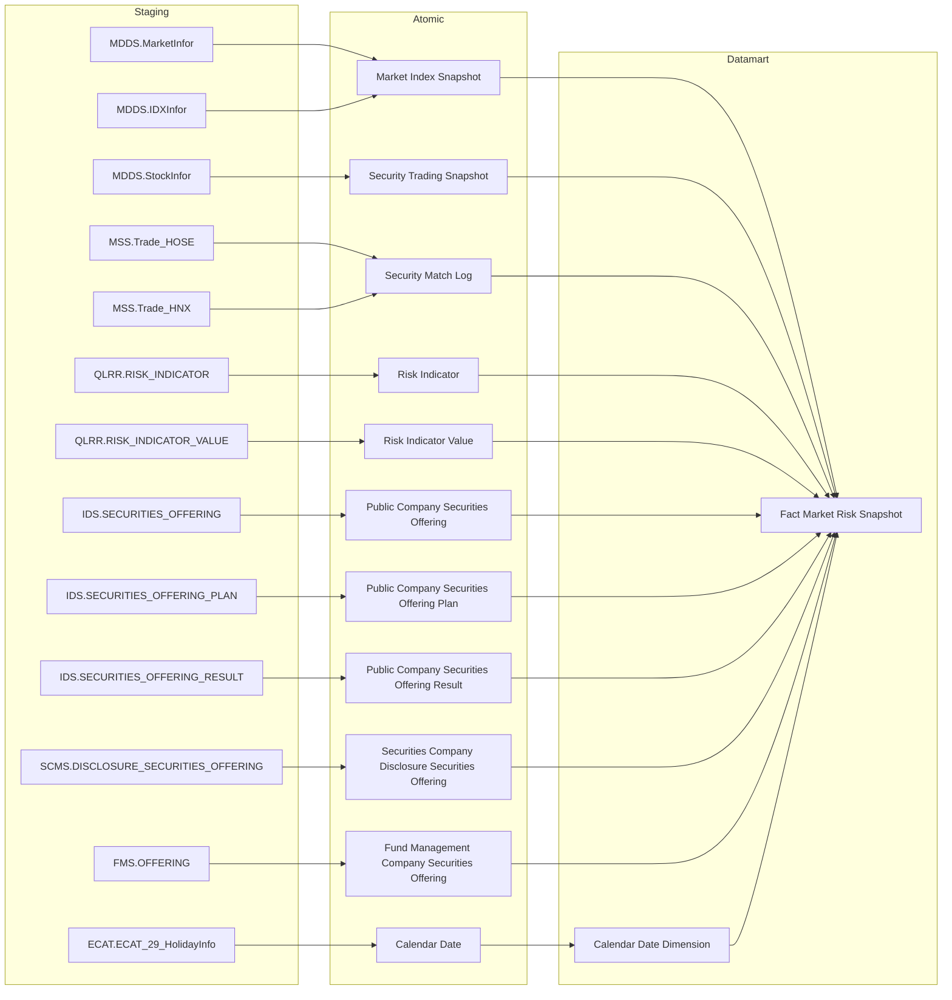

> **Risk Weight Configuration (dự kiến Atomic, CHƯA vẽ node — chưa tồn tại thật trên Atomic repo):** bảng `rsk_wgt_cfg` — cột `risk_factor_code` (8 mã: RISK_INDEX=β0, VNINDEX_VOLATILITY/ILLIQ/MARGIN_BALANCE/INTERBANK_RATE/FOREIGN_NET_FLOW/EQUITY_CAPITAL_RAISING=β1~β6, EPSILON=ε), `weight` (hệ số do chuyên viên nhập tay), `data_dt` (trường kỹ thuật — ngày người dùng nhập). Đã grep xác nhận **không tồn tại** ở `DataModel/Atomic/` lẫn `DataModel/working/Atomic/` — cấu trúc chỉ mới thống nhất với user, chưa import vào Atomic. Giữ **PENDING** (K_PTTT_18, 18~23, 228, 229), không vẽ node trong sơ đồ cho tới khi entity tồn tại thật (xem O_PTTT_2).
>
> **`Public Company Securities Offering`/`Public Company Securities Offering Plan`/`Public Company Securities Offering Result`/`Securities Company Disclosure Securities Offering`/`Fund Management Company Securities Offering`:** BA đã cung cấp SQL join UNION ALL hoàn chỉnh (lọc `offering_method_code`/`offering_type`, GROUP BY ngày công văn) — logic khai thác "huy động vốn cổ phần" đã thống nhất, chuyển **READY**, có edge nối vào `fct_mkt_rsk_snpst` (K_PTTT_19, 11).
>
> **Loại khỏi sơ đồ Cụm 1 (dữ liệu động, chưa có Atomic entity nào):** `SSC_SCMS.MEMBER_REPORT/FORM_REPORT/REPORT_CELL_VALUE` (nguồn Dư nợ Margin, K_PTTT_5/10/24~27) — không vẽ node vì chưa có Atomic entity chuẩn hóa nào, chỉ ghi nhận PENDING bằng text. Tương tự VSDC `BM1_BCKLLH` (KL lưu hành cho MCAPₜ, xem O_PTTT_3).

##### Cụm 2: Chỉ số vĩ mô (Fact Macro Indicator Snapshot)

> **PENDING — chưa vẽ flowchart:** `Fact Macro Indicator Snapshot` phụ thuộc hoàn toàn vào entity `Risk Indicator`/`Risk Indicator Value` (nguồn `RISK_INDICATOR`/`RISK_INDICATOR_VALUE`) — đã grep xác nhận **không tồn tại** ở `DataModel/Atomic/` lẫn `DataModel/working/Atomic/`; user xác nhận trực tiếp (2026-07-30) "hiện tại RISK_INDICATOR trong QLRR chưa có thiết kế". Toàn bộ 13 KPI của Nhóm 3 (K_PTTT_30~42) — PENDING. Không vẽ node Atomic/Fact cho tới khi entity tồn tại thật (xem O_PTTT_11).

---

##### Cụm 3: Rủi ro ngành (Fact Sector Risk Snapshot)

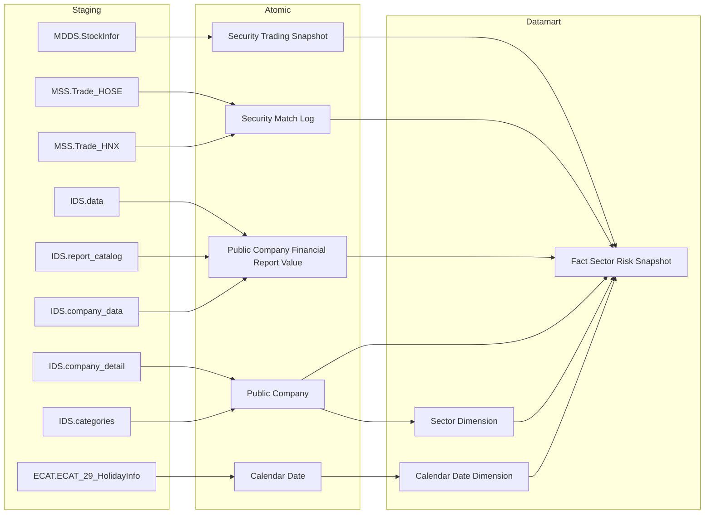

---

##### Cụm 4: Quy mô lệnh per mã CK (Fact Order Size Snapshot)

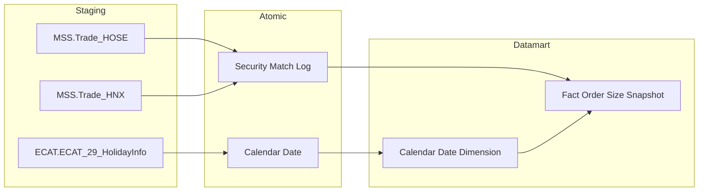

---

##### Cụm 5: Dòng tiền nhà đầu tư (Fact Investor Flow Snapshot)

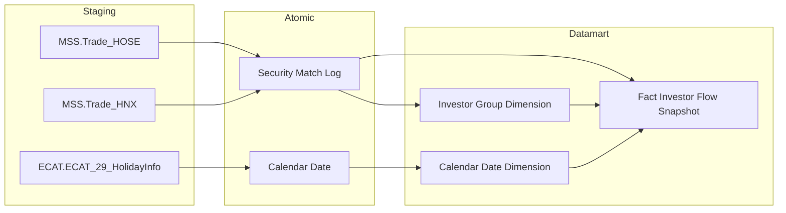

---

##### Cụm 6: Top giao dịch NĐTNN per mã CK (Fact Foreign Net Trade Snapshot)

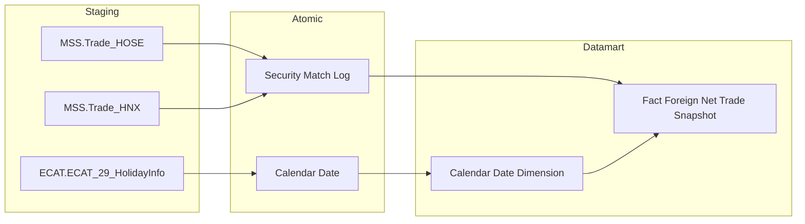

---

##### Cụm 7: Top giao dịch tự doanh per mã CK (Fact Proprietary Net Trade Snapshot)


---

##### Cụm 8: Cơ cấu nợ vay trái phiếu theo ngành (Fact Corporate Bond Sector Snapshot)

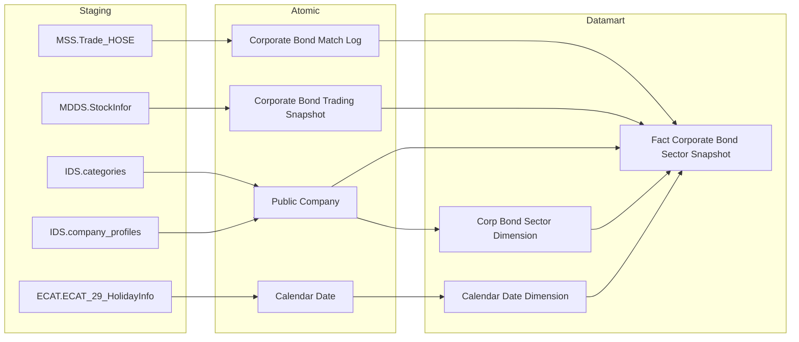

---

##### Cụm 9: Danh mục tổ chức phát hành cần giám sát tín dụng (Operational Corporate Bond Issuer Credit Monitor)

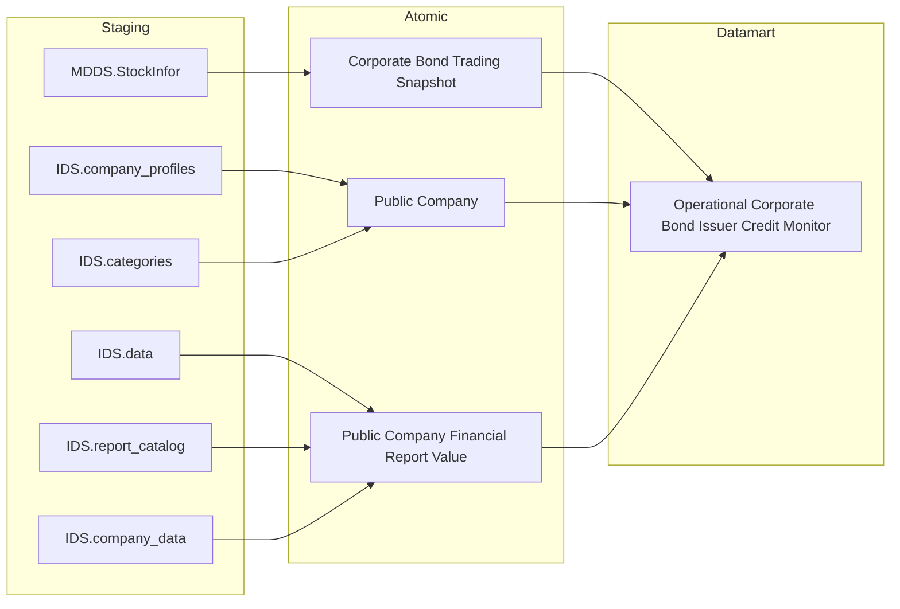

---

##### Cụm 10: Bộ chỉ tiêu an toàn CTCK (Fact Member Safety Snapshot)

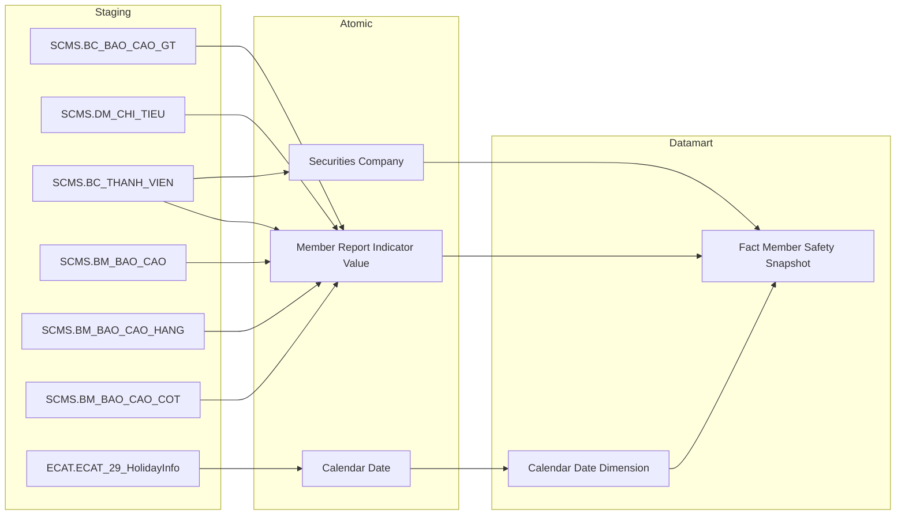

---

##### Cụm 11: Chỉ tiêu an toàn per CTCK (Fact Member Safety Per Member Snapshot)

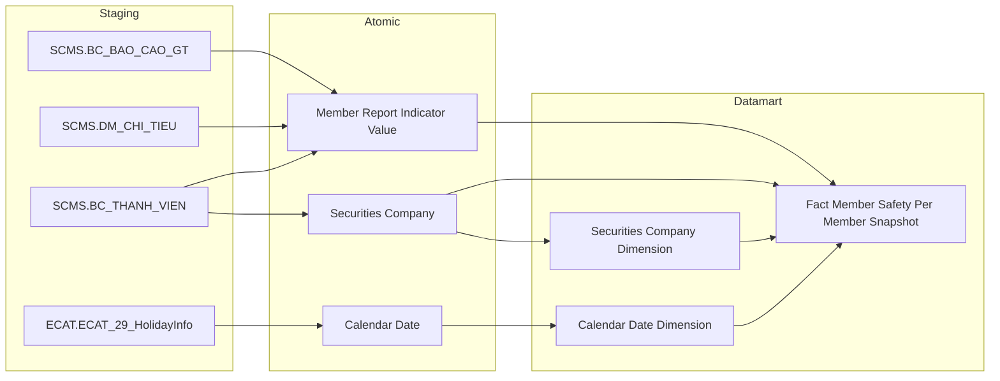

---

## Section 2 — Tổng quan báo cáo

### Tab Dashboard Giám sát rủi ro

#### Nhóm 1 - Chỉ số rủi ro hệ thống

> Phân loại: **Phân tích**
> Atomic: `Market Index Snapshot` (`market_index_snapshot`) ← MDDS.JAD_MARKETINFOR — **READY** | `Security Trading Snapshot` (`security_trading_snapshot`) ← MDDS.JAD_STOCKINFOR — **READY** | `Securities Trade` (`securities_trade`) ← ORDERTRADE.TRADE_BOOK_HOSE/TRADE_BOOK_HNX — **READY** | `Risk Indicator`/`Risk Indicator Value` ← RISK_INDICATOR/RISK_INDICATOR_VALUE — **PENDING** (chưa tồn tại trên Atomic, xem O_PTTT_11) | `Risk Weight Configuration` (`risk_weight_config`: risk_factor_code/risk_factor_name/risk_factor_type/weight/data_dt) — **READY** (cấu trúc đã thống nhất với user, 2026-07-30 — coi là READY cho thiết kế Datamart dù chưa import vào Atomic repo, xem O_PTTT_2 cập nhật; Nhóm 1&2 chỉ dùng 8 mã có `risk_factor_type = 'Chỉ số rủi ro hệ thống'`: RISK_INDEX=β0, VNINDEX_VOLATILITY/ILLIQ/MARGIN_BALANCE/INTERBANK_RATE/FOREIGN_NET_FLOW/EQUITY_CAPITAL_RAISING=β1~β6, UNEXPLAINED_ERROR_TERM=ε) | `Public Company Securities Offering` (`pc_securities_offering`) ← IDS.SECURITIES_OFFERING — **READY** | `Public Company Securities Offering Plan` (`pc_securities_offering_plan`) ← IDS.SECURITIES_OFFERING_PLAN — **READY** | `Public Company Securities Offering Result` (`pc_securities_offering_result`) ← IDS.SECURITIES_OFFERING_RESULT — **READY** | `Securities Company Disclosure Securities Offering` (`sc_disclosure_securities_offering`) ← SCMS.DISCLOSURE_SECURITIES_OFFERING — **READY** | `Fund Management Company Securities Offering` (`fmc_securities_offering`, draft) ← FMS.OFFERING — **READY** (BA đã cung cấp SQL join UNION ALL 3 nguồn hoàn chỉnh, logic khai thác đã thống nhất — xem O_PTTT_1/O_PTTT_4 cập nhật)
>
> **[SỬA 2026-07-30 — Kịch bản D, phát hiện qua review cross-check]** HLD trước đây dùng alias `market_index_snapshot`/`scr_tdg_snpst`/`scr_mtch_log` với tên cột bịa (`trading_dt`, `cls_prc`, `market_index_val`, `market_code`, `acm_val`...) không khớp Atomic approved, và dùng sai entity `Security Match Log` (MDDS.JAD_TRANSLOG — chỉ tick-by-tick, không phân biệt sàn/board) cho công thức ILLIQ/Dòng tiền NĐTNN thay vì entity đúng `Securities Trade` (ORDERTRADE.TRADE_BOOK_HOSE/HNX — có `market_id_code`/`board_tp_code`/`buy,sell_foreign_investor_tp_code`). Đã sửa lại toàn bộ theo physical_name thật trong YAML approved. Riêng filter "VN-Index" trên `Market Index Snapshot`: entity này KHÔNG có cột mã chỉ số (`Index Code`) — chỉ có `Market Code`/`Market Id` (mã sàn HOSE/HNX/UPCOM do FSS quy định) và `Index Type Code` (loại index theo Sở). User xác nhận (2026-07-30): dùng `market_code = 'HOSE'` thay cho mọi filter `IndexCode='HOSE'`/`IndexCode='VNINDEX'` trong SQL BA gốc (BA có mâu thuẫn nội tại giữa 2 giá trị — đã chốt dùng `market_code='HOSE'` làm đại diện cho "chỉ số thị trường HOSE = VN-Index" ở toàn Nhóm 1&2).
>
> **Ghi chú gap Atomic (dữ liệu động — "Chưa có CSDL - Map biểu mẫu", chưa có Atomic entity nào):** Dư nợ margin (MDₜ) có nguồn thực tế `SSC_SCMS.MEMBER_REPORT`/`FORM_REPORT`/`REPORT_CELL_VALUE` — cấu trúc bảng biểu mẫu báo cáo định kỳ do CTCK nộp, chưa có Atomic entity chuẩn hóa nào. Coi là **PENDING** cho tới khi có entity Atomic chuẩn hóa. Riêng `MCAPₜ` (mẫu số tỷ lệ margin) phụ thuộc thêm KL CK lưu hành từ VSDC (`BM1_BCKLLH`, Báo cáo TT138.2025.TT.BTC Mẫu 01) — dù BA đã cung cấp SQL tham khảo đầy đủ, cột "Loại dữ liệu" vẫn đánh "Chưa có CSDL - Map biểu mẫu" (chưa có bảng vật lý thật, chỉ tham chiếu tên biểu mẫu) — blocker O_PTTT_3 chưa giải quyết.

**Mockup:**

| Chỉ tiêu | Giá trị |
|---|---|
| Volatility 30 phiên (σ) | 0.012 |
| Z-score Biến động | 1.45 |
| Z-score Thanh khoản (ILLIQ) | -0.87 |
| Z-score Dư nợ Margin | 0.63 |
| Z-score Lãi suất | 0.21 |
| Z-score Dòng tiền ròng NĐTNN | -1.02 |
| Tổng vốn hóa MCAPₜ | 5,234 tỷ VND |
| Tỷ lệ Margin/MCAP | 2.3% |
| Tỷ trọng Biến động | 20% |
| Tỷ trọng Thanh khoản | 20% |
| Tỷ trọng Dư nợ Margin | 15% |
| Tỷ trọng Lãi suất | 15% |
| Tỷ trọng Dòng tiền ròng NĐTNN | 15% |
| Tỷ trọng Huy động vốn | 15% |

*(K_PTTT_18, K_PTTT_5, K_PTTT_9, K_PTTT_21~24 — PENDING do phụ thuộc chuỗi Dư nợ Margin/MCAP ("Chưa có CSDL - Map biểu mẫu" — KL CK lưu hành VSDC BM1); K_PTTT_6 (Z-score Lãi suất) — PENDING do gap Atomic Risk Indicator/Risk Indicator Value (xem O_PTTT_11), xem cột Trạng thái. K_PTTT_10~17 (Hệ số hồi quy β/ε) nay đã READY nhờ `Risk Weight Configuration` có cấu trúc xác nhận. K_PTTT_19, K_PTTT_20 — Huy động vốn cổ phần — vẫn READY)*

**Source:** `Fact Market Risk Snapshot` → `Calendar Date Dimension`

**Bảng KPI:**

| KPI ID | Tên KPI | Đơn vị | Tính chất | Công thức | Ghi chú | Trạng thái |
|---|---|---|---|---|---|---|
| K_PTTT_1 | Ngày thống kê (Chiều thời gian) | Ngày | Chiều | `market_index_snapshot.trading_dt` WHERE `market_index_snapshot.market_code = 'HOSE'` | Khai sinh riêng cho Nhóm 1&2 — khác K_PTTT_43 (khai sinh tại Nhóm 4, dùng cho nhiều Fact khác nhau, xem backlog tách KPI theo nguồn vật lý) | READY |
| K_PTTT_2 | Volatility — Biến động giá VN-Index 30 phiên (σ) | Số thực | Phái sinh | `σ = STDDEV_SAMP(Rₜ)` trên 30 ngày gần nhất, `Rₜ = LN(market_index_snapshot.market_index_val[t] / market_index_snapshot.market_index_val[t-1])`, lọc `market_index_snapshot.market_code = 'HOSE'` ORDER BY `market_index_snapshot.trading_dt` DESC | | READY |
| K_PTTT_3 | Z-score Biến động giá | Số thực | Phái sinh | `(K_PTTT_2 − AVG(K_PTTT_2 lịch sử)) / STDDEV_SAMP(K_PTTT_2 lịch sử)`, AVG/STDDEV tính trên toàn bộ `market_index_snapshot.trading_dt <= snapshot_date` WHERE `market_index_snapshot.market_code = 'HOSE'` | | READY |
| K_PTTT_4 | Z-score Thanh khoản (ILLIQ) | Số thực | Phái sinh | `(ILLIQ30_t − AVG(ILLIQ30 lịch sử)) / STDDEV_SAMP(ILLIQ30 lịch sử)` trong đó `ILLIQ30_t = ABS(Rₜ) / SUM(securities_trade.execution_val)` trên 30 ngày GROUP BY `securities_trade.trade_dt`, `Rₜ` từ `market_index_snapshot.market_index_val`, lọc `securities_trade.market_id_code IN ('STO','STX','UPX')` AND `securities_trade.board_tp_code IN ('G1','G2','G3')` | Nguồn GTGD: `Securities Trade` (ORDERTRADE.TRADE_BOOK_HOSE/HNX) — HOSE có sẵn `execution_val`; HNX ETL derive = `trade_price × trade_qty` (đã sửa từ `Security Match Log`/`scr_mtch_log.acm_val` — entity sai, không có cột phân loại Market/Board) | READY |
| K_PTTT_5 | Z-score Dư nợ Margin | — | Phái sinh | TBD — chờ Atomic | **Lý do pending:** Mₜ = MDₜ (dư nợ margin) / MCAPₜ, MDₜ nguồn `SSC_SCMS.MEMBER_REPORT/FORM_REPORT/REPORT_CELL_VALUE` — biểu mẫu báo cáo định kỳ CTCK nộp, chưa có Atomic entity chuẩn hóa. **Atomic cần bổ sung:** entity chuẩn hóa từ SSC_SCMS.MEMBER_REPORT/FORM_REPORT/REPORT_CELL_VALUE (mã chỉ tiêu dư nợ margin). **Mart dự kiến:** `Fact Market Risk Snapshot` — grain 1 row/ngày. Sub-components σ, Mₜ, M̄ → xem K_PTTT_21~24 | PENDING |
| K_PTTT_6 | Z-score Lãi suất liên ngân hàng | — | Phái sinh | TBD — chờ Atomic | **Lý do pending:** entity `Risk Indicator`/`Risk Indicator Value` chưa tồn tại trên Atomic, xem O_PTTT_11. **Atomic cần bổ sung:** xem O_PTTT_11. **Mart dự kiến:** `Fact Market Risk Snapshot` — bổ sung Z_Score_Interest_Rate khi hết PENDING | PENDING |
| K_PTTT_7 | Z-score Dòng tiền ròng NĐTNN | Số thực | Phái sinh | `(AVG(Fₜ lịch sử) − Fₜ) / STDDEV_SAMP(Fₜ lịch sử)` (đảo chiều) trong đó `Fₜ = SUM(securities_trade.execution_val WHERE buy_foreign_investor_tp_code IN ('10','20')) − SUM(securities_trade.execution_val WHERE sell_foreign_investor_tp_code IN ('10','20'))` GROUP BY `securities_trade.trade_dt`, lọc `securities_trade.market_id_code IN ('STO','STX','UPX')` | Đã sửa nguồn từ `Security Trading Snapshot`/`scr_tdg_snpst.frgn_buy_vol` (per-mã-CK theo ngày, không phân biệt lệnh mua/bán riêng) sang `Securities Trade`/`securities_trade` (ORDERTRADE.TRADE_BOOK_HOSE/HNX) — đúng theo SQL BA gốc dùng `Execution - Value`/`Buy,Sell Foreign Investor type` trên sổ lệnh TRADE_BOOK | READY |
| K_PTTT_8 | Tổng vốn hóa thị trường MCAPₜ | Tỷ VND | Phái sinh | `SUM(security_trading_snapshot.close_price × security_trading_snapshot.total_listing_vol)` GROUP BY `security_trading_snapshot.trading_dt`, lọc `security_trading_snapshot.floor_code IN ('02','04','10')` AND `security_trading_snapshot.stock_tp_code IN ('2','S','U','E','3')` | `total_listing_vol` ← MDDS.JAD_STOCKINFOR.TotalListingQtty; HOSE xem O_PTTT_3 | READY |
| K_PTTT_9 | Tỷ lệ Dư nợ Margin / Tổng vốn hóa Mₜ | — | Phái sinh | TBD — chờ Atomic | **Lý do pending:** cùng nguồn MDₜ với K_PTTT_5 (SSC_SCMS.MEMBER_REPORT/FORM_REPORT/REPORT_CELL_VALUE), chưa có Atomic entity chuẩn hóa. **Atomic cần bổ sung:** xem K_PTTT_5. **Mart dự kiến:** `Fact Market Risk Snapshot` — grain 1 row/ngày | PENDING |
| K_PTTT_10 | Hệ số hồi quy β — Biến động chỉ số VN-Index (β_V) | Số thực | Cơ sở | `risk_weight_config.weight` WHERE `risk_weight_config.risk_factor_code = 'VNINDEX_VOLATILITY'` AND `risk_weight_config.risk_factor_type = 'Chỉ số rủi ro hệ thống'` AND `risk_weight_config.data_dt = MAX(data_dt) <= snapshot_date` | Trọng số do chuyên viên nhập tay trên Kho dữ liệu — xem O_PTTT_2 | READY |
| K_PTTT_11 | Hệ số hồi quy β — Thanh khoản (β_L) | Số thực | Cơ sở | `risk_weight_config.weight` WHERE `risk_weight_config.risk_factor_code = 'ILLIQ'` AND `risk_weight_config.risk_factor_type = 'Chỉ số rủi ro hệ thống'` AND `risk_weight_config.data_dt = MAX(data_dt) <= snapshot_date` | | READY |
| K_PTTT_12 | Hệ số hồi quy β — Dư nợ Margin (β_M) | Số thực | Cơ sở | `risk_weight_config.weight` WHERE `risk_weight_config.risk_factor_code = 'MARGIN_BALANCE'` AND `risk_weight_config.risk_factor_type = 'Chỉ số rủi ro hệ thống'` AND `risk_weight_config.data_dt = MAX(data_dt) <= snapshot_date` | | READY |
| K_PTTT_13 | Hệ số hồi quy β — Lãi suất liên ngân hàng (β_I) | Số thực | Cơ sở | `risk_weight_config.weight` WHERE `risk_weight_config.risk_factor_code = 'INTERBANK_RATE'` AND `risk_weight_config.risk_factor_type = 'Chỉ số rủi ro hệ thống'` AND `risk_weight_config.data_dt = MAX(data_dt) <= snapshot_date` | | READY |
| K_PTTT_14 | Hệ số hồi quy β — Dòng tiền ròng NĐTNN (β_F) | Số thực | Cơ sở | `risk_weight_config.weight` WHERE `risk_weight_config.risk_factor_code = 'FOREIGN_NET_FLOW'` AND `risk_weight_config.risk_factor_type = 'Chỉ số rủi ro hệ thống'` AND `risk_weight_config.data_dt = MAX(data_dt) <= snapshot_date` | | READY |
| K_PTTT_15 | Hệ số hồi quy β — Huy động vốn cổ phần (β_C) | Số thực | Cơ sở | `risk_weight_config.weight` WHERE `risk_weight_config.risk_factor_code = 'EQUITY_CAPITAL_RAISING'` AND `risk_weight_config.risk_factor_type = 'Chỉ số rủi ro hệ thống'` AND `risk_weight_config.data_dt = MAX(data_dt) <= snapshot_date` | | READY |
| K_PTTT_16 | Hằng số hồi quy β0 (Intercept) | Số thực | Cơ sở | `risk_weight_config.weight` WHERE `risk_weight_config.risk_factor_code = 'RISK_INDEX'` AND `risk_weight_config.risk_factor_type = 'Chỉ số rủi ro hệ thống'` AND `risk_weight_config.data_dt = MAX(data_dt) <= snapshot_date` | Mã `RISK_INDEX` trong `risk_weight_config` là β0 (hằng số hồi quy), không phải giá trị Risk Index đầu ra | READY |
| K_PTTT_17 | Sai số hồi quy ε (Epsilon) | Số thực | Cơ sở | `risk_weight_config.weight` WHERE `risk_weight_config.risk_factor_code = 'UNEXPLAINED_ERROR_TERM'` AND `risk_weight_config.risk_factor_type = 'Chỉ số rủi ro hệ thống'` AND `risk_weight_config.data_dt = MAX(data_dt) <= snapshot_date` | | READY |
| K_PTTT_18 | Risk Index (Chỉ số rủi ro hệ thống tổng hợp — Logistic Regression) | — | Phái sinh | `RI = β0 + β1·Z_L + β2·Z_V + β3·Z_M + β4·Z_I + β5·Z_F + β6·Z_C + ε` trong đó Z_L=K_PTTT_4, Z_V=K_PTTT_3, Z_M=K_PTTT_5, Z_I=K_PTTT_6, Z_F=K_PTTT_7, Z_C=K_PTTT_19 (Z-score 6 yếu tố); β0=K_PTTT_16, β1~β6=K_PTTT_10~15, ε=K_PTTT_17 — tất cả hệ số nhập tay qua `risk_weight_config` | **Lý do pending:** `risk_weight_config` (β0~β6, ε) nay đã READY, K_PTTT_19/11 (Huy động vốn) vẫn READY — nhưng công thức vẫn phụ thuộc Z_M=K_PTTT_5 (Z-score Dư nợ Margin) đang PENDING theo nguyên tắc AND (chuỗi Dư nợ Margin/MCAP — "Chưa có CSDL - Map biểu mẫu"). **Atomic cần bổ sung:** xem K_PTTT_5 (Dư nợ Margin/MCAP, O_PTTT_3). **Mart dự kiến:** `Fact Market Risk Snapshot` — bổ sung cột Risk_Index | PENDING |
| K_PTTT_19 | Z-score Huy động vốn cổ phần | Số thực | Phái sinh | `(MU − RT) / SIGMA` (Z-score đảo chiều) trong đó `RT` = tổng huy động vốn ngày t (xem K_PTTT_20), `MU`/`SIGMA` = AVG/STDDEV trên 20 phiên gần nhất | Nguồn: UNION ALL `pc_securities_offering` JOIN `pc_securities_offering_plan` JOIN `pc_securities_offering_result` (lọc `pc_securities_offering_plan.offering_method_code IN ('1','2','3','5','9','11')`, theo `pc_securities_offering.official_letter_dt`) + `sc_disclosure_securities_offering` (lọc `offering_type IN ('1','4','5','6','7')`, theo `document_date`) + `fmc_securities_offering` (theo `approval_document_date`, draft entity FMS) — GROUP BY ngày, 20 phiên gần nhất. Logic khai thác đã thống nhất (BA cung cấp SQL đầy đủ) | READY |
| K_PTTT_20 | Huy động vốn cổ phần thị trường tại ngày t | Tỷ VND | Phái sinh | `COALESCE(SUM(pc_securities_offering_result.total_collected_amt),0) + COALESCE(SUM(sc_disclosure_securities_offering.proceeds_collected),0) + COALESCE(SUM(fmc_securities_offering.actual_total_value),0)` WHERE ngày công văn (`pc_securities_offering.official_letter_dt` / `sc_disclosure_securities_offering.document_date` / `fmc_securities_offering.approval_document_date`) `= snapshot_date`, cùng filter `offering_method_code`/`offering_type` như K_PTTT_19 | READY |
| K_PTTT_21 | Z-score Dư nợ Margin — giá trị chuẩn hóa ngày t | — | Phái sinh | TBD — chờ Atomic | **Lý do pending:** BA đánh `Trạng thái mapping = Pending` — thiếu mapping nguồn MDₜ theo ngày vs tháng khi tính chuỗi lịch sử; đồng thời phụ thuộc gap K_PTTT_5. **Atomic cần bổ sung:** xem K_PTTT_5 + xác nhận mapping mã chỉ tiêu dư nợ margin theo ngày (SCMS.DM_CHI_TIEU). **Mart dự kiến:** `Fact Market Risk Snapshot` — grain 1 row/ngày | PENDING |
| K_PTTT_22 | Độ lệch chuẩn chuỗi tỷ lệ Dư nợ Margin/MCAP (σ) | — | Phái sinh | TBD — chờ Atomic | **Lý do pending:** xem K_PTTT_21. **Atomic cần bổ sung:** xem K_PTTT_21. **Mart dự kiến:** `Fact Market Risk Snapshot` — grain 1 row/ngày | PENDING |
| K_PTTT_23 | Tỷ lệ Dư nợ Margin / Tổng vốn hóa tại ngày t (Mₜ) | — | Phái sinh | TBD — chờ Atomic | **Lý do pending:** xem K_PTTT_21. **Atomic cần bổ sung:** xem K_PTTT_21. **Mart dự kiến:** `Fact Market Risk Snapshot` — grain 1 row/ngày | PENDING |
| K_PTTT_24 | Tỷ lệ Dư nợ Margin / Tổng vốn hóa trung bình (M̄) | — | Phái sinh | TBD — chờ Atomic | **Lý do pending:** xem K_PTTT_21. **Atomic cần bổ sung:** xem K_PTTT_21. **Mart dự kiến:** `Fact Market Risk Snapshot` — grain 1 row/ngày | PENDING |

**Star Schema:**

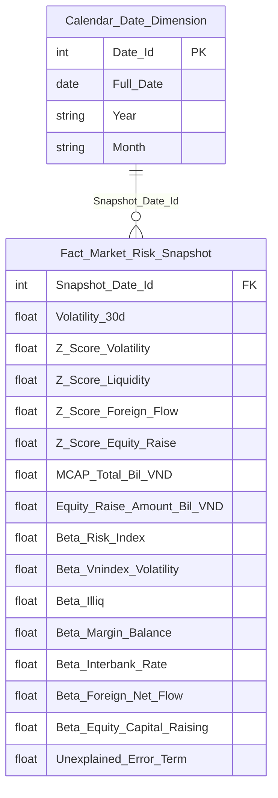

> **Ghi chú:** Cột Beta_Risk_Index/Beta_Vnindex_Volatility/Beta_Illiq/Beta_Margin_Balance/Beta_Interbank_Rate/Beta_Foreign_Net_Flow/Beta_Equity_Capital_Raising/Unexplained_Error_Term (K_PTTT_10~17) đã bổ sung vào Star Schema — tên cột đặt theo đúng `risk_factor_code` trong `risk_weight_config` (không dùng ký hiệu toán học β/ε rút gọn để dễ truy ngược nguồn). Nguồn `risk_weight_config` nay đã READY. Cột Risk_Index, Z_Score_Margin, Z_Score_Interest_Rate **vẫn chưa đưa vào Star Schema** — Risk_Index/Z_Score_Margin thuộc K_PTTT_18, 5 đang PENDING do phụ thuộc chuỗi Dư nợ Margin/MCAP (xem O_PTTT_3); Z_Score_Interest_Rate thuộc K_PTTT_6 đang PENDING do gap Atomic Risk Indicator/Risk Indicator Value (xem O_PTTT_11) — sẽ bổ sung khi hết PENDING.

**Lineage Mart → Báo cáo:**

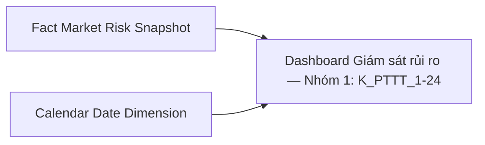

**Bảng grain:**

| Tên bảng | Grain |
|---|---|
| Fact Market Risk Snapshot | 1 row / ngày (SCD4A current state) |
| Calendar Date Dimension | 1 row / ngày (SCD4A current state) |

**Bảng mapping nguồn (Atomic Placeholder):**

| Tên KPI | Bảng nguồn (BA) | Atomic entity dự kiến | Atomic table dự kiến |
|---|---|---|---|
| Z-score/Tỷ lệ Dư nợ Margin (K_PTTT_5, 10, 24~27), Risk Index (K_PTTT_18) | SSC_SCMS.MEMBER_REPORT / FORM_REPORT / REPORT_CELL_VALUE (MDₜ) + VSDC TT138.2025.TT.BTC Mẫu 01 "BM1_Báo cáo về khối lượng chứng khoán đang lưu hành" (KL lưu hành cho MCAPₜ) | TBD (chuẩn hóa biểu mẫu báo cáo định kỳ) + Security Listing Volume (VSDC, xem O_PTTT_3) | TBD / scr_listing_vol hoặc TBD |

---

#### Nhóm 2 - Phân tích đóng góp rủi ro

> Phân loại: **Phân tích**
> Atomic: `Market Index Snapshot` ← MDDS.IDXInfor — **READY** | `Security Match Log` ← MDDS.TransLog/MSS — **READY** | `Risk Indicator`/`Risk Indicator Value` ← RISK_INDICATOR/RISK_INDICATOR_VALUE — **PENDING** (chưa tồn tại trên Atomic, xem O_PTTT_11) | `Security Trading Snapshot` ← MDDS.StockInfor — **READY** | `Risk Weight Configuration` (`risk_weight_config`) — **READY** (xem O_PTTT_2 cập nhật; chỉ dùng `risk_factor_type = 'Chỉ số rủi ro hệ thống'`) | nguồn Dư nợ Margin (SSC_SCMS.MEMBER_REPORT/FORM_REPORT/REPORT_CELL_VALUE) — **PENDING** (chưa có Atomic entity chuẩn hóa) | `Public Company Securities Offering` ← IDS/SCMS/FMS — **READY** (SQL UNION ALL 3 nguồn đầy đủ, xem Nhóm 1)

**Mockup:**

| Chỉ tiêu rủi ro | Giá trị hiện tại (raw value) | Mức độ tác động (Z-score) | Tỷ trọng |
|---|---|---|---|
| Biến động chỉ số VN-Index | Rₜ = 0.0082 (log return ngày t) | 1.45 | 20% |
| Thanh khoản thị trường | ILLIQₜ = 0.000031 | -0.87 | 20% |
| Dư nợ Margin | Mₜ = 12.3% (Dư nợ / MCAP) | 0.63 | 15% |
| Lãi suất liên ngân hàng | IRₜ = 4.85% | 0.21 | 15% |
| Dòng tiền ròng NĐTNN | Fₜ = -320 tỷ VND | -1.02 | 15% |
| Huy động vốn cổ phần | Cₜ = — | — | 15% |

*(Dư nợ Margin — Mức độ tác động + Giá trị hiện tại PENDING; Lãi suất liên ngân hàng — Giá trị hiện tại PENDING do gap Atomic Risk Indicator/Risk Indicator Value (xem O_PTTT_11); Tỷ trọng 6 yếu tố (K_PTTT_10~15) nay đã READY nhờ `Risk Weight Configuration`, xem cột Trạng thái)*

> **Ghi chú mockup:** "Giá trị hiện tại" = raw value xₜ tại ngày t (Rₜ, ILLIQₜ, Mₜ, IRₜ, Fₜ, Cₜ). "Mức độ tác động" = Z-score chuẩn hóa = (xₜ − μ) / σ. Hai cột này độc lập, không tính Z × Weight.

**Source:** `Fact Market Risk Snapshot` → `Calendar Date Dimension`

**Bảng KPI:**

| KPI ID | Tên KPI | Đơn vị | Tính chất | Công thức | Ghi chú | Trạng thái |
|---|---|---|---|---|---|---|
| K_PTTT_1 | Ngày thống kê (Chiều thời gian) | Ngày | Chiều | `market_index_snapshot.trading_dt` WHERE `market_index_snapshot.market_code = 'VNINDEX'` | Reuse từ Nhóm 1 | READY |
| K_PTTT_25 | Giá trị hiện tại — Biến động chỉ số VN-Index (Rₜ) | Số thực | Cơ sở | `fct_mkt_rsk_snpst.indx_log_rtn_t` | Log return ngày t: ln(Pₜ/Pₜ₋₁) | READY |
| K_PTTT_26 | Giá trị hiện tại — Thanh khoản ILLIQ (ILLIQₜ) | Số thực | Cơ sở | `fct_mkt_rsk_snpst.illiq_t` | ILLIQₜ = \|Rₜ\| / VOLDₜ | READY |
| K_PTTT_9 | Giá trị hiện tại — Dư nợ Margin (Mₜ) | — | Phái sinh | TBD — chờ Atomic | **Lý do pending:** Reuse từ Nhóm 4 — nguồn MDₜ (SSC_SCMS.MEMBER_REPORT/FORM_REPORT/REPORT_CELL_VALUE) chưa có Atomic entity chuẩn hóa. **Atomic cần bổ sung:** xem Nhóm 1 K_PTTT_5. **Mart dự kiến:** `Fact Market Risk Snapshot` — grain 1 row/ngày | PENDING |
| K_PTTT_27 | Giá trị hiện tại — Lãi suất liên ngân hàng (IRₜ) | — | Cơ sở | TBD — chờ Atomic | **Lý do pending:** nguồn RISK_INDICATOR_VALUE — entity `Risk Indicator`/`Risk Indicator Value` chưa tồn tại trên Atomic, xem O_PTTT_11. **Atomic cần bổ sung:** xem O_PTTT_11. **Mart dự kiến:** `Fact Market Risk Snapshot` — bổ sung IR_t_Pct khi hết PENDING | PENDING |
| K_PTTT_28 | Giá trị hiện tại — Dòng tiền ròng NĐTNN (Fₜ) | Tỷ VND | Cơ sở | `fct_mkt_rsk_snpst.frgn_net_flw_t_bil` | Fₜ = SUM(buy) − SUM(sell) NĐTNN ngày t | READY |
| K_PTTT_29 | Giá trị hiện tại — Huy động vốn cổ phần (Cₜ) | Tỷ VND | Cơ sở | `fct_mkt_rsk_snpst.eqty_rse_t_bil` — reuse K_PTTT_20 từ Nhóm 1 | Huy động vốn cổ phần tại ngày t — SQL UNION ALL 3 nguồn (IDS/SCMS/FMS) đã đầy đủ | READY |
| K_PTTT_3 | Mức độ tác động — Biến động VN-Index (Z-score) | Số thực | Phái sinh | `fct_mkt_rsk_snpst.z_scr_vol` | Reuse K_PTTT_3 từ Nhóm 1 — Mức độ tác động = Z-score | READY |
| K_PTTT_4 | Mức độ tác động — Thanh khoản ILLIQ (Z-score) | Số thực | Phái sinh | `fct_mkt_rsk_snpst.z_scr_lqdt` | Reuse K_PTTT_4 từ Nhóm 1 — Mức độ tác động = Z-score | READY |
| K_PTTT_5 | Mức độ tác động — Dư nợ Margin (Z-score) | — | Phái sinh | TBD — chờ Atomic | **Lý do pending:** Reuse K_PTTT_5 từ Nhóm 1 — đang PENDING do gap nguồn MDₜ. **Atomic cần bổ sung:** xem Nhóm 1 K_PTTT_5. **Mart dự kiến:** `Fact Market Risk Snapshot` — grain 1 row/ngày | PENDING |
| K_PTTT_6 | Mức độ tác động — Lãi suất liên ngân hàng (Z-score) | — | Phái sinh | TBD — chờ Atomic | **Lý do pending:** Reuse K_PTTT_6 từ Nhóm 1 — đang PENDING do gap Atomic Risk Indicator/Risk Indicator Value, xem O_PTTT_11. **Atomic cần bổ sung:** xem O_PTTT_11. **Mart dự kiến:** `Fact Market Risk Snapshot` — bổ sung Z_Score_Interest_Rate khi hết PENDING | PENDING |
| K_PTTT_7 | Mức độ tác động — Dòng tiền ròng NĐTNN (Z-score) | Số thực | Phái sinh | `fct_mkt_rsk_snpst.z_scr_frgn_flw` | Reuse K_PTTT_7 từ Nhóm 1 — Mức độ tác động = Z-score | READY |
| K_PTTT_19 | Mức độ tác động — Huy động vốn cổ phần (Z-score) | Số thực | Phái sinh | `fct_mkt_rsk_snpst.z_scr_eqty_rse` | Reuse K_PTTT_19 từ Nhóm 1 — Mức độ tác động = Z-score | READY |
| K_PTTT_10 | Tỷ trọng (Weight) — Biến động chỉ số VN-Index | Số thực | Cơ sở | `risk_weight_config.weight` WHERE `risk_factor_code = 'VNINDEX_VOLATILITY'` AND `risk_factor_type = 'Chỉ số rủi ro hệ thống'` AND `data_dt = MAX(data_dt) <= snapshot_date` | Reuse K_PTTT_10 từ Nhóm 1 | READY |
| K_PTTT_11 | Tỷ trọng (Weight) — Thanh khoản | Số thực | Cơ sở | `risk_weight_config.weight` WHERE `risk_factor_code = 'ILLIQ'` AND `risk_factor_type = 'Chỉ số rủi ro hệ thống'` AND `data_dt = MAX(data_dt) <= snapshot_date` | Reuse K_PTTT_11 từ Nhóm 1 | READY |
| K_PTTT_12 | Tỷ trọng (Weight) — Dư nợ Margin | Số thực | Cơ sở | `risk_weight_config.weight` WHERE `risk_factor_code = 'MARGIN_BALANCE'` AND `risk_factor_type = 'Chỉ số rủi ro hệ thống'` AND `data_dt = MAX(data_dt) <= snapshot_date` | Reuse K_PTTT_12 từ Nhóm 1 | READY |
| K_PTTT_13 | Tỷ trọng (Weight) — Lãi suất liên ngân hàng | Số thực | Cơ sở | `risk_weight_config.weight` WHERE `risk_factor_code = 'INTERBANK_RATE'` AND `risk_factor_type = 'Chỉ số rủi ro hệ thống'` AND `data_dt = MAX(data_dt) <= snapshot_date` | Reuse K_PTTT_13 từ Nhóm 1 | READY |
| K_PTTT_14 | Tỷ trọng (Weight) — Dòng tiền ròng NĐTNN | Số thực | Cơ sở | `risk_weight_config.weight` WHERE `risk_factor_code = 'FOREIGN_NET_FLOW'` AND `risk_factor_type = 'Chỉ số rủi ro hệ thống'` AND `data_dt = MAX(data_dt) <= snapshot_date` | Reuse K_PTTT_14 từ Nhóm 1 | READY |
| K_PTTT_15 | Tỷ trọng (Weight) — Huy động vốn cổ phần | Số thực | Cơ sở | `risk_weight_config.weight` WHERE `risk_factor_code = 'EQUITY_CAPITAL_RAISING'` AND `risk_factor_type = 'Chỉ số rủi ro hệ thống'` AND `data_dt = MAX(data_dt) <= snapshot_date` | Reuse K_PTTT_15 từ Nhóm 1 | READY |

**Star Schema:**

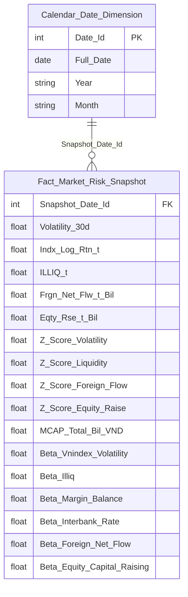

> **Ghi chú:** `IR_t_Pct`/`Z_Score_Interest_Rate` (K_PTTT_27, K_PTTT_6) **chưa đưa vào Star Schema** — phụ thuộc gap Atomic Risk Indicator/Risk Indicator Value (xem O_PTTT_11), sẽ bổ sung khi hết PENDING.

**Lineage Mart → Báo cáo:**

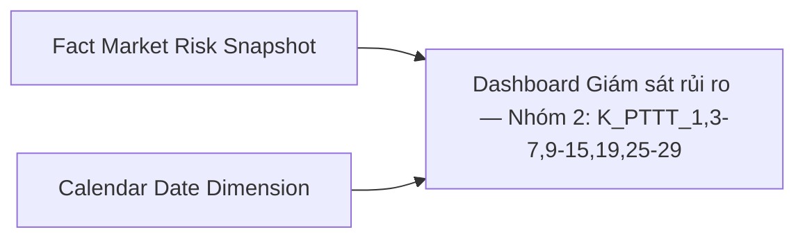

**Bảng grain:**

| Tên bảng | Grain |
|---|---|
| Fact Market Risk Snapshot | 1 row / ngày (SCD4A current state) |
| Calendar Date Dimension | 1 row / ngày (SCD4A current state) |

---

### Tab Dashboard Sức khỏe thị trường và vĩ mô

#### Nhóm 3 - Chỉ số vĩ mô – tiền tệ

> Phân loại: **Phân tích**
> Atomic: `Risk Indicator` (dự kiến, nguồn `RISK_INDICATOR`) — **PENDING** | `Risk Indicator Value` (dự kiến, nguồn `RISK_INDICATOR_VALUE`) — **PENDING** (đã grep xác nhận không tồn tại ở `DataModel/Atomic/` lẫn `DataModel/working/Atomic/`, user xác nhận trực tiếp "hiện tại RISK_INDICATOR trong QLRR chưa có thiết kế" — xem O_PTTT_11)

**Mockup:**

| Chỉ tiêu | Giá trị | Kỳ trước | % Thay đổi |
|---|---|---|---|
| Lãi suất liên ngân hàng (ON) | 4.38% | 4.23% | +0.15 |
| Tỷ giá USD/VND | 25,510 | 25,497 | +0.05% |
| Chỉ số CPI (YoY) | 3.97% | 4.09% | -0.12 |
| Tăng trưởng GDP | 5.55% | 5.21% | +0.34 |

*(Toàn bộ 13/13 KPI của Nhóm này — PENDING do gap Atomic `Risk Indicator`/`Risk Indicator Value`, xem O_PTTT_11)*

**Bảng KPI:**

| KPI ID | Tên KPI | Đơn vị | Tính chất | Công thức | Ghi chú | Trạng thái |
|---|---|---|---|---|---|---|
| K_PTTT_30 | Ngày thống kê (Chiều thời gian vĩ mô) | — | Chiều | TBD — chờ Atomic | **Lý do pending:** tần suất dữ liệu không đồng nhất giữa các chỉ tiêu vĩ mô — lãi suất/tỷ giá = ngày giao dịch, CPI = tháng, GDP = quý, không thể dùng chung 1 trục thời gian; đồng thời phụ thuộc gap `Risk Indicator Value` (xem O_PTTT_11). **Atomic cần bổ sung:** xem O_PTTT_11 + thống nhất nghiệp vụ cách hiển thị chiều thời gian. **Mart dự kiến:** `Fact Macro Indicator Snapshot` — grain 1 row/indicator_code/kỳ báo cáo | PENDING |
| K_PTTT_31 | Lãi suất liên ngân hàng qua đêm (ON) tại ngày t — IRₜ | %/năm | Cơ sở | TBD — chờ Atomic | **Lý do pending:** BA cung cấp SQL đầy đủ (`risk_indicator_value.indicator_value` WHERE JOIN `risk_indicator.indicator_code = 'INTERBANK_IR'` AND `trading_date = :input_date`), nhưng entity `Risk Indicator`/`Risk Indicator Value` chưa tồn tại trên Atomic — xem O_PTTT_11. **Atomic cần bổ sung:** xem O_PTTT_11. **Mart dự kiến:** `Fact Macro Indicator Snapshot` — grain 1 row/indicator_code/kỳ báo cáo | PENDING |
| K_PTTT_32 | Lãi suất liên ngân hàng qua đêm ngày trước — IRₜ₋₁ | %/năm | Cơ sở | TBD — chờ Atomic | **Lý do pending:** xem K_PTTT_31. **Atomic cần bổ sung:** xem O_PTTT_11. **Mart dự kiến:** `Fact Macro Indicator Snapshot` — grain 1 row/indicator_code/kỳ báo cáo | PENDING |
| K_PTTT_33 | % thay đổi lãi suất liên ngân hàng | % | Phái sinh | TBD — chờ Atomic | **Lý do pending:** phụ thuộc K_PTTT_31/29 đang PENDING. **Atomic cần bổ sung:** xem O_PTTT_11. **Mart dự kiến:** `Fact Macro Indicator Snapshot` — grain 1 row/indicator_code/kỳ báo cáo | PENDING |
| K_PTTT_34 | Tỷ giá USD/VND tại ngày — FXₜ | VND/USD | Cơ sở | TBD — chờ Atomic | **Lý do pending:** BA cung cấp SQL đầy đủ (`indicator_code = 'EX_RATE_VND_USD'`), nhưng entity chưa tồn tại — xem O_PTTT_11. **Atomic cần bổ sung:** xem O_PTTT_11. **Mart dự kiến:** `Fact Macro Indicator Snapshot` — grain 1 row/indicator_code/kỳ báo cáo | PENDING |
| K_PTTT_35 | Tỷ giá USD/VND ngày trước — FXₜ₋₁ | VND/USD | Cơ sở | TBD — chờ Atomic | **Lý do pending:** xem K_PTTT_34. **Atomic cần bổ sung:** xem O_PTTT_11. **Mart dự kiến:** `Fact Macro Indicator Snapshot` — grain 1 row/indicator_code/kỳ báo cáo | PENDING |
| K_PTTT_36 | % thay đổi tỷ giá USD/VND | % | Phái sinh | TBD — chờ Atomic | **Lý do pending:** phụ thuộc K_PTTT_34/32 đang PENDING. **Atomic cần bổ sung:** xem O_PTTT_11. **Mart dự kiến:** `Fact Macro Indicator Snapshot` — grain 1 row/indicator_code/kỳ báo cáo | PENDING |
| K_PTTT_37 | Chỉ số CPI (YoY) tại kỳ t | % | Cơ sở | TBD — chờ Atomic | **Lý do pending:** BA cung cấp SQL đầy đủ (`indicator_code = 'CPI_VN'`, tần suất tháng — lấy kỳ gần nhất), nhưng entity chưa tồn tại — xem O_PTTT_11. **Atomic cần bổ sung:** xem O_PTTT_11. **Mart dự kiến:** `Fact Macro Indicator Snapshot` — grain 1 row/indicator_code/kỳ báo cáo | PENDING |
| K_PTTT_38 | CPI cùng kỳ năm trước | % | Cơ sở | TBD — chờ Atomic | **Lý do pending:** xem K_PTTT_37. **Atomic cần bổ sung:** xem O_PTTT_11. **Mart dự kiến:** `Fact Macro Indicator Snapshot` — grain 1 row/indicator_code/kỳ báo cáo | PENDING |
| K_PTTT_39 | % thay đổi CPI YoY | % | Phái sinh | TBD — chờ Atomic | **Lý do pending:** phụ thuộc K_PTTT_37/35 đang PENDING. **Atomic cần bổ sung:** xem O_PTTT_11. **Mart dự kiến:** `Fact Macro Indicator Snapshot` — grain 1 row/indicator_code/kỳ báo cáo | PENDING |
| K_PTTT_40 | GDP kỳ hiện tại | Nghìn tỷ VND | Cơ sở | TBD — chờ Atomic | **Lý do pending:** BA cung cấp SQL đầy đủ (`indicator_code = 'GDP_VN'`, tần suất quý — lấy kỳ gần nhất), nhưng entity chưa tồn tại — xem O_PTTT_11. **Atomic cần bổ sung:** xem O_PTTT_11. **Mart dự kiến:** `Fact Macro Indicator Snapshot` — grain 1 row/indicator_code/kỳ báo cáo | PENDING |
| K_PTTT_41 | GDP kỳ trước | Nghìn tỷ VND | Cơ sở | TBD — chờ Atomic | **Lý do pending:** xem K_PTTT_40. **Atomic cần bổ sung:** xem O_PTTT_11. **Mart dự kiến:** `Fact Macro Indicator Snapshot` — grain 1 row/indicator_code/kỳ báo cáo | PENDING |
| K_PTTT_42 | Tăng trưởng GDP | % | Phái sinh | TBD — chờ Atomic | **Lý do pending:** phụ thuộc K_PTTT_40/38 đang PENDING. **Atomic cần bổ sung:** xem O_PTTT_11. **Mart dự kiến:** `Fact Macro Indicator Snapshot` — grain 1 row/indicator_code/kỳ báo cáo | PENDING |

**Bảng mapping nguồn (Atomic Placeholder):**

| Tên KPI | Bảng nguồn (BA) | Atomic entity dự kiến | Atomic table dự kiến |
|---|---|---|---|
| Lãi suất LNH, Tỷ giá USD/VND, CPI, GDP (K_PTTT_30~42) | `RISK_INDICATOR` + `RISK_INDICATOR_VALUE` (BA không ghi rõ prefix source system) | Risk Indicator + Risk Indicator Value | risk_indicator / risk_indicator_value (TBD, chưa chuẩn hóa physical naming) |

#### Nhóm 4 - Biểu đồ chỉ số sức khỏe hệ thống

> Phân loại: **Phân tích**
> Atomic: `Security Trading Snapshot` ← MDDS.StockInfor — **READY** | `Security Match Log` ← MSS.Trade_HOSE/Trade_HNX — **READY** | `Market Index Snapshot` ← MDDS.MarketInfor — **READY** | `Risk Weight Configuration` (`risk_weight_config`) — **READY** (xem O_PTTT_2 cập nhật; Nhóm 4 dùng `risk_factor_type = 'Chỉ số tâm lý giao dịch của mã chứng khoán'`: S_LIQUIDITY=W1, S_STABILITY=W2) | nguồn Dư nợ Margin (SSC_SCMS.MEMBER_REPORT/FORM_REPORT/REPORT_CELL_VALUE) — **PENDING** (chưa có Atomic entity chuẩn hóa, xem Nhóm 1)

**Mockup:**

| Chỉ số | Giá trị | Trạng thái |
|---|---|---|
| Sentiment Index | 70 | Optimistic |
| Margin Tension | 82% | Near Saturation |
| Systemic Vol | 29% | Stable |

*(Margin Tension — PENDING, xem cột Trạng thái. Sentiment Index/Trọng số W1/W2 nay đã READY nhờ `Risk Weight Configuration`)*

**Source:** `Fact Market Risk Snapshot` → `Calendar Date Dimension`

**Bảng KPI:**

| KPI ID | Tên KPI | Đơn vị | Tính chất | Công thức | Ghi chú | Trạng thái |
|---|---|---|---|---|---|---|
| K_PTTT_43 | Ngày thống kê (Chiều thời gian) | Ngày | Chiều | `market_index_snapshot.trading_dt` WHERE `market_code = 'VNINDEX'` | | READY |
| K_PTTT_44 | Điểm chứng khoán (như VN-Index) | Điểm | Cơ sở | `market_index_snapshot.market_index_val` WHERE `market_code = 'VNINDEX'` AND `trading_dt = snapshot_date` | Khai sinh riêng cho Nhóm 4 — Nhóm 6 (K_PTTT_67 cũ) sẽ chuyển reuse từ Nhóm 4 | READY |
| K_PTTT_45 | Khối lượng khớp lệnh ngày t của mã CK — Vₜ | KL | Cơ sở | `securities_trade.execution_vol` GROUP BY `securities_trade.security_symbol_code`, `securities_trade.trading_dt` | dùng trong formula S_liquidity | READY |
| K_PTTT_46 | Khối lượng khớp lệnh trung bình 20 phiên — MAvol(20) | KL | Phái sinh | `AVG(securities_trade.execution_vol)` trên 20 ngày gần nhất GROUP BY `securities_trade.security_symbol_code` | | READY |
| K_PTTT_47 | Tỷ lệ dòng tiền — Flow Ratio | Số thực | Phái sinh | `K_PTTT_45 / K_PTTT_46` — tức `Vₜ / MAvol(20)` | | READY |
| K_PTTT_48 | Dấu dòng tiền — Sign(PriceChange) | Số nguyên | Phái sinh | `CASE WHEN security_trading_snapshot.close_price > security_trading_snapshot.open_price THEN 1 WHEN security_trading_snapshot.close_price < security_trading_snapshot.open_price THEN -1 ELSE 0 END` | +1 tăng, -1 giảm | READY |
| K_PTTT_49 | Điểm thanh khoản — S_liquidity | Điểm (0–100) | Phái sinh | `50 + K_PTTT_48 × LEAST(K_PTTT_47 × 25, 50)` | | READY |
| K_PTTT_50 | Giá cao nhất trong phiên — Hₜ | VND | Cơ sở | `security_trading_snapshot.high_price` | | READY |
| K_PTTT_51 | Giá thấp nhất trong phiên — Lₜ | VND | Cơ sở | `security_trading_snapshot.low_price` | | READY |
| K_PTTT_52 | ER – Volatility Efficiency Ratio (Vp/Vc) | Số thực | Phái sinh | `Vp / Vc` trong đó `Vc = LN(security_trading_snapshot.close_price / close_price[t-1])`, `Vp = SQRT(1/(4N×LN(2)) × SUM(LN(security_trading_snapshot.high_price/security_trading_snapshot.low_price)²))` trên N phiên | | READY |
| K_PTTT_53 | Điểm ổn định — S_stability | Điểm (0–100) | Phái sinh | `GREATEST(0, 100 - (K_PTTT_52 × 50))` | | READY |
| K_PTTT_54 | Trọng số W1 (S_liquidity) và W2 (S_stability) | Số thực | Cơ sở | `risk_weight_config.weight` WHERE `risk_weight_config.risk_factor_code IN ('S_LIQUIDITY','S_STABILITY')` AND `risk_weight_config.risk_factor_type = 'Chỉ số tâm lý giao dịch của mã chứng khoán'` AND `risk_weight_config.data_dt = MAX(data_dt) <= snapshot_date` | Risk Weight Configuration nay đã READY (xem O_PTTT_2) — W1=S_LIQUIDITY, W2=S_STABILITY | READY |
| K_PTTT_55 | Sentiment Score của từng mã CK | Điểm | Phái sinh | `K_PTTT_54(W1) × K_PTTT_49 + K_PTTT_54(W2) × K_PTTT_53` — tức `W1 × S_liquidity + W2 × S_stability` per mã CK | | READY |
| K_PTTT_56 | Sentiment Index (chỉ số tâm lý giao dịch toàn thị trường) | Điểm | Phái sinh | `AVG(K_PTTT_55)` GROUP BY `securities_trade.trading_dt` — trung bình Sentiment Score toàn thị trường tại ngày t | | READY |
| K_PTTT_57 | Ngưỡng trạng thái Sentiment Index | Text | Phái sinh | Lookup config từ Kho dữ liệu theo `K_PTTT_56` | Cấu hình từ Kho dữ liệu, tương tự K_PTTT_66 (Systemic Vol) | READY |
| K_PTTT_58 | Tổng dư nợ vay margin tất cả CTCK | — | Phái sinh | TBD — chờ Atomic | **Lý do pending:** nguồn SSC_SCMS.MEMBER_REPORT/FORM_REPORT/REPORT_CELL_VALUE — biểu mẫu báo cáo định kỳ, chưa có Atomic entity chuẩn hóa (xem Nhóm 1 K_PTTT_5). **Atomic cần bổ sung:** xem Nhóm 1 K_PTTT_5. **Mart dự kiến:** `Fact Market Risk Snapshot` — grain 1 row/ngày | PENDING |
| K_PTTT_59 | Tổng hạn mức margin (tối đa 2× VCSH) | — | Phái sinh | TBD — chờ Atomic | **Lý do pending:** cùng nguồn K_PTTT_58 (SSC_SCMS.MEMBER_REPORT). **Atomic cần bổ sung:** xem Nhóm 1 K_PTTT_5. **Mart dự kiến:** `Fact Market Risk Snapshot` — grain 1 row/ngày | PENDING |
| K_PTTT_60 | Margin Tension (chỉ số độ căng margin) | — | Phái sinh | TBD — chờ Atomic | **Lý do pending:** phụ thuộc K_PTTT_58/56 đang PENDING. **Atomic cần bổ sung:** xem Nhóm 1 K_PTTT_5. **Mart dự kiến:** `Fact Market Risk Snapshot` — bổ sung Margin_Tension_Pct | PENDING |
| K_PTTT_61 | Ngưỡng trạng thái Margin Tension | — | Phái sinh | TBD — chờ Atomic | **Lý do pending:** phụ thuộc K_PTTT_60 đang PENDING. **Atomic cần bổ sung:** xem Nhóm 1 K_PTTT_5. **Mart dự kiến:** `Fact Market Risk Snapshot` — bổ sung Margin_Tension_Status | PENDING |
| K_PTTT_62 | Lợi suất ngày VN-Index — Rₜ | % | Phái sinh | `(market_index_snapshot.market_index_val[t] - market_index_snapshot.market_index_val[t-1]) / market_index_snapshot.market_index_val[t-1]` WHERE `market_code = 'VNINDEX'` | | READY |
| K_PTTT_63 | σ_current — Độ lệch chuẩn biến động VN-Index 20 phiên (annualized) | % | Phái sinh | `STDDEV_SAMP(K_PTTT_62) × SQRT(252)` trên 20 ngày gần nhất WHERE `market_code = 'VNINDEX'` | | READY |
| K_PTTT_64 | σ_max — Độ lệch chuẩn biến động VN-Index lịch sử tối đa | % | Phái sinh | `MAX(σ_current_lịch sử)` trên toàn bộ `market_index_snapshot.trading_dt <= snapshot_date` WHERE `market_code = 'VNINDEX'` | | READY |
| K_PTTT_65 | Systemic Vol (chỉ số biến động hệ thống) | % | Phái sinh | `K_PTTT_63 / K_PTTT_64 × 100` | | READY |
| K_PTTT_66 | Ngưỡng trạng thái Systemic Vol | Text | Phái sinh | Lookup config từ Kho dữ liệu | Cấu hình từ Kho dữ liệu | READY |

**Star Schema:**

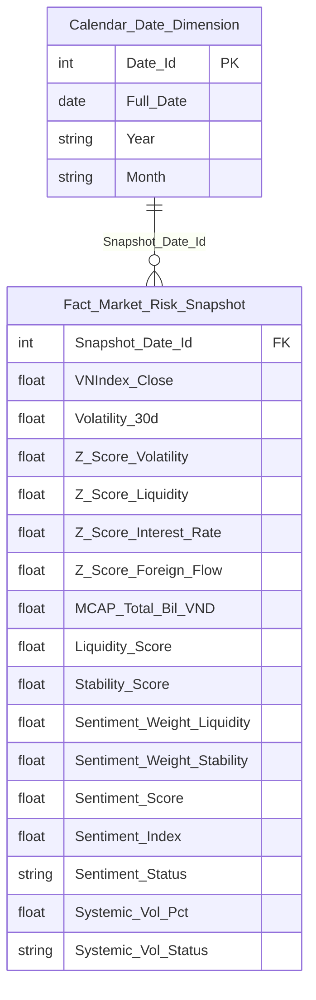

> **Ghi chú:** `VNIndex_Close` (K_PTTT_44 — "Điểm chứng khoán (như VN-Index)") mới bổ sung vào Star Schema — khai sinh riêng cho Nhóm 4, nguồn `market_index_snapshot.market_index_val WHERE market_code='VNINDEX'`. Nhóm 6 (K_PTTT_67 cũ) đã chuyển sang reuse KPI này, dùng cùng tên cột `VNIndex_Close` trên `Fact Market Risk Snapshot`. `Sentiment_Weight_Liquidity`/`Sentiment_Weight_Stability`/`Sentiment_Score`/`Sentiment_Index`/`Sentiment_Status` (K_PTTT_54~57) cũng mới bổ sung — Risk Weight Configuration nay đã READY (xem O_PTTT_2), dùng `risk_factor_type = 'Chỉ số tâm lý giao dịch của mã chứng khoán'`.

**Lineage Mart → Báo cáo:**

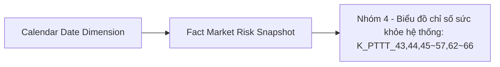

**Bảng grain:**

| Tên bảng | Grain |
|---|---|
| Fact Market Risk Snapshot | 1 row / ngày (SCD4A current state) |
| Calendar Date Dimension | 1 row / ngày (SCD4A current state) |

**Bảng mapping nguồn (Atomic Placeholder):**

| Tên KPI | Bảng nguồn (BA) | Atomic entity dự kiến | Atomic table dự kiến |
|---|---|---|---|
| Dư nợ margin/hạn mức margin (K_PTTT_58~61) | SSC_SCMS.MEMBER_REPORT / FORM_REPORT / REPORT_CELL_VALUE | TBD (chuẩn hóa biểu mẫu báo cáo định kỳ) | TBD |

#### Nhóm 5 - Biểu đồ Macro correlation map

> Phân loại: **Phân tích**
> Atomic: `Market Index Snapshot` ← MDDS.MarketInfor — **READY** | `Risk Indicator`/`Risk Indicator Value` ← RISK_INDICATOR/RISK_INDICATOR_VALUE — **PENDING** (chưa tồn tại trên Atomic, xem O_PTTT_11)

**Mockup:**

| Chỉ báo | Hệ số tương quan | Đánh giá |
|---|---|---|
| Tương quan Chỉ số & Lãi suất thực tế | -0.8 | Nghịch quan mạnh (Downside Risk) |
| Index vs DXY Index | -0.63 | Nghịch quan vừa (FX Pressure) |

*(Toàn bộ 2 chỉ báo tương quan trên mockup — PENDING do gap Atomic Risk Indicator/Risk Indicator Value, xem O_PTTT_11. Chỉ các sub-component nguồn VN-Index (Return, Giá) — READY)*

**Source:** `Fact Market Risk Snapshot` → `Calendar Date Dimension`

**Bảng KPI:**

| KPI ID | Tên KPI | Đơn vị | Tính chất | Công thức | Ghi chú | Trạng thái |
|---|---|---|---|---|---|---|
| K_PTTT_43 | Chiều Thời gian (snapshot_date) | Ngày | Chiều | `market_index_snapshot.trading_dt` WHERE `market_code='VNINDEX'` | Reuse từ Nhóm 4 | READY |
| K_PTTT_67 | Index Code (VN-Index) | Text | Chiều | `market_index_snapshot.market_code`; `CSIDXInfor.indexCode` → lọc index thành phần | ETL filter: `market_code='VNINDEX'` | READY |
| K_PTTT_68 | Giá VN-Index tại t (Pₜ) | Điểm | Cơ sở | `market_index_snapshot.market_index_val` WHERE `market_code='VNINDEX'` AND `trading_dt=snapshot_date` | Sub-component tính Rₜ; BA note "Trùng dòng 9" = ghi chú nội bộ BA | READY |
| K_PTTT_69 | Giá VN-Index tại t-1 (Pₜ₋₁) | Điểm | Cơ sở | `market_index_snapshot.market_index_val` WHERE `market_code='VNINDEX'` AND `trading_dt=MAX(trading_dt)<snapshot_date` | Sub-component tính Rₜ; BA note "Trùng dòng 10" = ghi chú nội bộ BA | READY |
| K_PTTT_62 | Return VN-Index tại t (Rₜ) | % | Phái sinh | `LN(K_PTTT_68 / K_PTTT_69)` | Reuse từ Nhóm 4 | READY |
| K_PTTT_70 | Return VN-Index trung bình N phiên (R̄ₙ) | % | Phái sinh | `AVG(LN(market_index_val[t]/market_index_val[t-1]))` trên N phiên gần nhất WHERE `market_code='VNINDEX'` | N phiên = cửa sổ tính correlation (mặc định 30 phiên) | READY |
| K_PTTT_31 | Lãi suất LNH tại t (IRₜ) | — | Cơ sở | TBD — chờ Atomic | **Lý do pending:** Reuse từ Nhóm 3 — entity `Risk Indicator`/`Risk Indicator Value` chưa tồn tại trên Atomic, xem O_PTTT_11. **Atomic cần bổ sung:** xem O_PTTT_11. **Mart dự kiến:** `Fact Macro Indicator Snapshot` — grain 1 row/indicator_code/kỳ báo cáo | PENDING |
| K_PTTT_32 | Lãi suất LNH tại t-1 (IRₜ₋₁) | — | Cơ sở | TBD — chờ Atomic | **Lý do pending:** xem K_PTTT_31. **Atomic cần bổ sung:** xem O_PTTT_11. **Mart dự kiến:** `Fact Macro Indicator Snapshot` — grain 1 row/indicator_code/kỳ báo cáo | PENDING |
| K_PTTT_71 | ΔLãi suất LNH tại t (ΔIRₜ) | — | Phái sinh | TBD — chờ Atomic | **Lý do pending:** phụ thuộc K_PTTT_31/29 đang PENDING. **Atomic cần bổ sung:** xem O_PTTT_11. **Mart dự kiến:** `Fact Market Risk Snapshot` — bổ sung khi hết PENDING | PENDING |
| K_PTTT_72 | ΔLãi suất LNH trung bình N phiên (ΔIR̄ₙ) | — | Phái sinh | TBD — chờ Atomic | **Lý do pending:** phụ thuộc K_PTTT_31/29 đang PENDING. **Atomic cần bổ sung:** xem O_PTTT_11. **Mart dự kiến:** `Fact Market Risk Snapshot` — bổ sung khi hết PENDING | PENDING |
| K_PTTT_73 | DXY Index tại t (DXYₜ) | — | Cơ sở | TBD — chờ Atomic | **Lý do pending:** cùng nguồn `rsk_ind_val` (bsn_key='DXY') — entity chưa tồn tại trên Atomic, xem O_PTTT_11. **Atomic cần bổ sung:** xem O_PTTT_11. **Mart dự kiến:** `Fact Macro Indicator Snapshot` — grain 1 row/indicator_code/kỳ báo cáo | PENDING |
| K_PTTT_74 | DXY Index tại t-1 (DXYₜ₋₁) | — | Cơ sở | TBD — chờ Atomic | **Lý do pending:** xem K_PTTT_73. **Atomic cần bổ sung:** xem O_PTTT_11. **Mart dự kiến:** `Fact Macro Indicator Snapshot` — grain 1 row/indicator_code/kỳ báo cáo | PENDING |
| K_PTTT_75 | Return DXY tại t (Return_DXYₜ) | — | Phái sinh | TBD — chờ Atomic | **Lý do pending:** phụ thuộc K_PTTT_73/76 đang PENDING. **Atomic cần bổ sung:** xem O_PTTT_11. **Mart dự kiến:** `Fact Market Risk Snapshot` — bổ sung khi hết PENDING | PENDING |
| K_PTTT_76 | Return DXY trung bình N phiên (Return_DXȲₙ) | — | Phái sinh | TBD — chờ Atomic | **Lý do pending:** phụ thuộc K_PTTT_73/76 đang PENDING. **Atomic cần bổ sung:** xem O_PTTT_11. **Mart dự kiến:** `Fact Market Risk Snapshot` — bổ sung khi hết PENDING | PENDING |
| K_PTTT_77 | Tương quan VN-Index & Lãi suất thực tế | — | Phái sinh | TBD — chờ Atomic | **Lý do pending:** intermediate K_PTTT_71/73 (ΔLãi suất) đang PENDING theo AND. **Atomic cần bổ sung:** xem O_PTTT_11. **Mart dự kiến:** `Fact Market Risk Snapshot` — bổ sung Correlation_VNI_IR khi hết PENDING | PENDING |
| K_PTTT_78 | Tương quan VN-Index & DXY Index | — | Phái sinh | TBD — chờ Atomic | **Lý do pending:** intermediate K_PTTT_75/75 (Return DXY) đang PENDING theo AND. **Atomic cần bổ sung:** xem O_PTTT_11. **Mart dự kiến:** `Fact Market Risk Snapshot` — bổ sung Correlation_VNI_DXY khi hết PENDING | PENDING |

**Star Schema:**

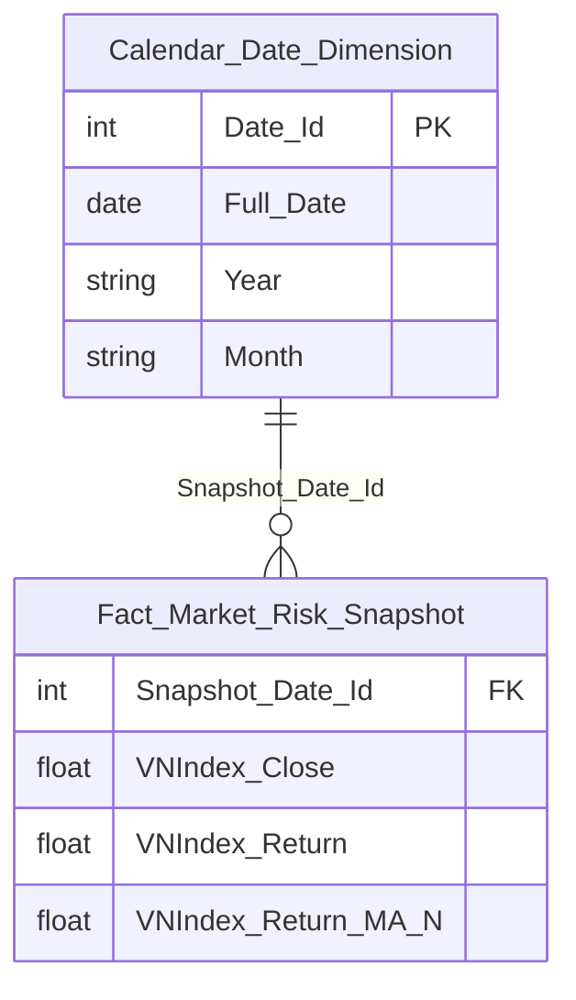

> **Ghi chú:** `Correlation_VNI_IR`/`Correlation_VNI_DXY`/status (K_PTTT_77, 68) **chưa đưa vào Star Schema** — phụ thuộc gap Atomic `Risk Indicator`/`Risk Indicator Value` (xem O_PTTT_11), sẽ bổ sung khi hết PENDING. `VNIndex_Close` dùng chung với Nhóm 4/6 (K_PTTT_44/70/71).

**Lineage Mart → Báo cáo:**

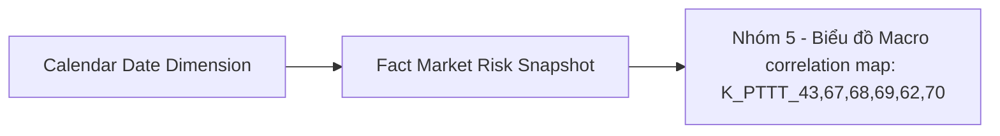

**Bảng grain:**

| Tên bảng | Grain |
|---|---|
| Fact Market Risk Snapshot | 1 row / ngày |
| Calendar Date Dimension | 1 row / ngày |

**Bảng mapping nguồn (Atomic Placeholder):**

| Tên KPI | Bảng nguồn (BA) | Atomic entity dự kiến | Atomic table dự kiến |
|---|---|---|---|
| Lãi suất LNH, DXY Index (K_PTTT_31,32,73,71,72,75,76,74,77,78) | `RISK_INDICATOR` + `RISK_INDICATOR_VALUE` | Risk Indicator + Risk Indicator Value | risk_indicator / risk_indicator_value (TBD, xem O_PTTT_11) |

---

#### Nhóm 6 - Tương quan chỉ số và lãi suất thực tế

> Phân loại: **Phân tích**
> Atomic: `Market Index Snapshot` ← MDDS.MarketInfor — **READY** | `Risk Indicator`/`Risk Indicator Value` ← RISK_INDICATOR/RISK_INDICATOR_VALUE — **PENDING** (chưa tồn tại trên Atomic, xem O_PTTT_11)

**Mockup:**

| Thời gian | VN-Index bình quân | Lãi suất bình quân (%) |
|---|---|---|
| 01/03 | 1248.2 | 6.05 |
| 07/03 | 1260.5 | 6.05 |
| 14/03 | 1263.1 | 6.04 |
| ... | ... | ... |
| 31/03 | 1290.3 | 6.03 |

*(Lãi suất tại t, Lãi suất bình quân tháng — PENDING do gap Atomic Risk Indicator/Risk Indicator Value, xem O_PTTT_11)*

**Source:** `Fact Market Risk Snapshot` → `Calendar Date Dimension`

**Bảng KPI:**

| KPI ID | Tên KPI | Đơn vị | Tính chất | Công thức | Ghi chú | Trạng thái |
|---|---|---|---|---|---|---|
| K_PTTT_43 | Chiều Thời gian (Ngày thống kê) | Ngày | Chiều | `:input_date` — tham số người dùng chọn | Reuse từ Nhóm 4 | READY |
| K_PTTT_44 | Chỉ số VN-Index tại ngày t (Điểm chứng khoán) | Điểm | Cơ sở | `market_index_snapshot.market_index_val` WHERE `market_code='VNINDEX'` AND `trading_dt=snapshot_date` | Reuse từ Nhóm 4 (khai sinh gốc là K_PTTT_67 cũ — đã sửa lại do trùng ID với "Index Code" Chiều của Nhóm 5) | READY |
| K_PTTT_79 | Chỉ số Index bình quân tháng (VN-Index AVG) | Điểm | Phái sinh | `AVG(market_index_snapshot.market_index_val` WHERE `market_code='VNINDEX')` GROUP BY `TRUNC(trading_dt,'MM')` | | READY |
| K_PTTT_31 | Lãi suất liên ngân hàng tại ngày t (IRₜ) | — | Cơ sở | TBD — chờ Atomic | **Lý do pending:** Reuse từ Nhóm 3 — entity `Risk Indicator`/`Risk Indicator Value` chưa tồn tại trên Atomic, xem O_PTTT_11. **Atomic cần bổ sung:** xem O_PTTT_11. **Mart dự kiến:** `Fact Macro Indicator Snapshot` — grain 1 row/indicator_code/kỳ báo cáo | PENDING |
| K_PTTT_80 | Lãi suất bình quân tháng (IR AVG) | — | Phái sinh | TBD — chờ Atomic | **Lý do pending:** phụ thuộc K_PTTT_31 đang PENDING. **Atomic cần bổ sung:** xem O_PTTT_11. **Mart dự kiến:** `Fact Market Risk Snapshot` — bổ sung IR_Monthly_Avg khi hết PENDING | PENDING |

**Star Schema:**

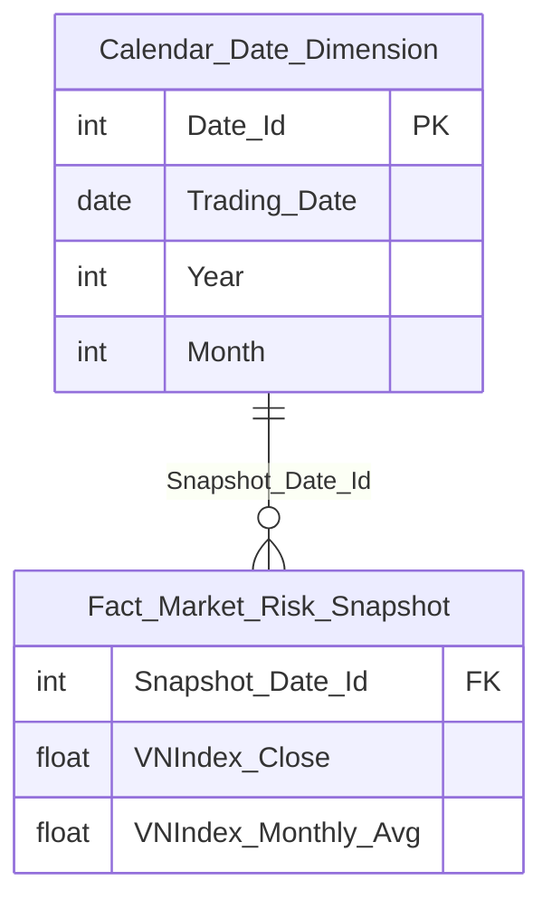

> **Ghi chú:** `Interbank_IR`/`IR_Monthly_Avg` (K_PTTT_31, 78) **chưa đưa vào Star Schema** — phụ thuộc gap Atomic `Risk Indicator`/`Risk Indicator Value` (xem O_PTTT_11), sẽ bổ sung khi hết PENDING.

**Lineage Mart → Báo cáo:**


**Bảng grain:**

| Tên bảng | Grain |
|---|---|
| Fact Market Risk Snapshot | 1 row / ngày |
| Calendar Date Dimension | 1 row / ngày |

**Bảng mapping nguồn (Atomic Placeholder):**

| Tên KPI | Bảng nguồn (BA) | Atomic entity dự kiến | Atomic table dự kiến |
|---|---|---|---|
| Lãi suất LNH tại t, Lãi suất bình quân tháng (K_PTTT_31, 78) | `RISK_INDICATOR` + `RISK_INDICATOR_VALUE` | Risk Indicator + Risk Indicator Value | risk_indicator / risk_indicator_value (TBD, xem O_PTTT_11) |

---

#### Nhóm 7 - Biểu đồ áp lực ngành

> Phân loại: **Phân tích**
> Atomic: `Security Trading Snapshot` ← MDDS.StockInfor — **READY** | `Security Match Log` ← MSS.Trade_HOSE/Trade_HNX — **READY** | `Public Company Financial Report Value` ← IDS.data/report_catalog/company_data — **READY** | `Public Company` ← IDS.categories/company_detail — **READY** | Khối lượng cổ phiếu lưu hành (VSDC.TT138_2025_BaoCaoKLCK) — **PENDING** (chưa có Atomic entity, xem O_PTTT_3)

**Mockup:**

| Nhóm ngành | Áp lực (StressScore) | Thanh khoản (LiquidScore) | Nợ (D/E) | Đánh giá |
|---|---|---|---|---|
| Ngân hàng | 12 | 87 | 91 | SAFE |
| BĐS | 82 | 30 | 44 | HIGH RISK |
| Xây dựng | 68 | 42 | 55 | WARNING |
| Công nghệ | 15 | 98 | 99 | EXCELLENT |
| Dầu khí | 35 | 66 | 76 | STABLE |
| Bán lẻ | 42 | 70 | 83 | WATCH |

*(StressScoreSector tổng hợp, LiquidScore, Xếp hạng — PENDING do thiếu MarketCap, xem cột Trạng thái)*

**Source:** `Fact Sector Risk Snapshot` → `Calendar Date Dimension`

**Bảng KPI:**

| KPI ID | Tên KPI | Đơn vị | Tính chất | Công thức | Ghi chú | Trạng thái |
|---|---|---|---|---|---|---|
| K_PTTT_43 | Chiều Thời gian (Ngày thống kê) | Ngày | Chiều | `security_trading_snapshot.trading_dt = :input_date` | Reuse từ Nhóm 4 | READY |
| K_PTTT_81 | Chiều Nhóm ngành | Text | Chiều | `pblc_co.category_l1_id` JOIN `IDS.categories` WHERE `active_flg=1` | | READY |
| K_PTTT_82 | Giá đóng cửa mã CK tại t (Pₜ) | VND | Cơ sở | `security_trading_snapshot.close_price` WHERE `trading_dt=:input_date` AND `floor_code IN ('02','04','10')` | per stock | READY |
| K_PTTT_83 | Giá đóng cửa mã CK tại t-1 (Pₜ₋₁) | VND | Cơ sở | `security_trading_snapshot.close_price` WHERE `trading_dt=MAX(trading_dt)<:input_date` AND `floor_code IN ('02','04','10')` | per stock | READY |
| K_PTTT_84 | Lợi suất ngày per-stock (Rₜ) | % | Cơ sở | `LN(K_PTTT_82 / K_PTTT_83)` — security_trading_snapshot | per stock; khác K_PTTT_62 (VN-Index level) | READY |
| K_PTTT_85 | Lợi suất trung bình 30 phiên per-stock (R̄) | % | Phái sinh | `AVG(LN(close_price[t]/close_price[t-1]))` trên 30 ngày gần nhất per `security_trading_snapshot.security_symbol_code` | | READY |
| K_PTTT_86 | Độ lệch chuẩn lợi suất per-stock (σᵢ) | Số thực | Phái sinh | `SQRT(SUM((Rₜ − K_PTTT_85)²)/(N−1))` trên N phiên per `security_trading_snapshot.security_symbol_code` | | READY |
| K_PTTT_87 | σ_min toàn thị trường trong N phiên | Số thực | Phái sinh | `MIN(K_PTTT_86)` GROUP BY `trading_dt` | aggregate toàn bộ mã | READY |
| K_PTTT_88 | σ_max toàn thị trường trong N phiên | Số thực | Phái sinh | `MAX(K_PTTT_86)` GROUP BY `trading_dt` | aggregate toàn bộ mã | READY |
| K_PTTT_89 | Pvolatility — Điểm biến động chuẩn hóa | Điểm (0–100) | Phái sinh | `(K_PTTT_86 − K_PTTT_87) / (K_PTTT_88 − K_PTTT_87) × 100` | per stock | READY |
| K_PTTT_90 | Giá cao nhất N phiên per-stock | VND | Cơ sở | `MAX(security_trading_snapshot.close_price)` trên N phiên gần nhất per `security_symbol_code` | | READY |
| K_PTTT_91 | Pdrawdown — Price Drawdown | Điểm (0–100) | Phái sinh | `(K_PTTT_90 − K_PTTT_82) / K_PTTT_90 × 100` | per stock | READY |
| K_PTTT_92 | SellVolume_i — Khối lượng bán chủ động N phiên | KL | Phái sinh | `SUM(security_match_log.match_vol)` WHERE `trade_direction_code = 'S'` GROUP BY `security_match_log.symbol`, N phiên | Nguồn `TransLog` (MDDS) — khác entity với K_PTTT_93 (BA dùng 2 nguồn riêng: TransLog cho chiều chủ động qua `trade_direction_code`/LASTCOLOR, TRADE_BOOK cho tổng KLGD không phân biệt chiều) | READY |
| K_PTTT_93 | TotalVolume_i — Tổng khối lượng giao dịch N phiên | KL | Phái sinh | `SUM(securities_trade.execution_vol)` per `security_symbol_code`, N phiên WHERE `market_id_code IN ('STO','STX','UPX')` | Nguồn `TRADE_BOOK_HOSE/HNX` (ORDERTRADE) — không cần filter chiều, khác entity với K_PTTT_92 | READY |
| K_PTTT_94 | Pselling — Selling Pressure | Điểm (0–1) | Phái sinh | `K_PTTT_92 / K_PTTT_93` | per stock | READY |
| K_PTTT_95 | StressScore từng mã CK (StressScoreᵢ) | Điểm (0–100) | Phái sinh | `(W₁ × K_PTTT_91) + (W₂ × K_PTTT_89) + (W₃ × K_PTTT_94 × 100)` | W₁+W₂+W₃=1; cấu hình từ Kho dữ liệu | READY |
| K_PTTT_96 | TotalValue_Sector — Tổng GTGD ngành | Tỷ VND | Phái sinh | `SUM(security_trading_snapshot.close_price × securities_trade.execution_vol)` JOIN `security_trading_snapshot.security_symbol_code = securities_trade.security_symbol_code` AND `security_trading_snapshot.trading_dt = securities_trade.trading_dt` GROUP BY `pblc_co.category_l1_id` AND `trading_dt` | Giá từ security_trading_snapshot; KL khớp từ securities_trade; ngành từ pblc_co.category_l1_id | READY |
| K_PTTT_97 | Sector Debt Score (D/E ngành) | Lần | Phái sinh | `SUM(pblc_co_fnc_rpt_val.val WHERE row_desc∈{'300' dn,'300' bh,'400' td}) / SUM(pblc_co_fnc_rpt_val.val WHERE row_desc∈{'400' dn,'400' bh,'500' td})` GROUP BY `category_l1_id` | IDS.data → pblc_co_fnc_rpt_val; GROUP BY ngành | READY |
| K_PTTT_98 | KL cổ phiếu lưu hành per mã CK | — | Cơ sở | TBD — chờ Atomic | **Lý do pending:** Khối lượng cổ phiếu lưu hành per mã CK đến từ VSDC (Báo cáo TT138.2025.TT.BTC) — chưa có Atomic entity tương ứng. **Atomic cần bổ sung:** Atomic entity cho KL CK lưu hành từ VSDC — hiện `security_trading_snapshot.tot_listing_vol` chỉ có cho MDDS.StockInfor, xem O_PTTT_3. **Mart dự kiến:** `Fact Sector Risk Snapshot` — grain 1 row/ngành/ngày | PENDING |
| K_PTTT_99 | MarketCap_i (Vốn hóa từng mã) | — | Phái sinh | TBD — chờ Atomic | **Lý do pending:** phụ thuộc K_PTTT_98 đang PENDING. **Atomic cần bổ sung:** xem K_PTTT_98. **Mart dự kiến:** `Fact Sector Risk Snapshot` — grain 1 row/ngành/ngày | PENDING |
| K_PTTT_100 | TotalCap_Sector (Tổng vốn hóa ngành) | — | Phái sinh | TBD — chờ Atomic | **Lý do pending:** phụ thuộc K_PTTT_99 đang PENDING. **Atomic cần bổ sung:** xem K_PTTT_98. **Mart dự kiến:** `Fact Sector Risk Snapshot` — grain 1 row/ngành/ngày | PENDING |
| K_PTTT_101 | wᵢ — Trọng số vốn hóa per mã trong ngành | — | Phái sinh | TBD — chờ Atomic | **Lý do pending:** phụ thuộc K_PTTT_99/98 đang PENDING. **Atomic cần bổ sung:** xem K_PTTT_98. **Mart dự kiến:** `Fact Sector Risk Snapshot` — grain 1 row/ngành/ngày | PENDING |
| K_PTTT_102 | StressScoreSector — Chỉ số căng thẳng ngành tổng hợp | — | Phái sinh | TBD — chờ Atomic | **Lý do pending:** phụ thuộc K_PTTT_101 (wᵢ) đang PENDING. **Atomic cần bổ sung:** xem K_PTTT_98. **Mart dự kiến:** `Fact Sector Risk Snapshot` — bổ sung Sector_Stress_Score_Weighted khi hết PENDING | PENDING |
| K_PTTT_103 | Sector Liquid Score (TotalValue / TotalCap) | — | Phái sinh | TBD — chờ Atomic | **Lý do pending:** phụ thuộc K_PTTT_100 (TotalCap_Sector) đang PENDING. **Atomic cần bổ sung:** xem K_PTTT_98. **Mart dự kiến:** `Fact Sector Risk Snapshot` — bổ sung Sector_Liquid_Score khi hết PENDING | PENDING |
| K_PTTT_104 | Sector Stress Score kỳ trước | — | Phái sinh | TBD — chờ Atomic | **Lý do pending:** phụ thuộc K_PTTT_102 đang PENDING. **Atomic cần bổ sung:** xem K_PTTT_98. **Mart dự kiến:** `Fact Sector Risk Snapshot` — grain 1 row/ngành/ngày | PENDING |
| K_PTTT_105 | Biến động áp lực (Stress Score kỳ này − kỳ trước) = K_PTTT_102 − K_PTTT_104 | — | Phái sinh | TBD — chờ Atomic | **Lý do pending:** phụ thuộc K_PTTT_102/232 đang PENDING. **Atomic cần bổ sung:** xem K_PTTT_98. **Mart dự kiến:** `Fact Sector Risk Snapshot` — bổ sung Sector_Stress_Delta khi hết PENDING | PENDING |
| K_PTTT_106 | Xếp hạng ngành (EXCELLENT / WARNING / HIGH RISK...) | — | Phái sinh | TBD — chờ Atomic | **Lý do pending:** phụ thuộc K_PTTT_102/101 đang PENDING. **Atomic cần bổ sung:** xem K_PTTT_98. **Mart dự kiến:** `Fact Sector Risk Snapshot` — bổ sung Sector_Rating khi hết PENDING | PENDING |

**Star Schema:**

```mermaid
erDiagram
    Fact_Sector_Risk_Snapshot {
        int Snapshot_Date_Id FK
        int Sector_Id FK
        float Sector_Avg_Pdrawdown
        float Sector_Avg_Pvolatility
        float Sector_Avg_Pselling
        float Sector_Avg_Stress_Score
        float Sector_Total_Value
        float Sector_Debt_Score
    }
    Calendar_Date_Dimension {
        int Date_Id PK
        date Full_Date
        string Year
        string Month
    }
    Sector_Dimension {
        int Sector_Id PK
        string Sector_Code
        string Sector_Name
        string Source_System_Code
    }
    Calendar_Date_Dimension ||--o{ Fact_Sector_Risk_Snapshot : "Snapshot_Date_Id"
    Sector_Dimension ||--o{ Fact_Sector_Risk_Snapshot : "Sector_Id"
```

> **Ghi chú:** `Sector_Liquid_Score`/`Sector_Stress_Score_Weighted`/`Sector_Stress_Delta`/`Sector_Rating` (K_PTTT_99~107) **chưa đưa vào Star Schema** — phụ thuộc gap Atomic KL cổ phiếu lưu hành VSDC (xem O_PTTT_3), sẽ bổ sung khi hết PENDING.

**Lineage Mart → Báo cáo:**

```mermaid
flowchart LR
    fct_sctr_rsk_snpst["Fact Sector Risk Snapshot"] --> rpt_nhom7["Nhóm 7 - Biểu đồ áp lực ngành: K_PTTT_43,81-106"]
    cdr_dt_dim["Calendar Date Dimension"] --> fct_sctr_rsk_snpst
    sctr_dim["Sector Dimension"] --> fct_sctr_rsk_snpst
```

**Bảng grain:**

| Tên bảng | Grain |
|---|---|
| Fact Sector Risk Snapshot | 1 row / ngành / ngày |
| Calendar Date Dimension | 1 row / ngày |
| Sector Dimension | 1 row / ngành |

**Bảng mapping nguồn (Atomic Placeholder):**

| Tên KPI | Bảng nguồn (BA) | Atomic entity dự kiến | Atomic table dự kiến |
|---|---|---|---|
| KL cổ phiếu lưu hành per mã (K_PTTT_98~107) | VSDC.TT138_2025_BaoCaoKLCK | Security Listing Volume | scr_listing_vol hoặc TBD |

---

### Tab Dashboard Thanh khoản và đòn bẩy

#### Nhóm 8 - Chỉ số chung

> Phân loại: **Phân tích**
> Atomic: `Securities Trade` (`securities_trade`) ← ORDERTRADE.TRADE_BOOK_HOSE/TRADE_BOOK_HNX — **READY** | EAV báo cáo định kỳ CTCK (`SSC_SCMS.MEMBER_REPORT`/...) — **PENDING** (xem O_PTTT_13) | `Security Listing Volume` từ VSDC — **PENDING** (xem O_PTTT_3)
>
> **[SỬA 2026-08-03 — Kịch bản D, phát hiện khi chuẩn hóa lại format Nhóm 8]** Chuyển đúng format 1 bảng KPI duy nhất (bỏ tách `##### READY`/`##### PENDING`). Đồng thời sửa 2 lỗi nội dung sót từ trước: (1) alias `scr_mtch_log`/`mkt_id`/`brd_tp_code`/`tdg_dt` là tên bịa — physical_name thật là `securities_trade` (`trade_dt`/`execution_val`/`execution_vol`/`market_id_code`/`board_tp_code`), đồng nhất Nhóm 1/11/12/13; (2) K_PTTT_58 (Dư nợ margin) dùng entity giả `mbr_rpt_ind_val` (đã xác nhận không tồn tại, xem O_PTTT_13) — chuyển lại đúng **PENDING** theo đúng nguyên tắc reuse chỉ kế thừa trạng thái từ KPI khai sinh gốc (Nhóm 4), không tự nâng cấp READY.

**Mockup:**

| Chỉ tiêu | Giá trị | % thay đổi |
|---|---|---|
| GTGD phiên (Tỷ VND) | 25.800 | +9.3% |
| Dư nợ margin (Tỷ VND) | 252.000 | +3.1% |
| Quy mô lệnh TB (M) | 45.2 | Stable |

*(Dư nợ margin — PENDING do gap Atomic EAV báo cáo định kỳ CTCK, xem O_PTTT_13. Tốc độ vòng quay TVI — PENDING do gap KL CK lưu hành VSDC, xem O_PTTT_3)*

**Source:** `Fact Market Risk Snapshot` → `Calendar Date Dimension`

**Bảng KPI:**

| KPI ID | Tên KPI | Đơn vị | Tính chất | Công thức | Ghi chú | Trạng thái |
|---|---|---|---|---|---|---|
| K_PTTT_43 | Chiều Thời gian (Ngày thống kê) | Ngày | Chiều | `securities_trade.trade_dt = :input_date` WHERE `market_id_code IN ('STO','STX','UPX')` AND `board_tp_code IN ('G1','G2','G3')` | Reuse từ Nhóm 4 | READY |
| K_PTTT_107 | GTGDₜ — Tổng GTGD khớp lệnh toàn thị trường ngày t | Tỷ VND | Cơ sở | `SUM(securities_trade.execution_val)` WHERE `trade_dt = :input_date` AND `market_id_code IN ('STO','STX','UPX')` AND `board_tp_code IN ('G1','G2','G3')` | HOSE có sẵn `execution_val`; HNX ETL derive = `execution_price × execution_vol` | READY |
| K_PTTT_108 | GTGDt-1 — Tổng GTGD khớp lệnh ngày giao dịch trước | Tỷ VND | Cơ sở | `SUM(securities_trade.execution_val)` WHERE `trade_dt = MAX(trade_dt) < :input_date` AND `market_id_code IN ('STO','STX','UPX')` AND `board_tp_code IN ('G1','G2','G3')` | | READY |
| K_PTTT_109 | % thay đổi GTGD phiên | % | Phái sinh | `(K_PTTT_107 − K_PTTT_108) / K_PTTT_108 × 100` | | READY |
| K_PTTT_110 | GTGD phiên tổng kỳ (từ ngày → đến ngày) | Tỷ VND | Phái sinh | `SUM(securities_trade.execution_val)` WHERE `trade_dt BETWEEN :from_date AND :to_date` AND `market_id_code IN ('STO','STX','UPX')` AND `board_tp_code IN ('G1','G2','G3')` | | READY |
| K_PTTT_58 | Dư nợ margin tổng các CTCK | — | Cơ sở | TBD — chờ Atomic | **Lý do pending:** cùng gap khai sinh tại Nhóm 4 (SSC_SCMS.MEMBER_REPORT/FORM_REPORT/REPORT_CELL_VALUE — chưa có Atomic entity chuẩn hóa). Reuse trước đây tự đổi READY sai — đã sửa lại đúng trạng thái gốc. **Atomic cần bổ sung:** xem O_PTTT_13. **Mart dự kiến:** `Fact Market Risk Snapshot` — grain 1 row/ngày | PENDING |
| K_PTTT_111 | Tổng GTGD khớp lệnh tại ngày | Tỷ VND | Phái sinh | `SUM(securities_trade.execution_val)` WHERE `trade_dt = :input_date` AND `market_id_code IN ('STO','STX','UPX')` AND `board_tp_code IN ('G1','G2','G3')` | Dùng trong mẫu số Quy mô lệnh TB | READY |
| K_PTTT_112 | Tổng số lệnh khớp tại ngày | Lệnh | Phái sinh | `COUNT(*)` FROM `securities_trade` WHERE `trade_dt = :input_date` AND `market_id_code IN ('STO','STX','UPX')` AND `board_tp_code IN ('G1','G2','G3')` | Mỗi bản ghi = 1 lệnh khớp | READY |
| K_PTTT_113 | Quy mô lệnh trung bình | Triệu VND | Phái sinh | `K_PTTT_111 / K_PTTT_112` | | READY |
| K_PTTT_114 | KLGD khớp lệnh tại ngày | Cổ phần | Cơ sở | `SUM(securities_trade.execution_vol)` WHERE `trade_dt = :input_date` AND `market_id_code IN ('STO','STX','UPX')` AND `board_tp_code IN ('G1','G2','G3')` | Execution-Volume (HOSE) hoặc Trade_quantity (HNX) | READY |
| K_PTTT_98 | KL cổ phiếu lưu hành per mã CK | — | Cơ sở | TBD — chờ Atomic | **Lý do pending:** nguồn VSDC BM1 (`Chưa có CSDL - Map biểu mẫu`). Reuse từ Nhóm 7. **Atomic cần bổ sung:** xem O_PTTT_3. **Mart dự kiến:** `Fact Market Risk Snapshot` | PENDING |
| K_PTTT_99 | MarketCap_i — Vốn hóa từng mã | — | Phái sinh | TBD — chờ Atomic | **Lý do pending:** phụ thuộc K_PTTT_98 đang PENDING. Reuse từ Nhóm 7. **Atomic cần bổ sung:** xem O_PTTT_3. **Mart dự kiến:** `Fact Market Risk Snapshot` | PENDING |
| K_PTTT_115 | Σ Average MarketCap — Tổng vốn hóa bình quân toàn thị trường | — | Phái sinh | TBD — chờ Atomic | **Lý do pending:** phụ thuộc K_PTTT_99 đang PENDING. **Atomic cần bổ sung:** xem O_PTTT_3. **Mart dự kiến:** `Fact Market Risk Snapshot` | PENDING |
| K_PTTT_116 | Vốn hóa bình quân qua N ngày — AVG(MarketCapₜ) | — | Phái sinh | TBD — chờ Atomic | **Lý do pending:** phụ thuộc K_PTTT_115 đang PENDING. **Atomic cần bổ sung:** xem O_PTTT_3. **Mart dự kiến:** `Fact Market Risk Snapshot` | PENDING |
| K_PTTT_117 | Tốc độ vòng quay TVI | Lần | Phái sinh | TBD — chờ Atomic | **Lý do pending:** TVI = Σ GTGD / Σ Average MarketCap × 252 — phụ thuộc K_PTTT_116 đang PENDING. **Atomic cần bổ sung:** xem O_PTTT_3. **Mart dự kiến:** `Fact Market Risk Snapshot` | PENDING |
| K_PTTT_118 | Phân loại TVI (Cold / Healthy / Overheated) | Text | Phái sinh | TBD — chờ Atomic | **Lý do pending:** phụ thuộc K_PTTT_117 đang PENDING. **Atomic cần bổ sung:** xem O_PTTT_3. **Mart dự kiến:** `Fact Market Risk Snapshot` | PENDING |

**Star Schema:**

```mermaid
erDiagram
    Fact_Market_Risk_Snapshot {
        int Snapshot_Date_Id FK
        float Trading_Value
        float Trading_Value_Prev_Day
        float Trading_Value_Pct_Change
        float Trading_Value_Period_Total
        float Avg_Order_Size
        float Total_Match_Volume
    }
    Calendar_Date_Dimension {
        int Date_Id PK
        date Full_Date
        string Year
        string Month
    }
    Calendar_Date_Dimension ||--o{ Fact_Market_Risk_Snapshot : "Snapshot_Date_Id"
```

> **Ghi chú:** Bỏ cột `Margin_Debt_Total` khỏi Star Schema Nhóm này — K_PTTT_58 chuyển PENDING, chưa có measure thật populate. Cột này vẫn tồn tại trên schema hợp nhất chung (xem Nhóm 1) do các Nhóm khác dùng chung Fact có thể có measure liên quan khác trạng thái.

**Lineage Mart → Báo cáo:**

```mermaid
flowchart LR
    fct_mkt_rsk_snpst["Fact Market Risk Snapshot"]
    cdr_dt_dim["Calendar Date Dimension"]
    rpt_nhom8["Nhóm 8 - Chỉ số chung (Thanh khoản & Đòn bẩy): K_PTTT_43,109-116"]
    cdr_dt_dim --> fct_mkt_rsk_snpst
    fct_mkt_rsk_snpst --> rpt_nhom8
```

**Bảng grain:**

| Tên bảng | Grain |
|---|---|
| Fact Market Risk Snapshot | 1 row / ngày |
| Calendar Date Dimension | 1 row / ngày |

**Bảng mapping nguồn (Atomic Placeholder):**

| Tên KPI | Bảng nguồn (BA) | Atomic entity dự kiến | Atomic table dự kiến |
|---|---|---|---|
| Dư nợ margin (K_PTTT_58) | SSC_SCMS.MEMBER_REPORT/FORM_REPORT/REPORT_CELL_VALUE | Entity chuẩn hóa báo cáo định kỳ CTCK (chưa thiết kế) | TBD — xem O_PTTT_13 |
| KL CK lưu hành, MarketCap, TVI (K_PTTT_98,100,117-120) | VSDC.TT138_2025_BaoCaoKLCK | Security Listing Volume | scr_listing_vol hoặc TBD — xem O_PTTT_3 |

#### Nhóm 9 - Xu hướng thanh khoản thị trường

> Phân loại: **Phân tích**
> Atomic: `Security Match Log` ← MSS.Trade_HOSE/Trade_HNX — **READY**

**Mockup:**

| Ngày | GTGD Phiên (Tỷ VND) | TB 50 Phiên (Tỷ VND) |
|---|---|---|
| 2026-03-01 | 18,500 | 16,200 |
| 2026-03-05 | 20,500 | 16,350 |
| 2026-03-10 | 19,800 | 16,480 |
| ... | ... | ... |
| 2026-03-31 | 25,800 | 16,950 |

**Source:** `Fact Market Risk Snapshot` → `Calendar Date Dimension`

**Bảng KPI:**

| KPI ID | Tên KPI | Đơn vị | Tính chất | Công thức | Ghi chú |
|---|---|---|---|---|---|
| K_PTTT_43 | Chiều Thời gian (Ngày giao dịch) | Ngày | Chiều | `securities_trade.trade_dt` WHERE `market_id_code IN ('STO','STX','UPX')` | Reuse từ Nhóm 4 |
| K_PTTT_107 | GTGDₜ — Tổng GTGD khớp lệnh toàn thị trường ngày t | Tỷ VND | Cơ sở | `SUM(securities_trade.execution_val)` WHERE `trade_dt = :input_date` AND `market_id_code IN ('STO','STX','UPX')` AND `board_tp_code IN ('G1','G2','G3')` | Reuse từ Nhóm 8 |
| K_PTTT_119 | GTGD MA50 — Trung bình GTGD khớp lệnh 50 phiên giao dịch gần nhất tại ngày t | Tỷ VND | Phái sinh | `AVG(daily_gtgd)` trong đó `daily_gtgd = SUM(securities_trade.execution_val)` GROUP BY `trade_dt`, lấy 50 ngày giao dịch gần nhất có `trade_dt <= :input_date` WHERE `market_id_code IN ('STO','STX','UPX')` AND `board_tp_code IN ('G1','G2','G3')` | Window: 50 phiên liên tiếp kết thúc tại ngày t |
| K_PTTT_114 | KLGD khớp lệnh tại ngày | Cổ phần | Cơ sở | `SUM(securities_trade.execution_vol)` WHERE `trade_dt = :input_date` AND `market_id_code IN ('STO','STX','UPX')` AND `board_tp_code IN ('G1','G2','G3')` | Reuse từ Nhóm 8 |
| K_PTTT_120 | Giá khớp per giao dịch | VND | Cơ sở | `securities_trade.execution_price` (HOSE: Execution price; HNX: Trade price) WHERE `market_id_code IN ('STO','STX','UPX')` | Sub-component tính GTGD = execution_vol × execution_price; không aggregate |

**Star Schema:**

```mermaid
erDiagram
    Fact_Market_Risk_Snapshot {
        int Snapshot_Date_Id FK
        float Trading_Value_Bil_VND
        float Trading_Value_MA50_Bil_VND
        float Total_Match_Volume
    }
    Calendar_Date_Dimension {
        int Date_Id PK
        date Full_Date
        string Year
        string Month
    }
    Calendar_Date_Dimension ||--o{ Fact_Market_Risk_Snapshot : "Snapshot_Date_Id"
```

**Lineage Mart → Báo cáo:**

```mermaid
flowchart LR
    fct_mkt_rsk_snpst["Fact Market Risk Snapshot"]
    cdr_dt_dim["Calendar Date Dimension"]
    rpt_nhom9["Nhóm 9 - Xu hướng thanh khoản thị trường"]
    cdr_dt_dim --> fct_mkt_rsk_snpst
    fct_mkt_rsk_snpst --> rpt_nhom9
```

**Bảng grain:**

| Tên bảng | Grain |
|---|---|
| Fact Market Risk Snapshot | 1 row / ngày |
| Calendar Date Dimension | 1 row / ngày |

#### Nhóm 10 - Áp lực đòn bẩy hệ thống (Margin Stress)

> Phân loại: **Phân tích**
> Atomic: `Member Report Indicator Value` ← SCMS.BC_BAO_CAO_GT/DM_CHI_TIEU — **READY** | `Security Match Log` ← MSS.Trade_HOSE/Trade_HNX — **READY**

**Mockup:**

| Chỉ tiêu | Giá trị |
|---|---|
| Margin Stress (Tỷ lệ bão hòa) | 79% SATURATION |
| Trạng thái | NGƯỠNG THẬN TRỌNG |

**Source:** `Fact Market Risk Snapshot` → `Calendar Date Dimension`

**Bảng KPI:**

| KPI ID | Tên KPI | Đơn vị | Tính chất | Công thức | Ghi chú |
|---|---|---|---|---|---|
| K_PTTT_43 | Chiều Thời gian (Ngày thống kê) | Ngày | Chiều | `securities_trade.trade_dt = :input_date` | Reuse từ Nhóm 4 |
| K_PTTT_58 | Tổng dư nợ margin các CTCK | Tỷ VND | Phái sinh | `SUM(mbr_rpt_ind_val.val)` WHERE `rpt_ind_code = [mã 'Giá trị chứng khoán ký quỹ']` AND `rpt_dt = MAX(rpt_dt) <= :input_date` | Reuse từ Nhóm 4; SCMS tần suất tháng — lấy kỳ gần nhất |
| K_PTTT_121 | Margin tháng t — dư nợ margin kỳ hiện tại | Tỷ VND | Cơ sở | `SUM(mbr_rpt_ind_val.val)` WHERE `rpt_ind_code = [mã 'Giá trị chứng khoán ký quỹ']` AND `rpt_dt = MAX(rpt_dt) <= :input_date` | SCMS.BC_BAO_CAO_GT; cùng nguồn K_PTTT_58, dùng riêng trong công thức Δ |
| K_PTTT_122 | Margin tháng t-1 — dư nợ margin kỳ trước | Tỷ VND | Cơ sở | `SUM(mbr_rpt_ind_val.val)` WHERE `rpt_ind_code = [mã 'Giá trị chứng khoán ký quỹ']` AND `rpt_dt = MAX(rpt_dt) < (rpt_dt của K_PTTT_121)` | Kỳ tháng liền trước K_PTTT_121 |
| K_PTTT_123 | Δ Margin Balance — thay đổi dư nợ margin giữa 2 kỳ | Tỷ VND | Phái sinh | `K_PTTT_121 − K_PTTT_122` | |
| K_PTTT_107 | GTGDₜ — Tổng GTGD khớp lệnh toàn thị trường ngày t | Tỷ VND | Cơ sở | `SUM(securities_trade.execution_val)` WHERE `trade_dt = :input_date` AND `market_id_code IN ('STO','STX','UPX')` AND `board_tp_code IN ('G1','G2','G3')` | Reuse từ Nhóm 8 |
| K_PTTT_124 | Avg Trading Value — GTGD bình quân N phiên | Tỷ VND | Phái sinh | `AVG(daily_gtgd)` trong đó `daily_gtgd = SUM(securities_trade.execution_val)` GROUP BY `trade_dt`, lấy N ngày giao dịch gần nhất có `trade_dt <= :input_date` WHERE `market_id_code IN ('STO','STX','UPX')` AND `board_tp_code IN ('G1','G2','G3')` | Mẫu số công thức Margin Stress; N ngày = cấu hình (mặc định 30 phiên) |
| K_PTTT_125 | Margin Stress — Tỷ lệ bão hòa đòn bẩy | % | Phái sinh | `ABS(K_PTTT_123) / K_PTTT_124 × 100` | Công thức: `\|Δmargin Balance\| / Avg Trading Value × 100`; khác K_PTTT_60 (Margin Tension = TotalMargin / 2×VCSH) |
| K_PTTT_126 | Trạng thái Margin Stress | Text | Phái sinh | Lookup: `< 60% → An toàn`, `60–75% → Theo dõi`, `> 75% → Thận trọng / Cảnh báo` | Ngưỡng cấu hình từ Kho dữ liệu |

**Star Schema:**

```mermaid
erDiagram
    Fact_Market_Risk_Snapshot {
        int Snapshot_Date_Id FK
        float Margin_Debt_Total_Bil_VND
        float Margin_Delta_Bil_VND
        float Avg_Trading_Value_Bil_VND
        float Margin_Stress_Pct
        string Margin_Stress_Status
    }
    Calendar_Date_Dimension {
        int Date_Id PK
        date Full_Date
        string Year
        string Month
    }
    Calendar_Date_Dimension ||--o{ Fact_Market_Risk_Snapshot : "Snapshot_Date_Id"
```

**Lineage Mart → Báo cáo:**

```mermaid
flowchart LR
    fct_mkt_rsk_snpst["Fact Market Risk Snapshot"]
    cdr_dt_dim["Calendar Date Dimension"]
    rpt_nhom10["Nhóm 10 - Áp lực đòn bẩy hệ thống (Margin Stress)"]
    cdr_dt_dim --> fct_mkt_rsk_snpst
    fct_mkt_rsk_snpst --> rpt_nhom10
```

**Bảng grain:**

| Tên bảng | Grain |
|---|---|
| Fact Market Risk Snapshot | 1 row / ngày |
| Calendar Date Dimension | 1 row / ngày |

#### Nhóm 11 - Cấu trúc quy mô lệnh

> Phân loại: **Phân tích**
> Atomic: `Security Match Log` ← MSS.Trade_HOSE/Trade_HNX — **READY**

**Mockup:**

| Mã CK | Ngày | GTGD (Tỷ VND) | Nhóm quy mô | KL khớp |
|---|---|---|---|---|
| VCB | 2026-03-31 | 1.85 | GTGD ≥ 1 tỷ | 720,000 |
| TCB | 2026-03-31 | 0.43 | GTGD < 1 tỷ | 185,000 |
| FPT | 2026-03-31 | 2.10 | GTGD ≥ 1 tỷ | 480,000 |
| ... | ... | ... | ... | ... |

Biểu đồ thanh — phân loại 25.600 mã theo 2 band: GTGD cao (≥ 1 tỷ) màu xanh / GTGD thấp (< 1 tỷ) màu đỏ.

**Source:** `Fact Order Size Snapshot` → `Calendar Date Dimension`

**Bảng KPI:**

| KPI ID | Tên KPI | Đơn vị | Tính chất | Công thức | Ghi chú |
|---|---|---|---|---|---|
| K_PTTT_43 | Chiều Thời gian (Ngày thống kê) | Ngày | Chiều | `:input_date` — tham số đầu vào người dùng chọn | Reuse từ Nhóm 4 |
| K_PTTT_127 | GTGD per mã CK tại ngày t | Tỷ VND | Phái sinh | `SUM(securities_trade.execution_val)` GROUP BY `securities_trade.security_symbol_code`, `securities_trade.trade_dt` WHERE `trade_dt = :input_date` AND `market_id_code IN ('STO','STX','UPX')` AND `board_tp_code IN ('G1','G2','G3')` | per-symbol; khác K_PTTT_107 là tổng toàn thị trường |
| K_PTTT_128 | Phân loại quy mô lệnh (Order Size Band) | Text | Phái sinh | `CASE WHEN K_PTTT_127 >= 1,000,000,000 THEN 'GTGD >= 1 ty' ELSE 'GTGD < 1 ty' END` | Ngưỡng 1 tỷ VND per mã per ngày |
| K_PTTT_114 | KL khớp lệnh tại ngày | Cổ phần | Cơ sở | `SUM(securities_trade.execution_vol)` GROUP BY `securities_trade.security_symbol_code`, `securities_trade.trade_dt` WHERE `trade_dt = :input_date` AND `market_id_code IN ('STO','STX','UPX')` AND `board_tp_code IN ('G1','G2','G3')` | Reuse từ Nhóm 8; ở đây GROUP BY per-symbol |
| K_PTTT_120 | Giá khớp per giao dịch | VND | Cơ sở | `securities_trade.execution_price` WHERE `trade_dt = :input_date` AND `market_id_code IN ('STO','STX','UPX')` | Reuse từ Nhóm 9; sub-component tính GTGD = execution_vol × execution_price |

**Star Schema:**

```mermaid
erDiagram
    Fact_Order_Size_Snapshot {
        int Snapshot_Date_Id FK
        string Security_Code
        string Order_Size_Band
        float Trading_Value_Bil_VND
        float Match_Volume
    }
    Calendar_Date_Dimension {
        int Date_Id PK
        date Full_Date
        string Year
        string Month
    }
    Calendar_Date_Dimension ||--o{ Fact_Order_Size_Snapshot : "Snapshot_Date_Id"
```

**Lineage Mart → Báo cáo:**

```mermaid
flowchart LR
    fct_ordr_sz_snpst["Fact Order Size Snapshot"]
    cdr_dt_dim["Calendar Date Dimension"]
    rpt_nhom11["Nhóm 11 - Cấu trúc quy mô lệnh"]
    cdr_dt_dim --> fct_ordr_sz_snpst
    fct_ordr_sz_snpst --> rpt_nhom11
```

**Bảng grain:**

| Tên bảng | Grain |
|---|---|
| Fact Order Size Snapshot | 1 row / mã CK / order_size_band / ngày |
| Calendar Date Dimension | 1 row / ngày |

#### Nhóm 12 - Phân bổ thanh khoản theo nhóm vốn hóa

**KPI liên quan:** K_PTTT_129 (mới); K_PTTT_130 (mới); K_PTTT_131 (mới); K_PTTT_132 (mới); K_PTTT_98, K_PTTT_99 (reuse từ Nhóm 7); K_PTTT_43, K_PTTT_82, K_PTTT_114, K_PTTT_120 (reuse từ các Nhóm trước)

**Lý do pending:** Phân nhóm vốn hóa (Large/Mid/Small-cap) yêu cầu MarketCap = Giá đóng cửa × KL CK lưu hành. KL CK lưu hành đến từ VSDC (Báo cáo TT138.2025.TT.BTC) — chưa có Atomic entity tương ứng. Blocker đồng nhất với Nhóm 7 (O_PTTT_3 + O_PTTT_6).

**Atomic cần bổ sung:** Atomic entity `Security Listing Volume` từ VSDC — xem O_PTTT_3 và O_PTTT_6.

**Mart dự kiến:**
- `Fact Cap Group Snapshot` (`fct_cap_grp_snpst`) — grain: 1 row / nhóm vốn hóa / ngày

**Bảng mapping nguồn (Atomic Placeholder):**

| Tên KPI | Bảng nguồn (BA) | Atomic entity dự kiến | Atomic table dự kiến |
|---|---|---|---|
| KL CK lưu hành per mã CK | VSDC.TT138_2025_BaoCaoKLCK | Security Listing Volume | scr_listing_vol hoặc TBD |
| Giá đóng cửa per mã CK | MDDS.StockInfor (PriceBoardAPI) | Security Trading Snapshot | scr_tdg_snpst |
| GTGD khớp lệnh per mã CK | MSS.Trade_HOSE / Trade_HNX | Security Match Log | securities_trade |

**Bảng KPI PENDING:**

| KPI ID | Tên KPI | Tính chất | Trạng thái |
|---|---|---|---|
| K_PTTT_43 | Ngày thống kê (Chiều Thời gian) (reuse từ Nhóm 4) | Chiều | PENDING |
| K_PTTT_98 | KL cổ phiếu lưu hành per mã CK (reuse từ Nhóm 7) | Cơ sở | PENDING |
| K_PTTT_82 | Giá đóng cửa mã CK tại t (reuse từ Nhóm 7) | Cơ sở | PENDING |
| K_PTTT_99 | MarketCap_i — Vốn hóa từng mã (reuse từ Nhóm 7) | Phái sinh | PENDING |
| K_PTTT_114 | KL khớp lệnh per mã CK tại ngày (reuse từ Nhóm 8) | Cơ sở | PENDING |
| K_PTTT_120 | Giá khớp per giao dịch (reuse từ Nhóm 9) | Cơ sở | PENDING |
| K_PTTT_129 | Nhóm vốn hóa (Cap Group) — Chiều phân nhóm Large/Mid/Small-cap | Chiều | PENDING |
| K_PTTT_130 | Phân loại vốn hóa — band ngưỡng (< 2 tỷ USD / 2–10 tỷ USD / ≥ 10 tỷ USD) | Phái sinh | PENDING |
| K_PTTT_131 | GTGD nhóm vốn hóa — tổng GTGD khớp per nhóm per ngày | Phái sinh | PENDING |
| K_PTTT_132 | Tỷ trọng thanh khoản nhóm — GTGD nhóm / GTGD toàn thị trường × 100 | Phái sinh | PENDING |

---

### Tab Dashboard Dòng tiền và cơ cấu nhà đầu tư

#### Nhóm 13 - Chỉ số chung

> Phân loại: **Phân tích**
> Atomic: `Security Match Log` ← MSS.Trade_HOSE/Trade_HNX — **READY**

**Mockup:**

| Nhóm NĐT | Dòng tiền ròng (Tỷ VND) |
|---|---|
| NĐT nước ngoài (NET) | -48.1 |
| Tự doanh (NET) | +85.2 |
| Tổ chức nội (NET) | +42.0 |
| Cá nhân nội (NET) | +25.2 |

**Source:** `Fact Investor Flow Snapshot` → `Calendar Date Dimension`, `Investor Group Dimension`

**Bảng KPI:**

| KPI ID | Tên KPI | Đơn vị | Tính chất | Công thức | Ghi chú |
|---|---|---|---|---|---|
| K_PTTT_43 | Chiều Thời gian (Ngày thống kê) | Ngày | Chiều | `securities_trade.trade_dt = :input_date` | Reuse từ Nhóm 4 |
| K_PTTT_114 | KLGD khớp lệnh tại ngày | Cổ phần | Cơ sở | `SUM(securities_trade.execution_vol)` WHERE `trade_dt = :input_date` AND `market_id_code IN ('STO','STX','UPX')` | Reuse từ Nhóm 8 |
| K_PTTT_120 | Giá khớp per giao dịch | VND | Cơ sở | `securities_trade.execution_price` (HOSE: Execution price; HNX: Trade price) WHERE `market_id_code IN ('STO','STX','UPX')` | Reuse từ Nhóm 9 |
| K_PTTT_133 | GTGD mua NĐTNN | Tỷ VND | Phái sinh | `SUM(securities_trade.execution_vol × securities_trade.execution_price)` WHERE `trade_dt = :input_date` AND `market_id_code IN ('STO','STX','UPX')` AND `buy_foreign_investor_tp_code IN ('10','20')` | HOSE: Execution-Volume × Execution-Price; HNX: Trade_quantity × Trade_price |
| K_PTTT_134 | GTGD bán NĐTNN | Tỷ VND | Phái sinh | `SUM(securities_trade.execution_vol × securities_trade.execution_price)` WHERE `trade_dt = :input_date` AND `market_id_code IN ('STO','STX','UPX')` AND `sell_foreign_investor_tp_code IN ('10','20')` | |
| K_PTTT_135 | Dòng tiền ròng NĐTNN | Tỷ VND | Phái sinh | `K_PTTT_133 − K_PTTT_134` | > 0 = Mua ròng; < 0 = Bán ròng |
| K_PTTT_136 | GTGD mua NĐT Tự doanh | Tỷ VND | Phái sinh | `SUM(securities_trade.execution_vol × securities_trade.execution_price)` WHERE `trade_dt = :input_date` AND `market_id_code IN ('STO','STX','UPX')` AND `buy_clnt_hse_cls_code IN ('30')` | |
| K_PTTT_137 | GTGD bán NĐT Tự doanh | Tỷ VND | Phái sinh | `SUM(securities_trade.execution_vol × securities_trade.execution_price)` WHERE `trade_dt = :input_date` AND `market_id_code IN ('STO','STX','UPX')` AND `sell_clnt_hse_cls_code IN ('30')` | |
| K_PTTT_138 | Dòng tiền ròng Tự doanh | Tỷ VND | Phái sinh | `K_PTTT_136 − K_PTTT_137` | |
| K_PTTT_139 | GTGD mua NĐT Tổ chức trong nước | Tỷ VND | Phái sinh | `SUM(securities_trade.execution_vol × securities_trade.execution_price)` WHERE `trade_dt = :input_date` AND `market_id_code IN ('STO','STX','UPX')` AND `buy_client_house_cl_code <> '8000'` | Tổ chức nội = buy_client_house_cl_code ≠ '8000' |
| K_PTTT_140 | GTGD bán NĐT Tổ chức trong nước | Tỷ VND | Phái sinh | `SUM(securities_trade.execution_vol × securities_trade.execution_price)` WHERE `trade_dt = :input_date` AND `market_id_code IN ('STO','STX','UPX')` AND `sell_client_house_cl_code <> '8000'` | |
| K_PTTT_141 | Dòng tiền ròng Tổ chức trong nước | Tỷ VND | Phái sinh | `K_PTTT_139 − K_PTTT_140` | |
| K_PTTT_142 | GTGD mua NĐT Cá nhân trong nước | Tỷ VND | Phái sinh | `SUM(securities_trade.execution_vol × securities_trade.execution_price)` WHERE `trade_dt = :input_date` AND `market_id_code IN ('STO','STX','UPX')` AND `buy_client_house_cl_code = '8000'` | Cá nhân nội = buy_client_house_cl_code = '8000' |
| K_PTTT_143 | GTGD bán NĐT Cá nhân trong nước | Tỷ VND | Phái sinh | `SUM(securities_trade.execution_vol × securities_trade.execution_price)` WHERE `trade_dt = :input_date` AND `market_id_code IN ('STO','STX','UPX')` AND `sell_client_house_cl_code = '8000'` | |
| K_PTTT_144 | Dòng tiền ròng Cá nhân trong nước | Tỷ VND | Phái sinh | `K_PTTT_142 − K_PTTT_143` | |

**Star Schema:**

```mermaid
erDiagram
    Fact_Investor_Flow_Snapshot {
        int Snapshot_Date_Id FK
        int Investor_Group_Id FK
        float Buy_Value_Bil_VND
        float Sell_Value_Bil_VND
        float Net_Flow_Bil_VND
        float Net_Flow_MA30_Bil_VND
        float Net_Flow_Correlation_30d
        float Trading_Value_Bil_VND
        float Trading_Value_Ratio_Pct
    }
    Calendar_Date_Dimension {
        int Date_Id PK
        date Full_Date
        string Year
        string Month
    }
    Investor_Group_Dimension {
        int Investor_Group_Id PK
        string Investor_Group_Code
        string Investor_Group_Name
        string Source_System_Code
    }
    Calendar_Date_Dimension ||--o{ Fact_Investor_Flow_Snapshot : "Snapshot_Date_Id"
    Investor_Group_Dimension ||--o{ Fact_Investor_Flow_Snapshot : "Investor_Group_Id"
```

**Lineage Mart → Báo cáo:**

```mermaid
flowchart LR
    fct_ivsr_flw_snpst["Fact Investor Flow Snapshot"]
    cdr_dt_dim["Calendar Date Dimension"]
    ivsr_grp_dim["Investor Group Dimension"]
    rpt_nhom13["Nhóm 13 - Chỉ số chung (Dòng tiền NĐT)"]
    cdr_dt_dim --> fct_ivsr_flw_snpst
    ivsr_grp_dim --> fct_ivsr_flw_snpst
    fct_ivsr_flw_snpst --> rpt_nhom13
```

**Bảng grain:**

| Tên bảng | Grain |
|---|---|
| Fact Investor Flow Snapshot | 1 row / nhóm NĐT / ngày |
| Calendar Date Dimension | 1 row / ngày |
| Investor Group Dimension | 1 row / nhóm NĐT |

#### Nhóm 14 - Tương quan dòng tiền khối ngoại và tự doanh

> Phân loại: **Phân tích**
> Atomic: `Security Match Log` ← MSS.Trade_HOSE/Trade_HNX — **READY**

**Mockup:**

| Ngày | Khối ngoại (NET) | Tự doanh (NET) |
|---|---|---|
| 2026-03-06 | -80 | — |
| 2026-03-07 | -130 | +185 |
| 2026-03-08 | -60 | -80 |
| 2026-03-10 | -518 | +90 |
| 2026-03-12 | -120 | +130 |
| 2026-03-13 | -100 | -80 |
| 2026-03-14 | -80 | +80 |
| 2026-03-15 | -430 | -60 |

*Bar chart (Khối ngoại NET màu hồng/đỏ) + Line chart (Tự doanh NET màu xanh tím). Tooltip: ngày, Khối ngoại Net, Tự doanh Net.*

**Source:** `Fact Investor Flow Snapshot` → `Calendar Date Dimension`, `Investor Group Dimension`

**Bảng KPI:**

| KPI ID | Tên KPI | Đơn vị | Tính chất | Công thức | Ghi chú |
|---|---|---|---|---|---|
| K_PTTT_43 | Chiều Thời gian (Ngày thống kê) | Ngày | Chiều | `securities_trade.trade_dt` | Reuse từ Nhóm 4 |
| K_PTTT_133 | GTGD mua NĐTNN | Tỷ VND | Phái sinh | `SUM(securities_trade.execution_vol × securities_trade.execution_price)` WHERE `buy_foreign_investor_tp_code IN ('10','20')` | Reuse từ Nhóm 43 |
| K_PTTT_134 | GTGD bán NĐTNN | Tỷ VND | Phái sinh | `SUM(securities_trade.execution_vol × securities_trade.execution_price)` WHERE `sell_foreign_investor_tp_code IN ('10','20')` | Reuse từ Nhóm 43 |
| K_PTTT_135 | Dòng tiền ròng NĐTNN | Tỷ VND | Phái sinh | `K_PTTT_133 − K_PTTT_134` | Reuse từ Nhóm 43 |
| K_PTTT_136 | GTGD mua NĐT Tự doanh | Tỷ VND | Phái sinh | `SUM(securities_trade.execution_vol × securities_trade.execution_price)` WHERE `buy_clnt_hse_cls_code IN ('30')` | Reuse từ Nhóm 43 |
| K_PTTT_137 | GTGD bán NĐT Tự doanh | Tỷ VND | Phái sinh | `SUM(securities_trade.execution_vol × securities_trade.execution_price)` WHERE `sell_clnt_hse_cls_code IN ('30')` | Reuse từ Nhóm 43 |
| K_PTTT_138 | Dòng tiền ròng Tự doanh | Tỷ VND | Phái sinh | `K_PTTT_136 − K_PTTT_137` | Reuse từ Nhóm 43 |
| K_PTTT_145 | Dòng tiền ròng NĐTNN trung bình 30 phiên (MA30_NĐTNN) | Tỷ VND | Phái sinh | `AVG(K_PTTT_135)` trên 30 ngày giao dịch gần nhất có `trade_dt <= :input_date`, GROUP BY không (toàn thị trường) | Window 30 phiên liên tiếp kết thúc tại ngày t |
| K_PTTT_146 | Dòng tiền ròng Tự doanh trung bình 30 phiên (MA30_TựDoanh) | Tỷ VND | Phái sinh | `AVG(K_PTTT_138)` trên 30 ngày giao dịch gần nhất có `trade_dt <= :input_date` | Window 30 phiên liên tiếp kết thúc tại ngày t |
| K_PTTT_147 | Hệ số tương quan Pearson — Khối ngoại & Tự doanh | Hệ số [-1, 1] | Phái sinh | `Σ[(Xₜ − X̄)(Yₜ − Ȳ)] / √[Σ(Xₜ − X̄)² × Σ(Yₜ − Ȳ)²]` trong đó `Xₜ = K_PTTT_135` (NĐTNN), `Ȳ = K_PTTT_145` (MA30_NĐTNN), `Yₜ = K_PTTT_138` (Tự doanh), `Ȳ = K_PTTT_146` (MA30_Tự doanh), tính trên 30 phiên gần nhất | Pearson correlation; cửa sổ 30 phiên |

**Star Schema:**

```mermaid
erDiagram
    Fact_Investor_Flow_Snapshot {
        int Snapshot_Date_Id FK
        int Investor_Group_Id FK
        float Buy_Value_Bil_VND
        float Sell_Value_Bil_VND
        float Net_Flow_Bil_VND
        float Net_Flow_MA30_Bil_VND
        float Net_Flow_Correlation_30d
        float Trading_Value_Bil_VND
        float Trading_Value_Ratio_Pct
    }
    Calendar_Date_Dimension {
        int Date_Id PK
        date Full_Date
        string Year
        string Month
    }
    Investor_Group_Dimension {
        int Investor_Group_Id PK
        string Investor_Group_Code
        string Investor_Group_Name
        string Source_System_Code
    }
    Calendar_Date_Dimension ||--o{ Fact_Investor_Flow_Snapshot : "Snapshot_Date_Id"
    Investor_Group_Dimension ||--o{ Fact_Investor_Flow_Snapshot : "Investor_Group_Id"
```

**Lineage Mart → Báo cáo:**

```mermaid
flowchart LR
    fct_ivsr_flw_snpst["Fact Investor Flow Snapshot"]
    cdr_dt_dim["Calendar Date Dimension"]
    ivsr_grp_dim["Investor Group Dimension"]
    rpt_nhom14["Nhóm 14 - Tương quan dòng tiền khối ngoại và tự doanh"]
    cdr_dt_dim --> fct_ivsr_flw_snpst
    ivsr_grp_dim --> fct_ivsr_flw_snpst
    fct_ivsr_flw_snpst --> rpt_nhom14
```

**Bảng grain:**

| Tên bảng | Grain |
|---|---|
| Fact Investor Flow Snapshot | 1 row / nhóm NĐT / ngày |
| Calendar Date Dimension | 1 row / ngày |
| Investor Group Dimension | 1 row / nhóm NĐT |

#### Nhóm 15 - Cấu trúc nhà đầu tư

> Phân loại: **Phân tích**
> Atomic: `Security Match Log` ← MSS.Trade_HOSE/Trade_HNX — **READY**

**Mockup:**

| Nhóm NĐT | GTGD (Tỷ VND) | Tỷ trọng (%) |
|---|---|---|
| Cá nhân TN (xanh dương) | 18,540 | ~72% |
| Tổ chức TN (vàng) | 2,480 | ~10% |
| Nước ngoài (xanh lá) | 3,180 | ~12% |
| Tự doanh (tím) | 1,600 | ~6% |

*Donut chart — 4 slice màu, legend dưới: CÁ NHÂN TN / NƯỚC NGOÀI / TỔ CHỨC TN / TỰ DOANH. Tỷ trọng = % GTGD.*

**Source:** `Fact Investor Flow Snapshot` → `Calendar Date Dimension`, `Investor Group Dimension`

**Bảng KPI:**

| KPI ID | Tên KPI | Đơn vị | Tính chất | Công thức | Ghi chú |
|---|---|---|---|---|---|
| K_PTTT_43 | Chiều Thời gian (Ngày thống kê) | Ngày | Chiều | `securities_trade.trade_dt = :input_date` | Reuse từ Nhóm 4 |
| K_PTTT_107 | GTGDₜ — Tổng GTGD toàn thị trường ngày t | Tỷ VND | Cơ sở | `SUM(securities_trade.execution_val)` WHERE `trade_dt = :input_date` AND `market_id_code IN ('STO','STX','UPX')` AND `board_tp_code IN ('G1','G2','G3')` | Reuse từ Nhóm 8; dùng làm mẫu số tỷ trọng |
| K_PTTT_148 | GTGD nhóm Cá nhân trong nước | Tỷ VND | Phái sinh | `SUM(buy_val + sell_val)` WHERE HOSE: `buy/sell_investor_tp_code = '1100'`; HNX: `buy/sell_client_house_cl_code = '8000'` AND `buy/sell_foreign_investor_tp_code = '00'`; buy_val = execution_vol × execution_price | HOSE Invest Type '1100' = Cá nhân trong nước |
| K_PTTT_149 | GTGD nhóm Cá nhân nước ngoài | Tỷ VND | Phái sinh | `SUM(buy_val + sell_val)` WHERE HOSE: `buy/sell_investor_tp_code = '7200'`; HNX: `buy/sell_client_house_cl_code = '8000'` AND `buy/sell_foreign_investor_tp_code IN ('10','20')` | HOSE Invest Type '7200' = Cá nhân nước ngoài |
| K_PTTT_150 | GTGD nhóm Tổ chức trong nước | Tỷ VND | Phái sinh | `SUM(buy_val + sell_val)` WHERE HOSE: `buy/sell_investor_tp_code NOT IN ('1100','1200')` AND `buy/sell_foreign_investor_tp_code = '00'`; HNX: `buy/sell_client_house_cl_code <> '8000'` AND `buy/sell_foreign_investor_tp_code = '00'` | HOSE loại trừ Cá nhân TN ('1100') và Tự doanh ('1200') |
| K_PTTT_151 | GTGD nhóm Tổ chức nước ngoài | Tỷ VND | Phái sinh | `SUM(buy_val + sell_val)` WHERE HOSE: `buy/sell_investor_tp_code = '7100'`; HNX: `buy/sell_client_house_cl_code <> '8000'` AND `buy/sell_foreign_investor_tp_code IN ('10','20')` | HOSE Invest Type '7100' = Tổ chức nước ngoài |
| K_PTTT_152 | Tỷ trọng GTGD nhóm Cá nhân trong nước | % | Phái sinh | `K_PTTT_148 / K_PTTT_107 × 100` | |
| K_PTTT_153 | Tỷ trọng GTGD nhóm Cá nhân nước ngoài | % | Phái sinh | `K_PTTT_149 / K_PTTT_107 × 100` | |
| K_PTTT_154 | Tỷ trọng GTGD nhóm Tổ chức trong nước | % | Phái sinh | `K_PTTT_150 / K_PTTT_107 × 100` | |
| K_PTTT_155 | Tỷ trọng GTGD nhóm Tổ chức nước ngoài | % | Phái sinh | `K_PTTT_151 / K_PTTT_107 × 100` | |

**Star Schema:**

```mermaid
erDiagram
    Fact_Investor_Flow_Snapshot {
        int Snapshot_Date_Id FK
        int Investor_Group_Id FK
        float Buy_Value_Bil_VND
        float Sell_Value_Bil_VND
        float Net_Flow_Bil_VND
        float Net_Flow_MA30_Bil_VND
        float Net_Flow_Correlation_30d
        float Trading_Value_Bil_VND
        float Trading_Value_Ratio_Pct
    }
    Calendar_Date_Dimension {
        int Date_Id PK
        date Full_Date
        string Year
        string Month
    }
    Investor_Group_Dimension {
        int Investor_Group_Id PK
        string Investor_Group_Code
        string Investor_Group_Name
        string Source_System_Code
    }
    Calendar_Date_Dimension ||--o{ Fact_Investor_Flow_Snapshot : "Snapshot_Date_Id"
    Investor_Group_Dimension ||--o{ Fact_Investor_Flow_Snapshot : "Investor_Group_Id"
```

**Lineage Mart → Báo cáo:**

```mermaid
flowchart LR
    fct_ivsr_flw_snpst["Fact Investor Flow Snapshot"]
    cdr_dt_dim["Calendar Date Dimension"]
    ivsr_grp_dim["Investor Group Dimension"]
    rpt_nhom15["Nhóm 15 - Cấu trúc nhà đầu tư"]
    cdr_dt_dim --> fct_ivsr_flw_snpst
    ivsr_grp_dim --> fct_ivsr_flw_snpst
    fct_ivsr_flw_snpst --> rpt_nhom15
```

**Bảng grain:**

| Tên bảng | Grain |
|---|---|
| Fact Investor Flow Snapshot | 1 row / nhóm NĐT / ngày |
| Calendar Date Dimension | 1 row / ngày |
| Investor Group Dimension | 1 row / nhóm NĐT |

#### Nhóm 16 - Top mua bán ròng khối ngoại

> Phân loại: **Phân tích**
> Atomic: `Security Match Log` ← MSS.Trade_HOSE/Trade_HNX — **READY**

**Mockup:**

| Mã CK | Mua (Tỷ VND) | Bán (Tỷ VND) | Ròng (Tỷ VND) |
|---|---|---|---|
| HPG | 4.700 | 1.400 | +3.300 |
| VCB | 2.600 | 3.400 | -800 |
| FPT | 2.200 | 1.600 | +600 |
| SSI | 2.000 | 2.300 | -300 |
| VHM | 3.400 | 900 | +2.500 |

*Bảng danh sách — Top N mã CK theo GTGD ròng NĐTNN (sắp xếp giảm dần theo |Ròng|). Ròng dương = xanh, ròng âm = đỏ.*

**Source:** `Fact Foreign Net Trade Snapshot` → `Calendar Date Dimension`

**Bảng KPI:**

| KPI ID | Tên KPI | Đơn vị | Tính chất | Công thức | Ghi chú |
|---|---|---|---|---|---|
| K_PTTT_43 | Chiều Thời gian (Ngày thống kê) | Ngày | Chiều | `securities_trade.trade_dt = :input_date` | Reuse từ Nhóm 4 |
| K_PTTT_156 | Chiều Mã CK | Text | Chiều | `securities_trade.security_symbol_code` WHERE `market_id_code IN ('STO','STX','UPX')` | Dimension per-symbol |
| K_PTTT_157 | GTGD mua NĐTNN per mã CK | Tỷ VND | Phái sinh | `SUM(securities_trade.execution_vol × securities_trade.execution_price)` GROUP BY `security_symbol_code`, `trade_dt` WHERE `trade_dt = :input_date` AND `market_id_code IN ('STO','STX','UPX')` AND HOSE: `buy_foreign_investor_tp_code IN ('10','20')`; HNX: `buy_foreign_investor_tp_code IN ('10','20')` | Khác K_PTTT_133 (toàn thị trường); đây là per-symbol |
| K_PTTT_158 | GTGD bán NĐTNN per mã CK | Tỷ VND | Phái sinh | `SUM(securities_trade.execution_vol × securities_trade.execution_price)` GROUP BY `security_symbol_code`, `trade_dt` WHERE `trade_dt = :input_date` AND `market_id_code IN ('STO','STX','UPX')` AND HOSE: `sell_foreign_investor_tp_code IN ('10','20')`; HNX: `sell_foreign_investor_tp_code IN ('10','20')` | Khác K_PTTT_134 (toàn thị trường); đây là per-symbol |
| K_PTTT_159 | Dòng tiền ròng NĐTNN per mã CK | Tỷ VND | Phái sinh | `K_PTTT_157 − K_PTTT_158` GROUP BY `security_symbol_code`, `trade_dt` | > 0 = Mua ròng; < 0 = Bán ròng |

**Star Schema:**

```mermaid
erDiagram
    Fact_Foreign_Net_Trade_Snapshot {
        int Snapshot_Date_Id FK
        string Security_Code
        float Foreign_Buy_Value_Bil_VND
        float Foreign_Sell_Value_Bil_VND
        float Foreign_Net_Value_Bil_VND
    }
    Calendar_Date_Dimension {
        int Date_Id PK
        date Full_Date
        string Year
        string Month
    }
    Calendar_Date_Dimension ||--o{ Fact_Foreign_Net_Trade_Snapshot : "Snapshot_Date_Id"
```

**Lineage Mart → Báo cáo:**

```mermaid
flowchart LR
    fct_frgn_net_trd_snpst["Fact Foreign Net Trade Snapshot"]
    cdr_dt_dim["Calendar Date Dimension"]
    rpt_nhom16["Nhóm 16 - Top mua bán ròng khối ngoại"]
    cdr_dt_dim --> fct_frgn_net_trd_snpst
    fct_frgn_net_trd_snpst --> rpt_nhom16
```

**Bảng grain:**

| Tên bảng | Grain |
|---|---|
| Fact Foreign Net Trade Snapshot | 1 row / mã CK / ngày |
| Calendar Date Dimension | 1 row / ngày |

#### Nhóm 17 - Top mua bán ròng tự doanh

> Phân loại: **Phân tích**
> Atomic: `Security Match Log` ← MSS.Trade_HOSE/Trade_HNX — **READY**

**Mockup:**

| Mã CK | Mua (Tỷ VND) | Bán (Tỷ VND) | Ròng (Tỷ VND) |
|---|---|---|---|
| HPG | 1.880 | 420 | +1.460 |
| VCB | 1.040 | 1.020 | +20 |
| FPT | 880 | 480 | +400 |
| SSI | 800 | 690 | +110 |
| VHM | 1.360 | 270 | +1.090 |

*Bảng danh sách — Top N mã CK theo GTGD ròng tự doanh (sắp xếp giảm dần theo |Ròng|). Ròng dương = xanh, ròng âm = đỏ.*

**Source:** `Fact Proprietary Net Trade Snapshot` → `Calendar Date Dimension`

**Bảng KPI:**

| KPI ID | Tên KPI | Đơn vị | Tính chất | Công thức | Ghi chú |
|---|---|---|---|---|---|
| K_PTTT_43 | Chiều Thời gian (Ngày thống kê) | Ngày | Chiều | `securities_trade.trade_dt = :input_date` | Reuse từ Nhóm 4 |
| K_PTTT_156 | Chiều Mã CK | Text | Chiều | `securities_trade.security_symbol_code` WHERE `market_id_code IN ('STO','STX','UPX')` | Reuse từ Nhóm 46 |
| K_PTTT_160 | GTGD mua tự doanh per mã CK | Tỷ VND | Phái sinh | `SUM(securities_trade.execution_vol × securities_trade.execution_price)` GROUP BY `security_symbol_code`, `trade_dt` WHERE `trade_dt = :input_date` AND `market_id_code IN ('STO','STX','UPX')` AND HOSE: `buy_clnt_hse_cls_code IN ('30')`; HNX: `buy_clnt_hse_cls_code IN ('30')` | Khác K_PTTT_136 (toàn thị trường); đây là per-symbol |
| K_PTTT_161 | GTGD bán tự doanh per mã CK | Tỷ VND | Phái sinh | `SUM(securities_trade.execution_vol × securities_trade.execution_price)` GROUP BY `security_symbol_code`, `trade_dt` WHERE `trade_dt = :input_date` AND `market_id_code IN ('STO','STX','UPX')` AND HOSE: `sell_clnt_hse_cls_code IN ('30')`; HNX: `sell_clnt_hse_cls_code IN ('30')` | Khác K_PTTT_137 (toàn thị trường); đây là per-symbol |
| K_PTTT_162 | Dòng tiền ròng tự doanh per mã CK | Tỷ VND | Phái sinh | `K_PTTT_160 − K_PTTT_161` GROUP BY `security_symbol_code`, `trade_dt` | > 0 = Mua ròng; < 0 = Bán ròng |

**Star Schema:**

```mermaid
erDiagram
    Fact_Proprietary_Net_Trade_Snapshot {
        int Snapshot_Date_Id FK
        string Security_Code
        float Proprietary_Buy_Value_Bil_VND
        float Proprietary_Sell_Value_Bil_VND
        float Proprietary_Net_Value_Bil_VND
    }
    Calendar_Date_Dimension {
        int Date_Id PK
        date Full_Date
        string Year
        string Month
    }
    Calendar_Date_Dimension ||--o{ Fact_Proprietary_Net_Trade_Snapshot : "Snapshot_Date_Id"
```

**Lineage Mart → Báo cáo:**

```mermaid
flowchart LR
    fct_prpty_net_trd_snpst["Fact Proprietary Net Trade Snapshot"]
    cdr_dt_dim["Calendar Date Dimension"]
    rpt_nhom17["Nhóm 17 - Top mua bán ròng tự doanh"]
    cdr_dt_dim --> fct_prpty_net_trd_snpst
    fct_prpty_net_trd_snpst --> rpt_nhom17
```

**Bảng grain:**

| Tên bảng | Grain |
|---|---|
| Fact Proprietary Net Trade Snapshot | 1 row / mã CK / ngày |
| Calendar Date Dimension | 1 row / ngày |

---

### Tab Dashboard An toàn CTCK

#### Nhóm 22 - Bộ chỉ tiêu chung

> Phân loại: **Phân tích**
> Atomic: `Member Report Indicator Value` ← SCMS.BC_BAO_CAO_GT/DM_CHI_TIEU/BC_THANH_VIEN/BM_BAO_CAO/BM_BAO_CAO_HANG/BM_BAO_CAO_COT — **READY** | `Securities Company` ← SCMS.BC_THANH_VIEN — **READY**

**Mockup:**

| Chỉ tiêu | Giá trị |
|---|---|
| Dư nợ margin (Tỷ lệ / VCSH) | 146% |
| CTCK cần kiểm soát | 02 |
| Tổng vốn CSH (Tỷ VND) | 225.4 |
| Hệ số đòn bẩy trung bình | 1.2x |

**Source:** `Fact Member Safety Snapshot` → `Calendar Date Dimension`

**Bảng KPI:**

| KPI ID | Tên KPI | Đơn vị | Tính chất | Công thức | Ghi chú |
|---|---|---|---|---|---|
| K_PTTT_43 | Chiều Thời gian (Ngày thống kê) | Ngày | Chiều | `mbr_rpt_ind_val.rpt_dt = :input_date` | Reuse từ Nhóm 4 |
| K_PTTT_58 | Tổng dư nợ margin tất cả CTCK | Tỷ VND | Cơ sở | `SUM(mbr_rpt_ind_val.val)` WHERE `rpt_ind_code = 'DU_NO_MARGIN'` AND `rpt_dt = MAX(rpt_dt) <= :input_date` AND `rpt_status IN (4,6)` AND `del_flg = 0` | Reuse từ Nhóm 4; SCMS.BC_BAO_CAO_GT → mbr_rpt_ind_val |
| K_PTTT_197 | Tổng VCSH tất cả CTCK | Tỷ VND | Cơ sở | `SUM(mbr_rpt_ind_val.val)` WHERE `rpt_ind_code = 'VON_CHU_SO_HUU'` AND `rpt_dt = LAST_DAY(ADD_MONTHS(TRUNC(:input_date,'Q'),2))` AND `rpt_status IN (4,6)` AND `del_flg = 0` | Tần suất quý — lấy cuối quý gần nhất; SCMS.BC_BAO_CAO_GT |
| K_PTTT_198 | Tổng nợ phải trả tất cả CTCK | Tỷ VND | Cơ sở | `SUM(mbr_rpt_ind_val.val)` WHERE `rpt_bc_code LIKE 'BCTCRLCTCK'` AND `row_code = '70'` AND `col_name = 'Số đầu năm'` AND `rpt_dt = MAX(rpt_dt) <= :input_date` AND `rpt_status IN (2,3)` | SCMS.BM_BAO_CAO+BM_BAO_CAO_HANG+BM_BAO_CAO_COT → mbr_rpt_ind_val; MA_HANG='70' = C. NỢ PHẢI TRẢ |
| K_PTTT_199 | Tỷ lệ dư nợ margin / VCSH bình quân các CTCK | % | Phái sinh | `AVG(mbr_rpt_ind_val_margin.val / NULLIF(mbr_rpt_ind_val_vcsh.val, 0) × 100)` GROUP BY `scr_co.mbr_id` — join VCSH theo kỳ quý gần nhất | Tính per-CTCK rồi AVG; ngưỡng kiểm soát = TY_LE_VON_KHA_DUNG; dashboard hiển thị tỷ lệ bình quân |
| K_PTTT_200 | D/E trung bình hệ thống CTCK | Lần | Phái sinh | `SUM(K_PTTT_198) / NULLIF(SUM(K_PTTT_197), 0)` — Σ Nợ phải trả / Σ VCSH tất cả CTCK | |
| K_PTTT_201 | Số CTCK cần kiểm soát | CTCK | Phái sinh | `COUNT(DISTINCT scr_co.mbr_id)` WHERE tỷ lệ dư nợ margin / VCSH per-CTCK > ngưỡng quy định kiểm soát (`TY_LE_VON_KHA_DUNG < 120%`) | Ngưỡng kiểm soát: TY_LE_VON_KHA_DUNG < 120 (Mức thấp theo quy định) |
| K_PTTT_202 | Tỷ lệ vốn khả dụng per CTCK | % | Cơ sở | `TO_NUMBER(mbr_rpt_ind_val.val)` WHERE `rpt_ind_code = 'TY_LE_VON_KHA_DUNG'` AND `scr_co.mbr_id = :ctck_id` AND `rpt_dt = MAX(rpt_dt) <= :input_date` | Dùng phân loại xếp hạng ATTC per CTCK |
| K_PTTT_203 | Xếp hạng tỷ lệ an toàn tài chính (ATTC) | Text | Phái sinh | `CASE WHEN K_PTTT_202 > 150 THEN 'Mức cao' WHEN K_PTTT_202 >= 120 THEN 'Mức trung bình' ELSE 'Mức thấp' END` per CTCK | Theo quy định UBCKNN: > 150% = Cao, 120–150% = Trung bình, < 120% = Thấp |

**Star Schema:**

```mermaid
erDiagram
    Fact_Member_Safety_Snapshot {
        int Snapshot_Date_Id FK
        float Margin_Debt_Total_Bil_VND
        float Total_Equity_Bil_VND
        float Total_Debt_Bil_VND
        float Avg_Margin_To_Equity_Ratio_Pct
        float DE_Ratio_Avg
        int Member_Control_Count
    }
    Calendar_Date_Dimension {
        int Date_Id PK
        date Full_Date
        string Year
        string Month
    }
    Calendar_Date_Dimension ||--o{ Fact_Member_Safety_Snapshot : "Snapshot_Date_Id"
```

**Lineage Mart → Báo cáo:**

```mermaid
flowchart LR
    fct_mbr_sfty_snpst["Fact Member Safety Snapshot"] --> rpt_nhom22["Nhóm 22 - Bộ chỉ tiêu chung (An toàn CTCK)"]
    cdr_dt_dim["Calendar Date Dimension"] --> fct_mbr_sfty_snpst
```

**Bảng grain:**

| Tên bảng | Grain |
|---|---|
| Fact Member Safety Snapshot | 1 row / ngày |
| Calendar Date Dimension | 1 row / ngày |

---

#### Nhóm 23 - Phân bổ dư nợ margin

> Phân loại: **Phân tích**
> Atomic: `Member Report Indicator Value` ← SCMS.BC_BAO_CAO_GT/DM_CHI_TIEU/BC_THANH_VIEN — **READY**

**Mockup:**

| Mức xếp hạng | Số CTCK |
|---|---|
| Thấp (≤120%) | N |
| Trung bình (121–160%) | N |
| Cao (>160%) | N |

*Bar chart ngang — 3 band màu (xanh lá / cam / đỏ). Càng thấp tỷ lệ dư nợ margin càng an toàn.*

**Source:** `Fact Member Safety Snapshot` → `Calendar Date Dimension`

**Bảng KPI:**

| KPI ID | Tên KPI | Đơn vị | Tính chất | Công thức | Ghi chú |
|---|---|---|---|---|---|
| K_PTTT_43 | Chiều Thời gian (Ngày thống kê) | Ngày | Chiều | `mbr_rpt_ind_val.rpt_dt = :input_date` | Reuse từ Nhóm 4 |
| K_PTTT_204 | Chiều Mức xếp hạng ATTC | Text | Chiều | `CASE WHEN TY_LE_VON_KHA_DUNG > 150 THEN 'Cao' WHEN TY_LE_VON_KHA_DUNG >= 120 THEN 'Trung bình' ELSE 'Thấp' END` | Phân loại per CTCK per ngày; ngưỡng đồng nhất Nhóm 22: >150% / 120–150% / <120% |
| K_PTTT_58 | Dư nợ margin tất cả CTCK | Tỷ VND | Cơ sở | `SUM(mbr_rpt_ind_val.val)` WHERE `rpt_ind_code = 'DU_NO_MARGIN'` AND `rpt_dt = MAX(rpt_dt) <= :input_date` AND `rpt_status IN (4,6)` AND `del_flg = 0` | Reuse từ Nhóm 4 |
| K_PTTT_197 | Tổng VCSH tất cả CTCK | Tỷ VND | Cơ sở | `SUM(mbr_rpt_ind_val.val)` WHERE `rpt_ind_code = 'VON_CHU_SO_HUU'` AND `rpt_dt = LAST_DAY(ADD_MONTHS(TRUNC(:input_date,'Q'),2))` AND `rpt_status IN (4,6)` AND `del_flg = 0` | Reuse từ Nhóm 22; tần suất quý |
| K_PTTT_199 | Tỷ lệ dư nợ margin / VCSH bình quân | % | Phái sinh | `AVG(margin_val / NULLIF(vcsh_val, 0) × 100)` per CTCK — join VCSH kỳ quý gần nhất | Reuse từ Nhóm 22; đây là bình quân toàn hệ thống |
| K_PTTT_203 | Xếp hạng tỷ lệ an toàn tài chính per CTCK | Text | Phái sinh | `CASE WHEN K_PTTT_202 > 150 THEN 'Cao' WHEN K_PTTT_202 >= 120 THEN 'Trung bình' ELSE 'Thấp' END` | Reuse từ Nhóm 22; ngưỡng đồng nhất: >150% / 120–150% / <120% |
| K_PTTT_205 | Số CTCK xếp hạng Cao (TY_LE_VON_KHA_DUNG > 150%) | CTCK | Phái sinh | `COUNT(DISTINCT gt.MA_CTCK)` WHERE `rpt_ind_code = 'TY_LE_VON_KHA_DUNG'` AND `TO_NUMBER(val) > 150` AND `rpt_dt = :input_date` | Nguồn: SCMS.BC_BAO_CAO_GT; ngưỡng >150% |
| K_PTTT_206 | Số CTCK xếp hạng Trung bình (120% ≤ TY_LE_VON_KHA_DUNG ≤ 150%) | CTCK | Phái sinh | `COUNT(DISTINCT gt.MA_CTCK)` WHERE `rpt_ind_code = 'TY_LE_VON_KHA_DUNG'` AND `TO_NUMBER(val) >= 120` AND `TO_NUMBER(val) <= 150` AND `rpt_dt = :input_date` | Ngưỡng 120–150% |
| K_PTTT_207 | Số CTCK xếp hạng Thấp (TY_LE_VON_KHA_DUNG < 120%) | CTCK | Phái sinh | `COUNT(DISTINCT gt.MA_CTCK)` WHERE `rpt_ind_code = 'TY_LE_VON_KHA_DUNG'` AND `TO_NUMBER(val) < 120` AND `rpt_dt = :input_date` | Đây là nhóm cần kiểm soát (đồng nhất K_PTTT_201 Nhóm 22) |

**Star Schema:**

```mermaid
erDiagram
    Fact_Member_Safety_Snapshot {
        int Snapshot_Date_Id FK
        float Margin_Debt_Total_Bil_VND
        float Total_Equity_Bil_VND
        float Total_Debt_Bil_VND
        float Avg_Margin_To_Equity_Ratio_Pct
        float DE_Ratio_Avg
        int Member_Control_Count
        int Member_Count_High
        int Member_Count_Medium
        int Member_Count_Low
    }
    Calendar_Date_Dimension {
        int Date_Id PK
        date Full_Date
        string Year
        string Month
    }
    Calendar_Date_Dimension ||--o{ Fact_Member_Safety_Snapshot : "Snapshot_Date_Id"
```

**Lineage Mart → Báo cáo:**

```mermaid
flowchart LR
    fct_mbr_sfty_snpst["Fact Member Safety Snapshot"] --> rpt_nhom23["Nhóm 23 - Phân bổ dư nợ margin (An toàn CTCK)"]
    cdr_dt_dim["Calendar Date Dimension"] --> fct_mbr_sfty_snpst
```

**Bảng grain:**

| Tên bảng | Grain |
|---|---|
| Fact Member Safety Snapshot | 1 row / ngày |
| Calendar Date Dimension | 1 row / ngày |

---

#### Nhóm 24 - Biểu đồ tương quan vốn và dư nợ margin

> Phân loại: **Phân tích**
> Atomic: `Member Report Indicator Value` ← SCMS.BC_BAO_CAO_GT/DM_CHI_TIEU/BC_THANH_VIEN — **READY** | `Securities Company` ← SCMS.BC_THANH_VIEN — **READY**

**Mockup:**

| Trục | Nội dung |
|---|---|
| X | VCSH per CTCK (Tỷ VND) — 0B → 28.000B |
| Y | Tỷ lệ dư nợ margin/VCSH (%) — 70% → 200% |
| Kích thước bubble | Dư nợ margin per CTCK (Tỷ VND) |
| Màu bubble | Xếp hạng ATTC: Đỏ = Cao (>150%) / Vàng = Trung bình (120–150%) / Xanh = Thấp (<120%) |
| Đường kẻ dọc | Ngưỡng Cao (~160% – đường đỏ dash) |
| Đường kẻ dọc | Ngưỡng Thấp (~120% – đường xanh dash) |

*Scatter/Bubble chart — mỗi CTCK = 1 bubble. Tooltip: Mã CTCK, VCSH, Dư nợ margin, Tỷ lệ margin/VCSH, Xếp hạng.*

**Source:** `Fact Member Safety Per Member Snapshot` → `Calendar Date Dimension`, `Securities Company Dimension`

**Bảng KPI:**

| KPI ID | Tên KPI | Đơn vị | Tính chất | Công thức | Ghi chú |
|---|---|---|---|---|---|
| K_PTTT_43 | Chiều Thời gian (Ngày thống kê) | Ngày | Chiều | `mbr_rpt_ind_val.rpt_dt = :input_date` | Reuse từ Nhóm 4 |
| K_PTTT_208 | Chiều Mã CTCK | Text | Chiều | `scr_co.mbr_id` — mã CTCK từ SCMS.BC_THANH_VIEN; `ctt.MA_SO` trong SQL ref | Dimension per-CTCK; JOIN qua `bc_thanh_vien.CTCK_THONG_TIN_ID` |
| K_PTTT_197 | VCSH per CTCK | Tỷ VND | Cơ sở | `TO_NUMBER(mbr_rpt_ind_val.val)` WHERE `rpt_ind_code = 'VON_CHU_SO_HUU'` AND `scr_co.mbr_id = :ctck_id` AND `rpt_dt = LAST_DAY(ADD_MONTHS(TRUNC(:input_date,'Q'),2))` AND `rpt_status IN (4,6)` AND `del_flg = 0` | Reuse từ Nhóm 22; ở đây per-CTCK thay vì SUM tổng |
| K_PTTT_58 | Dư nợ margin per CTCK | Tỷ VND | Cơ sở | `TO_NUMBER(mbr_rpt_ind_val.val)` WHERE `rpt_ind_code = 'DU_NO_MARGIN'` AND `scr_co.mbr_id = :ctck_id` AND `rpt_dt = MAX(rpt_dt) <= :input_date` AND `rpt_status IN (4,6)` AND `del_flg = 0` | Reuse từ Nhóm 4; ở đây per-CTCK |
| K_PTTT_199 | Tỷ lệ dư nợ margin/VCSH per CTCK | % | Phái sinh | `K_PTTT_58 / NULLIF(K_PTTT_197, 0) × 100` per `scr_co.mbr_id` | Reuse từ Nhóm 22; ở đây per-CTCK, không AVG |
| K_PTTT_203 | Xếp hạng ATTC per CTCK | Text | Phái sinh | `CASE WHEN K_PTTT_202 > 150 THEN 'Cao' WHEN K_PTTT_202 >= 120 THEN 'Trung bình' ELSE 'Thấp' END` per `scr_co.mbr_id` | Reuse từ Nhóm 22; ngưỡng >150%/120–150%/<120% |

**Star Schema:**

```mermaid
erDiagram
    Fact_Member_Safety_Per_Member_Snapshot {
        int Snapshot_Date_Id FK
        int Securities_Company_Id FK
        float Equity_Bil_VND
        float Margin_Debt_Bil_VND
        float Margin_To_Equity_Ratio_Pct
        string ATTC_Rating
    }
    Calendar_Date_Dimension {
        int Date_Id PK
        date Full_Date
        string Year
        string Month
    }
    Securities_Company_Dimension {
        int Securities_Company_Id PK
        string Member_Code
        string Member_Name
        string Source_System_Code
    }
    Calendar_Date_Dimension ||--o{ Fact_Member_Safety_Per_Member_Snapshot : "Snapshot_Date_Id"
    Securities_Company_Dimension ||--o{ Fact_Member_Safety_Per_Member_Snapshot : "Securities_Company_Id"
```

**Lineage Mart → Báo cáo:**

```mermaid
flowchart LR
    fct_mbr_sfty_per_mbr_snpst["Fact Member Safety Per Member Snapshot"] --> rpt_nhom24["Nhóm 24 - Bản đồ tương quan vốn vs dư nợ margin (An toàn CTCK)"]
    cdr_dt_dim["Calendar Date Dimension"] --> fct_mbr_sfty_per_mbr_snpst
    scr_co_dim["Securities Company Dimension"] --> fct_mbr_sfty_per_mbr_snpst
```

**Bảng grain:**

| Tên bảng | Grain |
|---|---|
| Fact Member Safety Per Member Snapshot | 1 row / CTCK / ngày |
| Calendar Date Dimension | 1 row / ngày |
| Securities Company Dimension | 1 row / CTCK |

---

#### Nhóm 25 - Danh sách giám sát rủi ro dư nợ margin

> Phân loại: **Tác nghiệp**
> Atomic: `Member Report Indicator Value` ← SCMS.BC_BAO_CAO_GT/DM_CHI_TIEU/BC_THANH_VIEN — **READY** | `Securities Company` ← SCMS.BC_THANH_VIEN — **READY**

**Mockup:**

| Mã CTCK | Vốn CSH (Tỷ VND) | Tỷ lệ dư nợ margin (%) | Xếp hạng ATTC |
|---|---|---|---|
| NBS | 10.500 | 180% | Cao |
| AIS | 8.800 | 180% | Cao |
| ASC | 24.500 | 170% | Cao |
| PKC | 12.800 | 170% | Cao |
| TDS | 17.200 | 160% | Trung bình |
| KPS | 14.800 | 160% | Trung bình |
| KCI | 13.500 | 130% | Trung bình |
| NLS | 11.200 | 120% | Trung bình |
| BAS | 16.500 | 100% | Thấp |
| TKS | 26.500 | 90% | Thấp |

*Bảng danh sách — sắp xếp giảm dần theo Tỷ lệ dư nợ margin. Màu: Đỏ (>150%) / Cam (120–150%) / Xanh (<120%).*

**Source:** `Operational Member Safety Monitor` (`opr_mbr_sfty_monitor`)

**Bảng KPI:**

| KPI ID | Tên KPI | Đơn vị | Tính chất | Công thức | Ghi chú |
|---|---|---|---|---|---|
| K_PTTT_43 | Chiều Thời gian (Ngày thống kê) | Ngày | Chiều | `mbr_rpt_ind_val.rpt_dt = :input_date` | Reuse từ Nhóm 4 |
| K_PTTT_208 | Chiều Mã CTCK | Text | Chiều | `scr_co.mbr_id` — mã CTCK từ SCMS.BC_THANH_VIEN | Reuse từ Nhóm 24 |
| K_PTTT_197 | VCSH per CTCK | Tỷ VND | Cơ sở | `TO_NUMBER(mbr_rpt_ind_val.val)` WHERE `rpt_ind_code = 'VON_CHU_SO_HUU'` AND `scr_co.mbr_id = :ctck_id` AND `rpt_dt = LAST_DAY(ADD_MONTHS(TRUNC(:input_date,'Q'),2))` AND `rpt_status IN (4,6)` AND `del_flg = 0` | Reuse từ Nhóm 22; per-CTCK |
| K_PTTT_58 | Dư nợ margin per CTCK | Tỷ VND | Cơ sở | `TO_NUMBER(mbr_rpt_ind_val.val)` WHERE `rpt_ind_code = 'DU_NO_MARGIN'` AND `scr_co.mbr_id = :ctck_id` AND `rpt_dt = MAX(rpt_dt) <= :input_date` AND `rpt_status IN (4,6)` AND `del_flg = 0` | Reuse từ Nhóm 4; per-CTCK |
| K_PTTT_199 | Tỷ lệ dư nợ margin/VCSH per CTCK | % | Phái sinh | `K_PTTT_58 / NULLIF(K_PTTT_197, 0) × 100` per `scr_co.mbr_id` | Reuse từ Nhóm 22; per-CTCK |
| K_PTTT_203 | Xếp hạng ATTC per CTCK | Text | Phái sinh | `CASE WHEN K_PTTT_202 > 150 THEN 'Cao' WHEN K_PTTT_202 >= 120 THEN 'Trung bình' ELSE 'Thấp' END` per `scr_co.mbr_id` | Reuse từ Nhóm 22; ngưỡng >150%/120–150%/<120% |

**Lineage Mart → Báo cáo:**

```mermaid
flowchart LR
    opr_mbr_sfty_monitor["Operational Member Safety Monitor"] --> rpt_nhom25["Nhóm 25 - Danh sách giám sát rủi ro dư nợ margin"]
```

**Bảng grain:**

| Tên bảng | Grain |
|---|---|
| Operational Member Safety Monitor | 1 row / CTCK / ngày |

---

### Tab Dashboard Phái sinh

#### Nhóm 26 - Biến động trong phiên/ VN30

> Phân loại: **Phân tích**
> Atomic: `Security Trading Snapshot` ← `MDDS.JAD_STOCKINFOR` — **READY** | `Securities Trade` ← `ORDERTRADE.TRADE_BOOK_HNX` — **READY**
>
> **[SỬA 2026-07-31 — Kịch bản D, phát hiện khi review Nhóm 26]** HLD trước đây kết luận sai "Atomic chưa có entity cho FDS" — grep xác nhận `security_trading_snapshot` (MDDS.JAD_STOCKINFOR, có `stock_tp_code`='FU', `floor_code`='03', `underlying_symbol`, `maturity_month_year`, `close_price`, `open_interest`) và `securities_trade` (ORDERTRADE.TRADE_BOOK_HNX, status approved, có `market_id_code`, `execution_vol`) đã tồn tại và đủ field cho Phái sinh — không cần entity `Futures Trading Snapshot`/`Futures Match Log` riêng, dữ liệu Phái sinh nằm CHUNG trong 2 entity equity này, phân biệt bằng `stock_tp_code`/`floor_code`/`underlying_symbol`. BA gốc Nhóm 26 (6/7 dòng Done) xác nhận đúng 2 nguồn này. Chuyển 6/7 KPI sang **READY**; chỉ giữ Vị thế mở (OI, VSDC BM2) PENDING — nguồn `Chưa có CSDL - Map biểu mẫu`.

**Mockup:**

*(6/7 KPI của Nhóm này — READY; chỉ Vị thế mở (OI) PENDING do nguồn VSDC BM2 chưa có CSDL, xem O_PTTT_10)*

**Source:** `Fact Futures Intraday Snapshot` → `Calendar Date Dimension`

**Bảng KPI:**

| KPI ID | Tên KPI | Đơn vị | Tính chất | Công thức | Ghi chú | Trạng thái |
|---|---|---|---|---|---|---|
| K_PTTT_43 | Chiều Thời gian (Ngày thống kê) | Ngày | Chiều | `security_trading_snapshot.trading_dt = :input_date` | Reuse từ Nhóm 4 | READY |
| K_PTTT_209 | Chiều Hợp đồng tương lai (mã HĐTL — VN30F1M/VN30F2M...) | Text | Chiều | `security_trading_snapshot.symbol` WHERE `stock_tp_code = 'FU'` AND `floor_code = '03'` AND `underlying_symbol LIKE 'VN30%'` | Phân biệt F1M (tháng hiện tại)/F2M (tháng kế tiếp) qua `maturity_month_year` | READY |
| K_PTTT_210 | Giá trị chỉ số HĐTL VN30 tại mốc thời gian (tháng gần nhất) | VND | Cơ sở | `security_trading_snapshot.close_price` WHERE `underlying_symbol LIKE 'VN30%'` AND `TRUNC(maturity_month_year,'MM') = TRUNC(:input_date,'MM')` | Tháng đáo hạn gần nhất | READY |
| K_PTTT_211 | Giá trị chỉ số HĐTL VN30 tại mốc thời gian (tháng tiếp theo) | VND | Cơ sở | `security_trading_snapshot.close_price` WHERE `underlying_symbol LIKE 'VN30%'` AND `TRUNC(maturity_month_year,'MM') = ADD_MONTHS(TRUNC(:input_date,'MM'),1)` | Cùng cột `close_price` với K_PTTT_210, khác filter tháng đáo hạn | READY |
| K_PTTT_212 | KLGD HĐTL VN30 tại các mốc thời gian trong phiên (tháng gần nhất) | HĐ | Phái sinh | `SUM(securities_trade.execution_vol)` JOIN `security_trading_snapshot` ON `symbol` WHERE `market_id_code = 'DVX'` AND `stock_tp_code = '4'` AND `underlying_symbol = 'VN30'` AND `TRUNC(maturity_month_year,'MM') = TRUNC(:input_date,'MM')` | Tháng đáo hạn gần nhất | READY |
| K_PTTT_213 | KLGD HĐTL VN30 tại các mốc thời gian trong phiên (tháng tiếp theo) | HĐ | Phái sinh | Như K_PTTT_212, filter `TRUNC(maturity_month_year,'MM') = ADD_MONTHS(TRUNC(:input_date,'MM'),1)` | Tháng đáo hạn kế tiếp | READY |
| K_PTTT_214 | Vị thế mở (OI) — tổng vị thế mở cuối ngày tất cả mã HĐTL VN30 | HĐ | Cơ sở | TBD — chờ Atomic | **Lý do pending:** nguồn VSDC BM2 (`Chưa có CSDL - Map biểu mẫu`) — báo cáo giấy chưa tích hợp hệ thống. **Atomic cần bổ sung:** `Futures Open Interest` từ VSDC.TT138 (xem O_PTTT_10). **Mart dự kiến:** `Fact Futures Intraday Snapshot` | PENDING |

---

#### Nhóm 27 - Biến động (%) — VN30

> Phân loại: **Phân tích**
> Atomic: `Security Trading Snapshot` ← `MDDS.JAD_STOCKINFOR` — **READY** | `Securities Trade` ← `ORDERTRADE.TRADE_BOOK_HNX` — **READY**
>
> **[SỬA 2026-07-31 — Kịch bản D, cùng gap đã xác nhận ở Nhóm 26]** O_PTTT_10 kết luận sai "chưa có Atomic entity cho FDS" — thực tế `security_trading_snapshot`/`securities_trade` đã đủ field (xem Nhóm 26). BA gốc Nhóm 27 (8/8 dòng Done, `Dữ liệu tĩnh`) xác nhận đúng nguồn `MDDS.JAD_STOCKINFOR`/`MSS.Trade_HNX`≡`TRADE_BOOK_HNX`. Chuyển toàn bộ 8 KPI sang **READY**.

**Mockup:**

*(8/8 KPI của Nhóm này — READY)*

**Source:** `Fact Futures Intraday Snapshot` → `Calendar Date Dimension`

**Bảng KPI:**

| KPI ID | Tên KPI | Đơn vị | Tính chất | Công thức | Ghi chú | Trạng thái |
|---|---|---|---|---|---|---|
| K_PTTT_43 | Chiều Thời gian (Ngày thống kê) | Ngày | Chiều | `security_trading_snapshot.trading_dt = :input_date` | Reuse từ Nhóm 4 | READY |
| K_PTTT_209 | Chiều Hợp đồng tương lai (mã HĐTL) | Text | Chiều | `security_trading_snapshot.symbol`, `security_full_nm` WHERE `underlying_symbol = 'VN30'` AND `floor_code = '03'` AND `stock_tp_code = 'FU'` | Reuse từ Nhóm 26 | READY |
| K_PTTT_215 | Giá đóng cửa HĐTL VN30 ngày t (Pt) | VND | Cơ sở | `security_trading_snapshot.close_price` WHERE `underlying_symbol = 'VN30'` AND `floor_code = '03'` AND `stock_tp_code = 'FU'` AND `trading_dt = :input_date` | | READY |
| K_PTTT_216 | Giá đóng cửa HĐTL VN30 ngày t-1 (Ptc — giá tham chiếu) | VND | Cơ sở | `security_trading_snapshot.reference_price` WHERE `underlying_symbol = 'VN30'` AND `floor_code = '03'` AND `stock_tp_code = 'FU'` AND `trading_dt = :input_date` | `reference_price` = giá tham chiếu ngày t (giá đóng cửa ngày t-1 theo quy tắc khớp lệnh) | READY |
| K_PTTT_217 | Tỷ lệ thay đổi giá HĐTL (%) = (K_PTTT_215 − K_PTTT_216) / K_PTTT_216 × 100 | % | Phái sinh | `(close_price - reference_price) / NULLIF(reference_price,0) × 100` | Atomic có sẵn `price_change` (=Pt-Ptc tuyệt đối) nhưng KPI cần tỷ lệ %, tự tính thêm | READY |
| K_PTTT_218 | KLGD HĐTL VN30 ngày t | HĐ | Cơ sở | `SUM(securities_trade.execution_vol)` JOIN `security_trading_snapshot` ON `symbol` WHERE `market_id_code = 'DVX'` AND `underlying_symbol = 'VN30'` AND `floor_code = '03'` AND `stock_tp_code = 'FU'` AND `trading_dt = :input_date` | | READY |
| K_PTTT_219 | KLGD HĐTL VN30 trung bình 50 phiên (MA50) | HĐ | Cơ sở | `AVG(SUM(execution_vol))` theo ngày, 50 phiên gần nhất `<= :input_date` | | READY |
| K_PTTT_220 | Tỷ lệ đột biến thanh khoản HĐTL = K_PTTT_218 / K_PTTT_219 | % | Phái sinh | `K_PTTT_218 / NULLIF(K_PTTT_219, 0) × 100` | | READY |

---

#### Nhóm 28 - Giao dịch nhà đầu tư nước ngoài và khối tự doanh — VN30

> Phân loại: **Phân tích**
> Atomic: `Securities Trade` ← `ORDERTRADE.TRADE_BOOK_HNX` — **READY** | `Security Trading Snapshot` ← `MDDS.JAD_STOCKINFOR` — **READY**
>
> **[SỬA 2026-07-31 — Kịch bản D, cùng gap đã xác nhận ở Nhóm 26/27]** O_PTTT_10 kết luận sai "chưa xác nhận `scr_mtch_log` có phân biệt phái sinh" — grep xác nhận `securities_trade` (TRADE_BOOK_HNX) đã có đủ 4 field phân loại NĐT: `buy_foreign_investor_tp_code`, `sell_foreign_investor_tp_code`, `buy_client_house_cl_code`, `sell_client_house_cl_code`. BA gốc Nhóm 28 (7/7 dòng Done, `Dữ liệu tĩnh`) dùng đúng các field này, JOIN `security_trading_snapshot` để lọc `underlyingSymbol='VN30'`/`FloorCode='03'`/`StockType='FU'`. Chuyển toàn bộ 7 KPI sang **READY**.

**Mockup:**

*(7/7 KPI của Nhóm này — READY)*

**Source:** `Fact Futures Investor Flow Snapshot` → `Calendar Date Dimension`

**Bảng KPI:**

| KPI ID | Tên KPI | Đơn vị | Tính chất | Công thức | Ghi chú | Trạng thái |
|---|---|---|---|---|---|---|
| K_PTTT_43 | Chiều Thời gian (Ngày thống kê) | Ngày | Chiều | `securities_trade` JOIN `security_trading_snapshot` — `trading_dt = :input_date` | Reuse từ Nhóm 4 | READY |
| K_PTTT_221 | GTGD NĐTNN mua HĐTL VN30 | HĐ | Phái sinh | `SUM(securities_trade.execution_vol)` JOIN `security_trading_snapshot` ON `symbol` WHERE `market_id_code = 'DVX'` AND `stock_tp_code = 'FU'` AND `underlying_symbol = 'VN30'` AND `floor_code = '03'` AND `buy_foreign_investor_tp_code <> '00'` AND `trading_dt BETWEEN :from_date AND :to_date` | | READY |
| K_PTTT_222 | GTGD NĐTNN bán HĐTL VN30 | HĐ | Phái sinh | Như K_PTTT_221, filter `sell_foreign_investor_tp_code <> '00'` | | READY |
| K_PTTT_223 | Dòng tiền ròng NĐTNN HĐTL VN30 | HĐ | Phái sinh | `K_PTTT_221 − K_PTTT_222` | | READY |
| K_PTTT_224 | GTGD Tự doanh mua HĐTL VN30 | HĐ | Phái sinh | Như K_PTTT_221, filter `buy_client_house_cl_code IN ('30')` | | READY |
| K_PTTT_225 | GTGD Tự doanh bán HĐTL VN30 | HĐ | Phái sinh | Như K_PTTT_221, filter `sell_client_house_cl_code IN ('30')` | | READY |
| K_PTTT_226 | Dòng tiền ròng Tự doanh HĐTL VN30 | HĐ | Phái sinh | `K_PTTT_224 − K_PTTT_225` | | READY |

---

#### Nhóm 29 - Biến động trong phiên/ VN100

> Phân loại: **Phân tích**
> Atomic: `Security Trading Snapshot` ← `MDDS.JAD_STOCKINFOR` — **READY** | `Securities Trade` ← `ORDERTRADE.TRADE_BOOK_HNX` — **READY**
>
> **[SỬA 2026-07-31 — Kịch bản D, cùng gap đã xác nhận ở Nhóm 26]** Cùng cấu trúc Nhóm 26 (VN30), chỉ khác filter `underlying_symbol = 'VN100'` — reuse-Chiều hợp lệ theo Rule 5 (cùng Fact + cùng cột vật lý, chỉ khác WHERE filter phân biệt nhóm), không tách ID mới cho phần base. Chuyển 6/7 KPI sang **READY**; chỉ giữ Vị thế mở (OI, VSDC BM2) PENDING — cùng lý do Nhóm 26.

**Mockup:**

*(6/7 KPI của Nhóm này — READY; chỉ Vị thế mở (OI) PENDING do nguồn VSDC BM2 chưa có CSDL, xem O_PTTT_10)*

**Source:** `Fact Futures Intraday Snapshot` → `Calendar Date Dimension`

**Bảng KPI:**

| KPI ID | Tên KPI | Đơn vị | Tính chất | Công thức | Ghi chú | Trạng thái |
|---|---|---|---|---|---|---|
| K_PTTT_43 | Chiều Thời gian (Ngày thống kê) | Ngày | Chiều | `security_trading_snapshot.trading_dt = :input_date` | Reuse từ Nhóm 4 | READY |
| K_PTTT_209 | Chiều Hợp đồng tương lai (mã HĐTL — VN100F1M/VN100F2M...) | Text | Chiều | `security_trading_snapshot.symbol` WHERE `stock_tp_code = 'FU'` AND `floor_code = '03'` AND `underlying_symbol LIKE 'VN100%'` | Reuse từ Nhóm 26; chỉ khác filter `underlying_symbol` | READY |
| K_PTTT_210 | Giá trị chỉ số HĐTL VN100 tại mốc thời gian (tháng gần nhất) | VND | Cơ sở | `security_trading_snapshot.close_price` WHERE `underlying_symbol LIKE 'VN100%'` AND `TRUNC(maturity_month_year,'MM') = TRUNC(:input_date,'MM')` | Reuse từ Nhóm 26 | READY |
| K_PTTT_211 | Giá trị chỉ số HĐTL VN100 tại mốc thời gian (tháng tiếp theo) | VND | Cơ sở | `security_trading_snapshot.close_price` WHERE `underlying_symbol LIKE 'VN100%'` AND `TRUNC(maturity_month_year,'MM') = ADD_MONTHS(TRUNC(:input_date,'MM'),1)` | Reuse từ Nhóm 26 | READY |
| K_PTTT_212 | KLGD HĐTL VN100 tại các mốc thời gian trong phiên (tháng gần nhất) | HĐ | Phái sinh | `SUM(securities_trade.execution_vol)` JOIN `security_trading_snapshot` ON `symbol` WHERE `market_id_code = 'DVX'` AND `stock_tp_code = '4'` AND `underlying_symbol = 'VN100'` AND `TRUNC(maturity_month_year,'MM') = TRUNC(:input_date,'MM')` | Reuse từ Nhóm 26 | READY |
| K_PTTT_213 | KLGD HĐTL VN100 tại các mốc thời gian trong phiên (tháng tiếp theo) | HĐ | Phái sinh | Như K_PTTT_212, filter `TRUNC(maturity_month_year,'MM') = ADD_MONTHS(TRUNC(:input_date,'MM'),1)` | Reuse từ Nhóm 26 | READY |
| K_PTTT_214 | Vị thế mở (OI) — tổng vị thế mở cuối ngày tất cả mã HĐTL VN100 | HĐ | Cơ sở | TBD — chờ Atomic | **Lý do pending:** nguồn VSDC BM2 (`Chưa có CSDL - Map biểu mẫu`). **Atomic cần bổ sung:** `Futures Open Interest` từ VSDC.TT138 (xem O_PTTT_10). **Mart dự kiến:** `Fact Futures Intraday Snapshot` | PENDING |

---

#### Nhóm 30 - Biến động (%) — VN100

> Phân loại: **Phân tích**
> Atomic: `Security Trading Snapshot` ← `MDDS.JAD_STOCKINFOR` — **READY** | `Securities Trade` ← `ORDERTRADE.TRADE_BOOK_HNX` — **READY**
>
> **[SỬA 2026-07-31 — Kịch bản D, cùng gap đã xác nhận ở Nhóm 26/27]** Cùng cấu trúc Nhóm 27 (VN30), chỉ khác filter `underlying_symbol = 'VN100'` — reuse-Chiều hợp lệ theo Rule 5. Chuyển toàn bộ 8 KPI sang **READY**.

**Mockup:**

*(8/8 KPI của Nhóm này — READY)*

**Source:** `Fact Futures Intraday Snapshot` → `Calendar Date Dimension`

**Bảng KPI:**

| KPI ID | Tên KPI | Đơn vị | Tính chất | Công thức | Ghi chú | Trạng thái |
|---|---|---|---|---|---|---|
| K_PTTT_43 | Chiều Thời gian (Ngày thống kê) | Ngày | Chiều | `security_trading_snapshot.trading_dt = :input_date` | Reuse từ Nhóm 4 | READY |
| K_PTTT_209 | Chiều Hợp đồng tương lai (mã HĐTL VN100) | Text | Chiều | `security_trading_snapshot.symbol`, `security_full_nm` WHERE `underlying_symbol LIKE 'VN100%'` AND `floor_code = '03'` AND `stock_tp_code = 'FU'` | Reuse từ Nhóm 26; chỉ khác filter `underlying_symbol` | READY |
| K_PTTT_215 | Giá đóng cửa HĐTL VN100 ngày t (Pt) | VND | Cơ sở | `security_trading_snapshot.close_price` WHERE `underlying_symbol LIKE 'VN100%'` AND `floor_code = '03'` AND `stock_tp_code = 'FU'` AND `trading_dt = :input_date` | Reuse từ Nhóm 27 | READY |
| K_PTTT_216 | Giá đóng cửa HĐTL VN100 ngày t-1 (Ptc — giá tham chiếu) | VND | Cơ sở | `security_trading_snapshot.reference_price` WHERE `underlying_symbol LIKE 'VN100%'` AND `floor_code = '03'` AND `stock_tp_code = 'FU'` AND `trading_dt = :input_date` | Reuse từ Nhóm 27 | READY |
| K_PTTT_217 | Tỷ lệ thay đổi giá HĐTL VN100 (%) | % | Phái sinh | `(close_price - reference_price) / NULLIF(reference_price,0) × 100` | Reuse từ Nhóm 27 | READY |
| K_PTTT_218 | KLGD HĐTL VN100 ngày t | HĐ | Cơ sở | `SUM(securities_trade.execution_vol)` JOIN `security_trading_snapshot` ON `symbol` WHERE `market_id_code = 'DVX'` AND `underlying_symbol LIKE 'VN100%'` AND `floor_code = '03'` AND `stock_tp_code = 'FU'` AND `trading_dt = :input_date` | Reuse từ Nhóm 27 | READY |
| K_PTTT_219 | KLGD HĐTL VN100 trung bình 50 phiên (MA50) | HĐ | Cơ sở | `AVG(SUM(execution_vol))` theo ngày, 50 phiên gần nhất `<= :input_date` | Reuse từ Nhóm 27 | READY |
| K_PTTT_220 | Tỷ lệ đột biến thanh khoản HĐTL VN100 (%) | % | Phái sinh | `K_PTTT_218 / NULLIF(K_PTTT_219, 0) × 100` | Reuse từ Nhóm 27 | READY |

---

#### Nhóm 31 - Giao dịch nhà đầu tư nước ngoài và khối tự doanh — VN100

> Phân loại: **Phân tích**
> Atomic: `Securities Trade` ← `ORDERTRADE.TRADE_BOOK_HNX` — **READY** | `Security Trading Snapshot` ← `MDDS.JAD_STOCKINFOR` — **READY**
>
> **[SỬA 2026-07-31 — Kịch bản D, cùng gap đã xác nhận ở Nhóm 26/28]** Cùng cấu trúc Nhóm 28 (VN30), chỉ khác filter `underlying_symbol = 'VN100'` — reuse-Chiều hợp lệ theo Rule 5. Chuyển toàn bộ 7 KPI sang **READY**.

**Mockup:**

*(7/7 KPI của Nhóm này — READY)*

**Source:** `Fact Futures Investor Flow Snapshot` → `Calendar Date Dimension`

**Bảng KPI:**

| KPI ID | Tên KPI | Đơn vị | Tính chất | Công thức | Ghi chú | Trạng thái |
|---|---|---|---|---|---|---|
| K_PTTT_43 | Chiều Thời gian (Ngày thống kê) | Ngày | Chiều | `securities_trade` JOIN `security_trading_snapshot` — `trading_dt = :input_date` | Reuse từ Nhóm 4 | READY |
| K_PTTT_221 | GTGD NĐTNN mua HĐTL VN100 | HĐ | Phái sinh | `SUM(securities_trade.execution_vol)` JOIN `security_trading_snapshot` ON `symbol` WHERE `market_id_code = 'DVX'` AND `stock_tp_code = 'FU'` AND `underlying_symbol LIKE 'VN100%'` AND `floor_code = '03'` AND `buy_foreign_investor_tp_code <> '00'` AND `trading_dt BETWEEN :from_date AND :to_date` | Reuse từ Nhóm 28 | READY |
| K_PTTT_222 | GTGD NĐTNN bán HĐTL VN100 | HĐ | Phái sinh | Như K_PTTT_221, filter `sell_foreign_investor_tp_code <> '00'` | Reuse từ Nhóm 28 | READY |
| K_PTTT_223 | Dòng tiền ròng NĐTNN HĐTL VN100 | HĐ | Phái sinh | `K_PTTT_221 − K_PTTT_222` | Reuse từ Nhóm 28 | READY |
| K_PTTT_224 | GTGD Tự doanh mua HĐTL VN100 | HĐ | Phái sinh | Như K_PTTT_221, filter `buy_client_house_cl_code IN ('30')` | Reuse từ Nhóm 28 | READY |
| K_PTTT_225 | GTGD Tự doanh bán HĐTL VN100 | HĐ | Phái sinh | Như K_PTTT_221, filter `sell_client_house_cl_code IN ('30')` | Reuse từ Nhóm 28 | READY |
| K_PTTT_226 | Dòng tiền ròng Tự doanh HĐTL VN100 | HĐ | Phái sinh | `K_PTTT_224 − K_PTTT_225` | Reuse từ Nhóm 28 | READY |

---

### Tab Dashboard Trái phiếu doanh nghiệp

#### Nhóm 18 - Chỉ số chung

> Phân loại: **Phân tích**
> Atomic: `Security Trading Snapshot` (`security_trading_snapshot`) ← MDDS.JAD_STOCKINFOR — **READY** | `Corporate Bond Trading Snapshot` (`corporate_bond_trading_snapshot`) ← MDDS.JAD_CORPBONDINFOR — **READY** | `Corporate Bond Match Log` (dự kiến, GTGD/YTM trái phiếu, Market ID='BDO') — **PENDING** (chưa tồn tại trên Atomic, xem O_PTTT_7)
>
> **[SỬA 2026-07-31 — Kịch bản D, phát hiện khi review Nhóm 19]** HLD trước đây kết luận sai KL TP lưu hành (K_PTTT_165) phải chờ VSDC.TT138 — nhưng BA SQL gốc dùng trực tiếp `JAD_STOCKINFOR.ListedShare` filter `StockType IN ('B','1','D')` (mã trái phiếu). Đã verify: cột này chính là `security_trading_snapshot.total_listing_vol` (`source_column: MDDS.JAD_STOCKINFOR.LISTEDSHARE`, đã READY trên Atomic — dùng chung mọi loại CK, phân biệt qua `stock_tp_code`). Đã chuyển K_PTTT_164/161/162/163/164/165/166 sang **READY**. Riêng K_PTTT_166 (GTGD trái phiếu, Market ID='BDO')/K_PTTT_172 (YTMi)/K_PTTT_168 (Lợi suất TP AVG) — vẫn PENDING vì cần entity `Corporate Bond Match Log` (sổ khớp lệnh trái phiếu, chưa tồn tại trên Atomic, khác `Corporate Bond Trading Snapshot` chỉ có giá/KL cuối phiên).

**Mockup:**

| Chỉ tiêu | Giá trị |
|---|---|
| Tổng dư nợ TP toàn thị trường | — |
| Áp lực đáo hạn 12T | — |
| Lợi suất TP AVG | — |

*(Lợi suất TP AVG — PENDING do thiếu Corporate Bond Match Log, xem cột Trạng thái. Tổng dư nợ TP/Áp lực đáo hạn — nay READY)*

**Source:** `Fact Corporate Bond Market Snapshot` → `Calendar Date Dimension`

**Bảng KPI:**

| KPI ID | Tên KPI | Đơn vị | Tính chất | Công thức | Ghi chú | Trạng thái |
|---|---|---|---|---|---|---|
| K_PTTT_163 | Chiều Thời gian (Ngày thống kê) | Ngày | Chiều | `security_trading_snapshot.trading_dt` WHERE `security_trading_snapshot.stock_tp_code IN ('B','1','D')` | KPI mới (ID liền mạch, không trùng K_PTTT_46 — Khối lượng khớp lệnh TB 20 phiên, Nhóm 4). Dùng chung nguồn `security_trading_snapshot`, filter riêng cho trái phiếu | READY |
| K_PTTT_164 | Mệnh giá trái phiếu (100.000 VND/TP) | VND | Cơ sở | `100000` (hardcode) | BA note "Fix sẵn 100.000/1 trái phiếu" — không tra bảng nguồn | READY |
| K_PTTT_165 | KL TP lưu hành | TP | Cơ sở | `security_trading_snapshot.total_listing_vol` WHERE `stock_tp_code IN ('B','1','D')` AND `trading_dt = snapshot_date` | Cột thật: `MDDS.JAD_STOCKINFOR.LISTEDSHARE` — đã sửa từ giả định VSDC.TT138 sai sang nguồn Atomic đã READY | READY |
| K_PTTT_166 | Tổng dư nợ TP | Tỷ VND | Phái sinh | `SUM(K_PTTT_164 × K_PTTT_165)` GROUP BY `trading_dt` | | READY |
| K_PTTT_167 | Áp lực đáo hạn 12T | Tỷ VND | Phái sinh | `SUM(K_PTTT_164 × K_PTTT_165)` WHERE ngày đáo hạn TP trong 12 tháng tới (cần cột Maturity Date — MDDS.CSIDXInfor, xem Nhóm 19) | | READY |
| K_PTTT_168 | Áp lực đáo hạn 12T kỳ này | Tỷ VND | Cơ sở | `K_PTTT_167` tại `snapshot_date` | | READY |
| K_PTTT_169 | Áp lực đáo hạn 12T kỳ trước | Tỷ VND | Cơ sở | `K_PTTT_167` tại kỳ liền trước `snapshot_date` | KPI mới (ID liền mạch, không trùng K_PTTT_164 — Mệnh giá) | READY |
| K_PTTT_170 | Tăng trưởng áp lực đáo hạn | % | Phái sinh | `(K_PTTT_168 − K_PTTT_169) / K_PTTT_169 × 100` | KPI mới (ID liền mạch, không trùng K_PTTT_165 — KL TP lưu hành) | READY |
| K_PTTT_171 | GTGD trái phiếu tại ngày | Tỷ VND | Cơ sở | TBD — chờ Atomic | **Lý do pending:** nguồn `Corporate Bond Match Log` (Market ID='BDO') chưa tồn tại trên Atomic. KPI mới (ID liền mạch, không trùng K_PTTT_166 — Tổng dư nợ TP). **Atomic cần bổ sung:** xem O_PTTT_7. **Mart dự kiến:** `Fact Corporate Bond Market Snapshot` | PENDING |
| K_PTTT_172 | YTMi — Lợi suất thực tế trái phiếu i | % | Cơ sở | TBD — chờ Atomic | **Lý do pending:** Sổ lệnh (Corporate Bond Match Log) đang bổ sung trường YTM, chưa có trên Atomic. **Atomic cần bổ sung:** xem O_PTTT_7. **Mart dự kiến:** `Fact Corporate Bond Market Snapshot` | PENDING |
| K_PTTT_173 | Lợi suất TP bình quân AVG | % | Phái sinh | TBD — chờ Atomic | **Lý do pending:** = Σ(YTMi × GTGDi) / ΣGTGDi — phụ thuộc K_PTTT_171/178 đang PENDING. KPI mới (ID liền mạch, không trùng K_PTTT_168 — Áp lực đáo hạn 12T kỳ này). **Atomic cần bổ sung:** xem O_PTTT_7. **Mart dự kiến:** `Fact Corporate Bond Market Snapshot` | PENDING |

**Star Schema:**

```mermaid
erDiagram
    Fact_Corporate_Bond_Market_Snapshot {
        int Snapshot_Date_Id FK
        float Par_Value
        float Outstanding_Vol
        float Bond_Outstanding_Value
        float Maturity_Pressure_12M
        float Maturity_Pressure_12M_Prev
        float Maturity_Pressure_Growth_Pct
        float Trading_Value
        float YTM_Avg_Pct
    }
    Calendar_Date_Dimension {
        int Date_Id PK
        date Full_Date
        string Year
        string Month
    }
    Calendar_Date_Dimension ||--o{ Fact_Corporate_Bond_Market_Snapshot : "Snapshot_Date_Id"
```

> **Ghi chú:** Bỏ hậu tố đơn vị `_Bil_VND` khỏi tên field (`Bond_Outstanding_Value`, `Maturity_Pressure_12M`, `Maturity_Pressure_12M_Prev`, `Trading_Value`) — đơn vị đã có ở cột "Đơn vị" của bảng KPI, đồng nhất quy tắc áp dụng từ Nhóm 8/11/19. `Trading_Value`/`YTM_Avg_Pct` (K_PTTT_171/178) chưa populate — phụ thuộc `Corporate Bond Match Log` (xem O_PTTT_7).

**Lineage Mart → Báo cáo:**

```mermaid
flowchart LR
    fct_corp_bond_mkt_snpst["Fact Corporate Bond Market Snapshot"] --> rpt_nhom18["Nhóm 18 - Chỉ số chung (TPDN): K_PTTT_163,170-174,178,257-260"]
    cdr_dt_dim["Calendar Date Dimension"] --> fct_corp_bond_mkt_snpst
```

**Bảng grain:**

| Tên bảng | Grain |
|---|---|
| Fact Corporate Bond Market Snapshot | 1 row / ngày |
| Calendar Date Dimension | 1 row / ngày |

**Atomic cần bổ sung:**
- Entity `Corporate Bond Match Log` — sổ khớp lệnh trái phiếu (Market ID='BDO'), có trường YTM — chưa tồn tại trên Atomic.

**Bảng mapping nguồn (Atomic Placeholder):**

| Tên KPI | Bảng nguồn (BA) | Atomic entity dự kiến | Atomic table dự kiến |
|---|---|---|---|
| GTGD trái phiếu | MSS.Trade_HOSE / Trade_HNX (Market ID = 'BDO') | Corporate Bond Match Log | corp_bond_mtch_log |
| YTMi — Lợi suất thực tế trái phiếu | MDDS.CSIDXInfor / Sổ lệnh (trường bổ sung) | Corporate Bond Match Log | corp_bond_mtch_log |

#### Nhóm 19 - Lịch biểu đáo hạn trái phiếu

> Phân loại: **Phân tích**
> Atomic: `Security Trading Snapshot` (`security_trading_snapshot`) ← MDDS.JAD_STOCKINFOR — **READY** (nhánh niêm yết) | `Public Company Bond Evaluation` (`pc_bond_evaluation`) ← IDS.EVALUATION_CBONDS — **READY** | Entity chuẩn hóa VSDC.BM29 (nhánh riêng lẻ) — **PENDING** (xem O_PTTT_7)

**KPI liên quan:** K_PTTT_46 (reuse từ Nhóm 4); K_PTTT_177 (mới); K_PTTT_176, K_PTTT_178, K_PTTT_175, K_PTTT_174 (mới)

> **[SỬA 2026-07-31 — Kịch bản D]** HLD trước đây chỉ phản ánh 1 nhánh nguồn (TP niêm yết) trong khi BA (18 dòng) mô tả **2 nhánh nguồn vật lý khác nhau cho cùng khái niệm KPI**: TP niêm yết (nguồn `JAD_STOCKINFOR`) và TP riêng lẻ (nguồn `VSDC.BM29_QUY_MO_DKGD_KL_LUU_HANH` — biểu mẫu báo cáo Sở, khác hẳn JAD_STOCKINFOR). BA dòng 6,7,8 và 15,16,17 đánh giá "Trùng" với dòng 2,3,4 và 11,12,13 → gộp theo Rule 6. "Xếp hạng tín nhiệm DN" dùng **chung 1 nguồn** cho cả 2 nhánh (verify qua Câu lệnh tham khảo dòng 9 và 18 — cùng SQL `SELECT company_id, ecb.ranking FROM evaluation_cbonds ecb WHERE company_id=:p AND year=:y AND month=:m`) → chỉ 1 KPI_ID chung (K_PTTT_177, reuse nguyên trạng). Theo quyết định user (2026-07-31): **gộp 1 Fact chung, thêm cột phân loại `Bond_Type_Code` (LISTED/PRIVATE)** thay vì tách 2 Fact riêng.
>
> **[SỬA LẦN 2, 2026-07-31 — user phát hiện mâu thuẫn thiết kế]** Lần sửa đầu tách "KL TP lưu hành"/"Mệnh giá" thành 4 KPI_ID base riêng theo nguồn (K_PTTT_164/161 niêm yết, K_PTTT_238/237 riêng lẻ) — mâu thuẫn với chính công thức K_PTTT_176 (`GROUP BY Bond_Type_Code` trên 1 cột measure duy nhất): nếu đã tách sẵn 2 cột base theo nguồn thì không cần GROUP BY, còn nếu dùng GROUP BY thì phải populate 1 cột chung. Đã sửa theo **Mô hình B** (do user chọn): gộp lại thành **1 KPI_ID duy nhất per khái niệm** — `KL TP lưu hành per Bond Type` (K_PTTT_175) và `Mệnh giá per Bond Type` (K_PTTT_174) — mỗi KPI ETL populate theo 2 luồng khác nguồn tùy `Bond_Type_Code` của dòng (giống cách Nhóm 8 xử lý GTGD HOSE có sẵn `execution_val` vs HNX phải derive = giá×KL). K_PTTT_164/161/236/237 (4 ID base cũ, tách sai theo nguồn) — **retired**, không dùng nữa.
>
> **[SỬA LẦN 3, 2026-07-31 — BA cập nhật, phát hiện Atomic entity mới]** BA đổi "Loại dữ liệu" của 2 dòng "Xếp hạng tín nhiệm DN" (dòng 9 niêm yết, dòng 18 riêng lẻ) từ chưa xác nhận sang **"Dữ liệu tĩnh"**. Đồng thời phát hiện Atomic entity `Public Company Bond Evaluation` (`pc_bond_evaluation`, nguồn `IDS.EVALUATION_CBONDS`) đã có trong `DataModel/Atomic/dm_manifest.yaml` (status: draft — vẫn coi READY theo Nguồn 1). Entity có đủ attribute khớp SQL BA: `pc_id` (company_id), `evaluation_year`, `evaluation_month`, `ranking_code` (ranking) — grain "1 CTĐC × 1 kỳ" khớp đúng nhu cầu BA. Note BA "Phân hệ đang pending ev.status" nhắc đến bảng **`EVALUATIONS`/`ev`** (entity Atomic riêng `pc_evaluation`, mô tả "trạng thái phê duyệt tổng thể") — đã verify qua YAML: `pc_bond_evaluation` ghi rõ "Không FK đến Public Company Evaluation — grain riêng" → 2 bảng độc lập hoàn toàn, Note không phải blocker cho khái niệm Xếp hạng tín nhiệm trái phiếu này. Đã chuyển **K_PTTT_177 sang READY**, công thức sửa theo physical_name thật: `pc_bond_evaluation.ranking_code` (không dùng tên bảng nguồn Oracle `evaluation_cbonds.ranking`).
>
> **[SỬA LẦN 4, 2026-07-31 — user chỉ ra phần niêm yết cũng đã READY]** Giống phát hiện ở Nhóm 18 (xem ghi chú Nhóm 18): `security_trading_snapshot.total_listing_vol` (`MDDS.JAD_STOCKINFOR.LISTEDSHARE`) đã READY, dùng được cho KL TP lưu hành **nhánh niêm yết** (filter `stock_tp_code IN ('B','1','D')`) — không cần chờ VSDC.TT138 như giả định trước. K_PTTT_175/240/235 giờ **READY một phần** — ETL luồng LISTED populate được ngay, chỉ luồng PRIVATE (BM29) còn PENDING. Do 1 measure có 2 luồng ETL khác mức độ sẵn sàng (tương tự rule "Cell nhiều giá trị Loại dữ liệu" ở Bước 2 Scope Gating), quy tắc **áp dụng mức thấp nhất** → cả 3 KPI vẫn đánh Trạng thái PENDING tổng thể (vì luồng PRIVATE thiếu), nhưng Ghi chú nêu rõ luồng LISTED đã dùng được để không đánh mất tiến độ đã đạt. K_PTTT_178 (Giá trị đáo hạn rủi ro cao) tương tự — vẫn PENDING vì phụ thuộc K_PTTT_176 theo nguyên tắc AND.

**Mockup:**

| Mã TP | Loại TP | Xếp hạng tín nhiệm | Giá trị đáo hạn (kỳ) |
|---|---|---|---|
| — | LISTED / PRIVATE | A / B / C / E | — |

*(Giá trị đáo hạn, Tổng dư nợ theo nhóm — PENDING toàn phần do luồng riêng lẻ (BM29) chưa sẵn sàng, xem cột Trạng thái và Ghi chú. Xếp hạng tín nhiệm — READY)*

**Source:** `Fact Corporate Bond Maturity Wall` → `Calendar Date Dimension`

**Bảng KPI:**

| KPI ID | Tên KPI | Đơn vị | Tính chất | Công thức | Ghi chú | Trạng thái |
|---|---|---|---|---|---|---|
| K_PTTT_163 | Chiều Thời gian (Quý thống kê) | Ngày | Chiều | `security_trading_snapshot.trading_dt` WHERE `stock_tp_code IN ('B','1','D')` — reuse từ Nhóm 18 | Nhánh niêm yết dùng chung Chiều với Nhóm 18 (đã READY); nhánh riêng lẻ (BM29) chưa có nguồn ngày riêng — TBD khi hết PENDING | READY |
| K_PTTT_174 | Mệnh giá per mã TP | VND | Cơ sở | ETL 2 luồng theo `securities_dim.src_stm_code`: `= 'MDDS_JAD_STOCKINFOR'` → `100000` (hardcode); khác → TBD, chờ Atomic | **Luồng niêm yết đã READY** (giống K_PTTT_164 Nhóm 18, BA note "Fix sẵn 100.000/1 trái phiếu"). **Luồng riêng lẻ PENDING:** nguồn VSDC.BM29 chưa có Atomic entity, xem O_PTTT_7. Đánh giá tổng thể theo mức thấp nhất (áp dụng cho cả measure) | PENDING |
| K_PTTT_175 | KL TP lưu hành per mã TP | TP | Cơ sở | ETL 2 luồng theo `securities_dim.src_stm_code`: `= 'MDDS_JAD_STOCKINFOR'` → `security_trading_snapshot.total_listing_vol` WHERE `stock_tp_code IN ('B','1','D')`; khác → TBD, chờ Atomic | **Luồng niêm yết đã READY** — cột thật `MDDS.JAD_STOCKINFOR.LISTEDSHARE` (giống K_PTTT_165 Nhóm 18). **Luồng riêng lẻ PENDING:** nguồn VSDC.BM29 chưa có Atomic entity, xem O_PTTT_7. Đánh giá tổng thể theo mức thấp nhất | PENDING |
| K_PTTT_176 | Tổng dư nợ TP per mã TP | Tỷ VND | Phái sinh | `SUM(K_PTTT_174 × K_PTTT_175)` GROUP BY `securities_dim.symbol` | **Luồng niêm yết đã READY** (dùng K_PTTT_175/240 phần niêm yết, giống K_PTTT_166 Nhóm 18). **Luồng riêng lẻ PENDING** — phụ thuộc K_PTTT_175/240 phần riêng lẻ. Đánh giá tổng thể theo mức thấp nhất | PENDING |
| K_PTTT_177 | Xếp hạng tín nhiệm DN | Text | Cơ sở | `pc_bond_evaluation.ranking_code` WHERE `pc_bond_evaluation.pc_id = :company_id` AND `pc_bond_evaluation.evaluation_year = :p_year` AND `pc_bond_evaluation.evaluation_month = :p_month` | Dùng chung cho cả nhánh niêm yết + riêng lẻ (BA verify cùng nguồn); Atomic entity `Public Company Bond Evaluation` — status draft, coi READY theo Nguồn 1 | READY |
| K_PTTT_178 | Giá trị đáo hạn rủi ro cao per mã TP | Tỷ VND | Phái sinh | `SUM(giá trị đáo hạn)` WHERE DN có `K_PTTT_177` (Xếp hạng) thuộc nhóm rủi ro cao, GROUP BY `securities_dim.symbol` | **Lý do pending:** phụ thuộc K_PTTT_176 (Tổng dư nợ) — luồng riêng lẻ của K_PTTT_176 đang PENDING theo nguyên tắc AND, dù K_PTTT_177 (Xếp hạng) đã READY. **Atomic cần bổ sung:** xem O_PTTT_7 (phần dư nợ luồng riêng lẻ). **Mart dự kiến:** `Fact Corporate Bond Maturity Wall` | PENDING |

**Star Schema:**

```mermaid
erDiagram
    Fact_Corporate_Bond_Maturity_Wall {
        int Snapshot_Date_Id FK
        int Securities_Dimension_Id FK
        float Par_Value
        float Outstanding_Vol
        float Bond_Outstanding_Value
        string Ranking_Code
        float Maturity_Value_High_Risk
    }
    Calendar_Date_Dimension {
        int Date_Id PK
        date Full_Date
        string Year
        string Month
    }
    Securities_Dimension {
        int Securities_Dimension_Id PK
        string Symbol
        string Stock_Type_Code
        string Source_System_Code
    }
    Calendar_Date_Dimension ||--o{ Fact_Corporate_Bond_Maturity_Wall : "Snapshot_Date_Id"
    Securities_Dimension ||--o{ Fact_Corporate_Bond_Maturity_Wall : "Securities_Dimension_Id"
```

> **Ghi chú [SỬA 2026-07-31 — user chỉ ra dư thừa]:** Đã bỏ `Corp_Bond_Dimension` (thiết kế dư thừa — chỉ chứa `Security_Code`/`Bond_Type_Code`, trùng chức năng với `Securities_Dimension` đã có trong `datamart_model.yaml`, module NDTNN). Reuse thẳng `Securities_Dimension` (`securities_dim`, ETL derive từ `security_trading_snapshot`, đã có `Symbol`/`Stock_Type_Code`/`Floor_Code`/`Source_System_Code`) — không cần cột `Bond_Type_Code` riêng: phân biệt LISTED/PRIVATE dùng thẳng `Source_System_Code` (`= 'MDDS_JAD_STOCKINFOR'` → niêm yết, khác → riêng lẻ). Nhánh PRIVATE (mã TP riêng lẻ) sẽ được bổ sung sau vào cùng `Securities_Dimension` này (user xác nhận), không tạo Dimension riêng. Đã bỏ hậu tố đơn vị `_Bil_VND` khỏi tên field (`Bond_Outstanding_Value`, `Maturity_Value_High_Risk`) — đơn vị đã có ở cột "Đơn vị" của bảng KPI, đồng nhất quy tắc áp dụng từ Nhóm 8/11. `Ranking_Code` (K_PTTT_177) READY toàn phần. `Par_Value`/`Outstanding_Vol`/`Bond_Outstanding_Value` (K_PTTT_174/239/235) — ETL populate được ngay cho dòng `Source_System_Code='MDDS_JAD_STOCKINFOR'` (dùng `security_trading_snapshot`), còn trống cho dòng riêng lẻ cho tới khi có Atomic entity VSDC.BM29 (O_PTTT_7). `Maturity_Value_High_Risk` (K_PTTT_178) chưa populate ở cả 2 luồng — phụ thuộc K_PTTT_176 đầy đủ.

**Lineage Mart → Báo cáo:**

```mermaid
flowchart LR
    fct_corp_bond_mtrt_wall["Fact Corporate Bond Maturity Wall"] --> rpt_nhom19["Nhóm 19 - Lịch biểu đáo hạn trái phiếu: K_PTTT_46,177,182~184,186"]
    cdr_dt_dim["Calendar Date Dimension"] --> fct_corp_bond_mtrt_wall
    securities_dim["Securities Dimension"] --> fct_corp_bond_mtrt_wall
```

**Bảng grain:**

| Tên bảng | Grain |
|---|---|
| Fact Corporate Bond Maturity Wall | 1 row / mã TP / kỳ (quý) |
| Calendar Date Dimension | 1 row / ngày |
| Securities Dimension | 1 row / mã CK (reuse từ module NDTNN) |

**Atomic cần bổ sung:**
- Entity chuẩn hóa từ `VSDC.BM29_QUY_MO_DKGD_KL_LUU_HANH` (Mệnh giá/KL lưu hành trái phiếu riêng lẻ) — chưa có Atomic entity, xem O_PTTT_7 (biểu mẫu VSDC chưa tích hợp CSDL).

**Bảng mapping nguồn (Atomic Placeholder):**

| Tên KPI | Bảng nguồn (BA) | Atomic entity dự kiến | Atomic table dự kiến |
|---|---|---|---|
| Mệnh giá/KL TP lưu hành (riêng lẻ) | VSDC.BM29_QUY_MO_DKGD_KL_LUU_HANH | TBD (chuẩn hóa biểu mẫu VSDC BM29) | TBD |

---

#### Nhóm 20 - Cơ cấu nợ vay theo ngành

> Phân loại: **Phân tích**
> Atomic: `Security Trading Snapshot` (`security_trading_snapshot`) ← MDDS.JAD_STOCKINFOR — **READY** | `Public Company` (`public_company`) ← IDS.COMPANY_PROFILES — **READY**
>
> **[THIẾT KẾ LẠI 2026-08-03 — Kịch bản D, phát hiện khi review lại Nhóm 20 theo skill datamart-hld-design]** HLD trước đây (bản "SỬA 2026-07-31") tuy đã kết luận đúng hướng KL-based, nhưng nội dung bảng KPI thực tế vẫn giữ format cũ mâu thuẫn với chính kết luận đó: dùng `corp_bond_mtch_log.acm_val` (Execution-Value/GTGD) và entity `Corporate Bond Match Log` — thứ mà chính văn bản SỬA đã nói loại bỏ; tách block `##### PENDING` (vi phạm rule "1 bảng KPI duy nhất"); tham chiếu "Nhóm 48" không tồn tại trong module PTTT. Đọc lại nguyên văn SQL BA (7/7 dòng Done, `Dữ liệu tĩnh`): công thức chính thức duy nhất là `SUM(ListedShare × 100000)` GROUP BY ngành — đúng KL-based, JOIN `IDS.company_info`/`categories` lấy ngành TCPH qua mã TP. Verify Atomic: `JAD_STOCKINFOR.ListedShare` = `security_trading_snapshot.total_listing_vol` (đã READY, dùng chung equity/bond qua `stock_tp_code`); `IDS.company_info`/`categories` = `public_company.bond_ticker_symbol` JOIN `business_line_level_1_id/code` (đã READY). Thiết kế lại toàn bộ theo đúng KL-based: reuse thẳng K_PTTT_43 (Chiều Thời gian, Nhóm 4), K_PTTT_164/K_PTTT_165 (Mệnh giá/KL TP lưu hành, đã khai sinh Nhóm 18 — cùng nguồn `total_listing_vol`, chỉ khác breakdown theo ngành thay vì per-mã-TP) — không cấp lại KPI_ID base mới, chỉ khai sinh 1 Chiều Ngành TCPH mới + 3 chỉ tiêu SUM-up theo ngành.

**Mockup:**

| Nhóm ngành | Dư nợ TP (Tỷ VND) | Tỷ trọng (%) |
|---|---|---|
| Bất động sản | 4.200 | 38% |
| Ngân hàng | 3.500 | 32% |
| Năng lượng | 1.800 | 16% |
| Khác | 1.500 | 14% |

*Donut chart — 4 slice màu theo ngành TCPH. Legend: BẤT ĐỘNG SẢN / NGÂN HÀNG / NĂNG LƯỢNG / KHÁC.*

**Source:** `Fact Corporate Bond Sector Snapshot` → `Calendar Date Dimension`, `Corp Bond Sector Dimension`

**Bảng KPI:**

| KPI ID | Tên KPI | Đơn vị | Tính chất | Công thức | Ghi chú | Trạng thái |
|---|---|---|---|---|---|---|
| K_PTTT_43 | Chiều Thời gian (Ngày thống kê) | Ngày | Chiều | `security_trading_snapshot.trading_dt` WHERE `stock_tp_code IN ('B','1','D')` | Reuse từ Nhóm 4 | READY |
| K_PTTT_179 | Chiều Ngành nghề TCPH | Text | Chiều | `public_company.business_line_level_1_code`, `business_line_level_1_id` WHERE `public_company.bond_ticker_symbol = security_trading_snapshot.symbol` | Ngành của tổ chức phát hành (TCPH), join qua mã TP; khác K_PTTT_81 (ngành CK equity, join qua `equity_ticker_symbol`) | READY |
| K_PTTT_164 | Mệnh giá trái phiếu (100.000 VND/TP) | VND | Cơ sở | `100000` (hardcode) | Reuse từ Nhóm 18 — BA note "Fix sẵn 100.000/1 trái phiếu" | READY |
| K_PTTT_165 | KL TP lưu hành per mã TP | TP | Cơ sở | `security_trading_snapshot.total_listing_vol` WHERE `stock_tp_code IN ('B','1','D')` AND `trading_dt = :ngay_gd` | Reuse từ Nhóm 18 — cột thật `MDDS.JAD_STOCKINFOR.LISTEDSHARE` | READY |
| K_PTTT_180 | Tổng dư nợ TP theo ngành | Tỷ VND | Phái sinh | `SUM(K_PTTT_164 × K_PTTT_165)` GROUP BY `public_company.business_line_level_1_code` WHERE `trading_dt = :ngay_gd` | Breakdown K_PTTT_166 (Nhóm 18, tổng toàn TT) theo Chiều Ngành TCPH mới | READY |
| K_PTTT_181 | Dư nợ TP toàn thị trường | Tỷ VND | Phái sinh | `SUM(K_PTTT_180)` GROUP BY `trading_dt` — tổng tất cả ngành | Tương đương K_PTTT_166 (Nhóm 18) — cùng công thức, tính lại từ K_PTTT_180 để đảm bảo khớp mẫu số Tỷ trọng | READY |
| K_PTTT_182 | Tỷ trọng dư nợ theo ngành | % | Phái sinh | `K_PTTT_180 / K_PTTT_181 × 100` GROUP BY `public_company.business_line_level_1_code` | | READY |

**Star Schema:**

```mermaid
erDiagram
    Fact_Corporate_Bond_Sector_Snapshot {
        int Snapshot_Date_Id FK
        int Sector_Id FK
        float Bond_Outstanding
        float Bond_Outstanding_Total
        float Bond_Outstanding_Ratio_Pct
    }
    Calendar_Date_Dimension {
        int Date_Id PK
        date Full_Date
        string Year
        string Month
    }
    Corp_Bond_Sector_Dimension {
        int Sector_Id PK
        string Sector_Code
        string Sector_Name
        string Source_System_Code
    }
    Calendar_Date_Dimension ||--o{ Fact_Corporate_Bond_Sector_Snapshot : "Snapshot_Date_Id"
    Corp_Bond_Sector_Dimension ||--o{ Fact_Corporate_Bond_Sector_Snapshot : "Sector_Id"
```

**Lineage Mart → Báo cáo:**

```mermaid
flowchart LR
    fct_corp_bond_sctr_snpst["Fact Corporate Bond Sector Snapshot"]
    cdr_dt_dim["Calendar Date Dimension"]
    corp_bond_sctr_dim["Corp Bond Sector Dimension"]
    rpt_nhom20["Nhóm 20 - Cơ cấu nợ vay theo ngành: K_PTTT_43,170,171,245~248"]
    cdr_dt_dim --> fct_corp_bond_sctr_snpst
    corp_bond_sctr_dim --> fct_corp_bond_sctr_snpst
    fct_corp_bond_sctr_snpst --> rpt_nhom20
```

**Bảng grain:**

| Tên bảng | Grain |
|---|---|
| Fact Corporate Bond Sector Snapshot | 1 row / ngành TCPH / ngày |
| Calendar Date Dimension | 1 row / ngày |
| Corp Bond Sector Dimension | 1 row / ngành |

---

#### Nhóm 21 - Danh mục tổ chức phát hành cần giám sát tín dụng

> Phân loại: **Tác nghiệp**
> Atomic: `Security Trading Snapshot` ← `MDDS.JAD_STOCKINFOR` — **READY** | `Public Company Bond Evaluation` (`pc_bond_evaluation`) ← `IDS.EVALUATION_CBONDS` — **READY** | `Public Company Evaluation Detail`/`Criterion`/`Group`/`Evaluation`/`Period` ← `IDS.EVALUATION_DETAILS`/`CRITERIA`/`GROUPS`/`EVALUATIONS`/`PERIODS` — **READY** | `Public Company Financial Report Value` ← IDS.data/report_catalog/company_data — **READY**
>
> **[THIẾT KẾ LẠI 2026-08-03 — Kịch bản D, phát hiện khi chuẩn hóa lại format Nhóm 21]** Chuyển đúng format 1 bảng KPI duy nhất (bỏ header `##### READY` thừa). Đối chiếu BA (16/16 dòng Done) phát hiện HLD trước đây **bỏ sót 8/16 dòng BA** — không có KPI_ID cho "Dư nợ", "Mệnh giá", "KL TP lưu hành" (nguồn `JAD_STOCKINFOR.ListedShare`, đã READY qua `security_trading_snapshot.total_listing_vol`, đồng nhất Nhóm 18/20), và "Ý kiến kiểm toán"/"Xếp hạng tín nhiệm"/"Xếp loại rủi ro" (nguồn `IDS.EVALUATION_CBONDS`/`EVALUATION_DETAILS`+`CRITERIA`+`GROUPS`+`EVALUATIONS`+`PERIODS` — grep xác nhận cả 2 nhóm entity đều đã READY trên Atomic: `pc_bond_evaluation.ranking_code`, `pc_evaluation_detail.evaluation_score`/`evaluation_result_text` join `pc_evaluation_criterion.pc_evaluation_criterion_code`/`pc_evaluation_group.pc_evaluation_group_code`). Bổ sung đủ 8 KPI còn thiếu, tất cả READY.

**Mockup:**

| Tổ chức phát hành | Dư nợ (Tỷ VND) | Hệ số D/E | ROE (%) | Audit | Xếp hạng rủi ro | Xếp hạng tín nhiệm |
|---|---|---|---|---|---|---|
| Khải Hoàng (KHM) | 85.200 | 0.8x | 22.5% | UNQUALIFIED | LOW | BBB+ |
| Nhân Phát (NXL) | 53.400 | 3.4x | 4.1% | QUALIFIED | HIGH | BBB |
| Mê San (MSX) | 46.000 | 1.6x | 13.4% | UNQUALIFIED | MEDIUM | BBB- |
| Phát Đình (PDX) | 13.500 | 1.3x | 9.1% | UNQUALIFIED | MEDIUM | BB- |

*(16/16 KPI của Nhóm này — READY)*

**Source:** `Operational Corporate Bond Issuer Credit Monitor`

**Bảng KPI:**

| KPI ID | Tên KPI | Đơn vị | Tính chất | Công thức | Ghi chú | Trạng thái |
|---|---|---|---|---|---|---|
| K_PTTT_43 | Chiều Thời gian (Ngày thống kê) | Ngày | Chiều | `security_trading_snapshot.trading_dt = :input_date` | Reuse từ Nhóm 4 | READY |
| K_PTTT_183 | Chiều Tổ chức phát hành (TCPH) | Text | Chiều | `security_trading_snapshot.symbol` WHERE `stock_tp_code IN ('B','1','D')` AND `trading_dt = :ngay_gd` | Định danh TCPH per mã TP. KPI mới (ID liền mạch, không trùng K_PTTT_177 — Xếp hạng tín nhiệm DN, Nhóm 19) | READY |
| K_PTTT_184 | Dư nợ TP per TCPH | Tỷ VND | Phái sinh | `100000 × security_trading_snapshot.total_listing_vol` WHERE `stock_tp_code IN ('B','1','D')` AND `trading_dt = :ngay_gd` | `ListedShare × 100000`, đồng nhất Nhóm 18/20 | READY |
| K_PTTT_185 | Mệnh giá trái phiếu (100.000 VND/TP) | VND | Cơ sở | `100000` (hardcode) | Reuse từ Nhóm 18 | READY |
| K_PTTT_186 | KL TP lưu hành per TCPH | TP | Cơ sở | `security_trading_snapshot.total_listing_vol` WHERE `stock_tp_code IN ('B','1','D')` AND `trading_dt = :ngay_gd` | Reuse từ Nhóm 18 | READY |
| K_PTTT_187 | Tổng nợ phải trả per TCPH | Tỷ VND | Cơ sở | `SUM(pblc_co_fnc_rpt_val.val)` WHERE `report_cd LIKE 'BCDKT%'` AND `col_desc = '1'` AND (`enterprise_type_cd='dn'` AND `row_desc='300'`) OR (`enterprise_type_cd='bh'` AND `row_desc='300'`) OR (`enterprise_type_cd='td'` AND `row_desc='400'`) AND `report_year=:year` AND `report_quarter=:quarter` GROUP BY TCPH | IDS.data → pblc_co_fnc_rpt_val; join qua pblc_co.equity_ticker. KPI mới (ID liền mạch, không trùng K_PTTT_178 — Giá trị đáo hạn rủi ro cao, Nhóm 19) | READY |
| K_PTTT_188 | VCSH cuối kỳ per TCPH | Tỷ VND | Cơ sở | `SUM(pblc_co_fnc_rpt_val.val)` WHERE `report_cd LIKE 'BCDKT%'` AND `col_desc = '1'` AND (`enterprise_type_cd='dn'` AND `row_desc='400'`) OR (`enterprise_type_cd='bh'` AND `row_desc='400'`) OR (`enterprise_type_cd='td'` AND `row_desc='500'`) AND `report_year=:year` AND `report_quarter=:quarter` GROUP BY TCPH | Cùng nguồn K_PTTT_187; khác row_desc | READY |
| K_PTTT_189 | Hệ số D/E per TCPH | Lần | Phái sinh | `K_PTTT_187 / NULLIF(K_PTTT_188, 0)` GROUP BY TCPH | Tổng nợ phải trả / Vốn chủ sở hữu cuối kỳ | READY |
| K_PTTT_190 | VCSH đầu kỳ per TCPH | Tỷ VND | Cơ sở | `SUM(pblc_co_fnc_rpt_val.val)` WHERE cùng điều kiện K_PTTT_188 nhưng `report_year=prev_year` AND `report_quarter=prev_quarter` GROUP BY TCPH | Kỳ trước = VCSH đầu kỳ; prev_year/quarter tính từ :year/:quarter | READY |
| K_PTTT_191 | VCSH bình quân per TCPH | Tỷ VND | Cơ sở | `(K_PTTT_190 + K_PTTT_188) / 2` GROUP BY TCPH | (VCSH đầu kỳ + VCSH cuối kỳ) / 2 | READY |
| K_PTTT_192 | LNST per TCPH | Tỷ VND | Cơ sở | `SUM(pblc_co_fnc_rpt_val.val)` WHERE `report_cd LIKE 'BCKQKD%'` AND `col_desc = '1'` AND (`enterprise_type_cd='dn'` AND `row_desc='60'`) OR (`enterprise_type_cd='bh'` AND `row_desc='60'`) OR (`enterprise_type_cd='td'` AND `row_desc='21'`) AND `report_year=:year` AND `report_quarter=:quarter` GROUP BY TCPH | IDS.data KQKD; lợi nhuận sau thuế | READY |
| K_PTTT_193 | ROE per TCPH | % | Phái sinh | `K_PTTT_192 / NULLIF(K_PTTT_191, 0) × 100` GROUP BY TCPH | LNST / VCSH bình quân × 100 | READY |
| K_PTTT_194 | Ý kiến kiểm toán per TCPH | Text | Cơ sở | `pc_evaluation_detail.evaluation_result_text`, `evaluation_score` JOIN `pc_evaluation_criterion` ON `pc_evaluation_criterion_code = 'TAI_CHINH_YKKT'` JOIN `pc_evaluation_group` ON `pc_evaluation_group_code = 'TAI_CHINH'` JOIN `pc_evaluation`/`pc_evaluation_period` WHERE `pc_id = :p_company_id` AND `evaluation_year = :p_year` AND `evaluation_month = :p_month` | IDS.EVALUATION_DETAILS/CRITERIA/GROUPS/EVALUATIONS/PERIODS — 5 entity đều READY | READY |
| K_PTTT_195 | Xếp hạng tín nhiệm per TCPH | Text | Cơ sở | `pc_bond_evaluation.ranking_code` WHERE `pc_id = :p_company_id` AND `evaluation_year = :p_year` AND `evaluation_month = :p_month` | IDS.EVALUATION_CBONDS → pc_bond_evaluation | READY |
| K_PTTT_196 | Xếp loại rủi ro per TCPH | Text | Phái sinh | `CASE WHEN K_PTTT_195 IN ('AAA'..'A-') THEN 'Thấp' WHEN K_PTTT_195 IN ('BBB+','BBB','BBB-') THEN 'Trung bình' WHEN K_PTTT_195 IN ('BB+'..'D') THEN 'Cao' ELSE 'Chưa xếp hạng' END` | Derive từ K_PTTT_195 theo đúng CASE WHEN BA cung cấp | READY |

**Lineage Mart → Báo cáo:**

```mermaid
flowchart LR
    opr_corp_bond_issuer_credit["Operational Corporate Bond Issuer Credit Monitor"] --> rpt_nhom21["Nhóm 21 - Danh mục TCPH cần giám sát tín dụng: K_PTTT_43,187-192,251-256,264,265"]
```

**Bảng grain:**

| Tên bảng | Grain |
|---|---|
| Operational Corporate Bond Issuer Credit Monitor | 1 row / TCPH / kỳ báo cáo |

**Bảng mapping nguồn (Atomic Placeholder):**

| Tên KPI | Bảng nguồn (BA) | Atomic entity dự kiến | Atomic table dự kiến |
|---|---|---|---|
| Tổng nợ phải trả, VCSH đầu/cuối kỳ/bình quân, LNST, D/E, ROE per TCPH (nhánh riêng lẻ) | IDS.data/report_catalog/rrow/rcol | Entity chuẩn hoá báo cáo tài chính (chưa thiết kế) | TBD — xem O_PTTT_12 |

---

### Tab Data Explorer

#### Nhóm 32 - Thống kê theo chỉ số

> Phân loại: **Data Explorer**
> Atomic: `Market Index Snapshot` ← `MDDS.JAD_MARKETINFOR` — **READY** | `Index Constituent Snapshot` ← `MDDS.JAD_CSIDXINFOR` — **READY** | `Security Trading Snapshot` ← `MDDS.JAD_STOCKINFOR` — **READY** | `Securities Trade` ← `ORDERTRADE.TRADE_BOOK_HOSE/TRADE_BOOK_HNX` — **READY** | EAV báo cáo tài chính CTĐC (`IDS.DATA`/`REPORT_CATALOG`/`RROW`/`RCOL`) — **PENDING** (chỉ có metadata `REPORT_CATALOG` draft, không có entity giá trị, xem [[project_financial_report_value_eav_deprecated]]) | EAV báo cáo định kỳ CTCK (`SSC_SCMS.MEMBER_REPORT`/...) — **PENDING** (xem O_PTTT_13) | VSDC BM1 (Số CP lưu hành) — **PENDING** (Chưa có CSDL - Map biểu mẫu)
>
> **[THIẾT KẾ LẠI 2026-08-03 — phát hiện khi review Nhóm 32]** HLD trước đây gán nội dung "Biến động trong phiên/HĐTL TPCP" (Dashboard Phái sinh, reuse K_PTTT_209-212 từ Nhóm 26) cho STT=32 — nhưng BA hiện hành đã tái cấu trúc lại: STT=32 là "Thống kê theo chỉ số" (Data Explorer), nội dung hoàn toàn khác (15 dòng: Chỉ số/KLGD/Giá/P.E/EPS/LNST/Số CP lưu hành/GTGD/GTGD MA50/Margin). Thiết kế lại toàn bộ theo BA hiện hành. Nội dung HĐTL TPCP (K_PTTT_209-212 reuse) không còn khớp bất kỳ STT nào trong BA hiện tại — xem ghi chú Vấn đề mở mới O_PTTT_14.

**Bảng KPI:**

| KPI ID | Tên KPI | Đơn vị | Tính chất | Công thức | Ghi chú | Trạng thái |
|---|---|---|---|---|---|---|
| K_PTTT_227 | Chiều Thời gian (Ngày thống kê) | Ngày | Chiều | `security_trading_snapshot.trading_dt = :input_date` | | READY |
| K_PTTT_228 | Chiều Chỉ số | Text | Chiều | `market_index_snapshot.market_code` | | READY |
| K_PTTT_229 | KLGD theo chỉ số | CP | Cơ sở | `SUM(securities_trade.execution_vol)` JOIN `index_constituent_snapshot` ON `symbol` WHERE `index_constituent_snapshot.index_code = :ma_chi_so` AND `market_id_code IN ('STO','STX','UPX')` AND `trading_dt = :ngay_gd` | JOIN `index_constituent_snapshot` để xác định rổ mã thuộc chỉ số | READY |
| K_PTTT_230 | Giá đóng cửa ngày t | VND | Cơ sở | `security_trading_snapshot.close_price` WHERE `floor_code IN ('02','04','10')` AND `trading_dt = :input_date` | Dùng chung cho "Giá đóng cửa" (P/E input) — trùng tuyệt đối theo Rule 6, không tách ID riêng | READY |
| K_PTTT_231 | Giá đóng cửa ngày t-1 | VND | Cơ sở | `security_trading_snapshot.close_price` WHERE `floor_code IN ('02','04','10')` AND `trading_dt = MAX(trading_dt) < :input_date` | | READY |
| K_PTTT_232 | % thay đổi giá | % | Phái sinh | `(K_PTTT_230 - K_PTTT_231) / NULLIF(K_PTTT_231,0) × 100` | | READY |
| K_PTTT_233 | EPS | VND | Phái sinh | TBD — chờ Atomic | **Lý do pending:** nguồn `IDS.DATA/REPORT_CATALOG/RROW/RCOL/COMPANY_DATA` — chỉ có `REPORT_CATALOG` (metadata) draft trong Atomic, không có entity lưu giá trị báo cáo tài chính (`DATA`/`RROW`/`RCOL`/`COMPANY_DATA`). **Atomic cần bổ sung:** entity chuẩn hóa giá trị báo cáo tài chính CTĐC (xem [[project_financial_report_value_eav_deprecated]]). **Mart dự kiến:** `Fact Market Statistics Snapshot` | PENDING |
| K_PTTT_234 | LNST | VND | Cơ sở | TBD — chờ Atomic | **Lý do pending:** cùng gap EAV báo cáo tài chính, xem K_PTTT_233. **Atomic cần bổ sung:** như trên. **Mart dự kiến:** `Fact Market Statistics Snapshot` | PENDING |
| K_PTTT_235 | P/E thị trường | Lần | Phái sinh | `K_PTTT_230 / NULLIF(K_PTTT_233, 0)` | Phụ thuộc K_PTTT_233 (EPS) đang PENDING | PENDING |
| K_PTTT_236 | Số cổ phiếu đang lưu hành | CP | Cơ sở | TBD — chờ Atomic | **Lý do pending:** nguồn VSDC BM1 (`Chưa có CSDL - Map biểu mẫu`) — báo cáo giấy chưa tích hợp hệ thống. **Atomic cần bổ sung:** entity từ VSDC TT138.2025 Mẫu 01. **Mart dự kiến:** `Fact Market Statistics Snapshot` | PENDING |
| K_PTTT_237 | GTGD phiên | VND | Cơ sở | `SUM(securities_trade.execution_val)` WHERE `market_id_code IN ('UPX','STX','STO')` AND `trading_dt = :ngay_gd` | HOSE dùng `Execution - Value` sẵn; HNX tính `Trade price × Trade quantity` — cả 2 nguồn cùng entity `securities_trade`. KPI mới (ID liền mạch, không trùng K_PTTT_176 — Tổng dư nợ TP per mã TP, Nhóm 19) | READY |
| K_PTTT_238 | GTGD trung bình 50 phiên (MA50) | VND | Cơ sở | `AVG(SUM(execution_val))` theo ngày, 50 phiên gần nhất `<= :input_date`, filter `market_id_code IN ('UPX','STX','STO')` | | READY |
| K_PTTT_239 | Dư nợ Margin | Tỷ VND | Cơ sở | TBD — chờ Atomic | **Lý do pending:** nguồn `SSC_SCMS.MEMBER_REPORT/FORM_REPORT/REPORT_CELL_VALUE/SC_FIRM_INFO` — cùng gap EAV báo cáo định kỳ CTCK đã xác nhận ở Nhóm 22 (xem O_PTTT_13). **Atomic cần bổ sung:** xem O_PTTT_13. **Mart dự kiến:** `Fact Market Statistics Snapshot` | PENDING |
| K_PTTT_240 | Tỷ lệ Margin/VCSH | % | Phái sinh | TBD — chờ Atomic | **Lý do pending:** phụ thuộc K_PTTT_239 (Margin) đang PENDING, cùng gap VCSH đã xác nhận ở Nhóm 22 (K_PTTT_203). **Atomic cần bổ sung:** xem O_PTTT_13. **Mart dự kiến:** `Fact Market Statistics Snapshot` | PENDING |

**Bảng mapping nguồn (Atomic Placeholder)**

| Tên KPI | Bảng nguồn (BA) | Atomic entity dự kiến | Atomic table dự kiến |
|---|---|---|---|
| K_PTTT_233, 105, 81 | IDS.DATA / REPORT_CATALOG / RROW / RCOL / COMPANY_DATA | Entity chuẩn hóa giá trị báo cáo tài chính CTĐC (chưa thiết kế) | TBD |
| K_PTTT_236 | VSDC TT138.2025 Mẫu 01 (BM1) | Entity Số lượng CK lưu hành (chưa thiết kế) | TBD |
| K_PTTT_239, 179 | SSC_SCMS.MEMBER_REPORT/FORM_REPORT/REPORT_CELL_VALUE/SC_FIRM_INFO | Entity chuẩn hóa báo cáo định kỳ CTCK (chưa thiết kế) | TBD — xem O_PTTT_13 |

---

#### Nhóm 33 - Theo ngành

> Phân loại: **Data Explorer**
> Atomic: `Securities Trade` ← `ORDERTRADE.TRADE_BOOK_HOSE/TRADE_BOOK_HNX` — **READY** | `Security Trading Snapshot` ← `MDDS.JAD_STOCKINFOR` — **READY** | Ngành nghề kinh tế (`IDS.CATEGORIES`) — **PENDING** (chưa có Atomic entity/Classification Value nào, grep xác nhận không tồn tại) | EAV báo cáo tài chính CTĐC (`IDS.DATA`/...) — **PENDING** (xem Nhóm 32) | VSDC BM1 (Số CP lưu hành) — **PENDING** (Chưa có CSDL - Map biểu mẫu)
>
> **[THIẾT KẾ LẠI 2026-08-03 — phát hiện khi review Nhóm 33]** Cùng phát hiện như Nhóm 32 (xem O_PTTT_14) — HLD trước đây gán nội dung "Biến động (%) HĐTL TPCP" (reuse K_PTTT_209,213-218 từ Nhóm 27) cho STT=33, nhưng BA hiện hành là "Theo ngành" (Data Explorer, 8 dòng: Ngành nghề/GTGD/Dòng tiền NĐTNN/Tự doanh/P.E/Giá đóng cửa/LNST/Số CP lưu hành). Thiết kế lại toàn bộ theo BA hiện hành.

**Bảng KPI:**

| KPI ID | Tên KPI | Đơn vị | Tính chất | Công thức | Ghi chú | Trạng thái |
|---|---|---|---|---|---|---|
| K_PTTT_241 | Chiều Ngành nghề kinh tế | Text | Chiều | TBD — chờ Atomic | **Lý do pending:** nguồn `IDS.CATEGORIES` (`industry_cd`/`industry_name`) — chưa có Atomic entity hay Classification Value nào chứa danh mục ngành nghề; grep xác nhận không tồn tại trong `dm_manifest.yaml`/`working/Atomic/lld/manifest.yaml`. **Atomic cần bổ sung:** entity/Classification Value cho danh mục ngành nghề kinh tế (IDS.CATEGORIES). **Mart dự kiến:** `Fact Market Statistics By Industry Snapshot` | PENDING |
| K_PTTT_237 | GTGD theo ngành | VND | Cơ sở | `SUM(securities_trade.execution_val)` JOIN ngành nghề per symbol WHERE `market_id_code IN ('UPX','STX','STO')` AND `trading_dt = :ngay_gd` | Reuse từ Nhóm 32 (cùng công thức GTGD phiên); phụ thuộc K_PTTT_241 (Chiều Ngành) đang PENDING để breakdown theo ngành | PENDING |
| K_PTTT_242 | Dòng tiền ròng NĐTNN theo ngành | VND | Phái sinh | `SUM(securities_trade.execution_vol)` filter `buy/sell_foreign_investor_tp_code <> '00'`, breakdown theo ngành | Phụ thuộc K_PTTT_241 đang PENDING | PENDING |
| K_PTTT_243 | Dòng tiền ròng Tự doanh theo ngành | VND | Phái sinh | `SUM(securities_trade.execution_vol)` filter `buy/sell_client_house_cl_code IN ('30')`, breakdown theo ngành | Phụ thuộc K_PTTT_241 đang PENDING | PENDING |
| K_PTTT_244 | P/E theo ngành | Lần | Phái sinh | `Giá đóng cửa / EPS` bình quân theo ngành | Phụ thuộc K_PTTT_241 (Ngành) và EPS/LNST (gap EAV báo cáo tài chính, xem Nhóm 32 K_PTTT_233) | PENDING |
| K_PTTT_230 | Giá đóng cửa | VND | Cơ sở | `security_trading_snapshot.close_price` WHERE `floor_code IN ('02','04','10')` AND `trading_dt = :input_date` | Reuse từ Nhóm 32 — cột vật lý giống hệt, không tách ID mới (Rule 6) | READY |
| K_PTTT_234 | LNST theo ngành | VND | Cơ sở | TBD — chờ Atomic | **Lý do pending:** cùng gap EAV báo cáo tài chính CTĐC, xem Nhóm 32 K_PTTT_234. **Atomic cần bổ sung:** như Nhóm 32. **Mart dự kiến:** `Fact Market Statistics By Industry Snapshot` | PENDING |
| K_PTTT_236 | Số cổ phiếu đang lưu hành | CP | Cơ sở | TBD — chờ Atomic | **Lý do pending:** nguồn VSDC BM1, xem Nhóm 32 K_PTTT_236. **Mart dự kiến:** `Fact Market Statistics By Industry Snapshot` | PENDING |

**Bảng mapping nguồn (Atomic Placeholder)**

| Tên KPI | Bảng nguồn (BA) | Atomic entity dự kiến | Atomic table dự kiến |
|---|---|---|---|
| K_PTTT_241 (Chiều Ngành) | IDS.CATEGORIES | Entity/Classification Value ngành nghề kinh tế (chưa thiết kế) | TBD |
| K_PTTT_234, 181 | IDS.DATA/REPORT_CATALOG/RROW/RCOL/COMPANY_DATA | Entity chuẩn hóa giá trị báo cáo tài chính CTĐC (chưa thiết kế) | TBD — xem Nhóm 32 |
| K_PTTT_236 | VSDC TT138.2025 Mẫu 01 (BM1) | Entity Số lượng CK lưu hành (chưa thiết kế) | TBD |

---

#### Nhóm 34 - Vốn hóa thị trường

> Phân loại: **Data Explorer**
> Atomic: `Market Index Snapshot` ← `MDDS.JAD_MARKETINFOR` — **READY** | `Securities Trade` ← `ORDERTRADE.TRADE_BOOK_HOSE/TRADE_BOOK_HNX` — **READY** | Ngành nghề kinh tế (`IDS.CATEGORIES`) — **PENDING** (xem Nhóm 33) | GDP (`SIT_MRMS.RISK_INDICATOR`/`RISK_INDICATOR_VALUE`) — **PENDING** (xem O_PTTT_11) | Vốn hóa/KL CP lưu hành theo nhóm vốn hóa — **PENDING** (xem O_PTTT_3/6)
>
> **[THIẾT KẾ LẠI 2026-08-03 — phát hiện khi review Nhóm 34]** Cùng phát hiện như Nhóm 32/33 (xem O_PTTT_14) — HLD trước đây gán nội dung "Giao dịch NĐTNN/Tự doanh HĐTL TPCP" (reuse K_PTTT_221-224 từ Nhóm 28) cho STT=34, nhưng BA hiện hành là "Vốn hóa thị trường" (Data Explorer, 13 dòng, gộp 2 cặp trùng tuyệt đối theo Rule 6 → 11 KPI thật). Thiết kế lại toàn bộ theo BA hiện hành.

**Bảng KPI:**

| KPI ID | Tên KPI | Đơn vị | Tính chất | Công thức | Ghi chú | Trạng thái |
|---|---|---|---|---|---|---|
| K_PTTT_241 | Chiều Ngành nghề kinh tế | Text | Chiều | TBD — chờ Atomic | Reuse từ Nhóm 33 — cùng gap `IDS.CATEGORIES` | PENDING |
| K_PTTT_245 | Chiều Thời gian (Ngày thống kê) | Ngày | Chiều | `security_trading_snapshot.trading_dt = :input_date` | KPI mới (ID liền mạch, không trùng K_PTTT_211 — Giá HĐTL VN30 tháng tiếp theo, Nhóm 26) | READY |
| K_PTTT_228 | Chiều Chỉ số | Text | Chiều | `market_index_snapshot.market_code` | Reuse từ Nhóm 32 | READY |
| K_PTTT_246 | Chiều Sàn | Text | Chiều | `market_index_snapshot.market_code` | Cùng field với Chiều Chỉ số (BA dùng chung `marketCode` cho cả 2 khái niệm) — giữ 2 KPI_ID riêng vì ngữ nghĩa nghiệp vụ khác nhau (Chỉ số vs Sàn giao dịch). KPI mới (ID liền mạch, không trùng K_PTTT_213 — KLGD HĐTL VN30 tháng tiếp theo, Nhóm 26) | READY |
| K_PTTT_247 | Ngành (giá trị hiển thị) | Text | Cơ sở | `IDS.CATEGORIES.industry_name` | Cùng nguồn K_PTTT_241; BA tách dòng riêng cho giá trị hiển thị vs Chiều filter — cùng gap. KPI mới (ID liền mạch, không trùng K_PTTT_227 — Chiều Thời gian, Nhóm 32) | PENDING |
| K_PTTT_237 | GTGD phiên | VND | Phái sinh | `SUM(securities_trade.execution_val)` WHERE `market_id_code IN ('UPX','STX','STO')` AND `trading_dt = :ngay_gd` | Reuse từ Nhóm 32 | READY |
| K_PTTT_229 | KL GD (theo chỉ số) | CP | Cơ sở | `SUM(securities_trade.execution_vol)` JOIN `index_constituent_snapshot` ON `symbol` WHERE `index_constituent_snapshot.index_code = :ma_chi_so` AND `market_id_code IN ('STO','STX','UPX')` | Reuse từ Nhóm 32; gộp trùng row "KL GD"/"KL khớp" (Rule 6) | READY |
| K_PTTT_248 | Giá khớp | VND | Cơ sở | `securities_trade` — HOSE: field `Execution` (giá khớp); HNX: `Trade price` | Gộp trùng 2 dòng "Giá khớp" (Rule 6). KPI mới (ID liền mạch sau max hiện có, không trùng K_PTTT_228 — Chiều Chỉ số). Cần xác nhận lại field HOSE chính xác (`Execution` khác `Execution - Value`/`Execution - Volume` đã dùng ở KPI khác) — ghi chú review | READY |
| K_PTTT_249 | GTGD nhóm vốn hóa | VND | Phái sinh | TBD — chờ Atomic | **Lý do pending:** breakdown theo nhóm vốn hóa (LARGE/MID/SMALL) cần KL CP lưu hành (VSDC BM1) để tính vốn hóa từng mã — gap O_PTTT_3/O_PTTT_6. KPI mới (ID liền mạch, không trùng K_PTTT_229 — KL GD). **Atomic cần bổ sung:** xem O_PTTT_3. **Mart dự kiến:** `Fact Market Statistics By Cap Snapshot` | PENDING |
| K_PTTT_30 | GDP kỳ hiện tại | Nghìn tỷ VND | Cơ sở | TBD — chờ Atomic | Reuse từ Nhóm 3 — cùng gap `SIT_MRMS.RISK_INDICATOR`/`RISK_INDICATOR_VALUE`, xem O_PTTT_11 | PENDING |
| K_PTTT_250 | GTGD/GDP (%) | % | Phái sinh | `K_PTTT_237 (tổng theo năm) / NULLIF(K_PTTT_30, 0) × 100` | Phụ thuộc K_PTTT_30 (GDP) đang PENDING | PENDING |

**Bảng mapping nguồn (Atomic Placeholder)**

| Tên KPI | Bảng nguồn (BA) | Atomic entity dự kiến | Atomic table dự kiến |
|---|---|---|---|
| K_PTTT_241, 266 | IDS.CATEGORIES | Entity/Classification Value ngành nghề kinh tế (chưa thiết kế) | TBD — xem Nhóm 33 |
| K_PTTT_249 | TRADE_BOOK_HOSE/HNX + KL CP lưu hành (VSDC BM1) | Entity Số lượng CK lưu hành (chưa thiết kế) | TBD — xem O_PTTT_3 |
| K_PTTT_30 | SIT_MRMS.RISK_INDICATOR/RISK_INDICATOR_VALUE | Risk Indicator / Risk Indicator Value (chưa thiết kế) | TBD — xem O_PTTT_11 |

---

## Section 3 — Mô hình tổng thể

### 3.1 graph TB

```mermaid
graph TB
    classDef fact fill:#4472C4,color:#fff
    classDef dim fill:#70AD47,color:#fff
    classDef operational fill:#ED7D31,color:#fff

    fct_mkt_rsk_snpst(["Fact Market Risk Snapshot"]):::fact
    fct_mcr_ind_snpst(["Fact Macro Indicator Snapshot"]):::fact
    fct_sctr_rsk_snpst(["Fact Sector Risk Snapshot"]):::fact
    cdr_dt_dim(["Calendar Date Dimension"]):::dim
    sctr_dim(["Sector Dimension"]):::dim

    fct_ordr_sz_snpst(["Fact Order Size Snapshot"]):::fact
    fct_ivsr_flw_snpst(["Fact Investor Flow Snapshot"]):::fact
    ivsr_grp_dim(["Investor Group Dimension"]):::dim
    fct_frgn_net_trd_snpst(["Fact Foreign Net Trade Snapshot"]):::fact
    fct_prpty_net_trd_snpst(["Fact Proprietary Net Trade Snapshot"]):::fact
    fct_corp_bond_sctr_snpst(["Fact Corporate Bond Sector Snapshot"]):::fact
    corp_bond_sctr_dim(["Corp Bond Sector Dimension"]):::dim
    opr_corp_bond_issuer_credit(["Operational Corporate Bond Issuer Credit Monitor"]):::operational
    opr_mbr_sfty_monitor(["Operational Member Safety Monitor"]):::operational
    fct_mbr_sfty_snpst(["Fact Member Safety Snapshot"]):::fact
    fct_mbr_sfty_per_mbr_snpst(["Fact Member Safety Per Member Snapshot"]):::fact
    scr_co_dim(["Securities Company Dimension"]):::dim
    fct_cap_grp_snpst(["Fact Cap Group Snapshot"]):::fact
    fct_corp_bond_mkt_snpst(["Fact Corporate Bond Market Snapshot"]):::fact
    fct_corp_bond_mtrt_wall(["Fact Corporate Bond Maturity Wall"]):::fact
    securities_dim(["Securities Dimension"]):::dim
    fct_fut_intrday_snpst(["Fact Futures Intraday Snapshot"]):::fact
    fct_fut_ivsr_flw_snpst(["Fact Futures Investor Flow Snapshot"]):::fact
    fct_mkt_stat_snpst(["Fact Market Statistics Snapshot"]):::fact
    fct_mkt_stat_by_ind_snpst(["Fact Market Statistics By Industry Snapshot"]):::fact
    fct_mkt_stat_by_cap_snpst(["Fact Market Statistics By Cap Snapshot"]):::fact

    cdr_dt_dim --> fct_mkt_rsk_snpst
    cdr_dt_dim --> fct_mcr_ind_snpst
    cdr_dt_dim --> fct_sctr_rsk_snpst
    cdr_dt_dim --> fct_ordr_sz_snpst
    cdr_dt_dim --> fct_ivsr_flw_snpst
    cdr_dt_dim --> fct_frgn_net_trd_snpst
    cdr_dt_dim --> fct_prpty_net_trd_snpst
    cdr_dt_dim --> fct_corp_bond_sctr_snpst
    sctr_dim --> fct_sctr_rsk_snpst
    ivsr_grp_dim --> fct_ivsr_flw_snpst
    corp_bond_sctr_dim --> fct_corp_bond_sctr_snpst
    cdr_dt_dim --> fct_mbr_sfty_snpst
    cdr_dt_dim --> fct_mbr_sfty_per_mbr_snpst
    scr_co_dim --> fct_mbr_sfty_per_mbr_snpst
    cdr_dt_dim --> fct_cap_grp_snpst
    cdr_dt_dim --> fct_corp_bond_mkt_snpst
    cdr_dt_dim --> fct_corp_bond_mtrt_wall
    securities_dim --> fct_corp_bond_mtrt_wall
    cdr_dt_dim --> fct_fut_intrday_snpst
    cdr_dt_dim --> fct_fut_ivsr_flw_snpst
    cdr_dt_dim --> fct_mkt_stat_snpst
    cdr_dt_dim --> fct_mkt_stat_by_ind_snpst
    cdr_dt_dim --> fct_mkt_stat_by_cap_snpst
```

### 3.2 Bảng Phân tích

| Tên bảng Datamart | Mô tả | Fact Pattern | Grain | Nguồn Atomic chính |
|---|---|---|---|---|
| Fact Market Risk Snapshot | Chỉ số rủi ro hệ thống tổng hợp theo ngày — Risk Index, Volatility, 6 Z-score, 6 Mức độ tác động, 6 Tỷ trọng (denormalized as measures) | Fact Snapshot | 1 row / ngày | Market Index Snapshot (MDDS), Security Match Log (MDDS/GSGD), Risk Indicator Value (QLRR), Member Report Indicator Value (SCMS), Security Trading Snapshot (MDDS), Risk Weight Configuration (Kho dữ liệu) |
| Fact Macro Indicator Snapshot | Chỉ tiêu vĩ mô (lãi suất, tỷ giá, CPI, GDP) theo kỳ báo cáo — 1 dòng per chỉ tiêu per kỳ | Fact Snapshot | 1 row / indicator_code / kỳ báo cáo (prd_dt) | Risk Indicator (QLRR), Risk Indicator Value (QLRR) |
| Fact Sector Risk Snapshot | Chỉ số áp lực, thanh khoản và sức khỏe tài chính theo ngành — StressScore, D/E, GTGD ngành | Fact Snapshot | 1 row / ngành / ngày | Security Trading Snapshot (MDDS.JAD_STOCKINFOR), Security Match Log (MDDS.JAD_TRANSLOG), Securities Trade (ORDERTRADE), Public Company (IDS); Public Company Financial Report Value (IDS) PENDING — gap EAV báo cáo tài chính, xem O_PTTT_12 |
| Fact Order Size Snapshot | GTGD và phân loại quy mô lệnh per mã CK theo ngày — phân band ≥ 1 tỷ / < 1 tỷ | Fact Snapshot | 1 row / mã CK / order_size_band / ngày | Security Match Log (MSS.Trade_HOSE/Trade_HNX) |
| Fact Investor Flow Snapshot | GTGD mua, GTGD bán và dòng tiền ròng theo nhóm nhà đầu tư (NĐTNN / Tự doanh / Tổ chức / Cá nhân) per ngày | Fact Snapshot | 1 row / nhóm NĐT / ngày | Security Match Log (MSS.Trade_HOSE/Trade_HNX) |
| Fact Foreign Net Trade Snapshot | GTGD mua, GTGD bán và dòng tiền ròng của NĐTNN per mã CK per ngày — phục vụ bảng Top mua/bán ròng | Fact Snapshot | 1 row / mã CK / ngày | Security Match Log (MSS.Trade_HOSE/Trade_HNX) |
| Fact Proprietary Net Trade Snapshot | GTGD mua, GTGD bán và dòng tiền ròng của khối tự doanh per mã CK per ngày — phục vụ bảng Top mua/bán ròng tự doanh | Fact Snapshot | 1 row / mã CK / ngày | Security Match Log (MSS.Trade_HOSE/Trade_HNX) |
| Fact Corporate Bond Sector Snapshot | GTGD trái phiếu và tỷ trọng dư nợ theo ngành TCPH — donut chart cơ cấu nợ vay TPDN | Fact Snapshot | 1 row / ngành TCPH / kỳ báo cáo | Corporate Bond Match Log (MSS.Trade_HOSE Market ID='BDO'), Corporate Bond Trading Snapshot (MDDS.StockInfor FloorCode='06'), Public Company (IDS) |
| Fact Member Safety Snapshot | Chỉ tiêu an toàn tài chính tổng hợp CTCK theo ngày — dư nợ margin, VCSH, nợ phải trả, D/E, số CTCK cần kiểm soát | Fact Snapshot | 1 row / ngày | Member Report Indicator Value (SCMS), Securities Company (SCMS) |
| Fact Member Safety Per Member Snapshot | Chỉ tiêu an toàn tài chính per CTCK per ngày — VCSH, dư nợ margin, tỷ lệ margin/VCSH, xếp hạng ATTC per công ty — phục vụ bubble chart tương quan vốn & dư nợ | Fact Snapshot | 1 row / CTCK / ngày | Member Report Indicator Value (SCMS), Securities Company (SCMS) |
| Fact Cap Group Snapshot | GTGD và tỷ trọng thanh khoản theo nhóm vốn hóa (Large/Mid/Small-cap) — 100% PENDING, chờ KL CP lưu hành VSDC BM1 (O_PTTT_3/O_PTTT_6) | Fact Snapshot | 1 row / nhóm vốn hóa / ngày | Security Trading Snapshot (MDDS), Security Match Log (MSS) — nguồn dự kiến; KL CP lưu hành VSDC BM1 PENDING |
| Fact Corporate Bond Market Snapshot | Quy mô thị trường TPDN tổng hợp toàn thị trường — mệnh giá, KL/dư nợ lưu hành, áp lực đáo hạn 12T, GTGD, YTM bình quân | Fact Snapshot | 1 row / ngày | Security Trading Snapshot (MDDS.JAD_STOCKINFOR FloorCode='06'), Securities Trade (ORDERTRADE Market ID='BDO') |
| Fact Corporate Bond Maturity Wall | Lịch biểu đáo hạn trái phiếu per mã TP — mệnh giá, KL lưu hành, dư nợ, xếp hạng tín nhiệm, giá trị đáo hạn rủi ro cao; 2 luồng nguồn (niêm yết READY / riêng lẻ VSDC BM29 PENDING) | Fact Snapshot | 1 row / mã TP / kỳ (quý) | Security Trading Snapshot (MDDS.JAD_STOCKINFOR), Public Company Bond Evaluation (IDS.EVALUATION_CBONDS); nhánh riêng lẻ VSDC.BM29 PENDING (O_PTTT_7) |
| Fact Futures Intraday Snapshot | Biến động giá/KLGD trong phiên của HĐTL chỉ số (VN30/VN100) theo mốc thời gian — dùng chung entity equity, phân biệt bằng stock_tp_code/floor_code/underlying_symbol | Fact Snapshot | 1 row / mã HĐTL / mốc thời gian trong phiên | Security Trading Snapshot (MDDS.JAD_STOCKINFOR StockType='FU'), Securities Trade (ORDERTRADE.TRADE_BOOK_HNX Market ID='DVX') |
| Fact Futures Investor Flow Snapshot | GTGD mua/bán và dòng tiền ròng NĐTNN + Tự doanh trên HĐTL chỉ số (VN30/VN100) theo ngày | Fact Snapshot | 1 row / nhóm NĐT / mã HĐTL / ngày | Securities Trade (ORDERTRADE.TRADE_BOOK_HNX Market ID='DVX'), Security Trading Snapshot (MDDS.JAD_STOCKINFOR) |
| Fact Market Statistics Snapshot | Bộ chỉ tiêu thống kê theo chỉ số (Data Explorer) — KLGD, giá, P/E, EPS, LNST, số CP lưu hành, GTGD, Margin per chỉ số per ngày | Fact Snapshot | 1 row / chỉ số / ngày | Market Index Snapshot (MDDS.JAD_MARKETINFOR), Index Constituent Snapshot (MDDS.JAD_CSIDXINFOR), Security Trading Snapshot (MDDS), Securities Trade (ORDERTRADE); EPS/LNST/Số CP lưu hành/Margin PENDING (gap EAV báo cáo tài chính, VSDC BM1, O_PTTT_13) |
| Fact Market Statistics By Industry Snapshot | Bộ chỉ tiêu thống kê breakdown theo ngành nghề kinh tế (Data Explorer) — GTGD, dòng tiền NĐTNN/Tự doanh, P/E, LNST, số CP lưu hành theo ngành | Fact Snapshot | 1 row / ngành / ngày | Securities Trade (ORDERTRADE), Security Trading Snapshot (MDDS); Chiều Ngành (IDS.CATEGORIES) 100% PENDING — chưa có Atomic entity/Classification Value |
| Fact Market Statistics By Cap Snapshot | Bộ chỉ tiêu thống kê breakdown theo nhóm vốn hóa kết hợp ngành + GTGD/GDP (Data Explorer) | Fact Snapshot | 1 row / (ngành × nhóm vốn hóa) / ngày | Market Index Snapshot (MDDS), Securities Trade (ORDERTRADE); Chiều Ngành (IDS.CATEGORIES), GTGD nhóm vốn hóa (VSDC BM1), GDP (QLRR.RISK_INDICATOR) đều PENDING |

### 3.3 Bảng Tác nghiệp

| Tên bảng Datamart | Mô tả | Grain | Nguồn Atomic chính |
|---|---|---|---|
| Operational Corporate Bond Issuer Credit Monitor | Danh sách TCPH TPDN kèm chỉ tiêu tín dụng (D/E, ROE) để giám sát rủi ro per tổ chức phát hành | 1 row / TCPH / kỳ báo cáo | Corporate Bond Trading Snapshot (MDDS.StockInfor FloorCode='06'), Public Company (IDS.company_profiles), Public Company Financial Report Value (IDS.data) |
| Operational Member Safety Monitor | Danh sách CTCK kèm VCSH, dư nợ margin, tỷ lệ margin/VCSH và xếp hạng ATTC — sắp xếp theo mức độ rủi ro | 1 row / CTCK / ngày | Member Report Indicator Value (SCMS), Securities Company (SCMS.BC_THANH_VIEN) |

### 3.4 Bảng Dimension

*Tất cả Dimension áp dụng SCD Type 4A.*

| Tên bảng Datamart | Mô tả | Grain | Nguồn Atomic chính | Conformed |
|---|---|---|---|---|
| Calendar Date Dimension | Chiều thời gian — ngày giao dịch, ngày lịch | 1 row / ngày | Calendar Date (ECAT) | Có |
| Sector Dimension | Chiều ngành nghề kinh doanh — mã ngành, tên ngành | 1 row / ngành | Public Company (IDS.categories) | Không |
| Investor Group Dimension | Chiều nhóm nhà đầu tư — NĐTNN / Tự doanh / Tổ chức nội / Cá nhân nội | 1 row / nhóm NĐT | Security Match Log — investor type/classification code (MSS) | Không |
| Corp Bond Sector Dimension | Chiều ngành nghề tổ chức phát hành TPDN — mã ngành, tên ngành IDS | 1 row / ngành | Public Company (IDS.categories) | Không |
| Securities Company Dimension | Chiều công ty chứng khoán — mã CTCK, tên CTCK | 1 row / CTCK | Securities Company (SCMS.BC_THANH_VIEN) | Không |
| Securities Dimension | Chiều mã chứng khoán/HĐTL/mã TP — symbol, stock_tp_code, floor_code, source_system_code | 1 row / mã CK (SCD4A current-state) | Security Trading Snapshot (MDDS) | Có — reuse từ module NDTNN (`securities_dim`, đã có trong `datamart_model.yaml`) |

> **Ghi chú:** Chiều "Chỉ số" (K_PTTT_228, Nhóm 32/34) và "Chiều Ngành nghề kinh tế" (K_PTTT_241, Nhóm 33/34) hiện dùng trực tiếp `market_index_snapshot.market_code`/`IDS.CATEGORIES` làm giá trị text trên Fact — chưa tách Dimension riêng vì thiếu Atomic entity/Classification Value chuẩn hóa cho danh mục ngành nghề (xem O_PTTT_14 mở rộng bên dưới). Khi Atomic bổ sung entity, xem xét tách `Index Dimension`/`Industry Dimension` ở lần thiết kế lại tiếp theo.

---

## Section 4 — Reuse Analysis

| Datamart Entity | datamart_table | reuse_status | Ghi chú |
|---|---|---|---|
| Calendar Date Dimension | cdr_dt_dim | reuse | Conformed dimension dùng chung toàn hệ thống (SHARED trong `datamart_model.yaml`) — không tạo mới |
| Sector Dimension | sctr_dim | new | Chưa có trong `datamart_model.yaml`; PTTT là module đầu tiên khai sinh |
| Investor Group Dimension | ivsr_grp_dim | new | Chưa có trong `datamart_model.yaml` |
| Corp Bond Sector Dimension | corp_bond_sctr_dim | new | Chưa có trong `datamart_model.yaml`; cùng nguồn Atomic (`Public Company`/IDS.categories) với Sector Dimension nhưng tách riêng vì grain/mục đích khác (ngành TCPH trái phiếu vs ngành mã CK cổ phiếu) |
| Securities Company Dimension | scr_co_dim | new | Chưa có trong `datamart_model.yaml` |
| Fact Market Risk Snapshot | fct_mkt_rsk_snpst | new | Chưa có trong `datamart_model.yaml` |
| Fact Macro Indicator Snapshot | fct_mcr_ind_snpst | new | Chưa có trong `datamart_model.yaml`; hiện toàn bộ PENDING (gap Atomic Risk Indicator/Risk Indicator Value, xem O_PTTT_11) |
| Fact Sector Risk Snapshot | fct_sctr_rsk_snpst | new | Chưa có trong `datamart_model.yaml` |
| Fact Order Size Snapshot | fct_ordr_sz_snpst | new | Chưa có trong `datamart_model.yaml` |
| Fact Investor Flow Snapshot | fct_ivsr_flw_snpst | new | Chưa có trong `datamart_model.yaml` |
| Fact Foreign Net Trade Snapshot | fct_frgn_net_trd_snpst | new | Chưa có trong `datamart_model.yaml` |
| Fact Proprietary Net Trade Snapshot | fct_prpty_net_trd_snpst | new | Chưa có trong `datamart_model.yaml` |
| Fact Corporate Bond Sector Snapshot | fct_corp_bond_sctr_snpst | new | Chưa có trong `datamart_model.yaml` |
| Fact Member Safety Snapshot | fct_mbr_sfty_snpst | new | Chưa có trong `datamart_model.yaml` |
| Fact Member Safety Per Member Snapshot | fct_mbr_sfty_per_mbr_snpst | new | Chưa có trong `datamart_model.yaml` |
| Operational Corporate Bond Issuer Credit Monitor | opr_corp_bond_issuer_credit | new | Chưa có trong `datamart_model.yaml` |
| Operational Member Safety Monitor | opr_mbr_sfty_monitor | new | Chưa có trong `datamart_model.yaml` |
| Securities Dimension | securities_dim | reuse | Đã có trong `datamart_model.yaml` (module gốc NDTNN, `modules_using: [NDTNN]`) — cùng nguồn Atomic `security_trading_snapshot`, cùng grain 1 row/mã CK. PTTT dùng lại toàn bộ, không thêm cột — cần bổ sung `PTTT` vào `modules_using` ở Phase LLD |
| Fact Cap Group Snapshot | fct_cap_grp_snpst | new | Chưa có trong `datamart_model.yaml`; 100% PENDING (gap KL CP lưu hành VSDC BM1, xem O_PTTT_3/O_PTTT_6) |
| Fact Corporate Bond Market Snapshot | fct_corp_bond_mkt_snpst | new | Chưa có trong `datamart_model.yaml` |
| Fact Corporate Bond Maturity Wall | fct_corp_bond_mtrt_wall | new | Chưa có trong `datamart_model.yaml`; nhánh niêm yết READY, nhánh riêng lẻ (VSDC BM29) PENDING — xem O_PTTT_7 |
| Fact Futures Intraday Snapshot | fct_fut_intrday_snpst | new | Chưa có trong `datamart_model.yaml`; dùng lại 2 entity Atomic equity (`security_trading_snapshot`/`securities_trade`) cho dữ liệu Phái sinh, không cần entity Atomic riêng — xem O_PTTT_10 |
| Fact Futures Investor Flow Snapshot | fct_fut_ivsr_flw_snpst | new | Chưa có trong `datamart_model.yaml`; cùng nguồn Atomic với Fact Futures Intraday Snapshot — xem O_PTTT_10 |
| Fact Market Statistics Snapshot | fct_mkt_stat_snpst | new | Chưa có trong `datamart_model.yaml`; PENDING một phần (EPS/LNST/Số CP lưu hành/Margin — xem O_PTTT_13) |
| Fact Market Statistics By Industry Snapshot | fct_mkt_stat_by_ind_snpst | new | Chưa có trong `datamart_model.yaml`; PENDING gần toàn bộ (Chiều Ngành nghề kinh tế chưa có Atomic entity — xem O_PTTT_14) |
| Fact Market Statistics By Cap Snapshot | fct_mkt_stat_by_cap_snpst | new | Chưa có trong `datamart_model.yaml`; PENDING gần toàn bộ (Chiều Ngành, GTGD nhóm vốn hóa, GDP đều gap Atomic — xem O_PTTT_3/O_PTTT_11/O_PTTT_14) |

---

## Section 5 — Vấn đề mở

| ID | Vấn đề | Giả định hiện tại | KPI liên quan | Trạng thái |
|---|---|---|---|---|
| O_PTTT_1 | ~~Atomic entity cho huy động vốn cổ phần chưa tồn tại~~ **[ĐÃ GIẢI QUYẾT]** — 5 entity (`pc_securities_offering`, `pc_securities_offering_plan`, `pc_securities_offering_result`, `sc_disclosure_securities_offering` đã approved trong `DataModel/Atomic/`; `fmc_securities_offering` draft trong `DataModel/working/Atomic/`) đã verify đủ attribute BA cần (official_letter_dt, offering_method_code, total_collected_amt, offering_type, proceeds_collected, document_date, approval_document_date, actual_total_value) | BA cung cấp SQL join UNION ALL 3 nguồn hoàn chỉnh (2026-07-30) — logic khai thác đã thống nhất, không còn cần chờ thiết kế CSDL | K_PTTT_18, K_PTTT_19, K_PTTT_20 | Resolved |
| O_PTTT_2 | ~~Risk Weight Configuration (`rsk_wgt_cfg`) chưa tồn tại trên Atomic repo~~ **[ĐÃ GIẢI QUYẾT]** — user đã cung cấp cấu trúc cụ thể 5 cột (`risk_factor_code`/`risk_factor_name`/`risk_factor_type`/`weight`/`data_dt`) và xác nhận coi là READY cho thiết kế Datamart dù chưa import vào Atomic repo (2026-07-30) | Entity `Risk Weight Configuration`, physical name `risk_weight_config` (full word — không viết tắt). Risk Index vẫn dùng Logistic Regression `RI = β0 + β1·Z_L + β2·Z_V + β3·Z_M + β4·Z_I + β5·Z_F + β6·Z_C + ε` (không đổi, chỉ đổi tên biến tham chiếu). Mapping risk_factor_code (`risk_factor_type = 'Chỉ số rủi ro hệ thống'`): RISK_INDEX=β0, VNINDEX_VOLATILITY=β_V, ILLIQ=β_L, MARGIN_BALANCE=β_M, INTERBANK_RATE=β_I, FOREIGN_NET_FLOW=β_F, EQUITY_CAPITAL_RAISING=β_C, UNEXPLAINED_ERROR_TERM=ε. ETL filter: `data_dt = MAX(data_dt) <= snapshot_date`. Bảng này còn dùng chung cho Sentiment Index (`risk_factor_type = 'Chỉ số tâm lý giao dịch của mã chứng khoán'` — S_LIQUIDITY/S_STABILITY, xem Nhóm 4) và StressScore ngành (`risk_factor_type = 'Chỉ số áp lực ngành'` — PDRAWDOWN/PVOLATILITY/PSELLING, xem Nhóm 7). Khi entity thật được import vào Atomic repo — verify lại cấu trúc khớp, cập nhật nếu khác. | K_PTTT_10, K_PTTT_11, K_PTTT_12, K_PTTT_13, K_PTTT_14, K_PTTT_15, K_PTTT_16, K_PTTT_17 | Resolved |
| O_PTTT_3 | KL CK lưu hành cho MCAPₜ trong công thức Margin ratio (Mₜ=MDₜ/MCAPₜ) — BA xác nhận nguồn chính thức là VSDC TT138.2025.TT.BTC Mẫu 01 "BM1_Báo cáo về khối lượng chứng khoán đang lưu hành" (BA đã cung cấp SQL tham khảo đầy đủ, join `JAD_STOCKINFOR` lấy giá đóng cửa + `BM1_BCKLLH` lấy KL lưu hành), nhưng cột "Loại dữ liệu" vẫn đánh **"Chưa có CSDL - Map biểu mẫu"** — báo cáo giấy/biểu mẫu VSDC chưa có bảng vật lý tích hợp hệ thống. Lưu ý: đây là MCAP riêng cho công thức Margin ratio, KHÁC với MCAPₜ tổng vốn hóa thị trường (K_PTTT_8 — dùng `scr_tdg_snpst.tot_listing_vol` từ MDDS, vẫn READY, không thuộc blocker này). | Giữ **PENDING** theo gating "Loại dữ liệu" — không dùng tạm `security_trading_snapshot.total_listing_vol` (MDDS.JAD_STOCKINFOR.TOTALLISTINGQTTY, đã READY trên Atomic, đang dùng cho K_PTTT_8) để thay thế cho MCAP trong công thức Margin, vì VSDC là nguồn pháp lý riêng có thể khác giá trị (user xác nhận trực tiếp, 2026-07-30). Atomic cần bổ sung: entity `Security Listing Volume` chuẩn hóa từ VSDC BM1 (cột MCK/KLLH/ngày báo cáo/loại CK). Risk Index (K_PTTT_18), Z-score/Tỷ lệ Dư nợ Margin (K_PTTT_5, 10, 24~27) đều PENDING theo AND vì phụ thuộc blocker này. | K_PTTT_18, K_PTTT_5, K_PTTT_9, K_PTTT_21, K_PTTT_22, K_PTTT_23, K_PTTT_24 | Open |
| O_PTTT_4 | ~~Z-score Huy động vốn cổ phần cần 3 nguồn chưa có mapping chi tiết~~ **[ĐÃ GIẢI QUYẾT]** — xem O_PTTT_1 | BA cung cấp SQL đầy đủ (UNION ALL theo ngày công văn, Z-score đảo chiều trên 20 phiên) — không còn vấn đề mở | K_PTTT_19, K_PTTT_20 | Resolved |
| O_PTTT_5 | Sub-components Z-score Dư nợ Margin (K_PTTT_21~24) BA ghi Pending — cần xác nhận mã chỉ tiêu dư nợ margin trong `SCMS.DM_CHI_TIEU` (TEN_CHI_TIEU = 'Giá trị chứng khoán ký quỹ') để map sang `mbr_rpt_ind_val.rpt_ind_code` | Tổng dư nợ margin MDₜ (K_PTTT_8 sub) đã Done từ SCMS.BC_BAO_CAO_GT. K_PTTT_5 (Z-score tổng hợp) giữ READY vì có đủ công thức Atomic-level. K_PTTT_21~24 là sub-components chi tiết chưa đủ mapping chuỗi lịch sử | K_PTTT_21, K_PTTT_22, K_PTTT_23, K_PTTT_24 | Open |
| O_PTTT_6 | Nhóm 12 cần phân loại MarketCap theo ngưỡng USD (< 2 tỷ / 2–10 tỷ / ≥ 10 tỷ) — ngoài blocker KL CK lưu hành (VSDC), còn cần tỷ giá USD/VND tại ngày t để quy đổi MarketCap từ VND sang USD | Tỷ giá USD/VND đã có trong `rsk_ind_val` (bsn_key = 'EX_RATE_VND_USD') — reuse K_PTTT_34. KL CK lưu hành vẫn là blocker chính (O_PTTT_3). Khi Atomic VSDC sẵn sàng, phân loại cap band = MarketCap_VND / FX_rate: LARGE ≥ 10B USD, MID 2–10B USD, SMALL < 2B USD | K_PTTT_129, K_PTTT_130, K_PTTT_131, K_PTTT_132 | Open |
| O_PTTT_7 | **[SỬA 2026-08-03 — cập nhật ID theo thiết kế hiện hành]** Nhóm 19 (nhánh riêng lẻ, không niêm yết): Mệnh giá/KL TP lưu hành từ `VSDC.BM29_QUY_MO_DKGD_KL_LUU_HANH` chưa có Atomic entity — blocker cho luồng riêng lẻ của K_PTTT_174 (Mệnh giá)/K_PTTT_175 (KL TP lưu hành)/K_PTTT_176 (Tổng dư nợ TP)/K_PTTT_178 (Giá trị đáo hạn rủi ro cao). Luồng niêm yết của các KPI này đã READY (dùng `security_trading_snapshot.total_listing_vol`, xem ghi chú Nhóm 19) — chỉ luồng riêng lẻ (BM29) còn PENDING. | Chờ HTTT phản hồi thiết kế CSDL VSDC BM29. Atomic entity dự kiến: chuẩn hóa từ `VSDC.BM29_QUY_MO_DKGD_KL_LUU_HANH`. Đánh giá tổng thể theo mức thấp nhất (1 measure 2 luồng ETL khác mức độ sẵn sàng) — cả 4 KPI vẫn PENDING cho tới khi luồng riêng lẻ sẵn sàng. | K_PTTT_174, K_PTTT_175, K_PTTT_176, K_PTTT_178 | Open |
| O_PTTT_8 | ~~Nhóm 19/21 — Xếp hạng tín nhiệm DN và Ý kiến kiểm toán: nguồn IDS-GSĐC chưa có bảng trong thiết kế CSDL~~ **[ĐÃ GIẢI QUYẾT một phần, 2026-08-03]** — grep xác nhận `pc_bond_evaluation` (IDS.EVALUATION_CBONDS, có `ranking_code`) và `pc_evaluation_detail`/`pc_evaluation_criterion`/`pc_evaluation_group`/`pc_evaluation`/`pc_evaluation_period` (IDS.EVALUATION_DETAILS/CRITERIA/GROUPS/EVALUATIONS/PERIODS) đều đã READY trên Atomic — Nhóm 21 đã bổ sung đủ K_PTTT_194 (Ý kiến kiểm toán)/K_PTTT_195 (Xếp hạng tín nhiệm)/K_PTTT_196 (Xếp loại rủi ro), tất cả READY. Riêng Nhóm 19 (Xếp hạng tín nhiệm K_PTTT_178, Giá trị đáo hạn rủi ro cao K_PTTT_177) và mapping ngành TCPH cho Tổng dư nợ TP theo nhóm ngành — vẫn cần xác nhận khi review lại Nhóm 19 (chưa nằm trong scope lần sửa này, giữ nguyên trạng thái hiện tại của Nhóm 19). | Atomic cho "Ý kiến kiểm toán"/"Xếp hạng tín nhiệm"/"Xếp loại rủi ro" KHÔNG còn là gap — đã READY, xem Nhóm 21. Nhóm 19 chưa được xác nhận lại trong lần sửa này. | K_PTTT_194, K_PTTT_195, K_PTTT_196 (đã Resolved qua Nhóm 21); Nhóm 19 còn Open | Resolved một phần |
| O_PTTT_10 | **[SỬA 2026-07-31 — phát hiện khi review Nhóm 26]** Kết luận gốc "Atomic layer chưa có entity cho thị trường FDS" là **sai** cho Nhóm 26-31 — grep xác nhận `security_trading_snapshot` (MDDS.JAD_STOCKINFOR, có `stock_tp_code`='FU', `floor_code`='03', `underlying_symbol`, `maturity_month_year`, `close_price`, `reference_price`, `open_interest`) và `securities_trade` (ORDERTRADE.TRADE_BOOK_HNX, status approved, có `market_id_code`, `execution_vol`, `buy/sell_foreign_investor_tp_code`, `buy/sell_client_house_cl_code`) đã tồn tại và đủ field cho equity-pattern áp dụng sang Phái sinh (không cần entity `Futures Trading Snapshot`/`Futures Match Log` riêng — dữ liệu Phái sinh nằm CHUNG trong 2 entity equity này, phân biệt bằng `stock_tp_code`/`floor_code`/`underlying_symbol`). Đã sửa Nhóm 26 (7 KPI, 6 READY), Nhóm 27 (8 KPI, READY toàn bộ), Nhóm 28 (7 KPI, READY toàn bộ), Nhóm 29 (7 KPI, 6 READY, reuse-Chiều từ Nhóm 26), Nhóm 30 (8 KPI, READY toàn bộ, reuse từ Nhóm 27), Nhóm 31 (7 KPI, READY toàn bộ, reuse từ Nhóm 28). | Chỉ `Futures Open Interest` (VSDC.TT138, K_PTTT_214 ở Nhóm 26/29) vẫn PENDING thật — nguồn `Chưa có CSDL - Map biểu mẫu`, không phải do thiếu Atomic entity chuẩn hóa mà do báo cáo giấy chưa tích hợp hệ thống. Còn Nhóm 32-34 (STT=32~34) chưa được review lại — sẽ xác minh khi review tới đúng Nhóm. | K_PTTT_214 (còn PENDING, Nhóm 26/29) | Open |
| O_PTTT_9 | Mâu thuẫn ngưỡng xếp hạng ATTC giữa screenshot Nhóm 23 và SQL tham khảo BA: screenshot hiển thị >160% = Cao / 121–160% = Trung bình / ≤120% = Thấp; SQL BA Nhóm 23 dùng ngưỡng >150% = Cao / 120–150% = Trung bình / <120% = Thấp — đồng nhất với SQL Nhóm 22. | **Đã xác nhận (BA SQL):** Dùng bộ ngưỡng duy nhất >150%/120–150%/<120% cho cả Nhóm 22 và 23 (K_PTTT_201, 195, 196, 197, 199). Screenshot mockup không phản ánh ngưỡng chính xác. | K_PTTT_201, K_PTTT_203, K_PTTT_205, K_PTTT_206, K_PTTT_207, K_PTTT_204 | Confirmed |
| O_PTTT_11 | Entity `Risk Indicator`/`Risk Indicator Value` (nguồn `RISK_INDICATOR`/`RISK_INDICATOR_VALUE` — BA không ghi rõ prefix source system, HLD cũ suy diễn "QLRR" nhưng chưa xác nhận) **chưa tồn tại trên Atomic repo** — đã grep xác nhận không có ở `DataModel/Atomic/` lẫn `DataModel/working/Atomic/`. Chỉ có `Securities Company Risk Indicator` (`securities_company_risk_indicator`, nguồn SCMS, BCV "[Business Activity] Risk Indicator", mô tả "Chỉ tiêu rủi ro CAMEL") — khác concept hoàn toàn (chấm điểm rủi ro CTCK, không phải chỉ số vĩ mô/lãi suất). User xác nhận trực tiếp (2026-07-30): "hiện tại RISK_INDICATOR trong QLRR chưa có thiết kế". | Cấu trúc dự kiến theo SQL BA cung cấp: `Risk Indicator` (indicator_id, indicator_code — VD 'INTERBANK_IR'/'EX_RATE_VND_USD'/'CPI_VN'/'GDP_VN'/'DXY') + `Risk Indicator Value` (risk_indicator_id FK, trading_date, indicator_value). BA cung cấp SQL đầy đủ cho từng chỉ tiêu (lãi suất LNH, tỷ giá USD/VND, CPI YoY, GDP, DXY Index) — logic khai thác đã thống nhất, chỉ còn thiếu entity Atomic thật. Ảnh hưởng lan rộng nhiều Nhóm — xử lý tuần tự theo /datamart-review, đã xử lý Nhóm 3 (toàn bộ PENDING), Nhóm 5 (K_PTTT_31,32,71,72,73,74,75,76,77,78 → PENDING; giữ READY K_PTTT_43,67,68,69,62,70 dùng thuần `mkt_indx_snpst`), Nhóm 6 (K_PTTT_31,80 → PENDING; giữ READY K_PTTT_43,44,79 dùng thuần `mkt_indx_snpst`), và Nhóm 1&2 (K_PTTT_6 ở cả 2 Nhóm → PENDING; phát hiện thêm K_PTTT_24 "Giá trị hiện tại — Lãi suất liên ngân hàng" ở Nhóm 2 cùng gap → PENDING); còn Nhóm 34 (K_PTTT_40 GDP) — sẽ chuyển PENDING khi review đến lượt, chưa sửa trong lần này. | K_PTTT_6, K_PTTT_24, K_PTTT_31, K_PTTT_32, K_PTTT_33, K_PTTT_34, K_PTTT_35, K_PTTT_36, K_PTTT_37, K_PTTT_38, K_PTTT_39, K_PTTT_40, K_PTTT_41, K_PTTT_42, K_PTTT_30, K_PTTT_71, K_PTTT_72, K_PTTT_73, K_PTTT_74, K_PTTT_75, K_PTTT_76, K_PTTT_77, K_PTTT_78, K_PTTT_80 | Open |
| O_PTTT_12 | Nhóm 19/21 (nhánh riêng lẻ, không niêm yết) — Tổng nợ phải trả, VCSH đầu/cuối kỳ/bình quân, LNST, D/E, ROE, Dư nợ TP per TCPH đều nguồn `IDS.data/report_catalog/rrow/rcol` (EAV báo cáo tài chính CTĐC dạng biểu mẫu report_cd/row_desc/col_desc) — entity Atomic chuẩn hoá cho cấu trúc EAV này chưa được thiết kế, chỉ có metadata (`report_catalog`) draft, không có entity lưu giá trị (`data`/`rrow`/`rcol`/`company_data`). | Đã verify Atomic thật cho các entity liên quan khác trong cùng Nhóm 21 (Bond Evaluation, Evaluation Detail/Criterion/Group) — đều READY, không thuộc gap này. Gap chỉ còn ở nhánh báo cáo tài chính dạng bảng biểu (BCĐKT/BCKQKD) chưa chuẩn hoá EAV. Xem `[[project_financial_report_value_eav_deprecated]]` — không dùng cấu trúc RROW/RCOL/REPORT_CATALOG làm nền Fact, chờ entity Atomic chuẩn hoá dùng chung nhiều module. | K_PTTT_178, K_PTTT_188, K_PTTT_189, K_PTTT_190, K_PTTT_191, K_PTTT_192, K_PTTT_193 | Open |
| O_PTTT_14 | **[MỞ 2026-08-03 — phát hiện khi review Nhóm 32/33/34]** (1) BA tái cấu trúc lại STT=32/33/34 sang nội dung Data Explorer hoàn toàn khác (Thống kê theo chỉ số / Theo ngành / Vốn hóa thị trường) — nội dung "Biến động/GD NĐTNN-Tự doanh HĐTL TPCP" (trước đây gán nhầm vào các STT này, reuse K_PTTT_209-212/213-218/221-224 từ Nhóm 26-28) không còn khớp bất kỳ STT nào trong BA hiện tại, cần xác nhận có còn nằm trong scope báo cáo hay đã bị loại bỏ hoàn toàn. (2) Chiều "Ngành nghề kinh tế" (`IDS.CATEGORIES`, dùng ở Nhóm 33/34, K_PTTT_241/247) và Chiều "Chỉ số" (`market_index_snapshot.market_code`, Nhóm 32/34, K_PTTT_228) chưa có Atomic entity/Classification Value chuẩn hóa — grep xác nhận không tồn tại trong `dm_manifest.yaml` lẫn `working/Atomic/lld/manifest.yaml`. | (1) Chờ user xác nhận: nội dung HĐTL TPCP có còn scope báo cáo không, và nếu còn thì gán vào STT nào. (2) Atomic cần bổ sung: entity/Classification Value cho `IDS.CATEGORIES` (ngành nghề kinh tế) dùng chung cho Nhóm 33/34; chiều Chỉ số hiện tạm dùng trực tiếp `market_code` làm text trên Fact, chưa tách Dimension riêng — xem xét tách khi có Atomic entity danh mục chỉ số chuẩn hóa. | K_PTTT_228, K_PTTT_241, K_PTTT_242, K_PTTT_243, K_PTTT_244, K_PTTT_247 | Open |
| O_PTTT_13 | Nhóm 22-25 (Tab An toàn CTCK) trước đây dùng entity giả `Member Report Indicator Value` (`mbr_rpt_ind_val`, nguồn tự đặt "SCMS.BC_BAO_CAO_GT") và đánh READY cho hàng loạt KPI — đã grep xác nhận entity này **không tồn tại** trong `dm_manifest.yaml` hay `working/Atomic/lld/manifest.yaml`, chỉ xuất hiện trong 1 file snapshot CSV cũ đã lỗi thời (`atomic_attributes_20260612.csv`, không cập nhật từ 2026-07-17, trong khi manifest chính thức đã cập nhật tới 2026-07-29/30). BA gốc các Nhóm này ghi nguồn thật là `SSC_SCMS.MEMBER_REPORT/FORM_REPORT/REPORT_CELL_VALUE/SC_FIRM_INFO/CAT_INDICATOR` — cấu trúc báo cáo định kỳ CTCK dạng biểu mẫu (form/sheet/row/column), khác hẳn tên bảng `SCMS.BC_BAO_CAO_GT` mà HLD tự đặt. Gốc rễ: K_PTTT_5 (Z-score Dư nợ Margin, khai sinh tại Nhóm 4) đúng đắn PENDING với đúng nguồn này, nhưng mọi lượt "reuse" sau đó (Nhóm 8, 10, 22, 23, 24, 25, 32) tự đổi thành READY — vi phạm nguyên tắc reuse chỉ kế thừa trạng thái, không tự nâng cấp. | Đã sửa Nhóm 22/23/24/25 (toàn bộ KPI phụ thuộc entity giả này chuyển PENDING, chỉ giữ READY các Chiều/measure có nguồn Atomic thật khác — VD Chiều Mã CTCK dùng `securities_company` READY). Đã sửa Nhóm 8 (K_PTTT_58 Dư nợ margin → PENDING, 2026-08-03). Nhóm 32 (K_PTTT_239/179) vẫn PENDING đúng theo gap này. Cần entity Atomic chuẩn hoá cho báo cáo định kỳ CTCK (biểu mẫu MEMBER_REPORT/FORM_REPORT/REPORT_CELL_VALUE) trước khi các KPI này có thể chuyển READY. | K_PTTT_9, K_PTTT_58, K_PTTT_197, K_PTTT_198, K_PTTT_199, K_PTTT_200, K_PTTT_239, K_PTTT_240 | Open |
