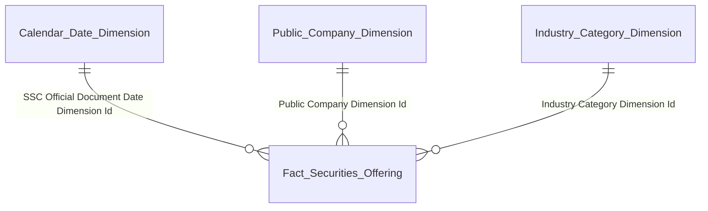

# DTM_QLCB_Entities — Star Schema per nhóm báo cáo

**Module:** QLCB — Quản lý Chào bán  
**Ngày:** 07/05/2026

---

## Nhóm 1–3: Phân tích chào bán phát hành theo ngành / loại hình

| Datamart entity | Description | Grain | KPI |
|---|---|---|---|
| Fact Securities Offering | Event chào bán/phát hành CK — lưu 6 cột per-type Amount/Quantity | 1 row = 1 đợt chào bán × 1 công ty đại chúng | K_QLCB_1–2, 4–16 |
| Public Company Dimension | Công ty đại chúng — mã CK / tên / ngành / sàn (SCD2) | 1 công ty đại chúng | — |
| Industry Category Dimension | Nhóm ngành — ETL-derived Conformed Dim | 1 ngành cấp 1 × 1 ngành cấp 2 (SCD2) | — |
| Calendar Date Dimension | Lịch ngày | 1 ngày | — |

---

## Nhóm 4 + Nhóm 8–11: Tra cứu chi tiết đợt chào bán (Tác nghiệp — Pivot)

> Bảng Tác nghiệp — lấy dữ liệu trực tiếp từ Atomic, không join qua Dimension. Không có relationship line → không vẽ erDiagram.

| Datamart entity | Description | Grain | KPI |
|---|---|---|---|
| Securities Offering 360 Profile | Hồ sơ 360° đợt chào bán — pivot theo loại hình. Nguồn trực tiếp từ Atomic `Public Company Securities Offering` và `Public Company`. Surrogate PK: `Securities Offering Id`; BK: `Securities Offering Code`. Grain component 2: `Offering Type Category Code` (6 giá trị: PUBLIC / PRIVATE / ESOP / DIVIDEND / OWNER_CAPITAL / OTHER) | 1 row = 1 đợt × 1 loại hình có qty > 0 | K_QLCB_17–27, 28–49 |

---

## Nhóm 5–7: Hồ sơ đăng ký chào bán (PENDING — TTHC)

> Toàn bộ PENDING — chờ Atomic TTHC. Không có star schema thiết kế tại thời điểm này.

| Datamart entity | Description | Grain | KPI | Trạng thái |
|---|---|---|---|---|
| Fact Securities Offering Application | Event hồ sơ đăng ký chào bán | 1 hồ sơ × 1 ngày nộp | K_QLCB_28–38 (PENDING) | PENDING — chờ Atomic TTHC |
| Calendar Date Dimension | Lịch ngày (reuse) | 1 ngày | — | PENDING |
| Public Company Dimension | Công ty đại chúng (reuse) | 1 công ty (SCD2) | — | PENDING |