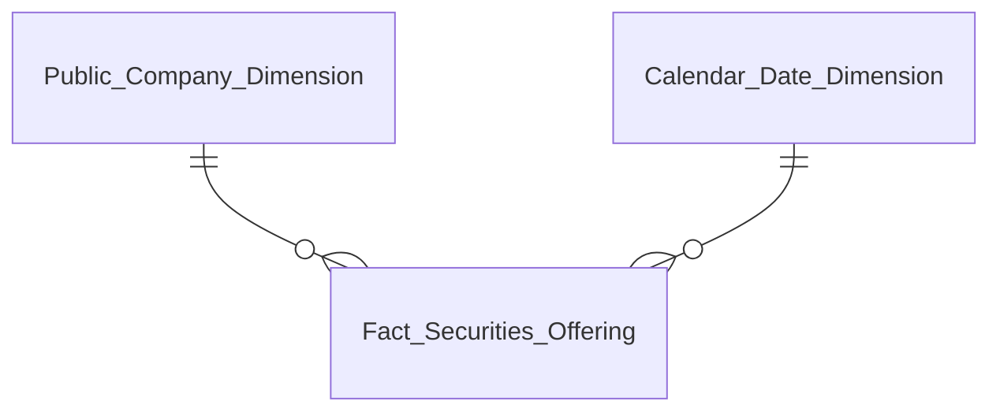
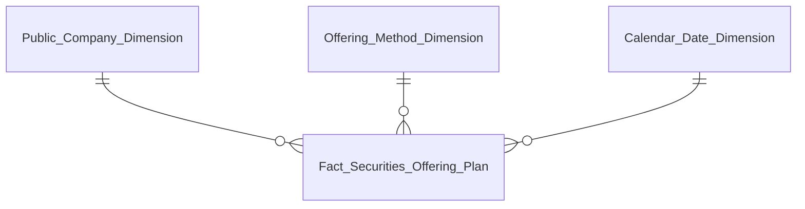
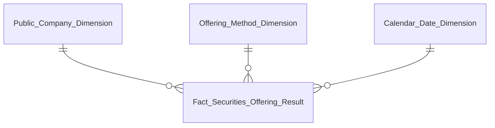
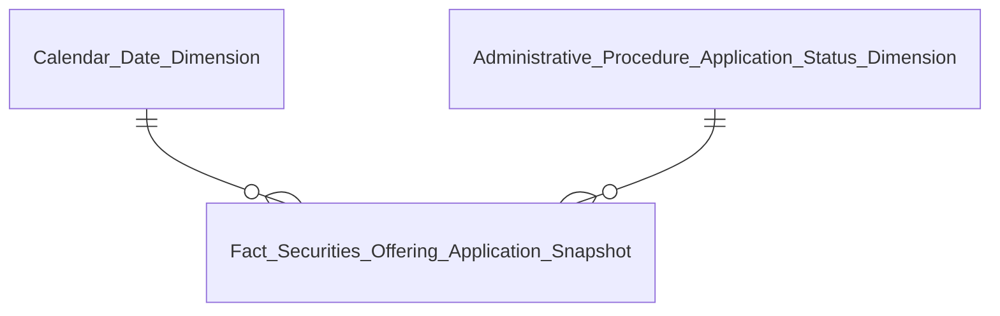
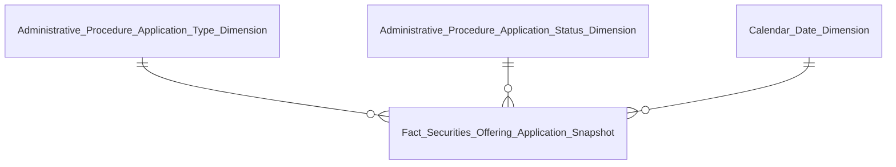

# DTM_QLCB_Entities — v2.3

**Phiên bản:** 2.3
**Ngày:** 24/08/2026
**Phạm vi:** Star schema diagram per nhóm báo cáo — QLCB module (Phase 2, dựa trên Section 3/4 của `DTM_QLCB_HLD.md`)

> **Cập nhật v2.2 (2026-08-24) — đổi nguồn Nhóm 5/6 từ IDS sang TTHC (task Dũng).** `Fact Securities Offering Application Snapshot` được repoint sang `TTHC.DOCUMENT` + `TTHC.CONTENTITEMINDEX` (`reuse_status`: `new` → `partial`), bổ sung 2 Dimension mới `Administrative Procedure Application Status Dimension` / `Administrative Procedure Application Type Dimension`, và thôi dùng `Offering Method Dimension` ở Nhóm 6. Toàn bộ K_QLCB_32–42 **READY (Atomic draft)**.

> **Cập nhật v2.3 (2026-08-24, cùng ngày):** Atomic đã bổ sung `ap_content_item_index.display_text` → O_QLCB_10 **Closed**. 3 bảng của Nhóm 5/6 (`Fact Securities Offering Application Snapshot` = `partial`, 2 Dimension mới = `new`) đã được đưa **trở lại** `DTM_QLCB_Entities.csv` (7 → 10 dòng); mục "Bảng PENDING" cuối file trở về trạng thái không còn bảng nào.

---

## Tab CHÀO BÁN PHÁT HÀNH

### Nhóm 1 — Tình hình thực hiện chào bán phát hành theo ngành

```mermaid
erDiagram
    Public_Company_Dimension ||--o{ Fact_Securities_Offering : " "
    Calendar_Date_Dimension ||--o{ Fact_Securities_Offering : " "
```

| Datamart Entity | Loại | Reuse | Mô tả | Grain | KPI |
|---|---|---|---|---|---|
| Fact Securities Offering | Fact Event | new | Hồ sơ chào bán/phát hành CK — tổng giá trị cấp phép/huy động theo ngành, kỳ | 1 row / hồ sơ chào bán | K_QLCB_1–5 |
| Public Company Dimension | Dimension | reuse | Mã CK, tên DN, sàn, ngành (reuse `public_company_dim`, module GSDC) | 1 row / công ty đại chúng | Slicer Ngành |
| Calendar Date Dimension | Dimension | reuse | Ngày công văn UBCKNN | 1 row / ngày (Conformed) | Slicer Ngày |

---

### Nhóm 2 — Giá trị cấp phép chào bán phát hành theo ngành

```mermaid
erDiagram
    Public_Company_Dimension ||--o{ Fact_Securities_Offering_Plan : " "
    Offering_Method_Dimension ||--o{ Fact_Securities_Offering_Plan : " "
    Calendar_Date_Dimension ||--o{ Fact_Securities_Offering_Plan : " "
```

| Datamart Entity | Loại | Reuse | Mô tả | Grain | KPI |
|---|---|---|---|---|---|
| Fact Securities Offering Plan | Fact Event | new | Giá trị cấp phép theo loại hình chào bán | 1 row / đợt × 1 loại hình kế hoạch | K_QLCB_6–12 |
| Offering Method Dimension | Dimension | new | Hình thức chào bán (ETL-derived DISTINCT từ `offering_method_code`) | 1 row / mã hình thức | Slicer Loại hình |
| Public Company Dimension | Dimension | reuse | Mã CK, tên DN (reuse `public_company_dim`) | 1 row / công ty đại chúng | Slicer |
| Calendar Date Dimension | Dimension | reuse | Ngày công văn UBCKNN | 1 row / ngày (Conformed) | Slicer |

---

### Nhóm 3 — Giá trị phát hành theo hình thức phát hành và nhóm ngành

```mermaid
erDiagram
    Public_Company_Dimension ||--o{ Fact_Securities_Offering_Result : " "
    Offering_Method_Dimension ||--o{ Fact_Securities_Offering_Result : " "
    Calendar_Date_Dimension ||--o{ Fact_Securities_Offering_Result : " "
```

| Datamart Entity | Loại | Reuse | Mô tả | Grain | KPI |
|---|---|---|---|---|---|
| Fact Securities Offering Result | Fact Event | new | Giá trị huy động theo loại hình chào bán | 1 row / đợt × 1 loại hình kết quả | K_QLCB_13–19 |
| Offering Method Dimension | Dimension | new | Hình thức chào bán (reuse từ Nhóm 2, cùng scheme) | 1 row / mã hình thức | Slicer |
| Public Company Dimension | Dimension | reuse | Mã CK, tên DN (reuse `public_company_dim`) | 1 row / công ty đại chúng | Slicer |
| Calendar Date Dimension | Dimension | reuse | Ngày công văn UBCKNN | 1 row / ngày (Conformed) | Slicer |

---

### Nhóm 4 — Bảng Chi tiết số lượng chứng khoán Chào bán & Phát hành

> Bảng Tác nghiệp — lấy dữ liệu trực tiếp từ Atomic, không join qua Dimension. Không vẽ erDiagram relationship.

| Datamart Entity | Loại | Reuse | Mô tả | Grain | KPI |
|---|---|---|---|---|---|
| Operational Securities Offering 360 Profile | Operational | new | Hồ sơ 360° tra cứu chi tiết từng đợt chào bán — pivot theo loại hình, gồm thông tin tổ chức liên quan (đơn vị tư vấn/kiểm toán/bảo lãnh/XHTN) | 1 row / đợt chào bán × 1 loại hình | K_QLCB_20–31 |

---

## Tab HỒ SƠ ĐĂNG KÝ CHÀO BÁN

### Nhóm 5 — Tỷ lệ xử lý hồ sơ

> **READY (Atomic draft)** — nguồn TTHC. `ap_content_item_index.display_text` đã có từ 2026-08-24 (O_QLCB_10 Closed).

```mermaid
erDiagram
    Calendar_Date_Dimension ||--o{ Fact_Securities_Offering_Application_Snapshot : " "
    Administrative_Procedure_Application_Status_Dimension ||--o{ Fact_Securities_Offering_Application_Snapshot : " "
```

| Datamart Entity | Loại | Reuse | Mô tả | Grain | KPI |
|---|---|---|---|---|---|
| Fact Securities Offering Application Snapshot | Fact Periodic Snapshot | partial | Hồ sơ đăng ký chào bán nộp qua TTHC — đếm theo nhóm trạng thái xử lý (KPI Card + donut). Repoint IDS → TTHC 2026-08-24 | 1 row / hồ sơ TTHC × 1 ngày snapshot | K_QLCB_32–35 |
| Administrative Procedure Application Status Dimension | Dimension | new | Trạng thái hồ sơ TTHC + nhóm trạng thái gom 4+1 (`REGISTERED`/`IN_PROGRESS`/`APPROVED`/`REJECTED`/`UNDEFINED`) từ 47 giá trị `display_text` | 1 row / trạng thái hồ sơ (content item `TrangThaiHoSo`) | Slicer |
| Calendar Date Dimension | Dimension | reuse | Ngày gửi hồ sơ TTHC (`Submission Date`) — thay cho ngày công văn/ngày cấp giấy chứng nhận của bản IDS | 1 row / ngày (Conformed) | Slicer |

---

### Nhóm 6 — Bảng Chi tiết hồ sơ chào bán & phát hành

> **READY (Atomic draft)** — cùng nguồn/điều kiện với Nhóm 5 (O_QLCB_10 Closed).

```mermaid
erDiagram
    Administrative_Procedure_Application_Type_Dimension ||--o{ Fact_Securities_Offering_Application_Snapshot : " "
    Administrative_Procedure_Application_Status_Dimension ||--o{ Fact_Securities_Offering_Application_Snapshot : " "
    Calendar_Date_Dimension ||--o{ Fact_Securities_Offering_Application_Snapshot : " "
```

| Datamart Entity | Loại | Reuse | Mô tả | Grain | KPI |
|---|---|---|---|---|---|
| Fact Securities Offering Application Snapshot | Fact Periodic Snapshot | partial | Cùng Fact với Nhóm 5, bổ sung FK `Administrative_Procedure_Application_Type_Dimension_Id` (non-nullable) — phân tích theo hình thức × năm | 1 row / hồ sơ TTHC × 1 ngày snapshot (cùng grain Nhóm 5) | K_QLCB_36–42 |
| Administrative Procedure Application Type Dimension | Dimension | new | Hình thức chào bán theo TTHC — `display_text` của content item `LoaiHoSo`. **KHÔNG** reuse `Offering Method Dimension` (dimension đó phục vụ K_QLCB_6–19 từ IDS) | 1 row / hình thức chào bán | Slicer |
| Administrative Procedure Application Status Dimension | Dimension | new | Dùng chung với Nhóm 5 — 4 cột số lượng của bảng chi tiết đếm theo `Application Status Group Code` | 1 row / trạng thái hồ sơ | Slicer |
| Calendar Date Dimension | Dimension | reuse | Năm (GROUP BY từ `Submission Date`) | 1 row / ngày (Conformed) | Slicer |

---

## Tab CHÀO BÁN VÀ PHÁT HÀNH (Data Explorer)

> Toàn bộ 4 Nhóm dưới đây reuse `Operational Securities Offering 360 Profile` đã thiết kế ở Nhóm 4 — không thêm Fact/Dim mới, chỉ mở rộng attribute đã có sẵn trong bảng.

### Nhóm 7 — Thông tin cơ sở

| Datamart Entity | Loại | Reuse | Mô tả | Grain | KPI |
|---|---|---|---|---|---|
| Operational Securities Offering 360 Profile | Operational | new (reuse từ Nhóm 4) | Mã CK, tên công ty, sàn, ngành, thời điểm báo cáo, chuyên viên, loại CK | 1 row / đợt chào bán × 1 loại hình (kế thừa Nhóm 4) | K_QLCB_43–48 |

### Nhóm 8 — Thông tin công văn cấp phép

| Datamart Entity | Loại | Reuse | Mô tả | Grain | KPI |
|---|---|---|---|---|---|
| Operational Securities Offering 360 Profile | Operational | new (reuse từ Nhóm 4) | Số/ngày giấy chứng nhận, số/ngày công văn, hình thức phát hành | 1 row / đợt chào bán × 1 loại hình (kế thừa Nhóm 4) | K_QLCB_49–53 |

### Nhóm 9 — Thông tin cấp phép chào bán

| Datamart Entity | Loại | Reuse | Mô tả | Grain | KPI |
|---|---|---|---|---|---|
| Operational Securities Offering 360 Profile | Operational | new (reuse từ Nhóm 4) | Số lượng/giá/giá trị cấp phép, số lượng người lao động, đối tượng, mục đích sử dụng vốn | 1 row / đợt chào bán × 1 loại hình (kế thừa Nhóm 4) | K_QLCB_54–59 |

### Nhóm 10 — Thông tin kết quả chào bán

| Datamart Entity | Loại | Reuse | Mô tả | Grain | KPI |
|---|---|---|---|---|---|
| Operational Securities Offering 360 Profile | Operational | new (reuse từ Nhóm 4) | Số lượng/giá/giá trị thực tế, số lượng người lao động (TT), đối tượng (TT) | 1 row / đợt chào bán × 1 loại hình (kế thừa Nhóm 4) | K_QLCB_60–64 |

---

## Bảng PENDING (không thiết kế trong Phase 2)

**Cập nhật 2026-08-24 (v2.3):** không còn bảng nào PENDING toàn bộ. 3 bảng của Nhóm 5/6 từng bị loại ở v2.2 (`Fact Securities Offering Application Snapshot`, `Administrative Procedure Application Status Dimension`, `Administrative Procedure Application Type Dimension`) đã trở lại `DTM_QLCB_Entities.csv` sau khi Atomic bổ sung `ap_content_item_index.display_text` — xem O_QLCB_10 (Closed) trong Section 5 của `DTM_QLCB_HLD.md`.

Toàn bộ 10 Nhóm của module QLCB đều READY (Atomic draft). O_QLCB_9 và O_QLCB_15 là vấn đề quy trình aggregate/manifest bên Atomic, không phải PENDING dữ liệu và không block Phase LLD.

> **Ghi chú lệch tên tồn đọng (không sửa trong lượt này):** `DTM_QLCB_Entities.csv` đang dùng tên Fact **không có** hậu tố `Snapshot` cho 3 Fact của Nhóm 1–3 (`Fact Securities Offering`, `Fact Securities Offering Plan`, `Fact Securities Offering Result`) trong khi HLD Section 3 và `datamart_model.yaml` đều dùng `... Snapshot`. Dòng Nhóm 5/6 mới thêm đã dùng đúng tên có `Snapshot`. Rule Phase 2 yêu cầu `datamart_entity` khớp HLD → 3 dòng Nhóm 1–3 cần đổi tên, tách task riêng cùng với #10 (chiều "Ngành" Nhóm 2/3 + `K_QLCB_65` thừa ở Nhóm 7).
