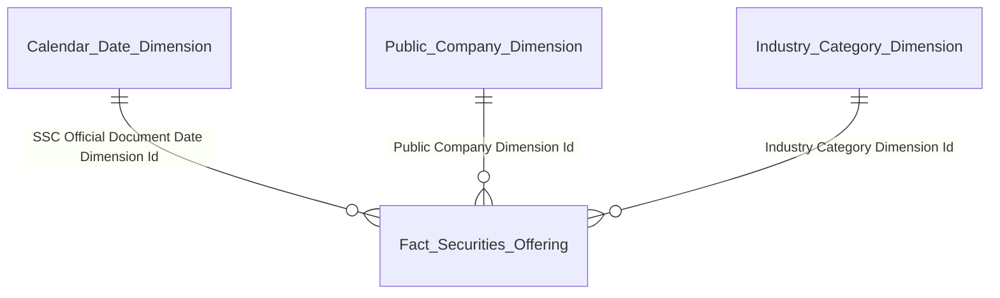
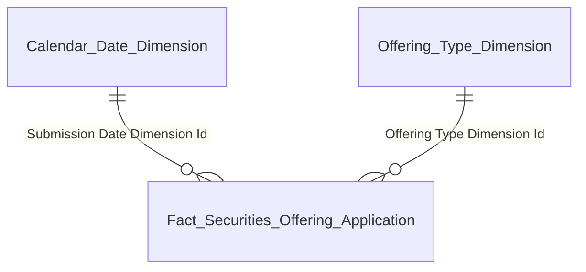

# DTM_QLCB_Entities — Star Schema per nhóm báo cáo

**Module:** QLCB — Quản lý Chào bán  
**Ngày:** 21/05/2026  
**Phiên bản:** 1.1 — Bổ sung Nhóm 5–7 READY (TTHC), cập nhật Nhóm 4+8–11 (bổ sung nguồn TTHC K_QLCB_19–22), thêm `Offering Type Dimension`.

---

## Nhóm 1–3: Phân tích chào bán phát hành theo ngành / loại hình

```mermaid
erDiagram
    Calendar_Date_Dimension ||--o{ Fact_Securities_Offering : "SSC Official Document Date Dimension Id"
    Public_Company_Dimension ||--o{ Fact_Securities_Offering : "Public Company Dimension Id"
    Industry_Category_Dimension ||--o{ Fact_Securities_Offering : "Industry Category Dimension Id"
```

| Datamart entity | Description | Grain | KPI |
|---|---|---|---|
| Fact Securities Offering | Event chào bán/phát hành CK — lưu 6 cột per-type Amount/Quantity | 1 row = 1 đợt chào bán × 1 công ty đại chúng | K_QLCB_1–2, 4–16 |
| Public Company Dimension | Công ty đại chúng — mã CK / tên / ngành / sàn (SCD2) | 1 công ty đại chúng | — |
| Industry Category Dimension | Nhóm ngành — ETL-derived Conformed Dim | 1 ngành cấp 1 × 1 ngành cấp 2 (SCD2) | — |
| Calendar Date Dimension | Lịch ngày | 1 ngày | — |

---

## Nhóm 4 + Nhóm 8–11: Tra cứu chi tiết đợt chào bán (Tác nghiệp — Pivot)

> Bảng Tác nghiệp — lấy dữ liệu trực tiếp từ Atomic, không join qua Dimension. Không có relationship line → không vẽ erDiagram.
>
> **v1.1:** Bổ sung nguồn `Application Eform Field Value` (TTHC) cho 4 cột K_QLCB_19–22 (Advisor Name, Auditor Name, Underwriter Name, Rating Agency Name). Cơ chế: array filter trên `tx_fields`, `etl_logic_type = computed`.

| Datamart entity | Description | Grain | KPI |
|---|---|---|---|
| Securities Offering 360 Profile | Hồ sơ 360° đợt chào bán — pivot theo loại hình (6 giá trị: PUBLIC/PRIVATE/ESOP/DIVIDEND/OWNER_CAPITAL/OTHER). Surrogate PK: `Securities Offering Id`; Composite BK: (`Securities Offering Code`, `Offering Type Category Code`). Từ v1.1: bổ sung 4 cột tổ chức từ TTHC (K_QLCB_19–22) qua array filter `tx_fields`. | 1 row = 1 đợt × 1 loại hình có qty > 0 | K_QLCB_17–27, 28–49 |

---

## Nhóm 5–7: Hồ sơ đăng ký chào bán (TTHC — READY)

> **v1.1:** Chuyển từ PENDING → READY. Thiết kế đầy đủ dựa trên `TTHC_Source_Analysis.md` và LLD TTHC (`attr_TTHC_ContentItemIndex.csv`, `attr_TTHC_WorkflowIndex.csv`).
>
> `Application Status Code` là ETL-derived tại tầng Atomic — Datamart `direct` map, không tự tính. `Offering Type Dimension` là Dimension mới, source từ `Classification Value` scheme `TTHC_CONTENT_TYPE`.

```mermaid
erDiagram
    Calendar_Date_Dimension ||--o{ Fact_Securities_Offering_Application : "Submission Date Dimension Id"
    Offering_Type_Dimension ||--o{ Fact_Securities_Offering_Application : "Offering Type Dimension Id"
```

| Datamart entity | Description | Grain | KPI |
|---|---|---|---|
| Fact Securities Offering Application | Event hồ sơ đăng ký chào bán nộp lên UBCKNN — DD: `Application Code`; `Application Status Code` ETL-derived tại Atomic (DA_CAP_PHEP / TU_CHOI / DANG_XU_LY / CHO_XU_LY); `Application Year` Degenerate Dimension | 1 row = 1 hồ sơ đăng ký chào bán (1 ContentItemId) | K_QLCB_50–63 |
| Offering Type Dimension | Loại hình chào bán — map từ `ContentType` TTHC qua CV `TTHC_CONTENT_TYPE`. NK: `Content Type Code`. 2 cột pending: `Security Type Code`, `Workflow Flag` (chờ O_QLCB_8) | 1 loại hình (11 ContentType) | — |
| Calendar Date Dimension | Lịch ngày (Conformed — reuse) | 1 ngày nộp hồ sơ (ContentItemIndex.CreatedUtc) | — |
