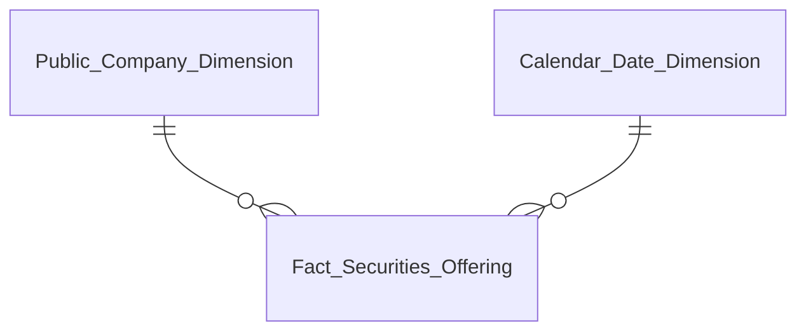
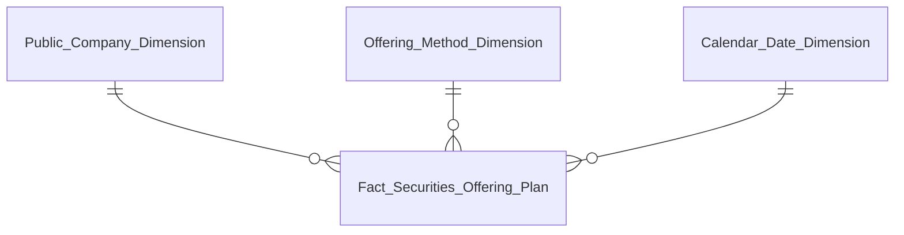
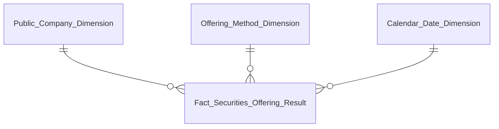
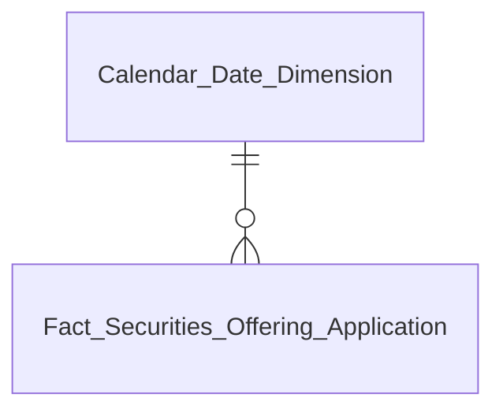
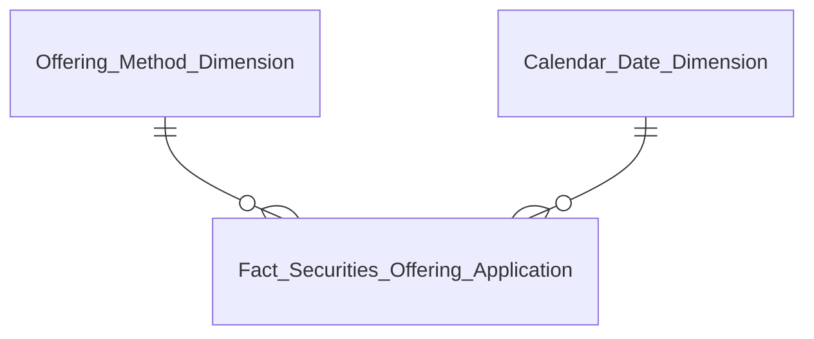

# DTM_QLCB_Entities — v2.1

**Phiên bản:** 2.1
**Ngày:** 17/07/2026
**Phạm vi:** Star schema diagram per nhóm báo cáo — QLCB module (Phase 2, dựa trên Section 3/4 của `DTM_QLCB_HLD.md`)

---

## Tab CHÀO BÁN PHÁT HÀNH

### Nhóm 1 — Tình hình thực hiện chào bán phát hành theo ngành

```mermaid
erDiagram
    Public_Company_Dimension ||--o{ Fact_Securities_Offering : " "
    Calendar_Date_Dimension ||--o{ Fact_Securities_Offering : " "
```

| Datamart Entity | Loại | Reuse | Mô tả | Grain | KPI |
|---|---|---|---|---|---|
| Fact Securities Offering | Fact Event | new | Hồ sơ chào bán/phát hành CK — tổng giá trị cấp phép/huy động theo ngành, kỳ | 1 row / hồ sơ chào bán | K_QLCB_1–5 |
| Public Company Dimension | Dimension | reuse | Mã CK, tên DN, sàn, ngành (reuse `public_company_dim`, module GSDC) | 1 row / công ty đại chúng | Slicer Ngành |
| Calendar Date Dimension | Dimension | reuse | Ngày công văn UBCKNN | 1 row / ngày (Conformed) | Slicer Ngày |

---

### Nhóm 2 — Giá trị cấp phép chào bán phát hành theo ngành

```mermaid
erDiagram
    Public_Company_Dimension ||--o{ Fact_Securities_Offering_Plan : " "
    Offering_Method_Dimension ||--o{ Fact_Securities_Offering_Plan : " "
    Calendar_Date_Dimension ||--o{ Fact_Securities_Offering_Plan : " "
```

| Datamart Entity | Loại | Reuse | Mô tả | Grain | KPI |
|---|---|---|---|---|---|
| Fact Securities Offering Plan | Fact Event | new | Giá trị cấp phép theo loại hình chào bán | 1 row / đợt × 1 loại hình kế hoạch | K_QLCB_6–12 |
| Offering Method Dimension | Dimension | new | Hình thức chào bán (ETL-derived DISTINCT từ `offering_method_code`) | 1 row / mã hình thức | Slicer Loại hình |
| Public Company Dimension | Dimension | reuse | Mã CK, tên DN (reuse `public_company_dim`) | 1 row / công ty đại chúng | Slicer |
| Calendar Date Dimension | Dimension | reuse | Ngày công văn UBCKNN | 1 row / ngày (Conformed) | Slicer |

---

### Nhóm 3 — Giá trị phát hành theo hình thức phát hành và nhóm ngành

```mermaid
erDiagram
    Public_Company_Dimension ||--o{ Fact_Securities_Offering_Result : " "
    Offering_Method_Dimension ||--o{ Fact_Securities_Offering_Result : " "
    Calendar_Date_Dimension ||--o{ Fact_Securities_Offering_Result : " "
```

| Datamart Entity | Loại | Reuse | Mô tả | Grain | KPI |
|---|---|---|---|---|---|
| Fact Securities Offering Result | Fact Event | new | Giá trị huy động theo loại hình chào bán | 1 row / đợt × 1 loại hình kết quả | K_QLCB_13–19 |
| Offering Method Dimension | Dimension | new | Hình thức chào bán (reuse từ Nhóm 2, cùng scheme) | 1 row / mã hình thức | Slicer |
| Public Company Dimension | Dimension | reuse | Mã CK, tên DN (reuse `public_company_dim`) | 1 row / công ty đại chúng | Slicer |
| Calendar Date Dimension | Dimension | reuse | Ngày công văn UBCKNN | 1 row / ngày (Conformed) | Slicer |

---

### Nhóm 4 — Bảng Chi tiết số lượng chứng khoán Chào bán & Phát hành

> Bảng Tác nghiệp — lấy dữ liệu trực tiếp từ Atomic, không join qua Dimension. Không vẽ erDiagram relationship.

| Datamart Entity | Loại | Reuse | Mô tả | Grain | KPI |
|---|---|---|---|---|---|
| Securities Offering 360 Profile | Operational | new | Hồ sơ 360° tra cứu chi tiết từng đợt chào bán — pivot theo loại hình, gồm thông tin tổ chức liên quan (đơn vị tư vấn/kiểm toán/bảo lãnh/XHTN) | 1 row / đợt chào bán × 1 loại hình | K_QLCB_20–31 |

---

## Tab HỒ SƠ ĐĂNG KÝ CHÀO BÁN

### Nhóm 5 — Tỷ lệ xử lý hồ sơ

```mermaid
erDiagram
    Calendar_Date_Dimension ||--o{ Fact_Securities_Offering_Application : " "
```

| Datamart Entity | Loại | Reuse | Mô tả | Grain | KPI |
|---|---|---|---|---|---|
| Fact Securities Offering Application | Fact Event | new | Hồ sơ đăng ký chào bán nộp UBCKNN — đếm theo trạng thái xử lý (KPI Card + donut) | 1 row / hồ sơ đăng ký chào bán | K_QLCB_32–35 |
| Calendar Date Dimension | Dimension | reuse | Ngày công văn UBCKNN | 1 row / ngày (Conformed) | Slicer |

---

### Nhóm 6 — Bảng Chi tiết hồ sơ chào bán & phát hành

```mermaid
erDiagram
    Offering_Method_Dimension ||--o{ Fact_Securities_Offering_Application : " "
    Calendar_Date_Dimension ||--o{ Fact_Securities_Offering_Application : " "
```

| Datamart Entity | Loại | Reuse | Mô tả | Grain | KPI |
|---|---|---|---|---|---|
| Fact Securities Offering Application | Fact Event | new | Kế thừa Nhóm 5, bổ sung FK `Offering_Method_Dimension_Id` (nullable) — phân tích theo hình thức × năm | 1 row / hồ sơ (kế thừa Nhóm 5) | K_QLCB_32 (reuse), 36–42 |
| Offering Method Dimension | Dimension | new | Hình thức chào bán (reuse từ Nhóm 2/3, cùng scheme) | 1 row / mã hình thức | Slicer |
| Calendar Date Dimension | Dimension | reuse | Năm (GROUP BY từ ngày công văn) | 1 row / ngày (Conformed) | Slicer |

---

## Tab CHÀO BÁN VÀ PHÁT HÀNH (Data Explorer)

> Toàn bộ 4 Nhóm dưới đây reuse `Securities Offering 360 Profile` đã thiết kế ở Nhóm 4 — không thêm Fact/Dim mới, chỉ mở rộng attribute đã có sẵn trong bảng.

### Nhóm 7 — Thông tin cơ sở

| Datamart Entity | Loại | Reuse | Mô tả | Grain | KPI |
|---|---|---|---|---|---|
| Securities Offering 360 Profile | Operational | new (reuse từ Nhóm 4) | Mã CK, tên công ty, sàn, ngành, thời điểm báo cáo, chuyên viên, loại CK | 1 row / đợt chào bán × 1 loại hình (kế thừa Nhóm 4) | K_QLCB_43–48 |

### Nhóm 8 — Thông tin công văn cấp phép

| Datamart Entity | Loại | Reuse | Mô tả | Grain | KPI |
|---|---|---|---|---|---|
| Securities Offering 360 Profile | Operational | new (reuse từ Nhóm 4) | Số/ngày giấy chứng nhận, số/ngày công văn, hình thức phát hành | 1 row / đợt chào bán × 1 loại hình (kế thừa Nhóm 4) | K_QLCB_49–53 |

### Nhóm 9 — Thông tin cấp phép chào bán

| Datamart Entity | Loại | Reuse | Mô tả | Grain | KPI |
|---|---|---|---|---|---|
| Securities Offering 360 Profile | Operational | new (reuse từ Nhóm 4) | Số lượng/giá/giá trị cấp phép, số lượng người lao động, đối tượng, mục đích sử dụng vốn | 1 row / đợt chào bán × 1 loại hình (kế thừa Nhóm 4) | K_QLCB_54–59 |

### Nhóm 10 — Thông tin kết quả chào bán

| Datamart Entity | Loại | Reuse | Mô tả | Grain | KPI |
|---|---|---|---|---|---|
| Securities Offering 360 Profile | Operational | new (reuse từ Nhóm 4) | Số lượng/giá/giá trị thực tế, số lượng người lao động (TT), đối tượng (TT) | 1 row / đợt chào bán × 1 loại hình (kế thừa Nhóm 4) | K_QLCB_60–64 |

---

## Bảng PENDING (không thiết kế trong Phase 2)

Không có bảng nào PENDING toàn bộ — toàn bộ 10 Nhóm của module QLCB đều READY (Atomic draft, xem Section 5 O_QLCB_9 về vấn đề quy trình aggregate Atomic, không phải PENDING dữ liệu).
