# Data Mart HLD — Phân hệ Quản lý Chào bán (QLCB)

**Phiên bản:** 2.1
**Ngày:** 17/07/2026

---

## Quy ước trạng thái

| Ký hiệu | Ý nghĩa |
|---|---|
| READY | Atomic đủ — thiết kế đầy đủ |
| PENDING | Atomic chưa có — placeholder + lý do |

---

## Section 1 — Data Lineage: Source → Atomic → Data Mart

##### Cụm 1a: Chào bán phát hành — tổng hồ sơ (Fact Securities Offering Snapshot)

Phục vụ Tab CHÀO BÁN PHÁT HÀNH — Nhóm 1 (KPI tình hình cấp phép/huy động theo ngành).

> Nguồn Atomic: `Public Company Securities Offering` (physical_name `pc_securities_offering`, nguồn `IDS.SECURITIES_OFFERING`, BRD source `BRD/Source/IDS/brd_IDS_SECURITIES_OFFERING.yaml`) + `Public Company Securities Offering Result` (aggregate SUM theo hồ sơ). `Public Company Dimension` **reuse** `public_company_dim` (module GSDC, `datamart_model.yaml`) — cùng nguồn Atomic `Public Company`, đã có đủ cột mã CK/tên/sàn/ngành. Xem Section 4 — Reuse Analysis.

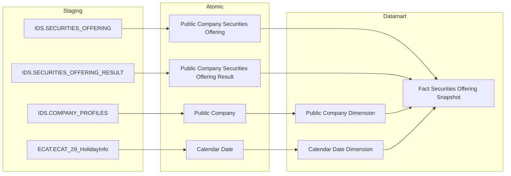

> **Ghi chú:** Ngành (`Business Line Level 1/2 Code`) lấy trực tiếp từ cột có sẵn trên `public_company_dim` (reuse) — không có Dimension ETL-derived riêng. `Public Company Securities Offering Result` feed thẳng vào Fact (không qua Dimension) vì cần aggregate SUM `total_collected_amt` GROUP BY hồ sơ.

---

##### Cụm 1b: Chào bán phát hành — giá trị cấp phép theo loại hình (Fact Securities Offering Plan Snapshot)

Phục vụ Tab CHÀO BÁN PHÁT HÀNH — Nhóm 2 (giá trị cấp phép theo loại hình).

> Nguồn Atomic: `Public Company Securities Offering Plan` (quan hệ 1-N với Offering cha theo `offering_method_code`) + `Public Company Securities Offering` (JOIN lấy `certificate_dt` làm FK date, vì Plan không có ngày riêng). `Offering Method Dimension` ETL-derived (DISTINCT) trực tiếp từ `Public Company Securities Offering Plan.offering_method_code`; `Offering_Method_Name` JOIN sang `Classification Value` (`cl_value`, bảng Fundamental vật lý ở Atomic — theo `cl_value.cl_code = offering_method_code AND cl_value.schema_code = 'SO_OFFERING_METHOD'`) lấy `cl_nm` — không tự CASE WHEN gộp nhóm trên Dimension.

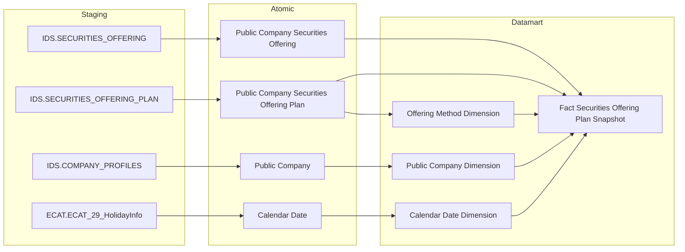

> **Ghi chú:** `Public Company Securities Offering` (Offering cha) feed vào Fact vì `Certificate_Date` (FK date) và `Public Company Code` (FK company) chỉ tồn tại trên bảng cha — Plan phải JOIN ngược lên cha để lấy 2 giá trị này.

---

##### Cụm 1c: Chào bán phát hành — giá trị huy động theo loại hình (Fact Securities Offering Result Snapshot)

Phục vụ Tab CHÀO BÁN PHÁT HÀNH — Nhóm 3 (giá trị huy động theo loại hình × ngành).

> Nguồn Atomic: `Public Company Securities Offering Result` (quan hệ 1-N với Offering cha theo `offering_method_code`) + `Public Company Securities Offering` (JOIN lấy `certificate_dt` làm FK date). Dùng chung `Offering Method Dimension` với Cụm 1b (reuse, cùng scheme `IDS_SO_OFFERING_METHOD`).

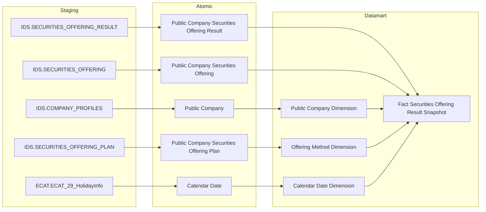

> **Ghi chú:** `Offering Method Code Snapshot` trên Result là denormalized snapshot từ Plan — `Offering Method Dimension` seed (DISTINCT) trực tiếp từ `Public Company Securities Offering Plan.offering_method_code` (dùng chung Cụm 1b, `Offering_Method_Name` join `Classification Value`), ETL populate FK trên Fact Result join qua Plan (`offering_method_code`) rồi snapshot sang Result.

---

##### Cụm 2: Chi tiết đợt chào bán (Bảng Tác nghiệp — Operational Securities Offering 360 Profile)

Phục vụ Tab CHÀO BÁN PHÁT HÀNH — Nhóm 4 (bảng chi tiết số lượng CK chào bán & phát hành) và Tab CHÀO BÁN VÀ PHÁT HÀNH — Nhóm 7–10 (tra cứu chi tiết đợt chào bán theo 4 nhóm chỉ số). Bảng tác nghiệp nhận dữ liệu trực tiếp từ Atomic, không qua Dimension.

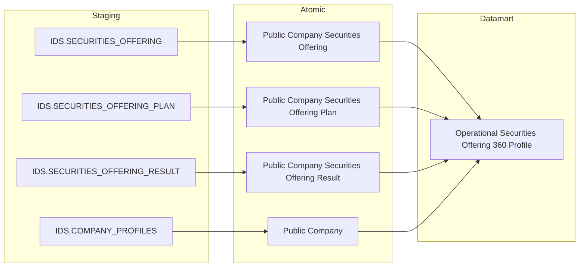

---

##### Cụm 3: Hồ sơ đăng ký chào bán (TTHC)

Phục vụ Tab HỒ SƠ ĐĂNG KÝ CHÀO BÁN — Nhóm 5 (Tỷ lệ xử lý hồ sơ — KPI Card + donut), Nhóm 6 (bảng chi tiết hồ sơ theo hình thức × năm).

> **ĐỔI NGUỒN 2026-08-24 (task Dũng — BA sheet cập nhật 2026-08-24): IDS → TTHC.** Toàn bộ chỉ tiêu Nhóm 5/6 chuyển từ `IDS.SECURITIES_OFFERING.APPROVAL_STATUS_CD` (entity `Public Company Securities Offering`) sang hệ thống TTHC (Orchard Core CMS): `TTHC.DOCUMENT` (nội dung JSON của hồ sơ) + `TTHC.CONTENTITEMINDEX` (index/metadata content item). Hồ sơ = content item `CONTENTTYPE = 'HoSoTTHC'`, lọc `LATEST = 1 AND PUBLISHED = 1`, giới hạn phạm vi nghiệp vụ bằng `CoQuanXuLy → DISPLAYTEXT = 'Ban Quản lý chào bán chứng khoán'`.
>
> 4 trường nghiệp vụ được parse từ `DOCUMENT.CONTENT` (JSON) **tại tầng ODS** — đã có sẵn trên Atomic `Administrative Procedure Document`:
>
> | JSON path (SQL BA STT 5/6) | Atomic attribute | Vai trò |
> |---|---|---|
> | `$.HoSoTTHC.TrangThaiHoSo.ContentItemIds[0]` | `Document Status Code` | ref → trạng thái hồ sơ (Nhóm 5 + 6) |
> | `$.HoSoTTHC.LoaiHoSo.ContentItemIds[0]` | `Offering Method Code` | ref → hình thức chào bán (Nhóm 6) |
> | `$.HoSoTTHC.CoQuanXuLy.ContentItemIds[0]` | `Processing Authority Code` | ref → cơ quan xử lý (filter phạm vi) |
> | `$.HoSoTTHC.NgayGuiHoSo.Value` | `Submission Date` | chiều thời gian |
>
> Cả 3 ref trên đều mang giá trị `CONTENTITEMID` (GUID) — muốn ra tên hiển thị phải self-join `CONTENTITEMINDEX` lấy `DISPLAYTEXT`. Đây là gốc của điểm chặn Atomic ở dưới.
>
> **ĐÃ GIẢI QUYẾT 2026-08-24 — Atomic đã bổ sung `display_text`.** `Administrative Procedure Content Item Index` (`ap_content_item_index`) nay có attribute `Display Text` / `display_text` ← `TTHC.CONTENTITEMINDEX.DISPLAYTEXT` (Text, nullable) — entity approved tăng từ 9 lên 10 attribute. Đây là trường dùng để resolve 3 `CONTENTITEMID` (`TrangThaiHoSo`, `LoaiHoSo`, `CoQuanXuLy`) thành tên hiển thị, nền tảng cho toàn bộ phân loại 4 nhóm trạng thái, nhãn hình thức chào bán và filter cơ quan xử lý. Toàn bộ K_QLCB_32–42 chuyển từ PENDING sang **READY (Atomic draft)**. Xem O_QLCB_10 (Closed).
>
> **Không cần cột `PUBLISHED` ở tầng Datamart** (chốt với người thiết kế 2026-08-24): thiết kế Atomic đã lọc theo cột này ngay khi nạp `ap_content_item_index`, nên mọi dòng Atomic đã là content item **hiện hành + đã xuất bản** — Datamart không lặp lại điều kiện `PUBLISHED = 1` của SQL BA. Tương tự `LATEST = 1` đã được dedup tại Atomic (grain "1 dòng = 1 content item hiện hành", xem `TTHC_HLD_Tier2.md` D-06).
>
> **ĐỔI GRAIN 2026-08-24:** grain mới = **1 row / 1 hồ sơ TTHC** (`CONTENTITEMID` của content item `HoSoTTHC`). Rule cũ *"1 hồ sơ × N loại hình đếm N lần"* (FIX 2026-08-14, dựa trên `IDS.SECURITIES_OFFERING_PLAN`) **mất hiệu lực** — TTHC mỗi hồ sơ chỉ có đúng 1 `LoaiHoSo`, không có bảng Plan tách riêng. SQL BA mới đếm `COUNT(*)` trên grain 1 hồ sơ. Nhóm 5 và Nhóm 6 tiếp tục dùng chung 1 Fact.
>
> **ĐỔI TRỤC THỜI GIAN 2026-08-24:** từ `certificate_date` (ngày cấp giấy chứng nhận, IDS) sang `NgayGuiHoSo` (ngày gửi hồ sơ, TTHC). Fact lưu grain **ngày** (`Submission Date` đã TRUNC về DATE), KPI Nhóm 6 GROUP BY **năm** — chốt với người thiết kế 2026-08-24: khớp cột `Thông tin = Năm` của BA và giữ nguyên hình thức bảng chi tiết hiện tại, trong khi vẫn drill-down được xuống ngày. Lưu ý số liệu theo năm **sẽ khác hẳn** bản IDS cũ vì đổi cả ý nghĩa trục thời gian lẫn grain.
>
> **Công thức `ngay_gui_ho_so` — đã thống nhất (xác nhận người thiết kế 2026-08-24):** BA dùng **một công thức duy nhất** cho cả STT 5 và STT 6 — bản có xử lý múi giờ: `TO_TIMESTAMP(SUBSTR(json,1,19) DEFAULT NULL ON CONVERSION ERROR, 'YYYY-MM-DD"T"HH24:MI:SS')` → `FROM_TZ(..., CASE WHEN json LIKE '%Z' THEN 'UTC' ELSE 'Asia/Ho_Chi_Minh' END)` → `AT TIME ZONE 'Asia/Ho_Chi_Minh'` → `CAST(... AS TIMESTAMP)`. Khớp đúng phương án thiết kế đã chọn trước đó, nên **không phải sửa gì** ở Fact/Dimension/Detail Mapping/flat table. `DEFAULT NULL ON CONVERSION ERROR` cho biết chuỗi ngày sai định dạng sẽ ra NULL — đúng cơ sở cho filter `ap_document.submission_dt IS NOT NULL` của Fact. Datamart tiêu thụ `ap_document.submission_dt` (Atomic khai `data_domain: Date`), tức ODS chịu trách nhiệm `TRUNC` kết quả TIMESTAMP trên về DATE. Xem O_QLCB_11.

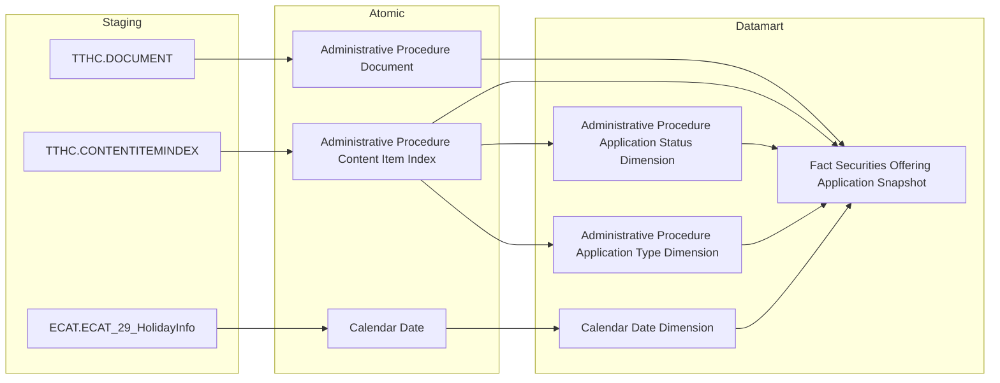

> **Ghi chú lineage (ĐỔI NGUỒN 2026-08-24):** `Fact Securities Offering Application Snapshot` được **repoint** sang TTHC (giữ nguyên tên bảng và toàn bộ KPI_ID K_QLCB_32–42 — chốt với người thiết kế 2026-08-24, `reuse_status = partial`). Driving entity = `Administrative Procedure Content Item Index` lọc `Content Type Code = 'HoSoTTHC'` + `Latest Indicator = 1` + `Published Indicator = 1`, join `Administrative Procedure Document` theo `Administrative Procedure Document Id` để lấy 4 trường parse từ JSON. Grain = 1 row / 1 hồ sơ (`Content Item Code`), vẫn giữ tính chất Snapshot: ETL full-scan hàng ngày vì `Document Status Code` phản ánh trạng thái xử lý **hiện hành** của hồ sơ (`LATEST = 1`), không phải lịch sử chuyển trạng thái.
>
> `Administrative Procedure Application Status Dimension` và `Administrative Procedure Application Type Dimension` đều lấy từ `Administrative Procedure Content Item Index` (self-reference: content item được trỏ tới bởi `TrangThaiHoSo`/`LoaiHoSo`), dùng `display_text` làm tên hiển thị.
>
> **KHÔNG reuse `Offering Method Dimension`** cho Nhóm 6 nữa: dimension đó đang phục vụ K_QLCB_6–19 (Nhóm 2/3) với nguồn `IDS.SECURITIES_OFFERING_PLAN.offering_method_code` — repoint sang TTHC sẽ phá 14 KPI của 2 Nhóm khác. Hệ quả: sau thay đổi, dashboard QLCB có **2 danh mục "hình thức chào bán" song song** (Nhóm 2/3 theo `IDS_SO_OFFERING_METHOD`, Nhóm 6 theo `display_text` của `TTHC.LoaiHoSo`) — xem O_QLCB_13.

---

## Section 2 — Tổng quan báo cáo

### Tab: CHÀO BÁN PHÁT HÀNH

**Slicer chung:** Ngày (date picker), Ngành

---

#### Nhóm 1 — Tình hình thực hiện chào bán phát hành theo ngành

> Phân loại: **Phân tích**
> Atomic: `Public Company Securities Offering` ← IDS.SECURITIES_OFFERING — **READY** (Atomic draft — chưa approved chính thức)
> Atomic: `Public Company Securities Offering Result` ← IDS.SECURITIES_OFFERING_RESULT — **READY** (Atomic draft)
> Atomic: `Public Company` ← IDS.COMPANY_PROFILES — **READY**

**Mockup:**

| Ngành | Giá trị Cấp phép (tỷ đ) | Giá trị Huy động (tỷ đ) | Chưa thành công (tỷ đ) |
|---|---|---|---|
| Tài chính - Ngân hàng | 12,500 | 10,200 | 2,300 |
| Bất động sản | 8,700 | 7,100 | 1,600 |
| Công nghiệp | 5,300 | 4,800 | 500 |

**Source:** `Fact Securities Offering Snapshot` → `Public Company Dimension` (reuse), `Calendar Date Dimension`

**Bảng KPI:**

| KPI ID | Tên KPI | Đơn vị | Tính chất | Công thức | Ghi chú | Trạng thái |
|---|---|---|---|---|---|---|
| K_QLCB_1 | Ngày | — | Chiều | `GROUP BY Certificate Date` — FK date trên Fact, dùng làm slicer/period cho toàn Nhóm — `Public Company Securities Offering.certificate_dt` | BA cập nhật 2026-08-11: đổi field lọc kỳ báo cáo từ Official Letter Date (ngày công văn) sang Certificate Date (ngày cấp GCN) | READY |
| K_QLCB_2 | Ngành | — | Chiều | `GROUP BY Business Line Level 1 Code` — FK Public Company Dimension (reuse `public_company_dim`), dùng làm slicer ngành cho toàn Nhóm | — | READY |
| K_QLCB_3 | Giá trị Cấp phép | Tỷ VNĐ | Cơ sở | `SUM(Total Expected Amount)` per ngành × kỳ — `Public Company Securities Offering.total_expected_amt` | — | READY |
| K_QLCB_4 | Giá trị Huy động thành công | Tỷ VNĐ | Cơ sở | `SUM(Total Collected Amount)` per ngành × kỳ — aggregate từ `Public Company Securities Offering Result.total_collected_amt` GROUP BY `pc_securities_offering_id` trước khi cộng vào Fact | — | READY |
| K_QLCB_5 | Chưa thành công | Tỷ VNĐ | Derived | `K_QLCB_3 − K_QLCB_4` — tính ở presentation layer | — | READY |

> **Lưu ý:** K_QLCB_1/2 là Chiều — cùng dùng chung FK date/ngành đã có sẵn trên `Fact Securities Offering Snapshot` (không tạo cột mới), khai sinh KPI_ID theo rule "mọi dòng BA Phân loại = Chiều phải có KPI_ID". K_QLCB_3 lấy trực tiếp `total_expected_amt` trên bảng cha `Public Company Securities Offering` (1 giá trị/hồ sơ, không cần JOIN). K_QLCB_4 cần SUM `total_collected_amt` từ `Public Company Securities Offering Result` GROUP BY `pc_securities_offering_id` — quan hệ 1-N vì 1 hồ sơ có thể có nhiều dòng Result theo từng đợt báo cáo kết quả (`Offering Phase Name`). K_QLCB_5 là Derived — tính ở presentation layer, không lưu mart.
>
> **Loại bỏ 2 KPI YOY dư (cross-check phát hiện, đã xóa khỏi bảng trước khi renumber):** BA STT 1 không có dòng nào yêu cầu YoY% — 2 KPI này đã bị thêm không có căn cứ BA, xóa khỏi bảng KPI.

> **Ghi chú — Public Company Dimension (reuse):** Reuse `public_company_dim` đã có trong `datamart_model.yaml` (module GSDC, nguồn Atomic `Public Company`) — đã có sẵn `Business Line Level 1 Code` cho GROUP BY ngành (khớp BA: SQL Nhóm 1 chỉ JOIN `CATEGORIES` qua `category_l1_id`, không cần cấp 2). Xem Section 4 — Reuse Analysis.

**Star Schema:**

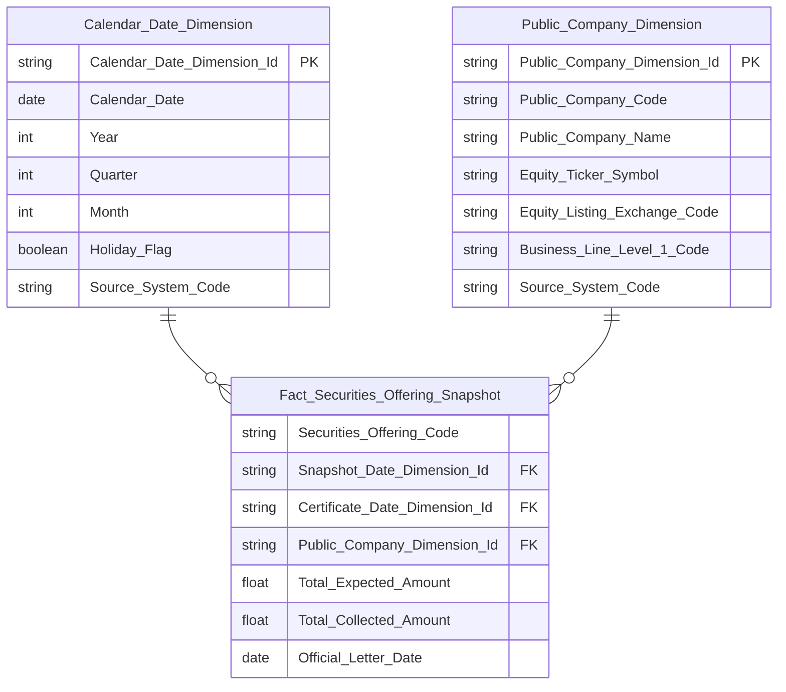

> **Ghi chú Phase 2 — reuse `Public_Company_Dimension` (= `public_company_dim`):** Dùng nguyên schema đã approved trong `datamart_model.yaml` (module GSDC). Key convention theo entity gốc: `Public_Company_Dimension_Id` = PK, `Public_Company_Code` = NK (ETL join từ `Public Company Securities Offering.Public Company Code` để resolve Surrogate Dimension Key).

**Lineage Mart → Báo cáo:**


**Bảng grain:**

| Tên bảng | Grain |
|---|---|
| Fact Securities Offering Snapshot | 1 row = 1 hồ sơ chào bán/phát hành CK của 1 công ty đại chúng × 1 ngày snapshot (ETL full-scan hàng ngày để Total Collected Amount luôn phản ánh đúng kết quả huy động mới nhất; Certificate Date giữ nguyên vai trò Chiều/slicer) |
| Public Company Dimension (reuse `public_company_dim`) | 1 row = 1 công ty đại chúng (SCD4A — theo quy ước module GSDC) |
| Calendar Date Dimension | 1 row = 1 ngày (Certificate Date — ngày cấp giấy chứng nhận) |

---

#### Nhóm 2 — Giá trị cấp phép chào bán phát hành theo ngành

> Phân loại: **Phân tích**
> Atomic: `Public Company Securities Offering Plan` ← IDS.SECURITIES_OFFERING_PLAN — **READY** (Atomic draft — chưa approved chính thức)
> Atomic: `Public Company Securities Offering` ← IDS.SECURITIES_OFFERING — **READY** (Atomic draft, dùng để lấy `certificate_dt` FK date)

**Mockup:**

| Loại hình | Giá trị cấp phép (tỷ đ) | % tổng |
|---|---|---|
| Công chúng | 8,200 | 42% |
| Riêng lẻ | 5,100 | 26% |
| ESOP | 2,300 | 12% |
| Trả cổ tức | 1,800 | 9% |
| Tăng vốn từ VCSH | 1,500 | 8% |
| Khác | 600 | 3% |

**Source:** `Fact Securities Offering Plan Snapshot` → `Offering Method Dimension`, `Public Company Dimension` (reuse), `Calendar Date Dimension`

**Bảng KPI:**

| KPI ID | Tên KPI | Đơn vị | Tính chất | Công thức | Ghi chú | Trạng thái |
|---|---|---|---|---|---|---|
| K_QLCB_6 | Loại hình phát hành | — | Chiều | `GROUP BY Offering Method Code` — hiển thị tên gốc `Offering_Method_Name` (từ Dimension, join Classification Value); filter K_QLCB_7–12 gom mã vào 6 nhóm để tính measure (xem bảng mapping dưới), không đổi tên hiển thị của Chiều này | — | READY |
| K_QLCB_7 | Giá trị cấp phép — Công chúng | Tỷ VNĐ | Cơ sở | `SUM(Total Expected Amount Snapshot) WHERE Offering Method Code IN ('1','2','3','4')` | — | READY |
| K_QLCB_8 | Giá trị cấp phép — Riêng lẻ | Tỷ VNĐ | Cơ sở | `SUM(Total Expected Amount Snapshot) WHERE Offering Method Code = '5'` | — | READY |
| K_QLCB_9 | Giá trị cấp phép — ESOP | Tỷ VNĐ | Cơ sở | `SUM(Total Expected Amount Snapshot) WHERE Offering Method Code IN ('9','10')` | — | READY |
| K_QLCB_10 | Giá trị cấp phép — Trả cổ tức | Tỷ VNĐ | Cơ sở | `SUM(Total Expected Amount Snapshot) WHERE Offering Method Code = '7'` | — | READY |
| K_QLCB_11 | Giá trị cấp phép — Tăng vốn từ VCSH | Tỷ VNĐ | Cơ sở | `SUM(Total Expected Amount Snapshot) WHERE Offering Method Code = '8'` | — | READY |
| K_QLCB_12 | Giá trị cấp phép — Các loại khác | Tỷ VNĐ | Cơ sở | `SUM(Total Expected Amount Snapshot) WHERE Offering Method Code NOT IN ('1','2','3','4','5','7','8','9','10')` | — | READY |

> **Mapping mã `Offering Method Code` → 6 nhóm hiển thị (theo BA SQL tham khảo, xác nhận với `LOOKUP_GROUP = 'SO_OFFERING_METHOD'`):**
>
> | Mã | Nhóm hiển thị |
> |---|---|
> | 1, 2, 3, 4 | Công chúng |
> | 5 | Riêng lẻ |
> | 9, 10 | ESOP |
> | 7 | Trả cổ tức |
> | 8 | Tăng vốn từ VCSH |
> | khác (kể cả NULL) | Khác |

> **Lưu ý:** `Public Company Securities Offering Plan` có **1 dòng riêng cho mỗi loại hình** (`offering_method_code`) của cùng 1 hồ sơ chào bán. K_QLCB_7–12 là **Cơ sở** (SUM trực tiếp có filter theo mã), không phải Derived. `Total Expected Amount Snapshot` là cột denormalized trên Plan (snapshot từ bảng cha).
>
> **Ghi chú kỹ thuật ETL:** BA gom nhóm Plan theo `(securities_offering_id, offering_method_cd)` bằng CTE **trước khi JOIN** sang bảng cha Offering, để đảm bảo mỗi tổ hợp hồ sơ × loại hình chỉ có 1 dòng khi cộng dồn — tránh nhân bản SUM nếu về sau Plan JOIN thêm bảng khác gây fanout. Hiện tại grain Fact Plan đã là 1 row/tổ hợp nên không ảnh hưởng kết quả, nhưng khi thiết kế LLD (etl_logic), giữ nguyên thứ tự "gom nhóm trước, JOIN sau" theo đúng CTE BA.

**Star Schema:**

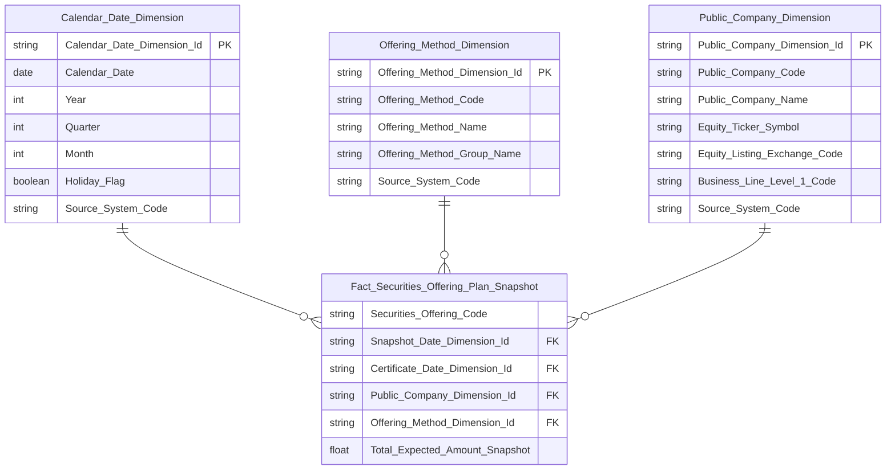

> **Ghi chú Phase 2:**
> - `Securities_Offering_Code` — BK đợt chào bán (degenerate dimension), denormalized sẵn trên Plan (`pc_securities_offering_code`) — bổ sung khi Phase 3 phát hiện 2 FK dim hiện có (Public Company + Offering Method) không đủ phân biệt các đợt chào bán khác nhau của cùng 1 công ty cùng loại hình; dùng làm grain key cho ORDER BY flat table
> - `Offering_Method_Dimension` — `Offering_Method_Dimension_Id` = PK, `Offering_Method_Code` = NK, ETL-derived (DISTINCT) trực tiếp từ `Public Company Securities Offering Plan.offering_method_code`; `Offering_Method_Name` JOIN `Classification Value` (`cl_value.cl_code = offering_method_code AND cl_value.schema_code = 'SO_OFFERING_METHOD'`) lấy `cl_nm` (tên gốc); `Offering_Method_Group_Name` computed CASE WHEN theo `offering_method_code` gom vào 6 nhóm (Công chúng/Riêng lẻ/ESOP/Trả cổ tức/Tăng vốn từ VCSH/Khác) — cả 2 cột tính 1 lần ngay trên Dimension (dùng chung Nhóm 2/3/6), flat table chỉ SELECT thẳng, không tự CASE WHEN lại. Nhóm 2/6 hiển thị tên gốc (`Offering_Method_Name`); Nhóm 3 hiển thị nhóm (`Offering_Method_Group_Name`).
> - `Public_Company_Dimension` = reuse `public_company_dim` (schema đầy đủ xem Nhóm 1) — FK join qua `Public Company Securities Offering.Public Company Code` (JOIN từ Offering cha, vì Plan không có trực tiếp Public Company Code — cần JOIN 2 tầng Plan → Offering → Public Company)
> - `Certificate_Date_Dimension_Id` — cùng FK date với Nhóm 1, join từ `Public Company Securities Offering.certificate_dt` (Plan không có ngày riêng)

**Lineage Mart → Báo cáo:**

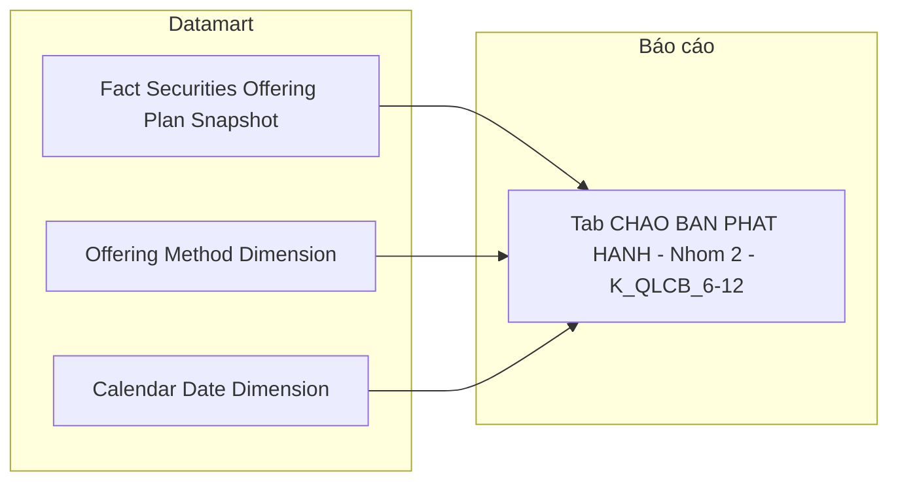

**Bảng grain:**

| Tên bảng | Grain |
|---|---|
| Fact Securities Offering Plan Snapshot | 1 row = 1 đợt chào bán × 1 loại hình kế hoạch × 1 ngày snapshot (ETL full-scan hàng ngày; Certificate Date giữ nguyên vai trò Chiều/slicer) |
| Offering Method Dimension | 1 row = 1 mã hình thức chào bán (scheme `IDS_SO_OFFERING_METHOD`) |
| Public Company Dimension (reuse `public_company_dim`) | 1 row = 1 công ty đại chúng |
| Calendar Date Dimension | 1 row = 1 ngày |

---

#### Nhóm 3 — Giá trị phát hành theo hình thức phát hành và nhóm ngành

> Phân loại: **Phân tích**
> Atomic: `Public Company Securities Offering Result` ← IDS.SECURITIES_OFFERING_RESULT — **READY** (Atomic draft — chưa approved chính thức)
> Atomic: `Public Company Securities Offering` ← IDS.SECURITIES_OFFERING — **READY** (Atomic draft, dùng để lấy `certificate_dt` FK date)

**Mockup:**

| Ngành \ Loại hình | Công chúng | Riêng lẻ | ESOP | Trả cổ tức | Tăng vốn VCSH | Khác |
|---|---|---|---|---|---|---|
| Tài chính - Ngân hàng | 4,200 | 3,100 | 800 | 600 | 400 | 200 |
| Bất động sản | 2,100 | 1,800 | 500 | 400 | 700 | 100 |
| Công nghiệp | 1,800 | 950 | 300 | 200 | 150 | 100 |

**Source:** `Fact Securities Offering Result Snapshot` → `Offering Method Dimension`, `Public Company Dimension` (reuse), `Calendar Date Dimension`

**Bảng KPI:**

| KPI ID | Tên KPI | Đơn vị | Tính chất | Công thức | Ghi chú | Trạng thái |
|---|---|---|---|---|---|---|
| K_QLCB_13 | Loại hình phát hành (kết quả) | — | Chiều | `GROUP BY Offering Method Code Snapshot` — hiển thị `Offering_Method_Group_Name` (computed CASE WHEN có sẵn trên Dimension, xem bảng mapping ở Nhóm 2) — khác Nhóm 2/6 (hiển thị tên gốc `Offering_Method_Name`); filter K_QLCB_14–19 dùng cùng mapping mã→nhóm | — | READY |
| K_QLCB_14 | Giá trị huy động — Công chúng | Tỷ VNĐ | Cơ sở | `SUM(Total Collected Amount) WHERE Offering Method Code Snapshot IN ('1','2','3','4')` GROUP BY ngành | — | READY |
| K_QLCB_15 | Giá trị huy động — Riêng lẻ | Tỷ VNĐ | Cơ sở | `SUM(Total Collected Amount) WHERE Offering Method Code Snapshot = '5'` GROUP BY ngành | — | READY |
| K_QLCB_16 | Giá trị huy động — ESOP | Tỷ VNĐ | Cơ sở | `SUM(Total Collected Amount) WHERE Offering Method Code Snapshot IN ('9','10')` GROUP BY ngành | — | READY |
| K_QLCB_17 | Giá trị huy động — Trả cổ tức | Tỷ VNĐ | Cơ sở | `SUM(Total Collected Amount) WHERE Offering Method Code Snapshot = '7'` GROUP BY ngành | — | READY |
| K_QLCB_18 | Giá trị huy động — Tăng vốn từ VCSH | Tỷ VNĐ | Cơ sở | `SUM(Total Collected Amount) WHERE Offering Method Code Snapshot = '8'` GROUP BY ngành | — | READY |
| K_QLCB_19 | Giá trị huy động — Các loại khác | Tỷ VNĐ | Cơ sở | `SUM(Total Collected Amount) WHERE Offering Method Code Snapshot NOT IN ('1','2','3','4','5','7','8','9','10')` GROUP BY ngành | — | READY |

> **Mapping mã:** Giống Nhóm 2 — xem bảng mapping mã `Offering Method Code` ở Nhóm 2 (áp dụng cho `Offering Method Code Snapshot` trên Result).

> **Lưu ý:** Nhóm 3 dùng `Public Company Securities Offering Result` (kết quả thực tế), khác Nhóm 2 dùng `Plan` (kế hoạch). `Offering Method Code Snapshot` trên Result là denormalized snapshot từ Plan. K_QLCB_14–19 là **Cơ sở** (SUM trực tiếp có filter theo mã).
>
> **Ghi chú kỹ thuật ETL:** Tương tự Nhóm 2 — BA gom nhóm Result theo `(securities_offering_id, offering_method_cd)` bằng CTE **trước khi JOIN** sang bảng cha Offering, tránh nhân bản SUM nếu Result JOIN thêm bảng khác gây fanout. Giữ nguyên thứ tự "gom nhóm trước, JOIN sau" khi thiết kế LLD (etl_logic).

**Star Schema:**

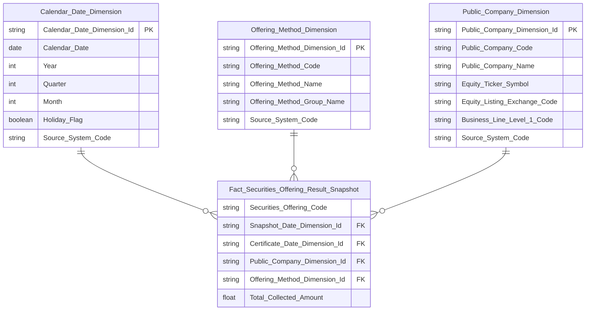

> **Ghi chú Phase 2:** Cùng `Calendar_Date_Dimension`, `Offering_Method_Dimension`, `Public_Company_Dimension` (reuse `public_company_dim`, schema đầy đủ xem Nhóm 1/2) với Nhóm 2 — không thiết kế lại logic, chỉ lặp lại block để Star Schema Nhóm 3 tự đứng độc lập, không có node rỗng.

**Lineage Mart → Báo cáo:**


**Bảng grain:**

| Tên bảng | Grain |
|---|---|
| Fact Securities Offering Result Snapshot | 1 row = 1 đợt chào bán × 1 loại hình kết quả thực tế × 1 ngày snapshot (ETL full-scan hàng ngày để Total Collected Amount luôn phản ánh đúng kết quả huy động mới nhất; Certificate Date giữ nguyên vai trò Chiều/slicer) |
| Offering Method Dimension | 1 row = 1 mã hình thức chào bán (reuse từ Nhóm 2) |
| Public Company Dimension (reuse `public_company_dim`) | 1 row = 1 công ty đại chúng |
| Calendar Date Dimension | 1 row = 1 ngày |

---

#### Nhóm 4 — Bảng Chi tiết số lượng chứng khoán Chào bán & Phát hành

> Phân loại: **Tác nghiệp**
> Atomic: `Public Company Securities Offering` ← IDS.SECURITIES_OFFERING — **READY** (Atomic draft — chưa approved chính thức)
> Atomic: `Public Company Securities Offering Plan` ← IDS.SECURITIES_OFFERING_PLAN — **READY** (Atomic draft)
> Atomic: `Public Company Securities Offering Result` ← IDS.SECURITIES_OFFERING_RESULT — **READY** (Atomic draft)
> Atomic: `Public Company` ← IDS.COMPANY_PROFILES — **READY**

**Mockup:**

| Mã CK | Tên DN | Hình thức | Đvị tư vấn | Tổ chức KT | Đvị bảo lãnh | Đvị XHTN | SL cấp phép | SL thành công | GT cấp phép (tỷ) | GT thành công (tỷ) | Tỷ lệ % |
|---|---|---|---|---|---|---|---|---|---|---|---|
| ABC | Công ty ABC | Công chúng | — | — | — | — | 10,000,000 | 9,500,000 | 500 | 475 | 95% |
| DEF | Công ty DEF | Riêng lẻ | — | — | — | — | 5,000,000 | 5,000,000 | 250 | 250 | 100% |

**Source:** `Operational Securities Offering 360 Profile` — lookup theo đợt chào bán / công ty

**Bảng KPI:**

| KPI ID | Tên KPI | Đơn vị | Tính chất | Công thức | Ghi chú | Trạng thái |
|---|---|---|---|---|---|---|
| K_QLCB_20 | Tên doanh nghiệp | — | Attribute | `SELECT Public Company Name` — `Public Company.public_company_nm` (IDS.COMPANY_PROFILES, cột `COMPANY_NAME_VN`) | — | READY |
| K_QLCB_21 | Mã chứng khoán | Text | Attribute | `SELECT Equity Ticker Symbol` — `Public Company.equity_ticker_symbol` (IDS.COMPANY_PROFILES, cột `equity_ticker`) | — | READY |
| K_QLCB_22 | Hình thức chào bán | — | Attribute | `SELECT Offering Method Name` — tên gốc, JOIN `Classification Value` (`cl_value.cl_code = Offering Method Code AND cl_value.schema_code = 'SO_OFFERING_METHOD'`) lấy `cl_nm` | — | READY |
| K_QLCB_23 | Đơn vị tư vấn | Text | Attribute | `Public Company Securities Offering.consulting_organization_nm` — IDS.SECURITIES_OFFERING.CONSULTING_ORG — direct map | — | READY |
| K_QLCB_24 | Tổ chức kiểm toán | Text | Attribute | `Public Company Securities Offering.audit_organization_nm` — IDS.SECURITIES_OFFERING.AUDIT_ORG — direct map | — | READY |
| K_QLCB_25 | Đơn vị bảo lãnh | Text | Attribute | `Public Company Securities Offering.underwriting_organization_nm` — IDS.SECURITIES_OFFERING.UNDERWWRITING_ORG (tên cột nguồn có lỗi chính tả, giữ nguyên) — direct map | — | READY |
| K_QLCB_26 | Đơn vị xếp hạng tín nhiệm | Text | Attribute | `Public Company Securities Offering.credit_rating_organization_nm` — IDS.SECURITIES_OFFERING.CREDIT_RATING_ORG — direct map | — | READY |
| K_QLCB_27 | Số lượng CK được cấp phép | CK | Attribute | `Public Company Securities Offering.total_registered_quantity` — BA SQL dùng alias `t` = `SECURITIES_OFFERING` (bảng cha), không GROUP BY loại hình — tổng số CK toàn hồ sơ, join lên Offering cha (không phải snapshot Plan) | — | READY |
| K_QLCB_28 | Số lượng CK chào bán thành công | CK | Attribute | `Public Company Securities Offering Result.total_successful_quantity` — join theo `offering_method_code` khớp với Plan | — | READY |
| K_QLCB_29 | Giá trị cấp phép | Tỷ VNĐ | Attribute | `Public Company Securities Offering.total_expected_amt` — bảng cha, BA ghi rõ nguồn SECURITIES_OFFERING.total_expected_am (không phải Plan snapshot) | — | READY |
| K_QLCB_30 | Giá trị chào bán thành công | Tỷ VNĐ | Attribute | `Public Company Securities Offering Result.total_collected_amt` | — | READY |
| K_QLCB_31 | Tỷ lệ chào bán thành công | % | Attribute | `Public Company Securities Offering Result.successful_ratio_percentage` — IDS.SECURITIES_OFFERING_RESULT.SUCCESSFUL_RATIO — có sẵn trực tiếp trên Result, không cần tính Derived | — | READY |

> **Ghi chú K_QLCB_23–26:** 4 cột tổ chức có sẵn trực tiếp trên bảng cha `Public Company Securities Offering`, `etl_logic_type = direct`.

> **Ghi chú grain:** `Operational Securities Offering 360 Profile` join tự nhiên theo `offering_method_code` — `Public Company Securities Offering Plan` (1 row/loại hình kế hoạch) LEFT JOIN `Public Company Securities Offering Result` (1 row/loại hình kết quả) theo `(pc_securities_offering_id, offering_method_code)`. K_QLCB_27 lấy từ bảng cha Offering (`total_registered_quantity`, tổng toàn hồ sơ — không GROUP BY loại hình theo đúng BA SQL). K_QLCB_28 lấy trực tiếp từ Result (không cần SUM vì Result Quantity đã snapshot per-loại-hình sẵn).

**Schema bảng tác nghiệp:**

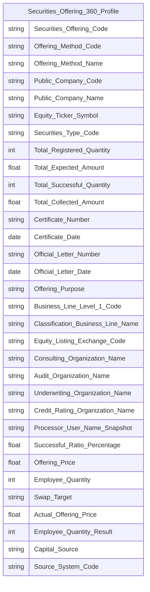

> **Ghi chú Phase 2 — Key labels cho `Operational Securities Offering 360 Profile`:**
> - `Securities_Offering_Code` → `key = BK` — Business key đợt chào bán (`Public Company Securities Offering.pc_securities_offering_code`), ETL debug anchor
> - `Offering_Method_Code` → `key = BK` — Business key component 2 (từ Plan), cùng với `Securities_Offering_Code` tạo thành Composite BK định nghĩa grain (1 row = 1 đợt × 1 loại hình)
> - `Offering_Method_Name` — tên gốc hình thức chào bán, JOIN `Classification Value` (`cl_value.cl_code = Offering_Method_Code AND cl_value.schema_code = 'SO_OFFERING_METHOD'`) lấy `cl_nm`; dùng ở Nhóm 4 (K_QLCB_22) và Nhóm 8 (K_QLCB_53)
> - Mermaid không hỗ trợ label `BK` trong erDiagram — chỉ ghi trong Attributes CSV cột `key`
> - Không có surrogate PK riêng cho 360 Profile — dùng Composite BK thay thế
>
> **Cột dùng ở Nhóm 7/9/10 (mọi cột dùng ở bất kỳ Nhóm nào của `Operational Securities Offering 360 Profile` phải xuất hiện đủ trong erDiagram này):**
> - `Classification_Business_Line_Name` (nguồn `Classification Business Line.cl_business_line_nm`, JOIN qua `Public Company.business_line_level_1_id` — giữ nguyên tên cột như `public_company_dim.classification_business_line_nm`) — dùng ở Nhóm 7 (K_QLCB_65), đệm sẵn tên ngành cho mockup cột "Ngành"
> - `Processor_User_Name_Snapshot` (nguồn bảng cha Offering `processor_user_nm_snpst`) — dùng ở Nhóm 7 (K_QLCB_44)
> - `Total_Registered_Quantity` (nguồn bảng cha Offering `total_registered_quantity`) — dùng ở Nhóm 4 (K_QLCB_27) và Nhóm 9 (K_QLCB_54) — Nhóm 4 sửa lại theo BA (trước đó sai map vào Plan snapshot) khi review cross-check phát hiện gap
> - `Offering_Price` (nguồn Plan `offering_price`), `Employee_Quantity` (nguồn Plan `employee_quantity`), `Swap_Target` (nguồn Plan `swap_target`) — dùng ở Nhóm 9 (K_QLCB_55, 57, 58)
> - `Actual_Offering_Price` (nguồn Result `actual_offering_price`), `Employee_Quantity_Result` (nguồn Result `employee_quantity`), `Capital_Source` (nguồn Result `capital_src`) — dùng ở Nhóm 10 (K_QLCB_61, 63, 64)
> - `Source_System_Code` — mã hệ thống nguồn, hardcode `IDS.SECURITIES_OFFERING` (driving table `Public Company Securities Offering`, bảng cha Offering — không phải Plan), bắt buộc cho mọi bảng Operational

**Lineage Mart → Báo cáo:**

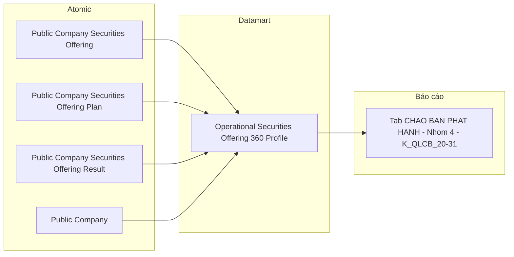

**Bảng grain:**

| Tên bảng | Grain |
|---|---|
| `Operational Securities Offering 360 Profile` | 1 row = 1 đợt chào bán × 1 loại hình (Plan LEFT JOIN Result theo `offering_method_code`). Composite BK: (Securities Offering Code, Offering Method Code) |

---

### Tab: HỒ SƠ ĐĂNG KÝ CHÀO BÁN

**Slicer chung:** Từ ngày — Đến ngày (date range picker)

---

#### Nhóm 5 — Tỷ lệ xử lý hồ sơ (STT 5)

> Phân loại: **Phân tích**
> Atomic: `Administrative Procedure Content Item Index` ← TTHC.CONTENTITEMINDEX — **READY** (Atomic draft) — *`display_text` đã được Atomic bổ sung 2026-08-24, O_QLCB_10 Closed*
> Atomic: `Administrative Procedure Document` ← TTHC.DOCUMENT — **READY** (Atomic draft)
> Ghi chú: ĐỔI NGUỒN 2026-08-24 (task Dũng) — trước đây `Public Company Securities Offering` ← IDS.SECURITIES_OFFERING. Xem Cụm 3.

**Mockup (a) — 4 KPI Card:**

| Tỷ lệ hồ sơ đăng ký | Tỷ lệ đang xử lý | Tỷ lệ đã cấp phép | Tỷ lệ bị từ chối |
|---|---|---|---|
| 19% | 31% | 42% | 11% |

**Mockup (b) — Donut GROUP BY nhóm trạng thái:**

| Nhóm trạng thái | Số lượng | Tỷ lệ % |
|---|---|---|
| Hồ sơ đăng ký | 24 | 16% |
| Hồ sơ đang xử lý | 38 | 26% |
| Hồ sơ đã được chấp thuận | 72 | 49% |
| Hồ sơ bị từ chối | 14 | 9% |
| Chưa xác định | 0 | 0% |

> **Lưu ý:** Cả 2 mockup cùng dùng 4 KPI Tỷ lệ % bên dưới — (a) hiển thị dạng 4 card riêng biệt (chỉ %), (b) hiển thị dạng GROUP BY pivot trên cùng 1 Fact (cả số lượng lẫn %). Tên dashboard gốc BA là "Tỷ lệ xử lý hồ sơ" — xác nhận toàn bộ 4 KPI của Nhóm này là tỷ lệ %, không phải số lượng thuần.
>
> **Lát thứ 5 "Chưa xác định" (chốt 2026-08-24):** SQL BA STT 5 phân loại trạng thái bằng `CASE WHEN ts.DISPLAYTEXT IN (…)` với nhánh `ELSE 'Chưa xác định - kiểm tra lại danh mục'`, và lấy `SUM(COUNT(*)) OVER ()` — tức **mẫu số gồm cả nhóm này**. Thiết kế giữ đúng BA: mẫu số = tổng toàn bộ hồ sơ trong phạm vi, và donut hiển thị **cả 5 lát** để 5 lát cộng đủ 100% đồng thời phơi ra những trạng thái chưa được phân loại (dùng làm tín hiệu bổ sung danh mục). Lát thứ 5 **không có KPI_ID riêng** vì BA STT 5 chỉ định nghĩa 4 chỉ tiêu — nếu nghiệp vụ muốn theo dõi chính thức thì BA phải bổ sung dòng, xem O_QLCB_12.

**Source:** `Fact Securities Offering Application Snapshot`

**Bảng KPI:**

| KPI ID | Tên KPI | Đơn vị | Tính chất | Công thức | Ghi chú | Trạng thái |
|---|---|---|---|---|---|---|
| K_QLCB_32 | Tỷ lệ hồ sơ đăng ký | % | Phái sinh | `COUNT(Application Item Code WHERE Application Status Group Code = 'REGISTERED') / COUNT(Application Item Code) * 100` | **ĐỔI NGUỒN 2026-08-24:** mẫu số theo SQL BA mới = `SUM(COUNT(*)) OVER ()` — tổng **toàn bộ** hồ sơ trong phạm vi, gồm cả nhóm `UNDEFINED` (khác bản IDS cũ liệt kê cứng 4 trạng thái). Tử số đổi từ `approval_status_cd = 'PENDING_REVIEW'` sang nhóm trạng thái TTHC `REGISTERED`. Giữ Tính chất Phái sinh + phép chia tại Detail Mapping (quyết định FIX 2026-08-14 v2 vẫn hiệu lực) | READY (Atomic draft) |
| K_QLCB_33 | Tỷ lệ hồ sơ đang xử lý | % | Phái sinh | `COUNT(Application Item Code WHERE Application Status Group Code = 'IN_PROGRESS') / COUNT(Application Item Code) * 100` | ĐỔI NGUỒN 2026-08-24: cùng lý do K_QLCB_32. Nhóm `IN_PROGRESS` gom **30 giá trị** `display_text` theo SQL BA | READY (Atomic draft) |
| K_QLCB_34 | Tỷ lệ hồ sơ đã chấp thuận | % | Phái sinh | `COUNT(Application Item Code WHERE Application Status Group Code = 'APPROVED') / COUNT(Application Item Code) * 100` | ĐỔI NGUỒN 2026-08-24: cùng lý do K_QLCB_32. Nhóm `APPROVED` gom 4 giá trị | READY (Atomic draft) |
| K_QLCB_35 | Tỷ lệ hồ sơ bị từ chối | % | Phái sinh | `COUNT(Application Item Code WHERE Application Status Group Code = 'REJECTED') / COUNT(Application Item Code) * 100` | ĐỔI NGUỒN 2026-08-24: cùng lý do K_QLCB_32. Nhóm `REJECTED` gom 9 giá trị | READY (Atomic draft) |

> **Ghi chú `Application Item Code`:** Degenerate Dimension trên Fact — BK hồ sơ TTHC, direct map từ `Administrative Procedure Content Item Index.Content Item Code` (`TTHC.CONTENTITEMINDEX.CONTENTITEMID`). **ĐỔI NGUỒN 2026-08-24:** thay thế `Application Code` (IDS `application_cd`) và `Securities Offering Code` của thiết kế cũ. Vì grain Fact mới = 1 row/1 hồ sơ, `COUNT(Application Item Code)` = `COUNT(*)` của SQL BA — không cần DISTINCT. Rule cũ "1 hồ sơ có N Plan đếm N lần" (FIX 2026-08-14) không còn áp dụng.

> **Ghi chú `Application Status Group Code` — danh mục 4+1 nhóm:** Không phải direct map. SQL BA phân loại bằng `CASE WHEN ts.DISPLAYTEXT IN (...)` trên **47 giá trị trạng thái** của workflow TTHC, gom thành 4 nhóm + `ELSE`:
>
> | `Application Status Group Code` | Nhãn BA | Số giá trị `display_text` | Ví dụ giá trị |
> |---|---|---|---|
> | `REGISTERED` | Hồ sơ đăng ký | 4 | `Mới tạo`, `Chờ VP tiếp nhận`, `Hồ sơ hợp lệ`, `Hồ Sơ Chưa Đầy Đủ` |
> | `IN_PROGRESS` | Hồ sơ đang xử lý | 30 | `Chờ NV xử lý`, `Chờ LĐCM Phân Công`, `Yêu cầu bổ sung`, … |
> | `APPROVED` | Hồ sơ đã được chấp thuận | 4 | `Đã phê duyệt - Chuyển trả VP`, `LĐCM Đã Ký Kết Quả Chấp Thuận`, `Đã Cấp Phép`, … |
> | `REJECTED` | Hồ sơ bị từ chối | 9 | `Hủy Hồ Sơ`, `Trả lại`, `Hồ Sơ Bị Từ Chối Giải Quyết`, `Hồ sơ quá hạn bổ sung`, … |
> | `UNDEFINED` | Chưa xác định | nhánh `ELSE` | trạng thái mới phát sinh, chưa được phân loại |
>
> Logic gom nhóm đặt tại **Dimension** (`Administrative Procedure Application Status Dimension`), không đặt ở Detail Mapping — để 47 giá trị gốc chỉ khai báo 1 lần và vẫn drill-down được xuống trạng thái chi tiết. Danh sách 47 giá trị hiện **hard-code trong SQL BA**, chưa có danh mục chuẩn hoá ở nguồn — xem O_QLCB_12.
>
> **Lệch nhãn giữa 2 SQL BA:** nhánh `ELSE` ghi `'Chưa xác định - kiểm tra lại danh mục'` ở SQL STT 5 nhưng `'Chưa xác định'` ở SQL STT 6. Thiết kế thống nhất 1 code `UNDEFINED` với nhãn hiển thị `Chưa xác định` cho cả 2 Nhóm.

> **FIX 2026-08-14 (v2) — Tỷ lệ % tính DERIVED tại Detail Mapping, không tính ở dashboard:** Thay thế quyết định thiết kế cũ ("lưu số lượng, không lưu tỷ lệ — % tính ở lớp dashboard"). Theo nguyên tắc tổ chức: bước Datamart → Chỉ tiêu (Detail Mapping) phải thể hiện đầy đủ logic tính toán; presentation layer chỉ được lấy dữ liệu 1-1, không tự tính toán thêm. Do đó K_QLCB_32-35 là DERIVED tỷ lệ % có `logic` phép chia tường minh ngay tại Detail Mapping, có KPI_ID riêng — dashboard chỉ hiển thị (a) 4 card % hoặc (b) donut pivot, không tự thực hiện phép chia nào. **Quyết định này giữ nguyên sau khi đổi nguồn 2026-08-24.**
>
> **ĐỔI NGUỒN 2026-08-24 — Nhóm 5 và Nhóm 6 vẫn dùng chung 1 Fact, grain mới:** grain = 1 row / 1 hồ sơ TTHC (`Application Item Code`) × 1 ngày snapshot. Nhóm 5 không GROUP BY theo hình thức/năm trên UI (chỉ 4 card % + donut theo nhóm trạng thái); Nhóm 6 GROUP BY `Application Type Dimension` + năm của `Submission Date`, giữ số lượng thuần. Khác thiết kế cũ: không còn thành phần `× 1 loại hình (Plan)` trong grain vì TTHC mỗi hồ sơ chỉ có 1 `LoaiHoSo`.

**Star Schema:**

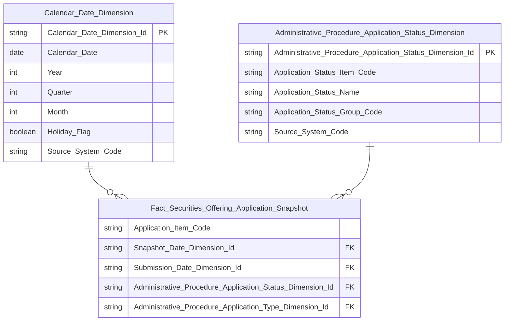

> **Ghi chú Phase 2 — Key labels (cập nhật 2026-08-24 theo nguồn TTHC):**
>
> **`Fact_Securities_Offering_Application_Snapshot`:**
> - `Application_Item_Code` → `key = DD` (Degenerate Dimension) — Business key hồ sơ TTHC (`Administrative Procedure Content Item Index.Content Item Code` ← `TTHC.CONTENTITEMINDEX.CONTENTITEMID`), lưu trực tiếp trên Fact để tra cứu, không tạo Dimension riêng. Fact không có Surrogate PK. Đây là grain đếm đơn nhất của Fact — `COUNT(Application_Item_Code)` = `COUNT(*)` của SQL BA.
> - `Snapshot_Date_Dimension_Id` → `key = FK → Calendar Date Dimension` — ngày ETL snapshot (daily full-scan, giữ nguyên vai trò như thiết kế cũ vì `Application_Status_Group_Code` phản ánh trạng thái hiện hành theo `LATEST = 1`).
> - `Submission_Date_Dimension_Id` → `key = FK → Calendar Date Dimension` — **thay thế** `Certificate_Date_Dimension_Id`. Nguồn `Administrative Procedure Document.Submission Date` (`$.HoSoTTHC.NgayGuiHoSo.Value`, TRUNC về DATE sau khi convert timezone). Đóng vai trò Chiều/slicer cho K_QLCB_37 (năm).
> - `Administrative_Procedure_Application_Status_Dimension_Id` → `key = FK → Administrative Procedure Application Status Dimension`, non-nullable — lookup theo `Administrative Procedure Document.Document Status Code` (`$.HoSoTTHC.TrangThaiHoSo.ContentItemIds[0]`). **Thay thế** cột `Application_Status_Code` (Classification Value direct map) của thiết kế cũ: trạng thái TTHC là 47 giá trị có tên hiển thị + cần gom nhóm, không còn là enum 4 giá trị.
> - `Administrative_Procedure_Application_Type_Dimension_Id` → `key = FK → Administrative Procedure Application Type Dimension`, non-nullable — lookup theo `Administrative Procedure Document.Offering Method Code` (`$.HoSoTTHC.LoaiHoSo.ContentItemIds[0]`). **Thay thế** `Offering_Method_Dimension_Id`; không còn nullable vì mỗi hồ sơ TTHC luôn có đúng 1 `LoaiHoSo` (khác IDS: hồ sơ có thể chưa có Plan).
> - **Đã bỏ:** `Securities_Offering_Code` (mã đợt chào bán, IDS) — TTHC không có khái niệm đợt chào bán ở tầng hồ sơ; `Application_Code`; `Offering_Method_Dimension_Id`; `Certificate_Date_Dimension_Id`; `Application_Status_Code`.
> - **Filter phạm vi (ETL, không thành cột):** chỉ nạp hồ sơ có `Content Type Code = 'HoSoTTHC'` và `Administrative Procedure Document.Processing Authority Code` resolve ra `display_text = 'Ban Quản lý chào bán chứng khoán'`. Cơ quan xử lý **không** tạo Dimension vì trong phạm vi báo cáo QLCB chỉ có 1 giá trị duy nhất. **Không lặp lại `PUBLISHED = 1` của SQL BA** — Atomic đã lọc sẵn khi nạp `ap_content_item_index` (chốt 2026-08-24); `Latest Indicator = 1` giữ lại như filter phòng vệ vì cột vẫn tồn tại trên Atomic để trace/audit dù dedup `LATEST=1` đã thực hiện ở đó.
>
> Nhóm 5 không GROUP BY hiển thị theo hình thức/năm trên UI (chỉ 4 KPI Card + donut theo nhóm trạng thái), nhưng vẫn dùng chung 1 Fact grain với Nhóm 6 — không tạo Fact/grain riêng cho Nhóm 5.

**Lineage Mart → Báo cáo:**

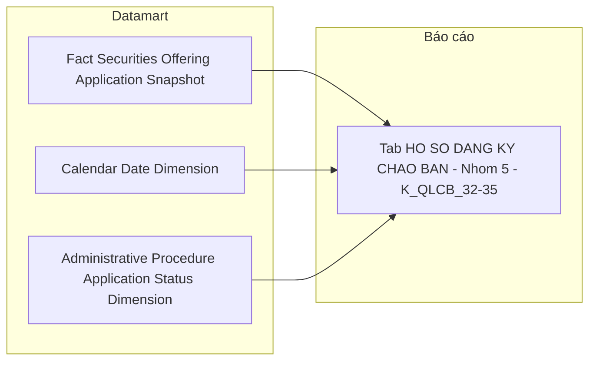

**Bảng grain:**

| Tên bảng | Grain |
|---|---|
| `Fact Securities Offering Application Snapshot` | 1 row = 1 hồ sơ TTHC (`Application Item Code`) × 1 ngày snapshot (ĐỔI NGUỒN 2026-08-24 — trước đó 1 hồ sơ × 1 loại hình Plan × 1 ngày snapshot; ETL full-scan hàng ngày để nhóm trạng thái luôn phản ánh trạng thái xử lý hiện hành; `Submission Date` giữ vai trò Chiều/slicer) |
| `Administrative Procedure Application Status Dimension` | 1 row = 1 trạng thái hồ sơ TTHC (content item `TrangThaiHoSo`) |
| `Calendar Date Dimension` | 1 row = 1 ngày (`Submission Date` — ngày gửi hồ sơ) |

---

#### Nhóm 6 — Bảng Chi tiết hồ sơ chào bán & phát hành

> Phân loại: **Phân tích**
> Atomic: `Administrative Procedure Content Item Index` ← TTHC.CONTENTITEMINDEX — **READY** (Atomic draft) — *`display_text` đã được Atomic bổ sung 2026-08-24, O_QLCB_10 Closed*
> Atomic: `Administrative Procedure Document` ← TTHC.DOCUMENT — **READY** (Atomic draft)
> Ghi chú: ĐỔI NGUỒN 2026-08-24 (task Dũng) — trước đây `Public Company Securities Offering` + `Public Company Securities Offering Plan` ← IDS. Cùng Fact với Nhóm 5 — bổ sung `Administrative Procedure Application Type Dimension` (**mới**, KHÔNG reuse `Offering Method Dimension`) × năm của `Submission Date`. Xem Cụm 3.

**Mockup:**

| Hình thức chào bán | Năm | Hồ sơ đăng ký | Đang xử lý | Đã cấp phép | Bị từ chối | Tổng |
|---|---|---|---|---|---|---|
| Chào bán cổ phiếu lần đầu ra công chúng (IPO) | 2025 | 2 | 5 | 18 | 3 | 28 |
| Chào bán trái phiếu ra công chúng | 2025 | 1 | 3 | 12 | 1 | 17 |
| Phát hành cổ phiếu theo chương trình ESOP | 2024 | 0 | 2 | 24 | 4 | 30 |

> **Ghi chú mockup:** Nhãn hình thức chào bán nay lấy nguyên `display_text` của content item `LoaiHoSo` trên TTHC (tương ứng bộ Eform: `ChaobanCophieuIPO`, `ChaobanTraiphieu`, `PhathanhCophieuESOP`, `ChaobanCophieuRiengle`, `ChaobanCCQ`, `ChaobanChungquyen`, … — xem `Source/TTHC_JSON_Schemas.csv`), **không** còn là nhãn của scheme `IDS_SO_OFFERING_METHOD`. Danh mục hình thức của Nhóm 6 vì vậy khác Nhóm 2/3 — xem O_QLCB_13.

**Source:** `Fact Securities Offering Application Snapshot` → `Administrative Procedure Application Type Dimension`, `Administrative Procedure Application Status Dimension`, `Calendar Date Dimension`

**Bảng KPI:**

| KPI ID | Tên KPI | Đơn vị | Tính chất | Công thức | Ghi chú | Trạng thái |
|---|---|---|---|---|---|---|
| K_QLCB_36 | Hình thức chào bán | — | Chiều | `GROUP BY Administrative Procedure Application Type Dimension.Application Type Name` | **ĐỔI NGUỒN 2026-08-24:** Dimension **mới** từ `display_text` của content item `LoaiHoSo` (nguồn thô `TTHC.CONTENTITEMINDEX.DISPLAYTEXT`), KHÔNG reuse `Offering Method Dimension` (dimension đó đang phục vụ K_QLCB_6–19 từ IDS — repoint sẽ phá 14 KPI). Danh mục khác Nhóm 2/3, xem O_QLCB_13 | READY (Atomic draft) |
| K_QLCB_37 | Năm | — | Chiều | `GROUP BY Year` của `Submission Date Dimension` (reuse `Calendar Date Dimension`, không cần Degenerate Dimension riêng) | **ĐỔI NGUỒN 2026-08-24:** đổi từ `Certificate Date` (IDS, ngày cấp giấy chứng nhận) sang `Submission Date` (TTHC, ngày gửi hồ sơ). Fact lưu grain **ngày**, KPI GROUP BY **năm** — chốt 2026-08-24: SQL BA STT 6 `GROUP BY ngay_gui_ho_so` ở dạng TIMESTAMP có giờ nên mỗi hồ sơ thành 1 dòng riêng, không gom nhóm được, trong khi cột `Thông tin` của BA ghi là "Năm". Xem O_QLCB_11 | READY (Atomic draft) |
| K_QLCB_38 | Số lượng hồ sơ đăng ký | Hồ sơ | Cơ sở | `COUNT(Application Item Code) WHERE Application Status Group Code = 'REGISTERED'` | ĐỔI NGUỒN 2026-08-24: đếm theo nhóm trạng thái TTHC thay cho `approval_status_cd`. Grain 1 row/hồ sơ nên `COUNT` không cần DISTINCT (rule "N Plan đếm N lần" của FIX 2026-08-14 không còn áp dụng). Số lượng thuần — KHÔNG phải % (khác K_QLCB_32) | READY (Atomic draft) |
| K_QLCB_39 | Số lượng hồ sơ đang xử lý | Hồ sơ | Cơ sở | `COUNT(Application Item Code) WHERE Application Status Group Code = 'IN_PROGRESS'` | ĐỔI NGUỒN 2026-08-24: cùng lý do K_QLCB_38 | READY (Atomic draft) |
| K_QLCB_40 | Số lượng hồ sơ đã cấp phép | Hồ sơ | Cơ sở | `COUNT(Application Item Code) WHERE Application Status Group Code = 'APPROVED'` | ĐỔI NGUỒN 2026-08-24: cùng lý do K_QLCB_38 | READY (Atomic draft) |
| K_QLCB_41 | Số lượng hồ sơ bị từ chối | Hồ sơ | Cơ sở | `COUNT(Application Item Code) WHERE Application Status Group Code = 'REJECTED'` | ĐỔI NGUỒN 2026-08-24: cùng lý do K_QLCB_38 | READY (Atomic draft) |
| K_QLCB_42 | Tổng hồ sơ | Hồ sơ | Derived | `COUNT(Application Item Code)` — tổng toàn bộ hồ sơ trong ô (hình thức × năm), **không** phải tổng 4 KPI con | **ĐỔI CÔNG THỨC 2026-08-24:** SQL BA STT 6 dùng `COUNT(*) AS tong_ho_so` chứ không phải tổng 4 cột `COUNT(CASE WHEN …)`. Hai cách chỉ bằng nhau khi không có hồ sơ nào rơi vào nhóm `UNDEFINED`; công thức cũ (`K_QLCB_38+39+40+41`) sẽ **thiếu** hồ sơ chưa phân loại được trạng thái. Đổi sang đếm trực tiếp để khớp BA và để tổng cột trùng mẫu số của Nhóm 5 | READY (Atomic draft) |

> **Ghi chú `Administrative Procedure Application Type Dimension` (mới):** Grain 1 row = 1 content item `LoaiHoSo` trên TTHC. Cột: `Application Type Item Code` (BK = `CONTENTITEMID`), `Application Type Name` (= `display_text`), `Source System Code`. `Fact Securities Offering Application Snapshot` mang FK `Administrative_Procedure_Application_Type_Dimension_Id`, lookup từ `Administrative Procedure Document.Offering Method Code`. Vì mỗi hồ sơ TTHC chỉ có đúng 1 `LoaiHoSo`, FK này **non-nullable** và **không** làm phồng grain — khác hoàn toàn `Offering_Method_Dimension_Id` cũ (LEFT JOIN Plan, nullable, sinh N dòng/hồ sơ). Nhóm 5 và Nhóm 6 vẫn dùng chung 1 Fact.

**Star Schema:** Kế thừa Fact từ Nhóm 5, bổ sung FK `Administrative_Procedure_Application_Type_Dimension_Id`:

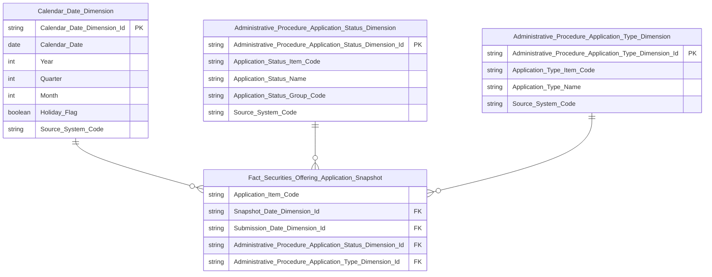

> **Ghi chú grain (ĐỔI NGUỒN 2026-08-24):** Nhóm 5 và Nhóm 6 dùng chung 1 Fact grain: **1 row = 1 hồ sơ TTHC × 1 ngày snapshot**. ETL populate `Administrative_Procedure_Application_Type_Dimension_Id` bằng lookup 1:1 từ `Administrative Procedure Document.Offering Method Code` — **không** LEFT JOIN bảng con, **không** làm phồng số dòng. Đây là khác biệt lớn nhất so với thiết kế IDS cũ: trước đây `Offering_Method_Dimension_Id` là driving JOIN thứ 2 (LEFT JOIN Plan không GROUP BY) khiến 1 hồ sơ có N loại hình sinh N dòng Fact và làm sai lệch mọi `COUNT`; nay mỗi hồ sơ đúng 1 dòng. Nhóm 5 chỉ khác Nhóm 6 ở việc không GROUP BY hiển thị theo hình thức/năm trên UI.

**Lineage Mart → Báo cáo:**

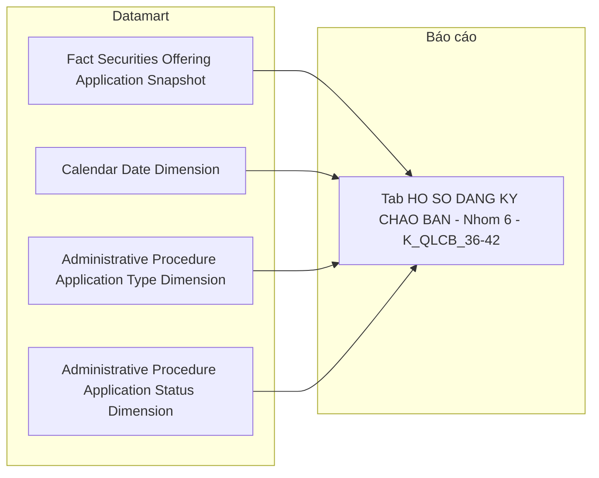

**Bảng grain:**

| Tên bảng | Grain |
|---|---|
| `Fact Securities Offering Application Snapshot` | 1 row = 1 hồ sơ TTHC × 1 ngày snapshot (ĐỔI NGUỒN 2026-08-24 — cùng grain với Nhóm 5; bỏ thành phần `× 1 loại hình (Plan)` vì mỗi hồ sơ TTHC chỉ có 1 `LoaiHoSo`, FK hình thức non-nullable) |
| `Administrative Procedure Application Type Dimension` | 1 row = 1 hình thức chào bán TTHC (content item `LoaiHoSo`) — **mới**, không reuse `Offering Method Dimension` |
| `Administrative Procedure Application Status Dimension` | 1 row = 1 trạng thái hồ sơ TTHC (content item `TrangThaiHoSo`) |
| `Calendar Date Dimension` | 1 row = 1 ngày (`Submission Date` — ngày gửi hồ sơ) |

---

### Tab: CHÀO BÁN VÀ PHÁT HÀNH (Data Explorer)

**Slicer chung:** Sàn (dropdown), Ngành nghề (dropdown), Khoảng thời gian (Từ ngày — Đến ngày)

> **Ghi chú thiết kế:** Data Explorer là màn hình tra cứu chi tiết từng đợt chào bán, cho phép người dùng chọn tổ hợp chỉ số (checkbox) từ 4 nhóm rồi hiển thị bảng kết quả. Đây là use case Tác nghiệp — lookup n đợt chào bán theo điều kiện lọc. Tab này **reuse** `Operational Securities Offering 360 Profile` đã thiết kế ở Nhóm 4 Tab CHÀO BÁN PHÁT HÀNH, mở rộng thêm các attribute chi tiết theo từng hình thức phát hành. Không cần thêm Fact hay Dim mới.

---

#### Nhóm 7 — Thông tin cơ sở (STT 40–45)

> Phân loại: **Tác nghiệp**
> Atomic: `Public Company Securities Offering` ← IDS.SECURITIES_OFFERING — **READY** (Atomic draft — chưa approved chính thức)
> Atomic: `Public Company` ← IDS.COMPANY_PROFILES — **READY**

**Mockup:**

| Mã CK | Tên công ty | Sàn | Ngành | Thời điểm báo cáo | Chuyên viên | Loại CK |
|---|---|---|---|---|---|---|
| VIC | VinGroup | HOSE | Bất động sản | 24/03/2026 | Nguyễn Văn A | Cổ phiếu |
| VCB | Vietcombank | UPCOM | Ngân hàng | 24/03/2026 | Trần Thị B | Cổ phiếu |

**Source:** `Operational Securities Offering 360 Profile`

**Bảng KPI:**

| KPI ID | Tên KPI | Đơn vị | Tính chất | Công thức | Ghi chú | Trạng thái |
|---|---|---|---|---|---|---|
| K_QLCB_43 | Thời điểm báo cáo | Ngày | Attribute | `Public Company Securities Offering.certificate_dt` — IDS.SECURITIES_OFFERING.CERTIFICATE_DATE | BA cập nhật 2026-08-11: đổi từ Official Letter Date sang Certificate Date — ngày cấp GCN, dùng làm thời điểm báo cáo (FK date chính) | READY |
| K_QLCB_44 | Chuyên viên | Text | Attribute | `Public Company Securities Offering.processor_user_nm_snpst` — IDS.SECURITIES_OFFERING.PROCESSOR_USER_NAME | Tên người xử lý hồ sơ dạng snapshot | READY |
| K_QLCB_45 | Tên công ty | Text | Attribute | `Public Company.public_company_nm` | — | READY |
| K_QLCB_46 | Mã chứng khoán | Text | Attribute | `Public Company.equity_ticker_symbol` — IDS.COMPANY_PROFILES | — | READY |
| K_QLCB_47 | Sàn | Text | Attribute | `Public Company.equity_listing_exchange_code` | Scheme: IDS_EQUITY_LISTING_EXCH | READY |
| K_QLCB_48 | Loại chứng khoán | Text | Attribute | `Public Company.securities_tp_code` — IDS.COMPANY_PROFILES.SECURITIES_TYPE_CD | Scheme: IDS_ISSUANCE_SECURITY_TYPE | READY |
| K_QLCB_65 | Ngành | Text | Attribute | `Classification Business Line.cl_business_line_nm` — JOIN qua `Public Company.business_line_level_1_id` | Tên ngành (đệm sẵn trên `opr_securities_offering_360_profile`, cột `classification_business_line_nm` — giữ nguyên tên như `public_company_dim`) — khớp cột "Ngành" ở mockup | READY |

**Schema bảng tác nghiệp:** Kế thừa `Operational Securities Offering 360 Profile` — bổ sung cột `Processor_User_Name_Snapshot`, `Securities_Type_Code`, `Classification_Business_Line_Name` (xem erDiagram Nhóm 4).

**Lineage Mart → Báo cáo:**


**Bảng grain:**

| Tên bảng | Grain |
|---|---|
| `Operational Securities Offering 360 Profile` | 1 row = 1 đợt chào bán × 1 loại hình (kế thừa Nhóm 4) |

---

#### Nhóm 8 — Thông tin công văn cấp phép (STT 46–50)

> Phân loại: **Tác nghiệp**
> Atomic: `Public Company Securities Offering` ← IDS.SECURITIES_OFFERING — **READY** (Atomic draft — chưa approved chính thức)

**Mockup:**

| Số GCN | Ngày cấp GCN | Số công văn gửi CT | Ngày công văn | Hình thức phát hành |
|---|---|---|---|---|
| 12/GCN-UBCK | 15/01/2026 | 14/CV-UBCK | 14/01/2026 | Công chúng |
| 08/GCN-UBCK | 10/02/2026 | 07/CV-UBCK | 09/02/2026 | Riêng lẻ |

**Source:** `Operational Securities Offering 360 Profile`

**Bảng KPI:**

| KPI ID | Tên KPI | Đơn vị | Tính chất | Công thức | Ghi chú | Trạng thái |
|---|---|---|---|---|---|---|
| K_QLCB_49 | Số giấy chứng nhận | Text | Attribute | `Public Company Securities Offering.certificate_nbr` — IDS.SECURITIES_OFFERING.CERTIFICATE_NO | — | READY |
| K_QLCB_50 | Ngày cấp giấy chứng nhận | Ngày | Attribute | `Public Company Securities Offering.certificate_dt` — IDS.SECURITIES_OFFERING.CERTIFICATE_DATE | — | READY |
| K_QLCB_51 | Số công văn gửi công ty | Text | Attribute | `Public Company Securities Offering.official_letter_nbr` — IDS.SECURITIES_OFFERING.OFFICIAL_LETTER_NO | — | READY |
| K_QLCB_52 | Ngày công văn | Ngày | Attribute | `Public Company Securities Offering.official_letter_dt` — IDS.SECURITIES_OFFERING.OFFICIAL_LETTER_DATE | — | READY |
| K_QLCB_53 | Hình thức phát hành | Text | Attribute | `Operational Securities Offering 360 Profile.Offering_Method_Name` — tên gốc, JOIN `Classification Value` theo `Offering_Method_Code` (composite BK component 2, từ `Public Company Securities Offering Plan.offering_method_code`) | — | READY |

**Schema bảng tác nghiệp:** Kế thừa `Operational Securities Offering 360 Profile`.

**Lineage Mart → Báo cáo:**

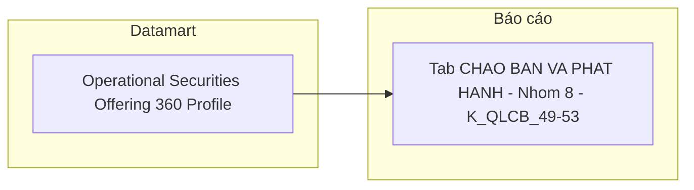

**Bảng grain:**

| Tên bảng | Grain |
|---|---|
| `Operational Securities Offering 360 Profile` | 1 row = 1 đợt chào bán × 1 loại hình (kế thừa Nhóm 4) |

---

#### Nhóm 9 — Thông tin cấp phép chào bán (STT 51–56)

> Phân loại: **Tác nghiệp**
> Atomic: `Public Company Securities Offering Plan` ← IDS.SECURITIES_OFFERING_PLAN — **READY** (Atomic draft — chưa approved chính thức)
> Atomic: `Public Company Securities Offering` ← IDS.SECURITIES_OFFERING — **READY** (Atomic draft, dùng cho `total_registered_quantity`, `offering_purpose`)
> Ghi chú (FIX 2026-08-14 — sửa lại mô tả sai): `offering_price` (giá trung bình các phương án) và `employee_quantity` (tổng số lượng NLĐ) là measure **gộp theo hồ sơ** — `AVG(offering_price)`/`SUM(employee_quantity)` qua `GROUP BY securities_offering_id` trên toàn bộ `Public Company Securities Offering Plan` của đợt chào bán, KHÔNG phân biệt loại hình — khớp đúng CTE `plan_agg` trong SQL BA. Xác nhận với user 2026-08-14: đây là thiết kế có chủ ý của BA (1 đợt chào bán có giá trung bình + tổng NLĐ + 1 hình thức đại diện), không phải lỗi độ chi tiết. Ghi chú cũ ("mỗi row là 1 loại hình cụ thể, lấy trực tiếp từ Plan tương ứng") đã sai — thay thế bằng ghi chú này.

**Mockup:**

| Số lượng cấp phép | Giá (cấp phép) | Giá trị cấp phép | SL người LĐ | Đối tượng | Mục đích sử dụng vốn |
|---|---|---|---|---|---|
| 10,000,000 | 15,000 đ | 150 tỷ | 500 | CBNV công ty | Bổ sung vốn lưu động |

**Source:** `Operational Securities Offering 360 Profile`

**Bảng KPI:**

| KPI ID | Tên KPI | Đơn vị | Tính chất | Công thức | Ghi chú | Trạng thái |
|---|---|---|---|---|---|---|
| K_QLCB_54 | Số lượng cấp phép | CK | Attribute | `Public Company Securities Offering.total_registered_quantity` — bảng cha, IDS.SECURITIES_OFFERING.TOTAL_REGISTERED_QTY | — | READY |
| K_QLCB_55 | Giá (cấp phép) | VNĐ | Attribute | `Public Company Securities Offering Plan.offering_price` — IDS.SECURITIES_OFFERING_PLAN.OFFERING_PRICE (giá trực tiếp trên Plan, không cần Derived) | — | READY |
| K_QLCB_56 | Giá trị cấp phép | Tỷ VNĐ | Attribute | `Public Company Securities Offering.total_expected_amt` — bảng cha, IDS.SECURITIES_OFFERING.TOTAL_EXPECTED_AM (BA ghi rõ nguồn bảng cha, không phải Plan snapshot) | — | READY |
| K_QLCB_57 | Số lượng người lao động | Người | Attribute | `Public Company Securities Offering Plan.employee_quantity` — IDS.SECURITIES_OFFERING_PLAN.EMPLOYEE_QTY; chỉ có giá trị với 1 số thủ tục (ESOP/Bonus Share), NULL với loại hình khác | — | READY |
| K_QLCB_58 | Đối tượng | Text | Attribute | `CASE WHEN Offering_Method_Code_Representative = '5' THEN Public Company.Public_Company_Name ELSE NULL END` — `Offering_Method_Code_Representative` = `MIN(Offering Method Code)` gộp theo hồ sơ (cùng cách gộp với Giá cấp phép/Số lượng NLĐ ở trên), chỉ có giá trị khi phát hành riêng lẻ, IDS.COMPANY_PROFILES.COMPANY_NAME_VN | BA cập nhật 2026-08-10: đổi từ SWAP_TARGET sang tên công ty khi offering_method_cd = 5. **FIX 2026-08-14:** điều kiện lọc sửa từ `Offering_Method_Code` per-dòng (BK component 2, per-loại-hình thật) sang `Offering_Method_Code_Representative` (MIN đại diện, gộp theo hồ sơ) — khớp đúng SQL BA dùng `p.offering_method_cd = MIN(offering_method_cd) GROUP BY securities_offering_id`, nhất quán với cách gộp của Offering Price/Employee Quantity cùng Nhóm | READY |
| K_QLCB_59 | Mục đích sử dụng vốn | Text | Attribute | `Public Company Securities Offering.offering_purpose` — bảng cha, IDS.SECURITIES_OFFERING.OFFERING_PURPOSE | — | READY |

**Schema bảng tác nghiệp:** Kế thừa `Operational Securities Offering 360 Profile` — bổ sung 3 cột `Offering_Price`, `Employee_Quantity`, `Swap_Target` (xem erDiagram Nhóm 4). **FIX 2026-08-14:** bổ sung thêm cột `Offering_Method_Code_Representative` (giá trị đại diện `MIN(Offering Method Code)` gộp theo hồ sơ, dùng riêng cho điều kiện lọc K_QLCB_58 — khác `Offering_Method_Code` hiện có vốn là BK per-loại-hình thật, dùng cho Nhóm 4/7/8).

**Lineage Mart → Báo cáo:**


**Bảng grain:**

| Tên bảng | Grain |
|---|---|
| `Operational Securities Offering 360 Profile` | 1 row = 1 đợt chào bán × 1 loại hình (kế thừa Nhóm 4) |

---

#### Nhóm 10 — Thông tin kết quả chào bán (STT 57–61)

> Phân loại: **Tác nghiệp**
> Atomic: `Public Company Securities Offering Result` ← IDS.SECURITIES_OFFERING_RESULT — **READY** (Atomic draft — chưa approved chính thức)

**Mockup:**

| Số lượng thực tế | Giá thực tế | Giá trị thực tế | SL người LĐ (TT) | Đối tượng (TT) |
|---|---|---|---|---|
| 9,800,000 | 15,000 đ | 147 tỷ | 490 | CBNV công ty |

**Source:** `Operational Securities Offering 360 Profile`

**Bảng KPI:**

| KPI ID | Tên KPI | Đơn vị | Tính chất | Công thức | Ghi chú | Trạng thái |
|---|---|---|---|---|---|---|
| K_QLCB_60 | Số lượng thực tế | CK | Attribute | `Public Company Securities Offering Result.total_successful_quantity` — IDS.SECURITIES_OFFERING_RESULT.TOTAL_SUCCESSFUL_QTY | — | READY |
| K_QLCB_61 | Giá thực tế | VNĐ | Attribute | `Public Company Securities Offering Result.actual_offering_price` — IDS.SECURITIES_OFFERING_RESULT.ACTUAL_OFFERING_PRICE (giá trực tiếp trên Result, không cần Derived) | — | READY |
| K_QLCB_62 | Giá trị thực tế | Tỷ VNĐ | Attribute | `Public Company Securities Offering Result.total_collected_amt` — IDS.SECURITIES_OFFERING_RESULT.TOTAL_COLLECTED_AM | — | READY |
| K_QLCB_63 | Số lượng người lao động (TT) | Người | Attribute | `Public Company Securities Offering Result.employee_quantity` — IDS.SECURITIES_OFFERING_RESULT.EMPLOYEE_QTY | — | READY |
| K_QLCB_64 | Đối tượng (thực tế) | Text | Attribute | `CASE WHEN Public Company Securities Offering Result.offering_method_code_snpst = '5' THEN Public Company.Public_Company_Name ELSE NULL END` — điều kiện lấy theo field snapshot trên Result (khác Plan), IDS.SECURITIES_OFFERING_RESULT.OFFERING_METHOD_CD = 5, tên công ty IDS.COMPANY_PROFILES.COMPANY_NM_VN | BA cập nhật 2026-08-10: đổi từ CAPITAL_SOURCE sang tên công ty khi offering_method_cd = 5 (điều kiện theo Result, không dùng lại Offering_Method_Code composite BK của Plan vì 2 field có thể lệch); các hình thức khác NULL | READY |

**Schema bảng tác nghiệp:** Kế thừa `Operational Securities Offering 360 Profile` — bổ sung 3 cột `Actual_Offering_Price`, `Employee_Quantity_Result`, `Capital_Source`.

**Lineage Mart → Báo cáo:**

```mermaid
flowchart LR
    subgraph Datamart["Datamart"]
        G1["Operational Securities Offering 360 Profile"]
    end
    subgraph RPT["Báo cáo"]
        R10["Tab CHAO BAN VA PHAT HANH - Nhom 10 - K_QLCB_60-64"]
    end
    G1 --> R10
```

**Bảng grain:**

| Tên bảng | Grain |
|---|---|
| `Operational Securities Offering 360 Profile` | 1 row = 1 đợt chào bán × 1 loại hình (kế thừa Nhóm 4) |

---

## Section 3 — Mô hình tổng thể

> **Cập nhật 2026-08-24:** bổ sung cột `Trạng thái` vào 3 bảng dưới đây theo chuẩn `section_structure.md` (chốt 2026-08-21) — trước đây Section này chỉ liệt kê bảng READY nên không có chỗ thể hiện bảng PENDING. Giữ lại cột này sau khi O_QLCB_10 đã Closed (Atomic bổ sung `display_text` cùng ngày, toàn bộ bảng của Nhóm 5/6 chuyển sang READY) — cột `Trạng thái` là phần bắt buộc của chuẩn, không phải giải pháp tạm cho 1 đợt PENDING.

```mermaid
graph TB
    classDef dim fill:#E6F1FB,stroke:#185FA5,color:#0C447C
    classDef fact fill:#FAECE7,stroke:#993C1D,color:#4A1B0C
    classDef oper fill:#E8F5E9,stroke:#2E7D32,color:#1B5E20

    DIM_DATE["Calendar Date Dimension"]:::dim
    DIM_COMPANY["Public Company Dimension"]:::dim
    DIM_OFFRMETHOD["Offering Method Dimension"]:::dim
    DIM_APSTATUS["Administrative Procedure Application Status Dimension"]:::dim
    DIM_APTYPE["Administrative Procedure Application Type Dimension"]:::dim

    FACT_OFF["Fact Securities Offering Snapshot"]:::fact
    FACT_PLAN["Fact Securities Offering Plan Snapshot"]:::fact
    FACT_RESULT["Fact Securities Offering Result Snapshot"]:::fact
    FACT_APP["Fact Securities Offering Application Snapshot"]:::fact

    OPR_OFF["Operational Securities Offering 360 Profile"]:::oper

    DIM_DATE --> FACT_OFF
    DIM_COMPANY --> FACT_OFF

    DIM_DATE --> FACT_PLAN
    DIM_COMPANY --> FACT_PLAN
    DIM_OFFRMETHOD --> FACT_PLAN

    DIM_DATE --> FACT_RESULT
    DIM_COMPANY --> FACT_RESULT
    DIM_OFFRMETHOD --> FACT_RESULT

    DIM_DATE --> FACT_APP
    DIM_APSTATUS --> FACT_APP
    DIM_APTYPE --> FACT_APP
```

### Bảng Phân tích (Star Schema)

| Tên bảng Datamart | Mô tả | Fact Pattern | Grain | Nguồn Atomic chính | Trạng thái |
|---|---|---|---|---|---|
| Fact Securities Offering Snapshot | Hồ sơ chào bán/phát hành CK — tổng giá trị cấp phép/huy động theo ngành, kỳ (Nhóm 1) | Fact Event | 1 hồ sơ chào bán | Public Company Securities Offering / Public Company Securities Offering Result | READY (Atomic draft) |
| Fact Securities Offering Plan Snapshot | Giá trị cấp phép theo loại hình chào bán (Nhóm 2) | Fact Event | 1 đợt × 1 loại hình kế hoạch | Public Company Securities Offering Plan | READY (Atomic draft) |
| Fact Securities Offering Result Snapshot | Giá trị huy động theo loại hình chào bán (Nhóm 3) | Fact Event | 1 đợt × 1 loại hình kết quả | Public Company Securities Offering Result | READY (Atomic draft) |
| Fact Securities Offering Application Snapshot | Hồ sơ đăng ký chào bán nộp lên TTHC — đếm và phân tích theo nhóm trạng thái xử lý, hình thức, năm (Nhóm 5-6). **Repoint IDS → TTHC 2026-08-24** | Periodic Snapshot | 1 hồ sơ TTHC × 1 ngày snapshot | Administrative Procedure Content Item Index / Administrative Procedure Document | READY (Atomic draft) |

### Bảng Tác nghiệp (Denormalized)

| Tên bảng Datamart | Mô tả | Grain | Nguồn Atomic chính | Trạng thái |
|---|---|---|---|---|
| Operational Securities Offering 360 Profile | Hồ sơ 360° tra cứu chi tiết từng đợt chào bán — pivot theo loại hình, gồm thông tin tổ chức liên quan (Nhóm 4, 7-10) | 1 đợt chào bán × 1 loại hình | Public Company Securities Offering / Public Company Securities Offering Plan / Public Company Securities Offering Result / Public Company | READY (Atomic draft) |

### Bảng Dimension

*Tất cả Dimension áp dụng SCD Type 4A (trừ `Public Company Dimension` — reuse `public_company_dim`, giữ quy ước SCD gốc của module GSDC).*

| Tên bảng Datamart | Mô tả | Grain | Nguồn Atomic chính | Conformed | Trạng thái |
|---|---|---|---|---|---|
| Calendar Date Dimension | Lịch ngày — ETL tự sinh | 1 ngày | Generated | Có | READY |
| Public Company Dimension | Công ty đại chúng — mã CK, tên, ngành, sàn (reuse `public_company_dim`, module GSDC) | 1 công ty đại chúng | Public Company | Có | READY (Atomic draft) |
| Offering Method Dimension | Hình thức chào bán/phát hành — ETL-derived (DISTINCT) từ cột `offering_method_code`, scheme mô tả `IDS_SO_OFFERING_METHOD`. Phục vụ Nhóm 2/3 (K_QLCB_6–19); **không** còn dùng ở Nhóm 6 sau khi đổi nguồn 2026-08-24 | 1 mã hình thức | Public Company Securities Offering Plan | Không | READY (Atomic draft) |
| Administrative Procedure Application Status Dimension | Trạng thái hồ sơ TTHC + nhóm trạng thái gom 4+1 (`REGISTERED`/`IN_PROGRESS`/`APPROVED`/`REJECTED`/`UNDEFINED`) từ 47 giá trị `display_text`. **Mới 2026-08-24** | 1 trạng thái hồ sơ (content item `TrangThaiHoSo`) | Administrative Procedure Content Item Index | Không | READY (Atomic draft) |
| Administrative Procedure Application Type Dimension | Hình thức chào bán theo TTHC — `display_text` của content item `LoaiHoSo` (bộ Eform chào bán/phát hành). **Mới 2026-08-24** | 1 hình thức chào bán | Administrative Procedure Content Item Index | Không | READY (Atomic draft) |

---

## Section 4 — Reuse Analysis

| Datamart Entity | datamart_table | reuse_status | Ghi chú |
|---|---|---|---|
| Calendar Date Dimension | cdr_dt_dim | reuse | Conformed Dim toàn hệ thống (Lớp 1 — Whitelist) |
| Public Company Dimension | public_company_dim | reuse | Module GSDC đã có, cùng nguồn Atomic `Public Company`, đủ cột mã CK/tên/sàn/`Business Line Level 1 Code` cho GROUP BY ngành (Lớp 3 — Source Match). Bổ sung `QLCB` vào `modules_using` |
| Offering Method Dimension | offering_method_dim | new | Chưa có entity nào trong registry cùng nguồn `Public Company Securities Offering Plan`/`Result` — `offering_form_dim` (module QLKD) tuy cùng `table_type: dim` nhưng khác nguồn Atomic hoàn toàn (SCMS `sc_disclosure_securities_offering` khác IDS `pc_securities_offering_plan`) nên không reuse được. **2026-08-24:** giữ nguyên phạm vi phục vụ Nhóm 2/3 (K_QLCB_6–19), KHÔNG repoint sang TTHC cho Nhóm 6 |
| Administrative Procedure Application Status Dimension | ap_application_status_dim (đề xuất) | new | **Thêm 2026-08-24.** Lớp 2 — nguồn Atomic là `ap_content_item_index` (`ldm.physical_name ≠ cv`) nên KHÔNG reuse `cl_dim`; Lớp 3 — registry chưa có entity nào cùng nguồn `ap_content_item_index` |
| Administrative Procedure Application Type Dimension | ap_application_tp_dim (đề xuất) | new | **Thêm 2026-08-24.** Cùng lý do Lớp 2/Lớp 3 như trên. KHÔNG reuse `offering_method_dim` vì dimension đó khác nguồn Atomic hoàn toàn (IDS `pc_securities_offering_plan`) và đang phục vụ 14 KPI của Nhóm 2/3 — repoint sẽ phá các Nhóm đó |
| Fact Securities Offering Snapshot | fct_securities_offering_snpst (đề xuất) | new | Chưa có Fact nào cùng nguồn `pc_securities_offering` trong registry |
| Fact Securities Offering Plan Snapshot | fct_securities_offering_plan_snpst (đề xuất) | new | Chưa có Fact nào cùng grain/nguồn `pc_securities_offering_plan` |
| Fact Securities Offering Result Snapshot | fct_securities_offering_result_snpst (đề xuất) | new | Chưa có Fact nào cùng grain/nguồn `pc_securities_offering_result` |
| Fact Securities Offering Application Snapshot | fct_securities_offering_application_snpst | partial | **Đổi 2026-08-24 (`new` → `partial`).** Repoint nguồn IDS → TTHC theo quyết định người thiết kế 2026-08-24: giữ nguyên tên bảng và toàn bộ KPI_ID K_QLCB_32–42, thay `source_atomic` (`pc_securities_offering`/`pc_securities_offering_plan` → `ap_content_item_index`/`ap_document`), thay 5 cột (bỏ `securities_offering_code`, `application_cd`, `certificate_dt_dim_id`, `application_status_code`, `offering_method_dim_id`; thêm `application_item_code`, `submission_dt_dim_id`, `ap_application_status_dim_id`, `ap_application_tp_dim_id`) và đổi grain. Fact này chỉ phục vụ K_QLCB_32–42 nên không ảnh hưởng Nhóm nào khác |
| Operational Securities Offering 360 Profile | opr_securities_offering_360_profile (đề xuất) | new | Bảng tác nghiệp, chưa có tương đương trong registry |

---

## Section 5 — Vấn đề mở

| ID | Vấn đề | Giả định hiện tại | KPI liên quan | Trạng thái |
|---|---|---|---|---|
| O_QLCB_9 | **[Phạm vi Atomic — không phải Datamart] 2 track Atomic trùng logical_name "Public Company Securities Offering":** Track cũ `DataModel/working/Atomic_LinhLV/Business_Activity/dm_atm_pblc_co_scr_ofrg-IDS.company_securities_issuance.yaml` (physical_name `pblc_co_scr_ofrg`, nguồn ghi `IDS.company_securities_issuance`) **không có BRD source thật** trong `BRD/Source/IDS/` — có khả năng là track nháp/lỗi thời. Track mới `DataModel/working/Atomic/lld/IDS/lld_IDS_SECURITIES_OFFERING.yaml` (physical_name `pc_securities_offering`, nguồn `IDS.SECURITIES_OFFERING`) có BRD source đầy đủ nhưng attribute-level `status: draft`, chưa aggregate vào `DataModel/Atomic/` + `dm_manifest.yaml`. Đây là vấn đề quy trình thiết kế/quản lý Atomic (track nào là chuẩn, đã aggregate hay chưa) — không phải lỗi trace nguồn hay thiết kế của Datamart HLD; Datamart đã xác định đúng entity có BRD source thật để dùng. | Datamart HLD dùng track mới theo xác nhận người thiết kế (coi LLD draft là READY) — quyết định này thuộc phạm vi Datamart và đã chốt. Phần còn lại (reconcile track cũ, chạy `aggregate_atomic.py`, đưa vào `dm_manifest.yaml`) là việc của quy trình `atomic-lld-design`/`atomic-review`, không block hay thuộc trách nhiệm giải quyết của Datamart. | Toàn bộ KPI Nhóm 1–10 | **Open — chuyển giao đội Atomic** |
| O_QLCB_10 | **[Đã giải quyết] Atomic thiếu `display_text` trên `Administrative Procedure Content Item Index`.** SQL BA STT 5/6 (sheet 2026-08-24) dùng `CONTENTITEMINDEX.DISPLAYTEXT` để resolve 3 ContentItemId (`TrangThaiHoSo`, `LoaiHoSo`, `CoQuanXuLy`) thành tên hiển thị — toàn bộ `CASE WHEN ts.DISPLAYTEXT IN (…)` phân loại 4 nhóm trạng thái, nhãn hình thức chào bán của Nhóm 6, và filter cơ quan xử lý đều dựa trên trường này. Khi thiết kế lần đầu (2026-08-24 sáng) cột nằm trong `DataModel/working/Atomic/lld/pending_design.yaml` nên toàn bộ K_QLCB_32–42 phải đánh PENDING. `PUBLISHED` không nằm trong yêu cầu bổ sung — thiết kế Atomic đã lọc theo cột này khi nạp `ap_content_item_index`. | **Closed 2026-08-24** — Atomic đã bổ sung attribute `Display Text` / `display_text` ← `TTHC.CONTENTITEMINDEX.DISPLAYTEXT` (Text, nullable) trên cả `DataModel/Atomic/Documentation/dm_atm_ap_content_item_index-TTHC.CONTENTITEMINDEX.yaml` (9 → 10 attribute) và `DataModel/working/Atomic/lld/TTHC/lld_TTHC_CONTENTITEMINDEX.yaml`. Toàn bộ K_QLCB_32–42 chuyển sang **READY (Atomic draft)**; 3 bảng của Nhóm 5/6 đã được đưa trở lại `DTM_QLCB_Entities.csv`. **Còn tồn đọng bên Atomic (không block Datamart):** entry `DISPLAYTEXT` vẫn nằm trong `pending_design.yaml` với `action: "Pending — thiết kế ở lượt sau nếu cần"` — cần gỡ để danh sách pending không báo sai. | K_QLCB_32–42 | **Closed** |
| O_QLCB_11 | **Kết quả `TIMESTAMP` so với filter `BETWEEN TO_DATE(...)` → ngày đến bị loại; định dạng `:tu_ngay` ghi 2 kiểu; và `DEFAULT NULL ON CONVERSION ERROR` chỉ có ở STT 5.** (a) Công thức trả `CAST(... AS TIMESTAMP)` (có giờ, không `TRUNC`), nhưng filter là `BETWEEN TO_DATE(:tu_ngay,'YYYYMMDD') AND TO_DATE(:den_ngay,'YYYYMMDD')` — `TO_DATE(:den_ngay)` là 00:00:00 của ngày đến, nên hồ sơ gửi 09:15 ngày đến bị **loại khỏi kết quả**; chọn 01/08→31/08 sẽ mất gần như toàn bộ ngày 31/8, không báo lỗi, chỉ ra số thấp hơn. Nay áp dụng đều cho cả 2 Nhóm (không còn lệch nhau) nhưng vẫn cần chốt biên. (b) **CHỐT 2026-08-24: định dạng tham số `:tu_ngay`/`:den_ngay` là `'YYYYMMDD'`** (VD `20260824`) — khớp thân SQL đang chạy được, không phụ thuộc locale, và không có ca nào parse nhầm im lặng (không có dấu phân cách để hoán vị ngày/tháng), đồng thời trùng convention `data_dt` của flat table. Cột `Điều kiện` (cột R) của **cả STT 5 và STT 6** hiện còn ghi `'DD/MM/YYYY'` (`24/08/2026`) — BA cần sửa lại cho khớp. Lưu ý nếu để `'DD/MM/YYYY'`: date-picker locale US gửi `MM/DD/YYYY` thì ngày ≤ 12 sẽ parse được nhưng **sai im lặng** (VD `03/08/2026` hiểu thành 3 tháng 8 thay vì 8 tháng 3), ngày > 12 mới báo `ORA-01843`. (c) `DEFAULT NULL ON CONVERSION ERROR` có trong `TO_TIMESTAMP` của STT 5 nhưng **thiếu ở STT 6** → gặp chuỗi ngày sai định dạng, STT 5 trả NULL còn STT 6 **lỗi cả câu truy vấn**. **Đã đóng phần (d):** trước 2026-08-24 hai STT dùng 2 công thức derive khác nhau (`SUBSTR(...,1,10)` + `TO_DATE` vs `SUBSTR(...,1,19)` + `FROM_TZ`) làm cùng 1 hồ sơ ra 2 ngày khác nhau — sheet bản 16:04 ngày 2026-08-24 đã thống nhất về **một** công thức có xử lý múi giờ; đã diff xác nhận. | Fact lưu grain **ngày** (`ap_document.submission_dt` — ODS `TRUNC` kết quả TIMESTAMP của BA về DATE) nên trong Datamart cả 2 Nhóm dùng chung một ngày. (a) và (b) thuộc tầng truy vấn/hợp đồng API, (c) thuộc chất lượng SQL BA — cả 3 không chặn thiết kế Datamart. Đề nghị BA: thêm `DEFAULT NULL ON CONVERSION ERROR` vào STT 6, chốt 1 định dạng tham số, và chốt ngày đến có được tính vào khoảng lọc hay không (nếu có → dùng `< :den_ngay + 1` thay cho `BETWEEN`). | K_QLCB_32–42 | **Open — (b) đã chốt `YYYYMMDD` 2026-08-24; còn chờ BA (a) biên ngày đến và (c) bổ sung DEFAULT NULL ở STT 6** |
| O_QLCB_12 | **47 giá trị trạng thái hồ sơ hard-code trong SQL BA, chưa có danh mục chuẩn hoá.** Việc phân loại 4 nhóm trạng thái dựa trên so khớp chuỗi tiếng Việt của `DISPLAYTEXT` (VD `'LĐCM Đã Ký Kết Quả Chấp Thuận'`, `'CBNV Chờ Trả Yêu Cầu Bổ Sung Hồ Sơ Về BPMC'`) — rất dễ vỡ khi TTHC đổi nhãn hoặc thêm trạng thái mới; nhánh `ELSE` sẽ âm thầm hút mọi trạng thái chưa khai báo. Nhãn nhánh `ELSE` còn khác nhau giữa 2 SQL (`'Chưa xác định - kiểm tra lại danh mục'` ở STT 5 vs `'Chưa xác định'` ở STT 6). TTHC thực tế có sẵn cụm bảng workflow (`TVRP_WORKFLOW_STATUS`, `TVRP_WORKFLOW_STATUS_CATEGORY`, `TVRP_CONTENT_WORKFLOW_STATE_INDEX`) nhưng **chưa có entity Atomic nào** cho các bảng này. | Đặt logic gom nhóm tại `Administrative Procedure Application Status Dimension` (1 chỗ duy nhất, có drill-down xuống trạng thái gốc), thống nhất 1 code `UNDEFINED` với nhãn `Chưa xác định`, và hiển thị lát `UNDEFINED` trên donut Nhóm 5 làm tín hiệu phát hiện trạng thái mới chưa phân loại (quyết định người thiết kế 2026-08-24). Đề xuất giai đoạn sau: thiết kế Atomic cho `TVRP_WORKFLOW_STATUS`/`TVRP_WORKFLOW_STATUS_CATEGORY` để lấy nhóm trạng thái từ danh mục nguồn thay vì so khớp chuỗi. | K_QLCB_32–42 | **Open — chờ BA/đội Atomic** |
| O_QLCB_13 | **Dashboard QLCB sẽ có 2 danh mục "hình thức chào bán" song song.** Nhóm 2/3 (K_QLCB_6–19) lấy hình thức từ `IDS.SECURITIES_OFFERING_PLAN.offering_method_cd` + `LOOKUP_VALUES` (scheme `IDS_SO_OFFERING_METHOD`, các giá trị Công chúng/Riêng lẻ/ESOP/Trả cổ tức/…); Nhóm 6 sau khi đổi nguồn lấy từ `TTHC.LoaiHoSo.DISPLAYTEXT` (theo bộ Eform: IPO, chào bán thêm cổ phiếu, trái phiếu ra công chúng, chào bán riêng lẻ, ESOP, chứng quyền có bảo đảm, chứng chỉ quỹ, …). Hai danh mục không trùng nhau về độ mịn lẫn cách gọi → người dùng thấy cùng một khái niệm nhưng 2 bộ giá trị khác nhau trên cùng dashboard. | Giữ 2 Dimension độc lập (không repoint `offering_method_dim` vì sẽ phá 14 KPI Nhóm 2/3). Cần BA/nghiệp vụ quyết định: (a) chấp nhận 2 danh mục vì 2 Nhóm phản ánh 2 nghiệp vụ khác nhau (hồ sơ nộp vs đợt chào bán đã cấp phép), hay (b) xây bảng mapping TTHC `LoaiHoSo` → scheme `IDS_SO_OFFERING_METHOD` để hợp nhất nhãn hiển thị. | K_QLCB_36, K_QLCB_6–19 | **Open — chờ BA quyết định** |
| O_QLCB_14 | **Cột `Nguồn` của BA vẫn ghi `IDS` cho toàn bộ 11 dòng STT 5/6** dù `Bảng nguồn` đã đổi thành `DOCUMENT`/`CONTENTITEMINDEX` và `Câu lệnh tham khảo` truy vấn `TTHC_UAT`. Nếu để nguyên, RTM sẽ trace BR/FR về `Nguồn = IDS` trong khi thiết kế và ETL đều trỏ TTHC. | Thiết kế lấy `Bảng nguồn` + `Câu lệnh tham khảo` làm chuẩn (nguồn = TTHC). Cần BA sửa cột `Nguồn` của 11 dòng STT 5/6 thành `TTHC`. | K_QLCB_32–42 | **Open — chờ BA sửa sheet** |
| O_QLCB_15 | **`DataModel/Atomic/dm_manifest.yaml` không có entry nào cho TTHC** dù 2 file entity đã tồn tại trong `DataModel/Atomic/Documentation/` (`dm_atm_ap_document-TTHC.DOCUMENT.yaml`, `dm_atm_ap_content_item_index-TTHC.CONTENTITEMINDEX.yaml`). Theo Bước 1 mục 3 của `datamart-hld-design`, tra Nguồn 1 sẽ không thấy → buộc fallback sang Nguồn 2 (`working/Atomic/lld/manifest.yaml`, cả 2 entry `design_status: approved`). Manifest lệch so với thư mục thực tế. | Datamart HLD dùng 2 entity này (đã grep xác nhận file tồn tại + có entry ở manifest Nguồn 2). Việc đăng ký bổ sung vào `dm_manifest.yaml` thuộc quy trình `atomic-lld-design`/`atomic-review`, không block thiết kế Datamart. | K_QLCB_32–42 | **Open — chuyển giao đội Atomic** |
| O_QLCB_16 | **Phạm vi 2 Dimension mới lọc bằng tham chiếu ngược, không lọc theo `CONTENTTYPE`.** `TTHC.CONTENTITEMINDEX` gộp mọi content item của CMS (hồ sơ, trạng thái, loại hồ sơ, cơ quan xử lý, tin tức, trang…) trong 1 bảng. Để lấy ra 47 dòng trạng thái cho `ap_application_status_dim` (và tương tự cho `ap_application_tp_dim`), cách gọn nhất là `WHERE content_tp_code = 'TrangThaiHoSo'` — nhưng giá trị thật của `CONTENTTYPE` **chưa được profile**: SQL BA join trạng thái thuần theo `CONTENTITEMID` không hề dùng `CONTENTTYPE`, và `DataModel/working/Atomic/hld/TTHC_HLD_Tier2.md` mục 7e câu #4 ghi rõ *"cần profile toàn bộ distinct values thực tế"*. Đoán sai tên → Dimension ra rỗng. | **Chốt 2026-08-24 (Cách B):** ETL lọc bằng `EXISTS` ngược về `ap_document` — chỉ nạp content item đang được hồ sơ tham chiếu ở vai trò trạng thái (`document_status_code`) hoặc hình thức chào bán (`offering_method_code`). Khớp đúng SQL BA, không phụ thuộc giá trị `CONTENTTYPE` chưa xác nhận, cùng khuôn "ETL-derived (DISTINCT)" mà `offering_method_dim` (Nhóm 2/3) đang dùng. Đánh đổi: ETL nặng hơn, và trạng thái chưa hồ sơ nào dùng thì chưa xuất hiện trong Dimension (không ảnh hưởng số liệu vì cũng không có hồ sơ nào rơi vào trạng thái đó). **Khi TTHC profile xong `CONTENTTYPE`** → đổi sang filter trực tiếp cho gọn và nhẹ ETL, không cần sửa thiết kế Datamart ngoài `etl_logic` của cột `src_stm_code` trên 2 Dimension. | K_QLCB_32–42 | **Open — chờ TTHC profile CONTENTTYPE** |
