# Data Mart HLD — Phân hệ Quản lý Chào bán (QLCB)

**Phiên bản:** 2.1
**Ngày:** 17/07/2026

---

## Quy ước trạng thái

| Ký hiệu | Ý nghĩa |
|---|---|
| READY | Atomic đủ — thiết kế đầy đủ |
| PENDING | Atomic chưa có — placeholder + lý do |

---

## Section 1 — Data Lineage: Source → Atomic → Data Mart

##### Cụm 1a: Chào bán phát hành — tổng hồ sơ (Fact Securities Offering Snapshot)

Phục vụ Tab CHÀO BÁN PHÁT HÀNH — Nhóm 1 (KPI tình hình cấp phép/huy động theo ngành).

> Nguồn Atomic: `Public Company Securities Offering` (physical_name `pc_securities_offering`, nguồn `IDS.SECURITIES_OFFERING`, BRD source `BRD/Source/IDS/brd_IDS_SECURITIES_OFFERING.yaml`) + `Public Company Securities Offering Result` (aggregate SUM theo hồ sơ). `Public Company Dimension` **reuse** `public_company_dim` (module GSDC, `datamart_model.yaml`) — cùng nguồn Atomic `Public Company`, đã có đủ cột mã CK/tên/sàn/ngành. Xem Section 4 — Reuse Analysis.

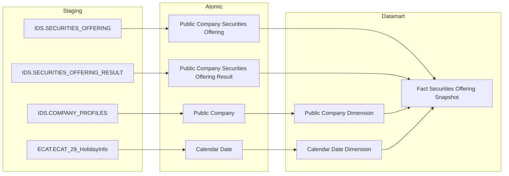

> **Ghi chú:** Ngành (`Business Line Level 1/2 Code`) lấy trực tiếp từ cột có sẵn trên `public_company_dim` (reuse) — không có Dimension ETL-derived riêng. `Public Company Securities Offering Result` feed thẳng vào Fact (không qua Dimension) vì cần aggregate SUM `total_collected_amt` GROUP BY hồ sơ.

---

##### Cụm 1b: Chào bán phát hành — giá trị cấp phép theo loại hình (Fact Securities Offering Plan Snapshot)

Phục vụ Tab CHÀO BÁN PHÁT HÀNH — Nhóm 2 (giá trị cấp phép theo loại hình).

> Nguồn Atomic: `Public Company Securities Offering Plan` (quan hệ 1-N với Offering cha theo `offering_method_code`) + `Public Company Securities Offering` (JOIN lấy `certificate_dt` làm FK date, vì Plan không có ngày riêng). `Offering Method Dimension` ETL-derived (DISTINCT) trực tiếp từ `Public Company Securities Offering Plan.offering_method_code`; `Offering_Method_Name` JOIN sang `Classification Value` (`cl_value`, bảng Fundamental vật lý ở Atomic — theo `cl_value.cl_code = offering_method_code AND cl_value.schema_code = 'SO_OFFERING_METHOD'`) lấy `cl_nm` — không tự CASE WHEN gộp nhóm trên Dimension.

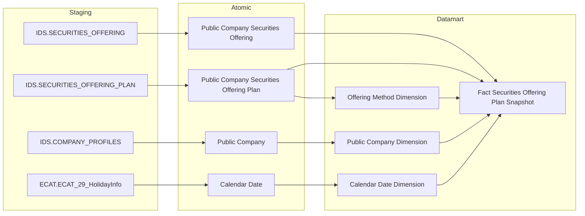

> **Ghi chú:** `Public Company Securities Offering` (Offering cha) feed vào Fact vì `Certificate_Date` (FK date) và `Public Company Code` (FK company) chỉ tồn tại trên bảng cha — Plan phải JOIN ngược lên cha để lấy 2 giá trị này.

---

##### Cụm 1c: Chào bán phát hành — giá trị huy động theo loại hình (Fact Securities Offering Result Snapshot)

Phục vụ Tab CHÀO BÁN PHÁT HÀNH — Nhóm 3 (giá trị huy động theo loại hình × ngành).

> Nguồn Atomic: `Public Company Securities Offering Result` (quan hệ 1-N với Offering cha theo `offering_method_code`) + `Public Company Securities Offering` (JOIN lấy `certificate_dt` làm FK date). Dùng chung `Offering Method Dimension` với Cụm 1b (reuse, cùng scheme `IDS_SO_OFFERING_METHOD`).

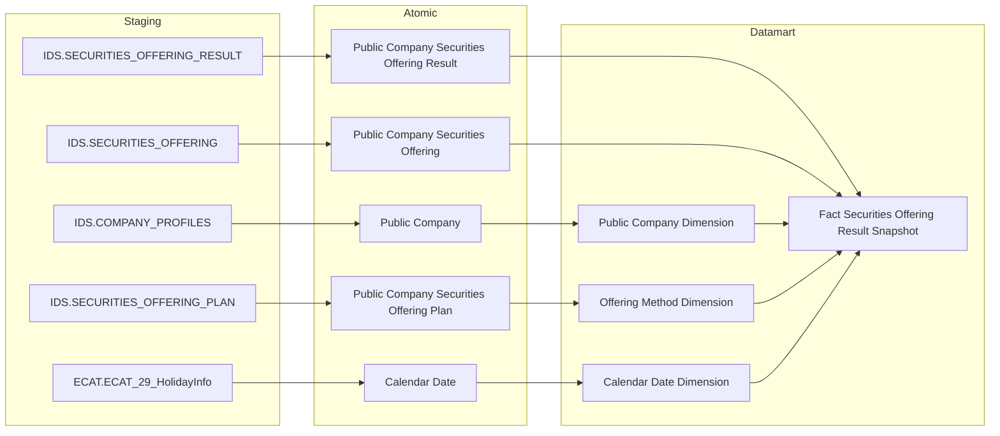

> **Ghi chú:** `Offering Method Code Snapshot` trên Result là denormalized snapshot từ Plan — `Offering Method Dimension` seed (DISTINCT) trực tiếp từ `Public Company Securities Offering Plan.offering_method_code` (dùng chung Cụm 1b, `Offering_Method_Name` join `Classification Value`), ETL populate FK trên Fact Result join qua Plan (`offering_method_code`) rồi snapshot sang Result.

---

##### Cụm 2: Chi tiết đợt chào bán (Bảng Tác nghiệp — Operational Securities Offering 360 Profile)

Phục vụ Tab CHÀO BÁN PHÁT HÀNH — Nhóm 4 (bảng chi tiết số lượng CK chào bán & phát hành) và Tab CHÀO BÁN VÀ PHÁT HÀNH — Nhóm 7–10 (tra cứu chi tiết đợt chào bán theo 4 nhóm chỉ số). Bảng tác nghiệp nhận dữ liệu trực tiếp từ Atomic, không qua Dimension.

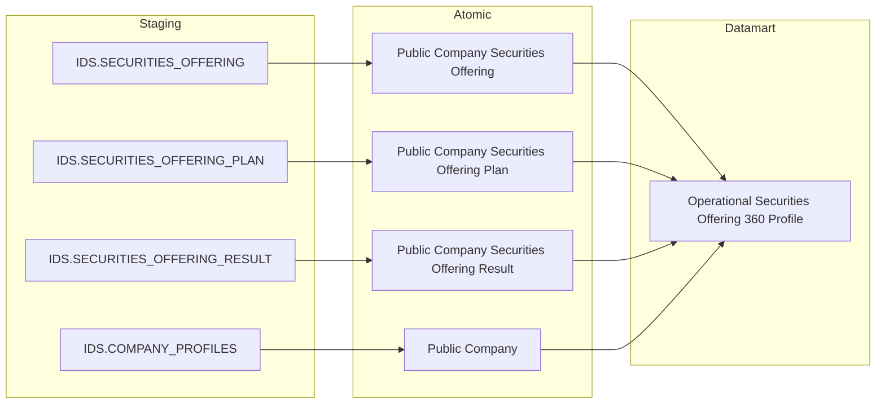

---

##### Cụm 3: Hồ sơ đăng ký chào bán (IDS)

Phục vụ Tab HỒ SƠ ĐĂNG KÝ CHÀO BÁN — Nhóm 5 (Tỷ lệ xử lý hồ sơ — KPI Card + donut), Nhóm 6 (bảng chi tiết hồ sơ theo hình thức × năm).

> Toàn bộ chỉ tiêu hồ sơ đăng ký lấy trực tiếp từ `IDS.SECURITIES_OFFERING.APPROVAL_STATUS_CD` trên entity `Public Company Securities Offering` (cùng entity dùng ở Cụm 1a/1b/1c/2). `Application Status Code` là **direct map** từ `approval_status_code` (4 giá trị: `PENDING_REVIEW`/`PENDING_APPROVE`/`APPROVED`/`REJECTED`).

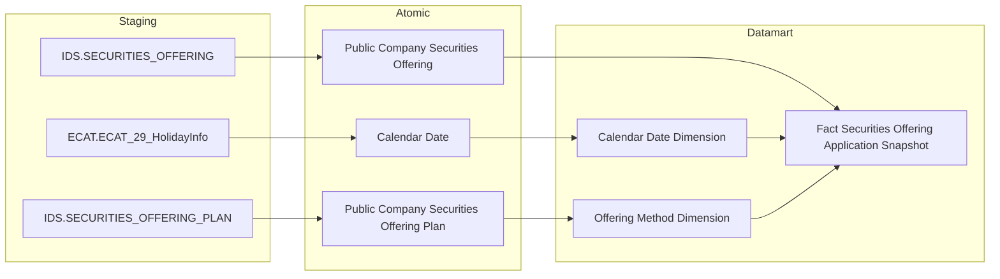

> **Ghi chú lineage:** `Fact Securities Offering Application Snapshot` grain = 1 row/hồ sơ (`Public Company Securities Offering`) × 1 ngày snapshot (ETL full-scan hàng ngày để `Application_Status_Code` luôn phản ánh đúng trạng thái xử lý mới nhất), `Application_Status_Code` direct map từ `approval_status_code`. `Offering Method Dimension` (dùng ở Nhóm 6, reuse từ Cụm 1b/1c) nguồn từ `Public Company Securities Offering Plan.offering_method_code`.

---

## Section 2 — Tổng quan báo cáo

### Tab: CHÀO BÁN PHÁT HÀNH

**Slicer chung:** Ngày (date picker), Ngành

---

#### Nhóm 1 — Tình hình thực hiện chào bán phát hành theo ngành

> Phân loại: **Phân tích**
> Atomic: `Public Company Securities Offering` ← IDS.SECURITIES_OFFERING — **READY** (Atomic draft — chưa approved chính thức)
> Atomic: `Public Company Securities Offering Result` ← IDS.SECURITIES_OFFERING_RESULT — **READY** (Atomic draft)
> Atomic: `Public Company` ← IDS.COMPANY_PROFILES — **READY**

**Mockup:**

| Ngành | Giá trị Cấp phép (tỷ đ) | Giá trị Huy động (tỷ đ) | Chưa thành công (tỷ đ) |
|---|---|---|---|
| Tài chính - Ngân hàng | 12,500 | 10,200 | 2,300 |
| Bất động sản | 8,700 | 7,100 | 1,600 |
| Công nghiệp | 5,300 | 4,800 | 500 |

**Source:** `Fact Securities Offering Snapshot` → `Public Company Dimension` (reuse), `Calendar Date Dimension`

**Bảng KPI:**

| KPI ID | Tên KPI | Đơn vị | Tính chất | Công thức | Ghi chú | Trạng thái |
|---|---|---|---|---|---|---|
| K_QLCB_1 | Ngày | — | Chiều | `GROUP BY Certificate Date` — FK date trên Fact, dùng làm slicer/period cho toàn Nhóm — `Public Company Securities Offering.certificate_dt` | BA cập nhật 2026-08-11: đổi field lọc kỳ báo cáo từ Official Letter Date (ngày công văn) sang Certificate Date (ngày cấp GCN) | READY |
| K_QLCB_2 | Ngành | — | Chiều | `GROUP BY Business Line Level 1 Code` — FK Public Company Dimension (reuse `public_company_dim`), dùng làm slicer ngành cho toàn Nhóm | — | READY |
| K_QLCB_3 | Giá trị Cấp phép | Tỷ VNĐ | Cơ sở | `SUM(Total Expected Amount)` per ngành × kỳ — `Public Company Securities Offering.total_expected_amt` | — | READY |
| K_QLCB_4 | Giá trị Huy động thành công | Tỷ VNĐ | Cơ sở | `SUM(Total Collected Amount)` per ngành × kỳ — aggregate từ `Public Company Securities Offering Result.total_collected_amt` GROUP BY `pc_securities_offering_id` trước khi cộng vào Fact | — | READY |
| K_QLCB_5 | Chưa thành công | Tỷ VNĐ | Derived | `K_QLCB_3 − K_QLCB_4` — tính ở presentation layer | — | READY |

> **Lưu ý:** K_QLCB_1/2 là Chiều — cùng dùng chung FK date/ngành đã có sẵn trên `Fact Securities Offering Snapshot` (không tạo cột mới), khai sinh KPI_ID theo rule "mọi dòng BA Phân loại = Chiều phải có KPI_ID". K_QLCB_3 lấy trực tiếp `total_expected_amt` trên bảng cha `Public Company Securities Offering` (1 giá trị/hồ sơ, không cần JOIN). K_QLCB_4 cần SUM `total_collected_amt` từ `Public Company Securities Offering Result` GROUP BY `pc_securities_offering_id` — quan hệ 1-N vì 1 hồ sơ có thể có nhiều dòng Result theo từng đợt báo cáo kết quả (`Offering Phase Name`). K_QLCB_5 là Derived — tính ở presentation layer, không lưu mart.
>
> **Loại bỏ 2 KPI YOY dư (cross-check phát hiện, đã xóa khỏi bảng trước khi renumber):** BA STT 1 không có dòng nào yêu cầu YoY% — 2 KPI này đã bị thêm không có căn cứ BA, xóa khỏi bảng KPI.

> **Ghi chú — Public Company Dimension (reuse):** Reuse `public_company_dim` đã có trong `datamart_model.yaml` (module GSDC, nguồn Atomic `Public Company`) — đã có sẵn `Business Line Level 1 Code` cho GROUP BY ngành (khớp BA: SQL Nhóm 1 chỉ JOIN `CATEGORIES` qua `category_l1_id`, không cần cấp 2). Xem Section 4 — Reuse Analysis.

**Star Schema:**

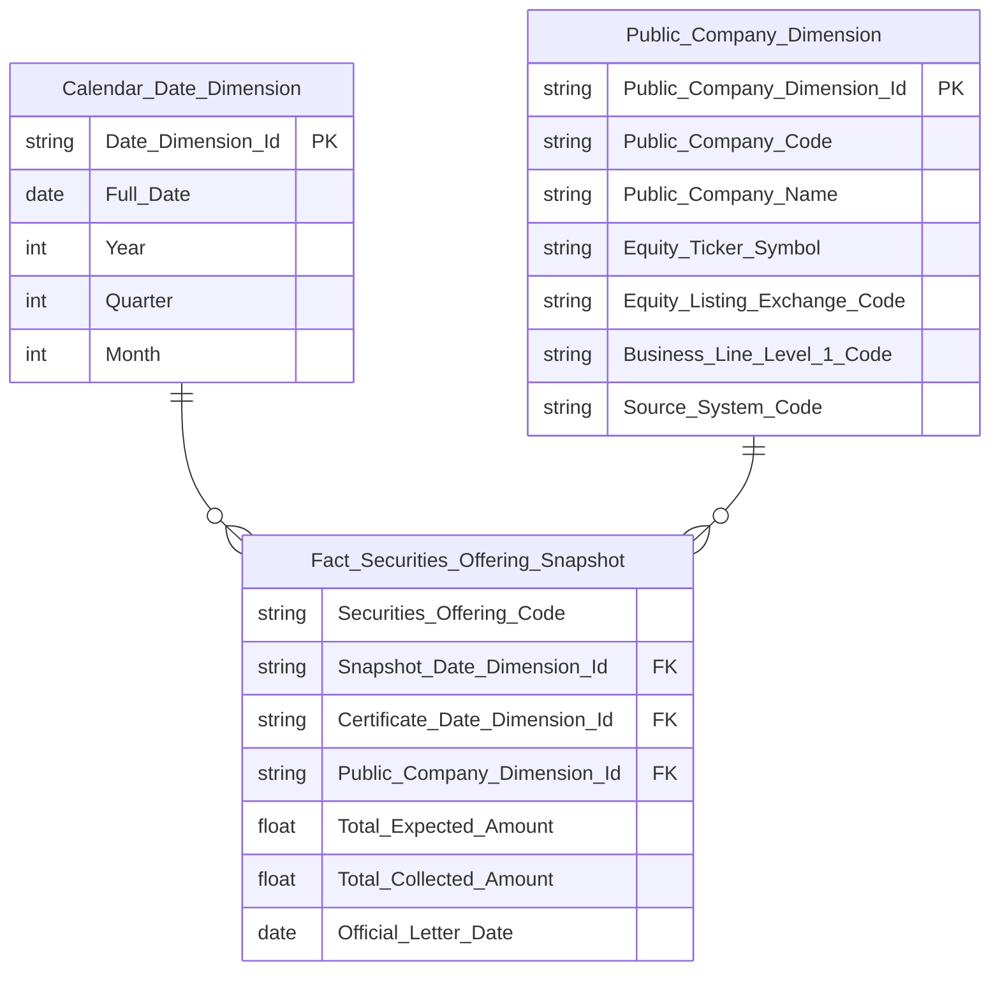

> **Ghi chú Phase 2 — reuse `Public_Company_Dimension` (= `public_company_dim`):** Dùng nguyên schema đã approved trong `datamart_model.yaml` (module GSDC). Key convention theo entity gốc: `Public_Company_Dimension_Id` = PK, `Public_Company_Code` = NK (ETL join từ `Public Company Securities Offering.Public Company Code` để resolve Surrogate Dimension Key).

**Lineage Mart → Báo cáo:**


**Bảng grain:**

| Tên bảng | Grain |
|---|---|
| Fact Securities Offering Snapshot | 1 row = 1 hồ sơ chào bán/phát hành CK của 1 công ty đại chúng × 1 ngày snapshot (ETL full-scan hàng ngày để Total Collected Amount luôn phản ánh đúng kết quả huy động mới nhất; Certificate Date giữ nguyên vai trò Chiều/slicer) |
| Public Company Dimension (reuse `public_company_dim`) | 1 row = 1 công ty đại chúng (SCD4A — theo quy ước module GSDC) |
| Calendar Date Dimension | 1 row = 1 ngày (Certificate Date — ngày cấp giấy chứng nhận) |

---

#### Nhóm 2 — Giá trị cấp phép chào bán phát hành theo ngành

> Phân loại: **Phân tích**
> Atomic: `Public Company Securities Offering Plan` ← IDS.SECURITIES_OFFERING_PLAN — **READY** (Atomic draft — chưa approved chính thức)
> Atomic: `Public Company Securities Offering` ← IDS.SECURITIES_OFFERING — **READY** (Atomic draft, dùng để lấy `certificate_dt` FK date)

**Mockup:**

| Loại hình | Giá trị cấp phép (tỷ đ) | % tổng |
|---|---|---|
| Công chúng | 8,200 | 42% |
| Riêng lẻ | 5,100 | 26% |
| ESOP | 2,300 | 12% |
| Trả cổ tức | 1,800 | 9% |
| Tăng vốn từ VCSH | 1,500 | 8% |
| Khác | 600 | 3% |

**Source:** `Fact Securities Offering Plan Snapshot` → `Offering Method Dimension`, `Public Company Dimension` (reuse), `Calendar Date Dimension`

**Bảng KPI:**

| KPI ID | Tên KPI | Đơn vị | Tính chất | Công thức | Ghi chú | Trạng thái |
|---|---|---|---|---|---|---|
| K_QLCB_6 | Loại hình phát hành | — | Chiều | `GROUP BY Offering Method Code` — hiển thị tên gốc `Offering_Method_Name` (từ Dimension, join Classification Value); filter K_QLCB_7–12 gom mã vào 6 nhóm để tính measure (xem bảng mapping dưới), không đổi tên hiển thị của Chiều này | — | READY |
| K_QLCB_7 | Giá trị cấp phép — Công chúng | Tỷ VNĐ | Cơ sở | `SUM(Total Expected Amount Snapshot) WHERE Offering Method Code IN ('1','2','3','4')` | — | READY |
| K_QLCB_8 | Giá trị cấp phép — Riêng lẻ | Tỷ VNĐ | Cơ sở | `SUM(Total Expected Amount Snapshot) WHERE Offering Method Code = '5'` | — | READY |
| K_QLCB_9 | Giá trị cấp phép — ESOP | Tỷ VNĐ | Cơ sở | `SUM(Total Expected Amount Snapshot) WHERE Offering Method Code IN ('9','10')` | — | READY |
| K_QLCB_10 | Giá trị cấp phép — Trả cổ tức | Tỷ VNĐ | Cơ sở | `SUM(Total Expected Amount Snapshot) WHERE Offering Method Code = '7'` | — | READY |
| K_QLCB_11 | Giá trị cấp phép — Tăng vốn từ VCSH | Tỷ VNĐ | Cơ sở | `SUM(Total Expected Amount Snapshot) WHERE Offering Method Code = '8'` | — | READY |
| K_QLCB_12 | Giá trị cấp phép — Các loại khác | Tỷ VNĐ | Cơ sở | `SUM(Total Expected Amount Snapshot) WHERE Offering Method Code NOT IN ('1','2','3','4','5','7','8','9','10')` | — | READY |

> **Mapping mã `Offering Method Code` → 6 nhóm hiển thị (theo BA SQL tham khảo, xác nhận với `LOOKUP_GROUP = 'SO_OFFERING_METHOD'`):**
>
> | Mã | Nhóm hiển thị |
> |---|---|
> | 1, 2, 3, 4 | Công chúng |
> | 5 | Riêng lẻ |
> | 9, 10 | ESOP |
> | 7 | Trả cổ tức |
> | 8 | Tăng vốn từ VCSH |
> | khác (kể cả NULL) | Khác |

> **Lưu ý:** `Public Company Securities Offering Plan` có **1 dòng riêng cho mỗi loại hình** (`offering_method_code`) của cùng 1 hồ sơ chào bán. K_QLCB_7–12 là **Cơ sở** (SUM trực tiếp có filter theo mã), không phải Derived. `Total Expected Amount Snapshot` là cột denormalized trên Plan (snapshot từ bảng cha).
>
> **Ghi chú kỹ thuật ETL:** BA gom nhóm Plan theo `(securities_offering_id, offering_method_cd)` bằng CTE **trước khi JOIN** sang bảng cha Offering, để đảm bảo mỗi tổ hợp hồ sơ × loại hình chỉ có 1 dòng khi cộng dồn — tránh nhân bản SUM nếu về sau Plan JOIN thêm bảng khác gây fanout. Hiện tại grain Fact Plan đã là 1 row/tổ hợp nên không ảnh hưởng kết quả, nhưng khi thiết kế LLD (etl_logic), giữ nguyên thứ tự "gom nhóm trước, JOIN sau" theo đúng CTE BA.

**Star Schema:**

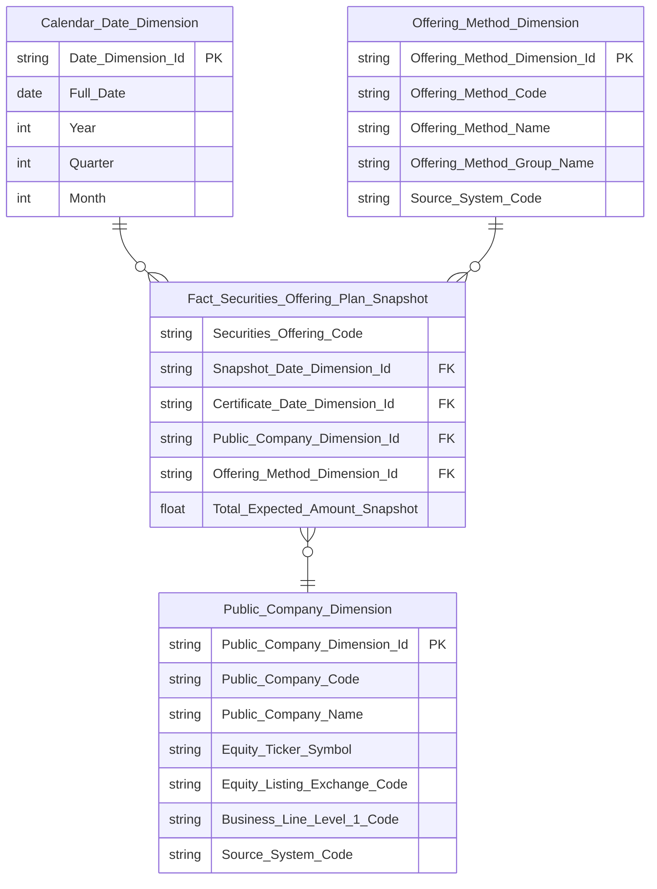

> **Ghi chú Phase 2:**
> - `Securities_Offering_Code` — BK đợt chào bán (degenerate dimension), denormalized sẵn trên Plan (`pc_securities_offering_code`) — bổ sung khi Phase 3 phát hiện 2 FK dim hiện có (Public Company + Offering Method) không đủ phân biệt các đợt chào bán khác nhau của cùng 1 công ty cùng loại hình; dùng làm grain key cho ORDER BY flat table
> - `Offering_Method_Dimension` — `Offering_Method_Dimension_Id` = PK, `Offering_Method_Code` = NK, ETL-derived (DISTINCT) trực tiếp từ `Public Company Securities Offering Plan.offering_method_code`; `Offering_Method_Name` JOIN `Classification Value` (`cl_value.cl_code = offering_method_code AND cl_value.schema_code = 'SO_OFFERING_METHOD'`) lấy `cl_nm` (tên gốc); `Offering_Method_Group_Name` computed CASE WHEN theo `offering_method_code` gom vào 6 nhóm (Công chúng/Riêng lẻ/ESOP/Trả cổ tức/Tăng vốn từ VCSH/Khác) — cả 2 cột tính 1 lần ngay trên Dimension (dùng chung Nhóm 2/3/6), flat table chỉ SELECT thẳng, không tự CASE WHEN lại. Nhóm 2/6 hiển thị tên gốc (`Offering_Method_Name`); Nhóm 3 hiển thị nhóm (`Offering_Method_Group_Name`).
> - `Public_Company_Dimension` = reuse `public_company_dim` (schema đầy đủ xem Nhóm 1) — FK join qua `Public Company Securities Offering.Public Company Code` (JOIN từ Offering cha, vì Plan không có trực tiếp Public Company Code — cần JOIN 2 tầng Plan → Offering → Public Company)
> - `Certificate_Date_Dimension_Id` — cùng FK date với Nhóm 1, join từ `Public Company Securities Offering.certificate_dt` (Plan không có ngày riêng)

**Lineage Mart → Báo cáo:**

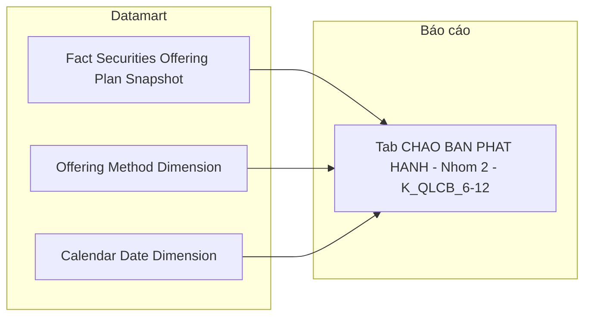

**Bảng grain:**

| Tên bảng | Grain |
|---|---|
| Fact Securities Offering Plan Snapshot | 1 row = 1 đợt chào bán × 1 loại hình kế hoạch × 1 ngày snapshot (ETL full-scan hàng ngày; Certificate Date giữ nguyên vai trò Chiều/slicer) |
| Offering Method Dimension | 1 row = 1 mã hình thức chào bán (scheme `IDS_SO_OFFERING_METHOD`) |
| Public Company Dimension (reuse `public_company_dim`) | 1 row = 1 công ty đại chúng |
| Calendar Date Dimension | 1 row = 1 ngày |

---

#### Nhóm 3 — Giá trị phát hành theo hình thức phát hành và nhóm ngành

> Phân loại: **Phân tích**
> Atomic: `Public Company Securities Offering Result` ← IDS.SECURITIES_OFFERING_RESULT — **READY** (Atomic draft — chưa approved chính thức)
> Atomic: `Public Company Securities Offering` ← IDS.SECURITIES_OFFERING — **READY** (Atomic draft, dùng để lấy `certificate_dt` FK date)

**Mockup:**

| Ngành \ Loại hình | Công chúng | Riêng lẻ | ESOP | Trả cổ tức | Tăng vốn VCSH | Khác |
|---|---|---|---|---|---|---|
| Tài chính - Ngân hàng | 4,200 | 3,100 | 800 | 600 | 400 | 200 |
| Bất động sản | 2,100 | 1,800 | 500 | 400 | 700 | 100 |
| Công nghiệp | 1,800 | 950 | 300 | 200 | 150 | 100 |

**Source:** `Fact Securities Offering Result Snapshot` → `Offering Method Dimension`, `Public Company Dimension` (reuse), `Calendar Date Dimension`

**Bảng KPI:**

| KPI ID | Tên KPI | Đơn vị | Tính chất | Công thức | Ghi chú | Trạng thái |
|---|---|---|---|---|---|---|
| K_QLCB_13 | Loại hình phát hành (kết quả) | — | Chiều | `GROUP BY Offering Method Code Snapshot` — hiển thị `Offering_Method_Group_Name` (computed CASE WHEN có sẵn trên Dimension, xem bảng mapping ở Nhóm 2) — khác Nhóm 2/6 (hiển thị tên gốc `Offering_Method_Name`); filter K_QLCB_14–19 dùng cùng mapping mã→nhóm | — | READY |
| K_QLCB_14 | Giá trị huy động — Công chúng | Tỷ VNĐ | Cơ sở | `SUM(Total Collected Amount) WHERE Offering Method Code Snapshot IN ('1','2','3','4')` GROUP BY ngành | — | READY |
| K_QLCB_15 | Giá trị huy động — Riêng lẻ | Tỷ VNĐ | Cơ sở | `SUM(Total Collected Amount) WHERE Offering Method Code Snapshot = '5'` GROUP BY ngành | — | READY |
| K_QLCB_16 | Giá trị huy động — ESOP | Tỷ VNĐ | Cơ sở | `SUM(Total Collected Amount) WHERE Offering Method Code Snapshot IN ('9','10')` GROUP BY ngành | — | READY |
| K_QLCB_17 | Giá trị huy động — Trả cổ tức | Tỷ VNĐ | Cơ sở | `SUM(Total Collected Amount) WHERE Offering Method Code Snapshot = '7'` GROUP BY ngành | — | READY |
| K_QLCB_18 | Giá trị huy động — Tăng vốn từ VCSH | Tỷ VNĐ | Cơ sở | `SUM(Total Collected Amount) WHERE Offering Method Code Snapshot = '8'` GROUP BY ngành | — | READY |
| K_QLCB_19 | Giá trị huy động — Các loại khác | Tỷ VNĐ | Cơ sở | `SUM(Total Collected Amount) WHERE Offering Method Code Snapshot NOT IN ('1','2','3','4','5','7','8','9','10')` GROUP BY ngành | — | READY |

> **Mapping mã:** Giống Nhóm 2 — xem bảng mapping mã `Offering Method Code` ở Nhóm 2 (áp dụng cho `Offering Method Code Snapshot` trên Result).

> **Lưu ý:** Nhóm 3 dùng `Public Company Securities Offering Result` (kết quả thực tế), khác Nhóm 2 dùng `Plan` (kế hoạch). `Offering Method Code Snapshot` trên Result là denormalized snapshot từ Plan. K_QLCB_14–19 là **Cơ sở** (SUM trực tiếp có filter theo mã).
>
> **Ghi chú kỹ thuật ETL:** Tương tự Nhóm 2 — BA gom nhóm Result theo `(securities_offering_id, offering_method_cd)` bằng CTE **trước khi JOIN** sang bảng cha Offering, tránh nhân bản SUM nếu Result JOIN thêm bảng khác gây fanout. Giữ nguyên thứ tự "gom nhóm trước, JOIN sau" khi thiết kế LLD (etl_logic).

**Star Schema:**

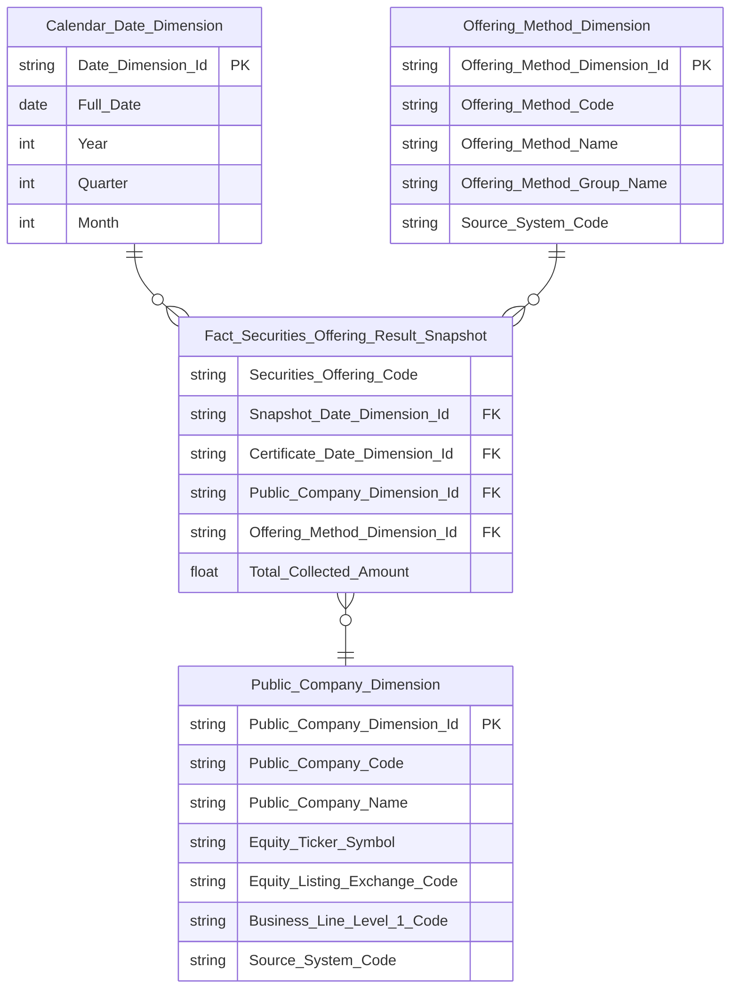

> **Ghi chú Phase 2:** Cùng `Calendar_Date_Dimension`, `Offering_Method_Dimension`, `Public_Company_Dimension` (reuse `public_company_dim`, schema đầy đủ xem Nhóm 1/2) với Nhóm 2 — không thiết kế lại logic, chỉ lặp lại block để Star Schema Nhóm 3 tự đứng độc lập, không có node rỗng.

**Lineage Mart → Báo cáo:**


**Bảng grain:**

| Tên bảng | Grain |
|---|---|
| Fact Securities Offering Result Snapshot | 1 row = 1 đợt chào bán × 1 loại hình kết quả thực tế × 1 ngày snapshot (ETL full-scan hàng ngày để Total Collected Amount luôn phản ánh đúng kết quả huy động mới nhất; Certificate Date giữ nguyên vai trò Chiều/slicer) |
| Offering Method Dimension | 1 row = 1 mã hình thức chào bán (reuse từ Nhóm 2) |
| Public Company Dimension (reuse `public_company_dim`) | 1 row = 1 công ty đại chúng |
| Calendar Date Dimension | 1 row = 1 ngày |

---

#### Nhóm 4 — Bảng Chi tiết số lượng chứng khoán Chào bán & Phát hành

> Phân loại: **Tác nghiệp**
> Atomic: `Public Company Securities Offering` ← IDS.SECURITIES_OFFERING — **READY** (Atomic draft — chưa approved chính thức)
> Atomic: `Public Company Securities Offering Plan` ← IDS.SECURITIES_OFFERING_PLAN — **READY** (Atomic draft)
> Atomic: `Public Company Securities Offering Result` ← IDS.SECURITIES_OFFERING_RESULT — **READY** (Atomic draft)
> Atomic: `Public Company` ← IDS.COMPANY_PROFILES — **READY**

**Mockup:**

| Mã CK | Tên DN | Hình thức | Đvị tư vấn | Tổ chức KT | Đvị bảo lãnh | Đvị XHTN | SL cấp phép | SL thành công | GT cấp phép (tỷ) | GT thành công (tỷ) | Tỷ lệ % |
|---|---|---|---|---|---|---|---|---|---|---|---|
| ABC | Công ty ABC | Công chúng | — | — | — | — | 10,000,000 | 9,500,000 | 500 | 475 | 95% |
| DEF | Công ty DEF | Riêng lẻ | — | — | — | — | 5,000,000 | 5,000,000 | 250 | 250 | 100% |

**Source:** `Operational Securities Offering 360 Profile` — lookup theo đợt chào bán / công ty

**Bảng KPI:**

| KPI ID | Tên KPI | Đơn vị | Tính chất | Công thức | Ghi chú | Trạng thái |
|---|---|---|---|---|---|---|
| K_QLCB_20 | Tên doanh nghiệp | — | Attribute | `SELECT Public Company Name` — `Public Company.public_company_nm` (IDS.COMPANY_PROFILES, cột `COMPANY_NAME_VN`) | — | READY |
| K_QLCB_21 | Mã chứng khoán | Text | Attribute | `SELECT Equity Ticker Symbol` — `Public Company.equity_ticker_symbol` (IDS.COMPANY_PROFILES, cột `equity_ticker`) | — | READY |
| K_QLCB_22 | Hình thức chào bán | — | Attribute | `SELECT Offering Method Name` — tên gốc, JOIN `Classification Value` (`cl_value.cl_code = Offering Method Code AND cl_value.schema_code = 'SO_OFFERING_METHOD'`) lấy `cl_nm` | — | READY |
| K_QLCB_23 | Đơn vị tư vấn | Text | Attribute | `Public Company Securities Offering.consulting_organization_nm` — IDS.SECURITIES_OFFERING.CONSULTING_ORG — direct map | — | READY |
| K_QLCB_24 | Tổ chức kiểm toán | Text | Attribute | `Public Company Securities Offering.audit_organization_nm` — IDS.SECURITIES_OFFERING.AUDIT_ORG — direct map | — | READY |
| K_QLCB_25 | Đơn vị bảo lãnh | Text | Attribute | `Public Company Securities Offering.underwriting_organization_nm` — IDS.SECURITIES_OFFERING.UNDERWWRITING_ORG (tên cột nguồn có lỗi chính tả, giữ nguyên) — direct map | — | READY |
| K_QLCB_26 | Đơn vị xếp hạng tín nhiệm | Text | Attribute | `Public Company Securities Offering.credit_rating_organization_nm` — IDS.SECURITIES_OFFERING.CREDIT_RATING_ORG — direct map | — | READY |
| K_QLCB_27 | Số lượng CK được cấp phép | CK | Attribute | `Public Company Securities Offering.total_registered_quantity` — BA SQL dùng alias `t` = `SECURITIES_OFFERING` (bảng cha), không GROUP BY loại hình — tổng số CK toàn hồ sơ, join lên Offering cha (không phải snapshot Plan) | — | READY |
| K_QLCB_28 | Số lượng CK chào bán thành công | CK | Attribute | `Public Company Securities Offering Result.total_successful_quantity` — join theo `offering_method_code` khớp với Plan | — | READY |
| K_QLCB_29 | Giá trị cấp phép | Tỷ VNĐ | Attribute | `Public Company Securities Offering.total_expected_amt` — bảng cha, BA ghi rõ nguồn SECURITIES_OFFERING.total_expected_am (không phải Plan snapshot) | — | READY |
| K_QLCB_30 | Giá trị chào bán thành công | Tỷ VNĐ | Attribute | `Public Company Securities Offering Result.total_collected_amt` | — | READY |
| K_QLCB_31 | Tỷ lệ chào bán thành công | % | Attribute | `Public Company Securities Offering Result.successful_ratio_percentage` — IDS.SECURITIES_OFFERING_RESULT.SUCCESSFUL_RATIO — có sẵn trực tiếp trên Result, không cần tính Derived | — | READY |

> **Ghi chú K_QLCB_23–26:** 4 cột tổ chức có sẵn trực tiếp trên bảng cha `Public Company Securities Offering`, `etl_logic_type = direct`.

> **Ghi chú grain:** `Operational Securities Offering 360 Profile` join tự nhiên theo `offering_method_code` — `Public Company Securities Offering Plan` (1 row/loại hình kế hoạch) LEFT JOIN `Public Company Securities Offering Result` (1 row/loại hình kết quả) theo `(pc_securities_offering_id, offering_method_code)`. K_QLCB_27 lấy từ bảng cha Offering (`total_registered_quantity`, tổng toàn hồ sơ — không GROUP BY loại hình theo đúng BA SQL). K_QLCB_28 lấy trực tiếp từ Result (không cần SUM vì Result Quantity đã snapshot per-loại-hình sẵn).

**Schema bảng tác nghiệp:**

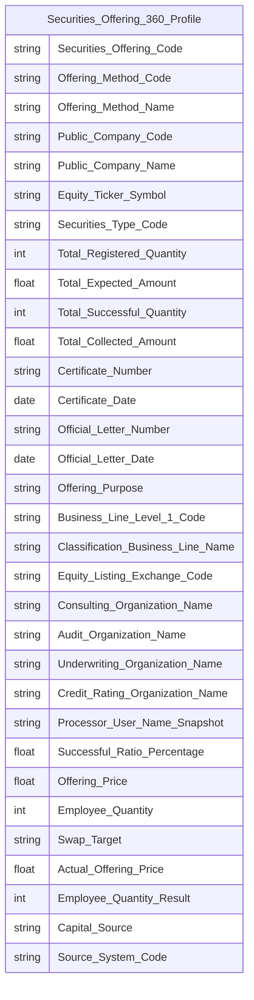

> **Ghi chú Phase 2 — Key labels cho `Operational Securities Offering 360 Profile`:**
> - `Securities_Offering_Code` → `key = BK` — Business key đợt chào bán (`Public Company Securities Offering.pc_securities_offering_code`), ETL debug anchor
> - `Offering_Method_Code` → `key = BK` — Business key component 2 (từ Plan), cùng với `Securities_Offering_Code` tạo thành Composite BK định nghĩa grain (1 row = 1 đợt × 1 loại hình)
> - `Offering_Method_Name` — tên gốc hình thức chào bán, JOIN `Classification Value` (`cl_value.cl_code = Offering_Method_Code AND cl_value.schema_code = 'SO_OFFERING_METHOD'`) lấy `cl_nm`; dùng ở Nhóm 4 (K_QLCB_22) và Nhóm 8 (K_QLCB_53)
> - Mermaid không hỗ trợ label `BK` trong erDiagram — chỉ ghi trong Attributes CSV cột `key`
> - Không có surrogate PK riêng cho 360 Profile — dùng Composite BK thay thế
>
> **Cột dùng ở Nhóm 7/9/10 (mọi cột dùng ở bất kỳ Nhóm nào của `Operational Securities Offering 360 Profile` phải xuất hiện đủ trong erDiagram này):**
> - `Classification_Business_Line_Name` (nguồn `Classification Business Line.cl_business_line_nm`, JOIN qua `Public Company.business_line_level_1_id` — giữ nguyên tên cột như `public_company_dim.classification_business_line_nm`) — dùng ở Nhóm 7 (K_QLCB_65), đệm sẵn tên ngành cho mockup cột "Ngành"
> - `Processor_User_Name_Snapshot` (nguồn bảng cha Offering `processor_user_nm_snpst`) — dùng ở Nhóm 7 (K_QLCB_44)
> - `Total_Registered_Quantity` (nguồn bảng cha Offering `total_registered_quantity`) — dùng ở Nhóm 4 (K_QLCB_27) và Nhóm 9 (K_QLCB_54) — Nhóm 4 sửa lại theo BA (trước đó sai map vào Plan snapshot) khi review cross-check phát hiện gap
> - `Offering_Price` (nguồn Plan `offering_price`), `Employee_Quantity` (nguồn Plan `employee_quantity`), `Swap_Target` (nguồn Plan `swap_target`) — dùng ở Nhóm 9 (K_QLCB_55, 57, 58)
> - `Actual_Offering_Price` (nguồn Result `actual_offering_price`), `Employee_Quantity_Result` (nguồn Result `employee_quantity`), `Capital_Source` (nguồn Result `capital_src`) — dùng ở Nhóm 10 (K_QLCB_61, 63, 64)
> - `Source_System_Code` — mã hệ thống nguồn, hardcode `IDS.SECURITIES_OFFERING_PLAN` (driving table Plan), bắt buộc cho mọi bảng Operational

**Lineage Mart → Báo cáo:**

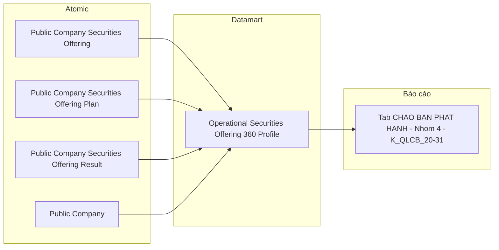

**Bảng grain:**

| Tên bảng | Grain |
|---|---|
| `Operational Securities Offering 360 Profile` | 1 row = 1 đợt chào bán × 1 loại hình (Plan LEFT JOIN Result theo `offering_method_code`). Composite BK: (Securities Offering Code, Offering Method Code) |

---

### Tab: HỒ SƠ ĐĂNG KÝ CHÀO BÁN

**Slicer chung:** Từ ngày — Đến ngày (date range picker)

---

#### Nhóm 5 — Tỷ lệ xử lý hồ sơ (STT 5)

> Phân loại: **Phân tích**
> Atomic: `Public Company Securities Offering` ← IDS.SECURITIES_OFFERING — **READY** (Atomic draft — chưa approved chính thức)

**Mockup (a) — 4 KPI Card:**

| Hồ sơ đăng ký | Đang xử lý | Đã cấp phép | Bị từ chối |
|---|---|---|---|
| 124 | 38 | 72 | 14 |

**Mockup (b) — Donut GROUP BY trạng thái:**

| Trạng thái | Số lượng | Tỷ lệ % |
|---|---|---|
| Chờ xử lý | 24 | 19% |
| Đang xử lý | 38 | 31% |
| Đã cấp phép | 72 | 42% |
| Bị từ chối | 14 | 11% |

> **Lưu ý:** Cả 2 mockup cùng dùng 4 Base KPI bên dưới — (a) hiển thị dạng 4 card riêng biệt, (b) hiển thị dạng GROUP BY pivot trên cùng 1 Fact. Tỷ lệ % là Derived tính tại presentation layer, không lưu Datamart.

**Source:** `Fact Securities Offering Application Snapshot`

**Bảng KPI:**

| KPI ID | Tên KPI | Đơn vị | Tính chất | Công thức | Ghi chú | Trạng thái |
|---|---|---|---|---|---|---|
| K_QLCB_32 | Số lượng hồ sơ đăng ký | Hồ sơ | Cơ sở | `COUNT(Fact Securities Offering Application Snapshot)` toàn bộ trong kỳ | — | READY |
| K_QLCB_33 | Số lượng hồ sơ đang xử lý | Hồ sơ | Cơ sở | `COUNT WHERE Application Status Code = 'PENDING_APPROVE'` | — | READY |
| K_QLCB_34 | Số lượng hồ sơ đã cấp phép | Hồ sơ | Cơ sở | `COUNT WHERE Application Status Code = 'APPROVED'` | — | READY |
| K_QLCB_35 | Số lượng hồ sơ bị từ chối | Hồ sơ | Cơ sở | `COUNT WHERE Application Status Code = 'REJECTED'` | — | READY |

> **Ghi chú `Application Status Code`:** Direct map từ `Public Company Securities Offering.approval_status_code` (IDS.SECURITIES_OFFERING.APPROVAL_STATUS_CD). 4 giá trị nguồn: `PENDING_REVIEW` (đăng ký), `PENDING_APPROVE` (đang xử lý), `APPROVED` (đã cấp phép), `REJECTED` (bị từ chối).

> **Quyết định thiết kế — lưu số lượng, không lưu tỷ lệ:** Datamart chỉ lưu số lượng (COUNT theo status); tỷ lệ % (phép chia trên tổng) tính hoàn toàn ở lớp dashboard, không cần KPI_ID/Attributes/Detail Mapping riêng cho phần %. Cả 2 mockup (a) và (b) đều dùng chung 4 KPI này — mockup (b) chỉ là presentation-layer GROUP BY pivot.

**Star Schema:**

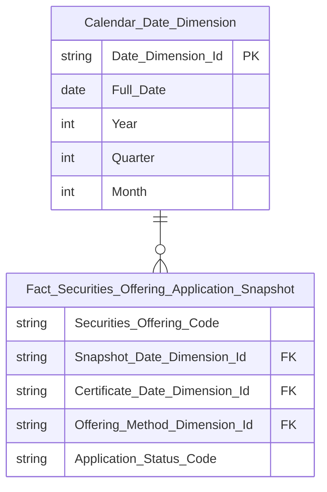

> **Ghi chú Phase 2 — Key labels:**
>
> **`Fact_Securities_Offering_Application_Snapshot`:**
> - `Securities_Offering_Code` → `key = DD` (Degenerate Dimension) — Business key hồ sơ (`Public Company Securities Offering.pc_securities_offering_code`), lưu trực tiếp trên Fact để tra cứu, không tạo Dimension riêng. Fact Event không có Surrogate PK.
> - `Certificate_Date_Dimension_Id` → `key = FK → Calendar Date Dimension` — cùng FK date dùng ở Nhóm 1 (`certificate_dt`)
> - `Offering_Method_Dimension_Id` → `key = FK → Offering Method Dimension`, nullable — chỉ Nhóm 6 dùng (xem Nhóm 6), Nhóm 5 không GROUP BY hình thức nên field này NULL, không ảnh hưởng COUNT
> - `Application_Status_Code` → `key` trống — Classification Value, `etl_logic_type = direct` từ `approval_status_code`
>
> `Offering_Type_Dimension` không dùng ở Nhóm 5 — chỉ Nhóm 6 cần chiều hình thức (xem `Offering Method Dimension`, dùng chung với Nhóm 2/3). Nhóm 5 không GROUP BY năm.

**Lineage Mart → Báo cáo:**

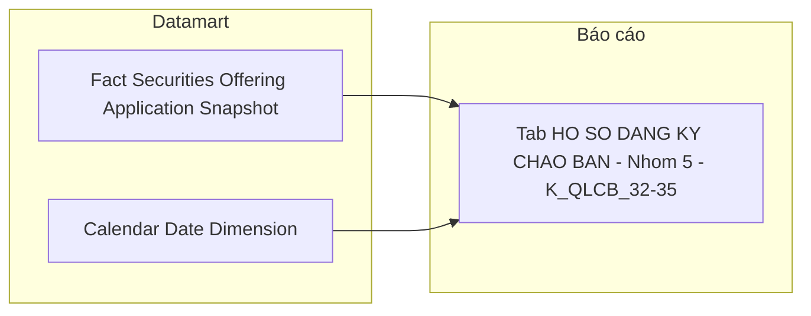

**Bảng grain:**

| Tên bảng | Grain |
|---|---|
| `Fact Securities Offering Application Snapshot` | 1 row = 1 hồ sơ đăng ký chào bán × 1 ngày snapshot (ETL full-scan hàng ngày để Application Status Code luôn phản ánh đúng trạng thái xử lý mới nhất; Certificate Date giữ nguyên vai trò Chiều/slicer) |
| `Calendar Date Dimension` | 1 row = 1 ngày (`certificate_dt`) |

---

#### Nhóm 6 — Bảng Chi tiết hồ sơ chào bán & phát hành

> Phân loại: **Phân tích**
> Atomic: `Public Company Securities Offering` ← IDS.SECURITIES_OFFERING — **READY** (Atomic draft)
> Atomic: `Public Company Securities Offering Plan` ← IDS.SECURITIES_OFFERING_PLAN — **READY** (Atomic draft)
> Ghi chú: Cùng Fact với Nhóm 5 — bổ sung `Offering Method Dimension` (reuse từ Nhóm 2/3) × năm.

**Mockup:**

| Hình thức chào bán | Năm | Chờ xử lý | Đang xử lý | Đã cấp phép | Bị từ chối | Tổng |
|---|---|---|---|---|---|---|
| Chào bán CP lần đầu | 2025 | 2 | 5 | 18 | 3 | 28 |
| Chào bán trái phiếu | 2025 | 1 | 3 | 12 | 1 | 17 |
| Phát hành CP ESOP | 2024 | 0 | 2 | 24 | 4 | 30 |

**Source:** `Fact Securities Offering Application Snapshot` → `Offering Method Dimension`, `Calendar Date Dimension`

**Bảng KPI:**

| KPI ID | Tên KPI | Đơn vị | Tính chất | Công thức | Ghi chú | Trạng thái |
|---|---|---|---|---|---|---|
| K_QLCB_36 | Hình thức chào bán | — | Chiều | `GROUP BY Offering Method Dimension.Offering Method Code` — reuse Dimension từ Nhóm 2/3 (scheme `IDS_SO_OFFERING_METHOD`) | — | READY |
| K_QLCB_37 | Năm | — | Chiều | `GROUP BY Year` của `Certificate Date Dimension` (reuse `Calendar Date Dimension`, không cần Degenerate Dimension riêng) | BA cập nhật 2026-08-11: đổi từ Official Letter Date sang Certificate Date | READY |
| K_QLCB_38 | Số lượng hồ sơ chờ xử lý | Hồ sơ | Cơ sở | `COUNT WHERE Application Status Code = 'PENDING_REVIEW'` | — | READY |
| K_QLCB_39 | Số lượng hồ sơ đang xử lý | Hồ sơ | Cơ sở | `COUNT WHERE Application Status Code = 'PENDING_APPROVE'` | — | READY |
| K_QLCB_40 | Số lượng hồ sơ đã cấp phép | Hồ sơ | Cơ sở | `COUNT WHERE Application Status Code = 'APPROVED'` | — | READY |
| K_QLCB_41 | Số lượng hồ sơ bị từ chối | Hồ sơ | Cơ sở | `COUNT WHERE Application Status Code = 'REJECTED'` | — | READY |
| K_QLCB_42 | Tổng hồ sơ | Hồ sơ | Derived | `K_QLCB_38 + K_QLCB_39 + K_QLCB_40 + K_QLCB_41` — tính tại presentation layer | — | READY |

> **Ghi chú `Offering Method Dimension`:** Reuse Dimension đã thiết kế ở Cụm 1b/1c — không tạo mới. `Fact Securities Offering Application Snapshot` bổ sung FK `Offering_Method_Dimension_Id`, ETL join qua `Public Company Securities Offering Plan.offering_method_code` (theo `pc_securities_offering_id`). Vì 1 hồ sơ có thể có nhiều dòng Plan (nhiều loại hình), Fact Application ở Nhóm 6 mở rộng grain: 1 row = 1 hồ sơ × 1 loại hình (khác Nhóm 5 vốn 1 row = 1 hồ sơ).

**Star Schema:** Kế thừa Fact từ Nhóm 5, bổ sung FK `Offering_Method_Dimension_Id`:

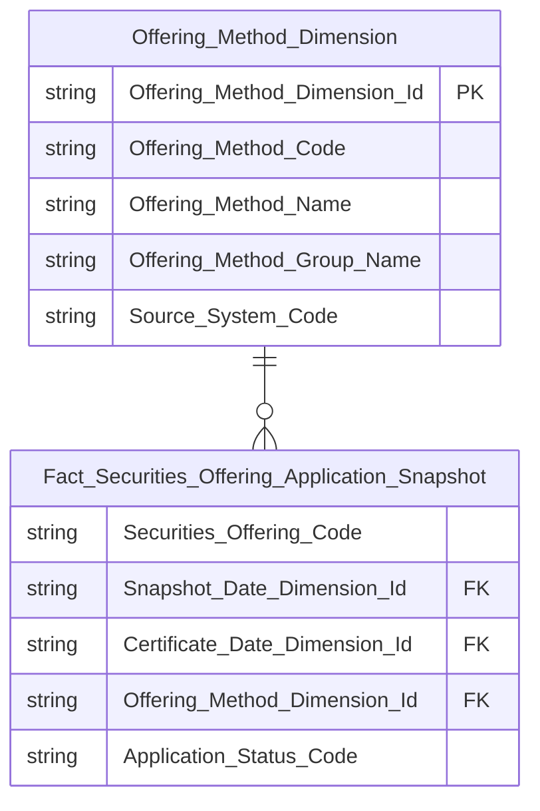

> **Ghi chú grain:** Bảng KPI Nhóm 5 (K_QLCB_32–35) chỉ cần grain 1 row/hồ sơ. Nhóm 6 cần thêm chiều hình thức — ETL populate `Offering_Method_Dimension_Id` bằng cách join `Public Company Securities Offering Plan` (lấy `offering_method_code` đầu tiên nếu 1 hồ sơ có nhiều loại hình, hoặc giữ NULL nếu hồ sơ chưa có Plan). Field `Offering_Method_Dimension_Id` là nullable trên Fact — không ảnh hưởng COUNT ở Nhóm 5.

**Lineage Mart → Báo cáo:**

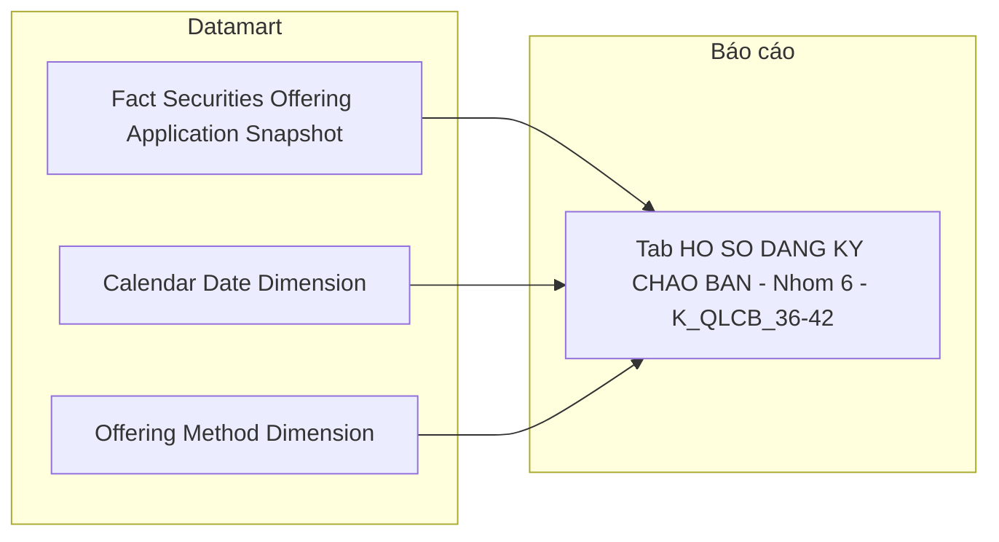

**Bảng grain:**

| Tên bảng | Grain |
|---|---|
| `Fact Securities Offering Application Snapshot` | 1 row = 1 hồ sơ × 1 ngày snapshot (kế thừa Nhóm 5), nullable FK `Offering_Method_Dimension_Id` cho Nhóm 6 |
| `Offering Method Dimension` | 1 row = 1 mã hình thức chào bán (reuse từ Nhóm 2/3) |
| `Calendar Date Dimension` | 1 row = 1 ngày |

---

### Tab: CHÀO BÁN VÀ PHÁT HÀNH (Data Explorer)

**Slicer chung:** Sàn (dropdown), Ngành nghề (dropdown), Khoảng thời gian (Từ ngày — Đến ngày)

> **Ghi chú thiết kế:** Data Explorer là màn hình tra cứu chi tiết từng đợt chào bán, cho phép người dùng chọn tổ hợp chỉ số (checkbox) từ 4 nhóm rồi hiển thị bảng kết quả. Đây là use case Tác nghiệp — lookup n đợt chào bán theo điều kiện lọc. Tab này **reuse** `Operational Securities Offering 360 Profile` đã thiết kế ở Nhóm 4 Tab CHÀO BÁN PHÁT HÀNH, mở rộng thêm các attribute chi tiết theo từng hình thức phát hành. Không cần thêm Fact hay Dim mới.

---

#### Nhóm 7 — Thông tin cơ sở (STT 40–45)

> Phân loại: **Tác nghiệp**
> Atomic: `Public Company Securities Offering` ← IDS.SECURITIES_OFFERING — **READY** (Atomic draft — chưa approved chính thức)
> Atomic: `Public Company` ← IDS.COMPANY_PROFILES — **READY**

**Mockup:**

| Mã CK | Tên công ty | Sàn | Ngành | Thời điểm báo cáo | Chuyên viên | Loại CK |
|---|---|---|---|---|---|---|
| VIC | VinGroup | HOSE | Bất động sản | 24/03/2026 | Nguyễn Văn A | Cổ phiếu |
| VCB | Vietcombank | UPCOM | Ngân hàng | 24/03/2026 | Trần Thị B | Cổ phiếu |

**Source:** `Operational Securities Offering 360 Profile`

**Bảng KPI:**

| KPI ID | Tên KPI | Đơn vị | Tính chất | Công thức | Ghi chú | Trạng thái |
|---|---|---|---|---|---|---|
| K_QLCB_43 | Thời điểm báo cáo | Ngày | Attribute | `Public Company Securities Offering.certificate_dt` — IDS.SECURITIES_OFFERING.CERTIFICATE_DATE | BA cập nhật 2026-08-11: đổi từ Official Letter Date sang Certificate Date — ngày cấp GCN, dùng làm thời điểm báo cáo (FK date chính) | READY |
| K_QLCB_44 | Chuyên viên | Text | Attribute | `Public Company Securities Offering.processor_user_nm_snpst` — IDS.SECURITIES_OFFERING.PROCESSOR_USER_NAME | Tên người xử lý hồ sơ dạng snapshot | READY |
| K_QLCB_45 | Tên công ty | Text | Attribute | `Public Company.public_company_nm` | — | READY |
| K_QLCB_46 | Mã chứng khoán | Text | Attribute | `Public Company.equity_ticker_symbol` — IDS.COMPANY_PROFILES | — | READY |
| K_QLCB_47 | Sàn | Text | Attribute | `Public Company.equity_listing_exchange_code` | Scheme: IDS_EQUITY_LISTING_EXCH | READY |
| K_QLCB_48 | Loại chứng khoán | Text | Attribute | `Public Company.securities_tp_code` — IDS.COMPANY_PROFILES.SECURITIES_TYPE_CD | Scheme: IDS_ISSUANCE_SECURITY_TYPE | READY |
| K_QLCB_65 | Ngành | Text | Attribute | `Classification Business Line.cl_business_line_nm` — JOIN qua `Public Company.business_line_level_1_id` | Tên ngành (đệm sẵn trên `opr_securities_offering_360_profile`, cột `classification_business_line_nm` — giữ nguyên tên như `public_company_dim`) — khớp cột "Ngành" ở mockup | READY |

**Schema bảng tác nghiệp:** Kế thừa `Operational Securities Offering 360 Profile` — bổ sung cột `Processor_User_Name_Snapshot`, `Securities_Type_Code`, `Classification_Business_Line_Name` (xem erDiagram Nhóm 4).

**Lineage Mart → Báo cáo:**


**Bảng grain:**

| Tên bảng | Grain |
|---|---|
| `Operational Securities Offering 360 Profile` | 1 row = 1 đợt chào bán × 1 loại hình (kế thừa Nhóm 4) |

---

#### Nhóm 8 — Thông tin công văn cấp phép (STT 46–50)

> Phân loại: **Tác nghiệp**
> Atomic: `Public Company Securities Offering` ← IDS.SECURITIES_OFFERING — **READY** (Atomic draft — chưa approved chính thức)

**Mockup:**

| Số GCN | Ngày cấp GCN | Số công văn gửi CT | Ngày công văn | Hình thức phát hành |
|---|---|---|---|---|
| 12/GCN-UBCK | 15/01/2026 | 14/CV-UBCK | 14/01/2026 | Công chúng |
| 08/GCN-UBCK | 10/02/2026 | 07/CV-UBCK | 09/02/2026 | Riêng lẻ |

**Source:** `Operational Securities Offering 360 Profile`

**Bảng KPI:**

| KPI ID | Tên KPI | Đơn vị | Tính chất | Công thức | Ghi chú | Trạng thái |
|---|---|---|---|---|---|---|
| K_QLCB_49 | Số giấy chứng nhận | Text | Attribute | `Public Company Securities Offering.certificate_nbr` — IDS.SECURITIES_OFFERING.CERTIFICATE_NO | — | READY |
| K_QLCB_50 | Ngày cấp giấy chứng nhận | Ngày | Attribute | `Public Company Securities Offering.certificate_dt` — IDS.SECURITIES_OFFERING.CERTIFICATE_DATE | — | READY |
| K_QLCB_51 | Số công văn gửi công ty | Text | Attribute | `Public Company Securities Offering.official_letter_nbr` — IDS.SECURITIES_OFFERING.OFFICIAL_LETTER_NO | — | READY |
| K_QLCB_52 | Ngày công văn | Ngày | Attribute | `Public Company Securities Offering.official_letter_dt` — IDS.SECURITIES_OFFERING.OFFICIAL_LETTER_DATE | — | READY |
| K_QLCB_53 | Hình thức phát hành | Text | Attribute | `Operational Securities Offering 360 Profile.Offering_Method_Name` — tên gốc, JOIN `Classification Value` theo `Offering_Method_Code` (composite BK component 2, từ `Public Company Securities Offering Plan.offering_method_code`) | — | READY |

**Schema bảng tác nghiệp:** Kế thừa `Operational Securities Offering 360 Profile`.

**Lineage Mart → Báo cáo:**

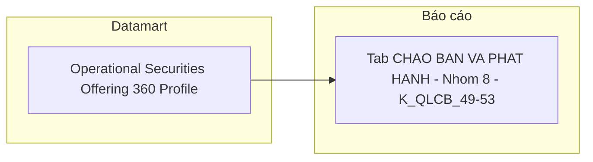

**Bảng grain:**

| Tên bảng | Grain |
|---|---|
| `Operational Securities Offering 360 Profile` | 1 row = 1 đợt chào bán × 1 loại hình (kế thừa Nhóm 4) |

---

#### Nhóm 9 — Thông tin cấp phép chào bán (STT 51–56)

> Phân loại: **Tác nghiệp**
> Atomic: `Public Company Securities Offering Plan` ← IDS.SECURITIES_OFFERING_PLAN — **READY** (Atomic draft — chưa approved chính thức)
> Atomic: `Public Company Securities Offering` ← IDS.SECURITIES_OFFERING — **READY** (Atomic draft, dùng cho `total_registered_quantity`, `offering_purpose`)
> Ghi chú: Với model 1-N, mỗi row 360 Profile là 1 loại hình cụ thể (Plan) — `swap_target`, `employee_quantity`, `offering_price` lấy trực tiếp từ Plan tương ứng, không cần ETL pick.

**Mockup:**

| Số lượng cấp phép | Giá (cấp phép) | Giá trị cấp phép | SL người LĐ | Đối tượng | Mục đích sử dụng vốn |
|---|---|---|---|---|---|
| 10,000,000 | 15,000 đ | 150 tỷ | 500 | CBNV công ty | Bổ sung vốn lưu động |

**Source:** `Operational Securities Offering 360 Profile`

**Bảng KPI:**

| KPI ID | Tên KPI | Đơn vị | Tính chất | Công thức | Ghi chú | Trạng thái |
|---|---|---|---|---|---|---|
| K_QLCB_54 | Số lượng cấp phép | CK | Attribute | `Public Company Securities Offering.total_registered_quantity` — bảng cha, IDS.SECURITIES_OFFERING.TOTAL_REGISTERED_QTY | — | READY |
| K_QLCB_55 | Giá (cấp phép) | VNĐ | Attribute | `Public Company Securities Offering Plan.offering_price` — IDS.SECURITIES_OFFERING_PLAN.OFFERING_PRICE (giá trực tiếp trên Plan, không cần Derived) | — | READY |
| K_QLCB_56 | Giá trị cấp phép | Tỷ VNĐ | Attribute | `Public Company Securities Offering.total_expected_amt` — bảng cha, IDS.SECURITIES_OFFERING.TOTAL_EXPECTED_AM (BA ghi rõ nguồn bảng cha, không phải Plan snapshot) | — | READY |
| K_QLCB_57 | Số lượng người lao động | Người | Attribute | `Public Company Securities Offering Plan.employee_quantity` — IDS.SECURITIES_OFFERING_PLAN.EMPLOYEE_QTY; chỉ có giá trị với 1 số thủ tục (ESOP/Bonus Share), NULL với loại hình khác | — | READY |
| K_QLCB_58 | Đối tượng | Text | Attribute | `CASE WHEN Operational Securities Offering 360 Profile.Offering_Method_Code = '5' THEN Public Company.Public_Company_Name ELSE NULL END` — chỉ có giá trị khi phát hành riêng lẻ, IDS.COMPANY_PROFILES.COMPANY_NAME_VN | BA cập nhật 2026-08-10: đổi từ SWAP_TARGET sang tên công ty khi offering_method_cd = 5; các hình thức khác NULL | READY |
| K_QLCB_59 | Mục đích sử dụng vốn | Text | Attribute | `Public Company Securities Offering.offering_purpose` — bảng cha, IDS.SECURITIES_OFFERING.OFFERING_PURPOSE | — | READY |

**Schema bảng tác nghiệp:** Kế thừa `Operational Securities Offering 360 Profile` — bổ sung 3 cột `Offering_Price`, `Employee_Quantity`, `Swap_Target` (xem erDiagram Nhóm 4).

**Lineage Mart → Báo cáo:**


**Bảng grain:**

| Tên bảng | Grain |
|---|---|
| `Operational Securities Offering 360 Profile` | 1 row = 1 đợt chào bán × 1 loại hình (kế thừa Nhóm 4) |

---

#### Nhóm 10 — Thông tin kết quả chào bán (STT 57–61)

> Phân loại: **Tác nghiệp**
> Atomic: `Public Company Securities Offering Result` ← IDS.SECURITIES_OFFERING_RESULT — **READY** (Atomic draft — chưa approved chính thức)

**Mockup:**

| Số lượng thực tế | Giá thực tế | Giá trị thực tế | SL người LĐ (TT) | Đối tượng (TT) |
|---|---|---|---|---|
| 9,800,000 | 15,000 đ | 147 tỷ | 490 | CBNV công ty |

**Source:** `Operational Securities Offering 360 Profile`

**Bảng KPI:**

| KPI ID | Tên KPI | Đơn vị | Tính chất | Công thức | Ghi chú | Trạng thái |
|---|---|---|---|---|---|---|
| K_QLCB_60 | Số lượng thực tế | CK | Attribute | `Public Company Securities Offering Result.total_successful_quantity` — IDS.SECURITIES_OFFERING_RESULT.TOTAL_SUCCESSFUL_QTY | — | READY |
| K_QLCB_61 | Giá thực tế | VNĐ | Attribute | `Public Company Securities Offering Result.actual_offering_price` — IDS.SECURITIES_OFFERING_RESULT.ACTUAL_OFFERING_PRICE (giá trực tiếp trên Result, không cần Derived) | — | READY |
| K_QLCB_62 | Giá trị thực tế | Tỷ VNĐ | Attribute | `Public Company Securities Offering Result.total_collected_amt` — IDS.SECURITIES_OFFERING_RESULT.TOTAL_COLLECTED_AM | — | READY |
| K_QLCB_63 | Số lượng người lao động (TT) | Người | Attribute | `Public Company Securities Offering Result.employee_quantity` — IDS.SECURITIES_OFFERING_RESULT.EMPLOYEE_QTY | — | READY |
| K_QLCB_64 | Đối tượng (thực tế) | Text | Attribute | `CASE WHEN Public Company Securities Offering Result.offering_method_code_snpst = '5' THEN Public Company.Public_Company_Name ELSE NULL END` — điều kiện lấy theo field snapshot trên Result (khác Plan), IDS.SECURITIES_OFFERING_RESULT.OFFERING_METHOD_CD = 5, tên công ty IDS.COMPANY_PROFILES.COMPANY_NM_VN | BA cập nhật 2026-08-10: đổi từ CAPITAL_SOURCE sang tên công ty khi offering_method_cd = 5 (điều kiện theo Result, không dùng lại Offering_Method_Code composite BK của Plan vì 2 field có thể lệch); các hình thức khác NULL | READY |

**Schema bảng tác nghiệp:** Kế thừa `Operational Securities Offering 360 Profile` — bổ sung 3 cột `Actual_Offering_Price`, `Employee_Quantity_Result`, `Capital_Source`.

**Lineage Mart → Báo cáo:**

```mermaid
flowchart LR
    subgraph Datamart["Datamart"]
        G1["Operational Securities Offering 360 Profile"]
    end
    subgraph RPT["Báo cáo"]
        R10["Tab CHAO BAN VA PHAT HANH - Nhom 10 - K_QLCB_60-64"]
    end
    G1 --> R10
```

**Bảng grain:**

| Tên bảng | Grain |
|---|---|
| `Operational Securities Offering 360 Profile` | 1 row = 1 đợt chào bán × 1 loại hình (kế thừa Nhóm 4) |

---

## Section 3 — Mô hình tổng thể (READY only)

```mermaid
graph TB
    classDef dim fill:#E6F1FB,stroke:#185FA5,color:#0C447C
    classDef fact fill:#FAECE7,stroke:#993C1D,color:#4A1B0C
    classDef oper fill:#E8F5E9,stroke:#2E7D32,color:#1B5E20

    DIM_DATE["Calendar Date Dimension"]:::dim
    DIM_COMPANY["Public Company Dimension"]:::dim
    DIM_OFFRMETHOD["Offering Method Dimension"]:::dim

    FACT_OFF["Fact Securities Offering Snapshot"]:::fact
    FACT_PLAN["Fact Securities Offering Plan Snapshot"]:::fact
    FACT_RESULT["Fact Securities Offering Result Snapshot"]:::fact
    FACT_APP["Fact Securities Offering Application Snapshot"]:::fact

    OPR_OFF["Operational Securities Offering 360 Profile"]:::oper

    DIM_DATE --> FACT_OFF
    DIM_COMPANY --> FACT_OFF

    DIM_DATE --> FACT_PLAN
    DIM_COMPANY --> FACT_PLAN
    DIM_OFFRMETHOD --> FACT_PLAN

    DIM_DATE --> FACT_RESULT
    DIM_COMPANY --> FACT_RESULT
    DIM_OFFRMETHOD --> FACT_RESULT

    DIM_DATE --> FACT_APP
    DIM_OFFRMETHOD --> FACT_APP
```

### Bảng Phân tích (Star Schema)

| Tên bảng Datamart | Mô tả | Fact Pattern | Grain | Nguồn Atomic chính |
|---|---|---|---|---|
| Fact Securities Offering Snapshot | Hồ sơ chào bán/phát hành CK — tổng giá trị cấp phép/huy động theo ngành, kỳ (Nhóm 1) | Fact Event | 1 hồ sơ chào bán | Public Company Securities Offering / Public Company Securities Offering Result |
| Fact Securities Offering Plan Snapshot | Giá trị cấp phép theo loại hình chào bán (Nhóm 2) | Fact Event | 1 đợt × 1 loại hình kế hoạch | Public Company Securities Offering Plan |
| Fact Securities Offering Result Snapshot | Giá trị huy động theo loại hình chào bán (Nhóm 3) | Fact Event | 1 đợt × 1 loại hình kết quả | Public Company Securities Offering Result |
| Fact Securities Offering Application Snapshot | Hồ sơ đăng ký chào bán nộp lên UBCKNN — đếm và phân tích theo trạng thái xử lý, hình thức, năm (Nhóm 5-6) | Fact Event | 1 hồ sơ đăng ký chào bán | Public Company Securities Offering / Public Company Securities Offering Plan |

### Bảng Tác nghiệp (Denormalized)

| Tên bảng Datamart | Mô tả | Grain | Nguồn Atomic chính |
|---|---|---|---|
| Operational Securities Offering 360 Profile | Hồ sơ 360° tra cứu chi tiết từng đợt chào bán — pivot theo loại hình, gồm thông tin tổ chức liên quan (Nhóm 4, 7-10) | 1 đợt chào bán × 1 loại hình | Public Company Securities Offering / Public Company Securities Offering Plan / Public Company Securities Offering Result / Public Company |

### Bảng Dimension

*Tất cả Dimension áp dụng SCD Type 4A (trừ `Public Company Dimension` — reuse `public_company_dim`, giữ quy ước SCD gốc của module GSDC).*

| Tên bảng Datamart | Mô tả | Grain | Nguồn Atomic chính | Conformed |
|---|---|---|---|---|
| Calendar Date Dimension | Lịch ngày — ETL tự sinh | 1 ngày | Generated | Có |
| Public Company Dimension | Công ty đại chúng — mã CK, tên, ngành, sàn (reuse `public_company_dim`, module GSDC) | 1 công ty đại chúng | Public Company | Có |
| Offering Method Dimension | Hình thức chào bán/phát hành — ETL-derived (DISTINCT) từ cột `offering_method_code`, scheme mô tả `IDS_SO_OFFERING_METHOD` | 1 mã hình thức | Public Company Securities Offering Plan | Không |

---

## Section 4 — Reuse Analysis

| Datamart Entity | datamart_table | reuse_status | Ghi chú |
|---|---|---|---|
| Calendar Date Dimension | cdr_dt_dim | reuse | Conformed Dim toàn hệ thống (Lớp 1 — Whitelist) |
| Public Company Dimension | public_company_dim | reuse | Module GSDC đã có, cùng nguồn Atomic `Public Company`, đủ cột mã CK/tên/sàn/`Business Line Level 1 Code` cho GROUP BY ngành (Lớp 3 — Source Match). Bổ sung `QLCB` vào `modules_using` |
| Offering Method Dimension | offering_method_dim | new | Chưa có entity nào trong registry cùng nguồn `Public Company Securities Offering Plan`/`Result` — `offering_form_dim` (module QLKD) tuy cùng `table_type: dim` nhưng khác nguồn Atomic hoàn toàn (SCMS `sc_disclosure_securities_offering` khác IDS `pc_securities_offering_plan`) nên không reuse được |
| Fact Securities Offering Snapshot | fct_securities_offering_snpst (đề xuất) | new | Chưa có Fact nào cùng nguồn `pc_securities_offering` trong registry |
| Fact Securities Offering Plan Snapshot | fct_securities_offering_plan_snpst (đề xuất) | new | Chưa có Fact nào cùng grain/nguồn `pc_securities_offering_plan` |
| Fact Securities Offering Result Snapshot | fct_securities_offering_result_snpst (đề xuất) | new | Chưa có Fact nào cùng grain/nguồn `pc_securities_offering_result` |
| Fact Securities Offering Application Snapshot | fct_securities_offering_application_snpst (đề xuất) | new | Chưa có Fact nào cùng grain hồ sơ đăng ký IDS |
| Operational Securities Offering 360 Profile | opr_securities_offering_360_profile (đề xuất) | new | Bảng tác nghiệp, chưa có tương đương trong registry |

---

## Section 5 — Vấn đề mở

| ID | Vấn đề | Giả định hiện tại | KPI liên quan | Trạng thái |
|---|---|---|---|---|
| O_QLCB_9 | **[Phạm vi Atomic — không phải Datamart] 2 track Atomic trùng logical_name "Public Company Securities Offering":** Track cũ `DataModel/working/Atomic_LinhLV/Business_Activity/dm_atm_pblc_co_scr_ofrg-IDS.company_securities_issuance.yaml` (physical_name `pblc_co_scr_ofrg`, nguồn ghi `IDS.company_securities_issuance`) **không có BRD source thật** trong `BRD/Source/IDS/` — có khả năng là track nháp/lỗi thời. Track mới `DataModel/working/Atomic/lld/IDS/lld_IDS_SECURITIES_OFFERING.yaml` (physical_name `pc_securities_offering`, nguồn `IDS.SECURITIES_OFFERING`) có BRD source đầy đủ nhưng attribute-level `status: draft`, chưa aggregate vào `DataModel/Atomic/` + `dm_manifest.yaml`. Đây là vấn đề quy trình thiết kế/quản lý Atomic (track nào là chuẩn, đã aggregate hay chưa) — không phải lỗi trace nguồn hay thiết kế của Datamart HLD; Datamart đã xác định đúng entity có BRD source thật để dùng. | Datamart HLD dùng track mới theo xác nhận người thiết kế (coi LLD draft là READY) — quyết định này thuộc phạm vi Datamart và đã chốt. Phần còn lại (reconcile track cũ, chạy `aggregate_atomic.py`, đưa vào `dm_manifest.yaml`) là việc của quy trình `atomic-lld-design`/`atomic-review`, không block hay thuộc trách nhiệm giải quyết của Datamart. | Toàn bộ KPI Nhóm 1–10 | **Open — chuyển giao đội Atomic** |
