# Data Mart HLD — Phân hệ Quản lý Chào bán (QLCB)

**Phiên bản:** 1.4  
**Ngày:** 21/05/2026  
**Changelog v1.1:** Bổ sung thiết kế nguồn TTHC — chuyển K_QLCB_19–22 và Nhóm 5–7 từ PENDING → READY dựa trên TTHC_Source_Analysis.md.  
**Changelog v1.2:** Review toàn bộ HLD — (1) Cụm 2 lineage bổ sung `Application Eform Field Value`; (2) Bảng KPI K_QLCB_19–22 cập nhật mô tả đúng cơ chế array filter; (3) Lineage Nhóm 4 bổ sung `Application Eform Field Value`; (4) Bổ sung ghi chú Phase 2 cho `Application_Status_Code` tại erDiagram Nhóm 5.  
**Changelog v1.3:** Review hoàn chỉnh trước Phase 2 — (1) Cụm 3 lineage: xóa `Application Eform Field Value` và `TextFieldIndex` khỏi cụm, dọn gọn subgraph; (2) erDiagram `Securities_Offering_360_Profile`: bổ sung ghi chú Phase 2 về BK; (3) erDiagram `Fact_Securities_Offering_Application` + `Offering_Type_Dimension`: bổ sung ghi chú Phase 2 về DD, NK, FK; (4) O_QLCB_6: sửa nhầm module.  
**Changelog v1.4:** Bổ sung ghi chú Phase 2 NK cho `Public_Company_Dimension` (`Public_Company_Code`) và `Industry_Category_Dimension` (`Industry_Category_Level2_Code`) tại erDiagram Nhóm 1 — nhất quán với pattern ghi chú đã áp dụng cho `Offering_Type_Dimension`.

---

## Quy ước trạng thái

| Ký hiệu | Ý nghĩa |
|---|---|
| READY | Atomic đủ — thiết kế đầy đủ |
| PENDING | Atomic chưa có — placeholder + lý do |

---

## Section 1 — Data Lineage: Source → Atomic → Data Mart

### Cụm 1: Chào bán phát hành (Securities Offering)

Phục vụ Tab CHÀO BÁN PHÁT HÀNH — Nhóm 1 (KPI tình hình cấp phép/huy động theo ngành), Nhóm 2 (giá trị cấp phép theo loại hình), Nhóm 3 (giá trị huy động theo loại hình × ngành). Tab HỒ SƠ ĐĂNG KÝ CHÀO BÁN phục vụ bởi Cụm 3 riêng (nguồn TTHC).

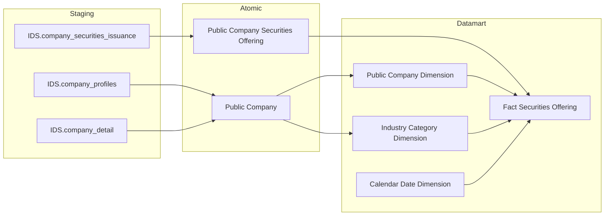

---

### Cụm 2: Chi tiết đợt chào bán (Bảng tác nghiệp)

Phục vụ Tab CHÀO BÁN PHÁT HÀNH — Nhóm 4 (bảng chi tiết số lượng CK chào bán & phát hành) và Tab CHÀO BÁN VÀ PHÁT HÀNH — Nhóm 8–11 (tra cứu chi tiết đợt chào bán theo 4 nhóm chỉ số). Bảng tác nghiệp nhận dữ liệu trực tiếp từ Atomic, không qua Dimension. Từ v1.1: bổ sung `Application Eform Field Value` (TTHC) làm nguồn thứ 3 cho 4 cột tổ chức (K_QLCB_19–22).

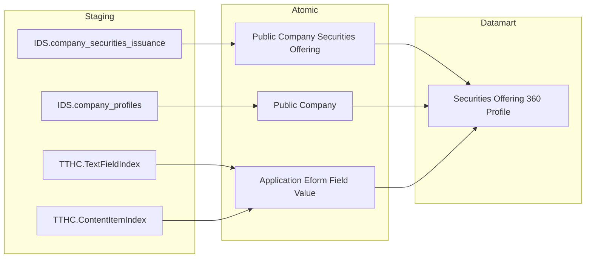

---

### Cụm 3: Hồ sơ đăng ký chào bán (TTHC)

Phục vụ Tab HỒ SƠ ĐĂNG KÝ CHÀO BÁN — Nhóm 5 (KPI Cards), Nhóm 6 (donut Tỷ lệ xử lý hồ sơ), Nhóm 7 (bảng chi tiết hồ sơ theo hình thức × năm). Nguồn TTHC dựa trên kiến trúc EAV Orchard Core — 3 Atomic entity: `Securities Offering Application` (metadata hồ sơ + `Application Status Code` ETL-derived), `Application Eform Field Value` (toàn bộ field Eform pack dạng `Array<Struct>` per loại field index), `Application Review Workflow` (workflow xét duyệt). `Application Status Code` là ETL-derived tổng hợp từ 3 bảng nguồn theo logic ưu tiên — Datamart `direct` map, không tự tính.

> **Lưu ý Phase 2:** `Application Eform Field Value` expose attribute `Text Fields: Array<Struct<content_part, content_field, text_value, big_text_value>>` — không có cột scalar riêng per field Eform. Datamart ETL lấy giá trị cụ thể (Advisor Name, Auditor Name...) bằng array filter expression trên cột này. `etl_logic_type = computed`, không phải `direct` hay `join_atomic`. Xem chi tiết tại Nhóm 4.

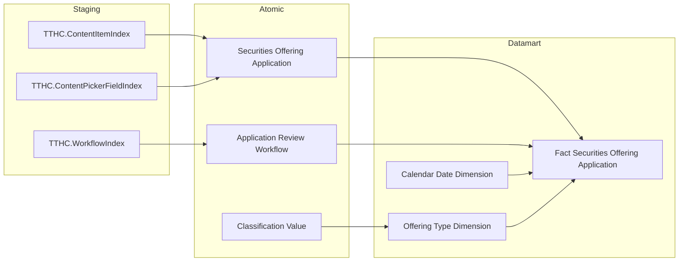

> **Ghi chú lineage:** `Application Eform Field Value` ← TTHC.TextFieldIndex không xuất hiện trong Cụm 3 vì entity này không feed vào `Fact Securities Offering Application`. Nguồn cho 4 cột tổ chức (K_QLCB_19–22) trên `Securities Offering 360 Profile` đã được vẽ đầy đủ tại Cụm 2. `ContentPickerFieldIndex` feed vào `Securities Offering Application` vì Atomic ETL dùng bảng này để tính `Application Status Code` (DA_CAP_PHEP / TU_CHOI).

---

## Section 2 — Tổng quan báo cáo

### Tab: CHÀO BÁN PHÁT HÀNH

**Slicer chung:** Ngày (date picker), Ngành

---

#### Nhóm 1 — Tình hình thực hiện chào bán phát hành theo ngành

> Phân loại: **Phân tích**  
> Atomic: `Public Company Securities Offering` ← IDS.company_securities_issuance — **READY**  
> Atomic: `Public Company` ← IDS.company_profiles / IDS.company_detail — **READY**

**Mockup:**

| Ngành | Giá trị Cấp phép (tỷ đ) | Giá trị Huy động (tỷ đ) | Chưa thành công (tỷ đ) |
|---|---|---|---|
| Tài chính - Ngân hàng | 12,500 | 10,200 | 2,300 |
| Bất động sản | 8,700 | 7,100 | 1,600 |
| Công nghiệp | 5,300 | 4,800 | 500 |

**Source:** `Fact Securities Offering` → `Public Company Dimension`, `Industry Category Dimension`, `Calendar Date Dimension`

**Bảng KPI:**

| KPI ID | Tên | Đơn vị | Tính chất | Công thức / Mô tả |
|---|---|---|---|---|
| K_QLCB_1 | Giá trị Cấp phép | Tỷ VNĐ | Flow (Base) | `SUM(Planned Proceeds Amount)` per ngành × kỳ |
| K_QLCB_2 | Giá trị Huy động thành công | Tỷ VNĐ | Flow (Base) | `SUM(Actual Proceeds Amount)` per ngành × kỳ |
| K_QLCB_3 | Chưa thành công | Tỷ VNĐ | Derived | `K_QLCB_1 − K_QLCB_2` — tính ở presentation layer |
| K_QLCB_1_YOY | YoY% Giá trị Cấp phép | % | Derived | `(K_QLCB_1[Y] − K_QLCB_1[Y−1]) / K_QLCB_1[Y−1] × 100%` |
| K_QLCB_2_YOY | YoY% Giá trị Huy động | % | Derived | `(K_QLCB_2[Y] − K_QLCB_2[Y−1]) / K_QLCB_2[Y−1] × 100%` |

> **Lưu ý:** K_QLCB_1 và K_QLCB_2 là Base — lấy trực tiếp từ `Planned Proceeds Amount` và `Actual Proceeds Amount` của `Public Company Securities Offering`. K_QLCB_3 và YoY là Derived — tính ở presentation layer, không lưu mart.

> **Ghi chú — Industry Category Dimension:** ETL-derived Conformed Dimension — Atomic không có entity riêng cho ngành. ETL extract từ `Public Company.Industry Category Level1/Level2 Code` (IDS.company_detail.category_l1_id, category_l2_id). Lý do tạo Dim riêng: (1) GROUP BY ngành ≠ GROUP BY công ty đại chúng, (2) Conformed Dim tái sử dụng cross-module (NDTNN, NHNCK, QLKD).

**Star Schema:**

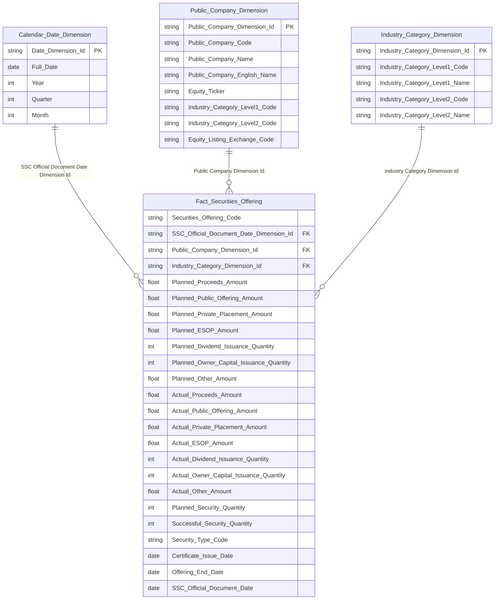

> **Ghi chú Phase 2 — NK cho Dimension IDS:**
>
> **`Public_Company_Dimension`:**
> - `Public_Company_Dimension_Id` → `key = PK`
> - `Public_Company_Code` → `key = NK` — Natural Key, ETL join từ `Public Company Securities Offering.Public Company Code` để resolve Surrogate Dimension Key. Mermaid không hỗ trợ label `NK` trong erDiagram — chỉ ghi trong Attributes CSV cột `key`
> - Các cột còn lại → `key` trống
>
> **`Industry_Category_Dimension`:**
> - `Industry_Category_Dimension_Id` → `key = PK`
> - `Industry_Category_Level2_Code` → `key = NK` — Natural Key định nghĩa grain (cấp 2 xác định duy nhất 1 dòng vì mỗi cấp 2 chỉ thuộc 1 cấp 1). ETL join từ `Public Company.Industry Category Level2 Code` để resolve Surrogate Dimension Key
> - `Industry_Category_Level1_Code` → `key` trống — attribute mô tả, không làm NK vì không định nghĩa grain độc lập
> - Các cột còn lại → `key` trống

**Lineage Mart → Báo cáo:**

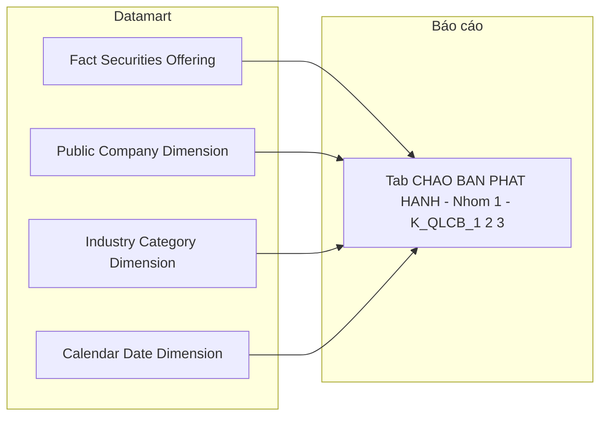

**Bảng grain:**

| Tên bảng | Grain |
|---|---|
| Fact Securities Offering | 1 row = 1 đợt chào bán/phát hành CK của 1 công ty đại chúng (Event — 1 record per company_securities_issuance) |
| Public Company Dimension | 1 row = 1 công ty đại chúng (SCD2) |
| Industry Category Dimension | 1 row = 1 ngành cấp 1 × 1 ngành cấp 2 (SCD2 — ETL extract từ Public Company) |
| Calendar Date Dimension | 1 row = 1 ngày (SSC Official Document Date — ngày công văn UBCKNN) |

---

#### Nhóm 2 — Giá trị cấp phép chào bán phát hành theo ngành

> Phân loại: **Phân tích**  
> Atomic: `Public Company Securities Offering` ← IDS.company_securities_issuance — **READY**

**Mockup:**

| Loại hình | Giá trị cấp phép (tỷ đ) | % tổng |
|---|---|---|
| Công chúng | 8,200 | 42% |
| Riêng lẻ | 5,100 | 26% |
| ESOP | 2,300 | 12% |
| Trả cổ tức | 1,800 | 9% |
| Tăng vốn từ VCSH | 1,500 | 8% |
| Khác | 600 | 3% |

**Source:** `Fact Securities Offering` → `Industry Category Dimension`, `Calendar Date Dimension`

**Bảng KPI:**

| KPI ID | Tên | Đơn vị | Tính chất | Công thức / Mô tả |
|---|---|---|---|---|
| K_QLCB_4 | Loại hình phát hành | — | Chiều | `GROUP BY Offering Type Category Code` — 6 loại hình: PUBLIC / PRIVATE / ESOP / DIVIDEND / OWNER_CAPITAL / OTHER |
| K_QLCB_5 | Giá trị cấp phép — Công chúng | Tỷ VNĐ | Derived | `SUM(Planned Public Offering Amount)` |
| K_QLCB_6 | Giá trị cấp phép — Riêng lẻ | Tỷ VNĐ | Derived | `SUM(Planned Private Placement Amount)` |
| K_QLCB_7 | Giá trị cấp phép — ESOP | Tỷ VNĐ | Derived | `SUM(Planned ESOP Amount)` |
| K_QLCB_8 | Giá trị cấp phép — Trả cổ tức | Tỷ VNĐ | Derived | `SUM(Planned Dividend Amount)` |
| K_QLCB_9 | Giá trị cấp phép — Tăng vốn từ VCSH | Tỷ VNĐ | Derived | `SUM(Planned Owner Capital Amount)` |
| K_QLCB_10 | Giá trị cấp phép — Các loại khác | Tỷ VNĐ | Derived | `SUM(Planned Other Amount)` |

> **Lưu ý — Per-type amount columns (cập nhật từ BA mới):** Mỗi đợt chào bán trên Atomic có thể sử dụng nhiều loại hình đồng thời (mixed-type) — `planned_proceeds_am` là tổng toàn bộ, không tách được per loại hình. Do đó Fact lưu thêm các cột ETL-derived tại grain level: `Planned_Public_Offering_Amount`, `Planned_Private_Placement_Amount`, `Planned_ESOP_Amount`, `Planned_Other_Amount` (4 cột Currency Amount — loại hình có tiền mặt); `Planned_Dividend_Issuance_Quantity`, `Planned_Owner_Capital_Issuance_Quantity` (2 cột Small Counter — loại hình không huy động tiền mặt, Atomic không có price field). Tổng 4 cột Amount = `Planned_Proceeds_Amount`. K_QLCB_5–10 là Derived — tính ở presentation layer. Xem O_QLCB_7.

**Star Schema:** Kế thừa từ Nhóm 1 — GROUP BY `Industry Category Dimension`. Mỗi loại hình tương ứng 1 cột per-type Amount trên Fact.

**Lineage Mart → Báo cáo:**

**Bảng grain:**

| Tên bảng | Grain |
|---|---|
| Fact Securities Offering | 1 row = 1 đợt chào bán/phát hành CK (kế thừa Nhóm 1) |
| Industry Category Dimension | 1 row = 1 ngành cấp 1 × 1 ngành cấp 2 (SCD2) |
| Calendar Date Dimension | 1 row = 1 ngày |

---

#### Nhóm 3 — Giá trị phát hành theo hình thức phát hành và nhóm ngành

> Phân loại: **Phân tích**  
> Atomic: `Public Company Securities Offering` ← IDS.company_securities_issuance — **READY**

**Mockup:**

| Ngành \ Loại hình | Công chúng | Riêng lẻ | ESOP | Trả cổ tức | Tăng vốn VCSH | Khác |
|---|---|---|---|---|---|---|
| Tài chính - Ngân hàng | 4,200 | 3,100 | 800 | 600 | 400 | 200 |
| Bất động sản | 2,100 | 1,800 | 500 | 400 | 700 | 100 |
| Công nghiệp | 1,800 | 950 | 300 | 200 | 150 | 100 |

**Source:** `Fact Securities Offering` → `Industry Category Dimension`, `Calendar Date Dimension`

**Bảng KPI:**

| KPI ID | Tên | Đơn vị | Tính chất | Công thức / Mô tả |
|---|---|---|---|---|
| K_QLCB_11 | Giá trị huy động — Công chúng | Tỷ VNĐ | Derived | `SUM(Actual Public Offering Amount)` GROUP BY ngành |
| K_QLCB_12 | Giá trị huy động — Riêng lẻ | Tỷ VNĐ | Derived | `SUM(Actual Private Placement Amount)` GROUP BY ngành |
| K_QLCB_13 | Giá trị huy động — ESOP | Tỷ VNĐ | Derived | `SUM(Actual ESOP Amount)` GROUP BY ngành |
| K_QLCB_14 | Giá trị huy động — Trả cổ tức | Tỷ VNĐ | Derived | `SUM(Actual Dividend Amount)` GROUP BY ngành |
| K_QLCB_15 | Giá trị huy động — Tăng vốn từ VCSH | Tỷ VNĐ | Derived | `SUM(Actual Owner Capital Amount)` GROUP BY ngành |
| K_QLCB_16 | Giá trị huy động — Các loại khác | Tỷ VNĐ | Derived | `SUM(Actual Other Amount)` GROUP BY ngành |

> **Lưu ý:** Nhóm 3 khác Nhóm 2 ở chỗ dùng các cột Actual per loại hình (`Actual_Public_Offering_Amount`, `Actual_Private_Placement_Amount`, `Actual_ESOP_Amount`, `Actual_Other_Amount`) thay vì Planned. Loại hình Trả cổ tức và Tăng vốn VCSH dùng cột số lượng (`Actual_Dividend_Issuance_Quantity`, `Actual_Owner_Capital_Issuance_Quantity`) — không có giá trị tiền. Cùng 1 Fact, GROUP BY `Industry Category Dimension` × per-type column. Tổng 4 cột Amount = `Actual_Proceeds_Amount`. Xem O_QLCB_7.

**Star Schema:** Cùng star schema với Nhóm 1 — GROUP BY `Industry Category Dimension`. Mỗi loại hình tương ứng 1 cột per-type Amount trên Fact.

**Lineage Mart → Báo cáo:**

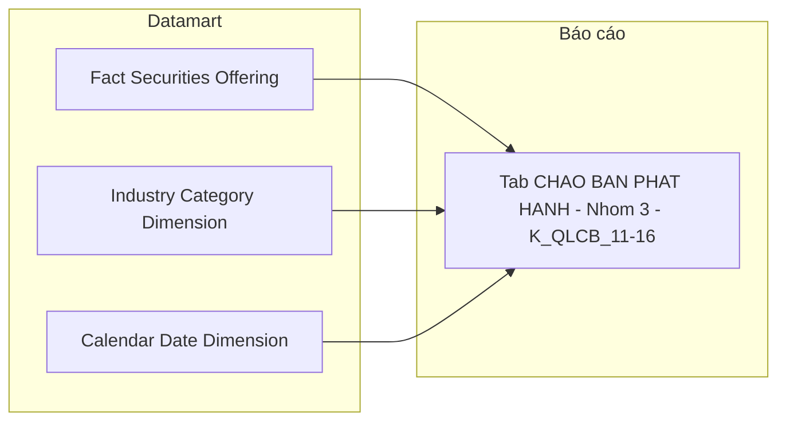

**Bảng grain:**

| Tên bảng | Grain |
|---|---|
| Fact Securities Offering | 1 row = 1 đợt chào bán/phát hành CK (kế thừa Nhóm 1) |
| Industry Category Dimension | 1 row = 1 ngành cấp 1 × 1 ngành cấp 2 (SCD2) |
| Calendar Date Dimension | 1 row = 1 ngày |

---

#### Nhóm 4 — Bảng Chi tiết số lượng chứng khoán Chào bán & Phát hành

> Phân loại: **Tác nghiệp**  
> Atomic: `Public Company Securities Offering` ← IDS.company_securities_issuance — **READY**  
> Atomic: `Public Company` ← IDS.company_profiles — **READY**  
> Atomic: `Application Eform Field Value` ← TTHC.TextFieldIndex — **READY** (v1.1 — K_QLCB_19–22 chuyển từ PENDING)

**Mockup:**

| Mã CK | Tên DN | Hình thức | Đvị tư vấn | Tổ chức KT | Đvị bảo lãnh | Đvị XHTN | SL cấp phép | SL thành công | GT cấp phép (tỷ) | GT thành công (tỷ) | Tỷ lệ % |
|---|---|---|---|---|---|---|---|---|---|---|---|
| ABC | Công ty ABC | Công chúng | — | — | — | — | 10,000,000 | 9,500,000 | 500 | 475 | 95% |
| DEF | Công ty DEF | Riêng lẻ | — | — | — | — | 5,000,000 | 5,000,000 | 250 | 250 | 100% |

**Source:** `Securities Offering 360 Profile` — lookup theo đợt chào bán / công ty

**Bảng KPI:**

| KPI ID | Tên | Đơn vị | Tính chất | Công thức / Mô tả |
|---|---|---|---|---|
| K_QLCB_17 | Thông tin doanh nghiệp (Mã CK, Tên DN) | — | Attribute | `SELECT Equity Ticker, Public Company Name` — Equity Ticker = mã CK (IDS.company_profiles.equity_ticker); Public Company Name = tên DN |
| K_QLCB_18 | Hình thức chào bán | — | Attribute | `SELECT Offering Type Category Code` |
| K_QLCB_19 | Đơn vị tư vấn | — | Attribute | `Application Eform Field Value.Text Fields` — array filter `content_field LIKE '%Tochuctuvan%' OR LIKE '%Tentochuctuvan%'`, lấy `text_value`. Nullable |
| K_QLCB_20 | Tổ chức kiểm toán | — | Attribute | `Application Eform Field Value.Text Fields` — array filter `content_field LIKE '%Tochuckiemtoan%'`, lấy `text_value`. Nullable |
| K_QLCB_21 | Đơn vị bảo lãnh | — | Attribute | `Application Eform Field Value.Text Fields` — array filter `content_field LIKE '%baolanh%' AND NOT LIKE '%baolanhthanhtoan%'`, lấy `text_value`. Nullable — chỉ Eform 3, 5, 7 |
| K_QLCB_22 | Đơn vị xếp hạng tín nhiệm | — | Attribute | `Application Eform Field Value.Text Fields` — array filter `content_field LIKE '%xephang%'`, lấy `text_value`. Nullable — chỉ Eform 7 |
| K_QLCB_23 | Số lượng CK được cấp phép | CK | Attribute | `SUM(Planned Offering Quantity)` GROUP BY Securities Offering Code — tổng số lượng CK cấp phép của đợt |
| K_QLCB_24 | Số lượng CK chào bán thành công | CK | Attribute | `SUM(Actual Offering Quantity)` GROUP BY Securities Offering Code — tổng số lượng CK thực tế của đợt |
| K_QLCB_25 | Giá trị cấp phép | Tỷ VNĐ | Attribute | `SUM(Planned Offering Amount)` GROUP BY Securities Offering Code — tổng giá trị cấp phép của đợt |
| K_QLCB_26 | Giá trị chào bán thành công | Tỷ VNĐ | Attribute | `SUM(Actual Offering Amount)` GROUP BY Securities Offering Code — tổng giá trị thực tế của đợt |
| K_QLCB_27 | Tỷ lệ chào bán thành công | % | Derived | `K_QLCB_24 / K_QLCB_23 × 100%` — tính ở presentation layer |

> **Ghi chú K_QLCB_19–22 (v1.1 — cập nhật theo LLD TTHC):** 4 attributes READY. Atomic entity `Application Eform Field Value` **không pivot thành cột scalar** — toàn bộ field Eform được pack vào cột `Text Fields` kiểu `Array<Struct<content_part, content_field, text_value, big_text_value>>`. Datamart ETL lấy giá trị bằng cách **filter trong array** theo `content_field` pattern, không phải join thông thường.
>
> **Cơ chế lấy giá trị tại Datamart ETL (Phase 2 cần phản ánh):**
> - Join từ `Securities Offering 360 Profile` sang `Application Eform Field Value` qua `Securities Offering Application Code` (BK)
> - Filter trong `text_fields` array theo pattern tương ứng, lấy `text_value` của phần tử đầu tiên khớp
> - `etl_logic_type = computed` (array filter expression), không phải `direct` hay `join_atomic`
>
> **Pattern per cột:**
> | Cột Datamart | Pattern filter `content_field` | Ghi chú |
> |---|---|---|
> | `Advisor Name` | `LIKE '%Tochuctuvan%'` hoặc `LIKE '%Tentochuctuvan%'` | 2 pattern — Eform 10/16/17 có tiền tố "Ten" |
> | `Auditor Name` | `LIKE '%Tochuckiemtoan%'` | Đồng nhất trên tất cả Eform |
> | `Underwriter Name` | `LIKE '%baolanh%'` AND NOT `LIKE '%baolanhthanhtoan%'` | Chỉ Eform 3, 5, 7 — NULL hợp lệ với loại hình khác |
> | `Rating Agency Name` | `LIKE '%xephang%'` | Chỉ Eform 7 — NULL hợp lệ với tất cả CP/CCQ/CQ |
>
> Pattern `content_field` thực tế cần xác nhận profile DB (TTHC checklist 4b #6) trước ETL build — không block HLD.

> **Ghi chú schema (v1.1):** Bổ sung 4 cột nullable vào `Securities Offering 360 Profile`: `Advisor_Name`, `Auditor_Name`, `Underwriter_Name`, `Rating_Agency_Name` — xem erDiagram cập nhật bên dưới.

**Schema bảng tác nghiệp:**

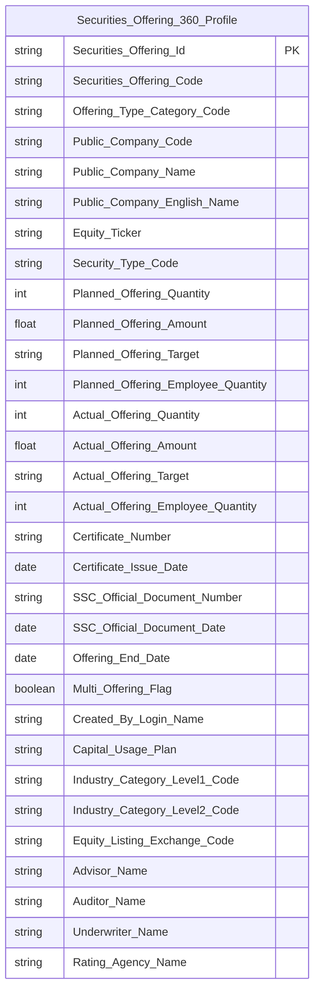

> **Ghi chú Phase 2 — Key labels cho `Securities Offering 360 Profile`:**
> - `Securities_Offering_Id` → `key = PK` — Surrogate key ETL sinh, join anchor giữa các Operational table
> - `Securities_Offering_Code` → `key = BK` — Business key đợt chào bán (IDS.company_securities_issuance.issuance_code), ETL debug anchor
> - `Offering_Type_Category_Code` → `key = BK` — Business key component 2, cùng với `Securities_Offering_Code` tạo thành Composite BK định nghĩa grain (1 row = 1 đợt × 1 loại hình)
> - Mermaid không hỗ trợ label `BK` trong erDiagram — chỉ ghi trong Attributes CSV cột `key`

**Lineage Mart → Báo cáo:**

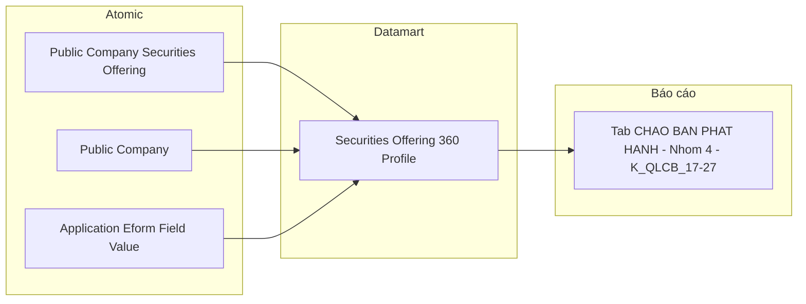

**Bảng grain:**

| Tên bảng | Grain |
|---|---|
| `Securities Offering 360 Profile` | 1 row = 1 đợt chào bán × 1 loại hình có qty > 0. Composite PK: (Securities Offering Code, Offering Type Category Code) |

---

### Tab: HỒ SƠ ĐĂNG KÝ CHÀO BÁN

**Slicer chung:** Từ ngày — Đến ngày (date range picker)

---

#### Nhóm 5 — KPI Cards tổng quan hồ sơ

> Phân loại: **Phân tích**  
> Atomic: `Securities Offering Application` ← TTHC.ContentItemIndex — **READY**  
> Atomic: `Application Review Workflow` ← TTHC.WorkflowIndex — **READY**

**Mockup:**

| Hồ sơ đăng ký | Đang xử lý | Đã cấp phép | Bị từ chối |
|---|---|---|---|
| 124 | 38 | 72 | 14 |

> **Lưu ý:** 4 card hiển thị **số lượng hồ sơ** (số nguyên). Tỷ lệ % là Derived tính tại presentation layer từ 4 Base KPI.

**Source:** `Fact Securities Offering Application`

**Bảng KPI:**

| KPI ID | Tên | Đơn vị | Tính chất | Công thức / Mô tả |
|---|---|---|---|---|
| K_QLCB_50 | Số lượng hồ sơ đăng ký | Hồ sơ | Cơ sở | `COUNT(Fact Securities Offering Application)` toàn bộ trong kỳ |
| K_QLCB_51 | Số lượng hồ sơ đang xử lý | Hồ sơ | Cơ sở | `COUNT WHERE Application Status Code = 'DANG_XU_LY'` |
| K_QLCB_52 | Số lượng hồ sơ đã cấp phép | Hồ sơ | Cơ sở | `COUNT WHERE Application Status Code = 'DA_CAP_PHEP'` |
| K_QLCB_53 | Số lượng hồ sơ bị từ chối | Hồ sơ | Cơ sở | `COUNT WHERE Application Status Code = 'TU_CHOI'` |
| K_QLCB_54 | Tỷ lệ % per trạng thái | % | Derived | `COUNT(trạng thái X) / COUNT(tất cả) × 100%` — tính tại presentation layer |

> **Ghi chú `Application Status Code`:** ETL-derived từ 3 bảng nguồn theo thứ tự ưu tiên — lưu trong mart, không tính tại query layer:
> 1. `DA_CAP_PHEP` — tồn tại ContentItem GCN (Published=1) liên kết qua ContentPickerFieldIndex
> 2. `TU_CHOI` — tồn tại ContentItem từ chối (Published=1) liên kết qua ContentPickerFieldIndex
> 3. `DANG_XU_LY` — WorkflowIndex.WorkflowStatus IN (Idle, Executing)
> 4. `CHO_XU_LY` — không match 3 trường hợp trên
>
> Eform 16 (Bonus) và Eform 17 (ESOP) không qua workflow — cần xác nhận `Application Status Code` mặc định (TTHC checklist 4b #5).

**Star Schema:**

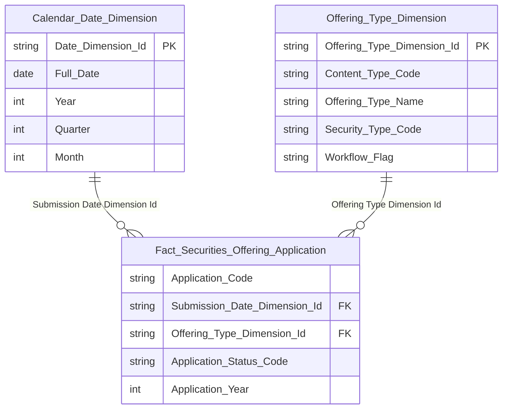

> **Ghi chú Phase 2 — Key labels:**
>
> **`Fact_Securities_Offering_Application`:**
> - `Application_Code` → `key = DD` (Degenerate Dimension) — Business key hồ sơ (TTHC.ContentItemIndex.ContentItemId dạng string), lưu trực tiếp trên Fact để tra cứu, không tạo Dimension riêng. Fact Event không có Surrogate PK.
> - `Submission_Date_Dimension_Id` → `key = FK → Calendar Date Dimension`
> - `Offering_Type_Dimension_Id` → `key = FK → Offering Type Dimension`
> - `Application_Status_Code` → `key` trống — Classification Value, `etl_logic_type = direct` từ Atomic (xem ghi chú bên dưới)
> - `Application_Year` → `key` trống — Degenerate Dimension dạng int, không tạo Dimension riêng
>
> **`Offering_Type_Dimension`:**
> - `Offering_Type_Dimension_Id` → `key = PK`
> - `Content_Type_Code` → `key = NK` — Natural Key, ETL join từ `Securities Offering Application.Content Type Code` để resolve Surrogate Dimension Key. Mermaid không hỗ trợ label `NK` trong erDiagram — chỉ ghi trong Attributes CSV cột `key`
> - `Offering_Type_Name`, `Security_Type_Code`, `Workflow_Flag` → `key` trống

**Lineage Mart → Báo cáo:**

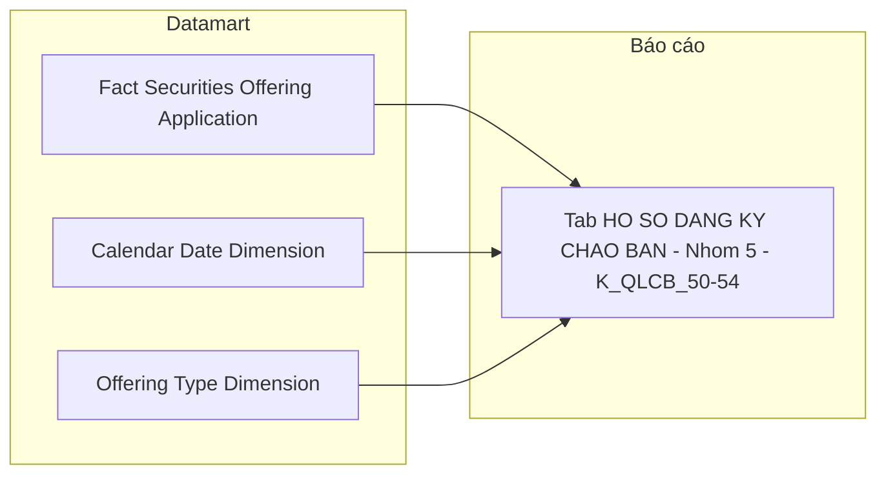

**Bảng grain:**

| Tên bảng | Grain |
|---|---|
| `Fact Securities Offering Application` | 1 row = 1 hồ sơ đăng ký chào bán (1 ContentItemId) |
| `Offering Type Dimension` | 1 row = 1 loại hình chào bán (1 ContentType — 11 giá trị) |
| `Calendar Date Dimension` | 1 row = 1 ngày nộp hồ sơ (ContentItemIndex.CreatedUtc) |

---

#### Nhóm 6 — Biểu đồ Tỷ lệ xử lý hồ sơ (donut)

> Phân loại: **Phân tích**  
> Atomic: `Securities Offering Application` ← TTHC.ContentItemIndex — **READY**  
> Atomic: `Application Review Workflow` ← TTHC.WorkflowIndex — **READY**  
> Ghi chú: Cùng nguồn Fact với Nhóm 5 — không cần bảng mới.

**Mockup:**

| Trạng thái | Số lượng | Tỷ lệ % |
|---|---|---|
| Chờ xử lý | 24 | 19% |
| Đang xử lý | 38 | 31% |
| Đã cấp phép | 72 | 42% |
| Bị từ chối | 14 | 11% |

**Source:** `Fact Securities Offering Application` — GROUP BY `Application Status Code`

**Bảng KPI:**

| KPI ID | Tên | Đơn vị | Tính chất | Công thức / Mô tả |
|---|---|---|---|---|
| K_QLCB_55 | Số lượng hồ sơ per trạng thái | Hồ sơ | Cơ sở | `COUNT GROUP BY Application Status Code` — 4 giá trị: CHO_XU_LY / DANG_XU_LY / DA_CAP_PHEP / TU_CHOI |
| K_QLCB_56 | Tỷ lệ % per trạng thái | % | Derived | `COUNT(trạng thái X) / COUNT(tất cả) × 100%` — tính tại presentation layer |

> **Ghi chú:** K_QLCB_55 là cùng measure với K_QLCB_50–53 (Nhóm 5) nhưng hiển thị theo chiều GROUP BY thay vì 4 card riêng biệt. Không cần KPI ID mới cho Base — presentation layer pivot từ cùng query.

**Star Schema:** Kế thừa từ Nhóm 5 — cùng `Fact Securities Offering Application`.

**Lineage Mart → Báo cáo:**

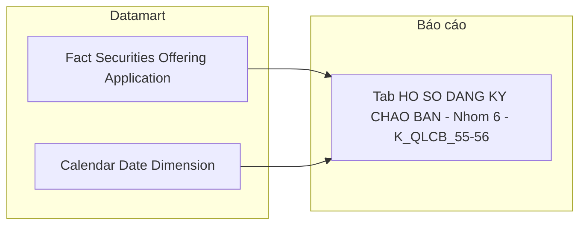

**Bảng grain:**

| Tên bảng | Grain |
|---|---|
| `Fact Securities Offering Application` | 1 row = 1 hồ sơ (kế thừa Nhóm 5) |

---

#### Nhóm 7 — Bảng Chi tiết hồ sơ chào bán & phát hành

> Phân loại: **Phân tích**  
> Atomic: `Securities Offering Application` ← TTHC.ContentItemIndex — **READY**  
> Atomic: `Application Review Workflow` ← TTHC.WorkflowIndex — **READY**  
> Ghi chú: Cùng Fact với Nhóm 5/6 — GROUP BY `Offering Type Dimension` × `Application Year`.

**Mockup:**

| Hình thức chào bán | Năm | Chờ xử lý | Đang xử lý | Đã cấp phép | Bị từ chối | Tổng |
|---|---|---|---|---|---|---|
| Chào bán CP lần đầu | 2025 | 2 | 5 | 18 | 3 | 28 |
| Chào bán trái phiếu | 2025 | 1 | 3 | 12 | 1 | 17 |
| Phát hành CP ESOP | 2024 | 0 | 2 | 24 | 4 | 30 |

**Source:** `Fact Securities Offering Application` → `Offering Type Dimension`, `Calendar Date Dimension`

**Bảng KPI:**

| KPI ID | Tên | Đơn vị | Tính chất | Công thức / Mô tả |
|---|---|---|---|---|
| K_QLCB_57 | Hình thức chào bán | — | Chiều | `GROUP BY Offering Type Dimension.Offering Type Name` — 11 loại Eform map từ ContentType qua CV `TTHC_CONTENT_TYPE` |
| K_QLCB_58 | Năm | — | Chiều | `GROUP BY Application Year` (Degenerate Dimension = `strftime('%Y', CreatedUtc)`) |
| K_QLCB_59 | Số lượng hồ sơ chờ xử lý | Hồ sơ | Cơ sở | `COUNT WHERE Application Status Code = 'CHO_XU_LY'` |
| K_QLCB_60 | Số lượng hồ sơ đang xử lý | Hồ sơ | Cơ sở | `COUNT WHERE Application Status Code = 'DANG_XU_LY'` |
| K_QLCB_61 | Số lượng hồ sơ đã cấp phép | Hồ sơ | Cơ sở | `COUNT WHERE Application Status Code = 'DA_CAP_PHEP'` |
| K_QLCB_62 | Số lượng hồ sơ bị từ chối | Hồ sơ | Cơ sở | `COUNT WHERE Application Status Code = 'TU_CHOI'` |
| K_QLCB_63 | Tổng hồ sơ | Hồ sơ | Derived | `K_QLCB_59 + K_QLCB_60 + K_QLCB_61 + K_QLCB_62` — tính tại presentation layer |

> **Ghi chú `Offering Type Dimension`:** ETL-derived từ `ContentItemIndex.ContentType` map qua CV scheme `TTHC_CONTENT_TYPE` (11 ContentType → 11 nhãn). ContentType thực tế cần xác nhận với đội dev TTHC (TTHC checklist 4b #1 — không block HLD).

**Star Schema:** Kế thừa từ Nhóm 5 — cùng `Fact Securities Offering Application` + `Offering Type Dimension` + `Calendar Date Dimension`.

**Lineage Mart → Báo cáo:**

**Bảng grain:**

| Tên bảng | Grain |
|---|---|
| `Fact Securities Offering Application` | 1 row = 1 hồ sơ (kế thừa Nhóm 5) |
| `Offering Type Dimension` | 1 row = 1 loại hình chào bán (11 ContentType) |
| `Calendar Date Dimension` | 1 row = 1 ngày nộp hồ sơ |

---

### Tab: CHÀO BÁN VÀ PHÁT HÀNH (Data Explorer)

**Slicer chung:** Sàn (dropdown), Ngành nghề (dropdown), Khoảng thời gian (Từ ngày — Đến ngày)

> **Ghi chú thiết kế:** Data Explorer là màn hình tra cứu chi tiết từng đợt chào bán, cho phép người dùng chọn tổ hợp chỉ số (checkbox) từ 4 nhóm rồi hiển thị bảng kết quả. Đây là use case Tác nghiệp — lookup n đợt chào bán theo điều kiện lọc. Tab này **reuse** `Securities Offering 360 Profile` đã thiết kế ở Nhóm 4 Tab CHÀO BÁN PHÁT HÀNH, mở rộng thêm các attribute chi tiết theo từng hình thức phát hành (ESOP target, Dividend qty...). Không cần thêm Fact hay Dim mới.

---

#### Nhóm 8 — Thông tin cơ sở (STT 40–45)

> Phân loại: **Tác nghiệp**  
> Atomic: `Public Company Securities Offering` ← IDS.company_securities_issuance — **READY**  
> Atomic: `Public Company` ← IDS.company_profiles / IDS.company_detail — **READY**  
> Ghi chú: Attribute "Chuyên viên" (STT 65) — PENDING vì `Created By Login Name` map về `logins` (bảng hệ thống out-of-scope trong IDS Atomic). Xem O_QLCB_5.

**Mockup:**

| Mã CK | Tên công ty | Sàn | Ngành | Thời điểm báo cáo | Chuyên viên | Loại CK |
|---|---|---|---|---|---|---|
| VIC | VinGroup | HOSE | Bất động sản | 24/03/2026 | — | Cổ phiếu |
| VCB | Vietcombank | UPCOM | Ngân hàng | 24/03/2026 | — | Cổ phiếu |

**Source:** `Securities Offering 360 Profile`

**Bảng KPI:**

| KPI ID | Tên | Đơn vị | Tính chất | Nguồn Atomic | Ghi chú |
|---|---|---|---|---|---|
| K_QLCB_28 | Thời điểm báo cáo | Ngày | Attribute | `Public Company Securities Offering.SSC Official Document Date` — IDS.company_securities_issuance.ssc_official_doc_date | Ngày công văn UBCKNN — dùng làm thời điểm báo cáo (FK date chính). Xem O_QLCB_3 (Closed). |
| K_QLCB_29 | Chuyên viên | Text | Attribute | `Public Company Securities Offering.Created By Login Name` — IDS.company_securities_issuance.created_by. Giá trị là login_name kỹ thuật (không phải tên đầy đủ). Xem O_QLCB_5 |
| K_QLCB_30 | Tên công ty | Text | Attribute | `Public Company.Public Company Name` | |
| K_QLCB_31 | Mã chứng khoán | Text | Attribute | `Public Company.Equity Ticker` — IDS.company_profiles.equity_ticker | |
| K_QLCB_32 | Sàn | Text | Attribute | `Public Company.Equity Listing Exchange Code` | Scheme: IDS_EQUITY_LISTING_EXCH |
| K_QLCB_33 | Loại chứng khoán | Text | Attribute | `Public Company Securities Offering.Security Type Code` | Scheme: IDS_ISSUANCE_SECURITY_TYPE |

**Schema bảng tác nghiệp:** Kế thừa `Securities Offering 360 Profile` — xem Nhóm 4 Tab CHÀO BÁN PHÁT HÀNH.

**Lineage Mart → Báo cáo:**

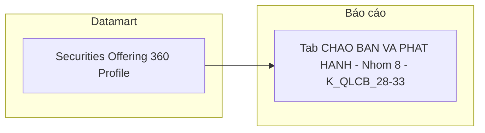

**Bảng grain:**

| Tên bảng | Grain |
|---|---|
| `Securities Offering 360 Profile` | 1 row = 1 đợt chào bán × 1 loại hình có qty > 0. Composite PK: (Securities Offering Code, Offering Type Category Code) |

---

#### Nhóm 9 — Thông tin công văn cấp phép (STT 46–50)

> Phân loại: **Tác nghiệp**  
> Atomic: `Public Company Securities Offering` ← IDS.company_securities_issuance — **READY**

**Mockup:**

| Số GCN | Ngày cấp GCN | Số công văn gửi CT | Ngày công văn | Hình thức phát hành |
|---|---|---|---|---|
| 12/GCN-UBCK | 15/01/2026 | 14/CV-UBCK | 14/01/2026 | Công chúng |
| 08/GCN-UBCK | 10/02/2026 | 07/CV-UBCK | 09/02/2026 | Riêng lẻ |

**Source:** `Securities Offering 360 Profile`

**Bảng KPI:**

| KPI ID | Tên | Đơn vị | Tính chất | Nguồn Atomic |
|---|---|---|---|---|
| K_QLCB_34 | Số giấy chứng nhận | Text | Attribute | `Public Company Securities Offering.Certificate Number` — IDS.company_securities_issuance.certificate_no |
| K_QLCB_35 | Ngày cấp giấy chứng nhận | Ngày | Attribute | `Public Company Securities Offering.Certificate Issue Date` — IDS.company_securities_issuance.certificate_issue_date |
| K_QLCB_36 | Số công văn gửi công ty | Text | Attribute | `Public Company Securities Offering.SSC Official Document Number` — IDS.company_securities_issuance.ssc_official_doc_no |
| K_QLCB_37 | Ngày công văn | Ngày | Attribute | `Public Company Securities Offering.SSC Official Document Date` — IDS.company_securities_issuance.ssc_official_doc_date |
| K_QLCB_38 | Hình thức phát hành | Text | Attribute | `Securities Offering 360 Profile.Offering Type Category Code` — PK component 2; ETL sinh 1 row per loại hình có qty > 0 |

**Schema bảng tác nghiệp:** Kế thừa `Securities Offering 360 Profile`.

**Lineage Mart → Báo cáo:**

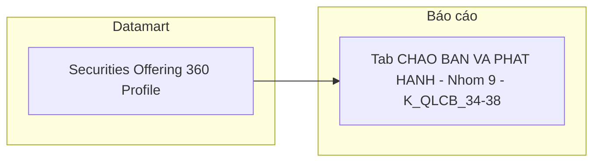

**Bảng grain:**

| Tên bảng | Grain |
|---|---|
| `Securities Offering 360 Profile` | 1 row = 1 đợt chào bán × 1 loại hình có qty > 0. Composite PK: (Securities Offering Code, Offering Type Category Code) |

---

#### Nhóm 10 — Thông tin cấp phép chào bán (STT 51–56)

> Phân loại: **Tác nghiệp**  
> Atomic: `Public Company Securities Offering` ← IDS.company_securities_issuance — **READY**  
> Ghi chú: Với pivot design, mỗi row 360 Profile là 1 loại hình cụ thể — `Planned_Offering_Target`, `Planned_Offering_Employee_Quantity` lấy trực tiếp từ row tương ứng, không cần ETL pick nữa. `Planned_Offering_Price` không lưu trên mart (derive được = `Planned_Offering_Amount / Planned_Offering_Quantity` tại presentation layer).

**Mockup:**

| Số lượng cấp phép | Giá (cấp phép) | Giá trị cấp phép | SL người LĐ | Đối tượng | Mục đích sử dụng vốn |
|---|---|---|---|---|---|
| 10,000,000 | 15,000 đ | 150 tỷ | 500 | CBNV công ty | Bổ sung vốn lưu động |

**Source:** `Securities Offering 360 Profile`

**Bảng KPI:**

| KPI ID | Tên | Đơn vị | Tính chất | Nguồn Atomic |
|---|---|---|---|---|
| K_QLCB_39 | Số lượng cấp phép | CK | Attribute | `Public Company Securities Offering.Planned Security Quantity` — IDS.company_securities_issuance.planned_security_qty |
| K_QLCB_40 | Giá (cấp phép) | VNĐ | Derived | `Planned Offering Amount / Planned Offering Quantity` — giá bình quân gia quyền; tính ở presentation layer. NULL với Dividend/Owner Capital (không có Amount) |
| K_QLCB_41 | Giá trị cấp phép | Tỷ VNĐ | Attribute | `Securities Offering 360 Profile.Planned Offering Amount` — `qty × price` của loại hình; NULL với Dividend/Owner Capital |
| K_QLCB_42 | Số lượng người lao động | Người | Attribute | `Securities Offering 360 Profile.Planned Offering Employee Quantity` — SL NLĐ; chỉ có giá trị với ESOP/Bonus Share; NULL với các loại hình khác |
| K_QLCB_43 | Đối tượng | Text | Attribute | `Securities Offering 360 Profile.Planned Offering Target` — đối tượng chào bán của loại hình; NULL với Dividend/Owner Capital/Public |
| K_QLCB_44 | Mục đích sử dụng vốn | Text | Attribute | `Public Company Securities Offering.Capital Usage Plan` — IDS.company_securities_issuance.capital_usage_plan |

**Schema bảng tác nghiệp:** Kế thừa `Securities Offering 360 Profile` — cần bổ sung thêm các attribute ESOP/bonus/private target.

**Lineage Mart → Báo cáo:**

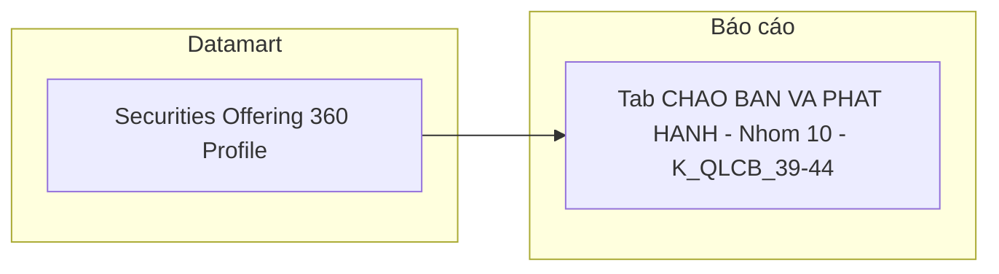

**Bảng grain:**

| Tên bảng | Grain |
|---|---|
| `Securities Offering 360 Profile` | 1 row = 1 đợt chào bán × 1 loại hình có qty > 0. Composite PK: (Securities Offering Code, Offering Type Category Code) |

---

#### Nhóm 11 — Thông tin kết quả chào bán (STT 57–61)

> Phân loại: **Tác nghiệp**  
> Atomic: `Public Company Securities Offering` ← IDS.company_securities_issuance — **READY**

**Mockup:**

| Số lượng thực tế | Giá thực tế | Giá trị thực tế | SL người LĐ (TT) | Đối tượng (TT) |
|---|---|---|---|---|
| 9,800,000 | 15,000 đ | 147 tỷ | 490 | CBNV công ty |

**Source:** `Securities Offering 360 Profile`

**Bảng KPI:**

| KPI ID | Tên | Đơn vị | Tính chất | Nguồn Atomic |
|---|---|---|---|---|
| K_QLCB_45 | Số lượng thực tế | CK | Attribute | `SUM(Actual Offering Quantity)` GROUP BY Securities Offering Code — tổng số lượng CK thực tế của đợt |
| K_QLCB_46 | Giá thực tế | VNĐ | Derived | `Actual Offering Amount / Actual Offering Quantity` — giá bình quân gia quyền; tính ở presentation layer. NULL với Dividend/Owner Capital (không có Amount) |
| K_QLCB_47 | Giá trị thực tế | Tỷ VNĐ | Attribute | `Securities Offering 360 Profile.Actual Offering Amount` — `qty × price` thực tế của loại hình; NULL với Dividend/Owner Capital |
| K_QLCB_48 | Số lượng người lao động (TT) | Người | Attribute | `Securities Offering 360 Profile.Actual Offering Employee Quantity` — SL NLĐ thực tế; chỉ có giá trị với ESOP/Bonus Share |
| K_QLCB_49 | Đối tượng (thực tế) | Text | Attribute | `Securities Offering 360 Profile.Actual Offering Target` — đối tượng thực tế của loại hình |

**Schema bảng tác nghiệp:** Kế thừa `Securities Offering 360 Profile`.

**Lineage Mart → Báo cáo:**

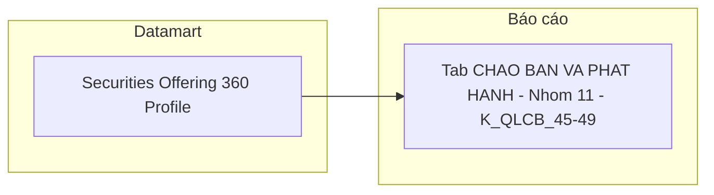

**Bảng grain:**

| Tên bảng | Grain |
|---|---|
| `Securities Offering 360 Profile` | 1 row = 1 đợt chào bán × 1 loại hình có qty > 0. Composite PK: (Securities Offering Code, Offering Type Category Code) |

---

## Section 3 — Mô hình tổng thể (READY only)

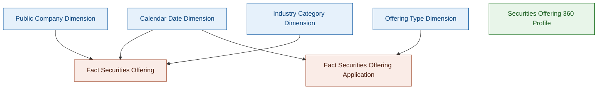

### Bảng Phân tích (Star Schema)

| Tên bảng Datamart | Mô tả | Fact Pattern | Grain | Nguồn Atomic chính |
|---|---|---|---|---|
| Fact Securities Offering | Đợt chào bán / phát hành CK được cấp phép — aggregate theo ngành, loại hình, kỳ | Fact Event | 1 đợt chào bán × 1 công ty đại chúng | Public Company Securities Offering |
| Fact Securities Offering Application | Hồ sơ đăng ký chào bán nộp lên UBCKNN — đếm và phân tích theo trạng thái xử lý, hình thức, năm | Fact Event | 1 hồ sơ đăng ký chào bán | Securities Offering Application / Application Review Workflow |

### Bảng Tác nghiệp (Denormalized)

| Tên bảng Datamart | Mô tả | Grain | Nguồn Atomic chính |
|---|---|---|---|
| Securities Offering 360 Profile | Hồ sơ 360° tra cứu chi tiết từng đợt chào bán — pivot theo loại hình, bao gồm thông tin tổ chức từ hồ sơ TTHC | 1 đợt chào bán × 1 loại hình có qty > 0 | Public Company Securities Offering / Public Company / Application Eform Field Value |

### Bảng Dimension

*Tất cả Dimension áp dụng SCD Type 4A.*

| Tên bảng Datamart | Mô tả | Grain | Nguồn Atomic chính | Conformed |
|---|---|---|---|---|
| Calendar Date Dimension | Lịch ngày — ETL tự sinh | 1 ngày | Generated | Có |
| Public Company Dimension | Công ty đại chúng — mã CK, tên, ngành, sàn (SCD2) | 1 công ty đại chúng | Public Company | Không |
| Industry Category Dimension | Nhóm ngành cấp 1 / cấp 2 — ETL-derived từ Public Company (SCD2) | 1 ngành cấp 1 × 1 ngành cấp 2 | Public Company | Có |
| Offering Type Dimension | Loại hình chào bán — map từ ContentType TTHC qua CV TTHC_CONTENT_TYPE | 1 loại hình (11 ContentType) | Classification Value | Không |

---

## Section 4 — Vấn đề mở

| ID | Vấn đề | Giả định hiện tại | KPI liên quan | Trạng thái |
|---|---|---|---|---|
| O_QLCB_1 | **Mapping Loại hình phát hành trên 360 Profile:** Atomic `Public Company Securities Offering` lưu qty/price riêng cho từng loại hình. Cần xác định loại hình nào "active" (qty > 0) để sinh row trên 360 Profile. | ETL sinh 1 row trên `Securities Offering 360 Profile` per loại hình có qty > 0 trong đợt chào bán. `Offering Type Category Code` = PK component 2 (không còn ETL pick type chính). Fact Securities Offering không lưu `Offering Type Category Code` — dùng 6 cột per-type Amount thay thế. | K_QLCB_18, 38 | **Closed** |
| O_QLCB_2 | **KPI nguồn TTHC — 4 attributes Nhóm 4 (K_QLCB_19–22):** Đơn vị tư vấn, Tổ chức kiểm toán, Đơn vị bảo lãnh, Đơn vị XHTN có nguồn TTHC. | *(v1.1)* Atomic entity xác định: `Application Eform Field Value` ← TTHC.TextFieldIndex. ETL pivot theo `ContentItemId`. Join anchor: `Securities Offering Application.content_item_id = TextFieldIndex.ContentItemId`. 4 cột nullable bổ sung vào `Securities Offering 360 Profile`. Còn 1 điểm chờ xác nhận: pattern ContentField thực tế (TTHC checklist 4b #6) — không block thiết kế. | K_QLCB_19–22 | **Confirmed** |
| O_QLCB_3 | **Ngày làm FK date trên Fact:** Atomic `Public Company Securities Offering` có 3 trường ngày: `certificate_issue_date` (ngày cấp GCN chào bán), `offering_start_date` (ngày chào bán chứng khoán), `ssc_official_doc_date` (ngày ra công văn UBCKNN). | BA xác nhận (cập nhật): FK date chính = `ssc_official_doc_date` (ngày công văn UBCKNN) → `SSC Official Document Date Dimension Id`. `certificate_issue_date` và `offering_start_date` lưu thêm dạng date field trên Fact/Tác nghiệp nhưng không làm FK date chính. | K_QLCB_1–16 | **Closed** |
| O_QLCB_4 | **Toàn bộ Tab Hồ sơ đăng ký chào bán (Nhóm 5–7) nguồn TTHC:** 11+ KPI gồm 3 Nhóm (KPI Cards, donut chart, bảng chi tiết hồ sơ) đều có nguồn TTHC. | *(v1.1)* Thiết kế hoàn chỉnh với `Fact Securities Offering Application` (Event, grain = 1 hồ sơ) + `Offering Type Dimension`. `Application Status Code` ETL-derived từ 3 bảng nguồn theo logic ưu tiên DA_CAP_PHEP > TU_CHOI > DANG_XU_LY > CHO_XU_LY. Xem O_QLCB_8 cho các điểm cần xác nhận với dev TTHC. | K_QLCB_50–63 | **Confirmed** |
| O_QLCB_5 | **Chuyên viên và Giá/Đối tượng/SL NLĐ per hình thức:** (a) "Chuyên viên" = `Created By Login Name` (IDS.company_securities_issuance.created_by) — BA xác nhận dùng field này. Giá trị là login_name kỹ thuật, không phải tên đầy đủ. (b) Với pivot design trên 360 Profile, mỗi row đã là 1 loại hình cụ thể — `Planned/Actual Offering Target`, `Planned/Actual Offering Employee Quantity` lấy trực tiếp từ row tương ứng, không cần ETL pick nữa. `Planned/Actual Offering Price` không lưu trên mart — derive tại presentation layer = Amount / Quantity. | (a) READY — map `Created By Login Name`. (b) RESOLVED bởi pivot design — xem O_QLCB_1 (Closed). | K_QLCB_29, K_QLCB_40, K_QLCB_42–43, K_QLCB_46, K_QLCB_48–49 | **Closed** |
| O_QLCB_6 | **Ngày hết hạn CCHN — KPI thuộc module NHNCK, không phải QLCB:** Issue này được ghi nhận nhầm trong QLCB HLD. "Ngày hết hạn CCHN" và `CertificateRecords.RevocationDate` thuộc phân hệ NHNCK (Nhà hành nghề chứng khoán), không có KPI tương ứng trong module QLCB. | Issue được đóng và ghi nhận là nhầm module. KPI liên quan cần xem trong `DTM_NHNCK_HLD.md`. | *(không thuộc QLCB)* | **Closed — nhầm module** |
| O_QLCB_7 | **Per-type amount columns trên Fact:** Atomic `company_securities_issuance` lưu qty và price riêng per loại hình. Một đợt chào bán có thể dùng nhiều loại hình đồng thời (mixed-type). `planned_proceeds_am` / `actual_proceeds_am` là tổng tất cả loại hình — không thể filter per-type chính xác. Ngoài ra Atomic **không có price field** cho loại hình Trả cổ tức (`plan_dividend_qty`) và Tăng vốn từ VCSH (`plan_owner_qty`) — 2 loại hình này phát hành bằng chuyển đổi vốn chủ sở hữu, không huy động tiền mặt. | Bổ sung vào `Fact Securities Offering`: (1) 4 cột Currency Amount ETL-derived cho loại hình có tiền mặt: `Planned/Actual Public Offering Amount`, `Planned/Actual Private Placement Amount`, `Planned/Actual ESOP Amount`, `Planned/Actual Other Amount`. `Other Amount` = `proceeds_am − (Public + Private + ESOP)`. (2) 4 cột Small Counter map thẳng từ Atomic cho loại hình không có tiền: `Planned/Actual Dividend Issuance Quantity`, `Planned/Actual Owner Capital Issuance Quantity`. Lưu ý: BA file có lỗi đánh máy tại công thức Dividend và OwnerCapital (qty×qty thay vì qty×price) — đã xử lý bằng thiết kế lưu số lượng thay vì giá trị. | K_QLCB_5–16 | **Closed** |
| O_QLCB_8 | **Xác nhận kỹ thuật TTHC trước ETL build:** 3 điểm chờ xác nhận với đội dev TTHC: (1) ContentType thực tế của 11 Eform chào bán — ảnh hưởng toàn bộ filter `WHERE ContentType IN (...)`. (2) ContentType của ContentItem GCN và văn bản từ chối — ảnh hưởng logic DA_CAP_PHEP và TU_CHOI. (3) Eform 16 (Bonus) và Eform 17 (ESOP) có qua workflow không — ảnh hưởng `Application Status Code` mặc định cho 2 loại này. Ngoài ra: (4) Pattern ContentField thực tế trong TextFieldIndex (TTHC checklist 4b #6) — ảnh hưởng K_QLCB_19–22. | Không block HLD. Block ETL build cho `Fact Securities Offering Application` và cột TTHC trên `Securities Offering 360 Profile`. | K_QLCB_19–22, K_QLCB_50–63 | **Open** |