# Data Mart HLD — Phân hệ Quản lý Chào bán (QLCB)

**Phiên bản:** 1.4  
**Ngày:** 21/05/2026  
**Changelog v1.1:** Bổ sung thiết kế nguồn TTHC — chuyển K_QLCB_19–22 và Nhóm 5–7 từ PENDING → READY dựa trên TTHC_Source_Analysis.md.  
**Changelog v1.2:** Review toàn bộ HLD — (1) Cụm 2 lineage bổ sung `Application Eform Field Value`; (2) Bảng KPI K_QLCB_19–22 cập nhật mô tả đúng cơ chế array filter; (3) Lineage Nhóm 4 bổ sung `Application Eform Field Value`; (4) Bổ sung ghi chú Phase 2 cho `Application_Status_Code` tại erDiagram Nhóm 5.  
**Changelog v1.3:** Review hoàn chỉnh trước Phase 2 — (1) Cụm 3 lineage: xóa `Application Eform Field Value` và `TextFieldIndex` khỏi cụm, dọn gọn subgraph; (2) erDiagram `Securities_Offering_360_Profile`: bổ sung ghi chú Phase 2 về BK; (3) erDiagram `Fact_Securities_Offering_Application` + `Offering_Type_Dimension`: bổ sung ghi chú Phase 2 về DD, NK, FK; (4) O_QLCB_6: sửa nhầm module.  
**Changelog v1.4:** Bổ sung ghi chú Phase 2 NK cho `Public_Company_Dimension` (`Public_Company_Code`) và `Industry_Category_Dimension` (`Industry_Category_Level2_Code`) tại erDiagram Nhóm 1 — nhất quán với pattern ghi chú đã áp dụng cho `Offering_Type_Dimension`.  
**Changelog v2.0 (Đổi nguồn TTHC → IDS — nghiệp vụ QLCB không còn dùng TTHC):**
1. **Cụm 3 lineage** — thiết kế lại hoàn toàn: nguồn đổi từ TTHC (`ContentItemIndex`/`WorkflowIndex`/`Application Eform Field Value`) sang `IDS.SECURITIES_OFFERING.APPROVAL_STATUS_CD` trực tiếp trên entity `Public Company Securities Offering` đã có (cùng entity dùng ở Cụm 1/2). Bỏ hẳn `Application Review Workflow`, `Application Eform Field Value` khỏi lineage hồ sơ đăng ký.
2. **Nhóm 4 (K_QLCB_19–22)** — đổi từ TTHC array-filter (`computed`, `Application Eform Field Value.Text Fields`) sang direct map 4 cột có sẵn trên `Public Company Securities Offering`: `consulting_organization_nm`, `audit_organization_nm`, `underwriting_organization_nm`, `credit_rating_organization_nm`.
3. **Nhóm 5/6 (KPI Cards + donut hồ sơ)** — `Fact Securities Offering Application` đổi grain nguồn: 1 row = 1 `Public Company Securities Offering` (thay vì 1 `ContentItemId` TTHC). `Application_Status_Code` đổi từ ETL-derived 3-bảng TTHC sang direct map từ `approval_status_code` IDS (4 giá trị: `PENDING_REVIEW`/`PENDING_APPROVE`/`APPROVED`/`REJECTED`).
4. **Nhóm 7 (bảng chi tiết theo hình thức × năm)** — thay `Offering Type Dimension` (TTHC ContentType) bằng `Offering Method Dimension` mới, nguồn `Public Company Securities Offering Plan.offering_method_code` (IDS, scheme `IDS_SO_OFFERING_METHOD`).
5. **Nhóm 1** — `Public Company Dimension` đổi từ thiết kế riêng sang **reuse** `public_company_dim` (đã có trong `datamart_model.yaml`, module GSDC, cùng nguồn Atomic `public_company`) — kết quả phân tích Reuse 4 lớp, xem Section 4.
6. Bổ sung **Section 4 — Reuse Analysis** (trước đây HLD thiếu section này); đẩy "Vấn đề mở" xuống **Section 5**.
7. Đóng O_QLCB_2, O_QLCB_4 — lý do đổi nguồn TTHC → IDS theo xác nhận nghiệp vụ mới nhất (`BA_analyst_QLCB.csv`, cột Nguồn = IDS toàn bộ 10 nhóm).
8. Atomic nguồn dùng ở bản v2.0: entity `Public Company Securities Offering` / `Public Company Securities Offering Plan` hiện tại chỉ có LLD draft tại `DataModel/working/Atomic/lld/IDS/` (`design_status: approved` cấp entity nhưng attribute `status: draft`), **chưa aggregate vào `DataModel/Atomic/` + `dm_manifest.yaml`** — coi là READY theo xác nhận người thiết kế, ghi chú "Atomic draft — chưa approved chính thức" tại các bảng liên quan.

---

## Quy ước trạng thái

| Ký hiệu | Ý nghĩa |
|---|---|
| READY | Atomic đủ — thiết kế đầy đủ |
| PENDING | Atomic chưa có — placeholder + lý do |

---

## Section 1 — Data Lineage: Source → Atomic → Data Mart

### Cụm 1: Chào bán phát hành (Securities Offering)

Phục vụ Tab CHÀO BÁN PHÁT HÀNH — Nhóm 1 (KPI tình hình cấp phép/huy động theo ngành), Nhóm 2 (giá trị cấp phép theo loại hình), Nhóm 3 (giá trị huy động theo loại hình × ngành). Tab HỒ SƠ ĐĂNG KÝ CHÀO BÁN phục vụ bởi Cụm 3 riêng (nguồn IDS — xem v2.0).

> **v2.0:** Đổi nguồn Atomic từ track `Public Company Securities Offering` (physical_name cũ `pblc_co_scr_ofrg`, nguồn ghi `IDS.company_securities_issuance` — bảng này **không có BRD source thật**, track đã lỗi thời) sang track `Public Company Securities Offering` (physical_name `pc_securities_offering`, nguồn `IDS.SECURITIES_OFFERING` — có BRD source đầy đủ tại `BRD/Source/IDS/brd_IDS_SECURITIES_OFFERING.yaml`). Nhóm 2/3 (giá trị theo loại hình) dùng riêng `Public Company Securities Offering Plan` / `Public Company Securities Offering Result` (quan hệ 1-N với Offering cha theo `offering_method_code`) — mỗi entity feed vào 1 Fact riêng (`Fact Securities Offering Plan` / `Fact Securities Offering Result`), khác `Fact Securities Offering` (Nhóm 1, grain theo hồ sơ). `Public Company Dimension` đổi từ thiết kế riêng sang **reuse** `public_company_dim` (module GSDC, `datamart_model.yaml`) — cùng nguồn Atomic `Public Company`, đã có đủ cột mã CK/tên/sàn/ngành. Xem Section 4 — Reuse Analysis.

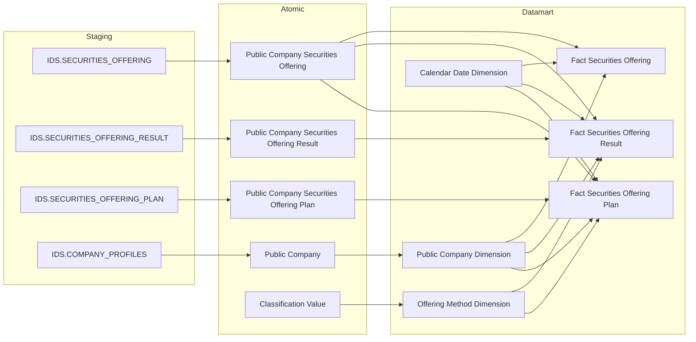

> **Ghi chú:** `Industry Category Dimension` riêng bị loại bỏ khỏi Cụm 1 — ngành (`Business Line Level 1/2 Code`) nay lấy trực tiếp từ cột có sẵn trên `public_company_dim` (reuse), không cần Dimension ETL-derived riêng nữa. Xem Nhóm 1. `Public Company Securities Offering` (Offering cha) feed vào cả 3 Fact vì `Official_Letter_Date` (FK date) và `Public Company Code` (FK company) chỉ tồn tại trên bảng cha — Plan/Result phải JOIN ngược lên cha để lấy 2 giá trị này. `Offering Method Dimension` ETL-derived từ Classification Value scheme `IDS_SO_OFFERING_METHOD`.

---

### Cụm 2: Chi tiết đợt chào bán (Bảng tác nghiệp)

Phục vụ Tab CHÀO BÁN PHÁT HÀNH — Nhóm 4 (bảng chi tiết số lượng CK chào bán & phát hành) và Tab CHÀO BÁN VÀ PHÁT HÀNH — Nhóm 8–11 (tra cứu chi tiết đợt chào bán theo 4 nhóm chỉ số). Bảng tác nghiệp nhận dữ liệu trực tiếp từ Atomic, không qua Dimension.

> **v2.0:** Đổi nguồn Atomic từ track cũ (`pblc_co_scr_ofrg`/`IDS.company_securities_issuance`) sang track `Public Company Securities Offering` (`pc_securities_offering`/`IDS.SECURITIES_OFFERING`) + bổ sung `Public Company Securities Offering Plan`/`Result` cho cột per-loại-hình. 4 cột tổ chức (K_QLCB_19–22) đổi từ nguồn TTHC (`Application Eform Field Value`, array filter) sang direct map trên bảng cha `Public Company Securities Offering` — đóng O_QLCB_2.

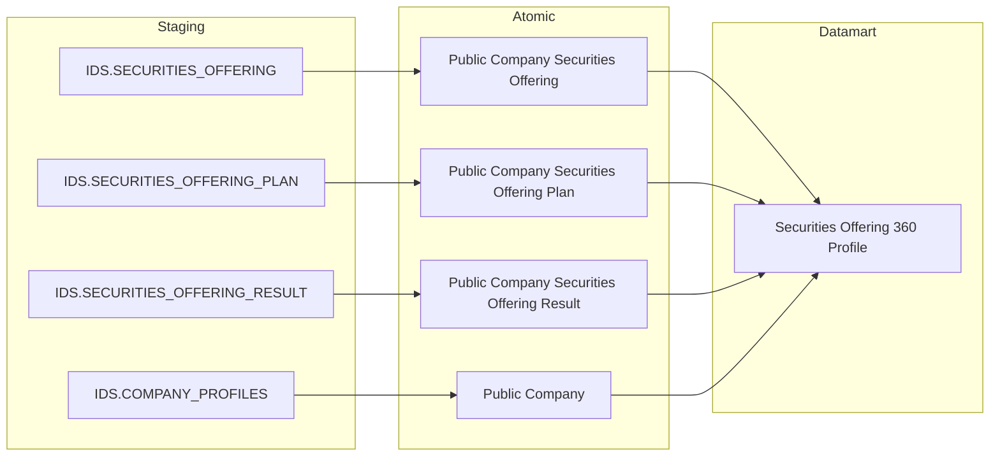

---

### Cụm 3: Hồ sơ đăng ký chào bán (IDS)

Phục vụ Tab HỒ SƠ ĐĂNG KÝ CHÀO BÁN — Nhóm 5 (KPI Cards), Nhóm 6 (donut Tỷ lệ xử lý hồ sơ), Nhóm 7 (bảng chi tiết hồ sơ theo hình thức × năm).

> **v2.0 (đổi nguồn TTHC → IDS):** Nghiệp vụ QLCB không còn dùng nguồn TTHC — toàn bộ chỉ tiêu hồ sơ đăng ký lấy trực tiếp từ `IDS.SECURITIES_OFFERING.APPROVAL_STATUS_CD` trên entity `Public Company Securities Offering` đã có (cùng entity dùng ở Cụm 1/2). Loại bỏ hoàn toàn `Securities Offering Application`, `Application Review Workflow`, `Application Eform Field Value` (TTHC) khỏi lineage hồ sơ đăng ký. `Application Status Code` đổi từ ETL-derived tổng hợp 3 bảng TTHC sang **direct map** từ `approval_status_code` IDS (4 giá trị: `PENDING_REVIEW`/`PENDING_APPROVE`/`APPROVED`/`REJECTED`). Đóng O_QLCB_4.

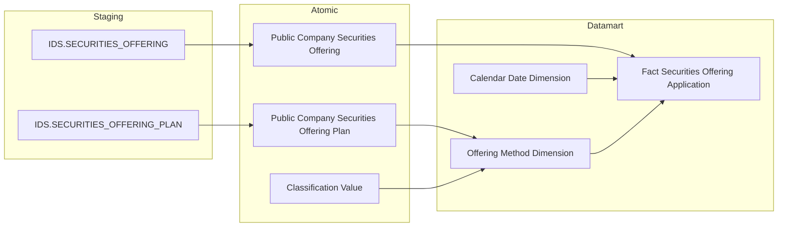

> **Ghi chú lineage:** `Fact Securities Offering Application` grain = 1 row/hồ sơ (`Public Company Securities Offering`), `Application_Status_Code` direct map từ `approval_status_code`. `Offering Method Dimension` (dùng ở Nhóm 7, reuse từ Cụm 1 Nhóm 2/3) nguồn từ `Public Company Securities Offering Plan.offering_method_code`.

---

## Section 2 — Tổng quan báo cáo

### Tab: CHÀO BÁN PHÁT HÀNH

**Slicer chung:** Ngày (date picker), Ngành

---

#### Nhóm 1 — Tình hình thực hiện chào bán phát hành theo ngành

> Phân loại: **Phân tích**  
> Atomic: `Public Company Securities Offering` ← IDS.SECURITIES_OFFERING — **READY** (Atomic draft — chưa approved chính thức, xem Changelog v2.0)  
> Atomic: `Public Company Securities Offering Result` ← IDS.SECURITIES_OFFERING_RESULT — **READY** (Atomic draft)  
> Atomic: `Public Company` ← IDS.COMPANY_PROFILES — **READY**

**Mockup:**

| Ngành | Giá trị Cấp phép (tỷ đ) | Giá trị Huy động (tỷ đ) | Chưa thành công (tỷ đ) |
|---|---|---|---|
| Tài chính - Ngân hàng | 12,500 | 10,200 | 2,300 |
| Bất động sản | 8,700 | 7,100 | 1,600 |
| Công nghiệp | 5,300 | 4,800 | 500 |

**Source:** `Fact Securities Offering` → `Public Company Dimension` (reuse), `Calendar Date Dimension`

**Bảng KPI:**

| KPI ID | Tên | Đơn vị | Tính chất | Công thức / Mô tả |
|---|---|---|---|---|
| K_QLCB_1 | Giá trị Cấp phép | Tỷ VNĐ | Cơ sở | `SUM(Total Expected Amount)` per ngành × kỳ — `Public Company Securities Offering.total_expected_amt` |
| K_QLCB_2 | Giá trị Huy động thành công | Tỷ VNĐ | Cơ sở | `SUM(Total Collected Amount)` per ngành × kỳ — aggregate từ `Public Company Securities Offering Result.total_collected_amt` GROUP BY `pc_securities_offering_id` trước khi cộng vào Fact |
| K_QLCB_3 | Chưa thành công | Tỷ VNĐ | Derived | `K_QLCB_1 − K_QLCB_2` — tính ở presentation layer |
| K_QLCB_1_YOY | YoY% Giá trị Cấp phép | % | Derived | `(K_QLCB_1[Y] − K_QLCB_1[Y−1]) / K_QLCB_1[Y−1] × 100%` |
| K_QLCB_2_YOY | YoY% Giá trị Huy động | % | Derived | `(K_QLCB_2[Y] − K_QLCB_2[Y−1]) / K_QLCB_2[Y−1] × 100%` |

> **Lưu ý (v2.0):** K_QLCB_1 lấy trực tiếp `total_expected_amt` trên bảng cha `Public Company Securities Offering` (1 giá trị/hồ sơ, không cần JOIN). K_QLCB_2 cần SUM `total_collected_amt` từ `Public Company Securities Offering Result` GROUP BY `pc_securities_offering_id` — quan hệ 1-N vì 1 hồ sơ có thể có nhiều dòng Result theo từng đợt báo cáo kết quả (`Offering Phase Name`). K_QLCB_3 và YoY là Derived — tính ở presentation layer, không lưu mart.

> **Ghi chú — Public Company Dimension (v2.0 — reuse):** Không tạo Dimension riêng cho QLCB. Reuse `public_company_dim` đã có trong `datamart_model.yaml` (module GSDC, nguồn Atomic `Public Company`) — đã có sẵn `Business Line Level 1 Code` cho GROUP BY ngành (khớp BA: SQL Nhóm 1 chỉ JOIN `CATEGORIES` qua `category_l1_id`, không cần cấp 2). Xem Section 4 — Reuse Analysis. `Industry Category Dimension` (ETL-derived riêng) bị loại bỏ hoàn toàn khỏi thiết kế.

**Star Schema:**

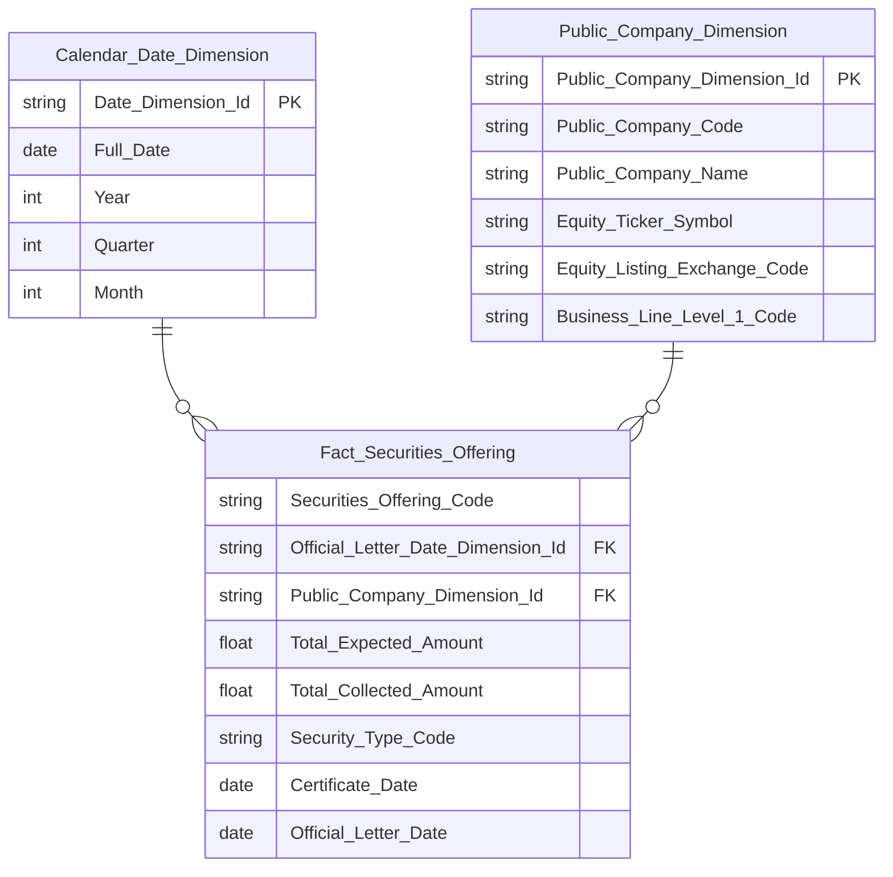

> **Ghi chú Phase 2 — reuse `Public_Company_Dimension` (= `public_company_dim`):** Không thiết kế lại — dùng nguyên schema đã approved trong `datamart_model.yaml` (module GSDC). Key convention theo entity gốc: `Public_Company_Dimension_Id` = PK, `Public_Company_Code` = NK (ETL join từ `Public Company Securities Offering.Public Company Code` để resolve Surrogate Dimension Key).
>
> **Đổi tên trường Fact (v2.0 — khớp attribute.name track Atomic mới):**
> - `Planned_Proceeds_Amount` → `Total_Expected_Amount` (nguồn `total_expected_amt`)
> - `Actual_Proceeds_Amount` → `Total_Collected_Amount` (nguồn aggregate `total_collected_amt`)
> - `Certificate_Issue_Date` → `Certificate_Date` (nguồn `certificate_dt`, khớp attribute.name track mới)
> - `SSC_Official_Document_Date` → `Official_Letter_Date` (nguồn `official_letter_dt`) — cũng là FK date chính, đổi tên `SSC_Official_Document_Date_Dimension_Id` → `Official_Letter_Date_Dimension_Id`
> - Loại bỏ toàn bộ 6 cột per-type Amount/Quantity cũ (`Planned_Public_Offering_Amount`...) và `Offering_End_Date` — không KPI nào ở Nhóm 1 dùng các cột này (per-type đã chuyển sang Nhóm 2/3 với model Plan/Result riêng)

**Lineage Mart → Báo cáo:**

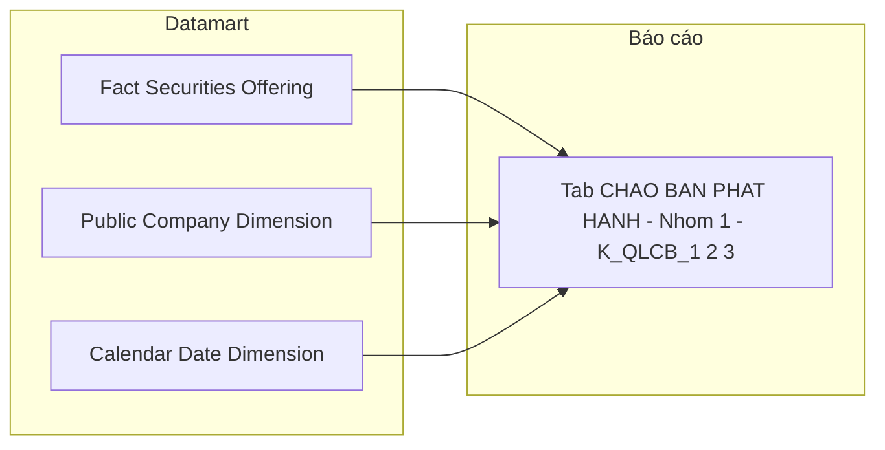

**Bảng grain:**

| Tên bảng | Grain |
|---|---|
| Fact Securities Offering | 1 row = 1 hồ sơ chào bán/phát hành CK của 1 công ty đại chúng (Event — 1 record per `Public Company Securities Offering`) |
| Public Company Dimension (reuse `public_company_dim`) | 1 row = 1 công ty đại chúng (SCD4A — theo quy ước module GSDC) |
| Calendar Date Dimension | 1 row = 1 ngày (Official Letter Date — ngày công văn UBCKNN) |

---

#### Nhóm 2 — Giá trị cấp phép chào bán phát hành theo ngành

> Phân loại: **Phân tích**  
> Atomic: `Public Company Securities Offering Plan` ← IDS.SECURITIES_OFFERING_PLAN — **READY** (Atomic draft — chưa approved chính thức)  
> Atomic: `Public Company Securities Offering` ← IDS.SECURITIES_OFFERING — **READY** (Atomic draft, dùng để lấy `official_letter_dt` FK date)

**Mockup:**

| Loại hình | Giá trị cấp phép (tỷ đ) | % tổng |
|---|---|---|
| Công chúng | 8,200 | 42% |
| Riêng lẻ | 5,100 | 26% |
| ESOP | 2,300 | 12% |
| Trả cổ tức | 1,800 | 9% |
| Tăng vốn từ VCSH | 1,500 | 8% |
| Khác | 600 | 3% |

**Source:** `Fact Securities Offering Plan` → `Offering Method Dimension`, `Public Company Dimension` (reuse), `Calendar Date Dimension`

**Bảng KPI:**

| KPI ID | Tên | Đơn vị | Tính chất | Công thức / Mô tả |
|---|---|---|---|---|
| K_QLCB_4 | Loại hình phát hành | — | Chiều | `GROUP BY Offering Method Code` — map 10 mã BA cho vào 6 nhóm hiển thị (xem bảng mapping dưới) |
| K_QLCB_5 | Giá trị cấp phép — Công chúng | Tỷ VNĐ | Cơ sở | `SUM(Total Expected Amount Snapshot) WHERE Offering Method Code IN ('1','2','3','4')` |
| K_QLCB_6 | Giá trị cấp phép — Riêng lẻ | Tỷ VNĐ | Cơ sở | `SUM(Total Expected Amount Snapshot) WHERE Offering Method Code = '5'` |
| K_QLCB_7 | Giá trị cấp phép — ESOP | Tỷ VNĐ | Cơ sở | `SUM(Total Expected Amount Snapshot) WHERE Offering Method Code IN ('9','10')` |
| K_QLCB_8 | Giá trị cấp phép — Trả cổ tức | Tỷ VNĐ | Cơ sở | `SUM(Total Expected Amount Snapshot) WHERE Offering Method Code = '7'` |
| K_QLCB_9 | Giá trị cấp phép — Tăng vốn từ VCSH | Tỷ VNĐ | Cơ sở | `SUM(Total Expected Amount Snapshot) WHERE Offering Method Code = '8'` |
| K_QLCB_10 | Giá trị cấp phép — Các loại khác | Tỷ VNĐ | Cơ sở | `SUM(Total Expected Amount Snapshot) WHERE Offering Method Code NOT IN ('1','2','3','4','5','7','8','9','10')` |

> **Mapping mã `Offering Method Code` → 6 nhóm hiển thị (theo BA SQL tham khảo, xác nhận với `LOOKUP_GROUP = 'SO_OFFERING_METHOD'`):**
>
> | Mã | Nhóm hiển thị |
> |---|---|
> | 1, 2, 3, 4 | Công chúng |
> | 5 | Riêng lẻ |
> | 9, 10 | ESOP |
> | 7 | Trả cổ tức |
> | 8 | Tăng vốn từ VCSH |
> | khác (kể cả NULL) | Khác |

> **Lưu ý (v2.0 — đơn giản hóa so với model cũ):** Model Atomic mới tách quan hệ 1-N: `Public Company Securities Offering Plan` có **1 dòng riêng cho mỗi loại hình** (`offering_method_code`) của cùng 1 hồ sơ chào bán — không cần 6 cột per-type ETL-derived (`Planned_Public_Offering_Amount`...) như thiết kế cũ nữa. K_QLCB_5–10 giờ là **Cơ sở** (SUM trực tiếp có filter theo mã), không phải Derived. `Total Expected Amount Snapshot` là cột denormalized trên Plan (snapshot từ bảng cha, theo ghi chú BRD `lld_IDS_SECURITIES_OFFERING_PLAN.yaml`). Đóng O_QLCB_7 — lý do: model Atomic mới không còn giới hạn per-type amount như model cũ.

**Star Schema:**

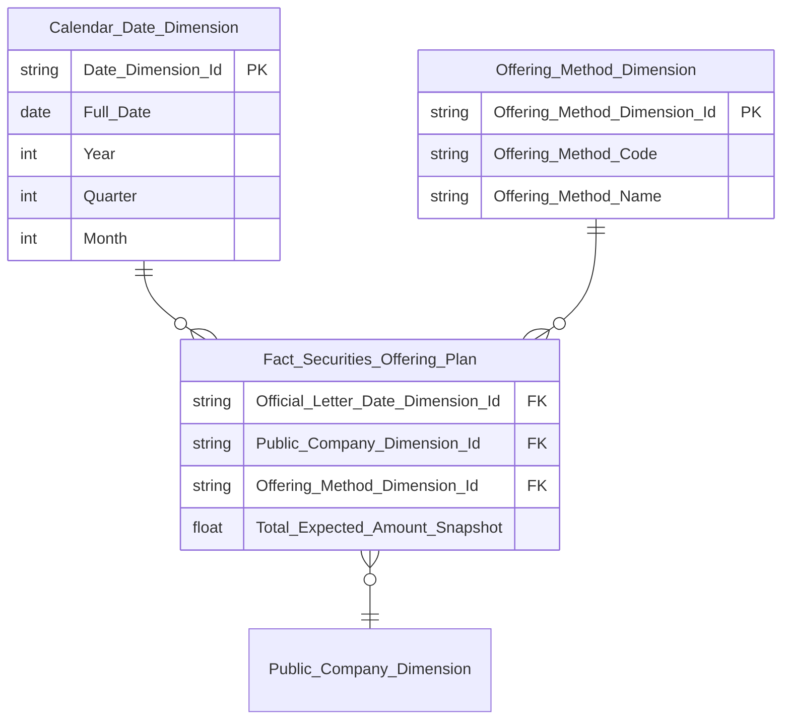

> **Ghi chú Phase 2:**
> - `Offering_Method_Dimension` mới — `Offering_Method_Dimension_Id` = PK, `Offering_Method_Code` = NK (ETL join từ `Public Company Securities Offering Plan.Offering Method Code`), nguồn Classification Value scheme `IDS_SO_OFFERING_METHOD` (`used_in_entities`: Plan, Result — dùng chung Nhóm 2/3/7)
> - `Public_Company_Dimension` = reuse `public_company_dim` — FK join qua `Public Company Securities Offering.Public Company Code` (JOIN từ Offering cha, vì Plan không có trực tiếp Public Company Code — cần JOIN 2 tầng Plan → Offering → Public Company)
> - `Official_Letter_Date_Dimension_Id` — cùng FK date với Nhóm 1, join từ `Public Company Securities Offering.official_letter_dt` (Plan không có ngày riêng)

**Lineage Mart → Báo cáo:**

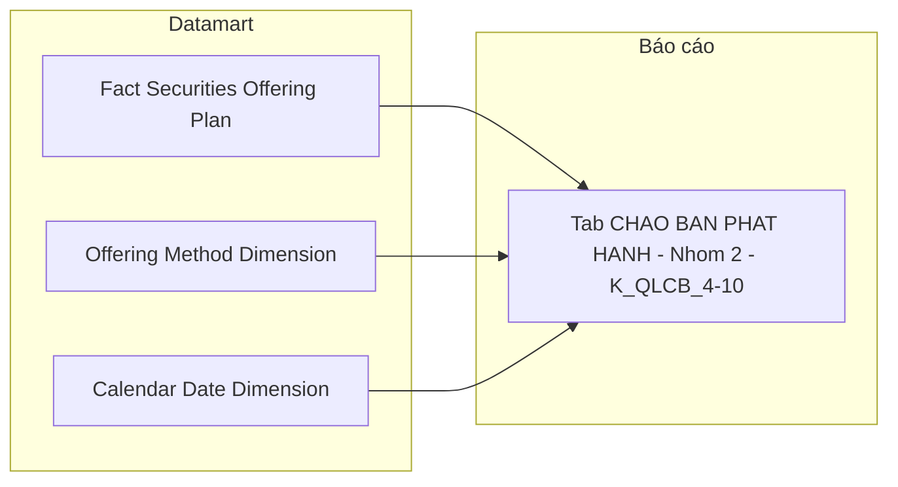

**Bảng grain:**

| Tên bảng | Grain |
|---|---|
| Fact Securities Offering Plan | 1 row = 1 đợt chào bán × 1 loại hình kế hoạch (Event — 1 record per `Public Company Securities Offering Plan`) |
| Offering Method Dimension | 1 row = 1 mã hình thức chào bán (scheme `IDS_SO_OFFERING_METHOD`) |
| Public Company Dimension (reuse `public_company_dim`) | 1 row = 1 công ty đại chúng |
| Calendar Date Dimension | 1 row = 1 ngày |

---

#### Nhóm 3 — Giá trị phát hành theo hình thức phát hành và nhóm ngành

> Phân loại: **Phân tích**  
> Atomic: `Public Company Securities Offering Result` ← IDS.SECURITIES_OFFERING_RESULT — **READY** (Atomic draft — chưa approved chính thức)  
> Atomic: `Public Company Securities Offering` ← IDS.SECURITIES_OFFERING — **READY** (Atomic draft, dùng để lấy `official_letter_dt` FK date)

**Mockup:**

| Ngành \ Loại hình | Công chúng | Riêng lẻ | ESOP | Trả cổ tức | Tăng vốn VCSH | Khác |
|---|---|---|---|---|---|---|
| Tài chính - Ngân hàng | 4,200 | 3,100 | 800 | 600 | 400 | 200 |
| Bất động sản | 2,100 | 1,800 | 500 | 400 | 700 | 100 |
| Công nghiệp | 1,800 | 950 | 300 | 200 | 150 | 100 |

**Source:** `Fact Securities Offering Result` → `Offering Method Dimension`, `Public Company Dimension` (reuse), `Calendar Date Dimension`

**Bảng KPI:**

| KPI ID | Tên | Đơn vị | Tính chất | Công thức / Mô tả |
|---|---|---|---|---|
| K_QLCB_11 | Giá trị huy động — Công chúng | Tỷ VNĐ | Cơ sở | `SUM(Total Collected Amount) WHERE Offering Method Code Snapshot IN ('1','2','3','4')` GROUP BY ngành |
| K_QLCB_12 | Giá trị huy động — Riêng lẻ | Tỷ VNĐ | Cơ sở | `SUM(Total Collected Amount) WHERE Offering Method Code Snapshot = '5'` GROUP BY ngành |
| K_QLCB_13 | Giá trị huy động — ESOP | Tỷ VNĐ | Cơ sở | `SUM(Total Collected Amount) WHERE Offering Method Code Snapshot IN ('9','10')` GROUP BY ngành |
| K_QLCB_14 | Giá trị huy động — Trả cổ tức | Tỷ VNĐ | Cơ sở | `SUM(Total Collected Amount) WHERE Offering Method Code Snapshot = '7'` GROUP BY ngành |
| K_QLCB_15 | Giá trị huy động — Tăng vốn từ VCSH | Tỷ VNĐ | Cơ sở | `SUM(Total Collected Amount) WHERE Offering Method Code Snapshot = '8'` GROUP BY ngành |
| K_QLCB_16 | Giá trị huy động — Các loại khác | Tỷ VNĐ | Cơ sở | `SUM(Total Collected Amount) WHERE Offering Method Code Snapshot NOT IN ('1','2','3','4','5','7','8','9','10')` GROUP BY ngành |

> **Mapping mã:** Giống Nhóm 2 — xem bảng mapping mã `Offering Method Code` ở Nhóm 2 (áp dụng cho `Offering Method Code Snapshot` trên Result).

> **Lưu ý (v2.0):** Nhóm 3 dùng `Public Company Securities Offering Result` (kết quả thực tế), khác Nhóm 2 dùng `Plan` (kế hoạch). `Offering Method Code Snapshot` trên Result là denormalized snapshot từ Plan (theo ghi chú BRD `lld_IDS_SECURITIES_OFFERING_RESULT.yaml`). K_QLCB_11–16 giờ là **Cơ sở** (SUM trực tiếp có filter theo mã) — đơn giản hóa so với thiết kế cũ dùng 6 cột per-type ETL-derived. Đóng O_QLCB_7.

**Star Schema:**

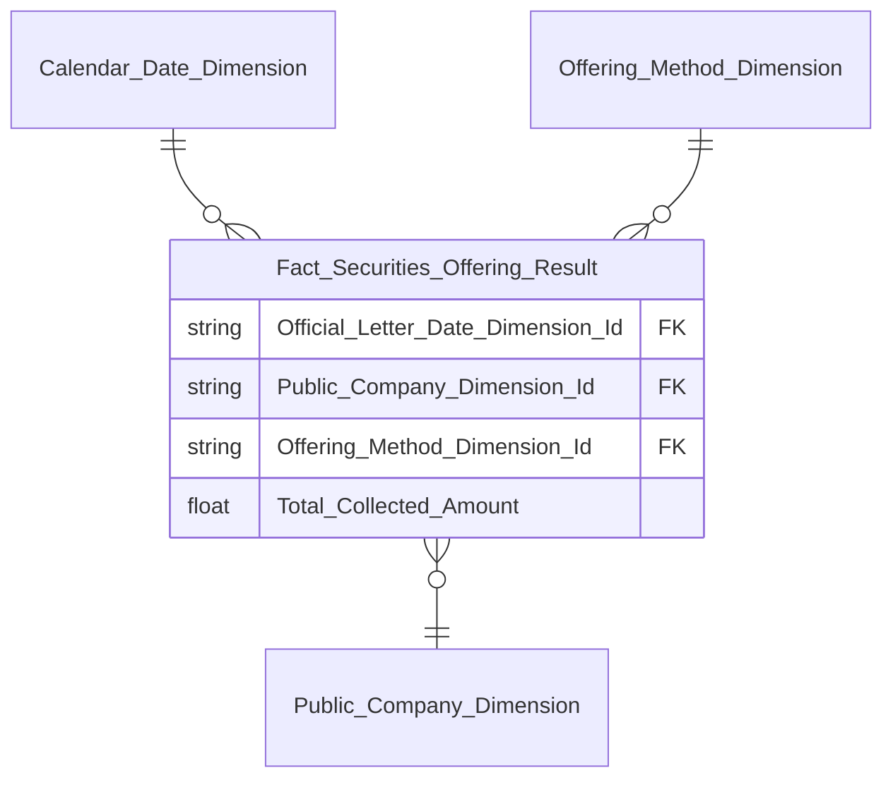

> **Ghi chú Phase 2:** Cùng `Calendar_Date_Dimension`, `Offering_Method_Dimension`, `Public_Company_Dimension` (reuse `public_company_dim`) với Nhóm 2 — không định nghĩa lại schema, chỉ hiển thị Fact riêng ở đây để tránh trùng khối erDiagram.

**Lineage Mart → Báo cáo:**

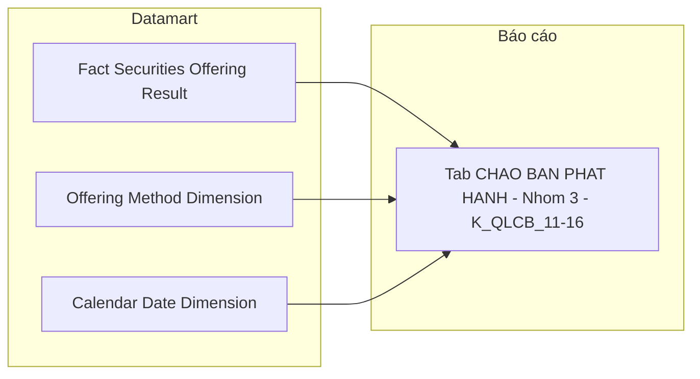

**Bảng grain:**

| Tên bảng | Grain |
|---|---|
| Fact Securities Offering Result | 1 row = 1 đợt chào bán × 1 loại hình kết quả thực tế (Event — 1 record per `Public Company Securities Offering Result`) |
| Offering Method Dimension | 1 row = 1 mã hình thức chào bán (reuse từ Nhóm 2) |
| Public Company Dimension (reuse `public_company_dim`) | 1 row = 1 công ty đại chúng |
| Calendar Date Dimension | 1 row = 1 ngày |

---

#### Nhóm 4 — Bảng Chi tiết số lượng chứng khoán Chào bán & Phát hành

> Phân loại: **Tác nghiệp**  
> Atomic: `Public Company Securities Offering` ← IDS.SECURITIES_OFFERING — **READY** (Atomic draft — chưa approved chính thức)  
> Atomic: `Public Company Securities Offering Plan` ← IDS.SECURITIES_OFFERING_PLAN — **READY** (Atomic draft)  
> Atomic: `Public Company Securities Offering Result` ← IDS.SECURITIES_OFFERING_RESULT — **READY** (Atomic draft)  
> Atomic: `Public Company` ← IDS.COMPANY_PROFILES — **READY**

**Mockup:**

| Mã CK | Tên DN | Hình thức | Đvị tư vấn | Tổ chức KT | Đvị bảo lãnh | Đvị XHTN | SL cấp phép | SL thành công | GT cấp phép (tỷ) | GT thành công (tỷ) | Tỷ lệ % |
|---|---|---|---|---|---|---|---|---|---|---|---|
| ABC | Công ty ABC | Công chúng | — | — | — | — | 10,000,000 | 9,500,000 | 500 | 475 | 95% |
| DEF | Công ty DEF | Riêng lẻ | — | — | — | — | 5,000,000 | 5,000,000 | 250 | 250 | 100% |

**Source:** `Securities Offering 360 Profile` — lookup theo đợt chào bán / công ty

**Bảng KPI:**

| KPI ID | Tên | Đơn vị | Tính chất | Công thức / Mô tả |
|---|---|---|---|---|
| K_QLCB_17 | Thông tin doanh nghiệp (Mã CK, Tên DN) | — | Attribute | `SELECT Equity Ticker Symbol, Public Company Name` — `Public Company.equity_ticker_symbol` / `public_company_nm` (IDS.COMPANY_PROFILES) |
| K_QLCB_18 | Hình thức chào bán | — | Attribute | `SELECT Offering Method Code` — `Public Company Securities Offering Plan.offering_method_code` |
| K_QLCB_19 | Đơn vị tư vấn | Text | Attribute | `Public Company Securities Offering.consulting_organization_nm` — IDS.SECURITIES_OFFERING.CONSULTING_ORG — direct map |
| K_QLCB_20 | Tổ chức kiểm toán | Text | Attribute | `Public Company Securities Offering.audit_organization_nm` — IDS.SECURITIES_OFFERING.AUDIT_ORG — direct map |
| K_QLCB_21 | Đơn vị bảo lãnh | Text | Attribute | `Public Company Securities Offering.underwriting_organization_nm` — IDS.SECURITIES_OFFERING.UNDERWWRITING_ORG (tên cột nguồn có lỗi chính tả, giữ nguyên) — direct map |
| K_QLCB_22 | Đơn vị xếp hạng tín nhiệm | Text | Attribute | `Public Company Securities Offering.credit_rating_organization_nm` — IDS.SECURITIES_OFFERING.CREDIT_RATING_ORG — direct map |
| K_QLCB_23 | Số lượng CK được cấp phép | CK | Attribute | `Public Company Securities Offering Plan.total_registered_quantity_snpst` — 1 dòng/loại hình, không cần SUM |
| K_QLCB_24 | Số lượng CK chào bán thành công | CK | Attribute | `Public Company Securities Offering Result.total_successful_quantity` — join theo `offering_method_code` khớp với Plan |
| K_QLCB_25 | Giá trị cấp phép | Tỷ VNĐ | Attribute | `Public Company Securities Offering Plan.total_expected_amt_snpst` |
| K_QLCB_26 | Giá trị chào bán thành công | Tỷ VNĐ | Attribute | `Public Company Securities Offering Result.total_collected_amt` |
| K_QLCB_27 | Tỷ lệ chào bán thành công | % | Derived | `K_QLCB_24 / K_QLCB_23 × 100%` — tính ở presentation layer |

> **Ghi chú K_QLCB_19–22 (v2.0 — đổi nguồn TTHC → IDS):** Đơn giản hóa đáng kể so với thiết kế TTHC cũ — 4 cột đã có sẵn trực tiếp trên bảng cha `Public Company Securities Offering`, `etl_logic_type = direct`, không cần array filter/computed expression nào. Đóng O_QLCB_2.

> **Ghi chú grain (v2.0):** `Securities Offering 360 Profile` giờ join tự nhiên theo `offering_method_code` — `Public Company Securities Offering Plan` (1 row/loại hình kế hoạch) LEFT JOIN `Public Company Securities Offering Result` (1 row/loại hình kết quả) theo `(pc_securities_offering_id, offering_method_code)`. K_QLCB_23/25 lấy trực tiếp từ Plan (không cần SUM vì Plan Amount/Quantity đã snapshot per-loại-hình sẵn, khác thiết kế cũ phải SUM per đợt).

**Schema bảng tác nghiệp:**

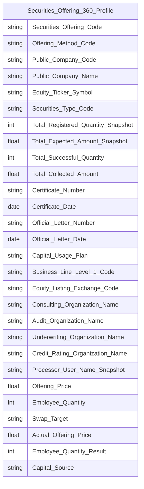

> **Ghi chú Phase 2 — Key labels cho `Securities Offering 360 Profile`:**
> - `Securities_Offering_Code` → `key = BK` — Business key đợt chào bán (`Public Company Securities Offering.pc_securities_offering_code`), ETL debug anchor
> - `Offering_Method_Code` → `key = BK` — Business key component 2 (từ Plan), cùng với `Securities_Offering_Code` tạo thành Composite BK định nghĩa grain (1 row = 1 đợt × 1 loại hình)
> - Mermaid không hỗ trợ label `BK` trong erDiagram — chỉ ghi trong Attributes CSV cột `key`
>
> **Đổi tên trường so với thiết kế cũ (v2.0 — khớp attribute.name track Atomic mới):**
> - `Securities_Offering_Id` (PK cũ) → loại bỏ, dùng Composite BK thay thế (track mới không có surrogate riêng cho 360 Profile)
> - `Offering_Type_Category_Code` → `Offering_Method_Code` (nguồn `offering_method_code`, track mới)
> - `Planned_Offering_Quantity/Amount` → `Total_Registered_Quantity_Snapshot`/`Total_Expected_Amount_Snapshot` (nguồn Plan)
> - `Actual_Offering_Quantity/Amount` → `Total_Successful_Quantity`/`Total_Collected_Amount` (nguồn Result)
>
> **Cột bổ sung cho Nhóm 8/10/11 (giữ nhất quán toàn file — mọi cột dùng ở bất kỳ Nhóm nào của `Securities Offering 360 Profile` phải xuất hiện đủ trong erDiagram này):**
> - `Processor_User_Name_Snapshot` (nguồn bảng cha Offering `processor_user_nm_snpst`) — dùng ở Nhóm 8 (K_QLCB_29)
> - `Offering_Price` (nguồn Plan `offering_price`), `Employee_Quantity` (nguồn Plan `employee_quantity`), `Swap_Target` (nguồn Plan `swap_target`) — dùng ở Nhóm 10 (K_QLCB_40, 42, 43)
> - `Actual_Offering_Price` (nguồn Result `actual_offering_price`), `Employee_Quantity_Result` (nguồn Result `employee_quantity`), `Capital_Source` (nguồn Result `capital_src`) — dùng ở Nhóm 11 (K_QLCB_46, 48, 49)
> - `SSC_Official_Document_Number/Date` → `Official_Letter_Number`/`Official_Letter_Date` (khớp attribute.name track mới)
> - `Certificate_Issue_Date` → `Certificate_Date`
> - Loại bỏ `Public_Company_English_Name`, `Multi_Offering_Flag`, `Created_By_Login_Name` (dùng ở Nhóm 8, xem ghi chú riêng), `Industry_Category_Level2_Code`, `Planned/Actual_Offering_Target`, `Planned/Actual_Offering_Employee_Quantity` (dùng ở Nhóm 10/11, lấy trực tiếp từ Plan/Result — xem Nhóm 10/11), `Offering_End_Date` — không KPI nào ở Nhóm 4 tham chiếu các cột này trực tiếp
> - 4 cột tổ chức (`Advisor_Name`...) đổi tên khớp attribute.name Atomic: `Consulting_Organization_Name`, `Audit_Organization_Name`, `Underwriting_Organization_Name`, `Credit_Rating_Organization_Name`

**Lineage Mart → Báo cáo:**

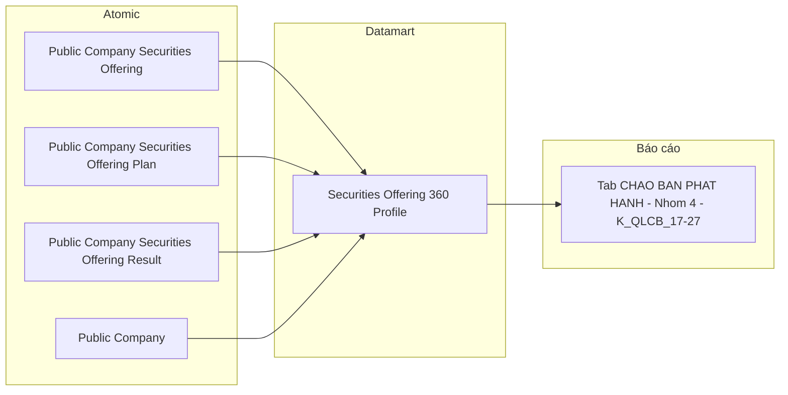

**Bảng grain:**

| Tên bảng | Grain |
|---|---|
| `Securities Offering 360 Profile` | 1 row = 1 đợt chào bán × 1 loại hình (Plan LEFT JOIN Result theo `offering_method_code`). Composite BK: (Securities Offering Code, Offering Method Code) |

---

### Tab: HỒ SƠ ĐĂNG KÝ CHÀO BÁN

**Slicer chung:** Từ ngày — Đến ngày (date range picker)

---

#### Nhóm 5 — KPI Cards tổng quan hồ sơ

> Phân loại: **Phân tích**  
> Atomic: `Public Company Securities Offering` ← IDS.SECURITIES_OFFERING — **READY** (Atomic draft — chưa approved chính thức; v2.0 — đổi nguồn TTHC → IDS)

**Mockup:**

| Hồ sơ đăng ký | Đang xử lý | Đã cấp phép | Bị từ chối |
|---|---|---|---|
| 124 | 38 | 72 | 14 |

> **Lưu ý:** 4 card hiển thị **số lượng hồ sơ** (số nguyên). Tỷ lệ % là Derived tính tại presentation layer từ 4 Base KPI.

**Source:** `Fact Securities Offering Application`

**Bảng KPI:**

| KPI ID | Tên | Đơn vị | Tính chất | Công thức / Mô tả |
|---|---|---|---|---|
| K_QLCB_50 | Số lượng hồ sơ đăng ký | Hồ sơ | Cơ sở | `COUNT(Fact Securities Offering Application)` toàn bộ trong kỳ |
| K_QLCB_51 | Số lượng hồ sơ đang xử lý | Hồ sơ | Cơ sở | `COUNT WHERE Application Status Code = 'PENDING_APPROVE'` |
| K_QLCB_52 | Số lượng hồ sơ đã cấp phép | Hồ sơ | Cơ sở | `COUNT WHERE Application Status Code = 'APPROVED'` |
| K_QLCB_53 | Số lượng hồ sơ bị từ chối | Hồ sơ | Cơ sở | `COUNT WHERE Application Status Code = 'REJECTED'` |
| K_QLCB_54 | Tỷ lệ % per trạng thái | % | Derived | `COUNT(trạng thái X) / COUNT(tất cả) × 100%` — tính tại presentation layer |

> **Ghi chú `Application Status Code` (v2.0 — đổi nguồn TTHC → IDS):** Đơn giản hóa đáng kể so với thiết kế TTHC cũ — direct map từ `Public Company Securities Offering.approval_status_code` (IDS.SECURITIES_OFFERING.APPROVAL_STATUS_CD), không cần ETL-derived tổng hợp 3 bảng nguồn nữa. 4 giá trị nguồn theo BA (`BA_analyst_QLCB.csv` Nhóm 5 SQL tham khảo): `PENDING_REVIEW` (đăng ký), `PENDING_APPROVE` (đang xử lý), `APPROVED` (đã cấp phép), `REJECTED` (bị từ chối). Đóng O_QLCB_4.

**Star Schema:**

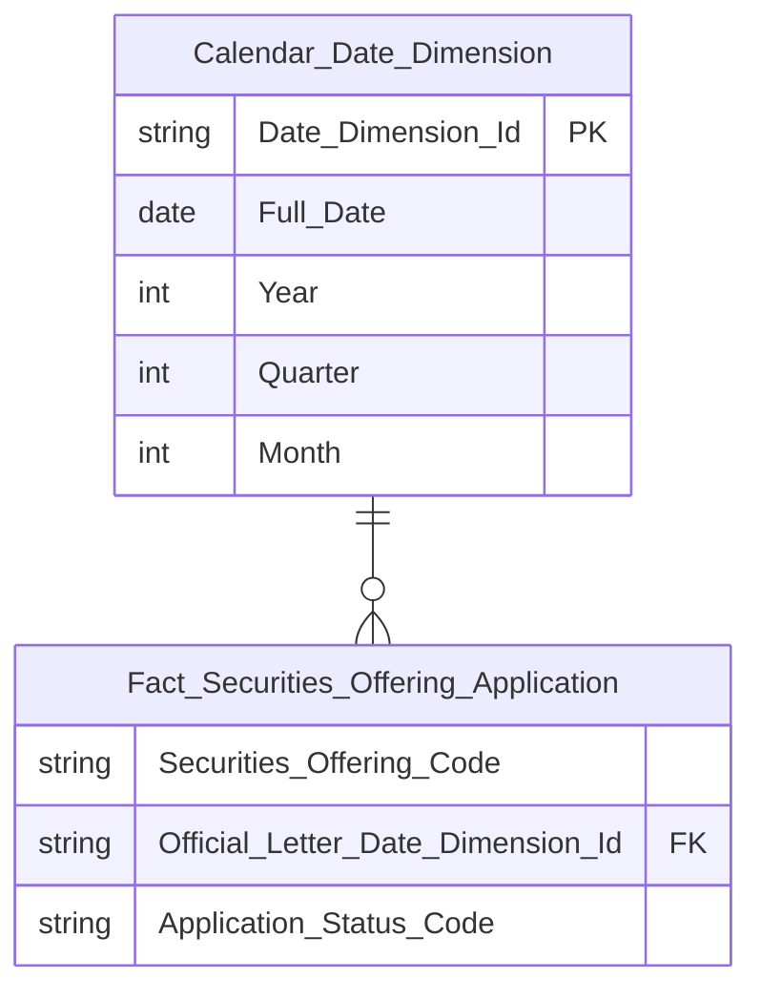

> **Ghi chú Phase 2 — Key labels:**
>
> **`Fact_Securities_Offering_Application`:**
> - `Securities_Offering_Code` → `key = DD` (Degenerate Dimension) — Business key hồ sơ (`Public Company Securities Offering.pc_securities_offering_code`), lưu trực tiếp trên Fact để tra cứu, không tạo Dimension riêng. Fact Event không có Surrogate PK.
> - `Official_Letter_Date_Dimension_Id` → `key = FK → Calendar Date Dimension` — cùng FK date dùng ở Nhóm 1 (`official_letter_dt`)
> - `Application_Status_Code` → `key` trống — Classification Value, `etl_logic_type = direct` từ `approval_status_code`
>
> **Loại bỏ so với thiết kế TTHC cũ:** `Offering_Type_Dimension` (TTHC ContentType) không dùng ở Nhóm 5/6 — chỉ Nhóm 7 cần chiều hình thức (xem `Offering Method Dimension` tại Nhóm 7, dùng chung với Nhóm 2/3). `Application_Year` (Degenerate Dimension) không còn cần — Nhóm 5/6 không GROUP BY năm.

**Lineage Mart → Báo cáo:**

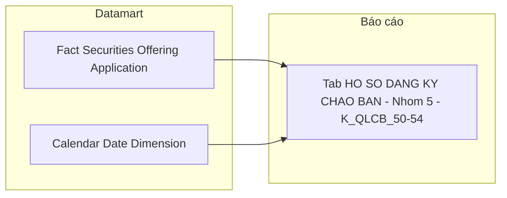

**Bảng grain:**

| Tên bảng | Grain |
|---|---|
| `Fact Securities Offering Application` | 1 row = 1 hồ sơ đăng ký chào bán (1 `Public Company Securities Offering`) |
| `Calendar Date Dimension` | 1 row = 1 ngày (`official_letter_dt`) |

---

#### Nhóm 6 — Biểu đồ Tỷ lệ xử lý hồ sơ (donut)

> Phân loại: **Phân tích**  
> Atomic: `Public Company Securities Offering` ← IDS.SECURITIES_OFFERING — **READY** (Atomic draft; v2.0 — đổi nguồn TTHC → IDS)  
> Ghi chú: Cùng nguồn Fact với Nhóm 5 — không cần bảng mới.

**Mockup:**

| Trạng thái | Số lượng | Tỷ lệ % |
|---|---|---|
| Chờ xử lý | 24 | 19% |
| Đang xử lý | 38 | 31% |
| Đã cấp phép | 72 | 42% |
| Bị từ chối | 14 | 11% |

**Source:** `Fact Securities Offering Application` — GROUP BY `Application Status Code`

**Bảng KPI:**

| KPI ID | Tên | Đơn vị | Tính chất | Công thức / Mô tả |
|---|---|---|---|---|
| K_QLCB_55 | Số lượng hồ sơ per trạng thái | Hồ sơ | Cơ sở | `COUNT GROUP BY Application Status Code` — 4 giá trị: `PENDING_REVIEW`/`PENDING_APPROVE`/`APPROVED`/`REJECTED` |
| K_QLCB_56 | Tỷ lệ % per trạng thái | % | Derived | `COUNT(trạng thái X) / COUNT(tất cả) × 100%` — tính tại presentation layer |

> **Ghi chú:** K_QLCB_55 là cùng measure với K_QLCB_50–53 (Nhóm 5) nhưng hiển thị theo chiều GROUP BY thay vì 4 card riêng biệt. Không cần KPI ID mới cho Base — presentation layer pivot từ cùng query.

**Star Schema:** Kế thừa từ Nhóm 5 — cùng `Fact Securities Offering Application`.

**Lineage Mart → Báo cáo:**

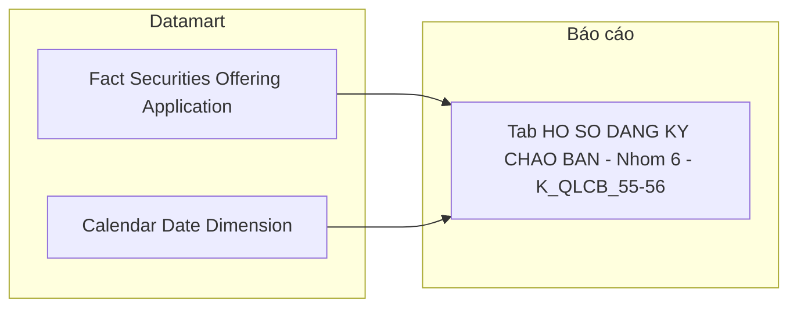

**Bảng grain:**

| Tên bảng | Grain |
|---|---|
| `Fact Securities Offering Application` | 1 row = 1 hồ sơ (kế thừa Nhóm 5) |

---

#### Nhóm 7 — Bảng Chi tiết hồ sơ chào bán & phát hành

> Phân loại: **Phân tích**  
> Atomic: `Public Company Securities Offering` ← IDS.SECURITIES_OFFERING — **READY** (Atomic draft; v2.0 — đổi nguồn TTHC → IDS)  
> Atomic: `Public Company Securities Offering Plan` ← IDS.SECURITIES_OFFERING_PLAN — **READY** (Atomic draft)  
> Ghi chú: Cùng Fact với Nhóm 5/6 — bổ sung `Offering Method Dimension` (reuse từ Nhóm 2/3) × năm.

**Mockup:**

| Hình thức chào bán | Năm | Chờ xử lý | Đang xử lý | Đã cấp phép | Bị từ chối | Tổng |
|---|---|---|---|---|---|---|
| Chào bán CP lần đầu | 2025 | 2 | 5 | 18 | 3 | 28 |
| Chào bán trái phiếu | 2025 | 1 | 3 | 12 | 1 | 17 |
| Phát hành CP ESOP | 2024 | 0 | 2 | 24 | 4 | 30 |

**Source:** `Fact Securities Offering Application` → `Offering Method Dimension`, `Calendar Date Dimension`

**Bảng KPI:**

| KPI ID | Tên | Đơn vị | Tính chất | Công thức / Mô tả |
|---|---|---|---|---|
| K_QLCB_57 | Hình thức chào bán | — | Chiều | `GROUP BY Offering Method Dimension.Offering Method Code` — reuse Dimension từ Nhóm 2/3 (scheme `IDS_SO_OFFERING_METHOD`) |
| K_QLCB_58 | Năm | — | Chiều | `GROUP BY Year` của `Official Letter Date Dimension` (reuse `Calendar Date Dimension`, không cần Degenerate Dimension riêng) |
| K_QLCB_59 | Số lượng hồ sơ chờ xử lý | Hồ sơ | Cơ sở | `COUNT WHERE Application Status Code = 'PENDING_REVIEW'` |
| K_QLCB_60 | Số lượng hồ sơ đang xử lý | Hồ sơ | Cơ sở | `COUNT WHERE Application Status Code = 'PENDING_APPROVE'` |
| K_QLCB_61 | Số lượng hồ sơ đã cấp phép | Hồ sơ | Cơ sở | `COUNT WHERE Application Status Code = 'APPROVED'` |
| K_QLCB_62 | Số lượng hồ sơ bị từ chối | Hồ sơ | Cơ sở | `COUNT WHERE Application Status Code = 'REJECTED'` |
| K_QLCB_63 | Tổng hồ sơ | Hồ sơ | Derived | `K_QLCB_59 + K_QLCB_60 + K_QLCB_61 + K_QLCB_62` — tính tại presentation layer |

> **Ghi chú `Offering Method Dimension` (v2.0):** Reuse Dimension đã thiết kế ở Cụm 1 Nhóm 2/3 — không tạo mới. `Fact Securities Offering Application` bổ sung FK `Offering_Method_Dimension_Id`, ETL join qua `Public Company Securities Offering Plan.offering_method_code` (theo `pc_securities_offering_id`). Vì 1 hồ sơ có thể có nhiều dòng Plan (nhiều loại hình), Fact Application ở Nhóm 7 mở rộng grain: 1 row = 1 hồ sơ × 1 loại hình (khác Nhóm 5/6 vốn 1 row = 1 hồ sơ) — xem ghi chú grain bên dưới.

**Star Schema:** Kế thừa Fact từ Nhóm 5/6, bổ sung FK `Offering_Method_Dimension_Id`:

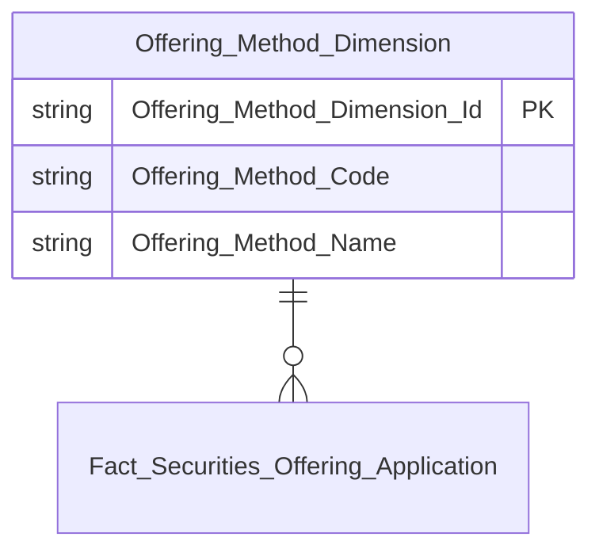

> **Ghi chú grain (v2.0 — quan trọng):** Bảng KPI Nhóm 5/6 (K_QLCB_50–56) chỉ cần grain 1 row/hồ sơ. Nhóm 7 cần thêm chiều hình thức — ETL populate `Offering_Method_Dimension_Id` bằng cách join `Public Company Securities Offering Plan` (lấy `offering_method_code` đầu tiên nếu 1 hồ sơ có nhiều loại hình, hoặc giữ NULL nếu hồ sơ chưa có Plan). Field `Offering_Method_Dimension_Id` là nullable trên Fact — không ảnh hưởng COUNT ở Nhóm 5/6.

**Lineage Mart → Báo cáo:**


**Bảng grain:**

| Tên bảng | Grain |
|---|---|
| `Fact Securities Offering Application` | 1 row = 1 hồ sơ (kế thừa Nhóm 5), nullable FK `Offering_Method_Dimension_Id` cho Nhóm 7 |
| `Offering Method Dimension` | 1 row = 1 mã hình thức chào bán (reuse từ Nhóm 2/3) |
| `Calendar Date Dimension` | 1 row = 1 ngày |

---

### Tab: CHÀO BÁN VÀ PHÁT HÀNH (Data Explorer)

**Slicer chung:** Sàn (dropdown), Ngành nghề (dropdown), Khoảng thời gian (Từ ngày — Đến ngày)

> **Ghi chú thiết kế:** Data Explorer là màn hình tra cứu chi tiết từng đợt chào bán, cho phép người dùng chọn tổ hợp chỉ số (checkbox) từ 4 nhóm rồi hiển thị bảng kết quả. Đây là use case Tác nghiệp — lookup n đợt chào bán theo điều kiện lọc. Tab này **reuse** `Securities Offering 360 Profile` đã thiết kế ở Nhóm 4 Tab CHÀO BÁN PHÁT HÀNH, mở rộng thêm các attribute chi tiết theo từng hình thức phát hành (ESOP target, Dividend qty...). Không cần thêm Fact hay Dim mới.

---

#### Nhóm 8 — Thông tin cơ sở (STT 40–45)

> Phân loại: **Tác nghiệp**  
> Atomic: `Public Company Securities Offering` ← IDS.SECURITIES_OFFERING — **READY** (Atomic draft — chưa approved chính thức)  
> Atomic: `Public Company` ← IDS.COMPANY_PROFILES — **READY**

**Mockup:**

| Mã CK | Tên công ty | Sàn | Ngành | Thời điểm báo cáo | Chuyên viên | Loại CK |
|---|---|---|---|---|---|---|
| VIC | VinGroup | HOSE | Bất động sản | 24/03/2026 | Nguyễn Văn A | Cổ phiếu |
| VCB | Vietcombank | UPCOM | Ngân hàng | 24/03/2026 | Trần Thị B | Cổ phiếu |

**Source:** `Securities Offering 360 Profile`

**Bảng KPI:**

| KPI ID | Tên | Đơn vị | Tính chất | Nguồn Atomic | Ghi chú |
|---|---|---|---|---|---|
| K_QLCB_28 | Thời điểm báo cáo | Ngày | Attribute | `Public Company Securities Offering.official_letter_dt` — IDS.SECURITIES_OFFERING.OFFICIAL_LETTER_DATE | Ngày công văn UBCKNN — dùng làm thời điểm báo cáo (FK date chính). Xem O_QLCB_3 (Closed). |
| K_QLCB_29 | Chuyên viên | Text | Attribute | `Public Company Securities Offering.processor_user_nm_snpst` — IDS.SECURITIES_OFFERING.PROCESSOR_USER_NAME | (v2.0) READY — track mới có sẵn tên người xử lý dạng snapshot (không phải login_name kỹ thuật như O_QLCB_5 giả định ban đầu theo `created_by`). Xem O_QLCB_5 cập nhật. |
| K_QLCB_30 | Tên công ty | Text | Attribute | `Public Company.public_company_nm` | |
| K_QLCB_31 | Mã chứng khoán | Text | Attribute | `Public Company.equity_ticker_symbol` — IDS.COMPANY_PROFILES | |
| K_QLCB_32 | Sàn | Text | Attribute | `Public Company.equity_listing_exchange_code` | Scheme: IDS_EQUITY_LISTING_EXCH |
| K_QLCB_33 | Loại chứng khoán | Text | Attribute | `Public Company.securities_tp_code` — IDS.COMPANY_PROFILES.SECURITIES_TYPE_CD (BA xác nhận nguồn Company Profiles, không phải Securities Offering) | Scheme: IDS_ISSUANCE_SECURITY_TYPE |

> **Sửa lỗi trace nguồn (v2.0):** K_QLCB_29 và K_QLCB_33 ban đầu bị suy diễn sai nguồn theo pattern các Nhóm khác — đã đối chiếu lại nguyên văn BA STT tương ứng Nhóm 8 (cột Bảng nguồn/Trường nguồn) để xác nhận đúng: "Chuyên viên" = `SECURITIES_OFFERING.processor_user_name` (không phải `created_by`); "Loại chứng khoán" = `COMPANY_PROFILES.securities_type_cd` (không phải trường trên bảng Offering).

**Schema bảng tác nghiệp:** Kế thừa `Securities Offering 360 Profile` — bổ sung cột `Processor_User_Name_Snapshot`, `Securities_Type_Code` (xem erDiagram Nhóm 4 cập nhật).

**Lineage Mart → Báo cáo:**

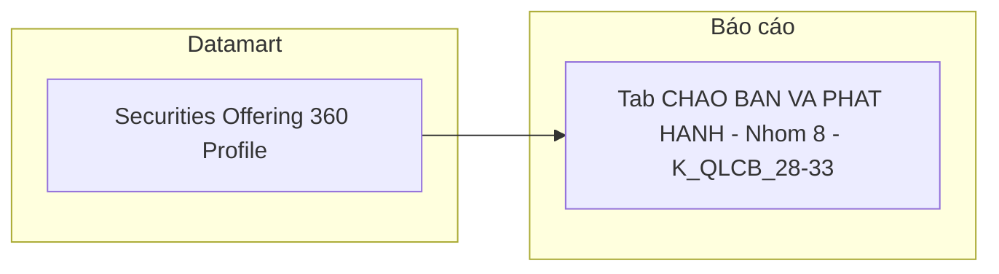

**Bảng grain:**

| Tên bảng | Grain |
|---|---|
| `Securities Offering 360 Profile` | 1 row = 1 đợt chào bán × 1 loại hình (kế thừa Nhóm 4) |

---

#### Nhóm 9 — Thông tin công văn cấp phép (STT 46–50)

> Phân loại: **Tác nghiệp**  
> Atomic: `Public Company Securities Offering` ← IDS.SECURITIES_OFFERING — **READY** (Atomic draft — chưa approved chính thức)

**Mockup:**

| Số GCN | Ngày cấp GCN | Số công văn gửi CT | Ngày công văn | Hình thức phát hành |
|---|---|---|---|---|
| 12/GCN-UBCK | 15/01/2026 | 14/CV-UBCK | 14/01/2026 | Công chúng |
| 08/GCN-UBCK | 10/02/2026 | 07/CV-UBCK | 09/02/2026 | Riêng lẻ |

**Source:** `Securities Offering 360 Profile`

**Bảng KPI:**

| KPI ID | Tên | Đơn vị | Tính chất | Nguồn Atomic |
|---|---|---|---|---|
| K_QLCB_34 | Số giấy chứng nhận | Text | Attribute | `Public Company Securities Offering.certificate_nbr` — IDS.SECURITIES_OFFERING.CERTIFICATE_NO |
| K_QLCB_35 | Ngày cấp giấy chứng nhận | Ngày | Attribute | `Public Company Securities Offering.certificate_dt` — IDS.SECURITIES_OFFERING.CERTIFICATE_DATE |
| K_QLCB_36 | Số công văn gửi công ty | Text | Attribute | `Public Company Securities Offering.official_letter_nbr` — IDS.SECURITIES_OFFERING.OFFICIAL_LETTER_NO |
| K_QLCB_37 | Ngày công văn | Ngày | Attribute | `Public Company Securities Offering.official_letter_dt` — IDS.SECURITIES_OFFERING.OFFICIAL_LETTER_DATE |
| K_QLCB_38 | Hình thức phát hành | Text | Attribute | `Securities Offering 360 Profile.Offering_Method_Code` — từ `Public Company Securities Offering Plan.offering_method_code`; composite BK component 2 |

**Schema bảng tác nghiệp:** Kế thừa `Securities Offering 360 Profile`.

**Lineage Mart → Báo cáo:**

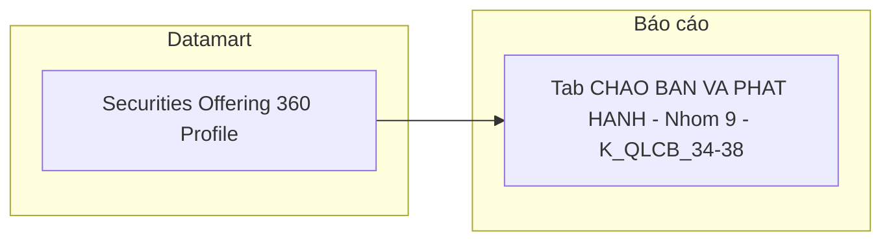

**Bảng grain:**

| Tên bảng | Grain |
|---|---|
| `Securities Offering 360 Profile` | 1 row = 1 đợt chào bán × 1 loại hình (kế thừa Nhóm 4) |

---

#### Nhóm 10 — Thông tin cấp phép chào bán (STT 51–56)

> Phân loại: **Tác nghiệp**  
> Atomic: `Public Company Securities Offering Plan` ← IDS.SECURITIES_OFFERING_PLAN — **READY** (Atomic draft — chưa approved chính thức)  
> Atomic: `Public Company Securities Offering` ← IDS.SECURITIES_OFFERING — **READY** (Atomic draft, dùng cho `total_registered_quantity`, `capital_usage_plan`)  
> Ghi chú: Với model 1-N mới, mỗi row 360 Profile là 1 loại hình cụ thể (Plan) — `swap_target`, `employee_quantity`, `offering_price` lấy trực tiếp từ Plan tương ứng, không cần ETL pick nữa.

**Mockup:**

| Số lượng cấp phép | Giá (cấp phép) | Giá trị cấp phép | SL người LĐ | Đối tượng | Mục đích sử dụng vốn |
|---|---|---|---|---|---|
| 10,000,000 | 15,000 đ | 150 tỷ | 500 | CBNV công ty | Bổ sung vốn lưu động |

**Source:** `Securities Offering 360 Profile`

**Bảng KPI:**

| KPI ID | Tên | Đơn vị | Tính chất | Nguồn Atomic |
|---|---|---|---|---|
| K_QLCB_39 | Số lượng cấp phép | CK | Attribute | `Public Company Securities Offering.total_registered_quantity` — bảng cha, IDS.SECURITIES_OFFERING.TOTAL_REGISTERED_QTY |
| K_QLCB_40 | Giá (cấp phép) | VNĐ | Attribute | `Public Company Securities Offering Plan.offering_price` — IDS.SECURITIES_OFFERING_PLAN.OFFERING_PRICE (giá trực tiếp trên Plan, không cần Derived) |
| K_QLCB_41 | Giá trị cấp phép | Tỷ VNĐ | Attribute | `Securities Offering 360 Profile.Total_Expected_Amount_Snapshot` — nguồn Plan (xem Nhóm 4) |
| K_QLCB_42 | Số lượng người lao động | Người | Attribute | `Public Company Securities Offering Plan.employee_quantity` — IDS.SECURITIES_OFFERING_PLAN.EMPLOYEE_QTY; chỉ có giá trị với 1 số thủ tục (ESOP/Bonus Share), NULL với loại hình khác |
| K_QLCB_43 | Đối tượng | Text | Attribute | `Public Company Securities Offering Plan.swap_target` — IDS.SECURITIES_OFFERING_PLAN.SWAP_TARGET (theo BA STT tương ứng Nhóm 9 gốc) |
| K_QLCB_44 | Mục đích sử dụng vốn | Text | Attribute | `Public Company Securities Offering.capital_usage_plan` — bảng cha, IDS.SECURITIES_OFFERING.CAPITAL_USAGE_PLAN |

> **Lưu ý (v2.0):** `Giá (cấp phép)` đổi từ Derived (`Amount / Quantity` tính presentation layer) sang **Attribute** — track mới có sẵn cột `offering_price` trực tiếp trên Plan, không cần tính lại.

**Schema bảng tác nghiệp:** Kế thừa `Securities Offering 360 Profile` — bổ sung 3 cột `Offering_Price`, `Employee_Quantity`, `Swap_Target` (xem erDiagram cập nhật Nhóm 4 nếu cần — hiện để riêng ở Nhóm 10 vì không KPI nào ở Nhóm 4/8/9 tham chiếu).

**Lineage Mart → Báo cáo:**

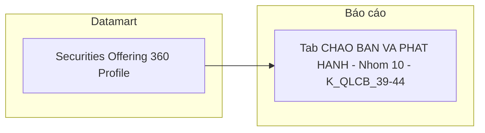

**Bảng grain:**

| Tên bảng | Grain |
|---|---|
| `Securities Offering 360 Profile` | 1 row = 1 đợt chào bán × 1 loại hình (kế thừa Nhóm 4) |

---

#### Nhóm 11 — Thông tin kết quả chào bán (STT 57–61)

> Phân loại: **Tác nghiệp**  
> Atomic: `Public Company Securities Offering Result` ← IDS.SECURITIES_OFFERING_RESULT — **READY** (Atomic draft — chưa approved chính thức)

**Mockup:**

| Số lượng thực tế | Giá thực tế | Giá trị thực tế | SL người LĐ (TT) | Đối tượng (TT) |
|---|---|---|---|---|
| 9,800,000 | 15,000 đ | 147 tỷ | 490 | CBNV công ty |

**Source:** `Securities Offering 360 Profile`

**Bảng KPI:**

| KPI ID | Tên | Đơn vị | Tính chất | Nguồn Atomic |
|---|---|---|---|---|
| K_QLCB_45 | Số lượng thực tế | CK | Attribute | `Public Company Securities Offering Result.total_successful_quantity` — IDS.SECURITIES_OFFERING_RESULT.TOTAL_SUCCESSFUL_QTY |
| K_QLCB_46 | Giá thực tế | VNĐ | Attribute | `Public Company Securities Offering Result.actual_offering_price` — IDS.SECURITIES_OFFERING_RESULT.ACTUAL_OFFERING_PRICE (giá trực tiếp trên Result, không cần Derived) |
| K_QLCB_47 | Giá trị thực tế | Tỷ VNĐ | Attribute | `Public Company Securities Offering Result.total_collected_amt` — IDS.SECURITIES_OFFERING_RESULT.TOTAL_COLLECTED_AM |
| K_QLCB_48 | Số lượng người lao động (TT) | Người | Attribute | `Public Company Securities Offering Result.employee_quantity` — IDS.SECURITIES_OFFERING_RESULT.EMPLOYEE_QTY |
| K_QLCB_49 | Đối tượng (thực tế) | Text | Attribute | `Public Company Securities Offering Result.capital_src` — IDS.SECURITIES_OFFERING_RESULT.CAPITAL_SOURCE (theo BA STT tương ứng Nhóm 10 gốc — field khác Plan, không phải `swap_target`) |

> **Lưu ý (v2.0):** `Giá thực tế` đổi từ Derived sang **Attribute** — track mới có sẵn `actual_offering_price` trực tiếp trên Result. `Đối tượng (thực tế)` dùng `capital_src` (Capital Source) trên Result, khác field `swap_target` dùng ở Nhóm 10 (Plan) — xác nhận đúng theo BA SQL tham khảo (`BA_analyst_QLCB.csv`, cột Trường nguồn).

**Schema bảng tác nghiệp:** Kế thừa `Securities Offering 360 Profile` — bổ sung 3 cột `Actual_Offering_Price`, `Employee_Quantity_Result`, `Capital_Source`.

**Lineage Mart → Báo cáo:**

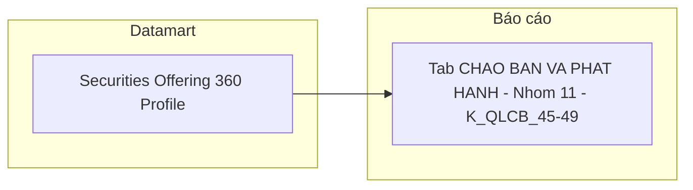

**Bảng grain:**

| Tên bảng | Grain |
|---|---|
| `Securities Offering 360 Profile` | 1 row = 1 đợt chào bán × 1 loại hình (kế thừa Nhóm 4) |

---

## Section 3 — Mô hình tổng thể (READY only)

```mermaid
graph TB
    classDef dim fill:#E6F1FB,stroke:#185FA5,color:#0C447C
    classDef fact fill:#FAECE7,stroke:#993C1D,color:#4A1B0C
    classDef oper fill:#E8F5E9,stroke:#2E7D32,color:#1B5E20

    DIM_DATE["Calendar Date Dimension"]:::dim
    DIM_COMPANY["Public Company Dimension"]:::dim
    DIM_OFFRMETHOD["Offering Method Dimension"]:::dim

    FACT_OFF["Fact Securities Offering"]:::fact
    FACT_PLAN["Fact Securities Offering Plan"]:::fact
    FACT_RESULT["Fact Securities Offering Result"]:::fact
    FACT_APP["Fact Securities Offering Application"]:::fact

    OPR_OFF["Securities Offering 360 Profile"]:::oper

    DIM_DATE --> FACT_OFF
    DIM_COMPANY --> FACT_OFF

    DIM_DATE --> FACT_PLAN
    DIM_COMPANY --> FACT_PLAN
    DIM_OFFRMETHOD --> FACT_PLAN

    DIM_DATE --> FACT_RESULT
    DIM_COMPANY --> FACT_RESULT
    DIM_OFFRMETHOD --> FACT_RESULT

    DIM_DATE --> FACT_APP
    DIM_OFFRMETHOD --> FACT_APP
```

### Bảng Phân tích (Star Schema)

| Tên bảng Datamart | Mô tả | Fact Pattern | Grain | Nguồn Atomic chính |
|---|---|---|---|---|
| Fact Securities Offering | Hồ sơ chào bán/phát hành CK — tổng giá trị cấp phép/huy động theo ngành, kỳ (Nhóm 1) | Fact Event | 1 hồ sơ chào bán | Public Company Securities Offering / Public Company Securities Offering Result |
| Fact Securities Offering Plan | Giá trị cấp phép theo loại hình chào bán (Nhóm 2) | Fact Event | 1 đợt × 1 loại hình kế hoạch | Public Company Securities Offering Plan |
| Fact Securities Offering Result | Giá trị huy động theo loại hình chào bán (Nhóm 3) | Fact Event | 1 đợt × 1 loại hình kết quả | Public Company Securities Offering Result |
| Fact Securities Offering Application | Hồ sơ đăng ký chào bán nộp lên UBCKNN — đếm và phân tích theo trạng thái xử lý, hình thức, năm (Nhóm 5-7) | Fact Event | 1 hồ sơ đăng ký chào bán | Public Company Securities Offering / Public Company Securities Offering Plan |

### Bảng Tác nghiệp (Denormalized)

| Tên bảng Datamart | Mô tả | Grain | Nguồn Atomic chính |
|---|---|---|---|
| Securities Offering 360 Profile | Hồ sơ 360° tra cứu chi tiết từng đợt chào bán — pivot theo loại hình, gồm thông tin tổ chức liên quan (Nhóm 4, 8-11) | 1 đợt chào bán × 1 loại hình | Public Company Securities Offering / Public Company Securities Offering Plan / Public Company Securities Offering Result / Public Company |

### Bảng Dimension

*Tất cả Dimension áp dụng SCD Type 4A (trừ `Public Company Dimension` — reuse `public_company_dim`, giữ quy ước SCD gốc của module GSDC).*

| Tên bảng Datamart | Mô tả | Grain | Nguồn Atomic chính | Conformed |
|---|---|---|---|---|
| Calendar Date Dimension | Lịch ngày — ETL tự sinh | 1 ngày | Generated | Có |
| Public Company Dimension | Công ty đại chúng — mã CK, tên, ngành, sàn (reuse `public_company_dim`, module GSDC) | 1 công ty đại chúng | Public Company | Có |
| Offering Method Dimension | Hình thức chào bán/phát hành — scheme `IDS_SO_OFFERING_METHOD` | 1 mã hình thức | Classification Value | Không |

---

## Section 4 — Reuse Analysis

| Datamart Entity | datamart_table | reuse_status | Ghi chú |
|---|---|---|---|
| Calendar Date Dimension | cdr_dt_dim | reuse | Conformed Dim toàn hệ thống (Lớp 1 — Whitelist) |
| Public Company Dimension | public_company_dim | reuse | Module GSDC đã có, cùng nguồn Atomic `Public Company`, đủ cột mã CK/tên/sàn/`Business Line Level 1 Code` cho GROUP BY ngành (Lớp 3 — Source Match). Bổ sung `QLCB` vào `modules_using` |
| Offering Method Dimension | offering_method_dim | new | Chưa có entity nào trong registry cùng nguồn `Public Company Securities Offering Plan`/`Result` — `offering_form_dim` (module QLKD) tuy cùng `table_type: dim` nhưng khác nguồn Atomic hoàn toàn (SCMS `sc_disclosure_securities_offering` khác IDS `pc_securities_offering_plan`) nên không reuse được |
| Fact Securities Offering | fct_securities_offering (đề xuất) | new | Chưa có Fact nào cùng nguồn `pc_securities_offering` trong registry |
| Fact Securities Offering Plan | fct_securities_offering_plan (đề xuất) | new | Chưa có Fact nào cùng grain/nguồn `pc_securities_offering_plan` |
| Fact Securities Offering Result | fct_securities_offering_result (đề xuất) | new | Chưa có Fact nào cùng grain/nguồn `pc_securities_offering_result` |
| Fact Securities Offering Application | fct_securities_offering_application (đề xuất) | new | Chưa có Fact nào cùng grain hồ sơ đăng ký IDS |
| Securities Offering 360 Profile | securities_offering_360_profile (đề xuất) | new | Bảng tác nghiệp, chưa có tương đương trong registry |

> **Ghi chú Industry Category Dimension:** Loại bỏ hoàn toàn khỏi thiết kế (v2.0) — không có dòng reuse/new tương ứng vì `public_company_dim` đã có sẵn `Business Line Level 1 Code` phục vụ GROUP BY ngành ở Nhóm 1, không cần Dimension ETL-derived riêng.

---

## Section 5 — Vấn đề mở

| ID | Vấn đề | Giả định hiện tại | KPI liên quan | Trạng thái |
|---|---|---|---|---|
| O_QLCB_1 | **Mapping Loại hình phát hành trên 360 Profile:** Atomic `Public Company Securities Offering Plan` có 1 dòng riêng cho mỗi loại hình (`offering_method_code`) của cùng 1 hồ sơ. | ETL sinh 1 row trên `Securities Offering 360 Profile` per loại hình có trong `Public Company Securities Offering Plan` (LEFT JOIN Result theo cùng mã). Composite BK: (Securities Offering Code, Offering Method Code). | K_QLCB_18, 38 | **Closed** |
| O_QLCB_2 | **KPI nguồn TTHC — 4 attributes Nhóm 4 (K_QLCB_19–22):** Đơn vị tư vấn, Tổ chức kiểm toán, Đơn vị bảo lãnh, Đơn vị XHTN. | *(v2.0)* Đổi nguồn TTHC → IDS theo xác nhận nghiệp vụ mới nhất (`BA_analyst_QLCB.csv`, cột Nguồn = IDS toàn bộ 10 nhóm). 4 cột có sẵn trực tiếp trên bảng cha `Public Company Securities Offering` (`consulting_organization_nm`, `audit_organization_nm`, `underwriting_organization_nm`, `credit_rating_organization_nm`), `etl_logic_type = direct` — đơn giản hóa hoàn toàn so với cơ chế array filter TTHC cũ. | K_QLCB_19–22 | **Closed** |
| O_QLCB_3 | **Ngày làm FK date trên Fact:** Atomic `Public Company Securities Offering` có nhiều trường ngày: `certificate_dt` (ngày cấp GCN), `official_letter_dt` (ngày công văn UBCKNN). | BA xác nhận: FK date chính = `official_letter_dt` (ngày công văn UBCKNN) → `Official Letter Date Dimension Id`. `certificate_dt` lưu thêm dạng date field trên Fact/Tác nghiệp nhưng không làm FK date chính. | K_QLCB_1–16 | **Closed** |
| O_QLCB_4 | **Toàn bộ Tab Hồ sơ đăng ký chào bán (Nhóm 5–7) nguồn TTHC:** 11+ KPI gồm 3 Nhóm (KPI Cards, donut chart, bảng chi tiết hồ sơ). | *(v2.0)* Đổi nguồn TTHC → IDS theo xác nhận nghiệp vụ mới nhất. `Fact Securities Offering Application` grain = 1 hồ sơ (`Public Company Securities Offering`), `Application Status Code` direct map từ `approval_status_code` (4 giá trị: `PENDING_REVIEW`/`PENDING_APPROVE`/`APPROVED`/`REJECTED`). Không còn phụ thuộc TTHC/Orchard Core EAV — loại bỏ toàn bộ điểm chờ xác nhận kỹ thuật với đội dev TTHC (xem O_QLCB_8, đã Closed). | K_QLCB_50–63 | **Closed** |
| O_QLCB_5 | **Chuyên viên và Giá/Đối tượng/SL NLĐ per hình thức:** (a) "Chuyên viên" — track Atomic mới (`pc_securities_offering`) chưa có attribute tương ứng cho `CREATED_BY` dù cột này có trong BRD source thật. (b) Với model 1-N Plan/Result mới, mỗi row 360 Profile đã là 1 loại hình cụ thể — `swap_target` (Plan)/`capital_src` (Result), `employee_quantity` lấy trực tiếp từ row tương ứng. `offering_price`/`actual_offering_price` có sẵn trực tiếp trên Plan/Result, không cần Derived. | (a) **PENDING** — gap Atomic track mới, cần bổ sung attribute nguồn `IDS.SECURITIES_OFFERING.CREATED_BY` vào `Public Company Securities Offering` (xem Bảng mapping nguồn tại Nhóm 8). (b) READY — map trực tiếp `swap_target`/`capital_src`/`employee_quantity`/`offering_price`/`actual_offering_price`, không cần tính toán ETL. | K_QLCB_29 (Pending); K_QLCB_40, 42–43, 46, 48–49 (Closed) | **Partial — (a) Open, (b) Closed** |
| O_QLCB_6 | **Ngày hết hạn CCHN — KPI thuộc module NHNCK, không phải QLCB:** Issue này được ghi nhận nhầm trong QLCB HLD. "Ngày hết hạn CCHN" và `CertificateRecords.RevocationDate` thuộc phân hệ NHNCK (Nhà hành nghề chứng khoán), không có KPI tương ứng trong module QLCB. | Issue được đóng và ghi nhận là nhầm module. KPI liên quan cần xem trong `DTM_NHNCK_HLD.md`. | *(không thuộc QLCB)* | **Closed — nhầm module** |
| O_QLCB_7 | **Per-type amount columns trên Fact (model cũ):** Model Atomic cũ (`pblc_co_scr_ofrg`) lưu qty/price gộp toàn bộ loại hình vào 1 record, không tách được per-type chính xác. | *(v2.0 — RESOLVED bởi đổi track Atomic)* Track mới tách quan hệ 1-N: `Public Company Securities Offering Plan`/`Result` có 1 dòng riêng cho mỗi loại hình (`offering_method_code`). K_QLCB_5–16 giờ SUM trực tiếp có filter theo mã — không cần 6 cột per-type ETL-derived nữa. Vấn đề gốc của model cũ không còn áp dụng. | K_QLCB_5–16 | **Closed — không còn áp dụng (đổi track Atomic)** |
| O_QLCB_8 | **Xác nhận kỹ thuật TTHC trước ETL build (model cũ):** Các điểm chờ xác nhận với đội dev TTHC (ContentType, workflow Eform 16/17, pattern ContentField). | *(v2.0 — RESOLVED bởi đổi nguồn TTHC → IDS)* Toàn bộ Tab Hồ sơ đăng ký chào bán và 4 cột tổ chức Nhóm 4 đã chuyển sang nguồn IDS — không còn phụ thuộc TTHC, không còn điểm chờ xác nhận nào liên quan. | *(không còn áp dụng)* | **Closed — không còn áp dụng (đổi nguồn TTHC → IDS)** |
| O_QLCB_9 | **2 track Atomic trùng logical_name "Public Company Securities Offering":** Track cũ `DataModel/working/Atomic_LinhLV/Business_Activity/dm_atm_pblc_co_scr_ofrg-IDS.company_securities_issuance.yaml` (physical_name `pblc_co_scr_ofrg`, nguồn ghi `IDS.company_securities_issuance`) **không có BRD source thật** trong `BRD/Source/IDS/` — có khả năng là track nháp/lỗi thời. Track mới `DataModel/working/Atomic/lld/IDS/lld_IDS_SECURITIES_OFFERING.yaml` (physical_name `pc_securities_offering`, nguồn `IDS.SECURITIES_OFFERING`) có BRD source đầy đủ nhưng attribute-level `status: draft`, chưa aggregate vào `DataModel/Atomic/` + `dm_manifest.yaml`. | HLD v2.0 dùng track mới theo xác nhận người thiết kế (coi LLD draft là READY). Cần đội Atomic reconcile 2 track — xác nhận track cũ có nên xóa/archive hay không, và chạy `aggregate_atomic.py` để đưa track mới vào `DataModel/Atomic/` chính thức. | Toàn bộ KPI Nhóm 1–11 | **Open** |