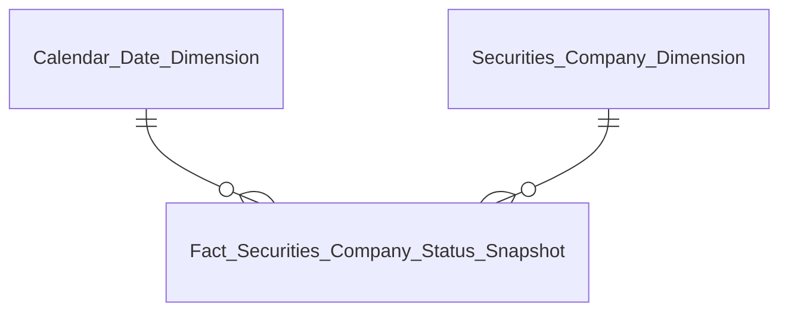
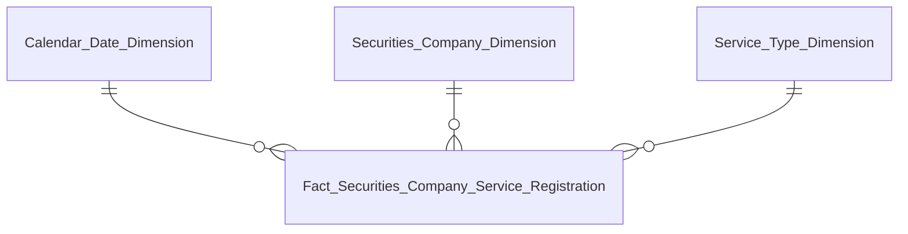
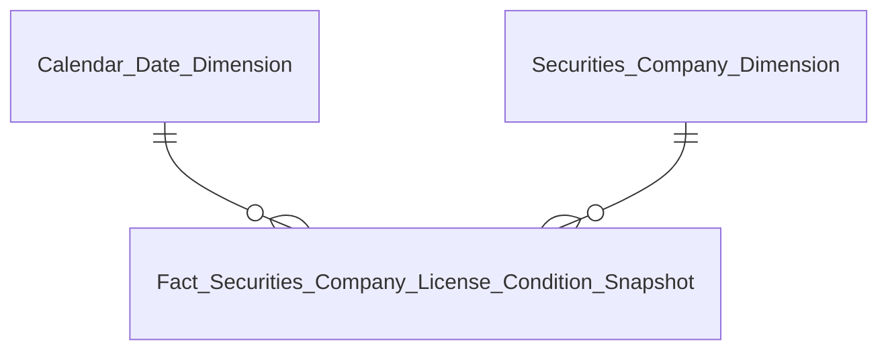
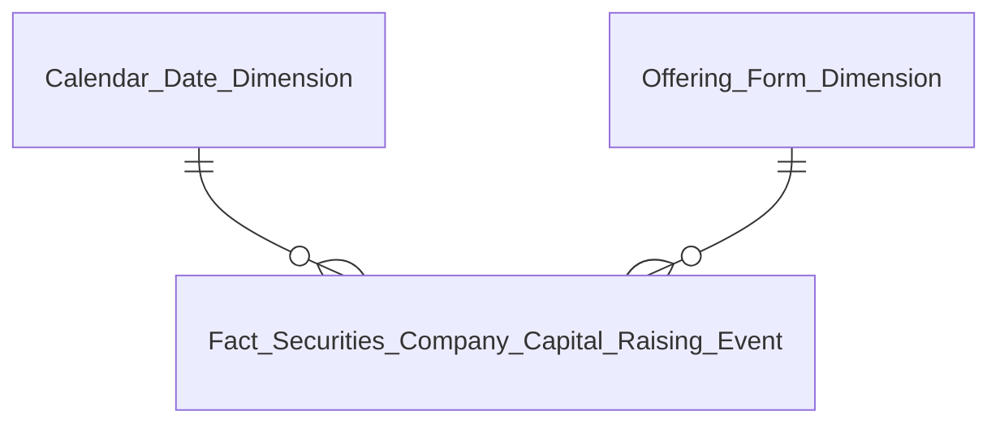
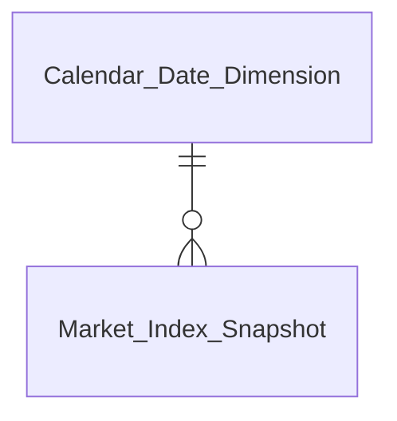
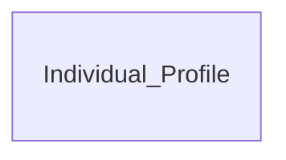

# DTM_QLKD_Entities — Star Schema per Nhóm báo cáo
**Module:** QLKD — Quản lý kinh doanh (Hoạt động CTCK)
**Phiên bản:** 4.2 — 13/07/2026 (khớp DTM_QLKD_HLD.md v4.2)

---

## Tab TỔNG QUAN

### Nhóm 1 — Chỉ tiêu thống kê chung (K_QLKD_1–11)

| Datamart Entity | Loại | Reuse | Mô tả | Grain | KPI |
|---|---|---|---|---|---|
| Fact Securities Company Status Snapshot | Fact Snapshot | new | Tình trạng CTCK theo trạng thái pháp lý | 1 CTCK × 1 ngày snapshot | K_QLKD_1–11 (K_QLKD_12–13 PENDING, xem O_QLKD_1) |
| Securities Company Dimension | Dimension | new | CTCK — mã, tên, loại hình, trạng thái | 1 CTCK (SCD4A) | — |
| Calendar Date Dimension | Dimension | reuse | Lịch ngày | 1 ngày | — |

### Nhóm 2 — Biểu đồ Nghiệp vụ (K_QLKD_14–19) — PENDING

> Atomic entity chưa cover quan hệ N:N CTCK↔nghiệp vụ (`Securities Company.Business Lines` là Text thô chưa parse) — xem O_QLKD_20. Không vẽ Star Schema chi tiết cho block PENDING.

| Datamart Entity | Loại | Reuse | Mô tả | Grain | KPI |
|---|---|---|---|---|---|
| Fact Securities Company Business Line Registration (dự kiến) | Fact Event | new | Đăng ký nghiệp vụ kinh doanh chứng khoán per CTCK | 1 CTCK × 1 nghiệp vụ | K_QLKD_14–19 (PENDING) |
| Business Line Dimension | Dimension | reuse (cls_dim) | Nghiệp vụ kinh doanh chứng khoán — Classification Value scheme SCMS_BUSINESS_LINE | 1 nghiệp vụ (SCD4A) | — |

### Nhóm 3/4 — Biểu đồ Dịch vụ & Dịch vụ phái sinh (K_QLKD_20–29)

| Datamart Entity | Loại | Reuse | Mô tả | Grain | KPI |
|---|---|---|---|---|---|
| Fact Securities Company Service Registration | Fact Event | new | Đăng ký dịch vụ CTCK (ký quỹ/ứng trước/lưu ký/phái sinh) | 1 CTCK × 1 dịch vụ × 1 lần đăng ký | K_QLKD_20–29 |
| Securities Company Dimension | Dimension | new | CTCK — mã, tên, loại hình, trạng thái | 1 CTCK (SCD4A) | — |
| Service Type Dimension | Dimension | new | Dịch vụ CTCK — Atomic entity Classification Service (entity riêng, không phải cv) | 1 dịch vụ (SCD4A) | — |
| Calendar Date Dimension | Dimension | reuse | Lịch ngày | 1 ngày | — |

### Nhóm 5/6/7 — Duy trì điều kiện cấp phép (GPHL/Phái sinh KDCKPS/Phái sinh BTTT) (K_QLKD_30–40)

| Datamart Entity | Loại | Reuse | Mô tả | Grain | KPI |
|---|---|---|---|---|---|
| Fact Securities Company License Condition Snapshot | Fact Snapshot | new | Duy trì điều kiện cấp phép — dùng chung 3 nhóm, phân biệt bằng Indicator_Code | 1 CTCK × 1 loại giấy phép × 1 ngày snapshot | K_QLKD_30–40 |
| Securities Company Dimension | Dimension | new | CTCK — mã, tên, loại hình, trạng thái | 1 CTCK (SCD4A) | — |
| Calendar Date Dimension | Dimension | reuse | Lịch ngày | 1 ngày | — |

### Nhóm 8/9 — Cơ cấu tài sản / nguồn vốn toàn thị trường (K_QLKD_41–52) — PENDING

> Atomic entity `REPORT_CELL_VALUE` không tồn tại trong track hiện hành (O_QLKD_23) — không vẽ Star Schema chi tiết.

| Datamart Entity | Loại | Reuse | Mô tả | Grain | KPI |
|---|---|---|---|---|---|
| Fact Securities Company Financial Structure Snapshot (dự kiến) | Fact Snapshot | new | Chỉ tiêu BCTC toàn thị trường/per CTCK — dùng chung nhiều Nhóm | 1 CTCK × 1 chỉ tiêu BCTC × 1 kỳ | K_QLKD_41–52 (PENDING, xem O_QLKD_23) |
| Report Indicator Dimension | Dimension | new | Chỉ tiêu báo cáo BCTC | 1 chỉ tiêu (SCD4A) | — |

### Nhóm 13 — Nguồn vốn tăng thêm (K_QLKD_66–72)

| Datamart Entity | Loại | Reuse | Mô tả | Grain | KPI |
|---|---|---|---|---|---|
| Fact Securities Company Capital Raising Event | Fact Event | new | Nguồn vốn tăng thêm từ chào bán/phát hành — toàn thị trường theo tháng | 1 đợt chào bán/phát hành hợp lệ (aggregated theo tháng × hình thức tăng vốn) | K_QLKD_66–72 |
| Offering Form Dimension | Dimension | new | Hình thức tăng vốn — ETL-derived (5 giá trị) | 1 hình thức (SCD4A) | — |
| Calendar Date Dimension | Dimension | reuse | Lịch ngày | 1 ngày | — |

### Nhóm 16 — Diễn biến thị trường (K_QLKD_88–91)

| Datamart Entity | Loại | Reuse | Mô tả | Grain | KPI |
|---|---|---|---|---|---|
| Market Index Snapshot | Fact Snapshot | new | Chỉ số thị trường VN-Index/HNX/UPCOM/VN30 | 1 chỉ số (marketCode) × 1 tháng | K_QLKD_88–91 |
| Calendar Date Dimension | Dimension | reuse | Lịch ngày | 1 ngày | — |

---

## Tab GIÁM SÁT

### Sub-tab GIÁM SÁT HOẠT ĐỘNG — Nhóm 11/12/14/15/16/17/18 (K_QLKD_59–99) — PENDING

> Toàn bộ dùng chung `Fact Securities Company Financial Structure Snapshot` (xem Nhóm 8/9) — PENDING theo O_QLKD_23. Ngoại lệ K_QLKD_88–91 (Nhóm 16, xem Market Index Snapshot ở trên).

| Datamart Entity | Loại | Reuse | Mô tả | Grain | KPI |
|---|---|---|---|---|---|
| Fact Securities Company Financial Structure Snapshot (dự kiến) | Fact Snapshot | new | Reuse từ Nhóm 8/9 — mở rộng VCSH, doanh thu, lợi nhuận, thị phần, margin, ATTC | 1 CTCK × 1 chỉ tiêu BCTC × 1 kỳ | K_QLKD_59–65 (Nhóm 11/12), K_QLKD_73–87, 92–99 (Nhóm 14/15/16/17/18) — PENDING |

### Sub-tab GIÁM SÁT TUÂN THỦ — Nhóm 10 (K_QLKD_53–58) — PENDING

> Atomic entity đã READY (`Member Periodic Report`/`Report Submission Obligation`) — PENDING chỉ do gating dữ liệu động, không phải gap Atomic.

| Datamart Entity | Loại | Reuse | Mô tả | Grain | KPI |
|---|---|---|---|---|---|
| Fact Securities Company Report Compliance Snapshot | Fact Snapshot | new | Tuân thủ nộp báo cáo định kỳ — PENDING (gating dữ liệu động) | 1 CTCK × 1 biểu mẫu × 1 kỳ nghĩa vụ | K_QLKD_53–58 (PENDING) |
| Securities Company Dimension | Dimension | new | CTCK — mã, tên, loại hình, trạng thái | 1 CTCK (SCD4A) | — |
| Calendar Date Dimension | Dimension | reuse | Lịch ngày | 1 ngày | — |

---

## Tab HỒ SƠ CTCK 360

### Nhóm 19–27 — Banner tổng quan & Biểu đồ tài chính per CTCK (K_QLKD_100–140) — PENDING

> Toàn bộ tái sử dụng `Fact Securities Company Financial Structure Snapshot` — PENDING theo O_QLKD_23. Nhóm 26/27 (Lịch sử BCTC) dùng thêm `Securities Company Financial Report History` (Tác nghiệp).

| Datamart Entity | Loại | Reuse | Mô tả | Grain | KPI |
|---|---|---|---|---|---|
| Fact Securities Company Financial Structure Snapshot (dự kiến) | Fact Snapshot | new | Reuse từ Nhóm 8/9 — banner + cơ cấu tài sản/nguồn vốn/doanh thu per CTCK | 1 CTCK × 1 chỉ tiêu BCTC × 1 kỳ | K_QLKD_100–128 (Nhóm 19–25) — PENDING |
| Securities Company Financial Report History | Tác nghiệp | new | Lịch sử BCTC — DT/LN/ROA/ROE theo từng kỳ | 1 CTCK × 1 kỳ báo cáo BCTC | K_QLKD_129–140 (Nhóm 26/27) — PENDING |

### Sub-tab Nhân sự — Nhóm 31 (K_QLKD_154–161)

| Datamart Entity | Loại | Reuse | Mô tả | Grain | KPI |
|---|---|---|---|---|---|
| Securities Company Personnel Profile | Tác nghiệp | new | HĐQT/HĐTV/BKS/BĐH, cổ đông lớn, lịch sử thay đổi nhân sự | 1 nhân sự cao cấp × 1 CTCK (latest state) | K_QLKD_154–159, 161 |
| Securities Company Shareholder Profile | Tác nghiệp | new | Cổ đông lớn nắm giữ >5% VĐL | 1 cổ đông × 1 CTCK (latest state) | K_QLKD_160 |

### Sub-tab Tuân thủ — Nhóm 38/39/40 (K_QLKD_187–203) — Partial READY

| Datamart Entity | Loại | Reuse | Mô tả | Grain | KPI |
|---|---|---|---|---|---|
| Securities Company Compliance History | Tác nghiệp | new | BC nộp + quyết định xử phạt hành chính (READY) + thanh tra/kiểm tra (READY, trừ Chiều ngày PENDING) | 1 CTCK × 1 sự kiện | K_QLKD_189, 197–203 READY; K_QLKD_187–188, 190–196 PENDING |

### Sub-tab CN, PGD, VPĐD — Nhóm 32/33/34/35/36/37 (K_QLKD_162–186) — Partial READY

| Datamart Entity | Loại | Reuse | Mô tả | Grain | KPI |
|---|---|---|---|---|---|
| Securities Company Organization Unit Profile | Tác nghiệp | new | CN/PGD/VPĐD — số lượng, dịch vụ chấp thuận (READY); nghiệp vụ N:N, duy trì điều kiện cấp phép (PENDING) | 1 đơn vị × 1 CTCK | K_QLKD_162–165, 171–178, 182–183, 185–186 READY; K_QLKD_166–170, 179–181, 184 PENDING |

---

## Tab TRA CỨU CÁ NHÂN

### Nhóm 41a — Landing page: Danh sách cá nhân (K_QLKD_205–206)

| Datamart Entity | Loại | Reuse | Mô tả | Grain | KPI |
|---|---|---|---|---|---|
| Individual Profile | Tác nghiệp | new | Merge Securities Company Senior Personnel (SCMS) + Securities Practitioner (NHNCK) theo CCCD | 1 cá nhân × 1 CTCK (latest state) | K_QLKD_205–206 |

### Nhóm 41b/41d — Mạng lưới quan hệ 360° & Mạng lưới người liên quan chi tiết (K_QLKD_111, 204, 207–210)

| Datamart Entity | Loại | Reuse | Mô tả | Grain | KPI |
|---|---|---|---|---|---|
| Individual Related Party Network | Tác nghiệp | new | Self-reference Securities Company Insider Related Person | 1 người liên quan × 1 cá nhân chính | K_QLKD_111, 207–210 READY; K_QLKD_204 (Chiều ngày) PENDING |

### Nhóm 41c — Hồ sơ: Vai trò tại DN niêm yết (K_QLKD_211–212)

| Datamart Entity | Loại | Reuse | Mô tả | Grain | KPI |
|---|---|---|---|---|---|
| Individual Listed Company Role | Tác nghiệp | new | Vai trò + số CP nắm giữ tại tổ chức khác | 1 vai trò × 1 CTCK × 1 cá nhân | K_QLKD_211–212 |

### Nhóm 41e — Hồ sơ: Tài khoản giao dịch (K_QLKD_213)

| Datamart Entity | Loại | Reuse | Mô tả | Grain | KPI |
|---|---|---|---|---|---|
| Individual Trading Account | Tác nghiệp | new | Tài khoản giao dịch — bao gồm cả tài khoản người liên quan | 1 tài khoản giao dịch × 1 CTCK × 1 cá nhân | K_QLKD_213 |

### Nhóm 41f — Quá trình hành nghề: Lịch sử công tác (K_QLKD_214–218)

| Datamart Entity | Loại | Reuse | Mô tả | Grain | KPI |
|---|---|---|---|---|---|
| Individual Work History | Tác nghiệp | new | Lịch sử bổ nhiệm — tên công ty, chức vụ, thời gian, trạng thái | 1 lần bổ nhiệm × 1 CTCK × 1 cá nhân | K_QLKD_215–218 READY; K_QLKD_214 (Chiều ngày) PENDING |

### Nhóm 41g — Lịch sử vi phạm & xử phạt cá nhân (K_QLKD_219–224)

| Datamart Entity | Loại | Reuse | Mô tả | Grain | KPI |
|---|---|---|---|---|---|
| Individual Violation History | Tác nghiệp | new | Quyết định xử phạt hành chính cá nhân — schema INSPECT | 1 quyết định xử phạt × 1 cá nhân | K_QLKD_220–224 READY; K_QLKD_219 (Chiều ngày) PENDING |

---

## Tab DATA EXPLORER

### Nhóm 42-145 — Tra cứu báo cáo biểu mẫu định kỳ (K_QLKD_225–4261) — PENDING

> Toàn bộ PENDING — gating dữ liệu động + gap Atomic entity `REPORT_CELL_VALUE` (O_QLKD_23). Không vẽ Star Schema chi tiết.

| Datamart Entity | Loại | Reuse | Mô tả | Grain | KPI |
|---|---|---|---|---|---|
| Securities Company Report Data (dự kiến) | Tác nghiệp | new | EAV — 1 chỉ tiêu × 1 kỳ × 1 CTCK × 1 biểu mẫu, 104 STT / 4036 chỉ tiêu | 1 chỉ tiêu × 1 kỳ báo cáo × 1 CTCK × 1 biểu mẫu | K_QLKD_225–4261 (PENDING) |
