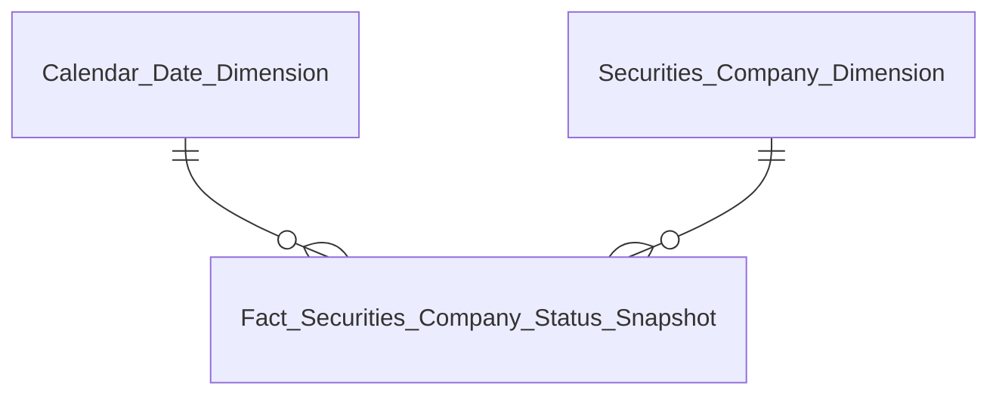
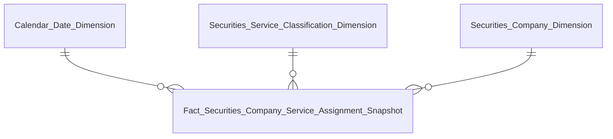
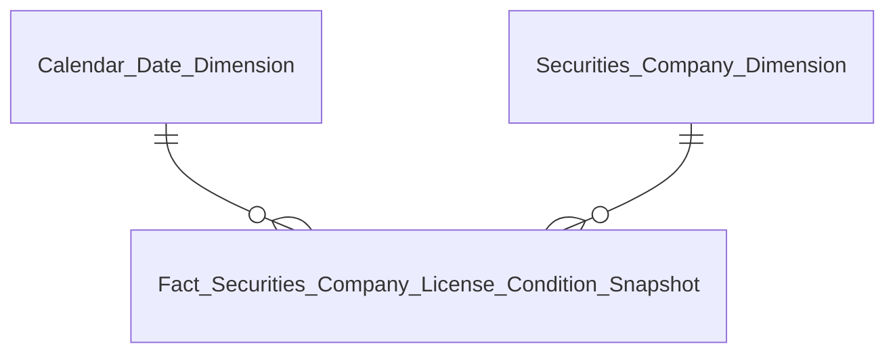
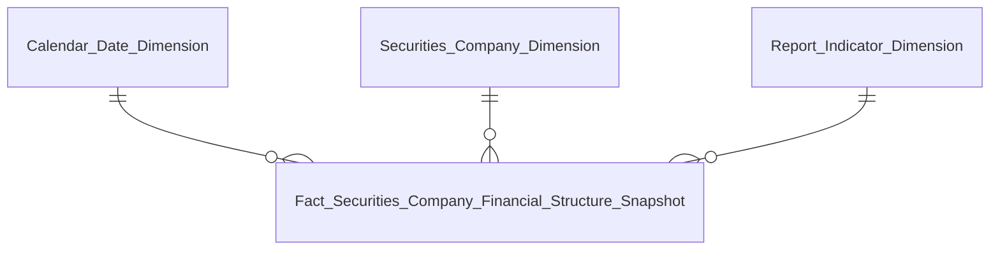
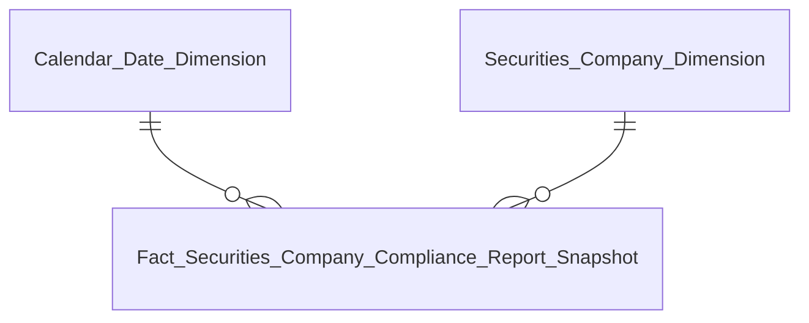
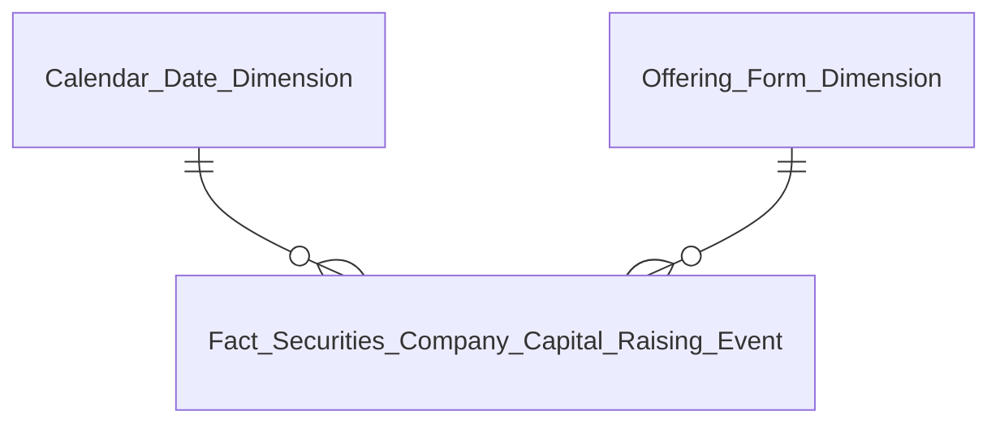
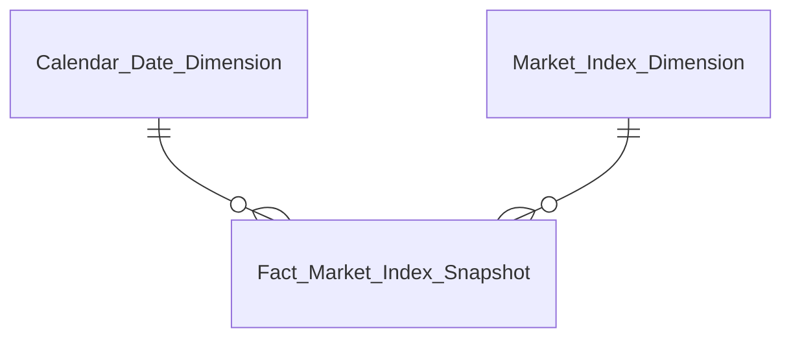
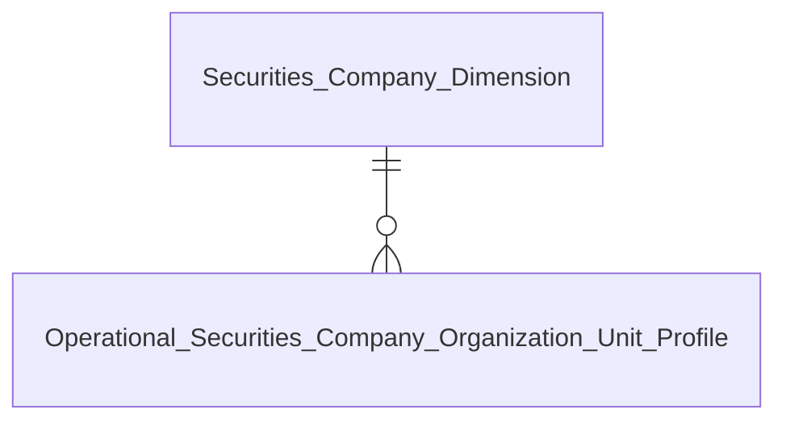
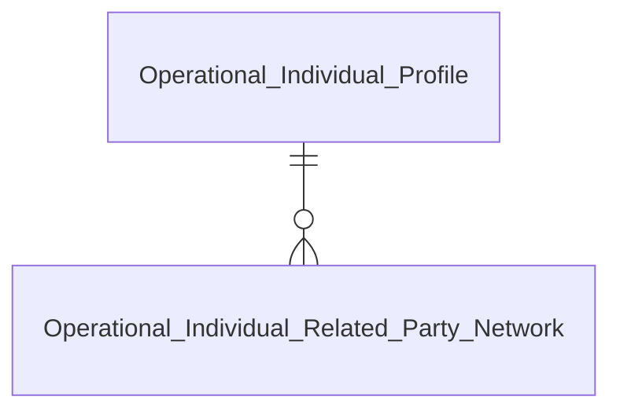
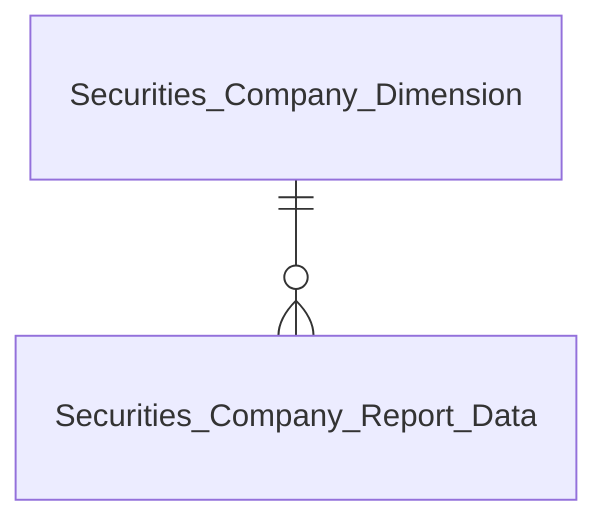

# DTM_QLKD_Entities — Star Schema per Nhóm báo cáo
**Module:** QLKD — Quản lý kinh doanh (Hoạt động CTCK)
**Phiên bản:** 5.2 — 17/09/2026 (Unblock downstream Datamart sau khi xác nhận REPORT_CELL_VALUE = REPORT_INPUT_CELL_VALUE / sc_report_input_value; nâng READY cho Cụm 4, Cụm 5, Cụm 6, Cụm 15; thiết kế Fact Securities Company Financial Structure Snapshot, Report Indicator Dimension, Securities Company Report Data, Securities Company Financial Report History, Securities Company Practitioner Profile; chuyển từ Bảng PENDING vào Entities chính thức)
**Phiên bản trước:** 5.1 — 17/09/2026 (đồng bộ theo `DTM_QLKD_HLD.md` v4.9 — Nhóm 2/3/4 Atomic hoàn thiện, nâng PENDING→READY; thêm Fact Securities Company Service Assignment Snapshot + Securities Service Classification Dimension vào Entities.csv, bỏ khỏi bảng "Bảng PENDING")

---

## Tab TỔNG QUAN

### Nhóm 1 — Chỉ tiêu thống kê chung (K_QLKD_1–11)

| Datamart Entity | Loại | Reuse | Mô tả | Grain | KPI |
|---|---|---|---|---|---|
| Fact Securities Company Status Snapshot | Fact Snapshot | new | Tình trạng CTCK theo trạng thái pháp lý | 1 CTCK × 1 ngày snapshot | K_QLKD_1–11 (K_QLKD_12–13 PENDING, xem O_QLKD_1) |
| Securities Company Dimension | Dimension | new | CTCK — mã, tên, loại hình, trạng thái | 1 CTCK (SCD4A) | — |
| Calendar Date Dimension | Dimension | reuse | Lịch ngày | 1 ngày | — |

### Nhóm 2/3/4 — Biểu đồ Nghiệp vụ/Dịch vụ/Dịch vụ phái sinh (K_QLKD_14–29)

| Datamart Entity | Loại | Reuse | Mô tả | Grain | KPI |
|---|---|---|---|---|---|
| Fact Securities Company Service Assignment Snapshot | Fact Snapshot | new | Dịch vụ/nghiệp vụ kinh doanh chứng khoán còn hiệu lực của CTCK — dùng chung cho cả 3 Nhóm, phân biệt bằng Catalog Code | 1 CTCK × 1 dịch vụ/nghiệp vụ × 1 ngày snapshot (còn hiệu lực) | K_QLKD_14–29 |
| Securities Service Classification Dimension | Dimension | new | Danh mục dịch vụ/nghiệp vụ — phân loại qua Catalog Code | 1 dịch vụ/nghiệp vụ (SCD4A) | — |
| Securities Company Dimension | Dimension | reuse (Nhóm 1) | CTCK — mã, tên, loại hình, trạng thái | 1 CTCK (SCD4A) | — |
| Calendar Date Dimension | Dimension | reuse | Lịch ngày (role: Snapshot Date) | 1 ngày | — |

### Nhóm 5/6/7 — Duy trì điều kiện cấp phép (GPHL / KDCKPS / BTTT) (K_QLKD_30–40)

| Datamart Entity | Loại | Reuse | Mô tả | Grain | KPI |
|---|---|---|---|---|---|
| Fact Securities Company License Condition Snapshot | Fact Snapshot | new | Duy trì điều kiện cấp phép — dùng chung 3 nhóm, phân biệt bằng Indicator_Code | 1 CTCK × 1 loại giấy phép × 1 ngày snapshot | K_QLKD_30–40 |
| Securities Company Dimension | Dimension | new | CTCK — mã, tên, loại hình, trạng thái | 1 CTCK (SCD4A) | — |
| Calendar Date Dimension | Dimension | reuse | Lịch ngày | 1 ngày | — |

### Nhóm 8/9 — Cơ cấu tài sản và cơ cấu nguồn vốn toàn thị trường (K_QLKD_41–52)

| Datamart Entity | Loại | Reuse | Mô tả | Grain | KPI |
|---|---|---|---|---|---|
| Fact Securities Company Financial Structure Snapshot | Fact Snapshot | new | Cơ cấu tài sản, nguồn vốn và các chỉ tiêu tài chính định kỳ toàn thị trường và từng CTCK | 1 CTCK × 1 kỳ báo cáo × 1 chỉ tiêu tài chính | K_QLKD_41–52 |
| Report Indicator Dimension | Dimension | new | Danh mục chỉ tiêu tài chính báo cáo (cell coordinates & standardized indicator codes) | 1 chỉ tiêu (SCD4A) | — |
| Securities Company Dimension | Dimension | reuse (Nhóm 1) | CTCK — mã, tên, loại hình, trạng thái | 1 CTCK (SCD4A) | — |
| Calendar Date Dimension | Dimension | reuse | Lịch ngày (role: Snapshot Date / Period End Date) | 1 ngày | — |

---

## Tab GIÁM SÁT

### Sub-tab GIÁM SÁT TUÂN THỦ — Nhóm 10 (K_QLKD_53–58, K_QLKD_4261–4264)

| Datamart Entity | Loại | Reuse | Mô tả | Grain | KPI |
|---|---|---|---|---|---|
| Fact Securities Company Compliance Report Snapshot | Fact Snapshot | new | Tuân thủ nộp báo cáo — UNION 2 nguồn độc lập `sc_adhoc_report` (đột xuất) + `sc_periodic_report` (định kỳ), phân biệt bằng Report Type Code | 1 CTCK × 1 loại báo cáo × 1 kỳ/ngày sự vụ | K_QLKD_53–58, K_QLKD_4261–4264 |
| Securities Company Dimension | Dimension | new | CTCK — mã, tên, loại hình, trạng thái | 1 CTCK (SCD4A) | — |
| Calendar Date Dimension | Dimension | reuse | Lịch ngày | 1 ngày | — |

### Sub-tab GIÁM SÁT HOẠT ĐỘNG — Nhóm 11/12/14/15/16/17/18 (K_QLKD_59–65, 73–87, 92–99)

| Datamart Entity | Loại | Reuse | Mô tả | Grain | KPI |
|---|---|---|---|---|---|
| Fact Securities Company Financial Structure Snapshot | Fact Snapshot | reuse (Nhóm 8/9) | Chỉ tiêu tài chính giám sát: VCSH, vốn đầu tư CSH, tỷ lệ an toàn tài chính, doanh thu, lợi nhuận, margin, CFO, thị phần | 1 CTCK × 1 kỳ báo cáo × 1 chỉ tiêu tài chính | K_QLKD_59–65, 73–87, 92–99 |
| Report Indicator Dimension | Dimension | reuse (Nhóm 8/9) | Danh mục chỉ tiêu tài chính báo cáo | 1 chỉ tiêu (SCD4A) | — |
| Securities Company Dimension | Dimension | reuse (Nhóm 1) | CTCK — mã, tên, loại hình, trạng thái | 1 CTCK (SCD4A) | — |
| Calendar Date Dimension | Dimension | reuse | Lịch ngày | 1 ngày | — |

### Nhóm 13 — Nguồn vốn tăng thêm (K_QLKD_66–72)

| Datamart Entity | Loại | Reuse | Mô tả | Grain | KPI |
|---|---|---|---|---|---|
| Fact Securities Company Capital Raising Event | Fact Event | new | Nguồn vốn tăng thêm từ chào bán/phát hành — toàn thị trường theo tháng | 1 đợt chào bán/phát hành hợp lệ (aggregated theo tháng × hình thức tăng vốn) | K_QLKD_66–72 |
| Offering Form Dimension | Dimension | new | Hình thức tăng vốn — ETL-derived (5 giá trị) | 1 hình thức (SCD4A) | — |
| Calendar Date Dimension | Dimension | reuse | Lịch ngày (role: Result Report Date) | 1 ngày | — |

### Nhóm 16b — Diễn biến thị trường (K_QLKD_88–91)

| Datamart Entity | Loại | Reuse | Mô tả | Grain | KPI |
|---|---|---|---|---|---|
| Fact Market Index Snapshot | Fact Snapshot | new | Chỉ số thị trường VN-Index/HNX/UPCOM/VN30 | 1 chỉ số (market_code) × 1 ngày (bản ghi cuối phiên) | K_QLKD_88–91 |
| Market Index Dimension | Dimension | new | Mã/loại index/sản phẩm giao dịch/trạng thái phiên. Dùng chung với NDTNN | 1 combo Market Id + Market Code (SCD4A current-state) | — |
| Calendar Date Dimension | Dimension | reuse | Lịch ngày | 1 ngày | — |

---

## Tab HỒ SƠ CTCK 360

### Sub-tab Tài chính — Nhóm 19–27 (K_QLKD_100–141)

| Datamart Entity | Loại | Reuse | Mô tả | Grain | KPI |
|---|---|---|---|---|---|
| Fact Securities Company Financial Structure Snapshot | Fact Snapshot | reuse (Nhóm 8/9) | Banner tài chính tổng quan & các biểu đồ tài chính 360 của CTCK | 1 CTCK × 1 kỳ báo cáo × 1 chỉ tiêu tài chính | K_QLKD_100–129 |
| Securities Company Financial Report History | Tác nghiệp | new | Lịch sử báo cáo tài chính qua các kỳ (doanh thu, lợi nhuận, ROA, ROE, ngày nộp, trạng thái) | 1 CTCK × 1 kỳ báo cáo tài chính | K_QLKD_130–141 |
| Securities Company Dimension | Dimension | reuse (Nhóm 1) | CTCK — mã, tên, loại hình, trạng thái | 1 CTCK (SCD4A) | — |
| Calendar Date Dimension | Dimension | reuse | Lịch ngày | 1 ngày | — |

### Sub-tab NHNCK — Nhóm 28–30 (K_QLKD_142–154)

| Datamart Entity | Loại | Reuse | Mô tả | Grain | KPI |
|---|---|---|---|---|---|
| Securities Company Practitioner Profile | Tác nghiệp | new | Thống kê người hành nghề chứng khoán theo nghiệp vụ và phái sinh (báo cáo BCTHHDKD_TH sheet TTC) | 1 CTCK × 1 kỳ báo cáo | K_QLKD_142–154 |
| Securities Company Dimension | Dimension | reuse (Nhóm 1) | CTCK — mã, tên, loại hình, trạng thái | 1 CTCK (SCD4A) | — |

### Sub-tab Nhân sự — Nhóm 31 (K_QLKD_155–160)

| Datamart Entity | Loại | Reuse | Mô tả | Grain | KPI |
|---|---|---|---|---|---|
| Operational Securities Company Personnel Profile | Tác nghiệp | new | HĐQT/HĐTV/BKS/BĐH | 1 nhân sự cao cấp × 1 CTCK (latest state) | K_QLKD_155–160 |

### Sub-tab Tuân thủ — Nhóm 38/39/40 (K_QLKD_186–202) — Partial READY

| Datamart Entity | Loại | Reuse | Mô tả | Grain | KPI |
|---|---|---|---|---|---|
| Operational Securities Company Compliance History | Tác nghiệp | new | BC nộp + quyết định xử phạt hành chính (Nhóm 38, một phần READY) + thanh tra/kiểm tra (Nhóm 40, phần lớn READY, trừ Chiều ngày PENDING) | 1 CTCK × 1 sự kiện | K_QLKD_188, 196–202 READY; K_QLKD_186–187, 189–195 PENDING (gating dữ liệu động, Nhóm 38/39) |

### Sub-tab CN, PGD, VPĐD — Nhóm 32–37 (K_QLKD_161–185) — Partial READY

| Datamart Entity | Loại | Reuse | Mô tả | Grain | KPI |
|---|---|---|---|---|---|
| Operational Securities Company Organization Unit Profile | Tác nghiệp | new | CN/PGD/VPĐD — số lượng theo loại (Nhóm 32, READY), Tên/Địa chỉ/Ngày thành lập/Giám đốc (Nhóm 37, READY) | 1 đơn vị × 1 CTCK | K_QLKD_161–164, 181–182, 184–185 READY; K_QLKD_165–180, 183 PENDING (Nhóm 33/34/35/36 toàn bộ + Nhóm 37 cột Nghiệp vụ — xem O_QLKD_26/O_QLKD_7) |

---

## Tab TRA CỨU CÁ NHÂN

### Nhóm 41a — Mạng lưới quan hệ 360° (K_QLKD_203–210)

| Datamart Entity | Loại | Reuse | Mô tả | Grain | KPI |
|---|---|---|---|---|---|
| Operational Individual Profile | Tác nghiệp | new | Merge Securities Company Senior Personnel (SCMS) + Securities Practitioner (NHNCK) theo CCCD — landing page tìm kiếm/chọn cá nhân | 1 cá nhân × 1 CTCK (latest state) | K_QLKD_204–205 |
| Operational Individual Related Party Network | Tác nghiệp | new | Self-reference Securities Company Insider Related Person | 1 người liên quan × 1 cá nhân chính | K_QLKD_206–210 READY; K_QLKD_203 (Chiều ngày) PENDING |

### Nhóm 41b — Hồ sơ và danh mục (K_QLKD_210–212)

| Datamart Entity | Loại | Reuse | Mô tả | Grain | KPI |
|---|---|---|---|---|---|
| Operational Individual Listed Company Role | Tác nghiệp | new | Vai trò + số CP nắm giữ tại tổ chức khác | 1 vai trò × 1 CTCK × 1 cá nhân | K_QLKD_210–211 |
| Operational Individual Related Party Network | Tác nghiệp | reuse (Nhóm 41a) | Mạng lưới người liên quan chi tiết — dùng chung entity với Nhóm 41a | 1 người liên quan × 1 cá nhân chính | K_QLKD_206–209 (reuse) |
| Operational Individual Trading Account | Tác nghiệp | new | Tài khoản giao dịch — bao gồm cả tài khoản người liên quan | 1 tài khoản giao dịch × 1 CTCK × 1 cá nhân | K_QLKD_212 |

### Nhóm 41c — Quá trình hành nghề: Lịch sử công tác (K_QLKD_213–217)

| Datamart Entity | Loại | Reuse | Mô tả | Grain | KPI |
|---|---|---|---|---|---|
| Operational Individual Work History | Tác nghiệp | new | Lịch sử bổ nhiệm — tên công ty, chức vụ, thời gian, trạng thái | 1 lần bổ nhiệm × 1 CTCK × 1 cá nhân | K_QLKD_214–217 READY; K_QLKD_213 (Chiều ngày) PENDING |

### Nhóm 41d — Lịch sử vi phạm & xử phạt cá nhân (K_QLKD_218–223)

| Datamart Entity | Loại | Reuse | Mô tả | Grain | KPI |
|---|---|---|---|---|---|
| Operational Individual Violation History | Tác nghiệp | new | Quyết định xử phạt hành chính cá nhân — schema INSPECT | 1 quyết định xử phạt × 1 cá nhân | K_QLKD_219–223 READY; K_QLKD_218 (Chiều ngày) PENDING |

---

## Tab DATA EXPLORER

### Nhóm 42-145 — Tra cứu báo cáo biểu mẫu định kỳ (K_QLKD_224–4260) — READY

| Datamart Entity | Loại | Reuse | Mô tả | Grain | KPI |
|---|---|---|---|---|---|
| Securities Company Report Data | Tác nghiệp | new | Tra cứu dữ liệu chi tiết từng ô (cell) của 102 biểu mẫu báo cáo định kỳ eForm động | 1 ô dữ liệu (cell) × 1 lần nộp báo cáo × 1 CTCK | K_QLKD_224–4260 |
| Securities Company Dimension | Dimension | reuse (Nhóm 1) | CTCK — mã, tên, loại hình, trạng thái | 1 CTCK (SCD4A) | — |

---

## Bảng PENDING / Superseded

| Datamart Entity | Lý do | Issue |
|---|---|---|
| ~~Business Line Dimension~~ | Superseded 11/09/2026 — gap gốc `LNK_SC_FIRM_BUSINESS_LINE` không còn đúng theo cột T, bỏ khỏi mô hình hoàn toàn | O_QLKD_20 (Superseded) → O_QLKD_26 |
