# DTM_QLKD_HLD — High Level Design
**Module:** QLKD — Quản lý kinh doanh (Hoạt động CTCK)
**Phạm vi hiện tại:** Tab TỔNG QUAN + Tab GIÁM SÁT + Tab HỒ SƠ CTCK 360 + Tab TRA CỨU CÁ NHÂN + Tab DATA EXPLORER
**Phiên bản:** 3.4 — 05/05/2026

---

## Section 1 — Data Lineage: Staging → Atomic → Datamart

### Cụm 1: Thống kê tổng hợp CTCK (`Fact Securities Company Status Snapshot`)

Phục vụ Tab TỔNG QUAN — Nhóm 1 (Chỉ tiêu thống kê chung): tổng số CTCK cấp phép, phân loại theo trạng thái, số tài khoản phát sinh giao dịch, số dư tiền gửi — tất cả là daily snapshot.

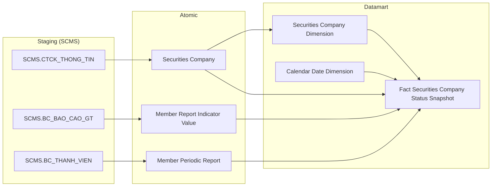

---

### Cụm 2: Số lượng CTCK theo nghiệp vụ và dịch vụ (`Fact Securities Company Business Type Snapshot`)

Phục vụ Tab TỔNG QUAN — Nhóm 2 (Biểu đồ Nghiệp vụ), Nhóm 3 (Biểu đồ Dịch vụ), Nhóm 4 (Biểu đồ Dịch vụ phái sinh): số lượng CTCK theo từng nghiệp vụ/dịch vụ đã đăng ký. Nguồn là `Business Type Codes` (scheme `FIMS_BUSINESS_TYPE`) từ `FIMS.SECCOMBUSINES` — denormalized thành Array trên `Securities Company`.

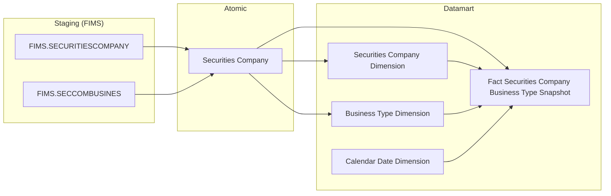

> **Ghi chú:** `Business Type Dimension` là ETL-derived Conformed Dimension — ETL UNNEST `Securities Company.Business Type Codes` (Array từ `FIMS.SECCOMBUSINES`, scheme `FIMS_BUSINESS_TYPE`). Mỗi row sau UNNEST = 1 CTCK × 1 mã nghiệp vụ/dịch vụ → đếm COUNT DISTINCT CTCK per mã. Xem O_QLKD_6 — cần xác nhận scheme cover đủ các mã trên UI.

---

### Cụm 3: Nghiệp vụ kinh doanh CTCK (`Fact Securities Company Business Type Snapshot`)

Phục vụ Tab TỔNG QUAN — Nhóm 2 (Biểu đồ Nghiệp vụ, STT 2): số CTCK theo 4 nghiệp vụ môi giới / bảo lãnh / tư vấn / tự doanh. Source từ FIMS.SECCOMBUSINES — nghiệp vụ kinh doanh được cấp phép theo scheme `FIMS_BUSINESS_TYPE`. Đây là thiết kế tách khỏi Cụm 3b (dịch vụ SCMS) vì 2 hệ thống nguồn và 2 scheme danh mục hoàn toàn khác nhau.

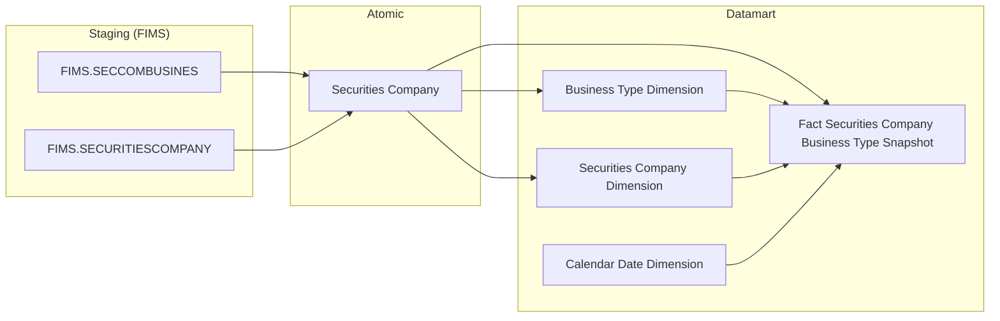

---

### Cụm 3b: Đăng ký dịch vụ CTCK (`Fact Securities Company Service Registration`)

Phục vụ Tab TỔNG QUAN — Nhóm 3 (Dịch vụ CK, STT 3) và Nhóm 4 (Dịch vụ phái sinh, STT 4): số CTCK theo dịch vụ ký quỹ / ứng trước / lưu ký / dịch vụ phái sinh. Source từ SCMS.CTCK_DICH_VU — dịch vụ bổ sung theo scheme `SCMS_SERVICE_TYPE`. Atomic entity **mới bổ sung**: `Securities Company Service Registration`. Pattern **Event** — 1 row per lần đăng ký dịch vụ, filter `Service Status Code = ACTIVE AND Is Draft = false` để lấy danh sách hiện tại. Nhóm 4 dùng chung Fact, phân biệt bằng `Service Type Dimension.Service Category Code = 'PHAI_SINH'`.

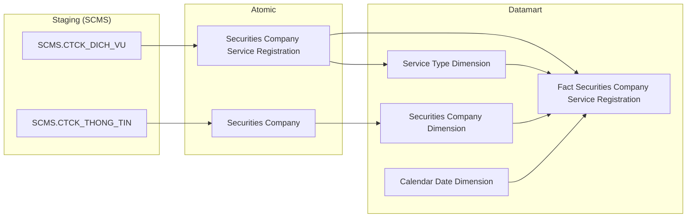

---

### Cụm 3c: Duy trì điều kiện cấp phép (`Fact Securities Company License Condition Snapshot`) — PENDING

Phục vụ Tab TỔNG QUAN — Nhóm 5 (GPHL), Nhóm 6 (Phái sinh — KDCKPS), Nhóm 7 (Phái sinh — BTTT). **PENDING** — xem O_QLKD_7. Chỉ tiêu ATTTC indicator_code chưa xác định → không tính được `License_Condition_Status_Code`.

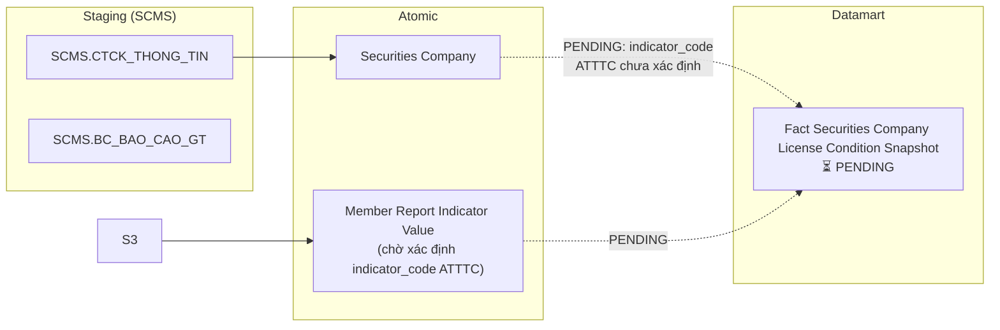

---

### Cụm 4: Cơ cấu tài chính toàn thị trường (`Fact Securities Company Financial Structure Snapshot`)

Phục vụ Tab TỔNG QUAN — Nhóm 8 (Cơ cấu tài sản), Nhóm 9 (Cơ cấu nguồn vốn): tổng hợp các chỉ tiêu BCTC theo quý toàn thị trường.

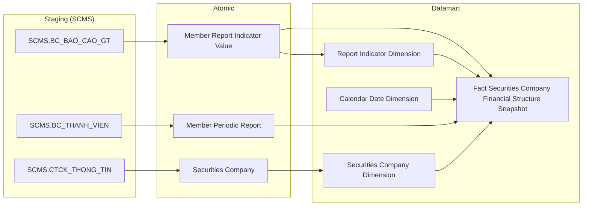

> **Ghi chú:** `Report Indicator Dimension` là ETL-derived Conformed Dimension — extract từ `Member Report Indicator Value.Report Indicator Id` (FK đến `DM_CHI_TIEU` trong SCMS). Lý do: chỉ tiêu BCTC cần GROUP BY theo tên chỉ tiêu; Dim này có thể tái sử dụng khi cần phân tích BCTC cross-module.

---

### Cụm 5: Hoạt động tài chính CTCK (`Fact Securities Company Financial Structure Snapshot`)

Phục vụ Tab GIÁM SÁT — Sub-tab GIÁM SÁT HOẠT ĐỘNG: Nhóm GS-1 (VCSH), GS-2 (Vốn ĐT CSH), GS-3 (Nguồn vốn tăng thêm), GS-4 (TLATTC phân loại), GS-5 (Doanh thu & LNST), GS-7 (Thị phần môi giới), GS-8 (CFO). Dùng chung `Fact Securities Company Financial Structure Snapshot` với Cụm 4 — cùng Atomic source `Member Report Indicator Value`, mở rộng sang các indicator_code VCSH, doanh thu, lợi nhuận, thị phần.

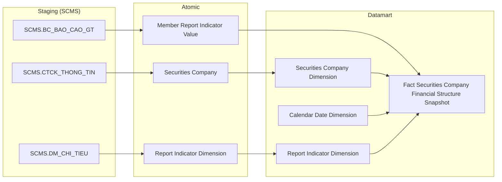

---

### Cụm 6: Tương quan Margin & Diễn biến thị trường (`Fact Securities Company Financial Structure Snapshot` + PENDING market index)

Phục vụ Tab GIÁM SÁT — Nhóm GS-6. `Dư nợ margin` từ `Member Report Indicator Value` (SCMS) — dùng chung Fact với Cụm 4/5. Các chỉ số thị trường VN-Index/HNX/UPCOM/VN30 PENDING — ứng viên tạm thời là `Risk Indicator Value` (QLRR), xem O_QLKD_8.

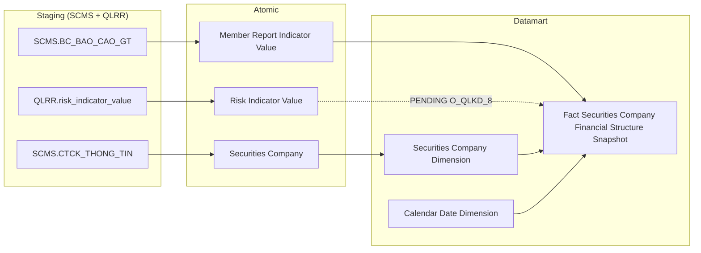

---

### Cụm 7: Tuân thủ nộp báo cáo (`Fact Securities Company Report Compliance Snapshot`)

Phục vụ Tab GIÁM SÁT — Sub-tab GIÁM SÁT TUÂN THỦ (Nhóm GS-9): số lượng báo cáo đúng hạn/chậm/chưa nộp + tỷ lệ tuân thủ toàn thị trường theo ngày.

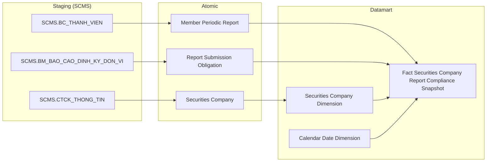

---

### Cụm 8: Hồ sơ tổng quan 360 CTCK (Tác nghiệp)

Phục vụ Tab HỒ SƠ CTCK 360 — Sub-tab Tổng quan: bảng Tác nghiệp `Securities Company 360 Profile` (1 row per CTCK) chứa 5 chỉ tiêu snapshot nhanh (Vốn CSH, VĐL, Dư nợ margin, TLATTC, Số nhân viên). Tất cả 5 chỉ tiêu từ `Member Report Indicator Value` (BC_BAO_CAO_GT) — K_QLKD_78 chờ xác định indicator_code (xem O_QLKD_11). Thông tin định danh CTCK (tên, mã, ngày thành lập, trạng thái) từ `Securities Company`.

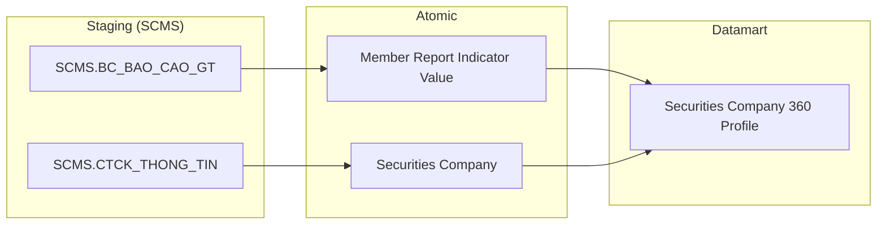

---

### Cụm 9: Nhân sự & Quản trị CTCK (Tác nghiệp)

Phục vụ Tab HỒ SƠ CTCK 360 — Sub-tab Nhân sự: HĐQT/HĐTV/BKS/BĐH cards + Cổ đông lớn table + Lịch sử thay đổi nhân sự. Tất cả là dạng lookup 1 CTCK — bảng Tác nghiệp.

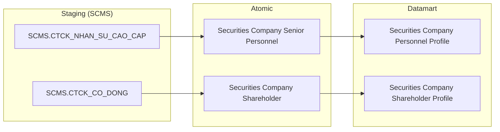

---

### Cụm 10: CN, PGD, VPĐD & NHNCK CTCK (Tác nghiệp)

Phục vụ Tab HỒ SƠ CTCK 360 — Sub-tab NHNCK và Sub-tab CN, PGD, VPĐD: thông tin mạng lưới và người hành nghề của 1 CTCK.

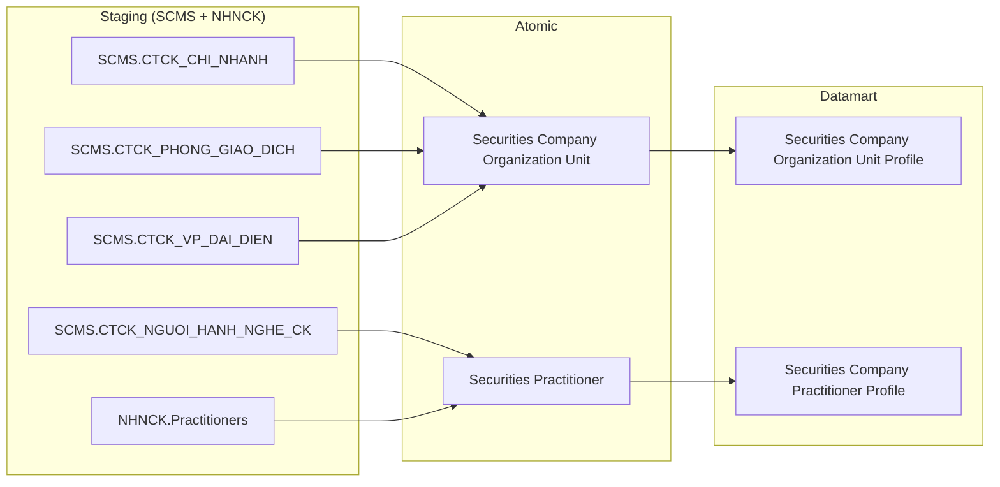

---


---

### Cụm 11: Lịch sử báo cáo tài chính CTCK (Tác nghiệp)

Phục vụ Tab HỒ SƠ CTCK 360 — Sub-tab Tài chính: bảng lịch sử BC tài chính per CTCK per kỳ. 4 thẻ tổng hợp (DT YTD, LN YTD, ROA, ROE) tính aggregate từ các row chi tiết. ETL từ `Member Report Indicator Value` (giá trị chỉ tiêu) + `Member Periodic Report` (kỳ BC, ngày nộp, trạng thái).

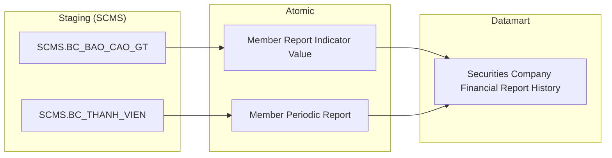

---

### Cụm 12: Tuân thủ & vi phạm CTCK — Hồ sơ 360 (Tác nghiệp)

Phục vụ Tab HỒ SƠ CTCK 360 — Sub-tab Tuân thủ: danh sách BC tuân thủ (đúng hạn/trễ hạn) + lịch sử thanh tra/xử phạt per CTCK. `Member Periodic Report` phục vụ danh sách BC; `Inspection Case` + `Inspection Case Conclusion` phục vụ lịch sử thanh tra/xử phạt.

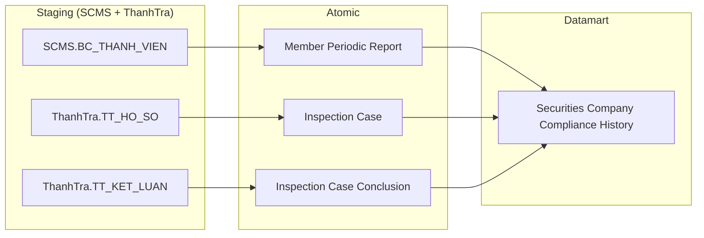

---

### Cụm 13: Tra cứu & Mạng lưới cá nhân (Tác nghiệp)

Phục vụ Tab TRA CỨU CÁ NHÂN — Landing page (danh sách cá nhân) + Sub-tab Mạng lưới 360°. `Individual Profile` là bảng Tác nghiệp tổng hợp thông tin định danh cá nhân từ `Securities Company Senior Personnel` (SCMS) và `Securities Practitioner` (NHNCK). `Individual Related Party Network` lưu mạng lưới người liên quan.

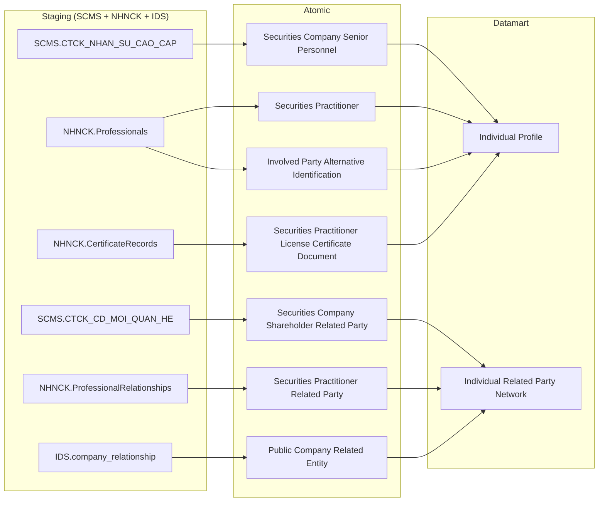

---

### Cụm 14: Hồ sơ cá nhân — Vai trò DN niêm yết & Tài khoản (Tác nghiệp)

Phục vụ Tab TRA CỨU CÁ NHÂN — Sub-tab Hồ sơ: block Vai trò tại DN niêm yết (IDS source) + block Tài khoản (PENDING — chưa xác định Atomic entity). `Individual Listed Company Role` lưu vai trò + số CP tại từng DN niêm yết per cá nhân.

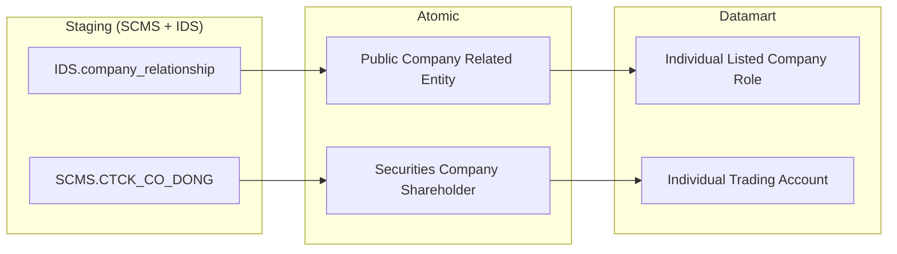

---

### Cụm 15: Quá trình hành nghề & Lịch sử vi phạm cá nhân (Tác nghiệp)

Phục vụ Tab TRA CỨU CÁ NHÂN — Sub-tab Quá trình hành nghề (timeline công tác) + Sub-tab Lịch sử vi phạm. Lịch sử vi phạm từ `Inspection Case` + `Inspection Case Conclusion` (ThanhTra) — BA ghi `src=SCMS` nhưng thực tế data từ ThanhTra. `Inspection Case` có field `Subject Id Number` (SO_CMND) và `Subject Full Name` cho cá nhân — filter chính xác hơn `Surveillance Enforcement Case`. Xem O_QLKD_14.

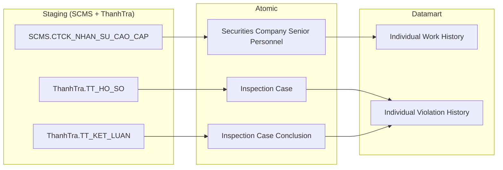

---

### Cụm 16: Data Explorer — Báo cáo biểu mẫu định kỳ CTCK (Tác nghiệp)

Phục vụ Tab DATA EXPLORER — tra cứu raw data 102 biểu mẫu báo cáo định kỳ (STT 42–143). Toàn bộ giá trị chỉ tiêu lưu theo pattern EAV trong `Member Report Indicator Value` (BC_BAO_CAO_GT). Metadata biểu mẫu và kỳ báo cáo từ `Member Periodic Report` (BC_THANH_VIEN). ETL denormalize thành bảng Tác nghiệp `Securities Company Report Data` với đầy đủ context để filter và hiển thị.

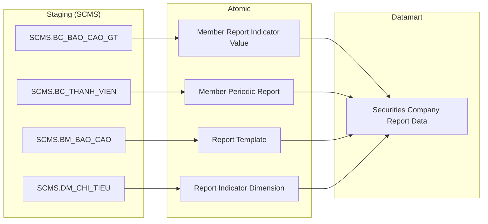

---

## Section 2 — Tổng quan báo cáo

### Tab: TỔNG QUAN

**Slicer chung:** Thời điểm (date picker — mặc định ngày gần nhất có dữ liệu)

---

#### Nhóm 1 — Chỉ tiêu thống kê chung (STT 1–14)

> Phân loại: **Phân tích**
> Atomic: `Securities Company` ← SCMS.CTCK_THONG_TIN — **READY**
> Atomic: `Member Report Indicator Value` ← SCMS.BC_BAO_CAO_GT — **READY**
> Atomic: `Member Periodic Report` ← SCMS.BC_THANH_VIEN — **READY**

**Ghi chú UI:** Nhóm 1 hiển thị 3 block độc lập trên màn hình:
- **Block 1a** — Banner tổng số CTCK: hiển thị K_QLKD_1 + K_QLKD_2 (YoY%). Có nút expand → hiển thị 7 thẻ trạng thái con (K_QLKD_3–9). K_QLKD_3–9 là **filter GROUP BY** trên `Company_Status_Code` của cùng 1 snapshot — không phải measure độc lập.
- **Block 1b** — Thẻ số tài khoản phát sinh GD: K_QLKD_10
- **Block 1c** — Thẻ số dư tiền gửi GD: K_QLKD_11

**Mockup:**

```
┌─────────────────────────────────────────────────────┐
│  TỔNG SỐ CTCK ĐƯỢC CẤP PHÉP    85   ↑ +2.4%   [Xem chi tiết ∧]
│  ┌──────────┐ ┌──────────┐ ┌──────────┐ ┌──────────┐
│  │ Hoạt động│ │ Bị thu hồi│ │ Cảnh báo │ │ Kiểm soát│
│  │    60    │ │    12    │ │     5    │ │     3    │
│  └──────────┘ └──────────┘ └──────────┘ └──────────┘
│  ┌──────────┐ ┌──────────┐ ┌──────────┐
│  │KS đặc biệt│ │Đình chỉ  │ │ Khác     │
│  │     1    │ │     2    │ │     2    │
│  └──────────┘ └──────────┘ └──────────┘
├──────────────────────────┬──────────────────────────┤
│  TK phát sinh GD         │  Số dư tiền gửi GD       │
│  2,450,000 TÀI KHOẢN     │  125,400 TỶ VND           │
└──────────────────────────┴──────────────────────────┘
```

**Source:** `Fact Securities Company Status Snapshot` → `Securities Company Dimension`, `Calendar Date Dimension`

**Bảng KPI:**

| KPI ID | Tên KPI | Đơn vị | Tính chất | Công thức / Nguồn |
|---|---|---|---|---|
| K_QLKD_1 | Tổng số CTCK được cấp phép | CTCK | Cơ sở | COUNT(DISTINCT Securities_Company_Dimension_Id) tại Snapshot Date = selected_date |
| K_QLKD_2 | So sánh cùng kỳ năm trước — tổng CTCK | % | Phái sinh | (K_QLKD_1[Year=Y] − K_QLKD_1[Year=Y−1]) / K_QLKD_1[Year=Y−1] × 100% |
| K_QLKD_3 | Số CTCK hoạt động bình thường | CTCK | Cơ sở | COUNT WHERE Company_Status_Code = ACTIVE |
| K_QLKD_4 | Số CTCK bị thu hồi | CTCK | Cơ sở | COUNT WHERE Company_Status_Code = REVOKED |
| K_QLKD_5 | Số CTCK thuộc diện cảnh báo | CTCK | Cơ sở | COUNT WHERE Company_Status_Code = WARNING |
| K_QLKD_6 | Số CTCK thuộc diện kiểm soát | CTCK | Cơ sở | COUNT WHERE Company_Status_Code = CONTROLLED |
| K_QLKD_7 | Số CTCK thuộc diện kiểm soát đặc biệt | CTCK | Cơ sở | COUNT WHERE Company_Status_Code = SPECIAL_CONTROLLED |
| K_QLKD_8 | Số CTCK đình chỉ hoạt động | CTCK | Cơ sở | COUNT WHERE Company_Status_Code = SUSPENDED |
| K_QLKD_9 | Số CTCK trạng thái khác | CTCK | Cơ sở | COUNT WHERE Company_Status_Code NOT IN (ACTIVE, REVOKED, WARNING, CONTROLLED, SPECIAL_CONTROLLED, SUSPENDED) |
| K_QLKD_10 | Số tài khoản có phát sinh giao dịch | Tài khoản | Cơ sở | SUM(Indicator_Value_Amount) WHERE Report_Indicator_Code = SCMS_IND_TRADING_ACCOUNT tại selected_date — nguồn: `Fact Securities Company Status Snapshot`.Trading_Account_Count |
| K_QLKD_11 | Số dư tiền gửi giao dịch | Tỷ VND | Cơ sở | SUM(Indicator_Value_Amount) WHERE Report_Indicator_Code = SCMS_IND_DEPOSIT_BALANCE tại selected_date — nguồn: `Fact Securities Company Status Snapshot`.Deposit_Balance_Amount |

> **Thiết kế grain K_QLKD_1–9:** Fact lưu 1 row per CTCK × ngày — `Company_Status_Code` là DD trên Fact. COUNT GROUP BY status → ra K_QLKD_3–9. SUM tất cả → K_QLKD_1. Không cần tách Fact riêng cho từng trạng thái.

> **Thiết kế K_QLKD_10–11:** Hai measure này có nguồn từ báo cáo ATTTC/BCTC định kỳ (BC_BAO_CAO_GT). Lưu trực tiếp trên cùng `Fact Securities Company Status Snapshot` tại grain ngày, aggregate SUM toàn thị trường. Xem O_QLKD_4.

**Star Schema:**

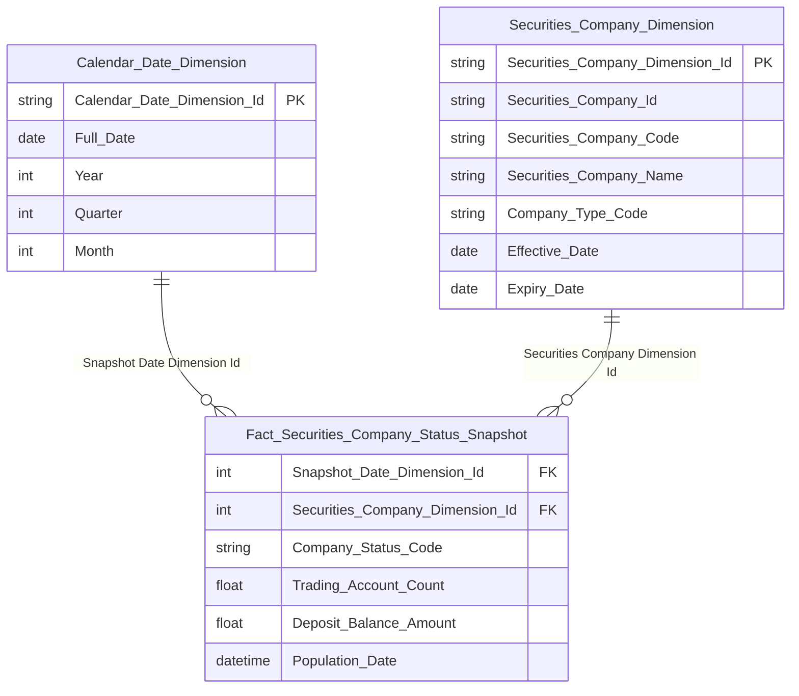

**Lineage Mart → Báo cáo:**

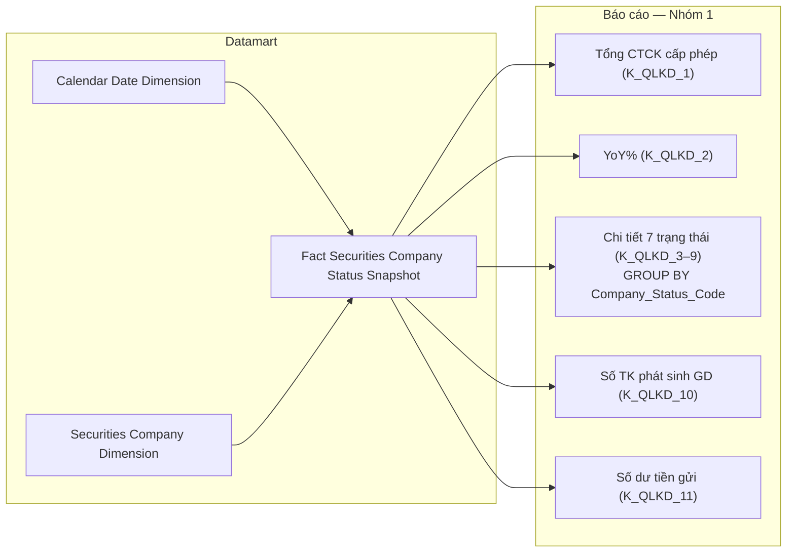

**Bảng grain:**

| Tên bảng | Grain |
|---|---|
| Fact Securities Company Status Snapshot | 1 CTCK × 1 ngày snapshot |
| Securities Company Dimension | 1 CTCK (SCD2) |
| Calendar Date Dimension | 1 ngày |

---

#### Nhóm 2 — Biểu đồ Nghiệp vụ (STT 2)

> Phân loại: **Phân tích**
> Atomic: `Securities Company` ← FIMS.SECCOMBUSINES (via FIMS.SECURITIESCOMPANY) — **READY**
> Ghi chú: `Business Type Dimension` là ETL-derived Conformed Dimension — ETL UNNEST `Securities Company.Business Type Codes` (Array, scheme `FIMS_BUSINESS_TYPE`). Scheme `FIMS_BUSINESS_TYPE` phục vụ 4 nghiệp vụ: môi giới / bảo lãnh / tư vấn / tự doanh. O_QLKD_6 Closed.

**Mockup:**

```
SỐ LƯỢNG CTCK THEO NGHIỆP VỤ (horizontal bar chart)
Môi giới:         68 ████████████████████
Bảo lãnh phát hành: 42 ████████████
Tư vấn:           55 ████████████████
Tự doanh:         58 █████████████████
```

**Source:** `Fact Securities Company Business Type Snapshot` → `Securities Company Dimension`, `Business Type Dimension`, `Calendar Date Dimension`

**Bảng KPI:**

| KPI ID | Tên KPI | Đơn vị | Tính chất | Công thức |
|---|---|---|---|---|
| K_QLKD_12 | Số CTCK theo nghiệp vụ môi giới | CTCK | Cơ sở | COUNT(DISTINCT Securities_Company_Dimension_Id) WHERE Business_Type_Code = 'MGIOI' (scheme: FIMS_BUSINESS_TYPE) |
| K_QLKD_13 | Số CTCK theo nghiệp vụ bảo lãnh | CTCK | Cơ sở | COUNT(DISTINCT Securities_Company_Dimension_Id) WHERE Business_Type_Code = 'BLANH' (scheme: FIMS_BUSINESS_TYPE) |
| K_QLKD_14 | Số CTCK theo nghiệp vụ tư vấn | CTCK | Cơ sở | COUNT(DISTINCT Securities_Company_Dimension_Id) WHERE Business_Type_Code = 'TUVAN' (scheme: FIMS_BUSINESS_TYPE) |
| K_QLKD_15 | Số CTCK theo nghiệp vụ tự doanh | CTCK | Cơ sở | COUNT(DISTINCT Securities_Company_Dimension_Id) WHERE Business_Type_Code = 'TDOANH' (scheme: FIMS_BUSINESS_TYPE) |

**Star Schema:**

```mermaid
erDiagram
    Fact_Securities_Company_Business_Type_Snapshot {
        int Snapshot_Date_Dimension_Id FK
        int Securities_Company_Dimension_Id FK
        int Business_Type_Dimension_Id FK
        string Business_Category_Code
        datetime Population_Date
    }

    Securities_Company_Dimension {
        string Securities_Company_Dimension_Id PK
        string Securities_Company_Id
        string Securities_Company_Code
        string Securities_Company_Name
        string Company_Status_Code
        string Is_Listed_Indicator
        string Stock_Exchange_Name
        date Effective_Date
        date Expiry_Date
    }

    Business_Type_Dimension {
        string Business_Type_Dimension_Id PK
        string Business_Type_Code
        string Business_Type_Name
        string Business_Category_Code
        date Effective_Date
        date Expiry_Date
    }

    Calendar_Date_Dimension {
        string Calendar_Date_Dimension_Id PK
        date Full_Date
        int Year
        int Quarter
        int Month
    }

    Calendar_Date_Dimension ||--o{ Fact_Securities_Company_Business_Type_Snapshot : "Snapshot Date Dimension Id"
    Securities_Company_Dimension ||--o{ Fact_Securities_Company_Business_Type_Snapshot : "Securities Company Dimension Id"
    Business_Type_Dimension ||--o{ Fact_Securities_Company_Business_Type_Snapshot : "Business Type Dimension Id"
```

**Lineage Mart → Báo cáo:**

```mermaid
flowchart LR
    subgraph Datamart["Datamart"]
        G1["Fact Securities Company Business Type Snapshot"]
        G2["Business Type Dimension"]
        G3["Calendar Date Dimension"]
    end

    subgraph RPT["Báo cáo — Nhóm 2"]
        R1["SL CTCK theo nghiệp vụ (K_QLKD_12–15)"]
    end

    G2 --> G1
    G3 --> G1
    G1 --> R1
```

**Bảng grain:**

| Tên bảng | Grain |
|---|---|
| Fact Securities Company Business Type Snapshot | 1 CTCK × 1 nghiệp vụ × 1 ngày snapshot |
| Securities Company Dimension | 1 CTCK (SCD2) |
| Business Type Dimension | 1 mã nghiệp vụ (SCD2) — scheme FIMS_BUSINESS_TYPE |
| Calendar Date Dimension | 1 ngày |

---

#### Nhóm 3 — Biểu đồ Dịch vụ (STT 3)

> Phân loại: **Phân tích**
> Atomic: `Securities Company Service Registration` ← SCMS.CTCK_DICH_VU — **READY**
> Ghi chú: Dùng `Fact Securities Company Service Registration` (Event pattern). Filter `Service Status Code = ACTIVE AND Is Draft Indicator = false` để lấy danh sách CTCK đang cung cấp dịch vụ tại thời điểm hiện tại. `Service Type Dimension` dùng scheme `SCMS_SERVICE_TYPE` — khác hoàn toàn với `FIMS_BUSINESS_TYPE` của Nhóm 2.

**Mockup:**
```
BIỂU ĐỒ DỊCH VỤ — Số CTCK theo dịch vụ được đăng ký
[Bar ngang]:
  Giao dịch ký quỹ:   45 ██████████████████
  Ứng trước tiền bán: 38 ████████████████
  Lưu ký:             52 █████████████████████
```

**Source:** `Fact Securities Company Service Registration` → `Securities Company Dimension`, `Service Type Dimension`, `Calendar Date Dimension`

**Bảng KPI:**

| KPI ID | Tên KPI | Đơn vị | Tính chất | Công thức |
|---|---|---|---|---|
| K_QLKD_16 | Số CTCK theo dịch vụ giao dịch ký quỹ | CTCK | Cơ sở | COUNT(DISTINCT Securities_Company_Dimension_Id) WHERE Service_Type_Code = 'KQY' (scheme: SCMS_SERVICE_TYPE) AND Service_Status_Code = 'ACTIVE' AND Service_Category_Code != 'PHAI_SINH' |
| K_QLKD_17 | Số CTCK theo dịch vụ ứng trước tiền bán | CTCK | Cơ sở | COUNT(DISTINCT Securities_Company_Dimension_Id) WHERE Service_Type_Code = 'UTRUOC' (scheme: SCMS_SERVICE_TYPE) AND Service_Status_Code = 'ACTIVE' |
| K_QLKD_18 | Số CTCK theo dịch vụ lưu ký | CTCK | Cơ sở | COUNT(DISTINCT Securities_Company_Dimension_Id) WHERE Service_Type_Code = 'LUUKY' (scheme: SCMS_SERVICE_TYPE) AND Service_Status_Code = 'ACTIVE' |

**Star Schema:**

```mermaid
erDiagram
    Fact_Securities_Company_Service_Registration {
        int Registration_Date_Dimension_Id FK
        int Securities_Company_Dimension_Id FK
        int Service_Type_Dimension_Id FK
        string Service_Status_Code
        string Registration_Document_Number
        date Termination_Date
        date Valid_Document_Date
        string Is_Draft_Indicator
        datetime Population_Date
    }

    Securities_Company_Dimension {
        string Securities_Company_Dimension_Id PK
        string Securities_Company_Id
        string Securities_Company_Code
        string Securities_Company_Name
        string Company_Status_Code
        string Is_Listed_Indicator
        string Stock_Exchange_Name
        date Effective_Date
        date Expiry_Date
    }

    Service_Type_Dimension {
        string Service_Type_Dimension_Id PK
        string Service_Type_Code
        string Service_Type_Name
        string Service_Category_Code
        date Effective_Date
        date Expiry_Date
    }

    Calendar_Date_Dimension {
        string Calendar_Date_Dimension_Id PK
        date Full_Date
        int Year
        int Quarter
        int Month
    }

    Calendar_Date_Dimension ||--o{ Fact_Securities_Company_Service_Registration : "Registration Date Dimension Id"
    Securities_Company_Dimension ||--o{ Fact_Securities_Company_Service_Registration : "Securities Company Dimension Id"
    Service_Type_Dimension ||--o{ Fact_Securities_Company_Service_Registration : "Service Type Dimension Id"
```

**Bảng grain:**

| Tên bảng | Grain |
|---|---|
| Fact Securities Company Service Registration | 1 CTCK × 1 dịch vụ × 1 lần đăng ký (Event) |
| Securities Company Dimension | 1 CTCK (SCD2) |
| Service Type Dimension | 1 mã dịch vụ (SCD2) — scheme SCMS_SERVICE_TYPE |
| Calendar Date Dimension | 1 ngày |

---

#### Nhóm 4 — Biểu đồ Dịch vụ phái sinh (STT 4)

> Phân loại: **Phân tích**
> Atomic: `Securities Company Service Registration` ← SCMS.CTCK_DICH_VU — **READY**
> Ghi chú: Dùng chung `Fact Securities Company Service Registration` với Nhóm 3, phân biệt bằng `Service Type Dimension.Service Category Code = 'PHAI_SINH'`. Filter `Service Status Code = ACTIVE AND Is Draft Indicator = false`.

**Mockup:**
```
BIỂU ĐỒ DỊCH VỤ PHÁI SINH — Số CTCK theo dịch vụ CKPS
[Bar ngang]:
  Môi giới CKPS:  28 ████████████
  Tư vấn CKPS:   15 ███████
  Tự doanh CKPS: 10 █████
```

**Source:** `Fact Securities Company Service Registration` → `Securities Company Dimension`, `Service Type Dimension`, `Calendar Date Dimension`

**Bảng KPI:**

| KPI ID | Tên KPI | Đơn vị | Tính chất | Công thức |
|---|---|---|---|---|
| K_QLKD_19 | Số CTCK phái sinh dịch vụ môi giới | CTCK | Cơ sở | COUNT(DISTINCT Securities_Company_Dimension_Id) WHERE Service_Type_Code = 'MGPS' (scheme: SCMS_SERVICE_TYPE) AND Service_Category_Code = 'PHAI_SINH' AND Service_Status_Code = 'ACTIVE' |
| K_QLKD_20 | Số CTCK phái sinh dịch vụ tư vấn | CTCK | Cơ sở | COUNT(DISTINCT Securities_Company_Dimension_Id) WHERE Service_Type_Code = 'TVPS' (scheme: SCMS_SERVICE_TYPE) AND Service_Category_Code = 'PHAI_SINH' AND Service_Status_Code = 'ACTIVE' |
| K_QLKD_21 | Số CTCK phái sinh dịch vụ tự doanh | CTCK | Cơ sở | COUNT(DISTINCT Securities_Company_Dimension_Id) WHERE Service_Type_Code = 'TDPS' (scheme: SCMS_SERVICE_TYPE) AND Service_Category_Code = 'PHAI_SINH' AND Service_Status_Code = 'ACTIVE' |

**Star Schema:**

```mermaid
erDiagram
    Fact_Securities_Company_Service_Registration {
        int Registration_Date_Dimension_Id FK
        int Securities_Company_Dimension_Id FK
        int Service_Type_Dimension_Id FK
        string Service_Status_Code
        string Registration_Document_Number
        date Termination_Date
        date Valid_Document_Date
        string Is_Draft_Indicator
        datetime Population_Date
    }

    Securities_Company_Dimension {
        string Securities_Company_Dimension_Id PK
        string Securities_Company_Id
        string Securities_Company_Code
        string Securities_Company_Name
        string Company_Status_Code
        string Is_Listed_Indicator
        string Stock_Exchange_Name
        date Effective_Date
        date Expiry_Date
    }

    Service_Type_Dimension {
        string Service_Type_Dimension_Id PK
        string Service_Type_Code
        string Service_Type_Name
        string Service_Category_Code
        date Effective_Date
        date Expiry_Date
    }

    Calendar_Date_Dimension {
        string Calendar_Date_Dimension_Id PK
        date Full_Date
        int Year
        int Quarter
        int Month
    }

    Calendar_Date_Dimension ||--o{ Fact_Securities_Company_Service_Registration : "Registration Date Dimension Id"
    Securities_Company_Dimension ||--o{ Fact_Securities_Company_Service_Registration : "Securities Company Dimension Id"
    Service_Type_Dimension ||--o{ Fact_Securities_Company_Service_Registration : "Service Type Dimension Id"
```

**Bảng grain:**

| Tên bảng | Grain |
|---|---|
| Fact Securities Company Service Registration | 1 CTCK × 1 dịch vụ × 1 lần đăng ký (Event) — dùng chung với Nhóm 3 |
| Securities Company Dimension | 1 CTCK (SCD2) |
| Service Type Dimension | 1 mã dịch vụ (SCD2) — scheme SCMS_SERVICE_TYPE, filter Service_Category_Code = 'PHAI_SINH' |
| Calendar Date Dimension | 1 ngày |

---

#### Nhóm 5/6/7 — Duy trì điều kiện cấp phép (STT 31–44)

##### PENDING — Duy trì điều kiện cấp phép — Giấy phép hoạt động (STT 31–36)

**KPI liên quan:** K_QLKD_22, K_QLKD_23, K_QLKD_24

**Lý do pending:** `License_Type_Code` (GPHL/KDCKPS/BTTT) nay có thể xác định từ `Securities Company Service Registration.Service Type Code` (SCMS.CTCK_DICH_VU — đã có Atomic). Tuy nhiên blocker còn lại là `License_Condition_Status_Code` (tốt / gần hạn / không duy trì) — cần phân loại 3 mức dựa trên ngưỡng ATTTC (≥180% tốt / 120–180% gần hạn / <120% không duy trì). Nguồn ATTTC = `Member Report Indicator Value.Value` nhưng **indicator_code ATTTC chưa xác định** — chờ data profiling. `Service Status Code = SUSPENDED/REVOKED` chỉ xác định được CTCK "không duy trì" khi đã bị đình chỉ chính thức, không phân loại được "gần hạn" — do đó không đủ để thay thế.

**Atomic cần bổ sung:**
- Xác định indicator_code ATTTC trong `SCMS.DM_CHI_TIEU` và ngưỡng phân loại tốt/gần hạn/không duy trì — đây là blocker duy nhất còn lại

**Mart dự kiến khi Atomic sẵn sàng:** `Fact Securities Company License Condition Snapshot` — grain = 1 CTCK × 1 loại giấy phép × 1 ngày snapshot

---

##### PENDING — Duy trì điều kiện cấp phép — Phái sinh: Kinh doanh CKPS (STT 37–40)

**KPI liên quan:** K_QLKD_25, K_QLKD_26, K_QLKD_27

**Lý do pending:** Cùng lý do Nhóm 5 — xem O_QLKD_7.

**Atomic cần bổ sung:** Như Nhóm 5.

**Mart dự kiến khi Atomic sẵn sàng:** `Fact Securities Company License Condition Snapshot` — grain = 1 CTCK × 1 loại giấy phép × 1 ngày snapshot

---

##### PENDING — Duy trì điều kiện cấp phép — Phái sinh: Bù trừ thanh toán (STT 41–44)

**KPI liên quan:** K_QLKD_28, K_QLKD_29, K_QLKD_30

**Lý do pending:** Cùng lý do Nhóm 5 — xem O_QLKD_7.

**Atomic cần bổ sung:** Như Nhóm 5.

**Mart dự kiến khi Atomic sẵn sàng:** `Fact Securities Company License Condition Snapshot` — grain = 1 CTCK × 1 loại giấy phép × 1 ngày snapshot

---

#### Nhóm 8 — Cơ cấu tài sản (STT 45–51)

> Phân loại: **Phân tích**
> Atomic: `Member Report Indicator Value` ← SCMS.BC_BAO_CAO_GT — **READY**
> Atomic: `Member Periodic Report` ← SCMS.BC_THANH_VIEN — **READY**
> Ghi chú: `Report Indicator Dimension` là ETL-derived Conformed Dimension — extract từ `Member Report Indicator Value.Report Indicator Code` (FK đến SCMS.DM_CHI_TIEU). Lý do: GROUP BY theo tên chỉ tiêu BCTC; tái sử dụng cross-module.

**Mockup:**

```
CƠ CẤU TÀI SẢN — stacked bar chart theo quý
Q4/23: 133K tỷ  [Cho vay][TS TC ghi nhận L/L][TS sẵn sàng bán][TS đến hạn][T&TĐT][Khác]
Q1/24: 133K tỷ ...
Q2/24: 143K tỷ ...
Q3/24: 151K tỷ ...
```

**Source:** `Fact Securities Company Financial Structure Snapshot` → `Securities Company Dimension`, `Report Indicator Dimension`, `Calendar Date Dimension`

**Bảng KPI:**

| KPI ID | Tên KPI | Đơn vị | Tính chất | Công thức |
|---|---|---|---|---|
| K_QLKD_31 | Tiền và tương đương tiền — toàn TT | Tỷ VND | Cơ sở | SUM(Indicator Value Amount) WHERE Report Indicator Code = TIEN_VA_TUONG_DUONG GROUP BY quarter |
| K_QLKD_32 | TS TC ghi nhận qua lãi/lỗ — toàn TT | Tỷ VND | Cơ sở | SUM WHERE Report Indicator Code = TS_TC_LAI_LO |
| K_QLKD_33 | Đầu tư nắm giữ đến đáo hạn — toàn TT | Tỷ VND | Cơ sở | SUM WHERE Report Indicator Code = DTKGDH |
| K_QLKD_34 | TS TC sẵn sàng để bán — toàn TT | Tỷ VND | Cơ sở | SUM WHERE Report Indicator Code = TS_SAN_SANG_BAN |
| K_QLKD_35 | Các khoản cho vay — toàn TT | Tỷ VND | Cơ sở | SUM WHERE Report Indicator Code = CHO_VAY |
| K_QLKD_36 | Tài sản khác — toàn TT | Tỷ VND | Cơ sở | Tổng tài sản − các mục trên (derive tại presentation layer) |

**Star Schema:**

```mermaid
erDiagram
    Fact_Securities_Company_Financial_Structure_Snapshot {
        int Snapshot_Date_Dimension_Id FK
        int Securities_Company_Dimension_Id FK
        int Report_Indicator_Dimension_Id FK
        string Financial_Structure_Category_Code
        float Indicator_Value_Amount
        string Report_Period_Type_Code
        datetime Population_Date
    }

    Securities_Company_Dimension {
        string Securities_Company_Dimension_Id PK
        string Securities_Company_Id
        string Securities_Company_Code
        string Securities_Company_Name
        string Company_Type_Code
        date Effective_Date
        date Expiry_Date
    }

    Report_Indicator_Dimension {
        string Report_Indicator_Dimension_Id PK
        string Report_Indicator_Code
        string Report_Indicator_Name
        string Indicator_Group_Code
        date Effective_Date
        date Expiry_Date
    }

    Calendar_Date_Dimension {
        string Calendar_Date_Dimension_Id PK
        date Full_Date
        int Year
        int Quarter
        int Month
    }

    Calendar_Date_Dimension ||--o{ Fact_Securities_Company_Financial_Structure_Snapshot : "Snapshot Date Dimension Id"
    Securities_Company_Dimension ||--o{ Fact_Securities_Company_Financial_Structure_Snapshot : "Securities Company Dimension Id"
    Report_Indicator_Dimension ||--o{ Fact_Securities_Company_Financial_Structure_Snapshot : "Report Indicator Dimension Id"
```

**Lineage Mart → Báo cáo:**

```mermaid
flowchart LR
    subgraph Datamart["Datamart"]
        G1["Fact Securities Company Financial Structure Snapshot"]
        G2["Report Indicator Dimension"]
        G3["Calendar Date Dimension"]
        G4["Securities Company Dimension"]
    end

    subgraph RPT["Báo cáo — Nhóm 8/9"]
        R1["Cơ cấu tài sản theo quý (K_QLKD_31–36)"]
        R2["Cơ cấu nguồn vốn theo quý (K_QLKD_37–40)"]
    end

    G2 --> G1
    G3 --> G1
    G4 --> G1
    G1 --> R1
    G1 --> R2
```

**Bảng grain:**

| Tên bảng | Grain |
|---|---|
| Fact Securities Company Financial Structure Snapshot | 1 CTCK × 1 chỉ tiêu BCTC × 1 kỳ (quý) |
| Securities Company Dimension | 1 CTCK (SCD2) |
| Report Indicator Dimension | 1 chỉ tiêu báo cáo (SCD2) |
| Calendar Date Dimension | 1 ngày |

---

#### Nhóm 9 — Cơ cấu nguồn vốn (STT 52–56)

> Phân loại: **Phân tích**
> Atomic: `Member Report Indicator Value` ← SCMS.BC_BAO_CAO_GT — **READY**
> Atomic: `Member Periodic Report` ← SCMS.BC_THANH_VIEN — **READY**
> Ghi chú: Sử dụng chung `Fact Securities Company Financial Structure Snapshot` với Nhóm 8, phân biệt bằng `Financial Structure Category Code = NGUON_VON`.

**Mockup:**
```
CƠ CẤU NGUỒN VỐN toàn thị trường (donut)
  Vốn chủ sở hữu: 38% ████████████████
  Nợ phải trả:    62% █████████████████████████
```

**Source:** `Fact Securities Company Financial Structure Snapshot` → `Securities Company Dimension`, `Report Indicator Dimension`, `Calendar Date Dimension`

**Bảng KPI:**

| KPI ID | Tên KPI | Đơn vị | Tính chất | Công thức |
|---|---|---|---|---|
| K_QLKD_37 | Vay và nợ thuê tài chính ngắn hạn — toàn TT | Tỷ VND | Cơ sở | SUM WHERE Report Indicator Code = VAY_NO_NH |
| K_QLKD_38 | Nợ phải trả dài hạn — toàn TT | Tỷ VND | Cơ sở | SUM WHERE Report Indicator Code = NO_PT_DH |
| K_QLKD_39 | Vốn chủ sở hữu — toàn TT | Tỷ VND | Cơ sở | SUM WHERE Report Indicator Code = VCSH |
| K_QLKD_40 | Nguồn vốn khác — toàn TT | Tỷ VND | Cơ sở | Tổng nguồn vốn − các mục trên (derive tại presentation layer) |

**Star Schema:**

```mermaid
erDiagram
    Fact_Securities_Company_Financial_Structure_Snapshot {
        int Snapshot_Date_Dimension_Id FK
        int Securities_Company_Dimension_Id FK
        int Report_Indicator_Dimension_Id FK
        string Financial_Structure_Category_Code
        float Indicator_Value_Amount
        string Report_Period_Type_Code
        datetime Population_Date
    }

    Securities_Company_Dimension {
        string Securities_Company_Dimension_Id PK
        string Securities_Company_Id
        string Securities_Company_Code
        string Securities_Company_Name
        string Company_Type_Code
        date Effective_Date
        date Expiry_Date
    }

    Report_Indicator_Dimension {
        string Report_Indicator_Dimension_Id PK
        string Report_Indicator_Code
        string Report_Indicator_Name
        string Indicator_Group_Code
        date Effective_Date
        date Expiry_Date
    }

    Calendar_Date_Dimension {
        string Calendar_Date_Dimension_Id PK
        date Full_Date
        int Year
        int Quarter
        int Month
    }

    Calendar_Date_Dimension ||--o{ Fact_Securities_Company_Financial_Structure_Snapshot : "Snapshot Date Dimension Id"
    Securities_Company_Dimension ||--o{ Fact_Securities_Company_Financial_Structure_Snapshot : "Securities Company Dimension Id"
    Report_Indicator_Dimension ||--o{ Fact_Securities_Company_Financial_Structure_Snapshot : "Report Indicator Dimension Id"
```

**Bảng grain:**

| Tên bảng | Grain |
|---|---|
| Fact Securities Company Financial Structure Snapshot | 1 CTCK × 1 chỉ tiêu BCTC × 1 kỳ (quý) |
| Securities Company Dimension | 1 CTCK (SCD2) |
| Report Indicator Dimension | 1 chỉ tiêu báo cáo (SCD2) |
| Calendar Date Dimension | 1 ngày |

---

### Tab: GIÁM SÁT

**Slicer chung:** Khoảng thời gian TỪ/ĐẾN (từng sub-tab có grain riêng: quý / tháng / ngày tùy biểu đồ)

---

#### Sub-tab: GIÁM SÁT HOẠT ĐỘNG

---

#### Nhóm GS-1 — Cơ cấu vốn chủ sở hữu (STT 11)

> Phân loại: **Phân tích**
> Atomic: `Member Report Indicator Value` ← SCMS.BC_BAO_CAO_GT — **READY**
> Atomic: `Member Periodic Report` ← SCMS.BC_THANH_VIEN — **READY**
> Ghi chú: Sử dụng `Fact Securities Company Financial Structure Snapshot` với `Financial Structure Category Code` = VCSH. Grain quý. Xem O_QLKD_4.

**Mockup:**
```
CƠ CẤU VỐN CHỦ SỞ HỮU — stacked bar theo quý (tỷ đồng)
Q1/24: 165,400  [Vốn ĐL][LNST chưa PP][Quỹ+thặng dư][Vốn khác]
Q2/24: 169,000  ...
Q3/24: 172,200  ...
Q4/24: 176,600  ...
```

**Source:** `Fact Securities Company Financial Structure Snapshot` → `Securities Company Dimension`, `Report Indicator Dimension`, `Calendar Date Dimension`

**Bảng KPI:**

| KPI ID | Tên KPI | Đơn vị | Tính chất | Công thức |
|---|---|---|---|---|
| K_QLKD_41 | Vốn điều lệ — toàn TT | Tỷ VND | Cơ sở | SUM WHERE Report Indicator Code = VON_DIEU_LE GROUP BY quarter |
| K_QLKD_42 | Lợi nhuận sau thuế chưa phân phối — toàn TT | Tỷ VND | Cơ sở | SUM WHERE Report Indicator Code = LNST_CHUA_PP |
| K_QLKD_43 | Quỹ và thặng dư vốn cổ phần — toàn TT | Tỷ VND | Cơ sở | SUM WHERE Report Indicator Code = QUY_THANG_DU |
| K_QLKD_44 | Vốn khác — toàn TT | Tỷ VND | Cơ sở | Tổng VCSH − các mục trên (derive tại presentation layer) |

**Star Schema:**

```mermaid
erDiagram
    Fact_Securities_Company_Financial_Structure_Snapshot {
        int Snapshot_Date_Dimension_Id FK
        int Securities_Company_Dimension_Id FK
        int Report_Indicator_Dimension_Id FK
        string Financial_Structure_Category_Code
        float Indicator_Value_Amount
        string Report_Period_Type_Code
        datetime Population_Date
    }

    Securities_Company_Dimension {
        string Securities_Company_Dimension_Id PK
        string Securities_Company_Id
        string Securities_Company_Code
        string Securities_Company_Name
        string Company_Type_Code
        date Effective_Date
        date Expiry_Date
    }

    Report_Indicator_Dimension {
        string Report_Indicator_Dimension_Id PK
        string Report_Indicator_Code
        string Report_Indicator_Name
        string Indicator_Group_Code
        date Effective_Date
        date Expiry_Date
    }

    Calendar_Date_Dimension {
        string Calendar_Date_Dimension_Id PK
        date Full_Date
        int Year
        int Quarter
        int Month
    }

    Calendar_Date_Dimension ||--o{ Fact_Securities_Company_Financial_Structure_Snapshot : "Snapshot Date Dimension Id"
    Securities_Company_Dimension ||--o{ Fact_Securities_Company_Financial_Structure_Snapshot : "Securities Company Dimension Id"
    Report_Indicator_Dimension ||--o{ Fact_Securities_Company_Financial_Structure_Snapshot : "Report Indicator Dimension Id"
```

**Lineage Mart → Báo cáo:**

```mermaid
flowchart LR
    subgraph Datamart["Datamart"]
        G1["Fact Securities Company Financial Structure Snapshot"]
        G2["Report Indicator Dimension"]
        G3["Calendar Date Dimension"]
        G4["Securities Company Dimension"]
    end

    subgraph RPT["Báo cáo — GS-1 đến GS-5, GS-7, GS-8"]
        R1["Cơ cấu VCSH theo quý (K_QLKD_41–44)"]
        R2["Vốn ĐT CSH theo quý (K_QLKD_45)"]
        R3["Nguồn vốn tăng thêm theo tháng (K_QLKD_46–50)"]
        R4["TLATTC phân loại theo tháng (K_QLKD_51–53)"]
        R5["Doanh thu & LNST theo quý (K_QLKD_54–59)"]
        R6["Dư nợ Margin theo tháng (K_QLKD_61)"]
        R7["Thị phần môi giới (K_QLKD_66–67)"]
        R8["CFO per CTCK (K_QLKD_68–69)"]
    end

    G2 --> G1
    G3 --> G1
    G4 --> G1
    G1 --> R1
    G1 --> R2
    G1 --> R3
    G1 --> R4
    G1 --> R5
    G1 --> R6
    G1 --> R7
    G1 --> R8
```

**Bảng grain:**

| Tên bảng | Grain |
|---|---|
| Fact Securities Company Financial Structure Snapshot | 1 CTCK × 1 chỉ tiêu BCTC × 1 kỳ (quý/tháng tùy biểu đồ) |
| Securities Company Dimension | 1 CTCK (SCD2) |
| Report Indicator Dimension | 1 chỉ tiêu báo cáo (SCD2) |
| Calendar Date Dimension | 1 ngày |

---

#### Nhóm GS-2 — Vốn đầu tư CSH theo quý (STT 12)

> Phân loại: **Phân tích**
> Atomic: `Member Report Indicator Value` ← SCMS.BC_BAO_CAO_GT — **READY**
> Ghi chú: Sử dụng chung `Fact Securities Company Financial Structure Snapshot`, `Financial Structure Category Code` = VON_DAU_TU_CSH. Grain quý. Xem O_QLKD_4.

**Mockup:**
```
VỐN ĐẦU TƯ CSH THEO QUÝ — line chart (tỷ đồng, từ 2020)
Trục Y: 0 – 32K tỷ
2020-Q1: 16,000  ●
2020-Q4: 17,500  ●
...
2023-Q4: 27,000  ●
2024-Q4: 31,500  ● (điểm cao nhất)
```

**Source:** `Fact Securities Company Financial Structure Snapshot` → `Securities Company Dimension`, `Report Indicator Dimension`, `Calendar Date Dimension`

**Bảng KPI:**

| KPI ID | Tên KPI | Đơn vị | Tính chất | Công thức |
|---|---|---|---|---|
| K_QLKD_45 | Vốn đầu tư của chủ sở hữu — toàn TT | Tỷ VND | Cơ sở | SUM WHERE Report Indicator Code = VON_DAU_TU_CSH GROUP BY quarter (trendline từ 2020) |

**Star Schema:**

```mermaid
erDiagram
    Fact_Securities_Company_Financial_Structure_Snapshot {
        int Snapshot_Date_Dimension_Id FK
        int Securities_Company_Dimension_Id FK
        int Report_Indicator_Dimension_Id FK
        string Financial_Structure_Category_Code
        float Indicator_Value_Amount
        string Report_Period_Type_Code
        datetime Population_Date
    }

    Securities_Company_Dimension {
        string Securities_Company_Dimension_Id PK
        string Securities_Company_Id
        string Securities_Company_Code
        string Securities_Company_Name
        string Company_Type_Code
        date Effective_Date
        date Expiry_Date
    }

    Report_Indicator_Dimension {
        string Report_Indicator_Dimension_Id PK
        string Report_Indicator_Code
        string Report_Indicator_Name
        string Indicator_Group_Code
        date Effective_Date
        date Expiry_Date
    }

    Calendar_Date_Dimension {
        string Calendar_Date_Dimension_Id PK
        date Full_Date
        int Year
        int Quarter
        int Month
    }

    Calendar_Date_Dimension ||--o{ Fact_Securities_Company_Financial_Structure_Snapshot : "Snapshot Date Dimension Id"
    Securities_Company_Dimension ||--o{ Fact_Securities_Company_Financial_Structure_Snapshot : "Securities Company Dimension Id"
    Report_Indicator_Dimension ||--o{ Fact_Securities_Company_Financial_Structure_Snapshot : "Report Indicator Dimension Id"
```

**Bảng grain:**

| Tên bảng | Grain |
|---|---|
| Fact Securities Company Financial Structure Snapshot | 1 CTCK × 1 chỉ tiêu BCTC × 1 kỳ (quý/tháng tùy biểu đồ) |
| Securities Company Dimension | 1 CTCK (SCD2) |
| Report Indicator Dimension | 1 chỉ tiêu báo cáo (SCD2) |
| Calendar Date Dimension | 1 ngày |

---

#### Nhóm GS-3 — Nguồn vốn tăng thêm (STT 13)

> Phân loại: **Phân tích**
> Atomic: `Member Report Indicator Value` ← SCMS.BC_BAO_CAO_GT — **READY**
> Ghi chú: Sử dụng chung `Fact Securities Company Financial Structure Snapshot`, `Financial Structure Category Code` = NGUON_VON_TANG. Grain tháng. Xem O_QLKD_4.

**Mockup:**
```
NGUỒN VỐN TĂNG THÊM — stacked bar theo tháng (tỷ đồng, năm 2024)
         T1      T2      T3      T4      T5      T6    ...  T12
Tổng:  2,500   2,200   2,800   3,400   2,800   2,800 ... 9,100
[CB công chúng][CB khác][CB riêng lẻ][TP công chúng][TP riêng lẻ]
```

**Source:** `Fact Securities Company Financial Structure Snapshot` → `Securities Company Dimension`, `Report Indicator Dimension`, `Calendar Date Dimension`

**Bảng KPI:**

| KPI ID | Tên KPI | Đơn vị | Tính chất | Công thức |
|---|---|---|---|---|
| K_QLKD_46 | Vốn tăng thêm do chào bán công chúng | Tỷ VND | Cơ sở | SUM WHERE Report Indicator Code = TANG_CB_CONG_CHUNG GROUP BY month |
| K_QLKD_47 | Vốn tăng thêm do chào bán khác | Tỷ VND | Cơ sở | SUM WHERE Report Indicator Code = TANG_CB_KHAC |
| K_QLKD_48 | Vốn tăng thêm do chào bán riêng lẻ | Tỷ VND | Cơ sở | SUM WHERE Report Indicator Code = TANG_CB_RIENG_LE |
| K_QLKD_49 | Vốn tăng thêm do phát hành TP công chúng | Tỷ VND | Cơ sở | SUM WHERE Report Indicator Code = TANG_TP_CONG_CHUNG |
| K_QLKD_50 | Vốn tăng thêm do phát hành TP riêng lẻ | Tỷ VND | Cơ sở | SUM WHERE Report Indicator Code = TANG_TP_RIENG_LE |

**Star Schema:**

```mermaid
erDiagram
    Fact_Securities_Company_Financial_Structure_Snapshot {
        int Snapshot_Date_Dimension_Id FK
        int Securities_Company_Dimension_Id FK
        int Report_Indicator_Dimension_Id FK
        string Financial_Structure_Category_Code
        float Indicator_Value_Amount
        string Report_Period_Type_Code
        datetime Population_Date
    }

    Securities_Company_Dimension {
        string Securities_Company_Dimension_Id PK
        string Securities_Company_Id
        string Securities_Company_Code
        string Securities_Company_Name
        string Company_Type_Code
        date Effective_Date
        date Expiry_Date
    }

    Report_Indicator_Dimension {
        string Report_Indicator_Dimension_Id PK
        string Report_Indicator_Code
        string Report_Indicator_Name
        string Indicator_Group_Code
        date Effective_Date
        date Expiry_Date
    }

    Calendar_Date_Dimension {
        string Calendar_Date_Dimension_Id PK
        date Full_Date
        int Year
        int Quarter
        int Month
    }

    Calendar_Date_Dimension ||--o{ Fact_Securities_Company_Financial_Structure_Snapshot : "Snapshot Date Dimension Id"
    Securities_Company_Dimension ||--o{ Fact_Securities_Company_Financial_Structure_Snapshot : "Securities Company Dimension Id"
    Report_Indicator_Dimension ||--o{ Fact_Securities_Company_Financial_Structure_Snapshot : "Report Indicator Dimension Id"
```

**Bảng grain:**

| Tên bảng | Grain |
|---|---|
| Fact Securities Company Financial Structure Snapshot | 1 CTCK × 1 chỉ tiêu BCTC × 1 kỳ (quý/tháng tùy biểu đồ) |
| Securities Company Dimension | 1 CTCK (SCD2) |
| Report Indicator Dimension | 1 chỉ tiêu báo cáo (SCD2) |
| Calendar Date Dimension | 1 ngày |

---

#### Nhóm GS-4 — Tỷ lệ an toàn tài chính — Số lượng CTCK (STT 14)

> Phân loại: **Phân tích**
> Atomic: `Member Report Indicator Value` ← SCMS.BC_BAO_CAO_GT — **READY**
> Ghi chú: Sử dụng chung `Fact Securities Company Financial Structure Snapshot`. Grain tháng. `Financial Structure Category Code` = TLATTC. Xem O_QLKD_4 — indicator_code TLATTC cần xác nhận.

**Mockup:**
```
TỶ LỆ AN TOÀN TÀI CHÍNH (SỐ LƯỢNG CTCK) — stacked bar 100% theo tháng
T1/23 → T12/24 (24 cột)
Mỗi cột = ~85 CTCK tổng, chia 3 vùng:
  ████ Cao (>180%) — xanh lá
  ████ Trung bình (120–180%) — cam
  ████ Thấp (<120%) — đỏ
```

**Source:** `Fact Securities Company Financial Structure Snapshot` → `Securities Company Dimension`, `Report Indicator Dimension`, `Calendar Date Dimension`

**Bảng KPI:**

| KPI ID | Tên KPI | Đơn vị | Tính chất | Công thức |
|---|---|---|---|---|
| K_QLKD_51 | Số CTCK TLVKD mức cao (>180%) | CTCK | Cơ sở | COUNT WHERE TLATTC > 180% GROUP BY month — xem O_QLKD_4 |
| K_QLKD_52 | Số CTCK TLVKD mức thấp (<120%) | CTCK | Cơ sở | COUNT WHERE TLATTC < 120% GROUP BY month |
| K_QLKD_53 | Số CTCK TLVKD mức trung bình (120–180%) | CTCK | Cơ sở | COUNT WHERE 120% ≤ TLATTC ≤ 180% GROUP BY month |

**Star Schema:**

```mermaid
erDiagram
    Fact_Securities_Company_Financial_Structure_Snapshot {
        int Snapshot_Date_Dimension_Id FK
        int Securities_Company_Dimension_Id FK
        int Report_Indicator_Dimension_Id FK
        string Financial_Structure_Category_Code
        float Indicator_Value_Amount
        string Report_Period_Type_Code
        datetime Population_Date
    }

    Securities_Company_Dimension {
        string Securities_Company_Dimension_Id PK
        string Securities_Company_Id
        string Securities_Company_Code
        string Securities_Company_Name
        string Company_Type_Code
        date Effective_Date
        date Expiry_Date
    }

    Report_Indicator_Dimension {
        string Report_Indicator_Dimension_Id PK
        string Report_Indicator_Code
        string Report_Indicator_Name
        string Indicator_Group_Code
        date Effective_Date
        date Expiry_Date
    }

    Calendar_Date_Dimension {
        string Calendar_Date_Dimension_Id PK
        date Full_Date
        int Year
        int Quarter
        int Month
    }

    Calendar_Date_Dimension ||--o{ Fact_Securities_Company_Financial_Structure_Snapshot : "Snapshot Date Dimension Id"
    Securities_Company_Dimension ||--o{ Fact_Securities_Company_Financial_Structure_Snapshot : "Securities Company Dimension Id"
    Report_Indicator_Dimension ||--o{ Fact_Securities_Company_Financial_Structure_Snapshot : "Report Indicator Dimension Id"
```

**Bảng grain:**

| Tên bảng | Grain |
|---|---|
| Fact Securities Company Financial Structure Snapshot | 1 CTCK × 1 chỉ tiêu BCTC × 1 kỳ (quý/tháng tùy biểu đồ) |
| Securities Company Dimension | 1 CTCK (SCD2) |
| Report Indicator Dimension | 1 chỉ tiêu báo cáo (SCD2) |
| Calendar Date Dimension | 1 ngày |

---

#### Nhóm GS-5 — Doanh thu & Lợi nhuận (STT 15)

> Phân loại: **Phân tích**
> Atomic: `Member Report Indicator Value` ← SCMS.BC_BAO_CAO_GT — **READY**
> Ghi chú: Sử dụng chung `Fact Securities Company Financial Structure Snapshot`. Grain quý. `Financial Structure Category Code` = DOANH_THU_LNST. Xem O_QLKD_4.

**Mockup:**
```
DOANH THU & LỢI NHUẬN — stacked bar (DT) + line (LNST) theo quý
         Q1/24    Q2/24    Q3/24    Q4/24
Tổng DT: 18,000   20,000   24,000   28,000  (tỷ)
  [Bảo lãnh PH][Khác][Môi giới][Tư vấn][Tự doanh]
LNST: ●−−−●−−−●−−−● (line đỏ, trục phải)
```

**Source:** `Fact Securities Company Financial Structure Snapshot` → `Securities Company Dimension`, `Report Indicator Dimension`, `Calendar Date Dimension`

**Bảng KPI:**

| KPI ID | Tên KPI | Đơn vị | Tính chất | Công thức |
|---|---|---|---|---|
| K_QLKD_54 | Tổng doanh thu — toàn TT | Tỷ VND | Cơ sở | SUM WHERE Report Indicator Code = DOANH_THU GROUP BY quarter |
| K_QLKD_55 | Lợi nhuận sau thuế — toàn TT | Tỷ VND | Cơ sở | SUM WHERE Report Indicator Code = LNST |
| K_QLKD_56 | Cơ cấu DT nghiệp vụ môi giới | Tỷ VND | Cơ sở | SUM WHERE Report Indicator Code = DT_MOI_GIOI |
| K_QLKD_57 | Cơ cấu DT nghiệp vụ tự doanh | Tỷ VND | Cơ sở | SUM WHERE Report Indicator Code = DT_TU_DOANH |
| K_QLKD_58 | Cơ cấu DT nghiệp vụ tư vấn | Tỷ VND | Cơ sở | SUM WHERE Report Indicator Code = DT_TU_VAN |
| K_QLKD_59 | Cơ cấu DT nghiệp vụ bảo lãnh | Tỷ VND | Cơ sở | SUM WHERE Report Indicator Code = DT_BAO_LANH |
| K_QLKD_60 | Cơ cấu DT nghiệp vụ khác | Tỷ VND | Cơ sở | SUM WHERE Report Indicator Code = DT_KHAC |

**Star Schema:**

```mermaid
erDiagram
    Fact_Securities_Company_Financial_Structure_Snapshot {
        int Snapshot_Date_Dimension_Id FK
        int Securities_Company_Dimension_Id FK
        int Report_Indicator_Dimension_Id FK
        string Financial_Structure_Category_Code
        float Indicator_Value_Amount
        string Report_Period_Type_Code
        datetime Population_Date
    }

    Securities_Company_Dimension {
        string Securities_Company_Dimension_Id PK
        string Securities_Company_Id
        string Securities_Company_Code
        string Securities_Company_Name
        string Company_Type_Code
        date Effective_Date
        date Expiry_Date
    }

    Report_Indicator_Dimension {
        string Report_Indicator_Dimension_Id PK
        string Report_Indicator_Code
        string Report_Indicator_Name
        string Indicator_Group_Code
        date Effective_Date
        date Expiry_Date
    }

    Calendar_Date_Dimension {
        string Calendar_Date_Dimension_Id PK
        date Full_Date
        int Year
        int Quarter
        int Month
    }

    Calendar_Date_Dimension ||--o{ Fact_Securities_Company_Financial_Structure_Snapshot : "Snapshot Date Dimension Id"
    Securities_Company_Dimension ||--o{ Fact_Securities_Company_Financial_Structure_Snapshot : "Securities Company Dimension Id"
    Report_Indicator_Dimension ||--o{ Fact_Securities_Company_Financial_Structure_Snapshot : "Report Indicator Dimension Id"
```

**Bảng grain:**

| Tên bảng | Grain |
|---|---|
| Fact Securities Company Financial Structure Snapshot | 1 CTCK × 1 chỉ tiêu BCTC × 1 kỳ (quý/tháng tùy biểu đồ) |
| Securities Company Dimension | 1 CTCK (SCD2) |
| Report Indicator Dimension | 1 chỉ tiêu báo cáo (SCD2) |
| Calendar Date Dimension | 1 ngày |

---

#### Nhóm GS-6 — Tương quan Margin & Diễn biến thị trường (STT 16)

> Phân loại: **Phân tích**
> Atomic (Dư nợ Margin): `Member Report Indicator Value` ← SCMS.BC_BAO_CAO_GT — **READY**
> Atomic (Chỉ số thị trường): `Risk Indicator Value` ← QLRR — **tạm dùng, chờ xác nhận** — xem O_QLKD_8
> Ghi chú: Grain tháng. Biểu đồ combo: bar = dư nợ margin (trục trái), line = các chỉ số thị trường VN-Index/HNX/UPCOM/VN30 (trục phải). Nguồn cho chỉ số thị trường chờ kết quả khảo sát dữ liệu QLRR.

**Mockup:**
```
TƯƠNG QUAN MARGIN & DIỄN BIẾN THỊ TRƯỜNG — bar + multi-line theo tháng
         T1/23 T2/23 ... T12/23 T1/24 ... T12/24
DU NO:   150K  160K  ...  200K   180K  ...  450K  (tỷ, bar xám — trục trái)
VN-Index: ─────────────────────────── (line xanh — trục phải, ~1045–1625)
HNX:      ─────────────────────────── (toggle)
UPCOM:    ─────────────────────────── (toggle)
VN30:     ─────────────────────────── (toggle)
```

**Source:** `Fact Securities Company Financial Structure Snapshot` → `Securities Company Dimension`, `Report Indicator Dimension`, `Calendar Date Dimension`. Chỉ số thị trường (VN-Index/HNX/UPCOM/VN30) từ `Risk Indicator Value` (QLRR) — tạm dùng, xem O_QLKD_8.

**Bảng KPI:**

| KPI ID | Tên KPI | Đơn vị | Tính chất | Nguồn | Công thức |
|---|---|---|---|---|---|
| K_QLKD_61 | Tổng dư nợ margin — toàn TT | Tỷ VND | Cơ sở | SCMS | SUM WHERE Report Indicator Code = DU_NO_MARGIN GROUP BY month — xem O_QLKD_4 |
| K_QLKD_62 | Chỉ số VN-Index | Điểm | Cơ sở | QLRR (tạm) | Risk Indicator Value.Value WHERE Risk Indicator Code = VN_INDEX per ngày — xem O_QLKD_8 |
| K_QLKD_63 | Chỉ số HNX Index | Điểm | Cơ sở | QLRR (tạm) | Risk Indicator Value.Value WHERE Risk Indicator Code = HNX_INDEX — xem O_QLKD_8 |
| K_QLKD_64 | Chỉ số UPCOM Index | Điểm | Cơ sở | QLRR (tạm) | Risk Indicator Value.Value WHERE Risk Indicator Code = UPCOM_INDEX — xem O_QLKD_8 |
| K_QLKD_65 | Chỉ số VN30 | Điểm | Cơ sở | SCMS/QLRR (tạm) | Risk Indicator Value.Value WHERE Risk Indicator Code = VN30 — xem O_QLKD_8 |

**Star Schema:**

```mermaid
erDiagram
    Fact_Securities_Company_Financial_Structure_Snapshot {
        int Snapshot_Date_Dimension_Id FK
        int Securities_Company_Dimension_Id FK
        int Report_Indicator_Dimension_Id FK
        string Financial_Structure_Category_Code
        float Indicator_Value_Amount
        string Report_Period_Type_Code
        datetime Population_Date
    }

    Securities_Company_Dimension {
        string Securities_Company_Dimension_Id PK
        string Securities_Company_Id
        string Securities_Company_Code
        string Securities_Company_Name
        string Company_Type_Code
        date Effective_Date
        date Expiry_Date
    }

    Report_Indicator_Dimension {
        string Report_Indicator_Dimension_Id PK
        string Report_Indicator_Code
        string Report_Indicator_Name
        string Indicator_Group_Code
        date Effective_Date
        date Expiry_Date
    }

    Calendar_Date_Dimension {
        string Calendar_Date_Dimension_Id PK
        date Full_Date
        int Year
        int Quarter
        int Month
    }

    Calendar_Date_Dimension ||--o{ Fact_Securities_Company_Financial_Structure_Snapshot : "Snapshot Date Dimension Id"
    Securities_Company_Dimension ||--o{ Fact_Securities_Company_Financial_Structure_Snapshot : "Securities Company Dimension Id"
    Report_Indicator_Dimension ||--o{ Fact_Securities_Company_Financial_Structure_Snapshot : "Report Indicator Dimension Id"
```

**Bảng grain:**

| Tên bảng | Grain |
|---|---|
| Fact Securities Company Financial Structure Snapshot | 1 CTCK × 1 chỉ tiêu BCTC × 1 kỳ (quý/tháng tùy biểu đồ) |
| Securities Company Dimension | 1 CTCK (SCD2) |
| Report Indicator Dimension | 1 chỉ tiêu báo cáo (SCD2) |
| Calendar Date Dimension | 1 ngày |

---

#### Nhóm GS-7 — Thị phần môi giới (STT 17)

> Phân loại: **Phân tích**
> Atomic: `Member Report Indicator Value` ← SCMS.BC_BAO_CAO_GT — **READY**
> Ghi chú: Sử dụng chung `Fact Securities Company Financial Structure Snapshot`. Grain quý. `Financial Structure Category Code` = THI_PHAN_MOI_GIOI. Donut chart — tỷ lệ % per CTCK. BA có chiều sàn giao dịch và Top N — filter bằng `Exchange_Code` (DD trên Fact) và TOP N tại presentation layer.

**Mockup:**
```
THỊ PHẦN MÔI GIỚI — donut chart (KỲ: 2024 Q1, Sàn: Tất cả, Top: 6)
  SSI    (14.3%)  ████
  VND    (11.1%)  ███
  VPS    (17.0%)  █████
  HBC    (10.0%)  ███
  MBS    ( 8.3%)  ██
  TCBS   ( 7.4%)  ██
  Khác   (31.9%)  ████████
```

**Source:** `Fact Securities Company Financial Structure Snapshot` → `Securities Company Dimension`, `Report Indicator Dimension`, `Calendar Date Dimension`

**Bảng KPI:**

| KPI ID | Tên KPI | Đơn vị | Tính chất | Công thức |
|---|---|---|---|---|
| K_QLKD_66 | Thị phần môi giới của từng CTCK | % | Cơ sở | Indicator_Value_Amount WHERE Report Indicator Code = THI_PHAN_MOI_GIOI per CTCK per kỳ. Slicer: Sàn giao dịch (`Exchange_Code`), Top N CTCK |
| K_QLKD_67 | Xếp hạng thị phần môi giới | Thứ hạng | Phái sinh | RANK() OVER (PARTITION BY period, Exchange_Code ORDER BY K_QLKD_66 DESC) — tính tại presentation layer |

**Star Schema:**

```mermaid
erDiagram
    Fact_Securities_Company_Financial_Structure_Snapshot {
        int Snapshot_Date_Dimension_Id FK
        int Securities_Company_Dimension_Id FK
        int Report_Indicator_Dimension_Id FK
        string Financial_Structure_Category_Code
        float Indicator_Value_Amount
        string Report_Period_Type_Code
        datetime Population_Date
    }

    Securities_Company_Dimension {
        string Securities_Company_Dimension_Id PK
        string Securities_Company_Id
        string Securities_Company_Code
        string Securities_Company_Name
        string Company_Type_Code
        date Effective_Date
        date Expiry_Date
    }

    Report_Indicator_Dimension {
        string Report_Indicator_Dimension_Id PK
        string Report_Indicator_Code
        string Report_Indicator_Name
        string Indicator_Group_Code
        date Effective_Date
        date Expiry_Date
    }

    Calendar_Date_Dimension {
        string Calendar_Date_Dimension_Id PK
        date Full_Date
        int Year
        int Quarter
        int Month
    }

    Calendar_Date_Dimension ||--o{ Fact_Securities_Company_Financial_Structure_Snapshot : "Snapshot Date Dimension Id"
    Securities_Company_Dimension ||--o{ Fact_Securities_Company_Financial_Structure_Snapshot : "Securities Company Dimension Id"
    Report_Indicator_Dimension ||--o{ Fact_Securities_Company_Financial_Structure_Snapshot : "Report Indicator Dimension Id"
```

**Bảng grain:**

| Tên bảng | Grain |
|---|---|
| Fact Securities Company Financial Structure Snapshot | 1 CTCK × 1 chỉ tiêu BCTC × 1 kỳ (quý/tháng tùy biểu đồ) |
| Securities Company Dimension | 1 CTCK (SCD2) |
| Report Indicator Dimension | 1 chỉ tiêu báo cáo (SCD2) |
| Calendar Date Dimension | 1 ngày |

---

#### Nhóm GS-8 — Lưu chuyển tiền thuần CFO (STT 18)

> Phân loại: **Phân tích**
> Atomic: `Member Report Indicator Value` ← SCMS.BC_BAO_CAO_GT — **READY**
> Ghi chú: Sử dụng chung `Fact Securities Company Financial Structure Snapshot`. Hiển thị per CTCK (bar chart). BA ghi grain theo ngày nhưng đây là chỉ tiêu BCTC — khả năng grain thực tế là quý. Xem O_QLKD_4.

**Mockup:**
```
LƯU CHUYỂN TIỀN THUẦN CFO — bar chart per CTCK
  S    ██  CFO: 2,000 | LNST: 1,500
  V    ██  CFO: 1,800 | LNST: 1,200
  VS   ██  CFO: -500  | LNST: 200   (bar âm)
  VI   ██  CFO: 3,200 | LNST: 2,800
  TC   ██  ...
  ...
Màu xanh = CFO dương, đỏ = CFO âm
```

**Source:** `Fact Securities Company Financial Structure Snapshot` → `Securities Company Dimension`, `Report Indicator Dimension`, `Calendar Date Dimension`

**Bảng KPI:**

| KPI ID | Tên KPI | Đơn vị | Tính chất | Công thức |
|---|---|---|---|---|
| K_QLKD_68 | LNST — per CTCK | Tỷ VND | Cơ sở | Indicator_Value_Amount WHERE Report Indicator Code = LNST per CTCK per kỳ — xem O_QLKD_4 (grain ngày vs quý) |
| K_QLKD_69 | CFO (dòng tiền hoạt động KD) — per CTCK | Tỷ VND | Cơ sở | Indicator_Value_Amount WHERE Report Indicator Code = CFO per CTCK per kỳ — xem O_QLKD_4 |

**Star Schema:**

```mermaid
erDiagram
    Fact_Securities_Company_Financial_Structure_Snapshot {
        int Snapshot_Date_Dimension_Id FK
        int Securities_Company_Dimension_Id FK
        int Report_Indicator_Dimension_Id FK
        string Financial_Structure_Category_Code
        float Indicator_Value_Amount
        string Report_Period_Type_Code
        datetime Population_Date
    }

    Securities_Company_Dimension {
        string Securities_Company_Dimension_Id PK
        string Securities_Company_Id
        string Securities_Company_Code
        string Securities_Company_Name
        string Company_Type_Code
        date Effective_Date
        date Expiry_Date
    }

    Report_Indicator_Dimension {
        string Report_Indicator_Dimension_Id PK
        string Report_Indicator_Code
        string Report_Indicator_Name
        string Indicator_Group_Code
        date Effective_Date
        date Expiry_Date
    }

    Calendar_Date_Dimension {
        string Calendar_Date_Dimension_Id PK
        date Full_Date
        int Year
        int Quarter
        int Month
    }

    Calendar_Date_Dimension ||--o{ Fact_Securities_Company_Financial_Structure_Snapshot : "Snapshot Date Dimension Id"
    Securities_Company_Dimension ||--o{ Fact_Securities_Company_Financial_Structure_Snapshot : "Securities Company Dimension Id"
    Report_Indicator_Dimension ||--o{ Fact_Securities_Company_Financial_Structure_Snapshot : "Report Indicator Dimension Id"
```

**Bảng grain:**

| Tên bảng | Grain |
|---|---|
| Fact Securities Company Financial Structure Snapshot | 1 CTCK × 1 chỉ tiêu BCTC × 1 kỳ (quý/tháng tùy biểu đồ) |
| Securities Company Dimension | 1 CTCK (SCD2) |
| Report Indicator Dimension | 1 chỉ tiêu báo cáo (SCD2) |
| Calendar Date Dimension | 1 ngày |

---

#### Sub-tab: GIÁM SÁT TUÂN THỦ

---

#### Nhóm GS-9 — Giám sát tuân thủ nộp báo cáo (STT 10)

> Phân loại: **Phân tích**
> Atomic: `Member Periodic Report` ← SCMS.BC_THANH_VIEN — **READY**
> Atomic: `Report Submission Obligation` ← SCMS.BM_BAO_CAO_DINH_KY_DON_VI — **READY**
> Atomic: `Securities Company` ← SCMS.CTCK_THONG_TIN — **READY**

**Mockup:**
```
GIÁM SÁT TUÂN THỦ — Giám sát nghĩa vụ báo cáo
Slicer: date picker đơn (ngày snapshot — VD: 31/12/2024)

┌──────────────────┐ ┌──────────────────┐ ┌──────────────────┐ ┌──────────────────┐
│ ✅ BC ĐÚNG HẠN   │ │ 🕐 BÁO CÁO CHẬM  │ │ ❗ CHƯA BÁO CÁO  │ │ 📈 TỶ LỆ TUÂN THỦ│
│       16         │ │        1         │ │        0         │ │     94.1%        │
│      94.1%       │ │       5.9%       │ │       0.0%       │ │  16/17 báo cáo   │
└──────────────────┘ └──────────────────┘ └──────────────────┘ └──────────────────┘
```

**Source:** `Fact Securities Company Report Compliance Snapshot` → `Securities Company Dimension`, `Calendar Date Dimension`

**Bảng KPI:**

| KPI ID | Tên KPI | Đơn vị | Tính chất | Công thức |
|---|---|---|---|---|
| K_QLKD_70 | Số báo cáo đúng hạn | Báo cáo | Cơ sở | COUNT WHERE `Submission_Date` ≤ `Submission_Deadline_Date` AND `Submission_Status_Code` = SUBMITTED tại snapshot_date |
| K_QLKD_71 | Số báo cáo chậm | Báo cáo | Cơ sở | COUNT WHERE `Submission_Date` > `Submission_Deadline_Date` AND `Submission_Status_Code` = SUBMITTED tại snapshot_date |
| K_QLKD_72 | Số báo cáo chưa nộp | Báo cáo | Cơ sở | COUNT nghĩa vụ đã đến hạn WHERE chưa có `Submission_Date` tại snapshot_date |
| K_QLKD_73 | Tỷ lệ tuân thủ | % | Phái sinh | K_QLKD_70 / (K_QLKD_70 + K_QLKD_71 + K_QLKD_72) × 100% — UI hiển thị dạng "16/17 báo cáo" |

> **Ghi chú grain GS-9:** Slicer là date picker đơn — grain Fact = 1 nghĩa vụ báo cáo per CTCK per ngày snapshot. Tỷ lệ tuân thủ tính trên tổng số nghĩa vụ đến hạn tại ngày đó (mẫu số = 17 trong ví dụ screenshot).

**Star Schema:**

```mermaid
erDiagram
    Fact_Securities_Company_Report_Compliance_Snapshot {
        int Snapshot_Date_Dimension_Id FK
        int Securities_Company_Dimension_Id FK
        string Report_Template_Code
        string Submission_Status_Code
        date Submission_Deadline_Date
        date Submission_Date
        datetime Population_Date
    }

    Securities_Company_Dimension {
        string Securities_Company_Dimension_Id PK
        string Securities_Company_Id
        string Securities_Company_Code
        string Securities_Company_Name
        string Company_Type_Code
        date Effective_Date
        date Expiry_Date
    }

    Calendar_Date_Dimension {
        string Calendar_Date_Dimension_Id PK
        date Full_Date
        int Year
        int Quarter
        int Month
    }

    Calendar_Date_Dimension ||--o{ Fact_Securities_Company_Report_Compliance_Snapshot : "Snapshot Date Dimension Id"
    Securities_Company_Dimension ||--o{ Fact_Securities_Company_Report_Compliance_Snapshot : "Securities Company Dimension Id"
```

**Lineage Mart → Báo cáo:**

```mermaid
flowchart LR
    subgraph Datamart["Datamart"]
        G1["Fact Securities Company Report Compliance Snapshot"]
        G2["Securities Company Dimension"]
        G3["Calendar Date Dimension"]
    end

    subgraph RPT["Báo cáo — GS-9"]
        R1["SL BC đúng hạn/chậm/chưa (K_QLKD_70–72)"]
        R2["Tỷ lệ tuân thủ (K_QLKD_73)"]
    end

    G2 --> G1
    G3 --> G1
    G1 --> R1
    G1 --> R2
```

**Bảng grain:**

| Tên bảng | Grain |
|---|---|
| Fact Securities Company Report Compliance Snapshot | 1 CTCK × 1 biểu mẫu báo cáo × 1 kỳ nghĩa vụ |
| Securities Company Dimension | 1 CTCK (SCD2) |
| Calendar Date Dimension | 1 ngày |

---

### Tab: HỒ SƠ CTCK 360

**Slicer chung:** Mã hoặc tên CTCK (search box) + filter trạng thái. Mỗi hồ sơ là 1 CTCK cụ thể — toàn bộ sub-tab là **Tác nghiệp** (lookup 1 đối tượng), ngoại trừ các biểu đồ tài chính tái sử dụng Fact hiện có.

---

#### Sub-tab: Tổng quan

---

#### Nhóm 360-1 — Banner tổng quan CTCK (STT 19)

> Phân loại: **Tác nghiệp**
> Atomic: `Securities Company` ← SCMS.CTCK_THONG_TIN — **READY**
> Atomic: `Member Report Indicator Value` ← SCMS.BC_BAO_CAO_GT — **READY**
> Ghi chú: `Securities Company 360 Profile` là bảng Tác nghiệp, 1 row per CTCK (latest state). Tra cứu theo `Securities Company Id` = selected ra ngay 5 chỉ tiêu banner. ETL populate từ `Member Report Indicator Value` (kỳ gần nhất per CTCK) + thông tin định danh từ `Securities Company`.

**Mockup:**
```
CTCP Chứng khoán HC  [ACTIVE]  HC • Thành lập 2002
Slicer: THỜI ĐIỂM BÁO CÁO (month picker — VD: 09/2025)

┌──────────┐ ┌──────────┐ ┌──────────┐ ┌──────────┐ ┌──────────┐
│ VỐN CSH  │ │ VỐN ĐL   │ │ DƯ NỢ MG │ │ TL ATTC  │ │ NHÂN VIÊN│
│  +8.5%   │ │   (0)    │ │  +12.3%  │ │  -2.1%   │ │          │
│ 3,900 Tỷ │ │ 3,315 Tỷ │ │ 3,200 Tỷ │ │   168%   │ │  50 người│
└──────────┘ └──────────┘ └──────────┘ └──────────┘ └──────────┘
```

**Source:** `Securities Company 360 Profile` (tác nghiệp)

**Bảng KPI:**

| KPI ID | Tên KPI | Đơn vị | Tính chất | Công thức |
|---|---|---|---|---|
| K_QLKD_74 | Vốn chủ sở hữu — per CTCK | Tỷ VND | Cơ sở | Indicator Value Amount WHERE Report Indicator Code = VCSH tại tháng báo cáo — xem O_QLKD_4 |
| K_QLKD_75 | Vốn điều lệ — per CTCK | Tỷ VND | Cơ sở | Indicator Value Amount WHERE Report Indicator Code = VON_DIEU_LE |
| K_QLKD_76 | Dư nợ margin — per CTCK | Tỷ VND | Cơ sở | Indicator Value Amount WHERE Report Indicator Code = DU_NO_MARGIN |
| K_QLKD_77 | Tỷ lệ ATTC — per CTCK | % | Cơ sở | Indicator Value Amount WHERE Report Indicator Code = TLATTC — xem O_QLKD_4 |
| K_QLKD_78 | Số nhân viên — per CTCK | Người | Cơ sở | Indicator Value Amount WHERE Report Indicator Code = [mã chỉ tiêu số lao động — xem O_QLKD_11] |

**Bảng grain:**

| Tên bảng | Grain |
|---|---|
| Securities Company 360 Profile | 1 CTCK (latest state) |

---

#### Nhóm 360-2 — Cơ cấu tổng tài sản & nguồn vốn (STT 21, 22)

> Phân loại: **Phân tích** (tái sử dụng Fact)
> Atomic: `Member Report Indicator Value` ← SCMS.BC_BAO_CAO_GT — **READY**

**Mockup:**
```
CƠ CẤU TÀI SẢN & NGUỒN VỐN  Xem theo quý báo cáo: [2024-Q3 ▼]

[Donut trái — TỔNG TÀI SẢN 16,800 Tỷ]        [Donut phải — NGUỒN VỐN 16,800 Tỷ]
Tiền & TĐ: 6,100    Đầu tư HTM: 2,900          Vốn CSH: 3,900    Vay ngắn hạn: 7,400
TSTC: 4,700         Cho vay: 1,800              Nợ dài hạn: 3,800  Khác: 1,700
Khác: 1,300
```

**Source:** `Fact Securities Company Financial Structure Snapshot` → `Securities Company Dimension`, `Report Indicator Dimension`, `Calendar Date Dimension`

**Bảng KPI:**

| KPI ID | Tên KPI | Đơn vị | Tính chất | Công thức |
|---|---|---|---|---|
| K_QLKD_79 | Cơ cấu tổng tài sản — per CTCK (các mục) | Tỷ VND | Cơ sở | Indicator Value Amount WHERE Report Indicator Code IN (TIEN_TDT, TSTC_LALO, DTU_HTM, TSTC_SAN_SANG_BAN, CHO_VAY, TS_KHAC) AND Securities Company Id = selected |
| K_QLKD_80 | Cơ cấu nguồn vốn — per CTCK (các mục) | Tỷ VND | Cơ sở | Indicator Value Amount WHERE Report Indicator Code IN (VCSH, VAY_NH, NO_DH, NV_KHAC) AND Securities Company Id = selected |

**Bảng grain:**

| Tên bảng | Grain |
|---|---|
| Fact Securities Company Financial Structure Snapshot | 1 CTCK × 1 chỉ tiêu BCTC × 1 kỳ (quý/tháng) |
| Securities Company Dimension | 1 CTCK (SCD2) |
| Report Indicator Dimension | 1 chỉ tiêu báo cáo (SCD2) |
| Calendar Date Dimension | 1 ngày |

---

#### Nhóm 360-3 — Biến động vốn CSH (STT 20)

> Phân loại: **Phân tích** (tái sử dụng Fact)
> Atomic: `Member Report Indicator Value` ← SCMS.BC_BAO_CAO_GT — **READY**

**Mockup:**
```
BIẾN ĐỘNG VỐN CSH — line chart per CTCK theo quý (từ ngày thành lập)
X: 2002-Q4 → 2024-Q4   Y: 0–4,000 Tỷ
● 2004-Q4: Vốn CSH = 1,418 Tỷ
● 2024-Q4: Vốn CSH = ~4,000 Tỷ (điểm cao nhất)
```

**Source:** `Fact Securities Company Financial Structure Snapshot` → `Securities Company Dimension`, `Report Indicator Dimension`, `Calendar Date Dimension`

**Bảng KPI:**

| KPI ID | Tên KPI | Đơn vị | Tính chất | Công thức |
|---|---|---|---|---|
| K_QLKD_81 | Biến động vốn CSH theo quý — per CTCK | Tỷ VND | Cơ sở | Indicator Value Amount WHERE Report Indicator Code = VCSH per quarter từ đầu đến nay, Securities Company Id = selected |

**Bảng grain:**

| Tên bảng | Grain |
|---|---|
| Fact Securities Company Financial Structure Snapshot | 1 CTCK × 1 chỉ tiêu BCTC × 1 kỳ (quý/tháng) |
| Securities Company Dimension | 1 CTCK (SCD2) |
| Report Indicator Dimension | 1 chỉ tiêu báo cáo (SCD2) |
| Calendar Date Dimension | 1 ngày |

---

#### Nhóm 360-4 — Doanh thu & Lợi nhuận per CTCK (STT 23)

> Phân loại: **Phân tích** (tái sử dụng Fact)
> Atomic: `Member Report Indicator Value` ← SCMS.BC_BAO_CAO_GT — **READY**

**Mockup:**
```
DOANH THU & LỢI NHUẬN — stacked bar + line theo quý
Tooltip 2023-Q4: Bảo lãnh PH: 47 (9%) | Môi giới: 239 (46%) | Tư vấn: 73 (14%) | Tự doanh: 161 (31%)
Tổng DT: 519 Tỷ | LNST: 123 Tỷ (line đỏ)
Slicer: Từ [2023 Q1] Đến [2024 Q4]
```

**Source:** `Fact Securities Company Financial Structure Snapshot` → `Securities Company Dimension`, `Report Indicator Dimension`, `Calendar Date Dimension`

**Bảng KPI:**

| KPI ID | Tên KPI | Đơn vị | Tính chất | Công thức |
|---|---|---|---|---|
| K_QLKD_82 | Doanh thu theo nghiệp vụ — per CTCK | Tỷ VND | Cơ sở | Indicator Value Amount per Report Indicator Code (DT_MOI_GIOI, DT_TU_DOANH, DT_TU_VAN, DT_BAO_LANH) per quarter |
| K_QLKD_83 | Tổng doanh thu — per CTCK | Tỷ VND | Cơ sở | Indicator Value Amount WHERE Report Indicator Code = DOANH_THU per quarter |
| K_QLKD_84 | Lợi nhuận sau thuế — per CTCK | Tỷ VND | Cơ sở | Indicator Value Amount WHERE Report Indicator Code = LNST per quarter |

**Bảng grain:**

| Tên bảng | Grain |
|---|---|
| Fact Securities Company Financial Structure Snapshot | 1 CTCK × 1 chỉ tiêu BCTC × 1 kỳ (quý/tháng) |
| Securities Company Dimension | 1 CTCK (SCD2) |
| Report Indicator Dimension | 1 chỉ tiêu báo cáo (SCD2) |
| Calendar Date Dimension | 1 ngày |

---

#### Nhóm 360-5 — Dư nợ Margin/VCSH & TLATTC per CTCK (STT 24, 25)

> Phân loại: **Phân tích** (tái sử dụng Fact)
> Atomic: `Member Report Indicator Value` ← SCMS.BC_BAO_CAO_GT — **READY**

**Mockup:**
```
DƯ NỢ MARGIN / VỐN CSH (line %, theo tháng)   BIẾN ĐỘNG VỐN CSH (line Tỷ, theo quý)
T2/2024–T12/2024: 75%–85%                      2002-Q4–2024-Q4: xu hướng tăng dài hạn

TỶ LỆ AN TOÀN TÀI CHÍNH (line %, theo tháng)
T1/2024–T12/2024: ~160%–180%   Tooltip 2024-11: 170.69%
```

**Source:** `Fact Securities Company Financial Structure Snapshot` → `Securities Company Dimension`, `Report Indicator Dimension`, `Calendar Date Dimension`

**Bảng KPI:**

| KPI ID | Tên KPI | Đơn vị | Tính chất | Công thức |
|---|---|---|---|---|
| K_QLKD_85 | Tỷ lệ dư nợ Margin/VCSH — per CTCK | % | Phái sinh | K_QLKD_76 / K_QLKD_74 × 100% per tháng |
| K_QLKD_86 | Tỷ lệ ATTC theo tháng — per CTCK | % | Cơ sở | Indicator Value Amount WHERE Report Indicator Code = TLATTC per tháng — xem O_QLKD_4 |

**Bảng grain:**

| Tên bảng | Grain |
|---|---|
| Fact Securities Company Financial Structure Snapshot | 1 CTCK × 1 chỉ tiêu BCTC × 1 kỳ (quý/tháng) |
| Securities Company Dimension | 1 CTCK (SCD2) |
| Report Indicator Dimension | 1 chỉ tiêu báo cáo (SCD2) |
| Calendar Date Dimension | 1 ngày |

---

#### Sub-tab: Tài chính

---

#### Nhóm 360-6 — Lịch sử báo cáo tài chính (STT 26, 27)

> Phân loại: **Tác nghiệp**
> Atomic: `Member Report Indicator Value` ← SCMS.BC_BAO_CAO_GT — **READY**
> Atomic: `Member Periodic Report` ← SCMS.BC_THANH_VIEN — **READY**

**Mockup:**
```
KỲ BÁO CÁO: Từ [2024 Q3] Đến [2024 Q3]

4 thẻ: TỔNG DOANH THU 4,725B | TỔNG LỢI NHUẬN 336B | ROA 2.15% | ROE 12.80%

LỊCH SỬ BÁO CÁO TÀI CHÍNH (IDS Lakehouse):
KỲ BC | DT (B) | LN (B) | ROA | ROE | NGÀY NỘP | TRẠNG THÁI
Q3/2024  4,725    336    2.15%  12.8%  25/10/2024  ĐÚNG HẠN
```

**Source:** `Securities Company Financial Report History` (tác nghiệp)

**Bảng KPI:**

| KPI ID | Tên KPI | Đơn vị | Tính chất | Công thức |
|---|---|---|---|---|
| K_QLKD_87 | Doanh thu YTD — per CTCK | Tỷ VND | Cơ sở | SUM DT từ Q1 đến kỳ được chọn, Securities Company Id = selected |
| K_QLKD_88 | Lợi nhuận sau thuế YTD — per CTCK | Tỷ VND | Cơ sở | SUM LNST từ Q1 đến kỳ được chọn |
| K_QLKD_89 | ROA — per CTCK | % | Phái sinh | LNST / Tổng tài sản × 100% — tính tại presentation layer |
| K_QLKD_90 | ROE — per CTCK | % | Phái sinh | LNST / VCSH × 100% — tính tại presentation layer |

**Bảng grain:**

| Tên bảng | Grain |
|---|---|
| Securities Company Financial Report History | 1 CTCK × 1 kỳ báo cáo BCTC |

---

#### Sub-tab: NHNCK

---

#### Nhóm 360-7 — Người hành nghề chứng khoán per CTCK (STT 28, 29, 30)

> Phân loại: **Tác nghiệp**
> Atomic: `Securities Practitioner` ← SCMS.CTCK_NGUOI_HANH_NGHE_CK + NHNCK.Practitioners — **READY**
> Atomic: `Securities Practitioner License Certificate Document` ← NHNCK.CertificateRecords — **READY**
> Atomic: `Securities Practitioner Organization Employment Report` ← NHNCK.OrganizationReports — **READY**
> Ghi chú: K_QLKD_91–93 READY. K_QLKD_94–95 **PENDING** — xem O_QLKD_10.

**Mockup:**
```
Slicer: LỊCH SỬ (date picker)

3 thẻ READY:
  TỔNG SỐ LĐ 50  |  CÓ CCHN 38 (76%)  |  CHƯA CC 12 (24%)

2 bar chart PENDING (chờ xác nhận mapping CERTIFICATE_TYPE → nghiệp vụ):
  NHÂN SỰ THEO 4 NGHIỆP VỤ (bar)    NHÂN SỰ THEO DV PHÁI SINH (bar)
  [Tự doanh / Môi giới / Tư vấn /    [Tự doanh PD / Môi giới PD / Tư vấn PD]
   Bảo lãnh]
```

**Source:** `Securities Company Practitioner Profile` (tác nghiệp)

**Bảng KPI:**

| KPI ID | Tên KPI | Đơn vị | Tính chất | Công thức | Trạng thái |
|---|---|---|---|---|---|
| K_QLKD_91 | Tổng số lao động — per CTCK | Người | Cơ sở | COUNT `Securities Practitioner` WHERE `Securities_Company_Id` = selected AND `Employment_End_Date` IS NULL tại snapshot_date | READY |
| K_QLKD_92 | Số lao động có CCHN — per CTCK | Người | Cơ sở | COUNT `Securities Practitioner` WHERE có `License Certificate Document.Certificate_Status_Code` = ACTIVE | READY |
| K_QLKD_93 | Số lao động chưa có CCHN — per CTCK | Người | Cơ sở | K_QLKD_91 − K_QLKD_92 | READY |
| K_QLKD_94 | NHN theo 4 nghiệp vụ — per CTCK | Người | Cơ sở | COUNT per nghiệp vụ (môi giới, bảo lãnh, tư vấn, tự doanh) — **PENDING**: chưa xác định được field phân loại. `Organization Employment Report` không có field nghiệp vụ mã hóa; `Certificate_Type_Code` (CERTIFICATE_TYPE) là ứng viên nhưng chưa có data dictionary xác nhận mapping → xem O_QLKD_10 | PENDING |
| K_QLKD_95 | NHN theo dịch vụ CK phái sinh — per CTCK | Người | Cơ sở | COUNT per dịch vụ phái sinh — **PENDING**: cùng lý do K_QLKD_94 — xem O_QLKD_10 | PENDING |

**Bảng grain:**

| Tên bảng | Grain |
|---|---|
| Securities Company Practitioner Profile | 1 người hành nghề × 1 CTCK (tại snapshot) |

---

#### Sub-tab: Nhân sự

---

#### Nhóm 360-8 — Ban quản trị, điều hành, cổ đông lớn (STT 31)

> Phân loại: **Tác nghiệp**
> Atomic: `Securities Company Senior Personnel` ← SCMS.CTCK_NHAN_SU_CAO_CAP — **READY**
> Atomic: `Securities Company Shareholder` ← SCMS.CTCK_CO_DONG — **READY**

**Mockup:**
```
Slicer: date picker (31-12-2024) + nút HIỆN TẠI

HĐQT (3 thành viên):
  [Nguyễn Văn An — Chủ tịch HĐQT — Từ 01/01/2020 — email — phone]
  [Trần Thị Bình — Phó CT — Từ 01/01/2020]  [Lê Văn Cường — TV — Từ 15/06/2021]

HĐTV (2 TV) | BKS/UB Kiểm toán (2 TV) | BAN ĐIỀU HÀNH (4 TV — TGĐ, PTGĐ, GĐ TC)

CỔ ĐÔNG LỚN (>5% VĐL):
  Tập đoàn TC A: 35.5% — 35,500,000 CP
  NH Phát triển B: 15.2% | Quỹ ĐT C: 8.4% | Ông NVX: 5.1%

LỊCH SỬ THAY ĐỔI NHÂN SỰ (timeline):
  15/01/2021 — Bổ nhiệm Phó TGĐ | 15/06/2021 — Bổ sung TV HĐQT | ...
```

**Source:** `Securities Company Personnel Profile` (tác nghiệp) + `Securities Company Shareholder Profile` (tác nghiệp)

**Bảng KPI:**

| KPI ID | Tên KPI | Đơn vị | Tính chất | Công thức |
|---|---|---|---|---|
| K_QLKD_96 | Danh sách ban quản trị/điều hành — per CTCK | Attribute | Cơ sở | Lookup `Securities Company Senior Personnel` theo Position Type Code (HĐQT/HĐTV/BKS/BĐH) tại snapshot_date. Attributes hiển thị per nhân sự: Full Name, Position Type Code (từ `Securities Company Senior Personnel`); Electronic Address Value — Email (`Involved Party Electronic Address`, src `EMAIL`), Phone (`Involved Party Electronic Address`, src `DIEN_THOAI`) |
| K_QLKD_97 | Cổ đông lớn nắm giữ >5% VĐL — per CTCK | Attribute | Cơ sở | `Securities Company Shareholder` WHERE Share_Ratio > 5% AND Securities Company Id = selected |
| K_QLKD_98 | Lịch sử thay đổi nhân sự — per CTCK | Attribute | Cơ sở | Timeline sự kiện từ `Securities Company Senior Personnel` (Effective Date, Position Type Code, Full Name) |

**Bảng grain:**

| Tên bảng | Grain |
|---|---|
| Securities Company Personnel Profile | 1 nhân sự cao cấp × 1 CTCK (latest state) |
| Securities Company Shareholder Profile | 1 cổ đông × 1 CTCK (latest state) |

---

#### Sub-tab: Tuân thủ

---

#### Nhóm 360-9 — Tình hình tuân thủ & vi phạm per CTCK (STT 38, 39, 40)

> Phân loại: **Tác nghiệp**
> Atomic: `Member Periodic Report` ← SCMS.BC_THANH_VIEN — **READY**
> Atomic: `Inspection Case` ← ThanhTra.TT_HO_SO — **READY**
> Atomic: `Inspection Case Conclusion` ← ThanhTra.TT_KET_LUAN — **READY**
> Ghi chú: STT 39 (danh sách BC tuân thủ) từ SCMS; STT 40 (lịch sử thanh tra, kiểm tra, xử phạt) từ **Thanh tra** — `Inspection Case` cung cấp loại hình + ngày ban hành QĐ; `Inspection Case Conclusion` cung cấp số QĐ xử phạt, hành vi vi phạm, hình thức xử phạt bổ sung, biện pháp khắc phục.

**Mockup:**
```
Slicer: date picker (31-12-2024) + HIỆN TẠI

[BÁO CÁO YTD: 42/43  97%]   [QĐ XỬ PHẠT: 3 Quyết định]

BÁO CÁO TUÂN THỦ & ĐỊNH KỲ (list):
BCTC Q3/2023    Hạn: 30/10 | Nộp: 28/10  ĐÚNG HẠN
BC TH Hoạt động T10  Hạn: 20/11 | Nộp: 21/11  TRỄ HẠN

LỊCH SỬ XỬ PHẠT, THANH TRA, KIỂM TRA:
Thanh tra ĐK 2023 | 15/05/2023 | QĐ 145/QĐ-XPHC | 20/06/2023 | Vi phạm TLATTV
```

**Source:** `Securities Company Compliance History` (tác nghiệp)

**Bảng KPI:**

| KPI ID | Tên KPI | Đơn vị | Tính chất | Công thức |
|---|---|---|---|---|
| K_QLKD_99 | Báo cáo YTD đã nộp / tổng nghĩa vụ | Ratio | Cơ sở | COUNT submitted / COUNT total obligations tại snapshot_date |
| K_QLKD_100 | Số quyết định xử phạt — per CTCK | QĐ | Cơ sở | COUNT `Inspection Penalty Decision` WHERE Securities Company Id = selected |
| K_QLKD_101 | Danh sách BC tuân thủ (loại BC, kỳ, hạn, ngày nộp, trạng thái) | Attribute | Cơ sở | Lookup `Member Periodic Report` WHERE Securities Company Id = selected, lọc theo kỳ |
| K_QLKD_102 | Lịch sử thanh tra, kiểm tra, xử phạt | Attribute | Cơ sở | Lookup `Inspection Case` (Inspection Type Code, Case Name) + `Inspection Case Conclusion` (Conclusion Document Number, Signing Date, Violation Type Code, Penalty Type Code, Conclusion Summary) WHERE `Subject Organization Short Name` = selected CTCK short name — xem O_QLKD_13 |

**Bảng grain:**

| Tên bảng | Grain |
|---|---|
| Securities Company Compliance History | 1 CTCK × 1 sự kiện (BC nộp hoặc quyết định TT/XP) |

---

#### Sub-tab: CN, PGD, VPĐD

---

#### Nhóm 360-10 — Mạng lưới CN, PGD, VPĐD per CTCK (STT 32–37)

> Phân loại: **Tác nghiệp**
> Atomic: `Securities Company Organization Unit` ← SCMS.CTCK_CHI_NHANH, SCMS.CTCK_PHONG_GIAO_DICH, SCMS.CTCK_VP_DAI_DIEN — **READY**
> Ghi chú: STT 36 (Duy trì điều kiện cấp phép cho CN/PGD/VPĐD) liên quan O_QLKD_7 — PENDING cùng lý do với Nhóm 5/6/7 Tab TỔNG QUAN.

**Mockup:**
```
Slicer: date picker (31-12-2024) + HIỆN TẠI

3 thẻ đếm: CHI NHÁNH: 2 | PHÒNG GIAO DỊCH: 0 | VĂN PHÒNG ĐẠI DIỆN: 1

NGHIỆP VỤ & DỊCH VỤ ĐƯỢC CẤP PHÉP:
[Bar ngang — SL CN, PGD, VPĐD THEO NGHIỆP VỤ]  [Bar — THEO DỊCH VỤ]  [Bar — PHÁI SINH]
Môi giới: 1 | Bảo lãnh: 2 | Tư vấn: 1 | Tự doanh: 1
Ký quỹ: 2 | Ứng trước: 1 | Lưu ký: 1
Môi giới PS: 1 | Tư vấn PS: 1 | Tự doanh PS: 1

DUY TRÌ ĐIỀU KIỆN CẤP PHÉP (donut):
Đang duy trì tốt: 3 ████ (xanh)
Gần đến giới hạn: 0 | Không duy trì: 0 ← PENDING — xem O_QLKD_7

DANH SÁCH CN, PGD, VPĐD (table):
Tên | Địa chỉ | Nghiệp vụ | Ngày thành lập | Giám đốc CN/Trưởng VPĐD
```

**Source:** `Securities Company Organization Unit Profile` (tác nghiệp)

**Bảng KPI:**

| KPI ID | Tên KPI | Đơn vị | Tính chất | Công thức |
|---|---|---|---|---|
| K_QLKD_103 | Số lượng CN, PGD, VPĐD — per CTCK | Đơn vị | Cơ sở | COUNT per `Organization_Unit_Type_Code` (BRANCH / TRANSACTION_OFFICE / REP_OFFICE) |
| K_QLKD_104 | SL CN, PGD, VPĐD theo nghiệp vụ — per CTCK | Đơn vị | Cơ sở | **PENDING** — `Securities Company Organization Unit` không có field nghiệp vụ mã hóa; `Business Sector Name` là text tự do, không GROUP BY được — xem O_QLKD_12 |
| K_QLKD_105 | SL CN, PGD, VPĐD theo dịch vụ — per CTCK | Đơn vị | Cơ sở | **PENDING** — cùng lý do K_QLKD_104 — xem O_QLKD_12 |
| K_QLKD_106 | SL CN, PGD, VPĐD theo dịch vụ phái sinh — per CTCK | Đơn vị | Cơ sở | **PENDING** — cùng lý do K_QLKD_104 — xem O_QLKD_12 |
| K_QLKD_107 | Duy trì điều kiện cấp phép — CN, PGD, VPĐD | Đơn vị | Cơ sở | COUNT per trạng thái duy trì — PENDING O_QLKD_7 |
| K_QLKD_108 | Danh sách CN, PGD, VPĐD — per CTCK | Attribute | Cơ sở | Lookup `Securities Company Organization Unit Profile` WHERE Securities Company Code = selected: Organization Unit Name, Organization Unit Type Code, Life Cycle Status Code, Decision Date (ngày thành lập), Business Sector Name, Address (`Involved Party Postal Address`.Address Value — src SCMS.CTCK_CHI_NHANH.DIA_CHI) |

**Bảng grain:**

| Tên bảng | Grain |
|---|---|
| Individual Profile | 1 cá nhân × 1 CTCK (latest state) | K_QLKD_109 | READY |
| Individual Trading Account | 1 tài khoản × 1 CTCK × 1 cá nhân | K_QLKD_118 | READY |
| Individual Related Party Network | 1 người liên quan × 1 cá nhân | K_QLKD_110–111, 114–117 | READY (K_QLKD_117 xem O_QLKD_15) |
| Individual Listed Company Role | 1 vai trò × 1 DN niêm yết × 1 cá nhân | K_QLKD_112–113 | READY |
| Individual Work History | 1 lần bổ nhiệm × 1 CTCK × 1 cá nhân | K_QLKD_119–122 | READY (xem O_QLKD_16) |
| Individual Violation History | 1 QĐ xử phạt × 1 cá nhân | K_QLKD_123–127 | READY (xem O_QLKD_14) |
| Securities Company Report Data | 1 chỉ tiêu × 1 kỳ × 1 CTCK × 1 biểu mẫu | K_QLKD_128 | READY |

---

---

### Tab: TRA CỨU CÁ NHÂN

**Slicer chung:** Tìm kiếm theo tên, CMND/CCCD, số chứng chỉ, chức vụ + filter CTCK. Toàn bộ tab là **Tác nghiệp** — lookup 1 cá nhân cụ thể.

---

#### Nhóm TCA-1 — Landing page: Danh sách cá nhân (STT 41)

> Phân loại: **Tác nghiệp**
> Atomic: `Securities Company Senior Personnel` ← SCMS.CTCK_NHAN_SU_CAO_CAP — **READY**
> Atomic: `Involved Party Alternative Identification` ← SCMS.CTCK_NHAN_SU_CAO_CAP (SO_CMND) — **READY**
> Atomic: `Securities Practitioner` ← NHNCK.Professionals — **READY**
> Atomic: `Securities Practitioner License Certificate Document` ← NHNCK.CertificateRecords — **READY**
> Ghi chú: `Individual Profile` là bảng Tác nghiệp gộp `Securities Company Senior Personnel` (SCMS — người nội bộ) và `Securities Practitioner` (NHNCK — người hành nghề). ETL merge key = `Involved Party Alternative Identification.Identification Number` (SCMS.SO_CMND) khớp với `Securities Practitioner.Identity Reference Code` (NHNCK.IdentityId) — cùng CMND/CCCD = cùng 1 người → dedup thành 1 row. CCCD hiển thị trên card từ `Involved Party Alternative Identification`. Số GCN hành nghề từ `Securities Practitioner License Certificate Document`.

**Mockup:**
```
TRA CỨU CÁ NHÂN — Người nội bộ, Người hành nghề CK tại CTCK
[Tìm theo họ tên, CMND/CCCD, số chứng chỉ, chức vụ...]  [Tất cả CTCK ▼]

Card: [N] QUẢN LÝ QUỸ          Card: [T] MÔI GIỚI
Nguyễn Thế Anh                 Trần Minh Hòa
Chủ tịch HĐQT                  Tổng Giám đốc
🏢 CTCP CK S                   🏢 CTCP CK S
🪪 CCCD: 012345678             🪪 CCCD: 012345679
📋 GCN-PM-001                  📋 GCN-MG-002
[XEM HỒ SƠ CÁ NHÂN →]         [XEM HỒ SƠ CÁ NHÂN →]
```

**Source:** `Individual Profile` (tác nghiệp)

**Bảng KPI:**

| KPI ID | Tên KPI | Đơn vị | Tính chất | Công thức |
|---|---|---|---|---|
| K_QLKD_109 | Danh sách cá nhân nội bộ/hành nghề — per CTCK | Attribute | Cơ sở | Lookup `Individual Profile` WHERE Securities Company Code = filter AND (Full Name LIKE search OR Identification Number = search OR License Certificate Number = search OR Position Name LIKE search). Attributes hiển thị per card: Full Name, Position Type Code (chức vụ), Securities Company Code (CTCK), Identification Number (CCCD), License Certificate Number (GCN), Practice Type Tag (nghiệp vụ — từ License Certificate Document.Certificate Type Code), INSIDER VERIFIED flag (ETL-derived: merge thành công SCMS+NHNCK) |

**Bảng grain:**

| Tên bảng | Grain |
|---|---|
| Individual Profile | 1 cá nhân × 1 CTCK (latest state) |

---

#### Nhóm TCA-2 — Mạng lưới quan hệ 360° (STT 41)

> Phân loại: **Tác nghiệp**
> Atomic: `Securities Company Shareholder Related Party` ← SCMS.CTCK_CD_MOI_QUAN_HE — **READY**
> Atomic: `Securities Practitioner Related Party` ← NHNCK.ProfessionalRelationships — **READY**
> Atomic: `Public Company Related Entity` ← IDS.company_relationship — **READY**
> Ghi chú: `Individual Related Party Network` tổng hợp người liên quan từ 2 nguồn + nodes DN niêm yết từ IDS. Node phân loại: Nhân sự chính (xanh lá — từ `Individual Profile`) + Người liên quan (xanh dương — từ `Securities Company Shareholder Related Party` và `Securities Practitioner Related Party`) + DN niêm yết (xám — từ `Public Company Related Entity`). `INSIDER VERIFIED` = ETL-derived flag (merge thành công SCMS + NHNCK theo CCCD). `Since [date]` = ngày bắt đầu công tác hiện tại, lấy từ K_QLKD_121 (`Individual Work History`). Liên kết người liên quan → Senior Personnel: Senior Personnel → (match CMND/CCCD) → `Securities Company Shareholder` → `Securities Company Shareholder Related Party` (CTCK_CD_MOI_QUAN_HE).

**Mockup:**
```
INSIDER VERIFIED  Since 15/03/2015
Nguyễn Thế Anh — Chủ tịch HĐQT   [3 Người liên quan] [4 DN tham gia]
NGÀY DỮ LIỆU: 02/05/2026 [📅]

ĐỒ THỊ MẠNG LƯỚI QUAN HỆ 360°
PHÁT HIỆN DỰA TRÊN CMND/CCCD & DỮ LIỆU QUẢN TRỊ
[Network graph: N=Nguyễn Thế Anh (center, xanh lá)
  → Con trai: Nguyễn Thế G (xanh dương) — Cổ đông 65,000 CP
  → Em rể: Trần Văn H (xanh dương) — Thành viên HĐQT 850,000 CP
  → Vợ: Lê Thị Hồng F (xanh dương) — Cổ đông lớn 1,300,000 CP
  → VCB, FPT, HPG, VHM... (xám = DN niêm yết)]
● NHÂN SỰ CHÍNH  ● NGƯỜI LIÊN QUAN  ○ DOANH NGHIỆP NIÊM YẾT
```

**Source:** `Individual Related Party Network` (tác nghiệp)

**Bảng KPI:**

| KPI ID | Tên KPI | Đơn vị | Tính chất | Công thức |
|---|---|---|---|---|
| K_QLKD_110 | Số người liên quan — per cá nhân | Người | Cơ sở | COUNT `Individual Related Party Network` WHERE Individual Id = selected |
| K_QLKD_111 | Danh sách mạng lưới quan hệ — per cá nhân | Attribute | Cơ sở | Lookup `Individual Related Party Network` WHERE Individual Id = selected: Related Party Full Name, Relationship Type Code, Identity Reference Code, Occupation Name, Share Quantity |

**Bảng grain:**

| Tên bảng | Grain |
|---|---|
| Individual Related Party Network | 1 người liên quan × 1 cá nhân chính |

---

#### Nhóm TCA-3 — Hồ sơ: Vai trò tại DN niêm yết (STT 41)

> Phân loại: **Tác nghiệp**
> Atomic: `Public Company Related Entity` ← IDS.company_relationship — **READY**
> Ghi chú: Phản ánh vai trò của cá nhân tại các DN niêm yết/ĐKGD trên sàn (VCB, FPT, HPG...) — không phải CTCK. BA ghi `src=SCMS` nhưng Atomic SCMS không có entity cấu trúc cho quan hệ này — nguồn đúng là `Public Company Related Entity` (IDS). Join key giữa IDS person record và `Individual Profile` chưa xác nhận — xem O_QLKD_17.

**Mockup:**
```
SUB-TAB HỒ SƠ

VAI TRÒ TẠI CÁC DN NIÊM YẾT   3
┌────────────────────────────────────┐
│ VCB                      ACTIVE   │
│ Thành viên HĐQT                   │
│ SỞ HỮU: 450,000 CP                │
└────────────────────────────────────┘
┌────────────────────────────────────┐
│ FPT                      ACTIVE   │
│ Cổ đông lớn                       │
│ SỞ HỮU: 2,500,000 CP              │
└────────────────────────────────────┘
```

**Source:** `Individual Listed Company Role` (tác nghiệp)

**Bảng KPI:**

| KPI ID | Tên KPI | Đơn vị | Tính chất | Công thức |
|---|---|---|---|---|
| K_QLKD_112 | Số DN niêm yết cá nhân tham gia — per cá nhân | DN | Cơ sở | COUNT DISTINCT `Public Company Code` từ `Individual Listed Company Role` WHERE Individual Profile Id = selected |
| K_QLKD_113 | Danh sách vai trò tại DN niêm yết — per cá nhân | Attribute | Cơ sở | Lookup `Individual Listed Company Role` WHERE Individual Profile Id = selected: Public Company Code, Relationship Type Code (vai trò: TV HĐQT / Cổ đông lớn / Cố vấn...), Owned Share Quantity, Ownership Ratio, Effective From Date, Life Cycle Status Code |

**Bảng grain:**

| Tên bảng | Grain |
|---|---|
| Individual Listed Company Role | 1 vai trò × 1 DN niêm yết × 1 cá nhân |

---

#### Nhóm TCA-4 — Hồ sơ: Mạng lưới người liên quan chi tiết (STT 41)

> Phân loại: **Tác nghiệp**
> Atomic: `Securities Company Shareholder Related Party` ← SCMS.CTCK_CD_MOI_QUAN_HE — **READY**
> Atomic: `Securities Practitioner Related Party` ← NHNCK.ProfessionalRelationships — **READY**
> Ghi chú: Tái sử dụng `Individual Related Party Network` — hiển thị dạng card thay vì đồ thị. Thêm thông tin chi tiết: CCCD người liên quan, nghề nghiệp, số CP sở hữu, tỷ lệ %.

**Mockup:**
```
MẠNG LƯỚI NGƯỜI LIÊN QUAN   3
┌─────────────────────────────────────────────────────┐
│ [L] Lê Thị Hồng F                          VỢ      │
│     CCCD: 123xxxxxx012   Kinh doanh tự do           │
│     250,000 CP                            0.12%     │
└─────────────────────────────────────────────────────┘
```

**Source:** `Individual Related Party Network` (tác nghiệp)

**Bảng KPI:**

| KPI ID | Tên KPI | Đơn vị | Tính chất | Công thức |
|---|---|---|---|---|
| K_QLKD_114 | Danh sách chi tiết người liên quan — per cá nhân | Attribute | Cơ sở | Lookup `Individual Related Party Network` WHERE Individual Profile Id = selected: Related Party Full Name (K_QLKD_114a), Relationship Type Code / mối quan hệ (K_QLKD_114b — scheme: SCMS_SHAREHOLDER_RELATION_TYPE), Related Party Job Position Name / Occupation Name (K_QLKD_114c), Identity Reference Code (CCCD người liên quan), Share Quantity |
| K_QLKD_117 | Tỷ lệ sở hữu cổ phần người liên quan | % | Cơ sở | `Individual Related Party Network.Share Ratio` — xem O_QLKD_15 (src BA ghi VSDC, Atomic SCMS chỉ có giá trị CTCK khai báo) |

**Bảng grain:**

| Tên bảng | Grain |
|---|---|
| Individual Related Party Network | 1 người liên quan × 1 cá nhân chính |

---

#### Nhóm TCA-4b — Hồ sơ: Tài khoản giao dịch (STT 41)

> Phân loại: **Tác nghiệp**
> Atomic: `Securities Company Shareholder` ← SCMS.CTCK_CO_DONG — **READY**
> Ghi chú: `Securities Company Shareholder.Trading Account Number` (SCMS.CTCK_CO_DONG.TAI_KHOAN_GD) lưu số tài khoản giao dịch CK của cổ đông tại CTCK. Grain = 1 cổ đông × 1 CTCK → 1 người có thể có tài khoản tại nhiều CTCK = nhiều rows. `Individual Trading Account` lấy dữ liệu từ đây, filter theo cá nhân được chọn.

**Mockup:**
```
TÀI KHOẢN   3
┌──────────────────────────────────────────┐
│ SSI                                      │
│ 001C123456   Chủ TK: Nguyễn Thế Anh     │
└──────────────────────────────────────────┘
┌──────────────────────────────────────────┐
│ VNDIRECT                                 │
│ 002C998877   Chủ TK: Lê Thị Hồng Vân    │
└──────────────────────────────────────────┘
```

**Source:** `Individual Trading Account` (tác nghiệp)

**Bảng KPI:**

| KPI ID | Tên KPI | Đơn vị | Tính chất | Công thức |
|---|---|---|---|---|
| K_QLKD_118 | Danh sách tài khoản giao dịch — per cá nhân | Attribute | Cơ sở | Lookup `Individual Trading Account` WHERE Individual Profile Id = selected: Securities Company Code (CTCK), Trading Account Number (số TK), Shareholder Name (chủ TK) |

**Bảng grain:**

| Tên bảng | Grain |
|---|---|
| Individual Trading Account | 1 tài khoản giao dịch × 1 CTCK × 1 cá nhân |

---

#### Nhóm TCA-5 — Quá trình hành nghề: Lịch sử công tác (STT 41)

> Phân loại: **Tác nghiệp**
> Atomic: `Securities Company Senior Personnel` ← SCMS.CTCK_NHAN_SU_CAO_CAP — **READY**
> Ghi chú: Mỗi record trong `Securities Company Senior Personnel` là 1 lần bổ nhiệm/công tác tại 1 CTCK. Timeline hiển thị theo thứ tự `Created Timestamp` (ngày bổ nhiệm) đến `Resignation Date` (ngày thôi việc). Atomic không có `Employment Start Date` riêng — dùng `Created Timestamp` làm ngày bắt đầu tạm thời, xem O_QLKD_16.

**Mockup:**
```
SUB-TAB QUÁ TRÌNH HÀNH NGHỀ

LỊCH SỬ CÔNG TÁC
● [S] Chủ tịch HĐQT                              HIỆN TẠI
      15/03/2015 – HIỆN NAY  ⏱ 11 NĂM CÔNG TÁC

○ Công ty CP Chứng khoán SSI                      QUÁ KHỨ
  Trưởng phòng Môi giới
  2018 – 2023  ⏱ 5 NĂM CÔNG TÁC
```

**Source:** `Individual Work History` (tác nghiệp)

**Bảng KPI:**

| KPI ID | Tên KPI | Đơn vị | Tính chất | Công thức |
|---|---|---|---|---|
| K_QLKD_119 | Tên công ty công tác | Attribute | Cơ sở | `Individual Work History.Securities Company Code` → lookup tên CTCK |
| K_QLKD_120 | Chức vụ tại công ty | Attribute | Cơ sở | `Individual Work History.Position Type Code` (scheme: SCMS_POSITION_TYPE) |
| K_QLKD_121 | Thời gian làm việc (Từ ngày – Đến ngày) | Attribute | Cơ sở | `Created Timestamp` (tạm dùng làm start) → `Resignation Date` (NULL = HIỆN TẠI) — xem O_QLKD_16 |
| K_QLKD_122 | Trạng thái công tác | Attribute | Cơ sở | Derive: `Resignation Date IS NULL` → HIỆN TẠI; có `Resignation Date` → QUÁ KHỨ |

**Bảng grain:**

| Tên bảng | Grain |
|---|---|
| Individual Work History | 1 lần bổ nhiệm × 1 CTCK × 1 cá nhân |

---

#### Nhóm TCA-6 — Lịch sử vi phạm & xử phạt cá nhân (STT 41)

> Phân loại: **Tác nghiệp**
> Atomic: `Inspection Case` ← ThanhTra.TT_HO_SO — **READY**
> Atomic: `Inspection Case Conclusion` ← ThanhTra.TT_KET_LUAN — **READY**
> Ghi chú: BA ghi `src=SCMS` nhưng dữ liệu vi phạm, xử phạt cá nhân thực tế từ ThanhTra — xem O_QLKD_14. `Inspection Case` có `Subject Id Number` (SO_CMND) và `Subject Full Name` cho cá nhân — filter qua CMND/CCCD khi có, fallback `Subject Full Name` khi không có. `Inspection Case Conclusion` cung cấp số QĐ, nội dung vi phạm, hình thức xử phạt.

**Mockup:**
```
SUB-TAB LỊCH SỬ VI PHẠM

LỊCH SỬ VI PHẠM & XỬ PHẠT HÀNH CHÍNH
NGÀY QĐ      SỐ QĐ             NỘI DUNG VI PHẠM             HÌNH THỨC XỬ PHẠT    TRẠNG THÁI
15/10/2023   142/QĐ-XPHC       Thao túng giá CK             550,000,000 VND       ĐÃ CHẤP HÀNH
05/02/2021   24/QĐ-UBCK        Chậm CBTT sở hữu             Cảnh cáo              ĐÃ CHỐT
12/11/2019   BC-0012/CTCK      Vi phạm quy trình mở TK      Đình chỉ HN 3 tháng  HẾT THỜI HẠN
```

**Source:** `Individual Violation History` (tác nghiệp)

**Bảng KPI:**

| KPI ID | Tên KPI | Đơn vị | Tính chất | Công thức |
|---|---|---|---|---|
| K_QLKD_123 | Ngày ban hành quyết định xử phạt | Attribute | Cơ sở | `Inspection Case Conclusion.Signing Date` WHERE `Inspection Case.Subject Id Number` = CMND/CCCD cá nhân (fallback: `Subject Full Name`) |
| K_QLKD_124 | Số quyết định xử phạt | Attribute | Cơ sở | `Inspection Case Conclusion.Conclusion Document Number` |
| K_QLKD_125 | Nội dung vi phạm | Attribute | Cơ sở | `Inspection Case Conclusion.Conclusion Summary` + `Violation Type Code` |
| K_QLKD_126 | Hình thức xử phạt | Attribute | Cơ sở | `Inspection Case Conclusion.Penalty Type Code` + `Penalty Amount` |
| K_QLKD_127 | Trạng thái quyết định | Attribute | Cơ sở | `Inspection Case Conclusion.Conclusion Status Code` (scheme: TT_CASE_STATUS) |

**Bảng grain:**

| Tên bảng | Grain |
|---|---|
| Individual Violation History | 1 quyết định xử phạt × 1 cá nhân |

---

### Tab: DATA EXPLORER

**Slicer chung:** Loại báo cáo + Kỳ báo cáo + Mã báo cáo + Tên báo cáo + Mã chỉ tiêu + Tên chỉ tiêu + filter CTCK. Tab này là **công cụ drill-down** — người dùng chọn 1 biểu mẫu báo cáo, 1 kỳ, xem giá trị từng chỉ tiêu raw theo từng CTCK. — người dùng chọn 1 biểu mẫu báo cáo, 1 kỳ, xem giá trị từng chỉ tiêu raw theo từng CTCK.

---

#### Nhóm DE-1 — Tra cứu báo cáo biểu mẫu định kỳ (STT 42–143)

> Phân loại: **Tác nghiệp**
> Atomic: `Member Report Indicator Value` ← SCMS.BC_BAO_CAO_GT — **READY**
> Atomic: `Member Periodic Report` ← SCMS.BC_THANH_VIEN — **READY**
> Atomic: `Report Template` ← SCMS — **READY**
> Atomic: `Report Submission Schedule` ← SCMS — **READY**
> Ghi chú: Data Explorer phục vụ 102 biểu mẫu báo cáo định kỳ CTCK nộp cho UBCKNN, nhóm thành 17 nhóm báo cáo (STT 42–143). Toàn bộ 3263 chỉ tiêu trong BA đều dùng chung 1 pattern: **EAV (Entity-Attribute-Value)** — 1 row per chỉ tiêu per kỳ per CTCK. Không thiết kế riêng từng biểu mẫu mà dùng 1 bảng Datamart duy nhất `Securities Company Report Data` với grain đủ nhỏ để cover tất cả. 6 Chiều đồng nhất trên 98/102 tab: Loại báo cáo / Kỳ báo cáo / Mã báo cáo / Tên báo cáo / Mã chỉ tiêu / Tên chỉ tiêu — đây chính là slicer filter của Data Explorer. 4 tab ngoại lệ (STT 141–143 Ngân hàng lưu ký/thanh toán) có Chiều khác nhưng vẫn dùng cùng bảng Datamart.

**Mockup:**
```
DATA EXPLORER — Tra cứu báo cáo biểu mẫu định kỳ
[Loại BC ▼] [Kỳ BC ▼] [Mã BC ▼] [Tên BC ▼] [Mã chỉ tiêu ▼] [Tên chỉ tiêu ▼]
[CTCK ▼] [Thời điểm báo cáo ▼]

┌─────────────────────────────────────────────────────────────────────┐
│ Báo cáo TT121 - I.1 - Tình hình hoạt động CTCK                    │
│ Kỳ: Tháng 03/2026  |  Hạn nộp: 15/04/2026  |  Đã nộp: 28/03/2026 │
├────────────────────┬────────────────────────────┬───────────────────┤
│ Mã chỉ tiêu       │ Tên chỉ tiêu               │ Giá trị           │
├────────────────────┼────────────────────────────┼───────────────────┤
│ I.1.1             │ Tổng tài sản               │ 2,350,000,000,000 │
│ I.1.2             │ Vốn chủ sở hữu             │   820,000,000,000 │
│ I.1.3             │ Dư nợ margin               │   450,000,000,000 │
│ ...               │ ...                        │ ...               │
└────────────────────┴────────────────────────────┴───────────────────┘
Họ tên chuyên viên: Nguyễn Văn A  |  Tên CTCK: CTCP CK S
```

**Mockup:**
```
DATA EXPLORER — Tra cứu báo cáo biểu mẫu định kỳ
[Loại BC ▼]  [Kỳ BC ▼]  [Mã BC ▼]  [Tên BC ▼]
[Mã chỉ tiêu ▼]  [Tên chỉ tiêu ▼]  [CTCK ▼]

┌─────────────────────────────────────────────────────────────────────────┐
│ Báo cáo TT121 — I.1 — Tình hình hoạt động CTCK   Kỳ: Tháng 03/2026   │
│ CTCK: CTCP Chứng khoán S  |  Hạn nộp: 15/04/2026  |  Nộp: 28/03/2026 │
├────────────────┬─────────────────────────────────────┬──────────────────┤
│ Mã chỉ tiêu   │ Tên chỉ tiêu                        │ Giá trị          │
├────────────────┼─────────────────────────────────────┼──────────────────┤
│ I.1.1         │ Tổng tài sản                        │ 2,350,000,000,000│
│ I.1.2         │ Vốn chủ sở hữu                      │   820,000,000,000│
│ I.1.3         │ Dư nợ cho vay margin                │   450,000,000,000│
│ ...           │ ...                                 │ ...              │
└────────────────┴─────────────────────────────────────┴──────────────────┘
```

**Source:** `Securities Company Report Data` (tác nghiệp)

**Bảng KPI:**

| KPI ID | Tên KPI | Đơn vị | Tính chất | Công thức |
|---|---|---|---|---|
| K_QLKD_128 | Giá trị chỉ tiêu báo cáo biểu mẫu định kỳ | Text/Number | Cơ sở | `SELECT Indicator_Value FROM Securities_Company_Report_Data WHERE Report_Type_Code = {LOAI_BAO_CAO} AND Report_Period = {KY_BAO_CAO} AND Report_Template_Code = {MA_BAO_CAO} AND Securities_Company_Code = {CTCK} AND Report_Indicator_Code = {MA_CHI_TIEU}`. Áp dụng cho toàn bộ 3263 chỉ tiêu thuộc 102 biểu mẫu (STT 42–143). Attributes hiển thị kèm context: Securities Company Name, Report Template Name, Report Indicator Name, Submission Date, Submission Deadline Date. |

**Bảng grain:**

| Tên bảng | Grain |
|---|---|
| Securities Company Report Data | 1 chỉ tiêu × 1 kỳ báo cáo × 1 CTCK × 1 biểu mẫu |
| Report Indicator Dimension | 1 chỉ tiêu (Mã chỉ tiêu + Tên chỉ tiêu) |
| Calendar Date Dimension | 1 ngày |

---

## Section 3 — Mô hình tổng thể (READY only)

```mermaid
graph TB
    classDef dim fill:#E6F1FB,stroke:#185FA5,color:#0C447C
    classDef fact fill:#FAECE7,stroke:#993C1D,color:#4A1B0C
    classDef oper fill:#E8F5E9,stroke:#2E7D32,color:#1B5E20

    DIM_DATE["Calendar Date Dimension"]:::dim
    DIM_SCR_CO["Securities Company Dimension SCD2"]:::dim
    DIM_BSN["Business Type Dimension SCD2"]:::dim
    DIM_IND["Report Indicator Dimension SCD2"]:::dim

    FACT_ST["Fact Securities Company Status Snapshot"]:::fact
    FACT_BT["Fact Securities Company Business Type Snapshot"]:::fact
    FACT_SVC["Fact Securities Company Service Registration"]:::fact
    FACT_LC["Fact Securities Company License Condition Snapshot"]:::fact
    FACT_FNC["Fact Securities Company Financial Structure Snapshot"]:::fact
    FACT_CPL["Fact Securities Company Report Compliance Snapshot"]:::fact

    OPR_360["Securities Company 360 Profile"]:::oper
    OPR_FRH["Securities Company Financial Report History"]:::oper
    OPR_PRS["Securities Company Personnel Profile"]:::oper
    OPR_SHR["Securities Company Shareholder Profile"]:::oper
    OPR_PRC["Securities Company Practitioner Profile"]:::oper
    OPR_CPL["Securities Company Compliance History"]:::oper
    OPR_OU["Securities Company Organization Unit Profile"]:::oper
    OPR_IP["Individual Profile"]:::oper
    OPR_TA["Individual Trading Account"]:::oper
    OPR_RPN["Individual Related Party Network"]:::oper
    OPR_LCR["Individual Listed Company Role"]:::oper
    OPR_WH["Individual Work History"]:::oper
    OPR_VH["Individual Violation History"]:::oper
    OPR_RD["Securities Company Report Data"]:::oper

    DIM_DATE --> FACT_ST
    DIM_SCR_CO --> FACT_ST

    DIM_DATE --> FACT_SVC
    DIM_SCR_CO --> FACT_SVC
    DIM_BSN --> FACT_SVC

    DIM_DATE --> FACT_LC
    DIM_SCR_CO --> FACT_LC

    DIM_DATE --> FACT_FNC
    DIM_SCR_CO --> FACT_FNC
    DIM_IND --> FACT_FNC

    DIM_DATE --> FACT_CPL
    DIM_SCR_CO --> FACT_CPL
```

**Bảng Phân tích (Star Schema):**

| Bảng | Pattern | Grain | KPI | Trạng thái |
|---|---|---|---|---|
| Fact Securities Company Status Snapshot | Periodic Snapshot | 1 CTCK × 1 ngày | K_QLKD_1–11 | READY |
| Fact Securities Company Business Type Snapshot | Periodic Snapshot | 1 CTCK × 1 mã nghiệp vụ vụ × 1 ngày | K_QLKD_12–21 | READY |
| Fact Securities Company License Condition Snapshot | Periodic Snapshot | 1 CTCK × 1 loại giấy phép × 1 ngày | K_QLKD_22–30 | **PENDING** |
| Fact Securities Company Financial Structure Snapshot | Periodic Snapshot | 1 CTCK × 1 chỉ tiêu BCTC × 1 kỳ | K_QLKD_31–40, K_QLKD_41–69, K_QLKD_79–86 | READY |
| Fact Securities Company Report Compliance Snapshot | Periodic Snapshot | 1 CTCK × 1 biểu mẫu × 1 kỳ nghĩa vụ | K_QLKD_70–73 | READY |

**Bảng Tác nghiệp (Denormalized):**

| Bảng | Grain | KPI | Trạng thái |
|---|---|---|---|
| Securities Company 360 Profile | 1 CTCK (latest state) | K_QLKD_74–77 READY; K_QLKD_78 PENDING (O_QLKD_11) | READY (partial) |
| Securities Company Financial Report History | 1 CTCK × 1 kỳ BC BCTC | K_QLKD_87–90 | READY |
| Securities Company Personnel Profile | 1 nhân sự cao cấp × 1 CTCK | K_QLKD_96–98 | READY |
| Securities Company Shareholder Profile | 1 cổ đông × 1 CTCK | K_QLKD_97 | READY |
| Securities Company Practitioner Profile | 1 người HN × 1 CTCK | K_QLKD_91–93 READY; K_QLKD_94–95 PENDING | READY (partial) |
| Securities Company Compliance History | 1 CTCK × 1 sự kiện | K_QLKD_99–102 | READY |
| Securities Company Organization Unit Profile | 1 đơn vị × 1 CTCK | K_QLKD_103 READY; K_QLKD_104–106 PENDING (O_QLKD_12); K_QLKD_107 PENDING (O_QLKD_7); K_QLKD_108 READY | READY (partial) |

**Bảng Dimension:**

| Dimension | Loại | Mô tả | Trạng thái |
|---|---|---|---|
| Calendar Date Dimension | Conformed | Lịch ngày — năm/quý/tháng | READY |
| Securities Company Dimension | Reference (QLKD) | CTCK — mã, tên, loại hình, trạng thái (SCD2) | READY |
| Business Type Dimension | ETL-derived Conformed | Nghiệp vụ CTCK (FIMS_BUSINESS_TYPE) — môi giới/bảo lãnh/tư vấn/tự doanh. SCD2. ETL UNNEST từ `Business Type Codes` | READY |
| Service Type Dimension | Reference | Dịch vụ CTCK (SCMS_SERVICE_TYPE) — ký quỹ/ứng trước/lưu ký/dịch vụ phái sinh. SCD2. Source: Securities Company Service Registration (SCMS.CTCK_DICH_VU) | READY |
| Report Indicator Dimension | ETL-derived Conformed | Chỉ tiêu báo cáo BCTC — mã, tên, nhóm (SCD2) | READY |

---

## Section 4 — Vấn đề mở

| ID | Vấn đề | Giả định hiện tại | KPI liên quan | Trạng thái |
|---|---|---|---|---|
| O_QLKD_1 | Chỉ tiêu "Số tài khoản có phát sinh giao dịch" (K_QLKD_10) và "Số dư tiền gửi giao dịch" (K_QLKD_11) — cần xác nhận indicator_code cụ thể trong `SCMS.DM_CHI_TIEU` để filter đúng row trong `Member Report Indicator Value` | Lấy giá trị từ `Member Report Indicator Value.Value` qua `BC_BAO_CAO_GT` — chờ data profiling xác định indicator_code | K_QLKD_10–11 | Open |
| O_QLKD_2 | `BC_CANH_BAO` không được sử dụng trong thiết kế — xác nhận không bỏ sót logic | **Confirmed:** Thiết kế không dùng `BC_CANH_BAO` là đúng. `BC_CANH_BAO` đánh dấu 🔴 Out of scope Atomic trong Source Analysis. Không có Atomic entity tương ứng | K_QLKD_22–30 | Closed |
| O_QLKD_3 | Phân loại CTCK trong Nhóm 5 ("CTCK không có dịch vụ CKPS / có CKPS không đăng ký lưu ký / có CKPS và đăng ký lưu ký") — trường `Securities_Company_Category_Code` là ETL-computed, không có Atomic column trực tiếp | ETL derive từ `Business Type Codes` (FIMS_BUSINESS_TYPE) array — blocked bởi O_QLKD_7 (Atomic chưa đủ) | K_QLKD_22–24 | Open — blocked bởi O_QLKD_7 |
| O_QLKD_4 | Nhiều biểu đồ Tab GIÁM SÁT cần xác nhận indicator_code ATTTC, dư nợ margin, doanh thu, CFO, thị phần môi giới... trong `SCMS.DM_CHI_TIEU`. BA ghi grain theo ngày nhưng UI hiển thị theo quý/tháng — cần xác nhận `Member Report Indicator Value.Report Date` là ngày cuối kỳ hay ngày báo cáo | Giả định grain = kỳ cuối (ngày cuối quý/tháng) của biểu mẫu BCTC tương ứng — chờ data profiling | K_QLKD_31–64 | Open |
| O_QLKD_5 | K_QLKD_10–11 — cần xác nhận nguồn báo cáo (ATTTC hay báo cáo khác) và grain theo ngày hay theo kỳ | Trao đổi sau với BA | K_QLKD_10–11 | Open |
| O_QLKD_6 | Scheme `FIMS_BUSINESS_TYPE` (`FIMS.SECCOMBUSINES`) — chưa có dữ liệu nguồn xác nhận đủ mã cho: nghiệp vụ (môi giới, bảo lãnh, tư vấn, tự doanh), dịch vụ (ký quỹ, ứng trước, lưu ký), dịch vụ phái sinh (môi giới PS, tư vấn PS, tự doanh PS) | Tạm map theo ngữ nghĩa — chờ data profiling liệt kê giá trị thực tế trong `FIMS.SECCOMBUSINES` | K_QLKD_12–21 | Closed |
| O_QLKD_7 | **Nhóm 5/6/7 PENDING — blocker còn lại: indicator_code ATTTC.** `License_Type_Code` nay giải quyết được từ `Securities Company Service Registration.Service Type Code` (SCMS.CTCK_DICH_VU — đã có Atomic v2). Blocker duy nhất còn lại: indicator_code ATTTC trong `SCMS.DM_CHI_TIEU` chưa xác định → không phân loại được "tốt/gần hạn/không duy trì". `Service Status Code` từ CTCK_DICH_VU chỉ xác định được CTCK bị đình chỉ chính thức, không đủ để phân loại 3 mức. Quyết định: giữ PENDING toàn bộ cho đến khi có indicator_code ATTTC. | PENDING — không thiết kế cho đến khi đủ điều kiện | K_QLKD_22–30 | Open |
| O_QLKD_8 | **Nhóm GS-6 — Chỉ số thị trường (K_QLKD_62–65):** BA ghi `src=MSS` nhưng không có Atomic entity tương ứng trong GSGD. Tạm dùng `Risk Indicator Value` (QLRR) làm nguồn — entity tồn tại trong Atomic, attribute `Risk Indicator Code` dùng để filter chỉ số. Cần khảo sát xác nhận: (1) `Risk Indicator Value` có chứa VN-Index/HNX/UPCOM/VN30 không; (2) `Risk Indicator Code` values tương ứng là gì | Tạm dùng `Risk Indicator Value.Value WHERE Risk Indicator Code = [VN_INDEX/HNX_INDEX/UPCOM_INDEX/VN30]` — chờ data profiling QLRR | K_QLKD_62–65 | Open |
| O_QLKD_9 | **Tab HỒ SƠ 360 — Nhóm 360-9 (Thanh tra):** STT 40 (lịch sử thanh tra, kiểm tra, xử phạt) có `src=Thanh tra`. Đã cross-check ThanhTra_Source_Analysis.md — Atomic entity đã xác định: `Inspection Case` ← `ThanhTra.TT_HO_SO` (loại hình + ngày ban hành QĐ thanh tra/kiểm tra) và `Inspection Case Conclusion` ← `ThanhTra.TT_KET_LUAN` (kết luận, số QĐ xử phạt, hành vi vi phạm, hình thức xử phạt bổ sung, biện pháp khắc phục). Cả hai entity đều 🟢 READY trong Atomic | **Closed** — đã xác định rõ source | K_QLKD_102 | Closed |
| O_QLKD_10 | **Tab HỒ SƠ 360 — Nhóm 360-7 (NHNCK) — Phân loại NHN theo nghiệp vụ:** K_QLKD_91–93 (tổng LĐ, có/chưa CCHN) READY — source `Securities Practitioner` (SCMS) + `License Certificate Document` (NHNCK), `Certificate Status Code = ACTIVE`. K_QLKD_94–95 (NHN theo 4 nghiệp vụ + phái sinh) **PENDING** — lý do: (1) `Organization Employment Report` không có field nghiệp vụ mã hóa; (2) `Certificate Type Code` (scheme `CERTIFICATE_TYPE`) là ứng viên gần nhất nhưng chưa có data dictionary xác nhận mapping → môi giới / bảo lãnh / tư vấn / tự doanh | PENDING K_QLKD_94–95 — chờ BA cung cấp data dictionary scheme `CERTIFICATE_TYPE` | K_QLKD_91–95 | Open |
| O_QLKD_11 | **Tab HỒ SƠ 360 — K_QLKD_78 (Số nhân viên):** "Số nhân viên" của CTCK giả định là 1 chỉ tiêu trong báo cáo định kỳ CTCK nộp qua BC_BAO_CAO_GT (SCMS). Cần data profiling xác định `Report Indicator Code` tương ứng trong `SCMS.DM_CHI_TIEU`. Nếu không tìm thấy → xác nhận nguồn thay thế với BA (ví dụ: `Securities Practitioner` — NHNCK, hoặc báo cáo nhân sự riêng) | Tạm giả định từ `Member Report Indicator Value` — chờ data profiling | K_QLKD_78 | Open |
| O_QLKD_12 | **Tab HỒ SƠ 360 — K_QLKD_104–106 (CN/PGD/VPĐD theo nghiệp vụ/dịch vụ):** `Securities Company Organization Unit` (Atomic) không có field nghiệp vụ hoặc dịch vụ mã hóa per đơn vị trực thuộc — chỉ có `Business Sector Name` là text tự do, không GROUP BY được. Cần Atomic bổ sung field `Business Type Codes` (Array, scheme FIMS_BUSINESS_TYPE) hoặc `Service Type Codes` (scheme SCMS_SERVICE_TYPE) denormalized tương tự pattern của `Securities Company.Business Type Codes` | PENDING — không thiết kế cho đến khi Atomic bổ sung field mã hóa | K_QLKD_104–106 | Open |
| O_QLKD_13 | **Tab HỒ SƠ 360 — K_QLKD_102 (Lịch sử thanh tra):** `Inspection Case.Subject Organization Short Name` (`TT_HO_SO.TEN_VIET_TAT`) là text tự do do cán bộ nhập tay — không đảm bảo đồng nhất tên CTCK giữa các hồ sơ (ví dụ: "CTCK HC" vs "HC"). ETL filter theo `Subject Organization Short Name` = tên viết tắt CTCK đang xem, có thể bỏ sót hồ sơ nếu tên không nhất quán. Cần data profiling kiểm tra mức độ nhất quán của `TEN_VIET_TAT` trong `ThanhTra.TT_HO_SO` | Tạm dùng `Subject Organization Short Name` match — chờ data profiling xác nhận chất lượng | K_QLKD_102 | Open |
| O_QLKD_17 | **Tab TRA CỨU CÁ NHÂN — Nhóm TCA-3 (Vai trò tại DN niêm yết):** BA ghi `src=SCMS` nhưng sau khi phân tích toàn bộ SCMS Atomic entities, không có entity nào lưu quan hệ có cấu trúc giữa cá nhân và DN niêm yết (VCB/FPT/HPG). `Securities Company Shareholder.Job Position Name` và `Workplace Name` chỉ là text tự do — không có FK đến Public Company. Entity duy nhất có quan hệ có cấu trúc là `Public Company Related Entity` (IDS) với `Relationship Type Code`, `Owned Share Quantity`, `Ownership Ratio`. Vấn đề còn lại: IDS không có CCCD/identity field trực tiếp trên `Public Company Related Entity` để join với `Individual Profile` — cần BA/DA xác nhận cơ chế định danh trong IDS (IDS.identity.identity_no có đủ tin cậy không) | Tạm dùng `Public Company Related Entity` (IDS) — chờ BA xác nhận nguồn và DA xác nhận join key IDS person → Individual Profile | K_QLKD_112–113 | Open |
| O_QLKD_14 | **Tab TRA CỨU CÁ NHÂN — K_QLKD_123–127 (Lịch sử vi phạm cá nhân):** BA ghi `src=SCMS` nhưng dữ liệu vi phạm, xử phạt cá nhân nằm trong ThanhTra — đã xác định đúng entity: `Inspection Case` (TT_HO_SO) + `Inspection Case Conclusion` (TT_KET_LUAN). Filter cá nhân qua `Subject Id Number` (SO_CMND) = CCCD cá nhân khi có; fallback `Subject Full Name` khi không có. Rủi ro fallback text match — cần data profiling xác nhận mức độ nhất quán `HO_TEN` trong TT_HO_SO | Filter ưu tiên `Subject Id Number` = CMND/CCCD; fallback `Subject Full Name` text match | K_QLKD_123–127 | Confirmed |
| O_QLKD_15 | **Tab TRA CỨU CÁ NHÂN — K_QLKD_117 (Tỷ lệ sở hữu cổ phần người liên quan):** BA ghi `src=VSDC`. Atomic LLD không có entity từ VSDC trong SCMS_Source_Analysis. `Securities Company Shareholder Related Party.Share Ratio` (SCMS.CTCK_CD_MOI_QUAN_HE.TY_LE_NAM_GIU) là giá trị CTCK tự khai báo — có thể không khớp với dữ liệu sở hữu chính thức từ VSDC. Cần xác nhận BA muốn dùng nguồn nào | Tạm dùng `Share Ratio` từ SCMS (khai báo tự nguyện) — chờ xác nhận với BA về nguồn VSDC | K_QLKD_117 | Confirmed |
| O_QLKD_16 | **Tab TRA CỨU CÁ NHÂN — K_QLKD_121 (Thời gian làm việc):** `Securities Company Senior Personnel` không có field `Employment Start Date` riêng. Tạm dùng `Created Timestamp` (ngày tạo bản ghi) làm ngày bắt đầu công tác — có thể không chính xác nếu bản ghi được tạo muộn hơn ngày thực tế bổ nhiệm. Cần data profiling xác nhận mức độ sai lệch | Tạm dùng `Created Timestamp` làm start date — chờ data profiling | K_QLKD_121 | Confirmed | **Tab HỒ SƠ 360 — Nhóm 360-7 (NHNCK) — Phân loại NHN theo nghiệp vụ:** K_QLKD_91–93 (tổng LĐ, có/chưa CCHN) READY — source `Securities Practitioner` (SCMS) + `License Certificate Document` (NHNCK), `Certificate_Status_Code = ACTIVE`. K_QLKD_94–95 (NHN theo 4 nghiệp vụ + phái sinh) **PENDING** — lý do: (1) `Organization Employment Report` không có field nghiệp vụ mã hóa — `Position_Name`, `Department_Name`, `Business_Department_Name` đều là **Text tự do**, không GROUP BY được; (2) `Certificate_Type_Code` (scheme `CERTIFICATE_TYPE`) là ứng viên gần nhất nhưng Atomic LLD không có data dictionary cho scheme này — chưa xác nhận được mapping `CERTIFICATE_TYPE` values → môi giới / bảo lãnh / tư vấn / tự doanh. Cần BA cung cấp danh sách giá trị scheme `CERTIFICATE_TYPE` và mapping tương ứng | PENDING K_QLKD_94–95 — chờ BA cung cấp data dictionary scheme `CERTIFICATE_TYPE` | K_QLKD_91–95 | Open |


