# DTM_QLKD_HLD — High Level Design
**Module:** QLKD — Quản lý kinh doanh (Hoạt động CTCK)
**Phạm vi hiện tại:** Tab TỔNG QUAN + Tab GIÁM SÁT + Tab HỒ SƠ CTCK 360 + Tab TRA CỨU CÁ NHÂN + Tab DATA EXPLORER
**Phiên bản:** 4.2 — 08/06/2026

---

## Section 1 — Data Lineage: Staging → Atomic → Datamart

### Cụm 1: Thống kê tổng hợp CTCK (`Fact Securities Company Status Snapshot`)

Phục vụ Tab TỔNG QUAN — Nhóm 1 (Chỉ tiêu thống kê chung): tổng số CTCK cấp phép, phân loại theo trạng thái — daily snapshot. Số tài khoản phát sinh giao dịch (K_QLKD_12) và số dư tiền gửi (K_QLKD_13) — **PENDING**, xem O_QLKD_1.

> **Cập nhật 13/07/2026 (BA v4.2):** Cột điều kiện snapshot (`License_Issue_Date`) đổi nguồn — không còn field generic ở. `Securities Company`, mà lấy từ `SC_FIRM_INFO.BUSINESS_LICENSE_DATE`, hiện đã map vào Atomic entity `Involved Party Alternative Identification` (attribute `Identification Issue Date`, filter `Identification Type Code = 'OPERATION_LICENSE'`) — xem `lld_SCMS_SC_FIRM_INFO_IP_Alt_Identification.yaml`. Grain Fact không đổi (vẫn 1 CTCK × 1 ngày snapshot, running/cộng dồn theo ngày cấp phép ≤ ngày snapshot).
>
> Chiều Trạng thái công ty (`Company_Status_Code`) đổi nguồn từ scheme Classification Value cũ (`SCMS_SC_FIRM_STATUS`, deprecated) sang entity thật `Classification Firm Status` (join qua `Securities Company.Classification Firm Status Id/Code`) — 7 nhóm trạng thái derive bằng CASE/LIKE trên `Classification Firm Status Name` (`cl_firm_status_nm`), theo đúng logic SQL BA cung cấp.

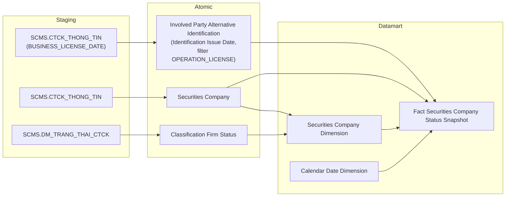
```mermaid
flowchart LR
    subgraph SRC["Staging"]
        S1["SCMS.CTCK_THONG_TIN"]
        S1b["SCMS.CTCK_THONG_TIN\n(BUSINESS_LICENSE_DATE)"]
        S4["SCMS.DM_TRANG_THAI_CTCK"]
    end

    subgraph SIL["Atomic"]
        SV1["Securities Company"]
        SV1b["Involved Party Alternative Identification\n(Identification Issue Date,\nfilter OPERATION_LICENSE)"]
        SV4["Classification Firm Status"]
    end

    subgraph Datamart["Datamart"]
        G1["Fact Securities Company Status Snapshot"]
        G2["Securities Company Dimension"]
        G3["Calendar Date Dimension"]
    end

    S1 --> SV1
    S1b --> SV1b
    S4 --> SV4

    SV1 --> G2
    SV4 --> G2
    SV1b --> G1
    SV1 --> G1

    G2 --> G1
    G3 --> G1
```

> **Ghi chú Calendar Date:** BA v4.2 không còn dùng date-spine (`CONNECT BY` sinh chuỗi ngày liên tục từ MIN(BUSINESS_LICENSE_DATE) đến SYSDATE) — mỗi CTCK chỉ cần so `BUSINESS_LICENSE_DATE <= ngày snapshot`. Datamart vẫn cần `Calendar Date Dimension` độc lập để phục vụ date picker (chọn ngày bất kỳ xem lại quá khứ) — ETL Datamart tự sinh dãy ngày (không phụ thuộc `MEMBER_REPORT.DATA_DATE` nữa).

---

### Cụm 2: Đăng ký dịch vụ CTCK (`Fact Securities Company Service Registration`)

Phục vụ Tab TỔNG QUAN — Nhóm 3 (Biểu đồ Dịch vụ, STT 3), Nhóm 4 (Biểu đồ Dịch vụ phái sinh, STT 4): số CTCK theo dịch vụ đã đăng ký. Nguồn từ `SCMS.SC_FIRM_SERVICE + SCMS.CAT_SERVICE` — dịch vụ đăng ký theo Atomic entity `Classification Service` (nâng cấp từ scheme `SCMS_SERVICE_TYPE` cũ, nay deprecated). Phân biệt Nhóm 3/4 bằng `Service Category Code` (ký quỹ/ứng trước/lưu ký vs phái sinh môi giới/tư vấn/tự doanh).

> **Cập nhật 13/07/2026 (BA v4.2):** Nhóm 2 (Biểu đồ Nghiệp vụ, STT 2) tách khỏi Cụm này — BA đổi nguồn Nhóm 2 sang `SC_FIRM_INFO.BUSINESS_LINES + CAT_BUSINESS_LINE` (khác `SC_FIRM_SERVICE + CAT_SERVICE` dùng cho Nhóm 3/4). Xem **Cụm 2b** — hiện PENDING, xem O_QLKD_20.

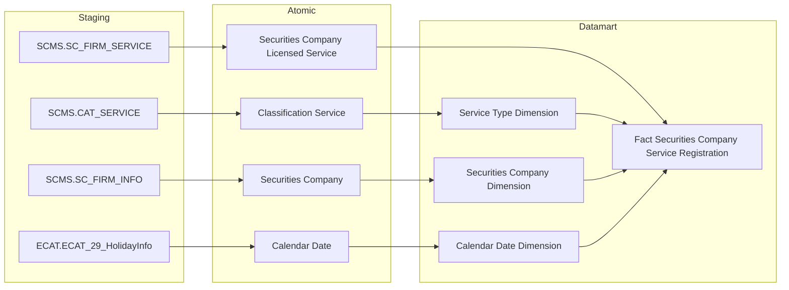
```mermaid
flowchart LR
    subgraph SRC["Staging"]
        S1["SCMS.SC_FIRM_SERVICE"]
        S2["SCMS.CAT_SERVICE"]
        S3["SCMS.SC_FIRM_INFO"]
        ECAT_ECAT_29_HolidayInfo["ECAT.ECAT_29_HolidayInfo"]
    end

    subgraph SIL["Atomic"]
        SV1["Securities Company Licensed Service"]
        SV4["Classification Service"]
        SV2["Securities Company"]
        Calendar_Date["Calendar Date"]
    end

    subgraph Datamart["Datamart"]
        G1["Fact Securities Company Service Registration"]
        G2["Service Type Dimension"]
        G3["Securities Company Dimension"]
        G4["Calendar Date Dimension"]
    end

    S1 --> SV1
    S2 --> SV4
    S3 --> SV2
    ECAT_ECAT_29_HolidayInfo --> Calendar_Date

    SV1 --> G1
    SV4 --> G2
    SV2 --> G3
    Calendar_Date --> G4

    G2 --> G1
    G3 --> G1
    G4 --> G1
```

---

### Cụm 2b: Nghiệp vụ kinh doanh chứng khoán CTCK (`Fact Securities Company Business Line Registration`) — PENDING

Phục vụ Tab TỔNG QUAN — Nhóm 2 (Biểu đồ Nghiệp vụ, STT 2). **PENDING** — xem O_QLKD_20. Nguồn xác nhận từ BA v4.2 (13/07/2026): `SC_FIRM_INFO.BUSINESS_LINES` (danh sách ID nghiệp vụ, denormalize dạng Text phân cách dấu phẩy trên mỗi CTCK) JOIN `CAT_BUSINESS_LINE` (danh mục nghiệp vụ kinh doanh chứng khoán) bằng `INSTR` kiểm tra membership. Atomic hiện tại: `Securities Company.Business Lines` chỉ là Text thô chưa parse — chưa model được quan hệ N:N CTCK↔nghiệp vụ cần thiết để COUNT theo từng nghiệp vụ.

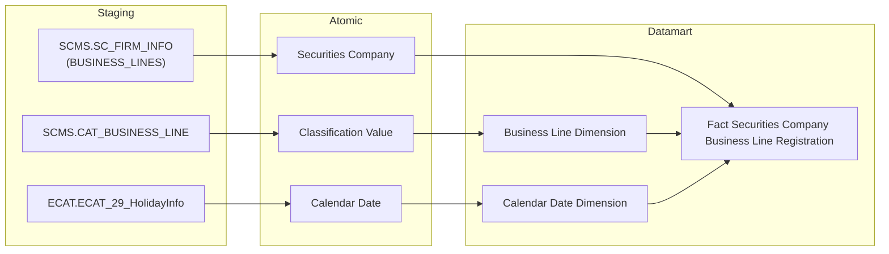
```mermaid
flowchart LR
    subgraph SRC["Staging"]
        S1["SCMS.SC_FIRM_INFO\n(BUSINESS_LINES)"]
        S2["SCMS.CAT_BUSINESS_LINE"]
        ECAT_ECAT_29_HolidayInfo["ECAT.ECAT_29_HolidayInfo"]
    end

    subgraph SIL["Atomic"]
        SV1["Securities Company"]
        SV2["Classification Value"]
        Calendar_Date["Calendar Date"]
    end

    subgraph Datamart["Datamart"]
        G1["Fact Securities Company Business Line Registration"]
        G2["Business Line Dimension"]
        G3["Calendar Date Dimension"]
    end

    S1 --> SV1
    S2 --> SV2
    ECAT_ECAT_29_HolidayInfo --> Calendar_Date

    SV1 --> G1
    SV2 --> G2
    Calendar_Date --> G3

    G2 --> G1
    G3 --> G1
```

---

### Cụm 3: Duy trì điều kiện cấp phép (`Fact Securities Company License Condition Snapshot`) — READY

Phục vụ Tab TỔNG QUAN — Nhóm 5 (GPHL, STT 5), Nhóm 6 (Phái sinh — KDCKPS, STT 6), Nhóm 7 (Phái sinh — BTTT, STT 7). **Cập nhật 13/07/2026 (BA v4.2):** Cả 3 nhóm đổi nguồn sang `SC_FIRM_ALERT_VIOLATION` JOIN `ALERT_INDICATOR` (khác hẳn `BC_CANH_BAO`/`DM_CANH_BAO`/`BM_BAO_CAO` mà thiết kế cũ dùng) — Atomic entity `Securities Company Alert Violation` + `Securities Company Alert Indicator` đã có LLD, cả 3 nhóm nâng lên **READY** (chỉ khác `Indicator_Code`: Nhóm 5 = `DUY_TRI_DKCP_GPKD`, Nhóm 6 = `DUY_TRI_DKCP_CTCK_PHAI_SINH`, Nhóm 7 = `DUY_TRI_DKCP_CTCKPS_BU_TRU`).

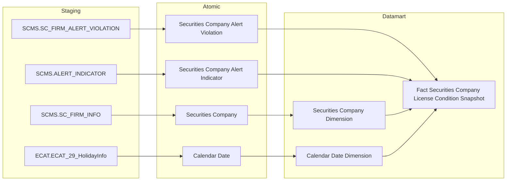
```mermaid
flowchart LR
    subgraph SRC["Staging"]
        S1["SCMS.SC_FIRM_INFO"]
        S2["SCMS.SC_FIRM_ALERT_VIOLATION"]
        S3["SCMS.ALERT_INDICATOR"]
        ECAT_ECAT_29_HolidayInfo["ECAT.ECAT_29_HolidayInfo"]
    end

    subgraph SIL["Atomic"]
        SV1["Securities Company"]
        SV2["Securities Company Alert Violation"]
        SV3["Securities Company Alert Indicator"]
        Calendar_Date["Calendar Date"]
    end

    subgraph Datamart["Datamart"]
        G1["Fact Securities Company License Condition Snapshot"]
        G2["Securities Company Dimension"]
        G3["Calendar Date Dimension"]
    end

    S1 --> SV1
    S2 --> SV2
    S3 --> SV3
    ECAT_ECAT_29_HolidayInfo --> Calendar_Date

    SV1 --> G2
    SV2 --> G1
    SV3 --> G1
    Calendar_Date --> G3

    G2 --> G1
    G3 --> G1
```

---

### Cụm 4: Cơ cấu tài chính toàn thị trường (`Fact Securities Company Financial Structure Snapshot`) — PENDING

Phục vụ Tab TỔNG QUAN — Nhóm 8 (Cơ cấu tài sản), Nhóm 9 (Cơ cấu nguồn vốn): tổng hợp các chỉ tiêu BCTC theo quý toàn thị trường. **Cập nhật 13/07/2026 (BA v4.2):** Cả Nhóm 8 và 9 có `Loại dữ liệu = Dữ liệu động` → PENDING. Đồng thời phát hiện Atomic entity `Member Report Indicator Value` (SCMS.BC_BAO_CAO_GT, EAV theo `MA_CHI_TIEU`) **không tồn tại** trong track Atomic LLD hiện hành (chỉ có trong track cũ `Atomic_LinhLV` đã bị revert) — và nguồn thực tế theo BA SQL là `MEMBER_REPORT` + `FORM_REPORT` + `REPORT_CELL_VALUE` (LIKE matching trên `ROW_NAME`), khác hẳn EAV giả định ban đầu. Xem **O_QLKD_23**.

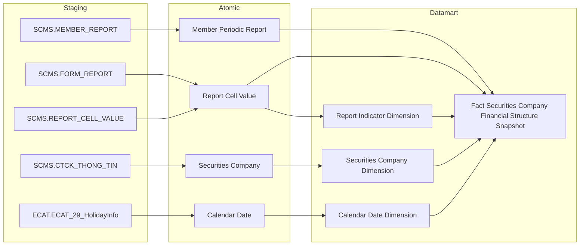
```mermaid
flowchart LR
    subgraph SRC["Staging"]
        S1["SCMS.MEMBER_REPORT"]
        S1b["SCMS.FORM_REPORT"]
        S1c["SCMS.REPORT_CELL_VALUE"]
        S3["SCMS.CTCK_THONG_TIN"]
        ECAT_ECAT_29_HolidayInfo["ECAT.ECAT_29_HolidayInfo"]
    end

    subgraph SIL["Atomic"]
        SV1["Report Cell Value"]
        SV2["Member Periodic Report"]
        SV3["Securities Company"]
        Calendar_Date["Calendar Date"]
    end

    subgraph Datamart["Datamart"]
        G1["Fact Securities Company Financial Structure Snapshot"]
        G2["Securities Company Dimension"]
        G3["Report Indicator Dimension"]
        G4["Calendar Date Dimension"]
    end

    S1 --> SV2
    S1b --> SV1
    S1c --> SV1
    S3 --> SV3
    ECAT_ECAT_29_HolidayInfo --> Calendar_Date

    SV1 --> G1
    SV1 --> G3
    SV2 --> G1
    SV3 --> G2
    Calendar_Date --> G4

    G2 --> G1
    G3 --> G1
    G4 --> G1
```

> **Ghi chú:** `Report Indicator Dimension` dự kiến vẫn là ETL-derived Conformed Dimension — nhưng nay extract từ `ROW_NAME` (tên dòng báo cáo, LIKE matching) thay vì `Report Indicator Id`/`MA_CHI_TIEU` cố định, sau khi Atomic có entity cho `REPORT_CELL_VALUE`.

---

### Cụm 5: Hoạt động tài chính CTCK (`Fact Securities Company Financial Structure Snapshot`)

Phục vụ Tab GIÁM SÁT — Sub-tab GIÁM SÁT HOẠT ĐỘNG: Nhóm 11 (VCSH), Nhóm 12 (Vốn ĐT CSH), Nhóm 14 (TLATTC phân loại), Nhóm 15 (Doanh thu & LNST), Nhóm 17 (Thị phần môi giới), Nhóm 18 (CFO). Dùng chung `Fact Securities Company Financial Structure Snapshot` với Cụm 4 — cùng Atomic source `Member Report Indicator Value`, mở rộng sang các indicator_code VCSH, doanh thu, lợi nhuận, thị phần. Nhóm 13 (Nguồn vốn tăng thêm) tách thành Cụm 5b riêng vì nguồn khác (SSC_SCMS.DISCLOSURE_SECURITIES_OFFERING).
> **Cập nhật 13/07/2026:** Nhóm 11, Nhóm 12, Nhóm 14, Nhóm 15, Nhóm 17, Nhóm 18 (STT 11, 12, 14, 15, 17, 18) đã hạ **PENDING** — cùng lý do gating dữ liệu động + gap Atomic với Cụm 4 (xem O_QLKD_23). Toàn bộ Sub-tab GIÁM SÁT HOẠT ĐỘNG đã re-verify xong đợt này.

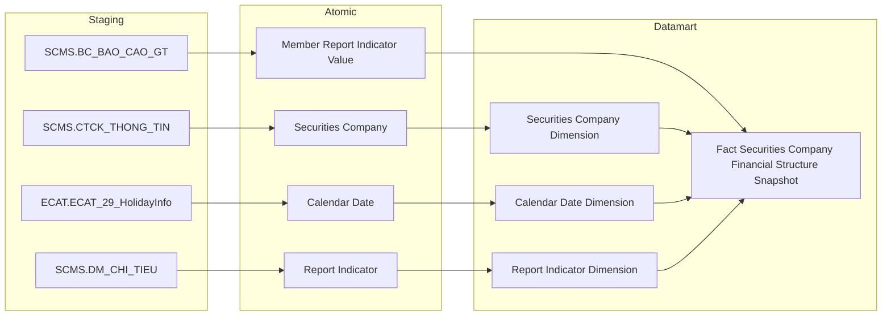
```mermaid
flowchart LR
    subgraph SRC["Staging"]
        S1["SCMS.BC_BAO_CAO_GT"]
        S2["SCMS.CTCK_THONG_TIN"]
        S3["SCMS.DM_CHI_TIEU"]
        ECAT_ECAT_29_HolidayInfo["ECAT.ECAT_29_HolidayInfo"]
    end

    subgraph SIL["Atomic"]
        SV1["Member Report Indicator Value"]
        SV2["Securities Company"]
        SV3["Report Indicator"]
        Calendar_Date["Calendar Date"]
    end

    subgraph Datamart["Datamart"]
        G1["Fact Securities Company Financial Structure Snapshot"]
        G2["Securities Company Dimension"]
        G3["Calendar Date Dimension"]
        G4["Report Indicator Dimension"]
    end

    S1 --> SV1
    S2 --> SV2
    S3 --> SV3
    ECAT_ECAT_29_HolidayInfo --> Calendar_Date

    SV1 --> G1
    SV2 --> G2
    SV3 --> G4
    Calendar_Date --> G3

    G2 --> G1
    G3 --> G1
    G4 --> G1
```

---

### Cụm 5b: Nguồn vốn tăng thêm từ chào bán (`Fact Securities Company Capital Raising Event`) — READY

Phục vụ Tab GIÁM SÁT — Nhóm 13 (Nguồn vốn tăng thêm, STT 13). **Cập nhật 13/07/2026 (BA v4.2):** đổi nguồn từ `SCMS.CBTT_CHAO_BAN_CHUNG_KHOAN` sang `SSC_SCMS.DISCLOSURE_SECURITIES_OFFERING` — 1 row per đợt chào bán/phát hành đã công bố. Atomic entity: `Securities Company Disclosure Securities Offering` (LLD draft, 76 attributes). Biểu đồ toàn thị trường theo tháng — không phân theo CTCK (BA SQL không GROUP BY/JOIN theo Securities Company).

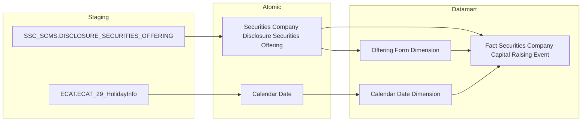
```mermaid
flowchart LR
    subgraph SRC["Staging"]
        S1["SSC_SCMS.DISCLOSURE_SECURITIES_OFFERING"]
        ECAT_ECAT_29_HolidayInfo["ECAT.ECAT_29_HolidayInfo"]
    end

    subgraph SIL["Atomic"]
        SV1["Securities Company Disclosure Securities Offering"]
        Calendar_Date["Calendar Date"]
    end

    subgraph Datamart["Datamart"]
        G1["Fact Securities Company Capital Raising Event"]
        G3["Offering Form Dimension"]
        G4["Calendar Date Dimension"]
    end

    S1 --> SV1
    ECAT_ECAT_29_HolidayInfo --> Calendar_Date

    SV1 --> G1
    SV1 --> G3
    Calendar_Date --> G4

    G3 --> G1
    G4 --> G1
```

---

### Cụm 6: Tương quan Margin (`Fact Securities Company Financial Structure Snapshot`) — PENDING

Phục vụ Tab GIÁM SÁT — Nhóm 16, K_QLKD_61 (Dư nợ margin). **Cập nhật 13/07/2026 (BA v4.2, re-verify):** BA đổi nguồn — không còn `Member Report Indicator Value` (BC_BAO_CAO_GT EAV) mà chuyển sang `MEMBER_REPORT` JOIN `FORM_REPORT` (`REPORT_CODE='BCTHHDKD_TH'`) JOIN `REPORT_CELL_VALUE` (LIKE `'%II. Giá trị chứng khoán ký quỹ%'` trên `ROW_NAME`) — cùng pattern Nhóm 8/9/15, cả 2 dòng BA đều `Loại dữ liệu = Dữ liệu động`. Chung gap **O_QLKD_23**.

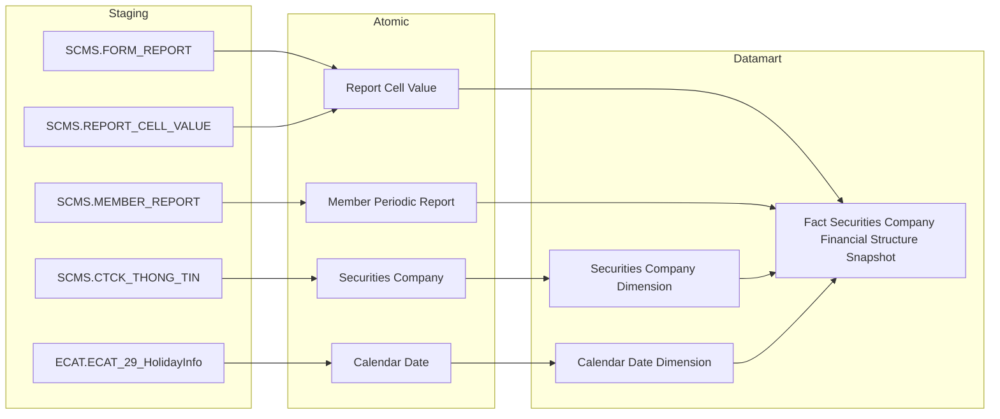
```mermaid
flowchart LR
    subgraph SRC["Staging"]
        S1["SCMS.MEMBER_REPORT"]
        S1b["SCMS.FORM_REPORT"]
        S1c["SCMS.REPORT_CELL_VALUE"]
        S3["SCMS.CTCK_THONG_TIN"]
        ECAT_ECAT_29_HolidayInfo["ECAT.ECAT_29_HolidayInfo"]
    end

    subgraph SIL["Atomic"]
        SV1["Report Cell Value"]
        SV2["Member Periodic Report"]
        SV3["Securities Company"]
        Calendar_Date["Calendar Date"]
    end

    subgraph Datamart["Datamart"]
        G1["Fact Securities Company Financial Structure Snapshot"]
        G2["Securities Company Dimension"]
        G3["Calendar Date Dimension"]
    end

    S1 --> SV2
    S1b --> SV1
    S1c --> SV1
    S3 --> SV3
    ECAT_ECAT_29_HolidayInfo --> Calendar_Date

    SV1 --> G1
    SV2 --> G1
    SV3 --> G2
    Calendar_Date --> G3

    G2 --> G1
    G3 --> G1
```

---

### Cụm 6b: Diễn biến thị trường (`Market Index Snapshot`) — READY

Phục vụ Tab GIÁM SÁT — Nhóm 16, K_QLKD_62–65 (chỉ số VN-Index, HNX, UPCOM, VN30). Nguồn xác nhận: `MDDS.JAD_MARKETINFOR` (Atomic entity `Market Index Snapshot`, đã approved 2026-07-03). **Sửa 14/07/2026 (LLD review):** BA ghi tham khảo `FSSTRAINING.PUBLIC_MARKETINFOR` (DB: dwh) — đây là tên gọi khác của cùng nguồn dữ liệu thị trường, đối chiếu Atomic xác nhận entity thực tế là `MDDS.JAD_MARKETINFOR` (field `marketcode`/`marketindex`/`tradingdate`/`indextime` khớp đúng cấu trúc BA mô tả). O_QLKD_8 Closed. `Market Index Snapshot` join với `Fact Securities Company Financial Structure Snapshot` (Cụm 6) qua `Calendar Date Dimension` để tạo biểu đồ combo.

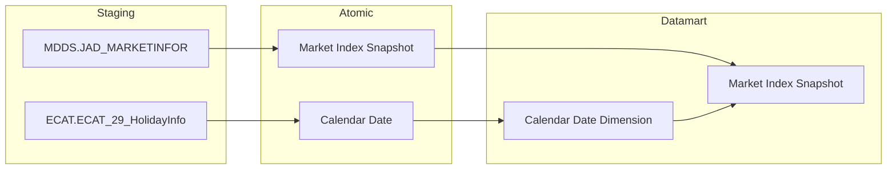
```mermaid
flowchart LR
    subgraph SRC["Staging"]
        S1["MDDS.JAD_MARKETINFOR"]
        ECAT_ECAT_29_HolidayInfo["ECAT.ECAT_29_HolidayInfo"]
    end

    subgraph SIL["Atomic"]
        SV1["Market Index Snapshot"]
        Calendar_Date["Calendar Date"]
    end

    subgraph Datamart["Datamart"]
        G1["Market Index Snapshot"]
        G2["Calendar Date Dimension"]
    end

    S1 --> SV1
    ECAT_ECAT_29_HolidayInfo --> Calendar_Date

    SV1 --> G1
    Calendar_Date --> G2

    G2 --> G1
```

---

### Cụm 7: Tuân thủ nộp báo cáo (`Fact Securities Company Report Compliance Snapshot`) — PENDING (gating dữ liệu động)

Phục vụ Tab GIÁM SÁT — Sub-tab GIÁM SÁT TUÂN THỦ (Nhóm 10): số lượng báo cáo đúng hạn/chậm/chưa nộp + tỷ lệ tuân thủ toàn thị trường theo ngày. **Cập nhật 13/07/2026 (BA v4.2):** Toàn bộ STT 10 có `Loại dữ liệu = Dữ liệu động` → PENDING theo rule gating — khác Cụm 4 (không có gap Atomic, cả 3 entity dưới đây vẫn READY).

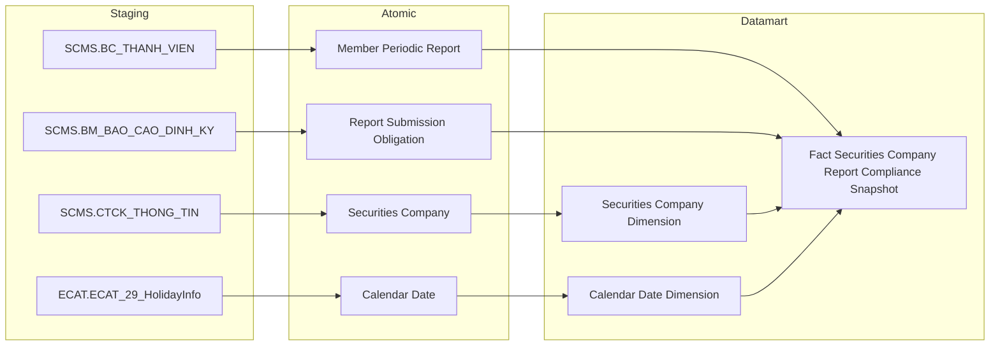
```mermaid
flowchart LR
    subgraph SRC["Staging"]
        S1["SCMS.BC_THANH_VIEN"]
        S2["SCMS.CTCK_THONG_TIN"]
        S3["SCMS.BM_BAO_CAO_DINH_KY"]
        ECAT_ECAT_29_HolidayInfo["ECAT.ECAT_29_HolidayInfo"]
    end

    subgraph SIL["Atomic"]
        SV1["Member Periodic Report"]
        SV2["Securities Company"]
        SV3["Report Submission Obligation"]
        Calendar_Date["Calendar Date"]
    end

    subgraph Datamart["Datamart"]
        G1["Fact Securities Company Report Compliance Snapshot"]
        G2["Securities Company Dimension"]
        G3["Calendar Date Dimension"]
    end

    S1 --> SV1
    S2 --> SV2
    S3 --> SV3
    ECAT_ECAT_29_HolidayInfo --> Calendar_Date

    SV1 --> G1
    SV3 --> G1
    SV2 --> G2
    Calendar_Date --> G3

    G2 --> G1
    G3 --> G1
```

---

### Cụm 8: Banner tổng quan CTCK & Biểu đồ tài chính Hồ sơ 360 (K_QLKD_74–90)

> K_QLKD_74–86 (Nhóm 19-25) và K_QLKD_87–90 (Nhóm 26/27, bảng Tác nghiệp `Securities Company Financial Report History`) đều tái sử dụng cùng nguồn `REPORT_CELL_VALUE` với Cụm 4/5 — không có bảng Datamart riêng cho Cụm này. Lineage đã vẽ trong Cụm 4.
> **Cập nhật 13/07/2026:** Toàn bộ Nhóm 19-27 (K_QLKD_74–90) đã hạ **PENDING** — cùng gap Atomic `REPORT_CELL_VALUE` (O_QLKD_23) + gating dữ liệu động. Xem chi tiết từng Nhóm ở Section 2 — Tab HỒ SƠ CTCK 360.

---

### Cụm 9: Nhân sự & Quản trị CTCK (Tác nghiệp)

Phục vụ Tab HỒ SƠ CTCK 360 — Sub-tab Nhân sự: HĐQT/HĐTV/BKS/BĐH cards + Cổ đông lớn table + Lịch sử thay đổi nhân sự. Tất cả là dạng lookup 1 CTCK — bảng Tác nghiệp.

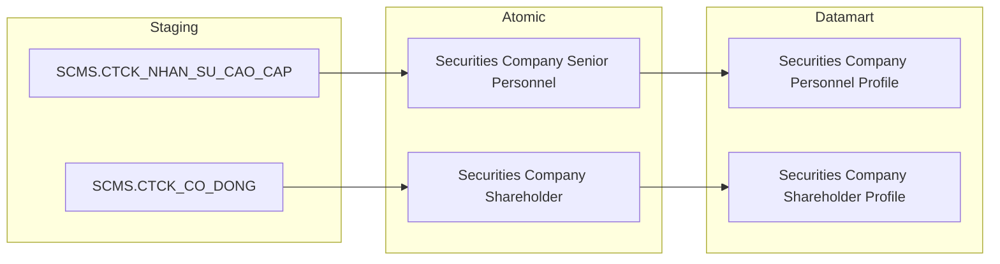
```mermaid
flowchart LR
    subgraph SRC["Staging"]
        S1["SCMS.CTCK_NHAN_SU_CAO_CAP"]
        S2["SCMS.CTCK_CO_DONG"]
    end

    subgraph SIL["Atomic"]
        SV1["Securities Company Senior Personnel"]
        SV2["Securities Company Shareholder"]
    end

    subgraph Datamart["Datamart"]
        G1["Securities Company Personnel Profile"]
        G2["Securities Company Shareholder Profile"]
    end

    S1 --> SV1
    S2 --> SV2

    SV1 --> G1
    SV2 --> G2
```

---

### Cụm 10: CN, PGD, VPĐD & NHNCK CTCK (Tác nghiệp)

Phục vụ Tab HỒ SƠ CTCK 360 — Sub-tab NHNCK và Sub-tab CN, PGD, VPĐD: thông tin mạng lưới và người hành nghề của 1 CTCK.

> **Cập nhật 13/07/2026 (BA v4.2, re-verify Nhóm 28-37):** Phần **Sub-tab CN, PGD, VPĐD**: nguồn bảng đơn vị đổi từ `CTCK_CHI_NHANH/PHONG_GIAO_DICH/VP_DAI_DIEN` sang `SC_FIRM_BRANCH/SC_FIRM_TRANSACTION_OFFICE/SC_FIRM_REP_OFFICE` (Atomic `Securities Company Organization Unit` đã map đúng, vẫn READY) — Nhóm 32/34/35 **READY**. Nhóm 33 (theo nghiệp vụ) và Nhóm 37 (danh sách, cột Nghiệp vụ) hạ **PENDING** — BA đổi sang bảng liên kết N:N `LNK_SC_FIRM_BUSINESS_LINE` mà Atomic chưa có entity cover (cùng loại gap O_QLKD_20). Nhóm 36 (duy trì điều kiện cấp phép) hạ **PENDING** — đổi nguồn sang `SC_FIRM_ALERT_VIOLATION`/`ALERT_INDICATOR` (như Nhóm 5/6/7) nhưng entity chưa resolve polymorphic FK cho `ENTITY_TYPE = BRANCH/TRANSACTION_OFFICE/REP_OFFICE`. Riêng phần **Sub-tab NHNCK — Các chỉ tiêu chung** (Nhóm 28, K_QLKD_91–93) đã đổi nguồn hẳn sang `MEMBER_REPORT`/`REPORT_CELL_VALUE` (report `BCTHHDKD_TH` sheet `TTC`) — không còn dùng `Securities Practitioner`/`License Certificate Document` (NHNCK) như lineage dưới đây thể hiện. Nhóm 28/29/30 đã hạ **PENDING**, cùng gap **O_QLKD_23** với Cụm 4/5/8 — xem Section 2, Sub-tab NHNCK.

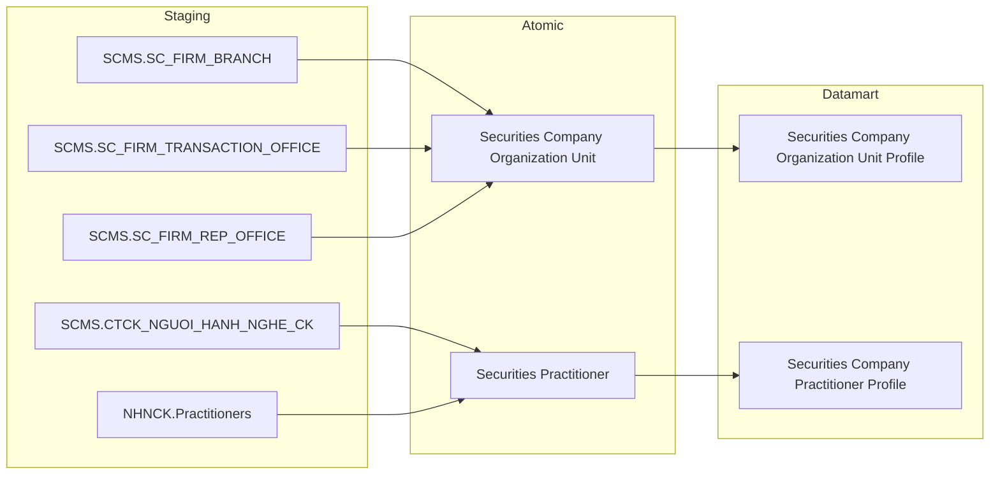
```mermaid
flowchart LR
    subgraph SRC["Staging"]
        S1["SCMS.SC_FIRM_BRANCH"]
        S2["SCMS.SC_FIRM_TRANSACTION_OFFICE"]
        S3["SCMS.SC_FIRM_REP_OFFICE"]
        S4["SCMS.CTCK_NGUOI_HANH_NGHE_CK"]
        S5["NHNCK.Practitioners"]
    end

    subgraph SIL["Atomic"]
        SV1["Securities Company Organization Unit"]
        SV2["Securities Practitioner"]
    end

    subgraph Datamart["Datamart"]
        G1["Securities Company Organization Unit Profile"]
        G2["Securities Company Practitioner Profile"]
    end

    S1 --> SV1
    S2 --> SV1
    S3 --> SV1
    S4 --> SV2
    S5 --> SV2

    SV1 --> G1
    SV2 --> G2
```

---


---

### Cụm 11: Lịch sử báo cáo tài chính CTCK (Tác nghiệp) — PENDING

Phục vụ Tab HỒ SƠ CTCK 360 — Sub-tab Tài chính: bảng lịch sử BC tài chính per CTCK per kỳ. 4 thẻ tổng hợp (DT YTD, LN YTD, ROA, ROE) tính aggregate từ các row chi tiết.

> **Cập nhật 13/07/2026 (BA v4.2, re-verify Nhóm 26/27):** Nguồn giá trị chỉ tiêu (DT/LNST/ROA/ROE) không còn từ `Member Report Indicator Value` (BC_BAO_CAO_GT EAV) mà từ `MEMBER_REPORT`/`FORM_REPORT`/`REPORT_CELL_VALUE` (report `BCTCRLCTCK`, sheet `BCKQHDR`/`BCTCR`) — cùng gap **O_QLKD_23** với Cụm 4/5/8. `Member Periodic Report` (kỳ BC, ngày nộp, trạng thái) vẫn READY nhưng không đủ để tự thiết kế bảng khi thiếu nguồn giá trị chỉ tiêu. Nhóm 26/27 đã hạ **PENDING**.

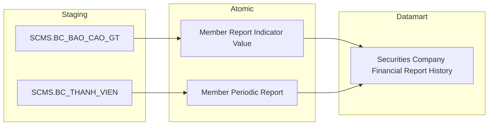
```mermaid
flowchart LR
    subgraph SRC["Staging"]
        S1["SCMS.BC_BAO_CAO_GT"]
        S2["SCMS.BC_THANH_VIEN"]
    end

    subgraph SIL["Atomic"]
        SV1["Member Report Indicator Value"]
        SV2["Member Periodic Report"]
    end

    subgraph Datamart["Datamart"]
        G1["Securities Company Financial Report History"]
    end

    S1 --> SV1
    S2 --> SV2

    SV1 --> G1
    SV2 --> G1
```

---

### Cụm 12: Tuân thủ & vi phạm CTCK — Hồ sơ 360 (Tác nghiệp)

Phục vụ Tab HỒ SƠ CTCK 360 — Sub-tab Tuân thủ: danh sách BC tuân thủ (đúng hạn/trễ hạn) + số quyết định xử phạt + lịch sử thanh tra/xử phạt per CTCK. `Securities Company Periodic Report` phục vụ danh sách BC (Nhóm 38/39, K_QLKD_99/K_QLKD_101 PENDING — gating dữ liệu động); `Securities Company Administrative Penalty Decision` phục vụ đếm số quyết định xử phạt (Nhóm 38, K_QLKD_100 — READY); `Inspection Team`/`Examination Team` + `Penalty Decision`* phục vụ lịch sử thanh tra/xử phạt chi tiết (Nhóm 40, K_QLKD_102 và các attribute liên quan — READY).

> **Cập nhật 13/07/2026 (BA v4.2, re-verify Nhóm 38):** K_QLKD_100 (Số lượng quyết định xử phạt) đổi nguồn từ `Inspection Penalty Decision` (giả định INSPECT schema cũ) sang `SC_FIRM_ADMIN_PENALTY_DECISION` (SCMS) — Atomic entity mới `Securities Company Administrative Penalty Decision` đã map đúng, **READY**. Đây là nguồn khác `INSPECT.PENALTY_DECISION*` dùng ở Nhóm 41g (xử phạt cá nhân, Tab TRA CỨU CÁ NHÂN) — 2 khái niệm khác nhau: xử phạt hành chính CTCK (SCMS) vs xử phạt cá nhân (INSPECT).
>
> **Cập nhật 13/07/2026 (BA v4.2, re-verify Nhóm 39):** Nguồn danh sách BC tuân thủ đổi tên bảng từ `SCMS.BC_THANH_VIEN` sang `SSC_SCMS.SC_FIRM_PERIODIC_REPORT` JOIN `SC_FIRM_INFO` — Atomic entity đổi tên tương ứng `Member Periodic Report` → `Securities Company Periodic Report` (LLD `lld_SCMS_SC_FIRM_PERIODIC_REPORT.yaml`), vẫn READY. K_QLKD_101 (Nhóm 39) hạ **PENDING** — cùng lý do gating dữ liệu động với K_QLKD_99 (Nhóm 38), không phải gap Atomic.
>
> **Cập nhật 13/07/2026 (BA v4.2, re-verify Nhóm 40):** Nguồn lịch sử thanh tra/xử phạt đổi hẳn từ `ThanhTra.TT_HO_SO`/`TT_KET_LUAN` (`Inspection Case`/`Inspection Case Conclusion`) sang schema **INSPECT** — cùng schema với Nhóm 41g nhưng lọc `Subject_Type_Code = 'ORGANIZATION'` (khác Nhóm 41g dùng `'INDIVIDUAL'`). Atomic entity mới: `Inspection Team`/`Examination Team` (loại hình + ngày QĐ), `Inspection Team Target`/`Examination Team Target` (join key), `Penalty Decision Subject`, `Penalty Decision`, `Penalty Decision Subject Behavior`, `Violation Behavior`, `Penalty Type` — đều đã có LLD đầy đủ attribute cần dùng, **READY** cho K_QLKD_102 + 5 attribute liên quan (K_QLKD_2797-2801). Riêng "Chiều thời gian theo Ngày" (K_QLKD_2835) hạ PENDING do BA SQL dùng `SYSDATE` placeholder (Dữ liệu động).

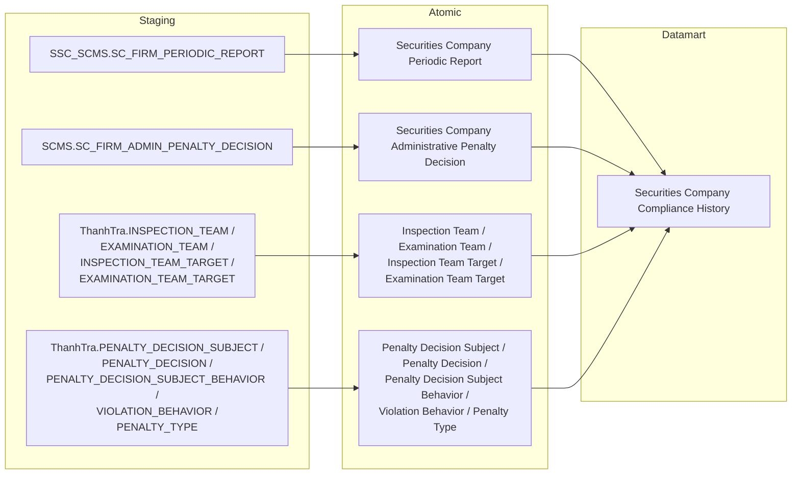
```mermaid
flowchart LR
    subgraph SRC["Staging"]
        S1["SSC_SCMS.SC_FIRM_PERIODIC_REPORT"]
        S1b["SCMS.SC_FIRM_ADMIN_PENALTY_DECISION"]
        S2["ThanhTra.INSPECTION_TEAM /\nEXAMINATION_TEAM /\nINSPECTION_TEAM_TARGET /\nEXAMINATION_TEAM_TARGET"]
        S3["ThanhTra.PENALTY_DECISION_SUBJECT /\nPENALTY_DECISION /\nPENALTY_DECISION_SUBJECT_BEHAVIOR /\nVIOLATION_BEHAVIOR /\nPENALTY_TYPE"]
    end

    subgraph SIL["Atomic"]
        SV1["Securities Company Periodic Report"]
        SV1b["Securities Company Administrative Penalty Decision"]
        SV2["Inspection Team / Examination Team /\nInspection Team Target /\nExamination Team Target"]
        SV3["Penalty Decision Subject / Penalty Decision /\nPenalty Decision Subject Behavior /\nViolation Behavior / Penalty Type"]
    end

    subgraph Datamart["Datamart"]
        G1["Securities Company Compliance History"]
    end

    S1 --> SV1
    S1b --> SV1b
    S2 --> SV2
    S3 --> SV3

    SV1 --> G1
    SV1b --> G1
    SV2 --> G1
    SV3 --> G1
```

---

### Cụm 13: Tra cứu & Mạng lưới cá nhân (Tác nghiệp)

Phục vụ Tab TRA CỨU CÁ NHÂN — Landing page (danh sách cá nhân) + Sub-tab Mạng lưới 360°. `Individual Profile` là bảng Tác nghiệp tổng hợp thông tin định danh cá nhân từ `Securities Company Senior Personnel` (SCMS) và `Securities Practitioner` (NHNCK). `Individual Related Party Network` lưu mạng lưới người liên quan.

> **Cập nhật 13/07/2026 (BA v4.2, re-verify Nhóm 41b):** Sub-tab Mạng lưới 360° đổi hẳn nguồn — không còn `CTCK_CD_MOI_QUAN_HE`/NHNCK.ProfessionalRelationships/IDS.company_relationship, mà hợp nhất vào 1 bảng self-reference `SSC_SCMS.SC_FIRM_INSIDER_RELATION` (Atomic entity mới `Securities Company Insider Related Person`) — 1 row vừa đại diện người nội bộ vừa có thể self-join ra người liên quan cùng `Securities Company Senior Personnel Id`. `Individual Profile` (Landing page — Nhóm 41a) không có BA v4.2 riêng, giữ nguyên thiết kế cũ. K_QLKD_111/207-210 (Nhóm 41b) vẫn READY qua nguồn mới; Chiều thời gian theo Ngày (K_QLKD_204) hạ PENDING — gating dữ liệu động.

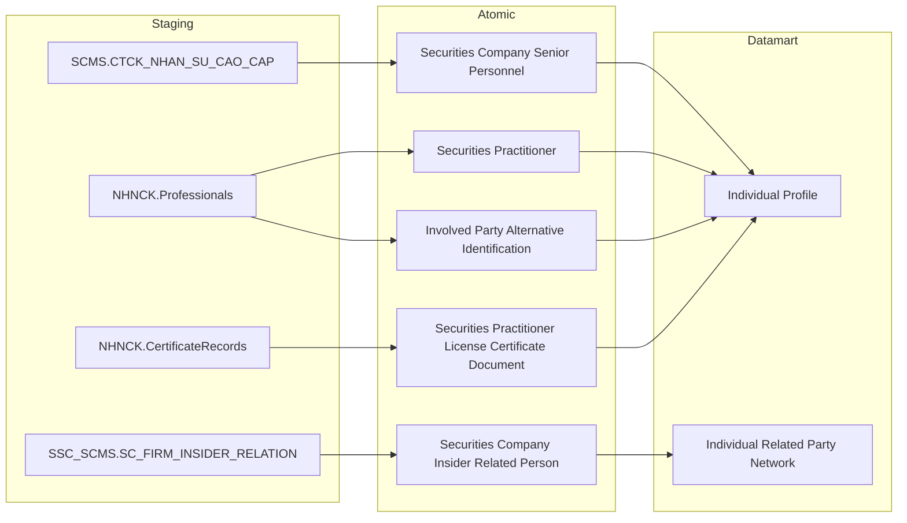
```mermaid
flowchart LR
    subgraph SRC["Staging"]
        S1["SCMS.CTCK_NHAN_SU_CAO_CAP"]
        S3["NHNCK.Professionals"]
        S5["NHNCK.CertificateRecords"]
        S6["SSC_SCMS.SC_FIRM_INSIDER_RELATION"]
    end

    subgraph SIL["Atomic"]
        SV1["Securities Company Senior Personnel"]
        SV3["Securities Practitioner"]
        SV5["Involved Party Alternative Identification"]
        SV6["Securities Practitioner License Certificate Document"]
        SV7["Securities Company Insider Related Person"]
    end

    subgraph Datamart["Datamart"]
        G1["Individual Profile"]
        G2["Individual Related Party Network"]
    end

    S1 --> SV1
    S3 --> SV3
    S3 --> SV5
    S5 --> SV6
    S6 --> SV7

    SV1 --> G1
    SV3 --> G1
    SV5 --> G1
    SV6 --> G1
    SV7 --> G2
```

---

### Cụm 14: Hồ sơ cá nhân — Vai trò DN niêm yết & Tài khoản (Tác nghiệp)

Phục vụ Tab TRA CỨU CÁ NHÂN — Sub-tab Hồ sơ: block Vai trò tại DN niêm yết + block Tài khoản. `Individual Listed Company Role` lưu vai trò + số CP tại từng tổ chức per cá nhân.

> **Cập nhật 13/07/2026 (BA v4.2, re-verify Nhóm 41c/41e):** "Vai trò tại DN niêm yết" đổi nguồn từ IDS sang `SSC_SCMS.SC_FIRM_INSIDER_RELATION` (cùng entity với Cụm 13) — IDS không còn dùng cho use case này. "Tài khoản" đổi tên bảng từ `CTCK_CO_DONG` sang `SSC_SCMS.SC_FIRM_SHAREHOLDER` (Atomic entity `Securities Company Shareholder`, không đổi cấu trúc) — cả 2 vẫn **READY**.

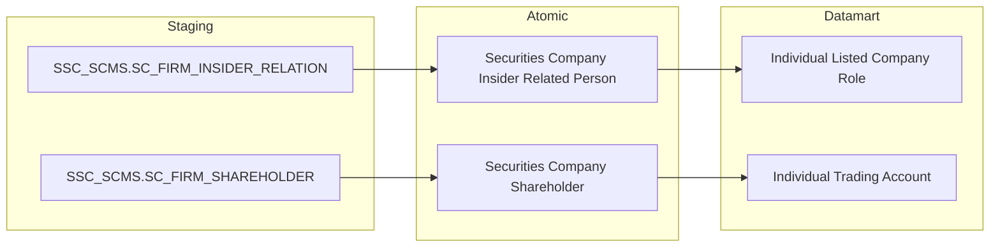
```mermaid
flowchart LR
    subgraph SRC["Staging"]
        S1["SSC_SCMS.SC_FIRM_INSIDER_RELATION"]
        S2["SSC_SCMS.SC_FIRM_SHAREHOLDER"]
    end

    subgraph SIL["Atomic"]
        SV1["Securities Company Insider Related Person"]
        SV2["Securities Company Shareholder"]
    end

    subgraph Datamart["Datamart"]
        G1["Individual Listed Company Role"]
        G2["Individual Trading Account"]
    end

    S1 --> SV1
    S2 --> SV2

    SV1 --> G1
    SV2 --> G2
```

---

### Cụm 15: Quá trình hành nghề & Lịch sử vi phạm cá nhân (Tác nghiệp)

Phục vụ Tab TRA CỨU CÁ NHÂN — Sub-tab Quá trình hành nghề (timeline công tác) + Sub-tab Lịch sử vi phạm. Lịch sử vi phạm từ schema `INSPECT` (`Penalty Decision` + liên quan) — xem O_QLKD_14 (đã Closed, xác nhận INSPECT thay vì ThanhTra.TT_HO_SO/TT_KET_LUAN).

> **Cập nhật 13/07/2026 (BA v4.2, re-verify Nhóm 41f/41g):** Quá trình hành nghề — nguồn `Securities Company Senior Personnel` xác nhận lại đúng (POSITION/START_DATE/END_DATE = Work Start Date/Dismissal Date), vẫn READY (K_QLKD_215-218), thêm mint K_QLKD_214 (Chiều thời gian theo Ngày, PENDING gating). Lịch sử vi phạm — nguồn INSPECT xác nhận lại đúng thiết kế hiện tại (K_QLKD_220-224 READY), thêm mint K_QLKD_219 (Chiều thời gian theo Ngày, PENDING gating, cùng pattern SYSDATE placeholder như Nhóm 40).

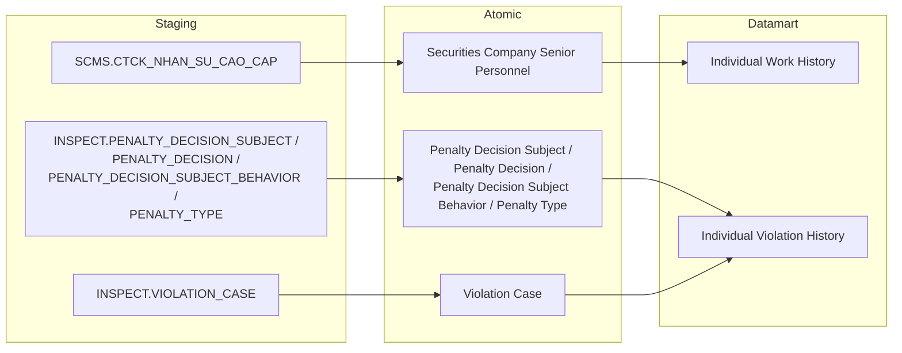
```mermaid
flowchart LR
    subgraph SRC["Staging"]
        S1["SCMS.CTCK_NHAN_SU_CAO_CAP"]
        S2["INSPECT.PENALTY_DECISION_SUBJECT /\nPENALTY_DECISION /\nPENALTY_DECISION_SUBJECT_BEHAVIOR /\nPENALTY_TYPE"]
        S3["INSPECT.VIOLATION_CASE"]
    end

    subgraph SIL["Atomic"]
        SV1["Securities Company Senior Personnel"]
        SV2["Penalty Decision Subject / Penalty Decision /\nPenalty Decision Subject Behavior / Penalty Type"]
        SV3["Violation Case"]
    end

    subgraph Datamart["Datamart"]
        G1["Individual Work History"]
        G2["Individual Violation History"]
    end

    S1 --> SV1
    S2 --> SV2
    S3 --> SV3

    SV1 --> G1
    SV2 --> G2
    SV3 --> G2
```

---

### Cụm 16: Data Explorer — Báo cáo biểu mẫu định kỳ CTCK (Tác nghiệp) — PENDING

Phục vụ Tab DATA EXPLORER — tra cứu raw data 102 biểu mẫu báo cáo định kỳ (STT 42–145). **Cập nhật 13/07/2026:** PENDING hoàn toàn — nguồn EAV dự kiến `Member Report Indicator Value` (BC_BAO_CAO_GT) không tồn tại trong track Atomic hiện hành (xem O_QLKD_23), cộng với phần lớn dữ liệu thuộc diện `Dữ liệu động`. Metadata biểu mẫu và kỳ báo cáo từ `Member Periodic Report` (BC_THANH_VIEN) vẫn READY nhưng không đủ để tự thiết kế bảng Tác nghiệp `Securities Company Report Data` khi thiếu nguồn giá trị chỉ tiêu.

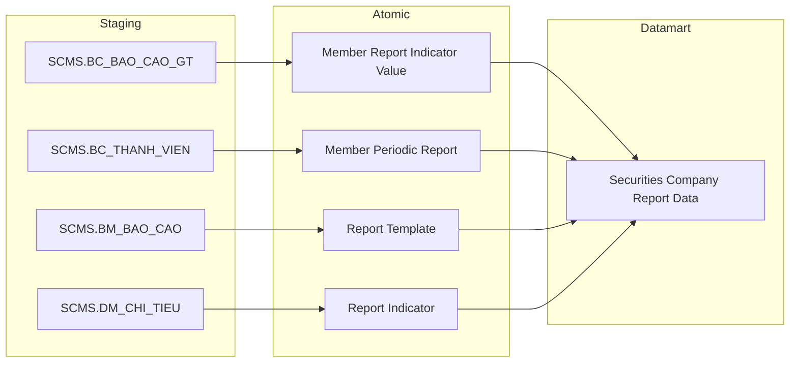
```mermaid
flowchart LR
    subgraph SRC["Staging"]
        S1["SCMS.BC_BAO_CAO_GT"]
        S2["SCMS.BC_THANH_VIEN"]
        S3["SCMS.BM_BAO_CAO"]
        S4["SCMS.DM_CHI_TIEU"]
    end

    subgraph SIL["Atomic"]
        SV1["Member Report Indicator Value"]
        SV2["Member Periodic Report"]
        SV3["Report Template"]
        SV4["Report Indicator"]
    end

    subgraph Datamart["Datamart"]
        G1["Securities Company Report Data"]
    end

    S1 --> SV1
    S2 --> SV2
    S3 --> SV3
    S4 --> SV4

    SV1 --> G1
    SV2 --> G1
    SV3 --> G1
    SV4 --> G1
```

---

## Section 2 — Tổng quan báo cáo

### Tab: TỔNG QUAN

**Slicer chung:** Thời điểm (date picker — mặc định ngày gần nhất có dữ liệu)

---

#### Nhóm 1 — Chỉ tiêu thống kê chung (STT 1–14)

> Phân loại: **Phân tích**
> Atomic: `Securities Company` ← SSC_SCMS.SC_FIRM_INFO — **READY** (track draft chưa approved)
> Atomic: `Involved Party Alternative Identification` ← SSC_SCMS.SC_FIRM_INFO (BUSINESS_LICENSE_DATE, filter Identification Type Code = OPERATION_LICENSE) — **READY** (track draft chưa approved)
> Atomic: `Classification SCMS Firm Status` ← SCMS.CAT_SC_FIRM_STATUS — **READY** (track draft chưa approved)
> **Sửa 14/07/2026 (LLD review):** Ghi chú ETL filter `IS_BANG_TAM = 1 AND NGAY_CAP_GPKD IS NOT NULL` ở bản trước là văn bản sót lại từ SQL tham khảo v4.1 (bảng `SCMS.CTCK_THONG_TIN`, xem `BRD/BA/Old versions/BA_analyst_QLKD_20260713.csv`) — BA v4.2 hiện hành (`BA_analyst_QLKD.csv`, STT 1) đã đổi hẳn nguồn sang `SSC_SCMS.SC_FIRM_INFO` và điều kiện lọc chỉ còn `BUSINESS_LICENSE_DATE IS NOT NULL`, không còn `IS_BANG_TAM`/`NGAY_CAP_GPKD`. Snapshot condition tại ngày D: `License_Issue_Date <= D` — `License_Issue_Date` = `Involved Party Alternative Identification.Identification Issue Date` (filter `OPERATION_LICENSE`) — đã đủ trong Atomic, không cần bổ sung attribute nào khác. *(BA v4.2 không còn điều kiện `License_Revocation_Date` — trạng thái thu hồi lấy qua `Classification SCMS Firm Status`, xem K_QLKD_6.)*
> K_QLKD_12–13 (Số TK phát sinh GD, Số dư tiền gửi GD) — **PENDING**, xem lý do trong bảng KPI và **O_QLKD_1**.

**Ghi chú UI:** Banner tổng số CTCK hiển thị K_QLKD_4 + K_QLKD_3 (YoY%). Có nút expand → hiển thị 7 thẻ trạng thái con (K_QLKD_5–11). K_QLKD_5–11 là **filter GROUP BY** trên `Company_Status_Code` của cùng 1 snapshot — không phải measure độc lập.

**Mockup:**

```
┌─────────────────────────────────────────────────────┐
│  TỔNG SỐ CTCK ĐƯỢC CẤP PHÉP    85   ↑ +2.4%   [Xem chi tiết ∧]
│  ┌──────────┐ ┌──────────┐ ┌──────────┐ ┌──────────┐
│  │ Hoạt động│ │ Bị thu hồi│ │ Cảnh báo │ │ Kiểm soát│
│  │    60    │ │    12    │ │     5    │ │     3    │
│  └──────────┘ └──────────┘ └──────────┘ └──────────┘
│  ┌──────────┐ ┌──────────┐ ┌──────────┐
│  │KS đặc biệt│ │Đình chỉ  │ │ Khác     │
│  │     1    │ │     2    │ │     2    │
│  └──────────┘ └──────────┘ └──────────┘
├──────────────────────────┬──────────────────────────┤
│  TK phát sinh GD         │  Số dư tiền gửi GD       │
│  ⏳ PENDING (K_QLKD_12)  │  ⏳ PENDING (K_QLKD_13)  │
└──────────────────────────┴──────────────────────────┘
```

**Source:** `Fact Securities Company Status Snapshot` → `Securities Company Dimension`, `Calendar Date Dimension`

**Bảng KPI:**

| KPI ID | Tên KPI | Đơn vị | Tính chất | Công thức / Nguồn | Trạng thái |
|---|---|---|---|---|---|
| K_QLKD_1 | Chiều Trạng thái công ty | — | Chiều | `Classification Firm Status Name` (SCMS.DM_TRANG_THAI_CTCK) — derive 7 nhóm trạng thái bằng CASE/LIKE | READY |
| K_QLKD_2 | Chiều thời gian theo ngày | — | Chiều | `Calendar Date Dimension`, xác định từ `Involved Party Alternative Identification.Identification Issue Date` (SC_FIRM_INFO.BUSINESS_LICENSE_DATE, filter OPERATION_LICENSE) | READY |
| K_QLKD_3 | So sánh cùng kỳ năm trước — tổng CTCK | % | Phái sinh | (K_QLKD_4[Year=Y] − K_QLKD_4[Year=Y−1]) / K_QLKD_4[Year=Y−1] × 100% | READY |
| K_QLKD_4 | Tổng số CTCK được cấp phép | CTCK | Cơ sở | COUNT(DISTINCT Securities_Company_Dimension_Id) WHERE License_Issue_Date <= selected_date | READY |
| K_QLKD_5 | Số CTCK hoạt động bình thường | CTCK | Cơ sở | COUNT WHERE Company_Status_Code = ACTIVE | READY |
| K_QLKD_6 | Số CTCK bị thu hồi | CTCK | Cơ sở | COUNT WHERE Company_Status_Code = REVOKED | READY |
| K_QLKD_7 | Số CTCK thuộc diện cảnh báo | CTCK | Cơ sở | COUNT WHERE Company_Status_Code = WARNING | READY |
| K_QLKD_8 | Số CTCK thuộc diện kiểm soát | CTCK | Cơ sở | COUNT WHERE Company_Status_Code = CONTROLLED | READY |
| K_QLKD_9 | Số CTCK thuộc diện kiểm soát đặc biệt | CTCK | Cơ sở | COUNT WHERE Company_Status_Code = SPECIAL_CONTROLLED | READY |
| K_QLKD_10 | Số CTCK đình chỉ hoạt động | CTCK | Cơ sở | COUNT WHERE Company_Status_Code = SUSPENDED | READY |
| K_QLKD_11 | Số CTCK trạng thái khác | CTCK | Cơ sở | COUNT WHERE Company_Status_Code NOT IN (ACTIVE, REVOKED, WARNING, CONTROLLED, SPECIAL_CONTROLLED, SUSPENDED) | READY |
| K_QLKD_12 | Số tài khoản có phát sinh giao dịch | Cơ sở | Cơ sở | PENDING — BA đánh dấu "Dữ liệu động", nguồn `SSC_SCMS.REPORT_CELL_VALUE` + `CAT_INDICATOR` chưa chốt `Report_Indicator_Code` cụ thể. Xem **O_QLKD_1** | PENDING |
| K_QLKD_13 | Số dư tiền gửi giao dịch | Cơ sở | Cơ sở | PENDING — cùng lý do K_QLKD_12. Xem **O_QLKD_1** | PENDING |

> **Thiết kế grain K_QLKD_4–11:** Fact lưu 1 row per CTCK × ngày, join `Securities_Company_Dimension` để lấy `Company_Status_Code` — derive từ `Classification Firm Status Name` bằng CASE/LIKE (7 nhóm, xem Cụm 1). Điều kiện snapshot: `License_Issue_Date <= D`, với `License_Issue_Date` lấy từ `Involved Party Alternative Identification.Identification Issue Date` (filter `OPERATION_LICENSE`). COUNT GROUP BY `Company_Status_Code` → ra K_QLKD_5–11. SUM tất cả → K_QLKD_4. Không cần tách Fact riêng cho từng trạng thái.
>
> **Atomic cần bổ sung cho K_QLKD_12–13:** Không có gap Atomic — `Member Report Indicator Value` (SCMS.BC_BAO_CAO_GT) đã READY. Vấn đề là **giá trị `Report_Indicator_Code` cụ thể** chưa được BA/phân hệ nguồn xác nhận (candidate: `SO_TAI_KHOAN_PHAT_SINH_GIAO_DICH`, `SO_DU_TIEN_GUI_GIAO_DICH`). Khi thống nhất xong: bổ sung 2 measure vào `Fact Securities Company Status Snapshot` — cùng grain 1 CTCK × 1 ngày, SUM toàn thị trường.

**Star Schema:**

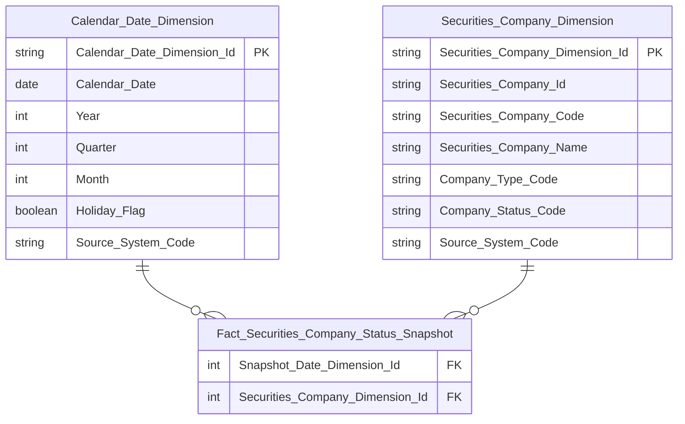
```mermaid
erDiagram
    Fact_Securities_Company_Status_Snapshot {
        int Snapshot_Date_Dimension_Id FK
        int Securities_Company_Dimension_Id FK
    }

    Securities_Company_Dimension {
        string Securities_Company_Dimension_Id PK
        string Securities_Company_Id
        string Securities_Company_Code
        string Securities_Company_Name
        string Company_Type_Code
        string Company_Status_Code
        string Source_System_Code
    }

    Calendar_Date_Dimension {
        string Calendar_Date_Dimension_Id PK
        date Calendar_Date
        int Year
        int Quarter
        int Month
        boolean Holiday_Flag
        string Source_System_Code
    }

    Calendar_Date_Dimension ||--o{ Fact_Securities_Company_Status_Snapshot : " "
    Securities_Company_Dimension ||--o{ Fact_Securities_Company_Status_Snapshot : " "
```

**Lineage Mart → Báo cáo:**

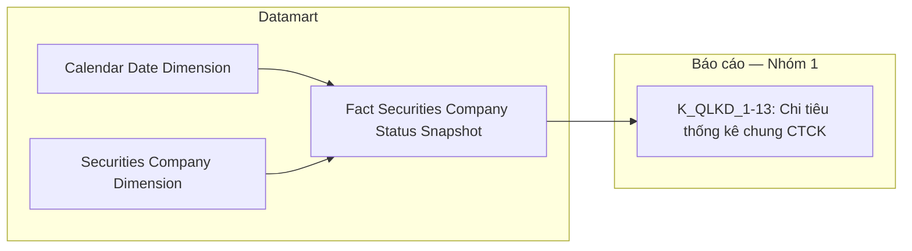
```mermaid
flowchart LR
    subgraph Datamart["Datamart"]
        G1["Fact Securities Company Status Snapshot"]
        G2["Securities Company Dimension"]
        G3["Calendar Date Dimension"]
    end

    subgraph RPT["Báo cáo — Nhóm 1"]
        R1["K_QLKD_1-13: Chi tiêu thống kê chung CTCK"]
    end

    G3 --> G1
    G2 --> G1
    G1 --> R1
```

**Bảng grain:**

| Tên bảng | Grain |
|---|---|
| Fact Securities Company Status Snapshot | 1 CTCK × 1 ngày snapshot |
| Securities Company Dimension | 1 CTCK per SCD4A (current state) |
| Calendar Date Dimension | 1 ngày |

---

#### Nhóm 2 — Biểu đồ Nghiệp vụ (STT 2) — PENDING

> **Cập nhật 13/07/2026 (BA v4.2):** BA đổi hẳn nguồn Nhóm 2 — không còn dùng `SCMS.CTCK_DICH_VU + DM_DICH_VU` (Atomic `Securities Company Licensed Service`, đã READY) mà chuyển sang `SC_FIRM_INFO.BUSINESS_LINES` (danh sách nghiệp vụ dạng multi-value, denormalize thành 1 cột Text trên CTCK) JOIN `CAT_BUSINESS_LINE` (danh mục nghiệp vụ) bằng `INSTR` kiểm tra membership trong list. Toàn bộ 6 dòng BA (STT 2) đều `Loại dữ liệu = Dữ liệu tĩnh`, `Trạng thái mapping = Done` — nhưng **Atomic hiện chưa đủ để cover pattern này**, xem lý do bên dưới.

**KPI liên quan:** K_QLKD_14–19 (2 Chiều: Chiều thời gian theo ngày, Chiều nghiệp vụ kinh doanh chứng khoán; 4 Cơ sở: theo nghiệp vụ môi giới/bảo lãnh/tư vấn/tự doanh)

**Lý do pending:** `Securities Company.Business Lines` (`business_lines`, nguồn `SC_FIRM_INFO.BUSINESS_LINES`) hiện là attribute **Text thô denormalized** — quyết định thiết kế Atomic 2026-07-10 giữ nguyên dạng string gốc, không parse thành danh sách ID để join với danh mục nghiệp vụ. BA SQL lại cần `INSTR(',' || BUSINESS_LINES || ',', ',' || ID || ',')` để check 1 CTCK có nghiệp vụ X hay không — tức cần quan hệ N:N thực sự giữa CTCK và nghiệp vụ, Atomic hiện tại không model quan hệ này ở dạng có thể join trực tiếp. Song song đó, `CAT_BUSINESS_LINE` (danh mục nghiệp vụ kinh doanh chứng khoán) mới chỉ được đăng ký làm scheme `SCMS_BUSINESS_LINE` trong `classification_schemes.yaml` với `values: []` (rỗng) — chưa có Classification Value thực sự hoặc entity riêng cho danh mục này.

**Atomic cần bổ sung:**
- Parse `Securities Company.Business Lines` (Text thô, list ID phân cách dấu phẩy) thành quan hệ N:N có thể join được — hoặc bảng con `Securities Company Business Line` (1 CTCK × 1 nghiệp vụ), hoặc FK chuẩn nếu quyết định denormalize theo hướng khác.
- Populate scheme `SCMS_BUSINESS_LINE` (`values`) từ `SCMS.CAT_BUSINESS_LINE`, hoặc nâng cấp thành Classification Value/entity thật nếu cần lưu thêm thuộc tính ngoài Code + Name.
- Việc này khác với `Securities Company Licensed Service` (SC_FIRM_SERVICE) — entity đó phản ánh hồ sơ đăng ký/thu hồi dịch vụ (Event), không phải danh sách nghiệp vụ hiện hành trên `SC_FIRM_INFO.BUSINESS_LINES`. Không dùng entity này để lấp Nhóm 2 theo BA mới.

**Mart dự kiến khi Atomic sẵn sàng:** `Fact Securities Company Business Line Registration` (bảng mới, tách khỏi `Fact Securities Company Service Registration` vì khác nguồn Atomic) — grain 1 CTCK × 1 nghiệp vụ, join `Business Line Dimension` derive từ danh mục `CAT_BUSINESS_LINE` (4 nhóm: môi giới/tự doanh/bảo lãnh/tư vấn — CASE/LIKE trên tên nghiệp vụ, xem SQL BA STT 2).

| KPI ID | Tên KPI | Tính chất | Trạng thái |
|---|---|---|---|
| K_QLKD_14 | Chiều thời gian theo ngày | Chiều | PENDING |
| K_QLKD_15 | Chiều nghiệp vụ kinh doanh chứng khoán | Chiều | PENDING |
| K_QLKD_16 | Số CTCK theo nghiệp vụ môi giới | Cơ sở | PENDING |
| K_QLKD_17 | Số CTCK theo nghiệp vụ bảo lãnh | Cơ sở | PENDING |
| K_QLKD_18 | Số CTCK theo nghiệp vụ tư vấn | Cơ sở | PENDING |
| K_QLKD_19 | Số CTCK theo nghiệp vụ tự doanh | Cơ sở | PENDING |

---

#### Nhóm 3 — Biểu đồ Dịch vụ (STT 3)

> Phân loại: **Phân tích**
> Atomic: `Securities Company Licensed Service` ← SCMS.SC_FIRM_SERVICE — **READY**
> Atomic: `Classification Service` ← SCMS.CAT_SERVICE — **READY**
> Ghi chú: Dùng `Fact Securities Company Service Registration` (Cụm 2), dùng chung Star Schema với Nhóm 4. Phân loại dịch vụ bằng CASE/LIKE trên `Classification_Service_Name` (`cl_service_nm`) — không có code sẵn phân biệt ký quỹ/ứng trước/lưu ký. Phân biệt với Nhóm 4 (dịch vụ phái sinh) bằng pattern LIKE riêng trên tên dịch vụ phái sinh (xem Nhóm 4).
>
> **ETL filter khi populate Fact (không xuất hiện trong schema Fact đã build):** `Record_Status_Code = '1'` (ACTIVE) AND `Registration_Date <= D` AND `(End_Date IS NULL OR End_Date > D)` — đây là điều kiện SCD4A current-state để chọn đúng 1 bản ghi hiệu lực per CTCK × dịch vụ tại ngày snapshot D. Sau khi ETL lọc xong, `Record_Status_Code` và `End_Date` không còn cần thiết trên Fact (đã dùng để quyết định row có được đưa vào Fact hay không) — không đưa vào Star Schema.
>
> **Fact chỉ giữ FK, không giữ attribute mô tả không phục vụ KPI:** `Registration_Document_Number`, `Valid_Dossier_Date`, `Provisional_Indicator` (thuộc `Securities Company Licensed Service`) đã bị loại khỏi Fact — không KPI nào (K_QLKD_20-29, cả Nhóm 3 và Nhóm 4) tham chiếu tới. Các cột này lọt vào thiết kế ban đầu do đưa nguyên attribute còn lại của entity nguồn vào Fact thay vì chỉ chọn đúng attribute mà KPI/mockup cần — nếu sau này có yêu cầu drill-down chi tiết hồ sơ đăng ký thì bổ sung lại khi có KPI cụ thể.
>
> **Chiều ngày (Calendar Date):** Xác định từ `Securities Company Licensed Service.Registration_Date` (nguồn `SC_FIRM_SERVICE.REGISTRATION_DATE` — tĩnh), đúng theo BA SQL (`SELECT MIN(dv.REGISTRATION_DATE) ... CONNECT BY ... <= SYSDATE`) — **không phải** `MEMBER_REPORT.DATA_DATE` (động) mà BA ghi tham khảo ở dòng "Chiều thời gian theo ngày" (Đánh giá = Trùng). `Calendar Date Dimension` là Conformed Dimension độc lập, ETL tự sinh dãy ngày dựa trên min(Registration_Date) đến hiện tại.
>
> **Vấn đề dữ liệu (BA note trực tiếp trên SQL, STT 3):** "Bảng DM dịch vụ đang không có dịch vụ ứng trước tiền bán, lưu ký" — `SCMS.CAT_SERVICE` hiện chỉ có record cho dịch vụ "giao dịch ký quỹ", **thiếu** record cho "ứng trước tiền bán" và "lưu ký". Đây là vấn đề data-completeness ở nguồn (không phải gap Atomic — entity `Classification Service` đã READY, cấu trúc đủ) — xem **O_QLKD_21**. K_QLKD_23, K_QLKD_24 sẽ COUNT ra 0 cho đến khi nguồn bổ sung danh mục.

**Mockup:**
```
BIỂU ĐỒ DỊCH VỤ — Số CTCK theo dịch vụ được đăng ký
[Bar ngang]:
  Giao dịch ký quỹ:   45 ██████████████████
  Ứng trước tiền bán: 38 ████████████████
  Lưu ký:             52 █████████████████████
```

**Source:** `Fact Securities Company Service Registration` → `Securities Company Dimension`, `Service Type Dimension`, `Calendar Date Dimension`

**Bảng KPI:**

| KPI ID | Tên KPI | Đơn vị | Tính chất | Công thức |
|---|---|---|---|---|
| K_QLKD_20 | Chiều thời gian theo ngày | — | Chiều | `Calendar Date Dimension`, xác định từ `Securities Company Licensed Service.Registration_Date` (SC_FIRM_SERVICE.REGISTRATION_DATE, tĩnh) — không phụ thuộc `MEMBER_REPORT.DATA_DATE` mà BA ghi tham khảo (Đánh giá = Trùng) |
| K_QLKD_21 | Chiều dịch vụ kinh doanh chứng khoán | — | Chiều | `Service Type Dimension` (Atomic `Classification Service`) |
| K_QLKD_22 | Số CTCK theo dịch vụ giao dịch ký quỹ | CTCK | Cơ sở | COUNT(DISTINCT Securities_Company_Dimension_Id) WHERE Service_Type_Name LIKE '%giao dịch ký quỹ%' — Fact đã lọc theo Registration_Date_Dimension_Id <= D (ETL filter Record_Status_Code/End_Date, xem ghi chú trên) |
| K_QLKD_23 | Số CTCK theo dịch vụ ứng trước tiền bán | CTCK | Cơ sở | COUNT(DISTINCT Securities_Company_Dimension_Id) WHERE Service_Type_Name LIKE '%ứng trước tiền bán%' — **hiện = 0, xem O_QLKD_21** |
| K_QLKD_24 | Số CTCK theo dịch vụ lưu ký | CTCK | Cơ sở | COUNT(DISTINCT Securities_Company_Dimension_Id) WHERE Service_Type_Name LIKE '%lưu ký%' — **hiện = 0, xem O_QLKD_21** |

**Star Schema:**

```mermaid
erDiagram
    Fact_Securities_Company_Service_Registration {
        int Registration_Date_Dimension_Id FK
        int Securities_Company_Dimension_Id FK
        int Service_Type_Dimension_Id FK
    }

    Securities_Company_Dimension {
        string Securities_Company_Dimension_Id PK
        string Securities_Company_Id
        string Securities_Company_Code
        string Securities_Company_Name
        string Company_Status_Code
        string Is_Listed_Indicator
        string Stock_Exchange_Name
        string Source_System_Code
    }

    Service_Type_Dimension {
        string Service_Type_Dimension_Id PK
        string Classification_Service_Code
        string Classification_Service_Name
        string Source_System_Code
    }

    Calendar_Date_Dimension {
        string Calendar_Date_Dimension_Id PK
        date Calendar_Date
        int Year
        int Quarter
        int Month
        boolean Holiday_Flag
        string Source_System_Code
    }

    Calendar_Date_Dimension ||--o{ Fact_Securities_Company_Service_Registration : " "
    Securities_Company_Dimension ||--o{ Fact_Securities_Company_Service_Registration : " "
    Service_Type_Dimension ||--o{ Fact_Securities_Company_Service_Registration : " "
```

**Lineage Mart → Báo cáo:**

```mermaid
flowchart LR
    subgraph MART["Datamart"]
        F1["Fact Securities Company Service Registration"]
        D1["Securities Company Dimension"]
        D2["Service Type Dimension"]
        D3["Calendar Date Dimension"]
        D1 --> F1
        D2 --> F1
        D3 --> F1
    end
    subgraph RPT["Báo cáo — Nhóm 3"]
        R1["K_QLKD_20-24: Bieu do Dich vu"]
    end
    F1 --> R1
```

**Bảng grain:**

| Tên bảng | Grain |
|---|---|
| Fact Securities Company Service Registration | 1 CTCK × 1 dịch vụ × 1 lần đăng ký (Event) |
| Securities Company Dimension | 1 CTCK per SCD4A (current state) |
| Service Type Dimension | 1 dịch vụ per SCD4A (current state) — Atomic entity `Classification Service` |
| Calendar Date Dimension | 1 ngày |

---

#### Nhóm 4 — Biểu đồ Dịch vụ phái sinh (STT 4)

> Phân loại: **Phân tích**
> Atomic: `Securities Company Licensed Service` ← SCMS.SC_FIRM_SERVICE — **READY**
> Atomic: `Classification Service` ← SCMS.CAT_SERVICE — **READY**
> Ghi chú: Dùng chung `Fact Securities Company Service Registration` với Nhóm 3 và cùng Star Schema. Phân loại dịch vụ phái sinh bằng CASE/LIKE trên `Classification_Service_Name`: `LIKE '%phái sinh%' AND LIKE '%môi giới%'` (môi giới PS) / `LIKE '%phái sinh%' AND LIKE '%tư vấn%'` (tư vấn PS) / `LIKE '%phái sinh%' AND LIKE '%tự doanh%'` (tự doanh PS) — theo đúng BA SQL STT 4.
>
> **ETL filter khi populate Fact (không xuất hiện trong schema Fact đã build):** `Record_Status_Code = '1'` AND `Registration_Date <= D` AND `(End_Date IS NULL OR End_Date > D)` — cùng cơ chế SCD4A current-state như Nhóm 3, xem ghi chú Nhóm 3.

**Mockup:**
```
BIỂU ĐỒ DỊCH VỤ PHÁI SINH — Số CTCK theo dịch vụ CKPS
[Bar ngang]:
  Môi giới CKPS:  28 ████████████
  Tư vấn CKPS:   15 ███████
  Tự doanh CKPS: 10 █████
```

**Source:** `Fact Securities Company Service Registration` → `Securities Company Dimension`, `Service Type Dimension`, `Calendar Date Dimension`

**Bảng KPI:**

| KPI ID | Tên KPI | Đơn vị | Tính chất | Công thức |
|---|---|---|---|---|
| K_QLKD_25 | Chiều thời gian theo ngày | — | Chiều | `Calendar Date Dimension`, xác định từ `Securities Company Licensed Service.Registration_Date` (giống Nhóm 3), không phụ thuộc `MEMBER_REPORT.DATA_DATE` mà BA ghi tham khảo (Đánh giá = Trùng) |
| K_QLKD_26 | Chiều dịch vụ phái sinh | — | Chiều | `Service Type Dimension` (Atomic `Classification Service`, filter `Classification_Service_Name LIKE '%phái sinh%'`) |
| K_QLKD_27 | Số CTCK phái sinh dịch vụ môi giới | CTCK | Cơ sở | COUNT(DISTINCT Securities_Company_Dimension_Id) WHERE Service_Type_Name LIKE '%phái sinh%' AND Service_Type_Name LIKE '%môi giới%' |
| K_QLKD_28 | Số CTCK phái sinh dịch vụ tư vấn | CTCK | Cơ sở | COUNT(DISTINCT Securities_Company_Dimension_Id) WHERE Service_Type_Name LIKE '%phái sinh%' AND Service_Type_Name LIKE '%tư vấn%' |
| K_QLKD_29 | Số CTCK phái sinh dịch vụ tự doanh | CTCK | Cơ sở | COUNT(DISTINCT Securities_Company_Dimension_Id) WHERE Service_Type_Name LIKE '%phái sinh%' AND Service_Type_Name LIKE '%tự doanh%' |

**Star Schema:** Dùng chung erDiagram với Nhóm 3 — xem [Nhóm 3](#nhóm-3--biểu-đồ-dịch-vụ-stt-3).

**Lineage Mart → Báo cáo:**

```mermaid
flowchart LR
    subgraph MART["Datamart"]
        F1["Fact Securities Company Service Registration"]
        D1["Securities Company Dimension"]
        D2["Service Type Dimension"]
        D3["Calendar Date Dimension"]
        D1 --> F1
        D2 --> F1
        D3 --> F1
    end
    subgraph RPT["Báo cáo — Nhóm 4"]
        R1["K_QLKD_25-29: Bieu do Dich vu phai sinh"]
    end
    F1 --> R1
```

**Bảng grain:**

| Tên bảng | Grain |
|---|---|
| Fact Securities Company Service Registration | 1 CTCK × 1 dịch vụ × 1 lần đăng ký (Event) — dùng chung với Nhóm 3 |
| Securities Company Dimension | 1 CTCK per SCD4A (current state) |
| Service Type Dimension | 1 dịch vụ per SCD4A (current state) — Atomic entity `Classification Service` |
| Calendar Date Dimension | 1 ngày |

---

#### Nhóm 5 — Duy trì điều kiện cấp phép — Giấy phép hoạt động (STT 5)

> Phân loại: **Phân tích**
> Atomic: `Securities Company Alert Violation` ← SCMS.SC_FIRM_ALERT_VIOLATION — **READY** (LLD draft, chưa có entry `dm_manifest.yaml` — coi như READY nhất quán với `Securities Company Licensed Service` ở Nhóm 3/4)
> Atomic: `Securities Company Alert Indicator` ← SCMS.ALERT_INDICATOR — **READY** (cùng ghi chú trên)
> Ghi chú: **Cập nhật 13/07/2026 (BA v4.2):** BA đổi hẳn nguồn — không còn dùng `BC_CANH_BAO + DM_CANH_BAO + BM_BAO_CAO` (Atomic gap `Member Report Alert` cũ, xem O_QLKD_2/O_QLKD_7) mà chuyển sang `SC_FIRM_ALERT_VIOLATION` JOIN `ALERT_INDICATOR`. Phân loại 3 mức duy trì lấy trực tiếp từ `Violation_Severity_Code`/`Severity_Level` (SEVERITY_LEVEL: 1=Đang duy trì tốt, 2=Gần đến giới hạn duy trì, 3=Không duy trì điều kiện cấp phép) — không cần tính ngưỡng ATTTC thủ công. Filter theo loại giấy phép: `Securities Company Alert Indicator.Indicator_Code = 'DUY_TRI_DKCP_GPKD'` (khác Nhóm 6 `_KDCKPS`, Nhóm 7 `_BTTT` — 2 nhóm này giữ nguyên PENDING, xem block PENDING bên dưới).
>
> **ETL filter khi populate Fact (không xuất hiện trong schema Fact đã build):** Lấy bản ghi cảnh báo mới nhất per CTCK per ngày snapshot D: `ROW_NUMBER() OVER (PARTITION BY Securities_Company_Id ORDER BY Processing_Date DESC) = 1 AND TRUNC(Processing_Date) = D` — SCD4A current-state.
>
> **Sửa 14/07/2026 (LLD review, thống nhất với BA):** Cột trục ngày đổi từ `Created_Date` (không tồn tại làm attribute riêng trên Atomic, chỉ có trong metadata notes) sang **`Processing Date`** (`SC_FIRM_ALERT_VIOLATION.PROCESSING_DATE`, đã có sẵn attribute trong `lld_SCMS_SC_FIRM_ALERT_VIOLATION.yaml`) — theo thống nhất với BA. Không còn gap Atomic — **O_QLKD_22 Closed**.
>
> **BA note trên SQL (Đánh giá = Trùng, cột "Chiều thời gian theo ngày"):** "Ngày dữ liệu" — cùng ý nghĩa Calendar Date snapshot dùng chung toàn module, không phải chiều riêng.
>
> **Rà soát Star Schema — mọi cột Fact đều trace được về KPI, không có cột thừa:** `Snapshot_Date_Dimension_Id` (K_QLKD_30), `Securities_Company_Dimension_Id` (COUNT DISTINCT trong K_QLKD_32–34), `Severity_Level` (K_QLKD_31 + điều kiện WHERE của K_QLKD_32–34) đều trực tiếp phục vụ KPI. `Indicator_Code` tuy hiện chỉ dùng làm điều kiện WHERE cố định (`= 'DUY_TRI_DKCP_GPKD'`, không GROUP BY) nhưng **giữ lại trong Star Schema** — khác bản chất với `Record_Status_Code`/`End_Date` ở Nhóm 3 (chỉ dùng 1 lần lúc ETL để chọn effective row rồi bỏ): `Indicator_Code` là điều kiện phân biệt **loại giấy phép** trên cùng 1 Fact — nếu Nhóm 6/7 (đang PENDING, chưa xác nhận nguồn) sau này dùng chung Fact này với `Indicator_Code` khác (`DUY_TRI_DKCP_CKPS_KD`/`DUY_TRI_DKCP_CKPS_BU_TRU`), cột này cần thiết để phân biệt dữ liệu sau khi Fact đã build, không chỉ để lọc lúc populate.

**Mockup:**
```
BIỂU ĐỒ DUY TRÌ ĐIỀU KIỆN CẤP PHÉP — GIẤY PHÉP HOẠT ĐỘNG
[Stacked bar theo ngày]:
  Đang duy trì tốt:        62 ████████████████████
  Gần đến giới hạn:         8 ███
  Không duy trì điều kiện:  3 █
```

**Source:** `Fact Securities Company License Condition Snapshot` → `Securities Company Dimension`, `Calendar Date Dimension`

**Bảng KPI:**

| KPI ID | Tên KPI | Đơn vị | Tính chất | Công thức |
|---|---|---|---|---|
| K_QLKD_30 | Chiều thời gian theo ngày | — | Chiều | `Calendar Date Dimension`, xác định từ `Securities Company Alert Violation.Processing Date` (SC_FIRM_ALERT_VIOLATION.PROCESSING_DATE) |
| K_QLKD_31 | Các loại duy trì điều kiện cấp phép | — | Chiều | `Violation_Severity_Code`/`Severity_Level` (Atomic `Securities Company Alert Violation`) — 1=Đang duy trì tốt, 2=Gần đến giới hạn duy trì, 3=Không duy trì điều kiện cấp phép |
| K_QLKD_32 | Số CTCK duy trì tốt — Giấy phép hoạt động | CTCK | Cơ sở | COUNT(DISTINCT Securities_Company_Dimension_Id) WHERE Severity_Level = 1 AND Indicator_Code = 'DUY_TRI_DKCP_GPKD' — Fact đã lọc bản ghi mới nhất per CTCK per ngày (ETL filter, xem ghi chú trên) |
| K_QLKD_33 | Số CTCK gần giới hạn duy trì — Giấy phép hoạt động | CTCK | Cơ sở | COUNT(DISTINCT Securities_Company_Dimension_Id) WHERE Severity_Level = 2 AND Indicator_Code = 'DUY_TRI_DKCP_GPKD' |
| K_QLKD_34 | Số CTCK không duy trì điều kiện — Giấy phép hoạt động | CTCK | Cơ sở | COUNT(DISTINCT Securities_Company_Dimension_Id) WHERE Severity_Level = 3 AND Indicator_Code = 'DUY_TRI_DKCP_GPKD' |

**Star Schema:**

```mermaid
erDiagram
    Fact_Securities_Company_License_Condition_Snapshot {
        int Snapshot_Date_Dimension_Id FK
        int Securities_Company_Dimension_Id FK
        string Indicator_Code
        string Severity_Level
    }

    Securities_Company_Dimension {
        string Securities_Company_Dimension_Id PK
        string Securities_Company_Id
        string Securities_Company_Code
        string Securities_Company_Name
        string Company_Status_Code
        string Is_Listed_Indicator
        string Stock_Exchange_Name
        string Source_System_Code
    }

    Calendar_Date_Dimension {
        string Calendar_Date_Dimension_Id PK
        date Calendar_Date
        int Year
        int Quarter
        int Month
        boolean Holiday_Flag
        string Source_System_Code
    }

    Calendar_Date_Dimension ||--o{ Fact_Securities_Company_License_Condition_Snapshot : " "
    Securities_Company_Dimension ||--o{ Fact_Securities_Company_License_Condition_Snapshot : " "
```

**Lineage Mart → Báo cáo:**

```mermaid
flowchart LR
    subgraph MART["Datamart"]
        F1["Fact Securities Company License Condition Snapshot"]
        D1["Securities Company Dimension"]
        D2["Calendar Date Dimension"]
        D1 --> F1
        D2 --> F1
    end
    subgraph RPT["Báo cáo — Nhóm 5"]
        R1["K_QLKD_30-34: Duy tri dieu kien cap phep GPHL"]
    end
    F1 --> R1
```

**Bảng grain:**

| Tên bảng | Grain |
|---|---|
| Fact Securities Company License Condition Snapshot | 1 CTCK × 1 loại giấy phép × 1 ngày snapshot |
| Securities Company Dimension | 1 CTCK per SCD4A (current state) |
| Calendar Date Dimension | 1 ngày |

---

#### Nhóm 6 — Duy trì điều kiện cấp phép — Phái sinh: Kinh doanh CKPS (STT 6)

> Phân loại: **Phân tích**
> Atomic: `Securities Company Alert Violation` ← SCMS.SC_FIRM_ALERT_VIOLATION — **READY** (cùng entity với Nhóm 5)
> Atomic: `Securities Company Alert Indicator` ← SCMS.ALERT_INDICATOR — **READY** (cùng entity với Nhóm 5)
> Ghi chú: **Xác nhận từ BA v4.2 (STT 6):** Dùng chung nguồn `SC_FIRM_ALERT_VIOLATION` JOIN `ALERT_INDICATOR` với Nhóm 5, dùng chung `Fact Securities Company License Condition Snapshot` và cùng Star Schema — chỉ khác điều kiện lọc: `Indicator_Code = 'DUY_TRI_DKCP_CTCK_PHAI_SINH'` (BA note "Xác nhận"). Cùng logic phân loại 3 mức qua `Severity_Level` (1=Đang duy trì tốt, 2=Gần đến giới hạn duy trì, 3=Không duy trì điều kiện cấp phép) và cùng cơ chế lấy bản ghi mới nhất per CTCK per ngày snapshot (SCD4A current-state, xem ghi chú Nhóm 5).
>
> **Không có gap Atomic** — dùng chung `Processing Date` với Nhóm 5 (xem O_QLKD_22, Closed).

**Mockup:**
```
BIỂU ĐỒ DUY TRÌ ĐIỀU KIỆN CẤP PHÉP — PHÁI SINH: KINH DOANH CKPS
[Stacked bar theo ngày]:
  Đang duy trì tốt:        18 ████████
  Gần đến giới hạn:         3 █
  Không duy trì điều kiện:  1 ▏
```

**Source:** `Fact Securities Company License Condition Snapshot` → `Securities Company Dimension`, `Calendar Date Dimension`

**Bảng KPI:**

| KPI ID | Tên KPI | Đơn vị | Tính chất | Công thức |
|---|---|---|---|---|
| K_QLKD_30 | Chiều thời gian theo ngày | — | Chiều | Reuse từ Nhóm 5 — `Calendar Date Dimension`, xác định từ `Securities Company Alert Violation.Processing Date` |
| K_QLKD_31 | Các loại duy trì điều kiện cấp phép | — | Chiều | Reuse từ Nhóm 5 — `Violation_Severity_Code`/`Severity_Level` (Atomic `Securities Company Alert Violation`) |
| K_QLKD_35 | Số CTCK duy trì tốt — Phái sinh KDCKPS | CTCK | Cơ sở | COUNT(DISTINCT Securities_Company_Dimension_Id) WHERE Severity_Level = 1 AND Indicator_Code = 'DUY_TRI_DKCP_CTCK_PHAI_SINH' — Fact đã lọc bản ghi mới nhất per CTCK per ngày (ETL filter, xem ghi chú Nhóm 5) |
| K_QLKD_36 | Số CTCK gần giới hạn duy trì — Phái sinh KDCKPS | CTCK | Cơ sở | COUNT(DISTINCT Securities_Company_Dimension_Id) WHERE Severity_Level = 2 AND Indicator_Code = 'DUY_TRI_DKCP_CTCK_PHAI_SINH' |
| K_QLKD_37 | Số CTCK không duy trì điều kiện — Phái sinh KDCKPS | CTCK | Cơ sở | COUNT(DISTINCT Securities_Company_Dimension_Id) WHERE Severity_Level = 3 AND Indicator_Code = 'DUY_TRI_DKCP_CTCK_PHAI_SINH' |

**Star Schema:** Dùng chung erDiagram với Nhóm 5 — xem [Nhóm 5](#nhóm-5--duy-trì-điều-kiện-cấp-phép--giấy-phép-hoạt-động-stt-5).

**Lineage Mart → Báo cáo:**

```mermaid
flowchart LR
    subgraph MART["Datamart"]
        F1["Fact Securities Company License Condition Snapshot"]
        D1["Securities Company Dimension"]
        D2["Calendar Date Dimension"]
        D1 --> F1
        D2 --> F1
    end
    subgraph RPT["Báo cáo — Nhóm 6"]
        R1["K_QLKD_30-31,35-37: Duy tri dieu kien cap phep Phai sinh KDCKPS"]
    end
    F1 --> R1
```

**Bảng grain:**

| Tên bảng | Grain |
|---|---|
| Fact Securities Company License Condition Snapshot | 1 CTCK × 1 loại giấy phép × 1 ngày snapshot — dùng chung với Nhóm 5 |
| Securities Company Dimension | 1 CTCK per SCD4A (current state) |
| Calendar Date Dimension | 1 ngày |

---

#### Nhóm 7 — Duy trì điều kiện cấp phép — Phái sinh: Bù trừ thanh toán (STT 7)

> Phân loại: **Phân tích**
> Atomic: `Securities Company Alert Violation` ← SCMS.SC_FIRM_ALERT_VIOLATION — **READY** (cùng entity với Nhóm 5/6)
> Atomic: `Securities Company Alert Indicator` ← SCMS.ALERT_INDICATOR — **READY** (cùng entity với Nhóm 5/6)
> Ghi chú: **Xác nhận từ BA v4.2 (STT 7):** Dùng chung nguồn `SC_FIRM_ALERT_VIOLATION` JOIN `ALERT_INDICATOR` với Nhóm 5/6, dùng chung `Fact Securities Company License Condition Snapshot` và cùng Star Schema — chỉ khác điều kiện lọc: `Indicator_Code = 'DUY_TRI_DKCP_CTCKPS_BU_TRU'` (BA note "Xác nhận"). Cùng logic phân loại 3 mức qua `Severity_Level` (1=Đang duy trì tốt, 2=Gần đến giới hạn duy trì, 3=Không duy trì điều kiện cấp phép) và cùng cơ chế lấy bản ghi mới nhất per CTCK per ngày snapshot (SCD4A current-state, xem ghi chú Nhóm 5).
>
> **Không có gap Atomic** — dùng chung `Processing Date` với Nhóm 5/6 (xem O_QLKD_22, Closed).

**Mockup:**
```
BIỂU ĐỒ DUY TRÌ ĐIỀU KIỆN CẤP PHÉP — PHÁI SINH: BÙ TRỪ THANH TOÁN
[Stacked bar theo ngày]:
  Đang duy trì tốt:        12 ██████
  Gần đến giới hạn:         2 █
  Không duy trì điều kiện:  0
```

**Source:** `Fact Securities Company License Condition Snapshot` → `Securities Company Dimension`, `Calendar Date Dimension`

**Bảng KPI:**

| KPI ID | Tên KPI | Đơn vị | Tính chất | Công thức |
|---|---|---|---|---|
| K_QLKD_30 | Chiều thời gian theo ngày | — | Chiều | Reuse từ Nhóm 5 — `Calendar Date Dimension`, xác định từ `Securities Company Alert Violation.Processing Date` |
| K_QLKD_31 | Các loại duy trì điều kiện cấp phép | — | Chiều | Reuse từ Nhóm 5 — `Violation_Severity_Code`/`Severity_Level` (Atomic `Securities Company Alert Violation`) |
| K_QLKD_38 | Số CTCK duy trì tốt — Phái sinh bù trừ thanh toán | CTCK | Cơ sở | COUNT(DISTINCT Securities_Company_Dimension_Id) WHERE Severity_Level = 1 AND Indicator_Code = 'DUY_TRI_DKCP_CTCKPS_BU_TRU' — Fact đã lọc bản ghi mới nhất per CTCK per ngày (ETL filter, xem ghi chú Nhóm 5) |
| K_QLKD_39 | Số CTCK gần giới hạn duy trì — Phái sinh bù trừ thanh toán | CTCK | Cơ sở | COUNT(DISTINCT Securities_Company_Dimension_Id) WHERE Severity_Level = 2 AND Indicator_Code = 'DUY_TRI_DKCP_CTCKPS_BU_TRU' |
| K_QLKD_40 | Số CTCK không duy trì điều kiện — Phái sinh bù trừ thanh toán | CTCK | Cơ sở | COUNT(DISTINCT Securities_Company_Dimension_Id) WHERE Severity_Level = 3 AND Indicator_Code = 'DUY_TRI_DKCP_CTCKPS_BU_TRU' |

**Star Schema:** Dùng chung erDiagram với Nhóm 5 — xem [Nhóm 5](#nhóm-5--duy-trì-điều-kiện-cấp-phép--giấy-phép-hoạt-động-stt-5).

**Lineage Mart → Báo cáo:**

```mermaid
flowchart LR
    subgraph MART["Datamart"]
        F1["Fact Securities Company License Condition Snapshot"]
        D1["Securities Company Dimension"]
        D2["Calendar Date Dimension"]
        D1 --> F1
        D2 --> F1
    end
    subgraph RPT["Báo cáo — Nhóm 7"]
        R1["K_QLKD_30-31,38-40: Duy tri dieu kien cap phep Phai sinh BTTT"]
    end
    F1 --> R1
```

**Bảng grain:**

| Tên bảng | Grain |
|---|---|
| Fact Securities Company License Condition Snapshot | 1 CTCK × 1 loại giấy phép × 1 ngày snapshot — dùng chung với Nhóm 5/6 |
| Securities Company Dimension | 1 CTCK per SCD4A (current state) |
| Calendar Date Dimension | 1 ngày |

---

#### Nhóm 8 - Cơ cấu tài sản (STT 8) — PENDING

> **Cập nhật 13/07/2026 (BA v4.2):** Toàn bộ 7 dòng BA (STT 8, gồm 1 Chiều thời gian theo quý + 6 chỉ tiêu cơ sở kể cả "Khác") đều `Loại dữ liệu = Dữ liệu động` — theo rule gating dữ liệu động/tĩnh đã thống nhất (xem `feedback_hld_loai_du_lieu_gating`), **PENDING** dù `Trạng thái mapping = Done`.
>
> **Phát hiện thêm — gap Atomic nghiêm trọng hơn ước tính ban đầu:** Thiết kế trước đây dùng Atomic entity `Member Report Indicator Value` (SCMS.BC_BAO_CAO_GT, pattern EAV theo `MA_CHI_TIEU` cố định) — entity này **không tồn tại** trong track Atomic LLD hiện hành (`DataModel/working/Atomic/lld/`) và không có entry trong `dm_manifest.yaml`. Nó chỉ tồn tại trong track cũ đã bị revert (`DataModel/working/Atomic_LinhLV/Documentation/dm_atm_mbr_rpt_ind_val-SCMS.BC_BAO_CAO_GT.yaml`, chưa migrate sang track hiện hành). Theo nguyên tắc Atomic read-only (`feedback_atomic_readonly`), đây là blocking issue thật sự, không phải READY.
>
> Ngoài ra, BA SQL thực tế của STT 8 xác nhận nguồn **khác hẳn** giả định EAV cũ: `SSC_SCMS.MEMBER_REPORT` JOIN `SSC_SCMS.FORM_REPORT` (filter `REPORT_CODE = 'BCTCRLCTCK'`) JOIN `SSC_SCMS.REPORT_CELL_VALUE` (filter `SHEET_NAME = 'BCTCR'`, `COLUMN_NAME LIKE '%số cuối năm%'`) — giá trị từng chỉ tiêu lấy bằng `LOWER(rcv.ROW_NAME) LIKE '%...%'` text matching trên tên dòng báo cáo, không phải mã chỉ tiêu (`MA_CHI_TIEU`) cố định như `BC_BAO_CAO_GT`. Đây là 2 nguồn Atomic khác nhau hoàn toàn — `REPORT_CELL_VALUE` (giá trị theo dòng/cột báo cáo dạng ma trận) chưa có entity Atomic nào tương ứng. Xem **O_QLKD_23**.

**KPI liên quan:** K_QLKD_41 (Chiều thời gian theo quý), K_QLKD_42–46 (Tiền và TĐT, TSTC qua lãi/lỗ, đầu tư đến đáo hạn, TSTC sẵn sàng bán, các khoản cho vay), K_QLKD_47 (Khác)

**Lý do pending:**
1. `Loại dữ liệu = Dữ liệu động` cho toàn bộ 7 dòng BA — gating độc lập với trạng thái Atomic.
2. Atomic entity nguồn (`Member Report Indicator Value`/EAV cũ) không tồn tại trong track hiện hành; nguồn thực tế theo BA (`MEMBER_REPORT` + `FORM_REPORT` + `REPORT_CELL_VALUE`, LIKE matching trên `ROW_NAME`) chưa có entity Atomic nào cover.

**Atomic cần bổ sung:** Thiết kế entity Atomic cho `SSC_SCMS.REPORT_CELL_VALUE` (giá trị cell-level: `MEMBER_REPORT_ID`, `SHEET_NAME`, `COLUMN_NAME`, `ROW_NAME`, `NUMERIC_VALUE`) — grain 1 giá trị cell × 1 submission báo cáo. Có thể tham khảo thiết kế cũ trong `Atomic_LinhLV` (`dm_atm_mbr_rpt_ind_val-SCMS.BC_BAO_CAO_GT.yaml`) nhưng cần đối chiếu lại với pattern `REPORT_CELL_VALUE` thực tế của BA v4.2 (khác EAV theo `MA_CHI_TIEU`), không copy nguyên trạng.

**Mart dự kiến khi Atomic sẵn sàng:** `Fact Securities Company Financial Structure Snapshot` — grain 1 CTCK × 1 chỉ tiêu BCTC (theo `ROW_NAME` phân loại) × 1 kỳ (quý), dùng chung cho Nhóm 8/9/11/12/10 (xem các block PENDING liên quan).

| KPI ID | Tên KPI | Tính chất | Trạng thái |
|---|---|---|---|
| K_QLKD_41 | Chiều thời gian theo quý | Chiều | PENDING |
| K_QLKD_42 | Tiền và tương đương tiền — toàn TT | Cơ sở | PENDING |
| K_QLKD_43 | TS TC ghi nhận qua lãi/lỗ — toàn TT | Cơ sở | PENDING |
| K_QLKD_44 | Đầu tư nắm giữ đến đáo hạn — toàn TT | Cơ sở | PENDING |
| K_QLKD_45 | TS TC sẵn sàng để bán — toàn TT | Cơ sở | PENDING |
| K_QLKD_46 | Các khoản cho vay — toàn TT | Cơ sở | PENDING |
| K_QLKD_47 | Tài sản khác — toàn TT | Cơ sở | PENDING |

---

#### Nhóm 9 - Cơ cấu nguồn vốn (STT 9) — PENDING

> **Cập nhật 13/07/2026 (BA v4.2):** Toàn bộ dòng BA (STT 9: 1 Chiều thời gian theo quý + 4 chỉ tiêu cơ sở) đều `Loại dữ liệu = Dữ liệu động` (dòng "Chiều thời gian theo quý" ghi rõ; các dòng còn lại kế thừa cùng nguồn `MEMBER_REPORT`/`REPORT_CELL_VALUE` như Nhóm 8) — PENDING theo rule gating dữ liệu động.
>
> **Gap Atomic:** Chung gap `REPORT_CELL_VALUE`/`Member Report Indicator Value` với Nhóm 8 — xem **O_QLKD_23** (không tạo issue mới, dùng chung).

**KPI liên quan:** K_QLKD_48 (Chiều thời gian theo quý), K_QLKD_49–51 (Vay nợ ngắn hạn, Nợ phải trả dài hạn, Vốn chủ sở hữu), K_QLKD_52 (Nguồn vốn khác)

**Lý do pending:** `Loại dữ liệu = Dữ liệu động` toàn bộ STT 9; đồng thời chung gap Atomic `REPORT_CELL_VALUE` với Nhóm 8 (xem O_QLKD_23).

**Mart dự kiến khi Atomic sẵn sàng:** Dùng chung `Fact Securities Company Financial Structure Snapshot` với Nhóm 8, phân biệt bằng phân loại dòng báo cáo (`Financial_Structure_Category_Code = NGUON_VON`).

| KPI ID | Tên KPI | Tính chất | Trạng thái |
|---|---|---|---|
| K_QLKD_48 | Chiều thời gian theo quý | Chiều | PENDING |
| K_QLKD_49 | Vay và nợ thuê tài chính ngắn hạn — toàn TT | Cơ sở | PENDING |
| K_QLKD_50 | Nợ phải trả dài hạn — toàn TT | Cơ sở | PENDING |
| K_QLKD_51 | Vốn chủ sở hữu — toàn TT | Cơ sở | PENDING |
| K_QLKD_52 | Nguồn vốn khác — toàn TT | Cơ sở | PENDING |

---

### Tab: GIÁM SÁT

**Slicer chung:** Khoảng thời gian TỪ/ĐẾN (từng sub-tab có grain riêng: quý / tháng / ngày tùy biểu đồ)

---

#### Sub-tab: GIÁM SÁT TUÂN THỦ

---

#### Nhóm 10 - Giám sát tuân thủ nộp báo cáo (STT 10) — PENDING

> **Cập nhật 13/07/2026 (BA v4.2):** Toàn bộ 6 dòng BA (STT 10: Chiều thời gian theo ngày, Trạng thái nộp báo cáo, 3 chỉ tiêu cơ sở, Tỷ lệ tuân thủ) đều `Loại dữ liệu = Dữ liệu động` — PENDING theo rule gating dữ liệu động, **khác lý do với Nhóm 8/9/11/12**: Atomic entity nguồn (`Member Periodic Report`, `Report Submission Obligation`, `Securities Company`) vẫn **READY**, không có gap cấu trúc — chỉ bị chặn bởi gating "dữ liệu động luôn PENDING dù Atomic READY".

**KPI liên quan:** K_QLKD_53 (Chiều thời gian theo ngày), K_QLKD_54 (Trạng thái nộp báo cáo), K_QLKD_55 (Số BC đúng hạn), K_QLKD_56 (Số BC chậm), K_QLKD_57 (Số BC chưa báo cáo), K_QLKD_58 (Tỷ lệ tuân thủ)

**Lý do pending:** `Loại dữ liệu = Dữ liệu động` toàn bộ STT 10 — theo quyết định gating, không đưa vào ETL/mapping đợt này dù Atomic đã sẵn sàng.

**Atomic cần bổ sung:** Không có gap — `Member Periodic Report`, `Report Submission Obligation`, `Securities Company` đều READY.

**Mart dự kiến khi thống nhất xong gating dữ liệu động:** `Fact Securities Company Report Compliance Snapshot` — grain 1 CTCK × 1 biểu mẫu báo cáo × 1 kỳ nghĩa vụ. Thiết kế chi tiết (mockup, Star Schema, ETL filter) giữ nguyên như bản nháp trước — chỉ cần gỡ gating khi BA xác nhận đưa "dữ liệu động" vào ETL.

| KPI ID | Tên KPI | Tính chất | Trạng thái |
|---|---|---|---|
| K_QLKD_53 | Chiều thời gian theo ngày | Chiều | PENDING |
| K_QLKD_54 | Trạng thái nộp báo cáo | Chiều | PENDING |
| K_QLKD_55 | Số báo cáo đúng hạn | Cơ sở | PENDING |
| K_QLKD_56 | Số báo cáo chậm | Cơ sở | PENDING |
| K_QLKD_57 | Số báo cáo chưa nộp | Cơ sở | PENDING |
| K_QLKD_58 | Tỷ lệ tuân thủ | Phái sinh | PENDING |

---

#### Sub-tab: GIÁM SÁT HOẠT ĐỘNG

---

#### Nhóm 11 - Cơ cấu vốn chủ sở hữu (STT 11) — PENDING

> **Cập nhật 13/07/2026 (BA v4.2):** Toàn bộ dòng BA (STT 11: 1 Chiều thời gian theo quý + 3 chỉ tiêu cơ sở) đều `Loại dữ liệu = Dữ liệu động` — PENDING theo rule gating dữ liệu động (xem `feedback_hld_loai_du_lieu_gating`).
>
> **Gap Atomic:** Chung gap `REPORT_CELL_VALUE`/`Member Report Indicator Value` với Nhóm 8/9 — xem **O_QLKD_23** (không tạo issue mới, dùng chung).

**KPI liên quan:** K_QLKD_59 (Chiều thời gian theo quý), K_QLKD_60 (Vốn đầu tư của CSH), K_QLKD_61 (LNST chưa phân phối), K_QLKD_62 (Quỹ + thặng dư vốn cổ phần), K_QLKD_63 (Vốn khác)

**Lý do pending:** `Loại dữ liệu = Dữ liệu động` toàn bộ STT 11; đồng thời chung gap Atomic `REPORT_CELL_VALUE` với Nhóm 8/9 (xem O_QLKD_23).

**Mart dự kiến khi Atomic sẵn sàng:** Dùng chung `Fact Securities Company Financial Structure Snapshot`, phân biệt bằng `Financial_Structure_Category_Code = VCSH`.

| KPI ID | Tên KPI | Tính chất | Trạng thái |
|---|---|---|---|
| K_QLKD_59 | Chiều thời gian theo quý | Chiều | PENDING |
| K_QLKD_60 | Vốn đầu tư của CSH — toàn TT | Cơ sở | PENDING |
| K_QLKD_61 | Lợi nhuận sau thuế chưa phân phối — toàn TT | Cơ sở | PENDING |
| K_QLKD_62 | Quỹ và thặng dư vốn cổ phần — toàn TT | Cơ sở | PENDING |
| K_QLKD_63 | Vốn khác — toàn TT | Cơ sở | PENDING |

---

#### Nhóm 12 - Vốn đầu tư CSH theo quý (STT 12) — PENDING

> **Cập nhật 13/07/2026 (BA v4.2):** Cả 2 dòng BA (STT 12: Chiều thời gian theo quý + "Chỉ tiêu vốn góp của CSH trên BCTC") đều `Loại dữ liệu = Dữ liệu động` — PENDING theo rule gating dữ liệu động.
>
> **Gap Atomic:** Chung gap `REPORT_CELL_VALUE`/`Member Report Indicator Value` với Nhóm 8/9/11 — xem **O_QLKD_23** (không tạo issue mới, dùng chung).

**KPI liên quan:** K_QLKD_64 (Chiều thời gian theo quý), K_QLKD_65 (Vốn góp của chủ sở hữu — toàn TT)

**Lý do pending:** `Loại dữ liệu = Dữ liệu động` toàn bộ STT 12; đồng thời chung gap Atomic `REPORT_CELL_VALUE` với Nhóm 8/9/11 (xem O_QLKD_23).

**Mart dự kiến khi Atomic sẵn sàng:** Dùng chung `Fact Securities Company Financial Structure Snapshot`, filter theo chỉ tiêu "vốn góp của CSH" (khác chỉ tiêu "vốn đầu tư của CSH" ở Nhóm 11).

| KPI ID | Tên KPI | Tính chất | Trạng thái |
|---|---|---|---|
| K_QLKD_64 | Chiều thời gian theo quý | Chiều | PENDING |
| K_QLKD_65 | Vốn góp của chủ sở hữu — toàn TT | Cơ sở | PENDING |

---

#### Nhóm 13 - Nguồn vốn tăng thêm (STT 13)

> Phân loại: **Phân tích**
> Atomic: `Securities Company Disclosure Securities Offering` ← SSC_SCMS.DISCLOSURE_SECURITIES_OFFERING — **READY** (LLD draft, chưa có entry `dm_manifest.yaml` — coi như READY nhất quán với `Securities Company Alert Violation` ở Nhóm 5/6/7 và `Securities Company Licensed Service` ở Nhóm 3/4)
> **Cập nhật 13/07/2026 (BA v4.2):** Nhóm 13 đổi nguồn từ `SCMS.CBTT_CHAO_BAN_CHUNG_KHOAN` (thiết kế cũ) sang `SSC_SCMS.DISCLOSURE_SECURITIES_OFFERING`. Grain tháng. 1 row per đợt chào bán/phát hành đã công bố (`RECORD_STATUS = 1`). Phân loại hình thức tăng vốn **không dùng 1 code field sẵn có** — ETL-derived từ CASE WHEN kết hợp `Item_Category_Code` (`ITEM_CATEGORY`: CP/TP) + `Offering_Method` (LIKE text matching: '%công chúng%', '%riêng lẻ%') → 5 nhóm: Chào bán ra công chúng, Chào bán riêng lẻ, Chào bán khác (CP còn lại), Phát hành TP riêng lẻ, Phát hành TP ra công chúng. Trục thời gian: `Result_Report_Date` (ngày báo cáo kết quả đợt chào bán) — dùng cả làm date-spine sinh chiều tháng lẫn điều kiện JOIN theo tháng khi tính SUM.
> **Gap Atomic — `Item_Category_Code` (`ITEM_CATEGORY`) đang `status: pending`, `data_domain: Text`, chưa gán Classification scheme** (comment LLD: "Cần xác nhận scheme"). Không ảnh hưởng thiết kế Datamart vì BA dùng giá trị chuỗi thô (`'CP'`/`'TP'`) trực tiếp trong CASE WHEN, không qua FK Classification Dimension — nhưng cần lưu ý nếu sau này Atomic gán scheme thì ETL formula phải đối chiếu lại. Xem **O_QLKD_19** (mở rộng thêm case ETL-derived `Capital_Raising_Form_Code`).

**Mockup:**
```
NGUỒN VỐN TĂNG THÊM TRONG KỲ — stacked bar theo tháng
         T1/23 T2/23 ... T12/24
████ Chào bán ra công chúng    (tỷ VND)
████ Chào bán riêng lẻ
████ Chào bán khác
████ Phát hành TP riêng lẻ
████ Phát hành TP ra công chúng
```

**Source:** `Fact Securities Company Capital Raising Event` → `Offering Form Dimension`, `Calendar Date Dimension`

**Bảng KPI:**

| KPI ID | Tên KPI | Đơn vị | Tính chất | Công thức |
|---|---|---|---|---|
| K_QLKD_66 | Chiều thời gian theo tháng | — | Chiều | `Calendar Date Dimension`, xác định từ `Securities Company Disclosure Securities Offering.Result_Report_Date` (SSC_SCMS.DISCLOSURE_SECURITIES_OFFERING.RESULT_REPORT_DATE) — date-spine sinh chuỗi tháng liên tục từ MIN(Result_Report_Date) đến hiện tại |
| K_QLKD_67 | Chiều: Phân loại hình thức tăng vốn | — | Chiều | ETL-derived `Capital_Raising_Form_Code` — CASE WHEN `Item_Category_Code`='CP' + `Offering_Method` LIKE '%công chúng%' → Chào bán ra công chúng; ='CP'+LIKE '%riêng lẻ%' → Chào bán riêng lẻ; ='CP' + không match 2 trên → Chào bán khác; ='TP'+LIKE '%riêng lẻ%' → Phát hành TP riêng lẻ; ='TP'+LIKE '%công chúng%' → Phát hành TP ra công chúng |
| K_QLKD_68 | Vốn tăng thêm do chào bán ra công chúng | Tỷ VND | Cơ sở | SUM(Proceeds_Collected_Amount) WHERE Item_Category_Code='CP' AND Offering_Method LIKE '%công chúng%' AND Record_Status_Code='1' GROUP BY TRUNC(Result_Report_Date,'MM') |
| K_QLKD_69 | Vốn tăng thêm do chào bán riêng lẻ | Tỷ VND | Cơ sở | SUM(Proceeds_Collected_Amount) WHERE Item_Category_Code='CP' AND Offering_Method LIKE '%riêng lẻ%' AND Record_Status_Code='1' GROUP BY TRUNC(Result_Report_Date,'MM') |
| K_QLKD_70 | Vốn tăng thêm do chào bán khác | Tỷ VND | Cơ sở | SUM(Proceeds_Collected_Amount) WHERE Item_Category_Code='CP' AND Offering_Method NOT LIKE '%công chúng%' AND NOT LIKE '%riêng lẻ%' AND Record_Status_Code='1' GROUP BY TRUNC(Result_Report_Date,'MM') |
| K_QLKD_71 | Vốn tăng thêm do phát hành TP riêng lẻ | Tỷ VND | Cơ sở | SUM(Proceeds_Collected_Amount) WHERE Item_Category_Code='TP' AND Offering_Method LIKE '%riêng lẻ%' AND Record_Status_Code='1' GROUP BY TRUNC(Result_Report_Date,'MM') |
| K_QLKD_72 | Vốn tăng thêm do phát hành TP ra công chúng | Tỷ VND | Cơ sở | SUM(Proceeds_Collected_Amount) WHERE Item_Category_Code='TP' AND Offering_Method LIKE '%công chúng%' AND Record_Status_Code='1' GROUP BY TRUNC(Result_Report_Date,'MM') |

> **Lưu ý:** `Item_Category_Code`/`Offering_Method` dùng trực tiếp giá trị chuỗi thô từ Atomic (không qua Classification Dimension) — khớp đúng SQL tham khảo BA (STT 13). `Record_Status_Code='1'` là ETL filter khi populate Fact (SCD4A current-state), không xuất hiện lại trong schema Fact — xem ghi chú Star Schema bên dưới.

**Star Schema:**

```mermaid
erDiagram
    Fact_Securities_Company_Capital_Raising_Event {
        int Event_Date_Dimension_Id FK
        int Offering_Form_Dimension_Id FK
        float Proceeds_Collected_Amount
    }

    Offering_Form_Dimension {
        string Offering_Form_Dimension_Id PK
        string Capital_Raising_Form_Code
        string Capital_Raising_Form_Name
        string Source_System_Code
    }

    Calendar_Date_Dimension {
        string Calendar_Date_Dimension_Id PK
        date Calendar_Date
        int Year
        int Quarter
        int Month
        boolean Holiday_Flag
        string Source_System_Code
    }

    Calendar_Date_Dimension ||--o{ Fact_Securities_Company_Capital_Raising_Event : " "
    Offering_Form_Dimension ||--o{ Fact_Securities_Company_Capital_Raising_Event : " "
```

> **ETL filter khi populate Fact (không xuất hiện trong schema Fact đã build):** `Record_Status_Code = '1'`. Mỗi row Fact = 1 đợt chào bán/phát hành hợp lệ, group theo tháng của `Result_Report_Date` và `Capital_Raising_Form_Code`.

**Lineage Mart → Báo cáo:**

```mermaid
flowchart LR
    subgraph MART["Datamart"]
        F1["Fact Securities Company Capital Raising Event"]
        D2["Offering Form Dimension"]
        D3["Calendar Date Dimension"]
        D2 --> F1
        D3 --> F1
    end
    subgraph RPT["Báo cáo — Nhóm 13"]
        R1["K_QLKD_66-72: Nguon von tang them trong ky"]
    end
    F1 --> R1
```

**Bảng grain:**

| Tên bảng | Grain |
|---|---|
| Fact Securities Company Capital Raising Event | 1 đợt chào bán/phát hành hợp lệ (aggregated theo tháng × hình thức tăng vốn) |
| Offering Form Dimension | 1 hình thức tăng vốn (5 giá trị ETL-derived) per SCD4A (current state) |
| Calendar Date Dimension | 1 ngày |

---

#### Nhóm 14 - Tỷ lệ an toàn tài chính — Số lượng CTCK (STT 14) — PENDING

> **Cập nhật 13/07/2026 (BA v4.2, re-verify theo O_QLKD_4/O_QLKD_23):** Toàn bộ 5 dòng BA (STT 14: Chiều thời gian theo Tháng, Phân loại tỷ lệ vốn khả dụng, 3 chỉ tiêu cơ sở) đều `Loại dữ liệu = Dữ liệu động` (2 dòng đầu ghi rõ; 3 chỉ tiêu cơ sở còn lại kế thừa cùng nguồn) — PENDING theo rule gating dữ liệu động (xem `feedback_hld_loai_du_lieu_gating`).
>
> **Gap Atomic:** Thiết kế trước đây dùng `Member Report Indicator Value` (SCMS.BC_BAO_CAO_GT, EAV theo `MA_CHI_TIEU`) — entity này **không tồn tại** trong track hiện hành (chỉ có trong track cũ đã revert). Nguồn thực tế theo BA SQL: `SSC_SCMS.REPORT_CELL_VALUE` JOIN `SSC_SCMS.MEMBER_REPORT` JOIN `SSC_SCMS.CAT_INDICATOR` (filter `INDICATOR_CODE = 'TY_LE_VON_KHA_DUNG'`), lấy `NUMERIC_VALUE` mới nhất per CTCK per tháng (`ROW_NUMBER() OVER (PARTITION BY SC_FIRM_INFO_ID, thang ORDER BY DATA_DATE DESC) = 1`, `RECORD_STATUS IN (2,3)`). Chung gap `REPORT_CELL_VALUE` với Nhóm 8/9/11/12 — xem **O_QLKD_23** (không tạo issue mới, dùng chung).

**KPI liên quan:** K_QLKD_73 (Chiều thời gian theo Tháng), K_QLKD_74 (Phân loại tỷ lệ vốn khả dụng), K_QLKD_75 (Số CTCK mức cao), K_QLKD_76 (Số CTCK mức trung bình), K_QLKD_77 (Số CTCK mức thấp)

**Lý do pending:**
1. `Loại dữ liệu = Dữ liệu động` cho toàn bộ 5 dòng BA — gating độc lập với trạng thái Atomic.
2. Atomic entity nguồn (`Member Report Indicator Value`/EAV cũ) không tồn tại trong track hiện hành; nguồn thực tế (`MEMBER_REPORT` + `REPORT_CELL_VALUE` + `CAT_INDICATOR`) chưa có entity Atomic nào cover — chung gap O_QLKD_23.

**Atomic cần bổ sung:** Entity Atomic cho `SSC_SCMS.REPORT_CELL_VALUE` (xem O_QLKD_23) — dùng `INDICATOR_ID`/`INDICATOR_CODE` (qua `CAT_INDICATOR`) thay vì `ROW_NAME` LIKE-matching như Nhóm 8/9 (STT 14 có `INDICATOR_CODE` cố định `TY_LE_VON_KHA_DUNG`, không cần text matching).

**Mart dự kiến khi Atomic sẵn sàng:** `Fact Securities Company Financial Structure Snapshot` — grain 1 CTCK × 1 tháng, dùng chung Fact với Nhóm 8/9/11/12 (phân biệt bằng `Report_Indicator_Dimension` = `TY_LE_VON_KHA_DUNG`).

**Bảng mapping nguồn (Atomic Placeholder):**

| Tên KPI | Bảng nguồn (BA) | Atomic entity dự kiến | Atomic table dự kiến |
|---|---|---|---|
| Chiều thời gian theo Tháng | SSC_SCMS.MEMBER_REPORT | Member Periodic Report | TBD |
| Phân loại tỷ lệ vốn khả dụng | SSC_SCMS.REPORT_CELL_VALUE, SSC_SCMS.CAT_INDICATOR | Member Report Indicator Value (mới, xem O_QLKD_23) | TBD |
| Số lượng CTCK TLVKD mức cao/trung bình/thấp | SSC_SCMS.REPORT_CELL_VALUE, SSC_SCMS.MEMBER_REPORT, SSC_SCMS.CAT_INDICATOR | Member Report Indicator Value (mới, xem O_QLKD_23) | TBD |

**Bảng KPI PENDING:**

| KPI ID | Tên KPI | Tính chất | Trạng thái |
|---|---|---|---|
| K_QLKD_73 | Chiều thời gian theo Tháng | Chiều | PENDING |
| K_QLKD_74 | Phân loại tỷ lệ vốn khả dụng | Chiều | PENDING |
| K_QLKD_75 | Số CTCK TLVKD mức cao (>150%) | Cơ sở | PENDING |
| K_QLKD_76 | Số CTCK TLVKD mức trung bình (120–150%) | Cơ sở | PENDING |
| K_QLKD_77 | Số CTCK TLVKD mức thấp (<120%) | Cơ sở | PENDING |

---

#### Nhóm 15 - Doanh thu & Lợi nhuận (STT 15) — PENDING

> **Cập nhật 13/07/2026 (BA v4.2, re-verify theo O_QLKD_4/O_QLKD_23):** Toàn bộ 7 dòng BA (STT 15: Chiều thời gian theo quý, Doanh thu, LNST, 4 chỉ tiêu cơ cấu DT theo nghiệp vụ) đều `Loại dữ liệu = Dữ liệu động` — PENDING theo rule gating dữ liệu động (xem `feedback_hld_loai_du_lieu_gating`).
>
> **Gap Atomic:** BA SQL xác nhận rõ ràng nguồn thực tế: `SSC_SCMS.MEMBER_REPORT` JOIN `SSC_SCMS.FORM_REPORT` (filter `REPORT_CODE = 'BCTCRLCTCK'`) JOIN `SSC_SCMS.REPORT_CELL_VALUE` (filter `SHEET_NAME = 'BCKQHDR'`, `COLUMN_NAME LIKE '%năm nay%'`), lấy giá trị bằng `LOWER(ROW_NAME) LIKE '%...%'` text matching trên tên dòng báo cáo (VD: `'%I. DOANH THU HOẠT ĐỘNG%'`, `'%XI. LỢI NHUẬN KẾ TOÁN SAU THUẾ TNDN%'`, `'%1.6. Doanh thu nghiệp vụ môi giới chứng khoán%'`) — **không phải** EAV theo `MA_CHI_TIEU` cố định như `Member Report Indicator Value` (BC_BAO_CAO_GT) mà thiết kế trước đây giả định. Chung gap `REPORT_CELL_VALUE` với Nhóm 8/9/11/12/14 — xem **O_QLKD_23** (không tạo issue mới, dùng chung).

**KPI liên quan:** K_QLKD_78 (Chiều thời gian theo quý), K_QLKD_79 (Tổng doanh thu), K_QLKD_80 (LNST), K_QLKD_81 (DT môi giới), K_QLKD_82 (DT tự doanh), K_QLKD_83 (DT tư vấn), K_QLKD_84 (DT bảo lãnh), K_QLKD_85 (DT khác)

**Lý do pending:**
1. `Loại dữ liệu = Dữ liệu động` cho toàn bộ 7 dòng BA — gating độc lập với trạng thái Atomic.
2. Atomic entity nguồn (`Member Report Indicator Value`/EAV cũ) không tồn tại trong track hiện hành; nguồn thực tế (`MEMBER_REPORT` + `FORM_REPORT` + `REPORT_CELL_VALUE`, LIKE matching trên `ROW_NAME`) chưa có entity Atomic nào cover — chung gap O_QLKD_23.

**Atomic cần bổ sung:** Entity Atomic cho `SSC_SCMS.REPORT_CELL_VALUE` (xem O_QLKD_23) — dùng `ROW_NAME` LIKE-matching (cùng pattern Nhóm 8/9, khác Nhóm 14 dùng `INDICATOR_CODE` cố định).

**Mart dự kiến khi Atomic sẵn sàng:** `Fact Securities Company Financial Structure Snapshot` — grain 1 CTCK × 1 chỉ tiêu BCTC (theo `ROW_NAME` phân loại) × 1 quý, dùng chung Fact với Nhóm 8/9/11/12/14.

**Bảng mapping nguồn (Atomic Placeholder):**

| Tên KPI | Bảng nguồn (BA) | Atomic entity dự kiến | Atomic table dự kiến |
|---|---|---|---|
| Chiều thời gian theo quý | SSC_SCMS.MEMBER_REPORT | Member Periodic Report | TBD |
| Doanh thu, LNST, cơ cấu DT theo nghiệp vụ (môi giới/tự doanh/tư vấn/bảo lãnh/khác) | SSC_SCMS.MEMBER_REPORT, SSC_SCMS.FORM_REPORT, SSC_SCMS.REPORT_CELL_VALUE | Member Report Indicator Value (mới, xem O_QLKD_23) | TBD |

**Bảng KPI PENDING:**

| KPI ID | Tên KPI | Tính chất | Trạng thái |
|---|---|---|---|
| K_QLKD_78 | Chiều thời gian theo quý | Chiều | PENDING |
| K_QLKD_79 | Tổng doanh thu — toàn TT | Cơ sở | PENDING |
| K_QLKD_80 | Lợi nhuận sau thuế — toàn TT | Cơ sở | PENDING |
| K_QLKD_81 | Cơ cấu DT nghiệp vụ môi giới | Cơ sở | PENDING |
| K_QLKD_82 | Cơ cấu DT nghiệp vụ tự doanh | Cơ sở | PENDING |
| K_QLKD_83 | Cơ cấu DT nghiệp vụ tư vấn | Cơ sở | PENDING |
| K_QLKD_84 | Cơ cấu DT nghiệp vụ bảo lãnh | Cơ sở | PENDING |
| K_QLKD_85 | Cơ cấu DT nghiệp vụ khác | Cơ sở | PENDING |

---

#### Nhóm 16 - Tương quan Margin & Diễn biến thị trường (STT 16)

> **Cập nhật 13/07/2026 (BA v4.2, re-verify theo O_QLKD_4/O_QLKD_23):** BA đổi hẳn nguồn — "Chiều thời gian theo Tháng" (`MEMBER_REPORT`, filter `REPORT_PERIOD='TH'`) và "Dư nợ margin" đều `Loại dữ liệu = Dữ liệu động`. Dư nợ margin không còn lấy từ `Member Report Indicator Value` (BC_BAO_CAO_GT, EAV `MA_CHI_TIEU`) như thiết kế cũ — BA SQL xác nhận nguồn thực tế: `MEMBER_REPORT` JOIN `FORM_REPORT` (`REPORT_CODE = 'BCTHHDKD_TH'`) JOIN `REPORT_CELL_VALUE` (LIKE `'%II. Giá trị chứng khoán ký quỹ%'` trên `ROW_NAME`) — cùng pattern Nhóm 8/9/15. Chung gap `REPORT_CELL_VALUE` với Nhóm 8/9/11/12/14/15 — xem **O_QLKD_23** (không tạo issue mới, dùng chung). 4 chỉ tiêu chỉ số thị trường (K_QLKD_88–91) nguồn khác hẳn — `MDDS.JAD_MARKETINFOR` (Atomic `Market Index Snapshot`, đã approved), Dữ liệu tĩnh, **READY**, đóng **O_QLKD_8**.

**KPI liên quan:** K_QLKD_86 (Chiều thời gian theo Tháng), K_QLKD_87 (Tổng dư nợ margin), K_QLKD_88 (Chỉ số VN-Index), K_QLKD_89 (Chỉ số HNX Index), K_QLKD_90 (Chỉ số UPCOM Index), K_QLKD_91 (Chỉ số VN30)

**Lý do pending (K_QLKD_86–87):**
1. `Loại dữ liệu = Dữ liệu động` cho cả 2 dòng BA (Chiều thời gian + Dư nợ margin) — gating độc lập với trạng thái Atomic.
2. Atomic entity nguồn (`Member Report Indicator Value`/EAV cũ) không tồn tại trong track hiện hành; nguồn thực tế (`MEMBER_REPORT` + `FORM_REPORT` + `REPORT_CELL_VALUE`, LIKE matching trên `ROW_NAME`) chưa có entity Atomic nào cover — chung gap O_QLKD_23.

**Atomic cần bổ sung (K_QLKD_86–87):** Entity Atomic cho `SSC_SCMS.REPORT_CELL_VALUE` (xem O_QLKD_23) — dùng `ROW_NAME` LIKE-matching (`REPORT_CODE = 'BCTHHDKD_TH'`, cùng loại pattern Nhóm 8/9/15).

**Nguồn xác nhận K_QLKD_88–91:** `MDDS.JAD_MARKETINFOR` (Atomic entity `Market Index Snapshot`, đã approved). Fields: `market_index_val` (giá trị chỉ số), `trading_dt` (ngày giao dịch), `index_time` (timestamp), `market_code` (mã sàn). *(Sửa 14/07/2026 — LLD review: BA ghi tham khảo `FSSTRAINING.PUBLIC_MARKETINFOR`/`"marketIndex"`/`"tradingdate"`/`"indexTime"`/`"marketCode"` — cùng nguồn dữ liệu thị trường, đối chiếu Atomic xác nhận entity/tên field thực tế như trên.)*

> **market_code values:**
> - `HOSE` → VN-Index
> - `HNX` → HNX Index
> - `UPCOM` → UPCOM Index
> - `30` → VN30
>
> **ETL note:** Lấy giá trị cuối tháng per market_code. Atomic entity `Market Index Snapshot` ← `MDDS.JAD_MARKETINFOR` (đã approved, không cần bổ sung).

**Mart dự kiến khi Atomic sẵn sàng (K_QLKD_86–87):** `Fact Securities Company Financial Structure Snapshot` — grain 1 CTCK × 1 tháng, dùng chung Fact với Nhóm 8/9/11/12/14/15.

**Bảng mapping nguồn (Atomic Placeholder, K_QLKD_86–87):**

| Tên KPI | Bảng nguồn (BA) | Atomic entity dự kiến | Atomic table dự kiến |
|---|---|---|---|
| Chiều thời gian theo Tháng | SSC_SCMS.MEMBER_REPORT | Member Periodic Report | TBD |
| Dư nợ margin | SSC_SCMS.MEMBER_REPORT, SSC_SCMS.FORM_REPORT, SSC_SCMS.REPORT_CELL_VALUE | Member Report Indicator Value (mới, xem O_QLKD_23) | TBD |

**Bảng KPI:**

| KPI ID | Tên KPI | Tính chất | Công thức | Trạng thái |
|---|---|---|---|---|
| K_QLKD_86 | Chiều thời gian theo Tháng | Chiều | — | PENDING |
| K_QLKD_87 | Tổng dư nợ margin — toàn TT | Cơ sở | — | PENDING |
| K_QLKD_88 | Chỉ số VN-Index | Cơ sở | `market_index_val` WHERE `market_code` = 'HOSE' per month (cuối tháng) | READY |
| K_QLKD_89 | Chỉ số HNX Index | Cơ sở | `market_index_val` WHERE `market_code` = 'HNX' per month | READY |
| K_QLKD_90 | Chỉ số UPCOM Index | Cơ sở | `market_index_val` WHERE `market_code` = 'UPCOM' per month | READY |
| K_QLKD_91 | Chỉ số VN30 | Cơ sở | `market_index_val` WHERE `market_code` = '30' per month | READY |

**Atomic (K_QLKD_88–91):** Không có gap — `Market Index Snapshot` ← `MDDS.JAD_MARKETINFOR` đã approved.
- Grain Atomic: 1 market_code × 1 ngày × 1 index_time

**Mart (K_QLKD_88–91):**
- `Market Index Snapshot` — grain: 1 chỉ số thị trường (market_code) × 1 tháng (cuối tháng)
- Join với `Fact Securities Company Financial Structure Snapshot` qua `Calendar Date Dimension` để tạo biểu đồ combo

---

#### Nhóm 17 - Thị phần môi giới (STT 17) — PENDING

> **Cập nhật 13/07/2026 (BA v4.2, re-verify theo O_QLKD_4/O_QLKD_23):** BA STT 17 có 5 dòng: Chiều thời gian theo quý (Dữ liệu động), Chiều sàn giao dịch (Dữ liệu tĩnh, ETL-derived từ `SC_FIRM_INFO.LISTING_EXCHANGE`), Chiều top CTCK (Dữ liệu tĩnh, danh sách cố định), 2 chỉ tiêu cơ sở "Thị phần môi giới" + "Xếp hạng thị phần môi giới" (đều Dữ liệu động). 2 chỉ tiêu cơ sở dùng nguồn `MEMBER_REPORT` JOIN `FORM_REPORT` JOIN `SC_FIRM_INFO` JOIN `REPORT_CELL_VALUE` JOIN `CAT_INDICATOR` (filter `INDICATOR_CODE = 'THI_PHAN_MOI_GIOI'`, cùng pattern `INDICATOR_CODE` cố định như Nhóm 14) — **không phải** `Member Report Indicator Value` (BC_BAO_CAO_GT EAV) như thiết kế cũ. Chung gap **O_QLKD_23**.

**KPI liên quan:** K_QLKD_92 (Chiều thời gian theo quý), K_QLKD_93 (Chiều sàn giao dịch), K_QLKD_94 (Chiều top CTCK có thị phần cao nhất), K_QLKD_95 (Thị phần môi giới), K_QLKD_96 (Xếp hạng thị phần môi giới)

**Lý do pending:**
1. `Loại dữ liệu = Dữ liệu động` cho Chiều thời gian theo quý + 2 chỉ tiêu cơ sở — gating độc lập với trạng thái Atomic.
2. Atomic entity nguồn (`Member Report Indicator Value`/EAV cũ) không tồn tại trong track hiện hành; nguồn thực tế (`MEMBER_REPORT` + `SC_FIRM_INFO` + `REPORT_CELL_VALUE` + `CAT_INDICATOR`) chưa có entity Atomic nào cover — chung gap O_QLKD_23.

**Atomic cần bổ sung:** Entity Atomic cho `SSC_SCMS.REPORT_CELL_VALUE` (xem O_QLKD_23) — dùng `INDICATOR_CODE = 'THI_PHAN_MOI_GIOI'` cố định (cùng pattern Nhóm 14, khác Nhóm 8/9/15/16 dùng `ROW_NAME` LIKE-matching).

**Mart dự kiến khi Atomic sẵn sàng:** `Fact Securities Company Financial Structure Snapshot` — grain 1 CTCK × 1 quý, dùng chung Fact với Nhóm 8/9/11/12/14/15/16. Chiều sàn giao dịch (Dữ liệu tĩnh, đã ETL-derived sẵn từ `Securities Company.Listing_Exchange`) và Chiều top CTCK (danh sách cố định) không cần chờ Atomic — chỉ là filter param tại presentation layer, sẽ gắn vào Fact khi Fact sẵn sàng.

**Bảng mapping nguồn (Atomic Placeholder):**

| Tên KPI | Bảng nguồn (BA) | Atomic entity dự kiến | Atomic table dự kiến |
|---|---|---|---|
| Chiều thời gian theo quý | SSC_SCMS.MEMBER_REPORT | Member Periodic Report | TBD |
| Thị phần môi giới, Xếp hạng thị phần môi giới | SSC_SCMS.MEMBER_REPORT, SSC_SCMS.SC_FIRM_INFO, SSC_SCMS.REPORT_CELL_VALUE, SSC_SCMS.CAT_INDICATOR | Member Report Indicator Value (mới, xem O_QLKD_23) | TBD |

**Bảng KPI PENDING:**

| KPI ID | Tên KPI | Tính chất | Trạng thái |
|---|---|---|---|
| K_QLKD_92 | Chiều thời gian theo quý | Chiều | PENDING |
| K_QLKD_93 | Chiều sàn giao dịch | Chiều | PENDING |
| K_QLKD_94 | Chiều top CTCK có thị phần cao nhất | Chiều | PENDING |
| K_QLKD_95 | Thị phần môi giới của từng CTCK | Cơ sở | PENDING |
| K_QLKD_96 | Xếp hạng thị phần môi giới | Phái sinh | PENDING |

---

#### Nhóm 18 - Lưu chuyển tiền thuần CFO (STT 18) — PENDING

> **Cập nhật 13/07/2026 (BA v4.2, re-verify theo O_QLKD_4/O_QLKD_23):** BA STT 18 có 3 dòng: Chiều mã CTCK (Dữ liệu tĩnh, `SC_FIRM_INFO.SHORT_NAME`), LNST và CFO (cả 2 Dữ liệu động). BA SQL xác nhận LNST/CFO dùng nguồn `MEMBER_REPORT` JOIN `FORM_REPORT` (`REPORT_CODE='BCTCRLCTCK'`) JOIN `REPORT_CELL_VALUE` (LIKE `'%XI. LỢI NHUẬN KẾ TOÁN SAU THUẾ TNDN%'` sheet `BCKQHDR`; LIKE `'%I. Lưu chuyển tiền từ hoạt động kinh doanh%'` sheet `BCLCTTRTT`) — cùng pattern `ROW_NAME` LIKE-matching như Nhóm 8/9/15 (khác Nhóm 14/17 dùng `INDICATOR_CODE` cố định), **không phải** `Member Report Indicator Value` (BC_BAO_CAO_GT EAV, `MA_CHI_TIEU`) như thiết kế cũ. Chung gap **O_QLKD_23**.

**KPI liên quan:** K_QLKD_97 (Chiều mã CTCK), K_QLKD_98 (LNST — per CTCK), K_QLKD_99 (CFO — per CTCK)

**Lý do pending:**
1. `Loại dữ liệu = Dữ liệu động` cho LNST + CFO — gating độc lập với trạng thái Atomic.
2. Atomic entity nguồn (`Member Report Indicator Value`/EAV cũ) không tồn tại trong track hiện hành; nguồn thực tế (`MEMBER_REPORT` + `FORM_REPORT` + `REPORT_CELL_VALUE`, LIKE matching trên `ROW_NAME`) chưa có entity Atomic nào cover — chung gap O_QLKD_23.

**Atomic cần bổ sung:** Entity Atomic cho `SSC_SCMS.REPORT_CELL_VALUE` (xem O_QLKD_23) — dùng `ROW_NAME` LIKE-matching (`REPORT_CODE='BCTCRLCTCK'`, sheet `BCKQHDR`/`BCLCTTRTT`, cùng pattern Nhóm 8/9/15).

**Mart dự kiến khi Atomic sẵn sàng:** `Fact Securities Company Financial Structure Snapshot` — grain 1 CTCK × 1 quý, dùng chung Fact với Nhóm 8/9/11/12/14/15/16/17. Chiều mã CTCK (Dữ liệu tĩnh, đã có sẵn từ `Securities Company.Securities_Company_Code`) không cần chờ Atomic — gắn vào Fact khi Fact sẵn sàng.

**Bảng mapping nguồn (Atomic Placeholder):**

| Tên KPI | Bảng nguồn (BA) | Atomic entity dự kiến | Atomic table dự kiến |
|---|---|---|---|
| LNST, CFO — per CTCK | SSC_SCMS.MEMBER_REPORT, SSC_SCMS.FORM_REPORT, SSC_SCMS.REPORT_CELL_VALUE | Member Report Indicator Value (mới, xem O_QLKD_23) | TBD |

**Bảng KPI PENDING:**

| KPI ID | Tên KPI | Tính chất | Trạng thái |
|---|---|---|---|
| K_QLKD_97 | Chiều mã CTCK | Chiều | PENDING |
| K_QLKD_98 | LNST — per CTCK | Cơ sở | PENDING |
| K_QLKD_99 | CFO (dòng tiền hoạt động KD) — per CTCK | Cơ sở | PENDING |

---

### Tab: HỒ SƠ CTCK 360

**Slicer chung:** Mã hoặc tên CTCK (search box) + filter trạng thái. Mỗi hồ sơ là 1 CTCK cụ thể — toàn bộ sub-tab là **Tác nghiệp** (lookup 1 đối tượng), ngoại trừ các biểu đồ tài chính tái sử dụng Fact hiện có.

---

#### Sub-tab: Tổng quan

---

#### Nhóm 19 - Banner tổng quan CTCK (STT 19) — PENDING

> **Cập nhật 13/07/2026 (BA v4.2, re-verify theo O_QLKD_4/O_QLKD_23):** BA STT 19 có 7 dòng: Chiều mã CTCK (Dữ liệu tĩnh, `SC_FIRM_INFO.SHORT_NAME`), Chiều thời gian theo tháng (Dữ liệu động, `MEMBER_REPORT` filter `REPORT_PERIOD='TH'`), 5 chỉ tiêu cơ sở (VCSH, Vốn điều lệ, Dư nợ margin, Tỷ lệ ATTC, Số nhân viên — tất cả Dữ liệu động). BA SQL xác nhận cả 5 chỉ tiêu đều dùng `MEMBER_REPORT` JOIN `FORM_REPORT` JOIN `REPORT_CELL_VALUE` LIKE-matching trên `ROW_NAME`/`COLUMN_NAME` (sheet `BCTCR` cho VCSH, sheet `BCTHHD` cho Vốn điều lệ/Dư nợ margin/Tỷ lệ ATTC/Số nhân viên) — **kể cả K_QLKD_75 (Vốn điều lệ)**, thiết kế cũ dùng field tĩnh `Securities_Company_Dimension.Charter_Capital_Amt` nay không còn đúng theo BA v4.2. Chung gap **O_QLKD_23**.

**KPI liên quan:** K_QLKD_100 (Chiều mã CTCK), K_QLKD_101 (Chiều thời gian theo tháng), K_QLKD_102 (VCSH), K_QLKD_103 (Dư nợ margin), K_QLKD_104 (Tỷ lệ ATTC), K_QLKD_105 (Số nhân viên), K_QLKD_106 (Vốn điều lệ)

**Lý do pending:**
1. `Loại dữ liệu = Dữ liệu động` cho Chiều thời gian theo tháng + toàn bộ 5 chỉ tiêu cơ sở — gating độc lập với trạng thái Atomic.
2. Atomic entity nguồn (`Member Report Indicator Value`/EAV cũ, và field tĩnh `Charter_Capital_Amt` cho K_QLKD_106) không còn đúng theo BA v4.2; nguồn thực tế (`MEMBER_REPORT` + `FORM_REPORT` + `REPORT_CELL_VALUE`, LIKE matching trên `ROW_NAME`/`COLUMN_NAME`) chưa có entity Atomic nào cover — chung gap O_QLKD_23.

**Atomic cần bổ sung:** Entity Atomic cho `SSC_SCMS.REPORT_CELL_VALUE` (xem O_QLKD_23) — dùng `ROW_NAME`/`COLUMN_NAME` LIKE-matching (`REPORT_CODE='BCTCRLCTCK'` sheet `BCTCR` cho VCSH; `REPORT_CODE='BCTHHDKD_TH'` sheet `BCTHHD` cho 4 chỉ tiêu còn lại).

**Mart dự kiến khi Atomic sẵn sàng:** `Fact Securities Company Financial Structure Snapshot` — grain 1 CTCK × 1 tháng, dùng chung Fact với Nhóm 8/9/11/12/14/15/16/17/18. Chiều mã CTCK (Dữ liệu tĩnh) không cần chờ Atomic — gắn vào Fact khi Fact sẵn sàng.

**Bảng mapping nguồn (Atomic Placeholder):**

| Tên KPI | Bảng nguồn (BA) | Atomic entity dự kiến | Atomic table dự kiến |
|---|---|---|---|
| Chiều thời gian theo tháng | SSC_SCMS.MEMBER_REPORT | Member Periodic Report | TBD |
| VCSH, Vốn điều lệ, Dư nợ margin, Tỷ lệ ATTC, Số nhân viên — per CTCK | SSC_SCMS.MEMBER_REPORT, SSC_SCMS.FORM_REPORT, SSC_SCMS.REPORT_CELL_VALUE, SSC_SCMS.SC_FIRM_INFO | Member Report Indicator Value (mới, xem O_QLKD_23) | TBD |

**Bảng KPI PENDING:**

| KPI ID | Tên KPI | Tính chất | Trạng thái |
|---|---|---|---|
| K_QLKD_100 | Chiều mã CTCK | Chiều | PENDING |
| K_QLKD_101 | Chiều thời gian theo tháng | Chiều | PENDING |
| K_QLKD_102 | Vốn chủ sở hữu — per CTCK | Cơ sở | PENDING |
| K_QLKD_103 | Dư nợ margin — per CTCK | Cơ sở | PENDING |
| K_QLKD_104 | Tỷ lệ ATTC — per CTCK | Cơ sở | PENDING |
| K_QLKD_105 | Số nhân viên — per CTCK | Cơ sở | PENDING |
| K_QLKD_106 | Vốn điều lệ — per CTCK | Cơ sở | PENDING |

---

#### Nhóm 20 - Biến động vốn CSH (STT 20) — PENDING

> **Cập nhật 13/07/2026 (BA v4.2, re-verify theo O_QLKD_4/O_QLKD_23):** Dòng BA (STT 20: "Chỉ tiêu vốn CSH trên BCTC" — hiển thị theo năm/quý toàn thị trường trong SQL tham khảo, nhưng mockup 360 thể hiện line chart per CTCK) là `Loại dữ liệu = Dữ liệu động`. BA SQL xác nhận nguồn: `MEMBER_REPORT` JOIN `FORM_REPORT` (`REPORT_CODE='BCTCRLCTCK'`) JOIN `REPORT_CELL_VALUE` (`SHEET_NAME='BCTCR'`, LIKE `'%I. Vốn chủ sở hữu%'` trên `ROW_NAME`) — cùng pattern Nhóm 8/9/15/18/21/22. Chung gap **O_QLKD_23**.

**KPI liên quan:** K_QLKD_107 (Biến động vốn CSH theo quý)

> **Ghi chú thiết kế:** SQL tham khảo BA cho STT 20 không JOIN `SC_FIRM_INFO` (SUM toàn thị trường theo năm/quý, không filter per CTCK) — khác Nhóm 21/22 (có JOIN `SC_FIRM_INFO` filter per CTCK). Cần xác nhận thêm với BA liệu STT 20 có thực sự cần lọc per CTCK khi lên UI 360 (mockup hiện tại đang set line chart "per CTCK") hay chỉ là dòng tham khảo chưa cập nhật đủ điều kiện lọc. BA STT 20 không có dòng Chiều riêng — chỉ 1 chỉ tiêu cơ sở.

**Lý do pending:**
1. `Loại dữ liệu = Dữ liệu động` — gating độc lập với trạng thái Atomic.
2. Chung gap Atomic `REPORT_CELL_VALUE` với Nhóm 8/9/11/12/14/15/16/17/18/21/22 — xem O_QLKD_23.
3. SQL tham khảo BA (STT 20) thiếu điều kiện filter per CTCK (`SC_FIRM_INFO`/`SHORT_NAME`) dù mockup 360 yêu cầu xem theo từng CTCK — cần xác nhận lại với BA khi Atomic sẵn sàng.

**Atomic cần bổ sung:** Entity Atomic cho `SSC_SCMS.REPORT_CELL_VALUE` (xem O_QLKD_23) — dùng `ROW_NAME` LIKE `'%I. Vốn chủ sở hữu%'` (`REPORT_CODE='BCTCRLCTCK'` sheet `BCTCR`).

**Mart dự kiến khi Atomic sẵn sàng:** Dùng chung `Fact Securities Company Financial Structure Snapshot` với Nhóm 21/22, filter theo CTCK + toàn bộ lịch sử quý từ ngày thành lập.

**Bảng mapping nguồn (Atomic Placeholder):**

| Tên KPI | Bảng nguồn (BA) | Atomic entity dự kiến | Atomic table dự kiến |
|---|---|---|---|
| Biến động vốn CSH theo quý — per CTCK | SSC_SCMS.MEMBER_REPORT, SSC_SCMS.FORM_REPORT, SSC_SCMS.REPORT_CELL_VALUE | Member Report Indicator Value (mới, xem O_QLKD_23) | TBD |

**Bảng KPI PENDING:**

| KPI ID | Tên KPI | Tính chất | Trạng thái |
|---|---|---|---|
| K_QLKD_107 | Biến động vốn CSH theo quý — per CTCK | Cơ sở | PENDING |

---

#### Nhóm 21 - Cơ cấu tổng tài sản CTCK (STT 21) — PENDING

> **Cập nhật 13/07/2026 (BA v4.2, re-verify theo O_QLKD_4/O_QLKD_23):** Toàn bộ dòng BA (STT 21: Chiều thời gian theo quý + 6 chỉ tiêu cơ cấu tài sản) đều `Loại dữ liệu = Dữ liệu động`. BA SQL xác nhận nguồn: `MEMBER_REPORT` JOIN `SC_FIRM_INFO` JOIN `FORM_REPORT` (`REPORT_CODE='BCTCRLCTCK'`) JOIN `REPORT_CELL_VALUE` (`SHEET_NAME='BCTCR'`, `COLUMN_NAME LIKE '%số cuối năm%'`), giá trị bằng `LOWER(ROW_NAME) LIKE '%...%'` — cùng pattern Nhóm 8/9/15/18 (khác Nhóm 14/17 dùng `INDICATOR_CODE`), **không phải** `Member Report Indicator Value` (BC_BAO_CAO_GT EAV) như thiết kế cũ. Khác Nhóm 8 (toàn thị trường), Nhóm 21 filter per CTCK cụ thể (`f.SHORT_NAME = :p_ctck` — param comment, join `SC_FIRM_INFO`). Chung gap **O_QLKD_23**.

**KPI liên quan:** K_QLKD_108 (Chiều thời gian theo quý), K_QLKD_109 (Tiền và tương đương tiền), K_QLKD_110 (TSTC ghi nhận qua lãi/lỗ), K_QLKD_111 (Đầu tư nắm giữ đến đáo hạn), K_QLKD_112 (TSTC sẵn sàng để bán), K_QLKD_113 (Các khoản cho vay), K_QLKD_114 (Khác)

**Lý do pending:**
1. `Loại dữ liệu = Dữ liệu động` cho toàn bộ STT 21 — gating độc lập với trạng thái Atomic.
2. Atomic entity nguồn (`Member Report Indicator Value`/EAV cũ) không tồn tại trong track hiện hành; nguồn thực tế (`MEMBER_REPORT` + `SC_FIRM_INFO` + `FORM_REPORT` + `REPORT_CELL_VALUE`, LIKE matching trên `ROW_NAME`) chưa có entity Atomic nào cover — chung gap O_QLKD_23.

**Atomic cần bổ sung:** Entity Atomic cho `SSC_SCMS.REPORT_CELL_VALUE` (xem O_QLKD_23) — dùng `ROW_NAME` LIKE-matching (`REPORT_CODE='BCTCRLCTCK'` sheet `BCTCR`, cùng pattern Nhóm 8/15/18), filter per CTCK qua `SC_FIRM_INFO`. Mỗi chỉ tiêu cơ cấu tài sản dùng 1 điều kiện `ROW_NAME LIKE` riêng (cùng bộ bảng nguồn, khác literal filter).

**Mart dự kiến khi Atomic sẵn sàng:** `Fact Securities Company Financial Structure Snapshot` — grain 1 CTCK × 1 chỉ tiêu BCTC × 1 quý, dùng chung Fact với Nhóm 8/9/11/12/14/15/16/17/18/19.

**Bảng mapping nguồn (Atomic Placeholder):**

| Tên KPI | Bảng nguồn (BA) | Atomic entity dự kiến | Atomic table dự kiến |
|---|---|---|---|
| Chiều thời gian theo quý | SSC_SCMS.MEMBER_REPORT | Member Periodic Report | TBD |
| Tiền và tương đương tiền, TSTC qua lãi/lỗ, HTM, AFS, cho vay, khác — per CTCK | SSC_SCMS.MEMBER_REPORT, SSC_SCMS.SC_FIRM_INFO, SSC_SCMS.FORM_REPORT, SSC_SCMS.REPORT_CELL_VALUE | Member Report Indicator Value (mới, xem O_QLKD_23) | TBD |

**Bảng KPI PENDING:**

| KPI ID | Tên KPI | Tính chất | Trạng thái |
|---|---|---|---|
| K_QLKD_108 | Chiều thời gian theo quý | Chiều | PENDING |
| K_QLKD_109 | Tiền và tương đương tiền — per CTCK | Cơ sở | PENDING |
| K_QLKD_110 | Tài sản tài chính ghi nhận thông qua lãi/lỗ — per CTCK | Cơ sở | PENDING |
| K_QLKD_111 | Các khoản đầu tư nắm giữ đến ngày đáo hạn — per CTCK | Cơ sở | PENDING |
| K_QLKD_112 | Tài sản tài chính sẵn sàng để bán — per CTCK | Cơ sở | PENDING |
| K_QLKD_113 | Các khoản cho vay — per CTCK | Cơ sở | PENDING |
| K_QLKD_114 | Khác — per CTCK | Cơ sở | PENDING |

---

#### Nhóm 22 - Cơ cấu nguồn vốn CTCK (STT 22) — PENDING

> **Cập nhật 13/07/2026 (BA v4.2, re-verify theo O_QLKD_4/O_QLKD_23):** Toàn bộ dòng BA (STT 22: Chiều thời gian theo quý + 4 chỉ tiêu cơ cấu nguồn vốn) đều `Loại dữ liệu = Dữ liệu động`. BA SQL xác nhận nguồn: `MEMBER_REPORT` JOIN `SC_FIRM_INFO` JOIN `FORM_REPORT` (`REPORT_CODE='BCTCRLCTCK'`) JOIN `REPORT_CELL_VALUE` (LIKE trên `ROW_NAME`: `'%Nợ phải trả ngắn hạn%'`, `'%Nợ phải trả dài hạn%'`, `'%D. Vốn chủ sở hữu%'`) — cùng pattern Nhóm 8/9/15/18/21. Chung gap **O_QLKD_23**.

**KPI liên quan:** K_QLKD_108 (Chiều thời gian theo quý, reuse từ Nhóm 21 — cùng Fact, cùng ý nghĩa quý), K_QLKD_115 (Vay và nợ thuê tài chính ngắn hạn), K_QLKD_116 (Nợ phải trả dài hạn), K_QLKD_117 (Vốn chủ sở hữu), K_QLKD_118 (Khác)

> **Ghi chú KPI_ID:** "Chiều thời gian theo quý" của Nhóm 22 cùng nguồn `MEMBER_REPORT.REPORT_PERIOD='Q'` như Nhóm 21, cùng Fact — reuse thẳng `K_QLKD_108` theo Rule 5 (`feedback_kpi_id_assignment`), không cấp ID mới/hậu tố.

**Lý do pending:**
1. `Loại dữ liệu = Dữ liệu động` cho toàn bộ STT 22 — gating độc lập với trạng thái Atomic.
2. Chung gap Atomic `REPORT_CELL_VALUE` với Nhóm 8/9/11/12/14/15/16/17/18/21 — xem O_QLKD_23.

**Atomic cần bổ sung:** Entity Atomic cho `SSC_SCMS.REPORT_CELL_VALUE` (xem O_QLKD_23) — dùng `ROW_NAME` LIKE-matching (`REPORT_CODE='BCTCRLCTCK'` sheet `BCTCR`), filter per CTCK. Mỗi chỉ tiêu cơ cấu nguồn vốn dùng 1 điều kiện `ROW_NAME LIKE` riêng (cùng bộ bảng nguồn, khác literal filter).

**Mart dự kiến khi Atomic sẵn sàng:** Dùng chung `Fact Securities Company Financial Structure Snapshot` với Nhóm 21, phân biệt bằng phân loại dòng báo cáo (nguồn vốn thay vì tài sản).

**Bảng mapping nguồn (Atomic Placeholder):**

| Tên KPI | Bảng nguồn (BA) | Atomic entity dự kiến | Atomic table dự kiến |
|---|---|---|---|
| Vay ngắn hạn, nợ dài hạn, VCSH, khác — per CTCK | SSC_SCMS.MEMBER_REPORT, SSC_SCMS.SC_FIRM_INFO, SSC_SCMS.FORM_REPORT, SSC_SCMS.REPORT_CELL_VALUE | Member Report Indicator Value (mới, xem O_QLKD_23) | TBD |

**Bảng KPI PENDING:**

| KPI ID | Tên KPI | Tính chất | Trạng thái |
|---|---|---|---|
| K_QLKD_108 | Chiều thời gian theo quý (reuse từ Nhóm 21) | Chiều | PENDING |
| K_QLKD_115 | Vay và nợ thuê tài chính ngắn hạn — per CTCK | Cơ sở | PENDING |
| K_QLKD_116 | Nợ phải trả dài hạn — per CTCK | Cơ sở | PENDING |
| K_QLKD_117 | Vốn chủ sở hữu — per CTCK | Cơ sở | PENDING |
| K_QLKD_118 | Khác — per CTCK | Cơ sở | PENDING |

---

#### Nhóm 23 - Doanh thu & Lợi nhuận per CTCK (STT 23) — PENDING

> **Cập nhật 13/07/2026 (BA v4.2, re-verify theo O_QLKD_4/O_QLKD_23):** Toàn bộ dòng BA (STT 23: Chiều thời gian theo quý, 4 cơ cấu DT theo nghiệp vụ, Doanh thu, LNST) đều `Loại dữ liệu = Dữ liệu động`. BA SQL xác nhận nguồn: `MEMBER_REPORT` JOIN `SC_FIRM_INFO` JOIN `FORM_REPORT` (`REPORT_CODE='BCTCRLCTCK'`) JOIN `REPORT_CELL_VALUE` (`SHEET_NAME='BCKQHDR'`, LIKE trên `ROW_NAME`: `'%1.6. Doanh thu nghiệp vụ môi giới%'`, `'%I. DOANH THU HOẠT ĐỘNG%'`, `'%XI. LỢI NHUẬN KẾ TOÁN SAU THUẾ TNDN%'` — cùng pattern Nhóm 15 (toàn thị trường) nhưng lọc thêm per CTCK. Chung gap **O_QLKD_23**.

**KPI liên quan:** K_QLKD_119 (Chiều thời gian theo quý), K_QLKD_120 (Cơ cấu DT môi giới), K_QLKD_121 (Cơ cấu DT tự doanh), K_QLKD_122 (Cơ cấu DT tư vấn), K_QLKD_123 (Cơ cấu DT bảo lãnh), K_QLKD_124 (Doanh thu), K_QLKD_125 (Lợi nhuận sau thuế)

**Lý do pending:**
1. `Loại dữ liệu = Dữ liệu động` cho toàn bộ STT 23 — gating độc lập với trạng thái Atomic.
2. Chung gap Atomic `REPORT_CELL_VALUE` với Nhóm 8/9/15/18/20/21/22 — xem O_QLKD_23.

**Atomic cần bổ sung:** Entity Atomic cho `SSC_SCMS.REPORT_CELL_VALUE` (xem O_QLKD_23) — dùng `ROW_NAME` LIKE-matching (`REPORT_CODE='BCTCRLCTCK'` sheet `BCKQHDR`, cùng pattern Nhóm 15), filter per CTCK qua `SC_FIRM_INFO`. Mỗi chỉ tiêu cơ cấu doanh thu theo nghiệp vụ dùng 1 điều kiện `ROW_NAME LIKE` riêng.

**Mart dự kiến khi Atomic sẵn sàng:** Dùng chung `Fact Securities Company Financial Structure Snapshot` với Nhóm 15/20/21/22, filter theo CTCK.

**Bảng mapping nguồn (Atomic Placeholder):**

| Tên KPI | Bảng nguồn (BA) | Atomic entity dự kiến | Atomic table dự kiến |
|---|---|---|---|
| Doanh thu theo nghiệp vụ, Tổng doanh thu, LNST — per CTCK | SSC_SCMS.MEMBER_REPORT, SSC_SCMS.SC_FIRM_INFO, SSC_SCMS.FORM_REPORT, SSC_SCMS.REPORT_CELL_VALUE | Member Report Indicator Value (mới, xem O_QLKD_23) | TBD |

**Bảng KPI PENDING:**

| KPI ID | Tên KPI | Tính chất | Trạng thái |
|---|---|---|---|
| K_QLKD_119 | Chiều thời gian theo quý | Chiều | PENDING |
| K_QLKD_120 | Cơ cấu doanh thu theo nghiệp vụ môi giới — per CTCK | Cơ sở | PENDING |
| K_QLKD_121 | Cơ cấu doanh thu theo nghiệp vụ tự doanh — per CTCK | Cơ sở | PENDING |
| K_QLKD_122 | Cơ cấu doanh thu theo nghiệp vụ tư vấn — per CTCK | Cơ sở | PENDING |
| K_QLKD_123 | Cơ cấu doanh thu theo nghiệp vụ bảo lãnh — per CTCK | Cơ sở | PENDING |
| K_QLKD_124 | Doanh thu — per CTCK | Cơ sở | PENDING |
| K_QLKD_125 | Lợi nhuận sau thuế — per CTCK | Cơ sở | PENDING |

---

#### Nhóm 24 - Chỉ số dư nợ margin/vốn CSH CTCK (STT 24) — PENDING

> **Cập nhật 13/07/2026 (BA v4.2, re-verify theo O_QLKD_4/O_QLKD_23):** Cả 2 dòng BA (STT 24: Chiều thời gian theo tháng, "Margin/VCSH %") đều `Loại dữ liệu = Dữ liệu động`. BA SQL xác nhận nguồn phức tạp hơn Nhóm 8/9: Dư nợ margin lấy từ `MEMBER_REPORT` (report `BCTLAT`, sheet `06H01`, LIKE `'%giá trị chứng khoán ký quỹ%'`), VCSH lấy từ BCTC **quý chứa tháng hiện tại** (LEFT JOIN `MEMBER_REPORT` report `BCTCRLCTCK`, `REPORT_PERIOD='Q'`, map tháng→quý bằng `CEIL(PERIOD/3.0)`) — tỷ lệ % tính bằng `margin / vcsh × 100`. Đây là biến thể chéo-kỳ (tháng × quý) của gap **O_QLKD_23**.

**KPI liên quan:** K_QLKD_126 (Chiều thời gian theo tháng), K_QLKD_127 (Tỷ lệ dư nợ Margin/VCSH)

> **Ghi chú công thức:** K_QLKD_127 tính trực tiếp trong 1 query kết hợp `BCTLAT` (margin, theo tháng) và `BCTCRLCTCK` (VCSH, theo quý chứa tháng đó) — khác nguồn báo cáo với K_QLKD_103 (Nhóm 19, dùng `BCTHHDKD_TH` sheet `BCTHHD`). Cần đối chiếu lại 2 nguồn margin (STT 19 dùng `BCTHHDKD_TH`, STT 24 dùng `BCTLAT`) khi Atomic sẵn sàng — có thể là 2 chỉ tiêu margin khác nhau hoặc cùng 1 giá trị nhưng khác báo cáo nguồn, cần xác nhận thêm với BA.

**Lý do pending:**
1. `Loại dữ liệu = Dữ liệu động` cho cả 2 dòng BA — gating độc lập với trạng thái Atomic.
2. Chung gap Atomic `REPORT_CELL_VALUE` — xem O_QLKD_23. Riêng KPI này cần entity cover cả 2 report code (`BCTLAT` sheet `06H01` và `BCTCRLCTCK` sheet `BCTCR`) và logic map tháng→quý.

**Atomic cần bổ sung:** Entity Atomic cho `SSC_SCMS.REPORT_CELL_VALUE` (xem O_QLKD_23) — cần cover report `BCTLAT` (sheet `06H01`, chưa xuất hiện ở Nhóm khác) ngoài `BCTCRLCTCK` đã ghi nhận.

**Mart dự kiến khi Atomic sẵn sàng:** Dùng chung `Fact Securities Company Financial Structure Snapshot`, grain tháng, JOIN thêm dữ liệu quý (VCSH) qua logic map tháng→quý tại ETL.

**Bảng mapping nguồn (Atomic Placeholder):**

| Tên KPI | Bảng nguồn (BA) | Atomic entity dự kiến | Atomic table dự kiến |
|---|---|---|---|
| Tỷ lệ dư nợ Margin/VCSH — per CTCK | SSC_SCMS.MEMBER_REPORT (BCTLAT + BCTCRLCTCK), SSC_SCMS.SC_FIRM_INFO, SSC_SCMS.FORM_REPORT, SSC_SCMS.REPORT_CELL_VALUE | Member Report Indicator Value (mới, xem O_QLKD_23) | TBD |

**Bảng KPI PENDING:**

| KPI ID | Tên KPI | Tính chất | Trạng thái |
|---|---|---|---|
| K_QLKD_126 | Chiều thời gian theo tháng | Chiều | PENDING |
| K_QLKD_127 | Tỷ lệ dư nợ Margin/VCSH — per CTCK | Phái sinh | PENDING |

---

#### Nhóm 25 - Tỷ lệ an toàn tài chính (STT 25) — PENDING

> **Cập nhật 13/07/2026 (BA v4.2, re-verify theo O_QLKD_4/O_QLKD_23):** Cả 2 dòng BA (STT 25: Chiều thời gian theo tháng, "Tỷ lệ an toàn tài chính") đều `Loại dữ liệu = Dữ liệu động`. BA SQL xác nhận nguồn: `MEMBER_REPORT` JOIN `SC_FIRM_INFO` JOIN `FORM_REPORT` (`REPORT_CODE='BCTLAT'`) JOIN `REPORT_CELL_VALUE` (`SHEET_NAME='06H01'`, LIKE `'%Tỷ lệ vốn khả dụng%'`) — cùng report `BCTLAT`/sheet `06H01` như Nhóm 24, nhưng khác Nhóm 14 (Nhóm 14 dùng `INDICATOR_CODE='TY_LE_VON_KHA_DUNG'` cố định qua `CAT_INDICATOR`, đây dùng `ROW_NAME` LIKE trực tiếp). Chung gap **O_QLKD_23** — bổ sung thêm bằng chứng report `BCTLAT` cần entity Atomic cover.

**KPI liên quan:** K_QLKD_126 (Chiều thời gian theo tháng, reuse từ Nhóm 24 — cùng Fact, cùng report BCTLAT), K_QLKD_128 (Tỷ lệ ATTC theo tháng)

**Lý do pending:**
1. `Loại dữ liệu = Dữ liệu động` cho cả 2 dòng BA — gating độc lập với trạng thái Atomic.
2. Chung gap Atomic `REPORT_CELL_VALUE` (report `BCTLAT`) với Nhóm 24 — xem O_QLKD_23.

**Atomic cần bổ sung:** Entity Atomic cho `SSC_SCMS.REPORT_CELL_VALUE` (xem O_QLKD_23) — cover report `BCTLAT` sheet `06H01`, dùng `ROW_NAME` LIKE `'%Tỷ lệ vốn khả dụng%'` (khác `INDICATOR_CODE` cố định của Nhóm 14 dù cùng ý nghĩa nghiệp vụ — cần đối chiếu lại 2 cách trích xuất khi Atomic sẵn sàng).

**Mart dự kiến khi Atomic sẵn sàng:** Dùng chung `Fact Securities Company Financial Structure Snapshot` với Nhóm 24, grain tháng, filter per CTCK.

**Bảng mapping nguồn (Atomic Placeholder):**

| Tên KPI | Bảng nguồn (BA) | Atomic entity dự kiến | Atomic table dự kiến |
|---|---|---|---|
| Tỷ lệ ATTC theo tháng — per CTCK | SSC_SCMS.MEMBER_REPORT, SSC_SCMS.SC_FIRM_INFO, SSC_SCMS.FORM_REPORT, SSC_SCMS.REPORT_CELL_VALUE | Member Report Indicator Value (mới, xem O_QLKD_23) | TBD |

**Bảng KPI PENDING:**

| KPI ID | Tên KPI | Tính chất | Trạng thái |
|---|---|---|---|
| K_QLKD_126 | Chiều thời gian theo tháng (reuse từ Nhóm 24) | Chiều | PENDING |
| K_QLKD_128 | Tỷ lệ ATTC theo tháng — per CTCK | Cơ sở | PENDING |

---

#### Sub-tab: Tài chính

---

#### Nhóm 26 - Các chỉ tiêu chung (STT 26) — PENDING

> **Cập nhật 13/07/2026 (BA v4.2, re-verify theo O_QLKD_4/O_QLKD_23):** Toàn bộ dòng BA (STT 26: Chiều thời gian theo quý, Doanh thu YTD, LNST YTD, ROA, ROE) đều `Loại dữ liệu = Dữ liệu động`. BA SQL xác nhận nguồn: `MEMBER_REPORT` JOIN `SC_FIRM_INFO` JOIN `FORM_REPORT` (`REPORT_CODE='BCTCRLCTCK'`) JOIN `REPORT_CELL_VALUE` (sheet `BCKQHDR` cho DT/LNST YTD, LIKE `'%I. DOANH THU HOẠT ĐỘNG%'`/`'%XI. LỢI NHUẬN KẾ TOÁN SAU THUẾ TNDN%'`; ROA/ROE tính bằng CTE kết hợp LNST (sheet `BCKQHDR`) / Tổng tài sản hoặc VCSH cuối kỳ (sheet `BCTCR`, `COLUMN_NAME LIKE '%số cuối năm%'`)) — cùng pattern Nhóm 8/9/15/18/21/23. Chung gap **O_QLKD_23**.

**KPI liên quan:** K_QLKD_129 (Chiều thời gian theo quý), K_QLKD_130 (DT YTD), K_QLKD_131 (LNST YTD), K_QLKD_132 (ROA), K_QLKD_133 (ROE)

**Lý do pending:**
1. `Loại dữ liệu = Dữ liệu động` cho toàn bộ STT 26 — gating độc lập với trạng thái Atomic.
2. Atomic entity nguồn (`Member Report Indicator Value`/EAV cũ) không tồn tại trong track hiện hành; nguồn thực tế (`MEMBER_REPORT` + `SC_FIRM_INFO` + `FORM_REPORT` + `REPORT_CELL_VALUE`, LIKE matching trên `ROW_NAME`) chưa có entity Atomic nào cover — chung gap O_QLKD_23.

**Atomic cần bổ sung:** Entity Atomic cho `SSC_SCMS.REPORT_CELL_VALUE` (xem O_QLKD_23) — dùng `ROW_NAME` LIKE-matching (`REPORT_CODE='BCTCRLCTCK'` sheet `BCKQHDR`/`BCTCR`).

**Mart dự kiến khi Atomic sẵn sàng:** `Securities Company Financial Report History` (Tác nghiệp) — grain 1 CTCK × 1 kỳ báo cáo BCTC, dùng chung với Nhóm 27.

**Bảng mapping nguồn (Atomic Placeholder):**

| Tên KPI | Bảng nguồn (BA) | Atomic entity dự kiến | Atomic table dự kiến |
|---|---|---|---|
| Chiều thời gian theo quý | SSC_SCMS.MEMBER_REPORT | Member Periodic Report | TBD |
| DT YTD, LNST YTD, ROA, ROE — per CTCK | SSC_SCMS.MEMBER_REPORT, SSC_SCMS.SC_FIRM_INFO, SSC_SCMS.FORM_REPORT, SSC_SCMS.REPORT_CELL_VALUE | Member Report Indicator Value (mới, xem O_QLKD_23) | TBD |

**Bảng KPI PENDING:**

| KPI ID | Tên KPI | Tính chất | Trạng thái |
|---|---|---|---|
| K_QLKD_129 | Chiều thời gian theo quý | Chiều | PENDING |
| K_QLKD_130 | Doanh thu YTD — per CTCK | Cơ sở | PENDING |
| K_QLKD_131 | Lợi nhuận sau thuế YTD — per CTCK | Cơ sở | PENDING |
| K_QLKD_132 | ROA — per CTCK | Phái sinh | PENDING |
| K_QLKD_133 | ROE — per CTCK | Phái sinh | PENDING |

---

#### Nhóm 27 - Lịch sử báo cáo tài chính (STT 27) — PENDING

> **Cập nhật 13/07/2026 (BA v4.2, re-verify theo O_QLKD_4/O_QLKD_23):** Toàn bộ dòng BA (STT 27: Chiều thời gian theo quý, Kỳ báo cáo, DT, LN, ROA, ROE, Ngày nộp, Trạng thái) đều `Loại dữ liệu = Dữ liệu động`. BA SQL xác nhận nguồn: `MEMBER_REPORT` JOIN `FORM_REPORT` (`REPORT_CODE='BCTCRLCTCK'`) JOIN `REPORT_CELL_VALUE` (sheet `BCTCR`, LIKE trên `ROW_NAME`: `'%tổng cộng tài sản%'`, `'%I. Vốn chủ sở hữu%'`, cả 2 với `COLUMN_NAME LIKE '%số cuối năm%'`) JOIN `SC_FIRM_INFO` — cùng pattern Nhóm 26, mở rộng thêm Kỳ báo cáo/Ngày nộp/Trạng thái (dùng `Member Periodic Report`, đã READY nhưng không đủ tự thiết kế do thiếu giá trị chỉ tiêu). Chung gap **O_QLKD_23**.

**KPI liên quan:** K_QLKD_129 (Chiều thời gian theo quý, reuse từ Nhóm 26), K_QLKD_134 (Kỳ báo cáo), K_QLKD_135 (Doanh thu), K_QLKD_136 (Lợi nhuận), K_QLKD_137 (ROA), K_QLKD_138 (ROE), K_QLKD_139 (Ngày nộp), K_QLKD_140 (Trạng thái)

**Lý do pending:**
1. `Loại dữ liệu = Dữ liệu động` cho toàn bộ STT 27 — gating độc lập với trạng thái Atomic.
2. Chung gap Atomic `REPORT_CELL_VALUE` với Nhóm 26 — xem O_QLKD_23. `Member Periodic Report` (Kỳ báo cáo/Ngày nộp/Trạng thái) vẫn READY nhưng không đủ để tự thiết kế bảng khi thiếu nguồn giá trị chỉ tiêu (DT/LN/ROA/ROE).

**Atomic cần bổ sung:** Entity Atomic cho `SSC_SCMS.REPORT_CELL_VALUE` (xem O_QLKD_23, dùng chung với Nhóm 26).

**Mart dự kiến khi Atomic sẵn sàng:** `Securities Company Financial Report History` (Tác nghiệp) — grain 1 CTCK × 1 kỳ báo cáo BCTC, dùng chung với Nhóm 26. Thiết kế chi tiết (mockup bảng lịch sử) giữ nguyên như bản nháp trước — chỉ cần gỡ gating khi Atomic sẵn sàng.

**Bảng mapping nguồn (Atomic Placeholder):**

| Tên KPI | Bảng nguồn (BA) | Atomic entity dự kiến | Atomic table dự kiến |
|---|---|---|---|
| DT, LN, ROA, ROE theo từng kỳ — per CTCK | SSC_SCMS.MEMBER_REPORT, SSC_SCMS.SC_FIRM_INFO, SSC_SCMS.FORM_REPORT, SSC_SCMS.REPORT_CELL_VALUE | Member Report Indicator Value (mới, xem O_QLKD_23) | TBD |
| Kỳ báo cáo, Ngày nộp, Trạng thái | SSC_SCMS.BC_THANH_VIEN | Member Periodic Report | (đã có — READY) |

**Bảng KPI PENDING:**

| KPI ID | Tên KPI | Tính chất | Trạng thái |
|---|---|---|---|
| K_QLKD_129 | Chiều thời gian theo quý (reuse từ Nhóm 26) | Chiều | PENDING |
| K_QLKD_134 | Kỳ báo cáo — per CTCK | Cơ sở | PENDING |
| K_QLKD_135 | Doanh thu (tỷ VNĐ) — theo từng kỳ | Cơ sở | PENDING |
| K_QLKD_136 | Lợi nhuận (tỷ VNĐ) — theo từng kỳ | Cơ sở | PENDING |
| K_QLKD_137 | ROA (%) — theo từng kỳ | Phái sinh | PENDING |
| K_QLKD_138 | ROE (%) — theo từng kỳ | Phái sinh | PENDING |
| K_QLKD_139 | Ngày nộp — theo từng kỳ | Cơ sở | PENDING |
| K_QLKD_140 | Trạng thái — theo từng kỳ | Cơ sở | PENDING |

---

#### Sub-tab: NHNCK

---

#### Nhóm 28 - Các chỉ tiêu chung (STT 28) — PENDING

> **Cập nhật 13/07/2026 (BA v4.2, re-verify theo O_QLKD_4/O_QLKD_10/O_QLKD_11/O_QLKD_23):** Toàn bộ dòng BA (STT 28: Chiều thời gian theo Ngày, Tổng số LĐ, Tổng LĐ có CCHN, Tổng LĐ chưa có CCHN) đều `Loại dữ liệu = Dữ liệu động`. BA SQL xác nhận nguồn **hoàn toàn khác** thiết kế trước — không dùng `Securities Practitioner`/`License Certificate Document` (NHNCK) mà dùng `MEMBER_REPORT` JOIN `SC_FIRM_INFO` JOIN `FORM_REPORT` (`REPORT_CODE='BCTHHDKD_TH'`) JOIN `REPORT_CELL_VALUE` (`SHEET_NAME='TTC'`, `COLUMN_NAME LIKE '%Tổng số người lao động tại công ty%'`/`'%Tổng số người có chứng chỉ hành nghề%'`) — cùng pattern `REPORT_CELL_VALUE` như Nhóm 8/9/15/18/21-27, nhưng khác `COLUMN_NAME` LIKE-matching thay vì `ROW_NAME`. Chung gap **O_QLKD_23**. K_QLKD_92/93 (trước đây READY qua `Securities Practitioner`) nay đổi nguồn sang cùng report này — **không còn READY**.

**KPI liên quan:** K_QLKD_141 (Chiều thời gian theo Ngày), K_QLKD_142 (Tổng số lao động), K_QLKD_143 (Có CCHN), K_QLKD_144 (Chưa có CCHN)

> **Ghi chú nguồn:** K_QLKD_143/144 đổi hẳn từ `Securities Practitioner`/`License Certificate Document` (NHNCK, đã READY) sang `REPORT_CELL_VALUE` (SCMS, cùng gap O_QLKD_23) — giống pattern phát hiện ở Nhóm 19 (Vốn điều lệ).

**Lý do pending:**
1. `Loại dữ liệu = Dữ liệu động` cho toàn bộ STT 28 — gating độc lập với trạng thái Atomic.
2. Atomic entity nguồn (`REPORT_CELL_VALUE`) không tồn tại trong track hiện hành — chung gap O_QLKD_23. K_QLKD_143/144 mất trạng thái READY do BA đổi nguồn sang cùng gap này (không còn dùng `Securities Practitioner`).

**Atomic cần bổ sung:** Entity Atomic cho `SSC_SCMS.REPORT_CELL_VALUE` (xem O_QLKD_23) — dùng `COLUMN_NAME` LIKE-matching (`REPORT_CODE='BCTHHDKD_TH'` sheet `TTC`, khác pattern `ROW_NAME` của các Nhóm khác).

**Mart dự kiến khi Atomic sẵn sàng:** `Securities Company Practitioner Profile` (Tác nghiệp) — grain 1 CTCK × 1 kỳ báo cáo tháng, dùng chung report với Nhóm 29/30.

**Bảng mapping nguồn (Atomic Placeholder):**

| Tên KPI | Bảng nguồn (BA) | Atomic entity dự kiến | Atomic table dự kiến |
|---|---|---|---|
| Chiều thời gian theo Ngày | SSC_SCMS.MEMBER_REPORT | Member Periodic Report | TBD |
| Tổng số lao động, Có CCHN, Chưa CCHN — per CTCK | SSC_SCMS.MEMBER_REPORT, SSC_SCMS.SC_FIRM_INFO, SSC_SCMS.FORM_REPORT, SSC_SCMS.REPORT_CELL_VALUE | Member Report Indicator Value (mới, xem O_QLKD_23) | TBD |

**Bảng KPI PENDING:**

| KPI ID | Tên KPI | Tính chất | Trạng thái |
|---|---|---|---|
| K_QLKD_141 | Chiều thời gian theo Ngày | Chiều | PENDING |
| K_QLKD_142 | Tổng số lao động — per CTCK | Cơ sở | PENDING |
| K_QLKD_143 | Số lao động có CCHN — per CTCK | Cơ sở | PENDING |
| K_QLKD_144 | Số lao động chưa có CCHN — per CTCK | Cơ sở | PENDING |

---

#### Nhóm 29 - Số lượng NHN theo nghiệp vụ (STT 29) — PENDING

> **Cập nhật 13/07/2026 (BA v4.2, re-verify theo O_QLKD_10/O_QLKD_23):** BA STT 29 có 6 dòng: Chiều thời gian theo Ngày (động), Chiều nghiệp vụ kinh doanh chứng khoán (tĩnh — `CAT_BUSINESS_LINE`, CASE/LIKE trên `BUSINESS_LINE_NAME`), 4 chỉ tiêu cơ sở (NHN theo môi giới/bảo lãnh/tư vấn/tự doanh — động). BA SQL xác nhận nguồn **khác hẳn** phân tích trước (`Organization Employment Report`/`CERTIFICATE_TYPE` — O_QLKD_10 cũ): dùng `MEMBER_REPORT` JOIN `SC_FIRM_INFO` JOIN `FORM_REPORT` (`REPORT_CODE='BCTHHDKD_TH'`) JOIN `REPORT_CELL_VALUE` (`SHEET_NAME='TTC'`, LIKE trên `ROW_NAME`: `'%Môi giới chứng khoán%'`, `'%Tự doanh%'`, `'%Tư vấn đầu tư%'`, `'%Bảo lãnh phát hành%'`) — cùng report/sheet với Nhóm 28, cùng gap **O_QLKD_23**. Vấn đề "thiếu field phân loại" ở O_QLKD_10 không còn áp dụng — nguồn nay dùng `ROW_NAME` LIKE-matching, không phải `CERTIFICATE_TYPE`.

**KPI liên quan:** K_QLKD_141 (Chiều thời gian theo Ngày, reuse từ Nhóm 28), K_QLKD_145 (Chiều nghiệp vụ kinh doanh chứng khoán), K_QLKD_146 (NHN theo nghiệp vụ môi giới), K_QLKD_147 (NHN theo nghiệp vụ bảo lãnh phát hành), K_QLKD_148 (NHN theo nghiệp vụ tư vấn), K_QLKD_149 (NHN theo nghiệp vụ tự doanh)

**Lý do pending:**
1. `Loại dữ liệu = Dữ liệu động` cho Chiều thời gian + 4 chỉ tiêu cơ sở — gating độc lập với trạng thái Atomic.
2. Atomic entity nguồn (`REPORT_CELL_VALUE`) không tồn tại trong track hiện hành — chung gap O_QLKD_23 (thay thế lý do cũ ở O_QLKD_10 — không còn là vấn đề thiếu field phân loại, mà là gap Atomic entity).

**Atomic cần bổ sung:** Entity Atomic cho `SSC_SCMS.REPORT_CELL_VALUE` (xem O_QLKD_23) — dùng `ROW_NAME` LIKE-matching (`REPORT_CODE='BCTHHDKD_TH'` sheet `TTC`, cùng report với Nhóm 28 nhưng khác cột trích xuất — `ROW_NAME` thay vì `COLUMN_NAME`). Mỗi nghiệp vụ dùng 1 điều kiện `ROW_NAME LIKE` riêng.

**Mart dự kiến khi Atomic sẵn sàng:** Dùng chung `Securities Company Practitioner Profile` (Tác nghiệp) với Nhóm 28/30. Chiều nghiệp vụ (Dữ liệu tĩnh, đã ETL-derived sẵn từ `CAT_BUSINESS_LINE`) không cần chờ Atomic — gắn vào bảng khi bảng sẵn sàng.

**Bảng mapping nguồn (Atomic Placeholder):**

| Tên KPI | Bảng nguồn (BA) | Atomic entity dự kiến | Atomic table dự kiến |
|---|---|---|---|
| Chiều nghiệp vụ kinh doanh chứng khoán | SSC_SCMS.CAT_BUSINESS_LINE | Classification Value (business line) | TBD |
| NHN theo nghiệp vụ môi giới/bảo lãnh/tư vấn/tự doanh — per CTCK | SSC_SCMS.MEMBER_REPORT, SSC_SCMS.SC_FIRM_INFO, SSC_SCMS.FORM_REPORT, SSC_SCMS.REPORT_CELL_VALUE | Member Report Indicator Value (mới, xem O_QLKD_23) | TBD |

**Bảng KPI PENDING:**

| KPI ID | Tên KPI | Tính chất | Trạng thái |
|---|---|---|---|
| K_QLKD_141 | Chiều thời gian theo Ngày (reuse từ Nhóm 28) | Chiều | PENDING |
| K_QLKD_145 | Chiều nghiệp vụ kinh doanh chứng khoán | Chiều | PENDING |
| K_QLKD_146 | Số lượng NHN theo nghiệp vụ môi giới — per CTCK | Cơ sở | PENDING |
| K_QLKD_147 | Số lượng NHN theo nghiệp vụ bảo lãnh phát hành — per CTCK | Cơ sở | PENDING |
| K_QLKD_148 | Số lượng NHN theo nghiệp vụ tư vấn — per CTCK | Cơ sở | PENDING |
| K_QLKD_149 | Số lượng NHN theo nghiệp vụ tự doanh — per CTCK | Cơ sở | PENDING |

---

#### Nhóm 30 - Số lượng NHN theo dịch vụ CKPS (STT 30) — PENDING

> **Cập nhật 13/07/2026 (BA v4.2, re-verify theo O_QLKD_10/O_QLKD_23):** BA STT 30 có 5 dòng: Chiều thời gian theo Ngày (động, reuse từ Nhóm 28/29), Chiều Dịch vụ phái sinh (tĩnh — `SC_FIRM_SERVICE`/`CAT_SERVICE`, filter `SERVICE_NAME LIKE '%phái sinh%'`), 3 chỉ tiêu cơ sở (NHN theo môi giới/tư vấn/tự doanh phái sinh — động). BA SQL xác nhận nguồn: `MEMBER_REPORT` JOIN `SC_FIRM_INFO` JOIN `FORM_REPORT` (`REPORT_CODE='BCTHHDKD_TH'`) JOIN `REPORT_CELL_VALUE` (`SHEET_NAME='TTC'`, LIKE trên `ROW_NAME`: `'%Chứng khoán phái sinh theo dịch vụ môi giới%'` v.v.) — cùng report/sheet với Nhóm 28/29, cùng gap **O_QLKD_23**. Thay thế lý do O_QLKD_10 cũ (thiếu field phân loại) — nguồn nay xác định rõ qua `ROW_NAME` LIKE.

**KPI liên quan:** K_QLKD_141 (Chiều thời gian theo Ngày, reuse từ Nhóm 28/29), K_QLKD_150 (Chiều Dịch vụ phái sinh), K_QLKD_151 (NHN dịch vụ môi giới phái sinh), K_QLKD_152 (NHN dịch vụ tư vấn phái sinh), K_QLKD_153 (NHN dịch vụ tự doanh phái sinh)

**Lý do pending:**
1. `Loại dữ liệu = Dữ liệu động` cho Chiều thời gian + 3 chỉ tiêu cơ sở — gating độc lập với trạng thái Atomic.
2. Atomic entity nguồn (`REPORT_CELL_VALUE`) không tồn tại trong track hiện hành — chung gap O_QLKD_23 (thay thế lý do cũ O_QLKD_10).

**Atomic cần bổ sung:** Entity Atomic cho `SSC_SCMS.REPORT_CELL_VALUE` (xem O_QLKD_23) — dùng `ROW_NAME` LIKE-matching (`REPORT_CODE='BCTHHDKD_TH'` sheet `TTC`, cùng report với Nhóm 28/29). Mỗi dịch vụ phái sinh dùng 1 điều kiện `ROW_NAME LIKE` riêng.

**Mart dự kiến khi Atomic sẵn sàng:** Dùng chung `Securities Company Practitioner Profile` (Tác nghiệp) với Nhóm 28/29. Chiều Dịch vụ phái sinh (Dữ liệu tĩnh, đã READY từ `Classification Service`) không cần chờ Atomic — gắn vào bảng khi bảng sẵn sàng.

**Bảng mapping nguồn (Atomic Placeholder):**

| Tên KPI | Bảng nguồn (BA) | Atomic entity dự kiến | Atomic table dự kiến |
|---|---|---|---|
| Chiều Dịch vụ phái sinh | SSC_SCMS.SC_FIRM_SERVICE, SSC_SCMS.CAT_SERVICE | Classification Service (đã có — READY) | — |
| NHN theo dịch vụ CK phái sinh — per CTCK | SSC_SCMS.MEMBER_REPORT, SSC_SCMS.SC_FIRM_INFO, SSC_SCMS.FORM_REPORT, SSC_SCMS.REPORT_CELL_VALUE | Member Report Indicator Value (mới, xem O_QLKD_23) | TBD |

**Bảng KPI PENDING:**

| KPI ID | Tên KPI | Tính chất | Trạng thái |
|---|---|---|---|
| K_QLKD_141 | Chiều thời gian theo Ngày (reuse từ Nhóm 28) | Chiều | PENDING |
| K_QLKD_150 | Chiều Dịch vụ phái sinh | Chiều | PENDING |
| K_QLKD_151 | Số lượng NHN liên quan CK phái sinh theo dịch vụ môi giới — per CTCK | Cơ sở | PENDING |
| K_QLKD_152 | Số lượng NHN liên quan CK phái sinh theo dịch vụ tư vấn — per CTCK | Cơ sở | PENDING |
| K_QLKD_153 | Số lượng NHN liên quan CK phái sinh theo dịch vụ tự doanh — per CTCK | Cơ sở | PENDING |

---

#### Sub-tab: Nhân sự

---

#### Nhóm 31 - Dashboard nhân sự CTCK (STT 31)

> Phân loại: **Tác nghiệp**
> Atomic: `Securities Company Senior Personnel` ← SCMS.SC_FIRM_SENIOR_PERSONNEL — **READY**
> Atomic: `Securities Company Shareholder` ← SCMS.CTCK_CO_DONG — **READY**
> **Cập nhật 13/07/2026 (BA v4.2, re-verify):** BA đổi nguồn bảng nhân sự từ `CTCK_NHAN_SU_CAO_CAP` sang `SC_FIRM_SENIOR_PERSONNEL` — Atomic entity `Securities Company Senior Personnel` đã có LLD map đúng bảng mới, **vẫn READY**. BA SQL (STT 31) xác nhận 3 điểm quan trọng khác thiết kế cũ:
> 1. **Email/SĐT lấy trực tiếp** từ `p.EMAIL`/`p.PHONE` trên `SC_FIRM_SENIOR_PERSONNEL` — LLD hiện tại (`lld_SCMS_SC_FIRM_SENIOR_PERSONNEL.yaml`, note metadata) thiết kế các field này đi qua bảng phụ `Involved Party Electronic Address` (tách khỏi entity chính), không phải mâu thuẫn — chỉ là 2 cách join khác nhau tới cùng 1 nguồn `EMAIL`/`PHONE`, không ảnh hưởng tính READY.
> 2. **Phân loại nhóm nhân sự** (HĐQT/HĐTV/BKS-UB Kiểm toán/BĐH) dùng CASE/LIKE trên `DEPARTMENT` (attribute `Department`, đã có trong entity) — không phải `Position Type Code` cố định như ghi trong thiết kế cũ.
> 3. **`Work Start Date`** (nguồn `WORK_START_DATE`) đã có sẵn trong entity `Securities Company Senior Personnel` — **đóng dứt điểm O_QLKD_16** (trước đây phải tạm dùng `Created Timestamp` do tưởng thiếu field). Áp dụng cho cả K_QLKD_159 (Nhóm 31) và Nhóm 41f — Thời gian làm việc.
>
> K_QLKD_97 (Cổ đông lớn) và K_QLKD_98 (Lịch sử thay đổi nhân sự) — BA v4.2 (STT 31) chỉ có 6 dòng, không đề cập 2 khối này; giữ nguyên thiết kế trước (chưa có BA để re-verify), không tự mở rộng scope. Đã đánh lại KPI_ID cho 6 dòng BA — mỗi attribute (Họ tên/Email/SĐT/Chức vụ/Ngày bắt đầu) nhận 1 KPI_ID riêng thay vì gộp thành 1 "Danh sách" như thiết kế cũ.

**Mockup:**
```
Slicer: date picker (31-12-2024) + nút HIỆN TẠI

HĐQT (3 thành viên):
  [Nguyễn Văn An — Chủ tịch HĐQT — Từ 01/01/2020 — email — phone]
  [Trần Thị Bình — Phó CT — Từ 01/01/2020]  [Lê Văn Cường — TV — Từ 15/06/2021]

HĐTV (2 TV) | BKS/UB Kiểm toán (2 TV) | BAN ĐIỀU HÀNH (4 TV — TGĐ, PTGĐ, GĐ TC)

CỔ ĐÔNG LỚN (>5% VĐL):
  Tập đoàn TC A: 35.5% — 35,500,000 CP
  NH Phát triển B: 15.2% | Quỹ ĐT C: 8.4% | Ông NVX: 5.1%

LỊCH SỬ THAY ĐỔI NHÂN SỰ (timeline):
  15/01/2021 — Bổ nhiệm Phó TGĐ | 15/06/2021 — Bổ sung TV HĐQT | ...
```

**Source:** `Securities Company Personnel Profile` (tác nghiệp) + `Securities Company Shareholder Profile` (tác nghiệp)

**Bảng KPI:**

| KPI ID | Tên KPI | Đơn vị | Tính chất | Công thức |
|---|---|---|---|---|
| K_QLKD_154 | Chiều thời gian theo Ngày | — | Chiều | `Calendar Date Dimension`, xác định từ `Securities Company Senior Personnel.Work Start Date` (`WORK_START_DATE`) |
| K_QLKD_155 | Họ và tên — per nhân sự | Attribute | Cơ sở | `Securities Company Senior Personnel.Full_Name` WHERE `Personnel_Status_Code = 1` (đương nhiệm) AND `(End_Date IS NULL OR End_Date >= ngày chọn)` AND `Department` LIKE nhóm HĐQT/HĐTV/BKS/UB Kiểm toán/BĐH — nhóm hóa qua CASE/LIKE trên `Department` |
| K_QLKD_156 | Email — per nhân sự | Attribute | Cơ sở | `Securities Company Senior Personnel.Email` (`SC_FIRM_SENIOR_PERSONNEL.EMAIL`) |
| K_QLKD_157 | Số điện thoại — per nhân sự | Attribute | Cơ sở | `Securities Company Senior Personnel.Phone` (`SC_FIRM_SENIOR_PERSONNEL.PHONE`) |
| K_QLKD_158 | Chức vụ — per nhân sự | Attribute | Cơ sở | `Securities Company Senior Personnel.Position_Name` |
| K_QLKD_159 | Thời gian bắt đầu làm việc — per nhân sự | Attribute | Cơ sở | `Securities Company Senior Personnel.Work_Start_Date` (`WORK_START_DATE`) |
| K_QLKD_160 | Cổ đông lớn nắm giữ >5% VĐL — per CTCK | Attribute | Cơ sở | `Securities Company Shareholder` WHERE Share_Ratio > 5% AND Securities Company Id = selected |
| K_QLKD_161 | Lịch sử thay đổi nhân sự — per CTCK | Attribute | Cơ sở | Timeline sự kiện từ `Securities Company Senior Personnel` (Work Start Date, Department, Full Name) |

**Bảng grain:**

| Tên bảng | Grain |
|---|---|
| Securities Company Personnel Profile | 1 nhân sự cao cấp × 1 CTCK (latest state) |
| Securities Company Shareholder Profile | 1 cổ đông × 1 CTCK (latest state) |

---

#### Sub-tab: CN, PGD, VPĐD

---

#### Nhóm 32 - Các chỉ tiêu thống kê chung (STT 32)

> Phân loại: **Tác nghiệp**
> Atomic: `Securities Company Organization Unit` ← SCMS.SC_FIRM_BRANCH, SCMS.SC_FIRM_TRANSACTION_OFFICE, SCMS.SC_FIRM_REP_OFFICE — **READY**
> **Cập nhật 13/07/2026 (BA v4.2, re-verify):** BA đổi nguồn bảng từ `CTCK_CHI_NHANH/CTCK_PHONG_GIAO_DICH/CTCK_VP_DAI_DIEN` (thiết kế cũ) sang `SC_FIRM_BRANCH/SC_FIRM_TRANSACTION_OFFICE/SC_FIRM_REP_OFFICE` — Atomic entity `Securities Company Organization Unit` đã có LLD map đúng cả 3 bảng mới (`lld_SCMS_SC_FIRM_BRANCH.yaml`, `_TRANSACTION_OFFICE.yaml`, `_REP_OFFICE.yaml`), **vẫn READY**. BA SQL xác nhận logic: date-spine sinh dãy ngày từ `MIN(DECISION_DATE)` đến SYSDATE, COUNT per loại đơn vị WHERE `DECISION_DATE <= ngày` AND `RECORD_STATUS = 1` — thuần Dữ liệu tĩnh (không phụ thuộc `MEMBER_REPORT`/`REPORT_CELL_VALUE`), không có gap Atomic.
> Ghi chú: Hiển thị cùng Sub-tab CN, PGD, VPĐD với Nhóm 33-37 — xem [Nhóm 33](#nhóm-33---cn-pgd-vpđd-theo-từng-nghiệp-vụ-stt-33-pending).

**Mockup:**
```
Slicer: date picker (31-12-2024) + HIỆN TẠI

3 thẻ đếm: CHI NHÁNH: 2 | PHÒNG GIAO DỊCH: 0 | VĂN PHÒNG ĐẠI DIỆN: 1
```

**Source:** `Securities Company Organization Unit Profile` (tác nghiệp)

**Bảng KPI:**

| KPI ID | Tên KPI | Đơn vị | Tính chất | Công thức |
|---|---|---|---|---|
| K_QLKD_162 | Chiều thời gian theo Ngày | — | Chiều | `Calendar Date Dimension`, date-spine từ `MIN(Decision_Date)` đến hiện tại |
| K_QLKD_163 | Số lượng CN — per CTCK | Đơn vị | Cơ sở | COUNT WHERE `Organization_Unit_Type_Code = 'BRANCH'`; filter `IS_BANG_TAM = 1 AND RECORD_STATUS = 1 AND Decision_Date <= ngày chọn` |
| K_QLKD_164 | Số lượng PGD — per CTCK | Đơn vị | Cơ sở | COUNT WHERE `Organization_Unit_Type_Code = 'TRANSACTION_OFFICE'`; cùng điều kiện filter |
| K_QLKD_165 | Số lượng VPĐD — per CTCK | Đơn vị | Cơ sở | COUNT WHERE `Organization_Unit_Type_Code = 'REP_OFFICE'`; cùng điều kiện filter |

**Bảng grain:**

| Tên bảng | Grain |
|---|---|
| Securities Company Organization Unit Profile | 1 đơn vị × 1 CTCK |

---

#### Nhóm 33 - CN, PGD, VPĐD theo từng nghiệp vụ (STT 33) — PENDING

> **Cập nhật 13/07/2026 (BA v4.2, re-verify):** BA đổi hẳn nguồn — không còn `CTCK_DICH_VU`/`DM_DICH_VU` (LIKE trên `TEN_DICH_VU`, đã ghi ở O_QLKD_12 cũ) mà chuyển sang `SC_FIRM_BRANCH`/`SC_FIRM_TRANSACTION_OFFICE`/`SC_FIRM_REP_OFFICE` JOIN `CAT_BUSINESS_LINE` qua bảng liên kết `LNK_SC_FIRM_BUSINESS_LINE` (COUNT theo `business_line_id`, không còn LIKE text) — cùng pattern quan hệ N:N CTCK↔nghiệp vụ đã ghi nhận ở **O_QLKD_20** (Nhóm 2, Cụm 2b), nay áp dụng cho cấp CN/PGD/VPĐD. Atomic hiện tại không có entity/bảng con nào cho `LNK_SC_FIRM_BUSINESS_LINE` (không có entry trong `dm_manifest.yaml`) — khác Nhóm 2 (Business Lines lưu Text thô trên `Securities Company`), ở đây BA đã có sẵn bảng liên kết N:N thực sự nhưng Atomic chưa model.
>
> `Chiều thời gian theo Ngày` ghi nguồn `MEMBER_REPORT` trên BA nhưng không có SQL riêng — cùng dạng dòng tham khảo lệch như Nhóm 3 (không phải nguồn thật, trục ngày thực tế là date-spine trên `DECISION_DATE` như Nhóm 32).

**KPI liên quan:** K_QLKD_162 (Chiều thời gian theo Ngày, reuse từ Nhóm 32), K_QLKD_166 (Chiều nghiệp vụ kinh doanh chứng khoán), K_QLKD_167 (SL theo nghiệp vụ môi giới), K_QLKD_168 (SL theo nghiệp vụ bảo lãnh), K_QLKD_169 (SL theo nghiệp vụ tư vấn), K_QLKD_170 (SL theo nghiệp vụ tự doanh)

**Lý do pending:** Atomic chưa có bảng con/entity cho `SSC_SCMS.LNK_SC_FIRM_BUSINESS_LINE` (quan hệ N:N đơn vị CN/PGD/VPĐD ↔ nghiệp vụ kinh doanh) — cùng loại gap với O_QLKD_20, khác bảng nguồn (`LNK_SC_FIRM_BUSINESS_LINE` thay vì `Securities Company.Business Lines` text thô).

**Atomic cần bổ sung:** Bảng con `Securities Company Organization Unit Business Line` (hoặc tương đương) — grain 1 đơn vị (CN/PGD/VPĐD) × 1 nghiệp vụ, nguồn `SSC_SCMS.LNK_SC_FIRM_BUSINESS_LINE` JOIN `CAT_BUSINESS_LINE`. Có thể dùng chung thiết kế với gap Business Lines ở O_QLKD_20 nếu áp dụng pattern chung cho cả CTCK và đơn vị con.

**Mart dự kiến khi Atomic sẵn sàng:** Dùng chung `Securities Company Organization Unit Profile` (Tác nghiệp) với Nhóm 32/34-37, bổ sung cột/join nghiệp vụ.

**Bảng mapping nguồn (Atomic Placeholder):**

| Tên KPI | Bảng nguồn (BA) | Atomic entity dự kiến | Atomic table dự kiến |
|---|---|---|---|
| Chiều nghiệp vụ kinh doanh chứng khoán | SSC_SCMS.CAT_BUSINESS_LINE | Classification Value (business line) | TBD |
| SL CN, PGD, VPĐD theo nghiệp vụ môi giới/bảo lãnh/tư vấn/tự doanh | SSC_SCMS.SC_FIRM_BRANCH, SSC_SCMS.SC_FIRM_TRANSACTION_OFFICE, SSC_SCMS.SC_FIRM_REP_OFFICE, SSC_SCMS.LNK_SC_FIRM_BUSINESS_LINE, SSC_SCMS.CAT_BUSINESS_LINE | Securities Company Organization Unit Business Line (mới) | TBD |

**Bảng KPI PENDING:**

| KPI ID | Tên KPI | Tính chất | Trạng thái |
|---|---|---|---|
| K_QLKD_162 | Chiều thời gian theo Ngày (reuse từ Nhóm 32) | Chiều | PENDING |
| K_QLKD_166 | Chiều nghiệp vụ kinh doanh chứng khoán | Chiều | PENDING |
| K_QLKD_167 | SL CN, PGD, VPĐD theo nghiệp vụ môi giới — per CTCK | Cơ sở | PENDING |
| K_QLKD_168 | SL CN, PGD, VPĐD theo nghiệp vụ bảo lãnh — per CTCK | Cơ sở | PENDING |
| K_QLKD_169 | SL CN, PGD, VPĐD theo nghiệp vụ tư vấn — per CTCK | Cơ sở | PENDING |
| K_QLKD_170 | SL CN, PGD, VPĐD theo nghiệp vụ tự doanh — per CTCK | Cơ sở | PENDING |

---

#### Nhóm 34 - CN, PGD, VPĐD theo dịch vụ được chấp thuận (STT 34)

> Phân loại: **Tác nghiệp**
> Atomic: `Securities Company Organization Unit` ← SCMS.SC_FIRM_BRANCH/TRANSACTION_OFFICE/REP_OFFICE — **READY** (đơn vị, xem Nhóm 32)
> Atomic: `Securities Company Licensed Service` ← SCMS.SC_FIRM_SERVICE — **READY** (ETL-derived LIKE để filter dịch vụ)
> Atomic: `Classification Service` ← SCMS.CAT_SERVICE — **READY**
> **Cập nhật 13/07/2026 (BA v4.2, re-verify):** BA vẫn dùng `SC_FIRM_SERVICE`/`CAT_SERVICE` LIKE trên `service_name` (`'%giao dịch ký quỹ%'`/`'%ứng trước tiền bán%'`/`'%lưu ký%'`) — cùng pattern Nhóm 3, không đổi. Chỉ khác nguồn bảng đơn vị CN/PGD/VPĐD (nay `SC_FIRM_BRANCH`/`SC_FIRM_TRANSACTION_OFFICE`/`SC_FIRM_REP_OFFICE`, xem Nhóm 32) — không ảnh hưởng, vẫn **READY**. Ghi chú: 3 dịch vụ: giao dịch ký quỹ / ứng trước tiền bán / lưu ký. Pattern LIKE xem O_QLKD_12/O_QLKD_19. Hiển thị cùng Sub-tab với Nhóm 32/33/35-37 — xem [Nhóm 32](#nhóm-32---các-chỉ-tiêu-thống-kê-chung-stt-32).

**Mockup:**
```
DỊCH VỤ ĐƯỢC CHẤP THUẬN:
[Bar ngang — SL CN, PGD, VPĐD THEO DỊCH VỤ]
Ký quỹ: 2 | Ứng trước: 1 | Lưu ký: 1
```

**Source:** `Securities Company Organization Unit Profile` (tác nghiệp)

**Bảng KPI:**

| KPI ID | Tên KPI | Đơn vị | Tính chất | Công thức |
|---|---|---|---|---|
| K_QLKD_171 | Chiều dịch vụ kinh doanh chứng khoán | — | Chiều | `Service Type Dimension` (Atomic `Classification Service`) |
| K_QLKD_172 | SL CN, PGD, VPĐD theo dịch vụ giao dịch ký quỹ — per CTCK | Đơn vị | Cơ sở | COUNT (UNION CN+PGD+VPĐD) WHERE EXISTS (`CTCK_DICH_VU` JOIN `DM_DICH_VU` filter `LOWER(TEN_DICH_VU) LIKE '%giao dịch ký quỹ%'`). Pattern LIKE xem O_QLKD_12 | READY (ETL-derived LIKE) |
| K_QLKD_173 | SL CN, PGD, VPĐD theo dịch vụ ứng trước tiền bán — per CTCK | Đơn vị | Cơ sở | COUNT (UNION CN+PGD+VPĐD) WHERE EXISTS (`CTCK_DICH_VU` JOIN `DM_DICH_VU` filter `LOWER(TEN_DICH_VU) LIKE '%ứng trước tiền bán%'`) | READY (ETL-derived LIKE) |
| K_QLKD_174 | SL CN, PGD, VPĐD theo dịch vụ lưu ký — per CTCK | Đơn vị | Cơ sở | COUNT (UNION CN+PGD+VPĐD) WHERE EXISTS (`CTCK_DICH_VU` JOIN `DM_DICH_VU` filter `LOWER(TEN_DICH_VU) LIKE '%lưu ký%'`) | READY (ETL-derived LIKE) |

**Bảng grain:**

| Tên bảng | Grain |
|---|---|
| Securities Company Organization Unit Profile | 1 đơn vị × 1 CTCK |

---

#### Nhóm 35 - CN, PGD, VPĐD dịch vụ chứng khoán phái sinh (STT 35)

> Phân loại: **Tác nghiệp**
> Atomic: `Securities Company Organization Unit` ← SCMS.SC_FIRM_BRANCH/TRANSACTION_OFFICE/REP_OFFICE — **READY** (đơn vị, xem Nhóm 32)
> Atomic: `Securities Company Licensed Service` ← SCMS.SC_FIRM_SERVICE — **READY** (ETL-derived LIKE để filter dịch vụ phái sinh)
> Atomic: `Classification Service` ← SCMS.CAT_SERVICE — **READY**
> **Cập nhật 13/07/2026 (BA v4.2, re-verify):** Cùng pattern Nhóm 34 — vẫn dùng `SC_FIRM_SERVICE`/`CAT_SERVICE` LIKE (`'%phái sinh%' AND '%môi giới%'/'%tư vấn%'/'%tự doanh%'`), không đổi logic phân loại. Nguồn bảng đơn vị đổi sang `SC_FIRM_BRANCH`/`SC_FIRM_TRANSACTION_OFFICE`/`SC_FIRM_REP_OFFICE` (xem Nhóm 32) — không ảnh hưởng, vẫn **READY**. Ghi chú: Phái sinh: LIKE '%phái sinh%' AND LIKE '%môi giới%/%tư vấn%/%tự doanh%'. 3 dịch vụ: môi giới PS / tư vấn PS / tự doanh PS. Pattern LIKE xem O_QLKD_12/O_QLKD_19. Hiển thị cùng Sub-tab với Nhóm 32-34/36/37 — xem [Nhóm 32](#nhóm-32---các-chỉ-tiêu-thống-kê-chung-stt-32).

**Mockup:**
```
DỊCH VỤ CHỨNG KHOÁN PHÁI SINH:
[Bar ngang — PHÁI SINH]
Môi giới PS: 1 | Tư vấn PS: 1 | Tự doanh PS: 1
```

**Source:** `Securities Company Organization Unit Profile` (tác nghiệp)

**Bảng KPI:**

| KPI ID | Tên KPI | Đơn vị | Tính chất | Công thức |
|---|---|---|---|---|
| K_QLKD_175 | Chiều Dịch vụ phái sinh | — | Chiều | `Service Type Dimension` (Atomic `Classification Service`, filter `Classification_Service_Name LIKE '%phái sinh%'`) |
| K_QLKD_176 | SL CN, PGD, VPĐD liên quan CK phái sinh theo dịch vụ môi giới — per CTCK | Đơn vị | Cơ sở | COUNT (UNION CN+PGD+VPĐD) WHERE EXISTS (`CTCK_DICH_VU` JOIN `DM_DICH_VU` filter `LOWER(TEN_DICH_VU) LIKE '%phái sinh%' AND LIKE '%môi giới%'`) | READY (ETL-derived LIKE) |
| K_QLKD_177 | SL CN, PGD, VPĐD liên quan CK phái sinh theo dịch vụ tư vấn — per CTCK | Đơn vị | Cơ sở | COUNT (UNION CN+PGD+VPĐD) WHERE EXISTS (`CTCK_DICH_VU` JOIN `DM_DICH_VU` filter `LOWER(TEN_DICH_VU) LIKE '%phái sinh%' AND LIKE '%tư vấn%'`) | READY (ETL-derived LIKE) |
| K_QLKD_178 | SL CN, PGD, VPĐD liên quan CK phái sinh theo dịch vụ tự doanh — per CTCK | Đơn vị | Cơ sở | COUNT (UNION CN+PGD+VPĐD) WHERE EXISTS (`CTCK_DICH_VU` JOIN `DM_DICH_VU` filter `LOWER(TEN_DICH_VU) LIKE '%phái sinh%' AND LIKE '%tự doanh%'`) | READY (ETL-derived LIKE) |

**Bảng grain:**

| Tên bảng | Grain |
|---|---|
| Securities Company Organization Unit Profile | 1 đơn vị × 1 CTCK |

---

#### Nhóm 36 - Duy trì điều kiện cấp phép (STT 36) — PENDING

> **Cập nhật 13/07/2026 (BA v4.2, re-verify):** BA đổi hẳn nguồn — không còn `BC_CANH_BAO`/`DM_CANH_BAO`/`BM_BAO_CAO` (đã deprecated theo O_QLKD_7) mà dùng `SC_FIRM_ALERT_VIOLATION` JOIN `ALERT_INDICATOR` (`INDICATOR_CODE = 'DUY_TRI_DKCP'`), giống Nhóm 5/6/7 nhưng filter `ENTITY_TYPE IN ('BRANCH', 'TRANSACTION_OFFICE', 'REP_OFFICE')` thay vì cấp CTCK (`ENTITY_TYPE = 'CTCK'`). Atomic entity `Securities Company Alert Violation` (LLD `lld_SCMS_SC_FIRM_ALERT_VIOLATION.yaml`) đã có attribute polymorphic `Alert Entity Type Code` (scheme `SCMS_ALERT_ENTITY_TYPE`) nhưng attribute `Alert Entity Code` (FK polymorphic trỏ theo `ENTITY_TYPE`) comment rõ **"Pending — ETL cần resolve theo ENTITY_TYPE"** — mới chỉ resolve cho case CTCK (dùng ở Nhóm 5/6/7), **chưa resolve** cho case BRANCH/TRANSACTION_OFFICE/REP_OFFICE cần ở Nhóm 36. BA SQL cũng ghi chú "Xác nhận giá trị ENTITY_TYPE" — chưa chốt.

**KPI liên quan:** K_QLKD_31 (Các loại duy trì điều kiện cấp phép, reuse từ Nhóm 5 — cùng Severity_Level), K_QLKD_179 (SL duy trì tốt), K_QLKD_180 (SL gần giới hạn duy trì), K_QLKD_181 (SL không duy trì điều kiện)

> **Ghi chú KPI_ID:** "Các loại duy trì điều kiện cấp phép" cùng ý nghĩa/công thức với `Severity_Level` đã cấp ở Nhóm 5 (`K_QLKD_31`) — reuse thẳng theo Rule 5, không cấp mới dù khác cấp đối tượng (CTCK vs đơn vị con), vì cùng Atomic entity + cùng Chiều phân loại 3 mức.

**Lý do pending:** Atomic entity `Securities Company Alert Violation` chưa resolve polymorphic FK (`Alert Entity Code`) cho `ENTITY_TYPE IN ('BRANCH','TRANSACTION_OFFICE','REP_OFFICE')` — chỉ mới hoàn thiện cho case CTCK. Đây là gap nhỏ hơn O_QLKD_22 (thiếu attribute) nhưng cùng bản chất: entity đã có cấu trúc, cần bổ sung logic ETL resolve cho case mới.

**Atomic cần bổ sung:** Hoàn thiện ETL resolve `Alert Entity Code` khi `Alert Entity Type Code IN (BRANCH, TRANSACTION_OFFICE, REP_OFFICE)` — trỏ tới `Securities Company Organization Unit` tương ứng thay vì `Securities Company`. Cần xác nhận giá trị `ENTITY_TYPE` thực tế (BA ghi "Xác nhận") khớp với `Alert Entity Type Code` hiện tại.

**Mart dự kiến khi Atomic sẵn sàng:** Dùng chung `Securities Company Organization Unit Profile` (Tác nghiệp) với Nhóm 32-35/37.

**Bảng mapping nguồn (Atomic Placeholder):**

| Tên KPI | Bảng nguồn (BA) | Atomic entity dự kiến | Atomic table dự kiến |
|---|---|---|---|
| Duy trì điều kiện cấp phép — CN, PGD, VPĐD | SSC_SCMS.SC_FIRM_ALERT_VIOLATION, SSC_SCMS.ALERT_INDICATOR | Securities Company Alert Violation (đã có — cần bổ sung ETL resolve ENTITY_TYPE=BRANCH/TRANSACTION_OFFICE/REP_OFFICE) | sc_alert_violation |

**Bảng KPI PENDING:**

| KPI ID | Tên KPI | Tính chất | Trạng thái |
|---|---|---|---|
| K_QLKD_31 | Các loại duy trì điều kiện cấp phép (reuse từ Nhóm 5) | Chiều | PENDING |
| K_QLKD_179 | Số lượng CN, PGD, VPĐD đang duy trì tốt | Cơ sở | PENDING |
| K_QLKD_180 | Số lượng CN, PGD, VPĐD gần đến giới hạn duy trì | Cơ sở | PENDING |
| K_QLKD_181 | Số lượng CN, PGD, VPĐD không duy trì điều kiện cấp phép | Cơ sở | PENDING |

---

#### Nhóm 37 - Danh sách CN, PGD, VPĐD (STT 37) — PENDING

> **Cập nhật 13/07/2026 (BA v4.2, re-verify):** BA SQL xác nhận nguồn đơn vị đổi sang `SC_FIRM_BRANCH`/`SC_FIRM_TRANSACTION_OFFICE`/`SC_FIRM_REP_OFFICE` (xem Nhóm 32, vẫn READY cho Tên/Địa chỉ/Ngày thành lập/Giám đốc). Tuy nhiên cột **Nghiệp vụ** nay lấy từ `LISTAGG(BUSINESS_LINE_NAME)` qua `SSC_SCMS.LNK_SC_FIRM_BUSINESS_LINE` JOIN `CAT_BUSINESS_LINE` (không còn `CTCK_DICH_VU`/`DM_DICH_VU` LIKE như thiết kế cũ) — cùng gap Business Line N:N đã ghi nhận ở Nhóm 33/O_QLKD_20. Vì attribute Nghiệp vụ cần bảng liên kết N:N chưa có, KPI Nghiệp vụ PENDING trong khi 4 attribute còn lại đã READY.

**KPI liên quan:** K_QLKD_182 (Tên CN/PGD/VPĐD), K_QLKD_183 (Địa chỉ), K_QLKD_184 (Nghiệp vụ), K_QLKD_185 (Ngày thành lập), K_QLKD_186 (Giám đốc/Trưởng VPĐD)

**Lý do pending (K_QLKD_184):** Attribute "Nghiệp vụ" (LISTAGG business line per đơn vị) cần bảng liên kết N:N `SSC_SCMS.LNK_SC_FIRM_BUSINESS_LINE` — Atomic chưa có entity tương ứng (cùng gap Nhóm 33).

**Atomic cần bổ sung:** Bảng con `Securities Company Organization Unit Business Line` (xem Nhóm 33) — dùng để LISTAGG nghiệp vụ per đơn vị trong danh sách.

**Mart dự kiến khi Atomic sẵn sàng:** `Securities Company Organization Unit Profile` (Tác nghiệp) — dùng chung với Nhóm 32/33/34/35/36, bổ sung cột Nghiệp vụ (LISTAGG) khi bảng liên kết sẵn sàng.

**Bảng mapping nguồn (Atomic Placeholder):**

| Tên KPI | Bảng nguồn (BA) | Atomic entity dự kiến | Atomic table dự kiến |
|---|---|---|---|
| Nghiệp vụ (LISTAGG) — per đơn vị | SSC_SCMS.LNK_SC_FIRM_BUSINESS_LINE, SSC_SCMS.CAT_BUSINESS_LINE | Securities Company Organization Unit Business Line (mới, xem Nhóm 33) | TBD |
| Tên, Địa chỉ, Ngày thành lập, Giám đốc/Trưởng VPĐD | SSC_SCMS.SC_FIRM_BRANCH, SSC_SCMS.SC_FIRM_TRANSACTION_OFFICE, SSC_SCMS.SC_FIRM_REP_OFFICE | Securities Company Organization Unit | (đã có — READY) |

**Bảng KPI:**

| KPI ID | Tên KPI | Tính chất | Trạng thái |
|---|---|---|---|
| K_QLKD_182 | Tên CN, PGD, VPĐD | Cơ sở | READY |
| K_QLKD_183 | Địa chỉ CN, PGD, VPĐD | Cơ sở | READY |
| K_QLKD_184 | Nghiệp vụ — per đơn vị | Cơ sở | PENDING |
| K_QLKD_185 | Ngày thành lập | Cơ sở | READY |
| K_QLKD_186 | Giám đốc chi nhánh/Trưởng VPĐD | Cơ sở | READY |

**Bảng grain:**

| Tên bảng | Grain |
|---|---|
| Securities Company Organization Unit Profile | 1 đơn vị × 1 CTCK |

---

#### Sub-tab: Tuân thủ

---

#### Nhóm 38 - Các chỉ tiêu chung (STT 38)

> **Cập nhật 13/07/2026 (BA v4.2, re-verify):** BA STT 38 có 3 dòng: Chiều thời gian theo Ngày (động, `MEMBER_REPORT`), Báo cáo YTD (động, `MEMBER_REPORT.RECORD_STATUS`/`DATA_DATE`), Số lượng quyết định xử phạt (**tĩnh**, nguồn đổi sang `SC_FIRM_ADMIN_PENALTY_DECISION` JOIN `SC_FIRM_INFO` — khác thiết kế cũ dùng `Inspection Penalty Decision`/INSPECT schema). Atomic entity mới `Securities Company Administrative Penalty Decision` (LLD `lld_SCMS_SC_FIRM_ADMIN_PENALTY_DECISION.yaml`) đã map đúng bảng này, đủ attribute (`Decision Number`, `Issued Date`, `Securities Company Id`) — **READY**. Đây là nguồn khác hẳn `INSPECT.PENALTY_DECISION*` dùng ở Nhóm 41g (xử phạt cá nhân) — Nhóm 38 là xử phạt hành chính cấp CTCK.

**KPI liên quan:** K_QLKD_187 (Chiều thời gian theo Ngày), K_QLKD_188 (Báo cáo YTD), K_QLKD_189 (Số lượng quyết định xử phạt)

**Lý do pending (K_QLKD_187, K_QLKD_188):** `Loại dữ liệu = Dữ liệu động` cho Chiều thời gian + Báo cáo YTD — gating độc lập với trạng thái Atomic. Atomic entity nguồn (`Member Periodic Report`) đã READY, không có gap. Chỉ chờ gỡ gating dữ liệu động (giống Nhóm 10).

**Mart:** `Securities Company Compliance History` (Tác nghiệp) — dùng chung với Nhóm 39/40. Date-spine `K_QLKD_189` sinh dãy ngày từ `MIN(ISSUED_DATE)` đến SYSDATE, COUNT lũy kế `Issued Date <= ngày` per CTCK.

**Mockup:**
```
Slicer: date picker (31-12-2024) + HIỆN TẠI

[BÁO CÁO YTD: 42/43  97%]   [QĐ XỬ PHẠT: 3 Quyết định]
```

**Source:** `Securities Company Compliance History` (tác nghiệp)

**Bảng KPI:**

| KPI ID | Tên KPI | Đơn vị | Tính chất | Công thức | Trạng thái |
|---|---|---|---|---|---|
| K_QLKD_187 | Chiều thời gian theo Ngày | — | Chiều | `Calendar Date Dimension` | PENDING |
| K_QLKD_188 | Báo cáo YTD đã nộp / tổng nghĩa vụ | — | Phái sinh | — | PENDING |
| K_QLKD_189 | Số quyết định xử phạt — per CTCK | QĐ | Cơ sở | COUNT(DISTINCT `Securities Company Administrative Penalty Decision Id`) WHERE `Issued Date` <= ngày chọn AND `Securities Company Id` = selected AND `Decision Number IS NOT NULL` | READY |

**Bảng grain:**

| Tên bảng | Grain |
|---|---|
| Securities Company Compliance History | 1 CTCK × 1 sự kiện (BC nộp hoặc quyết định TT/XP) |

---

#### Nhóm 39 - Lịch sử nộp báo cáo của CTCK (STT 39) — PENDING

> **Cập nhật 13/07/2026 (BA v4.2, re-verify):** Toàn bộ 6 dòng BA (STT 39: Chiều thời gian theo Ngày, Loại báo cáo, Kỳ kê khai, Hạn nộp, Ngày nộp, Trạng thái) đều `Loại dữ liệu = Dữ liệu động` — PENDING theo rule gating dữ liệu động (xem `feedback_hld_loai_du_lieu_gating`), **cùng lý do với Nhóm 10/38 (K_QLKD_99)**: không có gap Atomic cấu trúc. BA SQL xác nhận nguồn đổi tên bảng — không còn `SCMS.BC_THANH_VIEN` mà là `SSC_SCMS.SC_FIRM_PERIODIC_REPORT` JOIN `SSC_SCMS.SC_FIRM_INFO` — Atomic entity tương ứng `Securities Company Periodic Report` (LLD `lld_SCMS_SC_FIRM_PERIODIC_REPORT.yaml`, thay thế `Member Periodic Report`) đã có đủ attribute cần: `Report Name`, `Report Period`, `Submission Deadline Date`, `Sent Timestamp`, `Report Submission Status Code` (derive Đúng hạn/Trễ hạn từ so sánh `Sent Timestamp` vs `Submission Deadline Date`), `Securities Company Id/Code` — **vẫn READY**, không có gap.

> Phân loại: **Tác nghiệp**
> Atomic: `Securities Company Periodic Report` ← SSC_SCMS.SC_FIRM_PERIODIC_REPORT — **READY**
> Ghi chú: Danh sách BC tuân thủ từ SCMS, hiển thị cùng Sub-tab Tuân thủ với Nhóm 38/40 — xem [Nhóm 38](#nhóm-38---các-chỉ-tiêu-chung-stt-38).

**KPI liên quan:** K_QLKD_190 (Chiều thời gian theo Ngày), K_QLKD_191 (Loại báo cáo), K_QLKD_192 (Kỳ kê khai), K_QLKD_193 (Hạn nộp), K_QLKD_194 (Ngày nộp), K_QLKD_195 (Trạng thái)

**Lý do pending:** `Loại dữ liệu = Dữ liệu động` cho toàn bộ 6 dòng BA (STT 39) — gating độc lập với trạng thái Atomic. Atomic entity nguồn (`Securities Company Periodic Report`) đã READY, không có gap cấu trúc.

**Atomic cần bổ sung:** Không có gap — chỉ chờ gỡ gating dữ liệu động (giống Nhóm 10/38).

**Mart dự kiến khi gỡ gating:** `Securities Company Compliance History` (Tác nghiệp) — dùng chung với Nhóm 38/40.

**Bảng mapping nguồn (Atomic Placeholder):**

| Tên KPI | Bảng nguồn (BA) | Atomic entity dự kiến | Atomic table dự kiến |
|---|---|---|---|
| Chiều thời gian theo Ngày | SSC_SCMS.SC_FIRM_PERIODIC_REPORT | Securities Company Periodic Report | sc_periodic_report (đã có — READY) |
| Loại báo cáo, Kỳ kê khai, Hạn nộp, Ngày nộp, Trạng thái | SSC_SCMS.SC_FIRM_PERIODIC_REPORT, SSC_SCMS.SC_FIRM_INFO | Securities Company Periodic Report | sc_periodic_report (đã có — READY) |

**Bảng KPI PENDING:**

| KPI ID | Tên KPI | Tính chất | Trạng thái |
|---|---|---|---|
| K_QLKD_190 | Chiều thời gian theo Ngày | Chiều | PENDING |
| K_QLKD_191 | Loại báo cáo — per CTCK | Cơ sở | PENDING |
| K_QLKD_192 | Kỳ kê khai — per CTCK | Cơ sở | PENDING |
| K_QLKD_193 | Hạn nộp — per CTCK | Cơ sở | PENDING |
| K_QLKD_194 | Ngày nộp — per CTCK | Cơ sở | PENDING |
| K_QLKD_195 | Trạng thái — per CTCK | Cơ sở | PENDING |

**Bảng grain:**

| Tên bảng | Grain |
|---|---|
| Securities Company Compliance History | 1 CTCK × 1 sự kiện (BC nộp hoặc quyết định TT/XP) |

---

#### Nhóm 40 - Lịch sử xử phạt, thanh tra, kiểm tra đối với CTCK (STT 40)

> **Cập nhật 13/07/2026 (BA v4.2, re-verify):** BA đổi hẳn nguồn — không còn `ThanhTra.TT_HO_SO`/`TT_KET_LUAN` mà dùng schema **INSPECT** (cùng schema với Nhóm 41g — xử phạt cá nhân — nhưng filter `PENALTY_DECISION_SUBJECT.SUBJECT_TYPE = 'ORGANIZATION'` thay vì `'INDIVIDUAL'`). Join path: `INSPECTION_TEAM_TARGET`/`EXAMINATION_TEAM_TARGET` (qua `TARGET_NAME`) → `INSPECTION_TEAM`/`EXAMINATION_TEAM` (loại hình + ngày QĐ thanh/kiểm tra) → `PENALTY_DECISION_SUBJECT` (lọc `SUBJECT_TYPE='ORGANIZATION'`) → `PENALTY_DECISION` (số QĐ, ngày ban hành) → `PENALTY_DECISION_SUBJECT_BEHAVIOR` → `VIOLATION_BEHAVIOR` (hành vi vi phạm) + `PENALTY_TYPE` (hình thức xử phạt bổ sung/biện pháp khắc phục, phân biệt qua `CATEGORY`). Atomic entity tương ứng (`Inspection Team`/`Examination Team`, `Inspection Team Target`/`Examination Team Target`, `Penalty Decision Subject`, `Penalty Decision`, `Penalty Decision Subject Behavior`, `Violation Behavior`, `Penalty Type`) đã có đủ LLD với các attribute cần dùng (`Form Type Code`, `Decision Date`, `Target Name`, `Subject Type Code`, `Decision Number`, `Issued Date`, `Violation Behavior Name`, `Penalty Type Name`, `Penalty Category Code`) — **READY** cho 7/8 dòng BA (thuộc diện Dữ liệu tĩnh). Riêng "Chiều thời gian theo Ngày" — BA SQL dùng `SYSDATE` làm placeholder tạm ("Điều kiện lọc, tạm để current date"), đánh dấu `Loại dữ liệu = Dữ liệu động` — hạ **PENDING** theo rule gating, độc lập với Atomic (đã READY).

> Phân loại: **Tác nghiệp**
> Atomic: `Inspection Team` ← ThanhTra.INSPECTION_TEAM — **READY**
> Atomic: `Examination Team` ← ThanhTra.EXAMINATION_TEAM — **READY**
> Atomic: `Inspection Team Target` ← ThanhTra.INSPECTION_TEAM_TARGET — **READY**
> Atomic: `Examination Team Target` ← ThanhTra.EXAMINATION_TEAM_TARGET — **READY**
> Atomic: `Penalty Decision Subject` ← ThanhTra.PENALTY_DECISION_SUBJECT — **READY**
> Atomic: `Penalty Decision` ← ThanhTra.PENALTY_DECISION — **READY**
> Atomic: `Penalty Decision Subject Behavior` ← ThanhTra.PENALTY_DECISION_SUBJECT_BEHAVIOR — **READY**
> Atomic: `Violation Behavior` ← ThanhTra.VIOLATION_BEHAVIOR — **READY**
> Atomic: `Penalty Type` ← ThanhTra.PENALTY_TYPE — **READY**
> Ghi chú: UNION 2 nhánh — thanh tra (`INSPECTION_TEAM`/`INSPECTION_TEAM_TARGET`, `Form_Type_Code` = PERIODIC/UNSCHEDULED → "Thanh tra định kỳ"/"Thanh tra đột xuất") và kiểm tra (`EXAMINATION_TEAM`/`EXAMINATION_TEAM_TARGET`, cùng logic → "Kiểm tra định kỳ"/"Kiểm tra đột xuất"). Lọc `Subject Type Code = 'ORGANIZATION'` (khác Nhóm 41g dùng `'INDIVIDUAL'`) — đây là 2 khái niệm khác nhau dùng chung schema INSPECT: xử phạt/thanh tra cấp CTCK (Nhóm 40) vs cấp cá nhân (Nhóm 41g). Hình thức xử phạt bổ sung/biện pháp khắc phục derive từ `Penalty Type.Penalty Category Code` (`SUPPLEMENTARY_PENALTY` / `REMEDIAL_MEASURE`). Hiển thị cùng Sub-tab Tuân thủ với Nhóm 38/39 — xem [Nhóm 38](#nhóm-38---các-chỉ-tiêu-chung-stt-38).

**KPI liên quan:** K_QLKD_196 (Chiều thời gian theo Ngày), K_QLKD_197 (Loại thanh tra/kiểm tra), K_QLKD_198 (Ngày ban hành QĐ thanh tra/kiểm tra), K_QLKD_199 (Số quyết định xử phạt), K_QLKD_200 (Ngày ban hành QĐ xử phạt), K_QLKD_201 (Hành vi vi phạm), K_QLKD_202 (Hình thức xử phạt bổ sung), K_QLKD_203 (Biện pháp khắc phục)

**Lý do pending (K_QLKD_196):** `Loại dữ liệu = Dữ liệu động` — BA SQL dùng `SYSDATE` làm điều kiện lọc tạm thời, chưa có logic date-spine/snapshot chính thức theo ngày lựa chọn. Atomic entity nguồn không có gap — chỉ chờ gỡ gating dữ liệu động (giống Nhóm 10/38/39).

**Mart:** `Securities Company Compliance History` (Tác nghiệp) — dùng chung với Nhóm 38/39.

**Mockup:**
```
LỊCH SỬ XỬ PHẠT, THANH TRA, KIỂM TRA:
Thanh tra định kỳ | 15/05/2023 | QĐ 145/QĐ-XPHC | 20/06/2023 | Vi phạm TLATTV | — | —
```

**Source:** `Securities Company Compliance History` (tác nghiệp)

**Bảng KPI:**

| KPI ID | Tên KPI | Đơn vị | Tính chất | Công thức | Trạng thái |
|---|---|---|---|---|---|
| K_QLKD_196 | Chiều thời gian theo Ngày | — | Chiều | `Calendar Date Dimension` — BA SQL dùng `SYSDATE` placeholder | PENDING |
| K_QLKD_197 | Loại thanh tra, kiểm tra | Attribute | Cơ sở | CASE trên `Form_Type_Code` (`Inspection Team`/`Examination Team`): PERIODIC → "Thanh tra/Kiểm tra định kỳ", UNSCHEDULED → "Thanh tra/Kiểm tra đột xuất" — theo nhánh UNION | READY |
| K_QLKD_198 | Ngày ban hành quyết định thanh tra, kiểm tra | Attribute | Cơ sở | `Inspection Team.Decision_Date` / `Examination Team.Decision_Date` | READY |
| K_QLKD_199 | Số quyết định xử phạt | Attribute | Cơ sở | `Penalty Decision.Decision_Number` WHERE `Penalty Decision Subject.Subject_Type_Code = 'ORGANIZATION'`, join qua `Target_Name = Subject_Name` | READY |
| K_QLKD_200 | Ngày ban hành quyết định xử phạt | Attribute | Cơ sở | `Penalty Decision.Issued_Date` | READY |
| K_QLKD_201 | Hành vi vi phạm | Attribute | Cơ sở | `Violation Behavior.Name` (join qua `Penalty Decision Subject Behavior`) | READY |
| K_QLKD_202 | Hình thức xử phạt bổ sung (nếu có) | Attribute | Cơ sở | `Penalty Type.Name` WHERE `Penalty_Category_Code = 'SUPPLEMENTARY_PENALTY'`, else NULL | READY |
| K_QLKD_203 | Biện pháp khắc phục (nếu có) | Attribute | Cơ sở | `Penalty Type.Name` WHERE `Penalty_Category_Code = 'REMEDIAL_MEASURE'`, else NULL | READY |

**Bảng grain:**

| Tên bảng | Grain |
|---|---|
| Securities Company Compliance History | 1 CTCK × 1 sự kiện (BC nộp hoặc quyết định TT/XP) |

---

### Tab: TRA CỨU CÁ NHÂN

**Slicer chung:** Tìm kiếm theo tên, CMND/CCCD, số chứng chỉ, chức vụ + filter CTCK. Toàn bộ tab là **Tác nghiệp** — lookup 1 cá nhân cụ thể.

---

#### Nhóm 41a - Landing page: Danh sách cá nhân (STT 41)

> Phân loại: **Tác nghiệp**
> Atomic: `Securities Company Senior Personnel` ← SCMS.CTCK_NHAN_SU_CAO_CAP — **READY**
> Atomic: `Involved Party Alternative Identification` ← SCMS.CTCK_NHAN_SU_CAO_CAP (SO_CMND) — **READY**
> Atomic: `Securities Practitioner` ← NHNCK.Professionals — **READY**
> Atomic: `Securities Practitioner License Certificate Document` ← NHNCK.CertificateRecords — **READY**
> Ghi chú: `Individual Profile` là bảng Tác nghiệp gộp `Securities Company Senior Personnel` (SCMS — người nội bộ) và `Securities Practitioner` (NHNCK — người hành nghề). ETL merge key = `Involved Party Alternative Identification.Identification Number` (SCMS.SO_CMND) khớp với `Securities Practitioner.Identity Reference Code` (NHNCK.IdentityId) — cùng CMND/CCCD = cùng 1 người → dedup thành 1 row. CCCD hiển thị trên card từ `Involved Party Alternative Identification`. Số GCN hành nghề từ `Securities Practitioner License Certificate Document`.
>
> **Cập nhật 13/07/2026 (BA v4.2, re-verify Nhóm 41b-41g):** BA v4.2 STT 41 không có dòng riêng cho Landing page — không tự mở rộng scope, giữ nguyên thiết kế Nhóm 41a. Tuy nhiên phát hiện quan trọng liên quan: BA đã hợp nhất mô hình nguồn cho các sub-tab Mạng lưới/Hồ sơ (Nhóm 41b-41e) vào 1 bảng self-reference duy nhất `SSC_SCMS.SC_FIRM_INSIDER_RELATION` (Atomic entity mới `Securities Company Insider Related Person`) — xem chi tiết từng Nhóm bên dưới.

**Mockup:**
```
TRA CỨU CÁ NHÂN — Người nội bộ, Người hành nghề CK tại CTCK
[Tìm theo họ tên, CMND/CCCD, số chứng chỉ, chức vụ...]  [Tất cả CTCK ▼]

Card: [N] QUẢN LÝ QUỸ          Card: [T] MÔI GIỚI
Nguyễn Thế Anh                 Trần Minh Hòa
Chủ tịch HĐQT                  Tổng Giám đốc
🏢 CTCP CK S                   🏢 CTCP CK S
🪪 CCCD: 012345678             🪪 CCCD: 012345679
📋 GCN-PM-001                  📋 GCN-MG-002
[XEM HỒ SƠ CÁ NHÂN →]         [XEM HỒ SƠ CÁ NHÂN →]
```

**Source:** `Individual Profile` (tác nghiệp)

> **Ghi chú KPI_ID:** BA STT 41 liệt kê riêng từng trường hiển thị trên card (Tên cá nhân, Vai trò/chức vụ, Tỷ lệ sở hữu) — tách từ gộp K_QLKD_109 cũ thành K_QLKD_205-206 + K_QLKD_210 (tỷ lệ sở hữu, xem Nhóm 41b — cùng nguồn `Individual Related Party Network`).

**Bảng KPI:**

| KPI ID | Tên KPI | Đơn vị | Tính chất | Công thức |
|---|---|---|---|---|
| K_QLKD_205 | Tên cá nhân — per CTCK | Attribute | Cơ sở | Lookup `Individual Profile` WHERE Securities Company Code = filter AND (Full Name LIKE search OR Identification Number = search OR License Certificate Number = search OR Position Name LIKE search): `Full Name` |
| K_QLKD_206 | Vai trò, chức vụ — per CTCK | Attribute | Cơ sở | `Individual Profile.Position Type Code` (chức vụ). Kèm attribute bổ trợ hiển thị card: `Securities Company Code` (CTCK), `Identification Number` (CCCD), `License Certificate Number` (GCN), `Practice Type Tag` (nghiệp vụ — từ `License Certificate Document.Certificate Type Code`), `INSIDER VERIFIED` flag (ETL-derived: merge thành công SCMS+NHNCK) |

**Bảng grain:**

| Tên bảng | Grain |
|---|---|
| Individual Profile | 1 cá nhân × 1 CTCK (latest state) |

---

#### Nhóm 41b - Mạng lưới quan hệ 360° (STT 41)

> **Cập nhật 13/07/2026 (BA v4.2, re-verify):** BA đổi hẳn nguồn — không còn `CTCK_CO_DONG`/`CTCK_CD_MOI_QUAN_HE`/NHNCK.ProfessionalRelationships/IDS.company_relationship, mà hợp nhất toàn bộ vào **1 bảng self-reference duy nhất**: `SSC_SCMS.SC_FIRM_INSIDER_RELATION` — mỗi dòng vừa có thể là "người nội bộ" (gắn `SENIOR_PERSONNEL_ID`) vừa có thể là "người liên quan" của người nội bộ khác (self-join qua `SENIOR_PERSONNEL_ID`, loại trừ chính nó bằng `ID != ID`). Atomic entity tương ứng `Securities Company Insider Related Person` (LLD `lld_SCMS_SC_FIRM_INSIDER_RELATION.yaml`) đã có đủ attribute: `Full Name`, `Date Of Birth`, `Classification Nationality Code` (join `Involved Party Alternative Identification` cho CCCD — `Identification Type Code = 'NATIONAL_ID'`), `Entity Type Code`, `Representative Position`, `Relationship`, `Ownership Ratio`, `Relation Start Date`, `Securities Company Senior Personnel Id` (self-join FK) — **READY** cho toàn bộ 6/7 dòng BA (Tên cá nhân, Vai trò/chức vụ, Người liên quan × 3 attribute, Tỷ lệ sở hữu). Riêng "Chiều thời gian theo Ngày" — BA SQL dùng date-spine từ `MIN(RELATION_START_DATE)` (không phải `SYSDATE` placeholder như Nhóm 40, nhưng vẫn đánh dấu `Loại dữ liệu = Dữ liệu động`) — hạ **PENDING** theo rule gating, độc lập với Atomic (đã READY). IDS không còn dùng cho node DN niêm yết trong sub-tab này — xem Nhóm 41c/41d cho phần vai trò tại tổ chức khác.

> **Ghi chú KPI_ID:** Cấp mới **K_QLKD_204** (Chiều thời gian theo Ngày — dùng chung 41a/41b, date-spine từ `MIN(RELATION_START_DATE)`, `Loại dữ liệu = Dữ liệu động` → PENDING theo rule gating, độc lập Atomic đã READY). K_QLKD_207-209 tách từ gộp K_QLKD_111 cũ (3 attribute "Người có liên quan": tên, mối quan hệ, vai trò/chức vụ).

> Phân loại: **Tác nghiệp**
> Atomic: `Securities Company Insider Related Person` ← SSC_SCMS.SC_FIRM_INSIDER_RELATION — **READY**
> Atomic: `Involved Party Alternative Identification` ← SSC_SCMS.SC_FIRM_INSIDER_RELATION (NATIONAL_ID) — **READY**
> Ghi chú: Entry point tìm kiếm là chính `Securities Company Insider Related Person` — người dùng tìm theo `Full Name` hoặc `Identification Number` (CCCD, qua `Involved Party Alternative Identification`). Self-join: 1 row "người nội bộ" (`i`, filter `Record_Status = 1`) LEFT JOIN chính bảng đó (`r`, cùng `Securities Company Senior Personnel Id`, khác `Id`) để lấy danh sách người liên quan. `INSIDER VERIFIED` = ETL-derived flag khi `Securities Company Senior Personnel Id IS NOT NULL` (là chính người nội bộ, không phải người liên quan của người nội bộ). `Individual Related Party Network` tổng hợp người liên quan trực tiếp từ self-join này — không cần merge nhiều nguồn như thiết kế cũ.

**Mockup:**
```
INSIDER VERIFIED  Since 15/03/2015
Nguyễn Thế Anh — Chủ tịch HĐQT   [3 Người liên quan]
NGÀY DỮ LIỆU: 02/05/2026 [📅]

ĐỒ THỊ MẠNG LƯỚI QUAN HỆ 360°
PHÁT HIỆN DỰA TRÊN CMND/CCCD & DỮ LIỆU QUẢN TRỊ
[Network graph: N=Nguyễn Thế Anh (center, xanh lá)
  → Con trai: Nguyễn Thế G (xanh dương) — Cổ đông
  → Em rể: Trần Văn H (xanh dương) — Thành viên HĐQT
  → Vợ: Lê Thị Hồng F (xanh dương) — Cổ đông lớn]
● NHÂN SỰ CHÍNH  ● NGƯỜI LIÊN QUAN
```

**Source:** `Individual Related Party Network` (tác nghiệp)

**Bảng KPI:**

| KPI ID | Tên KPI | Đơn vị | Tính chất | Công thức | Trạng thái |
|---|---|---|---|---|---|
| K_QLKD_204 | Chiều thời gian theo Ngày | Chiều | Chiều | Date-spine từ `MIN(RELATION_START_DATE)` đến `SYSDATE` | PENDING |
| K_QLKD_207 | Người có liên quan >> Tên người có liên quan | Attribute | Cơ sở | Self-join `Securities Company Insider Related Person` (r) WHERE `r.Securities Company Senior Personnel Id = i.Securities Company Senior Personnel Id` AND `r.Id != i.Id`: `Full Name` | READY |
| K_QLKD_208 | Người có liên quan >> Mối quan hệ của người có liên quan | Attribute | Cơ sở | Self-join: `Relationship` | READY |
| K_QLKD_209 | Người có liên quan >> Vai trò, chức vụ của người có liên quan | Attribute | Cơ sở | Self-join: `Representative Position` | READY |
| K_QLKD_210 | Tỷ lệ sở hữu cổ phần | % | Cơ sở | Self-join: `Ownership Ratio` — xem O_QLKD_15 (nguồn SCMS tự khai báo, không phải VSDC chính thức) | READY |
| K_QLKD_111 | Số người liên quan — per cá nhân | Người | Cơ sở | COUNT `Securities Company Insider Related Person` (r) WHERE `r.Securities Company Senior Personnel Id = i.Securities Company Senior Personnel Id` AND `r.Id != i.Id` | READY |

> **Ghi chú KPI_ID:** K_QLKD_111 (đếm số người liên quan, KPI phái sinh không nằm trong 22 dòng gốc BA STT 41 nhưng vẫn cần cho mockup — giữ lại) đổi nguồn/công thức sang self-join `Securities Company Insider Related Person`. K_QLKD_207-210 tách từ gộp K_QLKD_111 cũ (danh sách mạng lưới quan hệ) thành 4 attribute riêng theo đúng dòng BA STT 41 (`Identification Number` hiển thị kèm K_QLKD_207 như thuộc tính bổ trợ, không cấp ID riêng vì không phải dòng độc lập trong BA).

**Bảng grain:**

| Tên bảng | Grain |
|---|---|
| Individual Related Party Network | 1 người liên quan × 1 cá nhân chính |

---

#### Nhóm 41c - Hồ sơ: Vai trò tại DN niêm yết (STT 41)

> **Cập nhật 13/07/2026 (BA v4.2, re-verify):** BA đổi nguồn sang cùng bảng self-reference `SSC_SCMS.SC_FIRM_INSIDER_RELATION` — không còn `CTCK_CO_DONG`/`CTCK_THONG_TIN` như thiết kế cũ. Attribute cần dùng: `Representative Position` (vai trò), `Shares Count` (số CP nắm giữ), `Record Status Code` derive ACTIVE/INACTIVE, tên tổ chức join qua `Securities Company Code`/`Securities Company.Securities_Company_Name`. Atomic entity `Securities Company Insider Related Person` đã có đủ attribute — **READY**. Date-spine trên `Relation_Start_Date` (Dữ liệu tĩnh, cùng nguồn với Nhóm 41b nhưng dòng này BA đánh dấu tĩnh — không cần Chiều riêng, dùng chung Calendar Date snapshot module).

**Mockup:**
```
SUB-TAB HỒ SƠ

VAI TRÒ TẠI CÁC DN NIÊM YẾT   3
┌────────────────────────────────────┐
│ VCB                      ACTIVE   │
│ Thành viên HĐQT                   │
│ SỞ HỮU: 450,000 CP                │
└────────────────────────────────────┘
┌────────────────────────────────────┐
│ FPT                      ACTIVE   │
│ Cổ đông lớn                       │
│ SỞ HỮU: 2,500,000 CP              │
└────────────────────────────────────┘
```

**Source:** `Individual Listed Company Role` (tác nghiệp)

**Bảng KPI:**

| KPI ID | Tên KPI | Đơn vị | Tính chất | Công thức |
|---|---|---|---|---|
| K_QLKD_211 | Số tổ chức cá nhân tham gia — per cá nhân | Tổ chức | Cơ sở | COUNT DISTINCT `Securities Company Id` từ `Securities Company Insider Related Person` WHERE `Identification Number` (qua `Involved Party Alternative Identification`) = cá nhân được chọn |
| K_QLKD_212 | Danh sách vai trò tại tổ chức — per cá nhân | Attribute | Cơ sở | Lookup `Securities Company Insider Related Person` WHERE `Identification Number` = cá nhân được chọn: `Securities Company Code` (tên tổ chức), `Representative Position` (vai trò), `Shares Count` (số CP nắm giữ) |

> **Ghi chú KPI_ID:** K_QLKD_211/212 đổi từ K_QLKD_112/113 cũ — đổi nguồn/công thức sang `Securities Company Insider Related Person`.
> **Sửa 14/07/2026 (LLD review):** Bỏ điều kiện `Record Status Code = 1` và cột `Life Cycle Status Code` — entity `Securities Company Insider Related Person` không có attribute `Record Status Code`. Theo xác nhận Data Modeler: pipeline ETL Atomic đã lọc `RECORD_STATUS = 1` (bản ghi active) ngay khi populate lên Atomic — mọi row trong entity mặc định đã là bản ghi hiện hành, không cần filter/derive trạng thái lại ở tầng Datamart.

**Bảng grain:**

| Tên bảng | Grain |
|---|---|
| Individual Listed Company Role | 1 vai trò × 1 CTCK × 1 cá nhân (latest per Identification Number × Securities Company Id) |

---

#### Nhóm 41d - Hồ sơ: Mạng lưới người liên quan chi tiết (STT 41)

> **Cập nhật 13/07/2026 (BA v4.2, re-verify):** BA đổi nguồn sang cùng bảng self-reference `SSC_SCMS.SC_FIRM_INSIDER_RELATION` như Nhóm 41b (self-join qua `Securities Company Senior Personnel Id`). Attribute cần dùng: `Full Name`, `Identification Number` (qua `Involved Party Alternative Identification`), `Representative Position` (vai trò/nghề nghiệp), `Shares Count`, `Relationship`, `Ownership Ratio`. Atomic entity `Securities Company Insider Related Person` — **READY**, đủ attribute, cùng entity với Nhóm 41b (tái sử dụng self-join, không phải nguồn riêng).

**Mockup:**
```
MẠNG LƯỚI NGƯỜI LIÊN QUAN   3
┌─────────────────────────────────────────────────────┐
│ [L] Lê Thị Hồng F                          VỢ      │
│     CCCD: 123xxxxxx012   Kinh doanh tự do           │
│     250,000 CP                            0.12%     │
└─────────────────────────────────────────────────────┘
```

**Source:** `Individual Related Party Network` (tác nghiệp)

**Bảng KPI:**

| KPI ID | Tên KPI | Đơn vị | Tính chất | Công thức |
|---|---|---|---|---|
| K_QLKD_207 | Người có liên quan >> Tên người có liên quan | Attribute | Cơ sở | Self-join `Securities Company Insider Related Person` (r) WHERE `r.Securities Company Senior Personnel Id = i.Securities Company Senior Personnel Id` AND `r.Id != i.Id`: `Full Name` |
| K_QLKD_208 | Người có liên quan >> Mối quan hệ của người có liên quan | Attribute | Cơ sở | Self-join: `Relationship` |
| K_QLKD_209 | Người có liên quan >> Vai trò, chức vụ của người có liên quan | Attribute | Cơ sở | Self-join: `Representative Position` (nghề nghiệp/vai trò). Kèm attribute bổ trợ hiển thị card: `Identification Number` (CCCD người liên quan, qua `Involved Party Alternative Identification`), `Shares Count` |
| K_QLKD_210 | Tỷ lệ sở hữu cổ phần | % | Cơ sở | `Securities Company Insider Related Person.Ownership Ratio` — xem O_QLKD_15 (nguồn SCMS tự khai báo, không phải VSDC chính thức) |

> **Ghi chú KPI_ID:** K_QLKD_207-210 reuse thẳng từ Nhóm 41b — cùng entity `Securities Company Insider Related Person`, cùng self-join, cùng field (Full Name/Relationship/Representative Position/Ownership Ratio) → 1 KPI_ID, 1 câu query, phục vụ cả 2 màn hình (Mạng lưới quan hệ 360° và Mạng lưới người liên quan chi tiết). Không cấp ID mới cho Nhóm 41d.

**Bảng grain:**

| Tên bảng | Grain |
|---|---|
| Individual Related Party Network | 1 người liên quan × 1 cá nhân chính |

---

#### Nhóm 41e - Hồ sơ: Tài khoản giao dịch (STT 41)

> **Cập nhật 13/07/2026 (BA v4.2, re-verify):** BA xác nhận nguồn đổi tên bảng từ `SCMS.CTCK_CO_DONG` sang `SSC_SCMS.SC_FIRM_SHAREHOLDER` — Atomic entity `Securities Company Shareholder` đã có LLD map đúng bảng mới (`Trading Account`, `Shareholder Name`, `Shareholder Type Code`, CCCD qua `Involved Party Alternative Identification`), vẫn **READY**. BA SQL mở rộng UNION ALL 2 nhánh: (1) tài khoản của chính cá nhân (`ID_NUMBER = cá nhân`), (2) tài khoản của người liên quan (`ID_NUMBER` = CCCD người liên quan, lấy qua self-join `SC_FIRM_INSIDER_RELATION` như Nhóm 41b/41d) — cả 2 nhánh đều dùng `Securities Company Shareholder`, không có gap Atomic mới.

**Mockup:**
```
TÀI KHOẢN   3
┌──────────────────────────────────────────┐
│ SSI                                      │
│ 001C123456   Chủ TK: Nguyễn Thế Anh     │
└──────────────────────────────────────────┘
┌──────────────────────────────────────────┐
│ VNDIRECT                                 │
│ 002C998877   Chủ TK: Lê Thị Hồng Vân    │
└──────────────────────────────────────────┘
```

**Source:** `Individual Trading Account` (tác nghiệp)

**Bảng KPI:**

| KPI ID | Tên KPI | Đơn vị | Tính chất | Công thức |
|---|---|---|---|---|
| K_QLKD_213 | Danh sách tài khoản giao dịch — per cá nhân | Attribute | Cơ sở | Lookup `Individual Trading Account` WHERE Individual Profile Id = selected: Securities Company Code (CTCK), Trading Account Number (số TK), Shareholder Name (chủ TK). Bao gồm cả tài khoản của người liên quan (self-join `Securities Company Insider Related Person` để lấy CCCD, xem Nhóm 41b/41d) |

> **Ghi chú KPI_ID:** K_QLKD_213 đổi từ K_QLKD_118 cũ — đổi tên bảng nguồn `Securities Company Shareholder` (SC_FIRM_SHAREHOLDER thay vì CTCK_CO_DONG), mở rộng công thức bao gồm nhánh người liên quan.

**Bảng grain:**

| Tên bảng | Grain |
|---|---|
| Individual Trading Account | 1 tài khoản giao dịch × 1 CTCK × 1 cá nhân |

---

#### Nhóm 41f - Quá trình hành nghề: Lịch sử công tác (STT 41)

> Phân loại: **Tác nghiệp**
> Atomic: `Securities Company Senior Personnel` ← SCMS.CTCK_NHAN_SU_CAO_CAP — **READY**
> Atomic: `Position Type` ← SCMS.DM_CHUC_VU — **READY** (lookup tên chức vụ)
> Ghi chú: Mỗi record trong `Securities Company Senior Personnel` là 1 lần bổ nhiệm/công tác tại 1 CTCK. **Cập nhật 13/07/2026 (BA v4.2, re-verify theo Nhóm 31/O_QLKD_16):** BA v4.2 (STT 31) xác nhận entity đã có attribute `Work Start Date` (nguồn `WORK_START_DATE`, LLD `lld_SCMS_SC_FIRM_SENIOR_PERSONNEL.yaml`) — dùng thẳng làm ngày bắt đầu công tác, không còn cần tạm dùng `Created Timestamp`/`NGAY_TAO`. Timeline hiển thị theo `Work Start Date` đến `Dismissal Date`/`Resignation Date` (NULL = HIỆN TẠI). O_QLKD_16 **Closed**.
>
> **Cập nhật 13/07/2026 (BA v4.2, re-verify STT 41 Lịch sử công tác):** BA SQL (STT 41, dòng "Tên công ty") dùng nguồn `SSC_SCMS.SC_FIRM_SENIOR_PERSONNEL` JOIN `SC_FIRM_INFO` với `p.POSITION`/`p.START_DATE`/`p.END_DATE` — cùng entity, xác nhận lại `Position Name`, `Work Start Date`, `Dismissal Date` đã đủ. LLD ghi chú `START_DATE`/`END_DATE` "có thể trùng" `WORK_START_DATE`/`DISMISSAL_DATE` — chưa xác nhận đội Atomic, nhưng không chặn thiết kế (2 cặp field cùng ý nghĩa, ETL dùng `WORK_START_DATE`/`DISMISSAL_DATE` theo quyết định đã có ở O_QLKD_16). Vẫn **READY**, không phát sinh gap mới.

**Mockup:**
```
SUB-TAB QUÁ TRÌNH HÀNH NGHỀ

LỊCH SỬ CÔNG TÁC
● [S] Chủ tịch HĐQT                              HIỆN TẠI
      15/03/2015 – HIỆN NAY  ⏱ 11 NĂM CÔNG TÁC

○ Công ty CP Chứng khoán SSI                      QUÁ KHỨ
  Trưởng phòng Môi giới
  2018 – 2023  ⏱ 5 NĂM CÔNG TÁC
```

> **Ghi chú KPI_ID:** BA STT 41 (dòng "Chiều thời gian theo Ngày") có date-spine `Loại dữ liệu = Dữ liệu động` chưa từng cấp ID — cấp mới **K_QLKD_214** (nguồn `WORK_START_DATE` — khác nguồn Chiều ngày K_QLKD_204 của Nhóm 41a/41b, nên KHÔNG reuse) — hạ **PENDING** theo rule gating, độc lập với K_QLKD_215-218 (đã READY, không có gap Atomic).

**Source:** `Individual Work History` (tác nghiệp)

**Bảng KPI:**

| KPI ID | Tên KPI | Đơn vị | Tính chất | Công thức | Trạng thái |
|---|---|---|---|---|---|
| K_QLKD_214 | Chiều thời gian theo Ngày | Chiều | Chiều | Date-spine từ `MIN(WORK_START_DATE)` đến `SYSDATE` | PENDING |
| K_QLKD_215 | Tên công ty công tác | Attribute | Cơ sở | `Individual Work History.Securities Company Code` → lookup tên CTCK | READY |
| K_QLKD_216 | Chức vụ tại công ty | Attribute | Cơ sở | `Individual Work History.Position Type Code` → `DM_CHUC_VU.TEN_CHUC_VU` (JOIN via `CHUC_VU_ID`) | READY |
| K_QLKD_217 | Thời gian làm việc (Từ ngày – Đến ngày) | Attribute | Cơ sở | `Work Start Date` (WORK_START_DATE, xác nhận từ BA v4.2 STT 31 — không còn cần tạm dùng Created Timestamp) → `Resignation Date` (NULL = HIỆN TẠI) — O_QLKD_16 Closed | READY |
| K_QLKD_218 | Trạng thái công tác | Attribute | Cơ sở | Derive: `Resignation Date IS NULL` → HIỆN TẠI; có `Resignation Date` → QUÁ KHỨ | READY |

**Bảng grain:**

| Tên bảng | Grain |
|---|---|
| Individual Work History | 1 lần bổ nhiệm × 1 CTCK × 1 cá nhân |

---

#### Nhóm 41g - Lịch sử vi phạm & xử phạt cá nhân (STT 41)

> Phân loại: **Tác nghiệp**
> Atomic: `Penalty Decision` ← INSPECT.PENALTY_DECISION — **READY**
> Atomic: `Penalty Decision Subject` ← INSPECT.PENALTY_DECISION_SUBJECT — **READY**
> Atomic: `Penalty Decision Subject Behavior` ← INSPECT.PENALTY_DECISION_SUBJECT_BEHAVIOR — **READY**
> Atomic: `Penalty Type` ← INSPECT.PENALTY_TYPE — **READY**
> Atomic: `Violation Case` ← INSPECT.VIOLATION_CASE — **READY**
> Ghi chú: **Xác nhận từ BA (STT 41 SQL):** nguồn là schema `INSPECT` (không phải ThanhTra.TT_HO_SO/TT_KET_LUAN như phân tích trước). Filter cá nhân: `PENALTY_DECISION_SUBJECT.SUBJECT_TYPE = 'INDIVIDUAL'`. Lấy hình thức phạt chính: `PENALTY_TYPE.CATEGORY = 'PRIMARY_PENALTY'`. Join path: `PENALTY_DECISION_SUBJECT` → `PENALTY_DECISION` (quyết định) → `PENALTY_DECISION_SUBJECT_BEHAVIOR` (hành vi vi phạm) → `PENALTY_TYPE` (hình thức phạt) → LEFT JOIN `VIOLATION_CASE` (trạng thái). **O_QLKD_14 cập nhật:** entity đúng là `INSPECT.PENALTY_DECISION*` — không phải `ThanhTra.TT_HO_SO/TT_KET_LUAN`.
>
> **Cập nhật 13/07/2026 (BA v4.2, re-verify):** BA STT 41 xác nhận lại đúng thiết kế hiện tại — đổi K_QLKD_123-127 cũ thành K_QLKD_220-224. Riêng dòng "Chiều thời gian theo Ngày" dùng `SYSDATE` placeholder (cùng pattern Nhóm 40), `Loại dữ liệu = Dữ liệu động` — chưa từng cấp ID, cấp mới **K_QLKD_219** (nguồn `ISSUED_DATE` — khác nguồn Chiều ngày K_QLKD_204/K_QLKD_214, nên KHÔNG reuse), hạ **PENDING** theo rule gating.

**Mockup:**
```
SUB-TAB LỊCH SỬ VI PHẠM

LỊCH SỬ VI PHẠM & XỬ PHẠT HÀNH CHÍNH
NGÀY QĐ      SỐ QĐ             NỘI DUNG VI PHẠM             HÌNH THỨC XỬ PHẠT    TRẠNG THÁI
15/10/2023   142/QĐ-XPHC       Thao túng giá CK             550,000,000 VND       ĐÃ CHẤP HÀNH
05/02/2021   24/QĐ-UBCK        Chậm CBTT sở hữu             Cảnh cáo              ĐÃ CHỐT
12/11/2019   BC-0012/CTCK      Vi phạm quy trình mở TK      Đình chỉ HN 3 tháng  HẾT THỜI HẠN
```

**Source:** `Individual Violation History` (tác nghiệp)

**Bảng KPI:**

| KPI ID | Tên KPI | Đơn vị | Tính chất | Công thức | Trạng thái |
|---|---|---|---|---|---|
| K_QLKD_219 | Chiều thời gian theo Ngày | Chiều | Chiều | Date-spine — `SYSDATE` placeholder | PENDING |
| K_QLKD_220 | Ngày ban hành quyết định xử phạt | Attribute | Cơ sở | `Penalty Decision.ISSUED_DATE` WHERE `Penalty Decision Subject.SUBJECT_TYPE = 'INDIVIDUAL'` AND filter theo cá nhân được chọn | READY |
| K_QLKD_221 | Số quyết định xử phạt | Attribute | Cơ sở | `Penalty Decision.DECISION_NUMBER` | READY |
| K_QLKD_222 | Nội dung vi phạm | Attribute | Cơ sở | `Penalty Decision Subject Behavior.DESCRIPTION` (hành vi vi phạm cụ thể) | READY |
| K_QLKD_223 | Hình thức xử phạt | Attribute | Cơ sở | `Penalty Type.NAME` WHERE `Penalty Type.CATEGORY = 'PRIMARY_PENALTY'` | READY |
| K_QLKD_224 | Trạng thái quyết định | Attribute | Cơ sở | `Violation Case.STATUS` (LEFT JOIN — NULL nếu chưa có VIOLATION_CASE) | READY |

**Bảng grain:**

| Tên bảng | Grain |
|---|---|
| Individual Violation History | 1 quyết định xử phạt × 1 cá nhân |

---

### Tab: DATA EXPLORER

**Slicer chung:** Loại báo cáo + Kỳ báo cáo + Mã báo cáo + Tên báo cáo + Mã chỉ tiêu + Tên chỉ tiêu + filter CTCK. Tab này là **công cụ drill-down** — người dùng chọn 1 biểu mẫu báo cáo, 1 kỳ, xem giá trị từng chỉ tiêu raw theo từng CTCK. — người dùng chọn 1 biểu mẫu báo cáo, 1 kỳ, xem giá trị từng chỉ tiêu raw theo từng CTCK.

---

#### Nhóm 42-145 - Tra cứu báo cáo biểu mẫu định kỳ — PENDING

> **Cập nhật 13/07/2026:** Toàn bộ Tab DATA EXPLORER (STT 42–145) hạ **PENDING hoàn toàn** — không phải partial/mixed READY như đánh giá trước đây. Lý do kép: (1) phần lớn dữ liệu nguồn của Data Explorer là báo cáo định kỳ CTCK nộp — thuộc diện `Dữ liệu động` theo rule gating (xem `feedback_hld_loai_du_lieu_gating`), tương tự Nhóm 8/9/11/12; (2) Atomic entity `Member Report Indicator Value` (SCMS.BC_BAO_CAO_GT, EAV theo `MA_CHI_TIEU`) — nguồn chính cho phần lớn 3263 chỉ tiêu — **không tồn tại** trong track Atomic LLD hiện hành (cùng gap đã ghi nhận ở **O_QLKD_23**); (3) nhiều dải STT còn ở trạng thái "DB cũ không thấy biểu mẫu" hoặc "Chiều Pending" theo chính đánh giá của BA. Không còn dải STT nào coi là READY/Done cho đến khi cả 2 gap trên được giải quyết.
>
> Phân loại: **Tác nghiệp**
> Atomic: `Member Report Indicator Value` ← SCMS.BC_BAO_CAO_GT — **Gap — xem O_QLKD_23** (entity không tồn tại trong track hiện hành)
> Atomic: `Member Periodic Report` ← SCMS.BC_THANH_VIEN — READY (không phải gap, nhưng không đủ để tự thiết kế Data Explorer nếu thiếu Report Indicator Value)
> Atomic: `Report Template` ← SCMS — READY
> Atomic: `Report Submission Schedule` ← SCMS — READY
> Ghi chú: Data Explorer phục vụ 102 biểu mẫu báo cáo định kỳ CTCK nộp cho UBCKNN, nhóm thành 17 nhóm báo cáo (STT 42–145). Toàn bộ 3263 chỉ tiêu trong BA đều dùng chung 1 pattern: **EAV (Entity-Attribute-Value)** — 1 row per chỉ tiêu per kỳ per CTCK. Thiết kế dự kiến vẫn dùng 1 bảng Datamart duy nhất `Securities Company Report Data` với grain đủ nhỏ để cover tất cả, khi Atomic đã có entity thay thế `Member Report Indicator Value`. 6 Chiều đồng nhất trên 98/102 tab: Loại báo cáo / Kỳ báo cáo / Mã báo cáo / Tên báo cáo / Mã chỉ tiêu / Tên chỉ tiêu — đây chính là slicer filter dự kiến của Data Explorer. 5 tab ngoại lệ (STT 141–145 Ngân hàng lưu ký/thanh toán) có Chiều khác nhưng vẫn dùng cùng bảng Datamart dự kiến.
> **Trạng thái BA theo dải STT (tham khảo, không quyết định READY vì còn gap Atomic + gating dữ liệu động):** STT 49–56, 62–84, 89–90, 92–93, 96–110, 122–139 = BA đánh giá Done hoàn toàn. STT 42–48, 57–61, 117, 120, 140, 144–145 = BA đánh giá Pending ("DB cũ không thấy biểu mẫu"). STT 64–66, 85–88, 91, 94–95, 111–116, 118–119, 121 = BA đánh giá Chiều Pending (BA chưa xác định Loại báo cáo/Mã báo cáo trong DB cũ) + chỉ tiêu cơ sở Done.

**Mockup:**
```
DATA EXPLORER — Tra cứu báo cáo biểu mẫu định kỳ
[Loại BC ▼] [Kỳ BC ▼] [Mã BC ▼] [Tên BC ▼] [Mã chỉ tiêu ▼] [Tên chỉ tiêu ▼]
[CTCK ▼] [Thời điểm báo cáo ▼]

┌─────────────────────────────────────────────────────────────────────┐
│ Báo cáo TT121 - I.1 - Tình hình hoạt động CTCK                    │
│ Kỳ: Tháng 03/2026  |  Hạn nộp: 15/04/2026  |  Đã nộp: 28/03/2026 │
├────────────────────┬────────────────────────────┬───────────────────┤
│ Mã chỉ tiêu       │ Tên chỉ tiêu               │ Giá trị           │
├────────────────────┼────────────────────────────┼───────────────────┤
│ I.1.1             │ Tổng tài sản               │ 2,350,000,000,000 │
│ I.1.2             │ Vốn chủ sở hữu             │   820,000,000,000 │
│ I.1.3             │ Dư nợ margin               │   450,000,000,000 │
│ ...               │ ...                        │ ...               │
└────────────────────┴────────────────────────────┴───────────────────┘
Họ tên chuyên viên: Nguyễn Văn A  |  Tên CTCK: CTCP CK S
```

**Mockup:**
```
DATA EXPLORER — Tra cứu báo cáo biểu mẫu định kỳ
[Loại BC ▼]  [Kỳ BC ▼]  [Mã BC ▼]  [Tên BC ▼]
[Mã chỉ tiêu ▼]  [Tên chỉ tiêu ▼]  [CTCK ▼]

┌─────────────────────────────────────────────────────────────────────────┐
│ Báo cáo TT121 — I.1 — Tình hình hoạt động CTCK   Kỳ: Tháng 03/2026   │
│ CTCK: CTCP Chứng khoán S  |  Hạn nộp: 15/04/2026  |  Nộp: 28/03/2026 │
├────────────────┬─────────────────────────────────────┬──────────────────┤
│ Mã chỉ tiêu   │ Tên chỉ tiêu                        │ Giá trị          │
├────────────────┼─────────────────────────────────────┼──────────────────┤
│ I.1.1         │ Tổng tài sản                        │ 2,350,000,000,000│
│ I.1.2         │ Vốn chủ sở hữu                      │   820,000,000,000│
│ I.1.3         │ Dư nợ cho vay margin                │   450,000,000,000│
│ ...           │ ...                                 │ ...              │
└────────────────┴─────────────────────────────────────┴──────────────────┘
```

**Source:** `Securities Company Report Data` (tác nghiệp)

**Bảng KPI:**

> **Ghi chú:** K_QLKD_4261 là KPI đại diện EAV cho toàn Nhóm 42-145. Từ K_QLKD_225 đến K_QLKD_4260 là dải liên tục cấp cho từng dòng chỉ tiêu BA (STT 42–145), khai sinh theo từng nhóm loại báo cáo (xem bảng dưới). Toàn bộ đều dự kiến dùng chung bảng `Securities Company Report Data` — không thiết kế mart riêng per biểu mẫu. **Toàn bộ PENDING** — xem O_QLKD_23 (gap Atomic `Member Report Indicator Value`) và gating dữ liệu động.
>
> **Lưu ý renumbering 13/07/2026:** Dải KPI_ID của Nhóm 42-145 đã đánh lại thành **liên tục thật**, bắt đầu từ K_QLKD_225 (tránh trùng K_QLKD_128/129 đã dùng cho Nhóm 25/26/27 sau khi renumber Nhóm 1-41 thành dải K_1-224). Số chỉ tiêu mỗi dòng đã đếm lại trực tiếp từ số dòng thật trong `BRD/BA/BA_analyst_QLKD.csv` (STT 42–145) — **4036 dòng**, không phải 3263 (số cũ trong ghi chú thiết kế trước) hay 5108 (số tổng đã cộng sai từ cột "Số chỉ tiêu" cũ ở bản nháp trước đó, chưa đối chiếu BA). Mỗi dòng dưới đây là 1 khối ID liên tục thật (điểm bắt đầu của dòng sau = điểm kết thúc dòng trước + 1), không còn là mốc neo rời rạc. KPI đại diện EAV dời sang K_QLKD_4261 (ngay sau điểm kết thúc dải).

| KPI ID | Tên KPI | Đơn vị | Tính chất | Công thức | Trạng thái |
|---|---|---|---|---|---|
| K_QLKD_4261 | Giá trị chỉ tiêu báo cáo biểu mẫu định kỳ | Text/Number | Cơ sở | `SELECT Indicator_Value FROM Securities_Company_Report_Data WHERE Report_Type_Code = {LOAI_BAO_CAO} AND Report_Period = {KY_BAO_CAO} AND Report_Template_Code = {MA_BAO_CAO} AND Securities_Company_Code = {CTCK} AND Report_Indicator_Code = {MA_CHI_TIEU}`. Áp dụng cho toàn bộ 4036 dòng chỉ tiêu thuộc 104 STT (STT 42–145). | PENDING |

**Bảng KPI theo nhóm loại báo cáo (dải ID liên tục) — toàn bộ PENDING:**

> **Lưu ý đọc bảng:** Mỗi dòng dưới đây là 1 khối ID liên tục thật — số lượng ID trong khối (cuối − đầu + 1) khớp chính xác với cột "Số chỉ tiêu" (đếm trực tiếp từ số dòng BA trong khoảng STT tương ứng). KPI_ID cụ thể của từng chỉ tiêu riêng lẻ (tên, công thức) chưa được thiết kế chi tiết — sẽ hoàn thiện khi Atomic entity `REPORT_CELL_VALUE`/`Member Report Indicator Value` sẵn sàng (gỡ O_QLKD_23); các khối ID dưới đây giữ chỗ (reserve) đúng số lượng để tránh renumbering lại toàn bộ dải khi thiết kế chi tiết.

| Nhóm loại báo cáo | STT BA | Dải KPI ID (liên tục) | Số chỉ tiêu | Tính chất | Trạng thái Datamart | Ghi chú trạng thái BA (tham khảo) |
|---|---|---|---|---|---|---|
| Chào bán phát hành | 42–43 | K_QLKD_225 – K_QLKD_408 | 184 | Cơ sở / Chiều | **PENDING** | BA: Pending ("DB cũ không thấy biểu mẫu") |
| Báo cáo giám sát | 44–48 | K_QLKD_409 – K_QLKD_901 | 493 | Cơ sở / Chiều | **PENDING** | BA: Pending |
| Báo cáo chứng quyền có đảm bảo | 49–56 | K_QLKD_902 – K_QLKD_1079 | 178 | Cơ sở / Chiều | **PENDING** | BA: Done (nhưng gap Atomic O_QLKD_23 + dữ liệu động) |
| Hoạt động phái sinh | 57–61 | K_QLKD_1080 – K_QLKD_1204 | 125 | Cơ sở / Chiều | **PENDING** | BA: Pending |
| Báo cáo theo Thông tư 121/2020/TT-BTC | 62–110 | K_QLKD_1205 – K_QLKD_2821 | 1.617 | Cơ sở / Chiều | **PENDING** | BA: Phần lớn Done (64–66 Chiều Pending; 85–88/91 thiếu "Tên tổ chức"; 94–95 thiếu vài chỉ tiêu) — nhưng gap Atomic O_QLKD_23 + dữ liệu động |
| Báo cáo giám sát quản trị công ty | 111–116 | K_QLKD_2822 – K_QLKD_3010 | 189 | Cơ sở / Chiều | **PENDING** | BA: Chiều Pending (chỉ tiêu Done) |
| Báo cáo NPF | 117 | K_QLKD_3011 – K_QLKD_3045 | 35 | Cơ sở / Chiều | **PENDING** | BA: Pending |
| Báo cáo thường niên | 118 | K_QLKD_3046 – K_QLKD_3114 | 69 | Cơ sở / Chiều | **PENDING** | BA: Chiều Pending (chỉ tiêu Done) |
| Báo cáo TPDN riêng lẻ | 119 | K_QLKD_3115 – K_QLKD_3138 | 24 | Cơ sở / Chiều | **PENDING** | BA: Chiều Pending (chỉ tiêu Done) |
| Báo cáo hoạt động CN CTCK nước ngoài tại VN | 120–130 | K_QLKD_3139 – K_QLKD_3797 | 659 | Cơ sở / Chiều | **PENDING** | BA: STT 120 Pending; STT 121 Chiều Pending; STT 122–130 Done |
| Báo cáo TLATTC CN CTCK nước ngoài tại VN | 131–139 | K_QLKD_3798 – K_QLKD_4077 | 280 | Cơ sở / Chiều | **PENDING** | BA: Done — nhưng gap Atomic O_QLKD_23 + dữ liệu động |
| Báo cáo hoạt động VPĐD CTCK nước ngoài tại VN | 140 | K_QLKD_4078 – K_QLKD_4137 | 60 | Cơ sở / Chiều | **PENDING** | BA: Pending |
| Ngân hàng lưu ký — Báo cáo tài sản bảo đảm thanh toán | 141 | K_QLKD_4138 – K_QLKD_4163 | 26 | Cơ sở / Chiều | **PENDING** | BA: Done (src: SCMS.BM_BAO_CAO + BC_THANH_VIEN) — nhưng dữ liệu động |
| Ngân hàng thanh toán — Đáp ứng điều kiện | 142 | K_QLKD_4164 – K_QLKD_4180 | 17 | Cơ sở / Chiều | **PENDING** | BA: Pending |
| Ngân hàng thanh toán — Hoạt động thanh toán | 143 | K_QLKD_4181 – K_QLKD_4194 | 14 | Cơ sở / Chiều | **PENDING** | BA: Done (src: SCMS.BM_BAO_CAO + BC_THANH_VIEN) — nhưng dữ liệu động |
| Ngân hàng thanh toán — Đáp ứng điều kiện (NH thanh toán) | 144 | K_QLKD_4195 – K_QLKD_4216 | 22 | Cơ sở / Chiều | **PENDING** | BA: Pending |
| Ngân hàng thanh toán — Hoạt động thanh toán (NH thanh toán) | 145 | K_QLKD_4217 – K_QLKD_4260 | 44 | Cơ sở / Chiều | **PENDING** | BA: Pending |

**Bảng grain:**

| Tên bảng | Grain |
|---|---|
| Securities Company Report Data | 1 chỉ tiêu × 1 kỳ báo cáo × 1 CTCK × 1 biểu mẫu |
| Report Indicator Dimension | 1 chỉ tiêu (Mã chỉ tiêu + Tên chỉ tiêu) |
| Calendar Date Dimension | 1 ngày |

---

## Section 3 — Mô hình tổng thể (READY only)

```mermaid
graph TB
    classDef dim fill:#E6F1FB,stroke:#185FA5,color:#0C447C
    classDef fact fill:#FAECE7,stroke:#993C1D,color:#4A1B0C
    classDef oper fill:#E8F5E9,stroke:#2E7D32,color:#1B5E20

    DIM_DATE["Calendar Date Dimension"]:::dim
    DIM_SCR_CO["Securities Company Dimension SCD4A"]:::dim
    DIM_SVC["Service Type Dimension SCD4A"]:::dim
    DIM_IND["Report Indicator Dimension SCD4A"]:::dim
    DIM_OFR["Offering Form Dimension SCD4A"]:::dim

    FACT_ST["Fact Securities Company Status Snapshot"]:::fact
    FACT_SVC["Fact Securities Company Service Registration"]:::fact
    FACT_LC["Fact Securities Company License Condition Snapshot"]:::fact
    FACT_FNC["Fact Securities Company Financial Structure Snapshot"]:::fact
    FACT_CPL["Fact Securities Company Report Compliance Snapshot"]:::fact
    FACT_CRE["Fact Securities Company Capital Raising Event"]:::fact

    OPR_FRH["Securities Company Financial Report History"]:::oper
    OPR_PRS["Securities Company Personnel Profile"]:::oper
    OPR_SHR["Securities Company Shareholder Profile"]:::oper
    OPR_PRC["Securities Company Practitioner Profile"]:::oper
    OPR_CPL["Securities Company Compliance History"]:::oper
    OPR_OU["Securities Company Organization Unit Profile"]:::oper
    OPR_IP["Individual Profile"]:::oper
    OPR_TA["Individual Trading Account"]:::oper
    OPR_RPN["Individual Related Party Network"]:::oper
    OPR_LCR["Individual Listed Company Role"]:::oper
    OPR_WH["Individual Work History"]:::oper
    OPR_VH["Individual Violation History"]:::oper
    OPR_RD["Securities Company Report Data"]:::oper

    DIM_DATE --> FACT_ST
    DIM_SCR_CO --> FACT_ST

    DIM_DATE --> FACT_SVC
    DIM_SCR_CO --> FACT_SVC
    DIM_SVC --> FACT_SVC

    DIM_DATE --> FACT_LC
    DIM_SCR_CO --> FACT_LC

    DIM_DATE --> FACT_FNC
    DIM_SCR_CO --> FACT_FNC
    DIM_IND --> FACT_FNC

    DIM_DATE --> FACT_CPL
    DIM_SCR_CO --> FACT_CPL

    DIM_DATE --> FACT_CRE
    DIM_OFR --> FACT_CRE
```

**Bảng Phân tích (Star Schema):**

| Bảng | Pattern | Grain | KPI | Trạng thái |
|---|---|---|---|---|
| Fact Securities Company Status Snapshot | Periodic Snapshot | 1 CTCK × 1 ngày | K_QLKD_1–13 (Nhóm 1) | READY (trừ K_QLKD_12–13 PENDING) |
| Fact Securities Company Business Line Registration | Event | 1 CTCK × 1 nghiệp vụ | K_QLKD_14–19 (Nhóm 2) | **PENDING** |
| Fact Securities Company Service Registration | Event | 1 CTCK × 1 dịch vụ × 1 lần đăng ký | K_QLKD_20–29 (Nhóm 3/4) | READY |
| Fact Securities Company License Condition Snapshot | Periodic Snapshot | 1 CTCK × 1 loại giấy phép × 1 ngày | K_QLKD_30–40 (Nhóm 5/6/7) | READY |
| Fact Securities Company Financial Structure Snapshot | Periodic Snapshot | 1 CTCK × 1 chỉ tiêu BCTC × 1 kỳ | K_QLKD_41–52 (Nhóm 8/9), K_QLKD_59–65 (Nhóm 11/12), K_QLKD_73–130 (Nhóm 14/15/16/17/18/19/20/21/22/23/24/25) — trừ K_QLKD_88–91 (Cụm 6b, nguồn MDDS.JAD_MARKETINFOR — khác Fact, READY) | **PENDING** — toàn bộ Fact chờ Atomic entity `REPORT_CELL_VALUE` (O_QLKD_23), trừ K_QLKD_88–91 (Fact khác) |
| Fact Securities Company Capital Raising Event | Event | 1 đợt chào bán/phát hành hợp lệ (aggregated theo tháng × hình thức tăng vốn, toàn thị trường) | K_QLKD_66–72 (Nhóm 13) | READY |
| Market Index Snapshot | Periodic Snapshot | 1 chỉ số (marketCode) × 1 tháng | K_QLKD_88–91 (Nhóm 16) | **READY** (O_QLKD_8 Closed) |
| Fact Securities Company Report Compliance Snapshot | Periodic Snapshot | 1 CTCK × 1 biểu mẫu × 1 kỳ nghĩa vụ | K_QLKD_53–58 (Nhóm 10) | **PENDING** (Nhóm 10/STT 10 — gating dữ liệu động, Atomic vẫn READY) |

**Bảng Tác nghiệp (Denormalized):**

| Bảng | Grain | KPI | Trạng thái |
|---|---|---|---|
| Securities Company Financial Report History | 1 CTCK × 1 kỳ BC BCTC | K_QLKD_129–140 (Nhóm 26/27) | **PENDING** (xem O_QLKD_23) |
| Securities Company Personnel Profile | 1 nhân sự cao cấp × 1 CTCK | K_QLKD_154–159, 161 (Nhóm 31) | READY |
| Securities Company Shareholder Profile | 1 cổ đông × 1 CTCK | K_QLKD_160 (Nhóm 31) | READY |
| Securities Company Practitioner Profile | 1 người HN × 1 CTCK | K_QLKD_141–153 (Nhóm 28/29/30) | **PENDING** (xem O_QLKD_23 — đổi nguồn từ Securities Practitioner/NHNCK sang REPORT_CELL_VALUE) |
| Securities Company Compliance History | 1 CTCK × 1 sự kiện | K_QLKD_189, 197–203 READY; K_QLKD_187–188, 190–196 **PENDING** (Nhóm 38/39/40 — gating dữ liệu động) | **Partial READY** |
| Securities Company Organization Unit Profile | 1 đơn vị × 1 CTCK | K_QLKD_162–165, 171–178, 182–183, 185–186 READY; K_QLKD_166–170, 179–181, 184 **PENDING** (Nhóm 33/36/37 — xem O_QLKD_20/O_QLKD_7) | **Partial READY** — Nhóm 33/36/37 PENDING |
| Individual Profile | 1 cá nhân × 1 CTCK (latest state) | K_QLKD_205–206 (Nhóm 41a) | READY |
| Individual Related Party Network | 1 người liên quan × 1 cá nhân chính | K_QLKD_111, 204, 207–210 (Nhóm 41b/41d) | READY, trừ K_QLKD_204 (Chiều ngày) **PENDING** |
| Individual Listed Company Role | 1 vai trò × 1 CTCK × 1 cá nhân | K_QLKD_211–212 (Nhóm 41c) | READY |
| Individual Trading Account | 1 tài khoản giao dịch × 1 CTCK × 1 cá nhân | K_QLKD_213 (Nhóm 41e) | READY |
| Individual Work History | 1 lần bổ nhiệm × 1 CTCK × 1 cá nhân | K_QLKD_215–218 (Nhóm 41f) | READY, trừ K_QLKD_214 (Chiều ngày) **PENDING** |
| Individual Violation History | 1 quyết định xử phạt × 1 cá nhân | K_QLKD_220–224 (Nhóm 41g) | READY, trừ K_QLKD_219 (Chiều ngày) **PENDING** |
| Securities Company Report Data | 1 chỉ tiêu × 1 kỳ báo cáo × 1 CTCK × 1 biểu mẫu | STT 42–145 (Nhóm 42-145, dải KPI_ID riêng — xem lưu ý phạm vi ở Nhóm 42-145) | **PENDING** (xem O_QLKD_23) |

**Bảng Dimension:**

| Dimension | Loại | Mô tả | Trạng thái |
|---|---|---|---|
| Calendar Date Dimension | Conformed | Lịch ngày — năm/quý/tháng | READY |
| Securities Company Dimension | Reference (QLKD) | CTCK — mã, tên, loại hình, trạng thái per SCD4A (current state) | READY |
| Service Type Dimension | Reference | Dịch vụ CTCK (ký quỹ/ứng trước/lưu ký/phái sinh) — Atomic entity `Classification Service`. SCD4A. Source: SCMS.SC_FIRM_SERVICE + CAT_SERVICE | READY |
| Business Line Dimension | Reference | Nghiệp vụ kinh doanh chứng khoán (môi giới/bảo lãnh/tư vấn/tự doanh). SCD4A. Source: SCMS.SC_FIRM_INFO.BUSINESS_LINES + CAT_BUSINESS_LINE | **PENDING** (xem O_QLKD_20) |
| Offering Form Dimension | ETL-derived Reference | Hình thức tăng vốn — chào bán CC/riêng lẻ/khác, phát hành TP riêng lẻ/CC. SCD4A. ETL-derived từ `Item_Category_Code`+`Offering_Method` LIKE matching. Source: SSC_SCMS.DISCLOSURE_SECURITIES_OFFERING | READY |
| Report Indicator Dimension | ETL-derived Conformed | Chỉ tiêu báo cáo BCTC — mã, tên, nhóm per SCD4A (current state) | READY |

> Tất cả Dimension áp dụng SCD Type 4A.

---

## Section 4 — Reuse Analysis

> **Bối cảnh:** `Datamart/datamart_model.yaml` (registry cross-module) tại thời điểm thiết kế chỉ chứa entity của module NHNCK — module QLKD là module thứ 2 kiểm tra reuse qua registry này, chưa có entity nào của QLKD hoặc module khác (TT/NDTNN/GSDC/GSTT/PTTT/QLCB) trùng nguồn Atomic với QLKD. Do đó toàn bộ Fact/Operational là `new`; chỉ 2 Dimension áp dụng reuse theo Lớp 1 (Conformed Dimension whitelist) và Lớp 2 (Classification Value → `cls_dim`).

| Datamart Entity | datamart_table | reuse_status | Ghi chú |
|---|---|---|---|
| Calendar Date Dimension | cdr_dt_dim | reuse | Lớp 1 — Conformed Dimension whitelist, dùng chung toàn hệ thống |
| Business Line Dimension | cls_dim | reuse | Lớp 2 — nguồn Atomic là Classification Value (scheme `SCMS_BUSINESS_LINE`, xác nhận trong `classification_schemes.yaml`), không tạo Dimension riêng. KPI liên quan (Nhóm 2/33/37) đang PENDING — xem O_QLKD_20 |
| Securities Company Dimension | sc_dim (mới) | new | Chưa có trong master |
| Service Type Dimension | sv_tp_dim (mới) | new | Nguồn Atomic `Classification Service` (physical_name `cl_service`) là entity riêng — không phải `cv` — nên KHÔNG reuse `cls_dim` (đúng Lớp 2, điều kiện `physical_name ≠ cv`) |
| Offering Form Dimension | ofr_form_dim (mới) | new | ETL-derived, chưa có trong master |
| Report Indicator Dimension | rpt_ind_dim (mới) | new | Chưa có trong master |
| Fact Securities Company Status Snapshot | fct_sc_status_snpst (mới) | new | Chưa có trong master |
| Fact Securities Company Service Registration | fct_sc_svc_reg (mới) | new | Chưa có trong master |
| Fact Securities Company License Condition Snapshot | fct_sc_license_cond_snpst (mới) | new | Chưa có trong master |
| Fact Securities Company Capital Raising Event | fct_sc_cap_raising_evt (mới) | new | Chưa có trong master |
| Market Index Snapshot | mkt_index_snpst (mới) | new | Chưa có trong master |
| Fact Securities Company Financial Structure Snapshot | fct_sc_fin_struct_snpst (mới) | new | Toàn bộ PENDING (O_QLKD_23) — thiết kế placeholder |
| Fact Securities Company Report Compliance Snapshot | fct_sc_rpt_compl_snpst (mới) | new | PENDING (gating dữ liệu động) — thiết kế placeholder |
| Securities Company Financial Report History | opr_sc_fin_rpt_hist (mới) | new | PENDING (O_QLKD_23) — thiết kế placeholder |
| Securities Company Personnel Profile | opr_sc_personnel_profile (mới) | new | Chưa có trong master |
| Securities Company Shareholder Profile | opr_sc_shareholder_profile (mới) | new | Chưa có trong master |
| Securities Company Practitioner Profile | opr_sc_prac_profile (mới) | new | Partial READY/PENDING theo Nhóm — thiết kế đầy đủ, đánh dấu PENDING ở cột KPI |
| Securities Company Compliance History | opr_sc_compl_hist (mới) | new | Partial READY/PENDING theo Nhóm |
| Securities Company Organization Unit Profile | opr_sc_org_unit_profile (mới) | new | Partial READY/PENDING theo Nhóm |
| Individual Profile | opr_indv_profile (mới) | new | Chưa có trong master |
| Individual Related Party Network | opr_indv_rel_p_network (mới) | new | Chưa có trong master |
| Individual Listed Company Role | opr_indv_lst_co_role (mới) | new | Chưa có trong master |
| Individual Trading Account | opr_indv_trd_account (mới) | new | Chưa có trong master |
| Individual Work History | opr_indv_work_hist (mới) | new | Chưa có trong master |
| Individual Violation History | opr_indv_vln_hist (mới) | new | Chưa có trong master |
| Securities Company Report Data | opr_sc_rpt_data (mới) | new | Toàn bộ PENDING (O_QLKD_23) — thiết kế placeholder |

---

## Section 5 — Vấn đề mở

| ID | Vấn đề | Giả định hiện tại | KPI liên quan | Trạng thái |
|---|---|---|---|---|
| O_QLKD_1 | Chỉ tiêu "Số tài khoản có phát sinh giao dịch" (K_QLKD_12) và "Số dư tiền gửi giao dịch" (K_QLKD_13) — cần xác nhận indicator_code cụ thể trong `SCMS.DM_CHI_TIEU` để filter đúng row trong `Member Report Indicator Value` | **Quyết định 13/07/2026:** BA đánh dấu "Dữ liệu động" (nguồn báo cáo định kỳ, chưa thống nhất quy tắc khai thác) — tạm **PENDING chính thức**, không đưa vào ETL/mapping đợt này. Candidate code (chưa xác nhận): K_QLKD_12 → `MA_CHI_TIEU = 'SO_TAI_KHOAN_PHAT_SINH_GIAO_DICH'`; K_QLKD_13 → `MA_CHI_TIEU = 'SO_DU_TIEN_GUI_GIAO_DICH'`. Đã loại khỏi `Fact Securities Company Status Snapshot` (Cụm 1) ở thiết kế hiện tại. | K_QLKD_12–13 | **PENDING — chờ thống nhất quy tắc khai thác** |
| O_QLKD_2 | **Atomic cần bổ sung entity `Member Report Alert` ← `SCMS.BC_CANH_BAO`:** Ghi nhận ban đầu dựa trên BA v4.1 — BA mapping SQL cũ dùng `BC_CANH_BAO` JOIN `DM_CANH_BAO.CAP_DO` để xác định 3 mức duy trì điều kiện. **Cập nhật 13/07/2026 (BA v4.2):** Cả Nhóm 5 (GPHL), Nhóm 6 (Phái sinh KDCKPS), Nhóm 7 (Phái sinh BTTT) đã đổi nguồn hẳn sang `SC_FIRM_ALERT_VIOLATION` JOIN `ALERT_INDICATOR` — không còn dùng `BC_CANH_BAO`/`DM_CANH_BAO` nữa, xem O_QLKD_7. Entity `Member Report Alert` không còn cần thiết cho toàn bộ Nhóm 5/6/7. | Cả 3 nhóm đã có nguồn thay thế (xem O_QLKD_7) | — | **Closed — không còn entity nào cần Member Report Alert** |
| O_QLKD_3 | Phân loại CTCK trong Nhóm 5 ("CTCK không có dịch vụ CKPS / có CKPS không đăng ký lưu ký / có CKPS và đăng ký lưu ký") — trường `Securities_Company_Category_Code` là ETL-computed, không có Atomic column trực tiếp | ETL derive từ `Business Type Codes` (FIMS_BUSINESS_TYPE) array — blocked bởi O_QLKD_7 (Atomic chưa đủ) | K_QLKD_32–34 | Open — blocked bởi O_QLKD_7 |
| O_QLKD_4 | Nhiều biểu đồ Tab GIÁM SÁT cần xác nhận indicator_code ATTTC, dư nợ margin, doanh thu, CFO, thị phần môi giới... trong `SCMS.DM_CHI_TIEU`. BA ghi grain theo ngày nhưng UI hiển thị theo quý/tháng — cần xác nhận `Member Report Indicator Value.Report Date` là ngày cuối kỳ hay ngày báo cáo | **Cập nhật 13/07/2026:** Nhóm 8 (K_QLKD_41–47), Nhóm 11 (`VON_DAU_TU_CSH` v.v.), Nhóm 12 (`VON_GOP_CUA_CSH`) đã hạ **PENDING** — không chỉ vì code chưa xác nhận, mà vì gap Atomic nghiêm trọng hơn (entity `Member Report Indicator Value` không tồn tại trong track hiện hành, nguồn thực tế BA dùng `REPORT_CELL_VALUE`/LIKE matching chứ không phải EAV theo `MA_CHI_TIEU`) và gating dữ liệu động — xem **O_QLKD_23**. **Nhóm 14 re-verify (13/07/2026):** `TY_LE_VON_KHA_DUNG` confirmed đúng qua `CAT_INDICATOR.INDICATOR_CODE` — nhưng cùng gap Atomic `REPORT_CELL_VALUE` với Nhóm 8/9/11/12 (không phải chỉ vấn đề xác nhận code) → đã hạ **PENDING**, xem **O_QLKD_23**. **Nhóm 15 re-verify (13/07/2026):** Ban đầu tưởng chỉ cần xác nhận `TONG_DOANH_THU`/`LOI_NHUAN_SAU_THUE` — nhưng BA SQL thực tế xác nhận nguồn hoàn toàn khác (`MEMBER_REPORT`/`FORM_REPORT`/`REPORT_CELL_VALUE`, LIKE matching trên `ROW_NAME`, không phải EAV `MA_CHI_TIEU`) → cùng gap O_QLKD_23, đã hạ **PENDING**. **Nhóm 16 re-verify (13/07/2026):** K_QLKD_87 (Dư nợ margin) tương tự — BA đổi nguồn sang `MEMBER_REPORT`/`FORM_REPORT`/`REPORT_CELL_VALUE` (LIKE `'%Giá trị chứng khoán ký quỹ%'`), không còn EAV `MA_CHI_TIEU` → hạ PENDING. K_QLKD_88–91 (chỉ số thị trường, nguồn `MDDS.JAD_MARKETINFOR`, Dữ liệu tĩnh) không bị ảnh hưởng — vẫn READY (O_QLKD_8 Closed). **Nhóm 17 re-verify (13/07/2026):** `THI_PHAN_MOI_GIOI` confirmed đúng qua `CAT_INDICATOR.INDICATOR_CODE` — nhưng cùng gap Atomic `REPORT_CELL_VALUE` (nguồn `MEMBER_REPORT`/`SC_FIRM_INFO`/`REPORT_CELL_VALUE`/`CAT_INDICATOR`, không phải EAV `MA_CHI_TIEU`) → đã hạ **PENDING**, xem **O_QLKD_23**. **Nhóm 18 re-verify (13/07/2026):** `LOI_NHUAN_SAU_THUE`/`CFO` confirmed đúng ý nghĩa nhưng nguồn thực tế khác hẳn — BA SQL dùng `MEMBER_REPORT`/`FORM_REPORT`/`REPORT_CELL_VALUE` LIKE-matching trên `ROW_NAME` (sheet `BCKQHDR`/`BCLCTTRTT`), không phải EAV `MA_CHI_TIEU` → cùng gap O_QLKD_23, đã hạ **PENDING**. Toàn bộ Sub-tab GIÁM SÁT HOẠT ĐỘNG (Nhóm 11–18) đã re-verify xong. | K_QLKD_41–99 | **Partial — Nhóm 8/11/12/14/15/16/17/18 chuyển sang O_QLKD_23** |
| O_QLKD_5 | K_QLKD_12–13 — cần xác nhận nguồn báo cáo (ATTTC hay báo cáo khác) và grain theo ngày hay theo kỳ | **Trùng nội dung với O_QLKD_1** — xem O_QLKD_1 cho trạng thái PENDING mới nhất (13/07/2026) | K_QLKD_12–13 | **Merged vào O_QLKD_1** |
| O_QLKD_6 | Nguồn dịch vụ CTCK (K_QLKD_20–29) đã xác nhận từ `SCMS.SC_FIRM_SERVICE + CAT_SERVICE` theo BA mapping SQL — Atomic entity `Securities Company Licensed Service` + `Classification Service` (đã nâng cấp từ scheme `SCMS_SERVICE_TYPE` cũ, nay deprecated). Mã `Classification Service Code` cụ thể cho từng dịch vụ (ký quỹ/ứng trước/lưu ký/phái sinh) cần xác nhận qua data profiling `SCMS.CAT_SERVICE`. **K_QLKD_14–19 (Nhóm 2 — Biểu đồ Nghiệp vụ) tách sang O_QLKD_20** — nguồn khác (`SC_FIRM_INFO.BUSINESS_LINES + CAT_BUSINESS_LINE`). | Đã chuyển sang `SC_FIRM_SERVICE + CAT_SERVICE` — chờ data profiling xác nhận mã Classification Service Code | K_QLKD_20–29 | Open |
| O_QLKD_7 | **Nhóm 5/6/7 Tab TỔNG QUAN — READY.** Ghi nhận ban đầu (BA v4.1): logic nguồn `BC_CANH_BAO` JOIN `DM_CANH_BAO` (CAP_DO=1/2/3) JOIN `BC_THANH_VIEN` JOIN `BM_BAO_CAO`, MA_BAO_CAO per nhóm: Nhóm 5=`DUY_TRI_DKCP_GPKD`, Nhóm 6=`DUY_TRI_DKCP_CKPS_KD` (ước lượng cũ), Nhóm 7=`DUY_TRI_DKCP_CKPS_BU_TRU` (ước lượng cũ). **Cập nhật 13/07/2026 (BA v4.2):** Cả 3 nhóm đổi nguồn sang `SC_FIRM_ALERT_VIOLATION` JOIN `ALERT_INDICATOR`, phân loại qua `Severity_Level` (1/2/3) — Atomic entity `Securities Company Alert Violation`/`Securities Company Alert Indicator` đã có LLD, cả 3 nhóm nâng lên **READY**. Filter đúng theo BA SQL: Nhóm 5 = `Indicator_Code = 'DUY_TRI_DKCP_GPKD'`, Nhóm 6 = `Indicator_Code = 'DUY_TRI_DKCP_CTCK_PHAI_SINH'` (khác candidate cũ `DUY_TRI_DKCP_CKPS_KD`), Nhóm 7 = `Indicator_Code = 'DUY_TRI_DKCP_CTCKPS_BU_TRU'` (khác candidate cũ `DUY_TRI_DKCP_CKPS_BU_TRU`). **Cập nhật — Nhóm 36 (STT 36) re-verify (13/07/2026):** Ghi nhận trước đây "Tab HỒ SƠ 360 (K_QLKD_181) dùng `BC_CANH_BAO`, không đổi, vẫn READY" — **sai**, BA v4.2 SQL thực tế của Nhóm 36 cũng đã đổi sang `SC_FIRM_ALERT_VIOLATION`/`ALERT_INDICATOR` (`INDICATOR_CODE='DUY_TRI_DKCP'`) giống Nhóm 5/6/7, nhưng filter `ENTITY_TYPE IN ('BRANCH','TRANSACTION_OFFICE','REP_OFFICE')` (cấp đơn vị con) thay vì cấp CTCK. Atomic `Securities Company Alert Violation` mới chỉ resolve polymorphic FK (`Alert Entity Code`) cho case CTCK — **chưa resolve** cho case đơn vị con → K_QLKD_179–181 hạ **PENDING**, xem chi tiết Section 2 Nhóm 36. | **Closed (Nhóm 5/6/7)** — K_QLKD_30–40 READY. **Nhóm 36 (K_QLKD_179–181) hạ PENDING** — xem gap ETL resolve ENTITY_TYPE ở ghi chú Nhóm 36 | K_QLKD_30–40, K_QLKD_179–181 | **Partial — Nhóm 5/6/7 Closed; Nhóm 36 (K_QLKD_179–181) PENDING** |
| O_QLKD_8 | **Nhóm 16 — Chỉ số thị trường (K_QLKD_88–91):** Nguồn xác nhận từ BA: `MDDS.JAD_MARKETINFOR` (Atomic entity `Market Index Snapshot`, đã approved 2026-07-03). market_code values: HOSE=VN-Index, HNX=HNX Index, UPCOM=UPCOM Index, 30=VN30. **Sửa 14/07/2026 (LLD review):** BA ghi tham khảo tên `FSSTRAINING.PUBLIC_MARKETINFOR` — xác nhận đây là cùng nguồn dữ liệu thị trường với Atomic entity `Market Index Snapshot` (field marketCode/marketIndex/tradingdate/indexTime khớp market_code/market_index_val/trading_dt/index_time). Mart `Market Index Snapshot` — grain: 1 market_code × 1 tháng. | **Closed** — nguồn xác nhận, K_QLKD_88–91 READY | K_QLKD_88–91 | **Closed** |
| O_QLKD_18 | **Nhóm 13 — Nguồn vốn tăng thêm (K_QLKD_66–72):** Ghi nhận ban đầu (BA v4.1): nguồn `SCMS.CBTT_CHAO_BAN_CHUNG_KHOAN`, phân loại qua `Offering Form Code` (scheme SCMS_OFFERING_FORM). **Cập nhật 13/07/2026 (BA v4.2):** đổi nguồn sang `SSC_SCMS.DISCLOSURE_SECURITIES_OFFERING` — Atomic entity `Securities Company Disclosure Securities Offering` (LLD draft, 76 attributes). Phân loại hình thức tăng vốn **không phải 1 code field sẵn có** — ETL-derived từ CASE WHEN `Item_Category_Code` (CP/TP) + `Offering_Method` LIKE text matching ('%công chúng%'/'%riêng lẻ%'), ra đúng 5 nhóm theo BA SQL (khác thứ tự/tên cũ). Biểu đồ toàn thị trường theo tháng — không phân theo CTCK, nên bỏ FK `Securities Company Dimension` khỏi Fact so với thiết kế cũ. **Bổ sung 13/07/2026:** BA STT 13 có 7 dòng (không phải 6) — thiếu KPI "Chiều thời gian theo Tháng" (`Result_Report_Date`), đã cấp ID mới **K_QLKD_66** (Chiều thời gian theo tháng, liền mạch trong dải renumber) thay vì reuse ID trùng lặp cũ (trùng ý nghĩa với measure khác). | **Closed** — Nhóm 13 READY theo nguồn BA v4.2 mới, đủ 7/7 KPI. `Item_Category_Code` Atomic đang `status: pending` (chưa gán scheme) nhưng không ảnh hưởng vì dùng giá trị chuỗi thô trực tiếp | K_QLKD_66–72 | **Closed** |
| O_QLKD_9 | **Tab HỒ SƠ 360 — Nhóm 40 (Thanh tra):** STT 40 (lịch sử thanh tra, kiểm tra, xử phạt) có `src=Thanh tra`. Đã cross-check ThanhTra_Source_Analysis.md — Atomic entity đã xác định: `Inspection Case` ← `ThanhTra.TT_HO_SO` (loại hình + ngày ban hành QĐ thanh tra/kiểm tra) và `Inspection Case Conclusion` ← `ThanhTra.TT_KET_LUAN` (kết luận, số QĐ xử phạt, hành vi vi phạm, hình thức xử phạt bổ sung, biện pháp khắc phục). Cả hai entity đều 🟢 READY trong Atomic | **Closed** — đã xác định rõ source | K_QLKD_198 | Closed |
| O_QLKD_10 | **Tab HỒ SƠ 360 — Nhóm 28-30 (NHNCK) — Phân loại NHN theo nghiệp vụ:** Ghi nhận ban đầu (BA v4.1): K_QLKD_141–143 READY qua `Securities Practitioner` (SCMS) + `License Certificate Document` (NHNCK); K_QLKD_144–145 PENDING vì thiếu field phân loại nghiệp vụ mã hóa trên `Organization Employment Report`. **Cập nhật 13/07/2026 (BA v4.2, re-verify):** BA SQL xác nhận nguồn hoàn toàn khác — cả K_QLKD_141–153 đều dùng `MEMBER_REPORT`/`SC_FIRM_INFO`/`FORM_REPORT` (`REPORT_CODE='BCTHHDKD_TH'`)/`REPORT_CELL_VALUE` (`SHEET_NAME='TTC'`), không còn dùng `Securities Practitioner`/`Organization Employment Report`. Vấn đề "thiếu field phân loại"/"chưa có data dictionary CERTIFICATE_TYPE" không còn áp dụng — nguồn nay dùng `ROW_NAME`/`COLUMN_NAME` LIKE-matching trực tiếp trên `REPORT_CELL_VALUE`, cùng gap Atomic entity với O_QLKD_23. Toàn bộ Nhóm 28/29/30 đã hạ PENDING. | **Closed — chuyển toàn bộ sang O_QLKD_23** | K_QLKD_141–153 | **Closed — merged vào O_QLKD_23** |
| O_QLKD_11 | **Tab HỒ SƠ 360 — K_QLKD_105/141 (Số nhân viên):** Ghi nhận ban đầu: "Số nhân viên" giả định là 1 chỉ tiêu trong `BC_BAO_CAO_GT` (SCMS) EAV, cần data profiling xác định `MA_CHI_TIEU`. **Cập nhật 13/07/2026 (BA v4.2):** BA SQL xác nhận rõ nguồn — K_QLKD_105 (Nhóm 19, toàn CTCK) dùng `REPORT_CELL_VALUE` sheet `BCTHHD` LIKE trên số nhân viên; K_QLKD_141 (Nhóm 28, cùng ý nghĩa) dùng `REPORT_CELL_VALUE` sheet `TTC` `COLUMN_NAME LIKE '%Tổng số người lao động tại công ty%'`. Không còn cần data profiling MA_CHI_TIEU EAV — vấn đề còn lại là gap Atomic entity chung với O_QLKD_23 (2 sheet khác nhau cho cùng khái niệm "số nhân viên", cần đối chiếu khi Atomic sẵn sàng). | **Closed — chuyển sang O_QLKD_23** | K_QLKD_105, K_QLKD_141 | **Closed — merged vào O_QLKD_23** |
| O_QLKD_12 | **Tab HỒ SƠ 360 — K_QLKD_167–170 (CN/PGD/VPĐD theo nghiệp vụ/dịch vụ):** BA SQL (STT 33–35) xác nhận: join key là `CTCK_THONG_TIN_ID` — tức là nghiệp vụ/dịch vụ gán tại cấp **CTCK** (không phải từng CN/PGD/VPĐD riêng lẻ). Logic COUNT = số CN+PGD+VPĐD của CTCK đó WHERE CTCK có dịch vụ tương ứng (EXISTS subquery `CTCK_DICH_VU` JOIN `DM_DICH_VU` filter `LOWER(TEN_DICH_VU) LIKE '%..%'`). Không cần FK từ `Organization Unit` đến service — join qua `CTCK_THONG_TIN_ID`. Phân loại dùng LIKE text matching: môi giới cơ sở (`LIKE '%môi giới%' NOT LIKE '%phái sinh%'`), bảo lãnh, tư vấn, tự doanh; dịch vụ: ký quỹ (`LIKE '%giao dịch ký quỹ%'`), ứng trước tiền bán, lưu ký; phái sinh: `LIKE '%phái sinh%' AND LIKE '%môi giới%'` v.v. Cần data profiling `TEN_DICH_VU` tất cả giá trị (xem O_QLKD_19 — cùng loại ETL-derived). | **Closed** — K_QLKD_167–170 đã READY (ETL-derived LIKE); join key = CTCK_THONG_TIN_ID (không cần FK từng đơn vị) | K_QLKD_167–170 | **Closed** |
| O_QLKD_13 | **Tab HỒ SƠ 360 — K_QLKD_198 (Lịch sử thanh tra):** Ghi nhận ban đầu: `Inspection Case.Subject Organization Short Name` (`TT_HO_SO.TEN_VIET_TAT`) là text tự do do cán bộ nhập tay — lo ngại không đồng nhất tên CTCK giữa các hồ sơ. **Cập nhật 13/07/2026 (BA v4.2, re-verify Nhóm 40):** BA SQL xác nhận nguồn đổi hẳn sang schema INSPECT — join key nay là `Inspection Team Target`/`Examination Team Target.Target_Name` = `Penalty Decision Subject.Subject_Name` (không còn qua `TEN_VIET_TAT` tự do) + `Penalty Decision Subject.Subject_Type_Code = 'ORGANIZATION'`. Vẫn là text match (`TARGET_NAME = SUBJECT_NAME`), nhưng đây là 2 trường thuộc cùng hệ thống INSPECT (không phải cross-system với SCMS như lo ngại ban đầu) — rủi ro lệch tên thấp hơn. Chưa có bằng chứng vấn đề data-quality cụ thể, nhưng giữ theo dõi. | `Target_Name = Subject_Name` (cùng schema INSPECT) — chưa phát hiện vấn đề cụ thể, giữ theo dõi | K_QLKD_198 | Open — theo dõi, giảm mức độ nghiêm trọng so với ghi nhận ban đầu |
| O_QLKD_17 | **Tab TRA CỨU CÁ NHÂN — Nhóm 41c (Vai trò tại DN niêm yết):** Phân tích ban đầu cho rằng không có entity SCMS phù hợp nên đề xuất dùng IDS. **BA SQL xác nhận (v4.1):** nguồn thực là `SCMS.CTCK_CO_DONG` JOIN `SCMS.CTCK_THONG_TIN` — "Vai trò tại tổ chức" = `CTCK_CO_DONG.LOAI_CO_DONG`; tên tổ chức = `CTCK_THONG_TIN.TEN_VIET_TAT`. Tên sub-tab "DN niêm yết" là hiển thị tổng quát — thực tế data là tất cả CTCK mà cá nhân là cổ đông/ban điều hành. IDS không được sử dụng cho use case này. **Cập nhật 13/07/2026 (BA v4.2, re-verify):** BA đổi nguồn thêm 1 lần nữa — nay dùng `SSC_SCMS.SC_FIRM_INSIDER_RELATION` (Atomic entity `Securities Company Insider Related Person`, cùng nguồn với Nhóm 41b/41d) thay cho `CTCK_CO_DONG`. Kết luận IDS không dùng vẫn đúng, chỉ đổi bảng SCMS cụ thể. | **Closed** — K_QLKD_211–212 READY; nguồn nay = `SC_FIRM_INSIDER_RELATION` (Atomic `Securities Company Insider Related Person`); IDS không dùng | K_QLKD_211–212 | **Closed** |
| O_QLKD_14 | **Tab TRA CỨU CÁ NHÂN — K_QLKD_220–224 (Lịch sử vi phạm cá nhân):** Phân tích ban đầu xác định source là ThanhTra.TT_HO_SO/TT_KET_LUAN. **BA SQL (STT 41) xác nhận:** source thực là schema `INSPECT` với các tables: `PENALTY_DECISION`, `PENALTY_DECISION_SUBJECT`, `PENALTY_DECISION_SUBJECT_BEHAVIOR`, `PENALTY_TYPE`, `VIOLATION_CASE`. Filter cá nhân: `PENALTY_DECISION_SUBJECT.SUBJECT_TYPE = 'INDIVIDUAL'`. Lấy hình thức phạt chính: `PENALTY_TYPE.CATEGORY = 'PRIMARY_PENALTY'`. Trạng thái: `VIOLATION_CASE.STATUS` (LEFT JOIN). K_QLKD_220–224 mapping đã được cập nhật theo INSPECT schema. | **Closed** — K_QLKD_220–224 READY; entity đúng = INSPECT.PENALTY_DECISION* (không phải ThanhTra.TT_HO_SO/TT_KET_LUAN) | K_QLKD_220–224 | **Closed** |
| O_QLKD_15 | **Tab TRA CỨU CÁ NHÂN — K_QLKD_210 (Tỷ lệ sở hữu cổ phần người liên quan):** BA ghi `src=VSDC` (v4.1). Atomic LLD không có entity từ VSDC trong SCMS_Source_Analysis. `Securities Company Shareholder Related Party.Share Ratio` (SCMS.CTCK_CD_MOI_QUAN_HE.TY_LE_NAM_GIU) là giá trị CTCK tự khai báo — có thể không khớp với dữ liệu sở hữu chính thức từ VSDC. Cần xác nhận BA muốn dùng nguồn nào. **Cập nhật 13/07/2026 (BA v4.2, re-verify):** Nguồn đổi sang `SSC_SCMS.SC_FIRM_INSIDER_RELATION.OWNERSHIP_RATIO` (Atomic `Securities Company Insider Related Person.Ownership Ratio`) — cùng bản chất tự khai báo qua SCMS, câu hỏi VSDC vs SCMS chưa được giải đáp trong BA v4.2 (không có dòng nào đề cập VSDC lần này) — giữ nguyên trạng thái Confirmed, dùng SCMS tạm thời. | Tạm dùng `Ownership Ratio` từ SCMS (khai báo tự nguyện, nay qua `Securities Company Insider Related Person`) — chờ xác nhận với BA về nguồn VSDC | K_QLKD_210 | Confirmed |
| O_QLKD_16 | **Tab TRA CỨU CÁ NHÂN — K_QLKD_217 (Thời gian làm việc) + Tab HỒ SƠ 360 — K_QLKD_159/161 (Nhóm 31, Dashboard nhân sự):** Ghi nhận ban đầu: `Securities Company Senior Personnel` không có field `Employment Start Date` riêng — tạm dùng `Created Timestamp` làm ngày bắt đầu công tác. **Cập nhật 13/07/2026 (BA v4.2, re-verify Nhóm 31):** BA SQL (STT 31) xác nhận entity đã có attribute `Work Start Date` (nguồn `SC_FIRM_SENIOR_PERSONNEL.WORK_START_DATE`) — LLD `lld_SCMS_SC_FIRM_SENIOR_PERSONNEL.yaml` xác nhận attribute này tồn tại (dù có note cần xác nhận trùng lặp với `START_DATE`). Không còn cần tạm dùng `Created Timestamp` — dùng thẳng `Work Start Date` cho cả K_QLKD_159/161 (Nhóm 31) và K_QLKD_217 (Nhóm 41f). | **Closed** — `Work Start Date` (WORK_START_DATE) đã có sẵn trong entity, dùng thay cho `Created Timestamp` | K_QLKD_159, K_QLKD_161, K_QLKD_217 | **Closed** |
| O_QLKD_19 | **ETL classification logic cho các ETL-derived codes:** (1) **`Service_Type_Code` (K_QLKD_20–29):** `SCMS.CAT_SERVICE` không có clean code sẵn dùng trực tiếp cho phân loại ký quỹ/ứng trước/lưu ký/phái sinh — ETL LIKE matching trên tên dịch vụ. (2) **`Capital_Raising_Form_Code` (K_QLKD_66–72):** `SSC_SCMS.DISCLOSURE_SECURITIES_OFFERING` không có clean code cho hình thức tăng vốn — ETL CASE WHEN kết hợp `Item_Category_Code` (CP/TP) + `Offering_Method` LIKE matching (BA SQL đã cho công thức cụ thể, không cần data profiling thêm — khác với (1) và (3) là chưa rõ giá trị). (3) CN/PGD/VPĐD theo nghiệp vụ/dịch vụ (K_QLKD_167–170, xem O_QLKD_12) — cùng loại LIKE matching trên `TEN_DICH_VU`. Cần: (1)+(3) data profiling toàn bộ giá trị tên dịch vụ; (2) đã có công thức rõ từ BA, chỉ cần build ETL. Fallback = OTHER cho trường hợp không match ở (1)/(3). ETL concern — không ảnh hưởng schema. | (2) Capital_Raising_Form_Code đã rõ công thức — sẵn sàng build ETL. (1)+(3) chờ data profiling | K_QLKD_20–29, K_QLKD_66–72, K_QLKD_167–170 | **Open** (1)/(3); **Ready to build** (2) |
| O_QLKD_20 | **Nhóm 2 — Biểu đồ Nghiệp vụ (K_QLKD_14–19):** BA v4.2 (13/07/2026) đổi nguồn sang `SC_FIRM_INFO.BUSINESS_LINES` (Text thô, danh sách ID nghiệp vụ phân cách dấu phẩy) JOIN `CAT_BUSINESS_LINE` (danh mục nghiệp vụ) bằng `INSTR` kiểm tra membership. Atomic hiện tại: `Securities Company.Business Lines` chưa parse thành quan hệ N:N; `CAT_BUSINESS_LINE` mới đăng ký scheme `SCMS_BUSINESS_LINE` (`values: []`, chưa populate) — không phải Classification Value hoàn chỉnh. Cần: (1) Atomic team thiết kế lại `Business Lines` thành bảng con/quan hệ N:N CTCK↔nghiệp vụ (hoặc hướng khác phù hợp hơn); (2) populate `SCMS_BUSINESS_LINE` từ `SCMS.CAT_BUSINESS_LINE`. Xem Cụm 2b (Section 1). **Cập nhật — Nhóm 33/37 (STT 33/37) re-verify (13/07/2026):** Phát hiện gap tương tự nhưng ở cấp đơn vị CN/PGD/VPĐD — BA đã có sẵn bảng liên kết N:N thực sự `SSC_SCMS.LNK_SC_FIRM_BUSINESS_LINE` (khác Nhóm 2, nơi Business Lines chỉ là Text thô chưa parse), nhưng Atomic chưa có entity/bảng con nào cover bảng liên kết này (không có entry `dm_manifest.yaml`). Nhóm 33 (SL CN/PGD/VPĐD theo nghiệp vụ) và Nhóm 37 (Danh sách CN/PGD/VPĐD, cột Nghiệp vụ LISTAGG) đã hạ **PENDING** vì gap này. **Cập nhật 14/07/2026 (Atomic tiến độ, chưa đủ để nâng READY):** Atomic team đã thiết kế draft `Classification SCMS Business Line` (`cl_scms_business_line`, `lld_SCMS_CAT_BUSINESS_LINE.yaml`, nâng cấp từ scheme `SCMS_BUSINESS_LINE` lên entity thật — giải quyết phần (2) ở trên) nhưng **`design_status: draft`, chưa có entry trong `dm_manifest.yaml`** (chưa approved) — vẫn PENDING theo gating rule. Notes trong file LLD xác nhận 2 bảng junction N:N cần cho Nhóm 2 (`LNK_SC_FIRM_BUSINESS_LINE` cấp CTCK) và Nhóm 33/37 (cùng bảng, cấp đơn vị CN/PGD/VPĐD) **"chưa có LLD"** — phần N:N (gap chính, mục (1) ở trên) vẫn chưa được thiết kế. Riêng entity `ECAT.BUSINESS_LINE_LEVEL_1/2` (Classification ECAT Business Line — danh mục ngành nghề kinh tế) không liên quan gap này — khác nguồn/domain, không cover nghiệp vụ kinh doanh chứng khoán. **Ví dụ minh họa gap (data mẫu thực tế):** `SC_FIRM_INFO.business_lines` của 1 CTCK có giá trị `"1,2,3,4"` (1 cột Text chứa 4 ID nghiệp vụ gộp chung — quyết định thiết kế 2026-07-10 tại `lld_SCMS_SC_FIRM_INFO.yaml` chủ động không parse từ `Array<Text>`/`LNK_SC_FIRM_BUSINESS_LINE` gốc). Muốn ra KPI "đếm số CTCK có nghiệp vụ Môi giới (`ID=1`)" cần **tách chuỗi này thành 4 dòng riêng** (1 CTCK × 1 nghiệp vụ) rồi mới `JOIN` sang `Classification SCMS Business Line` lấy Name — bước tách (parse) này là phần chưa có, không phải bước join lấy Name (đã sẵn sàng khi Classification approved). Do đó chỉ approve `Classification SCMS Business Line` (danh mục) mà không parse `business_lines` thì vẫn không đủ — cần đảo/xem lại quyết định 2026-07-10 theo hướng tách bảng con N:N. **Lưu ý PK/BK (data mẫu CAT_BUSINESS_LINE):** `ID` kỹ thuật (1,2,3,4...) và `BUSINESS_LINE_CODE` (VD: `16`,`19`,`15`,`01`,`NHLK`) là 2 giá trị khác nhau hoàn toàn — `SC_FIRM_INFO.business_lines` lưu **ID kỹ thuật**, không phải `BUSINESS_LINE_CODE`. LLD `lld_SCMS_CAT_BUSINESS_LINE.yaml` đã lường trước việc này: tuy loại `ID` khỏi attribute list công khai (BK chính thức = `BUSINESS_LINE_CODE`), notes vẫn giữ `ID` cho ETL resolve FK phía consumer đang lưu ID kỹ thuật (`LNK_SC_FIRM_BUSINESS_LINE`/`LNK_PRACTITIONER_BUSINESS_LINE` — chưa có LLD; `SC_FIRM_LICENSED_PRACTITIONER` đã đổi sang FK Id+Code) — không có mâu thuẫn thiết kế. **Khuyến nghị ETL:** một khi `Classification SCMS Business Line` approved và có `BUSINESS_LINE_CODE` sẵn sàng, nên đổi logic phân loại môi giới/tự doanh/bảo lãnh/tư vấn (O_QLKD_19) từ `BUSINESS_LINE_NAME LIKE` sang lọc theo `BUSINESS_LINE_CODE` (tra qua ID → Code) để tránh rủi ro sai lệch text matching. | PENDING — chờ Atomic (1) approve `Classification SCMS Business Line` (draft, đã thiết kế) + (2) thiết kế LLD cho `LNK_SC_FIRM_BUSINESS_LINE` (N:N, dùng chung cho Nhóm 2 cấp CTCK và Nhóm 33/37 cấp đơn vị) | K_QLKD_14–19, K_QLKD_166, K_QLKD_184 | **Open — Classification draft chưa approved; N:N junction chưa có LLD** |
| O_QLKD_21 | **Nhóm 3 — Biểu đồ Dịch vụ (K_QLKD_22–23):** BA ghi chú trực tiếp trên SQL (STT 3): "Bảng DM dịch vụ đang không có dịch vụ ứng trước tiền bán, lưu ký" — `SCMS.CAT_SERVICE` hiện chỉ có record cho "giao dịch ký quỹ", **thiếu** record danh mục cho "ứng trước tiền bán" và "lưu ký". Đây là vấn đề data-completeness ở nguồn, không phải gap Atomic — entity `Classification Service` đã READY, cấu trúc đủ để cover cả 3 dịch vụ khi nguồn bổ sung. K_QLKD_22, K_QLKD_23 sẽ COUNT ra 0 cho đến khi phân hệ nguồn (SCMS) bổ sung 2 record danh mục còn thiếu. | Thiết kế READY (không phải gap Atomic) — chờ SCMS bổ sung danh mục `CAT_SERVICE` cho 2 dịch vụ còn thiếu | K_QLKD_22, K_QLKD_23 | **Open — chờ nguồn bổ sung danh mục** |
| O_QLKD_22 | **Nhóm 5 — Duy trì điều kiện cấp phép GPHL (K_QLKD_30, "Chiều thời gian theo ngày"):** BA SQL ban đầu dẫn chiếu `SC_FIRM_ALERT_VIOLATION.CREATED_AT` làm trục ngày date-spine — nhưng Atomic entity `Securities Company Alert Violation` (LLD `lld_SCMS_SC_FIRM_ALERT_VIOLATION.yaml`) chỉ ghi `CREATED_AT` trong metadata notes ("Audit: CREATED_AT + CREATED_BY"), không có attribute riêng. **Cập nhật 14/07/2026 (LLD review, thống nhất với BA):** Đổi trục ngày sang **`Processing Date`** (`PROCESSING_DATE`, đã có sẵn attribute đầy đủ trên entity) — dùng cho cả date-spine và `ROW_NUMBER() OVER (PARTITION BY Securities_Company_Id ORDER BY Processing_Date DESC)` lấy bản ghi mới nhất. Không cần bổ sung attribute nào trên Atomic. | Đã xử lý — dùng `Processing Date` thay `Created Date`, không cần chờ Atomic bổ sung | K_QLKD_30 | **Closed** |
| O_QLKD_23 | **Nhóm 8/9/11/12 (K_QLKD_41–65) — Atomic entity `Member Report Indicator Value` không tồn tại trong track hiện hành + nguồn thực tế khác EAV giả định:** Thiết kế cũ dùng `Member Report Indicator Value` (SCMS.BC_BAO_CAO_GT, EAV theo `MA_CHI_TIEU` cố định) làm nguồn cho `Fact Securities Company Financial Structure Snapshot`. Rà soát 13/07/2026 phát hiện: (1) entity này **không có** trong `DataModel/working/Atomic/lld/` (track hiện hành) và không có entry trong `dm_manifest.yaml` — chỉ tồn tại trong track cũ đã bị revert `DataModel/working/Atomic_LinhLV/Documentation/dm_atm_mbr_rpt_ind_val-SCMS.BC_BAO_CAO_GT.yaml`, chưa migrate; (2) BA SQL thực tế của STT 8 xác nhận nguồn khác hẳn: `SSC_SCMS.MEMBER_REPORT` JOIN `FORM_REPORT` (`REPORT_CODE = 'BCTCRLCTCK'`) JOIN `REPORT_CELL_VALUE` (`SHEET_NAME = 'BCTCR'`, `COLUMN_NAME LIKE '%số cuối năm%'`), lấy giá trị bằng `LOWER(ROW_NAME) LIKE '%...%'` text matching trên tên dòng báo cáo — không phải mã chỉ tiêu cố định. Toàn bộ 4 nhóm dùng chung Fact này (Nhóm 8, 9, 11, 12 — STT 8/9/11/12) đều PENDING vì gap này, cộng với gating dữ liệu động (tất cả đều `Loại dữ liệu = Dữ liệu động`). **Cập nhật — Nhóm 14 (STT 14) re-verify:** cùng gap xác nhận — nguồn `MEMBER_REPORT`/`REPORT_CELL_VALUE`/`CAT_INDICATOR` (filter `INDICATOR_CODE = 'TY_LE_VON_KHA_DUNG'`), toàn bộ 5 dòng BA `Loại dữ liệu = Dữ liệu động` → hạ PENDING. **Cập nhật — Nhóm 15 (STT 15) re-verify:** cùng gap xác nhận — BA SQL dùng đúng pattern `MEMBER_REPORT` JOIN `FORM_REPORT` (`REPORT_CODE='BCTCRLCTCK'`) JOIN `REPORT_CELL_VALUE` (`SHEET_NAME='BCKQHDR'`, LIKE matching trên `ROW_NAME`) như Nhóm 8/9, toàn bộ 7 dòng BA `Loại dữ liệu = Dữ liệu động` → hạ PENDING. **Cập nhật — Nhóm 16 (STT 16) re-verify:** K_QLKD_87 (Dư nợ margin) + Chiều thời gian theo Tháng cùng gap — `MEMBER_REPORT` JOIN `FORM_REPORT` (`REPORT_CODE='BCTHHDKD_TH'`) JOIN `REPORT_CELL_VALUE` (LIKE `'%Giá trị chứng khoán ký quỹ%'`), cả 2 dòng BA `Loại dữ liệu = Dữ liệu động` → hạ PENDING. K_QLKD_88–91 (Cụm 6b, nguồn `MDDS.JAD_MARKETINFOR` khác hẳn) không thuộc gap này, vẫn READY. **Cập nhật — Nhóm 17 (STT 17) re-verify:** K_QLKD_95/96 (Thị phần môi giới, Xếp hạng) cùng gap — nguồn `MEMBER_REPORT` JOIN `SC_FIRM_INFO` JOIN `REPORT_CELL_VALUE` JOIN `CAT_INDICATOR` (`INDICATOR_CODE = 'THI_PHAN_MOI_GIOI'`, cùng pattern `INDICATOR_CODE` cố định như Nhóm 14), Chiều thời gian theo quý + 2 chỉ tiêu cơ sở `Loại dữ liệu = Dữ liệu động` → hạ PENDING. Chiều sàn giao dịch + Chiều top CTCK (Dữ liệu tĩnh, ETL-derived/danh sách cố định) không phụ thuộc gap Atomic nhưng vẫn gộp PENDING cùng block vì đo lường chính (K_QLKD_95/96) chưa sẵn sàng. **Cập nhật — Nhóm 18 (STT 18) re-verify:** K_QLKD_98/99 (LNST, CFO per CTCK) cùng gap — `MEMBER_REPORT` JOIN `FORM_REPORT` (`REPORT_CODE='BCTCRLCTCK'`) JOIN `REPORT_CELL_VALUE` (LIKE matching trên `ROW_NAME`, sheet `BCKQHDR`/`BCLCTTRTT`), cả 2 dòng BA `Loại dữ liệu = Dữ liệu động` → hạ PENDING. Toàn bộ Sub-tab GIÁM SÁT HOẠT ĐỘNG (Nhóm 11–18) đã re-verify xong đợt này. **Cập nhật — Nhóm 19 (STT 19) re-verify:** K_QLKD_100–106 (Banner tổng quan CTCK) cùng gap — kể cả K_QLKD_106 (Vốn điều lệ), trước đây dùng field tĩnh `Charter_Capital_Amt`, nay BA v4.2 xác nhận cũng dùng `REPORT_CELL_VALUE` (sheet `BCTHHD`) → hạ PENDING. **Cập nhật — Nhóm 20/21/22/23 (STT 20-23) re-verify:** Biến động vốn CSH, Cơ cấu tổng tài sản, Cơ cấu nguồn vốn, Doanh thu & Lợi nhuận per CTCK (K_QLKD_107–125) — cùng gap, nguồn `MEMBER_REPORT`/`SC_FIRM_INFO`/`FORM_REPORT` (`BCTCRLCTCK`, sheet `BCTCR`/`BCKQHDR`)/`REPORT_CELL_VALUE`, filter per CTCK qua `SC_FIRM_INFO` (khác Nhóm 8/9 toàn thị trường) → hạ PENDING. **Cập nhật — Nhóm 24/25 (STT 24-25) re-verify:** Chỉ số dư nợ margin/VCSH, Tỷ lệ ATTC (K_QLKD_126–128) — nguồn `MEMBER_REPORT` report `BCTLAT` sheet `06H01` (khác `BCTCRLCTCK`/`BCTHHDKD_TH` đã ghi nhận — thêm 1 report code mới cần entity cover), kết hợp cross-kỳ tháng×quý cho K_QLKD_127 → hạ PENDING. **Cập nhật — Nhóm 26/27 (STT 26-27) re-verify:** Các chỉ tiêu chung + Lịch sử báo cáo tài chính (K_QLKD_129–140) — cùng nguồn `BCTCRLCTCK`/`BCKQHDR`/`BCTCR`, ROA/ROE tính qua CTE kết hợp LNST + Tổng tài sản/VCSH cuối kỳ → hạ PENDING. **Cập nhật — Nhóm 28/29/30 (STT 28-30) re-verify:** NHNCK — Các chỉ tiêu chung, NHN theo nghiệp vụ, NHN theo dịch vụ CKPS (K_QLKD_141–153) — phát hiện đổi nguồn hoàn toàn so với thiết kế trước (không còn `Securities Practitioner`/`License Certificate Document`/`Organization Employment Report`), mà dùng `MEMBER_REPORT`/`SC_FIRM_INFO`/`FORM_REPORT` (`REPORT_CODE='BCTHHDKD_TH'`, sheet `TTC`)/`REPORT_CELL_VALUE` — thêm report code `BCTHHDKD_TH`/sheet `TTC` mới cần entity cover (dùng cả `ROW_NAME` lẫn `COLUMN_NAME` LIKE tùy KPI). Đã merge O_QLKD_10/O_QLKD_11 vào đây (Closed) vì gap thực chất là Atomic entity, không phải thiếu field phân loại/data dictionary như ghi nhận ban đầu. Toàn bộ 360-1→6 + NHNCK (Nhóm 19–30) đã re-verify xong đợt này. | Cần thiết kế entity Atomic mới cho `SSC_SCMS.REPORT_CELL_VALUE` (grain 1 giá trị cell × 1 submission báo cáo, field `MEMBER_REPORT_ID`/`SHEET_NAME`/`COLUMN_NAME`/`ROW_NAME`/`NUMERIC_VALUE`) — phải cover đủ các report code đã phát hiện: `BCTCRLCTCK` (sheet `BCTCR`/`BCKQHDR`/`BCLCTTRTT`), `BCTHHDKD_TH` (sheet `BCTHHD`/`TTC`), `BCTLAT` (sheet `06H01`). Có thể tham khảo `Atomic_LinhLV` nhưng phải đối chiếu lại pattern LIKE-matching thực tế, không copy nguyên trạng EAV cũ | K_QLKD_41–52 (Nhóm 8/9), K_QLKD_59–65 (Nhóm 11/12), K_QLKD_73–77 (Nhóm 14), K_QLKD_78–85 (Nhóm 15), K_QLKD_86–87 (Nhóm 16), K_QLKD_92–96 (Nhóm 17), K_QLKD_97–99 (Nhóm 18), K_QLKD_100–106 (Nhóm 19), K_QLKD_107–128 (Nhóm 20-25), K_QLKD_129–140 (Nhóm 26-27), K_QLKD_141–153 (Nhóm 28-30) | **Open — Atomic entity thiếu, cần thiết kế mới** |