# DTM_QLKD_HLD — High Level Design
**Module:** QLKD — Quản lý kinh doanh (Hoạt động CTCK)
**Phạm vi hiện tại:** Tab TỔNG QUAN + Tab GIÁM SÁT + Tab HỒ SƠ CTCK 360 + Tab TRA CỨU CÁ NHÂN + Tab DATA EXPLORER
**Phiên bản:** 4.2 — 08/06/2026

---

## Section 1 — Data Lineage: Staging → Atomic → Datamart

### Cụm 1: Thống kê tổng hợp CTCK (`Fact Securities Company Status Snapshot`)

Phục vụ Tab TỔNG QUAN — Nhóm 1 (Chỉ tiêu thống kê chung): tổng số CTCK cấp phép, phân loại theo trạng thái, số tài khoản phát sinh giao dịch, số dư tiền gửi — tất cả là daily snapshot.

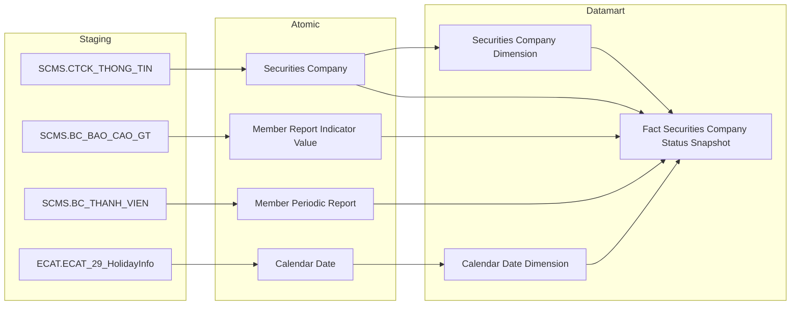
```mermaid
flowchart LR
    subgraph SRC["Staging"]
        S1["SCMS.CTCK_THONG_TIN"]
        S2["SCMS.BC_BAO_CAO_GT"]
        S3["SCMS.BC_THANH_VIEN"]
        ECAT_ECAT_29_HolidayInfo["ECAT.ECAT_29_HolidayInfo"]
    end

    subgraph SIL["Atomic"]
        SV1["Securities Company"]
        SV2["Member Report Indicator Value"]
        SV3["Member Periodic Report"]
        Calendar_Date["Calendar Date"]
    end

    subgraph Datamart["Datamart"]
        G1["Fact Securities Company Status Snapshot"]
        G2["Securities Company Dimension"]
        G3["Calendar Date Dimension"]
    end

    S1 --> SV1
    S2 --> SV2
    S3 --> SV3
    ECAT_ECAT_29_HolidayInfo --> Calendar_Date

    SV1 --> G2
    SV1 --> G1
    SV2 --> G1
    SV3 --> G1
    Calendar_Date --> G3

    G2 --> G1
    G3 --> G1
```

---

### Cụm 2: Đăng ký nghiệp vụ và dịch vụ CTCK (`Fact Securities Company Service Registration`)

Phục vụ Tab TỔNG QUAN — Nhóm 2 (Biểu đồ Nghiệp vụ, STT 2), Nhóm 3 (Biểu đồ Dịch vụ, STT 3), Nhóm 4 (Biểu đồ Dịch vụ phái sinh, STT 4): số CTCK theo nghiệp vụ và dịch vụ đã đăng ký. Nguồn từ SCMS.CTCK_DICH_VU — dịch vụ/nghiệp vụ đăng ký theo scheme `SCMS_SERVICE_TYPE` (bao gồm môi giới, bảo lãnh, tư vấn, tự doanh, ký quỹ, ứng trước, lưu ký, phái sinh). Phân biệt Nhóm 2/3/4 bằng `DM_DICH_VU.TEN_DICH_VU` hoặc `Service_Category_Code`.

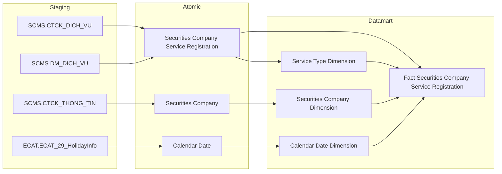
```mermaid
flowchart LR
    subgraph SRC["Staging"]
        S1["SCMS.CTCK_DICH_VU"]
        S2["SCMS.DM_DICH_VU"]
        S3["SCMS.CTCK_THONG_TIN"]
        ECAT_ECAT_29_HolidayInfo["ECAT.ECAT_29_HolidayInfo"]
    end

    subgraph SIL["Atomic"]
        SV1["Securities Company Service Registration"]
        SV2["Securities Company"]
        Calendar_Date["Calendar Date"]
    end

    subgraph Datamart["Datamart"]
        G1["Fact Securities Company Service Registration"]
        G2["Service Type Dimension"]
        G3["Securities Company Dimension"]
        G4["Calendar Date Dimension"]
    end

    S1 --> SV1
    S2 --> SV1
    S3 --> SV2
    ECAT_ECAT_29_HolidayInfo --> Calendar_Date

    SV1 --> G1
    SV1 --> G2
    SV2 --> G3
    Calendar_Date --> G4

    G2 --> G1
    G3 --> G1
    G4 --> G1
```

---

### Cụm 3: Duy trì điều kiện cấp phép (`Fact Securities Company License Condition Snapshot`) — PENDING

Phục vụ Tab TỔNG QUAN — Nhóm 5 (GPHL), Nhóm 6 (Phái sinh — KDCKPS), Nhóm 7 (Phái sinh — BTTT). **PENDING** — xem O_QLKD_7. Nguồn staging đã xác định (`BC_CANH_BAO` + `DM_CANH_BAO` + `BC_THANH_VIEN` + `BM_BAO_CAO`), nhưng Atomic chưa có entity `Member Report Alert` ← `SCMS.BC_CANH_BAO` → không tính được `License_Condition_Status_Code`.

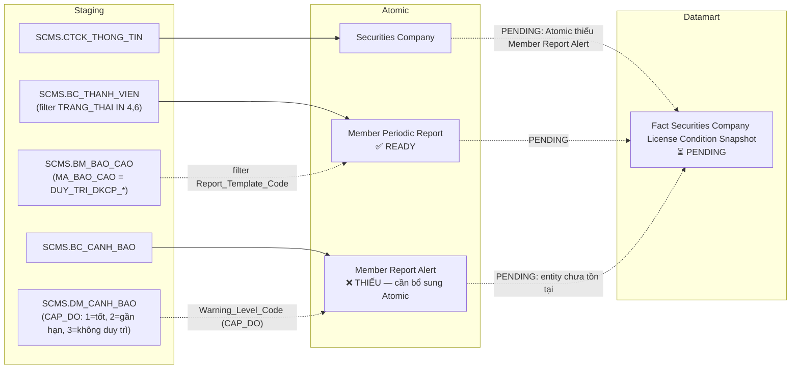
```mermaid
flowchart LR
    subgraph SRC["Staging"]
        S1["SCMS.CTCK_THONG_TIN"]
        S2["SCMS.BC_CANH_BAO"]
        S3["SCMS.DM_CANH_BAO\n(CAP_DO: 1=tốt, 2=gần hạn, 3=không duy trì)"]
        S4["SCMS.BC_THANH_VIEN\n(filter TRANG_THAI IN 4,6)"]
        S5["SCMS.BM_BAO_CAO\n(MA_BAO_CAO = DUY_TRI_DKCP_*)"]
    end

    subgraph SIL["Atomic"]
        SV1["Securities Company"]
        SV2["Member Periodic Report\n✅ READY"]
        SV3["Member Report Alert\n❌ THIẾU — cần bổ sung Atomic"]
    end

    subgraph Datamart["Datamart"]
        G1["Fact Securities Company License Condition Snapshot\n⏳ PENDING"]
    end

    S1 --> SV1
    S4 --> SV2
    S5 -.->|"filter Report_Template_Code"| SV2
    S2 --> SV3
    S3 -.->|"Warning_Level_Code (CAP_DO)"| SV3

    SV1 -.->|"PENDING: Atomic thiếu Member Report Alert"| G1
    SV2 -.->|PENDING| G1
    SV3 -.->|"PENDING: entity chưa tồn tại"| G1
```

---

### Cụm 4: Cơ cấu tài chính toàn thị trường (`Fact Securities Company Financial Structure Snapshot`)

Phục vụ Tab TỔNG QUAN — Nhóm 8 (Cơ cấu tài sản), Nhóm 9 (Cơ cấu nguồn vốn): tổng hợp các chỉ tiêu BCTC theo quý toàn thị trường.

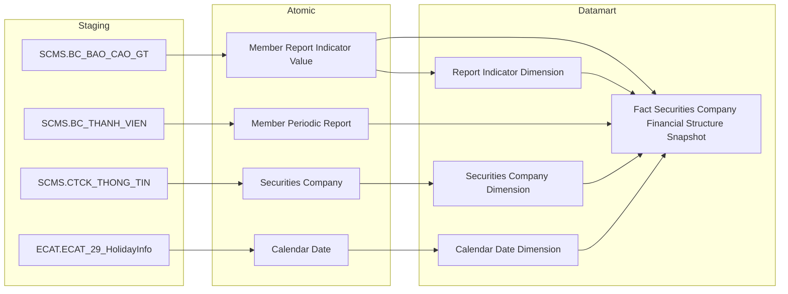
```mermaid
flowchart LR
    subgraph SRC["Staging"]
        S1["SCMS.BC_BAO_CAO_GT"]
        S2["SCMS.BC_THANH_VIEN"]
        S3["SCMS.CTCK_THONG_TIN"]
        ECAT_ECAT_29_HolidayInfo["ECAT.ECAT_29_HolidayInfo"]
    end

    subgraph SIL["Atomic"]
        SV1["Member Report Indicator Value"]
        SV2["Member Periodic Report"]
        SV3["Securities Company"]
        Calendar_Date["Calendar Date"]
    end

    subgraph Datamart["Datamart"]
        G1["Fact Securities Company Financial Structure Snapshot"]
        G2["Securities Company Dimension"]
        G3["Report Indicator Dimension"]
        G4["Calendar Date Dimension"]
    end

    S1 --> SV1
    S2 --> SV2
    S3 --> SV3
    ECAT_ECAT_29_HolidayInfo --> Calendar_Date

    SV1 --> G1
    SV2 --> G1
    SV1 --> G3
    SV3 --> G2
    Calendar_Date --> G4

    G2 --> G1
    G3 --> G1
    G4 --> G1
```

> **Ghi chú:** `Report Indicator Dimension` là ETL-derived Conformed Dimension — extract từ `Member Report Indicator Value.Report Indicator Id` (FK đến `DM_CHI_TIEU` trong SCMS). Lý do: chỉ tiêu BCTC cần GROUP BY theo tên chỉ tiêu; Dim này có thể tái sử dụng khi cần phân tích BCTC cross-module.

---

### Cụm 5: Hoạt động tài chính CTCK (`Fact Securities Company Financial Structure Snapshot`)

Phục vụ Tab GIÁM SÁT — Sub-tab GIÁM SÁT HOẠT ĐỘNG: Nhóm GS-1 (VCSH), GS-2 (Vốn ĐT CSH), GS-4 (TLATTC phân loại), GS-5 (Doanh thu & LNST), GS-7 (Thị phần môi giới), GS-8 (CFO). Dùng chung `Fact Securities Company Financial Structure Snapshot` với Cụm 4 — cùng Atomic source `Member Report Indicator Value`, mở rộng sang các indicator_code VCSH, doanh thu, lợi nhuận, thị phần. GS-3 (Nguồn vốn tăng thêm) tách thành Cụm 5b riêng vì nguồn khác (SCMS.CBTT_CHAO_BAN_CHUNG_KHOAN).

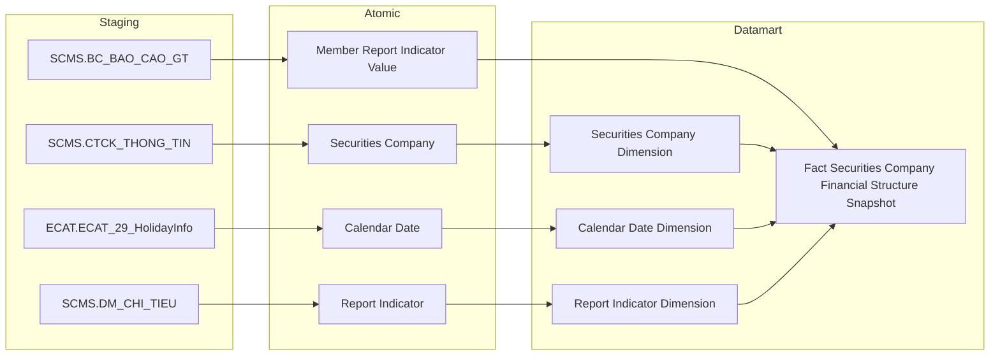
```mermaid
flowchart LR
    subgraph SRC["Staging"]
        S1["SCMS.BC_BAO_CAO_GT"]
        S2["SCMS.CTCK_THONG_TIN"]
        S3["SCMS.DM_CHI_TIEU"]
        ECAT_ECAT_29_HolidayInfo["ECAT.ECAT_29_HolidayInfo"]
    end

    subgraph SIL["Atomic"]
        SV1["Member Report Indicator Value"]
        SV2["Securities Company"]
        SV3["Report Indicator"]
        Calendar_Date["Calendar Date"]
    end

    subgraph Datamart["Datamart"]
        G1["Fact Securities Company Financial Structure Snapshot"]
        G2["Securities Company Dimension"]
        G3["Calendar Date Dimension"]
        G4["Report Indicator Dimension"]
    end

    S1 --> SV1
    S2 --> SV2
    S3 --> SV3
    ECAT_ECAT_29_HolidayInfo --> Calendar_Date

    SV1 --> G1
    SV2 --> G2
    SV3 --> G4
    Calendar_Date --> G3

    G2 --> G1
    G3 --> G1
    G4 --> G1
```

---

### Cụm 5b: Nguồn vốn tăng thêm từ chào bán (`Fact Securities Company Capital Raising Event`) — READY

Phục vụ Tab GIÁM SÁT — Nhóm GS-3 (Nguồn vốn tăng thêm, STT 13). Nguồn từ `SCMS.CBTT_CHAO_BAN_CHUNG_KHOAN` — 1 row per đợt chào bán/phát hành. Atomic entity: `Disclosure Securities Offering` (đã có LLD, 23 attributes). O_QLKD_18 Closed.

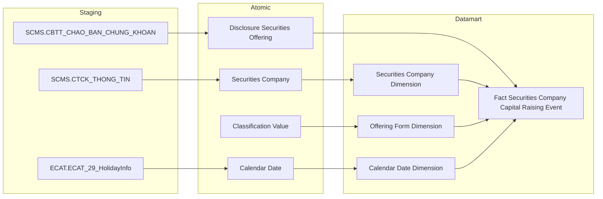
```mermaid
flowchart LR
    subgraph SRC["Staging"]
        S1["SCMS.CBTT_CHAO_BAN_CHUNG_KHOAN"]
        S2["SCMS.CTCK_THONG_TIN"]
        ECAT_ECAT_29_HolidayInfo["ECAT.ECAT_29_HolidayInfo"]
    end

    subgraph SIL["Atomic"]
        SV1["Disclosure Securities Offering"]
        SV2["Securities Company"]
        Calendar_Date["Calendar Date"]
        Classification_Value["Classification Value"]
    end

    subgraph Datamart["Datamart"]
        G1["Fact Securities Company Capital Raising Event"]
        G2["Securities Company Dimension"]
        G3["Offering Form Dimension"]
        G4["Calendar Date Dimension"]
    end

    S1 --> SV1
    S2 --> SV2
    ECAT_ECAT_29_HolidayInfo --> Calendar_Date

    SV1 --> G1
    SV2 --> G2
    Calendar_Date --> G4
    Classification_Value --> G3

    G2 --> G1
    G3 --> G1
    G4 --> G1
```

---

### Cụm 6: Tương quan Margin (`Fact Securities Company Financial Structure Snapshot`)

Phục vụ Tab GIÁM SÁT — Nhóm GS-6, K_QLKD_61 (Dư nợ margin). `Dư nợ margin` từ `Member Report Indicator Value` (SCMS) — dùng chung Fact với Cụm 4/5. READY.

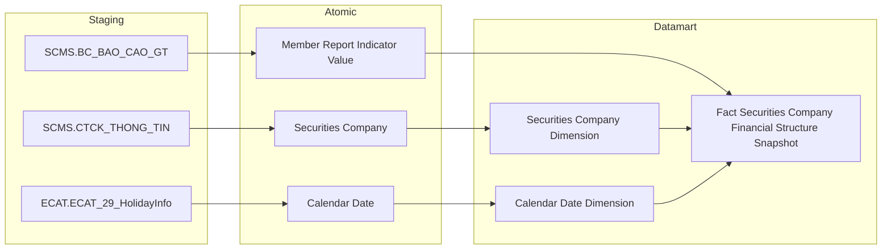
```mermaid
flowchart LR
    subgraph SRC["Staging"]
        S1["SCMS.BC_BAO_CAO_GT"]
        S2["SCMS.CTCK_THONG_TIN"]
        ECAT_ECAT_29_HolidayInfo["ECAT.ECAT_29_HolidayInfo"]
    end

    subgraph SIL["Atomic"]
        SV1["Member Report Indicator Value"]
        SV2["Securities Company"]
        Calendar_Date["Calendar Date"]
    end

    subgraph Datamart["Datamart"]
        G1["Fact Securities Company Financial Structure Snapshot"]
        G2["Securities Company Dimension"]
        G3["Calendar Date Dimension"]
    end

    S1 --> SV1
    S2 --> SV2
    ECAT_ECAT_29_HolidayInfo --> Calendar_Date

    SV1 --> G1
    SV2 --> G2
    Calendar_Date --> G3

    G2 --> G1
    G3 --> G1
```

---

### Cụm 6b: Diễn biến thị trường (`Market Index Snapshot`) — READY

Phục vụ Tab GIÁM SÁT — Nhóm GS-6, K_QLKD_62–65 (chỉ số VN-Index, HNX, UPCOM, VN30). Nguồn xác nhận: `FSSTRAINING.PUBLIC_MARKETINFOR` (DB: dwh). O_QLKD_8 Closed. `Market Index Snapshot` join với `Fact Securities Company Financial Structure Snapshot` (Cụm 6) qua `Calendar Date Dimension` để tạo biểu đồ combo.

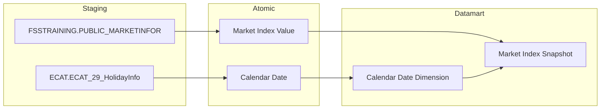
```mermaid
flowchart LR
    subgraph SRC["Staging"]
        S1["FSSTRAINING.PUBLIC_MARKETINFOR"]
        ECAT_ECAT_29_HolidayInfo["ECAT.ECAT_29_HolidayInfo"]
    end

    subgraph SIL["Atomic"]
        SV1["Market Index Value"]
        Calendar_Date["Calendar Date"]
    end

    subgraph Datamart["Datamart"]
        G1["Market Index Snapshot"]
        G2["Calendar Date Dimension"]
    end

    S1 --> SV1
    ECAT_ECAT_29_HolidayInfo --> Calendar_Date

    SV1 --> G1
    Calendar_Date --> G2

    G2 --> G1
```

---

### Cụm 7: Tuân thủ nộp báo cáo (`Fact Securities Company Report Compliance Snapshot`)

Phục vụ Tab GIÁM SÁT — Sub-tab GIÁM SÁT TUÂN THỦ (Nhóm GS-9): số lượng báo cáo đúng hạn/chậm/chưa nộp + tỷ lệ tuân thủ toàn thị trường theo ngày.

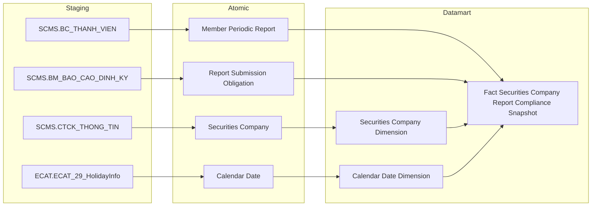
```mermaid
flowchart LR
    subgraph SRC["Staging"]
        S1["SCMS.BC_THANH_VIEN"]
        S2["SCMS.CTCK_THONG_TIN"]
        S3["SCMS.BM_BAO_CAO_DINH_KY"]
        ECAT_ECAT_29_HolidayInfo["ECAT.ECAT_29_HolidayInfo"]
    end

    subgraph SIL["Atomic"]
        SV1["Member Periodic Report"]
        SV2["Securities Company"]
        SV3["Report Submission Obligation"]
        Calendar_Date["Calendar Date"]
    end

    subgraph Datamart["Datamart"]
        G1["Fact Securities Company Report Compliance Snapshot"]
        G2["Securities Company Dimension"]
        G3["Calendar Date Dimension"]
    end

    S1 --> SV1
    S2 --> SV2
    S3 --> SV3
    ECAT_ECAT_29_HolidayInfo --> Calendar_Date

    SV1 --> G1
    SV3 --> G1
    SV2 --> G2
    Calendar_Date --> G3

    G2 --> G1
    G3 --> G1
```

---

### Cụm 8: Banner tổng quan CTCK (K_QLKD_74–78)

> K_QLKD_74–78 tái sử dụng `Fact Securities Company Financial Structure Snapshot` (Cụm 4/5) — không có bảng Datamart riêng. Lineage đã vẽ trong Cụm 4.

---

### Cụm 9: Nhân sự & Quản trị CTCK (Tác nghiệp)

Phục vụ Tab HỒ SƠ CTCK 360 — Sub-tab Nhân sự: HĐQT/HĐTV/BKS/BĐH cards + Cổ đông lớn table + Lịch sử thay đổi nhân sự. Tất cả là dạng lookup 1 CTCK — bảng Tác nghiệp.

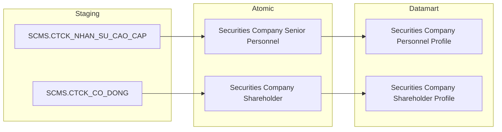
```mermaid
flowchart LR
    subgraph SRC["Staging"]
        S1["SCMS.CTCK_NHAN_SU_CAO_CAP"]
        S2["SCMS.CTCK_CO_DONG"]
    end

    subgraph SIL["Atomic"]
        SV1["Securities Company Senior Personnel"]
        SV2["Securities Company Shareholder"]
    end

    subgraph Datamart["Datamart"]
        G1["Securities Company Personnel Profile"]
        G2["Securities Company Shareholder Profile"]
    end

    S1 --> SV1
    S2 --> SV2

    SV1 --> G1
    SV2 --> G2
```

---

### Cụm 10: CN, PGD, VPĐD & NHNCK CTCK (Tác nghiệp)

Phục vụ Tab HỒ SƠ CTCK 360 — Sub-tab NHNCK và Sub-tab CN, PGD, VPĐD: thông tin mạng lưới và người hành nghề của 1 CTCK.

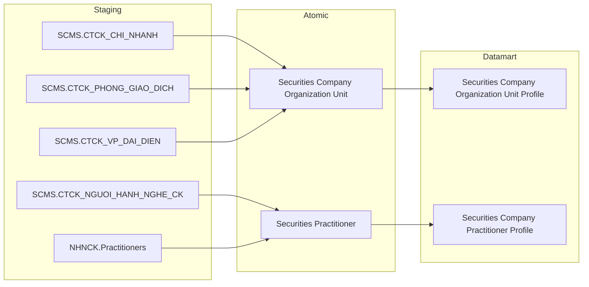
```mermaid
flowchart LR
    subgraph SRC["Staging"]
        S1["SCMS.CTCK_CHI_NHANH"]
        S2["SCMS.CTCK_PHONG_GIAO_DICH"]
        S3["SCMS.CTCK_VP_DAI_DIEN"]
        S4["SCMS.CTCK_NGUOI_HANH_NGHE_CK"]
        S5["NHNCK.Practitioners"]
    end

    subgraph SIL["Atomic"]
        SV1["Securities Company Organization Unit"]
        SV2["Securities Practitioner"]
    end

    subgraph Datamart["Datamart"]
        G1["Securities Company Organization Unit Profile"]
        G2["Securities Company Practitioner Profile"]
    end

    S1 --> SV1
    S2 --> SV1
    S3 --> SV1
    S4 --> SV2
    S5 --> SV2

    SV1 --> G1
    SV2 --> G2
```

---


---

### Cụm 11: Lịch sử báo cáo tài chính CTCK (Tác nghiệp)

Phục vụ Tab HỒ SƠ CTCK 360 — Sub-tab Tài chính: bảng lịch sử BC tài chính per CTCK per kỳ. 4 thẻ tổng hợp (DT YTD, LN YTD, ROA, ROE) tính aggregate từ các row chi tiết. ETL từ `Member Report Indicator Value` (giá trị chỉ tiêu) + `Member Periodic Report` (kỳ BC, ngày nộp, trạng thái).

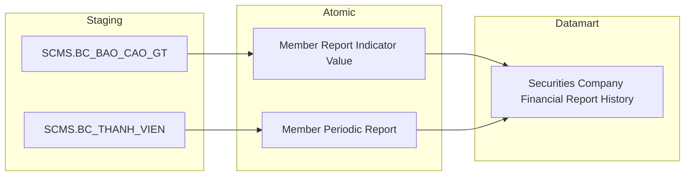
```mermaid
flowchart LR
    subgraph SRC["Staging"]
        S1["SCMS.BC_BAO_CAO_GT"]
        S2["SCMS.BC_THANH_VIEN"]
    end

    subgraph SIL["Atomic"]
        SV1["Member Report Indicator Value"]
        SV2["Member Periodic Report"]
    end

    subgraph Datamart["Datamart"]
        G1["Securities Company Financial Report History"]
    end

    S1 --> SV1
    S2 --> SV2

    SV1 --> G1
    SV2 --> G1
```

---

### Cụm 12: Tuân thủ & vi phạm CTCK — Hồ sơ 360 (Tác nghiệp)

Phục vụ Tab HỒ SƠ CTCK 360 — Sub-tab Tuân thủ: danh sách BC tuân thủ (đúng hạn/trễ hạn) + lịch sử thanh tra/xử phạt per CTCK. `Member Periodic Report` phục vụ danh sách BC; `Inspection Case` + `Inspection Case Conclusion` phục vụ lịch sử thanh tra/xử phạt.

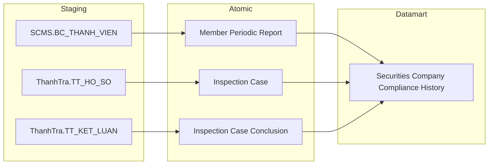
```mermaid
flowchart LR
    subgraph SRC["Staging"]
        S1["SCMS.BC_THANH_VIEN"]
        S2["ThanhTra.TT_HO_SO"]
        S3["ThanhTra.TT_KET_LUAN"]
    end

    subgraph SIL["Atomic"]
        SV1["Member Periodic Report"]
        SV2["Inspection Case"]
        SV3["Inspection Case Conclusion"]
    end

    subgraph Datamart["Datamart"]
        G1["Securities Company Compliance History"]
    end

    S1 --> SV1
    S2 --> SV2
    S3 --> SV3

    SV1 --> G1
    SV2 --> G1
    SV3 --> G1
```

---

### Cụm 13: Tra cứu & Mạng lưới cá nhân (Tác nghiệp)

Phục vụ Tab TRA CỨU CÁ NHÂN — Landing page (danh sách cá nhân) + Sub-tab Mạng lưới 360°. `Individual Profile` là bảng Tác nghiệp tổng hợp thông tin định danh cá nhân từ `Securities Company Senior Personnel` (SCMS) và `Securities Practitioner` (NHNCK). `Individual Related Party Network` lưu mạng lưới người liên quan.

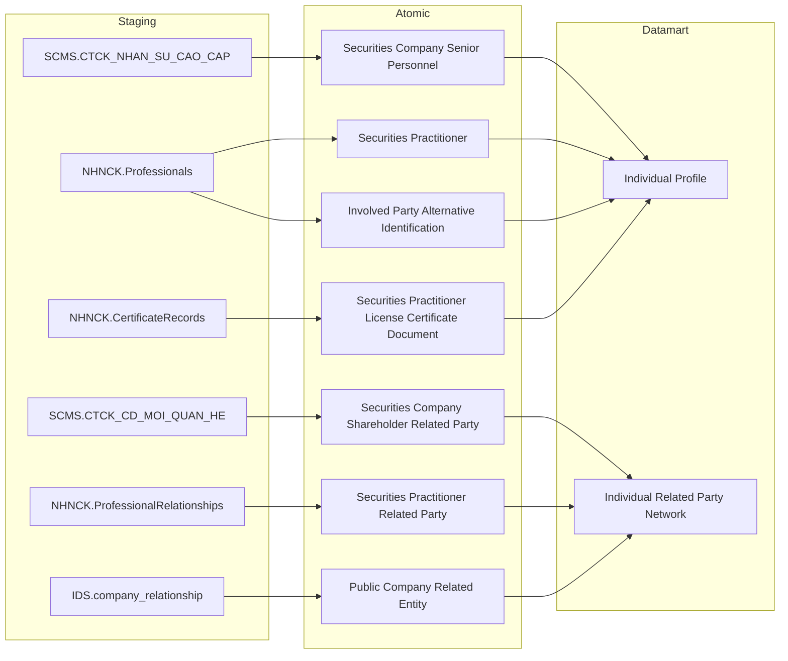
```mermaid
flowchart LR
    subgraph SRC["Staging"]
        S1["SCMS.CTCK_NHAN_SU_CAO_CAP"]
        S2["SCMS.CTCK_CD_MOI_QUAN_HE"]
        S3["NHNCK.Professionals"]
        S4["NHNCK.ProfessionalRelationships"]
        S5["NHNCK.CertificateRecords"]
        S6["IDS.company_relationship"]
    end

    subgraph SIL["Atomic"]
        SV1["Securities Company Senior Personnel"]
        SV2["Securities Company Shareholder Related Party"]
        SV3["Securities Practitioner"]
        SV4["Securities Practitioner Related Party"]
        SV5["Involved Party Alternative Identification"]
        SV6["Securities Practitioner License Certificate Document"]
        SV7["Public Company Related Entity"]
    end

    subgraph Datamart["Datamart"]
        G1["Individual Profile"]
        G2["Individual Related Party Network"]
    end

    S1 --> SV1
    S2 --> SV2
    S3 --> SV3
    S4 --> SV4
    S3 --> SV5
    S5 --> SV6
    S6 --> SV7

    SV1 --> G1
    SV3 --> G1
    SV5 --> G1
    SV6 --> G1
    SV2 --> G2
    SV4 --> G2
    SV7 --> G2
```

---

### Cụm 14: Hồ sơ cá nhân — Vai trò DN niêm yết & Tài khoản (Tác nghiệp)

Phục vụ Tab TRA CỨU CÁ NHÂN — Sub-tab Hồ sơ: block Vai trò tại DN niêm yết (IDS source) + block Tài khoản (PENDING — chưa xác định Atomic entity). `Individual Listed Company Role` lưu vai trò + số CP tại từng DN niêm yết per cá nhân.

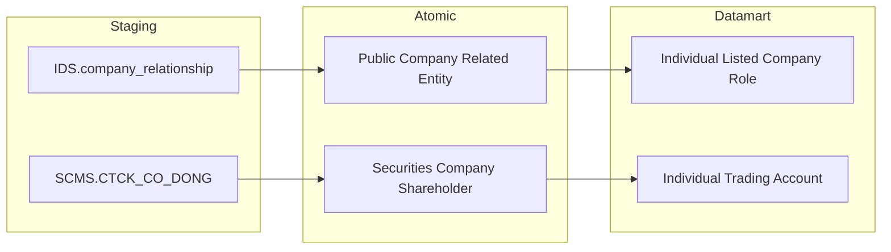
```mermaid
flowchart LR
    subgraph SRC["Staging"]
        S1["IDS.company_relationship"]
        S2["SCMS.CTCK_CO_DONG"]
    end

    subgraph SIL["Atomic"]
        SV1["Public Company Related Entity"]
        SV2["Securities Company Shareholder"]
    end

    subgraph Datamart["Datamart"]
        G1["Individual Listed Company Role"]
        G2["Individual Trading Account"]
    end

    S1 --> SV1
    S2 --> SV2

    SV1 --> G1
    SV2 --> G2
```

---

### Cụm 15: Quá trình hành nghề & Lịch sử vi phạm cá nhân (Tác nghiệp)

Phục vụ Tab TRA CỨU CÁ NHÂN — Sub-tab Quá trình hành nghề (timeline công tác) + Sub-tab Lịch sử vi phạm. Lịch sử vi phạm từ `Inspection Case` + `Inspection Case Conclusion` (ThanhTra) — BA ghi `src=SCMS` nhưng thực tế data từ ThanhTra. `Inspection Case` có field `Subject Id Number` (SO_CMND) và `Subject Full Name` cho cá nhân — filter chính xác hơn `Surveillance Enforcement Case`. Xem O_QLKD_14.

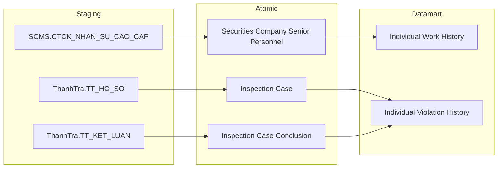
```mermaid
flowchart LR
    subgraph SRC["Staging"]
        S1["SCMS.CTCK_NHAN_SU_CAO_CAP"]
        S2["ThanhTra.TT_HO_SO"]
        S3["ThanhTra.TT_KET_LUAN"]
    end

    subgraph SIL["Atomic"]
        SV1["Securities Company Senior Personnel"]
        SV2["Inspection Case"]
        SV3["Inspection Case Conclusion"]
    end

    subgraph Datamart["Datamart"]
        G1["Individual Work History"]
        G2["Individual Violation History"]
    end

    S1 --> SV1
    S2 --> SV2
    S3 --> SV3

    SV1 --> G1
    SV2 --> G2
    SV3 --> G2
```

---

### Cụm 16: Data Explorer — Báo cáo biểu mẫu định kỳ CTCK (Tác nghiệp)

Phục vụ Tab DATA EXPLORER — tra cứu raw data 102 biểu mẫu báo cáo định kỳ (STT 42–145). Toàn bộ giá trị chỉ tiêu lưu theo pattern EAV trong `Member Report Indicator Value` (BC_BAO_CAO_GT). Metadata biểu mẫu và kỳ báo cáo từ `Member Periodic Report` (BC_THANH_VIEN). ETL denormalize thành bảng Tác nghiệp `Securities Company Report Data` với đầy đủ context để filter và hiển thị.

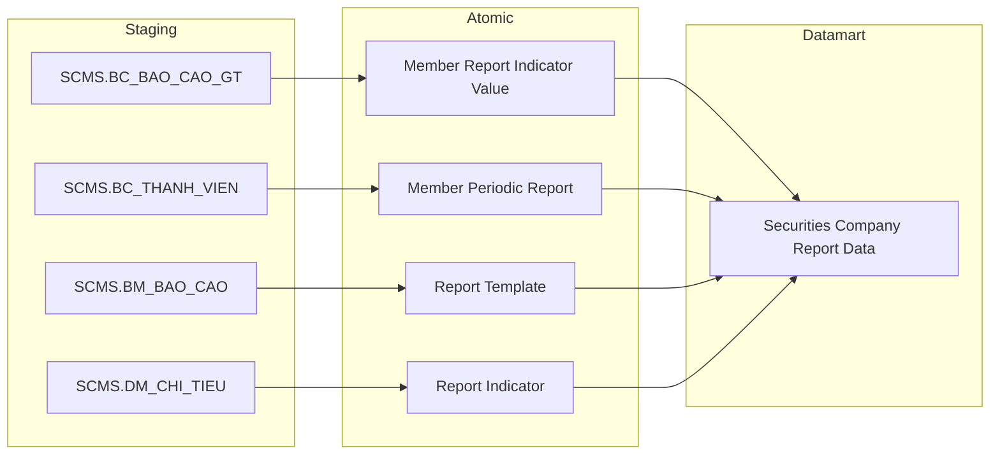
```mermaid
flowchart LR
    subgraph SRC["Staging"]
        S1["SCMS.BC_BAO_CAO_GT"]
        S2["SCMS.BC_THANH_VIEN"]
        S3["SCMS.BM_BAO_CAO"]
        S4["SCMS.DM_CHI_TIEU"]
    end

    subgraph SIL["Atomic"]
        SV1["Member Report Indicator Value"]
        SV2["Member Periodic Report"]
        SV3["Report Template"]
        SV4["Report Indicator"]
    end

    subgraph Datamart["Datamart"]
        G1["Securities Company Report Data"]
    end

    S1 --> SV1
    S2 --> SV2
    S3 --> SV3
    S4 --> SV4

    SV1 --> G1
    SV2 --> G1
    SV3 --> G1
    SV4 --> G1
```

---

## Section 2 — Tổng quan báo cáo

### Tab: TỔNG QUAN

**Slicer chung:** Thời điểm (date picker — mặc định ngày gần nhất có dữ liệu)

---

#### Nhóm 1 — Chỉ tiêu thống kê chung (STT 1–14)

> Phân loại: **Phân tích**
> Atomic: `Securities Company` ← SCMS.CTCK_THONG_TIN — **READY**
> ETL filter `Securities Company`: `IS_BANG_TAM = 1` (chỉ lấy CTCK chính thức, loại bảng tạm) AND `NGAY_CAP_GPKD IS NOT NULL`. Snapshot condition tại ngày D: `License_Issue_Date <= D AND (License_Revocation_Date IS NULL OR License_Revocation_Date > D)`.
> Atomic: `Member Report Indicator Value` ← SCMS.BC_BAO_CAO_GT — **READY**
> Atomic: `Member Periodic Report` ← SCMS.BC_THANH_VIEN — **READY**

**Ghi chú UI:** Nhóm 1 hiển thị 3 block độc lập trên màn hình:
- **Block 1a** — Banner tổng số CTCK: hiển thị K_QLKD_1 + K_QLKD_2 (YoY%). Có nút expand → hiển thị 7 thẻ trạng thái con (K_QLKD_3–9). K_QLKD_3–9 là **filter GROUP BY** trên `Company_Status_Code` của cùng 1 snapshot — không phải measure độc lập.
- **Block 1b** — Thẻ số tài khoản phát sinh GD: K_QLKD_10
- **Block 1c** — Thẻ số dư tiền gửi GD: K_QLKD_11

**Mockup:**

```
┌─────────────────────────────────────────────────────┐
│  TỔNG SỐ CTCK ĐƯỢC CẤP PHÉP    85   ↑ +2.4%   [Xem chi tiết ∧]
│  ┌──────────┐ ┌──────────┐ ┌──────────┐ ┌──────────┐
│  │ Hoạt động│ │ Bị thu hồi│ │ Cảnh báo │ │ Kiểm soát│
│  │    60    │ │    12    │ │     5    │ │     3    │
│  └──────────┘ └──────────┘ └──────────┘ └──────────┘
│  ┌──────────┐ ┌──────────┐ ┌──────────┐
│  │KS đặc biệt│ │Đình chỉ  │ │ Khác     │
│  │     1    │ │     2    │ │     2    │
│  └──────────┘ └──────────┘ └──────────┘
├──────────────────────────┬──────────────────────────┤
│  TK phát sinh GD         │  Số dư tiền gửi GD       │
│  2,450,000 TÀI KHOẢN     │  125,400 TỶ VND           │
└──────────────────────────┴──────────────────────────┘
```

**Source:** `Fact Securities Company Status Snapshot` → `Securities Company Dimension`, `Calendar Date Dimension`

**Bảng KPI:**

| KPI ID | Tên KPI | Đơn vị | Tính chất | Công thức / Nguồn |
|---|---|---|---|---|
| K_QLKD_1 | Tổng số CTCK được cấp phép | CTCK | Cơ sở | COUNT(DISTINCT Securities_Company_Dimension_Id) tại Snapshot Date = selected_date |
| K_QLKD_2 | So sánh cùng kỳ năm trước — tổng CTCK | % | Phái sinh | (K_QLKD_1[Year=Y] − K_QLKD_1[Year=Y−1]) / K_QLKD_1[Year=Y−1] × 100% |
| K_QLKD_3 | Số CTCK hoạt động bình thường | CTCK | Cơ sở | COUNT WHERE Company_Status_Code = ACTIVE |
| K_QLKD_4 | Số CTCK bị thu hồi | CTCK | Cơ sở | COUNT WHERE Company_Status_Code = REVOKED |
| K_QLKD_5 | Số CTCK thuộc diện cảnh báo | CTCK | Cơ sở | COUNT WHERE Company_Status_Code = WARNING |
| K_QLKD_6 | Số CTCK thuộc diện kiểm soát | CTCK | Cơ sở | COUNT WHERE Company_Status_Code = CONTROLLED |
| K_QLKD_7 | Số CTCK thuộc diện kiểm soát đặc biệt | CTCK | Cơ sở | COUNT WHERE Company_Status_Code = SPECIAL_CONTROLLED |
| K_QLKD_8 | Số CTCK đình chỉ hoạt động | CTCK | Cơ sở | COUNT WHERE Company_Status_Code = SUSPENDED |
| K_QLKD_9 | Số CTCK trạng thái khác | CTCK | Cơ sở | COUNT WHERE Company_Status_Code NOT IN (ACTIVE, REVOKED, WARNING, CONTROLLED, SPECIAL_CONTROLLED, SUSPENDED) |
| K_QLKD_10 | Số tài khoản có phát sinh giao dịch | Tài khoản | Cơ sở | SUM(Indicator_Value_Amount) WHERE Report_Indicator_Code = SCMS_IND_TRADING_ACCOUNT tại selected_date — nguồn: `Fact Securities Company Status Snapshot`.Trading_Account_Count |
| K_QLKD_11 | Số dư tiền gửi giao dịch | Tỷ VND | Cơ sở | SUM(Indicator_Value_Amount) WHERE Report_Indicator_Code = SCMS_IND_DEPOSIT_BALANCE tại selected_date — nguồn: `Fact Securities Company Status Snapshot`.Deposit_Balance_Amount |

> **Thiết kế grain K_QLKD_1–9:** Fact lưu 1 row per CTCK × ngày — `Company_Status_Code` là DD trên Fact. COUNT GROUP BY status → ra K_QLKD_3–9. SUM tất cả → K_QLKD_1. Không cần tách Fact riêng cho từng trạng thái.

> **Thiết kế K_QLKD_10–11:** Hai measure này có nguồn từ báo cáo ATTTC/BCTC định kỳ (BC_BAO_CAO_GT). Lưu trực tiếp trên cùng `Fact Securities Company Status Snapshot` tại grain ngày, aggregate SUM toàn thị trường. Xem O_QLKD_4.

**Star Schema:**

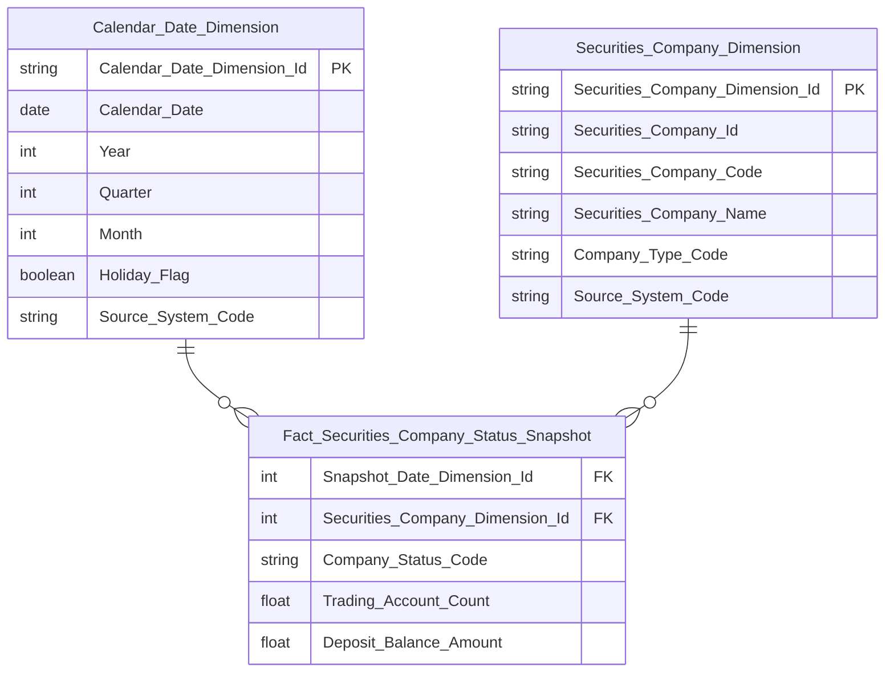
```mermaid
erDiagram
    Fact_Securities_Company_Status_Snapshot {
        int Snapshot_Date_Dimension_Id FK
        int Securities_Company_Dimension_Id FK
        string Company_Status_Code
        float Trading_Account_Count
        float Deposit_Balance_Amount
    }

    Securities_Company_Dimension {
        string Securities_Company_Dimension_Id PK
        string Securities_Company_Id
        string Securities_Company_Code
        string Securities_Company_Name
        string Company_Type_Code
        string Source_System_Code
    }

    Calendar_Date_Dimension {
        string Calendar_Date_Dimension_Id PK
        date Calendar_Date
        int Year
        int Quarter
        int Month
        boolean Holiday_Flag
        string Source_System_Code
    }

    Calendar_Date_Dimension ||--o{ Fact_Securities_Company_Status_Snapshot : " "
    Securities_Company_Dimension ||--o{ Fact_Securities_Company_Status_Snapshot : " "
```

**Lineage Mart → Báo cáo:**

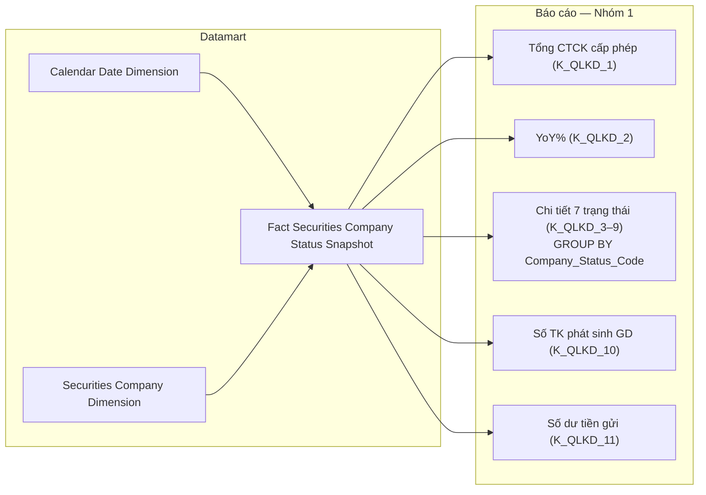
```mermaid
flowchart LR
    subgraph Datamart["Datamart"]
        G1["Fact Securities Company Status Snapshot"]
        G2["Securities Company Dimension"]
        G3["Calendar Date Dimension"]
    end

    subgraph RPT["Báo cáo — Nhóm 1"]
        R1["Tổng CTCK cấp phép (K_QLKD_1)"]
        R2["YoY% (K_QLKD_2)"]
        R3["Chi tiết 7 trạng thái (K_QLKD_3–9)\nGROUP BY Company_Status_Code"]
        R4["Số TK phát sinh GD (K_QLKD_10)"]
        R5["Số dư tiền gửi (K_QLKD_11)"]
    end

    G3 --> G1
    G2 --> G1
    G1 --> R1
    G1 --> R2
    G1 --> R3
    G1 --> R4
    G1 --> R5
```

**Bảng grain:**

| Tên bảng | Grain |
|---|---|
| Fact Securities Company Status Snapshot | 1 CTCK × 1 ngày snapshot |
| Securities Company Dimension | 1 CTCK (SCD2) |
| Calendar Date Dimension | 1 ngày |

---

#### Nhóm 2 — Biểu đồ Nghiệp vụ (STT 2)

> Phân loại: **Phân tích**
> Atomic: `Securities Company Service Registration` ← SCMS.CTCK_DICH_VU + SCMS.DM_DICH_VU — **READY**
> Ghi chú: Dùng `Fact Securities Company Service Registration` (Cụm 2). Nghiệp vụ môi giới/bảo lãnh/tư vấn/tự doanh phân biệt bằng `Service_Type_Code` hoặc `DM_DICH_VU.TEN_DICH_VU` (scheme `SCMS_SERVICE_TYPE`). Filter `Service_Status_Code = ACTIVE AND Is_Draft_Indicator = false`. Dùng chung Star Schema với Nhóm 3 và Nhóm 4.

**Mockup:**

```
SỐ LƯỢNG CTCK THEO NGHIỆP VỤ (horizontal bar chart)
Môi giới:         68 ████████████████████
Bảo lãnh phát hành: 42 ████████████
Tư vấn:           55 ████████████████
Tự doanh:         58 █████████████████
```

**Source:** `Fact Securities Company Service Registration` → `Securities Company Dimension`, `Service Type Dimension`, `Calendar Date Dimension`

**Bảng KPI:**

| KPI ID | Tên KPI | Đơn vị | Tính chất | Công thức |
|---|---|---|---|---|
| K_QLKD_12 | Số CTCK theo nghiệp vụ môi giới | CTCK | Cơ sở | COUNT(DISTINCT Securities_Company_Dimension_Id) WHERE Service_Type_Code = 'MOI_GIOI' (scheme: SCMS_SERVICE_TYPE) |
| K_QLKD_13 | Số CTCK theo nghiệp vụ bảo lãnh | CTCK | Cơ sở | COUNT(DISTINCT Securities_Company_Dimension_Id) WHERE Service_Type_Code = 'BAO_LANH' (scheme: SCMS_SERVICE_TYPE) |
| K_QLKD_14 | Số CTCK theo nghiệp vụ tư vấn | CTCK | Cơ sở | COUNT(DISTINCT Securities_Company_Dimension_Id) WHERE Service_Type_Code = 'TU_VAN' (scheme: SCMS_SERVICE_TYPE) |
| K_QLKD_15 | Số CTCK theo nghiệp vụ tự doanh | CTCK | Cơ sở | COUNT(DISTINCT Securities_Company_Dimension_Id) WHERE Service_Type_Code = 'TU_DOANH' (scheme: SCMS_SERVICE_TYPE) |

> **Ghi chú:** `Service_Type_Code` là ETL-derived — không có clean code sẵn trong source. ETL phải transform từ `SCMS.DM_DICH_VU.TEN_DICH_VU` dùng LIKE matching (vd: `LIKE '%môi giới%'` → `MOI_GIOI`). Xem **O_QLKD_19**.

**Star Schema:**

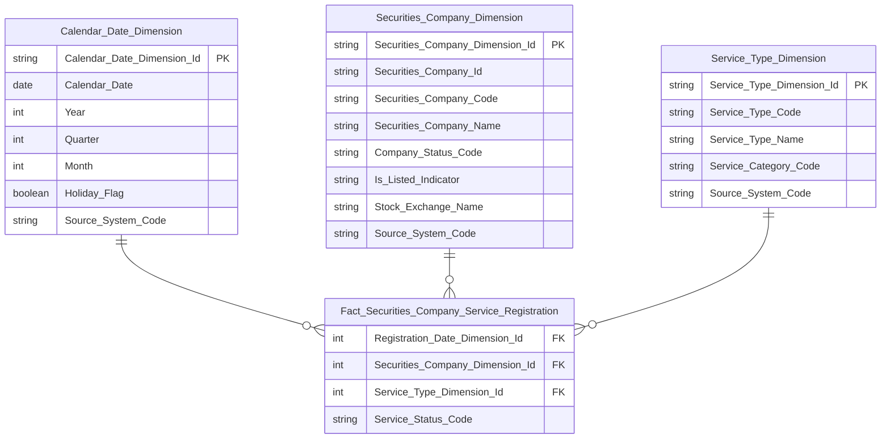
```mermaid
erDiagram
    Fact_Securities_Company_Service_Registration {
        int Registration_Date_Dimension_Id FK
        int Securities_Company_Dimension_Id FK
        int Service_Type_Dimension_Id FK
        string Service_Status_Code
    }

    Securities_Company_Dimension {
        string Securities_Company_Dimension_Id PK
        string Securities_Company_Id
        string Securities_Company_Code
        string Securities_Company_Name
        string Company_Status_Code
        string Is_Listed_Indicator
        string Stock_Exchange_Name
        string Source_System_Code
    }

    Service_Type_Dimension {
        string Service_Type_Dimension_Id PK
        string Service_Type_Code
        string Service_Type_Name
        string Service_Category_Code
        string Source_System_Code
    }

    Calendar_Date_Dimension {
        string Calendar_Date_Dimension_Id PK
        date Calendar_Date
        int Year
        int Quarter
        int Month
        boolean Holiday_Flag
        string Source_System_Code
    }

    Calendar_Date_Dimension ||--o{ Fact_Securities_Company_Service_Registration : " "
    Securities_Company_Dimension ||--o{ Fact_Securities_Company_Service_Registration : " "
    Service_Type_Dimension ||--o{ Fact_Securities_Company_Service_Registration : " "
```

**Lineage Mart → Báo cáo:**

```mermaid
flowchart LR
    subgraph Datamart["Datamart"]
        G1["Fact Securities Company Service Registration"]
        G2["Service Type Dimension"]
        G3["Calendar Date Dimension"]
        G4["Securities Company Dimension"]
    end

    subgraph RPT["Báo cáo — Nhóm 2"]
        R1["SL CTCK theo nghiệp vụ (K_QLKD_12–15)"]
    end

    G2 --> G1
    G3 --> G1
    G4 --> G1
    G1 --> R1
```

**Bảng grain:**

| Tên bảng | Grain |
|---|---|
| Fact Securities Company Service Registration | 1 CTCK × 1 nghiệp vụ/dịch vụ × 1 lần đăng ký (Event) |
| Securities Company Dimension | 1 CTCK (SCD2) |
| Service Type Dimension | 1 mã dịch vụ/nghiệp vụ (SCD2) — scheme SCMS_SERVICE_TYPE |
| Calendar Date Dimension | 1 ngày |

---

#### Nhóm 3 — Biểu đồ Dịch vụ (STT 3)

> Phân loại: **Phân tích**
> Atomic: `Securities Company Service Registration` ← SCMS.CTCK_DICH_VU — **READY**
> Ghi chú: Dùng chung `Fact Securities Company Service Registration` với Nhóm 2. Filter `Service Status Code = ACTIVE AND Is Draft Indicator = false`. Phân biệt với Nhóm 2 (nghiệp vụ) bằng `Service_Category_Code` hoặc nhóm `TEN_DICH_VU` từ DM_DICH_VU — ký quỹ / ứng trước / lưu ký là dịch vụ bổ sung, không phải nghiệp vụ cốt lõi.

**Mockup:**
```
BIỂU ĐỒ DỊCH VỤ — Số CTCK theo dịch vụ được đăng ký
[Bar ngang]:
  Giao dịch ký quỹ:   45 ██████████████████
  Ứng trước tiền bán: 38 ████████████████
  Lưu ký:             52 █████████████████████
```

**Source:** `Fact Securities Company Service Registration` → `Securities Company Dimension`, `Service Type Dimension`, `Calendar Date Dimension`

**Bảng KPI:**

| KPI ID | Tên KPI | Đơn vị | Tính chất | Công thức |
|---|---|---|---|---|
| K_QLKD_16 | Số CTCK theo dịch vụ giao dịch ký quỹ | CTCK | Cơ sở | COUNT(DISTINCT Securities_Company_Dimension_Id) WHERE Service_Type_Code = 'KQY' (scheme: SCMS_SERVICE_TYPE) AND Service_Status_Code = 'ACTIVE' AND Service_Category_Code != 'PHAI_SINH' |
| K_QLKD_17 | Số CTCK theo dịch vụ ứng trước tiền bán | CTCK | Cơ sở | COUNT(DISTINCT Securities_Company_Dimension_Id) WHERE Service_Type_Code = 'UTRUOC' (scheme: SCMS_SERVICE_TYPE) AND Service_Status_Code = 'ACTIVE' |
| K_QLKD_18 | Số CTCK theo dịch vụ lưu ký | CTCK | Cơ sở | COUNT(DISTINCT Securities_Company_Dimension_Id) WHERE Service_Type_Code = 'LUUKY' (scheme: SCMS_SERVICE_TYPE) AND Service_Status_Code = 'ACTIVE' |

**Star Schema:**

```mermaid
erDiagram
    Fact_Securities_Company_Service_Registration {
        int Registration_Date_Dimension_Id FK
        int Securities_Company_Dimension_Id FK
        int Service_Type_Dimension_Id FK
        string Service_Status_Code
        string Registration_Document_Number
        date Termination_Date
        date Valid_Document_Date
        string Is_Draft_Indicator
    }

    Securities_Company_Dimension {
        string Securities_Company_Dimension_Id PK
        string Securities_Company_Id
        string Securities_Company_Code
        string Securities_Company_Name
        string Company_Status_Code
        string Is_Listed_Indicator
        string Stock_Exchange_Name
        string Source_System_Code
    }

    Service_Type_Dimension {
        string Service_Type_Dimension_Id PK
        string Service_Type_Code
        string Service_Type_Name
        string Service_Category_Code
        string Source_System_Code
    }

    Calendar_Date_Dimension {
        string Calendar_Date_Dimension_Id PK
        date Calendar_Date
        int Year
        int Quarter
        int Month
        boolean Holiday_Flag
        string Source_System_Code
    }

    Calendar_Date_Dimension ||--o{ Fact_Securities_Company_Service_Registration : " "
    Securities_Company_Dimension ||--o{ Fact_Securities_Company_Service_Registration : " "
    Service_Type_Dimension ||--o{ Fact_Securities_Company_Service_Registration : " "
```

**Bảng grain:**

| Tên bảng | Grain |
|---|---|
| Fact Securities Company Service Registration | 1 CTCK × 1 dịch vụ × 1 lần đăng ký (Event) |
| Securities Company Dimension | 1 CTCK (SCD2) |
| Service Type Dimension | 1 mã dịch vụ (SCD2) — scheme SCMS_SERVICE_TYPE |
| Calendar Date Dimension | 1 ngày |

---

#### Nhóm 4 — Biểu đồ Dịch vụ phái sinh (STT 4)

> Phân loại: **Phân tích**
> Atomic: `Securities Company Service Registration` ← SCMS.CTCK_DICH_VU — **READY**
> Ghi chú: Dùng chung `Fact Securities Company Service Registration` với Nhóm 3, phân biệt bằng `Service Type Dimension.Service Category Code = 'PHAI_SINH'`. Filter `Service Status Code = ACTIVE AND Is Draft Indicator = false`.

**Mockup:**
```
BIỂU ĐỒ DỊCH VỤ PHÁI SINH — Số CTCK theo dịch vụ CKPS
[Bar ngang]:
  Môi giới CKPS:  28 ████████████
  Tư vấn CKPS:   15 ███████
  Tự doanh CKPS: 10 █████
```

**Source:** `Fact Securities Company Service Registration` → `Securities Company Dimension`, `Service Type Dimension`, `Calendar Date Dimension`

**Bảng KPI:**

| KPI ID | Tên KPI | Đơn vị | Tính chất | Công thức |
|---|---|---|---|---|
| K_QLKD_19 | Số CTCK phái sinh dịch vụ môi giới | CTCK | Cơ sở | COUNT(DISTINCT Securities_Company_Dimension_Id) WHERE Service_Type_Code = 'MGPS' (scheme: SCMS_SERVICE_TYPE) AND Service_Category_Code = 'PHAI_SINH' AND Service_Status_Code = 'ACTIVE' |
| K_QLKD_20 | Số CTCK phái sinh dịch vụ tư vấn | CTCK | Cơ sở | COUNT(DISTINCT Securities_Company_Dimension_Id) WHERE Service_Type_Code = 'TVPS' (scheme: SCMS_SERVICE_TYPE) AND Service_Category_Code = 'PHAI_SINH' AND Service_Status_Code = 'ACTIVE' |
| K_QLKD_21 | Số CTCK phái sinh dịch vụ tự doanh | CTCK | Cơ sở | COUNT(DISTINCT Securities_Company_Dimension_Id) WHERE Service_Type_Code = 'TDPS' (scheme: SCMS_SERVICE_TYPE) AND Service_Category_Code = 'PHAI_SINH' AND Service_Status_Code = 'ACTIVE' |

**Star Schema:**

```mermaid
erDiagram
    Fact_Securities_Company_Service_Registration {
        int Registration_Date_Dimension_Id FK
        int Securities_Company_Dimension_Id FK
        int Service_Type_Dimension_Id FK
        string Service_Status_Code
        string Registration_Document_Number
        date Termination_Date
        date Valid_Document_Date
        string Is_Draft_Indicator
    }

    Securities_Company_Dimension {
        string Securities_Company_Dimension_Id PK
        string Securities_Company_Id
        string Securities_Company_Code
        string Securities_Company_Name
        string Company_Status_Code
        string Is_Listed_Indicator
        string Stock_Exchange_Name
        string Source_System_Code
    }

    Service_Type_Dimension {
        string Service_Type_Dimension_Id PK
        string Service_Type_Code
        string Service_Type_Name
        string Service_Category_Code
        string Source_System_Code
    }

    Calendar_Date_Dimension {
        string Calendar_Date_Dimension_Id PK
        date Calendar_Date
        int Year
        int Quarter
        int Month
        boolean Holiday_Flag
        string Source_System_Code
    }

    Calendar_Date_Dimension ||--o{ Fact_Securities_Company_Service_Registration : " "
    Securities_Company_Dimension ||--o{ Fact_Securities_Company_Service_Registration : " "
    Service_Type_Dimension ||--o{ Fact_Securities_Company_Service_Registration : " "
```

**Bảng grain:**

| Tên bảng | Grain |
|---|---|
| Fact Securities Company Service Registration | 1 CTCK × 1 dịch vụ × 1 lần đăng ký (Event) — dùng chung với Nhóm 3 |
| Securities Company Dimension | 1 CTCK (SCD2) |
| Service Type Dimension | 1 mã dịch vụ (SCD2) — scheme SCMS_SERVICE_TYPE, filter Service_Category_Code = 'PHAI_SINH' |
| Calendar Date Dimension | 1 ngày |

---

#### Nhóm 5/6/7 — Duy trì điều kiện cấp phép (STT 31–44)

##### PENDING — Duy trì điều kiện cấp phép — Giấy phép hoạt động (STT 31–36)

**KPI liên quan:** K_QLKD_22, K_QLKD_23, K_QLKD_24

**Lý do pending:** Nguồn staging đã xác định đầy đủ từ BA mapping SQL. Phân loại 3 mức (`License_Condition_Status_Code`) được hệ thống SCMS tính sẵn qua `DM_CANH_BAO.CAP_DO` (1=tốt, 2=gần hạn, 3=không duy trì) — **không cần tính ngưỡng ATTTC thủ công**. Blocker duy nhất: **Atomic chưa có entity `Member Report Alert` ← `SCMS.BC_CANH_BAO`** — cần thiết kế và bổ sung Atomic trước khi mart có thể triển khai.

**BA mapping SQL (nguồn đã xác định):**
- Staging: `BC_CANH_BAO` JOIN `BC_THANH_VIEN` JOIN `DM_CANH_BAO` JOIN `BM_BAO_CAO`
- Filter: `BM_BAO_CAO.MA_BAO_CAO = 'DUY_TRI_DKCP_GPKD'` | `BC_THANH_VIEN.TRANG_THAI IN (4, 6)` | `XOA_DU_LIEU = 0`
- Logic: `ROW_NUMBER() OVER (PARTITION BY CTCK_THONG_TIN_ID ORDER BY NGAY_SO_LIEU DESC) = 1` → kỳ báo cáo mới nhất per CTCK per ngày snapshot

**Atomic cần bổ sung:**
- `Member Report Alert` ← `SCMS.BC_CANH_BAO` — entity mới, BRD hiện `out_of_scope` (ghi chú "Chờ thiết kế"). Fields cần: `BC_THANH_VIEN_ID` (FK → `Member Periodic Report`), `DM_CANH_BAO_ID` (FK → Classification Value `Warning_Level_Code`), `Warning_Level_Code` = `DM_CANH_BAO.CAP_DO`
- Xác nhận scheme name Classification Value cho `DM_CANH_BAO` (BRD ghi tạm `SCMS_REPORT_WARNING_RULE`)

**Mart dự kiến khi Atomic sẵn sàng:** `Fact Securities Company License Condition Snapshot` — grain = 1 CTCK × 1 loại giấy phép × 1 ngày snapshot (ETL lấy kỳ báo cáo mới nhất ≤ ngày snapshot)

| KPI ID | Tên KPI | Tính chất | Trạng thái |
|---|---|---|---|
| K_QLKD_22 | Số CTCK duy trì tốt — Giấy phép hoạt động | Cơ sở | PENDING |
| K_QLKD_23 | Số CTCK gần giới hạn duy trì — Giấy phép hoạt động | Cơ sở | PENDING |
| K_QLKD_24 | Số CTCK không duy trì điều kiện — Giấy phép hoạt động | Cơ sở | PENDING |

---

##### PENDING — Duy trì điều kiện cấp phép — Phái sinh: Kinh doanh CKPS (STT 37–40)

**KPI liên quan:** K_QLKD_25, K_QLKD_26, K_QLKD_27

**Lý do pending:** Cùng lý do Nhóm 5 — xem O_QLKD_7. `MA_BAO_CAO = 'DUY_TRI_DKCP_CKPS_KD'`.

**Atomic cần bổ sung:** Như Nhóm 5 — cần `Member Report Alert` ← `SCMS.BC_CANH_BAO`.

**Mart dự kiến khi Atomic sẵn sàng:** `Fact Securities Company License Condition Snapshot` — grain = 1 CTCK × 1 loại giấy phép × 1 ngày snapshot

| KPI ID | Tên KPI | Tính chất | Trạng thái |
|---|---|---|---|
| K_QLKD_25 | Số CTCK duy trì tốt — Phái sinh KDCKPS | Cơ sở | PENDING |
| K_QLKD_26 | Số CTCK gần giới hạn duy trì — Phái sinh KDCKPS | Cơ sở | PENDING |
| K_QLKD_27 | Số CTCK không duy trì điều kiện — Phái sinh KDCKPS | Cơ sở | PENDING |

---

##### PENDING — Duy trì điều kiện cấp phép — Phái sinh: Bù trừ thanh toán (STT 41–44)

**KPI liên quan:** K_QLKD_28, K_QLKD_29, K_QLKD_30

**Lý do pending:** Cùng lý do Nhóm 5 — xem O_QLKD_7. `MA_BAO_CAO = 'DUY_TRI_DKCP_CKPS_BU_TRU'`.

**Atomic cần bổ sung:** Như Nhóm 5 — cần `Member Report Alert` ← `SCMS.BC_CANH_BAO`.

**Mart dự kiến khi Atomic sẵn sàng:** `Fact Securities Company License Condition Snapshot` — grain = 1 CTCK × 1 loại giấy phép × 1 ngày snapshot

| KPI ID | Tên KPI | Tính chất | Trạng thái |
|---|---|---|---|
| K_QLKD_28 | Số CTCK duy trì tốt — Phái sinh bù trừ thanh toán | Cơ sở | PENDING |
| K_QLKD_29 | Số CTCK gần giới hạn duy trì — Phái sinh bù trừ thanh toán | Cơ sở | PENDING |
| K_QLKD_30 | Số CTCK không duy trì điều kiện — Phái sinh bù trừ thanh toán | Cơ sở | PENDING |

---

#### Nhóm 8 — Cơ cấu tài sản (STT 45–51)

> Phân loại: **Phân tích**
> Atomic: `Member Report Indicator Value` ← SCMS.BC_BAO_CAO_GT — **READY**
> Atomic: `Member Periodic Report` ← SCMS.BC_THANH_VIEN — **READY**
> Ghi chú: `Report Indicator Dimension` là ETL-derived Conformed Dimension — extract từ `Member Report Indicator Value.Report Indicator Code` (FK đến SCMS.DM_CHI_TIEU). Lý do: GROUP BY theo tên chỉ tiêu BCTC; tái sử dụng cross-module.

**Mockup:**

```
CƠ CẤU TÀI SẢN — stacked bar chart theo quý
Q4/23: 133K tỷ  [Cho vay][TS TC ghi nhận L/L][TS sẵn sàng bán][TS đến hạn][T&TĐT][Khác]
Q1/24: 133K tỷ ...
Q2/24: 143K tỷ ...
Q3/24: 151K tỷ ...
```

**Source:** `Fact Securities Company Financial Structure Snapshot` → `Securities Company Dimension`, `Report Indicator Dimension`, `Calendar Date Dimension`

**Bảng KPI:**

| KPI ID | Tên KPI | Đơn vị | Tính chất | Công thức | MA_CHI_TIEU (staging) |
|---|---|---|---|---|---|
| K_QLKD_31 | Tiền và tương đương tiền — toàn TT | Tỷ VND | Cơ sở | SUM(Indicator_Value_Amount) WHERE Report_Indicator_Code = 'TIEN_TDT' GROUP BY quarter | `TIEN_TDT` *(xác nhận lại)* |
| K_QLKD_32 | TS TC ghi nhận qua lãi/lỗ — toàn TT | Tỷ VND | Cơ sở | SUM WHERE Report_Indicator_Code = 'TAI_SAN_TAI_CHINH_QUA_LAI_LO' | `TAI_SAN_TAI_CHINH_QUA_LAI_LO` *(xác nhận lại)* |
| K_QLKD_33 | Đầu tư nắm giữ đến đáo hạn — toàn TT | Tỷ VND | Cơ sở | SUM WHERE Report_Indicator_Code = 'DAU_TU_NAM_GIU_DEN_NGAY_DAO_HAN' | `DAU_TU_NAM_GIU_DEN_NGAY_DAO_HAN` *(xác nhận lại)* |
| K_QLKD_34 | TS TC sẵn sàng để bán — toàn TT | Tỷ VND | Cơ sở | SUM WHERE Report_Indicator_Code = 'TAI_SAN_TAI_CHINH_SAN_SANG_DE_BAN' | `TAI_SAN_TAI_CHINH_SAN_SANG_DE_BAN` *(xác nhận lại)* |
| K_QLKD_35 | Các khoản cho vay — toàn TT | Tỷ VND | Cơ sở | SUM WHERE Report_Indicator_Code = 'CAC_KHOAN_CHO_VAY' | `CAC_KHOAN_CHO_VAY` *(xác nhận lại)* |
| K_QLKD_36 | Tài sản khác — toàn TT | Tỷ VND | Cơ sở | SUM(TONG_TAI_SAN) − SUM(K_QLKD_31..35) — derive tại presentation layer | `TONG_TAI_SAN` *(xác nhận lại — cần load vào Atomic)* |

**Star Schema:**

```mermaid
erDiagram
    Fact_Securities_Company_Financial_Structure_Snapshot {
        int Snapshot_Date_Dimension_Id FK
        int Securities_Company_Dimension_Id FK
        int Report_Indicator_Dimension_Id FK
        string Financial_Structure_Category_Code
        float Indicator_Value_Amount
        string Report_Period_Type_Code
    }

    Securities_Company_Dimension {
        string Securities_Company_Dimension_Id PK
        string Securities_Company_Id
        string Securities_Company_Code
        string Securities_Company_Name
        string Company_Type_Code
        string Source_System_Code
    }

    Report_Indicator_Dimension {
        string Report_Indicator_Dimension_Id PK
        string Report_Indicator_Code
        string Report_Indicator_Name
        string Indicator_Group_Code
        string Source_System_Code
    }

    Calendar_Date_Dimension {
        string Calendar_Date_Dimension_Id PK
        date Calendar_Date
        int Year
        int Quarter
        int Month
        boolean Holiday_Flag
        string Source_System_Code
    }

    Calendar_Date_Dimension ||--o{ Fact_Securities_Company_Financial_Structure_Snapshot : " "
    Securities_Company_Dimension ||--o{ Fact_Securities_Company_Financial_Structure_Snapshot : " "
    Report_Indicator_Dimension ||--o{ Fact_Securities_Company_Financial_Structure_Snapshot : " "
```

**Lineage Mart → Báo cáo:**

```mermaid
flowchart LR
    subgraph Datamart["Datamart"]
        G1["Fact Securities Company Financial Structure Snapshot"]
        G2["Report Indicator Dimension"]
        G3["Calendar Date Dimension"]
        G4["Securities Company Dimension"]
    end

    subgraph RPT["Báo cáo — Nhóm 8/9"]
        R1["Cơ cấu tài sản theo quý (K_QLKD_31–36)"]
        R2["Cơ cấu nguồn vốn theo quý (K_QLKD_37–40)"]
    end

    G2 --> G1
    G3 --> G1
    G4 --> G1
    G1 --> R1
    G1 --> R2
```

**Bảng grain:**

| Tên bảng | Grain |
|---|---|
| Fact Securities Company Financial Structure Snapshot | 1 CTCK × 1 chỉ tiêu BCTC × 1 kỳ (quý) |
| Securities Company Dimension | 1 CTCK (SCD2) |
| Report Indicator Dimension | 1 chỉ tiêu báo cáo (SCD2) |
| Calendar Date Dimension | 1 ngày |

---

#### Nhóm 9 — Cơ cấu nguồn vốn (STT 52–56)

> Phân loại: **Phân tích**
> Atomic: `Member Report Indicator Value` ← SCMS.BC_BAO_CAO_GT — **READY**
> Atomic: `Member Periodic Report` ← SCMS.BC_THANH_VIEN — **READY**
> Ghi chú: Sử dụng chung `Fact Securities Company Financial Structure Snapshot` với Nhóm 8, phân biệt bằng `Financial Structure Category Code = NGUON_VON`.

**Mockup:**
```
CƠ CẤU NGUỒN VỐN toàn thị trường (donut)
  Vốn chủ sở hữu: 38% ████████████████
  Nợ phải trả:    62% █████████████████████████
```

**Source:** `Fact Securities Company Financial Structure Snapshot` → `Securities Company Dimension`, `Report Indicator Dimension`, `Calendar Date Dimension`

**Bảng KPI:**

| KPI ID | Tên KPI | Đơn vị | Tính chất | Công thức |
|---|---|---|---|---|
| K_QLKD_37 | Vay và nợ thuê tài chính ngắn hạn — toàn TT | Tỷ VND | Cơ sở | SUM WHERE Report Indicator Code = VAY_NO_NH |
| K_QLKD_38 | Nợ phải trả dài hạn — toàn TT | Tỷ VND | Cơ sở | SUM WHERE Report Indicator Code = NO_PT_DH |
| K_QLKD_39 | Vốn chủ sở hữu — toàn TT | Tỷ VND | Cơ sở | SUM WHERE Report Indicator Code = VCSH |
| K_QLKD_40 | Nguồn vốn khác — toàn TT | Tỷ VND | Cơ sở | Tổng nguồn vốn − các mục trên (derive tại presentation layer) |

**Star Schema:**

```mermaid
erDiagram
    Fact_Securities_Company_Financial_Structure_Snapshot {
        int Snapshot_Date_Dimension_Id FK
        int Securities_Company_Dimension_Id FK
        int Report_Indicator_Dimension_Id FK
        string Financial_Structure_Category_Code
        float Indicator_Value_Amount
        string Report_Period_Type_Code
    }

    Securities_Company_Dimension {
        string Securities_Company_Dimension_Id PK
        string Securities_Company_Id
        string Securities_Company_Code
        string Securities_Company_Name
        string Company_Type_Code
        string Source_System_Code
    }

    Report_Indicator_Dimension {
        string Report_Indicator_Dimension_Id PK
        string Report_Indicator_Code
        string Report_Indicator_Name
        string Indicator_Group_Code
        string Source_System_Code
    }

    Calendar_Date_Dimension {
        string Calendar_Date_Dimension_Id PK
        date Calendar_Date
        int Year
        int Quarter
        int Month
        boolean Holiday_Flag
        string Source_System_Code
    }

    Calendar_Date_Dimension ||--o{ Fact_Securities_Company_Financial_Structure_Snapshot : " "
    Securities_Company_Dimension ||--o{ Fact_Securities_Company_Financial_Structure_Snapshot : " "
    Report_Indicator_Dimension ||--o{ Fact_Securities_Company_Financial_Structure_Snapshot : " "
```

**Bảng grain:**

| Tên bảng | Grain |
|---|---|
| Fact Securities Company Financial Structure Snapshot | 1 CTCK × 1 chỉ tiêu BCTC × 1 kỳ (quý) |
| Securities Company Dimension | 1 CTCK (SCD2) |
| Report Indicator Dimension | 1 chỉ tiêu báo cáo (SCD2) |
| Calendar Date Dimension | 1 ngày |

#### KPI ID bổ sung từ BA — Tab TỔNG QUAN

> Các KPI ID dưới đây được khai sinh từ BA file (chỉ tiêu/chiều chưa có trong thiết kế READY ban đầu). Toàn bộ trạng thái **PENDING — chưa thiết kế nguồn**.

| KPI ID | Tên KPI | Tính chất | Nhóm | Trạng thái |
|---|---|---|---|---|
| K_QLKD_2723 | Chiều thời gian theo ngày | Chiều | Nhóm 1 — Chỉ tiêu thống kê chung | PENDING |
| K_QLKD_2724 | So sánh cùng kỳ tổng số lượng CTCK đã được cấp phép | Phái sinh | Nhóm 1 — Chỉ tiêu thống kê chung | PENDING |
| K_QLKD_2725 | Chiều thời gian theo ngày | Chiều | Nhóm 2 — Biểu đồ Nghiệp vụ | PENDING |
| K_QLKD_2726 | Chiều nghiệp vụ kinh doanh chứng khoán | Chiều | Nhóm 2 — Biểu đồ Nghiệp vụ | PENDING |
| K_QLKD_2727 | Chiều thời gian theo ngày | Chiều | Nhóm 3 — Biểu đồ Dịch vụ CK | PENDING |
| K_QLKD_2728 | Chiều dịch vụ kinh doanh chứng khoán | Chiều | Nhóm 3 — Biểu đồ Dịch vụ CK | PENDING |
| K_QLKD_2729 | Chiều thời gian theo ngày | Chiều | Nhóm 4 — Biểu đồ Dịch vụ Phái sinh | PENDING |
| K_QLKD_2730 | Chiều dịch vụ phái sinh | Chiều | Nhóm 4 — Biểu đồ Dịch vụ Phái sinh | PENDING |
| K_QLKD_2731 | Số lượng CTCK liên quan CK phái sinh theo dịch vụ môi giới | Cơ sở | Nhóm 4 — Biểu đồ Dịch vụ Phái sinh | PENDING |
| K_QLKD_2732 | Số lượng CTCK liên quan CK phái sinh theo dịch vụ tư vấn | Cơ sở | Nhóm 4 — Biểu đồ Dịch vụ Phái sinh | PENDING |
| K_QLKD_2733 | Số lượng CTCK liên quan CK phái sinh theo dịch vụ tự doanh | Cơ sở | Nhóm 4 — Biểu đồ Dịch vụ Phái sinh | PENDING |
| K_QLKD_2734 | Chiều thời gian theo ngày | Chiều | Nhóm 5/6/7 — Duy trì điều kiện cấp phép | PENDING |
| K_QLKD_2735 | Các loại duy trì điều kiện cấp phép | Chiều | Nhóm 5/6/7 — Duy trì điều kiện cấp phép | PENDING |
| K_QLKD_2736 | Phân loại CTCK | Chiều | Nhóm 5/6/7 — Duy trì điều kiện cấp phép | PENDING |
| K_QLKD_2739 | Chiều thời gian theo quý | Chiều | Nhóm 8 — Cơ cấu tài sản | PENDING |
| K_QLKD_2740 | Khác — cơ cấu tài sản | Cơ sở | Nhóm 8 — Cơ cấu tài sản | PENDING |
| K_QLKD_2741 | Chiều thời gian theo quý | Chiều | Nhóm 9 — Cơ cấu nguồn vốn | PENDING |
| K_QLKD_2742 | Khác — cơ cấu nguồn vốn | Cơ sở | Nhóm 9 — Cơ cấu nguồn vốn | PENDING |

---

### Tab: GIÁM SÁT

**Slicer chung:** Khoảng thời gian TỪ/ĐẾN (từng sub-tab có grain riêng: quý / tháng / ngày tùy biểu đồ)

---

#### Sub-tab: GIÁM SÁT HOẠT ĐỘNG

---

#### Nhóm GS-1 — Cơ cấu vốn chủ sở hữu (STT 11)

> Phân loại: **Phân tích**
> Atomic: `Member Report Indicator Value` ← SCMS.BC_BAO_CAO_GT — **READY**
> Atomic: `Member Periodic Report` ← SCMS.BC_THANH_VIEN — **READY**
> Ghi chú: Sử dụng `Fact Securities Company Financial Structure Snapshot` với `Financial Structure Category Code` = VCSH. Grain quý. Indicator codes xác nhận từ BA: `VON_DAU_TU_CSH`, `LOI_NHUAN_SAU_THUE_CHUA_PP`, `QUY_THANG_DU_VON_CP`. "Vốn khác" = `VON_CHU_SO_HUU` trừ 3 mục trên (derive tại presentation layer). ~~Xem O_QLKD_4 — codes GS-1 đã confirmed.~~

**Mockup:**
```
CƠ CẤU VỐN CHỦ SỞ HỮU — stacked bar theo quý (tỷ đồng)
Q1/24: 165,400  [Vốn ĐL][LNST chưa PP][Quỹ+thặng dư][Vốn khác]
Q2/24: 169,000  ...
Q3/24: 172,200  ...
Q4/24: 176,600  ...
```

**Source:** `Fact Securities Company Financial Structure Snapshot` → `Securities Company Dimension`, `Report Indicator Dimension`, `Calendar Date Dimension`

**Bảng KPI:**

| KPI ID | Tên KPI | Đơn vị | Tính chất | Công thức |
|---|---|---|---|---|
| K_QLKD_41 | Vốn đầu tư của CSH — toàn TT | Tỷ VND | Cơ sở | SUM WHERE Report Indicator Code = `VON_DAU_TU_CSH` GROUP BY quarter |
| K_QLKD_42 | Lợi nhuận sau thuế chưa phân phối — toàn TT | Tỷ VND | Cơ sở | SUM WHERE Report Indicator Code = `LOI_NHUAN_SAU_THUE_CHUA_PP` |
| K_QLKD_43 | Quỹ và thặng dư vốn cổ phần — toàn TT | Tỷ VND | Cơ sở | SUM WHERE Report Indicator Code = `QUY_THANG_DU_VON_CP` |
| K_QLKD_44 | Vốn khác — toàn TT | Tỷ VND | Cơ sở | `VON_CHU_SO_HUU` − K_QLKD_41 − K_QLKD_42 − K_QLKD_43 (derive tại presentation layer) |

**Star Schema:**

```mermaid
erDiagram
    Fact_Securities_Company_Financial_Structure_Snapshot {
        int Snapshot_Date_Dimension_Id FK
        int Securities_Company_Dimension_Id FK
        int Report_Indicator_Dimension_Id FK
        string Financial_Structure_Category_Code
        float Indicator_Value_Amount
        string Report_Period_Type_Code
    }

    Securities_Company_Dimension {
        string Securities_Company_Dimension_Id PK
        string Securities_Company_Id
        string Securities_Company_Code
        string Securities_Company_Name
        string Company_Type_Code
        string Source_System_Code
    }

    Report_Indicator_Dimension {
        string Report_Indicator_Dimension_Id PK
        string Report_Indicator_Code
        string Report_Indicator_Name
        string Indicator_Group_Code
        string Source_System_Code
    }

    Calendar_Date_Dimension {
        string Calendar_Date_Dimension_Id PK
        date Calendar_Date
        int Year
        int Quarter
        int Month
        boolean Holiday_Flag
        string Source_System_Code
    }

    Calendar_Date_Dimension ||--o{ Fact_Securities_Company_Financial_Structure_Snapshot : " "
    Securities_Company_Dimension ||--o{ Fact_Securities_Company_Financial_Structure_Snapshot : " "
    Report_Indicator_Dimension ||--o{ Fact_Securities_Company_Financial_Structure_Snapshot : " "
```

**Lineage Mart → Báo cáo:**

```mermaid
flowchart LR
    subgraph Datamart["Datamart"]
        G1["Fact Securities Company Financial Structure Snapshot"]
        G2["Report Indicator Dimension"]
        G3["Calendar Date Dimension"]
        G4["Securities Company Dimension"]
    end

    subgraph RPT["Báo cáo — GS-1, GS-2, GS-4, GS-5, GS-7, GS-8"]
        R1["Cơ cấu VCSH theo quý (K_QLKD_41–44)"]
        R2["Vốn ĐT CSH theo quý (K_QLKD_45)"]
        R4["TLATTC phân loại theo tháng (K_QLKD_51–53)"]
        R5["Doanh thu & LNST theo quý (K_QLKD_54–59)"]
        R6["Dư nợ Margin theo tháng (K_QLKD_61)"]
        R7["Thị phần môi giới (K_QLKD_66–67)"]
        R8["CFO per CTCK (K_QLKD_68–69)"]
    end

    G2 --> G1
    G3 --> G1
    G4 --> G1
    G1 --> R1
    G1 --> R2
    G1 --> R4
    G1 --> R5
    G1 --> R6
    G1 --> R7
    G1 --> R8
```

**Bảng grain:**

| Tên bảng | Grain |
|---|---|
| Fact Securities Company Financial Structure Snapshot | 1 CTCK × 1 chỉ tiêu BCTC × 1 kỳ (quý/tháng tùy biểu đồ) |
| Securities Company Dimension | 1 CTCK (SCD2) |
| Report Indicator Dimension | 1 chỉ tiêu báo cáo (SCD2) |
| Calendar Date Dimension | 1 ngày |

---

#### Nhóm GS-2 — Vốn đầu tư CSH theo quý (STT 12)

> Phân loại: **Phân tích**
> Atomic: `Member Report Indicator Value` ← SCMS.BC_BAO_CAO_GT — **READY**
> Ghi chú: Sử dụng chung `Fact Securities Company Financial Structure Snapshot`. Grain quý. Indicator code xác nhận từ BA: `VON_GOP_CUA_CSH` (khác với `VON_DAU_TU_CSH` ở GS-1). ~~Xem O_QLKD_4 — code GS-2 đã confirmed.~~

**Mockup:**
```
VỐN ĐẦU TƯ CSH THEO QUÝ — line chart (tỷ đồng, từ 2020)
Trục Y: 0 – 32K tỷ
2020-Q1: 16,000  ●
2020-Q4: 17,500  ●
...
2023-Q4: 27,000  ●
2024-Q4: 31,500  ● (điểm cao nhất)
```

**Source:** `Fact Securities Company Financial Structure Snapshot` → `Securities Company Dimension`, `Report Indicator Dimension`, `Calendar Date Dimension`

**Bảng KPI:**

| KPI ID | Tên KPI | Đơn vị | Tính chất | Công thức |
|---|---|---|---|---|
| K_QLKD_45 | Vốn góp của chủ sở hữu — toàn TT | Tỷ VND | Cơ sở | SUM WHERE Report Indicator Code = `VON_GOP_CUA_CSH` GROUP BY quarter (trendline từ 2020) |

**Star Schema:**

```mermaid
erDiagram
    Fact_Securities_Company_Financial_Structure_Snapshot {
        int Snapshot_Date_Dimension_Id FK
        int Securities_Company_Dimension_Id FK
        int Report_Indicator_Dimension_Id FK
        string Financial_Structure_Category_Code
        float Indicator_Value_Amount
        string Report_Period_Type_Code
    }

    Securities_Company_Dimension {
        string Securities_Company_Dimension_Id PK
        string Securities_Company_Id
        string Securities_Company_Code
        string Securities_Company_Name
        string Company_Type_Code
        string Source_System_Code
    }

    Report_Indicator_Dimension {
        string Report_Indicator_Dimension_Id PK
        string Report_Indicator_Code
        string Report_Indicator_Name
        string Indicator_Group_Code
        string Source_System_Code
    }

    Calendar_Date_Dimension {
        string Calendar_Date_Dimension_Id PK
        date Calendar_Date
        int Year
        int Quarter
        int Month
        boolean Holiday_Flag
        string Source_System_Code
    }

    Calendar_Date_Dimension ||--o{ Fact_Securities_Company_Financial_Structure_Snapshot : " "
    Securities_Company_Dimension ||--o{ Fact_Securities_Company_Financial_Structure_Snapshot : " "
    Report_Indicator_Dimension ||--o{ Fact_Securities_Company_Financial_Structure_Snapshot : " "
```

**Bảng grain:**

| Tên bảng | Grain |
|---|---|
| Fact Securities Company Financial Structure Snapshot | 1 CTCK × 1 chỉ tiêu BCTC × 1 kỳ (quý/tháng tùy biểu đồ) |
| Securities Company Dimension | 1 CTCK (SCD2) |
| Report Indicator Dimension | 1 chỉ tiêu báo cáo (SCD2) |
| Calendar Date Dimension | 1 ngày |

---

#### Nhóm GS-3 — Nguồn vốn tăng thêm (STT 13)

> Phân loại: **Phân tích**
> Atomic: `Disclosure Securities Offering` ← SCMS.CBTT_CHAO_BAN_CHUNG_KHOAN — **READY** (O_QLKD_18 Closed)
> Ghi chú: Grain tháng. 1 row per đợt chào bán/phát hành. Phân loại hình thức qua `Offering Form Code` (scheme: SCMS_OFFERING_FORM) — 5 loại: chào bán CC, riêng lẻ, khác, TP CC, TP riêng lẻ. Biểu đồ stacked bar phân tầng theo hình thức. Filter hợp lệ: `SCMS.CBTT_CHAO_BAN_CHUNG_KHOAN.TRANG_THAI = 1`.
> **ETL note `Offering_Form_Code`:** Là ETL-derived — không có clean code sẵn trong source. ETL transform từ `HINH_THUC_CHAO_BAN` dùng LIKE text matching (tương tự `Service_Type_Code`). Xem **O_QLKD_19** (scope đã mở rộng bao gồm `Offering_Form_Code`).

**Mockup:**
```
NGUỒN VỐN TĂNG THÊM TRONG KỲ — stacked bar theo tháng
         T1/23 T2/23 ... T12/24
████ Chào bán CC         (tỷ VND)
████ Chào bán riêng lẻ
████ Chào bán khác
████ TP công chúng
████ TP riêng lẻ
```

**Source:** `Fact Securities Company Capital Raising Event` → `Securities Company Dimension`, `Offering Form Dimension`, `Calendar Date Dimension`

**Bảng KPI:**

| KPI ID | Tên KPI | Đơn vị | Tính chất | Công thức |
|---|---|---|---|---|
| K_QLKD_46 | Chiều: Phân loại hình thức tăng vốn | — | Chiều | Offering_Form_Code (SCMS_OFFERING_FORM) — dùng làm slicer trong biểu đồ |
| K_QLKD_47 | Vốn tăng thêm do chào bán công chúng | Tỷ VND | Cơ sở | SUM(Offering_Value) WHERE Offering_Form_Code = 'CHAO_BAN_CC' GROUP BY month |
| K_QLKD_48 | Vốn tăng thêm do chào bán riêng lẻ | Tỷ VND | Cơ sở | SUM(Offering_Value) WHERE Offering_Form_Code = 'CHAO_BAN_RL' GROUP BY month |
| K_QLKD_49 | Vốn tăng thêm do chào bán khác | Tỷ VND | Cơ sở | SUM(Offering_Value) WHERE Offering_Form_Code = 'CHAO_BAN_KHAC' GROUP BY month |
| K_QLKD_50 | Vốn tăng thêm do phát hành TP công chúng | Tỷ VND | Cơ sở | SUM(Offering_Value) WHERE Offering_Form_Code = 'TP_CC' GROUP BY month |
| K_QLKD_50b | Vốn tăng thêm do phát hành TP riêng lẻ | Tỷ VND | Cơ sở | SUM(Offering_Value) WHERE Offering_Form_Code = 'TP_RL' GROUP BY month |

> **Lưu ý:** Giá trị `Offering_Form_Code` cụ thể cần xác nhận qua data profiling `SCMS.CBTT_CHAO_BAN_CHUNG_KHOAN.HINH_THUC_CHAO_BAN`. Công thức WHERE clause là tham chiếu tạm.

**Star Schema:**

```mermaid
erDiagram
    Fact_Securities_Company_Capital_Raising_Event {
        int Event_Date_Dimension_Id FK
        int Securities_Company_Dimension_Id FK
        int Offering_Form_Dimension_Id FK
        string Offering_Form_Code
        float Offering_Value
        float Offering_Volume
    }

    Securities_Company_Dimension {
        string Securities_Company_Dimension_Id PK
        string Securities_Company_Id
        string Securities_Company_Code
        string Securities_Company_Name
        string Company_Type_Code
        string Source_System_Code
    }

    Offering_Form_Dimension {
        string Offering_Form_Dimension_Id PK
        string Offering_Form_Code
        string Offering_Form_Name
        string Source_System_Code
    }

    Calendar_Date_Dimension {
        string Calendar_Date_Dimension_Id PK
        date Calendar_Date
        int Year
        int Quarter
        int Month
        boolean Holiday_Flag
        string Source_System_Code
    }

    Calendar_Date_Dimension ||--o{ Fact_Securities_Company_Capital_Raising_Event : " "
    Securities_Company_Dimension ||--o{ Fact_Securities_Company_Capital_Raising_Event : " "
    Offering_Form_Dimension ||--o{ Fact_Securities_Company_Capital_Raising_Event : " "
```

**Lineage Mart → Báo cáo:**

```mermaid
flowchart LR
    subgraph MART["Datamart"]
        F1["Fact Securities Company Capital Raising Event"]
        D1["Securities Company Dimension"]
        D2["Offering Form Dimension"]
        D3["Calendar Date Dimension"]
        D2 --> F1
        D1 --> F1
        D3 --> F1
    end
    subgraph RPT["Báo cáo — GS-3"]
        R1["Nguồn vốn tăng thêm theo tháng (K_QLKD_47–50b)"]
        R2["Chiều hình thức tăng vốn (K_QLKD_46)"]
    end
    F1 --> R1
    D2 --> R2
```

**Bảng grain:**

| Tên bảng | Grain |
|---|---|
| Fact Securities Company Capital Raising Event | 1 đợt chào bán × 1 CTCK × 1 ngày (aggregated to month) |
| Securities Company Dimension | 1 CTCK (SCD2) |
| Offering Form Dimension | 1 hình thức chào bán (SCD2) |
| Calendar Date Dimension | 1 ngày |

---

#### Nhóm GS-4 — Tỷ lệ an toàn tài chính — Số lượng CTCK (STT 14)

> Phân loại: **Phân tích**
> Atomic: `Member Report Indicator Value` ← SCMS.BC_BAO_CAO_GT — **READY**
> Ghi chú: Sử dụng chung `Fact Securities Company Financial Structure Snapshot`. Grain tháng. Indicator code xác nhận từ BA: `MA_CHI_TIEU = 'TY_LE_VON_KHA_DUNG'` từ `SCMS.BC_BAO_CAO_GT` (join `SCMS.DM_CHI_TIEU`). Logic lấy giá trị mới nhất per CTCK per ngày: `ROW_NUMBER() OVER (PARTITION BY ctck_id, ngay ORDER BY NGAY_SO_LIEU DESC) = 1`. ~~Xem O_QLKD_4 — indicator_code GS-4 đã confirmed.~~

**Mockup:**
```
TỶ LỆ VỐN KHẢ DỤNG (SỐ LƯỢNG CTCK) — stacked bar 100% theo tháng
T1/23 → T12/24 (24 cột)
Mỗi cột = ~85 CTCK tổng, chia 3 vùng:
  ████ Cao (>150%) — xanh lá
  ████ Trung bình (120–150%) — cam
  ████ Thấp (<120%) — đỏ
```

**Source:** `Fact Securities Company Financial Structure Snapshot` → `Securities Company Dimension`, `Report Indicator Dimension`, `Calendar Date Dimension`

**Bảng KPI:**

| KPI ID | Tên KPI | Đơn vị | Tính chất | Công thức |
|---|---|---|---|---|
| K_QLKD_51 | Số CTCK TLVKD mức cao (>150%) | CTCK | Cơ sở | COUNT WHERE `TY_LE_VON_KHA_DUNG` > 150% GROUP BY month |
| K_QLKD_52 | Số CTCK TLVKD mức thấp (<120%) | CTCK | Cơ sở | COUNT WHERE `TY_LE_VON_KHA_DUNG` < 120% GROUP BY month |
| K_QLKD_53 | Số CTCK TLVKD mức trung bình (120–150%) | CTCK | Cơ sở | COUNT WHERE 120% ≤ `TY_LE_VON_KHA_DUNG` ≤ 150% GROUP BY month |

**Star Schema:**

```mermaid
erDiagram
    Fact_Securities_Company_Financial_Structure_Snapshot {
        int Snapshot_Date_Dimension_Id FK
        int Securities_Company_Dimension_Id FK
        int Report_Indicator_Dimension_Id FK
        string Financial_Structure_Category_Code
        float Indicator_Value_Amount
        string Report_Period_Type_Code
    }

    Securities_Company_Dimension {
        string Securities_Company_Dimension_Id PK
        string Securities_Company_Id
        string Securities_Company_Code
        string Securities_Company_Name
        string Company_Type_Code
        string Source_System_Code
    }

    Report_Indicator_Dimension {
        string Report_Indicator_Dimension_Id PK
        string Report_Indicator_Code
        string Report_Indicator_Name
        string Indicator_Group_Code
        string Source_System_Code
    }

    Calendar_Date_Dimension {
        string Calendar_Date_Dimension_Id PK
        date Calendar_Date
        int Year
        int Quarter
        int Month
        boolean Holiday_Flag
        string Source_System_Code
    }

    Calendar_Date_Dimension ||--o{ Fact_Securities_Company_Financial_Structure_Snapshot : " "
    Securities_Company_Dimension ||--o{ Fact_Securities_Company_Financial_Structure_Snapshot : " "
    Report_Indicator_Dimension ||--o{ Fact_Securities_Company_Financial_Structure_Snapshot : " "
```

**Bảng grain:**

| Tên bảng | Grain |
|---|---|
| Fact Securities Company Financial Structure Snapshot | 1 CTCK × 1 chỉ tiêu BCTC × 1 kỳ (quý/tháng tùy biểu đồ) |
| Securities Company Dimension | 1 CTCK (SCD2) |
| Report Indicator Dimension | 1 chỉ tiêu báo cáo (SCD2) |
| Calendar Date Dimension | 1 ngày |

---

#### Nhóm GS-5 — Doanh thu & Lợi nhuận (STT 15)

> Phân loại: **Phân tích**
> Atomic: `Member Report Indicator Value` ← SCMS.BC_BAO_CAO_GT — **READY**
> Ghi chú: Sử dụng chung `Fact Securities Company Financial Structure Snapshot`. Grain quý. Indicator codes xác nhận từ BA: Tổng DT = `TONG_DOANH_THU`; LNST = `LOI_NHUAN_SAU_THUE`. Các DT phân loại: môi giới/bảo lãnh dùng `TEN_CHI_TIEU` LIKE matching; tự doanh = tổng 4 codes (FVTPL + HTM + AFS + phái sinh phòng ngừa); tư vấn = tổng 2 codes (tư vấn đầu tư CK + tư vấn tài chính). ~~Xem O_QLKD_4 — codes GS-5 đã partial confirmed (một số dùng TEN_CHI_TIEU thay MA_CHI_TIEU).~~

**Mockup:**
```
DOANH THU & LỢI NHUẬN — stacked bar (DT) + line (LNST) theo quý
         Q1/24    Q2/24    Q3/24    Q4/24
Tổng DT: 18,000   20,000   24,000   28,000  (tỷ)
  [Bảo lãnh PH][Khác][Môi giới][Tư vấn][Tự doanh]
LNST: ●−−−●−−−●−−−● (line đỏ, trục phải)
```

**Source:** `Fact Securities Company Financial Structure Snapshot` → `Securities Company Dimension`, `Report Indicator Dimension`, `Calendar Date Dimension`

**Bảng KPI:**

| KPI ID | Tên KPI | Đơn vị | Tính chất | Công thức |
|---|---|---|---|---|
| K_QLKD_54 | Tổng doanh thu — toàn TT | Tỷ VND | Cơ sở | SUM WHERE Report Indicator Code = `TONG_DOANH_THU` GROUP BY quarter |
| K_QLKD_55 | Lợi nhuận sau thuế — toàn TT | Tỷ VND | Cơ sở | SUM WHERE Report Indicator Code = `LOI_NHUAN_SAU_THUE` |
| K_QLKD_56 | Cơ cấu DT nghiệp vụ môi giới | Tỷ VND | Cơ sở | SUM WHERE `TEN_CHI_TIEU` = 'Doanh thu nghiệp vụ môi giới chứng khoán' (filter theo tên, không phải MA) |
| K_QLKD_57 | Cơ cấu DT nghiệp vụ tự doanh | Tỷ VND | Cơ sở | SUM WHERE Report Indicator Code IN (FVTPL, HTM, AFS, phái sinh phòng ngừa) — tổng 4 codes |
| K_QLKD_58 | Cơ cấu DT nghiệp vụ tư vấn | Tỷ VND | Cơ sở | SUM WHERE Report Indicator Code IN (tư vấn đầu tư CK, tư vấn tài chính) — tổng 2 codes; cần data profiling xác nhận MA_CHI_TIEU |
| K_QLKD_59 | Cơ cấu DT nghiệp vụ bảo lãnh | Tỷ VND | Cơ sở | SUM WHERE `TEN_CHI_TIEU` = 'Doanh thu nghiệp vụ bảo lãnh, đại lý phát hành chứng khoán' |
| K_QLKD_60 | Cơ cấu DT nghiệp vụ khác | Tỷ VND | Cơ sở | Tổng DT − K_QLKD_56 − K_QLKD_57 − K_QLKD_58 − K_QLKD_59 (derive tại presentation layer) |

**Star Schema:**

```mermaid
erDiagram
    Fact_Securities_Company_Financial_Structure_Snapshot {
        int Snapshot_Date_Dimension_Id FK
        int Securities_Company_Dimension_Id FK
        int Report_Indicator_Dimension_Id FK
        string Financial_Structure_Category_Code
        float Indicator_Value_Amount
        string Report_Period_Type_Code
    }

    Securities_Company_Dimension {
        string Securities_Company_Dimension_Id PK
        string Securities_Company_Id
        string Securities_Company_Code
        string Securities_Company_Name
        string Company_Type_Code
        string Source_System_Code
    }

    Report_Indicator_Dimension {
        string Report_Indicator_Dimension_Id PK
        string Report_Indicator_Code
        string Report_Indicator_Name
        string Indicator_Group_Code
        string Source_System_Code
    }

    Calendar_Date_Dimension {
        string Calendar_Date_Dimension_Id PK
        date Calendar_Date
        int Year
        int Quarter
        int Month
        boolean Holiday_Flag
        string Source_System_Code
    }

    Calendar_Date_Dimension ||--o{ Fact_Securities_Company_Financial_Structure_Snapshot : " "
    Securities_Company_Dimension ||--o{ Fact_Securities_Company_Financial_Structure_Snapshot : " "
    Report_Indicator_Dimension ||--o{ Fact_Securities_Company_Financial_Structure_Snapshot : " "
```

**Bảng grain:**

| Tên bảng | Grain |
|---|---|
| Fact Securities Company Financial Structure Snapshot | 1 CTCK × 1 chỉ tiêu BCTC × 1 kỳ (quý/tháng tùy biểu đồ) |
| Securities Company Dimension | 1 CTCK (SCD2) |
| Report Indicator Dimension | 1 chỉ tiêu báo cáo (SCD2) |
| Calendar Date Dimension | 1 ngày |

---

#### Nhóm GS-6 — Tương quan Margin & Diễn biến thị trường (STT 16)

##### READY — Dư nợ Margin (K_QLKD_61)

> Phân loại: **Phân tích**
> Atomic: `Member Report Indicator Value` ← SCMS.BC_BAO_CAO_GT — **READY**
> Ghi chú: Dư nợ margin là 1 indicator trong `BC_BAO_CAO_GT`. Dùng chung `Fact Securities Company Financial Structure Snapshot` với Nhóm GS-1/2/4/5/7/8. Filter xác nhận từ BA: `TEN_CHI_TIEU = 'Giá trị chứng khoán ký quỹ'` (dùng TEN_CHI_TIEU thay vì MA_CHI_TIEU). Filter hợp lệ: `BC_THANH_VIEN.TRANG_THAI IN (4, 6) AND XOA_DU_LIEU = 0`.

**Mockup:**
```
TƯƠNG QUAN MARGIN & DIỄN BIẾN THỊ TRƯỜNG — bar theo tháng (phần dư nợ)
         T1/23 T2/23 ... T12/24
DU NO:   150K  160K  ...  450K  (tỷ VND, bar xám — trục trái)
[Chỉ số thị trường: PENDING — xem K_QLKD_62–65 bên dưới]
```

**Source:** `Fact Securities Company Financial Structure Snapshot` → `Securities Company Dimension`, `Report Indicator Dimension`, `Calendar Date Dimension`

**Bảng KPI:**

| KPI ID | Tên KPI | Đơn vị | Tính chất | Công thức |
|---|---|---|---|---|
| K_QLKD_61 | Tổng dư nợ margin — toàn TT | Tỷ VND | Cơ sở | SUM(Indicator_Value_Amount) WHERE `TEN_CHI_TIEU` = 'Giá trị chứng khoán ký quỹ' GROUP BY month |

**Star Schema:** Dùng chung erDiagram của Nhóm GS-1/2/4/5 — xem [Nhóm GS-1](#nhóm-gs-1--vốn-chủ-sở-hữu-stt-11).

**Bảng grain:**

| Tên bảng | Grain |
|---|---|
| Fact Securities Company Financial Structure Snapshot | 1 CTCK × 1 chỉ tiêu BCTC × 1 kỳ (tháng) |
| Securities Company Dimension | 1 CTCK (SCD2) |
| Report Indicator Dimension | 1 chỉ tiêu báo cáo (SCD2) |
| Calendar Date Dimension | 1 ngày |

---

##### READY — Chỉ số thị trường (K_QLKD_62–65)

> **Nguồn xác nhận từ BA:** `FSSTRAINING.PUBLIC_MARKETINFOR` (DB: dwh). Fields: `"marketIndex"` (giá trị chỉ số), `"tradingdate"` (ngày giao dịch), `"indexTime"` (timestamp), `"marketCode"` (mã sàn). **Đóng O_QLKD_8.**
>
> **marketCode values:**
> - `HOSE` → VN-Index
> - `HNX` → HNX Index
> - `UPCOM` → UPCOM Index
> - `30` → VN30
>
> **ETL note:** Lấy giá trị cuối tháng per marketCode. Atomic entity `Market Index Value` ← `FSSTRAINING.PUBLIC_MARKETINFOR`.

**KPI liên quan:**

| KPI ID | Tên KPI | Tính chất | Công thức |
|---|---|---|---|
| K_QLKD_62 | Chỉ số VN-Index | Cơ sở | `"marketIndex"` WHERE `"marketCode"` = 'HOSE' per month (cuối tháng) |
| K_QLKD_63 | Chỉ số HNX Index | Cơ sở | `"marketIndex"` WHERE `"marketCode"` = 'HNX' per month |
| K_QLKD_64 | Chỉ số UPCOM Index | Cơ sở | `"marketIndex"` WHERE `"marketCode"` = 'UPCOM' per month |
| K_QLKD_65 | Chỉ số VN30 | Cơ sở | `"marketIndex"` WHERE `"marketCode"` = '30' per month |

**Atomic cần bổ sung:**
- `Market Index Value` ← `FSSTRAINING.PUBLIC_MARKETINFOR` — grain: 1 marketCode × 1 ngày × 1 indexTime

**Mart:**
- `Market Index Snapshot` — grain: 1 chỉ số thị trường (marketCode) × 1 tháng (cuối tháng)
- Join với `Fact Securities Company Financial Structure Snapshot` qua `Calendar Date Dimension` để tạo biểu đồ combo

---

#### Nhóm GS-7 — Thị phần môi giới (STT 17)

> Phân loại: **Phân tích**
> Atomic: `Member Report Indicator Value` ← SCMS.BC_BAO_CAO_GT — **READY**
> Ghi chú: Sử dụng chung `Fact Securities Company Financial Structure Snapshot`. Grain quý. Indicator code xác nhận từ BA: `MA_CHI_TIEU = 'THI_PHAN_MOI_GIOI'`. Filter hợp lệ: `BC_THANH_VIEN.TRANG_THAI IN (4, 6) AND XOA_DU_LIEU = 0`. Donut chart — tỷ lệ % per CTCK. "Chiều sàn" là filter param trên `MA_CHI_TIEU` (sàn giao dịch). TOP N tại presentation layer. ~~Xem O_QLKD_4 — code GS-7 đã confirmed.~~

**Mockup:**
```
THỊ PHẦN MÔI GIỚI — donut chart (KỲ: 2024 Q1, Sàn: Tất cả, Top: 6)
  SSI    (14.3%)  ████
  VND    (11.1%)  ███
  VPS    (17.0%)  █████
  HBC    (10.0%)  ███
  MBS    ( 8.3%)  ██
  TCBS   ( 7.4%)  ██
  Khác   (31.9%)  ████████
```

**Source:** `Fact Securities Company Financial Structure Snapshot` → `Securities Company Dimension`, `Report Indicator Dimension`, `Calendar Date Dimension`

**Bảng KPI:**

| KPI ID | Tên KPI | Đơn vị | Tính chất | Công thức |
|---|---|---|---|---|
| K_QLKD_66 | Thị phần môi giới của từng CTCK | % | Cơ sở | Indicator_Value_Amount WHERE `MA_CHI_TIEU = 'THI_PHAN_MOI_GIOI'` AND `TRANG_THAI IN (4,6)` AND `XOA_DU_LIEU = 0` per CTCK per kỳ. Slicer: Sàn giao dịch, Top N CTCK |
| K_QLKD_67 | Xếp hạng thị phần môi giới | Thứ hạng | Phái sinh | RANK() OVER (PARTITION BY period, Exchange_Code ORDER BY K_QLKD_66 DESC) — tính tại presentation layer |

**Star Schema:**

```mermaid
erDiagram
    Fact_Securities_Company_Financial_Structure_Snapshot {
        int Snapshot_Date_Dimension_Id FK
        int Securities_Company_Dimension_Id FK
        int Report_Indicator_Dimension_Id FK
        string Financial_Structure_Category_Code
        float Indicator_Value_Amount
        string Report_Period_Type_Code
    }

    Securities_Company_Dimension {
        string Securities_Company_Dimension_Id PK
        string Securities_Company_Id
        string Securities_Company_Code
        string Securities_Company_Name
        string Company_Type_Code
        string Source_System_Code
    }

    Report_Indicator_Dimension {
        string Report_Indicator_Dimension_Id PK
        string Report_Indicator_Code
        string Report_Indicator_Name
        string Indicator_Group_Code
        string Source_System_Code
    }

    Calendar_Date_Dimension {
        string Calendar_Date_Dimension_Id PK
        date Calendar_Date
        int Year
        int Quarter
        int Month
        boolean Holiday_Flag
        string Source_System_Code
    }

    Calendar_Date_Dimension ||--o{ Fact_Securities_Company_Financial_Structure_Snapshot : " "
    Securities_Company_Dimension ||--o{ Fact_Securities_Company_Financial_Structure_Snapshot : " "
    Report_Indicator_Dimension ||--o{ Fact_Securities_Company_Financial_Structure_Snapshot : " "
```

**Bảng grain:**

| Tên bảng | Grain |
|---|---|
| Fact Securities Company Financial Structure Snapshot | 1 CTCK × 1 chỉ tiêu BCTC × 1 kỳ (quý/tháng tùy biểu đồ) |
| Securities Company Dimension | 1 CTCK (SCD2) |
| Report Indicator Dimension | 1 chỉ tiêu báo cáo (SCD2) |
| Calendar Date Dimension | 1 ngày |

---

#### Nhóm GS-8 — Lưu chuyển tiền thuần CFO (STT 18)

> Phân loại: **Phân tích**
> Atomic: `Member Report Indicator Value` ← SCMS.BC_BAO_CAO_GT — **READY**
> Ghi chú: Sử dụng chung `Fact Securities Company Financial Structure Snapshot`. Hiển thị per CTCK (bar chart). Indicator codes xác nhận từ BA: `MA_CHI_TIEU = 'LOI_NHUAN_SAU_THUE'` và `MA_CHI_TIEU = 'CFO'`. Logic lấy giá trị mới nhất per CTCK: `ROW_NUMBER() OVER (PARTITION BY ctck_id ORDER BY NGAY_SO_LIEU DESC) = 1`. Filter: `TRANG_THAI IN (4, 6) AND XOA_DU_LIEU = 0`. ~~Xem O_QLKD_4 — codes GS-8 đã confirmed.~~

**Mockup:**
```
LƯU CHUYỂN TIỀN THUẦN CFO — bar chart per CTCK
  S    ██  CFO: 2,000 | LNST: 1,500
  V    ██  CFO: 1,800 | LNST: 1,200
  VS   ██  CFO: -500  | LNST: 200   (bar âm)
  VI   ██  CFO: 3,200 | LNST: 2,800
  TC   ██  ...
  ...
Màu xanh = CFO dương, đỏ = CFO âm
```

**Source:** `Fact Securities Company Financial Structure Snapshot` → `Securities Company Dimension`, `Report Indicator Dimension`, `Calendar Date Dimension`

**Bảng KPI:**

| KPI ID | Tên KPI | Đơn vị | Tính chất | Công thức |
|---|---|---|---|---|
| K_QLKD_68 | LNST — per CTCK | Tỷ VND | Cơ sở | Indicator_Value_Amount WHERE `MA_CHI_TIEU = 'LOI_NHUAN_SAU_THUE'` — giá trị mới nhất per CTCK (ROW_NUMBER latest) |
| K_QLKD_69 | CFO (dòng tiền hoạt động KD) — per CTCK | Tỷ VND | Cơ sở | Indicator_Value_Amount WHERE `MA_CHI_TIEU = 'CFO'` — giá trị mới nhất per CTCK |

**Star Schema:**

```mermaid
erDiagram
    Fact_Securities_Company_Financial_Structure_Snapshot {
        int Snapshot_Date_Dimension_Id FK
        int Securities_Company_Dimension_Id FK
        int Report_Indicator_Dimension_Id FK
        string Financial_Structure_Category_Code
        float Indicator_Value_Amount
        string Report_Period_Type_Code
    }

    Securities_Company_Dimension {
        string Securities_Company_Dimension_Id PK
        string Securities_Company_Id
        string Securities_Company_Code
        string Securities_Company_Name
        string Company_Type_Code
        string Source_System_Code
    }

    Report_Indicator_Dimension {
        string Report_Indicator_Dimension_Id PK
        string Report_Indicator_Code
        string Report_Indicator_Name
        string Indicator_Group_Code
        string Source_System_Code
    }

    Calendar_Date_Dimension {
        string Calendar_Date_Dimension_Id PK
        date Calendar_Date
        int Year
        int Quarter
        int Month
        boolean Holiday_Flag
        string Source_System_Code
    }

    Calendar_Date_Dimension ||--o{ Fact_Securities_Company_Financial_Structure_Snapshot : " "
    Securities_Company_Dimension ||--o{ Fact_Securities_Company_Financial_Structure_Snapshot : " "
    Report_Indicator_Dimension ||--o{ Fact_Securities_Company_Financial_Structure_Snapshot : " "
```

**Bảng grain:**

| Tên bảng | Grain |
|---|---|
| Fact Securities Company Financial Structure Snapshot | 1 CTCK × 1 chỉ tiêu BCTC × 1 kỳ (quý/tháng tùy biểu đồ) |
| Securities Company Dimension | 1 CTCK (SCD2) |
| Report Indicator Dimension | 1 chỉ tiêu báo cáo (SCD2) |
| Calendar Date Dimension | 1 ngày |

---

#### Sub-tab: GIÁM SÁT TUÂN THỦ

---

#### Nhóm GS-9 — Giám sát tuân thủ nộp báo cáo (STT 10)

> Phân loại: **Phân tích**
> Atomic: `Member Periodic Report` ← SCMS.BC_THANH_VIEN — **READY**
> Atomic: `Report Submission Obligation` ← SCMS.BM_BAO_CAO_DINH_KY — **READY** (tên bảng xác nhận từ BA; không có suffix `_DON_VI`)
> Atomic: `Securities Company` ← SCMS.CTCK_THONG_TIN — **READY**
> **ETL filter `Report Submission Obligation`:** `BM_BAO_CAO_DINH_KY.SU_DUNG = 1` (chỉ lấy biểu mẫu đang hiệu lực). `Submission_Status_Code` lấy trực tiếp từ `BC_THANH_VIEN.TRANG_THAI` (1=PENDING, 2=ON_TIME, 3=LATE) — không tính lại từ so sánh ngày. Filter hợp lệ: `BC_THANH_VIEN.XOA_DU_LIEU = 0`.

**Mockup:**
```
GIÁM SÁT TUÂN THỦ — Giám sát nghĩa vụ báo cáo
Slicer: date picker đơn (ngày snapshot — VD: 31/12/2024)

┌──────────────────┐ ┌──────────────────┐ ┌──────────────────┐ ┌──────────────────┐
│ ✅ BC ĐÚNG HẠN   │ │ 🕐 BÁO CÁO CHẬM  │ │ ❗ CHƯA BÁO CÁO  │ │ 📈 TỶ LỆ TUÂN THỦ│
│       16         │ │        1         │ │        0         │ │     94.1%        │
│      94.1%       │ │       5.9%       │ │       0.0%       │ │  16/17 báo cáo   │
└──────────────────┘ └──────────────────┘ └──────────────────┘ └──────────────────┘
```

**Source:** `Fact Securities Company Report Compliance Snapshot` → `Securities Company Dimension`, `Calendar Date Dimension`

**Bảng KPI:**

| KPI ID | Tên KPI | Đơn vị | Tính chất | Công thức |
|---|---|---|---|---|
| K_QLKD_70 | Số báo cáo đúng hạn | Báo cáo | Cơ sở | COUNT WHERE `Submission_Status_Code` = ON_TIME (TRANG_THAI=2) tại snapshot_date |
| K_QLKD_71 | Số báo cáo chậm | Báo cáo | Cơ sở | COUNT WHERE `Submission_Status_Code` = LATE (TRANG_THAI=3) tại snapshot_date |
| K_QLKD_72 | Số báo cáo chưa nộp | Báo cáo | Cơ sở | COUNT WHERE `Submission_Status_Code` = PENDING (TRANG_THAI=1) AND deadline đã đến tại snapshot_date |
| K_QLKD_73 | Tỷ lệ tuân thủ | % | Phái sinh | K_QLKD_70 / (K_QLKD_70 + K_QLKD_71 + K_QLKD_72) × 100% — UI hiển thị dạng "16/17 báo cáo" |

> **Ghi chú grain GS-9:** Slicer là date picker đơn — grain Fact = 1 nghĩa vụ báo cáo per CTCK per ngày snapshot. Tỷ lệ tuân thủ tính trên tổng số nghĩa vụ đến hạn tại ngày đó (mẫu số = 17 trong ví dụ screenshot).

**Star Schema:**

```mermaid
erDiagram
    Fact_Securities_Company_Report_Compliance_Snapshot {
        int Snapshot_Date_Dimension_Id FK
        int Securities_Company_Dimension_Id FK
        string Report_Template_Code
        string Submission_Status_Code
        date Submission_Deadline_Date
        date Submission_Date
    }

    Securities_Company_Dimension {
        string Securities_Company_Dimension_Id PK
        string Securities_Company_Id
        string Securities_Company_Code
        string Securities_Company_Name
        string Company_Type_Code
        string Source_System_Code
    }

    Calendar_Date_Dimension {
        string Calendar_Date_Dimension_Id PK
        date Calendar_Date
        int Year
        int Quarter
        int Month
        boolean Holiday_Flag
        string Source_System_Code
    }

    Calendar_Date_Dimension ||--o{ Fact_Securities_Company_Report_Compliance_Snapshot : " "
    Securities_Company_Dimension ||--o{ Fact_Securities_Company_Report_Compliance_Snapshot : " "
```

**Lineage Mart → Báo cáo:**

```mermaid
flowchart LR
    subgraph Datamart["Datamart"]
        G1["Fact Securities Company Report Compliance Snapshot"]
        G2["Securities Company Dimension"]
        G3["Calendar Date Dimension"]
    end

    subgraph RPT["Báo cáo — GS-9"]
        R1["SL BC đúng hạn/chậm/chưa (K_QLKD_70–72)"]
        R2["Tỷ lệ tuân thủ (K_QLKD_73)"]
    end

    G2 --> G1
    G3 --> G1
    G1 --> R1
    G1 --> R2
```

**Bảng grain:**

| Tên bảng | Grain |
|---|---|
| Fact Securities Company Report Compliance Snapshot | 1 CTCK × 1 biểu mẫu báo cáo × 1 kỳ nghĩa vụ |
| Securities Company Dimension | 1 CTCK (SCD2) |
| Calendar Date Dimension | 1 ngày |

#### KPI ID bổ sung từ BA — Tab GIÁM SÁT

> Trạng thái toàn bộ: **PENDING — chưa thiết kế nguồn**.

| KPI ID | Tên KPI | Tính chất | Nhóm | Trạng thái |
|---|---|---|---|---|
| K_QLKD_62 | Chỉ số VN-Index | Cơ sở | Nhóm GS-6 — Tương quan Margin & Diễn biến thị trường | PENDING |
| K_QLKD_63 | Chỉ số HNX Index | Cơ sở | Nhóm GS-6 — Tương quan Margin & Diễn biến thị trường | PENDING |
| K_QLKD_64 | Chỉ số UPCOM Index | Cơ sở | Nhóm GS-6 — Tương quan Margin & Diễn biến thị trường | PENDING |
| K_QLKD_65 | Chỉ số VN30 | Cơ sở | Nhóm GS-6 — Tương quan Margin & Diễn biến thị trường | PENDING |
| K_QLKD_2743 | Trạng thái nộp báo cáo | Chiều | Nhóm GS-9 — Giám sát tuân thủ | PENDING |
| K_QLKD_2744 | Số lượng báo cáo của CTCK đúng hạn | Cơ sở | Nhóm GS-9 — Giám sát tuân thủ | PENDING |
| K_QLKD_2745 | Số lượng báo cáo của CTCK chậm | Cơ sở | Nhóm GS-9 — Giám sát tuân thủ | PENDING |
| K_QLKD_2746 | Số lượng báo cáo của CTCK chưa báo cáo | Cơ sở | Nhóm GS-9 — Giám sát tuân thủ | PENDING |
| K_QLKD_2747 | Vốn khác — cơ cấu vốn CSH | Cơ sở | Nhóm GS-1 — Cơ cấu vốn CSH | PENDING |
| K_QLKD_2748 | Chỉ tiêu vốn góp của CSH trên BCTC | Cơ sở | Nhóm GS-2 — Biến động vốn CSH | PENDING |
| K_QLKD_2749 | Phân loại hình thức tăng vốn | Chiều | Nhóm GS-3 — Nguồn vốn tăng thêm | PENDING |
| K_QLKD_2750 | Phân loại tỷ lệ vốn khả dụng | Chiều | Nhóm GS-4 — Tỷ lệ vốn khả dụng | PENDING |
| K_QLKD_2751 | Số lượng CTCK tỷ lệ vốn khả dụng ở mức cao | Cơ sở | Nhóm GS-4 — Tỷ lệ vốn khả dụng | PENDING |
| K_QLKD_2752 | Số lượng CTCK tỷ lệ vốn khả dụng ở mức trung bình | Cơ sở | Nhóm GS-4 — Tỷ lệ vốn khả dụng | PENDING |
| K_QLKD_2753 | Số lượng CTCK tỷ lệ vốn khả dụng ở mức thấp | Cơ sở | Nhóm GS-4 — Tỷ lệ vốn khả dụng | PENDING |
| K_QLKD_2754 | Dư nợ margin | Cơ sở | Nhóm GS-6 — Tương quan Margin & Diễn biến thị trường | PENDING |
| K_QLKD_2755 | Chỉ số Vn-index | Cơ sở | Nhóm GS-6 — Tương quan Margin & Diễn biến thị trường | PENDING |
| K_QLKD_2756 | Chỉ số HNX index | Cơ sở | Nhóm GS-6 — Tương quan Margin & Diễn biến thị trường | PENDING |
| K_QLKD_2757 | Chỉ số Upcom-index | Cơ sở | Nhóm GS-6 — Tương quan Margin & Diễn biến thị trường | PENDING |
| K_QLKD_2758 | Chỉ số Vn 30 | Cơ sở | Nhóm GS-6 — Tương quan Margin & Diễn biến thị trường | PENDING |
| K_QLKD_2759 | Chiều top CTCK có thị phần cao nhất | Chiều | Nhóm GS-7 — Thị phần môi giới | PENDING |
| K_QLKD_2760 | Chiều mã CTCK | Chiều | Nhóm GS-8 — CFO | PENDING |
| K_QLKD_2761 | LNST — per CTCK | Cơ sở | Nhóm GS-8 — CFO | PENDING |
| K_QLKD_2762 | CFO (dòng tiền hoạt động kinh doanh) | Cơ sở | Nhóm GS-8 — CFO | PENDING |

---

### Tab: HỒ SƠ CTCK 360

**Slicer chung:** Mã hoặc tên CTCK (search box) + filter trạng thái. Mỗi hồ sơ là 1 CTCK cụ thể — toàn bộ sub-tab là **Tác nghiệp** (lookup 1 đối tượng), ngoại trừ các biểu đồ tài chính tái sử dụng Fact hiện có.

---

#### Sub-tab: Tổng quan

---

#### Nhóm 360-1 — Banner tổng quan CTCK (STT 19)

> Phân loại: **Phân tích** (tái sử dụng Fact)
> Atomic: `Member Report Indicator Value` ← SCMS.BC_BAO_CAO_GT — **READY**
> Atomic: `Securities Company` ← SCMS.CTCK_THONG_TIN — **READY** (K_QLKD_75 dùng direct field)
> Ghi chú: K_QLKD_74, 76, 77, 78 tái sử dụng `Fact Securities Company Financial Structure Snapshot` (BC_BAO_CAO_GT EAV). **K_QLKD_75 (Vốn điều lệ) khác nguồn** — lấy từ `Securities Company Dimension.Charter_Capital_Amt` (src: `SCMS.CTCK_THONG_TIN.VON_DIEU_LE`), không phải EAV indicator; filter `IS_BANG_TAM = 1`. Banner có slicer tháng báo cáo — người dùng chọn tháng, query filter per CTCK + per indicator_code. Không có bảng Tác nghiệp riêng.

**Mockup:**
```
CTCP Chứng khoán HC  [ACTIVE]  HC • Thành lập 2002
Slicer: THỜI ĐIỂM BÁO CÁO (month picker — VD: 09/2025)

┌──────────┐ ┌──────────┐ ┌──────────┐ ┌──────────┐ ┌──────────┐
│ VỐN CSH  │ │ VỐN ĐL   │ │ DƯ NỢ MG │ │ TL ATTC  │ │ NHÂN VIÊN│
│  +8.5%   │ │   (0)    │ │  +12.3%  │ │  -2.1%   │ │          │
│ 3,900 Tỷ │ │ 3,315 Tỷ │ │ 3,200 Tỷ │ │   168%   │ │  50 người│
└──────────┘ └──────────┘ └──────────┘ └──────────┘ └──────────┘
```

**Source:** `Fact Securities Company Financial Structure Snapshot` → `Securities Company Dimension`, `Report Indicator Dimension`, `Calendar Date Dimension`

**Bảng KPI:**

| KPI ID | Tên KPI | Đơn vị | Tính chất | Công thức |
|---|---|---|---|---|
| K_QLKD_74 | Vốn chủ sở hữu — per CTCK | Tỷ VND | Cơ sở | `SUM(ind_val_amt) WHERE rpt_ind_code = 'VCSH' AND scr_co_dim_id = selected AND rpt_dt_dim_id = selected_month` |
| K_QLKD_75 | Vốn điều lệ — per CTCK | Tỷ VND | Cơ sở | `Securities_Company_Dimension.Charter_Capital_Amt WHERE Securities_Company_Id = selected` — xác nhận từ BA: src `SCMS.CTCK_THONG_TIN.VON_DIEU_LE`, filter `IS_BANG_TAM = 1`; **không dùng EAV indicator** |
| K_QLKD_76 | Dư nợ margin — per CTCK | Tỷ VND | Cơ sở | `SUM(ind_val_amt) WHERE rpt_ind_code = 'DU_NO_MARGIN' AND scr_co_dim_id = selected AND rpt_dt_dim_id = selected_month` |
| K_QLKD_77 | Tỷ lệ ATTC — per CTCK | % | Cơ sở | `SUM(ind_val_amt) WHERE rpt_ind_code = 'TLATTC' AND scr_co_dim_id = selected AND rpt_dt_dim_id = selected_month` |
| K_QLKD_78 | Số nhân viên — per CTCK | Người | Cơ sở | `SUM(ind_val_amt) WHERE rpt_ind_code = [O_QLKD_11] AND scr_co_dim_id = selected AND rpt_dt_dim_id = selected_month` |

**Star Schema:**

```mermaid
erDiagram
    Calendar_Date_Dimension ||--o{ Fact_Securities_Company_Financial_Structure_Snapshot : " "
    Securities_Company_Dimension ||--o{ Fact_Securities_Company_Financial_Structure_Snapshot : " "
    Report_Indicator_Dimension ||--o{ Fact_Securities_Company_Financial_Structure_Snapshot : " "
```

**Lineage Mart → Báo cáo:**

```mermaid
flowchart LR
    F[Fact Securities Company Financial Structure Snapshot] --> B[Banner 5 thẻ KPI K_QLKD_74-78]
    D1[Securities Company Dimension] --> F
    D2[Report Indicator Dimension] --> F
    D3[Calendar Date Dimension] --> F
```

**Bảng grain:**

| Tên bảng | Grain |
|---|---|
| Fact Securities Company Financial Structure Snapshot | 1 CTCK × 1 chỉ tiêu BCTC × 1 kỳ (tháng/quý) |
| Securities Company Dimension | 1 CTCK (SCD2) |
| Report Indicator Dimension | 1 chỉ tiêu báo cáo (SCD2) |
| Calendar Date Dimension | 1 ngày |

---

#### Nhóm 360-2 — Cơ cấu tổng tài sản & nguồn vốn (STT 21, 22)

> Phân loại: **Phân tích** (tái sử dụng Fact)
> Atomic: `Member Report Indicator Value` ← SCMS.BC_BAO_CAO_GT — **READY**

**Mockup:**
```
CƠ CẤU TÀI SẢN & NGUỒN VỐN  Xem theo quý báo cáo: [2024-Q3 ▼]

[Donut trái — TỔNG TÀI SẢN 16,800 Tỷ]        [Donut phải — NGUỒN VỐN 16,800 Tỷ]
Tiền & TĐ: 6,100    Đầu tư HTM: 2,900          Vốn CSH: 3,900    Vay ngắn hạn: 7,400
TSTC: 4,700         Cho vay: 1,800              Nợ dài hạn: 3,800  Khác: 1,700
Khác: 1,300
```

**Source:** `Fact Securities Company Financial Structure Snapshot` → `Securities Company Dimension`, `Report Indicator Dimension`, `Calendar Date Dimension`

**Bảng KPI:**

| KPI ID | Tên KPI | Đơn vị | Tính chất | Công thức |
|---|---|---|---|---|
| K_QLKD_79 | Cơ cấu tổng tài sản — per CTCK (các mục) | Tỷ VND | Cơ sở | Indicator Value Amount WHERE Report Indicator Code IN (TIEN_TDT, TSTC_LALO, DTU_HTM, TSTC_SAN_SANG_BAN, CHO_VAY, TS_KHAC) AND Securities Company Id = selected |
| K_QLKD_80 | Cơ cấu nguồn vốn — per CTCK (các mục) | Tỷ VND | Cơ sở | Indicator Value Amount WHERE Report Indicator Code IN (VCSH, VAY_NH, NO_DH, NV_KHAC) AND Securities Company Id = selected |

**Bảng grain:**

| Tên bảng | Grain |
|---|---|
| Fact Securities Company Financial Structure Snapshot | 1 CTCK × 1 chỉ tiêu BCTC × 1 kỳ (quý/tháng) |
| Securities Company Dimension | 1 CTCK (SCD2) |
| Report Indicator Dimension | 1 chỉ tiêu báo cáo (SCD2) |
| Calendar Date Dimension | 1 ngày |

---

#### Nhóm 360-3 — Biến động vốn CSH (STT 20)

> Phân loại: **Phân tích** (tái sử dụng Fact)
> Atomic: `Member Report Indicator Value` ← SCMS.BC_BAO_CAO_GT — **READY**

**Mockup:**
```
BIẾN ĐỘNG VỐN CSH — line chart per CTCK theo quý (từ ngày thành lập)
X: 2002-Q4 → 2024-Q4   Y: 0–4,000 Tỷ
● 2004-Q4: Vốn CSH = 1,418 Tỷ
● 2024-Q4: Vốn CSH = ~4,000 Tỷ (điểm cao nhất)
```

**Source:** `Fact Securities Company Financial Structure Snapshot` → `Securities Company Dimension`, `Report Indicator Dimension`, `Calendar Date Dimension`

**Bảng KPI:**

| KPI ID | Tên KPI | Đơn vị | Tính chất | Công thức |
|---|---|---|---|---|
| K_QLKD_81 | Biến động vốn CSH theo quý — per CTCK | Tỷ VND | Cơ sở | Indicator Value Amount WHERE Report Indicator Code = VCSH per quarter từ đầu đến nay, Securities Company Id = selected |

**Bảng grain:**

| Tên bảng | Grain |
|---|---|
| Fact Securities Company Financial Structure Snapshot | 1 CTCK × 1 chỉ tiêu BCTC × 1 kỳ (quý/tháng) |
| Securities Company Dimension | 1 CTCK (SCD2) |
| Report Indicator Dimension | 1 chỉ tiêu báo cáo (SCD2) |
| Calendar Date Dimension | 1 ngày |

---

#### Nhóm 360-4 — Doanh thu & Lợi nhuận per CTCK (STT 23)

> Phân loại: **Phân tích** (tái sử dụng Fact)
> Atomic: `Member Report Indicator Value` ← SCMS.BC_BAO_CAO_GT — **READY**

**Mockup:**
```
DOANH THU & LỢI NHUẬN — stacked bar + line theo quý
Tooltip 2023-Q4: Bảo lãnh PH: 47 (9%) | Môi giới: 239 (46%) | Tư vấn: 73 (14%) | Tự doanh: 161 (31%)
Tổng DT: 519 Tỷ | LNST: 123 Tỷ (line đỏ)
Slicer: Từ [2023 Q1] Đến [2024 Q4]
```

**Source:** `Fact Securities Company Financial Structure Snapshot` → `Securities Company Dimension`, `Report Indicator Dimension`, `Calendar Date Dimension`

**Bảng KPI:**

| KPI ID | Tên KPI | Đơn vị | Tính chất | Công thức |
|---|---|---|---|---|
| K_QLKD_82 | Doanh thu theo nghiệp vụ — per CTCK | Tỷ VND | Cơ sở | Indicator Value Amount per Report Indicator Code (DT_MOI_GIOI, DT_TU_DOANH, DT_TU_VAN, DT_BAO_LANH) per quarter |
| K_QLKD_83 | Tổng doanh thu — per CTCK | Tỷ VND | Cơ sở | Indicator Value Amount WHERE Report Indicator Code = DOANH_THU per quarter |
| K_QLKD_84 | Lợi nhuận sau thuế — per CTCK | Tỷ VND | Cơ sở | Indicator Value Amount WHERE Report Indicator Code = LNST per quarter |

**Bảng grain:**

| Tên bảng | Grain |
|---|---|
| Fact Securities Company Financial Structure Snapshot | 1 CTCK × 1 chỉ tiêu BCTC × 1 kỳ (quý/tháng) |
| Securities Company Dimension | 1 CTCK (SCD2) |
| Report Indicator Dimension | 1 chỉ tiêu báo cáo (SCD2) |
| Calendar Date Dimension | 1 ngày |

---

#### Nhóm 360-5 — Dư nợ Margin/VCSH & TLATTC per CTCK (STT 24, 25)

> Phân loại: **Phân tích** (tái sử dụng Fact)
> Atomic: `Member Report Indicator Value` ← SCMS.BC_BAO_CAO_GT — **READY**

**Mockup:**
```
DƯ NỢ MARGIN / VỐN CSH (line %, theo tháng)   BIẾN ĐỘNG VỐN CSH (line Tỷ, theo quý)
T2/2024–T12/2024: 75%–85%                      2002-Q4–2024-Q4: xu hướng tăng dài hạn

TỶ LỆ AN TOÀN TÀI CHÍNH (line %, theo tháng)
T1/2024–T12/2024: ~160%–180%   Tooltip 2024-11: 170.69%
```

**Source:** `Fact Securities Company Financial Structure Snapshot` → `Securities Company Dimension`, `Report Indicator Dimension`, `Calendar Date Dimension`

**Bảng KPI:**

| KPI ID | Tên KPI | Đơn vị | Tính chất | Công thức |
|---|---|---|---|---|
| K_QLKD_85 | Tỷ lệ dư nợ Margin/VCSH — per CTCK | % | Phái sinh | K_QLKD_76 / K_QLKD_74 × 100% per tháng |
| K_QLKD_86 | Tỷ lệ ATTC theo tháng — per CTCK | % | Cơ sở | Indicator Value Amount WHERE Report Indicator Code = TLATTC per tháng — xem O_QLKD_4 |

**Bảng grain:**

| Tên bảng | Grain |
|---|---|
| Fact Securities Company Financial Structure Snapshot | 1 CTCK × 1 chỉ tiêu BCTC × 1 kỳ (quý/tháng) |
| Securities Company Dimension | 1 CTCK (SCD2) |
| Report Indicator Dimension | 1 chỉ tiêu báo cáo (SCD2) |
| Calendar Date Dimension | 1 ngày |

---

#### Sub-tab: Tài chính

---

#### Nhóm 360-6 — Lịch sử báo cáo tài chính (STT 26, 27)

> Phân loại: **Tác nghiệp**
> Atomic: `Member Report Indicator Value` ← SCMS.BC_BAO_CAO_GT — **READY**
> Atomic: `Member Periodic Report` ← SCMS.BC_THANH_VIEN — **READY**

**Mockup:**
```
KỲ BÁO CÁO: Từ [2024 Q3] Đến [2024 Q3]

4 thẻ: TỔNG DOANH THU 4,725B | TỔNG LỢI NHUẬN 336B | ROA 2.15% | ROE 12.80%

LỊCH SỬ BÁO CÁO TÀI CHÍNH (IDS Lakehouse):
KỲ BC | DT (B) | LN (B) | ROA | ROE | NGÀY NỘP | TRẠNG THÁI
Q3/2024  4,725    336    2.15%  12.8%  25/10/2024  ĐÚNG HẠN
```

**Source:** `Securities Company Financial Report History` (tác nghiệp)

**Bảng KPI:**

| KPI ID | Tên KPI | Đơn vị | Tính chất | Công thức |
|---|---|---|---|---|
| K_QLKD_87 | Doanh thu YTD — per CTCK | Tỷ VND | Cơ sở | SUM DT từ Q1 đến kỳ được chọn, Securities Company Id = selected |
| K_QLKD_88 | Lợi nhuận sau thuế YTD — per CTCK | Tỷ VND | Cơ sở | SUM LNST từ Q1 đến kỳ được chọn |
| K_QLKD_89 | ROA — per CTCK | % | Phái sinh | LNST / Tổng tài sản × 100% — tính tại presentation layer |
| K_QLKD_90 | ROE — per CTCK | % | Phái sinh | LNST / VCSH × 100% — tính tại presentation layer |

**Bảng grain:**

| Tên bảng | Grain |
|---|---|
| Securities Company Financial Report History | 1 CTCK × 1 kỳ báo cáo BCTC |

---

#### Sub-tab: NHNCK

---

#### Nhóm 360-7 — Người hành nghề chứng khoán per CTCK (STT 28, 29, 30)

> Phân loại: **Tác nghiệp**
> Atomic: `Member Report Indicator Value` ← SCMS.BC_BAO_CAO_GT — **READY** (K_QLKD_91 tổng lao động)
> Atomic: `Securities Practitioner` ← SCMS.CTCK_NGUOI_HANH_NGHE_CK + NHNCK.Practitioners — **READY**
> Atomic: `Securities Practitioner License Certificate Document` ← NHNCK.CertificateRecords — **READY**
> Atomic: `Securities Practitioner Organization Employment Report` ← NHNCK.OrganizationReports — **READY**
> Ghi chú: K_QLKD_91 (Tổng số lao động) lấy từ `BC_BAO_CAO_GT` EAV — xác nhận từ BA: cùng source với K_QLKD_78 (Số nhân viên toàn thị trường), MA_CHI_TIEU xem O_QLKD_11. K_QLKD_92–93 READY từ `CTCK_NGUOI_HANH_NGHE_CK`. K_QLKD_94–95 **PENDING** — xem O_QLKD_10.

**Mockup:**
```
Slicer: LỊCH SỬ (date picker)

3 thẻ READY:
  TỔNG SỐ LĐ 50  |  CÓ CCHN 38 (76%)  |  CHƯA CC 12 (24%)

2 bar chart PENDING (chờ xác nhận mapping CERTIFICATE_TYPE → nghiệp vụ):
  NHÂN SỰ THEO 4 NGHIỆP VỤ (bar)    NHÂN SỰ THEO DV PHÁI SINH (bar)
  [Tự doanh / Môi giới / Tư vấn /    [Tự doanh PD / Môi giới PD / Tư vấn PD]
   Bảo lãnh]
```

**Source:** `Securities Company Practitioner Profile` (tác nghiệp)

**Bảng KPI:**

| KPI ID | Tên KPI | Đơn vị | Tính chất | Công thức | Trạng thái |
|---|---|---|---|---|---|
| K_QLKD_91 | Tổng số lao động — per CTCK | Người | Cơ sở | `Indicator_Value_Amt WHERE Report_Indicator_Code = [O_QLKD_11] AND Securities_Company_Id = selected` — xác nhận từ BA: src `SCMS.BC_BAO_CAO_GT`; MA_CHI_TIEU xem O_QLKD_11. Filter `TRANG_THAI IN (4,6) AND XOA_DU_LIEU = 0`, latest per CTCK per ngày | READY (pending O_QLKD_11) |
| K_QLKD_92 | Số lao động có CCHN — per CTCK | Người | Cơ sở | COUNT `Securities Practitioner` WHERE có `License Certificate Document.Certificate_Status_Code` = ACTIVE AND `Securities_Company_Id` = selected | READY |
| K_QLKD_93 | Số lao động chưa có CCHN — per CTCK | Người | Cơ sở | K_QLKD_91 − K_QLKD_92 | READY |
| K_QLKD_94 | NHN theo 4 nghiệp vụ — per CTCK | Người | Cơ sở | COUNT per nghiệp vụ (môi giới, bảo lãnh, tư vấn, tự doanh) — **PENDING**: chưa xác định được field phân loại. `Organization Employment Report` không có field nghiệp vụ mã hóa; `Certificate_Type_Code` (CERTIFICATE_TYPE) là ứng viên nhưng chưa có data dictionary xác nhận mapping → xem O_QLKD_10 | PENDING |
| K_QLKD_95 | NHN theo dịch vụ CK phái sinh — per CTCK | Người | Cơ sở | COUNT per dịch vụ phái sinh — **PENDING**: cùng lý do K_QLKD_94 — xem O_QLKD_10 | PENDING |

**Bảng grain:**

| Tên bảng | Grain |
|---|---|
| Securities Company Practitioner Profile | 1 người hành nghề × 1 CTCK (tại snapshot) |

---

#### Sub-tab: Nhân sự

---

#### Nhóm 360-8 — Ban quản trị, điều hành, cổ đông lớn (STT 31)

> Phân loại: **Tác nghiệp**
> Atomic: `Securities Company Senior Personnel` ← SCMS.CTCK_NHAN_SU_CAO_CAP — **READY**
> Atomic: `Securities Company Shareholder` ← SCMS.CTCK_CO_DONG — **READY**

**Mockup:**
```
Slicer: date picker (31-12-2024) + nút HIỆN TẠI

HĐQT (3 thành viên):
  [Nguyễn Văn An — Chủ tịch HĐQT — Từ 01/01/2020 — email — phone]
  [Trần Thị Bình — Phó CT — Từ 01/01/2020]  [Lê Văn Cường — TV — Từ 15/06/2021]

HĐTV (2 TV) | BKS/UB Kiểm toán (2 TV) | BAN ĐIỀU HÀNH (4 TV — TGĐ, PTGĐ, GĐ TC)

CỔ ĐÔNG LỚN (>5% VĐL):
  Tập đoàn TC A: 35.5% — 35,500,000 CP
  NH Phát triển B: 15.2% | Quỹ ĐT C: 8.4% | Ông NVX: 5.1%

LỊCH SỬ THAY ĐỔI NHÂN SỰ (timeline):
  15/01/2021 — Bổ nhiệm Phó TGĐ | 15/06/2021 — Bổ sung TV HĐQT | ...
```

**Source:** `Securities Company Personnel Profile` (tác nghiệp) + `Securities Company Shareholder Profile` (tác nghiệp)

**Bảng KPI:**

| KPI ID | Tên KPI | Đơn vị | Tính chất | Công thức |
|---|---|---|---|---|
| K_QLKD_96 | Danh sách ban quản trị/điều hành — per CTCK | Attribute | Cơ sở | Lookup `Securities Company Senior Personnel` theo Position Type Code (HĐQT/HĐTV/BKS/BĐH) tại snapshot_date. Attributes hiển thị per nhân sự: Full Name, Position Type Code (từ `Securities Company Senior Personnel`); Electronic Address Value — Email (`Involved Party Electronic Address`, src `EMAIL`), Phone (`Involved Party Electronic Address`, src `DIEN_THOAI`) |
| K_QLKD_97 | Cổ đông lớn nắm giữ >5% VĐL — per CTCK | Attribute | Cơ sở | `Securities Company Shareholder` WHERE Share_Ratio > 5% AND Securities Company Id = selected |
| K_QLKD_98 | Lịch sử thay đổi nhân sự — per CTCK | Attribute | Cơ sở | Timeline sự kiện từ `Securities Company Senior Personnel` (Effective Date, Position Type Code, Full Name) |

**Bảng grain:**

| Tên bảng | Grain |
|---|---|
| Securities Company Personnel Profile | 1 nhân sự cao cấp × 1 CTCK (latest state) |
| Securities Company Shareholder Profile | 1 cổ đông × 1 CTCK (latest state) |

---

#### Sub-tab: Tuân thủ

---

#### Nhóm 360-9 — Tình hình tuân thủ & vi phạm per CTCK (STT 38, 39, 40)

> Phân loại: **Tác nghiệp**
> Atomic: `Member Periodic Report` ← SCMS.BC_THANH_VIEN — **READY**
> Atomic: `Inspection Case` ← ThanhTra.TT_HO_SO — **READY**
> Atomic: `Inspection Case Conclusion` ← ThanhTra.TT_KET_LUAN — **READY**
> Ghi chú: STT 39 (danh sách BC tuân thủ) từ SCMS; STT 40 (lịch sử thanh tra, kiểm tra, xử phạt) từ **Thanh tra** — `Inspection Case` cung cấp loại hình + ngày ban hành QĐ; `Inspection Case Conclusion` cung cấp số QĐ xử phạt, hành vi vi phạm, hình thức xử phạt bổ sung, biện pháp khắc phục.

**Mockup:**
```
Slicer: date picker (31-12-2024) + HIỆN TẠI

[BÁO CÁO YTD: 42/43  97%]   [QĐ XỬ PHẠT: 3 Quyết định]

BÁO CÁO TUÂN THỦ & ĐỊNH KỲ (list):
BCTC Q3/2023    Hạn: 30/10 | Nộp: 28/10  ĐÚNG HẠN
BC TH Hoạt động T10  Hạn: 20/11 | Nộp: 21/11  TRỄ HẠN

LỊCH SỬ XỬ PHẠT, THANH TRA, KIỂM TRA:
Thanh tra ĐK 2023 | 15/05/2023 | QĐ 145/QĐ-XPHC | 20/06/2023 | Vi phạm TLATTV
```

**Source:** `Securities Company Compliance History` (tác nghiệp)

**Bảng KPI:**

| KPI ID | Tên KPI | Đơn vị | Tính chất | Công thức |
|---|---|---|---|---|
| K_QLKD_99 | Báo cáo YTD đã nộp / tổng nghĩa vụ | Ratio | Cơ sở | COUNT submitted / COUNT total obligations tại snapshot_date |
| K_QLKD_100 | Số quyết định xử phạt — per CTCK | QĐ | Cơ sở | COUNT `Inspection Penalty Decision` WHERE Securities Company Id = selected |
| K_QLKD_101 | Danh sách BC tuân thủ (loại BC, kỳ, hạn, ngày nộp, trạng thái) | Attribute | Cơ sở | Lookup `Member Periodic Report` WHERE Securities Company Id = selected, lọc theo kỳ |
| K_QLKD_102 | Lịch sử thanh tra, kiểm tra, xử phạt | Attribute | Cơ sở | Lookup `Inspection Case` (Inspection Type Code, Case Name) + `Inspection Case Conclusion` (Conclusion Document Number, Signing Date, Violation Type Code, Penalty Type Code, Conclusion Summary) WHERE `Subject Organization Short Name` = selected CTCK short name — xem O_QLKD_13 |

**Bảng grain:**

| Tên bảng | Grain |
|---|---|
| Securities Company Compliance History | 1 CTCK × 1 sự kiện (BC nộp hoặc quyết định TT/XP) |

---

#### Sub-tab: CN, PGD, VPĐD

---

#### Nhóm 360-10 — Mạng lưới CN, PGD, VPĐD per CTCK (STT 32–37)

> Phân loại: **Tác nghiệp**
> Atomic: `Securities Company Organization Unit` ← SCMS.CTCK_CHI_NHANH, SCMS.CTCK_PHONG_GIAO_DICH, SCMS.CTCK_VP_DAI_DIEN — **READY**
> Atomic: `Securities Company Service License` ← SCMS.CTCK_DICH_VU + SCMS.DM_DICH_VU — **READY** (K_QLKD_104–106, 108 dùng JOIN để filter nghiệp vụ)
> Atomic: `Member Report Compliance Warning` ← SCMS.BC_CANH_BAO + SCMS.DM_CANH_BAO + SCMS.BM_BAO_CAO — **READY** (K_QLKD_107)
> Ghi chú:
> - **STT 32 (K_QLKD_103):** Filter hoạt động = `TRANG_THAI_CHI_NHANH/PGD/VPDD = 1`; `IS_BANG_TAM = 1 AND TRANG_THAI = 1`; `NGAY_QUYET_DINH <= :p_ngay`.
> - **STT 33–35 (K_QLKD_104–106):** Pattern phân loại = `LOWER(DM_DICH_VU.TEN_DICH_VU) LIKE '%..%'` (ETL-derived, tương tự Service_Type_Code). Môi giới cơ sở: LIKE '%môi giới%' NOT LIKE '%phái sinh%'. Phái sinh: LIKE '%phái sinh%' AND LIKE '%môi giới%/%tư vấn%/%tự doanh%'. Xem **O_QLKD_12** (cập nhật: nguồn xác nhận là `CTCK_CHI_NHANH UNION CTCK_PHONG_GIAO_DICH UNION CTCK_VP_DAI_DIEN` JOIN `CTCK_DICH_VU + DM_DICH_VU`; phân loại nghiệp vụ/dịch vụ dùng TEN_DICH_VU LIKE — không có mã hóa cố định).
> - **STT 36 (K_QLKD_107):** Nguồn xác nhận `SCMS.BC_CANH_BAO` — O_QLKD_7 **Closed**. Logic: `DM_CANH_BAO.CAP_DO` (1=tốt, 2=gần giới hạn, 3=không duy trì); filter `BM_BAO_CAO.MA_BAO_CAO = 'DUY_TRI_DKCP'`, `BC_THANH_VIEN.TRANG_THAI IN (4,6) AND XOA_DU_LIEU = 0`; lấy `ROW_NUMBER() OVER (PARTITION BY CTCK_THONG_TIN_ID ORDER BY NGAY_SO_LIEU DESC) = 1`.
> - **STT 37 (K_QLKD_108):** Cột `Nghiệp vụ` = `LISTAGG(TEN_DICH_VU)` text aggregate từ `CTCK_DICH_VU + DM_DICH_VU` — không phải FK lookup. `GIAM_DOC` (Chi nhánh), `NGUOI_DAI_DIEN` (PGD/VPĐD) là trường trực tiếp từ source.

**Mockup:**
```
Slicer: date picker (31-12-2024) + HIỆN TẠI

3 thẻ đếm: CHI NHÁNH: 2 | PHÒNG GIAO DỊCH: 0 | VĂN PHÒNG ĐẠI DIỆN: 1

NGHIỆP VỤ & DỊCH VỤ ĐƯỢC CẤP PHÉP:
[Bar ngang — SL CN, PGD, VPĐD THEO NGHIỆP VỤ]  [Bar — THEO DỊCH VỤ]  [Bar — PHÁI SINH]
Môi giới: 1 | Bảo lãnh: 2 | Tư vấn: 1 | Tự doanh: 1
Ký quỹ: 2 | Ứng trước: 1 | Lưu ký: 1
Môi giới PS: 1 | Tư vấn PS: 1 | Tự doanh PS: 1

DUY TRÌ ĐIỀU KIỆN CẤP PHÉP (donut):
Đang duy trì tốt: 3 ████ (xanh)
Gần đến giới hạn: 0 | Không duy trì: 0 ← CAP_DO=2/3 từ BC_CANH_BAO

DANH SÁCH CN, PGD, VPĐD (table):
Tên | Địa chỉ | Nghiệp vụ | Ngày thành lập | Giám đốc CN/Trưởng VPĐD
```

**Source:** `Securities Company Organization Unit Profile` (tác nghiệp)

**Bảng KPI:**

| KPI ID | Tên KPI | Đơn vị | Tính chất | Công thức |
|---|---|---|---|---|
| K_QLKD_103 | Số lượng CN, PGD, VPĐD — per CTCK | Đơn vị | Cơ sở | COUNT per `Organization_Unit_Type_Code` (BRANCH / TRANSACTION_OFFICE / REP_OFFICE); filter `IS_BANG_TAM = 1 AND TRANG_THAI = 1 AND TRANG_THAI_*=1 AND NGAY_QUYET_DINH <= :p_ngay` | READY |
| K_QLKD_104 | SL CN, PGD, VPĐD theo nghiệp vụ — per CTCK | Đơn vị | Cơ sở | COUNT (UNION CN+PGD+VPĐD) WHERE EXISTS (`CTCK_DICH_VU` JOIN `DM_DICH_VU` filter `LOWER(TEN_DICH_VU) LIKE '%<nghiệp_vu>%' NOT LIKE '%phái sinh%' AND TRANG_THAI=1`). 4 nhóm: môi giới/bảo lãnh/tư vấn/tự doanh. Pattern LIKE xem O_QLKD_12 | READY (ETL-derived LIKE) |
| K_QLKD_105 | SL CN, PGD, VPĐD theo dịch vụ — per CTCK | Đơn vị | Cơ sở | COUNT (UNION CN+PGD+VPĐD) WHERE EXISTS (`CTCK_DICH_VU` JOIN `DM_DICH_VU` filter `LOWER(TEN_DICH_VU) LIKE '%<dich_vu>%'`). 3 dịch vụ: giao dịch ký quỹ / ứng trước tiền bán / lưu ký. Pattern LIKE xem O_QLKD_12 | READY (ETL-derived LIKE) |
| K_QLKD_106 | SL CN, PGD, VPĐD theo dịch vụ phái sinh — per CTCK | Đơn vị | Cơ sở | COUNT (UNION CN+PGD+VPĐD) WHERE EXISTS (`CTCK_DICH_VU` JOIN `DM_DICH_VU` filter `LOWER(TEN_DICH_VU) LIKE '%phái sinh%' AND LIKE '%<dich_vu>%'`). 3 dịch vụ: môi giới PS / tư vấn PS / tự doanh PS | READY (ETL-derived LIKE) |
| K_QLKD_107 | Duy trì điều kiện cấp phép — CN, PGD, VPĐD | Đơn vị | Cơ sở | COUNT (UNION CN+PGD+VPĐD) JOIN `BC_CANH_BAO` (latest per CTCK) per `DM_CANH_BAO.CAP_DO`: 1=Duy trì tốt, 2=Gần giới hạn, 3=Không duy trì. Filter: `BM_BAO_CAO.MA_BAO_CAO = 'DUY_TRI_DKCP'`, `BC_THANH_VIEN.TRANG_THAI IN (4,6) AND XOA_DU_LIEU=0`, ROW_NUMBER latest per CTCK | READY |
| K_QLKD_108 | Danh sách CN, PGD, VPĐD — per CTCK | Attribute | Cơ sở | UNION ALL (CN/PGD/VPĐD) JOIN `CTCK_DICH_VU + DM_DICH_VU` (LISTAGG nghiệp vụ text). Attributes: `TEN_DAY_DU` (tên), `DIA_CHI` (địa chỉ), `LISTAGG(TEN_DICH_VU)` (nghiệp vụ), `NGAY_QUYET_DINH` (ngày thành lập), `GIAM_DOC`/`NGUOI_DAI_DIEN` (Giám đốc/Trưởng VPĐD). Filter: `IS_BANG_TAM=1 AND TRANG_THAI=1` | READY |

**Bảng grain:**

| Tên bảng | Grain |
|---|---|
| Individual Profile | 1 cá nhân × 1 CTCK (latest state) | K_QLKD_109 | READY |
| Individual Trading Account | 1 tài khoản × 1 CTCK × 1 cá nhân | K_QLKD_118 | READY |
| Individual Related Party Network | 1 người liên quan × 1 cá nhân | K_QLKD_110–111, 114–117, K_QLKD_2802–2807 | READY (K_QLKD_117/2807 xem O_QLKD_15) |
| Individual Listed Company Role | 1 vai trò × 1 CTCK × 1 cá nhân | K_QLKD_112–113, K_QLKD_2808 | READY (src: CTCK_CO_DONG; O_QLKD_17 Closed) |
| Individual Work History | 1 lần bổ nhiệm × 1 CTCK × 1 cá nhân | K_QLKD_119–122, K_QLKD_2810 | READY (xem O_QLKD_16; DM_CHUC_VU cho tên chức vụ) |
| Individual Violation History | 1 QĐ xử phạt × 1 cá nhân | K_QLKD_123–127, K_QLKD_2811–2813 | READY (src: INSPECT schema; O_QLKD_14 Closed) |
| Securities Company Report Data | 1 chỉ tiêu × 1 kỳ × 1 CTCK × 1 biểu mẫu | K_QLKD_128 | READY (STT 42–145; xem trạng thái BA từng nhóm ở Nhóm DE-1) |

#### KPI ID bổ sung từ BA — Tab HỒ SƠ CTCK 360

> Trạng thái toàn bộ: **PENDING — chưa thiết kế nguồn**.

| KPI ID | Tên KPI | Tính chất | Nhóm | Trạng thái |
|---|---|---|---|---|
| K_QLKD_94 | NHN theo 4 nghiệp vụ — per CTCK | Cơ sở | Nhóm 360-7 — NHNCK | PENDING |
| K_QLKD_95 | NHN theo dịch vụ CK phái sinh — per CTCK | Cơ sở | Nhóm 360-7 — NHNCK | PENDING |
| K_QLKD_104 | SL CN, PGD, VPĐD theo nghiệp vụ — per CTCK | Cơ sở | Nhóm 360-10 — CN, PGD, VPĐD | PENDING |
| K_QLKD_105 | SL CN, PGD, VPĐD theo dịch vụ — per CTCK | Cơ sở | Nhóm 360-10 — CN, PGD, VPĐD | PENDING |
| K_QLKD_106 | SL CN, PGD, VPĐD theo dịch vụ phái sinh — per CTCK | Cơ sở | Nhóm 360-10 — CN, PGD, VPĐD | PENDING |
| K_QLKD_107 | Duy trì điều kiện cấp phép — CN, PGD, VPĐD | Cơ sở | Nhóm 360-10 — CN, PGD, VPĐD | PENDING |
| K_QLKD_2763 | Tỷ lệ ATTC — per CTCK | Cơ sở | Nhóm 360-1 — Banner tổng quan | PENDING |
| K_QLKD_2764 | Số nhân viên — per CTCK | Cơ sở | Nhóm 360-1 — Banner tổng quan | PENDING |
| K_QLKD_2765 | Khác — cơ cấu tổng tài sản CTCK | Cơ sở | Nhóm 360-2→5 — Biểu đồ tài chính | PENDING |
| K_QLKD_2766 | Khác — cơ cấu nguồn vốn CTCK | Cơ sở | Nhóm 360-2→5 — Biểu đồ tài chính | PENDING |
| K_QLKD_2767 | Margin/VCSH % | Phái sinh | Nhóm 360-2→5 — Biểu đồ tài chính | PENDING |
| K_QLKD_2768 | Tỷ lệ an toàn tài chính — per CTCK | Cơ sở | Nhóm 360-2→5 — Biểu đồ tài chính | PENDING |
| K_QLKD_2769 | ROA (%) — per CTCK | Phái sinh | Nhóm 360-6 — Lịch sử BCTC | PENDING |
| K_QLKD_2770 | ROE (%) — per CTCK | Phái sinh | Nhóm 360-6 — Lịch sử BCTC | PENDING |
| K_QLKD_2771 | Kỳ báo cáo — lịch sử BCTC | Cơ sở | Nhóm 360-6 — Lịch sử BCTC | PENDING |
| K_QLKD_2772 | Doanh thu (tỷ VNĐ) — lịch sử BCTC | Cơ sở | Nhóm 360-6 — Lịch sử BCTC | PENDING |
| K_QLKD_2773 | Lợi nhuận (tỷ VNĐ) — lịch sử BCTC | Cơ sở | Nhóm 360-6 — Lịch sử BCTC | PENDING |
| K_QLKD_2774 | ROA (%) — lịch sử BCTC | Phái sinh | Nhóm 360-6 — Lịch sử BCTC | PENDING |
| K_QLKD_2775 | ROE (%) — lịch sử BCTC | Phái sinh | Nhóm 360-6 — Lịch sử BCTC | PENDING |
| K_QLKD_2776 | Trạng thái — lịch sử BCTC | Cơ sở | Nhóm 360-6 — Lịch sử BCTC | PENDING |
| K_QLKD_2777 | Tổng số lượng lao động — per CTCK | Cơ sở | Nhóm 360-7 — NHNCK | PENDING |
| K_QLKD_2778 | Số lượng CN, PGD, VPĐD theo nghiệp vụ môi giới | Cơ sở | Nhóm 360-10 — CN, PGD, VPĐD | PENDING |
| K_QLKD_2779 | Số lượng CN, PGD, VPĐD theo nghiệp vụ bảo lãnh | Cơ sở | Nhóm 360-10 — CN, PGD, VPĐD | PENDING |
| K_QLKD_2780 | Số lượng CN, PGD, VPĐD theo nghiệp vụ tư vấn | Cơ sở | Nhóm 360-10 — CN, PGD, VPĐD | PENDING |
| K_QLKD_2781 | Số lượng CN, PGD, VPĐD theo nghiệp vụ tự doanh | Cơ sở | Nhóm 360-10 — CN, PGD, VPĐD | PENDING |
| K_QLKD_2782 | Số lượng CN, PGD, VPĐD theo dịch vụ giao dịch kí quỹ | Cơ sở | Nhóm 360-10 — CN, PGD, VPĐD | PENDING |
| K_QLKD_2783 | Số lượng CN, PGD, VPĐD theo dịch vụ lưu ký | Cơ sở | Nhóm 360-10 — CN, PGD, VPĐD | PENDING |
| K_QLKD_2784 | Số lượng CN, PGD, VPDD đang duy trì tốt | Cơ sở | Nhóm 360-10 — CN, PGD, VPĐD | PENDING |
| K_QLKD_2785 | Số lượng CN, PGD, VPDD gần đến giới hạn duy trì | Cơ sở | Nhóm 360-10 — CN, PGD, VPĐD | PENDING |
| K_QLKD_2786 | Số lượng CN, PGD, VPDD không duy trì điều kiện cấp phép | Cơ sở | Nhóm 360-10 — CN, PGD, VPĐD | PENDING |
| K_QLKD_2787 | Tên CN, PGD, VPĐD | Cơ sở | Nhóm 360-10 — CN, PGD, VPĐD | PENDING |
| K_QLKD_2788 | Địa chỉ CN, PGD, VPĐD | Cơ sở | Nhóm 360-10 — CN, PGD, VPĐD | PENDING |
| K_QLKD_2789 | Nghiệp vụ — CN, PGD, VPĐD | Cơ sở | Nhóm 360-10 — CN, PGD, VPĐD | PENDING |
| K_QLKD_2790 | Ngày thành lập — CN, PGD, VPĐD | Cơ sở | Nhóm 360-10 — CN, PGD, VPĐD | PENDING |
| K_QLKD_2791 | Giám đốc chi nhánh/Trưởng VPĐD | Cơ sở | Nhóm 360-10 — CN, PGD, VPĐD | PENDING |
| K_QLKD_2792 | Báo cáo (YTD) — tuân thủ per CTCK | Cơ sở | Nhóm 360-9 — Tuân thủ & Vi phạm | PENDING |
| K_QLKD_2793 | Loại báo cáo — lịch sử nộp | Cơ sở | Nhóm 360-9 — Tuân thủ & Vi phạm | PENDING |
| K_QLKD_2794 | Kỳ kê khai — lịch sử nộp | Cơ sở | Nhóm 360-9 — Tuân thủ & Vi phạm | PENDING |
| K_QLKD_2795 | Hạn nộp — lịch sử nộp báo cáo | Cơ sở | Nhóm 360-9 — Tuân thủ & Vi phạm | PENDING |
| K_QLKD_2796 | Trạng thái — lịch sử nộp báo cáo | Cơ sở | Nhóm 360-9 — Tuân thủ & Vi phạm | PENDING |
| K_QLKD_2797 | Loại thanh tra, kiểm tra | Cơ sở | Nhóm 360-9 — Tuân thủ & Vi phạm | PENDING |
| K_QLKD_2798 | Ngày ban hành quyết định thanh tra kiểm tra | Cơ sở | Nhóm 360-9 — Tuân thủ & Vi phạm | PENDING |
| K_QLKD_2799 | Hành vi vi phạm | Cơ sở | Nhóm 360-9 — Tuân thủ & Vi phạm | PENDING |
| K_QLKD_2800 | Hình thức xử phạt bổ sung (nếu có) | Cơ sở | Nhóm 360-9 — Tuân thủ & Vi phạm | PENDING |
| K_QLKD_2801 | Biện pháp khắc phục (nếu có) | Cơ sở | Nhóm 360-9 — Tuân thủ & Vi phạm | PENDING |

---

---

### Tab: TRA CỨU CÁ NHÂN

**Slicer chung:** Tìm kiếm theo tên, CMND/CCCD, số chứng chỉ, chức vụ + filter CTCK. Toàn bộ tab là **Tác nghiệp** — lookup 1 cá nhân cụ thể.

---

#### Nhóm TCA-1 — Landing page: Danh sách cá nhân (STT 41)

> Phân loại: **Tác nghiệp**
> Atomic: `Securities Company Senior Personnel` ← SCMS.CTCK_NHAN_SU_CAO_CAP — **READY**
> Atomic: `Involved Party Alternative Identification` ← SCMS.CTCK_NHAN_SU_CAO_CAP (SO_CMND) — **READY**
> Atomic: `Securities Practitioner` ← NHNCK.Professionals — **READY**
> Atomic: `Securities Practitioner License Certificate Document` ← NHNCK.CertificateRecords — **READY**
> Ghi chú: `Individual Profile` là bảng Tác nghiệp gộp `Securities Company Senior Personnel` (SCMS — người nội bộ) và `Securities Practitioner` (NHNCK — người hành nghề). ETL merge key = `Involved Party Alternative Identification.Identification Number` (SCMS.SO_CMND) khớp với `Securities Practitioner.Identity Reference Code` (NHNCK.IdentityId) — cùng CMND/CCCD = cùng 1 người → dedup thành 1 row. CCCD hiển thị trên card từ `Involved Party Alternative Identification`. Số GCN hành nghề từ `Securities Practitioner License Certificate Document`.

**Mockup:**
```
TRA CỨU CÁ NHÂN — Người nội bộ, Người hành nghề CK tại CTCK
[Tìm theo họ tên, CMND/CCCD, số chứng chỉ, chức vụ...]  [Tất cả CTCK ▼]

Card: [N] QUẢN LÝ QUỸ          Card: [T] MÔI GIỚI
Nguyễn Thế Anh                 Trần Minh Hòa
Chủ tịch HĐQT                  Tổng Giám đốc
🏢 CTCP CK S                   🏢 CTCP CK S
🪪 CCCD: 012345678             🪪 CCCD: 012345679
📋 GCN-PM-001                  📋 GCN-MG-002
[XEM HỒ SƠ CÁ NHÂN →]         [XEM HỒ SƠ CÁ NHÂN →]
```

**Source:** `Individual Profile` (tác nghiệp)

**Bảng KPI:**

| KPI ID | Tên KPI | Đơn vị | Tính chất | Công thức |
|---|---|---|---|---|
| K_QLKD_109 | Danh sách cá nhân nội bộ/hành nghề — per CTCK | Attribute | Cơ sở | Lookup `Individual Profile` WHERE Securities Company Code = filter AND (Full Name LIKE search OR Identification Number = search OR License Certificate Number = search OR Position Name LIKE search). Attributes hiển thị per card: Full Name, Position Type Code (chức vụ), Securities Company Code (CTCK), Identification Number (CCCD), License Certificate Number (GCN), Practice Type Tag (nghiệp vụ — từ License Certificate Document.Certificate Type Code), INSIDER VERIFIED flag (ETL-derived: merge thành công SCMS+NHNCK) |

**Bảng grain:**

| Tên bảng | Grain |
|---|---|
| Individual Profile | 1 cá nhân × 1 CTCK (latest state) |

---

#### Nhóm TCA-2 — Mạng lưới quan hệ 360° (STT 41)

> Phân loại: **Tác nghiệp**
> Atomic: `Securities Company Shareholder` ← SCMS.CTCK_CO_DONG — **READY** (entry point tìm kiếm cá nhân theo tên/CCCD)
> Atomic: `Securities Company Shareholder Related Party` ← SCMS.CTCK_CD_MOI_QUAN_HE — **READY**
> Atomic: `Securities Practitioner Related Party` ← NHNCK.ProfessionalRelationships — **READY**
> Atomic: `Public Company Related Entity` ← IDS.company_relationship — **READY**
> Ghi chú: Entry point tìm kiếm là `Securities Company Shareholder` (CTCK_CO_DONG) — người dùng tìm theo `TEN_CO_DONG` (tên) hoặc `SO_CMND` (CCCD). Join path: `CTCK_CO_DONG.ID` = `CTCK_CD_MOI_QUAN_HE.CTCK_CO_DONG_ID`; ROW_NUMBER PARTITION BY `SO_CMND, CTCK_THONG_TIN_ID` ORDER BY `NGAY_CAP_NHAT DESC` để lấy bản ghi mới nhất tại ngày chọn. `Individual Related Party Network` tổng hợp người liên quan từ 2 nguồn + nodes DN niêm yết từ IDS. Node phân loại: Nhân sự chính (xanh lá — từ `Individual Profile`) + Người liên quan (xanh dương — từ `Securities Company Shareholder Related Party` và `Securities Practitioner Related Party`) + DN niêm yết (xám — từ `Public Company Related Entity`). `INSIDER VERIFIED` = ETL-derived flag (merge thành công SCMS + NHNCK theo CCCD). `Since [date]` = ngày bắt đầu công tác hiện tại, lấy từ K_QLKD_121 (`Individual Work History`).

**Mockup:**
```
INSIDER VERIFIED  Since 15/03/2015
Nguyễn Thế Anh — Chủ tịch HĐQT   [3 Người liên quan] [4 DN tham gia]
NGÀY DỮ LIỆU: 02/05/2026 [📅]

ĐỒ THỊ MẠNG LƯỚI QUAN HỆ 360°
PHÁT HIỆN DỰA TRÊN CMND/CCCD & DỮ LIỆU QUẢN TRỊ
[Network graph: N=Nguyễn Thế Anh (center, xanh lá)
  → Con trai: Nguyễn Thế G (xanh dương) — Cổ đông 65,000 CP
  → Em rể: Trần Văn H (xanh dương) — Thành viên HĐQT 850,000 CP
  → Vợ: Lê Thị Hồng F (xanh dương) — Cổ đông lớn 1,300,000 CP
  → VCB, FPT, HPG, VHM... (xám = DN niêm yết)]
● NHÂN SỰ CHÍNH  ● NGƯỜI LIÊN QUAN  ○ DOANH NGHIỆP NIÊM YẾT
```

**Source:** `Individual Related Party Network` (tác nghiệp)

**Bảng KPI:**

| KPI ID | Tên KPI | Đơn vị | Tính chất | Công thức |
|---|---|---|---|---|
| K_QLKD_110 | Số người liên quan — per cá nhân | Người | Cơ sở | COUNT `Individual Related Party Network` WHERE Individual Id = selected |
| K_QLKD_111 | Danh sách mạng lưới quan hệ — per cá nhân | Attribute | Cơ sở | Lookup `Individual Related Party Network` WHERE Individual Id = selected: Related Party Full Name, Relationship Type Code, Identity Reference Code, Occupation Name, Share Quantity |

**Bảng grain:**

| Tên bảng | Grain |
|---|---|
| Individual Related Party Network | 1 người liên quan × 1 cá nhân chính |

---

#### Nhóm TCA-3 — Hồ sơ: Vai trò tại DN niêm yết (STT 41)

> Phân loại: **Tác nghiệp**
> Atomic: `Securities Company Shareholder` ← SCMS.CTCK_CO_DONG — **READY**
> Atomic: `Securities Company` ← SCMS.CTCK_THONG_TIN — **READY**
> Ghi chú: **Xác nhận từ BA:** nguồn là `SCMS.CTCK_CO_DONG` (không phải IDS). "Vai trò tại DN niêm yết" thực chất là vai trò của cá nhân là cổ đông/ban điều hành tại các CTCK (không phân biệt niêm yết/ĐKGD riêng) — `CTCK_CO_DONG.LOAI_CO_DONG` là vai trò, `CTCK_THONG_TIN.TEN_VIET_TAT` là tên tổ chức. ROW_NUMBER PARTITION BY `SO_CMND, CTCK_THONG_TIN_ID` lấy bản ghi mới nhất tại ngày chọn. **O_QLKD_17 Closed** — không dùng IDS cho use case này.

**Mockup:**
```
SUB-TAB HỒ SƠ

VAI TRÒ TẠI CÁC DN NIÊM YẾT   3
┌────────────────────────────────────┐
│ VCB                      ACTIVE   │
│ Thành viên HĐQT                   │
│ SỞ HỮU: 450,000 CP                │
└────────────────────────────────────┘
┌────────────────────────────────────┐
│ FPT                      ACTIVE   │
│ Cổ đông lớn                       │
│ SỞ HỮU: 2,500,000 CP              │
└────────────────────────────────────┘
```

**Source:** `Individual Listed Company Role` (tác nghiệp)

**Bảng KPI:**

| KPI ID | Tên KPI | Đơn vị | Tính chất | Công thức |
|---|---|---|---|---|
| K_QLKD_112 | Số tổ chức cá nhân tham gia — per cá nhân | Tổ chức | Cơ sở | COUNT DISTINCT `Securities_Company_Id` từ `Individual Listed Company Role` (= `Securities Company Shareholder`) WHERE `SO_CMND` = cá nhân được chọn |
| K_QLKD_113 | Danh sách vai trò tại tổ chức — per cá nhân | Attribute | Cơ sở | Lookup `Individual Listed Company Role` WHERE `SO_CMND` = cá nhân được chọn: `Securities Company Code` (`TEN_VIET_TAT` — tên tổ chức), `Shareholder Type Code` (`LOAI_CO_DONG` — vai trò), `Share Quantity` (`SO_LUONG_NAM_GIU`), `Life Cycle Status Code` (derive: `TRANG_THAI=1` → ACTIVE / else → INACTIVE) |

**Bảng grain:**

| Tên bảng | Grain |
|---|---|
| Individual Listed Company Role | 1 vai trò × 1 CTCK × 1 cá nhân (latest per SO_CMND × CTCK_THONG_TIN_ID) |

---

#### Nhóm TCA-4 — Hồ sơ: Mạng lưới người liên quan chi tiết (STT 41)

> Phân loại: **Tác nghiệp**
> Atomic: `Securities Company Shareholder Related Party` ← SCMS.CTCK_CD_MOI_QUAN_HE — **READY**
> Atomic: `Securities Practitioner Related Party` ← NHNCK.ProfessionalRelationships — **READY**
> Ghi chú: Tái sử dụng `Individual Related Party Network` — hiển thị dạng card thay vì đồ thị. Thêm thông tin chi tiết: CCCD người liên quan, nghề nghiệp, số CP sở hữu, tỷ lệ %.

**Mockup:**
```
MẠNG LƯỚI NGƯỜI LIÊN QUAN   3
┌─────────────────────────────────────────────────────┐
│ [L] Lê Thị Hồng F                          VỢ      │
│     CCCD: 123xxxxxx012   Kinh doanh tự do           │
│     250,000 CP                            0.12%     │
└─────────────────────────────────────────────────────┘
```

**Source:** `Individual Related Party Network` (tác nghiệp)

**Bảng KPI:**

| KPI ID | Tên KPI | Đơn vị | Tính chất | Công thức |
|---|---|---|---|---|
| K_QLKD_114 | Danh sách chi tiết người liên quan — per cá nhân | Attribute | Cơ sở | Lookup `Individual Related Party Network` WHERE Individual Profile Id = selected: Related Party Full Name (K_QLKD_114a), Relationship Type Code / mối quan hệ (K_QLKD_114b — scheme: SCMS_SHAREHOLDER_RELATION_TYPE), Related Party Job Position Name / Occupation Name (K_QLKD_114c), Identity Reference Code (CCCD người liên quan), Share Quantity |
| K_QLKD_117 | Tỷ lệ sở hữu cổ phần người liên quan | % | Cơ sở | `Individual Related Party Network.Share Ratio` — xem O_QLKD_15 (src BA ghi VSDC, Atomic SCMS chỉ có giá trị CTCK khai báo) |

**Bảng grain:**

| Tên bảng | Grain |
|---|---|
| Individual Related Party Network | 1 người liên quan × 1 cá nhân chính |

---

#### Nhóm TCA-4b — Hồ sơ: Tài khoản giao dịch (STT 41)

> Phân loại: **Tác nghiệp**
> Atomic: `Securities Company Shareholder` ← SCMS.CTCK_CO_DONG — **READY**
> Ghi chú: `Securities Company Shareholder.Trading Account Number` (SCMS.CTCK_CO_DONG.TAI_KHOAN_GD) lưu số tài khoản giao dịch CK của cổ đông tại CTCK. Grain = 1 cổ đông × 1 CTCK → 1 người có thể có tài khoản tại nhiều CTCK = nhiều rows. `Individual Trading Account` lấy dữ liệu từ đây, filter theo cá nhân được chọn.

**Mockup:**
```
TÀI KHOẢN   3
┌──────────────────────────────────────────┐
│ SSI                                      │
│ 001C123456   Chủ TK: Nguyễn Thế Anh     │
└──────────────────────────────────────────┘
┌──────────────────────────────────────────┐
│ VNDIRECT                                 │
│ 002C998877   Chủ TK: Lê Thị Hồng Vân    │
└──────────────────────────────────────────┘
```

**Source:** `Individual Trading Account` (tác nghiệp)

**Bảng KPI:**

| KPI ID | Tên KPI | Đơn vị | Tính chất | Công thức |
|---|---|---|---|---|
| K_QLKD_118 | Danh sách tài khoản giao dịch — per cá nhân | Attribute | Cơ sở | Lookup `Individual Trading Account` WHERE Individual Profile Id = selected: Securities Company Code (CTCK), Trading Account Number (số TK), Shareholder Name (chủ TK) |

**Bảng grain:**

| Tên bảng | Grain |
|---|---|
| Individual Trading Account | 1 tài khoản giao dịch × 1 CTCK × 1 cá nhân |

---

#### Nhóm TCA-5 — Quá trình hành nghề: Lịch sử công tác (STT 41)

> Phân loại: **Tác nghiệp**
> Atomic: `Securities Company Senior Personnel` ← SCMS.CTCK_NHAN_SU_CAO_CAP — **READY**
> Atomic: `Position Type` ← SCMS.DM_CHUC_VU — **READY** (lookup tên chức vụ)
> Ghi chú: Mỗi record trong `Securities Company Senior Personnel` là 1 lần bổ nhiệm/công tác tại 1 CTCK. Timeline hiển thị theo thứ tự `NGAY_TAO` (ngày bổ nhiệm, BA ghi "xác nhận: NGAY_TAO hay có cột NGAY_BAT_DAU riêng") đến `NGAY_THOI_VIEC` (ngày thôi việc — NULL = HIỆN TẠI). Tên chức vụ lấy từ `SCMS.DM_CHUC_VU.TEN_CHUC_VU` JOIN `CTCK_NHAN_SU_CAO_CAP.CHUC_VU_ID`. Filter `IS_BANG_TAM = 1 AND TRANG_THAI = 1`. Atomic không có `Employment Start Date` riêng — dùng `Created Timestamp` (NGAY_TAO) làm ngày bắt đầu tạm thời, xem O_QLKD_16.

**Mockup:**
```
SUB-TAB QUÁ TRÌNH HÀNH NGHỀ

LỊCH SỬ CÔNG TÁC
● [S] Chủ tịch HĐQT                              HIỆN TẠI
      15/03/2015 – HIỆN NAY  ⏱ 11 NĂM CÔNG TÁC

○ Công ty CP Chứng khoán SSI                      QUÁ KHỨ
  Trưởng phòng Môi giới
  2018 – 2023  ⏱ 5 NĂM CÔNG TÁC
```

**Source:** `Individual Work History` (tác nghiệp)

**Bảng KPI:**

| KPI ID | Tên KPI | Đơn vị | Tính chất | Công thức |
|---|---|---|---|---|
| K_QLKD_119 | Tên công ty công tác | Attribute | Cơ sở | `Individual Work History.Securities Company Code` → lookup tên CTCK |
| K_QLKD_120 | Chức vụ tại công ty | Attribute | Cơ sở | `Individual Work History.Position Type Code` → `DM_CHUC_VU.TEN_CHUC_VU` (JOIN via `CHUC_VU_ID`) |
| K_QLKD_121 | Thời gian làm việc (Từ ngày – Đến ngày) | Attribute | Cơ sở | `Created Timestamp` (tạm dùng làm start) → `Resignation Date` (NULL = HIỆN TẠI) — xem O_QLKD_16 |
| K_QLKD_122 | Trạng thái công tác | Attribute | Cơ sở | Derive: `Resignation Date IS NULL` → HIỆN TẠI; có `Resignation Date` → QUÁ KHỨ |

**Bảng grain:**

| Tên bảng | Grain |
|---|---|
| Individual Work History | 1 lần bổ nhiệm × 1 CTCK × 1 cá nhân |

---

#### Nhóm TCA-6 — Lịch sử vi phạm & xử phạt cá nhân (STT 41)

> Phân loại: **Tác nghiệp**
> Atomic: `Penalty Decision` ← INSPECT.PENALTY_DECISION — **READY**
> Atomic: `Penalty Decision Subject` ← INSPECT.PENALTY_DECISION_SUBJECT — **READY**
> Atomic: `Penalty Decision Subject Behavior` ← INSPECT.PENALTY_DECISION_SUBJECT_BEHAVIOR — **READY**
> Atomic: `Penalty Type` ← INSPECT.PENALTY_TYPE — **READY**
> Atomic: `Violation Case` ← INSPECT.VIOLATION_CASE — **READY**
> Ghi chú: **Xác nhận từ BA (STT 41 SQL):** nguồn là schema `INSPECT` (không phải ThanhTra.TT_HO_SO/TT_KET_LUAN như phân tích trước). Filter cá nhân: `PENALTY_DECISION_SUBJECT.SUBJECT_TYPE = 'INDIVIDUAL'`. Lấy hình thức phạt chính: `PENALTY_TYPE.CATEGORY = 'PRIMARY_PENALTY'`. Join path: `PENALTY_DECISION_SUBJECT` → `PENALTY_DECISION` (quyết định) → `PENALTY_DECISION_SUBJECT_BEHAVIOR` (hành vi vi phạm) → `PENALTY_TYPE` (hình thức phạt) → LEFT JOIN `VIOLATION_CASE` (trạng thái). **O_QLKD_14 cập nhật:** entity đúng là `INSPECT.PENALTY_DECISION*` — không phải `ThanhTra.TT_HO_SO/TT_KET_LUAN`.

**Mockup:**
```
SUB-TAB LỊCH SỬ VI PHẠM

LỊCH SỬ VI PHẠM & XỬ PHẠT HÀNH CHÍNH
NGÀY QĐ      SỐ QĐ             NỘI DUNG VI PHẠM             HÌNH THỨC XỬ PHẠT    TRẠNG THÁI
15/10/2023   142/QĐ-XPHC       Thao túng giá CK             550,000,000 VND       ĐÃ CHẤP HÀNH
05/02/2021   24/QĐ-UBCK        Chậm CBTT sở hữu             Cảnh cáo              ĐÃ CHỐT
12/11/2019   BC-0012/CTCK      Vi phạm quy trình mở TK      Đình chỉ HN 3 tháng  HẾT THỜI HẠN
```

**Source:** `Individual Violation History` (tác nghiệp)

**Bảng KPI:**

| KPI ID | Tên KPI | Đơn vị | Tính chất | Công thức |
|---|---|---|---|---|
| K_QLKD_123 | Ngày ban hành quyết định xử phạt | Attribute | Cơ sở | `Penalty Decision.ISSUED_DATE` WHERE `Penalty Decision Subject.SUBJECT_TYPE = 'INDIVIDUAL'` AND filter theo cá nhân được chọn |
| K_QLKD_124 | Số quyết định xử phạt | Attribute | Cơ sở | `Penalty Decision.DECISION_NUMBER` |
| K_QLKD_125 | Nội dung vi phạm | Attribute | Cơ sở | `Penalty Decision Subject Behavior.DESCRIPTION` (hành vi vi phạm cụ thể) |
| K_QLKD_126 | Hình thức xử phạt | Attribute | Cơ sở | `Penalty Type.NAME` WHERE `Penalty Type.CATEGORY = 'PRIMARY_PENALTY'` |
| K_QLKD_127 | Trạng thái quyết định | Attribute | Cơ sở | `Violation Case.STATUS` (LEFT JOIN — NULL nếu chưa có VIOLATION_CASE) |

**Bảng grain:**

| Tên bảng | Grain |
|---|---|
| Individual Violation History | 1 quyết định xử phạt × 1 cá nhân |

#### KPI ID bổ sung từ BA — Tab TRA CỨU CÁ NHÂN

> Trạng thái toàn bộ: **READY** — BA ghi Done; nguồn đã xác nhận qua review Đợt 4.

| KPI ID | Tên KPI | Tính chất | Nhóm | Source field | Trạng thái |
|---|---|---|---|---|---|
| K_QLKD_2802 | Tên cá nhân | Cơ sở | Nhóm TCA-2 — Mạng lưới 360° | `CTCK_CO_DONG.TEN_CO_DONG` | READY |
| K_QLKD_2803 | Vai trò, chức vụ | Cơ sở | Nhóm TCA-2 — Mạng lưới 360° | `CTCK_CO_DONG.VI_TRI_CONG_VIEC` | READY |
| K_QLKD_2804 | Người có liên quan >> Tên người có liên quan | Cơ sở | Nhóm TCA-2 — Mạng lưới 360° | `CTCK_CD_MOI_QUAN_HE.HO_TEN` | READY |
| K_QLKD_2805 | Người có liên quan >> Mối quan hệ của người có liên quan | Cơ sở | Nhóm TCA-2 — Mạng lưới 360° | `CTCK_CD_MOI_QUAN_HE.MOI_QUAN_HE` | READY |
| K_QLKD_2806 | Người có liên quan >> Vai trò, chức vụ của người có liên quan | Cơ sở | Nhóm TCA-2 — Mạng lưới 360° | `CTCK_CD_MOI_QUAN_HE.VI_TRI_CONG_VIEC` | READY |
| K_QLKD_2807 | Tỷ lệ sở hữu cổ phần | Cơ sở | Nhóm TCA-2 — Mạng lưới 360° | `CTCK_CD_MOI_QUAN_HE.TY_LE_NAM_GIU` — xem O_QLKD_15 | READY (xem O_QLKD_15) |
| K_QLKD_2808 | Vai trò tại tổ chức | Cơ sở | Nhóm TCA-3 — Vai trò tại tổ chức | `CTCK_CO_DONG.LOAI_CO_DONG`; tên tổ chức = `CTCK_THONG_TIN.TEN_VIET_TAT` | READY |
| K_QLKD_2809 | Mạng lưới người liên quan | Cơ sở | Nhóm TCA-4 — Người liên quan chi tiết | `CTCK_CD_MOI_QUAN_HE` — tái sử dụng K_QLKD_114 | READY |
| K_QLKD_2810 | Trạng thái — lịch sử công tác | Cơ sở | Nhóm TCA-5 — Quá trình hành nghề | Derive: `NGAY_THOI_VIEC IS NULL` → Hiện tại / else → Quá khứ | READY |
| K_QLKD_2811 | Ngày quyết định — vi phạm cá nhân | Cơ sở | Nhóm TCA-6 — Lịch sử vi phạm & xử phạt | `INSPECT.PENALTY_DECISION.ISSUED_DATE` | READY |
| K_QLKD_2812 | Số hiệu quyết định — vi phạm cá nhân | Cơ sở | Nhóm TCA-6 — Lịch sử vi phạm & xử phạt | `INSPECT.PENALTY_DECISION.DECISION_NUMBER` | READY |
| K_QLKD_2813 | Trạng thái — vi phạm cá nhân | Cơ sở | Nhóm TCA-6 — Lịch sử vi phạm & xử phạt | `INSPECT.VIOLATION_CASE.STATUS` | READY |

---

### Tab: DATA EXPLORER

**Slicer chung:** Loại báo cáo + Kỳ báo cáo + Mã báo cáo + Tên báo cáo + Mã chỉ tiêu + Tên chỉ tiêu + filter CTCK. Tab này là **công cụ drill-down** — người dùng chọn 1 biểu mẫu báo cáo, 1 kỳ, xem giá trị từng chỉ tiêu raw theo từng CTCK. — người dùng chọn 1 biểu mẫu báo cáo, 1 kỳ, xem giá trị từng chỉ tiêu raw theo từng CTCK.

---

#### Nhóm DE-1 — Tra cứu báo cáo biểu mẫu định kỳ (STT 42–145)

> Phân loại: **Tác nghiệp**
> Atomic: `Member Report Indicator Value` ← SCMS.BC_BAO_CAO_GT — **READY**
> Atomic: `Member Periodic Report` ← SCMS.BC_THANH_VIEN — **READY**
> Atomic: `Report Template` ← SCMS — **READY**
> Atomic: `Report Submission Schedule` ← SCMS — **READY**
> Ghi chú: Data Explorer phục vụ 102 biểu mẫu báo cáo định kỳ CTCK nộp cho UBCKNN, nhóm thành 17 nhóm báo cáo (STT 42–145). Toàn bộ 3263 chỉ tiêu trong BA đều dùng chung 1 pattern: **EAV (Entity-Attribute-Value)** — 1 row per chỉ tiêu per kỳ per CTCK. Không thiết kế riêng từng biểu mẫu mà dùng 1 bảng Datamart duy nhất `Securities Company Report Data` với grain đủ nhỏ để cover tất cả. 6 Chiều đồng nhất trên 98/102 tab: Loại báo cáo / Kỳ báo cáo / Mã báo cáo / Tên báo cáo / Mã chỉ tiêu / Tên chỉ tiêu — đây chính là slicer filter của Data Explorer. 5 tab ngoại lệ (STT 141–145 Ngân hàng lưu ký/thanh toán) có Chiều khác nhưng vẫn dùng cùng bảng Datamart.
> **Trạng thái BA theo nhóm:** STT 49–56, 62–84, 89–90, 92–93, 96–110, 122–139 = **Done hoàn toàn**. STT 42–48, 57–61, 117, 120, 140, 144–145 = **Pending** ("DB cũ không thấy biểu mẫu"). STT 64–66, 85–88, 91, 94–95, 111–116, 118–119, 121 = **Chiều Pending** (BA chưa xác định Loại báo cáo/Mã báo cáo trong DB cũ) + chỉ tiêu cơ sở Done — ETL sẽ lấy 6 Chiều từ `BM_BAO_CAO` metadata thay vì raw data. STT 85–88, 91 có 1 chỉ tiêu Pending ("Tên tổ chức" — chưa xác định field nguồn); STT 94–95 có vài chỉ tiêu Pending ("DB cũ đang thiếu"). Các Pending này không ảnh hưởng thiết kế EAV — bảng `Securities Company Report Data` cover tất cả khi data có trong source.

**Mockup:**
```
DATA EXPLORER — Tra cứu báo cáo biểu mẫu định kỳ
[Loại BC ▼] [Kỳ BC ▼] [Mã BC ▼] [Tên BC ▼] [Mã chỉ tiêu ▼] [Tên chỉ tiêu ▼]
[CTCK ▼] [Thời điểm báo cáo ▼]

┌─────────────────────────────────────────────────────────────────────┐
│ Báo cáo TT121 - I.1 - Tình hình hoạt động CTCK                    │
│ Kỳ: Tháng 03/2026  |  Hạn nộp: 15/04/2026  |  Đã nộp: 28/03/2026 │
├────────────────────┬────────────────────────────┬───────────────────┤
│ Mã chỉ tiêu       │ Tên chỉ tiêu               │ Giá trị           │
├────────────────────┼────────────────────────────┼───────────────────┤
│ I.1.1             │ Tổng tài sản               │ 2,350,000,000,000 │
│ I.1.2             │ Vốn chủ sở hữu             │   820,000,000,000 │
│ I.1.3             │ Dư nợ margin               │   450,000,000,000 │
│ ...               │ ...                        │ ...               │
└────────────────────┴────────────────────────────┴───────────────────┘
Họ tên chuyên viên: Nguyễn Văn A  |  Tên CTCK: CTCP CK S
```

**Mockup:**
```
DATA EXPLORER — Tra cứu báo cáo biểu mẫu định kỳ
[Loại BC ▼]  [Kỳ BC ▼]  [Mã BC ▼]  [Tên BC ▼]
[Mã chỉ tiêu ▼]  [Tên chỉ tiêu ▼]  [CTCK ▼]

┌─────────────────────────────────────────────────────────────────────────┐
│ Báo cáo TT121 — I.1 — Tình hình hoạt động CTCK   Kỳ: Tháng 03/2026   │
│ CTCK: CTCP Chứng khoán S  |  Hạn nộp: 15/04/2026  |  Nộp: 28/03/2026 │
├────────────────┬─────────────────────────────────────┬──────────────────┤
│ Mã chỉ tiêu   │ Tên chỉ tiêu                        │ Giá trị          │
├────────────────┼─────────────────────────────────────┼──────────────────┤
│ I.1.1         │ Tổng tài sản                        │ 2,350,000,000,000│
│ I.1.2         │ Vốn chủ sở hữu                      │   820,000,000,000│
│ I.1.3         │ Dư nợ cho vay margin                │   450,000,000,000│
│ ...           │ ...                                 │ ...              │
└────────────────┴─────────────────────────────────────┴──────────────────┘
```

**Source:** `Securities Company Report Data` (tác nghiệp)

**Bảng KPI:**

> **Ghi chú:** K_QLKD_128 là KPI đại diện EAV cho toàn DE-1. Từ K_QLKD_129 trở đi là các chỉ tiêu cụ thể per biểu mẫu, được khai sinh theo từng nhóm loại báo cáo dưới đây. Toàn bộ đều dùng chung bảng `Securities Company Report Data` — không thiết kế mart riêng per biểu mẫu.

| KPI ID | Tên KPI | Đơn vị | Tính chất | Công thức |
|---|---|---|---|---|
| K_QLKD_128 | Giá trị chỉ tiêu báo cáo biểu mẫu định kỳ | Text/Number | Cơ sở | `SELECT Indicator_Value FROM Securities_Company_Report_Data WHERE Report_Type_Code = {LOAI_BAO_CAO} AND Report_Period = {KY_BAO_CAO} AND Report_Template_Code = {MA_BAO_CAO} AND Securities_Company_Code = {CTCK} AND Report_Indicator_Code = {MA_CHI_TIEU}`. Áp dụng cho toàn bộ 3263 chỉ tiêu thuộc 102 biểu mẫu (STT 42–145). Attributes hiển thị kèm context: Securities Company Name, Report Template Name, Report Indicator Name, Submission Date, Submission Deadline Date. |

**Bảng KPI theo nhóm loại báo cáo (dải ID):**

| Nhóm loại báo cáo | STT BA | Dải KPI ID | Số chỉ tiêu | Tính chất | Trạng thái BA |
|---|---|---|---|---|---|
| Chào bán phát hành | 42–43 | K_QLKD_129 – K_QLKD_2819 | 342 | Cơ sở / Chiều | **Pending** |
| Báo cáo giám sát | 44–48 | K_QLKD_297 – K_QLKD_2834 | 565 | Cơ sở / Chiều | **Pending** |
| Báo cáo chứng quyền có đảm bảo | 49–56 | K_QLKD_572 – K_QLKD_2858 | 231 | Cơ sở / Chiều | **Done** |
| Hoạt động phái sinh | 57–61 | K_QLKD_686 – K_QLKD_2873 | 185 | Cơ sở / Chiều | **Pending** |
| Báo cáo theo Thông tư 121/2020/TT-BTC | 62–110 | K_QLKD_771 – K_QLKD_3020 | 2.096 | Cơ sở / Chiều | **Phần lớn Done** (64–66 Chiều Pending; 85–88/91 thiếu "Tên tổ chức"; 94–95 thiếu vài chỉ tiêu) |
| Báo cáo giám sát quản trị công ty | 111–116 | K_QLKD_1823 – K_QLKD_3038 | 300 | Cơ sở / Chiều | **Chiều Pending** (chỉ tiêu Done) |
| Báo cáo NPF | 117 | K_QLKD_1964 – K_QLKD_3041 | 57 | Cơ sở / Chiều | **Pending** |
| Báo cáo thường niên | 118 | K_QLKD_1991 – K_QLKD_3045 | 124 | Cơ sở / Chiều | **Chiều Pending** (chỉ tiêu Done) |
| Báo cáo TPDN riêng lẻ | 119 | K_QLKD_2051 – K_QLKD_3048 | 35 | Cơ sở / Chiều | **Chiều Pending** (chỉ tiêu Done) |
| Báo cáo hoạt động CN CTCK nước ngoài tại VN | 120–130 | K_QLKD_2067 – K_QLKD_3081 | 859 | Cơ sở / Chiều | STT 120 **Pending**; STT 121 Chiều Pending; STT 122–130 **Done** |
| Báo cáo TLATTC CN CTCK nước ngoài tại VN | 131–139 | K_QLKD_2636 – K_QLKD_3108 | 86 | Cơ sở / Chiều | **Done** |
| Báo cáo hoạt động VPĐD CTCK nước ngoài tại VN | 140 | K_QLKD_2671 – K_QLKD_3111 | 107 | Cơ sở / Chiều | **Pending** |
| Ngân hàng lưu ký — Báo cáo tài sản bảo đảm thanh toán | 141 | K_QLKD_3112 – K_QLKD_3120 | 9 | Cơ sở / Chiều | **Done** (src: SCMS.BM_BAO_CAO + BC_THANH_VIEN) |
| Ngân hàng thanh toán — Đáp ứng điều kiện | 142 | K_QLKD_3121 – K_QLKD_3137 | 17 | Cơ sở / Chiều | **Pending** |
| Ngân hàng thanh toán — Hoạt động thanh toán | 143 | K_QLKD_3138 – K_QLKD_3176 | 39 | Cơ sở / Chiều | **Done** (src: SCMS.BM_BAO_CAO + BC_THANH_VIEN) |
| Ngân hàng thanh toán — Đáp ứng điều kiện (NH thanh toán) | 144 | K_QLKD_3177 – K_QLKD_3193 | 17 | Cơ sở / Chiều | **Pending** |
| Ngân hàng thanh toán — Hoạt động thanh toán (NH thanh toán) | 145 | K_QLKD_3194 – K_QLKD_3232 | 39 | Cơ sở / Chiều | **Pending** |

**Bảng grain:**

| Tên bảng | Grain |
|---|---|
| Securities Company Report Data | 1 chỉ tiêu × 1 kỳ báo cáo × 1 CTCK × 1 biểu mẫu |
| Report Indicator Dimension | 1 chỉ tiêu (Mã chỉ tiêu + Tên chỉ tiêu) |
| Calendar Date Dimension | 1 ngày |

---

## Section 3 — Mô hình tổng thể (READY only)

```mermaid
graph TB
    classDef dim fill:#E6F1FB,stroke:#185FA5,color:#0C447C
    classDef fact fill:#FAECE7,stroke:#993C1D,color:#4A1B0C
    classDef oper fill:#E8F5E9,stroke:#2E7D32,color:#1B5E20

    DIM_DATE["Calendar Date Dimension"]:::dim
    DIM_SCR_CO["Securities Company Dimension SCD2"]:::dim
    DIM_SVC["Service Type Dimension SCD2"]:::dim
    DIM_IND["Report Indicator Dimension SCD2"]:::dim
    DIM_OFR["Offering Form Dimension SCD2"]:::dim

    FACT_ST["Fact Securities Company Status Snapshot"]:::fact
    FACT_SVC["Fact Securities Company Service Registration"]:::fact
    FACT_LC["Fact Securities Company License Condition Snapshot"]:::fact
    FACT_FNC["Fact Securities Company Financial Structure Snapshot"]:::fact
    FACT_CPL["Fact Securities Company Report Compliance Snapshot"]:::fact
    FACT_CRE["Fact Securities Company Capital Raising Event"]:::fact

    OPR_FRH["Securities Company Financial Report History"]:::oper
    OPR_PRS["Securities Company Personnel Profile"]:::oper
    OPR_SHR["Securities Company Shareholder Profile"]:::oper
    OPR_PRC["Securities Company Practitioner Profile"]:::oper
    OPR_CPL["Securities Company Compliance History"]:::oper
    OPR_OU["Securities Company Organization Unit Profile"]:::oper
    OPR_IP["Individual Profile"]:::oper
    OPR_TA["Individual Trading Account"]:::oper
    OPR_RPN["Individual Related Party Network"]:::oper
    OPR_LCR["Individual Listed Company Role"]:::oper
    OPR_WH["Individual Work History"]:::oper
    OPR_VH["Individual Violation History"]:::oper
    OPR_RD["Securities Company Report Data"]:::oper

    DIM_DATE --> FACT_ST
    DIM_SCR_CO --> FACT_ST

    DIM_DATE --> FACT_SVC
    DIM_SCR_CO --> FACT_SVC
    DIM_SVC --> FACT_SVC

    DIM_DATE --> FACT_LC
    DIM_SCR_CO --> FACT_LC

    DIM_DATE --> FACT_FNC
    DIM_SCR_CO --> FACT_FNC
    DIM_IND --> FACT_FNC

    DIM_DATE --> FACT_CPL
    DIM_SCR_CO --> FACT_CPL

    DIM_DATE --> FACT_CRE
    DIM_SCR_CO --> FACT_CRE
    DIM_OFR --> FACT_CRE
```

**Bảng Phân tích (Star Schema):**

| Bảng | Pattern | Grain | KPI | Trạng thái |
|---|---|---|---|---|
| Fact Securities Company Status Snapshot | Periodic Snapshot | 1 CTCK × 1 ngày | K_QLKD_1–11 | READY |
| Fact Securities Company Service Registration | Event | 1 CTCK × 1 nghiệp vụ/dịch vụ × 1 lần đăng ký | K_QLKD_12–21 | READY |
| Fact Securities Company License Condition Snapshot | Periodic Snapshot | 1 CTCK × 1 loại giấy phép × 1 ngày | K_QLKD_22–30 | **PENDING** |
| Fact Securities Company Financial Structure Snapshot | Periodic Snapshot | 1 CTCK × 1 chỉ tiêu BCTC × 1 kỳ | K_QLKD_31–45, K_QLKD_51–69, K_QLKD_74–78, K_QLKD_79–86 | READY |
| Fact Securities Company Capital Raising Event | Event | 1 đợt chào bán × 1 CTCK × 1 ngày | K_QLKD_46–50b | READY |
| Market Index Snapshot | Periodic Snapshot | 1 chỉ số (marketCode) × 1 tháng | K_QLKD_62–65 | **READY** (O_QLKD_8 Closed) |
| Fact Securities Company Report Compliance Snapshot | Periodic Snapshot | 1 CTCK × 1 biểu mẫu × 1 kỳ nghĩa vụ | K_QLKD_70–73 | READY |

**Bảng Tác nghiệp (Denormalized):**

| Bảng | Grain | KPI | Trạng thái |
|---|---|---|---|
| Securities Company Financial Report History | 1 CTCK × 1 kỳ BC BCTC | K_QLKD_87–90 | READY |
| Securities Company Personnel Profile | 1 nhân sự cao cấp × 1 CTCK | K_QLKD_96–98 | READY |
| Securities Company Shareholder Profile | 1 cổ đông × 1 CTCK | K_QLKD_97 | READY |
| Securities Company Practitioner Profile | 1 người HN × 1 CTCK | K_QLKD_91–93 READY; K_QLKD_94–95 PENDING | READY (partial) |
| Securities Company Compliance History | 1 CTCK × 1 sự kiện | K_QLKD_99–102 | READY |
| Securities Company Organization Unit Profile | 1 đơn vị × 1 CTCK | K_QLKD_103–108 READY (ETL-derived LIKE cho K_QLKD_104–106; `BC_CANH_BAO.CAP_DO` cho K_QLKD_107) | **READY** (O_QLKD_7 Partial Closed, O_QLKD_12 Closed) |

**Bảng Dimension:**

| Dimension | Loại | Mô tả | Trạng thái |
|---|---|---|---|
| Calendar Date Dimension | Conformed | Lịch ngày — năm/quý/tháng | READY |
| Securities Company Dimension | Reference (QLKD) | CTCK — mã, tên, loại hình, trạng thái (SCD2) | READY |
| Service Type Dimension | Reference | Nghiệp vụ và dịch vụ CTCK (SCMS_SERVICE_TYPE) — môi giới/bảo lãnh/tư vấn/tự doanh/ký quỹ/ứng trước/lưu ký/phái sinh. SCD2. Source: SCMS.CTCK_DICH_VU + DM_DICH_VU | READY |
| Offering Form Dimension | Reference | Hình thức chào bán (SCMS_OFFERING_FORM) — CC/riêng lẻ/khác/TP CC/TP RL. SCD2. Source: SCMS.CBTT_CHAO_BAN_CHUNG_KHOAN.HINH_THUC_CHAO_BAN | READY |
| Report Indicator Dimension | ETL-derived Conformed | Chỉ tiêu báo cáo BCTC — mã, tên, nhóm (SCD2) | READY |

---

## Section 4 — Vấn đề mở

| ID | Vấn đề | Giả định hiện tại | KPI liên quan | Trạng thái |
|---|---|---|---|---|
| O_QLKD_1 | Chỉ tiêu "Số tài khoản có phát sinh giao dịch" (K_QLKD_10) và "Số dư tiền gửi giao dịch" (K_QLKD_11) — cần xác nhận indicator_code cụ thể trong `SCMS.DM_CHI_TIEU` để filter đúng row trong `Member Report Indicator Value` | **BA mapping SQL cung cấp candidate code (xác nhận lại):** K_QLKD_10 → `MA_CHI_TIEU = 'SO_TAI_KHOAN_PHAT_SINH_GIAO_DICH'`; K_QLKD_11 → `MA_CHI_TIEU = 'SO_DU_TIEN_GUI_GIAO_DICH'`. Cần data profiling xác nhận tên code tồn tại trong `SCMS.DM_CHI_TIEU` | K_QLKD_10–11 | **Open — candidate code đã có, chờ confirm** |
| O_QLKD_2 | **Atomic cần bổ sung entity `Member Report Alert` ← `SCMS.BC_CANH_BAO`:** BA mapping SQL nhóm 5/6/7 dùng `BC_CANH_BAO` JOIN `DM_CANH_BAO.CAP_DO` để xác định 3 mức duy trì điều kiện (1=tốt, 2=gần hạn, 3=không duy trì) — phân loại do SCMS tính sẵn, không tính từ ngưỡng ATTTC. BRD hiện đánh dấu `BC_CANH_BAO` = `out_of_scope` với note "Chờ thiết kế". Cần: (1) đổi BRD scope thành `in_scope`; (2) thiết kế Atomic entity `Member Report Alert` với fields: `BC_THANH_VIEN_ID` FK→`Member Periodic Report`, `DM_CANH_BAO_ID`, `Warning_Level_Code` = `CAP_DO`; (3) xác nhận scheme name cho `DM_CANH_BAO` (tạm `SCMS_REPORT_WARNING_RULE`) | Cần thiết kế Atomic entity mới trước khi mart Nhóm 5/6/7 có thể triển khai | K_QLKD_22–30 | **Open — Atomic entity thiếu** |
| O_QLKD_3 | Phân loại CTCK trong Nhóm 5 ("CTCK không có dịch vụ CKPS / có CKPS không đăng ký lưu ký / có CKPS và đăng ký lưu ký") — trường `Securities_Company_Category_Code` là ETL-computed, không có Atomic column trực tiếp | ETL derive từ `Business Type Codes` (FIMS_BUSINESS_TYPE) array — blocked bởi O_QLKD_7 (Atomic chưa đủ) | K_QLKD_22–24 | Open — blocked bởi O_QLKD_7 |
| O_QLKD_4 | Nhiều biểu đồ Tab GIÁM SÁT cần xác nhận indicator_code ATTTC, dư nợ margin, doanh thu, CFO, thị phần môi giới... trong `SCMS.DM_CHI_TIEU`. BA ghi grain theo ngày nhưng UI hiển thị theo quý/tháng — cần xác nhận `Member Report Indicator Value.Report Date` là ngày cuối kỳ hay ngày báo cáo | **Nhóm 8:** K_QLKD_31=`TIEN_TDT`, K_QLKD_32=`TAI_SAN_TAI_CHINH_QUA_LAI_LO`, K_QLKD_33=`DAU_TU_NAM_GIU_DEN_NGAY_DAO_HAN`, K_QLKD_34=`TAI_SAN_TAI_CHINH_SAN_SANG_DE_BAN`, K_QLKD_35=`CAC_KHOAN_CHO_VAY`; K_QLKD_36 cần `TONG_TAI_SAN`. **GS-1 codes confirmed:** `VON_DAU_TU_CSH`, `LOI_NHUAN_SAU_THUE_CHUA_PP`, `QUY_THANG_DU_VON_CP`. **GS-2 confirmed:** `VON_GOP_CUA_CSH`. **GS-4 confirmed:** `TY_LE_VON_KHA_DUNG`. **GS-5 confirmed:** `TONG_DOANH_THU`, `LOI_NHUAN_SAU_THUE` (DT phân loại một số dùng TEN_CHI_TIEU LIKE). **GS-7 confirmed:** `THI_PHAN_MOI_GIOI`. **GS-8 confirmed:** `LOI_NHUAN_SAU_THUE`, `CFO`. **Còn chờ:** GS-5 codes tự doanh/tư vấn chi tiết; grain `Report Date` ngày cuối kỳ vs ngày báo cáo | K_QLKD_31–69 | **Partial Confirmed — còn mở cho grain và GS-5 tự doanh/tư vấn** |
| O_QLKD_5 | K_QLKD_10–11 — cần xác nhận nguồn báo cáo (ATTTC hay báo cáo khác) và grain theo ngày hay theo kỳ | Trao đổi sau với BA | K_QLKD_10–11 | Open |
| O_QLKD_6 | Nguồn nghiệp vụ/dịch vụ CTCK (K_QLKD_12–21) đã xác nhận từ `SCMS.CTCK_DICH_VU + DM_DICH_VU` theo BA mapping SQL — không dùng FIMS.SECCOMBUSINES. Scheme `SCMS_SERVICE_TYPE` cover cả nghiệp vụ (môi giới, bảo lãnh, tư vấn, tự doanh) và dịch vụ bổ sung (ký quỹ, ứng trước, lưu ký, phái sinh). Mã Service_Type_Code cụ thể cần xác nhận qua data profiling `SCMS.DM_DICH_VU`. | Đã chuyển sang SCMS — chờ data profiling xác nhận mã Service_Type_Code | K_QLKD_12–21 | Open |
| O_QLKD_7 | **Nhóm 5/6/7 Tab TỔNG QUAN — PENDING; Nhóm 360-10 Tab HỒ SƠ 360 (K_QLKD_107) — READY.** Logic nguồn `BC_CANH_BAO` xác nhận từ BA SQL (STT 36): `BC_CANH_BAO` JOIN `DM_CANH_BAO` (CAP_DO=1/2/3) JOIN `BC_THANH_VIEN` JOIN `BM_BAO_CAO`. MA_BAO_CAO per nhóm: Tab TỔNG QUAN Nhóm 5=`DUY_TRI_DKCP_GPKD`, Nhóm 6=`DUY_TRI_DKCP_CKPS_KD`, Nhóm 7=`DUY_TRI_DKCP_CKPS_BU_TRU`; **Tab HỒ SƠ 360 (K_QLKD_107)=`DUY_TRI_DKCP`** (đã READY). Blocker Tab TỔNG QUAN Nhóm 5/6/7: `SCMS.BC_CANH_BAO` chưa có Atomic entity tương ứng (BRD `out_of_scope`). Xem chi tiết tại O_QLKD_2. | **Partial Closed** — K_QLKD_107 (Tab HỒ SƠ 360) READY; K_QLKD_22–30 (Tab TỔNG QUAN) vẫn Open chờ Atomic bổ sung `Member Report Alert` | K_QLKD_22–30, K_QLKD_107 | **Partial Closed** |
| O_QLKD_8 | **Nhóm GS-6 — Chỉ số thị trường (K_QLKD_62–65):** Nguồn xác nhận từ BA: `FSSTRAINING.PUBLIC_MARKETINFOR` (DB: dwh). marketCode values: HOSE=VN-Index, HNX=HNX Index, UPCOM=UPCOM Index, 30=VN30. Atomic entity `Market Index Value` ← `FSSTRAINING.PUBLIC_MARKETINFOR`. Mart `Market Index Snapshot` — grain: 1 marketCode × 1 tháng. | **Closed** — nguồn xác nhận, K_QLKD_62–65 READY | K_QLKD_62–65 | **Closed** |
| O_QLKD_18 | **Nhóm GS-3 — Nguồn vốn tăng thêm (K_QLKD_46–50b):** Atomic entity `Disclosure Securities Offering` ← `SCMS.CBTT_CHAO_BAN_CHUNG_KHOAN` đã có LLD (23 attributes, status draft). Thiết kế `Fact Securities Company Capital Raising Event` đã cập nhật READY. Phân loại hình thức qua `Offering Form Code` (scheme: SCMS_OFFERING_FORM). | **Closed** — Atomic entity đã có LLD, GS-3 đã nâng lên READY. Lưu ý: giá trị Offering_Form_Code cụ thể cần data profiling xác nhận | K_QLKD_46–50b | **Closed** |
| O_QLKD_9 | **Tab HỒ SƠ 360 — Nhóm 360-9 (Thanh tra):** STT 40 (lịch sử thanh tra, kiểm tra, xử phạt) có `src=Thanh tra`. Đã cross-check ThanhTra_Source_Analysis.md — Atomic entity đã xác định: `Inspection Case` ← `ThanhTra.TT_HO_SO` (loại hình + ngày ban hành QĐ thanh tra/kiểm tra) và `Inspection Case Conclusion` ← `ThanhTra.TT_KET_LUAN` (kết luận, số QĐ xử phạt, hành vi vi phạm, hình thức xử phạt bổ sung, biện pháp khắc phục). Cả hai entity đều 🟢 READY trong Atomic | **Closed** — đã xác định rõ source | K_QLKD_102 | Closed |
| O_QLKD_10 | **Tab HỒ SƠ 360 — Nhóm 360-7 (NHNCK) — Phân loại NHN theo nghiệp vụ:** K_QLKD_91–93 (tổng LĐ, có/chưa CCHN) READY — source `Securities Practitioner` (SCMS) + `License Certificate Document` (NHNCK), `Certificate Status Code = ACTIVE`. K_QLKD_94–95 (NHN theo 4 nghiệp vụ + phái sinh) **PENDING** — lý do: (1) `Organization Employment Report` không có field nghiệp vụ mã hóa; (2) `Certificate Type Code` (scheme `CERTIFICATE_TYPE`) là ứng viên gần nhất nhưng chưa có data dictionary xác nhận mapping → môi giới / bảo lãnh / tư vấn / tự doanh | PENDING K_QLKD_94–95 — chờ BA cung cấp data dictionary scheme `CERTIFICATE_TYPE` | K_QLKD_91–95 | Open |
| O_QLKD_11 | **Tab HỒ SƠ 360 — K_QLKD_78 (Số nhân viên):** "Số nhân viên" của CTCK giả định là 1 chỉ tiêu trong báo cáo định kỳ CTCK nộp qua BC_BAO_CAO_GT (SCMS). Cần data profiling xác định `Report Indicator Code` tương ứng trong `SCMS.DM_CHI_TIEU`. Nếu không tìm thấy → xác nhận nguồn thay thế với BA (ví dụ: `Securities Practitioner` — NHNCK, hoặc báo cáo nhân sự riêng) | Tạm giả định từ `Member Report Indicator Value` — chờ data profiling | K_QLKD_78 | Open |
| O_QLKD_12 | **Tab HỒ SƠ 360 — K_QLKD_104–106 (CN/PGD/VPĐD theo nghiệp vụ/dịch vụ):** BA SQL (STT 33–35) xác nhận: join key là `CTCK_THONG_TIN_ID` — tức là nghiệp vụ/dịch vụ gán tại cấp **CTCK** (không phải từng CN/PGD/VPĐD riêng lẻ). Logic COUNT = số CN+PGD+VPĐD của CTCK đó WHERE CTCK có dịch vụ tương ứng (EXISTS subquery `CTCK_DICH_VU` JOIN `DM_DICH_VU` filter `LOWER(TEN_DICH_VU) LIKE '%..%'`). Không cần FK từ `Organization Unit` đến service — join qua `CTCK_THONG_TIN_ID`. Phân loại dùng LIKE text matching: môi giới cơ sở (`LIKE '%môi giới%' NOT LIKE '%phái sinh%'`), bảo lãnh, tư vấn, tự doanh; dịch vụ: ký quỹ (`LIKE '%giao dịch ký quỹ%'`), ứng trước tiền bán, lưu ký; phái sinh: `LIKE '%phái sinh%' AND LIKE '%môi giới%'` v.v. Cần data profiling `TEN_DICH_VU` tất cả giá trị (xem O_QLKD_19 — cùng loại ETL-derived). | **Closed** — K_QLKD_104–106 đã READY (ETL-derived LIKE); join key = CTCK_THONG_TIN_ID (không cần FK từng đơn vị) | K_QLKD_104–106 | **Closed** |
| O_QLKD_13 | **Tab HỒ SƠ 360 — K_QLKD_102 (Lịch sử thanh tra):** `Inspection Case.Subject Organization Short Name` (`TT_HO_SO.TEN_VIET_TAT`) là text tự do do cán bộ nhập tay — không đảm bảo đồng nhất tên CTCK giữa các hồ sơ (ví dụ: "CTCK HC" vs "HC"). ETL filter theo `Subject Organization Short Name` = tên viết tắt CTCK đang xem, có thể bỏ sót hồ sơ nếu tên không nhất quán. Cần data profiling kiểm tra mức độ nhất quán của `TEN_VIET_TAT` trong `ThanhTra.TT_HO_SO` | Tạm dùng `Subject Organization Short Name` match — chờ data profiling xác nhận chất lượng | K_QLKD_102 | Open |
| O_QLKD_17 | **Tab TRA CỨU CÁ NHÂN — Nhóm TCA-3 (Vai trò tại DN niêm yết):** Phân tích ban đầu cho rằng không có entity SCMS phù hợp nên đề xuất dùng IDS. **BA SQL xác nhận:** nguồn thực là `SCMS.CTCK_CO_DONG` JOIN `SCMS.CTCK_THONG_TIN` — "Vai trò tại tổ chức" = `CTCK_CO_DONG.LOAI_CO_DONG`; tên tổ chức = `CTCK_THONG_TIN.TEN_VIET_TAT`. Tên sub-tab "DN niêm yết" là hiển thị tổng quát — thực tế data là tất cả CTCK mà cá nhân là cổ đông/ban điều hành. IDS không được sử dụng cho use case này. | **Closed** — K_QLKD_112–113 READY; nguồn = `CTCK_CO_DONG` JOIN `CTCK_THONG_TIN`; IDS không dùng | K_QLKD_112–113 | **Closed** |
| O_QLKD_14 | **Tab TRA CỨU CÁ NHÂN — K_QLKD_123–127 (Lịch sử vi phạm cá nhân):** Phân tích ban đầu xác định source là ThanhTra.TT_HO_SO/TT_KET_LUAN. **BA SQL (STT 41) xác nhận:** source thực là schema `INSPECT` với các tables: `PENALTY_DECISION`, `PENALTY_DECISION_SUBJECT`, `PENALTY_DECISION_SUBJECT_BEHAVIOR`, `PENALTY_TYPE`, `VIOLATION_CASE`. Filter cá nhân: `PENALTY_DECISION_SUBJECT.SUBJECT_TYPE = 'INDIVIDUAL'`. Lấy hình thức phạt chính: `PENALTY_TYPE.CATEGORY = 'PRIMARY_PENALTY'`. Trạng thái: `VIOLATION_CASE.STATUS` (LEFT JOIN). K_QLKD_123–127 mapping đã được cập nhật theo INSPECT schema. | **Closed** — K_QLKD_123–127 READY; entity đúng = INSPECT.PENALTY_DECISION* (không phải ThanhTra.TT_HO_SO/TT_KET_LUAN) | K_QLKD_123–127 | **Closed** |
| O_QLKD_15 | **Tab TRA CỨU CÁ NHÂN — K_QLKD_117 (Tỷ lệ sở hữu cổ phần người liên quan):** BA ghi `src=VSDC`. Atomic LLD không có entity từ VSDC trong SCMS_Source_Analysis. `Securities Company Shareholder Related Party.Share Ratio` (SCMS.CTCK_CD_MOI_QUAN_HE.TY_LE_NAM_GIU) là giá trị CTCK tự khai báo — có thể không khớp với dữ liệu sở hữu chính thức từ VSDC. Cần xác nhận BA muốn dùng nguồn nào | Tạm dùng `Share Ratio` từ SCMS (khai báo tự nguyện) — chờ xác nhận với BA về nguồn VSDC | K_QLKD_117 | Confirmed |
| O_QLKD_16 | **Tab TRA CỨU CÁ NHÂN — K_QLKD_121 (Thời gian làm việc):** `Securities Company Senior Personnel` không có field `Employment Start Date` riêng. Tạm dùng `Created Timestamp` (ngày tạo bản ghi) làm ngày bắt đầu công tác — có thể không chính xác nếu bản ghi được tạo muộn hơn ngày thực tế bổ nhiệm. Cần data profiling xác nhận mức độ sai lệch | Tạm dùng `Created Timestamp` làm start date — chờ data profiling | K_QLKD_121 | Confirmed | **Tab HỒ SƠ 360 — Nhóm 360-7 (NHNCK) — Phân loại NHN theo nghiệp vụ:** K_QLKD_91–93 (tổng LĐ, có/chưa CCHN) READY — source `Securities Practitioner` (SCMS) + `License Certificate Document` (NHNCK), `Certificate_Status_Code = ACTIVE`. K_QLKD_94–95 (NHN theo 4 nghiệp vụ + phái sinh) **PENDING** — lý do: (1) `Organization Employment Report` không có field nghiệp vụ mã hóa — `Position_Name`, `Department_Name`, `Business_Department_Name` đều là **Text tự do**, không GROUP BY được; (2) `Certificate_Type_Code` (scheme `CERTIFICATE_TYPE`) là ứng viên gần nhất nhưng Atomic LLD không có data dictionary cho scheme này — chưa xác nhận được mapping `CERTIFICATE_TYPE` values → môi giới / bảo lãnh / tư vấn / tự doanh. Cần BA cung cấp danh sách giá trị scheme `CERTIFICATE_TYPE` và mapping tương ứng | PENDING K_QLKD_94–95 — chờ BA cung cấp data dictionary scheme `CERTIFICATE_TYPE` | K_QLKD_91–95 | Open |
| O_QLKD_19 | **ETL classification logic cho 2 ETL-derived codes:** (1) **`Service_Type_Code` (K_QLKD_12–21):** `SCMS.DM_DICH_VU` không có clean code — ETL LIKE matching trên `TEN_DICH_VU` (vd: `LIKE '%môi giới%'` → MOI_GIOI). (2) **`Offering_Form_Code` (K_QLKD_46–50b):** `SCMS.CBTT_CHAO_BAN_CHUNG_KHOAN.HINH_THUC_CHAO_BAN` không có clean code — ETL LIKE matching (vd: `LIKE '%công chúng%'` → CHAO_BAN_CC). Cần: (1) data profiling tất cả giá trị `TEN_DICH_VU` và `HINH_THUC_CHAO_BAN`; (2) tạo mapping table; (3) fallback = OTHER cho trường hợp không match. ETL concern — không ảnh hưởng schema. | Chờ data profiling — ETL team cần tạo 2 mapping tables trước khi load | K_QLKD_12–21, K_QLKD_46–50b | **Open** |