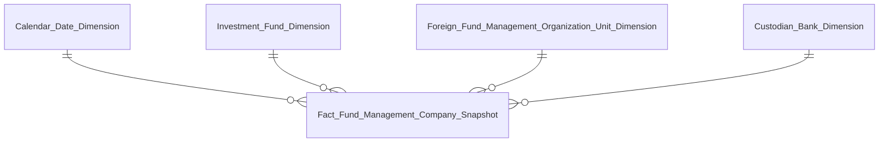
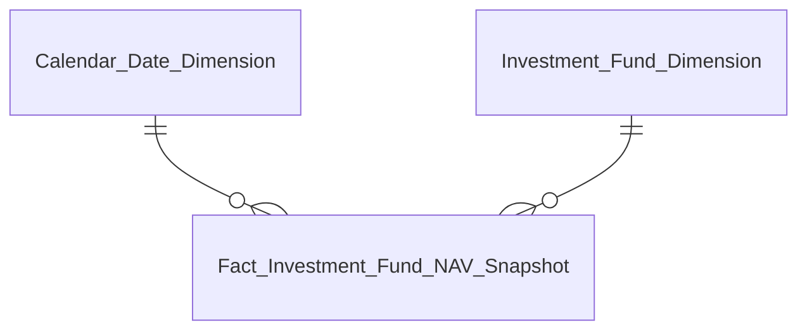
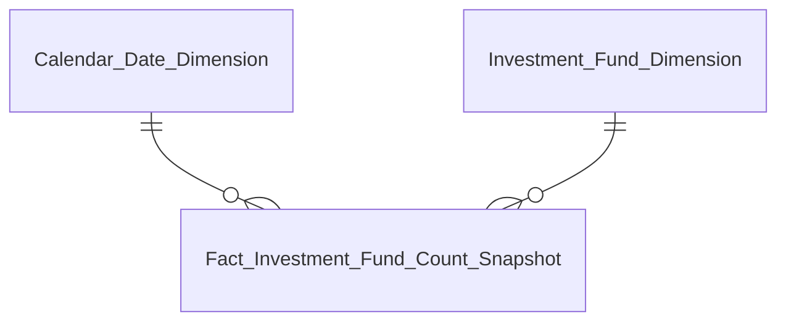
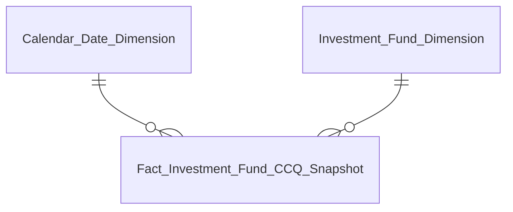
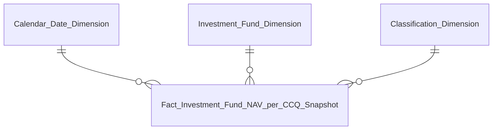
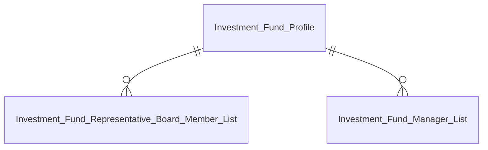
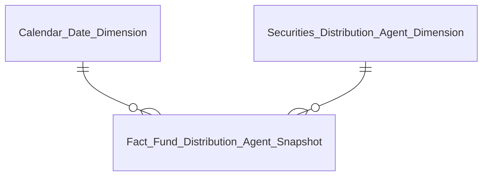
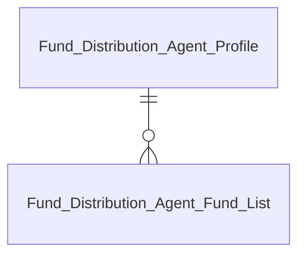
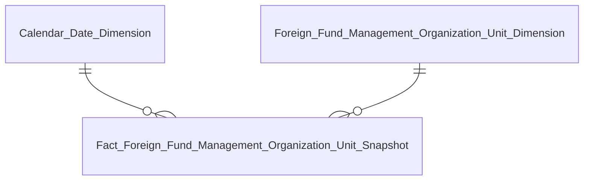

# DATAMART QLQ — Phase 2b: Entity Relationships

> **[VIẾT LẠI TOÀN BỘ 2026-09-26]** Bản trước (Phase 2b cũ) tự ghi nhận đã lệch hoàn toàn với HLD sau nhiều lần renumber (K_FMS→K_QLQ 1-981). File này viết lại từ Section 3 + Section 4 của `DTM_QLQ_HLD.md` sau khi rà soát Nhóm 1-28 (gỡ gating "Dữ liệu động" sai, sửa nguồn Securities/Fund Distribution Agent, xem `project_qlq_reconciliation_0926.md`). Nguồn sự thật: `DTM_QLQ_Entities.csv` (cùng thư mục).

## Nhóm 1, 6 — Thống kê chung CTQLQ (Fact Fund Management Company Snapshot)

| Datamart Entity | Loại | Reuse | Mô tả | Grain | KPI |
|---|---|---|---|---|---|
| Fact Fund Management Company Snapshot | Fact Snapshot | new | Thống kê thị trường CTQLQ | 1 snapshot toàn TT × 1 tháng | K_QLQ_1,2,5,6,8,9,10,11 (Nhóm 1); K_QLQ_39,40 (Nhóm 6, reuse) |
| Investment Fund Dimension | Dimension | new | Quỹ đầu tư (SCD4A) | 1 quỹ (current state) | — |
| Foreign Fund Management Organization Unit Dimension | Dimension | new | CN CTQLQ nước ngoài (SCD4A) | 1 CN (current state) | — |
| Custodian Bank Dimension | Dimension | new | Ngân hàng giám sát (SCD4A) | 1 NH (current state) | — |
| Calendar Date Dimension | Dimension | reuse | Lịch ngày | 1 ngày | — |

---

## Nhóm 3 — Danh sách các Công ty quản lý quỹ (Operational)

Bảng tác nghiệp — lấy trực tiếp từ Atomic (Fund Management Company, Investment Fund, Member Rating), không qua Dimension riêng.

| Datamart Entity | Loại | Reuse | Mô tả | Grain | KPI |
|---|---|---|---|---|---|
| Fund Management Company Profile | Operational | new | Hồ sơ CTQLQ | 1 CTQLQ × 1 tháng slicer | K_QLQ_19,20,23,24,25,26 |

---

## Nhóm 4 — Chi tiết Quỹ của một CTQLQ (Operational)

| Datamart Entity | Loại | Reuse | Mô tả | Grain | KPI |
|---|---|---|---|---|---|
| Fund Management Company Fund List | Operational | new | Bảng con drill-down danh sách quỹ theo CTQLQ | 1 quỹ × 1 CTQLQ × 1 tháng slicer | K_QLQ_33,34 |

---

## Nhóm 7 (+8, 9 partial) — Biểu đồ Tổng NAV Quỹ / Phân bổ tài sản / Biến động NAV (Fact Investment Fund NAV Snapshot)

| Datamart Entity | Loại | Reuse | Mô tả | Grain | KPI |
|---|---|---|---|---|---|
| Fact Investment Fund NAV Snapshot | Fact Snapshot | partial | Tổng NAV quỹ so với GDP | 1 quỹ × 1 tháng | K_QLQ_44,45,47 (Nhóm 7) |
| Investment Fund Dimension | Dimension | new | Quỹ đầu tư (SCD4A) | 1 quỹ (current state) | — |
| Calendar Date Dimension | Dimension | reuse | Lịch ngày | 1 ngày | — |
| Fact Macro Indicator Snapshot (module PTTT) | Fact Snapshot | reuse | GDP_VN — reuse xuyên module, không sinh file LLD cho QLQ | 1 chỉ số × 1 kỳ | K_QLQ_47 |

> Nhóm 8, 9 tái sử dụng Chiều Thời gian (K_QLQ_44) nhưng không có measure riêng READY — toàn bộ 6 chỉ tiêu phân bổ tài sản (Nhóm 8) và 3 chỉ tiêu biến động NAV (Nhóm 9) PENDING, xem O_QLQ_15.

---

## Nhóm 10 (+6 reuse) — Số lượng quỹ đầu tư chứng khoán (Fact Investment Fund Count Snapshot)

| Datamart Entity | Loại | Reuse | Mô tả | Grain | KPI |
|---|---|---|---|---|---|
| Fact Investment Fund Count Snapshot | Fact Snapshot | new | Đếm số quỹ theo loại hình quỹ | 1 loại hình quỹ × 1 tháng | K_QLQ_59–67 (Nhóm 10); K_QLQ_41 (Nhóm 6, reuse) |
| Investment Fund Dimension | Dimension | new | Quỹ đầu tư (SCD4A) | 1 quỹ (current state) | — |
| Calendar Date Dimension | Dimension | reuse | Lịch ngày | 1 ngày | — |

---

## Nhóm 11 — Tăng trưởng số lượng CCQ lưu hành (Fact Investment Fund CCQ Snapshot)

| Datamart Entity | Loại | Reuse | Mô tả | Grain | KPI |
|---|---|---|---|---|---|
| Fact Investment Fund CCQ Snapshot | Fact Snapshot | new | Tổng KL CCQ lưu hành theo loại hình quỹ | 1 loại hình quỹ × 1 tháng | K_QLQ_68–76 |
| Investment Fund Dimension | Dimension | new | Quỹ đầu tư (SCD4A) | 1 quỹ (current state) | — |
| Calendar Date Dimension | Dimension | reuse | Lịch ngày | 1 ngày | — |

---

## Nhóm 12 — Tỉ lệ tăng trưởng NAV/CCQ so với VN-Index và Lãi suất liên NH (Fact Investment Fund NAV per CCQ Snapshot)

| Datamart Entity | Loại | Reuse | Mô tả | Grain | KPI |
|---|---|---|---|---|---|
| Fact Investment Fund NAV per CCQ Snapshot | Fact Snapshot | partial | Tỉ lệ tăng trưởng NAV/CCQ theo loại hình quỹ chi tiết | 1 loại hình quỹ chi tiết × 1 tháng | K_QLQ_77,78,79,80 |
| Investment Fund Dimension | Dimension | new | Quỹ đầu tư (SCD4A) | 1 quỹ (current state) | — |
| Classification Dimension | Dimension | reuse | Loại hình quỹ chi tiết (scheme FMS_FUND_TYPE) | 1 giá trị classification | — |
| Calendar Date Dimension | Dimension | reuse | Lịch ngày | 1 ngày | — |
| Fact Market Index Snapshot (module GSTT) | Fact Snapshot | reuse | VN-Index — reuse xuyên module, không sinh file LLD cho QLQ | 1 chỉ số × 1 ngày | K_QLQ_78 |
| Fact Macro Indicator Snapshot (module PTTT) | Fact Snapshot | reuse | Lãi suất liên NH qua đêm (INTERBANK_IR) — reuse xuyên module | 1 chỉ số × 1 kỳ | K_QLQ_79 |

---

## Nhóm 13 — Danh sách các quỹ đầu tư (Operational)

| Datamart Entity | Loại | Reuse | Mô tả | Grain | KPI |
|---|---|---|---|---|---|
| Investment Fund Profile | Operational | partial | Hồ sơ quỹ đầu tư | 1 quỹ × 1 tháng slicer | K_QLQ_92-96,98,99,101 |

---

## Nhóm 15 — Danh sách thành viên ban đại diện (Operational, drill-down từ Nhóm 13)

| Datamart Entity | Loại | Reuse | Mô tả | Grain | KPI |
|---|---|---|---|---|---|
| Investment Fund Representative Board Member List | Operational | new | Bảng con drill-down thành viên BĐD quỹ | 1 thành viên × 1 quỹ | K_QLQ_104 |

---

## Nhóm 16 — Danh sách người điều hành quỹ (Operational, drill-down từ Nhóm 13)

| Datamart Entity | Loại | Reuse | Mô tả | Grain | KPI |
|---|---|---|---|---|---|
| Investment Fund Manager List | Operational | new | Bảng con drill-down người điều hành quỹ | 1 người × 1 quỹ | K_QLQ_105 |

---

## Nhóm 17 — Thống kê chung Đại lý phân phối (Fact Fund Distribution Agent Snapshot)

| Datamart Entity | Loại | Reuse | Mô tả | Grain | KPI |
|---|---|---|---|---|---|
| Fact Fund Distribution Agent Snapshot | Fact Snapshot | new | Thống kê chung ĐLPP toàn thị trường (nguồn FMS.DISTRIBUTOR_AGENT) | 1 snapshot toàn TT × 1 quý/năm | K_QLQ_116,117 |
| Securities Distribution Agent Dimension | Dimension | new | ĐLPP (SCD4A, + shared IP Alt Identification/Postal Address) | 1 ĐLPP (current state) | — |
| Calendar Date Dimension | Dimension | reuse | Lịch ngày | 1 ngày | — |

---

## Nhóm 22 — Danh sách Đại lý phân phối (Operational)

| Datamart Entity | Loại | Reuse | Mô tả | Grain | KPI |
|---|---|---|---|---|---|
| Fund Distribution Agent Profile | Operational | new | Hồ sơ ĐLPP (nguồn FMS.DISTRIBUTOR_AGENT) | 1 ĐLPP × 1 tháng slicer | K_QLQ_137-143 |

---

## Nhóm 23 — Danh sách các Quỹ đang phân phối (Operational, drill-down từ Nhóm 22)

| Datamart Entity | Loại | Reuse | Mô tả | Grain | KPI |
|---|---|---|---|---|---|
| Fund Distribution Agent Fund List | Operational | new | Bảng con drill-down danh sách quỹ đang phân phối (nguồn FMS.AGENCIES) | 1 quỹ × 1 ĐLPP | K_QLQ_159 |
| Fund Distribution Agent Dimension | Dimension | new | ĐLPP nguồn FMS.AGENCIES (SCD4A) — xem O_QLQ_10 | 1 ĐLPP (current state) | — |

---

## Nhóm 24 — Thống kê chung CN CTQLQ nước ngoài tại VN (Fact Foreign Fund Management Organization Unit Snapshot)

| Datamart Entity | Loại | Reuse | Mô tả | Grain | KPI |
|---|---|---|---|---|---|
| Fact Foreign Fund Management Organization Unit Snapshot | Fact Snapshot | new | Thống kê chung CN CTQLQ nước ngoài toàn thị trường | 1 snapshot toàn TT × 1 tháng | K_QLQ_160,161 |
| Foreign Fund Management Organization Unit Dimension | Dimension | new | CN CTQLQ nước ngoài (SCD4A) | 1 CN (current state) | — |
| Calendar Date Dimension | Dimension | reuse | Lịch ngày | 1 ngày | — |

---

## Nhóm 26 — Danh sách các Chi nhánh CTQLQ nước ngoài tại Việt Nam (Operational)

| Datamart Entity | Loại | Reuse | Mô tả | Grain | KPI |
|---|---|---|---|---|---|
| Foreign Fund Management Organization Unit Profile | Operational | partial | Hồ sơ CN CTQLQ nước ngoài | 1 CN × 1 tháng slicer | K_QLQ_171,172,173 |
| Foreign Fund Management Organization Unit Staff Dimension | Dimension | new | Nhân viên CN CTQLQ nước ngoài (Giám đốc CN) | 1 nhân viên (current state) | — |

---

## Bảng PENDING (không thiết kế trong Phase 2)

| Datamart Entity | Lý do PENDING | Issue |
|---|---|---|
| Fact Discretionary Investment Contract Snapshot (Nhóm 2) | 0/7 KPI READY — BA đổi hẳn nguồn sang engine báo cáo định kỳ, chưa có Atomic entity | O_QLQ_15 |
| Fund Management Company Contract List (Nhóm 5) | 0/3 KPI READY — BA đổi nguồn + đổi nội dung K_QLQ_36, grain cần xác nhận lại | O_QLQ_5, O_QLQ_15 |
| Investment Fund Distribution Agent List (Nhóm 14) | 0/1 KPI READY — thiếu attribute FK scheme FMS_AGENCY_TYPE trên `fund_distribution_agent` | O_QLQ_9 |
| Report Pass-through View (Tab DATA EXPLORER, STT 28-90) | 100% BA Pending, chưa khảo sát | O_QLQ_1 |
| Foreign Fund Management Organization Unit Contract List (popup trong Nhóm 26, cùng STT=26 — không phải Nhóm riêng, xem O_QLQ_20) | 0/3 KPI READY — engine báo cáo định kỳ, chưa có Atomic entity | O_QLQ_15 |
| Fund Management Company Staff Trade Report (Nhóm 27) | 1/10 KPI READY (chỉ join-key Chiều) — cầu nối VSDC investor registry chưa có Atomic entity | O_QLQ_11 |
