# DTM_QLQ_HLD — Data Mart: Phân hệ QLQ (Công ty Quản lý Quỹ)

---

## Section 1 — Data Lineage: Staging → Atomic → Datamart

> **Nhóm 1, 2, 6, 7, 8, 9, 10, 11, 12 (Tab TỔNG QUAN CTQLQ + QUỸ ĐẦU TƯ), Nhóm 18, 19, 20, 21, 25 (Tab TỔNG QUAN ĐẠI LÝ PHÂN PHỐI / CN CTQLQ NN), Nhóm 27 (Báo cáo GD nhân viên) hiện PENDING toàn bộ** — BA đánh "Dữ liệu động" cho toàn bộ measure của các Nhóm này, hoặc Atomic nguồn chỉ có ở track `Atomic_LinhLV` (out of date, không phải nguồn chuẩn), hoặc thiếu hẳn Chiều thời gian hợp lệ ở đúng grain (Nhóm 12 — `FMS.FUND_REPORT` chưa có Atomic entity) — theo gating "Loại dữ liệu" nên không thiết kế Cụm Lineage/Star Schema ở giai đoạn này. Xem chi tiết Atomic đã sẵn sàng + lý do pending trong Section 2 của từng Nhóm tương ứng.

##### Cụm 1: Danh sách CTQLQ — flat (Tác nghiệp)

Phục vụ Tab TỔNG QUAN CTQLQ — Nhóm 3. Bảng flat `Fund Management Company Profile` — chỉ 2/13 chỉ tiêu READY (Tên công ty, Người đại diện theo pháp luật); 11 chỉ tiêu còn lại PENDING (Dữ liệu động hoặc thiếu Atomic `FMS.SECURITIES_REPORT`). Lấy từ Atomic trực tiếp, không qua Dimension.

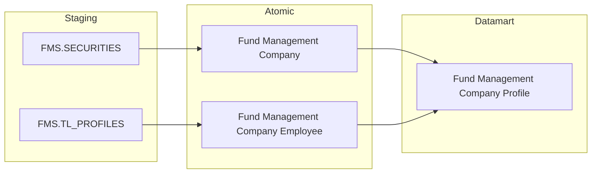

---

##### Cụm 2: Chi tiết Quỹ của một CTQLQ (Tác nghiệp)

Phục vụ Tab TỔNG QUAN CTQLQ — Nhóm 4. Bảng con drill-down `Fund Management Company Fund List` — 2/3 chỉ tiêu READY (Tên quỹ, Loại hình quỹ); Giá trị NAV PENDING (Dữ liệu động).

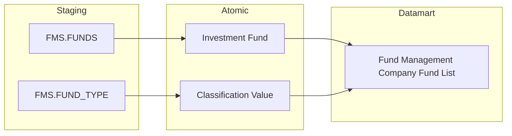

---

##### Cụm 3: Chi tiết hợp đồng UTDM của một CTQLQ (Tác nghiệp)

Phục vụ Tab TỔNG QUAN CTQLQ — Nhóm 5. Bảng con drill-down `Fund Management Company Contract List` — 2/3 chỉ tiêu READY (Mã HĐ, Số TK lưu ký); Giá trị hợp đồng PENDING (Dữ liệu động).

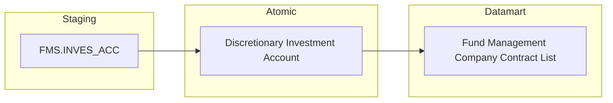

---

##### Cụm 4: Danh sách quỹ đầu tư (Tác nghiệp)

Phục vụ Tab QUỸ ĐẦU TƯ — Nhóm 13. Bảng flat `Investment Fund Profile` — 8/11 chỉ tiêu READY (Tên quỹ, Phân loại, Công ty quản lý, Ngân hàng giám sát, Số ĐLPP, Số TV BĐD, Số người điều hành); NAV hiện tại/KL CCQ/LN YTD PENDING (Dữ liệu động).

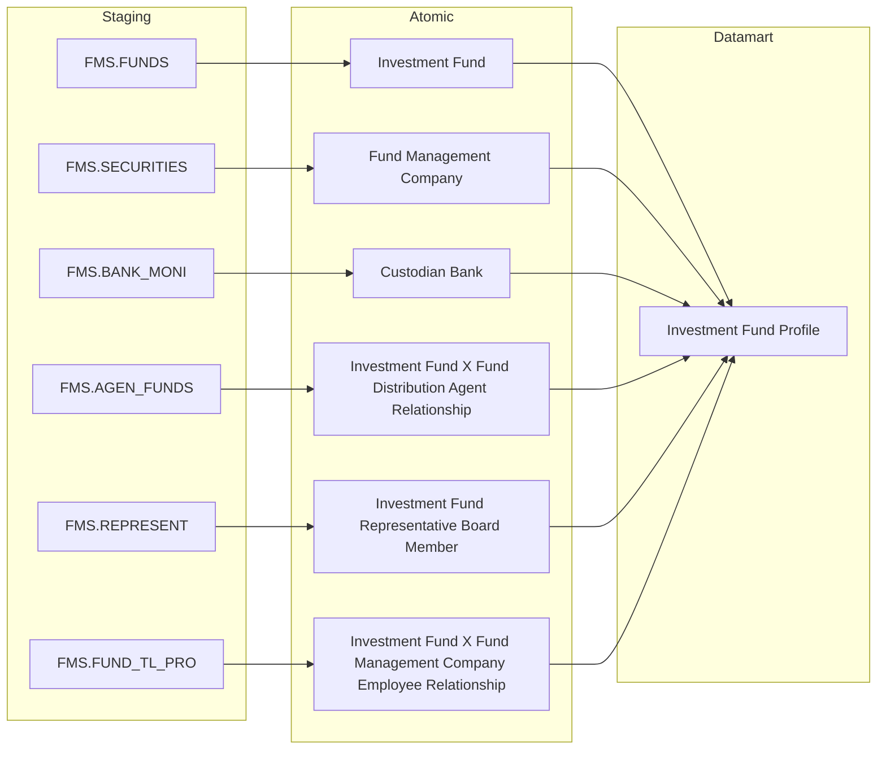

---

##### Cụm 5a: Drill-down danh sách đại lý phân phối của quỹ (Tác nghiệp)

Phục vụ Tab QUỸ ĐẦU TƯ — Nhóm 14. Bảng con drill-down từ Nhóm 13, 1 chỉ tiêu READY.

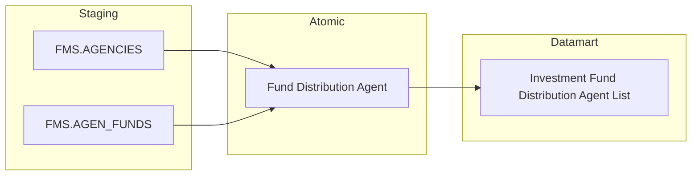

---

##### Cụm 5b: Drill-down danh sách thành viên ban đại diện của quỹ (Tác nghiệp)

Phục vụ Tab QUỸ ĐẦU TƯ — Nhóm 15. Bảng con drill-down từ Nhóm 13, 1 chỉ tiêu READY.

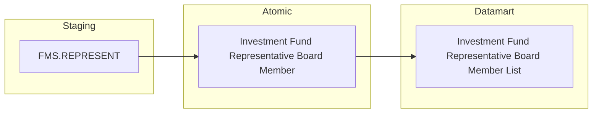

---

##### Cụm 5c: Drill-down danh sách người điều hành quỹ (Tác nghiệp)

Phục vụ Tab QUỸ ĐẦU TƯ — Nhóm 16. Bảng con drill-down từ Nhóm 13, 1 chỉ tiêu READY.

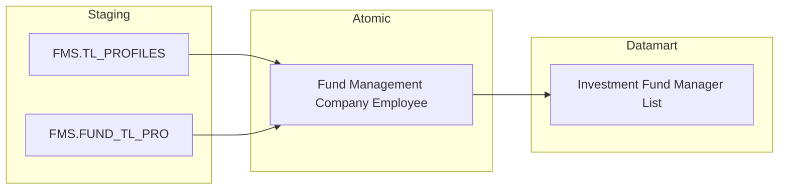

---

##### Cụm 7: Thống kê chung Đại lý phân phối (`Fact Fund Distribution Agent Snapshot`)

Phục vụ Tab TỔNG QUAN ĐẠI LÝ PHÂN PHỐI — Nhóm 17. Chỉ 2 measure READY: Chiều Thời gian và Số lượng ĐLPP (COUNT db). Số tài khoản/Giá trị phát hành/mua lại PENDING (Dữ liệu động, BA chưa cung cấp nguồn).

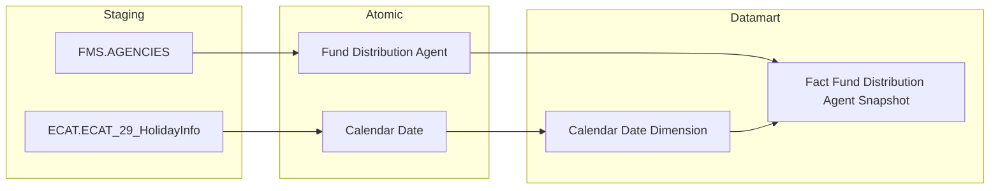

---

##### Cụm 8a: Danh sách Đại lý phân phối (Tác nghiệp)

Phục vụ Tab TỔNG QUAN ĐẠI LÝ PHÂN PHỐI — Nhóm 22. Bảng flat `Fund Distribution Agent Profile` — 6/13 chỉ tiêu READY.

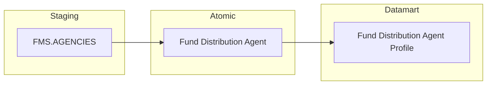

---

##### Cụm 8b: Danh sách các Quỹ đang phân phối (Tác nghiệp)

Phục vụ Tab TỔNG QUAN ĐẠI LÝ PHÂN PHỐI — Nhóm 23. Bảng con drill-down `Fund Distribution Agent Fund List` — 1 chỉ tiêu READY.

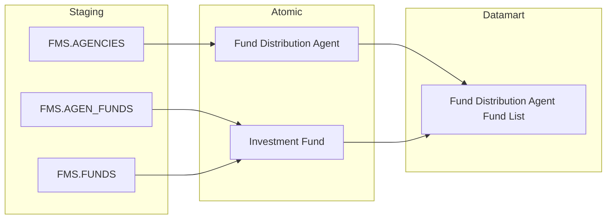

---

##### Cụm 9a: Thống kê chung CN CTQLQ nước ngoài tại VN (`Fact Foreign Fund Management Organization Unit Snapshot`)

Phục vụ Tab TỔNG QUAN CN CTQLQ NN TẠI VN — Nhóm 24. Fact Market-Level Snapshot — 2 measure READY (Chiều Thời gian, đếm CN).

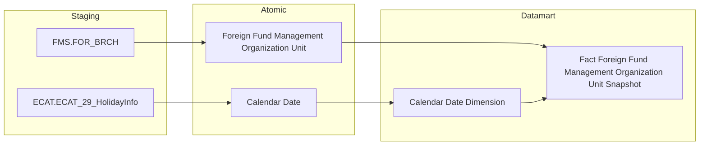

---

##### Cụm 9b: Danh sách CN CTQLQ nước ngoài tại VN (Tác nghiệp)

Phục vụ Tab TỔNG QUAN CN CTQLQ NN TẠI VN — Nhóm 26. Bảng flat `Foreign Fund Management Organization Unit Profile` — 4/10 chỉ tiêu READY (Tên CN, Giám đốc CN, Số nhân viên CCHN, Chiều Thời gian).

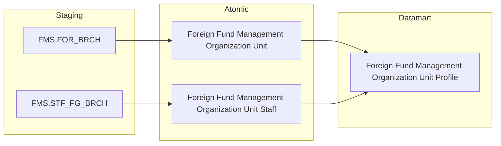

---

## Section 2 — Tổng quan báo cáo

### Tab: TỔNG QUAN CTQLQ

**Slicer chung:** Tháng/Năm (ví dụ: "THÁNG 5 — 2024")

---

#### Nhóm 1 - Thống kê chung

> Phân loại: **Phân tích**
> Atomic: `Investment Fund` ← FMS.FUNDS — READY *(K_QLQ_2, K_QLQ_7: COUNT db — nhưng BA đánh "Dữ liệu động" nên PENDING)*
> Atomic: `Discretionary Investment Account` ← FMS.INVES_ACC — READY *(K_QLQ_3 — BA đánh "Dữ liệu động" nên PENDING)*
> Atomic: `Fund Management Company` ← FMS.SECURITIES — READY *(K_QLQ_5 — BA đánh "Dữ liệu động" nên PENDING)*
> Atomic: `Foreign Fund Management Organization Unit` ← FMS.FOR_BRCH — READY *(K_QLQ_6, K_QLQ_8, K_QLQ_9, K_QLQ_10 — BA đánh "Dữ liệu động" nên PENDING)*
> Atomic: `Custodian Bank` ← FMS.BANK_MONI — READY *(K_QLQ_11 — BA đánh "Dữ liệu động" nên PENDING)*
> Ghi chú: **Toàn bộ Nhóm PENDING.** Toàn bộ chỉ tiêu cơ sở trong Nhóm này (K_QLQ_2–5, K_QLQ_7–151) BA đánh **Dữ liệu động** — theo gating "Loại dữ liệu" (xem SKILL.md), Dữ liệu động → PENDING dù Atomic đã sẵn sàng. Chỉ còn lại 1 dòng Chiều "Thời gian" (Dữ liệu tĩnh), nhưng không còn measure nào READY đi kèm để hiển thị → PENDING toàn bộ Nhóm, kể cả Chiều.

**Bảng KPI:**

| KPI ID | Tên KPI | Đơn vị | Tính chất | Công thức | Ghi chú | Trạng thái |
|---|---|---|---|---|---|---|
| K_QLQ_1 | Thời gian | — | Chiều | | **Lý do pending:** Nhóm không còn measure nào READY (toàn bộ đánh Dữ liệu động) nên Chiều không có ý nghĩa hiển thị độc lập. **Atomic cần bổ sung:** không — chờ BA xác nhận lại quy tắc khai thác cho các measure trong Nhóm. **Mart dự kiến:** `Fact Fund Management Company Snapshot` — grain: 1 snapshot toàn thị trường × 1 tháng. | PENDING |
| K_QLQ_2 | Quỹ đầu tư chứng khoán | Quỹ | Cơ sở | | **Lý do pending:** BA đánh Dữ liệu động — nguồn COUNT(Investment Fund) theo FUNDS.ID, DELETED=0, ID_DATE. **Atomic cần bổ sung:** không cần bổ sung Atomic (Investment Fund đã READY), chờ BA xác nhận quy tắc khai thác. **Mart dự kiến:** `Fact Fund Management Company Snapshot`. | PENDING |
| K_QLQ_3 | Hợp đồng UTDM | Hợp đồng | Cơ sở | | **Lý do pending:** BA đánh Dữ liệu động — nguồn COUNT DISTINCT(Discretionary Investment Account.Contract_No), DELETED=0, DATE_REPORT. **Atomic cần bổ sung:** không — chờ BA xác nhận quy tắc khai thác. **Mart dự kiến:** `Fact Fund Management Company Snapshot`. | PENDING |
| K_QLQ_4 | Tổng AUM quản lý | Nghìn tỷ VND | Cơ sở | | **Lý do pending:** BA đánh Dữ liệu động — nguồn SUM(FUND_REPORT.TOTAL_PROPERTY), EXCUTION_DATE; FUND_REPORT chưa có LLD Atomic riêng trong `DataModel/working/Atomic/lld/FMS/`. **Atomic cần bổ sung:** entity cho `FMS.FUND_REPORT` (Fund NAV/Property Report). **Mart dự kiến:** `Fact Fund Management Company Snapshot`. | PENDING |
| K_QLQ_5 | CTQLQ đang hoạt động | Công ty | Cơ sở | | **Lý do pending:** BA đánh Dữ liệu động — nguồn COUNT(Fund Management Company) JOIN STATUS, Type_Sec=2, Item_Name='Hoạt động'. **Atomic cần bổ sung:** không — chờ BA xác nhận quy tắc khai thác. **Mart dự kiến:** `Fact Fund Management Company Snapshot`. | PENDING |
| K_QLQ_6 | VPĐD QLQ nước ngoài tại VN | Văn phòng | Cơ sở | | **Lý do pending:** BA đánh Dữ liệu động — nguồn COUNT(Foreign Fund Management Organization Unit), Branch_Flag=0. **Atomic cần bổ sung:** không — chờ BA xác nhận quy tắc khai thác. **Mart dự kiến:** `Fact Fund Management Company Snapshot`. | PENDING |
| K_QLQ_7 | Số lượng hợp đồng tư vấn đầu tư | Hợp đồng | Cơ sở | | **Lý do pending:** BA chưa cung cấp Bảng nguồn/Trường nguồn (để trống) dù Trạng thái mapping = Done; đồng thời BA đánh Dữ liệu động. **Atomic cần bổ sung:** chưa xác định entity nguồn — chờ BA bổ sung Bảng nguồn. **Mart dự kiến:** `Fact Fund Management Company Snapshot`. | PENDING |
| K_QLQ_8 | VPĐD CTQLQ NN tại VN đang hoạt động | Văn phòng | Cơ sở | | **Lý do pending:** BA đánh Dữ liệu động — nguồn COUNT(Foreign Fund Management Organization Unit) JOIN STATUS, Branch_Flag=0, Operation_Status_Code tương ứng 'Hoạt động'. **Atomic cần bổ sung:** không — Foreign Fund Management Organization Unit đã có Operation Status Code (scheme FMS_OPERATION_STATUS), chờ BA xác nhận quy tắc khai thác. **Mart dự kiến:** `Fact Fund Management Company Snapshot`. | PENDING |
| K_QLQ_9 | VPĐD CTQLQ NN tại VN đang chờ đóng cửa | Văn phòng | Cơ sở | | **Lý do pending:** Tương tự K_QLQ_8, lọc Operation_Status_Code = 'Chờ đóng cửa'. **Atomic cần bổ sung:** không. **Mart dự kiến:** `Fact Fund Management Company Snapshot`. | PENDING |
| K_QLQ_10 | VPĐD CTQLQ NN tại VN đã đóng cửa | Văn phòng | Cơ sở | | **Lý do pending:** Tương tự K_QLQ_8, lọc Operation_Status_Code = 'Đóng cửa VPĐD'. **Atomic cần bổ sung:** không. **Mart dự kiến:** `Fact Fund Management Company Snapshot`. | PENDING |
| K_QLQ_11 | Tổng số ngân hàng giám sát | Ngân hàng | Cơ sở | | **Lý do pending:** BA đánh Dữ liệu động — nguồn COUNT(Custodian Bank), Type='1'. **Atomic cần bổ sung:** không — chờ BA xác nhận quy tắc khai thác. **Mart dự kiến:** `Fact Fund Management Company Snapshot`. | PENDING |

**Bảng mapping nguồn (Atomic Placeholder):**

| Tên KPI | Bảng nguồn (BA) | Atomic entity dự kiến | Atomic table dự kiến |
|---|---|---|---|
| K_QLQ_2 | FMSQLQ.FUNDS | Investment Fund | investment_fund |
| K_QLQ_3 | FMSQLQ.INVES_ACC | Discretionary Investment Account | discretionary_investment_account |
| K_QLQ_4 | FMSQLQ.FUND_REPORT | Fund NAV/Property Report *(chưa có LLD)* | TBD |
| K_QLQ_5 | FMSQLQ.SECURITIES, FMSQLQ.STATUS | Fund Management Company | fund_management_company |
| K_QLQ_6, 148, 149, 150 | FMSQLQ.FOR_BRCH, FMSQLQ.STATUS | Foreign Fund Management Organization Unit | foreign_fm_ou |
| K_QLQ_7 | *(BA chưa cung cấp)* | TBD | TBD |
| K_QLQ_11 | FMSQLQ.BANK_MONI | Custodian Bank | custodian_bank |

---

#### Nhóm 2 - Số liệu hợp đồng uỷ thác danh mục

> Phân loại: **Phân tích**
> Atomic: `Discretionary Investment Account` ← FMS.INVES_ACC — READY *(K_QLQ_13–K_QLQ_18 — BA đánh "Dữ liệu động" nên PENDING)*
> Ghi chú: **Toàn bộ Nhóm PENDING** — BA đánh "Dữ liệu động" cho cả Chiều "Thời gian" lẫn toàn bộ 6 chỉ tiêu cơ sở của Nhóm này, theo gating "Loại dữ liệu" nên PENDING toàn bộ dù Atomic `Discretionary Investment Account` đã sẵn sàng. Toàn bộ chỉ tiêu (số lượng HĐ, giá trị thị trường) lấy trực tiếp từ INVES_ACC theo Investor Object Type.

**Bảng KPI:**

| KPI ID | Tên KPI | Đơn vị | Tính chất | Công thức | Ghi chú | Trạng thái |
|---|---|---|---|---|---|---|
| K_QLQ_12 | Thời gian | — | Chiều | | **Lý do pending:** Nhóm không còn measure nào READY (toàn bộ đánh Dữ liệu động). **Atomic cần bổ sung:** không — chờ BA xác nhận quy tắc khai thác. **Mart dự kiến:** `Fact Discretionary Investment Contract Snapshot` — grain: 1 CTQLQ × 1 tháng. | PENDING |
| K_QLQ_13 | Số lượng hợp đồng UTDM cá nhân | HĐ | Cơ sở | | **Lý do pending:** BA đánh Dữ liệu động — nguồn COUNT DISTINCT(Discretionary Investment Account.Contract_No) WHERE ID_Type cá nhân. **Atomic cần bổ sung:** không — chờ BA xác nhận quy tắc khai thác. **Mart dự kiến:** `Fact Discretionary Investment Contract Snapshot`. | PENDING |
| K_QLQ_14 | Giá trị thị trường hợp đồng UTDM cá nhân | Tỷ VND | Cơ sở | | **Lý do pending:** BA đánh Dữ liệu động — nguồn SUM(Discretionary Investment Account.List_Value) WHERE ID_Type cá nhân. **Atomic cần bổ sung:** không. **Mart dự kiến:** `Fact Discretionary Investment Contract Snapshot`. | PENDING |
| K_QLQ_15 | Số lượng hợp đồng UTDM tổ chức | HĐ | Cơ sở | | **Lý do pending:** Tương tự K_QLQ_13, WHERE ID_Type tổ chức. **Atomic cần bổ sung:** không. **Mart dự kiến:** `Fact Discretionary Investment Contract Snapshot`. | PENDING |
| K_QLQ_16 | Giá trị thị trường hợp đồng UTDM tổ chức | Tỷ VND | Cơ sở | | **Lý do pending:** Tương tự K_QLQ_14, WHERE ID_Type tổ chức. **Atomic cần bổ sung:** không. **Mart dự kiến:** `Fact Discretionary Investment Contract Snapshot`. | PENDING |
| K_QLQ_17 | Tổng số lượng hợp đồng UTDM | HĐ | Cơ sở | | **Lý do pending:** BA đánh Dữ liệu động — nguồn COUNT DISTINCT(Discretionary Investment Account.Contract_No) toàn thị trường. **Atomic cần bổ sung:** không. **Mart dự kiến:** `Fact Discretionary Investment Contract Snapshot`. | PENDING |
| K_QLQ_18 | Tổng giá trị ủy thác | Tỷ VND | Cơ sở | | **Lý do pending:** BA đánh Dữ liệu động — nguồn SUM(Discretionary Investment Account.List_Value) toàn thị trường. **Atomic cần bổ sung:** không. **Mart dự kiến:** `Fact Discretionary Investment Contract Snapshot`. | PENDING |

**Bảng mapping nguồn (Atomic Placeholder):**

| Tên KPI | Bảng nguồn (BA) | Atomic entity dự kiến | Atomic table dự kiến |
|---|---|---|---|
| K_QLQ_13, 11, 12, 13, 14, 15 | FMSQLQ.INVES_ACC | Discretionary Investment Account | discretionary_investment_account |

---

#### Nhóm 3 - Danh sách các Công ty quản lý quỹ

> Phân loại: **Tác nghiệp**
> Atomic: `Fund Management Company` ← FMS.SECURITIES — READY *(K_QLQ_20: Tên công ty)*
> Atomic: `Fund Management Company Employee` ← FMS.TL_PROFILES — READY *(K_QLQ_21: Người đại diện theo pháp luật)*
> Ghi chú: **Mix READY/PENDING** — chỉ 2/14 chỉ tiêu BA đánh Dữ liệu tĩnh (Tên công ty, Người đại diện) + Chiều "Thời gian". 11 chỉ tiêu còn lại BA đánh Dữ liệu động → PENDING. Trong đó `Số lượng nhân viên có CCHN`/`AUM`/`Thị phần`/`Lợi nhuận` (nguồn FMSQLQ.SECURITIES_REPORT) **PENDING kép** — vừa Dữ liệu động, vừa chưa có Atomic entity nào cho `FMS.SECURITIES_REPORT`. `CAR (ATTC)` và `Vốn CSH` BA chưa cung cấp Bảng nguồn. 2 bảng con drill-down `Fund Management Company Fund List`/`Fund Management Company Contract List` tách thành Nhóm 4 và Nhóm 5 riêng (xem STT=4, STT=5).

**Mockup:**

| Mã | Tên CT | Người đại diện | Số nhân viên CCHN | Số lượng Quỹ | Xếp loại | CAMEL | Vốn điều lệ | AUM | Thị phần | CAR | Lợi nhuận | Vốn CSH | Số HĐ UTQLDM |
|---|---|---|---|---|---|---|---|---|---|---|---|---|---|
| CT1 | Công ty ABC | Nguyễn Văn A | 12 | 5 | A | 89.5% | 150 | 25.450 | 8.2% | 18.5% | 120.4 | 165 | 350 |

**Source:** `Fund Management Company Profile`

**Bảng KPI:**

| KPI ID | Tên KPI | Đơn vị | Tính chất | Công thức | Ghi chú | Trạng thái |
|---|---|---|---|---|---|---|
| K_QLQ_19 | Thời gian | — | Chiều | | **Lý do pending:** BA đánh Dữ liệu động cho dòng Thời gian ở Nhóm này — Chiều PENDING dù Nhóm còn 2 measure READY khác (Tên công ty, Người đại diện). **Atomic cần bổ sung:** không. **Mart dự kiến:** `Fund Management Company Profile` — grain: 1 CTQLQ × 1 tháng slicer. | PENDING |
| K_QLQ_20 | Tên công ty | — | Cơ sở | `Company_Name`, `Company_Short_Name` ← Fund Management Company | | READY |
| K_QLQ_21 | Người đại diện theo pháp luật | — | Cơ sở | `Item_Name` ← Fund Management Company Employee (FMS.TL_PROFILES) | | READY |
| K_QLQ_22 | Số lượng nhân viên có CCHN | Người | Cơ sở | | **Lý do pending:** Dữ liệu động + chưa có Atomic entity cho `FMS.SECURITIES_REPORT`. **Atomic cần bổ sung:** entity cho `FMS.SECURITIES_REPORT` (Securities Company Periodic Report). **Mart dự kiến:** `Fund Management Company Profile`. | PENDING |
| K_QLQ_23 | Số lượng Quỹ | Quỹ | Cơ sở | | **Lý do pending:** Dữ liệu động — nguồn COUNT(Investment Fund) theo Fund_Management_Company_Id. **Atomic cần bổ sung:** không — Investment Fund đã READY, chờ BA xác nhận quy tắc khai thác. **Mart dự kiến:** `Fund Management Company Profile`. | PENDING |
| K_QLQ_24 | Xếp loại | — | Cơ sở | | **Lý do pending:** Dữ liệu động — nguồn `Rank_Index` ← Member Rating (FMS.RANK). **Atomic cần bổ sung:** không — Member Rating đã READY, chờ BA xác nhận quy tắc khai thác. **Mart dự kiến:** `Fund Management Company Profile`. | PENDING |
| K_QLQ_25 | CAMEL | % | Cơ sở | | **Lý do pending:** Dữ liệu động — nguồn `Total_Score_Amount` ← Member Rating. **Atomic cần bổ sung:** không. **Mart dự kiến:** `Fund Management Company Profile`. | PENDING |
| K_QLQ_26 | Vốn điều lệ | Tỷ VND | Cơ sở | | **Lý do pending:** Dữ liệu động — nguồn `Capital` ← Fund Management Company (FMS.SECURITIES). **Atomic cần bổ sung:** không. **Mart dự kiến:** `Fund Management Company Profile`. | PENDING |
| K_QLQ_27 | AUM | Tỷ VND | Cơ sở | | **Lý do pending:** Dữ liệu động + chưa có Atomic entity cho `FMS.SECURITIES_REPORT`. **Atomic cần bổ sung:** entity cho `FMS.SECURITIES_REPORT`. **Mart dự kiến:** `Fund Management Company Profile`. | PENDING |
| K_QLQ_28 | Thị phần | % | Phái sinh | | **Lý do pending:** Dữ liệu động + chưa có Atomic entity cho `FMS.SECURITIES_REPORT`. **Atomic cần bổ sung:** entity cho `FMS.SECURITIES_REPORT`. **Mart dự kiến:** `Fund Management Company Profile`. | PENDING |
| K_QLQ_29 | CAR (ATTC) | % | Cơ sở | | **Lý do pending:** Dữ liệu động; BA chưa cung cấp Bảng nguồn/Trường nguồn. **Atomic cần bổ sung:** chưa xác định — chờ BA bổ sung Bảng nguồn. **Mart dự kiến:** `Fund Management Company Profile`. | PENDING |
| K_QLQ_30 | Lợi nhuận | Tỷ VND | Cơ sở | | **Lý do pending:** Dữ liệu động + chưa có Atomic entity cho `FMS.SECURITIES_REPORT`. **Atomic cần bổ sung:** entity cho `FMS.SECURITIES_REPORT`. **Mart dự kiến:** `Fund Management Company Profile`. | PENDING |
| K_QLQ_31 | Vốn CSH | Tỷ VND | Cơ sở | | **Lý do pending:** Dữ liệu động; BA chưa cung cấp Bảng nguồn/Trường nguồn. **Atomic cần bổ sung:** chưa xác định — chờ BA bổ sung Bảng nguồn. **Mart dự kiến:** `Fund Management Company Profile`. | PENDING |
| K_QLQ_32 | Số lượng hợp đồng UTQLDM | HĐ | Cơ sở | | **Lý do pending:** Dữ liệu động — nguồn COUNT(Discretionary Investment Account) per CTQLQ. **Atomic cần bổ sung:** không — Discretionary Investment Account đã READY, chờ BA xác nhận quy tắc khai thác. **Mart dự kiến:** `Fund Management Company Profile`. | PENDING |

**Bảng mapping nguồn (Atomic Placeholder):**

| Tên KPI | Bảng nguồn (BA) | Atomic entity dự kiến | Atomic table dự kiến |
|---|---|---|---|
| K_QLQ_22, 158, 159, 161 | FMSQLQ.SECURITIES_REPORT | Securities Company Periodic Report *(chưa có LLD)* | TBD |
| K_QLQ_23 | FMSQLQ.FUNDS | Investment Fund | investment_fund |
| K_QLQ_24, 156 | FMSQLQ.RANK | Member Rating | member_rating |
| K_QLQ_26 | FMSQLQ.SECURITIES | Fund Management Company | fund_management_company |
| K_QLQ_29, 162 | *(BA chưa cung cấp)* | TBD | TBD |
| K_QLQ_32 | FMSQLQ.INVES_ACC | Discretionary Investment Account | discretionary_investment_account |

**Schema bảng tác nghiệp — Fund Management Company Profile:**

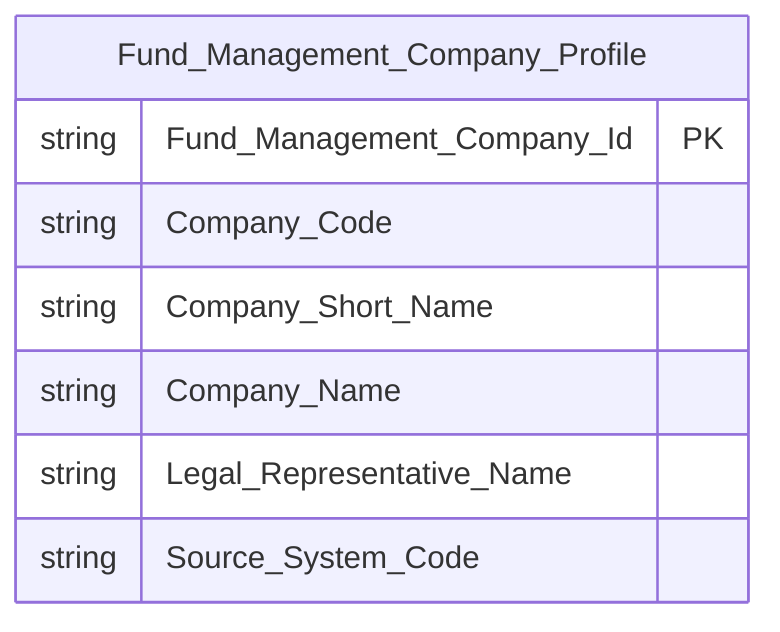

> Chỉ 2 cột READY (`Company_Name`/`Company_Short_Name`, `Legal_Representative_Name`) được đưa vào schema — 11 cột còn lại đang PENDING (xem Bảng KPI), sẽ bổ sung vào schema này khi chuyển READY.

**Lineage Mart → Báo cáo:**

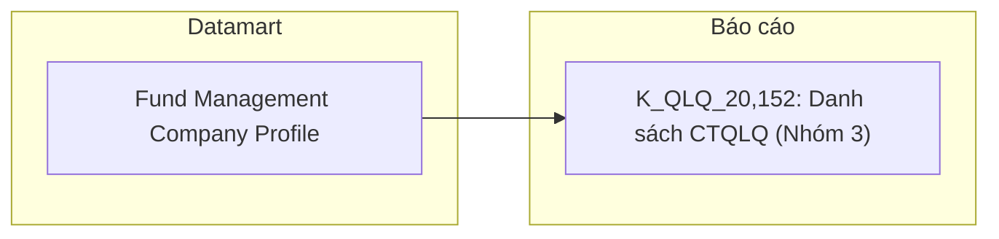

**Bảng grain:**

| Tên bảng | Grain |
|---|---|
| Fund Management Company Profile | Tác nghiệp — bảng flat \| 1 CTQLQ × 1 tháng slicer |

---

#### Nhóm 4 - Chi tiết Quỹ của một CTQLQ

> Phân loại: **Tác nghiệp**
> Atomic: `Investment Fund` ← FMS.FUNDS — READY *(K_QLQ_33: Tên quỹ)*
> Ghi chú: Popup drill-down khi bấm vào Số lượng Quỹ ở Nhóm 3 — FK về `Fund_Management_Company_Id`. Loại hình quỹ là Classification Value (scheme `FMS_FUND_TYPE`) → reuse `cl_dim`, không tạo Dimension riêng. Giá trị NAV BA đánh Dữ liệu động → PENDING.

**Mockup — popup "DANH SÁCH QUỸ":**

| Mã quỹ | Tên quỹ | Loại hình quỹ | NAV (tỷ) |
|---|---|---|---|
| QA1 | Quỹ ABC Cổ phần | Quỹ mở | 1.250 |

**Source:** `Fund Management Company Fund List`

**Bảng KPI:**

| KPI ID | Tên KPI | Đơn vị | Tính chất | Công thức | Ghi chú | Trạng thái |
|---|---|---|---|---|---|---|
| K_QLQ_33 | Tên quỹ | — | Cơ sở | `Fund_Name` ← Investment Fund (FMS.FUNDS.Item_Name) | | READY |
| K_QLQ_34 | Loại hình quỹ | — | Cơ sở | `Fund_Type_Code` ← Classification Dimension (scheme FMS_FUND_TYPE) | reuse `cl_dim` — xem Lớp 2 Reuse Analysis | READY |
| K_QLQ_35 | Giá trị NAV của từng quỹ của CTQLQ | Tỷ VND | Cơ sở | | **Lý do pending:** Dữ liệu động — nguồn `FUNDS.NAV`. **Atomic cần bổ sung:** không — Investment Fund đã READY, chờ BA xác nhận quy tắc khai thác. **Mart dự kiến:** `Fund Management Company Fund List`. | PENDING |

**Schema bảng con — Fund Management Company Fund List:**

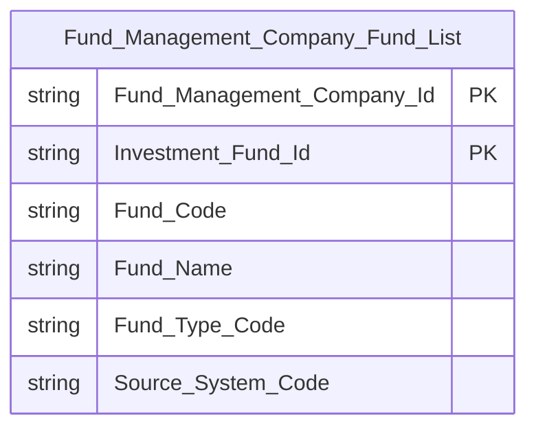

**Lineage Mart → Báo cáo:**

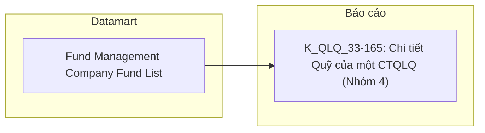

**Bảng grain:**

| Tên bảng | Grain |
|---|---|
| Fund Management Company Fund List | Tác nghiệp — bảng con drill-down \| 1 quỹ × 1 CTQLQ × 1 tháng slicer |

**Bảng mapping nguồn (Atomic Placeholder):**

| Tên KPI | Bảng nguồn (BA) | Atomic entity dự kiến | Atomic table dự kiến |
|---|---|---|---|
| K_QLQ_35 | FMSQLQ.FUNDS | Investment Fund | investment_fund |

---

#### Nhóm 5 - Chi tiết các hợp đồng UTDM của CTQLQ

> Phân loại: **Tác nghiệp**
> Atomic: `Discretionary Investment Account` ← FMS.INVES_ACC — READY *(K_QLQ_36, K_QLQ_37: Mã HĐ, Số TK lưu ký)*
> Ghi chú: Popup drill-down khi bấm vào Số lượng HĐ UTQLDM ở Nhóm 3 — FK về `Fund_Management_Company_Id`. Giá trị hợp đồng BA đánh Dữ liệu động → PENDING.

**Mockup — popup "DANH SÁCH HĐ UTDM":**

| Mã HĐ | Số TK lưu ký | Giá trị (tỷ) |
|---|---|---|
| HĐ001 | 001C123456 | 25.4 |

**Source:** `Fund Management Company Contract List`

**Bảng KPI:**

| KPI ID | Tên KPI | Đơn vị | Tính chất | Công thức | Ghi chú | Trạng thái |
|---|---|---|---|---|---|---|
| K_QLQ_36 | Mã số hợp đồng UTQLDM | — | Cơ sở | `Contract_Number` ← Discretionary Investment Account (FMS.INVES_ACC.Contract_No) | | READY |
| K_QLQ_37 | Số tài khoản lưu ký | — | Cơ sở | `Account_Number` ← Discretionary Investment Account (FMS.INVES_ACC.Account) | | READY |
| K_QLQ_38 | Giá trị của từng hợp đồng UTDM của CTQLQ | Tỷ VND | Cơ sở | | **Lý do pending:** Dữ liệu động — nguồn `INVES_ACC.LIST_VALUE`. **Atomic cần bổ sung:** không — Discretionary Investment Account đã READY, chờ BA xác nhận quy tắc khai thác. **Mart dự kiến:** `Fund Management Company Contract List`. | PENDING |

**Schema bảng con — Fund Management Company Contract List:**

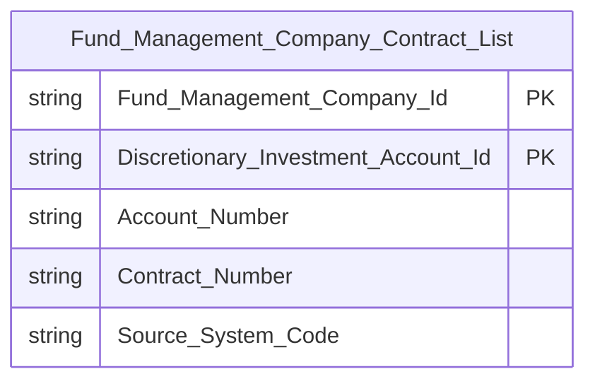

**Lineage Mart → Báo cáo:**

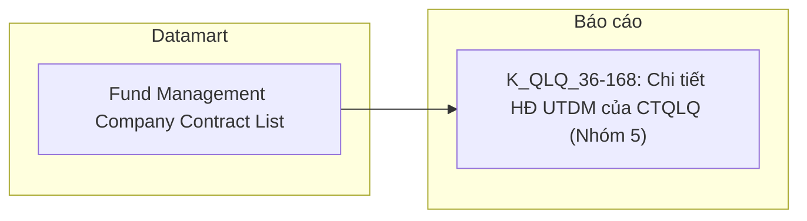

**Bảng grain:**

| Tên bảng | Grain |
|---|---|
| Fund Management Company Contract List | Tác nghiệp — bảng con drill-down \| 1 Discretionary Investment Account × 1 CTQLQ × 1 tháng slicer |

**Bảng mapping nguồn (Atomic Placeholder):**

| Tên KPI | Bảng nguồn (BA) | Atomic entity dự kiến | Atomic table dự kiến |
|---|---|---|---|
| K_QLQ_38 | FMSQLQ.INVES_ACC | Discretionary Investment Account | discretionary_investment_account |

---

### Tab: QUỸ ĐẦU TƯ

**Slicer chung:** Tháng/Năm (tháng slicer); một số nhóm có thêm slicer Từ tháng / Đến tháng

---

#### Nhóm 6 - Thống kê chung của QĐT

> Phân loại: **Phân tích**
> Atomic: `Investment Fund` ← FMS.FUNDS — READY *(K_QLQ_40–K_QLQ_43 — BA đánh "Dữ liệu động" nên PENDING)*
> Ghi chú: **Toàn bộ Nhóm PENDING** — BA đánh Dữ liệu động cho cả 4 chỉ tiêu cơ sở (Tổng số QĐT, Số quỹ theo loại hình, Tổng NAV, Tổng NAV theo loại hình). Chiều "Thời gian" tự nó Dữ liệu tĩnh nhưng không còn measure nào READY đi kèm → PENDING toàn bộ Nhóm. Loại hình quỹ là Classification Value (scheme `FMS_FUND_TYPE`).

**Bảng KPI:**

| KPI ID | Tên KPI | Đơn vị | Tính chất | Công thức | Ghi chú | Trạng thái |
|---|---|---|---|---|---|---|
| K_QLQ_39 | Thời gian | — | Chiều | | **Lý do pending:** Nhóm không còn measure nào READY. **Atomic cần bổ sung:** không. **Mart dự kiến:** `Fact Investment Fund Count Snapshot` — grain: 1 loại hình quỹ × 1 tháng. | PENDING |
| K_QLQ_40 | Tổng số lượng QĐT | Quỹ | Cơ sở | | **Lý do pending:** Dữ liệu động — nguồn COUNT(Investment Fund). **Atomic cần bổ sung:** không — Investment Fund đã READY, chờ BA xác nhận quy tắc khai thác. **Mart dự kiến:** `Fact Investment Fund Count Snapshot`. | PENDING |
| K_QLQ_41 | Số lượng quỹ theo từng loại hình quỹ | Quỹ | Cơ sở | | **Lý do pending:** Dữ liệu động — nguồn COUNT(Investment Fund) GROUP BY Fund_Type_Code. **Atomic cần bổ sung:** không. **Mart dự kiến:** `Fact Investment Fund Count Snapshot`. | PENDING |
| K_QLQ_42 | Tổng giá trị NAV | Tỷ VND | Cơ sở | | **Lý do pending:** Dữ liệu động — nguồn SUM(Investment Fund.NAV). **Atomic cần bổ sung:** không. **Mart dự kiến:** `Fact Investment Fund Count Snapshot`. | PENDING |
| K_QLQ_43 | Tổng giá trị NAV của từng loại hình quỹ | Tỷ VND | Cơ sở | | **Lý do pending:** Dữ liệu động — nguồn SUM(Investment Fund.NAV) GROUP BY Fund_Type_Code. **Atomic cần bổ sung:** không. **Mart dự kiến:** `Fact Investment Fund Count Snapshot`. | PENDING |

**Bảng mapping nguồn (Atomic Placeholder):**

| Tên KPI | Bảng nguồn (BA) | Atomic entity dự kiến | Atomic table dự kiến |
|---|---|---|---|
| K_QLQ_40, 171, 172, 173 | FMSQLQ.FUNDS, FMSQLQ.FUND_TYPE | Investment Fund | investment_fund |

---

#### Nhóm 7 - Biểu đồ Tổng NAV Quỹ và Tỷ lệ NAV/GDP

> Phân loại: **Phân tích**
> Ghi chú: **PENDING toàn bộ.** K_QLQ_47 (GDP) BA đánh Dữ liệu tĩnh nhưng Atomic nguồn (`Risk Indicator Value`, MRMS.risk_indicator_value) chỉ tồn tại ở `DataModel/working/Atomic_LinhLV/` — track cá nhân đã lỗi thời (out of date), KHÔNG phải nguồn Atomic chuẩn (chuẩn chỉ gồm `DataModel/Atomic/` và `DataModel/working/Atomic/`) → PENDING, cần Atomic team thiết kế lại trong track chuẩn. Còn lại (Loại hình quỹ, Tổng NAV của quỹ, Tổng NAV từng loại hình, Tỷ lệ NAV/GDP) BA đánh Dữ liệu động → PENDING; nguồn NAV lấy trực tiếp từ `FMS.FUND_REPORT` — `FUND_REPORT` chưa có Atomic entity (giống Nhóm 1/3).

**Bảng KPI:**

| KPI ID | Tên KPI | Đơn vị | Tính chất | Công thức | Ghi chú | Trạng thái |
|---|---|---|---|---|---|---|
| K_QLQ_44 | Thời gian | — | Chiều | | **Lý do pending:** Không có measure NAV nào READY cùng Fact để ghép cùng Chiều thời gian. **Atomic cần bổ sung:** entity cho `FMS.FUND_REPORT`. **Mart dự kiến:** `Fact Investment Fund NAV Snapshot` — grain: 1 quỹ × 1 tháng. | PENDING |
| K_QLQ_45 | Loại hình quỹ | — | Chiều | | **Lý do pending:** Dữ liệu động — nguồn `Fund_Type_Code` ← Investment Fund/Classification Dimension (scheme FMS_FUND_TYPE). **Atomic cần bổ sung:** không. **Mart dự kiến:** `Fact Investment Fund NAV Snapshot`. | PENDING |
| K_QLQ_46 | Tổng NAV của quỹ | Tỷ VND | Cơ sở | | **Lý do pending:** Dữ liệu động + chưa có Atomic entity cho `FMS.FUND_REPORT`. **Atomic cần bổ sung:** entity cho `FMS.FUND_REPORT` (Fund NAV/Property Report). **Mart dự kiến:** `Fact Investment Fund NAV Snapshot`. | PENDING |
| K_QLQ_47 | GDP | Nghìn tỷ VND | Cơ sở | | **Lý do pending:** Dữ liệu tĩnh nhưng Atomic nguồn (`Risk Indicator Value`, MRMS) chỉ có ở track `Atomic_LinhLV` (out of date, không phải nguồn chuẩn). **Atomic cần bổ sung:** thiết kế lại `Risk Indicator Value` (MRMS) trong `DataModel/Atomic/` hoặc `DataModel/working/Atomic/`. **Mart dự kiến:** `Fact Investment Fund NAV Snapshot`. | PENDING |
| K_QLQ_48 | Tỷ lệ NAV/GDP | % | Phái sinh | | **Lý do pending:** Phụ thuộc K_QLQ_46 (PENDING) — K_QLQ_46/K_QLQ_47 × 100%. **Atomic cần bổ sung:** như K_QLQ_46. **Mart dự kiến:** `Fact Investment Fund NAV Snapshot`. | PENDING |
| K_QLQ_49 | Tổng NAV của từng loại hình quỹ | Tỷ VND | Phái sinh | | **Lý do pending:** Dữ liệu động + chưa có Atomic entity cho `FMS.FUND_REPORT` — SUM(K_QLQ_46) GROUP BY Fund_Type_Code. **Atomic cần bổ sung:** entity cho `FMS.FUND_REPORT`. **Mart dự kiến:** `Fact Investment Fund NAV Snapshot`. | PENDING |

**Bảng mapping nguồn (Atomic Placeholder):**

| Tên KPI | Bảng nguồn (BA) | Atomic entity dự kiến | Atomic table dự kiến |
|---|---|---|---|
| K_QLQ_45 | FMSQLQ.FUND_TYPE | Classification Value (scheme FMS_FUND_TYPE) | cv |
| K_QLQ_46, 35, 37 | FMSQLQ.FUND_REPORT | Fund NAV/Property Report *(chưa có LLD)* | TBD |
| K_QLQ_47 | SIT_MRMS.RISK_INDICATOR_VALUE | Risk Indicator Value *(có draft ở Atomic_LinhLV — cần thiết kế lại trong track chuẩn)* | rsk_ind_val |

---

#### Nhóm 8 - Biểu đồ Phân bổ tài sản của Quỹ đầu tư

> Phân loại: **Phân tích**
> Atomic: chưa xác định — Ghi chú
> Ghi chú: **PENDING toàn bộ.** BA đánh Dữ liệu động cho toàn bộ 6 chỉ tiêu phân bổ tài sản (CP niêm yết, CP chưa niêm yết, TP, Tiền, CK khác, TS khác) và Chiều "Thời gian" — nguồn `FMS.FUND_REPORT`, chưa có Atomic entity. Reuse `Fact Investment Fund NAV Snapshot` (xem Nhóm 7) khi Fact này chuyển READY.

**Bảng KPI:**

| KPI ID | Tên KPI | Đơn vị | Tính chất | Công thức | Ghi chú | Trạng thái |
|---|---|---|---|---|---|---|
| K_QLQ_44 | Thời gian | — | Chiều | | **Lý do pending:** Reuse từ Nhóm 7 — Fact `Fact Investment Fund NAV Snapshot` chưa có measure nào READY. **Atomic cần bổ sung:** entity cho `FMS.FUND_REPORT`. **Mart dự kiến:** `Fact Investment Fund NAV Snapshot`. | PENDING |
| K_QLQ_50 | Cổ phiếu niêm yết | Tỷ VND | Phái sinh | | **Lý do pending:** Dữ liệu động + chưa có Atomic entity cho `FMS.FUND_REPORT` (cột PROP_PUBLIC_STOCK). **Atomic cần bổ sung:** entity cho `FMS.FUND_REPORT` (Fund NAV/Property Report). **Mart dự kiến:** `Fact Investment Fund NAV Snapshot`. | PENDING |
| K_QLQ_51 | Cổ phiếu chưa niêm yết | Tỷ VND | Phái sinh | | **Lý do pending:** Tương tự K_QLQ_50, cột PROP_PRIVATE_STOCK. **Atomic cần bổ sung:** như trên. **Mart dự kiến:** `Fact Investment Fund NAV Snapshot`. | PENDING |
| K_QLQ_52 | Trái phiếu | Tỷ VND | Phái sinh | | **Lý do pending:** Tương tự K_QLQ_50, cột PROP_BONDS. **Atomic cần bổ sung:** như trên. **Mart dự kiến:** `Fact Investment Fund NAV Snapshot`. | PENDING |
| K_QLQ_53 | Tiền | Tỷ VND | Phái sinh | | **Lý do pending:** Tương tự K_QLQ_50, cột PROP_MONEY. **Atomic cần bổ sung:** như trên. **Mart dự kiến:** `Fact Investment Fund NAV Snapshot`. | PENDING |
| K_QLQ_54 | Các loại chứng khoán khác | Tỷ VND | Phái sinh | | **Lý do pending:** Tương tự K_QLQ_50, cột PROP_OTHER_STOCK. **Atomic cần bổ sung:** như trên. **Mart dự kiến:** `Fact Investment Fund NAV Snapshot`. | PENDING |
| K_QLQ_55 | Các tài sản khác | Tỷ VND | Phái sinh | | **Lý do pending:** Tương tự K_QLQ_50, cột PROP_OTHER_PROPERTY. **Atomic cần bổ sung:** như trên. **Mart dự kiến:** `Fact Investment Fund NAV Snapshot`. | PENDING |

**Bảng mapping nguồn (Atomic Placeholder):**

| Tên KPI | Bảng nguồn (BA) | Atomic entity dự kiến | Atomic table dự kiến |
|---|---|---|---|
| K_QLQ_50, 40, 41, 42, 43, 44 | FMSQLQ.FUND_REPORT | Fund NAV/Property Report *(chưa có LLD)* | TBD |

---

#### Nhóm 9 - Sự biến động về NAV của các Quỹ ĐTCK

> Phân loại: **Phân tích**
> Ghi chú: **PENDING toàn bộ.** BA đánh Dữ liệu động cho cả Chiều "Thời gian" lẫn NAV của các quỹ, Tăng trưởng NAV từng tháng, Trung bình tăng trưởng NAV — nguồn `FMS.FUND_REPORT`, chưa có Atomic entity. Reuse `Fact Investment Fund NAV Snapshot` (xem Nhóm 7).

**Bảng KPI:**

| KPI ID | Tên KPI | Đơn vị | Tính chất | Công thức | Ghi chú | Trạng thái |
|---|---|---|---|---|---|---|
| K_QLQ_44 | Thời gian | — | Chiều | | **Lý do pending:** Reuse từ Nhóm 7. **Atomic cần bổ sung:** entity cho `FMS.FUND_REPORT`. **Mart dự kiến:** `Fact Investment Fund NAV Snapshot` — grain: 1 quỹ × 1 tháng. | PENDING |
| K_QLQ_56 | NAV của các quỹ ĐTCK | Tỷ VND | Cơ sở | | **Lý do pending:** Dữ liệu động + chưa có Atomic entity cho `FMS.FUND_REPORT`. Reuse ý nghĩa với K_QLQ_46 (Nhóm 7) nhưng cấp ID riêng vì BA liệt kê dòng độc lập ở Nhóm này. **Atomic cần bổ sung:** entity cho `FMS.FUND_REPORT`. **Mart dự kiến:** `Fact Investment Fund NAV Snapshot`. | PENDING |
| K_QLQ_57 | Tăng trưởng NAV từng tháng | % | Phái sinh | | **Lý do pending:** Phụ thuộc K_QLQ_56 (PENDING) — (NAV[T] − NAV[T−1]) / NAV[T−1] × 100%. **Atomic cần bổ sung:** như K_QLQ_56. **Mart dự kiến:** `Fact Investment Fund NAV Snapshot`. | PENDING |
| K_QLQ_58 | Trung bình tăng trưởng NAV | % | Phái sinh | | **Lý do pending:** Phụ thuộc K_QLQ_57 (PENDING) — AVG(K_QLQ_57) trong khoảng thời gian chọn. **Atomic cần bổ sung:** như K_QLQ_56. **Mart dự kiến:** `Fact Investment Fund NAV Snapshot`. | PENDING |

**Bảng mapping nguồn (Atomic Placeholder):**

| Tên KPI | Bảng nguồn (BA) | Atomic entity dự kiến | Atomic table dự kiến |
|---|---|---|---|
| K_QLQ_56, 48, 49 | FMSQLQ.FUND_REPORT | Fund NAV/Property Report *(chưa có LLD)* | TBD |

---

#### Nhóm 10 - Số lượng quỹ đầu tư chứng khoán

> Phân loại: **Phân tích**
> Atomic: `Investment Fund` ← FMS.FUNDS — READY *(K_QLQ_60: Loại hình quỹ — Dữ liệu tĩnh)*
> Ghi chú: **Mix READY/PENDING.** Chiều "Thời gian" và "Loại hình quỹ" BA đánh Dữ liệu tĩnh → READY. 7 chỉ tiêu phái sinh (đếm số quỹ theo từng loại hình) BA đánh Dữ liệu động, nguồn `FMS.FUND_REPORT.FUND_ID` → PENDING toàn bộ vì Fact không còn measure nào READY để hiển thị cùng 2 Chiều.

**Bảng KPI:**

| KPI ID | Tên KPI | Đơn vị | Tính chất | Công thức | Ghi chú | Trạng thái |
|---|---|---|---|---|---|---|
| K_QLQ_59 | Thời gian | — | Chiều | | **Lý do pending:** Không còn measure nào READY cùng Fact để ghép cùng Chiều. **Atomic cần bổ sung:** entity cho `FMS.FUND_REPORT`. **Mart dự kiến:** `Fact Investment Fund Count Snapshot` — grain: 1 loại hình quỹ × 1 tháng. | PENDING |
| K_QLQ_60 | Loại hình quỹ | — | Chiều | | **Lý do pending:** Atomic sẵn sàng (Investment Fund, Classification Dimension scheme FMS_FUND_TYPE) và Dữ liệu tĩnh, nhưng không có measure nào cùng Fact để ghép. **Atomic cần bổ sung:** không — chờ measure READY. **Mart dự kiến:** `Fact Investment Fund Count Snapshot`. | PENDING |
| K_QLQ_61 | Quỹ mở | Quỹ | Phái sinh | | **Lý do pending:** Dữ liệu động + chưa có Atomic entity cho `FMS.FUND_REPORT`. **Atomic cần bổ sung:** entity cho `FMS.FUND_REPORT` (Fund NAV/Property Report). **Mart dự kiến:** `Fact Investment Fund Count Snapshot`. | PENDING |
| K_QLQ_62 | Quỹ thành viên | Quỹ | Phái sinh | | **Lý do pending:** Tương tự K_QLQ_61. **Atomic cần bổ sung:** như trên. **Mart dự kiến:** `Fact Investment Fund Count Snapshot`. | PENDING |
| K_QLQ_63 | Quỹ ETF | Quỹ | Phái sinh | | **Lý do pending:** Tương tự K_QLQ_61. **Atomic cần bổ sung:** như trên. **Mart dự kiến:** `Fact Investment Fund Count Snapshot`. | PENDING |
| K_QLQ_64 | Quỹ đóng | Quỹ | Phái sinh | | **Lý do pending:** Tương tự K_QLQ_61. **Atomic cần bổ sung:** như trên. **Mart dự kiến:** `Fact Investment Fund Count Snapshot`. | PENDING |
| K_QLQ_65 | Quỹ BĐS | Quỹ | Phái sinh | | **Lý do pending:** Tương tự K_QLQ_61. **Atomic cần bổ sung:** như trên. **Mart dự kiến:** `Fact Investment Fund Count Snapshot`. | PENDING |
| K_QLQ_66 | Quỹ đầu tư công cụ thị trường tiền tệ | Quỹ | Phái sinh | | **Lý do pending:** Tương tự K_QLQ_61. **Atomic cần bổ sung:** như trên. **Mart dự kiến:** `Fact Investment Fund Count Snapshot`. | PENDING |
| K_QLQ_67 | Quỹ đầu tư trái phiếu hạ tầng | Quỹ | Phái sinh | | **Lý do pending:** Tương tự K_QLQ_61. **Atomic cần bổ sung:** như trên. **Mart dự kiến:** `Fact Investment Fund Count Snapshot`. | PENDING |

**Bảng mapping nguồn (Atomic Placeholder):**

| Tên KPI | Bảng nguồn (BA) | Atomic entity dự kiến | Atomic table dự kiến |
|---|---|---|---|
| K_QLQ_61, 52b, 52c, 52d, 52e, 174, 175 | FMSQLQ.FUND_REPORT | Fund NAV/Property Report *(chưa có LLD)* | TBD |

---

#### Nhóm 11 - Tăng trưởng số lượng CCQ lưu hành của các quỹ đầu tư

> Phân loại: **Phân tích**
> Atomic: `Investment Fund` ← FMS.FUNDS — READY *(K_QLQ_69: Loại hình quỹ — Dữ liệu tĩnh)*
> Ghi chú: **PENDING toàn bộ** — tương tự Nhóm 10. Nguồn CCQ lưu hành là `FMS.FUND_REPORT.TOTAL_CCQ` trực tiếp, BA đánh Dữ liệu động cho toàn bộ 6 chỉ tiêu phái sinh (theo loại hình quỹ) → Fact không còn measure nào READY để ghép cùng 2 Chiều (Thời gian, Loại hình quỹ — dù bản thân Loại hình quỹ Dữ liệu tĩnh).

**Bảng KPI:**

| KPI ID | Tên KPI | Đơn vị | Tính chất | Công thức | Ghi chú | Trạng thái |
|---|---|---|---|---|---|---|
| K_QLQ_68 | Thời gian | — | Chiều | | **Lý do pending:** Không còn measure nào READY cùng Fact. **Atomic cần bổ sung:** entity cho `FMS.FUND_REPORT`. **Mart dự kiến:** `Fact Investment Fund CCQ Snapshot` — grain: 1 loại hình quỹ × 1 tháng. | PENDING |
| K_QLQ_69 | Loại hình quỹ | — | Chiều | | **Lý do pending:** Atomic sẵn sàng (Investment Fund) và Dữ liệu tĩnh, nhưng không có measure nào cùng Fact để ghép. **Atomic cần bổ sung:** không — chờ measure READY. **Mart dự kiến:** `Fact Investment Fund CCQ Snapshot`. | PENDING |
| K_QLQ_70 | Quỹ mở | CCQ | Phái sinh | | **Lý do pending:** Dữ liệu động + chưa có Atomic entity cho `FMS.FUND_REPORT` (cột TOTAL_CCQ). **Atomic cần bổ sung:** entity cho `FMS.FUND_REPORT`. **Mart dự kiến:** `Fact Investment Fund CCQ Snapshot`. | PENDING |
| K_QLQ_71 | Quỹ ETF | CCQ | Phái sinh | | **Lý do pending:** Tương tự K_QLQ_70. **Atomic cần bổ sung:** như trên. **Mart dự kiến:** `Fact Investment Fund CCQ Snapshot`. | PENDING |
| K_QLQ_72 | Quỹ đóng | CCQ | Phái sinh | | **Lý do pending:** Tương tự K_QLQ_70 — dùng chung nguồn FUND_REPORT.TOTAL_CCQ cho quỹ đóng. **Atomic cần bổ sung:** như trên. **Mart dự kiến:** `Fact Investment Fund CCQ Snapshot`. | PENDING |
| K_QLQ_73 | Quỹ BĐS | CCQ | Phái sinh | | **Lý do pending:** Tương tự K_QLQ_70. **Atomic cần bổ sung:** như trên. **Mart dự kiến:** `Fact Investment Fund CCQ Snapshot`. | PENDING |
| K_QLQ_74 | Quỹ thành viên | CCQ | Phái sinh | | **Lý do pending:** Tương tự K_QLQ_70. **Atomic cần bổ sung:** như trên. **Mart dự kiến:** `Fact Investment Fund CCQ Snapshot`. | PENDING |
| K_QLQ_75 | Quỹ đầu tư công cụ thị trường tiền tệ | CCQ | Phái sinh | | **Lý do pending:** Tương tự K_QLQ_70. **Atomic cần bổ sung:** như trên. **Mart dự kiến:** `Fact Investment Fund CCQ Snapshot`. | PENDING |
| K_QLQ_76 | Quỹ đầu tư trái phiếu hạ tầng | CCQ | Phái sinh | | **Lý do pending:** Tương tự K_QLQ_70. **Atomic cần bổ sung:** như trên. **Mart dự kiến:** `Fact Investment Fund CCQ Snapshot`. | PENDING |

**Bảng mapping nguồn (Atomic Placeholder):**

| Tên KPI | Bảng nguồn (BA) | Atomic entity dự kiến | Atomic table dự kiến |
|---|---|---|---|
| K_QLQ_70, 55b, 55c, 55d, 55e, 176, 177 | FMSQLQ.FUND_REPORT | Fund NAV/Property Report *(chưa có LLD)* | TBD |

---

#### Nhóm 12 - Tỉ lệ tăng trưởng NAV/CCQ một năm theo loại hình quỹ so với VN-Index và Lãi suất liên ngân hàng qua đêm

> Phân loại: **Phân tích**
> Ghi chú: **PENDING toàn bộ.** Grain của Nhóm này là 1 loại hình quỹ chi tiết × 1 tháng, join theo `FMS.FUND_REPORT.EXCUTION_DATE` — nhưng `FUND_REPORT` hoàn toàn chưa có Atomic entity (giống Nhóm 1/3/7-11). Do đó Chiều "Thời gian" (K_QLQ_77) tự nó cũng PENDING — nguồn `Excution_Date` thuộc bảng chưa có Atomic thì không thể READY. VN-Index (K_QLQ_78, nguồn `MDDS.JAD_MARKETINFOR` — track chuẩn, approved) và Lãi suất LNH qua đêm (K_QLQ_79, nguồn `Risk Indicator Value` — chỉ có ở track `Atomic_LinhLV`, out of date) đều là measure macro-level cần denormalize theo đúng grain của Fact này, nhưng không có Chiều thời gian hợp lệ ở đúng grain đó để ghép cùng cho tới khi `FUND_REPORT` sẵn sàng — nên PENDING theo luôn, không tách riêng thành 1 Fact khác chỉ để hiển thị 2 measure macro độc lập.

**Bảng KPI:**

| KPI ID | Tên KPI | Đơn vị | Tính chất | Công thức | Ghi chú | Trạng thái |
|---|---|---|---|---|---|---|
| K_QLQ_77 | Thời gian | — | Chiều | | **Lý do pending:** Nguồn `Excution_Date` thuộc `FMS.FUND_REPORT` — chưa có Atomic entity. **Atomic cần bổ sung:** entity cho `FMS.FUND_REPORT` (Fund NAV/Property Report). **Mart dự kiến:** `Fact Investment Fund NAV per CCQ Snapshot` — grain: 1 loại hình quỹ chi tiết × 1 tháng. | PENDING |
| K_QLQ_78 | VN-Index | Điểm | Cơ sở | | **Lý do pending:** Atomic nguồn (`Market Index Snapshot`, MDDS.JAD_MARKETINFOR) đã sẵn sàng, nhưng không có Chiều thời gian hợp lệ ở đúng grain (loại hình quỹ × tháng) của Fact này để ghép cùng — chờ K_QLQ_77 READY. **Atomic cần bổ sung:** entity cho `FMS.FUND_REPORT` (để có Chiều thời gian join). **Mart dự kiến:** `Fact Investment Fund NAV per CCQ Snapshot`. | PENDING |
| K_QLQ_79 | Lãi suất liên ngân hàng qua đêm | %/năm | Cơ sở | | **Lý do pending:** Dữ liệu tĩnh nhưng Atomic nguồn (`Risk Indicator Value`, MRMS) chỉ có ở track `Atomic_LinhLV` (out of date, không phải nguồn chuẩn); đồng thời cũng chờ K_QLQ_77 READY để có Chiều thời gian ghép cùng. **Atomic cần bổ sung:** thiết kế lại `Risk Indicator Value` (MRMS) trong `DataModel/Atomic/` hoặc `DataModel/working/Atomic/`; và entity cho `FMS.FUND_REPORT`. **Mart dự kiến:** `Fact Investment Fund NAV per CCQ Snapshot`. | PENDING |
| K_QLQ_80 | Loại hình quỹ chi tiết | — | Chiều | | **Lý do pending:** Dữ liệu động — nguồn Classification Value (FMS_FUND_TYPE), nhưng measure NAV/CCQ gắn cùng đang PENDING. **Atomic cần bổ sung:** entity cho `FMS.FUND_REPORT`. **Mart dự kiến:** `Fact Investment Fund NAV per CCQ Snapshot`. | PENDING |
| K_QLQ_81 | NAV/CCQ | VND/CCQ | Cơ sở | | **Lý do pending:** Dữ liệu động + chưa có Atomic entity cho `FMS.FUND_REPORT` (cột NAV_CCQ). **Atomic cần bổ sung:** entity cho `FMS.FUND_REPORT`. **Mart dự kiến:** `Fact Investment Fund NAV per CCQ Snapshot`. | PENDING |
| K_QLQ_82 | Tỷ lệ tăng trưởng NAV/CCQ | % | Phái sinh | | **Lý do pending:** Phụ thuộc K_QLQ_81 (PENDING). **Atomic cần bổ sung:** như trên. **Mart dự kiến:** `Fact Investment Fund NAV per CCQ Snapshot`. | PENDING |
| K_QLQ_83 | Quỹ mở CP | VND/CCQ | Phái sinh | | **Lý do pending:** Dữ liệu động + chưa có Atomic entity cho `FMS.FUND_REPORT`. **Atomic cần bổ sung:** như trên. **Mart dự kiến:** `Fact Investment Fund NAV per CCQ Snapshot`. | PENDING |
| K_QLQ_84 | Quỹ mở TP | VND/CCQ | Phái sinh | | **Lý do pending:** Tương tự K_QLQ_83. **Atomic cần bổ sung:** như trên. **Mart dự kiến:** `Fact Investment Fund NAV per CCQ Snapshot`. | PENDING |
| K_QLQ_85 | Quỹ mở cân bằng | VND/CCQ | Phái sinh | | **Lý do pending:** Tương tự K_QLQ_83. **Atomic cần bổ sung:** như trên. **Mart dự kiến:** `Fact Investment Fund NAV per CCQ Snapshot`. | PENDING |
| K_QLQ_86 | Quỹ ETF | VND/CCQ | Phái sinh | | **Lý do pending:** Tương tự K_QLQ_83 — nguồn FUND_REPORT.NAV_CCQ trực tiếp. **Atomic cần bổ sung:** như trên. **Mart dự kiến:** `Fact Investment Fund NAV per CCQ Snapshot`. | PENDING |
| K_QLQ_87 | Quỹ đóng | VND/CCQ | Phái sinh | | **Lý do pending:** Tương tự K_QLQ_83. **Atomic cần bổ sung:** như trên. **Mart dự kiến:** `Fact Investment Fund NAV per CCQ Snapshot`. | PENDING |
| K_QLQ_88 | Quỹ BĐS | VND/CCQ | Phái sinh | | **Lý do pending:** Tương tự K_QLQ_83. **Atomic cần bổ sung:** như trên. **Mart dự kiến:** `Fact Investment Fund NAV per CCQ Snapshot`. | PENDING |
| K_QLQ_89 | Quỹ thành viên | VND/CCQ | Phái sinh | | **Lý do pending:** Tương tự K_QLQ_83. **Atomic cần bổ sung:** như trên. **Mart dự kiến:** `Fact Investment Fund NAV per CCQ Snapshot`. | PENDING |
| K_QLQ_90 | Quỹ đầu tư công cụ thị trường tiền tệ | VND/CCQ | Phái sinh | | **Lý do pending:** Tương tự K_QLQ_83. **Atomic cần bổ sung:** như trên. **Mart dự kiến:** `Fact Investment Fund NAV per CCQ Snapshot`. | PENDING |
| K_QLQ_91 | Quỹ đầu tư trái phiếu hạ tầng | VND/CCQ | Phái sinh | | **Lý do pending:** Tương tự K_QLQ_83. **Atomic cần bổ sung:** như trên. **Mart dự kiến:** `Fact Investment Fund NAV per CCQ Snapshot`. | PENDING |

**Bảng mapping nguồn (Atomic Placeholder):**

| Tên KPI | Bảng nguồn (BA) | Atomic entity dự kiến | Atomic table dự kiến |
|---|---|---|---|
| K_QLQ_77, 179, 180, 181, 182, 183, 184, 60, 185, 186, 187, 188, 189 | FMSQLQ.FUND_REPORT, FMSQLQ.FUND_TYPE | Fund NAV/Property Report *(chưa có LLD)* | TBD |
| K_QLQ_78 | MDDS.JAD_MARKETINFOR | Market Index Snapshot *(đã approved — chờ Chiều thời gian đúng grain)* | market_index_snapshot |
| K_QLQ_79 | SIT_MRMS.RISK_INDICATOR_VALUE | Risk Indicator Value *(có draft ở Atomic_LinhLV — cần thiết kế lại trong track chuẩn)* | rsk_ind_val |

---

#### Nhóm 13 - Danh sách các quỹ đầu tư

> Phân loại: **Tác nghiệp**
> Atomic: `Investment Fund` ← FMS.FUNDS — READY *(K_QLQ_93, 64: Tên quỹ, Phân loại)*
> Atomic: `Fund Management Company` ← FMS.SECURITIES — READY *(K_QLQ_95: Công ty quản lý)*
> Atomic: `Custodian Bank` ← FMS.BANK_MONI — READY *(K_QLQ_96: Ngân hàng giám sát)*
> Atomic: `Fund Distribution Agent` ← FMS.AGENCIES — READY *(K_QLQ_97: Số lượng đại lý phân phối)*
> Atomic: `Investment Fund Representative Board Member` ← FMS.REPRESENT — READY *(K_QLQ_98: Số lượng thành viên ban đại diện)*
> Atomic: `Fund Management Company Employee` ← FMS.TL_PROFILES — READY *(K_QLQ_99: Số lượng người điều hành quỹ)*
> Ghi chú: **Mix READY/PENDING.** 8/11 chỉ tiêu BA đánh Dữ liệu tĩnh → READY (Ngân hàng giám sát, Số lượng ĐLPP, Số lượng thành viên BĐD, Số lượng người điều hành quỹ). 3 chỉ tiêu còn lại (NAV hiện tại, KL CCQ lưu hành, Lợi nhuận YTD) BA đánh Dữ liệu động → PENDING; nguồn NAV/KL CCQ là `FMS.FUNDS.NAV`/`NAV_CCQ` trực tiếp; Lợi nhuận YTD BA chưa cung cấp Bảng nguồn.

**Mockup:**

| Tên quỹ | Công ty quản lý | Phân loại | NH giám sát | Số ĐLPP | Số TV BĐD | Số người điều hành | NAV (tỷ) | LN YTD (tỷ) | KL CCQ lưu hành |
|---|---|---|---|---|---|---|---|---|---|
| Q1 / Quỹ ABC 1 | Công ty ABC 1 | Quỹ mở | NH Vietcombank | 3 | 5 | 2 | 12.580 | 120.4 | 188.481.686 |

**Source:** `Investment Fund Profile`

**Bảng KPI:**

| KPI ID | Tên KPI | Đơn vị | Tính chất | Công thức | Ghi chú | Trạng thái |
|---|---|---|---|---|---|---|
| K_QLQ_92 | Thời gian | — | Chiều | `Id_Date` ← Investment Fund (FMS.FUNDS) | | READY |
| K_QLQ_93 | Tên quỹ | — | Chiều | `Fund_Name`, `Fund_Short_Name` ← Investment Fund (FMS.FUNDS) | | READY |
| K_QLQ_94 | Phân loại | — | Chiều | `Fund_Type_Code` ← Investment Fund/Classification Dimension (scheme FMS_FUND_TYPE) | reuse `cl_dim` | READY |
| K_QLQ_95 | Công ty quản lý | — | Cơ sở | `Company_Short_Name` ← Fund Management Company (FMS.SECURITIES) | | READY |
| K_QLQ_96 | Ngân hàng giám sát | — | Cơ sở | `Item_Name` ← Custodian Bank (FMS.BANK_MONI) | | READY |
| K_QLQ_97 | Số lượng đại lý phân phối | Đại lý | Cơ sở | COUNT(Fund Distribution Agent) per quỹ, join AGEN_FUNDS | | READY |
| K_QLQ_98 | Số lượng thành viên ban đại diện | Người | Cơ sở | COUNT(Fund Representative) per quỹ | | READY |
| K_QLQ_99 | Số lượng người điều hành quỹ | Người | Cơ sở | COUNT(Fund Management Company Employee) per quỹ | | READY |
| K_QLQ_100 | NAV hiện tại | Tỷ VND | Cơ sở | | **Lý do pending:** Dữ liệu động — nguồn `FUNDS.NAV` trực tiếp. **Atomic cần bổ sung:** không — Investment Fund đã READY, chờ BA xác nhận quy tắc khai thác. **Mart dự kiến:** `Investment Fund Profile` — grain: 1 quỹ × 1 tháng slicer. | PENDING |
| K_QLQ_101 | KL CCQ đang lưu hành | CCQ | Phái sinh | | **Lý do pending:** Dữ liệu động — nguồn `FUNDS.NAV`/`FUNDS.NAV_CCQ`. **Atomic cần bổ sung:** không. **Mart dự kiến:** `Investment Fund Profile`. | PENDING |
| K_QLQ_102 | Lợi nhuận YTD | Tỷ VND | Phái sinh | | **Lý do pending:** Dữ liệu động; BA chưa cung cấp Bảng nguồn/Trường nguồn. **Atomic cần bổ sung:** chưa xác định — chờ BA bổ sung Bảng nguồn. **Mart dự kiến:** `Investment Fund Profile`. | PENDING |

**Bảng mapping nguồn (Atomic Placeholder):**

| Tên KPI | Bảng nguồn (BA) | Atomic entity dự kiến | Atomic table dự kiến |
|---|---|---|---|
| K_QLQ_100, 67 | FMSQLQ.FUNDS | Investment Fund | investment_fund |
| K_QLQ_102 | *(BA chưa cung cấp)* | TBD | TBD |

**Schema bảng tác nghiệp — Investment Fund Profile:**

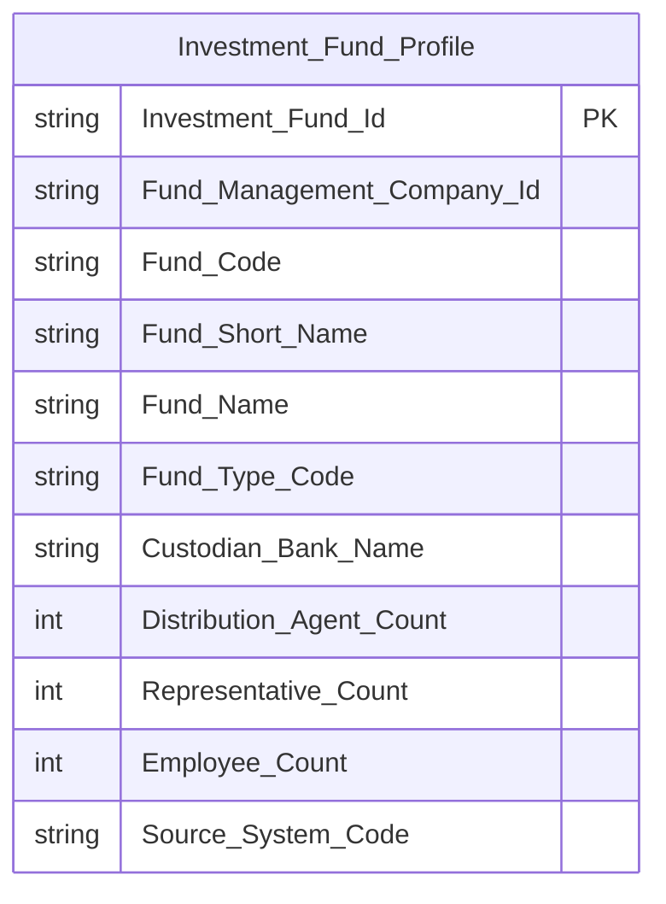

> Chỉ các cột READY được đưa vào schema — `NAV_Amount`/`Outstanding_Unit_Count`/`YTD_Profit_Amount` đang PENDING (xem Bảng KPI), sẽ bổ sung khi chuyển READY.

**Lineage Mart → Báo cáo:**

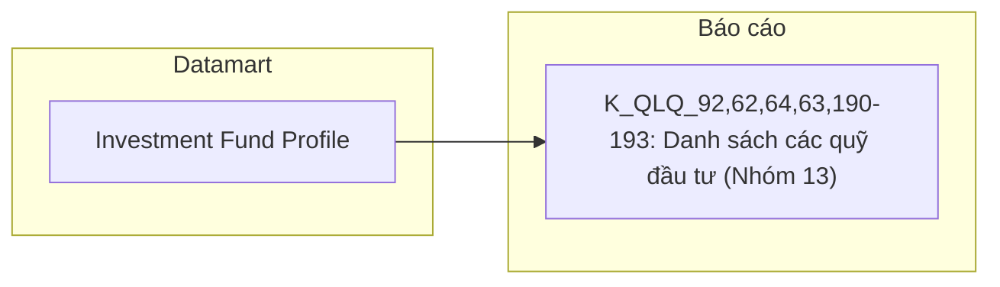

**Bảng grain:**

| Tên bảng | Grain |
|---|---|
| Investment Fund Profile | 1 quỹ × 1 tháng slicer |

---

#### Nhóm 14 - Danh sách đại lý phân phối

> Phân loại: **Tác nghiệp**
> Atomic: `Fund Distribution Agent` ← FMS.AGENCIES — READY *(K_QLQ_103: Danh sách đại lý phân phối)*
> Ghi chú: Popup drill-down khi bấm vào Số lượng đại lý phân phối ở Nhóm 13 (K_QLQ_97) — FK về `Investment_Fund_Id`, join `Investment Fund X Fund Distribution Agent Relationship` (FMS.AGEN_FUNDS).

**Mockup — popup "DANH SÁCH ĐẠI LÝ PHÂN PHỐI":**

| Tên đại lý phân phối |
|---|
| Công ty Chứng khoán XYZ |

**Source:** `Investment Fund Distribution Agent List`

**Bảng KPI:**

| KPI ID | Tên KPI | Đơn vị | Tính chất | Công thức | Ghi chú | Trạng thái |
|---|---|---|---|---|---|---|
| K_QLQ_103 | Danh sách đại lý phân phối | — | Cơ sở | `Item_Name` ← Fund Distribution Agent (FMS.AGENCIES), join Investment Fund X Fund Distribution Agent Relationship (FMS.AGEN_FUNDS) | | READY |

**Schema bảng con — Investment Fund Distribution Agent List:**

```mermaid
erDiagram
    Investment_Fund_Distribution_Agent_List {
        string Investment_Fund_Id PK
        string Fund_Distribution_Agent_Id PK
        string Fund_Distribution_Agent_Name
        string Source_System_Code
    }
```

**Lineage Mart → Báo cáo:**

```mermaid
flowchart LR
    subgraph GOLD["Datamart"]
        G1["Investment Fund Distribution Agent List"]
    end
    subgraph RPT["Báo cáo"]
        R1["K_QLQ_103: Danh sách đại lý phân phối (Nhóm 14)"]
    end
    G1 --> R1
```

**Bảng grain:**

| Tên bảng | Grain |
|---|---|
| Investment Fund Distribution Agent List | Tác nghiệp — bảng con drill-down \| 1 đại lý phân phối × 1 quỹ |

---

#### Nhóm 15 - Danh sách thành viên ban đại diện

> Phân loại: **Tác nghiệp**
> Atomic: `Investment Fund Representative Board Member` ← FMS.REPRESENT — READY *(K_QLQ_104: Danh sách thành viên ban đại diện)*
> Ghi chú: Popup drill-down khi bấm vào Số lượng thành viên ban đại diện ở Nhóm 13 (K_QLQ_98) — FK về `Investment_Fund_Id`.

**Mockup — popup "DANH SÁCH THÀNH VIÊN BAN ĐẠI DIỆN":**

| Tên thành viên |
|---|
| Nguyễn Văn A |

**Source:** `Investment Fund Representative Board Member List`

**Bảng KPI:**

| KPI ID | Tên KPI | Đơn vị | Tính chất | Công thức | Ghi chú | Trạng thái |
|---|---|---|---|---|---|---|
| K_QLQ_104 | Danh sách thành viên ban đại diện | — | Cơ sở | `Item_Name` ← Investment Fund Representative Board Member (FMS.REPRESENT) | | READY |

**Schema bảng con — Investment Fund Representative Board Member List:**

```mermaid
erDiagram
    Investment_Fund_Representative_Board_Member_List {
        string Investment_Fund_Id PK
        string Representative_Board_Member_Id PK
        string Representative_Board_Member_Name
        string Source_System_Code
    }
```

**Lineage Mart → Báo cáo:**

```mermaid
flowchart LR
    subgraph GOLD["Datamart"]
        G1["Investment Fund Representative Board Member List"]
    end
    subgraph RPT["Báo cáo"]
        R1["K_QLQ_104: Danh sách thành viên ban đại diện (Nhóm 15)"]
    end
    G1 --> R1
```

**Bảng grain:**

| Tên bảng | Grain |
|---|---|
| Investment Fund Representative Board Member List | Tác nghiệp — bảng con drill-down \| 1 thành viên BĐD × 1 quỹ |

---

#### Nhóm 16 - Danh sách người điều hành quỹ

> Phân loại: **Tác nghiệp**
> Atomic: `Fund Management Company Employee` ← FMS.TL_PROFILES — READY *(K_QLQ_105: Danh sách người điều hành quỹ)*
> Ghi chú: Popup drill-down khi bấm vào Số lượng người điều hành quỹ ở Nhóm 13 (K_QLQ_99) — FK về `Investment_Fund_Id`, join `FMS.FUND_TL_PRO`.

**Mockup — popup "DANH SÁCH NGƯỜI ĐIỀU HÀNH QUỸ":**

| Tên người điều hành |
|---|
| Trần Thị B |

**Source:** `Investment Fund Manager List`

**Bảng KPI:**

| KPI ID | Tên KPI | Đơn vị | Tính chất | Công thức | Ghi chú | Trạng thái |
|---|---|---|---|---|---|---|
| K_QLQ_105 | Danh sách người điều hành quỹ | — | Cơ sở | `Item_Name` ← Fund Management Company Employee (FMS.TL_PROFILES), join FMS.FUND_TL_PRO | | READY |

**Schema bảng con — Investment Fund Manager List:**

```mermaid
erDiagram
    Investment_Fund_Manager_List {
        string Investment_Fund_Id PK
        string Fund_Management_Company_Employee_Id PK
        string Fund_Manager_Name
        string Source_System_Code
    }
```

**Lineage Mart → Báo cáo:**

```mermaid
flowchart LR
    subgraph GOLD["Datamart"]
        G1["Investment Fund Manager List"]
    end
    subgraph RPT["Báo cáo"]
        R1["K_QLQ_105: Danh sách người điều hành quỹ (Nhóm 16)"]
    end
    G1 --> R1
```

**Bảng grain:**

| Tên bảng | Grain |
|---|---|
| Investment Fund Manager List | Tác nghiệp — bảng con drill-down \| 1 người điều hành × 1 quỹ |

---

### Tab: BÁO CÁO / CÔNG TY QLQ

**Slicer chung:** CTQLQ, kỳ thời gian

---

#### Nhóm 27 - Thống kê giao dịch của nhân viên công ty QLQ

> Phân loại: **Tác nghiệp**
> Atomic: `Fund Management Company Key Person` ← FMS.TL_PROFILES — READY *(K_QLQ_106: Số CCCD/Hộ chiếu)*
> Ghi chú: **PENDING toàn bộ 8 chỉ tiêu sổ lệnh.** Nguồn sổ lệnh là `OrderTrade.Trade_HOSE`/`Trade_HNX`. Entity logical tương ứng (`Securities Trade` / `scr_trd`) chỉ tồn tại trong `DataModel/working/Atomic_LinhLV/` — track cá nhân đã lỗi thời (out of date), KHÔNG phải nguồn Atomic chuẩn (chuẩn chỉ gồm `DataModel/Atomic/` và `DataModel/working/Atomic/`). Do đó toàn bộ 8 chỉ tiêu liên quan sổ lệnh (Tài khoản GDCK, Mã CTCK, Ngày GD, Phương thức GD, Lệnh mua/bán, Mã CK, Số lượng, Giá, Tổng giá trị) đều PENDING — cần Atomic team thiết kế lại `Securities Trade` (hoặc tương đương) trong track chuẩn trước khi READY. Chỉ Số CCCD/Hộ chiếu (Chiều join key, nguồn FMS.TL_PROFILES) READY.

**Bảng KPI:**

| KPI ID | Tên KPI | Đơn vị | Tính chất | Công thức | Ghi chú | Trạng thái |
|---|---|---|---|---|---|---|
| K_QLQ_106 | Số CCCD/Hộ chiếu | — | Chiều | `Id_No` ← Fund Management Company Key Person (FMS.TL_PROFILES) | Chiều join key — chờ measure sổ lệnh READY để ghép cùng Fact | READY |
| K_QLQ_107 | Tài khoản giao dịch chứng khoán | — | Cơ sở | | **Lý do pending:** Atomic entity nguồn (`Securities Trade`/`scr_trd`, OrderTrade.Trade_HOSE/Trade_HNX) chỉ có ở track `Atomic_LinhLV` (out of date, không phải nguồn chuẩn). **Atomic cần bổ sung:** thiết kế lại entity cho `OrderTrade.Trade_HOSE`/`Trade_HNX` trong `DataModel/Atomic/` hoặc `DataModel/working/Atomic/`. **Mart dự kiến:** `Fund Management Company Staff Trade Report` — grain: 1 lần khớp lệnh × 1 nhân viên CTQLQ. | PENDING |
| K_QLQ_108 | Mã CTCK nơi mở tài khoản | — | Chiều | | **Lý do pending:** Tương tự K_QLQ_107. **Atomic cần bổ sung:** như trên. **Mart dự kiến:** `Fund Management Company Staff Trade Report`. | PENDING |
| K_QLQ_109 | Ngày giao dịch | — | Chiều | | **Lý do pending:** Tương tự K_QLQ_107. **Atomic cần bổ sung:** như trên. **Mart dự kiến:** `Fund Management Company Staff Trade Report`. | PENDING |
| K_QLQ_110 | Phương thức giao dịch | — | Cơ sở | | **Lý do pending:** BA đánh Trạng thái mapping = Pending (chưa hoàn thiện phân tích), đồng thời Atomic nguồn chưa có ở track chuẩn. **Atomic cần bổ sung:** như trên. **Mart dự kiến:** `Fund Management Company Staff Trade Report`. | PENDING |
| K_QLQ_111 | Lệnh mua/bán | — | Cơ sở | | **Lý do pending:** Tương tự K_QLQ_107. **Atomic cần bổ sung:** như trên. **Mart dự kiến:** `Fund Management Company Staff Trade Report`. | PENDING |
| K_QLQ_112 | Mã CK | — | Chiều | | **Lý do pending:** Tương tự K_QLQ_107. **Atomic cần bổ sung:** như trên. **Mart dự kiến:** `Fund Management Company Staff Trade Report`. | PENDING |
| K_QLQ_113 | Số lượng CK | CK | Cơ sở | | **Lý do pending:** Tương tự K_QLQ_107. **Atomic cần bổ sung:** như trên. **Mart dự kiến:** `Fund Management Company Staff Trade Report`. | PENDING |
| K_QLQ_114 | Giá | VND | Cơ sở | | **Lý do pending:** Tương tự K_QLQ_107. **Atomic cần bổ sung:** như trên. **Mart dự kiến:** `Fund Management Company Staff Trade Report`. | PENDING |
| K_QLQ_115 | Tổng giá trị | VND | Cơ sở | | **Lý do pending:** Tương tự K_QLQ_107. **Atomic cần bổ sung:** như trên. **Mart dự kiến:** `Fund Management Company Staff Trade Report`. | PENDING |

**Bảng mapping nguồn (Atomic Placeholder):**

| Tên KPI | Bảng nguồn (BA) | Atomic entity dự kiến | Atomic table dự kiến |
|---|---|---|---|
| K_QLQ_107, 72, 73, 75, 76, 199, 200, 201 | OrderTrade.Trade_HOSE, OrderTrade.Trade_HNX | Securities Trade *(có draft ở Atomic_LinhLV — cần thiết kế lại trong track chuẩn)* | scr_trd |
| K_QLQ_110 | *(BA chưa cung cấp)* | TBD | TBD |

---

### Tab: DATA EXPLORER

**Đặc điểm chung:** DataExplorer là **pass-through** — hiển thị trực tiếp nội dung báo cáo BC từ `Report Import Value` ← FMS.RPTVALUES. Người dùng chọn loại báo cáo, kỳ, CTQLQ/quỹ → hệ thống render các dòng chỉ tiêu theo mã báo cáo.

> **PENDING toàn bộ 63 STT Data Explorer (STT 28–90 theo BA).** Toàn bộ dòng BA thuộc dải STT này đánh **Dữ liệu động** 100% — theo gating "Loại dữ liệu", PENDING dù Atomic nguồn (`Report Import Value` ← FMS.RPTVALUES) đã READY. Xem chi tiết theo từng loại báo cáo ở Tab DATA EXPLORER (Section 2, phần cuối).

### Tab: TỔNG QUAN ĐẠI LÝ PHÂN PHỐI

#### Nhóm 17 - Thống kê chung

> Phân loại: **Phân tích**
> Atomic: `Fund Distribution Agent` ← FMS.AGENCIES — READY *(K_QLQ_117: Số lượng Đại lý phân phối)*
> Ghi chú: **Mix READY/PENDING.** Atomic `Fund Distribution Agent` đã sẵn sàng. K_QLQ_117 (Số lượng ĐLPP) BA đánh Dữ liệu tĩnh → READY. K_QLQ_118/948/94/95 (Số tài khoản, Số tài khoản lũy kế, Giá trị phát hành/mua lại) BA đánh Loại dữ liệu "Báo cáo hoạt động đại lý phân phối" và chưa cung cấp Bảng nguồn → PENDING.

**Mockup:**

| Chỉ tiêu | Giá trị |
|---|---|
| Số lượng Đại lý phân phối | 49 |

**Source:** `Fact Fund Distribution Agent Snapshot` → `Calendar Date Dimension`

**Bảng KPI:**

| KPI ID | Tên KPI | Đơn vị | Tính chất | Công thức | Ghi chú | Trạng thái |
|---|---|---|---|---|---|---|
| K_QLQ_116 | Thời gian | — | Chiều | `Decision_Date` ← Fund Distribution Agent (FMS.AGENCIES) | | READY |
| K_QLQ_117 | Số lượng Đại lý phân phối | Đại lý | Cơ sở | COUNT(Fund Distribution Agent) | | READY |
| K_QLQ_118 | Số tài khoản | TK | Cơ sở | | **Lý do pending:** Loại dữ liệu "Báo cáo hoạt động đại lý phân phối"; BA chưa cung cấp Bảng nguồn/Trường nguồn. **Atomic cần bổ sung:** chưa xác định — chờ BA bổ sung Bảng nguồn. **Mart dự kiến:** `Fact Fund Distribution Agent Snapshot` — grain: 1 ĐLPP × 1 tháng. | PENDING |
| K_QLQ_119 | Số tài khoản lũy kế | TK | Cơ sở | | **Lý do pending:** Tương tự K_QLQ_118 — Loại dữ liệu "Báo cáo hoạt động đại lý phân phối", BA chưa cung cấp Bảng nguồn/Trường nguồn. **Atomic cần bổ sung:** chưa xác định. **Mart dự kiến:** `Fact Fund Distribution Agent Snapshot`. | PENDING |
| K_QLQ_120 | Giá trị phát hành | Tỷ VND | Cơ sở | | **Lý do pending:** Tương tự K_QLQ_118. **Atomic cần bổ sung:** chưa xác định. **Mart dự kiến:** `Fact Fund Distribution Agent Snapshot`. | PENDING |
| K_QLQ_121 | Giá trị mua lại | Tỷ VND | Cơ sở | | **Lý do pending:** Tương tự K_QLQ_118. **Atomic cần bổ sung:** chưa xác định. **Mart dự kiến:** `Fact Fund Distribution Agent Snapshot`. | PENDING |

**Star Schema:**

```mermaid
erDiagram
    Fact_Fund_Distribution_Agent_Snapshot {
        int Snapshot_Date_Dimension_Id FK
        int Distribution_Agent_Count
    }
    Calendar_Date_Dimension {
        string Calendar_Date_Dimension_Id PK
        date Calendar_Date
        int Year
        int Month
        int Quarter
        int Day_Of_Week
        boolean Is_Weekend
        boolean Holiday_Flag
        string Holiday_Name
        string Source_System_Code
    }

    Calendar_Date_Dimension ||--o{ Fact_Fund_Distribution_Agent_Snapshot : "Snapshot Date Dimension Id"
```

> Chỉ `Distribution_Agent_Count` READY — `Account_Count`/`Issue_Value_Amount`/`Redeem_Value_Amount` đang PENDING, bổ sung khi có nguồn.

**Lineage Mart → Báo cáo:**

```mermaid
flowchart LR
    subgraph GOLD["Datamart"]
        G1["Fact Fund Distribution Agent Snapshot"]
        G2["Calendar Date Dimension"]
    end
    subgraph RPT["Báo cáo"]
        R1["K_QLQ_116,92: Thống kê chung Đại lý phân phối (Nhóm 17)"]
    end
    G2 --> G1
    G1 --> R1
```

**Bảng grain:**

| Tên bảng | Grain |
|---|---|
| Fact Fund Distribution Agent Snapshot | 1 snapshot toàn thị trường × 1 tháng |
| Calendar Date Dimension | 1 ngày |

**Bảng mapping nguồn (Atomic Placeholder):**

| Tên KPI | Bảng nguồn (BA) | Atomic entity dự kiến | Atomic table dự kiến |
|---|---|---|---|
| K_QLQ_118, 948, 94, 95 | *(BA chưa cung cấp)* | TBD | TBD |

---

#### Nhóm 18 - Tổng số tài khoản giao dịch chứng chỉ quỹ

> Phân loại: **Phân tích**
> Ghi chú: **PENDING toàn bộ.** BA đánh Dữ liệu động cho cả 3 chỉ tiêu (Tổ chức, Cá nhân, Nước ngoài) và chưa cung cấp Bảng nguồn/Trường nguồn.

**Bảng KPI:**

| KPI ID | Tên KPI | Đơn vị | Tính chất | Công thức | Ghi chú | Trạng thái |
|---|---|---|---|---|---|---|
| K_QLQ_122 | Thời gian | — | Chiều | | **Lý do pending:** Không measure nào READY cùng Fact. **Atomic cần bổ sung:** chưa xác định. **Mart dự kiến:** `Fact Fund Distribution Agent Account Snapshot` — grain: 1 ĐLPP × 1 tháng. | PENDING |
| K_QLQ_123 | Tổ chức | TK | Cơ sở | | **Lý do pending:** Dữ liệu động; BA chưa cung cấp Bảng nguồn. **Atomic cần bổ sung:** chưa xác định. **Mart dự kiến:** `Fact Fund Distribution Agent Account Snapshot`. | PENDING |
| K_QLQ_124 | Cá nhân | TK | Cơ sở | | **Lý do pending:** Tương tự K_QLQ_123. **Atomic cần bổ sung:** chưa xác định. **Mart dự kiến:** `Fact Fund Distribution Agent Account Snapshot`. | PENDING |
| K_QLQ_125 | Nước ngoài | TK | Cơ sở | | **Lý do pending:** Tương tự K_QLQ_123. **Atomic cần bổ sung:** chưa xác định. **Mart dự kiến:** `Fact Fund Distribution Agent Account Snapshot`. | PENDING |

**Bảng mapping nguồn (Atomic Placeholder):**

| Tên KPI | Bảng nguồn (BA) | Atomic entity dự kiến | Atomic table dự kiến |
|---|---|---|---|
| K_QLQ_123, 97, 98 | *(BA chưa cung cấp)* | TBD | TBD |

---

#### Nhóm 19 - Số tài khoản nắm giữ chứng chỉ quỹ

> Phân loại: **Phân tích**
> Ghi chú: **PENDING toàn bộ.** BA đánh Dữ liệu động cho cả 3 chỉ tiêu (Tổ chức, Cá nhân, Nước ngoài) và chưa cung cấp Bảng nguồn/Trường nguồn.

**Bảng KPI:**

| KPI ID | Tên KPI | Đơn vị | Tính chất | Công thức | Ghi chú | Trạng thái |
|---|---|---|---|---|---|---|
| K_QLQ_126 | Thời gian | — | Chiều | | **Lý do pending:** Không measure nào READY cùng Fact. **Atomic cần bổ sung:** chưa xác định. **Mart dự kiến:** `Fact Fund Distribution Agent Holding Snapshot` — grain: 1 ĐLPP × 1 tháng. | PENDING |
| K_QLQ_127 | Tổ chức | TK | Cơ sở | | **Lý do pending:** Dữ liệu động; BA chưa cung cấp Bảng nguồn. **Atomic cần bổ sung:** chưa xác định. **Mart dự kiến:** `Fact Fund Distribution Agent Holding Snapshot`. | PENDING |
| K_QLQ_128 | Cá nhân | TK | Cơ sở | | **Lý do pending:** Tương tự K_QLQ_127. **Atomic cần bổ sung:** chưa xác định. **Mart dự kiến:** `Fact Fund Distribution Agent Holding Snapshot`. | PENDING |
| K_QLQ_129 | Nước ngoài | TK | Cơ sở | | **Lý do pending:** Tương tự K_QLQ_127. **Atomic cần bổ sung:** chưa xác định. **Mart dự kiến:** `Fact Fund Distribution Agent Holding Snapshot`. | PENDING |

**Bảng mapping nguồn (Atomic Placeholder):**

| Tên KPI | Bảng nguồn (BA) | Atomic entity dự kiến | Atomic table dự kiến |
|---|---|---|---|
| K_QLQ_127, 100, 101 | *(BA chưa cung cấp)* | TBD | TBD |

---

#### Nhóm 20 - Giá trị chứng chỉ quỹ

> Phân loại: **Phân tích**
> Ghi chú: **PENDING toàn bộ.** BA đánh Dữ liệu động cho cả 3 chỉ tiêu (Tổ chức, Cá nhân, Nước ngoài) và chưa cung cấp Bảng nguồn/Trường nguồn.

**Bảng KPI:**

| KPI ID | Tên KPI | Đơn vị | Tính chất | Công thức | Ghi chú | Trạng thái |
|---|---|---|---|---|---|---|
| K_QLQ_130 | Thời gian | — | Chiều | | **Lý do pending:** Không measure nào READY cùng Fact. **Atomic cần bổ sung:** chưa xác định. **Mart dự kiến:** `Fact Fund Distribution Agent Certificate Value Snapshot` — grain: 1 ĐLPP × 1 tháng. | PENDING |
| K_QLQ_131 | Tổ chức | Tỷ VND | Cơ sở | | **Lý do pending:** Dữ liệu động; BA chưa cung cấp Bảng nguồn. **Atomic cần bổ sung:** chưa xác định. **Mart dự kiến:** `Fact Fund Distribution Agent Certificate Value Snapshot`. | PENDING |
| K_QLQ_132 | Cá nhân | Tỷ VND | Cơ sở | | **Lý do pending:** Tương tự K_QLQ_131. **Atomic cần bổ sung:** chưa xác định. **Mart dự kiến:** `Fact Fund Distribution Agent Certificate Value Snapshot`. | PENDING |
| K_QLQ_133 | Nước ngoài | Tỷ VND | Cơ sở | | **Lý do pending:** Tương tự K_QLQ_131. **Atomic cần bổ sung:** chưa xác định. **Mart dự kiến:** `Fact Fund Distribution Agent Certificate Value Snapshot`. | PENDING |

**Bảng mapping nguồn (Atomic Placeholder):**

| Tên KPI | Bảng nguồn (BA) | Atomic entity dự kiến | Atomic table dự kiến |
|---|---|---|---|
| K_QLQ_131, 103, 104 | *(BA chưa cung cấp)* | TBD | TBD |

---

#### Nhóm 21 - Giao dịch thông qua Đại lý phân phối

> Phân loại: **Phân tích**
> Ghi chú: **PENDING toàn bộ.** BA đánh Dữ liệu động cho cả 2 chỉ tiêu (Giá trị phát hành, Giá trị mua lại) và chưa cung cấp Bảng nguồn/Trường nguồn.

**Bảng KPI:**

| KPI ID | Tên KPI | Đơn vị | Tính chất | Công thức | Ghi chú | Trạng thái |
|---|---|---|---|---|---|---|
| K_QLQ_134 | Thời gian | — | Chiều | | **Lý do pending:** Không measure nào READY cùng Fact. **Atomic cần bổ sung:** chưa xác định. **Mart dự kiến:** `Fact Fund Distribution Agent Transaction Snapshot` — grain: 1 ĐLPP × 1 tháng. | PENDING |
| K_QLQ_135 | Giá trị phát hành (PH) | Tỷ VND | Cơ sở | | **Lý do pending:** Dữ liệu động; BA chưa cung cấp Bảng nguồn. **Atomic cần bổ sung:** chưa xác định. **Mart dự kiến:** `Fact Fund Distribution Agent Transaction Snapshot`. | PENDING |
| K_QLQ_136 | Giá trị mua lại (ML) | Tỷ VND | Cơ sở | | **Lý do pending:** Tương tự K_QLQ_135. **Atomic cần bổ sung:** chưa xác định. **Mart dự kiến:** `Fact Fund Distribution Agent Transaction Snapshot`. | PENDING |

**Bảng mapping nguồn (Atomic Placeholder):**

| Tên KPI | Bảng nguồn (BA) | Atomic entity dự kiến | Atomic table dự kiến |
|---|---|---|---|
| K_QLQ_135, 106 | *(BA chưa cung cấp)* | TBD | TBD |

---

#### Nhóm 22 - Danh sách Đại lý phân phối

> Phân loại: **Tác nghiệp**
> Atomic: `Fund Distribution Agent` ← FMS.AGENCIES — READY *(K_QLQ_138–112: Tên, Số GP, Ngày cấp, Địa chỉ, Tình trạng, Quỹ đang PP)*
> Ghi chú: **Mix READY/PENDING.** 6/13 chỉ tiêu (Tên ĐLPP, Số GP thành lập, Ngày cấp GP, Địa chỉ, Tình trạng hoạt động, Quỹ đang phân phối) BA đánh Dữ liệu tĩnh → READY — Atomic đã sẵn sàng. 7 chỉ tiêu còn lại (tài khoản giao dịch, tài khoản nắm giữ theo Tổ chức/Cá nhân/Nước ngoài, giá trị phát hành/mua lại, thị phần) BA đánh Dữ liệu động và chưa cung cấp Bảng nguồn → PENDING.

**Mockup:**

| Tên ĐLPP | Số GP | Ngày cấp GP | Địa chỉ | Tình trạng | Quỹ đang PP |
|---|---|---|---|---|---|
| Công ty Chứng khoán XYZ | 123/GP | 01/01/2020 | Hà Nội | Hoạt động | 5 |

**Source:** `Fund Distribution Agent Profile`

**Bảng KPI:**

| KPI ID | Tên KPI | Đơn vị | Tính chất | Công thức | Ghi chú | Trạng thái |
|---|---|---|---|---|---|---|
| K_QLQ_137 | Thời gian | — | Chiều | `Decision_Date` ← Fund Distribution Agent (FMS.AGENCIES) | | READY |
| K_QLQ_138 | Tên Đại lý phân phối | — | Cơ sở | `Item_Name` ← Fund Distribution Agent | | READY |
| K_QLQ_139 | Số GP thành lập | — | Cơ sở | `Decision` ← Fund Distribution Agent | | READY |
| K_QLQ_140 | Ngày cấp GP thành lập | — | Cơ sở | `Decision_Date` ← Fund Distribution Agent | | READY |
| K_QLQ_141 | Địa chỉ | — | Cơ sở | `Address` ← Fund Distribution Agent | | READY |
| K_QLQ_142 | Tình trạng hoạt động | — | Cơ sở | `Active_Date`/`Stop_Date` ← Fund Distribution Agent | | READY |
| K_QLQ_143 | Quỹ đang phân phối | Quỹ | Cơ sở | COUNT(Investment Fund) join Investment Fund X Fund Distribution Agent Relationship (FMS.AGEN_FUNDS) | | READY |
| K_QLQ_144 | Tài khoản giao dịch | TK | Cơ sở | | **Lý do pending:** Dữ liệu động; BA chưa cung cấp Bảng nguồn. **Atomic cần bổ sung:** chưa xác định. **Mart dự kiến:** `Fund Distribution Agent Profile`. | PENDING |
| K_QLQ_145 | Tài khoản giao dịch (YTD) | TK | Cơ sở | | **Lý do pending:** Tương tự K_QLQ_144. **Atomic cần bổ sung:** chưa xác định. **Mart dự kiến:** `Fund Distribution Agent Profile`. | PENDING |
| K_QLQ_146 | Tổng số tài khoản giao dịch CCQ - Tổ chức | TK | Cơ sở | | **Lý do pending:** Tương tự K_QLQ_144. **Atomic cần bổ sung:** chưa xác định. **Mart dự kiến:** `Fund Distribution Agent Profile`. | PENDING |
| K_QLQ_147 | Tổng số tài khoản giao dịch CCQ - Cá nhân | TK | Cơ sở | | **Lý do pending:** Tương tự K_QLQ_144. **Atomic cần bổ sung:** chưa xác định. **Mart dự kiến:** `Fund Distribution Agent Profile`. | PENDING |
| K_QLQ_148 | Tổng số tài khoản giao dịch CCQ - Nước ngoài | TK | Cơ sở | | **Lý do pending:** Tương tự K_QLQ_144. **Atomic cần bổ sung:** chưa xác định. **Mart dự kiến:** `Fund Distribution Agent Profile`. | PENDING |
| K_QLQ_149 | Số tài khoản nắm giữ CCQ - Tổ chức | TK | Cơ sở | | **Lý do pending:** Tương tự K_QLQ_144. **Atomic cần bổ sung:** chưa xác định. **Mart dự kiến:** `Fund Distribution Agent Profile`. | PENDING |
| K_QLQ_150 | Số tài khoản nắm giữ CCQ - Cá nhân | TK | Cơ sở | | **Lý do pending:** Tương tự K_QLQ_144. **Atomic cần bổ sung:** chưa xác định. **Mart dự kiến:** `Fund Distribution Agent Profile`. | PENDING |
| K_QLQ_151 | Số tài khoản nắm giữ CCQ - Nước ngoài | TK | Cơ sở | | **Lý do pending:** Tương tự K_QLQ_144. **Atomic cần bổ sung:** chưa xác định. **Mart dự kiến:** `Fund Distribution Agent Profile`. | PENDING |
| K_QLQ_152 | Giá trị chứng chỉ quỹ - Tổ chức | Tỷ VND | Cơ sở | | **Lý do pending:** Tương tự K_QLQ_144. **Atomic cần bổ sung:** chưa xác định. **Mart dự kiến:** `Fund Distribution Agent Profile`. | PENDING |
| K_QLQ_153 | Giá trị chứng chỉ quỹ - Cá nhân | Tỷ VND | Cơ sở | | **Lý do pending:** Tương tự K_QLQ_144. **Atomic cần bổ sung:** chưa xác định. **Mart dự kiến:** `Fund Distribution Agent Profile`. | PENDING |
| K_QLQ_154 | Giá trị chứng chỉ quỹ - Nước ngoài | Tỷ VND | Cơ sở | | **Lý do pending:** Tương tự K_QLQ_144. **Atomic cần bổ sung:** chưa xác định. **Mart dự kiến:** `Fund Distribution Agent Profile`. | PENDING |
| K_QLQ_155 | Giá trị phát hành (PH) | Tỷ VND | Cơ sở | | **Lý do pending:** Tương tự K_QLQ_144. **Atomic cần bổ sung:** chưa xác định. **Mart dự kiến:** `Fund Distribution Agent Profile`. | PENDING |
| K_QLQ_156 | Giá trị phát hành (PH) (YTD) | Tỷ VND | Cơ sở | | **Lý do pending:** Tương tự K_QLQ_144. **Atomic cần bổ sung:** chưa xác định. **Mart dự kiến:** `Fund Distribution Agent Profile`. | PENDING |
| K_QLQ_157 | Giá trị mua lại (ML) | Tỷ VND | Cơ sở | | **Lý do pending:** Tương tự K_QLQ_144. **Atomic cần bổ sung:** chưa xác định. **Mart dự kiến:** `Fund Distribution Agent Profile`. | PENDING |
| K_QLQ_158 | Thị phần (TP) | % | Phái sinh | | **Lý do pending:** Phụ thuộc K_QLQ_152-124 (PENDING). **Atomic cần bổ sung:** chưa xác định. **Mart dự kiến:** `Fund Distribution Agent Profile`. | PENDING |

**Bảng mapping nguồn (Atomic Placeholder):**

| Tên KPI | Bảng nguồn (BA) | Atomic entity dự kiến | Atomic table dự kiến |
|---|---|---|---|
| K_QLQ_144–128 | *(BA chưa cung cấp)* | TBD | TBD |

**Schema bảng tác nghiệp — Fund Distribution Agent Profile:**

```mermaid
erDiagram
    Fund_Distribution_Agent_Profile {
        string Fund_Distribution_Agent_Id PK
        string Agent_Name
        string License_Number
        date License_Date
        string Address
        string Operation_Status_Code
        int Distributing_Fund_Count
        string Source_System_Code
    }
```

**Lineage Mart → Báo cáo:**

```mermaid
flowchart LR
    subgraph GOLD["Datamart"]
        G1["Fund Distribution Agent Profile"]
    end
    subgraph RPT["Báo cáo"]
        R1["K_QLQ_137,107-112: Danh sách Đại lý phân phối (Nhóm 22)"]
    end
    G1 --> R1
```

**Bảng grain:**

| Tên bảng | Grain |
|---|---|
| Fund Distribution Agent Profile | Tác nghiệp — bảng flat \| 1 ĐLPP × 1 tháng slicer |

---

#### Nhóm 23 - Danh sách các Quỹ đang phân phối

> Phân loại: **Tác nghiệp**
> Atomic: `Investment Fund` ← FMS.FUNDS — READY *(K_QLQ_159: Danh sách các Quỹ đang phân phối)*
> Ghi chú: Popup drill-down khi bấm vào Quỹ đang phân phối ở Nhóm 22 (K_QLQ_143) — FK về `Fund_Distribution_Agent_Id`, join `Investment Fund X Fund Distribution Agent Relationship` (FMS.AGEN_FUNDS).

**Mockup — popup "DANH SÁCH CÁC QUỸ ĐANG PHÂN PHỐI":**

| Tên quỹ |
|---|
| Quỹ ABC Cổ phần |

**Source:** `Fund Distribution Agent Fund List`

**Bảng KPI:**

| KPI ID | Tên KPI | Đơn vị | Tính chất | Công thức | Ghi chú | Trạng thái |
|---|---|---|---|---|---|---|
| K_QLQ_159 | Danh sách các Quỹ đang phân phối | — | Cơ sở | `Fund_Name` ← Investment Fund (FMS.FUNDS), join Investment Fund X Fund Distribution Agent Relationship (FMS.AGEN_FUNDS) | | READY |

**Schema bảng con — Fund Distribution Agent Fund List:**

```mermaid
erDiagram
    Fund_Distribution_Agent_Fund_List {
        string Fund_Distribution_Agent_Id PK
        string Investment_Fund_Id PK
        string Fund_Name
        string Source_System_Code
    }
```

**Lineage Mart → Báo cáo:**

```mermaid
flowchart LR
    subgraph GOLD["Datamart"]
        G1["Fund Distribution Agent Fund List"]
    end
    subgraph RPT["Báo cáo"]
        R1["K_QLQ_159: Danh sách các Quỹ đang phân phối (Nhóm 23)"]
    end
    G1 --> R1
```

**Bảng grain:**

| Tên bảng | Grain |
|---|---|
| Fund Distribution Agent Fund List | Tác nghiệp — bảng con drill-down \| 1 quỹ × 1 ĐLPP |

---

### Tab: TỔNG QUAN CN CTQLQ NN TẠI VN

#### Nhóm 24 - Thống kê chung

> Phân loại: **Phân tích**
> Atomic: `Foreign Fund Management Organization Unit` ← FMS.FOR_BRCH — READY *(K_QLQ_161: Chi nhánh CTQLQ nước ngoài tại Việt Nam)*
> Ghi chú: **Mix READY/PENDING.** Atomic đã sẵn sàng. K_QLQ_161 (đếm CN, lọc Branch_Flag=1) BA đánh Dữ liệu tĩnh → READY. K_QLQ_162/131 (Hợp đồng QLDMĐT, Giá trị hợp đồng) BA đánh Dữ liệu động và chưa cung cấp Bảng nguồn → PENDING.

**Mockup:**

| Chỉ tiêu | Giá trị |
|---|---|
| Chi nhánh CTQLQ nước ngoài tại VN | 8 |

**Source:** `Fact Foreign Fund Management Organization Unit Snapshot` → `Calendar Date Dimension`

**Bảng KPI:**

| KPI ID | Tên KPI | Đơn vị | Tính chất | Công thức | Ghi chú | Trạng thái |
|---|---|---|---|---|---|---|
| K_QLQ_160 | Thời gian | — | Chiều | `License_Date` ← Foreign Fund Management Organization Unit (FMS.FOR_BRCH) | | READY |
| K_QLQ_161 | Chi nhánh CTQLQ nước ngoài tại Việt Nam | Chi nhánh | Cơ sở | COUNT(Foreign Fund Management Organization Unit) WHERE Branch_Type_Code = Chi nhánh | | READY |
| K_QLQ_162 | Hợp đồng quản lý danh mục đầu tư | HĐ | Cơ sở | | **Lý do pending:** Dữ liệu động; BA chưa cung cấp Bảng nguồn. **Atomic cần bổ sung:** chưa xác định. **Mart dự kiến:** `Fact Foreign Fund Management Organization Unit Snapshot` — grain: 1 CN × 1 tháng. | PENDING |
| K_QLQ_163 | Giá trị hợp đồng quản lý danh mục đầu tư | Tỷ VND | Cơ sở | | **Lý do pending:** Tương tự K_QLQ_162. **Atomic cần bổ sung:** chưa xác định. **Mart dự kiến:** `Fact Foreign Fund Management Organization Unit Snapshot`. | PENDING |

**Star Schema:**

```mermaid
erDiagram
    Fact_Foreign_Fund_Management_Organization_Unit_Snapshot {
        int Snapshot_Date_Dimension_Id FK
        int Branch_Count
    }
    Calendar_Date_Dimension {
        string Calendar_Date_Dimension_Id PK
        date Calendar_Date
        int Year
        int Month
        int Quarter
        int Day_Of_Week
        boolean Is_Weekend
        boolean Holiday_Flag
        string Holiday_Name
        string Source_System_Code
    }

    Calendar_Date_Dimension ||--o{ Fact_Foreign_Fund_Management_Organization_Unit_Snapshot : "Snapshot Date Dimension Id"
```

**Lineage Mart → Báo cáo:**

```mermaid
flowchart LR
    subgraph GOLD["Datamart"]
        G1["Fact Foreign Fund Management Organization Unit Snapshot"]
        G2["Calendar Date Dimension"]
    end
    subgraph RPT["Báo cáo"]
        R1["K_QLQ_160,129: Thống kê chung CN CTQLQ NN (Nhóm 24)"]
    end
    G2 --> G1
    G1 --> R1
```

**Bảng grain:**

| Tên bảng | Grain |
|---|---|
| Fact Foreign Fund Management Organization Unit Snapshot | 1 snapshot toàn thị trường × 1 tháng |
| Calendar Date Dimension | 1 ngày |

**Bảng mapping nguồn (Atomic Placeholder):**

| Tên KPI | Bảng nguồn (BA) | Atomic entity dự kiến | Atomic table dự kiến |
|---|---|---|---|
| K_QLQ_162, 131 | *(BA chưa cung cấp)* | TBD | TBD |

---

#### Nhóm 25 - Số liệu hợp đồng uỷ thác danh mục

> Phân loại: **Phân tích**
> Ghi chú: **PENDING toàn bộ.** BA đánh Dữ liệu động cho toàn bộ 6 chỉ tiêu (số lượng/giá trị HĐ UTQLDM theo cá nhân/tổ chức, tổng) và chưa cung cấp Bảng nguồn/Trường nguồn.

**Bảng KPI:**

| KPI ID | Tên KPI | Đơn vị | Tính chất | Công thức | Ghi chú | Trạng thái |
|---|---|---|---|---|---|---|
| K_QLQ_164 | Thời gian | — | Chiều | | **Lý do pending:** Không measure nào READY cùng Fact. **Atomic cần bổ sung:** chưa xác định. **Mart dự kiến:** `Fact Foreign Fund Management Organization Unit Contract Snapshot` — grain: 1 CN × 1 tháng. | PENDING |
| K_QLQ_165 | Số lượng hợp đồng UTQLDM cá nhân | HĐ | Cơ sở | | **Lý do pending:** Dữ liệu động; BA chưa cung cấp Bảng nguồn. **Atomic cần bổ sung:** chưa xác định. **Mart dự kiến:** `Fact Foreign Fund Management Organization Unit Contract Snapshot`. | PENDING |
| K_QLQ_166 | Giá trị thị trường hợp đồng UTQLDM cá nhân | Tỷ VND | Cơ sở | | **Lý do pending:** Tương tự K_QLQ_165. **Atomic cần bổ sung:** chưa xác định. **Mart dự kiến:** `Fact Foreign Fund Management Organization Unit Contract Snapshot`. | PENDING |
| K_QLQ_167 | Số lượng hợp đồng UTQLDM tổ chức | HĐ | Cơ sở | | **Lý do pending:** Tương tự K_QLQ_165. **Atomic cần bổ sung:** chưa xác định. **Mart dự kiến:** `Fact Foreign Fund Management Organization Unit Contract Snapshot`. | PENDING |
| K_QLQ_168 | Giá trị thị trường hợp đồng UTQLDM tổ chức | Tỷ VND | Cơ sở | | **Lý do pending:** Tương tự K_QLQ_165. **Atomic cần bổ sung:** chưa xác định. **Mart dự kiến:** `Fact Foreign Fund Management Organization Unit Contract Snapshot`. | PENDING |
| K_QLQ_169 | Tổng số lượng hợp đồng UTQLDM | HĐ | Cơ sở | | **Lý do pending:** Tương tự K_QLQ_165. **Atomic cần bổ sung:** chưa xác định. **Mart dự kiến:** `Fact Foreign Fund Management Organization Unit Contract Snapshot`. | PENDING |
| K_QLQ_170 | Tổng giá trị ủy thác | Tỷ VND | Cơ sở | | **Lý do pending:** Tương tự K_QLQ_165. **Atomic cần bổ sung:** chưa xác định. **Mart dự kiến:** `Fact Foreign Fund Management Organization Unit Contract Snapshot`. | PENDING |

**Bảng mapping nguồn (Atomic Placeholder):**

| Tên KPI | Bảng nguồn (BA) | Atomic entity dự kiến | Atomic table dự kiến |
|---|---|---|---|
| K_QLQ_165–137 | *(BA chưa cung cấp)* | TBD | TBD |

---

#### Nhóm 26 - Danh sách các Chi nhánh CTQLQ nước ngoài tại Việt Nam

> Phân loại: **Tác nghiệp**
> Atomic: `Foreign Fund Management Organization Unit` ← FMS.FOR_BRCH — READY *(K_QLQ_172: Tên Chi nhánh)*
> Atomic: `Foreign Fund Management Organization Unit Staff` ← FMS.STF_FG_BRCH — READY *(K_QLQ_173, K_QLQ_174: Giám đốc chi nhánh, Số lượng nhân viên có CCHN)*
> Ghi chú: **Mix READY/PENDING.** 3/10 chỉ tiêu (Tên CN, Giám đốc chi nhánh, Số nhân viên CCHN) BA đánh Dữ liệu tĩnh → READY — Atomic đã sẵn sàng. 7 chỉ tiêu còn lại (CAR, Lợi nhuận, Vốn CSH, Số/Mã HĐ UTQLDM, Số TK lưu ký, Giá trị HĐ) BA đánh Dữ liệu động và chưa cung cấp Bảng nguồn → PENDING. Riêng "Mã hợp đồng UTQLDM" (K_QLQ_179) BA đánh **Trạng thái mapping = Pending** (khác các dòng còn lại = Done) — ghi nhận PENDING kép (chưa Done + Dữ liệu động).

**Mockup:**

| Tên CN | Giám đốc CN | Số nhân viên CCHN |
|---|---|---|
| CN Công ty ABC tại VN | Nguyễn Văn C | 4 |

**Source:** `Foreign Fund Management Organization Unit Profile`

**Bảng KPI:**

| KPI ID | Tên KPI | Đơn vị | Tính chất | Công thức | Ghi chú | Trạng thái |
|---|---|---|---|---|---|---|
| K_QLQ_171 | Thời gian | — | Chiều | `License_Date` ← Foreign Fund Management Organization Unit (FMS.FOR_BRCH) | | READY |
| K_QLQ_172 | Tên Chi nhánh CTQLQ nước ngoài tại Việt Nam | — | Cơ sở | `Foreign_Fm_Ou_Full_Nm`, `Short_Name` ← Foreign Fund Management Organization Unit | | READY |
| K_QLQ_173 | Giám đốc chi nhánh | — | Cơ sở | `Item_Name` ← Foreign Fund Management Organization Unit Staff (FMS.STF_FG_BRCH) | | READY |
| K_QLQ_174 | Số lượng nhân viên có CCHN | Người | Cơ sở | COUNT(Foreign Fund Management Organization Unit Staff) | | READY |
| K_QLQ_175 | CAR (ATTC) | % | Cơ sở | | **Lý do pending:** Dữ liệu động; BA chưa cung cấp Bảng nguồn. **Atomic cần bổ sung:** chưa xác định. **Mart dự kiến:** `Foreign Fund Management Organization Unit Profile`. | PENDING |
| K_QLQ_176 | Lợi nhuận (Tỷ đồng) | Tỷ VND | Cơ sở | | **Lý do pending:** Tương tự K_QLQ_175. **Atomic cần bổ sung:** chưa xác định. **Mart dự kiến:** `Foreign Fund Management Organization Unit Profile`. | PENDING |
| K_QLQ_177 | Vốn CSH | Tỷ VND | Cơ sở | | **Lý do pending:** Tương tự K_QLQ_175. **Atomic cần bổ sung:** chưa xác định. **Mart dự kiến:** `Foreign Fund Management Organization Unit Profile`. | PENDING |
| K_QLQ_178 | Số lượng hợp đồng UTQLDM | HĐ | Cơ sở | | **Lý do pending:** Tương tự K_QLQ_175. **Atomic cần bổ sung:** chưa xác định. **Mart dự kiến:** `Foreign Fund Management Organization Unit Profile`. | PENDING |
| K_QLQ_179 | Mã hợp đồng UTQLDM | — | Cơ sở | | **Lý do pending:** BA đánh Trạng thái mapping = Pending (chưa Done) + Dữ liệu động. **Atomic cần bổ sung:** chưa xác định — chờ BA hoàn thiện phân tích. **Mart dự kiến:** `Foreign Fund Management Organization Unit Contract List` (bảng con drill-down). | PENDING |
| K_QLQ_180 | Số tài khoản lưu ký | — | Cơ sở | | **Lý do pending:** Tương tự K_QLQ_175. **Atomic cần bổ sung:** chưa xác định. **Mart dự kiến:** `Foreign Fund Management Organization Unit Contract List`. | PENDING |
| K_QLQ_181 | Giá trị thị trường của từng hợp đồng UTQLDM | Tỷ VND | Cơ sở | | **Lý do pending:** Tương tự K_QLQ_175. **Atomic cần bổ sung:** chưa xác định. **Mart dự kiến:** `Foreign Fund Management Organization Unit Contract List`. | PENDING |

**Bảng mapping nguồn (Atomic Placeholder):**

| Tên KPI | Bảng nguồn (BA) | Atomic entity dự kiến | Atomic table dự kiến |
|---|---|---|---|
| K_QLQ_175–142, 145–147 | *(BA chưa cung cấp)* | TBD | TBD |

**Schema bảng tác nghiệp — Foreign Fund Management Organization Unit Profile:**

```mermaid
erDiagram
    Foreign_Fund_Management_Organization_Unit_Profile {
        string Foreign_Fund_Management_Organization_Unit_Id PK
        string Foreign_Fm_Ou_Full_Nm
        string Short_Name
        string Director_Name
        int Certified_Staff_Count
        string Source_System_Code
    }
```

> Chỉ 3 cột READY (`Foreign_Fm_Ou_Full_Nm`/`Short_Name`, `Director_Name`, `Certified_Staff_Count`) được đưa vào schema — 7 cột còn lại đang PENDING.

**Lineage Mart → Báo cáo:**

```mermaid
flowchart LR
    subgraph GOLD["Datamart"]
        G1["Foreign Fund Management Organization Unit Profile"]
    end
    subgraph RPT["Báo cáo"]
        R1["K_QLQ_171,138,143,144: Danh sách CN CTQLQ NN (Nhóm 26)"]
    end
    G1 --> R1
```

**Bảng grain:**

| Tên bảng | Grain |
|---|---|
| Foreign Fund Management Organization Unit Profile | Tác nghiệp — bảng flat \| 1 CN × 1 tháng slicer |

---

### Tab: DATA EXPLORER

**PENDING toàn bộ 63 STT Data Explorer (STT 28–90 theo BA).** Toàn bộ measure thuộc dải STT này BA đánh **Dữ liệu động** 100% — theo gating "Loại dữ liệu", PENDING dù Atomic nguồn (`Report Import Value` ← FMS.RPTVALUES) đã READY.

**Atomic cần bổ sung:** không — Atomic `Report Import Value` đã READY; cần mapping `Row_Code` cụ thể per chỉ tiêu (xem O_QLQ_1) khi BA xác nhận lại quy tắc khai thác.

**Mart dự kiến:** `Report Pass-through View` — grain: 1 CTQLQ/Quỹ × 1 mẫu BC × 1 kỳ × 1 dòng chỉ tiêu.

Chi tiết từng loại báo cáo dưới đây (7 nhóm nội dung, mỗi KPI ID = 1 dòng/chỉ tiêu báo cáo chi tiết — chưa khai sinh mapping `Row_Code` riêng, hiện gộp theo nhóm báo cáo):

---

#### Nhóm — BCTC-BCLCTT_GianTiep

**KPI liên quan:** K_QLQ_182 – K_QLQ_221

| KPI ID | Tên KPI | Tính chất | Trạng thái |
|---|---|---|---|
| K_QLQ_182 | I. Lưu chuyển tiền từ hoạt động kinh doanh | Cơ sở | PENDING |
| K_QLQ_183 | 1. Lợi nhuận trước thuế | Cơ sở | PENDING |
| K_QLQ_184 | 2. Điều chỉnh cho các khoản | Cơ sở | PENDING |
| K_QLQ_185 | - Khấu hao TSCĐ | Cơ sở | PENDING |
| K_QLQ_186 | - Các khoản dự phòng | Cơ sở | PENDING |
| K_QLQ_187 | - Lãi, lỗ chênh lệch tỷ giá hối đoái chưa thực hiện | Cơ sở | PENDING |
| K_QLQ_188 | - Lãi, lỗ từ hoạt động đầu tư | Cơ sở | PENDING |
| K_QLQ_189 | - Chi phí lãi vay | Cơ sở | PENDING |
| K_QLQ_190 | 3. Lợi nhuận từ hoạt động kinh doanh trước thay đổi vốn lưu động | Cơ sở | PENDING |
| K_QLQ_191 | - Tăng, giảm các khoản phải thu | Cơ sở | PENDING |
| K_QLQ_192 | - Tăng, giảm hàng tồn kho | Cơ sở | PENDING |
| K_QLQ_193 | - Tăng, giảm các khoản phải trả (Không kể lãi vay phải trả, thuế thu nhập doanh nghiệp phải nộp) | Cơ sở | PENDING |
| K_QLQ_194 | - Tăng, giảm chi phí trả trước. | Cơ sở | PENDING |
| K_QLQ_195 | - Tiền lãi vay đã trả | Cơ sở | PENDING |
| K_QLQ_196 | - Thuế thu nhập doanh nghiệp đã nộp | Cơ sở | PENDING |
| K_QLQ_197 | - Tiền khu khác từ hoạt động kinh doanh | Cơ sở | PENDING |
| K_QLQ_198 | - Tiền chi khác cho hoạt động kinh doanh | Cơ sở | PENDING |
| K_QLQ_199 | Lưu chuyển tiền thuần từ hoạt động kinh doanh | Cơ sở | PENDING |
| K_QLQ_200 | II. Lưu chuyển tiền từ hoạt động đầu tư | Cơ sở | PENDING |
| K_QLQ_201 | 1. Tiền chi để mua sắm, xây dựng TSCĐ và các tài sản dài hạn khác | Cơ sở | PENDING |
| K_QLQ_202 | 2. Tiền thu từ thanh lý, nhượng bán TSCĐ và các tài sản dài hạn khác | Cơ sở | PENDING |
| K_QLQ_203 | 3. Tiền chi mua các công cụ nợ của đơn vị khác | Cơ sở | PENDING |
| K_QLQ_204 | 4. Tiền thu từ thanh lý các công cụ nợ của đơn vị khác | Cơ sở | PENDING |
| K_QLQ_205 | 5. Tiền chi đầu tư góp vốn vào đơn vị khác | Cơ sở | PENDING |
| K_QLQ_206 | 6. Tiền thu hồi đầu tư góp vốn vào đơn vị khác | Cơ sở | PENDING |
| K_QLQ_207 | 7. Tiền thu cổ tức và lợi nhuận được chia | Cơ sở | PENDING |
| K_QLQ_208 | Lưu chuyển tiền thuần từ hoạt động đầu tư | Cơ sở | PENDING |
| K_QLQ_209 | III. Lưu chuyển tiền từ hoạt động tài chính | Cơ sở | PENDING |
| K_QLQ_210 | 1. Tiền thu từ phát hành cổ phiếu, trái phiếu, nhận vốn góp của chủ sở hữu | Cơ sở | PENDING |
| K_QLQ_211 | 2. Tiền chi trả vốn góp cho các chủ sở hữu, mua lại cổ phiếu của công ty đã phát hành | Cơ sở | PENDING |
| K_QLQ_212 | 3. Tiền vay ngắn hạn, dài hạn nhận được | Cơ sở | PENDING |
| K_QLQ_213 | 4. Tiền chi trả nợ gốc vay | Cơ sở | PENDING |
| K_QLQ_214 | 5. Tiền chi trả nợ thuê tài chính | Cơ sở | PENDING |
| K_QLQ_215 | 6. Cổ tức, lợi nhuận đã trả cho chủ sở hữu | Cơ sở | PENDING |
| K_QLQ_216 | Khác | Cơ sở | PENDING |
| K_QLQ_217 | Lưu chuyển tiền thuần từ hoạt động tài chính | Cơ sở | PENDING |
| K_QLQ_218 | Lưu chuyển tiền thuần trong kỳ (50 = 20+30+40) | Cơ sở | PENDING |
| K_QLQ_219 | Tiền và tương đương tiền đầu kỳ | Cơ sở | PENDING |
| K_QLQ_220 | Ảnh hưởng của thay đổi tỷ giá hối đoái quy đổi ngoại tệ | Cơ sở | PENDING |
| K_QLQ_221 | Tiền và tương đương tiền cuối kỳ (70 = 50+60+61) | Cơ sở | PENDING |

#### Nhóm — BCTC-BCLCTT_TrucTiep

**KPI liên quan:** K_QLQ_222 – K_QLQ_251

| KPI ID | Tên KPI | Tính chất | Trạng thái |
|---|---|---|---|
| K_QLQ_222 | I. Lưu chuyển tiền từ hoạt động kinh doanh | Cơ sở | PENDING |
| K_QLQ_223 | 1. Tiền thu từ hoạt động nghiệp vụ, cung cấp dịch vụ và doanh thu khác | Cơ sở | PENDING |
| K_QLQ_224 | 2. Tiền chi trả cho hoạt động nghiệp vụ và người cung cấp hàng hóa, dịch vụ | Cơ sở | PENDING |
| K_QLQ_225 | 3. Tiền chi trả cho người lao động | Cơ sở | PENDING |
| K_QLQ_226 | 4. Tiền chi trả lãi vay | Cơ sở | PENDING |
| K_QLQ_227 | 5. Tiền chi nộp thuế thu nhập doanh nghiệp | Cơ sở | PENDING |
| K_QLQ_228 | 6. Tiền thu khác từ hoạt động kinh doanh | Cơ sở | PENDING |
| K_QLQ_229 | 7. Tiền chi khác từ hoạt động kinh doanh | Cơ sở | PENDING |
| K_QLQ_230 | Lưu chuyển tiền thuần từ hoạt động kinh doanh | Cơ sở | PENDING |
| K_QLQ_231 | II. Lưu chuyển tiền từ hoạt động đầu tư | Cơ sở | PENDING |
| K_QLQ_232 | 1.Tiền chi để mua sắm, xây dựng TSCĐ và các tài sản dài hạn khác | Cơ sở | PENDING |
| K_QLQ_233 | 2.Tiền thu từ thanh lý, nhượng bán TSCĐ và các tài sản dài hạn khác | Cơ sở | PENDING |
| K_QLQ_234 | 3. Tiền chi mua các công cụ nợ của đơn vị khác | Cơ sở | PENDING |
| K_QLQ_235 | 4. Tiền thu từ thanh lý các khoản đầu tư công cụ nợ của đơn vị khác | Cơ sở | PENDING |
| K_QLQ_236 | 5.Tiền chi đầu tư góp vốn vào đơn vị khác | Cơ sở | PENDING |
| K_QLQ_237 | 6.Tiền thu hồi đầu tư góp vốn vào đơn vị khác | Cơ sở | PENDING |
| K_QLQ_238 | 7. Tiền thu cổ tức và lợi nhuận được chia | Cơ sở | PENDING |
| K_QLQ_239 | Lưu chuyển tiền thuần từ hoạt động đầu tư | Cơ sở | PENDING |
| K_QLQ_240 | III. Lưu chuyển tiền từ hoạt động tài chính | Cơ sở | PENDING |
| K_QLQ_241 | 1. Tiền thu từ phát hành cổ phiếu, trái phiếu, nhận vốn góp của chủ sở hữu | Cơ sở | PENDING |
| K_QLQ_242 | 2. Tiền chi trả vốn cho các chủ sở hữu, mua lại cổ phiếu của công ty đã phát hành | Cơ sở | PENDING |
| K_QLQ_243 | 3. Tiền vay ngắn hạn, dài hạn nhận được | Cơ sở | PENDING |
| K_QLQ_244 | 4.Tiền chi trả nợ gốc vay | Cơ sở | PENDING |
| K_QLQ_245 | 5.Tiền chi trả nợ thuê tài chính | Cơ sở | PENDING |
| K_QLQ_246 | 6. Cổ tức, lợi nhuận đã trả cho chủ sở hữu | Cơ sở | PENDING |
| K_QLQ_247 | Lưu chuyển tiền thuần từ hoạt động tài chính | Cơ sở | PENDING |
| K_QLQ_248 | Lưu chuyển tiền thuần trong kỳ (50 = 20+30+40) | Cơ sở | PENDING |
| K_QLQ_249 | Tiền và tương đương tiền đầu kỳ | Cơ sở | PENDING |
| K_QLQ_250 | Ảnh hưởng của thay đổi tỷ giá hối đoái quy đổi ngoại tệ | Cơ sở | PENDING |
| K_QLQ_251 | Tiền và tương đương tiền cuối kỳ (70 = 50+60+61) | Cơ sở | PENDING |

#### Nhóm — BCTC-BCTinhHinhBienDongVCSH

**KPI liên quan:** K_QLQ_252 – K_QLQ_262

| KPI ID | Tên KPI | Tính chất | Trạng thái |
|---|---|---|---|
| K_QLQ_252 | 1. Vốn đầu tư của chủ sở hữu | Cơ sở | PENDING |
| K_QLQ_253 | 2. Thặng dư vốn cổ phần | Cơ sở | PENDING |
| K_QLQ_254 | 3. Vốn khác của chủ sở hữu | Cơ sở | PENDING |
| K_QLQ_255 | 4. Cổ phiếu quỹ (*) | Cơ sở | PENDING |
| K_QLQ_256 | 5. Chênh lệch đánh giá lại tài sản | Cơ sở | PENDING |
| K_QLQ_257 | 6. Chênh lệch tỷ giá hối đoái | Cơ sở | PENDING |
| K_QLQ_258 | 7. Quỹ đầu tư phát triển | Cơ sở | PENDING |
| K_QLQ_259 | 8. Quỹ dự phòng tài chính | Cơ sở | PENDING |
| K_QLQ_260 | 9. Các Quỹ khác thuộc vốn chủ sở hữu | Cơ sở | PENDING |
| K_QLQ_261 | 10. Lợi nhuận chưa phân phối | Cơ sở | PENDING |
| K_QLQ_262 | Cộng | Cơ sở | PENDING |

#### Nhóm — BCTC-Báo cáo kết quả hoạt động kinh doanh

**KPI liên quan:** K_QLQ_263 – K_QLQ_279

| KPI ID | Tên KPI | Tính chất | Trạng thái |
|---|---|---|---|
| K_QLQ_263 | 1. Doanh thu | Cơ sở | PENDING |
| K_QLQ_264 | 2. Các khoản giảm trừ doanh thu | Cơ sở | PENDING |
| K_QLQ_265 | 3. Doanh thu thuần về hoạt động kinh doanh (10=01-02) | Cơ sở | PENDING |
| K_QLQ_266 | 4. Chi phí hoạt động kinh doanh, giá vốn hàng bán | Cơ sở | PENDING |
| K_QLQ_267 | 5. Lợi nhuận gộp của hoạt động kinh doanh(20=10-11) | Cơ sở | PENDING |
| K_QLQ_268 | 6. Doanh thu hoạt động tài chính | Cơ sở | PENDING |
| K_QLQ_269 | 7. Chi phí tài chính | Cơ sở | PENDING |
| K_QLQ_270 | 8. Chi phí quản lý doanh nghiệp | Cơ sở | PENDING |
| K_QLQ_271 | 9. Lợi nhuận thuần từ hoạt động kinh doanh (30=20 +(21-22)- 25) | Cơ sở | PENDING |
| K_QLQ_272 | 10. Thu nhập khác | Cơ sở | PENDING |
| K_QLQ_273 | 11. Chi phí khác | Cơ sở | PENDING |
| K_QLQ_274 | 12. Lợi nhuận khác (40=31-32) | Cơ sở | PENDING |
| K_QLQ_275 | 13. Tổng lợi nhuận kế toán trước thuế (50=30+40) | Cơ sở | PENDING |
| K_QLQ_276 | 14. Chi phí thuế TNDN hiện hành | Cơ sở | PENDING |
| K_QLQ_277 | 15. Chi phí thuế TNDN hoãn lại | Cơ sở | PENDING |
| K_QLQ_278 | 16. Lợi nhuận sau thuế TNDN (60=50-51-52) | Cơ sở | PENDING |
| K_QLQ_279 | 17. Lãi trên cổ phiếu (*) | Cơ sở | PENDING |

#### Nhóm — BCTC-Bảng cân đối kế toán

**KPI liên quan:** K_QLQ_280 – K_QLQ_389

| KPI ID | Tên KPI | Tính chất | Trạng thái |
|---|---|---|---|
| K_QLQ_280 | A- TÀI SẢN NGẮN HẠN(100 = 110 + 120 + 130 + 140 + 150) | Cơ sở | PENDING |
| K_QLQ_281 | I.Tiền và các khoản tương đương tiền | Cơ sở | PENDING |
| K_QLQ_282 | 1. Tiền | Cơ sở | PENDING |
| K_QLQ_283 | 2. Các khoản tương đương tiền | Cơ sở | PENDING |
| K_QLQ_284 | II. Các khoản đầu tư tài chính ngắn hạn | Cơ sở | PENDING |
| K_QLQ_285 | 1. Đầu tư ngắn hạn | Cơ sở | PENDING |
| K_QLQ_286 | 2. Dự phòng giảm giá đầu tư tài chính ngắn hạn(*) | Cơ sở | PENDING |
| K_QLQ_287 | III. Các khoản phải thu ngắn hạn | Cơ sở | PENDING |
| K_QLQ_288 | 1. Phải thu của khách hàng | Cơ sở | PENDING |
| K_QLQ_289 | 2. Trả trước cho người bán | Cơ sở | PENDING |
| K_QLQ_290 | 3. Phải thu nội bộ ngắn hạn | Cơ sở | PENDING |
| K_QLQ_291 | 5. Các khoản phải thu khác | Cơ sở | PENDING |
| K_QLQ_292 | 6. Dự phòng phải thu ngắn hạn khó đòi(*) | Cơ sở | PENDING |
| K_QLQ_293 | IV. Hàng tồn kho | Cơ sở | PENDING |
| K_QLQ_294 | V. Tài sản ngắn hạn khác | Cơ sở | PENDING |
| K_QLQ_295 | 1. Chi phí trả trước ngắn hạn | Cơ sở | PENDING |
| K_QLQ_296 | 2. Thuế GTGT được khấu trừ | Cơ sở | PENDING |
| K_QLQ_297 | 3. Thuế và các khoản phải thu nhà nước | Cơ sở | PENDING |
| K_QLQ_298 | 4. Giao dịch mua bán lại trái phiếu Chính phủ | Cơ sở | PENDING |
| K_QLQ_299 | 5. Tài sản ngắn hạn khác | Cơ sở | PENDING |
| K_QLQ_300 | B. TÀI SẢN DÀI HẠN (200 = 210 + 220 + 250 + 260) | Cơ sở | PENDING |
| K_QLQ_301 | I. Các khoản phải thu dài hạn | Cơ sở | PENDING |
| K_QLQ_302 | 1. Phải thu dài hạn của khách hàng | Cơ sở | PENDING |
| K_QLQ_303 | 2.Vốn kinh doanh ở đơn vị trực thuộc | Cơ sở | PENDING |
| K_QLQ_304 | 3. Phải thu dài hạn nội bộ | Cơ sở | PENDING |
| K_QLQ_305 | 4. Phải thu dài hạn khác | Cơ sở | PENDING |
| K_QLQ_306 | 5. Dự phòng phải thu dài hạn khó đòi(*) | Cơ sở | PENDING |
| K_QLQ_307 | II. Tài sản cố định | Cơ sở | PENDING |
| K_QLQ_308 | 1. Tài sản cố định hữu hình | Cơ sở | PENDING |
| K_QLQ_309 | - Nguyên giá | Cơ sở | PENDING |
| K_QLQ_310 | - Giá trị hao mòn luỹ kế(*) | Cơ sở | PENDING |
| K_QLQ_311 | 2. Tài sản cố định thuê tài chính | Cơ sở | PENDING |
| K_QLQ_312 | - Nguyên giá | Cơ sở | PENDING |
| K_QLQ_313 | - Giá trị hao mòn luỹ kế (*) | Cơ sở | PENDING |
| K_QLQ_314 | 3. Tài sản cố định vô hình | Cơ sở | PENDING |
| K_QLQ_315 | - Nguyên giá | Cơ sở | PENDING |
| K_QLQ_316 | - Giá trị hao mòn luỹ kế (*) | Cơ sở | PENDING |
| K_QLQ_317 | 4. Chi phí đầu tư xây dựng cơ bản dở dang | Cơ sở | PENDING |
| K_QLQ_318 | III. Các khoản đầu tư tài chính dài hạn | Cơ sở | PENDING |
| K_QLQ_319 | 1. Đầu tư vào công ty con | Cơ sở | PENDING |
| K_QLQ_320 | 2. Đầu tư vào công ty liên kết, liên doanh | Cơ sở | PENDING |
| K_QLQ_321 | 3. Đầu tư dài hạn khác | Cơ sở | PENDING |
| K_QLQ_322 | 4. Dự phòng giảm giá đầu tư tài chính dài hạn (*) | Cơ sở | PENDING |
| K_QLQ_323 | IV. Tài sản dài hạn khác | Cơ sở | PENDING |
| K_QLQ_324 | 1. Chi phí trả trước dài hạn | Cơ sở | PENDING |
| K_QLQ_325 | 2. Tài sản thuế thu nhập hoãn lại | Cơ sở | PENDING |
| K_QLQ_326 | 3. Tài sản dài hạn khác | Cơ sở | PENDING |
| K_QLQ_327 | TỔNG CỘNG TÀI SẢN (270 = 100 + 200) | Cơ sở | PENDING |
| K_QLQ_328 | A – NỢ PHẢI TRẢ (300 = 310 + 330) | Cơ sở | PENDING |
| K_QLQ_329 | I. Nợ ngắn hạn | Cơ sở | PENDING |
| K_QLQ_330 | 1.Vay ngắn hạn | Cơ sở | PENDING |
| K_QLQ_331 | 2. Phải trả người bán | Cơ sở | PENDING |
| K_QLQ_332 | 3. Người mua trả tiền trước | Cơ sở | PENDING |
| K_QLQ_333 | 4. Thuế và các khoản phải nộp Nhà nước | Cơ sở | PENDING |
| K_QLQ_334 | 5. Phải trả người lao động | Cơ sở | PENDING |
| K_QLQ_335 | 6. Chi phí phải trả | Cơ sở | PENDING |
| K_QLQ_336 | 7. Phải trả nội bộ | Cơ sở | PENDING |
| K_QLQ_337 | 8. Các khoản phải trả, phải nộp ngắn hạn khác | Cơ sở | PENDING |
| K_QLQ_338 | 9. Dự phòng phải trả ngắn hạn | Cơ sở | PENDING |
| K_QLQ_339 | 10. Quỹ khen thưởng, phúc lợi | Cơ sở | PENDING |
| K_QLQ_340 | 11. Giao dịch mua bán lại trái phiếu Chính phủ | Cơ sở | PENDING |
| K_QLQ_341 | 12. Doanh thu chưa thực hiện ngắn hạn | Cơ sở | PENDING |
| K_QLQ_342 | II. Nợ dài hạn | Cơ sở | PENDING |
| K_QLQ_343 | 1. Phải trả dài hạn người bán | Cơ sở | PENDING |
| K_QLQ_344 | 2. Phải trả dài hạn nội bộ | Cơ sở | PENDING |
| K_QLQ_345 | 3. Phải trả dài hạn khác | Cơ sở | PENDING |
| K_QLQ_346 | 4. Vay và nợ dài hạn | Cơ sở | PENDING |
| K_QLQ_347 | 5. Thuế thu nhập hoãn lại phải trả | Cơ sở | PENDING |
| K_QLQ_348 | 6. Dự phòng trợ cấp mất việc làm | Cơ sở | PENDING |
| K_QLQ_349 | 7. Dự phòng phải trả dài hạn | Cơ sở | PENDING |
| K_QLQ_350 | 8. Doanh thu chưa thực hiện dài hạn | Cơ sở | PENDING |
| K_QLQ_351 | 9. Quỹ phát triển khoa học và công nghệ | Cơ sở | PENDING |
| K_QLQ_352 | 10. Quỹ dự phòng bồi thường thiệt hại cho nhà đầu tư | Cơ sở | PENDING |
| K_QLQ_353 | B - VỐN CHỦ SỞ HỮU | Cơ sở | PENDING |
| K_QLQ_354 | 1. Vốn đầu tư của chủ sở hữu | Cơ sở | PENDING |
| K_QLQ_355 | 2. Thặng dư vốn cổ phần | Cơ sở | PENDING |
| K_QLQ_356 | 3. Vốn khác của chủ sở hữu | Cơ sở | PENDING |
| K_QLQ_357 | 4. Cổ phiếu quỹ (*) | Cơ sở | PENDING |
| K_QLQ_358 | 5. Chênh lệch đánh giá lại tài sản | Cơ sở | PENDING |
| K_QLQ_359 | 6. Chênh lệch tỷ giá hối đoái | Cơ sở | PENDING |
| K_QLQ_360 | 7. Quỹ đầu tư phát triển | Cơ sở | PENDING |
| K_QLQ_361 | 8. Quỹ dự phòng tài chính | Cơ sở | PENDING |
| K_QLQ_362 | 9. Quỹ khác thuộc vốn chủ sở hữu | Cơ sở | PENDING |
| K_QLQ_363 | 10. Lợi nhuận sau thuế chưa phân phối | Cơ sở | PENDING |
| K_QLQ_364 | TỔNG CỘNG NGUỒN VỐN (440 = 300 + 400) | Cơ sở | PENDING |
| K_QLQ_365 | 1. Tài sản cố định thuê ngoài | Cơ sở | PENDING |
| K_QLQ_366 | 2. Vật tư, chứng chỉ có giá nhận giữ hộ | Cơ sở | PENDING |
| K_QLQ_367 | 3. Tài sản nhận ký cược | Cơ sở | PENDING |
| K_QLQ_368 | 4. Nợ khó đòi đã xử lý | Cơ sở | PENDING |
| K_QLQ_369 | 5. Ngoại tệ các loại | Cơ sở | PENDING |
| K_QLQ_370 | 6. Chứng khoán lưu ký của công ty quản lý quỹ | Cơ sở | PENDING |
| K_QLQ_371 | Trong đó: | Cơ sở | PENDING |
| K_QLQ_372 | 6.1. Chứng khoán giao dịch | Cơ sở | PENDING |
| K_QLQ_373 | 6.2. Chứng khoán tạm ngừng giao dịch | Cơ sở | PENDING |
| K_QLQ_374 | 6.3. Chứng khoán cầm cố | Cơ sở | PENDING |
| K_QLQ_375 | 6.4. Chứng khoán tạm giữ | Cơ sở | PENDING |
| K_QLQ_376 | 6.5. Chứng khoán chờ thanh toán | Cơ sở | PENDING |
| K_QLQ_377 | 6.6. Chứng khoán phong toả chờ rút | Cơ sở | PENDING |
| K_QLQ_378 | 6.7. Chứng khoán chờ giao dịch | Cơ sở | PENDING |
| K_QLQ_379 | 6.8. Chứng khoán ký quỹ đảm bảo khoản vay | Cơ sở | PENDING |
| K_QLQ_380 | 6.9 Chứng khoán sửa lỗi giao dịch | Cơ sở | PENDING |
| K_QLQ_381 | 7. Chứng khoán chưa lưu ký của Công ty quản lý quỹ | Cơ sở | PENDING |
| K_QLQ_382 | 8. Tiền gửi của nhà đầu tư ủy thác | Cơ sở | PENDING |
| K_QLQ_383 | - Tiền gửi của nhà đầu tư ủy thác trong nước | Cơ sở | PENDING |
| K_QLQ_384 | - Tiền gửi của nhà đầu tư ủy thác nước ngoài | Cơ sở | PENDING |
| K_QLQ_385 | 9. Danh mục đầu tư của nhà đầu tư ủy thác | Cơ sở | PENDING |
| K_QLQ_386 | 9.1. Nhà đầu tư ủy thác trong nước | Cơ sở | PENDING |
| K_QLQ_387 | 9.2. Nhà đầu tư ủy thác nước ngoài | Cơ sở | PENDING |
| K_QLQ_388 | 10. Các khoản phải thu của nhà đầu tư ủy thác | Cơ sở | PENDING |
| K_QLQ_389 | 11. Các khoản phải trả của nhà đầu tư ủy thác | Cơ sở | PENDING |

#### Nhóm — Báo cáo tỷ lệ an toàn tài chính

**KPI liên quan:** K_QLQ_390 – K_QLQ_545

| KPI ID | Tên KPI | Tính chất | Trạng thái |
|---|---|---|---|
| K_QLQ_390 | Nguồn vốn chủ sở hữu | Cơ sở | PENDING |
| K_QLQ_391 | Vốn chủ sở hữu không bao gồm cổ phần ưu đãi hoàn lại (nếu có) | Cơ sở | PENDING |
| K_QLQ_392 | Thặng dư vốn cổ phần không bao gồm cổ phần ưu đãi hoàn lại (nếu có) | Cơ sở | PENDING |
| K_QLQ_393 | Cổ phiếu quỹ | Cơ sở | PENDING |
| K_QLQ_394 | Quỹ dự trữ bổ sung vốn điều lệ (nếu có) | Cơ sở | PENDING |
| K_QLQ_395 | Quỹ đầu tư phát triển (nếu có) | Cơ sở | PENDING |
| K_QLQ_396 | Quỹ dự phòng tài chính và rủi ro nghiệp vụ | Cơ sở | PENDING |
| K_QLQ_397 | Quỹ khác thuộc vốn chủ sở hữu | Cơ sở | PENDING |
| K_QLQ_398 | Lợi nhuận sau thuế chưa phân phối | Cơ sở | PENDING |
| K_QLQ_399 | Số dư dự phòng suy giảm giá trị tài sản | Cơ sở | PENDING |
| K_QLQ_400 | Chênh lệch đánh giá lại tài sản cố định | Cơ sở | PENDING |
| K_QLQ_401 | Chênh lệch tỷ giá hối đoái | Cơ sở | PENDING |
| K_QLQ_402 | Các khoản nợ có thể chuyển đổi | Cơ sở | PENDING |
| K_QLQ_403 | Toàn bộ phần giảm đi hoặc tăng thêm của các chứng khoán tại chỉ tiêu đầu tư tài chính | Cơ sở | PENDING |
| K_QLQ_404 | Vốn khác (nếu có) | Cơ sở | PENDING |
| K_QLQ_405 | Tổng | Cơ sở | PENDING |
| K_QLQ_406 | Tài sản ngắn hạn | Cơ sở | PENDING |
| K_QLQ_407 | Tiền và các khoản tương đương tiền | Cơ sở | PENDING |
| K_QLQ_408 | Các khoản đầu tư tài chính ngắn hạn | Cơ sở | PENDING |
| K_QLQ_409 | Đầu tư ngắn hạn | Cơ sở | PENDING |
| K_QLQ_410 | Chứng khoán tiềm ẩn rủi ro thị trường theo quy định tại khoản 2 Điều 9 | Cơ sở | PENDING |
| K_QLQ_411 | Chứng khoán bị giảm trừ khỏi vốn khả dụng theo quy định khoản 5 Điều 6 | Cơ sở | PENDING |
| K_QLQ_412 | Dự phòng giảm giá đầu tư ngắn hạn | Cơ sở | PENDING |
| K_QLQ_413 | Các khoản phải thu ngắn hạn, kể cả phải thu từ hoạt động ủy thác | Cơ sở | PENDING |
| K_QLQ_414 | Phải thu của khách hàng | Cơ sở | PENDING |
| K_QLQ_415 | Phải thu của khách hàng có thời hạn thanh toán còn lại từ 90 ngày trở xuống | Cơ sở | PENDING |
| K_QLQ_416 | Phải thu của khách hàng có thời hạn thanh toán còn lại trên 90 ngày | Cơ sở | PENDING |
| K_QLQ_417 | Trả trước cho người bán | Cơ sở | PENDING |
| K_QLQ_418 | Phải thu hoạt động nghiệp vụ | Cơ sở | PENDING |
| K_QLQ_419 | Phải thu hoạt động nghiệp vụ có thời hạn thanh toán còn lại từ 90 ngày trở xuống | Cơ sở | PENDING |
| K_QLQ_420 | Phải thu hoạt động nghiệp vụ có thời hạn thanh toán còn lại trên 90 ngày | Cơ sở | PENDING |
| K_QLQ_421 | Phải thu nội bộ ngắn hạn | Cơ sở | PENDING |
| K_QLQ_422 | Phải thu nội bộ có thời hạn thanh toán còn lại từ 90 ngày trở xuống | Cơ sở | PENDING |
| K_QLQ_423 | Phải thu nội bộ có thời hạn thanh toán còn lại trên 90 ngày | Cơ sở | PENDING |
| K_QLQ_424 | Phải thu hoạt động giao dịch chứng khoán | Cơ sở | PENDING |
| K_QLQ_425 | Phải thu hoạt động giao dịch chứng khoán có thời hạn thanh toán còn lại từ 90 ngày trở xuống | Cơ sở | PENDING |
| K_QLQ_426 | Phải thu hoạt động giao dịch chứng khoán có thời hạn thanh toán còn lại trên 90 ngày | Cơ sở | PENDING |
| K_QLQ_427 | Các khoản phải thu khác | Cơ sở | PENDING |
| K_QLQ_428 | Phải thu khác có thời hạn thanh toán còn lại từ 90 ngày trở xuống | Cơ sở | PENDING |
| K_QLQ_429 | Phải thu khác có thời hạn thanh toán còn lại trên 90 ngày | Cơ sở | PENDING |
| K_QLQ_430 | Dự phòng phải thu ngắn hạn khó đòi | Cơ sở | PENDING |
| K_QLQ_431 | Hàng tồn kho | Cơ sở | PENDING |
| K_QLQ_432 | Tài sản ngắn hạn khác | Cơ sở | PENDING |
| K_QLQ_433 | Chi phí trả trước ngắn hạn | Cơ sở | PENDING |
| K_QLQ_434 | Thuế GTGT được khấu trừ | Cơ sở | PENDING |
| K_QLQ_435 | Thuế và các khoản phải thu nhà nước | Cơ sở | PENDING |
| K_QLQ_436 | Tài sản ngắn hạn khác | Cơ sở | PENDING |
| K_QLQ_437 | Tạm ứng | Cơ sở | PENDING |
| K_QLQ_438 | Tạm ứng có thời hạn hoàn ứng còn lại từ 90 ngày trở xuống | Cơ sở | PENDING |
| K_QLQ_439 | Tạm ứng có thời hạn hoàn ứng còn lại trên 90 ngày | Cơ sở | PENDING |
| K_QLQ_440 | Tài sản ngắn hạn khác | Cơ sở | PENDING |
| K_QLQ_441 | Tổng | Cơ sở | PENDING |
| K_QLQ_442 | Tài sản dài hạn | Cơ sở | PENDING |
| K_QLQ_443 | Các khoản phải thu dài hạn, kể cả phải thu từ hoạt động ủy thác | Cơ sở | PENDING |
| K_QLQ_444 | Phải thu dài hạn của khách hàng | Cơ sở | PENDING |
| K_QLQ_445 | Phải thu dài hạn của khách hàng có thời hạn thanh toán còn lại từ 90 ngày trở xuống | Cơ sở | PENDING |
| K_QLQ_446 | Phải thu dài hạn của khách hàng có thời hạn thanh toán còn lại trên 90 ngày | Cơ sở | PENDING |
| K_QLQ_447 | Vốn kinh doanh ở đơn vị trực thuộc | Cơ sở | PENDING |
| K_QLQ_448 | Phải thu dài hạn nội bộ | Cơ sở | PENDING |
| K_QLQ_449 | Phải thu dài hạn nội bộ có thời hạn thanh toán còn lại từ 90 ngày trở xuống | Cơ sở | PENDING |
| K_QLQ_450 | Phải thu dài hạn nội bộ có thời hạn thanh toán còn lại trên 90 ngày | Cơ sở | PENDING |
| K_QLQ_451 | Phải thu dài hạn khác | Cơ sở | PENDING |
| K_QLQ_452 | Phải thu dài hạn khác có thời hạn thanh toán còn lại từ 90 ngày trở xuống | Cơ sở | PENDING |
| K_QLQ_453 | Phải thu dài hạn khác có thời hạn thanh toán còn lại trên 90 ngày | Cơ sở | PENDING |
| K_QLQ_454 | Dự phòng phải thu dài hạn khó đòi | Cơ sở | PENDING |
| K_QLQ_455 | Tài sản cố định | Cơ sở | PENDING |
| K_QLQ_456 | Bất động sản đầu tư | Cơ sở | PENDING |
| K_QLQ_457 | Các khoản đầu tư tài chính dài hạn | Cơ sở | PENDING |
| K_QLQ_458 | Đầu tư vào công ty con | Cơ sở | PENDING |
| K_QLQ_459 | Đầu tư chứng khoán dài hạn | Cơ sở | PENDING |
| K_QLQ_460 | Chứng khoán tiềm ẩn rủi ro thị trường theo quy định tại khoản 2 Điều 9 | Cơ sở | PENDING |
| K_QLQ_461 | Chứng khoán bị giảm trừ khỏi vốn khả dụng theo quy định tại khoản 5 Điều 6 | Cơ sở | PENDING |
| K_QLQ_462 | Các khoản đầu tư dài hạn ra nước ngoài | Cơ sở | PENDING |
| K_QLQ_463 | Đầu tư dài hạn khác | Cơ sở | PENDING |
| K_QLQ_464 | Dự phòng giảm giá đầu tư tài chính dài hạn | Cơ sở | PENDING |
| K_QLQ_465 | Tài sản dài hạn khác | Cơ sở | PENDING |
| K_QLQ_466 | Chi phí trả trước dài hạn | Cơ sở | PENDING |
| K_QLQ_467 | Tài sản thuế thu nhập hoãn lại | Cơ sở | PENDING |
| K_QLQ_468 | Ký cược, ký quỹ dài hạn | Cơ sở | PENDING |
| K_QLQ_469 | Các chỉ tiêu tài sản bị coi là khoản ngoại trừ, có ý kiến trái ngược hoặc từ chối đưa ra ý kiến tại báo cáo tài chính đã được kiểm toán, soát xét mà không bị tính giảm trừ theo quy định tại Điều 6 | Cơ sở | PENDING |
| K_QLQ_470 | Tổng | Cơ sở | PENDING |
| K_QLQ_471 | VỐN KHẢ DỤNG = 1A-1B-1C | Cơ sở | PENDING |
| K_QLQ_472 | RỦI RO THỊ TRƯỜNG | Cơ sở | PENDING |
| K_QLQ_473 | Tiền và các khoản tương đương tiền, công cụ thị trường tiền tệ | Cơ sở | PENDING |
| K_QLQ_474 | Tiền mặt (VND) | Cơ sở | PENDING |
| K_QLQ_475 | Các khoản tương đương tiền | Cơ sở | PENDING |
| K_QLQ_476 | Giấy tờ có giá, công cụ chuyển nhượng trên thị trường tiền tệ, chứng chỉ tiền gửi | Cơ sở | PENDING |
| K_QLQ_477 | Trái phiếu Chính phủ | Cơ sở | PENDING |
| K_QLQ_478 | Trái phiếu Chính phủ không trả lại | Cơ sở | PENDING |
| K_QLQ_479 | Trái phiếu Chính phủ trả lãi suất cuống phiếu: Trái phiếu Chính phủ (bao gồm công trái và trái phiếu công trình đã phát hành trước đây), trái phiếu Chính phủ các nước thuộc khối OECD hoặc được bảo lãnh bởi Chính phủ hoặc Ngân hàng Trung ương của các nước thuộc khối này, trái phiếu được phát hành bởi các tổ chức quốc tế IBRD, ADB, IADB, AFDB, EIB và EBRD, Trái phiếu chính quyền địa phương. | Cơ sở | PENDING |
| K_QLQ_480 | Trái phiếu tổ chức tín dụng | Cơ sở | PENDING |
| K_QLQ_481 | Trái phiếu tổ chức tín dụng có thời gian đáo hạn còn lại dưới 1 năm, kể cả trái phiếu chuyển đổi | Cơ sở | PENDING |
| K_QLQ_482 | Trái phiếu tổ chức tín dụng có thời gian đáo hạn còn từ 1 năm đến dưới 3 năm, kể cả trái phiếu chuyển đổi | Cơ sở | PENDING |
| K_QLQ_483 | Trái phiếu tổ chức tín dụng có thời gian đáo hạn còn lại từ 3 năm đến dưới 5 năm, kể cả trái phiếu chuyển đổi | Cơ sở | PENDING |
| K_QLQ_484 | Trái phiếu tổ chức tín dụng có thời gian đáo hạn còn lại từ 5 năm trở lên, kể cả trái phiếu chuyển đổi | Cơ sở | PENDING |
| K_QLQ_485 | Trái phiếu doanh nghiệp | Cơ sở | PENDING |
| K_QLQ_486 | Trái phiếu doanh nghiệp niêm yết | Cơ sở | PENDING |
| K_QLQ_487 | Trái phiếu niêm yết có thời gian đáo hạn còn lại dưới 1 năm, kể cả trái phiếu chuyển đổi | Cơ sở | PENDING |
| K_QLQ_488 | Trái phiếu niêm yết có thời gian đáo hạn còn lại từ 1 năm đến dưới 3 năm, kể cả trái phiếu chuyển đổi | Cơ sở | PENDING |
| K_QLQ_489 | Trái phiếu niêm yết có thời gian đáo hạn còn lại từ 3 năm đến dưới 5 năm, kể cả trái phiếu chuyển đổi | Cơ sở | PENDING |
| K_QLQ_490 | Trái phiếu niêm yết có thời gian đáo hạn còn lại từ 5 năm trở lên, kể cả trái phiếu chuyển đổi | Cơ sở | PENDING |
| K_QLQ_491 | Trái phiếu doanh nghiệp không niêm yết | Cơ sở | PENDING |
| K_QLQ_492 | Trái phiếu không niêm yết do doanh nghiệp niêm yết phát hành có thời gian đáo hạn còn lại dưới 1 năm, kể cả trái phiếu chuyển đổi | Cơ sở | PENDING |
| K_QLQ_493 | Trái phiếu không niêm yết do doanh nghiệp niêm yết phát hành có thời gian đáo hạn còn lại từ 1 năm đến dưới 3 năm, kể cả trái phiếu chuyển đổi | Cơ sở | PENDING |
| K_QLQ_494 | Trái phiếu không niêm yết do doanh nghiệp niêm yết phát hành có thời gian đáo hạn còn lại từ 3 năm đến dưới 5 năm, kể cả trái phiếu chuyển đổi | Cơ sở | PENDING |
| K_QLQ_495 | Trái phiếu không niêm yết do doanh nghiệp niêm yết phát hành có thời gian đáo hạn còn lại từ 5 năm trở lên, kể cả trái phiếu chuyển đổi | Cơ sở | PENDING |
| K_QLQ_496 | Trái phiếu không niêm yết do doanh nghiệp khác phát hành có thời gian đáo hạn còn lại dưới 1 năm, kể cả trái phiếu chuyển đổi | Cơ sở | PENDING |
| K_QLQ_497 | Trái phiếu không niêm yết do doanh nghiệp khác phát hành có thời gian đáo hạn còn lại từ 1 năm đến dưới 3 năm, kể cả trái phiếu chuyển đổi | Cơ sở | PENDING |
| K_QLQ_498 | Trái phiếu không niêm yết do doanh nghiệp khác phát hành có thời gian đáo hạn còn lại từ 3 năm đến dưới 5 năm, kể cả trái phiếu chuyển đổi | Cơ sở | PENDING |
| K_QLQ_499 | Trái phiếu không niêm yết do doanh nghiệp khác phát hành có thời gian đáo hạn còn lại từ 5 năm trở lên, kể cả trái phiếu chuyển đổi | Cơ sở | PENDING |
| K_QLQ_500 | Cổ phiếu phổ thông, cổ phiếu ưu đãi của các tổ chức niêm yết tại Sở giao dịch Chứng khoán Thành phố Hồ Chí Minh; chứng chỉ quỹ mở | Cơ sở | PENDING |
| K_QLQ_501 | Cổ phiếu phổ thông, cổ phiếu ưu đãi của các tổ chức niêm yết tại Sở Giao dịch Chứng khoán Hà Nội | Cơ sở | PENDING |
| K_QLQ_502 | Cổ phiếu phổ thông, cổ phiếu ưu đãi các công ty đại chúng chưa niêm yết, đăng ký giao dịch qua hệ thống UpCom | Cơ sở | PENDING |
| K_QLQ_503 | Cổ phiếu phổ thông, cổ phiếu ưu đãi của các công ty đại chúng đã đăng ký lưu ký, nhưng chưa niêm yết hoặc đăng ký giao dịch; cổ phiếu đang trong đợt phát hành lần đầu (IPO) | Cơ sở | PENDING |
| K_QLQ_504 | Cổ phiếu của các công ty đại chúng khác | Cơ sở | PENDING |
| K_QLQ_505 | Quỹ đại chúng, bao gồm cả công ty đầu tư chứng khoán đại chúng | Cơ sở | PENDING |
| K_QLQ_506 | Quỹ thành viên, công ty đầu tư chứng khoán riêng lẻ | Cơ sở | PENDING |
| K_QLQ_507 | Chứng khoán công ty đại chúng chưa niêm yết bị nhắc nhở do chậm công bố thông tin báo cáo tài chính kiểm toán/soát xét theo quy định | Cơ sở | PENDING |
| K_QLQ_508 | Chứng khoán niêm yết bị cảnh báo | Cơ sở | PENDING |
| K_QLQ_509 | Chứng khoán niêm yết bị kiểm soát | Cơ sở | PENDING |
| K_QLQ_510 | Chứng khoán bị tạm ngừng, hạn chế giao dịch | Cơ sở | PENDING |
| K_QLQ_511 | Chứng khoán bị hủy niêm yết, hủy giao dịch | Cơ sở | PENDING |
| K_QLQ_512 | Cổ phiếu, trái phiếu của công ty chưa đại chúng phát hành không có báo cáo tài chính kiểm toán gần nhất đến thời điểm lập báo cáo hoặc có báo cáo tài chính kiểm toán nhưng có ý kiến kiểm toán là trái ngược, từ chối đưa ra ý kiến hoặc ý kiến không chấp thuận toàn phần. | Cơ sở | PENDING |
| K_QLQ_513 | Cổ phần, phần vốn góp và các loại chứng khoán khác | Cơ sở | PENDING |
| K_QLQ_514 | Các tài sản đầu tư khác | Cơ sở | PENDING |
| K_QLQ_515 | RỦI RO THANH TOÁN | Cơ sở | PENDING |
| K_QLQ_516 | Rủi ro trước thời hạn thanh toán | Cơ sở | PENDING |
| K_QLQ_517 | Tiền gửi có kỳ hạn, chứng chỉ tiền gửi, các khoản tiền cho vay không có tài sản bảo đảm, các khoản phải thu từ hoạt động kinh doanh chứng khoán và các khoản mục tiềm ẩn rủi ro thanh toán khác | Cơ sở | PENDING |
| K_QLQ_518 | Cho vay chứng khoán/Các thỏa thuận kinh tế có cùng bản chất | Cơ sở | PENDING |
| K_QLQ_519 | Vay chứng khoán/Các thỏa thuận kinh tế có cùng bản chất | Cơ sở | PENDING |
| K_QLQ_520 | Hợp đồng mua chứng khoán có cam kết bán lại/Các thỏa thuận kinh tế có cùng bản chất | Cơ sở | PENDING |
| K_QLQ_521 | Hợp đồng bán chứng khoán có cam kết mua lại/Các thỏa thuận kinh tế có cùng bản chất | Cơ sở | PENDING |
| K_QLQ_522 | Hợp đồng cho vay mua ký quỹ (cho khách hàng vay mua chứng khoán)/Các thỏa thuận kinh tế có cùng bản chất | Cơ sở | PENDING |
| K_QLQ_523 | Rủi ro quá thời hạn thanh toán | Cơ sở | PENDING |
| K_QLQ_524 | Từ 0 đến 15 ngày sau thời hạn thanh toán, chuyển giao chứng khoán | Cơ sở | PENDING |
| K_QLQ_525 | Từ 16 đến 30 ngày sau thời hạn thanh toán, chuyển giao chứng khoán | Cơ sở | PENDING |
| K_QLQ_526 | Từ 31 đến 60 ngày sau thời hạn thanh toán, chuyển giao chứng khoán | Cơ sở | PENDING |
| K_QLQ_527 | Trên 60 ngày sau thời hạn thanh toán, chuyển giao chứng khoán | Cơ sở | PENDING |
| K_QLQ_528 | Rủi ro tăng thêm (nếu có) | Cơ sở | PENDING |
| K_QLQ_529 | Chi tiết tới từng khoản vay, tới từng đối tác | Cơ sở | PENDING |
| K_QLQ_530 | RỦI RO HOẠT ĐỘNG (TÍNH TRONG VÒNG 12 THÁNG) | Cơ sở | PENDING |
| K_QLQ_531 | Tổng chi phí hoạt động phát sinh trong vòng 12 tháng tính tới tháng xx năm 20xx | Cơ sở | PENDING |
| K_QLQ_532 | Các khoản giảm trừ khỏi tổng chi phí | Cơ sở | PENDING |
| K_QLQ_533 | Chi phí khấu hao | Cơ sở | PENDING |
| K_QLQ_534 | Chi phí/Hoàn nhập dự phòng giảm giá đầu tư chứng khoán ngắn hạn | Cơ sở | PENDING |
| K_QLQ_535 | Chi phí/Hoàn nhập dự phòng giảm giá đầu tư chứng khoán dài hạn | Cơ sở | PENDING |
| K_QLQ_536 | Chi phí/Hoàn nhập dự phòng phải thu khó đòi | Cơ sở | PENDING |
| K_QLQ_537 | Tổng chi phí sau khi giảm trừ (III = I – II) | Cơ sở | PENDING |
| K_QLQ_538 | 25% Tổng chi phí sau khi giảm trừ (IV = 25% III) | Cơ sở | PENDING |
| K_QLQ_539 | 20% Vốn pháp định của tổ chức kinh doanh chứng khoán | Cơ sở | PENDING |
| K_QLQ_540 | Tổng giá trị rủi ro thị trường | Cơ sở | PENDING |
| K_QLQ_541 | Tổng giá trị rủi ro thanh toán | Cơ sở | PENDING |
| K_QLQ_542 | Tổng giá trị rủi ro hoạt động | Cơ sở | PENDING |
| K_QLQ_543 | Tổng giá trị rủi ro (4=1+2+3) | Cơ sở | PENDING |
| K_QLQ_544 | Vốn khả dụng | Cơ sở | PENDING |
| K_QLQ_545 | Tỷ lệ vốn khả dụng tháng (6=5/4) | Cơ sở | PENDING |

#### Nhóm — Báo cáo về tình hình quản lý danh mục đầu tư

**KPI liên quan:** K_QLQ_546 – K_QLQ_981

| KPI ID | Tên KPI | Tính chất | Trạng thái |
|---|---|---|---|
| K_QLQ_546 | Tổng số Hợp đồng ủy thác đầu tư đang thực hiện | Cơ sở | PENDING |
| K_QLQ_547 | - Tổ chức (%) | Cơ sở | PENDING |
| K_QLQ_548 | - Cá nhân (%) | Cơ sở | PENDING |
| K_QLQ_549 | Tổng giá trị các Hợp đồng ủy thác đầu tư (Hợp đồng khung) (VND) | Cơ sở | PENDING |
| K_QLQ_550 | - Tổ chức (%) | Cơ sở | PENDING |
| K_QLQ_551 | - Cá nhân (%) | Cơ sở | PENDING |
| K_QLQ_552 | Tổng giá trị các Hợp đồng ủy thác đầu tư (Giá trị giải ngân thực tế) (VND) | Cơ sở | PENDING |
| K_QLQ_553 | - Tổ chức (%) | Cơ sở | PENDING |
| K_QLQ_554 | - Cá nhân (%) | Cơ sở | PENDING |
| K_QLQ_555 | Tổng giá trị thị trường các Hợp đồng ủy thác đầu tư (VND) | Cơ sở | PENDING |
| K_QLQ_556 | - Tổ chức (%) | Cơ sở | PENDING |
| K_QLQ_557 | - Cá nhân (%) | Cơ sở | PENDING |
| K_QLQ_558 | Tổng giá trị giá dịch vụ quản lý danh mục đầu tư thu được trong kỳ (VND) | Cơ sở | PENDING |
| K_QLQ_559 | Tỷ lệ giá dịch vụ quản lý danh mục đầu tư bình quân (5/4) | Cơ sở | PENDING |
| K_QLQ_560 | Khối lượng (Mua) | Cơ sở | PENDING |
| K_QLQ_561 | Giá trị giao dịch (VND) (Mua) | Cơ sở | PENDING |
| K_QLQ_562 | Khối lượng (Bán) | Cơ sở | PENDING |
| K_QLQ_563 | Giá trị giao dịch (VND) (Bán) | Cơ sở | PENDING |
| K_QLQ_564 | Tổng giá trị mua bán/tổng giá trị tài sản quản lý ủy thác bình quân-Kỳ này | Cơ sở | PENDING |
| K_QLQ_565 | Tổng giá trị mua bán/tổng giá trị tài sản quản lý ủy thác bình quân-Kỳ trước | Cơ sở | PENDING |
| K_QLQ_566 | Giá trị HĐUT | Cơ sở | PENDING |
| K_QLQ_567 | Giá trị giải ngân thực tế | Cơ sở | PENDING |
| K_QLQ_568 | Phí QL | Cơ sở | PENDING |
| K_QLQ_569 | Chứng khoán niêm yết, đăng ký giao dịch | Cơ sở | PENDING |
| K_QLQ_570 | Cổ phiếu niêm yết | Cơ sở | PENDING |
| K_QLQ_571 | Tổng | Cơ sở | PENDING |
| K_QLQ_572 | Chứng chỉ quỹ | Cơ sở | PENDING |
| K_QLQ_573 | Tổng | Cơ sở | PENDING |
| K_QLQ_574 | Cổ phiếu đăng ký giao dịch | Cơ sở | PENDING |
| K_QLQ_575 | Tổng | Cơ sở | PENDING |
| K_QLQ_576 | Trái phiếu | Cơ sở | PENDING |
| K_QLQ_577 | Tổng | Cơ sở | PENDING |
| K_QLQ_578 | Các loại chứng khoán niêm yết | Cơ sở | PENDING |
| K_QLQ_579 | Tổng | Cơ sở | PENDING |
| K_QLQ_580 | Tổng chứng khoán niêm yết, đăng ký giao dịch | Cơ sở | PENDING |
| K_QLQ_581 | Chứng khoán chưa niêm yết, chưa đăng ký giao dịch | Cơ sở | PENDING |
| K_QLQ_582 | Cổ phiếu | Cơ sở | PENDING |
| K_QLQ_583 | Tổng | Cơ sở | PENDING |
| K_QLQ_584 | Chứng chỉ quỹ | Cơ sở | PENDING |
| K_QLQ_585 | Tổng | Cơ sở | PENDING |
| K_QLQ_586 | Trái phiếu | Cơ sở | PENDING |
| K_QLQ_587 | Tổng | Cơ sở | PENDING |
| K_QLQ_588 | Các loại chứng khoán chưa niêm yết, chưa đăng ký giao dịch khác | Cơ sở | PENDING |
| K_QLQ_589 | Tổng | Cơ sở | PENDING |
| K_QLQ_590 | Tổng chứng khoán chưa niêm yết, chưa đăng ký giao dịch | Cơ sở | PENDING |
| K_QLQ_591 | Các tài sản khác | Cơ sở | PENDING |
| K_QLQ_592 | Tổng | Cơ sở | PENDING |
| K_QLQ_593 | Tiền | Cơ sở | PENDING |
| K_QLQ_594 | Tiền, tương đương tiền | Cơ sở | PENDING |
| K_QLQ_595 | Tiền gửi ngân hàng | Cơ sở | PENDING |
| K_QLQ_596 | Tổng | Cơ sở | PENDING |
| K_QLQ_597 | Tổng các danh mục đầu tư | Cơ sở | PENDING |
| K_QLQ_598 | Giá trị HĐUT | Cơ sở | PENDING |
| K_QLQ_599 | Giá trị giải ngân thực tế | Cơ sở | PENDING |
| K_QLQ_600 | Phí QL | Cơ sở | PENDING |
| K_QLQ_601 | Chứng khoán niêm yết, đăng ký giao dịch | Cơ sở | PENDING |
| K_QLQ_602 | Cổ phiếu niêm yết | Cơ sở | PENDING |
| K_QLQ_603 | Tổng | Cơ sở | PENDING |
| K_QLQ_604 | Chứng chỉ quỹ | Cơ sở | PENDING |
| K_QLQ_605 | Tổng | Cơ sở | PENDING |
| K_QLQ_606 | Cổ phiếu đăng ký giao dịch | Cơ sở | PENDING |
| K_QLQ_607 | Tổng | Cơ sở | PENDING |
| K_QLQ_608 | Trái phiếu | Cơ sở | PENDING |
| K_QLQ_609 | Tổng | Cơ sở | PENDING |
| K_QLQ_610 | Các loại chứng khoán niêm yết | Cơ sở | PENDING |
| K_QLQ_611 | Tổng | Cơ sở | PENDING |
| K_QLQ_612 | Tổng chứng khoán niêm yết, đăng ký giao dịch | Cơ sở | PENDING |
| K_QLQ_613 | Chứng khoán chưa niêm yết, chưa đăng ký giao dịch | Cơ sở | PENDING |
| K_QLQ_614 | Cổ phiếu | Cơ sở | PENDING |
| K_QLQ_615 | Tổng | Cơ sở | PENDING |
| K_QLQ_616 | Chứng chỉ quỹ | Cơ sở | PENDING |
| K_QLQ_617 | Tổng | Cơ sở | PENDING |
| K_QLQ_618 | Trái phiếu | Cơ sở | PENDING |
| K_QLQ_619 | Tổng | Cơ sở | PENDING |
| K_QLQ_620 | Các loại chứng khoán chưa niêm yết, chưa đăng ký giao dịch khác | Cơ sở | PENDING |
| K_QLQ_621 | Tổng | Cơ sở | PENDING |
| K_QLQ_622 | Tổng chứng khoán chưa niêm yết, chưa đăng ký giao dịch | Cơ sở | PENDING |
| K_QLQ_623 | Các tài sản khác | Cơ sở | PENDING |
| K_QLQ_624 | Tổng | Cơ sở | PENDING |
| K_QLQ_625 | Tiền | Cơ sở | PENDING |
| K_QLQ_626 | Tiền, tương đương tiền | Cơ sở | PENDING |
| K_QLQ_627 | Tiền gửi ngân hàng | Cơ sở | PENDING |
| K_QLQ_628 | Tổng | Cơ sở | PENDING |
| K_QLQ_629 | Tổng các danh mục đầu tư | Cơ sở | PENDING |
| K_QLQ_630 | Giá trị HĐUT | Cơ sở | PENDING |
| K_QLQ_631 | Giá trị giải ngân thực tế | Cơ sở | PENDING |
| K_QLQ_632 | Phí QL | Cơ sở | PENDING |
| K_QLQ_633 | Chứng khoán niêm yết, đăng ký giao dịch | Cơ sở | PENDING |
| K_QLQ_634 | Cổ phiếu niêm yết | Cơ sở | PENDING |
| K_QLQ_635 | Tổng | Cơ sở | PENDING |
| K_QLQ_636 | Chứng chỉ quỹ | Cơ sở | PENDING |
| K_QLQ_637 | Tổng | Cơ sở | PENDING |
| K_QLQ_638 | Cổ phiếu đăng ký giao dịch | Cơ sở | PENDING |
| K_QLQ_639 | Tổng | Cơ sở | PENDING |
| K_QLQ_640 | Trái phiếu | Cơ sở | PENDING |
| K_QLQ_641 | Tổng | Cơ sở | PENDING |
| K_QLQ_642 | Các loại chứng khoán niêm yết | Cơ sở | PENDING |
| K_QLQ_643 | Tổng | Cơ sở | PENDING |
| K_QLQ_644 | Tổng chứng khoán niêm yết, đăng ký giao dịch | Cơ sở | PENDING |
| K_QLQ_645 | Chứng khoán chưa niêm yết, chưa đăng ký giao dịch | Cơ sở | PENDING |
| K_QLQ_646 | Cổ phiếu | Cơ sở | PENDING |
| K_QLQ_647 | Tổng | Cơ sở | PENDING |
| K_QLQ_648 | Chứng chỉ quỹ | Cơ sở | PENDING |
| K_QLQ_649 | Tổng | Cơ sở | PENDING |
| K_QLQ_650 | Trái phiếu | Cơ sở | PENDING |
| K_QLQ_651 | Tổng | Cơ sở | PENDING |
| K_QLQ_652 | Các loại chứng khoán chưa niêm yết, chưa đăng ký giao dịch khác | Cơ sở | PENDING |
| K_QLQ_653 | Tổng | Cơ sở | PENDING |
| K_QLQ_654 | Tổng chứng khoán chưa niêm yết, chưa đăng ký giao dịch | Cơ sở | PENDING |
| K_QLQ_655 | Các tài sản khác | Cơ sở | PENDING |
| K_QLQ_656 | Tổng | Cơ sở | PENDING |
| K_QLQ_657 | Tiền | Cơ sở | PENDING |
| K_QLQ_658 | Tiền, tương đương tiền | Cơ sở | PENDING |
| K_QLQ_659 | Tiền gửi ngân hàng | Cơ sở | PENDING |
| K_QLQ_660 | Tổng | Cơ sở | PENDING |
| K_QLQ_661 | Tổng các danh mục đầu tư | Cơ sở | PENDING |
| K_QLQ_662 | Chứng khoán niêm yết, đăng ký giao dịch | Cơ sở | PENDING |
| K_QLQ_663 | Cổ phiếu niêm yết | Cơ sở | PENDING |
| K_QLQ_664 | Tổng | Cơ sở | PENDING |
| K_QLQ_665 | Chứng chỉ quỹ | Cơ sở | PENDING |
| K_QLQ_666 | Tổng | Cơ sở | PENDING |
| K_QLQ_667 | Cổ phiếu đăng ký giao dịch | Cơ sở | PENDING |
| K_QLQ_668 | Tổng | Cơ sở | PENDING |
| K_QLQ_669 | Trái phiếu | Cơ sở | PENDING |
| K_QLQ_670 | Tổng | Cơ sở | PENDING |
| K_QLQ_671 | Các loại chứng khoán niêm yết | Cơ sở | PENDING |
| K_QLQ_672 | Tổng | Cơ sở | PENDING |
| K_QLQ_673 | Tổng chứng khoán niêm yết, đăng ký giao dịch | Cơ sở | PENDING |
| K_QLQ_674 | Chứng khoán chưa niêm yết, chưa đăng ký giao dịch | Cơ sở | PENDING |
| K_QLQ_675 | Cổ phiếu | Cơ sở | PENDING |
| K_QLQ_676 | Tổng | Cơ sở | PENDING |
| K_QLQ_677 | Chứng chỉ quỹ | Cơ sở | PENDING |
| K_QLQ_678 | Tổng | Cơ sở | PENDING |
| K_QLQ_679 | Trái phiếu | Cơ sở | PENDING |
| K_QLQ_680 | Tổng | Cơ sở | PENDING |
| K_QLQ_681 | Các loại chứng khoán chưa niêm yết, chưa đăng ký giao dịch khác | Cơ sở | PENDING |
| K_QLQ_682 | Tổng | Cơ sở | PENDING |
| K_QLQ_683 | Tổng chứng khoán chưa niêm yết, chưa đăng ký giao dịch | Cơ sở | PENDING |
| K_QLQ_684 | Các tài sản khác | Cơ sở | PENDING |
| K_QLQ_685 | Tổng | Cơ sở | PENDING |
| K_QLQ_686 | Tiền | Cơ sở | PENDING |
| K_QLQ_687 | Tiền, tương đương tiền | Cơ sở | PENDING |
| K_QLQ_688 | Tiền gửi ngân hàng | Cơ sở | PENDING |
| K_QLQ_689 | Tổng | Cơ sở | PENDING |
| K_QLQ_690 | Tổng các danh mục đầu tư | Cơ sở | PENDING |
| K_QLQ_691 | Chứng khoán niêm yết, đăng ký giao dịch | Cơ sở | PENDING |
| K_QLQ_692 | Cổ phiếu niêm yết | Cơ sở | PENDING |
| K_QLQ_693 | Tổng | Cơ sở | PENDING |
| K_QLQ_694 | Chứng chỉ quỹ | Cơ sở | PENDING |
| K_QLQ_695 | Tổng | Cơ sở | PENDING |
| K_QLQ_696 | Cổ phiếu đăng ký giao dịch | Cơ sở | PENDING |
| K_QLQ_697 | Tổng | Cơ sở | PENDING |
| K_QLQ_698 | Trái phiếu | Cơ sở | PENDING |
| K_QLQ_699 | Tổng | Cơ sở | PENDING |
| K_QLQ_700 | Các loại chứng khoán niêm yết | Cơ sở | PENDING |
| K_QLQ_701 | Tổng | Cơ sở | PENDING |
| K_QLQ_702 | Tổng chứng khoán niêm yết, đăng ký giao dịch | Cơ sở | PENDING |
| K_QLQ_703 | Chứng khoán chưa niêm yết, chưa đăng ký giao dịch | Cơ sở | PENDING |
| K_QLQ_704 | Cổ phiếu | Cơ sở | PENDING |
| K_QLQ_705 | Tổng | Cơ sở | PENDING |
| K_QLQ_706 | Chứng chỉ quỹ | Cơ sở | PENDING |
| K_QLQ_707 | Tổng | Cơ sở | PENDING |
| K_QLQ_708 | Trái phiếu | Cơ sở | PENDING |
| K_QLQ_709 | Tổng | Cơ sở | PENDING |
| K_QLQ_710 | Các loại chứng khoán chưa niêm yết, chưa đăng ký giao dịch khác | Cơ sở | PENDING |
| K_QLQ_711 | Tổng | Cơ sở | PENDING |
| K_QLQ_712 | Tổng chứng khoán chưa niêm yết, chưa đăng ký giao dịch | Cơ sở | PENDING |
| K_QLQ_713 | Các tài sản khác | Cơ sở | PENDING |
| K_QLQ_714 | Tổng | Cơ sở | PENDING |
| K_QLQ_715 | Tiền | Cơ sở | PENDING |
| K_QLQ_716 | Tiền, tương đương tiền | Cơ sở | PENDING |
| K_QLQ_717 | Tiền gửi ngân hàng | Cơ sở | PENDING |
| K_QLQ_718 | Tổng | Cơ sở | PENDING |
| K_QLQ_719 | Tổng các danh mục đầu tư | Cơ sở | PENDING |
| K_QLQ_720 | Chứng khoán niêm yết, đăng ký giao dịch | Cơ sở | PENDING |
| K_QLQ_721 | Cổ phiếu niêm yết | Cơ sở | PENDING |
| K_QLQ_722 | Tổng | Cơ sở | PENDING |
| K_QLQ_723 | Chứng chỉ quỹ | Cơ sở | PENDING |
| K_QLQ_724 | Tổng | Cơ sở | PENDING |
| K_QLQ_725 | Cổ phiếu đăng ký giao dịch | Cơ sở | PENDING |
| K_QLQ_726 | Tổng | Cơ sở | PENDING |
| K_QLQ_727 | Trái phiếu | Cơ sở | PENDING |
| K_QLQ_728 | Tổng | Cơ sở | PENDING |
| K_QLQ_729 | Các loại chứng khoán niêm yết | Cơ sở | PENDING |
| K_QLQ_730 | Tổng | Cơ sở | PENDING |
| K_QLQ_731 | Tổng chứng khoán niêm yết, đăng ký giao dịch | Cơ sở | PENDING |
| K_QLQ_732 | Chứng khoán chưa niêm yết, chưa đăng ký giao dịch | Cơ sở | PENDING |
| K_QLQ_733 | Cổ phiếu | Cơ sở | PENDING |
| K_QLQ_734 | Tổng | Cơ sở | PENDING |
| K_QLQ_735 | Chứng chỉ quỹ | Cơ sở | PENDING |
| K_QLQ_736 | Tổng | Cơ sở | PENDING |
| K_QLQ_737 | Trái phiếu | Cơ sở | PENDING |
| K_QLQ_738 | Tổng | Cơ sở | PENDING |
| K_QLQ_739 | Các loại chứng khoán chưa niêm yết, chưa đăng ký giao dịch khác | Cơ sở | PENDING |
| K_QLQ_740 | Tổng | Cơ sở | PENDING |
| K_QLQ_741 | Tổng chứng khoán chưa niêm yết, chưa đăng ký giao dịch | Cơ sở | PENDING |
| K_QLQ_742 | Các tài sản khác | Cơ sở | PENDING |
| K_QLQ_743 | Tổng | Cơ sở | PENDING |
| K_QLQ_744 | Tiền | Cơ sở | PENDING |
| K_QLQ_745 | Tiền, tương đương tiền | Cơ sở | PENDING |
| K_QLQ_746 | Tiền gửi ngân hàng | Cơ sở | PENDING |
| K_QLQ_747 | Tổng | Cơ sở | PENDING |
| K_QLQ_748 | Tổng các danh mục đầu tư | Cơ sở | PENDING |
| K_QLQ_749 | Chứng khoán niêm yết, đăng ký giao dịch | Cơ sở | PENDING |
| K_QLQ_750 | Cổ phiếu niêm yết | Cơ sở | PENDING |
| K_QLQ_751 | Tổng | Cơ sở | PENDING |
| K_QLQ_752 | Chứng chỉ quỹ | Cơ sở | PENDING |
| K_QLQ_753 | Tổng | Cơ sở | PENDING |
| K_QLQ_754 | Cổ phiếu đăng ký giao dịch | Cơ sở | PENDING |
| K_QLQ_755 | Tổng | Cơ sở | PENDING |
| K_QLQ_756 | Trái phiếu | Cơ sở | PENDING |
| K_QLQ_757 | Tổng | Cơ sở | PENDING |
| K_QLQ_758 | Các loại chứng khoán niêm yết | Cơ sở | PENDING |
| K_QLQ_759 | Tổng | Cơ sở | PENDING |
| K_QLQ_760 | Tổng chứng khoán niêm yết, đăng ký giao dịch | Cơ sở | PENDING |
| K_QLQ_761 | Chứng khoán chưa niêm yết, chưa đăng ký giao dịch | Cơ sở | PENDING |
| K_QLQ_762 | Cổ phiếu | Cơ sở | PENDING |
| K_QLQ_763 | Tổng | Cơ sở | PENDING |
| K_QLQ_764 | Chứng chỉ quỹ | Cơ sở | PENDING |
| K_QLQ_765 | Tổng | Cơ sở | PENDING |
| K_QLQ_766 | Trái phiếu | Cơ sở | PENDING |
| K_QLQ_767 | Tổng | Cơ sở | PENDING |
| K_QLQ_768 | Các loại chứng khoán chưa niêm yết, chưa đăng ký giao dịch khác | Cơ sở | PENDING |
| K_QLQ_769 | Tổng | Cơ sở | PENDING |
| K_QLQ_770 | Tổng chứng khoán chưa niêm yết, chưa đăng ký giao dịch | Cơ sở | PENDING |
| K_QLQ_771 | Các tài sản khác | Cơ sở | PENDING |
| K_QLQ_772 | Tổng | Cơ sở | PENDING |
| K_QLQ_773 | Tiền | Cơ sở | PENDING |
| K_QLQ_774 | Tiền, tương đương tiền | Cơ sở | PENDING |
| K_QLQ_775 | Tiền gửi ngân hàng | Cơ sở | PENDING |
| K_QLQ_776 | Tổng | Cơ sở | PENDING |
| K_QLQ_777 | Tổng các danh mục đầu tư | Cơ sở | PENDING |
| K_QLQ_778 | Chứng khoán niêm yết, đăng ký giao dịch | Cơ sở | PENDING |
| K_QLQ_779 | Cổ phiếu niêm yết | Cơ sở | PENDING |
| K_QLQ_780 | Tổng | Cơ sở | PENDING |
| K_QLQ_781 | Chứng chỉ quỹ | Cơ sở | PENDING |
| K_QLQ_782 | Tổng | Cơ sở | PENDING |
| K_QLQ_783 | Cổ phiếu đăng ký giao dịch | Cơ sở | PENDING |
| K_QLQ_784 | Tổng | Cơ sở | PENDING |
| K_QLQ_785 | Trái phiếu | Cơ sở | PENDING |
| K_QLQ_786 | Tổng | Cơ sở | PENDING |
| K_QLQ_787 | Các loại chứng khoán niêm yết khác | Cơ sở | PENDING |
| K_QLQ_788 | Tổng | Cơ sở | PENDING |
| K_QLQ_789 | Tổng chứng khoán niêm yết, đăng ký giao dịch | Cơ sở | PENDING |
| K_QLQ_790 | Chứng khoán chưa niêm yết, chưa đăng ký giao dịch | Cơ sở | PENDING |
| K_QLQ_791 | Cổ phiếu | Cơ sở | PENDING |
| K_QLQ_792 | Tổng | Cơ sở | PENDING |
| K_QLQ_793 | Chứng chỉ quỹ | Cơ sở | PENDING |
| K_QLQ_794 | Tổng | Cơ sở | PENDING |
| K_QLQ_795 | Trái phiếu | Cơ sở | PENDING |
| K_QLQ_796 | Tổng | Cơ sở | PENDING |
| K_QLQ_797 | Các loại chứng khoán chưa niêm yết, chưa đăng ký giao dịch khác | Cơ sở | PENDING |
| K_QLQ_798 | Tổng | Cơ sở | PENDING |
| K_QLQ_799 | Tổng chứng khoán chưa niêm yết, chưa đăng ký giao dịch | Cơ sở | PENDING |
| K_QLQ_800 | Các tài sản khác | Cơ sở | PENDING |
| K_QLQ_801 | Tổng | Cơ sở | PENDING |
| K_QLQ_802 | Tiền | Cơ sở | PENDING |
| K_QLQ_803 | Tiền, tương đương tiền | Cơ sở | PENDING |
| K_QLQ_804 | Tiền gửi ngân hàng | Cơ sở | PENDING |
| K_QLQ_805 | Tổng | Cơ sở | PENDING |
| K_QLQ_806 | Tổng các danh mục đầu tư | Cơ sở | PENDING |
| K_QLQ_807 | Chứng khoán niêm yết, đăng ký giao dịch | Cơ sở | PENDING |
| K_QLQ_808 | Cổ phiếu niêm yết | Cơ sở | PENDING |
| K_QLQ_809 | Tổng | Cơ sở | PENDING |
| K_QLQ_810 | Chứng chỉ quỹ | Cơ sở | PENDING |
| K_QLQ_811 | Tổng | Cơ sở | PENDING |
| K_QLQ_812 | Cổ phiếu đăng ký giao dịch | Cơ sở | PENDING |
| K_QLQ_813 | Tổng | Cơ sở | PENDING |
| K_QLQ_814 | Trái phiếu | Cơ sở | PENDING |
| K_QLQ_815 | Tổng | Cơ sở | PENDING |
| K_QLQ_816 | Các loại chứng khoán niêm yết khác | Cơ sở | PENDING |
| K_QLQ_817 | Tổng | Cơ sở | PENDING |
| K_QLQ_818 | Tổng chứng khoán niêm yết, đăng ký giao dịch | Cơ sở | PENDING |
| K_QLQ_819 | Chứng khoán chưa niêm yết, chưa đăng ký giao dịch | Cơ sở | PENDING |
| K_QLQ_820 | Cổ phiếu | Cơ sở | PENDING |
| K_QLQ_821 | Tổng | Cơ sở | PENDING |
| K_QLQ_822 | Chứng chỉ quỹ | Cơ sở | PENDING |
| K_QLQ_823 | Tổng | Cơ sở | PENDING |
| K_QLQ_824 | Trái phiếu | Cơ sở | PENDING |
| K_QLQ_825 | Tổng | Cơ sở | PENDING |
| K_QLQ_826 | Các loại chứng khoán chưa niêm yết, chưa đăng ký giao dịch khác | Cơ sở | PENDING |
| K_QLQ_827 | Tổng | Cơ sở | PENDING |
| K_QLQ_828 | Tổng chứng khoán chưa niêm yết, chưa đăng ký giao dịch | Cơ sở | PENDING |
| K_QLQ_829 | Các tài sản khác | Cơ sở | PENDING |
| K_QLQ_830 | Tổng | Cơ sở | PENDING |
| K_QLQ_831 | Tiền | Cơ sở | PENDING |
| K_QLQ_832 | Tiền, tương đương tiền | Cơ sở | PENDING |
| K_QLQ_833 | Tiền gửi ngân hàng | Cơ sở | PENDING |
| K_QLQ_834 | Tổng | Cơ sở | PENDING |
| K_QLQ_835 | Tổng các danh mục đầu tư | Cơ sở | PENDING |
| K_QLQ_836 | Chứng khoán niêm yết, đăng ký giao dịch | Cơ sở | PENDING |
| K_QLQ_837 | Cổ phiếu niêm yết | Cơ sở | PENDING |
| K_QLQ_838 | Tổng | Cơ sở | PENDING |
| K_QLQ_839 | Chứng chỉ quỹ | Cơ sở | PENDING |
| K_QLQ_840 | Tổng | Cơ sở | PENDING |
| K_QLQ_841 | Cổ phiếu đăng ký giao dịch | Cơ sở | PENDING |
| K_QLQ_842 | Tổng | Cơ sở | PENDING |
| K_QLQ_843 | Trái phiếu | Cơ sở | PENDING |
| K_QLQ_844 | Tổng | Cơ sở | PENDING |
| K_QLQ_845 | Các loại chứng khoán niêm yết khác | Cơ sở | PENDING |
| K_QLQ_846 | Tổng | Cơ sở | PENDING |
| K_QLQ_847 | Tổng chứng khoán niêm yết, đăng ký giao dịch | Cơ sở | PENDING |
| K_QLQ_848 | Chứng khoán chưa niêm yết, chưa đăng ký giao dịch | Cơ sở | PENDING |
| K_QLQ_849 | Cổ phiếu | Cơ sở | PENDING |
| K_QLQ_850 | Tổng | Cơ sở | PENDING |
| K_QLQ_851 | Chứng chỉ quỹ | Cơ sở | PENDING |
| K_QLQ_852 | Tổng | Cơ sở | PENDING |
| K_QLQ_853 | Trái phiếu | Cơ sở | PENDING |
| K_QLQ_854 | Tổng | Cơ sở | PENDING |
| K_QLQ_855 | Các loại chứng khoán chưa niêm yết, chưa đăng ký giao dịch khác | Cơ sở | PENDING |
| K_QLQ_856 | Tổng | Cơ sở | PENDING |
| K_QLQ_857 | Tổng chứng khoán chưa niêm yết, chưa đăng ký giao dịch | Cơ sở | PENDING |
| K_QLQ_858 | Các tài sản khác | Cơ sở | PENDING |
| K_QLQ_859 | Tổng | Cơ sở | PENDING |
| K_QLQ_860 | Tiền | Cơ sở | PENDING |
| K_QLQ_861 | Tiền, tương đương tiền | Cơ sở | PENDING |
| K_QLQ_862 | Tiền gửi ngân hàng | Cơ sở | PENDING |
| K_QLQ_863 | Tổng | Cơ sở | PENDING |
| K_QLQ_864 | Tổng các danh mục đầu tư | Cơ sở | PENDING |
| K_QLQ_865 | Hạn mức nhận ủy thác được Ngân hàng Nhà nước xác nhận | Cơ sở | PENDING |
| K_QLQ_866 | Giá trị đã nhận ủy thác tính đến thời điểm cuối tháng | Cơ sở | PENDING |
| K_QLQ_867 | Giá trị đã nhận ủy thác trong tháng | Cơ sở | PENDING |
| K_QLQ_868 | Giá trị còn được nhận ủy thác (4)=(1)-(2) | Cơ sở | PENDING |
| K_QLQ_869 | Tổng số Hợp đồng ủy thác đầu tư đang thực hiện | Cơ sở | PENDING |
| K_QLQ_870 | - Tổ chức (%) | Cơ sở | PENDING |
| K_QLQ_871 | - Cá nhân (%) | Cơ sở | PENDING |
| K_QLQ_872 | Tổng giá trị các Hợp đồng ủy thác đầu tư (Hợp đồng khung) | Cơ sở | PENDING |
| K_QLQ_873 | - Tổ chức (%) | Cơ sở | PENDING |
| K_QLQ_874 | - Cá nhân (%) | Cơ sở | PENDING |
| K_QLQ_875 | Tổng giá trị các Hợp đồng ủy thác đầu tư (Giá trị giải ngân thực tế) | Cơ sở | PENDING |
| K_QLQ_876 | - Tổ chức (%) | Cơ sở | PENDING |
| K_QLQ_877 | - Cá nhân (%) | Cơ sở | PENDING |
| K_QLQ_878 | Tổng giá trị thị trường các Hợp đồng ủy thác đầu tư | Cơ sở | PENDING |
| K_QLQ_879 | - Tổ chức (%) | Cơ sở | PENDING |
| K_QLQ_880 | - Cá nhân (%) | Cơ sở | PENDING |
| K_QLQ_881 | Tổng giá trị giá dịch vụ quản lý danh mục đầu tư thu được trong kỳ | Cơ sở | PENDING |
| K_QLQ_882 | Tỷ lệ giá dịch vụ quản lý danh mục đầu tư bình quân (5/4) | Cơ sở | PENDING |
| K_QLQ_883 | Khối lượng mua | Cơ sở | PENDING |
| K_QLQ_884 | Giá trị mua (USD) | Cơ sở | PENDING |
| K_QLQ_885 | Giá trị mua (VND) | Cơ sở | PENDING |
| K_QLQ_886 | Khối lượng bán | Cơ sở | PENDING |
| K_QLQ_887 | Giá trị bán (USD) | Cơ sở | PENDING |
| K_QLQ_888 | Giá trị bán (VND) | Cơ sở | PENDING |
| K_QLQ_889 | Tổng giá trị mua bán/tổng giá trị tài sản quản lý ủy thác bình quân - Kỳ trước | Cơ sở | PENDING |
| K_QLQ_890 | Tổng giá trị mua bán/tổng giá trị tài sản quản lý ủy thác bình quân - Kỳ này | Cơ sở | PENDING |
| K_QLQ_891 | Chứng chỉ tiền gửi | Cơ sở | PENDING |
| K_QLQ_892 | Tổng | Cơ sở | PENDING |
| K_QLQ_893 | Trái phiếu Chính phủ | Cơ sở | PENDING |
| K_QLQ_894 | Tổng | Cơ sở | PENDING |
| K_QLQ_895 | Cổ phiếu niêm yết | Cơ sở | PENDING |
| K_QLQ_896 | Tổng | Cơ sở | PENDING |
| K_QLQ_897 | Trái phiếu niêm yết | Cơ sở | PENDING |
| K_QLQ_898 | Tổng | Cơ sở | PENDING |
| K_QLQ_899 | Chứng chỉ quỹ niêm yết | Cơ sở | PENDING |
| K_QLQ_900 | Tổng | Cơ sở | PENDING |
| K_QLQ_901 | Các loại tài sản khác | Cơ sở | PENDING |
| K_QLQ_902 | Tổng | Cơ sở | PENDING |
| K_QLQ_903 | Tổng danh mục đầu tư | Cơ sở | PENDING |
| K_QLQ_904 | Chứng chỉ tiền gửi | Cơ sở | PENDING |
| K_QLQ_905 | Tổng | Cơ sở | PENDING |
| K_QLQ_906 | Trái phiếu Chính phủ | Cơ sở | PENDING |
| K_QLQ_907 | Tổng | Cơ sở | PENDING |
| K_QLQ_908 | Cổ phiếu niêm yết | Cơ sở | PENDING |
| K_QLQ_909 | Tổng | Cơ sở | PENDING |
| K_QLQ_910 | Trái phiếu niêm yết | Cơ sở | PENDING |
| K_QLQ_911 | Tổng | Cơ sở | PENDING |
| K_QLQ_912 | Chứng chỉ quỹ niêm yết | Cơ sở | PENDING |
| K_QLQ_913 | Tổng | Cơ sở | PENDING |
| K_QLQ_914 | Các loại tài sản khác | Cơ sở | PENDING |
| K_QLQ_915 | Tổng | Cơ sở | PENDING |
| K_QLQ_916 | Tổng danh mục đầu tư | Cơ sở | PENDING |
| K_QLQ_917 | Chứng chỉ tiền gửi | Cơ sở | PENDING |
| K_QLQ_918 | Tổng | Cơ sở | PENDING |
| K_QLQ_919 | Trái phiếu Chính phủ | Cơ sở | PENDING |
| K_QLQ_920 | Tổng | Cơ sở | PENDING |
| K_QLQ_921 | Cổ phiếu niêm yết | Cơ sở | PENDING |
| K_QLQ_922 | Tổng | Cơ sở | PENDING |
| K_QLQ_923 | Trái phiếu niêm yết | Cơ sở | PENDING |
| K_QLQ_924 | Tổng | Cơ sở | PENDING |
| K_QLQ_925 | Chứng chỉ quỹ niêm yết | Cơ sở | PENDING |
| K_QLQ_926 | Tổng | Cơ sở | PENDING |
| K_QLQ_927 | Các loại tài sản khác | Cơ sở | PENDING |
| K_QLQ_928 | Tổng | Cơ sở | PENDING |
| K_QLQ_929 | Tổng danh mục đầu tư | Cơ sở | PENDING |
| K_QLQ_930 | Chứng chỉ tiền gửi | Cơ sở | PENDING |
| K_QLQ_931 | Tổng | Cơ sở | PENDING |
| K_QLQ_932 | Trái phiếu Chính phủ | Cơ sở | PENDING |
| K_QLQ_933 | Tổng | Cơ sở | PENDING |
| K_QLQ_934 | Cổ phiếu niêm yết | Cơ sở | PENDING |
| K_QLQ_935 | Tổng | Cơ sở | PENDING |
| K_QLQ_936 | Trái phiếu niêm yết | Cơ sở | PENDING |
| K_QLQ_937 | Tổng | Cơ sở | PENDING |
| K_QLQ_938 | Chứng chỉ quỹ niêm yết | Cơ sở | PENDING |
| K_QLQ_939 | Tổng | Cơ sở | PENDING |
| K_QLQ_940 | Các loại tài sản khác | Cơ sở | PENDING |
| K_QLQ_941 | Tổng | Cơ sở | PENDING |
| K_QLQ_942 | Tổng danh mục đầu tư | Cơ sở | PENDING |
| K_QLQ_943 | Chứng chỉ tiền gửi | Cơ sở | PENDING |
| K_QLQ_944 | Tổng | Cơ sở | PENDING |
| K_QLQ_945 | Trái phiếu Chính phủ | Cơ sở | PENDING |
| K_QLQ_946 | Tổng | Cơ sở | PENDING |
| K_QLQ_947 | Cổ phiếu niêm yết | Cơ sở | PENDING |
| K_QLQ_948 | Tổng | Cơ sở | PENDING |
| K_QLQ_949 | Trái phiếu niêm yết | Cơ sở | PENDING |
| K_QLQ_950 | Tổng | Cơ sở | PENDING |
| K_QLQ_951 | Chứng chỉ quỹ niêm yết | Cơ sở | PENDING |
| K_QLQ_952 | Tổng | Cơ sở | PENDING |
| K_QLQ_953 | Các loại tài sản khác | Cơ sở | PENDING |
| K_QLQ_954 | Tổng | Cơ sở | PENDING |
| K_QLQ_955 | Tổng danh mục đầu tư | Cơ sở | PENDING |
| K_QLQ_956 | Chứng chỉ tiền gửi | Cơ sở | PENDING |
| K_QLQ_957 | Tổng | Cơ sở | PENDING |
| K_QLQ_958 | Trái phiếu Chính phủ | Cơ sở | PENDING |
| K_QLQ_959 | Tổng | Cơ sở | PENDING |
| K_QLQ_960 | Cổ phiếu niêm yết | Cơ sở | PENDING |
| K_QLQ_961 | Tổng | Cơ sở | PENDING |
| K_QLQ_962 | Trái phiếu niêm yết | Cơ sở | PENDING |
| K_QLQ_963 | Tổng | Cơ sở | PENDING |
| K_QLQ_964 | Chứng chỉ quỹ niêm yết | Cơ sở | PENDING |
| K_QLQ_965 | Tổng | Cơ sở | PENDING |
| K_QLQ_966 | Các loại tài sản khác | Cơ sở | PENDING |
| K_QLQ_967 | Tổng | Cơ sở | PENDING |
| K_QLQ_968 | Tổng danh mục đầu tư | Cơ sở | PENDING |
| K_QLQ_969 | Chứng chỉ tiền gửi | Cơ sở | PENDING |
| K_QLQ_970 | Tổng | Cơ sở | PENDING |
| K_QLQ_971 | Trái phiếu Chính phủ | Cơ sở | PENDING |
| K_QLQ_972 | Tổng | Cơ sở | PENDING |
| K_QLQ_973 | Cổ phiếu niêm yết | Cơ sở | PENDING |
| K_QLQ_974 | Tổng | Cơ sở | PENDING |
| K_QLQ_975 | Trái phiếu niêm yết | Cơ sở | PENDING |
| K_QLQ_976 | Tổng | Cơ sở | PENDING |
| K_QLQ_977 | Chứng chỉ quỹ niêm yết | Cơ sở | PENDING |
| K_QLQ_978 | Tổng | Cơ sở | PENDING |
| K_QLQ_979 | Các loại tài sản khác | Cơ sở | PENDING |
| K_QLQ_980 | Tổng | Cơ sở | PENDING |
| K_QLQ_981 | Tổng danh mục đầu tư | Cơ sở | PENDING |

## Section 3 — Mô hình tổng thể (READY only)

```mermaid
graph TB
    classDef fact fill:#4472C4,color:#fff
    classDef dim fill:#70AD47,color:#fff
    classDef operational fill:#ED7D31,color:#fff

    DIM_DATE(["Calendar Date Dimension"]):::dim

    FACT_DIST(["Fact Fund Distribution Agent Snapshot"]):::fact
    FACT_FRGN(["Fact Foreign Fund Management Organization Unit Snapshot"]):::fact

    OPR_CO_PRF(["Fund Management Company Profile"]):::operational
    OPR_FND_LST(["Fund Management Company Fund List"]):::operational
    OPR_CTR_LST(["Fund Management Company Contract List"]):::operational
    OPR_FUND_PRF(["Investment Fund Profile"]):::operational
    OPR_DIST_AGT_LST(["Investment Fund Distribution Agent List"]):::operational
    OPR_REP_BRD_LST(["Investment Fund Representative Board Member List"]):::operational
    OPR_MGR_LST(["Investment Fund Manager List"]):::operational
    OPR_DIST_PRF(["Fund Distribution Agent Profile"]):::operational
    OPR_DIST_FND_LST(["Fund Distribution Agent Fund List"]):::operational
    OPR_FRGN_PRF(["Foreign Fund Management Organization Unit Profile"]):::operational

    DIM_DATE --> FACT_DIST
    DIM_DATE --> FACT_FRGN

    OPR_FUND_PRF --> OPR_DIST_AGT_LST
    OPR_FUND_PRF --> OPR_REP_BRD_LST
    OPR_FUND_PRF --> OPR_MGR_LST
    OPR_DIST_PRF --> OPR_DIST_FND_LST
```

**Bảng Phân tích (Star Schema):**

| Bảng | Pattern | Grain | KPI | Trạng thái |
|---|---|---|---|---|
| Fact Fund Distribution Agent Snapshot | Periodic Snapshot (Market-Level) | 1 snapshot toàn thị trường × 1 tháng | K_QLQ_116, 117 (Nhóm 17) | READY (partial — 2/5 chỉ tiêu) |
| Fact Foreign Fund Management Organization Unit Snapshot | Periodic Snapshot (Market-Level) | 1 snapshot toàn thị trường × 1 tháng | K_QLQ_160, 161 (Nhóm 24) | READY (partial — 2/4 chỉ tiêu) |

> **Ghi chú quan trọng:** Các Fact sau đây KHÔNG READY và đã loại khỏi Section 3 (xem Section 2 từng Nhóm để biết chi tiết PENDING): `Fact Fund Management Company Snapshot` (Nhóm 1), `Fact Discretionary Investment Contract Snapshot` (Nhóm 2), `Fact Investment Fund NAV Snapshot` (Nhóm 7-9), `Fact Investment Fund Count Snapshot` (Nhóm 10), `Fact Investment Fund CCQ Snapshot` (Nhóm 11), `Fact Investment Fund NAV per CCQ Snapshot` (Nhóm 12 — Chiều thời gian nguồn `FMS.FUND_REPORT` chưa có Atomic entity, nên toàn bộ measure kể cả VN-Index/Lãi suất LNH đều PENDING theo). Bảng Tác nghiệp `Report Pass-through View` (Tab DATA EXPLORER, STT 28-90) cũng PENDING toàn bộ — BA đánh Dữ liệu động 100% dù Atomic `Report Import Value` đã READY.

**Bảng Tác nghiệp (Denormalized):**

| Bảng | Loại | Grain | KPI | Trạng thái |
|---|---|---|---|---|
| Fund Management Company Profile | Flat chính | 1 CTQLQ × 1 tháng slicer | K_QLQ_20, 21 (Nhóm 3) | READY (partial — 2/13 chỉ tiêu) |
| Fund Management Company Fund List | Bảng con drill-down | 1 quỹ × 1 CTQLQ × 1 tháng slicer | K_QLQ_33, 34 (Nhóm 4) | READY (partial — 2/3 chỉ tiêu) |
| Fund Management Company Contract List | Bảng con drill-down | 1 Discretionary Investment Account × 1 CTQLQ × 1 tháng slicer | K_QLQ_36, 37 (Nhóm 5) | READY (partial — 2/3 chỉ tiêu) |
| Investment Fund Profile | Flat | 1 quỹ × 1 tháng slicer | K_QLQ_92, 93, 94, 95, 96–99 (Nhóm 13) | READY (partial — 8/11 chỉ tiêu) |
| Investment Fund Distribution Agent List | Bảng con drill-down | 1 đại lý phân phối × 1 quỹ | K_QLQ_103 (Nhóm 14) | READY |
| Investment Fund Representative Board Member List | Bảng con drill-down | 1 thành viên BĐD × 1 quỹ | K_QLQ_104 (Nhóm 15) | READY |
| Investment Fund Manager List | Bảng con drill-down | 1 người điều hành × 1 quỹ | K_QLQ_105 (Nhóm 16) | READY |
| Fund Distribution Agent Profile | Flat | 1 ĐLPP × 1 tháng slicer | K_QLQ_137, 138–143 (Nhóm 22) | READY (partial — 7/20 chỉ tiêu) |
| Fund Distribution Agent Fund List | Bảng con drill-down | 1 quỹ × 1 ĐLPP | K_QLQ_159 (Nhóm 23) | READY |
| Foreign Fund Management Organization Unit Profile | Flat | 1 CN × 1 tháng slicer | K_QLQ_171, 172, 173, 174 (Nhóm 26) | READY (partial — 4/10 chỉ tiêu) |

**Bảng Dimension:**

*Tất cả Dimension áp dụng SCD Type 4A.*

| Dimension | Mô tả | Grain | Nguồn Atomic chính | Conformed |
|---|---|---|---|---|
| Calendar Date Dimension | Lịch ngày — năm/quý/tháng/ngày lễ phục vụ slicer | 1 ngày | Calendar Date | Có |

> **Ghi chú:** `Fund Management Company Dimension` và `Investment Fund Dimension` đã loại khỏi Section 3 vì không còn Fact nào FK tới — các Fact dùng chung 2 Dimension này (Fact Investment Fund NAV Snapshot, Count Snapshot, CCQ Snapshot) đều PENDING toàn bộ.

---

## Section 4 — Reuse Analysis

| Datamart Entity | datamart_table | reuse_status | Ghi chú |
|---|---|---|---|
| Calendar Date Dimension | cdr_dt_dim | reuse | Conformed Dim toàn hệ thống — dùng chung mọi Fact có chiều thời gian |
| Classification Dimension | cl_dim | reuse | Dùng cho Loại hình quỹ (scheme FMS_FUND_TYPE) ở Nhóm 4, 7, 10-12 khi cần |
| Fund Management Company Profile | fnd_mgt_co_prf | new | Module đầu tiên của FMS — chưa có trong datamart_model.yaml |
| Fund Management Company Fund List | fnd_mgt_co_fnd_lst | new | Bảng con drill-down — Nhóm 4 |
| Fund Management Company Contract List | fnd_mgt_co_ctr_lst | new | Bảng con drill-down — Nhóm 5 |
| Fact Investment Fund NAV per CCQ Snapshot | fct_inv_fnd_nav_per_ccq_snpst | new | Nhóm 7-9, 12 — hiện PENDING toàn bộ (Chiều thời gian nguồn `FMS.FUND_REPORT` chưa có Atomic entity), chưa cần bảng thật, giữ ghi nhận cho khi Atomic sẵn sàng |
| Investment Fund Profile | inv_fnd_prf | new | Module đầu tiên của FMS |
| Investment Fund Distribution Agent List | inv_fnd_dist_agt_lst | new | Bảng con drill-down mới (Nhóm 14) |
| Investment Fund Representative Board Member List | inv_fnd_rep_brd_mbr_lst | new | Bảng con drill-down mới (Nhóm 15) |
| Investment Fund Manager List | inv_fnd_mgr_lst | new | Bảng con drill-down mới (Nhóm 16) |
| Report Pass-through View | rpt_pass_thru_view | new | Tab DATA EXPLORER (STT 28-90) — hiện PENDING toàn bộ (Dữ liệu động 100%), chưa cần bảng thật, giữ ghi nhận cho khi BA xác nhận quy tắc khai thác |
| Fact Fund Distribution Agent Snapshot | fct_fnd_dist_agt_snpst | new | Module đầu tiên — Nhóm 17 |
| Fund Distribution Agent Profile | fnd_dist_agt_prf | new | Module đầu tiên — Nhóm 22 |
| Fund Distribution Agent Fund List | fnd_dist_agt_fnd_lst | new | Bảng con drill-down mới — Nhóm 23 |
| Fact Foreign Fund Management Organization Unit Snapshot | fct_frgn_fnd_mgt_org_unit_snpst | new | Module đầu tiên — Nhóm 24 |
| Foreign Fund Management Organization Unit Profile | frgn_fnd_mgt_org_unit_prf | new | Module đầu tiên — Nhóm 26 |
| Fund Management Company Staff Trade Report | fnd_mgt_co_stf_trd_rpt | new | Nhóm 27 — hiện PENDING toàn bộ, chưa cần bảng thật (giữ ghi nhận cho khi Atomic Securities Trade sẵn sàng ở track chuẩn) |

> `datamart_model.yaml` hiện chưa có entry cho module QLQ (module đầu tiên) — toàn bộ bảng mới đánh `new`, chờ user xác nhận trước khi ghi vào registry ở bước `datamart-lld-design`.

---

## Section 5 — Vấn đề mở

| ID | Vấn đề | Giả định hiện tại | KPI liên quan | Trạng thái |
|---|---|---|---|---|
| O_QLQ_1 | RPTVALUES lưu dạng cell value (sheet/ô) — mapping report_template_code + row_code cho các chỉ tiêu BC cũ | Áp dụng cho Tab DATA EXPLORER (STT 28-90) — hiện PENDING toàn bộ (Dữ liệu động 100%). Nhóm 1-27 dùng nguồn db trực tiếp (FUNDS, INVES_ACC, FUND_REPORT) hoặc đánh Dữ liệu động/PENDING, không dùng RPTVALUES | K_QLQ_182–981 | Open (chỉ áp dụng Data Explorer, PENDING) |
| O_QLQ_2 | Mapping Xếp loại và CAMEL từ FMS.RANK | K_QLQ_24/25 (Nhóm 3) BA đánh Dữ liệu động dù Atomic Member Rating đã sẵn sàng → PENDING theo gating Loại dữ liệu | K_QLQ_24, K_QLQ_25 | Open (gating) |
| O_QLQ_3 | Vốn điều lệ CTQLQ — xác nhận trường nguồn | K_QLQ_26 (Nhóm 3) BA đánh Dữ liệu động → PENDING theo gating | K_QLQ_26 | Open (gating) |
| O_QLQ_4 | Vốn CSH — mapping chỉ tiêu BCTC cụ thể | BA không cung cấp Bảng nguồn cho Vốn CSH ở cả Nhóm 3 (K_QLQ_31) và Nhóm 26 (K_QLQ_177) — cần BA bổ sung nguồn trước khi thiết kế | K_QLQ_31, K_QLQ_177 | Open |
| O_QLQ_5 | Grain Contract List — 1 INVESACC = 1 HĐUTDM | Áp dụng cho Nhóm 5 | K_QLQ_36–38 | Closed |
| O_QLQ_7 | CCQ lưu hành quỹ đóng — nguồn VSDC chưa xác định | Toàn bộ 8 loại hình quỹ (kể cả đóng) dùng cùng nguồn `FMS.FUND_REPORT.TOTAL_CCQ`, nhưng FUND_REPORT chưa có Atomic entity nên PENDING chung, không phân biệt riêng quỹ đóng | K_QLQ_70–76 (Nhóm 11) | Open |
| O_QLQ_11 | Báo cáo GD nhân viên CTQLQ — cross-module QLQ × GSGD, sổ lệnh PENDING (VSDC) | Nguồn sổ lệnh là `OrderTrade.Trade_HOSE`/`Trade_HNX` (entity `Securities Trade`). Entity này chỉ có draft ở `DataModel/working/Atomic_LinhLV/` (track out of date, không phải nguồn chuẩn) — toàn bộ 8 chỉ tiêu sổ lệnh PENDING, cần Atomic team thiết kế lại `Securities Trade` trong `DataModel/Atomic/` hoặc `DataModel/working/Atomic/` | K_QLQ_107–115 (Nhóm 27) | Open |
| O_QLQ_12 | Calendar Date Dimension map từ Atomic `cdr_dt` | Áp dụng cho tất cả KPI dùng chiều thời gian | Tất cả KPI dùng chiều thời gian | Confirmed |
| O_QLQ_15 | FMS.FUND_REPORT chưa có Atomic entity — ảnh hưởng diện rộng | Nhiều measure (NAV, phân bổ tài sản, CCQ, NAV/CCQ) ở các Nhóm 1, 3, 7, 8, 9, 10, 11, 12, 13 lấy nguồn trực tiếp từ `FMS.FUND_REPORT` — nhưng bảng này hoàn toàn chưa có LLD Atomic. Đây là gap Atomic lớn nhất ảnh hưởng tới phần lớn Nhóm 1-27, cần Atomic team ưu tiên thiết kế `FMS.FUND_REPORT` (đề xuất tên: Fund NAV/Property Report). Riêng Nhóm 12: vì Chiều thời gian (K_QLQ_77) cũng phụ thuộc `FMS.FUND_REPORT.EXCUTION_DATE`, nên các measure macro-level vốn có Atomic sẵn sàng (VN-Index K_QLQ_78, Lãi suất LNH K_QLQ_79) vẫn PENDING theo do thiếu Chiều thời gian hợp lệ ở đúng grain — không chỉ các measure NAV/CCQ trực tiếp | K_QLQ_4, 40–43, 46, 49–58, 61–67, 70–91, 100, 101 | Open |
| O_QLQ_16 | FMS.SECURITIES_REPORT chưa có Atomic entity | Ảnh hưởng Nhóm 3 (Số nhân viên CCHN, AUM, Thị phần, Lợi nhuận) — cần Atomic team thiết kế entity (đề xuất tên: Securities Company Periodic Report) | K_QLQ_22, 27, 28, 30 | Open |
| O_QLQ_17 | Nhiều KPI ở Nhóm 17-26 (tài khoản GDCK, tài khoản nắm giữ CCQ, giá trị phát hành/mua lại theo Tổ chức/Cá nhân/Nước ngoài) BA đánh Dữ liệu động nhưng để trống hoàn toàn Bảng nguồn/Trường nguồn | Cần làm việc lại với BA để xác định nguồn dữ liệu thực tế trước khi có thể thiết kế Atomic — hiện chưa đủ thông tin để đề xuất tên entity dự kiến | K_QLQ_118, 120–121, 123–125, 127–129, 131–133, 135–136, 144–158, 162–163, 165–170, 175–181 | Open |
| O_QLQ_18 | KPI_ID đã đánh lại liên tục 1-981 (K_QLQ_1–981), thay tiền tố K_FMS → K_QLQ; đồng thời đổi tên module Datamart từ FMS → QLQ (file HLD, Entities, docs/output) (2026-07-24) | Mapping đầy đủ K_FMS_x cũ → K_QLQ_y mới lưu tại lịch sử renumber. Lưu ý: mã `source_system` T24 gốc (`FMS.INVES_ACC`, `FMS.RPTVALUES`...) vẫn giữ nguyên "FMS" — chỉ đổi tên ở tầng thiết kế Datamart (KPI_ID, tên file, Vấn đề mở), không đụng BRD/Source hay DataModel/Atomic. Không còn áp dụng quy tắc "giữ gap KPI_ID" cho lần renumber toàn diện này | — | Confirmed (đã xử lý xong) |

---
