# DTM_QLQ_HLD — Data Mart: Phân hệ QLQ (Công ty Quản lý Quỹ)

---

## Section 1 — Data Lineage: Staging → Atomic → Datamart

> **[CẬP NHẬT 2026-09-26, sửa số Nhóm 2026-09-28]** Sau khi rà lại toàn bộ Nhóm 1-28 theo BA hiện hành và gỡ gating "Dữ liệu động" sai (xem `feedback_ignore_ba_column_z.md`), chỉ còn **Nhóm 2, 8, 9, 18, 19, 20, 21, 25 PENDING toàn bộ** — tất cả cùng 1 gap gốc: engine báo cáo định kỳ EAV `FMS_UAT.RPT_TEMP/SHEET/RPT_VALUES/RPT_MEMBER/RPT_PERIOD` chưa có Atomic entity (xem O_QLQ_15, đã đổi tên khỏi giả định cũ `FMS.FUND_REPORT`/`FMS.SECURITIES_REPORT`). Nhóm 27 (giao dịch nhân viên) PENDING gần hết nhưng có 1 Chiều join-key READY, gap thật là cầu nối VSDC investor registry (xem O_QLQ_11). Nhóm 1, 6, 7, 10, 11, 12 nay đã mix hoặc fully READY — xem Section 2 của từng Nhóm để biết chi tiết chỉ tiêu nào READY/PENDING và lý do chính xác. **Nhóm 26 gồm cả popup "Chi tiết hợp đồng UTQLDM" (K_QLQ_179-181, cùng STT=26)** — không phải Nhóm 27 riêng như từng ghi nhầm 2026-09-26 (xem O_QLQ_20).

> **[CẬP NHẬT 2026-10-05 — áp BA nguyên văn]** BA FMS đổi lại nguồn nhiều chỉ tiêu dashboard sang engine báo cáo định kỳ `RPT_*` (chưa có Atomic): K_QLQ_32, 35, 36–38, 42, 43, 81–91, 100 (NAV, NAV/CCQ, số HĐ UTQLDM, chi tiết HĐ) hạ **READY → PENDING** [Nhóm 3 - Thiếu nguồn Atomic] (O_QLQ_15, O_QLQ_25). Nhóm 5 PENDING toàn bộ. 2 bảng xóa (All-Tier Cleanup): `Fund Management Company Contract List`, `Fact Investment Fund NAV per CCQ Snapshot`; 6 cột gỡ khỏi Fact/Operational. K_QLQ_80 (Loại hình quỹ chi tiết) thành Chiều DERIVED (giống K_QLQ_45). BA tách STT=27 (popup HĐ UTQLDM), dồn giao dịch nhân viên thành STT=28; Data Explorer STT 29–91 (xem Section 2).

> **[CẬP NHẬT 2026-10-06]** Atomic (commit e9378756) thêm engine báo cáo định kỳ `fmr_*` (`fund_management_report`, `fmr_sheet`, `fmr_period`, `fmr_submission`, `fmr_value`) và `cl_fms_agency_type`. Thêm Cụm 16 (`Fund Management Report Sheet List`) cho 130 KPI header Data Explorer (Nhóm 29–33); giá trị ô/Kỳ báo cáo/dashboard RPT vẫn PENDING — xem O_QLQ_27. Gỡ 4 cột `investment_fund_dim` không còn trên Atomic (`tp_of_fund_no/mnp/dent`, `stock_exchange_nm`) — 0 KPI dùng.

##### Cụm 0: Thống kê chung CTQLQ (`Fact Fund Management Company Snapshot`)

Phục vụ Tab TỔNG QUAN CTQLQ — Nhóm 1, tái sử dụng ở Nhóm 6 (K_QLQ_39, K_QLQ_40). Fact Market-Level Snapshot — 8 chỉ tiêu READY (Chiều Thời gian, số CTQLQ hoạt động, số quỹ, số VPĐD NN hoạt động/chờ đóng/đã đóng cửa, số NH giám sát); AUM/Hợp đồng UTDM/Tư vấn đầu tư PENDING (engine báo cáo định kỳ, xem O_QLQ_15).

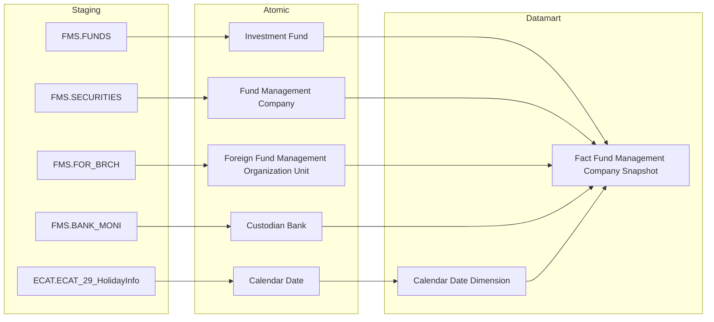
```mermaid
flowchart LR
    subgraph SRC["Staging"]
        FMS_FUNDS["FMS.FUNDS"]
        FMS_SECURITIES["FMS.SECURITIES"]
        FMS_FORBRCH["FMS.FOR_BRCH"]
        FMS_BANKMONI["FMS.BANK_MONI"]
        ECAT_ECAT_29_HolidayInfo["ECAT.ECAT_29_HolidayInfo"]
    end

    subgraph SIL["Atomic"]
        Investment_Fund["Investment Fund"]
        Fund_Management_Company["Fund Management Company"]
        Foreign_Fund_Management_Organization_Unit["Foreign Fund Management Organization Unit"]
        Custodian_Bank["Custodian Bank"]
        Calendar_Date["Calendar Date"]
    end

    subgraph GOLD["Datamart"]
        fct_fnd_mgt_co_snpst["Fact Fund Management Company Snapshot"]
        cdr_dt_dim["Calendar Date Dimension"]
    end

    FMS_FUNDS --> Investment_Fund
    FMS_SECURITIES --> Fund_Management_Company
    FMS_FORBRCH --> Foreign_Fund_Management_Organization_Unit
    FMS_BANKMONI --> Custodian_Bank
    ECAT_ECAT_29_HolidayInfo --> Calendar_Date

    Investment_Fund --> fct_fnd_mgt_co_snpst
    Fund_Management_Company --> fct_fnd_mgt_co_snpst
    Foreign_Fund_Management_Organization_Unit --> fct_fnd_mgt_co_snpst
    Custodian_Bank --> fct_fnd_mgt_co_snpst
    Calendar_Date --> cdr_dt_dim
    cdr_dt_dim --> fct_fnd_mgt_co_snpst
```

---

##### Cụm 1: Danh sách CTQLQ — flat (Tác nghiệp)

Phục vụ Tab TỔNG QUAN CTQLQ — Nhóm 3. Bảng flat `Fund Management Company Profile` — 6/13 chỉ tiêu READY (Thời gian, Tên công ty, Số lượng Quỹ, Xếp loại, CAMEL, Vốn điều lệ); 7 chỉ tiêu còn lại PENDING (Người đại diện theo pháp luật — BA chưa xác nhận cột nguồn đúng; AUM/Thị phần/CAR/Lợi nhuận/Vốn CSH/Số HĐ UTQLDM — engine báo cáo định kỳ, xem O_QLQ_15). **[CẬP NHẬT 2026-09-26]** Bổ sung entity `Member Rating` (Xếp loại/CAMEL) và `Investment Fund` (Số lượng Quỹ); gỡ `Fund Management Company Employee` (Người đại diện hạ về PENDING, không dùng `FMS.TL_PROFILES` như thiết kế cũ).

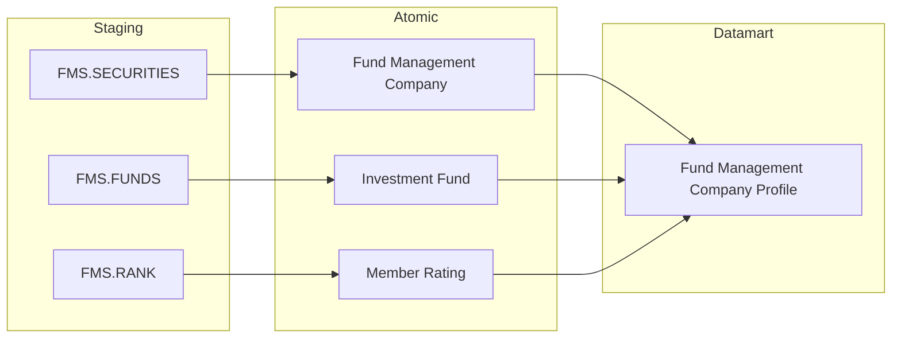
```mermaid
flowchart LR
    subgraph SRC["Staging"]
        FMS_SECURITIES["FMS.SECURITIES"]
        FMS_FUNDS["FMS.FUNDS"]
        FMS_RANK["FMS.RANK"]
    end

    subgraph SIL["Atomic"]
        Fund_Management_Company["Fund Management Company"]
        Investment_Fund["Investment Fund"]
        Member_Rating["Member Rating"]
    end

    subgraph GOLD["Datamart"]
        fnd_mgt_co_prf["Fund Management Company Profile"]
    end

    FMS_SECURITIES --> Fund_Management_Company
    FMS_FUNDS --> Investment_Fund
    FMS_RANK --> Member_Rating

    Fund_Management_Company --> fnd_mgt_co_prf
    Investment_Fund --> fnd_mgt_co_prf
    Member_Rating --> fnd_mgt_co_prf
```

---

##### Cụm 2: Chi tiết Quỹ của một CTQLQ (Tác nghiệp)

Phục vụ Tab TỔNG QUAN CTQLQ — Nhóm 4. Bảng con drill-down `Fund Management Company Fund List` — 2/3 chỉ tiêu READY (Tên quỹ, Loại hình quỹ); Giá trị NAV PENDING (Dữ liệu động).

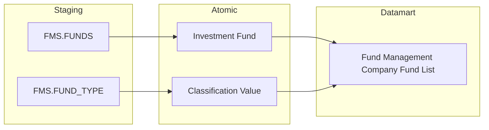
```mermaid
flowchart LR
    subgraph SRC["Staging"]
        FMS_FUNDS["FMS.FUNDS"]
        FMS_FUND_TYPE["FMS.FUND_TYPE"]
    end

    subgraph SIL["Atomic"]
        Investment_Fund["Investment Fund"]
        Classification_Value["Classification Value"]
    end

    subgraph GOLD["Datamart"]
        fnd_mgt_co_fnd_lst["Fund Management Company Fund List"]
    end

    FMS_FUNDS --> Investment_Fund
    FMS_FUND_TYPE --> Classification_Value

    Investment_Fund --> fnd_mgt_co_fnd_lst
    Classification_Value --> fnd_mgt_co_fnd_lst
```

---

> **[CẬP NHẬT 2026-09-26]** `Fund Management Company Contract List` (Nhóm 5) đã gỡ khỏi Section 1 — BA đổi hẳn nguồn sang engine báo cáo định kỳ, cả 3/3 chỉ tiêu nay PENDING (không còn dùng `FMS.INVES_ACC` trực tiếp, xem O_QLQ_5, O_QLQ_14). `Investment Fund Distribution Agent List` (Nhóm 14) cũng gỡ khỏi Section 1 — K_QLQ_103 hạ về PENDING (gap AGENCY_TYPE, xem O_QLQ_9).

##### Cụm 6: Biểu đồ Tổng NAV Quỹ và Tỷ lệ NAV/GDP (PENDING toàn bộ phần NAV — không có bảng QLQ riêng)

Phục vụ Tab QUỸ ĐẦU TƯ — Nhóm 7, tái sử dụng ở Nhóm 8/9 (K_QLQ_44 PENDING ở 2 Nhóm đó vì không có measure NAV độc lập đi kèm). **[SỬA 2026-09-28 — All-Tier Cleanup]** `Fact Investment Fund NAV Snapshot` (`fct_investment_fund_nav_snpst`) đã bị xóa — bảng này chỉ có 2 cột FK (Thời gian, Loại hình quỹ), 0 dòng Detail Mapping tham chiếu (`L2-TABLE-ZERO-USAGE`, Gate 8): Thời gian (K_QLQ_44) và GDP (K_QLQ_47) — 2/6 chỉ tiêu thật sự READY của Nhóm này — đều gắn trực tiếp vào `Fact Macro Indicator Snapshot` (reuse module PTTT, Presentation reuse Case 2, không tạo cột vật lý riêng); Loại hình quỹ (K_QLQ_45) là DERIVED chưa gắn cột. NAV chính (K_QLQ_46/48/49) và toàn bộ Nhóm 8/9 vẫn PENDING thật (thiếu Atomic cho engine báo cáo định kỳ `RPT_*`, xem O_QLQ_15) — khi có nguồn, thiết kế Fact mới từ đầu lúc đó (không phục hồi bảng cũ, vì bảng cũ có FK sai/thiếu so với nhu cầu thật hiện nay — xem ghi chú bảng KPI Nhóm 7/8/9). GDP **reuse** module PTTT — xem Section 4.

> **[SỬA 2026-09-28]** Không còn sơ đồ lineage (mermaid) riêng cho Cụm này — sau khi xóa `Fact Investment Fund NAV Snapshot`, Cụm 6 không còn tạo ra bất kỳ artifact Datamart nào của riêng QLQ (chỉ reuse thuần `Fact Macro Indicator Snapshot`, đã vẽ đầy đủ ở Cụm 12 bên dưới với cùng chuỗi nguồn `cl_risk_indicator`/`cl_risk_indicator_value`). NAV core (K_QLQ_46/48/49/56-58) chưa có Atomic nguồn (engine báo cáo định kỳ `RPT_*`) nên chưa có gì để vẽ — xem O_QLQ_15.

---

##### Cụm 6b: Số lượng quỹ đầu tư chứng khoán (`Fact Investment Fund Count Snapshot`)

Phục vụ Tab QUỸ ĐẦU TƯ — Nhóm 10, tái sử dụng ở Nhóm 6 (K_QLQ_41). Toàn bộ 9/9 (Nhóm 10) + 1/1 (Nhóm 6) chỉ tiêu READY — nguồn trực tiếp `FMS.FUNDS`, không qua engine báo cáo như thiết kế cũ giả định (`FMS.FUND_REPORT`, chưa từng tồn tại).

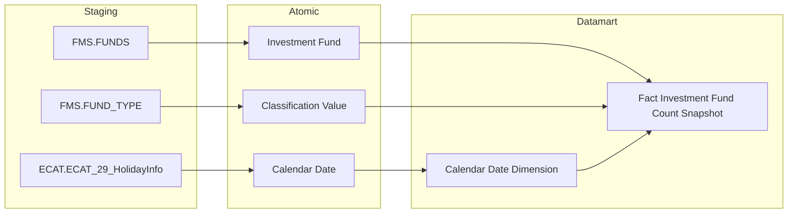
```mermaid
flowchart LR
    subgraph SRC["Staging"]
        FMS_FUNDS["FMS.FUNDS"]
        FMS_FUNDTYPE["FMS.FUND_TYPE"]
        ECAT_ECAT_29_HolidayInfo["ECAT.ECAT_29_HolidayInfo"]
    end

    subgraph SIL["Atomic"]
        Investment_Fund["Investment Fund"]
        Classification_Value["Classification Value"]
        Calendar_Date["Calendar Date"]
    end

    subgraph GOLD["Datamart"]
        fct_investment_fund_cnt_snpst["Fact Investment Fund Count Snapshot"]
        cdr_dt_dim["Calendar Date Dimension"]
    end

    FMS_FUNDS --> Investment_Fund
    FMS_FUNDTYPE --> Classification_Value
    ECAT_ECAT_29_HolidayInfo --> Calendar_Date

    Investment_Fund --> fct_investment_fund_cnt_snpst
    Classification_Value --> fct_investment_fund_cnt_snpst
    Calendar_Date --> cdr_dt_dim
    cdr_dt_dim --> fct_investment_fund_cnt_snpst
```

---

##### Cụm 6c: Tăng trưởng CCQ lưu hành (`Fact Investment Fund CCQ Snapshot`)

Phục vụ Tab QUỸ ĐẦU TƯ — Nhóm 11. Toàn bộ 9/9 chỉ tiêu READY — nguồn trực tiếp `FMS.FUNDS.TOTAL_QTTY`, không qua VSDC/engine báo cáo như thiết kế cũ giả định (xem O_QLQ_7, Closed).

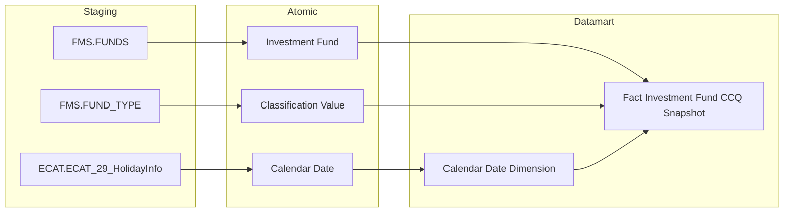
```mermaid
flowchart LR
    subgraph SRC["Staging"]
        FMS_FUNDS["FMS.FUNDS"]
        FMS_FUNDTYPE["FMS.FUND_TYPE"]
        ECAT_ECAT_29_HolidayInfo["ECAT.ECAT_29_HolidayInfo"]
    end

    subgraph SIL["Atomic"]
        Investment_Fund["Investment Fund"]
        Classification_Value["Classification Value"]
        Calendar_Date["Calendar Date"]
    end

    subgraph GOLD["Datamart"]
        fct_investment_fund_ccq_snpst["Fact Investment Fund CCQ Snapshot"]
        cdr_dt_dim["Calendar Date Dimension"]
    end

    FMS_FUNDS --> Investment_Fund
    FMS_FUNDTYPE --> Classification_Value
    ECAT_ECAT_29_HolidayInfo --> Calendar_Date

    Investment_Fund --> fct_investment_fund_ccq_snpst
    Classification_Value --> fct_investment_fund_ccq_snpst
    Calendar_Date --> cdr_dt_dim
    cdr_dt_dim --> fct_investment_fund_ccq_snpst
```

---

##### Cụm 6d: Tỉ lệ tăng trưởng NAV/CCQ so với VN-Index và Lãi suất liên NH (không có bảng QLQ riêng)

Phục vụ Tab QUỸ ĐẦU TƯ — Nhóm 12. 4/15 chỉ tiêu READY (Thời gian K_QLQ_77, VN-Index K_QLQ_78, Lãi suất liên NH qua đêm K_QLQ_79, Loại hình quỹ chi tiết K_QLQ_80); NAV/CCQ và 9 phân loại chi tiết (K_QLQ_81–91) PENDING — BA lấy từ engine báo cáo định kỳ `RPT_*` chưa có Atomic (O_QLQ_15, O_QLQ_25). **[SỬA 2026-10-05 — All-Tier Cleanup]** `Fact Investment Fund NAV per CCQ Snapshot` (`fct_investment_fund_nav_per_ccq_snpst`) đã xóa vì không còn measure READY: Thời gian (K_QLQ_77) gắn `Fact Fund Management Company Snapshot` (Cụm 0), Loại hình quỹ chi tiết (K_QLQ_80) là Chiều DERIVED chưa gắn cột, VN-Index (K_QLQ_78) **reuse** `Fact Market Index Snapshot` (module GSTT, nguồn `MDDS.JAD_MARKETINFOR` → `market_index_snapshot`), Lãi suất liên NH (K_QLQ_79) **reuse** `Fact Macro Indicator Snapshot` (module PTTT, nguồn `UAT_MRMS.RISK_INDICATOR/RISK_INDICATOR_VALUE` → `cl_risk_indicator`/`cl_risk_indicator_value`) — xem Section 4. Không còn sơ đồ lineage riêng cho Cụm này.

---

##### Cụm 8: Danh sách quỹ đầu tư (Tác nghiệp)

Phục vụ Tab QUỸ ĐẦU TƯ — Nhóm 13. Bảng flat `Investment Fund Profile` — 8/11 chỉ tiêu READY (Thời gian, Tên quỹ, Phân loại, Công ty quản lý, Ngân hàng giám sát, Số TV BĐD, Số người điều hành, KL CCQ lưu hành); 3 chỉ tiêu PENDING (Số ĐLPP — thiếu attribute AGENCY_TYPE, xem O_QLQ_9; NAV hiện tại/LN YTD — engine báo cáo định kỳ, xem O_QLQ_15). **[CẬP NHẬT 2026-09-26]** Gỡ entity `Investment Fund X Fund Distribution Agent Relationship` (FMS.AGEN_FUNDS) khỏi diagram — Số ĐLPP (K_QLQ_97) hạ về PENDING; KL CCQ lưu hành (K_QLQ_101) không cần entity mới, đã có sẵn trên `Investment Fund`.

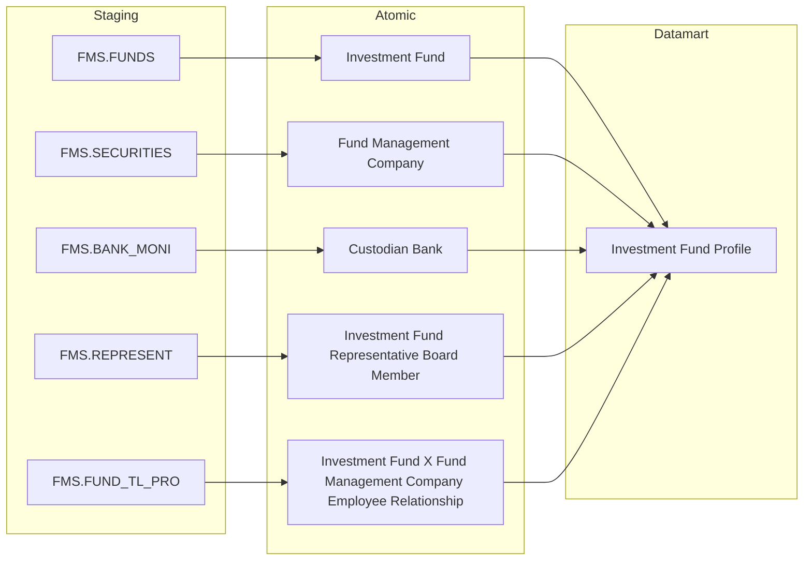
```mermaid
flowchart LR
    subgraph SRC["Staging"]
        FMS_FUNDS["FMS.FUNDS"]
        FMS_SECURITIES["FMS.SECURITIES"]
        FMS_BANKMONI["FMS.BANK_MONI"]
        FMS_REPRESENT["FMS.REPRESENT"]
        FMS_FUNDTLPRO["FMS.FUND_TL_PRO"]
    end

    subgraph SIL["Atomic"]
        Investment_Fund["Investment Fund"]
        Fund_Management_Company["Fund Management Company"]
        Custodian_Bank["Custodian Bank"]
        Investment_Fund_Representative_Board_Member["Investment Fund Representative Board Member"]
        Investment_Fund_X_Fund_Management_Company_Employee_Relationship["Investment Fund X Fund Management Company Employee Relationship"]
    end

    subgraph GOLD["Datamart"]
        inv_fnd_prf["Investment Fund Profile"]
    end

    FMS_FUNDS --> Investment_Fund
    FMS_SECURITIES --> Fund_Management_Company
    FMS_BANKMONI --> Custodian_Bank
    FMS_REPRESENT --> Investment_Fund_Representative_Board_Member
    FMS_FUNDTLPRO --> Investment_Fund_X_Fund_Management_Company_Employee_Relationship

    Investment_Fund --> inv_fnd_prf
    Fund_Management_Company --> inv_fnd_prf
    Custodian_Bank --> inv_fnd_prf
    Investment_Fund_Representative_Board_Member --> inv_fnd_prf
    Investment_Fund_X_Fund_Management_Company_Employee_Relationship --> inv_fnd_prf
```

---

> **[CẬP NHẬT 2026-09-26]** `Investment Fund Distribution Agent List` (Nhóm 14) đã gỡ khỏi Section 1 — K_QLQ_103 hạ về PENDING (cùng gap AGENCY_TYPE với K_QLQ_97/Nhóm 13, xem O_QLQ_9).

##### Cụm 9: Drill-down danh sách thành viên ban đại diện của quỹ (Tác nghiệp)

Phục vụ Tab QUỸ ĐẦU TƯ — Nhóm 15. Bảng con drill-down từ Nhóm 13, 1 chỉ tiêu READY.

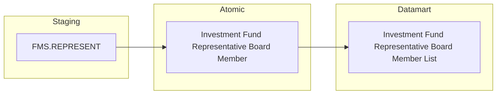
```mermaid
flowchart LR
    subgraph SRC["Staging"]
        FMS_REPRESENT["FMS.REPRESENT"]
    end

    subgraph SIL["Atomic"]
        Investment_Fund_Representative_Board_Member["Investment Fund Representative Board Member"]
    end

    subgraph GOLD["Datamart"]
        inv_fnd_rep_brd_mbr_lst["Investment Fund Representative Board Member List"]
    end

    FMS_REPRESENT --> Investment_Fund_Representative_Board_Member

    Investment_Fund_Representative_Board_Member --> inv_fnd_rep_brd_mbr_lst
```

---

##### Cụm 10: Drill-down danh sách người điều hành quỹ (Tác nghiệp)

Phục vụ Tab QUỸ ĐẦU TƯ — Nhóm 16. Bảng con drill-down từ Nhóm 13, 1 chỉ tiêu READY.

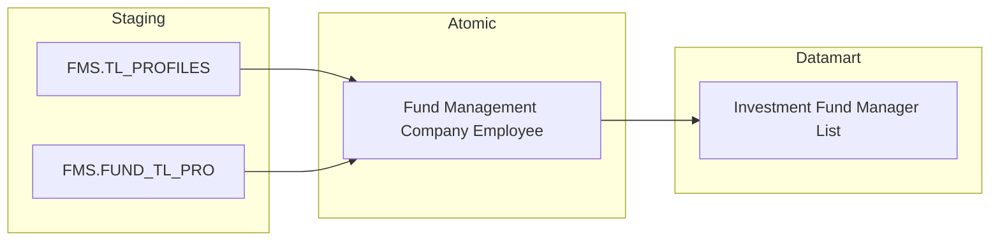
```mermaid
flowchart LR
    subgraph SRC["Staging"]
        FMS_TLPROFILES["FMS.TL_PROFILES"]
        FMS_FUNDTLPRO["FMS.FUND_TL_PRO"]
    end

    subgraph SIL["Atomic"]
        Fund_Management_Company_Employee["Fund Management Company Employee"]
    end

    subgraph GOLD["Datamart"]
        inv_fnd_mgr_lst["Investment Fund Manager List"]
    end

    FMS_TLPROFILES --> Fund_Management_Company_Employee
    FMS_FUNDTLPRO --> Fund_Management_Company_Employee

    Fund_Management_Company_Employee --> inv_fnd_mgr_lst
```

---

##### Cụm 11: Thống kê chung Đại lý phân phối (`Fact Fund Distribution Agent Snapshot`)

Phục vụ Tab TỔNG QUAN ĐẠI LÝ PHÂN PHỐI — Nhóm 17. 2/5 chỉ tiêu READY: Chiều Thời gian và Số lượng ĐLPP (COUNT db). Số tài khoản/Giá trị phát hành/mua lại PENDING (engine báo cáo định kỳ, xem O_QLQ_15). **[CẬP NHẬT 2026-09-26]** Sửa lại nguồn: BA hiện hành dùng `FMS.DISTRIBUTOR_AGENT` (entity `Securities Distribution Agent`), không phải `FMS.AGENCIES` (`Fund Distribution Agent`) như thiết kế cũ — xem O_QLQ_10 (khả năng trùng nghiệp vụ, chưa xác nhận). Chiều Thời gian lấy từ shared entity `Involved Party Alternative Identification` (`identification_issue_dt` WHERE `identification_tp_code = 'OPERATION_LICENSE'`).

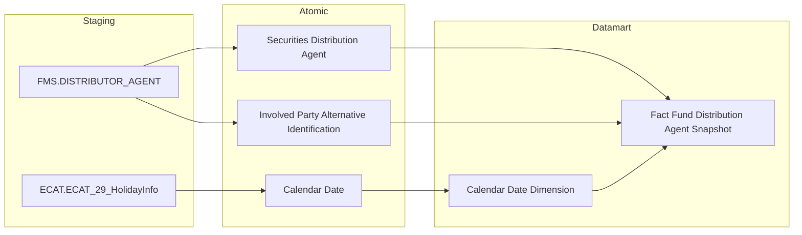
```mermaid
flowchart LR
    subgraph SRC["Staging"]
        FMS_DISTRIBUTORAGENT["FMS.DISTRIBUTOR_AGENT"]
        ECAT_ECAT_29_HolidayInfo["ECAT.ECAT_29_HolidayInfo"]
    end

    subgraph SIL["Atomic"]
        Securities_Distribution_Agent["Securities Distribution Agent"]
        Involved_Party_Alternative_Identification["Involved Party Alternative Identification"]
        Calendar_Date["Calendar Date"]
    end

    subgraph GOLD["Datamart"]
        fct_fnd_dist_agt_snpst["Fact Fund Distribution Agent Snapshot"]
        cdr_dt_dim["Calendar Date Dimension"]
    end

    FMS_DISTRIBUTORAGENT --> Securities_Distribution_Agent
    FMS_DISTRIBUTORAGENT --> Involved_Party_Alternative_Identification
    ECAT_ECAT_29_HolidayInfo --> Calendar_Date

    Securities_Distribution_Agent --> fct_fnd_dist_agt_snpst
    Involved_Party_Alternative_Identification --> fct_fnd_dist_agt_snpst
    Calendar_Date --> cdr_dt_dim
    cdr_dt_dim --> fct_fnd_dist_agt_snpst
```

---

##### Cụm 12: Danh sách Đại lý phân phối (Tác nghiệp)

Phục vụ Tab TỔNG QUAN ĐẠI LÝ PHÂN PHỐI — Nhóm 22. Bảng flat `Fund Distribution Agent Profile` — 7/22 chỉ tiêu READY. **[CẬP NHẬT 2026-09-26]** Sửa lại nguồn: BA hiện hành dùng `FMS.DISTRIBUTOR_AGENT` (entity `Securities Distribution Agent`), không phải `FMS.AGENCIES` — cùng phát hiện với Nhóm 17 (xem O_QLQ_10). Số GP/Ngày cấp GP và Địa chỉ nằm ở 2 shared entity `Involved Party Alternative Identification`/`Involved Party Postal Address`, cả 2 đã READY.

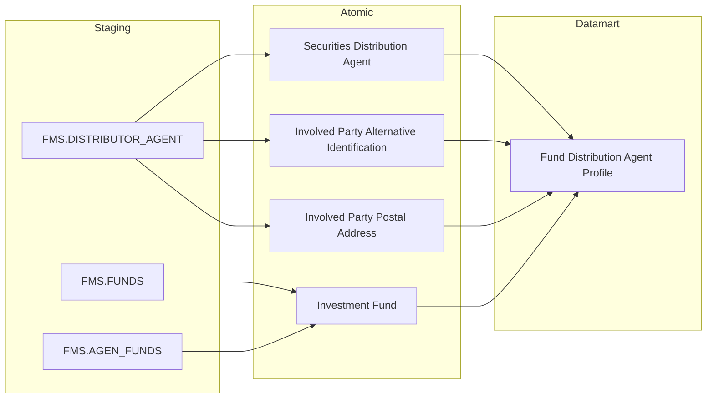
```mermaid
flowchart LR
    subgraph SRC["Staging"]
        FMS_DISTRIBUTORAGENT["FMS.DISTRIBUTOR_AGENT"]
        FMS_FUNDS["FMS.FUNDS"]
        FMS_AGENFUNDS["FMS.AGEN_FUNDS"]
    end

    subgraph SIL["Atomic"]
        Securities_Distribution_Agent["Securities Distribution Agent"]
        Involved_Party_Alternative_Identification["Involved Party Alternative Identification"]
        Involved_Party_Postal_Address["Involved Party Postal Address"]
        Investment_Fund["Investment Fund"]
    end

    subgraph GOLD["Datamart"]
        fnd_dist_agt_prf["Fund Distribution Agent Profile"]
    end

    FMS_DISTRIBUTORAGENT --> Securities_Distribution_Agent
    FMS_DISTRIBUTORAGENT --> Involved_Party_Alternative_Identification
    FMS_DISTRIBUTORAGENT --> Involved_Party_Postal_Address
    FMS_FUNDS --> Investment_Fund
    FMS_AGENFUNDS --> Investment_Fund

    Securities_Distribution_Agent --> fnd_dist_agt_prf
    Involved_Party_Alternative_Identification --> fnd_dist_agt_prf
    Involved_Party_Postal_Address --> fnd_dist_agt_prf
    Investment_Fund --> fnd_dist_agt_prf
```

---

##### Cụm 13: Danh sách các Quỹ đang phân phối (Tác nghiệp)

Phục vụ Tab TỔNG QUAN ĐẠI LÝ PHÂN PHỐI — Nhóm 23. Bảng con drill-down `Fund Distribution Agent Fund List` — 1 chỉ tiêu READY.

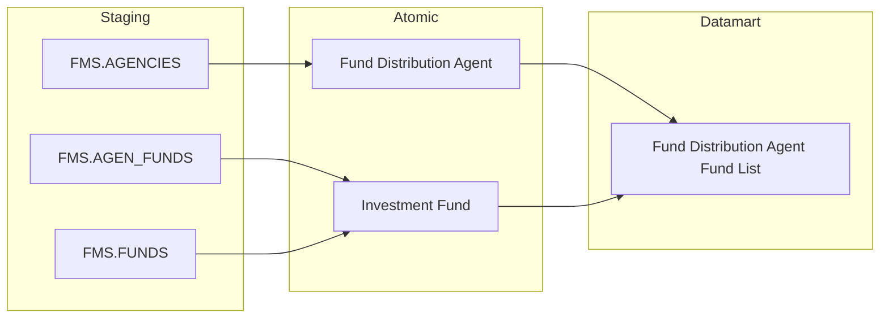
```mermaid
flowchart LR
    subgraph SRC["Staging"]
        FMS_AGENCIES["FMS.AGENCIES"]
        FMS_AGENFUNDS["FMS.AGEN_FUNDS"]
        FMS_FUNDS["FMS.FUNDS"]
    end

    subgraph SIL["Atomic"]
        Fund_Distribution_Agent["Fund Distribution Agent"]
        Investment_Fund["Investment Fund"]
    end

    subgraph GOLD["Datamart"]
        fnd_dist_agt_fnd_lst["Fund Distribution Agent Fund List"]
    end

    FMS_AGENCIES --> Fund_Distribution_Agent
    FMS_AGENFUNDS --> Investment_Fund
    FMS_FUNDS --> Investment_Fund

    Fund_Distribution_Agent --> fnd_dist_agt_fnd_lst
    Investment_Fund --> fnd_dist_agt_fnd_lst
```

---

##### Cụm 14: Thống kê chung CN CTQLQ nước ngoài tại VN (`Fact Foreign Fund Management Organization Unit Snapshot`)

Phục vụ Tab TỔNG QUAN CN CTQLQ NN TẠI VN — Nhóm 24. Fact Market-Level Snapshot — 2 measure READY (Chiều Thời gian, đếm CN).

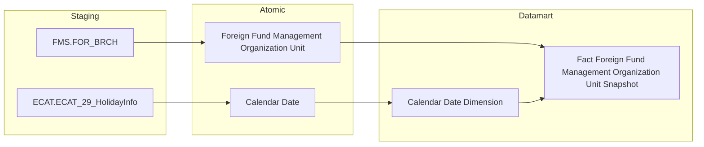
```mermaid
flowchart LR
    subgraph SRC["Staging"]
        FMS_FORBRCH["FMS.FOR_BRCH"]
        ECAT_ECAT_29_HolidayInfo["ECAT.ECAT_29_HolidayInfo"]
    end

    subgraph SIL["Atomic"]
        Foreign_Fund_Management_Organization_Unit["Foreign Fund Management Organization Unit"]
        Calendar_Date["Calendar Date"]
    end

    subgraph GOLD["Datamart"]
        fct_frgn_fnd_mgt_org_unit_snpst["Fact Foreign Fund Management Organization Unit Snapshot"]
        cdr_dt_dim["Calendar Date Dimension"]
    end

    FMS_FORBRCH --> Foreign_Fund_Management_Organization_Unit
    ECAT_ECAT_29_HolidayInfo --> Calendar_Date

    Foreign_Fund_Management_Organization_Unit --> fct_frgn_fnd_mgt_org_unit_snpst
    Calendar_Date --> cdr_dt_dim
    cdr_dt_dim --> fct_frgn_fnd_mgt_org_unit_snpst
```

---

##### Cụm 15: Danh sách CN CTQLQ nước ngoài tại VN (Tác nghiệp)

Phục vụ Tab TỔNG QUAN CN CTQLQ NN TẠI VN — Nhóm 26 (8 dòng BA); popup "Chi tiết hợp đồng UTQLDM" nay là Nhóm 27 riêng (BA tách STT=27 ngày 2026-10-05, 3 dòng). Bảng flat `Foreign Fund Management Organization Unit Profile` — 3/8 chỉ tiêu READY (Chiều Thời gian, Tên CN, Giám đốc CN); popup `Foreign Fund Management Organization Unit Contract List` PENDING toàn bộ (3 chỉ tiêu). **[SỬA 2026-09-28]** Số nhân viên CCHN (K_QLQ_174) hạ về PENDING — BA đổi nguồn sang engine báo cáo định kỳ (trước đây COUNT trực tiếp `Foreign Fund Management Organization Unit Staff`). **[CẬP NHẬT 2026-10-05]** BA đã tách Nhóm 27 riêng cho popup (nhận định 2026-09-26 trước đây sai do lỗi đọc cột, nay BA thực sự tách).

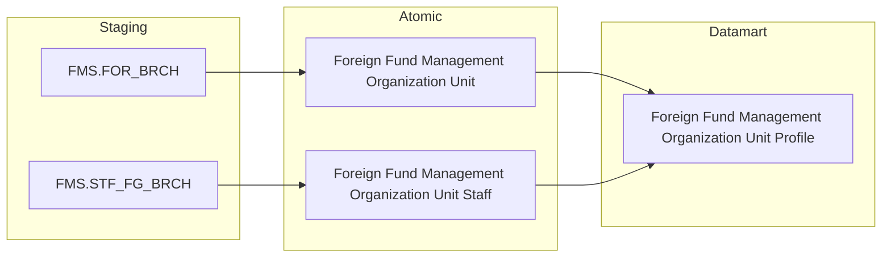
```mermaid
flowchart LR
    subgraph SRC["Staging"]
        FMS_FORBRCH["FMS.FOR_BRCH"]
        FMS_STFFGBRCH["FMS.STF_FG_BRCH"]
    end

    subgraph SIL["Atomic"]
        Foreign_Fund_Management_Organization_Unit["Foreign Fund Management Organization Unit"]
        Foreign_Fund_Management_Organization_Unit_Staff["Foreign Fund Management Organization Unit Staff"]
    end

    subgraph GOLD["Datamart"]
        frgn_fnd_mgt_org_unit_prf["Foreign Fund Management Organization Unit Profile"]
    end

    FMS_FORBRCH --> Foreign_Fund_Management_Organization_Unit
    FMS_STFFGBRCH --> Foreign_Fund_Management_Organization_Unit_Staff

    Foreign_Fund_Management_Organization_Unit --> frgn_fnd_mgt_org_unit_prf
    Foreign_Fund_Management_Organization_Unit_Staff --> frgn_fnd_mgt_org_unit_prf
```

---

##### Cụm 16: Cấu trúc biểu mẫu báo cáo định kỳ — Data Explorer (`Fund Management Report Sheet List`)

Phục vụ Tab DATA EXPLORER — Nhóm 29–33 (26 sheet có BA Done). Bảng tác nghiệp `Fund Management Report Sheet List` — 130/234 dòng BA Done READY (Loại báo cáo, Mã báo cáo, Tên báo cáo, Mã sheet, Tên sheet × 26 sheet); Kỳ báo cáo, Mã chỉ tiêu, Tên chỉ tiêu, Giá trị (104 dòng) PENDING — xem O_QLQ_27. Atomic: `Fund Management Report` (FMS.RPT_TEMP) + `Fund Management Report Sheet` (FMS.SHEET).

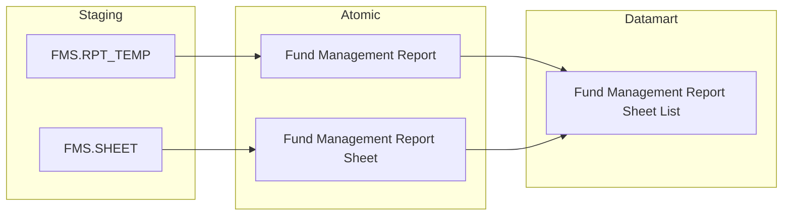
```mermaid
flowchart LR
    subgraph SRC["Staging"]
        FMS_RPTTEMP["FMS.RPT_TEMP"]
        FMS_SHEET["FMS.SHEET"]
    end

    subgraph SIL["Atomic"]
        Fund_Management_Report["Fund Management Report"]
        Fund_Management_Report_Sheet["Fund Management Report Sheet"]
    end

    subgraph GOLD["Datamart"]
        fmr_sheet_lst["Fund Management Report Sheet List"]
    end

    FMS_RPTTEMP --> Fund_Management_Report
    FMS_SHEET --> Fund_Management_Report_Sheet

    Fund_Management_Report --> fmr_sheet_lst
    Fund_Management_Report_Sheet --> fmr_sheet_lst
```

---

## Section 2 — Tổng quan báo cáo

### Tab: TỔNG QUAN CTQLQ

**Slicer chung:** Tháng/Năm (ví dụ: "THÁNG 5 — 2024")

---

#### Nhóm 1 - Thống kê chung

> Phân loại: **Phân tích**
> Atomic: `Investment Fund` ← FMS.FUNDS — READY
> Atomic: `Fund Management Company` ← FMS.SECURITIES — READY (Classification Value `operation_status_code`, scheme `FMS_OPERATION_STATUS`)
> Atomic: `Foreign Fund Management Organization Unit` ← FMS.FOR_BRCH — READY (Classification Value `operation_status_code`, scheme `FMS_OPERATION_STATUS`)
> Atomic: `Custodian Bank` ← FMS.BANK_MONI — READY
> **[CẬP NHẬT 2026-09-26 — gỡ gating "Dữ liệu động" sai]** Toàn bộ Nhóm này trước đây PENDING chỉ vì áp dụng quy tắc "BA đánh Dữ liệu động → PENDING dù Atomic đã sẵn sàng" — quy tắc này đã bị xác nhận SAI (xem `feedback_ignore_ba_column_z.md`: "Loại dữ liệu" không phải lý do PENDING hợp lệ). Đối chiếu lại BA hiện hành (`BA_analyst_QLQ.csv` dòng 4-14): 6/11 chỉ tiêu có Atomic đầy đủ → nâng READY. K_QLQ_3/4/7 vẫn PENDING — BA hiện hành cho thấy nguồn thật của cả 3 dòng này là engine báo cáo định kỳ EAV `FMS_UAT.RPT_TEMP/SHEET/RPT_VALUES/RPT_MEMBER/RPT_PERIOD` (K_QLQ_3 BA đã đổi nguồn khỏi giả định cũ "Discretionary Investment Account/FMS.INVES_ACC" — không còn dùng bảng INVES_ACC trực tiếp; xem O_QLQ_15, đã đổi tên khỏi giả định cũ `FMS.FUND_REPORT`). BA note lặp lại nhiều dòng RPT: *"HTTT báo dữ liệu từ bảng không đúng --> nên lấy từ báo cáo"* — xác nhận đây là chủ đích của BA (không phải có thể lách qua bằng cột trực tiếp trên FUNDS/SECURITIES/INVES_ACC), giữ PENDING đúng.

**Bảng KPI:**

| KPI ID | Tên KPI | Đơn vị | Tính chất | Công thức | Ghi chú | Trạng thái |
|---|---|---|---|---|---|---|
| K_QLQ_1 | Thời gian | — | Chiều | `Snapshot_Date_Dimension_Id` → `cdr_dt_dim` (grain tháng) — lọc theo `fund_management_company.actual_operation_commencement_dt`/`suspension_dt`/`effective_end_dt` khi tính các COUNT bên dưới | Chiều slicer chung cho Nhóm — nay có ý nghĩa vì đã có measure READY đi kèm | READY |
| K_QLQ_2 | Quỹ đầu tư chứng khoán | Quỹ | Cơ sở | `COUNT(investment_fund.investment_fund_id)` WHERE quỹ đang hoạt động tại tháng snapshot (theo `investment_fund` SCD4A hiệu lực tại kỳ) | Investment Fund đã READY — công thức tương đương K_QLQ_40 (Nhóm 6), 2 dòng BA cùng 1 measure (BA đánh "Trùng"), giữ 1 KPI_ID | READY |
| K_QLQ_3 | Hợp đồng UTDM | Hợp đồng | Cơ sở | | **Lý do pending:** BA đã đổi nguồn — nay là engine báo cáo định kỳ `FMS_UAT.RPT_TEMP/SHEET/RPT_VALUES/RPT_MEMBER/RPT_PERIOD` (Mapping báo cáo đầu vào: Báo cáo tình hình hoạt động của CTQLQ >> HDQuanLyDanhMucDauTu_06015 >> Tổng (I+II)), không còn dùng `FMS.INVES_ACC` trực tiếp như thiết kế cũ giả định. **Atomic cần bổ sung:** cột nối giá trị `fmr_value` với ô của sheet — `fmr_value.tgt_id` (RPT_VALUES.TGT_ID) và `fmr_sheet.data_label`/`cells_meta` (nhãn, vị trí dòng–cột) — cùng `record_status` của `fmr_submission` (BA lọc `IN (2,3,5,10)`). Atomic đã có `fmr_*` nhưng chưa đủ cột, xem O_QLQ_27. **Mart dự kiến:** `Fact Fund Management Company Snapshot`. | PENDING |
| K_QLQ_4 | Tổng AUM quản lý | Nghìn tỷ VND | Cơ sở | | **Lý do pending:** nguồn thật là engine báo cáo định kỳ `FMS_UAT.RPT_TEMP/SHEET/RPT_VALUES/RPT_MEMBER/RPT_PERIOD` (BA note: "HTTT báo dữ liệu từ bảng không đúng --> nên lấy từ báo cáo"), không phải cột trực tiếp trên FUNDS/SECURITIES. **Atomic cần bổ sung:** như K_QLQ_3. **Mart dự kiến:** `Fact Fund Management Company Snapshot`. | PENDING |
| K_QLQ_5 | CTQLQ đang hoạt động | Công ty | Cơ sở | `COUNT(fund_management_company.fmc_id)` WHERE `fund_management_company.operation_status_code` (JOIN `cl_value` scheme `FMS_OPERATION_STATUS`) = 'Hoạt động' | Xác nhận Atomic có FK Classification Value sẵn trên `fund_management_company` (nguồn `FMS.SECURITIES.STATUS_ID`) — đủ điều kiện READY | READY |
| K_QLQ_6 | VPĐD QLQ nước ngoài tại VN | Văn phòng | Cơ sở | `COUNT(foreign_fm_ou.foreign_fm_ou_id)` WHERE `foreign_fm_ou.branch_tp_code` = 0 (Branch_Flag) AND hiệu lực tại tháng snapshot | Foreign Fund Management Organization Unit đã READY | READY |
| K_QLQ_7 | Số lượng hợp đồng tư vấn đầu tư | Hợp đồng | Cơ sở | | **Lý do pending:** BA nay đã bổ sung nguồn (trước đây để trống) — nguồn thật là engine báo cáo định kỳ `FMS_UAT.RPT_TEMP/SHEET/RPT_VALUES/RPT_MEMBER/RPT_PERIOD` (Mapping báo cáo đầu vào: Báo cáo tình hình hoạt động của CTQLQ >> HDTuVanDauTuCK_06016 >> Tổng (I+II)). **Atomic cần bổ sung:** như K_QLQ_3. **Mart dự kiến:** `Fact Fund Management Company Snapshot`. | PENDING |
| K_QLQ_8 | VPĐD CTQLQ NN tại VN đang hoạt động | Văn phòng | Cơ sở | `COUNT(foreign_fm_ou.foreign_fm_ou_id)` WHERE `branch_tp_code` = 0 AND `operation_status_code` (JOIN `cl_value` scheme `FMS_OPERATION_STATUS`) = 'Hoạt động' | Cùng Classification Value scheme với K_QLQ_5 | READY |
| K_QLQ_9 | VPĐD CTQLQ NN tại VN đang chờ đóng cửa | Văn phòng | Cơ sở | `COUNT(foreign_fm_ou.foreign_fm_ou_id)` WHERE `branch_tp_code` = 0 AND `operation_status_code` LIKE '%chờ đóng cửa%' | Cùng Classification Value scheme với K_QLQ_5 | READY |
| K_QLQ_10 | VPĐD CTQLQ NN tại VN đã đóng cửa | Văn phòng | Cơ sở | `COUNT(foreign_fm_ou.foreign_fm_ou_id)` WHERE `branch_tp_code` = 0 AND `operation_status_code` NOT LIKE '%chờ%' AND `operation_status_code` LIKE '%đóng cửa%'/'%chấm dứt%'/'%giải thể%' | Cùng Classification Value scheme với K_QLQ_5 | READY |
| K_QLQ_11 | Tổng số ngân hàng giám sát | Ngân hàng | Cơ sở | `COUNT(custodian_bank.custodian_bank_id)` WHERE hiệu lực tại tháng snapshot | Custodian Bank đã READY | READY |

**Bảng mapping nguồn:**

| Tên KPI | Bảng nguồn (BA) | Atomic entity | Atomic table |
|---|---|---|---|
| K_QLQ_2, K_QLQ_40 (Nhóm 6, reuse) | FMS_UAT.FUNDS | Investment Fund | investment_fund |
| K_QLQ_5, K_QLQ_8, K_QLQ_9, K_QLQ_10 | FMS_UAT.SECURITIES / FMS_UAT.FOR_BRCH | Fund Management Company / Foreign Fund Management Organization Unit | fund_management_company / foreign_fm_ou |
| K_QLQ_6 | FMS_UAT.FOR_BRCH | Foreign Fund Management Organization Unit | foreign_fm_ou |
| K_QLQ_3, K_QLQ_4, K_QLQ_7 | FMS_UAT.RPT_TEMP FMS_UAT.SHEET FMS_UAT.RPT_VALUES FMS_UAT.RPT_MEMBER FMS_UAT.RPT_PERIOD | Fund Management Report Value *(`fmr_value` — thiếu TGT_ID/CODE, xem O_QLQ_27)* | fmr_value |
| K_QLQ_11 | FMS_UAT.BANK_MONI | Custodian Bank | custodian_bank |

---

#### Nhóm 2 - Số liệu hợp đồng uỷ thác danh mục

> Phân loại: **Phân tích**
> **[CẬP NHẬT 2026-09-26]** Toàn bộ Nhóm vẫn PENDING, nhưng lý do đã đổi: thiết kế cũ giả định nguồn là `Discretionary Investment Account` (FMS.INVES_ACC, đã READY) và chỉ PENDING vì gating "Dữ liệu động" sai (xem `feedback_ignore_ba_column_z.md`). BA hiện hành (`BA_analyst_QLQ.csv` dòng 15-21) đã đổi nguồn thật sang engine báo cáo định kỳ EAV `FMS_UAT.RPT_TEMP/SHEET/RPT_VALUES/RPT_MEMBER/RPT_PERIOD` (Mapping báo cáo đầu vào: Báo cáo về tình hình quản lý danh mục đầu tư >> Chung_TinhHinhQLDMDT_06020) cho cả 7/7 chỉ tiêu — không còn dùng `FMS.INVES_ACC` trực tiếp. BA note lặp lại: *"HTTT báo dữ liệu từ bảng không đúng --> nên lấy từ báo cáo"*. Atomic entity cho engine báo cáo định kỳ FMS chưa tồn tại (xem O_QLQ_15) → giữ PENDING đúng, nhưng vì lý do khác thiết kế cũ.

**Bảng KPI:**

| KPI ID | Tên KPI | Đơn vị | Tính chất | Công thức | Ghi chú | Trạng thái |
|---|---|---|---|---|---|---|
| K_QLQ_12 | Thời gian | — | Chiều | | **Lý do pending:** Nhóm không còn measure nào READY. Nguồn thời gian nay là `RPT_MEMBER.PERIOD_TYPE/PERIOD_VALUE/YEAR_VALUE` (engine báo cáo định kỳ), không phải cột ngày trực tiếp. **Atomic cần bổ sung:** cột nối giá trị `fmr_value` với ô của sheet — `fmr_value.tgt_id` (RPT_VALUES.TGT_ID) và `fmr_sheet.data_label`/`cells_meta` (nhãn, vị trí dòng–cột) — cùng `record_status` của `fmr_submission` (BA lọc `IN (2,3,5,10)`). Atomic đã có `fmr_*` nhưng chưa đủ cột, xem O_QLQ_27. **Mart dự kiến:** `Fact Discretionary Investment Contract Snapshot` — grain: 1 CTQLQ × 1 tháng. | PENDING |
| K_QLQ_13 | Số lượng hợp đồng UTDM cá nhân | HĐ | Cơ sở | | **Lý do pending:** BA đã đổi nguồn — nay là engine báo cáo định kỳ (Mapping báo cáo đầu vào: Chung_TinhHinhQLDMDT_06020 >> Tổng số HĐ ủy thác đầu tư đang thực hiện >> Cá nhân), không còn dùng `FMS.INVES_ACC` trực tiếp như thiết kế cũ giả định. **Atomic cần bổ sung:** như K_QLQ_12. **Mart dự kiến:** `Fact Discretionary Investment Contract Snapshot`. | PENDING |
| K_QLQ_14 | Giá trị thị trường hợp đồng UTDM cá nhân | Tỷ VND | Cơ sở | | **Lý do pending:** Tương tự K_QLQ_13 — Mapping báo cáo đầu vào: Tổng giá trị thị trường các HĐ ủy thác đầu tư (VND) >> Cá nhân. **Atomic cần bổ sung:** như K_QLQ_12. **Mart dự kiến:** `Fact Discretionary Investment Contract Snapshot`. | PENDING |
| K_QLQ_15 | Số lượng hợp đồng UTDM tổ chức | HĐ | Cơ sở | | **Lý do pending:** Tương tự K_QLQ_13, nhánh Tổ chức. **Atomic cần bổ sung:** như K_QLQ_12. **Mart dự kiến:** `Fact Discretionary Investment Contract Snapshot`. | PENDING |
| K_QLQ_16 | Giá trị thị trường hợp đồng UTDM tổ chức | Tỷ VND | Cơ sở | | **Lý do pending:** Tương tự K_QLQ_14, nhánh Tổ chức. **Atomic cần bổ sung:** như K_QLQ_12. **Mart dự kiến:** `Fact Discretionary Investment Contract Snapshot`. | PENDING |
| K_QLQ_17 | Tổng số lượng hợp đồng UTDM | HĐ | Cơ sở | | **Lý do pending:** BA đã đổi nguồn — Mapping báo cáo đầu vào: Tổng số HĐ ủy thác đầu tư đang thực hiện (không tách cá nhân/tổ chức). **Atomic cần bổ sung:** như K_QLQ_12. **Mart dự kiến:** `Fact Discretionary Investment Contract Snapshot`. | PENDING |
| K_QLQ_18 | Tổng giá trị ủy thác | Tỷ VND | Cơ sở | | **Lý do pending:** Tương tự K_QLQ_17 — Mapping báo cáo đầu vào: Tổng giá trị thị trường các HĐ ủy thác đầu tư (VND), không tách cá nhân/tổ chức. **Atomic cần bổ sung:** như K_QLQ_12. **Mart dự kiến:** `Fact Discretionary Investment Contract Snapshot`. | PENDING |

**Bảng mapping nguồn:**

| Tên KPI | Bảng nguồn (BA) | Atomic entity | Atomic table |
|---|---|---|---|
| K_QLQ_12–18 | FMS_UAT.RPT_TEMP FMS_UAT.SHEET FMS_UAT.RPT_VALUES FMS_UAT.RPT_MEMBER FMS_UAT.RPT_PERIOD | Fund Management Report Value *(`fmr_value` — thiếu TGT_ID/CODE, xem O_QLQ_27)* | fmr_value |

---

#### Nhóm 3 - Danh sách các Công ty quản lý quỹ

> Phân loại: **Tác nghiệp**
> Atomic: `Fund Management Company` ← FMS.SECURITIES — READY (Classification Value, Charter Capital, Actual Operation Commencement Date)
> Atomic: `Investment Fund` ← FMS.FUNDS — READY (COUNT theo fmc_id)
> Atomic: `Member Rating` ← FMS.RANK — READY (rank_index, total_score_amt)
> **[CẬP NHẬT 2026-09-26]** Rà lại toàn bộ Nhóm theo BA hiện hành + gỡ gating "Dữ liệu động" sai (xem `feedback_ignore_ba_column_z.md`):
> - **Nâng READY (5 chỉ tiêu):** K_QLQ_19 (Thời gian), K_QLQ_23 (Số lượng Quỹ), K_QLQ_24 (Xếp loại), K_QLQ_25 (CAMEL), K_QLQ_26 (Vốn điều lệ) — Atomic đã sẵn sàng, không còn blocker thật.
> - **HẠ xuống PENDING (1 chỉ tiêu, khác hướng thông thường):** K_QLQ_21 (Người đại diện theo pháp luật) — thiết kế cũ giả định READY từ `Fund Management Company Employee.Item_Name` (FMS.TL_PROFILES), nhưng BA hiện hành (dòng 24) đánh **Trạng thái mapping = Pending**, Note: *"Chưa có cách lấy đúng, đang chờ cf từ Tinh Vân"* — BA tự nhận chưa xác định được cột nguồn đáng tin cậy cho "người đại diện theo pháp luật" (khác Director/Deputy Director đã có trên `fund_management_company`, không chắc trùng vai trò pháp lý). Tôn trọng đánh giá của BA, không giữ READY theo giả định cũ.
> - **Giữ PENDING, sửa lại lý do đúng (5 chỉ tiêu):** K_QLQ_22/27/28/30 dùng engine báo cáo định kỳ EAV `FMS_UAT.RPT_TEMP/SHEET/RPT_VALUES/RPT_MEMBER/RPT_PERIOD` (không phải giả định cũ `FMS.SECURITIES_REPORT`, entity đó chưa từng tồn tại — xem O_QLQ_15). K_QLQ_29 (CAR) và K_QLQ_31 (Vốn CSH) BA nay **đã cung cấp nguồn** (Báo cáo tỷ lệ an toàn tài chính / Báo cáo tài chính — BangCanDoiKeToan), cũng qua engine RPT, không còn "BA chưa cung cấp Bảng nguồn" như thiết kế cũ.
> - **[CẬP NHẬT 2026-10-05] HẠ xuống PENDING (1 chỉ tiêu):** K_QLQ_32 (Số lượng hợp đồng UTQLDM) — BA (dòng 35 `BA_analyst_QLQ.csv`) nay lấy từ engine báo cáo định kỳ `FMS_UAT.RPT_TEMP/SHEET/RPT_VALUES/RPT_MEMBER/RPT_PERIOD` (Mapping báo cáo đầu vào: Báo cáo về tình hình quản lý danh mục đầu tư >> Chung_TinhHinhQLDMDT_06020 >> Tổng số Hợp đồng ủy thác đầu tư đang thực hiện), không còn COUNT `FMS.INVES_ACC`. PENDING [Nhóm 3 - Thiếu nguồn Atomic], O_QLQ_15, O_QLQ_25. Cột `Discretionary_Investment_Account_Count` gỡ khỏi schema.

**Mockup:**

| Mã | Tên CT | Người đại diện | Số nhân viên CCHN | Số lượng Quỹ | Xếp loại | CAMEL | Vốn điều lệ | AUM | Thị phần | CAR | Lợi nhuận | Vốn CSH | Số HĐ UTQLDM |
|---|---|---|---|---|---|---|---|---|---|---|---|---|---|
| CT1 | Công ty ABC | Nguyễn Văn A | 12 | 5 | A | 89.5% | 150 | 25.450 | 8.2% | 18.5% | 120.4 | 165 | 350 |

**Source:** `Fund Management Company Profile`

**Bảng KPI:**

| KPI ID | Tên KPI | Đơn vị | Tính chất | Công thức | Ghi chú | Trạng thái |
|---|---|---|---|---|---|---|
| K_QLQ_19 | Thời gian | — | Chiều | `Snapshot_Date_Dimension_Id` → `cdr_dt_dim` (grain tháng) — lọc `fund_management_company.actual_operation_commencement_dt` <= cuối tháng AND (`suspension_dt`/`effective_end_dt` IS NULL) | Nay có ý nghĩa vì Nhóm đã có nhiều measure READY | READY |
| K_QLQ_20 | Tên công ty | — | Cơ sở | `fmc_full_nm`, `fmc_short_nm` ← Fund Management Company | | READY |
| K_QLQ_21 | Người đại diện theo pháp luật | — | Cơ sở | | **Lý do pending:** BA đánh Trạng thái mapping = Pending (dòng 24 BA), Note: "Chưa có cách lấy đúng, đang chờ cf từ Tinh Vân". Không dùng `fund_management_company.director_full_nm`/`deputy_director_full_nm` thay thế vì chưa xác nhận vai trò Director trùng vai trò pháp lý "Người đại diện theo pháp luật". **Atomic cần bổ sung:** không xác định — chờ BA/Tinh Vân xác nhận cột nguồn đúng. **Mart dự kiến:** `Fund Management Company Profile`. | PENDING |
| K_QLQ_22 | Số lượng nhân viên có CCHN | Người | Cơ sở | | **Lý do pending:** nguồn thật là engine báo cáo định kỳ `FMS_UAT.RPT_TEMP/SHEET/RPT_VALUES/RPT_MEMBER/RPT_PERIOD` (Mapping báo cáo đầu vào: Báo cáo tình hình hoạt động của CTQLQ >> CoCauToChuc_06018). **Atomic cần bổ sung:** cột nối giá trị `fmr_value` với ô của sheet — `fmr_value.tgt_id` (RPT_VALUES.TGT_ID) và `fmr_sheet.data_label`/`cells_meta` (nhãn, vị trí dòng–cột) — cùng `record_status` của `fmr_submission` (BA lọc `IN (2,3,5,10)`). Atomic đã có `fmr_*` nhưng chưa đủ cột, xem O_QLQ_27. **Mart dự kiến:** `Fund Management Company Profile`. | PENDING |
| K_QLQ_23 | Số lượng Quỹ | Quỹ | Cơ sở | `COUNT(investment_fund.investment_fund_id)` WHERE `investment_fund.fmc_id` = CTQLQ hiện tại AND hiệu lực tại tháng snapshot | Investment Fund đã READY | READY |
| K_QLQ_24 | Xếp loại | — | Cơ sở | `member_rating.rank_index` WHERE `member_rating.fmc_id` = CTQLQ, lấy kỳ xếp hạng gần nhất (bán niên/năm) tính đến tháng snapshot | Member Rating đã READY — cần xác nhận LLD cách lấy "kỳ gần nhất" (`rating_period_tp_code`/`data_dt` MAX) | READY |
| K_QLQ_25 | CAMEL | % | Cơ sở | `member_rating.total_score_amt` WHERE `member_rating.fmc_id` = CTQLQ, cùng kỳ xếp hạng với K_QLQ_24 | Member Rating đã READY | READY |
| K_QLQ_26 | Vốn điều lệ | Tỷ VND | Cơ sở | `fund_management_company.charter_capital_amt` | Fund Management Company đã READY | READY |
| K_QLQ_27 | AUM | Tỷ VND | Cơ sở | | **Lý do pending:** nguồn thật là engine báo cáo định kỳ `FMS_UAT.RPT_TEMP/SHEET/RPT_VALUES/RPT_MEMBER/RPT_PERIOD` (Mapping báo cáo đầu vào: Báo cáo tình hình hoạt động của CTQLQ >> HDQuanLyQuy_06014 >> Tổng giá trị tài sản ròng). **Atomic cần bổ sung:** như K_QLQ_22. **Mart dự kiến:** `Fund Management Company Profile`. | PENDING |
| K_QLQ_28 | Thị phần | % | Phái sinh | | **Lý do pending:** phụ thuộc K_QLQ_27 (AUM, PENDING) — Thị phần = AUM CTQLQ / Tổng AUM thị trường × 100%. **Atomic cần bổ sung:** như K_QLQ_22. **Mart dự kiến:** `Fund Management Company Profile`. | PENDING |
| K_QLQ_29 | CAR (ATTC) | % | Cơ sở | | **Lý do pending:** BA nay đã bổ sung nguồn (trước đây để trống) — nguồn thật là engine báo cáo định kỳ (Mapping báo cáo đầu vào: Báo cáo tỷ lệ an toàn tài chính >> BangTongHop_06013 >> Tỷ lệ vốn khả dụng). **Atomic cần bổ sung:** như K_QLQ_22. **Mart dự kiến:** `Fund Management Company Profile`. | PENDING |
| K_QLQ_30 | Lợi nhuận | Tỷ VND | Cơ sở | | **Lý do pending:** nguồn thật là engine báo cáo định kỳ (Mapping báo cáo đầu vào: Báo cáo tài chính >> BCKetQuaHoatDongKinhDoanh >> Lợi nhuận sau thuế TNDN). **Atomic cần bổ sung:** như K_QLQ_22. **Mart dự kiến:** `Fund Management Company Profile`. | PENDING |
| K_QLQ_31 | Vốn CSH | Tỷ VND | Cơ sở | | **Lý do pending:** BA nay đã bổ sung nguồn (trước đây để trống) — nguồn thật là engine báo cáo định kỳ (Mapping báo cáo đầu vào: Báo cáo tài chính >> BangCanDoiKeToan >> B - VỐN CHỦ SỞ HỮU). **Atomic cần bổ sung:** như K_QLQ_22. **Mart dự kiến:** `Fund Management Company Profile`. | PENDING |
| K_QLQ_32 | Số lượng hợp đồng UTQLDM | HĐ | Cơ sở | | **Lý do pending:** [Nhóm 3 - Thiếu nguồn Atomic]: BA (dòng 35) lấy từ engine báo cáo định kỳ `FMS_UAT.RPT_TEMP/SHEET/RPT_VALUES/RPT_MEMBER/RPT_PERIOD` (Mapping báo cáo đầu vào: Báo cáo về tình hình quản lý danh mục đầu tư >> Chung_TinhHinhQLDMDT_06020 >> Tổng số Hợp đồng ủy thác đầu tư đang thực hiện), chỉ có header `fmr_*` trên Atomic, thiếu cột ô/trạng thái — O_QLQ_27 — xem O_QLQ_15, O_QLQ_25. **Atomic cần bổ sung:** cột nối giá trị `fmr_value` với ô của sheet — `fmr_value.tgt_id` (RPT_VALUES.TGT_ID) và `fmr_sheet.data_label`/`cells_meta` (nhãn, vị trí dòng–cột) — cùng `record_status` của `fmr_submission` (BA lọc `IN (2,3,5,10)`). Atomic đã có `fmr_*` nhưng chưa đủ cột, xem O_QLQ_27. **Mart dự kiến:** `Fund Management Company Profile`. | PENDING |

**Bảng mapping nguồn:**

| Tên KPI | Bảng nguồn (BA) | Atomic entity | Atomic table |
|---|---|---|---|
| K_QLQ_20, K_QLQ_26 | FMS_UAT.SECURITIES | Fund Management Company | fund_management_company |
| K_QLQ_23 | FMS_UAT.FUNDS | Investment Fund | investment_fund |
| K_QLQ_24, K_QLQ_25 | FMS_UAT."RANK" | Member Rating | member_rating |
| K_QLQ_22, 27, 28, 29, 30, 31, 32 | FMS_UAT.RPT_TEMP FMS_UAT.SHEET FMS_UAT.RPT_VALUES FMS_UAT.RPT_MEMBER FMS_UAT.RPT_PERIOD | Fund Management Report Value *(`fmr_value` — thiếu TGT_ID/CODE, xem O_QLQ_27)* | fmr_value |
| K_QLQ_21 | *(BA Pending — chờ Tinh Vân)* | TBD | TBD |

**Schema bảng tác nghiệp — Fund Management Company Profile:**

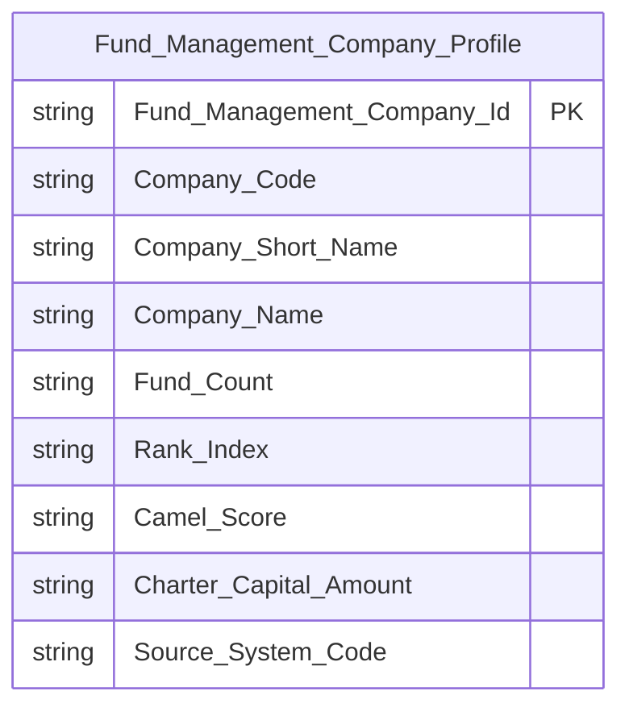
```mermaid
erDiagram
    Fund_Management_Company_Profile {
        string Fund_Management_Company_Id PK
        string Company_Code
        string Company_Short_Name
        string Company_Name
        string Fund_Count
        string Rank_Index
        string Camel_Score
        string Charter_Capital_Amount
        string Source_System_Code
    }
```

> 6/13 cột READY đưa vào schema (Tên CT, Số lượng Quỹ, Xếp loại, CAMEL, Vốn điều lệ + Chiều Thời gian) — 7 cột còn lại PENDING (Người đại diện, Số NV CCHN, AUM, Thị phần, CAR, Lợi nhuận, Vốn CSH) và K_QLQ_32 (Số HĐ UTQLDM, hạ PENDING 2026-10-05, O_QLQ_25), sẽ bổ sung vào schema khi chuyển READY. `Legal_Representative_Name` đã gỡ (K_QLQ_21 PENDING).

**Lineage Mart → Báo cáo:**

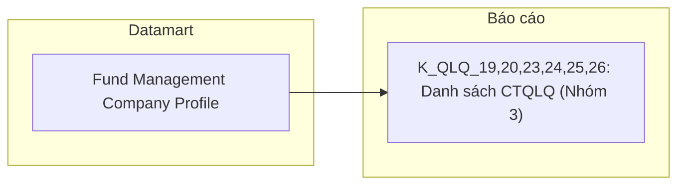
```mermaid
flowchart LR
    subgraph GOLD["Datamart"]
        G1["Fund Management Company Profile"]
    end
    subgraph RPT["Báo cáo"]
        R1["K_QLQ_19,20,23,24,25,26: Danh sách CTQLQ (Nhóm 3)"]
    end
    G1 --> R1
```

**Bảng grain:**

| Tên bảng | Grain |
|---|---|
| Fund Management Company Profile | Tác nghiệp — bảng flat \| 1 CTQLQ × 1 tháng slicer |

---

#### Nhóm 4 - Chi tiết Quỹ của một CTQLQ

> Phân loại: **Tác nghiệp**
> Atomic: `Investment Fund` ← FMS.FUNDS — READY *(K_QLQ_33: Tên quỹ, K_QLQ_34: Loại hình quỹ)*
> Ghi chú: Popup drill-down khi bấm vào Số lượng Quỹ ở Nhóm 3 — FK về `Fund_Management_Company_Id`. Loại hình quỹ là Classification Value (scheme `FMS_FUND_TYPE`) → reuse `cl_dim`, không tạo Dimension riêng. **[CẬP NHẬT 2026-10-05]** K_QLQ_35 (Giá trị NAV) hạ PENDING: BA (dòng 38) lấy từ engine báo cáo định kỳ `FMS_UAT.RPT_TEMP/SHEET/RPT_VALUES/RPT_MEMBER/RPT_PERIOD` (Mapping báo cáo đầu vào: Báo cáo về hoạt động đầu tư của các quỹ >> BCTaiSan >> Tài sản ròng của Quỹ/Công ty đầu tư (I.10-II.4)) — thay cho `FMSQLQ.FUNDS.NAV` ghi 2026-09-28. Cột `Net_Asset_Value_Amount` gỡ khỏi schema.

**Mockup — popup "DANH SÁCH QUỸ":**

| Mã quỹ | Tên quỹ | Loại hình quỹ | NAV (tỷ) |
|---|---|---|---|
| QA1 | Quỹ ABC Cổ phần | Quỹ mở | 1.250 |

**Source:** `Fund Management Company Fund List`

**Bảng KPI:**

| KPI ID | Tên KPI | Đơn vị | Tính chất | Công thức | Ghi chú | Trạng thái |
|---|---|---|---|---|---|---|
| K_QLQ_33 | Tên quỹ | — | Cơ sở | `investment_fund.investment_fund_full_nm` | | READY |
| K_QLQ_34 | Loại hình quỹ | — | Cơ sở | `investment_fund.fund_tp_code` JOIN `cl_value` scheme `FMS_FUND_TYPE` | reuse `cl_dim` — xem Lớp 2 Reuse Analysis | READY |
| K_QLQ_35 | Giá trị NAV của từng quỹ của CTQLQ | Tỷ VND | Cơ sở | | **Lý do pending:** [Nhóm 3 - Thiếu nguồn Atomic]: BA (dòng 38) lấy từ engine báo cáo định kỳ `FMS_UAT.RPT_TEMP/SHEET/RPT_VALUES/RPT_MEMBER/RPT_PERIOD` (Mapping báo cáo đầu vào: Báo cáo về hoạt động đầu tư của các quỹ >> BCTaiSan >> Tài sản ròng của Quỹ/Công ty đầu tư (I.10-II.4)), chỉ có header `fmr_*` trên Atomic, thiếu cột ô/trạng thái — O_QLQ_27 — xem O_QLQ_15, O_QLQ_25. **Atomic cần bổ sung:** cột nối giá trị `fmr_value` với ô của sheet — `fmr_value.tgt_id` (RPT_VALUES.TGT_ID) và `fmr_sheet.data_label`/`cells_meta` (nhãn, vị trí dòng–cột) — cùng `record_status` của `fmr_submission` (BA lọc `IN (2,3,5,10)`). Atomic đã có `fmr_*` nhưng chưa đủ cột, xem O_QLQ_27. **Mart dự kiến:** `Fund Management Company Fund List`. | PENDING |

**Schema bảng con — Fund Management Company Fund List:**

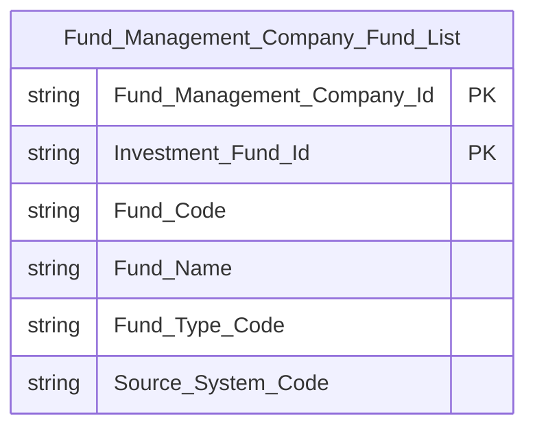
```mermaid
erDiagram
    Fund_Management_Company_Fund_List {
        string Fund_Management_Company_Id PK
        string Investment_Fund_Id PK
        string Fund_Code
        string Fund_Name
        string Fund_Type_Code
        string Source_System_Code
    }
```

**Lineage Mart → Báo cáo:**

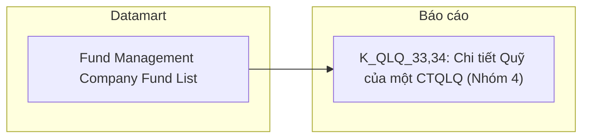
```mermaid
flowchart LR
    subgraph GOLD["Datamart"]
        G1["Fund Management Company Fund List"]
    end
    subgraph RPT["Báo cáo"]
        R1["K_QLQ_33,34: Chi tiết Quỹ của một CTQLQ (Nhóm 4)"]
    end
    G1 --> R1
```

**Bảng grain:**

| Tên bảng | Grain |
|---|---|
| Fund Management Company Fund List | Tác nghiệp — bảng con drill-down \| 1 quỹ × 1 CTQLQ × 1 tháng slicer |

**Bảng mapping nguồn:**

| Tên KPI | Bảng nguồn (BA) | Atomic entity | Atomic table |
|---|---|---|---|
| K_QLQ_33, K_QLQ_34 | FMS_UAT.FUNDS, FMS_UAT.FUND_TYPE | Investment Fund | investment_fund |
| K_QLQ_35 | FMS_UAT.RPT_TEMP FMS_UAT.SHEET FMS_UAT.RPT_VALUES FMS_UAT.RPT_MEMBER FMS_UAT.RPT_PERIOD | Fund Management Report Value *(`fmr_value` — thiếu TGT_ID/CODE, xem O_QLQ_27)* | fmr_value |

---

#### Nhóm 5 - Chi tiết các hợp đồng UTDM của CTQLQ

> Phân loại: **Tác nghiệp**
> Atomic: `Fund Management Report`, `Fund Management Report Sheet`, `Fund Management Report Submission`, `Fund Management Report Period`, `Fund Management Report Value` ← FMS.RPT_TEMP/SHEET/RPT_MEMBER/RPT_PERIOD/RPT_VALUES — đã có nhưng **thiếu cột** (`fmr_value.tgt_id`/`code`, `fmr_sheet.data_label`/`cells_meta`, `record_status`) — xem O_QLQ_27
> **[CẬP NHẬT 2026-10-05 — hạ READY → PENDING toàn bộ, theo BA]** BA (dòng 39–41 `BA_analyst_QLQ.csv`) nay lấy cả 3 chỉ tiêu từ engine báo cáo định kỳ `FMS_UAT.RPT_TEMP/SHEET/RPT_VALUES/RPT_MEMBER/RPT_PERIOD` (Mapping báo cáo đầu vào: `Báo cáo tình hình quản lý danh mục đầu tư >> @QLDMDT >> Tên khách hàng / TK lưu ký / Tổng các danh mục đầu tư`), không còn `FMS.INVES_ACC` trực tiếp như thiết kế 2026-09-28. Dòng BA 39 là **"Tên khách hàng"** (K_QLQ_36 đổi tên từ "Mã số hợp đồng UTQLDM"; khớp mockup gốc). Bảng `Fund Management Company Contract List` không còn KPI READY → đã xóa 5 tầng (LLD, master, `datamart_model.yaml`, Entities.csv, flat SQL), giữ lịch sử ở Section 4 (DEPRECATED). Xem O_QLQ_15, O_QLQ_25.

**Mockup — popup "DANH SÁCH HĐ UTDM":**

| Tên khách hàng | Số TK lưu ký | Giá trị (tỷ) |
|---|---|---|
| Nguyễn Văn A | 001C123456 | 25.4 |

**Bảng KPI:**

| KPI ID | Tên KPI | Đơn vị | Tính chất | Công thức | Ghi chú | Trạng thái |
|---|---|---|---|---|---|---|
| K_QLQ_36 | Tên khách hàng | — | Cơ sở | | **Lý do pending:** [Nhóm 3 - Thiếu nguồn Atomic]: BA (dòng 39) lấy từ engine báo cáo định kỳ `FMS_UAT.RPT_TEMP/SHEET/RPT_VALUES/RPT_MEMBER/RPT_PERIOD` (Mapping báo cáo đầu vào: Báo cáo tình hình quản lý danh mục đầu tư >> @QLDMDT >> Tên khách hàng; `SHEET.ITEM_NAME = '@QLDMDT'`, `RPT_MEMBER.RECORD_TYPE = 7`), chỉ có header `fmr_*` trên Atomic, thiếu cột ô/trạng thái — O_QLQ_27 — xem O_QLQ_15, O_QLQ_25. **Atomic cần bổ sung:** cột nối giá trị `fmr_value` với ô của sheet — `fmr_value.tgt_id` (RPT_VALUES.TGT_ID) và `fmr_sheet.data_label`/`cells_meta` (nhãn, vị trí dòng–cột) — cùng `record_status` của `fmr_submission` (BA lọc `IN (2,3,5,10)`). Atomic đã có `fmr_*` nhưng chưa đủ cột, xem O_QLQ_27. **Mart dự kiến:** `Fund Management Company Contract List` — grain: 1 hợp đồng UTQLDM × 1 CTQLQ. | PENDING |
| K_QLQ_37 | Số tài khoản lưu ký | — | Cơ sở | | **Lý do pending:** [Nhóm 3 - Thiếu nguồn Atomic]: BA (dòng 40) lấy từ engine báo cáo định kỳ `FMS_UAT.RPT_TEMP/SHEET/RPT_VALUES/RPT_MEMBER/RPT_PERIOD` (Mapping báo cáo đầu vào: Báo cáo tình hình quản lý danh mục đầu tư >> @QLDMDT >> TK lưu ký; `SHEET.ITEM_NAME = '@QLDMDT'`, `RPT_MEMBER.RECORD_TYPE = 7`), chỉ có header `fmr_*` trên Atomic, thiếu cột ô/trạng thái — O_QLQ_27 — xem O_QLQ_15, O_QLQ_25. **Atomic cần bổ sung:** cột nối giá trị `fmr_value` với ô của sheet — `fmr_value.tgt_id` (RPT_VALUES.TGT_ID) và `fmr_sheet.data_label`/`cells_meta` (nhãn, vị trí dòng–cột) — cùng `record_status` của `fmr_submission` (BA lọc `IN (2,3,5,10)`). Atomic đã có `fmr_*` nhưng chưa đủ cột, xem O_QLQ_27. **Mart dự kiến:** `Fund Management Company Contract List` — grain: 1 hợp đồng UTQLDM × 1 CTQLQ. | PENDING |
| K_QLQ_38 | Giá trị của từng hợp đồng UTDM của CTQLQ | Tỷ VND | Cơ sở | | **Lý do pending:** [Nhóm 3 - Thiếu nguồn Atomic]: BA (dòng 41) lấy từ engine báo cáo định kỳ `FMS_UAT.RPT_TEMP/SHEET/RPT_VALUES/RPT_MEMBER/RPT_PERIOD` (Mapping báo cáo đầu vào: Báo cáo tình hình quản lý danh mục đầu tư >> @QLDMDT >> Tổng các danh mục đầu tư; `SHEET.ITEM_NAME = '@QLDMDT'`, `RPT_MEMBER.RECORD_TYPE = 7`), chỉ có header `fmr_*` trên Atomic, thiếu cột ô/trạng thái — O_QLQ_27 — xem O_QLQ_15, O_QLQ_25. **Atomic cần bổ sung:** cột nối giá trị `fmr_value` với ô của sheet — `fmr_value.tgt_id` (RPT_VALUES.TGT_ID) và `fmr_sheet.data_label`/`cells_meta` (nhãn, vị trí dòng–cột) — cùng `record_status` của `fmr_submission` (BA lọc `IN (2,3,5,10)`). Atomic đã có `fmr_*` nhưng chưa đủ cột, xem O_QLQ_27. **Mart dự kiến:** `Fund Management Company Contract List` — grain: 1 hợp đồng UTQLDM × 1 CTQLQ. | PENDING |

**Bảng mapping nguồn (Atomic Placeholder):**

| Tên KPI | Bảng nguồn (BA) | Atomic entity | Atomic table |
|---|---|---|---|
| K_QLQ_36-38 | FMS_UAT.RPT_TEMP FMS_UAT.SHEET FMS_UAT.RPT_VALUES FMS_UAT.RPT_MEMBER FMS_UAT.RPT_PERIOD | Fund Management Report Value *(`fmr_value` — thiếu TGT_ID/CODE, xem O_QLQ_27)* | fmr_value |

---

### Tab: QUỸ ĐẦU TƯ

**Slicer chung:** Tháng/Năm (tháng slicer); một số nhóm có thêm slicer Từ tháng / Đến tháng

---

#### Nhóm 6 - Thống kê chung của QĐT

> Phân loại: **Phân tích**
> Atomic: `Investment Fund` ← FMS.FUNDS — READY (Classification Value `fund_tp_code`, scheme `FMS_FUND_TYPE`)
> **[CẬP NHẬT 2026-09-26 — gỡ gating "Dữ liệu động" sai]** 3/5 chỉ tiêu nâng READY (K_QLQ_39/40/41) — Atomic đã sẵn sàng, gating cũ là lý do duy nhất giữ PENDING.
> **[CẬP NHẬT 2026-10-05 — hạ READY → PENDING, theo BA]** K_QLQ_42/43 (Tổng giá trị NAV; theo loại hình quỹ) — BA (dòng 45–46) nay ghi `Bảng nguồn = FMS_UAT.RPT_TEMP/SHEET/RPT_VALUES/RPT_MEMBER/RPT_PERIOD`, Mapping báo cáo đầu vào: Báo cáo về hoạt động đầu tư của các quỹ >> BCTaiSan >> Tài sản ròng của Quỹ/Công ty đầu tư (I.10-II.4) (thay cho `FMSQLQ.FUNDS.NAV` ghi 2026-09-28). PENDING [Nhóm 3 - Thiếu nguồn Atomic], O_QLQ_15, O_QLQ_25. Cột `Investment_Fund_NAV_Amount` gỡ khỏi `Fact Fund Management Company Snapshot` và `Fact Investment Fund Count Snapshot`.

**Bảng KPI:**

| KPI ID | Tên KPI | Đơn vị | Tính chất | Công thức | Ghi chú | Trạng thái |
|---|---|---|---|---|---|---|
| K_QLQ_39 | Thời gian | — | Chiều | `Snapshot_Date_Dimension_Id` → `cdr_dt_dim` (grain tháng) — lọc `investment_fund` hiệu lực tại tháng snapshot | Nay có ý nghĩa vì đã có measure READY đi kèm | READY |
| K_QLQ_40 | Tổng số lượng QĐT | Quỹ | Cơ sở | `COUNT(investment_fund.investment_fund_id)` WHERE hiệu lực tại tháng snapshot | Trùng với K_QLQ_2 (Nhóm 1) — cùng 1 measure, BA đánh "Trùng", giữ 1 KPI_ID dùng chung | READY |
| K_QLQ_41 | Số lượng quỹ theo từng loại hình quỹ | Quỹ | Cơ sở | `COUNT(investment_fund.investment_fund_id)` WHERE hiệu lực tại tháng snapshot, GROUP BY `investment_fund.fund_tp_code` (JOIN `cl_value` scheme `FMS_FUND_TYPE`) | Investment Fund + Classification Value đã READY | READY |
| K_QLQ_42 | Tổng giá trị NAV | Tỷ VND | Cơ sở | | **Lý do pending:** [Nhóm 3 - Thiếu nguồn Atomic]: BA (dòng 45) lấy từ engine báo cáo định kỳ `FMS_UAT.RPT_TEMP/SHEET/RPT_VALUES/RPT_MEMBER/RPT_PERIOD` (Mapping báo cáo đầu vào: Báo cáo về hoạt động đầu tư của các quỹ >> BCTaiSan >> Tài sản ròng của Quỹ/Công ty đầu tư (I.10-II.4)), chỉ có header `fmr_*` trên Atomic, thiếu cột ô/trạng thái — O_QLQ_27 — xem O_QLQ_15, O_QLQ_25. **Atomic cần bổ sung:** cột nối giá trị `fmr_value` với ô của sheet — `fmr_value.tgt_id` (RPT_VALUES.TGT_ID) và `fmr_sheet.data_label`/`cells_meta` (nhãn, vị trí dòng–cột) — cùng `record_status` của `fmr_submission` (BA lọc `IN (2,3,5,10)`). Atomic đã có `fmr_*` nhưng chưa đủ cột, xem O_QLQ_27. **Mart dự kiến:** `Fact Fund Management Company Snapshot`. | PENDING |
| K_QLQ_43 | Tổng giá trị NAV của từng loại hình quỹ | Tỷ VND | Cơ sở | | **Lý do pending:** [Nhóm 3 - Thiếu nguồn Atomic]: BA (dòng 46) lấy từ engine báo cáo định kỳ `FMS_UAT.RPT_TEMP/SHEET/RPT_VALUES/RPT_MEMBER/RPT_PERIOD` (Mapping báo cáo đầu vào: Báo cáo về hoạt động đầu tư của các quỹ >> BCTaiSan >> Tài sản ròng của Quỹ/Công ty đầu tư (I.10-II.4)), chỉ có header `fmr_*` trên Atomic, thiếu cột ô/trạng thái — O_QLQ_27 — xem O_QLQ_15, O_QLQ_25. **Atomic cần bổ sung:** cột nối giá trị `fmr_value` với ô của sheet — `fmr_value.tgt_id` (RPT_VALUES.TGT_ID) và `fmr_sheet.data_label`/`cells_meta` (nhãn, vị trí dòng–cột) — cùng `record_status` của `fmr_submission` (BA lọc `IN (2,3,5,10)`). Atomic đã có `fmr_*` nhưng chưa đủ cột, xem O_QLQ_27. **Mart dự kiến:** `Fact Investment Fund Count Snapshot`. | PENDING |

**Bảng mapping nguồn:**

| Tên KPI | Bảng nguồn (BA) | Atomic entity | Atomic table |
|---|---|---|---|
| K_QLQ_39, K_QLQ_40, K_QLQ_41 | FMS_UAT.FUNDS, FMS_UAT.FUND_TYPE, FMS_UAT.STATUS | Investment Fund | investment_fund |
| K_QLQ_42, K_QLQ_43 | FMS_UAT.RPT_TEMP FMS_UAT.SHEET FMS_UAT.RPT_VALUES FMS_UAT.RPT_MEMBER FMS_UAT.RPT_PERIOD | Fund Management Report Value *(`fmr_value` — thiếu TGT_ID/CODE, xem O_QLQ_27)* | fmr_value |

---

#### Nhóm 7 - Biểu đồ Tổng NAV Quỹ và Tỷ lệ NAV/GDP

> Phân loại: **Phân tích**
> Atomic: `Investment Fund` ← FMS.FUNDS — READY (Classification Value `fund_tp_code`, scheme `FMS_FUND_TYPE`)
> Atomic: `cl_risk_indicator` / `cl_risk_indicator_value` ← MRMS.RISK_INDICATOR / RISK_INDICATOR_VALUE — READY (đã ở track chuẩn `DataModel/Atomic/Common/`, KHÔNG chỉ có ở `Atomic_LinhLV` như thiết kế cũ giả định)
> **[CẬP NHẬT 2026-09-26]** 3/6 chỉ tiêu nâng READY:
> - **K_QLQ_47 (GDP):** thiết kế cũ cho rằng `Risk Indicator Value` chỉ tồn tại ở track cá nhân lỗi thời `DataModel/working/Atomic_LinhLV/` — **sai**, entity `cl_risk_indicator`/`cl_risk_indicator_value` đã có ở track chuẩn `DataModel/Atomic/Common/` (`dm_atm_cl_risk_indicator-MRMS.RISK_INDICATOR.yaml`). Hơn nữa module PTTT đã xây sẵn `Fact Macro Indicator Snapshot` (`fct_macro_indicator_snpst`) đúng filter `macro_indicator_code = 'GDP_VN'` khớp 100% với SQL BA — **reuse trực tiếp**, không cần bảng mới.
> - **K_QLQ_44 (Thời gian), K_QLQ_45 (Loại hình quỹ):** gỡ gating "Dữ liệu động" sai (xem `feedback_ignore_ba_column_z.md`) — Investment Fund/Classification Value đã sẵn sàng.
> **[CẬP NHẬT 2026-10-05]** BA (dòng 49–52) ghi `Bảng nguồn = FMS_UAT.RPT_TEMP/SHEET/RPT_VALUES/RPT_MEMBER/RPT_PERIOD` cho K_QLQ_46/48/49 (Mapping báo cáo đầu vào: Báo cáo về hoạt động đầu tư của các quỹ >> BCTaiSan >> Tài sản ròng của Quỹ/Công ty đầu tư (I.10-II.4)) — thay cho `FMSQLQ.FUND_REPORT` ghi 2026-09-28. Vẫn PENDING [Nhóm 3 - Thiếu nguồn Atomic], O_QLQ_15.

**Bảng KPI:**

| KPI ID | Tên KPI | Đơn vị | Tính chất | Công thức | Ghi chú | Trạng thái |
|---|---|---|---|---|---|---|
| K_QLQ_44 | Thời gian | — | Chiều | `Snapshot_Date_Dimension_Id` → `cdr_dt_dim` (grain tháng) | Chiều slicer chung cho biểu đồ — phục vụ đường GDP (reuse) và Loại hình quỹ; đường NAV vẫn PENDING | READY |
| K_QLQ_45 | Loại hình quỹ | — | Chiều | `investment_fund.fund_tp_code` JOIN `cl_value` scheme `FMS_FUND_TYPE` | Investment Fund đã READY | READY |
| K_QLQ_46 | Tổng NAV của quỹ | Tỷ VND | Cơ sở | | **Lý do pending:** [Nhóm 3 - Thiếu nguồn Atomic]: BA (dòng 49) lấy từ engine báo cáo định kỳ `FMS_UAT.RPT_TEMP/SHEET/RPT_VALUES/RPT_MEMBER/RPT_PERIOD` (Mapping báo cáo đầu vào: Báo cáo về hoạt động đầu tư của các quỹ >> BCTaiSan >> Tài sản ròng của Quỹ/Công ty đầu tư (I.10-II.4)), chỉ có header `fmr_*` trên Atomic, thiếu cột ô/trạng thái — O_QLQ_27 — xem O_QLQ_15, O_QLQ_25. **Atomic cần bổ sung:** cột nối giá trị `fmr_value` với ô của sheet — `fmr_value.tgt_id` (RPT_VALUES.TGT_ID) và `fmr_sheet.data_label`/`cells_meta` (nhãn, vị trí dòng–cột) — cùng `record_status` của `fmr_submission` (BA lọc `IN (2,3,5,10)`). Atomic đã có `fmr_*` nhưng chưa đủ cột, xem O_QLQ_27. **Mart dự kiến:** (chưa có bảng Datamart — thiết kế Fact mới khi có Atomic, xem Cụm 6). | PENDING |
| K_QLQ_47 | GDP | Nghìn tỷ VND | Cơ sở | `cl_risk_indicator_value.val` WHERE `cl_risk_indicator.cl_risk_ind_code = 'GDP_VN'` — **reuse** `Fact Macro Indicator Snapshot` (module PTTT), filter `macro_indicator_code = 'GDP_VN'` | Atomic đã ở track chuẩn (Common/), không phải chỉ Atomic_LinhLV như ghi trước đây. Reuse xuyên module PTTT — xem Section 4 | READY |
| K_QLQ_48 | Tỷ lệ NAV/GDP | % | Phái sinh | | **Lý do pending:** phụ thuộc K_QLQ_46 (NAV, PENDING) — Tỷ lệ = K_QLQ_46 / K_QLQ_47 × 100%; mẫu số (GDP) đã READY nhưng tử số (NAV) chưa. **Atomic cần bổ sung:** như K_QLQ_46 (engine báo cáo định kỳ `RPT_*`, O_QLQ_15). **Mart dự kiến:** (chưa có bảng Datamart — thiết kế Fact mới khi có Atomic, xem Cụm 6). | PENDING |
| K_QLQ_49 | Tổng NAV của từng loại hình quỹ | Tỷ VND | Phái sinh | | **Lý do pending:** [Nhóm 3 - Thiếu nguồn Atomic]: BA (dòng 52) lấy từ engine báo cáo định kỳ `FMS_UAT.RPT_TEMP/SHEET/RPT_VALUES/RPT_MEMBER/RPT_PERIOD` (Mapping báo cáo đầu vào: Báo cáo về hoạt động đầu tư của các quỹ >> BCTaiSan >> Tài sản ròng của Quỹ/Công ty đầu tư (I.10-II.4)), chỉ có header `fmr_*` trên Atomic, thiếu cột ô/trạng thái — O_QLQ_27 — xem O_QLQ_15, O_QLQ_25. **Atomic cần bổ sung:** cột nối giá trị `fmr_value` với ô của sheet — `fmr_value.tgt_id` (RPT_VALUES.TGT_ID) và `fmr_sheet.data_label`/`cells_meta` (nhãn, vị trí dòng–cột) — cùng `record_status` của `fmr_submission` (BA lọc `IN (2,3,5,10)`). Atomic đã có `fmr_*` nhưng chưa đủ cột, xem O_QLQ_27. **Mart dự kiến:** (chưa có bảng Datamart — thiết kế Fact mới khi có Atomic, xem Cụm 6). | PENDING |

**Bảng mapping nguồn:**

| Tên KPI | Bảng nguồn (BA) | Atomic entity | Atomic table |
|---|---|---|---|
| K_QLQ_44, K_QLQ_45 | FMS_UAT.FUNDS, FMS_UAT.FUND_TYPE | Investment Fund | investment_fund |
| K_QLQ_47 | UAT_MRMS.RISK_INDICATOR, UAT_MRMS.RISK_INDICATOR_VALUE | cl_risk_indicator / cl_risk_indicator_value (reuse `fct_macro_indicator_snpst`, module PTTT) | cl_risk_indicator / cl_risk_indicator_value |
| K_QLQ_46, K_QLQ_48, K_QLQ_49 | FMS_UAT.RPT_TEMP FMS_UAT.SHEET FMS_UAT.RPT_VALUES FMS_UAT.RPT_MEMBER FMS_UAT.RPT_PERIOD | Fund Management Report Value *(`fmr_value` — thiếu TGT_ID/CODE, xem O_QLQ_27)* | fmr_value |

---

#### Nhóm 8 - Biểu đồ Phân bổ tài sản của Quỹ đầu tư

> Phân loại: **Phân tích**
> **[CẬP NHẬT 2026-10-05]** BA (dòng 54–59) ghi nguồn engine báo cáo định kỳ `FMS_UAT.RPT_TEMP/SHEET/RPT_VALUES/RPT_MEMBER/RPT_PERIOD` cho toàn bộ 6 chỉ tiêu phân bổ tài sản (thay cho `FMSQLQ.FUND_REPORT.PROP_*` ghi trước đây) — PENDING toàn bộ [Nhóm 3 - Thiếu nguồn Atomic], O_QLQ_15. K_QLQ_44 (Thời gian, reuse Nhóm 7) PENDING vì không có measure READY đi kèm.

**Bảng KPI:**

| KPI ID | Tên KPI | Đơn vị | Tính chất | Công thức | Ghi chú | Trạng thái |
|---|---|---|---|---|---|---|
| K_QLQ_44 | Thời gian | — | Chiều | | **Lý do pending:** Reuse KPI_ID từ Nhóm 7 (nay đã READY ở đó vì có Loại hình quỹ/GDP độc lập) — nhưng trong Nhóm 8, không còn measure nào READY đi kèm (toàn bộ 6 chỉ tiêu phân bổ tài sản PENDING) nên Chiều không có ý nghĩa hiển thị độc lập tại Nhóm này. **Atomic cần bổ sung:** cột nối giá trị `fmr_value` với ô của sheet — `fmr_value.tgt_id` (RPT_VALUES.TGT_ID) và `fmr_sheet.data_label`/`cells_meta` (nhãn, vị trí dòng–cột) — cùng `record_status` của `fmr_submission` (BA lọc `IN (2,3,5,10)`). Atomic đã có `fmr_*` nhưng chưa đủ cột, xem O_QLQ_27. **Mart dự kiến:** (chưa có bảng Datamart — thiết kế Fact mới khi có Atomic, xem Cụm 6). | PENDING |
| K_QLQ_50 | Cổ phiếu niêm yết | Tỷ VND | Phái sinh | | **Lý do pending:** [Nhóm 3 - Thiếu nguồn Atomic]: BA (dòng 54) lấy từ engine báo cáo định kỳ `FMS_UAT.RPT_TEMP/SHEET/RPT_VALUES/RPT_MEMBER/RPT_PERIOD` (Mapping báo cáo đầu vào: Báo cáo về hoạt động đầu tư các loại quỹ >> BCDanhMucDauTu >> Cổ phiếu niêm yết, đăng ký giao dịch, chứng chỉ quỹ niêm yết), chỉ có header `fmr_*` trên Atomic, thiếu cột ô/trạng thái — O_QLQ_27 — xem O_QLQ_15, O_QLQ_25. **Atomic cần bổ sung:** cột nối giá trị `fmr_value` với ô của sheet — `fmr_value.tgt_id` (RPT_VALUES.TGT_ID) và `fmr_sheet.data_label`/`cells_meta` (nhãn, vị trí dòng–cột) — cùng `record_status` của `fmr_submission` (BA lọc `IN (2,3,5,10)`). Atomic đã có `fmr_*` nhưng chưa đủ cột, xem O_QLQ_27. **Mart dự kiến:** (chưa có bảng Datamart — thiết kế Fact mới khi có Atomic, xem Cụm 6). | PENDING |
| K_QLQ_51 | Cổ phiếu chưa niêm yết | Tỷ VND | Phái sinh | | **Lý do pending:** [Nhóm 3 - Thiếu nguồn Atomic]: BA (dòng 55) lấy từ engine báo cáo định kỳ `FMS_UAT.RPT_TEMP/SHEET/RPT_VALUES/RPT_MEMBER/RPT_PERIOD` (Mapping báo cáo đầu vào: Báo cáo về hoạt động đầu tư các loại quỹ >> BCDanhMucDauTu >> Cổ phiếu chưa niêm yết, đăng ký giao dịch, chứng chỉ quỹ không niêm yết), chỉ có header `fmr_*` trên Atomic, thiếu cột ô/trạng thái — O_QLQ_27 — xem O_QLQ_15, O_QLQ_25. **Atomic cần bổ sung:** cột nối giá trị `fmr_value` với ô của sheet — `fmr_value.tgt_id` (RPT_VALUES.TGT_ID) và `fmr_sheet.data_label`/`cells_meta` (nhãn, vị trí dòng–cột) — cùng `record_status` của `fmr_submission` (BA lọc `IN (2,3,5,10)`). Atomic đã có `fmr_*` nhưng chưa đủ cột, xem O_QLQ_27. **Mart dự kiến:** (chưa có bảng Datamart — thiết kế Fact mới khi có Atomic, xem Cụm 6). | PENDING |
| K_QLQ_52 | Trái phiếu | Tỷ VND | Phái sinh | | **Lý do pending:** [Nhóm 3 - Thiếu nguồn Atomic]: BA (dòng 56) lấy từ engine báo cáo định kỳ `FMS_UAT.RPT_TEMP/SHEET/RPT_VALUES/RPT_MEMBER/RPT_PERIOD` (Mapping báo cáo đầu vào: Báo cáo về hoạt động đầu tư các loại quỹ >> BCDanhMucDauTu >> Trái phiếu), chỉ có header `fmr_*` trên Atomic, thiếu cột ô/trạng thái — O_QLQ_27 — xem O_QLQ_15, O_QLQ_25. **Atomic cần bổ sung:** cột nối giá trị `fmr_value` với ô của sheet — `fmr_value.tgt_id` (RPT_VALUES.TGT_ID) và `fmr_sheet.data_label`/`cells_meta` (nhãn, vị trí dòng–cột) — cùng `record_status` của `fmr_submission` (BA lọc `IN (2,3,5,10)`). Atomic đã có `fmr_*` nhưng chưa đủ cột, xem O_QLQ_27. **Mart dự kiến:** (chưa có bảng Datamart — thiết kế Fact mới khi có Atomic, xem Cụm 6). | PENDING |
| K_QLQ_53 | Tiền | Tỷ VND | Phái sinh | | **Lý do pending:** [Nhóm 3 - Thiếu nguồn Atomic]: BA (dòng 57) lấy từ engine báo cáo định kỳ `FMS_UAT.RPT_TEMP/SHEET/RPT_VALUES/RPT_MEMBER/RPT_PERIOD` (Mapping báo cáo đầu vào: Báo cáo về hoạt động đầu tư các loại quỹ >> BCDanhMucDauTu >> Tiền), chỉ có header `fmr_*` trên Atomic, thiếu cột ô/trạng thái — O_QLQ_27 — xem O_QLQ_15, O_QLQ_25. **Atomic cần bổ sung:** cột nối giá trị `fmr_value` với ô của sheet — `fmr_value.tgt_id` (RPT_VALUES.TGT_ID) và `fmr_sheet.data_label`/`cells_meta` (nhãn, vị trí dòng–cột) — cùng `record_status` của `fmr_submission` (BA lọc `IN (2,3,5,10)`). Atomic đã có `fmr_*` nhưng chưa đủ cột, xem O_QLQ_27. **Mart dự kiến:** (chưa có bảng Datamart — thiết kế Fact mới khi có Atomic, xem Cụm 6). | PENDING |
| K_QLQ_54 | Các loại chứng khoán khác | Tỷ VND | Phái sinh | | **Lý do pending:** [Nhóm 3 - Thiếu nguồn Atomic]: BA (dòng 58) lấy từ engine báo cáo định kỳ `FMS_UAT.RPT_TEMP/SHEET/RPT_VALUES/RPT_MEMBER/RPT_PERIOD` (Mapping báo cáo đầu vào: Báo cáo về hoạt động đầu tư các loại quỹ >> BCDanhMucDauTu >> Các loại chứng khoán khác), chỉ có header `fmr_*` trên Atomic, thiếu cột ô/trạng thái — O_QLQ_27 — xem O_QLQ_15, O_QLQ_25. **Atomic cần bổ sung:** cột nối giá trị `fmr_value` với ô của sheet — `fmr_value.tgt_id` (RPT_VALUES.TGT_ID) và `fmr_sheet.data_label`/`cells_meta` (nhãn, vị trí dòng–cột) — cùng `record_status` của `fmr_submission` (BA lọc `IN (2,3,5,10)`). Atomic đã có `fmr_*` nhưng chưa đủ cột, xem O_QLQ_27. **Mart dự kiến:** (chưa có bảng Datamart — thiết kế Fact mới khi có Atomic, xem Cụm 6). | PENDING |
| K_QLQ_55 | Các tài sản khác | Tỷ VND | Phái sinh | | **Lý do pending:** [Nhóm 3 - Thiếu nguồn Atomic]: BA (dòng 59) lấy từ engine báo cáo định kỳ `FMS_UAT.RPT_TEMP/SHEET/RPT_VALUES/RPT_MEMBER/RPT_PERIOD` (Mapping báo cáo đầu vào: Báo cáo về hoạt động đầu tư các loại quỹ >> BCDanhMucDauTu >> Các tài sản khác), chỉ có header `fmr_*` trên Atomic, thiếu cột ô/trạng thái — O_QLQ_27 — xem O_QLQ_15, O_QLQ_25. **Atomic cần bổ sung:** cột nối giá trị `fmr_value` với ô của sheet — `fmr_value.tgt_id` (RPT_VALUES.TGT_ID) và `fmr_sheet.data_label`/`cells_meta` (nhãn, vị trí dòng–cột) — cùng `record_status` của `fmr_submission` (BA lọc `IN (2,3,5,10)`). Atomic đã có `fmr_*` nhưng chưa đủ cột, xem O_QLQ_27. **Mart dự kiến:** (chưa có bảng Datamart — thiết kế Fact mới khi có Atomic, xem Cụm 6). | PENDING |

**Bảng mapping nguồn:**

| Tên KPI | Bảng nguồn (BA) | Atomic entity | Atomic table |
|---|---|---|---|
| K_QLQ_44, K_QLQ_50–55 | FMS_UAT.RPT_TEMP FMS_UAT.SHEET FMS_UAT.RPT_VALUES FMS_UAT.RPT_MEMBER FMS_UAT.RPT_PERIOD | Fund Management Report Value *(`fmr_value` — thiếu TGT_ID/CODE, xem O_QLQ_27)* | fmr_value |

---

#### Nhóm 9 - Sự biến động về NAV của các Quỹ ĐTCK

> Phân loại: **Phân tích**
> **[CẬP NHẬT 2026-10-05]** BA (dòng 61–63) ghi nguồn engine báo cáo định kỳ `FMS_UAT.RPT_TEMP/SHEET/RPT_VALUES/RPT_MEMBER/RPT_PERIOD` cho K_QLQ_56–58 (thay cho `FMSQLQ.FUND_REPORT.NAV` ghi trước đây) — PENDING toàn bộ [Nhóm 3 - Thiếu nguồn Atomic], O_QLQ_15. K_QLQ_44 (Thời gian, reuse Nhóm 7) PENDING vì không có measure READY đi kèm.

**Bảng KPI:**

| KPI ID | Tên KPI | Đơn vị | Tính chất | Công thức | Ghi chú | Trạng thái |
|---|---|---|---|---|---|---|
| K_QLQ_44 | Thời gian | — | Chiều | | **Lý do pending:** Reuse KPI_ID từ Nhóm 7 (nay đã READY ở đó) — nhưng trong Nhóm 9 không còn measure nào READY đi kèm. **Atomic cần bổ sung:** cột nối giá trị `fmr_value` với ô của sheet — `fmr_value.tgt_id` (RPT_VALUES.TGT_ID) và `fmr_sheet.data_label`/`cells_meta` (nhãn, vị trí dòng–cột) — cùng `record_status` của `fmr_submission` (BA lọc `IN (2,3,5,10)`). Atomic đã có `fmr_*` nhưng chưa đủ cột, xem O_QLQ_27. **Mart dự kiến:** (chưa có bảng Datamart — thiết kế Fact mới khi có Atomic, xem Cụm 6) — grain: 1 quỹ × 1 tháng. | PENDING |
| K_QLQ_56 | NAV của các quỹ ĐTCK | Tỷ VND | Cơ sở | | **Lý do pending:** [Nhóm 3 - Thiếu nguồn Atomic]: BA (dòng 61) lấy từ engine báo cáo định kỳ `FMS_UAT.RPT_TEMP/SHEET/RPT_VALUES/RPT_MEMBER/RPT_PERIOD` (Mapping báo cáo đầu vào: Báo cáo về hoạt động đầu tư của các quỹ >> BCTaiSan >> Tài sản ròng của Quỹ/Công ty đầu tư (I.10-II.4)), chỉ có header `fmr_*` trên Atomic, thiếu cột ô/trạng thái — O_QLQ_27 — xem O_QLQ_15, O_QLQ_25. **Atomic cần bổ sung:** cột nối giá trị `fmr_value` với ô của sheet — `fmr_value.tgt_id` (RPT_VALUES.TGT_ID) và `fmr_sheet.data_label`/`cells_meta` (nhãn, vị trí dòng–cột) — cùng `record_status` của `fmr_submission` (BA lọc `IN (2,3,5,10)`). Atomic đã có `fmr_*` nhưng chưa đủ cột, xem O_QLQ_27. **Mart dự kiến:** (chưa có bảng Datamart — thiết kế Fact mới khi có Atomic, xem Cụm 6). | PENDING |
| K_QLQ_57 | Tăng trưởng NAV từng tháng | % | Phái sinh | | **Lý do pending:** Phụ thuộc K_QLQ_56 (PENDING) — (NAV[T] − NAV[T−1]) / NAV[T−1] × 100%. **Atomic cần bổ sung:** như K_QLQ_56. **Mart dự kiến:** (chưa có bảng Datamart — thiết kế Fact mới khi có Atomic, xem Cụm 6). | PENDING |
| K_QLQ_58 | Trung bình tăng trưởng NAV | % | Phái sinh | | **Lý do pending:** Phụ thuộc K_QLQ_57 (PENDING) — AVG(K_QLQ_57) trong khoảng thời gian chọn. **Atomic cần bổ sung:** như K_QLQ_56. **Mart dự kiến:** (chưa có bảng Datamart — thiết kế Fact mới khi có Atomic, xem Cụm 6). | PENDING |

**Bảng mapping nguồn:**

| Tên KPI | Bảng nguồn (BA) | Atomic entity | Atomic table |
|---|---|---|---|
| K_QLQ_44, K_QLQ_56, K_QLQ_57, K_QLQ_58 | FMS_UAT.RPT_TEMP FMS_UAT.SHEET FMS_UAT.RPT_VALUES FMS_UAT.RPT_MEMBER FMS_UAT.RPT_PERIOD | Fund Management Report Value *(`fmr_value` — thiếu TGT_ID/CODE, xem O_QLQ_27)* | fmr_value |

---

#### Nhóm 10 - Số lượng quỹ đầu tư chứng khoán

> Phân loại: **Phân tích**
> Atomic: `Investment Fund` ← FMS.FUNDS — READY (Classification Value `fund_tp_code`, scheme `FMS_FUND_TYPE`)
> **[CẬP NHẬT 2026-09-26]** Toàn bộ 9/9 chỉ tiêu nâng READY. Cả 7 chỉ tiêu đếm theo loại hình (K_QLQ_61-67) đều là **cùng 1 measure** ("Fund Count") lọc theo `fund_tp_code` khác nhau (BA đánh "Trùng") — giữ 7 KPI_ID riêng theo thiết kế cũ để không phá vỡ tham chiếu, nhưng công thức nền giống hệt nhau.
> **[CẬP NHẬT 2026-10-05]** BA (dòng 66–72) nay ghi `Bảng nguồn = FMS_UAT.FUNDS`, `Trường nguồn = FUNDS.ID` trực tiếp cho K_QLQ_61–67 (thay cho `FMSQLQ.FUND_REPORT.FUND_ID` ghi 2026-09-28) — khớp thiết kế: `fct_investment_fund_cnt_snpst` là Fact Periodic Snapshot (grain 1 loại hình quỹ × 1 tháng), ETL hàng tháng chèn 1 dòng từ `investment_fund` hiện tại, số liệu chính xác từ ngày go-live; backfill lịch sử trước go-live nằm ngoài phạm vi ETL định kỳ. Giữ READY cho cả 9 chỉ tiêu.

**Bảng KPI:**

| KPI ID | Tên KPI | Đơn vị | Tính chất | Công thức | Ghi chú | Trạng thái |
|---|---|---|---|---|---|---|
| K_QLQ_59 | Thời gian | — | Chiều | `Snapshot_Date_Dimension_Id` → `cdr_dt_dim` (grain tháng) | Nay có ý nghĩa vì có 7 measure READY đi kèm. Chỉ chính xác từ tháng go-live trở đi (xem ghi chú Nhóm về backfill) | READY |
| K_QLQ_60 | Loại hình quỹ | — | Chiều | `investment_fund.fund_tp_code` JOIN `cl_value` scheme `FMS_FUND_TYPE` | Investment Fund đã READY | READY |
| K_QLQ_61 | Quỹ mở | Quỹ | Phái sinh | `COUNT(investment_fund.investment_fund_id)` WHERE `fund_tp_code` = 'Quỹ mở' (JOIN `cl_value`) AND hiệu lực tại tháng snapshot | Cùng measure nền "Fund Count" với K_QLQ_62-67, khác giá trị filter. Chỉ chính xác từ go-live trở đi | READY |
| K_QLQ_62 | Quỹ thành viên | Quỹ | Phái sinh | `COUNT(investment_fund.investment_fund_id)` WHERE `fund_tp_code` = 'Quỹ thành viên' AND hiệu lực tại tháng snapshot | Cùng measure nền với K_QLQ_61 | READY |
| K_QLQ_63 | Quỹ ETF | Quỹ | Phái sinh | `COUNT(investment_fund.investment_fund_id)` WHERE `fund_tp_code` = 'Quỹ ETF' AND hiệu lực tại tháng snapshot | Cùng measure nền với K_QLQ_61 | READY |
| K_QLQ_64 | Quỹ đóng | Quỹ | Phái sinh | `COUNT(investment_fund.investment_fund_id)` WHERE `fund_tp_code` = 'Quỹ đóng' AND hiệu lực tại tháng snapshot | Cùng measure nền với K_QLQ_61 | READY |
| K_QLQ_65 | Quỹ BĐS | Quỹ | Phái sinh | `COUNT(investment_fund.investment_fund_id)` WHERE `fund_tp_code` = 'Quỹ BĐS' AND hiệu lực tại tháng snapshot | Cùng measure nền với K_QLQ_61 | READY |
| K_QLQ_66 | Quỹ đầu tư công cụ thị trường tiền tệ | Quỹ | Phái sinh | `COUNT(investment_fund.investment_fund_id)` WHERE `fund_tp_code` = 'Quỹ đầu tư công cụ thị trường tiền tệ' AND hiệu lực tại tháng snapshot | Cùng measure nền với K_QLQ_61 | READY |
| K_QLQ_67 | Quỹ đầu tư trái phiếu hạ tầng | Quỹ | Phái sinh | `COUNT(investment_fund.investment_fund_id)` WHERE `fund_tp_code` = 'Quỹ đầu tư trái phiếu hạ tầng' AND hiệu lực tại tháng snapshot | Cùng measure nền với K_QLQ_61 | READY |

**Bảng mapping nguồn:**

| Tên KPI | Bảng nguồn (BA) | Atomic entity | Atomic table |
|---|---|---|---|
| K_QLQ_59-67 | FMS_UAT.FUNDS, FMS_UAT.FUND_TYPE (ETL định kỳ, đi tới) | Investment Fund | investment_fund |

---

#### Nhóm 11 - Tăng trưởng số lượng CCQ lưu hành của các quỹ đầu tư

> Phân loại: **Phân tích**
> Atomic: `Investment Fund` ← FMS.FUNDS — READY (`total_outstanding_unit_quantity`, Classification Value `fund_tp_code`)
> **[CẬP NHẬT 2026-09-26]** Toàn bộ 9/9 chỉ tiêu nâng READY. 7 chỉ tiêu theo loại hình (K_QLQ_70-76) là cùng 1 measure ("Outstanding Fund Cert Volume") lọc theo `fund_tp_code` khác nhau (BA đánh "Trùng").
> **[CẬP NHẬT 2026-10-05]** BA (dòng 75–81) nay ghi `Bảng nguồn = FMS_UAT.FUNDS`, `Trường nguồn = FUNDS.TOTAL_QTTY` trực tiếp cho K_QLQ_70–76 (thay cho `FMSQLQ.FUND_REPORT.TOTAL_CCQ` ghi 2026-09-28) — khớp thiết kế: `fct_investment_fund_ccq_snpst` Periodic Snapshot tự tích lũy từ go-live qua `investment_fund.total_outstanding_unit_quantity`; backfill trước go-live ngoài phạm vi. Giữ READY cho cả 9 chỉ tiêu.

**Bảng KPI:**

| KPI ID | Tên KPI | Đơn vị | Tính chất | Công thức | Ghi chú | Trạng thái |
|---|---|---|---|---|---|---|
| K_QLQ_68 | Thời gian | — | Chiều | `Snapshot_Date_Dimension_Id` → `cdr_dt_dim` (grain tháng) | Nay có ý nghĩa vì có 7 measure READY đi kèm. Chỉ chính xác từ tháng go-live trở đi (xem ghi chú Nhóm về backfill) | READY |
| K_QLQ_69 | Loại hình quỹ | — | Chiều | `investment_fund.fund_tp_code` JOIN `cl_value` scheme `FMS_FUND_TYPE` | Investment Fund đã READY | READY |
| K_QLQ_70 | Quỹ mở | CCQ | Phái sinh | `SUM(investment_fund.total_outstanding_unit_quantity)` WHERE `fund_tp_code` = 'Quỹ mở' AND hiệu lực tại tháng snapshot | Cùng measure nền với K_QLQ_71-76, khác giá trị filter. Chỉ chính xác từ go-live trở đi | READY |
| K_QLQ_71 | Quỹ ETF | CCQ | Phái sinh | `SUM(investment_fund.total_outstanding_unit_quantity)` WHERE `fund_tp_code` = 'Quỹ ETF' AND hiệu lực tại tháng snapshot | Cùng measure nền với K_QLQ_70 | READY |
| K_QLQ_72 | Quỹ đóng | CCQ | Phái sinh | `SUM(investment_fund.total_outstanding_unit_quantity)` WHERE `fund_tp_code` = 'Quỹ đóng' AND hiệu lực tại tháng snapshot | Cùng measure nền với K_QLQ_70 | READY |
| K_QLQ_73 | Quỹ BĐS | CCQ | Phái sinh | `SUM(investment_fund.total_outstanding_unit_quantity)` WHERE `fund_tp_code` = 'Quỹ BĐS' AND hiệu lực tại tháng snapshot | Cùng measure nền với K_QLQ_70 | READY |
| K_QLQ_74 | Quỹ thành viên | CCQ | Phái sinh | `SUM(investment_fund.total_outstanding_unit_quantity)` WHERE `fund_tp_code` = 'Quỹ thành viên' AND hiệu lực tại tháng snapshot | Cùng measure nền với K_QLQ_70 | READY |
| K_QLQ_75 | Quỹ đầu tư công cụ thị trường tiền tệ | CCQ | Phái sinh | `SUM(investment_fund.total_outstanding_unit_quantity)` WHERE `fund_tp_code` = 'Quỹ đầu tư công cụ thị trường tiền tệ' AND hiệu lực tại tháng snapshot | Cùng measure nền với K_QLQ_70 | READY |
| K_QLQ_76 | Quỹ đầu tư trái phiếu hạ tầng | CCQ | Phái sinh | `SUM(investment_fund.total_outstanding_unit_quantity)` WHERE `fund_tp_code` = 'Quỹ đầu tư trái phiếu hạ tầng' AND hiệu lực tại tháng snapshot | Cùng measure nền với K_QLQ_70 | READY |

**Bảng mapping nguồn:**

| Tên KPI | Bảng nguồn (BA) | Atomic entity | Atomic table |
|---|---|---|---|
| K_QLQ_68-76 | FMS_UAT.FUNDS, FMS_UAT.FUND_TYPE (ETL định kỳ, đi tới) | Investment Fund | investment_fund |

---

#### Nhóm 12 - Tỉ lệ tăng trưởng NAV/CCQ một năm theo loại hình quỹ so với VN-Index và Lãi suất liên ngân hàng qua đêm

> Phân loại: **Phân tích**
> Atomic: `Investment Fund` ← FMS.FUNDS — READY (Classification Value `fund_tp_code`)
> Atomic: `market_index_snapshot` ← MDDS.JAD_MARKETINFOR — READY (đã approved, track chuẩn)
> Atomic: `cl_risk_indicator` / `cl_risk_indicator_value` ← MRMS.RISK_INDICATOR/VALUE — READY (track chuẩn `DataModel/Atomic/Common/`, KHÔNG chỉ Atomic_LinhLV như ghi trước đây)
> **[CẬP NHẬT 2026-09-26]** 4/15 chỉ tiêu nâng READY: K_QLQ_77 (Thời gian, trực tiếp `FMS_UAT.FUNDS.ID_DATE`), K_QLQ_80 (Loại hình quỹ chi tiết, `FUND_TYPE.ITEM_NAME`), K_QLQ_78 (VN-Index, reuse GSTT), K_QLQ_79 (Lãi suất liên NH, reuse PTTT).
> **[CẬP NHẬT 2026-10-05 — hạ READY → PENDING 11/15 chỉ tiêu, theo BA]** K_QLQ_81–91 (NAV/CCQ và 9 phân loại chi tiết) — BA (dòng 84–94) ghi `Bảng nguồn = FMS_UAT.RPT_TEMP/SHEET/RPT_VALUES/RPT_MEMBER/RPT_PERIOD`, Mapping báo cáo đầu vào: Báo cáo về hoạt động đầu tư của các quỹ >> BCTaiSan >> Giá trị tài sản ròng trên một chứng chỉ quỹ/cổ phiếu (thay cho `FMSQLQ.FUND_REPORT.NAV_CCQ` ghi 2026-09-28). PENDING [Nhóm 3 - Thiếu nguồn Atomic], O_QLQ_15, O_QLQ_25. `Fact Investment Fund NAV per CCQ Snapshot` đã xóa (0 KPI READY mang measure); K_QLQ_77 gắn `Fact Fund Management Company Snapshot`, K_QLQ_80 là Chiều DERIVED (chưa gắn cột, như K_QLQ_45), K_QLQ_78/79 reuse module GSTT/PTTT. Cột `Investment_Fund_NAV_Per_CCQ_Amount`/`..._Growth_Percentage` gỡ khỏi `Fact Fund Management Company Snapshot`.

**Bảng KPI:**

| KPI ID | Tên KPI | Đơn vị | Tính chất | Công thức | Ghi chú | Trạng thái |
|---|---|---|---|---|---|---|
| K_QLQ_77 | Thời gian | — | Chiều | `Snapshot_Date_Dimension_Id` → `cdr_dt_dim` (grain tháng) | Nguồn `FMS_UAT.FUNDS.ID_DATE` trực tiếp, không qua FUND_REPORT | READY |
| K_QLQ_78 | VN-Index | Điểm | Cơ sở | `market_index_snapshot.market_index_val` WHERE `market_index_snapshot.index_nm = 'VNINDEX'` — **reuse** `Fact Market Index Snapshot` (module GSTT) | Reuse xuyên module — xem Section 4 | READY |
| K_QLQ_79 | Lãi suất liên ngân hàng qua đêm | %/năm | Cơ sở | `cl_risk_indicator_value.val` WHERE `cl_risk_indicator.cl_risk_ind_code = 'INTERBANK_IR'` — **reuse** `Fact Macro Indicator Snapshot` (module PTTT) | Reuse xuyên module — xem Section 4 | READY |
| K_QLQ_80 | Loại hình quỹ chi tiết | — | Chiều | `FUND_TYPE.ITEM_NAME` (Classification Value, scheme `FMS_FUND_TYPE`) — 9 giá trị chi tiết (Quỹ mở CP/TP/cân bằng tách riêng) | Chiều DERIVED — chưa gắn cột vật lý vì Fact NAV/CCQ đã xóa (O_QLQ_25); gắn vào Fact mới khi NAV/CCQ chuyển READY | READY |
| K_QLQ_81 | NAV/CCQ | VND/CCQ | Cơ sở | | **Lý do pending:** [Nhóm 3 - Thiếu nguồn Atomic]: BA (dòng 85) lấy từ engine báo cáo định kỳ `FMS_UAT.RPT_TEMP/SHEET/RPT_VALUES/RPT_MEMBER/RPT_PERIOD` (Mapping báo cáo đầu vào: Báo cáo về hoạt động đầu tư của các quỹ >> BCTaiSan >> Giá trị tài sản ròng trên một chứng chỉ quỹ/cổ phiếu), chỉ có header `fmr_*` trên Atomic, thiếu cột ô/trạng thái — O_QLQ_27 — xem O_QLQ_15, O_QLQ_25. **Atomic cần bổ sung:** cột nối giá trị `fmr_value` với ô của sheet — `fmr_value.tgt_id` (RPT_VALUES.TGT_ID) và `fmr_sheet.data_label`/`cells_meta` (nhãn, vị trí dòng–cột) — cùng `record_status` của `fmr_submission` (BA lọc `IN (2,3,5,10)`). Atomic đã có `fmr_*` nhưng chưa đủ cột, xem O_QLQ_27. **Mart dự kiến:** `Fact Fund Management Company Snapshot`. | PENDING |
| K_QLQ_82 | Tỷ lệ tăng trưởng NAV/CCQ | % | Phái sinh | | **Lý do pending:** [Nhóm 3 - Thiếu nguồn Atomic]: BA (dòng 84) lấy từ engine báo cáo định kỳ `FMS_UAT.RPT_TEMP/SHEET/RPT_VALUES/RPT_MEMBER/RPT_PERIOD` (Mapping báo cáo đầu vào: Báo cáo về hoạt động đầu tư của các quỹ >> BCTaiSan >> Giá trị tài sản ròng trên một chứng chỉ quỹ/cổ phiếu), chỉ có header `fmr_*` trên Atomic, thiếu cột ô/trạng thái — O_QLQ_27 — xem O_QLQ_15, O_QLQ_25. **Atomic cần bổ sung:** cột nối giá trị `fmr_value` với ô của sheet — `fmr_value.tgt_id` (RPT_VALUES.TGT_ID) và `fmr_sheet.data_label`/`cells_meta` (nhãn, vị trí dòng–cột) — cùng `record_status` của `fmr_submission` (BA lọc `IN (2,3,5,10)`). Atomic đã có `fmr_*` nhưng chưa đủ cột, xem O_QLQ_27. **Mart dự kiến:** `Fact Fund Management Company Snapshot`. | PENDING |
| K_QLQ_83 | Quỹ mở CP | VND/CCQ | Phái sinh | | **Lý do pending:** [Nhóm 3 - Thiếu nguồn Atomic]: BA (dòng 86) lấy từ engine báo cáo định kỳ `FMS_UAT.RPT_TEMP/SHEET/RPT_VALUES/RPT_MEMBER/RPT_PERIOD` (Mapping báo cáo đầu vào: Báo cáo về hoạt động đầu tư của các quỹ >> BCTaiSan >> Giá trị tài sản ròng trên một chứng chỉ quỹ/cổ phiếu), chỉ có header `fmr_*` trên Atomic, thiếu cột ô/trạng thái — O_QLQ_27 — xem O_QLQ_15, O_QLQ_25. **Atomic cần bổ sung:** cột nối giá trị `fmr_value` với ô của sheet — `fmr_value.tgt_id` (RPT_VALUES.TGT_ID) và `fmr_sheet.data_label`/`cells_meta` (nhãn, vị trí dòng–cột) — cùng `record_status` của `fmr_submission` (BA lọc `IN (2,3,5,10)`). Atomic đã có `fmr_*` nhưng chưa đủ cột, xem O_QLQ_27. **Mart dự kiến:** `Fact Investment Fund NAV per CCQ Snapshot` (đã xóa — thiết kế lại khi có Atomic). | PENDING |
| K_QLQ_84 | Quỹ mở TP | VND/CCQ | Phái sinh | | **Lý do pending:** [Nhóm 3 - Thiếu nguồn Atomic]: BA (dòng 87) lấy từ engine báo cáo định kỳ `FMS_UAT.RPT_TEMP/SHEET/RPT_VALUES/RPT_MEMBER/RPT_PERIOD` (Mapping báo cáo đầu vào: Báo cáo về hoạt động đầu tư của các quỹ >> BCTaiSan >> Giá trị tài sản ròng trên một chứng chỉ quỹ/cổ phiếu), chỉ có header `fmr_*` trên Atomic, thiếu cột ô/trạng thái — O_QLQ_27 — xem O_QLQ_15, O_QLQ_25. **Atomic cần bổ sung:** cột nối giá trị `fmr_value` với ô của sheet — `fmr_value.tgt_id` (RPT_VALUES.TGT_ID) và `fmr_sheet.data_label`/`cells_meta` (nhãn, vị trí dòng–cột) — cùng `record_status` của `fmr_submission` (BA lọc `IN (2,3,5,10)`). Atomic đã có `fmr_*` nhưng chưa đủ cột, xem O_QLQ_27. **Mart dự kiến:** `Fact Investment Fund NAV per CCQ Snapshot` (đã xóa — thiết kế lại khi có Atomic). | PENDING |
| K_QLQ_85 | Quỹ mở cân bằng | VND/CCQ | Phái sinh | | **Lý do pending:** [Nhóm 3 - Thiếu nguồn Atomic]: BA (dòng 88) lấy từ engine báo cáo định kỳ `FMS_UAT.RPT_TEMP/SHEET/RPT_VALUES/RPT_MEMBER/RPT_PERIOD` (Mapping báo cáo đầu vào: Báo cáo về hoạt động đầu tư của các quỹ >> BCTaiSan >> Giá trị tài sản ròng trên một chứng chỉ quỹ/cổ phiếu), chỉ có header `fmr_*` trên Atomic, thiếu cột ô/trạng thái — O_QLQ_27 — xem O_QLQ_15, O_QLQ_25. **Atomic cần bổ sung:** cột nối giá trị `fmr_value` với ô của sheet — `fmr_value.tgt_id` (RPT_VALUES.TGT_ID) và `fmr_sheet.data_label`/`cells_meta` (nhãn, vị trí dòng–cột) — cùng `record_status` của `fmr_submission` (BA lọc `IN (2,3,5,10)`). Atomic đã có `fmr_*` nhưng chưa đủ cột, xem O_QLQ_27. **Mart dự kiến:** `Fact Investment Fund NAV per CCQ Snapshot` (đã xóa — thiết kế lại khi có Atomic). | PENDING |
| K_QLQ_86 | Quỹ ETF | VND/CCQ | Phái sinh | | **Lý do pending:** [Nhóm 3 - Thiếu nguồn Atomic]: BA (dòng 89) lấy từ engine báo cáo định kỳ `FMS_UAT.RPT_TEMP/SHEET/RPT_VALUES/RPT_MEMBER/RPT_PERIOD` (Mapping báo cáo đầu vào: Báo cáo về hoạt động đầu tư của các quỹ >> BCTaiSan >> Giá trị tài sản ròng trên một chứng chỉ quỹ/cổ phiếu), chỉ có header `fmr_*` trên Atomic, thiếu cột ô/trạng thái — O_QLQ_27 — xem O_QLQ_15, O_QLQ_25. **Atomic cần bổ sung:** cột nối giá trị `fmr_value` với ô của sheet — `fmr_value.tgt_id` (RPT_VALUES.TGT_ID) và `fmr_sheet.data_label`/`cells_meta` (nhãn, vị trí dòng–cột) — cùng `record_status` của `fmr_submission` (BA lọc `IN (2,3,5,10)`). Atomic đã có `fmr_*` nhưng chưa đủ cột, xem O_QLQ_27. **Mart dự kiến:** `Fact Investment Fund NAV per CCQ Snapshot` (đã xóa — thiết kế lại khi có Atomic). | PENDING |
| K_QLQ_87 | Quỹ đóng | VND/CCQ | Phái sinh | | **Lý do pending:** [Nhóm 3 - Thiếu nguồn Atomic]: BA (dòng 90) lấy từ engine báo cáo định kỳ `FMS_UAT.RPT_TEMP/SHEET/RPT_VALUES/RPT_MEMBER/RPT_PERIOD` (Mapping báo cáo đầu vào: Báo cáo về hoạt động đầu tư của các quỹ >> BCTaiSan >> Giá trị tài sản ròng trên một chứng chỉ quỹ/cổ phiếu), chỉ có header `fmr_*` trên Atomic, thiếu cột ô/trạng thái — O_QLQ_27 — xem O_QLQ_15, O_QLQ_25. **Atomic cần bổ sung:** cột nối giá trị `fmr_value` với ô của sheet — `fmr_value.tgt_id` (RPT_VALUES.TGT_ID) và `fmr_sheet.data_label`/`cells_meta` (nhãn, vị trí dòng–cột) — cùng `record_status` của `fmr_submission` (BA lọc `IN (2,3,5,10)`). Atomic đã có `fmr_*` nhưng chưa đủ cột, xem O_QLQ_27. **Mart dự kiến:** `Fact Investment Fund NAV per CCQ Snapshot` (đã xóa — thiết kế lại khi có Atomic). | PENDING |
| K_QLQ_88 | Quỹ BĐS | VND/CCQ | Phái sinh | | **Lý do pending:** [Nhóm 3 - Thiếu nguồn Atomic]: BA (dòng 91) lấy từ engine báo cáo định kỳ `FMS_UAT.RPT_TEMP/SHEET/RPT_VALUES/RPT_MEMBER/RPT_PERIOD` (Mapping báo cáo đầu vào: Báo cáo về hoạt động đầu tư của các quỹ >> BCTaiSan >> Giá trị tài sản ròng trên một chứng chỉ quỹ/cổ phiếu), chỉ có header `fmr_*` trên Atomic, thiếu cột ô/trạng thái — O_QLQ_27 — xem O_QLQ_15, O_QLQ_25. **Atomic cần bổ sung:** cột nối giá trị `fmr_value` với ô của sheet — `fmr_value.tgt_id` (RPT_VALUES.TGT_ID) và `fmr_sheet.data_label`/`cells_meta` (nhãn, vị trí dòng–cột) — cùng `record_status` của `fmr_submission` (BA lọc `IN (2,3,5,10)`). Atomic đã có `fmr_*` nhưng chưa đủ cột, xem O_QLQ_27. **Mart dự kiến:** `Fact Investment Fund NAV per CCQ Snapshot` (đã xóa — thiết kế lại khi có Atomic). | PENDING |
| K_QLQ_89 | Quỹ thành viên | VND/CCQ | Phái sinh | | **Lý do pending:** [Nhóm 3 - Thiếu nguồn Atomic]: BA (dòng 92) lấy từ engine báo cáo định kỳ `FMS_UAT.RPT_TEMP/SHEET/RPT_VALUES/RPT_MEMBER/RPT_PERIOD` (Mapping báo cáo đầu vào: Báo cáo về hoạt động đầu tư của các quỹ >> BCTaiSan >> Giá trị tài sản ròng trên một chứng chỉ quỹ/cổ phiếu), chỉ có header `fmr_*` trên Atomic, thiếu cột ô/trạng thái — O_QLQ_27 — xem O_QLQ_15, O_QLQ_25. **Atomic cần bổ sung:** cột nối giá trị `fmr_value` với ô của sheet — `fmr_value.tgt_id` (RPT_VALUES.TGT_ID) và `fmr_sheet.data_label`/`cells_meta` (nhãn, vị trí dòng–cột) — cùng `record_status` của `fmr_submission` (BA lọc `IN (2,3,5,10)`). Atomic đã có `fmr_*` nhưng chưa đủ cột, xem O_QLQ_27. **Mart dự kiến:** `Fact Investment Fund NAV per CCQ Snapshot` (đã xóa — thiết kế lại khi có Atomic). | PENDING |
| K_QLQ_90 | Quỹ đầu tư công cụ thị trường tiền tệ | VND/CCQ | Phái sinh | | **Lý do pending:** [Nhóm 3 - Thiếu nguồn Atomic]: BA (dòng 93) lấy từ engine báo cáo định kỳ `FMS_UAT.RPT_TEMP/SHEET/RPT_VALUES/RPT_MEMBER/RPT_PERIOD` (Mapping báo cáo đầu vào: Báo cáo về hoạt động đầu tư của các quỹ >> BCTaiSan >> Giá trị tài sản ròng trên một chứng chỉ quỹ/cổ phiếu), chỉ có header `fmr_*` trên Atomic, thiếu cột ô/trạng thái — O_QLQ_27 — xem O_QLQ_15, O_QLQ_25. **Atomic cần bổ sung:** cột nối giá trị `fmr_value` với ô của sheet — `fmr_value.tgt_id` (RPT_VALUES.TGT_ID) và `fmr_sheet.data_label`/`cells_meta` (nhãn, vị trí dòng–cột) — cùng `record_status` của `fmr_submission` (BA lọc `IN (2,3,5,10)`). Atomic đã có `fmr_*` nhưng chưa đủ cột, xem O_QLQ_27. **Mart dự kiến:** `Fact Investment Fund NAV per CCQ Snapshot` (đã xóa — thiết kế lại khi có Atomic). | PENDING |
| K_QLQ_91 | Quỹ đầu tư trái phiếu hạ tầng | VND/CCQ | Phái sinh | | **Lý do pending:** [Nhóm 3 - Thiếu nguồn Atomic]: BA (dòng 94) lấy từ engine báo cáo định kỳ `FMS_UAT.RPT_TEMP/SHEET/RPT_VALUES/RPT_MEMBER/RPT_PERIOD` (Mapping báo cáo đầu vào: Báo cáo về hoạt động đầu tư của các quỹ >> BCTaiSan >> Giá trị tài sản ròng trên một chứng chỉ quỹ/cổ phiếu), chỉ có header `fmr_*` trên Atomic, thiếu cột ô/trạng thái — O_QLQ_27 — xem O_QLQ_15, O_QLQ_25. **Atomic cần bổ sung:** cột nối giá trị `fmr_value` với ô của sheet — `fmr_value.tgt_id` (RPT_VALUES.TGT_ID) và `fmr_sheet.data_label`/`cells_meta` (nhãn, vị trí dòng–cột) — cùng `record_status` của `fmr_submission` (BA lọc `IN (2,3,5,10)`). Atomic đã có `fmr_*` nhưng chưa đủ cột, xem O_QLQ_27. **Mart dự kiến:** `Fact Investment Fund NAV per CCQ Snapshot` (đã xóa — thiết kế lại khi có Atomic). | PENDING |

**Bảng mapping nguồn:**

| Tên KPI | Bảng nguồn (BA) | Atomic entity | Atomic table |
|---|---|---|---|
| K_QLQ_77, K_QLQ_80 | FMS_UAT.FUNDS, FMS_UAT.FUND_TYPE | Investment Fund | investment_fund |
| K_QLQ_81-91 | FMS_UAT.RPT_TEMP FMS_UAT.SHEET FMS_UAT.RPT_VALUES FMS_UAT.RPT_MEMBER FMS_UAT.RPT_PERIOD | Fund Management Report Value *(`fmr_value` — thiếu TGT_ID/CODE, xem O_QLQ_27)* | fmr_value |
| K_QLQ_78 | uat_mdds_stg.jad_marketinfor | market_index_snapshot (reuse `fct_market_index_snpst`, module GSTT) | market_index_snapshot |
| K_QLQ_79 | UAT_MRMS.RISK_INDICATOR, UAT_MRMS.RISK_INDICATOR_VALUE | cl_risk_indicator / cl_risk_indicator_value (reuse `fct_macro_indicator_snpst`, module PTTT) | cl_risk_indicator / cl_risk_indicator_value |

---

#### Nhóm 13 - Danh sách các quỹ đầu tư

> Phân loại: **Tác nghiệp**
> Atomic: `Investment Fund` ← FMS.FUNDS — READY *(Tên quỹ, Phân loại, KL CCQ lưu hành)*
> Atomic: `Fund Management Company` ← FMS.SECURITIES — READY *(Công ty quản lý)*
> Atomic: `Custodian Bank` ← FMS.BANK_MONI — READY *(Ngân hàng giám sát)*
> Atomic: `Investment Fund Representative Board Member` ← FMS.REPRESENT — READY (`job_title_code` → `cl_fms_position.job_tp_code` → `cl_value` scheme `FMS_JOB_TYPE`, filter 'ban đại diện')
> Atomic: `Fund Management Company Employee` ← FMS.TL_PROFILES — READY (`job_tp_code` trực tiếp, scheme `FMS_JOB_TYPE`, filter 'ban điều hành')
> **[CẬP NHẬT 2026-09-26]**
> - **K_QLQ_101 (KL CCQ đang lưu hành) nâng READY:** nguồn thật là `FMS_UAT.FUNDS.TOTAL_QTTY` trực tiếp (`investment_fund.total_outstanding_unit_quantity`) — thiết kế cũ ghi nhầm là `NAV_CCQ` và PENDING theo gating "Dữ liệu động" sai; thực tế Atomic đã đủ.
> - **K_QLQ_97 (Số lượng đại lý phân phối) HẠ xuống PENDING (khác hướng thông thường):** thiết kế cũ đánh READY (COUNT Fund Distribution Agent join AGEN_FUNDS), nhưng BA hiện hành (dòng 102) yêu cầu lọc thêm `AGENCY_TYPE.ITEM_NAME LIKE '%đại lý phân phối%'` — `fund_distribution_agent` (FMS.AGENCIES) **chưa có attribute nào cho scheme `FMS_AGENCY_TYPE`** dù scheme đã đăng ký trong `classification_schemes.yaml` (`used_in_entities: Fund Distribution Agent`) — thiếu FK thật trên entity, khác với `FMS_OPERATION_STATUS`/`FMS_FUND_TYPE`/`FMS_JOB_TYPE` đã wired đầy đủ (xem `feedback_fms_atomic_classification_coverage.md`). Không thể lọc đúng "đại lý phân phối" khỏi các loại đại lý khác trong `AGENCIES` → PENDING thật.
> - **K_QLQ_102 (Lợi nhuận YTD) giữ PENDING** — 'Chỉ tiêu BC' đúng nghĩa (không có Bảng nguồn cụ thể, đi qua engine báo cáo định kỳ, 2 nhánh BCTC tùy loại hình quỹ: TT 198/2012 cho Quỹ mở/công cụ TT tiền tệ, QĐ 63/2005 cho Quỹ đóng/BĐS/CTĐTCK/thành viên/TP hạ tầng, TT 181/2015 cho Quỹ ETF) — BA note: hiện chỉ có data cho Quỹ BĐS/CTĐTCK, Quỹ mở, Quỹ thành viên.
> **[CẬP NHẬT 2026-10-05 — hạ READY → PENDING, theo BA]** K_QLQ_100 (NAV hiện tại) — BA (dòng 105) ghi `Bảng nguồn = FMS_UAT.RPT_TEMP/SHEET/RPT_VALUES/RPT_MEMBER/RPT_PERIOD`, Mapping báo cáo đầu vào: Báo cáo về hoạt động đầu tư các loại quỹ >> BCTaiSan >> Tài sản ròng của Quỹ/Công ty đầu tư (I.10-II.4) (thay cho `FMSQLQ.FUNDS.NAV` ghi 2026-09-28). PENDING [Nhóm 3 - Thiếu nguồn Atomic], O_QLQ_15, O_QLQ_25. Cột `Net_Asset_Value_Amount` gỡ khỏi `Investment Fund Profile`.

**Mockup:**

| Tên quỹ | Công ty quản lý | Phân loại | NH giám sát | Số TV BĐD | Số người điều hành | KL CCQ lưu hành | Số ĐLPP | NAV (tỷ) | LN YTD (tỷ) |
|---|---|---|---|---|---|---|---|---|---|
| Q1 / Quỹ ABC 1 | Công ty ABC 1 | Quỹ mở | NH Vietcombank | 5 | 2 | 188.481.686 | 3 | 12.580 | 120.4 |

**Source:** `Investment Fund Profile`

**Bảng KPI:**

| KPI ID | Tên KPI | Đơn vị | Tính chất | Công thức | Ghi chú | Trạng thái |
|---|---|---|---|---|---|---|
| K_QLQ_92 | Thời gian | — | Chiều | `Snapshot_Date_Dimension_Id` → `cdr_dt_dim` (grain tháng) — lọc `investment_fund` hiệu lực <= cuối tháng | | READY |
| K_QLQ_93 | Tên quỹ | — | Chiều | `investment_fund.investment_fund_full_nm`, `investment_fund.investment_fund_short_nm` | | READY |
| K_QLQ_94 | Phân loại | — | Chiều | `investment_fund.fund_tp_code` JOIN `cl_value` scheme `FMS_FUND_TYPE` | reuse `cl_dim` | READY |
| K_QLQ_95 | Công ty quản lý | — | Cơ sở | `fund_management_company.fmc_short_nm` JOIN qua `investment_fund.fmc_id` | | READY |
| K_QLQ_96 | Ngân hàng giám sát | — | Cơ sở | `custodian_bank.custodian_bank_full_nm` JOIN qua `investment_fund.custodian_bank_id` | | READY |
| K_QLQ_97 | Số lượng đại lý phân phối | Đại lý | Cơ sở | | **Lý do pending:** BA yêu cầu lọc `AGENCY_TYPE.ITEM_NAME LIKE '%đại lý phân phối%'` nhưng `fund_distribution_agent` (FMS.AGENCIES) chưa có FK cho scheme `FMS_AGENCY_TYPE` (scheme đã đăng ký, entity chưa wired). **Atomic cần bổ sung:** thêm attribute FK scheme `FMS_AGENCY_TYPE` lên `fund_distribution_agent` (nguồn `FMS.AGENCIES.AGENCY_TYPE_ID`). **Mart dự kiến:** `Investment Fund Profile`. | PENDING |
| K_QLQ_98 | Số lượng thành viên ban đại diện | Người | Cơ sở | `COUNT(investment_fund_representative_board_member.investment_fund_representative_board_member_id)` WHERE `job_title_code` (JOIN `cl_fms_position` → `job_tp_code` → `cl_value` scheme `FMS_JOB_TYPE`) = 'ban đại diện' AND `active_status_flag` = 1, GROUP BY `investment_fund_id` | | READY |
| K_QLQ_99 | Số lượng người điều hành quỹ | Người | Cơ sở | `COUNT(fmc_employee.fmc_employee_id)` WHERE `job_tp_code` (JOIN `cl_value` scheme `FMS_JOB_TYPE`) = 'ban điều hành' AND liên kết tới quỹ qua bảng phụ (FMS.FUND_TL_PRO — cần xác nhận Atomic representation ở LLD), GROUP BY quỹ | Fund Management Company Employee đã READY về entity; liên kết Employee↔Fund qua FUND_TL_PRO cần xác nhận Atomic tại LLD | READY |
| K_QLQ_100 | NAV hiện tại | Tỷ VND | Cơ sở | | **Lý do pending:** [Nhóm 3 - Thiếu nguồn Atomic]: BA (dòng 105) lấy từ engine báo cáo định kỳ `FMS_UAT.RPT_TEMP/SHEET/RPT_VALUES/RPT_MEMBER/RPT_PERIOD` (Mapping báo cáo đầu vào: Báo cáo về hoạt động đầu tư các loại quỹ >> BCTaiSan >> Tài sản ròng của Quỹ/Công ty đầu tư (I.10-II.4)), chỉ có header `fmr_*` trên Atomic, thiếu cột ô/trạng thái — O_QLQ_27 — xem O_QLQ_15, O_QLQ_25. **Atomic cần bổ sung:** cột nối giá trị `fmr_value` với ô của sheet — `fmr_value.tgt_id` (RPT_VALUES.TGT_ID) và `fmr_sheet.data_label`/`cells_meta` (nhãn, vị trí dòng–cột) — cùng `record_status` của `fmr_submission` (BA lọc `IN (2,3,5,10)`). Atomic đã có `fmr_*` nhưng chưa đủ cột, xem O_QLQ_27. **Mart dự kiến:** `Investment Fund Profile`. | PENDING |
| K_QLQ_101 | KL CCQ đang lưu hành | CCQ | Phái sinh | `investment_fund.total_outstanding_unit_quantity` | Investment Fund đã READY — nguồn `FMS.FUNDS.TOTAL_QTTY` trực tiếp | READY |
| K_QLQ_102 | Lợi nhuận YTD | Tỷ VND | Phái sinh | | **Lý do pending:** 'Chỉ tiêu BC' đúng nghĩa — không có Bảng nguồn cụ thể, đi qua engine báo cáo định kỳ, 2 nhánh tùy loại hình quỹ (Mapping báo cáo đầu vào: BCThuNhap "VIII. LỢI NHUẬN KẾ TOÁN SAU THUẾ TNDN" cho Quỹ mở/công cụ TT tiền tệ theo TT 198/2012; BCKetQuaHoatDongKinhDoanh "III. Kết quả hoạt động ròng..." cho Quỹ đóng/BĐS/CTĐTCK/thành viên/TP hạ tầng theo QĐ 63/2005; Quỹ ETF theo TT 181/2015 — BA note hiện chỉ có data cho Quỹ BĐS/CTĐTCK, Quỹ mở, Quỹ thành viên). **Atomic cần bổ sung:** cột nối giá trị `fmr_value` với ô của sheet — `fmr_value.tgt_id` (RPT_VALUES.TGT_ID) và `fmr_sheet.data_label`/`cells_meta` (nhãn, vị trí dòng–cột) — cùng `record_status` của `fmr_submission` (BA lọc `IN (2,3,5,10)`). Atomic đã có `fmr_*` nhưng chưa đủ cột, xem O_QLQ_27. **Mart dự kiến:** `Investment Fund Profile`. | PENDING |

**Bảng mapping nguồn:**

| Tên KPI | Bảng nguồn (BA) | Atomic entity | Atomic table |
|---|---|---|---|
| K_QLQ_92, 93, 94, 101 | FMS_UAT.FUNDS, FMS_UAT.FUND_TYPE | Investment Fund | investment_fund |
| K_QLQ_95 | FMS_UAT.SECURITIES | Fund Management Company | fund_management_company |
| K_QLQ_96 | FMS_UAT.BANK_MONI | Custodian Bank | custodian_bank |
| K_QLQ_98 | FMS_UAT.REPRESENT | Investment Fund Representative Board Member | investment_fund_representative_board_member |
| K_QLQ_99 | FMS_UAT.TL_PROFILES | Fund Management Company Employee | fmc_employee |
| K_QLQ_97 | FMS_UAT.AGENCIES | Fund Distribution Agent *(thiếu attribute AGENCY_TYPE)* | fund_distribution_agent |
| K_QLQ_100, K_QLQ_102 | FMS_UAT.RPT_TEMP FMS_UAT.SHEET FMS_UAT.RPT_VALUES FMS_UAT.RPT_MEMBER FMS_UAT.RPT_PERIOD | Fund Management Report Value *(`fmr_value` — thiếu TGT_ID/CODE, xem O_QLQ_27)* | fmr_value |

**Schema bảng tác nghiệp — Investment Fund Profile:**

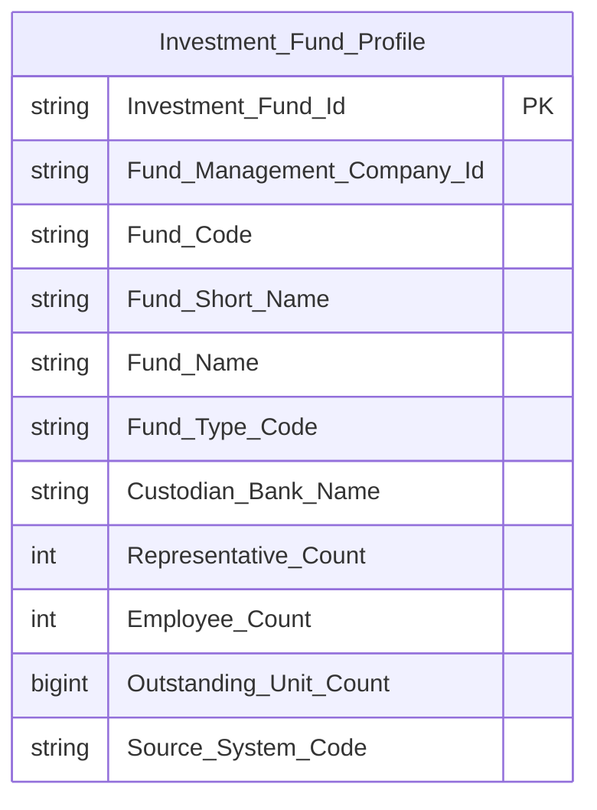
```mermaid
erDiagram
    Investment_Fund_Profile {
        string Investment_Fund_Id PK
        string Fund_Management_Company_Id
        string Fund_Code
        string Fund_Short_Name
        string Fund_Name
        string Fund_Type_Code
        string Custodian_Bank_Name
        int Representative_Count
        int Employee_Count
        bigint Outstanding_Unit_Count
        string Source_System_Code
    }
```

> **[CẬP NHẬT 2026-09-26]** `Distribution_Agent_Count` gỡ khỏi schema (K_QLQ_97 hạ về PENDING); `Outstanding_Unit_Count` thêm vào (K_QLQ_101 lên READY). **[SỬA 2026-10-05]** `Net_Asset_Value_Amount` gỡ khỏi schema (K_QLQ_100 hạ PENDING, O_QLQ_25). `YTD_Profit_Amount` vẫn PENDING (xem Bảng KPI).

**Lineage Mart → Báo cáo:**

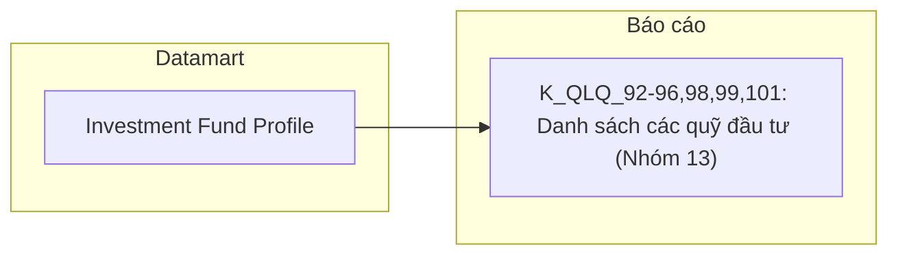
```mermaid
flowchart LR
    subgraph GOLD["Datamart"]
        G1["Investment Fund Profile"]
    end
    subgraph RPT["Báo cáo"]
        R1["K_QLQ_92-96,98,99,101: Danh sách các quỹ đầu tư (Nhóm 13)"]
    end
    G1 --> R1
```

**Bảng grain:**

| Tên bảng | Grain |
|---|---|
| Investment Fund Profile | 1 quỹ × 1 tháng slicer |

---

#### Nhóm 14 - Danh sách đại lý phân phối

> Phân loại: **Tác nghiệp**
> **[CẬP NHẬT 2026-09-26 — HẠ xuống PENDING]** Thiết kế cũ đánh READY, nhưng BA hiện hành (dòng 108) yêu cầu lọc `AGENCY_TYPE.ITEM_NAME LIKE '%đại lý phân phối%'` — cùng gap với K_QLQ_97 (Nhóm 13): `fund_distribution_agent` (FMS.AGENCIES) chưa có attribute cho scheme `FMS_AGENCY_TYPE` (đã đăng ký nhưng chưa wired — xem `feedback_fms_atomic_classification_coverage.md`). Không lọc được đúng "đại lý phân phối" khỏi các loại đại lý khác trong AGENCIES.

**Mockup — popup "DANH SÁCH ĐẠI LÝ PHÂN PHỐI":**

| Tên đại lý phân phối |
|---|
| Công ty Chứng khoán XYZ |

**Source:** `Investment Fund Distribution Agent List`

**Bảng KPI:**

| KPI ID | Tên KPI | Đơn vị | Tính chất | Công thức | Ghi chú | Trạng thái |
|---|---|---|---|---|---|---|
| K_QLQ_103 | Danh sách đại lý phân phối | — | Cơ sở | | **Lý do pending:** cùng gap AGENCY_TYPE với K_QLQ_97 (Nhóm 13) — `fund_distribution_agent` chưa có FK scheme `FMS_AGENCY_TYPE`. **Atomic cần bổ sung:** thêm attribute FK scheme `FMS_AGENCY_TYPE` lên `fund_distribution_agent` (nguồn `FMS.AGENCIES.AGENCY_TYPE_ID`). **Mart dự kiến:** `Investment Fund Distribution Agent List`. | PENDING |

**Bảng mapping nguồn:**

| Tên KPI | Bảng nguồn (BA) | Atomic entity | Atomic table |
|---|---|---|---|
| K_QLQ_103 | FMS_UAT.AGENCIES | Fund Distribution Agent *(thiếu attribute AGENCY_TYPE)* | fund_distribution_agent |

**Schema bảng con — Investment Fund Distribution Agent List:**

```mermaid
erDiagram
    Investment_Fund_Distribution_Agent_List {
        string Investment_Fund_Id PK
        string Fund_Distribution_Agent_Id PK
        string Fund_Distribution_Agent_Name
        string Source_System_Code
    }
```

> Schema dự kiến — chưa hiện thực hóa vì K_QLQ_103 PENDING.

**Lineage Mart → Báo cáo:**

```mermaid
flowchart LR
    subgraph GOLD["Datamart"]
        G1["Investment Fund Distribution Agent List"]
    end
    subgraph RPT["Báo cáo"]
        R1["Danh sách đại lý phân phối (Nhóm 14) — PENDING"]
    end
    G1 -.-> R1
```

**Bảng grain:**

| Tên bảng | Grain |
|---|---|
| Investment Fund Distribution Agent List | Tác nghiệp — bảng con drill-down \| 1 đại lý phân phối × 1 quỹ |

---

#### Nhóm 15 - Danh sách thành viên ban đại diện

> Phân loại: **Tác nghiệp**
> Atomic: `Investment Fund Representative Board Member` ← FMS.REPRESENT — READY *(K_QLQ_104: Danh sách thành viên ban đại diện)*
> Ghi chú: Popup drill-down khi bấm vào Số lượng thành viên ban đại diện ở Nhóm 13 (K_QLQ_98) — FK về `Investment_Fund_Id`.

**Mockup — popup "DANH SÁCH THÀNH VIÊN BAN ĐẠI DIỆN":**

| Tên thành viên |
|---|
| Nguyễn Văn A |

**Source:** `Investment Fund Representative Board Member List`

**Bảng KPI:**

| KPI ID | Tên KPI | Đơn vị | Tính chất | Công thức | Ghi chú | Trạng thái |
|---|---|---|---|---|---|---|
| K_QLQ_104 | Danh sách thành viên ban đại diện | — | Cơ sở | `Item_Name` ← Investment Fund Representative Board Member (FMS.REPRESENT) | | READY |

**Schema bảng con — Investment Fund Representative Board Member List:**

```mermaid
erDiagram
    Investment_Fund_Representative_Board_Member_List {
        string Investment_Fund_Id PK
        string Representative_Board_Member_Id PK
        string Representative_Board_Member_Name
        string Source_System_Code
    }
```

**Lineage Mart → Báo cáo:**

```mermaid
flowchart LR
    subgraph GOLD["Datamart"]
        G1["Investment Fund Representative Board Member List"]
    end
    subgraph RPT["Báo cáo"]
        R1["K_QLQ_104: Danh sách thành viên ban đại diện (Nhóm 15)"]
    end
    G1 --> R1
```

**Bảng grain:**

| Tên bảng | Grain |
|---|---|
| Investment Fund Representative Board Member List | Tác nghiệp — bảng con drill-down \| 1 thành viên BĐD × 1 quỹ |

---

#### Nhóm 16 - Danh sách người điều hành quỹ

> Phân loại: **Tác nghiệp**
> Atomic: `Fund Management Company Employee` ← FMS.TL_PROFILES — READY *(K_QLQ_105: Danh sách người điều hành quỹ)*
> Ghi chú: Popup drill-down khi bấm vào Số lượng người điều hành quỹ ở Nhóm 13 (K_QLQ_99) — FK về `Investment_Fund_Id`, join `FMS.FUND_TL_PRO`.

**Mockup — popup "DANH SÁCH NGƯỜI ĐIỀU HÀNH QUỸ":**

| Tên người điều hành |
|---|
| Trần Thị B |

**Source:** `Investment Fund Manager List`

**Bảng KPI:**

| KPI ID | Tên KPI | Đơn vị | Tính chất | Công thức | Ghi chú | Trạng thái |
|---|---|---|---|---|---|---|
| K_QLQ_105 | Danh sách người điều hành quỹ | — | Cơ sở | `Item_Name` ← Fund Management Company Employee (FMS.TL_PROFILES), join FMS.FUND_TL_PRO | | READY |

**Schema bảng con — Investment Fund Manager List:**

```mermaid
erDiagram
    Investment_Fund_Manager_List {
        string Investment_Fund_Id PK
        string Fund_Management_Company_Employee_Id PK
        string Fund_Manager_Name
        string Source_System_Code
    }
```

**Lineage Mart → Báo cáo:**

```mermaid
flowchart LR
    subgraph GOLD["Datamart"]
        G1["Investment Fund Manager List"]
    end
    subgraph RPT["Báo cáo"]
        R1["K_QLQ_105: Danh sách người điều hành quỹ (Nhóm 16)"]
    end
    G1 --> R1
```

**Bảng grain:**

| Tên bảng | Grain |
|---|---|
| Investment Fund Manager List | Tác nghiệp — bảng con drill-down \| 1 người điều hành × 1 quỹ |

---

### Tab: BÁO CÁO / CÔNG TY QLQ

**Slicer chung:** CTQLQ, kỳ thời gian

---

#### Nhóm 28 - Thống kê giao dịch của nhân viên công ty QLQ

> Phân loại: **Tác nghiệp**
> **[SỬA 2026-10-05]** Đánh số lại theo BA hiện hành: STT=**28** (BA dòng 177–186) — trước đó là STT=27, nay BA chèn STT=27 mới cho popup "Chi tiết hợp đồng UTQLDM" (Nhóm 27, xem Tab TỔNG QUAN CN CTQLQ NN TẠI VN). Nội dung/KPI_ID không đổi (K_QLQ_106-115).
> Atomic: `Fund Management Company Key Person` ← FMS.TL_PROFILES — READY *(K_QLQ_106: Số CCCD/Hộ chiếu)*
> **[CẬP NHẬT 2026-09-26]** Sửa lại lý do pending cho 8 chỉ tiêu sổ lệnh: track Atomic `Securities Trade` cho `OrderTrade.Trade_HOSE`/`Trade_HNX` **đã được thiết kế trong track chuẩn** (`DataModel/working/Atomic/lld/ORDERTRADE/lld_ORDERTRADE_TRADE_BOOK_HOSE.yaml`/`_HNX.yaml`, `design_status: approved`) trong phiên GSTT trước — không còn là gap "chỉ có ở Atomic_LinhLV" như ghi trước đây. Gap thật bây giờ là **cầu nối định danh nhà đầu tư**: BA join `FMS.TL_PROFILES.ID_NO` (CCCD nhân viên) → bảng đăng ký nhà đầu tư VSDC (`open_investors`/`updated_investors`) → `trading_account_no` → `trade_book`. Bảng cầu nối VSDC này được chính tài liệu Atomic (`DataModel/working/Atomic/lld/VSDC/mapping_vsdc_ods_atm.md`) ghi rõ "KHÔNG map — xử lý cơ chế riêng" — chưa có Atomic entity. Ghi chú PII: `FMS.TL_PROFILES.ID_NO` (CCCD/Hộ chiếu) chỉ dùng để JOIN, không xuất thành cột Datamart (NĐ 13/2023, xem A14).
> **[SỬA 2026-09-28]** K_QLQ_110 (Phương thức giao dịch): hoàn tác nội dung sai trước đây ("BA nay đã có Trạng thái mapping = Done"). Đọc trực tiếp raw CSV (dòng 181 BA, không qua ba_slice.py) xác nhận `Trạng thái mapping` thật sự vẫn là **Pending**, với ghi chú BA "Sổ lệnh không có trường để lấy chỉ tiêu này, cần xem lại khi có dữ liệu thật" — không phải Done, không có nguồn `trade_book.board_type`/`board_id` nào được BA xác nhận. Lý do PENDING đúng là kép: (1) BA tự nhận chưa có trường nguồn (BA-Pending thật), và (2) dù có trường, vẫn phụ thuộc cầu nối VSDC như K_QLQ_107.

**Bảng KPI:**

| KPI ID | Tên KPI | Đơn vị | Tính chất | Công thức | Ghi chú | Trạng thái |
|---|---|---|---|---|---|---|
| K_QLQ_106 | Số CCCD/Hộ chiếu | — | Chiều | `Id_No` ← Fund Management Company Key Person (FMS.TL_PROFILES) — chỉ dùng để JOIN nội bộ ETL, KHÔNG xuất thành cột Datamart (PII, xem A14) | Chiều join key — chờ measure sổ lệnh READY để ghép cùng Fact | READY |
| K_QLQ_107 | Tài khoản giao dịch chứng khoán | — | Cơ sở | | **Lý do pending:** cầu nối định danh VSDC (`open_investors`/`updated_investors`, JOIN `FMS.TL_PROFILES.ID_NO` = `id_number` → `trading_account_no`) chưa có Atomic entity — "KHÔNG map — xử lý cơ chế riêng" theo `mapping_vsdc_ods_atm.md`. Bảng đích `trade_book` (HOSE/HNX) đã READY (track chuẩn ORDERTRADE), chỉ thiếu mắt xích này. **Atomic cần bổ sung:** entity cho VSDC investor registry bridge. **Mart dự kiến:** `Fund Management Company Staff Trade Report` — grain: 1 lần khớp lệnh × 1 nhân viên CTQLQ. | PENDING |
| K_QLQ_108 | Mã CTCK nơi mở tài khoản | — | Chiều | | **Lý do pending:** Tương tự K_QLQ_107. **Atomic cần bổ sung:** như trên. **Mart dự kiến:** `Fund Management Company Staff Trade Report`. | PENDING |
| K_QLQ_109 | Ngày giao dịch | — | Chiều | | **Lý do pending:** Tương tự K_QLQ_107. **Atomic cần bổ sung:** như trên. **Mart dự kiến:** `Fund Management Company Staff Trade Report`. | PENDING |
| K_QLQ_110 | Phương thức giao dịch | — | Cơ sở | | **Lý do pending:** **[SỬA 2026-09-28]** BA thật sự vẫn Pending (dòng 181 BA): "Sổ lệnh không có trường để lấy chỉ tiêu này, cần xem lại khi có dữ liệu thật" — hoàn tác ghi chú sai trước đây ("BA nay đã Done"). PENDING kép: (1) BA-Pending thật (chưa có trường nguồn), (2) dù có, vẫn phụ thuộc cầu nối VSDC như K_QLQ_107. **Mart dự kiến:** `Fund Management Company Staff Trade Report`. | PENDING |
| K_QLQ_111 | Lệnh mua/bán | — | Cơ sở | | **Lý do pending:** Tương tự K_QLQ_107. **Atomic cần bổ sung:** như trên. **Mart dự kiến:** `Fund Management Company Staff Trade Report`. | PENDING |
| K_QLQ_112 | Mã CK | — | Chiều | | **Lý do pending:** Tương tự K_QLQ_107. **Atomic cần bổ sung:** như trên. **Mart dự kiến:** `Fund Management Company Staff Trade Report`. | PENDING |
| K_QLQ_113 | Số lượng CK | CK | Cơ sở | | **Lý do pending:** Tương tự K_QLQ_107. **Atomic cần bổ sung:** như trên. **Mart dự kiến:** `Fund Management Company Staff Trade Report`. | PENDING |
| K_QLQ_114 | Giá | VND | Cơ sở | | **Lý do pending:** Tương tự K_QLQ_107. **Atomic cần bổ sung:** như trên. **Mart dự kiến:** `Fund Management Company Staff Trade Report`. | PENDING |
| K_QLQ_115 | Tổng giá trị | VND | Cơ sở | | **Lý do pending:** Tương tự K_QLQ_107. **Atomic cần bổ sung:** như trên. **Mart dự kiến:** `Fund Management Company Staff Trade Report`. | PENDING |

**Bảng mapping nguồn:**

| Tên KPI | Bảng nguồn (BA) | Atomic entity | Atomic table |
|---|---|---|---|
| K_QLQ_106 | FMS_UAT.TL_PROFILES | Fund Management Company Key Person | fmc_employee |
| K_QLQ_107-115 | uat_hose_stg.trade_book, uat_hnx_stg.trade_book (qua cầu nối VSDC investor registry) | Securities Trade *(READY, track chuẩn ORDERTRADE)* + VSDC investor bridge *(chưa có Atomic entity)* | securities_trade / TBD |

---

### Tab: TỔNG QUAN ĐẠI LÝ PHÂN PHỐI

#### Nhóm 17 - Thống kê chung

> Phân loại: **Phân tích**
> Atomic: `Securities Distribution Agent` ← FMS.DISTRIBUTOR_AGENT — READY *(K_QLQ_116, K_QLQ_117)*
> **[CẬP NHẬT 2026-09-26]** Sửa lại nguồn K_QLQ_116/117: BA hiện hành dùng `FMS_UAT.DISTRIBUTOR_AGENT` (Atomic entity `Securities Distribution Agent`), không phải `FMS.AGENCIES` (`Fund Distribution Agent`) như thiết kế cũ ghi — 2 bảng nguồn khác nhau, dù chính ghi chú thiết kế Atomic (`lld_FMS_DISTRIBUTOR_AGENT.yaml`) nghi ngờ có thể trùng nghiệp vụ (T5-02, chưa xác nhận) — xem Open Issue mới. **[SỬA 2026-09-26 lần 2]** Cột "as of" `DISTRIBUTION_CERT_DATE` **đã wired** — không phải chưa wired như ghi lần đầu — nằm trên shared entity `Involved Party Alternative Identification` (`ip_alternative_identification.identification_issue_dt` WHERE `identification_tp_code = 'OPERATION_LICENSE'`), phát hiện khi thiết kế Nhóm 22 (cùng entity, cùng nguồn `FMS.DISTRIBUTOR_AGENT`). K_QLQ_118-121 (Số tài khoản, Số tài khoản lũy kế, Giá trị phát hành/mua lại) nay đã có nguồn (trước đây "BA chưa cung cấp") — engine báo cáo định kỳ (Báo cáo hoạt động đại lý phân phối >> TinhHinhGiaoDichCCQ_06268), vẫn PENDING vì engine đó chưa đủ cột trên Atomic `fmr_*` (TGT_ID, DATA_LABEL/CELLS_META, RECORD_STATUS — xem O_QLQ_27).

**Mockup:**

| Chỉ tiêu | Giá trị |
|---|---|
| Số lượng Đại lý phân phối | 49 |

**Source:** `Fact Fund Distribution Agent Snapshot` → `Calendar Date Dimension`

**Bảng KPI:**

| KPI ID | Tên KPI | Đơn vị | Tính chất | Công thức | Ghi chú | Trạng thái |
|---|---|---|---|---|---|---|
| K_QLQ_116 | Thời gian | — | Chiều | `Snapshot_Date_Dimension_Id` → `cdr_dt_dim` (grain quý/năm) — lọc `ip_alternative_identification.identification_issue_dt` WHERE `identification_tp_code = 'OPERATION_LICENSE'` | | READY |
| K_QLQ_117 | Số lượng Đại lý phân phối | Đại lý | Cơ sở | `COUNT(securities_distribution_agent.securities_distribution_agent_id)` WHERE `active_status_flag` = 1 | | READY |
| K_QLQ_118 | Số tài khoản | TK | Cơ sở | | **Lý do pending:** nguồn thật là engine báo cáo định kỳ `FMS_UAT.RPT_TEMP/SHEET/RPT_VALUES/RPT_MEMBER/RPT_PERIOD` (Mapping báo cáo đầu vào: Báo cáo hoạt động đại lý phân phối >> TinhHinhGiaoDichCCQ_06268 >> Số lượng tài khoản giao dịch CCQ đã mở trong kỳ). **Atomic cần bổ sung:** cột nối giá trị `fmr_value` với ô của sheet — `fmr_value.tgt_id` (RPT_VALUES.TGT_ID) và `fmr_sheet.data_label`/`cells_meta` (nhãn, vị trí dòng–cột) — cùng `record_status` của `fmr_submission` (BA lọc `IN (2,3,5,10)`). Atomic đã có `fmr_*` nhưng chưa đủ cột, xem O_QLQ_27. **Mart dự kiến:** `Fact Fund Distribution Agent Snapshot` — grain: 1 ĐLPP × 1 quý/năm. | PENDING |
| K_QLQ_119 | Số tài khoản lũy kế | TK | Cơ sở | | **Lý do pending:** cùng nguồn K_QLQ_118, cột "Lũy kế từ đầu năm đến kỳ báo cáo". **Atomic cần bổ sung:** như K_QLQ_118. **Mart dự kiến:** `Fact Fund Distribution Agent Snapshot`. | PENDING |
| K_QLQ_120 | Giá trị phát hành | Tỷ VND | Cơ sở | | **Lý do pending:** cùng nguồn engine báo cáo định kỳ (Mapping báo cáo đầu vào: TinhHinhGiaoDichCCQ_06268 >> Tổng giá trị CCQ phát hành trong kỳ). **Atomic cần bổ sung:** như K_QLQ_118. **Mart dự kiến:** `Fact Fund Distribution Agent Snapshot`. | PENDING |
| K_QLQ_121 | Giá trị mua lại | Tỷ VND | Cơ sở | | **Lý do pending:** cùng nguồn engine báo cáo định kỳ (Mapping báo cáo đầu vào: TinhHinhGiaoDichCCQ_06268 >> Tổng giá trị CCQ mua lại trong kỳ). **Atomic cần bổ sung:** như K_QLQ_118. **Mart dự kiến:** `Fact Fund Distribution Agent Snapshot`. | PENDING |

**Star Schema:**

```mermaid
erDiagram
    Fact_Fund_Distribution_Agent_Snapshot {
        int Snapshot_Date_Dimension_Id FK
        int Distribution_Agent_Count
    }
    Calendar_Date_Dimension {
        string Calendar_Date_Dimension_Id PK
        date Calendar_Date
        int Year
        int Month
        int Quarter
        int Day_Of_Week
        boolean Is_Weekend
        boolean Holiday_Flag
        string Holiday_Name
        string Source_System_Code
    }

    Calendar_Date_Dimension ||--o{ Fact_Fund_Distribution_Agent_Snapshot : "Snapshot Date Dimension Id"
```

> Chỉ `Distribution_Agent_Count` READY — `Account_Count`/`Issue_Value_Amount`/`Redeem_Value_Amount` đang PENDING, bổ sung khi có Atomic entity engine báo cáo định kỳ.

**Lineage Mart → Báo cáo:**

```mermaid
flowchart LR
    subgraph GOLD["Datamart"]
        G1["Fact Fund Distribution Agent Snapshot"]
        G2["Calendar Date Dimension"]
    end
    subgraph RPT["Báo cáo"]
        R1["K_QLQ_116,117: Thống kê chung Đại lý phân phối (Nhóm 17)"]
    end
    G2 --> G1
    G1 --> R1
```

**Bảng grain:**

| Tên bảng | Grain |
|---|---|
| Fact Fund Distribution Agent Snapshot | 1 snapshot toàn thị trường × 1 quý/năm |
| Calendar Date Dimension | 1 ngày |

**Bảng mapping nguồn:**

| Tên KPI | Bảng nguồn (BA) | Atomic entity | Atomic table |
|---|---|---|---|
| K_QLQ_116 | FMS_UAT.DISTRIBUTOR_AGENT | Involved Party Alternative Identification (shared) | ip_alternative_identification |
| K_QLQ_117 | FMS_UAT.DISTRIBUTOR_AGENT | Securities Distribution Agent | securities_distribution_agent |
| K_QLQ_118-121 | FMS_UAT.RPT_TEMP FMS_UAT.SHEET FMS_UAT.RPT_VALUES FMS_UAT.RPT_MEMBER FMS_UAT.RPT_PERIOD | Fund Management Report Value *(`fmr_value` — thiếu TGT_ID/CODE, xem O_QLQ_27)* | fmr_value |

---

#### Nhóm 18 - Tổng số tài khoản giao dịch chứng chỉ quỹ

> Phân loại: **Phân tích**
> **[CẬP NHẬT 2026-09-26]** Vẫn PENDING toàn bộ, nhưng nay đã có nguồn (trước đây "BA chưa cung cấp"): engine báo cáo định kỳ EAV `FMS_UAT.RPT_TEMP/SHEET/RPT_VALUES/RPT_MEMBER/RPT_PERIOD` (Mapping báo cáo đầu vào: Báo cáo hoạt động đại lý phân phối >> TinhHinhGiaoDichCCQ_06268) — chưa đủ cột trên Atomic `fmr_*` (TGT_ID, DATA_LABEL/CELLS_META, RECORD_STATUS — xem O_QLQ_27).

**Bảng KPI:**

| KPI ID | Tên KPI | Đơn vị | Tính chất | Công thức | Ghi chú | Trạng thái |
|---|---|---|---|---|---|---|
| K_QLQ_122 | Thời gian | — | Chiều | | **Lý do pending:** Không measure nào READY cùng Fact. **Atomic cần bổ sung:** cột nối giá trị `fmr_value` với ô của sheet — `fmr_value.tgt_id` (RPT_VALUES.TGT_ID) và `fmr_sheet.data_label`/`cells_meta` (nhãn, vị trí dòng–cột) — cùng `record_status` của `fmr_submission` (BA lọc `IN (2,3,5,10)`). Atomic đã có `fmr_*` nhưng chưa đủ cột, xem O_QLQ_27. **Mart dự kiến:** `Fact Fund Distribution Agent Account Snapshot` — grain: 1 ĐLPP × 1 quý/năm. | PENDING |
| K_QLQ_123 | Tổ chức | TK | Cơ sở | | **Lý do pending:** nguồn thật là engine báo cáo định kỳ (Mapping báo cáo đầu vào: TinhHinhGiaoDichCCQ_06268 >> Số lượng tài khoản của NĐT tổ chức trong nước). **Atomic cần bổ sung:** như trên. **Mart dự kiến:** `Fact Fund Distribution Agent Account Snapshot`. | PENDING |
| K_QLQ_124 | Cá nhân | TK | Cơ sở | | **Lý do pending:** cùng nguồn, NĐT cá nhân trong nước. **Atomic cần bổ sung:** như trên. **Mart dự kiến:** `Fact Fund Distribution Agent Account Snapshot`. | PENDING |
| K_QLQ_125 | Nước ngoài | TK | Cơ sở | | **Lý do pending:** cùng nguồn, NĐT nước ngoài. **Atomic cần bổ sung:** như trên. **Mart dự kiến:** `Fact Fund Distribution Agent Account Snapshot`. | PENDING |

**Bảng mapping nguồn:**

| Tên KPI | Bảng nguồn (BA) | Atomic entity | Atomic table |
|---|---|---|---|
| K_QLQ_122-125 | FMS_UAT.RPT_TEMP FMS_UAT.SHEET FMS_UAT.RPT_VALUES FMS_UAT.RPT_MEMBER FMS_UAT.RPT_PERIOD | Fund Management Report Value *(`fmr_value` — thiếu TGT_ID/CODE, xem O_QLQ_27)* | fmr_value |

---

#### Nhóm 19 - Số tài khoản nắm giữ chứng chỉ quỹ

> Phân loại: **Phân tích**
> **[CẬP NHẬT 2026-09-26]** Vẫn PENDING toàn bộ, nhưng nay đã có nguồn (trước đây "BA chưa cung cấp"): engine báo cáo định kỳ EAV `FMS_UAT.RPT_TEMP/SHEET/RPT_VALUES/RPT_MEMBER/RPT_PERIOD` (Mapping báo cáo đầu vào: Báo cáo hoạt động đại lý phân phối >> TinhHinhGiaoDichCCQ_06268) — chưa đủ cột trên Atomic `fmr_*` (TGT_ID, DATA_LABEL/CELLS_META, RECORD_STATUS — xem O_QLQ_27).

**Bảng KPI:**

| KPI ID | Tên KPI | Đơn vị | Tính chất | Công thức | Ghi chú | Trạng thái |
|---|---|---|---|---|---|---|
| K_QLQ_126 | Thời gian | — | Chiều | | **Lý do pending:** Không measure nào READY cùng Fact. **Atomic cần bổ sung:** cột nối giá trị `fmr_value` với ô của sheet — `fmr_value.tgt_id` (RPT_VALUES.TGT_ID) và `fmr_sheet.data_label`/`cells_meta` (nhãn, vị trí dòng–cột) — cùng `record_status` của `fmr_submission` (BA lọc `IN (2,3,5,10)`). Atomic đã có `fmr_*` nhưng chưa đủ cột, xem O_QLQ_27. **Mart dự kiến:** `Fact Fund Distribution Agent Holding Snapshot` — grain: 1 ĐLPP × 1 quý/năm. | PENDING |
| K_QLQ_127 | Tổ chức | TK | Cơ sở | | **Lý do pending:** nguồn thật là engine báo cáo định kỳ (Mapping báo cáo đầu vào: TinhHinhGiaoDichCCQ_06268 >> Số lượng tài khoản nắm giữ CCQ cuối kỳ của NĐT tổ chức trong nước). **Atomic cần bổ sung:** như trên. **Mart dự kiến:** `Fact Fund Distribution Agent Holding Snapshot`. | PENDING |
| K_QLQ_128 | Cá nhân | TK | Cơ sở | | **Lý do pending:** cùng nguồn, NĐT cá nhân trong nước. **Atomic cần bổ sung:** như trên. **Mart dự kiến:** `Fact Fund Distribution Agent Holding Snapshot`. | PENDING |
| K_QLQ_129 | Nước ngoài | TK | Cơ sở | | **Lý do pending:** cùng nguồn, NĐT nước ngoài. **Atomic cần bổ sung:** như trên. **Mart dự kiến:** `Fact Fund Distribution Agent Holding Snapshot`. | PENDING |

**Bảng mapping nguồn:**

| Tên KPI | Bảng nguồn (BA) | Atomic entity | Atomic table |
|---|---|---|---|
| K_QLQ_126-129 | FMS_UAT.RPT_TEMP FMS_UAT.SHEET FMS_UAT.RPT_VALUES FMS_UAT.RPT_MEMBER FMS_UAT.RPT_PERIOD | Fund Management Report Value *(`fmr_value` — thiếu TGT_ID/CODE, xem O_QLQ_27)* | fmr_value |

---

#### Nhóm 20 - Giá trị chứng chỉ quỹ

> Phân loại: **Phân tích**
> **[CẬP NHẬT 2026-09-26]** Vẫn PENDING toàn bộ, nhưng nay đã có nguồn (trước đây "BA chưa cung cấp"): engine báo cáo định kỳ EAV `FMS_UAT.RPT_TEMP/SHEET/RPT_VALUES/RPT_MEMBER/RPT_PERIOD` (Mapping báo cáo đầu vào: Báo cáo hoạt động đại lý phân phối >> TinhHinhGiaoDichCCQ_06268) — chưa đủ cột trên Atomic `fmr_*` (TGT_ID, DATA_LABEL/CELLS_META, RECORD_STATUS — xem O_QLQ_27).

**Bảng KPI:**

| KPI ID | Tên KPI | Đơn vị | Tính chất | Công thức | Ghi chú | Trạng thái |
|---|---|---|---|---|---|---|
| K_QLQ_130 | Thời gian | — | Chiều | | **Lý do pending:** Không measure nào READY cùng Fact. **Atomic cần bổ sung:** cột nối giá trị `fmr_value` với ô của sheet — `fmr_value.tgt_id` (RPT_VALUES.TGT_ID) và `fmr_sheet.data_label`/`cells_meta` (nhãn, vị trí dòng–cột) — cùng `record_status` của `fmr_submission` (BA lọc `IN (2,3,5,10)`). Atomic đã có `fmr_*` nhưng chưa đủ cột, xem O_QLQ_27. **Mart dự kiến:** `Fact Fund Distribution Agent Certificate Value Snapshot` — grain: 1 ĐLPP × 1 quý/năm. | PENDING |
| K_QLQ_131 | Tổ chức | Tỷ VND | Cơ sở | | **Lý do pending:** nguồn thật là engine báo cáo định kỳ (Mapping báo cáo đầu vào: TinhHinhGiaoDichCCQ_06268 >> Giá trị CCQ nắm giữ bởi NĐT tổ chức trong nước). **Atomic cần bổ sung:** như trên. **Mart dự kiến:** `Fact Fund Distribution Agent Certificate Value Snapshot`. | PENDING |
| K_QLQ_132 | Cá nhân | Tỷ VND | Cơ sở | | **Lý do pending:** cùng nguồn, NĐT cá nhân trong nước. **Atomic cần bổ sung:** như trên. **Mart dự kiến:** `Fact Fund Distribution Agent Certificate Value Snapshot`. | PENDING |
| K_QLQ_133 | Nước ngoài | Tỷ VND | Cơ sở | | **Lý do pending:** cùng nguồn, NĐT nước ngoài. **Atomic cần bổ sung:** như trên. **Mart dự kiến:** `Fact Fund Distribution Agent Certificate Value Snapshot`. | PENDING |

**Bảng mapping nguồn:**

| Tên KPI | Bảng nguồn (BA) | Atomic entity | Atomic table |
|---|---|---|---|
| K_QLQ_130-133 | FMS_UAT.RPT_TEMP FMS_UAT.SHEET FMS_UAT.RPT_VALUES FMS_UAT.RPT_MEMBER FMS_UAT.RPT_PERIOD | Fund Management Report Value *(`fmr_value` — thiếu TGT_ID/CODE, xem O_QLQ_27)* | fmr_value |

---

#### Nhóm 21 - Giao dịch thông qua Đại lý phân phối

> Phân loại: **Phân tích**
> **[CẬP NHẬT 2026-09-26]** Vẫn PENDING toàn bộ, nhưng nay đã có nguồn (trước đây "BA chưa cung cấp"): engine báo cáo định kỳ EAV `FMS_UAT.RPT_TEMP/SHEET/RPT_VALUES/RPT_MEMBER/RPT_PERIOD` (Mapping báo cáo đầu vào: Báo cáo hoạt động đại lý phân phối >> TinhHinhGiaoDichCCQ_06268) — chưa đủ cột trên Atomic `fmr_*` (TGT_ID, DATA_LABEL/CELLS_META, RECORD_STATUS — xem O_QLQ_27). Cùng nguồn với K_QLQ_120/121 (Nhóm 17) — có thể là cùng measure, cần xác nhận tại LLD.

**Bảng KPI:**

| KPI ID | Tên KPI | Đơn vị | Tính chất | Công thức | Ghi chú | Trạng thái |
|---|---|---|---|---|---|---|
| K_QLQ_134 | Thời gian | — | Chiều | | **Lý do pending:** Không measure nào READY cùng Fact. **Atomic cần bổ sung:** cột nối giá trị `fmr_value` với ô của sheet — `fmr_value.tgt_id` (RPT_VALUES.TGT_ID) và `fmr_sheet.data_label`/`cells_meta` (nhãn, vị trí dòng–cột) — cùng `record_status` của `fmr_submission` (BA lọc `IN (2,3,5,10)`). Atomic đã có `fmr_*` nhưng chưa đủ cột, xem O_QLQ_27. **Mart dự kiến:** `Fact Fund Distribution Agent Transaction Snapshot` — grain: 1 ĐLPP × 1 quý/năm. | PENDING |
| K_QLQ_135 | Giá trị phát hành (PH) | Tỷ VND | Cơ sở | | **Lý do pending:** nguồn thật là engine báo cáo định kỳ (Mapping báo cáo đầu vào: TinhHinhGiaoDichCCQ_06268 >> Tổng giá trị CCQ phát hành trong kỳ) — trùng nguồn với K_QLQ_120 (Nhóm 17), cần xác nhận tại LLD có phải cùng measure hay không. **Atomic cần bổ sung:** như trên. **Mart dự kiến:** `Fact Fund Distribution Agent Transaction Snapshot`. | PENDING |
| K_QLQ_136 | Giá trị mua lại (ML) | Tỷ VND | Cơ sở | | **Lý do pending:** tương tự K_QLQ_135 — trùng nguồn với K_QLQ_121 (Nhóm 17). **Atomic cần bổ sung:** như trên. **Mart dự kiến:** `Fact Fund Distribution Agent Transaction Snapshot`. | PENDING |

**Bảng mapping nguồn:**

| Tên KPI | Bảng nguồn (BA) | Atomic entity | Atomic table |
|---|---|---|---|
| K_QLQ_134-136 | FMS_UAT.RPT_TEMP FMS_UAT.SHEET FMS_UAT.RPT_VALUES FMS_UAT.RPT_MEMBER FMS_UAT.RPT_PERIOD | Fund Management Report Value *(`fmr_value` — thiếu TGT_ID/CODE, xem O_QLQ_27)* | fmr_value |

---

#### Nhóm 22 - Danh sách Đại lý phân phối

> Phân loại: **Tác nghiệp**
> Atomic: `Securities Distribution Agent` ← FMS.DISTRIBUTOR_AGENT — READY
> Atomic: `Involved Party Alternative Identification` (shared entity) ← FMS.DISTRIBUTOR_AGENT — READY (Số GP/Ngày cấp GP)
> Atomic: `Involved Party Postal Address` (shared entity) ← FMS.DISTRIBUTOR_AGENT — READY (Địa chỉ)
> **[CẬP NHẬT 2026-09-26]** Sửa lại nguồn 7/22 chỉ tiêu READY: BA hiện hành dùng `FMS_UAT.DISTRIBUTOR_AGENT` (không phải `FMS.AGENCIES`) — cùng phát hiện với Nhóm 17. Số GP/Ngày cấp GP nằm ở shared entity `Involved Party Alternative Identification` (filter `identification_tp_code = 'BUSINESS_LICENSE'`), Địa chỉ ở `Involved Party Postal Address` (filter `adr_tp_code = 'HEAD_OFFICE'`) — cả 2 đã READY. Ghi chú thêm: cột `DISTRIBUTION_CERT_DATE` (dùng cho Chiều Thời gian) thực ra ĐÃ wired trên `Involved Party Alternative Identification.identification_issue_dt` (filter `identification_tp_code = 'OPERATION_LICENSE'`) — sửa lại nhận định "chưa wired" đã ghi ở Nhóm 17, K_QLQ_116 dùng cùng nguồn này. 15/22 chỉ tiêu còn lại (tài khoản GD/nắm giữ theo Tổ chức/Cá nhân/NN, giá trị CCQ, giá trị PH/ML, thị phần) nay đã có nguồn (trước đây "BA chưa cung cấp") — engine báo cáo định kỳ (TinhHinhGiaoDichCCQ_06268), vẫn PENDING vì chưa đủ cột trên Atomic `fmr_*` (TGT_ID, DATA_LABEL/CELLS_META, RECORD_STATUS — xem O_QLQ_27). Nhiều chỉ tiêu trùng nguồn với Nhóm 18/19/20 — cần xác nhận tại LLD có phải cùng measure (đã đếm 1 lần) hay khác kỳ báo cáo.
> **[SỬA 2026-09-28 — phát hiện tại LLD]** K_QLQ_143 (Quỹ đang phân phối) **HẠ xuống PENDING**: công thức cũ ghi JOIN `Investment Fund X Fund Distribution Agent Relationship` (FMS.AGEN_FUNDS), nhưng Atomic entity đó (`fund_distribution_agent_x_investment_fund_relationship`) chỉ có 2 FK là `investment_fund_id` + `fund_distribution_agent_id` (khóa tới **Fund Distribution Agent**/FMS.AGENCIES) — không có FK nào tới **Securities Distribution Agent**/FMS.DISTRIBUTOR_AGENT (entity của chính Nhóm này). Không có junction Atomic nào nối Investment Fund ↔ Securities Distribution Agent. Chỉ còn 6/22 chỉ tiêu READY (K137-142).

**Mockup:**

| Tên ĐLPP | Số GP | Ngày cấp GP | Địa chỉ | Tình trạng | Quỹ đang PP |
|---|---|---|---|---|---|
| Công ty Chứng khoán XYZ | 123/GP | 01/01/2020 | Hà Nội | Hoạt động | 5 |

**Source:** `Fund Distribution Agent Profile`

**Bảng KPI:**

| KPI ID | Tên KPI | Đơn vị | Tính chất | Công thức | Ghi chú | Trạng thái |
|---|---|---|---|---|---|---|
| K_QLQ_137 | Thời gian | — | Chiều | `Snapshot_Date_Dimension_Id` → `cdr_dt_dim` — lọc `ip_alternative_identification.identification_issue_dt` WHERE `identification_tp_code = 'OPERATION_LICENSE'` | | READY |
| K_QLQ_138 | Tên Đại lý phân phối | — | Cơ sở | `securities_distribution_agent.securities_distribution_agent_full_nm` | | READY |
| K_QLQ_139 | Số GP thành lập | — | Cơ sở | `ip_alternative_identification.identification_nbr` WHERE `identification_tp_code = 'BUSINESS_LICENSE'` | | READY |
| K_QLQ_140 | Ngày cấp GP thành lập | — | Cơ sở | `ip_alternative_identification.identification_issue_dt` WHERE `identification_tp_code = 'BUSINESS_LICENSE'` | | READY |
| K_QLQ_141 | Địa chỉ | — | Cơ sở | `ip_postal_address.adr_val` WHERE `adr_tp_code = 'HEAD_OFFICE'` | | READY |
| K_QLQ_142 | Tình trạng hoạt động | — | Cơ sở | `securities_distribution_agent.active_status_flag`, `termination_dt` | | READY |
| K_QLQ_143 | Quỹ đang phân phối | Quỹ | Cơ sở | | **Lý do pending:** công thức cũ ghi JOIN `Investment Fund X Fund Distribution Agent Relationship` (FMS.AGEN_FUNDS), nhưng entity đó chỉ nối tới `Fund Distribution Agent` (FMS.AGENCIES), không có FK tới `Securities Distribution Agent` (FMS.DISTRIBUTOR_AGENT — entity của Nhóm này). **Atomic cần bổ sung:** junction Investment Fund ↔ Securities Distribution Agent (chưa tồn tại — báo Atomic team xác nhận có nguồn thật hay BA đã nhầm 2 loại đại lý). **Mart dự kiến:** `Fund Distribution Agent Profile`. | PENDING |
| K_QLQ_144 | Tài khoản giao dịch | TK | Cơ sở | | **Lý do pending:** nguồn thật là engine báo cáo định kỳ (Mapping báo cáo đầu vào: TinhHinhGiaoDichCCQ_06268 >> Số lượng tài khoản giao dịch CCQ đã mở trong kỳ) — trùng nguồn K_QLQ_118 (Nhóm 18), cần xác nhận tại LLD. **Atomic cần bổ sung:** cột nối giá trị `fmr_value` với ô của sheet — `fmr_value.tgt_id` (RPT_VALUES.TGT_ID) và `fmr_sheet.data_label`/`cells_meta` (nhãn, vị trí dòng–cột) — cùng `record_status` của `fmr_submission` (BA lọc `IN (2,3,5,10)`). Atomic đã có `fmr_*` nhưng chưa đủ cột, xem O_QLQ_27. **Mart dự kiến:** `Fund Distribution Agent Profile`. | PENDING |
| K_QLQ_145 | Tài khoản giao dịch (YTD) | TK | Cơ sở | | **Lý do pending:** cùng nguồn K_QLQ_144, cột lũy kế — trùng nguồn K_QLQ_119 (Nhóm 18). **Atomic cần bổ sung:** như trên. **Mart dự kiến:** `Fund Distribution Agent Profile`. | PENDING |
| K_QLQ_146 | Tổng số tài khoản giao dịch CCQ - Tổ chức | TK | Cơ sở | | **Lý do pending:** nguồn engine báo cáo định kỳ (Số lượng tài khoản NĐT tổ chức trong nước) — trùng nguồn K_QLQ_123 (Nhóm 18). **Atomic cần bổ sung:** như trên. **Mart dự kiến:** `Fund Distribution Agent Profile`. | PENDING |
| K_QLQ_147 | Tổng số tài khoản giao dịch CCQ - Cá nhân | TK | Cơ sở | | **Lý do pending:** cùng nguồn K_QLQ_146, NĐT cá nhân — trùng K_QLQ_124 (Nhóm 18). **Atomic cần bổ sung:** như trên. **Mart dự kiến:** `Fund Distribution Agent Profile`. | PENDING |
| K_QLQ_148 | Tổng số tài khoản giao dịch CCQ - Nước ngoài | TK | Cơ sở | | **Lý do pending:** cùng nguồn K_QLQ_146, NĐT nước ngoài — trùng K_QLQ_125 (Nhóm 18). **Atomic cần bổ sung:** như trên. **Mart dự kiến:** `Fund Distribution Agent Profile`. | PENDING |
| K_QLQ_149 | Số tài khoản nắm giữ CCQ - Tổ chức | TK | Cơ sở | | **Lý do pending:** nguồn engine báo cáo định kỳ (Số lượng TK nắm giữ CCQ cuối kỳ NĐT tổ chức) — trùng K_QLQ_127 (Nhóm 19). **Atomic cần bổ sung:** như trên. **Mart dự kiến:** `Fund Distribution Agent Profile`. | PENDING |
| K_QLQ_150 | Số tài khoản nắm giữ CCQ - Cá nhân | TK | Cơ sở | | **Lý do pending:** cùng nguồn K_QLQ_149, cá nhân — trùng K_QLQ_128 (Nhóm 19). **Atomic cần bổ sung:** như trên. **Mart dự kiến:** `Fund Distribution Agent Profile`. | PENDING |
| K_QLQ_151 | Số tài khoản nắm giữ CCQ - Nước ngoài | TK | Cơ sở | | **Lý do pending:** cùng nguồn K_QLQ_149, nước ngoài — trùng K_QLQ_129 (Nhóm 19). **Atomic cần bổ sung:** như trên. **Mart dự kiến:** `Fund Distribution Agent Profile`. | PENDING |
| K_QLQ_152 | Giá trị chứng chỉ quỹ - Tổ chức | Tỷ VND | Cơ sở | | **Lý do pending:** nguồn engine báo cáo định kỳ (Giá trị CCQ nắm giữ bởi NĐT tổ chức) — trùng K_QLQ_131 (Nhóm 20). **Atomic cần bổ sung:** như trên. **Mart dự kiến:** `Fund Distribution Agent Profile`. | PENDING |
| K_QLQ_153 | Giá trị chứng chỉ quỹ - Cá nhân | Tỷ VND | Cơ sở | | **Lý do pending:** cùng nguồn K_QLQ_152, cá nhân — trùng K_QLQ_132 (Nhóm 20). **Atomic cần bổ sung:** như trên. **Mart dự kiến:** `Fund Distribution Agent Profile`. | PENDING |
| K_QLQ_154 | Giá trị chứng chỉ quỹ - Nước ngoài | Tỷ VND | Cơ sở | | **Lý do pending:** cùng nguồn K_QLQ_152, nước ngoài — trùng K_QLQ_133 (Nhóm 20). **Atomic cần bổ sung:** như trên. **Mart dự kiến:** `Fund Distribution Agent Profile`. | PENDING |
| K_QLQ_155 | Giá trị phát hành (PH) | Tỷ VND | Cơ sở | | **Lý do pending:** nguồn engine báo cáo định kỳ (Tổng giá trị CCQ phát hành trong kỳ) — trùng K_QLQ_120 (Nhóm 17)/K_QLQ_135 (Nhóm 21). **Atomic cần bổ sung:** như trên. **Mart dự kiến:** `Fund Distribution Agent Profile`. | PENDING |
| K_QLQ_156 | Giá trị phát hành (PH) (YTD) | Tỷ VND | Cơ sở | | **Lý do pending:** cùng nguồn K_QLQ_155, cột lũy kế. **Atomic cần bổ sung:** như trên. **Mart dự kiến:** `Fund Distribution Agent Profile`. | PENDING |
| K_QLQ_157 | Giá trị mua lại (ML) | Tỷ VND | Cơ sở | | **Lý do pending:** nguồn engine báo cáo định kỳ (Tổng giá trị CCQ mua lại trong kỳ) — trùng K_QLQ_121 (Nhóm 17)/K_QLQ_136 (Nhóm 21). **Atomic cần bổ sung:** như trên. **Mart dự kiến:** `Fund Distribution Agent Profile`. | PENDING |
| K_QLQ_158 | Thị phần (TP) | % | Phái sinh | | **Lý do pending:** phụ thuộc K_QLQ_155/157 (PENDING) — Thị phần = (PH của ĐLPP này + ML của ĐLPP này) / Tổng toàn thị trường × 100%. **Atomic cần bổ sung:** như trên. **Mart dự kiến:** `Fund Distribution Agent Profile`. | PENDING |

**Bảng mapping nguồn:**

| Tên KPI | Bảng nguồn (BA) | Atomic entity | Atomic table |
|---|---|---|---|
| K_QLQ_137, 138, 142 | FMS_UAT.DISTRIBUTOR_AGENT | Securities Distribution Agent | securities_distribution_agent |
| K_QLQ_139, 140 | FMS_UAT.DISTRIBUTOR_AGENT | Involved Party Alternative Identification (shared) | ip_alternative_identification |
| K_QLQ_141 | FMS_UAT.DISTRIBUTOR_AGENT | Involved Party Postal Address (shared) | ip_postal_address |
| K_QLQ_143 | FMS_UAT.AGEN_FUNDS | *(chưa có junction Investment Fund ↔ Securities Distribution Agent)* | TBD |
| K_QLQ_144-158 | FMS_UAT.RPT_TEMP FMS_UAT.SHEET FMS_UAT.RPT_VALUES FMS_UAT.RPT_MEMBER FMS_UAT.RPT_PERIOD | Fund Management Report Value *(`fmr_value` — thiếu TGT_ID/CODE, xem O_QLQ_27)* | fmr_value |

**Schema bảng tác nghiệp — Fund Distribution Agent Profile:**

```mermaid
erDiagram
    Fund_Distribution_Agent_Profile {
        string Fund_Distribution_Agent_Id PK
        string Agent_Name
        string License_Number
        date License_Date
        string Address
        boolean Active_Status_Flag
        date Termination_Date
        string Source_System_Code
    }
```

> **[SỬA 2026-09-28]** `Distributing_Fund_Count` gỡ khỏi schema (K_QLQ_143 hạ về PENDING — không có junction Atomic tới Securities Distribution Agent).

**Lineage Mart → Báo cáo:**

```mermaid
flowchart LR
    subgraph GOLD["Datamart"]
        G1["Fund Distribution Agent Profile"]
    end
    subgraph RPT["Báo cáo"]
        R1["K_QLQ_137-142: Danh sách Đại lý phân phối (Nhóm 22)"]
    end
    G1 --> R1
```

**Bảng grain:**

| Tên bảng | Grain |
|---|---|
| Fund Distribution Agent Profile | Tác nghiệp — bảng flat \| 1 ĐLPP × 1 tháng slicer |

---

#### Nhóm 23 - Danh sách các Quỹ đang phân phối

> Phân loại: **Tác nghiệp**
> Atomic: `Investment Fund` ← FMS.FUNDS — READY *(K_QLQ_159: Danh sách các Quỹ đang phân phối)*
> Ghi chú: Popup drill-down khi bấm vào Quỹ đang phân phối ở Nhóm 22 (K_QLQ_143) — FK về `Fund_Distribution_Agent_Id`, join `Investment Fund X Fund Distribution Agent Relationship` (FMS.AGEN_FUNDS).

**Mockup — popup "DANH SÁCH CÁC QUỸ ĐANG PHÂN PHỐI":**

| Tên quỹ |
|---|
| Quỹ ABC Cổ phần |

**Source:** `Fund Distribution Agent Fund List`

**Bảng KPI:**

| KPI ID | Tên KPI | Đơn vị | Tính chất | Công thức | Ghi chú | Trạng thái |
|---|---|---|---|---|---|---|
| K_QLQ_159 | Danh sách các Quỹ đang phân phối | — | Cơ sở | `Fund_Name` ← Investment Fund (FMS.FUNDS), join Investment Fund X Fund Distribution Agent Relationship (FMS.AGEN_FUNDS) | | READY |

**Schema bảng con — Fund Distribution Agent Fund List:**

```mermaid
erDiagram
    Fund_Distribution_Agent_Fund_List {
        string Fund_Distribution_Agent_Id PK
        string Investment_Fund_Id PK
        string Fund_Name
        string Source_System_Code
    }
```

**Lineage Mart → Báo cáo:**

```mermaid
flowchart LR
    subgraph GOLD["Datamart"]
        G1["Fund Distribution Agent Fund List"]
    end
    subgraph RPT["Báo cáo"]
        R1["K_QLQ_159: Danh sách các Quỹ đang phân phối (Nhóm 23)"]
    end
    G1 --> R1
```

**Bảng grain:**

| Tên bảng | Grain |
|---|---|
| Fund Distribution Agent Fund List | Tác nghiệp — bảng con drill-down \| 1 quỹ × 1 ĐLPP |

---

### Tab: TỔNG QUAN CN CTQLQ NN TẠI VN

#### Nhóm 24 - Thống kê chung

> Phân loại: **Phân tích**
> Atomic: `Foreign Fund Management Organization Unit` ← FMS.FOR_BRCH — READY *(K_QLQ_161: Chi nhánh CTQLQ nước ngoài tại Việt Nam)*
> **[CẬP NHẬT 2026-09-26]** K_QLQ_162/163 nay đã có nguồn (trước đây "BA chưa cung cấp"): engine báo cáo định kỳ (Báo cáo tình hình quản lý danh mục đầu tư chi nhánh nước ngoài), vẫn PENDING vì chưa đủ cột trên Atomic `fmr_*` (TGT_ID, DATA_LABEL/CELLS_META, RECORD_STATUS — xem O_QLQ_27).

**Mockup:**

| Chỉ tiêu | Giá trị |
|---|---|
| Chi nhánh CTQLQ nước ngoài tại VN | 8 |

**Source:** `Fact Foreign Fund Management Organization Unit Snapshot` → `Calendar Date Dimension`

**Bảng KPI:**

| KPI ID | Tên KPI | Đơn vị | Tính chất | Công thức | Ghi chú | Trạng thái |
|---|---|---|---|---|---|---|
| K_QLQ_160 | Thời gian | — | Chiều | `Snapshot_Date_Dimension_Id` → `cdr_dt_dim` (grain tháng) — lọc `COALESCE(foreign_fm_ou.effective_start_dt, ...)` <= cuối tháng | | READY |
| K_QLQ_161 | Chi nhánh CTQLQ nước ngoài tại Việt Nam | Chi nhánh | Cơ sở | `COUNT(foreign_fm_ou.foreign_fm_ou_id)` WHERE `branch_tp_code` = 1 (Branch_Flag) AND hiệu lực tại tháng snapshot | | READY |
| K_QLQ_162 | Hợp đồng quản lý danh mục đầu tư | HĐ | Cơ sở | | **Lý do pending:** nguồn thật là engine báo cáo định kỳ `FMS_UAT.RPT_TEMP/SHEET/RPT_VALUES/RPT_MEMBER/RPT_PERIOD` (Mapping báo cáo đầu vào: Báo cáo tình hình quản lý danh mục đầu tư chi nhánh nước ngoài >> Tổng số HĐ ủy thác đầu tư đang thực hiện). **Atomic cần bổ sung:** cột nối giá trị `fmr_value` với ô của sheet — `fmr_value.tgt_id` (RPT_VALUES.TGT_ID) và `fmr_sheet.data_label`/`cells_meta` (nhãn, vị trí dòng–cột) — cùng `record_status` của `fmr_submission` (BA lọc `IN (2,3,5,10)`). Atomic đã có `fmr_*` nhưng chưa đủ cột, xem O_QLQ_27. **Mart dự kiến:** `Fact Foreign Fund Management Organization Unit Snapshot` — grain: 1 CN × 1 tháng. | PENDING |
| K_QLQ_163 | Giá trị hợp đồng quản lý danh mục đầu tư | Tỷ VND | Cơ sở | | **Lý do pending:** cùng nguồn K_QLQ_162 (Tổng giá trị thị trường các danh mục đầu tư). **Atomic cần bổ sung:** như trên. **Mart dự kiến:** `Fact Foreign Fund Management Organization Unit Snapshot`. | PENDING |

**Star Schema:**

```mermaid
erDiagram
    Fact_Foreign_Fund_Management_Organization_Unit_Snapshot {
        int Snapshot_Date_Dimension_Id FK
        int Branch_Count
    }
    Calendar_Date_Dimension {
        string Calendar_Date_Dimension_Id PK
        date Calendar_Date
        int Year
        int Month
        int Quarter
        int Day_Of_Week
        boolean Is_Weekend
        boolean Holiday_Flag
        string Holiday_Name
        string Source_System_Code
    }

    Calendar_Date_Dimension ||--o{ Fact_Foreign_Fund_Management_Organization_Unit_Snapshot : "Snapshot Date Dimension Id"
```

**Lineage Mart → Báo cáo:**

```mermaid
flowchart LR
    subgraph GOLD["Datamart"]
        G1["Fact Foreign Fund Management Organization Unit Snapshot"]
        G2["Calendar Date Dimension"]
    end
    subgraph RPT["Báo cáo"]
        R1["K_QLQ_160,161: Thống kê chung CN CTQLQ NN (Nhóm 24)"]
    end
    G2 --> G1
    G1 --> R1
```

**Bảng grain:**

| Tên bảng | Grain |
|---|---|
| Fact Foreign Fund Management Organization Unit Snapshot | 1 snapshot toàn thị trường × 1 tháng |
| Calendar Date Dimension | 1 ngày |

**Bảng mapping nguồn:**

| Tên KPI | Bảng nguồn (BA) | Atomic entity | Atomic table |
|---|---|---|---|
| K_QLQ_160, K_QLQ_161 | FMS_UAT.FOR_BRCH | Foreign Fund Management Organization Unit | foreign_fm_ou |
| K_QLQ_162, K_QLQ_163 | FMS_UAT.RPT_TEMP FMS_UAT.SHEET FMS_UAT.RPT_VALUES FMS_UAT.RPT_MEMBER FMS_UAT.RPT_PERIOD | Fund Management Report Value *(`fmr_value` — thiếu TGT_ID/CODE, xem O_QLQ_27)* | fmr_value |

---

#### Nhóm 25 - Số liệu hợp đồng uỷ thác danh mục

> Phân loại: **Phân tích**
> **[CẬP NHẬT 2026-09-26]** Vẫn PENDING toàn bộ, nhưng nay đã có nguồn (trước đây "BA chưa cung cấp"): engine báo cáo định kỳ EAV `FMS_UAT.RPT_TEMP/SHEET/RPT_VALUES/RPT_MEMBER/RPT_PERIOD` (Mapping báo cáo đầu vào: Báo cáo tình hình quản lý danh mục đầu tư chi nhánh nước ngoài) — chưa đủ cột trên Atomic `fmr_*` (TGT_ID, DATA_LABEL/CELLS_META, RECORD_STATUS — xem O_QLQ_27). Cùng mẫu hình với Nhóm 2 (CTQLQ trong nước).

**Bảng KPI:**

| KPI ID | Tên KPI | Đơn vị | Tính chất | Công thức | Ghi chú | Trạng thái |
|---|---|---|---|---|---|---|
| K_QLQ_164 | Thời gian | — | Chiều | | **Lý do pending:** Không measure nào READY cùng Fact. **Atomic cần bổ sung:** cột nối giá trị `fmr_value` với ô của sheet — `fmr_value.tgt_id` (RPT_VALUES.TGT_ID) và `fmr_sheet.data_label`/`cells_meta` (nhãn, vị trí dòng–cột) — cùng `record_status` của `fmr_submission` (BA lọc `IN (2,3,5,10)`). Atomic đã có `fmr_*` nhưng chưa đủ cột, xem O_QLQ_27. **Mart dự kiến:** `Fact Foreign Fund Management Organization Unit Contract Snapshot` — grain: 1 CN × 1 tháng. | PENDING |
| K_QLQ_165 | Số lượng hợp đồng UTQLDM cá nhân | HĐ | Cơ sở | | **Lý do pending:** nguồn engine báo cáo định kỳ (Tổng số HĐ ủy thác đầu tư đang thực hiện >> Cá nhân). **Atomic cần bổ sung:** như trên. **Mart dự kiến:** `Fact Foreign Fund Management Organization Unit Contract Snapshot`. | PENDING |
| K_QLQ_166 | Giá trị thị trường hợp đồng UTQLDM cá nhân | Tỷ VND | Cơ sở | | **Lý do pending:** cùng nguồn K_QLQ_165 (Tổng giá trị thị trường các danh mục đầu tư >> Cá nhân). **Atomic cần bổ sung:** như trên. **Mart dự kiến:** `Fact Foreign Fund Management Organization Unit Contract Snapshot`. | PENDING |
| K_QLQ_167 | Số lượng hợp đồng UTQLDM tổ chức | HĐ | Cơ sở | | **Lý do pending:** cùng nguồn K_QLQ_165, nhánh Tổ chức. **Atomic cần bổ sung:** như trên. **Mart dự kiến:** `Fact Foreign Fund Management Organization Unit Contract Snapshot`. | PENDING |
| K_QLQ_168 | Giá trị thị trường hợp đồng UTQLDM tổ chức | Tỷ VND | Cơ sở | | **Lý do pending:** cùng nguồn K_QLQ_166, nhánh Tổ chức. **Atomic cần bổ sung:** như trên. **Mart dự kiến:** `Fact Foreign Fund Management Organization Unit Contract Snapshot`. | PENDING |
| K_QLQ_169 | Tổng số lượng hợp đồng UTQLDM | HĐ | Cơ sở | | **Lý do pending:** nguồn engine báo cáo định kỳ (Tổng số HĐ ủy thác đầu tư đang thực hiện, không tách cá nhân/tổ chức). **Atomic cần bổ sung:** như trên. **Mart dự kiến:** `Fact Foreign Fund Management Organization Unit Contract Snapshot`. | PENDING |
| K_QLQ_170 | Tổng giá trị ủy thác | Tỷ VND | Cơ sở | | **Lý do pending:** cùng nguồn K_QLQ_169 (Tổng giá trị thị trường các danh mục đầu tư, không tách cá nhân/tổ chức). **Atomic cần bổ sung:** như trên. **Mart dự kiến:** `Fact Foreign Fund Management Organization Unit Contract Snapshot`. | PENDING |

**Bảng mapping nguồn:**

| Tên KPI | Bảng nguồn (BA) | Atomic entity | Atomic table |
|---|---|---|---|
| K_QLQ_164-170 | FMS_UAT.RPT_TEMP FMS_UAT.SHEET FMS_UAT.RPT_VALUES FMS_UAT.RPT_MEMBER FMS_UAT.RPT_PERIOD | Fund Management Report Value *(`fmr_value` — thiếu TGT_ID/CODE, xem O_QLQ_27)* | fmr_value |

---

#### Nhóm 26 - Danh sách các Chi nhánh CTQLQ nước ngoài tại Việt Nam

> Phân loại: **Tác nghiệp**
> Atomic: `Foreign Fund Management Organization Unit` ← FMS.FOR_BRCH — READY *(K_QLQ_172: Tên Chi nhánh)*
> Atomic: `Foreign Fund Management Organization Unit Staff` ← FMS.STF_FG_BRCH — READY *(K_QLQ_173: Giám đốc chi nhánh)*
> **HẠ xuống PENDING (khác hướng thông thường):** K_QLQ_174 (Số lượng nhân viên có CCHN) — thiết kế cũ đánh READY (COUNT trực tiếp `Foreign Fund Management Organization Unit Staff`), nhưng BA hiện hành (dòng 169) đã đổi nguồn sang engine báo cáo định kỳ (Mapping báo cáo đầu vào: Báo cáo hoạt động CN CTQLQ NN >> Cơ cấu tổ chức >> Số nhân viên có CCHN) — khác K_QLQ_173 (Giám đốc chi nhánh) vẫn dùng trực tiếp `STF_FG_BRCH.BRANCH_DIRECTOR`.
> K_QLQ_175/176/177/178 (CAR, Lợi nhuận, Vốn CSH, Số lượng HĐ UTQLDM) vẫn PENDING nhưng nay đã có nguồn thật (trước đây "BA chưa cung cấp") — engine báo cáo định kỳ, chưa đủ cột trên Atomic `fmr_*` (TGT_ID, DATA_LABEL/CELLS_META, RECORD_STATUS — xem O_QLQ_27).
> **[CẬP NHẬT 2026-10-05]** BA đã **tách STT riêng (STT=27)** cho popup "Chi tiết hợp đồng UTQLDM" — Nhóm 26 chỉ còn 8 dòng BA (dòng 166–173 file `BA_analyst_QLQ.csv`). 3 KPI popup (K_QLQ_179–181) chuyển sang Nhóm 27. Đóng `O_QLQ_20`.

**Mockup — bảng chính:**

| Tên CN | Giám đốc CN |
|---|---|
| CN Công ty ABC tại VN | Nguyễn Văn C |

**Source:** `Foreign Fund Management Organization Unit Profile`

**Bảng KPI:**

| KPI ID | Tên KPI | Đơn vị | Tính chất | Công thức | Ghi chú | Trạng thái |
|---|---|---|---|---|---|---|
| K_QLQ_171 | Thời gian | — | Chiều | `Snapshot_Date_Dimension_Id` → `cdr_dt_dim` (grain tháng) — lọc `COALESCE(foreign_fm_ou.effective_start_dt, ...)` <= cuối tháng | | READY |
| K_QLQ_172 | Tên Chi nhánh CTQLQ nước ngoài tại Việt Nam | — | Cơ sở | `foreign_fm_ou.foreign_fm_ou_full_nm`, `foreign_fm_ou_short_nm` | | READY |
| K_QLQ_173 | Giám đốc chi nhánh | — | Cơ sở | `foreign_fm_ou_staff.foreign_fm_ou_staff_full_nm` WHERE `branch_director_flag` = 1 | | READY |
| K_QLQ_174 | Số lượng nhân viên có CCHN | Người | Cơ sở | | **Lý do pending:** BA đã đổi nguồn — nay là engine báo cáo định kỳ `FMS_UAT.RPT_TEMP/SHEET/RPT_VALUES/RPT_MEMBER/RPT_PERIOD` (Mapping báo cáo đầu vào: Báo cáo hoạt động của CN CTQLQ NN tại VN >> 1. Cơ cấu tổ chức >> Số nhân viên có CCHN), không còn COUNT trực tiếp `Foreign Fund Management Organization Unit Staff` như thiết kế cũ giả định. **Atomic cần bổ sung:** cột nối giá trị `fmr_value` với ô của sheet — `fmr_value.tgt_id` (RPT_VALUES.TGT_ID) và `fmr_sheet.data_label`/`cells_meta` (nhãn, vị trí dòng–cột) — cùng `record_status` của `fmr_submission` (BA lọc `IN (2,3,5,10)`). Atomic đã có `fmr_*` nhưng chưa đủ cột, xem O_QLQ_27. **Mart dự kiến:** `Foreign Fund Management Organization Unit Profile`. | PENDING |
| K_QLQ_175 | CAR (ATTC) | % | Cơ sở | | **Lý do pending:** nguồn thật là engine báo cáo định kỳ (Mapping báo cáo đầu vào: Báo cáo tỷ lệ an toàn tài chính >> BangTongHop_06013 >> Tỷ lệ vốn khả dụng). **Atomic cần bổ sung:** như K_QLQ_174. **Mart dự kiến:** `Foreign Fund Management Organization Unit Profile`. | PENDING |
| K_QLQ_176 | Lợi nhuận (Tỷ đồng) | Tỷ VND | Cơ sở | | **Lý do pending:** nguồn engine báo cáo định kỳ (Mapping báo cáo đầu vào: BCKetQuaHoatDongKinhDoanh >> Lợi nhuận sau thuế TNDN). **Atomic cần bổ sung:** như K_QLQ_174. **Mart dự kiến:** `Foreign Fund Management Organization Unit Profile`. | PENDING |
| K_QLQ_177 | Vốn CSH | Tỷ VND | Cơ sở | | **Lý do pending:** nguồn engine báo cáo định kỳ (Mapping báo cáo đầu vào: BangCanDoiKeToan >> B - VỐN CHỦ SỞ HỮU). **Atomic cần bổ sung:** như K_QLQ_174. **Mart dự kiến:** `Foreign Fund Management Organization Unit Profile`. | PENDING |
| K_QLQ_178 | Số lượng hợp đồng UTQLDM | HĐ | Cơ sở | | **Lý do pending:** nguồn engine báo cáo định kỳ (Mapping báo cáo đầu vào: Báo cáo tình hình quản lý danh mục đầu tư chi nhánh nước ngoài >> Tổng số HĐ ủy thác đầu tư đang thực hiện). Khi có nguồn, số này còn dùng để trigger popup Mockup (b) bên dưới. **Atomic cần bổ sung:** như K_QLQ_174. **Mart dự kiến:** `Foreign Fund Management Organization Unit Profile`. | PENDING |

**Bảng mapping nguồn:**

| Tên KPI | Bảng nguồn (BA) | Atomic entity | Atomic table |
|---|---|---|---|
| K_QLQ_171, K_QLQ_172 | FMS_UAT.FOR_BRCH | Foreign Fund Management Organization Unit | foreign_fm_ou |
| K_QLQ_173 | FMS_UAT.STF_FG_BRCH | Foreign Fund Management Organization Unit Staff | foreign_fm_ou_staff |
| K_QLQ_174-178 | FMS_UAT.RPT_TEMP FMS_UAT.SHEET FMS_UAT.RPT_VALUES FMS_UAT.RPT_MEMBER FMS_UAT.RPT_PERIOD | Fund Management Report Value *(`fmr_value` — thiếu TGT_ID/CODE, xem O_QLQ_27)* | fmr_value |

**Schema bảng tác nghiệp — Foreign Fund Management Organization Unit Profile:**

```mermaid
erDiagram
    Foreign_Fund_Management_Organization_Unit_Profile {
        string Foreign_Fund_Management_Organization_Unit_Id PK
        string Foreign_Fm_Ou_Full_Nm
        string Foreign_Fm_Ou_Short_Nm
        string Director_Name
        string Source_System_Code
    }
```

> **[CẬP NHẬT 2026-09-26]** `Certified_Staff_Count` gỡ khỏi schema (K_QLQ_174 hạ về PENDING) — chỉ còn 2 cột READY (Tên CN, Giám đốc CN) + Chiều Thời gian.

**Lineage Mart → Báo cáo:**

```mermaid
flowchart LR
    subgraph GOLD["Datamart"]
        G1["Foreign Fund Management Organization Unit Profile"]
    end
    subgraph RPT["Báo cáo"]
        R1["K_QLQ_171,172,173: Danh sách CN CTQLQ NN (Nhóm 26)"]
    end
    G1 --> R1
```

**Bảng grain:**

| Tên bảng | Grain |
|---|---|
| Foreign Fund Management Organization Unit Profile | Tác nghiệp — bảng flat \| 1 CN × 1 tháng slicer |

---

#### Nhóm 27 - Chi tiết hợp đồng UTQLDM

> Phân loại: **Tác nghiệp**
> **[MỚI 2026-10-05]** BA tách STT=27 riêng cho popup "Chi tiết hợp đồng UTQLDM" (dòng BA 174–176; trước đó gộp trong Nhóm 26 — `O_QLQ_20` đã đóng). Dòng BA 174 đổi tên từ "Mã hợp đồng UTQLDM" (K_QLQ_179 cũ, BA-Pending) sang **"Tên khách hàng"**, `Trạng thái mapping = Done`, nguồn engine báo cáo định kỳ. Dòng 175–176 BA ghi Note "ko data".
> Atomic: `Fund Management Report`, `Fund Management Report Sheet`, `Fund Management Report Submission`, `Fund Management Report Period`, `Fund Management Report Value` ← FMS.RPT_TEMP/SHEET/RPT_MEMBER/RPT_PERIOD/RPT_VALUES — đã có nhưng **thiếu cột** (`fmr_value.tgt_id`/`code`, `fmr_sheet.data_label`/`cells_meta`, `record_status`) — xem O_QLQ_27

**Mockup — popup "CHI TIẾT HỢP ĐỒNG UTQLDM":**

| Tên khách hàng | Số TK lưu ký | Giá trị (tỷ) |
|---|---|---|
| Nguyễn Văn A | 001C123456 | 25.4 |

**Bảng KPI:**

| KPI ID | Tên KPI | Đơn vị | Tính chất | Công thức | Ghi chú | Trạng thái |
|---|---|---|---|---|---|---|
| K_QLQ_179 | Tên khách hàng | — | Cơ sở | | **Lý do pending:** [Nhóm 3 - Thiếu nguồn Atomic]: BA (dòng 174) lấy từ engine báo cáo định kỳ FMS_UAT.RPT_TEMP/SHEET/RPT_VALUES/RPT_MEMBER/RPT_PERIOD (Mapping báo cáo đầu vào: Báo cáo tình hình quản lý danh mục đầu tư chi nhánh nước ngoài >> III. Thông tin tổng hợp về các hợp đồng ủy thác đầu tư >> 1. Tên khách hàng:), chỉ có header `fmr_*` trên Atomic, thiếu cột ô/trạng thái — O_QLQ_27 — xem O_QLQ_15. **Atomic cần bổ sung:** cột nối giá trị `fmr_value` với ô của sheet — `fmr_value.tgt_id` (RPT_VALUES.TGT_ID) và `fmr_sheet.data_label`/`cells_meta` (nhãn, vị trí dòng–cột) — cùng `record_status` của `fmr_submission` (BA lọc `IN (2,3,5,10)`). Atomic đã có `fmr_*` nhưng chưa đủ cột, xem O_QLQ_27. **Mart dự kiến:** `Foreign Fund Management Organization Unit Contract List` — grain: 1 hợp đồng UTQLDM × 1 chi nhánh. | PENDING |
| K_QLQ_180 | Số tài khoản lưu ký | — | Cơ sở | | **Lý do pending:** [Nhóm 3 - Thiếu nguồn Atomic]: BA (dòng 175) lấy từ engine báo cáo định kỳ FMS_UAT.RPT_TEMP/SHEET/RPT_VALUES/RPT_MEMBER/RPT_PERIOD (Mapping báo cáo đầu vào: Báo cáo tình hình quản lý danh mục đầu tư chi nhánh nước ngoài >> III. Thông tin tổng hợp về các hợp đồng ủy thác đầu tư >> 3. Tài khoản lưu ký:), chỉ có header `fmr_*` trên Atomic, thiếu cột ô/trạng thái — O_QLQ_27 — xem O_QLQ_15. **Atomic cần bổ sung:** cột nối giá trị `fmr_value` với ô của sheet — `fmr_value.tgt_id` (RPT_VALUES.TGT_ID) và `fmr_sheet.data_label`/`cells_meta` (nhãn, vị trí dòng–cột) — cùng `record_status` của `fmr_submission` (BA lọc `IN (2,3,5,10)`). Atomic đã có `fmr_*` nhưng chưa đủ cột, xem O_QLQ_27. **Mart dự kiến:** `Foreign Fund Management Organization Unit Contract List` — grain: 1 hợp đồng UTQLDM × 1 chi nhánh. | PENDING |
| K_QLQ_181 | Giá trị thị trường của từng hợp đồng UTQLDM | Tỷ VND | Cơ sở | | **Lý do pending:** [Nhóm 3 - Thiếu nguồn Atomic]: BA (dòng 176) lấy từ engine báo cáo định kỳ FMS_UAT.RPT_TEMP/SHEET/RPT_VALUES/RPT_MEMBER/RPT_PERIOD (Mapping báo cáo đầu vào: Báo cáo tình hình quản lý danh mục đầu tư chi nhánh nước ngoài >> III. Thông tin tổng hợp về các hợp đồng ủy thác đầu tư >> Tổng danh mục đầu tư (A+B+C+D)), chỉ có header `fmr_*` trên Atomic, thiếu cột ô/trạng thái — O_QLQ_27 — xem O_QLQ_15. **Atomic cần bổ sung:** cột nối giá trị `fmr_value` với ô của sheet — `fmr_value.tgt_id` (RPT_VALUES.TGT_ID) và `fmr_sheet.data_label`/`cells_meta` (nhãn, vị trí dòng–cột) — cùng `record_status` của `fmr_submission` (BA lọc `IN (2,3,5,10)`). Atomic đã có `fmr_*` nhưng chưa đủ cột, xem O_QLQ_27. **Mart dự kiến:** `Foreign Fund Management Organization Unit Contract List` — grain: 1 hợp đồng UTQLDM × 1 chi nhánh. | PENDING |

**Bảng mapping nguồn (Atomic Placeholder):**

| Tên KPI | Bảng nguồn (BA) | Atomic entity | Atomic table |
|---|---|---|---|
| K_QLQ_179-181 | FMS_UAT.RPT_TEMP FMS_UAT.SHEET FMS_UAT.RPT_VALUES FMS_UAT.RPT_MEMBER FMS_UAT.RPT_PERIOD | Fund Management Report Value *(`fmr_value` — thiếu TGT_ID/CODE, xem O_QLQ_27)* | fmr_value |

---

### Tab: DATA EXPLORER

**Đặc điểm chung:** Data Explorer hiển thị trực tiếp nội dung báo cáo định kỳ do CTQLQ/Quỹ/CN/ĐLPP nộp. Theo BA hiện hành (cập nhật 2026-10-05), mỗi báo cáo mô tả theo mẫu EAV: Loại báo cáo, Kỳ báo cáo, Mã báo cáo, Tên báo cáo, Mã sheet, Tên sheet, Mã chỉ tiêu, Tên chỉ tiêu, Giá trị — nguồn engine báo cáo định kỳ `FMS_UAT.RPT_TEMP/SHEET/RPT_VALUES/RPT_MEMBER/RPT_PERIOD`.

> **[CẬP NHẬT 2026-10-06] Data Explorer — trạng thái theo từng dòng BA (63 STT, STT 29–91).** (1) **STT 29–32 và 9 dòng đầu STT 33 (234 dòng BA Done, 26 sheet):** Atomic đã có engine báo cáo `fmr_*` (commit e9378756). **130 dòng header** (Loại báo cáo, Mã báo cáo, Tên báo cáo, Mã sheet, Tên sheet) **READY** qua `Fund Management Report Sheet List`; **104 dòng** (Kỳ báo cáo, Mã chỉ tiêu, Tên chỉ tiêu, Giá trị) **PENDING** [Nhóm 3 - Thiếu nguồn Atomic] — xem `O_QLQ_27` (thiếu `TGT_ID`/`CODE` trên `fmr_value`, `DATA_LABEL`/`CELLS_META` trên `fmr_sheet`, `RECORD_STATUS`). (2) **Phần còn lại (STT 33 từ dòng thứ 10, STT 34–91; 2.282 dòng):** BA `Pending` → [Nhóm 1 - BA chưa mapping xong], xem `O_QLQ_26`. Không còn dùng entity `Report Import Value`.

**Mart:** `Fund Management Report Sheet List` (cấu trúc biểu mẫu — READY) + `Fund Management Report Data` (giá trị ô báo cáo đã nộp — dự kiến, chưa thiết kế, PENDING O_QLQ_27) — grain dự kiến của bảng giá trị: 1 đơn vị nộp × 1 báo cáo × 1 sheet × 1 chỉ tiêu × 1 kỳ báo cáo.

---

#### Nhóm 29 - CTQLQ >> BCTC

> Phân loại: **Tác nghiệp**
> BA: 45 dòng (Done 45 / Pending 0), cột `Loại dữ liệu` = Dữ liệu động. K_QLQ_182 – K_QLQ_226.
> Atomic: `Fund Management Report` ← FMS.RPT_TEMP — READY *(Loại báo cáo, Mã báo cáo, Tên báo cáo)*
> Atomic: `Fund Management Report Sheet` ← FMS.SHEET — READY *(Mã sheet, Tên sheet)*
> Atomic: `Fund Management Report Submission` ← FMS.RPT_MEMBER, `Fund Management Report Period` ← FMS.RPT_PERIOD, `Fund Management Report Value` ← FMS.RPT_VALUES — **PENDING** *(Kỳ báo cáo, Mã chỉ tiêu, Tên chỉ tiêu, Giá trị — thiếu RECORD_STATUS, `TGT_ID`/`CODE` trên `fmr_value`, `DATA_LABEL`/`CELLS_META` trên `fmr_sheet`; xem O_QLQ_27)*
> **[CẬP NHẬT 2026-10-06]** Atomic (commit e9378756) đã có engine báo cáo `fmr_*`. 25/45 dòng BA Done READY — Loại báo cáo, Mã báo cáo, Tên báo cáo, Mã sheet, Tên sheet của 5 sheet (trong dải K_QLQ_182–223, đọc từ `Fund Management Report Sheet List`; phạm vi mỗi khối = Tên báo cáo + Tên sheet theo Câu lệnh tham khảo BA). 20 dòng Kỳ báo cáo/Mã chỉ tiêu/Tên chỉ tiêu/Giá trị vẫn PENDING — O_QLQ_27.

**Mockup:**

| Loại báo cáo | Kỳ báo cáo | Mã báo cáo | Tên báo cáo | Mã sheet | Tên sheet | Mã chỉ tiêu | Tên chỉ tiêu | Giá trị |
|---|---|---|---|---|---|---|---|---|

**Bảng KPI:**

| KPI ID | Tên KPI | Đơn vị | Tính chất | Công thức | Ghi chú | Trạng thái |
|---|---|---|---|---|---|---|
| K_QLQ_182 | Loại báo cáo | — | Chiều | `opr_fund_management_report_sheet_list.fmr_tp_code` (giải mã qua `cl_value` scheme `FMS_REPORT_TYPE`) WHERE `lower(opr_fund_management_report_sheet_list.fmr_nm) LIKE '%báo cáo tài chính%' AND opr_fund_management_report_sheet_list.fmr_sheet_nm = 'BangCanDoiKeToan'` | BA dòng 187 (Done): `RPT_TEMP.REPORT_TYPE` → `fund_management_report.fmr_tp_code` (giải mã qua `cl_value` scheme `FMS_REPORT_TYPE`). Phạm vi khối = Tên báo cáo + Tên sheet theo Câu lệnh tham khảo của dòng đầu khối. RECORD_STATUS/DELETED chưa áp được (Atomic không có cột) — O_QLQ_27(c). | READY |
| K_QLQ_183 | Kỳ báo cáo (Quý, Bán niên, Năm) | — | Chiều | | **Lý do pending:** [Nhóm 3 - Thiếu nguồn Atomic]: BA dòng 188 (Done), nguồn RPT_MEMBER/RPT_PERIOD — Atomic có `fmr_submission` (`rpt_period_tp_code`, `period_val`, `rpt_year`) và `fmr_period` nhưng **thiếu `RECORD_STATUS`** (BA lọc RPT_MEMBER `IN (2,3,5,10)`, RPT_PERIOD `= 1`) nên không lọc được báo cáo đã nộp/hiệu lực — O_QLQ_27(c). Sheet: BangCanDoiKeToan. **Atomic cần bổ sung:** `record_status` (hoặc xác nhận ETL Atomic đã lọc đúng trạng thái) cho `fmr_submission`/`fmr_period`. **Mart dự kiến:** `Fund Management Report Data`. | PENDING |
| K_QLQ_184 | Mã báo cáo | — | Cơ sở | `opr_fund_management_report_sheet_list.rpt_short_code` WHERE `lower(opr_fund_management_report_sheet_list.fmr_nm) LIKE '%báo cáo tài chính%' AND opr_fund_management_report_sheet_list.fmr_sheet_nm = 'BangCanDoiKeToan'` | BA dòng 189 (Done): `RPT_TEMP.CODE` → `fund_management_report.rpt_short_code`. Phạm vi khối = Tên báo cáo + Tên sheet theo Câu lệnh tham khảo của dòng đầu khối. RECORD_STATUS/DELETED chưa áp được (Atomic không có cột) — O_QLQ_27(c). | READY |
| K_QLQ_185 | Tên báo cáo (Báo cáo tài chính) | — | Chiều | `opr_fund_management_report_sheet_list.fmr_nm` WHERE `lower(opr_fund_management_report_sheet_list.fmr_nm) LIKE '%báo cáo tài chính%' AND opr_fund_management_report_sheet_list.fmr_sheet_nm = 'BangCanDoiKeToan'` | BA dòng 190 (Done): `RPT_TEMP.ITEM_NAME` → `fund_management_report.fmr_nm`. Phạm vi khối = Tên báo cáo + Tên sheet theo Câu lệnh tham khảo của dòng đầu khối. RECORD_STATUS/DELETED chưa áp được (Atomic không có cột) — O_QLQ_27(c). | READY |
| K_QLQ_186 | Mã sheet | — | Cơ sở | `opr_fund_management_report_sheet_list.sheet_short_code` WHERE `lower(opr_fund_management_report_sheet_list.fmr_nm) LIKE '%báo cáo tài chính%' AND opr_fund_management_report_sheet_list.fmr_sheet_nm = 'BangCanDoiKeToan'` | BA dòng 191 (Done): `SHEET.CODE` → `fmr_sheet.sheet_short_code`. Phạm vi khối = Tên báo cáo + Tên sheet theo Câu lệnh tham khảo của dòng đầu khối. RECORD_STATUS/DELETED chưa áp được (Atomic không có cột) — O_QLQ_27(c). | READY |
| K_QLQ_187 | Tên sheet (BangCanDoiKeToan) | — | Chiều | `opr_fund_management_report_sheet_list.fmr_sheet_nm` WHERE `lower(opr_fund_management_report_sheet_list.fmr_nm) LIKE '%báo cáo tài chính%' AND opr_fund_management_report_sheet_list.fmr_sheet_nm = 'BangCanDoiKeToan'` | BA dòng 192 (Done): `SHEET.ITEM_NAME` → `fmr_sheet.fmr_sheet_nm`. Phạm vi khối = Tên báo cáo + Tên sheet theo Câu lệnh tham khảo của dòng đầu khối. RECORD_STATUS/DELETED chưa áp được (Atomic không có cột) — O_QLQ_27(c). | READY |
| K_QLQ_188 | Mã chỉ tiêu | — | Cơ sở | | **Lý do pending:** [Nhóm 3 - Thiếu nguồn Atomic]: BA dòng 193 (Done), nguồn SHEET.DATA_LABEL — **`fmr_sheet` không có `DATA_LABEL`/`CELLS_META`** (JSON nhãn hàng/cột và vị trí ô; không có trong `pending_design.yaml`; `SHEET_CELL_CONFIG` thuộc 'xử lý luồng khác') nên không tách được mã chỉ tiêu theo hàng — O_QLQ_27(b). Sheet: BangCanDoiKeToan. **Atomic cần bổ sung:** `fmr_sheet.data_label`/`cells_meta` (Text/JSON) hoặc entity ô sheet (SHEET_CELL_CONFIG). **Mart dự kiến:** `Fund Management Report Data`. | PENDING |
| K_QLQ_189 | Tên chỉ tiêu | — | Cơ sở | | **Lý do pending:** [Nhóm 3 - Thiếu nguồn Atomic]: BA dòng 194 (Done), nguồn SHEET.DATA_LABEL — **`fmr_sheet` không có `DATA_LABEL`/`CELLS_META`** (JSON nhãn hàng/cột và vị trí ô; không có trong `pending_design.yaml`; `SHEET_CELL_CONFIG` thuộc 'xử lý luồng khác') nên không tách được tên chỉ tiêu theo hàng — O_QLQ_27(b). Sheet: BangCanDoiKeToan. **Atomic cần bổ sung:** `fmr_sheet.data_label`/`cells_meta` (Text/JSON) hoặc entity ô sheet (SHEET_CELL_CONFIG). **Mart dự kiến:** `Fund Management Report Data`. | PENDING |
| K_QLQ_190 | Giá trị | — | Cơ sở | | **Lý do pending:** [Nhóm 3 - Thiếu nguồn Atomic]: BA dòng 195 (Done), nguồn RPT_VALUES.VALUES — `fmr_value.cell_val` đã có nhưng **thiếu `TGT_ID`** (khóa nối ô: BA join `RPT_VALUES.TGT_ID = CELLS_META.uid`) và `CODE` nên không biết giá trị thuộc ô/chỉ tiêu nào; đồng thời thiếu `RECORD_STATUS` của RPT_MEMBER — O_QLQ_27(a)(c). Sheet: BangCanDoiKeToan. **Atomic cần bổ sung:** `fmr_value.tgt_id`, `code` (RPT_VALUES.TGT_ID/CODE) và `record_status` của `fmr_submission`. **Mart dự kiến:** `Fund Management Report Data`. | PENDING |
| K_QLQ_191 | Loại báo cáo | — | Chiều | `opr_fund_management_report_sheet_list.fmr_tp_code` (giải mã qua `cl_value` scheme `FMS_REPORT_TYPE`) WHERE `lower(opr_fund_management_report_sheet_list.fmr_nm) LIKE '%báo cáo tài chính%' AND opr_fund_management_report_sheet_list.fmr_sheet_nm = 'BCKetQuaHoatDongKinhDoanh'` | BA dòng 196 (Done): `RPT_TEMP.REPORT_TYPE` → `fund_management_report.fmr_tp_code` (giải mã qua `cl_value` scheme `FMS_REPORT_TYPE`). Phạm vi khối = Tên báo cáo + Tên sheet theo Câu lệnh tham khảo của dòng đầu khối. RECORD_STATUS/DELETED chưa áp được (Atomic không có cột) — O_QLQ_27(c). | READY |
| K_QLQ_192 | Kỳ báo cáo (Quý, Bán niên, Năm) | — | Chiều | | **Lý do pending:** [Nhóm 3 - Thiếu nguồn Atomic]: BA dòng 197 (Done), nguồn RPT_MEMBER/RPT_PERIOD — Atomic có `fmr_submission` (`rpt_period_tp_code`, `period_val`, `rpt_year`) và `fmr_period` nhưng **thiếu `RECORD_STATUS`** (BA lọc RPT_MEMBER `IN (2,3,5,10)`, RPT_PERIOD `= 1`) nên không lọc được báo cáo đã nộp/hiệu lực — O_QLQ_27(c). Sheet: BCKetQuaHoatDongKinhDoanh. **Atomic cần bổ sung:** `record_status` (hoặc xác nhận ETL Atomic đã lọc đúng trạng thái) cho `fmr_submission`/`fmr_period`. **Mart dự kiến:** `Fund Management Report Data`. | PENDING |
| K_QLQ_193 | Mã báo cáo | — | Cơ sở | `opr_fund_management_report_sheet_list.rpt_short_code` WHERE `lower(opr_fund_management_report_sheet_list.fmr_nm) LIKE '%báo cáo tài chính%' AND opr_fund_management_report_sheet_list.fmr_sheet_nm = 'BCKetQuaHoatDongKinhDoanh'` | BA dòng 198 (Done): `RPT_TEMP.CODE` → `fund_management_report.rpt_short_code`. Phạm vi khối = Tên báo cáo + Tên sheet theo Câu lệnh tham khảo của dòng đầu khối. RECORD_STATUS/DELETED chưa áp được (Atomic không có cột) — O_QLQ_27(c). | READY |
| K_QLQ_194 | Tên báo cáo (Báo cáo tài chính) | — | Chiều | `opr_fund_management_report_sheet_list.fmr_nm` WHERE `lower(opr_fund_management_report_sheet_list.fmr_nm) LIKE '%báo cáo tài chính%' AND opr_fund_management_report_sheet_list.fmr_sheet_nm = 'BCKetQuaHoatDongKinhDoanh'` | BA dòng 199 (Done): `RPT_TEMP.ITEM_NAME` → `fund_management_report.fmr_nm`. Phạm vi khối = Tên báo cáo + Tên sheet theo Câu lệnh tham khảo của dòng đầu khối. RECORD_STATUS/DELETED chưa áp được (Atomic không có cột) — O_QLQ_27(c). | READY |
| K_QLQ_195 | Mã sheet | — | Cơ sở | `opr_fund_management_report_sheet_list.sheet_short_code` WHERE `lower(opr_fund_management_report_sheet_list.fmr_nm) LIKE '%báo cáo tài chính%' AND opr_fund_management_report_sheet_list.fmr_sheet_nm = 'BCKetQuaHoatDongKinhDoanh'` | BA dòng 200 (Done): `SHEET.CODE` → `fmr_sheet.sheet_short_code`. Phạm vi khối = Tên báo cáo + Tên sheet theo Câu lệnh tham khảo của dòng đầu khối. RECORD_STATUS/DELETED chưa áp được (Atomic không có cột) — O_QLQ_27(c). | READY |
| K_QLQ_196 | Tên sheet (BCKetQuaHoatDongKinhDoanh) | — | Chiều | `opr_fund_management_report_sheet_list.fmr_sheet_nm` WHERE `lower(opr_fund_management_report_sheet_list.fmr_nm) LIKE '%báo cáo tài chính%' AND opr_fund_management_report_sheet_list.fmr_sheet_nm = 'BCKetQuaHoatDongKinhDoanh'` | BA dòng 201 (Done): `SHEET.ITEM_NAME` → `fmr_sheet.fmr_sheet_nm`. Phạm vi khối = Tên báo cáo + Tên sheet theo Câu lệnh tham khảo của dòng đầu khối. RECORD_STATUS/DELETED chưa áp được (Atomic không có cột) — O_QLQ_27(c). | READY |
| K_QLQ_197 | Mã chỉ tiêu | — | Cơ sở | | **Lý do pending:** [Nhóm 3 - Thiếu nguồn Atomic]: BA dòng 202 (Done), nguồn SHEET.DATA_LABEL — **`fmr_sheet` không có `DATA_LABEL`/`CELLS_META`** (JSON nhãn hàng/cột và vị trí ô; không có trong `pending_design.yaml`; `SHEET_CELL_CONFIG` thuộc 'xử lý luồng khác') nên không tách được mã chỉ tiêu theo hàng — O_QLQ_27(b). Sheet: BCKetQuaHoatDongKinhDoanh. **Atomic cần bổ sung:** `fmr_sheet.data_label`/`cells_meta` (Text/JSON) hoặc entity ô sheet (SHEET_CELL_CONFIG). **Mart dự kiến:** `Fund Management Report Data`. | PENDING |
| K_QLQ_198 | Tên chỉ tiêu | — | Cơ sở | | **Lý do pending:** [Nhóm 3 - Thiếu nguồn Atomic]: BA dòng 203 (Done), nguồn SHEET.DATA_LABEL — **`fmr_sheet` không có `DATA_LABEL`/`CELLS_META`** (JSON nhãn hàng/cột và vị trí ô; không có trong `pending_design.yaml`; `SHEET_CELL_CONFIG` thuộc 'xử lý luồng khác') nên không tách được tên chỉ tiêu theo hàng — O_QLQ_27(b). Sheet: BCKetQuaHoatDongKinhDoanh. **Atomic cần bổ sung:** `fmr_sheet.data_label`/`cells_meta` (Text/JSON) hoặc entity ô sheet (SHEET_CELL_CONFIG). **Mart dự kiến:** `Fund Management Report Data`. | PENDING |
| K_QLQ_199 | Giá trị | — | Cơ sở | | **Lý do pending:** [Nhóm 3 - Thiếu nguồn Atomic]: BA dòng 204 (Done), nguồn RPT_VALUES.VALUES — `fmr_value.cell_val` đã có nhưng **thiếu `TGT_ID`** (khóa nối ô: BA join `RPT_VALUES.TGT_ID = CELLS_META.uid`) và `CODE` nên không biết giá trị thuộc ô/chỉ tiêu nào; đồng thời thiếu `RECORD_STATUS` của RPT_MEMBER — O_QLQ_27(a)(c). Sheet: BCKetQuaHoatDongKinhDoanh. **Atomic cần bổ sung:** `fmr_value.tgt_id`, `code` (RPT_VALUES.TGT_ID/CODE) và `record_status` của `fmr_submission`. **Mart dự kiến:** `Fund Management Report Data`. | PENDING |
| K_QLQ_200 | Loại báo cáo | — | Chiều | `opr_fund_management_report_sheet_list.fmr_tp_code` (giải mã qua `cl_value` scheme `FMS_REPORT_TYPE`) WHERE `lower(opr_fund_management_report_sheet_list.fmr_nm) LIKE '%báo cáo tài chính%' AND opr_fund_management_report_sheet_list.fmr_sheet_nm = 'BCLCTT_TrucTiep'` | BA dòng 205 (Done): `RPT_TEMP.REPORT_TYPE` → `fund_management_report.fmr_tp_code` (giải mã qua `cl_value` scheme `FMS_REPORT_TYPE`). Phạm vi khối = Tên báo cáo + Tên sheet theo Câu lệnh tham khảo của dòng đầu khối. RECORD_STATUS/DELETED chưa áp được (Atomic không có cột) — O_QLQ_27(c). | READY |
| K_QLQ_201 | Kỳ báo cáo (Quý, Bán niên, Năm) | — | Chiều | | **Lý do pending:** [Nhóm 3 - Thiếu nguồn Atomic]: BA dòng 206 (Done), nguồn RPT_MEMBER/RPT_PERIOD — Atomic có `fmr_submission` (`rpt_period_tp_code`, `period_val`, `rpt_year`) và `fmr_period` nhưng **thiếu `RECORD_STATUS`** (BA lọc RPT_MEMBER `IN (2,3,5,10)`, RPT_PERIOD `= 1`) nên không lọc được báo cáo đã nộp/hiệu lực — O_QLQ_27(c). Sheet: BCLCTT_TrucTiep. **Atomic cần bổ sung:** `record_status` (hoặc xác nhận ETL Atomic đã lọc đúng trạng thái) cho `fmr_submission`/`fmr_period`. **Mart dự kiến:** `Fund Management Report Data`. | PENDING |
| K_QLQ_202 | Mã báo cáo | — | Cơ sở | `opr_fund_management_report_sheet_list.rpt_short_code` WHERE `lower(opr_fund_management_report_sheet_list.fmr_nm) LIKE '%báo cáo tài chính%' AND opr_fund_management_report_sheet_list.fmr_sheet_nm = 'BCLCTT_TrucTiep'` | BA dòng 207 (Done): `RPT_TEMP.CODE` → `fund_management_report.rpt_short_code`. Phạm vi khối = Tên báo cáo + Tên sheet theo Câu lệnh tham khảo của dòng đầu khối. RECORD_STATUS/DELETED chưa áp được (Atomic không có cột) — O_QLQ_27(c). | READY |
| K_QLQ_203 | Tên báo cáo (Báo cáo tài chính) | — | Chiều | `opr_fund_management_report_sheet_list.fmr_nm` WHERE `lower(opr_fund_management_report_sheet_list.fmr_nm) LIKE '%báo cáo tài chính%' AND opr_fund_management_report_sheet_list.fmr_sheet_nm = 'BCLCTT_TrucTiep'` | BA dòng 208 (Done): `RPT_TEMP.ITEM_NAME` → `fund_management_report.fmr_nm`. Phạm vi khối = Tên báo cáo + Tên sheet theo Câu lệnh tham khảo của dòng đầu khối. RECORD_STATUS/DELETED chưa áp được (Atomic không có cột) — O_QLQ_27(c). | READY |
| K_QLQ_204 | Mã sheet | — | Cơ sở | `opr_fund_management_report_sheet_list.sheet_short_code` WHERE `lower(opr_fund_management_report_sheet_list.fmr_nm) LIKE '%báo cáo tài chính%' AND opr_fund_management_report_sheet_list.fmr_sheet_nm = 'BCLCTT_TrucTiep'` | BA dòng 209 (Done): `SHEET.CODE` → `fmr_sheet.sheet_short_code`. Phạm vi khối = Tên báo cáo + Tên sheet theo Câu lệnh tham khảo của dòng đầu khối. RECORD_STATUS/DELETED chưa áp được (Atomic không có cột) — O_QLQ_27(c). | READY |
| K_QLQ_205 | Tên sheet (BCLCTT_TrucTiep) | — | Chiều | `opr_fund_management_report_sheet_list.fmr_sheet_nm` WHERE `lower(opr_fund_management_report_sheet_list.fmr_nm) LIKE '%báo cáo tài chính%' AND opr_fund_management_report_sheet_list.fmr_sheet_nm = 'BCLCTT_TrucTiep'` | BA dòng 210 (Done): `SHEET.ITEM_NAME` → `fmr_sheet.fmr_sheet_nm`. Phạm vi khối = Tên báo cáo + Tên sheet theo Câu lệnh tham khảo của dòng đầu khối. RECORD_STATUS/DELETED chưa áp được (Atomic không có cột) — O_QLQ_27(c). | READY |
| K_QLQ_206 | Mã chỉ tiêu | — | Cơ sở | | **Lý do pending:** [Nhóm 3 - Thiếu nguồn Atomic]: BA dòng 211 (Done), nguồn SHEET.DATA_LABEL — **`fmr_sheet` không có `DATA_LABEL`/`CELLS_META`** (JSON nhãn hàng/cột và vị trí ô; không có trong `pending_design.yaml`; `SHEET_CELL_CONFIG` thuộc 'xử lý luồng khác') nên không tách được mã chỉ tiêu theo hàng — O_QLQ_27(b). Sheet: BCLCTT_TrucTiep. **Atomic cần bổ sung:** `fmr_sheet.data_label`/`cells_meta` (Text/JSON) hoặc entity ô sheet (SHEET_CELL_CONFIG). **Mart dự kiến:** `Fund Management Report Data`. | PENDING |
| K_QLQ_207 | Tên chỉ tiêu | — | Cơ sở | | **Lý do pending:** [Nhóm 3 - Thiếu nguồn Atomic]: BA dòng 212 (Done), nguồn SHEET.DATA_LABEL — **`fmr_sheet` không có `DATA_LABEL`/`CELLS_META`** (JSON nhãn hàng/cột và vị trí ô; không có trong `pending_design.yaml`; `SHEET_CELL_CONFIG` thuộc 'xử lý luồng khác') nên không tách được tên chỉ tiêu theo hàng — O_QLQ_27(b). Sheet: BCLCTT_TrucTiep. **Atomic cần bổ sung:** `fmr_sheet.data_label`/`cells_meta` (Text/JSON) hoặc entity ô sheet (SHEET_CELL_CONFIG). **Mart dự kiến:** `Fund Management Report Data`. | PENDING |
| K_QLQ_208 | Giá trị | — | Cơ sở | | **Lý do pending:** [Nhóm 3 - Thiếu nguồn Atomic]: BA dòng 213 (Done), nguồn RPT_VALUES.VALUES — `fmr_value.cell_val` đã có nhưng **thiếu `TGT_ID`** (khóa nối ô: BA join `RPT_VALUES.TGT_ID = CELLS_META.uid`) và `CODE` nên không biết giá trị thuộc ô/chỉ tiêu nào; đồng thời thiếu `RECORD_STATUS` của RPT_MEMBER — O_QLQ_27(a)(c). Sheet: BCLCTT_TrucTiep. **Atomic cần bổ sung:** `fmr_value.tgt_id`, `code` (RPT_VALUES.TGT_ID/CODE) và `record_status` của `fmr_submission`. **Mart dự kiến:** `Fund Management Report Data`. | PENDING |
| K_QLQ_209 | Loại báo cáo | — | Chiều | `opr_fund_management_report_sheet_list.fmr_tp_code` (giải mã qua `cl_value` scheme `FMS_REPORT_TYPE`) WHERE `lower(opr_fund_management_report_sheet_list.fmr_nm) LIKE '%báo cáo tài chính%' AND opr_fund_management_report_sheet_list.fmr_sheet_nm = 'BCLCTT_Giantiep'` | BA dòng 214 (Done): `RPT_TEMP.REPORT_TYPE` → `fund_management_report.fmr_tp_code` (giải mã qua `cl_value` scheme `FMS_REPORT_TYPE`). Phạm vi khối = Tên báo cáo + Tên sheet theo Câu lệnh tham khảo của dòng đầu khối. RECORD_STATUS/DELETED chưa áp được (Atomic không có cột) — O_QLQ_27(c). | READY |
| K_QLQ_210 | Kỳ báo cáo (Quý, Bán niên, Năm) | — | Chiều | | **Lý do pending:** [Nhóm 3 - Thiếu nguồn Atomic]: BA dòng 215 (Done), nguồn RPT_MEMBER/RPT_PERIOD — Atomic có `fmr_submission` (`rpt_period_tp_code`, `period_val`, `rpt_year`) và `fmr_period` nhưng **thiếu `RECORD_STATUS`** (BA lọc RPT_MEMBER `IN (2,3,5,10)`, RPT_PERIOD `= 1`) nên không lọc được báo cáo đã nộp/hiệu lực — O_QLQ_27(c). Sheet: BCLCTT_Giantiep. **Atomic cần bổ sung:** `record_status` (hoặc xác nhận ETL Atomic đã lọc đúng trạng thái) cho `fmr_submission`/`fmr_period`. **Mart dự kiến:** `Fund Management Report Data`. | PENDING |
| K_QLQ_211 | Mã báo cáo | — | Cơ sở | `opr_fund_management_report_sheet_list.rpt_short_code` WHERE `lower(opr_fund_management_report_sheet_list.fmr_nm) LIKE '%báo cáo tài chính%' AND opr_fund_management_report_sheet_list.fmr_sheet_nm = 'BCLCTT_Giantiep'` | BA dòng 216 (Done): `RPT_TEMP.CODE` → `fund_management_report.rpt_short_code`. Phạm vi khối = Tên báo cáo + Tên sheet theo Câu lệnh tham khảo của dòng đầu khối. RECORD_STATUS/DELETED chưa áp được (Atomic không có cột) — O_QLQ_27(c). | READY |
| K_QLQ_212 | Tên báo cáo (Báo cáo tài chính) | — | Chiều | `opr_fund_management_report_sheet_list.fmr_nm` WHERE `lower(opr_fund_management_report_sheet_list.fmr_nm) LIKE '%báo cáo tài chính%' AND opr_fund_management_report_sheet_list.fmr_sheet_nm = 'BCLCTT_Giantiep'` | BA dòng 217 (Done): `RPT_TEMP.ITEM_NAME` → `fund_management_report.fmr_nm`. Phạm vi khối = Tên báo cáo + Tên sheet theo Câu lệnh tham khảo của dòng đầu khối. RECORD_STATUS/DELETED chưa áp được (Atomic không có cột) — O_QLQ_27(c). | READY |
| K_QLQ_213 | Mã sheet | — | Cơ sở | `opr_fund_management_report_sheet_list.sheet_short_code` WHERE `lower(opr_fund_management_report_sheet_list.fmr_nm) LIKE '%báo cáo tài chính%' AND opr_fund_management_report_sheet_list.fmr_sheet_nm = 'BCLCTT_Giantiep'` | BA dòng 218 (Done): `SHEET.CODE` → `fmr_sheet.sheet_short_code`. Phạm vi khối = Tên báo cáo + Tên sheet theo Câu lệnh tham khảo của dòng đầu khối. RECORD_STATUS/DELETED chưa áp được (Atomic không có cột) — O_QLQ_27(c). | READY |
| K_QLQ_214 | Tên sheet (BCLCTT_Giantiep) | — | Chiều | `opr_fund_management_report_sheet_list.fmr_sheet_nm` WHERE `lower(opr_fund_management_report_sheet_list.fmr_nm) LIKE '%báo cáo tài chính%' AND opr_fund_management_report_sheet_list.fmr_sheet_nm = 'BCLCTT_Giantiep'` | BA dòng 219 (Done): `SHEET.ITEM_NAME` → `fmr_sheet.fmr_sheet_nm`. Phạm vi khối = Tên báo cáo + Tên sheet theo Câu lệnh tham khảo của dòng đầu khối. RECORD_STATUS/DELETED chưa áp được (Atomic không có cột) — O_QLQ_27(c). | READY |
| K_QLQ_215 | Mã chỉ tiêu | — | Cơ sở | | **Lý do pending:** [Nhóm 3 - Thiếu nguồn Atomic]: BA dòng 220 (Done), nguồn SHEET.DATA_LABEL — **`fmr_sheet` không có `DATA_LABEL`/`CELLS_META`** (JSON nhãn hàng/cột và vị trí ô; không có trong `pending_design.yaml`; `SHEET_CELL_CONFIG` thuộc 'xử lý luồng khác') nên không tách được mã chỉ tiêu theo hàng — O_QLQ_27(b). Sheet: BCLCTT_Giantiep. **Atomic cần bổ sung:** `fmr_sheet.data_label`/`cells_meta` (Text/JSON) hoặc entity ô sheet (SHEET_CELL_CONFIG). **Mart dự kiến:** `Fund Management Report Data`. | PENDING |
| K_QLQ_216 | Tên chỉ tiêu | — | Cơ sở | | **Lý do pending:** [Nhóm 3 - Thiếu nguồn Atomic]: BA dòng 221 (Done), nguồn SHEET.DATA_LABEL — **`fmr_sheet` không có `DATA_LABEL`/`CELLS_META`** (JSON nhãn hàng/cột và vị trí ô; không có trong `pending_design.yaml`; `SHEET_CELL_CONFIG` thuộc 'xử lý luồng khác') nên không tách được tên chỉ tiêu theo hàng — O_QLQ_27(b). Sheet: BCLCTT_Giantiep. **Atomic cần bổ sung:** `fmr_sheet.data_label`/`cells_meta` (Text/JSON) hoặc entity ô sheet (SHEET_CELL_CONFIG). **Mart dự kiến:** `Fund Management Report Data`. | PENDING |
| K_QLQ_217 | Giá trị | — | Cơ sở | | **Lý do pending:** [Nhóm 3 - Thiếu nguồn Atomic]: BA dòng 222 (Done), nguồn RPT_VALUES.VALUES — `fmr_value.cell_val` đã có nhưng **thiếu `TGT_ID`** (khóa nối ô: BA join `RPT_VALUES.TGT_ID = CELLS_META.uid`) và `CODE` nên không biết giá trị thuộc ô/chỉ tiêu nào; đồng thời thiếu `RECORD_STATUS` của RPT_MEMBER — O_QLQ_27(a)(c). Sheet: BCLCTT_Giantiep. **Atomic cần bổ sung:** `fmr_value.tgt_id`, `code` (RPT_VALUES.TGT_ID/CODE) và `record_status` của `fmr_submission`. **Mart dự kiến:** `Fund Management Report Data`. | PENDING |
| K_QLQ_218 | Loại báo cáo | — | Chiều | `opr_fund_management_report_sheet_list.fmr_tp_code` (giải mã qua `cl_value` scheme `FMS_REPORT_TYPE`) WHERE `lower(opr_fund_management_report_sheet_list.fmr_nm) LIKE '%báo cáo tài chính%' AND opr_fund_management_report_sheet_list.fmr_sheet_nm = 'BCTinhHinhBienDongVCSH'` | BA dòng 223 (Done): `RPT_TEMP.REPORT_TYPE` → `fund_management_report.fmr_tp_code` (giải mã qua `cl_value` scheme `FMS_REPORT_TYPE`). Phạm vi khối = Tên báo cáo + Tên sheet theo Câu lệnh tham khảo của dòng đầu khối. RECORD_STATUS/DELETED chưa áp được (Atomic không có cột) — O_QLQ_27(c). | READY |
| K_QLQ_219 | Kỳ báo cáo (Quý, Bán niên, Năm) | — | Chiều | | **Lý do pending:** [Nhóm 3 - Thiếu nguồn Atomic]: BA dòng 224 (Done), nguồn RPT_MEMBER/RPT_PERIOD — Atomic có `fmr_submission` (`rpt_period_tp_code`, `period_val`, `rpt_year`) và `fmr_period` nhưng **thiếu `RECORD_STATUS`** (BA lọc RPT_MEMBER `IN (2,3,5,10)`, RPT_PERIOD `= 1`) nên không lọc được báo cáo đã nộp/hiệu lực — O_QLQ_27(c). Sheet: BCTinhHinhBienDongVCSH. **Atomic cần bổ sung:** `record_status` (hoặc xác nhận ETL Atomic đã lọc đúng trạng thái) cho `fmr_submission`/`fmr_period`. **Mart dự kiến:** `Fund Management Report Data`. | PENDING |
| K_QLQ_220 | Mã báo cáo | — | Cơ sở | `opr_fund_management_report_sheet_list.rpt_short_code` WHERE `lower(opr_fund_management_report_sheet_list.fmr_nm) LIKE '%báo cáo tài chính%' AND opr_fund_management_report_sheet_list.fmr_sheet_nm = 'BCTinhHinhBienDongVCSH'` | BA dòng 225 (Done): `RPT_TEMP.CODE` → `fund_management_report.rpt_short_code`. Phạm vi khối = Tên báo cáo + Tên sheet theo Câu lệnh tham khảo của dòng đầu khối. RECORD_STATUS/DELETED chưa áp được (Atomic không có cột) — O_QLQ_27(c). | READY |
| K_QLQ_221 | Tên báo cáo (Báo cáo tài chính) | — | Chiều | `opr_fund_management_report_sheet_list.fmr_nm` WHERE `lower(opr_fund_management_report_sheet_list.fmr_nm) LIKE '%báo cáo tài chính%' AND opr_fund_management_report_sheet_list.fmr_sheet_nm = 'BCTinhHinhBienDongVCSH'` | BA dòng 226 (Done): `RPT_TEMP.ITEM_NAME` → `fund_management_report.fmr_nm`. Phạm vi khối = Tên báo cáo + Tên sheet theo Câu lệnh tham khảo của dòng đầu khối. RECORD_STATUS/DELETED chưa áp được (Atomic không có cột) — O_QLQ_27(c). | READY |
| K_QLQ_222 | Mã sheet | — | Cơ sở | `opr_fund_management_report_sheet_list.sheet_short_code` WHERE `lower(opr_fund_management_report_sheet_list.fmr_nm) LIKE '%báo cáo tài chính%' AND opr_fund_management_report_sheet_list.fmr_sheet_nm = 'BCTinhHinhBienDongVCSH'` | BA dòng 227 (Done): `SHEET.CODE` → `fmr_sheet.sheet_short_code`. Phạm vi khối = Tên báo cáo + Tên sheet theo Câu lệnh tham khảo của dòng đầu khối. RECORD_STATUS/DELETED chưa áp được (Atomic không có cột) — O_QLQ_27(c). | READY |
| K_QLQ_223 | Tên sheet (BCTinhHinhBienDongVCSH) | — | Chiều | `opr_fund_management_report_sheet_list.fmr_sheet_nm` WHERE `lower(opr_fund_management_report_sheet_list.fmr_nm) LIKE '%báo cáo tài chính%' AND opr_fund_management_report_sheet_list.fmr_sheet_nm = 'BCTinhHinhBienDongVCSH'` | BA dòng 228 (Done): `SHEET.ITEM_NAME` → `fmr_sheet.fmr_sheet_nm`. Phạm vi khối = Tên báo cáo + Tên sheet theo Câu lệnh tham khảo của dòng đầu khối. RECORD_STATUS/DELETED chưa áp được (Atomic không có cột) — O_QLQ_27(c). | READY |
| K_QLQ_224 | Mã chỉ tiêu | — | Cơ sở | | **Lý do pending:** [Nhóm 3 - Thiếu nguồn Atomic]: BA dòng 229 (Done), nguồn SHEET.DATA_LABEL — **`fmr_sheet` không có `DATA_LABEL`/`CELLS_META`** (JSON nhãn hàng/cột và vị trí ô; không có trong `pending_design.yaml`; `SHEET_CELL_CONFIG` thuộc 'xử lý luồng khác') nên không tách được mã chỉ tiêu theo hàng — O_QLQ_27(b). Sheet: BCTinhHinhBienDongVCSH. **Atomic cần bổ sung:** `fmr_sheet.data_label`/`cells_meta` (Text/JSON) hoặc entity ô sheet (SHEET_CELL_CONFIG). **Mart dự kiến:** `Fund Management Report Data`. | PENDING |
| K_QLQ_225 | Tên chỉ tiêu | — | Cơ sở | | **Lý do pending:** [Nhóm 3 - Thiếu nguồn Atomic]: BA dòng 230 (Done), nguồn SHEET.DATA_LABEL — **`fmr_sheet` không có `DATA_LABEL`/`CELLS_META`** (JSON nhãn hàng/cột và vị trí ô; không có trong `pending_design.yaml`; `SHEET_CELL_CONFIG` thuộc 'xử lý luồng khác') nên không tách được tên chỉ tiêu theo hàng — O_QLQ_27(b). Sheet: BCTinhHinhBienDongVCSH. **Atomic cần bổ sung:** `fmr_sheet.data_label`/`cells_meta` (Text/JSON) hoặc entity ô sheet (SHEET_CELL_CONFIG). **Mart dự kiến:** `Fund Management Report Data`. | PENDING |
| K_QLQ_226 | Giá trị | — | Cơ sở | | **Lý do pending:** [Nhóm 3 - Thiếu nguồn Atomic]: BA dòng 231 (Done), nguồn RPT_VALUES.VALUES — `fmr_value.cell_val` đã có nhưng **thiếu `TGT_ID`** (khóa nối ô: BA join `RPT_VALUES.TGT_ID = CELLS_META.uid`) và `CODE` nên không biết giá trị thuộc ô/chỉ tiêu nào; đồng thời thiếu `RECORD_STATUS` của RPT_MEMBER — O_QLQ_27(a)(c). Sheet: BCTinhHinhBienDongVCSH. **Atomic cần bổ sung:** `fmr_value.tgt_id`, `code` (RPT_VALUES.TGT_ID/CODE) và `record_status` của `fmr_submission`. **Mart dự kiến:** `Fund Management Report Data`. | PENDING |

**Source:** `Fund Management Report Sheet List`

**Schema bảng tác nghiệp — Fund Management Report Sheet List:**

```mermaid
erDiagram
    Fund_Management_Report_Sheet_List {
        string Fund_Management_Report_Sheet_Code PK
        string Fund_Management_Report_Code
        string Fund_Management_Report_Name
        string Fund_Management_Report_Type_Code
        string Report_Short_Code
        string Fund_Management_Report_Sheet_Name
        string Sheet_Short_Code
        string Source_System_Code
    }
```

**Lineage Mart → Báo cáo:**

```mermaid
flowchart LR
    subgraph GOLD["Datamart"]
        G1["Fund Management Report Sheet List"]
    end
    subgraph RPT["Báo cáo"]
        R1["K_QLQ_182-223: Data Explorer CTQLQ BCTC - 25 KPI header, 5 sheet (Nhóm 29)"]
    end
    G1 --> R1
```

**Bảng grain:**

| Tên bảng | Grain |
|---|---|
| Fund Management Report Sheet List | 1 sheet của 1 biểu mẫu báo cáo (current state) |

**Bảng mapping nguồn (Atomic Placeholder):**

| Tên KPI | Bảng nguồn (BA) | Atomic entity | Atomic table |
|---|---|---|---|
| K_QLQ_182-226 (chỉ phần PENDING) | FMS_UAT.RPT_TEMP FMS_UAT.SHEET FMS_UAT.RPT_VALUES FMS_UAT.RPT_MEMBER FMS_UAT.RPT_PERIOD | Fund Management Report Value *(`fmr_value` — thiếu TGT_ID/CODE, xem O_QLQ_27)* | fmr_value |

---

#### Nhóm 30 - CTQLQ >> BCQLDMDT

> Phân loại: **Tác nghiệp**
> BA: 90 dòng (Done 90 / Pending 0), cột `Loại dữ liệu` = Dữ liệu động. K_QLQ_227 – K_QLQ_316.
> Atomic: `Fund Management Report` ← FMS.RPT_TEMP — READY *(Loại báo cáo, Mã báo cáo, Tên báo cáo)*
> Atomic: `Fund Management Report Sheet` ← FMS.SHEET — READY *(Mã sheet, Tên sheet)*
> Atomic: `Fund Management Report Submission` ← FMS.RPT_MEMBER, `Fund Management Report Period` ← FMS.RPT_PERIOD, `Fund Management Report Value` ← FMS.RPT_VALUES — **PENDING** *(Kỳ báo cáo, Mã chỉ tiêu, Tên chỉ tiêu, Giá trị — thiếu RECORD_STATUS, `TGT_ID`/`CODE` trên `fmr_value`, `DATA_LABEL`/`CELLS_META` trên `fmr_sheet`; xem O_QLQ_27)*
> **[CẬP NHẬT 2026-10-06]** Atomic (commit e9378756) đã có engine báo cáo `fmr_*`. 50/90 dòng BA Done READY — Loại báo cáo, Mã báo cáo, Tên báo cáo, Mã sheet, Tên sheet của 10 sheet (trong dải K_QLQ_227–313, đọc từ `Fund Management Report Sheet List`; phạm vi mỗi khối = Tên báo cáo + Tên sheet theo Câu lệnh tham khảo BA). 40 dòng Kỳ báo cáo/Mã chỉ tiêu/Tên chỉ tiêu/Giá trị vẫn PENDING — O_QLQ_27.

**Mockup:**

| Loại báo cáo | Kỳ báo cáo | Mã báo cáo | Tên báo cáo | Mã sheet | Tên sheet | Mã chỉ tiêu | Tên chỉ tiêu | Giá trị |
|---|---|---|---|---|---|---|---|---|

**Bảng KPI:**

| KPI ID | Tên KPI | Đơn vị | Tính chất | Công thức | Ghi chú | Trạng thái |
|---|---|---|---|---|---|---|
| K_QLQ_227 | Loại báo cáo | — | Chiều | `opr_fund_management_report_sheet_list.fmr_tp_code` (giải mã qua `cl_value` scheme `FMS_REPORT_TYPE`) WHERE `lower(opr_fund_management_report_sheet_list.fmr_nm) LIKE '%danh mục đầu tư%' AND opr_fund_management_report_sheet_list.fmr_sheet_nm = 'Chung_TinhHinhQLDMDT_06020'` | BA dòng 232 (Done): `RPT_TEMP.REPORT_TYPE` → `fund_management_report.fmr_tp_code` (giải mã qua `cl_value` scheme `FMS_REPORT_TYPE`). Phạm vi khối = Tên báo cáo + Tên sheet theo Câu lệnh tham khảo của dòng đầu khối. RECORD_STATUS/DELETED chưa áp được (Atomic không có cột) — O_QLQ_27(c). | READY |
| K_QLQ_228 | Kỳ báo cáo (Tháng) | — | Chiều | | **Lý do pending:** [Nhóm 3 - Thiếu nguồn Atomic]: BA dòng 233 (Done), nguồn RPT_MEMBER/RPT_PERIOD — Atomic có `fmr_submission` (`rpt_period_tp_code`, `period_val`, `rpt_year`) và `fmr_period` nhưng **thiếu `RECORD_STATUS`** (BA lọc RPT_MEMBER `IN (2,3,5,10)`, RPT_PERIOD `= 1`) nên không lọc được báo cáo đã nộp/hiệu lực — O_QLQ_27(c). Sheet: Chung_TinhHinhQLDMDT_06020. **Atomic cần bổ sung:** `record_status` (hoặc xác nhận ETL Atomic đã lọc đúng trạng thái) cho `fmr_submission`/`fmr_period`. **Mart dự kiến:** `Fund Management Report Data`. | PENDING |
| K_QLQ_229 | Mã báo cáo | — | Cơ sở | `opr_fund_management_report_sheet_list.rpt_short_code` WHERE `lower(opr_fund_management_report_sheet_list.fmr_nm) LIKE '%danh mục đầu tư%' AND opr_fund_management_report_sheet_list.fmr_sheet_nm = 'Chung_TinhHinhQLDMDT_06020'` | BA dòng 234 (Done): `RPT_TEMP.CODE` → `fund_management_report.rpt_short_code`. Phạm vi khối = Tên báo cáo + Tên sheet theo Câu lệnh tham khảo của dòng đầu khối. RECORD_STATUS/DELETED chưa áp được (Atomic không có cột) — O_QLQ_27(c). | READY |
| K_QLQ_230 | Tên báo cáo (Báo cáo về tình hình quản lý danh mục đầu tư) | — | Chiều | `opr_fund_management_report_sheet_list.fmr_nm` WHERE `lower(opr_fund_management_report_sheet_list.fmr_nm) LIKE '%danh mục đầu tư%' AND opr_fund_management_report_sheet_list.fmr_sheet_nm = 'Chung_TinhHinhQLDMDT_06020'` | BA dòng 235 (Done): `RPT_TEMP.ITEM_NAME` → `fund_management_report.fmr_nm`. Phạm vi khối = Tên báo cáo + Tên sheet theo Câu lệnh tham khảo của dòng đầu khối. RECORD_STATUS/DELETED chưa áp được (Atomic không có cột) — O_QLQ_27(c). | READY |
| K_QLQ_231 | Mã sheet | — | Cơ sở | `opr_fund_management_report_sheet_list.sheet_short_code` WHERE `lower(opr_fund_management_report_sheet_list.fmr_nm) LIKE '%danh mục đầu tư%' AND opr_fund_management_report_sheet_list.fmr_sheet_nm = 'Chung_TinhHinhQLDMDT_06020'` | BA dòng 236 (Done): `SHEET.CODE` → `fmr_sheet.sheet_short_code`. Phạm vi khối = Tên báo cáo + Tên sheet theo Câu lệnh tham khảo của dòng đầu khối. RECORD_STATUS/DELETED chưa áp được (Atomic không có cột) — O_QLQ_27(c). | READY |
| K_QLQ_232 | Tên sheet (Chung_TinhHinhQLDMDT_06020) | — | Chiều | `opr_fund_management_report_sheet_list.fmr_sheet_nm` WHERE `lower(opr_fund_management_report_sheet_list.fmr_nm) LIKE '%danh mục đầu tư%' AND opr_fund_management_report_sheet_list.fmr_sheet_nm = 'Chung_TinhHinhQLDMDT_06020'` | BA dòng 237 (Done): `SHEET.ITEM_NAME` → `fmr_sheet.fmr_sheet_nm`. Phạm vi khối = Tên báo cáo + Tên sheet theo Câu lệnh tham khảo của dòng đầu khối. RECORD_STATUS/DELETED chưa áp được (Atomic không có cột) — O_QLQ_27(c). | READY |
| K_QLQ_233 | Mã chỉ tiêu | — | Cơ sở | | **Lý do pending:** [Nhóm 3 - Thiếu nguồn Atomic]: BA dòng 238 (Done), nguồn SHEET.DATA_LABEL — **`fmr_sheet` không có `DATA_LABEL`/`CELLS_META`** (JSON nhãn hàng/cột và vị trí ô; không có trong `pending_design.yaml`; `SHEET_CELL_CONFIG` thuộc 'xử lý luồng khác') nên không tách được mã chỉ tiêu theo hàng — O_QLQ_27(b). Sheet: Chung_TinhHinhQLDMDT_06020. **Atomic cần bổ sung:** `fmr_sheet.data_label`/`cells_meta` (Text/JSON) hoặc entity ô sheet (SHEET_CELL_CONFIG). **Mart dự kiến:** `Fund Management Report Data`. | PENDING |
| K_QLQ_234 | Tên chỉ tiêu | — | Cơ sở | | **Lý do pending:** [Nhóm 3 - Thiếu nguồn Atomic]: BA dòng 239 (Done), nguồn SHEET.DATA_LABEL — **`fmr_sheet` không có `DATA_LABEL`/`CELLS_META`** (JSON nhãn hàng/cột và vị trí ô; không có trong `pending_design.yaml`; `SHEET_CELL_CONFIG` thuộc 'xử lý luồng khác') nên không tách được tên chỉ tiêu theo hàng — O_QLQ_27(b). Sheet: Chung_TinhHinhQLDMDT_06020. **Atomic cần bổ sung:** `fmr_sheet.data_label`/`cells_meta` (Text/JSON) hoặc entity ô sheet (SHEET_CELL_CONFIG). **Mart dự kiến:** `Fund Management Report Data`. | PENDING |
| K_QLQ_235 | Giá trị | — | Cơ sở | | **Lý do pending:** [Nhóm 3 - Thiếu nguồn Atomic]: BA dòng 240 (Done), nguồn RPT_VALUES.VALUES — `fmr_value.cell_val` đã có nhưng **thiếu `TGT_ID`** (khóa nối ô: BA join `RPT_VALUES.TGT_ID = CELLS_META.uid`) và `CODE` nên không biết giá trị thuộc ô/chỉ tiêu nào; đồng thời thiếu `RECORD_STATUS` của RPT_MEMBER — O_QLQ_27(a)(c). Sheet: Chung_TinhHinhQLDMDT_06020. **Atomic cần bổ sung:** `fmr_value.tgt_id`, `code` (RPT_VALUES.TGT_ID/CODE) và `record_status` của `fmr_submission`. **Mart dự kiến:** `Fund Management Report Data`. | PENDING |
| K_QLQ_236 | Loại báo cáo | — | Chiều | `opr_fund_management_report_sheet_list.fmr_tp_code` (giải mã qua `cl_value` scheme `FMS_REPORT_TYPE`) WHERE `lower(opr_fund_management_report_sheet_list.fmr_nm) LIKE '%danh mục đầu tư%' AND opr_fund_management_report_sheet_list.fmr_sheet_nm = 'TinhHinhGiaoDich_HDQLDMDT_06021'` | BA dòng 241 (Done): `RPT_TEMP.REPORT_TYPE` → `fund_management_report.fmr_tp_code` (giải mã qua `cl_value` scheme `FMS_REPORT_TYPE`). Phạm vi khối = Tên báo cáo + Tên sheet theo Câu lệnh tham khảo của dòng đầu khối. RECORD_STATUS/DELETED chưa áp được (Atomic không có cột) — O_QLQ_27(c). | READY |
| K_QLQ_237 | Kỳ báo cáo (Tháng) | — | Chiều | | **Lý do pending:** [Nhóm 3 - Thiếu nguồn Atomic]: BA dòng 242 (Done), nguồn RPT_MEMBER/RPT_PERIOD — Atomic có `fmr_submission` (`rpt_period_tp_code`, `period_val`, `rpt_year`) và `fmr_period` nhưng **thiếu `RECORD_STATUS`** (BA lọc RPT_MEMBER `IN (2,3,5,10)`, RPT_PERIOD `= 1`) nên không lọc được báo cáo đã nộp/hiệu lực — O_QLQ_27(c). Sheet: TinhHinhGiaoDich_HDQLDMDT_06021. **Atomic cần bổ sung:** `record_status` (hoặc xác nhận ETL Atomic đã lọc đúng trạng thái) cho `fmr_submission`/`fmr_period`. **Mart dự kiến:** `Fund Management Report Data`. | PENDING |
| K_QLQ_238 | Mã báo cáo | — | Cơ sở | `opr_fund_management_report_sheet_list.rpt_short_code` WHERE `lower(opr_fund_management_report_sheet_list.fmr_nm) LIKE '%danh mục đầu tư%' AND opr_fund_management_report_sheet_list.fmr_sheet_nm = 'TinhHinhGiaoDich_HDQLDMDT_06021'` | BA dòng 243 (Done): `RPT_TEMP.CODE` → `fund_management_report.rpt_short_code`. Phạm vi khối = Tên báo cáo + Tên sheet theo Câu lệnh tham khảo của dòng đầu khối. RECORD_STATUS/DELETED chưa áp được (Atomic không có cột) — O_QLQ_27(c). | READY |
| K_QLQ_239 | Tên báo cáo (Báo cáo về tình hình quản lý danh mục đầu tư) | — | Chiều | `opr_fund_management_report_sheet_list.fmr_nm` WHERE `lower(opr_fund_management_report_sheet_list.fmr_nm) LIKE '%danh mục đầu tư%' AND opr_fund_management_report_sheet_list.fmr_sheet_nm = 'TinhHinhGiaoDich_HDQLDMDT_06021'` | BA dòng 244 (Done): `RPT_TEMP.ITEM_NAME` → `fund_management_report.fmr_nm`. Phạm vi khối = Tên báo cáo + Tên sheet theo Câu lệnh tham khảo của dòng đầu khối. RECORD_STATUS/DELETED chưa áp được (Atomic không có cột) — O_QLQ_27(c). | READY |
| K_QLQ_240 | Mã sheet | — | Cơ sở | `opr_fund_management_report_sheet_list.sheet_short_code` WHERE `lower(opr_fund_management_report_sheet_list.fmr_nm) LIKE '%danh mục đầu tư%' AND opr_fund_management_report_sheet_list.fmr_sheet_nm = 'TinhHinhGiaoDich_HDQLDMDT_06021'` | BA dòng 245 (Done): `SHEET.CODE` → `fmr_sheet.sheet_short_code`. Phạm vi khối = Tên báo cáo + Tên sheet theo Câu lệnh tham khảo của dòng đầu khối. RECORD_STATUS/DELETED chưa áp được (Atomic không có cột) — O_QLQ_27(c). | READY |
| K_QLQ_241 | Tên sheet (TinhHinhGiaoDich_HDQLDMDT_06021) | — | Chiều | `opr_fund_management_report_sheet_list.fmr_sheet_nm` WHERE `lower(opr_fund_management_report_sheet_list.fmr_nm) LIKE '%danh mục đầu tư%' AND opr_fund_management_report_sheet_list.fmr_sheet_nm = 'TinhHinhGiaoDich_HDQLDMDT_06021'` | BA dòng 246 (Done): `SHEET.ITEM_NAME` → `fmr_sheet.fmr_sheet_nm`. Phạm vi khối = Tên báo cáo + Tên sheet theo Câu lệnh tham khảo của dòng đầu khối. RECORD_STATUS/DELETED chưa áp được (Atomic không có cột) — O_QLQ_27(c). | READY |
| K_QLQ_242 | Mã chỉ tiêu | — | Cơ sở | | **Lý do pending:** [Nhóm 3 - Thiếu nguồn Atomic]: BA dòng 247 (Done), nguồn SHEET.DATA_LABEL — **`fmr_sheet` không có `DATA_LABEL`/`CELLS_META`** (JSON nhãn hàng/cột và vị trí ô; không có trong `pending_design.yaml`; `SHEET_CELL_CONFIG` thuộc 'xử lý luồng khác') nên không tách được mã chỉ tiêu theo hàng — O_QLQ_27(b). Sheet: TinhHinhGiaoDich_HDQLDMDT_06021. **Atomic cần bổ sung:** `fmr_sheet.data_label`/`cells_meta` (Text/JSON) hoặc entity ô sheet (SHEET_CELL_CONFIG). **Mart dự kiến:** `Fund Management Report Data`. | PENDING |
| K_QLQ_243 | Tên chỉ tiêu | — | Cơ sở | | **Lý do pending:** [Nhóm 3 - Thiếu nguồn Atomic]: BA dòng 248 (Done), nguồn SHEET.DATA_LABEL — **`fmr_sheet` không có `DATA_LABEL`/`CELLS_META`** (JSON nhãn hàng/cột và vị trí ô; không có trong `pending_design.yaml`; `SHEET_CELL_CONFIG` thuộc 'xử lý luồng khác') nên không tách được tên chỉ tiêu theo hàng — O_QLQ_27(b). Sheet: TinhHinhGiaoDich_HDQLDMDT_06021. **Atomic cần bổ sung:** `fmr_sheet.data_label`/`cells_meta` (Text/JSON) hoặc entity ô sheet (SHEET_CELL_CONFIG). **Mart dự kiến:** `Fund Management Report Data`. | PENDING |
| K_QLQ_244 | Giá trị | — | Cơ sở | | **Lý do pending:** [Nhóm 3 - Thiếu nguồn Atomic]: BA dòng 249 (Done), nguồn RPT_VALUES.VALUES — `fmr_value.cell_val` đã có nhưng **thiếu `TGT_ID`** (khóa nối ô: BA join `RPT_VALUES.TGT_ID = CELLS_META.uid`) và `CODE` nên không biết giá trị thuộc ô/chỉ tiêu nào; đồng thời thiếu `RECORD_STATUS` của RPT_MEMBER — O_QLQ_27(a)(c). Sheet: TinhHinhGiaoDich_HDQLDMDT_06021. **Atomic cần bổ sung:** `fmr_value.tgt_id`, `code` (RPT_VALUES.TGT_ID/CODE) và `record_status` của `fmr_submission`. **Mart dự kiến:** `Fund Management Report Data`. | PENDING |
| K_QLQ_245 | Loại báo cáo | — | Chiều | `opr_fund_management_report_sheet_list.fmr_tp_code` (giải mã qua `cl_value` scheme `FMS_REPORT_TYPE`) WHERE `lower(opr_fund_management_report_sheet_list.fmr_nm) LIKE '%danh mục đầu tư%' AND opr_fund_management_report_sheet_list.fmr_sheet_nm = '@QLDMDT'` | BA dòng 250 (Done): `RPT_TEMP.REPORT_TYPE` → `fund_management_report.fmr_tp_code` (giải mã qua `cl_value` scheme `FMS_REPORT_TYPE`). Phạm vi khối = Tên báo cáo + Tên sheet theo Câu lệnh tham khảo của dòng đầu khối. RECORD_STATUS/DELETED chưa áp được (Atomic không có cột) — O_QLQ_27(c). | READY |
| K_QLQ_246 | Kỳ báo cáo (Tháng) | — | Chiều | | **Lý do pending:** [Nhóm 3 - Thiếu nguồn Atomic]: BA dòng 251 (Done), nguồn RPT_MEMBER/RPT_PERIOD — Atomic có `fmr_submission` (`rpt_period_tp_code`, `period_val`, `rpt_year`) và `fmr_period` nhưng **thiếu `RECORD_STATUS`** (BA lọc RPT_MEMBER `IN (2,3,5,10)`, RPT_PERIOD `= 1`) nên không lọc được báo cáo đã nộp/hiệu lực — O_QLQ_27(c). Sheet: @QLDMDT. **Atomic cần bổ sung:** `record_status` (hoặc xác nhận ETL Atomic đã lọc đúng trạng thái) cho `fmr_submission`/`fmr_period`. **Mart dự kiến:** `Fund Management Report Data`. | PENDING |
| K_QLQ_247 | Mã báo cáo | — | Cơ sở | `opr_fund_management_report_sheet_list.rpt_short_code` WHERE `lower(opr_fund_management_report_sheet_list.fmr_nm) LIKE '%danh mục đầu tư%' AND opr_fund_management_report_sheet_list.fmr_sheet_nm = '@QLDMDT'` | BA dòng 252 (Done): `RPT_TEMP.CODE` → `fund_management_report.rpt_short_code`. Phạm vi khối = Tên báo cáo + Tên sheet theo Câu lệnh tham khảo của dòng đầu khối. RECORD_STATUS/DELETED chưa áp được (Atomic không có cột) — O_QLQ_27(c). | READY |
| K_QLQ_248 | Tên báo cáo (Báo cáo về tình hình quản lý danh mục đầu tư) | — | Chiều | `opr_fund_management_report_sheet_list.fmr_nm` WHERE `lower(opr_fund_management_report_sheet_list.fmr_nm) LIKE '%danh mục đầu tư%' AND opr_fund_management_report_sheet_list.fmr_sheet_nm = '@QLDMDT'` | BA dòng 253 (Done): `RPT_TEMP.ITEM_NAME` → `fund_management_report.fmr_nm`. Phạm vi khối = Tên báo cáo + Tên sheet theo Câu lệnh tham khảo của dòng đầu khối. RECORD_STATUS/DELETED chưa áp được (Atomic không có cột) — O_QLQ_27(c). | READY |
| K_QLQ_249 | Mã sheet | — | Cơ sở | `opr_fund_management_report_sheet_list.sheet_short_code` WHERE `lower(opr_fund_management_report_sheet_list.fmr_nm) LIKE '%danh mục đầu tư%' AND opr_fund_management_report_sheet_list.fmr_sheet_nm = '@QLDMDT'` | BA dòng 254 (Done): `SHEET.CODE` → `fmr_sheet.sheet_short_code`. Phạm vi khối = Tên báo cáo + Tên sheet theo Câu lệnh tham khảo của dòng đầu khối. RECORD_STATUS/DELETED chưa áp được (Atomic không có cột) — O_QLQ_27(c). | READY |
| K_QLQ_250 | Tên sheet (@QLDMDT) | — | Chiều | `opr_fund_management_report_sheet_list.fmr_sheet_nm` WHERE `lower(opr_fund_management_report_sheet_list.fmr_nm) LIKE '%danh mục đầu tư%' AND opr_fund_management_report_sheet_list.fmr_sheet_nm = '@QLDMDT'` | BA dòng 255 (Done): `SHEET.ITEM_NAME` → `fmr_sheet.fmr_sheet_nm`. Phạm vi khối = Tên báo cáo + Tên sheet theo Câu lệnh tham khảo của dòng đầu khối. RECORD_STATUS/DELETED chưa áp được (Atomic không có cột) — O_QLQ_27(c). | READY |
| K_QLQ_251 | Mã chỉ tiêu | — | Cơ sở | | **Lý do pending:** [Nhóm 3 - Thiếu nguồn Atomic]: BA dòng 256 (Done), nguồn SHEET.DATA_LABEL — **`fmr_sheet` không có `DATA_LABEL`/`CELLS_META`** (JSON nhãn hàng/cột và vị trí ô; không có trong `pending_design.yaml`; `SHEET_CELL_CONFIG` thuộc 'xử lý luồng khác') nên không tách được mã chỉ tiêu theo hàng — O_QLQ_27(b). Sheet: @QLDMDT. **Atomic cần bổ sung:** `fmr_sheet.data_label`/`cells_meta` (Text/JSON) hoặc entity ô sheet (SHEET_CELL_CONFIG). **Mart dự kiến:** `Fund Management Report Data`. | PENDING |
| K_QLQ_252 | Tên chỉ tiêu | — | Cơ sở | | **Lý do pending:** [Nhóm 3 - Thiếu nguồn Atomic]: BA dòng 257 (Done), nguồn SHEET.DATA_LABEL — **`fmr_sheet` không có `DATA_LABEL`/`CELLS_META`** (JSON nhãn hàng/cột và vị trí ô; không có trong `pending_design.yaml`; `SHEET_CELL_CONFIG` thuộc 'xử lý luồng khác') nên không tách được tên chỉ tiêu theo hàng — O_QLQ_27(b). Sheet: @QLDMDT. **Atomic cần bổ sung:** `fmr_sheet.data_label`/`cells_meta` (Text/JSON) hoặc entity ô sheet (SHEET_CELL_CONFIG). **Mart dự kiến:** `Fund Management Report Data`. | PENDING |
| K_QLQ_253 | Giá trị | — | Cơ sở | | **Lý do pending:** [Nhóm 3 - Thiếu nguồn Atomic]: BA dòng 258 (Done), nguồn RPT_VALUES.VALUES — `fmr_value.cell_val` đã có nhưng **thiếu `TGT_ID`** (khóa nối ô: BA join `RPT_VALUES.TGT_ID = CELLS_META.uid`) và `CODE` nên không biết giá trị thuộc ô/chỉ tiêu nào; đồng thời thiếu `RECORD_STATUS` của RPT_MEMBER — O_QLQ_27(a)(c). Sheet: @QLDMDT. **Atomic cần bổ sung:** `fmr_value.tgt_id`, `code` (RPT_VALUES.TGT_ID/CODE) và `record_status` của `fmr_submission`. **Mart dự kiến:** `Fund Management Report Data`. | PENDING |
| K_QLQ_254 | Loại báo cáo | — | Chiều | `opr_fund_management_report_sheet_list.fmr_tp_code` (giải mã qua `cl_value` scheme `FMS_REPORT_TYPE`) WHERE `lower(opr_fund_management_report_sheet_list.fmr_nm) LIKE '%danh mục đầu tư%' AND opr_fund_management_report_sheet_list.fmr_sheet_nm = 'THDM_tungKH'` | BA dòng 259 (Done): `RPT_TEMP.REPORT_TYPE` → `fund_management_report.fmr_tp_code` (giải mã qua `cl_value` scheme `FMS_REPORT_TYPE`). Phạm vi khối = Tên báo cáo + Tên sheet theo Câu lệnh tham khảo của dòng đầu khối. RECORD_STATUS/DELETED chưa áp được (Atomic không có cột) — O_QLQ_27(c). | READY |
| K_QLQ_255 | Kỳ báo cáo (Tháng) | — | Chiều | | **Lý do pending:** [Nhóm 3 - Thiếu nguồn Atomic]: BA dòng 260 (Done), nguồn RPT_MEMBER/RPT_PERIOD — Atomic có `fmr_submission` (`rpt_period_tp_code`, `period_val`, `rpt_year`) và `fmr_period` nhưng **thiếu `RECORD_STATUS`** (BA lọc RPT_MEMBER `IN (2,3,5,10)`, RPT_PERIOD `= 1`) nên không lọc được báo cáo đã nộp/hiệu lực — O_QLQ_27(c). Sheet: THDM_tungKH. **Atomic cần bổ sung:** `record_status` (hoặc xác nhận ETL Atomic đã lọc đúng trạng thái) cho `fmr_submission`/`fmr_period`. **Mart dự kiến:** `Fund Management Report Data`. | PENDING |
| K_QLQ_256 | Mã báo cáo | — | Cơ sở | `opr_fund_management_report_sheet_list.rpt_short_code` WHERE `lower(opr_fund_management_report_sheet_list.fmr_nm) LIKE '%danh mục đầu tư%' AND opr_fund_management_report_sheet_list.fmr_sheet_nm = 'THDM_tungKH'` | BA dòng 261 (Done): `RPT_TEMP.CODE` → `fund_management_report.rpt_short_code`. Phạm vi khối = Tên báo cáo + Tên sheet theo Câu lệnh tham khảo của dòng đầu khối. RECORD_STATUS/DELETED chưa áp được (Atomic không có cột) — O_QLQ_27(c). | READY |
| K_QLQ_257 | Tên báo cáo (Báo cáo về tình hình quản lý danh mục đầu tư) | — | Chiều | `opr_fund_management_report_sheet_list.fmr_nm` WHERE `lower(opr_fund_management_report_sheet_list.fmr_nm) LIKE '%danh mục đầu tư%' AND opr_fund_management_report_sheet_list.fmr_sheet_nm = 'THDM_tungKH'` | BA dòng 262 (Done): `RPT_TEMP.ITEM_NAME` → `fund_management_report.fmr_nm`. Phạm vi khối = Tên báo cáo + Tên sheet theo Câu lệnh tham khảo của dòng đầu khối. RECORD_STATUS/DELETED chưa áp được (Atomic không có cột) — O_QLQ_27(c). | READY |
| K_QLQ_258 | Mã sheet | — | Cơ sở | `opr_fund_management_report_sheet_list.sheet_short_code` WHERE `lower(opr_fund_management_report_sheet_list.fmr_nm) LIKE '%danh mục đầu tư%' AND opr_fund_management_report_sheet_list.fmr_sheet_nm = 'THDM_tungKH'` | BA dòng 263 (Done): `SHEET.CODE` → `fmr_sheet.sheet_short_code`. Phạm vi khối = Tên báo cáo + Tên sheet theo Câu lệnh tham khảo của dòng đầu khối. RECORD_STATUS/DELETED chưa áp được (Atomic không có cột) — O_QLQ_27(c). | READY |
| K_QLQ_259 | Tên sheet (THDM_tungKH) | — | Chiều | `opr_fund_management_report_sheet_list.fmr_sheet_nm` WHERE `lower(opr_fund_management_report_sheet_list.fmr_nm) LIKE '%danh mục đầu tư%' AND opr_fund_management_report_sheet_list.fmr_sheet_nm = 'THDM_tungKH'` | BA dòng 264 (Done): `SHEET.ITEM_NAME` → `fmr_sheet.fmr_sheet_nm`. Phạm vi khối = Tên báo cáo + Tên sheet theo Câu lệnh tham khảo của dòng đầu khối. RECORD_STATUS/DELETED chưa áp được (Atomic không có cột) — O_QLQ_27(c). | READY |
| K_QLQ_260 | Mã chỉ tiêu | — | Cơ sở | | **Lý do pending:** [Nhóm 3 - Thiếu nguồn Atomic]: BA dòng 265 (Done), nguồn SHEET.DATA_LABEL — **`fmr_sheet` không có `DATA_LABEL`/`CELLS_META`** (JSON nhãn hàng/cột và vị trí ô; không có trong `pending_design.yaml`; `SHEET_CELL_CONFIG` thuộc 'xử lý luồng khác') nên không tách được mã chỉ tiêu theo hàng — O_QLQ_27(b). Sheet: THDM_tungKH. **Atomic cần bổ sung:** `fmr_sheet.data_label`/`cells_meta` (Text/JSON) hoặc entity ô sheet (SHEET_CELL_CONFIG). **Mart dự kiến:** `Fund Management Report Data`. | PENDING |
| K_QLQ_261 | Tên chỉ tiêu | — | Cơ sở | | **Lý do pending:** [Nhóm 3 - Thiếu nguồn Atomic]: BA dòng 266 (Done), nguồn SHEET.DATA_LABEL — **`fmr_sheet` không có `DATA_LABEL`/`CELLS_META`** (JSON nhãn hàng/cột và vị trí ô; không có trong `pending_design.yaml`; `SHEET_CELL_CONFIG` thuộc 'xử lý luồng khác') nên không tách được tên chỉ tiêu theo hàng — O_QLQ_27(b). Sheet: THDM_tungKH. **Atomic cần bổ sung:** `fmr_sheet.data_label`/`cells_meta` (Text/JSON) hoặc entity ô sheet (SHEET_CELL_CONFIG). **Mart dự kiến:** `Fund Management Report Data`. | PENDING |
| K_QLQ_262 | Giá trị | — | Cơ sở | | **Lý do pending:** [Nhóm 3 - Thiếu nguồn Atomic]: BA dòng 267 (Done), nguồn RPT_VALUES.VALUES — `fmr_value.cell_val` đã có nhưng **thiếu `TGT_ID`** (khóa nối ô: BA join `RPT_VALUES.TGT_ID = CELLS_META.uid`) và `CODE` nên không biết giá trị thuộc ô/chỉ tiêu nào; đồng thời thiếu `RECORD_STATUS` của RPT_MEMBER — O_QLQ_27(a)(c). Sheet: THDM_tungKH. **Atomic cần bổ sung:** `fmr_value.tgt_id`, `code` (RPT_VALUES.TGT_ID/CODE) và `record_status` của `fmr_submission`. **Mart dự kiến:** `Fund Management Report Data`. | PENDING |
| K_QLQ_263 | Loại báo cáo | — | Chiều | `opr_fund_management_report_sheet_list.fmr_tp_code` (giải mã qua `cl_value` scheme `FMS_REPORT_TYPE`) WHERE `lower(opr_fund_management_report_sheet_list.fmr_nm) LIKE '%danh mục đầu tư%' AND opr_fund_management_report_sheet_list.fmr_sheet_nm = 'TongHopHopDongQLDMDT_06023'` | BA dòng 268 (Done): `RPT_TEMP.REPORT_TYPE` → `fund_management_report.fmr_tp_code` (giải mã qua `cl_value` scheme `FMS_REPORT_TYPE`). Phạm vi khối = Tên báo cáo + Tên sheet theo Câu lệnh tham khảo của dòng đầu khối. RECORD_STATUS/DELETED chưa áp được (Atomic không có cột) — O_QLQ_27(c). | READY |
| K_QLQ_264 | Kỳ báo cáo (Tháng) | — | Chiều | | **Lý do pending:** [Nhóm 3 - Thiếu nguồn Atomic]: BA dòng 269 (Done), nguồn RPT_MEMBER/RPT_PERIOD — Atomic có `fmr_submission` (`rpt_period_tp_code`, `period_val`, `rpt_year`) và `fmr_period` nhưng **thiếu `RECORD_STATUS`** (BA lọc RPT_MEMBER `IN (2,3,5,10)`, RPT_PERIOD `= 1`) nên không lọc được báo cáo đã nộp/hiệu lực — O_QLQ_27(c). Sheet: TongHopHopDongQLDMDT_06023. **Atomic cần bổ sung:** `record_status` (hoặc xác nhận ETL Atomic đã lọc đúng trạng thái) cho `fmr_submission`/`fmr_period`. **Mart dự kiến:** `Fund Management Report Data`. | PENDING |
| K_QLQ_265 | Mã báo cáo | — | Cơ sở | `opr_fund_management_report_sheet_list.rpt_short_code` WHERE `lower(opr_fund_management_report_sheet_list.fmr_nm) LIKE '%danh mục đầu tư%' AND opr_fund_management_report_sheet_list.fmr_sheet_nm = 'TongHopHopDongQLDMDT_06023'` | BA dòng 270 (Done): `RPT_TEMP.CODE` → `fund_management_report.rpt_short_code`. Phạm vi khối = Tên báo cáo + Tên sheet theo Câu lệnh tham khảo của dòng đầu khối. RECORD_STATUS/DELETED chưa áp được (Atomic không có cột) — O_QLQ_27(c). | READY |
| K_QLQ_266 | Tên báo cáo (Báo cáo về tình hình quản lý danh mục đầu tư) | — | Chiều | `opr_fund_management_report_sheet_list.fmr_nm` WHERE `lower(opr_fund_management_report_sheet_list.fmr_nm) LIKE '%danh mục đầu tư%' AND opr_fund_management_report_sheet_list.fmr_sheet_nm = 'TongHopHopDongQLDMDT_06023'` | BA dòng 271 (Done): `RPT_TEMP.ITEM_NAME` → `fund_management_report.fmr_nm`. Phạm vi khối = Tên báo cáo + Tên sheet theo Câu lệnh tham khảo của dòng đầu khối. RECORD_STATUS/DELETED chưa áp được (Atomic không có cột) — O_QLQ_27(c). | READY |
| K_QLQ_267 | Mã sheet | — | Cơ sở | `opr_fund_management_report_sheet_list.sheet_short_code` WHERE `lower(opr_fund_management_report_sheet_list.fmr_nm) LIKE '%danh mục đầu tư%' AND opr_fund_management_report_sheet_list.fmr_sheet_nm = 'TongHopHopDongQLDMDT_06023'` | BA dòng 272 (Done): `SHEET.CODE` → `fmr_sheet.sheet_short_code`. Phạm vi khối = Tên báo cáo + Tên sheet theo Câu lệnh tham khảo của dòng đầu khối. RECORD_STATUS/DELETED chưa áp được (Atomic không có cột) — O_QLQ_27(c). | READY |
| K_QLQ_268 | Tên sheet (TongHopHopDongQLDMDT_06023) | — | Chiều | `opr_fund_management_report_sheet_list.fmr_sheet_nm` WHERE `lower(opr_fund_management_report_sheet_list.fmr_nm) LIKE '%danh mục đầu tư%' AND opr_fund_management_report_sheet_list.fmr_sheet_nm = 'TongHopHopDongQLDMDT_06023'` | BA dòng 273 (Done): `SHEET.ITEM_NAME` → `fmr_sheet.fmr_sheet_nm`. Phạm vi khối = Tên báo cáo + Tên sheet theo Câu lệnh tham khảo của dòng đầu khối. RECORD_STATUS/DELETED chưa áp được (Atomic không có cột) — O_QLQ_27(c). | READY |
| K_QLQ_269 | Mã chỉ tiêu | — | Cơ sở | | **Lý do pending:** [Nhóm 3 - Thiếu nguồn Atomic]: BA dòng 274 (Done), nguồn SHEET.DATA_LABEL — **`fmr_sheet` không có `DATA_LABEL`/`CELLS_META`** (JSON nhãn hàng/cột và vị trí ô; không có trong `pending_design.yaml`; `SHEET_CELL_CONFIG` thuộc 'xử lý luồng khác') nên không tách được mã chỉ tiêu theo hàng — O_QLQ_27(b). Sheet: TongHopHopDongQLDMDT_06023. **Atomic cần bổ sung:** `fmr_sheet.data_label`/`cells_meta` (Text/JSON) hoặc entity ô sheet (SHEET_CELL_CONFIG). **Mart dự kiến:** `Fund Management Report Data`. | PENDING |
| K_QLQ_270 | Tên chỉ tiêu | — | Cơ sở | | **Lý do pending:** [Nhóm 3 - Thiếu nguồn Atomic]: BA dòng 275 (Done), nguồn SHEET.DATA_LABEL — **`fmr_sheet` không có `DATA_LABEL`/`CELLS_META`** (JSON nhãn hàng/cột và vị trí ô; không có trong `pending_design.yaml`; `SHEET_CELL_CONFIG` thuộc 'xử lý luồng khác') nên không tách được tên chỉ tiêu theo hàng — O_QLQ_27(b). Sheet: TongHopHopDongQLDMDT_06023. **Atomic cần bổ sung:** `fmr_sheet.data_label`/`cells_meta` (Text/JSON) hoặc entity ô sheet (SHEET_CELL_CONFIG). **Mart dự kiến:** `Fund Management Report Data`. | PENDING |
| K_QLQ_271 | Giá trị | — | Cơ sở | | **Lý do pending:** [Nhóm 3 - Thiếu nguồn Atomic]: BA dòng 276 (Done), nguồn RPT_VALUES.VALUES — `fmr_value.cell_val` đã có nhưng **thiếu `TGT_ID`** (khóa nối ô: BA join `RPT_VALUES.TGT_ID = CELLS_META.uid`) và `CODE` nên không biết giá trị thuộc ô/chỉ tiêu nào; đồng thời thiếu `RECORD_STATUS` của RPT_MEMBER — O_QLQ_27(a)(c). Sheet: TongHopHopDongQLDMDT_06023. **Atomic cần bổ sung:** `fmr_value.tgt_id`, `code` (RPT_VALUES.TGT_ID/CODE) và `record_status` của `fmr_submission`. **Mart dự kiến:** `Fund Management Report Data`. | PENDING |
| K_QLQ_272 | Loại báo cáo | — | Chiều | `opr_fund_management_report_sheet_list.fmr_tp_code` (giải mã qua `cl_value` scheme `FMS_REPORT_TYPE`) WHERE `lower(opr_fund_management_report_sheet_list.fmr_nm) LIKE '%danh mục đầu tư%' AND opr_fund_management_report_sheet_list.fmr_sheet_nm = 'HanMuc_DTUT_GianTiepNN'` | BA dòng 277 (Done): `RPT_TEMP.REPORT_TYPE` → `fund_management_report.fmr_tp_code` (giải mã qua `cl_value` scheme `FMS_REPORT_TYPE`). Phạm vi khối = Tên báo cáo + Tên sheet theo Câu lệnh tham khảo của dòng đầu khối. RECORD_STATUS/DELETED chưa áp được (Atomic không có cột) — O_QLQ_27(c). | READY |
| K_QLQ_273 | Kỳ báo cáo (Tháng) | — | Chiều | | **Lý do pending:** [Nhóm 3 - Thiếu nguồn Atomic]: BA dòng 278 (Done), nguồn RPT_MEMBER/RPT_PERIOD — Atomic có `fmr_submission` (`rpt_period_tp_code`, `period_val`, `rpt_year`) và `fmr_period` nhưng **thiếu `RECORD_STATUS`** (BA lọc RPT_MEMBER `IN (2,3,5,10)`, RPT_PERIOD `= 1`) nên không lọc được báo cáo đã nộp/hiệu lực — O_QLQ_27(c). Sheet: HanMuc_DTUT_GianTiepNN. **Atomic cần bổ sung:** `record_status` (hoặc xác nhận ETL Atomic đã lọc đúng trạng thái) cho `fmr_submission`/`fmr_period`. **Mart dự kiến:** `Fund Management Report Data`. | PENDING |
| K_QLQ_274 | Mã báo cáo | — | Cơ sở | `opr_fund_management_report_sheet_list.rpt_short_code` WHERE `lower(opr_fund_management_report_sheet_list.fmr_nm) LIKE '%danh mục đầu tư%' AND opr_fund_management_report_sheet_list.fmr_sheet_nm = 'HanMuc_DTUT_GianTiepNN'` | BA dòng 279 (Done): `RPT_TEMP.CODE` → `fund_management_report.rpt_short_code`. Phạm vi khối = Tên báo cáo + Tên sheet theo Câu lệnh tham khảo của dòng đầu khối. RECORD_STATUS/DELETED chưa áp được (Atomic không có cột) — O_QLQ_27(c). | READY |
| K_QLQ_275 | Tên báo cáo (Báo cáo về tình hình quản lý danh mục đầu tư) | — | Chiều | `opr_fund_management_report_sheet_list.fmr_nm` WHERE `lower(opr_fund_management_report_sheet_list.fmr_nm) LIKE '%danh mục đầu tư%' AND opr_fund_management_report_sheet_list.fmr_sheet_nm = 'HanMuc_DTUT_GianTiepNN'` | BA dòng 280 (Done): `RPT_TEMP.ITEM_NAME` → `fund_management_report.fmr_nm`. Phạm vi khối = Tên báo cáo + Tên sheet theo Câu lệnh tham khảo của dòng đầu khối. RECORD_STATUS/DELETED chưa áp được (Atomic không có cột) — O_QLQ_27(c). | READY |
| K_QLQ_276 | Mã sheet | — | Cơ sở | `opr_fund_management_report_sheet_list.sheet_short_code` WHERE `lower(opr_fund_management_report_sheet_list.fmr_nm) LIKE '%danh mục đầu tư%' AND opr_fund_management_report_sheet_list.fmr_sheet_nm = 'HanMuc_DTUT_GianTiepNN'` | BA dòng 281 (Done): `SHEET.CODE` → `fmr_sheet.sheet_short_code`. Phạm vi khối = Tên báo cáo + Tên sheet theo Câu lệnh tham khảo của dòng đầu khối. RECORD_STATUS/DELETED chưa áp được (Atomic không có cột) — O_QLQ_27(c). | READY |
| K_QLQ_277 | Tên sheet (HanMuc_DTUT_GianTiepNN) | — | Chiều | `opr_fund_management_report_sheet_list.fmr_sheet_nm` WHERE `lower(opr_fund_management_report_sheet_list.fmr_nm) LIKE '%danh mục đầu tư%' AND opr_fund_management_report_sheet_list.fmr_sheet_nm = 'HanMuc_DTUT_GianTiepNN'` | BA dòng 282 (Done): `SHEET.ITEM_NAME` → `fmr_sheet.fmr_sheet_nm`. Phạm vi khối = Tên báo cáo + Tên sheet theo Câu lệnh tham khảo của dòng đầu khối. RECORD_STATUS/DELETED chưa áp được (Atomic không có cột) — O_QLQ_27(c). | READY |
| K_QLQ_278 | Mã chỉ tiêu | — | Cơ sở | | **Lý do pending:** [Nhóm 3 - Thiếu nguồn Atomic]: BA dòng 283 (Done), nguồn SHEET.DATA_LABEL — **`fmr_sheet` không có `DATA_LABEL`/`CELLS_META`** (JSON nhãn hàng/cột và vị trí ô; không có trong `pending_design.yaml`; `SHEET_CELL_CONFIG` thuộc 'xử lý luồng khác') nên không tách được mã chỉ tiêu theo hàng — O_QLQ_27(b). Sheet: HanMuc_DTUT_GianTiepNN. **Atomic cần bổ sung:** `fmr_sheet.data_label`/`cells_meta` (Text/JSON) hoặc entity ô sheet (SHEET_CELL_CONFIG). **Mart dự kiến:** `Fund Management Report Data`. | PENDING |
| K_QLQ_279 | Tên chỉ tiêu | — | Cơ sở | | **Lý do pending:** [Nhóm 3 - Thiếu nguồn Atomic]: BA dòng 284 (Done), nguồn SHEET.DATA_LABEL — **`fmr_sheet` không có `DATA_LABEL`/`CELLS_META`** (JSON nhãn hàng/cột và vị trí ô; không có trong `pending_design.yaml`; `SHEET_CELL_CONFIG` thuộc 'xử lý luồng khác') nên không tách được tên chỉ tiêu theo hàng — O_QLQ_27(b). Sheet: HanMuc_DTUT_GianTiepNN. **Atomic cần bổ sung:** `fmr_sheet.data_label`/`cells_meta` (Text/JSON) hoặc entity ô sheet (SHEET_CELL_CONFIG). **Mart dự kiến:** `Fund Management Report Data`. | PENDING |
| K_QLQ_280 | Giá trị | — | Cơ sở | | **Lý do pending:** [Nhóm 3 - Thiếu nguồn Atomic]: BA dòng 285 (Done), nguồn RPT_VALUES.VALUES — `fmr_value.cell_val` đã có nhưng **thiếu `TGT_ID`** (khóa nối ô: BA join `RPT_VALUES.TGT_ID = CELLS_META.uid`) và `CODE` nên không biết giá trị thuộc ô/chỉ tiêu nào; đồng thời thiếu `RECORD_STATUS` của RPT_MEMBER — O_QLQ_27(a)(c). Sheet: HanMuc_DTUT_GianTiepNN. **Atomic cần bổ sung:** `fmr_value.tgt_id`, `code` (RPT_VALUES.TGT_ID/CODE) và `record_status` của `fmr_submission`. **Mart dự kiến:** `Fund Management Report Data`. | PENDING |
| K_QLQ_281 | Loại báo cáo | — | Chiều | `opr_fund_management_report_sheet_list.fmr_tp_code` (giải mã qua `cl_value` scheme `FMS_REPORT_TYPE`) WHERE `lower(opr_fund_management_report_sheet_list.fmr_nm) LIKE '%danh mục đầu tư%' AND opr_fund_management_report_sheet_list.fmr_sheet_nm = 'THQLDMDT_GianTiepNN'` | BA dòng 286 (Done): `RPT_TEMP.REPORT_TYPE` → `fund_management_report.fmr_tp_code` (giải mã qua `cl_value` scheme `FMS_REPORT_TYPE`). Phạm vi khối = Tên báo cáo + Tên sheet theo Câu lệnh tham khảo của dòng đầu khối. RECORD_STATUS/DELETED chưa áp được (Atomic không có cột) — O_QLQ_27(c). | READY |
| K_QLQ_282 | Kỳ báo cáo (Tháng) | — | Chiều | | **Lý do pending:** [Nhóm 3 - Thiếu nguồn Atomic]: BA dòng 287 (Done), nguồn RPT_MEMBER/RPT_PERIOD — Atomic có `fmr_submission` (`rpt_period_tp_code`, `period_val`, `rpt_year`) và `fmr_period` nhưng **thiếu `RECORD_STATUS`** (BA lọc RPT_MEMBER `IN (2,3,5,10)`, RPT_PERIOD `= 1`) nên không lọc được báo cáo đã nộp/hiệu lực — O_QLQ_27(c). Sheet: THQLDMDT_GianTiepNN. **Atomic cần bổ sung:** `record_status` (hoặc xác nhận ETL Atomic đã lọc đúng trạng thái) cho `fmr_submission`/`fmr_period`. **Mart dự kiến:** `Fund Management Report Data`. | PENDING |
| K_QLQ_283 | Mã báo cáo | — | Cơ sở | `opr_fund_management_report_sheet_list.rpt_short_code` WHERE `lower(opr_fund_management_report_sheet_list.fmr_nm) LIKE '%danh mục đầu tư%' AND opr_fund_management_report_sheet_list.fmr_sheet_nm = 'THQLDMDT_GianTiepNN'` | BA dòng 288 (Done): `RPT_TEMP.CODE` → `fund_management_report.rpt_short_code`. Phạm vi khối = Tên báo cáo + Tên sheet theo Câu lệnh tham khảo của dòng đầu khối. RECORD_STATUS/DELETED chưa áp được (Atomic không có cột) — O_QLQ_27(c). | READY |
| K_QLQ_284 | Tên báo cáo (Báo cáo về tình hình quản lý danh mục đầu tư) | — | Chiều | `opr_fund_management_report_sheet_list.fmr_nm` WHERE `lower(opr_fund_management_report_sheet_list.fmr_nm) LIKE '%danh mục đầu tư%' AND opr_fund_management_report_sheet_list.fmr_sheet_nm = 'THQLDMDT_GianTiepNN'` | BA dòng 289 (Done): `RPT_TEMP.ITEM_NAME` → `fund_management_report.fmr_nm`. Phạm vi khối = Tên báo cáo + Tên sheet theo Câu lệnh tham khảo của dòng đầu khối. RECORD_STATUS/DELETED chưa áp được (Atomic không có cột) — O_QLQ_27(c). | READY |
| K_QLQ_285 | Mã sheet | — | Cơ sở | `opr_fund_management_report_sheet_list.sheet_short_code` WHERE `lower(opr_fund_management_report_sheet_list.fmr_nm) LIKE '%danh mục đầu tư%' AND opr_fund_management_report_sheet_list.fmr_sheet_nm = 'THQLDMDT_GianTiepNN'` | BA dòng 290 (Done): `SHEET.CODE` → `fmr_sheet.sheet_short_code`. Phạm vi khối = Tên báo cáo + Tên sheet theo Câu lệnh tham khảo của dòng đầu khối. RECORD_STATUS/DELETED chưa áp được (Atomic không có cột) — O_QLQ_27(c). | READY |
| K_QLQ_286 | Tên sheet (THQLDMDT_GianTiepNN) | — | Chiều | `opr_fund_management_report_sheet_list.fmr_sheet_nm` WHERE `lower(opr_fund_management_report_sheet_list.fmr_nm) LIKE '%danh mục đầu tư%' AND opr_fund_management_report_sheet_list.fmr_sheet_nm = 'THQLDMDT_GianTiepNN'` | BA dòng 291 (Done): `SHEET.ITEM_NAME` → `fmr_sheet.fmr_sheet_nm`. Phạm vi khối = Tên báo cáo + Tên sheet theo Câu lệnh tham khảo của dòng đầu khối. RECORD_STATUS/DELETED chưa áp được (Atomic không có cột) — O_QLQ_27(c). | READY |
| K_QLQ_287 | Mã chỉ tiêu | — | Cơ sở | | **Lý do pending:** [Nhóm 3 - Thiếu nguồn Atomic]: BA dòng 292 (Done), nguồn SHEET.DATA_LABEL — **`fmr_sheet` không có `DATA_LABEL`/`CELLS_META`** (JSON nhãn hàng/cột và vị trí ô; không có trong `pending_design.yaml`; `SHEET_CELL_CONFIG` thuộc 'xử lý luồng khác') nên không tách được mã chỉ tiêu theo hàng — O_QLQ_27(b). Sheet: THQLDMDT_GianTiepNN. **Atomic cần bổ sung:** `fmr_sheet.data_label`/`cells_meta` (Text/JSON) hoặc entity ô sheet (SHEET_CELL_CONFIG). **Mart dự kiến:** `Fund Management Report Data`. | PENDING |
| K_QLQ_288 | Tên chỉ tiêu | — | Cơ sở | | **Lý do pending:** [Nhóm 3 - Thiếu nguồn Atomic]: BA dòng 293 (Done), nguồn SHEET.DATA_LABEL — **`fmr_sheet` không có `DATA_LABEL`/`CELLS_META`** (JSON nhãn hàng/cột và vị trí ô; không có trong `pending_design.yaml`; `SHEET_CELL_CONFIG` thuộc 'xử lý luồng khác') nên không tách được tên chỉ tiêu theo hàng — O_QLQ_27(b). Sheet: THQLDMDT_GianTiepNN. **Atomic cần bổ sung:** `fmr_sheet.data_label`/`cells_meta` (Text/JSON) hoặc entity ô sheet (SHEET_CELL_CONFIG). **Mart dự kiến:** `Fund Management Report Data`. | PENDING |
| K_QLQ_289 | Giá trị | — | Cơ sở | | **Lý do pending:** [Nhóm 3 - Thiếu nguồn Atomic]: BA dòng 294 (Done), nguồn RPT_VALUES.VALUES — `fmr_value.cell_val` đã có nhưng **thiếu `TGT_ID`** (khóa nối ô: BA join `RPT_VALUES.TGT_ID = CELLS_META.uid`) và `CODE` nên không biết giá trị thuộc ô/chỉ tiêu nào; đồng thời thiếu `RECORD_STATUS` của RPT_MEMBER — O_QLQ_27(a)(c). Sheet: THQLDMDT_GianTiepNN. **Atomic cần bổ sung:** `fmr_value.tgt_id`, `code` (RPT_VALUES.TGT_ID/CODE) và `record_status` của `fmr_submission`. **Mart dự kiến:** `Fund Management Report Data`. | PENDING |
| K_QLQ_290 | Loại báo cáo | — | Chiều | `opr_fund_management_report_sheet_list.fmr_tp_code` (giải mã qua `cl_value` scheme `FMS_REPORT_TYPE`) WHERE `lower(opr_fund_management_report_sheet_list.fmr_nm) LIKE '%danh mục đầu tư%' AND opr_fund_management_report_sheet_list.fmr_sheet_nm = 'GDHD_QLDMDT_TrongKy'` | BA dòng 295 (Done): `RPT_TEMP.REPORT_TYPE` → `fund_management_report.fmr_tp_code` (giải mã qua `cl_value` scheme `FMS_REPORT_TYPE`). Phạm vi khối = Tên báo cáo + Tên sheet theo Câu lệnh tham khảo của dòng đầu khối. RECORD_STATUS/DELETED chưa áp được (Atomic không có cột) — O_QLQ_27(c). | READY |
| K_QLQ_291 | Kỳ báo cáo (Tháng) | — | Chiều | | **Lý do pending:** [Nhóm 3 - Thiếu nguồn Atomic]: BA dòng 296 (Done), nguồn RPT_MEMBER/RPT_PERIOD — Atomic có `fmr_submission` (`rpt_period_tp_code`, `period_val`, `rpt_year`) và `fmr_period` nhưng **thiếu `RECORD_STATUS`** (BA lọc RPT_MEMBER `IN (2,3,5,10)`, RPT_PERIOD `= 1`) nên không lọc được báo cáo đã nộp/hiệu lực — O_QLQ_27(c). Sheet: GDHD_QLDMDT_TrongKy. **Atomic cần bổ sung:** `record_status` (hoặc xác nhận ETL Atomic đã lọc đúng trạng thái) cho `fmr_submission`/`fmr_period`. **Mart dự kiến:** `Fund Management Report Data`. | PENDING |
| K_QLQ_292 | Mã báo cáo | — | Cơ sở | `opr_fund_management_report_sheet_list.rpt_short_code` WHERE `lower(opr_fund_management_report_sheet_list.fmr_nm) LIKE '%danh mục đầu tư%' AND opr_fund_management_report_sheet_list.fmr_sheet_nm = 'GDHD_QLDMDT_TrongKy'` | BA dòng 297 (Done): `RPT_TEMP.CODE` → `fund_management_report.rpt_short_code`. Phạm vi khối = Tên báo cáo + Tên sheet theo Câu lệnh tham khảo của dòng đầu khối. RECORD_STATUS/DELETED chưa áp được (Atomic không có cột) — O_QLQ_27(c). | READY |
| K_QLQ_293 | Tên báo cáo (Báo cáo về tình hình quản lý danh mục đầu tư) | — | Chiều | `opr_fund_management_report_sheet_list.fmr_nm` WHERE `lower(opr_fund_management_report_sheet_list.fmr_nm) LIKE '%danh mục đầu tư%' AND opr_fund_management_report_sheet_list.fmr_sheet_nm = 'GDHD_QLDMDT_TrongKy'` | BA dòng 298 (Done): `RPT_TEMP.ITEM_NAME` → `fund_management_report.fmr_nm`. Phạm vi khối = Tên báo cáo + Tên sheet theo Câu lệnh tham khảo của dòng đầu khối. RECORD_STATUS/DELETED chưa áp được (Atomic không có cột) — O_QLQ_27(c). | READY |
| K_QLQ_294 | Mã sheet | — | Cơ sở | `opr_fund_management_report_sheet_list.sheet_short_code` WHERE `lower(opr_fund_management_report_sheet_list.fmr_nm) LIKE '%danh mục đầu tư%' AND opr_fund_management_report_sheet_list.fmr_sheet_nm = 'GDHD_QLDMDT_TrongKy'` | BA dòng 299 (Done): `SHEET.CODE` → `fmr_sheet.sheet_short_code`. Phạm vi khối = Tên báo cáo + Tên sheet theo Câu lệnh tham khảo của dòng đầu khối. RECORD_STATUS/DELETED chưa áp được (Atomic không có cột) — O_QLQ_27(c). | READY |
| K_QLQ_295 | Tên sheet (GDHD_QLDMDT_TrongKy) | — | Chiều | `opr_fund_management_report_sheet_list.fmr_sheet_nm` WHERE `lower(opr_fund_management_report_sheet_list.fmr_nm) LIKE '%danh mục đầu tư%' AND opr_fund_management_report_sheet_list.fmr_sheet_nm = 'GDHD_QLDMDT_TrongKy'` | BA dòng 300 (Done): `SHEET.ITEM_NAME` → `fmr_sheet.fmr_sheet_nm`. Phạm vi khối = Tên báo cáo + Tên sheet theo Câu lệnh tham khảo của dòng đầu khối. RECORD_STATUS/DELETED chưa áp được (Atomic không có cột) — O_QLQ_27(c). | READY |
| K_QLQ_296 | Mã chỉ tiêu | — | Cơ sở | | **Lý do pending:** [Nhóm 3 - Thiếu nguồn Atomic]: BA dòng 301 (Done), nguồn SHEET.DATA_LABEL — **`fmr_sheet` không có `DATA_LABEL`/`CELLS_META`** (JSON nhãn hàng/cột và vị trí ô; không có trong `pending_design.yaml`; `SHEET_CELL_CONFIG` thuộc 'xử lý luồng khác') nên không tách được mã chỉ tiêu theo hàng — O_QLQ_27(b). Sheet: GDHD_QLDMDT_TrongKy. **Atomic cần bổ sung:** `fmr_sheet.data_label`/`cells_meta` (Text/JSON) hoặc entity ô sheet (SHEET_CELL_CONFIG). **Mart dự kiến:** `Fund Management Report Data`. | PENDING |
| K_QLQ_297 | Tên chỉ tiêu | — | Cơ sở | | **Lý do pending:** [Nhóm 3 - Thiếu nguồn Atomic]: BA dòng 302 (Done), nguồn SHEET.DATA_LABEL — **`fmr_sheet` không có `DATA_LABEL`/`CELLS_META`** (JSON nhãn hàng/cột và vị trí ô; không có trong `pending_design.yaml`; `SHEET_CELL_CONFIG` thuộc 'xử lý luồng khác') nên không tách được tên chỉ tiêu theo hàng — O_QLQ_27(b). Sheet: GDHD_QLDMDT_TrongKy. **Atomic cần bổ sung:** `fmr_sheet.data_label`/`cells_meta` (Text/JSON) hoặc entity ô sheet (SHEET_CELL_CONFIG). **Mart dự kiến:** `Fund Management Report Data`. | PENDING |
| K_QLQ_298 | Giá trị | — | Cơ sở | | **Lý do pending:** [Nhóm 3 - Thiếu nguồn Atomic]: BA dòng 303 (Done), nguồn RPT_VALUES.VALUES — `fmr_value.cell_val` đã có nhưng **thiếu `TGT_ID`** (khóa nối ô: BA join `RPT_VALUES.TGT_ID = CELLS_META.uid`) và `CODE` nên không biết giá trị thuộc ô/chỉ tiêu nào; đồng thời thiếu `RECORD_STATUS` của RPT_MEMBER — O_QLQ_27(a)(c). Sheet: GDHD_QLDMDT_TrongKy. **Atomic cần bổ sung:** `fmr_value.tgt_id`, `code` (RPT_VALUES.TGT_ID/CODE) và `record_status` của `fmr_submission`. **Mart dự kiến:** `Fund Management Report Data`. | PENDING |
| K_QLQ_299 | Loại báo cáo | — | Chiều | `opr_fund_management_report_sheet_list.fmr_tp_code` (giải mã qua `cl_value` scheme `FMS_REPORT_TYPE`) WHERE `lower(opr_fund_management_report_sheet_list.fmr_nm) LIKE '%danh mục đầu tư%' AND opr_fund_management_report_sheet_list.fmr_sheet_nm = 'THHDQLDMDT_GianTiepNN'` | BA dòng 304 (Done): `RPT_TEMP.REPORT_TYPE` → `fund_management_report.fmr_tp_code` (giải mã qua `cl_value` scheme `FMS_REPORT_TYPE`). Phạm vi khối = Tên báo cáo + Tên sheet theo Câu lệnh tham khảo của dòng đầu khối. RECORD_STATUS/DELETED chưa áp được (Atomic không có cột) — O_QLQ_27(c). | READY |
| K_QLQ_300 | Kỳ báo cáo (Tháng) | — | Chiều | | **Lý do pending:** [Nhóm 3 - Thiếu nguồn Atomic]: BA dòng 305 (Done), nguồn RPT_MEMBER/RPT_PERIOD — Atomic có `fmr_submission` (`rpt_period_tp_code`, `period_val`, `rpt_year`) và `fmr_period` nhưng **thiếu `RECORD_STATUS`** (BA lọc RPT_MEMBER `IN (2,3,5,10)`, RPT_PERIOD `= 1`) nên không lọc được báo cáo đã nộp/hiệu lực — O_QLQ_27(c). Sheet: THHDQLDMDT_GianTiepNN. **Atomic cần bổ sung:** `record_status` (hoặc xác nhận ETL Atomic đã lọc đúng trạng thái) cho `fmr_submission`/`fmr_period`. **Mart dự kiến:** `Fund Management Report Data`. | PENDING |
| K_QLQ_301 | Mã báo cáo | — | Cơ sở | `opr_fund_management_report_sheet_list.rpt_short_code` WHERE `lower(opr_fund_management_report_sheet_list.fmr_nm) LIKE '%danh mục đầu tư%' AND opr_fund_management_report_sheet_list.fmr_sheet_nm = 'THHDQLDMDT_GianTiepNN'` | BA dòng 306 (Done): `RPT_TEMP.CODE` → `fund_management_report.rpt_short_code`. Phạm vi khối = Tên báo cáo + Tên sheet theo Câu lệnh tham khảo của dòng đầu khối. RECORD_STATUS/DELETED chưa áp được (Atomic không có cột) — O_QLQ_27(c). | READY |
| K_QLQ_302 | Tên báo cáo (Báo cáo về tình hình quản lý danh mục đầu tư) | — | Chiều | `opr_fund_management_report_sheet_list.fmr_nm` WHERE `lower(opr_fund_management_report_sheet_list.fmr_nm) LIKE '%danh mục đầu tư%' AND opr_fund_management_report_sheet_list.fmr_sheet_nm = 'THHDQLDMDT_GianTiepNN'` | BA dòng 307 (Done): `RPT_TEMP.ITEM_NAME` → `fund_management_report.fmr_nm`. Phạm vi khối = Tên báo cáo + Tên sheet theo Câu lệnh tham khảo của dòng đầu khối. RECORD_STATUS/DELETED chưa áp được (Atomic không có cột) — O_QLQ_27(c). | READY |
| K_QLQ_303 | Mã sheet | — | Cơ sở | `opr_fund_management_report_sheet_list.sheet_short_code` WHERE `lower(opr_fund_management_report_sheet_list.fmr_nm) LIKE '%danh mục đầu tư%' AND opr_fund_management_report_sheet_list.fmr_sheet_nm = 'THHDQLDMDT_GianTiepNN'` | BA dòng 308 (Done): `SHEET.CODE` → `fmr_sheet.sheet_short_code`. Phạm vi khối = Tên báo cáo + Tên sheet theo Câu lệnh tham khảo của dòng đầu khối. RECORD_STATUS/DELETED chưa áp được (Atomic không có cột) — O_QLQ_27(c). | READY |
| K_QLQ_304 | Tên sheet (THHDQLDMDT_GianTiepNN) | — | Chiều | `opr_fund_management_report_sheet_list.fmr_sheet_nm` WHERE `lower(opr_fund_management_report_sheet_list.fmr_nm) LIKE '%danh mục đầu tư%' AND opr_fund_management_report_sheet_list.fmr_sheet_nm = 'THHDQLDMDT_GianTiepNN'` | BA dòng 309 (Done): `SHEET.ITEM_NAME` → `fmr_sheet.fmr_sheet_nm`. Phạm vi khối = Tên báo cáo + Tên sheet theo Câu lệnh tham khảo của dòng đầu khối. RECORD_STATUS/DELETED chưa áp được (Atomic không có cột) — O_QLQ_27(c). | READY |
| K_QLQ_305 | Mã chỉ tiêu | — | Cơ sở | | **Lý do pending:** [Nhóm 3 - Thiếu nguồn Atomic]: BA dòng 310 (Done), nguồn SHEET.DATA_LABEL — **`fmr_sheet` không có `DATA_LABEL`/`CELLS_META`** (JSON nhãn hàng/cột và vị trí ô; không có trong `pending_design.yaml`; `SHEET_CELL_CONFIG` thuộc 'xử lý luồng khác') nên không tách được mã chỉ tiêu theo hàng — O_QLQ_27(b). Sheet: THHDQLDMDT_GianTiepNN. **Atomic cần bổ sung:** `fmr_sheet.data_label`/`cells_meta` (Text/JSON) hoặc entity ô sheet (SHEET_CELL_CONFIG). **Mart dự kiến:** `Fund Management Report Data`. | PENDING |
| K_QLQ_306 | Tên chỉ tiêu | — | Cơ sở | | **Lý do pending:** [Nhóm 3 - Thiếu nguồn Atomic]: BA dòng 311 (Done), nguồn SHEET.DATA_LABEL — **`fmr_sheet` không có `DATA_LABEL`/`CELLS_META`** (JSON nhãn hàng/cột và vị trí ô; không có trong `pending_design.yaml`; `SHEET_CELL_CONFIG` thuộc 'xử lý luồng khác') nên không tách được tên chỉ tiêu theo hàng — O_QLQ_27(b). Sheet: THHDQLDMDT_GianTiepNN. **Atomic cần bổ sung:** `fmr_sheet.data_label`/`cells_meta` (Text/JSON) hoặc entity ô sheet (SHEET_CELL_CONFIG). **Mart dự kiến:** `Fund Management Report Data`. | PENDING |
| K_QLQ_307 | Giá trị | — | Cơ sở | | **Lý do pending:** [Nhóm 3 - Thiếu nguồn Atomic]: BA dòng 312 (Done), nguồn RPT_VALUES.VALUES — `fmr_value.cell_val` đã có nhưng **thiếu `TGT_ID`** (khóa nối ô: BA join `RPT_VALUES.TGT_ID = CELLS_META.uid`) và `CODE` nên không biết giá trị thuộc ô/chỉ tiêu nào; đồng thời thiếu `RECORD_STATUS` của RPT_MEMBER — O_QLQ_27(a)(c). Sheet: THHDQLDMDT_GianTiepNN. **Atomic cần bổ sung:** `fmr_value.tgt_id`, `code` (RPT_VALUES.TGT_ID/CODE) và `record_status` của `fmr_submission`. **Mart dự kiến:** `Fund Management Report Data`. | PENDING |
| K_QLQ_308 | Loại báo cáo | — | Chiều | `opr_fund_management_report_sheet_list.fmr_tp_code` (giải mã qua `cl_value` scheme `FMS_REPORT_TYPE`) WHERE `lower(opr_fund_management_report_sheet_list.fmr_nm) LIKE '%danh mục đầu tư%' AND opr_fund_management_report_sheet_list.fmr_sheet_nm = 'THHDQLDT_GianTiepNN'` | BA dòng 313 (Done): `RPT_TEMP.REPORT_TYPE` → `fund_management_report.fmr_tp_code` (giải mã qua `cl_value` scheme `FMS_REPORT_TYPE`). Phạm vi khối = Tên báo cáo + Tên sheet theo Câu lệnh tham khảo của dòng đầu khối. RECORD_STATUS/DELETED chưa áp được (Atomic không có cột) — O_QLQ_27(c). | READY |
| K_QLQ_309 | Kỳ báo cáo (Tháng) | — | Chiều | | **Lý do pending:** [Nhóm 3 - Thiếu nguồn Atomic]: BA dòng 314 (Done), nguồn RPT_MEMBER/RPT_PERIOD — Atomic có `fmr_submission` (`rpt_period_tp_code`, `period_val`, `rpt_year`) và `fmr_period` nhưng **thiếu `RECORD_STATUS`** (BA lọc RPT_MEMBER `IN (2,3,5,10)`, RPT_PERIOD `= 1`) nên không lọc được báo cáo đã nộp/hiệu lực — O_QLQ_27(c). Sheet: THHDQLDT_GianTiepNN. **Atomic cần bổ sung:** `record_status` (hoặc xác nhận ETL Atomic đã lọc đúng trạng thái) cho `fmr_submission`/`fmr_period`. **Mart dự kiến:** `Fund Management Report Data`. | PENDING |
| K_QLQ_310 | Mã báo cáo | — | Cơ sở | `opr_fund_management_report_sheet_list.rpt_short_code` WHERE `lower(opr_fund_management_report_sheet_list.fmr_nm) LIKE '%danh mục đầu tư%' AND opr_fund_management_report_sheet_list.fmr_sheet_nm = 'THHDQLDT_GianTiepNN'` | BA dòng 315 (Done): `RPT_TEMP.CODE` → `fund_management_report.rpt_short_code`. Phạm vi khối = Tên báo cáo + Tên sheet theo Câu lệnh tham khảo của dòng đầu khối. RECORD_STATUS/DELETED chưa áp được (Atomic không có cột) — O_QLQ_27(c). | READY |
| K_QLQ_311 | Tên báo cáo (Báo cáo về tình hình quản lý danh mục đầu tư) | — | Chiều | `opr_fund_management_report_sheet_list.fmr_nm` WHERE `lower(opr_fund_management_report_sheet_list.fmr_nm) LIKE '%danh mục đầu tư%' AND opr_fund_management_report_sheet_list.fmr_sheet_nm = 'THHDQLDT_GianTiepNN'` | BA dòng 316 (Done): `RPT_TEMP.ITEM_NAME` → `fund_management_report.fmr_nm`. Phạm vi khối = Tên báo cáo + Tên sheet theo Câu lệnh tham khảo của dòng đầu khối. RECORD_STATUS/DELETED chưa áp được (Atomic không có cột) — O_QLQ_27(c). | READY |
| K_QLQ_312 | Mã sheet | — | Cơ sở | `opr_fund_management_report_sheet_list.sheet_short_code` WHERE `lower(opr_fund_management_report_sheet_list.fmr_nm) LIKE '%danh mục đầu tư%' AND opr_fund_management_report_sheet_list.fmr_sheet_nm = 'THHDQLDT_GianTiepNN'` | BA dòng 317 (Done): `SHEET.CODE` → `fmr_sheet.sheet_short_code`. Phạm vi khối = Tên báo cáo + Tên sheet theo Câu lệnh tham khảo của dòng đầu khối. RECORD_STATUS/DELETED chưa áp được (Atomic không có cột) — O_QLQ_27(c). | READY |
| K_QLQ_313 | Tên sheet (THHDQLDT_GianTiepNN) | — | Chiều | `opr_fund_management_report_sheet_list.fmr_sheet_nm` WHERE `lower(opr_fund_management_report_sheet_list.fmr_nm) LIKE '%danh mục đầu tư%' AND opr_fund_management_report_sheet_list.fmr_sheet_nm = 'THHDQLDT_GianTiepNN'` | BA dòng 318 (Done): `SHEET.ITEM_NAME` → `fmr_sheet.fmr_sheet_nm`. Phạm vi khối = Tên báo cáo + Tên sheet theo Câu lệnh tham khảo của dòng đầu khối. RECORD_STATUS/DELETED chưa áp được (Atomic không có cột) — O_QLQ_27(c). | READY |
| K_QLQ_314 | Mã chỉ tiêu | — | Cơ sở | | **Lý do pending:** [Nhóm 3 - Thiếu nguồn Atomic]: BA dòng 319 (Done), nguồn SHEET.DATA_LABEL — **`fmr_sheet` không có `DATA_LABEL`/`CELLS_META`** (JSON nhãn hàng/cột và vị trí ô; không có trong `pending_design.yaml`; `SHEET_CELL_CONFIG` thuộc 'xử lý luồng khác') nên không tách được mã chỉ tiêu theo hàng — O_QLQ_27(b). Sheet: THHDQLDT_GianTiepNN. **Atomic cần bổ sung:** `fmr_sheet.data_label`/`cells_meta` (Text/JSON) hoặc entity ô sheet (SHEET_CELL_CONFIG). **Mart dự kiến:** `Fund Management Report Data`. | PENDING |
| K_QLQ_315 | Tên chỉ tiêu | — | Cơ sở | | **Lý do pending:** [Nhóm 3 - Thiếu nguồn Atomic]: BA dòng 320 (Done), nguồn SHEET.DATA_LABEL — **`fmr_sheet` không có `DATA_LABEL`/`CELLS_META`** (JSON nhãn hàng/cột và vị trí ô; không có trong `pending_design.yaml`; `SHEET_CELL_CONFIG` thuộc 'xử lý luồng khác') nên không tách được tên chỉ tiêu theo hàng — O_QLQ_27(b). Sheet: THHDQLDT_GianTiepNN. **Atomic cần bổ sung:** `fmr_sheet.data_label`/`cells_meta` (Text/JSON) hoặc entity ô sheet (SHEET_CELL_CONFIG). **Mart dự kiến:** `Fund Management Report Data`. | PENDING |
| K_QLQ_316 | Giá trị | — | Cơ sở | | **Lý do pending:** [Nhóm 3 - Thiếu nguồn Atomic]: BA dòng 321 (Done), nguồn RPT_VALUES.VALUES — `fmr_value.cell_val` đã có nhưng **thiếu `TGT_ID`** (khóa nối ô: BA join `RPT_VALUES.TGT_ID = CELLS_META.uid`) và `CODE` nên không biết giá trị thuộc ô/chỉ tiêu nào; đồng thời thiếu `RECORD_STATUS` của RPT_MEMBER — O_QLQ_27(a)(c). Sheet: THHDQLDT_GianTiepNN. **Atomic cần bổ sung:** `fmr_value.tgt_id`, `code` (RPT_VALUES.TGT_ID/CODE) và `record_status` của `fmr_submission`. **Mart dự kiến:** `Fund Management Report Data`. | PENDING |

**Source:** `Fund Management Report Sheet List`

**Schema bảng tác nghiệp:** `Fund Management Report Sheet List` — đã vẽ ở Nhóm 29

**Lineage Mart → Báo cáo:**

```mermaid
flowchart LR
    subgraph GOLD["Datamart"]
        G1["Fund Management Report Sheet List"]
    end
    subgraph RPT["Báo cáo"]
        R1["K_QLQ_227-313: Data Explorer CTQLQ BCQLDMDT - 50 KPI header, 10 sheet (Nhóm 30)"]
    end
    G1 --> R1
```

**Bảng grain:**

| Tên bảng | Grain |
|---|---|
| Fund Management Report Sheet List | 1 sheet của 1 biểu mẫu báo cáo (current state) |

**Bảng mapping nguồn (Atomic Placeholder):**

| Tên KPI | Bảng nguồn (BA) | Atomic entity | Atomic table |
|---|---|---|---|
| K_QLQ_227-316 (chỉ phần PENDING) | FMS_UAT.RPT_TEMP FMS_UAT.SHEET FMS_UAT.RPT_VALUES FMS_UAT.RPT_MEMBER FMS_UAT.RPT_PERIOD | Fund Management Report Value *(`fmr_value` — thiếu TGT_ID/CODE, xem O_QLQ_27)* | fmr_value |

---

#### Nhóm 31 - CTQLQ >> BCTLATTC

> Phân loại: **Tác nghiệp**
> BA: 45 dòng (Done 45 / Pending 0), cột `Loại dữ liệu` = Dữ liệu động. K_QLQ_317 – K_QLQ_361.
> Atomic: `Fund Management Report` ← FMS.RPT_TEMP — READY *(Loại báo cáo, Mã báo cáo, Tên báo cáo)*
> Atomic: `Fund Management Report Sheet` ← FMS.SHEET — READY *(Mã sheet, Tên sheet)*
> Atomic: `Fund Management Report Submission` ← FMS.RPT_MEMBER, `Fund Management Report Period` ← FMS.RPT_PERIOD, `Fund Management Report Value` ← FMS.RPT_VALUES — **PENDING** *(Kỳ báo cáo, Mã chỉ tiêu, Tên chỉ tiêu, Giá trị — thiếu RECORD_STATUS, `TGT_ID`/`CODE` trên `fmr_value`, `DATA_LABEL`/`CELLS_META` trên `fmr_sheet`; xem O_QLQ_27)*
> **[CẬP NHẬT 2026-10-06]** Atomic (commit e9378756) đã có engine báo cáo `fmr_*`. 25/45 dòng BA Done READY — Loại báo cáo, Mã báo cáo, Tên báo cáo, Mã sheet, Tên sheet của 5 sheet (trong dải K_QLQ_317–358, đọc từ `Fund Management Report Sheet List`; phạm vi mỗi khối = Tên báo cáo + Tên sheet theo Câu lệnh tham khảo BA). 20 dòng Kỳ báo cáo/Mã chỉ tiêu/Tên chỉ tiêu/Giá trị vẫn PENDING — O_QLQ_27.

**Mockup:**

| Loại báo cáo | Kỳ báo cáo | Mã báo cáo | Tên báo cáo | Mã sheet | Tên sheet | Mã chỉ tiêu | Tên chỉ tiêu | Giá trị |
|---|---|---|---|---|---|---|---|---|

**Bảng KPI:**

| KPI ID | Tên KPI | Đơn vị | Tính chất | Công thức | Ghi chú | Trạng thái |
|---|---|---|---|---|---|---|
| K_QLQ_317 | Loại báo cáo | — | Chiều | `opr_fund_management_report_sheet_list.fmr_tp_code` (giải mã qua `cl_value` scheme `FMS_REPORT_TYPE`) WHERE `lower(opr_fund_management_report_sheet_list.fmr_nm) LIKE '%an toàn tài chính%' AND opr_fund_management_report_sheet_list.fmr_sheet_nm = 'BangTinhVonKhaDung_06193'` | BA dòng 322 (Done): `RPT_TEMP.REPORT_TYPE` → `fund_management_report.fmr_tp_code` (giải mã qua `cl_value` scheme `FMS_REPORT_TYPE`). Phạm vi khối = Tên báo cáo + Tên sheet theo Câu lệnh tham khảo của dòng đầu khối. RECORD_STATUS/DELETED chưa áp được (Atomic không có cột) — O_QLQ_27(c). Lưu ý chồng lấn điều kiện tên báo cáo giữa Nhóm 31 và 32 — O_QLQ_28. | READY |
| K_QLQ_318 | Kỳ báo cáo (Tháng, Bán niên, Năm) | — | Chiều | | **Lý do pending:** [Nhóm 3 - Thiếu nguồn Atomic]: BA dòng 323 (Done), nguồn RPT_MEMBER/RPT_PERIOD — Atomic có `fmr_submission` (`rpt_period_tp_code`, `period_val`, `rpt_year`) và `fmr_period` nhưng **thiếu `RECORD_STATUS`** (BA lọc RPT_MEMBER `IN (2,3,5,10)`, RPT_PERIOD `= 1`) nên không lọc được báo cáo đã nộp/hiệu lực — O_QLQ_27(c). Sheet: BangTinhVonKhaDung_06193. **Atomic cần bổ sung:** `record_status` (hoặc xác nhận ETL Atomic đã lọc đúng trạng thái) cho `fmr_submission`/`fmr_period`. **Mart dự kiến:** `Fund Management Report Data`. | PENDING |
| K_QLQ_319 | Mã báo cáo | — | Cơ sở | `opr_fund_management_report_sheet_list.rpt_short_code` WHERE `lower(opr_fund_management_report_sheet_list.fmr_nm) LIKE '%an toàn tài chính%' AND opr_fund_management_report_sheet_list.fmr_sheet_nm = 'BangTinhVonKhaDung_06193'` | BA dòng 324 (Done): `RPT_TEMP.CODE` → `fund_management_report.rpt_short_code`. Phạm vi khối = Tên báo cáo + Tên sheet theo Câu lệnh tham khảo của dòng đầu khối. RECORD_STATUS/DELETED chưa áp được (Atomic không có cột) — O_QLQ_27(c). Lưu ý chồng lấn điều kiện tên báo cáo giữa Nhóm 31 và 32 — O_QLQ_28. | READY |
| K_QLQ_320 | Tên báo cáo (Báo cáo tỷ lệ an toàn tài chính) | — | Chiều | `opr_fund_management_report_sheet_list.fmr_nm` WHERE `lower(opr_fund_management_report_sheet_list.fmr_nm) LIKE '%an toàn tài chính%' AND opr_fund_management_report_sheet_list.fmr_sheet_nm = 'BangTinhVonKhaDung_06193'` | BA dòng 325 (Done): `RPT_TEMP.ITEM_NAME` → `fund_management_report.fmr_nm`. Phạm vi khối = Tên báo cáo + Tên sheet theo Câu lệnh tham khảo của dòng đầu khối. RECORD_STATUS/DELETED chưa áp được (Atomic không có cột) — O_QLQ_27(c). Lưu ý chồng lấn điều kiện tên báo cáo giữa Nhóm 31 và 32 — O_QLQ_28. | READY |
| K_QLQ_321 | Mã sheet | — | Cơ sở | `opr_fund_management_report_sheet_list.sheet_short_code` WHERE `lower(opr_fund_management_report_sheet_list.fmr_nm) LIKE '%an toàn tài chính%' AND opr_fund_management_report_sheet_list.fmr_sheet_nm = 'BangTinhVonKhaDung_06193'` | BA dòng 326 (Done): `SHEET.CODE` → `fmr_sheet.sheet_short_code`. Phạm vi khối = Tên báo cáo + Tên sheet theo Câu lệnh tham khảo của dòng đầu khối. RECORD_STATUS/DELETED chưa áp được (Atomic không có cột) — O_QLQ_27(c). Lưu ý chồng lấn điều kiện tên báo cáo giữa Nhóm 31 và 32 — O_QLQ_28. | READY |
| K_QLQ_322 | Tên sheet (BangTinhVonKhaDung_06193) | — | Chiều | `opr_fund_management_report_sheet_list.fmr_sheet_nm` WHERE `lower(opr_fund_management_report_sheet_list.fmr_nm) LIKE '%an toàn tài chính%' AND opr_fund_management_report_sheet_list.fmr_sheet_nm = 'BangTinhVonKhaDung_06193'` | BA dòng 327 (Done): `SHEET.ITEM_NAME` → `fmr_sheet.fmr_sheet_nm`. Phạm vi khối = Tên báo cáo + Tên sheet theo Câu lệnh tham khảo của dòng đầu khối. RECORD_STATUS/DELETED chưa áp được (Atomic không có cột) — O_QLQ_27(c). Lưu ý chồng lấn điều kiện tên báo cáo giữa Nhóm 31 và 32 — O_QLQ_28. | READY |
| K_QLQ_323 | Mã chỉ tiêu | — | Cơ sở | | **Lý do pending:** [Nhóm 3 - Thiếu nguồn Atomic]: BA dòng 328 (Done), nguồn SHEET.DATA_LABEL — **`fmr_sheet` không có `DATA_LABEL`/`CELLS_META`** (JSON nhãn hàng/cột và vị trí ô; không có trong `pending_design.yaml`; `SHEET_CELL_CONFIG` thuộc 'xử lý luồng khác') nên không tách được mã chỉ tiêu theo hàng — O_QLQ_27(b). Sheet: BangTinhVonKhaDung_06193. **Atomic cần bổ sung:** `fmr_sheet.data_label`/`cells_meta` (Text/JSON) hoặc entity ô sheet (SHEET_CELL_CONFIG). **Mart dự kiến:** `Fund Management Report Data`. | PENDING |
| K_QLQ_324 | Tên chỉ tiêu | — | Cơ sở | | **Lý do pending:** [Nhóm 3 - Thiếu nguồn Atomic]: BA dòng 329 (Done), nguồn SHEET.DATA_LABEL — **`fmr_sheet` không có `DATA_LABEL`/`CELLS_META`** (JSON nhãn hàng/cột và vị trí ô; không có trong `pending_design.yaml`; `SHEET_CELL_CONFIG` thuộc 'xử lý luồng khác') nên không tách được tên chỉ tiêu theo hàng — O_QLQ_27(b). Sheet: BangTinhVonKhaDung_06193. **Atomic cần bổ sung:** `fmr_sheet.data_label`/`cells_meta` (Text/JSON) hoặc entity ô sheet (SHEET_CELL_CONFIG). **Mart dự kiến:** `Fund Management Report Data`. | PENDING |
| K_QLQ_325 | Giá trị | — | Cơ sở | | **Lý do pending:** [Nhóm 3 - Thiếu nguồn Atomic]: BA dòng 330 (Done), nguồn RPT_VALUES.VALUES — `fmr_value.cell_val` đã có nhưng **thiếu `TGT_ID`** (khóa nối ô: BA join `RPT_VALUES.TGT_ID = CELLS_META.uid`) và `CODE` nên không biết giá trị thuộc ô/chỉ tiêu nào; đồng thời thiếu `RECORD_STATUS` của RPT_MEMBER — O_QLQ_27(a)(c). Sheet: BangTinhVonKhaDung_06193. **Atomic cần bổ sung:** `fmr_value.tgt_id`, `code` (RPT_VALUES.TGT_ID/CODE) và `record_status` của `fmr_submission`. **Mart dự kiến:** `Fund Management Report Data`. | PENDING |
| K_QLQ_326 | Loại báo cáo | — | Chiều | `opr_fund_management_report_sheet_list.fmr_tp_code` (giải mã qua `cl_value` scheme `FMS_REPORT_TYPE`) WHERE `lower(opr_fund_management_report_sheet_list.fmr_nm) LIKE '%an toàn tài chính%' AND opr_fund_management_report_sheet_list.fmr_sheet_nm = 'RuiRoThiTruong_06194'` | BA dòng 331 (Done): `RPT_TEMP.REPORT_TYPE` → `fund_management_report.fmr_tp_code` (giải mã qua `cl_value` scheme `FMS_REPORT_TYPE`). Phạm vi khối = Tên báo cáo + Tên sheet theo Câu lệnh tham khảo của dòng đầu khối. RECORD_STATUS/DELETED chưa áp được (Atomic không có cột) — O_QLQ_27(c). Lưu ý chồng lấn điều kiện tên báo cáo giữa Nhóm 31 và 32 — O_QLQ_28. | READY |
| K_QLQ_327 | Kỳ báo cáo (Tháng, Bán niên, Năm) | — | Chiều | | **Lý do pending:** [Nhóm 3 - Thiếu nguồn Atomic]: BA dòng 332 (Done), nguồn RPT_MEMBER/RPT_PERIOD — Atomic có `fmr_submission` (`rpt_period_tp_code`, `period_val`, `rpt_year`) và `fmr_period` nhưng **thiếu `RECORD_STATUS`** (BA lọc RPT_MEMBER `IN (2,3,5,10)`, RPT_PERIOD `= 1`) nên không lọc được báo cáo đã nộp/hiệu lực — O_QLQ_27(c). Sheet: RuiRoThiTruong_06194. **Atomic cần bổ sung:** `record_status` (hoặc xác nhận ETL Atomic đã lọc đúng trạng thái) cho `fmr_submission`/`fmr_period`. **Mart dự kiến:** `Fund Management Report Data`. | PENDING |
| K_QLQ_328 | Mã báo cáo | — | Cơ sở | `opr_fund_management_report_sheet_list.rpt_short_code` WHERE `lower(opr_fund_management_report_sheet_list.fmr_nm) LIKE '%an toàn tài chính%' AND opr_fund_management_report_sheet_list.fmr_sheet_nm = 'RuiRoThiTruong_06194'` | BA dòng 333 (Done): `RPT_TEMP.CODE` → `fund_management_report.rpt_short_code`. Phạm vi khối = Tên báo cáo + Tên sheet theo Câu lệnh tham khảo của dòng đầu khối. RECORD_STATUS/DELETED chưa áp được (Atomic không có cột) — O_QLQ_27(c). Lưu ý chồng lấn điều kiện tên báo cáo giữa Nhóm 31 và 32 — O_QLQ_28. | READY |
| K_QLQ_329 | Tên báo cáo (Báo cáo tỷ lệ an toàn tài chính) | — | Chiều | `opr_fund_management_report_sheet_list.fmr_nm` WHERE `lower(opr_fund_management_report_sheet_list.fmr_nm) LIKE '%an toàn tài chính%' AND opr_fund_management_report_sheet_list.fmr_sheet_nm = 'RuiRoThiTruong_06194'` | BA dòng 334 (Done): `RPT_TEMP.ITEM_NAME` → `fund_management_report.fmr_nm`. Phạm vi khối = Tên báo cáo + Tên sheet theo Câu lệnh tham khảo của dòng đầu khối. RECORD_STATUS/DELETED chưa áp được (Atomic không có cột) — O_QLQ_27(c). Lưu ý chồng lấn điều kiện tên báo cáo giữa Nhóm 31 và 32 — O_QLQ_28. | READY |
| K_QLQ_330 | Mã sheet | — | Cơ sở | `opr_fund_management_report_sheet_list.sheet_short_code` WHERE `lower(opr_fund_management_report_sheet_list.fmr_nm) LIKE '%an toàn tài chính%' AND opr_fund_management_report_sheet_list.fmr_sheet_nm = 'RuiRoThiTruong_06194'` | BA dòng 335 (Done): `SHEET.CODE` → `fmr_sheet.sheet_short_code`. Phạm vi khối = Tên báo cáo + Tên sheet theo Câu lệnh tham khảo của dòng đầu khối. RECORD_STATUS/DELETED chưa áp được (Atomic không có cột) — O_QLQ_27(c). Lưu ý chồng lấn điều kiện tên báo cáo giữa Nhóm 31 và 32 — O_QLQ_28. | READY |
| K_QLQ_331 | Tên sheet (RuiRoThiTruong_06194) | — | Chiều | `opr_fund_management_report_sheet_list.fmr_sheet_nm` WHERE `lower(opr_fund_management_report_sheet_list.fmr_nm) LIKE '%an toàn tài chính%' AND opr_fund_management_report_sheet_list.fmr_sheet_nm = 'RuiRoThiTruong_06194'` | BA dòng 336 (Done): `SHEET.ITEM_NAME` → `fmr_sheet.fmr_sheet_nm`. Phạm vi khối = Tên báo cáo + Tên sheet theo Câu lệnh tham khảo của dòng đầu khối. RECORD_STATUS/DELETED chưa áp được (Atomic không có cột) — O_QLQ_27(c). Lưu ý chồng lấn điều kiện tên báo cáo giữa Nhóm 31 và 32 — O_QLQ_28. | READY |
| K_QLQ_332 | Mã chỉ tiêu | — | Cơ sở | | **Lý do pending:** [Nhóm 3 - Thiếu nguồn Atomic]: BA dòng 337 (Done), nguồn SHEET.DATA_LABEL — **`fmr_sheet` không có `DATA_LABEL`/`CELLS_META`** (JSON nhãn hàng/cột và vị trí ô; không có trong `pending_design.yaml`; `SHEET_CELL_CONFIG` thuộc 'xử lý luồng khác') nên không tách được mã chỉ tiêu theo hàng — O_QLQ_27(b). Sheet: RuiRoThiTruong_06194. **Atomic cần bổ sung:** `fmr_sheet.data_label`/`cells_meta` (Text/JSON) hoặc entity ô sheet (SHEET_CELL_CONFIG). **Mart dự kiến:** `Fund Management Report Data`. | PENDING |
| K_QLQ_333 | Tên chỉ tiêu | — | Cơ sở | | **Lý do pending:** [Nhóm 3 - Thiếu nguồn Atomic]: BA dòng 338 (Done), nguồn SHEET.DATA_LABEL — **`fmr_sheet` không có `DATA_LABEL`/`CELLS_META`** (JSON nhãn hàng/cột và vị trí ô; không có trong `pending_design.yaml`; `SHEET_CELL_CONFIG` thuộc 'xử lý luồng khác') nên không tách được tên chỉ tiêu theo hàng — O_QLQ_27(b). Sheet: RuiRoThiTruong_06194. **Atomic cần bổ sung:** `fmr_sheet.data_label`/`cells_meta` (Text/JSON) hoặc entity ô sheet (SHEET_CELL_CONFIG). **Mart dự kiến:** `Fund Management Report Data`. | PENDING |
| K_QLQ_334 | Giá trị | — | Cơ sở | | **Lý do pending:** [Nhóm 3 - Thiếu nguồn Atomic]: BA dòng 339 (Done), nguồn RPT_VALUES.VALUES — `fmr_value.cell_val` đã có nhưng **thiếu `TGT_ID`** (khóa nối ô: BA join `RPT_VALUES.TGT_ID = CELLS_META.uid`) và `CODE` nên không biết giá trị thuộc ô/chỉ tiêu nào; đồng thời thiếu `RECORD_STATUS` của RPT_MEMBER — O_QLQ_27(a)(c). Sheet: RuiRoThiTruong_06194. **Atomic cần bổ sung:** `fmr_value.tgt_id`, `code` (RPT_VALUES.TGT_ID/CODE) và `record_status` của `fmr_submission`. **Mart dự kiến:** `Fund Management Report Data`. | PENDING |
| K_QLQ_335 | Loại báo cáo | — | Chiều | `opr_fund_management_report_sheet_list.fmr_tp_code` (giải mã qua `cl_value` scheme `FMS_REPORT_TYPE`) WHERE `lower(opr_fund_management_report_sheet_list.fmr_nm) LIKE '%an toàn tài chính%' AND opr_fund_management_report_sheet_list.fmr_sheet_nm = 'RuiRoThanhToan_06196'` | BA dòng 340 (Done): `RPT_TEMP.REPORT_TYPE` → `fund_management_report.fmr_tp_code` (giải mã qua `cl_value` scheme `FMS_REPORT_TYPE`). Phạm vi khối = Tên báo cáo + Tên sheet theo Câu lệnh tham khảo của dòng đầu khối. RECORD_STATUS/DELETED chưa áp được (Atomic không có cột) — O_QLQ_27(c). Lưu ý chồng lấn điều kiện tên báo cáo giữa Nhóm 31 và 32 — O_QLQ_28. | READY |
| K_QLQ_336 | Kỳ báo cáo (Tháng, Bán niên, Năm) | — | Chiều | | **Lý do pending:** [Nhóm 3 - Thiếu nguồn Atomic]: BA dòng 341 (Done), nguồn RPT_MEMBER/RPT_PERIOD — Atomic có `fmr_submission` (`rpt_period_tp_code`, `period_val`, `rpt_year`) và `fmr_period` nhưng **thiếu `RECORD_STATUS`** (BA lọc RPT_MEMBER `IN (2,3,5,10)`, RPT_PERIOD `= 1`) nên không lọc được báo cáo đã nộp/hiệu lực — O_QLQ_27(c). Sheet: RuiRoThanhToan_06196. **Atomic cần bổ sung:** `record_status` (hoặc xác nhận ETL Atomic đã lọc đúng trạng thái) cho `fmr_submission`/`fmr_period`. **Mart dự kiến:** `Fund Management Report Data`. | PENDING |
| K_QLQ_337 | Mã báo cáo | — | Cơ sở | `opr_fund_management_report_sheet_list.rpt_short_code` WHERE `lower(opr_fund_management_report_sheet_list.fmr_nm) LIKE '%an toàn tài chính%' AND opr_fund_management_report_sheet_list.fmr_sheet_nm = 'RuiRoThanhToan_06196'` | BA dòng 342 (Done): `RPT_TEMP.CODE` → `fund_management_report.rpt_short_code`. Phạm vi khối = Tên báo cáo + Tên sheet theo Câu lệnh tham khảo của dòng đầu khối. RECORD_STATUS/DELETED chưa áp được (Atomic không có cột) — O_QLQ_27(c). Lưu ý chồng lấn điều kiện tên báo cáo giữa Nhóm 31 và 32 — O_QLQ_28. | READY |
| K_QLQ_338 | Tên báo cáo (Báo cáo tỷ lệ an toàn tài chính) | — | Chiều | `opr_fund_management_report_sheet_list.fmr_nm` WHERE `lower(opr_fund_management_report_sheet_list.fmr_nm) LIKE '%an toàn tài chính%' AND opr_fund_management_report_sheet_list.fmr_sheet_nm = 'RuiRoThanhToan_06196'` | BA dòng 343 (Done): `RPT_TEMP.ITEM_NAME` → `fund_management_report.fmr_nm`. Phạm vi khối = Tên báo cáo + Tên sheet theo Câu lệnh tham khảo của dòng đầu khối. RECORD_STATUS/DELETED chưa áp được (Atomic không có cột) — O_QLQ_27(c). Lưu ý chồng lấn điều kiện tên báo cáo giữa Nhóm 31 và 32 — O_QLQ_28. | READY |
| K_QLQ_339 | Mã sheet | — | Cơ sở | `opr_fund_management_report_sheet_list.sheet_short_code` WHERE `lower(opr_fund_management_report_sheet_list.fmr_nm) LIKE '%an toàn tài chính%' AND opr_fund_management_report_sheet_list.fmr_sheet_nm = 'RuiRoThanhToan_06196'` | BA dòng 344 (Done): `SHEET.CODE` → `fmr_sheet.sheet_short_code`. Phạm vi khối = Tên báo cáo + Tên sheet theo Câu lệnh tham khảo của dòng đầu khối. RECORD_STATUS/DELETED chưa áp được (Atomic không có cột) — O_QLQ_27(c). Lưu ý chồng lấn điều kiện tên báo cáo giữa Nhóm 31 và 32 — O_QLQ_28. | READY |
| K_QLQ_340 | Tên sheet (RuiRoThanhToan_06196) | — | Chiều | `opr_fund_management_report_sheet_list.fmr_sheet_nm` WHERE `lower(opr_fund_management_report_sheet_list.fmr_nm) LIKE '%an toàn tài chính%' AND opr_fund_management_report_sheet_list.fmr_sheet_nm = 'RuiRoThanhToan_06196'` | BA dòng 345 (Done): `SHEET.ITEM_NAME` → `fmr_sheet.fmr_sheet_nm`. Phạm vi khối = Tên báo cáo + Tên sheet theo Câu lệnh tham khảo của dòng đầu khối. RECORD_STATUS/DELETED chưa áp được (Atomic không có cột) — O_QLQ_27(c). Lưu ý chồng lấn điều kiện tên báo cáo giữa Nhóm 31 và 32 — O_QLQ_28. | READY |
| K_QLQ_341 | Mã chỉ tiêu | — | Cơ sở | | **Lý do pending:** [Nhóm 3 - Thiếu nguồn Atomic]: BA dòng 346 (Done), nguồn SHEET.DATA_LABEL — **`fmr_sheet` không có `DATA_LABEL`/`CELLS_META`** (JSON nhãn hàng/cột và vị trí ô; không có trong `pending_design.yaml`; `SHEET_CELL_CONFIG` thuộc 'xử lý luồng khác') nên không tách được mã chỉ tiêu theo hàng — O_QLQ_27(b). Sheet: RuiRoThanhToan_06196. **Atomic cần bổ sung:** `fmr_sheet.data_label`/`cells_meta` (Text/JSON) hoặc entity ô sheet (SHEET_CELL_CONFIG). **Mart dự kiến:** `Fund Management Report Data`. | PENDING |
| K_QLQ_342 | Tên chỉ tiêu | — | Cơ sở | | **Lý do pending:** [Nhóm 3 - Thiếu nguồn Atomic]: BA dòng 347 (Done), nguồn SHEET.DATA_LABEL — **`fmr_sheet` không có `DATA_LABEL`/`CELLS_META`** (JSON nhãn hàng/cột và vị trí ô; không có trong `pending_design.yaml`; `SHEET_CELL_CONFIG` thuộc 'xử lý luồng khác') nên không tách được tên chỉ tiêu theo hàng — O_QLQ_27(b). Sheet: RuiRoThanhToan_06196. **Atomic cần bổ sung:** `fmr_sheet.data_label`/`cells_meta` (Text/JSON) hoặc entity ô sheet (SHEET_CELL_CONFIG). **Mart dự kiến:** `Fund Management Report Data`. | PENDING |
| K_QLQ_343 | Giá trị | — | Cơ sở | | **Lý do pending:** [Nhóm 3 - Thiếu nguồn Atomic]: BA dòng 348 (Done), nguồn RPT_VALUES.VALUES — `fmr_value.cell_val` đã có nhưng **thiếu `TGT_ID`** (khóa nối ô: BA join `RPT_VALUES.TGT_ID = CELLS_META.uid`) và `CODE` nên không biết giá trị thuộc ô/chỉ tiêu nào; đồng thời thiếu `RECORD_STATUS` của RPT_MEMBER — O_QLQ_27(a)(c). Sheet: RuiRoThanhToan_06196. **Atomic cần bổ sung:** `fmr_value.tgt_id`, `code` (RPT_VALUES.TGT_ID/CODE) và `record_status` của `fmr_submission`. **Mart dự kiến:** `Fund Management Report Data`. | PENDING |
| K_QLQ_344 | Loại báo cáo | — | Chiều | `opr_fund_management_report_sheet_list.fmr_tp_code` (giải mã qua `cl_value` scheme `FMS_REPORT_TYPE`) WHERE `lower(opr_fund_management_report_sheet_list.fmr_nm) LIKE '%an toàn tài chính%' AND opr_fund_management_report_sheet_list.fmr_sheet_nm = 'RuiRoHoatDong_06199'` | BA dòng 349 (Done): `RPT_TEMP.REPORT_TYPE` → `fund_management_report.fmr_tp_code` (giải mã qua `cl_value` scheme `FMS_REPORT_TYPE`). Phạm vi khối = Tên báo cáo + Tên sheet theo Câu lệnh tham khảo của dòng đầu khối. RECORD_STATUS/DELETED chưa áp được (Atomic không có cột) — O_QLQ_27(c). Lưu ý chồng lấn điều kiện tên báo cáo giữa Nhóm 31 và 32 — O_QLQ_28. | READY |
| K_QLQ_345 | Kỳ báo cáo (Tháng, Bán niên, Năm) | — | Chiều | | **Lý do pending:** [Nhóm 3 - Thiếu nguồn Atomic]: BA dòng 350 (Done), nguồn RPT_MEMBER/RPT_PERIOD — Atomic có `fmr_submission` (`rpt_period_tp_code`, `period_val`, `rpt_year`) và `fmr_period` nhưng **thiếu `RECORD_STATUS`** (BA lọc RPT_MEMBER `IN (2,3,5,10)`, RPT_PERIOD `= 1`) nên không lọc được báo cáo đã nộp/hiệu lực — O_QLQ_27(c). Sheet: RuiRoHoatDong_06199. **Atomic cần bổ sung:** `record_status` (hoặc xác nhận ETL Atomic đã lọc đúng trạng thái) cho `fmr_submission`/`fmr_period`. **Mart dự kiến:** `Fund Management Report Data`. | PENDING |
| K_QLQ_346 | Mã báo cáo | — | Cơ sở | `opr_fund_management_report_sheet_list.rpt_short_code` WHERE `lower(opr_fund_management_report_sheet_list.fmr_nm) LIKE '%an toàn tài chính%' AND opr_fund_management_report_sheet_list.fmr_sheet_nm = 'RuiRoHoatDong_06199'` | BA dòng 351 (Done): `RPT_TEMP.CODE` → `fund_management_report.rpt_short_code`. Phạm vi khối = Tên báo cáo + Tên sheet theo Câu lệnh tham khảo của dòng đầu khối. RECORD_STATUS/DELETED chưa áp được (Atomic không có cột) — O_QLQ_27(c). Lưu ý chồng lấn điều kiện tên báo cáo giữa Nhóm 31 và 32 — O_QLQ_28. | READY |
| K_QLQ_347 | Tên báo cáo (Báo cáo tỷ lệ an toàn tài chính) | — | Chiều | `opr_fund_management_report_sheet_list.fmr_nm` WHERE `lower(opr_fund_management_report_sheet_list.fmr_nm) LIKE '%an toàn tài chính%' AND opr_fund_management_report_sheet_list.fmr_sheet_nm = 'RuiRoHoatDong_06199'` | BA dòng 352 (Done): `RPT_TEMP.ITEM_NAME` → `fund_management_report.fmr_nm`. Phạm vi khối = Tên báo cáo + Tên sheet theo Câu lệnh tham khảo của dòng đầu khối. RECORD_STATUS/DELETED chưa áp được (Atomic không có cột) — O_QLQ_27(c). Lưu ý chồng lấn điều kiện tên báo cáo giữa Nhóm 31 và 32 — O_QLQ_28. | READY |
| K_QLQ_348 | Mã sheet | — | Cơ sở | `opr_fund_management_report_sheet_list.sheet_short_code` WHERE `lower(opr_fund_management_report_sheet_list.fmr_nm) LIKE '%an toàn tài chính%' AND opr_fund_management_report_sheet_list.fmr_sheet_nm = 'RuiRoHoatDong_06199'` | BA dòng 353 (Done): `SHEET.CODE` → `fmr_sheet.sheet_short_code`. Phạm vi khối = Tên báo cáo + Tên sheet theo Câu lệnh tham khảo của dòng đầu khối. RECORD_STATUS/DELETED chưa áp được (Atomic không có cột) — O_QLQ_27(c). Lưu ý chồng lấn điều kiện tên báo cáo giữa Nhóm 31 và 32 — O_QLQ_28. | READY |
| K_QLQ_349 | Tên sheet (RuiRoHoatDong_06199) | — | Chiều | `opr_fund_management_report_sheet_list.fmr_sheet_nm` WHERE `lower(opr_fund_management_report_sheet_list.fmr_nm) LIKE '%an toàn tài chính%' AND opr_fund_management_report_sheet_list.fmr_sheet_nm = 'RuiRoHoatDong_06199'` | BA dòng 354 (Done): `SHEET.ITEM_NAME` → `fmr_sheet.fmr_sheet_nm`. Phạm vi khối = Tên báo cáo + Tên sheet theo Câu lệnh tham khảo của dòng đầu khối. RECORD_STATUS/DELETED chưa áp được (Atomic không có cột) — O_QLQ_27(c). Lưu ý chồng lấn điều kiện tên báo cáo giữa Nhóm 31 và 32 — O_QLQ_28. | READY |
| K_QLQ_350 | Mã chỉ tiêu | — | Cơ sở | | **Lý do pending:** [Nhóm 3 - Thiếu nguồn Atomic]: BA dòng 355 (Done), nguồn SHEET.DATA_LABEL — **`fmr_sheet` không có `DATA_LABEL`/`CELLS_META`** (JSON nhãn hàng/cột và vị trí ô; không có trong `pending_design.yaml`; `SHEET_CELL_CONFIG` thuộc 'xử lý luồng khác') nên không tách được mã chỉ tiêu theo hàng — O_QLQ_27(b). Sheet: RuiRoHoatDong_06199. **Atomic cần bổ sung:** `fmr_sheet.data_label`/`cells_meta` (Text/JSON) hoặc entity ô sheet (SHEET_CELL_CONFIG). **Mart dự kiến:** `Fund Management Report Data`. | PENDING |
| K_QLQ_351 | Tên chỉ tiêu | — | Cơ sở | | **Lý do pending:** [Nhóm 3 - Thiếu nguồn Atomic]: BA dòng 356 (Done), nguồn SHEET.DATA_LABEL — **`fmr_sheet` không có `DATA_LABEL`/`CELLS_META`** (JSON nhãn hàng/cột và vị trí ô; không có trong `pending_design.yaml`; `SHEET_CELL_CONFIG` thuộc 'xử lý luồng khác') nên không tách được tên chỉ tiêu theo hàng — O_QLQ_27(b). Sheet: RuiRoHoatDong_06199. **Atomic cần bổ sung:** `fmr_sheet.data_label`/`cells_meta` (Text/JSON) hoặc entity ô sheet (SHEET_CELL_CONFIG). **Mart dự kiến:** `Fund Management Report Data`. | PENDING |
| K_QLQ_352 | Giá trị | — | Cơ sở | | **Lý do pending:** [Nhóm 3 - Thiếu nguồn Atomic]: BA dòng 357 (Done), nguồn RPT_VALUES.VALUES — `fmr_value.cell_val` đã có nhưng **thiếu `TGT_ID`** (khóa nối ô: BA join `RPT_VALUES.TGT_ID = CELLS_META.uid`) và `CODE` nên không biết giá trị thuộc ô/chỉ tiêu nào; đồng thời thiếu `RECORD_STATUS` của RPT_MEMBER — O_QLQ_27(a)(c). Sheet: RuiRoHoatDong_06199. **Atomic cần bổ sung:** `fmr_value.tgt_id`, `code` (RPT_VALUES.TGT_ID/CODE) và `record_status` của `fmr_submission`. **Mart dự kiến:** `Fund Management Report Data`. | PENDING |
| K_QLQ_353 | Loại báo cáo | — | Chiều | `opr_fund_management_report_sheet_list.fmr_tp_code` (giải mã qua `cl_value` scheme `FMS_REPORT_TYPE`) WHERE `lower(opr_fund_management_report_sheet_list.fmr_nm) LIKE '%an toàn tài chính%' AND opr_fund_management_report_sheet_list.fmr_sheet_nm = 'BangTongHop_06013'` | BA dòng 358 (Done): `RPT_TEMP.REPORT_TYPE` → `fund_management_report.fmr_tp_code` (giải mã qua `cl_value` scheme `FMS_REPORT_TYPE`). Phạm vi khối = Tên báo cáo + Tên sheet theo Câu lệnh tham khảo của dòng đầu khối. RECORD_STATUS/DELETED chưa áp được (Atomic không có cột) — O_QLQ_27(c). Lưu ý chồng lấn điều kiện tên báo cáo giữa Nhóm 31 và 32 — O_QLQ_28. | READY |
| K_QLQ_354 | Kỳ báo cáo (Tháng, Bán niên, Năm) | — | Chiều | | **Lý do pending:** [Nhóm 3 - Thiếu nguồn Atomic]: BA dòng 359 (Done), nguồn RPT_MEMBER/RPT_PERIOD — Atomic có `fmr_submission` (`rpt_period_tp_code`, `period_val`, `rpt_year`) và `fmr_period` nhưng **thiếu `RECORD_STATUS`** (BA lọc RPT_MEMBER `IN (2,3,5,10)`, RPT_PERIOD `= 1`) nên không lọc được báo cáo đã nộp/hiệu lực — O_QLQ_27(c). Sheet: BangTongHop_06013. **Atomic cần bổ sung:** `record_status` (hoặc xác nhận ETL Atomic đã lọc đúng trạng thái) cho `fmr_submission`/`fmr_period`. **Mart dự kiến:** `Fund Management Report Data`. | PENDING |
| K_QLQ_355 | Mã báo cáo | — | Cơ sở | `opr_fund_management_report_sheet_list.rpt_short_code` WHERE `lower(opr_fund_management_report_sheet_list.fmr_nm) LIKE '%an toàn tài chính%' AND opr_fund_management_report_sheet_list.fmr_sheet_nm = 'BangTongHop_06013'` | BA dòng 360 (Done): `RPT_TEMP.CODE` → `fund_management_report.rpt_short_code`. Phạm vi khối = Tên báo cáo + Tên sheet theo Câu lệnh tham khảo của dòng đầu khối. RECORD_STATUS/DELETED chưa áp được (Atomic không có cột) — O_QLQ_27(c). Lưu ý chồng lấn điều kiện tên báo cáo giữa Nhóm 31 và 32 — O_QLQ_28. | READY |
| K_QLQ_356 | Tên báo cáo (Báo cáo tỷ lệ an toàn tài chính) | — | Chiều | `opr_fund_management_report_sheet_list.fmr_nm` WHERE `lower(opr_fund_management_report_sheet_list.fmr_nm) LIKE '%an toàn tài chính%' AND opr_fund_management_report_sheet_list.fmr_sheet_nm = 'BangTongHop_06013'` | BA dòng 361 (Done): `RPT_TEMP.ITEM_NAME` → `fund_management_report.fmr_nm`. Phạm vi khối = Tên báo cáo + Tên sheet theo Câu lệnh tham khảo của dòng đầu khối. RECORD_STATUS/DELETED chưa áp được (Atomic không có cột) — O_QLQ_27(c). Lưu ý chồng lấn điều kiện tên báo cáo giữa Nhóm 31 và 32 — O_QLQ_28. | READY |
| K_QLQ_357 | Mã sheet | — | Cơ sở | `opr_fund_management_report_sheet_list.sheet_short_code` WHERE `lower(opr_fund_management_report_sheet_list.fmr_nm) LIKE '%an toàn tài chính%' AND opr_fund_management_report_sheet_list.fmr_sheet_nm = 'BangTongHop_06013'` | BA dòng 362 (Done): `SHEET.CODE` → `fmr_sheet.sheet_short_code`. Phạm vi khối = Tên báo cáo + Tên sheet theo Câu lệnh tham khảo của dòng đầu khối. RECORD_STATUS/DELETED chưa áp được (Atomic không có cột) — O_QLQ_27(c). Lưu ý chồng lấn điều kiện tên báo cáo giữa Nhóm 31 và 32 — O_QLQ_28. | READY |
| K_QLQ_358 | Tên sheet (BangTongHop_06013) | — | Chiều | `opr_fund_management_report_sheet_list.fmr_sheet_nm` WHERE `lower(opr_fund_management_report_sheet_list.fmr_nm) LIKE '%an toàn tài chính%' AND opr_fund_management_report_sheet_list.fmr_sheet_nm = 'BangTongHop_06013'` | BA dòng 363 (Done): `SHEET.ITEM_NAME` → `fmr_sheet.fmr_sheet_nm`. Phạm vi khối = Tên báo cáo + Tên sheet theo Câu lệnh tham khảo của dòng đầu khối. RECORD_STATUS/DELETED chưa áp được (Atomic không có cột) — O_QLQ_27(c). Lưu ý chồng lấn điều kiện tên báo cáo giữa Nhóm 31 và 32 — O_QLQ_28. | READY |
| K_QLQ_359 | Mã chỉ tiêu | — | Cơ sở | | **Lý do pending:** [Nhóm 3 - Thiếu nguồn Atomic]: BA dòng 364 (Done), nguồn SHEET.DATA_LABEL — **`fmr_sheet` không có `DATA_LABEL`/`CELLS_META`** (JSON nhãn hàng/cột và vị trí ô; không có trong `pending_design.yaml`; `SHEET_CELL_CONFIG` thuộc 'xử lý luồng khác') nên không tách được mã chỉ tiêu theo hàng — O_QLQ_27(b). Sheet: BangTongHop_06013. **Atomic cần bổ sung:** `fmr_sheet.data_label`/`cells_meta` (Text/JSON) hoặc entity ô sheet (SHEET_CELL_CONFIG). **Mart dự kiến:** `Fund Management Report Data`. | PENDING |
| K_QLQ_360 | Tên chỉ tiêu | — | Cơ sở | | **Lý do pending:** [Nhóm 3 - Thiếu nguồn Atomic]: BA dòng 365 (Done), nguồn SHEET.DATA_LABEL — **`fmr_sheet` không có `DATA_LABEL`/`CELLS_META`** (JSON nhãn hàng/cột và vị trí ô; không có trong `pending_design.yaml`; `SHEET_CELL_CONFIG` thuộc 'xử lý luồng khác') nên không tách được tên chỉ tiêu theo hàng — O_QLQ_27(b). Sheet: BangTongHop_06013. **Atomic cần bổ sung:** `fmr_sheet.data_label`/`cells_meta` (Text/JSON) hoặc entity ô sheet (SHEET_CELL_CONFIG). **Mart dự kiến:** `Fund Management Report Data`. | PENDING |
| K_QLQ_361 | Giá trị | — | Cơ sở | | **Lý do pending:** [Nhóm 3 - Thiếu nguồn Atomic]: BA dòng 366 (Done), nguồn RPT_VALUES.VALUES — `fmr_value.cell_val` đã có nhưng **thiếu `TGT_ID`** (khóa nối ô: BA join `RPT_VALUES.TGT_ID = CELLS_META.uid`) và `CODE` nên không biết giá trị thuộc ô/chỉ tiêu nào; đồng thời thiếu `RECORD_STATUS` của RPT_MEMBER — O_QLQ_27(a)(c). Sheet: BangTongHop_06013. **Atomic cần bổ sung:** `fmr_value.tgt_id`, `code` (RPT_VALUES.TGT_ID/CODE) và `record_status` của `fmr_submission`. **Mart dự kiến:** `Fund Management Report Data`. | PENDING |

**Source:** `Fund Management Report Sheet List`

**Schema bảng tác nghiệp:** `Fund Management Report Sheet List` — đã vẽ ở Nhóm 29

**Lineage Mart → Báo cáo:**

```mermaid
flowchart LR
    subgraph GOLD["Datamart"]
        G1["Fund Management Report Sheet List"]
    end
    subgraph RPT["Báo cáo"]
        R1["K_QLQ_317-358: Data Explorer CTQLQ BCTLATTC - 25 KPI header, 5 sheet (Nhóm 31)"]
    end
    G1 --> R1
```

**Bảng grain:**

| Tên bảng | Grain |
|---|---|
| Fund Management Report Sheet List | 1 sheet của 1 biểu mẫu báo cáo (current state) |

**Bảng mapping nguồn (Atomic Placeholder):**

| Tên KPI | Bảng nguồn (BA) | Atomic entity | Atomic table |
|---|---|---|---|
| K_QLQ_317-361 (chỉ phần PENDING) | FMS_UAT.RPT_TEMP FMS_UAT.SHEET FMS_UAT.RPT_VALUES FMS_UAT.RPT_MEMBER FMS_UAT.RPT_PERIOD | Fund Management Report Value *(`fmr_value` — thiếu TGT_ID/CODE, xem O_QLQ_27)* | fmr_value |

---

#### Nhóm 32 - CTQLQ >> BCTLATTC_BT

> Phân loại: **Tác nghiệp**
> BA: 45 dòng (Done 45 / Pending 0), cột `Loại dữ liệu` = Dữ liệu động. K_QLQ_362 – K_QLQ_406.
> Atomic: `Fund Management Report` ← FMS.RPT_TEMP — READY *(Loại báo cáo, Mã báo cáo, Tên báo cáo)*
> Atomic: `Fund Management Report Sheet` ← FMS.SHEET — READY *(Mã sheet, Tên sheet)*
> Atomic: `Fund Management Report Submission` ← FMS.RPT_MEMBER, `Fund Management Report Period` ← FMS.RPT_PERIOD, `Fund Management Report Value` ← FMS.RPT_VALUES — **PENDING** *(Kỳ báo cáo, Mã chỉ tiêu, Tên chỉ tiêu, Giá trị — thiếu RECORD_STATUS, `TGT_ID`/`CODE` trên `fmr_value`, `DATA_LABEL`/`CELLS_META` trên `fmr_sheet`; xem O_QLQ_27)*
> **[CẬP NHẬT 2026-10-06]** Atomic (commit e9378756) đã có engine báo cáo `fmr_*`. 25/45 dòng BA Done READY — Loại báo cáo, Mã báo cáo, Tên báo cáo, Mã sheet, Tên sheet của 5 sheet (trong dải K_QLQ_362–403, đọc từ `Fund Management Report Sheet List`; phạm vi mỗi khối = Tên báo cáo + Tên sheet theo Câu lệnh tham khảo BA). 20 dòng Kỳ báo cáo/Mã chỉ tiêu/Tên chỉ tiêu/Giá trị vẫn PENDING — O_QLQ_27.

**Mockup:**

| Loại báo cáo | Kỳ báo cáo | Mã báo cáo | Tên báo cáo | Mã sheet | Tên sheet | Mã chỉ tiêu | Tên chỉ tiêu | Giá trị |
|---|---|---|---|---|---|---|---|---|

**Bảng KPI:**

| KPI ID | Tên KPI | Đơn vị | Tính chất | Công thức | Ghi chú | Trạng thái |
|---|---|---|---|---|---|---|
| K_QLQ_362 | Loại báo cáo | — | Chiều | `opr_fund_management_report_sheet_list.fmr_tp_code` (giải mã qua `cl_value` scheme `FMS_REPORT_TYPE`) WHERE `lower(opr_fund_management_report_sheet_list.fmr_nm) LIKE '%an toàn tài chính bất thường%' AND opr_fund_management_report_sheet_list.fmr_sheet_nm = 'BangTinhVonKhaDung_06193'` | BA dòng 367 (Done): `RPT_TEMP.REPORT_TYPE` → `fund_management_report.fmr_tp_code` (giải mã qua `cl_value` scheme `FMS_REPORT_TYPE`). Phạm vi khối = Tên báo cáo + Tên sheet theo Câu lệnh tham khảo của dòng đầu khối. RECORD_STATUS/DELETED chưa áp được (Atomic không có cột) — O_QLQ_27(c). Lưu ý chồng lấn điều kiện tên báo cáo giữa Nhóm 31 và 32 — O_QLQ_28. | READY |
| K_QLQ_363 | Kỳ báo cáo (Ngày, Tuần) | — | Chiều | | **Lý do pending:** [Nhóm 3 - Thiếu nguồn Atomic]: BA dòng 368 (Done), nguồn RPT_MEMBER/RPT_PERIOD — Atomic có `fmr_submission` (`rpt_period_tp_code`, `period_val`, `rpt_year`) và `fmr_period` nhưng **thiếu `RECORD_STATUS`** (BA lọc RPT_MEMBER `IN (2,3,5,10)`, RPT_PERIOD `= 1`) nên không lọc được báo cáo đã nộp/hiệu lực — O_QLQ_27(c). Sheet: BangTinhVonKhaDung_06193. **Atomic cần bổ sung:** `record_status` (hoặc xác nhận ETL Atomic đã lọc đúng trạng thái) cho `fmr_submission`/`fmr_period`. **Mart dự kiến:** `Fund Management Report Data`. | PENDING |
| K_QLQ_364 | Mã báo cáo | — | Cơ sở | `opr_fund_management_report_sheet_list.rpt_short_code` WHERE `lower(opr_fund_management_report_sheet_list.fmr_nm) LIKE '%an toàn tài chính bất thường%' AND opr_fund_management_report_sheet_list.fmr_sheet_nm = 'BangTinhVonKhaDung_06193'` | BA dòng 369 (Done): `RPT_TEMP.CODE` → `fund_management_report.rpt_short_code`. Phạm vi khối = Tên báo cáo + Tên sheet theo Câu lệnh tham khảo của dòng đầu khối. RECORD_STATUS/DELETED chưa áp được (Atomic không có cột) — O_QLQ_27(c). Lưu ý chồng lấn điều kiện tên báo cáo giữa Nhóm 31 và 32 — O_QLQ_28. | READY |
| K_QLQ_365 | Tên báo cáo | — | Chiều | `opr_fund_management_report_sheet_list.fmr_nm` WHERE `lower(opr_fund_management_report_sheet_list.fmr_nm) LIKE '%an toàn tài chính bất thường%' AND opr_fund_management_report_sheet_list.fmr_sheet_nm = 'BangTinhVonKhaDung_06193'` | BA dòng 370 (Done): `RPT_TEMP.ITEM_NAME` → `fund_management_report.fmr_nm`. Phạm vi khối = Tên báo cáo + Tên sheet theo Câu lệnh tham khảo của dòng đầu khối. RECORD_STATUS/DELETED chưa áp được (Atomic không có cột) — O_QLQ_27(c). Lưu ý chồng lấn điều kiện tên báo cáo giữa Nhóm 31 và 32 — O_QLQ_28. | READY |
| K_QLQ_366 | Mã sheet | — | Cơ sở | `opr_fund_management_report_sheet_list.sheet_short_code` WHERE `lower(opr_fund_management_report_sheet_list.fmr_nm) LIKE '%an toàn tài chính bất thường%' AND opr_fund_management_report_sheet_list.fmr_sheet_nm = 'BangTinhVonKhaDung_06193'` | BA dòng 371 (Done): `SHEET.CODE` → `fmr_sheet.sheet_short_code`. Phạm vi khối = Tên báo cáo + Tên sheet theo Câu lệnh tham khảo của dòng đầu khối. RECORD_STATUS/DELETED chưa áp được (Atomic không có cột) — O_QLQ_27(c). Lưu ý chồng lấn điều kiện tên báo cáo giữa Nhóm 31 và 32 — O_QLQ_28. | READY |
| K_QLQ_367 | Tên sheet (BangTinhVonKhaDung_06193) | — | Chiều | `opr_fund_management_report_sheet_list.fmr_sheet_nm` WHERE `lower(opr_fund_management_report_sheet_list.fmr_nm) LIKE '%an toàn tài chính bất thường%' AND opr_fund_management_report_sheet_list.fmr_sheet_nm = 'BangTinhVonKhaDung_06193'` | BA dòng 372 (Done): `SHEET.ITEM_NAME` → `fmr_sheet.fmr_sheet_nm`. Phạm vi khối = Tên báo cáo + Tên sheet theo Câu lệnh tham khảo của dòng đầu khối. RECORD_STATUS/DELETED chưa áp được (Atomic không có cột) — O_QLQ_27(c). Lưu ý chồng lấn điều kiện tên báo cáo giữa Nhóm 31 và 32 — O_QLQ_28. | READY |
| K_QLQ_368 | Mã chỉ tiêu | — | Cơ sở | | **Lý do pending:** [Nhóm 3 - Thiếu nguồn Atomic]: BA dòng 373 (Done), nguồn SHEET.DATA_LABEL — **`fmr_sheet` không có `DATA_LABEL`/`CELLS_META`** (JSON nhãn hàng/cột và vị trí ô; không có trong `pending_design.yaml`; `SHEET_CELL_CONFIG` thuộc 'xử lý luồng khác') nên không tách được mã chỉ tiêu theo hàng — O_QLQ_27(b). Sheet: BangTinhVonKhaDung_06193. **Atomic cần bổ sung:** `fmr_sheet.data_label`/`cells_meta` (Text/JSON) hoặc entity ô sheet (SHEET_CELL_CONFIG). **Mart dự kiến:** `Fund Management Report Data`. | PENDING |
| K_QLQ_369 | Tên chỉ tiêu | — | Cơ sở | | **Lý do pending:** [Nhóm 3 - Thiếu nguồn Atomic]: BA dòng 374 (Done), nguồn SHEET.DATA_LABEL — **`fmr_sheet` không có `DATA_LABEL`/`CELLS_META`** (JSON nhãn hàng/cột và vị trí ô; không có trong `pending_design.yaml`; `SHEET_CELL_CONFIG` thuộc 'xử lý luồng khác') nên không tách được tên chỉ tiêu theo hàng — O_QLQ_27(b). Sheet: BangTinhVonKhaDung_06193. **Atomic cần bổ sung:** `fmr_sheet.data_label`/`cells_meta` (Text/JSON) hoặc entity ô sheet (SHEET_CELL_CONFIG). **Mart dự kiến:** `Fund Management Report Data`. | PENDING |
| K_QLQ_370 | Giá trị | — | Cơ sở | | **Lý do pending:** [Nhóm 3 - Thiếu nguồn Atomic]: BA dòng 375 (Done), nguồn RPT_VALUES.VALUES — `fmr_value.cell_val` đã có nhưng **thiếu `TGT_ID`** (khóa nối ô: BA join `RPT_VALUES.TGT_ID = CELLS_META.uid`) và `CODE` nên không biết giá trị thuộc ô/chỉ tiêu nào; đồng thời thiếu `RECORD_STATUS` của RPT_MEMBER — O_QLQ_27(a)(c). Sheet: BangTinhVonKhaDung_06193. **Atomic cần bổ sung:** `fmr_value.tgt_id`, `code` (RPT_VALUES.TGT_ID/CODE) và `record_status` của `fmr_submission`. **Mart dự kiến:** `Fund Management Report Data`. | PENDING |
| K_QLQ_371 | Loại báo cáo | — | Chiều | `opr_fund_management_report_sheet_list.fmr_tp_code` (giải mã qua `cl_value` scheme `FMS_REPORT_TYPE`) WHERE `lower(opr_fund_management_report_sheet_list.fmr_nm) LIKE '%an toàn tài chính bất thường%' AND opr_fund_management_report_sheet_list.fmr_sheet_nm = 'RuiRoThiTruong_06194'` | BA dòng 376 (Done): `RPT_TEMP.REPORT_TYPE` → `fund_management_report.fmr_tp_code` (giải mã qua `cl_value` scheme `FMS_REPORT_TYPE`). Phạm vi khối = Tên báo cáo + Tên sheet theo Câu lệnh tham khảo của dòng đầu khối. RECORD_STATUS/DELETED chưa áp được (Atomic không có cột) — O_QLQ_27(c). Lưu ý chồng lấn điều kiện tên báo cáo giữa Nhóm 31 và 32 — O_QLQ_28. | READY |
| K_QLQ_372 | Kỳ báo cáo (Ngày, Tuần) | — | Chiều | | **Lý do pending:** [Nhóm 3 - Thiếu nguồn Atomic]: BA dòng 377 (Done), nguồn RPT_MEMBER/RPT_PERIOD — Atomic có `fmr_submission` (`rpt_period_tp_code`, `period_val`, `rpt_year`) và `fmr_period` nhưng **thiếu `RECORD_STATUS`** (BA lọc RPT_MEMBER `IN (2,3,5,10)`, RPT_PERIOD `= 1`) nên không lọc được báo cáo đã nộp/hiệu lực — O_QLQ_27(c). Sheet: RuiRoThiTruong_06194. **Atomic cần bổ sung:** `record_status` (hoặc xác nhận ETL Atomic đã lọc đúng trạng thái) cho `fmr_submission`/`fmr_period`. **Mart dự kiến:** `Fund Management Report Data`. | PENDING |
| K_QLQ_373 | Mã báo cáo | — | Cơ sở | `opr_fund_management_report_sheet_list.rpt_short_code` WHERE `lower(opr_fund_management_report_sheet_list.fmr_nm) LIKE '%an toàn tài chính bất thường%' AND opr_fund_management_report_sheet_list.fmr_sheet_nm = 'RuiRoThiTruong_06194'` | BA dòng 378 (Done): `RPT_TEMP.CODE` → `fund_management_report.rpt_short_code`. Phạm vi khối = Tên báo cáo + Tên sheet theo Câu lệnh tham khảo của dòng đầu khối. RECORD_STATUS/DELETED chưa áp được (Atomic không có cột) — O_QLQ_27(c). Lưu ý chồng lấn điều kiện tên báo cáo giữa Nhóm 31 và 32 — O_QLQ_28. | READY |
| K_QLQ_374 | Tên báo cáo | — | Chiều | `opr_fund_management_report_sheet_list.fmr_nm` WHERE `lower(opr_fund_management_report_sheet_list.fmr_nm) LIKE '%an toàn tài chính bất thường%' AND opr_fund_management_report_sheet_list.fmr_sheet_nm = 'RuiRoThiTruong_06194'` | BA dòng 379 (Done): `RPT_TEMP.ITEM_NAME` → `fund_management_report.fmr_nm`. Phạm vi khối = Tên báo cáo + Tên sheet theo Câu lệnh tham khảo của dòng đầu khối. RECORD_STATUS/DELETED chưa áp được (Atomic không có cột) — O_QLQ_27(c). Lưu ý chồng lấn điều kiện tên báo cáo giữa Nhóm 31 và 32 — O_QLQ_28. | READY |
| K_QLQ_375 | Mã sheet | — | Cơ sở | `opr_fund_management_report_sheet_list.sheet_short_code` WHERE `lower(opr_fund_management_report_sheet_list.fmr_nm) LIKE '%an toàn tài chính bất thường%' AND opr_fund_management_report_sheet_list.fmr_sheet_nm = 'RuiRoThiTruong_06194'` | BA dòng 380 (Done): `SHEET.CODE` → `fmr_sheet.sheet_short_code`. Phạm vi khối = Tên báo cáo + Tên sheet theo Câu lệnh tham khảo của dòng đầu khối. RECORD_STATUS/DELETED chưa áp được (Atomic không có cột) — O_QLQ_27(c). Lưu ý chồng lấn điều kiện tên báo cáo giữa Nhóm 31 và 32 — O_QLQ_28. | READY |
| K_QLQ_376 | Tên sheet (RuiRoThiTruong_06194) | — | Chiều | `opr_fund_management_report_sheet_list.fmr_sheet_nm` WHERE `lower(opr_fund_management_report_sheet_list.fmr_nm) LIKE '%an toàn tài chính bất thường%' AND opr_fund_management_report_sheet_list.fmr_sheet_nm = 'RuiRoThiTruong_06194'` | BA dòng 381 (Done): `SHEET.ITEM_NAME` → `fmr_sheet.fmr_sheet_nm`. Phạm vi khối = Tên báo cáo + Tên sheet theo Câu lệnh tham khảo của dòng đầu khối. RECORD_STATUS/DELETED chưa áp được (Atomic không có cột) — O_QLQ_27(c). Lưu ý chồng lấn điều kiện tên báo cáo giữa Nhóm 31 và 32 — O_QLQ_28. | READY |
| K_QLQ_377 | Mã chỉ tiêu | — | Cơ sở | | **Lý do pending:** [Nhóm 3 - Thiếu nguồn Atomic]: BA dòng 382 (Done), nguồn SHEET.DATA_LABEL — **`fmr_sheet` không có `DATA_LABEL`/`CELLS_META`** (JSON nhãn hàng/cột và vị trí ô; không có trong `pending_design.yaml`; `SHEET_CELL_CONFIG` thuộc 'xử lý luồng khác') nên không tách được mã chỉ tiêu theo hàng — O_QLQ_27(b). Sheet: RuiRoThiTruong_06194. **Atomic cần bổ sung:** `fmr_sheet.data_label`/`cells_meta` (Text/JSON) hoặc entity ô sheet (SHEET_CELL_CONFIG). **Mart dự kiến:** `Fund Management Report Data`. | PENDING |
| K_QLQ_378 | Tên chỉ tiêu | — | Cơ sở | | **Lý do pending:** [Nhóm 3 - Thiếu nguồn Atomic]: BA dòng 383 (Done), nguồn SHEET.DATA_LABEL — **`fmr_sheet` không có `DATA_LABEL`/`CELLS_META`** (JSON nhãn hàng/cột và vị trí ô; không có trong `pending_design.yaml`; `SHEET_CELL_CONFIG` thuộc 'xử lý luồng khác') nên không tách được tên chỉ tiêu theo hàng — O_QLQ_27(b). Sheet: RuiRoThiTruong_06194. **Atomic cần bổ sung:** `fmr_sheet.data_label`/`cells_meta` (Text/JSON) hoặc entity ô sheet (SHEET_CELL_CONFIG). **Mart dự kiến:** `Fund Management Report Data`. | PENDING |
| K_QLQ_379 | Giá trị | — | Cơ sở | | **Lý do pending:** [Nhóm 3 - Thiếu nguồn Atomic]: BA dòng 384 (Done), nguồn RPT_VALUES.VALUES — `fmr_value.cell_val` đã có nhưng **thiếu `TGT_ID`** (khóa nối ô: BA join `RPT_VALUES.TGT_ID = CELLS_META.uid`) và `CODE` nên không biết giá trị thuộc ô/chỉ tiêu nào; đồng thời thiếu `RECORD_STATUS` của RPT_MEMBER — O_QLQ_27(a)(c). Sheet: RuiRoThiTruong_06194. **Atomic cần bổ sung:** `fmr_value.tgt_id`, `code` (RPT_VALUES.TGT_ID/CODE) và `record_status` của `fmr_submission`. **Mart dự kiến:** `Fund Management Report Data`. | PENDING |
| K_QLQ_380 | Loại báo cáo | — | Chiều | `opr_fund_management_report_sheet_list.fmr_tp_code` (giải mã qua `cl_value` scheme `FMS_REPORT_TYPE`) WHERE `lower(opr_fund_management_report_sheet_list.fmr_nm) LIKE '%an toàn tài chính bất thường%' AND opr_fund_management_report_sheet_list.fmr_sheet_nm = 'RuiRoThanhToan_06196'` | BA dòng 385 (Done): `RPT_TEMP.REPORT_TYPE` → `fund_management_report.fmr_tp_code` (giải mã qua `cl_value` scheme `FMS_REPORT_TYPE`). Phạm vi khối = Tên báo cáo + Tên sheet theo Câu lệnh tham khảo của dòng đầu khối. RECORD_STATUS/DELETED chưa áp được (Atomic không có cột) — O_QLQ_27(c). Lưu ý chồng lấn điều kiện tên báo cáo giữa Nhóm 31 và 32 — O_QLQ_28. | READY |
| K_QLQ_381 | Kỳ báo cáo (Ngày, Tuần) | — | Chiều | | **Lý do pending:** [Nhóm 3 - Thiếu nguồn Atomic]: BA dòng 386 (Done), nguồn RPT_MEMBER/RPT_PERIOD — Atomic có `fmr_submission` (`rpt_period_tp_code`, `period_val`, `rpt_year`) và `fmr_period` nhưng **thiếu `RECORD_STATUS`** (BA lọc RPT_MEMBER `IN (2,3,5,10)`, RPT_PERIOD `= 1`) nên không lọc được báo cáo đã nộp/hiệu lực — O_QLQ_27(c). Sheet: RuiRoThanhToan_06196. **Atomic cần bổ sung:** `record_status` (hoặc xác nhận ETL Atomic đã lọc đúng trạng thái) cho `fmr_submission`/`fmr_period`. **Mart dự kiến:** `Fund Management Report Data`. | PENDING |
| K_QLQ_382 | Mã báo cáo | — | Cơ sở | `opr_fund_management_report_sheet_list.rpt_short_code` WHERE `lower(opr_fund_management_report_sheet_list.fmr_nm) LIKE '%an toàn tài chính bất thường%' AND opr_fund_management_report_sheet_list.fmr_sheet_nm = 'RuiRoThanhToan_06196'` | BA dòng 387 (Done): `RPT_TEMP.CODE` → `fund_management_report.rpt_short_code`. Phạm vi khối = Tên báo cáo + Tên sheet theo Câu lệnh tham khảo của dòng đầu khối. RECORD_STATUS/DELETED chưa áp được (Atomic không có cột) — O_QLQ_27(c). Lưu ý chồng lấn điều kiện tên báo cáo giữa Nhóm 31 và 32 — O_QLQ_28. | READY |
| K_QLQ_383 | Tên báo cáo | — | Chiều | `opr_fund_management_report_sheet_list.fmr_nm` WHERE `lower(opr_fund_management_report_sheet_list.fmr_nm) LIKE '%an toàn tài chính bất thường%' AND opr_fund_management_report_sheet_list.fmr_sheet_nm = 'RuiRoThanhToan_06196'` | BA dòng 388 (Done): `RPT_TEMP.ITEM_NAME` → `fund_management_report.fmr_nm`. Phạm vi khối = Tên báo cáo + Tên sheet theo Câu lệnh tham khảo của dòng đầu khối. RECORD_STATUS/DELETED chưa áp được (Atomic không có cột) — O_QLQ_27(c). Lưu ý chồng lấn điều kiện tên báo cáo giữa Nhóm 31 và 32 — O_QLQ_28. | READY |
| K_QLQ_384 | Mã sheet | — | Cơ sở | `opr_fund_management_report_sheet_list.sheet_short_code` WHERE `lower(opr_fund_management_report_sheet_list.fmr_nm) LIKE '%an toàn tài chính bất thường%' AND opr_fund_management_report_sheet_list.fmr_sheet_nm = 'RuiRoThanhToan_06196'` | BA dòng 389 (Done): `SHEET.CODE` → `fmr_sheet.sheet_short_code`. Phạm vi khối = Tên báo cáo + Tên sheet theo Câu lệnh tham khảo của dòng đầu khối. RECORD_STATUS/DELETED chưa áp được (Atomic không có cột) — O_QLQ_27(c). Lưu ý chồng lấn điều kiện tên báo cáo giữa Nhóm 31 và 32 — O_QLQ_28. | READY |
| K_QLQ_385 | Tên sheet (RuiRoThanhToan_06196) | — | Chiều | `opr_fund_management_report_sheet_list.fmr_sheet_nm` WHERE `lower(opr_fund_management_report_sheet_list.fmr_nm) LIKE '%an toàn tài chính bất thường%' AND opr_fund_management_report_sheet_list.fmr_sheet_nm = 'RuiRoThanhToan_06196'` | BA dòng 390 (Done): `SHEET.ITEM_NAME` → `fmr_sheet.fmr_sheet_nm`. Phạm vi khối = Tên báo cáo + Tên sheet theo Câu lệnh tham khảo của dòng đầu khối. RECORD_STATUS/DELETED chưa áp được (Atomic không có cột) — O_QLQ_27(c). Lưu ý chồng lấn điều kiện tên báo cáo giữa Nhóm 31 và 32 — O_QLQ_28. | READY |
| K_QLQ_386 | Mã chỉ tiêu | — | Cơ sở | | **Lý do pending:** [Nhóm 3 - Thiếu nguồn Atomic]: BA dòng 391 (Done), nguồn SHEET.DATA_LABEL — **`fmr_sheet` không có `DATA_LABEL`/`CELLS_META`** (JSON nhãn hàng/cột và vị trí ô; không có trong `pending_design.yaml`; `SHEET_CELL_CONFIG` thuộc 'xử lý luồng khác') nên không tách được mã chỉ tiêu theo hàng — O_QLQ_27(b). Sheet: RuiRoThanhToan_06196. **Atomic cần bổ sung:** `fmr_sheet.data_label`/`cells_meta` (Text/JSON) hoặc entity ô sheet (SHEET_CELL_CONFIG). **Mart dự kiến:** `Fund Management Report Data`. | PENDING |
| K_QLQ_387 | Tên chỉ tiêu | — | Cơ sở | | **Lý do pending:** [Nhóm 3 - Thiếu nguồn Atomic]: BA dòng 392 (Done), nguồn SHEET.DATA_LABEL — **`fmr_sheet` không có `DATA_LABEL`/`CELLS_META`** (JSON nhãn hàng/cột và vị trí ô; không có trong `pending_design.yaml`; `SHEET_CELL_CONFIG` thuộc 'xử lý luồng khác') nên không tách được tên chỉ tiêu theo hàng — O_QLQ_27(b). Sheet: RuiRoThanhToan_06196. **Atomic cần bổ sung:** `fmr_sheet.data_label`/`cells_meta` (Text/JSON) hoặc entity ô sheet (SHEET_CELL_CONFIG). **Mart dự kiến:** `Fund Management Report Data`. | PENDING |
| K_QLQ_388 | Giá trị | — | Cơ sở | | **Lý do pending:** [Nhóm 3 - Thiếu nguồn Atomic]: BA dòng 393 (Done), nguồn RPT_VALUES.VALUES — `fmr_value.cell_val` đã có nhưng **thiếu `TGT_ID`** (khóa nối ô: BA join `RPT_VALUES.TGT_ID = CELLS_META.uid`) và `CODE` nên không biết giá trị thuộc ô/chỉ tiêu nào; đồng thời thiếu `RECORD_STATUS` của RPT_MEMBER — O_QLQ_27(a)(c). Sheet: RuiRoThanhToan_06196. **Atomic cần bổ sung:** `fmr_value.tgt_id`, `code` (RPT_VALUES.TGT_ID/CODE) và `record_status` của `fmr_submission`. **Mart dự kiến:** `Fund Management Report Data`. | PENDING |
| K_QLQ_389 | Loại báo cáo | — | Chiều | `opr_fund_management_report_sheet_list.fmr_tp_code` (giải mã qua `cl_value` scheme `FMS_REPORT_TYPE`) WHERE `lower(opr_fund_management_report_sheet_list.fmr_nm) LIKE '%an toàn tài chính bất thường%' AND opr_fund_management_report_sheet_list.fmr_sheet_nm = 'RuiRoHoatDong_06199'` | BA dòng 394 (Done): `RPT_TEMP.REPORT_TYPE` → `fund_management_report.fmr_tp_code` (giải mã qua `cl_value` scheme `FMS_REPORT_TYPE`). Phạm vi khối = Tên báo cáo + Tên sheet theo Câu lệnh tham khảo của dòng đầu khối. RECORD_STATUS/DELETED chưa áp được (Atomic không có cột) — O_QLQ_27(c). Lưu ý chồng lấn điều kiện tên báo cáo giữa Nhóm 31 và 32 — O_QLQ_28. | READY |
| K_QLQ_390 | Kỳ báo cáo (Ngày, Tuần) | — | Chiều | | **Lý do pending:** [Nhóm 3 - Thiếu nguồn Atomic]: BA dòng 395 (Done), nguồn RPT_MEMBER/RPT_PERIOD — Atomic có `fmr_submission` (`rpt_period_tp_code`, `period_val`, `rpt_year`) và `fmr_period` nhưng **thiếu `RECORD_STATUS`** (BA lọc RPT_MEMBER `IN (2,3,5,10)`, RPT_PERIOD `= 1`) nên không lọc được báo cáo đã nộp/hiệu lực — O_QLQ_27(c). Sheet: RuiRoHoatDong_06199. **Atomic cần bổ sung:** `record_status` (hoặc xác nhận ETL Atomic đã lọc đúng trạng thái) cho `fmr_submission`/`fmr_period`. **Mart dự kiến:** `Fund Management Report Data`. | PENDING |
| K_QLQ_391 | Mã báo cáo | — | Cơ sở | `opr_fund_management_report_sheet_list.rpt_short_code` WHERE `lower(opr_fund_management_report_sheet_list.fmr_nm) LIKE '%an toàn tài chính bất thường%' AND opr_fund_management_report_sheet_list.fmr_sheet_nm = 'RuiRoHoatDong_06199'` | BA dòng 396 (Done): `RPT_TEMP.CODE` → `fund_management_report.rpt_short_code`. Phạm vi khối = Tên báo cáo + Tên sheet theo Câu lệnh tham khảo của dòng đầu khối. RECORD_STATUS/DELETED chưa áp được (Atomic không có cột) — O_QLQ_27(c). Lưu ý chồng lấn điều kiện tên báo cáo giữa Nhóm 31 và 32 — O_QLQ_28. | READY |
| K_QLQ_392 | Tên báo cáo | — | Chiều | `opr_fund_management_report_sheet_list.fmr_nm` WHERE `lower(opr_fund_management_report_sheet_list.fmr_nm) LIKE '%an toàn tài chính bất thường%' AND opr_fund_management_report_sheet_list.fmr_sheet_nm = 'RuiRoHoatDong_06199'` | BA dòng 397 (Done): `RPT_TEMP.ITEM_NAME` → `fund_management_report.fmr_nm`. Phạm vi khối = Tên báo cáo + Tên sheet theo Câu lệnh tham khảo của dòng đầu khối. RECORD_STATUS/DELETED chưa áp được (Atomic không có cột) — O_QLQ_27(c). Lưu ý chồng lấn điều kiện tên báo cáo giữa Nhóm 31 và 32 — O_QLQ_28. | READY |
| K_QLQ_393 | Mã sheet | — | Cơ sở | `opr_fund_management_report_sheet_list.sheet_short_code` WHERE `lower(opr_fund_management_report_sheet_list.fmr_nm) LIKE '%an toàn tài chính bất thường%' AND opr_fund_management_report_sheet_list.fmr_sheet_nm = 'RuiRoHoatDong_06199'` | BA dòng 398 (Done): `SHEET.CODE` → `fmr_sheet.sheet_short_code`. Phạm vi khối = Tên báo cáo + Tên sheet theo Câu lệnh tham khảo của dòng đầu khối. RECORD_STATUS/DELETED chưa áp được (Atomic không có cột) — O_QLQ_27(c). Lưu ý chồng lấn điều kiện tên báo cáo giữa Nhóm 31 và 32 — O_QLQ_28. | READY |
| K_QLQ_394 | Tên sheet (RuiRoHoatDong_06199) | — | Chiều | `opr_fund_management_report_sheet_list.fmr_sheet_nm` WHERE `lower(opr_fund_management_report_sheet_list.fmr_nm) LIKE '%an toàn tài chính bất thường%' AND opr_fund_management_report_sheet_list.fmr_sheet_nm = 'RuiRoHoatDong_06199'` | BA dòng 399 (Done): `SHEET.ITEM_NAME` → `fmr_sheet.fmr_sheet_nm`. Phạm vi khối = Tên báo cáo + Tên sheet theo Câu lệnh tham khảo của dòng đầu khối. RECORD_STATUS/DELETED chưa áp được (Atomic không có cột) — O_QLQ_27(c). Lưu ý chồng lấn điều kiện tên báo cáo giữa Nhóm 31 và 32 — O_QLQ_28. | READY |
| K_QLQ_395 | Mã chỉ tiêu | — | Cơ sở | | **Lý do pending:** [Nhóm 3 - Thiếu nguồn Atomic]: BA dòng 400 (Done), nguồn SHEET.DATA_LABEL — **`fmr_sheet` không có `DATA_LABEL`/`CELLS_META`** (JSON nhãn hàng/cột và vị trí ô; không có trong `pending_design.yaml`; `SHEET_CELL_CONFIG` thuộc 'xử lý luồng khác') nên không tách được mã chỉ tiêu theo hàng — O_QLQ_27(b). Sheet: RuiRoHoatDong_06199. **Atomic cần bổ sung:** `fmr_sheet.data_label`/`cells_meta` (Text/JSON) hoặc entity ô sheet (SHEET_CELL_CONFIG). **Mart dự kiến:** `Fund Management Report Data`. | PENDING |
| K_QLQ_396 | Tên chỉ tiêu | — | Cơ sở | | **Lý do pending:** [Nhóm 3 - Thiếu nguồn Atomic]: BA dòng 401 (Done), nguồn SHEET.DATA_LABEL — **`fmr_sheet` không có `DATA_LABEL`/`CELLS_META`** (JSON nhãn hàng/cột và vị trí ô; không có trong `pending_design.yaml`; `SHEET_CELL_CONFIG` thuộc 'xử lý luồng khác') nên không tách được tên chỉ tiêu theo hàng — O_QLQ_27(b). Sheet: RuiRoHoatDong_06199. **Atomic cần bổ sung:** `fmr_sheet.data_label`/`cells_meta` (Text/JSON) hoặc entity ô sheet (SHEET_CELL_CONFIG). **Mart dự kiến:** `Fund Management Report Data`. | PENDING |
| K_QLQ_397 | Giá trị | — | Cơ sở | | **Lý do pending:** [Nhóm 3 - Thiếu nguồn Atomic]: BA dòng 402 (Done), nguồn RPT_VALUES.VALUES — `fmr_value.cell_val` đã có nhưng **thiếu `TGT_ID`** (khóa nối ô: BA join `RPT_VALUES.TGT_ID = CELLS_META.uid`) và `CODE` nên không biết giá trị thuộc ô/chỉ tiêu nào; đồng thời thiếu `RECORD_STATUS` của RPT_MEMBER — O_QLQ_27(a)(c). Sheet: RuiRoHoatDong_06199. **Atomic cần bổ sung:** `fmr_value.tgt_id`, `code` (RPT_VALUES.TGT_ID/CODE) và `record_status` của `fmr_submission`. **Mart dự kiến:** `Fund Management Report Data`. | PENDING |
| K_QLQ_398 | Loại báo cáo | — | Chiều | `opr_fund_management_report_sheet_list.fmr_tp_code` (giải mã qua `cl_value` scheme `FMS_REPORT_TYPE`) WHERE `lower(opr_fund_management_report_sheet_list.fmr_nm) LIKE '%an toàn tài chính bất thường%' AND opr_fund_management_report_sheet_list.fmr_sheet_nm = 'BangTongHop_06013'` | BA dòng 403 (Done): `RPT_TEMP.REPORT_TYPE` → `fund_management_report.fmr_tp_code` (giải mã qua `cl_value` scheme `FMS_REPORT_TYPE`). Phạm vi khối = Tên báo cáo + Tên sheet theo Câu lệnh tham khảo của dòng đầu khối. RECORD_STATUS/DELETED chưa áp được (Atomic không có cột) — O_QLQ_27(c). Lưu ý chồng lấn điều kiện tên báo cáo giữa Nhóm 31 và 32 — O_QLQ_28. | READY |
| K_QLQ_399 | Kỳ báo cáo (Ngày, Tuần) | — | Chiều | | **Lý do pending:** [Nhóm 3 - Thiếu nguồn Atomic]: BA dòng 404 (Done), nguồn RPT_MEMBER/RPT_PERIOD — Atomic có `fmr_submission` (`rpt_period_tp_code`, `period_val`, `rpt_year`) và `fmr_period` nhưng **thiếu `RECORD_STATUS`** (BA lọc RPT_MEMBER `IN (2,3,5,10)`, RPT_PERIOD `= 1`) nên không lọc được báo cáo đã nộp/hiệu lực — O_QLQ_27(c). Sheet: BangTongHop_06013. **Atomic cần bổ sung:** `record_status` (hoặc xác nhận ETL Atomic đã lọc đúng trạng thái) cho `fmr_submission`/`fmr_period`. **Mart dự kiến:** `Fund Management Report Data`. | PENDING |
| K_QLQ_400 | Mã báo cáo | — | Cơ sở | `opr_fund_management_report_sheet_list.rpt_short_code` WHERE `lower(opr_fund_management_report_sheet_list.fmr_nm) LIKE '%an toàn tài chính bất thường%' AND opr_fund_management_report_sheet_list.fmr_sheet_nm = 'BangTongHop_06013'` | BA dòng 405 (Done): `RPT_TEMP.CODE` → `fund_management_report.rpt_short_code`. Phạm vi khối = Tên báo cáo + Tên sheet theo Câu lệnh tham khảo của dòng đầu khối. RECORD_STATUS/DELETED chưa áp được (Atomic không có cột) — O_QLQ_27(c). Lưu ý chồng lấn điều kiện tên báo cáo giữa Nhóm 31 và 32 — O_QLQ_28. | READY |
| K_QLQ_401 | Tên báo cáo | — | Chiều | `opr_fund_management_report_sheet_list.fmr_nm` WHERE `lower(opr_fund_management_report_sheet_list.fmr_nm) LIKE '%an toàn tài chính bất thường%' AND opr_fund_management_report_sheet_list.fmr_sheet_nm = 'BangTongHop_06013'` | BA dòng 406 (Done): `RPT_TEMP.ITEM_NAME` → `fund_management_report.fmr_nm`. Phạm vi khối = Tên báo cáo + Tên sheet theo Câu lệnh tham khảo của dòng đầu khối. RECORD_STATUS/DELETED chưa áp được (Atomic không có cột) — O_QLQ_27(c). Lưu ý chồng lấn điều kiện tên báo cáo giữa Nhóm 31 và 32 — O_QLQ_28. | READY |
| K_QLQ_402 | Mã sheet | — | Cơ sở | `opr_fund_management_report_sheet_list.sheet_short_code` WHERE `lower(opr_fund_management_report_sheet_list.fmr_nm) LIKE '%an toàn tài chính bất thường%' AND opr_fund_management_report_sheet_list.fmr_sheet_nm = 'BangTongHop_06013'` | BA dòng 407 (Done): `SHEET.CODE` → `fmr_sheet.sheet_short_code`. Phạm vi khối = Tên báo cáo + Tên sheet theo Câu lệnh tham khảo của dòng đầu khối. RECORD_STATUS/DELETED chưa áp được (Atomic không có cột) — O_QLQ_27(c). Lưu ý chồng lấn điều kiện tên báo cáo giữa Nhóm 31 và 32 — O_QLQ_28. | READY |
| K_QLQ_403 | Tên sheet (BangTongHop_06013) | — | Chiều | `opr_fund_management_report_sheet_list.fmr_sheet_nm` WHERE `lower(opr_fund_management_report_sheet_list.fmr_nm) LIKE '%an toàn tài chính bất thường%' AND opr_fund_management_report_sheet_list.fmr_sheet_nm = 'BangTongHop_06013'` | BA dòng 408 (Done): `SHEET.ITEM_NAME` → `fmr_sheet.fmr_sheet_nm`. Phạm vi khối = Tên báo cáo + Tên sheet theo Câu lệnh tham khảo của dòng đầu khối. RECORD_STATUS/DELETED chưa áp được (Atomic không có cột) — O_QLQ_27(c). Lưu ý chồng lấn điều kiện tên báo cáo giữa Nhóm 31 và 32 — O_QLQ_28. | READY |
| K_QLQ_404 | Mã chỉ tiêu | — | Cơ sở | | **Lý do pending:** [Nhóm 3 - Thiếu nguồn Atomic]: BA dòng 409 (Done), nguồn SHEET.DATA_LABEL — **`fmr_sheet` không có `DATA_LABEL`/`CELLS_META`** (JSON nhãn hàng/cột và vị trí ô; không có trong `pending_design.yaml`; `SHEET_CELL_CONFIG` thuộc 'xử lý luồng khác') nên không tách được mã chỉ tiêu theo hàng — O_QLQ_27(b). Sheet: BangTongHop_06013. **Atomic cần bổ sung:** `fmr_sheet.data_label`/`cells_meta` (Text/JSON) hoặc entity ô sheet (SHEET_CELL_CONFIG). **Mart dự kiến:** `Fund Management Report Data`. | PENDING |
| K_QLQ_405 | Tên chỉ tiêu | — | Cơ sở | | **Lý do pending:** [Nhóm 3 - Thiếu nguồn Atomic]: BA dòng 410 (Done), nguồn SHEET.DATA_LABEL — **`fmr_sheet` không có `DATA_LABEL`/`CELLS_META`** (JSON nhãn hàng/cột và vị trí ô; không có trong `pending_design.yaml`; `SHEET_CELL_CONFIG` thuộc 'xử lý luồng khác') nên không tách được tên chỉ tiêu theo hàng — O_QLQ_27(b). Sheet: BangTongHop_06013. **Atomic cần bổ sung:** `fmr_sheet.data_label`/`cells_meta` (Text/JSON) hoặc entity ô sheet (SHEET_CELL_CONFIG). **Mart dự kiến:** `Fund Management Report Data`. | PENDING |
| K_QLQ_406 | Giá trị | — | Cơ sở | | **Lý do pending:** [Nhóm 3 - Thiếu nguồn Atomic]: BA dòng 411 (Done), nguồn RPT_VALUES.VALUES — `fmr_value.cell_val` đã có nhưng **thiếu `TGT_ID`** (khóa nối ô: BA join `RPT_VALUES.TGT_ID = CELLS_META.uid`) và `CODE` nên không biết giá trị thuộc ô/chỉ tiêu nào; đồng thời thiếu `RECORD_STATUS` của RPT_MEMBER — O_QLQ_27(a)(c). Sheet: BangTongHop_06013. **Atomic cần bổ sung:** `fmr_value.tgt_id`, `code` (RPT_VALUES.TGT_ID/CODE) và `record_status` của `fmr_submission`. **Mart dự kiến:** `Fund Management Report Data`. | PENDING |

**Source:** `Fund Management Report Sheet List`

**Schema bảng tác nghiệp:** `Fund Management Report Sheet List` — đã vẽ ở Nhóm 29

**Lineage Mart → Báo cáo:**

```mermaid
flowchart LR
    subgraph GOLD["Datamart"]
        G1["Fund Management Report Sheet List"]
    end
    subgraph RPT["Báo cáo"]
        R1["K_QLQ_362-403: Data Explorer CTQLQ BCTLATTC_BT - 25 KPI header, 5 sheet (Nhóm 32)"]
    end
    G1 --> R1
```

**Bảng grain:**

| Tên bảng | Grain |
|---|---|
| Fund Management Report Sheet List | 1 sheet của 1 biểu mẫu báo cáo (current state) |

**Bảng mapping nguồn (Atomic Placeholder):**

| Tên KPI | Bảng nguồn (BA) | Atomic entity | Atomic table |
|---|---|---|---|
| K_QLQ_362-406 (chỉ phần PENDING) | FMS_UAT.RPT_TEMP FMS_UAT.SHEET FMS_UAT.RPT_VALUES FMS_UAT.RPT_MEMBER FMS_UAT.RPT_PERIOD | Fund Management Report Value *(`fmr_value` — thiếu TGT_ID/CODE, xem O_QLQ_27)* | fmr_value |

---

#### Nhóm 33 - QLQ >> BC tình hình hoạt động của CTQLQ

> Phân loại: **Tác nghiệp**
> BA: 91 dòng (Done 9 / Pending 82), cột `Loại dữ liệu` = Dữ liệu động. K_QLQ_407 – K_QLQ_497.
> Atomic: `Fund Management Report` ← FMS.RPT_TEMP — READY *(Loại báo cáo, Mã báo cáo, Tên báo cáo)*
> Atomic: `Fund Management Report Sheet` ← FMS.SHEET — READY *(Mã sheet, Tên sheet)*
> Atomic: `Fund Management Report Submission` ← FMS.RPT_MEMBER, `Fund Management Report Period` ← FMS.RPT_PERIOD, `Fund Management Report Value` ← FMS.RPT_VALUES — **PENDING** *(Kỳ báo cáo, Mã chỉ tiêu, Tên chỉ tiêu, Giá trị — thiếu RECORD_STATUS, `TGT_ID`/`CODE` trên `fmr_value`, `DATA_LABEL`/`CELLS_META` trên `fmr_sheet`; xem O_QLQ_27)*
> **[CẬP NHẬT 2026-10-06]** Atomic (commit e9378756) đã có engine báo cáo `fmr_*`. 5/9 dòng BA Done READY — Loại báo cáo, Mã báo cáo, Tên báo cáo, Mã sheet, Tên sheet của 1 sheet (trong dải K_QLQ_407–412, đọc từ `Fund Management Report Sheet List`; phạm vi mỗi khối = Tên báo cáo + Tên sheet theo Câu lệnh tham khảo BA). 4 dòng Kỳ báo cáo/Mã chỉ tiêu/Tên chỉ tiêu/Giá trị vẫn PENDING — O_QLQ_27; 82 dòng BA Pending giữ PENDING [Nhóm 1 - BA chưa mapping xong] (O_QLQ_26).

**Mockup:**

| Loại báo cáo | Kỳ báo cáo | Mã báo cáo | Tên báo cáo | Mã sheet | Tên sheet | Mã chỉ tiêu | Tên chỉ tiêu | Giá trị |
|---|---|---|---|---|---|---|---|---|

**Bảng KPI:**

| KPI ID | Tên KPI | Đơn vị | Tính chất | Công thức | Ghi chú | Trạng thái |
|---|---|---|---|---|---|---|
| K_QLQ_407 | Loại báo cáo (Định kỳ) | — | Chiều | `opr_fund_management_report_sheet_list.fmr_tp_code` (giải mã qua `cl_value` scheme `FMS_REPORT_TYPE`) WHERE `lower(opr_fund_management_report_sheet_list.fmr_nm) LIKE '%hoạt động%' AND opr_fund_management_report_sheet_list.fmr_sheet_nm = 'HDQuanLyQuy_06014'` | BA dòng 412 (Done): `RPT_TEMP.REPORT_TYPE` → `fund_management_report.fmr_tp_code` (giải mã qua `cl_value` scheme `FMS_REPORT_TYPE`). Phạm vi khối = Tên báo cáo + Tên sheet theo Câu lệnh tham khảo của dòng đầu khối. RECORD_STATUS/DELETED chưa áp được (Atomic không có cột) — O_QLQ_27(c). | READY |
| K_QLQ_408 | Kỳ báo cáo (Tháng, Năm) | — | Chiều | | **Lý do pending:** [Nhóm 3 - Thiếu nguồn Atomic]: BA dòng 413 (Done), nguồn RPT_MEMBER/RPT_PERIOD — Atomic có `fmr_submission` (`rpt_period_tp_code`, `period_val`, `rpt_year`) và `fmr_period` nhưng **thiếu `RECORD_STATUS`** (BA lọc RPT_MEMBER `IN (2,3,5,10)`, RPT_PERIOD `= 1`) nên không lọc được báo cáo đã nộp/hiệu lực — O_QLQ_27(c). Sheet: HDQuanLyQuy_06014. **Atomic cần bổ sung:** `record_status` (hoặc xác nhận ETL Atomic đã lọc đúng trạng thái) cho `fmr_submission`/`fmr_period`. **Mart dự kiến:** `Fund Management Report Data`. | PENDING |
| K_QLQ_409 | Mã báo cáo | — | Cơ sở | `opr_fund_management_report_sheet_list.rpt_short_code` WHERE `lower(opr_fund_management_report_sheet_list.fmr_nm) LIKE '%hoạt động%' AND opr_fund_management_report_sheet_list.fmr_sheet_nm = 'HDQuanLyQuy_06014'` | BA dòng 414 (Done): `RPT_TEMP.CODE` → `fund_management_report.rpt_short_code`. Phạm vi khối = Tên báo cáo + Tên sheet theo Câu lệnh tham khảo của dòng đầu khối. RECORD_STATUS/DELETED chưa áp được (Atomic không có cột) — O_QLQ_27(c). | READY |
| K_QLQ_410 | Tên báo cáo (Báo cáo tình hình hoạt động của công ty quản lý quỹ) | — | Chiều | `opr_fund_management_report_sheet_list.fmr_nm` WHERE `lower(opr_fund_management_report_sheet_list.fmr_nm) LIKE '%hoạt động%' AND opr_fund_management_report_sheet_list.fmr_sheet_nm = 'HDQuanLyQuy_06014'` | BA dòng 415 (Done): `RPT_TEMP.ITEM_NAME` → `fund_management_report.fmr_nm`. Phạm vi khối = Tên báo cáo + Tên sheet theo Câu lệnh tham khảo của dòng đầu khối. RECORD_STATUS/DELETED chưa áp được (Atomic không có cột) — O_QLQ_27(c). | READY |
| K_QLQ_411 | Mã sheet | — | Cơ sở | `opr_fund_management_report_sheet_list.sheet_short_code` WHERE `lower(opr_fund_management_report_sheet_list.fmr_nm) LIKE '%hoạt động%' AND opr_fund_management_report_sheet_list.fmr_sheet_nm = 'HDQuanLyQuy_06014'` | BA dòng 416 (Done): `SHEET.CODE` → `fmr_sheet.sheet_short_code`. Phạm vi khối = Tên báo cáo + Tên sheet theo Câu lệnh tham khảo của dòng đầu khối. RECORD_STATUS/DELETED chưa áp được (Atomic không có cột) — O_QLQ_27(c). | READY |
| K_QLQ_412 | Tên sheet (HDQuanLyQuy_06014) | — | Chiều | `opr_fund_management_report_sheet_list.fmr_sheet_nm` WHERE `lower(opr_fund_management_report_sheet_list.fmr_nm) LIKE '%hoạt động%' AND opr_fund_management_report_sheet_list.fmr_sheet_nm = 'HDQuanLyQuy_06014'` | BA dòng 417 (Done): `SHEET.ITEM_NAME` → `fmr_sheet.fmr_sheet_nm`. Phạm vi khối = Tên báo cáo + Tên sheet theo Câu lệnh tham khảo của dòng đầu khối. RECORD_STATUS/DELETED chưa áp được (Atomic không có cột) — O_QLQ_27(c). | READY |
| K_QLQ_413 | Mã chỉ tiêu | — | Cơ sở | | **Lý do pending:** [Nhóm 3 - Thiếu nguồn Atomic]: BA dòng 418 (Done), nguồn SHEET.DATA_LABEL — **`fmr_sheet` không có `DATA_LABEL`/`CELLS_META`** (JSON nhãn hàng/cột và vị trí ô; không có trong `pending_design.yaml`; `SHEET_CELL_CONFIG` thuộc 'xử lý luồng khác') nên không tách được mã chỉ tiêu theo hàng — O_QLQ_27(b). Sheet: HDQuanLyQuy_06014. **Atomic cần bổ sung:** `fmr_sheet.data_label`/`cells_meta` (Text/JSON) hoặc entity ô sheet (SHEET_CELL_CONFIG). **Mart dự kiến:** `Fund Management Report Data`. | PENDING |
| K_QLQ_414 | Tên chỉ tiêu | — | Cơ sở | | **Lý do pending:** [Nhóm 3 - Thiếu nguồn Atomic]: BA dòng 419 (Done), nguồn SHEET.DATA_LABEL — **`fmr_sheet` không có `DATA_LABEL`/`CELLS_META`** (JSON nhãn hàng/cột và vị trí ô; không có trong `pending_design.yaml`; `SHEET_CELL_CONFIG` thuộc 'xử lý luồng khác') nên không tách được tên chỉ tiêu theo hàng — O_QLQ_27(b). Sheet: HDQuanLyQuy_06014. **Atomic cần bổ sung:** `fmr_sheet.data_label`/`cells_meta` (Text/JSON) hoặc entity ô sheet (SHEET_CELL_CONFIG). **Mart dự kiến:** `Fund Management Report Data`. | PENDING |
| K_QLQ_415 | Giá trị | — | Cơ sở | | **Lý do pending:** [Nhóm 3 - Thiếu nguồn Atomic]: BA dòng 420 (Done), nguồn RPT_VALUES.VALUES — `fmr_value.cell_val` đã có nhưng **thiếu `TGT_ID`** (khóa nối ô: BA join `RPT_VALUES.TGT_ID = CELLS_META.uid`) và `CODE` nên không biết giá trị thuộc ô/chỉ tiêu nào; đồng thời thiếu `RECORD_STATUS` của RPT_MEMBER — O_QLQ_27(a)(c). Sheet: HDQuanLyQuy_06014. **Atomic cần bổ sung:** `fmr_value.tgt_id`, `code` (RPT_VALUES.TGT_ID/CODE) và `record_status` của `fmr_submission`. **Mart dự kiến:** `Fund Management Report Data`. | PENDING |
| K_QLQ_416 | Loại báo cáo (Định kỳ) | — | Chiều | | **Lý do pending:** [Nhóm 1 - BA chưa mapping xong]: BA dòng 421 `Trạng thái mapping = Pending` (O_QLQ_26); đồng thời engine báo cáo định kỳ chỉ có header `fmr_*` trên Atomic, thiếu cột ô/trạng thái — O_QLQ_27 (O_QLQ_15). Sheet: HDQuanLyDanhMucDauTu_06015. **Mart dự kiến:** `Fund Management Report Data`. | PENDING |
| K_QLQ_417 | Kỳ báo cáo (Tháng, Năm) | — | Chiều | | **Lý do pending:** [Nhóm 1 - BA chưa mapping xong]: BA dòng 422 `Trạng thái mapping = Pending` (O_QLQ_26); đồng thời engine báo cáo định kỳ chỉ có header `fmr_*` trên Atomic, thiếu cột ô/trạng thái — O_QLQ_27 (O_QLQ_15). Sheet: HDQuanLyDanhMucDauTu_06015. **Mart dự kiến:** `Fund Management Report Data`. | PENDING |
| K_QLQ_418 | Mã báo cáo | — | Cơ sở | | **Lý do pending:** [Nhóm 1 - BA chưa mapping xong]: BA dòng 423 `Trạng thái mapping = Pending` (O_QLQ_26); đồng thời engine báo cáo định kỳ chỉ có header `fmr_*` trên Atomic, thiếu cột ô/trạng thái — O_QLQ_27 (O_QLQ_15). Sheet: HDQuanLyDanhMucDauTu_06015. **Mart dự kiến:** `Fund Management Report Data`. | PENDING |
| K_QLQ_419 | Tên báo cáo (Báo cáo tình hình hoạt động của công ty quản lý quỹ) | — | Chiều | | **Lý do pending:** [Nhóm 1 - BA chưa mapping xong]: BA dòng 424 `Trạng thái mapping = Pending` (O_QLQ_26); đồng thời engine báo cáo định kỳ chỉ có header `fmr_*` trên Atomic, thiếu cột ô/trạng thái — O_QLQ_27 (O_QLQ_15). Sheet: HDQuanLyDanhMucDauTu_06015. **Mart dự kiến:** `Fund Management Report Data`. | PENDING |
| K_QLQ_420 | Mã sheet | — | Cơ sở | | **Lý do pending:** [Nhóm 1 - BA chưa mapping xong]: BA dòng 425 `Trạng thái mapping = Pending` (O_QLQ_26); đồng thời engine báo cáo định kỳ chỉ có header `fmr_*` trên Atomic, thiếu cột ô/trạng thái — O_QLQ_27 (O_QLQ_15). Sheet: HDQuanLyDanhMucDauTu_06015. **Mart dự kiến:** `Fund Management Report Data`. | PENDING |
| K_QLQ_421 | Tên sheet (HDQuanLyDanhMucDauTu_06015) | — | Chiều | | **Lý do pending:** [Nhóm 1 - BA chưa mapping xong]: BA dòng 426 `Trạng thái mapping = Pending` (O_QLQ_26); đồng thời engine báo cáo định kỳ chỉ có header `fmr_*` trên Atomic, thiếu cột ô/trạng thái — O_QLQ_27 (O_QLQ_15). Sheet: HDQuanLyDanhMucDauTu_06015. **Mart dự kiến:** `Fund Management Report Data`. | PENDING |
| K_QLQ_422 | Mã chỉ tiêu | — | Cơ sở | | **Lý do pending:** [Nhóm 1 - BA chưa mapping xong]: BA dòng 427 `Trạng thái mapping = Pending` (O_QLQ_26); đồng thời engine báo cáo định kỳ chỉ có header `fmr_*` trên Atomic, thiếu cột ô/trạng thái — O_QLQ_27 (O_QLQ_15). Sheet: HDQuanLyDanhMucDauTu_06015. **Mart dự kiến:** `Fund Management Report Data`. | PENDING |
| K_QLQ_423 | Tên chỉ tiêu | — | Cơ sở | | **Lý do pending:** [Nhóm 1 - BA chưa mapping xong]: BA dòng 428 `Trạng thái mapping = Pending` (O_QLQ_26); đồng thời engine báo cáo định kỳ chỉ có header `fmr_*` trên Atomic, thiếu cột ô/trạng thái — O_QLQ_27 (O_QLQ_15). Sheet: HDQuanLyDanhMucDauTu_06015. **Mart dự kiến:** `Fund Management Report Data`. | PENDING |
| K_QLQ_424 | Giá trị | — | Cơ sở | | **Lý do pending:** [Nhóm 1 - BA chưa mapping xong]: BA dòng 429 `Trạng thái mapping = Pending` (O_QLQ_26); đồng thời engine báo cáo định kỳ chỉ có header `fmr_*` trên Atomic, thiếu cột ô/trạng thái — O_QLQ_27 (O_QLQ_15). Sheet: HDQuanLyDanhMucDauTu_06015. **Mart dự kiến:** `Fund Management Report Data`. | PENDING |
| K_QLQ_425 | Loại báo cáo (Định kỳ) | — | Chiều | | **Lý do pending:** [Nhóm 1 - BA chưa mapping xong]: BA dòng 430 `Trạng thái mapping = Pending` (O_QLQ_26); đồng thời engine báo cáo định kỳ chỉ có header `fmr_*` trên Atomic, thiếu cột ô/trạng thái — O_QLQ_27 (O_QLQ_15). Sheet: HDTuVanDauTuCK_06016. **Mart dự kiến:** `Fund Management Report Data`. | PENDING |
| K_QLQ_426 | Kỳ báo cáo (Tháng, Năm) | — | Chiều | | **Lý do pending:** [Nhóm 1 - BA chưa mapping xong]: BA dòng 431 `Trạng thái mapping = Pending` (O_QLQ_26); đồng thời engine báo cáo định kỳ chỉ có header `fmr_*` trên Atomic, thiếu cột ô/trạng thái — O_QLQ_27 (O_QLQ_15). Sheet: HDTuVanDauTuCK_06016. **Mart dự kiến:** `Fund Management Report Data`. | PENDING |
| K_QLQ_427 | Mã báo cáo | — | Cơ sở | | **Lý do pending:** [Nhóm 1 - BA chưa mapping xong]: BA dòng 432 `Trạng thái mapping = Pending` (O_QLQ_26); đồng thời engine báo cáo định kỳ chỉ có header `fmr_*` trên Atomic, thiếu cột ô/trạng thái — O_QLQ_27 (O_QLQ_15). Sheet: HDTuVanDauTuCK_06016. **Mart dự kiến:** `Fund Management Report Data`. | PENDING |
| K_QLQ_428 | Tên báo cáo (Báo cáo tình hình hoạt động của công ty quản lý quỹ) | — | Chiều | | **Lý do pending:** [Nhóm 1 - BA chưa mapping xong]: BA dòng 433 `Trạng thái mapping = Pending` (O_QLQ_26); đồng thời engine báo cáo định kỳ chỉ có header `fmr_*` trên Atomic, thiếu cột ô/trạng thái — O_QLQ_27 (O_QLQ_15). Sheet: HDTuVanDauTuCK_06016. **Mart dự kiến:** `Fund Management Report Data`. | PENDING |
| K_QLQ_429 | Mã sheet | — | Cơ sở | | **Lý do pending:** [Nhóm 1 - BA chưa mapping xong]: BA dòng 434 `Trạng thái mapping = Pending` (O_QLQ_26); đồng thời engine báo cáo định kỳ chỉ có header `fmr_*` trên Atomic, thiếu cột ô/trạng thái — O_QLQ_27 (O_QLQ_15). Sheet: HDTuVanDauTuCK_06016. **Mart dự kiến:** `Fund Management Report Data`. | PENDING |
| K_QLQ_430 | Tên sheet (HDTuVanDauTuCK_06016) | — | Chiều | | **Lý do pending:** [Nhóm 1 - BA chưa mapping xong]: BA dòng 435 `Trạng thái mapping = Pending` (O_QLQ_26); đồng thời engine báo cáo định kỳ chỉ có header `fmr_*` trên Atomic, thiếu cột ô/trạng thái — O_QLQ_27 (O_QLQ_15). Sheet: HDTuVanDauTuCK_06016. **Mart dự kiến:** `Fund Management Report Data`. | PENDING |
| K_QLQ_431 | Mã chỉ tiêu | — | Cơ sở | | **Lý do pending:** [Nhóm 1 - BA chưa mapping xong]: BA dòng 436 `Trạng thái mapping = Pending` (O_QLQ_26); đồng thời engine báo cáo định kỳ chỉ có header `fmr_*` trên Atomic, thiếu cột ô/trạng thái — O_QLQ_27 (O_QLQ_15). Sheet: HDTuVanDauTuCK_06016. **Mart dự kiến:** `Fund Management Report Data`. | PENDING |
| K_QLQ_432 | Tên chỉ tiêu | — | Cơ sở | | **Lý do pending:** [Nhóm 1 - BA chưa mapping xong]: BA dòng 437 `Trạng thái mapping = Pending` (O_QLQ_26); đồng thời engine báo cáo định kỳ chỉ có header `fmr_*` trên Atomic, thiếu cột ô/trạng thái — O_QLQ_27 (O_QLQ_15). Sheet: HDTuVanDauTuCK_06016. **Mart dự kiến:** `Fund Management Report Data`. | PENDING |
| K_QLQ_433 | Giá trị | — | Cơ sở | | **Lý do pending:** [Nhóm 1 - BA chưa mapping xong]: BA dòng 438 `Trạng thái mapping = Pending` (O_QLQ_26); đồng thời engine báo cáo định kỳ chỉ có header `fmr_*` trên Atomic, thiếu cột ô/trạng thái — O_QLQ_27 (O_QLQ_15). Sheet: HDTuVanDauTuCK_06016. **Mart dự kiến:** `Fund Management Report Data`. | PENDING |
| K_QLQ_434 | Loại báo cáo (Định kỳ) | — | Chiều | | **Lý do pending:** [Nhóm 1 - BA chưa mapping xong]: BA dòng 439 `Trạng thái mapping = Pending` (O_QLQ_26); đồng thời engine báo cáo định kỳ chỉ có header `fmr_*` trên Atomic, thiếu cột ô/trạng thái — O_QLQ_27 (O_QLQ_15). Sheet: TH_HANMUC ĐTGT NN. **Mart dự kiến:** `Fund Management Report Data`. | PENDING |
| K_QLQ_435 | Kỳ báo cáo (Tháng, Năm) | — | Chiều | | **Lý do pending:** [Nhóm 1 - BA chưa mapping xong]: BA dòng 440 `Trạng thái mapping = Pending` (O_QLQ_26); đồng thời engine báo cáo định kỳ chỉ có header `fmr_*` trên Atomic, thiếu cột ô/trạng thái — O_QLQ_27 (O_QLQ_15). Sheet: TH_HANMUC ĐTGT NN. **Mart dự kiến:** `Fund Management Report Data`. | PENDING |
| K_QLQ_436 | Mã báo cáo | — | Cơ sở | | **Lý do pending:** [Nhóm 1 - BA chưa mapping xong]: BA dòng 441 `Trạng thái mapping = Pending` (O_QLQ_26); đồng thời engine báo cáo định kỳ chỉ có header `fmr_*` trên Atomic, thiếu cột ô/trạng thái — O_QLQ_27 (O_QLQ_15). Sheet: TH_HANMUC ĐTGT NN. **Mart dự kiến:** `Fund Management Report Data`. | PENDING |
| K_QLQ_437 | Tên báo cáo (Báo cáo tình hình hoạt động của công ty quản lý quỹ) | — | Chiều | | **Lý do pending:** [Nhóm 1 - BA chưa mapping xong]: BA dòng 442 `Trạng thái mapping = Pending` (O_QLQ_26); đồng thời engine báo cáo định kỳ chỉ có header `fmr_*` trên Atomic, thiếu cột ô/trạng thái — O_QLQ_27 (O_QLQ_15). Sheet: TH_HANMUC ĐTGT NN. **Mart dự kiến:** `Fund Management Report Data`. | PENDING |
| K_QLQ_438 | Mã sheet | — | Cơ sở | | **Lý do pending:** [Nhóm 1 - BA chưa mapping xong]: BA dòng 443 `Trạng thái mapping = Pending` (O_QLQ_26); đồng thời engine báo cáo định kỳ chỉ có header `fmr_*` trên Atomic, thiếu cột ô/trạng thái — O_QLQ_27 (O_QLQ_15). Sheet: TH_HANMUC ĐTGT NN. **Mart dự kiến:** `Fund Management Report Data`. | PENDING |
| K_QLQ_439 | Tên sheet (TH_HANMUC ĐTGT NN) | — | Chiều | | **Lý do pending:** [Nhóm 1 - BA chưa mapping xong]: BA dòng 444 `Trạng thái mapping = Pending` (O_QLQ_26); đồng thời engine báo cáo định kỳ chỉ có header `fmr_*` trên Atomic, thiếu cột ô/trạng thái — O_QLQ_27 (O_QLQ_15). Sheet: TH_HANMUC ĐTGT NN. **Mart dự kiến:** `Fund Management Report Data`. | PENDING |
| K_QLQ_440 | Mã chỉ tiêu | — | Cơ sở | | **Lý do pending:** [Nhóm 1 - BA chưa mapping xong]: BA dòng 445 `Trạng thái mapping = Pending` (O_QLQ_26); đồng thời engine báo cáo định kỳ chỉ có header `fmr_*` trên Atomic, thiếu cột ô/trạng thái — O_QLQ_27 (O_QLQ_15). Sheet: TH_HANMUC ĐTGT NN. **Mart dự kiến:** `Fund Management Report Data`. | PENDING |
| K_QLQ_441 | Tên chỉ tiêu | — | Cơ sở | | **Lý do pending:** [Nhóm 1 - BA chưa mapping xong]: BA dòng 446 `Trạng thái mapping = Pending` (O_QLQ_26); đồng thời engine báo cáo định kỳ chỉ có header `fmr_*` trên Atomic, thiếu cột ô/trạng thái — O_QLQ_27 (O_QLQ_15). Sheet: TH_HANMUC ĐTGT NN. **Mart dự kiến:** `Fund Management Report Data`. | PENDING |
| K_QLQ_442 | Loại báo cáo (Định kỳ) | — | Chiều | | **Lý do pending:** [Nhóm 1 - BA chưa mapping xong]: BA dòng 447 `Trạng thái mapping = Pending` (O_QLQ_26); đồng thời engine báo cáo định kỳ chỉ có header `fmr_*` trên Atomic, thiếu cột ô/trạng thái — O_QLQ_27 (O_QLQ_15). Sheet: ToChucMoTKGD. **Mart dự kiến:** `Fund Management Report Data`. | PENDING |
| K_QLQ_443 | Kỳ báo cáo (Tháng, Năm) | — | Chiều | | **Lý do pending:** [Nhóm 1 - BA chưa mapping xong]: BA dòng 448 `Trạng thái mapping = Pending` (O_QLQ_26); đồng thời engine báo cáo định kỳ chỉ có header `fmr_*` trên Atomic, thiếu cột ô/trạng thái — O_QLQ_27 (O_QLQ_15). Sheet: ToChucMoTKGD. **Mart dự kiến:** `Fund Management Report Data`. | PENDING |
| K_QLQ_444 | Mã báo cáo | — | Cơ sở | | **Lý do pending:** [Nhóm 1 - BA chưa mapping xong]: BA dòng 449 `Trạng thái mapping = Pending` (O_QLQ_26); đồng thời engine báo cáo định kỳ chỉ có header `fmr_*` trên Atomic, thiếu cột ô/trạng thái — O_QLQ_27 (O_QLQ_15). Sheet: ToChucMoTKGD. **Mart dự kiến:** `Fund Management Report Data`. | PENDING |
| K_QLQ_445 | Tên báo cáo (Báo cáo tình hình hoạt động của công ty quản lý quỹ) | — | Chiều | | **Lý do pending:** [Nhóm 1 - BA chưa mapping xong]: BA dòng 450 `Trạng thái mapping = Pending` (O_QLQ_26); đồng thời engine báo cáo định kỳ chỉ có header `fmr_*` trên Atomic, thiếu cột ô/trạng thái — O_QLQ_27 (O_QLQ_15). Sheet: ToChucMoTKGD. **Mart dự kiến:** `Fund Management Report Data`. | PENDING |
| K_QLQ_446 | Mã sheet | — | Cơ sở | | **Lý do pending:** [Nhóm 1 - BA chưa mapping xong]: BA dòng 451 `Trạng thái mapping = Pending` (O_QLQ_26); đồng thời engine báo cáo định kỳ chỉ có header `fmr_*` trên Atomic, thiếu cột ô/trạng thái — O_QLQ_27 (O_QLQ_15). Sheet: ToChucMoTKGD. **Mart dự kiến:** `Fund Management Report Data`. | PENDING |
| K_QLQ_447 | Tên sheet (ToChucMoTKGD) | — | Chiều | | **Lý do pending:** [Nhóm 1 - BA chưa mapping xong]: BA dòng 452 `Trạng thái mapping = Pending` (O_QLQ_26); đồng thời engine báo cáo định kỳ chỉ có header `fmr_*` trên Atomic, thiếu cột ô/trạng thái — O_QLQ_27 (O_QLQ_15). Sheet: ToChucMoTKGD. **Mart dự kiến:** `Fund Management Report Data`. | PENDING |
| K_QLQ_448 | Mã chỉ tiêu | — | Cơ sở | | **Lý do pending:** [Nhóm 1 - BA chưa mapping xong]: BA dòng 453 `Trạng thái mapping = Pending` (O_QLQ_26); đồng thời engine báo cáo định kỳ chỉ có header `fmr_*` trên Atomic, thiếu cột ô/trạng thái — O_QLQ_27 (O_QLQ_15). Sheet: ToChucMoTKGD. **Mart dự kiến:** `Fund Management Report Data`. | PENDING |
| K_QLQ_449 | Tên chỉ tiêu | — | Cơ sở | | **Lý do pending:** [Nhóm 1 - BA chưa mapping xong]: BA dòng 454 `Trạng thái mapping = Pending` (O_QLQ_26); đồng thời engine báo cáo định kỳ chỉ có header `fmr_*` trên Atomic, thiếu cột ô/trạng thái — O_QLQ_27 (O_QLQ_15). Sheet: ToChucMoTKGD. **Mart dự kiến:** `Fund Management Report Data`. | PENDING |
| K_QLQ_450 | Loại báo cáo (Định kỳ) | — | Chiều | | **Lý do pending:** [Nhóm 1 - BA chưa mapping xong]: BA dòng 455 `Trạng thái mapping = Pending` (O_QLQ_26); đồng thời engine báo cáo định kỳ chỉ có header `fmr_*` trên Atomic, thiếu cột ô/trạng thái — O_QLQ_27 (O_QLQ_15). Sheet: THGDCK Tren TKGD. **Mart dự kiến:** `Fund Management Report Data`. | PENDING |
| K_QLQ_451 | Kỳ báo cáo (Tháng, Năm) | — | Chiều | | **Lý do pending:** [Nhóm 1 - BA chưa mapping xong]: BA dòng 456 `Trạng thái mapping = Pending` (O_QLQ_26); đồng thời engine báo cáo định kỳ chỉ có header `fmr_*` trên Atomic, thiếu cột ô/trạng thái — O_QLQ_27 (O_QLQ_15). Sheet: THGDCK Tren TKGD. **Mart dự kiến:** `Fund Management Report Data`. | PENDING |
| K_QLQ_452 | Mã báo cáo | — | Cơ sở | | **Lý do pending:** [Nhóm 1 - BA chưa mapping xong]: BA dòng 457 `Trạng thái mapping = Pending` (O_QLQ_26); đồng thời engine báo cáo định kỳ chỉ có header `fmr_*` trên Atomic, thiếu cột ô/trạng thái — O_QLQ_27 (O_QLQ_15). Sheet: THGDCK Tren TKGD. **Mart dự kiến:** `Fund Management Report Data`. | PENDING |
| K_QLQ_453 | Tên báo cáo (Báo cáo tình hình hoạt động của công ty quản lý quỹ) | — | Chiều | | **Lý do pending:** [Nhóm 1 - BA chưa mapping xong]: BA dòng 458 `Trạng thái mapping = Pending` (O_QLQ_26); đồng thời engine báo cáo định kỳ chỉ có header `fmr_*` trên Atomic, thiếu cột ô/trạng thái — O_QLQ_27 (O_QLQ_15). Sheet: THGDCK Tren TKGD. **Mart dự kiến:** `Fund Management Report Data`. | PENDING |
| K_QLQ_454 | Mã sheet | — | Cơ sở | | **Lý do pending:** [Nhóm 1 - BA chưa mapping xong]: BA dòng 459 `Trạng thái mapping = Pending` (O_QLQ_26); đồng thời engine báo cáo định kỳ chỉ có header `fmr_*` trên Atomic, thiếu cột ô/trạng thái — O_QLQ_27 (O_QLQ_15). Sheet: THGDCK Tren TKGD. **Mart dự kiến:** `Fund Management Report Data`. | PENDING |
| K_QLQ_455 | Tên sheet (THGDCK Tren TKGD) | — | Chiều | | **Lý do pending:** [Nhóm 1 - BA chưa mapping xong]: BA dòng 460 `Trạng thái mapping = Pending` (O_QLQ_26); đồng thời engine báo cáo định kỳ chỉ có header `fmr_*` trên Atomic, thiếu cột ô/trạng thái — O_QLQ_27 (O_QLQ_15). Sheet: THGDCK Tren TKGD. **Mart dự kiến:** `Fund Management Report Data`. | PENDING |
| K_QLQ_456 | Mã chỉ tiêu | — | Cơ sở | | **Lý do pending:** [Nhóm 1 - BA chưa mapping xong]: BA dòng 461 `Trạng thái mapping = Pending` (O_QLQ_26); đồng thời engine báo cáo định kỳ chỉ có header `fmr_*` trên Atomic, thiếu cột ô/trạng thái — O_QLQ_27 (O_QLQ_15). Sheet: THGDCK Tren TKGD. **Mart dự kiến:** `Fund Management Report Data`. | PENDING |
| K_QLQ_457 | Tên chỉ tiêu | — | Cơ sở | | **Lý do pending:** [Nhóm 1 - BA chưa mapping xong]: BA dòng 462 `Trạng thái mapping = Pending` (O_QLQ_26); đồng thời engine báo cáo định kỳ chỉ có header `fmr_*` trên Atomic, thiếu cột ô/trạng thái — O_QLQ_27 (O_QLQ_15). Sheet: THGDCK Tren TKGD. **Mart dự kiến:** `Fund Management Report Data`. | PENDING |
| K_QLQ_458 | Loại báo cáo (Định kỳ) | — | Chiều | | **Lý do pending:** [Nhóm 1 - BA chưa mapping xong]: BA dòng 463 `Trạng thái mapping = Pending` (O_QLQ_26); đồng thời engine báo cáo định kỳ chỉ có header `fmr_*` trên Atomic, thiếu cột ô/trạng thái — O_QLQ_27 (O_QLQ_15). Sheet: THNGCK_ĐTGTNN. **Mart dự kiến:** `Fund Management Report Data`. | PENDING |
| K_QLQ_459 | Kỳ báo cáo (Tháng, Năm) | — | Chiều | | **Lý do pending:** [Nhóm 1 - BA chưa mapping xong]: BA dòng 464 `Trạng thái mapping = Pending` (O_QLQ_26); đồng thời engine báo cáo định kỳ chỉ có header `fmr_*` trên Atomic, thiếu cột ô/trạng thái — O_QLQ_27 (O_QLQ_15). Sheet: THNGCK_ĐTGTNN. **Mart dự kiến:** `Fund Management Report Data`. | PENDING |
| K_QLQ_460 | Mã báo cáo | — | Cơ sở | | **Lý do pending:** [Nhóm 1 - BA chưa mapping xong]: BA dòng 465 `Trạng thái mapping = Pending` (O_QLQ_26); đồng thời engine báo cáo định kỳ chỉ có header `fmr_*` trên Atomic, thiếu cột ô/trạng thái — O_QLQ_27 (O_QLQ_15). Sheet: THNGCK_ĐTGTNN. **Mart dự kiến:** `Fund Management Report Data`. | PENDING |
| K_QLQ_461 | Tên báo cáo (Báo cáo tình hình hoạt động của công ty quản lý quỹ) | — | Chiều | | **Lý do pending:** [Nhóm 1 - BA chưa mapping xong]: BA dòng 466 `Trạng thái mapping = Pending` (O_QLQ_26); đồng thời engine báo cáo định kỳ chỉ có header `fmr_*` trên Atomic, thiếu cột ô/trạng thái — O_QLQ_27 (O_QLQ_15). Sheet: THNGCK_ĐTGTNN. **Mart dự kiến:** `Fund Management Report Data`. | PENDING |
| K_QLQ_462 | Mã sheet | — | Cơ sở | | **Lý do pending:** [Nhóm 1 - BA chưa mapping xong]: BA dòng 467 `Trạng thái mapping = Pending` (O_QLQ_26); đồng thời engine báo cáo định kỳ chỉ có header `fmr_*` trên Atomic, thiếu cột ô/trạng thái — O_QLQ_27 (O_QLQ_15). Sheet: THNGCK_ĐTGTNN. **Mart dự kiến:** `Fund Management Report Data`. | PENDING |
| K_QLQ_463 | Tên sheet (THNGCK_ĐTGTNN) | — | Chiều | | **Lý do pending:** [Nhóm 1 - BA chưa mapping xong]: BA dòng 468 `Trạng thái mapping = Pending` (O_QLQ_26); đồng thời engine báo cáo định kỳ chỉ có header `fmr_*` trên Atomic, thiếu cột ô/trạng thái — O_QLQ_27 (O_QLQ_15). Sheet: THNGCK_ĐTGTNN. **Mart dự kiến:** `Fund Management Report Data`. | PENDING |
| K_QLQ_464 | Mã chỉ tiêu | — | Cơ sở | | **Lý do pending:** [Nhóm 1 - BA chưa mapping xong]: BA dòng 469 `Trạng thái mapping = Pending` (O_QLQ_26); đồng thời engine báo cáo định kỳ chỉ có header `fmr_*` trên Atomic, thiếu cột ô/trạng thái — O_QLQ_27 (O_QLQ_15). Sheet: THNGCK_ĐTGTNN. **Mart dự kiến:** `Fund Management Report Data`. | PENDING |
| K_QLQ_465 | Tên chỉ tiêu | — | Cơ sở | | **Lý do pending:** [Nhóm 1 - BA chưa mapping xong]: BA dòng 470 `Trạng thái mapping = Pending` (O_QLQ_26); đồng thời engine báo cáo định kỳ chỉ có header `fmr_*` trên Atomic, thiếu cột ô/trạng thái — O_QLQ_27 (O_QLQ_15). Sheet: THNGCK_ĐTGTNN. **Mart dự kiến:** `Fund Management Report Data`. | PENDING |
| K_QLQ_466 | Loại báo cáo (Định kỳ) | — | Chiều | | **Lý do pending:** [Nhóm 1 - BA chưa mapping xong]: BA dòng 471 `Trạng thái mapping = Pending` (O_QLQ_26); đồng thời engine báo cáo định kỳ chỉ có header `fmr_*` trên Atomic, thiếu cột ô/trạng thái — O_QLQ_27 (O_QLQ_15). Sheet: HDKinhDoanhKhac_06017. **Mart dự kiến:** `Fund Management Report Data`. | PENDING |
| K_QLQ_467 | Kỳ báo cáo (Tháng, Năm) | — | Chiều | | **Lý do pending:** [Nhóm 1 - BA chưa mapping xong]: BA dòng 472 `Trạng thái mapping = Pending` (O_QLQ_26); đồng thời engine báo cáo định kỳ chỉ có header `fmr_*` trên Atomic, thiếu cột ô/trạng thái — O_QLQ_27 (O_QLQ_15). Sheet: HDKinhDoanhKhac_06017. **Mart dự kiến:** `Fund Management Report Data`. | PENDING |
| K_QLQ_468 | Mã báo cáo | — | Cơ sở | | **Lý do pending:** [Nhóm 1 - BA chưa mapping xong]: BA dòng 473 `Trạng thái mapping = Pending` (O_QLQ_26); đồng thời engine báo cáo định kỳ chỉ có header `fmr_*` trên Atomic, thiếu cột ô/trạng thái — O_QLQ_27 (O_QLQ_15). Sheet: HDKinhDoanhKhac_06017. **Mart dự kiến:** `Fund Management Report Data`. | PENDING |
| K_QLQ_469 | Tên báo cáo (Báo cáo tình hình hoạt động của công ty quản lý quỹ) | — | Chiều | | **Lý do pending:** [Nhóm 1 - BA chưa mapping xong]: BA dòng 474 `Trạng thái mapping = Pending` (O_QLQ_26); đồng thời engine báo cáo định kỳ chỉ có header `fmr_*` trên Atomic, thiếu cột ô/trạng thái — O_QLQ_27 (O_QLQ_15). Sheet: HDKinhDoanhKhac_06017. **Mart dự kiến:** `Fund Management Report Data`. | PENDING |
| K_QLQ_470 | Mã sheet | — | Cơ sở | | **Lý do pending:** [Nhóm 1 - BA chưa mapping xong]: BA dòng 475 `Trạng thái mapping = Pending` (O_QLQ_26); đồng thời engine báo cáo định kỳ chỉ có header `fmr_*` trên Atomic, thiếu cột ô/trạng thái — O_QLQ_27 (O_QLQ_15). Sheet: HDKinhDoanhKhac_06017. **Mart dự kiến:** `Fund Management Report Data`. | PENDING |
| K_QLQ_471 | Tên sheet (HDKinhDoanhKhac_06017) | — | Chiều | | **Lý do pending:** [Nhóm 1 - BA chưa mapping xong]: BA dòng 476 `Trạng thái mapping = Pending` (O_QLQ_26); đồng thời engine báo cáo định kỳ chỉ có header `fmr_*` trên Atomic, thiếu cột ô/trạng thái — O_QLQ_27 (O_QLQ_15). Sheet: HDKinhDoanhKhac_06017. **Mart dự kiến:** `Fund Management Report Data`. | PENDING |
| K_QLQ_472 | Mã chỉ tiêu | — | Cơ sở | | **Lý do pending:** [Nhóm 1 - BA chưa mapping xong]: BA dòng 477 `Trạng thái mapping = Pending` (O_QLQ_26); đồng thời engine báo cáo định kỳ chỉ có header `fmr_*` trên Atomic, thiếu cột ô/trạng thái — O_QLQ_27 (O_QLQ_15). Sheet: HDKinhDoanhKhac_06017. **Mart dự kiến:** `Fund Management Report Data`. | PENDING |
| K_QLQ_473 | Tên chỉ tiêu | — | Cơ sở | | **Lý do pending:** [Nhóm 1 - BA chưa mapping xong]: BA dòng 478 `Trạng thái mapping = Pending` (O_QLQ_26); đồng thời engine báo cáo định kỳ chỉ có header `fmr_*` trên Atomic, thiếu cột ô/trạng thái — O_QLQ_27 (O_QLQ_15). Sheet: HDKinhDoanhKhac_06017. **Mart dự kiến:** `Fund Management Report Data`. | PENDING |
| K_QLQ_474 | Loại báo cáo (Định kỳ) | — | Chiều | | **Lý do pending:** [Nhóm 1 - BA chưa mapping xong]: BA dòng 479 `Trạng thái mapping = Pending` (O_QLQ_26); đồng thời engine báo cáo định kỳ chỉ có header `fmr_*` trên Atomic, thiếu cột ô/trạng thái — O_QLQ_27 (O_QLQ_15). Sheet: CoCauToChuc_06018. **Mart dự kiến:** `Fund Management Report Data`. | PENDING |
| K_QLQ_475 | Kỳ báo cáo (Tháng, Năm) | — | Chiều | | **Lý do pending:** [Nhóm 1 - BA chưa mapping xong]: BA dòng 480 `Trạng thái mapping = Pending` (O_QLQ_26); đồng thời engine báo cáo định kỳ chỉ có header `fmr_*` trên Atomic, thiếu cột ô/trạng thái — O_QLQ_27 (O_QLQ_15). Sheet: CoCauToChuc_06018. **Mart dự kiến:** `Fund Management Report Data`. | PENDING |
| K_QLQ_476 | Mã báo cáo | — | Cơ sở | | **Lý do pending:** [Nhóm 1 - BA chưa mapping xong]: BA dòng 481 `Trạng thái mapping = Pending` (O_QLQ_26); đồng thời engine báo cáo định kỳ chỉ có header `fmr_*` trên Atomic, thiếu cột ô/trạng thái — O_QLQ_27 (O_QLQ_15). Sheet: CoCauToChuc_06018. **Mart dự kiến:** `Fund Management Report Data`. | PENDING |
| K_QLQ_477 | Tên báo cáo (Báo cáo tình hình hoạt động của công ty quản lý quỹ) | — | Chiều | | **Lý do pending:** [Nhóm 1 - BA chưa mapping xong]: BA dòng 482 `Trạng thái mapping = Pending` (O_QLQ_26); đồng thời engine báo cáo định kỳ chỉ có header `fmr_*` trên Atomic, thiếu cột ô/trạng thái — O_QLQ_27 (O_QLQ_15). Sheet: CoCauToChuc_06018. **Mart dự kiến:** `Fund Management Report Data`. | PENDING |
| K_QLQ_478 | Mã sheet | — | Cơ sở | | **Lý do pending:** [Nhóm 1 - BA chưa mapping xong]: BA dòng 483 `Trạng thái mapping = Pending` (O_QLQ_26); đồng thời engine báo cáo định kỳ chỉ có header `fmr_*` trên Atomic, thiếu cột ô/trạng thái — O_QLQ_27 (O_QLQ_15). Sheet: CoCauToChuc_06018. **Mart dự kiến:** `Fund Management Report Data`. | PENDING |
| K_QLQ_479 | Tên sheet (CoCauToChuc_06018) | — | Chiều | | **Lý do pending:** [Nhóm 1 - BA chưa mapping xong]: BA dòng 484 `Trạng thái mapping = Pending` (O_QLQ_26); đồng thời engine báo cáo định kỳ chỉ có header `fmr_*` trên Atomic, thiếu cột ô/trạng thái — O_QLQ_27 (O_QLQ_15). Sheet: CoCauToChuc_06018. **Mart dự kiến:** `Fund Management Report Data`. | PENDING |
| K_QLQ_480 | Mã chỉ tiêu | — | Cơ sở | | **Lý do pending:** [Nhóm 1 - BA chưa mapping xong]: BA dòng 485 `Trạng thái mapping = Pending` (O_QLQ_26); đồng thời engine báo cáo định kỳ chỉ có header `fmr_*` trên Atomic, thiếu cột ô/trạng thái — O_QLQ_27 (O_QLQ_15). Sheet: CoCauToChuc_06018. **Mart dự kiến:** `Fund Management Report Data`. | PENDING |
| K_QLQ_481 | Tên chỉ tiêu | — | Cơ sở | | **Lý do pending:** [Nhóm 1 - BA chưa mapping xong]: BA dòng 486 `Trạng thái mapping = Pending` (O_QLQ_26); đồng thời engine báo cáo định kỳ chỉ có header `fmr_*` trên Atomic, thiếu cột ô/trạng thái — O_QLQ_27 (O_QLQ_15). Sheet: CoCauToChuc_06018. **Mart dự kiến:** `Fund Management Report Data`. | PENDING |
| K_QLQ_482 | Loại báo cáo (Định kỳ) | — | Chiều | | **Lý do pending:** [Nhóm 1 - BA chưa mapping xong]: BA dòng 487 `Trạng thái mapping = Pending` (O_QLQ_26); đồng thời engine báo cáo định kỳ chỉ có header `fmr_*` trên Atomic, thiếu cột ô/trạng thái — O_QLQ_27 (O_QLQ_15). Sheet: TH CoDong_TVGV. **Mart dự kiến:** `Fund Management Report Data`. | PENDING |
| K_QLQ_483 | Kỳ báo cáo (Tháng, Năm) | — | Chiều | | **Lý do pending:** [Nhóm 1 - BA chưa mapping xong]: BA dòng 488 `Trạng thái mapping = Pending` (O_QLQ_26); đồng thời engine báo cáo định kỳ chỉ có header `fmr_*` trên Atomic, thiếu cột ô/trạng thái — O_QLQ_27 (O_QLQ_15). Sheet: TH CoDong_TVGV. **Mart dự kiến:** `Fund Management Report Data`. | PENDING |
| K_QLQ_484 | Mã báo cáo | — | Cơ sở | | **Lý do pending:** [Nhóm 1 - BA chưa mapping xong]: BA dòng 489 `Trạng thái mapping = Pending` (O_QLQ_26); đồng thời engine báo cáo định kỳ chỉ có header `fmr_*` trên Atomic, thiếu cột ô/trạng thái — O_QLQ_27 (O_QLQ_15). Sheet: TH CoDong_TVGV. **Mart dự kiến:** `Fund Management Report Data`. | PENDING |
| K_QLQ_485 | Tên báo cáo (Báo cáo tình hình hoạt động của công ty quản lý quỹ) | — | Chiều | | **Lý do pending:** [Nhóm 1 - BA chưa mapping xong]: BA dòng 490 `Trạng thái mapping = Pending` (O_QLQ_26); đồng thời engine báo cáo định kỳ chỉ có header `fmr_*` trên Atomic, thiếu cột ô/trạng thái — O_QLQ_27 (O_QLQ_15). Sheet: TH CoDong_TVGV. **Mart dự kiến:** `Fund Management Report Data`. | PENDING |
| K_QLQ_486 | Mã sheet | — | Cơ sở | | **Lý do pending:** [Nhóm 1 - BA chưa mapping xong]: BA dòng 491 `Trạng thái mapping = Pending` (O_QLQ_26); đồng thời engine báo cáo định kỳ chỉ có header `fmr_*` trên Atomic, thiếu cột ô/trạng thái — O_QLQ_27 (O_QLQ_15). Sheet: TH CoDong_TVGV. **Mart dự kiến:** `Fund Management Report Data`. | PENDING |
| K_QLQ_487 | Tên sheet (TH CoDong_TVGV) | — | Chiều | | **Lý do pending:** [Nhóm 1 - BA chưa mapping xong]: BA dòng 492 `Trạng thái mapping = Pending` (O_QLQ_26); đồng thời engine báo cáo định kỳ chỉ có header `fmr_*` trên Atomic, thiếu cột ô/trạng thái — O_QLQ_27 (O_QLQ_15). Sheet: TH CoDong_TVGV. **Mart dự kiến:** `Fund Management Report Data`. | PENDING |
| K_QLQ_488 | Mã chỉ tiêu | — | Cơ sở | | **Lý do pending:** [Nhóm 1 - BA chưa mapping xong]: BA dòng 493 `Trạng thái mapping = Pending` (O_QLQ_26); đồng thời engine báo cáo định kỳ chỉ có header `fmr_*` trên Atomic, thiếu cột ô/trạng thái — O_QLQ_27 (O_QLQ_15). Sheet: TH CoDong_TVGV. **Mart dự kiến:** `Fund Management Report Data`. | PENDING |
| K_QLQ_489 | Tên chỉ tiêu | — | Cơ sở | | **Lý do pending:** [Nhóm 1 - BA chưa mapping xong]: BA dòng 494 `Trạng thái mapping = Pending` (O_QLQ_26); đồng thời engine báo cáo định kỳ chỉ có header `fmr_*` trên Atomic, thiếu cột ô/trạng thái — O_QLQ_27 (O_QLQ_15). Sheet: TH CoDong_TVGV. **Mart dự kiến:** `Fund Management Report Data`. | PENDING |
| K_QLQ_490 | Loại báo cáo (Định kỳ) | — | Chiều | | **Lý do pending:** [Nhóm 1 - BA chưa mapping xong]: BA dòng 495 `Trạng thái mapping = Pending` (O_QLQ_26); đồng thời engine báo cáo định kỳ chỉ có header `fmr_*` trên Atomic, thiếu cột ô/trạng thái — O_QLQ_27 (O_QLQ_15). Sheet: ChuongTrinhDaoTao_06019. **Mart dự kiến:** `Fund Management Report Data`. | PENDING |
| K_QLQ_491 | Kỳ báo cáo (Tháng, Năm) | — | Chiều | | **Lý do pending:** [Nhóm 1 - BA chưa mapping xong]: BA dòng 496 `Trạng thái mapping = Pending` (O_QLQ_26); đồng thời engine báo cáo định kỳ chỉ có header `fmr_*` trên Atomic, thiếu cột ô/trạng thái — O_QLQ_27 (O_QLQ_15). Sheet: ChuongTrinhDaoTao_06019. **Mart dự kiến:** `Fund Management Report Data`. | PENDING |
| K_QLQ_492 | Mã báo cáo | — | Cơ sở | | **Lý do pending:** [Nhóm 1 - BA chưa mapping xong]: BA dòng 497 `Trạng thái mapping = Pending` (O_QLQ_26); đồng thời engine báo cáo định kỳ chỉ có header `fmr_*` trên Atomic, thiếu cột ô/trạng thái — O_QLQ_27 (O_QLQ_15). Sheet: ChuongTrinhDaoTao_06019. **Mart dự kiến:** `Fund Management Report Data`. | PENDING |
| K_QLQ_493 | Tên báo cáo (Báo cáo tình hình hoạt động của công ty quản lý quỹ) | — | Chiều | | **Lý do pending:** [Nhóm 1 - BA chưa mapping xong]: BA dòng 498 `Trạng thái mapping = Pending` (O_QLQ_26); đồng thời engine báo cáo định kỳ chỉ có header `fmr_*` trên Atomic, thiếu cột ô/trạng thái — O_QLQ_27 (O_QLQ_15). Sheet: ChuongTrinhDaoTao_06019. **Mart dự kiến:** `Fund Management Report Data`. | PENDING |
| K_QLQ_494 | Mã sheet | — | Cơ sở | | **Lý do pending:** [Nhóm 1 - BA chưa mapping xong]: BA dòng 499 `Trạng thái mapping = Pending` (O_QLQ_26); đồng thời engine báo cáo định kỳ chỉ có header `fmr_*` trên Atomic, thiếu cột ô/trạng thái — O_QLQ_27 (O_QLQ_15). Sheet: ChuongTrinhDaoTao_06019. **Mart dự kiến:** `Fund Management Report Data`. | PENDING |
| K_QLQ_495 | Tên sheet (ChuongTrinhDaoTao_06019) | — | Chiều | | **Lý do pending:** [Nhóm 1 - BA chưa mapping xong]: BA dòng 500 `Trạng thái mapping = Pending` (O_QLQ_26); đồng thời engine báo cáo định kỳ chỉ có header `fmr_*` trên Atomic, thiếu cột ô/trạng thái — O_QLQ_27 (O_QLQ_15). Sheet: ChuongTrinhDaoTao_06019. **Mart dự kiến:** `Fund Management Report Data`. | PENDING |
| K_QLQ_496 | Mã chỉ tiêu | — | Cơ sở | | **Lý do pending:** [Nhóm 1 - BA chưa mapping xong]: BA dòng 501 `Trạng thái mapping = Pending` (O_QLQ_26); đồng thời engine báo cáo định kỳ chỉ có header `fmr_*` trên Atomic, thiếu cột ô/trạng thái — O_QLQ_27 (O_QLQ_15). Sheet: ChuongTrinhDaoTao_06019. **Mart dự kiến:** `Fund Management Report Data`. | PENDING |
| K_QLQ_497 | Tên chỉ tiêu | — | Cơ sở | | **Lý do pending:** [Nhóm 1 - BA chưa mapping xong]: BA dòng 502 `Trạng thái mapping = Pending` (O_QLQ_26); đồng thời engine báo cáo định kỳ chỉ có header `fmr_*` trên Atomic, thiếu cột ô/trạng thái — O_QLQ_27 (O_QLQ_15). Sheet: ChuongTrinhDaoTao_06019. **Mart dự kiến:** `Fund Management Report Data`. | PENDING |

**Source:** `Fund Management Report Sheet List`

**Schema bảng tác nghiệp:** `Fund Management Report Sheet List` — đã vẽ ở Nhóm 29

**Lineage Mart → Báo cáo:**

```mermaid
flowchart LR
    subgraph GOLD["Datamart"]
        G1["Fund Management Report Sheet List"]
    end
    subgraph RPT["Báo cáo"]
        R1["K_QLQ_407-412: Data Explorer QLQ BC tình hình hoạt động của CTQLQ - 5 KPI header, 1 sheet (Nhóm 33)"]
    end
    G1 --> R1
```

**Bảng grain:**

| Tên bảng | Grain |
|---|---|
| Fund Management Report Sheet List | 1 sheet của 1 biểu mẫu báo cáo (current state) |

**Bảng mapping nguồn (Atomic Placeholder):**

| Tên KPI | Bảng nguồn (BA) | Atomic entity | Atomic table |
|---|---|---|---|
| K_QLQ_407-497 (chỉ phần PENDING) | FMS_UAT.RPT_TEMP FMS_UAT.SHEET FMS_UAT.RPT_VALUES FMS_UAT.RPT_MEMBER FMS_UAT.RPT_PERIOD | Fund Management Report Value *(`fmr_value` — thiếu TGT_ID/CODE, xem O_QLQ_27)* | fmr_value |

---

#### Nhóm 34 - CTQLQ >> Báo cáo quản trị rủi ro

> Phân loại: **Phân tích**
> BA: 72 dòng (Done 0 / Pending 72), cột `Loại dữ liệu` = Dữ liệu động. K_QLQ_498 – K_QLQ_569.
> Atomic: `Fund Management Report`, `Fund Management Report Sheet`, `Fund Management Report Submission`, `Fund Management Report Period`, `Fund Management Report Value` ← FMS.RPT_TEMP/SHEET/RPT_MEMBER/RPT_PERIOD/RPT_VALUES — đã có nhưng **thiếu cột** (`fmr_value.tgt_id`/`code`, `fmr_sheet.data_label`/`cells_meta`, `record_status`) — xem O_QLQ_27

**Mockup:**

| Loại báo cáo | Kỳ báo cáo | Mã báo cáo | Tên báo cáo | Mã sheet | Tên sheet | Mã chỉ tiêu | Tên chỉ tiêu |
|---|---|---|---|---|---|---|---|

**Bảng KPI:**

| KPI ID | Tên KPI | Đơn vị | Tính chất | Công thức | Ghi chú | Trạng thái |
|---|---|---|---|---|---|---|
| K_QLQ_498 | Loại báo cáo (Định kỳ) | — | Chiều | | **Lý do pending:** [Nhóm 1 - BA chưa mapping xong]: BA dòng 503 `Trạng thái mapping = Pending` (O_QLQ_26); đồng thời engine báo cáo định kỳ chỉ có header `fmr_*` trên Atomic, thiếu cột ô/trạng thái — O_QLQ_27 (O_QLQ_15). Sheet: KNQLHDQT. **Mart dự kiến:** `Fund Management Report Data`. | PENDING |
| K_QLQ_499 | Kỳ báo cáo (Bán niên, Năm) | — | Chiều | | **Lý do pending:** [Nhóm 1 - BA chưa mapping xong]: BA dòng 504 `Trạng thái mapping = Pending` (O_QLQ_26); đồng thời engine báo cáo định kỳ chỉ có header `fmr_*` trên Atomic, thiếu cột ô/trạng thái — O_QLQ_27 (O_QLQ_15). Sheet: KNQLHDQT. **Mart dự kiến:** `Fund Management Report Data`. | PENDING |
| K_QLQ_500 | Mã báo cáo | — | Cơ sở | | **Lý do pending:** [Nhóm 1 - BA chưa mapping xong]: BA dòng 505 `Trạng thái mapping = Pending` (O_QLQ_26); đồng thời engine báo cáo định kỳ chỉ có header `fmr_*` trên Atomic, thiếu cột ô/trạng thái — O_QLQ_27 (O_QLQ_15). Sheet: KNQLHDQT. **Mart dự kiến:** `Fund Management Report Data`. | PENDING |
| K_QLQ_501 | Tên báo cáo (Báo cáo quản trị rủi ro) | — | Chiều | | **Lý do pending:** [Nhóm 1 - BA chưa mapping xong]: BA dòng 506 `Trạng thái mapping = Pending` (O_QLQ_26); đồng thời engine báo cáo định kỳ chỉ có header `fmr_*` trên Atomic, thiếu cột ô/trạng thái — O_QLQ_27 (O_QLQ_15). Sheet: KNQLHDQT. **Mart dự kiến:** `Fund Management Report Data`. | PENDING |
| K_QLQ_502 | Mã sheet | — | Cơ sở | | **Lý do pending:** [Nhóm 1 - BA chưa mapping xong]: BA dòng 507 `Trạng thái mapping = Pending` (O_QLQ_26); đồng thời engine báo cáo định kỳ chỉ có header `fmr_*` trên Atomic, thiếu cột ô/trạng thái — O_QLQ_27 (O_QLQ_15). Sheet: KNQLHDQT. **Mart dự kiến:** `Fund Management Report Data`. | PENDING |
| K_QLQ_503 | Tên sheet (KNQLHDQT) | — | Chiều | | **Lý do pending:** [Nhóm 1 - BA chưa mapping xong]: BA dòng 508 `Trạng thái mapping = Pending` (O_QLQ_26); đồng thời engine báo cáo định kỳ chỉ có header `fmr_*` trên Atomic, thiếu cột ô/trạng thái — O_QLQ_27 (O_QLQ_15). Sheet: KNQLHDQT. **Mart dự kiến:** `Fund Management Report Data`. | PENDING |
| K_QLQ_504 | Mã chỉ tiêu | — | Cơ sở | | **Lý do pending:** [Nhóm 1 - BA chưa mapping xong]: BA dòng 509 `Trạng thái mapping = Pending` (O_QLQ_26); đồng thời engine báo cáo định kỳ chỉ có header `fmr_*` trên Atomic, thiếu cột ô/trạng thái — O_QLQ_27 (O_QLQ_15). Sheet: KNQLHDQT. **Mart dự kiến:** `Fund Management Report Data`. | PENDING |
| K_QLQ_505 | Tên chỉ tiêu | — | Cơ sở | | **Lý do pending:** [Nhóm 1 - BA chưa mapping xong]: BA dòng 510 `Trạng thái mapping = Pending` (O_QLQ_26); đồng thời engine báo cáo định kỳ chỉ có header `fmr_*` trên Atomic, thiếu cột ô/trạng thái — O_QLQ_27 (O_QLQ_15). Sheet: KNQLHDQT. **Mart dự kiến:** `Fund Management Report Data`. | PENDING |
| K_QLQ_506 | Loại báo cáo (Định kỳ) | — | Chiều | | **Lý do pending:** [Nhóm 1 - BA chưa mapping xong]: BA dòng 511 `Trạng thái mapping = Pending` (O_QLQ_26); đồng thời engine báo cáo định kỳ chỉ có header `fmr_*` trên Atomic, thiếu cột ô/trạng thái — O_QLQ_27 (O_QLQ_15). Sheet: THAYDOINHANSU. **Mart dự kiến:** `Fund Management Report Data`. | PENDING |
| K_QLQ_507 | Kỳ báo cáo (Bán niên, Năm) | — | Chiều | | **Lý do pending:** [Nhóm 1 - BA chưa mapping xong]: BA dòng 512 `Trạng thái mapping = Pending` (O_QLQ_26); đồng thời engine báo cáo định kỳ chỉ có header `fmr_*` trên Atomic, thiếu cột ô/trạng thái — O_QLQ_27 (O_QLQ_15). Sheet: THAYDOINHANSU. **Mart dự kiến:** `Fund Management Report Data`. | PENDING |
| K_QLQ_508 | Mã báo cáo | — | Cơ sở | | **Lý do pending:** [Nhóm 1 - BA chưa mapping xong]: BA dòng 513 `Trạng thái mapping = Pending` (O_QLQ_26); đồng thời engine báo cáo định kỳ chỉ có header `fmr_*` trên Atomic, thiếu cột ô/trạng thái — O_QLQ_27 (O_QLQ_15). Sheet: THAYDOINHANSU. **Mart dự kiến:** `Fund Management Report Data`. | PENDING |
| K_QLQ_509 | Tên báo cáo (Báo cáo quản trị rủi ro) | — | Chiều | | **Lý do pending:** [Nhóm 1 - BA chưa mapping xong]: BA dòng 514 `Trạng thái mapping = Pending` (O_QLQ_26); đồng thời engine báo cáo định kỳ chỉ có header `fmr_*` trên Atomic, thiếu cột ô/trạng thái — O_QLQ_27 (O_QLQ_15). Sheet: THAYDOINHANSU. **Mart dự kiến:** `Fund Management Report Data`. | PENDING |
| K_QLQ_510 | Mã sheet | — | Cơ sở | | **Lý do pending:** [Nhóm 1 - BA chưa mapping xong]: BA dòng 515 `Trạng thái mapping = Pending` (O_QLQ_26); đồng thời engine báo cáo định kỳ chỉ có header `fmr_*` trên Atomic, thiếu cột ô/trạng thái — O_QLQ_27 (O_QLQ_15). Sheet: THAYDOINHANSU. **Mart dự kiến:** `Fund Management Report Data`. | PENDING |
| K_QLQ_511 | Tên sheet (THAYDOINHANSU) | — | Chiều | | **Lý do pending:** [Nhóm 1 - BA chưa mapping xong]: BA dòng 516 `Trạng thái mapping = Pending` (O_QLQ_26); đồng thời engine báo cáo định kỳ chỉ có header `fmr_*` trên Atomic, thiếu cột ô/trạng thái — O_QLQ_27 (O_QLQ_15). Sheet: THAYDOINHANSU. **Mart dự kiến:** `Fund Management Report Data`. | PENDING |
| K_QLQ_512 | Mã chỉ tiêu | — | Cơ sở | | **Lý do pending:** [Nhóm 1 - BA chưa mapping xong]: BA dòng 517 `Trạng thái mapping = Pending` (O_QLQ_26); đồng thời engine báo cáo định kỳ chỉ có header `fmr_*` trên Atomic, thiếu cột ô/trạng thái — O_QLQ_27 (O_QLQ_15). Sheet: THAYDOINHANSU. **Mart dự kiến:** `Fund Management Report Data`. | PENDING |
| K_QLQ_513 | Tên chỉ tiêu | — | Cơ sở | | **Lý do pending:** [Nhóm 1 - BA chưa mapping xong]: BA dòng 518 `Trạng thái mapping = Pending` (O_QLQ_26); đồng thời engine báo cáo định kỳ chỉ có header `fmr_*` trên Atomic, thiếu cột ô/trạng thái — O_QLQ_27 (O_QLQ_15). Sheet: THAYDOINHANSU. **Mart dự kiến:** `Fund Management Report Data`. | PENDING |
| K_QLQ_514 | Loại báo cáo (Định kỳ) | — | Chiều | | **Lý do pending:** [Nhóm 1 - BA chưa mapping xong]: BA dòng 519 `Trạng thái mapping = Pending` (O_QLQ_26); đồng thời engine báo cáo định kỳ chỉ có header `fmr_*` trên Atomic, thiếu cột ô/trạng thái — O_QLQ_27 (O_QLQ_15). Sheet: BANDIEUHANH. **Mart dự kiến:** `Fund Management Report Data`. | PENDING |
| K_QLQ_515 | Kỳ báo cáo (Bán niên, Năm) | — | Chiều | | **Lý do pending:** [Nhóm 1 - BA chưa mapping xong]: BA dòng 520 `Trạng thái mapping = Pending` (O_QLQ_26); đồng thời engine báo cáo định kỳ chỉ có header `fmr_*` trên Atomic, thiếu cột ô/trạng thái — O_QLQ_27 (O_QLQ_15). Sheet: BANDIEUHANH. **Mart dự kiến:** `Fund Management Report Data`. | PENDING |
| K_QLQ_516 | Mã báo cáo | — | Cơ sở | | **Lý do pending:** [Nhóm 1 - BA chưa mapping xong]: BA dòng 521 `Trạng thái mapping = Pending` (O_QLQ_26); đồng thời engine báo cáo định kỳ chỉ có header `fmr_*` trên Atomic, thiếu cột ô/trạng thái — O_QLQ_27 (O_QLQ_15). Sheet: BANDIEUHANH. **Mart dự kiến:** `Fund Management Report Data`. | PENDING |
| K_QLQ_517 | Tên báo cáo (Báo cáo quản trị rủi ro) | — | Chiều | | **Lý do pending:** [Nhóm 1 - BA chưa mapping xong]: BA dòng 522 `Trạng thái mapping = Pending` (O_QLQ_26); đồng thời engine báo cáo định kỳ chỉ có header `fmr_*` trên Atomic, thiếu cột ô/trạng thái — O_QLQ_27 (O_QLQ_15). Sheet: BANDIEUHANH. **Mart dự kiến:** `Fund Management Report Data`. | PENDING |
| K_QLQ_518 | Mã sheet | — | Cơ sở | | **Lý do pending:** [Nhóm 1 - BA chưa mapping xong]: BA dòng 523 `Trạng thái mapping = Pending` (O_QLQ_26); đồng thời engine báo cáo định kỳ chỉ có header `fmr_*` trên Atomic, thiếu cột ô/trạng thái — O_QLQ_27 (O_QLQ_15). Sheet: BANDIEUHANH. **Mart dự kiến:** `Fund Management Report Data`. | PENDING |
| K_QLQ_519 | Tên sheet (BANDIEUHANH) | — | Chiều | | **Lý do pending:** [Nhóm 1 - BA chưa mapping xong]: BA dòng 524 `Trạng thái mapping = Pending` (O_QLQ_26); đồng thời engine báo cáo định kỳ chỉ có header `fmr_*` trên Atomic, thiếu cột ô/trạng thái — O_QLQ_27 (O_QLQ_15). Sheet: BANDIEUHANH. **Mart dự kiến:** `Fund Management Report Data`. | PENDING |
| K_QLQ_520 | Mã chỉ tiêu | — | Cơ sở | | **Lý do pending:** [Nhóm 1 - BA chưa mapping xong]: BA dòng 525 `Trạng thái mapping = Pending` (O_QLQ_26); đồng thời engine báo cáo định kỳ chỉ có header `fmr_*` trên Atomic, thiếu cột ô/trạng thái — O_QLQ_27 (O_QLQ_15). Sheet: BANDIEUHANH. **Mart dự kiến:** `Fund Management Report Data`. | PENDING |
| K_QLQ_521 | Tên chỉ tiêu | — | Cơ sở | | **Lý do pending:** [Nhóm 1 - BA chưa mapping xong]: BA dòng 526 `Trạng thái mapping = Pending` (O_QLQ_26); đồng thời engine báo cáo định kỳ chỉ có header `fmr_*` trên Atomic, thiếu cột ô/trạng thái — O_QLQ_27 (O_QLQ_15). Sheet: BANDIEUHANH. **Mart dự kiến:** `Fund Management Report Data`. | PENDING |
| K_QLQ_522 | Loại báo cáo (Định kỳ) | — | Chiều | | **Lý do pending:** [Nhóm 1 - BA chưa mapping xong]: BA dòng 527 `Trạng thái mapping = Pending` (O_QLQ_26); đồng thời engine báo cáo định kỳ chỉ có header `fmr_*` trên Atomic, thiếu cột ô/trạng thái — O_QLQ_27 (O_QLQ_15). Sheet: TYLETANTRUONG. **Mart dự kiến:** `Fund Management Report Data`. | PENDING |
| K_QLQ_523 | Kỳ báo cáo (Bán niên, Năm) | — | Chiều | | **Lý do pending:** [Nhóm 1 - BA chưa mapping xong]: BA dòng 528 `Trạng thái mapping = Pending` (O_QLQ_26); đồng thời engine báo cáo định kỳ chỉ có header `fmr_*` trên Atomic, thiếu cột ô/trạng thái — O_QLQ_27 (O_QLQ_15). Sheet: TYLETANTRUONG. **Mart dự kiến:** `Fund Management Report Data`. | PENDING |
| K_QLQ_524 | Mã báo cáo | — | Cơ sở | | **Lý do pending:** [Nhóm 1 - BA chưa mapping xong]: BA dòng 529 `Trạng thái mapping = Pending` (O_QLQ_26); đồng thời engine báo cáo định kỳ chỉ có header `fmr_*` trên Atomic, thiếu cột ô/trạng thái — O_QLQ_27 (O_QLQ_15). Sheet: TYLETANTRUONG. **Mart dự kiến:** `Fund Management Report Data`. | PENDING |
| K_QLQ_525 | Tên báo cáo (Báo cáo quản trị rủi ro) | — | Chiều | | **Lý do pending:** [Nhóm 1 - BA chưa mapping xong]: BA dòng 530 `Trạng thái mapping = Pending` (O_QLQ_26); đồng thời engine báo cáo định kỳ chỉ có header `fmr_*` trên Atomic, thiếu cột ô/trạng thái — O_QLQ_27 (O_QLQ_15). Sheet: TYLETANTRUONG. **Mart dự kiến:** `Fund Management Report Data`. | PENDING |
| K_QLQ_526 | Mã sheet | — | Cơ sở | | **Lý do pending:** [Nhóm 1 - BA chưa mapping xong]: BA dòng 531 `Trạng thái mapping = Pending` (O_QLQ_26); đồng thời engine báo cáo định kỳ chỉ có header `fmr_*` trên Atomic, thiếu cột ô/trạng thái — O_QLQ_27 (O_QLQ_15). Sheet: TYLETANTRUONG. **Mart dự kiến:** `Fund Management Report Data`. | PENDING |
| K_QLQ_527 | Tên sheet (TYLETANTRUONG) | — | Chiều | | **Lý do pending:** [Nhóm 1 - BA chưa mapping xong]: BA dòng 532 `Trạng thái mapping = Pending` (O_QLQ_26); đồng thời engine báo cáo định kỳ chỉ có header `fmr_*` trên Atomic, thiếu cột ô/trạng thái — O_QLQ_27 (O_QLQ_15). Sheet: TYLETANTRUONG. **Mart dự kiến:** `Fund Management Report Data`. | PENDING |
| K_QLQ_528 | Mã chỉ tiêu | — | Cơ sở | | **Lý do pending:** [Nhóm 1 - BA chưa mapping xong]: BA dòng 533 `Trạng thái mapping = Pending` (O_QLQ_26); đồng thời engine báo cáo định kỳ chỉ có header `fmr_*` trên Atomic, thiếu cột ô/trạng thái — O_QLQ_27 (O_QLQ_15). Sheet: TYLETANTRUONG. **Mart dự kiến:** `Fund Management Report Data`. | PENDING |
| K_QLQ_529 | Tên chỉ tiêu | — | Cơ sở | | **Lý do pending:** [Nhóm 1 - BA chưa mapping xong]: BA dòng 534 `Trạng thái mapping = Pending` (O_QLQ_26); đồng thời engine báo cáo định kỳ chỉ có header `fmr_*` trên Atomic, thiếu cột ô/trạng thái — O_QLQ_27 (O_QLQ_15). Sheet: TYLETANTRUONG. **Mart dự kiến:** `Fund Management Report Data`. | PENDING |
| K_QLQ_530 | Loại báo cáo (Định kỳ) | — | Chiều | | **Lý do pending:** [Nhóm 1 - BA chưa mapping xong]: BA dòng 535 `Trạng thái mapping = Pending` (O_QLQ_26); đồng thời engine báo cáo định kỳ chỉ có header `fmr_*` trên Atomic, thiếu cột ô/trạng thái — O_QLQ_27 (O_QLQ_15). Sheet: CACKHOANPHAITRAQH. **Mart dự kiến:** `Fund Management Report Data`. | PENDING |
| K_QLQ_531 | Kỳ báo cáo (Bán niên, Năm) | — | Chiều | | **Lý do pending:** [Nhóm 1 - BA chưa mapping xong]: BA dòng 536 `Trạng thái mapping = Pending` (O_QLQ_26); đồng thời engine báo cáo định kỳ chỉ có header `fmr_*` trên Atomic, thiếu cột ô/trạng thái — O_QLQ_27 (O_QLQ_15). Sheet: CACKHOANPHAITRAQH. **Mart dự kiến:** `Fund Management Report Data`. | PENDING |
| K_QLQ_532 | Mã báo cáo | — | Cơ sở | | **Lý do pending:** [Nhóm 1 - BA chưa mapping xong]: BA dòng 537 `Trạng thái mapping = Pending` (O_QLQ_26); đồng thời engine báo cáo định kỳ chỉ có header `fmr_*` trên Atomic, thiếu cột ô/trạng thái — O_QLQ_27 (O_QLQ_15). Sheet: CACKHOANPHAITRAQH. **Mart dự kiến:** `Fund Management Report Data`. | PENDING |
| K_QLQ_533 | Tên báo cáo (Báo cáo quản trị rủi ro) | — | Chiều | | **Lý do pending:** [Nhóm 1 - BA chưa mapping xong]: BA dòng 538 `Trạng thái mapping = Pending` (O_QLQ_26); đồng thời engine báo cáo định kỳ chỉ có header `fmr_*` trên Atomic, thiếu cột ô/trạng thái — O_QLQ_27 (O_QLQ_15). Sheet: CACKHOANPHAITRAQH. **Mart dự kiến:** `Fund Management Report Data`. | PENDING |
| K_QLQ_534 | Mã sheet | — | Cơ sở | | **Lý do pending:** [Nhóm 1 - BA chưa mapping xong]: BA dòng 539 `Trạng thái mapping = Pending` (O_QLQ_26); đồng thời engine báo cáo định kỳ chỉ có header `fmr_*` trên Atomic, thiếu cột ô/trạng thái — O_QLQ_27 (O_QLQ_15). Sheet: CACKHOANPHAITRAQH. **Mart dự kiến:** `Fund Management Report Data`. | PENDING |
| K_QLQ_535 | Tên sheet (CACKHOANPHAITRAQH) | — | Chiều | | **Lý do pending:** [Nhóm 1 - BA chưa mapping xong]: BA dòng 540 `Trạng thái mapping = Pending` (O_QLQ_26); đồng thời engine báo cáo định kỳ chỉ có header `fmr_*` trên Atomic, thiếu cột ô/trạng thái — O_QLQ_27 (O_QLQ_15). Sheet: CACKHOANPHAITRAQH. **Mart dự kiến:** `Fund Management Report Data`. | PENDING |
| K_QLQ_536 | Mã chỉ tiêu | — | Cơ sở | | **Lý do pending:** [Nhóm 1 - BA chưa mapping xong]: BA dòng 541 `Trạng thái mapping = Pending` (O_QLQ_26); đồng thời engine báo cáo định kỳ chỉ có header `fmr_*` trên Atomic, thiếu cột ô/trạng thái — O_QLQ_27 (O_QLQ_15). Sheet: CACKHOANPHAITRAQH. **Mart dự kiến:** `Fund Management Report Data`. | PENDING |
| K_QLQ_537 | Tên chỉ tiêu | — | Cơ sở | | **Lý do pending:** [Nhóm 1 - BA chưa mapping xong]: BA dòng 542 `Trạng thái mapping = Pending` (O_QLQ_26); đồng thời engine báo cáo định kỳ chỉ có header `fmr_*` trên Atomic, thiếu cột ô/trạng thái — O_QLQ_27 (O_QLQ_15). Sheet: CACKHOANPHAITRAQH. **Mart dự kiến:** `Fund Management Report Data`. | PENDING |
| K_QLQ_538 | Loại báo cáo (Định kỳ) | — | Chiều | | **Lý do pending:** [Nhóm 1 - BA chưa mapping xong]: BA dòng 543 `Trạng thái mapping = Pending` (O_QLQ_26); đồng thời engine báo cáo định kỳ chỉ có header `fmr_*` trên Atomic, thiếu cột ô/trạng thái — O_QLQ_27 (O_QLQ_15). Sheet: LOINHUANDAPP. **Mart dự kiến:** `Fund Management Report Data`. | PENDING |
| K_QLQ_539 | Kỳ báo cáo (Bán niên, Năm) | — | Chiều | | **Lý do pending:** [Nhóm 1 - BA chưa mapping xong]: BA dòng 544 `Trạng thái mapping = Pending` (O_QLQ_26); đồng thời engine báo cáo định kỳ chỉ có header `fmr_*` trên Atomic, thiếu cột ô/trạng thái — O_QLQ_27 (O_QLQ_15). Sheet: LOINHUANDAPP. **Mart dự kiến:** `Fund Management Report Data`. | PENDING |
| K_QLQ_540 | Mã báo cáo | — | Cơ sở | | **Lý do pending:** [Nhóm 1 - BA chưa mapping xong]: BA dòng 545 `Trạng thái mapping = Pending` (O_QLQ_26); đồng thời engine báo cáo định kỳ chỉ có header `fmr_*` trên Atomic, thiếu cột ô/trạng thái — O_QLQ_27 (O_QLQ_15). Sheet: LOINHUANDAPP. **Mart dự kiến:** `Fund Management Report Data`. | PENDING |
| K_QLQ_541 | Tên báo cáo (Báo cáo quản trị rủi ro) | — | Chiều | | **Lý do pending:** [Nhóm 1 - BA chưa mapping xong]: BA dòng 546 `Trạng thái mapping = Pending` (O_QLQ_26); đồng thời engine báo cáo định kỳ chỉ có header `fmr_*` trên Atomic, thiếu cột ô/trạng thái — O_QLQ_27 (O_QLQ_15). Sheet: LOINHUANDAPP. **Mart dự kiến:** `Fund Management Report Data`. | PENDING |
| K_QLQ_542 | Mã sheet | — | Cơ sở | | **Lý do pending:** [Nhóm 1 - BA chưa mapping xong]: BA dòng 547 `Trạng thái mapping = Pending` (O_QLQ_26); đồng thời engine báo cáo định kỳ chỉ có header `fmr_*` trên Atomic, thiếu cột ô/trạng thái — O_QLQ_27 (O_QLQ_15). Sheet: LOINHUANDAPP. **Mart dự kiến:** `Fund Management Report Data`. | PENDING |
| K_QLQ_543 | Tên sheet (LOINHUANDAPP) | — | Chiều | | **Lý do pending:** [Nhóm 1 - BA chưa mapping xong]: BA dòng 548 `Trạng thái mapping = Pending` (O_QLQ_26); đồng thời engine báo cáo định kỳ chỉ có header `fmr_*` trên Atomic, thiếu cột ô/trạng thái — O_QLQ_27 (O_QLQ_15). Sheet: LOINHUANDAPP. **Mart dự kiến:** `Fund Management Report Data`. | PENDING |
| K_QLQ_544 | Mã chỉ tiêu | — | Cơ sở | | **Lý do pending:** [Nhóm 1 - BA chưa mapping xong]: BA dòng 549 `Trạng thái mapping = Pending` (O_QLQ_26); đồng thời engine báo cáo định kỳ chỉ có header `fmr_*` trên Atomic, thiếu cột ô/trạng thái — O_QLQ_27 (O_QLQ_15). Sheet: LOINHUANDAPP. **Mart dự kiến:** `Fund Management Report Data`. | PENDING |
| K_QLQ_545 | Tên chỉ tiêu | — | Cơ sở | | **Lý do pending:** [Nhóm 1 - BA chưa mapping xong]: BA dòng 550 `Trạng thái mapping = Pending` (O_QLQ_26); đồng thời engine báo cáo định kỳ chỉ có header `fmr_*` trên Atomic, thiếu cột ô/trạng thái — O_QLQ_27 (O_QLQ_15). Sheet: LOINHUANDAPP. **Mart dự kiến:** `Fund Management Report Data`. | PENDING |
| K_QLQ_546 | Loại báo cáo (Định kỳ) | — | Chiều | | **Lý do pending:** [Nhóm 1 - BA chưa mapping xong]: BA dòng 551 `Trạng thái mapping = Pending` (O_QLQ_26); đồng thời engine báo cáo định kỳ chỉ có header `fmr_*` trên Atomic, thiếu cột ô/trạng thái — O_QLQ_27 (O_QLQ_15). Sheet: DMDTQUYMO. **Mart dự kiến:** `Fund Management Report Data`. | PENDING |
| K_QLQ_547 | Kỳ báo cáo (Bán niên, Năm) | — | Chiều | | **Lý do pending:** [Nhóm 1 - BA chưa mapping xong]: BA dòng 552 `Trạng thái mapping = Pending` (O_QLQ_26); đồng thời engine báo cáo định kỳ chỉ có header `fmr_*` trên Atomic, thiếu cột ô/trạng thái — O_QLQ_27 (O_QLQ_15). Sheet: DMDTQUYMO. **Mart dự kiến:** `Fund Management Report Data`. | PENDING |
| K_QLQ_548 | Mã báo cáo | — | Cơ sở | | **Lý do pending:** [Nhóm 1 - BA chưa mapping xong]: BA dòng 553 `Trạng thái mapping = Pending` (O_QLQ_26); đồng thời engine báo cáo định kỳ chỉ có header `fmr_*` trên Atomic, thiếu cột ô/trạng thái — O_QLQ_27 (O_QLQ_15). Sheet: DMDTQUYMO. **Mart dự kiến:** `Fund Management Report Data`. | PENDING |
| K_QLQ_549 | Tên báo cáo (Báo cáo quản trị rủi ro) | — | Chiều | | **Lý do pending:** [Nhóm 1 - BA chưa mapping xong]: BA dòng 554 `Trạng thái mapping = Pending` (O_QLQ_26); đồng thời engine báo cáo định kỳ chỉ có header `fmr_*` trên Atomic, thiếu cột ô/trạng thái — O_QLQ_27 (O_QLQ_15). Sheet: DMDTQUYMO. **Mart dự kiến:** `Fund Management Report Data`. | PENDING |
| K_QLQ_550 | Mã sheet | — | Cơ sở | | **Lý do pending:** [Nhóm 1 - BA chưa mapping xong]: BA dòng 555 `Trạng thái mapping = Pending` (O_QLQ_26); đồng thời engine báo cáo định kỳ chỉ có header `fmr_*` trên Atomic, thiếu cột ô/trạng thái — O_QLQ_27 (O_QLQ_15). Sheet: DMDTQUYMO. **Mart dự kiến:** `Fund Management Report Data`. | PENDING |
| K_QLQ_551 | Tên sheet (DMDTQUYMO) | — | Chiều | | **Lý do pending:** [Nhóm 1 - BA chưa mapping xong]: BA dòng 556 `Trạng thái mapping = Pending` (O_QLQ_26); đồng thời engine báo cáo định kỳ chỉ có header `fmr_*` trên Atomic, thiếu cột ô/trạng thái — O_QLQ_27 (O_QLQ_15). Sheet: DMDTQUYMO. **Mart dự kiến:** `Fund Management Report Data`. | PENDING |
| K_QLQ_552 | Mã chỉ tiêu | — | Cơ sở | | **Lý do pending:** [Nhóm 1 - BA chưa mapping xong]: BA dòng 557 `Trạng thái mapping = Pending` (O_QLQ_26); đồng thời engine báo cáo định kỳ chỉ có header `fmr_*` trên Atomic, thiếu cột ô/trạng thái — O_QLQ_27 (O_QLQ_15). Sheet: DMDTQUYMO. **Mart dự kiến:** `Fund Management Report Data`. | PENDING |
| K_QLQ_553 | Tên chỉ tiêu | — | Cơ sở | | **Lý do pending:** [Nhóm 1 - BA chưa mapping xong]: BA dòng 558 `Trạng thái mapping = Pending` (O_QLQ_26); đồng thời engine báo cáo định kỳ chỉ có header `fmr_*` trên Atomic, thiếu cột ô/trạng thái — O_QLQ_27 (O_QLQ_15). Sheet: DMDTQUYMO. **Mart dự kiến:** `Fund Management Report Data`. | PENDING |
| K_QLQ_554 | Loại báo cáo (Định kỳ) | — | Chiều | | **Lý do pending:** [Nhóm 1 - BA chưa mapping xong]: BA dòng 559 `Trạng thái mapping = Pending` (O_QLQ_26); đồng thời engine báo cáo định kỳ chỉ có header `fmr_*` trên Atomic, thiếu cột ô/trạng thái — O_QLQ_27 (O_QLQ_15). Sheet: QUYDONG. **Mart dự kiến:** `Fund Management Report Data`. | PENDING |
| K_QLQ_555 | Kỳ báo cáo (Bán niên, Năm) | — | Chiều | | **Lý do pending:** [Nhóm 1 - BA chưa mapping xong]: BA dòng 560 `Trạng thái mapping = Pending` (O_QLQ_26); đồng thời engine báo cáo định kỳ chỉ có header `fmr_*` trên Atomic, thiếu cột ô/trạng thái — O_QLQ_27 (O_QLQ_15). Sheet: QUYDONG. **Mart dự kiến:** `Fund Management Report Data`. | PENDING |
| K_QLQ_556 | Mã báo cáo | — | Cơ sở | | **Lý do pending:** [Nhóm 1 - BA chưa mapping xong]: BA dòng 561 `Trạng thái mapping = Pending` (O_QLQ_26); đồng thời engine báo cáo định kỳ chỉ có header `fmr_*` trên Atomic, thiếu cột ô/trạng thái — O_QLQ_27 (O_QLQ_15). Sheet: QUYDONG. **Mart dự kiến:** `Fund Management Report Data`. | PENDING |
| K_QLQ_557 | Tên báo cáo (Báo cáo quản trị rủi ro) | — | Chiều | | **Lý do pending:** [Nhóm 1 - BA chưa mapping xong]: BA dòng 562 `Trạng thái mapping = Pending` (O_QLQ_26); đồng thời engine báo cáo định kỳ chỉ có header `fmr_*` trên Atomic, thiếu cột ô/trạng thái — O_QLQ_27 (O_QLQ_15). Sheet: QUYDONG. **Mart dự kiến:** `Fund Management Report Data`. | PENDING |
| K_QLQ_558 | Mã sheet | — | Cơ sở | | **Lý do pending:** [Nhóm 1 - BA chưa mapping xong]: BA dòng 563 `Trạng thái mapping = Pending` (O_QLQ_26); đồng thời engine báo cáo định kỳ chỉ có header `fmr_*` trên Atomic, thiếu cột ô/trạng thái — O_QLQ_27 (O_QLQ_15). Sheet: QUYDONG. **Mart dự kiến:** `Fund Management Report Data`. | PENDING |
| K_QLQ_559 | Tên sheet (QUYDONG) | — | Chiều | | **Lý do pending:** [Nhóm 1 - BA chưa mapping xong]: BA dòng 564 `Trạng thái mapping = Pending` (O_QLQ_26); đồng thời engine báo cáo định kỳ chỉ có header `fmr_*` trên Atomic, thiếu cột ô/trạng thái — O_QLQ_27 (O_QLQ_15). Sheet: QUYDONG. **Mart dự kiến:** `Fund Management Report Data`. | PENDING |
| K_QLQ_560 | Mã chỉ tiêu | — | Cơ sở | | **Lý do pending:** [Nhóm 1 - BA chưa mapping xong]: BA dòng 565 `Trạng thái mapping = Pending` (O_QLQ_26); đồng thời engine báo cáo định kỳ chỉ có header `fmr_*` trên Atomic, thiếu cột ô/trạng thái — O_QLQ_27 (O_QLQ_15). Sheet: QUYDONG. **Mart dự kiến:** `Fund Management Report Data`. | PENDING |
| K_QLQ_561 | Tên chỉ tiêu | — | Cơ sở | | **Lý do pending:** [Nhóm 1 - BA chưa mapping xong]: BA dòng 566 `Trạng thái mapping = Pending` (O_QLQ_26); đồng thời engine báo cáo định kỳ chỉ có header `fmr_*` trên Atomic, thiếu cột ô/trạng thái — O_QLQ_27 (O_QLQ_15). Sheet: QUYDONG. **Mart dự kiến:** `Fund Management Report Data`. | PENDING |
| K_QLQ_562 | Loại báo cáo (Định kỳ) | — | Chiều | | **Lý do pending:** [Nhóm 1 - BA chưa mapping xong]: BA dòng 567 `Trạng thái mapping = Pending` (O_QLQ_26); đồng thời engine báo cáo định kỳ chỉ có header `fmr_*` trên Atomic, thiếu cột ô/trạng thái — O_QLQ_27 (O_QLQ_15). Sheet: QUYQLTHUDONG. **Mart dự kiến:** `Fund Management Report Data`. | PENDING |
| K_QLQ_563 | Kỳ báo cáo (Bán niên, Năm) | — | Chiều | | **Lý do pending:** [Nhóm 1 - BA chưa mapping xong]: BA dòng 568 `Trạng thái mapping = Pending` (O_QLQ_26); đồng thời engine báo cáo định kỳ chỉ có header `fmr_*` trên Atomic, thiếu cột ô/trạng thái — O_QLQ_27 (O_QLQ_15). Sheet: QUYQLTHUDONG. **Mart dự kiến:** `Fund Management Report Data`. | PENDING |
| K_QLQ_564 | Mã báo cáo | — | Cơ sở | | **Lý do pending:** [Nhóm 1 - BA chưa mapping xong]: BA dòng 569 `Trạng thái mapping = Pending` (O_QLQ_26); đồng thời engine báo cáo định kỳ chỉ có header `fmr_*` trên Atomic, thiếu cột ô/trạng thái — O_QLQ_27 (O_QLQ_15). Sheet: QUYQLTHUDONG. **Mart dự kiến:** `Fund Management Report Data`. | PENDING |
| K_QLQ_565 | Tên báo cáo (Báo cáo quản trị rủi ro) | — | Chiều | | **Lý do pending:** [Nhóm 1 - BA chưa mapping xong]: BA dòng 570 `Trạng thái mapping = Pending` (O_QLQ_26); đồng thời engine báo cáo định kỳ chỉ có header `fmr_*` trên Atomic, thiếu cột ô/trạng thái — O_QLQ_27 (O_QLQ_15). Sheet: QUYQLTHUDONG. **Mart dự kiến:** `Fund Management Report Data`. | PENDING |
| K_QLQ_566 | Mã sheet | — | Cơ sở | | **Lý do pending:** [Nhóm 1 - BA chưa mapping xong]: BA dòng 571 `Trạng thái mapping = Pending` (O_QLQ_26); đồng thời engine báo cáo định kỳ chỉ có header `fmr_*` trên Atomic, thiếu cột ô/trạng thái — O_QLQ_27 (O_QLQ_15). Sheet: QUYQLTHUDONG. **Mart dự kiến:** `Fund Management Report Data`. | PENDING |
| K_QLQ_567 | Tên sheet (QUYQLTHUDONG) | — | Chiều | | **Lý do pending:** [Nhóm 1 - BA chưa mapping xong]: BA dòng 572 `Trạng thái mapping = Pending` (O_QLQ_26); đồng thời engine báo cáo định kỳ chỉ có header `fmr_*` trên Atomic, thiếu cột ô/trạng thái — O_QLQ_27 (O_QLQ_15). Sheet: QUYQLTHUDONG. **Mart dự kiến:** `Fund Management Report Data`. | PENDING |
| K_QLQ_568 | Mã chỉ tiêu | — | Cơ sở | | **Lý do pending:** [Nhóm 1 - BA chưa mapping xong]: BA dòng 573 `Trạng thái mapping = Pending` (O_QLQ_26); đồng thời engine báo cáo định kỳ chỉ có header `fmr_*` trên Atomic, thiếu cột ô/trạng thái — O_QLQ_27 (O_QLQ_15). Sheet: QUYQLTHUDONG. **Mart dự kiến:** `Fund Management Report Data`. | PENDING |
| K_QLQ_569 | Tên chỉ tiêu | — | Cơ sở | | **Lý do pending:** [Nhóm 1 - BA chưa mapping xong]: BA dòng 574 `Trạng thái mapping = Pending` (O_QLQ_26); đồng thời engine báo cáo định kỳ chỉ có header `fmr_*` trên Atomic, thiếu cột ô/trạng thái — O_QLQ_27 (O_QLQ_15). Sheet: QUYQLTHUDONG. **Mart dự kiến:** `Fund Management Report Data`. | PENDING |

**Bảng mapping nguồn (Atomic Placeholder):**

| Tên KPI | Bảng nguồn (BA) | Atomic entity | Atomic table |
|---|---|---|---|
| K_QLQ_498-569 | FMS_UAT.RPT_TEMP FMS_UAT.SHEET FMS_UAT.RPT_VALUES FMS_UAT.RPT_MEMBER FMS_UAT.RPT_PERIOD | Fund Management Report Value *(`fmr_value` — thiếu TGT_ID/CODE, xem O_QLQ_27)* | fmr_value |

---

#### Nhóm 35 - CTQLQ >> Thông báo về tình hình NHNCK

> Phân loại: **Phân tích**
> BA: 8 dòng (Done 0 / Pending 8), cột `Loại dữ liệu` = Dữ liệu động. K_QLQ_570 – K_QLQ_577.
> Atomic: `Fund Management Report`, `Fund Management Report Sheet`, `Fund Management Report Submission`, `Fund Management Report Period`, `Fund Management Report Value` ← FMS.RPT_TEMP/SHEET/RPT_MEMBER/RPT_PERIOD/RPT_VALUES — đã có nhưng **thiếu cột** (`fmr_value.tgt_id`/`code`, `fmr_sheet.data_label`/`cells_meta`, `record_status`) — xem O_QLQ_27

**Mockup:**

| Loại báo cáo | Kỳ báo cáo | Mã báo cáo | Tên báo cáo | Mã sheet | Tên sheet | Mã chỉ tiêu | Tên chỉ tiêu |
|---|---|---|---|---|---|---|---|

**Bảng KPI:**

| KPI ID | Tên KPI | Đơn vị | Tính chất | Công thức | Ghi chú | Trạng thái |
|---|---|---|---|---|---|---|
| K_QLQ_570 | Loại báo cáo (Định kỳ) | — | Chiều | | **Lý do pending:** [Nhóm 1 - BA chưa mapping xong]: BA dòng 575 `Trạng thái mapping = Pending` (O_QLQ_26); đồng thời engine báo cáo định kỳ chỉ có header `fmr_*` trên Atomic, thiếu cột ô/trạng thái — O_QLQ_27 (O_QLQ_15). Sheet: NHN. **Mart dự kiến:** `Fund Management Report Data`. | PENDING |
| K_QLQ_571 | Kỳ báo cáo (Năm) | — | Chiều | | **Lý do pending:** [Nhóm 1 - BA chưa mapping xong]: BA dòng 576 `Trạng thái mapping = Pending` (O_QLQ_26); đồng thời engine báo cáo định kỳ chỉ có header `fmr_*` trên Atomic, thiếu cột ô/trạng thái — O_QLQ_27 (O_QLQ_15). Sheet: NHN. **Mart dự kiến:** `Fund Management Report Data`. | PENDING |
| K_QLQ_572 | Mã báo cáo | — | Cơ sở | | **Lý do pending:** [Nhóm 1 - BA chưa mapping xong]: BA dòng 577 `Trạng thái mapping = Pending` (O_QLQ_26); đồng thời engine báo cáo định kỳ chỉ có header `fmr_*` trên Atomic, thiếu cột ô/trạng thái — O_QLQ_27 (O_QLQ_15). Sheet: NHN. **Mart dự kiến:** `Fund Management Report Data`. | PENDING |
| K_QLQ_573 | Tên báo cáo (Thông báo về tình hình người hành nghề chứng khoán) | — | Chiều | | **Lý do pending:** [Nhóm 1 - BA chưa mapping xong]: BA dòng 578 `Trạng thái mapping = Pending` (O_QLQ_26); đồng thời engine báo cáo định kỳ chỉ có header `fmr_*` trên Atomic, thiếu cột ô/trạng thái — O_QLQ_27 (O_QLQ_15). Sheet: NHN. **Mart dự kiến:** `Fund Management Report Data`. | PENDING |
| K_QLQ_574 | Mã sheet | — | Cơ sở | | **Lý do pending:** [Nhóm 1 - BA chưa mapping xong]: BA dòng 579 `Trạng thái mapping = Pending` (O_QLQ_26); đồng thời engine báo cáo định kỳ chỉ có header `fmr_*` trên Atomic, thiếu cột ô/trạng thái — O_QLQ_27 (O_QLQ_15). Sheet: NHN. **Mart dự kiến:** `Fund Management Report Data`. | PENDING |
| K_QLQ_575 | Tên sheet (NHN) | — | Chiều | | **Lý do pending:** [Nhóm 1 - BA chưa mapping xong]: BA dòng 580 `Trạng thái mapping = Pending` (O_QLQ_26); đồng thời engine báo cáo định kỳ chỉ có header `fmr_*` trên Atomic, thiếu cột ô/trạng thái — O_QLQ_27 (O_QLQ_15). Sheet: NHN. **Mart dự kiến:** `Fund Management Report Data`. | PENDING |
| K_QLQ_576 | Mã chỉ tiêu | — | Cơ sở | | **Lý do pending:** [Nhóm 1 - BA chưa mapping xong]: BA dòng 581 `Trạng thái mapping = Pending` (O_QLQ_26); đồng thời engine báo cáo định kỳ chỉ có header `fmr_*` trên Atomic, thiếu cột ô/trạng thái — O_QLQ_27 (O_QLQ_15). Sheet: NHN. **Mart dự kiến:** `Fund Management Report Data`. | PENDING |
| K_QLQ_577 | Tên chỉ tiêu | — | Cơ sở | | **Lý do pending:** [Nhóm 1 - BA chưa mapping xong]: BA dòng 582 `Trạng thái mapping = Pending` (O_QLQ_26); đồng thời engine báo cáo định kỳ chỉ có header `fmr_*` trên Atomic, thiếu cột ô/trạng thái — O_QLQ_27 (O_QLQ_15). Sheet: NHN. **Mart dự kiến:** `Fund Management Report Data`. | PENDING |

**Bảng mapping nguồn (Atomic Placeholder):**

| Tên KPI | Bảng nguồn (BA) | Atomic entity | Atomic table |
|---|---|---|---|
| K_QLQ_570-577 | FMS_UAT.RPT_TEMP FMS_UAT.SHEET FMS_UAT.RPT_VALUES FMS_UAT.RPT_MEMBER FMS_UAT.RPT_PERIOD | Fund Management Report Value *(`fmr_value` — thiếu TGT_ID/CODE, xem O_QLQ_27)* | fmr_value |

---

#### Nhóm 36 - CTQLQ >> BC tình hình quản trị công ty

> Phân loại: **Phân tích**
> BA: 8 dòng (Done 0 / Pending 8), cột `Loại dữ liệu` = Dữ liệu động. K_QLQ_578 – K_QLQ_585.
> Atomic: `Fund Management Report`, `Fund Management Report Sheet`, `Fund Management Report Submission`, `Fund Management Report Period`, `Fund Management Report Value` ← FMS.RPT_TEMP/SHEET/RPT_MEMBER/RPT_PERIOD/RPT_VALUES — đã có nhưng **thiếu cột** (`fmr_value.tgt_id`/`code`, `fmr_sheet.data_label`/`cells_meta`, `record_status`) — xem O_QLQ_27

**Mockup:**

| Loại báo cáo | Kỳ báo cáo | Mã báo cáo | Tên báo cáo | Mã sheet | Tên sheet | Mã chỉ tiêu | Tên chỉ tiêu |
|---|---|---|---|---|---|---|---|

**Bảng KPI:**

| KPI ID | Tên KPI | Đơn vị | Tính chất | Công thức | Ghi chú | Trạng thái |
|---|---|---|---|---|---|---|
| K_QLQ_578 | Loại báo cáo (Định kỳ) | — | Chiều | | **Lý do pending:** [Nhóm 1 - BA chưa mapping xong]: BA dòng 583 `Trạng thái mapping = Pending` (O_QLQ_26); đồng thời engine báo cáo định kỳ chỉ có header `fmr_*` trên Atomic, thiếu cột ô/trạng thái — O_QLQ_27 (O_QLQ_15). **Mart dự kiến:** `Fund Management Report Data`. | PENDING |
| K_QLQ_579 | Kỳ báo cáo (Bán niên, Năm) | — | Chiều | | **Lý do pending:** [Nhóm 1 - BA chưa mapping xong]: BA dòng 584 `Trạng thái mapping = Pending` (O_QLQ_26); đồng thời engine báo cáo định kỳ chỉ có header `fmr_*` trên Atomic, thiếu cột ô/trạng thái — O_QLQ_27 (O_QLQ_15). **Mart dự kiến:** `Fund Management Report Data`. | PENDING |
| K_QLQ_580 | Mã báo cáo | — | Cơ sở | | **Lý do pending:** [Nhóm 1 - BA chưa mapping xong]: BA dòng 585 `Trạng thái mapping = Pending` (O_QLQ_26); đồng thời engine báo cáo định kỳ chỉ có header `fmr_*` trên Atomic, thiếu cột ô/trạng thái — O_QLQ_27 (O_QLQ_15). **Mart dự kiến:** `Fund Management Report Data`. | PENDING |
| K_QLQ_581 | Tên báo cáo (Báo cáo tình hình quản trị công ty) | — | Chiều | | **Lý do pending:** [Nhóm 1 - BA chưa mapping xong]: BA dòng 586 `Trạng thái mapping = Pending` (O_QLQ_26); đồng thời engine báo cáo định kỳ chỉ có header `fmr_*` trên Atomic, thiếu cột ô/trạng thái — O_QLQ_27 (O_QLQ_15). **Mart dự kiến:** `Fund Management Report Data`. | PENDING |
| K_QLQ_582 | Mã sheet | — | Cơ sở | | **Lý do pending:** [Nhóm 1 - BA chưa mapping xong]: BA dòng 587 `Trạng thái mapping = Pending` (O_QLQ_26); đồng thời engine báo cáo định kỳ chỉ có header `fmr_*` trên Atomic, thiếu cột ô/trạng thái — O_QLQ_27 (O_QLQ_15). **Mart dự kiến:** `Fund Management Report Data`. | PENDING |
| K_QLQ_583 | Tên sheet | — | Chiều | | **Lý do pending:** [Nhóm 1 - BA chưa mapping xong]: BA dòng 588 `Trạng thái mapping = Pending` (O_QLQ_26); đồng thời engine báo cáo định kỳ chỉ có header `fmr_*` trên Atomic, thiếu cột ô/trạng thái — O_QLQ_27 (O_QLQ_15). **Mart dự kiến:** `Fund Management Report Data`. | PENDING |
| K_QLQ_584 | Mã chỉ tiêu | — | Cơ sở | | **Lý do pending:** [Nhóm 1 - BA chưa mapping xong]: BA dòng 589 `Trạng thái mapping = Pending` (O_QLQ_26); đồng thời engine báo cáo định kỳ chỉ có header `fmr_*` trên Atomic, thiếu cột ô/trạng thái — O_QLQ_27 (O_QLQ_15). **Mart dự kiến:** `Fund Management Report Data`. | PENDING |
| K_QLQ_585 | Tên chỉ tiêu | — | Cơ sở | | **Lý do pending:** [Nhóm 1 - BA chưa mapping xong]: BA dòng 590 `Trạng thái mapping = Pending` (O_QLQ_26); đồng thời engine báo cáo định kỳ chỉ có header `fmr_*` trên Atomic, thiếu cột ô/trạng thái — O_QLQ_27 (O_QLQ_15). **Mart dự kiến:** `Fund Management Report Data`. | PENDING |

**Bảng mapping nguồn (Atomic Placeholder):**

| Tên KPI | Bảng nguồn (BA) | Atomic entity | Atomic table |
|---|---|---|---|
| K_QLQ_578-585 | FMS_UAT.RPT_TEMP FMS_UAT.SHEET FMS_UAT.RPT_VALUES FMS_UAT.RPT_MEMBER FMS_UAT.RPT_PERIOD | Fund Management Report Value *(`fmr_value` — thiếu TGT_ID/CODE, xem O_QLQ_27)* | fmr_value |

---

#### Nhóm 37 - CTQLQ >> Báo cáo kết quả đánh giá, cập nhật rủi ro về rửa tiền

> Phân loại: **Phân tích**
> BA: 8 dòng (Done 0 / Pending 8), cột `Loại dữ liệu` = Dữ liệu động. K_QLQ_586 – K_QLQ_593.
> Atomic: `Fund Management Report`, `Fund Management Report Sheet`, `Fund Management Report Submission`, `Fund Management Report Period`, `Fund Management Report Value` ← FMS.RPT_TEMP/SHEET/RPT_MEMBER/RPT_PERIOD/RPT_VALUES — đã có nhưng **thiếu cột** (`fmr_value.tgt_id`/`code`, `fmr_sheet.data_label`/`cells_meta`, `record_status`) — xem O_QLQ_27

**Mockup:**

| Loại báo cáo | Kỳ báo cáo | Mã báo cáo | Tên báo cáo | Mã sheet | Tên sheet | Mã chỉ tiêu | Tên chỉ tiêu |
|---|---|---|---|---|---|---|---|

**Bảng KPI:**

| KPI ID | Tên KPI | Đơn vị | Tính chất | Công thức | Ghi chú | Trạng thái |
|---|---|---|---|---|---|---|
| K_QLQ_586 | Loại báo cáo (Định kỳ) | — | Chiều | | **Lý do pending:** [Nhóm 1 - BA chưa mapping xong]: BA dòng 591 `Trạng thái mapping = Pending` (O_QLQ_26); đồng thời engine báo cáo định kỳ chỉ có header `fmr_*` trên Atomic, thiếu cột ô/trạng thái — O_QLQ_27 (O_QLQ_15). **Mart dự kiến:** `Fund Management Report Data`. | PENDING |
| K_QLQ_587 | Kỳ báo cáo (Năm) | — | Chiều | | **Lý do pending:** [Nhóm 1 - BA chưa mapping xong]: BA dòng 592 `Trạng thái mapping = Pending` (O_QLQ_26); đồng thời engine báo cáo định kỳ chỉ có header `fmr_*` trên Atomic, thiếu cột ô/trạng thái — O_QLQ_27 (O_QLQ_15). **Mart dự kiến:** `Fund Management Report Data`. | PENDING |
| K_QLQ_588 | Mã báo cáo | — | Cơ sở | | **Lý do pending:** [Nhóm 1 - BA chưa mapping xong]: BA dòng 593 `Trạng thái mapping = Pending` (O_QLQ_26); đồng thời engine báo cáo định kỳ chỉ có header `fmr_*` trên Atomic, thiếu cột ô/trạng thái — O_QLQ_27 (O_QLQ_15). **Mart dự kiến:** `Fund Management Report Data`. | PENDING |
| K_QLQ_589 | Tên báo cáo (Báo cáo kết quả đánh giá, cập nhật rủi ro về rửa tiền) | — | Chiều | | **Lý do pending:** [Nhóm 1 - BA chưa mapping xong]: BA dòng 594 `Trạng thái mapping = Pending` (O_QLQ_26); đồng thời engine báo cáo định kỳ chỉ có header `fmr_*` trên Atomic, thiếu cột ô/trạng thái — O_QLQ_27 (O_QLQ_15). **Mart dự kiến:** `Fund Management Report Data`. | PENDING |
| K_QLQ_590 | Mã sheet | — | Cơ sở | | **Lý do pending:** [Nhóm 1 - BA chưa mapping xong]: BA dòng 595 `Trạng thái mapping = Pending` (O_QLQ_26); đồng thời engine báo cáo định kỳ chỉ có header `fmr_*` trên Atomic, thiếu cột ô/trạng thái — O_QLQ_27 (O_QLQ_15). **Mart dự kiến:** `Fund Management Report Data`. | PENDING |
| K_QLQ_591 | Tên sheet | — | Chiều | | **Lý do pending:** [Nhóm 1 - BA chưa mapping xong]: BA dòng 596 `Trạng thái mapping = Pending` (O_QLQ_26); đồng thời engine báo cáo định kỳ chỉ có header `fmr_*` trên Atomic, thiếu cột ô/trạng thái — O_QLQ_27 (O_QLQ_15). **Mart dự kiến:** `Fund Management Report Data`. | PENDING |
| K_QLQ_592 | Mã chỉ tiêu | — | Cơ sở | | **Lý do pending:** [Nhóm 1 - BA chưa mapping xong]: BA dòng 597 `Trạng thái mapping = Pending` (O_QLQ_26); đồng thời engine báo cáo định kỳ chỉ có header `fmr_*` trên Atomic, thiếu cột ô/trạng thái — O_QLQ_27 (O_QLQ_15). **Mart dự kiến:** `Fund Management Report Data`. | PENDING |
| K_QLQ_593 | Tên chỉ tiêu | — | Cơ sở | | **Lý do pending:** [Nhóm 1 - BA chưa mapping xong]: BA dòng 598 `Trạng thái mapping = Pending` (O_QLQ_26); đồng thời engine báo cáo định kỳ chỉ có header `fmr_*` trên Atomic, thiếu cột ô/trạng thái — O_QLQ_27 (O_QLQ_15). **Mart dự kiến:** `Fund Management Report Data`. | PENDING |

**Bảng mapping nguồn (Atomic Placeholder):**

| Tên KPI | Bảng nguồn (BA) | Atomic entity | Atomic table |
|---|---|---|---|
| K_QLQ_586-593 | FMS_UAT.RPT_TEMP FMS_UAT.SHEET FMS_UAT.RPT_VALUES FMS_UAT.RPT_MEMBER FMS_UAT.RPT_PERIOD | Fund Management Report Value *(`fmr_value` — thiếu TGT_ID/CODE, xem O_QLQ_27)* | fmr_value |

---

#### Nhóm 38 - CTQLQ >> BC hoạt động ĐLPP

> Phân loại: **Phân tích**
> BA: 48 dòng (Done 0 / Pending 48), cột `Loại dữ liệu` = Dữ liệu động. K_QLQ_594 – K_QLQ_641.
> Atomic: `Fund Management Report`, `Fund Management Report Sheet`, `Fund Management Report Submission`, `Fund Management Report Period`, `Fund Management Report Value` ← FMS.RPT_TEMP/SHEET/RPT_MEMBER/RPT_PERIOD/RPT_VALUES — đã có nhưng **thiếu cột** (`fmr_value.tgt_id`/`code`, `fmr_sheet.data_label`/`cells_meta`, `record_status`) — xem O_QLQ_27

**Mockup:**

| Loại báo cáo | Kỳ báo cáo | Mã báo cáo | Tên báo cáo | Mã sheet | Tên sheet | Mã chỉ tiêu | Tên chỉ tiêu |
|---|---|---|---|---|---|---|---|

**Bảng KPI:**

| KPI ID | Tên KPI | Đơn vị | Tính chất | Công thức | Ghi chú | Trạng thái |
|---|---|---|---|---|---|---|
| K_QLQ_594 | Loại báo cáo (Định kỳ) | — | Chiều | | **Lý do pending:** [Nhóm 1 - BA chưa mapping xong]: BA dòng 599 `Trạng thái mapping = Pending` (O_QLQ_26); đồng thời engine báo cáo định kỳ chỉ có header `fmr_*` trên Atomic, thiếu cột ô/trạng thái — O_QLQ_27 (O_QLQ_15). Sheet: DKDangky_06266. **Mart dự kiến:** `Fund Management Report Data`. | PENDING |
| K_QLQ_595 | Kỳ báo cáo (Quý, Năm) | — | Chiều | | **Lý do pending:** [Nhóm 1 - BA chưa mapping xong]: BA dòng 600 `Trạng thái mapping = Pending` (O_QLQ_26); đồng thời engine báo cáo định kỳ chỉ có header `fmr_*` trên Atomic, thiếu cột ô/trạng thái — O_QLQ_27 (O_QLQ_15). Sheet: DKDangky_06266. **Mart dự kiến:** `Fund Management Report Data`. | PENDING |
| K_QLQ_596 | Mã báo cáo | — | Cơ sở | | **Lý do pending:** [Nhóm 1 - BA chưa mapping xong]: BA dòng 601 `Trạng thái mapping = Pending` (O_QLQ_26); đồng thời engine báo cáo định kỳ chỉ có header `fmr_*` trên Atomic, thiếu cột ô/trạng thái — O_QLQ_27 (O_QLQ_15). Sheet: DKDangky_06266. **Mart dự kiến:** `Fund Management Report Data`. | PENDING |
| K_QLQ_597 | Tên báo cáo (Báo cáo hoạt động đại lý phân phối) | — | Chiều | | **Lý do pending:** [Nhóm 1 - BA chưa mapping xong]: BA dòng 602 `Trạng thái mapping = Pending` (O_QLQ_26); đồng thời engine báo cáo định kỳ chỉ có header `fmr_*` trên Atomic, thiếu cột ô/trạng thái — O_QLQ_27 (O_QLQ_15). Sheet: DKDangky_06266. **Mart dự kiến:** `Fund Management Report Data`. | PENDING |
| K_QLQ_598 | Mã sheet | — | Cơ sở | | **Lý do pending:** [Nhóm 1 - BA chưa mapping xong]: BA dòng 603 `Trạng thái mapping = Pending` (O_QLQ_26); đồng thời engine báo cáo định kỳ chỉ có header `fmr_*` trên Atomic, thiếu cột ô/trạng thái — O_QLQ_27 (O_QLQ_15). Sheet: DKDangky_06266. **Mart dự kiến:** `Fund Management Report Data`. | PENDING |
| K_QLQ_599 | Tên sheet (DKDangky_06266) | — | Chiều | | **Lý do pending:** [Nhóm 1 - BA chưa mapping xong]: BA dòng 604 `Trạng thái mapping = Pending` (O_QLQ_26); đồng thời engine báo cáo định kỳ chỉ có header `fmr_*` trên Atomic, thiếu cột ô/trạng thái — O_QLQ_27 (O_QLQ_15). Sheet: DKDangky_06266. **Mart dự kiến:** `Fund Management Report Data`. | PENDING |
| K_QLQ_600 | Mã chỉ tiêu | — | Cơ sở | | **Lý do pending:** [Nhóm 1 - BA chưa mapping xong]: BA dòng 605 `Trạng thái mapping = Pending` (O_QLQ_26); đồng thời engine báo cáo định kỳ chỉ có header `fmr_*` trên Atomic, thiếu cột ô/trạng thái — O_QLQ_27 (O_QLQ_15). Sheet: DKDangky_06266. **Mart dự kiến:** `Fund Management Report Data`. | PENDING |
| K_QLQ_601 | Tên chỉ tiêu | — | Cơ sở | | **Lý do pending:** [Nhóm 1 - BA chưa mapping xong]: BA dòng 606 `Trạng thái mapping = Pending` (O_QLQ_26); đồng thời engine báo cáo định kỳ chỉ có header `fmr_*` trên Atomic, thiếu cột ô/trạng thái — O_QLQ_27 (O_QLQ_15). Sheet: DKDangky_06266. **Mart dự kiến:** `Fund Management Report Data`. | PENDING |
| K_QLQ_602 | Loại báo cáo (Định kỳ) | — | Chiều | | **Lý do pending:** [Nhóm 1 - BA chưa mapping xong]: BA dòng 607 `Trạng thái mapping = Pending` (O_QLQ_26); đồng thời engine báo cáo định kỳ chỉ có header `fmr_*` trên Atomic, thiếu cột ô/trạng thái — O_QLQ_27 (O_QLQ_15). Sheet: DanhSachQĐT_06267. **Mart dự kiến:** `Fund Management Report Data`. | PENDING |
| K_QLQ_603 | Kỳ báo cáo (Quý, Năm) | — | Chiều | | **Lý do pending:** [Nhóm 1 - BA chưa mapping xong]: BA dòng 608 `Trạng thái mapping = Pending` (O_QLQ_26); đồng thời engine báo cáo định kỳ chỉ có header `fmr_*` trên Atomic, thiếu cột ô/trạng thái — O_QLQ_27 (O_QLQ_15). Sheet: DanhSachQĐT_06267. **Mart dự kiến:** `Fund Management Report Data`. | PENDING |
| K_QLQ_604 | Mã báo cáo | — | Cơ sở | | **Lý do pending:** [Nhóm 1 - BA chưa mapping xong]: BA dòng 609 `Trạng thái mapping = Pending` (O_QLQ_26); đồng thời engine báo cáo định kỳ chỉ có header `fmr_*` trên Atomic, thiếu cột ô/trạng thái — O_QLQ_27 (O_QLQ_15). Sheet: DanhSachQĐT_06267. **Mart dự kiến:** `Fund Management Report Data`. | PENDING |
| K_QLQ_605 | Tên báo cáo (Báo cáo hoạt động đại lý phân phối) | — | Chiều | | **Lý do pending:** [Nhóm 1 - BA chưa mapping xong]: BA dòng 610 `Trạng thái mapping = Pending` (O_QLQ_26); đồng thời engine báo cáo định kỳ chỉ có header `fmr_*` trên Atomic, thiếu cột ô/trạng thái — O_QLQ_27 (O_QLQ_15). Sheet: DanhSachQĐT_06267. **Mart dự kiến:** `Fund Management Report Data`. | PENDING |
| K_QLQ_606 | Mã sheet | — | Cơ sở | | **Lý do pending:** [Nhóm 1 - BA chưa mapping xong]: BA dòng 611 `Trạng thái mapping = Pending` (O_QLQ_26); đồng thời engine báo cáo định kỳ chỉ có header `fmr_*` trên Atomic, thiếu cột ô/trạng thái — O_QLQ_27 (O_QLQ_15). Sheet: DanhSachQĐT_06267. **Mart dự kiến:** `Fund Management Report Data`. | PENDING |
| K_QLQ_607 | Tên sheet (DanhSachQĐT_06267) | — | Chiều | | **Lý do pending:** [Nhóm 1 - BA chưa mapping xong]: BA dòng 612 `Trạng thái mapping = Pending` (O_QLQ_26); đồng thời engine báo cáo định kỳ chỉ có header `fmr_*` trên Atomic, thiếu cột ô/trạng thái — O_QLQ_27 (O_QLQ_15). Sheet: DanhSachQĐT_06267. **Mart dự kiến:** `Fund Management Report Data`. | PENDING |
| K_QLQ_608 | Mã chỉ tiêu | — | Cơ sở | | **Lý do pending:** [Nhóm 1 - BA chưa mapping xong]: BA dòng 613 `Trạng thái mapping = Pending` (O_QLQ_26); đồng thời engine báo cáo định kỳ chỉ có header `fmr_*` trên Atomic, thiếu cột ô/trạng thái — O_QLQ_27 (O_QLQ_15). Sheet: DanhSachQĐT_06267. **Mart dự kiến:** `Fund Management Report Data`. | PENDING |
| K_QLQ_609 | Tên chỉ tiêu | — | Cơ sở | | **Lý do pending:** [Nhóm 1 - BA chưa mapping xong]: BA dòng 614 `Trạng thái mapping = Pending` (O_QLQ_26); đồng thời engine báo cáo định kỳ chỉ có header `fmr_*` trên Atomic, thiếu cột ô/trạng thái — O_QLQ_27 (O_QLQ_15). Sheet: DanhSachQĐT_06267. **Mart dự kiến:** `Fund Management Report Data`. | PENDING |
| K_QLQ_610 | Loại báo cáo (Định kỳ) | — | Chiều | | **Lý do pending:** [Nhóm 1 - BA chưa mapping xong]: BA dòng 615 `Trạng thái mapping = Pending` (O_QLQ_26); đồng thời engine báo cáo định kỳ chỉ có header `fmr_*` trên Atomic, thiếu cột ô/trạng thái — O_QLQ_27 (O_QLQ_15). Sheet: TinhHinhGiaoDichCCQ_06268. **Mart dự kiến:** `Fund Management Report Data`. | PENDING |
| K_QLQ_611 | Kỳ báo cáo (Quý, Năm) | — | Chiều | | **Lý do pending:** [Nhóm 1 - BA chưa mapping xong]: BA dòng 616 `Trạng thái mapping = Pending` (O_QLQ_26); đồng thời engine báo cáo định kỳ chỉ có header `fmr_*` trên Atomic, thiếu cột ô/trạng thái — O_QLQ_27 (O_QLQ_15). Sheet: TinhHinhGiaoDichCCQ_06268. **Mart dự kiến:** `Fund Management Report Data`. | PENDING |
| K_QLQ_612 | Mã báo cáo | — | Cơ sở | | **Lý do pending:** [Nhóm 1 - BA chưa mapping xong]: BA dòng 617 `Trạng thái mapping = Pending` (O_QLQ_26); đồng thời engine báo cáo định kỳ chỉ có header `fmr_*` trên Atomic, thiếu cột ô/trạng thái — O_QLQ_27 (O_QLQ_15). Sheet: TinhHinhGiaoDichCCQ_06268. **Mart dự kiến:** `Fund Management Report Data`. | PENDING |
| K_QLQ_613 | Tên báo cáo (Báo cáo hoạt động đại lý phân phối) | — | Chiều | | **Lý do pending:** [Nhóm 1 - BA chưa mapping xong]: BA dòng 618 `Trạng thái mapping = Pending` (O_QLQ_26); đồng thời engine báo cáo định kỳ chỉ có header `fmr_*` trên Atomic, thiếu cột ô/trạng thái — O_QLQ_27 (O_QLQ_15). Sheet: TinhHinhGiaoDichCCQ_06268. **Mart dự kiến:** `Fund Management Report Data`. | PENDING |
| K_QLQ_614 | Mã sheet | — | Cơ sở | | **Lý do pending:** [Nhóm 1 - BA chưa mapping xong]: BA dòng 619 `Trạng thái mapping = Pending` (O_QLQ_26); đồng thời engine báo cáo định kỳ chỉ có header `fmr_*` trên Atomic, thiếu cột ô/trạng thái — O_QLQ_27 (O_QLQ_15). Sheet: TinhHinhGiaoDichCCQ_06268. **Mart dự kiến:** `Fund Management Report Data`. | PENDING |
| K_QLQ_615 | Tên sheet (TinhHinhGiaoDichCCQ_06268) | — | Chiều | | **Lý do pending:** [Nhóm 1 - BA chưa mapping xong]: BA dòng 620 `Trạng thái mapping = Pending` (O_QLQ_26); đồng thời engine báo cáo định kỳ chỉ có header `fmr_*` trên Atomic, thiếu cột ô/trạng thái — O_QLQ_27 (O_QLQ_15). Sheet: TinhHinhGiaoDichCCQ_06268. **Mart dự kiến:** `Fund Management Report Data`. | PENDING |
| K_QLQ_616 | Mã chỉ tiêu | — | Cơ sở | | **Lý do pending:** [Nhóm 1 - BA chưa mapping xong]: BA dòng 621 `Trạng thái mapping = Pending` (O_QLQ_26); đồng thời engine báo cáo định kỳ chỉ có header `fmr_*` trên Atomic, thiếu cột ô/trạng thái — O_QLQ_27 (O_QLQ_15). Sheet: TinhHinhGiaoDichCCQ_06268. **Mart dự kiến:** `Fund Management Report Data`. | PENDING |
| K_QLQ_617 | Tên chỉ tiêu | — | Cơ sở | | **Lý do pending:** [Nhóm 1 - BA chưa mapping xong]: BA dòng 622 `Trạng thái mapping = Pending` (O_QLQ_26); đồng thời engine báo cáo định kỳ chỉ có header `fmr_*` trên Atomic, thiếu cột ô/trạng thái — O_QLQ_27 (O_QLQ_15). Sheet: TinhHinhGiaoDichCCQ_06268. **Mart dự kiến:** `Fund Management Report Data`. | PENDING |
| K_QLQ_618 | Loại báo cáo (Định kỳ) | — | Chiều | | **Lý do pending:** [Nhóm 1 - BA chưa mapping xong]: BA dòng 623 `Trạng thái mapping = Pending` (O_QLQ_26); đồng thời engine báo cáo định kỳ chỉ có header `fmr_*` trên Atomic, thiếu cột ô/trạng thái — O_QLQ_27 (O_QLQ_15). Sheet: TinhhinhtheotungQuy_06269. **Mart dự kiến:** `Fund Management Report Data`. | PENDING |
| K_QLQ_619 | Kỳ báo cáo (Quý, Năm) | — | Chiều | | **Lý do pending:** [Nhóm 1 - BA chưa mapping xong]: BA dòng 624 `Trạng thái mapping = Pending` (O_QLQ_26); đồng thời engine báo cáo định kỳ chỉ có header `fmr_*` trên Atomic, thiếu cột ô/trạng thái — O_QLQ_27 (O_QLQ_15). Sheet: TinhhinhtheotungQuy_06269. **Mart dự kiến:** `Fund Management Report Data`. | PENDING |
| K_QLQ_620 | Mã báo cáo | — | Cơ sở | | **Lý do pending:** [Nhóm 1 - BA chưa mapping xong]: BA dòng 625 `Trạng thái mapping = Pending` (O_QLQ_26); đồng thời engine báo cáo định kỳ chỉ có header `fmr_*` trên Atomic, thiếu cột ô/trạng thái — O_QLQ_27 (O_QLQ_15). Sheet: TinhhinhtheotungQuy_06269. **Mart dự kiến:** `Fund Management Report Data`. | PENDING |
| K_QLQ_621 | Tên báo cáo (Báo cáo hoạt động đại lý phân phối) | — | Chiều | | **Lý do pending:** [Nhóm 1 - BA chưa mapping xong]: BA dòng 626 `Trạng thái mapping = Pending` (O_QLQ_26); đồng thời engine báo cáo định kỳ chỉ có header `fmr_*` trên Atomic, thiếu cột ô/trạng thái — O_QLQ_27 (O_QLQ_15). Sheet: TinhhinhtheotungQuy_06269. **Mart dự kiến:** `Fund Management Report Data`. | PENDING |
| K_QLQ_622 | Mã sheet | — | Cơ sở | | **Lý do pending:** [Nhóm 1 - BA chưa mapping xong]: BA dòng 627 `Trạng thái mapping = Pending` (O_QLQ_26); đồng thời engine báo cáo định kỳ chỉ có header `fmr_*` trên Atomic, thiếu cột ô/trạng thái — O_QLQ_27 (O_QLQ_15). Sheet: TinhhinhtheotungQuy_06269. **Mart dự kiến:** `Fund Management Report Data`. | PENDING |
| K_QLQ_623 | Tên sheet (TinhhinhtheotungQuy_06269) | — | Chiều | | **Lý do pending:** [Nhóm 1 - BA chưa mapping xong]: BA dòng 628 `Trạng thái mapping = Pending` (O_QLQ_26); đồng thời engine báo cáo định kỳ chỉ có header `fmr_*` trên Atomic, thiếu cột ô/trạng thái — O_QLQ_27 (O_QLQ_15). Sheet: TinhhinhtheotungQuy_06269. **Mart dự kiến:** `Fund Management Report Data`. | PENDING |
| K_QLQ_624 | Mã chỉ tiêu | — | Cơ sở | | **Lý do pending:** [Nhóm 1 - BA chưa mapping xong]: BA dòng 629 `Trạng thái mapping = Pending` (O_QLQ_26); đồng thời engine báo cáo định kỳ chỉ có header `fmr_*` trên Atomic, thiếu cột ô/trạng thái — O_QLQ_27 (O_QLQ_15). Sheet: TinhhinhtheotungQuy_06269. **Mart dự kiến:** `Fund Management Report Data`. | PENDING |
| K_QLQ_625 | Tên chỉ tiêu | — | Cơ sở | | **Lý do pending:** [Nhóm 1 - BA chưa mapping xong]: BA dòng 630 `Trạng thái mapping = Pending` (O_QLQ_26); đồng thời engine báo cáo định kỳ chỉ có header `fmr_*` trên Atomic, thiếu cột ô/trạng thái — O_QLQ_27 (O_QLQ_15). Sheet: TinhhinhtheotungQuy_06269. **Mart dự kiến:** `Fund Management Report Data`. | PENDING |
| K_QLQ_626 | Loại báo cáo (Định kỳ) | — | Chiều | | **Lý do pending:** [Nhóm 1 - BA chưa mapping xong]: BA dòng 631 `Trạng thái mapping = Pending` (O_QLQ_26); đồng thời engine báo cáo định kỳ chỉ có header `fmr_*` trên Atomic, thiếu cột ô/trạng thái — O_QLQ_27 (O_QLQ_15). Sheet: TinhHinhRuro_06270. **Mart dự kiến:** `Fund Management Report Data`. | PENDING |
| K_QLQ_627 | Kỳ báo cáo (Quý, Năm) | — | Chiều | | **Lý do pending:** [Nhóm 1 - BA chưa mapping xong]: BA dòng 632 `Trạng thái mapping = Pending` (O_QLQ_26); đồng thời engine báo cáo định kỳ chỉ có header `fmr_*` trên Atomic, thiếu cột ô/trạng thái — O_QLQ_27 (O_QLQ_15). Sheet: TinhHinhRuro_06270. **Mart dự kiến:** `Fund Management Report Data`. | PENDING |
| K_QLQ_628 | Mã báo cáo | — | Cơ sở | | **Lý do pending:** [Nhóm 1 - BA chưa mapping xong]: BA dòng 633 `Trạng thái mapping = Pending` (O_QLQ_26); đồng thời engine báo cáo định kỳ chỉ có header `fmr_*` trên Atomic, thiếu cột ô/trạng thái — O_QLQ_27 (O_QLQ_15). Sheet: TinhHinhRuro_06270. **Mart dự kiến:** `Fund Management Report Data`. | PENDING |
| K_QLQ_629 | Tên báo cáo (Báo cáo hoạt động đại lý phân phối) | — | Chiều | | **Lý do pending:** [Nhóm 1 - BA chưa mapping xong]: BA dòng 634 `Trạng thái mapping = Pending` (O_QLQ_26); đồng thời engine báo cáo định kỳ chỉ có header `fmr_*` trên Atomic, thiếu cột ô/trạng thái — O_QLQ_27 (O_QLQ_15). Sheet: TinhHinhRuro_06270. **Mart dự kiến:** `Fund Management Report Data`. | PENDING |
| K_QLQ_630 | Mã sheet | — | Cơ sở | | **Lý do pending:** [Nhóm 1 - BA chưa mapping xong]: BA dòng 635 `Trạng thái mapping = Pending` (O_QLQ_26); đồng thời engine báo cáo định kỳ chỉ có header `fmr_*` trên Atomic, thiếu cột ô/trạng thái — O_QLQ_27 (O_QLQ_15). Sheet: TinhHinhRuro_06270. **Mart dự kiến:** `Fund Management Report Data`. | PENDING |
| K_QLQ_631 | Tên sheet (TinhHinhRuro_06270) | — | Chiều | | **Lý do pending:** [Nhóm 1 - BA chưa mapping xong]: BA dòng 636 `Trạng thái mapping = Pending` (O_QLQ_26); đồng thời engine báo cáo định kỳ chỉ có header `fmr_*` trên Atomic, thiếu cột ô/trạng thái — O_QLQ_27 (O_QLQ_15). Sheet: TinhHinhRuro_06270. **Mart dự kiến:** `Fund Management Report Data`. | PENDING |
| K_QLQ_632 | Mã chỉ tiêu | — | Cơ sở | | **Lý do pending:** [Nhóm 1 - BA chưa mapping xong]: BA dòng 637 `Trạng thái mapping = Pending` (O_QLQ_26); đồng thời engine báo cáo định kỳ chỉ có header `fmr_*` trên Atomic, thiếu cột ô/trạng thái — O_QLQ_27 (O_QLQ_15). Sheet: TinhHinhRuro_06270. **Mart dự kiến:** `Fund Management Report Data`. | PENDING |
| K_QLQ_633 | Tên chỉ tiêu | — | Cơ sở | | **Lý do pending:** [Nhóm 1 - BA chưa mapping xong]: BA dòng 638 `Trạng thái mapping = Pending` (O_QLQ_26); đồng thời engine báo cáo định kỳ chỉ có header `fmr_*` trên Atomic, thiếu cột ô/trạng thái — O_QLQ_27 (O_QLQ_15). Sheet: TinhHinhRuro_06270. **Mart dự kiến:** `Fund Management Report Data`. | PENDING |
| K_QLQ_634 | Loại báo cáo (Định kỳ) | — | Chiều | | **Lý do pending:** [Nhóm 1 - BA chưa mapping xong]: BA dòng 639 `Trạng thái mapping = Pending` (O_QLQ_26); đồng thời engine báo cáo định kỳ chỉ có header `fmr_*` trên Atomic, thiếu cột ô/trạng thái — O_QLQ_27 (O_QLQ_15). Sheet: DanhGiaKQ_06271. **Mart dự kiến:** `Fund Management Report Data`. | PENDING |
| K_QLQ_635 | Kỳ báo cáo (Quý, Năm) | — | Chiều | | **Lý do pending:** [Nhóm 1 - BA chưa mapping xong]: BA dòng 640 `Trạng thái mapping = Pending` (O_QLQ_26); đồng thời engine báo cáo định kỳ chỉ có header `fmr_*` trên Atomic, thiếu cột ô/trạng thái — O_QLQ_27 (O_QLQ_15). Sheet: DanhGiaKQ_06271. **Mart dự kiến:** `Fund Management Report Data`. | PENDING |
| K_QLQ_636 | Mã báo cáo | — | Cơ sở | | **Lý do pending:** [Nhóm 1 - BA chưa mapping xong]: BA dòng 641 `Trạng thái mapping = Pending` (O_QLQ_26); đồng thời engine báo cáo định kỳ chỉ có header `fmr_*` trên Atomic, thiếu cột ô/trạng thái — O_QLQ_27 (O_QLQ_15). Sheet: DanhGiaKQ_06271. **Mart dự kiến:** `Fund Management Report Data`. | PENDING |
| K_QLQ_637 | Tên báo cáo (Báo cáo hoạt động đại lý phân phối) | — | Chiều | | **Lý do pending:** [Nhóm 1 - BA chưa mapping xong]: BA dòng 642 `Trạng thái mapping = Pending` (O_QLQ_26); đồng thời engine báo cáo định kỳ chỉ có header `fmr_*` trên Atomic, thiếu cột ô/trạng thái — O_QLQ_27 (O_QLQ_15). Sheet: DanhGiaKQ_06271. **Mart dự kiến:** `Fund Management Report Data`. | PENDING |
| K_QLQ_638 | Mã sheet | — | Cơ sở | | **Lý do pending:** [Nhóm 1 - BA chưa mapping xong]: BA dòng 643 `Trạng thái mapping = Pending` (O_QLQ_26); đồng thời engine báo cáo định kỳ chỉ có header `fmr_*` trên Atomic, thiếu cột ô/trạng thái — O_QLQ_27 (O_QLQ_15). Sheet: DanhGiaKQ_06271. **Mart dự kiến:** `Fund Management Report Data`. | PENDING |
| K_QLQ_639 | Tên sheet (DanhGiaKQ_06271) | — | Chiều | | **Lý do pending:** [Nhóm 1 - BA chưa mapping xong]: BA dòng 644 `Trạng thái mapping = Pending` (O_QLQ_26); đồng thời engine báo cáo định kỳ chỉ có header `fmr_*` trên Atomic, thiếu cột ô/trạng thái — O_QLQ_27 (O_QLQ_15). Sheet: DanhGiaKQ_06271. **Mart dự kiến:** `Fund Management Report Data`. | PENDING |
| K_QLQ_640 | Mã chỉ tiêu | — | Cơ sở | | **Lý do pending:** [Nhóm 1 - BA chưa mapping xong]: BA dòng 645 `Trạng thái mapping = Pending` (O_QLQ_26); đồng thời engine báo cáo định kỳ chỉ có header `fmr_*` trên Atomic, thiếu cột ô/trạng thái — O_QLQ_27 (O_QLQ_15). Sheet: DanhGiaKQ_06271. **Mart dự kiến:** `Fund Management Report Data`. | PENDING |
| K_QLQ_641 | Tên chỉ tiêu | — | Cơ sở | | **Lý do pending:** [Nhóm 1 - BA chưa mapping xong]: BA dòng 646 `Trạng thái mapping = Pending` (O_QLQ_26); đồng thời engine báo cáo định kỳ chỉ có header `fmr_*` trên Atomic, thiếu cột ô/trạng thái — O_QLQ_27 (O_QLQ_15). Sheet: DanhGiaKQ_06271. **Mart dự kiến:** `Fund Management Report Data`. | PENDING |

**Bảng mapping nguồn (Atomic Placeholder):**

| Tên KPI | Bảng nguồn (BA) | Atomic entity | Atomic table |
|---|---|---|---|
| K_QLQ_594-641 | FMS_UAT.RPT_TEMP FMS_UAT.SHEET FMS_UAT.RPT_VALUES FMS_UAT.RPT_MEMBER FMS_UAT.RPT_PERIOD | Fund Management Report Value *(`fmr_value` — thiếu TGT_ID/CODE, xem O_QLQ_27)* | fmr_value |

---

#### Nhóm 39 - Quỹ mở >> BCTC

> Phân loại: **Phân tích**
> BA: 56 dòng (Done 0 / Pending 56), cột `Loại dữ liệu` = Dữ liệu động. K_QLQ_642 – K_QLQ_697.
> Atomic: `Fund Management Report`, `Fund Management Report Sheet`, `Fund Management Report Submission`, `Fund Management Report Period`, `Fund Management Report Value` ← FMS.RPT_TEMP/SHEET/RPT_MEMBER/RPT_PERIOD/RPT_VALUES — đã có nhưng **thiếu cột** (`fmr_value.tgt_id`/`code`, `fmr_sheet.data_label`/`cells_meta`, `record_status`) — xem O_QLQ_27

**Mockup:**

| Loại báo cáo | Kỳ báo cáo | Mã báo cáo | Tên báo cáo | Mã sheet | Tên sheet | Mã chỉ tiêu | Tên chỉ tiêu |
|---|---|---|---|---|---|---|---|

**Bảng KPI:**

| KPI ID | Tên KPI | Đơn vị | Tính chất | Công thức | Ghi chú | Trạng thái |
|---|---|---|---|---|---|---|
| K_QLQ_642 | Loại báo cáo (Định kỳ) | — | Chiều | | **Lý do pending:** [Nhóm 1 - BA chưa mapping xong]: BA dòng 647 `Trạng thái mapping = Pending` (O_QLQ_26); đồng thời engine báo cáo định kỳ chỉ có header `fmr_*` trên Atomic, thiếu cột ô/trạng thái — O_QLQ_27 (O_QLQ_15). Sheet: BCThuNhap_06104. **Mart dự kiến:** `Fund Management Report Data`. | PENDING |
| K_QLQ_643 | Kỳ báo cáo (Quý, Bán niên, Năm) | — | Chiều | | **Lý do pending:** [Nhóm 1 - BA chưa mapping xong]: BA dòng 648 `Trạng thái mapping = Pending` (O_QLQ_26); đồng thời engine báo cáo định kỳ chỉ có header `fmr_*` trên Atomic, thiếu cột ô/trạng thái — O_QLQ_27 (O_QLQ_15). Sheet: BCThuNhap_06104. **Mart dự kiến:** `Fund Management Report Data`. | PENDING |
| K_QLQ_644 | Mã báo cáo | — | Cơ sở | | **Lý do pending:** [Nhóm 1 - BA chưa mapping xong]: BA dòng 649 `Trạng thái mapping = Pending` (O_QLQ_26); đồng thời engine báo cáo định kỳ chỉ có header `fmr_*` trên Atomic, thiếu cột ô/trạng thái — O_QLQ_27 (O_QLQ_15). Sheet: BCThuNhap_06104. **Mart dự kiến:** `Fund Management Report Data`. | PENDING |
| K_QLQ_645 | Tên báo cáo (Báo cáo tài chính) | — | Chiều | | **Lý do pending:** [Nhóm 1 - BA chưa mapping xong]: BA dòng 650 `Trạng thái mapping = Pending` (O_QLQ_26); đồng thời engine báo cáo định kỳ chỉ có header `fmr_*` trên Atomic, thiếu cột ô/trạng thái — O_QLQ_27 (O_QLQ_15). Sheet: BCThuNhap_06104. **Mart dự kiến:** `Fund Management Report Data`. | PENDING |
| K_QLQ_646 | Mã sheet | — | Cơ sở | | **Lý do pending:** [Nhóm 1 - BA chưa mapping xong]: BA dòng 651 `Trạng thái mapping = Pending` (O_QLQ_26); đồng thời engine báo cáo định kỳ chỉ có header `fmr_*` trên Atomic, thiếu cột ô/trạng thái — O_QLQ_27 (O_QLQ_15). Sheet: BCThuNhap_06104. **Mart dự kiến:** `Fund Management Report Data`. | PENDING |
| K_QLQ_647 | Tên sheet (BCThuNhap_06104) | — | Chiều | | **Lý do pending:** [Nhóm 1 - BA chưa mapping xong]: BA dòng 652 `Trạng thái mapping = Pending` (O_QLQ_26); đồng thời engine báo cáo định kỳ chỉ có header `fmr_*` trên Atomic, thiếu cột ô/trạng thái — O_QLQ_27 (O_QLQ_15). Sheet: BCThuNhap_06104. **Mart dự kiến:** `Fund Management Report Data`. | PENDING |
| K_QLQ_648 | Mã chỉ tiêu | — | Cơ sở | | **Lý do pending:** [Nhóm 1 - BA chưa mapping xong]: BA dòng 653 `Trạng thái mapping = Pending` (O_QLQ_26); đồng thời engine báo cáo định kỳ chỉ có header `fmr_*` trên Atomic, thiếu cột ô/trạng thái — O_QLQ_27 (O_QLQ_15). Sheet: BCThuNhap_06104. **Mart dự kiến:** `Fund Management Report Data`. | PENDING |
| K_QLQ_649 | Tên chỉ tiêu | — | Cơ sở | | **Lý do pending:** [Nhóm 1 - BA chưa mapping xong]: BA dòng 654 `Trạng thái mapping = Pending` (O_QLQ_26); đồng thời engine báo cáo định kỳ chỉ có header `fmr_*` trên Atomic, thiếu cột ô/trạng thái — O_QLQ_27 (O_QLQ_15). Sheet: BCThuNhap_06104. **Mart dự kiến:** `Fund Management Report Data`. | PENDING |
| K_QLQ_650 | Loại báo cáo (Định kỳ) | — | Chiều | | **Lý do pending:** [Nhóm 1 - BA chưa mapping xong]: BA dòng 655 `Trạng thái mapping = Pending` (O_QLQ_26); đồng thời engine báo cáo định kỳ chỉ có header `fmr_*` trên Atomic, thiếu cột ô/trạng thái — O_QLQ_27 (O_QLQ_15). Sheet: BCThuNhap_06203. **Mart dự kiến:** `Fund Management Report Data`. | PENDING |
| K_QLQ_651 | Kỳ báo cáo (Quý, Bán niên, Năm) | — | Chiều | | **Lý do pending:** [Nhóm 1 - BA chưa mapping xong]: BA dòng 656 `Trạng thái mapping = Pending` (O_QLQ_26); đồng thời engine báo cáo định kỳ chỉ có header `fmr_*` trên Atomic, thiếu cột ô/trạng thái — O_QLQ_27 (O_QLQ_15). Sheet: BCThuNhap_06203. **Mart dự kiến:** `Fund Management Report Data`. | PENDING |
| K_QLQ_652 | Mã báo cáo | — | Cơ sở | | **Lý do pending:** [Nhóm 1 - BA chưa mapping xong]: BA dòng 657 `Trạng thái mapping = Pending` (O_QLQ_26); đồng thời engine báo cáo định kỳ chỉ có header `fmr_*` trên Atomic, thiếu cột ô/trạng thái — O_QLQ_27 (O_QLQ_15). Sheet: BCThuNhap_06203. **Mart dự kiến:** `Fund Management Report Data`. | PENDING |
| K_QLQ_653 | Tên báo cáo (Báo cáo tài chính) | — | Chiều | | **Lý do pending:** [Nhóm 1 - BA chưa mapping xong]: BA dòng 658 `Trạng thái mapping = Pending` (O_QLQ_26); đồng thời engine báo cáo định kỳ chỉ có header `fmr_*` trên Atomic, thiếu cột ô/trạng thái — O_QLQ_27 (O_QLQ_15). Sheet: BCThuNhap_06203. **Mart dự kiến:** `Fund Management Report Data`. | PENDING |
| K_QLQ_654 | Mã sheet | — | Cơ sở | | **Lý do pending:** [Nhóm 1 - BA chưa mapping xong]: BA dòng 659 `Trạng thái mapping = Pending` (O_QLQ_26); đồng thời engine báo cáo định kỳ chỉ có header `fmr_*` trên Atomic, thiếu cột ô/trạng thái — O_QLQ_27 (O_QLQ_15). Sheet: BCThuNhap_06203. **Mart dự kiến:** `Fund Management Report Data`. | PENDING |
| K_QLQ_655 | Tên sheet (BCThuNhap_06203) | — | Chiều | | **Lý do pending:** [Nhóm 1 - BA chưa mapping xong]: BA dòng 660 `Trạng thái mapping = Pending` (O_QLQ_26); đồng thời engine báo cáo định kỳ chỉ có header `fmr_*` trên Atomic, thiếu cột ô/trạng thái — O_QLQ_27 (O_QLQ_15). Sheet: BCThuNhap_06203. **Mart dự kiến:** `Fund Management Report Data`. | PENDING |
| K_QLQ_656 | Mã chỉ tiêu | — | Cơ sở | | **Lý do pending:** [Nhóm 1 - BA chưa mapping xong]: BA dòng 661 `Trạng thái mapping = Pending` (O_QLQ_26); đồng thời engine báo cáo định kỳ chỉ có header `fmr_*` trên Atomic, thiếu cột ô/trạng thái — O_QLQ_27 (O_QLQ_15). Sheet: BCThuNhap_06203. **Mart dự kiến:** `Fund Management Report Data`. | PENDING |
| K_QLQ_657 | Tên chỉ tiêu | — | Cơ sở | | **Lý do pending:** [Nhóm 1 - BA chưa mapping xong]: BA dòng 662 `Trạng thái mapping = Pending` (O_QLQ_26); đồng thời engine báo cáo định kỳ chỉ có header `fmr_*` trên Atomic, thiếu cột ô/trạng thái — O_QLQ_27 (O_QLQ_15). Sheet: BCThuNhap_06203. **Mart dự kiến:** `Fund Management Report Data`. | PENDING |
| K_QLQ_658 | Loại báo cáo (Định kỳ) | — | Chiều | | **Lý do pending:** [Nhóm 1 - BA chưa mapping xong]: BA dòng 663 `Trạng thái mapping = Pending` (O_QLQ_26); đồng thời engine báo cáo định kỳ chỉ có header `fmr_*` trên Atomic, thiếu cột ô/trạng thái — O_QLQ_27 (O_QLQ_15). Sheet: BCTinhHinhTaiChinh_06105. **Mart dự kiến:** `Fund Management Report Data`. | PENDING |
| K_QLQ_659 | Kỳ báo cáo (Quý, Bán niên, Năm) | — | Chiều | | **Lý do pending:** [Nhóm 1 - BA chưa mapping xong]: BA dòng 664 `Trạng thái mapping = Pending` (O_QLQ_26); đồng thời engine báo cáo định kỳ chỉ có header `fmr_*` trên Atomic, thiếu cột ô/trạng thái — O_QLQ_27 (O_QLQ_15). Sheet: BCTinhHinhTaiChinh_06105. **Mart dự kiến:** `Fund Management Report Data`. | PENDING |
| K_QLQ_660 | Mã báo cáo | — | Cơ sở | | **Lý do pending:** [Nhóm 1 - BA chưa mapping xong]: BA dòng 665 `Trạng thái mapping = Pending` (O_QLQ_26); đồng thời engine báo cáo định kỳ chỉ có header `fmr_*` trên Atomic, thiếu cột ô/trạng thái — O_QLQ_27 (O_QLQ_15). Sheet: BCTinhHinhTaiChinh_06105. **Mart dự kiến:** `Fund Management Report Data`. | PENDING |
| K_QLQ_661 | Tên báo cáo (Báo cáo tài chính) | — | Chiều | | **Lý do pending:** [Nhóm 1 - BA chưa mapping xong]: BA dòng 666 `Trạng thái mapping = Pending` (O_QLQ_26); đồng thời engine báo cáo định kỳ chỉ có header `fmr_*` trên Atomic, thiếu cột ô/trạng thái — O_QLQ_27 (O_QLQ_15). Sheet: BCTinhHinhTaiChinh_06105. **Mart dự kiến:** `Fund Management Report Data`. | PENDING |
| K_QLQ_662 | Mã sheet | — | Cơ sở | | **Lý do pending:** [Nhóm 1 - BA chưa mapping xong]: BA dòng 667 `Trạng thái mapping = Pending` (O_QLQ_26); đồng thời engine báo cáo định kỳ chỉ có header `fmr_*` trên Atomic, thiếu cột ô/trạng thái — O_QLQ_27 (O_QLQ_15). Sheet: BCTinhHinhTaiChinh_06105. **Mart dự kiến:** `Fund Management Report Data`. | PENDING |
| K_QLQ_663 | Tên sheet (BCTinhHinhTaiChinh_06105) | — | Chiều | | **Lý do pending:** [Nhóm 1 - BA chưa mapping xong]: BA dòng 668 `Trạng thái mapping = Pending` (O_QLQ_26); đồng thời engine báo cáo định kỳ chỉ có header `fmr_*` trên Atomic, thiếu cột ô/trạng thái — O_QLQ_27 (O_QLQ_15). Sheet: BCTinhHinhTaiChinh_06105. **Mart dự kiến:** `Fund Management Report Data`. | PENDING |
| K_QLQ_664 | Mã chỉ tiêu | — | Cơ sở | | **Lý do pending:** [Nhóm 1 - BA chưa mapping xong]: BA dòng 669 `Trạng thái mapping = Pending` (O_QLQ_26); đồng thời engine báo cáo định kỳ chỉ có header `fmr_*` trên Atomic, thiếu cột ô/trạng thái — O_QLQ_27 (O_QLQ_15). Sheet: BCTinhHinhTaiChinh_06105. **Mart dự kiến:** `Fund Management Report Data`. | PENDING |
| K_QLQ_665 | Tên chỉ tiêu | — | Cơ sở | | **Lý do pending:** [Nhóm 1 - BA chưa mapping xong]: BA dòng 670 `Trạng thái mapping = Pending` (O_QLQ_26); đồng thời engine báo cáo định kỳ chỉ có header `fmr_*` trên Atomic, thiếu cột ô/trạng thái — O_QLQ_27 (O_QLQ_15). Sheet: BCTinhHinhTaiChinh_06105. **Mart dự kiến:** `Fund Management Report Data`. | PENDING |
| K_QLQ_666 | Loại báo cáo (Định kỳ) | — | Chiều | | **Lý do pending:** [Nhóm 1 - BA chưa mapping xong]: BA dòng 671 `Trạng thái mapping = Pending` (O_QLQ_26); đồng thời engine báo cáo định kỳ chỉ có header `fmr_*` trên Atomic, thiếu cột ô/trạng thái — O_QLQ_27 (O_QLQ_15). Sheet: BCLCTT_06106. **Mart dự kiến:** `Fund Management Report Data`. | PENDING |
| K_QLQ_667 | Kỳ báo cáo (Quý, Bán niên, Năm) | — | Chiều | | **Lý do pending:** [Nhóm 1 - BA chưa mapping xong]: BA dòng 672 `Trạng thái mapping = Pending` (O_QLQ_26); đồng thời engine báo cáo định kỳ chỉ có header `fmr_*` trên Atomic, thiếu cột ô/trạng thái — O_QLQ_27 (O_QLQ_15). Sheet: BCLCTT_06106. **Mart dự kiến:** `Fund Management Report Data`. | PENDING |
| K_QLQ_668 | Mã báo cáo | — | Cơ sở | | **Lý do pending:** [Nhóm 1 - BA chưa mapping xong]: BA dòng 673 `Trạng thái mapping = Pending` (O_QLQ_26); đồng thời engine báo cáo định kỳ chỉ có header `fmr_*` trên Atomic, thiếu cột ô/trạng thái — O_QLQ_27 (O_QLQ_15). Sheet: BCLCTT_06106. **Mart dự kiến:** `Fund Management Report Data`. | PENDING |
| K_QLQ_669 | Tên báo cáo (Báo cáo tài chính) | — | Chiều | | **Lý do pending:** [Nhóm 1 - BA chưa mapping xong]: BA dòng 674 `Trạng thái mapping = Pending` (O_QLQ_26); đồng thời engine báo cáo định kỳ chỉ có header `fmr_*` trên Atomic, thiếu cột ô/trạng thái — O_QLQ_27 (O_QLQ_15). Sheet: BCLCTT_06106. **Mart dự kiến:** `Fund Management Report Data`. | PENDING |
| K_QLQ_670 | Mã sheet | — | Cơ sở | | **Lý do pending:** [Nhóm 1 - BA chưa mapping xong]: BA dòng 675 `Trạng thái mapping = Pending` (O_QLQ_26); đồng thời engine báo cáo định kỳ chỉ có header `fmr_*` trên Atomic, thiếu cột ô/trạng thái — O_QLQ_27 (O_QLQ_15). Sheet: BCLCTT_06106. **Mart dự kiến:** `Fund Management Report Data`. | PENDING |
| K_QLQ_671 | Tên sheet (BCLCTT_06106) | — | Chiều | | **Lý do pending:** [Nhóm 1 - BA chưa mapping xong]: BA dòng 676 `Trạng thái mapping = Pending` (O_QLQ_26); đồng thời engine báo cáo định kỳ chỉ có header `fmr_*` trên Atomic, thiếu cột ô/trạng thái — O_QLQ_27 (O_QLQ_15). Sheet: BCLCTT_06106. **Mart dự kiến:** `Fund Management Report Data`. | PENDING |
| K_QLQ_672 | Mã chỉ tiêu | — | Cơ sở | | **Lý do pending:** [Nhóm 1 - BA chưa mapping xong]: BA dòng 677 `Trạng thái mapping = Pending` (O_QLQ_26); đồng thời engine báo cáo định kỳ chỉ có header `fmr_*` trên Atomic, thiếu cột ô/trạng thái — O_QLQ_27 (O_QLQ_15). Sheet: BCLCTT_06106. **Mart dự kiến:** `Fund Management Report Data`. | PENDING |
| K_QLQ_673 | Tên chỉ tiêu | — | Cơ sở | | **Lý do pending:** [Nhóm 1 - BA chưa mapping xong]: BA dòng 678 `Trạng thái mapping = Pending` (O_QLQ_26); đồng thời engine báo cáo định kỳ chỉ có header `fmr_*` trên Atomic, thiếu cột ô/trạng thái — O_QLQ_27 (O_QLQ_15). Sheet: BCLCTT_06106. **Mart dự kiến:** `Fund Management Report Data`. | PENDING |
| K_QLQ_674 | Loại báo cáo (Định kỳ) | — | Chiều | | **Lý do pending:** [Nhóm 1 - BA chưa mapping xong]: BA dòng 679 `Trạng thái mapping = Pending` (O_QLQ_26); đồng thời engine báo cáo định kỳ chỉ có header `fmr_*` trên Atomic, thiếu cột ô/trạng thái — O_QLQ_27 (O_QLQ_15). Sheet: GTTSRong_06107. **Mart dự kiến:** `Fund Management Report Data`. | PENDING |
| K_QLQ_675 | Kỳ báo cáo (Quý, Bán niên, Năm) | — | Chiều | | **Lý do pending:** [Nhóm 1 - BA chưa mapping xong]: BA dòng 680 `Trạng thái mapping = Pending` (O_QLQ_26); đồng thời engine báo cáo định kỳ chỉ có header `fmr_*` trên Atomic, thiếu cột ô/trạng thái — O_QLQ_27 (O_QLQ_15). Sheet: GTTSRong_06107. **Mart dự kiến:** `Fund Management Report Data`. | PENDING |
| K_QLQ_676 | Mã báo cáo | — | Cơ sở | | **Lý do pending:** [Nhóm 1 - BA chưa mapping xong]: BA dòng 681 `Trạng thái mapping = Pending` (O_QLQ_26); đồng thời engine báo cáo định kỳ chỉ có header `fmr_*` trên Atomic, thiếu cột ô/trạng thái — O_QLQ_27 (O_QLQ_15). Sheet: GTTSRong_06107. **Mart dự kiến:** `Fund Management Report Data`. | PENDING |
| K_QLQ_677 | Tên báo cáo (Báo cáo tài chính) | — | Chiều | | **Lý do pending:** [Nhóm 1 - BA chưa mapping xong]: BA dòng 682 `Trạng thái mapping = Pending` (O_QLQ_26); đồng thời engine báo cáo định kỳ chỉ có header `fmr_*` trên Atomic, thiếu cột ô/trạng thái — O_QLQ_27 (O_QLQ_15). Sheet: GTTSRong_06107. **Mart dự kiến:** `Fund Management Report Data`. | PENDING |
| K_QLQ_678 | Mã sheet | — | Cơ sở | | **Lý do pending:** [Nhóm 1 - BA chưa mapping xong]: BA dòng 683 `Trạng thái mapping = Pending` (O_QLQ_26); đồng thời engine báo cáo định kỳ chỉ có header `fmr_*` trên Atomic, thiếu cột ô/trạng thái — O_QLQ_27 (O_QLQ_15). Sheet: GTTSRong_06107. **Mart dự kiến:** `Fund Management Report Data`. | PENDING |
| K_QLQ_679 | Tên sheet (GTTSRong_06107) | — | Chiều | | **Lý do pending:** [Nhóm 1 - BA chưa mapping xong]: BA dòng 684 `Trạng thái mapping = Pending` (O_QLQ_26); đồng thời engine báo cáo định kỳ chỉ có header `fmr_*` trên Atomic, thiếu cột ô/trạng thái — O_QLQ_27 (O_QLQ_15). Sheet: GTTSRong_06107. **Mart dự kiến:** `Fund Management Report Data`. | PENDING |
| K_QLQ_680 | Mã chỉ tiêu | — | Cơ sở | | **Lý do pending:** [Nhóm 1 - BA chưa mapping xong]: BA dòng 685 `Trạng thái mapping = Pending` (O_QLQ_26); đồng thời engine báo cáo định kỳ chỉ có header `fmr_*` trên Atomic, thiếu cột ô/trạng thái — O_QLQ_27 (O_QLQ_15). Sheet: GTTSRong_06107. **Mart dự kiến:** `Fund Management Report Data`. | PENDING |
| K_QLQ_681 | Tên chỉ tiêu | — | Cơ sở | | **Lý do pending:** [Nhóm 1 - BA chưa mapping xong]: BA dòng 686 `Trạng thái mapping = Pending` (O_QLQ_26); đồng thời engine báo cáo định kỳ chỉ có header `fmr_*` trên Atomic, thiếu cột ô/trạng thái — O_QLQ_27 (O_QLQ_15). Sheet: GTTSRong_06107. **Mart dự kiến:** `Fund Management Report Data`. | PENDING |
| K_QLQ_682 | Loại báo cáo (Định kỳ) | — | Chiều | | **Lý do pending:** [Nhóm 1 - BA chưa mapping xong]: BA dòng 687 `Trạng thái mapping = Pending` (O_QLQ_26); đồng thời engine báo cáo định kỳ chỉ có header `fmr_*` trên Atomic, thiếu cột ô/trạng thái — O_QLQ_27 (O_QLQ_15). Sheet: BCDMDT_06108. **Mart dự kiến:** `Fund Management Report Data`. | PENDING |
| K_QLQ_683 | Kỳ báo cáo (Quý, Bán niên, Năm) | — | Chiều | | **Lý do pending:** [Nhóm 1 - BA chưa mapping xong]: BA dòng 688 `Trạng thái mapping = Pending` (O_QLQ_26); đồng thời engine báo cáo định kỳ chỉ có header `fmr_*` trên Atomic, thiếu cột ô/trạng thái — O_QLQ_27 (O_QLQ_15). Sheet: BCDMDT_06108. **Mart dự kiến:** `Fund Management Report Data`. | PENDING |
| K_QLQ_684 | Mã báo cáo | — | Cơ sở | | **Lý do pending:** [Nhóm 1 - BA chưa mapping xong]: BA dòng 689 `Trạng thái mapping = Pending` (O_QLQ_26); đồng thời engine báo cáo định kỳ chỉ có header `fmr_*` trên Atomic, thiếu cột ô/trạng thái — O_QLQ_27 (O_QLQ_15). Sheet: BCDMDT_06108. **Mart dự kiến:** `Fund Management Report Data`. | PENDING |
| K_QLQ_685 | Tên báo cáo (Báo cáo tài chính) | — | Chiều | | **Lý do pending:** [Nhóm 1 - BA chưa mapping xong]: BA dòng 690 `Trạng thái mapping = Pending` (O_QLQ_26); đồng thời engine báo cáo định kỳ chỉ có header `fmr_*` trên Atomic, thiếu cột ô/trạng thái — O_QLQ_27 (O_QLQ_15). Sheet: BCDMDT_06108. **Mart dự kiến:** `Fund Management Report Data`. | PENDING |
| K_QLQ_686 | Mã sheet | — | Cơ sở | | **Lý do pending:** [Nhóm 1 - BA chưa mapping xong]: BA dòng 691 `Trạng thái mapping = Pending` (O_QLQ_26); đồng thời engine báo cáo định kỳ chỉ có header `fmr_*` trên Atomic, thiếu cột ô/trạng thái — O_QLQ_27 (O_QLQ_15). Sheet: BCDMDT_06108. **Mart dự kiến:** `Fund Management Report Data`. | PENDING |
| K_QLQ_687 | Tên sheet (BCDMDT_06108) | — | Chiều | | **Lý do pending:** [Nhóm 1 - BA chưa mapping xong]: BA dòng 692 `Trạng thái mapping = Pending` (O_QLQ_26); đồng thời engine báo cáo định kỳ chỉ có header `fmr_*` trên Atomic, thiếu cột ô/trạng thái — O_QLQ_27 (O_QLQ_15). Sheet: BCDMDT_06108. **Mart dự kiến:** `Fund Management Report Data`. | PENDING |
| K_QLQ_688 | Mã chỉ tiêu | — | Cơ sở | | **Lý do pending:** [Nhóm 1 - BA chưa mapping xong]: BA dòng 693 `Trạng thái mapping = Pending` (O_QLQ_26); đồng thời engine báo cáo định kỳ chỉ có header `fmr_*` trên Atomic, thiếu cột ô/trạng thái — O_QLQ_27 (O_QLQ_15). Sheet: BCDMDT_06108. **Mart dự kiến:** `Fund Management Report Data`. | PENDING |
| K_QLQ_689 | Tên chỉ tiêu | — | Cơ sở | | **Lý do pending:** [Nhóm 1 - BA chưa mapping xong]: BA dòng 694 `Trạng thái mapping = Pending` (O_QLQ_26); đồng thời engine báo cáo định kỳ chỉ có header `fmr_*` trên Atomic, thiếu cột ô/trạng thái — O_QLQ_27 (O_QLQ_15). Sheet: BCDMDT_06108. **Mart dự kiến:** `Fund Management Report Data`. | PENDING |
| K_QLQ_690 | Loại báo cáo (Định kỳ) | — | Chiều | | **Lý do pending:** [Nhóm 1 - BA chưa mapping xong]: BA dòng 695 `Trạng thái mapping = Pending` (O_QLQ_26); đồng thời engine báo cáo định kỳ chỉ có header `fmr_*` trên Atomic, thiếu cột ô/trạng thái — O_QLQ_27 (O_QLQ_15). Sheet: BCLCGT_06262. **Mart dự kiến:** `Fund Management Report Data`. | PENDING |
| K_QLQ_691 | Kỳ báo cáo (Quý, Bán niên, Năm) | — | Chiều | | **Lý do pending:** [Nhóm 1 - BA chưa mapping xong]: BA dòng 696 `Trạng thái mapping = Pending` (O_QLQ_26); đồng thời engine báo cáo định kỳ chỉ có header `fmr_*` trên Atomic, thiếu cột ô/trạng thái — O_QLQ_27 (O_QLQ_15). Sheet: BCLCGT_06262. **Mart dự kiến:** `Fund Management Report Data`. | PENDING |
| K_QLQ_692 | Mã báo cáo | — | Cơ sở | | **Lý do pending:** [Nhóm 1 - BA chưa mapping xong]: BA dòng 697 `Trạng thái mapping = Pending` (O_QLQ_26); đồng thời engine báo cáo định kỳ chỉ có header `fmr_*` trên Atomic, thiếu cột ô/trạng thái — O_QLQ_27 (O_QLQ_15). Sheet: BCLCGT_06262. **Mart dự kiến:** `Fund Management Report Data`. | PENDING |
| K_QLQ_693 | Tên báo cáo (Báo cáo tài chính) | — | Chiều | | **Lý do pending:** [Nhóm 1 - BA chưa mapping xong]: BA dòng 698 `Trạng thái mapping = Pending` (O_QLQ_26); đồng thời engine báo cáo định kỳ chỉ có header `fmr_*` trên Atomic, thiếu cột ô/trạng thái — O_QLQ_27 (O_QLQ_15). Sheet: BCLCGT_06262. **Mart dự kiến:** `Fund Management Report Data`. | PENDING |
| K_QLQ_694 | Mã sheet | — | Cơ sở | | **Lý do pending:** [Nhóm 1 - BA chưa mapping xong]: BA dòng 699 `Trạng thái mapping = Pending` (O_QLQ_26); đồng thời engine báo cáo định kỳ chỉ có header `fmr_*` trên Atomic, thiếu cột ô/trạng thái — O_QLQ_27 (O_QLQ_15). Sheet: BCLCGT_06262. **Mart dự kiến:** `Fund Management Report Data`. | PENDING |
| K_QLQ_695 | Tên sheet (BCLCGT_06262) | — | Chiều | | **Lý do pending:** [Nhóm 1 - BA chưa mapping xong]: BA dòng 700 `Trạng thái mapping = Pending` (O_QLQ_26); đồng thời engine báo cáo định kỳ chỉ có header `fmr_*` trên Atomic, thiếu cột ô/trạng thái — O_QLQ_27 (O_QLQ_15). Sheet: BCLCGT_06262. **Mart dự kiến:** `Fund Management Report Data`. | PENDING |
| K_QLQ_696 | Mã chỉ tiêu | — | Cơ sở | | **Lý do pending:** [Nhóm 1 - BA chưa mapping xong]: BA dòng 701 `Trạng thái mapping = Pending` (O_QLQ_26); đồng thời engine báo cáo định kỳ chỉ có header `fmr_*` trên Atomic, thiếu cột ô/trạng thái — O_QLQ_27 (O_QLQ_15). Sheet: BCLCGT_06262. **Mart dự kiến:** `Fund Management Report Data`. | PENDING |
| K_QLQ_697 | Tên chỉ tiêu | — | Cơ sở | | **Lý do pending:** [Nhóm 1 - BA chưa mapping xong]: BA dòng 702 `Trạng thái mapping = Pending` (O_QLQ_26); đồng thời engine báo cáo định kỳ chỉ có header `fmr_*` trên Atomic, thiếu cột ô/trạng thái — O_QLQ_27 (O_QLQ_15). Sheet: BCLCGT_06262. **Mart dự kiến:** `Fund Management Report Data`. | PENDING |

**Bảng mapping nguồn (Atomic Placeholder):**

| Tên KPI | Bảng nguồn (BA) | Atomic entity | Atomic table |
|---|---|---|---|
| K_QLQ_642-697 | FMS_UAT.RPT_TEMP FMS_UAT.SHEET FMS_UAT.RPT_VALUES FMS_UAT.RPT_MEMBER FMS_UAT.RPT_PERIOD | Fund Management Report Value *(`fmr_value` — thiếu TGT_ID/CODE, xem O_QLQ_27)* | fmr_value |

---

#### Nhóm 40 - Quỹ mở >> BC về HĐ đầu tư của quỹ/CTĐTCK

> Phân loại: **Phân tích**
> BA: 8 dòng (Done 0 / Pending 8), cột `Loại dữ liệu` = Dữ liệu động. K_QLQ_698 – K_QLQ_705.
> Atomic: `Fund Management Report`, `Fund Management Report Sheet`, `Fund Management Report Submission`, `Fund Management Report Period`, `Fund Management Report Value` ← FMS.RPT_TEMP/SHEET/RPT_MEMBER/RPT_PERIOD/RPT_VALUES — đã có nhưng **thiếu cột** (`fmr_value.tgt_id`/`code`, `fmr_sheet.data_label`/`cells_meta`, `record_status`) — xem O_QLQ_27

**Mockup:**

| Loại báo cáo | Kỳ báo cáo | Mã báo cáo | Tên báo cáo | Mã sheet | Tên sheet | Mã chỉ tiêu | Tên chỉ tiêu |
|---|---|---|---|---|---|---|---|

**Bảng KPI:**

| KPI ID | Tên KPI | Đơn vị | Tính chất | Công thức | Ghi chú | Trạng thái |
|---|---|---|---|---|---|---|
| K_QLQ_698 | Loại báo cáo (Định kỳ) | — | Chiều | | **Lý do pending:** [Nhóm 1 - BA chưa mapping xong]: BA dòng 703 `Trạng thái mapping = Pending` (O_QLQ_26); đồng thời engine báo cáo định kỳ chỉ có header `fmr_*` trên Atomic, thiếu cột ô/trạng thái — O_QLQ_27 (O_QLQ_15). Sheet: BCTaiSan_06027. **Mart dự kiến:** `Fund Management Report Data`. | PENDING |
| K_QLQ_699 | Kỳ báo cáo (Tháng, Quý, Năm) | — | Chiều | | **Lý do pending:** [Nhóm 1 - BA chưa mapping xong]: BA dòng 704 `Trạng thái mapping = Pending` (O_QLQ_26); đồng thời engine báo cáo định kỳ chỉ có header `fmr_*` trên Atomic, thiếu cột ô/trạng thái — O_QLQ_27 (O_QLQ_15). Sheet: BCTaiSan_06027. **Mart dự kiến:** `Fund Management Report Data`. | PENDING |
| K_QLQ_700 | Mã báo cáo | — | Cơ sở | | **Lý do pending:** [Nhóm 1 - BA chưa mapping xong]: BA dòng 705 `Trạng thái mapping = Pending` (O_QLQ_26); đồng thời engine báo cáo định kỳ chỉ có header `fmr_*` trên Atomic, thiếu cột ô/trạng thái — O_QLQ_27 (O_QLQ_15). Sheet: BCTaiSan_06027. **Mart dự kiến:** `Fund Management Report Data`. | PENDING |
| K_QLQ_701 | Tên báo cáo | — | Chiều | | **Lý do pending:** [Nhóm 1 - BA chưa mapping xong]: BA dòng 706 `Trạng thái mapping = Pending` (O_QLQ_26); đồng thời engine báo cáo định kỳ chỉ có header `fmr_*` trên Atomic, thiếu cột ô/trạng thái — O_QLQ_27 (O_QLQ_15). Sheet: BCTaiSan_06027. **Mart dự kiến:** `Fund Management Report Data`. | PENDING |
| K_QLQ_702 | Mã sheet | — | Cơ sở | | **Lý do pending:** [Nhóm 1 - BA chưa mapping xong]: BA dòng 707 `Trạng thái mapping = Pending` (O_QLQ_26); đồng thời engine báo cáo định kỳ chỉ có header `fmr_*` trên Atomic, thiếu cột ô/trạng thái — O_QLQ_27 (O_QLQ_15). Sheet: BCTaiSan_06027. **Mart dự kiến:** `Fund Management Report Data`. | PENDING |
| K_QLQ_703 | Tên sheet (BCTaiSan_06027) | — | Chiều | | **Lý do pending:** [Nhóm 1 - BA chưa mapping xong]: BA dòng 708 `Trạng thái mapping = Pending` (O_QLQ_26); đồng thời engine báo cáo định kỳ chỉ có header `fmr_*` trên Atomic, thiếu cột ô/trạng thái — O_QLQ_27 (O_QLQ_15). Sheet: BCTaiSan_06027. **Mart dự kiến:** `Fund Management Report Data`. | PENDING |
| K_QLQ_704 | Mã chỉ tiêu | — | Cơ sở | | **Lý do pending:** [Nhóm 1 - BA chưa mapping xong]: BA dòng 709 `Trạng thái mapping = Pending` (O_QLQ_26); đồng thời engine báo cáo định kỳ chỉ có header `fmr_*` trên Atomic, thiếu cột ô/trạng thái — O_QLQ_27 (O_QLQ_15). Sheet: BCTaiSan_06027. **Mart dự kiến:** `Fund Management Report Data`. | PENDING |
| K_QLQ_705 | Tên chỉ tiêu | — | Cơ sở | | **Lý do pending:** [Nhóm 1 - BA chưa mapping xong]: BA dòng 710 `Trạng thái mapping = Pending` (O_QLQ_26); đồng thời engine báo cáo định kỳ chỉ có header `fmr_*` trên Atomic, thiếu cột ô/trạng thái — O_QLQ_27 (O_QLQ_15). Sheet: BCTaiSan_06027. **Mart dự kiến:** `Fund Management Report Data`. | PENDING |

**Bảng mapping nguồn (Atomic Placeholder):**

| Tên KPI | Bảng nguồn (BA) | Atomic entity | Atomic table |
|---|---|---|---|
| K_QLQ_698-705 | FMS_UAT.RPT_TEMP FMS_UAT.SHEET FMS_UAT.RPT_VALUES FMS_UAT.RPT_MEMBER FMS_UAT.RPT_PERIOD | Fund Management Report Value *(`fmr_value` — thiếu TGT_ID/CODE, xem O_QLQ_27)* | fmr_value |

---

#### Nhóm 41 - Quỹ mở >> BC về HĐ đầu tư của quỹ >> CTĐTCK

> Phân loại: **Phân tích**
> BA: 96 dòng (Done 0 / Pending 96), cột `Loại dữ liệu` = Dữ liệu động. K_QLQ_706 – K_QLQ_801.
> Atomic: `Fund Management Report`, `Fund Management Report Sheet`, `Fund Management Report Submission`, `Fund Management Report Period`, `Fund Management Report Value` ← FMS.RPT_TEMP/SHEET/RPT_MEMBER/RPT_PERIOD/RPT_VALUES — đã có nhưng **thiếu cột** (`fmr_value.tgt_id`/`code`, `fmr_sheet.data_label`/`cells_meta`, `record_status`) — xem O_QLQ_27

**Mockup:**

| Loại báo cáo | Kỳ báo cáo | Mã báo cáo | Tên báo cáo | Mã sheet | Tên sheet | Mã chỉ tiêu | Tên chỉ tiêu |
|---|---|---|---|---|---|---|---|

**Bảng KPI:**

| KPI ID | Tên KPI | Đơn vị | Tính chất | Công thức | Ghi chú | Trạng thái |
|---|---|---|---|---|---|---|
| K_QLQ_706 | Loại báo cáo (Định kỳ) | — | Chiều | | **Lý do pending:** [Nhóm 1 - BA chưa mapping xong]: BA dòng 711 `Trạng thái mapping = Pending` (O_QLQ_26); đồng thời engine báo cáo định kỳ chỉ có header `fmr_*` trên Atomic, thiếu cột ô/trạng thái — O_QLQ_27 (O_QLQ_15). Sheet: BCKetQuaHoatDong_06028. **Mart dự kiến:** `Fund Management Report Data`. | PENDING |
| K_QLQ_707 | Kỳ báo cáo (Tháng, Quý, Năm) | — | Chiều | | **Lý do pending:** [Nhóm 1 - BA chưa mapping xong]: BA dòng 712 `Trạng thái mapping = Pending` (O_QLQ_26); đồng thời engine báo cáo định kỳ chỉ có header `fmr_*` trên Atomic, thiếu cột ô/trạng thái — O_QLQ_27 (O_QLQ_15). Sheet: BCKetQuaHoatDong_06028. **Mart dự kiến:** `Fund Management Report Data`. | PENDING |
| K_QLQ_708 | Mã báo cáo | — | Cơ sở | | **Lý do pending:** [Nhóm 1 - BA chưa mapping xong]: BA dòng 713 `Trạng thái mapping = Pending` (O_QLQ_26); đồng thời engine báo cáo định kỳ chỉ có header `fmr_*` trên Atomic, thiếu cột ô/trạng thái — O_QLQ_27 (O_QLQ_15). Sheet: BCKetQuaHoatDong_06028. **Mart dự kiến:** `Fund Management Report Data`. | PENDING |
| K_QLQ_709 | Tên báo cáo | — | Chiều | | **Lý do pending:** [Nhóm 1 - BA chưa mapping xong]: BA dòng 714 `Trạng thái mapping = Pending` (O_QLQ_26); đồng thời engine báo cáo định kỳ chỉ có header `fmr_*` trên Atomic, thiếu cột ô/trạng thái — O_QLQ_27 (O_QLQ_15). Sheet: BCKetQuaHoatDong_06028. **Mart dự kiến:** `Fund Management Report Data`. | PENDING |
| K_QLQ_710 | Mã sheet | — | Cơ sở | | **Lý do pending:** [Nhóm 1 - BA chưa mapping xong]: BA dòng 715 `Trạng thái mapping = Pending` (O_QLQ_26); đồng thời engine báo cáo định kỳ chỉ có header `fmr_*` trên Atomic, thiếu cột ô/trạng thái — O_QLQ_27 (O_QLQ_15). Sheet: BCKetQuaHoatDong_06028. **Mart dự kiến:** `Fund Management Report Data`. | PENDING |
| K_QLQ_711 | Tên sheet (BCKetQuaHoatDong_06028) | — | Chiều | | **Lý do pending:** [Nhóm 1 - BA chưa mapping xong]: BA dòng 716 `Trạng thái mapping = Pending` (O_QLQ_26); đồng thời engine báo cáo định kỳ chỉ có header `fmr_*` trên Atomic, thiếu cột ô/trạng thái — O_QLQ_27 (O_QLQ_15). Sheet: BCKetQuaHoatDong_06028. **Mart dự kiến:** `Fund Management Report Data`. | PENDING |
| K_QLQ_712 | Mã chỉ tiêu | — | Cơ sở | | **Lý do pending:** [Nhóm 1 - BA chưa mapping xong]: BA dòng 717 `Trạng thái mapping = Pending` (O_QLQ_26); đồng thời engine báo cáo định kỳ chỉ có header `fmr_*` trên Atomic, thiếu cột ô/trạng thái — O_QLQ_27 (O_QLQ_15). Sheet: BCKetQuaHoatDong_06028. **Mart dự kiến:** `Fund Management Report Data`. | PENDING |
| K_QLQ_713 | Tên chỉ tiêu | — | Cơ sở | | **Lý do pending:** [Nhóm 1 - BA chưa mapping xong]: BA dòng 718 `Trạng thái mapping = Pending` (O_QLQ_26); đồng thời engine báo cáo định kỳ chỉ có header `fmr_*` trên Atomic, thiếu cột ô/trạng thái — O_QLQ_27 (O_QLQ_15). Sheet: BCKetQuaHoatDong_06028. **Mart dự kiến:** `Fund Management Report Data`. | PENDING |
| K_QLQ_714 | Loại báo cáo (Định kỳ) | — | Chiều | | **Lý do pending:** [Nhóm 1 - BA chưa mapping xong]: BA dòng 719 `Trạng thái mapping = Pending` (O_QLQ_26); đồng thời engine báo cáo định kỳ chỉ có header `fmr_*` trên Atomic, thiếu cột ô/trạng thái — O_QLQ_27 (O_QLQ_15). Sheet: BCDanhMucDauTu_06029. **Mart dự kiến:** `Fund Management Report Data`. | PENDING |
| K_QLQ_715 | Kỳ báo cáo (Tháng, Quý, Năm) | — | Chiều | | **Lý do pending:** [Nhóm 1 - BA chưa mapping xong]: BA dòng 720 `Trạng thái mapping = Pending` (O_QLQ_26); đồng thời engine báo cáo định kỳ chỉ có header `fmr_*` trên Atomic, thiếu cột ô/trạng thái — O_QLQ_27 (O_QLQ_15). Sheet: BCDanhMucDauTu_06029. **Mart dự kiến:** `Fund Management Report Data`. | PENDING |
| K_QLQ_716 | Mã báo cáo | — | Cơ sở | | **Lý do pending:** [Nhóm 1 - BA chưa mapping xong]: BA dòng 721 `Trạng thái mapping = Pending` (O_QLQ_26); đồng thời engine báo cáo định kỳ chỉ có header `fmr_*` trên Atomic, thiếu cột ô/trạng thái — O_QLQ_27 (O_QLQ_15). Sheet: BCDanhMucDauTu_06029. **Mart dự kiến:** `Fund Management Report Data`. | PENDING |
| K_QLQ_717 | Tên báo cáo | — | Chiều | | **Lý do pending:** [Nhóm 1 - BA chưa mapping xong]: BA dòng 722 `Trạng thái mapping = Pending` (O_QLQ_26); đồng thời engine báo cáo định kỳ chỉ có header `fmr_*` trên Atomic, thiếu cột ô/trạng thái — O_QLQ_27 (O_QLQ_15). Sheet: BCDanhMucDauTu_06029. **Mart dự kiến:** `Fund Management Report Data`. | PENDING |
| K_QLQ_718 | Mã sheet | — | Cơ sở | | **Lý do pending:** [Nhóm 1 - BA chưa mapping xong]: BA dòng 723 `Trạng thái mapping = Pending` (O_QLQ_26); đồng thời engine báo cáo định kỳ chỉ có header `fmr_*` trên Atomic, thiếu cột ô/trạng thái — O_QLQ_27 (O_QLQ_15). Sheet: BCDanhMucDauTu_06029. **Mart dự kiến:** `Fund Management Report Data`. | PENDING |
| K_QLQ_719 | Tên sheet (BCDanhMucDauTu_06029) | — | Chiều | | **Lý do pending:** [Nhóm 1 - BA chưa mapping xong]: BA dòng 724 `Trạng thái mapping = Pending` (O_QLQ_26); đồng thời engine báo cáo định kỳ chỉ có header `fmr_*` trên Atomic, thiếu cột ô/trạng thái — O_QLQ_27 (O_QLQ_15). Sheet: BCDanhMucDauTu_06029. **Mart dự kiến:** `Fund Management Report Data`. | PENDING |
| K_QLQ_720 | Mã chỉ tiêu | — | Cơ sở | | **Lý do pending:** [Nhóm 1 - BA chưa mapping xong]: BA dòng 725 `Trạng thái mapping = Pending` (O_QLQ_26); đồng thời engine báo cáo định kỳ chỉ có header `fmr_*` trên Atomic, thiếu cột ô/trạng thái — O_QLQ_27 (O_QLQ_15). Sheet: BCDanhMucDauTu_06029. **Mart dự kiến:** `Fund Management Report Data`. | PENDING |
| K_QLQ_721 | Tên chỉ tiêu | — | Cơ sở | | **Lý do pending:** [Nhóm 1 - BA chưa mapping xong]: BA dòng 726 `Trạng thái mapping = Pending` (O_QLQ_26); đồng thời engine báo cáo định kỳ chỉ có header `fmr_*` trên Atomic, thiếu cột ô/trạng thái — O_QLQ_27 (O_QLQ_15). Sheet: BCDanhMucDauTu_06029. **Mart dự kiến:** `Fund Management Report Data`. | PENDING |
| K_QLQ_722 | Loại báo cáo (Định kỳ) | — | Chiều | | **Lý do pending:** [Nhóm 1 - BA chưa mapping xong]: BA dòng 727 `Trạng thái mapping = Pending` (O_QLQ_26); đồng thời engine báo cáo định kỳ chỉ có header `fmr_*` trên Atomic, thiếu cột ô/trạng thái — O_QLQ_27 (O_QLQ_15). Sheet: BCHoatDongVay_06026. **Mart dự kiến:** `Fund Management Report Data`. | PENDING |
| K_QLQ_723 | Kỳ báo cáo (Tháng, Quý, Năm) | — | Chiều | | **Lý do pending:** [Nhóm 1 - BA chưa mapping xong]: BA dòng 728 `Trạng thái mapping = Pending` (O_QLQ_26); đồng thời engine báo cáo định kỳ chỉ có header `fmr_*` trên Atomic, thiếu cột ô/trạng thái — O_QLQ_27 (O_QLQ_15). Sheet: BCHoatDongVay_06026. **Mart dự kiến:** `Fund Management Report Data`. | PENDING |
| K_QLQ_724 | Mã báo cáo | — | Cơ sở | | **Lý do pending:** [Nhóm 1 - BA chưa mapping xong]: BA dòng 729 `Trạng thái mapping = Pending` (O_QLQ_26); đồng thời engine báo cáo định kỳ chỉ có header `fmr_*` trên Atomic, thiếu cột ô/trạng thái — O_QLQ_27 (O_QLQ_15). Sheet: BCHoatDongVay_06026. **Mart dự kiến:** `Fund Management Report Data`. | PENDING |
| K_QLQ_725 | Tên báo cáo | — | Chiều | | **Lý do pending:** [Nhóm 1 - BA chưa mapping xong]: BA dòng 730 `Trạng thái mapping = Pending` (O_QLQ_26); đồng thời engine báo cáo định kỳ chỉ có header `fmr_*` trên Atomic, thiếu cột ô/trạng thái — O_QLQ_27 (O_QLQ_15). Sheet: BCHoatDongVay_06026. **Mart dự kiến:** `Fund Management Report Data`. | PENDING |
| K_QLQ_726 | Mã sheet | — | Cơ sở | | **Lý do pending:** [Nhóm 1 - BA chưa mapping xong]: BA dòng 731 `Trạng thái mapping = Pending` (O_QLQ_26); đồng thời engine báo cáo định kỳ chỉ có header `fmr_*` trên Atomic, thiếu cột ô/trạng thái — O_QLQ_27 (O_QLQ_15). Sheet: BCHoatDongVay_06026. **Mart dự kiến:** `Fund Management Report Data`. | PENDING |
| K_QLQ_727 | Tên sheet (BCHoatDongVay_06026) | — | Chiều | | **Lý do pending:** [Nhóm 1 - BA chưa mapping xong]: BA dòng 732 `Trạng thái mapping = Pending` (O_QLQ_26); đồng thời engine báo cáo định kỳ chỉ có header `fmr_*` trên Atomic, thiếu cột ô/trạng thái — O_QLQ_27 (O_QLQ_15). Sheet: BCHoatDongVay_06026. **Mart dự kiến:** `Fund Management Report Data`. | PENDING |
| K_QLQ_728 | Mã chỉ tiêu | — | Cơ sở | | **Lý do pending:** [Nhóm 1 - BA chưa mapping xong]: BA dòng 733 `Trạng thái mapping = Pending` (O_QLQ_26); đồng thời engine báo cáo định kỳ chỉ có header `fmr_*` trên Atomic, thiếu cột ô/trạng thái — O_QLQ_27 (O_QLQ_15). Sheet: BCHoatDongVay_06026. **Mart dự kiến:** `Fund Management Report Data`. | PENDING |
| K_QLQ_729 | Tên chỉ tiêu | — | Cơ sở | | **Lý do pending:** [Nhóm 1 - BA chưa mapping xong]: BA dòng 734 `Trạng thái mapping = Pending` (O_QLQ_26); đồng thời engine báo cáo định kỳ chỉ có header `fmr_*` trên Atomic, thiếu cột ô/trạng thái — O_QLQ_27 (O_QLQ_15). Sheet: BCHoatDongVay_06026. **Mart dự kiến:** `Fund Management Report Data`. | PENDING |
| K_QLQ_730 | Loại báo cáo (Định kỳ) | — | Chiều | | **Lý do pending:** [Nhóm 1 - BA chưa mapping xong]: BA dòng 735 `Trạng thái mapping = Pending` (O_QLQ_26); đồng thời engine báo cáo định kỳ chỉ có header `fmr_*` trên Atomic, thiếu cột ô/trạng thái — O_QLQ_27 (O_QLQ_15). Sheet: Khac_06030. **Mart dự kiến:** `Fund Management Report Data`. | PENDING |
| K_QLQ_731 | Kỳ báo cáo (Tháng, Quý, Năm) | — | Chiều | | **Lý do pending:** [Nhóm 1 - BA chưa mapping xong]: BA dòng 736 `Trạng thái mapping = Pending` (O_QLQ_26); đồng thời engine báo cáo định kỳ chỉ có header `fmr_*` trên Atomic, thiếu cột ô/trạng thái — O_QLQ_27 (O_QLQ_15). Sheet: Khac_06030. **Mart dự kiến:** `Fund Management Report Data`. | PENDING |
| K_QLQ_732 | Mã báo cáo | — | Cơ sở | | **Lý do pending:** [Nhóm 1 - BA chưa mapping xong]: BA dòng 737 `Trạng thái mapping = Pending` (O_QLQ_26); đồng thời engine báo cáo định kỳ chỉ có header `fmr_*` trên Atomic, thiếu cột ô/trạng thái — O_QLQ_27 (O_QLQ_15). Sheet: Khac_06030. **Mart dự kiến:** `Fund Management Report Data`. | PENDING |
| K_QLQ_733 | Tên báo cáo | — | Chiều | | **Lý do pending:** [Nhóm 1 - BA chưa mapping xong]: BA dòng 738 `Trạng thái mapping = Pending` (O_QLQ_26); đồng thời engine báo cáo định kỳ chỉ có header `fmr_*` trên Atomic, thiếu cột ô/trạng thái — O_QLQ_27 (O_QLQ_15). Sheet: Khac_06030. **Mart dự kiến:** `Fund Management Report Data`. | PENDING |
| K_QLQ_734 | Mã sheet | — | Cơ sở | | **Lý do pending:** [Nhóm 1 - BA chưa mapping xong]: BA dòng 739 `Trạng thái mapping = Pending` (O_QLQ_26); đồng thời engine báo cáo định kỳ chỉ có header `fmr_*` trên Atomic, thiếu cột ô/trạng thái — O_QLQ_27 (O_QLQ_15). Sheet: Khac_06030. **Mart dự kiến:** `Fund Management Report Data`. | PENDING |
| K_QLQ_735 | Tên sheet (Khac_06030) | — | Chiều | | **Lý do pending:** [Nhóm 1 - BA chưa mapping xong]: BA dòng 740 `Trạng thái mapping = Pending` (O_QLQ_26); đồng thời engine báo cáo định kỳ chỉ có header `fmr_*` trên Atomic, thiếu cột ô/trạng thái — O_QLQ_27 (O_QLQ_15). Sheet: Khac_06030. **Mart dự kiến:** `Fund Management Report Data`. | PENDING |
| K_QLQ_736 | Mã chỉ tiêu | — | Cơ sở | | **Lý do pending:** [Nhóm 1 - BA chưa mapping xong]: BA dòng 741 `Trạng thái mapping = Pending` (O_QLQ_26); đồng thời engine báo cáo định kỳ chỉ có header `fmr_*` trên Atomic, thiếu cột ô/trạng thái — O_QLQ_27 (O_QLQ_15). Sheet: Khac_06030. **Mart dự kiến:** `Fund Management Report Data`. | PENDING |
| K_QLQ_737 | Tên chỉ tiêu | — | Cơ sở | | **Lý do pending:** [Nhóm 1 - BA chưa mapping xong]: BA dòng 742 `Trạng thái mapping = Pending` (O_QLQ_26); đồng thời engine báo cáo định kỳ chỉ có header `fmr_*` trên Atomic, thiếu cột ô/trạng thái — O_QLQ_27 (O_QLQ_15). Sheet: Khac_06030. **Mart dự kiến:** `Fund Management Report Data`. | PENDING |
| K_QLQ_738 | Loại báo cáo (Định kỳ) | — | Chiều | | **Lý do pending:** [Nhóm 1 - BA chưa mapping xong]: BA dòng 743 `Trạng thái mapping = Pending` (O_QLQ_26); đồng thời engine báo cáo định kỳ chỉ có header `fmr_*` trên Atomic, thiếu cột ô/trạng thái — O_QLQ_27 (O_QLQ_15). Sheet: ThongKePhiGiaoDich_06145. **Mart dự kiến:** `Fund Management Report Data`. | PENDING |
| K_QLQ_739 | Kỳ báo cáo (Tháng, Quý, Năm) | — | Chiều | | **Lý do pending:** [Nhóm 1 - BA chưa mapping xong]: BA dòng 744 `Trạng thái mapping = Pending` (O_QLQ_26); đồng thời engine báo cáo định kỳ chỉ có header `fmr_*` trên Atomic, thiếu cột ô/trạng thái — O_QLQ_27 (O_QLQ_15). Sheet: ThongKePhiGiaoDich_06145. **Mart dự kiến:** `Fund Management Report Data`. | PENDING |
| K_QLQ_740 | Mã báo cáo | — | Cơ sở | | **Lý do pending:** [Nhóm 1 - BA chưa mapping xong]: BA dòng 745 `Trạng thái mapping = Pending` (O_QLQ_26); đồng thời engine báo cáo định kỳ chỉ có header `fmr_*` trên Atomic, thiếu cột ô/trạng thái — O_QLQ_27 (O_QLQ_15). Sheet: ThongKePhiGiaoDich_06145. **Mart dự kiến:** `Fund Management Report Data`. | PENDING |
| K_QLQ_741 | Tên báo cáo | — | Chiều | | **Lý do pending:** [Nhóm 1 - BA chưa mapping xong]: BA dòng 746 `Trạng thái mapping = Pending` (O_QLQ_26); đồng thời engine báo cáo định kỳ chỉ có header `fmr_*` trên Atomic, thiếu cột ô/trạng thái — O_QLQ_27 (O_QLQ_15). Sheet: ThongKePhiGiaoDich_06145. **Mart dự kiến:** `Fund Management Report Data`. | PENDING |
| K_QLQ_742 | Mã sheet | — | Cơ sở | | **Lý do pending:** [Nhóm 1 - BA chưa mapping xong]: BA dòng 747 `Trạng thái mapping = Pending` (O_QLQ_26); đồng thời engine báo cáo định kỳ chỉ có header `fmr_*` trên Atomic, thiếu cột ô/trạng thái — O_QLQ_27 (O_QLQ_15). Sheet: ThongKePhiGiaoDich_06145. **Mart dự kiến:** `Fund Management Report Data`. | PENDING |
| K_QLQ_743 | Tên sheet (ThongKePhiGiaoDich_06145) | — | Chiều | | **Lý do pending:** [Nhóm 1 - BA chưa mapping xong]: BA dòng 748 `Trạng thái mapping = Pending` (O_QLQ_26); đồng thời engine báo cáo định kỳ chỉ có header `fmr_*` trên Atomic, thiếu cột ô/trạng thái — O_QLQ_27 (O_QLQ_15). Sheet: ThongKePhiGiaoDich_06145. **Mart dự kiến:** `Fund Management Report Data`. | PENDING |
| K_QLQ_744 | Mã chỉ tiêu | — | Cơ sở | | **Lý do pending:** [Nhóm 1 - BA chưa mapping xong]: BA dòng 749 `Trạng thái mapping = Pending` (O_QLQ_26); đồng thời engine báo cáo định kỳ chỉ có header `fmr_*` trên Atomic, thiếu cột ô/trạng thái — O_QLQ_27 (O_QLQ_15). Sheet: ThongKePhiGiaoDich_06145. **Mart dự kiến:** `Fund Management Report Data`. | PENDING |
| K_QLQ_745 | Tên chỉ tiêu | — | Cơ sở | | **Lý do pending:** [Nhóm 1 - BA chưa mapping xong]: BA dòng 750 `Trạng thái mapping = Pending` (O_QLQ_26); đồng thời engine báo cáo định kỳ chỉ có header `fmr_*` trên Atomic, thiếu cột ô/trạng thái — O_QLQ_27 (O_QLQ_15). Sheet: ThongKePhiGiaoDich_06145. **Mart dự kiến:** `Fund Management Report Data`. | PENDING |
| K_QLQ_746 | Loại báo cáo (Định kỳ) | — | Chiều | | **Lý do pending:** [Nhóm 1 - BA chưa mapping xong]: BA dòng 751 `Trạng thái mapping = Pending` (O_QLQ_26); đồng thời engine báo cáo định kỳ chỉ có header `fmr_*` trên Atomic, thiếu cột ô/trạng thái — O_QLQ_27 (O_QLQ_15). Sheet: TKGD_NguoiLienQuan. **Mart dự kiến:** `Fund Management Report Data`. | PENDING |
| K_QLQ_747 | Kỳ báo cáo (Tháng, Quý, Năm) | — | Chiều | | **Lý do pending:** [Nhóm 1 - BA chưa mapping xong]: BA dòng 752 `Trạng thái mapping = Pending` (O_QLQ_26); đồng thời engine báo cáo định kỳ chỉ có header `fmr_*` trên Atomic, thiếu cột ô/trạng thái — O_QLQ_27 (O_QLQ_15). Sheet: TKGD_NguoiLienQuan. **Mart dự kiến:** `Fund Management Report Data`. | PENDING |
| K_QLQ_748 | Mã báo cáo | — | Cơ sở | | **Lý do pending:** [Nhóm 1 - BA chưa mapping xong]: BA dòng 753 `Trạng thái mapping = Pending` (O_QLQ_26); đồng thời engine báo cáo định kỳ chỉ có header `fmr_*` trên Atomic, thiếu cột ô/trạng thái — O_QLQ_27 (O_QLQ_15). Sheet: TKGD_NguoiLienQuan. **Mart dự kiến:** `Fund Management Report Data`. | PENDING |
| K_QLQ_749 | Tên báo cáo | — | Chiều | | **Lý do pending:** [Nhóm 1 - BA chưa mapping xong]: BA dòng 754 `Trạng thái mapping = Pending` (O_QLQ_26); đồng thời engine báo cáo định kỳ chỉ có header `fmr_*` trên Atomic, thiếu cột ô/trạng thái — O_QLQ_27 (O_QLQ_15). Sheet: TKGD_NguoiLienQuan. **Mart dự kiến:** `Fund Management Report Data`. | PENDING |
| K_QLQ_750 | Mã sheet | — | Cơ sở | | **Lý do pending:** [Nhóm 1 - BA chưa mapping xong]: BA dòng 755 `Trạng thái mapping = Pending` (O_QLQ_26); đồng thời engine báo cáo định kỳ chỉ có header `fmr_*` trên Atomic, thiếu cột ô/trạng thái — O_QLQ_27 (O_QLQ_15). Sheet: TKGD_NguoiLienQuan. **Mart dự kiến:** `Fund Management Report Data`. | PENDING |
| K_QLQ_751 | Tên sheet (TKGD_NguoiLienQuan) | — | Chiều | | **Lý do pending:** [Nhóm 1 - BA chưa mapping xong]: BA dòng 756 `Trạng thái mapping = Pending` (O_QLQ_26); đồng thời engine báo cáo định kỳ chỉ có header `fmr_*` trên Atomic, thiếu cột ô/trạng thái — O_QLQ_27 (O_QLQ_15). Sheet: TKGD_NguoiLienQuan. **Mart dự kiến:** `Fund Management Report Data`. | PENDING |
| K_QLQ_752 | Mã chỉ tiêu | — | Cơ sở | | **Lý do pending:** [Nhóm 1 - BA chưa mapping xong]: BA dòng 757 `Trạng thái mapping = Pending` (O_QLQ_26); đồng thời engine báo cáo định kỳ chỉ có header `fmr_*` trên Atomic, thiếu cột ô/trạng thái — O_QLQ_27 (O_QLQ_15). Sheet: TKGD_NguoiLienQuan. **Mart dự kiến:** `Fund Management Report Data`. | PENDING |
| K_QLQ_753 | Tên chỉ tiêu | — | Cơ sở | | **Lý do pending:** [Nhóm 1 - BA chưa mapping xong]: BA dòng 758 `Trạng thái mapping = Pending` (O_QLQ_26); đồng thời engine báo cáo định kỳ chỉ có header `fmr_*` trên Atomic, thiếu cột ô/trạng thái — O_QLQ_27 (O_QLQ_15). Sheet: TKGD_NguoiLienQuan. **Mart dự kiến:** `Fund Management Report Data`. | PENDING |
| K_QLQ_754 | Loại báo cáo (Định kỳ) | — | Chiều | | **Lý do pending:** [Nhóm 1 - BA chưa mapping xong]: BA dòng 759 `Trạng thái mapping = Pending` (O_QLQ_26); đồng thời engine báo cáo định kỳ chỉ có header `fmr_*` trên Atomic, thiếu cột ô/trạng thái — O_QLQ_27 (O_QLQ_15). Sheet: TKGD_BDS. **Mart dự kiến:** `Fund Management Report Data`. | PENDING |
| K_QLQ_755 | Kỳ báo cáo (Tháng, Quý, Năm) | — | Chiều | | **Lý do pending:** [Nhóm 1 - BA chưa mapping xong]: BA dòng 760 `Trạng thái mapping = Pending` (O_QLQ_26); đồng thời engine báo cáo định kỳ chỉ có header `fmr_*` trên Atomic, thiếu cột ô/trạng thái — O_QLQ_27 (O_QLQ_15). Sheet: TKGD_BDS. **Mart dự kiến:** `Fund Management Report Data`. | PENDING |
| K_QLQ_756 | Mã báo cáo | — | Cơ sở | | **Lý do pending:** [Nhóm 1 - BA chưa mapping xong]: BA dòng 761 `Trạng thái mapping = Pending` (O_QLQ_26); đồng thời engine báo cáo định kỳ chỉ có header `fmr_*` trên Atomic, thiếu cột ô/trạng thái — O_QLQ_27 (O_QLQ_15). Sheet: TKGD_BDS. **Mart dự kiến:** `Fund Management Report Data`. | PENDING |
| K_QLQ_757 | Tên báo cáo | — | Chiều | | **Lý do pending:** [Nhóm 1 - BA chưa mapping xong]: BA dòng 762 `Trạng thái mapping = Pending` (O_QLQ_26); đồng thời engine báo cáo định kỳ chỉ có header `fmr_*` trên Atomic, thiếu cột ô/trạng thái — O_QLQ_27 (O_QLQ_15). Sheet: TKGD_BDS. **Mart dự kiến:** `Fund Management Report Data`. | PENDING |
| K_QLQ_758 | Mã sheet | — | Cơ sở | | **Lý do pending:** [Nhóm 1 - BA chưa mapping xong]: BA dòng 763 `Trạng thái mapping = Pending` (O_QLQ_26); đồng thời engine báo cáo định kỳ chỉ có header `fmr_*` trên Atomic, thiếu cột ô/trạng thái — O_QLQ_27 (O_QLQ_15). Sheet: TKGD_BDS. **Mart dự kiến:** `Fund Management Report Data`. | PENDING |
| K_QLQ_759 | Tên sheet (TKGD_BDS) | — | Chiều | | **Lý do pending:** [Nhóm 1 - BA chưa mapping xong]: BA dòng 764 `Trạng thái mapping = Pending` (O_QLQ_26); đồng thời engine báo cáo định kỳ chỉ có header `fmr_*` trên Atomic, thiếu cột ô/trạng thái — O_QLQ_27 (O_QLQ_15). Sheet: TKGD_BDS. **Mart dự kiến:** `Fund Management Report Data`. | PENDING |
| K_QLQ_760 | Mã chỉ tiêu | — | Cơ sở | | **Lý do pending:** [Nhóm 1 - BA chưa mapping xong]: BA dòng 765 `Trạng thái mapping = Pending` (O_QLQ_26); đồng thời engine báo cáo định kỳ chỉ có header `fmr_*` trên Atomic, thiếu cột ô/trạng thái — O_QLQ_27 (O_QLQ_15). Sheet: TKGD_BDS. **Mart dự kiến:** `Fund Management Report Data`. | PENDING |
| K_QLQ_761 | Tên chỉ tiêu | — | Cơ sở | | **Lý do pending:** [Nhóm 1 - BA chưa mapping xong]: BA dòng 766 `Trạng thái mapping = Pending` (O_QLQ_26); đồng thời engine báo cáo định kỳ chỉ có header `fmr_*` trên Atomic, thiếu cột ô/trạng thái — O_QLQ_27 (O_QLQ_15). Sheet: TKGD_BDS. **Mart dự kiến:** `Fund Management Report Data`. | PENDING |
| K_QLQ_762 | Loại báo cáo (Định kỳ) | — | Chiều | | **Lý do pending:** [Nhóm 1 - BA chưa mapping xong]: BA dòng 767 `Trạng thái mapping = Pending` (O_QLQ_26); đồng thời engine báo cáo định kỳ chỉ có header `fmr_*` trên Atomic, thiếu cột ô/trạng thái — O_QLQ_27 (O_QLQ_15). Sheet: HanMucTuDoanh_DTGTNN. **Mart dự kiến:** `Fund Management Report Data`. | PENDING |
| K_QLQ_763 | Kỳ báo cáo (Tháng, Quý, Năm) | — | Chiều | | **Lý do pending:** [Nhóm 1 - BA chưa mapping xong]: BA dòng 768 `Trạng thái mapping = Pending` (O_QLQ_26); đồng thời engine báo cáo định kỳ chỉ có header `fmr_*` trên Atomic, thiếu cột ô/trạng thái — O_QLQ_27 (O_QLQ_15). Sheet: HanMucTuDoanh_DTGTNN. **Mart dự kiến:** `Fund Management Report Data`. | PENDING |
| K_QLQ_764 | Mã báo cáo | — | Cơ sở | | **Lý do pending:** [Nhóm 1 - BA chưa mapping xong]: BA dòng 769 `Trạng thái mapping = Pending` (O_QLQ_26); đồng thời engine báo cáo định kỳ chỉ có header `fmr_*` trên Atomic, thiếu cột ô/trạng thái — O_QLQ_27 (O_QLQ_15). Sheet: HanMucTuDoanh_DTGTNN. **Mart dự kiến:** `Fund Management Report Data`. | PENDING |
| K_QLQ_765 | Tên báo cáo | — | Chiều | | **Lý do pending:** [Nhóm 1 - BA chưa mapping xong]: BA dòng 770 `Trạng thái mapping = Pending` (O_QLQ_26); đồng thời engine báo cáo định kỳ chỉ có header `fmr_*` trên Atomic, thiếu cột ô/trạng thái — O_QLQ_27 (O_QLQ_15). Sheet: HanMucTuDoanh_DTGTNN. **Mart dự kiến:** `Fund Management Report Data`. | PENDING |
| K_QLQ_766 | Mã sheet | — | Cơ sở | | **Lý do pending:** [Nhóm 1 - BA chưa mapping xong]: BA dòng 771 `Trạng thái mapping = Pending` (O_QLQ_26); đồng thời engine báo cáo định kỳ chỉ có header `fmr_*` trên Atomic, thiếu cột ô/trạng thái — O_QLQ_27 (O_QLQ_15). Sheet: HanMucTuDoanh_DTGTNN. **Mart dự kiến:** `Fund Management Report Data`. | PENDING |
| K_QLQ_767 | Tên sheet (HanMucTuDoanh_DTGTNN) | — | Chiều | | **Lý do pending:** [Nhóm 1 - BA chưa mapping xong]: BA dòng 772 `Trạng thái mapping = Pending` (O_QLQ_26); đồng thời engine báo cáo định kỳ chỉ có header `fmr_*` trên Atomic, thiếu cột ô/trạng thái — O_QLQ_27 (O_QLQ_15). Sheet: HanMucTuDoanh_DTGTNN. **Mart dự kiến:** `Fund Management Report Data`. | PENDING |
| K_QLQ_768 | Mã chỉ tiêu | — | Cơ sở | | **Lý do pending:** [Nhóm 1 - BA chưa mapping xong]: BA dòng 773 `Trạng thái mapping = Pending` (O_QLQ_26); đồng thời engine báo cáo định kỳ chỉ có header `fmr_*` trên Atomic, thiếu cột ô/trạng thái — O_QLQ_27 (O_QLQ_15). Sheet: HanMucTuDoanh_DTGTNN. **Mart dự kiến:** `Fund Management Report Data`. | PENDING |
| K_QLQ_769 | Tên chỉ tiêu | — | Cơ sở | | **Lý do pending:** [Nhóm 1 - BA chưa mapping xong]: BA dòng 774 `Trạng thái mapping = Pending` (O_QLQ_26); đồng thời engine báo cáo định kỳ chỉ có header `fmr_*` trên Atomic, thiếu cột ô/trạng thái — O_QLQ_27 (O_QLQ_15). Sheet: HanMucTuDoanh_DTGTNN. **Mart dự kiến:** `Fund Management Report Data`. | PENDING |
| K_QLQ_770 | Loại báo cáo (Định kỳ) | — | Chiều | | **Lý do pending:** [Nhóm 1 - BA chưa mapping xong]: BA dòng 775 `Trạng thái mapping = Pending` (O_QLQ_26); đồng thời engine báo cáo định kỳ chỉ có header `fmr_*` trên Atomic, thiếu cột ô/trạng thái — O_QLQ_27 (O_QLQ_15). Sheet: BCTaiSan_DTGTNN. **Mart dự kiến:** `Fund Management Report Data`. | PENDING |
| K_QLQ_771 | Kỳ báo cáo (Tháng, Quý, Năm) | — | Chiều | | **Lý do pending:** [Nhóm 1 - BA chưa mapping xong]: BA dòng 776 `Trạng thái mapping = Pending` (O_QLQ_26); đồng thời engine báo cáo định kỳ chỉ có header `fmr_*` trên Atomic, thiếu cột ô/trạng thái — O_QLQ_27 (O_QLQ_15). Sheet: BCTaiSan_DTGTNN. **Mart dự kiến:** `Fund Management Report Data`. | PENDING |
| K_QLQ_772 | Mã báo cáo | — | Cơ sở | | **Lý do pending:** [Nhóm 1 - BA chưa mapping xong]: BA dòng 777 `Trạng thái mapping = Pending` (O_QLQ_26); đồng thời engine báo cáo định kỳ chỉ có header `fmr_*` trên Atomic, thiếu cột ô/trạng thái — O_QLQ_27 (O_QLQ_15). Sheet: BCTaiSan_DTGTNN. **Mart dự kiến:** `Fund Management Report Data`. | PENDING |
| K_QLQ_773 | Tên báo cáo | — | Chiều | | **Lý do pending:** [Nhóm 1 - BA chưa mapping xong]: BA dòng 778 `Trạng thái mapping = Pending` (O_QLQ_26); đồng thời engine báo cáo định kỳ chỉ có header `fmr_*` trên Atomic, thiếu cột ô/trạng thái — O_QLQ_27 (O_QLQ_15). Sheet: BCTaiSan_DTGTNN. **Mart dự kiến:** `Fund Management Report Data`. | PENDING |
| K_QLQ_774 | Mã sheet | — | Cơ sở | | **Lý do pending:** [Nhóm 1 - BA chưa mapping xong]: BA dòng 779 `Trạng thái mapping = Pending` (O_QLQ_26); đồng thời engine báo cáo định kỳ chỉ có header `fmr_*` trên Atomic, thiếu cột ô/trạng thái — O_QLQ_27 (O_QLQ_15). Sheet: BCTaiSan_DTGTNN. **Mart dự kiến:** `Fund Management Report Data`. | PENDING |
| K_QLQ_775 | Tên sheet (BCTaiSan_DTGTNN) | — | Chiều | | **Lý do pending:** [Nhóm 1 - BA chưa mapping xong]: BA dòng 780 `Trạng thái mapping = Pending` (O_QLQ_26); đồng thời engine báo cáo định kỳ chỉ có header `fmr_*` trên Atomic, thiếu cột ô/trạng thái — O_QLQ_27 (O_QLQ_15). Sheet: BCTaiSan_DTGTNN. **Mart dự kiến:** `Fund Management Report Data`. | PENDING |
| K_QLQ_776 | Mã chỉ tiêu | — | Cơ sở | | **Lý do pending:** [Nhóm 1 - BA chưa mapping xong]: BA dòng 781 `Trạng thái mapping = Pending` (O_QLQ_26); đồng thời engine báo cáo định kỳ chỉ có header `fmr_*` trên Atomic, thiếu cột ô/trạng thái — O_QLQ_27 (O_QLQ_15). Sheet: BCTaiSan_DTGTNN. **Mart dự kiến:** `Fund Management Report Data`. | PENDING |
| K_QLQ_777 | Tên chỉ tiêu | — | Cơ sở | | **Lý do pending:** [Nhóm 1 - BA chưa mapping xong]: BA dòng 782 `Trạng thái mapping = Pending` (O_QLQ_26); đồng thời engine báo cáo định kỳ chỉ có header `fmr_*` trên Atomic, thiếu cột ô/trạng thái — O_QLQ_27 (O_QLQ_15). Sheet: BCTaiSan_DTGTNN. **Mart dự kiến:** `Fund Management Report Data`. | PENDING |
| K_QLQ_778 | Loại báo cáo (Định kỳ) | — | Chiều | | **Lý do pending:** [Nhóm 1 - BA chưa mapping xong]: BA dòng 783 `Trạng thái mapping = Pending` (O_QLQ_26); đồng thời engine báo cáo định kỳ chỉ có header `fmr_*` trên Atomic, thiếu cột ô/trạng thái — O_QLQ_27 (O_QLQ_15). Sheet: KetQuaHoatDong_DTGTNN. **Mart dự kiến:** `Fund Management Report Data`. | PENDING |
| K_QLQ_779 | Kỳ báo cáo (Tháng, Quý, Năm) | — | Chiều | | **Lý do pending:** [Nhóm 1 - BA chưa mapping xong]: BA dòng 784 `Trạng thái mapping = Pending` (O_QLQ_26); đồng thời engine báo cáo định kỳ chỉ có header `fmr_*` trên Atomic, thiếu cột ô/trạng thái — O_QLQ_27 (O_QLQ_15). Sheet: KetQuaHoatDong_DTGTNN. **Mart dự kiến:** `Fund Management Report Data`. | PENDING |
| K_QLQ_780 | Mã báo cáo | — | Cơ sở | | **Lý do pending:** [Nhóm 1 - BA chưa mapping xong]: BA dòng 785 `Trạng thái mapping = Pending` (O_QLQ_26); đồng thời engine báo cáo định kỳ chỉ có header `fmr_*` trên Atomic, thiếu cột ô/trạng thái — O_QLQ_27 (O_QLQ_15). Sheet: KetQuaHoatDong_DTGTNN. **Mart dự kiến:** `Fund Management Report Data`. | PENDING |
| K_QLQ_781 | Tên báo cáo | — | Chiều | | **Lý do pending:** [Nhóm 1 - BA chưa mapping xong]: BA dòng 786 `Trạng thái mapping = Pending` (O_QLQ_26); đồng thời engine báo cáo định kỳ chỉ có header `fmr_*` trên Atomic, thiếu cột ô/trạng thái — O_QLQ_27 (O_QLQ_15). Sheet: KetQuaHoatDong_DTGTNN. **Mart dự kiến:** `Fund Management Report Data`. | PENDING |
| K_QLQ_782 | Mã sheet | — | Cơ sở | | **Lý do pending:** [Nhóm 1 - BA chưa mapping xong]: BA dòng 787 `Trạng thái mapping = Pending` (O_QLQ_26); đồng thời engine báo cáo định kỳ chỉ có header `fmr_*` trên Atomic, thiếu cột ô/trạng thái — O_QLQ_27 (O_QLQ_15). Sheet: KetQuaHoatDong_DTGTNN. **Mart dự kiến:** `Fund Management Report Data`. | PENDING |
| K_QLQ_783 | Tên sheet (KetQuaHoatDong_DTGTNN) | — | Chiều | | **Lý do pending:** [Nhóm 1 - BA chưa mapping xong]: BA dòng 788 `Trạng thái mapping = Pending` (O_QLQ_26); đồng thời engine báo cáo định kỳ chỉ có header `fmr_*` trên Atomic, thiếu cột ô/trạng thái — O_QLQ_27 (O_QLQ_15). Sheet: KetQuaHoatDong_DTGTNN. **Mart dự kiến:** `Fund Management Report Data`. | PENDING |
| K_QLQ_784 | Mã chỉ tiêu | — | Cơ sở | | **Lý do pending:** [Nhóm 1 - BA chưa mapping xong]: BA dòng 789 `Trạng thái mapping = Pending` (O_QLQ_26); đồng thời engine báo cáo định kỳ chỉ có header `fmr_*` trên Atomic, thiếu cột ô/trạng thái — O_QLQ_27 (O_QLQ_15). Sheet: KetQuaHoatDong_DTGTNN. **Mart dự kiến:** `Fund Management Report Data`. | PENDING |
| K_QLQ_785 | Tên chỉ tiêu | — | Cơ sở | | **Lý do pending:** [Nhóm 1 - BA chưa mapping xong]: BA dòng 790 `Trạng thái mapping = Pending` (O_QLQ_26); đồng thời engine báo cáo định kỳ chỉ có header `fmr_*` trên Atomic, thiếu cột ô/trạng thái — O_QLQ_27 (O_QLQ_15). Sheet: KetQuaHoatDong_DTGTNN. **Mart dự kiến:** `Fund Management Report Data`. | PENDING |
| K_QLQ_786 | Loại báo cáo (Định kỳ) | — | Chiều | | **Lý do pending:** [Nhóm 1 - BA chưa mapping xong]: BA dòng 791 `Trạng thái mapping = Pending` (O_QLQ_26); đồng thời engine báo cáo định kỳ chỉ có header `fmr_*` trên Atomic, thiếu cột ô/trạng thái — O_QLQ_27 (O_QLQ_15). Sheet: DanhMucTaiSan_DTGTNN. **Mart dự kiến:** `Fund Management Report Data`. | PENDING |
| K_QLQ_787 | Kỳ báo cáo (Tháng, Quý, Năm) | — | Chiều | | **Lý do pending:** [Nhóm 1 - BA chưa mapping xong]: BA dòng 792 `Trạng thái mapping = Pending` (O_QLQ_26); đồng thời engine báo cáo định kỳ chỉ có header `fmr_*` trên Atomic, thiếu cột ô/trạng thái — O_QLQ_27 (O_QLQ_15). Sheet: DanhMucTaiSan_DTGTNN. **Mart dự kiến:** `Fund Management Report Data`. | PENDING |
| K_QLQ_788 | Mã báo cáo | — | Cơ sở | | **Lý do pending:** [Nhóm 1 - BA chưa mapping xong]: BA dòng 793 `Trạng thái mapping = Pending` (O_QLQ_26); đồng thời engine báo cáo định kỳ chỉ có header `fmr_*` trên Atomic, thiếu cột ô/trạng thái — O_QLQ_27 (O_QLQ_15). Sheet: DanhMucTaiSan_DTGTNN. **Mart dự kiến:** `Fund Management Report Data`. | PENDING |
| K_QLQ_789 | Tên báo cáo | — | Chiều | | **Lý do pending:** [Nhóm 1 - BA chưa mapping xong]: BA dòng 794 `Trạng thái mapping = Pending` (O_QLQ_26); đồng thời engine báo cáo định kỳ chỉ có header `fmr_*` trên Atomic, thiếu cột ô/trạng thái — O_QLQ_27 (O_QLQ_15). Sheet: DanhMucTaiSan_DTGTNN. **Mart dự kiến:** `Fund Management Report Data`. | PENDING |
| K_QLQ_790 | Mã sheet | — | Cơ sở | | **Lý do pending:** [Nhóm 1 - BA chưa mapping xong]: BA dòng 795 `Trạng thái mapping = Pending` (O_QLQ_26); đồng thời engine báo cáo định kỳ chỉ có header `fmr_*` trên Atomic, thiếu cột ô/trạng thái — O_QLQ_27 (O_QLQ_15). Sheet: DanhMucTaiSan_DTGTNN. **Mart dự kiến:** `Fund Management Report Data`. | PENDING |
| K_QLQ_791 | Tên sheet (DanhMucTaiSan_DTGTNN) | — | Chiều | | **Lý do pending:** [Nhóm 1 - BA chưa mapping xong]: BA dòng 796 `Trạng thái mapping = Pending` (O_QLQ_26); đồng thời engine báo cáo định kỳ chỉ có header `fmr_*` trên Atomic, thiếu cột ô/trạng thái — O_QLQ_27 (O_QLQ_15). Sheet: DanhMucTaiSan_DTGTNN. **Mart dự kiến:** `Fund Management Report Data`. | PENDING |
| K_QLQ_792 | Mã chỉ tiêu | — | Cơ sở | | **Lý do pending:** [Nhóm 1 - BA chưa mapping xong]: BA dòng 797 `Trạng thái mapping = Pending` (O_QLQ_26); đồng thời engine báo cáo định kỳ chỉ có header `fmr_*` trên Atomic, thiếu cột ô/trạng thái — O_QLQ_27 (O_QLQ_15). Sheet: DanhMucTaiSan_DTGTNN. **Mart dự kiến:** `Fund Management Report Data`. | PENDING |
| K_QLQ_793 | Tên chỉ tiêu | — | Cơ sở | | **Lý do pending:** [Nhóm 1 - BA chưa mapping xong]: BA dòng 798 `Trạng thái mapping = Pending` (O_QLQ_26); đồng thời engine báo cáo định kỳ chỉ có header `fmr_*` trên Atomic, thiếu cột ô/trạng thái — O_QLQ_27 (O_QLQ_15). Sheet: DanhMucTaiSan_DTGTNN. **Mart dự kiến:** `Fund Management Report Data`. | PENDING |
| K_QLQ_794 | Loại báo cáo (Định kỳ) | — | Chiều | | **Lý do pending:** [Nhóm 1 - BA chưa mapping xong]: BA dòng 799 `Trạng thái mapping = Pending` (O_QLQ_26); đồng thời engine báo cáo định kỳ chỉ có header `fmr_*` trên Atomic, thiếu cột ô/trạng thái — O_QLQ_27 (O_QLQ_15). Sheet: PhanHoiNHGS_06276. **Mart dự kiến:** `Fund Management Report Data`. | PENDING |
| K_QLQ_795 | Kỳ báo cáo (Tháng, Quý, Năm) | — | Chiều | | **Lý do pending:** [Nhóm 1 - BA chưa mapping xong]: BA dòng 800 `Trạng thái mapping = Pending` (O_QLQ_26); đồng thời engine báo cáo định kỳ chỉ có header `fmr_*` trên Atomic, thiếu cột ô/trạng thái — O_QLQ_27 (O_QLQ_15). Sheet: PhanHoiNHGS_06276. **Mart dự kiến:** `Fund Management Report Data`. | PENDING |
| K_QLQ_796 | Mã báo cáo | — | Cơ sở | | **Lý do pending:** [Nhóm 1 - BA chưa mapping xong]: BA dòng 801 `Trạng thái mapping = Pending` (O_QLQ_26); đồng thời engine báo cáo định kỳ chỉ có header `fmr_*` trên Atomic, thiếu cột ô/trạng thái — O_QLQ_27 (O_QLQ_15). Sheet: PhanHoiNHGS_06276. **Mart dự kiến:** `Fund Management Report Data`. | PENDING |
| K_QLQ_797 | Tên báo cáo | — | Chiều | | **Lý do pending:** [Nhóm 1 - BA chưa mapping xong]: BA dòng 802 `Trạng thái mapping = Pending` (O_QLQ_26); đồng thời engine báo cáo định kỳ chỉ có header `fmr_*` trên Atomic, thiếu cột ô/trạng thái — O_QLQ_27 (O_QLQ_15). Sheet: PhanHoiNHGS_06276. **Mart dự kiến:** `Fund Management Report Data`. | PENDING |
| K_QLQ_798 | Mã sheet | — | Cơ sở | | **Lý do pending:** [Nhóm 1 - BA chưa mapping xong]: BA dòng 803 `Trạng thái mapping = Pending` (O_QLQ_26); đồng thời engine báo cáo định kỳ chỉ có header `fmr_*` trên Atomic, thiếu cột ô/trạng thái — O_QLQ_27 (O_QLQ_15). Sheet: PhanHoiNHGS_06276. **Mart dự kiến:** `Fund Management Report Data`. | PENDING |
| K_QLQ_799 | Tên sheet (PhanHoiNHGS_06276) | — | Chiều | | **Lý do pending:** [Nhóm 1 - BA chưa mapping xong]: BA dòng 804 `Trạng thái mapping = Pending` (O_QLQ_26); đồng thời engine báo cáo định kỳ chỉ có header `fmr_*` trên Atomic, thiếu cột ô/trạng thái — O_QLQ_27 (O_QLQ_15). Sheet: PhanHoiNHGS_06276. **Mart dự kiến:** `Fund Management Report Data`. | PENDING |
| K_QLQ_800 | Mã chỉ tiêu | — | Cơ sở | | **Lý do pending:** [Nhóm 1 - BA chưa mapping xong]: BA dòng 805 `Trạng thái mapping = Pending` (O_QLQ_26); đồng thời engine báo cáo định kỳ chỉ có header `fmr_*` trên Atomic, thiếu cột ô/trạng thái — O_QLQ_27 (O_QLQ_15). Sheet: PhanHoiNHGS_06276. **Mart dự kiến:** `Fund Management Report Data`. | PENDING |
| K_QLQ_801 | Tên chỉ tiêu | — | Cơ sở | | **Lý do pending:** [Nhóm 1 - BA chưa mapping xong]: BA dòng 806 `Trạng thái mapping = Pending` (O_QLQ_26); đồng thời engine báo cáo định kỳ chỉ có header `fmr_*` trên Atomic, thiếu cột ô/trạng thái — O_QLQ_27 (O_QLQ_15). Sheet: PhanHoiNHGS_06276. **Mart dự kiến:** `Fund Management Report Data`. | PENDING |

**Bảng mapping nguồn (Atomic Placeholder):**

| Tên KPI | Bảng nguồn (BA) | Atomic entity | Atomic table |
|---|---|---|---|
| K_QLQ_706-801 | FMS_UAT.RPT_TEMP FMS_UAT.SHEET FMS_UAT.RPT_VALUES FMS_UAT.RPT_MEMBER FMS_UAT.RPT_PERIOD | Fund Management Report Value *(`fmr_value` — thiếu TGT_ID/CODE, xem O_QLQ_27)* | fmr_value |

---

#### Nhóm 42 - Quỹ mở >> Báo cáo về thay đổi giá trị tài sản ròng

> Phân loại: **Phân tích**
> BA: 24 dòng (Done 0 / Pending 24), cột `Loại dữ liệu` = Dữ liệu động. K_QLQ_802 – K_QLQ_825.
> Atomic: `Fund Management Report`, `Fund Management Report Sheet`, `Fund Management Report Submission`, `Fund Management Report Period`, `Fund Management Report Value` ← FMS.RPT_TEMP/SHEET/RPT_MEMBER/RPT_PERIOD/RPT_VALUES — đã có nhưng **thiếu cột** (`fmr_value.tgt_id`/`code`, `fmr_sheet.data_label`/`cells_meta`, `record_status`) — xem O_QLQ_27

**Mockup:**

| Loại báo cáo | Kỳ báo cáo | Mã báo cáo | Tên báo cáo | Mã sheet | Tên sheet | Mã chỉ tiêu | Tên chỉ tiêu |
|---|---|---|---|---|---|---|---|

**Bảng KPI:**

| KPI ID | Tên KPI | Đơn vị | Tính chất | Công thức | Ghi chú | Trạng thái |
|---|---|---|---|---|---|---|
| K_QLQ_802 | Loại báo cáo (Đột xuất) | — | Chiều | | **Lý do pending:** [Nhóm 1 - BA chưa mapping xong]: BA dòng 807 `Trạng thái mapping = Pending` (O_QLQ_26); đồng thời engine báo cáo định kỳ chỉ có header `fmr_*` trên Atomic, thiếu cột ô/trạng thái — O_QLQ_27 (O_QLQ_15). Sheet: QuyDinhGia_HangNgay. **Mart dự kiến:** `Fund Management Report Data`. | PENDING |
| K_QLQ_803 | Kỳ báo cáo (Tuần) | — | Chiều | | **Lý do pending:** [Nhóm 1 - BA chưa mapping xong]: BA dòng 808 `Trạng thái mapping = Pending` (O_QLQ_26); đồng thời engine báo cáo định kỳ chỉ có header `fmr_*` trên Atomic, thiếu cột ô/trạng thái — O_QLQ_27 (O_QLQ_15). Sheet: QuyDinhGia_HangNgay. **Mart dự kiến:** `Fund Management Report Data`. | PENDING |
| K_QLQ_804 | Mã báo cáo | — | Cơ sở | | **Lý do pending:** [Nhóm 1 - BA chưa mapping xong]: BA dòng 809 `Trạng thái mapping = Pending` (O_QLQ_26); đồng thời engine báo cáo định kỳ chỉ có header `fmr_*` trên Atomic, thiếu cột ô/trạng thái — O_QLQ_27 (O_QLQ_15). Sheet: QuyDinhGia_HangNgay. **Mart dự kiến:** `Fund Management Report Data`. | PENDING |
| K_QLQ_805 | Tên báo cáo (Báo cáo về thay đổi giá trị tài sản ròng) | — | Chiều | | **Lý do pending:** [Nhóm 1 - BA chưa mapping xong]: BA dòng 810 `Trạng thái mapping = Pending` (O_QLQ_26); đồng thời engine báo cáo định kỳ chỉ có header `fmr_*` trên Atomic, thiếu cột ô/trạng thái — O_QLQ_27 (O_QLQ_15). Sheet: QuyDinhGia_HangNgay. **Mart dự kiến:** `Fund Management Report Data`. | PENDING |
| K_QLQ_806 | Mã sheet | — | Cơ sở | | **Lý do pending:** [Nhóm 1 - BA chưa mapping xong]: BA dòng 811 `Trạng thái mapping = Pending` (O_QLQ_26); đồng thời engine báo cáo định kỳ chỉ có header `fmr_*` trên Atomic, thiếu cột ô/trạng thái — O_QLQ_27 (O_QLQ_15). Sheet: QuyDinhGia_HangNgay. **Mart dự kiến:** `Fund Management Report Data`. | PENDING |
| K_QLQ_807 | Tên sheet (QuyDinhGia_HangNgay) | — | Chiều | | **Lý do pending:** [Nhóm 1 - BA chưa mapping xong]: BA dòng 812 `Trạng thái mapping = Pending` (O_QLQ_26); đồng thời engine báo cáo định kỳ chỉ có header `fmr_*` trên Atomic, thiếu cột ô/trạng thái — O_QLQ_27 (O_QLQ_15). Sheet: QuyDinhGia_HangNgay. **Mart dự kiến:** `Fund Management Report Data`. | PENDING |
| K_QLQ_808 | Mã chỉ tiêu | — | Cơ sở | | **Lý do pending:** [Nhóm 1 - BA chưa mapping xong]: BA dòng 813 `Trạng thái mapping = Pending` (O_QLQ_26); đồng thời engine báo cáo định kỳ chỉ có header `fmr_*` trên Atomic, thiếu cột ô/trạng thái — O_QLQ_27 (O_QLQ_15). Sheet: QuyDinhGia_HangNgay. **Mart dự kiến:** `Fund Management Report Data`. | PENDING |
| K_QLQ_809 | Tên chỉ tiêu | — | Cơ sở | | **Lý do pending:** [Nhóm 1 - BA chưa mapping xong]: BA dòng 814 `Trạng thái mapping = Pending` (O_QLQ_26); đồng thời engine báo cáo định kỳ chỉ có header `fmr_*` trên Atomic, thiếu cột ô/trạng thái — O_QLQ_27 (O_QLQ_15). Sheet: QuyDinhGia_HangNgay. **Mart dự kiến:** `Fund Management Report Data`. | PENDING |
| K_QLQ_810 | Loại báo cáo (Đột xuất) | — | Chiều | | **Lý do pending:** [Nhóm 1 - BA chưa mapping xong]: BA dòng 815 `Trạng thái mapping = Pending` (O_QLQ_26); đồng thời engine báo cáo định kỳ chỉ có header `fmr_*` trên Atomic, thiếu cột ô/trạng thái — O_QLQ_27 (O_QLQ_15). Sheet: QuyDinhGia_Khac. **Mart dự kiến:** `Fund Management Report Data`. | PENDING |
| K_QLQ_811 | Kỳ báo cáo (Tuần) | — | Chiều | | **Lý do pending:** [Nhóm 1 - BA chưa mapping xong]: BA dòng 816 `Trạng thái mapping = Pending` (O_QLQ_26); đồng thời engine báo cáo định kỳ chỉ có header `fmr_*` trên Atomic, thiếu cột ô/trạng thái — O_QLQ_27 (O_QLQ_15). Sheet: QuyDinhGia_Khac. **Mart dự kiến:** `Fund Management Report Data`. | PENDING |
| K_QLQ_812 | Mã báo cáo | — | Cơ sở | | **Lý do pending:** [Nhóm 1 - BA chưa mapping xong]: BA dòng 817 `Trạng thái mapping = Pending` (O_QLQ_26); đồng thời engine báo cáo định kỳ chỉ có header `fmr_*` trên Atomic, thiếu cột ô/trạng thái — O_QLQ_27 (O_QLQ_15). Sheet: QuyDinhGia_Khac. **Mart dự kiến:** `Fund Management Report Data`. | PENDING |
| K_QLQ_813 | Tên báo cáo (Báo cáo về thay đổi giá trị tài sản ròng) | — | Chiều | | **Lý do pending:** [Nhóm 1 - BA chưa mapping xong]: BA dòng 818 `Trạng thái mapping = Pending` (O_QLQ_26); đồng thời engine báo cáo định kỳ chỉ có header `fmr_*` trên Atomic, thiếu cột ô/trạng thái — O_QLQ_27 (O_QLQ_15). Sheet: QuyDinhGia_Khac. **Mart dự kiến:** `Fund Management Report Data`. | PENDING |
| K_QLQ_814 | Mã sheet | — | Cơ sở | | **Lý do pending:** [Nhóm 1 - BA chưa mapping xong]: BA dòng 819 `Trạng thái mapping = Pending` (O_QLQ_26); đồng thời engine báo cáo định kỳ chỉ có header `fmr_*` trên Atomic, thiếu cột ô/trạng thái — O_QLQ_27 (O_QLQ_15). Sheet: QuyDinhGia_Khac. **Mart dự kiến:** `Fund Management Report Data`. | PENDING |
| K_QLQ_815 | Tên sheet (QuyDinhGia_Khac) | — | Chiều | | **Lý do pending:** [Nhóm 1 - BA chưa mapping xong]: BA dòng 820 `Trạng thái mapping = Pending` (O_QLQ_26); đồng thời engine báo cáo định kỳ chỉ có header `fmr_*` trên Atomic, thiếu cột ô/trạng thái — O_QLQ_27 (O_QLQ_15). Sheet: QuyDinhGia_Khac. **Mart dự kiến:** `Fund Management Report Data`. | PENDING |
| K_QLQ_816 | Mã chỉ tiêu | — | Cơ sở | | **Lý do pending:** [Nhóm 1 - BA chưa mapping xong]: BA dòng 821 `Trạng thái mapping = Pending` (O_QLQ_26); đồng thời engine báo cáo định kỳ chỉ có header `fmr_*` trên Atomic, thiếu cột ô/trạng thái — O_QLQ_27 (O_QLQ_15). Sheet: QuyDinhGia_Khac. **Mart dự kiến:** `Fund Management Report Data`. | PENDING |
| K_QLQ_817 | Tên chỉ tiêu | — | Cơ sở | | **Lý do pending:** [Nhóm 1 - BA chưa mapping xong]: BA dòng 822 `Trạng thái mapping = Pending` (O_QLQ_26); đồng thời engine báo cáo định kỳ chỉ có header `fmr_*` trên Atomic, thiếu cột ô/trạng thái — O_QLQ_27 (O_QLQ_15). Sheet: QuyDinhGia_Khac. **Mart dự kiến:** `Fund Management Report Data`. | PENDING |
| K_QLQ_818 | Loại báo cáo (Đột xuất) | — | Chiều | | **Lý do pending:** [Nhóm 1 - BA chưa mapping xong]: BA dòng 823 `Trạng thái mapping = Pending` (O_QLQ_26); đồng thời engine báo cáo định kỳ chỉ có header `fmr_*` trên Atomic, thiếu cột ô/trạng thái — O_QLQ_27 (O_QLQ_15). Sheet: PhanHoiNHGS_06281. **Mart dự kiến:** `Fund Management Report Data`. | PENDING |
| K_QLQ_819 | Kỳ báo cáo (Tuần) | — | Chiều | | **Lý do pending:** [Nhóm 1 - BA chưa mapping xong]: BA dòng 824 `Trạng thái mapping = Pending` (O_QLQ_26); đồng thời engine báo cáo định kỳ chỉ có header `fmr_*` trên Atomic, thiếu cột ô/trạng thái — O_QLQ_27 (O_QLQ_15). Sheet: PhanHoiNHGS_06281. **Mart dự kiến:** `Fund Management Report Data`. | PENDING |
| K_QLQ_820 | Mã báo cáo | — | Cơ sở | | **Lý do pending:** [Nhóm 1 - BA chưa mapping xong]: BA dòng 825 `Trạng thái mapping = Pending` (O_QLQ_26); đồng thời engine báo cáo định kỳ chỉ có header `fmr_*` trên Atomic, thiếu cột ô/trạng thái — O_QLQ_27 (O_QLQ_15). Sheet: PhanHoiNHGS_06281. **Mart dự kiến:** `Fund Management Report Data`. | PENDING |
| K_QLQ_821 | Tên báo cáo (Báo cáo về thay đổi giá trị tài sản ròng) | — | Chiều | | **Lý do pending:** [Nhóm 1 - BA chưa mapping xong]: BA dòng 826 `Trạng thái mapping = Pending` (O_QLQ_26); đồng thời engine báo cáo định kỳ chỉ có header `fmr_*` trên Atomic, thiếu cột ô/trạng thái — O_QLQ_27 (O_QLQ_15). Sheet: PhanHoiNHGS_06281. **Mart dự kiến:** `Fund Management Report Data`. | PENDING |
| K_QLQ_822 | Mã sheet | — | Cơ sở | | **Lý do pending:** [Nhóm 1 - BA chưa mapping xong]: BA dòng 827 `Trạng thái mapping = Pending` (O_QLQ_26); đồng thời engine báo cáo định kỳ chỉ có header `fmr_*` trên Atomic, thiếu cột ô/trạng thái — O_QLQ_27 (O_QLQ_15). Sheet: PhanHoiNHGS_06281. **Mart dự kiến:** `Fund Management Report Data`. | PENDING |
| K_QLQ_823 | Tên sheet (PhanHoiNHGS_06281) | — | Chiều | | **Lý do pending:** [Nhóm 1 - BA chưa mapping xong]: BA dòng 828 `Trạng thái mapping = Pending` (O_QLQ_26); đồng thời engine báo cáo định kỳ chỉ có header `fmr_*` trên Atomic, thiếu cột ô/trạng thái — O_QLQ_27 (O_QLQ_15). Sheet: PhanHoiNHGS_06281. **Mart dự kiến:** `Fund Management Report Data`. | PENDING |
| K_QLQ_824 | Mã chỉ tiêu | — | Cơ sở | | **Lý do pending:** [Nhóm 1 - BA chưa mapping xong]: BA dòng 829 `Trạng thái mapping = Pending` (O_QLQ_26); đồng thời engine báo cáo định kỳ chỉ có header `fmr_*` trên Atomic, thiếu cột ô/trạng thái — O_QLQ_27 (O_QLQ_15). Sheet: PhanHoiNHGS_06281. **Mart dự kiến:** `Fund Management Report Data`. | PENDING |
| K_QLQ_825 | Tên chỉ tiêu | — | Cơ sở | | **Lý do pending:** [Nhóm 1 - BA chưa mapping xong]: BA dòng 830 `Trạng thái mapping = Pending` (O_QLQ_26); đồng thời engine báo cáo định kỳ chỉ có header `fmr_*` trên Atomic, thiếu cột ô/trạng thái — O_QLQ_27 (O_QLQ_15). Sheet: PhanHoiNHGS_06281. **Mart dự kiến:** `Fund Management Report Data`. | PENDING |

**Bảng mapping nguồn (Atomic Placeholder):**

| Tên KPI | Bảng nguồn (BA) | Atomic entity | Atomic table |
|---|---|---|---|
| K_QLQ_802-825 | FMS_UAT.RPT_TEMP FMS_UAT.SHEET FMS_UAT.RPT_VALUES FMS_UAT.RPT_MEMBER FMS_UAT.RPT_PERIOD | Fund Management Report Value *(`fmr_value` — thiếu TGT_ID/CODE, xem O_QLQ_27)* | fmr_value |

---

#### Nhóm 43 - Quỹ mở >> Báo cáo danh mục đầu tư quỹ /công ty ĐTCK khi giải thể

> Phân loại: **Phân tích**
> BA: 32 dòng (Done 0 / Pending 32), cột `Loại dữ liệu` = Dữ liệu động. K_QLQ_826 – K_QLQ_857.
> Atomic: `Fund Management Report`, `Fund Management Report Sheet`, `Fund Management Report Submission`, `Fund Management Report Period`, `Fund Management Report Value` ← FMS.RPT_TEMP/SHEET/RPT_MEMBER/RPT_PERIOD/RPT_VALUES — đã có nhưng **thiếu cột** (`fmr_value.tgt_id`/`code`, `fmr_sheet.data_label`/`cells_meta`, `record_status`) — xem O_QLQ_27

**Mockup:**

| Loại báo cáo | Kỳ báo cáo | Mã báo cáo | Tên báo cáo | Mã sheet | Tên sheet | Mã chỉ tiêu | Tên chỉ tiêu |
|---|---|---|---|---|---|---|---|

**Bảng KPI:**

| KPI ID | Tên KPI | Đơn vị | Tính chất | Công thức | Ghi chú | Trạng thái |
|---|---|---|---|---|---|---|
| K_QLQ_826 | Loại báo cáo (Đột xuất) | — | Chiều | | **Lý do pending:** [Nhóm 1 - BA chưa mapping xong]: BA dòng 831 `Trạng thái mapping = Pending` (O_QLQ_26); đồng thời engine báo cáo định kỳ chỉ có header `fmr_*` trên Atomic, thiếu cột ô/trạng thái — O_QLQ_27 (O_QLQ_15). Sheet: BCTaiSan_06027. **Mart dự kiến:** `Fund Management Report Data`. | PENDING |
| K_QLQ_827 | Kỳ báo cáo | — | Chiều | | **Lý do pending:** [Nhóm 1 - BA chưa mapping xong]: BA dòng 832 `Trạng thái mapping = Pending` (O_QLQ_26); đồng thời engine báo cáo định kỳ chỉ có header `fmr_*` trên Atomic, thiếu cột ô/trạng thái — O_QLQ_27 (O_QLQ_15). Sheet: BCTaiSan_06027. **Mart dự kiến:** `Fund Management Report Data`. | PENDING |
| K_QLQ_828 | Mã báo cáo | — | Cơ sở | | **Lý do pending:** [Nhóm 1 - BA chưa mapping xong]: BA dòng 833 `Trạng thái mapping = Pending` (O_QLQ_26); đồng thời engine báo cáo định kỳ chỉ có header `fmr_*` trên Atomic, thiếu cột ô/trạng thái — O_QLQ_27 (O_QLQ_15). Sheet: BCTaiSan_06027. **Mart dự kiến:** `Fund Management Report Data`. | PENDING |
| K_QLQ_829 | Tên báo cáo (Báo cáo danh mục đầu tư quỹ/ công ty ĐTCK khi giải thể) | — | Chiều | | **Lý do pending:** [Nhóm 1 - BA chưa mapping xong]: BA dòng 834 `Trạng thái mapping = Pending` (O_QLQ_26); đồng thời engine báo cáo định kỳ chỉ có header `fmr_*` trên Atomic, thiếu cột ô/trạng thái — O_QLQ_27 (O_QLQ_15). Sheet: BCTaiSan_06027. **Mart dự kiến:** `Fund Management Report Data`. | PENDING |
| K_QLQ_830 | Mã sheet | — | Cơ sở | | **Lý do pending:** [Nhóm 1 - BA chưa mapping xong]: BA dòng 835 `Trạng thái mapping = Pending` (O_QLQ_26); đồng thời engine báo cáo định kỳ chỉ có header `fmr_*` trên Atomic, thiếu cột ô/trạng thái — O_QLQ_27 (O_QLQ_15). Sheet: BCTaiSan_06027. **Mart dự kiến:** `Fund Management Report Data`. | PENDING |
| K_QLQ_831 | Tên sheet (BCTaiSan_06027) | — | Chiều | | **Lý do pending:** [Nhóm 1 - BA chưa mapping xong]: BA dòng 836 `Trạng thái mapping = Pending` (O_QLQ_26); đồng thời engine báo cáo định kỳ chỉ có header `fmr_*` trên Atomic, thiếu cột ô/trạng thái — O_QLQ_27 (O_QLQ_15). Sheet: BCTaiSan_06027. **Mart dự kiến:** `Fund Management Report Data`. | PENDING |
| K_QLQ_832 | Mã chỉ tiêu | — | Cơ sở | | **Lý do pending:** [Nhóm 1 - BA chưa mapping xong]: BA dòng 837 `Trạng thái mapping = Pending` (O_QLQ_26); đồng thời engine báo cáo định kỳ chỉ có header `fmr_*` trên Atomic, thiếu cột ô/trạng thái — O_QLQ_27 (O_QLQ_15). Sheet: BCTaiSan_06027. **Mart dự kiến:** `Fund Management Report Data`. | PENDING |
| K_QLQ_833 | Tên chỉ tiêu | — | Cơ sở | | **Lý do pending:** [Nhóm 1 - BA chưa mapping xong]: BA dòng 838 `Trạng thái mapping = Pending` (O_QLQ_26); đồng thời engine báo cáo định kỳ chỉ có header `fmr_*` trên Atomic, thiếu cột ô/trạng thái — O_QLQ_27 (O_QLQ_15). Sheet: BCTaiSan_06027. **Mart dự kiến:** `Fund Management Report Data`. | PENDING |
| K_QLQ_834 | Loại báo cáo (Đột xuất) | — | Chiều | | **Lý do pending:** [Nhóm 1 - BA chưa mapping xong]: BA dòng 839 `Trạng thái mapping = Pending` (O_QLQ_26); đồng thời engine báo cáo định kỳ chỉ có header `fmr_*` trên Atomic, thiếu cột ô/trạng thái — O_QLQ_27 (O_QLQ_15). Sheet: BCDanhMucDauTu_06029. **Mart dự kiến:** `Fund Management Report Data`. | PENDING |
| K_QLQ_835 | Kỳ báo cáo | — | Chiều | | **Lý do pending:** [Nhóm 1 - BA chưa mapping xong]: BA dòng 840 `Trạng thái mapping = Pending` (O_QLQ_26); đồng thời engine báo cáo định kỳ chỉ có header `fmr_*` trên Atomic, thiếu cột ô/trạng thái — O_QLQ_27 (O_QLQ_15). Sheet: BCDanhMucDauTu_06029. **Mart dự kiến:** `Fund Management Report Data`. | PENDING |
| K_QLQ_836 | Mã báo cáo | — | Cơ sở | | **Lý do pending:** [Nhóm 1 - BA chưa mapping xong]: BA dòng 841 `Trạng thái mapping = Pending` (O_QLQ_26); đồng thời engine báo cáo định kỳ chỉ có header `fmr_*` trên Atomic, thiếu cột ô/trạng thái — O_QLQ_27 (O_QLQ_15). Sheet: BCDanhMucDauTu_06029. **Mart dự kiến:** `Fund Management Report Data`. | PENDING |
| K_QLQ_837 | Tên báo cáo (Báo cáo danh mục đầu tư quỹ/ công ty ĐTCK khi giải thể) | — | Chiều | | **Lý do pending:** [Nhóm 1 - BA chưa mapping xong]: BA dòng 842 `Trạng thái mapping = Pending` (O_QLQ_26); đồng thời engine báo cáo định kỳ chỉ có header `fmr_*` trên Atomic, thiếu cột ô/trạng thái — O_QLQ_27 (O_QLQ_15). Sheet: BCDanhMucDauTu_06029. **Mart dự kiến:** `Fund Management Report Data`. | PENDING |
| K_QLQ_838 | Mã sheet | — | Cơ sở | | **Lý do pending:** [Nhóm 1 - BA chưa mapping xong]: BA dòng 843 `Trạng thái mapping = Pending` (O_QLQ_26); đồng thời engine báo cáo định kỳ chỉ có header `fmr_*` trên Atomic, thiếu cột ô/trạng thái — O_QLQ_27 (O_QLQ_15). Sheet: BCDanhMucDauTu_06029. **Mart dự kiến:** `Fund Management Report Data`. | PENDING |
| K_QLQ_839 | Tên sheet (BCDanhMucDauTu_06029) | — | Chiều | | **Lý do pending:** [Nhóm 1 - BA chưa mapping xong]: BA dòng 844 `Trạng thái mapping = Pending` (O_QLQ_26); đồng thời engine báo cáo định kỳ chỉ có header `fmr_*` trên Atomic, thiếu cột ô/trạng thái — O_QLQ_27 (O_QLQ_15). Sheet: BCDanhMucDauTu_06029. **Mart dự kiến:** `Fund Management Report Data`. | PENDING |
| K_QLQ_840 | Mã chỉ tiêu | — | Cơ sở | | **Lý do pending:** [Nhóm 1 - BA chưa mapping xong]: BA dòng 845 `Trạng thái mapping = Pending` (O_QLQ_26); đồng thời engine báo cáo định kỳ chỉ có header `fmr_*` trên Atomic, thiếu cột ô/trạng thái — O_QLQ_27 (O_QLQ_15). Sheet: BCDanhMucDauTu_06029. **Mart dự kiến:** `Fund Management Report Data`. | PENDING |
| K_QLQ_841 | Tên chỉ tiêu | — | Cơ sở | | **Lý do pending:** [Nhóm 1 - BA chưa mapping xong]: BA dòng 846 `Trạng thái mapping = Pending` (O_QLQ_26); đồng thời engine báo cáo định kỳ chỉ có header `fmr_*` trên Atomic, thiếu cột ô/trạng thái — O_QLQ_27 (O_QLQ_15). Sheet: BCDanhMucDauTu_06029. **Mart dự kiến:** `Fund Management Report Data`. | PENDING |
| K_QLQ_842 | Loại báo cáo (Đột xuất) | — | Chiều | | **Lý do pending:** [Nhóm 1 - BA chưa mapping xong]: BA dòng 847 `Trạng thái mapping = Pending` (O_QLQ_26); đồng thời engine báo cáo định kỳ chỉ có header `fmr_*` trên Atomic, thiếu cột ô/trạng thái — O_QLQ_27 (O_QLQ_15). Sheet: DMTaiSanChuaPhanPhoi_06030. **Mart dự kiến:** `Fund Management Report Data`. | PENDING |
| K_QLQ_843 | Kỳ báo cáo | — | Chiều | | **Lý do pending:** [Nhóm 1 - BA chưa mapping xong]: BA dòng 848 `Trạng thái mapping = Pending` (O_QLQ_26); đồng thời engine báo cáo định kỳ chỉ có header `fmr_*` trên Atomic, thiếu cột ô/trạng thái — O_QLQ_27 (O_QLQ_15). Sheet: DMTaiSanChuaPhanPhoi_06030. **Mart dự kiến:** `Fund Management Report Data`. | PENDING |
| K_QLQ_844 | Mã báo cáo | — | Cơ sở | | **Lý do pending:** [Nhóm 1 - BA chưa mapping xong]: BA dòng 849 `Trạng thái mapping = Pending` (O_QLQ_26); đồng thời engine báo cáo định kỳ chỉ có header `fmr_*` trên Atomic, thiếu cột ô/trạng thái — O_QLQ_27 (O_QLQ_15). Sheet: DMTaiSanChuaPhanPhoi_06030. **Mart dự kiến:** `Fund Management Report Data`. | PENDING |
| K_QLQ_845 | Tên báo cáo (Báo cáo danh mục đầu tư quỹ/ công ty ĐTCK khi giải thể) | — | Chiều | | **Lý do pending:** [Nhóm 1 - BA chưa mapping xong]: BA dòng 850 `Trạng thái mapping = Pending` (O_QLQ_26); đồng thời engine báo cáo định kỳ chỉ có header `fmr_*` trên Atomic, thiếu cột ô/trạng thái — O_QLQ_27 (O_QLQ_15). Sheet: DMTaiSanChuaPhanPhoi_06030. **Mart dự kiến:** `Fund Management Report Data`. | PENDING |
| K_QLQ_846 | Mã sheet | — | Cơ sở | | **Lý do pending:** [Nhóm 1 - BA chưa mapping xong]: BA dòng 851 `Trạng thái mapping = Pending` (O_QLQ_26); đồng thời engine báo cáo định kỳ chỉ có header `fmr_*` trên Atomic, thiếu cột ô/trạng thái — O_QLQ_27 (O_QLQ_15). Sheet: DMTaiSanChuaPhanPhoi_06030. **Mart dự kiến:** `Fund Management Report Data`. | PENDING |
| K_QLQ_847 | Tên sheet (DMTaiSanChuaPhanPhoi_06030) | — | Chiều | | **Lý do pending:** [Nhóm 1 - BA chưa mapping xong]: BA dòng 852 `Trạng thái mapping = Pending` (O_QLQ_26); đồng thời engine báo cáo định kỳ chỉ có header `fmr_*` trên Atomic, thiếu cột ô/trạng thái — O_QLQ_27 (O_QLQ_15). Sheet: DMTaiSanChuaPhanPhoi_06030. **Mart dự kiến:** `Fund Management Report Data`. | PENDING |
| K_QLQ_848 | Mã chỉ tiêu | — | Cơ sở | | **Lý do pending:** [Nhóm 1 - BA chưa mapping xong]: BA dòng 853 `Trạng thái mapping = Pending` (O_QLQ_26); đồng thời engine báo cáo định kỳ chỉ có header `fmr_*` trên Atomic, thiếu cột ô/trạng thái — O_QLQ_27 (O_QLQ_15). Sheet: DMTaiSanChuaPhanPhoi_06030. **Mart dự kiến:** `Fund Management Report Data`. | PENDING |
| K_QLQ_849 | Tên chỉ tiêu | — | Cơ sở | | **Lý do pending:** [Nhóm 1 - BA chưa mapping xong]: BA dòng 854 `Trạng thái mapping = Pending` (O_QLQ_26); đồng thời engine báo cáo định kỳ chỉ có header `fmr_*` trên Atomic, thiếu cột ô/trạng thái — O_QLQ_27 (O_QLQ_15). Sheet: DMTaiSanChuaPhanPhoi_06030. **Mart dự kiến:** `Fund Management Report Data`. | PENDING |
| K_QLQ_850 | Loại báo cáo (Đột xuất) | — | Chiều | | **Lý do pending:** [Nhóm 1 - BA chưa mapping xong]: BA dòng 855 `Trạng thái mapping = Pending` (O_QLQ_26); đồng thời engine báo cáo định kỳ chỉ có header `fmr_*` trên Atomic, thiếu cột ô/trạng thái — O_QLQ_27 (O_QLQ_15). Sheet: PhanHoiNHGS_06276. **Mart dự kiến:** `Fund Management Report Data`. | PENDING |
| K_QLQ_851 | Kỳ báo cáo | — | Chiều | | **Lý do pending:** [Nhóm 1 - BA chưa mapping xong]: BA dòng 856 `Trạng thái mapping = Pending` (O_QLQ_26); đồng thời engine báo cáo định kỳ chỉ có header `fmr_*` trên Atomic, thiếu cột ô/trạng thái — O_QLQ_27 (O_QLQ_15). Sheet: PhanHoiNHGS_06276. **Mart dự kiến:** `Fund Management Report Data`. | PENDING |
| K_QLQ_852 | Mã báo cáo | — | Cơ sở | | **Lý do pending:** [Nhóm 1 - BA chưa mapping xong]: BA dòng 857 `Trạng thái mapping = Pending` (O_QLQ_26); đồng thời engine báo cáo định kỳ chỉ có header `fmr_*` trên Atomic, thiếu cột ô/trạng thái — O_QLQ_27 (O_QLQ_15). Sheet: PhanHoiNHGS_06276. **Mart dự kiến:** `Fund Management Report Data`. | PENDING |
| K_QLQ_853 | Tên báo cáo (Báo cáo danh mục đầu tư quỹ/ công ty ĐTCK khi giải thể) | — | Chiều | | **Lý do pending:** [Nhóm 1 - BA chưa mapping xong]: BA dòng 858 `Trạng thái mapping = Pending` (O_QLQ_26); đồng thời engine báo cáo định kỳ chỉ có header `fmr_*` trên Atomic, thiếu cột ô/trạng thái — O_QLQ_27 (O_QLQ_15). Sheet: PhanHoiNHGS_06276. **Mart dự kiến:** `Fund Management Report Data`. | PENDING |
| K_QLQ_854 | Mã sheet | — | Cơ sở | | **Lý do pending:** [Nhóm 1 - BA chưa mapping xong]: BA dòng 859 `Trạng thái mapping = Pending` (O_QLQ_26); đồng thời engine báo cáo định kỳ chỉ có header `fmr_*` trên Atomic, thiếu cột ô/trạng thái — O_QLQ_27 (O_QLQ_15). Sheet: PhanHoiNHGS_06276. **Mart dự kiến:** `Fund Management Report Data`. | PENDING |
| K_QLQ_855 | Tên sheet (PhanHoiNHGS_06276) | — | Chiều | | **Lý do pending:** [Nhóm 1 - BA chưa mapping xong]: BA dòng 860 `Trạng thái mapping = Pending` (O_QLQ_26); đồng thời engine báo cáo định kỳ chỉ có header `fmr_*` trên Atomic, thiếu cột ô/trạng thái — O_QLQ_27 (O_QLQ_15). Sheet: PhanHoiNHGS_06276. **Mart dự kiến:** `Fund Management Report Data`. | PENDING |
| K_QLQ_856 | Mã chỉ tiêu | — | Cơ sở | | **Lý do pending:** [Nhóm 1 - BA chưa mapping xong]: BA dòng 861 `Trạng thái mapping = Pending` (O_QLQ_26); đồng thời engine báo cáo định kỳ chỉ có header `fmr_*` trên Atomic, thiếu cột ô/trạng thái — O_QLQ_27 (O_QLQ_15). Sheet: PhanHoiNHGS_06276. **Mart dự kiến:** `Fund Management Report Data`. | PENDING |
| K_QLQ_857 | Tên chỉ tiêu | — | Cơ sở | | **Lý do pending:** [Nhóm 1 - BA chưa mapping xong]: BA dòng 862 `Trạng thái mapping = Pending` (O_QLQ_26); đồng thời engine báo cáo định kỳ chỉ có header `fmr_*` trên Atomic, thiếu cột ô/trạng thái — O_QLQ_27 (O_QLQ_15). Sheet: PhanHoiNHGS_06276. **Mart dự kiến:** `Fund Management Report Data`. | PENDING |

**Bảng mapping nguồn (Atomic Placeholder):**

| Tên KPI | Bảng nguồn (BA) | Atomic entity | Atomic table |
|---|---|---|---|
| K_QLQ_826-857 | FMS_UAT.RPT_TEMP FMS_UAT.SHEET FMS_UAT.RPT_VALUES FMS_UAT.RPT_MEMBER FMS_UAT.RPT_PERIOD | Fund Management Report Value *(`fmr_value` — thiếu TGT_ID/CODE, xem O_QLQ_27)* | fmr_value |

---

#### Nhóm 44 - Quỹ mở >> Báo cáo giá trị tài sản ròng của quỹ/công ty ĐTCK khi giải thể

> Phân loại: **Phân tích**
> BA: 16 dòng (Done 0 / Pending 16), cột `Loại dữ liệu` = Dữ liệu động. K_QLQ_858 – K_QLQ_873.
> Atomic: `Fund Management Report`, `Fund Management Report Sheet`, `Fund Management Report Submission`, `Fund Management Report Period`, `Fund Management Report Value` ← FMS.RPT_TEMP/SHEET/RPT_MEMBER/RPT_PERIOD/RPT_VALUES — đã có nhưng **thiếu cột** (`fmr_value.tgt_id`/`code`, `fmr_sheet.data_label`/`cells_meta`, `record_status`) — xem O_QLQ_27

**Mockup:**

| Loại báo cáo | Kỳ báo cáo | Mã báo cáo | Tên báo cáo | Mã sheet | Tên sheet | Mã chỉ tiêu | Tên chỉ tiêu |
|---|---|---|---|---|---|---|---|

**Bảng KPI:**

| KPI ID | Tên KPI | Đơn vị | Tính chất | Công thức | Ghi chú | Trạng thái |
|---|---|---|---|---|---|---|
| K_QLQ_858 | Loại báo cáo (Đột xuất) | — | Chiều | | **Lý do pending:** [Nhóm 1 - BA chưa mapping xong]: BA dòng 863 `Trạng thái mapping = Pending` (O_QLQ_26); đồng thời engine báo cáo định kỳ chỉ có header `fmr_*` trên Atomic, thiếu cột ô/trạng thái — O_QLQ_27 (O_QLQ_15). Sheet: GTTSR_GiaiThe. **Mart dự kiến:** `Fund Management Report Data`. | PENDING |
| K_QLQ_859 | Kỳ báo cáo | — | Chiều | | **Lý do pending:** [Nhóm 1 - BA chưa mapping xong]: BA dòng 864 `Trạng thái mapping = Pending` (O_QLQ_26); đồng thời engine báo cáo định kỳ chỉ có header `fmr_*` trên Atomic, thiếu cột ô/trạng thái — O_QLQ_27 (O_QLQ_15). Sheet: GTTSR_GiaiThe. **Mart dự kiến:** `Fund Management Report Data`. | PENDING |
| K_QLQ_860 | Mã báo cáo | — | Cơ sở | | **Lý do pending:** [Nhóm 1 - BA chưa mapping xong]: BA dòng 865 `Trạng thái mapping = Pending` (O_QLQ_26); đồng thời engine báo cáo định kỳ chỉ có header `fmr_*` trên Atomic, thiếu cột ô/trạng thái — O_QLQ_27 (O_QLQ_15). Sheet: GTTSR_GiaiThe. **Mart dự kiến:** `Fund Management Report Data`. | PENDING |
| K_QLQ_861 | Tên báo cáo | — | Chiều | | **Lý do pending:** [Nhóm 1 - BA chưa mapping xong]: BA dòng 866 `Trạng thái mapping = Pending` (O_QLQ_26); đồng thời engine báo cáo định kỳ chỉ có header `fmr_*` trên Atomic, thiếu cột ô/trạng thái — O_QLQ_27 (O_QLQ_15). Sheet: GTTSR_GiaiThe. **Mart dự kiến:** `Fund Management Report Data`. | PENDING |
| K_QLQ_862 | Mã sheet | — | Cơ sở | | **Lý do pending:** [Nhóm 1 - BA chưa mapping xong]: BA dòng 867 `Trạng thái mapping = Pending` (O_QLQ_26); đồng thời engine báo cáo định kỳ chỉ có header `fmr_*` trên Atomic, thiếu cột ô/trạng thái — O_QLQ_27 (O_QLQ_15). Sheet: GTTSR_GiaiThe. **Mart dự kiến:** `Fund Management Report Data`. | PENDING |
| K_QLQ_863 | Tên sheet (GTTSR_GiaiThe) | — | Chiều | | **Lý do pending:** [Nhóm 1 - BA chưa mapping xong]: BA dòng 868 `Trạng thái mapping = Pending` (O_QLQ_26); đồng thời engine báo cáo định kỳ chỉ có header `fmr_*` trên Atomic, thiếu cột ô/trạng thái — O_QLQ_27 (O_QLQ_15). Sheet: GTTSR_GiaiThe. **Mart dự kiến:** `Fund Management Report Data`. | PENDING |
| K_QLQ_864 | Mã chỉ tiêu | — | Cơ sở | | **Lý do pending:** [Nhóm 1 - BA chưa mapping xong]: BA dòng 869 `Trạng thái mapping = Pending` (O_QLQ_26); đồng thời engine báo cáo định kỳ chỉ có header `fmr_*` trên Atomic, thiếu cột ô/trạng thái — O_QLQ_27 (O_QLQ_15). Sheet: GTTSR_GiaiThe. **Mart dự kiến:** `Fund Management Report Data`. | PENDING |
| K_QLQ_865 | Tên chỉ tiêu | — | Cơ sở | | **Lý do pending:** [Nhóm 1 - BA chưa mapping xong]: BA dòng 870 `Trạng thái mapping = Pending` (O_QLQ_26); đồng thời engine báo cáo định kỳ chỉ có header `fmr_*` trên Atomic, thiếu cột ô/trạng thái — O_QLQ_27 (O_QLQ_15). Sheet: GTTSR_GiaiThe. **Mart dự kiến:** `Fund Management Report Data`. | PENDING |
| K_QLQ_866 | Loại báo cáo (Đột xuất) | — | Chiều | | **Lý do pending:** [Nhóm 1 - BA chưa mapping xong]: BA dòng 871 `Trạng thái mapping = Pending` (O_QLQ_26); đồng thời engine báo cáo định kỳ chỉ có header `fmr_*` trên Atomic, thiếu cột ô/trạng thái — O_QLQ_27 (O_QLQ_15). Sheet: PhanHoiNHGS_06276. **Mart dự kiến:** `Fund Management Report Data`. | PENDING |
| K_QLQ_867 | Kỳ báo cáo | — | Chiều | | **Lý do pending:** [Nhóm 1 - BA chưa mapping xong]: BA dòng 872 `Trạng thái mapping = Pending` (O_QLQ_26); đồng thời engine báo cáo định kỳ chỉ có header `fmr_*` trên Atomic, thiếu cột ô/trạng thái — O_QLQ_27 (O_QLQ_15). Sheet: PhanHoiNHGS_06276. **Mart dự kiến:** `Fund Management Report Data`. | PENDING |
| K_QLQ_868 | Mã báo cáo | — | Cơ sở | | **Lý do pending:** [Nhóm 1 - BA chưa mapping xong]: BA dòng 873 `Trạng thái mapping = Pending` (O_QLQ_26); đồng thời engine báo cáo định kỳ chỉ có header `fmr_*` trên Atomic, thiếu cột ô/trạng thái — O_QLQ_27 (O_QLQ_15). Sheet: PhanHoiNHGS_06276. **Mart dự kiến:** `Fund Management Report Data`. | PENDING |
| K_QLQ_869 | Tên báo cáo | — | Chiều | | **Lý do pending:** [Nhóm 1 - BA chưa mapping xong]: BA dòng 874 `Trạng thái mapping = Pending` (O_QLQ_26); đồng thời engine báo cáo định kỳ chỉ có header `fmr_*` trên Atomic, thiếu cột ô/trạng thái — O_QLQ_27 (O_QLQ_15). Sheet: PhanHoiNHGS_06276. **Mart dự kiến:** `Fund Management Report Data`. | PENDING |
| K_QLQ_870 | Mã sheet | — | Cơ sở | | **Lý do pending:** [Nhóm 1 - BA chưa mapping xong]: BA dòng 875 `Trạng thái mapping = Pending` (O_QLQ_26); đồng thời engine báo cáo định kỳ chỉ có header `fmr_*` trên Atomic, thiếu cột ô/trạng thái — O_QLQ_27 (O_QLQ_15). Sheet: PhanHoiNHGS_06276. **Mart dự kiến:** `Fund Management Report Data`. | PENDING |
| K_QLQ_871 | Tên sheet (PhanHoiNHGS_06276) | — | Chiều | | **Lý do pending:** [Nhóm 1 - BA chưa mapping xong]: BA dòng 876 `Trạng thái mapping = Pending` (O_QLQ_26); đồng thời engine báo cáo định kỳ chỉ có header `fmr_*` trên Atomic, thiếu cột ô/trạng thái — O_QLQ_27 (O_QLQ_15). Sheet: PhanHoiNHGS_06276. **Mart dự kiến:** `Fund Management Report Data`. | PENDING |
| K_QLQ_872 | Mã chỉ tiêu | — | Cơ sở | | **Lý do pending:** [Nhóm 1 - BA chưa mapping xong]: BA dòng 877 `Trạng thái mapping = Pending` (O_QLQ_26); đồng thời engine báo cáo định kỳ chỉ có header `fmr_*` trên Atomic, thiếu cột ô/trạng thái — O_QLQ_27 (O_QLQ_15). Sheet: PhanHoiNHGS_06276. **Mart dự kiến:** `Fund Management Report Data`. | PENDING |
| K_QLQ_873 | Tên chỉ tiêu | — | Cơ sở | | **Lý do pending:** [Nhóm 1 - BA chưa mapping xong]: BA dòng 878 `Trạng thái mapping = Pending` (O_QLQ_26); đồng thời engine báo cáo định kỳ chỉ có header `fmr_*` trên Atomic, thiếu cột ô/trạng thái — O_QLQ_27 (O_QLQ_15). Sheet: PhanHoiNHGS_06276. **Mart dự kiến:** `Fund Management Report Data`. | PENDING |

**Bảng mapping nguồn (Atomic Placeholder):**

| Tên KPI | Bảng nguồn (BA) | Atomic entity | Atomic table |
|---|---|---|---|
| K_QLQ_858-873 | FMS_UAT.RPT_TEMP FMS_UAT.SHEET FMS_UAT.RPT_VALUES FMS_UAT.RPT_MEMBER FMS_UAT.RPT_PERIOD | Fund Management Report Value *(`fmr_value` — thiếu TGT_ID/CODE, xem O_QLQ_27)* | fmr_value |

---

#### Nhóm 45 - Quỹ đóng >> BCTC

> Phân loại: **Phân tích**
> BA: 40 dòng (Done 0 / Pending 40), cột `Loại dữ liệu` = Dữ liệu động. K_QLQ_874 – K_QLQ_913.
> Atomic: `Fund Management Report`, `Fund Management Report Sheet`, `Fund Management Report Submission`, `Fund Management Report Period`, `Fund Management Report Value` ← FMS.RPT_TEMP/SHEET/RPT_MEMBER/RPT_PERIOD/RPT_VALUES — đã có nhưng **thiếu cột** (`fmr_value.tgt_id`/`code`, `fmr_sheet.data_label`/`cells_meta`, `record_status`) — xem O_QLQ_27

**Mockup:**

| Loại báo cáo | Kỳ báo cáo | Mã báo cáo | Tên báo cáo | Mã sheet | Tên sheet | Mã chỉ tiêu | Tên chỉ tiêu |
|---|---|---|---|---|---|---|---|

**Bảng KPI:**

| KPI ID | Tên KPI | Đơn vị | Tính chất | Công thức | Ghi chú | Trạng thái |
|---|---|---|---|---|---|---|
| K_QLQ_874 | Loại báo cáo (Định kỳ) | — | Chiều | | **Lý do pending:** [Nhóm 1 - BA chưa mapping xong]: BA dòng 879 `Trạng thái mapping = Pending` (O_QLQ_26); đồng thời engine báo cáo định kỳ chỉ có header `fmr_*` trên Atomic, thiếu cột ô/trạng thái — O_QLQ_27 (O_QLQ_15). Sheet: BangCanDoiKeToan_06024. **Mart dự kiến:** `Fund Management Report Data`. | PENDING |
| K_QLQ_875 | Kỳ báo cáo (Quý, Bán niên, Năm) | — | Chiều | | **Lý do pending:** [Nhóm 1 - BA chưa mapping xong]: BA dòng 880 `Trạng thái mapping = Pending` (O_QLQ_26); đồng thời engine báo cáo định kỳ chỉ có header `fmr_*` trên Atomic, thiếu cột ô/trạng thái — O_QLQ_27 (O_QLQ_15). Sheet: BangCanDoiKeToan_06024. **Mart dự kiến:** `Fund Management Report Data`. | PENDING |
| K_QLQ_876 | Mã báo cáo | — | Cơ sở | | **Lý do pending:** [Nhóm 1 - BA chưa mapping xong]: BA dòng 881 `Trạng thái mapping = Pending` (O_QLQ_26); đồng thời engine báo cáo định kỳ chỉ có header `fmr_*` trên Atomic, thiếu cột ô/trạng thái — O_QLQ_27 (O_QLQ_15). Sheet: BangCanDoiKeToan_06024. **Mart dự kiến:** `Fund Management Report Data`. | PENDING |
| K_QLQ_877 | Tên báo cáo (Báo cáo tài chính) | — | Chiều | | **Lý do pending:** [Nhóm 1 - BA chưa mapping xong]: BA dòng 882 `Trạng thái mapping = Pending` (O_QLQ_26); đồng thời engine báo cáo định kỳ chỉ có header `fmr_*` trên Atomic, thiếu cột ô/trạng thái — O_QLQ_27 (O_QLQ_15). Sheet: BangCanDoiKeToan_06024. **Mart dự kiến:** `Fund Management Report Data`. | PENDING |
| K_QLQ_878 | Mã sheet | — | Cơ sở | | **Lý do pending:** [Nhóm 1 - BA chưa mapping xong]: BA dòng 883 `Trạng thái mapping = Pending` (O_QLQ_26); đồng thời engine báo cáo định kỳ chỉ có header `fmr_*` trên Atomic, thiếu cột ô/trạng thái — O_QLQ_27 (O_QLQ_15). Sheet: BangCanDoiKeToan_06024. **Mart dự kiến:** `Fund Management Report Data`. | PENDING |
| K_QLQ_879 | Tên sheet (BangCanDoiKeToan_06024) | — | Chiều | | **Lý do pending:** [Nhóm 1 - BA chưa mapping xong]: BA dòng 884 `Trạng thái mapping = Pending` (O_QLQ_26); đồng thời engine báo cáo định kỳ chỉ có header `fmr_*` trên Atomic, thiếu cột ô/trạng thái — O_QLQ_27 (O_QLQ_15). Sheet: BangCanDoiKeToan_06024. **Mart dự kiến:** `Fund Management Report Data`. | PENDING |
| K_QLQ_880 | Mã chỉ tiêu | — | Cơ sở | | **Lý do pending:** [Nhóm 1 - BA chưa mapping xong]: BA dòng 885 `Trạng thái mapping = Pending` (O_QLQ_26); đồng thời engine báo cáo định kỳ chỉ có header `fmr_*` trên Atomic, thiếu cột ô/trạng thái — O_QLQ_27 (O_QLQ_15). Sheet: BangCanDoiKeToan_06024. **Mart dự kiến:** `Fund Management Report Data`. | PENDING |
| K_QLQ_881 | Tên chỉ tiêu | — | Cơ sở | | **Lý do pending:** [Nhóm 1 - BA chưa mapping xong]: BA dòng 886 `Trạng thái mapping = Pending` (O_QLQ_26); đồng thời engine báo cáo định kỳ chỉ có header `fmr_*` trên Atomic, thiếu cột ô/trạng thái — O_QLQ_27 (O_QLQ_15). Sheet: BangCanDoiKeToan_06024. **Mart dự kiến:** `Fund Management Report Data`. | PENDING |
| K_QLQ_882 | Loại báo cáo (Định kỳ) | — | Chiều | | **Lý do pending:** [Nhóm 1 - BA chưa mapping xong]: BA dòng 887 `Trạng thái mapping = Pending` (O_QLQ_26); đồng thời engine báo cáo định kỳ chỉ có header `fmr_*` trên Atomic, thiếu cột ô/trạng thái — O_QLQ_27 (O_QLQ_15). Sheet: BCKetQuaHoạtDongKinhDoanh_06025. **Mart dự kiến:** `Fund Management Report Data`. | PENDING |
| K_QLQ_883 | Kỳ báo cáo (Quý, Bán niên, Năm) | — | Chiều | | **Lý do pending:** [Nhóm 1 - BA chưa mapping xong]: BA dòng 888 `Trạng thái mapping = Pending` (O_QLQ_26); đồng thời engine báo cáo định kỳ chỉ có header `fmr_*` trên Atomic, thiếu cột ô/trạng thái — O_QLQ_27 (O_QLQ_15). Sheet: BCKetQuaHoạtDongKinhDoanh_06025. **Mart dự kiến:** `Fund Management Report Data`. | PENDING |
| K_QLQ_884 | Mã báo cáo | — | Cơ sở | | **Lý do pending:** [Nhóm 1 - BA chưa mapping xong]: BA dòng 889 `Trạng thái mapping = Pending` (O_QLQ_26); đồng thời engine báo cáo định kỳ chỉ có header `fmr_*` trên Atomic, thiếu cột ô/trạng thái — O_QLQ_27 (O_QLQ_15). Sheet: BCKetQuaHoạtDongKinhDoanh_06025. **Mart dự kiến:** `Fund Management Report Data`. | PENDING |
| K_QLQ_885 | Tên báo cáo (Báo cáo tài chính) | — | Chiều | | **Lý do pending:** [Nhóm 1 - BA chưa mapping xong]: BA dòng 890 `Trạng thái mapping = Pending` (O_QLQ_26); đồng thời engine báo cáo định kỳ chỉ có header `fmr_*` trên Atomic, thiếu cột ô/trạng thái — O_QLQ_27 (O_QLQ_15). Sheet: BCKetQuaHoạtDongKinhDoanh_06025. **Mart dự kiến:** `Fund Management Report Data`. | PENDING |
| K_QLQ_886 | Mã sheet | — | Cơ sở | | **Lý do pending:** [Nhóm 1 - BA chưa mapping xong]: BA dòng 891 `Trạng thái mapping = Pending` (O_QLQ_26); đồng thời engine báo cáo định kỳ chỉ có header `fmr_*` trên Atomic, thiếu cột ô/trạng thái — O_QLQ_27 (O_QLQ_15). Sheet: BCKetQuaHoạtDongKinhDoanh_06025. **Mart dự kiến:** `Fund Management Report Data`. | PENDING |
| K_QLQ_887 | Tên sheet (BCKetQuaHoạtDongKinhDoanh_06025) | — | Chiều | | **Lý do pending:** [Nhóm 1 - BA chưa mapping xong]: BA dòng 892 `Trạng thái mapping = Pending` (O_QLQ_26); đồng thời engine báo cáo định kỳ chỉ có header `fmr_*` trên Atomic, thiếu cột ô/trạng thái — O_QLQ_27 (O_QLQ_15). Sheet: BCKetQuaHoạtDongKinhDoanh_06025. **Mart dự kiến:** `Fund Management Report Data`. | PENDING |
| K_QLQ_888 | Mã chỉ tiêu | — | Cơ sở | | **Lý do pending:** [Nhóm 1 - BA chưa mapping xong]: BA dòng 893 `Trạng thái mapping = Pending` (O_QLQ_26); đồng thời engine báo cáo định kỳ chỉ có header `fmr_*` trên Atomic, thiếu cột ô/trạng thái — O_QLQ_27 (O_QLQ_15). Sheet: BCKetQuaHoạtDongKinhDoanh_06025. **Mart dự kiến:** `Fund Management Report Data`. | PENDING |
| K_QLQ_889 | Tên chỉ tiêu | — | Cơ sở | | **Lý do pending:** [Nhóm 1 - BA chưa mapping xong]: BA dòng 894 `Trạng thái mapping = Pending` (O_QLQ_26); đồng thời engine báo cáo định kỳ chỉ có header `fmr_*` trên Atomic, thiếu cột ô/trạng thái — O_QLQ_27 (O_QLQ_15). Sheet: BCKetQuaHoạtDongKinhDoanh_06025. **Mart dự kiến:** `Fund Management Report Data`. | PENDING |
| K_QLQ_890 | Loại báo cáo (Định kỳ) | — | Chiều | | **Lý do pending:** [Nhóm 1 - BA chưa mapping xong]: BA dòng 895 `Trạng thái mapping = Pending` (O_QLQ_26); đồng thời engine báo cáo định kỳ chỉ có header `fmr_*` trên Atomic, thiếu cột ô/trạng thái — O_QLQ_27 (O_QLQ_15). Sheet: BCTaisan_06100. **Mart dự kiến:** `Fund Management Report Data`. | PENDING |
| K_QLQ_891 | Kỳ báo cáo (Quý, Bán niên, Năm) | — | Chiều | | **Lý do pending:** [Nhóm 1 - BA chưa mapping xong]: BA dòng 896 `Trạng thái mapping = Pending` (O_QLQ_26); đồng thời engine báo cáo định kỳ chỉ có header `fmr_*` trên Atomic, thiếu cột ô/trạng thái — O_QLQ_27 (O_QLQ_15). Sheet: BCTaisan_06100. **Mart dự kiến:** `Fund Management Report Data`. | PENDING |
| K_QLQ_892 | Mã báo cáo | — | Cơ sở | | **Lý do pending:** [Nhóm 1 - BA chưa mapping xong]: BA dòng 897 `Trạng thái mapping = Pending` (O_QLQ_26); đồng thời engine báo cáo định kỳ chỉ có header `fmr_*` trên Atomic, thiếu cột ô/trạng thái — O_QLQ_27 (O_QLQ_15). Sheet: BCTaisan_06100. **Mart dự kiến:** `Fund Management Report Data`. | PENDING |
| K_QLQ_893 | Tên báo cáo (Báo cáo tài chính) | — | Chiều | | **Lý do pending:** [Nhóm 1 - BA chưa mapping xong]: BA dòng 898 `Trạng thái mapping = Pending` (O_QLQ_26); đồng thời engine báo cáo định kỳ chỉ có header `fmr_*` trên Atomic, thiếu cột ô/trạng thái — O_QLQ_27 (O_QLQ_15). Sheet: BCTaisan_06100. **Mart dự kiến:** `Fund Management Report Data`. | PENDING |
| K_QLQ_894 | Mã sheet | — | Cơ sở | | **Lý do pending:** [Nhóm 1 - BA chưa mapping xong]: BA dòng 899 `Trạng thái mapping = Pending` (O_QLQ_26); đồng thời engine báo cáo định kỳ chỉ có header `fmr_*` trên Atomic, thiếu cột ô/trạng thái — O_QLQ_27 (O_QLQ_15). Sheet: BCTaisan_06100. **Mart dự kiến:** `Fund Management Report Data`. | PENDING |
| K_QLQ_895 | Tên sheet (BCTaisan_06100) | — | Chiều | | **Lý do pending:** [Nhóm 1 - BA chưa mapping xong]: BA dòng 900 `Trạng thái mapping = Pending` (O_QLQ_26); đồng thời engine báo cáo định kỳ chỉ có header `fmr_*` trên Atomic, thiếu cột ô/trạng thái — O_QLQ_27 (O_QLQ_15). Sheet: BCTaisan_06100. **Mart dự kiến:** `Fund Management Report Data`. | PENDING |
| K_QLQ_896 | Mã chỉ tiêu | — | Cơ sở | | **Lý do pending:** [Nhóm 1 - BA chưa mapping xong]: BA dòng 901 `Trạng thái mapping = Pending` (O_QLQ_26); đồng thời engine báo cáo định kỳ chỉ có header `fmr_*` trên Atomic, thiếu cột ô/trạng thái — O_QLQ_27 (O_QLQ_15). Sheet: BCTaisan_06100. **Mart dự kiến:** `Fund Management Report Data`. | PENDING |
| K_QLQ_897 | Tên chỉ tiêu | — | Cơ sở | | **Lý do pending:** [Nhóm 1 - BA chưa mapping xong]: BA dòng 902 `Trạng thái mapping = Pending` (O_QLQ_26); đồng thời engine báo cáo định kỳ chỉ có header `fmr_*` trên Atomic, thiếu cột ô/trạng thái — O_QLQ_27 (O_QLQ_15). Sheet: BCTaisan_06100. **Mart dự kiến:** `Fund Management Report Data`. | PENDING |
| K_QLQ_898 | Loại báo cáo (Định kỳ) | — | Chiều | | **Lý do pending:** [Nhóm 1 - BA chưa mapping xong]: BA dòng 903 `Trạng thái mapping = Pending` (O_QLQ_26); đồng thời engine báo cáo định kỳ chỉ có header `fmr_*` trên Atomic, thiếu cột ô/trạng thái — O_QLQ_27 (O_QLQ_15). Sheet: GTTaiSanRong_06101. **Mart dự kiến:** `Fund Management Report Data`. | PENDING |
| K_QLQ_899 | Kỳ báo cáo (Quý, Bán niên, Năm) | — | Chiều | | **Lý do pending:** [Nhóm 1 - BA chưa mapping xong]: BA dòng 904 `Trạng thái mapping = Pending` (O_QLQ_26); đồng thời engine báo cáo định kỳ chỉ có header `fmr_*` trên Atomic, thiếu cột ô/trạng thái — O_QLQ_27 (O_QLQ_15). Sheet: GTTaiSanRong_06101. **Mart dự kiến:** `Fund Management Report Data`. | PENDING |
| K_QLQ_900 | Mã báo cáo | — | Cơ sở | | **Lý do pending:** [Nhóm 1 - BA chưa mapping xong]: BA dòng 905 `Trạng thái mapping = Pending` (O_QLQ_26); đồng thời engine báo cáo định kỳ chỉ có header `fmr_*` trên Atomic, thiếu cột ô/trạng thái — O_QLQ_27 (O_QLQ_15). Sheet: GTTaiSanRong_06101. **Mart dự kiến:** `Fund Management Report Data`. | PENDING |
| K_QLQ_901 | Tên báo cáo (Báo cáo tài chính) | — | Chiều | | **Lý do pending:** [Nhóm 1 - BA chưa mapping xong]: BA dòng 906 `Trạng thái mapping = Pending` (O_QLQ_26); đồng thời engine báo cáo định kỳ chỉ có header `fmr_*` trên Atomic, thiếu cột ô/trạng thái — O_QLQ_27 (O_QLQ_15). Sheet: GTTaiSanRong_06101. **Mart dự kiến:** `Fund Management Report Data`. | PENDING |
| K_QLQ_902 | Mã sheet | — | Cơ sở | | **Lý do pending:** [Nhóm 1 - BA chưa mapping xong]: BA dòng 907 `Trạng thái mapping = Pending` (O_QLQ_26); đồng thời engine báo cáo định kỳ chỉ có header `fmr_*` trên Atomic, thiếu cột ô/trạng thái — O_QLQ_27 (O_QLQ_15). Sheet: GTTaiSanRong_06101. **Mart dự kiến:** `Fund Management Report Data`. | PENDING |
| K_QLQ_903 | Tên sheet (GTTaiSanRong_06101) | — | Chiều | | **Lý do pending:** [Nhóm 1 - BA chưa mapping xong]: BA dòng 908 `Trạng thái mapping = Pending` (O_QLQ_26); đồng thời engine báo cáo định kỳ chỉ có header `fmr_*` trên Atomic, thiếu cột ô/trạng thái — O_QLQ_27 (O_QLQ_15). Sheet: GTTaiSanRong_06101. **Mart dự kiến:** `Fund Management Report Data`. | PENDING |
| K_QLQ_904 | Mã chỉ tiêu | — | Cơ sở | | **Lý do pending:** [Nhóm 1 - BA chưa mapping xong]: BA dòng 909 `Trạng thái mapping = Pending` (O_QLQ_26); đồng thời engine báo cáo định kỳ chỉ có header `fmr_*` trên Atomic, thiếu cột ô/trạng thái — O_QLQ_27 (O_QLQ_15). Sheet: GTTaiSanRong_06101. **Mart dự kiến:** `Fund Management Report Data`. | PENDING |
| K_QLQ_905 | Tên chỉ tiêu | — | Cơ sở | | **Lý do pending:** [Nhóm 1 - BA chưa mapping xong]: BA dòng 910 `Trạng thái mapping = Pending` (O_QLQ_26); đồng thời engine báo cáo định kỳ chỉ có header `fmr_*` trên Atomic, thiếu cột ô/trạng thái — O_QLQ_27 (O_QLQ_15). Sheet: GTTaiSanRong_06101. **Mart dự kiến:** `Fund Management Report Data`. | PENDING |
| K_QLQ_906 | Loại báo cáo (Định kỳ) | — | Chiều | | **Lý do pending:** [Nhóm 1 - BA chưa mapping xong]: BA dòng 911 `Trạng thái mapping = Pending` (O_QLQ_26); đồng thời engine báo cáo định kỳ chỉ có header `fmr_*` trên Atomic, thiếu cột ô/trạng thái — O_QLQ_27 (O_QLQ_15). Sheet: BCDanhMucDauTu_06102. **Mart dự kiến:** `Fund Management Report Data`. | PENDING |
| K_QLQ_907 | Kỳ báo cáo (Quý, Bán niên, Năm) | — | Chiều | | **Lý do pending:** [Nhóm 1 - BA chưa mapping xong]: BA dòng 912 `Trạng thái mapping = Pending` (O_QLQ_26); đồng thời engine báo cáo định kỳ chỉ có header `fmr_*` trên Atomic, thiếu cột ô/trạng thái — O_QLQ_27 (O_QLQ_15). Sheet: BCDanhMucDauTu_06102. **Mart dự kiến:** `Fund Management Report Data`. | PENDING |
| K_QLQ_908 | Mã báo cáo | — | Cơ sở | | **Lý do pending:** [Nhóm 1 - BA chưa mapping xong]: BA dòng 913 `Trạng thái mapping = Pending` (O_QLQ_26); đồng thời engine báo cáo định kỳ chỉ có header `fmr_*` trên Atomic, thiếu cột ô/trạng thái — O_QLQ_27 (O_QLQ_15). Sheet: BCDanhMucDauTu_06102. **Mart dự kiến:** `Fund Management Report Data`. | PENDING |
| K_QLQ_909 | Tên báo cáo (Báo cáo tài chính) | — | Chiều | | **Lý do pending:** [Nhóm 1 - BA chưa mapping xong]: BA dòng 914 `Trạng thái mapping = Pending` (O_QLQ_26); đồng thời engine báo cáo định kỳ chỉ có header `fmr_*` trên Atomic, thiếu cột ô/trạng thái — O_QLQ_27 (O_QLQ_15). Sheet: BCDanhMucDauTu_06102. **Mart dự kiến:** `Fund Management Report Data`. | PENDING |
| K_QLQ_910 | Mã sheet | — | Cơ sở | | **Lý do pending:** [Nhóm 1 - BA chưa mapping xong]: BA dòng 915 `Trạng thái mapping = Pending` (O_QLQ_26); đồng thời engine báo cáo định kỳ chỉ có header `fmr_*` trên Atomic, thiếu cột ô/trạng thái — O_QLQ_27 (O_QLQ_15). Sheet: BCDanhMucDauTu_06102. **Mart dự kiến:** `Fund Management Report Data`. | PENDING |
| K_QLQ_911 | Tên sheet (BCDanhMucDauTu_06102) | — | Chiều | | **Lý do pending:** [Nhóm 1 - BA chưa mapping xong]: BA dòng 916 `Trạng thái mapping = Pending` (O_QLQ_26); đồng thời engine báo cáo định kỳ chỉ có header `fmr_*` trên Atomic, thiếu cột ô/trạng thái — O_QLQ_27 (O_QLQ_15). Sheet: BCDanhMucDauTu_06102. **Mart dự kiến:** `Fund Management Report Data`. | PENDING |
| K_QLQ_912 | Mã chỉ tiêu | — | Cơ sở | | **Lý do pending:** [Nhóm 1 - BA chưa mapping xong]: BA dòng 917 `Trạng thái mapping = Pending` (O_QLQ_26); đồng thời engine báo cáo định kỳ chỉ có header `fmr_*` trên Atomic, thiếu cột ô/trạng thái — O_QLQ_27 (O_QLQ_15). Sheet: BCDanhMucDauTu_06102. **Mart dự kiến:** `Fund Management Report Data`. | PENDING |
| K_QLQ_913 | Tên chỉ tiêu | — | Cơ sở | | **Lý do pending:** [Nhóm 1 - BA chưa mapping xong]: BA dòng 918 `Trạng thái mapping = Pending` (O_QLQ_26); đồng thời engine báo cáo định kỳ chỉ có header `fmr_*` trên Atomic, thiếu cột ô/trạng thái — O_QLQ_27 (O_QLQ_15). Sheet: BCDanhMucDauTu_06102. **Mart dự kiến:** `Fund Management Report Data`. | PENDING |

**Bảng mapping nguồn (Atomic Placeholder):**

| Tên KPI | Bảng nguồn (BA) | Atomic entity | Atomic table |
|---|---|---|---|
| K_QLQ_874-913 | FMS_UAT.RPT_TEMP FMS_UAT.SHEET FMS_UAT.RPT_VALUES FMS_UAT.RPT_MEMBER FMS_UAT.RPT_PERIOD | Fund Management Report Value *(`fmr_value` — thiếu TGT_ID/CODE, xem O_QLQ_27)* | fmr_value |

---

#### Nhóm 46 - Quỹ đóng >> BC về HĐ đầu tư của quỹ/CTĐTCK

> Phân loại: **Phân tích**
> BA: 104 dòng (Done 0 / Pending 104), cột `Loại dữ liệu` = Dữ liệu động. K_QLQ_914 – K_QLQ_1017.
> Atomic: `Fund Management Report`, `Fund Management Report Sheet`, `Fund Management Report Submission`, `Fund Management Report Period`, `Fund Management Report Value` ← FMS.RPT_TEMP/SHEET/RPT_MEMBER/RPT_PERIOD/RPT_VALUES — đã có nhưng **thiếu cột** (`fmr_value.tgt_id`/`code`, `fmr_sheet.data_label`/`cells_meta`, `record_status`) — xem O_QLQ_27

**Mockup:**

| Loại báo cáo | Kỳ báo cáo | Mã báo cáo | Tên báo cáo | Mã sheet | Tên sheet | Mã chỉ tiêu | Tên chỉ tiêu |
|---|---|---|---|---|---|---|---|

**Bảng KPI:**

| KPI ID | Tên KPI | Đơn vị | Tính chất | Công thức | Ghi chú | Trạng thái |
|---|---|---|---|---|---|---|
| K_QLQ_914 | Loại báo cáo (Định kỳ) | — | Chiều | | **Lý do pending:** [Nhóm 1 - BA chưa mapping xong]: BA dòng 919 `Trạng thái mapping = Pending` (O_QLQ_26); đồng thời engine báo cáo định kỳ chỉ có header `fmr_*` trên Atomic, thiếu cột ô/trạng thái — O_QLQ_27 (O_QLQ_15). Sheet: BCTaiSan_06007. **Mart dự kiến:** `Fund Management Report Data`. | PENDING |
| K_QLQ_915 | Kỳ báo cáo (Tháng, Quý, Năm) | — | Chiều | | **Lý do pending:** [Nhóm 1 - BA chưa mapping xong]: BA dòng 920 `Trạng thái mapping = Pending` (O_QLQ_26); đồng thời engine báo cáo định kỳ chỉ có header `fmr_*` trên Atomic, thiếu cột ô/trạng thái — O_QLQ_27 (O_QLQ_15). Sheet: BCTaiSan_06007. **Mart dự kiến:** `Fund Management Report Data`. | PENDING |
| K_QLQ_916 | Mã báo cáo | — | Cơ sở | | **Lý do pending:** [Nhóm 1 - BA chưa mapping xong]: BA dòng 921 `Trạng thái mapping = Pending` (O_QLQ_26); đồng thời engine báo cáo định kỳ chỉ có header `fmr_*` trên Atomic, thiếu cột ô/trạng thái — O_QLQ_27 (O_QLQ_15). Sheet: BCTaiSan_06007. **Mart dự kiến:** `Fund Management Report Data`. | PENDING |
| K_QLQ_917 | Tên báo cáo | — | Chiều | | **Lý do pending:** [Nhóm 1 - BA chưa mapping xong]: BA dòng 922 `Trạng thái mapping = Pending` (O_QLQ_26); đồng thời engine báo cáo định kỳ chỉ có header `fmr_*` trên Atomic, thiếu cột ô/trạng thái — O_QLQ_27 (O_QLQ_15). Sheet: BCTaiSan_06007. **Mart dự kiến:** `Fund Management Report Data`. | PENDING |
| K_QLQ_918 | Mã sheet | — | Cơ sở | | **Lý do pending:** [Nhóm 1 - BA chưa mapping xong]: BA dòng 923 `Trạng thái mapping = Pending` (O_QLQ_26); đồng thời engine báo cáo định kỳ chỉ có header `fmr_*` trên Atomic, thiếu cột ô/trạng thái — O_QLQ_27 (O_QLQ_15). Sheet: BCTaiSan_06007. **Mart dự kiến:** `Fund Management Report Data`. | PENDING |
| K_QLQ_919 | Tên sheet (BCTaiSan_06007) | — | Chiều | | **Lý do pending:** [Nhóm 1 - BA chưa mapping xong]: BA dòng 924 `Trạng thái mapping = Pending` (O_QLQ_26); đồng thời engine báo cáo định kỳ chỉ có header `fmr_*` trên Atomic, thiếu cột ô/trạng thái — O_QLQ_27 (O_QLQ_15). Sheet: BCTaiSan_06007. **Mart dự kiến:** `Fund Management Report Data`. | PENDING |
| K_QLQ_920 | Mã chỉ tiêu | — | Cơ sở | | **Lý do pending:** [Nhóm 1 - BA chưa mapping xong]: BA dòng 925 `Trạng thái mapping = Pending` (O_QLQ_26); đồng thời engine báo cáo định kỳ chỉ có header `fmr_*` trên Atomic, thiếu cột ô/trạng thái — O_QLQ_27 (O_QLQ_15). Sheet: BCTaiSan_06007. **Mart dự kiến:** `Fund Management Report Data`. | PENDING |
| K_QLQ_921 | Tên chỉ tiêu | — | Cơ sở | | **Lý do pending:** [Nhóm 1 - BA chưa mapping xong]: BA dòng 926 `Trạng thái mapping = Pending` (O_QLQ_26); đồng thời engine báo cáo định kỳ chỉ có header `fmr_*` trên Atomic, thiếu cột ô/trạng thái — O_QLQ_27 (O_QLQ_15). Sheet: BCTaiSan_06007. **Mart dự kiến:** `Fund Management Report Data`. | PENDING |
| K_QLQ_922 | Loại báo cáo (Định kỳ) | — | Chiều | | **Lý do pending:** [Nhóm 1 - BA chưa mapping xong]: BA dòng 927 `Trạng thái mapping = Pending` (O_QLQ_26); đồng thời engine báo cáo định kỳ chỉ có header `fmr_*` trên Atomic, thiếu cột ô/trạng thái — O_QLQ_27 (O_QLQ_15). Sheet: BCKetQuaHoatDong_06008. **Mart dự kiến:** `Fund Management Report Data`. | PENDING |
| K_QLQ_923 | Kỳ báo cáo (Tháng, Quý, Năm) | — | Chiều | | **Lý do pending:** [Nhóm 1 - BA chưa mapping xong]: BA dòng 928 `Trạng thái mapping = Pending` (O_QLQ_26); đồng thời engine báo cáo định kỳ chỉ có header `fmr_*` trên Atomic, thiếu cột ô/trạng thái — O_QLQ_27 (O_QLQ_15). Sheet: BCKetQuaHoatDong_06008. **Mart dự kiến:** `Fund Management Report Data`. | PENDING |
| K_QLQ_924 | Mã báo cáo | — | Cơ sở | | **Lý do pending:** [Nhóm 1 - BA chưa mapping xong]: BA dòng 929 `Trạng thái mapping = Pending` (O_QLQ_26); đồng thời engine báo cáo định kỳ chỉ có header `fmr_*` trên Atomic, thiếu cột ô/trạng thái — O_QLQ_27 (O_QLQ_15). Sheet: BCKetQuaHoatDong_06008. **Mart dự kiến:** `Fund Management Report Data`. | PENDING |
| K_QLQ_925 | Tên báo cáo | — | Chiều | | **Lý do pending:** [Nhóm 1 - BA chưa mapping xong]: BA dòng 930 `Trạng thái mapping = Pending` (O_QLQ_26); đồng thời engine báo cáo định kỳ chỉ có header `fmr_*` trên Atomic, thiếu cột ô/trạng thái — O_QLQ_27 (O_QLQ_15). Sheet: BCKetQuaHoatDong_06008. **Mart dự kiến:** `Fund Management Report Data`. | PENDING |
| K_QLQ_926 | Mã sheet | — | Cơ sở | | **Lý do pending:** [Nhóm 1 - BA chưa mapping xong]: BA dòng 931 `Trạng thái mapping = Pending` (O_QLQ_26); đồng thời engine báo cáo định kỳ chỉ có header `fmr_*` trên Atomic, thiếu cột ô/trạng thái — O_QLQ_27 (O_QLQ_15). Sheet: BCKetQuaHoatDong_06008. **Mart dự kiến:** `Fund Management Report Data`. | PENDING |
| K_QLQ_927 | Tên sheet (BCKetQuaHoatDong_06008) | — | Chiều | | **Lý do pending:** [Nhóm 1 - BA chưa mapping xong]: BA dòng 932 `Trạng thái mapping = Pending` (O_QLQ_26); đồng thời engine báo cáo định kỳ chỉ có header `fmr_*` trên Atomic, thiếu cột ô/trạng thái — O_QLQ_27 (O_QLQ_15). Sheet: BCKetQuaHoatDong_06008. **Mart dự kiến:** `Fund Management Report Data`. | PENDING |
| K_QLQ_928 | Mã chỉ tiêu | — | Cơ sở | | **Lý do pending:** [Nhóm 1 - BA chưa mapping xong]: BA dòng 933 `Trạng thái mapping = Pending` (O_QLQ_26); đồng thời engine báo cáo định kỳ chỉ có header `fmr_*` trên Atomic, thiếu cột ô/trạng thái — O_QLQ_27 (O_QLQ_15). Sheet: BCKetQuaHoatDong_06008. **Mart dự kiến:** `Fund Management Report Data`. | PENDING |
| K_QLQ_929 | Tên chỉ tiêu | — | Cơ sở | | **Lý do pending:** [Nhóm 1 - BA chưa mapping xong]: BA dòng 934 `Trạng thái mapping = Pending` (O_QLQ_26); đồng thời engine báo cáo định kỳ chỉ có header `fmr_*` trên Atomic, thiếu cột ô/trạng thái — O_QLQ_27 (O_QLQ_15). Sheet: BCKetQuaHoatDong_06008. **Mart dự kiến:** `Fund Management Report Data`. | PENDING |
| K_QLQ_930 | Loại báo cáo (Định kỳ) | — | Chiều | | **Lý do pending:** [Nhóm 1 - BA chưa mapping xong]: BA dòng 935 `Trạng thái mapping = Pending` (O_QLQ_26); đồng thời engine báo cáo định kỳ chỉ có header `fmr_*` trên Atomic, thiếu cột ô/trạng thái — O_QLQ_27 (O_QLQ_15). Sheet: BCDanhMucDauTu_06009. **Mart dự kiến:** `Fund Management Report Data`. | PENDING |
| K_QLQ_931 | Kỳ báo cáo (Tháng, Quý, Năm) | — | Chiều | | **Lý do pending:** [Nhóm 1 - BA chưa mapping xong]: BA dòng 936 `Trạng thái mapping = Pending` (O_QLQ_26); đồng thời engine báo cáo định kỳ chỉ có header `fmr_*` trên Atomic, thiếu cột ô/trạng thái — O_QLQ_27 (O_QLQ_15). Sheet: BCDanhMucDauTu_06009. **Mart dự kiến:** `Fund Management Report Data`. | PENDING |
| K_QLQ_932 | Mã báo cáo | — | Cơ sở | | **Lý do pending:** [Nhóm 1 - BA chưa mapping xong]: BA dòng 937 `Trạng thái mapping = Pending` (O_QLQ_26); đồng thời engine báo cáo định kỳ chỉ có header `fmr_*` trên Atomic, thiếu cột ô/trạng thái — O_QLQ_27 (O_QLQ_15). Sheet: BCDanhMucDauTu_06009. **Mart dự kiến:** `Fund Management Report Data`. | PENDING |
| K_QLQ_933 | Tên báo cáo | — | Chiều | | **Lý do pending:** [Nhóm 1 - BA chưa mapping xong]: BA dòng 938 `Trạng thái mapping = Pending` (O_QLQ_26); đồng thời engine báo cáo định kỳ chỉ có header `fmr_*` trên Atomic, thiếu cột ô/trạng thái — O_QLQ_27 (O_QLQ_15). Sheet: BCDanhMucDauTu_06009. **Mart dự kiến:** `Fund Management Report Data`. | PENDING |
| K_QLQ_934 | Mã sheet | — | Cơ sở | | **Lý do pending:** [Nhóm 1 - BA chưa mapping xong]: BA dòng 939 `Trạng thái mapping = Pending` (O_QLQ_26); đồng thời engine báo cáo định kỳ chỉ có header `fmr_*` trên Atomic, thiếu cột ô/trạng thái — O_QLQ_27 (O_QLQ_15). Sheet: BCDanhMucDauTu_06009. **Mart dự kiến:** `Fund Management Report Data`. | PENDING |
| K_QLQ_935 | Tên sheet (BCDanhMucDauTu_06009) | — | Chiều | | **Lý do pending:** [Nhóm 1 - BA chưa mapping xong]: BA dòng 940 `Trạng thái mapping = Pending` (O_QLQ_26); đồng thời engine báo cáo định kỳ chỉ có header `fmr_*` trên Atomic, thiếu cột ô/trạng thái — O_QLQ_27 (O_QLQ_15). Sheet: BCDanhMucDauTu_06009. **Mart dự kiến:** `Fund Management Report Data`. | PENDING |
| K_QLQ_936 | Mã chỉ tiêu | — | Cơ sở | | **Lý do pending:** [Nhóm 1 - BA chưa mapping xong]: BA dòng 941 `Trạng thái mapping = Pending` (O_QLQ_26); đồng thời engine báo cáo định kỳ chỉ có header `fmr_*` trên Atomic, thiếu cột ô/trạng thái — O_QLQ_27 (O_QLQ_15). Sheet: BCDanhMucDauTu_06009. **Mart dự kiến:** `Fund Management Report Data`. | PENDING |
| K_QLQ_937 | Tên chỉ tiêu | — | Cơ sở | | **Lý do pending:** [Nhóm 1 - BA chưa mapping xong]: BA dòng 942 `Trạng thái mapping = Pending` (O_QLQ_26); đồng thời engine báo cáo định kỳ chỉ có header `fmr_*` trên Atomic, thiếu cột ô/trạng thái — O_QLQ_27 (O_QLQ_15). Sheet: BCDanhMucDauTu_06009. **Mart dự kiến:** `Fund Management Report Data`. | PENDING |
| K_QLQ_938 | Loại báo cáo (Định kỳ) | — | Chiều | | **Lý do pending:** [Nhóm 1 - BA chưa mapping xong]: BA dòng 943 `Trạng thái mapping = Pending` (O_QLQ_26); đồng thời engine báo cáo định kỳ chỉ có header `fmr_*` trên Atomic, thiếu cột ô/trạng thái — O_QLQ_27 (O_QLQ_15). Sheet: BCHoatDongVay_061010. **Mart dự kiến:** `Fund Management Report Data`. | PENDING |
| K_QLQ_939 | Kỳ báo cáo (Tháng, Quý, Năm) | — | Chiều | | **Lý do pending:** [Nhóm 1 - BA chưa mapping xong]: BA dòng 944 `Trạng thái mapping = Pending` (O_QLQ_26); đồng thời engine báo cáo định kỳ chỉ có header `fmr_*` trên Atomic, thiếu cột ô/trạng thái — O_QLQ_27 (O_QLQ_15). Sheet: BCHoatDongVay_061010. **Mart dự kiến:** `Fund Management Report Data`. | PENDING |
| K_QLQ_940 | Mã báo cáo | — | Cơ sở | | **Lý do pending:** [Nhóm 1 - BA chưa mapping xong]: BA dòng 945 `Trạng thái mapping = Pending` (O_QLQ_26); đồng thời engine báo cáo định kỳ chỉ có header `fmr_*` trên Atomic, thiếu cột ô/trạng thái — O_QLQ_27 (O_QLQ_15). Sheet: BCHoatDongVay_061010. **Mart dự kiến:** `Fund Management Report Data`. | PENDING |
| K_QLQ_941 | Tên báo cáo | — | Chiều | | **Lý do pending:** [Nhóm 1 - BA chưa mapping xong]: BA dòng 946 `Trạng thái mapping = Pending` (O_QLQ_26); đồng thời engine báo cáo định kỳ chỉ có header `fmr_*` trên Atomic, thiếu cột ô/trạng thái — O_QLQ_27 (O_QLQ_15). Sheet: BCHoatDongVay_061010. **Mart dự kiến:** `Fund Management Report Data`. | PENDING |
| K_QLQ_942 | Mã sheet | — | Cơ sở | | **Lý do pending:** [Nhóm 1 - BA chưa mapping xong]: BA dòng 947 `Trạng thái mapping = Pending` (O_QLQ_26); đồng thời engine báo cáo định kỳ chỉ có header `fmr_*` trên Atomic, thiếu cột ô/trạng thái — O_QLQ_27 (O_QLQ_15). Sheet: BCHoatDongVay_061010. **Mart dự kiến:** `Fund Management Report Data`. | PENDING |
| K_QLQ_943 | Tên sheet (BCHoatDongVay_061010) | — | Chiều | | **Lý do pending:** [Nhóm 1 - BA chưa mapping xong]: BA dòng 948 `Trạng thái mapping = Pending` (O_QLQ_26); đồng thời engine báo cáo định kỳ chỉ có header `fmr_*` trên Atomic, thiếu cột ô/trạng thái — O_QLQ_27 (O_QLQ_15). Sheet: BCHoatDongVay_061010. **Mart dự kiến:** `Fund Management Report Data`. | PENDING |
| K_QLQ_944 | Mã chỉ tiêu | — | Cơ sở | | **Lý do pending:** [Nhóm 1 - BA chưa mapping xong]: BA dòng 949 `Trạng thái mapping = Pending` (O_QLQ_26); đồng thời engine báo cáo định kỳ chỉ có header `fmr_*` trên Atomic, thiếu cột ô/trạng thái — O_QLQ_27 (O_QLQ_15). Sheet: BCHoatDongVay_061010. **Mart dự kiến:** `Fund Management Report Data`. | PENDING |
| K_QLQ_945 | Tên chỉ tiêu | — | Cơ sở | | **Lý do pending:** [Nhóm 1 - BA chưa mapping xong]: BA dòng 950 `Trạng thái mapping = Pending` (O_QLQ_26); đồng thời engine báo cáo định kỳ chỉ có header `fmr_*` trên Atomic, thiếu cột ô/trạng thái — O_QLQ_27 (O_QLQ_15). Sheet: BCHoatDongVay_061010. **Mart dự kiến:** `Fund Management Report Data`. | PENDING |
| K_QLQ_946 | Loại báo cáo (Định kỳ) | — | Chiều | | **Lý do pending:** [Nhóm 1 - BA chưa mapping xong]: BA dòng 951 `Trạng thái mapping = Pending` (O_QLQ_26); đồng thời engine báo cáo định kỳ chỉ có header `fmr_*` trên Atomic, thiếu cột ô/trạng thái — O_QLQ_27 (O_QLQ_15). Sheet: Khac_061011. **Mart dự kiến:** `Fund Management Report Data`. | PENDING |
| K_QLQ_947 | Kỳ báo cáo (Tháng, Quý, Năm) | — | Chiều | | **Lý do pending:** [Nhóm 1 - BA chưa mapping xong]: BA dòng 952 `Trạng thái mapping = Pending` (O_QLQ_26); đồng thời engine báo cáo định kỳ chỉ có header `fmr_*` trên Atomic, thiếu cột ô/trạng thái — O_QLQ_27 (O_QLQ_15). Sheet: Khac_061011. **Mart dự kiến:** `Fund Management Report Data`. | PENDING |
| K_QLQ_948 | Mã báo cáo | — | Cơ sở | | **Lý do pending:** [Nhóm 1 - BA chưa mapping xong]: BA dòng 953 `Trạng thái mapping = Pending` (O_QLQ_26); đồng thời engine báo cáo định kỳ chỉ có header `fmr_*` trên Atomic, thiếu cột ô/trạng thái — O_QLQ_27 (O_QLQ_15). Sheet: Khac_061011. **Mart dự kiến:** `Fund Management Report Data`. | PENDING |
| K_QLQ_949 | Tên báo cáo | — | Chiều | | **Lý do pending:** [Nhóm 1 - BA chưa mapping xong]: BA dòng 954 `Trạng thái mapping = Pending` (O_QLQ_26); đồng thời engine báo cáo định kỳ chỉ có header `fmr_*` trên Atomic, thiếu cột ô/trạng thái — O_QLQ_27 (O_QLQ_15). Sheet: Khac_061011. **Mart dự kiến:** `Fund Management Report Data`. | PENDING |
| K_QLQ_950 | Mã sheet | — | Cơ sở | | **Lý do pending:** [Nhóm 1 - BA chưa mapping xong]: BA dòng 955 `Trạng thái mapping = Pending` (O_QLQ_26); đồng thời engine báo cáo định kỳ chỉ có header `fmr_*` trên Atomic, thiếu cột ô/trạng thái — O_QLQ_27 (O_QLQ_15). Sheet: Khac_061011. **Mart dự kiến:** `Fund Management Report Data`. | PENDING |
| K_QLQ_951 | Tên sheet (Khac_061011) | — | Chiều | | **Lý do pending:** [Nhóm 1 - BA chưa mapping xong]: BA dòng 956 `Trạng thái mapping = Pending` (O_QLQ_26); đồng thời engine báo cáo định kỳ chỉ có header `fmr_*` trên Atomic, thiếu cột ô/trạng thái — O_QLQ_27 (O_QLQ_15). Sheet: Khac_061011. **Mart dự kiến:** `Fund Management Report Data`. | PENDING |
| K_QLQ_952 | Mã chỉ tiêu | — | Cơ sở | | **Lý do pending:** [Nhóm 1 - BA chưa mapping xong]: BA dòng 957 `Trạng thái mapping = Pending` (O_QLQ_26); đồng thời engine báo cáo định kỳ chỉ có header `fmr_*` trên Atomic, thiếu cột ô/trạng thái — O_QLQ_27 (O_QLQ_15). Sheet: Khac_061011. **Mart dự kiến:** `Fund Management Report Data`. | PENDING |
| K_QLQ_953 | Tên chỉ tiêu | — | Cơ sở | | **Lý do pending:** [Nhóm 1 - BA chưa mapping xong]: BA dòng 958 `Trạng thái mapping = Pending` (O_QLQ_26); đồng thời engine báo cáo định kỳ chỉ có header `fmr_*` trên Atomic, thiếu cột ô/trạng thái — O_QLQ_27 (O_QLQ_15). Sheet: Khac_061011. **Mart dự kiến:** `Fund Management Report Data`. | PENDING |
| K_QLQ_954 | Loại báo cáo (Định kỳ) | — | Chiều | | **Lý do pending:** [Nhóm 1 - BA chưa mapping xong]: BA dòng 959 `Trạng thái mapping = Pending` (O_QLQ_26); đồng thời engine báo cáo định kỳ chỉ có header `fmr_*` trên Atomic, thiếu cột ô/trạng thái — O_QLQ_27 (O_QLQ_15). Sheet: ThongKePhiGiaoDich_06012. **Mart dự kiến:** `Fund Management Report Data`. | PENDING |
| K_QLQ_955 | Kỳ báo cáo (Tháng, Quý, Năm) | — | Chiều | | **Lý do pending:** [Nhóm 1 - BA chưa mapping xong]: BA dòng 960 `Trạng thái mapping = Pending` (O_QLQ_26); đồng thời engine báo cáo định kỳ chỉ có header `fmr_*` trên Atomic, thiếu cột ô/trạng thái — O_QLQ_27 (O_QLQ_15). Sheet: ThongKePhiGiaoDich_06012. **Mart dự kiến:** `Fund Management Report Data`. | PENDING |
| K_QLQ_956 | Mã báo cáo | — | Cơ sở | | **Lý do pending:** [Nhóm 1 - BA chưa mapping xong]: BA dòng 961 `Trạng thái mapping = Pending` (O_QLQ_26); đồng thời engine báo cáo định kỳ chỉ có header `fmr_*` trên Atomic, thiếu cột ô/trạng thái — O_QLQ_27 (O_QLQ_15). Sheet: ThongKePhiGiaoDich_06012. **Mart dự kiến:** `Fund Management Report Data`. | PENDING |
| K_QLQ_957 | Tên báo cáo | — | Chiều | | **Lý do pending:** [Nhóm 1 - BA chưa mapping xong]: BA dòng 962 `Trạng thái mapping = Pending` (O_QLQ_26); đồng thời engine báo cáo định kỳ chỉ có header `fmr_*` trên Atomic, thiếu cột ô/trạng thái — O_QLQ_27 (O_QLQ_15). Sheet: ThongKePhiGiaoDich_06012. **Mart dự kiến:** `Fund Management Report Data`. | PENDING |
| K_QLQ_958 | Mã sheet | — | Cơ sở | | **Lý do pending:** [Nhóm 1 - BA chưa mapping xong]: BA dòng 963 `Trạng thái mapping = Pending` (O_QLQ_26); đồng thời engine báo cáo định kỳ chỉ có header `fmr_*` trên Atomic, thiếu cột ô/trạng thái — O_QLQ_27 (O_QLQ_15). Sheet: ThongKePhiGiaoDich_06012. **Mart dự kiến:** `Fund Management Report Data`. | PENDING |
| K_QLQ_959 | Tên sheet (ThongKePhiGiaoDich_06012) | — | Chiều | | **Lý do pending:** [Nhóm 1 - BA chưa mapping xong]: BA dòng 964 `Trạng thái mapping = Pending` (O_QLQ_26); đồng thời engine báo cáo định kỳ chỉ có header `fmr_*` trên Atomic, thiếu cột ô/trạng thái — O_QLQ_27 (O_QLQ_15). Sheet: ThongKePhiGiaoDich_06012. **Mart dự kiến:** `Fund Management Report Data`. | PENDING |
| K_QLQ_960 | Mã chỉ tiêu | — | Cơ sở | | **Lý do pending:** [Nhóm 1 - BA chưa mapping xong]: BA dòng 965 `Trạng thái mapping = Pending` (O_QLQ_26); đồng thời engine báo cáo định kỳ chỉ có header `fmr_*` trên Atomic, thiếu cột ô/trạng thái — O_QLQ_27 (O_QLQ_15). Sheet: ThongKePhiGiaoDich_06012. **Mart dự kiến:** `Fund Management Report Data`. | PENDING |
| K_QLQ_961 | Tên chỉ tiêu | — | Cơ sở | | **Lý do pending:** [Nhóm 1 - BA chưa mapping xong]: BA dòng 966 `Trạng thái mapping = Pending` (O_QLQ_26); đồng thời engine báo cáo định kỳ chỉ có header `fmr_*` trên Atomic, thiếu cột ô/trạng thái — O_QLQ_27 (O_QLQ_15). Sheet: ThongKePhiGiaoDich_06012. **Mart dự kiến:** `Fund Management Report Data`. | PENDING |
| K_QLQ_962 | Loại báo cáo (Định kỳ) | — | Chiều | | **Lý do pending:** [Nhóm 1 - BA chưa mapping xong]: BA dòng 967 `Trạng thái mapping = Pending` (O_QLQ_26); đồng thời engine báo cáo định kỳ chỉ có header `fmr_*` trên Atomic, thiếu cột ô/trạng thái — O_QLQ_27 (O_QLQ_15). Sheet: TKGD_NguoiLienQuan. **Mart dự kiến:** `Fund Management Report Data`. | PENDING |
| K_QLQ_963 | Kỳ báo cáo (Tháng, Quý, Năm) | — | Chiều | | **Lý do pending:** [Nhóm 1 - BA chưa mapping xong]: BA dòng 968 `Trạng thái mapping = Pending` (O_QLQ_26); đồng thời engine báo cáo định kỳ chỉ có header `fmr_*` trên Atomic, thiếu cột ô/trạng thái — O_QLQ_27 (O_QLQ_15). Sheet: TKGD_NguoiLienQuan. **Mart dự kiến:** `Fund Management Report Data`. | PENDING |
| K_QLQ_964 | Mã báo cáo | — | Cơ sở | | **Lý do pending:** [Nhóm 1 - BA chưa mapping xong]: BA dòng 969 `Trạng thái mapping = Pending` (O_QLQ_26); đồng thời engine báo cáo định kỳ chỉ có header `fmr_*` trên Atomic, thiếu cột ô/trạng thái — O_QLQ_27 (O_QLQ_15). Sheet: TKGD_NguoiLienQuan. **Mart dự kiến:** `Fund Management Report Data`. | PENDING |
| K_QLQ_965 | Tên báo cáo | — | Chiều | | **Lý do pending:** [Nhóm 1 - BA chưa mapping xong]: BA dòng 970 `Trạng thái mapping = Pending` (O_QLQ_26); đồng thời engine báo cáo định kỳ chỉ có header `fmr_*` trên Atomic, thiếu cột ô/trạng thái — O_QLQ_27 (O_QLQ_15). Sheet: TKGD_NguoiLienQuan. **Mart dự kiến:** `Fund Management Report Data`. | PENDING |
| K_QLQ_966 | Mã sheet | — | Cơ sở | | **Lý do pending:** [Nhóm 1 - BA chưa mapping xong]: BA dòng 971 `Trạng thái mapping = Pending` (O_QLQ_26); đồng thời engine báo cáo định kỳ chỉ có header `fmr_*` trên Atomic, thiếu cột ô/trạng thái — O_QLQ_27 (O_QLQ_15). Sheet: TKGD_NguoiLienQuan. **Mart dự kiến:** `Fund Management Report Data`. | PENDING |
| K_QLQ_967 | Tên sheet (TKGD_NguoiLienQuan) | — | Chiều | | **Lý do pending:** [Nhóm 1 - BA chưa mapping xong]: BA dòng 972 `Trạng thái mapping = Pending` (O_QLQ_26); đồng thời engine báo cáo định kỳ chỉ có header `fmr_*` trên Atomic, thiếu cột ô/trạng thái — O_QLQ_27 (O_QLQ_15). Sheet: TKGD_NguoiLienQuan. **Mart dự kiến:** `Fund Management Report Data`. | PENDING |
| K_QLQ_968 | Mã chỉ tiêu | — | Cơ sở | | **Lý do pending:** [Nhóm 1 - BA chưa mapping xong]: BA dòng 973 `Trạng thái mapping = Pending` (O_QLQ_26); đồng thời engine báo cáo định kỳ chỉ có header `fmr_*` trên Atomic, thiếu cột ô/trạng thái — O_QLQ_27 (O_QLQ_15). Sheet: TKGD_NguoiLienQuan. **Mart dự kiến:** `Fund Management Report Data`. | PENDING |
| K_QLQ_969 | Tên chỉ tiêu | — | Cơ sở | | **Lý do pending:** [Nhóm 1 - BA chưa mapping xong]: BA dòng 974 `Trạng thái mapping = Pending` (O_QLQ_26); đồng thời engine báo cáo định kỳ chỉ có header `fmr_*` trên Atomic, thiếu cột ô/trạng thái — O_QLQ_27 (O_QLQ_15). Sheet: TKGD_NguoiLienQuan. **Mart dự kiến:** `Fund Management Report Data`. | PENDING |
| K_QLQ_970 | Loại báo cáo (Định kỳ) | — | Chiều | | **Lý do pending:** [Nhóm 1 - BA chưa mapping xong]: BA dòng 975 `Trạng thái mapping = Pending` (O_QLQ_26); đồng thời engine báo cáo định kỳ chỉ có header `fmr_*` trên Atomic, thiếu cột ô/trạng thái — O_QLQ_27 (O_QLQ_15). Sheet: TKGD_BDS. **Mart dự kiến:** `Fund Management Report Data`. | PENDING |
| K_QLQ_971 | Kỳ báo cáo (Tháng, Quý, Năm) | — | Chiều | | **Lý do pending:** [Nhóm 1 - BA chưa mapping xong]: BA dòng 976 `Trạng thái mapping = Pending` (O_QLQ_26); đồng thời engine báo cáo định kỳ chỉ có header `fmr_*` trên Atomic, thiếu cột ô/trạng thái — O_QLQ_27 (O_QLQ_15). Sheet: TKGD_BDS. **Mart dự kiến:** `Fund Management Report Data`. | PENDING |
| K_QLQ_972 | Mã báo cáo | — | Cơ sở | | **Lý do pending:** [Nhóm 1 - BA chưa mapping xong]: BA dòng 977 `Trạng thái mapping = Pending` (O_QLQ_26); đồng thời engine báo cáo định kỳ chỉ có header `fmr_*` trên Atomic, thiếu cột ô/trạng thái — O_QLQ_27 (O_QLQ_15). Sheet: TKGD_BDS. **Mart dự kiến:** `Fund Management Report Data`. | PENDING |
| K_QLQ_973 | Tên báo cáo | — | Chiều | | **Lý do pending:** [Nhóm 1 - BA chưa mapping xong]: BA dòng 978 `Trạng thái mapping = Pending` (O_QLQ_26); đồng thời engine báo cáo định kỳ chỉ có header `fmr_*` trên Atomic, thiếu cột ô/trạng thái — O_QLQ_27 (O_QLQ_15). Sheet: TKGD_BDS. **Mart dự kiến:** `Fund Management Report Data`. | PENDING |
| K_QLQ_974 | Mã sheet | — | Cơ sở | | **Lý do pending:** [Nhóm 1 - BA chưa mapping xong]: BA dòng 979 `Trạng thái mapping = Pending` (O_QLQ_26); đồng thời engine báo cáo định kỳ chỉ có header `fmr_*` trên Atomic, thiếu cột ô/trạng thái — O_QLQ_27 (O_QLQ_15). Sheet: TKGD_BDS. **Mart dự kiến:** `Fund Management Report Data`. | PENDING |
| K_QLQ_975 | Tên sheet (TKGD_BDS) | — | Chiều | | **Lý do pending:** [Nhóm 1 - BA chưa mapping xong]: BA dòng 980 `Trạng thái mapping = Pending` (O_QLQ_26); đồng thời engine báo cáo định kỳ chỉ có header `fmr_*` trên Atomic, thiếu cột ô/trạng thái — O_QLQ_27 (O_QLQ_15). Sheet: TKGD_BDS. **Mart dự kiến:** `Fund Management Report Data`. | PENDING |
| K_QLQ_976 | Mã chỉ tiêu | — | Cơ sở | | **Lý do pending:** [Nhóm 1 - BA chưa mapping xong]: BA dòng 981 `Trạng thái mapping = Pending` (O_QLQ_26); đồng thời engine báo cáo định kỳ chỉ có header `fmr_*` trên Atomic, thiếu cột ô/trạng thái — O_QLQ_27 (O_QLQ_15). Sheet: TKGD_BDS. **Mart dự kiến:** `Fund Management Report Data`. | PENDING |
| K_QLQ_977 | Tên chỉ tiêu | — | Cơ sở | | **Lý do pending:** [Nhóm 1 - BA chưa mapping xong]: BA dòng 982 `Trạng thái mapping = Pending` (O_QLQ_26); đồng thời engine báo cáo định kỳ chỉ có header `fmr_*` trên Atomic, thiếu cột ô/trạng thái — O_QLQ_27 (O_QLQ_15). Sheet: TKGD_BDS. **Mart dự kiến:** `Fund Management Report Data`. | PENDING |
| K_QLQ_978 | Loại báo cáo (Định kỳ) | — | Chiều | | **Lý do pending:** [Nhóm 1 - BA chưa mapping xong]: BA dòng 983 `Trạng thái mapping = Pending` (O_QLQ_26); đồng thời engine báo cáo định kỳ chỉ có header `fmr_*` trên Atomic, thiếu cột ô/trạng thái — O_QLQ_27 (O_QLQ_15). Sheet: HanMucTuDoanh_DTGTNN. **Mart dự kiến:** `Fund Management Report Data`. | PENDING |
| K_QLQ_979 | Kỳ báo cáo (Tháng, Quý, Năm) | — | Chiều | | **Lý do pending:** [Nhóm 1 - BA chưa mapping xong]: BA dòng 984 `Trạng thái mapping = Pending` (O_QLQ_26); đồng thời engine báo cáo định kỳ chỉ có header `fmr_*` trên Atomic, thiếu cột ô/trạng thái — O_QLQ_27 (O_QLQ_15). Sheet: HanMucTuDoanh_DTGTNN. **Mart dự kiến:** `Fund Management Report Data`. | PENDING |
| K_QLQ_980 | Mã báo cáo | — | Cơ sở | | **Lý do pending:** [Nhóm 1 - BA chưa mapping xong]: BA dòng 985 `Trạng thái mapping = Pending` (O_QLQ_26); đồng thời engine báo cáo định kỳ chỉ có header `fmr_*` trên Atomic, thiếu cột ô/trạng thái — O_QLQ_27 (O_QLQ_15). Sheet: HanMucTuDoanh_DTGTNN. **Mart dự kiến:** `Fund Management Report Data`. | PENDING |
| K_QLQ_981 | Tên báo cáo | — | Chiều | | **Lý do pending:** [Nhóm 1 - BA chưa mapping xong]: BA dòng 986 `Trạng thái mapping = Pending` (O_QLQ_26); đồng thời engine báo cáo định kỳ chỉ có header `fmr_*` trên Atomic, thiếu cột ô/trạng thái — O_QLQ_27 (O_QLQ_15). Sheet: HanMucTuDoanh_DTGTNN. **Mart dự kiến:** `Fund Management Report Data`. | PENDING |
| K_QLQ_982 | Mã sheet | — | Cơ sở | | **Lý do pending:** [Nhóm 1 - BA chưa mapping xong]: BA dòng 987 `Trạng thái mapping = Pending` (O_QLQ_26); đồng thời engine báo cáo định kỳ chỉ có header `fmr_*` trên Atomic, thiếu cột ô/trạng thái — O_QLQ_27 (O_QLQ_15). Sheet: HanMucTuDoanh_DTGTNN. **Mart dự kiến:** `Fund Management Report Data`. | PENDING |
| K_QLQ_983 | Tên sheet (HanMucTuDoanh_DTGTNN) | — | Chiều | | **Lý do pending:** [Nhóm 1 - BA chưa mapping xong]: BA dòng 988 `Trạng thái mapping = Pending` (O_QLQ_26); đồng thời engine báo cáo định kỳ chỉ có header `fmr_*` trên Atomic, thiếu cột ô/trạng thái — O_QLQ_27 (O_QLQ_15). Sheet: HanMucTuDoanh_DTGTNN. **Mart dự kiến:** `Fund Management Report Data`. | PENDING |
| K_QLQ_984 | Mã chỉ tiêu | — | Cơ sở | | **Lý do pending:** [Nhóm 1 - BA chưa mapping xong]: BA dòng 989 `Trạng thái mapping = Pending` (O_QLQ_26); đồng thời engine báo cáo định kỳ chỉ có header `fmr_*` trên Atomic, thiếu cột ô/trạng thái — O_QLQ_27 (O_QLQ_15). Sheet: HanMucTuDoanh_DTGTNN. **Mart dự kiến:** `Fund Management Report Data`. | PENDING |
| K_QLQ_985 | Tên chỉ tiêu | — | Cơ sở | | **Lý do pending:** [Nhóm 1 - BA chưa mapping xong]: BA dòng 990 `Trạng thái mapping = Pending` (O_QLQ_26); đồng thời engine báo cáo định kỳ chỉ có header `fmr_*` trên Atomic, thiếu cột ô/trạng thái — O_QLQ_27 (O_QLQ_15). Sheet: HanMucTuDoanh_DTGTNN. **Mart dự kiến:** `Fund Management Report Data`. | PENDING |
| K_QLQ_986 | Loại báo cáo (Định kỳ) | — | Chiều | | **Lý do pending:** [Nhóm 1 - BA chưa mapping xong]: BA dòng 991 `Trạng thái mapping = Pending` (O_QLQ_26); đồng thời engine báo cáo định kỳ chỉ có header `fmr_*` trên Atomic, thiếu cột ô/trạng thái — O_QLQ_27 (O_QLQ_15). Sheet: BCTaiSan_DTGTNN. **Mart dự kiến:** `Fund Management Report Data`. | PENDING |
| K_QLQ_987 | Kỳ báo cáo (Tháng, Quý, Năm) | — | Chiều | | **Lý do pending:** [Nhóm 1 - BA chưa mapping xong]: BA dòng 992 `Trạng thái mapping = Pending` (O_QLQ_26); đồng thời engine báo cáo định kỳ chỉ có header `fmr_*` trên Atomic, thiếu cột ô/trạng thái — O_QLQ_27 (O_QLQ_15). Sheet: BCTaiSan_DTGTNN. **Mart dự kiến:** `Fund Management Report Data`. | PENDING |
| K_QLQ_988 | Mã báo cáo | — | Cơ sở | | **Lý do pending:** [Nhóm 1 - BA chưa mapping xong]: BA dòng 993 `Trạng thái mapping = Pending` (O_QLQ_26); đồng thời engine báo cáo định kỳ chỉ có header `fmr_*` trên Atomic, thiếu cột ô/trạng thái — O_QLQ_27 (O_QLQ_15). Sheet: BCTaiSan_DTGTNN. **Mart dự kiến:** `Fund Management Report Data`. | PENDING |
| K_QLQ_989 | Tên báo cáo | — | Chiều | | **Lý do pending:** [Nhóm 1 - BA chưa mapping xong]: BA dòng 994 `Trạng thái mapping = Pending` (O_QLQ_26); đồng thời engine báo cáo định kỳ chỉ có header `fmr_*` trên Atomic, thiếu cột ô/trạng thái — O_QLQ_27 (O_QLQ_15). Sheet: BCTaiSan_DTGTNN. **Mart dự kiến:** `Fund Management Report Data`. | PENDING |
| K_QLQ_990 | Mã sheet | — | Cơ sở | | **Lý do pending:** [Nhóm 1 - BA chưa mapping xong]: BA dòng 995 `Trạng thái mapping = Pending` (O_QLQ_26); đồng thời engine báo cáo định kỳ chỉ có header `fmr_*` trên Atomic, thiếu cột ô/trạng thái — O_QLQ_27 (O_QLQ_15). Sheet: BCTaiSan_DTGTNN. **Mart dự kiến:** `Fund Management Report Data`. | PENDING |
| K_QLQ_991 | Tên sheet (BCTaiSan_DTGTNN) | — | Chiều | | **Lý do pending:** [Nhóm 1 - BA chưa mapping xong]: BA dòng 996 `Trạng thái mapping = Pending` (O_QLQ_26); đồng thời engine báo cáo định kỳ chỉ có header `fmr_*` trên Atomic, thiếu cột ô/trạng thái — O_QLQ_27 (O_QLQ_15). Sheet: BCTaiSan_DTGTNN. **Mart dự kiến:** `Fund Management Report Data`. | PENDING |
| K_QLQ_992 | Mã chỉ tiêu | — | Cơ sở | | **Lý do pending:** [Nhóm 1 - BA chưa mapping xong]: BA dòng 997 `Trạng thái mapping = Pending` (O_QLQ_26); đồng thời engine báo cáo định kỳ chỉ có header `fmr_*` trên Atomic, thiếu cột ô/trạng thái — O_QLQ_27 (O_QLQ_15). Sheet: BCTaiSan_DTGTNN. **Mart dự kiến:** `Fund Management Report Data`. | PENDING |
| K_QLQ_993 | Tên chỉ tiêu | — | Cơ sở | | **Lý do pending:** [Nhóm 1 - BA chưa mapping xong]: BA dòng 998 `Trạng thái mapping = Pending` (O_QLQ_26); đồng thời engine báo cáo định kỳ chỉ có header `fmr_*` trên Atomic, thiếu cột ô/trạng thái — O_QLQ_27 (O_QLQ_15). Sheet: BCTaiSan_DTGTNN. **Mart dự kiến:** `Fund Management Report Data`. | PENDING |
| K_QLQ_994 | Loại báo cáo (Định kỳ) | — | Chiều | | **Lý do pending:** [Nhóm 1 - BA chưa mapping xong]: BA dòng 999 `Trạng thái mapping = Pending` (O_QLQ_26); đồng thời engine báo cáo định kỳ chỉ có header `fmr_*` trên Atomic, thiếu cột ô/trạng thái — O_QLQ_27 (O_QLQ_15). Sheet: KetQuaHoatDong_DTGTNN. **Mart dự kiến:** `Fund Management Report Data`. | PENDING |
| K_QLQ_995 | Kỳ báo cáo (Tháng, Quý, Năm) | — | Chiều | | **Lý do pending:** [Nhóm 1 - BA chưa mapping xong]: BA dòng 1000 `Trạng thái mapping = Pending` (O_QLQ_26); đồng thời engine báo cáo định kỳ chỉ có header `fmr_*` trên Atomic, thiếu cột ô/trạng thái — O_QLQ_27 (O_QLQ_15). Sheet: KetQuaHoatDong_DTGTNN. **Mart dự kiến:** `Fund Management Report Data`. | PENDING |
| K_QLQ_996 | Mã báo cáo | — | Cơ sở | | **Lý do pending:** [Nhóm 1 - BA chưa mapping xong]: BA dòng 1001 `Trạng thái mapping = Pending` (O_QLQ_26); đồng thời engine báo cáo định kỳ chỉ có header `fmr_*` trên Atomic, thiếu cột ô/trạng thái — O_QLQ_27 (O_QLQ_15). Sheet: KetQuaHoatDong_DTGTNN. **Mart dự kiến:** `Fund Management Report Data`. | PENDING |
| K_QLQ_997 | Tên báo cáo | — | Chiều | | **Lý do pending:** [Nhóm 1 - BA chưa mapping xong]: BA dòng 1002 `Trạng thái mapping = Pending` (O_QLQ_26); đồng thời engine báo cáo định kỳ chỉ có header `fmr_*` trên Atomic, thiếu cột ô/trạng thái — O_QLQ_27 (O_QLQ_15). Sheet: KetQuaHoatDong_DTGTNN. **Mart dự kiến:** `Fund Management Report Data`. | PENDING |
| K_QLQ_998 | Mã sheet | — | Cơ sở | | **Lý do pending:** [Nhóm 1 - BA chưa mapping xong]: BA dòng 1003 `Trạng thái mapping = Pending` (O_QLQ_26); đồng thời engine báo cáo định kỳ chỉ có header `fmr_*` trên Atomic, thiếu cột ô/trạng thái — O_QLQ_27 (O_QLQ_15). Sheet: KetQuaHoatDong_DTGTNN. **Mart dự kiến:** `Fund Management Report Data`. | PENDING |
| K_QLQ_999 | Tên sheet (KetQuaHoatDong_DTGTNN) | — | Chiều | | **Lý do pending:** [Nhóm 1 - BA chưa mapping xong]: BA dòng 1004 `Trạng thái mapping = Pending` (O_QLQ_26); đồng thời engine báo cáo định kỳ chỉ có header `fmr_*` trên Atomic, thiếu cột ô/trạng thái — O_QLQ_27 (O_QLQ_15). Sheet: KetQuaHoatDong_DTGTNN. **Mart dự kiến:** `Fund Management Report Data`. | PENDING |
| K_QLQ_1000 | Mã chỉ tiêu | — | Cơ sở | | **Lý do pending:** [Nhóm 1 - BA chưa mapping xong]: BA dòng 1005 `Trạng thái mapping = Pending` (O_QLQ_26); đồng thời engine báo cáo định kỳ chỉ có header `fmr_*` trên Atomic, thiếu cột ô/trạng thái — O_QLQ_27 (O_QLQ_15). Sheet: KetQuaHoatDong_DTGTNN. **Mart dự kiến:** `Fund Management Report Data`. | PENDING |
| K_QLQ_1001 | Tên chỉ tiêu | — | Cơ sở | | **Lý do pending:** [Nhóm 1 - BA chưa mapping xong]: BA dòng 1006 `Trạng thái mapping = Pending` (O_QLQ_26); đồng thời engine báo cáo định kỳ chỉ có header `fmr_*` trên Atomic, thiếu cột ô/trạng thái — O_QLQ_27 (O_QLQ_15). Sheet: KetQuaHoatDong_DTGTNN. **Mart dự kiến:** `Fund Management Report Data`. | PENDING |
| K_QLQ_1002 | Loại báo cáo (Định kỳ) | — | Chiều | | **Lý do pending:** [Nhóm 1 - BA chưa mapping xong]: BA dòng 1007 `Trạng thái mapping = Pending` (O_QLQ_26); đồng thời engine báo cáo định kỳ chỉ có header `fmr_*` trên Atomic, thiếu cột ô/trạng thái — O_QLQ_27 (O_QLQ_15). Sheet: DanhMucTaiSan_DTGTNN. **Mart dự kiến:** `Fund Management Report Data`. | PENDING |
| K_QLQ_1003 | Kỳ báo cáo (Tháng, Quý, Năm) | — | Chiều | | **Lý do pending:** [Nhóm 1 - BA chưa mapping xong]: BA dòng 1008 `Trạng thái mapping = Pending` (O_QLQ_26); đồng thời engine báo cáo định kỳ chỉ có header `fmr_*` trên Atomic, thiếu cột ô/trạng thái — O_QLQ_27 (O_QLQ_15). Sheet: DanhMucTaiSan_DTGTNN. **Mart dự kiến:** `Fund Management Report Data`. | PENDING |
| K_QLQ_1004 | Mã báo cáo | — | Cơ sở | | **Lý do pending:** [Nhóm 1 - BA chưa mapping xong]: BA dòng 1009 `Trạng thái mapping = Pending` (O_QLQ_26); đồng thời engine báo cáo định kỳ chỉ có header `fmr_*` trên Atomic, thiếu cột ô/trạng thái — O_QLQ_27 (O_QLQ_15). Sheet: DanhMucTaiSan_DTGTNN. **Mart dự kiến:** `Fund Management Report Data`. | PENDING |
| K_QLQ_1005 | Tên báo cáo | — | Chiều | | **Lý do pending:** [Nhóm 1 - BA chưa mapping xong]: BA dòng 1010 `Trạng thái mapping = Pending` (O_QLQ_26); đồng thời engine báo cáo định kỳ chỉ có header `fmr_*` trên Atomic, thiếu cột ô/trạng thái — O_QLQ_27 (O_QLQ_15). Sheet: DanhMucTaiSan_DTGTNN. **Mart dự kiến:** `Fund Management Report Data`. | PENDING |
| K_QLQ_1006 | Mã sheet | — | Cơ sở | | **Lý do pending:** [Nhóm 1 - BA chưa mapping xong]: BA dòng 1011 `Trạng thái mapping = Pending` (O_QLQ_26); đồng thời engine báo cáo định kỳ chỉ có header `fmr_*` trên Atomic, thiếu cột ô/trạng thái — O_QLQ_27 (O_QLQ_15). Sheet: DanhMucTaiSan_DTGTNN. **Mart dự kiến:** `Fund Management Report Data`. | PENDING |
| K_QLQ_1007 | Tên sheet (DanhMucTaiSan_DTGTNN) | — | Chiều | | **Lý do pending:** [Nhóm 1 - BA chưa mapping xong]: BA dòng 1012 `Trạng thái mapping = Pending` (O_QLQ_26); đồng thời engine báo cáo định kỳ chỉ có header `fmr_*` trên Atomic, thiếu cột ô/trạng thái — O_QLQ_27 (O_QLQ_15). Sheet: DanhMucTaiSan_DTGTNN. **Mart dự kiến:** `Fund Management Report Data`. | PENDING |
| K_QLQ_1008 | Mã chỉ tiêu | — | Cơ sở | | **Lý do pending:** [Nhóm 1 - BA chưa mapping xong]: BA dòng 1013 `Trạng thái mapping = Pending` (O_QLQ_26); đồng thời engine báo cáo định kỳ chỉ có header `fmr_*` trên Atomic, thiếu cột ô/trạng thái — O_QLQ_27 (O_QLQ_15). Sheet: DanhMucTaiSan_DTGTNN. **Mart dự kiến:** `Fund Management Report Data`. | PENDING |
| K_QLQ_1009 | Tên chỉ tiêu | — | Cơ sở | | **Lý do pending:** [Nhóm 1 - BA chưa mapping xong]: BA dòng 1014 `Trạng thái mapping = Pending` (O_QLQ_26); đồng thời engine báo cáo định kỳ chỉ có header `fmr_*` trên Atomic, thiếu cột ô/trạng thái — O_QLQ_27 (O_QLQ_15). Sheet: DanhMucTaiSan_DTGTNN. **Mart dự kiến:** `Fund Management Report Data`. | PENDING |
| K_QLQ_1010 | Loại báo cáo (Định kỳ) | — | Chiều | | **Lý do pending:** [Nhóm 1 - BA chưa mapping xong]: BA dòng 1015 `Trạng thái mapping = Pending` (O_QLQ_26); đồng thời engine báo cáo định kỳ chỉ có header `fmr_*` trên Atomic, thiếu cột ô/trạng thái — O_QLQ_27 (O_QLQ_15). Sheet: PhanHoiNHGS_06276. **Mart dự kiến:** `Fund Management Report Data`. | PENDING |
| K_QLQ_1011 | Kỳ báo cáo (Tháng, Quý, Năm) | — | Chiều | | **Lý do pending:** [Nhóm 1 - BA chưa mapping xong]: BA dòng 1016 `Trạng thái mapping = Pending` (O_QLQ_26); đồng thời engine báo cáo định kỳ chỉ có header `fmr_*` trên Atomic, thiếu cột ô/trạng thái — O_QLQ_27 (O_QLQ_15). Sheet: PhanHoiNHGS_06276. **Mart dự kiến:** `Fund Management Report Data`. | PENDING |
| K_QLQ_1012 | Mã báo cáo | — | Cơ sở | | **Lý do pending:** [Nhóm 1 - BA chưa mapping xong]: BA dòng 1017 `Trạng thái mapping = Pending` (O_QLQ_26); đồng thời engine báo cáo định kỳ chỉ có header `fmr_*` trên Atomic, thiếu cột ô/trạng thái — O_QLQ_27 (O_QLQ_15). Sheet: PhanHoiNHGS_06276. **Mart dự kiến:** `Fund Management Report Data`. | PENDING |
| K_QLQ_1013 | Tên báo cáo | — | Chiều | | **Lý do pending:** [Nhóm 1 - BA chưa mapping xong]: BA dòng 1018 `Trạng thái mapping = Pending` (O_QLQ_26); đồng thời engine báo cáo định kỳ chỉ có header `fmr_*` trên Atomic, thiếu cột ô/trạng thái — O_QLQ_27 (O_QLQ_15). Sheet: PhanHoiNHGS_06276. **Mart dự kiến:** `Fund Management Report Data`. | PENDING |
| K_QLQ_1014 | Mã sheet | — | Cơ sở | | **Lý do pending:** [Nhóm 1 - BA chưa mapping xong]: BA dòng 1019 `Trạng thái mapping = Pending` (O_QLQ_26); đồng thời engine báo cáo định kỳ chỉ có header `fmr_*` trên Atomic, thiếu cột ô/trạng thái — O_QLQ_27 (O_QLQ_15). Sheet: PhanHoiNHGS_06276. **Mart dự kiến:** `Fund Management Report Data`. | PENDING |
| K_QLQ_1015 | Tên sheet (PhanHoiNHGS_06276) | — | Chiều | | **Lý do pending:** [Nhóm 1 - BA chưa mapping xong]: BA dòng 1020 `Trạng thái mapping = Pending` (O_QLQ_26); đồng thời engine báo cáo định kỳ chỉ có header `fmr_*` trên Atomic, thiếu cột ô/trạng thái — O_QLQ_27 (O_QLQ_15). Sheet: PhanHoiNHGS_06276. **Mart dự kiến:** `Fund Management Report Data`. | PENDING |
| K_QLQ_1016 | Mã chỉ tiêu | — | Cơ sở | | **Lý do pending:** [Nhóm 1 - BA chưa mapping xong]: BA dòng 1021 `Trạng thái mapping = Pending` (O_QLQ_26); đồng thời engine báo cáo định kỳ chỉ có header `fmr_*` trên Atomic, thiếu cột ô/trạng thái — O_QLQ_27 (O_QLQ_15). Sheet: PhanHoiNHGS_06276. **Mart dự kiến:** `Fund Management Report Data`. | PENDING |
| K_QLQ_1017 | Tên chỉ tiêu | — | Cơ sở | | **Lý do pending:** [Nhóm 1 - BA chưa mapping xong]: BA dòng 1022 `Trạng thái mapping = Pending` (O_QLQ_26); đồng thời engine báo cáo định kỳ chỉ có header `fmr_*` trên Atomic, thiếu cột ô/trạng thái — O_QLQ_27 (O_QLQ_15). Sheet: PhanHoiNHGS_06276. **Mart dự kiến:** `Fund Management Report Data`. | PENDING |

**Bảng mapping nguồn (Atomic Placeholder):**

| Tên KPI | Bảng nguồn (BA) | Atomic entity | Atomic table |
|---|---|---|---|
| K_QLQ_914-1017 | FMS_UAT.RPT_TEMP FMS_UAT.SHEET FMS_UAT.RPT_VALUES FMS_UAT.RPT_MEMBER FMS_UAT.RPT_PERIOD | Fund Management Report Value *(`fmr_value` — thiếu TGT_ID/CODE, xem O_QLQ_27)* | fmr_value |

---

#### Nhóm 47 - Quỹ đóng >> Báo cáo về thay đổi giá trị tài sản ròng

> Phân loại: **Phân tích**
> BA: 24 dòng (Done 0 / Pending 24), cột `Loại dữ liệu` = Dữ liệu động. K_QLQ_1018 – K_QLQ_1041.
> Atomic: `Fund Management Report`, `Fund Management Report Sheet`, `Fund Management Report Submission`, `Fund Management Report Period`, `Fund Management Report Value` ← FMS.RPT_TEMP/SHEET/RPT_MEMBER/RPT_PERIOD/RPT_VALUES — đã có nhưng **thiếu cột** (`fmr_value.tgt_id`/`code`, `fmr_sheet.data_label`/`cells_meta`, `record_status`) — xem O_QLQ_27

**Mockup:**

| Loại báo cáo | Kỳ báo cáo | Mã báo cáo | Tên báo cáo | Mã sheet | Tên sheet | Mã chỉ tiêu | Tên chỉ tiêu |
|---|---|---|---|---|---|---|---|

**Bảng KPI:**

| KPI ID | Tên KPI | Đơn vị | Tính chất | Công thức | Ghi chú | Trạng thái |
|---|---|---|---|---|---|---|
| K_QLQ_1018 | Loại báo cáo (Đột xuất) | — | Chiều | | **Lý do pending:** [Nhóm 1 - BA chưa mapping xong]: BA dòng 1023 `Trạng thái mapping = Pending` (O_QLQ_26); đồng thời engine báo cáo định kỳ chỉ có header `fmr_*` trên Atomic, thiếu cột ô/trạng thái — O_QLQ_27 (O_QLQ_15). Sheet: QuyDinhGia_HangNgay. **Mart dự kiến:** `Fund Management Report Data`. | PENDING |
| K_QLQ_1019 | Kỳ báo cáo (Tuần) | — | Chiều | | **Lý do pending:** [Nhóm 1 - BA chưa mapping xong]: BA dòng 1024 `Trạng thái mapping = Pending` (O_QLQ_26); đồng thời engine báo cáo định kỳ chỉ có header `fmr_*` trên Atomic, thiếu cột ô/trạng thái — O_QLQ_27 (O_QLQ_15). Sheet: QuyDinhGia_HangNgay. **Mart dự kiến:** `Fund Management Report Data`. | PENDING |
| K_QLQ_1020 | Mã báo cáo | — | Cơ sở | | **Lý do pending:** [Nhóm 1 - BA chưa mapping xong]: BA dòng 1025 `Trạng thái mapping = Pending` (O_QLQ_26); đồng thời engine báo cáo định kỳ chỉ có header `fmr_*` trên Atomic, thiếu cột ô/trạng thái — O_QLQ_27 (O_QLQ_15). Sheet: QuyDinhGia_HangNgay. **Mart dự kiến:** `Fund Management Report Data`. | PENDING |
| K_QLQ_1021 | Tên báo cáo (Báo cáo về thay đổi giá trị tài sản ròng) | — | Chiều | | **Lý do pending:** [Nhóm 1 - BA chưa mapping xong]: BA dòng 1026 `Trạng thái mapping = Pending` (O_QLQ_26); đồng thời engine báo cáo định kỳ chỉ có header `fmr_*` trên Atomic, thiếu cột ô/trạng thái — O_QLQ_27 (O_QLQ_15). Sheet: QuyDinhGia_HangNgay. **Mart dự kiến:** `Fund Management Report Data`. | PENDING |
| K_QLQ_1022 | Mã sheet | — | Cơ sở | | **Lý do pending:** [Nhóm 1 - BA chưa mapping xong]: BA dòng 1027 `Trạng thái mapping = Pending` (O_QLQ_26); đồng thời engine báo cáo định kỳ chỉ có header `fmr_*` trên Atomic, thiếu cột ô/trạng thái — O_QLQ_27 (O_QLQ_15). Sheet: QuyDinhGia_HangNgay. **Mart dự kiến:** `Fund Management Report Data`. | PENDING |
| K_QLQ_1023 | Tên sheet (QuyDinhGia_HangNgay) | — | Chiều | | **Lý do pending:** [Nhóm 1 - BA chưa mapping xong]: BA dòng 1028 `Trạng thái mapping = Pending` (O_QLQ_26); đồng thời engine báo cáo định kỳ chỉ có header `fmr_*` trên Atomic, thiếu cột ô/trạng thái — O_QLQ_27 (O_QLQ_15). Sheet: QuyDinhGia_HangNgay. **Mart dự kiến:** `Fund Management Report Data`. | PENDING |
| K_QLQ_1024 | Mã chỉ tiêu | — | Cơ sở | | **Lý do pending:** [Nhóm 1 - BA chưa mapping xong]: BA dòng 1029 `Trạng thái mapping = Pending` (O_QLQ_26); đồng thời engine báo cáo định kỳ chỉ có header `fmr_*` trên Atomic, thiếu cột ô/trạng thái — O_QLQ_27 (O_QLQ_15). Sheet: QuyDinhGia_HangNgay. **Mart dự kiến:** `Fund Management Report Data`. | PENDING |
| K_QLQ_1025 | Tên chỉ tiêu | — | Cơ sở | | **Lý do pending:** [Nhóm 1 - BA chưa mapping xong]: BA dòng 1030 `Trạng thái mapping = Pending` (O_QLQ_26); đồng thời engine báo cáo định kỳ chỉ có header `fmr_*` trên Atomic, thiếu cột ô/trạng thái — O_QLQ_27 (O_QLQ_15). Sheet: QuyDinhGia_HangNgay. **Mart dự kiến:** `Fund Management Report Data`. | PENDING |
| K_QLQ_1026 | Loại báo cáo (Đột xuất) | — | Chiều | | **Lý do pending:** [Nhóm 1 - BA chưa mapping xong]: BA dòng 1031 `Trạng thái mapping = Pending` (O_QLQ_26); đồng thời engine báo cáo định kỳ chỉ có header `fmr_*` trên Atomic, thiếu cột ô/trạng thái — O_QLQ_27 (O_QLQ_15). Sheet: QuyDinhGia_Khac. **Mart dự kiến:** `Fund Management Report Data`. | PENDING |
| K_QLQ_1027 | Kỳ báo cáo (Tuần) | — | Chiều | | **Lý do pending:** [Nhóm 1 - BA chưa mapping xong]: BA dòng 1032 `Trạng thái mapping = Pending` (O_QLQ_26); đồng thời engine báo cáo định kỳ chỉ có header `fmr_*` trên Atomic, thiếu cột ô/trạng thái — O_QLQ_27 (O_QLQ_15). Sheet: QuyDinhGia_Khac. **Mart dự kiến:** `Fund Management Report Data`. | PENDING |
| K_QLQ_1028 | Mã báo cáo | — | Cơ sở | | **Lý do pending:** [Nhóm 1 - BA chưa mapping xong]: BA dòng 1033 `Trạng thái mapping = Pending` (O_QLQ_26); đồng thời engine báo cáo định kỳ chỉ có header `fmr_*` trên Atomic, thiếu cột ô/trạng thái — O_QLQ_27 (O_QLQ_15). Sheet: QuyDinhGia_Khac. **Mart dự kiến:** `Fund Management Report Data`. | PENDING |
| K_QLQ_1029 | Tên báo cáo (Báo cáo về thay đổi giá trị tài sản ròng) | — | Chiều | | **Lý do pending:** [Nhóm 1 - BA chưa mapping xong]: BA dòng 1034 `Trạng thái mapping = Pending` (O_QLQ_26); đồng thời engine báo cáo định kỳ chỉ có header `fmr_*` trên Atomic, thiếu cột ô/trạng thái — O_QLQ_27 (O_QLQ_15). Sheet: QuyDinhGia_Khac. **Mart dự kiến:** `Fund Management Report Data`. | PENDING |
| K_QLQ_1030 | Mã sheet | — | Cơ sở | | **Lý do pending:** [Nhóm 1 - BA chưa mapping xong]: BA dòng 1035 `Trạng thái mapping = Pending` (O_QLQ_26); đồng thời engine báo cáo định kỳ chỉ có header `fmr_*` trên Atomic, thiếu cột ô/trạng thái — O_QLQ_27 (O_QLQ_15). Sheet: QuyDinhGia_Khac. **Mart dự kiến:** `Fund Management Report Data`. | PENDING |
| K_QLQ_1031 | Tên sheet (QuyDinhGia_Khac) | — | Chiều | | **Lý do pending:** [Nhóm 1 - BA chưa mapping xong]: BA dòng 1036 `Trạng thái mapping = Pending` (O_QLQ_26); đồng thời engine báo cáo định kỳ chỉ có header `fmr_*` trên Atomic, thiếu cột ô/trạng thái — O_QLQ_27 (O_QLQ_15). Sheet: QuyDinhGia_Khac. **Mart dự kiến:** `Fund Management Report Data`. | PENDING |
| K_QLQ_1032 | Mã chỉ tiêu | — | Cơ sở | | **Lý do pending:** [Nhóm 1 - BA chưa mapping xong]: BA dòng 1037 `Trạng thái mapping = Pending` (O_QLQ_26); đồng thời engine báo cáo định kỳ chỉ có header `fmr_*` trên Atomic, thiếu cột ô/trạng thái — O_QLQ_27 (O_QLQ_15). Sheet: QuyDinhGia_Khac. **Mart dự kiến:** `Fund Management Report Data`. | PENDING |
| K_QLQ_1033 | Tên chỉ tiêu | — | Cơ sở | | **Lý do pending:** [Nhóm 1 - BA chưa mapping xong]: BA dòng 1038 `Trạng thái mapping = Pending` (O_QLQ_26); đồng thời engine báo cáo định kỳ chỉ có header `fmr_*` trên Atomic, thiếu cột ô/trạng thái — O_QLQ_27 (O_QLQ_15). Sheet: QuyDinhGia_Khac. **Mart dự kiến:** `Fund Management Report Data`. | PENDING |
| K_QLQ_1034 | Loại báo cáo (Đột xuất) | — | Chiều | | **Lý do pending:** [Nhóm 1 - BA chưa mapping xong]: BA dòng 1039 `Trạng thái mapping = Pending` (O_QLQ_26); đồng thời engine báo cáo định kỳ chỉ có header `fmr_*` trên Atomic, thiếu cột ô/trạng thái — O_QLQ_27 (O_QLQ_15). Sheet: PhanHoiNHGS_06277. **Mart dự kiến:** `Fund Management Report Data`. | PENDING |
| K_QLQ_1035 | Kỳ báo cáo (Tuần) | — | Chiều | | **Lý do pending:** [Nhóm 1 - BA chưa mapping xong]: BA dòng 1040 `Trạng thái mapping = Pending` (O_QLQ_26); đồng thời engine báo cáo định kỳ chỉ có header `fmr_*` trên Atomic, thiếu cột ô/trạng thái — O_QLQ_27 (O_QLQ_15). Sheet: PhanHoiNHGS_06277. **Mart dự kiến:** `Fund Management Report Data`. | PENDING |
| K_QLQ_1036 | Mã báo cáo | — | Cơ sở | | **Lý do pending:** [Nhóm 1 - BA chưa mapping xong]: BA dòng 1041 `Trạng thái mapping = Pending` (O_QLQ_26); đồng thời engine báo cáo định kỳ chỉ có header `fmr_*` trên Atomic, thiếu cột ô/trạng thái — O_QLQ_27 (O_QLQ_15). Sheet: PhanHoiNHGS_06277. **Mart dự kiến:** `Fund Management Report Data`. | PENDING |
| K_QLQ_1037 | Tên báo cáo (Báo cáo về thay đổi giá trị tài sản ròng) | — | Chiều | | **Lý do pending:** [Nhóm 1 - BA chưa mapping xong]: BA dòng 1042 `Trạng thái mapping = Pending` (O_QLQ_26); đồng thời engine báo cáo định kỳ chỉ có header `fmr_*` trên Atomic, thiếu cột ô/trạng thái — O_QLQ_27 (O_QLQ_15). Sheet: PhanHoiNHGS_06277. **Mart dự kiến:** `Fund Management Report Data`. | PENDING |
| K_QLQ_1038 | Mã sheet | — | Cơ sở | | **Lý do pending:** [Nhóm 1 - BA chưa mapping xong]: BA dòng 1043 `Trạng thái mapping = Pending` (O_QLQ_26); đồng thời engine báo cáo định kỳ chỉ có header `fmr_*` trên Atomic, thiếu cột ô/trạng thái — O_QLQ_27 (O_QLQ_15). Sheet: PhanHoiNHGS_06277. **Mart dự kiến:** `Fund Management Report Data`. | PENDING |
| K_QLQ_1039 | Tên sheet (PhanHoiNHGS_06277) | — | Chiều | | **Lý do pending:** [Nhóm 1 - BA chưa mapping xong]: BA dòng 1044 `Trạng thái mapping = Pending` (O_QLQ_26); đồng thời engine báo cáo định kỳ chỉ có header `fmr_*` trên Atomic, thiếu cột ô/trạng thái — O_QLQ_27 (O_QLQ_15). Sheet: PhanHoiNHGS_06277. **Mart dự kiến:** `Fund Management Report Data`. | PENDING |
| K_QLQ_1040 | Mã chỉ tiêu | — | Cơ sở | | **Lý do pending:** [Nhóm 1 - BA chưa mapping xong]: BA dòng 1045 `Trạng thái mapping = Pending` (O_QLQ_26); đồng thời engine báo cáo định kỳ chỉ có header `fmr_*` trên Atomic, thiếu cột ô/trạng thái — O_QLQ_27 (O_QLQ_15). Sheet: PhanHoiNHGS_06277. **Mart dự kiến:** `Fund Management Report Data`. | PENDING |
| K_QLQ_1041 | Tên chỉ tiêu | — | Cơ sở | | **Lý do pending:** [Nhóm 1 - BA chưa mapping xong]: BA dòng 1046 `Trạng thái mapping = Pending` (O_QLQ_26); đồng thời engine báo cáo định kỳ chỉ có header `fmr_*` trên Atomic, thiếu cột ô/trạng thái — O_QLQ_27 (O_QLQ_15). Sheet: PhanHoiNHGS_06277. **Mart dự kiến:** `Fund Management Report Data`. | PENDING |

**Bảng mapping nguồn (Atomic Placeholder):**

| Tên KPI | Bảng nguồn (BA) | Atomic entity | Atomic table |
|---|---|---|---|
| K_QLQ_1018-1041 | FMS_UAT.RPT_TEMP FMS_UAT.SHEET FMS_UAT.RPT_VALUES FMS_UAT.RPT_MEMBER FMS_UAT.RPT_PERIOD | Fund Management Report Value *(`fmr_value` — thiếu TGT_ID/CODE, xem O_QLQ_27)* | fmr_value |

---

#### Nhóm 48 - Quỹ đóng >> Báo cáo danh mục đầu tư quỹ/công ty ĐTCK khi giải thể

> Phân loại: **Phân tích**
> BA: 32 dòng (Done 0 / Pending 32), cột `Loại dữ liệu` = Dữ liệu động. K_QLQ_1042 – K_QLQ_1073.
> Atomic: `Fund Management Report`, `Fund Management Report Sheet`, `Fund Management Report Submission`, `Fund Management Report Period`, `Fund Management Report Value` ← FMS.RPT_TEMP/SHEET/RPT_MEMBER/RPT_PERIOD/RPT_VALUES — đã có nhưng **thiếu cột** (`fmr_value.tgt_id`/`code`, `fmr_sheet.data_label`/`cells_meta`, `record_status`) — xem O_QLQ_27

**Mockup:**

| Loại báo cáo | Kỳ báo cáo | Mã báo cáo | Tên báo cáo | Mã sheet | Tên sheet | Mã chỉ tiêu | Tên chỉ tiêu |
|---|---|---|---|---|---|---|---|

**Bảng KPI:**

| KPI ID | Tên KPI | Đơn vị | Tính chất | Công thức | Ghi chú | Trạng thái |
|---|---|---|---|---|---|---|
| K_QLQ_1042 | Loại báo cáo (Đột xuất) | — | Chiều | | **Lý do pending:** [Nhóm 1 - BA chưa mapping xong]: BA dòng 1047 `Trạng thái mapping = Pending` (O_QLQ_26); đồng thời engine báo cáo định kỳ chỉ có header `fmr_*` trên Atomic, thiếu cột ô/trạng thái — O_QLQ_27 (O_QLQ_15). Sheet: BCTaiSan_06027. **Mart dự kiến:** `Fund Management Report Data`. | PENDING |
| K_QLQ_1043 | Kỳ báo cáo | — | Chiều | | **Lý do pending:** [Nhóm 1 - BA chưa mapping xong]: BA dòng 1048 `Trạng thái mapping = Pending` (O_QLQ_26); đồng thời engine báo cáo định kỳ chỉ có header `fmr_*` trên Atomic, thiếu cột ô/trạng thái — O_QLQ_27 (O_QLQ_15). Sheet: BCTaiSan_06027. **Mart dự kiến:** `Fund Management Report Data`. | PENDING |
| K_QLQ_1044 | Mã báo cáo | — | Cơ sở | | **Lý do pending:** [Nhóm 1 - BA chưa mapping xong]: BA dòng 1049 `Trạng thái mapping = Pending` (O_QLQ_26); đồng thời engine báo cáo định kỳ chỉ có header `fmr_*` trên Atomic, thiếu cột ô/trạng thái — O_QLQ_27 (O_QLQ_15). Sheet: BCTaiSan_06027. **Mart dự kiến:** `Fund Management Report Data`. | PENDING |
| K_QLQ_1045 | Tên báo cáo (Báo cáo danh mục đầu tư quỹ/ công ty ĐTCK khi giải thể) | — | Chiều | | **Lý do pending:** [Nhóm 1 - BA chưa mapping xong]: BA dòng 1050 `Trạng thái mapping = Pending` (O_QLQ_26); đồng thời engine báo cáo định kỳ chỉ có header `fmr_*` trên Atomic, thiếu cột ô/trạng thái — O_QLQ_27 (O_QLQ_15). Sheet: BCTaiSan_06027. **Mart dự kiến:** `Fund Management Report Data`. | PENDING |
| K_QLQ_1046 | Mã sheet | — | Cơ sở | | **Lý do pending:** [Nhóm 1 - BA chưa mapping xong]: BA dòng 1051 `Trạng thái mapping = Pending` (O_QLQ_26); đồng thời engine báo cáo định kỳ chỉ có header `fmr_*` trên Atomic, thiếu cột ô/trạng thái — O_QLQ_27 (O_QLQ_15). Sheet: BCTaiSan_06027. **Mart dự kiến:** `Fund Management Report Data`. | PENDING |
| K_QLQ_1047 | Tên sheet (BCTaiSan_06027) | — | Chiều | | **Lý do pending:** [Nhóm 1 - BA chưa mapping xong]: BA dòng 1052 `Trạng thái mapping = Pending` (O_QLQ_26); đồng thời engine báo cáo định kỳ chỉ có header `fmr_*` trên Atomic, thiếu cột ô/trạng thái — O_QLQ_27 (O_QLQ_15). Sheet: BCTaiSan_06027. **Mart dự kiến:** `Fund Management Report Data`. | PENDING |
| K_QLQ_1048 | Mã chỉ tiêu | — | Cơ sở | | **Lý do pending:** [Nhóm 1 - BA chưa mapping xong]: BA dòng 1053 `Trạng thái mapping = Pending` (O_QLQ_26); đồng thời engine báo cáo định kỳ chỉ có header `fmr_*` trên Atomic, thiếu cột ô/trạng thái — O_QLQ_27 (O_QLQ_15). Sheet: BCTaiSan_06027. **Mart dự kiến:** `Fund Management Report Data`. | PENDING |
| K_QLQ_1049 | Tên chỉ tiêu | — | Cơ sở | | **Lý do pending:** [Nhóm 1 - BA chưa mapping xong]: BA dòng 1054 `Trạng thái mapping = Pending` (O_QLQ_26); đồng thời engine báo cáo định kỳ chỉ có header `fmr_*` trên Atomic, thiếu cột ô/trạng thái — O_QLQ_27 (O_QLQ_15). Sheet: BCTaiSan_06027. **Mart dự kiến:** `Fund Management Report Data`. | PENDING |
| K_QLQ_1050 | Loại báo cáo (Đột xuất) | — | Chiều | | **Lý do pending:** [Nhóm 1 - BA chưa mapping xong]: BA dòng 1055 `Trạng thái mapping = Pending` (O_QLQ_26); đồng thời engine báo cáo định kỳ chỉ có header `fmr_*` trên Atomic, thiếu cột ô/trạng thái — O_QLQ_27 (O_QLQ_15). Sheet: BCDanhMucDauTu_06029. **Mart dự kiến:** `Fund Management Report Data`. | PENDING |
| K_QLQ_1051 | Kỳ báo cáo | — | Chiều | | **Lý do pending:** [Nhóm 1 - BA chưa mapping xong]: BA dòng 1056 `Trạng thái mapping = Pending` (O_QLQ_26); đồng thời engine báo cáo định kỳ chỉ có header `fmr_*` trên Atomic, thiếu cột ô/trạng thái — O_QLQ_27 (O_QLQ_15). Sheet: BCDanhMucDauTu_06029. **Mart dự kiến:** `Fund Management Report Data`. | PENDING |
| K_QLQ_1052 | Mã báo cáo | — | Cơ sở | | **Lý do pending:** [Nhóm 1 - BA chưa mapping xong]: BA dòng 1057 `Trạng thái mapping = Pending` (O_QLQ_26); đồng thời engine báo cáo định kỳ chỉ có header `fmr_*` trên Atomic, thiếu cột ô/trạng thái — O_QLQ_27 (O_QLQ_15). Sheet: BCDanhMucDauTu_06029. **Mart dự kiến:** `Fund Management Report Data`. | PENDING |
| K_QLQ_1053 | Tên báo cáo (Báo cáo danh mục đầu tư quỹ/ công ty ĐTCK khi giải thể) | — | Chiều | | **Lý do pending:** [Nhóm 1 - BA chưa mapping xong]: BA dòng 1058 `Trạng thái mapping = Pending` (O_QLQ_26); đồng thời engine báo cáo định kỳ chỉ có header `fmr_*` trên Atomic, thiếu cột ô/trạng thái — O_QLQ_27 (O_QLQ_15). Sheet: BCDanhMucDauTu_06029. **Mart dự kiến:** `Fund Management Report Data`. | PENDING |
| K_QLQ_1054 | Mã sheet | — | Cơ sở | | **Lý do pending:** [Nhóm 1 - BA chưa mapping xong]: BA dòng 1059 `Trạng thái mapping = Pending` (O_QLQ_26); đồng thời engine báo cáo định kỳ chỉ có header `fmr_*` trên Atomic, thiếu cột ô/trạng thái — O_QLQ_27 (O_QLQ_15). Sheet: BCDanhMucDauTu_06029. **Mart dự kiến:** `Fund Management Report Data`. | PENDING |
| K_QLQ_1055 | Tên sheet (BCDanhMucDauTu_06029) | — | Chiều | | **Lý do pending:** [Nhóm 1 - BA chưa mapping xong]: BA dòng 1060 `Trạng thái mapping = Pending` (O_QLQ_26); đồng thời engine báo cáo định kỳ chỉ có header `fmr_*` trên Atomic, thiếu cột ô/trạng thái — O_QLQ_27 (O_QLQ_15). Sheet: BCDanhMucDauTu_06029. **Mart dự kiến:** `Fund Management Report Data`. | PENDING |
| K_QLQ_1056 | Mã chỉ tiêu | — | Cơ sở | | **Lý do pending:** [Nhóm 1 - BA chưa mapping xong]: BA dòng 1061 `Trạng thái mapping = Pending` (O_QLQ_26); đồng thời engine báo cáo định kỳ chỉ có header `fmr_*` trên Atomic, thiếu cột ô/trạng thái — O_QLQ_27 (O_QLQ_15). Sheet: BCDanhMucDauTu_06029. **Mart dự kiến:** `Fund Management Report Data`. | PENDING |
| K_QLQ_1057 | Tên chỉ tiêu | — | Cơ sở | | **Lý do pending:** [Nhóm 1 - BA chưa mapping xong]: BA dòng 1062 `Trạng thái mapping = Pending` (O_QLQ_26); đồng thời engine báo cáo định kỳ chỉ có header `fmr_*` trên Atomic, thiếu cột ô/trạng thái — O_QLQ_27 (O_QLQ_15). Sheet: BCDanhMucDauTu_06029. **Mart dự kiến:** `Fund Management Report Data`. | PENDING |
| K_QLQ_1058 | Loại báo cáo (Đột xuất) | — | Chiều | | **Lý do pending:** [Nhóm 1 - BA chưa mapping xong]: BA dòng 1063 `Trạng thái mapping = Pending` (O_QLQ_26); đồng thời engine báo cáo định kỳ chỉ có header `fmr_*` trên Atomic, thiếu cột ô/trạng thái — O_QLQ_27 (O_QLQ_15). Sheet: DMTS_CPP_NĐT_06030. **Mart dự kiến:** `Fund Management Report Data`. | PENDING |
| K_QLQ_1059 | Kỳ báo cáo | — | Chiều | | **Lý do pending:** [Nhóm 1 - BA chưa mapping xong]: BA dòng 1064 `Trạng thái mapping = Pending` (O_QLQ_26); đồng thời engine báo cáo định kỳ chỉ có header `fmr_*` trên Atomic, thiếu cột ô/trạng thái — O_QLQ_27 (O_QLQ_15). Sheet: DMTS_CPP_NĐT_06030. **Mart dự kiến:** `Fund Management Report Data`. | PENDING |
| K_QLQ_1060 | Mã báo cáo | — | Cơ sở | | **Lý do pending:** [Nhóm 1 - BA chưa mapping xong]: BA dòng 1065 `Trạng thái mapping = Pending` (O_QLQ_26); đồng thời engine báo cáo định kỳ chỉ có header `fmr_*` trên Atomic, thiếu cột ô/trạng thái — O_QLQ_27 (O_QLQ_15). Sheet: DMTS_CPP_NĐT_06030. **Mart dự kiến:** `Fund Management Report Data`. | PENDING |
| K_QLQ_1061 | Tên báo cáo (Báo cáo danh mục đầu tư quỹ/ công ty ĐTCK khi giải thể) | — | Chiều | | **Lý do pending:** [Nhóm 1 - BA chưa mapping xong]: BA dòng 1066 `Trạng thái mapping = Pending` (O_QLQ_26); đồng thời engine báo cáo định kỳ chỉ có header `fmr_*` trên Atomic, thiếu cột ô/trạng thái — O_QLQ_27 (O_QLQ_15). Sheet: DMTS_CPP_NĐT_06030. **Mart dự kiến:** `Fund Management Report Data`. | PENDING |
| K_QLQ_1062 | Mã sheet | — | Cơ sở | | **Lý do pending:** [Nhóm 1 - BA chưa mapping xong]: BA dòng 1067 `Trạng thái mapping = Pending` (O_QLQ_26); đồng thời engine báo cáo định kỳ chỉ có header `fmr_*` trên Atomic, thiếu cột ô/trạng thái — O_QLQ_27 (O_QLQ_15). Sheet: DMTS_CPP_NĐT_06030. **Mart dự kiến:** `Fund Management Report Data`. | PENDING |
| K_QLQ_1063 | Tên sheet (DMTS_CPP_NĐT_06030) | — | Chiều | | **Lý do pending:** [Nhóm 1 - BA chưa mapping xong]: BA dòng 1068 `Trạng thái mapping = Pending` (O_QLQ_26); đồng thời engine báo cáo định kỳ chỉ có header `fmr_*` trên Atomic, thiếu cột ô/trạng thái — O_QLQ_27 (O_QLQ_15). Sheet: DMTS_CPP_NĐT_06030. **Mart dự kiến:** `Fund Management Report Data`. | PENDING |
| K_QLQ_1064 | Mã chỉ tiêu | — | Cơ sở | | **Lý do pending:** [Nhóm 1 - BA chưa mapping xong]: BA dòng 1069 `Trạng thái mapping = Pending` (O_QLQ_26); đồng thời engine báo cáo định kỳ chỉ có header `fmr_*` trên Atomic, thiếu cột ô/trạng thái — O_QLQ_27 (O_QLQ_15). Sheet: DMTS_CPP_NĐT_06030. **Mart dự kiến:** `Fund Management Report Data`. | PENDING |
| K_QLQ_1065 | Tên chỉ tiêu | — | Cơ sở | | **Lý do pending:** [Nhóm 1 - BA chưa mapping xong]: BA dòng 1070 `Trạng thái mapping = Pending` (O_QLQ_26); đồng thời engine báo cáo định kỳ chỉ có header `fmr_*` trên Atomic, thiếu cột ô/trạng thái — O_QLQ_27 (O_QLQ_15). Sheet: DMTS_CPP_NĐT_06030. **Mart dự kiến:** `Fund Management Report Data`. | PENDING |
| K_QLQ_1066 | Loại báo cáo (Đột xuất) | — | Chiều | | **Lý do pending:** [Nhóm 1 - BA chưa mapping xong]: BA dòng 1071 `Trạng thái mapping = Pending` (O_QLQ_26); đồng thời engine báo cáo định kỳ chỉ có header `fmr_*` trên Atomic, thiếu cột ô/trạng thái — O_QLQ_27 (O_QLQ_15). Sheet: PhanHoiNHGS_06276. **Mart dự kiến:** `Fund Management Report Data`. | PENDING |
| K_QLQ_1067 | Kỳ báo cáo | — | Chiều | | **Lý do pending:** [Nhóm 1 - BA chưa mapping xong]: BA dòng 1072 `Trạng thái mapping = Pending` (O_QLQ_26); đồng thời engine báo cáo định kỳ chỉ có header `fmr_*` trên Atomic, thiếu cột ô/trạng thái — O_QLQ_27 (O_QLQ_15). Sheet: PhanHoiNHGS_06276. **Mart dự kiến:** `Fund Management Report Data`. | PENDING |
| K_QLQ_1068 | Mã báo cáo | — | Cơ sở | | **Lý do pending:** [Nhóm 1 - BA chưa mapping xong]: BA dòng 1073 `Trạng thái mapping = Pending` (O_QLQ_26); đồng thời engine báo cáo định kỳ chỉ có header `fmr_*` trên Atomic, thiếu cột ô/trạng thái — O_QLQ_27 (O_QLQ_15). Sheet: PhanHoiNHGS_06276. **Mart dự kiến:** `Fund Management Report Data`. | PENDING |
| K_QLQ_1069 | Tên báo cáo (Báo cáo danh mục đầu tư quỹ/ công ty ĐTCK khi giải thể) | — | Chiều | | **Lý do pending:** [Nhóm 1 - BA chưa mapping xong]: BA dòng 1074 `Trạng thái mapping = Pending` (O_QLQ_26); đồng thời engine báo cáo định kỳ chỉ có header `fmr_*` trên Atomic, thiếu cột ô/trạng thái — O_QLQ_27 (O_QLQ_15). Sheet: PhanHoiNHGS_06276. **Mart dự kiến:** `Fund Management Report Data`. | PENDING |
| K_QLQ_1070 | Mã sheet | — | Cơ sở | | **Lý do pending:** [Nhóm 1 - BA chưa mapping xong]: BA dòng 1075 `Trạng thái mapping = Pending` (O_QLQ_26); đồng thời engine báo cáo định kỳ chỉ có header `fmr_*` trên Atomic, thiếu cột ô/trạng thái — O_QLQ_27 (O_QLQ_15). Sheet: PhanHoiNHGS_06276. **Mart dự kiến:** `Fund Management Report Data`. | PENDING |
| K_QLQ_1071 | Tên sheet (PhanHoiNHGS_06276) | — | Chiều | | **Lý do pending:** [Nhóm 1 - BA chưa mapping xong]: BA dòng 1076 `Trạng thái mapping = Pending` (O_QLQ_26); đồng thời engine báo cáo định kỳ chỉ có header `fmr_*` trên Atomic, thiếu cột ô/trạng thái — O_QLQ_27 (O_QLQ_15). Sheet: PhanHoiNHGS_06276. **Mart dự kiến:** `Fund Management Report Data`. | PENDING |
| K_QLQ_1072 | Mã chỉ tiêu | — | Cơ sở | | **Lý do pending:** [Nhóm 1 - BA chưa mapping xong]: BA dòng 1077 `Trạng thái mapping = Pending` (O_QLQ_26); đồng thời engine báo cáo định kỳ chỉ có header `fmr_*` trên Atomic, thiếu cột ô/trạng thái — O_QLQ_27 (O_QLQ_15). Sheet: PhanHoiNHGS_06276. **Mart dự kiến:** `Fund Management Report Data`. | PENDING |
| K_QLQ_1073 | Tên chỉ tiêu | — | Cơ sở | | **Lý do pending:** [Nhóm 1 - BA chưa mapping xong]: BA dòng 1078 `Trạng thái mapping = Pending` (O_QLQ_26); đồng thời engine báo cáo định kỳ chỉ có header `fmr_*` trên Atomic, thiếu cột ô/trạng thái — O_QLQ_27 (O_QLQ_15). Sheet: PhanHoiNHGS_06276. **Mart dự kiến:** `Fund Management Report Data`. | PENDING |

**Bảng mapping nguồn (Atomic Placeholder):**

| Tên KPI | Bảng nguồn (BA) | Atomic entity | Atomic table |
|---|---|---|---|
| K_QLQ_1042-1073 | FMS_UAT.RPT_TEMP FMS_UAT.SHEET FMS_UAT.RPT_VALUES FMS_UAT.RPT_MEMBER FMS_UAT.RPT_PERIOD | Fund Management Report Value *(`fmr_value` — thiếu TGT_ID/CODE, xem O_QLQ_27)* | fmr_value |

---

#### Nhóm 49 - Quỹ đóng >> Báo cáo giá trị tài sản ròng của quỹ/công ty ĐTCK khi giải thể

> Phân loại: **Phân tích**
> BA: 16 dòng (Done 0 / Pending 16), cột `Loại dữ liệu` = Dữ liệu động. K_QLQ_1074 – K_QLQ_1089.
> Atomic: `Fund Management Report`, `Fund Management Report Sheet`, `Fund Management Report Submission`, `Fund Management Report Period`, `Fund Management Report Value` ← FMS.RPT_TEMP/SHEET/RPT_MEMBER/RPT_PERIOD/RPT_VALUES — đã có nhưng **thiếu cột** (`fmr_value.tgt_id`/`code`, `fmr_sheet.data_label`/`cells_meta`, `record_status`) — xem O_QLQ_27

**Mockup:**

| Loại báo cáo | Kỳ báo cáo | Mã báo cáo | Tên báo cáo | Mã sheet | Tên sheet | Mã chỉ tiêu | Tên chỉ tiêu |
|---|---|---|---|---|---|---|---|

**Bảng KPI:**

| KPI ID | Tên KPI | Đơn vị | Tính chất | Công thức | Ghi chú | Trạng thái |
|---|---|---|---|---|---|---|
| K_QLQ_1074 | Loại báo cáo (Đột xuất) | — | Chiều | | **Lý do pending:** [Nhóm 1 - BA chưa mapping xong]: BA dòng 1079 `Trạng thái mapping = Pending` (O_QLQ_26); đồng thời engine báo cáo định kỳ chỉ có header `fmr_*` trên Atomic, thiếu cột ô/trạng thái — O_QLQ_27 (O_QLQ_15). Sheet: GTTSR_GiaiThe. **Mart dự kiến:** `Fund Management Report Data`. | PENDING |
| K_QLQ_1075 | Kỳ báo cáo | — | Chiều | | **Lý do pending:** [Nhóm 1 - BA chưa mapping xong]: BA dòng 1080 `Trạng thái mapping = Pending` (O_QLQ_26); đồng thời engine báo cáo định kỳ chỉ có header `fmr_*` trên Atomic, thiếu cột ô/trạng thái — O_QLQ_27 (O_QLQ_15). Sheet: GTTSR_GiaiThe. **Mart dự kiến:** `Fund Management Report Data`. | PENDING |
| K_QLQ_1076 | Mã báo cáo | — | Cơ sở | | **Lý do pending:** [Nhóm 1 - BA chưa mapping xong]: BA dòng 1081 `Trạng thái mapping = Pending` (O_QLQ_26); đồng thời engine báo cáo định kỳ chỉ có header `fmr_*` trên Atomic, thiếu cột ô/trạng thái — O_QLQ_27 (O_QLQ_15). Sheet: GTTSR_GiaiThe. **Mart dự kiến:** `Fund Management Report Data`. | PENDING |
| K_QLQ_1077 | Tên báo cáo | — | Chiều | | **Lý do pending:** [Nhóm 1 - BA chưa mapping xong]: BA dòng 1082 `Trạng thái mapping = Pending` (O_QLQ_26); đồng thời engine báo cáo định kỳ chỉ có header `fmr_*` trên Atomic, thiếu cột ô/trạng thái — O_QLQ_27 (O_QLQ_15). Sheet: GTTSR_GiaiThe. **Mart dự kiến:** `Fund Management Report Data`. | PENDING |
| K_QLQ_1078 | Mã sheet | — | Cơ sở | | **Lý do pending:** [Nhóm 1 - BA chưa mapping xong]: BA dòng 1083 `Trạng thái mapping = Pending` (O_QLQ_26); đồng thời engine báo cáo định kỳ chỉ có header `fmr_*` trên Atomic, thiếu cột ô/trạng thái — O_QLQ_27 (O_QLQ_15). Sheet: GTTSR_GiaiThe. **Mart dự kiến:** `Fund Management Report Data`. | PENDING |
| K_QLQ_1079 | Tên sheet (GTTSR_GiaiThe) | — | Chiều | | **Lý do pending:** [Nhóm 1 - BA chưa mapping xong]: BA dòng 1084 `Trạng thái mapping = Pending` (O_QLQ_26); đồng thời engine báo cáo định kỳ chỉ có header `fmr_*` trên Atomic, thiếu cột ô/trạng thái — O_QLQ_27 (O_QLQ_15). Sheet: GTTSR_GiaiThe. **Mart dự kiến:** `Fund Management Report Data`. | PENDING |
| K_QLQ_1080 | Mã chỉ tiêu | — | Cơ sở | | **Lý do pending:** [Nhóm 1 - BA chưa mapping xong]: BA dòng 1085 `Trạng thái mapping = Pending` (O_QLQ_26); đồng thời engine báo cáo định kỳ chỉ có header `fmr_*` trên Atomic, thiếu cột ô/trạng thái — O_QLQ_27 (O_QLQ_15). Sheet: GTTSR_GiaiThe. **Mart dự kiến:** `Fund Management Report Data`. | PENDING |
| K_QLQ_1081 | Tên chỉ tiêu | — | Cơ sở | | **Lý do pending:** [Nhóm 1 - BA chưa mapping xong]: BA dòng 1086 `Trạng thái mapping = Pending` (O_QLQ_26); đồng thời engine báo cáo định kỳ chỉ có header `fmr_*` trên Atomic, thiếu cột ô/trạng thái — O_QLQ_27 (O_QLQ_15). Sheet: GTTSR_GiaiThe. **Mart dự kiến:** `Fund Management Report Data`. | PENDING |
| K_QLQ_1082 | Loại báo cáo (Đột xuất) | — | Chiều | | **Lý do pending:** [Nhóm 1 - BA chưa mapping xong]: BA dòng 1087 `Trạng thái mapping = Pending` (O_QLQ_26); đồng thời engine báo cáo định kỳ chỉ có header `fmr_*` trên Atomic, thiếu cột ô/trạng thái — O_QLQ_27 (O_QLQ_15). Sheet: PhanHoiNHGS_06276. **Mart dự kiến:** `Fund Management Report Data`. | PENDING |
| K_QLQ_1083 | Kỳ báo cáo | — | Chiều | | **Lý do pending:** [Nhóm 1 - BA chưa mapping xong]: BA dòng 1088 `Trạng thái mapping = Pending` (O_QLQ_26); đồng thời engine báo cáo định kỳ chỉ có header `fmr_*` trên Atomic, thiếu cột ô/trạng thái — O_QLQ_27 (O_QLQ_15). Sheet: PhanHoiNHGS_06276. **Mart dự kiến:** `Fund Management Report Data`. | PENDING |
| K_QLQ_1084 | Mã báo cáo | — | Cơ sở | | **Lý do pending:** [Nhóm 1 - BA chưa mapping xong]: BA dòng 1089 `Trạng thái mapping = Pending` (O_QLQ_26); đồng thời engine báo cáo định kỳ chỉ có header `fmr_*` trên Atomic, thiếu cột ô/trạng thái — O_QLQ_27 (O_QLQ_15). Sheet: PhanHoiNHGS_06276. **Mart dự kiến:** `Fund Management Report Data`. | PENDING |
| K_QLQ_1085 | Tên báo cáo | — | Chiều | | **Lý do pending:** [Nhóm 1 - BA chưa mapping xong]: BA dòng 1090 `Trạng thái mapping = Pending` (O_QLQ_26); đồng thời engine báo cáo định kỳ chỉ có header `fmr_*` trên Atomic, thiếu cột ô/trạng thái — O_QLQ_27 (O_QLQ_15). Sheet: PhanHoiNHGS_06276. **Mart dự kiến:** `Fund Management Report Data`. | PENDING |
| K_QLQ_1086 | Mã sheet | — | Cơ sở | | **Lý do pending:** [Nhóm 1 - BA chưa mapping xong]: BA dòng 1091 `Trạng thái mapping = Pending` (O_QLQ_26); đồng thời engine báo cáo định kỳ chỉ có header `fmr_*` trên Atomic, thiếu cột ô/trạng thái — O_QLQ_27 (O_QLQ_15). Sheet: PhanHoiNHGS_06276. **Mart dự kiến:** `Fund Management Report Data`. | PENDING |
| K_QLQ_1087 | Tên sheet (PhanHoiNHGS_06276) | — | Chiều | | **Lý do pending:** [Nhóm 1 - BA chưa mapping xong]: BA dòng 1092 `Trạng thái mapping = Pending` (O_QLQ_26); đồng thời engine báo cáo định kỳ chỉ có header `fmr_*` trên Atomic, thiếu cột ô/trạng thái — O_QLQ_27 (O_QLQ_15). Sheet: PhanHoiNHGS_06276. **Mart dự kiến:** `Fund Management Report Data`. | PENDING |
| K_QLQ_1088 | Mã chỉ tiêu | — | Cơ sở | | **Lý do pending:** [Nhóm 1 - BA chưa mapping xong]: BA dòng 1093 `Trạng thái mapping = Pending` (O_QLQ_26); đồng thời engine báo cáo định kỳ chỉ có header `fmr_*` trên Atomic, thiếu cột ô/trạng thái — O_QLQ_27 (O_QLQ_15). Sheet: PhanHoiNHGS_06276. **Mart dự kiến:** `Fund Management Report Data`. | PENDING |
| K_QLQ_1089 | Tên chỉ tiêu | — | Cơ sở | | **Lý do pending:** [Nhóm 1 - BA chưa mapping xong]: BA dòng 1094 `Trạng thái mapping = Pending` (O_QLQ_26); đồng thời engine báo cáo định kỳ chỉ có header `fmr_*` trên Atomic, thiếu cột ô/trạng thái — O_QLQ_27 (O_QLQ_15). Sheet: PhanHoiNHGS_06276. **Mart dự kiến:** `Fund Management Report Data`. | PENDING |

**Bảng mapping nguồn (Atomic Placeholder):**

| Tên KPI | Bảng nguồn (BA) | Atomic entity | Atomic table |
|---|---|---|---|
| K_QLQ_1074-1089 | FMS_UAT.RPT_TEMP FMS_UAT.SHEET FMS_UAT.RPT_VALUES FMS_UAT.RPT_MEMBER FMS_UAT.RPT_PERIOD | Fund Management Report Value *(`fmr_value` — thiếu TGT_ID/CODE, xem O_QLQ_27)* | fmr_value |

---

#### Nhóm 50 - Quỹ BĐS/CTĐTCK BĐS >> BCTC

> Phân loại: **Phân tích**
> BA: 40 dòng (Done 0 / Pending 40), cột `Loại dữ liệu` = Dữ liệu động. K_QLQ_1090 – K_QLQ_1129.
> Atomic: `Fund Management Report`, `Fund Management Report Sheet`, `Fund Management Report Submission`, `Fund Management Report Period`, `Fund Management Report Value` ← FMS.RPT_TEMP/SHEET/RPT_MEMBER/RPT_PERIOD/RPT_VALUES — đã có nhưng **thiếu cột** (`fmr_value.tgt_id`/`code`, `fmr_sheet.data_label`/`cells_meta`, `record_status`) — xem O_QLQ_27

**Mockup:**

| Loại báo cáo | Kỳ báo cáo | Mã báo cáo | Tên báo cáo | Mã sheet | Tên sheet | Mã chỉ tiêu | Tên chỉ tiêu |
|---|---|---|---|---|---|---|---|

**Bảng KPI:**

| KPI ID | Tên KPI | Đơn vị | Tính chất | Công thức | Ghi chú | Trạng thái |
|---|---|---|---|---|---|---|
| K_QLQ_1090 | Loại báo cáo (Định kỳ) | — | Chiều | | **Lý do pending:** [Nhóm 1 - BA chưa mapping xong]: BA dòng 1095 `Trạng thái mapping = Pending` (O_QLQ_26); đồng thời engine báo cáo định kỳ chỉ có header `fmr_*` trên Atomic, thiếu cột ô/trạng thái — O_QLQ_27 (O_QLQ_15). Sheet: BangCanDoiKeToan_06024. **Mart dự kiến:** `Fund Management Report Data`. | PENDING |
| K_QLQ_1091 | Kỳ báo cáo (Quý, Bán niên, Năm) | — | Chiều | | **Lý do pending:** [Nhóm 1 - BA chưa mapping xong]: BA dòng 1096 `Trạng thái mapping = Pending` (O_QLQ_26); đồng thời engine báo cáo định kỳ chỉ có header `fmr_*` trên Atomic, thiếu cột ô/trạng thái — O_QLQ_27 (O_QLQ_15). Sheet: BangCanDoiKeToan_06024. **Mart dự kiến:** `Fund Management Report Data`. | PENDING |
| K_QLQ_1092 | Mã báo cáo | — | Cơ sở | | **Lý do pending:** [Nhóm 1 - BA chưa mapping xong]: BA dòng 1097 `Trạng thái mapping = Pending` (O_QLQ_26); đồng thời engine báo cáo định kỳ chỉ có header `fmr_*` trên Atomic, thiếu cột ô/trạng thái — O_QLQ_27 (O_QLQ_15). Sheet: BangCanDoiKeToan_06024. **Mart dự kiến:** `Fund Management Report Data`. | PENDING |
| K_QLQ_1093 | Tên báo cáo (Báo cáo tài chính) | — | Chiều | | **Lý do pending:** [Nhóm 1 - BA chưa mapping xong]: BA dòng 1098 `Trạng thái mapping = Pending` (O_QLQ_26); đồng thời engine báo cáo định kỳ chỉ có header `fmr_*` trên Atomic, thiếu cột ô/trạng thái — O_QLQ_27 (O_QLQ_15). Sheet: BangCanDoiKeToan_06024. **Mart dự kiến:** `Fund Management Report Data`. | PENDING |
| K_QLQ_1094 | Mã sheet | — | Cơ sở | | **Lý do pending:** [Nhóm 1 - BA chưa mapping xong]: BA dòng 1099 `Trạng thái mapping = Pending` (O_QLQ_26); đồng thời engine báo cáo định kỳ chỉ có header `fmr_*` trên Atomic, thiếu cột ô/trạng thái — O_QLQ_27 (O_QLQ_15). Sheet: BangCanDoiKeToan_06024. **Mart dự kiến:** `Fund Management Report Data`. | PENDING |
| K_QLQ_1095 | Tên sheet (BangCanDoiKeToan_06024) | — | Chiều | | **Lý do pending:** [Nhóm 1 - BA chưa mapping xong]: BA dòng 1100 `Trạng thái mapping = Pending` (O_QLQ_26); đồng thời engine báo cáo định kỳ chỉ có header `fmr_*` trên Atomic, thiếu cột ô/trạng thái — O_QLQ_27 (O_QLQ_15). Sheet: BangCanDoiKeToan_06024. **Mart dự kiến:** `Fund Management Report Data`. | PENDING |
| K_QLQ_1096 | Mã chỉ tiêu | — | Cơ sở | | **Lý do pending:** [Nhóm 1 - BA chưa mapping xong]: BA dòng 1101 `Trạng thái mapping = Pending` (O_QLQ_26); đồng thời engine báo cáo định kỳ chỉ có header `fmr_*` trên Atomic, thiếu cột ô/trạng thái — O_QLQ_27 (O_QLQ_15). Sheet: BangCanDoiKeToan_06024. **Mart dự kiến:** `Fund Management Report Data`. | PENDING |
| K_QLQ_1097 | Tên chỉ tiêu | — | Cơ sở | | **Lý do pending:** [Nhóm 1 - BA chưa mapping xong]: BA dòng 1102 `Trạng thái mapping = Pending` (O_QLQ_26); đồng thời engine báo cáo định kỳ chỉ có header `fmr_*` trên Atomic, thiếu cột ô/trạng thái — O_QLQ_27 (O_QLQ_15). Sheet: BangCanDoiKeToan_06024. **Mart dự kiến:** `Fund Management Report Data`. | PENDING |
| K_QLQ_1098 | Loại báo cáo (Định kỳ) | — | Chiều | | **Lý do pending:** [Nhóm 1 - BA chưa mapping xong]: BA dòng 1103 `Trạng thái mapping = Pending` (O_QLQ_26); đồng thời engine báo cáo định kỳ chỉ có header `fmr_*` trên Atomic, thiếu cột ô/trạng thái — O_QLQ_27 (O_QLQ_15). Sheet: BCKetQuaHoạtDongKinhDoanh_06025. **Mart dự kiến:** `Fund Management Report Data`. | PENDING |
| K_QLQ_1099 | Kỳ báo cáo (Quý, Bán niên, Năm) | — | Chiều | | **Lý do pending:** [Nhóm 1 - BA chưa mapping xong]: BA dòng 1104 `Trạng thái mapping = Pending` (O_QLQ_26); đồng thời engine báo cáo định kỳ chỉ có header `fmr_*` trên Atomic, thiếu cột ô/trạng thái — O_QLQ_27 (O_QLQ_15). Sheet: BCKetQuaHoạtDongKinhDoanh_06025. **Mart dự kiến:** `Fund Management Report Data`. | PENDING |
| K_QLQ_1100 | Mã báo cáo | — | Cơ sở | | **Lý do pending:** [Nhóm 1 - BA chưa mapping xong]: BA dòng 1105 `Trạng thái mapping = Pending` (O_QLQ_26); đồng thời engine báo cáo định kỳ chỉ có header `fmr_*` trên Atomic, thiếu cột ô/trạng thái — O_QLQ_27 (O_QLQ_15). Sheet: BCKetQuaHoạtDongKinhDoanh_06025. **Mart dự kiến:** `Fund Management Report Data`. | PENDING |
| K_QLQ_1101 | Tên báo cáo (Báo cáo tài chính) | — | Chiều | | **Lý do pending:** [Nhóm 1 - BA chưa mapping xong]: BA dòng 1106 `Trạng thái mapping = Pending` (O_QLQ_26); đồng thời engine báo cáo định kỳ chỉ có header `fmr_*` trên Atomic, thiếu cột ô/trạng thái — O_QLQ_27 (O_QLQ_15). Sheet: BCKetQuaHoạtDongKinhDoanh_06025. **Mart dự kiến:** `Fund Management Report Data`. | PENDING |
| K_QLQ_1102 | Mã sheet | — | Cơ sở | | **Lý do pending:** [Nhóm 1 - BA chưa mapping xong]: BA dòng 1107 `Trạng thái mapping = Pending` (O_QLQ_26); đồng thời engine báo cáo định kỳ chỉ có header `fmr_*` trên Atomic, thiếu cột ô/trạng thái — O_QLQ_27 (O_QLQ_15). Sheet: BCKetQuaHoạtDongKinhDoanh_06025. **Mart dự kiến:** `Fund Management Report Data`. | PENDING |
| K_QLQ_1103 | Tên sheet (BCKetQuaHoạtDongKinhDoanh_06025) | — | Chiều | | **Lý do pending:** [Nhóm 1 - BA chưa mapping xong]: BA dòng 1108 `Trạng thái mapping = Pending` (O_QLQ_26); đồng thời engine báo cáo định kỳ chỉ có header `fmr_*` trên Atomic, thiếu cột ô/trạng thái — O_QLQ_27 (O_QLQ_15). Sheet: BCKetQuaHoạtDongKinhDoanh_06025. **Mart dự kiến:** `Fund Management Report Data`. | PENDING |
| K_QLQ_1104 | Mã chỉ tiêu | — | Cơ sở | | **Lý do pending:** [Nhóm 1 - BA chưa mapping xong]: BA dòng 1109 `Trạng thái mapping = Pending` (O_QLQ_26); đồng thời engine báo cáo định kỳ chỉ có header `fmr_*` trên Atomic, thiếu cột ô/trạng thái — O_QLQ_27 (O_QLQ_15). Sheet: BCKetQuaHoạtDongKinhDoanh_06025. **Mart dự kiến:** `Fund Management Report Data`. | PENDING |
| K_QLQ_1105 | Tên chỉ tiêu | — | Cơ sở | | **Lý do pending:** [Nhóm 1 - BA chưa mapping xong]: BA dòng 1110 `Trạng thái mapping = Pending` (O_QLQ_26); đồng thời engine báo cáo định kỳ chỉ có header `fmr_*` trên Atomic, thiếu cột ô/trạng thái — O_QLQ_27 (O_QLQ_15). Sheet: BCKetQuaHoạtDongKinhDoanh_06025. **Mart dự kiến:** `Fund Management Report Data`. | PENDING |
| K_QLQ_1106 | Loại báo cáo (Định kỳ) | — | Chiều | | **Lý do pending:** [Nhóm 1 - BA chưa mapping xong]: BA dòng 1111 `Trạng thái mapping = Pending` (O_QLQ_26); đồng thời engine báo cáo định kỳ chỉ có header `fmr_*` trên Atomic, thiếu cột ô/trạng thái — O_QLQ_27 (O_QLQ_15). Sheet: BCTaisan_06100. **Mart dự kiến:** `Fund Management Report Data`. | PENDING |
| K_QLQ_1107 | Kỳ báo cáo (Quý, Bán niên, Năm) | — | Chiều | | **Lý do pending:** [Nhóm 1 - BA chưa mapping xong]: BA dòng 1112 `Trạng thái mapping = Pending` (O_QLQ_26); đồng thời engine báo cáo định kỳ chỉ có header `fmr_*` trên Atomic, thiếu cột ô/trạng thái — O_QLQ_27 (O_QLQ_15). Sheet: BCTaisan_06100. **Mart dự kiến:** `Fund Management Report Data`. | PENDING |
| K_QLQ_1108 | Mã báo cáo | — | Cơ sở | | **Lý do pending:** [Nhóm 1 - BA chưa mapping xong]: BA dòng 1113 `Trạng thái mapping = Pending` (O_QLQ_26); đồng thời engine báo cáo định kỳ chỉ có header `fmr_*` trên Atomic, thiếu cột ô/trạng thái — O_QLQ_27 (O_QLQ_15). Sheet: BCTaisan_06100. **Mart dự kiến:** `Fund Management Report Data`. | PENDING |
| K_QLQ_1109 | Tên báo cáo (Báo cáo tài chính) | — | Chiều | | **Lý do pending:** [Nhóm 1 - BA chưa mapping xong]: BA dòng 1114 `Trạng thái mapping = Pending` (O_QLQ_26); đồng thời engine báo cáo định kỳ chỉ có header `fmr_*` trên Atomic, thiếu cột ô/trạng thái — O_QLQ_27 (O_QLQ_15). Sheet: BCTaisan_06100. **Mart dự kiến:** `Fund Management Report Data`. | PENDING |
| K_QLQ_1110 | Mã sheet | — | Cơ sở | | **Lý do pending:** [Nhóm 1 - BA chưa mapping xong]: BA dòng 1115 `Trạng thái mapping = Pending` (O_QLQ_26); đồng thời engine báo cáo định kỳ chỉ có header `fmr_*` trên Atomic, thiếu cột ô/trạng thái — O_QLQ_27 (O_QLQ_15). Sheet: BCTaisan_06100. **Mart dự kiến:** `Fund Management Report Data`. | PENDING |
| K_QLQ_1111 | Tên sheet (BCTaisan_06100) | — | Chiều | | **Lý do pending:** [Nhóm 1 - BA chưa mapping xong]: BA dòng 1116 `Trạng thái mapping = Pending` (O_QLQ_26); đồng thời engine báo cáo định kỳ chỉ có header `fmr_*` trên Atomic, thiếu cột ô/trạng thái — O_QLQ_27 (O_QLQ_15). Sheet: BCTaisan_06100. **Mart dự kiến:** `Fund Management Report Data`. | PENDING |
| K_QLQ_1112 | Mã chỉ tiêu | — | Cơ sở | | **Lý do pending:** [Nhóm 1 - BA chưa mapping xong]: BA dòng 1117 `Trạng thái mapping = Pending` (O_QLQ_26); đồng thời engine báo cáo định kỳ chỉ có header `fmr_*` trên Atomic, thiếu cột ô/trạng thái — O_QLQ_27 (O_QLQ_15). Sheet: BCTaisan_06100. **Mart dự kiến:** `Fund Management Report Data`. | PENDING |
| K_QLQ_1113 | Tên chỉ tiêu | — | Cơ sở | | **Lý do pending:** [Nhóm 1 - BA chưa mapping xong]: BA dòng 1118 `Trạng thái mapping = Pending` (O_QLQ_26); đồng thời engine báo cáo định kỳ chỉ có header `fmr_*` trên Atomic, thiếu cột ô/trạng thái — O_QLQ_27 (O_QLQ_15). Sheet: BCTaisan_06100. **Mart dự kiến:** `Fund Management Report Data`. | PENDING |
| K_QLQ_1114 | Loại báo cáo (Định kỳ) | — | Chiều | | **Lý do pending:** [Nhóm 1 - BA chưa mapping xong]: BA dòng 1119 `Trạng thái mapping = Pending` (O_QLQ_26); đồng thời engine báo cáo định kỳ chỉ có header `fmr_*` trên Atomic, thiếu cột ô/trạng thái — O_QLQ_27 (O_QLQ_15). Sheet: GTTaiSanRong_06101. **Mart dự kiến:** `Fund Management Report Data`. | PENDING |
| K_QLQ_1115 | Kỳ báo cáo (Quý, Bán niên, Năm) | — | Chiều | | **Lý do pending:** [Nhóm 1 - BA chưa mapping xong]: BA dòng 1120 `Trạng thái mapping = Pending` (O_QLQ_26); đồng thời engine báo cáo định kỳ chỉ có header `fmr_*` trên Atomic, thiếu cột ô/trạng thái — O_QLQ_27 (O_QLQ_15). Sheet: GTTaiSanRong_06101. **Mart dự kiến:** `Fund Management Report Data`. | PENDING |
| K_QLQ_1116 | Mã báo cáo | — | Cơ sở | | **Lý do pending:** [Nhóm 1 - BA chưa mapping xong]: BA dòng 1121 `Trạng thái mapping = Pending` (O_QLQ_26); đồng thời engine báo cáo định kỳ chỉ có header `fmr_*` trên Atomic, thiếu cột ô/trạng thái — O_QLQ_27 (O_QLQ_15). Sheet: GTTaiSanRong_06101. **Mart dự kiến:** `Fund Management Report Data`. | PENDING |
| K_QLQ_1117 | Tên báo cáo (Báo cáo tài chính) | — | Chiều | | **Lý do pending:** [Nhóm 1 - BA chưa mapping xong]: BA dòng 1122 `Trạng thái mapping = Pending` (O_QLQ_26); đồng thời engine báo cáo định kỳ chỉ có header `fmr_*` trên Atomic, thiếu cột ô/trạng thái — O_QLQ_27 (O_QLQ_15). Sheet: GTTaiSanRong_06101. **Mart dự kiến:** `Fund Management Report Data`. | PENDING |
| K_QLQ_1118 | Mã sheet | — | Cơ sở | | **Lý do pending:** [Nhóm 1 - BA chưa mapping xong]: BA dòng 1123 `Trạng thái mapping = Pending` (O_QLQ_26); đồng thời engine báo cáo định kỳ chỉ có header `fmr_*` trên Atomic, thiếu cột ô/trạng thái — O_QLQ_27 (O_QLQ_15). Sheet: GTTaiSanRong_06101. **Mart dự kiến:** `Fund Management Report Data`. | PENDING |
| K_QLQ_1119 | Tên sheet (GTTaiSanRong_06101) | — | Chiều | | **Lý do pending:** [Nhóm 1 - BA chưa mapping xong]: BA dòng 1124 `Trạng thái mapping = Pending` (O_QLQ_26); đồng thời engine báo cáo định kỳ chỉ có header `fmr_*` trên Atomic, thiếu cột ô/trạng thái — O_QLQ_27 (O_QLQ_15). Sheet: GTTaiSanRong_06101. **Mart dự kiến:** `Fund Management Report Data`. | PENDING |
| K_QLQ_1120 | Mã chỉ tiêu | — | Cơ sở | | **Lý do pending:** [Nhóm 1 - BA chưa mapping xong]: BA dòng 1125 `Trạng thái mapping = Pending` (O_QLQ_26); đồng thời engine báo cáo định kỳ chỉ có header `fmr_*` trên Atomic, thiếu cột ô/trạng thái — O_QLQ_27 (O_QLQ_15). Sheet: GTTaiSanRong_06101. **Mart dự kiến:** `Fund Management Report Data`. | PENDING |
| K_QLQ_1121 | Tên chỉ tiêu | — | Cơ sở | | **Lý do pending:** [Nhóm 1 - BA chưa mapping xong]: BA dòng 1126 `Trạng thái mapping = Pending` (O_QLQ_26); đồng thời engine báo cáo định kỳ chỉ có header `fmr_*` trên Atomic, thiếu cột ô/trạng thái — O_QLQ_27 (O_QLQ_15). Sheet: GTTaiSanRong_06101. **Mart dự kiến:** `Fund Management Report Data`. | PENDING |
| K_QLQ_1122 | Loại báo cáo (Định kỳ) | — | Chiều | | **Lý do pending:** [Nhóm 1 - BA chưa mapping xong]: BA dòng 1127 `Trạng thái mapping = Pending` (O_QLQ_26); đồng thời engine báo cáo định kỳ chỉ có header `fmr_*` trên Atomic, thiếu cột ô/trạng thái — O_QLQ_27 (O_QLQ_15). Sheet: BCDanhMucDauTu_06102. **Mart dự kiến:** `Fund Management Report Data`. | PENDING |
| K_QLQ_1123 | Kỳ báo cáo (Quý, Bán niên, Năm) | — | Chiều | | **Lý do pending:** [Nhóm 1 - BA chưa mapping xong]: BA dòng 1128 `Trạng thái mapping = Pending` (O_QLQ_26); đồng thời engine báo cáo định kỳ chỉ có header `fmr_*` trên Atomic, thiếu cột ô/trạng thái — O_QLQ_27 (O_QLQ_15). Sheet: BCDanhMucDauTu_06102. **Mart dự kiến:** `Fund Management Report Data`. | PENDING |
| K_QLQ_1124 | Mã báo cáo | — | Cơ sở | | **Lý do pending:** [Nhóm 1 - BA chưa mapping xong]: BA dòng 1129 `Trạng thái mapping = Pending` (O_QLQ_26); đồng thời engine báo cáo định kỳ chỉ có header `fmr_*` trên Atomic, thiếu cột ô/trạng thái — O_QLQ_27 (O_QLQ_15). Sheet: BCDanhMucDauTu_06102. **Mart dự kiến:** `Fund Management Report Data`. | PENDING |
| K_QLQ_1125 | Tên báo cáo (Báo cáo tài chính) | — | Chiều | | **Lý do pending:** [Nhóm 1 - BA chưa mapping xong]: BA dòng 1130 `Trạng thái mapping = Pending` (O_QLQ_26); đồng thời engine báo cáo định kỳ chỉ có header `fmr_*` trên Atomic, thiếu cột ô/trạng thái — O_QLQ_27 (O_QLQ_15). Sheet: BCDanhMucDauTu_06102. **Mart dự kiến:** `Fund Management Report Data`. | PENDING |
| K_QLQ_1126 | Mã sheet | — | Cơ sở | | **Lý do pending:** [Nhóm 1 - BA chưa mapping xong]: BA dòng 1131 `Trạng thái mapping = Pending` (O_QLQ_26); đồng thời engine báo cáo định kỳ chỉ có header `fmr_*` trên Atomic, thiếu cột ô/trạng thái — O_QLQ_27 (O_QLQ_15). Sheet: BCDanhMucDauTu_06102. **Mart dự kiến:** `Fund Management Report Data`. | PENDING |
| K_QLQ_1127 | Tên sheet (BCDanhMucDauTu_06102) | — | Chiều | | **Lý do pending:** [Nhóm 1 - BA chưa mapping xong]: BA dòng 1132 `Trạng thái mapping = Pending` (O_QLQ_26); đồng thời engine báo cáo định kỳ chỉ có header `fmr_*` trên Atomic, thiếu cột ô/trạng thái — O_QLQ_27 (O_QLQ_15). Sheet: BCDanhMucDauTu_06102. **Mart dự kiến:** `Fund Management Report Data`. | PENDING |
| K_QLQ_1128 | Mã chỉ tiêu | — | Cơ sở | | **Lý do pending:** [Nhóm 1 - BA chưa mapping xong]: BA dòng 1133 `Trạng thái mapping = Pending` (O_QLQ_26); đồng thời engine báo cáo định kỳ chỉ có header `fmr_*` trên Atomic, thiếu cột ô/trạng thái — O_QLQ_27 (O_QLQ_15). Sheet: BCDanhMucDauTu_06102. **Mart dự kiến:** `Fund Management Report Data`. | PENDING |
| K_QLQ_1129 | Tên chỉ tiêu | — | Cơ sở | | **Lý do pending:** [Nhóm 1 - BA chưa mapping xong]: BA dòng 1134 `Trạng thái mapping = Pending` (O_QLQ_26); đồng thời engine báo cáo định kỳ chỉ có header `fmr_*` trên Atomic, thiếu cột ô/trạng thái — O_QLQ_27 (O_QLQ_15). Sheet: BCDanhMucDauTu_06102. **Mart dự kiến:** `Fund Management Report Data`. | PENDING |

**Bảng mapping nguồn (Atomic Placeholder):**

| Tên KPI | Bảng nguồn (BA) | Atomic entity | Atomic table |
|---|---|---|---|
| K_QLQ_1090-1129 | FMS_UAT.RPT_TEMP FMS_UAT.SHEET FMS_UAT.RPT_VALUES FMS_UAT.RPT_MEMBER FMS_UAT.RPT_PERIOD | Fund Management Report Value *(`fmr_value` — thiếu TGT_ID/CODE, xem O_QLQ_27)* | fmr_value |

---

#### Nhóm 51 - Quỹ BĐS/CTĐTCK BĐS >> BC về HĐ đầu tư của quỹ/CTĐTCK

> Phân loại: **Phân tích**
> BA: 96 dòng (Done 0 / Pending 96), cột `Loại dữ liệu` = Dữ liệu động. K_QLQ_1130 – K_QLQ_1225.
> Atomic: `Fund Management Report`, `Fund Management Report Sheet`, `Fund Management Report Submission`, `Fund Management Report Period`, `Fund Management Report Value` ← FMS.RPT_TEMP/SHEET/RPT_MEMBER/RPT_PERIOD/RPT_VALUES — đã có nhưng **thiếu cột** (`fmr_value.tgt_id`/`code`, `fmr_sheet.data_label`/`cells_meta`, `record_status`) — xem O_QLQ_27

**Mockup:**

| Loại báo cáo | Kỳ báo cáo | Mã báo cáo | Tên báo cáo | Mã sheet | Tên sheet | Mã chỉ tiêu | Tên chỉ tiêu |
|---|---|---|---|---|---|---|---|

**Bảng KPI:**

| KPI ID | Tên KPI | Đơn vị | Tính chất | Công thức | Ghi chú | Trạng thái |
|---|---|---|---|---|---|---|
| K_QLQ_1130 | Loại báo cáo (Định kỳ) | — | Chiều | | **Lý do pending:** [Nhóm 1 - BA chưa mapping xong]: BA dòng 1135 `Trạng thái mapping = Pending` (O_QLQ_26); đồng thời engine báo cáo định kỳ chỉ có header `fmr_*` trên Atomic, thiếu cột ô/trạng thái — O_QLQ_27 (O_QLQ_15). Sheet: BCTaiSan_06116. **Mart dự kiến:** `Fund Management Report Data`. | PENDING |
| K_QLQ_1131 | Kỳ báo cáo (Tháng, Quý, Năm) | — | Chiều | | **Lý do pending:** [Nhóm 1 - BA chưa mapping xong]: BA dòng 1136 `Trạng thái mapping = Pending` (O_QLQ_26); đồng thời engine báo cáo định kỳ chỉ có header `fmr_*` trên Atomic, thiếu cột ô/trạng thái — O_QLQ_27 (O_QLQ_15). Sheet: BCTaiSan_06116. **Mart dự kiến:** `Fund Management Report Data`. | PENDING |
| K_QLQ_1132 | Mã báo cáo | — | Cơ sở | | **Lý do pending:** [Nhóm 1 - BA chưa mapping xong]: BA dòng 1137 `Trạng thái mapping = Pending` (O_QLQ_26); đồng thời engine báo cáo định kỳ chỉ có header `fmr_*` trên Atomic, thiếu cột ô/trạng thái — O_QLQ_27 (O_QLQ_15). Sheet: BCTaiSan_06116. **Mart dự kiến:** `Fund Management Report Data`. | PENDING |
| K_QLQ_1133 | Tên báo cáo | — | Chiều | | **Lý do pending:** [Nhóm 1 - BA chưa mapping xong]: BA dòng 1138 `Trạng thái mapping = Pending` (O_QLQ_26); đồng thời engine báo cáo định kỳ chỉ có header `fmr_*` trên Atomic, thiếu cột ô/trạng thái — O_QLQ_27 (O_QLQ_15). Sheet: BCTaiSan_06116. **Mart dự kiến:** `Fund Management Report Data`. | PENDING |
| K_QLQ_1134 | Mã sheet | — | Cơ sở | | **Lý do pending:** [Nhóm 1 - BA chưa mapping xong]: BA dòng 1139 `Trạng thái mapping = Pending` (O_QLQ_26); đồng thời engine báo cáo định kỳ chỉ có header `fmr_*` trên Atomic, thiếu cột ô/trạng thái — O_QLQ_27 (O_QLQ_15). Sheet: BCTaiSan_06116. **Mart dự kiến:** `Fund Management Report Data`. | PENDING |
| K_QLQ_1135 | Tên sheet (BCTaiSan_06116) | — | Chiều | | **Lý do pending:** [Nhóm 1 - BA chưa mapping xong]: BA dòng 1140 `Trạng thái mapping = Pending` (O_QLQ_26); đồng thời engine báo cáo định kỳ chỉ có header `fmr_*` trên Atomic, thiếu cột ô/trạng thái — O_QLQ_27 (O_QLQ_15). Sheet: BCTaiSan_06116. **Mart dự kiến:** `Fund Management Report Data`. | PENDING |
| K_QLQ_1136 | Mã chỉ tiêu | — | Cơ sở | | **Lý do pending:** [Nhóm 1 - BA chưa mapping xong]: BA dòng 1141 `Trạng thái mapping = Pending` (O_QLQ_26); đồng thời engine báo cáo định kỳ chỉ có header `fmr_*` trên Atomic, thiếu cột ô/trạng thái — O_QLQ_27 (O_QLQ_15). Sheet: BCTaiSan_06116. **Mart dự kiến:** `Fund Management Report Data`. | PENDING |
| K_QLQ_1137 | Tên chỉ tiêu | — | Cơ sở | | **Lý do pending:** [Nhóm 1 - BA chưa mapping xong]: BA dòng 1142 `Trạng thái mapping = Pending` (O_QLQ_26); đồng thời engine báo cáo định kỳ chỉ có header `fmr_*` trên Atomic, thiếu cột ô/trạng thái — O_QLQ_27 (O_QLQ_15). Sheet: BCTaiSan_06116. **Mart dự kiến:** `Fund Management Report Data`. | PENDING |
| K_QLQ_1138 | Loại báo cáo (Định kỳ) | — | Chiều | | **Lý do pending:** [Nhóm 1 - BA chưa mapping xong]: BA dòng 1143 `Trạng thái mapping = Pending` (O_QLQ_26); đồng thời engine báo cáo định kỳ chỉ có header `fmr_*` trên Atomic, thiếu cột ô/trạng thái — O_QLQ_27 (O_QLQ_15). Sheet: BCKetQuaHoatDong_06117. **Mart dự kiến:** `Fund Management Report Data`. | PENDING |
| K_QLQ_1139 | Kỳ báo cáo (Tháng, Quý, Năm) | — | Chiều | | **Lý do pending:** [Nhóm 1 - BA chưa mapping xong]: BA dòng 1144 `Trạng thái mapping = Pending` (O_QLQ_26); đồng thời engine báo cáo định kỳ chỉ có header `fmr_*` trên Atomic, thiếu cột ô/trạng thái — O_QLQ_27 (O_QLQ_15). Sheet: BCKetQuaHoatDong_06117. **Mart dự kiến:** `Fund Management Report Data`. | PENDING |
| K_QLQ_1140 | Mã báo cáo | — | Cơ sở | | **Lý do pending:** [Nhóm 1 - BA chưa mapping xong]: BA dòng 1145 `Trạng thái mapping = Pending` (O_QLQ_26); đồng thời engine báo cáo định kỳ chỉ có header `fmr_*` trên Atomic, thiếu cột ô/trạng thái — O_QLQ_27 (O_QLQ_15). Sheet: BCKetQuaHoatDong_06117. **Mart dự kiến:** `Fund Management Report Data`. | PENDING |
| K_QLQ_1141 | Tên báo cáo | — | Chiều | | **Lý do pending:** [Nhóm 1 - BA chưa mapping xong]: BA dòng 1146 `Trạng thái mapping = Pending` (O_QLQ_26); đồng thời engine báo cáo định kỳ chỉ có header `fmr_*` trên Atomic, thiếu cột ô/trạng thái — O_QLQ_27 (O_QLQ_15). Sheet: BCKetQuaHoatDong_06117. **Mart dự kiến:** `Fund Management Report Data`. | PENDING |
| K_QLQ_1142 | Mã sheet | — | Cơ sở | | **Lý do pending:** [Nhóm 1 - BA chưa mapping xong]: BA dòng 1147 `Trạng thái mapping = Pending` (O_QLQ_26); đồng thời engine báo cáo định kỳ chỉ có header `fmr_*` trên Atomic, thiếu cột ô/trạng thái — O_QLQ_27 (O_QLQ_15). Sheet: BCKetQuaHoatDong_06117. **Mart dự kiến:** `Fund Management Report Data`. | PENDING |
| K_QLQ_1143 | Tên sheet (BCKetQuaHoatDong_06117) | — | Chiều | | **Lý do pending:** [Nhóm 1 - BA chưa mapping xong]: BA dòng 1148 `Trạng thái mapping = Pending` (O_QLQ_26); đồng thời engine báo cáo định kỳ chỉ có header `fmr_*` trên Atomic, thiếu cột ô/trạng thái — O_QLQ_27 (O_QLQ_15). Sheet: BCKetQuaHoatDong_06117. **Mart dự kiến:** `Fund Management Report Data`. | PENDING |
| K_QLQ_1144 | Mã chỉ tiêu | — | Cơ sở | | **Lý do pending:** [Nhóm 1 - BA chưa mapping xong]: BA dòng 1149 `Trạng thái mapping = Pending` (O_QLQ_26); đồng thời engine báo cáo định kỳ chỉ có header `fmr_*` trên Atomic, thiếu cột ô/trạng thái — O_QLQ_27 (O_QLQ_15). Sheet: BCKetQuaHoatDong_06117. **Mart dự kiến:** `Fund Management Report Data`. | PENDING |
| K_QLQ_1145 | Tên chỉ tiêu | — | Cơ sở | | **Lý do pending:** [Nhóm 1 - BA chưa mapping xong]: BA dòng 1150 `Trạng thái mapping = Pending` (O_QLQ_26); đồng thời engine báo cáo định kỳ chỉ có header `fmr_*` trên Atomic, thiếu cột ô/trạng thái — O_QLQ_27 (O_QLQ_15). Sheet: BCKetQuaHoatDong_06117. **Mart dự kiến:** `Fund Management Report Data`. | PENDING |
| K_QLQ_1146 | Loại báo cáo (Định kỳ) | — | Chiều | | **Lý do pending:** [Nhóm 1 - BA chưa mapping xong]: BA dòng 1151 `Trạng thái mapping = Pending` (O_QLQ_26); đồng thời engine báo cáo định kỳ chỉ có header `fmr_*` trên Atomic, thiếu cột ô/trạng thái — O_QLQ_27 (O_QLQ_15). Sheet: BCDanhMucDauTu_06118. **Mart dự kiến:** `Fund Management Report Data`. | PENDING |
| K_QLQ_1147 | Kỳ báo cáo (Tháng, Quý, Năm) | — | Chiều | | **Lý do pending:** [Nhóm 1 - BA chưa mapping xong]: BA dòng 1152 `Trạng thái mapping = Pending` (O_QLQ_26); đồng thời engine báo cáo định kỳ chỉ có header `fmr_*` trên Atomic, thiếu cột ô/trạng thái — O_QLQ_27 (O_QLQ_15). Sheet: BCDanhMucDauTu_06118. **Mart dự kiến:** `Fund Management Report Data`. | PENDING |
| K_QLQ_1148 | Mã báo cáo | — | Cơ sở | | **Lý do pending:** [Nhóm 1 - BA chưa mapping xong]: BA dòng 1153 `Trạng thái mapping = Pending` (O_QLQ_26); đồng thời engine báo cáo định kỳ chỉ có header `fmr_*` trên Atomic, thiếu cột ô/trạng thái — O_QLQ_27 (O_QLQ_15). Sheet: BCDanhMucDauTu_06118. **Mart dự kiến:** `Fund Management Report Data`. | PENDING |
| K_QLQ_1149 | Tên báo cáo | — | Chiều | | **Lý do pending:** [Nhóm 1 - BA chưa mapping xong]: BA dòng 1154 `Trạng thái mapping = Pending` (O_QLQ_26); đồng thời engine báo cáo định kỳ chỉ có header `fmr_*` trên Atomic, thiếu cột ô/trạng thái — O_QLQ_27 (O_QLQ_15). Sheet: BCDanhMucDauTu_06118. **Mart dự kiến:** `Fund Management Report Data`. | PENDING |
| K_QLQ_1150 | Mã sheet | — | Cơ sở | | **Lý do pending:** [Nhóm 1 - BA chưa mapping xong]: BA dòng 1155 `Trạng thái mapping = Pending` (O_QLQ_26); đồng thời engine báo cáo định kỳ chỉ có header `fmr_*` trên Atomic, thiếu cột ô/trạng thái — O_QLQ_27 (O_QLQ_15). Sheet: BCDanhMucDauTu_06118. **Mart dự kiến:** `Fund Management Report Data`. | PENDING |
| K_QLQ_1151 | Tên sheet (BCDanhMucDauTu_06118) | — | Chiều | | **Lý do pending:** [Nhóm 1 - BA chưa mapping xong]: BA dòng 1156 `Trạng thái mapping = Pending` (O_QLQ_26); đồng thời engine báo cáo định kỳ chỉ có header `fmr_*` trên Atomic, thiếu cột ô/trạng thái — O_QLQ_27 (O_QLQ_15). Sheet: BCDanhMucDauTu_06118. **Mart dự kiến:** `Fund Management Report Data`. | PENDING |
| K_QLQ_1152 | Mã chỉ tiêu | — | Cơ sở | | **Lý do pending:** [Nhóm 1 - BA chưa mapping xong]: BA dòng 1157 `Trạng thái mapping = Pending` (O_QLQ_26); đồng thời engine báo cáo định kỳ chỉ có header `fmr_*` trên Atomic, thiếu cột ô/trạng thái — O_QLQ_27 (O_QLQ_15). Sheet: BCDanhMucDauTu_06118. **Mart dự kiến:** `Fund Management Report Data`. | PENDING |
| K_QLQ_1153 | Tên chỉ tiêu | — | Cơ sở | | **Lý do pending:** [Nhóm 1 - BA chưa mapping xong]: BA dòng 1158 `Trạng thái mapping = Pending` (O_QLQ_26); đồng thời engine báo cáo định kỳ chỉ có header `fmr_*` trên Atomic, thiếu cột ô/trạng thái — O_QLQ_27 (O_QLQ_15). Sheet: BCDanhMucDauTu_06118. **Mart dự kiến:** `Fund Management Report Data`. | PENDING |
| K_QLQ_1154 | Loại báo cáo (Định kỳ) | — | Chiều | | **Lý do pending:** [Nhóm 1 - BA chưa mapping xong]: BA dòng 1159 `Trạng thái mapping = Pending` (O_QLQ_26); đồng thời engine báo cáo định kỳ chỉ có header `fmr_*` trên Atomic, thiếu cột ô/trạng thái — O_QLQ_27 (O_QLQ_15). Sheet: BCHoatDongVay_06119. **Mart dự kiến:** `Fund Management Report Data`. | PENDING |
| K_QLQ_1155 | Kỳ báo cáo (Tháng, Quý, Năm) | — | Chiều | | **Lý do pending:** [Nhóm 1 - BA chưa mapping xong]: BA dòng 1160 `Trạng thái mapping = Pending` (O_QLQ_26); đồng thời engine báo cáo định kỳ chỉ có header `fmr_*` trên Atomic, thiếu cột ô/trạng thái — O_QLQ_27 (O_QLQ_15). Sheet: BCHoatDongVay_06119. **Mart dự kiến:** `Fund Management Report Data`. | PENDING |
| K_QLQ_1156 | Mã báo cáo | — | Cơ sở | | **Lý do pending:** [Nhóm 1 - BA chưa mapping xong]: BA dòng 1161 `Trạng thái mapping = Pending` (O_QLQ_26); đồng thời engine báo cáo định kỳ chỉ có header `fmr_*` trên Atomic, thiếu cột ô/trạng thái — O_QLQ_27 (O_QLQ_15). Sheet: BCHoatDongVay_06119. **Mart dự kiến:** `Fund Management Report Data`. | PENDING |
| K_QLQ_1157 | Tên báo cáo | — | Chiều | | **Lý do pending:** [Nhóm 1 - BA chưa mapping xong]: BA dòng 1162 `Trạng thái mapping = Pending` (O_QLQ_26); đồng thời engine báo cáo định kỳ chỉ có header `fmr_*` trên Atomic, thiếu cột ô/trạng thái — O_QLQ_27 (O_QLQ_15). Sheet: BCHoatDongVay_06119. **Mart dự kiến:** `Fund Management Report Data`. | PENDING |
| K_QLQ_1158 | Mã sheet | — | Cơ sở | | **Lý do pending:** [Nhóm 1 - BA chưa mapping xong]: BA dòng 1163 `Trạng thái mapping = Pending` (O_QLQ_26); đồng thời engine báo cáo định kỳ chỉ có header `fmr_*` trên Atomic, thiếu cột ô/trạng thái — O_QLQ_27 (O_QLQ_15). Sheet: BCHoatDongVay_06119. **Mart dự kiến:** `Fund Management Report Data`. | PENDING |
| K_QLQ_1159 | Tên sheet (BCHoatDongVay_06119) | — | Chiều | | **Lý do pending:** [Nhóm 1 - BA chưa mapping xong]: BA dòng 1164 `Trạng thái mapping = Pending` (O_QLQ_26); đồng thời engine báo cáo định kỳ chỉ có header `fmr_*` trên Atomic, thiếu cột ô/trạng thái — O_QLQ_27 (O_QLQ_15). Sheet: BCHoatDongVay_06119. **Mart dự kiến:** `Fund Management Report Data`. | PENDING |
| K_QLQ_1160 | Mã chỉ tiêu | — | Cơ sở | | **Lý do pending:** [Nhóm 1 - BA chưa mapping xong]: BA dòng 1165 `Trạng thái mapping = Pending` (O_QLQ_26); đồng thời engine báo cáo định kỳ chỉ có header `fmr_*` trên Atomic, thiếu cột ô/trạng thái — O_QLQ_27 (O_QLQ_15). Sheet: BCHoatDongVay_06119. **Mart dự kiến:** `Fund Management Report Data`. | PENDING |
| K_QLQ_1161 | Tên chỉ tiêu | — | Cơ sở | | **Lý do pending:** [Nhóm 1 - BA chưa mapping xong]: BA dòng 1166 `Trạng thái mapping = Pending` (O_QLQ_26); đồng thời engine báo cáo định kỳ chỉ có header `fmr_*` trên Atomic, thiếu cột ô/trạng thái — O_QLQ_27 (O_QLQ_15). Sheet: BCHoatDongVay_06119. **Mart dự kiến:** `Fund Management Report Data`. | PENDING |
| K_QLQ_1162 | Loại báo cáo (Định kỳ) | — | Chiều | | **Lý do pending:** [Nhóm 1 - BA chưa mapping xong]: BA dòng 1167 `Trạng thái mapping = Pending` (O_QLQ_26); đồng thời engine báo cáo định kỳ chỉ có header `fmr_*` trên Atomic, thiếu cột ô/trạng thái — O_QLQ_27 (O_QLQ_15). Sheet: Khac_06120. **Mart dự kiến:** `Fund Management Report Data`. | PENDING |
| K_QLQ_1163 | Kỳ báo cáo (Tháng, Quý, Năm) | — | Chiều | | **Lý do pending:** [Nhóm 1 - BA chưa mapping xong]: BA dòng 1168 `Trạng thái mapping = Pending` (O_QLQ_26); đồng thời engine báo cáo định kỳ chỉ có header `fmr_*` trên Atomic, thiếu cột ô/trạng thái — O_QLQ_27 (O_QLQ_15). Sheet: Khac_06120. **Mart dự kiến:** `Fund Management Report Data`. | PENDING |
| K_QLQ_1164 | Mã báo cáo | — | Cơ sở | | **Lý do pending:** [Nhóm 1 - BA chưa mapping xong]: BA dòng 1169 `Trạng thái mapping = Pending` (O_QLQ_26); đồng thời engine báo cáo định kỳ chỉ có header `fmr_*` trên Atomic, thiếu cột ô/trạng thái — O_QLQ_27 (O_QLQ_15). Sheet: Khac_06120. **Mart dự kiến:** `Fund Management Report Data`. | PENDING |
| K_QLQ_1165 | Tên báo cáo | — | Chiều | | **Lý do pending:** [Nhóm 1 - BA chưa mapping xong]: BA dòng 1170 `Trạng thái mapping = Pending` (O_QLQ_26); đồng thời engine báo cáo định kỳ chỉ có header `fmr_*` trên Atomic, thiếu cột ô/trạng thái — O_QLQ_27 (O_QLQ_15). Sheet: Khac_06120. **Mart dự kiến:** `Fund Management Report Data`. | PENDING |
| K_QLQ_1166 | Mã sheet | — | Cơ sở | | **Lý do pending:** [Nhóm 1 - BA chưa mapping xong]: BA dòng 1171 `Trạng thái mapping = Pending` (O_QLQ_26); đồng thời engine báo cáo định kỳ chỉ có header `fmr_*` trên Atomic, thiếu cột ô/trạng thái — O_QLQ_27 (O_QLQ_15). Sheet: Khac_06120. **Mart dự kiến:** `Fund Management Report Data`. | PENDING |
| K_QLQ_1167 | Tên sheet (Khac_06120) | — | Chiều | | **Lý do pending:** [Nhóm 1 - BA chưa mapping xong]: BA dòng 1172 `Trạng thái mapping = Pending` (O_QLQ_26); đồng thời engine báo cáo định kỳ chỉ có header `fmr_*` trên Atomic, thiếu cột ô/trạng thái — O_QLQ_27 (O_QLQ_15). Sheet: Khac_06120. **Mart dự kiến:** `Fund Management Report Data`. | PENDING |
| K_QLQ_1168 | Mã chỉ tiêu | — | Cơ sở | | **Lý do pending:** [Nhóm 1 - BA chưa mapping xong]: BA dòng 1173 `Trạng thái mapping = Pending` (O_QLQ_26); đồng thời engine báo cáo định kỳ chỉ có header `fmr_*` trên Atomic, thiếu cột ô/trạng thái — O_QLQ_27 (O_QLQ_15). Sheet: Khac_06120. **Mart dự kiến:** `Fund Management Report Data`. | PENDING |
| K_QLQ_1169 | Tên chỉ tiêu | — | Cơ sở | | **Lý do pending:** [Nhóm 1 - BA chưa mapping xong]: BA dòng 1174 `Trạng thái mapping = Pending` (O_QLQ_26); đồng thời engine báo cáo định kỳ chỉ có header `fmr_*` trên Atomic, thiếu cột ô/trạng thái — O_QLQ_27 (O_QLQ_15). Sheet: Khac_06120. **Mart dự kiến:** `Fund Management Report Data`. | PENDING |
| K_QLQ_1170 | Loại báo cáo (Định kỳ) | — | Chiều | | **Lý do pending:** [Nhóm 1 - BA chưa mapping xong]: BA dòng 1175 `Trạng thái mapping = Pending` (O_QLQ_26); đồng thời engine báo cáo định kỳ chỉ có header `fmr_*` trên Atomic, thiếu cột ô/trạng thái — O_QLQ_27 (O_QLQ_15). Sheet: ThongKePhiGiaoDich_06121. **Mart dự kiến:** `Fund Management Report Data`. | PENDING |
| K_QLQ_1171 | Kỳ báo cáo (Tháng, Quý, Năm) | — | Chiều | | **Lý do pending:** [Nhóm 1 - BA chưa mapping xong]: BA dòng 1176 `Trạng thái mapping = Pending` (O_QLQ_26); đồng thời engine báo cáo định kỳ chỉ có header `fmr_*` trên Atomic, thiếu cột ô/trạng thái — O_QLQ_27 (O_QLQ_15). Sheet: ThongKePhiGiaoDich_06121. **Mart dự kiến:** `Fund Management Report Data`. | PENDING |
| K_QLQ_1172 | Mã báo cáo | — | Cơ sở | | **Lý do pending:** [Nhóm 1 - BA chưa mapping xong]: BA dòng 1177 `Trạng thái mapping = Pending` (O_QLQ_26); đồng thời engine báo cáo định kỳ chỉ có header `fmr_*` trên Atomic, thiếu cột ô/trạng thái — O_QLQ_27 (O_QLQ_15). Sheet: ThongKePhiGiaoDich_06121. **Mart dự kiến:** `Fund Management Report Data`. | PENDING |
| K_QLQ_1173 | Tên báo cáo | — | Chiều | | **Lý do pending:** [Nhóm 1 - BA chưa mapping xong]: BA dòng 1178 `Trạng thái mapping = Pending` (O_QLQ_26); đồng thời engine báo cáo định kỳ chỉ có header `fmr_*` trên Atomic, thiếu cột ô/trạng thái — O_QLQ_27 (O_QLQ_15). Sheet: ThongKePhiGiaoDich_06121. **Mart dự kiến:** `Fund Management Report Data`. | PENDING |
| K_QLQ_1174 | Mã sheet | — | Cơ sở | | **Lý do pending:** [Nhóm 1 - BA chưa mapping xong]: BA dòng 1179 `Trạng thái mapping = Pending` (O_QLQ_26); đồng thời engine báo cáo định kỳ chỉ có header `fmr_*` trên Atomic, thiếu cột ô/trạng thái — O_QLQ_27 (O_QLQ_15). Sheet: ThongKePhiGiaoDich_06121. **Mart dự kiến:** `Fund Management Report Data`. | PENDING |
| K_QLQ_1175 | Tên sheet (ThongKePhiGiaoDich_06121) | — | Chiều | | **Lý do pending:** [Nhóm 1 - BA chưa mapping xong]: BA dòng 1180 `Trạng thái mapping = Pending` (O_QLQ_26); đồng thời engine báo cáo định kỳ chỉ có header `fmr_*` trên Atomic, thiếu cột ô/trạng thái — O_QLQ_27 (O_QLQ_15). Sheet: ThongKePhiGiaoDich_06121. **Mart dự kiến:** `Fund Management Report Data`. | PENDING |
| K_QLQ_1176 | Mã chỉ tiêu | — | Cơ sở | | **Lý do pending:** [Nhóm 1 - BA chưa mapping xong]: BA dòng 1181 `Trạng thái mapping = Pending` (O_QLQ_26); đồng thời engine báo cáo định kỳ chỉ có header `fmr_*` trên Atomic, thiếu cột ô/trạng thái — O_QLQ_27 (O_QLQ_15). Sheet: ThongKePhiGiaoDich_06121. **Mart dự kiến:** `Fund Management Report Data`. | PENDING |
| K_QLQ_1177 | Tên chỉ tiêu | — | Cơ sở | | **Lý do pending:** [Nhóm 1 - BA chưa mapping xong]: BA dòng 1182 `Trạng thái mapping = Pending` (O_QLQ_26); đồng thời engine báo cáo định kỳ chỉ có header `fmr_*` trên Atomic, thiếu cột ô/trạng thái — O_QLQ_27 (O_QLQ_15). Sheet: ThongKePhiGiaoDich_06121. **Mart dự kiến:** `Fund Management Report Data`. | PENDING |
| K_QLQ_1178 | Loại báo cáo (Định kỳ) | — | Chiều | | **Lý do pending:** [Nhóm 1 - BA chưa mapping xong]: BA dòng 1183 `Trạng thái mapping = Pending` (O_QLQ_26); đồng thời engine báo cáo định kỳ chỉ có header `fmr_*` trên Atomic, thiếu cột ô/trạng thái — O_QLQ_27 (O_QLQ_15). Sheet: TKGD_NguoiLienQuan_06132. **Mart dự kiến:** `Fund Management Report Data`. | PENDING |
| K_QLQ_1179 | Kỳ báo cáo (Tháng, Quý, Năm) | — | Chiều | | **Lý do pending:** [Nhóm 1 - BA chưa mapping xong]: BA dòng 1184 `Trạng thái mapping = Pending` (O_QLQ_26); đồng thời engine báo cáo định kỳ chỉ có header `fmr_*` trên Atomic, thiếu cột ô/trạng thái — O_QLQ_27 (O_QLQ_15). Sheet: TKGD_NguoiLienQuan_06132. **Mart dự kiến:** `Fund Management Report Data`. | PENDING |
| K_QLQ_1180 | Mã báo cáo | — | Cơ sở | | **Lý do pending:** [Nhóm 1 - BA chưa mapping xong]: BA dòng 1185 `Trạng thái mapping = Pending` (O_QLQ_26); đồng thời engine báo cáo định kỳ chỉ có header `fmr_*` trên Atomic, thiếu cột ô/trạng thái — O_QLQ_27 (O_QLQ_15). Sheet: TKGD_NguoiLienQuan_06132. **Mart dự kiến:** `Fund Management Report Data`. | PENDING |
| K_QLQ_1181 | Tên báo cáo | — | Chiều | | **Lý do pending:** [Nhóm 1 - BA chưa mapping xong]: BA dòng 1186 `Trạng thái mapping = Pending` (O_QLQ_26); đồng thời engine báo cáo định kỳ chỉ có header `fmr_*` trên Atomic, thiếu cột ô/trạng thái — O_QLQ_27 (O_QLQ_15). Sheet: TKGD_NguoiLienQuan_06132. **Mart dự kiến:** `Fund Management Report Data`. | PENDING |
| K_QLQ_1182 | Mã sheet | — | Cơ sở | | **Lý do pending:** [Nhóm 1 - BA chưa mapping xong]: BA dòng 1187 `Trạng thái mapping = Pending` (O_QLQ_26); đồng thời engine báo cáo định kỳ chỉ có header `fmr_*` trên Atomic, thiếu cột ô/trạng thái — O_QLQ_27 (O_QLQ_15). Sheet: TKGD_NguoiLienQuan_06132. **Mart dự kiến:** `Fund Management Report Data`. | PENDING |
| K_QLQ_1183 | Tên sheet (TKGD_NguoiLienQuan_06132) | — | Chiều | | **Lý do pending:** [Nhóm 1 - BA chưa mapping xong]: BA dòng 1188 `Trạng thái mapping = Pending` (O_QLQ_26); đồng thời engine báo cáo định kỳ chỉ có header `fmr_*` trên Atomic, thiếu cột ô/trạng thái — O_QLQ_27 (O_QLQ_15). Sheet: TKGD_NguoiLienQuan_06132. **Mart dự kiến:** `Fund Management Report Data`. | PENDING |
| K_QLQ_1184 | Mã chỉ tiêu | — | Cơ sở | | **Lý do pending:** [Nhóm 1 - BA chưa mapping xong]: BA dòng 1189 `Trạng thái mapping = Pending` (O_QLQ_26); đồng thời engine báo cáo định kỳ chỉ có header `fmr_*` trên Atomic, thiếu cột ô/trạng thái — O_QLQ_27 (O_QLQ_15). Sheet: TKGD_NguoiLienQuan_06132. **Mart dự kiến:** `Fund Management Report Data`. | PENDING |
| K_QLQ_1185 | Tên chỉ tiêu | — | Cơ sở | | **Lý do pending:** [Nhóm 1 - BA chưa mapping xong]: BA dòng 1190 `Trạng thái mapping = Pending` (O_QLQ_26); đồng thời engine báo cáo định kỳ chỉ có header `fmr_*` trên Atomic, thiếu cột ô/trạng thái — O_QLQ_27 (O_QLQ_15). Sheet: TKGD_NguoiLienQuan_06132. **Mart dự kiến:** `Fund Management Report Data`. | PENDING |
| K_QLQ_1186 | Loại báo cáo (Định kỳ) | — | Chiều | | **Lý do pending:** [Nhóm 1 - BA chưa mapping xong]: BA dòng 1191 `Trạng thái mapping = Pending` (O_QLQ_26); đồng thời engine báo cáo định kỳ chỉ có header `fmr_*` trên Atomic, thiếu cột ô/trạng thái — O_QLQ_27 (O_QLQ_15). Sheet: TKGD_BDS_06200. **Mart dự kiến:** `Fund Management Report Data`. | PENDING |
| K_QLQ_1187 | Kỳ báo cáo (Tháng, Quý, Năm) | — | Chiều | | **Lý do pending:** [Nhóm 1 - BA chưa mapping xong]: BA dòng 1192 `Trạng thái mapping = Pending` (O_QLQ_26); đồng thời engine báo cáo định kỳ chỉ có header `fmr_*` trên Atomic, thiếu cột ô/trạng thái — O_QLQ_27 (O_QLQ_15). Sheet: TKGD_BDS_06200. **Mart dự kiến:** `Fund Management Report Data`. | PENDING |
| K_QLQ_1188 | Mã báo cáo | — | Cơ sở | | **Lý do pending:** [Nhóm 1 - BA chưa mapping xong]: BA dòng 1193 `Trạng thái mapping = Pending` (O_QLQ_26); đồng thời engine báo cáo định kỳ chỉ có header `fmr_*` trên Atomic, thiếu cột ô/trạng thái — O_QLQ_27 (O_QLQ_15). Sheet: TKGD_BDS_06200. **Mart dự kiến:** `Fund Management Report Data`. | PENDING |
| K_QLQ_1189 | Tên báo cáo | — | Chiều | | **Lý do pending:** [Nhóm 1 - BA chưa mapping xong]: BA dòng 1194 `Trạng thái mapping = Pending` (O_QLQ_26); đồng thời engine báo cáo định kỳ chỉ có header `fmr_*` trên Atomic, thiếu cột ô/trạng thái — O_QLQ_27 (O_QLQ_15). Sheet: TKGD_BDS_06200. **Mart dự kiến:** `Fund Management Report Data`. | PENDING |
| K_QLQ_1190 | Mã sheet | — | Cơ sở | | **Lý do pending:** [Nhóm 1 - BA chưa mapping xong]: BA dòng 1195 `Trạng thái mapping = Pending` (O_QLQ_26); đồng thời engine báo cáo định kỳ chỉ có header `fmr_*` trên Atomic, thiếu cột ô/trạng thái — O_QLQ_27 (O_QLQ_15). Sheet: TKGD_BDS_06200. **Mart dự kiến:** `Fund Management Report Data`. | PENDING |
| K_QLQ_1191 | Tên sheet (TKGD_BDS_06200) | — | Chiều | | **Lý do pending:** [Nhóm 1 - BA chưa mapping xong]: BA dòng 1196 `Trạng thái mapping = Pending` (O_QLQ_26); đồng thời engine báo cáo định kỳ chỉ có header `fmr_*` trên Atomic, thiếu cột ô/trạng thái — O_QLQ_27 (O_QLQ_15). Sheet: TKGD_BDS_06200. **Mart dự kiến:** `Fund Management Report Data`. | PENDING |
| K_QLQ_1192 | Mã chỉ tiêu | — | Cơ sở | | **Lý do pending:** [Nhóm 1 - BA chưa mapping xong]: BA dòng 1197 `Trạng thái mapping = Pending` (O_QLQ_26); đồng thời engine báo cáo định kỳ chỉ có header `fmr_*` trên Atomic, thiếu cột ô/trạng thái — O_QLQ_27 (O_QLQ_15). Sheet: TKGD_BDS_06200. **Mart dự kiến:** `Fund Management Report Data`. | PENDING |
| K_QLQ_1193 | Tên chỉ tiêu | — | Cơ sở | | **Lý do pending:** [Nhóm 1 - BA chưa mapping xong]: BA dòng 1198 `Trạng thái mapping = Pending` (O_QLQ_26); đồng thời engine báo cáo định kỳ chỉ có header `fmr_*` trên Atomic, thiếu cột ô/trạng thái — O_QLQ_27 (O_QLQ_15). Sheet: TKGD_BDS_06200. **Mart dự kiến:** `Fund Management Report Data`. | PENDING |
| K_QLQ_1194 | Loại báo cáo (Định kỳ) | — | Chiều | | **Lý do pending:** [Nhóm 1 - BA chưa mapping xong]: BA dòng 1199 `Trạng thái mapping = Pending` (O_QLQ_26); đồng thời engine báo cáo định kỳ chỉ có header `fmr_*` trên Atomic, thiếu cột ô/trạng thái — O_QLQ_27 (O_QLQ_15). Sheet: HanMucTuDoanh_DTGTNN. **Mart dự kiến:** `Fund Management Report Data`. | PENDING |
| K_QLQ_1195 | Kỳ báo cáo (Tháng, Quý, Năm) | — | Chiều | | **Lý do pending:** [Nhóm 1 - BA chưa mapping xong]: BA dòng 1200 `Trạng thái mapping = Pending` (O_QLQ_26); đồng thời engine báo cáo định kỳ chỉ có header `fmr_*` trên Atomic, thiếu cột ô/trạng thái — O_QLQ_27 (O_QLQ_15). Sheet: HanMucTuDoanh_DTGTNN. **Mart dự kiến:** `Fund Management Report Data`. | PENDING |
| K_QLQ_1196 | Mã báo cáo | — | Cơ sở | | **Lý do pending:** [Nhóm 1 - BA chưa mapping xong]: BA dòng 1201 `Trạng thái mapping = Pending` (O_QLQ_26); đồng thời engine báo cáo định kỳ chỉ có header `fmr_*` trên Atomic, thiếu cột ô/trạng thái — O_QLQ_27 (O_QLQ_15). Sheet: HanMucTuDoanh_DTGTNN. **Mart dự kiến:** `Fund Management Report Data`. | PENDING |
| K_QLQ_1197 | Tên báo cáo | — | Chiều | | **Lý do pending:** [Nhóm 1 - BA chưa mapping xong]: BA dòng 1202 `Trạng thái mapping = Pending` (O_QLQ_26); đồng thời engine báo cáo định kỳ chỉ có header `fmr_*` trên Atomic, thiếu cột ô/trạng thái — O_QLQ_27 (O_QLQ_15). Sheet: HanMucTuDoanh_DTGTNN. **Mart dự kiến:** `Fund Management Report Data`. | PENDING |
| K_QLQ_1198 | Mã sheet | — | Cơ sở | | **Lý do pending:** [Nhóm 1 - BA chưa mapping xong]: BA dòng 1203 `Trạng thái mapping = Pending` (O_QLQ_26); đồng thời engine báo cáo định kỳ chỉ có header `fmr_*` trên Atomic, thiếu cột ô/trạng thái — O_QLQ_27 (O_QLQ_15). Sheet: HanMucTuDoanh_DTGTNN. **Mart dự kiến:** `Fund Management Report Data`. | PENDING |
| K_QLQ_1199 | Tên sheet (HanMucTuDoanh_DTGTNN) | — | Chiều | | **Lý do pending:** [Nhóm 1 - BA chưa mapping xong]: BA dòng 1204 `Trạng thái mapping = Pending` (O_QLQ_26); đồng thời engine báo cáo định kỳ chỉ có header `fmr_*` trên Atomic, thiếu cột ô/trạng thái — O_QLQ_27 (O_QLQ_15). Sheet: HanMucTuDoanh_DTGTNN. **Mart dự kiến:** `Fund Management Report Data`. | PENDING |
| K_QLQ_1200 | Mã chỉ tiêu | — | Cơ sở | | **Lý do pending:** [Nhóm 1 - BA chưa mapping xong]: BA dòng 1205 `Trạng thái mapping = Pending` (O_QLQ_26); đồng thời engine báo cáo định kỳ chỉ có header `fmr_*` trên Atomic, thiếu cột ô/trạng thái — O_QLQ_27 (O_QLQ_15). Sheet: HanMucTuDoanh_DTGTNN. **Mart dự kiến:** `Fund Management Report Data`. | PENDING |
| K_QLQ_1201 | Tên chỉ tiêu | — | Cơ sở | | **Lý do pending:** [Nhóm 1 - BA chưa mapping xong]: BA dòng 1206 `Trạng thái mapping = Pending` (O_QLQ_26); đồng thời engine báo cáo định kỳ chỉ có header `fmr_*` trên Atomic, thiếu cột ô/trạng thái — O_QLQ_27 (O_QLQ_15). Sheet: HanMucTuDoanh_DTGTNN. **Mart dự kiến:** `Fund Management Report Data`. | PENDING |
| K_QLQ_1202 | Loại báo cáo (Định kỳ) | — | Chiều | | **Lý do pending:** [Nhóm 1 - BA chưa mapping xong]: BA dòng 1207 `Trạng thái mapping = Pending` (O_QLQ_26); đồng thời engine báo cáo định kỳ chỉ có header `fmr_*` trên Atomic, thiếu cột ô/trạng thái — O_QLQ_27 (O_QLQ_15). Sheet: BCTaiSan_DTGTNN. **Mart dự kiến:** `Fund Management Report Data`. | PENDING |
| K_QLQ_1203 | Kỳ báo cáo (Tháng, Quý, Năm) | — | Chiều | | **Lý do pending:** [Nhóm 1 - BA chưa mapping xong]: BA dòng 1208 `Trạng thái mapping = Pending` (O_QLQ_26); đồng thời engine báo cáo định kỳ chỉ có header `fmr_*` trên Atomic, thiếu cột ô/trạng thái — O_QLQ_27 (O_QLQ_15). Sheet: BCTaiSan_DTGTNN. **Mart dự kiến:** `Fund Management Report Data`. | PENDING |
| K_QLQ_1204 | Mã báo cáo | — | Cơ sở | | **Lý do pending:** [Nhóm 1 - BA chưa mapping xong]: BA dòng 1209 `Trạng thái mapping = Pending` (O_QLQ_26); đồng thời engine báo cáo định kỳ chỉ có header `fmr_*` trên Atomic, thiếu cột ô/trạng thái — O_QLQ_27 (O_QLQ_15). Sheet: BCTaiSan_DTGTNN. **Mart dự kiến:** `Fund Management Report Data`. | PENDING |
| K_QLQ_1205 | Tên báo cáo | — | Chiều | | **Lý do pending:** [Nhóm 1 - BA chưa mapping xong]: BA dòng 1210 `Trạng thái mapping = Pending` (O_QLQ_26); đồng thời engine báo cáo định kỳ chỉ có header `fmr_*` trên Atomic, thiếu cột ô/trạng thái — O_QLQ_27 (O_QLQ_15). Sheet: BCTaiSan_DTGTNN. **Mart dự kiến:** `Fund Management Report Data`. | PENDING |
| K_QLQ_1206 | Mã sheet | — | Cơ sở | | **Lý do pending:** [Nhóm 1 - BA chưa mapping xong]: BA dòng 1211 `Trạng thái mapping = Pending` (O_QLQ_26); đồng thời engine báo cáo định kỳ chỉ có header `fmr_*` trên Atomic, thiếu cột ô/trạng thái — O_QLQ_27 (O_QLQ_15). Sheet: BCTaiSan_DTGTNN. **Mart dự kiến:** `Fund Management Report Data`. | PENDING |
| K_QLQ_1207 | Tên sheet (BCTaiSan_DTGTNN) | — | Chiều | | **Lý do pending:** [Nhóm 1 - BA chưa mapping xong]: BA dòng 1212 `Trạng thái mapping = Pending` (O_QLQ_26); đồng thời engine báo cáo định kỳ chỉ có header `fmr_*` trên Atomic, thiếu cột ô/trạng thái — O_QLQ_27 (O_QLQ_15). Sheet: BCTaiSan_DTGTNN. **Mart dự kiến:** `Fund Management Report Data`. | PENDING |
| K_QLQ_1208 | Mã chỉ tiêu | — | Cơ sở | | **Lý do pending:** [Nhóm 1 - BA chưa mapping xong]: BA dòng 1213 `Trạng thái mapping = Pending` (O_QLQ_26); đồng thời engine báo cáo định kỳ chỉ có header `fmr_*` trên Atomic, thiếu cột ô/trạng thái — O_QLQ_27 (O_QLQ_15). Sheet: BCTaiSan_DTGTNN. **Mart dự kiến:** `Fund Management Report Data`. | PENDING |
| K_QLQ_1209 | Tên chỉ tiêu | — | Cơ sở | | **Lý do pending:** [Nhóm 1 - BA chưa mapping xong]: BA dòng 1214 `Trạng thái mapping = Pending` (O_QLQ_26); đồng thời engine báo cáo định kỳ chỉ có header `fmr_*` trên Atomic, thiếu cột ô/trạng thái — O_QLQ_27 (O_QLQ_15). Sheet: BCTaiSan_DTGTNN. **Mart dự kiến:** `Fund Management Report Data`. | PENDING |
| K_QLQ_1210 | Loại báo cáo (Định kỳ) | — | Chiều | | **Lý do pending:** [Nhóm 1 - BA chưa mapping xong]: BA dòng 1215 `Trạng thái mapping = Pending` (O_QLQ_26); đồng thời engine báo cáo định kỳ chỉ có header `fmr_*` trên Atomic, thiếu cột ô/trạng thái — O_QLQ_27 (O_QLQ_15). Sheet: KetQuaHoatDong_DTGTNN. **Mart dự kiến:** `Fund Management Report Data`. | PENDING |
| K_QLQ_1211 | Kỳ báo cáo (Tháng, Quý, Năm) | — | Chiều | | **Lý do pending:** [Nhóm 1 - BA chưa mapping xong]: BA dòng 1216 `Trạng thái mapping = Pending` (O_QLQ_26); đồng thời engine báo cáo định kỳ chỉ có header `fmr_*` trên Atomic, thiếu cột ô/trạng thái — O_QLQ_27 (O_QLQ_15). Sheet: KetQuaHoatDong_DTGTNN. **Mart dự kiến:** `Fund Management Report Data`. | PENDING |
| K_QLQ_1212 | Mã báo cáo | — | Cơ sở | | **Lý do pending:** [Nhóm 1 - BA chưa mapping xong]: BA dòng 1217 `Trạng thái mapping = Pending` (O_QLQ_26); đồng thời engine báo cáo định kỳ chỉ có header `fmr_*` trên Atomic, thiếu cột ô/trạng thái — O_QLQ_27 (O_QLQ_15). Sheet: KetQuaHoatDong_DTGTNN. **Mart dự kiến:** `Fund Management Report Data`. | PENDING |
| K_QLQ_1213 | Tên báo cáo | — | Chiều | | **Lý do pending:** [Nhóm 1 - BA chưa mapping xong]: BA dòng 1218 `Trạng thái mapping = Pending` (O_QLQ_26); đồng thời engine báo cáo định kỳ chỉ có header `fmr_*` trên Atomic, thiếu cột ô/trạng thái — O_QLQ_27 (O_QLQ_15). Sheet: KetQuaHoatDong_DTGTNN. **Mart dự kiến:** `Fund Management Report Data`. | PENDING |
| K_QLQ_1214 | Mã sheet | — | Cơ sở | | **Lý do pending:** [Nhóm 1 - BA chưa mapping xong]: BA dòng 1219 `Trạng thái mapping = Pending` (O_QLQ_26); đồng thời engine báo cáo định kỳ chỉ có header `fmr_*` trên Atomic, thiếu cột ô/trạng thái — O_QLQ_27 (O_QLQ_15). Sheet: KetQuaHoatDong_DTGTNN. **Mart dự kiến:** `Fund Management Report Data`. | PENDING |
| K_QLQ_1215 | Tên sheet (KetQuaHoatDong_DTGTNN) | — | Chiều | | **Lý do pending:** [Nhóm 1 - BA chưa mapping xong]: BA dòng 1220 `Trạng thái mapping = Pending` (O_QLQ_26); đồng thời engine báo cáo định kỳ chỉ có header `fmr_*` trên Atomic, thiếu cột ô/trạng thái — O_QLQ_27 (O_QLQ_15). Sheet: KetQuaHoatDong_DTGTNN. **Mart dự kiến:** `Fund Management Report Data`. | PENDING |
| K_QLQ_1216 | Mã chỉ tiêu | — | Cơ sở | | **Lý do pending:** [Nhóm 1 - BA chưa mapping xong]: BA dòng 1221 `Trạng thái mapping = Pending` (O_QLQ_26); đồng thời engine báo cáo định kỳ chỉ có header `fmr_*` trên Atomic, thiếu cột ô/trạng thái — O_QLQ_27 (O_QLQ_15). Sheet: KetQuaHoatDong_DTGTNN. **Mart dự kiến:** `Fund Management Report Data`. | PENDING |
| K_QLQ_1217 | Tên chỉ tiêu | — | Cơ sở | | **Lý do pending:** [Nhóm 1 - BA chưa mapping xong]: BA dòng 1222 `Trạng thái mapping = Pending` (O_QLQ_26); đồng thời engine báo cáo định kỳ chỉ có header `fmr_*` trên Atomic, thiếu cột ô/trạng thái — O_QLQ_27 (O_QLQ_15). Sheet: KetQuaHoatDong_DTGTNN. **Mart dự kiến:** `Fund Management Report Data`. | PENDING |
| K_QLQ_1218 | Loại báo cáo (Định kỳ) | — | Chiều | | **Lý do pending:** [Nhóm 1 - BA chưa mapping xong]: BA dòng 1223 `Trạng thái mapping = Pending` (O_QLQ_26); đồng thời engine báo cáo định kỳ chỉ có header `fmr_*` trên Atomic, thiếu cột ô/trạng thái — O_QLQ_27 (O_QLQ_15). Sheet: DanhMucTaiSan_DTGTNN. **Mart dự kiến:** `Fund Management Report Data`. | PENDING |
| K_QLQ_1219 | Kỳ báo cáo (Tháng, Quý, Năm) | — | Chiều | | **Lý do pending:** [Nhóm 1 - BA chưa mapping xong]: BA dòng 1224 `Trạng thái mapping = Pending` (O_QLQ_26); đồng thời engine báo cáo định kỳ chỉ có header `fmr_*` trên Atomic, thiếu cột ô/trạng thái — O_QLQ_27 (O_QLQ_15). Sheet: DanhMucTaiSan_DTGTNN. **Mart dự kiến:** `Fund Management Report Data`. | PENDING |
| K_QLQ_1220 | Mã báo cáo | — | Cơ sở | | **Lý do pending:** [Nhóm 1 - BA chưa mapping xong]: BA dòng 1225 `Trạng thái mapping = Pending` (O_QLQ_26); đồng thời engine báo cáo định kỳ chỉ có header `fmr_*` trên Atomic, thiếu cột ô/trạng thái — O_QLQ_27 (O_QLQ_15). Sheet: DanhMucTaiSan_DTGTNN. **Mart dự kiến:** `Fund Management Report Data`. | PENDING |
| K_QLQ_1221 | Tên báo cáo | — | Chiều | | **Lý do pending:** [Nhóm 1 - BA chưa mapping xong]: BA dòng 1226 `Trạng thái mapping = Pending` (O_QLQ_26); đồng thời engine báo cáo định kỳ chỉ có header `fmr_*` trên Atomic, thiếu cột ô/trạng thái — O_QLQ_27 (O_QLQ_15). Sheet: DanhMucTaiSan_DTGTNN. **Mart dự kiến:** `Fund Management Report Data`. | PENDING |
| K_QLQ_1222 | Mã sheet | — | Cơ sở | | **Lý do pending:** [Nhóm 1 - BA chưa mapping xong]: BA dòng 1227 `Trạng thái mapping = Pending` (O_QLQ_26); đồng thời engine báo cáo định kỳ chỉ có header `fmr_*` trên Atomic, thiếu cột ô/trạng thái — O_QLQ_27 (O_QLQ_15). Sheet: DanhMucTaiSan_DTGTNN. **Mart dự kiến:** `Fund Management Report Data`. | PENDING |
| K_QLQ_1223 | Tên sheet (DanhMucTaiSan_DTGTNN) | — | Chiều | | **Lý do pending:** [Nhóm 1 - BA chưa mapping xong]: BA dòng 1228 `Trạng thái mapping = Pending` (O_QLQ_26); đồng thời engine báo cáo định kỳ chỉ có header `fmr_*` trên Atomic, thiếu cột ô/trạng thái — O_QLQ_27 (O_QLQ_15). Sheet: DanhMucTaiSan_DTGTNN. **Mart dự kiến:** `Fund Management Report Data`. | PENDING |
| K_QLQ_1224 | Mã chỉ tiêu | — | Cơ sở | | **Lý do pending:** [Nhóm 1 - BA chưa mapping xong]: BA dòng 1229 `Trạng thái mapping = Pending` (O_QLQ_26); đồng thời engine báo cáo định kỳ chỉ có header `fmr_*` trên Atomic, thiếu cột ô/trạng thái — O_QLQ_27 (O_QLQ_15). Sheet: DanhMucTaiSan_DTGTNN. **Mart dự kiến:** `Fund Management Report Data`. | PENDING |
| K_QLQ_1225 | Tên chỉ tiêu | — | Cơ sở | | **Lý do pending:** [Nhóm 1 - BA chưa mapping xong]: BA dòng 1230 `Trạng thái mapping = Pending` (O_QLQ_26); đồng thời engine báo cáo định kỳ chỉ có header `fmr_*` trên Atomic, thiếu cột ô/trạng thái — O_QLQ_27 (O_QLQ_15). Sheet: DanhMucTaiSan_DTGTNN. **Mart dự kiến:** `Fund Management Report Data`. | PENDING |

**Bảng mapping nguồn (Atomic Placeholder):**

| Tên KPI | Bảng nguồn (BA) | Atomic entity | Atomic table |
|---|---|---|---|
| K_QLQ_1130-1225 | FMS_UAT.RPT_TEMP FMS_UAT.SHEET FMS_UAT.RPT_VALUES FMS_UAT.RPT_MEMBER FMS_UAT.RPT_PERIOD | Fund Management Report Value *(`fmr_value` — thiếu TGT_ID/CODE, xem O_QLQ_27)* | fmr_value |

---

#### Nhóm 52 - Quỹ BĐS/CTĐTCK BĐS >> Báo cáo về thay đổi giá trị tài sản ròng

> Phân loại: **Phân tích**
> BA: 24 dòng (Done 0 / Pending 24), cột `Loại dữ liệu` = Dữ liệu động. K_QLQ_1226 – K_QLQ_1249.
> Atomic: `Fund Management Report`, `Fund Management Report Sheet`, `Fund Management Report Submission`, `Fund Management Report Period`, `Fund Management Report Value` ← FMS.RPT_TEMP/SHEET/RPT_MEMBER/RPT_PERIOD/RPT_VALUES — đã có nhưng **thiếu cột** (`fmr_value.tgt_id`/`code`, `fmr_sheet.data_label`/`cells_meta`, `record_status`) — xem O_QLQ_27

**Mockup:**

| Loại báo cáo | Kỳ báo cáo | Mã báo cáo | Tên báo cáo | Mã sheet | Tên sheet | Mã chỉ tiêu | Tên chỉ tiêu |
|---|---|---|---|---|---|---|---|

**Bảng KPI:**

| KPI ID | Tên KPI | Đơn vị | Tính chất | Công thức | Ghi chú | Trạng thái |
|---|---|---|---|---|---|---|
| K_QLQ_1226 | Loại báo cáo (Đột xuất) | — | Chiều | | **Lý do pending:** [Nhóm 1 - BA chưa mapping xong]: BA dòng 1231 `Trạng thái mapping = Pending` (O_QLQ_26); đồng thời engine báo cáo định kỳ chỉ có header `fmr_*` trên Atomic, thiếu cột ô/trạng thái — O_QLQ_27 (O_QLQ_15). Sheet: QuyDinhGia_HangNgay. **Mart dự kiến:** `Fund Management Report Data`. | PENDING |
| K_QLQ_1227 | Kỳ báo cáo (Tuần) | — | Chiều | | **Lý do pending:** [Nhóm 1 - BA chưa mapping xong]: BA dòng 1232 `Trạng thái mapping = Pending` (O_QLQ_26); đồng thời engine báo cáo định kỳ chỉ có header `fmr_*` trên Atomic, thiếu cột ô/trạng thái — O_QLQ_27 (O_QLQ_15). Sheet: QuyDinhGia_HangNgay. **Mart dự kiến:** `Fund Management Report Data`. | PENDING |
| K_QLQ_1228 | Mã báo cáo | — | Cơ sở | | **Lý do pending:** [Nhóm 1 - BA chưa mapping xong]: BA dòng 1233 `Trạng thái mapping = Pending` (O_QLQ_26); đồng thời engine báo cáo định kỳ chỉ có header `fmr_*` trên Atomic, thiếu cột ô/trạng thái — O_QLQ_27 (O_QLQ_15). Sheet: QuyDinhGia_HangNgay. **Mart dự kiến:** `Fund Management Report Data`. | PENDING |
| K_QLQ_1229 | Tên báo cáo (Báo cáo về thay đổi giá trị tài sản ròng) | — | Chiều | | **Lý do pending:** [Nhóm 1 - BA chưa mapping xong]: BA dòng 1234 `Trạng thái mapping = Pending` (O_QLQ_26); đồng thời engine báo cáo định kỳ chỉ có header `fmr_*` trên Atomic, thiếu cột ô/trạng thái — O_QLQ_27 (O_QLQ_15). Sheet: QuyDinhGia_HangNgay. **Mart dự kiến:** `Fund Management Report Data`. | PENDING |
| K_QLQ_1230 | Mã sheet | — | Cơ sở | | **Lý do pending:** [Nhóm 1 - BA chưa mapping xong]: BA dòng 1235 `Trạng thái mapping = Pending` (O_QLQ_26); đồng thời engine báo cáo định kỳ chỉ có header `fmr_*` trên Atomic, thiếu cột ô/trạng thái — O_QLQ_27 (O_QLQ_15). Sheet: QuyDinhGia_HangNgay. **Mart dự kiến:** `Fund Management Report Data`. | PENDING |
| K_QLQ_1231 | Tên sheet (QuyDinhGia_HangNgay) | — | Chiều | | **Lý do pending:** [Nhóm 1 - BA chưa mapping xong]: BA dòng 1236 `Trạng thái mapping = Pending` (O_QLQ_26); đồng thời engine báo cáo định kỳ chỉ có header `fmr_*` trên Atomic, thiếu cột ô/trạng thái — O_QLQ_27 (O_QLQ_15). Sheet: QuyDinhGia_HangNgay. **Mart dự kiến:** `Fund Management Report Data`. | PENDING |
| K_QLQ_1232 | Mã chỉ tiêu | — | Cơ sở | | **Lý do pending:** [Nhóm 1 - BA chưa mapping xong]: BA dòng 1237 `Trạng thái mapping = Pending` (O_QLQ_26); đồng thời engine báo cáo định kỳ chỉ có header `fmr_*` trên Atomic, thiếu cột ô/trạng thái — O_QLQ_27 (O_QLQ_15). Sheet: QuyDinhGia_HangNgay. **Mart dự kiến:** `Fund Management Report Data`. | PENDING |
| K_QLQ_1233 | Tên chỉ tiêu | — | Cơ sở | | **Lý do pending:** [Nhóm 1 - BA chưa mapping xong]: BA dòng 1238 `Trạng thái mapping = Pending` (O_QLQ_26); đồng thời engine báo cáo định kỳ chỉ có header `fmr_*` trên Atomic, thiếu cột ô/trạng thái — O_QLQ_27 (O_QLQ_15). Sheet: QuyDinhGia_HangNgay. **Mart dự kiến:** `Fund Management Report Data`. | PENDING |
| K_QLQ_1234 | Loại báo cáo (Đột xuất) | — | Chiều | | **Lý do pending:** [Nhóm 1 - BA chưa mapping xong]: BA dòng 1239 `Trạng thái mapping = Pending` (O_QLQ_26); đồng thời engine báo cáo định kỳ chỉ có header `fmr_*` trên Atomic, thiếu cột ô/trạng thái — O_QLQ_27 (O_QLQ_15). Sheet: QuyDinhGia_Khac. **Mart dự kiến:** `Fund Management Report Data`. | PENDING |
| K_QLQ_1235 | Kỳ báo cáo (Tuần) | — | Chiều | | **Lý do pending:** [Nhóm 1 - BA chưa mapping xong]: BA dòng 1240 `Trạng thái mapping = Pending` (O_QLQ_26); đồng thời engine báo cáo định kỳ chỉ có header `fmr_*` trên Atomic, thiếu cột ô/trạng thái — O_QLQ_27 (O_QLQ_15). Sheet: QuyDinhGia_Khac. **Mart dự kiến:** `Fund Management Report Data`. | PENDING |
| K_QLQ_1236 | Mã báo cáo | — | Cơ sở | | **Lý do pending:** [Nhóm 1 - BA chưa mapping xong]: BA dòng 1241 `Trạng thái mapping = Pending` (O_QLQ_26); đồng thời engine báo cáo định kỳ chỉ có header `fmr_*` trên Atomic, thiếu cột ô/trạng thái — O_QLQ_27 (O_QLQ_15). Sheet: QuyDinhGia_Khac. **Mart dự kiến:** `Fund Management Report Data`. | PENDING |
| K_QLQ_1237 | Tên báo cáo (Báo cáo về thay đổi giá trị tài sản ròng) | — | Chiều | | **Lý do pending:** [Nhóm 1 - BA chưa mapping xong]: BA dòng 1242 `Trạng thái mapping = Pending` (O_QLQ_26); đồng thời engine báo cáo định kỳ chỉ có header `fmr_*` trên Atomic, thiếu cột ô/trạng thái — O_QLQ_27 (O_QLQ_15). Sheet: QuyDinhGia_Khac. **Mart dự kiến:** `Fund Management Report Data`. | PENDING |
| K_QLQ_1238 | Mã sheet | — | Cơ sở | | **Lý do pending:** [Nhóm 1 - BA chưa mapping xong]: BA dòng 1243 `Trạng thái mapping = Pending` (O_QLQ_26); đồng thời engine báo cáo định kỳ chỉ có header `fmr_*` trên Atomic, thiếu cột ô/trạng thái — O_QLQ_27 (O_QLQ_15). Sheet: QuyDinhGia_Khac. **Mart dự kiến:** `Fund Management Report Data`. | PENDING |
| K_QLQ_1239 | Tên sheet (QuyDinhGia_Khac) | — | Chiều | | **Lý do pending:** [Nhóm 1 - BA chưa mapping xong]: BA dòng 1244 `Trạng thái mapping = Pending` (O_QLQ_26); đồng thời engine báo cáo định kỳ chỉ có header `fmr_*` trên Atomic, thiếu cột ô/trạng thái — O_QLQ_27 (O_QLQ_15). Sheet: QuyDinhGia_Khac. **Mart dự kiến:** `Fund Management Report Data`. | PENDING |
| K_QLQ_1240 | Mã chỉ tiêu | — | Cơ sở | | **Lý do pending:** [Nhóm 1 - BA chưa mapping xong]: BA dòng 1245 `Trạng thái mapping = Pending` (O_QLQ_26); đồng thời engine báo cáo định kỳ chỉ có header `fmr_*` trên Atomic, thiếu cột ô/trạng thái — O_QLQ_27 (O_QLQ_15). Sheet: QuyDinhGia_Khac. **Mart dự kiến:** `Fund Management Report Data`. | PENDING |
| K_QLQ_1241 | Tên chỉ tiêu | — | Cơ sở | | **Lý do pending:** [Nhóm 1 - BA chưa mapping xong]: BA dòng 1246 `Trạng thái mapping = Pending` (O_QLQ_26); đồng thời engine báo cáo định kỳ chỉ có header `fmr_*` trên Atomic, thiếu cột ô/trạng thái — O_QLQ_27 (O_QLQ_15). Sheet: QuyDinhGia_Khac. **Mart dự kiến:** `Fund Management Report Data`. | PENDING |
| K_QLQ_1242 | Loại báo cáo (Đột xuất) | — | Chiều | | **Lý do pending:** [Nhóm 1 - BA chưa mapping xong]: BA dòng 1247 `Trạng thái mapping = Pending` (O_QLQ_26); đồng thời engine báo cáo định kỳ chỉ có header `fmr_*` trên Atomic, thiếu cột ô/trạng thái — O_QLQ_27 (O_QLQ_15). Sheet: PhanHoiNHGS_06281. **Mart dự kiến:** `Fund Management Report Data`. | PENDING |
| K_QLQ_1243 | Kỳ báo cáo (Tuần) | — | Chiều | | **Lý do pending:** [Nhóm 1 - BA chưa mapping xong]: BA dòng 1248 `Trạng thái mapping = Pending` (O_QLQ_26); đồng thời engine báo cáo định kỳ chỉ có header `fmr_*` trên Atomic, thiếu cột ô/trạng thái — O_QLQ_27 (O_QLQ_15). Sheet: PhanHoiNHGS_06281. **Mart dự kiến:** `Fund Management Report Data`. | PENDING |
| K_QLQ_1244 | Mã báo cáo | — | Cơ sở | | **Lý do pending:** [Nhóm 1 - BA chưa mapping xong]: BA dòng 1249 `Trạng thái mapping = Pending` (O_QLQ_26); đồng thời engine báo cáo định kỳ chỉ có header `fmr_*` trên Atomic, thiếu cột ô/trạng thái — O_QLQ_27 (O_QLQ_15). Sheet: PhanHoiNHGS_06281. **Mart dự kiến:** `Fund Management Report Data`. | PENDING |
| K_QLQ_1245 | Tên báo cáo (Báo cáo về thay đổi giá trị tài sản ròng) | — | Chiều | | **Lý do pending:** [Nhóm 1 - BA chưa mapping xong]: BA dòng 1250 `Trạng thái mapping = Pending` (O_QLQ_26); đồng thời engine báo cáo định kỳ chỉ có header `fmr_*` trên Atomic, thiếu cột ô/trạng thái — O_QLQ_27 (O_QLQ_15). Sheet: PhanHoiNHGS_06281. **Mart dự kiến:** `Fund Management Report Data`. | PENDING |
| K_QLQ_1246 | Mã sheet | — | Cơ sở | | **Lý do pending:** [Nhóm 1 - BA chưa mapping xong]: BA dòng 1251 `Trạng thái mapping = Pending` (O_QLQ_26); đồng thời engine báo cáo định kỳ chỉ có header `fmr_*` trên Atomic, thiếu cột ô/trạng thái — O_QLQ_27 (O_QLQ_15). Sheet: PhanHoiNHGS_06281. **Mart dự kiến:** `Fund Management Report Data`. | PENDING |
| K_QLQ_1247 | Tên sheet (PhanHoiNHGS_06281) | — | Chiều | | **Lý do pending:** [Nhóm 1 - BA chưa mapping xong]: BA dòng 1252 `Trạng thái mapping = Pending` (O_QLQ_26); đồng thời engine báo cáo định kỳ chỉ có header `fmr_*` trên Atomic, thiếu cột ô/trạng thái — O_QLQ_27 (O_QLQ_15). Sheet: PhanHoiNHGS_06281. **Mart dự kiến:** `Fund Management Report Data`. | PENDING |
| K_QLQ_1248 | Mã chỉ tiêu | — | Cơ sở | | **Lý do pending:** [Nhóm 1 - BA chưa mapping xong]: BA dòng 1253 `Trạng thái mapping = Pending` (O_QLQ_26); đồng thời engine báo cáo định kỳ chỉ có header `fmr_*` trên Atomic, thiếu cột ô/trạng thái — O_QLQ_27 (O_QLQ_15). Sheet: PhanHoiNHGS_06281. **Mart dự kiến:** `Fund Management Report Data`. | PENDING |
| K_QLQ_1249 | Tên chỉ tiêu | — | Cơ sở | | **Lý do pending:** [Nhóm 1 - BA chưa mapping xong]: BA dòng 1254 `Trạng thái mapping = Pending` (O_QLQ_26); đồng thời engine báo cáo định kỳ chỉ có header `fmr_*` trên Atomic, thiếu cột ô/trạng thái — O_QLQ_27 (O_QLQ_15). Sheet: PhanHoiNHGS_06281. **Mart dự kiến:** `Fund Management Report Data`. | PENDING |

**Bảng mapping nguồn (Atomic Placeholder):**

| Tên KPI | Bảng nguồn (BA) | Atomic entity | Atomic table |
|---|---|---|---|
| K_QLQ_1226-1249 | FMS_UAT.RPT_TEMP FMS_UAT.SHEET FMS_UAT.RPT_VALUES FMS_UAT.RPT_MEMBER FMS_UAT.RPT_PERIOD | Fund Management Report Value *(`fmr_value` — thiếu TGT_ID/CODE, xem O_QLQ_27)* | fmr_value |

---

#### Nhóm 53 - Quỹ BĐS/CTĐTCK BĐS >> Báo cáo danh mục đầu tư quỹ/công ty ĐTCK khi giải thể

> Phân loại: **Phân tích**
> BA: 24 dòng (Done 0 / Pending 24), cột `Loại dữ liệu` = Dữ liệu động. K_QLQ_1250 – K_QLQ_1273.
> Atomic: `Fund Management Report`, `Fund Management Report Sheet`, `Fund Management Report Submission`, `Fund Management Report Period`, `Fund Management Report Value` ← FMS.RPT_TEMP/SHEET/RPT_MEMBER/RPT_PERIOD/RPT_VALUES — đã có nhưng **thiếu cột** (`fmr_value.tgt_id`/`code`, `fmr_sheet.data_label`/`cells_meta`, `record_status`) — xem O_QLQ_27

**Mockup:**

| Loại báo cáo | Kỳ báo cáo | Mã báo cáo | Tên báo cáo | Mã sheet | Tên sheet | Mã chỉ tiêu | Tên chỉ tiêu |
|---|---|---|---|---|---|---|---|

**Bảng KPI:**

| KPI ID | Tên KPI | Đơn vị | Tính chất | Công thức | Ghi chú | Trạng thái |
|---|---|---|---|---|---|---|
| K_QLQ_1250 | Loại báo cáo (Đột xuất) | — | Chiều | | **Lý do pending:** [Nhóm 1 - BA chưa mapping xong]: BA dòng 1255 `Trạng thái mapping = Pending` (O_QLQ_26); đồng thời engine báo cáo định kỳ chỉ có header `fmr_*` trên Atomic, thiếu cột ô/trạng thái — O_QLQ_27 (O_QLQ_15). Sheet: BCTaiSan_06027. **Mart dự kiến:** `Fund Management Report Data`. | PENDING |
| K_QLQ_1251 | Kỳ báo cáo | — | Chiều | | **Lý do pending:** [Nhóm 1 - BA chưa mapping xong]: BA dòng 1256 `Trạng thái mapping = Pending` (O_QLQ_26); đồng thời engine báo cáo định kỳ chỉ có header `fmr_*` trên Atomic, thiếu cột ô/trạng thái — O_QLQ_27 (O_QLQ_15). Sheet: BCTaiSan_06027. **Mart dự kiến:** `Fund Management Report Data`. | PENDING |
| K_QLQ_1252 | Mã báo cáo | — | Cơ sở | | **Lý do pending:** [Nhóm 1 - BA chưa mapping xong]: BA dòng 1257 `Trạng thái mapping = Pending` (O_QLQ_26); đồng thời engine báo cáo định kỳ chỉ có header `fmr_*` trên Atomic, thiếu cột ô/trạng thái — O_QLQ_27 (O_QLQ_15). Sheet: BCTaiSan_06027. **Mart dự kiến:** `Fund Management Report Data`. | PENDING |
| K_QLQ_1253 | Tên báo cáo (Báo cáo danh mục đầu tư quỹ/ công ty ĐTCK khi giải thể) | — | Chiều | | **Lý do pending:** [Nhóm 1 - BA chưa mapping xong]: BA dòng 1258 `Trạng thái mapping = Pending` (O_QLQ_26); đồng thời engine báo cáo định kỳ chỉ có header `fmr_*` trên Atomic, thiếu cột ô/trạng thái — O_QLQ_27 (O_QLQ_15). Sheet: BCTaiSan_06027. **Mart dự kiến:** `Fund Management Report Data`. | PENDING |
| K_QLQ_1254 | Mã sheet | — | Cơ sở | | **Lý do pending:** [Nhóm 1 - BA chưa mapping xong]: BA dòng 1259 `Trạng thái mapping = Pending` (O_QLQ_26); đồng thời engine báo cáo định kỳ chỉ có header `fmr_*` trên Atomic, thiếu cột ô/trạng thái — O_QLQ_27 (O_QLQ_15). Sheet: BCTaiSan_06027. **Mart dự kiến:** `Fund Management Report Data`. | PENDING |
| K_QLQ_1255 | Tên sheet (BCTaiSan_06027) | — | Chiều | | **Lý do pending:** [Nhóm 1 - BA chưa mapping xong]: BA dòng 1260 `Trạng thái mapping = Pending` (O_QLQ_26); đồng thời engine báo cáo định kỳ chỉ có header `fmr_*` trên Atomic, thiếu cột ô/trạng thái — O_QLQ_27 (O_QLQ_15). Sheet: BCTaiSan_06027. **Mart dự kiến:** `Fund Management Report Data`. | PENDING |
| K_QLQ_1256 | Mã chỉ tiêu | — | Cơ sở | | **Lý do pending:** [Nhóm 1 - BA chưa mapping xong]: BA dòng 1261 `Trạng thái mapping = Pending` (O_QLQ_26); đồng thời engine báo cáo định kỳ chỉ có header `fmr_*` trên Atomic, thiếu cột ô/trạng thái — O_QLQ_27 (O_QLQ_15). Sheet: BCTaiSan_06027. **Mart dự kiến:** `Fund Management Report Data`. | PENDING |
| K_QLQ_1257 | Tên chỉ tiêu | — | Cơ sở | | **Lý do pending:** [Nhóm 1 - BA chưa mapping xong]: BA dòng 1262 `Trạng thái mapping = Pending` (O_QLQ_26); đồng thời engine báo cáo định kỳ chỉ có header `fmr_*` trên Atomic, thiếu cột ô/trạng thái — O_QLQ_27 (O_QLQ_15). Sheet: BCTaiSan_06027. **Mart dự kiến:** `Fund Management Report Data`. | PENDING |
| K_QLQ_1258 | Loại báo cáo (Đột xuất) | — | Chiều | | **Lý do pending:** [Nhóm 1 - BA chưa mapping xong]: BA dòng 1263 `Trạng thái mapping = Pending` (O_QLQ_26); đồng thời engine báo cáo định kỳ chỉ có header `fmr_*` trên Atomic, thiếu cột ô/trạng thái — O_QLQ_27 (O_QLQ_15). Sheet: BCDanhMucDauTu_06029. **Mart dự kiến:** `Fund Management Report Data`. | PENDING |
| K_QLQ_1259 | Kỳ báo cáo | — | Chiều | | **Lý do pending:** [Nhóm 1 - BA chưa mapping xong]: BA dòng 1264 `Trạng thái mapping = Pending` (O_QLQ_26); đồng thời engine báo cáo định kỳ chỉ có header `fmr_*` trên Atomic, thiếu cột ô/trạng thái — O_QLQ_27 (O_QLQ_15). Sheet: BCDanhMucDauTu_06029. **Mart dự kiến:** `Fund Management Report Data`. | PENDING |
| K_QLQ_1260 | Mã báo cáo | — | Cơ sở | | **Lý do pending:** [Nhóm 1 - BA chưa mapping xong]: BA dòng 1265 `Trạng thái mapping = Pending` (O_QLQ_26); đồng thời engine báo cáo định kỳ chỉ có header `fmr_*` trên Atomic, thiếu cột ô/trạng thái — O_QLQ_27 (O_QLQ_15). Sheet: BCDanhMucDauTu_06029. **Mart dự kiến:** `Fund Management Report Data`. | PENDING |
| K_QLQ_1261 | Tên báo cáo (Báo cáo danh mục đầu tư quỹ/ công ty ĐTCK khi giải thể) | — | Chiều | | **Lý do pending:** [Nhóm 1 - BA chưa mapping xong]: BA dòng 1266 `Trạng thái mapping = Pending` (O_QLQ_26); đồng thời engine báo cáo định kỳ chỉ có header `fmr_*` trên Atomic, thiếu cột ô/trạng thái — O_QLQ_27 (O_QLQ_15). Sheet: BCDanhMucDauTu_06029. **Mart dự kiến:** `Fund Management Report Data`. | PENDING |
| K_QLQ_1262 | Mã sheet | — | Cơ sở | | **Lý do pending:** [Nhóm 1 - BA chưa mapping xong]: BA dòng 1267 `Trạng thái mapping = Pending` (O_QLQ_26); đồng thời engine báo cáo định kỳ chỉ có header `fmr_*` trên Atomic, thiếu cột ô/trạng thái — O_QLQ_27 (O_QLQ_15). Sheet: BCDanhMucDauTu_06029. **Mart dự kiến:** `Fund Management Report Data`. | PENDING |
| K_QLQ_1263 | Tên sheet (BCDanhMucDauTu_06029) | — | Chiều | | **Lý do pending:** [Nhóm 1 - BA chưa mapping xong]: BA dòng 1268 `Trạng thái mapping = Pending` (O_QLQ_26); đồng thời engine báo cáo định kỳ chỉ có header `fmr_*` trên Atomic, thiếu cột ô/trạng thái — O_QLQ_27 (O_QLQ_15). Sheet: BCDanhMucDauTu_06029. **Mart dự kiến:** `Fund Management Report Data`. | PENDING |
| K_QLQ_1264 | Mã chỉ tiêu | — | Cơ sở | | **Lý do pending:** [Nhóm 1 - BA chưa mapping xong]: BA dòng 1269 `Trạng thái mapping = Pending` (O_QLQ_26); đồng thời engine báo cáo định kỳ chỉ có header `fmr_*` trên Atomic, thiếu cột ô/trạng thái — O_QLQ_27 (O_QLQ_15). Sheet: BCDanhMucDauTu_06029. **Mart dự kiến:** `Fund Management Report Data`. | PENDING |
| K_QLQ_1265 | Tên chỉ tiêu | — | Cơ sở | | **Lý do pending:** [Nhóm 1 - BA chưa mapping xong]: BA dòng 1270 `Trạng thái mapping = Pending` (O_QLQ_26); đồng thời engine báo cáo định kỳ chỉ có header `fmr_*` trên Atomic, thiếu cột ô/trạng thái — O_QLQ_27 (O_QLQ_15). Sheet: BCDanhMucDauTu_06029. **Mart dự kiến:** `Fund Management Report Data`. | PENDING |
| K_QLQ_1266 | Loại báo cáo (Đột xuất) | — | Chiều | | **Lý do pending:** [Nhóm 1 - BA chưa mapping xong]: BA dòng 1271 `Trạng thái mapping = Pending` (O_QLQ_26); đồng thời engine báo cáo định kỳ chỉ có header `fmr_*` trên Atomic, thiếu cột ô/trạng thái — O_QLQ_27 (O_QLQ_15). Sheet: DMTS_CPP_NĐT_06030. **Mart dự kiến:** `Fund Management Report Data`. | PENDING |
| K_QLQ_1267 | Kỳ báo cáo | — | Chiều | | **Lý do pending:** [Nhóm 1 - BA chưa mapping xong]: BA dòng 1272 `Trạng thái mapping = Pending` (O_QLQ_26); đồng thời engine báo cáo định kỳ chỉ có header `fmr_*` trên Atomic, thiếu cột ô/trạng thái — O_QLQ_27 (O_QLQ_15). Sheet: DMTS_CPP_NĐT_06030. **Mart dự kiến:** `Fund Management Report Data`. | PENDING |
| K_QLQ_1268 | Mã báo cáo | — | Cơ sở | | **Lý do pending:** [Nhóm 1 - BA chưa mapping xong]: BA dòng 1273 `Trạng thái mapping = Pending` (O_QLQ_26); đồng thời engine báo cáo định kỳ chỉ có header `fmr_*` trên Atomic, thiếu cột ô/trạng thái — O_QLQ_27 (O_QLQ_15). Sheet: DMTS_CPP_NĐT_06030. **Mart dự kiến:** `Fund Management Report Data`. | PENDING |
| K_QLQ_1269 | Tên báo cáo (Báo cáo danh mục đầu tư quỹ/ công ty ĐTCK khi giải thể) | — | Chiều | | **Lý do pending:** [Nhóm 1 - BA chưa mapping xong]: BA dòng 1274 `Trạng thái mapping = Pending` (O_QLQ_26); đồng thời engine báo cáo định kỳ chỉ có header `fmr_*` trên Atomic, thiếu cột ô/trạng thái — O_QLQ_27 (O_QLQ_15). Sheet: DMTS_CPP_NĐT_06030. **Mart dự kiến:** `Fund Management Report Data`. | PENDING |
| K_QLQ_1270 | Mã sheet | — | Cơ sở | | **Lý do pending:** [Nhóm 1 - BA chưa mapping xong]: BA dòng 1275 `Trạng thái mapping = Pending` (O_QLQ_26); đồng thời engine báo cáo định kỳ chỉ có header `fmr_*` trên Atomic, thiếu cột ô/trạng thái — O_QLQ_27 (O_QLQ_15). Sheet: DMTS_CPP_NĐT_06030. **Mart dự kiến:** `Fund Management Report Data`. | PENDING |
| K_QLQ_1271 | Tên sheet (DMTS_CPP_NĐT_06030) | — | Chiều | | **Lý do pending:** [Nhóm 1 - BA chưa mapping xong]: BA dòng 1276 `Trạng thái mapping = Pending` (O_QLQ_26); đồng thời engine báo cáo định kỳ chỉ có header `fmr_*` trên Atomic, thiếu cột ô/trạng thái — O_QLQ_27 (O_QLQ_15). Sheet: DMTS_CPP_NĐT_06030. **Mart dự kiến:** `Fund Management Report Data`. | PENDING |
| K_QLQ_1272 | Mã chỉ tiêu | — | Cơ sở | | **Lý do pending:** [Nhóm 1 - BA chưa mapping xong]: BA dòng 1277 `Trạng thái mapping = Pending` (O_QLQ_26); đồng thời engine báo cáo định kỳ chỉ có header `fmr_*` trên Atomic, thiếu cột ô/trạng thái — O_QLQ_27 (O_QLQ_15). Sheet: DMTS_CPP_NĐT_06030. **Mart dự kiến:** `Fund Management Report Data`. | PENDING |
| K_QLQ_1273 | Tên chỉ tiêu | — | Cơ sở | | **Lý do pending:** [Nhóm 1 - BA chưa mapping xong]: BA dòng 1278 `Trạng thái mapping = Pending` (O_QLQ_26); đồng thời engine báo cáo định kỳ chỉ có header `fmr_*` trên Atomic, thiếu cột ô/trạng thái — O_QLQ_27 (O_QLQ_15). Sheet: DMTS_CPP_NĐT_06030. **Mart dự kiến:** `Fund Management Report Data`. | PENDING |

**Bảng mapping nguồn (Atomic Placeholder):**

| Tên KPI | Bảng nguồn (BA) | Atomic entity | Atomic table |
|---|---|---|---|
| K_QLQ_1250-1273 | FMS_UAT.RPT_TEMP FMS_UAT.SHEET FMS_UAT.RPT_VALUES FMS_UAT.RPT_MEMBER FMS_UAT.RPT_PERIOD | Fund Management Report Value *(`fmr_value` — thiếu TGT_ID/CODE, xem O_QLQ_27)* | fmr_value |

---

#### Nhóm 54 - Quỹ BĐS >> CTĐTCK BĐS >> Báo cáo danh mục đầu tư quỹ >> công ty ĐTCK khi giải thể

> Phân loại: **Phân tích**
> BA: 8 dòng (Done 0 / Pending 8), cột `Loại dữ liệu` = Dữ liệu động. K_QLQ_1274 – K_QLQ_1281.
> Atomic: `Fund Management Report`, `Fund Management Report Sheet`, `Fund Management Report Submission`, `Fund Management Report Period`, `Fund Management Report Value` ← FMS.RPT_TEMP/SHEET/RPT_MEMBER/RPT_PERIOD/RPT_VALUES — đã có nhưng **thiếu cột** (`fmr_value.tgt_id`/`code`, `fmr_sheet.data_label`/`cells_meta`, `record_status`) — xem O_QLQ_27

**Mockup:**

| Loại báo cáo | Kỳ báo cáo | Mã báo cáo | Tên báo cáo | Mã sheet | Tên sheet | Mã chỉ tiêu | Tên chỉ tiêu |
|---|---|---|---|---|---|---|---|

**Bảng KPI:**

| KPI ID | Tên KPI | Đơn vị | Tính chất | Công thức | Ghi chú | Trạng thái |
|---|---|---|---|---|---|---|
| K_QLQ_1274 | Loại báo cáo (Đột xuất) | — | Chiều | | **Lý do pending:** [Nhóm 1 - BA chưa mapping xong]: BA dòng 1279 `Trạng thái mapping = Pending` (O_QLQ_26); đồng thời engine báo cáo định kỳ chỉ có header `fmr_*` trên Atomic, thiếu cột ô/trạng thái — O_QLQ_27 (O_QLQ_15). Sheet: PhanHoiNHGS_06276. **Mart dự kiến:** `Fund Management Report Data`. | PENDING |
| K_QLQ_1275 | Kỳ báo cáo | — | Chiều | | **Lý do pending:** [Nhóm 1 - BA chưa mapping xong]: BA dòng 1280 `Trạng thái mapping = Pending` (O_QLQ_26); đồng thời engine báo cáo định kỳ chỉ có header `fmr_*` trên Atomic, thiếu cột ô/trạng thái — O_QLQ_27 (O_QLQ_15). Sheet: PhanHoiNHGS_06276. **Mart dự kiến:** `Fund Management Report Data`. | PENDING |
| K_QLQ_1276 | Mã báo cáo | — | Cơ sở | | **Lý do pending:** [Nhóm 1 - BA chưa mapping xong]: BA dòng 1281 `Trạng thái mapping = Pending` (O_QLQ_26); đồng thời engine báo cáo định kỳ chỉ có header `fmr_*` trên Atomic, thiếu cột ô/trạng thái — O_QLQ_27 (O_QLQ_15). Sheet: PhanHoiNHGS_06276. **Mart dự kiến:** `Fund Management Report Data`. | PENDING |
| K_QLQ_1277 | Tên báo cáo (Báo cáo danh mục đầu tư quỹ/ công ty ĐTCK khi giải thể) | — | Chiều | | **Lý do pending:** [Nhóm 1 - BA chưa mapping xong]: BA dòng 1282 `Trạng thái mapping = Pending` (O_QLQ_26); đồng thời engine báo cáo định kỳ chỉ có header `fmr_*` trên Atomic, thiếu cột ô/trạng thái — O_QLQ_27 (O_QLQ_15). Sheet: PhanHoiNHGS_06276. **Mart dự kiến:** `Fund Management Report Data`. | PENDING |
| K_QLQ_1278 | Mã sheet | — | Cơ sở | | **Lý do pending:** [Nhóm 1 - BA chưa mapping xong]: BA dòng 1283 `Trạng thái mapping = Pending` (O_QLQ_26); đồng thời engine báo cáo định kỳ chỉ có header `fmr_*` trên Atomic, thiếu cột ô/trạng thái — O_QLQ_27 (O_QLQ_15). Sheet: PhanHoiNHGS_06276. **Mart dự kiến:** `Fund Management Report Data`. | PENDING |
| K_QLQ_1279 | Tên sheet (PhanHoiNHGS_06276) | — | Chiều | | **Lý do pending:** [Nhóm 1 - BA chưa mapping xong]: BA dòng 1284 `Trạng thái mapping = Pending` (O_QLQ_26); đồng thời engine báo cáo định kỳ chỉ có header `fmr_*` trên Atomic, thiếu cột ô/trạng thái — O_QLQ_27 (O_QLQ_15). Sheet: PhanHoiNHGS_06276. **Mart dự kiến:** `Fund Management Report Data`. | PENDING |
| K_QLQ_1280 | Mã chỉ tiêu | — | Cơ sở | | **Lý do pending:** [Nhóm 1 - BA chưa mapping xong]: BA dòng 1285 `Trạng thái mapping = Pending` (O_QLQ_26); đồng thời engine báo cáo định kỳ chỉ có header `fmr_*` trên Atomic, thiếu cột ô/trạng thái — O_QLQ_27 (O_QLQ_15). Sheet: PhanHoiNHGS_06276. **Mart dự kiến:** `Fund Management Report Data`. | PENDING |
| K_QLQ_1281 | Tên chỉ tiêu | — | Cơ sở | | **Lý do pending:** [Nhóm 1 - BA chưa mapping xong]: BA dòng 1286 `Trạng thái mapping = Pending` (O_QLQ_26); đồng thời engine báo cáo định kỳ chỉ có header `fmr_*` trên Atomic, thiếu cột ô/trạng thái — O_QLQ_27 (O_QLQ_15). Sheet: PhanHoiNHGS_06276. **Mart dự kiến:** `Fund Management Report Data`. | PENDING |

**Bảng mapping nguồn (Atomic Placeholder):**

| Tên KPI | Bảng nguồn (BA) | Atomic entity | Atomic table |
|---|---|---|---|
| K_QLQ_1274-1281 | FMS_UAT.RPT_TEMP FMS_UAT.SHEET FMS_UAT.RPT_VALUES FMS_UAT.RPT_MEMBER FMS_UAT.RPT_PERIOD | Fund Management Report Value *(`fmr_value` — thiếu TGT_ID/CODE, xem O_QLQ_27)* | fmr_value |

---

#### Nhóm 55 - Quỹ BĐS/CTĐTCK BĐS >> Báo cáo giá trị tài sản ròng của quỹ/công ty ĐTCK khi giải thể

> Phân loại: **Phân tích**
> BA: 8 dòng (Done 0 / Pending 8), cột `Loại dữ liệu` = Dữ liệu động. K_QLQ_1282 – K_QLQ_1289.
> Atomic: `Fund Management Report`, `Fund Management Report Sheet`, `Fund Management Report Submission`, `Fund Management Report Period`, `Fund Management Report Value` ← FMS.RPT_TEMP/SHEET/RPT_MEMBER/RPT_PERIOD/RPT_VALUES — đã có nhưng **thiếu cột** (`fmr_value.tgt_id`/`code`, `fmr_sheet.data_label`/`cells_meta`, `record_status`) — xem O_QLQ_27

**Mockup:**

| Loại báo cáo | Kỳ báo cáo | Mã báo cáo | Tên báo cáo | Mã sheet | Tên sheet | Mã chỉ tiêu | Tên chỉ tiêu |
|---|---|---|---|---|---|---|---|

**Bảng KPI:**

| KPI ID | Tên KPI | Đơn vị | Tính chất | Công thức | Ghi chú | Trạng thái |
|---|---|---|---|---|---|---|
| K_QLQ_1282 | Loại báo cáo (Đột xuất) | — | Chiều | | **Lý do pending:** [Nhóm 1 - BA chưa mapping xong]: BA dòng 1287 `Trạng thái mapping = Pending` (O_QLQ_26); đồng thời engine báo cáo định kỳ chỉ có header `fmr_*` trên Atomic, thiếu cột ô/trạng thái — O_QLQ_27 (O_QLQ_15). Sheet: BC_GTTSR_GiaiThe. **Mart dự kiến:** `Fund Management Report Data`. | PENDING |
| K_QLQ_1283 | Kỳ báo cáo | — | Chiều | | **Lý do pending:** [Nhóm 1 - BA chưa mapping xong]: BA dòng 1288 `Trạng thái mapping = Pending` (O_QLQ_26); đồng thời engine báo cáo định kỳ chỉ có header `fmr_*` trên Atomic, thiếu cột ô/trạng thái — O_QLQ_27 (O_QLQ_15). Sheet: BC_GTTSR_GiaiThe. **Mart dự kiến:** `Fund Management Report Data`. | PENDING |
| K_QLQ_1284 | Mã báo cáo | — | Cơ sở | | **Lý do pending:** [Nhóm 1 - BA chưa mapping xong]: BA dòng 1289 `Trạng thái mapping = Pending` (O_QLQ_26); đồng thời engine báo cáo định kỳ chỉ có header `fmr_*` trên Atomic, thiếu cột ô/trạng thái — O_QLQ_27 (O_QLQ_15). Sheet: BC_GTTSR_GiaiThe. **Mart dự kiến:** `Fund Management Report Data`. | PENDING |
| K_QLQ_1285 | Tên báo cáo | — | Chiều | | **Lý do pending:** [Nhóm 1 - BA chưa mapping xong]: BA dòng 1290 `Trạng thái mapping = Pending` (O_QLQ_26); đồng thời engine báo cáo định kỳ chỉ có header `fmr_*` trên Atomic, thiếu cột ô/trạng thái — O_QLQ_27 (O_QLQ_15). Sheet: BC_GTTSR_GiaiThe. **Mart dự kiến:** `Fund Management Report Data`. | PENDING |
| K_QLQ_1286 | Mã sheet | — | Cơ sở | | **Lý do pending:** [Nhóm 1 - BA chưa mapping xong]: BA dòng 1291 `Trạng thái mapping = Pending` (O_QLQ_26); đồng thời engine báo cáo định kỳ chỉ có header `fmr_*` trên Atomic, thiếu cột ô/trạng thái — O_QLQ_27 (O_QLQ_15). Sheet: BC_GTTSR_GiaiThe. **Mart dự kiến:** `Fund Management Report Data`. | PENDING |
| K_QLQ_1287 | Tên sheet (BC_GTTSR_GiaiThe) | — | Chiều | | **Lý do pending:** [Nhóm 1 - BA chưa mapping xong]: BA dòng 1292 `Trạng thái mapping = Pending` (O_QLQ_26); đồng thời engine báo cáo định kỳ chỉ có header `fmr_*` trên Atomic, thiếu cột ô/trạng thái — O_QLQ_27 (O_QLQ_15). Sheet: BC_GTTSR_GiaiThe. **Mart dự kiến:** `Fund Management Report Data`. | PENDING |
| K_QLQ_1288 | Mã chỉ tiêu | — | Cơ sở | | **Lý do pending:** [Nhóm 1 - BA chưa mapping xong]: BA dòng 1293 `Trạng thái mapping = Pending` (O_QLQ_26); đồng thời engine báo cáo định kỳ chỉ có header `fmr_*` trên Atomic, thiếu cột ô/trạng thái — O_QLQ_27 (O_QLQ_15). Sheet: BC_GTTSR_GiaiThe. **Mart dự kiến:** `Fund Management Report Data`. | PENDING |
| K_QLQ_1289 | Tên chỉ tiêu | — | Cơ sở | | **Lý do pending:** [Nhóm 1 - BA chưa mapping xong]: BA dòng 1294 `Trạng thái mapping = Pending` (O_QLQ_26); đồng thời engine báo cáo định kỳ chỉ có header `fmr_*` trên Atomic, thiếu cột ô/trạng thái — O_QLQ_27 (O_QLQ_15). Sheet: BC_GTTSR_GiaiThe. **Mart dự kiến:** `Fund Management Report Data`. | PENDING |

**Bảng mapping nguồn (Atomic Placeholder):**

| Tên KPI | Bảng nguồn (BA) | Atomic entity | Atomic table |
|---|---|---|---|
| K_QLQ_1282-1289 | FMS_UAT.RPT_TEMP FMS_UAT.SHEET FMS_UAT.RPT_VALUES FMS_UAT.RPT_MEMBER FMS_UAT.RPT_PERIOD | Fund Management Report Value *(`fmr_value` — thiếu TGT_ID/CODE, xem O_QLQ_27)* | fmr_value |

---

#### Nhóm 56 - CTĐTCK >> BCTC

> Phân loại: **Phân tích**
> BA: 40 dòng (Done 0 / Pending 40), cột `Loại dữ liệu` = Dữ liệu động. K_QLQ_1290 – K_QLQ_1329.
> Atomic: `Fund Management Report`, `Fund Management Report Sheet`, `Fund Management Report Submission`, `Fund Management Report Period`, `Fund Management Report Value` ← FMS.RPT_TEMP/SHEET/RPT_MEMBER/RPT_PERIOD/RPT_VALUES — đã có nhưng **thiếu cột** (`fmr_value.tgt_id`/`code`, `fmr_sheet.data_label`/`cells_meta`, `record_status`) — xem O_QLQ_27

**Mockup:**

| Loại báo cáo | Kỳ báo cáo | Mã báo cáo | Tên báo cáo | Mã sheet | Tên sheet | Mã chỉ tiêu | Tên chỉ tiêu |
|---|---|---|---|---|---|---|---|

**Bảng KPI:**

| KPI ID | Tên KPI | Đơn vị | Tính chất | Công thức | Ghi chú | Trạng thái |
|---|---|---|---|---|---|---|
| K_QLQ_1290 | Loại báo cáo (Định kỳ) | — | Chiều | | **Lý do pending:** [Nhóm 1 - BA chưa mapping xong]: BA dòng 1295 `Trạng thái mapping = Pending` (O_QLQ_26); đồng thời engine báo cáo định kỳ chỉ có header `fmr_*` trên Atomic, thiếu cột ô/trạng thái — O_QLQ_27 (O_QLQ_15). Sheet: BangCanDoiKeToan_06024. **Mart dự kiến:** `Fund Management Report Data`. | PENDING |
| K_QLQ_1291 | Kỳ báo cáo (Quý, Bán niên, Năm) | — | Chiều | | **Lý do pending:** [Nhóm 1 - BA chưa mapping xong]: BA dòng 1296 `Trạng thái mapping = Pending` (O_QLQ_26); đồng thời engine báo cáo định kỳ chỉ có header `fmr_*` trên Atomic, thiếu cột ô/trạng thái — O_QLQ_27 (O_QLQ_15). Sheet: BangCanDoiKeToan_06024. **Mart dự kiến:** `Fund Management Report Data`. | PENDING |
| K_QLQ_1292 | Mã báo cáo | — | Cơ sở | | **Lý do pending:** [Nhóm 1 - BA chưa mapping xong]: BA dòng 1297 `Trạng thái mapping = Pending` (O_QLQ_26); đồng thời engine báo cáo định kỳ chỉ có header `fmr_*` trên Atomic, thiếu cột ô/trạng thái — O_QLQ_27 (O_QLQ_15). Sheet: BangCanDoiKeToan_06024. **Mart dự kiến:** `Fund Management Report Data`. | PENDING |
| K_QLQ_1293 | Tên báo cáo (Báo cáo tài chính) | — | Chiều | | **Lý do pending:** [Nhóm 1 - BA chưa mapping xong]: BA dòng 1298 `Trạng thái mapping = Pending` (O_QLQ_26); đồng thời engine báo cáo định kỳ chỉ có header `fmr_*` trên Atomic, thiếu cột ô/trạng thái — O_QLQ_27 (O_QLQ_15). Sheet: BangCanDoiKeToan_06024. **Mart dự kiến:** `Fund Management Report Data`. | PENDING |
| K_QLQ_1294 | Mã sheet | — | Cơ sở | | **Lý do pending:** [Nhóm 1 - BA chưa mapping xong]: BA dòng 1299 `Trạng thái mapping = Pending` (O_QLQ_26); đồng thời engine báo cáo định kỳ chỉ có header `fmr_*` trên Atomic, thiếu cột ô/trạng thái — O_QLQ_27 (O_QLQ_15). Sheet: BangCanDoiKeToan_06024. **Mart dự kiến:** `Fund Management Report Data`. | PENDING |
| K_QLQ_1295 | Tên sheet (BangCanDoiKeToan_06024) | — | Chiều | | **Lý do pending:** [Nhóm 1 - BA chưa mapping xong]: BA dòng 1300 `Trạng thái mapping = Pending` (O_QLQ_26); đồng thời engine báo cáo định kỳ chỉ có header `fmr_*` trên Atomic, thiếu cột ô/trạng thái — O_QLQ_27 (O_QLQ_15). Sheet: BangCanDoiKeToan_06024. **Mart dự kiến:** `Fund Management Report Data`. | PENDING |
| K_QLQ_1296 | Mã chỉ tiêu | — | Cơ sở | | **Lý do pending:** [Nhóm 1 - BA chưa mapping xong]: BA dòng 1301 `Trạng thái mapping = Pending` (O_QLQ_26); đồng thời engine báo cáo định kỳ chỉ có header `fmr_*` trên Atomic, thiếu cột ô/trạng thái — O_QLQ_27 (O_QLQ_15). Sheet: BangCanDoiKeToan_06024. **Mart dự kiến:** `Fund Management Report Data`. | PENDING |
| K_QLQ_1297 | Tên chỉ tiêu | — | Cơ sở | | **Lý do pending:** [Nhóm 1 - BA chưa mapping xong]: BA dòng 1302 `Trạng thái mapping = Pending` (O_QLQ_26); đồng thời engine báo cáo định kỳ chỉ có header `fmr_*` trên Atomic, thiếu cột ô/trạng thái — O_QLQ_27 (O_QLQ_15). Sheet: BangCanDoiKeToan_06024. **Mart dự kiến:** `Fund Management Report Data`. | PENDING |
| K_QLQ_1298 | Loại báo cáo (Định kỳ) | — | Chiều | | **Lý do pending:** [Nhóm 1 - BA chưa mapping xong]: BA dòng 1303 `Trạng thái mapping = Pending` (O_QLQ_26); đồng thời engine báo cáo định kỳ chỉ có header `fmr_*` trên Atomic, thiếu cột ô/trạng thái — O_QLQ_27 (O_QLQ_15). Sheet: BCKetQuaHoạtDongKinhDoanh_06025. **Mart dự kiến:** `Fund Management Report Data`. | PENDING |
| K_QLQ_1299 | Kỳ báo cáo (Quý, Bán niên, Năm) | — | Chiều | | **Lý do pending:** [Nhóm 1 - BA chưa mapping xong]: BA dòng 1304 `Trạng thái mapping = Pending` (O_QLQ_26); đồng thời engine báo cáo định kỳ chỉ có header `fmr_*` trên Atomic, thiếu cột ô/trạng thái — O_QLQ_27 (O_QLQ_15). Sheet: BCKetQuaHoạtDongKinhDoanh_06025. **Mart dự kiến:** `Fund Management Report Data`. | PENDING |
| K_QLQ_1300 | Mã báo cáo | — | Cơ sở | | **Lý do pending:** [Nhóm 1 - BA chưa mapping xong]: BA dòng 1305 `Trạng thái mapping = Pending` (O_QLQ_26); đồng thời engine báo cáo định kỳ chỉ có header `fmr_*` trên Atomic, thiếu cột ô/trạng thái — O_QLQ_27 (O_QLQ_15). Sheet: BCKetQuaHoạtDongKinhDoanh_06025. **Mart dự kiến:** `Fund Management Report Data`. | PENDING |
| K_QLQ_1301 | Tên báo cáo (Báo cáo tài chính) | — | Chiều | | **Lý do pending:** [Nhóm 1 - BA chưa mapping xong]: BA dòng 1306 `Trạng thái mapping = Pending` (O_QLQ_26); đồng thời engine báo cáo định kỳ chỉ có header `fmr_*` trên Atomic, thiếu cột ô/trạng thái — O_QLQ_27 (O_QLQ_15). Sheet: BCKetQuaHoạtDongKinhDoanh_06025. **Mart dự kiến:** `Fund Management Report Data`. | PENDING |
| K_QLQ_1302 | Mã sheet | — | Cơ sở | | **Lý do pending:** [Nhóm 1 - BA chưa mapping xong]: BA dòng 1307 `Trạng thái mapping = Pending` (O_QLQ_26); đồng thời engine báo cáo định kỳ chỉ có header `fmr_*` trên Atomic, thiếu cột ô/trạng thái — O_QLQ_27 (O_QLQ_15). Sheet: BCKetQuaHoạtDongKinhDoanh_06025. **Mart dự kiến:** `Fund Management Report Data`. | PENDING |
| K_QLQ_1303 | Tên sheet (BCKetQuaHoạtDongKinhDoanh_06025) | — | Chiều | | **Lý do pending:** [Nhóm 1 - BA chưa mapping xong]: BA dòng 1308 `Trạng thái mapping = Pending` (O_QLQ_26); đồng thời engine báo cáo định kỳ chỉ có header `fmr_*` trên Atomic, thiếu cột ô/trạng thái — O_QLQ_27 (O_QLQ_15). Sheet: BCKetQuaHoạtDongKinhDoanh_06025. **Mart dự kiến:** `Fund Management Report Data`. | PENDING |
| K_QLQ_1304 | Mã chỉ tiêu | — | Cơ sở | | **Lý do pending:** [Nhóm 1 - BA chưa mapping xong]: BA dòng 1309 `Trạng thái mapping = Pending` (O_QLQ_26); đồng thời engine báo cáo định kỳ chỉ có header `fmr_*` trên Atomic, thiếu cột ô/trạng thái — O_QLQ_27 (O_QLQ_15). Sheet: BCKetQuaHoạtDongKinhDoanh_06025. **Mart dự kiến:** `Fund Management Report Data`. | PENDING |
| K_QLQ_1305 | Tên chỉ tiêu | — | Cơ sở | | **Lý do pending:** [Nhóm 1 - BA chưa mapping xong]: BA dòng 1310 `Trạng thái mapping = Pending` (O_QLQ_26); đồng thời engine báo cáo định kỳ chỉ có header `fmr_*` trên Atomic, thiếu cột ô/trạng thái — O_QLQ_27 (O_QLQ_15). Sheet: BCKetQuaHoạtDongKinhDoanh_06025. **Mart dự kiến:** `Fund Management Report Data`. | PENDING |
| K_QLQ_1306 | Loại báo cáo (Định kỳ) | — | Chiều | | **Lý do pending:** [Nhóm 1 - BA chưa mapping xong]: BA dòng 1311 `Trạng thái mapping = Pending` (O_QLQ_26); đồng thời engine báo cáo định kỳ chỉ có header `fmr_*` trên Atomic, thiếu cột ô/trạng thái — O_QLQ_27 (O_QLQ_15). Sheet: BCTaisan_06100. **Mart dự kiến:** `Fund Management Report Data`. | PENDING |
| K_QLQ_1307 | Kỳ báo cáo (Quý, Bán niên, Năm) | — | Chiều | | **Lý do pending:** [Nhóm 1 - BA chưa mapping xong]: BA dòng 1312 `Trạng thái mapping = Pending` (O_QLQ_26); đồng thời engine báo cáo định kỳ chỉ có header `fmr_*` trên Atomic, thiếu cột ô/trạng thái — O_QLQ_27 (O_QLQ_15). Sheet: BCTaisan_06100. **Mart dự kiến:** `Fund Management Report Data`. | PENDING |
| K_QLQ_1308 | Mã báo cáo | — | Cơ sở | | **Lý do pending:** [Nhóm 1 - BA chưa mapping xong]: BA dòng 1313 `Trạng thái mapping = Pending` (O_QLQ_26); đồng thời engine báo cáo định kỳ chỉ có header `fmr_*` trên Atomic, thiếu cột ô/trạng thái — O_QLQ_27 (O_QLQ_15). Sheet: BCTaisan_06100. **Mart dự kiến:** `Fund Management Report Data`. | PENDING |
| K_QLQ_1309 | Tên báo cáo (Báo cáo tài chính) | — | Chiều | | **Lý do pending:** [Nhóm 1 - BA chưa mapping xong]: BA dòng 1314 `Trạng thái mapping = Pending` (O_QLQ_26); đồng thời engine báo cáo định kỳ chỉ có header `fmr_*` trên Atomic, thiếu cột ô/trạng thái — O_QLQ_27 (O_QLQ_15). Sheet: BCTaisan_06100. **Mart dự kiến:** `Fund Management Report Data`. | PENDING |
| K_QLQ_1310 | Mã sheet | — | Cơ sở | | **Lý do pending:** [Nhóm 1 - BA chưa mapping xong]: BA dòng 1315 `Trạng thái mapping = Pending` (O_QLQ_26); đồng thời engine báo cáo định kỳ chỉ có header `fmr_*` trên Atomic, thiếu cột ô/trạng thái — O_QLQ_27 (O_QLQ_15). Sheet: BCTaisan_06100. **Mart dự kiến:** `Fund Management Report Data`. | PENDING |
| K_QLQ_1311 | Tên sheet (BCTaisan_06100) | — | Chiều | | **Lý do pending:** [Nhóm 1 - BA chưa mapping xong]: BA dòng 1316 `Trạng thái mapping = Pending` (O_QLQ_26); đồng thời engine báo cáo định kỳ chỉ có header `fmr_*` trên Atomic, thiếu cột ô/trạng thái — O_QLQ_27 (O_QLQ_15). Sheet: BCTaisan_06100. **Mart dự kiến:** `Fund Management Report Data`. | PENDING |
| K_QLQ_1312 | Mã chỉ tiêu | — | Cơ sở | | **Lý do pending:** [Nhóm 1 - BA chưa mapping xong]: BA dòng 1317 `Trạng thái mapping = Pending` (O_QLQ_26); đồng thời engine báo cáo định kỳ chỉ có header `fmr_*` trên Atomic, thiếu cột ô/trạng thái — O_QLQ_27 (O_QLQ_15). Sheet: BCTaisan_06100. **Mart dự kiến:** `Fund Management Report Data`. | PENDING |
| K_QLQ_1313 | Tên chỉ tiêu | — | Cơ sở | | **Lý do pending:** [Nhóm 1 - BA chưa mapping xong]: BA dòng 1318 `Trạng thái mapping = Pending` (O_QLQ_26); đồng thời engine báo cáo định kỳ chỉ có header `fmr_*` trên Atomic, thiếu cột ô/trạng thái — O_QLQ_27 (O_QLQ_15). Sheet: BCTaisan_06100. **Mart dự kiến:** `Fund Management Report Data`. | PENDING |
| K_QLQ_1314 | Loại báo cáo (Định kỳ) | — | Chiều | | **Lý do pending:** [Nhóm 1 - BA chưa mapping xong]: BA dòng 1319 `Trạng thái mapping = Pending` (O_QLQ_26); đồng thời engine báo cáo định kỳ chỉ có header `fmr_*` trên Atomic, thiếu cột ô/trạng thái — O_QLQ_27 (O_QLQ_15). Sheet: GTTaiSanRong_06101. **Mart dự kiến:** `Fund Management Report Data`. | PENDING |
| K_QLQ_1315 | Kỳ báo cáo (Quý, Bán niên, Năm) | — | Chiều | | **Lý do pending:** [Nhóm 1 - BA chưa mapping xong]: BA dòng 1320 `Trạng thái mapping = Pending` (O_QLQ_26); đồng thời engine báo cáo định kỳ chỉ có header `fmr_*` trên Atomic, thiếu cột ô/trạng thái — O_QLQ_27 (O_QLQ_15). Sheet: GTTaiSanRong_06101. **Mart dự kiến:** `Fund Management Report Data`. | PENDING |
| K_QLQ_1316 | Mã báo cáo | — | Cơ sở | | **Lý do pending:** [Nhóm 1 - BA chưa mapping xong]: BA dòng 1321 `Trạng thái mapping = Pending` (O_QLQ_26); đồng thời engine báo cáo định kỳ chỉ có header `fmr_*` trên Atomic, thiếu cột ô/trạng thái — O_QLQ_27 (O_QLQ_15). Sheet: GTTaiSanRong_06101. **Mart dự kiến:** `Fund Management Report Data`. | PENDING |
| K_QLQ_1317 | Tên báo cáo (Báo cáo tài chính) | — | Chiều | | **Lý do pending:** [Nhóm 1 - BA chưa mapping xong]: BA dòng 1322 `Trạng thái mapping = Pending` (O_QLQ_26); đồng thời engine báo cáo định kỳ chỉ có header `fmr_*` trên Atomic, thiếu cột ô/trạng thái — O_QLQ_27 (O_QLQ_15). Sheet: GTTaiSanRong_06101. **Mart dự kiến:** `Fund Management Report Data`. | PENDING |
| K_QLQ_1318 | Mã sheet | — | Cơ sở | | **Lý do pending:** [Nhóm 1 - BA chưa mapping xong]: BA dòng 1323 `Trạng thái mapping = Pending` (O_QLQ_26); đồng thời engine báo cáo định kỳ chỉ có header `fmr_*` trên Atomic, thiếu cột ô/trạng thái — O_QLQ_27 (O_QLQ_15). Sheet: GTTaiSanRong_06101. **Mart dự kiến:** `Fund Management Report Data`. | PENDING |
| K_QLQ_1319 | Tên sheet (GTTaiSanRong_06101) | — | Chiều | | **Lý do pending:** [Nhóm 1 - BA chưa mapping xong]: BA dòng 1324 `Trạng thái mapping = Pending` (O_QLQ_26); đồng thời engine báo cáo định kỳ chỉ có header `fmr_*` trên Atomic, thiếu cột ô/trạng thái — O_QLQ_27 (O_QLQ_15). Sheet: GTTaiSanRong_06101. **Mart dự kiến:** `Fund Management Report Data`. | PENDING |
| K_QLQ_1320 | Mã chỉ tiêu | — | Cơ sở | | **Lý do pending:** [Nhóm 1 - BA chưa mapping xong]: BA dòng 1325 `Trạng thái mapping = Pending` (O_QLQ_26); đồng thời engine báo cáo định kỳ chỉ có header `fmr_*` trên Atomic, thiếu cột ô/trạng thái — O_QLQ_27 (O_QLQ_15). Sheet: GTTaiSanRong_06101. **Mart dự kiến:** `Fund Management Report Data`. | PENDING |
| K_QLQ_1321 | Tên chỉ tiêu | — | Cơ sở | | **Lý do pending:** [Nhóm 1 - BA chưa mapping xong]: BA dòng 1326 `Trạng thái mapping = Pending` (O_QLQ_26); đồng thời engine báo cáo định kỳ chỉ có header `fmr_*` trên Atomic, thiếu cột ô/trạng thái — O_QLQ_27 (O_QLQ_15). Sheet: GTTaiSanRong_06101. **Mart dự kiến:** `Fund Management Report Data`. | PENDING |
| K_QLQ_1322 | Loại báo cáo (Định kỳ) | — | Chiều | | **Lý do pending:** [Nhóm 1 - BA chưa mapping xong]: BA dòng 1327 `Trạng thái mapping = Pending` (O_QLQ_26); đồng thời engine báo cáo định kỳ chỉ có header `fmr_*` trên Atomic, thiếu cột ô/trạng thái — O_QLQ_27 (O_QLQ_15). Sheet: BCDanhMucDauTu_06102. **Mart dự kiến:** `Fund Management Report Data`. | PENDING |
| K_QLQ_1323 | Kỳ báo cáo (Quý, Bán niên, Năm) | — | Chiều | | **Lý do pending:** [Nhóm 1 - BA chưa mapping xong]: BA dòng 1328 `Trạng thái mapping = Pending` (O_QLQ_26); đồng thời engine báo cáo định kỳ chỉ có header `fmr_*` trên Atomic, thiếu cột ô/trạng thái — O_QLQ_27 (O_QLQ_15). Sheet: BCDanhMucDauTu_06102. **Mart dự kiến:** `Fund Management Report Data`. | PENDING |
| K_QLQ_1324 | Mã báo cáo | — | Cơ sở | | **Lý do pending:** [Nhóm 1 - BA chưa mapping xong]: BA dòng 1329 `Trạng thái mapping = Pending` (O_QLQ_26); đồng thời engine báo cáo định kỳ chỉ có header `fmr_*` trên Atomic, thiếu cột ô/trạng thái — O_QLQ_27 (O_QLQ_15). Sheet: BCDanhMucDauTu_06102. **Mart dự kiến:** `Fund Management Report Data`. | PENDING |
| K_QLQ_1325 | Tên báo cáo (Báo cáo tài chính) | — | Chiều | | **Lý do pending:** [Nhóm 1 - BA chưa mapping xong]: BA dòng 1330 `Trạng thái mapping = Pending` (O_QLQ_26); đồng thời engine báo cáo định kỳ chỉ có header `fmr_*` trên Atomic, thiếu cột ô/trạng thái — O_QLQ_27 (O_QLQ_15). Sheet: BCDanhMucDauTu_06102. **Mart dự kiến:** `Fund Management Report Data`. | PENDING |
| K_QLQ_1326 | Mã sheet | — | Cơ sở | | **Lý do pending:** [Nhóm 1 - BA chưa mapping xong]: BA dòng 1331 `Trạng thái mapping = Pending` (O_QLQ_26); đồng thời engine báo cáo định kỳ chỉ có header `fmr_*` trên Atomic, thiếu cột ô/trạng thái — O_QLQ_27 (O_QLQ_15). Sheet: BCDanhMucDauTu_06102. **Mart dự kiến:** `Fund Management Report Data`. | PENDING |
| K_QLQ_1327 | Tên sheet (BCDanhMucDauTu_06102) | — | Chiều | | **Lý do pending:** [Nhóm 1 - BA chưa mapping xong]: BA dòng 1332 `Trạng thái mapping = Pending` (O_QLQ_26); đồng thời engine báo cáo định kỳ chỉ có header `fmr_*` trên Atomic, thiếu cột ô/trạng thái — O_QLQ_27 (O_QLQ_15). Sheet: BCDanhMucDauTu_06102. **Mart dự kiến:** `Fund Management Report Data`. | PENDING |
| K_QLQ_1328 | Mã chỉ tiêu | — | Cơ sở | | **Lý do pending:** [Nhóm 1 - BA chưa mapping xong]: BA dòng 1333 `Trạng thái mapping = Pending` (O_QLQ_26); đồng thời engine báo cáo định kỳ chỉ có header `fmr_*` trên Atomic, thiếu cột ô/trạng thái — O_QLQ_27 (O_QLQ_15). Sheet: BCDanhMucDauTu_06102. **Mart dự kiến:** `Fund Management Report Data`. | PENDING |
| K_QLQ_1329 | Tên chỉ tiêu | — | Cơ sở | | **Lý do pending:** [Nhóm 1 - BA chưa mapping xong]: BA dòng 1334 `Trạng thái mapping = Pending` (O_QLQ_26); đồng thời engine báo cáo định kỳ chỉ có header `fmr_*` trên Atomic, thiếu cột ô/trạng thái — O_QLQ_27 (O_QLQ_15). Sheet: BCDanhMucDauTu_06102. **Mart dự kiến:** `Fund Management Report Data`. | PENDING |

**Bảng mapping nguồn (Atomic Placeholder):**

| Tên KPI | Bảng nguồn (BA) | Atomic entity | Atomic table |
|---|---|---|---|
| K_QLQ_1290-1329 | FMS_UAT.RPT_TEMP FMS_UAT.SHEET FMS_UAT.RPT_VALUES FMS_UAT.RPT_MEMBER FMS_UAT.RPT_PERIOD | Fund Management Report Value *(`fmr_value` — thiếu TGT_ID/CODE, xem O_QLQ_27)* | fmr_value |

---

#### Nhóm 57 - CTĐTCK >> BC về HĐ đầu tư của quỹ/CTĐTCK

> Phân loại: **Phân tích**
> BA: 104 dòng (Done 0 / Pending 104), cột `Loại dữ liệu` = Dữ liệu động. K_QLQ_1330 – K_QLQ_1433.
> Atomic: `Fund Management Report`, `Fund Management Report Sheet`, `Fund Management Report Submission`, `Fund Management Report Period`, `Fund Management Report Value` ← FMS.RPT_TEMP/SHEET/RPT_MEMBER/RPT_PERIOD/RPT_VALUES — đã có nhưng **thiếu cột** (`fmr_value.tgt_id`/`code`, `fmr_sheet.data_label`/`cells_meta`, `record_status`) — xem O_QLQ_27

**Mockup:**

| Loại báo cáo | Kỳ báo cáo | Mã báo cáo | Tên báo cáo | Mã sheet | Tên sheet | Mã chỉ tiêu | Tên chỉ tiêu |
|---|---|---|---|---|---|---|---|

**Bảng KPI:**

| KPI ID | Tên KPI | Đơn vị | Tính chất | Công thức | Ghi chú | Trạng thái |
|---|---|---|---|---|---|---|
| K_QLQ_1330 | Loại báo cáo (Định kỳ) | — | Chiều | | **Lý do pending:** [Nhóm 1 - BA chưa mapping xong]: BA dòng 1335 `Trạng thái mapping = Pending` (O_QLQ_26); đồng thời engine báo cáo định kỳ chỉ có header `fmr_*` trên Atomic, thiếu cột ô/trạng thái — O_QLQ_27 (O_QLQ_15). Sheet: BCTaiSan_06150. **Mart dự kiến:** `Fund Management Report Data`. | PENDING |
| K_QLQ_1331 | Kỳ báo cáo (Tháng, Quý, Năm) | — | Chiều | | **Lý do pending:** [Nhóm 1 - BA chưa mapping xong]: BA dòng 1336 `Trạng thái mapping = Pending` (O_QLQ_26); đồng thời engine báo cáo định kỳ chỉ có header `fmr_*` trên Atomic, thiếu cột ô/trạng thái — O_QLQ_27 (O_QLQ_15). Sheet: BCTaiSan_06150. **Mart dự kiến:** `Fund Management Report Data`. | PENDING |
| K_QLQ_1332 | Mã báo cáo | — | Cơ sở | | **Lý do pending:** [Nhóm 1 - BA chưa mapping xong]: BA dòng 1337 `Trạng thái mapping = Pending` (O_QLQ_26); đồng thời engine báo cáo định kỳ chỉ có header `fmr_*` trên Atomic, thiếu cột ô/trạng thái — O_QLQ_27 (O_QLQ_15). Sheet: BCTaiSan_06150. **Mart dự kiến:** `Fund Management Report Data`. | PENDING |
| K_QLQ_1333 | Tên báo cáo | — | Chiều | | **Lý do pending:** [Nhóm 1 - BA chưa mapping xong]: BA dòng 1338 `Trạng thái mapping = Pending` (O_QLQ_26); đồng thời engine báo cáo định kỳ chỉ có header `fmr_*` trên Atomic, thiếu cột ô/trạng thái — O_QLQ_27 (O_QLQ_15). Sheet: BCTaiSan_06150. **Mart dự kiến:** `Fund Management Report Data`. | PENDING |
| K_QLQ_1334 | Mã sheet | — | Cơ sở | | **Lý do pending:** [Nhóm 1 - BA chưa mapping xong]: BA dòng 1339 `Trạng thái mapping = Pending` (O_QLQ_26); đồng thời engine báo cáo định kỳ chỉ có header `fmr_*` trên Atomic, thiếu cột ô/trạng thái — O_QLQ_27 (O_QLQ_15). Sheet: BCTaiSan_06150. **Mart dự kiến:** `Fund Management Report Data`. | PENDING |
| K_QLQ_1335 | Tên sheet (BCTaiSan_06150) | — | Chiều | | **Lý do pending:** [Nhóm 1 - BA chưa mapping xong]: BA dòng 1340 `Trạng thái mapping = Pending` (O_QLQ_26); đồng thời engine báo cáo định kỳ chỉ có header `fmr_*` trên Atomic, thiếu cột ô/trạng thái — O_QLQ_27 (O_QLQ_15). Sheet: BCTaiSan_06150. **Mart dự kiến:** `Fund Management Report Data`. | PENDING |
| K_QLQ_1336 | Mã chỉ tiêu | — | Cơ sở | | **Lý do pending:** [Nhóm 1 - BA chưa mapping xong]: BA dòng 1341 `Trạng thái mapping = Pending` (O_QLQ_26); đồng thời engine báo cáo định kỳ chỉ có header `fmr_*` trên Atomic, thiếu cột ô/trạng thái — O_QLQ_27 (O_QLQ_15). Sheet: BCTaiSan_06150. **Mart dự kiến:** `Fund Management Report Data`. | PENDING |
| K_QLQ_1337 | Tên chỉ tiêu | — | Cơ sở | | **Lý do pending:** [Nhóm 1 - BA chưa mapping xong]: BA dòng 1342 `Trạng thái mapping = Pending` (O_QLQ_26); đồng thời engine báo cáo định kỳ chỉ có header `fmr_*` trên Atomic, thiếu cột ô/trạng thái — O_QLQ_27 (O_QLQ_15). Sheet: BCTaiSan_06150. **Mart dự kiến:** `Fund Management Report Data`. | PENDING |
| K_QLQ_1338 | Loại báo cáo (Định kỳ) | — | Chiều | | **Lý do pending:** [Nhóm 1 - BA chưa mapping xong]: BA dòng 1343 `Trạng thái mapping = Pending` (O_QLQ_26); đồng thời engine báo cáo định kỳ chỉ có header `fmr_*` trên Atomic, thiếu cột ô/trạng thái — O_QLQ_27 (O_QLQ_15). Sheet: BCKetQuaHoatDong_06151. **Mart dự kiến:** `Fund Management Report Data`. | PENDING |
| K_QLQ_1339 | Kỳ báo cáo (Tháng, Quý, Năm) | — | Chiều | | **Lý do pending:** [Nhóm 1 - BA chưa mapping xong]: BA dòng 1344 `Trạng thái mapping = Pending` (O_QLQ_26); đồng thời engine báo cáo định kỳ chỉ có header `fmr_*` trên Atomic, thiếu cột ô/trạng thái — O_QLQ_27 (O_QLQ_15). Sheet: BCKetQuaHoatDong_06151. **Mart dự kiến:** `Fund Management Report Data`. | PENDING |
| K_QLQ_1340 | Mã báo cáo | — | Cơ sở | | **Lý do pending:** [Nhóm 1 - BA chưa mapping xong]: BA dòng 1345 `Trạng thái mapping = Pending` (O_QLQ_26); đồng thời engine báo cáo định kỳ chỉ có header `fmr_*` trên Atomic, thiếu cột ô/trạng thái — O_QLQ_27 (O_QLQ_15). Sheet: BCKetQuaHoatDong_06151. **Mart dự kiến:** `Fund Management Report Data`. | PENDING |
| K_QLQ_1341 | Tên báo cáo | — | Chiều | | **Lý do pending:** [Nhóm 1 - BA chưa mapping xong]: BA dòng 1346 `Trạng thái mapping = Pending` (O_QLQ_26); đồng thời engine báo cáo định kỳ chỉ có header `fmr_*` trên Atomic, thiếu cột ô/trạng thái — O_QLQ_27 (O_QLQ_15). Sheet: BCKetQuaHoatDong_06151. **Mart dự kiến:** `Fund Management Report Data`. | PENDING |
| K_QLQ_1342 | Mã sheet | — | Cơ sở | | **Lý do pending:** [Nhóm 1 - BA chưa mapping xong]: BA dòng 1347 `Trạng thái mapping = Pending` (O_QLQ_26); đồng thời engine báo cáo định kỳ chỉ có header `fmr_*` trên Atomic, thiếu cột ô/trạng thái — O_QLQ_27 (O_QLQ_15). Sheet: BCKetQuaHoatDong_06151. **Mart dự kiến:** `Fund Management Report Data`. | PENDING |
| K_QLQ_1343 | Tên sheet (BCKetQuaHoatDong_06151) | — | Chiều | | **Lý do pending:** [Nhóm 1 - BA chưa mapping xong]: BA dòng 1348 `Trạng thái mapping = Pending` (O_QLQ_26); đồng thời engine báo cáo định kỳ chỉ có header `fmr_*` trên Atomic, thiếu cột ô/trạng thái — O_QLQ_27 (O_QLQ_15). Sheet: BCKetQuaHoatDong_06151. **Mart dự kiến:** `Fund Management Report Data`. | PENDING |
| K_QLQ_1344 | Mã chỉ tiêu | — | Cơ sở | | **Lý do pending:** [Nhóm 1 - BA chưa mapping xong]: BA dòng 1349 `Trạng thái mapping = Pending` (O_QLQ_26); đồng thời engine báo cáo định kỳ chỉ có header `fmr_*` trên Atomic, thiếu cột ô/trạng thái — O_QLQ_27 (O_QLQ_15). Sheet: BCKetQuaHoatDong_06151. **Mart dự kiến:** `Fund Management Report Data`. | PENDING |
| K_QLQ_1345 | Tên chỉ tiêu | — | Cơ sở | | **Lý do pending:** [Nhóm 1 - BA chưa mapping xong]: BA dòng 1350 `Trạng thái mapping = Pending` (O_QLQ_26); đồng thời engine báo cáo định kỳ chỉ có header `fmr_*` trên Atomic, thiếu cột ô/trạng thái — O_QLQ_27 (O_QLQ_15). Sheet: BCKetQuaHoatDong_06151. **Mart dự kiến:** `Fund Management Report Data`. | PENDING |
| K_QLQ_1346 | Loại báo cáo (Định kỳ) | — | Chiều | | **Lý do pending:** [Nhóm 1 - BA chưa mapping xong]: BA dòng 1351 `Trạng thái mapping = Pending` (O_QLQ_26); đồng thời engine báo cáo định kỳ chỉ có header `fmr_*` trên Atomic, thiếu cột ô/trạng thái — O_QLQ_27 (O_QLQ_15). Sheet: BCDanhMucDauTu_06152. **Mart dự kiến:** `Fund Management Report Data`. | PENDING |
| K_QLQ_1347 | Kỳ báo cáo (Tháng, Quý, Năm) | — | Chiều | | **Lý do pending:** [Nhóm 1 - BA chưa mapping xong]: BA dòng 1352 `Trạng thái mapping = Pending` (O_QLQ_26); đồng thời engine báo cáo định kỳ chỉ có header `fmr_*` trên Atomic, thiếu cột ô/trạng thái — O_QLQ_27 (O_QLQ_15). Sheet: BCDanhMucDauTu_06152. **Mart dự kiến:** `Fund Management Report Data`. | PENDING |
| K_QLQ_1348 | Mã báo cáo | — | Cơ sở | | **Lý do pending:** [Nhóm 1 - BA chưa mapping xong]: BA dòng 1353 `Trạng thái mapping = Pending` (O_QLQ_26); đồng thời engine báo cáo định kỳ chỉ có header `fmr_*` trên Atomic, thiếu cột ô/trạng thái — O_QLQ_27 (O_QLQ_15). Sheet: BCDanhMucDauTu_06152. **Mart dự kiến:** `Fund Management Report Data`. | PENDING |
| K_QLQ_1349 | Tên báo cáo | — | Chiều | | **Lý do pending:** [Nhóm 1 - BA chưa mapping xong]: BA dòng 1354 `Trạng thái mapping = Pending` (O_QLQ_26); đồng thời engine báo cáo định kỳ chỉ có header `fmr_*` trên Atomic, thiếu cột ô/trạng thái — O_QLQ_27 (O_QLQ_15). Sheet: BCDanhMucDauTu_06152. **Mart dự kiến:** `Fund Management Report Data`. | PENDING |
| K_QLQ_1350 | Mã sheet | — | Cơ sở | | **Lý do pending:** [Nhóm 1 - BA chưa mapping xong]: BA dòng 1355 `Trạng thái mapping = Pending` (O_QLQ_26); đồng thời engine báo cáo định kỳ chỉ có header `fmr_*` trên Atomic, thiếu cột ô/trạng thái — O_QLQ_27 (O_QLQ_15). Sheet: BCDanhMucDauTu_06152. **Mart dự kiến:** `Fund Management Report Data`. | PENDING |
| K_QLQ_1351 | Tên sheet (BCDanhMucDauTu_06152) | — | Chiều | | **Lý do pending:** [Nhóm 1 - BA chưa mapping xong]: BA dòng 1356 `Trạng thái mapping = Pending` (O_QLQ_26); đồng thời engine báo cáo định kỳ chỉ có header `fmr_*` trên Atomic, thiếu cột ô/trạng thái — O_QLQ_27 (O_QLQ_15). Sheet: BCDanhMucDauTu_06152. **Mart dự kiến:** `Fund Management Report Data`. | PENDING |
| K_QLQ_1352 | Mã chỉ tiêu | — | Cơ sở | | **Lý do pending:** [Nhóm 1 - BA chưa mapping xong]: BA dòng 1357 `Trạng thái mapping = Pending` (O_QLQ_26); đồng thời engine báo cáo định kỳ chỉ có header `fmr_*` trên Atomic, thiếu cột ô/trạng thái — O_QLQ_27 (O_QLQ_15). Sheet: BCDanhMucDauTu_06152. **Mart dự kiến:** `Fund Management Report Data`. | PENDING |
| K_QLQ_1353 | Tên chỉ tiêu | — | Cơ sở | | **Lý do pending:** [Nhóm 1 - BA chưa mapping xong]: BA dòng 1358 `Trạng thái mapping = Pending` (O_QLQ_26); đồng thời engine báo cáo định kỳ chỉ có header `fmr_*` trên Atomic, thiếu cột ô/trạng thái — O_QLQ_27 (O_QLQ_15). Sheet: BCDanhMucDauTu_06152. **Mart dự kiến:** `Fund Management Report Data`. | PENDING |
| K_QLQ_1354 | Loại báo cáo (Định kỳ) | — | Chiều | | **Lý do pending:** [Nhóm 1 - BA chưa mapping xong]: BA dòng 1359 `Trạng thái mapping = Pending` (O_QLQ_26); đồng thời engine báo cáo định kỳ chỉ có header `fmr_*` trên Atomic, thiếu cột ô/trạng thái — O_QLQ_27 (O_QLQ_15). Sheet: BCHoatDongVay_06153. **Mart dự kiến:** `Fund Management Report Data`. | PENDING |
| K_QLQ_1355 | Kỳ báo cáo (Tháng, Quý, Năm) | — | Chiều | | **Lý do pending:** [Nhóm 1 - BA chưa mapping xong]: BA dòng 1360 `Trạng thái mapping = Pending` (O_QLQ_26); đồng thời engine báo cáo định kỳ chỉ có header `fmr_*` trên Atomic, thiếu cột ô/trạng thái — O_QLQ_27 (O_QLQ_15). Sheet: BCHoatDongVay_06153. **Mart dự kiến:** `Fund Management Report Data`. | PENDING |
| K_QLQ_1356 | Mã báo cáo | — | Cơ sở | | **Lý do pending:** [Nhóm 1 - BA chưa mapping xong]: BA dòng 1361 `Trạng thái mapping = Pending` (O_QLQ_26); đồng thời engine báo cáo định kỳ chỉ có header `fmr_*` trên Atomic, thiếu cột ô/trạng thái — O_QLQ_27 (O_QLQ_15). Sheet: BCHoatDongVay_06153. **Mart dự kiến:** `Fund Management Report Data`. | PENDING |
| K_QLQ_1357 | Tên báo cáo | — | Chiều | | **Lý do pending:** [Nhóm 1 - BA chưa mapping xong]: BA dòng 1362 `Trạng thái mapping = Pending` (O_QLQ_26); đồng thời engine báo cáo định kỳ chỉ có header `fmr_*` trên Atomic, thiếu cột ô/trạng thái — O_QLQ_27 (O_QLQ_15). Sheet: BCHoatDongVay_06153. **Mart dự kiến:** `Fund Management Report Data`. | PENDING |
| K_QLQ_1358 | Mã sheet | — | Cơ sở | | **Lý do pending:** [Nhóm 1 - BA chưa mapping xong]: BA dòng 1363 `Trạng thái mapping = Pending` (O_QLQ_26); đồng thời engine báo cáo định kỳ chỉ có header `fmr_*` trên Atomic, thiếu cột ô/trạng thái — O_QLQ_27 (O_QLQ_15). Sheet: BCHoatDongVay_06153. **Mart dự kiến:** `Fund Management Report Data`. | PENDING |
| K_QLQ_1359 | Tên sheet (BCHoatDongVay_06153) | — | Chiều | | **Lý do pending:** [Nhóm 1 - BA chưa mapping xong]: BA dòng 1364 `Trạng thái mapping = Pending` (O_QLQ_26); đồng thời engine báo cáo định kỳ chỉ có header `fmr_*` trên Atomic, thiếu cột ô/trạng thái — O_QLQ_27 (O_QLQ_15). Sheet: BCHoatDongVay_06153. **Mart dự kiến:** `Fund Management Report Data`. | PENDING |
| K_QLQ_1360 | Mã chỉ tiêu | — | Cơ sở | | **Lý do pending:** [Nhóm 1 - BA chưa mapping xong]: BA dòng 1365 `Trạng thái mapping = Pending` (O_QLQ_26); đồng thời engine báo cáo định kỳ chỉ có header `fmr_*` trên Atomic, thiếu cột ô/trạng thái — O_QLQ_27 (O_QLQ_15). Sheet: BCHoatDongVay_06153. **Mart dự kiến:** `Fund Management Report Data`. | PENDING |
| K_QLQ_1361 | Tên chỉ tiêu | — | Cơ sở | | **Lý do pending:** [Nhóm 1 - BA chưa mapping xong]: BA dòng 1366 `Trạng thái mapping = Pending` (O_QLQ_26); đồng thời engine báo cáo định kỳ chỉ có header `fmr_*` trên Atomic, thiếu cột ô/trạng thái — O_QLQ_27 (O_QLQ_15). Sheet: BCHoatDongVay_06153. **Mart dự kiến:** `Fund Management Report Data`. | PENDING |
| K_QLQ_1362 | Loại báo cáo (Định kỳ) | — | Chiều | | **Lý do pending:** [Nhóm 1 - BA chưa mapping xong]: BA dòng 1367 `Trạng thái mapping = Pending` (O_QLQ_26); đồng thời engine báo cáo định kỳ chỉ có header `fmr_*` trên Atomic, thiếu cột ô/trạng thái — O_QLQ_27 (O_QLQ_15). Sheet: Khac_06154. **Mart dự kiến:** `Fund Management Report Data`. | PENDING |
| K_QLQ_1363 | Kỳ báo cáo (Tháng, Quý, Năm) | — | Chiều | | **Lý do pending:** [Nhóm 1 - BA chưa mapping xong]: BA dòng 1368 `Trạng thái mapping = Pending` (O_QLQ_26); đồng thời engine báo cáo định kỳ chỉ có header `fmr_*` trên Atomic, thiếu cột ô/trạng thái — O_QLQ_27 (O_QLQ_15). Sheet: Khac_06154. **Mart dự kiến:** `Fund Management Report Data`. | PENDING |
| K_QLQ_1364 | Mã báo cáo | — | Cơ sở | | **Lý do pending:** [Nhóm 1 - BA chưa mapping xong]: BA dòng 1369 `Trạng thái mapping = Pending` (O_QLQ_26); đồng thời engine báo cáo định kỳ chỉ có header `fmr_*` trên Atomic, thiếu cột ô/trạng thái — O_QLQ_27 (O_QLQ_15). Sheet: Khac_06154. **Mart dự kiến:** `Fund Management Report Data`. | PENDING |
| K_QLQ_1365 | Tên báo cáo | — | Chiều | | **Lý do pending:** [Nhóm 1 - BA chưa mapping xong]: BA dòng 1370 `Trạng thái mapping = Pending` (O_QLQ_26); đồng thời engine báo cáo định kỳ chỉ có header `fmr_*` trên Atomic, thiếu cột ô/trạng thái — O_QLQ_27 (O_QLQ_15). Sheet: Khac_06154. **Mart dự kiến:** `Fund Management Report Data`. | PENDING |
| K_QLQ_1366 | Mã sheet | — | Cơ sở | | **Lý do pending:** [Nhóm 1 - BA chưa mapping xong]: BA dòng 1371 `Trạng thái mapping = Pending` (O_QLQ_26); đồng thời engine báo cáo định kỳ chỉ có header `fmr_*` trên Atomic, thiếu cột ô/trạng thái — O_QLQ_27 (O_QLQ_15). Sheet: Khac_06154. **Mart dự kiến:** `Fund Management Report Data`. | PENDING |
| K_QLQ_1367 | Tên sheet (Khac_06154) | — | Chiều | | **Lý do pending:** [Nhóm 1 - BA chưa mapping xong]: BA dòng 1372 `Trạng thái mapping = Pending` (O_QLQ_26); đồng thời engine báo cáo định kỳ chỉ có header `fmr_*` trên Atomic, thiếu cột ô/trạng thái — O_QLQ_27 (O_QLQ_15). Sheet: Khac_06154. **Mart dự kiến:** `Fund Management Report Data`. | PENDING |
| K_QLQ_1368 | Mã chỉ tiêu | — | Cơ sở | | **Lý do pending:** [Nhóm 1 - BA chưa mapping xong]: BA dòng 1373 `Trạng thái mapping = Pending` (O_QLQ_26); đồng thời engine báo cáo định kỳ chỉ có header `fmr_*` trên Atomic, thiếu cột ô/trạng thái — O_QLQ_27 (O_QLQ_15). Sheet: Khac_06154. **Mart dự kiến:** `Fund Management Report Data`. | PENDING |
| K_QLQ_1369 | Tên chỉ tiêu | — | Cơ sở | | **Lý do pending:** [Nhóm 1 - BA chưa mapping xong]: BA dòng 1374 `Trạng thái mapping = Pending` (O_QLQ_26); đồng thời engine báo cáo định kỳ chỉ có header `fmr_*` trên Atomic, thiếu cột ô/trạng thái — O_QLQ_27 (O_QLQ_15). Sheet: Khac_06154. **Mart dự kiến:** `Fund Management Report Data`. | PENDING |
| K_QLQ_1370 | Loại báo cáo (Định kỳ) | — | Chiều | | **Lý do pending:** [Nhóm 1 - BA chưa mapping xong]: BA dòng 1375 `Trạng thái mapping = Pending` (O_QLQ_26); đồng thời engine báo cáo định kỳ chỉ có header `fmr_*` trên Atomic, thiếu cột ô/trạng thái — O_QLQ_27 (O_QLQ_15). Sheet: ThongKePhiGiaoDich_06155. **Mart dự kiến:** `Fund Management Report Data`. | PENDING |
| K_QLQ_1371 | Kỳ báo cáo (Tháng, Quý, Năm) | — | Chiều | | **Lý do pending:** [Nhóm 1 - BA chưa mapping xong]: BA dòng 1376 `Trạng thái mapping = Pending` (O_QLQ_26); đồng thời engine báo cáo định kỳ chỉ có header `fmr_*` trên Atomic, thiếu cột ô/trạng thái — O_QLQ_27 (O_QLQ_15). Sheet: ThongKePhiGiaoDich_06155. **Mart dự kiến:** `Fund Management Report Data`. | PENDING |
| K_QLQ_1372 | Mã báo cáo | — | Cơ sở | | **Lý do pending:** [Nhóm 1 - BA chưa mapping xong]: BA dòng 1377 `Trạng thái mapping = Pending` (O_QLQ_26); đồng thời engine báo cáo định kỳ chỉ có header `fmr_*` trên Atomic, thiếu cột ô/trạng thái — O_QLQ_27 (O_QLQ_15). Sheet: ThongKePhiGiaoDich_06155. **Mart dự kiến:** `Fund Management Report Data`. | PENDING |
| K_QLQ_1373 | Tên báo cáo | — | Chiều | | **Lý do pending:** [Nhóm 1 - BA chưa mapping xong]: BA dòng 1378 `Trạng thái mapping = Pending` (O_QLQ_26); đồng thời engine báo cáo định kỳ chỉ có header `fmr_*` trên Atomic, thiếu cột ô/trạng thái — O_QLQ_27 (O_QLQ_15). Sheet: ThongKePhiGiaoDich_06155. **Mart dự kiến:** `Fund Management Report Data`. | PENDING |
| K_QLQ_1374 | Mã sheet | — | Cơ sở | | **Lý do pending:** [Nhóm 1 - BA chưa mapping xong]: BA dòng 1379 `Trạng thái mapping = Pending` (O_QLQ_26); đồng thời engine báo cáo định kỳ chỉ có header `fmr_*` trên Atomic, thiếu cột ô/trạng thái — O_QLQ_27 (O_QLQ_15). Sheet: ThongKePhiGiaoDich_06155. **Mart dự kiến:** `Fund Management Report Data`. | PENDING |
| K_QLQ_1375 | Tên sheet (ThongKePhiGiaoDich_06155) | — | Chiều | | **Lý do pending:** [Nhóm 1 - BA chưa mapping xong]: BA dòng 1380 `Trạng thái mapping = Pending` (O_QLQ_26); đồng thời engine báo cáo định kỳ chỉ có header `fmr_*` trên Atomic, thiếu cột ô/trạng thái — O_QLQ_27 (O_QLQ_15). Sheet: ThongKePhiGiaoDich_06155. **Mart dự kiến:** `Fund Management Report Data`. | PENDING |
| K_QLQ_1376 | Mã chỉ tiêu | — | Cơ sở | | **Lý do pending:** [Nhóm 1 - BA chưa mapping xong]: BA dòng 1381 `Trạng thái mapping = Pending` (O_QLQ_26); đồng thời engine báo cáo định kỳ chỉ có header `fmr_*` trên Atomic, thiếu cột ô/trạng thái — O_QLQ_27 (O_QLQ_15). Sheet: ThongKePhiGiaoDich_06155. **Mart dự kiến:** `Fund Management Report Data`. | PENDING |
| K_QLQ_1377 | Tên chỉ tiêu | — | Cơ sở | | **Lý do pending:** [Nhóm 1 - BA chưa mapping xong]: BA dòng 1382 `Trạng thái mapping = Pending` (O_QLQ_26); đồng thời engine báo cáo định kỳ chỉ có header `fmr_*` trên Atomic, thiếu cột ô/trạng thái — O_QLQ_27 (O_QLQ_15). Sheet: ThongKePhiGiaoDich_06155. **Mart dự kiến:** `Fund Management Report Data`. | PENDING |
| K_QLQ_1378 | Loại báo cáo (Định kỳ) | — | Chiều | | **Lý do pending:** [Nhóm 1 - BA chưa mapping xong]: BA dòng 1383 `Trạng thái mapping = Pending` (O_QLQ_26); đồng thời engine báo cáo định kỳ chỉ có header `fmr_*` trên Atomic, thiếu cột ô/trạng thái — O_QLQ_27 (O_QLQ_15). Sheet: TKGD_NguoiLienQuan. **Mart dự kiến:** `Fund Management Report Data`. | PENDING |
| K_QLQ_1379 | Kỳ báo cáo (Tháng, Quý, Năm) | — | Chiều | | **Lý do pending:** [Nhóm 1 - BA chưa mapping xong]: BA dòng 1384 `Trạng thái mapping = Pending` (O_QLQ_26); đồng thời engine báo cáo định kỳ chỉ có header `fmr_*` trên Atomic, thiếu cột ô/trạng thái — O_QLQ_27 (O_QLQ_15). Sheet: TKGD_NguoiLienQuan. **Mart dự kiến:** `Fund Management Report Data`. | PENDING |
| K_QLQ_1380 | Mã báo cáo | — | Cơ sở | | **Lý do pending:** [Nhóm 1 - BA chưa mapping xong]: BA dòng 1385 `Trạng thái mapping = Pending` (O_QLQ_26); đồng thời engine báo cáo định kỳ chỉ có header `fmr_*` trên Atomic, thiếu cột ô/trạng thái — O_QLQ_27 (O_QLQ_15). Sheet: TKGD_NguoiLienQuan. **Mart dự kiến:** `Fund Management Report Data`. | PENDING |
| K_QLQ_1381 | Tên báo cáo | — | Chiều | | **Lý do pending:** [Nhóm 1 - BA chưa mapping xong]: BA dòng 1386 `Trạng thái mapping = Pending` (O_QLQ_26); đồng thời engine báo cáo định kỳ chỉ có header `fmr_*` trên Atomic, thiếu cột ô/trạng thái — O_QLQ_27 (O_QLQ_15). Sheet: TKGD_NguoiLienQuan. **Mart dự kiến:** `Fund Management Report Data`. | PENDING |
| K_QLQ_1382 | Mã sheet | — | Cơ sở | | **Lý do pending:** [Nhóm 1 - BA chưa mapping xong]: BA dòng 1387 `Trạng thái mapping = Pending` (O_QLQ_26); đồng thời engine báo cáo định kỳ chỉ có header `fmr_*` trên Atomic, thiếu cột ô/trạng thái — O_QLQ_27 (O_QLQ_15). Sheet: TKGD_NguoiLienQuan. **Mart dự kiến:** `Fund Management Report Data`. | PENDING |
| K_QLQ_1383 | Tên sheet (TKGD_NguoiLienQuan) | — | Chiều | | **Lý do pending:** [Nhóm 1 - BA chưa mapping xong]: BA dòng 1388 `Trạng thái mapping = Pending` (O_QLQ_26); đồng thời engine báo cáo định kỳ chỉ có header `fmr_*` trên Atomic, thiếu cột ô/trạng thái — O_QLQ_27 (O_QLQ_15). Sheet: TKGD_NguoiLienQuan. **Mart dự kiến:** `Fund Management Report Data`. | PENDING |
| K_QLQ_1384 | Mã chỉ tiêu | — | Cơ sở | | **Lý do pending:** [Nhóm 1 - BA chưa mapping xong]: BA dòng 1389 `Trạng thái mapping = Pending` (O_QLQ_26); đồng thời engine báo cáo định kỳ chỉ có header `fmr_*` trên Atomic, thiếu cột ô/trạng thái — O_QLQ_27 (O_QLQ_15). Sheet: TKGD_NguoiLienQuan. **Mart dự kiến:** `Fund Management Report Data`. | PENDING |
| K_QLQ_1385 | Tên chỉ tiêu | — | Cơ sở | | **Lý do pending:** [Nhóm 1 - BA chưa mapping xong]: BA dòng 1390 `Trạng thái mapping = Pending` (O_QLQ_26); đồng thời engine báo cáo định kỳ chỉ có header `fmr_*` trên Atomic, thiếu cột ô/trạng thái — O_QLQ_27 (O_QLQ_15). Sheet: TKGD_NguoiLienQuan. **Mart dự kiến:** `Fund Management Report Data`. | PENDING |
| K_QLQ_1386 | Loại báo cáo (Định kỳ) | — | Chiều | | **Lý do pending:** [Nhóm 1 - BA chưa mapping xong]: BA dòng 1391 `Trạng thái mapping = Pending` (O_QLQ_26); đồng thời engine báo cáo định kỳ chỉ có header `fmr_*` trên Atomic, thiếu cột ô/trạng thái — O_QLQ_27 (O_QLQ_15). Sheet: TKGD_BDS. **Mart dự kiến:** `Fund Management Report Data`. | PENDING |
| K_QLQ_1387 | Kỳ báo cáo (Tháng, Quý, Năm) | — | Chiều | | **Lý do pending:** [Nhóm 1 - BA chưa mapping xong]: BA dòng 1392 `Trạng thái mapping = Pending` (O_QLQ_26); đồng thời engine báo cáo định kỳ chỉ có header `fmr_*` trên Atomic, thiếu cột ô/trạng thái — O_QLQ_27 (O_QLQ_15). Sheet: TKGD_BDS. **Mart dự kiến:** `Fund Management Report Data`. | PENDING |
| K_QLQ_1388 | Mã báo cáo | — | Cơ sở | | **Lý do pending:** [Nhóm 1 - BA chưa mapping xong]: BA dòng 1393 `Trạng thái mapping = Pending` (O_QLQ_26); đồng thời engine báo cáo định kỳ chỉ có header `fmr_*` trên Atomic, thiếu cột ô/trạng thái — O_QLQ_27 (O_QLQ_15). Sheet: TKGD_BDS. **Mart dự kiến:** `Fund Management Report Data`. | PENDING |
| K_QLQ_1389 | Tên báo cáo | — | Chiều | | **Lý do pending:** [Nhóm 1 - BA chưa mapping xong]: BA dòng 1394 `Trạng thái mapping = Pending` (O_QLQ_26); đồng thời engine báo cáo định kỳ chỉ có header `fmr_*` trên Atomic, thiếu cột ô/trạng thái — O_QLQ_27 (O_QLQ_15). Sheet: TKGD_BDS. **Mart dự kiến:** `Fund Management Report Data`. | PENDING |
| K_QLQ_1390 | Mã sheet | — | Cơ sở | | **Lý do pending:** [Nhóm 1 - BA chưa mapping xong]: BA dòng 1395 `Trạng thái mapping = Pending` (O_QLQ_26); đồng thời engine báo cáo định kỳ chỉ có header `fmr_*` trên Atomic, thiếu cột ô/trạng thái — O_QLQ_27 (O_QLQ_15). Sheet: TKGD_BDS. **Mart dự kiến:** `Fund Management Report Data`. | PENDING |
| K_QLQ_1391 | Tên sheet (TKGD_BDS) | — | Chiều | | **Lý do pending:** [Nhóm 1 - BA chưa mapping xong]: BA dòng 1396 `Trạng thái mapping = Pending` (O_QLQ_26); đồng thời engine báo cáo định kỳ chỉ có header `fmr_*` trên Atomic, thiếu cột ô/trạng thái — O_QLQ_27 (O_QLQ_15). Sheet: TKGD_BDS. **Mart dự kiến:** `Fund Management Report Data`. | PENDING |
| K_QLQ_1392 | Mã chỉ tiêu | — | Cơ sở | | **Lý do pending:** [Nhóm 1 - BA chưa mapping xong]: BA dòng 1397 `Trạng thái mapping = Pending` (O_QLQ_26); đồng thời engine báo cáo định kỳ chỉ có header `fmr_*` trên Atomic, thiếu cột ô/trạng thái — O_QLQ_27 (O_QLQ_15). Sheet: TKGD_BDS. **Mart dự kiến:** `Fund Management Report Data`. | PENDING |
| K_QLQ_1393 | Tên chỉ tiêu | — | Cơ sở | | **Lý do pending:** [Nhóm 1 - BA chưa mapping xong]: BA dòng 1398 `Trạng thái mapping = Pending` (O_QLQ_26); đồng thời engine báo cáo định kỳ chỉ có header `fmr_*` trên Atomic, thiếu cột ô/trạng thái — O_QLQ_27 (O_QLQ_15). Sheet: TKGD_BDS. **Mart dự kiến:** `Fund Management Report Data`. | PENDING |
| K_QLQ_1394 | Loại báo cáo (Định kỳ) | — | Chiều | | **Lý do pending:** [Nhóm 1 - BA chưa mapping xong]: BA dòng 1399 `Trạng thái mapping = Pending` (O_QLQ_26); đồng thời engine báo cáo định kỳ chỉ có header `fmr_*` trên Atomic, thiếu cột ô/trạng thái — O_QLQ_27 (O_QLQ_15). Sheet: HanMucTuDoanh_DTGTNN. **Mart dự kiến:** `Fund Management Report Data`. | PENDING |
| K_QLQ_1395 | Kỳ báo cáo (Tháng, Quý, Năm) | — | Chiều | | **Lý do pending:** [Nhóm 1 - BA chưa mapping xong]: BA dòng 1400 `Trạng thái mapping = Pending` (O_QLQ_26); đồng thời engine báo cáo định kỳ chỉ có header `fmr_*` trên Atomic, thiếu cột ô/trạng thái — O_QLQ_27 (O_QLQ_15). Sheet: HanMucTuDoanh_DTGTNN. **Mart dự kiến:** `Fund Management Report Data`. | PENDING |
| K_QLQ_1396 | Mã báo cáo | — | Cơ sở | | **Lý do pending:** [Nhóm 1 - BA chưa mapping xong]: BA dòng 1401 `Trạng thái mapping = Pending` (O_QLQ_26); đồng thời engine báo cáo định kỳ chỉ có header `fmr_*` trên Atomic, thiếu cột ô/trạng thái — O_QLQ_27 (O_QLQ_15). Sheet: HanMucTuDoanh_DTGTNN. **Mart dự kiến:** `Fund Management Report Data`. | PENDING |
| K_QLQ_1397 | Tên báo cáo | — | Chiều | | **Lý do pending:** [Nhóm 1 - BA chưa mapping xong]: BA dòng 1402 `Trạng thái mapping = Pending` (O_QLQ_26); đồng thời engine báo cáo định kỳ chỉ có header `fmr_*` trên Atomic, thiếu cột ô/trạng thái — O_QLQ_27 (O_QLQ_15). Sheet: HanMucTuDoanh_DTGTNN. **Mart dự kiến:** `Fund Management Report Data`. | PENDING |
| K_QLQ_1398 | Mã sheet | — | Cơ sở | | **Lý do pending:** [Nhóm 1 - BA chưa mapping xong]: BA dòng 1403 `Trạng thái mapping = Pending` (O_QLQ_26); đồng thời engine báo cáo định kỳ chỉ có header `fmr_*` trên Atomic, thiếu cột ô/trạng thái — O_QLQ_27 (O_QLQ_15). Sheet: HanMucTuDoanh_DTGTNN. **Mart dự kiến:** `Fund Management Report Data`. | PENDING |
| K_QLQ_1399 | Tên sheet (HanMucTuDoanh_DTGTNN) | — | Chiều | | **Lý do pending:** [Nhóm 1 - BA chưa mapping xong]: BA dòng 1404 `Trạng thái mapping = Pending` (O_QLQ_26); đồng thời engine báo cáo định kỳ chỉ có header `fmr_*` trên Atomic, thiếu cột ô/trạng thái — O_QLQ_27 (O_QLQ_15). Sheet: HanMucTuDoanh_DTGTNN. **Mart dự kiến:** `Fund Management Report Data`. | PENDING |
| K_QLQ_1400 | Mã chỉ tiêu | — | Cơ sở | | **Lý do pending:** [Nhóm 1 - BA chưa mapping xong]: BA dòng 1405 `Trạng thái mapping = Pending` (O_QLQ_26); đồng thời engine báo cáo định kỳ chỉ có header `fmr_*` trên Atomic, thiếu cột ô/trạng thái — O_QLQ_27 (O_QLQ_15). Sheet: HanMucTuDoanh_DTGTNN. **Mart dự kiến:** `Fund Management Report Data`. | PENDING |
| K_QLQ_1401 | Tên chỉ tiêu | — | Cơ sở | | **Lý do pending:** [Nhóm 1 - BA chưa mapping xong]: BA dòng 1406 `Trạng thái mapping = Pending` (O_QLQ_26); đồng thời engine báo cáo định kỳ chỉ có header `fmr_*` trên Atomic, thiếu cột ô/trạng thái — O_QLQ_27 (O_QLQ_15). Sheet: HanMucTuDoanh_DTGTNN. **Mart dự kiến:** `Fund Management Report Data`. | PENDING |
| K_QLQ_1402 | Loại báo cáo (Định kỳ) | — | Chiều | | **Lý do pending:** [Nhóm 1 - BA chưa mapping xong]: BA dòng 1407 `Trạng thái mapping = Pending` (O_QLQ_26); đồng thời engine báo cáo định kỳ chỉ có header `fmr_*` trên Atomic, thiếu cột ô/trạng thái — O_QLQ_27 (O_QLQ_15). Sheet: BCTaiSan_DTGTNN. **Mart dự kiến:** `Fund Management Report Data`. | PENDING |
| K_QLQ_1403 | Kỳ báo cáo (Tháng, Quý, Năm) | — | Chiều | | **Lý do pending:** [Nhóm 1 - BA chưa mapping xong]: BA dòng 1408 `Trạng thái mapping = Pending` (O_QLQ_26); đồng thời engine báo cáo định kỳ chỉ có header `fmr_*` trên Atomic, thiếu cột ô/trạng thái — O_QLQ_27 (O_QLQ_15). Sheet: BCTaiSan_DTGTNN. **Mart dự kiến:** `Fund Management Report Data`. | PENDING |
| K_QLQ_1404 | Mã báo cáo | — | Cơ sở | | **Lý do pending:** [Nhóm 1 - BA chưa mapping xong]: BA dòng 1409 `Trạng thái mapping = Pending` (O_QLQ_26); đồng thời engine báo cáo định kỳ chỉ có header `fmr_*` trên Atomic, thiếu cột ô/trạng thái — O_QLQ_27 (O_QLQ_15). Sheet: BCTaiSan_DTGTNN. **Mart dự kiến:** `Fund Management Report Data`. | PENDING |
| K_QLQ_1405 | Tên báo cáo | — | Chiều | | **Lý do pending:** [Nhóm 1 - BA chưa mapping xong]: BA dòng 1410 `Trạng thái mapping = Pending` (O_QLQ_26); đồng thời engine báo cáo định kỳ chỉ có header `fmr_*` trên Atomic, thiếu cột ô/trạng thái — O_QLQ_27 (O_QLQ_15). Sheet: BCTaiSan_DTGTNN. **Mart dự kiến:** `Fund Management Report Data`. | PENDING |
| K_QLQ_1406 | Mã sheet | — | Cơ sở | | **Lý do pending:** [Nhóm 1 - BA chưa mapping xong]: BA dòng 1411 `Trạng thái mapping = Pending` (O_QLQ_26); đồng thời engine báo cáo định kỳ chỉ có header `fmr_*` trên Atomic, thiếu cột ô/trạng thái — O_QLQ_27 (O_QLQ_15). Sheet: BCTaiSan_DTGTNN. **Mart dự kiến:** `Fund Management Report Data`. | PENDING |
| K_QLQ_1407 | Tên sheet (BCTaiSan_DTGTNN) | — | Chiều | | **Lý do pending:** [Nhóm 1 - BA chưa mapping xong]: BA dòng 1412 `Trạng thái mapping = Pending` (O_QLQ_26); đồng thời engine báo cáo định kỳ chỉ có header `fmr_*` trên Atomic, thiếu cột ô/trạng thái — O_QLQ_27 (O_QLQ_15). Sheet: BCTaiSan_DTGTNN. **Mart dự kiến:** `Fund Management Report Data`. | PENDING |
| K_QLQ_1408 | Mã chỉ tiêu | — | Cơ sở | | **Lý do pending:** [Nhóm 1 - BA chưa mapping xong]: BA dòng 1413 `Trạng thái mapping = Pending` (O_QLQ_26); đồng thời engine báo cáo định kỳ chỉ có header `fmr_*` trên Atomic, thiếu cột ô/trạng thái — O_QLQ_27 (O_QLQ_15). Sheet: BCTaiSan_DTGTNN. **Mart dự kiến:** `Fund Management Report Data`. | PENDING |
| K_QLQ_1409 | Tên chỉ tiêu | — | Cơ sở | | **Lý do pending:** [Nhóm 1 - BA chưa mapping xong]: BA dòng 1414 `Trạng thái mapping = Pending` (O_QLQ_26); đồng thời engine báo cáo định kỳ chỉ có header `fmr_*` trên Atomic, thiếu cột ô/trạng thái — O_QLQ_27 (O_QLQ_15). Sheet: BCTaiSan_DTGTNN. **Mart dự kiến:** `Fund Management Report Data`. | PENDING |
| K_QLQ_1410 | Loại báo cáo (Định kỳ) | — | Chiều | | **Lý do pending:** [Nhóm 1 - BA chưa mapping xong]: BA dòng 1415 `Trạng thái mapping = Pending` (O_QLQ_26); đồng thời engine báo cáo định kỳ chỉ có header `fmr_*` trên Atomic, thiếu cột ô/trạng thái — O_QLQ_27 (O_QLQ_15). Sheet: KetQuaHoatDong_DTGTNN. **Mart dự kiến:** `Fund Management Report Data`. | PENDING |
| K_QLQ_1411 | Kỳ báo cáo (Tháng, Quý, Năm) | — | Chiều | | **Lý do pending:** [Nhóm 1 - BA chưa mapping xong]: BA dòng 1416 `Trạng thái mapping = Pending` (O_QLQ_26); đồng thời engine báo cáo định kỳ chỉ có header `fmr_*` trên Atomic, thiếu cột ô/trạng thái — O_QLQ_27 (O_QLQ_15). Sheet: KetQuaHoatDong_DTGTNN. **Mart dự kiến:** `Fund Management Report Data`. | PENDING |
| K_QLQ_1412 | Mã báo cáo | — | Cơ sở | | **Lý do pending:** [Nhóm 1 - BA chưa mapping xong]: BA dòng 1417 `Trạng thái mapping = Pending` (O_QLQ_26); đồng thời engine báo cáo định kỳ chỉ có header `fmr_*` trên Atomic, thiếu cột ô/trạng thái — O_QLQ_27 (O_QLQ_15). Sheet: KetQuaHoatDong_DTGTNN. **Mart dự kiến:** `Fund Management Report Data`. | PENDING |
| K_QLQ_1413 | Tên báo cáo | — | Chiều | | **Lý do pending:** [Nhóm 1 - BA chưa mapping xong]: BA dòng 1418 `Trạng thái mapping = Pending` (O_QLQ_26); đồng thời engine báo cáo định kỳ chỉ có header `fmr_*` trên Atomic, thiếu cột ô/trạng thái — O_QLQ_27 (O_QLQ_15). Sheet: KetQuaHoatDong_DTGTNN. **Mart dự kiến:** `Fund Management Report Data`. | PENDING |
| K_QLQ_1414 | Mã sheet | — | Cơ sở | | **Lý do pending:** [Nhóm 1 - BA chưa mapping xong]: BA dòng 1419 `Trạng thái mapping = Pending` (O_QLQ_26); đồng thời engine báo cáo định kỳ chỉ có header `fmr_*` trên Atomic, thiếu cột ô/trạng thái — O_QLQ_27 (O_QLQ_15). Sheet: KetQuaHoatDong_DTGTNN. **Mart dự kiến:** `Fund Management Report Data`. | PENDING |
| K_QLQ_1415 | Tên sheet (KetQuaHoatDong_DTGTNN) | — | Chiều | | **Lý do pending:** [Nhóm 1 - BA chưa mapping xong]: BA dòng 1420 `Trạng thái mapping = Pending` (O_QLQ_26); đồng thời engine báo cáo định kỳ chỉ có header `fmr_*` trên Atomic, thiếu cột ô/trạng thái — O_QLQ_27 (O_QLQ_15). Sheet: KetQuaHoatDong_DTGTNN. **Mart dự kiến:** `Fund Management Report Data`. | PENDING |
| K_QLQ_1416 | Mã chỉ tiêu | — | Cơ sở | | **Lý do pending:** [Nhóm 1 - BA chưa mapping xong]: BA dòng 1421 `Trạng thái mapping = Pending` (O_QLQ_26); đồng thời engine báo cáo định kỳ chỉ có header `fmr_*` trên Atomic, thiếu cột ô/trạng thái — O_QLQ_27 (O_QLQ_15). Sheet: KetQuaHoatDong_DTGTNN. **Mart dự kiến:** `Fund Management Report Data`. | PENDING |
| K_QLQ_1417 | Tên chỉ tiêu | — | Cơ sở | | **Lý do pending:** [Nhóm 1 - BA chưa mapping xong]: BA dòng 1422 `Trạng thái mapping = Pending` (O_QLQ_26); đồng thời engine báo cáo định kỳ chỉ có header `fmr_*` trên Atomic, thiếu cột ô/trạng thái — O_QLQ_27 (O_QLQ_15). Sheet: KetQuaHoatDong_DTGTNN. **Mart dự kiến:** `Fund Management Report Data`. | PENDING |
| K_QLQ_1418 | Loại báo cáo (Định kỳ) | — | Chiều | | **Lý do pending:** [Nhóm 1 - BA chưa mapping xong]: BA dòng 1423 `Trạng thái mapping = Pending` (O_QLQ_26); đồng thời engine báo cáo định kỳ chỉ có header `fmr_*` trên Atomic, thiếu cột ô/trạng thái — O_QLQ_27 (O_QLQ_15). Sheet: DanhMucTaiSan_DTGTNN. **Mart dự kiến:** `Fund Management Report Data`. | PENDING |
| K_QLQ_1419 | Kỳ báo cáo (Tháng, Quý, Năm) | — | Chiều | | **Lý do pending:** [Nhóm 1 - BA chưa mapping xong]: BA dòng 1424 `Trạng thái mapping = Pending` (O_QLQ_26); đồng thời engine báo cáo định kỳ chỉ có header `fmr_*` trên Atomic, thiếu cột ô/trạng thái — O_QLQ_27 (O_QLQ_15). Sheet: DanhMucTaiSan_DTGTNN. **Mart dự kiến:** `Fund Management Report Data`. | PENDING |
| K_QLQ_1420 | Mã báo cáo | — | Cơ sở | | **Lý do pending:** [Nhóm 1 - BA chưa mapping xong]: BA dòng 1425 `Trạng thái mapping = Pending` (O_QLQ_26); đồng thời engine báo cáo định kỳ chỉ có header `fmr_*` trên Atomic, thiếu cột ô/trạng thái — O_QLQ_27 (O_QLQ_15). Sheet: DanhMucTaiSan_DTGTNN. **Mart dự kiến:** `Fund Management Report Data`. | PENDING |
| K_QLQ_1421 | Tên báo cáo | — | Chiều | | **Lý do pending:** [Nhóm 1 - BA chưa mapping xong]: BA dòng 1426 `Trạng thái mapping = Pending` (O_QLQ_26); đồng thời engine báo cáo định kỳ chỉ có header `fmr_*` trên Atomic, thiếu cột ô/trạng thái — O_QLQ_27 (O_QLQ_15). Sheet: DanhMucTaiSan_DTGTNN. **Mart dự kiến:** `Fund Management Report Data`. | PENDING |
| K_QLQ_1422 | Mã sheet | — | Cơ sở | | **Lý do pending:** [Nhóm 1 - BA chưa mapping xong]: BA dòng 1427 `Trạng thái mapping = Pending` (O_QLQ_26); đồng thời engine báo cáo định kỳ chỉ có header `fmr_*` trên Atomic, thiếu cột ô/trạng thái — O_QLQ_27 (O_QLQ_15). Sheet: DanhMucTaiSan_DTGTNN. **Mart dự kiến:** `Fund Management Report Data`. | PENDING |
| K_QLQ_1423 | Tên sheet (DanhMucTaiSan_DTGTNN) | — | Chiều | | **Lý do pending:** [Nhóm 1 - BA chưa mapping xong]: BA dòng 1428 `Trạng thái mapping = Pending` (O_QLQ_26); đồng thời engine báo cáo định kỳ chỉ có header `fmr_*` trên Atomic, thiếu cột ô/trạng thái — O_QLQ_27 (O_QLQ_15). Sheet: DanhMucTaiSan_DTGTNN. **Mart dự kiến:** `Fund Management Report Data`. | PENDING |
| K_QLQ_1424 | Mã chỉ tiêu | — | Cơ sở | | **Lý do pending:** [Nhóm 1 - BA chưa mapping xong]: BA dòng 1429 `Trạng thái mapping = Pending` (O_QLQ_26); đồng thời engine báo cáo định kỳ chỉ có header `fmr_*` trên Atomic, thiếu cột ô/trạng thái — O_QLQ_27 (O_QLQ_15). Sheet: DanhMucTaiSan_DTGTNN. **Mart dự kiến:** `Fund Management Report Data`. | PENDING |
| K_QLQ_1425 | Tên chỉ tiêu | — | Cơ sở | | **Lý do pending:** [Nhóm 1 - BA chưa mapping xong]: BA dòng 1430 `Trạng thái mapping = Pending` (O_QLQ_26); đồng thời engine báo cáo định kỳ chỉ có header `fmr_*` trên Atomic, thiếu cột ô/trạng thái — O_QLQ_27 (O_QLQ_15). Sheet: DanhMucTaiSan_DTGTNN. **Mart dự kiến:** `Fund Management Report Data`. | PENDING |
| K_QLQ_1426 | Loại báo cáo (Định kỳ) | — | Chiều | | **Lý do pending:** [Nhóm 1 - BA chưa mapping xong]: BA dòng 1431 `Trạng thái mapping = Pending` (O_QLQ_26); đồng thời engine báo cáo định kỳ chỉ có header `fmr_*` trên Atomic, thiếu cột ô/trạng thái — O_QLQ_27 (O_QLQ_15). Sheet: PhanHoiNHGS_06276. **Mart dự kiến:** `Fund Management Report Data`. | PENDING |
| K_QLQ_1427 | Kỳ báo cáo (Tháng, Quý, Năm) | — | Chiều | | **Lý do pending:** [Nhóm 1 - BA chưa mapping xong]: BA dòng 1432 `Trạng thái mapping = Pending` (O_QLQ_26); đồng thời engine báo cáo định kỳ chỉ có header `fmr_*` trên Atomic, thiếu cột ô/trạng thái — O_QLQ_27 (O_QLQ_15). Sheet: PhanHoiNHGS_06276. **Mart dự kiến:** `Fund Management Report Data`. | PENDING |
| K_QLQ_1428 | Mã báo cáo | — | Cơ sở | | **Lý do pending:** [Nhóm 1 - BA chưa mapping xong]: BA dòng 1433 `Trạng thái mapping = Pending` (O_QLQ_26); đồng thời engine báo cáo định kỳ chỉ có header `fmr_*` trên Atomic, thiếu cột ô/trạng thái — O_QLQ_27 (O_QLQ_15). Sheet: PhanHoiNHGS_06276. **Mart dự kiến:** `Fund Management Report Data`. | PENDING |
| K_QLQ_1429 | Tên báo cáo | — | Chiều | | **Lý do pending:** [Nhóm 1 - BA chưa mapping xong]: BA dòng 1434 `Trạng thái mapping = Pending` (O_QLQ_26); đồng thời engine báo cáo định kỳ chỉ có header `fmr_*` trên Atomic, thiếu cột ô/trạng thái — O_QLQ_27 (O_QLQ_15). Sheet: PhanHoiNHGS_06276. **Mart dự kiến:** `Fund Management Report Data`. | PENDING |
| K_QLQ_1430 | Mã sheet | — | Cơ sở | | **Lý do pending:** [Nhóm 1 - BA chưa mapping xong]: BA dòng 1435 `Trạng thái mapping = Pending` (O_QLQ_26); đồng thời engine báo cáo định kỳ chỉ có header `fmr_*` trên Atomic, thiếu cột ô/trạng thái — O_QLQ_27 (O_QLQ_15). Sheet: PhanHoiNHGS_06276. **Mart dự kiến:** `Fund Management Report Data`. | PENDING |
| K_QLQ_1431 | Tên sheet (PhanHoiNHGS_06276) | — | Chiều | | **Lý do pending:** [Nhóm 1 - BA chưa mapping xong]: BA dòng 1436 `Trạng thái mapping = Pending` (O_QLQ_26); đồng thời engine báo cáo định kỳ chỉ có header `fmr_*` trên Atomic, thiếu cột ô/trạng thái — O_QLQ_27 (O_QLQ_15). Sheet: PhanHoiNHGS_06276. **Mart dự kiến:** `Fund Management Report Data`. | PENDING |
| K_QLQ_1432 | Mã chỉ tiêu | — | Cơ sở | | **Lý do pending:** [Nhóm 1 - BA chưa mapping xong]: BA dòng 1437 `Trạng thái mapping = Pending` (O_QLQ_26); đồng thời engine báo cáo định kỳ chỉ có header `fmr_*` trên Atomic, thiếu cột ô/trạng thái — O_QLQ_27 (O_QLQ_15). Sheet: PhanHoiNHGS_06276. **Mart dự kiến:** `Fund Management Report Data`. | PENDING |
| K_QLQ_1433 | Tên chỉ tiêu | — | Cơ sở | | **Lý do pending:** [Nhóm 1 - BA chưa mapping xong]: BA dòng 1438 `Trạng thái mapping = Pending` (O_QLQ_26); đồng thời engine báo cáo định kỳ chỉ có header `fmr_*` trên Atomic, thiếu cột ô/trạng thái — O_QLQ_27 (O_QLQ_15). Sheet: PhanHoiNHGS_06276. **Mart dự kiến:** `Fund Management Report Data`. | PENDING |

**Bảng mapping nguồn (Atomic Placeholder):**

| Tên KPI | Bảng nguồn (BA) | Atomic entity | Atomic table |
|---|---|---|---|
| K_QLQ_1330-1433 | FMS_UAT.RPT_TEMP FMS_UAT.SHEET FMS_UAT.RPT_VALUES FMS_UAT.RPT_MEMBER FMS_UAT.RPT_PERIOD | Fund Management Report Value *(`fmr_value` — thiếu TGT_ID/CODE, xem O_QLQ_27)* | fmr_value |

---

#### Nhóm 58 - CTĐTCK >> Báo cáo về thay đổi giá trị tài sản ròng

> Phân loại: **Phân tích**
> BA: 24 dòng (Done 0 / Pending 24), cột `Loại dữ liệu` = Dữ liệu động. K_QLQ_1434 – K_QLQ_1457.
> Atomic: `Fund Management Report`, `Fund Management Report Sheet`, `Fund Management Report Submission`, `Fund Management Report Period`, `Fund Management Report Value` ← FMS.RPT_TEMP/SHEET/RPT_MEMBER/RPT_PERIOD/RPT_VALUES — đã có nhưng **thiếu cột** (`fmr_value.tgt_id`/`code`, `fmr_sheet.data_label`/`cells_meta`, `record_status`) — xem O_QLQ_27

**Mockup:**

| Loại báo cáo | Kỳ báo cáo | Mã báo cáo | Tên báo cáo | Mã sheet | Tên sheet | Mã chỉ tiêu | Tên chỉ tiêu |
|---|---|---|---|---|---|---|---|

**Bảng KPI:**

| KPI ID | Tên KPI | Đơn vị | Tính chất | Công thức | Ghi chú | Trạng thái |
|---|---|---|---|---|---|---|
| K_QLQ_1434 | Loại báo cáo (Đột xuất) | — | Chiều | | **Lý do pending:** [Nhóm 1 - BA chưa mapping xong]: BA dòng 1439 `Trạng thái mapping = Pending` (O_QLQ_26); đồng thời engine báo cáo định kỳ chỉ có header `fmr_*` trên Atomic, thiếu cột ô/trạng thái — O_QLQ_27 (O_QLQ_15). Sheet: QuyDinhGia_HangNgay. **Mart dự kiến:** `Fund Management Report Data`. | PENDING |
| K_QLQ_1435 | Kỳ báo cáo (Tuần) | — | Chiều | | **Lý do pending:** [Nhóm 1 - BA chưa mapping xong]: BA dòng 1440 `Trạng thái mapping = Pending` (O_QLQ_26); đồng thời engine báo cáo định kỳ chỉ có header `fmr_*` trên Atomic, thiếu cột ô/trạng thái — O_QLQ_27 (O_QLQ_15). Sheet: QuyDinhGia_HangNgay. **Mart dự kiến:** `Fund Management Report Data`. | PENDING |
| K_QLQ_1436 | Mã báo cáo | — | Cơ sở | | **Lý do pending:** [Nhóm 1 - BA chưa mapping xong]: BA dòng 1441 `Trạng thái mapping = Pending` (O_QLQ_26); đồng thời engine báo cáo định kỳ chỉ có header `fmr_*` trên Atomic, thiếu cột ô/trạng thái — O_QLQ_27 (O_QLQ_15). Sheet: QuyDinhGia_HangNgay. **Mart dự kiến:** `Fund Management Report Data`. | PENDING |
| K_QLQ_1437 | Tên báo cáo (Báo cáo về thay đổi giá trị tài sản ròng) | — | Chiều | | **Lý do pending:** [Nhóm 1 - BA chưa mapping xong]: BA dòng 1442 `Trạng thái mapping = Pending` (O_QLQ_26); đồng thời engine báo cáo định kỳ chỉ có header `fmr_*` trên Atomic, thiếu cột ô/trạng thái — O_QLQ_27 (O_QLQ_15). Sheet: QuyDinhGia_HangNgay. **Mart dự kiến:** `Fund Management Report Data`. | PENDING |
| K_QLQ_1438 | Mã sheet | — | Cơ sở | | **Lý do pending:** [Nhóm 1 - BA chưa mapping xong]: BA dòng 1443 `Trạng thái mapping = Pending` (O_QLQ_26); đồng thời engine báo cáo định kỳ chỉ có header `fmr_*` trên Atomic, thiếu cột ô/trạng thái — O_QLQ_27 (O_QLQ_15). Sheet: QuyDinhGia_HangNgay. **Mart dự kiến:** `Fund Management Report Data`. | PENDING |
| K_QLQ_1439 | Tên sheet (QuyDinhGia_HangNgay) | — | Chiều | | **Lý do pending:** [Nhóm 1 - BA chưa mapping xong]: BA dòng 1444 `Trạng thái mapping = Pending` (O_QLQ_26); đồng thời engine báo cáo định kỳ chỉ có header `fmr_*` trên Atomic, thiếu cột ô/trạng thái — O_QLQ_27 (O_QLQ_15). Sheet: QuyDinhGia_HangNgay. **Mart dự kiến:** `Fund Management Report Data`. | PENDING |
| K_QLQ_1440 | Mã chỉ tiêu | — | Cơ sở | | **Lý do pending:** [Nhóm 1 - BA chưa mapping xong]: BA dòng 1445 `Trạng thái mapping = Pending` (O_QLQ_26); đồng thời engine báo cáo định kỳ chỉ có header `fmr_*` trên Atomic, thiếu cột ô/trạng thái — O_QLQ_27 (O_QLQ_15). Sheet: QuyDinhGia_HangNgay. **Mart dự kiến:** `Fund Management Report Data`. | PENDING |
| K_QLQ_1441 | Tên chỉ tiêu | — | Cơ sở | | **Lý do pending:** [Nhóm 1 - BA chưa mapping xong]: BA dòng 1446 `Trạng thái mapping = Pending` (O_QLQ_26); đồng thời engine báo cáo định kỳ chỉ có header `fmr_*` trên Atomic, thiếu cột ô/trạng thái — O_QLQ_27 (O_QLQ_15). Sheet: QuyDinhGia_HangNgay. **Mart dự kiến:** `Fund Management Report Data`. | PENDING |
| K_QLQ_1442 | Loại báo cáo (Đột xuất) | — | Chiều | | **Lý do pending:** [Nhóm 1 - BA chưa mapping xong]: BA dòng 1447 `Trạng thái mapping = Pending` (O_QLQ_26); đồng thời engine báo cáo định kỳ chỉ có header `fmr_*` trên Atomic, thiếu cột ô/trạng thái — O_QLQ_27 (O_QLQ_15). Sheet: QuyDinhGia_Khac. **Mart dự kiến:** `Fund Management Report Data`. | PENDING |
| K_QLQ_1443 | Kỳ báo cáo (Tuần) | — | Chiều | | **Lý do pending:** [Nhóm 1 - BA chưa mapping xong]: BA dòng 1448 `Trạng thái mapping = Pending` (O_QLQ_26); đồng thời engine báo cáo định kỳ chỉ có header `fmr_*` trên Atomic, thiếu cột ô/trạng thái — O_QLQ_27 (O_QLQ_15). Sheet: QuyDinhGia_Khac. **Mart dự kiến:** `Fund Management Report Data`. | PENDING |
| K_QLQ_1444 | Mã báo cáo | — | Cơ sở | | **Lý do pending:** [Nhóm 1 - BA chưa mapping xong]: BA dòng 1449 `Trạng thái mapping = Pending` (O_QLQ_26); đồng thời engine báo cáo định kỳ chỉ có header `fmr_*` trên Atomic, thiếu cột ô/trạng thái — O_QLQ_27 (O_QLQ_15). Sheet: QuyDinhGia_Khac. **Mart dự kiến:** `Fund Management Report Data`. | PENDING |
| K_QLQ_1445 | Tên báo cáo (Báo cáo về thay đổi giá trị tài sản ròng) | — | Chiều | | **Lý do pending:** [Nhóm 1 - BA chưa mapping xong]: BA dòng 1450 `Trạng thái mapping = Pending` (O_QLQ_26); đồng thời engine báo cáo định kỳ chỉ có header `fmr_*` trên Atomic, thiếu cột ô/trạng thái — O_QLQ_27 (O_QLQ_15). Sheet: QuyDinhGia_Khac. **Mart dự kiến:** `Fund Management Report Data`. | PENDING |
| K_QLQ_1446 | Mã sheet | — | Cơ sở | | **Lý do pending:** [Nhóm 1 - BA chưa mapping xong]: BA dòng 1451 `Trạng thái mapping = Pending` (O_QLQ_26); đồng thời engine báo cáo định kỳ chỉ có header `fmr_*` trên Atomic, thiếu cột ô/trạng thái — O_QLQ_27 (O_QLQ_15). Sheet: QuyDinhGia_Khac. **Mart dự kiến:** `Fund Management Report Data`. | PENDING |
| K_QLQ_1447 | Tên sheet (QuyDinhGia_Khac) | — | Chiều | | **Lý do pending:** [Nhóm 1 - BA chưa mapping xong]: BA dòng 1452 `Trạng thái mapping = Pending` (O_QLQ_26); đồng thời engine báo cáo định kỳ chỉ có header `fmr_*` trên Atomic, thiếu cột ô/trạng thái — O_QLQ_27 (O_QLQ_15). Sheet: QuyDinhGia_Khac. **Mart dự kiến:** `Fund Management Report Data`. | PENDING |
| K_QLQ_1448 | Mã chỉ tiêu | — | Cơ sở | | **Lý do pending:** [Nhóm 1 - BA chưa mapping xong]: BA dòng 1453 `Trạng thái mapping = Pending` (O_QLQ_26); đồng thời engine báo cáo định kỳ chỉ có header `fmr_*` trên Atomic, thiếu cột ô/trạng thái — O_QLQ_27 (O_QLQ_15). Sheet: QuyDinhGia_Khac. **Mart dự kiến:** `Fund Management Report Data`. | PENDING |
| K_QLQ_1449 | Tên chỉ tiêu | — | Cơ sở | | **Lý do pending:** [Nhóm 1 - BA chưa mapping xong]: BA dòng 1454 `Trạng thái mapping = Pending` (O_QLQ_26); đồng thời engine báo cáo định kỳ chỉ có header `fmr_*` trên Atomic, thiếu cột ô/trạng thái — O_QLQ_27 (O_QLQ_15). Sheet: QuyDinhGia_Khac. **Mart dự kiến:** `Fund Management Report Data`. | PENDING |
| K_QLQ_1450 | Loại báo cáo (Đột xuất) | — | Chiều | | **Lý do pending:** [Nhóm 1 - BA chưa mapping xong]: BA dòng 1455 `Trạng thái mapping = Pending` (O_QLQ_26); đồng thời engine báo cáo định kỳ chỉ có header `fmr_*` trên Atomic, thiếu cột ô/trạng thái — O_QLQ_27 (O_QLQ_15). Sheet: PhanHoiNHGS_06277. **Mart dự kiến:** `Fund Management Report Data`. | PENDING |
| K_QLQ_1451 | Kỳ báo cáo (Tuần) | — | Chiều | | **Lý do pending:** [Nhóm 1 - BA chưa mapping xong]: BA dòng 1456 `Trạng thái mapping = Pending` (O_QLQ_26); đồng thời engine báo cáo định kỳ chỉ có header `fmr_*` trên Atomic, thiếu cột ô/trạng thái — O_QLQ_27 (O_QLQ_15). Sheet: PhanHoiNHGS_06277. **Mart dự kiến:** `Fund Management Report Data`. | PENDING |
| K_QLQ_1452 | Mã báo cáo | — | Cơ sở | | **Lý do pending:** [Nhóm 1 - BA chưa mapping xong]: BA dòng 1457 `Trạng thái mapping = Pending` (O_QLQ_26); đồng thời engine báo cáo định kỳ chỉ có header `fmr_*` trên Atomic, thiếu cột ô/trạng thái — O_QLQ_27 (O_QLQ_15). Sheet: PhanHoiNHGS_06277. **Mart dự kiến:** `Fund Management Report Data`. | PENDING |
| K_QLQ_1453 | Tên báo cáo (Báo cáo về thay đổi giá trị tài sản ròng) | — | Chiều | | **Lý do pending:** [Nhóm 1 - BA chưa mapping xong]: BA dòng 1458 `Trạng thái mapping = Pending` (O_QLQ_26); đồng thời engine báo cáo định kỳ chỉ có header `fmr_*` trên Atomic, thiếu cột ô/trạng thái — O_QLQ_27 (O_QLQ_15). Sheet: PhanHoiNHGS_06277. **Mart dự kiến:** `Fund Management Report Data`. | PENDING |
| K_QLQ_1454 | Mã sheet | — | Cơ sở | | **Lý do pending:** [Nhóm 1 - BA chưa mapping xong]: BA dòng 1459 `Trạng thái mapping = Pending` (O_QLQ_26); đồng thời engine báo cáo định kỳ chỉ có header `fmr_*` trên Atomic, thiếu cột ô/trạng thái — O_QLQ_27 (O_QLQ_15). Sheet: PhanHoiNHGS_06277. **Mart dự kiến:** `Fund Management Report Data`. | PENDING |
| K_QLQ_1455 | Tên sheet (PhanHoiNHGS_06277) | — | Chiều | | **Lý do pending:** [Nhóm 1 - BA chưa mapping xong]: BA dòng 1460 `Trạng thái mapping = Pending` (O_QLQ_26); đồng thời engine báo cáo định kỳ chỉ có header `fmr_*` trên Atomic, thiếu cột ô/trạng thái — O_QLQ_27 (O_QLQ_15). Sheet: PhanHoiNHGS_06277. **Mart dự kiến:** `Fund Management Report Data`. | PENDING |
| K_QLQ_1456 | Mã chỉ tiêu | — | Cơ sở | | **Lý do pending:** [Nhóm 1 - BA chưa mapping xong]: BA dòng 1461 `Trạng thái mapping = Pending` (O_QLQ_26); đồng thời engine báo cáo định kỳ chỉ có header `fmr_*` trên Atomic, thiếu cột ô/trạng thái — O_QLQ_27 (O_QLQ_15). Sheet: PhanHoiNHGS_06277. **Mart dự kiến:** `Fund Management Report Data`. | PENDING |
| K_QLQ_1457 | Tên chỉ tiêu | — | Cơ sở | | **Lý do pending:** [Nhóm 1 - BA chưa mapping xong]: BA dòng 1462 `Trạng thái mapping = Pending` (O_QLQ_26); đồng thời engine báo cáo định kỳ chỉ có header `fmr_*` trên Atomic, thiếu cột ô/trạng thái — O_QLQ_27 (O_QLQ_15). Sheet: PhanHoiNHGS_06277. **Mart dự kiến:** `Fund Management Report Data`. | PENDING |

**Bảng mapping nguồn (Atomic Placeholder):**

| Tên KPI | Bảng nguồn (BA) | Atomic entity | Atomic table |
|---|---|---|---|
| K_QLQ_1434-1457 | FMS_UAT.RPT_TEMP FMS_UAT.SHEET FMS_UAT.RPT_VALUES FMS_UAT.RPT_MEMBER FMS_UAT.RPT_PERIOD | Fund Management Report Value *(`fmr_value` — thiếu TGT_ID/CODE, xem O_QLQ_27)* | fmr_value |

---

#### Nhóm 59 - CTĐTCK >> Báo cáo danh mục đầu tư quỹ/công ty ĐTCK khi giải thể

> Phân loại: **Phân tích**
> BA: 32 dòng (Done 0 / Pending 32), cột `Loại dữ liệu` = Dữ liệu động. K_QLQ_1458 – K_QLQ_1489.
> Atomic: `Fund Management Report`, `Fund Management Report Sheet`, `Fund Management Report Submission`, `Fund Management Report Period`, `Fund Management Report Value` ← FMS.RPT_TEMP/SHEET/RPT_MEMBER/RPT_PERIOD/RPT_VALUES — đã có nhưng **thiếu cột** (`fmr_value.tgt_id`/`code`, `fmr_sheet.data_label`/`cells_meta`, `record_status`) — xem O_QLQ_27

**Mockup:**

| Loại báo cáo | Kỳ báo cáo | Mã báo cáo | Tên báo cáo | Mã sheet | Tên sheet | Mã chỉ tiêu | Tên chỉ tiêu |
|---|---|---|---|---|---|---|---|

**Bảng KPI:**

| KPI ID | Tên KPI | Đơn vị | Tính chất | Công thức | Ghi chú | Trạng thái |
|---|---|---|---|---|---|---|
| K_QLQ_1458 | Loại báo cáo (Đột xuất) | — | Chiều | | **Lý do pending:** [Nhóm 1 - BA chưa mapping xong]: BA dòng 1463 `Trạng thái mapping = Pending` (O_QLQ_26); đồng thời engine báo cáo định kỳ chỉ có header `fmr_*` trên Atomic, thiếu cột ô/trạng thái — O_QLQ_27 (O_QLQ_15). Sheet: BCTaiSan_06027. **Mart dự kiến:** `Fund Management Report Data`. | PENDING |
| K_QLQ_1459 | Kỳ báo cáo | — | Chiều | | **Lý do pending:** [Nhóm 1 - BA chưa mapping xong]: BA dòng 1464 `Trạng thái mapping = Pending` (O_QLQ_26); đồng thời engine báo cáo định kỳ chỉ có header `fmr_*` trên Atomic, thiếu cột ô/trạng thái — O_QLQ_27 (O_QLQ_15). Sheet: BCTaiSan_06027. **Mart dự kiến:** `Fund Management Report Data`. | PENDING |
| K_QLQ_1460 | Mã báo cáo | — | Cơ sở | | **Lý do pending:** [Nhóm 1 - BA chưa mapping xong]: BA dòng 1465 `Trạng thái mapping = Pending` (O_QLQ_26); đồng thời engine báo cáo định kỳ chỉ có header `fmr_*` trên Atomic, thiếu cột ô/trạng thái — O_QLQ_27 (O_QLQ_15). Sheet: BCTaiSan_06027. **Mart dự kiến:** `Fund Management Report Data`. | PENDING |
| K_QLQ_1461 | Tên báo cáo (Báo cáo danh mục đầu tư quỹ/ công ty ĐTCK khi giải thể) | — | Chiều | | **Lý do pending:** [Nhóm 1 - BA chưa mapping xong]: BA dòng 1466 `Trạng thái mapping = Pending` (O_QLQ_26); đồng thời engine báo cáo định kỳ chỉ có header `fmr_*` trên Atomic, thiếu cột ô/trạng thái — O_QLQ_27 (O_QLQ_15). Sheet: BCTaiSan_06027. **Mart dự kiến:** `Fund Management Report Data`. | PENDING |
| K_QLQ_1462 | Mã sheet | — | Cơ sở | | **Lý do pending:** [Nhóm 1 - BA chưa mapping xong]: BA dòng 1467 `Trạng thái mapping = Pending` (O_QLQ_26); đồng thời engine báo cáo định kỳ chỉ có header `fmr_*` trên Atomic, thiếu cột ô/trạng thái — O_QLQ_27 (O_QLQ_15). Sheet: BCTaiSan_06027. **Mart dự kiến:** `Fund Management Report Data`. | PENDING |
| K_QLQ_1463 | Tên sheet (BCTaiSan_06027) | — | Chiều | | **Lý do pending:** [Nhóm 1 - BA chưa mapping xong]: BA dòng 1468 `Trạng thái mapping = Pending` (O_QLQ_26); đồng thời engine báo cáo định kỳ chỉ có header `fmr_*` trên Atomic, thiếu cột ô/trạng thái — O_QLQ_27 (O_QLQ_15). Sheet: BCTaiSan_06027. **Mart dự kiến:** `Fund Management Report Data`. | PENDING |
| K_QLQ_1464 | Mã chỉ tiêu | — | Cơ sở | | **Lý do pending:** [Nhóm 1 - BA chưa mapping xong]: BA dòng 1469 `Trạng thái mapping = Pending` (O_QLQ_26); đồng thời engine báo cáo định kỳ chỉ có header `fmr_*` trên Atomic, thiếu cột ô/trạng thái — O_QLQ_27 (O_QLQ_15). Sheet: BCTaiSan_06027. **Mart dự kiến:** `Fund Management Report Data`. | PENDING |
| K_QLQ_1465 | Tên chỉ tiêu | — | Cơ sở | | **Lý do pending:** [Nhóm 1 - BA chưa mapping xong]: BA dòng 1470 `Trạng thái mapping = Pending` (O_QLQ_26); đồng thời engine báo cáo định kỳ chỉ có header `fmr_*` trên Atomic, thiếu cột ô/trạng thái — O_QLQ_27 (O_QLQ_15). Sheet: BCTaiSan_06027. **Mart dự kiến:** `Fund Management Report Data`. | PENDING |
| K_QLQ_1466 | Loại báo cáo (Đột xuất) | — | Chiều | | **Lý do pending:** [Nhóm 1 - BA chưa mapping xong]: BA dòng 1471 `Trạng thái mapping = Pending` (O_QLQ_26); đồng thời engine báo cáo định kỳ chỉ có header `fmr_*` trên Atomic, thiếu cột ô/trạng thái — O_QLQ_27 (O_QLQ_15). Sheet: BCDanhMucDauTu_06029. **Mart dự kiến:** `Fund Management Report Data`. | PENDING |
| K_QLQ_1467 | Kỳ báo cáo | — | Chiều | | **Lý do pending:** [Nhóm 1 - BA chưa mapping xong]: BA dòng 1472 `Trạng thái mapping = Pending` (O_QLQ_26); đồng thời engine báo cáo định kỳ chỉ có header `fmr_*` trên Atomic, thiếu cột ô/trạng thái — O_QLQ_27 (O_QLQ_15). Sheet: BCDanhMucDauTu_06029. **Mart dự kiến:** `Fund Management Report Data`. | PENDING |
| K_QLQ_1468 | Mã báo cáo | — | Cơ sở | | **Lý do pending:** [Nhóm 1 - BA chưa mapping xong]: BA dòng 1473 `Trạng thái mapping = Pending` (O_QLQ_26); đồng thời engine báo cáo định kỳ chỉ có header `fmr_*` trên Atomic, thiếu cột ô/trạng thái — O_QLQ_27 (O_QLQ_15). Sheet: BCDanhMucDauTu_06029. **Mart dự kiến:** `Fund Management Report Data`. | PENDING |
| K_QLQ_1469 | Tên báo cáo (Báo cáo danh mục đầu tư quỹ/ công ty ĐTCK khi giải thể) | — | Chiều | | **Lý do pending:** [Nhóm 1 - BA chưa mapping xong]: BA dòng 1474 `Trạng thái mapping = Pending` (O_QLQ_26); đồng thời engine báo cáo định kỳ chỉ có header `fmr_*` trên Atomic, thiếu cột ô/trạng thái — O_QLQ_27 (O_QLQ_15). Sheet: BCDanhMucDauTu_06029. **Mart dự kiến:** `Fund Management Report Data`. | PENDING |
| K_QLQ_1470 | Mã sheet | — | Cơ sở | | **Lý do pending:** [Nhóm 1 - BA chưa mapping xong]: BA dòng 1475 `Trạng thái mapping = Pending` (O_QLQ_26); đồng thời engine báo cáo định kỳ chỉ có header `fmr_*` trên Atomic, thiếu cột ô/trạng thái — O_QLQ_27 (O_QLQ_15). Sheet: BCDanhMucDauTu_06029. **Mart dự kiến:** `Fund Management Report Data`. | PENDING |
| K_QLQ_1471 | Tên sheet (BCDanhMucDauTu_06029) | — | Chiều | | **Lý do pending:** [Nhóm 1 - BA chưa mapping xong]: BA dòng 1476 `Trạng thái mapping = Pending` (O_QLQ_26); đồng thời engine báo cáo định kỳ chỉ có header `fmr_*` trên Atomic, thiếu cột ô/trạng thái — O_QLQ_27 (O_QLQ_15). Sheet: BCDanhMucDauTu_06029. **Mart dự kiến:** `Fund Management Report Data`. | PENDING |
| K_QLQ_1472 | Mã chỉ tiêu | — | Cơ sở | | **Lý do pending:** [Nhóm 1 - BA chưa mapping xong]: BA dòng 1477 `Trạng thái mapping = Pending` (O_QLQ_26); đồng thời engine báo cáo định kỳ chỉ có header `fmr_*` trên Atomic, thiếu cột ô/trạng thái — O_QLQ_27 (O_QLQ_15). Sheet: BCDanhMucDauTu_06029. **Mart dự kiến:** `Fund Management Report Data`. | PENDING |
| K_QLQ_1473 | Tên chỉ tiêu | — | Cơ sở | | **Lý do pending:** [Nhóm 1 - BA chưa mapping xong]: BA dòng 1478 `Trạng thái mapping = Pending` (O_QLQ_26); đồng thời engine báo cáo định kỳ chỉ có header `fmr_*` trên Atomic, thiếu cột ô/trạng thái — O_QLQ_27 (O_QLQ_15). Sheet: BCDanhMucDauTu_06029. **Mart dự kiến:** `Fund Management Report Data`. | PENDING |
| K_QLQ_1474 | Loại báo cáo (Đột xuất) | — | Chiều | | **Lý do pending:** [Nhóm 1 - BA chưa mapping xong]: BA dòng 1479 `Trạng thái mapping = Pending` (O_QLQ_26); đồng thời engine báo cáo định kỳ chỉ có header `fmr_*` trên Atomic, thiếu cột ô/trạng thái — O_QLQ_27 (O_QLQ_15). Sheet: DMTS_CPP_NĐT_06030. **Mart dự kiến:** `Fund Management Report Data`. | PENDING |
| K_QLQ_1475 | Kỳ báo cáo | — | Chiều | | **Lý do pending:** [Nhóm 1 - BA chưa mapping xong]: BA dòng 1480 `Trạng thái mapping = Pending` (O_QLQ_26); đồng thời engine báo cáo định kỳ chỉ có header `fmr_*` trên Atomic, thiếu cột ô/trạng thái — O_QLQ_27 (O_QLQ_15). Sheet: DMTS_CPP_NĐT_06030. **Mart dự kiến:** `Fund Management Report Data`. | PENDING |
| K_QLQ_1476 | Mã báo cáo | — | Cơ sở | | **Lý do pending:** [Nhóm 1 - BA chưa mapping xong]: BA dòng 1481 `Trạng thái mapping = Pending` (O_QLQ_26); đồng thời engine báo cáo định kỳ chỉ có header `fmr_*` trên Atomic, thiếu cột ô/trạng thái — O_QLQ_27 (O_QLQ_15). Sheet: DMTS_CPP_NĐT_06030. **Mart dự kiến:** `Fund Management Report Data`. | PENDING |
| K_QLQ_1477 | Tên báo cáo (Báo cáo danh mục đầu tư quỹ/ công ty ĐTCK khi giải thể) | — | Chiều | | **Lý do pending:** [Nhóm 1 - BA chưa mapping xong]: BA dòng 1482 `Trạng thái mapping = Pending` (O_QLQ_26); đồng thời engine báo cáo định kỳ chỉ có header `fmr_*` trên Atomic, thiếu cột ô/trạng thái — O_QLQ_27 (O_QLQ_15). Sheet: DMTS_CPP_NĐT_06030. **Mart dự kiến:** `Fund Management Report Data`. | PENDING |
| K_QLQ_1478 | Mã sheet | — | Cơ sở | | **Lý do pending:** [Nhóm 1 - BA chưa mapping xong]: BA dòng 1483 `Trạng thái mapping = Pending` (O_QLQ_26); đồng thời engine báo cáo định kỳ chỉ có header `fmr_*` trên Atomic, thiếu cột ô/trạng thái — O_QLQ_27 (O_QLQ_15). Sheet: DMTS_CPP_NĐT_06030. **Mart dự kiến:** `Fund Management Report Data`. | PENDING |
| K_QLQ_1479 | Tên sheet (DMTS_CPP_NĐT_06030) | — | Chiều | | **Lý do pending:** [Nhóm 1 - BA chưa mapping xong]: BA dòng 1484 `Trạng thái mapping = Pending` (O_QLQ_26); đồng thời engine báo cáo định kỳ chỉ có header `fmr_*` trên Atomic, thiếu cột ô/trạng thái — O_QLQ_27 (O_QLQ_15). Sheet: DMTS_CPP_NĐT_06030. **Mart dự kiến:** `Fund Management Report Data`. | PENDING |
| K_QLQ_1480 | Mã chỉ tiêu | — | Cơ sở | | **Lý do pending:** [Nhóm 1 - BA chưa mapping xong]: BA dòng 1485 `Trạng thái mapping = Pending` (O_QLQ_26); đồng thời engine báo cáo định kỳ chỉ có header `fmr_*` trên Atomic, thiếu cột ô/trạng thái — O_QLQ_27 (O_QLQ_15). Sheet: DMTS_CPP_NĐT_06030. **Mart dự kiến:** `Fund Management Report Data`. | PENDING |
| K_QLQ_1481 | Tên chỉ tiêu | — | Cơ sở | | **Lý do pending:** [Nhóm 1 - BA chưa mapping xong]: BA dòng 1486 `Trạng thái mapping = Pending` (O_QLQ_26); đồng thời engine báo cáo định kỳ chỉ có header `fmr_*` trên Atomic, thiếu cột ô/trạng thái — O_QLQ_27 (O_QLQ_15). Sheet: DMTS_CPP_NĐT_06030. **Mart dự kiến:** `Fund Management Report Data`. | PENDING |
| K_QLQ_1482 | Loại báo cáo (Đột xuất) | — | Chiều | | **Lý do pending:** [Nhóm 1 - BA chưa mapping xong]: BA dòng 1487 `Trạng thái mapping = Pending` (O_QLQ_26); đồng thời engine báo cáo định kỳ chỉ có header `fmr_*` trên Atomic, thiếu cột ô/trạng thái — O_QLQ_27 (O_QLQ_15). Sheet: PhanHoiNHGS_06276. **Mart dự kiến:** `Fund Management Report Data`. | PENDING |
| K_QLQ_1483 | Kỳ báo cáo | — | Chiều | | **Lý do pending:** [Nhóm 1 - BA chưa mapping xong]: BA dòng 1488 `Trạng thái mapping = Pending` (O_QLQ_26); đồng thời engine báo cáo định kỳ chỉ có header `fmr_*` trên Atomic, thiếu cột ô/trạng thái — O_QLQ_27 (O_QLQ_15). Sheet: PhanHoiNHGS_06276. **Mart dự kiến:** `Fund Management Report Data`. | PENDING |
| K_QLQ_1484 | Mã báo cáo | — | Cơ sở | | **Lý do pending:** [Nhóm 1 - BA chưa mapping xong]: BA dòng 1489 `Trạng thái mapping = Pending` (O_QLQ_26); đồng thời engine báo cáo định kỳ chỉ có header `fmr_*` trên Atomic, thiếu cột ô/trạng thái — O_QLQ_27 (O_QLQ_15). Sheet: PhanHoiNHGS_06276. **Mart dự kiến:** `Fund Management Report Data`. | PENDING |
| K_QLQ_1485 | Tên báo cáo (Báo cáo danh mục đầu tư quỹ/ công ty ĐTCK khi giải thể) | — | Chiều | | **Lý do pending:** [Nhóm 1 - BA chưa mapping xong]: BA dòng 1490 `Trạng thái mapping = Pending` (O_QLQ_26); đồng thời engine báo cáo định kỳ chỉ có header `fmr_*` trên Atomic, thiếu cột ô/trạng thái — O_QLQ_27 (O_QLQ_15). Sheet: PhanHoiNHGS_06276. **Mart dự kiến:** `Fund Management Report Data`. | PENDING |
| K_QLQ_1486 | Mã sheet | — | Cơ sở | | **Lý do pending:** [Nhóm 1 - BA chưa mapping xong]: BA dòng 1491 `Trạng thái mapping = Pending` (O_QLQ_26); đồng thời engine báo cáo định kỳ chỉ có header `fmr_*` trên Atomic, thiếu cột ô/trạng thái — O_QLQ_27 (O_QLQ_15). Sheet: PhanHoiNHGS_06276. **Mart dự kiến:** `Fund Management Report Data`. | PENDING |
| K_QLQ_1487 | Tên sheet (PhanHoiNHGS_06276) | — | Chiều | | **Lý do pending:** [Nhóm 1 - BA chưa mapping xong]: BA dòng 1492 `Trạng thái mapping = Pending` (O_QLQ_26); đồng thời engine báo cáo định kỳ chỉ có header `fmr_*` trên Atomic, thiếu cột ô/trạng thái — O_QLQ_27 (O_QLQ_15). Sheet: PhanHoiNHGS_06276. **Mart dự kiến:** `Fund Management Report Data`. | PENDING |
| K_QLQ_1488 | Mã chỉ tiêu | — | Cơ sở | | **Lý do pending:** [Nhóm 1 - BA chưa mapping xong]: BA dòng 1493 `Trạng thái mapping = Pending` (O_QLQ_26); đồng thời engine báo cáo định kỳ chỉ có header `fmr_*` trên Atomic, thiếu cột ô/trạng thái — O_QLQ_27 (O_QLQ_15). Sheet: PhanHoiNHGS_06276. **Mart dự kiến:** `Fund Management Report Data`. | PENDING |
| K_QLQ_1489 | Tên chỉ tiêu | — | Cơ sở | | **Lý do pending:** [Nhóm 1 - BA chưa mapping xong]: BA dòng 1494 `Trạng thái mapping = Pending` (O_QLQ_26); đồng thời engine báo cáo định kỳ chỉ có header `fmr_*` trên Atomic, thiếu cột ô/trạng thái — O_QLQ_27 (O_QLQ_15). Sheet: PhanHoiNHGS_06276. **Mart dự kiến:** `Fund Management Report Data`. | PENDING |

**Bảng mapping nguồn (Atomic Placeholder):**

| Tên KPI | Bảng nguồn (BA) | Atomic entity | Atomic table |
|---|---|---|---|
| K_QLQ_1458-1489 | FMS_UAT.RPT_TEMP FMS_UAT.SHEET FMS_UAT.RPT_VALUES FMS_UAT.RPT_MEMBER FMS_UAT.RPT_PERIOD | Fund Management Report Value *(`fmr_value` — thiếu TGT_ID/CODE, xem O_QLQ_27)* | fmr_value |

---

#### Nhóm 60 - CTĐTCK >> Báo cáo giá trị tài sản ròng của quỹ/công ty ĐTCK khi giải thể

> Phân loại: **Phân tích**
> BA: 16 dòng (Done 0 / Pending 16), cột `Loại dữ liệu` = Dữ liệu động. K_QLQ_1490 – K_QLQ_1505.
> Atomic: `Fund Management Report`, `Fund Management Report Sheet`, `Fund Management Report Submission`, `Fund Management Report Period`, `Fund Management Report Value` ← FMS.RPT_TEMP/SHEET/RPT_MEMBER/RPT_PERIOD/RPT_VALUES — đã có nhưng **thiếu cột** (`fmr_value.tgt_id`/`code`, `fmr_sheet.data_label`/`cells_meta`, `record_status`) — xem O_QLQ_27

**Mockup:**

| Loại báo cáo | Kỳ báo cáo | Mã báo cáo | Tên báo cáo | Mã sheet | Tên sheet | Mã chỉ tiêu | Tên chỉ tiêu |
|---|---|---|---|---|---|---|---|

**Bảng KPI:**

| KPI ID | Tên KPI | Đơn vị | Tính chất | Công thức | Ghi chú | Trạng thái |
|---|---|---|---|---|---|---|
| K_QLQ_1490 | Loại báo cáo (Đột xuất) | — | Chiều | | **Lý do pending:** [Nhóm 1 - BA chưa mapping xong]: BA dòng 1495 `Trạng thái mapping = Pending` (O_QLQ_26); đồng thời engine báo cáo định kỳ chỉ có header `fmr_*` trên Atomic, thiếu cột ô/trạng thái — O_QLQ_27 (O_QLQ_15). Sheet: GTTSR_GiaiThe. **Mart dự kiến:** `Fund Management Report Data`. | PENDING |
| K_QLQ_1491 | Kỳ báo cáo | — | Chiều | | **Lý do pending:** [Nhóm 1 - BA chưa mapping xong]: BA dòng 1496 `Trạng thái mapping = Pending` (O_QLQ_26); đồng thời engine báo cáo định kỳ chỉ có header `fmr_*` trên Atomic, thiếu cột ô/trạng thái — O_QLQ_27 (O_QLQ_15). Sheet: GTTSR_GiaiThe. **Mart dự kiến:** `Fund Management Report Data`. | PENDING |
| K_QLQ_1492 | Mã báo cáo | — | Cơ sở | | **Lý do pending:** [Nhóm 1 - BA chưa mapping xong]: BA dòng 1497 `Trạng thái mapping = Pending` (O_QLQ_26); đồng thời engine báo cáo định kỳ chỉ có header `fmr_*` trên Atomic, thiếu cột ô/trạng thái — O_QLQ_27 (O_QLQ_15). Sheet: GTTSR_GiaiThe. **Mart dự kiến:** `Fund Management Report Data`. | PENDING |
| K_QLQ_1493 | Tên báo cáo | — | Chiều | | **Lý do pending:** [Nhóm 1 - BA chưa mapping xong]: BA dòng 1498 `Trạng thái mapping = Pending` (O_QLQ_26); đồng thời engine báo cáo định kỳ chỉ có header `fmr_*` trên Atomic, thiếu cột ô/trạng thái — O_QLQ_27 (O_QLQ_15). Sheet: GTTSR_GiaiThe. **Mart dự kiến:** `Fund Management Report Data`. | PENDING |
| K_QLQ_1494 | Mã sheet | — | Cơ sở | | **Lý do pending:** [Nhóm 1 - BA chưa mapping xong]: BA dòng 1499 `Trạng thái mapping = Pending` (O_QLQ_26); đồng thời engine báo cáo định kỳ chỉ có header `fmr_*` trên Atomic, thiếu cột ô/trạng thái — O_QLQ_27 (O_QLQ_15). Sheet: GTTSR_GiaiThe. **Mart dự kiến:** `Fund Management Report Data`. | PENDING |
| K_QLQ_1495 | Tên sheet (GTTSR_GiaiThe) | — | Chiều | | **Lý do pending:** [Nhóm 1 - BA chưa mapping xong]: BA dòng 1500 `Trạng thái mapping = Pending` (O_QLQ_26); đồng thời engine báo cáo định kỳ chỉ có header `fmr_*` trên Atomic, thiếu cột ô/trạng thái — O_QLQ_27 (O_QLQ_15). Sheet: GTTSR_GiaiThe. **Mart dự kiến:** `Fund Management Report Data`. | PENDING |
| K_QLQ_1496 | Mã chỉ tiêu | — | Cơ sở | | **Lý do pending:** [Nhóm 1 - BA chưa mapping xong]: BA dòng 1501 `Trạng thái mapping = Pending` (O_QLQ_26); đồng thời engine báo cáo định kỳ chỉ có header `fmr_*` trên Atomic, thiếu cột ô/trạng thái — O_QLQ_27 (O_QLQ_15). Sheet: GTTSR_GiaiThe. **Mart dự kiến:** `Fund Management Report Data`. | PENDING |
| K_QLQ_1497 | Tên chỉ tiêu | — | Cơ sở | | **Lý do pending:** [Nhóm 1 - BA chưa mapping xong]: BA dòng 1502 `Trạng thái mapping = Pending` (O_QLQ_26); đồng thời engine báo cáo định kỳ chỉ có header `fmr_*` trên Atomic, thiếu cột ô/trạng thái — O_QLQ_27 (O_QLQ_15). Sheet: GTTSR_GiaiThe. **Mart dự kiến:** `Fund Management Report Data`. | PENDING |
| K_QLQ_1498 | Loại báo cáo (Đột xuất) | — | Chiều | | **Lý do pending:** [Nhóm 1 - BA chưa mapping xong]: BA dòng 1503 `Trạng thái mapping = Pending` (O_QLQ_26); đồng thời engine báo cáo định kỳ chỉ có header `fmr_*` trên Atomic, thiếu cột ô/trạng thái — O_QLQ_27 (O_QLQ_15). Sheet: PhanHoiNHGS_06276. **Mart dự kiến:** `Fund Management Report Data`. | PENDING |
| K_QLQ_1499 | Kỳ báo cáo | — | Chiều | | **Lý do pending:** [Nhóm 1 - BA chưa mapping xong]: BA dòng 1504 `Trạng thái mapping = Pending` (O_QLQ_26); đồng thời engine báo cáo định kỳ chỉ có header `fmr_*` trên Atomic, thiếu cột ô/trạng thái — O_QLQ_27 (O_QLQ_15). Sheet: PhanHoiNHGS_06276. **Mart dự kiến:** `Fund Management Report Data`. | PENDING |
| K_QLQ_1500 | Mã báo cáo | — | Cơ sở | | **Lý do pending:** [Nhóm 1 - BA chưa mapping xong]: BA dòng 1505 `Trạng thái mapping = Pending` (O_QLQ_26); đồng thời engine báo cáo định kỳ chỉ có header `fmr_*` trên Atomic, thiếu cột ô/trạng thái — O_QLQ_27 (O_QLQ_15). Sheet: PhanHoiNHGS_06276. **Mart dự kiến:** `Fund Management Report Data`. | PENDING |
| K_QLQ_1501 | Tên báo cáo | — | Chiều | | **Lý do pending:** [Nhóm 1 - BA chưa mapping xong]: BA dòng 1506 `Trạng thái mapping = Pending` (O_QLQ_26); đồng thời engine báo cáo định kỳ chỉ có header `fmr_*` trên Atomic, thiếu cột ô/trạng thái — O_QLQ_27 (O_QLQ_15). Sheet: PhanHoiNHGS_06276. **Mart dự kiến:** `Fund Management Report Data`. | PENDING |
| K_QLQ_1502 | Mã sheet | — | Cơ sở | | **Lý do pending:** [Nhóm 1 - BA chưa mapping xong]: BA dòng 1507 `Trạng thái mapping = Pending` (O_QLQ_26); đồng thời engine báo cáo định kỳ chỉ có header `fmr_*` trên Atomic, thiếu cột ô/trạng thái — O_QLQ_27 (O_QLQ_15). Sheet: PhanHoiNHGS_06276. **Mart dự kiến:** `Fund Management Report Data`. | PENDING |
| K_QLQ_1503 | Tên sheet (PhanHoiNHGS_06276) | — | Chiều | | **Lý do pending:** [Nhóm 1 - BA chưa mapping xong]: BA dòng 1508 `Trạng thái mapping = Pending` (O_QLQ_26); đồng thời engine báo cáo định kỳ chỉ có header `fmr_*` trên Atomic, thiếu cột ô/trạng thái — O_QLQ_27 (O_QLQ_15). Sheet: PhanHoiNHGS_06276. **Mart dự kiến:** `Fund Management Report Data`. | PENDING |
| K_QLQ_1504 | Mã chỉ tiêu | — | Cơ sở | | **Lý do pending:** [Nhóm 1 - BA chưa mapping xong]: BA dòng 1509 `Trạng thái mapping = Pending` (O_QLQ_26); đồng thời engine báo cáo định kỳ chỉ có header `fmr_*` trên Atomic, thiếu cột ô/trạng thái — O_QLQ_27 (O_QLQ_15). Sheet: PhanHoiNHGS_06276. **Mart dự kiến:** `Fund Management Report Data`. | PENDING |
| K_QLQ_1505 | Tên chỉ tiêu | — | Cơ sở | | **Lý do pending:** [Nhóm 1 - BA chưa mapping xong]: BA dòng 1510 `Trạng thái mapping = Pending` (O_QLQ_26); đồng thời engine báo cáo định kỳ chỉ có header `fmr_*` trên Atomic, thiếu cột ô/trạng thái — O_QLQ_27 (O_QLQ_15). Sheet: PhanHoiNHGS_06276. **Mart dự kiến:** `Fund Management Report Data`. | PENDING |

**Bảng mapping nguồn (Atomic Placeholder):**

| Tên KPI | Bảng nguồn (BA) | Atomic entity | Atomic table |
|---|---|---|---|
| K_QLQ_1490-1505 | FMS_UAT.RPT_TEMP FMS_UAT.SHEET FMS_UAT.RPT_VALUES FMS_UAT.RPT_MEMBER FMS_UAT.RPT_PERIOD | Fund Management Report Value *(`fmr_value` — thiếu TGT_ID/CODE, xem O_QLQ_27)* | fmr_value |

---

#### Nhóm 61 - Quỹ ETF >> BCTC

> Phân loại: **Phân tích**
> BA: 56 dòng (Done 0 / Pending 56), cột `Loại dữ liệu` = Dữ liệu động. K_QLQ_1506 – K_QLQ_1561.
> Atomic: `Fund Management Report`, `Fund Management Report Sheet`, `Fund Management Report Submission`, `Fund Management Report Period`, `Fund Management Report Value` ← FMS.RPT_TEMP/SHEET/RPT_MEMBER/RPT_PERIOD/RPT_VALUES — đã có nhưng **thiếu cột** (`fmr_value.tgt_id`/`code`, `fmr_sheet.data_label`/`cells_meta`, `record_status`) — xem O_QLQ_27

**Mockup:**

| Loại báo cáo | Kỳ báo cáo | Mã báo cáo | Tên báo cáo | Mã sheet | Tên sheet | Mã chỉ tiêu | Tên chỉ tiêu |
|---|---|---|---|---|---|---|---|

**Bảng KPI:**

| KPI ID | Tên KPI | Đơn vị | Tính chất | Công thức | Ghi chú | Trạng thái |
|---|---|---|---|---|---|---|
| K_QLQ_1506 | Loại báo cáo (Đột xuất) | — | Chiều | | **Lý do pending:** [Nhóm 1 - BA chưa mapping xong]: BA dòng 1511 `Trạng thái mapping = Pending` (O_QLQ_26); đồng thời engine báo cáo định kỳ chỉ có header `fmr_*` trên Atomic, thiếu cột ô/trạng thái — O_QLQ_27 (O_QLQ_15). Sheet: BCThuNhap_06104. **Mart dự kiến:** `Fund Management Report Data`. | PENDING |
| K_QLQ_1507 | Kỳ báo cáo | — | Chiều | | **Lý do pending:** [Nhóm 1 - BA chưa mapping xong]: BA dòng 1512 `Trạng thái mapping = Pending` (O_QLQ_26); đồng thời engine báo cáo định kỳ chỉ có header `fmr_*` trên Atomic, thiếu cột ô/trạng thái — O_QLQ_27 (O_QLQ_15). Sheet: BCThuNhap_06104. **Mart dự kiến:** `Fund Management Report Data`. | PENDING |
| K_QLQ_1508 | Mã báo cáo | — | Cơ sở | | **Lý do pending:** [Nhóm 1 - BA chưa mapping xong]: BA dòng 1513 `Trạng thái mapping = Pending` (O_QLQ_26); đồng thời engine báo cáo định kỳ chỉ có header `fmr_*` trên Atomic, thiếu cột ô/trạng thái — O_QLQ_27 (O_QLQ_15). Sheet: BCThuNhap_06104. **Mart dự kiến:** `Fund Management Report Data`. | PENDING |
| K_QLQ_1509 | Tên báo cáo (Báo cáo tài chính) | — | Chiều | | **Lý do pending:** [Nhóm 1 - BA chưa mapping xong]: BA dòng 1514 `Trạng thái mapping = Pending` (O_QLQ_26); đồng thời engine báo cáo định kỳ chỉ có header `fmr_*` trên Atomic, thiếu cột ô/trạng thái — O_QLQ_27 (O_QLQ_15). Sheet: BCThuNhap_06104. **Mart dự kiến:** `Fund Management Report Data`. | PENDING |
| K_QLQ_1510 | Mã sheet | — | Cơ sở | | **Lý do pending:** [Nhóm 1 - BA chưa mapping xong]: BA dòng 1515 `Trạng thái mapping = Pending` (O_QLQ_26); đồng thời engine báo cáo định kỳ chỉ có header `fmr_*` trên Atomic, thiếu cột ô/trạng thái — O_QLQ_27 (O_QLQ_15). Sheet: BCThuNhap_06104. **Mart dự kiến:** `Fund Management Report Data`. | PENDING |
| K_QLQ_1511 | Tên sheet (BCThuNhap_06104) | — | Chiều | | **Lý do pending:** [Nhóm 1 - BA chưa mapping xong]: BA dòng 1516 `Trạng thái mapping = Pending` (O_QLQ_26); đồng thời engine báo cáo định kỳ chỉ có header `fmr_*` trên Atomic, thiếu cột ô/trạng thái — O_QLQ_27 (O_QLQ_15). Sheet: BCThuNhap_06104. **Mart dự kiến:** `Fund Management Report Data`. | PENDING |
| K_QLQ_1512 | Mã chỉ tiêu | — | Cơ sở | | **Lý do pending:** [Nhóm 1 - BA chưa mapping xong]: BA dòng 1517 `Trạng thái mapping = Pending` (O_QLQ_26); đồng thời engine báo cáo định kỳ chỉ có header `fmr_*` trên Atomic, thiếu cột ô/trạng thái — O_QLQ_27 (O_QLQ_15). Sheet: BCThuNhap_06104. **Mart dự kiến:** `Fund Management Report Data`. | PENDING |
| K_QLQ_1513 | Tên chỉ tiêu | — | Cơ sở | | **Lý do pending:** [Nhóm 1 - BA chưa mapping xong]: BA dòng 1518 `Trạng thái mapping = Pending` (O_QLQ_26); đồng thời engine báo cáo định kỳ chỉ có header `fmr_*` trên Atomic, thiếu cột ô/trạng thái — O_QLQ_27 (O_QLQ_15). Sheet: BCThuNhap_06104. **Mart dự kiến:** `Fund Management Report Data`. | PENDING |
| K_QLQ_1514 | Loại báo cáo (Đột xuất) | — | Chiều | | **Lý do pending:** [Nhóm 1 - BA chưa mapping xong]: BA dòng 1519 `Trạng thái mapping = Pending` (O_QLQ_26); đồng thời engine báo cáo định kỳ chỉ có header `fmr_*` trên Atomic, thiếu cột ô/trạng thái — O_QLQ_27 (O_QLQ_15). Sheet: BCThuNhap_06203. **Mart dự kiến:** `Fund Management Report Data`. | PENDING |
| K_QLQ_1515 | Kỳ báo cáo | — | Chiều | | **Lý do pending:** [Nhóm 1 - BA chưa mapping xong]: BA dòng 1520 `Trạng thái mapping = Pending` (O_QLQ_26); đồng thời engine báo cáo định kỳ chỉ có header `fmr_*` trên Atomic, thiếu cột ô/trạng thái — O_QLQ_27 (O_QLQ_15). Sheet: BCThuNhap_06203. **Mart dự kiến:** `Fund Management Report Data`. | PENDING |
| K_QLQ_1516 | Mã báo cáo | — | Cơ sở | | **Lý do pending:** [Nhóm 1 - BA chưa mapping xong]: BA dòng 1521 `Trạng thái mapping = Pending` (O_QLQ_26); đồng thời engine báo cáo định kỳ chỉ có header `fmr_*` trên Atomic, thiếu cột ô/trạng thái — O_QLQ_27 (O_QLQ_15). Sheet: BCThuNhap_06203. **Mart dự kiến:** `Fund Management Report Data`. | PENDING |
| K_QLQ_1517 | Tên báo cáo (Báo cáo tài chính) | — | Chiều | | **Lý do pending:** [Nhóm 1 - BA chưa mapping xong]: BA dòng 1522 `Trạng thái mapping = Pending` (O_QLQ_26); đồng thời engine báo cáo định kỳ chỉ có header `fmr_*` trên Atomic, thiếu cột ô/trạng thái — O_QLQ_27 (O_QLQ_15). Sheet: BCThuNhap_06203. **Mart dự kiến:** `Fund Management Report Data`. | PENDING |
| K_QLQ_1518 | Mã sheet | — | Cơ sở | | **Lý do pending:** [Nhóm 1 - BA chưa mapping xong]: BA dòng 1523 `Trạng thái mapping = Pending` (O_QLQ_26); đồng thời engine báo cáo định kỳ chỉ có header `fmr_*` trên Atomic, thiếu cột ô/trạng thái — O_QLQ_27 (O_QLQ_15). Sheet: BCThuNhap_06203. **Mart dự kiến:** `Fund Management Report Data`. | PENDING |
| K_QLQ_1519 | Tên sheet (BCThuNhap_06203) | — | Chiều | | **Lý do pending:** [Nhóm 1 - BA chưa mapping xong]: BA dòng 1524 `Trạng thái mapping = Pending` (O_QLQ_26); đồng thời engine báo cáo định kỳ chỉ có header `fmr_*` trên Atomic, thiếu cột ô/trạng thái — O_QLQ_27 (O_QLQ_15). Sheet: BCThuNhap_06203. **Mart dự kiến:** `Fund Management Report Data`. | PENDING |
| K_QLQ_1520 | Mã chỉ tiêu | — | Cơ sở | | **Lý do pending:** [Nhóm 1 - BA chưa mapping xong]: BA dòng 1525 `Trạng thái mapping = Pending` (O_QLQ_26); đồng thời engine báo cáo định kỳ chỉ có header `fmr_*` trên Atomic, thiếu cột ô/trạng thái — O_QLQ_27 (O_QLQ_15). Sheet: BCThuNhap_06203. **Mart dự kiến:** `Fund Management Report Data`. | PENDING |
| K_QLQ_1521 | Tên chỉ tiêu | — | Cơ sở | | **Lý do pending:** [Nhóm 1 - BA chưa mapping xong]: BA dòng 1526 `Trạng thái mapping = Pending` (O_QLQ_26); đồng thời engine báo cáo định kỳ chỉ có header `fmr_*` trên Atomic, thiếu cột ô/trạng thái — O_QLQ_27 (O_QLQ_15). Sheet: BCThuNhap_06203. **Mart dự kiến:** `Fund Management Report Data`. | PENDING |
| K_QLQ_1522 | Loại báo cáo (Đột xuất) | — | Chiều | | **Lý do pending:** [Nhóm 1 - BA chưa mapping xong]: BA dòng 1527 `Trạng thái mapping = Pending` (O_QLQ_26); đồng thời engine báo cáo định kỳ chỉ có header `fmr_*` trên Atomic, thiếu cột ô/trạng thái — O_QLQ_27 (O_QLQ_15). Sheet: BCTinhHinhTaiChinh_06105. **Mart dự kiến:** `Fund Management Report Data`. | PENDING |
| K_QLQ_1523 | Kỳ báo cáo | — | Chiều | | **Lý do pending:** [Nhóm 1 - BA chưa mapping xong]: BA dòng 1528 `Trạng thái mapping = Pending` (O_QLQ_26); đồng thời engine báo cáo định kỳ chỉ có header `fmr_*` trên Atomic, thiếu cột ô/trạng thái — O_QLQ_27 (O_QLQ_15). Sheet: BCTinhHinhTaiChinh_06105. **Mart dự kiến:** `Fund Management Report Data`. | PENDING |
| K_QLQ_1524 | Mã báo cáo | — | Cơ sở | | **Lý do pending:** [Nhóm 1 - BA chưa mapping xong]: BA dòng 1529 `Trạng thái mapping = Pending` (O_QLQ_26); đồng thời engine báo cáo định kỳ chỉ có header `fmr_*` trên Atomic, thiếu cột ô/trạng thái — O_QLQ_27 (O_QLQ_15). Sheet: BCTinhHinhTaiChinh_06105. **Mart dự kiến:** `Fund Management Report Data`. | PENDING |
| K_QLQ_1525 | Tên báo cáo (Báo cáo tài chính) | — | Chiều | | **Lý do pending:** [Nhóm 1 - BA chưa mapping xong]: BA dòng 1530 `Trạng thái mapping = Pending` (O_QLQ_26); đồng thời engine báo cáo định kỳ chỉ có header `fmr_*` trên Atomic, thiếu cột ô/trạng thái — O_QLQ_27 (O_QLQ_15). Sheet: BCTinhHinhTaiChinh_06105. **Mart dự kiến:** `Fund Management Report Data`. | PENDING |
| K_QLQ_1526 | Mã sheet | — | Cơ sở | | **Lý do pending:** [Nhóm 1 - BA chưa mapping xong]: BA dòng 1531 `Trạng thái mapping = Pending` (O_QLQ_26); đồng thời engine báo cáo định kỳ chỉ có header `fmr_*` trên Atomic, thiếu cột ô/trạng thái — O_QLQ_27 (O_QLQ_15). Sheet: BCTinhHinhTaiChinh_06105. **Mart dự kiến:** `Fund Management Report Data`. | PENDING |
| K_QLQ_1527 | Tên sheet (BCTinhHinhTaiChinh_06105) | — | Chiều | | **Lý do pending:** [Nhóm 1 - BA chưa mapping xong]: BA dòng 1532 `Trạng thái mapping = Pending` (O_QLQ_26); đồng thời engine báo cáo định kỳ chỉ có header `fmr_*` trên Atomic, thiếu cột ô/trạng thái — O_QLQ_27 (O_QLQ_15). Sheet: BCTinhHinhTaiChinh_06105. **Mart dự kiến:** `Fund Management Report Data`. | PENDING |
| K_QLQ_1528 | Mã chỉ tiêu | — | Cơ sở | | **Lý do pending:** [Nhóm 1 - BA chưa mapping xong]: BA dòng 1533 `Trạng thái mapping = Pending` (O_QLQ_26); đồng thời engine báo cáo định kỳ chỉ có header `fmr_*` trên Atomic, thiếu cột ô/trạng thái — O_QLQ_27 (O_QLQ_15). Sheet: BCTinhHinhTaiChinh_06105. **Mart dự kiến:** `Fund Management Report Data`. | PENDING |
| K_QLQ_1529 | Tên chỉ tiêu | — | Cơ sở | | **Lý do pending:** [Nhóm 1 - BA chưa mapping xong]: BA dòng 1534 `Trạng thái mapping = Pending` (O_QLQ_26); đồng thời engine báo cáo định kỳ chỉ có header `fmr_*` trên Atomic, thiếu cột ô/trạng thái — O_QLQ_27 (O_QLQ_15). Sheet: BCTinhHinhTaiChinh_06105. **Mart dự kiến:** `Fund Management Report Data`. | PENDING |
| K_QLQ_1530 | Loại báo cáo (Đột xuất) | — | Chiều | | **Lý do pending:** [Nhóm 1 - BA chưa mapping xong]: BA dòng 1535 `Trạng thái mapping = Pending` (O_QLQ_26); đồng thời engine báo cáo định kỳ chỉ có header `fmr_*` trên Atomic, thiếu cột ô/trạng thái — O_QLQ_27 (O_QLQ_15). Sheet: BCLCTT_06106. **Mart dự kiến:** `Fund Management Report Data`. | PENDING |
| K_QLQ_1531 | Kỳ báo cáo | — | Chiều | | **Lý do pending:** [Nhóm 1 - BA chưa mapping xong]: BA dòng 1536 `Trạng thái mapping = Pending` (O_QLQ_26); đồng thời engine báo cáo định kỳ chỉ có header `fmr_*` trên Atomic, thiếu cột ô/trạng thái — O_QLQ_27 (O_QLQ_15). Sheet: BCLCTT_06106. **Mart dự kiến:** `Fund Management Report Data`. | PENDING |
| K_QLQ_1532 | Mã báo cáo | — | Cơ sở | | **Lý do pending:** [Nhóm 1 - BA chưa mapping xong]: BA dòng 1537 `Trạng thái mapping = Pending` (O_QLQ_26); đồng thời engine báo cáo định kỳ chỉ có header `fmr_*` trên Atomic, thiếu cột ô/trạng thái — O_QLQ_27 (O_QLQ_15). Sheet: BCLCTT_06106. **Mart dự kiến:** `Fund Management Report Data`. | PENDING |
| K_QLQ_1533 | Tên báo cáo (Báo cáo tài chính) | — | Chiều | | **Lý do pending:** [Nhóm 1 - BA chưa mapping xong]: BA dòng 1538 `Trạng thái mapping = Pending` (O_QLQ_26); đồng thời engine báo cáo định kỳ chỉ có header `fmr_*` trên Atomic, thiếu cột ô/trạng thái — O_QLQ_27 (O_QLQ_15). Sheet: BCLCTT_06106. **Mart dự kiến:** `Fund Management Report Data`. | PENDING |
| K_QLQ_1534 | Mã sheet | — | Cơ sở | | **Lý do pending:** [Nhóm 1 - BA chưa mapping xong]: BA dòng 1539 `Trạng thái mapping = Pending` (O_QLQ_26); đồng thời engine báo cáo định kỳ chỉ có header `fmr_*` trên Atomic, thiếu cột ô/trạng thái — O_QLQ_27 (O_QLQ_15). Sheet: BCLCTT_06106. **Mart dự kiến:** `Fund Management Report Data`. | PENDING |
| K_QLQ_1535 | Tên sheet (BCLCTT_06106) | — | Chiều | | **Lý do pending:** [Nhóm 1 - BA chưa mapping xong]: BA dòng 1540 `Trạng thái mapping = Pending` (O_QLQ_26); đồng thời engine báo cáo định kỳ chỉ có header `fmr_*` trên Atomic, thiếu cột ô/trạng thái — O_QLQ_27 (O_QLQ_15). Sheet: BCLCTT_06106. **Mart dự kiến:** `Fund Management Report Data`. | PENDING |
| K_QLQ_1536 | Mã chỉ tiêu | — | Cơ sở | | **Lý do pending:** [Nhóm 1 - BA chưa mapping xong]: BA dòng 1541 `Trạng thái mapping = Pending` (O_QLQ_26); đồng thời engine báo cáo định kỳ chỉ có header `fmr_*` trên Atomic, thiếu cột ô/trạng thái — O_QLQ_27 (O_QLQ_15). Sheet: BCLCTT_06106. **Mart dự kiến:** `Fund Management Report Data`. | PENDING |
| K_QLQ_1537 | Tên chỉ tiêu | — | Cơ sở | | **Lý do pending:** [Nhóm 1 - BA chưa mapping xong]: BA dòng 1542 `Trạng thái mapping = Pending` (O_QLQ_26); đồng thời engine báo cáo định kỳ chỉ có header `fmr_*` trên Atomic, thiếu cột ô/trạng thái — O_QLQ_27 (O_QLQ_15). Sheet: BCLCTT_06106. **Mart dự kiến:** `Fund Management Report Data`. | PENDING |
| K_QLQ_1538 | Loại báo cáo (Đột xuất) | — | Chiều | | **Lý do pending:** [Nhóm 1 - BA chưa mapping xong]: BA dòng 1543 `Trạng thái mapping = Pending` (O_QLQ_26); đồng thời engine báo cáo định kỳ chỉ có header `fmr_*` trên Atomic, thiếu cột ô/trạng thái — O_QLQ_27 (O_QLQ_15). Sheet: BCLCGT_06262. **Mart dự kiến:** `Fund Management Report Data`. | PENDING |
| K_QLQ_1539 | Kỳ báo cáo | — | Chiều | | **Lý do pending:** [Nhóm 1 - BA chưa mapping xong]: BA dòng 1544 `Trạng thái mapping = Pending` (O_QLQ_26); đồng thời engine báo cáo định kỳ chỉ có header `fmr_*` trên Atomic, thiếu cột ô/trạng thái — O_QLQ_27 (O_QLQ_15). Sheet: BCLCGT_06262. **Mart dự kiến:** `Fund Management Report Data`. | PENDING |
| K_QLQ_1540 | Mã báo cáo | — | Cơ sở | | **Lý do pending:** [Nhóm 1 - BA chưa mapping xong]: BA dòng 1545 `Trạng thái mapping = Pending` (O_QLQ_26); đồng thời engine báo cáo định kỳ chỉ có header `fmr_*` trên Atomic, thiếu cột ô/trạng thái — O_QLQ_27 (O_QLQ_15). Sheet: BCLCGT_06262. **Mart dự kiến:** `Fund Management Report Data`. | PENDING |
| K_QLQ_1541 | Tên báo cáo (Báo cáo tài chính) | — | Chiều | | **Lý do pending:** [Nhóm 1 - BA chưa mapping xong]: BA dòng 1546 `Trạng thái mapping = Pending` (O_QLQ_26); đồng thời engine báo cáo định kỳ chỉ có header `fmr_*` trên Atomic, thiếu cột ô/trạng thái — O_QLQ_27 (O_QLQ_15). Sheet: BCLCGT_06262. **Mart dự kiến:** `Fund Management Report Data`. | PENDING |
| K_QLQ_1542 | Mã sheet | — | Cơ sở | | **Lý do pending:** [Nhóm 1 - BA chưa mapping xong]: BA dòng 1547 `Trạng thái mapping = Pending` (O_QLQ_26); đồng thời engine báo cáo định kỳ chỉ có header `fmr_*` trên Atomic, thiếu cột ô/trạng thái — O_QLQ_27 (O_QLQ_15). Sheet: BCLCGT_06262. **Mart dự kiến:** `Fund Management Report Data`. | PENDING |
| K_QLQ_1543 | Tên sheet (BCLCGT_06262) | — | Chiều | | **Lý do pending:** [Nhóm 1 - BA chưa mapping xong]: BA dòng 1548 `Trạng thái mapping = Pending` (O_QLQ_26); đồng thời engine báo cáo định kỳ chỉ có header `fmr_*` trên Atomic, thiếu cột ô/trạng thái — O_QLQ_27 (O_QLQ_15). Sheet: BCLCGT_06262. **Mart dự kiến:** `Fund Management Report Data`. | PENDING |
| K_QLQ_1544 | Mã chỉ tiêu | — | Cơ sở | | **Lý do pending:** [Nhóm 1 - BA chưa mapping xong]: BA dòng 1549 `Trạng thái mapping = Pending` (O_QLQ_26); đồng thời engine báo cáo định kỳ chỉ có header `fmr_*` trên Atomic, thiếu cột ô/trạng thái — O_QLQ_27 (O_QLQ_15). Sheet: BCLCGT_06262. **Mart dự kiến:** `Fund Management Report Data`. | PENDING |
| K_QLQ_1545 | Tên chỉ tiêu | — | Cơ sở | | **Lý do pending:** [Nhóm 1 - BA chưa mapping xong]: BA dòng 1550 `Trạng thái mapping = Pending` (O_QLQ_26); đồng thời engine báo cáo định kỳ chỉ có header `fmr_*` trên Atomic, thiếu cột ô/trạng thái — O_QLQ_27 (O_QLQ_15). Sheet: BCLCGT_06262. **Mart dự kiến:** `Fund Management Report Data`. | PENDING |
| K_QLQ_1546 | Loại báo cáo (Đột xuất) | — | Chiều | | **Lý do pending:** [Nhóm 1 - BA chưa mapping xong]: BA dòng 1551 `Trạng thái mapping = Pending` (O_QLQ_26); đồng thời engine báo cáo định kỳ chỉ có header `fmr_*` trên Atomic, thiếu cột ô/trạng thái — O_QLQ_27 (O_QLQ_15). Sheet: GTTSRong_06107. **Mart dự kiến:** `Fund Management Report Data`. | PENDING |
| K_QLQ_1547 | Kỳ báo cáo | — | Chiều | | **Lý do pending:** [Nhóm 1 - BA chưa mapping xong]: BA dòng 1552 `Trạng thái mapping = Pending` (O_QLQ_26); đồng thời engine báo cáo định kỳ chỉ có header `fmr_*` trên Atomic, thiếu cột ô/trạng thái — O_QLQ_27 (O_QLQ_15). Sheet: GTTSRong_06107. **Mart dự kiến:** `Fund Management Report Data`. | PENDING |
| K_QLQ_1548 | Mã báo cáo | — | Cơ sở | | **Lý do pending:** [Nhóm 1 - BA chưa mapping xong]: BA dòng 1553 `Trạng thái mapping = Pending` (O_QLQ_26); đồng thời engine báo cáo định kỳ chỉ có header `fmr_*` trên Atomic, thiếu cột ô/trạng thái — O_QLQ_27 (O_QLQ_15). Sheet: GTTSRong_06107. **Mart dự kiến:** `Fund Management Report Data`. | PENDING |
| K_QLQ_1549 | Tên báo cáo (Báo cáo tài chính) | — | Chiều | | **Lý do pending:** [Nhóm 1 - BA chưa mapping xong]: BA dòng 1554 `Trạng thái mapping = Pending` (O_QLQ_26); đồng thời engine báo cáo định kỳ chỉ có header `fmr_*` trên Atomic, thiếu cột ô/trạng thái — O_QLQ_27 (O_QLQ_15). Sheet: GTTSRong_06107. **Mart dự kiến:** `Fund Management Report Data`. | PENDING |
| K_QLQ_1550 | Mã sheet | — | Cơ sở | | **Lý do pending:** [Nhóm 1 - BA chưa mapping xong]: BA dòng 1555 `Trạng thái mapping = Pending` (O_QLQ_26); đồng thời engine báo cáo định kỳ chỉ có header `fmr_*` trên Atomic, thiếu cột ô/trạng thái — O_QLQ_27 (O_QLQ_15). Sheet: GTTSRong_06107. **Mart dự kiến:** `Fund Management Report Data`. | PENDING |
| K_QLQ_1551 | Tên sheet (GTTSRong_06107) | — | Chiều | | **Lý do pending:** [Nhóm 1 - BA chưa mapping xong]: BA dòng 1556 `Trạng thái mapping = Pending` (O_QLQ_26); đồng thời engine báo cáo định kỳ chỉ có header `fmr_*` trên Atomic, thiếu cột ô/trạng thái — O_QLQ_27 (O_QLQ_15). Sheet: GTTSRong_06107. **Mart dự kiến:** `Fund Management Report Data`. | PENDING |
| K_QLQ_1552 | Mã chỉ tiêu | — | Cơ sở | | **Lý do pending:** [Nhóm 1 - BA chưa mapping xong]: BA dòng 1557 `Trạng thái mapping = Pending` (O_QLQ_26); đồng thời engine báo cáo định kỳ chỉ có header `fmr_*` trên Atomic, thiếu cột ô/trạng thái — O_QLQ_27 (O_QLQ_15). Sheet: GTTSRong_06107. **Mart dự kiến:** `Fund Management Report Data`. | PENDING |
| K_QLQ_1553 | Tên chỉ tiêu | — | Cơ sở | | **Lý do pending:** [Nhóm 1 - BA chưa mapping xong]: BA dòng 1558 `Trạng thái mapping = Pending` (O_QLQ_26); đồng thời engine báo cáo định kỳ chỉ có header `fmr_*` trên Atomic, thiếu cột ô/trạng thái — O_QLQ_27 (O_QLQ_15). Sheet: GTTSRong_06107. **Mart dự kiến:** `Fund Management Report Data`. | PENDING |
| K_QLQ_1554 | Loại báo cáo (Đột xuất) | — | Chiều | | **Lý do pending:** [Nhóm 1 - BA chưa mapping xong]: BA dòng 1559 `Trạng thái mapping = Pending` (O_QLQ_26); đồng thời engine báo cáo định kỳ chỉ có header `fmr_*` trên Atomic, thiếu cột ô/trạng thái — O_QLQ_27 (O_QLQ_15). Sheet: BCDMDT_06108. **Mart dự kiến:** `Fund Management Report Data`. | PENDING |
| K_QLQ_1555 | Kỳ báo cáo | — | Chiều | | **Lý do pending:** [Nhóm 1 - BA chưa mapping xong]: BA dòng 1560 `Trạng thái mapping = Pending` (O_QLQ_26); đồng thời engine báo cáo định kỳ chỉ có header `fmr_*` trên Atomic, thiếu cột ô/trạng thái — O_QLQ_27 (O_QLQ_15). Sheet: BCDMDT_06108. **Mart dự kiến:** `Fund Management Report Data`. | PENDING |
| K_QLQ_1556 | Mã báo cáo | — | Cơ sở | | **Lý do pending:** [Nhóm 1 - BA chưa mapping xong]: BA dòng 1561 `Trạng thái mapping = Pending` (O_QLQ_26); đồng thời engine báo cáo định kỳ chỉ có header `fmr_*` trên Atomic, thiếu cột ô/trạng thái — O_QLQ_27 (O_QLQ_15). Sheet: BCDMDT_06108. **Mart dự kiến:** `Fund Management Report Data`. | PENDING |
| K_QLQ_1557 | Tên báo cáo (Báo cáo tài chính) | — | Chiều | | **Lý do pending:** [Nhóm 1 - BA chưa mapping xong]: BA dòng 1562 `Trạng thái mapping = Pending` (O_QLQ_26); đồng thời engine báo cáo định kỳ chỉ có header `fmr_*` trên Atomic, thiếu cột ô/trạng thái — O_QLQ_27 (O_QLQ_15). Sheet: BCDMDT_06108. **Mart dự kiến:** `Fund Management Report Data`. | PENDING |
| K_QLQ_1558 | Mã sheet | — | Cơ sở | | **Lý do pending:** [Nhóm 1 - BA chưa mapping xong]: BA dòng 1563 `Trạng thái mapping = Pending` (O_QLQ_26); đồng thời engine báo cáo định kỳ chỉ có header `fmr_*` trên Atomic, thiếu cột ô/trạng thái — O_QLQ_27 (O_QLQ_15). Sheet: BCDMDT_06108. **Mart dự kiến:** `Fund Management Report Data`. | PENDING |
| K_QLQ_1559 | Tên sheet (BCDMDT_06108) | — | Chiều | | **Lý do pending:** [Nhóm 1 - BA chưa mapping xong]: BA dòng 1564 `Trạng thái mapping = Pending` (O_QLQ_26); đồng thời engine báo cáo định kỳ chỉ có header `fmr_*` trên Atomic, thiếu cột ô/trạng thái — O_QLQ_27 (O_QLQ_15). Sheet: BCDMDT_06108. **Mart dự kiến:** `Fund Management Report Data`. | PENDING |
| K_QLQ_1560 | Mã chỉ tiêu | — | Cơ sở | | **Lý do pending:** [Nhóm 1 - BA chưa mapping xong]: BA dòng 1565 `Trạng thái mapping = Pending` (O_QLQ_26); đồng thời engine báo cáo định kỳ chỉ có header `fmr_*` trên Atomic, thiếu cột ô/trạng thái — O_QLQ_27 (O_QLQ_15). Sheet: BCDMDT_06108. **Mart dự kiến:** `Fund Management Report Data`. | PENDING |
| K_QLQ_1561 | Tên chỉ tiêu | — | Cơ sở | | **Lý do pending:** [Nhóm 1 - BA chưa mapping xong]: BA dòng 1566 `Trạng thái mapping = Pending` (O_QLQ_26); đồng thời engine báo cáo định kỳ chỉ có header `fmr_*` trên Atomic, thiếu cột ô/trạng thái — O_QLQ_27 (O_QLQ_15). Sheet: BCDMDT_06108. **Mart dự kiến:** `Fund Management Report Data`. | PENDING |

**Bảng mapping nguồn (Atomic Placeholder):**

| Tên KPI | Bảng nguồn (BA) | Atomic entity | Atomic table |
|---|---|---|---|
| K_QLQ_1506-1561 | FMS_UAT.RPT_TEMP FMS_UAT.SHEET FMS_UAT.RPT_VALUES FMS_UAT.RPT_MEMBER FMS_UAT.RPT_PERIOD | Fund Management Report Value *(`fmr_value` — thiếu TGT_ID/CODE, xem O_QLQ_27)* | fmr_value |

---

#### Nhóm 62 - Quỹ ETF >> BC về HĐ đầu tư của quỹ/CTĐTCK

> Phân loại: **Phân tích**
> BA: 104 dòng (Done 0 / Pending 104), cột `Loại dữ liệu` = Dữ liệu động. K_QLQ_1562 – K_QLQ_1665.
> Atomic: `Fund Management Report`, `Fund Management Report Sheet`, `Fund Management Report Submission`, `Fund Management Report Period`, `Fund Management Report Value` ← FMS.RPT_TEMP/SHEET/RPT_MEMBER/RPT_PERIOD/RPT_VALUES — đã có nhưng **thiếu cột** (`fmr_value.tgt_id`/`code`, `fmr_sheet.data_label`/`cells_meta`, `record_status`) — xem O_QLQ_27

**Mockup:**

| Loại báo cáo | Kỳ báo cáo | Mã báo cáo | Tên báo cáo | Mã sheet | Tên sheet | Mã chỉ tiêu | Tên chỉ tiêu |
|---|---|---|---|---|---|---|---|

**Bảng KPI:**

| KPI ID | Tên KPI | Đơn vị | Tính chất | Công thức | Ghi chú | Trạng thái |
|---|---|---|---|---|---|---|
| K_QLQ_1562 | Loại báo cáo (Định kỳ) | — | Chiều | | **Lý do pending:** [Nhóm 1 - BA chưa mapping xong]: BA dòng 1567 `Trạng thái mapping = Pending` (O_QLQ_26); đồng thời engine báo cáo định kỳ chỉ có header `fmr_*` trên Atomic, thiếu cột ô/trạng thái — O_QLQ_27 (O_QLQ_15). Sheet: BCTaiSan_06134. **Mart dự kiến:** `Fund Management Report Data`. | PENDING |
| K_QLQ_1563 | Kỳ báo cáo (Tháng, Quý, Năm) | — | Chiều | | **Lý do pending:** [Nhóm 1 - BA chưa mapping xong]: BA dòng 1568 `Trạng thái mapping = Pending` (O_QLQ_26); đồng thời engine báo cáo định kỳ chỉ có header `fmr_*` trên Atomic, thiếu cột ô/trạng thái — O_QLQ_27 (O_QLQ_15). Sheet: BCTaiSan_06134. **Mart dự kiến:** `Fund Management Report Data`. | PENDING |
| K_QLQ_1564 | Mã báo cáo | — | Cơ sở | | **Lý do pending:** [Nhóm 1 - BA chưa mapping xong]: BA dòng 1569 `Trạng thái mapping = Pending` (O_QLQ_26); đồng thời engine báo cáo định kỳ chỉ có header `fmr_*` trên Atomic, thiếu cột ô/trạng thái — O_QLQ_27 (O_QLQ_15). Sheet: BCTaiSan_06134. **Mart dự kiến:** `Fund Management Report Data`. | PENDING |
| K_QLQ_1565 | Tên báo cáo | — | Chiều | | **Lý do pending:** [Nhóm 1 - BA chưa mapping xong]: BA dòng 1570 `Trạng thái mapping = Pending` (O_QLQ_26); đồng thời engine báo cáo định kỳ chỉ có header `fmr_*` trên Atomic, thiếu cột ô/trạng thái — O_QLQ_27 (O_QLQ_15). Sheet: BCTaiSan_06134. **Mart dự kiến:** `Fund Management Report Data`. | PENDING |
| K_QLQ_1566 | Mã sheet | — | Cơ sở | | **Lý do pending:** [Nhóm 1 - BA chưa mapping xong]: BA dòng 1571 `Trạng thái mapping = Pending` (O_QLQ_26); đồng thời engine báo cáo định kỳ chỉ có header `fmr_*` trên Atomic, thiếu cột ô/trạng thái — O_QLQ_27 (O_QLQ_15). Sheet: BCTaiSan_06134. **Mart dự kiến:** `Fund Management Report Data`. | PENDING |
| K_QLQ_1567 | Tên sheet (BCTaiSan_06134) | — | Chiều | | **Lý do pending:** [Nhóm 1 - BA chưa mapping xong]: BA dòng 1572 `Trạng thái mapping = Pending` (O_QLQ_26); đồng thời engine báo cáo định kỳ chỉ có header `fmr_*` trên Atomic, thiếu cột ô/trạng thái — O_QLQ_27 (O_QLQ_15). Sheet: BCTaiSan_06134. **Mart dự kiến:** `Fund Management Report Data`. | PENDING |
| K_QLQ_1568 | Mã chỉ tiêu | — | Cơ sở | | **Lý do pending:** [Nhóm 1 - BA chưa mapping xong]: BA dòng 1573 `Trạng thái mapping = Pending` (O_QLQ_26); đồng thời engine báo cáo định kỳ chỉ có header `fmr_*` trên Atomic, thiếu cột ô/trạng thái — O_QLQ_27 (O_QLQ_15). Sheet: BCTaiSan_06134. **Mart dự kiến:** `Fund Management Report Data`. | PENDING |
| K_QLQ_1569 | Tên chỉ tiêu | — | Cơ sở | | **Lý do pending:** [Nhóm 1 - BA chưa mapping xong]: BA dòng 1574 `Trạng thái mapping = Pending` (O_QLQ_26); đồng thời engine báo cáo định kỳ chỉ có header `fmr_*` trên Atomic, thiếu cột ô/trạng thái — O_QLQ_27 (O_QLQ_15). Sheet: BCTaiSan_06134. **Mart dự kiến:** `Fund Management Report Data`. | PENDING |
| K_QLQ_1570 | Loại báo cáo (Định kỳ) | — | Chiều | | **Lý do pending:** [Nhóm 1 - BA chưa mapping xong]: BA dòng 1575 `Trạng thái mapping = Pending` (O_QLQ_26); đồng thời engine báo cáo định kỳ chỉ có header `fmr_*` trên Atomic, thiếu cột ô/trạng thái — O_QLQ_27 (O_QLQ_15). Sheet: BCKetQuaHoatDong_06135. **Mart dự kiến:** `Fund Management Report Data`. | PENDING |
| K_QLQ_1571 | Kỳ báo cáo (Tháng, Quý, Năm) | — | Chiều | | **Lý do pending:** [Nhóm 1 - BA chưa mapping xong]: BA dòng 1576 `Trạng thái mapping = Pending` (O_QLQ_26); đồng thời engine báo cáo định kỳ chỉ có header `fmr_*` trên Atomic, thiếu cột ô/trạng thái — O_QLQ_27 (O_QLQ_15). Sheet: BCKetQuaHoatDong_06135. **Mart dự kiến:** `Fund Management Report Data`. | PENDING |
| K_QLQ_1572 | Mã báo cáo | — | Cơ sở | | **Lý do pending:** [Nhóm 1 - BA chưa mapping xong]: BA dòng 1577 `Trạng thái mapping = Pending` (O_QLQ_26); đồng thời engine báo cáo định kỳ chỉ có header `fmr_*` trên Atomic, thiếu cột ô/trạng thái — O_QLQ_27 (O_QLQ_15). Sheet: BCKetQuaHoatDong_06135. **Mart dự kiến:** `Fund Management Report Data`. | PENDING |
| K_QLQ_1573 | Tên báo cáo | — | Chiều | | **Lý do pending:** [Nhóm 1 - BA chưa mapping xong]: BA dòng 1578 `Trạng thái mapping = Pending` (O_QLQ_26); đồng thời engine báo cáo định kỳ chỉ có header `fmr_*` trên Atomic, thiếu cột ô/trạng thái — O_QLQ_27 (O_QLQ_15). Sheet: BCKetQuaHoatDong_06135. **Mart dự kiến:** `Fund Management Report Data`. | PENDING |
| K_QLQ_1574 | Mã sheet | — | Cơ sở | | **Lý do pending:** [Nhóm 1 - BA chưa mapping xong]: BA dòng 1579 `Trạng thái mapping = Pending` (O_QLQ_26); đồng thời engine báo cáo định kỳ chỉ có header `fmr_*` trên Atomic, thiếu cột ô/trạng thái — O_QLQ_27 (O_QLQ_15). Sheet: BCKetQuaHoatDong_06135. **Mart dự kiến:** `Fund Management Report Data`. | PENDING |
| K_QLQ_1575 | Tên sheet (BCKetQuaHoatDong_06135) | — | Chiều | | **Lý do pending:** [Nhóm 1 - BA chưa mapping xong]: BA dòng 1580 `Trạng thái mapping = Pending` (O_QLQ_26); đồng thời engine báo cáo định kỳ chỉ có header `fmr_*` trên Atomic, thiếu cột ô/trạng thái — O_QLQ_27 (O_QLQ_15). Sheet: BCKetQuaHoatDong_06135. **Mart dự kiến:** `Fund Management Report Data`. | PENDING |
| K_QLQ_1576 | Mã chỉ tiêu | — | Cơ sở | | **Lý do pending:** [Nhóm 1 - BA chưa mapping xong]: BA dòng 1581 `Trạng thái mapping = Pending` (O_QLQ_26); đồng thời engine báo cáo định kỳ chỉ có header `fmr_*` trên Atomic, thiếu cột ô/trạng thái — O_QLQ_27 (O_QLQ_15). Sheet: BCKetQuaHoatDong_06135. **Mart dự kiến:** `Fund Management Report Data`. | PENDING |
| K_QLQ_1577 | Tên chỉ tiêu | — | Cơ sở | | **Lý do pending:** [Nhóm 1 - BA chưa mapping xong]: BA dòng 1582 `Trạng thái mapping = Pending` (O_QLQ_26); đồng thời engine báo cáo định kỳ chỉ có header `fmr_*` trên Atomic, thiếu cột ô/trạng thái — O_QLQ_27 (O_QLQ_15). Sheet: BCKetQuaHoatDong_06135. **Mart dự kiến:** `Fund Management Report Data`. | PENDING |
| K_QLQ_1578 | Loại báo cáo (Định kỳ) | — | Chiều | | **Lý do pending:** [Nhóm 1 - BA chưa mapping xong]: BA dòng 1583 `Trạng thái mapping = Pending` (O_QLQ_26); đồng thời engine báo cáo định kỳ chỉ có header `fmr_*` trên Atomic, thiếu cột ô/trạng thái — O_QLQ_27 (O_QLQ_15). Sheet: BCDanhMucDauTu_06136. **Mart dự kiến:** `Fund Management Report Data`. | PENDING |
| K_QLQ_1579 | Kỳ báo cáo (Tháng, Quý, Năm) | — | Chiều | | **Lý do pending:** [Nhóm 1 - BA chưa mapping xong]: BA dòng 1584 `Trạng thái mapping = Pending` (O_QLQ_26); đồng thời engine báo cáo định kỳ chỉ có header `fmr_*` trên Atomic, thiếu cột ô/trạng thái — O_QLQ_27 (O_QLQ_15). Sheet: BCDanhMucDauTu_06136. **Mart dự kiến:** `Fund Management Report Data`. | PENDING |
| K_QLQ_1580 | Mã báo cáo | — | Cơ sở | | **Lý do pending:** [Nhóm 1 - BA chưa mapping xong]: BA dòng 1585 `Trạng thái mapping = Pending` (O_QLQ_26); đồng thời engine báo cáo định kỳ chỉ có header `fmr_*` trên Atomic, thiếu cột ô/trạng thái — O_QLQ_27 (O_QLQ_15). Sheet: BCDanhMucDauTu_06136. **Mart dự kiến:** `Fund Management Report Data`. | PENDING |
| K_QLQ_1581 | Tên báo cáo | — | Chiều | | **Lý do pending:** [Nhóm 1 - BA chưa mapping xong]: BA dòng 1586 `Trạng thái mapping = Pending` (O_QLQ_26); đồng thời engine báo cáo định kỳ chỉ có header `fmr_*` trên Atomic, thiếu cột ô/trạng thái — O_QLQ_27 (O_QLQ_15). Sheet: BCDanhMucDauTu_06136. **Mart dự kiến:** `Fund Management Report Data`. | PENDING |
| K_QLQ_1582 | Mã sheet | — | Cơ sở | | **Lý do pending:** [Nhóm 1 - BA chưa mapping xong]: BA dòng 1587 `Trạng thái mapping = Pending` (O_QLQ_26); đồng thời engine báo cáo định kỳ chỉ có header `fmr_*` trên Atomic, thiếu cột ô/trạng thái — O_QLQ_27 (O_QLQ_15). Sheet: BCDanhMucDauTu_06136. **Mart dự kiến:** `Fund Management Report Data`. | PENDING |
| K_QLQ_1583 | Tên sheet (BCDanhMucDauTu_06136) | — | Chiều | | **Lý do pending:** [Nhóm 1 - BA chưa mapping xong]: BA dòng 1588 `Trạng thái mapping = Pending` (O_QLQ_26); đồng thời engine báo cáo định kỳ chỉ có header `fmr_*` trên Atomic, thiếu cột ô/trạng thái — O_QLQ_27 (O_QLQ_15). Sheet: BCDanhMucDauTu_06136. **Mart dự kiến:** `Fund Management Report Data`. | PENDING |
| K_QLQ_1584 | Mã chỉ tiêu | — | Cơ sở | | **Lý do pending:** [Nhóm 1 - BA chưa mapping xong]: BA dòng 1589 `Trạng thái mapping = Pending` (O_QLQ_26); đồng thời engine báo cáo định kỳ chỉ có header `fmr_*` trên Atomic, thiếu cột ô/trạng thái — O_QLQ_27 (O_QLQ_15). Sheet: BCDanhMucDauTu_06136. **Mart dự kiến:** `Fund Management Report Data`. | PENDING |
| K_QLQ_1585 | Tên chỉ tiêu | — | Cơ sở | | **Lý do pending:** [Nhóm 1 - BA chưa mapping xong]: BA dòng 1590 `Trạng thái mapping = Pending` (O_QLQ_26); đồng thời engine báo cáo định kỳ chỉ có header `fmr_*` trên Atomic, thiếu cột ô/trạng thái — O_QLQ_27 (O_QLQ_15). Sheet: BCDanhMucDauTu_06136. **Mart dự kiến:** `Fund Management Report Data`. | PENDING |
| K_QLQ_1586 | Loại báo cáo (Định kỳ) | — | Chiều | | **Lý do pending:** [Nhóm 1 - BA chưa mapping xong]: BA dòng 1591 `Trạng thái mapping = Pending` (O_QLQ_26); đồng thời engine báo cáo định kỳ chỉ có header `fmr_*` trên Atomic, thiếu cột ô/trạng thái — O_QLQ_27 (O_QLQ_15). Sheet: BCHDVay_GDMuaBanLai. **Mart dự kiến:** `Fund Management Report Data`. | PENDING |
| K_QLQ_1587 | Kỳ báo cáo (Tháng, Quý, Năm) | — | Chiều | | **Lý do pending:** [Nhóm 1 - BA chưa mapping xong]: BA dòng 1592 `Trạng thái mapping = Pending` (O_QLQ_26); đồng thời engine báo cáo định kỳ chỉ có header `fmr_*` trên Atomic, thiếu cột ô/trạng thái — O_QLQ_27 (O_QLQ_15). Sheet: BCHDVay_GDMuaBanLai. **Mart dự kiến:** `Fund Management Report Data`. | PENDING |
| K_QLQ_1588 | Mã báo cáo | — | Cơ sở | | **Lý do pending:** [Nhóm 1 - BA chưa mapping xong]: BA dòng 1593 `Trạng thái mapping = Pending` (O_QLQ_26); đồng thời engine báo cáo định kỳ chỉ có header `fmr_*` trên Atomic, thiếu cột ô/trạng thái — O_QLQ_27 (O_QLQ_15). Sheet: BCHDVay_GDMuaBanLai. **Mart dự kiến:** `Fund Management Report Data`. | PENDING |
| K_QLQ_1589 | Tên báo cáo | — | Chiều | | **Lý do pending:** [Nhóm 1 - BA chưa mapping xong]: BA dòng 1594 `Trạng thái mapping = Pending` (O_QLQ_26); đồng thời engine báo cáo định kỳ chỉ có header `fmr_*` trên Atomic, thiếu cột ô/trạng thái — O_QLQ_27 (O_QLQ_15). Sheet: BCHDVay_GDMuaBanLai. **Mart dự kiến:** `Fund Management Report Data`. | PENDING |
| K_QLQ_1590 | Mã sheet | — | Cơ sở | | **Lý do pending:** [Nhóm 1 - BA chưa mapping xong]: BA dòng 1595 `Trạng thái mapping = Pending` (O_QLQ_26); đồng thời engine báo cáo định kỳ chỉ có header `fmr_*` trên Atomic, thiếu cột ô/trạng thái — O_QLQ_27 (O_QLQ_15). Sheet: BCHDVay_GDMuaBanLai. **Mart dự kiến:** `Fund Management Report Data`. | PENDING |
| K_QLQ_1591 | Tên sheet (BCHDVay_GDMuaBanLai) | — | Chiều | | **Lý do pending:** [Nhóm 1 - BA chưa mapping xong]: BA dòng 1596 `Trạng thái mapping = Pending` (O_QLQ_26); đồng thời engine báo cáo định kỳ chỉ có header `fmr_*` trên Atomic, thiếu cột ô/trạng thái — O_QLQ_27 (O_QLQ_15). Sheet: BCHDVay_GDMuaBanLai. **Mart dự kiến:** `Fund Management Report Data`. | PENDING |
| K_QLQ_1592 | Mã chỉ tiêu | — | Cơ sở | | **Lý do pending:** [Nhóm 1 - BA chưa mapping xong]: BA dòng 1597 `Trạng thái mapping = Pending` (O_QLQ_26); đồng thời engine báo cáo định kỳ chỉ có header `fmr_*` trên Atomic, thiếu cột ô/trạng thái — O_QLQ_27 (O_QLQ_15). Sheet: BCHDVay_GDMuaBanLai. **Mart dự kiến:** `Fund Management Report Data`. | PENDING |
| K_QLQ_1593 | Tên chỉ tiêu | — | Cơ sở | | **Lý do pending:** [Nhóm 1 - BA chưa mapping xong]: BA dòng 1598 `Trạng thái mapping = Pending` (O_QLQ_26); đồng thời engine báo cáo định kỳ chỉ có header `fmr_*` trên Atomic, thiếu cột ô/trạng thái — O_QLQ_27 (O_QLQ_15). Sheet: BCHDVay_GDMuaBanLai. **Mart dự kiến:** `Fund Management Report Data`. | PENDING |
| K_QLQ_1594 | Loại báo cáo (Định kỳ) | — | Chiều | | **Lý do pending:** [Nhóm 1 - BA chưa mapping xong]: BA dòng 1599 `Trạng thái mapping = Pending` (O_QLQ_26); đồng thời engine báo cáo định kỳ chỉ có header `fmr_*` trên Atomic, thiếu cột ô/trạng thái — O_QLQ_27 (O_QLQ_15). Sheet: Khac_06137. **Mart dự kiến:** `Fund Management Report Data`. | PENDING |
| K_QLQ_1595 | Kỳ báo cáo (Tháng, Quý, Năm) | — | Chiều | | **Lý do pending:** [Nhóm 1 - BA chưa mapping xong]: BA dòng 1600 `Trạng thái mapping = Pending` (O_QLQ_26); đồng thời engine báo cáo định kỳ chỉ có header `fmr_*` trên Atomic, thiếu cột ô/trạng thái — O_QLQ_27 (O_QLQ_15). Sheet: Khac_06137. **Mart dự kiến:** `Fund Management Report Data`. | PENDING |
| K_QLQ_1596 | Mã báo cáo | — | Cơ sở | | **Lý do pending:** [Nhóm 1 - BA chưa mapping xong]: BA dòng 1601 `Trạng thái mapping = Pending` (O_QLQ_26); đồng thời engine báo cáo định kỳ chỉ có header `fmr_*` trên Atomic, thiếu cột ô/trạng thái — O_QLQ_27 (O_QLQ_15). Sheet: Khac_06137. **Mart dự kiến:** `Fund Management Report Data`. | PENDING |
| K_QLQ_1597 | Tên báo cáo | — | Chiều | | **Lý do pending:** [Nhóm 1 - BA chưa mapping xong]: BA dòng 1602 `Trạng thái mapping = Pending` (O_QLQ_26); đồng thời engine báo cáo định kỳ chỉ có header `fmr_*` trên Atomic, thiếu cột ô/trạng thái — O_QLQ_27 (O_QLQ_15). Sheet: Khac_06137. **Mart dự kiến:** `Fund Management Report Data`. | PENDING |
| K_QLQ_1598 | Mã sheet | — | Cơ sở | | **Lý do pending:** [Nhóm 1 - BA chưa mapping xong]: BA dòng 1603 `Trạng thái mapping = Pending` (O_QLQ_26); đồng thời engine báo cáo định kỳ chỉ có header `fmr_*` trên Atomic, thiếu cột ô/trạng thái — O_QLQ_27 (O_QLQ_15). Sheet: Khac_06137. **Mart dự kiến:** `Fund Management Report Data`. | PENDING |
| K_QLQ_1599 | Tên sheet (Khac_06137) | — | Chiều | | **Lý do pending:** [Nhóm 1 - BA chưa mapping xong]: BA dòng 1604 `Trạng thái mapping = Pending` (O_QLQ_26); đồng thời engine báo cáo định kỳ chỉ có header `fmr_*` trên Atomic, thiếu cột ô/trạng thái — O_QLQ_27 (O_QLQ_15). Sheet: Khac_06137. **Mart dự kiến:** `Fund Management Report Data`. | PENDING |
| K_QLQ_1600 | Mã chỉ tiêu | — | Cơ sở | | **Lý do pending:** [Nhóm 1 - BA chưa mapping xong]: BA dòng 1605 `Trạng thái mapping = Pending` (O_QLQ_26); đồng thời engine báo cáo định kỳ chỉ có header `fmr_*` trên Atomic, thiếu cột ô/trạng thái — O_QLQ_27 (O_QLQ_15). Sheet: Khac_06137. **Mart dự kiến:** `Fund Management Report Data`. | PENDING |
| K_QLQ_1601 | Tên chỉ tiêu | — | Cơ sở | | **Lý do pending:** [Nhóm 1 - BA chưa mapping xong]: BA dòng 1606 `Trạng thái mapping = Pending` (O_QLQ_26); đồng thời engine báo cáo định kỳ chỉ có header `fmr_*` trên Atomic, thiếu cột ô/trạng thái — O_QLQ_27 (O_QLQ_15). Sheet: Khac_06137. **Mart dự kiến:** `Fund Management Report Data`. | PENDING |
| K_QLQ_1602 | Loại báo cáo (Định kỳ) | — | Chiều | | **Lý do pending:** [Nhóm 1 - BA chưa mapping xong]: BA dòng 1607 `Trạng thái mapping = Pending` (O_QLQ_26); đồng thời engine báo cáo định kỳ chỉ có header `fmr_*` trên Atomic, thiếu cột ô/trạng thái — O_QLQ_27 (O_QLQ_15). Sheet: ThongKePhiGiaoDich_06145. **Mart dự kiến:** `Fund Management Report Data`. | PENDING |
| K_QLQ_1603 | Kỳ báo cáo (Tháng, Quý, Năm) | — | Chiều | | **Lý do pending:** [Nhóm 1 - BA chưa mapping xong]: BA dòng 1608 `Trạng thái mapping = Pending` (O_QLQ_26); đồng thời engine báo cáo định kỳ chỉ có header `fmr_*` trên Atomic, thiếu cột ô/trạng thái — O_QLQ_27 (O_QLQ_15). Sheet: ThongKePhiGiaoDich_06145. **Mart dự kiến:** `Fund Management Report Data`. | PENDING |
| K_QLQ_1604 | Mã báo cáo | — | Cơ sở | | **Lý do pending:** [Nhóm 1 - BA chưa mapping xong]: BA dòng 1609 `Trạng thái mapping = Pending` (O_QLQ_26); đồng thời engine báo cáo định kỳ chỉ có header `fmr_*` trên Atomic, thiếu cột ô/trạng thái — O_QLQ_27 (O_QLQ_15). Sheet: ThongKePhiGiaoDich_06145. **Mart dự kiến:** `Fund Management Report Data`. | PENDING |
| K_QLQ_1605 | Tên báo cáo | — | Chiều | | **Lý do pending:** [Nhóm 1 - BA chưa mapping xong]: BA dòng 1610 `Trạng thái mapping = Pending` (O_QLQ_26); đồng thời engine báo cáo định kỳ chỉ có header `fmr_*` trên Atomic, thiếu cột ô/trạng thái — O_QLQ_27 (O_QLQ_15). Sheet: ThongKePhiGiaoDich_06145. **Mart dự kiến:** `Fund Management Report Data`. | PENDING |
| K_QLQ_1606 | Mã sheet | — | Cơ sở | | **Lý do pending:** [Nhóm 1 - BA chưa mapping xong]: BA dòng 1611 `Trạng thái mapping = Pending` (O_QLQ_26); đồng thời engine báo cáo định kỳ chỉ có header `fmr_*` trên Atomic, thiếu cột ô/trạng thái — O_QLQ_27 (O_QLQ_15). Sheet: ThongKePhiGiaoDich_06145. **Mart dự kiến:** `Fund Management Report Data`. | PENDING |
| K_QLQ_1607 | Tên sheet (ThongKePhiGiaoDich_06145) | — | Chiều | | **Lý do pending:** [Nhóm 1 - BA chưa mapping xong]: BA dòng 1612 `Trạng thái mapping = Pending` (O_QLQ_26); đồng thời engine báo cáo định kỳ chỉ có header `fmr_*` trên Atomic, thiếu cột ô/trạng thái — O_QLQ_27 (O_QLQ_15). Sheet: ThongKePhiGiaoDich_06145. **Mart dự kiến:** `Fund Management Report Data`. | PENDING |
| K_QLQ_1608 | Mã chỉ tiêu | — | Cơ sở | | **Lý do pending:** [Nhóm 1 - BA chưa mapping xong]: BA dòng 1613 `Trạng thái mapping = Pending` (O_QLQ_26); đồng thời engine báo cáo định kỳ chỉ có header `fmr_*` trên Atomic, thiếu cột ô/trạng thái — O_QLQ_27 (O_QLQ_15). Sheet: ThongKePhiGiaoDich_06145. **Mart dự kiến:** `Fund Management Report Data`. | PENDING |
| K_QLQ_1609 | Tên chỉ tiêu | — | Cơ sở | | **Lý do pending:** [Nhóm 1 - BA chưa mapping xong]: BA dòng 1614 `Trạng thái mapping = Pending` (O_QLQ_26); đồng thời engine báo cáo định kỳ chỉ có header `fmr_*` trên Atomic, thiếu cột ô/trạng thái — O_QLQ_27 (O_QLQ_15). Sheet: ThongKePhiGiaoDich_06145. **Mart dự kiến:** `Fund Management Report Data`. | PENDING |
| K_QLQ_1610 | Loại báo cáo (Định kỳ) | — | Chiều | | **Lý do pending:** [Nhóm 1 - BA chưa mapping xong]: BA dòng 1615 `Trạng thái mapping = Pending` (O_QLQ_26); đồng thời engine báo cáo định kỳ chỉ có header `fmr_*` trên Atomic, thiếu cột ô/trạng thái — O_QLQ_27 (O_QLQ_15). Sheet: TKGD_NguoiLienQuan. **Mart dự kiến:** `Fund Management Report Data`. | PENDING |
| K_QLQ_1611 | Kỳ báo cáo (Tháng, Quý, Năm) | — | Chiều | | **Lý do pending:** [Nhóm 1 - BA chưa mapping xong]: BA dòng 1616 `Trạng thái mapping = Pending` (O_QLQ_26); đồng thời engine báo cáo định kỳ chỉ có header `fmr_*` trên Atomic, thiếu cột ô/trạng thái — O_QLQ_27 (O_QLQ_15). Sheet: TKGD_NguoiLienQuan. **Mart dự kiến:** `Fund Management Report Data`. | PENDING |
| K_QLQ_1612 | Mã báo cáo | — | Cơ sở | | **Lý do pending:** [Nhóm 1 - BA chưa mapping xong]: BA dòng 1617 `Trạng thái mapping = Pending` (O_QLQ_26); đồng thời engine báo cáo định kỳ chỉ có header `fmr_*` trên Atomic, thiếu cột ô/trạng thái — O_QLQ_27 (O_QLQ_15). Sheet: TKGD_NguoiLienQuan. **Mart dự kiến:** `Fund Management Report Data`. | PENDING |
| K_QLQ_1613 | Tên báo cáo | — | Chiều | | **Lý do pending:** [Nhóm 1 - BA chưa mapping xong]: BA dòng 1618 `Trạng thái mapping = Pending` (O_QLQ_26); đồng thời engine báo cáo định kỳ chỉ có header `fmr_*` trên Atomic, thiếu cột ô/trạng thái — O_QLQ_27 (O_QLQ_15). Sheet: TKGD_NguoiLienQuan. **Mart dự kiến:** `Fund Management Report Data`. | PENDING |
| K_QLQ_1614 | Mã sheet | — | Cơ sở | | **Lý do pending:** [Nhóm 1 - BA chưa mapping xong]: BA dòng 1619 `Trạng thái mapping = Pending` (O_QLQ_26); đồng thời engine báo cáo định kỳ chỉ có header `fmr_*` trên Atomic, thiếu cột ô/trạng thái — O_QLQ_27 (O_QLQ_15). Sheet: TKGD_NguoiLienQuan. **Mart dự kiến:** `Fund Management Report Data`. | PENDING |
| K_QLQ_1615 | Tên sheet (TKGD_NguoiLienQuan) | — | Chiều | | **Lý do pending:** [Nhóm 1 - BA chưa mapping xong]: BA dòng 1620 `Trạng thái mapping = Pending` (O_QLQ_26); đồng thời engine báo cáo định kỳ chỉ có header `fmr_*` trên Atomic, thiếu cột ô/trạng thái — O_QLQ_27 (O_QLQ_15). Sheet: TKGD_NguoiLienQuan. **Mart dự kiến:** `Fund Management Report Data`. | PENDING |
| K_QLQ_1616 | Mã chỉ tiêu | — | Cơ sở | | **Lý do pending:** [Nhóm 1 - BA chưa mapping xong]: BA dòng 1621 `Trạng thái mapping = Pending` (O_QLQ_26); đồng thời engine báo cáo định kỳ chỉ có header `fmr_*` trên Atomic, thiếu cột ô/trạng thái — O_QLQ_27 (O_QLQ_15). Sheet: TKGD_NguoiLienQuan. **Mart dự kiến:** `Fund Management Report Data`. | PENDING |
| K_QLQ_1617 | Tên chỉ tiêu | — | Cơ sở | | **Lý do pending:** [Nhóm 1 - BA chưa mapping xong]: BA dòng 1622 `Trạng thái mapping = Pending` (O_QLQ_26); đồng thời engine báo cáo định kỳ chỉ có header `fmr_*` trên Atomic, thiếu cột ô/trạng thái — O_QLQ_27 (O_QLQ_15). Sheet: TKGD_NguoiLienQuan. **Mart dự kiến:** `Fund Management Report Data`. | PENDING |
| K_QLQ_1618 | Loại báo cáo (Định kỳ) | — | Chiều | | **Lý do pending:** [Nhóm 1 - BA chưa mapping xong]: BA dòng 1623 `Trạng thái mapping = Pending` (O_QLQ_26); đồng thời engine báo cáo định kỳ chỉ có header `fmr_*` trên Atomic, thiếu cột ô/trạng thái — O_QLQ_27 (O_QLQ_15). Sheet: TKGD_BDS. **Mart dự kiến:** `Fund Management Report Data`. | PENDING |
| K_QLQ_1619 | Kỳ báo cáo (Tháng, Quý, Năm) | — | Chiều | | **Lý do pending:** [Nhóm 1 - BA chưa mapping xong]: BA dòng 1624 `Trạng thái mapping = Pending` (O_QLQ_26); đồng thời engine báo cáo định kỳ chỉ có header `fmr_*` trên Atomic, thiếu cột ô/trạng thái — O_QLQ_27 (O_QLQ_15). Sheet: TKGD_BDS. **Mart dự kiến:** `Fund Management Report Data`. | PENDING |
| K_QLQ_1620 | Mã báo cáo | — | Cơ sở | | **Lý do pending:** [Nhóm 1 - BA chưa mapping xong]: BA dòng 1625 `Trạng thái mapping = Pending` (O_QLQ_26); đồng thời engine báo cáo định kỳ chỉ có header `fmr_*` trên Atomic, thiếu cột ô/trạng thái — O_QLQ_27 (O_QLQ_15). Sheet: TKGD_BDS. **Mart dự kiến:** `Fund Management Report Data`. | PENDING |
| K_QLQ_1621 | Tên báo cáo | — | Chiều | | **Lý do pending:** [Nhóm 1 - BA chưa mapping xong]: BA dòng 1626 `Trạng thái mapping = Pending` (O_QLQ_26); đồng thời engine báo cáo định kỳ chỉ có header `fmr_*` trên Atomic, thiếu cột ô/trạng thái — O_QLQ_27 (O_QLQ_15). Sheet: TKGD_BDS. **Mart dự kiến:** `Fund Management Report Data`. | PENDING |
| K_QLQ_1622 | Mã sheet | — | Cơ sở | | **Lý do pending:** [Nhóm 1 - BA chưa mapping xong]: BA dòng 1627 `Trạng thái mapping = Pending` (O_QLQ_26); đồng thời engine báo cáo định kỳ chỉ có header `fmr_*` trên Atomic, thiếu cột ô/trạng thái — O_QLQ_27 (O_QLQ_15). Sheet: TKGD_BDS. **Mart dự kiến:** `Fund Management Report Data`. | PENDING |
| K_QLQ_1623 | Tên sheet (TKGD_BDS) | — | Chiều | | **Lý do pending:** [Nhóm 1 - BA chưa mapping xong]: BA dòng 1628 `Trạng thái mapping = Pending` (O_QLQ_26); đồng thời engine báo cáo định kỳ chỉ có header `fmr_*` trên Atomic, thiếu cột ô/trạng thái — O_QLQ_27 (O_QLQ_15). Sheet: TKGD_BDS. **Mart dự kiến:** `Fund Management Report Data`. | PENDING |
| K_QLQ_1624 | Mã chỉ tiêu | — | Cơ sở | | **Lý do pending:** [Nhóm 1 - BA chưa mapping xong]: BA dòng 1629 `Trạng thái mapping = Pending` (O_QLQ_26); đồng thời engine báo cáo định kỳ chỉ có header `fmr_*` trên Atomic, thiếu cột ô/trạng thái — O_QLQ_27 (O_QLQ_15). Sheet: TKGD_BDS. **Mart dự kiến:** `Fund Management Report Data`. | PENDING |
| K_QLQ_1625 | Tên chỉ tiêu | — | Cơ sở | | **Lý do pending:** [Nhóm 1 - BA chưa mapping xong]: BA dòng 1630 `Trạng thái mapping = Pending` (O_QLQ_26); đồng thời engine báo cáo định kỳ chỉ có header `fmr_*` trên Atomic, thiếu cột ô/trạng thái — O_QLQ_27 (O_QLQ_15). Sheet: TKGD_BDS. **Mart dự kiến:** `Fund Management Report Data`. | PENDING |
| K_QLQ_1626 | Loại báo cáo (Định kỳ) | — | Chiều | | **Lý do pending:** [Nhóm 1 - BA chưa mapping xong]: BA dòng 1631 `Trạng thái mapping = Pending` (O_QLQ_26); đồng thời engine báo cáo định kỳ chỉ có header `fmr_*` trên Atomic, thiếu cột ô/trạng thái — O_QLQ_27 (O_QLQ_15). Sheet: HanMucTuDoanh_DTGTNN. **Mart dự kiến:** `Fund Management Report Data`. | PENDING |
| K_QLQ_1627 | Kỳ báo cáo (Tháng, Quý, Năm) | — | Chiều | | **Lý do pending:** [Nhóm 1 - BA chưa mapping xong]: BA dòng 1632 `Trạng thái mapping = Pending` (O_QLQ_26); đồng thời engine báo cáo định kỳ chỉ có header `fmr_*` trên Atomic, thiếu cột ô/trạng thái — O_QLQ_27 (O_QLQ_15). Sheet: HanMucTuDoanh_DTGTNN. **Mart dự kiến:** `Fund Management Report Data`. | PENDING |
| K_QLQ_1628 | Mã báo cáo | — | Cơ sở | | **Lý do pending:** [Nhóm 1 - BA chưa mapping xong]: BA dòng 1633 `Trạng thái mapping = Pending` (O_QLQ_26); đồng thời engine báo cáo định kỳ chỉ có header `fmr_*` trên Atomic, thiếu cột ô/trạng thái — O_QLQ_27 (O_QLQ_15). Sheet: HanMucTuDoanh_DTGTNN. **Mart dự kiến:** `Fund Management Report Data`. | PENDING |
| K_QLQ_1629 | Tên báo cáo | — | Chiều | | **Lý do pending:** [Nhóm 1 - BA chưa mapping xong]: BA dòng 1634 `Trạng thái mapping = Pending` (O_QLQ_26); đồng thời engine báo cáo định kỳ chỉ có header `fmr_*` trên Atomic, thiếu cột ô/trạng thái — O_QLQ_27 (O_QLQ_15). Sheet: HanMucTuDoanh_DTGTNN. **Mart dự kiến:** `Fund Management Report Data`. | PENDING |
| K_QLQ_1630 | Mã sheet | — | Cơ sở | | **Lý do pending:** [Nhóm 1 - BA chưa mapping xong]: BA dòng 1635 `Trạng thái mapping = Pending` (O_QLQ_26); đồng thời engine báo cáo định kỳ chỉ có header `fmr_*` trên Atomic, thiếu cột ô/trạng thái — O_QLQ_27 (O_QLQ_15). Sheet: HanMucTuDoanh_DTGTNN. **Mart dự kiến:** `Fund Management Report Data`. | PENDING |
| K_QLQ_1631 | Tên sheet (HanMucTuDoanh_DTGTNN) | — | Chiều | | **Lý do pending:** [Nhóm 1 - BA chưa mapping xong]: BA dòng 1636 `Trạng thái mapping = Pending` (O_QLQ_26); đồng thời engine báo cáo định kỳ chỉ có header `fmr_*` trên Atomic, thiếu cột ô/trạng thái — O_QLQ_27 (O_QLQ_15). Sheet: HanMucTuDoanh_DTGTNN. **Mart dự kiến:** `Fund Management Report Data`. | PENDING |
| K_QLQ_1632 | Mã chỉ tiêu | — | Cơ sở | | **Lý do pending:** [Nhóm 1 - BA chưa mapping xong]: BA dòng 1637 `Trạng thái mapping = Pending` (O_QLQ_26); đồng thời engine báo cáo định kỳ chỉ có header `fmr_*` trên Atomic, thiếu cột ô/trạng thái — O_QLQ_27 (O_QLQ_15). Sheet: HanMucTuDoanh_DTGTNN. **Mart dự kiến:** `Fund Management Report Data`. | PENDING |
| K_QLQ_1633 | Tên chỉ tiêu | — | Cơ sở | | **Lý do pending:** [Nhóm 1 - BA chưa mapping xong]: BA dòng 1638 `Trạng thái mapping = Pending` (O_QLQ_26); đồng thời engine báo cáo định kỳ chỉ có header `fmr_*` trên Atomic, thiếu cột ô/trạng thái — O_QLQ_27 (O_QLQ_15). Sheet: HanMucTuDoanh_DTGTNN. **Mart dự kiến:** `Fund Management Report Data`. | PENDING |
| K_QLQ_1634 | Loại báo cáo (Định kỳ) | — | Chiều | | **Lý do pending:** [Nhóm 1 - BA chưa mapping xong]: BA dòng 1639 `Trạng thái mapping = Pending` (O_QLQ_26); đồng thời engine báo cáo định kỳ chỉ có header `fmr_*` trên Atomic, thiếu cột ô/trạng thái — O_QLQ_27 (O_QLQ_15). Sheet: BCTaiSan_DTGTNN. **Mart dự kiến:** `Fund Management Report Data`. | PENDING |
| K_QLQ_1635 | Kỳ báo cáo (Tháng, Quý, Năm) | — | Chiều | | **Lý do pending:** [Nhóm 1 - BA chưa mapping xong]: BA dòng 1640 `Trạng thái mapping = Pending` (O_QLQ_26); đồng thời engine báo cáo định kỳ chỉ có header `fmr_*` trên Atomic, thiếu cột ô/trạng thái — O_QLQ_27 (O_QLQ_15). Sheet: BCTaiSan_DTGTNN. **Mart dự kiến:** `Fund Management Report Data`. | PENDING |
| K_QLQ_1636 | Mã báo cáo | — | Cơ sở | | **Lý do pending:** [Nhóm 1 - BA chưa mapping xong]: BA dòng 1641 `Trạng thái mapping = Pending` (O_QLQ_26); đồng thời engine báo cáo định kỳ chỉ có header `fmr_*` trên Atomic, thiếu cột ô/trạng thái — O_QLQ_27 (O_QLQ_15). Sheet: BCTaiSan_DTGTNN. **Mart dự kiến:** `Fund Management Report Data`. | PENDING |
| K_QLQ_1637 | Tên báo cáo | — | Chiều | | **Lý do pending:** [Nhóm 1 - BA chưa mapping xong]: BA dòng 1642 `Trạng thái mapping = Pending` (O_QLQ_26); đồng thời engine báo cáo định kỳ chỉ có header `fmr_*` trên Atomic, thiếu cột ô/trạng thái — O_QLQ_27 (O_QLQ_15). Sheet: BCTaiSan_DTGTNN. **Mart dự kiến:** `Fund Management Report Data`. | PENDING |
| K_QLQ_1638 | Mã sheet | — | Cơ sở | | **Lý do pending:** [Nhóm 1 - BA chưa mapping xong]: BA dòng 1643 `Trạng thái mapping = Pending` (O_QLQ_26); đồng thời engine báo cáo định kỳ chỉ có header `fmr_*` trên Atomic, thiếu cột ô/trạng thái — O_QLQ_27 (O_QLQ_15). Sheet: BCTaiSan_DTGTNN. **Mart dự kiến:** `Fund Management Report Data`. | PENDING |
| K_QLQ_1639 | Tên sheet (BCTaiSan_DTGTNN) | — | Chiều | | **Lý do pending:** [Nhóm 1 - BA chưa mapping xong]: BA dòng 1644 `Trạng thái mapping = Pending` (O_QLQ_26); đồng thời engine báo cáo định kỳ chỉ có header `fmr_*` trên Atomic, thiếu cột ô/trạng thái — O_QLQ_27 (O_QLQ_15). Sheet: BCTaiSan_DTGTNN. **Mart dự kiến:** `Fund Management Report Data`. | PENDING |
| K_QLQ_1640 | Mã chỉ tiêu | — | Cơ sở | | **Lý do pending:** [Nhóm 1 - BA chưa mapping xong]: BA dòng 1645 `Trạng thái mapping = Pending` (O_QLQ_26); đồng thời engine báo cáo định kỳ chỉ có header `fmr_*` trên Atomic, thiếu cột ô/trạng thái — O_QLQ_27 (O_QLQ_15). Sheet: BCTaiSan_DTGTNN. **Mart dự kiến:** `Fund Management Report Data`. | PENDING |
| K_QLQ_1641 | Tên chỉ tiêu | — | Cơ sở | | **Lý do pending:** [Nhóm 1 - BA chưa mapping xong]: BA dòng 1646 `Trạng thái mapping = Pending` (O_QLQ_26); đồng thời engine báo cáo định kỳ chỉ có header `fmr_*` trên Atomic, thiếu cột ô/trạng thái — O_QLQ_27 (O_QLQ_15). Sheet: BCTaiSan_DTGTNN. **Mart dự kiến:** `Fund Management Report Data`. | PENDING |
| K_QLQ_1642 | Loại báo cáo (Định kỳ) | — | Chiều | | **Lý do pending:** [Nhóm 1 - BA chưa mapping xong]: BA dòng 1647 `Trạng thái mapping = Pending` (O_QLQ_26); đồng thời engine báo cáo định kỳ chỉ có header `fmr_*` trên Atomic, thiếu cột ô/trạng thái — O_QLQ_27 (O_QLQ_15). Sheet: KetQuaHoatDong_DTGTNN. **Mart dự kiến:** `Fund Management Report Data`. | PENDING |
| K_QLQ_1643 | Kỳ báo cáo (Tháng, Quý, Năm) | — | Chiều | | **Lý do pending:** [Nhóm 1 - BA chưa mapping xong]: BA dòng 1648 `Trạng thái mapping = Pending` (O_QLQ_26); đồng thời engine báo cáo định kỳ chỉ có header `fmr_*` trên Atomic, thiếu cột ô/trạng thái — O_QLQ_27 (O_QLQ_15). Sheet: KetQuaHoatDong_DTGTNN. **Mart dự kiến:** `Fund Management Report Data`. | PENDING |
| K_QLQ_1644 | Mã báo cáo | — | Cơ sở | | **Lý do pending:** [Nhóm 1 - BA chưa mapping xong]: BA dòng 1649 `Trạng thái mapping = Pending` (O_QLQ_26); đồng thời engine báo cáo định kỳ chỉ có header `fmr_*` trên Atomic, thiếu cột ô/trạng thái — O_QLQ_27 (O_QLQ_15). Sheet: KetQuaHoatDong_DTGTNN. **Mart dự kiến:** `Fund Management Report Data`. | PENDING |
| K_QLQ_1645 | Tên báo cáo | — | Chiều | | **Lý do pending:** [Nhóm 1 - BA chưa mapping xong]: BA dòng 1650 `Trạng thái mapping = Pending` (O_QLQ_26); đồng thời engine báo cáo định kỳ chỉ có header `fmr_*` trên Atomic, thiếu cột ô/trạng thái — O_QLQ_27 (O_QLQ_15). Sheet: KetQuaHoatDong_DTGTNN. **Mart dự kiến:** `Fund Management Report Data`. | PENDING |
| K_QLQ_1646 | Mã sheet | — | Cơ sở | | **Lý do pending:** [Nhóm 1 - BA chưa mapping xong]: BA dòng 1651 `Trạng thái mapping = Pending` (O_QLQ_26); đồng thời engine báo cáo định kỳ chỉ có header `fmr_*` trên Atomic, thiếu cột ô/trạng thái — O_QLQ_27 (O_QLQ_15). Sheet: KetQuaHoatDong_DTGTNN. **Mart dự kiến:** `Fund Management Report Data`. | PENDING |
| K_QLQ_1647 | Tên sheet (KetQuaHoatDong_DTGTNN) | — | Chiều | | **Lý do pending:** [Nhóm 1 - BA chưa mapping xong]: BA dòng 1652 `Trạng thái mapping = Pending` (O_QLQ_26); đồng thời engine báo cáo định kỳ chỉ có header `fmr_*` trên Atomic, thiếu cột ô/trạng thái — O_QLQ_27 (O_QLQ_15). Sheet: KetQuaHoatDong_DTGTNN. **Mart dự kiến:** `Fund Management Report Data`. | PENDING |
| K_QLQ_1648 | Mã chỉ tiêu | — | Cơ sở | | **Lý do pending:** [Nhóm 1 - BA chưa mapping xong]: BA dòng 1653 `Trạng thái mapping = Pending` (O_QLQ_26); đồng thời engine báo cáo định kỳ chỉ có header `fmr_*` trên Atomic, thiếu cột ô/trạng thái — O_QLQ_27 (O_QLQ_15). Sheet: KetQuaHoatDong_DTGTNN. **Mart dự kiến:** `Fund Management Report Data`. | PENDING |
| K_QLQ_1649 | Tên chỉ tiêu | — | Cơ sở | | **Lý do pending:** [Nhóm 1 - BA chưa mapping xong]: BA dòng 1654 `Trạng thái mapping = Pending` (O_QLQ_26); đồng thời engine báo cáo định kỳ chỉ có header `fmr_*` trên Atomic, thiếu cột ô/trạng thái — O_QLQ_27 (O_QLQ_15). Sheet: KetQuaHoatDong_DTGTNN. **Mart dự kiến:** `Fund Management Report Data`. | PENDING |
| K_QLQ_1650 | Loại báo cáo (Định kỳ) | — | Chiều | | **Lý do pending:** [Nhóm 1 - BA chưa mapping xong]: BA dòng 1655 `Trạng thái mapping = Pending` (O_QLQ_26); đồng thời engine báo cáo định kỳ chỉ có header `fmr_*` trên Atomic, thiếu cột ô/trạng thái — O_QLQ_27 (O_QLQ_15). Sheet: DanhMucTaiSan_DTGTNN. **Mart dự kiến:** `Fund Management Report Data`. | PENDING |
| K_QLQ_1651 | Kỳ báo cáo (Tháng, Quý, Năm) | — | Chiều | | **Lý do pending:** [Nhóm 1 - BA chưa mapping xong]: BA dòng 1656 `Trạng thái mapping = Pending` (O_QLQ_26); đồng thời engine báo cáo định kỳ chỉ có header `fmr_*` trên Atomic, thiếu cột ô/trạng thái — O_QLQ_27 (O_QLQ_15). Sheet: DanhMucTaiSan_DTGTNN. **Mart dự kiến:** `Fund Management Report Data`. | PENDING |
| K_QLQ_1652 | Mã báo cáo | — | Cơ sở | | **Lý do pending:** [Nhóm 1 - BA chưa mapping xong]: BA dòng 1657 `Trạng thái mapping = Pending` (O_QLQ_26); đồng thời engine báo cáo định kỳ chỉ có header `fmr_*` trên Atomic, thiếu cột ô/trạng thái — O_QLQ_27 (O_QLQ_15). Sheet: DanhMucTaiSan_DTGTNN. **Mart dự kiến:** `Fund Management Report Data`. | PENDING |
| K_QLQ_1653 | Tên báo cáo | — | Chiều | | **Lý do pending:** [Nhóm 1 - BA chưa mapping xong]: BA dòng 1658 `Trạng thái mapping = Pending` (O_QLQ_26); đồng thời engine báo cáo định kỳ chỉ có header `fmr_*` trên Atomic, thiếu cột ô/trạng thái — O_QLQ_27 (O_QLQ_15). Sheet: DanhMucTaiSan_DTGTNN. **Mart dự kiến:** `Fund Management Report Data`. | PENDING |
| K_QLQ_1654 | Mã sheet | — | Cơ sở | | **Lý do pending:** [Nhóm 1 - BA chưa mapping xong]: BA dòng 1659 `Trạng thái mapping = Pending` (O_QLQ_26); đồng thời engine báo cáo định kỳ chỉ có header `fmr_*` trên Atomic, thiếu cột ô/trạng thái — O_QLQ_27 (O_QLQ_15). Sheet: DanhMucTaiSan_DTGTNN. **Mart dự kiến:** `Fund Management Report Data`. | PENDING |
| K_QLQ_1655 | Tên sheet (DanhMucTaiSan_DTGTNN) | — | Chiều | | **Lý do pending:** [Nhóm 1 - BA chưa mapping xong]: BA dòng 1660 `Trạng thái mapping = Pending` (O_QLQ_26); đồng thời engine báo cáo định kỳ chỉ có header `fmr_*` trên Atomic, thiếu cột ô/trạng thái — O_QLQ_27 (O_QLQ_15). Sheet: DanhMucTaiSan_DTGTNN. **Mart dự kiến:** `Fund Management Report Data`. | PENDING |
| K_QLQ_1656 | Mã chỉ tiêu | — | Cơ sở | | **Lý do pending:** [Nhóm 1 - BA chưa mapping xong]: BA dòng 1661 `Trạng thái mapping = Pending` (O_QLQ_26); đồng thời engine báo cáo định kỳ chỉ có header `fmr_*` trên Atomic, thiếu cột ô/trạng thái — O_QLQ_27 (O_QLQ_15). Sheet: DanhMucTaiSan_DTGTNN. **Mart dự kiến:** `Fund Management Report Data`. | PENDING |
| K_QLQ_1657 | Tên chỉ tiêu | — | Cơ sở | | **Lý do pending:** [Nhóm 1 - BA chưa mapping xong]: BA dòng 1662 `Trạng thái mapping = Pending` (O_QLQ_26); đồng thời engine báo cáo định kỳ chỉ có header `fmr_*` trên Atomic, thiếu cột ô/trạng thái — O_QLQ_27 (O_QLQ_15). Sheet: DanhMucTaiSan_DTGTNN. **Mart dự kiến:** `Fund Management Report Data`. | PENDING |
| K_QLQ_1658 | Loại báo cáo (Định kỳ) | — | Chiều | | **Lý do pending:** [Nhóm 1 - BA chưa mapping xong]: BA dòng 1663 `Trạng thái mapping = Pending` (O_QLQ_26); đồng thời engine báo cáo định kỳ chỉ có header `fmr_*` trên Atomic, thiếu cột ô/trạng thái — O_QLQ_27 (O_QLQ_15). Sheet: PhanHoiNHGS_06276. **Mart dự kiến:** `Fund Management Report Data`. | PENDING |
| K_QLQ_1659 | Kỳ báo cáo (Tháng, Quý, Năm) | — | Chiều | | **Lý do pending:** [Nhóm 1 - BA chưa mapping xong]: BA dòng 1664 `Trạng thái mapping = Pending` (O_QLQ_26); đồng thời engine báo cáo định kỳ chỉ có header `fmr_*` trên Atomic, thiếu cột ô/trạng thái — O_QLQ_27 (O_QLQ_15). Sheet: PhanHoiNHGS_06276. **Mart dự kiến:** `Fund Management Report Data`. | PENDING |
| K_QLQ_1660 | Mã báo cáo | — | Cơ sở | | **Lý do pending:** [Nhóm 1 - BA chưa mapping xong]: BA dòng 1665 `Trạng thái mapping = Pending` (O_QLQ_26); đồng thời engine báo cáo định kỳ chỉ có header `fmr_*` trên Atomic, thiếu cột ô/trạng thái — O_QLQ_27 (O_QLQ_15). Sheet: PhanHoiNHGS_06276. **Mart dự kiến:** `Fund Management Report Data`. | PENDING |
| K_QLQ_1661 | Tên báo cáo | — | Chiều | | **Lý do pending:** [Nhóm 1 - BA chưa mapping xong]: BA dòng 1666 `Trạng thái mapping = Pending` (O_QLQ_26); đồng thời engine báo cáo định kỳ chỉ có header `fmr_*` trên Atomic, thiếu cột ô/trạng thái — O_QLQ_27 (O_QLQ_15). Sheet: PhanHoiNHGS_06276. **Mart dự kiến:** `Fund Management Report Data`. | PENDING |
| K_QLQ_1662 | Mã sheet | — | Cơ sở | | **Lý do pending:** [Nhóm 1 - BA chưa mapping xong]: BA dòng 1667 `Trạng thái mapping = Pending` (O_QLQ_26); đồng thời engine báo cáo định kỳ chỉ có header `fmr_*` trên Atomic, thiếu cột ô/trạng thái — O_QLQ_27 (O_QLQ_15). Sheet: PhanHoiNHGS_06276. **Mart dự kiến:** `Fund Management Report Data`. | PENDING |
| K_QLQ_1663 | Tên sheet (PhanHoiNHGS_06276) | — | Chiều | | **Lý do pending:** [Nhóm 1 - BA chưa mapping xong]: BA dòng 1668 `Trạng thái mapping = Pending` (O_QLQ_26); đồng thời engine báo cáo định kỳ chỉ có header `fmr_*` trên Atomic, thiếu cột ô/trạng thái — O_QLQ_27 (O_QLQ_15). Sheet: PhanHoiNHGS_06276. **Mart dự kiến:** `Fund Management Report Data`. | PENDING |
| K_QLQ_1664 | Mã chỉ tiêu | — | Cơ sở | | **Lý do pending:** [Nhóm 1 - BA chưa mapping xong]: BA dòng 1669 `Trạng thái mapping = Pending` (O_QLQ_26); đồng thời engine báo cáo định kỳ chỉ có header `fmr_*` trên Atomic, thiếu cột ô/trạng thái — O_QLQ_27 (O_QLQ_15). Sheet: PhanHoiNHGS_06276. **Mart dự kiến:** `Fund Management Report Data`. | PENDING |
| K_QLQ_1665 | Tên chỉ tiêu | — | Cơ sở | | **Lý do pending:** [Nhóm 1 - BA chưa mapping xong]: BA dòng 1670 `Trạng thái mapping = Pending` (O_QLQ_26); đồng thời engine báo cáo định kỳ chỉ có header `fmr_*` trên Atomic, thiếu cột ô/trạng thái — O_QLQ_27 (O_QLQ_15). Sheet: PhanHoiNHGS_06276. **Mart dự kiến:** `Fund Management Report Data`. | PENDING |

**Bảng mapping nguồn (Atomic Placeholder):**

| Tên KPI | Bảng nguồn (BA) | Atomic entity | Atomic table |
|---|---|---|---|
| K_QLQ_1562-1665 | FMS_UAT.RPT_TEMP FMS_UAT.SHEET FMS_UAT.RPT_VALUES FMS_UAT.RPT_MEMBER FMS_UAT.RPT_PERIOD | Fund Management Report Value *(`fmr_value` — thiếu TGT_ID/CODE, xem O_QLQ_27)* | fmr_value |

---

#### Nhóm 63 - Quỹ ETF >> Báo cáo về thay đổi giá trị tài sản ròng

> Phân loại: **Phân tích**
> BA: 24 dòng (Done 0 / Pending 24), cột `Loại dữ liệu` = Dữ liệu động. K_QLQ_1666 – K_QLQ_1689.
> Atomic: `Fund Management Report`, `Fund Management Report Sheet`, `Fund Management Report Submission`, `Fund Management Report Period`, `Fund Management Report Value` ← FMS.RPT_TEMP/SHEET/RPT_MEMBER/RPT_PERIOD/RPT_VALUES — đã có nhưng **thiếu cột** (`fmr_value.tgt_id`/`code`, `fmr_sheet.data_label`/`cells_meta`, `record_status`) — xem O_QLQ_27

**Mockup:**

| Loại báo cáo | Kỳ báo cáo | Mã báo cáo | Tên báo cáo | Mã sheet | Tên sheet | Mã chỉ tiêu | Tên chỉ tiêu |
|---|---|---|---|---|---|---|---|

**Bảng KPI:**

| KPI ID | Tên KPI | Đơn vị | Tính chất | Công thức | Ghi chú | Trạng thái |
|---|---|---|---|---|---|---|
| K_QLQ_1666 | Loại báo cáo (Đột xuất) | — | Chiều | | **Lý do pending:** [Nhóm 1 - BA chưa mapping xong]: BA dòng 1671 `Trạng thái mapping = Pending` (O_QLQ_26); đồng thời engine báo cáo định kỳ chỉ có header `fmr_*` trên Atomic, thiếu cột ô/trạng thái — O_QLQ_27 (O_QLQ_15). Sheet: QuyDinhGia_HangNgay. **Mart dự kiến:** `Fund Management Report Data`. | PENDING |
| K_QLQ_1667 | Kỳ báo cáo (Tuần) | — | Chiều | | **Lý do pending:** [Nhóm 1 - BA chưa mapping xong]: BA dòng 1672 `Trạng thái mapping = Pending` (O_QLQ_26); đồng thời engine báo cáo định kỳ chỉ có header `fmr_*` trên Atomic, thiếu cột ô/trạng thái — O_QLQ_27 (O_QLQ_15). Sheet: QuyDinhGia_HangNgay. **Mart dự kiến:** `Fund Management Report Data`. | PENDING |
| K_QLQ_1668 | Mã báo cáo | — | Cơ sở | | **Lý do pending:** [Nhóm 1 - BA chưa mapping xong]: BA dòng 1673 `Trạng thái mapping = Pending` (O_QLQ_26); đồng thời engine báo cáo định kỳ chỉ có header `fmr_*` trên Atomic, thiếu cột ô/trạng thái — O_QLQ_27 (O_QLQ_15). Sheet: QuyDinhGia_HangNgay. **Mart dự kiến:** `Fund Management Report Data`. | PENDING |
| K_QLQ_1669 | Tên báo cáo (Báo cáo về thay đổi giá trị tài sản ròng) | — | Chiều | | **Lý do pending:** [Nhóm 1 - BA chưa mapping xong]: BA dòng 1674 `Trạng thái mapping = Pending` (O_QLQ_26); đồng thời engine báo cáo định kỳ chỉ có header `fmr_*` trên Atomic, thiếu cột ô/trạng thái — O_QLQ_27 (O_QLQ_15). Sheet: QuyDinhGia_HangNgay. **Mart dự kiến:** `Fund Management Report Data`. | PENDING |
| K_QLQ_1670 | Mã sheet | — | Cơ sở | | **Lý do pending:** [Nhóm 1 - BA chưa mapping xong]: BA dòng 1675 `Trạng thái mapping = Pending` (O_QLQ_26); đồng thời engine báo cáo định kỳ chỉ có header `fmr_*` trên Atomic, thiếu cột ô/trạng thái — O_QLQ_27 (O_QLQ_15). Sheet: QuyDinhGia_HangNgay. **Mart dự kiến:** `Fund Management Report Data`. | PENDING |
| K_QLQ_1671 | Tên sheet (QuyDinhGia_HangNgay) | — | Chiều | | **Lý do pending:** [Nhóm 1 - BA chưa mapping xong]: BA dòng 1676 `Trạng thái mapping = Pending` (O_QLQ_26); đồng thời engine báo cáo định kỳ chỉ có header `fmr_*` trên Atomic, thiếu cột ô/trạng thái — O_QLQ_27 (O_QLQ_15). Sheet: QuyDinhGia_HangNgay. **Mart dự kiến:** `Fund Management Report Data`. | PENDING |
| K_QLQ_1672 | Mã chỉ tiêu | — | Cơ sở | | **Lý do pending:** [Nhóm 1 - BA chưa mapping xong]: BA dòng 1677 `Trạng thái mapping = Pending` (O_QLQ_26); đồng thời engine báo cáo định kỳ chỉ có header `fmr_*` trên Atomic, thiếu cột ô/trạng thái — O_QLQ_27 (O_QLQ_15). Sheet: QuyDinhGia_HangNgay. **Mart dự kiến:** `Fund Management Report Data`. | PENDING |
| K_QLQ_1673 | Tên chỉ tiêu | — | Cơ sở | | **Lý do pending:** [Nhóm 1 - BA chưa mapping xong]: BA dòng 1678 `Trạng thái mapping = Pending` (O_QLQ_26); đồng thời engine báo cáo định kỳ chỉ có header `fmr_*` trên Atomic, thiếu cột ô/trạng thái — O_QLQ_27 (O_QLQ_15). Sheet: QuyDinhGia_HangNgay. **Mart dự kiến:** `Fund Management Report Data`. | PENDING |
| K_QLQ_1674 | Loại báo cáo (Đột xuất) | — | Chiều | | **Lý do pending:** [Nhóm 1 - BA chưa mapping xong]: BA dòng 1679 `Trạng thái mapping = Pending` (O_QLQ_26); đồng thời engine báo cáo định kỳ chỉ có header `fmr_*` trên Atomic, thiếu cột ô/trạng thái — O_QLQ_27 (O_QLQ_15). Sheet: DangHD_06182. **Mart dự kiến:** `Fund Management Report Data`. | PENDING |
| K_QLQ_1675 | Kỳ báo cáo (Tuần) | — | Chiều | | **Lý do pending:** [Nhóm 1 - BA chưa mapping xong]: BA dòng 1680 `Trạng thái mapping = Pending` (O_QLQ_26); đồng thời engine báo cáo định kỳ chỉ có header `fmr_*` trên Atomic, thiếu cột ô/trạng thái — O_QLQ_27 (O_QLQ_15). Sheet: DangHD_06182. **Mart dự kiến:** `Fund Management Report Data`. | PENDING |
| K_QLQ_1676 | Mã báo cáo | — | Cơ sở | | **Lý do pending:** [Nhóm 1 - BA chưa mapping xong]: BA dòng 1681 `Trạng thái mapping = Pending` (O_QLQ_26); đồng thời engine báo cáo định kỳ chỉ có header `fmr_*` trên Atomic, thiếu cột ô/trạng thái — O_QLQ_27 (O_QLQ_15). Sheet: DangHD_06182. **Mart dự kiến:** `Fund Management Report Data`. | PENDING |
| K_QLQ_1677 | Tên báo cáo (Báo cáo về thay đổi giá trị tài sản ròng) | — | Chiều | | **Lý do pending:** [Nhóm 1 - BA chưa mapping xong]: BA dòng 1682 `Trạng thái mapping = Pending` (O_QLQ_26); đồng thời engine báo cáo định kỳ chỉ có header `fmr_*` trên Atomic, thiếu cột ô/trạng thái — O_QLQ_27 (O_QLQ_15). Sheet: DangHD_06182. **Mart dự kiến:** `Fund Management Report Data`. | PENDING |
| K_QLQ_1678 | Mã sheet | — | Cơ sở | | **Lý do pending:** [Nhóm 1 - BA chưa mapping xong]: BA dòng 1683 `Trạng thái mapping = Pending` (O_QLQ_26); đồng thời engine báo cáo định kỳ chỉ có header `fmr_*` trên Atomic, thiếu cột ô/trạng thái — O_QLQ_27 (O_QLQ_15). Sheet: DangHD_06182. **Mart dự kiến:** `Fund Management Report Data`. | PENDING |
| K_QLQ_1679 | Tên sheet (DangHD_06182) | — | Chiều | | **Lý do pending:** [Nhóm 1 - BA chưa mapping xong]: BA dòng 1684 `Trạng thái mapping = Pending` (O_QLQ_26); đồng thời engine báo cáo định kỳ chỉ có header `fmr_*` trên Atomic, thiếu cột ô/trạng thái — O_QLQ_27 (O_QLQ_15). Sheet: DangHD_06182. **Mart dự kiến:** `Fund Management Report Data`. | PENDING |
| K_QLQ_1680 | Mã chỉ tiêu | — | Cơ sở | | **Lý do pending:** [Nhóm 1 - BA chưa mapping xong]: BA dòng 1685 `Trạng thái mapping = Pending` (O_QLQ_26); đồng thời engine báo cáo định kỳ chỉ có header `fmr_*` trên Atomic, thiếu cột ô/trạng thái — O_QLQ_27 (O_QLQ_15). Sheet: DangHD_06182. **Mart dự kiến:** `Fund Management Report Data`. | PENDING |
| K_QLQ_1681 | Tên chỉ tiêu | — | Cơ sở | | **Lý do pending:** [Nhóm 1 - BA chưa mapping xong]: BA dòng 1686 `Trạng thái mapping = Pending` (O_QLQ_26); đồng thời engine báo cáo định kỳ chỉ có header `fmr_*` trên Atomic, thiếu cột ô/trạng thái — O_QLQ_27 (O_QLQ_15). Sheet: DangHD_06182. **Mart dự kiến:** `Fund Management Report Data`. | PENDING |
| K_QLQ_1682 | Loại báo cáo (Đột xuất) | — | Chiều | | **Lý do pending:** [Nhóm 1 - BA chưa mapping xong]: BA dòng 1687 `Trạng thái mapping = Pending` (O_QLQ_26); đồng thời engine báo cáo định kỳ chỉ có header `fmr_*` trên Atomic, thiếu cột ô/trạng thái — O_QLQ_27 (O_QLQ_15). Sheet: PhanHoiNHGS_06282. **Mart dự kiến:** `Fund Management Report Data`. | PENDING |
| K_QLQ_1683 | Kỳ báo cáo (Tuần) | — | Chiều | | **Lý do pending:** [Nhóm 1 - BA chưa mapping xong]: BA dòng 1688 `Trạng thái mapping = Pending` (O_QLQ_26); đồng thời engine báo cáo định kỳ chỉ có header `fmr_*` trên Atomic, thiếu cột ô/trạng thái — O_QLQ_27 (O_QLQ_15). Sheet: PhanHoiNHGS_06282. **Mart dự kiến:** `Fund Management Report Data`. | PENDING |
| K_QLQ_1684 | Mã báo cáo | — | Cơ sở | | **Lý do pending:** [Nhóm 1 - BA chưa mapping xong]: BA dòng 1689 `Trạng thái mapping = Pending` (O_QLQ_26); đồng thời engine báo cáo định kỳ chỉ có header `fmr_*` trên Atomic, thiếu cột ô/trạng thái — O_QLQ_27 (O_QLQ_15). Sheet: PhanHoiNHGS_06282. **Mart dự kiến:** `Fund Management Report Data`. | PENDING |
| K_QLQ_1685 | Tên báo cáo (Báo cáo về thay đổi giá trị tài sản ròng) | — | Chiều | | **Lý do pending:** [Nhóm 1 - BA chưa mapping xong]: BA dòng 1690 `Trạng thái mapping = Pending` (O_QLQ_26); đồng thời engine báo cáo định kỳ chỉ có header `fmr_*` trên Atomic, thiếu cột ô/trạng thái — O_QLQ_27 (O_QLQ_15). Sheet: PhanHoiNHGS_06282. **Mart dự kiến:** `Fund Management Report Data`. | PENDING |
| K_QLQ_1686 | Mã sheet | — | Cơ sở | | **Lý do pending:** [Nhóm 1 - BA chưa mapping xong]: BA dòng 1691 `Trạng thái mapping = Pending` (O_QLQ_26); đồng thời engine báo cáo định kỳ chỉ có header `fmr_*` trên Atomic, thiếu cột ô/trạng thái — O_QLQ_27 (O_QLQ_15). Sheet: PhanHoiNHGS_06282. **Mart dự kiến:** `Fund Management Report Data`. | PENDING |
| K_QLQ_1687 | Tên sheet (PhanHoiNHGS_06282) | — | Chiều | | **Lý do pending:** [Nhóm 1 - BA chưa mapping xong]: BA dòng 1692 `Trạng thái mapping = Pending` (O_QLQ_26); đồng thời engine báo cáo định kỳ chỉ có header `fmr_*` trên Atomic, thiếu cột ô/trạng thái — O_QLQ_27 (O_QLQ_15). Sheet: PhanHoiNHGS_06282. **Mart dự kiến:** `Fund Management Report Data`. | PENDING |
| K_QLQ_1688 | Mã chỉ tiêu | — | Cơ sở | | **Lý do pending:** [Nhóm 1 - BA chưa mapping xong]: BA dòng 1693 `Trạng thái mapping = Pending` (O_QLQ_26); đồng thời engine báo cáo định kỳ chỉ có header `fmr_*` trên Atomic, thiếu cột ô/trạng thái — O_QLQ_27 (O_QLQ_15). Sheet: PhanHoiNHGS_06282. **Mart dự kiến:** `Fund Management Report Data`. | PENDING |
| K_QLQ_1689 | Tên chỉ tiêu | — | Cơ sở | | **Lý do pending:** [Nhóm 1 - BA chưa mapping xong]: BA dòng 1694 `Trạng thái mapping = Pending` (O_QLQ_26); đồng thời engine báo cáo định kỳ chỉ có header `fmr_*` trên Atomic, thiếu cột ô/trạng thái — O_QLQ_27 (O_QLQ_15). Sheet: PhanHoiNHGS_06282. **Mart dự kiến:** `Fund Management Report Data`. | PENDING |

**Bảng mapping nguồn (Atomic Placeholder):**

| Tên KPI | Bảng nguồn (BA) | Atomic entity | Atomic table |
|---|---|---|---|
| K_QLQ_1666-1689 | FMS_UAT.RPT_TEMP FMS_UAT.SHEET FMS_UAT.RPT_VALUES FMS_UAT.RPT_MEMBER FMS_UAT.RPT_PERIOD | Fund Management Report Value *(`fmr_value` — thiếu TGT_ID/CODE, xem O_QLQ_27)* | fmr_value |

---

#### Nhóm 64 - Quỹ ETF >> Báo cáo danh mục đầu tư quỹ/công ty ĐTCK khi giải thể

> Phân loại: **Phân tích**
> BA: 32 dòng (Done 0 / Pending 32), cột `Loại dữ liệu` = Dữ liệu động. K_QLQ_1690 – K_QLQ_1721.
> Atomic: `Fund Management Report`, `Fund Management Report Sheet`, `Fund Management Report Submission`, `Fund Management Report Period`, `Fund Management Report Value` ← FMS.RPT_TEMP/SHEET/RPT_MEMBER/RPT_PERIOD/RPT_VALUES — đã có nhưng **thiếu cột** (`fmr_value.tgt_id`/`code`, `fmr_sheet.data_label`/`cells_meta`, `record_status`) — xem O_QLQ_27

**Mockup:**

| Loại báo cáo | Kỳ báo cáo | Mã báo cáo | Tên báo cáo | Mã sheet | Tên sheet | Mã chỉ tiêu | Tên chỉ tiêu |
|---|---|---|---|---|---|---|---|

**Bảng KPI:**

| KPI ID | Tên KPI | Đơn vị | Tính chất | Công thức | Ghi chú | Trạng thái |
|---|---|---|---|---|---|---|
| K_QLQ_1690 | Loại báo cáo (Đột xuất) | — | Chiều | | **Lý do pending:** [Nhóm 1 - BA chưa mapping xong]: BA dòng 1695 `Trạng thái mapping = Pending` (O_QLQ_26); đồng thời engine báo cáo định kỳ chỉ có header `fmr_*` trên Atomic, thiếu cột ô/trạng thái — O_QLQ_27 (O_QLQ_15). Sheet: BCTaiSan_06027. **Mart dự kiến:** `Fund Management Report Data`. | PENDING |
| K_QLQ_1691 | Kỳ báo cáo | — | Chiều | | **Lý do pending:** [Nhóm 1 - BA chưa mapping xong]: BA dòng 1696 `Trạng thái mapping = Pending` (O_QLQ_26); đồng thời engine báo cáo định kỳ chỉ có header `fmr_*` trên Atomic, thiếu cột ô/trạng thái — O_QLQ_27 (O_QLQ_15). Sheet: BCTaiSan_06027. **Mart dự kiến:** `Fund Management Report Data`. | PENDING |
| K_QLQ_1692 | Mã báo cáo | — | Cơ sở | | **Lý do pending:** [Nhóm 1 - BA chưa mapping xong]: BA dòng 1697 `Trạng thái mapping = Pending` (O_QLQ_26); đồng thời engine báo cáo định kỳ chỉ có header `fmr_*` trên Atomic, thiếu cột ô/trạng thái — O_QLQ_27 (O_QLQ_15). Sheet: BCTaiSan_06027. **Mart dự kiến:** `Fund Management Report Data`. | PENDING |
| K_QLQ_1693 | Tên báo cáo (Báo cáo danh mục đầu tư quỹ/ công ty ĐTCK khi giải thể) | — | Chiều | | **Lý do pending:** [Nhóm 1 - BA chưa mapping xong]: BA dòng 1698 `Trạng thái mapping = Pending` (O_QLQ_26); đồng thời engine báo cáo định kỳ chỉ có header `fmr_*` trên Atomic, thiếu cột ô/trạng thái — O_QLQ_27 (O_QLQ_15). Sheet: BCTaiSan_06027. **Mart dự kiến:** `Fund Management Report Data`. | PENDING |
| K_QLQ_1694 | Mã sheet | — | Cơ sở | | **Lý do pending:** [Nhóm 1 - BA chưa mapping xong]: BA dòng 1699 `Trạng thái mapping = Pending` (O_QLQ_26); đồng thời engine báo cáo định kỳ chỉ có header `fmr_*` trên Atomic, thiếu cột ô/trạng thái — O_QLQ_27 (O_QLQ_15). Sheet: BCTaiSan_06027. **Mart dự kiến:** `Fund Management Report Data`. | PENDING |
| K_QLQ_1695 | Tên sheet (BCTaiSan_06027) | — | Chiều | | **Lý do pending:** [Nhóm 1 - BA chưa mapping xong]: BA dòng 1700 `Trạng thái mapping = Pending` (O_QLQ_26); đồng thời engine báo cáo định kỳ chỉ có header `fmr_*` trên Atomic, thiếu cột ô/trạng thái — O_QLQ_27 (O_QLQ_15). Sheet: BCTaiSan_06027. **Mart dự kiến:** `Fund Management Report Data`. | PENDING |
| K_QLQ_1696 | Mã chỉ tiêu | — | Cơ sở | | **Lý do pending:** [Nhóm 1 - BA chưa mapping xong]: BA dòng 1701 `Trạng thái mapping = Pending` (O_QLQ_26); đồng thời engine báo cáo định kỳ chỉ có header `fmr_*` trên Atomic, thiếu cột ô/trạng thái — O_QLQ_27 (O_QLQ_15). Sheet: BCTaiSan_06027. **Mart dự kiến:** `Fund Management Report Data`. | PENDING |
| K_QLQ_1697 | Tên chỉ tiêu | — | Cơ sở | | **Lý do pending:** [Nhóm 1 - BA chưa mapping xong]: BA dòng 1702 `Trạng thái mapping = Pending` (O_QLQ_26); đồng thời engine báo cáo định kỳ chỉ có header `fmr_*` trên Atomic, thiếu cột ô/trạng thái — O_QLQ_27 (O_QLQ_15). Sheet: BCTaiSan_06027. **Mart dự kiến:** `Fund Management Report Data`. | PENDING |
| K_QLQ_1698 | Loại báo cáo (Đột xuất) | — | Chiều | | **Lý do pending:** [Nhóm 1 - BA chưa mapping xong]: BA dòng 1703 `Trạng thái mapping = Pending` (O_QLQ_26); đồng thời engine báo cáo định kỳ chỉ có header `fmr_*` trên Atomic, thiếu cột ô/trạng thái — O_QLQ_27 (O_QLQ_15). Sheet: BCDanhMucDauTu_06029. **Mart dự kiến:** `Fund Management Report Data`. | PENDING |
| K_QLQ_1699 | Kỳ báo cáo | — | Chiều | | **Lý do pending:** [Nhóm 1 - BA chưa mapping xong]: BA dòng 1704 `Trạng thái mapping = Pending` (O_QLQ_26); đồng thời engine báo cáo định kỳ chỉ có header `fmr_*` trên Atomic, thiếu cột ô/trạng thái — O_QLQ_27 (O_QLQ_15). Sheet: BCDanhMucDauTu_06029. **Mart dự kiến:** `Fund Management Report Data`. | PENDING |
| K_QLQ_1700 | Mã báo cáo | — | Cơ sở | | **Lý do pending:** [Nhóm 1 - BA chưa mapping xong]: BA dòng 1705 `Trạng thái mapping = Pending` (O_QLQ_26); đồng thời engine báo cáo định kỳ chỉ có header `fmr_*` trên Atomic, thiếu cột ô/trạng thái — O_QLQ_27 (O_QLQ_15). Sheet: BCDanhMucDauTu_06029. **Mart dự kiến:** `Fund Management Report Data`. | PENDING |
| K_QLQ_1701 | Tên báo cáo (Báo cáo danh mục đầu tư quỹ/ công ty ĐTCK khi giải thể) | — | Chiều | | **Lý do pending:** [Nhóm 1 - BA chưa mapping xong]: BA dòng 1706 `Trạng thái mapping = Pending` (O_QLQ_26); đồng thời engine báo cáo định kỳ chỉ có header `fmr_*` trên Atomic, thiếu cột ô/trạng thái — O_QLQ_27 (O_QLQ_15). Sheet: BCDanhMucDauTu_06029. **Mart dự kiến:** `Fund Management Report Data`. | PENDING |
| K_QLQ_1702 | Mã sheet | — | Cơ sở | | **Lý do pending:** [Nhóm 1 - BA chưa mapping xong]: BA dòng 1707 `Trạng thái mapping = Pending` (O_QLQ_26); đồng thời engine báo cáo định kỳ chỉ có header `fmr_*` trên Atomic, thiếu cột ô/trạng thái — O_QLQ_27 (O_QLQ_15). Sheet: BCDanhMucDauTu_06029. **Mart dự kiến:** `Fund Management Report Data`. | PENDING |
| K_QLQ_1703 | Tên sheet (BCDanhMucDauTu_06029) | — | Chiều | | **Lý do pending:** [Nhóm 1 - BA chưa mapping xong]: BA dòng 1708 `Trạng thái mapping = Pending` (O_QLQ_26); đồng thời engine báo cáo định kỳ chỉ có header `fmr_*` trên Atomic, thiếu cột ô/trạng thái — O_QLQ_27 (O_QLQ_15). Sheet: BCDanhMucDauTu_06029. **Mart dự kiến:** `Fund Management Report Data`. | PENDING |
| K_QLQ_1704 | Mã chỉ tiêu | — | Cơ sở | | **Lý do pending:** [Nhóm 1 - BA chưa mapping xong]: BA dòng 1709 `Trạng thái mapping = Pending` (O_QLQ_26); đồng thời engine báo cáo định kỳ chỉ có header `fmr_*` trên Atomic, thiếu cột ô/trạng thái — O_QLQ_27 (O_QLQ_15). Sheet: BCDanhMucDauTu_06029. **Mart dự kiến:** `Fund Management Report Data`. | PENDING |
| K_QLQ_1705 | Tên chỉ tiêu | — | Cơ sở | | **Lý do pending:** [Nhóm 1 - BA chưa mapping xong]: BA dòng 1710 `Trạng thái mapping = Pending` (O_QLQ_26); đồng thời engine báo cáo định kỳ chỉ có header `fmr_*` trên Atomic, thiếu cột ô/trạng thái — O_QLQ_27 (O_QLQ_15). Sheet: BCDanhMucDauTu_06029. **Mart dự kiến:** `Fund Management Report Data`. | PENDING |
| K_QLQ_1706 | Loại báo cáo (Đột xuất) | — | Chiều | | **Lý do pending:** [Nhóm 1 - BA chưa mapping xong]: BA dòng 1711 `Trạng thái mapping = Pending` (O_QLQ_26); đồng thời engine báo cáo định kỳ chỉ có header `fmr_*` trên Atomic, thiếu cột ô/trạng thái — O_QLQ_27 (O_QLQ_15). Sheet: DMTS_CPP_NĐT_06030. **Mart dự kiến:** `Fund Management Report Data`. | PENDING |
| K_QLQ_1707 | Kỳ báo cáo | — | Chiều | | **Lý do pending:** [Nhóm 1 - BA chưa mapping xong]: BA dòng 1712 `Trạng thái mapping = Pending` (O_QLQ_26); đồng thời engine báo cáo định kỳ chỉ có header `fmr_*` trên Atomic, thiếu cột ô/trạng thái — O_QLQ_27 (O_QLQ_15). Sheet: DMTS_CPP_NĐT_06030. **Mart dự kiến:** `Fund Management Report Data`. | PENDING |
| K_QLQ_1708 | Mã báo cáo | — | Cơ sở | | **Lý do pending:** [Nhóm 1 - BA chưa mapping xong]: BA dòng 1713 `Trạng thái mapping = Pending` (O_QLQ_26); đồng thời engine báo cáo định kỳ chỉ có header `fmr_*` trên Atomic, thiếu cột ô/trạng thái — O_QLQ_27 (O_QLQ_15). Sheet: DMTS_CPP_NĐT_06030. **Mart dự kiến:** `Fund Management Report Data`. | PENDING |
| K_QLQ_1709 | Tên báo cáo (Báo cáo danh mục đầu tư quỹ/ công ty ĐTCK khi giải thể) | — | Chiều | | **Lý do pending:** [Nhóm 1 - BA chưa mapping xong]: BA dòng 1714 `Trạng thái mapping = Pending` (O_QLQ_26); đồng thời engine báo cáo định kỳ chỉ có header `fmr_*` trên Atomic, thiếu cột ô/trạng thái — O_QLQ_27 (O_QLQ_15). Sheet: DMTS_CPP_NĐT_06030. **Mart dự kiến:** `Fund Management Report Data`. | PENDING |
| K_QLQ_1710 | Mã sheet | — | Cơ sở | | **Lý do pending:** [Nhóm 1 - BA chưa mapping xong]: BA dòng 1715 `Trạng thái mapping = Pending` (O_QLQ_26); đồng thời engine báo cáo định kỳ chỉ có header `fmr_*` trên Atomic, thiếu cột ô/trạng thái — O_QLQ_27 (O_QLQ_15). Sheet: DMTS_CPP_NĐT_06030. **Mart dự kiến:** `Fund Management Report Data`. | PENDING |
| K_QLQ_1711 | Tên sheet (DMTS_CPP_NĐT_06030) | — | Chiều | | **Lý do pending:** [Nhóm 1 - BA chưa mapping xong]: BA dòng 1716 `Trạng thái mapping = Pending` (O_QLQ_26); đồng thời engine báo cáo định kỳ chỉ có header `fmr_*` trên Atomic, thiếu cột ô/trạng thái — O_QLQ_27 (O_QLQ_15). Sheet: DMTS_CPP_NĐT_06030. **Mart dự kiến:** `Fund Management Report Data`. | PENDING |
| K_QLQ_1712 | Mã chỉ tiêu | — | Cơ sở | | **Lý do pending:** [Nhóm 1 - BA chưa mapping xong]: BA dòng 1717 `Trạng thái mapping = Pending` (O_QLQ_26); đồng thời engine báo cáo định kỳ chỉ có header `fmr_*` trên Atomic, thiếu cột ô/trạng thái — O_QLQ_27 (O_QLQ_15). Sheet: DMTS_CPP_NĐT_06030. **Mart dự kiến:** `Fund Management Report Data`. | PENDING |
| K_QLQ_1713 | Tên chỉ tiêu | — | Cơ sở | | **Lý do pending:** [Nhóm 1 - BA chưa mapping xong]: BA dòng 1718 `Trạng thái mapping = Pending` (O_QLQ_26); đồng thời engine báo cáo định kỳ chỉ có header `fmr_*` trên Atomic, thiếu cột ô/trạng thái — O_QLQ_27 (O_QLQ_15). Sheet: DMTS_CPP_NĐT_06030. **Mart dự kiến:** `Fund Management Report Data`. | PENDING |
| K_QLQ_1714 | Loại báo cáo (Đột xuất) | — | Chiều | | **Lý do pending:** [Nhóm 1 - BA chưa mapping xong]: BA dòng 1719 `Trạng thái mapping = Pending` (O_QLQ_26); đồng thời engine báo cáo định kỳ chỉ có header `fmr_*` trên Atomic, thiếu cột ô/trạng thái — O_QLQ_27 (O_QLQ_15). Sheet: PhanHoiNHGS_06276. **Mart dự kiến:** `Fund Management Report Data`. | PENDING |
| K_QLQ_1715 | Kỳ báo cáo | — | Chiều | | **Lý do pending:** [Nhóm 1 - BA chưa mapping xong]: BA dòng 1720 `Trạng thái mapping = Pending` (O_QLQ_26); đồng thời engine báo cáo định kỳ chỉ có header `fmr_*` trên Atomic, thiếu cột ô/trạng thái — O_QLQ_27 (O_QLQ_15). Sheet: PhanHoiNHGS_06276. **Mart dự kiến:** `Fund Management Report Data`. | PENDING |
| K_QLQ_1716 | Mã báo cáo | — | Cơ sở | | **Lý do pending:** [Nhóm 1 - BA chưa mapping xong]: BA dòng 1721 `Trạng thái mapping = Pending` (O_QLQ_26); đồng thời engine báo cáo định kỳ chỉ có header `fmr_*` trên Atomic, thiếu cột ô/trạng thái — O_QLQ_27 (O_QLQ_15). Sheet: PhanHoiNHGS_06276. **Mart dự kiến:** `Fund Management Report Data`. | PENDING |
| K_QLQ_1717 | Tên báo cáo (Báo cáo danh mục đầu tư quỹ/ công ty ĐTCK khi giải thể) | — | Chiều | | **Lý do pending:** [Nhóm 1 - BA chưa mapping xong]: BA dòng 1722 `Trạng thái mapping = Pending` (O_QLQ_26); đồng thời engine báo cáo định kỳ chỉ có header `fmr_*` trên Atomic, thiếu cột ô/trạng thái — O_QLQ_27 (O_QLQ_15). Sheet: PhanHoiNHGS_06276. **Mart dự kiến:** `Fund Management Report Data`. | PENDING |
| K_QLQ_1718 | Mã sheet | — | Cơ sở | | **Lý do pending:** [Nhóm 1 - BA chưa mapping xong]: BA dòng 1723 `Trạng thái mapping = Pending` (O_QLQ_26); đồng thời engine báo cáo định kỳ chỉ có header `fmr_*` trên Atomic, thiếu cột ô/trạng thái — O_QLQ_27 (O_QLQ_15). Sheet: PhanHoiNHGS_06276. **Mart dự kiến:** `Fund Management Report Data`. | PENDING |
| K_QLQ_1719 | Tên sheet (PhanHoiNHGS_06276) | — | Chiều | | **Lý do pending:** [Nhóm 1 - BA chưa mapping xong]: BA dòng 1724 `Trạng thái mapping = Pending` (O_QLQ_26); đồng thời engine báo cáo định kỳ chỉ có header `fmr_*` trên Atomic, thiếu cột ô/trạng thái — O_QLQ_27 (O_QLQ_15). Sheet: PhanHoiNHGS_06276. **Mart dự kiến:** `Fund Management Report Data`. | PENDING |
| K_QLQ_1720 | Mã chỉ tiêu | — | Cơ sở | | **Lý do pending:** [Nhóm 1 - BA chưa mapping xong]: BA dòng 1725 `Trạng thái mapping = Pending` (O_QLQ_26); đồng thời engine báo cáo định kỳ chỉ có header `fmr_*` trên Atomic, thiếu cột ô/trạng thái — O_QLQ_27 (O_QLQ_15). Sheet: PhanHoiNHGS_06276. **Mart dự kiến:** `Fund Management Report Data`. | PENDING |
| K_QLQ_1721 | Tên chỉ tiêu | — | Cơ sở | | **Lý do pending:** [Nhóm 1 - BA chưa mapping xong]: BA dòng 1726 `Trạng thái mapping = Pending` (O_QLQ_26); đồng thời engine báo cáo định kỳ chỉ có header `fmr_*` trên Atomic, thiếu cột ô/trạng thái — O_QLQ_27 (O_QLQ_15). Sheet: PhanHoiNHGS_06276. **Mart dự kiến:** `Fund Management Report Data`. | PENDING |

**Bảng mapping nguồn (Atomic Placeholder):**

| Tên KPI | Bảng nguồn (BA) | Atomic entity | Atomic table |
|---|---|---|---|
| K_QLQ_1690-1721 | FMS_UAT.RPT_TEMP FMS_UAT.SHEET FMS_UAT.RPT_VALUES FMS_UAT.RPT_MEMBER FMS_UAT.RPT_PERIOD | Fund Management Report Value *(`fmr_value` — thiếu TGT_ID/CODE, xem O_QLQ_27)* | fmr_value |

---

#### Nhóm 65 - Quỹ ETF >> Báo cáo giá trị tài sản ròng của quỹ/công ty ĐTCK khi giải thể

> Phân loại: **Phân tích**
> BA: 16 dòng (Done 0 / Pending 16), cột `Loại dữ liệu` = Dữ liệu động. K_QLQ_1722 – K_QLQ_1737.
> Atomic: `Fund Management Report`, `Fund Management Report Sheet`, `Fund Management Report Submission`, `Fund Management Report Period`, `Fund Management Report Value` ← FMS.RPT_TEMP/SHEET/RPT_MEMBER/RPT_PERIOD/RPT_VALUES — đã có nhưng **thiếu cột** (`fmr_value.tgt_id`/`code`, `fmr_sheet.data_label`/`cells_meta`, `record_status`) — xem O_QLQ_27

**Mockup:**

| Loại báo cáo | Kỳ báo cáo | Mã báo cáo | Tên báo cáo | Mã sheet | Tên sheet | Mã chỉ tiêu | Tên chỉ tiêu |
|---|---|---|---|---|---|---|---|

**Bảng KPI:**

| KPI ID | Tên KPI | Đơn vị | Tính chất | Công thức | Ghi chú | Trạng thái |
|---|---|---|---|---|---|---|
| K_QLQ_1722 | Loại báo cáo (Đột xuất) | — | Chiều | | **Lý do pending:** [Nhóm 1 - BA chưa mapping xong]: BA dòng 1727 `Trạng thái mapping = Pending` (O_QLQ_26); đồng thời engine báo cáo định kỳ chỉ có header `fmr_*` trên Atomic, thiếu cột ô/trạng thái — O_QLQ_27 (O_QLQ_15). Sheet: GTTSR_GiaiThe. **Mart dự kiến:** `Fund Management Report Data`. | PENDING |
| K_QLQ_1723 | Kỳ báo cáo | — | Chiều | | **Lý do pending:** [Nhóm 1 - BA chưa mapping xong]: BA dòng 1728 `Trạng thái mapping = Pending` (O_QLQ_26); đồng thời engine báo cáo định kỳ chỉ có header `fmr_*` trên Atomic, thiếu cột ô/trạng thái — O_QLQ_27 (O_QLQ_15). Sheet: GTTSR_GiaiThe. **Mart dự kiến:** `Fund Management Report Data`. | PENDING |
| K_QLQ_1724 | Mã báo cáo | — | Cơ sở | | **Lý do pending:** [Nhóm 1 - BA chưa mapping xong]: BA dòng 1729 `Trạng thái mapping = Pending` (O_QLQ_26); đồng thời engine báo cáo định kỳ chỉ có header `fmr_*` trên Atomic, thiếu cột ô/trạng thái — O_QLQ_27 (O_QLQ_15). Sheet: GTTSR_GiaiThe. **Mart dự kiến:** `Fund Management Report Data`. | PENDING |
| K_QLQ_1725 | Tên báo cáo | — | Chiều | | **Lý do pending:** [Nhóm 1 - BA chưa mapping xong]: BA dòng 1730 `Trạng thái mapping = Pending` (O_QLQ_26); đồng thời engine báo cáo định kỳ chỉ có header `fmr_*` trên Atomic, thiếu cột ô/trạng thái — O_QLQ_27 (O_QLQ_15). Sheet: GTTSR_GiaiThe. **Mart dự kiến:** `Fund Management Report Data`. | PENDING |
| K_QLQ_1726 | Mã sheet | — | Cơ sở | | **Lý do pending:** [Nhóm 1 - BA chưa mapping xong]: BA dòng 1731 `Trạng thái mapping = Pending` (O_QLQ_26); đồng thời engine báo cáo định kỳ chỉ có header `fmr_*` trên Atomic, thiếu cột ô/trạng thái — O_QLQ_27 (O_QLQ_15). Sheet: GTTSR_GiaiThe. **Mart dự kiến:** `Fund Management Report Data`. | PENDING |
| K_QLQ_1727 | Tên sheet (GTTSR_GiaiThe) | — | Chiều | | **Lý do pending:** [Nhóm 1 - BA chưa mapping xong]: BA dòng 1732 `Trạng thái mapping = Pending` (O_QLQ_26); đồng thời engine báo cáo định kỳ chỉ có header `fmr_*` trên Atomic, thiếu cột ô/trạng thái — O_QLQ_27 (O_QLQ_15). Sheet: GTTSR_GiaiThe. **Mart dự kiến:** `Fund Management Report Data`. | PENDING |
| K_QLQ_1728 | Mã chỉ tiêu | — | Cơ sở | | **Lý do pending:** [Nhóm 1 - BA chưa mapping xong]: BA dòng 1733 `Trạng thái mapping = Pending` (O_QLQ_26); đồng thời engine báo cáo định kỳ chỉ có header `fmr_*` trên Atomic, thiếu cột ô/trạng thái — O_QLQ_27 (O_QLQ_15). Sheet: GTTSR_GiaiThe. **Mart dự kiến:** `Fund Management Report Data`. | PENDING |
| K_QLQ_1729 | Tên chỉ tiêu | — | Cơ sở | | **Lý do pending:** [Nhóm 1 - BA chưa mapping xong]: BA dòng 1734 `Trạng thái mapping = Pending` (O_QLQ_26); đồng thời engine báo cáo định kỳ chỉ có header `fmr_*` trên Atomic, thiếu cột ô/trạng thái — O_QLQ_27 (O_QLQ_15). Sheet: GTTSR_GiaiThe. **Mart dự kiến:** `Fund Management Report Data`. | PENDING |
| K_QLQ_1730 | Loại báo cáo (Đột xuất) | — | Chiều | | **Lý do pending:** [Nhóm 1 - BA chưa mapping xong]: BA dòng 1735 `Trạng thái mapping = Pending` (O_QLQ_26); đồng thời engine báo cáo định kỳ chỉ có header `fmr_*` trên Atomic, thiếu cột ô/trạng thái — O_QLQ_27 (O_QLQ_15). Sheet: PhanHoiNHGS_06276. **Mart dự kiến:** `Fund Management Report Data`. | PENDING |
| K_QLQ_1731 | Kỳ báo cáo | — | Chiều | | **Lý do pending:** [Nhóm 1 - BA chưa mapping xong]: BA dòng 1736 `Trạng thái mapping = Pending` (O_QLQ_26); đồng thời engine báo cáo định kỳ chỉ có header `fmr_*` trên Atomic, thiếu cột ô/trạng thái — O_QLQ_27 (O_QLQ_15). Sheet: PhanHoiNHGS_06276. **Mart dự kiến:** `Fund Management Report Data`. | PENDING |
| K_QLQ_1732 | Mã báo cáo | — | Cơ sở | | **Lý do pending:** [Nhóm 1 - BA chưa mapping xong]: BA dòng 1737 `Trạng thái mapping = Pending` (O_QLQ_26); đồng thời engine báo cáo định kỳ chỉ có header `fmr_*` trên Atomic, thiếu cột ô/trạng thái — O_QLQ_27 (O_QLQ_15). Sheet: PhanHoiNHGS_06276. **Mart dự kiến:** `Fund Management Report Data`. | PENDING |
| K_QLQ_1733 | Tên báo cáo | — | Chiều | | **Lý do pending:** [Nhóm 1 - BA chưa mapping xong]: BA dòng 1738 `Trạng thái mapping = Pending` (O_QLQ_26); đồng thời engine báo cáo định kỳ chỉ có header `fmr_*` trên Atomic, thiếu cột ô/trạng thái — O_QLQ_27 (O_QLQ_15). Sheet: PhanHoiNHGS_06276. **Mart dự kiến:** `Fund Management Report Data`. | PENDING |
| K_QLQ_1734 | Mã sheet | — | Cơ sở | | **Lý do pending:** [Nhóm 1 - BA chưa mapping xong]: BA dòng 1739 `Trạng thái mapping = Pending` (O_QLQ_26); đồng thời engine báo cáo định kỳ chỉ có header `fmr_*` trên Atomic, thiếu cột ô/trạng thái — O_QLQ_27 (O_QLQ_15). Sheet: PhanHoiNHGS_06276. **Mart dự kiến:** `Fund Management Report Data`. | PENDING |
| K_QLQ_1735 | Tên sheet (PhanHoiNHGS_06276) | — | Chiều | | **Lý do pending:** [Nhóm 1 - BA chưa mapping xong]: BA dòng 1740 `Trạng thái mapping = Pending` (O_QLQ_26); đồng thời engine báo cáo định kỳ chỉ có header `fmr_*` trên Atomic, thiếu cột ô/trạng thái — O_QLQ_27 (O_QLQ_15). Sheet: PhanHoiNHGS_06276. **Mart dự kiến:** `Fund Management Report Data`. | PENDING |
| K_QLQ_1736 | Mã chỉ tiêu | — | Cơ sở | | **Lý do pending:** [Nhóm 1 - BA chưa mapping xong]: BA dòng 1741 `Trạng thái mapping = Pending` (O_QLQ_26); đồng thời engine báo cáo định kỳ chỉ có header `fmr_*` trên Atomic, thiếu cột ô/trạng thái — O_QLQ_27 (O_QLQ_15). Sheet: PhanHoiNHGS_06276. **Mart dự kiến:** `Fund Management Report Data`. | PENDING |
| K_QLQ_1737 | Tên chỉ tiêu | — | Cơ sở | | **Lý do pending:** [Nhóm 1 - BA chưa mapping xong]: BA dòng 1742 `Trạng thái mapping = Pending` (O_QLQ_26); đồng thời engine báo cáo định kỳ chỉ có header `fmr_*` trên Atomic, thiếu cột ô/trạng thái — O_QLQ_27 (O_QLQ_15). Sheet: PhanHoiNHGS_06276. **Mart dự kiến:** `Fund Management Report Data`. | PENDING |

**Bảng mapping nguồn (Atomic Placeholder):**

| Tên KPI | Bảng nguồn (BA) | Atomic entity | Atomic table |
|---|---|---|---|
| K_QLQ_1722-1737 | FMS_UAT.RPT_TEMP FMS_UAT.SHEET FMS_UAT.RPT_VALUES FMS_UAT.RPT_MEMBER FMS_UAT.RPT_PERIOD | Fund Management Report Value *(`fmr_value` — thiếu TGT_ID/CODE, xem O_QLQ_27)* | fmr_value |

---

#### Nhóm 66 - Quỹ đầu tư công cụ thị trường tiền tệ >> BCTC

> Phân loại: **Phân tích**
> BA: 56 dòng (Done 0 / Pending 56), cột `Loại dữ liệu` = Dữ liệu động. K_QLQ_1738 – K_QLQ_1793.
> Atomic: `Fund Management Report`, `Fund Management Report Sheet`, `Fund Management Report Submission`, `Fund Management Report Period`, `Fund Management Report Value` ← FMS.RPT_TEMP/SHEET/RPT_MEMBER/RPT_PERIOD/RPT_VALUES — đã có nhưng **thiếu cột** (`fmr_value.tgt_id`/`code`, `fmr_sheet.data_label`/`cells_meta`, `record_status`) — xem O_QLQ_27

**Mockup:**

| Loại báo cáo | Kỳ báo cáo | Mã báo cáo | Tên báo cáo | Mã sheet | Tên sheet | Mã chỉ tiêu | Tên chỉ tiêu |
|---|---|---|---|---|---|---|---|

**Bảng KPI:**

| KPI ID | Tên KPI | Đơn vị | Tính chất | Công thức | Ghi chú | Trạng thái |
|---|---|---|---|---|---|---|
| K_QLQ_1738 | Loại báo cáo (Định kỳ) | — | Chiều | | **Lý do pending:** [Nhóm 1 - BA chưa mapping xong]: BA dòng 1743 `Trạng thái mapping = Pending` (O_QLQ_26); đồng thời engine báo cáo định kỳ chỉ có header `fmr_*` trên Atomic, thiếu cột ô/trạng thái — O_QLQ_27 (O_QLQ_15). Sheet: BCThuNhap_06104. **Mart dự kiến:** `Fund Management Report Data`. | PENDING |
| K_QLQ_1739 | Kỳ báo cáo (Quý, Bán niên, Năm) | — | Chiều | | **Lý do pending:** [Nhóm 1 - BA chưa mapping xong]: BA dòng 1744 `Trạng thái mapping = Pending` (O_QLQ_26); đồng thời engine báo cáo định kỳ chỉ có header `fmr_*` trên Atomic, thiếu cột ô/trạng thái — O_QLQ_27 (O_QLQ_15). Sheet: BCThuNhap_06104. **Mart dự kiến:** `Fund Management Report Data`. | PENDING |
| K_QLQ_1740 | Mã báo cáo | — | Cơ sở | | **Lý do pending:** [Nhóm 1 - BA chưa mapping xong]: BA dòng 1745 `Trạng thái mapping = Pending` (O_QLQ_26); đồng thời engine báo cáo định kỳ chỉ có header `fmr_*` trên Atomic, thiếu cột ô/trạng thái — O_QLQ_27 (O_QLQ_15). Sheet: BCThuNhap_06104. **Mart dự kiến:** `Fund Management Report Data`. | PENDING |
| K_QLQ_1741 | Tên báo cáo (Báo cáo tài chính) | — | Chiều | | **Lý do pending:** [Nhóm 1 - BA chưa mapping xong]: BA dòng 1746 `Trạng thái mapping = Pending` (O_QLQ_26); đồng thời engine báo cáo định kỳ chỉ có header `fmr_*` trên Atomic, thiếu cột ô/trạng thái — O_QLQ_27 (O_QLQ_15). Sheet: BCThuNhap_06104. **Mart dự kiến:** `Fund Management Report Data`. | PENDING |
| K_QLQ_1742 | Mã sheet | — | Cơ sở | | **Lý do pending:** [Nhóm 1 - BA chưa mapping xong]: BA dòng 1747 `Trạng thái mapping = Pending` (O_QLQ_26); đồng thời engine báo cáo định kỳ chỉ có header `fmr_*` trên Atomic, thiếu cột ô/trạng thái — O_QLQ_27 (O_QLQ_15). Sheet: BCThuNhap_06104. **Mart dự kiến:** `Fund Management Report Data`. | PENDING |
| K_QLQ_1743 | Tên sheet (BCThuNhap_06104) | — | Chiều | | **Lý do pending:** [Nhóm 1 - BA chưa mapping xong]: BA dòng 1748 `Trạng thái mapping = Pending` (O_QLQ_26); đồng thời engine báo cáo định kỳ chỉ có header `fmr_*` trên Atomic, thiếu cột ô/trạng thái — O_QLQ_27 (O_QLQ_15). Sheet: BCThuNhap_06104. **Mart dự kiến:** `Fund Management Report Data`. | PENDING |
| K_QLQ_1744 | Mã chỉ tiêu | — | Cơ sở | | **Lý do pending:** [Nhóm 1 - BA chưa mapping xong]: BA dòng 1749 `Trạng thái mapping = Pending` (O_QLQ_26); đồng thời engine báo cáo định kỳ chỉ có header `fmr_*` trên Atomic, thiếu cột ô/trạng thái — O_QLQ_27 (O_QLQ_15). Sheet: BCThuNhap_06104. **Mart dự kiến:** `Fund Management Report Data`. | PENDING |
| K_QLQ_1745 | Tên chỉ tiêu | — | Cơ sở | | **Lý do pending:** [Nhóm 1 - BA chưa mapping xong]: BA dòng 1750 `Trạng thái mapping = Pending` (O_QLQ_26); đồng thời engine báo cáo định kỳ chỉ có header `fmr_*` trên Atomic, thiếu cột ô/trạng thái — O_QLQ_27 (O_QLQ_15). Sheet: BCThuNhap_06104. **Mart dự kiến:** `Fund Management Report Data`. | PENDING |
| K_QLQ_1746 | Loại báo cáo (Định kỳ) | — | Chiều | | **Lý do pending:** [Nhóm 1 - BA chưa mapping xong]: BA dòng 1751 `Trạng thái mapping = Pending` (O_QLQ_26); đồng thời engine báo cáo định kỳ chỉ có header `fmr_*` trên Atomic, thiếu cột ô/trạng thái — O_QLQ_27 (O_QLQ_15). Sheet: BCThuNhap_06203. **Mart dự kiến:** `Fund Management Report Data`. | PENDING |
| K_QLQ_1747 | Kỳ báo cáo (Quý, Bán niên, Năm) | — | Chiều | | **Lý do pending:** [Nhóm 1 - BA chưa mapping xong]: BA dòng 1752 `Trạng thái mapping = Pending` (O_QLQ_26); đồng thời engine báo cáo định kỳ chỉ có header `fmr_*` trên Atomic, thiếu cột ô/trạng thái — O_QLQ_27 (O_QLQ_15). Sheet: BCThuNhap_06203. **Mart dự kiến:** `Fund Management Report Data`. | PENDING |
| K_QLQ_1748 | Mã báo cáo | — | Cơ sở | | **Lý do pending:** [Nhóm 1 - BA chưa mapping xong]: BA dòng 1753 `Trạng thái mapping = Pending` (O_QLQ_26); đồng thời engine báo cáo định kỳ chỉ có header `fmr_*` trên Atomic, thiếu cột ô/trạng thái — O_QLQ_27 (O_QLQ_15). Sheet: BCThuNhap_06203. **Mart dự kiến:** `Fund Management Report Data`. | PENDING |
| K_QLQ_1749 | Tên báo cáo (Báo cáo tài chính) | — | Chiều | | **Lý do pending:** [Nhóm 1 - BA chưa mapping xong]: BA dòng 1754 `Trạng thái mapping = Pending` (O_QLQ_26); đồng thời engine báo cáo định kỳ chỉ có header `fmr_*` trên Atomic, thiếu cột ô/trạng thái — O_QLQ_27 (O_QLQ_15). Sheet: BCThuNhap_06203. **Mart dự kiến:** `Fund Management Report Data`. | PENDING |
| K_QLQ_1750 | Mã sheet | — | Cơ sở | | **Lý do pending:** [Nhóm 1 - BA chưa mapping xong]: BA dòng 1755 `Trạng thái mapping = Pending` (O_QLQ_26); đồng thời engine báo cáo định kỳ chỉ có header `fmr_*` trên Atomic, thiếu cột ô/trạng thái — O_QLQ_27 (O_QLQ_15). Sheet: BCThuNhap_06203. **Mart dự kiến:** `Fund Management Report Data`. | PENDING |
| K_QLQ_1751 | Tên sheet (BCThuNhap_06203) | — | Chiều | | **Lý do pending:** [Nhóm 1 - BA chưa mapping xong]: BA dòng 1756 `Trạng thái mapping = Pending` (O_QLQ_26); đồng thời engine báo cáo định kỳ chỉ có header `fmr_*` trên Atomic, thiếu cột ô/trạng thái — O_QLQ_27 (O_QLQ_15). Sheet: BCThuNhap_06203. **Mart dự kiến:** `Fund Management Report Data`. | PENDING |
| K_QLQ_1752 | Mã chỉ tiêu | — | Cơ sở | | **Lý do pending:** [Nhóm 1 - BA chưa mapping xong]: BA dòng 1757 `Trạng thái mapping = Pending` (O_QLQ_26); đồng thời engine báo cáo định kỳ chỉ có header `fmr_*` trên Atomic, thiếu cột ô/trạng thái — O_QLQ_27 (O_QLQ_15). Sheet: BCThuNhap_06203. **Mart dự kiến:** `Fund Management Report Data`. | PENDING |
| K_QLQ_1753 | Tên chỉ tiêu | — | Cơ sở | | **Lý do pending:** [Nhóm 1 - BA chưa mapping xong]: BA dòng 1758 `Trạng thái mapping = Pending` (O_QLQ_26); đồng thời engine báo cáo định kỳ chỉ có header `fmr_*` trên Atomic, thiếu cột ô/trạng thái — O_QLQ_27 (O_QLQ_15). Sheet: BCThuNhap_06203. **Mart dự kiến:** `Fund Management Report Data`. | PENDING |
| K_QLQ_1754 | Loại báo cáo (Định kỳ) | — | Chiều | | **Lý do pending:** [Nhóm 1 - BA chưa mapping xong]: BA dòng 1759 `Trạng thái mapping = Pending` (O_QLQ_26); đồng thời engine báo cáo định kỳ chỉ có header `fmr_*` trên Atomic, thiếu cột ô/trạng thái — O_QLQ_27 (O_QLQ_15). Sheet: BCTinhHinhTaiChinh_06105. **Mart dự kiến:** `Fund Management Report Data`. | PENDING |
| K_QLQ_1755 | Kỳ báo cáo (Quý, Bán niên, Năm) | — | Chiều | | **Lý do pending:** [Nhóm 1 - BA chưa mapping xong]: BA dòng 1760 `Trạng thái mapping = Pending` (O_QLQ_26); đồng thời engine báo cáo định kỳ chỉ có header `fmr_*` trên Atomic, thiếu cột ô/trạng thái — O_QLQ_27 (O_QLQ_15). Sheet: BCTinhHinhTaiChinh_06105. **Mart dự kiến:** `Fund Management Report Data`. | PENDING |
| K_QLQ_1756 | Mã báo cáo | — | Cơ sở | | **Lý do pending:** [Nhóm 1 - BA chưa mapping xong]: BA dòng 1761 `Trạng thái mapping = Pending` (O_QLQ_26); đồng thời engine báo cáo định kỳ chỉ có header `fmr_*` trên Atomic, thiếu cột ô/trạng thái — O_QLQ_27 (O_QLQ_15). Sheet: BCTinhHinhTaiChinh_06105. **Mart dự kiến:** `Fund Management Report Data`. | PENDING |
| K_QLQ_1757 | Tên báo cáo (Báo cáo tài chính) | — | Chiều | | **Lý do pending:** [Nhóm 1 - BA chưa mapping xong]: BA dòng 1762 `Trạng thái mapping = Pending` (O_QLQ_26); đồng thời engine báo cáo định kỳ chỉ có header `fmr_*` trên Atomic, thiếu cột ô/trạng thái — O_QLQ_27 (O_QLQ_15). Sheet: BCTinhHinhTaiChinh_06105. **Mart dự kiến:** `Fund Management Report Data`. | PENDING |
| K_QLQ_1758 | Mã sheet | — | Cơ sở | | **Lý do pending:** [Nhóm 1 - BA chưa mapping xong]: BA dòng 1763 `Trạng thái mapping = Pending` (O_QLQ_26); đồng thời engine báo cáo định kỳ chỉ có header `fmr_*` trên Atomic, thiếu cột ô/trạng thái — O_QLQ_27 (O_QLQ_15). Sheet: BCTinhHinhTaiChinh_06105. **Mart dự kiến:** `Fund Management Report Data`. | PENDING |
| K_QLQ_1759 | Tên sheet (BCTinhHinhTaiChinh_06105) | — | Chiều | | **Lý do pending:** [Nhóm 1 - BA chưa mapping xong]: BA dòng 1764 `Trạng thái mapping = Pending` (O_QLQ_26); đồng thời engine báo cáo định kỳ chỉ có header `fmr_*` trên Atomic, thiếu cột ô/trạng thái — O_QLQ_27 (O_QLQ_15). Sheet: BCTinhHinhTaiChinh_06105. **Mart dự kiến:** `Fund Management Report Data`. | PENDING |
| K_QLQ_1760 | Mã chỉ tiêu | — | Cơ sở | | **Lý do pending:** [Nhóm 1 - BA chưa mapping xong]: BA dòng 1765 `Trạng thái mapping = Pending` (O_QLQ_26); đồng thời engine báo cáo định kỳ chỉ có header `fmr_*` trên Atomic, thiếu cột ô/trạng thái — O_QLQ_27 (O_QLQ_15). Sheet: BCTinhHinhTaiChinh_06105. **Mart dự kiến:** `Fund Management Report Data`. | PENDING |
| K_QLQ_1761 | Tên chỉ tiêu | — | Cơ sở | | **Lý do pending:** [Nhóm 1 - BA chưa mapping xong]: BA dòng 1766 `Trạng thái mapping = Pending` (O_QLQ_26); đồng thời engine báo cáo định kỳ chỉ có header `fmr_*` trên Atomic, thiếu cột ô/trạng thái — O_QLQ_27 (O_QLQ_15). Sheet: BCTinhHinhTaiChinh_06105. **Mart dự kiến:** `Fund Management Report Data`. | PENDING |
| K_QLQ_1762 | Loại báo cáo (Định kỳ) | — | Chiều | | **Lý do pending:** [Nhóm 1 - BA chưa mapping xong]: BA dòng 1767 `Trạng thái mapping = Pending` (O_QLQ_26); đồng thời engine báo cáo định kỳ chỉ có header `fmr_*` trên Atomic, thiếu cột ô/trạng thái — O_QLQ_27 (O_QLQ_15). Sheet: BCLCTT_06106. **Mart dự kiến:** `Fund Management Report Data`. | PENDING |
| K_QLQ_1763 | Kỳ báo cáo (Quý, Bán niên, Năm) | — | Chiều | | **Lý do pending:** [Nhóm 1 - BA chưa mapping xong]: BA dòng 1768 `Trạng thái mapping = Pending` (O_QLQ_26); đồng thời engine báo cáo định kỳ chỉ có header `fmr_*` trên Atomic, thiếu cột ô/trạng thái — O_QLQ_27 (O_QLQ_15). Sheet: BCLCTT_06106. **Mart dự kiến:** `Fund Management Report Data`. | PENDING |
| K_QLQ_1764 | Mã báo cáo | — | Cơ sở | | **Lý do pending:** [Nhóm 1 - BA chưa mapping xong]: BA dòng 1769 `Trạng thái mapping = Pending` (O_QLQ_26); đồng thời engine báo cáo định kỳ chỉ có header `fmr_*` trên Atomic, thiếu cột ô/trạng thái — O_QLQ_27 (O_QLQ_15). Sheet: BCLCTT_06106. **Mart dự kiến:** `Fund Management Report Data`. | PENDING |
| K_QLQ_1765 | Tên báo cáo (Báo cáo tài chính) | — | Chiều | | **Lý do pending:** [Nhóm 1 - BA chưa mapping xong]: BA dòng 1770 `Trạng thái mapping = Pending` (O_QLQ_26); đồng thời engine báo cáo định kỳ chỉ có header `fmr_*` trên Atomic, thiếu cột ô/trạng thái — O_QLQ_27 (O_QLQ_15). Sheet: BCLCTT_06106. **Mart dự kiến:** `Fund Management Report Data`. | PENDING |
| K_QLQ_1766 | Mã sheet | — | Cơ sở | | **Lý do pending:** [Nhóm 1 - BA chưa mapping xong]: BA dòng 1771 `Trạng thái mapping = Pending` (O_QLQ_26); đồng thời engine báo cáo định kỳ chỉ có header `fmr_*` trên Atomic, thiếu cột ô/trạng thái — O_QLQ_27 (O_QLQ_15). Sheet: BCLCTT_06106. **Mart dự kiến:** `Fund Management Report Data`. | PENDING |
| K_QLQ_1767 | Tên sheet (BCLCTT_06106) | — | Chiều | | **Lý do pending:** [Nhóm 1 - BA chưa mapping xong]: BA dòng 1772 `Trạng thái mapping = Pending` (O_QLQ_26); đồng thời engine báo cáo định kỳ chỉ có header `fmr_*` trên Atomic, thiếu cột ô/trạng thái — O_QLQ_27 (O_QLQ_15). Sheet: BCLCTT_06106. **Mart dự kiến:** `Fund Management Report Data`. | PENDING |
| K_QLQ_1768 | Mã chỉ tiêu | — | Cơ sở | | **Lý do pending:** [Nhóm 1 - BA chưa mapping xong]: BA dòng 1773 `Trạng thái mapping = Pending` (O_QLQ_26); đồng thời engine báo cáo định kỳ chỉ có header `fmr_*` trên Atomic, thiếu cột ô/trạng thái — O_QLQ_27 (O_QLQ_15). Sheet: BCLCTT_06106. **Mart dự kiến:** `Fund Management Report Data`. | PENDING |
| K_QLQ_1769 | Tên chỉ tiêu | — | Cơ sở | | **Lý do pending:** [Nhóm 1 - BA chưa mapping xong]: BA dòng 1774 `Trạng thái mapping = Pending` (O_QLQ_26); đồng thời engine báo cáo định kỳ chỉ có header `fmr_*` trên Atomic, thiếu cột ô/trạng thái — O_QLQ_27 (O_QLQ_15). Sheet: BCLCTT_06106. **Mart dự kiến:** `Fund Management Report Data`. | PENDING |
| K_QLQ_1770 | Loại báo cáo (Định kỳ) | — | Chiều | | **Lý do pending:** [Nhóm 1 - BA chưa mapping xong]: BA dòng 1775 `Trạng thái mapping = Pending` (O_QLQ_26); đồng thời engine báo cáo định kỳ chỉ có header `fmr_*` trên Atomic, thiếu cột ô/trạng thái — O_QLQ_27 (O_QLQ_15). Sheet: GTTSRong_06107. **Mart dự kiến:** `Fund Management Report Data`. | PENDING |
| K_QLQ_1771 | Kỳ báo cáo (Quý, Bán niên, Năm) | — | Chiều | | **Lý do pending:** [Nhóm 1 - BA chưa mapping xong]: BA dòng 1776 `Trạng thái mapping = Pending` (O_QLQ_26); đồng thời engine báo cáo định kỳ chỉ có header `fmr_*` trên Atomic, thiếu cột ô/trạng thái — O_QLQ_27 (O_QLQ_15). Sheet: GTTSRong_06107. **Mart dự kiến:** `Fund Management Report Data`. | PENDING |
| K_QLQ_1772 | Mã báo cáo | — | Cơ sở | | **Lý do pending:** [Nhóm 1 - BA chưa mapping xong]: BA dòng 1777 `Trạng thái mapping = Pending` (O_QLQ_26); đồng thời engine báo cáo định kỳ chỉ có header `fmr_*` trên Atomic, thiếu cột ô/trạng thái — O_QLQ_27 (O_QLQ_15). Sheet: GTTSRong_06107. **Mart dự kiến:** `Fund Management Report Data`. | PENDING |
| K_QLQ_1773 | Tên báo cáo (Báo cáo tài chính) | — | Chiều | | **Lý do pending:** [Nhóm 1 - BA chưa mapping xong]: BA dòng 1778 `Trạng thái mapping = Pending` (O_QLQ_26); đồng thời engine báo cáo định kỳ chỉ có header `fmr_*` trên Atomic, thiếu cột ô/trạng thái — O_QLQ_27 (O_QLQ_15). Sheet: GTTSRong_06107. **Mart dự kiến:** `Fund Management Report Data`. | PENDING |
| K_QLQ_1774 | Mã sheet | — | Cơ sở | | **Lý do pending:** [Nhóm 1 - BA chưa mapping xong]: BA dòng 1779 `Trạng thái mapping = Pending` (O_QLQ_26); đồng thời engine báo cáo định kỳ chỉ có header `fmr_*` trên Atomic, thiếu cột ô/trạng thái — O_QLQ_27 (O_QLQ_15). Sheet: GTTSRong_06107. **Mart dự kiến:** `Fund Management Report Data`. | PENDING |
| K_QLQ_1775 | Tên sheet (GTTSRong_06107) | — | Chiều | | **Lý do pending:** [Nhóm 1 - BA chưa mapping xong]: BA dòng 1780 `Trạng thái mapping = Pending` (O_QLQ_26); đồng thời engine báo cáo định kỳ chỉ có header `fmr_*` trên Atomic, thiếu cột ô/trạng thái — O_QLQ_27 (O_QLQ_15). Sheet: GTTSRong_06107. **Mart dự kiến:** `Fund Management Report Data`. | PENDING |
| K_QLQ_1776 | Mã chỉ tiêu | — | Cơ sở | | **Lý do pending:** [Nhóm 1 - BA chưa mapping xong]: BA dòng 1781 `Trạng thái mapping = Pending` (O_QLQ_26); đồng thời engine báo cáo định kỳ chỉ có header `fmr_*` trên Atomic, thiếu cột ô/trạng thái — O_QLQ_27 (O_QLQ_15). Sheet: GTTSRong_06107. **Mart dự kiến:** `Fund Management Report Data`. | PENDING |
| K_QLQ_1777 | Tên chỉ tiêu | — | Cơ sở | | **Lý do pending:** [Nhóm 1 - BA chưa mapping xong]: BA dòng 1782 `Trạng thái mapping = Pending` (O_QLQ_26); đồng thời engine báo cáo định kỳ chỉ có header `fmr_*` trên Atomic, thiếu cột ô/trạng thái — O_QLQ_27 (O_QLQ_15). Sheet: GTTSRong_06107. **Mart dự kiến:** `Fund Management Report Data`. | PENDING |
| K_QLQ_1778 | Loại báo cáo (Định kỳ) | — | Chiều | | **Lý do pending:** [Nhóm 1 - BA chưa mapping xong]: BA dòng 1783 `Trạng thái mapping = Pending` (O_QLQ_26); đồng thời engine báo cáo định kỳ chỉ có header `fmr_*` trên Atomic, thiếu cột ô/trạng thái — O_QLQ_27 (O_QLQ_15). Sheet: BCDMDT_06108. **Mart dự kiến:** `Fund Management Report Data`. | PENDING |
| K_QLQ_1779 | Kỳ báo cáo (Quý, Bán niên, Năm) | — | Chiều | | **Lý do pending:** [Nhóm 1 - BA chưa mapping xong]: BA dòng 1784 `Trạng thái mapping = Pending` (O_QLQ_26); đồng thời engine báo cáo định kỳ chỉ có header `fmr_*` trên Atomic, thiếu cột ô/trạng thái — O_QLQ_27 (O_QLQ_15). Sheet: BCDMDT_06108. **Mart dự kiến:** `Fund Management Report Data`. | PENDING |
| K_QLQ_1780 | Mã báo cáo | — | Cơ sở | | **Lý do pending:** [Nhóm 1 - BA chưa mapping xong]: BA dòng 1785 `Trạng thái mapping = Pending` (O_QLQ_26); đồng thời engine báo cáo định kỳ chỉ có header `fmr_*` trên Atomic, thiếu cột ô/trạng thái — O_QLQ_27 (O_QLQ_15). Sheet: BCDMDT_06108. **Mart dự kiến:** `Fund Management Report Data`. | PENDING |
| K_QLQ_1781 | Tên báo cáo (Báo cáo tài chính) | — | Chiều | | **Lý do pending:** [Nhóm 1 - BA chưa mapping xong]: BA dòng 1786 `Trạng thái mapping = Pending` (O_QLQ_26); đồng thời engine báo cáo định kỳ chỉ có header `fmr_*` trên Atomic, thiếu cột ô/trạng thái — O_QLQ_27 (O_QLQ_15). Sheet: BCDMDT_06108. **Mart dự kiến:** `Fund Management Report Data`. | PENDING |
| K_QLQ_1782 | Mã sheet | — | Cơ sở | | **Lý do pending:** [Nhóm 1 - BA chưa mapping xong]: BA dòng 1787 `Trạng thái mapping = Pending` (O_QLQ_26); đồng thời engine báo cáo định kỳ chỉ có header `fmr_*` trên Atomic, thiếu cột ô/trạng thái — O_QLQ_27 (O_QLQ_15). Sheet: BCDMDT_06108. **Mart dự kiến:** `Fund Management Report Data`. | PENDING |
| K_QLQ_1783 | Tên sheet (BCDMDT_06108) | — | Chiều | | **Lý do pending:** [Nhóm 1 - BA chưa mapping xong]: BA dòng 1788 `Trạng thái mapping = Pending` (O_QLQ_26); đồng thời engine báo cáo định kỳ chỉ có header `fmr_*` trên Atomic, thiếu cột ô/trạng thái — O_QLQ_27 (O_QLQ_15). Sheet: BCDMDT_06108. **Mart dự kiến:** `Fund Management Report Data`. | PENDING |
| K_QLQ_1784 | Mã chỉ tiêu | — | Cơ sở | | **Lý do pending:** [Nhóm 1 - BA chưa mapping xong]: BA dòng 1789 `Trạng thái mapping = Pending` (O_QLQ_26); đồng thời engine báo cáo định kỳ chỉ có header `fmr_*` trên Atomic, thiếu cột ô/trạng thái — O_QLQ_27 (O_QLQ_15). Sheet: BCDMDT_06108. **Mart dự kiến:** `Fund Management Report Data`. | PENDING |
| K_QLQ_1785 | Tên chỉ tiêu | — | Cơ sở | | **Lý do pending:** [Nhóm 1 - BA chưa mapping xong]: BA dòng 1790 `Trạng thái mapping = Pending` (O_QLQ_26); đồng thời engine báo cáo định kỳ chỉ có header `fmr_*` trên Atomic, thiếu cột ô/trạng thái — O_QLQ_27 (O_QLQ_15). Sheet: BCDMDT_06108. **Mart dự kiến:** `Fund Management Report Data`. | PENDING |
| K_QLQ_1786 | Loại báo cáo (Định kỳ) | — | Chiều | | **Lý do pending:** [Nhóm 1 - BA chưa mapping xong]: BA dòng 1791 `Trạng thái mapping = Pending` (O_QLQ_26); đồng thời engine báo cáo định kỳ chỉ có header `fmr_*` trên Atomic, thiếu cột ô/trạng thái — O_QLQ_27 (O_QLQ_15). Sheet: BCLCGT_06262. **Mart dự kiến:** `Fund Management Report Data`. | PENDING |
| K_QLQ_1787 | Kỳ báo cáo (Quý, Bán niên, Năm) | — | Chiều | | **Lý do pending:** [Nhóm 1 - BA chưa mapping xong]: BA dòng 1792 `Trạng thái mapping = Pending` (O_QLQ_26); đồng thời engine báo cáo định kỳ chỉ có header `fmr_*` trên Atomic, thiếu cột ô/trạng thái — O_QLQ_27 (O_QLQ_15). Sheet: BCLCGT_06262. **Mart dự kiến:** `Fund Management Report Data`. | PENDING |
| K_QLQ_1788 | Mã báo cáo | — | Cơ sở | | **Lý do pending:** [Nhóm 1 - BA chưa mapping xong]: BA dòng 1793 `Trạng thái mapping = Pending` (O_QLQ_26); đồng thời engine báo cáo định kỳ chỉ có header `fmr_*` trên Atomic, thiếu cột ô/trạng thái — O_QLQ_27 (O_QLQ_15). Sheet: BCLCGT_06262. **Mart dự kiến:** `Fund Management Report Data`. | PENDING |
| K_QLQ_1789 | Tên báo cáo (Báo cáo tài chính) | — | Chiều | | **Lý do pending:** [Nhóm 1 - BA chưa mapping xong]: BA dòng 1794 `Trạng thái mapping = Pending` (O_QLQ_26); đồng thời engine báo cáo định kỳ chỉ có header `fmr_*` trên Atomic, thiếu cột ô/trạng thái — O_QLQ_27 (O_QLQ_15). Sheet: BCLCGT_06262. **Mart dự kiến:** `Fund Management Report Data`. | PENDING |
| K_QLQ_1790 | Mã sheet | — | Cơ sở | | **Lý do pending:** [Nhóm 1 - BA chưa mapping xong]: BA dòng 1795 `Trạng thái mapping = Pending` (O_QLQ_26); đồng thời engine báo cáo định kỳ chỉ có header `fmr_*` trên Atomic, thiếu cột ô/trạng thái — O_QLQ_27 (O_QLQ_15). Sheet: BCLCGT_06262. **Mart dự kiến:** `Fund Management Report Data`. | PENDING |
| K_QLQ_1791 | Tên sheet (BCLCGT_06262) | — | Chiều | | **Lý do pending:** [Nhóm 1 - BA chưa mapping xong]: BA dòng 1796 `Trạng thái mapping = Pending` (O_QLQ_26); đồng thời engine báo cáo định kỳ chỉ có header `fmr_*` trên Atomic, thiếu cột ô/trạng thái — O_QLQ_27 (O_QLQ_15). Sheet: BCLCGT_06262. **Mart dự kiến:** `Fund Management Report Data`. | PENDING |
| K_QLQ_1792 | Mã chỉ tiêu | — | Cơ sở | | **Lý do pending:** [Nhóm 1 - BA chưa mapping xong]: BA dòng 1797 `Trạng thái mapping = Pending` (O_QLQ_26); đồng thời engine báo cáo định kỳ chỉ có header `fmr_*` trên Atomic, thiếu cột ô/trạng thái — O_QLQ_27 (O_QLQ_15). Sheet: BCLCGT_06262. **Mart dự kiến:** `Fund Management Report Data`. | PENDING |
| K_QLQ_1793 | Tên chỉ tiêu | — | Cơ sở | | **Lý do pending:** [Nhóm 1 - BA chưa mapping xong]: BA dòng 1798 `Trạng thái mapping = Pending` (O_QLQ_26); đồng thời engine báo cáo định kỳ chỉ có header `fmr_*` trên Atomic, thiếu cột ô/trạng thái — O_QLQ_27 (O_QLQ_15). Sheet: BCLCGT_06262. **Mart dự kiến:** `Fund Management Report Data`. | PENDING |

**Bảng mapping nguồn (Atomic Placeholder):**

| Tên KPI | Bảng nguồn (BA) | Atomic entity | Atomic table |
|---|---|---|---|
| K_QLQ_1738-1793 | FMS_UAT.RPT_TEMP FMS_UAT.SHEET FMS_UAT.RPT_VALUES FMS_UAT.RPT_MEMBER FMS_UAT.RPT_PERIOD | Fund Management Report Value *(`fmr_value` — thiếu TGT_ID/CODE, xem O_QLQ_27)* | fmr_value |

---

#### Nhóm 67 - Quỹ đầu tư công cụ thị trường tiền tệ >> BC về HĐ đầu tư của quỹ/CTĐTCK

> Phân loại: **Phân tích**
> BA: 104 dòng (Done 0 / Pending 104), cột `Loại dữ liệu` = Dữ liệu động. K_QLQ_1794 – K_QLQ_1897.
> Atomic: `Fund Management Report`, `Fund Management Report Sheet`, `Fund Management Report Submission`, `Fund Management Report Period`, `Fund Management Report Value` ← FMS.RPT_TEMP/SHEET/RPT_MEMBER/RPT_PERIOD/RPT_VALUES — đã có nhưng **thiếu cột** (`fmr_value.tgt_id`/`code`, `fmr_sheet.data_label`/`cells_meta`, `record_status`) — xem O_QLQ_27

**Mockup:**

| Loại báo cáo | Kỳ báo cáo | Mã báo cáo | Tên báo cáo | Mã sheet | Tên sheet | Mã chỉ tiêu | Tên chỉ tiêu |
|---|---|---|---|---|---|---|---|

**Bảng KPI:**

| KPI ID | Tên KPI | Đơn vị | Tính chất | Công thức | Ghi chú | Trạng thái |
|---|---|---|---|---|---|---|
| K_QLQ_1794 | Loại báo cáo (Định kỳ) | — | Chiều | | **Lý do pending:** [Nhóm 1 - BA chưa mapping xong]: BA dòng 1799 `Trạng thái mapping = Pending` (O_QLQ_26); đồng thời engine báo cáo định kỳ chỉ có header `fmr_*` trên Atomic, thiếu cột ô/trạng thái — O_QLQ_27 (O_QLQ_15). Sheet: BCTaiSan_06027. **Mart dự kiến:** `Fund Management Report Data`. | PENDING |
| K_QLQ_1795 | Kỳ báo cáo (Tháng, Quý, Năm) | — | Chiều | | **Lý do pending:** [Nhóm 1 - BA chưa mapping xong]: BA dòng 1800 `Trạng thái mapping = Pending` (O_QLQ_26); đồng thời engine báo cáo định kỳ chỉ có header `fmr_*` trên Atomic, thiếu cột ô/trạng thái — O_QLQ_27 (O_QLQ_15). Sheet: BCTaiSan_06027. **Mart dự kiến:** `Fund Management Report Data`. | PENDING |
| K_QLQ_1796 | Mã báo cáo | — | Cơ sở | | **Lý do pending:** [Nhóm 1 - BA chưa mapping xong]: BA dòng 1801 `Trạng thái mapping = Pending` (O_QLQ_26); đồng thời engine báo cáo định kỳ chỉ có header `fmr_*` trên Atomic, thiếu cột ô/trạng thái — O_QLQ_27 (O_QLQ_15). Sheet: BCTaiSan_06027. **Mart dự kiến:** `Fund Management Report Data`. | PENDING |
| K_QLQ_1797 | Tên báo cáo | — | Chiều | | **Lý do pending:** [Nhóm 1 - BA chưa mapping xong]: BA dòng 1802 `Trạng thái mapping = Pending` (O_QLQ_26); đồng thời engine báo cáo định kỳ chỉ có header `fmr_*` trên Atomic, thiếu cột ô/trạng thái — O_QLQ_27 (O_QLQ_15). Sheet: BCTaiSan_06027. **Mart dự kiến:** `Fund Management Report Data`. | PENDING |
| K_QLQ_1798 | Mã sheet | — | Cơ sở | | **Lý do pending:** [Nhóm 1 - BA chưa mapping xong]: BA dòng 1803 `Trạng thái mapping = Pending` (O_QLQ_26); đồng thời engine báo cáo định kỳ chỉ có header `fmr_*` trên Atomic, thiếu cột ô/trạng thái — O_QLQ_27 (O_QLQ_15). Sheet: BCTaiSan_06027. **Mart dự kiến:** `Fund Management Report Data`. | PENDING |
| K_QLQ_1799 | Tên sheet (BCTaiSan_06027) | — | Chiều | | **Lý do pending:** [Nhóm 1 - BA chưa mapping xong]: BA dòng 1804 `Trạng thái mapping = Pending` (O_QLQ_26); đồng thời engine báo cáo định kỳ chỉ có header `fmr_*` trên Atomic, thiếu cột ô/trạng thái — O_QLQ_27 (O_QLQ_15). Sheet: BCTaiSan_06027. **Mart dự kiến:** `Fund Management Report Data`. | PENDING |
| K_QLQ_1800 | Mã chỉ tiêu | — | Cơ sở | | **Lý do pending:** [Nhóm 1 - BA chưa mapping xong]: BA dòng 1805 `Trạng thái mapping = Pending` (O_QLQ_26); đồng thời engine báo cáo định kỳ chỉ có header `fmr_*` trên Atomic, thiếu cột ô/trạng thái — O_QLQ_27 (O_QLQ_15). Sheet: BCTaiSan_06027. **Mart dự kiến:** `Fund Management Report Data`. | PENDING |
| K_QLQ_1801 | Tên chỉ tiêu | — | Cơ sở | | **Lý do pending:** [Nhóm 1 - BA chưa mapping xong]: BA dòng 1806 `Trạng thái mapping = Pending` (O_QLQ_26); đồng thời engine báo cáo định kỳ chỉ có header `fmr_*` trên Atomic, thiếu cột ô/trạng thái — O_QLQ_27 (O_QLQ_15). Sheet: BCTaiSan_06027. **Mart dự kiến:** `Fund Management Report Data`. | PENDING |
| K_QLQ_1802 | Loại báo cáo (Định kỳ) | — | Chiều | | **Lý do pending:** [Nhóm 1 - BA chưa mapping xong]: BA dòng 1807 `Trạng thái mapping = Pending` (O_QLQ_26); đồng thời engine báo cáo định kỳ chỉ có header `fmr_*` trên Atomic, thiếu cột ô/trạng thái — O_QLQ_27 (O_QLQ_15). Sheet: BCKetQuaHoatDong_06028. **Mart dự kiến:** `Fund Management Report Data`. | PENDING |
| K_QLQ_1803 | Kỳ báo cáo (Tháng, Quý, Năm) | — | Chiều | | **Lý do pending:** [Nhóm 1 - BA chưa mapping xong]: BA dòng 1808 `Trạng thái mapping = Pending` (O_QLQ_26); đồng thời engine báo cáo định kỳ chỉ có header `fmr_*` trên Atomic, thiếu cột ô/trạng thái — O_QLQ_27 (O_QLQ_15). Sheet: BCKetQuaHoatDong_06028. **Mart dự kiến:** `Fund Management Report Data`. | PENDING |
| K_QLQ_1804 | Mã báo cáo | — | Cơ sở | | **Lý do pending:** [Nhóm 1 - BA chưa mapping xong]: BA dòng 1809 `Trạng thái mapping = Pending` (O_QLQ_26); đồng thời engine báo cáo định kỳ chỉ có header `fmr_*` trên Atomic, thiếu cột ô/trạng thái — O_QLQ_27 (O_QLQ_15). Sheet: BCKetQuaHoatDong_06028. **Mart dự kiến:** `Fund Management Report Data`. | PENDING |
| K_QLQ_1805 | Tên báo cáo | — | Chiều | | **Lý do pending:** [Nhóm 1 - BA chưa mapping xong]: BA dòng 1810 `Trạng thái mapping = Pending` (O_QLQ_26); đồng thời engine báo cáo định kỳ chỉ có header `fmr_*` trên Atomic, thiếu cột ô/trạng thái — O_QLQ_27 (O_QLQ_15). Sheet: BCKetQuaHoatDong_06028. **Mart dự kiến:** `Fund Management Report Data`. | PENDING |
| K_QLQ_1806 | Mã sheet | — | Cơ sở | | **Lý do pending:** [Nhóm 1 - BA chưa mapping xong]: BA dòng 1811 `Trạng thái mapping = Pending` (O_QLQ_26); đồng thời engine báo cáo định kỳ chỉ có header `fmr_*` trên Atomic, thiếu cột ô/trạng thái — O_QLQ_27 (O_QLQ_15). Sheet: BCKetQuaHoatDong_06028. **Mart dự kiến:** `Fund Management Report Data`. | PENDING |
| K_QLQ_1807 | Tên sheet (BCKetQuaHoatDong_06028) | — | Chiều | | **Lý do pending:** [Nhóm 1 - BA chưa mapping xong]: BA dòng 1812 `Trạng thái mapping = Pending` (O_QLQ_26); đồng thời engine báo cáo định kỳ chỉ có header `fmr_*` trên Atomic, thiếu cột ô/trạng thái — O_QLQ_27 (O_QLQ_15). Sheet: BCKetQuaHoatDong_06028. **Mart dự kiến:** `Fund Management Report Data`. | PENDING |
| K_QLQ_1808 | Mã chỉ tiêu | — | Cơ sở | | **Lý do pending:** [Nhóm 1 - BA chưa mapping xong]: BA dòng 1813 `Trạng thái mapping = Pending` (O_QLQ_26); đồng thời engine báo cáo định kỳ chỉ có header `fmr_*` trên Atomic, thiếu cột ô/trạng thái — O_QLQ_27 (O_QLQ_15). Sheet: BCKetQuaHoatDong_06028. **Mart dự kiến:** `Fund Management Report Data`. | PENDING |
| K_QLQ_1809 | Tên chỉ tiêu | — | Cơ sở | | **Lý do pending:** [Nhóm 1 - BA chưa mapping xong]: BA dòng 1814 `Trạng thái mapping = Pending` (O_QLQ_26); đồng thời engine báo cáo định kỳ chỉ có header `fmr_*` trên Atomic, thiếu cột ô/trạng thái — O_QLQ_27 (O_QLQ_15). Sheet: BCKetQuaHoatDong_06028. **Mart dự kiến:** `Fund Management Report Data`. | PENDING |
| K_QLQ_1810 | Loại báo cáo (Định kỳ) | — | Chiều | | **Lý do pending:** [Nhóm 1 - BA chưa mapping xong]: BA dòng 1815 `Trạng thái mapping = Pending` (O_QLQ_26); đồng thời engine báo cáo định kỳ chỉ có header `fmr_*` trên Atomic, thiếu cột ô/trạng thái — O_QLQ_27 (O_QLQ_15). Sheet: BCDanhMucDauTu_06029. **Mart dự kiến:** `Fund Management Report Data`. | PENDING |
| K_QLQ_1811 | Kỳ báo cáo (Tháng, Quý, Năm) | — | Chiều | | **Lý do pending:** [Nhóm 1 - BA chưa mapping xong]: BA dòng 1816 `Trạng thái mapping = Pending` (O_QLQ_26); đồng thời engine báo cáo định kỳ chỉ có header `fmr_*` trên Atomic, thiếu cột ô/trạng thái — O_QLQ_27 (O_QLQ_15). Sheet: BCDanhMucDauTu_06029. **Mart dự kiến:** `Fund Management Report Data`. | PENDING |
| K_QLQ_1812 | Mã báo cáo | — | Cơ sở | | **Lý do pending:** [Nhóm 1 - BA chưa mapping xong]: BA dòng 1817 `Trạng thái mapping = Pending` (O_QLQ_26); đồng thời engine báo cáo định kỳ chỉ có header `fmr_*` trên Atomic, thiếu cột ô/trạng thái — O_QLQ_27 (O_QLQ_15). Sheet: BCDanhMucDauTu_06029. **Mart dự kiến:** `Fund Management Report Data`. | PENDING |
| K_QLQ_1813 | Tên báo cáo | — | Chiều | | **Lý do pending:** [Nhóm 1 - BA chưa mapping xong]: BA dòng 1818 `Trạng thái mapping = Pending` (O_QLQ_26); đồng thời engine báo cáo định kỳ chỉ có header `fmr_*` trên Atomic, thiếu cột ô/trạng thái — O_QLQ_27 (O_QLQ_15). Sheet: BCDanhMucDauTu_06029. **Mart dự kiến:** `Fund Management Report Data`. | PENDING |
| K_QLQ_1814 | Mã sheet | — | Cơ sở | | **Lý do pending:** [Nhóm 1 - BA chưa mapping xong]: BA dòng 1819 `Trạng thái mapping = Pending` (O_QLQ_26); đồng thời engine báo cáo định kỳ chỉ có header `fmr_*` trên Atomic, thiếu cột ô/trạng thái — O_QLQ_27 (O_QLQ_15). Sheet: BCDanhMucDauTu_06029. **Mart dự kiến:** `Fund Management Report Data`. | PENDING |
| K_QLQ_1815 | Tên sheet (BCDanhMucDauTu_06029) | — | Chiều | | **Lý do pending:** [Nhóm 1 - BA chưa mapping xong]: BA dòng 1820 `Trạng thái mapping = Pending` (O_QLQ_26); đồng thời engine báo cáo định kỳ chỉ có header `fmr_*` trên Atomic, thiếu cột ô/trạng thái — O_QLQ_27 (O_QLQ_15). Sheet: BCDanhMucDauTu_06029. **Mart dự kiến:** `Fund Management Report Data`. | PENDING |
| K_QLQ_1816 | Mã chỉ tiêu | — | Cơ sở | | **Lý do pending:** [Nhóm 1 - BA chưa mapping xong]: BA dòng 1821 `Trạng thái mapping = Pending` (O_QLQ_26); đồng thời engine báo cáo định kỳ chỉ có header `fmr_*` trên Atomic, thiếu cột ô/trạng thái — O_QLQ_27 (O_QLQ_15). Sheet: BCDanhMucDauTu_06029. **Mart dự kiến:** `Fund Management Report Data`. | PENDING |
| K_QLQ_1817 | Tên chỉ tiêu | — | Cơ sở | | **Lý do pending:** [Nhóm 1 - BA chưa mapping xong]: BA dòng 1822 `Trạng thái mapping = Pending` (O_QLQ_26); đồng thời engine báo cáo định kỳ chỉ có header `fmr_*` trên Atomic, thiếu cột ô/trạng thái — O_QLQ_27 (O_QLQ_15). Sheet: BCDanhMucDauTu_06029. **Mart dự kiến:** `Fund Management Report Data`. | PENDING |
| K_QLQ_1818 | Loại báo cáo (Định kỳ) | — | Chiều | | **Lý do pending:** [Nhóm 1 - BA chưa mapping xong]: BA dòng 1823 `Trạng thái mapping = Pending` (O_QLQ_26); đồng thời engine báo cáo định kỳ chỉ có header `fmr_*` trên Atomic, thiếu cột ô/trạng thái — O_QLQ_27 (O_QLQ_15). Sheet: BCHoatDongVay_06026. **Mart dự kiến:** `Fund Management Report Data`. | PENDING |
| K_QLQ_1819 | Kỳ báo cáo (Tháng, Quý, Năm) | — | Chiều | | **Lý do pending:** [Nhóm 1 - BA chưa mapping xong]: BA dòng 1824 `Trạng thái mapping = Pending` (O_QLQ_26); đồng thời engine báo cáo định kỳ chỉ có header `fmr_*` trên Atomic, thiếu cột ô/trạng thái — O_QLQ_27 (O_QLQ_15). Sheet: BCHoatDongVay_06026. **Mart dự kiến:** `Fund Management Report Data`. | PENDING |
| K_QLQ_1820 | Mã báo cáo | — | Cơ sở | | **Lý do pending:** [Nhóm 1 - BA chưa mapping xong]: BA dòng 1825 `Trạng thái mapping = Pending` (O_QLQ_26); đồng thời engine báo cáo định kỳ chỉ có header `fmr_*` trên Atomic, thiếu cột ô/trạng thái — O_QLQ_27 (O_QLQ_15). Sheet: BCHoatDongVay_06026. **Mart dự kiến:** `Fund Management Report Data`. | PENDING |
| K_QLQ_1821 | Tên báo cáo | — | Chiều | | **Lý do pending:** [Nhóm 1 - BA chưa mapping xong]: BA dòng 1826 `Trạng thái mapping = Pending` (O_QLQ_26); đồng thời engine báo cáo định kỳ chỉ có header `fmr_*` trên Atomic, thiếu cột ô/trạng thái — O_QLQ_27 (O_QLQ_15). Sheet: BCHoatDongVay_06026. **Mart dự kiến:** `Fund Management Report Data`. | PENDING |
| K_QLQ_1822 | Mã sheet | — | Cơ sở | | **Lý do pending:** [Nhóm 1 - BA chưa mapping xong]: BA dòng 1827 `Trạng thái mapping = Pending` (O_QLQ_26); đồng thời engine báo cáo định kỳ chỉ có header `fmr_*` trên Atomic, thiếu cột ô/trạng thái — O_QLQ_27 (O_QLQ_15). Sheet: BCHoatDongVay_06026. **Mart dự kiến:** `Fund Management Report Data`. | PENDING |
| K_QLQ_1823 | Tên sheet (BCHoatDongVay_06026) | — | Chiều | | **Lý do pending:** [Nhóm 1 - BA chưa mapping xong]: BA dòng 1828 `Trạng thái mapping = Pending` (O_QLQ_26); đồng thời engine báo cáo định kỳ chỉ có header `fmr_*` trên Atomic, thiếu cột ô/trạng thái — O_QLQ_27 (O_QLQ_15). Sheet: BCHoatDongVay_06026. **Mart dự kiến:** `Fund Management Report Data`. | PENDING |
| K_QLQ_1824 | Mã chỉ tiêu | — | Cơ sở | | **Lý do pending:** [Nhóm 1 - BA chưa mapping xong]: BA dòng 1829 `Trạng thái mapping = Pending` (O_QLQ_26); đồng thời engine báo cáo định kỳ chỉ có header `fmr_*` trên Atomic, thiếu cột ô/trạng thái — O_QLQ_27 (O_QLQ_15). Sheet: BCHoatDongVay_06026. **Mart dự kiến:** `Fund Management Report Data`. | PENDING |
| K_QLQ_1825 | Tên chỉ tiêu | — | Cơ sở | | **Lý do pending:** [Nhóm 1 - BA chưa mapping xong]: BA dòng 1830 `Trạng thái mapping = Pending` (O_QLQ_26); đồng thời engine báo cáo định kỳ chỉ có header `fmr_*` trên Atomic, thiếu cột ô/trạng thái — O_QLQ_27 (O_QLQ_15). Sheet: BCHoatDongVay_06026. **Mart dự kiến:** `Fund Management Report Data`. | PENDING |
| K_QLQ_1826 | Loại báo cáo (Định kỳ) | — | Chiều | | **Lý do pending:** [Nhóm 1 - BA chưa mapping xong]: BA dòng 1831 `Trạng thái mapping = Pending` (O_QLQ_26); đồng thời engine báo cáo định kỳ chỉ có header `fmr_*` trên Atomic, thiếu cột ô/trạng thái — O_QLQ_27 (O_QLQ_15). Sheet: Khac_06030. **Mart dự kiến:** `Fund Management Report Data`. | PENDING |
| K_QLQ_1827 | Kỳ báo cáo (Tháng, Quý, Năm) | — | Chiều | | **Lý do pending:** [Nhóm 1 - BA chưa mapping xong]: BA dòng 1832 `Trạng thái mapping = Pending` (O_QLQ_26); đồng thời engine báo cáo định kỳ chỉ có header `fmr_*` trên Atomic, thiếu cột ô/trạng thái — O_QLQ_27 (O_QLQ_15). Sheet: Khac_06030. **Mart dự kiến:** `Fund Management Report Data`. | PENDING |
| K_QLQ_1828 | Mã báo cáo | — | Cơ sở | | **Lý do pending:** [Nhóm 1 - BA chưa mapping xong]: BA dòng 1833 `Trạng thái mapping = Pending` (O_QLQ_26); đồng thời engine báo cáo định kỳ chỉ có header `fmr_*` trên Atomic, thiếu cột ô/trạng thái — O_QLQ_27 (O_QLQ_15). Sheet: Khac_06030. **Mart dự kiến:** `Fund Management Report Data`. | PENDING |
| K_QLQ_1829 | Tên báo cáo | — | Chiều | | **Lý do pending:** [Nhóm 1 - BA chưa mapping xong]: BA dòng 1834 `Trạng thái mapping = Pending` (O_QLQ_26); đồng thời engine báo cáo định kỳ chỉ có header `fmr_*` trên Atomic, thiếu cột ô/trạng thái — O_QLQ_27 (O_QLQ_15). Sheet: Khac_06030. **Mart dự kiến:** `Fund Management Report Data`. | PENDING |
| K_QLQ_1830 | Mã sheet | — | Cơ sở | | **Lý do pending:** [Nhóm 1 - BA chưa mapping xong]: BA dòng 1835 `Trạng thái mapping = Pending` (O_QLQ_26); đồng thời engine báo cáo định kỳ chỉ có header `fmr_*` trên Atomic, thiếu cột ô/trạng thái — O_QLQ_27 (O_QLQ_15). Sheet: Khac_06030. **Mart dự kiến:** `Fund Management Report Data`. | PENDING |
| K_QLQ_1831 | Tên sheet (Khac_06030) | — | Chiều | | **Lý do pending:** [Nhóm 1 - BA chưa mapping xong]: BA dòng 1836 `Trạng thái mapping = Pending` (O_QLQ_26); đồng thời engine báo cáo định kỳ chỉ có header `fmr_*` trên Atomic, thiếu cột ô/trạng thái — O_QLQ_27 (O_QLQ_15). Sheet: Khac_06030. **Mart dự kiến:** `Fund Management Report Data`. | PENDING |
| K_QLQ_1832 | Mã chỉ tiêu | — | Cơ sở | | **Lý do pending:** [Nhóm 1 - BA chưa mapping xong]: BA dòng 1837 `Trạng thái mapping = Pending` (O_QLQ_26); đồng thời engine báo cáo định kỳ chỉ có header `fmr_*` trên Atomic, thiếu cột ô/trạng thái — O_QLQ_27 (O_QLQ_15). Sheet: Khac_06030. **Mart dự kiến:** `Fund Management Report Data`. | PENDING |
| K_QLQ_1833 | Tên chỉ tiêu | — | Cơ sở | | **Lý do pending:** [Nhóm 1 - BA chưa mapping xong]: BA dòng 1838 `Trạng thái mapping = Pending` (O_QLQ_26); đồng thời engine báo cáo định kỳ chỉ có header `fmr_*` trên Atomic, thiếu cột ô/trạng thái — O_QLQ_27 (O_QLQ_15). Sheet: Khac_06030. **Mart dự kiến:** `Fund Management Report Data`. | PENDING |
| K_QLQ_1834 | Loại báo cáo (Định kỳ) | — | Chiều | | **Lý do pending:** [Nhóm 1 - BA chưa mapping xong]: BA dòng 1839 `Trạng thái mapping = Pending` (O_QLQ_26); đồng thời engine báo cáo định kỳ chỉ có header `fmr_*` trên Atomic, thiếu cột ô/trạng thái — O_QLQ_27 (O_QLQ_15). Sheet: ThongKePhiGiaoDich_06145. **Mart dự kiến:** `Fund Management Report Data`. | PENDING |
| K_QLQ_1835 | Kỳ báo cáo (Tháng, Quý, Năm) | — | Chiều | | **Lý do pending:** [Nhóm 1 - BA chưa mapping xong]: BA dòng 1840 `Trạng thái mapping = Pending` (O_QLQ_26); đồng thời engine báo cáo định kỳ chỉ có header `fmr_*` trên Atomic, thiếu cột ô/trạng thái — O_QLQ_27 (O_QLQ_15). Sheet: ThongKePhiGiaoDich_06145. **Mart dự kiến:** `Fund Management Report Data`. | PENDING |
| K_QLQ_1836 | Mã báo cáo | — | Cơ sở | | **Lý do pending:** [Nhóm 1 - BA chưa mapping xong]: BA dòng 1841 `Trạng thái mapping = Pending` (O_QLQ_26); đồng thời engine báo cáo định kỳ chỉ có header `fmr_*` trên Atomic, thiếu cột ô/trạng thái — O_QLQ_27 (O_QLQ_15). Sheet: ThongKePhiGiaoDich_06145. **Mart dự kiến:** `Fund Management Report Data`. | PENDING |
| K_QLQ_1837 | Tên báo cáo | — | Chiều | | **Lý do pending:** [Nhóm 1 - BA chưa mapping xong]: BA dòng 1842 `Trạng thái mapping = Pending` (O_QLQ_26); đồng thời engine báo cáo định kỳ chỉ có header `fmr_*` trên Atomic, thiếu cột ô/trạng thái — O_QLQ_27 (O_QLQ_15). Sheet: ThongKePhiGiaoDich_06145. **Mart dự kiến:** `Fund Management Report Data`. | PENDING |
| K_QLQ_1838 | Mã sheet | — | Cơ sở | | **Lý do pending:** [Nhóm 1 - BA chưa mapping xong]: BA dòng 1843 `Trạng thái mapping = Pending` (O_QLQ_26); đồng thời engine báo cáo định kỳ chỉ có header `fmr_*` trên Atomic, thiếu cột ô/trạng thái — O_QLQ_27 (O_QLQ_15). Sheet: ThongKePhiGiaoDich_06145. **Mart dự kiến:** `Fund Management Report Data`. | PENDING |
| K_QLQ_1839 | Tên sheet (ThongKePhiGiaoDich_06145) | — | Chiều | | **Lý do pending:** [Nhóm 1 - BA chưa mapping xong]: BA dòng 1844 `Trạng thái mapping = Pending` (O_QLQ_26); đồng thời engine báo cáo định kỳ chỉ có header `fmr_*` trên Atomic, thiếu cột ô/trạng thái — O_QLQ_27 (O_QLQ_15). Sheet: ThongKePhiGiaoDich_06145. **Mart dự kiến:** `Fund Management Report Data`. | PENDING |
| K_QLQ_1840 | Mã chỉ tiêu | — | Cơ sở | | **Lý do pending:** [Nhóm 1 - BA chưa mapping xong]: BA dòng 1845 `Trạng thái mapping = Pending` (O_QLQ_26); đồng thời engine báo cáo định kỳ chỉ có header `fmr_*` trên Atomic, thiếu cột ô/trạng thái — O_QLQ_27 (O_QLQ_15). Sheet: ThongKePhiGiaoDich_06145. **Mart dự kiến:** `Fund Management Report Data`. | PENDING |
| K_QLQ_1841 | Tên chỉ tiêu | — | Cơ sở | | **Lý do pending:** [Nhóm 1 - BA chưa mapping xong]: BA dòng 1846 `Trạng thái mapping = Pending` (O_QLQ_26); đồng thời engine báo cáo định kỳ chỉ có header `fmr_*` trên Atomic, thiếu cột ô/trạng thái — O_QLQ_27 (O_QLQ_15). Sheet: ThongKePhiGiaoDich_06145. **Mart dự kiến:** `Fund Management Report Data`. | PENDING |
| K_QLQ_1842 | Loại báo cáo (Định kỳ) | — | Chiều | | **Lý do pending:** [Nhóm 1 - BA chưa mapping xong]: BA dòng 1847 `Trạng thái mapping = Pending` (O_QLQ_26); đồng thời engine báo cáo định kỳ chỉ có header `fmr_*` trên Atomic, thiếu cột ô/trạng thái — O_QLQ_27 (O_QLQ_15). Sheet: TKGD_NguoiLienQuan. **Mart dự kiến:** `Fund Management Report Data`. | PENDING |
| K_QLQ_1843 | Kỳ báo cáo (Tháng, Quý, Năm) | — | Chiều | | **Lý do pending:** [Nhóm 1 - BA chưa mapping xong]: BA dòng 1848 `Trạng thái mapping = Pending` (O_QLQ_26); đồng thời engine báo cáo định kỳ chỉ có header `fmr_*` trên Atomic, thiếu cột ô/trạng thái — O_QLQ_27 (O_QLQ_15). Sheet: TKGD_NguoiLienQuan. **Mart dự kiến:** `Fund Management Report Data`. | PENDING |
| K_QLQ_1844 | Mã báo cáo | — | Cơ sở | | **Lý do pending:** [Nhóm 1 - BA chưa mapping xong]: BA dòng 1849 `Trạng thái mapping = Pending` (O_QLQ_26); đồng thời engine báo cáo định kỳ chỉ có header `fmr_*` trên Atomic, thiếu cột ô/trạng thái — O_QLQ_27 (O_QLQ_15). Sheet: TKGD_NguoiLienQuan. **Mart dự kiến:** `Fund Management Report Data`. | PENDING |
| K_QLQ_1845 | Tên báo cáo | — | Chiều | | **Lý do pending:** [Nhóm 1 - BA chưa mapping xong]: BA dòng 1850 `Trạng thái mapping = Pending` (O_QLQ_26); đồng thời engine báo cáo định kỳ chỉ có header `fmr_*` trên Atomic, thiếu cột ô/trạng thái — O_QLQ_27 (O_QLQ_15). Sheet: TKGD_NguoiLienQuan. **Mart dự kiến:** `Fund Management Report Data`. | PENDING |
| K_QLQ_1846 | Mã sheet | — | Cơ sở | | **Lý do pending:** [Nhóm 1 - BA chưa mapping xong]: BA dòng 1851 `Trạng thái mapping = Pending` (O_QLQ_26); đồng thời engine báo cáo định kỳ chỉ có header `fmr_*` trên Atomic, thiếu cột ô/trạng thái — O_QLQ_27 (O_QLQ_15). Sheet: TKGD_NguoiLienQuan. **Mart dự kiến:** `Fund Management Report Data`. | PENDING |
| K_QLQ_1847 | Tên sheet (TKGD_NguoiLienQuan) | — | Chiều | | **Lý do pending:** [Nhóm 1 - BA chưa mapping xong]: BA dòng 1852 `Trạng thái mapping = Pending` (O_QLQ_26); đồng thời engine báo cáo định kỳ chỉ có header `fmr_*` trên Atomic, thiếu cột ô/trạng thái — O_QLQ_27 (O_QLQ_15). Sheet: TKGD_NguoiLienQuan. **Mart dự kiến:** `Fund Management Report Data`. | PENDING |
| K_QLQ_1848 | Mã chỉ tiêu | — | Cơ sở | | **Lý do pending:** [Nhóm 1 - BA chưa mapping xong]: BA dòng 1853 `Trạng thái mapping = Pending` (O_QLQ_26); đồng thời engine báo cáo định kỳ chỉ có header `fmr_*` trên Atomic, thiếu cột ô/trạng thái — O_QLQ_27 (O_QLQ_15). Sheet: TKGD_NguoiLienQuan. **Mart dự kiến:** `Fund Management Report Data`. | PENDING |
| K_QLQ_1849 | Tên chỉ tiêu | — | Cơ sở | | **Lý do pending:** [Nhóm 1 - BA chưa mapping xong]: BA dòng 1854 `Trạng thái mapping = Pending` (O_QLQ_26); đồng thời engine báo cáo định kỳ chỉ có header `fmr_*` trên Atomic, thiếu cột ô/trạng thái — O_QLQ_27 (O_QLQ_15). Sheet: TKGD_NguoiLienQuan. **Mart dự kiến:** `Fund Management Report Data`. | PENDING |
| K_QLQ_1850 | Loại báo cáo (Định kỳ) | — | Chiều | | **Lý do pending:** [Nhóm 1 - BA chưa mapping xong]: BA dòng 1855 `Trạng thái mapping = Pending` (O_QLQ_26); đồng thời engine báo cáo định kỳ chỉ có header `fmr_*` trên Atomic, thiếu cột ô/trạng thái — O_QLQ_27 (O_QLQ_15). Sheet: TKGD_BDS. **Mart dự kiến:** `Fund Management Report Data`. | PENDING |
| K_QLQ_1851 | Kỳ báo cáo (Tháng, Quý, Năm) | — | Chiều | | **Lý do pending:** [Nhóm 1 - BA chưa mapping xong]: BA dòng 1856 `Trạng thái mapping = Pending` (O_QLQ_26); đồng thời engine báo cáo định kỳ chỉ có header `fmr_*` trên Atomic, thiếu cột ô/trạng thái — O_QLQ_27 (O_QLQ_15). Sheet: TKGD_BDS. **Mart dự kiến:** `Fund Management Report Data`. | PENDING |
| K_QLQ_1852 | Mã báo cáo | — | Cơ sở | | **Lý do pending:** [Nhóm 1 - BA chưa mapping xong]: BA dòng 1857 `Trạng thái mapping = Pending` (O_QLQ_26); đồng thời engine báo cáo định kỳ chỉ có header `fmr_*` trên Atomic, thiếu cột ô/trạng thái — O_QLQ_27 (O_QLQ_15). Sheet: TKGD_BDS. **Mart dự kiến:** `Fund Management Report Data`. | PENDING |
| K_QLQ_1853 | Tên báo cáo | — | Chiều | | **Lý do pending:** [Nhóm 1 - BA chưa mapping xong]: BA dòng 1858 `Trạng thái mapping = Pending` (O_QLQ_26); đồng thời engine báo cáo định kỳ chỉ có header `fmr_*` trên Atomic, thiếu cột ô/trạng thái — O_QLQ_27 (O_QLQ_15). Sheet: TKGD_BDS. **Mart dự kiến:** `Fund Management Report Data`. | PENDING |
| K_QLQ_1854 | Mã sheet | — | Cơ sở | | **Lý do pending:** [Nhóm 1 - BA chưa mapping xong]: BA dòng 1859 `Trạng thái mapping = Pending` (O_QLQ_26); đồng thời engine báo cáo định kỳ chỉ có header `fmr_*` trên Atomic, thiếu cột ô/trạng thái — O_QLQ_27 (O_QLQ_15). Sheet: TKGD_BDS. **Mart dự kiến:** `Fund Management Report Data`. | PENDING |
| K_QLQ_1855 | Tên sheet (TKGD_BDS) | — | Chiều | | **Lý do pending:** [Nhóm 1 - BA chưa mapping xong]: BA dòng 1860 `Trạng thái mapping = Pending` (O_QLQ_26); đồng thời engine báo cáo định kỳ chỉ có header `fmr_*` trên Atomic, thiếu cột ô/trạng thái — O_QLQ_27 (O_QLQ_15). Sheet: TKGD_BDS. **Mart dự kiến:** `Fund Management Report Data`. | PENDING |
| K_QLQ_1856 | Mã chỉ tiêu | — | Cơ sở | | **Lý do pending:** [Nhóm 1 - BA chưa mapping xong]: BA dòng 1861 `Trạng thái mapping = Pending` (O_QLQ_26); đồng thời engine báo cáo định kỳ chỉ có header `fmr_*` trên Atomic, thiếu cột ô/trạng thái — O_QLQ_27 (O_QLQ_15). Sheet: TKGD_BDS. **Mart dự kiến:** `Fund Management Report Data`. | PENDING |
| K_QLQ_1857 | Tên chỉ tiêu | — | Cơ sở | | **Lý do pending:** [Nhóm 1 - BA chưa mapping xong]: BA dòng 1862 `Trạng thái mapping = Pending` (O_QLQ_26); đồng thời engine báo cáo định kỳ chỉ có header `fmr_*` trên Atomic, thiếu cột ô/trạng thái — O_QLQ_27 (O_QLQ_15). Sheet: TKGD_BDS. **Mart dự kiến:** `Fund Management Report Data`. | PENDING |
| K_QLQ_1858 | Loại báo cáo (Định kỳ) | — | Chiều | | **Lý do pending:** [Nhóm 1 - BA chưa mapping xong]: BA dòng 1863 `Trạng thái mapping = Pending` (O_QLQ_26); đồng thời engine báo cáo định kỳ chỉ có header `fmr_*` trên Atomic, thiếu cột ô/trạng thái — O_QLQ_27 (O_QLQ_15). Sheet: HanMucTuDoanh_DTGTNN. **Mart dự kiến:** `Fund Management Report Data`. | PENDING |
| K_QLQ_1859 | Kỳ báo cáo (Tháng, Quý, Năm) | — | Chiều | | **Lý do pending:** [Nhóm 1 - BA chưa mapping xong]: BA dòng 1864 `Trạng thái mapping = Pending` (O_QLQ_26); đồng thời engine báo cáo định kỳ chỉ có header `fmr_*` trên Atomic, thiếu cột ô/trạng thái — O_QLQ_27 (O_QLQ_15). Sheet: HanMucTuDoanh_DTGTNN. **Mart dự kiến:** `Fund Management Report Data`. | PENDING |
| K_QLQ_1860 | Mã báo cáo | — | Cơ sở | | **Lý do pending:** [Nhóm 1 - BA chưa mapping xong]: BA dòng 1865 `Trạng thái mapping = Pending` (O_QLQ_26); đồng thời engine báo cáo định kỳ chỉ có header `fmr_*` trên Atomic, thiếu cột ô/trạng thái — O_QLQ_27 (O_QLQ_15). Sheet: HanMucTuDoanh_DTGTNN. **Mart dự kiến:** `Fund Management Report Data`. | PENDING |
| K_QLQ_1861 | Tên báo cáo | — | Chiều | | **Lý do pending:** [Nhóm 1 - BA chưa mapping xong]: BA dòng 1866 `Trạng thái mapping = Pending` (O_QLQ_26); đồng thời engine báo cáo định kỳ chỉ có header `fmr_*` trên Atomic, thiếu cột ô/trạng thái — O_QLQ_27 (O_QLQ_15). Sheet: HanMucTuDoanh_DTGTNN. **Mart dự kiến:** `Fund Management Report Data`. | PENDING |
| K_QLQ_1862 | Mã sheet | — | Cơ sở | | **Lý do pending:** [Nhóm 1 - BA chưa mapping xong]: BA dòng 1867 `Trạng thái mapping = Pending` (O_QLQ_26); đồng thời engine báo cáo định kỳ chỉ có header `fmr_*` trên Atomic, thiếu cột ô/trạng thái — O_QLQ_27 (O_QLQ_15). Sheet: HanMucTuDoanh_DTGTNN. **Mart dự kiến:** `Fund Management Report Data`. | PENDING |
| K_QLQ_1863 | Tên sheet (HanMucTuDoanh_DTGTNN) | — | Chiều | | **Lý do pending:** [Nhóm 1 - BA chưa mapping xong]: BA dòng 1868 `Trạng thái mapping = Pending` (O_QLQ_26); đồng thời engine báo cáo định kỳ chỉ có header `fmr_*` trên Atomic, thiếu cột ô/trạng thái — O_QLQ_27 (O_QLQ_15). Sheet: HanMucTuDoanh_DTGTNN. **Mart dự kiến:** `Fund Management Report Data`. | PENDING |
| K_QLQ_1864 | Mã chỉ tiêu | — | Cơ sở | | **Lý do pending:** [Nhóm 1 - BA chưa mapping xong]: BA dòng 1869 `Trạng thái mapping = Pending` (O_QLQ_26); đồng thời engine báo cáo định kỳ chỉ có header `fmr_*` trên Atomic, thiếu cột ô/trạng thái — O_QLQ_27 (O_QLQ_15). Sheet: HanMucTuDoanh_DTGTNN. **Mart dự kiến:** `Fund Management Report Data`. | PENDING |
| K_QLQ_1865 | Tên chỉ tiêu | — | Cơ sở | | **Lý do pending:** [Nhóm 1 - BA chưa mapping xong]: BA dòng 1870 `Trạng thái mapping = Pending` (O_QLQ_26); đồng thời engine báo cáo định kỳ chỉ có header `fmr_*` trên Atomic, thiếu cột ô/trạng thái — O_QLQ_27 (O_QLQ_15). Sheet: HanMucTuDoanh_DTGTNN. **Mart dự kiến:** `Fund Management Report Data`. | PENDING |
| K_QLQ_1866 | Loại báo cáo (Định kỳ) | — | Chiều | | **Lý do pending:** [Nhóm 1 - BA chưa mapping xong]: BA dòng 1871 `Trạng thái mapping = Pending` (O_QLQ_26); đồng thời engine báo cáo định kỳ chỉ có header `fmr_*` trên Atomic, thiếu cột ô/trạng thái — O_QLQ_27 (O_QLQ_15). Sheet: BCTaiSan_DTGTNN. **Mart dự kiến:** `Fund Management Report Data`. | PENDING |
| K_QLQ_1867 | Kỳ báo cáo (Tháng, Quý, Năm) | — | Chiều | | **Lý do pending:** [Nhóm 1 - BA chưa mapping xong]: BA dòng 1872 `Trạng thái mapping = Pending` (O_QLQ_26); đồng thời engine báo cáo định kỳ chỉ có header `fmr_*` trên Atomic, thiếu cột ô/trạng thái — O_QLQ_27 (O_QLQ_15). Sheet: BCTaiSan_DTGTNN. **Mart dự kiến:** `Fund Management Report Data`. | PENDING |
| K_QLQ_1868 | Mã báo cáo | — | Cơ sở | | **Lý do pending:** [Nhóm 1 - BA chưa mapping xong]: BA dòng 1873 `Trạng thái mapping = Pending` (O_QLQ_26); đồng thời engine báo cáo định kỳ chỉ có header `fmr_*` trên Atomic, thiếu cột ô/trạng thái — O_QLQ_27 (O_QLQ_15). Sheet: BCTaiSan_DTGTNN. **Mart dự kiến:** `Fund Management Report Data`. | PENDING |
| K_QLQ_1869 | Tên báo cáo | — | Chiều | | **Lý do pending:** [Nhóm 1 - BA chưa mapping xong]: BA dòng 1874 `Trạng thái mapping = Pending` (O_QLQ_26); đồng thời engine báo cáo định kỳ chỉ có header `fmr_*` trên Atomic, thiếu cột ô/trạng thái — O_QLQ_27 (O_QLQ_15). Sheet: BCTaiSan_DTGTNN. **Mart dự kiến:** `Fund Management Report Data`. | PENDING |
| K_QLQ_1870 | Mã sheet | — | Cơ sở | | **Lý do pending:** [Nhóm 1 - BA chưa mapping xong]: BA dòng 1875 `Trạng thái mapping = Pending` (O_QLQ_26); đồng thời engine báo cáo định kỳ chỉ có header `fmr_*` trên Atomic, thiếu cột ô/trạng thái — O_QLQ_27 (O_QLQ_15). Sheet: BCTaiSan_DTGTNN. **Mart dự kiến:** `Fund Management Report Data`. | PENDING |
| K_QLQ_1871 | Tên sheet (BCTaiSan_DTGTNN) | — | Chiều | | **Lý do pending:** [Nhóm 1 - BA chưa mapping xong]: BA dòng 1876 `Trạng thái mapping = Pending` (O_QLQ_26); đồng thời engine báo cáo định kỳ chỉ có header `fmr_*` trên Atomic, thiếu cột ô/trạng thái — O_QLQ_27 (O_QLQ_15). Sheet: BCTaiSan_DTGTNN. **Mart dự kiến:** `Fund Management Report Data`. | PENDING |
| K_QLQ_1872 | Mã chỉ tiêu | — | Cơ sở | | **Lý do pending:** [Nhóm 1 - BA chưa mapping xong]: BA dòng 1877 `Trạng thái mapping = Pending` (O_QLQ_26); đồng thời engine báo cáo định kỳ chỉ có header `fmr_*` trên Atomic, thiếu cột ô/trạng thái — O_QLQ_27 (O_QLQ_15). Sheet: BCTaiSan_DTGTNN. **Mart dự kiến:** `Fund Management Report Data`. | PENDING |
| K_QLQ_1873 | Tên chỉ tiêu | — | Cơ sở | | **Lý do pending:** [Nhóm 1 - BA chưa mapping xong]: BA dòng 1878 `Trạng thái mapping = Pending` (O_QLQ_26); đồng thời engine báo cáo định kỳ chỉ có header `fmr_*` trên Atomic, thiếu cột ô/trạng thái — O_QLQ_27 (O_QLQ_15). Sheet: BCTaiSan_DTGTNN. **Mart dự kiến:** `Fund Management Report Data`. | PENDING |
| K_QLQ_1874 | Loại báo cáo (Định kỳ) | — | Chiều | | **Lý do pending:** [Nhóm 1 - BA chưa mapping xong]: BA dòng 1879 `Trạng thái mapping = Pending` (O_QLQ_26); đồng thời engine báo cáo định kỳ chỉ có header `fmr_*` trên Atomic, thiếu cột ô/trạng thái — O_QLQ_27 (O_QLQ_15). Sheet: KetQuaHoatDong_DTGTNN. **Mart dự kiến:** `Fund Management Report Data`. | PENDING |
| K_QLQ_1875 | Kỳ báo cáo (Tháng, Quý, Năm) | — | Chiều | | **Lý do pending:** [Nhóm 1 - BA chưa mapping xong]: BA dòng 1880 `Trạng thái mapping = Pending` (O_QLQ_26); đồng thời engine báo cáo định kỳ chỉ có header `fmr_*` trên Atomic, thiếu cột ô/trạng thái — O_QLQ_27 (O_QLQ_15). Sheet: KetQuaHoatDong_DTGTNN. **Mart dự kiến:** `Fund Management Report Data`. | PENDING |
| K_QLQ_1876 | Mã báo cáo | — | Cơ sở | | **Lý do pending:** [Nhóm 1 - BA chưa mapping xong]: BA dòng 1881 `Trạng thái mapping = Pending` (O_QLQ_26); đồng thời engine báo cáo định kỳ chỉ có header `fmr_*` trên Atomic, thiếu cột ô/trạng thái — O_QLQ_27 (O_QLQ_15). Sheet: KetQuaHoatDong_DTGTNN. **Mart dự kiến:** `Fund Management Report Data`. | PENDING |
| K_QLQ_1877 | Tên báo cáo | — | Chiều | | **Lý do pending:** [Nhóm 1 - BA chưa mapping xong]: BA dòng 1882 `Trạng thái mapping = Pending` (O_QLQ_26); đồng thời engine báo cáo định kỳ chỉ có header `fmr_*` trên Atomic, thiếu cột ô/trạng thái — O_QLQ_27 (O_QLQ_15). Sheet: KetQuaHoatDong_DTGTNN. **Mart dự kiến:** `Fund Management Report Data`. | PENDING |
| K_QLQ_1878 | Mã sheet | — | Cơ sở | | **Lý do pending:** [Nhóm 1 - BA chưa mapping xong]: BA dòng 1883 `Trạng thái mapping = Pending` (O_QLQ_26); đồng thời engine báo cáo định kỳ chỉ có header `fmr_*` trên Atomic, thiếu cột ô/trạng thái — O_QLQ_27 (O_QLQ_15). Sheet: KetQuaHoatDong_DTGTNN. **Mart dự kiến:** `Fund Management Report Data`. | PENDING |
| K_QLQ_1879 | Tên sheet (KetQuaHoatDong_DTGTNN) | — | Chiều | | **Lý do pending:** [Nhóm 1 - BA chưa mapping xong]: BA dòng 1884 `Trạng thái mapping = Pending` (O_QLQ_26); đồng thời engine báo cáo định kỳ chỉ có header `fmr_*` trên Atomic, thiếu cột ô/trạng thái — O_QLQ_27 (O_QLQ_15). Sheet: KetQuaHoatDong_DTGTNN. **Mart dự kiến:** `Fund Management Report Data`. | PENDING |
| K_QLQ_1880 | Mã chỉ tiêu | — | Cơ sở | | **Lý do pending:** [Nhóm 1 - BA chưa mapping xong]: BA dòng 1885 `Trạng thái mapping = Pending` (O_QLQ_26); đồng thời engine báo cáo định kỳ chỉ có header `fmr_*` trên Atomic, thiếu cột ô/trạng thái — O_QLQ_27 (O_QLQ_15). Sheet: KetQuaHoatDong_DTGTNN. **Mart dự kiến:** `Fund Management Report Data`. | PENDING |
| K_QLQ_1881 | Tên chỉ tiêu | — | Cơ sở | | **Lý do pending:** [Nhóm 1 - BA chưa mapping xong]: BA dòng 1886 `Trạng thái mapping = Pending` (O_QLQ_26); đồng thời engine báo cáo định kỳ chỉ có header `fmr_*` trên Atomic, thiếu cột ô/trạng thái — O_QLQ_27 (O_QLQ_15). Sheet: KetQuaHoatDong_DTGTNN. **Mart dự kiến:** `Fund Management Report Data`. | PENDING |
| K_QLQ_1882 | Loại báo cáo (Định kỳ) | — | Chiều | | **Lý do pending:** [Nhóm 1 - BA chưa mapping xong]: BA dòng 1887 `Trạng thái mapping = Pending` (O_QLQ_26); đồng thời engine báo cáo định kỳ chỉ có header `fmr_*` trên Atomic, thiếu cột ô/trạng thái — O_QLQ_27 (O_QLQ_15). Sheet: DanhMucTaiSan_DTGTNN. **Mart dự kiến:** `Fund Management Report Data`. | PENDING |
| K_QLQ_1883 | Kỳ báo cáo (Tháng, Quý, Năm) | — | Chiều | | **Lý do pending:** [Nhóm 1 - BA chưa mapping xong]: BA dòng 1888 `Trạng thái mapping = Pending` (O_QLQ_26); đồng thời engine báo cáo định kỳ chỉ có header `fmr_*` trên Atomic, thiếu cột ô/trạng thái — O_QLQ_27 (O_QLQ_15). Sheet: DanhMucTaiSan_DTGTNN. **Mart dự kiến:** `Fund Management Report Data`. | PENDING |
| K_QLQ_1884 | Mã báo cáo | — | Cơ sở | | **Lý do pending:** [Nhóm 1 - BA chưa mapping xong]: BA dòng 1889 `Trạng thái mapping = Pending` (O_QLQ_26); đồng thời engine báo cáo định kỳ chỉ có header `fmr_*` trên Atomic, thiếu cột ô/trạng thái — O_QLQ_27 (O_QLQ_15). Sheet: DanhMucTaiSan_DTGTNN. **Mart dự kiến:** `Fund Management Report Data`. | PENDING |
| K_QLQ_1885 | Tên báo cáo | — | Chiều | | **Lý do pending:** [Nhóm 1 - BA chưa mapping xong]: BA dòng 1890 `Trạng thái mapping = Pending` (O_QLQ_26); đồng thời engine báo cáo định kỳ chỉ có header `fmr_*` trên Atomic, thiếu cột ô/trạng thái — O_QLQ_27 (O_QLQ_15). Sheet: DanhMucTaiSan_DTGTNN. **Mart dự kiến:** `Fund Management Report Data`. | PENDING |
| K_QLQ_1886 | Mã sheet | — | Cơ sở | | **Lý do pending:** [Nhóm 1 - BA chưa mapping xong]: BA dòng 1891 `Trạng thái mapping = Pending` (O_QLQ_26); đồng thời engine báo cáo định kỳ chỉ có header `fmr_*` trên Atomic, thiếu cột ô/trạng thái — O_QLQ_27 (O_QLQ_15). Sheet: DanhMucTaiSan_DTGTNN. **Mart dự kiến:** `Fund Management Report Data`. | PENDING |
| K_QLQ_1887 | Tên sheet (DanhMucTaiSan_DTGTNN) | — | Chiều | | **Lý do pending:** [Nhóm 1 - BA chưa mapping xong]: BA dòng 1892 `Trạng thái mapping = Pending` (O_QLQ_26); đồng thời engine báo cáo định kỳ chỉ có header `fmr_*` trên Atomic, thiếu cột ô/trạng thái — O_QLQ_27 (O_QLQ_15). Sheet: DanhMucTaiSan_DTGTNN. **Mart dự kiến:** `Fund Management Report Data`. | PENDING |
| K_QLQ_1888 | Mã chỉ tiêu | — | Cơ sở | | **Lý do pending:** [Nhóm 1 - BA chưa mapping xong]: BA dòng 1893 `Trạng thái mapping = Pending` (O_QLQ_26); đồng thời engine báo cáo định kỳ chỉ có header `fmr_*` trên Atomic, thiếu cột ô/trạng thái — O_QLQ_27 (O_QLQ_15). Sheet: DanhMucTaiSan_DTGTNN. **Mart dự kiến:** `Fund Management Report Data`. | PENDING |
| K_QLQ_1889 | Tên chỉ tiêu | — | Cơ sở | | **Lý do pending:** [Nhóm 1 - BA chưa mapping xong]: BA dòng 1894 `Trạng thái mapping = Pending` (O_QLQ_26); đồng thời engine báo cáo định kỳ chỉ có header `fmr_*` trên Atomic, thiếu cột ô/trạng thái — O_QLQ_27 (O_QLQ_15). Sheet: DanhMucTaiSan_DTGTNN. **Mart dự kiến:** `Fund Management Report Data`. | PENDING |
| K_QLQ_1890 | Loại báo cáo (Định kỳ) | — | Chiều | | **Lý do pending:** [Nhóm 1 - BA chưa mapping xong]: BA dòng 1895 `Trạng thái mapping = Pending` (O_QLQ_26); đồng thời engine báo cáo định kỳ chỉ có header `fmr_*` trên Atomic, thiếu cột ô/trạng thái — O_QLQ_27 (O_QLQ_15). Sheet: PhanHoiNHGS_06276. **Mart dự kiến:** `Fund Management Report Data`. | PENDING |
| K_QLQ_1891 | Kỳ báo cáo (Tháng, Quý, Năm) | — | Chiều | | **Lý do pending:** [Nhóm 1 - BA chưa mapping xong]: BA dòng 1896 `Trạng thái mapping = Pending` (O_QLQ_26); đồng thời engine báo cáo định kỳ chỉ có header `fmr_*` trên Atomic, thiếu cột ô/trạng thái — O_QLQ_27 (O_QLQ_15). Sheet: PhanHoiNHGS_06276. **Mart dự kiến:** `Fund Management Report Data`. | PENDING |
| K_QLQ_1892 | Mã báo cáo | — | Cơ sở | | **Lý do pending:** [Nhóm 1 - BA chưa mapping xong]: BA dòng 1897 `Trạng thái mapping = Pending` (O_QLQ_26); đồng thời engine báo cáo định kỳ chỉ có header `fmr_*` trên Atomic, thiếu cột ô/trạng thái — O_QLQ_27 (O_QLQ_15). Sheet: PhanHoiNHGS_06276. **Mart dự kiến:** `Fund Management Report Data`. | PENDING |
| K_QLQ_1893 | Tên báo cáo | — | Chiều | | **Lý do pending:** [Nhóm 1 - BA chưa mapping xong]: BA dòng 1898 `Trạng thái mapping = Pending` (O_QLQ_26); đồng thời engine báo cáo định kỳ chỉ có header `fmr_*` trên Atomic, thiếu cột ô/trạng thái — O_QLQ_27 (O_QLQ_15). Sheet: PhanHoiNHGS_06276. **Mart dự kiến:** `Fund Management Report Data`. | PENDING |
| K_QLQ_1894 | Mã sheet | — | Cơ sở | | **Lý do pending:** [Nhóm 1 - BA chưa mapping xong]: BA dòng 1899 `Trạng thái mapping = Pending` (O_QLQ_26); đồng thời engine báo cáo định kỳ chỉ có header `fmr_*` trên Atomic, thiếu cột ô/trạng thái — O_QLQ_27 (O_QLQ_15). Sheet: PhanHoiNHGS_06276. **Mart dự kiến:** `Fund Management Report Data`. | PENDING |
| K_QLQ_1895 | Tên sheet (PhanHoiNHGS_06276) | — | Chiều | | **Lý do pending:** [Nhóm 1 - BA chưa mapping xong]: BA dòng 1900 `Trạng thái mapping = Pending` (O_QLQ_26); đồng thời engine báo cáo định kỳ chỉ có header `fmr_*` trên Atomic, thiếu cột ô/trạng thái — O_QLQ_27 (O_QLQ_15). Sheet: PhanHoiNHGS_06276. **Mart dự kiến:** `Fund Management Report Data`. | PENDING |
| K_QLQ_1896 | Mã chỉ tiêu | — | Cơ sở | | **Lý do pending:** [Nhóm 1 - BA chưa mapping xong]: BA dòng 1901 `Trạng thái mapping = Pending` (O_QLQ_26); đồng thời engine báo cáo định kỳ chỉ có header `fmr_*` trên Atomic, thiếu cột ô/trạng thái — O_QLQ_27 (O_QLQ_15). Sheet: PhanHoiNHGS_06276. **Mart dự kiến:** `Fund Management Report Data`. | PENDING |
| K_QLQ_1897 | Tên chỉ tiêu | — | Cơ sở | | **Lý do pending:** [Nhóm 1 - BA chưa mapping xong]: BA dòng 1902 `Trạng thái mapping = Pending` (O_QLQ_26); đồng thời engine báo cáo định kỳ chỉ có header `fmr_*` trên Atomic, thiếu cột ô/trạng thái — O_QLQ_27 (O_QLQ_15). Sheet: PhanHoiNHGS_06276. **Mart dự kiến:** `Fund Management Report Data`. | PENDING |

**Bảng mapping nguồn (Atomic Placeholder):**

| Tên KPI | Bảng nguồn (BA) | Atomic entity | Atomic table |
|---|---|---|---|
| K_QLQ_1794-1897 | FMS_UAT.RPT_TEMP FMS_UAT.SHEET FMS_UAT.RPT_VALUES FMS_UAT.RPT_MEMBER FMS_UAT.RPT_PERIOD | Fund Management Report Value *(`fmr_value` — thiếu TGT_ID/CODE, xem O_QLQ_27)* | fmr_value |

---

#### Nhóm 68 - Quỹ đầu tư công cụ thị trường tiền tệ >> Báo cáo về thay đổi giá trị tài sản ròng

> Phân loại: **Phân tích**
> BA: 24 dòng (Done 0 / Pending 24), cột `Loại dữ liệu` = Dữ liệu động. K_QLQ_1898 – K_QLQ_1921.
> Atomic: `Fund Management Report`, `Fund Management Report Sheet`, `Fund Management Report Submission`, `Fund Management Report Period`, `Fund Management Report Value` ← FMS.RPT_TEMP/SHEET/RPT_MEMBER/RPT_PERIOD/RPT_VALUES — đã có nhưng **thiếu cột** (`fmr_value.tgt_id`/`code`, `fmr_sheet.data_label`/`cells_meta`, `record_status`) — xem O_QLQ_27

**Mockup:**

| Loại báo cáo | Kỳ báo cáo | Mã báo cáo | Tên báo cáo | Mã sheet | Tên sheet | Mã chỉ tiêu | Tên chỉ tiêu |
|---|---|---|---|---|---|---|---|

**Bảng KPI:**

| KPI ID | Tên KPI | Đơn vị | Tính chất | Công thức | Ghi chú | Trạng thái |
|---|---|---|---|---|---|---|
| K_QLQ_1898 | Loại báo cáo (Đột xuất) | — | Chiều | | **Lý do pending:** [Nhóm 1 - BA chưa mapping xong]: BA dòng 1903 `Trạng thái mapping = Pending` (O_QLQ_26); đồng thời engine báo cáo định kỳ chỉ có header `fmr_*` trên Atomic, thiếu cột ô/trạng thái — O_QLQ_27 (O_QLQ_15). Sheet: QuyDinhGia_HangNgay. **Mart dự kiến:** `Fund Management Report Data`. | PENDING |
| K_QLQ_1899 | Kỳ báo cáo (Tuần) | — | Chiều | | **Lý do pending:** [Nhóm 1 - BA chưa mapping xong]: BA dòng 1904 `Trạng thái mapping = Pending` (O_QLQ_26); đồng thời engine báo cáo định kỳ chỉ có header `fmr_*` trên Atomic, thiếu cột ô/trạng thái — O_QLQ_27 (O_QLQ_15). Sheet: QuyDinhGia_HangNgay. **Mart dự kiến:** `Fund Management Report Data`. | PENDING |
| K_QLQ_1900 | Mã báo cáo | — | Cơ sở | | **Lý do pending:** [Nhóm 1 - BA chưa mapping xong]: BA dòng 1905 `Trạng thái mapping = Pending` (O_QLQ_26); đồng thời engine báo cáo định kỳ chỉ có header `fmr_*` trên Atomic, thiếu cột ô/trạng thái — O_QLQ_27 (O_QLQ_15). Sheet: QuyDinhGia_HangNgay. **Mart dự kiến:** `Fund Management Report Data`. | PENDING |
| K_QLQ_1901 | Tên báo cáo (Báo cáo về thay đổi giá trị tài sản ròng) | — | Chiều | | **Lý do pending:** [Nhóm 1 - BA chưa mapping xong]: BA dòng 1906 `Trạng thái mapping = Pending` (O_QLQ_26); đồng thời engine báo cáo định kỳ chỉ có header `fmr_*` trên Atomic, thiếu cột ô/trạng thái — O_QLQ_27 (O_QLQ_15). Sheet: QuyDinhGia_HangNgay. **Mart dự kiến:** `Fund Management Report Data`. | PENDING |
| K_QLQ_1902 | Mã sheet | — | Cơ sở | | **Lý do pending:** [Nhóm 1 - BA chưa mapping xong]: BA dòng 1907 `Trạng thái mapping = Pending` (O_QLQ_26); đồng thời engine báo cáo định kỳ chỉ có header `fmr_*` trên Atomic, thiếu cột ô/trạng thái — O_QLQ_27 (O_QLQ_15). Sheet: QuyDinhGia_HangNgay. **Mart dự kiến:** `Fund Management Report Data`. | PENDING |
| K_QLQ_1903 | Tên sheet (QuyDinhGia_HangNgay) | — | Chiều | | **Lý do pending:** [Nhóm 1 - BA chưa mapping xong]: BA dòng 1908 `Trạng thái mapping = Pending` (O_QLQ_26); đồng thời engine báo cáo định kỳ chỉ có header `fmr_*` trên Atomic, thiếu cột ô/trạng thái — O_QLQ_27 (O_QLQ_15). Sheet: QuyDinhGia_HangNgay. **Mart dự kiến:** `Fund Management Report Data`. | PENDING |
| K_QLQ_1904 | Mã chỉ tiêu | — | Cơ sở | | **Lý do pending:** [Nhóm 1 - BA chưa mapping xong]: BA dòng 1909 `Trạng thái mapping = Pending` (O_QLQ_26); đồng thời engine báo cáo định kỳ chỉ có header `fmr_*` trên Atomic, thiếu cột ô/trạng thái — O_QLQ_27 (O_QLQ_15). Sheet: QuyDinhGia_HangNgay. **Mart dự kiến:** `Fund Management Report Data`. | PENDING |
| K_QLQ_1905 | Tên chỉ tiêu | — | Cơ sở | | **Lý do pending:** [Nhóm 1 - BA chưa mapping xong]: BA dòng 1910 `Trạng thái mapping = Pending` (O_QLQ_26); đồng thời engine báo cáo định kỳ chỉ có header `fmr_*` trên Atomic, thiếu cột ô/trạng thái — O_QLQ_27 (O_QLQ_15). Sheet: QuyDinhGia_HangNgay. **Mart dự kiến:** `Fund Management Report Data`. | PENDING |
| K_QLQ_1906 | Loại báo cáo (Đột xuất) | — | Chiều | | **Lý do pending:** [Nhóm 1 - BA chưa mapping xong]: BA dòng 1911 `Trạng thái mapping = Pending` (O_QLQ_26); đồng thời engine báo cáo định kỳ chỉ có header `fmr_*` trên Atomic, thiếu cột ô/trạng thái — O_QLQ_27 (O_QLQ_15). Sheet: QuyDinhGia_Khac. **Mart dự kiến:** `Fund Management Report Data`. | PENDING |
| K_QLQ_1907 | Kỳ báo cáo (Tuần) | — | Chiều | | **Lý do pending:** [Nhóm 1 - BA chưa mapping xong]: BA dòng 1912 `Trạng thái mapping = Pending` (O_QLQ_26); đồng thời engine báo cáo định kỳ chỉ có header `fmr_*` trên Atomic, thiếu cột ô/trạng thái — O_QLQ_27 (O_QLQ_15). Sheet: QuyDinhGia_Khac. **Mart dự kiến:** `Fund Management Report Data`. | PENDING |
| K_QLQ_1908 | Mã báo cáo | — | Cơ sở | | **Lý do pending:** [Nhóm 1 - BA chưa mapping xong]: BA dòng 1913 `Trạng thái mapping = Pending` (O_QLQ_26); đồng thời engine báo cáo định kỳ chỉ có header `fmr_*` trên Atomic, thiếu cột ô/trạng thái — O_QLQ_27 (O_QLQ_15). Sheet: QuyDinhGia_Khac. **Mart dự kiến:** `Fund Management Report Data`. | PENDING |
| K_QLQ_1909 | Tên báo cáo (Báo cáo về thay đổi giá trị tài sản ròng) | — | Chiều | | **Lý do pending:** [Nhóm 1 - BA chưa mapping xong]: BA dòng 1914 `Trạng thái mapping = Pending` (O_QLQ_26); đồng thời engine báo cáo định kỳ chỉ có header `fmr_*` trên Atomic, thiếu cột ô/trạng thái — O_QLQ_27 (O_QLQ_15). Sheet: QuyDinhGia_Khac. **Mart dự kiến:** `Fund Management Report Data`. | PENDING |
| K_QLQ_1910 | Mã sheet | — | Cơ sở | | **Lý do pending:** [Nhóm 1 - BA chưa mapping xong]: BA dòng 1915 `Trạng thái mapping = Pending` (O_QLQ_26); đồng thời engine báo cáo định kỳ chỉ có header `fmr_*` trên Atomic, thiếu cột ô/trạng thái — O_QLQ_27 (O_QLQ_15). Sheet: QuyDinhGia_Khac. **Mart dự kiến:** `Fund Management Report Data`. | PENDING |
| K_QLQ_1911 | Tên sheet (QuyDinhGia_Khac) | — | Chiều | | **Lý do pending:** [Nhóm 1 - BA chưa mapping xong]: BA dòng 1916 `Trạng thái mapping = Pending` (O_QLQ_26); đồng thời engine báo cáo định kỳ chỉ có header `fmr_*` trên Atomic, thiếu cột ô/trạng thái — O_QLQ_27 (O_QLQ_15). Sheet: QuyDinhGia_Khac. **Mart dự kiến:** `Fund Management Report Data`. | PENDING |
| K_QLQ_1912 | Mã chỉ tiêu | — | Cơ sở | | **Lý do pending:** [Nhóm 1 - BA chưa mapping xong]: BA dòng 1917 `Trạng thái mapping = Pending` (O_QLQ_26); đồng thời engine báo cáo định kỳ chỉ có header `fmr_*` trên Atomic, thiếu cột ô/trạng thái — O_QLQ_27 (O_QLQ_15). Sheet: QuyDinhGia_Khac. **Mart dự kiến:** `Fund Management Report Data`. | PENDING |
| K_QLQ_1913 | Tên chỉ tiêu | — | Cơ sở | | **Lý do pending:** [Nhóm 1 - BA chưa mapping xong]: BA dòng 1918 `Trạng thái mapping = Pending` (O_QLQ_26); đồng thời engine báo cáo định kỳ chỉ có header `fmr_*` trên Atomic, thiếu cột ô/trạng thái — O_QLQ_27 (O_QLQ_15). Sheet: QuyDinhGia_Khac. **Mart dự kiến:** `Fund Management Report Data`. | PENDING |
| K_QLQ_1914 | Loại báo cáo (Đột xuất) | — | Chiều | | **Lý do pending:** [Nhóm 1 - BA chưa mapping xong]: BA dòng 1919 `Trạng thái mapping = Pending` (O_QLQ_26); đồng thời engine báo cáo định kỳ chỉ có header `fmr_*` trên Atomic, thiếu cột ô/trạng thái — O_QLQ_27 (O_QLQ_15). Sheet: PhanHoiNHGS_06281. **Mart dự kiến:** `Fund Management Report Data`. | PENDING |
| K_QLQ_1915 | Kỳ báo cáo (Tuần) | — | Chiều | | **Lý do pending:** [Nhóm 1 - BA chưa mapping xong]: BA dòng 1920 `Trạng thái mapping = Pending` (O_QLQ_26); đồng thời engine báo cáo định kỳ chỉ có header `fmr_*` trên Atomic, thiếu cột ô/trạng thái — O_QLQ_27 (O_QLQ_15). Sheet: PhanHoiNHGS_06281. **Mart dự kiến:** `Fund Management Report Data`. | PENDING |
| K_QLQ_1916 | Mã báo cáo | — | Cơ sở | | **Lý do pending:** [Nhóm 1 - BA chưa mapping xong]: BA dòng 1921 `Trạng thái mapping = Pending` (O_QLQ_26); đồng thời engine báo cáo định kỳ chỉ có header `fmr_*` trên Atomic, thiếu cột ô/trạng thái — O_QLQ_27 (O_QLQ_15). Sheet: PhanHoiNHGS_06281. **Mart dự kiến:** `Fund Management Report Data`. | PENDING |
| K_QLQ_1917 | Tên báo cáo (Báo cáo về thay đổi giá trị tài sản ròng) | — | Chiều | | **Lý do pending:** [Nhóm 1 - BA chưa mapping xong]: BA dòng 1922 `Trạng thái mapping = Pending` (O_QLQ_26); đồng thời engine báo cáo định kỳ chỉ có header `fmr_*` trên Atomic, thiếu cột ô/trạng thái — O_QLQ_27 (O_QLQ_15). Sheet: PhanHoiNHGS_06281. **Mart dự kiến:** `Fund Management Report Data`. | PENDING |
| K_QLQ_1918 | Mã sheet | — | Cơ sở | | **Lý do pending:** [Nhóm 1 - BA chưa mapping xong]: BA dòng 1923 `Trạng thái mapping = Pending` (O_QLQ_26); đồng thời engine báo cáo định kỳ chỉ có header `fmr_*` trên Atomic, thiếu cột ô/trạng thái — O_QLQ_27 (O_QLQ_15). Sheet: PhanHoiNHGS_06281. **Mart dự kiến:** `Fund Management Report Data`. | PENDING |
| K_QLQ_1919 | Tên sheet (PhanHoiNHGS_06281) | — | Chiều | | **Lý do pending:** [Nhóm 1 - BA chưa mapping xong]: BA dòng 1924 `Trạng thái mapping = Pending` (O_QLQ_26); đồng thời engine báo cáo định kỳ chỉ có header `fmr_*` trên Atomic, thiếu cột ô/trạng thái — O_QLQ_27 (O_QLQ_15). Sheet: PhanHoiNHGS_06281. **Mart dự kiến:** `Fund Management Report Data`. | PENDING |
| K_QLQ_1920 | Mã chỉ tiêu | — | Cơ sở | | **Lý do pending:** [Nhóm 1 - BA chưa mapping xong]: BA dòng 1925 `Trạng thái mapping = Pending` (O_QLQ_26); đồng thời engine báo cáo định kỳ chỉ có header `fmr_*` trên Atomic, thiếu cột ô/trạng thái — O_QLQ_27 (O_QLQ_15). Sheet: PhanHoiNHGS_06281. **Mart dự kiến:** `Fund Management Report Data`. | PENDING |
| K_QLQ_1921 | Tên chỉ tiêu | — | Cơ sở | | **Lý do pending:** [Nhóm 1 - BA chưa mapping xong]: BA dòng 1926 `Trạng thái mapping = Pending` (O_QLQ_26); đồng thời engine báo cáo định kỳ chỉ có header `fmr_*` trên Atomic, thiếu cột ô/trạng thái — O_QLQ_27 (O_QLQ_15). Sheet: PhanHoiNHGS_06281. **Mart dự kiến:** `Fund Management Report Data`. | PENDING |

**Bảng mapping nguồn (Atomic Placeholder):**

| Tên KPI | Bảng nguồn (BA) | Atomic entity | Atomic table |
|---|---|---|---|
| K_QLQ_1898-1921 | FMS_UAT.RPT_TEMP FMS_UAT.SHEET FMS_UAT.RPT_VALUES FMS_UAT.RPT_MEMBER FMS_UAT.RPT_PERIOD | Fund Management Report Value *(`fmr_value` — thiếu TGT_ID/CODE, xem O_QLQ_27)* | fmr_value |

---

#### Nhóm 69 - Quỹ đầu tư công cụ thị trường tiền tệ >> Báo cáo danh mục đầu tư quỹ/công ty ĐTCK khi giải thể

> Phân loại: **Phân tích**
> BA: 32 dòng (Done 0 / Pending 32), cột `Loại dữ liệu` = Dữ liệu động. K_QLQ_1922 – K_QLQ_1953.
> Atomic: `Fund Management Report`, `Fund Management Report Sheet`, `Fund Management Report Submission`, `Fund Management Report Period`, `Fund Management Report Value` ← FMS.RPT_TEMP/SHEET/RPT_MEMBER/RPT_PERIOD/RPT_VALUES — đã có nhưng **thiếu cột** (`fmr_value.tgt_id`/`code`, `fmr_sheet.data_label`/`cells_meta`, `record_status`) — xem O_QLQ_27

**Mockup:**

| Loại báo cáo | Kỳ báo cáo | Mã báo cáo | Tên báo cáo | Mã sheet | Tên sheet | Mã chỉ tiêu | Tên chỉ tiêu |
|---|---|---|---|---|---|---|---|

**Bảng KPI:**

| KPI ID | Tên KPI | Đơn vị | Tính chất | Công thức | Ghi chú | Trạng thái |
|---|---|---|---|---|---|---|
| K_QLQ_1922 | Loại báo cáo (Đột xuất) | — | Chiều | | **Lý do pending:** [Nhóm 1 - BA chưa mapping xong]: BA dòng 1927 `Trạng thái mapping = Pending` (O_QLQ_26); đồng thời engine báo cáo định kỳ chỉ có header `fmr_*` trên Atomic, thiếu cột ô/trạng thái — O_QLQ_27 (O_QLQ_15). Sheet: BCTaiSan_06027. **Mart dự kiến:** `Fund Management Report Data`. | PENDING |
| K_QLQ_1923 | Kỳ báo cáo | — | Chiều | | **Lý do pending:** [Nhóm 1 - BA chưa mapping xong]: BA dòng 1928 `Trạng thái mapping = Pending` (O_QLQ_26); đồng thời engine báo cáo định kỳ chỉ có header `fmr_*` trên Atomic, thiếu cột ô/trạng thái — O_QLQ_27 (O_QLQ_15). Sheet: BCTaiSan_06027. **Mart dự kiến:** `Fund Management Report Data`. | PENDING |
| K_QLQ_1924 | Mã báo cáo | — | Cơ sở | | **Lý do pending:** [Nhóm 1 - BA chưa mapping xong]: BA dòng 1929 `Trạng thái mapping = Pending` (O_QLQ_26); đồng thời engine báo cáo định kỳ chỉ có header `fmr_*` trên Atomic, thiếu cột ô/trạng thái — O_QLQ_27 (O_QLQ_15). Sheet: BCTaiSan_06027. **Mart dự kiến:** `Fund Management Report Data`. | PENDING |
| K_QLQ_1925 | Tên báo cáo (Báo cáo danh mục đầu tư quỹ/ công ty ĐTCK khi giải thể) | — | Chiều | | **Lý do pending:** [Nhóm 1 - BA chưa mapping xong]: BA dòng 1930 `Trạng thái mapping = Pending` (O_QLQ_26); đồng thời engine báo cáo định kỳ chỉ có header `fmr_*` trên Atomic, thiếu cột ô/trạng thái — O_QLQ_27 (O_QLQ_15). Sheet: BCTaiSan_06027. **Mart dự kiến:** `Fund Management Report Data`. | PENDING |
| K_QLQ_1926 | Mã sheet | — | Cơ sở | | **Lý do pending:** [Nhóm 1 - BA chưa mapping xong]: BA dòng 1931 `Trạng thái mapping = Pending` (O_QLQ_26); đồng thời engine báo cáo định kỳ chỉ có header `fmr_*` trên Atomic, thiếu cột ô/trạng thái — O_QLQ_27 (O_QLQ_15). Sheet: BCTaiSan_06027. **Mart dự kiến:** `Fund Management Report Data`. | PENDING |
| K_QLQ_1927 | Tên sheet (BCTaiSan_06027) | — | Chiều | | **Lý do pending:** [Nhóm 1 - BA chưa mapping xong]: BA dòng 1932 `Trạng thái mapping = Pending` (O_QLQ_26); đồng thời engine báo cáo định kỳ chỉ có header `fmr_*` trên Atomic, thiếu cột ô/trạng thái — O_QLQ_27 (O_QLQ_15). Sheet: BCTaiSan_06027. **Mart dự kiến:** `Fund Management Report Data`. | PENDING |
| K_QLQ_1928 | Mã chỉ tiêu | — | Cơ sở | | **Lý do pending:** [Nhóm 1 - BA chưa mapping xong]: BA dòng 1933 `Trạng thái mapping = Pending` (O_QLQ_26); đồng thời engine báo cáo định kỳ chỉ có header `fmr_*` trên Atomic, thiếu cột ô/trạng thái — O_QLQ_27 (O_QLQ_15). Sheet: BCTaiSan_06027. **Mart dự kiến:** `Fund Management Report Data`. | PENDING |
| K_QLQ_1929 | Tên chỉ tiêu | — | Cơ sở | | **Lý do pending:** [Nhóm 1 - BA chưa mapping xong]: BA dòng 1934 `Trạng thái mapping = Pending` (O_QLQ_26); đồng thời engine báo cáo định kỳ chỉ có header `fmr_*` trên Atomic, thiếu cột ô/trạng thái — O_QLQ_27 (O_QLQ_15). Sheet: BCTaiSan_06027. **Mart dự kiến:** `Fund Management Report Data`. | PENDING |
| K_QLQ_1930 | Loại báo cáo (Đột xuất) | — | Chiều | | **Lý do pending:** [Nhóm 1 - BA chưa mapping xong]: BA dòng 1935 `Trạng thái mapping = Pending` (O_QLQ_26); đồng thời engine báo cáo định kỳ chỉ có header `fmr_*` trên Atomic, thiếu cột ô/trạng thái — O_QLQ_27 (O_QLQ_15). Sheet: BCDanhMucDauTu_06029. **Mart dự kiến:** `Fund Management Report Data`. | PENDING |
| K_QLQ_1931 | Kỳ báo cáo | — | Chiều | | **Lý do pending:** [Nhóm 1 - BA chưa mapping xong]: BA dòng 1936 `Trạng thái mapping = Pending` (O_QLQ_26); đồng thời engine báo cáo định kỳ chỉ có header `fmr_*` trên Atomic, thiếu cột ô/trạng thái — O_QLQ_27 (O_QLQ_15). Sheet: BCDanhMucDauTu_06029. **Mart dự kiến:** `Fund Management Report Data`. | PENDING |
| K_QLQ_1932 | Mã báo cáo | — | Cơ sở | | **Lý do pending:** [Nhóm 1 - BA chưa mapping xong]: BA dòng 1937 `Trạng thái mapping = Pending` (O_QLQ_26); đồng thời engine báo cáo định kỳ chỉ có header `fmr_*` trên Atomic, thiếu cột ô/trạng thái — O_QLQ_27 (O_QLQ_15). Sheet: BCDanhMucDauTu_06029. **Mart dự kiến:** `Fund Management Report Data`. | PENDING |
| K_QLQ_1933 | Tên báo cáo (Báo cáo danh mục đầu tư quỹ/ công ty ĐTCK khi giải thể) | — | Chiều | | **Lý do pending:** [Nhóm 1 - BA chưa mapping xong]: BA dòng 1938 `Trạng thái mapping = Pending` (O_QLQ_26); đồng thời engine báo cáo định kỳ chỉ có header `fmr_*` trên Atomic, thiếu cột ô/trạng thái — O_QLQ_27 (O_QLQ_15). Sheet: BCDanhMucDauTu_06029. **Mart dự kiến:** `Fund Management Report Data`. | PENDING |
| K_QLQ_1934 | Mã sheet | — | Cơ sở | | **Lý do pending:** [Nhóm 1 - BA chưa mapping xong]: BA dòng 1939 `Trạng thái mapping = Pending` (O_QLQ_26); đồng thời engine báo cáo định kỳ chỉ có header `fmr_*` trên Atomic, thiếu cột ô/trạng thái — O_QLQ_27 (O_QLQ_15). Sheet: BCDanhMucDauTu_06029. **Mart dự kiến:** `Fund Management Report Data`. | PENDING |
| K_QLQ_1935 | Tên sheet (BCDanhMucDauTu_06029) | — | Chiều | | **Lý do pending:** [Nhóm 1 - BA chưa mapping xong]: BA dòng 1940 `Trạng thái mapping = Pending` (O_QLQ_26); đồng thời engine báo cáo định kỳ chỉ có header `fmr_*` trên Atomic, thiếu cột ô/trạng thái — O_QLQ_27 (O_QLQ_15). Sheet: BCDanhMucDauTu_06029. **Mart dự kiến:** `Fund Management Report Data`. | PENDING |
| K_QLQ_1936 | Mã chỉ tiêu | — | Cơ sở | | **Lý do pending:** [Nhóm 1 - BA chưa mapping xong]: BA dòng 1941 `Trạng thái mapping = Pending` (O_QLQ_26); đồng thời engine báo cáo định kỳ chỉ có header `fmr_*` trên Atomic, thiếu cột ô/trạng thái — O_QLQ_27 (O_QLQ_15). Sheet: BCDanhMucDauTu_06029. **Mart dự kiến:** `Fund Management Report Data`. | PENDING |
| K_QLQ_1937 | Tên chỉ tiêu | — | Cơ sở | | **Lý do pending:** [Nhóm 1 - BA chưa mapping xong]: BA dòng 1942 `Trạng thái mapping = Pending` (O_QLQ_26); đồng thời engine báo cáo định kỳ chỉ có header `fmr_*` trên Atomic, thiếu cột ô/trạng thái — O_QLQ_27 (O_QLQ_15). Sheet: BCDanhMucDauTu_06029. **Mart dự kiến:** `Fund Management Report Data`. | PENDING |
| K_QLQ_1938 | Loại báo cáo (Đột xuất) | — | Chiều | | **Lý do pending:** [Nhóm 1 - BA chưa mapping xong]: BA dòng 1943 `Trạng thái mapping = Pending` (O_QLQ_26); đồng thời engine báo cáo định kỳ chỉ có header `fmr_*` trên Atomic, thiếu cột ô/trạng thái — O_QLQ_27 (O_QLQ_15). Sheet: DMTaiSanChuaPhanPhoi_06030. **Mart dự kiến:** `Fund Management Report Data`. | PENDING |
| K_QLQ_1939 | Kỳ báo cáo | — | Chiều | | **Lý do pending:** [Nhóm 1 - BA chưa mapping xong]: BA dòng 1944 `Trạng thái mapping = Pending` (O_QLQ_26); đồng thời engine báo cáo định kỳ chỉ có header `fmr_*` trên Atomic, thiếu cột ô/trạng thái — O_QLQ_27 (O_QLQ_15). Sheet: DMTaiSanChuaPhanPhoi_06030. **Mart dự kiến:** `Fund Management Report Data`. | PENDING |
| K_QLQ_1940 | Mã báo cáo | — | Cơ sở | | **Lý do pending:** [Nhóm 1 - BA chưa mapping xong]: BA dòng 1945 `Trạng thái mapping = Pending` (O_QLQ_26); đồng thời engine báo cáo định kỳ chỉ có header `fmr_*` trên Atomic, thiếu cột ô/trạng thái — O_QLQ_27 (O_QLQ_15). Sheet: DMTaiSanChuaPhanPhoi_06030. **Mart dự kiến:** `Fund Management Report Data`. | PENDING |
| K_QLQ_1941 | Tên báo cáo (Báo cáo danh mục đầu tư quỹ/ công ty ĐTCK khi giải thể) | — | Chiều | | **Lý do pending:** [Nhóm 1 - BA chưa mapping xong]: BA dòng 1946 `Trạng thái mapping = Pending` (O_QLQ_26); đồng thời engine báo cáo định kỳ chỉ có header `fmr_*` trên Atomic, thiếu cột ô/trạng thái — O_QLQ_27 (O_QLQ_15). Sheet: DMTaiSanChuaPhanPhoi_06030. **Mart dự kiến:** `Fund Management Report Data`. | PENDING |
| K_QLQ_1942 | Mã sheet | — | Cơ sở | | **Lý do pending:** [Nhóm 1 - BA chưa mapping xong]: BA dòng 1947 `Trạng thái mapping = Pending` (O_QLQ_26); đồng thời engine báo cáo định kỳ chỉ có header `fmr_*` trên Atomic, thiếu cột ô/trạng thái — O_QLQ_27 (O_QLQ_15). Sheet: DMTaiSanChuaPhanPhoi_06030. **Mart dự kiến:** `Fund Management Report Data`. | PENDING |
| K_QLQ_1943 | Tên sheet (DMTaiSanChuaPhanPhoi_06030) | — | Chiều | | **Lý do pending:** [Nhóm 1 - BA chưa mapping xong]: BA dòng 1948 `Trạng thái mapping = Pending` (O_QLQ_26); đồng thời engine báo cáo định kỳ chỉ có header `fmr_*` trên Atomic, thiếu cột ô/trạng thái — O_QLQ_27 (O_QLQ_15). Sheet: DMTaiSanChuaPhanPhoi_06030. **Mart dự kiến:** `Fund Management Report Data`. | PENDING |
| K_QLQ_1944 | Mã chỉ tiêu | — | Cơ sở | | **Lý do pending:** [Nhóm 1 - BA chưa mapping xong]: BA dòng 1949 `Trạng thái mapping = Pending` (O_QLQ_26); đồng thời engine báo cáo định kỳ chỉ có header `fmr_*` trên Atomic, thiếu cột ô/trạng thái — O_QLQ_27 (O_QLQ_15). Sheet: DMTaiSanChuaPhanPhoi_06030. **Mart dự kiến:** `Fund Management Report Data`. | PENDING |
| K_QLQ_1945 | Tên chỉ tiêu | — | Cơ sở | | **Lý do pending:** [Nhóm 1 - BA chưa mapping xong]: BA dòng 1950 `Trạng thái mapping = Pending` (O_QLQ_26); đồng thời engine báo cáo định kỳ chỉ có header `fmr_*` trên Atomic, thiếu cột ô/trạng thái — O_QLQ_27 (O_QLQ_15). Sheet: DMTaiSanChuaPhanPhoi_06030. **Mart dự kiến:** `Fund Management Report Data`. | PENDING |
| K_QLQ_1946 | Loại báo cáo (Đột xuất) | — | Chiều | | **Lý do pending:** [Nhóm 1 - BA chưa mapping xong]: BA dòng 1951 `Trạng thái mapping = Pending` (O_QLQ_26); đồng thời engine báo cáo định kỳ chỉ có header `fmr_*` trên Atomic, thiếu cột ô/trạng thái — O_QLQ_27 (O_QLQ_15). Sheet: PhanHoiNHGS_06276. **Mart dự kiến:** `Fund Management Report Data`. | PENDING |
| K_QLQ_1947 | Kỳ báo cáo | — | Chiều | | **Lý do pending:** [Nhóm 1 - BA chưa mapping xong]: BA dòng 1952 `Trạng thái mapping = Pending` (O_QLQ_26); đồng thời engine báo cáo định kỳ chỉ có header `fmr_*` trên Atomic, thiếu cột ô/trạng thái — O_QLQ_27 (O_QLQ_15). Sheet: PhanHoiNHGS_06276. **Mart dự kiến:** `Fund Management Report Data`. | PENDING |
| K_QLQ_1948 | Mã báo cáo | — | Cơ sở | | **Lý do pending:** [Nhóm 1 - BA chưa mapping xong]: BA dòng 1953 `Trạng thái mapping = Pending` (O_QLQ_26); đồng thời engine báo cáo định kỳ chỉ có header `fmr_*` trên Atomic, thiếu cột ô/trạng thái — O_QLQ_27 (O_QLQ_15). Sheet: PhanHoiNHGS_06276. **Mart dự kiến:** `Fund Management Report Data`. | PENDING |
| K_QLQ_1949 | Tên báo cáo (Báo cáo danh mục đầu tư quỹ/ công ty ĐTCK khi giải thể) | — | Chiều | | **Lý do pending:** [Nhóm 1 - BA chưa mapping xong]: BA dòng 1954 `Trạng thái mapping = Pending` (O_QLQ_26); đồng thời engine báo cáo định kỳ chỉ có header `fmr_*` trên Atomic, thiếu cột ô/trạng thái — O_QLQ_27 (O_QLQ_15). Sheet: PhanHoiNHGS_06276. **Mart dự kiến:** `Fund Management Report Data`. | PENDING |
| K_QLQ_1950 | Mã sheet | — | Cơ sở | | **Lý do pending:** [Nhóm 1 - BA chưa mapping xong]: BA dòng 1955 `Trạng thái mapping = Pending` (O_QLQ_26); đồng thời engine báo cáo định kỳ chỉ có header `fmr_*` trên Atomic, thiếu cột ô/trạng thái — O_QLQ_27 (O_QLQ_15). Sheet: PhanHoiNHGS_06276. **Mart dự kiến:** `Fund Management Report Data`. | PENDING |
| K_QLQ_1951 | Tên sheet (PhanHoiNHGS_06276) | — | Chiều | | **Lý do pending:** [Nhóm 1 - BA chưa mapping xong]: BA dòng 1956 `Trạng thái mapping = Pending` (O_QLQ_26); đồng thời engine báo cáo định kỳ chỉ có header `fmr_*` trên Atomic, thiếu cột ô/trạng thái — O_QLQ_27 (O_QLQ_15). Sheet: PhanHoiNHGS_06276. **Mart dự kiến:** `Fund Management Report Data`. | PENDING |
| K_QLQ_1952 | Mã chỉ tiêu | — | Cơ sở | | **Lý do pending:** [Nhóm 1 - BA chưa mapping xong]: BA dòng 1957 `Trạng thái mapping = Pending` (O_QLQ_26); đồng thời engine báo cáo định kỳ chỉ có header `fmr_*` trên Atomic, thiếu cột ô/trạng thái — O_QLQ_27 (O_QLQ_15). Sheet: PhanHoiNHGS_06276. **Mart dự kiến:** `Fund Management Report Data`. | PENDING |
| K_QLQ_1953 | Tên chỉ tiêu | — | Cơ sở | | **Lý do pending:** [Nhóm 1 - BA chưa mapping xong]: BA dòng 1958 `Trạng thái mapping = Pending` (O_QLQ_26); đồng thời engine báo cáo định kỳ chỉ có header `fmr_*` trên Atomic, thiếu cột ô/trạng thái — O_QLQ_27 (O_QLQ_15). Sheet: PhanHoiNHGS_06276. **Mart dự kiến:** `Fund Management Report Data`. | PENDING |

**Bảng mapping nguồn (Atomic Placeholder):**

| Tên KPI | Bảng nguồn (BA) | Atomic entity | Atomic table |
|---|---|---|---|
| K_QLQ_1922-1953 | FMS_UAT.RPT_TEMP FMS_UAT.SHEET FMS_UAT.RPT_VALUES FMS_UAT.RPT_MEMBER FMS_UAT.RPT_PERIOD | Fund Management Report Value *(`fmr_value` — thiếu TGT_ID/CODE, xem O_QLQ_27)* | fmr_value |

---

#### Nhóm 70 - Quỹ đầu tư công cụ thị trường tiền tệ >> Báo cáo giá trị tài sản ròng của quỹ/công ty ĐTCK khi giải thể

> Phân loại: **Phân tích**
> BA: 16 dòng (Done 0 / Pending 16), cột `Loại dữ liệu` = Dữ liệu động. K_QLQ_1954 – K_QLQ_1969.
> Atomic: `Fund Management Report`, `Fund Management Report Sheet`, `Fund Management Report Submission`, `Fund Management Report Period`, `Fund Management Report Value` ← FMS.RPT_TEMP/SHEET/RPT_MEMBER/RPT_PERIOD/RPT_VALUES — đã có nhưng **thiếu cột** (`fmr_value.tgt_id`/`code`, `fmr_sheet.data_label`/`cells_meta`, `record_status`) — xem O_QLQ_27

**Mockup:**

| Loại báo cáo | Kỳ báo cáo | Mã báo cáo | Tên báo cáo | Mã sheet | Tên sheet | Mã chỉ tiêu | Tên chỉ tiêu |
|---|---|---|---|---|---|---|---|

**Bảng KPI:**

| KPI ID | Tên KPI | Đơn vị | Tính chất | Công thức | Ghi chú | Trạng thái |
|---|---|---|---|---|---|---|
| K_QLQ_1954 | Loại báo cáo (Đột xuất) | — | Chiều | | **Lý do pending:** [Nhóm 1 - BA chưa mapping xong]: BA dòng 1959 `Trạng thái mapping = Pending` (O_QLQ_26); đồng thời engine báo cáo định kỳ chỉ có header `fmr_*` trên Atomic, thiếu cột ô/trạng thái — O_QLQ_27 (O_QLQ_15). Sheet: GTTSR_GiaiThe. **Mart dự kiến:** `Fund Management Report Data`. | PENDING |
| K_QLQ_1955 | Kỳ báo cáo | — | Chiều | | **Lý do pending:** [Nhóm 1 - BA chưa mapping xong]: BA dòng 1960 `Trạng thái mapping = Pending` (O_QLQ_26); đồng thời engine báo cáo định kỳ chỉ có header `fmr_*` trên Atomic, thiếu cột ô/trạng thái — O_QLQ_27 (O_QLQ_15). Sheet: GTTSR_GiaiThe. **Mart dự kiến:** `Fund Management Report Data`. | PENDING |
| K_QLQ_1956 | Mã báo cáo | — | Cơ sở | | **Lý do pending:** [Nhóm 1 - BA chưa mapping xong]: BA dòng 1961 `Trạng thái mapping = Pending` (O_QLQ_26); đồng thời engine báo cáo định kỳ chỉ có header `fmr_*` trên Atomic, thiếu cột ô/trạng thái — O_QLQ_27 (O_QLQ_15). Sheet: GTTSR_GiaiThe. **Mart dự kiến:** `Fund Management Report Data`. | PENDING |
| K_QLQ_1957 | Tên báo cáo | — | Chiều | | **Lý do pending:** [Nhóm 1 - BA chưa mapping xong]: BA dòng 1962 `Trạng thái mapping = Pending` (O_QLQ_26); đồng thời engine báo cáo định kỳ chỉ có header `fmr_*` trên Atomic, thiếu cột ô/trạng thái — O_QLQ_27 (O_QLQ_15). Sheet: GTTSR_GiaiThe. **Mart dự kiến:** `Fund Management Report Data`. | PENDING |
| K_QLQ_1958 | Mã sheet | — | Cơ sở | | **Lý do pending:** [Nhóm 1 - BA chưa mapping xong]: BA dòng 1963 `Trạng thái mapping = Pending` (O_QLQ_26); đồng thời engine báo cáo định kỳ chỉ có header `fmr_*` trên Atomic, thiếu cột ô/trạng thái — O_QLQ_27 (O_QLQ_15). Sheet: GTTSR_GiaiThe. **Mart dự kiến:** `Fund Management Report Data`. | PENDING |
| K_QLQ_1959 | Tên sheet (GTTSR_GiaiThe) | — | Chiều | | **Lý do pending:** [Nhóm 1 - BA chưa mapping xong]: BA dòng 1964 `Trạng thái mapping = Pending` (O_QLQ_26); đồng thời engine báo cáo định kỳ chỉ có header `fmr_*` trên Atomic, thiếu cột ô/trạng thái — O_QLQ_27 (O_QLQ_15). Sheet: GTTSR_GiaiThe. **Mart dự kiến:** `Fund Management Report Data`. | PENDING |
| K_QLQ_1960 | Mã chỉ tiêu | — | Cơ sở | | **Lý do pending:** [Nhóm 1 - BA chưa mapping xong]: BA dòng 1965 `Trạng thái mapping = Pending` (O_QLQ_26); đồng thời engine báo cáo định kỳ chỉ có header `fmr_*` trên Atomic, thiếu cột ô/trạng thái — O_QLQ_27 (O_QLQ_15). Sheet: GTTSR_GiaiThe. **Mart dự kiến:** `Fund Management Report Data`. | PENDING |
| K_QLQ_1961 | Tên chỉ tiêu | — | Cơ sở | | **Lý do pending:** [Nhóm 1 - BA chưa mapping xong]: BA dòng 1966 `Trạng thái mapping = Pending` (O_QLQ_26); đồng thời engine báo cáo định kỳ chỉ có header `fmr_*` trên Atomic, thiếu cột ô/trạng thái — O_QLQ_27 (O_QLQ_15). Sheet: GTTSR_GiaiThe. **Mart dự kiến:** `Fund Management Report Data`. | PENDING |
| K_QLQ_1962 | Loại báo cáo (Đột xuất) | — | Chiều | | **Lý do pending:** [Nhóm 1 - BA chưa mapping xong]: BA dòng 1967 `Trạng thái mapping = Pending` (O_QLQ_26); đồng thời engine báo cáo định kỳ chỉ có header `fmr_*` trên Atomic, thiếu cột ô/trạng thái — O_QLQ_27 (O_QLQ_15). Sheet: PhanHoiNHGS_06276. **Mart dự kiến:** `Fund Management Report Data`. | PENDING |
| K_QLQ_1963 | Kỳ báo cáo | — | Chiều | | **Lý do pending:** [Nhóm 1 - BA chưa mapping xong]: BA dòng 1968 `Trạng thái mapping = Pending` (O_QLQ_26); đồng thời engine báo cáo định kỳ chỉ có header `fmr_*` trên Atomic, thiếu cột ô/trạng thái — O_QLQ_27 (O_QLQ_15). Sheet: PhanHoiNHGS_06276. **Mart dự kiến:** `Fund Management Report Data`. | PENDING |
| K_QLQ_1964 | Mã báo cáo | — | Cơ sở | | **Lý do pending:** [Nhóm 1 - BA chưa mapping xong]: BA dòng 1969 `Trạng thái mapping = Pending` (O_QLQ_26); đồng thời engine báo cáo định kỳ chỉ có header `fmr_*` trên Atomic, thiếu cột ô/trạng thái — O_QLQ_27 (O_QLQ_15). Sheet: PhanHoiNHGS_06276. **Mart dự kiến:** `Fund Management Report Data`. | PENDING |
| K_QLQ_1965 | Tên báo cáo | — | Chiều | | **Lý do pending:** [Nhóm 1 - BA chưa mapping xong]: BA dòng 1970 `Trạng thái mapping = Pending` (O_QLQ_26); đồng thời engine báo cáo định kỳ chỉ có header `fmr_*` trên Atomic, thiếu cột ô/trạng thái — O_QLQ_27 (O_QLQ_15). Sheet: PhanHoiNHGS_06276. **Mart dự kiến:** `Fund Management Report Data`. | PENDING |
| K_QLQ_1966 | Mã sheet | — | Cơ sở | | **Lý do pending:** [Nhóm 1 - BA chưa mapping xong]: BA dòng 1971 `Trạng thái mapping = Pending` (O_QLQ_26); đồng thời engine báo cáo định kỳ chỉ có header `fmr_*` trên Atomic, thiếu cột ô/trạng thái — O_QLQ_27 (O_QLQ_15). Sheet: PhanHoiNHGS_06276. **Mart dự kiến:** `Fund Management Report Data`. | PENDING |
| K_QLQ_1967 | Tên sheet (PhanHoiNHGS_06276) | — | Chiều | | **Lý do pending:** [Nhóm 1 - BA chưa mapping xong]: BA dòng 1972 `Trạng thái mapping = Pending` (O_QLQ_26); đồng thời engine báo cáo định kỳ chỉ có header `fmr_*` trên Atomic, thiếu cột ô/trạng thái — O_QLQ_27 (O_QLQ_15). Sheet: PhanHoiNHGS_06276. **Mart dự kiến:** `Fund Management Report Data`. | PENDING |
| K_QLQ_1968 | Mã chỉ tiêu | — | Cơ sở | | **Lý do pending:** [Nhóm 1 - BA chưa mapping xong]: BA dòng 1973 `Trạng thái mapping = Pending` (O_QLQ_26); đồng thời engine báo cáo định kỳ chỉ có header `fmr_*` trên Atomic, thiếu cột ô/trạng thái — O_QLQ_27 (O_QLQ_15). Sheet: PhanHoiNHGS_06276. **Mart dự kiến:** `Fund Management Report Data`. | PENDING |
| K_QLQ_1969 | Tên chỉ tiêu | — | Cơ sở | | **Lý do pending:** [Nhóm 1 - BA chưa mapping xong]: BA dòng 1974 `Trạng thái mapping = Pending` (O_QLQ_26); đồng thời engine báo cáo định kỳ chỉ có header `fmr_*` trên Atomic, thiếu cột ô/trạng thái — O_QLQ_27 (O_QLQ_15). Sheet: PhanHoiNHGS_06276. **Mart dự kiến:** `Fund Management Report Data`. | PENDING |

**Bảng mapping nguồn (Atomic Placeholder):**

| Tên KPI | Bảng nguồn (BA) | Atomic entity | Atomic table |
|---|---|---|---|
| K_QLQ_1954-1969 | FMS_UAT.RPT_TEMP FMS_UAT.SHEET FMS_UAT.RPT_VALUES FMS_UAT.RPT_MEMBER FMS_UAT.RPT_PERIOD | Fund Management Report Value *(`fmr_value` — thiếu TGT_ID/CODE, xem O_QLQ_27)* | fmr_value |

---

#### Nhóm 71 - Quỹ đầu tư trái phiếu hạ tầng >> BCTC

> Phân loại: **Phân tích**
> BA: 40 dòng (Done 0 / Pending 40), cột `Loại dữ liệu` = Dữ liệu động. K_QLQ_1970 – K_QLQ_2009.
> Atomic: `Fund Management Report`, `Fund Management Report Sheet`, `Fund Management Report Submission`, `Fund Management Report Period`, `Fund Management Report Value` ← FMS.RPT_TEMP/SHEET/RPT_MEMBER/RPT_PERIOD/RPT_VALUES — đã có nhưng **thiếu cột** (`fmr_value.tgt_id`/`code`, `fmr_sheet.data_label`/`cells_meta`, `record_status`) — xem O_QLQ_27

**Mockup:**

| Loại báo cáo | Kỳ báo cáo | Mã báo cáo | Tên báo cáo | Mã sheet | Tên sheet | Mã chỉ tiêu | Tên chỉ tiêu |
|---|---|---|---|---|---|---|---|

**Bảng KPI:**

| KPI ID | Tên KPI | Đơn vị | Tính chất | Công thức | Ghi chú | Trạng thái |
|---|---|---|---|---|---|---|
| K_QLQ_1970 | Loại báo cáo (Định kỳ) | — | Chiều | | **Lý do pending:** [Nhóm 1 - BA chưa mapping xong]: BA dòng 1975 `Trạng thái mapping = Pending` (O_QLQ_26); đồng thời engine báo cáo định kỳ chỉ có header `fmr_*` trên Atomic, thiếu cột ô/trạng thái — O_QLQ_27 (O_QLQ_15). Sheet: BangCanDoiKeToan_06024. **Mart dự kiến:** `Fund Management Report Data`. | PENDING |
| K_QLQ_1971 | Kỳ báo cáo (Quý, Bán niên, Năm) | — | Chiều | | **Lý do pending:** [Nhóm 1 - BA chưa mapping xong]: BA dòng 1976 `Trạng thái mapping = Pending` (O_QLQ_26); đồng thời engine báo cáo định kỳ chỉ có header `fmr_*` trên Atomic, thiếu cột ô/trạng thái — O_QLQ_27 (O_QLQ_15). Sheet: BangCanDoiKeToan_06024. **Mart dự kiến:** `Fund Management Report Data`. | PENDING |
| K_QLQ_1972 | Mã báo cáo | — | Cơ sở | | **Lý do pending:** [Nhóm 1 - BA chưa mapping xong]: BA dòng 1977 `Trạng thái mapping = Pending` (O_QLQ_26); đồng thời engine báo cáo định kỳ chỉ có header `fmr_*` trên Atomic, thiếu cột ô/trạng thái — O_QLQ_27 (O_QLQ_15). Sheet: BangCanDoiKeToan_06024. **Mart dự kiến:** `Fund Management Report Data`. | PENDING |
| K_QLQ_1973 | Tên báo cáo (Báo cáo tài chính) | — | Chiều | | **Lý do pending:** [Nhóm 1 - BA chưa mapping xong]: BA dòng 1978 `Trạng thái mapping = Pending` (O_QLQ_26); đồng thời engine báo cáo định kỳ chỉ có header `fmr_*` trên Atomic, thiếu cột ô/trạng thái — O_QLQ_27 (O_QLQ_15). Sheet: BangCanDoiKeToan_06024. **Mart dự kiến:** `Fund Management Report Data`. | PENDING |
| K_QLQ_1974 | Mã sheet | — | Cơ sở | | **Lý do pending:** [Nhóm 1 - BA chưa mapping xong]: BA dòng 1979 `Trạng thái mapping = Pending` (O_QLQ_26); đồng thời engine báo cáo định kỳ chỉ có header `fmr_*` trên Atomic, thiếu cột ô/trạng thái — O_QLQ_27 (O_QLQ_15). Sheet: BangCanDoiKeToan_06024. **Mart dự kiến:** `Fund Management Report Data`. | PENDING |
| K_QLQ_1975 | Tên sheet (BangCanDoiKeToan_06024) | — | Chiều | | **Lý do pending:** [Nhóm 1 - BA chưa mapping xong]: BA dòng 1980 `Trạng thái mapping = Pending` (O_QLQ_26); đồng thời engine báo cáo định kỳ chỉ có header `fmr_*` trên Atomic, thiếu cột ô/trạng thái — O_QLQ_27 (O_QLQ_15). Sheet: BangCanDoiKeToan_06024. **Mart dự kiến:** `Fund Management Report Data`. | PENDING |
| K_QLQ_1976 | Mã chỉ tiêu | — | Cơ sở | | **Lý do pending:** [Nhóm 1 - BA chưa mapping xong]: BA dòng 1981 `Trạng thái mapping = Pending` (O_QLQ_26); đồng thời engine báo cáo định kỳ chỉ có header `fmr_*` trên Atomic, thiếu cột ô/trạng thái — O_QLQ_27 (O_QLQ_15). Sheet: BangCanDoiKeToan_06024. **Mart dự kiến:** `Fund Management Report Data`. | PENDING |
| K_QLQ_1977 | Tên chỉ tiêu | — | Cơ sở | | **Lý do pending:** [Nhóm 1 - BA chưa mapping xong]: BA dòng 1982 `Trạng thái mapping = Pending` (O_QLQ_26); đồng thời engine báo cáo định kỳ chỉ có header `fmr_*` trên Atomic, thiếu cột ô/trạng thái — O_QLQ_27 (O_QLQ_15). Sheet: BangCanDoiKeToan_06024. **Mart dự kiến:** `Fund Management Report Data`. | PENDING |
| K_QLQ_1978 | Loại báo cáo (Định kỳ) | — | Chiều | | **Lý do pending:** [Nhóm 1 - BA chưa mapping xong]: BA dòng 1983 `Trạng thái mapping = Pending` (O_QLQ_26); đồng thời engine báo cáo định kỳ chỉ có header `fmr_*` trên Atomic, thiếu cột ô/trạng thái — O_QLQ_27 (O_QLQ_15). Sheet: BCKetQuaHoạtDongKinhDoanh_06025. **Mart dự kiến:** `Fund Management Report Data`. | PENDING |
| K_QLQ_1979 | Kỳ báo cáo (Quý, Bán niên, Năm) | — | Chiều | | **Lý do pending:** [Nhóm 1 - BA chưa mapping xong]: BA dòng 1984 `Trạng thái mapping = Pending` (O_QLQ_26); đồng thời engine báo cáo định kỳ chỉ có header `fmr_*` trên Atomic, thiếu cột ô/trạng thái — O_QLQ_27 (O_QLQ_15). Sheet: BCKetQuaHoạtDongKinhDoanh_06025. **Mart dự kiến:** `Fund Management Report Data`. | PENDING |
| K_QLQ_1980 | Mã báo cáo | — | Cơ sở | | **Lý do pending:** [Nhóm 1 - BA chưa mapping xong]: BA dòng 1985 `Trạng thái mapping = Pending` (O_QLQ_26); đồng thời engine báo cáo định kỳ chỉ có header `fmr_*` trên Atomic, thiếu cột ô/trạng thái — O_QLQ_27 (O_QLQ_15). Sheet: BCKetQuaHoạtDongKinhDoanh_06025. **Mart dự kiến:** `Fund Management Report Data`. | PENDING |
| K_QLQ_1981 | Tên báo cáo (Báo cáo tài chính) | — | Chiều | | **Lý do pending:** [Nhóm 1 - BA chưa mapping xong]: BA dòng 1986 `Trạng thái mapping = Pending` (O_QLQ_26); đồng thời engine báo cáo định kỳ chỉ có header `fmr_*` trên Atomic, thiếu cột ô/trạng thái — O_QLQ_27 (O_QLQ_15). Sheet: BCKetQuaHoạtDongKinhDoanh_06025. **Mart dự kiến:** `Fund Management Report Data`. | PENDING |
| K_QLQ_1982 | Mã sheet | — | Cơ sở | | **Lý do pending:** [Nhóm 1 - BA chưa mapping xong]: BA dòng 1987 `Trạng thái mapping = Pending` (O_QLQ_26); đồng thời engine báo cáo định kỳ chỉ có header `fmr_*` trên Atomic, thiếu cột ô/trạng thái — O_QLQ_27 (O_QLQ_15). Sheet: BCKetQuaHoạtDongKinhDoanh_06025. **Mart dự kiến:** `Fund Management Report Data`. | PENDING |
| K_QLQ_1983 | Tên sheet (BCKetQuaHoạtDongKinhDoanh_06025) | — | Chiều | | **Lý do pending:** [Nhóm 1 - BA chưa mapping xong]: BA dòng 1988 `Trạng thái mapping = Pending` (O_QLQ_26); đồng thời engine báo cáo định kỳ chỉ có header `fmr_*` trên Atomic, thiếu cột ô/trạng thái — O_QLQ_27 (O_QLQ_15). Sheet: BCKetQuaHoạtDongKinhDoanh_06025. **Mart dự kiến:** `Fund Management Report Data`. | PENDING |
| K_QLQ_1984 | Mã chỉ tiêu | — | Cơ sở | | **Lý do pending:** [Nhóm 1 - BA chưa mapping xong]: BA dòng 1989 `Trạng thái mapping = Pending` (O_QLQ_26); đồng thời engine báo cáo định kỳ chỉ có header `fmr_*` trên Atomic, thiếu cột ô/trạng thái — O_QLQ_27 (O_QLQ_15). Sheet: BCKetQuaHoạtDongKinhDoanh_06025. **Mart dự kiến:** `Fund Management Report Data`. | PENDING |
| K_QLQ_1985 | Tên chỉ tiêu | — | Cơ sở | | **Lý do pending:** [Nhóm 1 - BA chưa mapping xong]: BA dòng 1990 `Trạng thái mapping = Pending` (O_QLQ_26); đồng thời engine báo cáo định kỳ chỉ có header `fmr_*` trên Atomic, thiếu cột ô/trạng thái — O_QLQ_27 (O_QLQ_15). Sheet: BCKetQuaHoạtDongKinhDoanh_06025. **Mart dự kiến:** `Fund Management Report Data`. | PENDING |
| K_QLQ_1986 | Loại báo cáo (Định kỳ) | — | Chiều | | **Lý do pending:** [Nhóm 1 - BA chưa mapping xong]: BA dòng 1991 `Trạng thái mapping = Pending` (O_QLQ_26); đồng thời engine báo cáo định kỳ chỉ có header `fmr_*` trên Atomic, thiếu cột ô/trạng thái — O_QLQ_27 (O_QLQ_15). Sheet: BCTaisan_06100. **Mart dự kiến:** `Fund Management Report Data`. | PENDING |
| K_QLQ_1987 | Kỳ báo cáo (Quý, Bán niên, Năm) | — | Chiều | | **Lý do pending:** [Nhóm 1 - BA chưa mapping xong]: BA dòng 1992 `Trạng thái mapping = Pending` (O_QLQ_26); đồng thời engine báo cáo định kỳ chỉ có header `fmr_*` trên Atomic, thiếu cột ô/trạng thái — O_QLQ_27 (O_QLQ_15). Sheet: BCTaisan_06100. **Mart dự kiến:** `Fund Management Report Data`. | PENDING |
| K_QLQ_1988 | Mã báo cáo | — | Cơ sở | | **Lý do pending:** [Nhóm 1 - BA chưa mapping xong]: BA dòng 1993 `Trạng thái mapping = Pending` (O_QLQ_26); đồng thời engine báo cáo định kỳ chỉ có header `fmr_*` trên Atomic, thiếu cột ô/trạng thái — O_QLQ_27 (O_QLQ_15). Sheet: BCTaisan_06100. **Mart dự kiến:** `Fund Management Report Data`. | PENDING |
| K_QLQ_1989 | Tên báo cáo (Báo cáo tài chính) | — | Chiều | | **Lý do pending:** [Nhóm 1 - BA chưa mapping xong]: BA dòng 1994 `Trạng thái mapping = Pending` (O_QLQ_26); đồng thời engine báo cáo định kỳ chỉ có header `fmr_*` trên Atomic, thiếu cột ô/trạng thái — O_QLQ_27 (O_QLQ_15). Sheet: BCTaisan_06100. **Mart dự kiến:** `Fund Management Report Data`. | PENDING |
| K_QLQ_1990 | Mã sheet | — | Cơ sở | | **Lý do pending:** [Nhóm 1 - BA chưa mapping xong]: BA dòng 1995 `Trạng thái mapping = Pending` (O_QLQ_26); đồng thời engine báo cáo định kỳ chỉ có header `fmr_*` trên Atomic, thiếu cột ô/trạng thái — O_QLQ_27 (O_QLQ_15). Sheet: BCTaisan_06100. **Mart dự kiến:** `Fund Management Report Data`. | PENDING |
| K_QLQ_1991 | Tên sheet (BCTaisan_06100) | — | Chiều | | **Lý do pending:** [Nhóm 1 - BA chưa mapping xong]: BA dòng 1996 `Trạng thái mapping = Pending` (O_QLQ_26); đồng thời engine báo cáo định kỳ chỉ có header `fmr_*` trên Atomic, thiếu cột ô/trạng thái — O_QLQ_27 (O_QLQ_15). Sheet: BCTaisan_06100. **Mart dự kiến:** `Fund Management Report Data`. | PENDING |
| K_QLQ_1992 | Mã chỉ tiêu | — | Cơ sở | | **Lý do pending:** [Nhóm 1 - BA chưa mapping xong]: BA dòng 1997 `Trạng thái mapping = Pending` (O_QLQ_26); đồng thời engine báo cáo định kỳ chỉ có header `fmr_*` trên Atomic, thiếu cột ô/trạng thái — O_QLQ_27 (O_QLQ_15). Sheet: BCTaisan_06100. **Mart dự kiến:** `Fund Management Report Data`. | PENDING |
| K_QLQ_1993 | Tên chỉ tiêu | — | Cơ sở | | **Lý do pending:** [Nhóm 1 - BA chưa mapping xong]: BA dòng 1998 `Trạng thái mapping = Pending` (O_QLQ_26); đồng thời engine báo cáo định kỳ chỉ có header `fmr_*` trên Atomic, thiếu cột ô/trạng thái — O_QLQ_27 (O_QLQ_15). Sheet: BCTaisan_06100. **Mart dự kiến:** `Fund Management Report Data`. | PENDING |
| K_QLQ_1994 | Loại báo cáo (Định kỳ) | — | Chiều | | **Lý do pending:** [Nhóm 1 - BA chưa mapping xong]: BA dòng 1999 `Trạng thái mapping = Pending` (O_QLQ_26); đồng thời engine báo cáo định kỳ chỉ có header `fmr_*` trên Atomic, thiếu cột ô/trạng thái — O_QLQ_27 (O_QLQ_15). Sheet: GTTaiSanRong_06101. **Mart dự kiến:** `Fund Management Report Data`. | PENDING |
| K_QLQ_1995 | Kỳ báo cáo (Quý, Bán niên, Năm) | — | Chiều | | **Lý do pending:** [Nhóm 1 - BA chưa mapping xong]: BA dòng 2000 `Trạng thái mapping = Pending` (O_QLQ_26); đồng thời engine báo cáo định kỳ chỉ có header `fmr_*` trên Atomic, thiếu cột ô/trạng thái — O_QLQ_27 (O_QLQ_15). Sheet: GTTaiSanRong_06101. **Mart dự kiến:** `Fund Management Report Data`. | PENDING |
| K_QLQ_1996 | Mã báo cáo | — | Cơ sở | | **Lý do pending:** [Nhóm 1 - BA chưa mapping xong]: BA dòng 2001 `Trạng thái mapping = Pending` (O_QLQ_26); đồng thời engine báo cáo định kỳ chỉ có header `fmr_*` trên Atomic, thiếu cột ô/trạng thái — O_QLQ_27 (O_QLQ_15). Sheet: GTTaiSanRong_06101. **Mart dự kiến:** `Fund Management Report Data`. | PENDING |
| K_QLQ_1997 | Tên báo cáo (Báo cáo tài chính) | — | Chiều | | **Lý do pending:** [Nhóm 1 - BA chưa mapping xong]: BA dòng 2002 `Trạng thái mapping = Pending` (O_QLQ_26); đồng thời engine báo cáo định kỳ chỉ có header `fmr_*` trên Atomic, thiếu cột ô/trạng thái — O_QLQ_27 (O_QLQ_15). Sheet: GTTaiSanRong_06101. **Mart dự kiến:** `Fund Management Report Data`. | PENDING |
| K_QLQ_1998 | Mã sheet | — | Cơ sở | | **Lý do pending:** [Nhóm 1 - BA chưa mapping xong]: BA dòng 2003 `Trạng thái mapping = Pending` (O_QLQ_26); đồng thời engine báo cáo định kỳ chỉ có header `fmr_*` trên Atomic, thiếu cột ô/trạng thái — O_QLQ_27 (O_QLQ_15). Sheet: GTTaiSanRong_06101. **Mart dự kiến:** `Fund Management Report Data`. | PENDING |
| K_QLQ_1999 | Tên sheet (GTTaiSanRong_06101) | — | Chiều | | **Lý do pending:** [Nhóm 1 - BA chưa mapping xong]: BA dòng 2004 `Trạng thái mapping = Pending` (O_QLQ_26); đồng thời engine báo cáo định kỳ chỉ có header `fmr_*` trên Atomic, thiếu cột ô/trạng thái — O_QLQ_27 (O_QLQ_15). Sheet: GTTaiSanRong_06101. **Mart dự kiến:** `Fund Management Report Data`. | PENDING |
| K_QLQ_2000 | Mã chỉ tiêu | — | Cơ sở | | **Lý do pending:** [Nhóm 1 - BA chưa mapping xong]: BA dòng 2005 `Trạng thái mapping = Pending` (O_QLQ_26); đồng thời engine báo cáo định kỳ chỉ có header `fmr_*` trên Atomic, thiếu cột ô/trạng thái — O_QLQ_27 (O_QLQ_15). Sheet: GTTaiSanRong_06101. **Mart dự kiến:** `Fund Management Report Data`. | PENDING |
| K_QLQ_2001 | Tên chỉ tiêu | — | Cơ sở | | **Lý do pending:** [Nhóm 1 - BA chưa mapping xong]: BA dòng 2006 `Trạng thái mapping = Pending` (O_QLQ_26); đồng thời engine báo cáo định kỳ chỉ có header `fmr_*` trên Atomic, thiếu cột ô/trạng thái — O_QLQ_27 (O_QLQ_15). Sheet: GTTaiSanRong_06101. **Mart dự kiến:** `Fund Management Report Data`. | PENDING |
| K_QLQ_2002 | Loại báo cáo (Định kỳ) | — | Chiều | | **Lý do pending:** [Nhóm 1 - BA chưa mapping xong]: BA dòng 2007 `Trạng thái mapping = Pending` (O_QLQ_26); đồng thời engine báo cáo định kỳ chỉ có header `fmr_*` trên Atomic, thiếu cột ô/trạng thái — O_QLQ_27 (O_QLQ_15). Sheet: BCDanhMucDauTu_06102. **Mart dự kiến:** `Fund Management Report Data`. | PENDING |
| K_QLQ_2003 | Kỳ báo cáo (Quý, Bán niên, Năm) | — | Chiều | | **Lý do pending:** [Nhóm 1 - BA chưa mapping xong]: BA dòng 2008 `Trạng thái mapping = Pending` (O_QLQ_26); đồng thời engine báo cáo định kỳ chỉ có header `fmr_*` trên Atomic, thiếu cột ô/trạng thái — O_QLQ_27 (O_QLQ_15). Sheet: BCDanhMucDauTu_06102. **Mart dự kiến:** `Fund Management Report Data`. | PENDING |
| K_QLQ_2004 | Mã báo cáo | — | Cơ sở | | **Lý do pending:** [Nhóm 1 - BA chưa mapping xong]: BA dòng 2009 `Trạng thái mapping = Pending` (O_QLQ_26); đồng thời engine báo cáo định kỳ chỉ có header `fmr_*` trên Atomic, thiếu cột ô/trạng thái — O_QLQ_27 (O_QLQ_15). Sheet: BCDanhMucDauTu_06102. **Mart dự kiến:** `Fund Management Report Data`. | PENDING |
| K_QLQ_2005 | Tên báo cáo (Báo cáo tài chính) | — | Chiều | | **Lý do pending:** [Nhóm 1 - BA chưa mapping xong]: BA dòng 2010 `Trạng thái mapping = Pending` (O_QLQ_26); đồng thời engine báo cáo định kỳ chỉ có header `fmr_*` trên Atomic, thiếu cột ô/trạng thái — O_QLQ_27 (O_QLQ_15). Sheet: BCDanhMucDauTu_06102. **Mart dự kiến:** `Fund Management Report Data`. | PENDING |
| K_QLQ_2006 | Mã sheet | — | Cơ sở | | **Lý do pending:** [Nhóm 1 - BA chưa mapping xong]: BA dòng 2011 `Trạng thái mapping = Pending` (O_QLQ_26); đồng thời engine báo cáo định kỳ chỉ có header `fmr_*` trên Atomic, thiếu cột ô/trạng thái — O_QLQ_27 (O_QLQ_15). Sheet: BCDanhMucDauTu_06102. **Mart dự kiến:** `Fund Management Report Data`. | PENDING |
| K_QLQ_2007 | Tên sheet (BCDanhMucDauTu_06102) | — | Chiều | | **Lý do pending:** [Nhóm 1 - BA chưa mapping xong]: BA dòng 2012 `Trạng thái mapping = Pending` (O_QLQ_26); đồng thời engine báo cáo định kỳ chỉ có header `fmr_*` trên Atomic, thiếu cột ô/trạng thái — O_QLQ_27 (O_QLQ_15). Sheet: BCDanhMucDauTu_06102. **Mart dự kiến:** `Fund Management Report Data`. | PENDING |
| K_QLQ_2008 | Mã chỉ tiêu | — | Cơ sở | | **Lý do pending:** [Nhóm 1 - BA chưa mapping xong]: BA dòng 2013 `Trạng thái mapping = Pending` (O_QLQ_26); đồng thời engine báo cáo định kỳ chỉ có header `fmr_*` trên Atomic, thiếu cột ô/trạng thái — O_QLQ_27 (O_QLQ_15). Sheet: BCDanhMucDauTu_06102. **Mart dự kiến:** `Fund Management Report Data`. | PENDING |
| K_QLQ_2009 | Tên chỉ tiêu | — | Cơ sở | | **Lý do pending:** [Nhóm 1 - BA chưa mapping xong]: BA dòng 2014 `Trạng thái mapping = Pending` (O_QLQ_26); đồng thời engine báo cáo định kỳ chỉ có header `fmr_*` trên Atomic, thiếu cột ô/trạng thái — O_QLQ_27 (O_QLQ_15). Sheet: BCDanhMucDauTu_06102. **Mart dự kiến:** `Fund Management Report Data`. | PENDING |

**Bảng mapping nguồn (Atomic Placeholder):**

| Tên KPI | Bảng nguồn (BA) | Atomic entity | Atomic table |
|---|---|---|---|
| K_QLQ_1970-2009 | FMS_UAT.RPT_TEMP FMS_UAT.SHEET FMS_UAT.RPT_VALUES FMS_UAT.RPT_MEMBER FMS_UAT.RPT_PERIOD | Fund Management Report Value *(`fmr_value` — thiếu TGT_ID/CODE, xem O_QLQ_27)* | fmr_value |

---

#### Nhóm 72 - Quỹ đầu tư trái phiếu hạ tầng >> BC về HĐ đầu tư của quỹ/CTĐTCK

> Phân loại: **Phân tích**
> BA: 104 dòng (Done 0 / Pending 104), cột `Loại dữ liệu` = Dữ liệu động. K_QLQ_2010 – K_QLQ_2113.
> Atomic: `Fund Management Report`, `Fund Management Report Sheet`, `Fund Management Report Submission`, `Fund Management Report Period`, `Fund Management Report Value` ← FMS.RPT_TEMP/SHEET/RPT_MEMBER/RPT_PERIOD/RPT_VALUES — đã có nhưng **thiếu cột** (`fmr_value.tgt_id`/`code`, `fmr_sheet.data_label`/`cells_meta`, `record_status`) — xem O_QLQ_27

**Mockup:**

| Loại báo cáo | Kỳ báo cáo | Mã báo cáo | Tên báo cáo | Mã sheet | Tên sheet | Mã chỉ tiêu | Tên chỉ tiêu |
|---|---|---|---|---|---|---|---|

**Bảng KPI:**

| KPI ID | Tên KPI | Đơn vị | Tính chất | Công thức | Ghi chú | Trạng thái |
|---|---|---|---|---|---|---|
| K_QLQ_2010 | Loại báo cáo (Định kỳ) | — | Chiều | | **Lý do pending:** [Nhóm 1 - BA chưa mapping xong]: BA dòng 2015 `Trạng thái mapping = Pending` (O_QLQ_26); đồng thời engine báo cáo định kỳ chỉ có header `fmr_*` trên Atomic, thiếu cột ô/trạng thái — O_QLQ_27 (O_QLQ_15). Sheet: BCTaiSan_06027. **Mart dự kiến:** `Fund Management Report Data`. | PENDING |
| K_QLQ_2011 | Kỳ báo cáo (Tháng, Quý, Năm) | — | Chiều | | **Lý do pending:** [Nhóm 1 - BA chưa mapping xong]: BA dòng 2016 `Trạng thái mapping = Pending` (O_QLQ_26); đồng thời engine báo cáo định kỳ chỉ có header `fmr_*` trên Atomic, thiếu cột ô/trạng thái — O_QLQ_27 (O_QLQ_15). Sheet: BCTaiSan_06027. **Mart dự kiến:** `Fund Management Report Data`. | PENDING |
| K_QLQ_2012 | Mã báo cáo | — | Cơ sở | | **Lý do pending:** [Nhóm 1 - BA chưa mapping xong]: BA dòng 2017 `Trạng thái mapping = Pending` (O_QLQ_26); đồng thời engine báo cáo định kỳ chỉ có header `fmr_*` trên Atomic, thiếu cột ô/trạng thái — O_QLQ_27 (O_QLQ_15). Sheet: BCTaiSan_06027. **Mart dự kiến:** `Fund Management Report Data`. | PENDING |
| K_QLQ_2013 | Tên báo cáo | — | Chiều | | **Lý do pending:** [Nhóm 1 - BA chưa mapping xong]: BA dòng 2018 `Trạng thái mapping = Pending` (O_QLQ_26); đồng thời engine báo cáo định kỳ chỉ có header `fmr_*` trên Atomic, thiếu cột ô/trạng thái — O_QLQ_27 (O_QLQ_15). Sheet: BCTaiSan_06027. **Mart dự kiến:** `Fund Management Report Data`. | PENDING |
| K_QLQ_2014 | Mã sheet | — | Cơ sở | | **Lý do pending:** [Nhóm 1 - BA chưa mapping xong]: BA dòng 2019 `Trạng thái mapping = Pending` (O_QLQ_26); đồng thời engine báo cáo định kỳ chỉ có header `fmr_*` trên Atomic, thiếu cột ô/trạng thái — O_QLQ_27 (O_QLQ_15). Sheet: BCTaiSan_06027. **Mart dự kiến:** `Fund Management Report Data`. | PENDING |
| K_QLQ_2015 | Tên sheet (BCTaiSan_06027) | — | Chiều | | **Lý do pending:** [Nhóm 1 - BA chưa mapping xong]: BA dòng 2020 `Trạng thái mapping = Pending` (O_QLQ_26); đồng thời engine báo cáo định kỳ chỉ có header `fmr_*` trên Atomic, thiếu cột ô/trạng thái — O_QLQ_27 (O_QLQ_15). Sheet: BCTaiSan_06027. **Mart dự kiến:** `Fund Management Report Data`. | PENDING |
| K_QLQ_2016 | Mã chỉ tiêu | — | Cơ sở | | **Lý do pending:** [Nhóm 1 - BA chưa mapping xong]: BA dòng 2021 `Trạng thái mapping = Pending` (O_QLQ_26); đồng thời engine báo cáo định kỳ chỉ có header `fmr_*` trên Atomic, thiếu cột ô/trạng thái — O_QLQ_27 (O_QLQ_15). Sheet: BCTaiSan_06027. **Mart dự kiến:** `Fund Management Report Data`. | PENDING |
| K_QLQ_2017 | Tên chỉ tiêu | — | Cơ sở | | **Lý do pending:** [Nhóm 1 - BA chưa mapping xong]: BA dòng 2022 `Trạng thái mapping = Pending` (O_QLQ_26); đồng thời engine báo cáo định kỳ chỉ có header `fmr_*` trên Atomic, thiếu cột ô/trạng thái — O_QLQ_27 (O_QLQ_15). Sheet: BCTaiSan_06027. **Mart dự kiến:** `Fund Management Report Data`. | PENDING |
| K_QLQ_2018 | Loại báo cáo (Định kỳ) | — | Chiều | | **Lý do pending:** [Nhóm 1 - BA chưa mapping xong]: BA dòng 2023 `Trạng thái mapping = Pending` (O_QLQ_26); đồng thời engine báo cáo định kỳ chỉ có header `fmr_*` trên Atomic, thiếu cột ô/trạng thái — O_QLQ_27 (O_QLQ_15). Sheet: BCKetQuaHoatDong_06028. **Mart dự kiến:** `Fund Management Report Data`. | PENDING |
| K_QLQ_2019 | Kỳ báo cáo (Tháng, Quý, Năm) | — | Chiều | | **Lý do pending:** [Nhóm 1 - BA chưa mapping xong]: BA dòng 2024 `Trạng thái mapping = Pending` (O_QLQ_26); đồng thời engine báo cáo định kỳ chỉ có header `fmr_*` trên Atomic, thiếu cột ô/trạng thái — O_QLQ_27 (O_QLQ_15). Sheet: BCKetQuaHoatDong_06028. **Mart dự kiến:** `Fund Management Report Data`. | PENDING |
| K_QLQ_2020 | Mã báo cáo | — | Cơ sở | | **Lý do pending:** [Nhóm 1 - BA chưa mapping xong]: BA dòng 2025 `Trạng thái mapping = Pending` (O_QLQ_26); đồng thời engine báo cáo định kỳ chỉ có header `fmr_*` trên Atomic, thiếu cột ô/trạng thái — O_QLQ_27 (O_QLQ_15). Sheet: BCKetQuaHoatDong_06028. **Mart dự kiến:** `Fund Management Report Data`. | PENDING |
| K_QLQ_2021 | Tên báo cáo | — | Chiều | | **Lý do pending:** [Nhóm 1 - BA chưa mapping xong]: BA dòng 2026 `Trạng thái mapping = Pending` (O_QLQ_26); đồng thời engine báo cáo định kỳ chỉ có header `fmr_*` trên Atomic, thiếu cột ô/trạng thái — O_QLQ_27 (O_QLQ_15). Sheet: BCKetQuaHoatDong_06028. **Mart dự kiến:** `Fund Management Report Data`. | PENDING |
| K_QLQ_2022 | Mã sheet | — | Cơ sở | | **Lý do pending:** [Nhóm 1 - BA chưa mapping xong]: BA dòng 2027 `Trạng thái mapping = Pending` (O_QLQ_26); đồng thời engine báo cáo định kỳ chỉ có header `fmr_*` trên Atomic, thiếu cột ô/trạng thái — O_QLQ_27 (O_QLQ_15). Sheet: BCKetQuaHoatDong_06028. **Mart dự kiến:** `Fund Management Report Data`. | PENDING |
| K_QLQ_2023 | Tên sheet (BCKetQuaHoatDong_06028) | — | Chiều | | **Lý do pending:** [Nhóm 1 - BA chưa mapping xong]: BA dòng 2028 `Trạng thái mapping = Pending` (O_QLQ_26); đồng thời engine báo cáo định kỳ chỉ có header `fmr_*` trên Atomic, thiếu cột ô/trạng thái — O_QLQ_27 (O_QLQ_15). Sheet: BCKetQuaHoatDong_06028. **Mart dự kiến:** `Fund Management Report Data`. | PENDING |
| K_QLQ_2024 | Mã chỉ tiêu | — | Cơ sở | | **Lý do pending:** [Nhóm 1 - BA chưa mapping xong]: BA dòng 2029 `Trạng thái mapping = Pending` (O_QLQ_26); đồng thời engine báo cáo định kỳ chỉ có header `fmr_*` trên Atomic, thiếu cột ô/trạng thái — O_QLQ_27 (O_QLQ_15). Sheet: BCKetQuaHoatDong_06028. **Mart dự kiến:** `Fund Management Report Data`. | PENDING |
| K_QLQ_2025 | Tên chỉ tiêu | — | Cơ sở | | **Lý do pending:** [Nhóm 1 - BA chưa mapping xong]: BA dòng 2030 `Trạng thái mapping = Pending` (O_QLQ_26); đồng thời engine báo cáo định kỳ chỉ có header `fmr_*` trên Atomic, thiếu cột ô/trạng thái — O_QLQ_27 (O_QLQ_15). Sheet: BCKetQuaHoatDong_06028. **Mart dự kiến:** `Fund Management Report Data`. | PENDING |
| K_QLQ_2026 | Loại báo cáo (Định kỳ) | — | Chiều | | **Lý do pending:** [Nhóm 1 - BA chưa mapping xong]: BA dòng 2031 `Trạng thái mapping = Pending` (O_QLQ_26); đồng thời engine báo cáo định kỳ chỉ có header `fmr_*` trên Atomic, thiếu cột ô/trạng thái — O_QLQ_27 (O_QLQ_15). Sheet: BCDanhMucDauTu_06029. **Mart dự kiến:** `Fund Management Report Data`. | PENDING |
| K_QLQ_2027 | Kỳ báo cáo (Tháng, Quý, Năm) | — | Chiều | | **Lý do pending:** [Nhóm 1 - BA chưa mapping xong]: BA dòng 2032 `Trạng thái mapping = Pending` (O_QLQ_26); đồng thời engine báo cáo định kỳ chỉ có header `fmr_*` trên Atomic, thiếu cột ô/trạng thái — O_QLQ_27 (O_QLQ_15). Sheet: BCDanhMucDauTu_06029. **Mart dự kiến:** `Fund Management Report Data`. | PENDING |
| K_QLQ_2028 | Mã báo cáo | — | Cơ sở | | **Lý do pending:** [Nhóm 1 - BA chưa mapping xong]: BA dòng 2033 `Trạng thái mapping = Pending` (O_QLQ_26); đồng thời engine báo cáo định kỳ chỉ có header `fmr_*` trên Atomic, thiếu cột ô/trạng thái — O_QLQ_27 (O_QLQ_15). Sheet: BCDanhMucDauTu_06029. **Mart dự kiến:** `Fund Management Report Data`. | PENDING |
| K_QLQ_2029 | Tên báo cáo | — | Chiều | | **Lý do pending:** [Nhóm 1 - BA chưa mapping xong]: BA dòng 2034 `Trạng thái mapping = Pending` (O_QLQ_26); đồng thời engine báo cáo định kỳ chỉ có header `fmr_*` trên Atomic, thiếu cột ô/trạng thái — O_QLQ_27 (O_QLQ_15). Sheet: BCDanhMucDauTu_06029. **Mart dự kiến:** `Fund Management Report Data`. | PENDING |
| K_QLQ_2030 | Mã sheet | — | Cơ sở | | **Lý do pending:** [Nhóm 1 - BA chưa mapping xong]: BA dòng 2035 `Trạng thái mapping = Pending` (O_QLQ_26); đồng thời engine báo cáo định kỳ chỉ có header `fmr_*` trên Atomic, thiếu cột ô/trạng thái — O_QLQ_27 (O_QLQ_15). Sheet: BCDanhMucDauTu_06029. **Mart dự kiến:** `Fund Management Report Data`. | PENDING |
| K_QLQ_2031 | Tên sheet (BCDanhMucDauTu_06029) | — | Chiều | | **Lý do pending:** [Nhóm 1 - BA chưa mapping xong]: BA dòng 2036 `Trạng thái mapping = Pending` (O_QLQ_26); đồng thời engine báo cáo định kỳ chỉ có header `fmr_*` trên Atomic, thiếu cột ô/trạng thái — O_QLQ_27 (O_QLQ_15). Sheet: BCDanhMucDauTu_06029. **Mart dự kiến:** `Fund Management Report Data`. | PENDING |
| K_QLQ_2032 | Mã chỉ tiêu | — | Cơ sở | | **Lý do pending:** [Nhóm 1 - BA chưa mapping xong]: BA dòng 2037 `Trạng thái mapping = Pending` (O_QLQ_26); đồng thời engine báo cáo định kỳ chỉ có header `fmr_*` trên Atomic, thiếu cột ô/trạng thái — O_QLQ_27 (O_QLQ_15). Sheet: BCDanhMucDauTu_06029. **Mart dự kiến:** `Fund Management Report Data`. | PENDING |
| K_QLQ_2033 | Tên chỉ tiêu | — | Cơ sở | | **Lý do pending:** [Nhóm 1 - BA chưa mapping xong]: BA dòng 2038 `Trạng thái mapping = Pending` (O_QLQ_26); đồng thời engine báo cáo định kỳ chỉ có header `fmr_*` trên Atomic, thiếu cột ô/trạng thái — O_QLQ_27 (O_QLQ_15). Sheet: BCDanhMucDauTu_06029. **Mart dự kiến:** `Fund Management Report Data`. | PENDING |
| K_QLQ_2034 | Loại báo cáo (Định kỳ) | — | Chiều | | **Lý do pending:** [Nhóm 1 - BA chưa mapping xong]: BA dòng 2039 `Trạng thái mapping = Pending` (O_QLQ_26); đồng thời engine báo cáo định kỳ chỉ có header `fmr_*` trên Atomic, thiếu cột ô/trạng thái — O_QLQ_27 (O_QLQ_15). Sheet: BCHoatDongVay_06026. **Mart dự kiến:** `Fund Management Report Data`. | PENDING |
| K_QLQ_2035 | Kỳ báo cáo (Tháng, Quý, Năm) | — | Chiều | | **Lý do pending:** [Nhóm 1 - BA chưa mapping xong]: BA dòng 2040 `Trạng thái mapping = Pending` (O_QLQ_26); đồng thời engine báo cáo định kỳ chỉ có header `fmr_*` trên Atomic, thiếu cột ô/trạng thái — O_QLQ_27 (O_QLQ_15). Sheet: BCHoatDongVay_06026. **Mart dự kiến:** `Fund Management Report Data`. | PENDING |
| K_QLQ_2036 | Mã báo cáo | — | Cơ sở | | **Lý do pending:** [Nhóm 1 - BA chưa mapping xong]: BA dòng 2041 `Trạng thái mapping = Pending` (O_QLQ_26); đồng thời engine báo cáo định kỳ chỉ có header `fmr_*` trên Atomic, thiếu cột ô/trạng thái — O_QLQ_27 (O_QLQ_15). Sheet: BCHoatDongVay_06026. **Mart dự kiến:** `Fund Management Report Data`. | PENDING |
| K_QLQ_2037 | Tên báo cáo | — | Chiều | | **Lý do pending:** [Nhóm 1 - BA chưa mapping xong]: BA dòng 2042 `Trạng thái mapping = Pending` (O_QLQ_26); đồng thời engine báo cáo định kỳ chỉ có header `fmr_*` trên Atomic, thiếu cột ô/trạng thái — O_QLQ_27 (O_QLQ_15). Sheet: BCHoatDongVay_06026. **Mart dự kiến:** `Fund Management Report Data`. | PENDING |
| K_QLQ_2038 | Mã sheet | — | Cơ sở | | **Lý do pending:** [Nhóm 1 - BA chưa mapping xong]: BA dòng 2043 `Trạng thái mapping = Pending` (O_QLQ_26); đồng thời engine báo cáo định kỳ chỉ có header `fmr_*` trên Atomic, thiếu cột ô/trạng thái — O_QLQ_27 (O_QLQ_15). Sheet: BCHoatDongVay_06026. **Mart dự kiến:** `Fund Management Report Data`. | PENDING |
| K_QLQ_2039 | Tên sheet (BCHoatDongVay_06026) | — | Chiều | | **Lý do pending:** [Nhóm 1 - BA chưa mapping xong]: BA dòng 2044 `Trạng thái mapping = Pending` (O_QLQ_26); đồng thời engine báo cáo định kỳ chỉ có header `fmr_*` trên Atomic, thiếu cột ô/trạng thái — O_QLQ_27 (O_QLQ_15). Sheet: BCHoatDongVay_06026. **Mart dự kiến:** `Fund Management Report Data`. | PENDING |
| K_QLQ_2040 | Mã chỉ tiêu | — | Cơ sở | | **Lý do pending:** [Nhóm 1 - BA chưa mapping xong]: BA dòng 2045 `Trạng thái mapping = Pending` (O_QLQ_26); đồng thời engine báo cáo định kỳ chỉ có header `fmr_*` trên Atomic, thiếu cột ô/trạng thái — O_QLQ_27 (O_QLQ_15). Sheet: BCHoatDongVay_06026. **Mart dự kiến:** `Fund Management Report Data`. | PENDING |
| K_QLQ_2041 | Tên chỉ tiêu | — | Cơ sở | | **Lý do pending:** [Nhóm 1 - BA chưa mapping xong]: BA dòng 2046 `Trạng thái mapping = Pending` (O_QLQ_26); đồng thời engine báo cáo định kỳ chỉ có header `fmr_*` trên Atomic, thiếu cột ô/trạng thái — O_QLQ_27 (O_QLQ_15). Sheet: BCHoatDongVay_06026. **Mart dự kiến:** `Fund Management Report Data`. | PENDING |
| K_QLQ_2042 | Loại báo cáo (Định kỳ) | — | Chiều | | **Lý do pending:** [Nhóm 1 - BA chưa mapping xong]: BA dòng 2047 `Trạng thái mapping = Pending` (O_QLQ_26); đồng thời engine báo cáo định kỳ chỉ có header `fmr_*` trên Atomic, thiếu cột ô/trạng thái — O_QLQ_27 (O_QLQ_15). Sheet: Khac_06030. **Mart dự kiến:** `Fund Management Report Data`. | PENDING |
| K_QLQ_2043 | Kỳ báo cáo (Tháng, Quý, Năm) | — | Chiều | | **Lý do pending:** [Nhóm 1 - BA chưa mapping xong]: BA dòng 2048 `Trạng thái mapping = Pending` (O_QLQ_26); đồng thời engine báo cáo định kỳ chỉ có header `fmr_*` trên Atomic, thiếu cột ô/trạng thái — O_QLQ_27 (O_QLQ_15). Sheet: Khac_06030. **Mart dự kiến:** `Fund Management Report Data`. | PENDING |
| K_QLQ_2044 | Mã báo cáo | — | Cơ sở | | **Lý do pending:** [Nhóm 1 - BA chưa mapping xong]: BA dòng 2049 `Trạng thái mapping = Pending` (O_QLQ_26); đồng thời engine báo cáo định kỳ chỉ có header `fmr_*` trên Atomic, thiếu cột ô/trạng thái — O_QLQ_27 (O_QLQ_15). Sheet: Khac_06030. **Mart dự kiến:** `Fund Management Report Data`. | PENDING |
| K_QLQ_2045 | Tên báo cáo | — | Chiều | | **Lý do pending:** [Nhóm 1 - BA chưa mapping xong]: BA dòng 2050 `Trạng thái mapping = Pending` (O_QLQ_26); đồng thời engine báo cáo định kỳ chỉ có header `fmr_*` trên Atomic, thiếu cột ô/trạng thái — O_QLQ_27 (O_QLQ_15). Sheet: Khac_06030. **Mart dự kiến:** `Fund Management Report Data`. | PENDING |
| K_QLQ_2046 | Mã sheet | — | Cơ sở | | **Lý do pending:** [Nhóm 1 - BA chưa mapping xong]: BA dòng 2051 `Trạng thái mapping = Pending` (O_QLQ_26); đồng thời engine báo cáo định kỳ chỉ có header `fmr_*` trên Atomic, thiếu cột ô/trạng thái — O_QLQ_27 (O_QLQ_15). Sheet: Khac_06030. **Mart dự kiến:** `Fund Management Report Data`. | PENDING |
| K_QLQ_2047 | Tên sheet (Khac_06030) | — | Chiều | | **Lý do pending:** [Nhóm 1 - BA chưa mapping xong]: BA dòng 2052 `Trạng thái mapping = Pending` (O_QLQ_26); đồng thời engine báo cáo định kỳ chỉ có header `fmr_*` trên Atomic, thiếu cột ô/trạng thái — O_QLQ_27 (O_QLQ_15). Sheet: Khac_06030. **Mart dự kiến:** `Fund Management Report Data`. | PENDING |
| K_QLQ_2048 | Mã chỉ tiêu | — | Cơ sở | | **Lý do pending:** [Nhóm 1 - BA chưa mapping xong]: BA dòng 2053 `Trạng thái mapping = Pending` (O_QLQ_26); đồng thời engine báo cáo định kỳ chỉ có header `fmr_*` trên Atomic, thiếu cột ô/trạng thái — O_QLQ_27 (O_QLQ_15). Sheet: Khac_06030. **Mart dự kiến:** `Fund Management Report Data`. | PENDING |
| K_QLQ_2049 | Tên chỉ tiêu | — | Cơ sở | | **Lý do pending:** [Nhóm 1 - BA chưa mapping xong]: BA dòng 2054 `Trạng thái mapping = Pending` (O_QLQ_26); đồng thời engine báo cáo định kỳ chỉ có header `fmr_*` trên Atomic, thiếu cột ô/trạng thái — O_QLQ_27 (O_QLQ_15). Sheet: Khac_06030. **Mart dự kiến:** `Fund Management Report Data`. | PENDING |
| K_QLQ_2050 | Loại báo cáo (Định kỳ) | — | Chiều | | **Lý do pending:** [Nhóm 1 - BA chưa mapping xong]: BA dòng 2055 `Trạng thái mapping = Pending` (O_QLQ_26); đồng thời engine báo cáo định kỳ chỉ có header `fmr_*` trên Atomic, thiếu cột ô/trạng thái — O_QLQ_27 (O_QLQ_15). Sheet: ThongKePhiGiaoDich_06145. **Mart dự kiến:** `Fund Management Report Data`. | PENDING |
| K_QLQ_2051 | Kỳ báo cáo (Tháng, Quý, Năm) | — | Chiều | | **Lý do pending:** [Nhóm 1 - BA chưa mapping xong]: BA dòng 2056 `Trạng thái mapping = Pending` (O_QLQ_26); đồng thời engine báo cáo định kỳ chỉ có header `fmr_*` trên Atomic, thiếu cột ô/trạng thái — O_QLQ_27 (O_QLQ_15). Sheet: ThongKePhiGiaoDich_06145. **Mart dự kiến:** `Fund Management Report Data`. | PENDING |
| K_QLQ_2052 | Mã báo cáo | — | Cơ sở | | **Lý do pending:** [Nhóm 1 - BA chưa mapping xong]: BA dòng 2057 `Trạng thái mapping = Pending` (O_QLQ_26); đồng thời engine báo cáo định kỳ chỉ có header `fmr_*` trên Atomic, thiếu cột ô/trạng thái — O_QLQ_27 (O_QLQ_15). Sheet: ThongKePhiGiaoDich_06145. **Mart dự kiến:** `Fund Management Report Data`. | PENDING |
| K_QLQ_2053 | Tên báo cáo | — | Chiều | | **Lý do pending:** [Nhóm 1 - BA chưa mapping xong]: BA dòng 2058 `Trạng thái mapping = Pending` (O_QLQ_26); đồng thời engine báo cáo định kỳ chỉ có header `fmr_*` trên Atomic, thiếu cột ô/trạng thái — O_QLQ_27 (O_QLQ_15). Sheet: ThongKePhiGiaoDich_06145. **Mart dự kiến:** `Fund Management Report Data`. | PENDING |
| K_QLQ_2054 | Mã sheet | — | Cơ sở | | **Lý do pending:** [Nhóm 1 - BA chưa mapping xong]: BA dòng 2059 `Trạng thái mapping = Pending` (O_QLQ_26); đồng thời engine báo cáo định kỳ chỉ có header `fmr_*` trên Atomic, thiếu cột ô/trạng thái — O_QLQ_27 (O_QLQ_15). Sheet: ThongKePhiGiaoDich_06145. **Mart dự kiến:** `Fund Management Report Data`. | PENDING |
| K_QLQ_2055 | Tên sheet (ThongKePhiGiaoDich_06145) | — | Chiều | | **Lý do pending:** [Nhóm 1 - BA chưa mapping xong]: BA dòng 2060 `Trạng thái mapping = Pending` (O_QLQ_26); đồng thời engine báo cáo định kỳ chỉ có header `fmr_*` trên Atomic, thiếu cột ô/trạng thái — O_QLQ_27 (O_QLQ_15). Sheet: ThongKePhiGiaoDich_06145. **Mart dự kiến:** `Fund Management Report Data`. | PENDING |
| K_QLQ_2056 | Mã chỉ tiêu | — | Cơ sở | | **Lý do pending:** [Nhóm 1 - BA chưa mapping xong]: BA dòng 2061 `Trạng thái mapping = Pending` (O_QLQ_26); đồng thời engine báo cáo định kỳ chỉ có header `fmr_*` trên Atomic, thiếu cột ô/trạng thái — O_QLQ_27 (O_QLQ_15). Sheet: ThongKePhiGiaoDich_06145. **Mart dự kiến:** `Fund Management Report Data`. | PENDING |
| K_QLQ_2057 | Tên chỉ tiêu | — | Cơ sở | | **Lý do pending:** [Nhóm 1 - BA chưa mapping xong]: BA dòng 2062 `Trạng thái mapping = Pending` (O_QLQ_26); đồng thời engine báo cáo định kỳ chỉ có header `fmr_*` trên Atomic, thiếu cột ô/trạng thái — O_QLQ_27 (O_QLQ_15). Sheet: ThongKePhiGiaoDich_06145. **Mart dự kiến:** `Fund Management Report Data`. | PENDING |
| K_QLQ_2058 | Loại báo cáo (Định kỳ) | — | Chiều | | **Lý do pending:** [Nhóm 1 - BA chưa mapping xong]: BA dòng 2063 `Trạng thái mapping = Pending` (O_QLQ_26); đồng thời engine báo cáo định kỳ chỉ có header `fmr_*` trên Atomic, thiếu cột ô/trạng thái — O_QLQ_27 (O_QLQ_15). Sheet: TKGD_NguoiLienQuan. **Mart dự kiến:** `Fund Management Report Data`. | PENDING |
| K_QLQ_2059 | Kỳ báo cáo (Tháng, Quý, Năm) | — | Chiều | | **Lý do pending:** [Nhóm 1 - BA chưa mapping xong]: BA dòng 2064 `Trạng thái mapping = Pending` (O_QLQ_26); đồng thời engine báo cáo định kỳ chỉ có header `fmr_*` trên Atomic, thiếu cột ô/trạng thái — O_QLQ_27 (O_QLQ_15). Sheet: TKGD_NguoiLienQuan. **Mart dự kiến:** `Fund Management Report Data`. | PENDING |
| K_QLQ_2060 | Mã báo cáo | — | Cơ sở | | **Lý do pending:** [Nhóm 1 - BA chưa mapping xong]: BA dòng 2065 `Trạng thái mapping = Pending` (O_QLQ_26); đồng thời engine báo cáo định kỳ chỉ có header `fmr_*` trên Atomic, thiếu cột ô/trạng thái — O_QLQ_27 (O_QLQ_15). Sheet: TKGD_NguoiLienQuan. **Mart dự kiến:** `Fund Management Report Data`. | PENDING |
| K_QLQ_2061 | Tên báo cáo | — | Chiều | | **Lý do pending:** [Nhóm 1 - BA chưa mapping xong]: BA dòng 2066 `Trạng thái mapping = Pending` (O_QLQ_26); đồng thời engine báo cáo định kỳ chỉ có header `fmr_*` trên Atomic, thiếu cột ô/trạng thái — O_QLQ_27 (O_QLQ_15). Sheet: TKGD_NguoiLienQuan. **Mart dự kiến:** `Fund Management Report Data`. | PENDING |
| K_QLQ_2062 | Mã sheet | — | Cơ sở | | **Lý do pending:** [Nhóm 1 - BA chưa mapping xong]: BA dòng 2067 `Trạng thái mapping = Pending` (O_QLQ_26); đồng thời engine báo cáo định kỳ chỉ có header `fmr_*` trên Atomic, thiếu cột ô/trạng thái — O_QLQ_27 (O_QLQ_15). Sheet: TKGD_NguoiLienQuan. **Mart dự kiến:** `Fund Management Report Data`. | PENDING |
| K_QLQ_2063 | Tên sheet (TKGD_NguoiLienQuan) | — | Chiều | | **Lý do pending:** [Nhóm 1 - BA chưa mapping xong]: BA dòng 2068 `Trạng thái mapping = Pending` (O_QLQ_26); đồng thời engine báo cáo định kỳ chỉ có header `fmr_*` trên Atomic, thiếu cột ô/trạng thái — O_QLQ_27 (O_QLQ_15). Sheet: TKGD_NguoiLienQuan. **Mart dự kiến:** `Fund Management Report Data`. | PENDING |
| K_QLQ_2064 | Mã chỉ tiêu | — | Cơ sở | | **Lý do pending:** [Nhóm 1 - BA chưa mapping xong]: BA dòng 2069 `Trạng thái mapping = Pending` (O_QLQ_26); đồng thời engine báo cáo định kỳ chỉ có header `fmr_*` trên Atomic, thiếu cột ô/trạng thái — O_QLQ_27 (O_QLQ_15). Sheet: TKGD_NguoiLienQuan. **Mart dự kiến:** `Fund Management Report Data`. | PENDING |
| K_QLQ_2065 | Tên chỉ tiêu | — | Cơ sở | | **Lý do pending:** [Nhóm 1 - BA chưa mapping xong]: BA dòng 2070 `Trạng thái mapping = Pending` (O_QLQ_26); đồng thời engine báo cáo định kỳ chỉ có header `fmr_*` trên Atomic, thiếu cột ô/trạng thái — O_QLQ_27 (O_QLQ_15). Sheet: TKGD_NguoiLienQuan. **Mart dự kiến:** `Fund Management Report Data`. | PENDING |
| K_QLQ_2066 | Loại báo cáo (Định kỳ) | — | Chiều | | **Lý do pending:** [Nhóm 1 - BA chưa mapping xong]: BA dòng 2071 `Trạng thái mapping = Pending` (O_QLQ_26); đồng thời engine báo cáo định kỳ chỉ có header `fmr_*` trên Atomic, thiếu cột ô/trạng thái — O_QLQ_27 (O_QLQ_15). Sheet: TKGD_BDS. **Mart dự kiến:** `Fund Management Report Data`. | PENDING |
| K_QLQ_2067 | Kỳ báo cáo (Tháng, Quý, Năm) | — | Chiều | | **Lý do pending:** [Nhóm 1 - BA chưa mapping xong]: BA dòng 2072 `Trạng thái mapping = Pending` (O_QLQ_26); đồng thời engine báo cáo định kỳ chỉ có header `fmr_*` trên Atomic, thiếu cột ô/trạng thái — O_QLQ_27 (O_QLQ_15). Sheet: TKGD_BDS. **Mart dự kiến:** `Fund Management Report Data`. | PENDING |
| K_QLQ_2068 | Mã báo cáo | — | Cơ sở | | **Lý do pending:** [Nhóm 1 - BA chưa mapping xong]: BA dòng 2073 `Trạng thái mapping = Pending` (O_QLQ_26); đồng thời engine báo cáo định kỳ chỉ có header `fmr_*` trên Atomic, thiếu cột ô/trạng thái — O_QLQ_27 (O_QLQ_15). Sheet: TKGD_BDS. **Mart dự kiến:** `Fund Management Report Data`. | PENDING |
| K_QLQ_2069 | Tên báo cáo | — | Chiều | | **Lý do pending:** [Nhóm 1 - BA chưa mapping xong]: BA dòng 2074 `Trạng thái mapping = Pending` (O_QLQ_26); đồng thời engine báo cáo định kỳ chỉ có header `fmr_*` trên Atomic, thiếu cột ô/trạng thái — O_QLQ_27 (O_QLQ_15). Sheet: TKGD_BDS. **Mart dự kiến:** `Fund Management Report Data`. | PENDING |
| K_QLQ_2070 | Mã sheet | — | Cơ sở | | **Lý do pending:** [Nhóm 1 - BA chưa mapping xong]: BA dòng 2075 `Trạng thái mapping = Pending` (O_QLQ_26); đồng thời engine báo cáo định kỳ chỉ có header `fmr_*` trên Atomic, thiếu cột ô/trạng thái — O_QLQ_27 (O_QLQ_15). Sheet: TKGD_BDS. **Mart dự kiến:** `Fund Management Report Data`. | PENDING |
| K_QLQ_2071 | Tên sheet (TKGD_BDS) | — | Chiều | | **Lý do pending:** [Nhóm 1 - BA chưa mapping xong]: BA dòng 2076 `Trạng thái mapping = Pending` (O_QLQ_26); đồng thời engine báo cáo định kỳ chỉ có header `fmr_*` trên Atomic, thiếu cột ô/trạng thái — O_QLQ_27 (O_QLQ_15). Sheet: TKGD_BDS. **Mart dự kiến:** `Fund Management Report Data`. | PENDING |
| K_QLQ_2072 | Mã chỉ tiêu | — | Cơ sở | | **Lý do pending:** [Nhóm 1 - BA chưa mapping xong]: BA dòng 2077 `Trạng thái mapping = Pending` (O_QLQ_26); đồng thời engine báo cáo định kỳ chỉ có header `fmr_*` trên Atomic, thiếu cột ô/trạng thái — O_QLQ_27 (O_QLQ_15). Sheet: TKGD_BDS. **Mart dự kiến:** `Fund Management Report Data`. | PENDING |
| K_QLQ_2073 | Tên chỉ tiêu | — | Cơ sở | | **Lý do pending:** [Nhóm 1 - BA chưa mapping xong]: BA dòng 2078 `Trạng thái mapping = Pending` (O_QLQ_26); đồng thời engine báo cáo định kỳ chỉ có header `fmr_*` trên Atomic, thiếu cột ô/trạng thái — O_QLQ_27 (O_QLQ_15). Sheet: TKGD_BDS. **Mart dự kiến:** `Fund Management Report Data`. | PENDING |
| K_QLQ_2074 | Loại báo cáo (Định kỳ) | — | Chiều | | **Lý do pending:** [Nhóm 1 - BA chưa mapping xong]: BA dòng 2079 `Trạng thái mapping = Pending` (O_QLQ_26); đồng thời engine báo cáo định kỳ chỉ có header `fmr_*` trên Atomic, thiếu cột ô/trạng thái — O_QLQ_27 (O_QLQ_15). Sheet: HanMucTuDoanh_DTGTNN. **Mart dự kiến:** `Fund Management Report Data`. | PENDING |
| K_QLQ_2075 | Kỳ báo cáo (Tháng, Quý, Năm) | — | Chiều | | **Lý do pending:** [Nhóm 1 - BA chưa mapping xong]: BA dòng 2080 `Trạng thái mapping = Pending` (O_QLQ_26); đồng thời engine báo cáo định kỳ chỉ có header `fmr_*` trên Atomic, thiếu cột ô/trạng thái — O_QLQ_27 (O_QLQ_15). Sheet: HanMucTuDoanh_DTGTNN. **Mart dự kiến:** `Fund Management Report Data`. | PENDING |
| K_QLQ_2076 | Mã báo cáo | — | Cơ sở | | **Lý do pending:** [Nhóm 1 - BA chưa mapping xong]: BA dòng 2081 `Trạng thái mapping = Pending` (O_QLQ_26); đồng thời engine báo cáo định kỳ chỉ có header `fmr_*` trên Atomic, thiếu cột ô/trạng thái — O_QLQ_27 (O_QLQ_15). Sheet: HanMucTuDoanh_DTGTNN. **Mart dự kiến:** `Fund Management Report Data`. | PENDING |
| K_QLQ_2077 | Tên báo cáo | — | Chiều | | **Lý do pending:** [Nhóm 1 - BA chưa mapping xong]: BA dòng 2082 `Trạng thái mapping = Pending` (O_QLQ_26); đồng thời engine báo cáo định kỳ chỉ có header `fmr_*` trên Atomic, thiếu cột ô/trạng thái — O_QLQ_27 (O_QLQ_15). Sheet: HanMucTuDoanh_DTGTNN. **Mart dự kiến:** `Fund Management Report Data`. | PENDING |
| K_QLQ_2078 | Mã sheet | — | Cơ sở | | **Lý do pending:** [Nhóm 1 - BA chưa mapping xong]: BA dòng 2083 `Trạng thái mapping = Pending` (O_QLQ_26); đồng thời engine báo cáo định kỳ chỉ có header `fmr_*` trên Atomic, thiếu cột ô/trạng thái — O_QLQ_27 (O_QLQ_15). Sheet: HanMucTuDoanh_DTGTNN. **Mart dự kiến:** `Fund Management Report Data`. | PENDING |
| K_QLQ_2079 | Tên sheet (HanMucTuDoanh_DTGTNN) | — | Chiều | | **Lý do pending:** [Nhóm 1 - BA chưa mapping xong]: BA dòng 2084 `Trạng thái mapping = Pending` (O_QLQ_26); đồng thời engine báo cáo định kỳ chỉ có header `fmr_*` trên Atomic, thiếu cột ô/trạng thái — O_QLQ_27 (O_QLQ_15). Sheet: HanMucTuDoanh_DTGTNN. **Mart dự kiến:** `Fund Management Report Data`. | PENDING |
| K_QLQ_2080 | Mã chỉ tiêu | — | Cơ sở | | **Lý do pending:** [Nhóm 1 - BA chưa mapping xong]: BA dòng 2085 `Trạng thái mapping = Pending` (O_QLQ_26); đồng thời engine báo cáo định kỳ chỉ có header `fmr_*` trên Atomic, thiếu cột ô/trạng thái — O_QLQ_27 (O_QLQ_15). Sheet: HanMucTuDoanh_DTGTNN. **Mart dự kiến:** `Fund Management Report Data`. | PENDING |
| K_QLQ_2081 | Tên chỉ tiêu | — | Cơ sở | | **Lý do pending:** [Nhóm 1 - BA chưa mapping xong]: BA dòng 2086 `Trạng thái mapping = Pending` (O_QLQ_26); đồng thời engine báo cáo định kỳ chỉ có header `fmr_*` trên Atomic, thiếu cột ô/trạng thái — O_QLQ_27 (O_QLQ_15). Sheet: HanMucTuDoanh_DTGTNN. **Mart dự kiến:** `Fund Management Report Data`. | PENDING |
| K_QLQ_2082 | Loại báo cáo (Định kỳ) | — | Chiều | | **Lý do pending:** [Nhóm 1 - BA chưa mapping xong]: BA dòng 2087 `Trạng thái mapping = Pending` (O_QLQ_26); đồng thời engine báo cáo định kỳ chỉ có header `fmr_*` trên Atomic, thiếu cột ô/trạng thái — O_QLQ_27 (O_QLQ_15). Sheet: BCTaiSan_DTGTNN. **Mart dự kiến:** `Fund Management Report Data`. | PENDING |
| K_QLQ_2083 | Kỳ báo cáo (Tháng, Quý, Năm) | — | Chiều | | **Lý do pending:** [Nhóm 1 - BA chưa mapping xong]: BA dòng 2088 `Trạng thái mapping = Pending` (O_QLQ_26); đồng thời engine báo cáo định kỳ chỉ có header `fmr_*` trên Atomic, thiếu cột ô/trạng thái — O_QLQ_27 (O_QLQ_15). Sheet: BCTaiSan_DTGTNN. **Mart dự kiến:** `Fund Management Report Data`. | PENDING |
| K_QLQ_2084 | Mã báo cáo | — | Cơ sở | | **Lý do pending:** [Nhóm 1 - BA chưa mapping xong]: BA dòng 2089 `Trạng thái mapping = Pending` (O_QLQ_26); đồng thời engine báo cáo định kỳ chỉ có header `fmr_*` trên Atomic, thiếu cột ô/trạng thái — O_QLQ_27 (O_QLQ_15). Sheet: BCTaiSan_DTGTNN. **Mart dự kiến:** `Fund Management Report Data`. | PENDING |
| K_QLQ_2085 | Tên báo cáo | — | Chiều | | **Lý do pending:** [Nhóm 1 - BA chưa mapping xong]: BA dòng 2090 `Trạng thái mapping = Pending` (O_QLQ_26); đồng thời engine báo cáo định kỳ chỉ có header `fmr_*` trên Atomic, thiếu cột ô/trạng thái — O_QLQ_27 (O_QLQ_15). Sheet: BCTaiSan_DTGTNN. **Mart dự kiến:** `Fund Management Report Data`. | PENDING |
| K_QLQ_2086 | Mã sheet | — | Cơ sở | | **Lý do pending:** [Nhóm 1 - BA chưa mapping xong]: BA dòng 2091 `Trạng thái mapping = Pending` (O_QLQ_26); đồng thời engine báo cáo định kỳ chỉ có header `fmr_*` trên Atomic, thiếu cột ô/trạng thái — O_QLQ_27 (O_QLQ_15). Sheet: BCTaiSan_DTGTNN. **Mart dự kiến:** `Fund Management Report Data`. | PENDING |
| K_QLQ_2087 | Tên sheet (BCTaiSan_DTGTNN) | — | Chiều | | **Lý do pending:** [Nhóm 1 - BA chưa mapping xong]: BA dòng 2092 `Trạng thái mapping = Pending` (O_QLQ_26); đồng thời engine báo cáo định kỳ chỉ có header `fmr_*` trên Atomic, thiếu cột ô/trạng thái — O_QLQ_27 (O_QLQ_15). Sheet: BCTaiSan_DTGTNN. **Mart dự kiến:** `Fund Management Report Data`. | PENDING |
| K_QLQ_2088 | Mã chỉ tiêu | — | Cơ sở | | **Lý do pending:** [Nhóm 1 - BA chưa mapping xong]: BA dòng 2093 `Trạng thái mapping = Pending` (O_QLQ_26); đồng thời engine báo cáo định kỳ chỉ có header `fmr_*` trên Atomic, thiếu cột ô/trạng thái — O_QLQ_27 (O_QLQ_15). Sheet: BCTaiSan_DTGTNN. **Mart dự kiến:** `Fund Management Report Data`. | PENDING |
| K_QLQ_2089 | Tên chỉ tiêu | — | Cơ sở | | **Lý do pending:** [Nhóm 1 - BA chưa mapping xong]: BA dòng 2094 `Trạng thái mapping = Pending` (O_QLQ_26); đồng thời engine báo cáo định kỳ chỉ có header `fmr_*` trên Atomic, thiếu cột ô/trạng thái — O_QLQ_27 (O_QLQ_15). Sheet: BCTaiSan_DTGTNN. **Mart dự kiến:** `Fund Management Report Data`. | PENDING |
| K_QLQ_2090 | Loại báo cáo (Định kỳ) | — | Chiều | | **Lý do pending:** [Nhóm 1 - BA chưa mapping xong]: BA dòng 2095 `Trạng thái mapping = Pending` (O_QLQ_26); đồng thời engine báo cáo định kỳ chỉ có header `fmr_*` trên Atomic, thiếu cột ô/trạng thái — O_QLQ_27 (O_QLQ_15). Sheet: KetQuaHoatDong_DTGTNN. **Mart dự kiến:** `Fund Management Report Data`. | PENDING |
| K_QLQ_2091 | Kỳ báo cáo (Tháng, Quý, Năm) | — | Chiều | | **Lý do pending:** [Nhóm 1 - BA chưa mapping xong]: BA dòng 2096 `Trạng thái mapping = Pending` (O_QLQ_26); đồng thời engine báo cáo định kỳ chỉ có header `fmr_*` trên Atomic, thiếu cột ô/trạng thái — O_QLQ_27 (O_QLQ_15). Sheet: KetQuaHoatDong_DTGTNN. **Mart dự kiến:** `Fund Management Report Data`. | PENDING |
| K_QLQ_2092 | Mã báo cáo | — | Cơ sở | | **Lý do pending:** [Nhóm 1 - BA chưa mapping xong]: BA dòng 2097 `Trạng thái mapping = Pending` (O_QLQ_26); đồng thời engine báo cáo định kỳ chỉ có header `fmr_*` trên Atomic, thiếu cột ô/trạng thái — O_QLQ_27 (O_QLQ_15). Sheet: KetQuaHoatDong_DTGTNN. **Mart dự kiến:** `Fund Management Report Data`. | PENDING |
| K_QLQ_2093 | Tên báo cáo | — | Chiều | | **Lý do pending:** [Nhóm 1 - BA chưa mapping xong]: BA dòng 2098 `Trạng thái mapping = Pending` (O_QLQ_26); đồng thời engine báo cáo định kỳ chỉ có header `fmr_*` trên Atomic, thiếu cột ô/trạng thái — O_QLQ_27 (O_QLQ_15). Sheet: KetQuaHoatDong_DTGTNN. **Mart dự kiến:** `Fund Management Report Data`. | PENDING |
| K_QLQ_2094 | Mã sheet | — | Cơ sở | | **Lý do pending:** [Nhóm 1 - BA chưa mapping xong]: BA dòng 2099 `Trạng thái mapping = Pending` (O_QLQ_26); đồng thời engine báo cáo định kỳ chỉ có header `fmr_*` trên Atomic, thiếu cột ô/trạng thái — O_QLQ_27 (O_QLQ_15). Sheet: KetQuaHoatDong_DTGTNN. **Mart dự kiến:** `Fund Management Report Data`. | PENDING |
| K_QLQ_2095 | Tên sheet (KetQuaHoatDong_DTGTNN) | — | Chiều | | **Lý do pending:** [Nhóm 1 - BA chưa mapping xong]: BA dòng 2100 `Trạng thái mapping = Pending` (O_QLQ_26); đồng thời engine báo cáo định kỳ chỉ có header `fmr_*` trên Atomic, thiếu cột ô/trạng thái — O_QLQ_27 (O_QLQ_15). Sheet: KetQuaHoatDong_DTGTNN. **Mart dự kiến:** `Fund Management Report Data`. | PENDING |
| K_QLQ_2096 | Mã chỉ tiêu | — | Cơ sở | | **Lý do pending:** [Nhóm 1 - BA chưa mapping xong]: BA dòng 2101 `Trạng thái mapping = Pending` (O_QLQ_26); đồng thời engine báo cáo định kỳ chỉ có header `fmr_*` trên Atomic, thiếu cột ô/trạng thái — O_QLQ_27 (O_QLQ_15). Sheet: KetQuaHoatDong_DTGTNN. **Mart dự kiến:** `Fund Management Report Data`. | PENDING |
| K_QLQ_2097 | Tên chỉ tiêu | — | Cơ sở | | **Lý do pending:** [Nhóm 1 - BA chưa mapping xong]: BA dòng 2102 `Trạng thái mapping = Pending` (O_QLQ_26); đồng thời engine báo cáo định kỳ chỉ có header `fmr_*` trên Atomic, thiếu cột ô/trạng thái — O_QLQ_27 (O_QLQ_15). Sheet: KetQuaHoatDong_DTGTNN. **Mart dự kiến:** `Fund Management Report Data`. | PENDING |
| K_QLQ_2098 | Loại báo cáo (Định kỳ) | — | Chiều | | **Lý do pending:** [Nhóm 1 - BA chưa mapping xong]: BA dòng 2103 `Trạng thái mapping = Pending` (O_QLQ_26); đồng thời engine báo cáo định kỳ chỉ có header `fmr_*` trên Atomic, thiếu cột ô/trạng thái — O_QLQ_27 (O_QLQ_15). Sheet: DanhMucTaiSan_DTGTNN. **Mart dự kiến:** `Fund Management Report Data`. | PENDING |
| K_QLQ_2099 | Kỳ báo cáo (Tháng, Quý, Năm) | — | Chiều | | **Lý do pending:** [Nhóm 1 - BA chưa mapping xong]: BA dòng 2104 `Trạng thái mapping = Pending` (O_QLQ_26); đồng thời engine báo cáo định kỳ chỉ có header `fmr_*` trên Atomic, thiếu cột ô/trạng thái — O_QLQ_27 (O_QLQ_15). Sheet: DanhMucTaiSan_DTGTNN. **Mart dự kiến:** `Fund Management Report Data`. | PENDING |
| K_QLQ_2100 | Mã báo cáo | — | Cơ sở | | **Lý do pending:** [Nhóm 1 - BA chưa mapping xong]: BA dòng 2105 `Trạng thái mapping = Pending` (O_QLQ_26); đồng thời engine báo cáo định kỳ chỉ có header `fmr_*` trên Atomic, thiếu cột ô/trạng thái — O_QLQ_27 (O_QLQ_15). Sheet: DanhMucTaiSan_DTGTNN. **Mart dự kiến:** `Fund Management Report Data`. | PENDING |
| K_QLQ_2101 | Tên báo cáo | — | Chiều | | **Lý do pending:** [Nhóm 1 - BA chưa mapping xong]: BA dòng 2106 `Trạng thái mapping = Pending` (O_QLQ_26); đồng thời engine báo cáo định kỳ chỉ có header `fmr_*` trên Atomic, thiếu cột ô/trạng thái — O_QLQ_27 (O_QLQ_15). Sheet: DanhMucTaiSan_DTGTNN. **Mart dự kiến:** `Fund Management Report Data`. | PENDING |
| K_QLQ_2102 | Mã sheet | — | Cơ sở | | **Lý do pending:** [Nhóm 1 - BA chưa mapping xong]: BA dòng 2107 `Trạng thái mapping = Pending` (O_QLQ_26); đồng thời engine báo cáo định kỳ chỉ có header `fmr_*` trên Atomic, thiếu cột ô/trạng thái — O_QLQ_27 (O_QLQ_15). Sheet: DanhMucTaiSan_DTGTNN. **Mart dự kiến:** `Fund Management Report Data`. | PENDING |
| K_QLQ_2103 | Tên sheet (DanhMucTaiSan_DTGTNN) | — | Chiều | | **Lý do pending:** [Nhóm 1 - BA chưa mapping xong]: BA dòng 2108 `Trạng thái mapping = Pending` (O_QLQ_26); đồng thời engine báo cáo định kỳ chỉ có header `fmr_*` trên Atomic, thiếu cột ô/trạng thái — O_QLQ_27 (O_QLQ_15). Sheet: DanhMucTaiSan_DTGTNN. **Mart dự kiến:** `Fund Management Report Data`. | PENDING |
| K_QLQ_2104 | Mã chỉ tiêu | — | Cơ sở | | **Lý do pending:** [Nhóm 1 - BA chưa mapping xong]: BA dòng 2109 `Trạng thái mapping = Pending` (O_QLQ_26); đồng thời engine báo cáo định kỳ chỉ có header `fmr_*` trên Atomic, thiếu cột ô/trạng thái — O_QLQ_27 (O_QLQ_15). Sheet: DanhMucTaiSan_DTGTNN. **Mart dự kiến:** `Fund Management Report Data`. | PENDING |
| K_QLQ_2105 | Tên chỉ tiêu | — | Cơ sở | | **Lý do pending:** [Nhóm 1 - BA chưa mapping xong]: BA dòng 2110 `Trạng thái mapping = Pending` (O_QLQ_26); đồng thời engine báo cáo định kỳ chỉ có header `fmr_*` trên Atomic, thiếu cột ô/trạng thái — O_QLQ_27 (O_QLQ_15). Sheet: DanhMucTaiSan_DTGTNN. **Mart dự kiến:** `Fund Management Report Data`. | PENDING |
| K_QLQ_2106 | Loại báo cáo (Định kỳ) | — | Chiều | | **Lý do pending:** [Nhóm 1 - BA chưa mapping xong]: BA dòng 2111 `Trạng thái mapping = Pending` (O_QLQ_26); đồng thời engine báo cáo định kỳ chỉ có header `fmr_*` trên Atomic, thiếu cột ô/trạng thái — O_QLQ_27 (O_QLQ_15). Sheet: PhanHoiNHGS_06276. **Mart dự kiến:** `Fund Management Report Data`. | PENDING |
| K_QLQ_2107 | Kỳ báo cáo (Tháng, Quý, Năm) | — | Chiều | | **Lý do pending:** [Nhóm 1 - BA chưa mapping xong]: BA dòng 2112 `Trạng thái mapping = Pending` (O_QLQ_26); đồng thời engine báo cáo định kỳ chỉ có header `fmr_*` trên Atomic, thiếu cột ô/trạng thái — O_QLQ_27 (O_QLQ_15). Sheet: PhanHoiNHGS_06276. **Mart dự kiến:** `Fund Management Report Data`. | PENDING |
| K_QLQ_2108 | Mã báo cáo | — | Cơ sở | | **Lý do pending:** [Nhóm 1 - BA chưa mapping xong]: BA dòng 2113 `Trạng thái mapping = Pending` (O_QLQ_26); đồng thời engine báo cáo định kỳ chỉ có header `fmr_*` trên Atomic, thiếu cột ô/trạng thái — O_QLQ_27 (O_QLQ_15). Sheet: PhanHoiNHGS_06276. **Mart dự kiến:** `Fund Management Report Data`. | PENDING |
| K_QLQ_2109 | Tên báo cáo | — | Chiều | | **Lý do pending:** [Nhóm 1 - BA chưa mapping xong]: BA dòng 2114 `Trạng thái mapping = Pending` (O_QLQ_26); đồng thời engine báo cáo định kỳ chỉ có header `fmr_*` trên Atomic, thiếu cột ô/trạng thái — O_QLQ_27 (O_QLQ_15). Sheet: PhanHoiNHGS_06276. **Mart dự kiến:** `Fund Management Report Data`. | PENDING |
| K_QLQ_2110 | Mã sheet | — | Cơ sở | | **Lý do pending:** [Nhóm 1 - BA chưa mapping xong]: BA dòng 2115 `Trạng thái mapping = Pending` (O_QLQ_26); đồng thời engine báo cáo định kỳ chỉ có header `fmr_*` trên Atomic, thiếu cột ô/trạng thái — O_QLQ_27 (O_QLQ_15). Sheet: PhanHoiNHGS_06276. **Mart dự kiến:** `Fund Management Report Data`. | PENDING |
| K_QLQ_2111 | Tên sheet (PhanHoiNHGS_06276) | — | Chiều | | **Lý do pending:** [Nhóm 1 - BA chưa mapping xong]: BA dòng 2116 `Trạng thái mapping = Pending` (O_QLQ_26); đồng thời engine báo cáo định kỳ chỉ có header `fmr_*` trên Atomic, thiếu cột ô/trạng thái — O_QLQ_27 (O_QLQ_15). Sheet: PhanHoiNHGS_06276. **Mart dự kiến:** `Fund Management Report Data`. | PENDING |
| K_QLQ_2112 | Mã chỉ tiêu | — | Cơ sở | | **Lý do pending:** [Nhóm 1 - BA chưa mapping xong]: BA dòng 2117 `Trạng thái mapping = Pending` (O_QLQ_26); đồng thời engine báo cáo định kỳ chỉ có header `fmr_*` trên Atomic, thiếu cột ô/trạng thái — O_QLQ_27 (O_QLQ_15). Sheet: PhanHoiNHGS_06276. **Mart dự kiến:** `Fund Management Report Data`. | PENDING |
| K_QLQ_2113 | Tên chỉ tiêu | — | Cơ sở | | **Lý do pending:** [Nhóm 1 - BA chưa mapping xong]: BA dòng 2118 `Trạng thái mapping = Pending` (O_QLQ_26); đồng thời engine báo cáo định kỳ chỉ có header `fmr_*` trên Atomic, thiếu cột ô/trạng thái — O_QLQ_27 (O_QLQ_15). Sheet: PhanHoiNHGS_06276. **Mart dự kiến:** `Fund Management Report Data`. | PENDING |

**Bảng mapping nguồn (Atomic Placeholder):**

| Tên KPI | Bảng nguồn (BA) | Atomic entity | Atomic table |
|---|---|---|---|
| K_QLQ_2010-2113 | FMS_UAT.RPT_TEMP FMS_UAT.SHEET FMS_UAT.RPT_VALUES FMS_UAT.RPT_MEMBER FMS_UAT.RPT_PERIOD | Fund Management Report Value *(`fmr_value` — thiếu TGT_ID/CODE, xem O_QLQ_27)* | fmr_value |

---

#### Nhóm 73 - Quỹ đầu tư trái phiếu hạ tầng >> Báo cáo về thay đổi giá trị tài sản ròng

> Phân loại: **Phân tích**
> BA: 24 dòng (Done 0 / Pending 24), cột `Loại dữ liệu` = Dữ liệu động. K_QLQ_2114 – K_QLQ_2137.
> Atomic: `Fund Management Report`, `Fund Management Report Sheet`, `Fund Management Report Submission`, `Fund Management Report Period`, `Fund Management Report Value` ← FMS.RPT_TEMP/SHEET/RPT_MEMBER/RPT_PERIOD/RPT_VALUES — đã có nhưng **thiếu cột** (`fmr_value.tgt_id`/`code`, `fmr_sheet.data_label`/`cells_meta`, `record_status`) — xem O_QLQ_27

**Mockup:**

| Loại báo cáo | Kỳ báo cáo | Mã báo cáo | Tên báo cáo | Mã sheet | Tên sheet | Mã chỉ tiêu | Tên chỉ tiêu |
|---|---|---|---|---|---|---|---|

**Bảng KPI:**

| KPI ID | Tên KPI | Đơn vị | Tính chất | Công thức | Ghi chú | Trạng thái |
|---|---|---|---|---|---|---|
| K_QLQ_2114 | Loại báo cáo (Đột xuất) | — | Chiều | | **Lý do pending:** [Nhóm 1 - BA chưa mapping xong]: BA dòng 2119 `Trạng thái mapping = Pending` (O_QLQ_26); đồng thời engine báo cáo định kỳ chỉ có header `fmr_*` trên Atomic, thiếu cột ô/trạng thái — O_QLQ_27 (O_QLQ_15). Sheet: QuyDinhGia_HangNgay. **Mart dự kiến:** `Fund Management Report Data`. | PENDING |
| K_QLQ_2115 | Kỳ báo cáo (Tuần) | — | Chiều | | **Lý do pending:** [Nhóm 1 - BA chưa mapping xong]: BA dòng 2120 `Trạng thái mapping = Pending` (O_QLQ_26); đồng thời engine báo cáo định kỳ chỉ có header `fmr_*` trên Atomic, thiếu cột ô/trạng thái — O_QLQ_27 (O_QLQ_15). Sheet: QuyDinhGia_HangNgay. **Mart dự kiến:** `Fund Management Report Data`. | PENDING |
| K_QLQ_2116 | Mã báo cáo | — | Cơ sở | | **Lý do pending:** [Nhóm 1 - BA chưa mapping xong]: BA dòng 2121 `Trạng thái mapping = Pending` (O_QLQ_26); đồng thời engine báo cáo định kỳ chỉ có header `fmr_*` trên Atomic, thiếu cột ô/trạng thái — O_QLQ_27 (O_QLQ_15). Sheet: QuyDinhGia_HangNgay. **Mart dự kiến:** `Fund Management Report Data`. | PENDING |
| K_QLQ_2117 | Tên báo cáo (Báo cáo về thay đổi giá trị tài sản ròng) | — | Chiều | | **Lý do pending:** [Nhóm 1 - BA chưa mapping xong]: BA dòng 2122 `Trạng thái mapping = Pending` (O_QLQ_26); đồng thời engine báo cáo định kỳ chỉ có header `fmr_*` trên Atomic, thiếu cột ô/trạng thái — O_QLQ_27 (O_QLQ_15). Sheet: QuyDinhGia_HangNgay. **Mart dự kiến:** `Fund Management Report Data`. | PENDING |
| K_QLQ_2118 | Mã sheet | — | Cơ sở | | **Lý do pending:** [Nhóm 1 - BA chưa mapping xong]: BA dòng 2123 `Trạng thái mapping = Pending` (O_QLQ_26); đồng thời engine báo cáo định kỳ chỉ có header `fmr_*` trên Atomic, thiếu cột ô/trạng thái — O_QLQ_27 (O_QLQ_15). Sheet: QuyDinhGia_HangNgay. **Mart dự kiến:** `Fund Management Report Data`. | PENDING |
| K_QLQ_2119 | Tên sheet (QuyDinhGia_HangNgay) | — | Chiều | | **Lý do pending:** [Nhóm 1 - BA chưa mapping xong]: BA dòng 2124 `Trạng thái mapping = Pending` (O_QLQ_26); đồng thời engine báo cáo định kỳ chỉ có header `fmr_*` trên Atomic, thiếu cột ô/trạng thái — O_QLQ_27 (O_QLQ_15). Sheet: QuyDinhGia_HangNgay. **Mart dự kiến:** `Fund Management Report Data`. | PENDING |
| K_QLQ_2120 | Mã chỉ tiêu | — | Cơ sở | | **Lý do pending:** [Nhóm 1 - BA chưa mapping xong]: BA dòng 2125 `Trạng thái mapping = Pending` (O_QLQ_26); đồng thời engine báo cáo định kỳ chỉ có header `fmr_*` trên Atomic, thiếu cột ô/trạng thái — O_QLQ_27 (O_QLQ_15). Sheet: QuyDinhGia_HangNgay. **Mart dự kiến:** `Fund Management Report Data`. | PENDING |
| K_QLQ_2121 | Tên chỉ tiêu | — | Cơ sở | | **Lý do pending:** [Nhóm 1 - BA chưa mapping xong]: BA dòng 2126 `Trạng thái mapping = Pending` (O_QLQ_26); đồng thời engine báo cáo định kỳ chỉ có header `fmr_*` trên Atomic, thiếu cột ô/trạng thái — O_QLQ_27 (O_QLQ_15). Sheet: QuyDinhGia_HangNgay. **Mart dự kiến:** `Fund Management Report Data`. | PENDING |
| K_QLQ_2122 | Loại báo cáo (Đột xuất) | — | Chiều | | **Lý do pending:** [Nhóm 1 - BA chưa mapping xong]: BA dòng 2127 `Trạng thái mapping = Pending` (O_QLQ_26); đồng thời engine báo cáo định kỳ chỉ có header `fmr_*` trên Atomic, thiếu cột ô/trạng thái — O_QLQ_27 (O_QLQ_15). Sheet: QuyDinhGia_Khac. **Mart dự kiến:** `Fund Management Report Data`. | PENDING |
| K_QLQ_2123 | Kỳ báo cáo (Tuần) | — | Chiều | | **Lý do pending:** [Nhóm 1 - BA chưa mapping xong]: BA dòng 2128 `Trạng thái mapping = Pending` (O_QLQ_26); đồng thời engine báo cáo định kỳ chỉ có header `fmr_*` trên Atomic, thiếu cột ô/trạng thái — O_QLQ_27 (O_QLQ_15). Sheet: QuyDinhGia_Khac. **Mart dự kiến:** `Fund Management Report Data`. | PENDING |
| K_QLQ_2124 | Mã báo cáo | — | Cơ sở | | **Lý do pending:** [Nhóm 1 - BA chưa mapping xong]: BA dòng 2129 `Trạng thái mapping = Pending` (O_QLQ_26); đồng thời engine báo cáo định kỳ chỉ có header `fmr_*` trên Atomic, thiếu cột ô/trạng thái — O_QLQ_27 (O_QLQ_15). Sheet: QuyDinhGia_Khac. **Mart dự kiến:** `Fund Management Report Data`. | PENDING |
| K_QLQ_2125 | Tên báo cáo (Báo cáo về thay đổi giá trị tài sản ròng) | — | Chiều | | **Lý do pending:** [Nhóm 1 - BA chưa mapping xong]: BA dòng 2130 `Trạng thái mapping = Pending` (O_QLQ_26); đồng thời engine báo cáo định kỳ chỉ có header `fmr_*` trên Atomic, thiếu cột ô/trạng thái — O_QLQ_27 (O_QLQ_15). Sheet: QuyDinhGia_Khac. **Mart dự kiến:** `Fund Management Report Data`. | PENDING |
| K_QLQ_2126 | Mã sheet | — | Cơ sở | | **Lý do pending:** [Nhóm 1 - BA chưa mapping xong]: BA dòng 2131 `Trạng thái mapping = Pending` (O_QLQ_26); đồng thời engine báo cáo định kỳ chỉ có header `fmr_*` trên Atomic, thiếu cột ô/trạng thái — O_QLQ_27 (O_QLQ_15). Sheet: QuyDinhGia_Khac. **Mart dự kiến:** `Fund Management Report Data`. | PENDING |
| K_QLQ_2127 | Tên sheet (QuyDinhGia_Khac) | — | Chiều | | **Lý do pending:** [Nhóm 1 - BA chưa mapping xong]: BA dòng 2132 `Trạng thái mapping = Pending` (O_QLQ_26); đồng thời engine báo cáo định kỳ chỉ có header `fmr_*` trên Atomic, thiếu cột ô/trạng thái — O_QLQ_27 (O_QLQ_15). Sheet: QuyDinhGia_Khac. **Mart dự kiến:** `Fund Management Report Data`. | PENDING |
| K_QLQ_2128 | Mã chỉ tiêu | — | Cơ sở | | **Lý do pending:** [Nhóm 1 - BA chưa mapping xong]: BA dòng 2133 `Trạng thái mapping = Pending` (O_QLQ_26); đồng thời engine báo cáo định kỳ chỉ có header `fmr_*` trên Atomic, thiếu cột ô/trạng thái — O_QLQ_27 (O_QLQ_15). Sheet: QuyDinhGia_Khac. **Mart dự kiến:** `Fund Management Report Data`. | PENDING |
| K_QLQ_2129 | Tên chỉ tiêu | — | Cơ sở | | **Lý do pending:** [Nhóm 1 - BA chưa mapping xong]: BA dòng 2134 `Trạng thái mapping = Pending` (O_QLQ_26); đồng thời engine báo cáo định kỳ chỉ có header `fmr_*` trên Atomic, thiếu cột ô/trạng thái — O_QLQ_27 (O_QLQ_15). Sheet: QuyDinhGia_Khac. **Mart dự kiến:** `Fund Management Report Data`. | PENDING |
| K_QLQ_2130 | Loại báo cáo (Đột xuất) | — | Chiều | | **Lý do pending:** [Nhóm 1 - BA chưa mapping xong]: BA dòng 2135 `Trạng thái mapping = Pending` (O_QLQ_26); đồng thời engine báo cáo định kỳ chỉ có header `fmr_*` trên Atomic, thiếu cột ô/trạng thái — O_QLQ_27 (O_QLQ_15). Sheet: PhanHoiNHGS_06281. **Mart dự kiến:** `Fund Management Report Data`. | PENDING |
| K_QLQ_2131 | Kỳ báo cáo (Tuần) | — | Chiều | | **Lý do pending:** [Nhóm 1 - BA chưa mapping xong]: BA dòng 2136 `Trạng thái mapping = Pending` (O_QLQ_26); đồng thời engine báo cáo định kỳ chỉ có header `fmr_*` trên Atomic, thiếu cột ô/trạng thái — O_QLQ_27 (O_QLQ_15). Sheet: PhanHoiNHGS_06281. **Mart dự kiến:** `Fund Management Report Data`. | PENDING |
| K_QLQ_2132 | Mã báo cáo | — | Cơ sở | | **Lý do pending:** [Nhóm 1 - BA chưa mapping xong]: BA dòng 2137 `Trạng thái mapping = Pending` (O_QLQ_26); đồng thời engine báo cáo định kỳ chỉ có header `fmr_*` trên Atomic, thiếu cột ô/trạng thái — O_QLQ_27 (O_QLQ_15). Sheet: PhanHoiNHGS_06281. **Mart dự kiến:** `Fund Management Report Data`. | PENDING |
| K_QLQ_2133 | Tên báo cáo (Báo cáo về thay đổi giá trị tài sản ròng) | — | Chiều | | **Lý do pending:** [Nhóm 1 - BA chưa mapping xong]: BA dòng 2138 `Trạng thái mapping = Pending` (O_QLQ_26); đồng thời engine báo cáo định kỳ chỉ có header `fmr_*` trên Atomic, thiếu cột ô/trạng thái — O_QLQ_27 (O_QLQ_15). Sheet: PhanHoiNHGS_06281. **Mart dự kiến:** `Fund Management Report Data`. | PENDING |
| K_QLQ_2134 | Mã sheet | — | Cơ sở | | **Lý do pending:** [Nhóm 1 - BA chưa mapping xong]: BA dòng 2139 `Trạng thái mapping = Pending` (O_QLQ_26); đồng thời engine báo cáo định kỳ chỉ có header `fmr_*` trên Atomic, thiếu cột ô/trạng thái — O_QLQ_27 (O_QLQ_15). Sheet: PhanHoiNHGS_06281. **Mart dự kiến:** `Fund Management Report Data`. | PENDING |
| K_QLQ_2135 | Tên sheet (PhanHoiNHGS_06281) | — | Chiều | | **Lý do pending:** [Nhóm 1 - BA chưa mapping xong]: BA dòng 2140 `Trạng thái mapping = Pending` (O_QLQ_26); đồng thời engine báo cáo định kỳ chỉ có header `fmr_*` trên Atomic, thiếu cột ô/trạng thái — O_QLQ_27 (O_QLQ_15). Sheet: PhanHoiNHGS_06281. **Mart dự kiến:** `Fund Management Report Data`. | PENDING |
| K_QLQ_2136 | Mã chỉ tiêu | — | Cơ sở | | **Lý do pending:** [Nhóm 1 - BA chưa mapping xong]: BA dòng 2141 `Trạng thái mapping = Pending` (O_QLQ_26); đồng thời engine báo cáo định kỳ chỉ có header `fmr_*` trên Atomic, thiếu cột ô/trạng thái — O_QLQ_27 (O_QLQ_15). Sheet: PhanHoiNHGS_06281. **Mart dự kiến:** `Fund Management Report Data`. | PENDING |
| K_QLQ_2137 | Tên chỉ tiêu | — | Cơ sở | | **Lý do pending:** [Nhóm 1 - BA chưa mapping xong]: BA dòng 2142 `Trạng thái mapping = Pending` (O_QLQ_26); đồng thời engine báo cáo định kỳ chỉ có header `fmr_*` trên Atomic, thiếu cột ô/trạng thái — O_QLQ_27 (O_QLQ_15). Sheet: PhanHoiNHGS_06281. **Mart dự kiến:** `Fund Management Report Data`. | PENDING |

**Bảng mapping nguồn (Atomic Placeholder):**

| Tên KPI | Bảng nguồn (BA) | Atomic entity | Atomic table |
|---|---|---|---|
| K_QLQ_2114-2137 | FMS_UAT.RPT_TEMP FMS_UAT.SHEET FMS_UAT.RPT_VALUES FMS_UAT.RPT_MEMBER FMS_UAT.RPT_PERIOD | Fund Management Report Value *(`fmr_value` — thiếu TGT_ID/CODE, xem O_QLQ_27)* | fmr_value |

---

#### Nhóm 74 - Quỹ đầu tư trái phiếu hạ tầng >> Báo cáo danh mục đầu tư quỹ/công ty ĐTCK khi giải thể

> Phân loại: **Phân tích**
> BA: 32 dòng (Done 0 / Pending 32), cột `Loại dữ liệu` = Dữ liệu động. K_QLQ_2138 – K_QLQ_2169.
> Atomic: `Fund Management Report`, `Fund Management Report Sheet`, `Fund Management Report Submission`, `Fund Management Report Period`, `Fund Management Report Value` ← FMS.RPT_TEMP/SHEET/RPT_MEMBER/RPT_PERIOD/RPT_VALUES — đã có nhưng **thiếu cột** (`fmr_value.tgt_id`/`code`, `fmr_sheet.data_label`/`cells_meta`, `record_status`) — xem O_QLQ_27

**Mockup:**

| Loại báo cáo | Kỳ báo cáo | Mã báo cáo | Tên báo cáo | Mã sheet | Tên sheet | Mã chỉ tiêu | Tên chỉ tiêu |
|---|---|---|---|---|---|---|---|

**Bảng KPI:**

| KPI ID | Tên KPI | Đơn vị | Tính chất | Công thức | Ghi chú | Trạng thái |
|---|---|---|---|---|---|---|
| K_QLQ_2138 | Loại báo cáo (Đột xuất) | — | Chiều | | **Lý do pending:** [Nhóm 1 - BA chưa mapping xong]: BA dòng 2143 `Trạng thái mapping = Pending` (O_QLQ_26); đồng thời engine báo cáo định kỳ chỉ có header `fmr_*` trên Atomic, thiếu cột ô/trạng thái — O_QLQ_27 (O_QLQ_15). Sheet: BCTaiSan_06027. **Mart dự kiến:** `Fund Management Report Data`. | PENDING |
| K_QLQ_2139 | Kỳ báo cáo | — | Chiều | | **Lý do pending:** [Nhóm 1 - BA chưa mapping xong]: BA dòng 2144 `Trạng thái mapping = Pending` (O_QLQ_26); đồng thời engine báo cáo định kỳ chỉ có header `fmr_*` trên Atomic, thiếu cột ô/trạng thái — O_QLQ_27 (O_QLQ_15). Sheet: BCTaiSan_06027. **Mart dự kiến:** `Fund Management Report Data`. | PENDING |
| K_QLQ_2140 | Mã báo cáo | — | Cơ sở | | **Lý do pending:** [Nhóm 1 - BA chưa mapping xong]: BA dòng 2145 `Trạng thái mapping = Pending` (O_QLQ_26); đồng thời engine báo cáo định kỳ chỉ có header `fmr_*` trên Atomic, thiếu cột ô/trạng thái — O_QLQ_27 (O_QLQ_15). Sheet: BCTaiSan_06027. **Mart dự kiến:** `Fund Management Report Data`. | PENDING |
| K_QLQ_2141 | Tên báo cáo (Báo cáo danh mục đầu tư quỹ/ công ty ĐTCK khi giải thể) | — | Chiều | | **Lý do pending:** [Nhóm 1 - BA chưa mapping xong]: BA dòng 2146 `Trạng thái mapping = Pending` (O_QLQ_26); đồng thời engine báo cáo định kỳ chỉ có header `fmr_*` trên Atomic, thiếu cột ô/trạng thái — O_QLQ_27 (O_QLQ_15). Sheet: BCTaiSan_06027. **Mart dự kiến:** `Fund Management Report Data`. | PENDING |
| K_QLQ_2142 | Mã sheet | — | Cơ sở | | **Lý do pending:** [Nhóm 1 - BA chưa mapping xong]: BA dòng 2147 `Trạng thái mapping = Pending` (O_QLQ_26); đồng thời engine báo cáo định kỳ chỉ có header `fmr_*` trên Atomic, thiếu cột ô/trạng thái — O_QLQ_27 (O_QLQ_15). Sheet: BCTaiSan_06027. **Mart dự kiến:** `Fund Management Report Data`. | PENDING |
| K_QLQ_2143 | Tên sheet (BCTaiSan_06027) | — | Chiều | | **Lý do pending:** [Nhóm 1 - BA chưa mapping xong]: BA dòng 2148 `Trạng thái mapping = Pending` (O_QLQ_26); đồng thời engine báo cáo định kỳ chỉ có header `fmr_*` trên Atomic, thiếu cột ô/trạng thái — O_QLQ_27 (O_QLQ_15). Sheet: BCTaiSan_06027. **Mart dự kiến:** `Fund Management Report Data`. | PENDING |
| K_QLQ_2144 | Mã chỉ tiêu | — | Cơ sở | | **Lý do pending:** [Nhóm 1 - BA chưa mapping xong]: BA dòng 2149 `Trạng thái mapping = Pending` (O_QLQ_26); đồng thời engine báo cáo định kỳ chỉ có header `fmr_*` trên Atomic, thiếu cột ô/trạng thái — O_QLQ_27 (O_QLQ_15). Sheet: BCTaiSan_06027. **Mart dự kiến:** `Fund Management Report Data`. | PENDING |
| K_QLQ_2145 | Tên chỉ tiêu | — | Cơ sở | | **Lý do pending:** [Nhóm 1 - BA chưa mapping xong]: BA dòng 2150 `Trạng thái mapping = Pending` (O_QLQ_26); đồng thời engine báo cáo định kỳ chỉ có header `fmr_*` trên Atomic, thiếu cột ô/trạng thái — O_QLQ_27 (O_QLQ_15). Sheet: BCTaiSan_06027. **Mart dự kiến:** `Fund Management Report Data`. | PENDING |
| K_QLQ_2146 | Loại báo cáo (Đột xuất) | — | Chiều | | **Lý do pending:** [Nhóm 1 - BA chưa mapping xong]: BA dòng 2151 `Trạng thái mapping = Pending` (O_QLQ_26); đồng thời engine báo cáo định kỳ chỉ có header `fmr_*` trên Atomic, thiếu cột ô/trạng thái — O_QLQ_27 (O_QLQ_15). Sheet: BCDanhMucDauTu_06029. **Mart dự kiến:** `Fund Management Report Data`. | PENDING |
| K_QLQ_2147 | Kỳ báo cáo | — | Chiều | | **Lý do pending:** [Nhóm 1 - BA chưa mapping xong]: BA dòng 2152 `Trạng thái mapping = Pending` (O_QLQ_26); đồng thời engine báo cáo định kỳ chỉ có header `fmr_*` trên Atomic, thiếu cột ô/trạng thái — O_QLQ_27 (O_QLQ_15). Sheet: BCDanhMucDauTu_06029. **Mart dự kiến:** `Fund Management Report Data`. | PENDING |
| K_QLQ_2148 | Mã báo cáo | — | Cơ sở | | **Lý do pending:** [Nhóm 1 - BA chưa mapping xong]: BA dòng 2153 `Trạng thái mapping = Pending` (O_QLQ_26); đồng thời engine báo cáo định kỳ chỉ có header `fmr_*` trên Atomic, thiếu cột ô/trạng thái — O_QLQ_27 (O_QLQ_15). Sheet: BCDanhMucDauTu_06029. **Mart dự kiến:** `Fund Management Report Data`. | PENDING |
| K_QLQ_2149 | Tên báo cáo (Báo cáo danh mục đầu tư quỹ/ công ty ĐTCK khi giải thể) | — | Chiều | | **Lý do pending:** [Nhóm 1 - BA chưa mapping xong]: BA dòng 2154 `Trạng thái mapping = Pending` (O_QLQ_26); đồng thời engine báo cáo định kỳ chỉ có header `fmr_*` trên Atomic, thiếu cột ô/trạng thái — O_QLQ_27 (O_QLQ_15). Sheet: BCDanhMucDauTu_06029. **Mart dự kiến:** `Fund Management Report Data`. | PENDING |
| K_QLQ_2150 | Mã sheet | — | Cơ sở | | **Lý do pending:** [Nhóm 1 - BA chưa mapping xong]: BA dòng 2155 `Trạng thái mapping = Pending` (O_QLQ_26); đồng thời engine báo cáo định kỳ chỉ có header `fmr_*` trên Atomic, thiếu cột ô/trạng thái — O_QLQ_27 (O_QLQ_15). Sheet: BCDanhMucDauTu_06029. **Mart dự kiến:** `Fund Management Report Data`. | PENDING |
| K_QLQ_2151 | Tên sheet (BCDanhMucDauTu_06029) | — | Chiều | | **Lý do pending:** [Nhóm 1 - BA chưa mapping xong]: BA dòng 2156 `Trạng thái mapping = Pending` (O_QLQ_26); đồng thời engine báo cáo định kỳ chỉ có header `fmr_*` trên Atomic, thiếu cột ô/trạng thái — O_QLQ_27 (O_QLQ_15). Sheet: BCDanhMucDauTu_06029. **Mart dự kiến:** `Fund Management Report Data`. | PENDING |
| K_QLQ_2152 | Mã chỉ tiêu | — | Cơ sở | | **Lý do pending:** [Nhóm 1 - BA chưa mapping xong]: BA dòng 2157 `Trạng thái mapping = Pending` (O_QLQ_26); đồng thời engine báo cáo định kỳ chỉ có header `fmr_*` trên Atomic, thiếu cột ô/trạng thái — O_QLQ_27 (O_QLQ_15). Sheet: BCDanhMucDauTu_06029. **Mart dự kiến:** `Fund Management Report Data`. | PENDING |
| K_QLQ_2153 | Tên chỉ tiêu | — | Cơ sở | | **Lý do pending:** [Nhóm 1 - BA chưa mapping xong]: BA dòng 2158 `Trạng thái mapping = Pending` (O_QLQ_26); đồng thời engine báo cáo định kỳ chỉ có header `fmr_*` trên Atomic, thiếu cột ô/trạng thái — O_QLQ_27 (O_QLQ_15). Sheet: BCDanhMucDauTu_06029. **Mart dự kiến:** `Fund Management Report Data`. | PENDING |
| K_QLQ_2154 | Loại báo cáo (Đột xuất) | — | Chiều | | **Lý do pending:** [Nhóm 1 - BA chưa mapping xong]: BA dòng 2159 `Trạng thái mapping = Pending` (O_QLQ_26); đồng thời engine báo cáo định kỳ chỉ có header `fmr_*` trên Atomic, thiếu cột ô/trạng thái — O_QLQ_27 (O_QLQ_15). Sheet: DMTaiSanChuaPhanPhoi_06030. **Mart dự kiến:** `Fund Management Report Data`. | PENDING |
| K_QLQ_2155 | Kỳ báo cáo | — | Chiều | | **Lý do pending:** [Nhóm 1 - BA chưa mapping xong]: BA dòng 2160 `Trạng thái mapping = Pending` (O_QLQ_26); đồng thời engine báo cáo định kỳ chỉ có header `fmr_*` trên Atomic, thiếu cột ô/trạng thái — O_QLQ_27 (O_QLQ_15). Sheet: DMTaiSanChuaPhanPhoi_06030. **Mart dự kiến:** `Fund Management Report Data`. | PENDING |
| K_QLQ_2156 | Mã báo cáo | — | Cơ sở | | **Lý do pending:** [Nhóm 1 - BA chưa mapping xong]: BA dòng 2161 `Trạng thái mapping = Pending` (O_QLQ_26); đồng thời engine báo cáo định kỳ chỉ có header `fmr_*` trên Atomic, thiếu cột ô/trạng thái — O_QLQ_27 (O_QLQ_15). Sheet: DMTaiSanChuaPhanPhoi_06030. **Mart dự kiến:** `Fund Management Report Data`. | PENDING |
| K_QLQ_2157 | Tên báo cáo (Báo cáo danh mục đầu tư quỹ/ công ty ĐTCK khi giải thể) | — | Chiều | | **Lý do pending:** [Nhóm 1 - BA chưa mapping xong]: BA dòng 2162 `Trạng thái mapping = Pending` (O_QLQ_26); đồng thời engine báo cáo định kỳ chỉ có header `fmr_*` trên Atomic, thiếu cột ô/trạng thái — O_QLQ_27 (O_QLQ_15). Sheet: DMTaiSanChuaPhanPhoi_06030. **Mart dự kiến:** `Fund Management Report Data`. | PENDING |
| K_QLQ_2158 | Mã sheet | — | Cơ sở | | **Lý do pending:** [Nhóm 1 - BA chưa mapping xong]: BA dòng 2163 `Trạng thái mapping = Pending` (O_QLQ_26); đồng thời engine báo cáo định kỳ chỉ có header `fmr_*` trên Atomic, thiếu cột ô/trạng thái — O_QLQ_27 (O_QLQ_15). Sheet: DMTaiSanChuaPhanPhoi_06030. **Mart dự kiến:** `Fund Management Report Data`. | PENDING |
| K_QLQ_2159 | Tên sheet (DMTaiSanChuaPhanPhoi_06030) | — | Chiều | | **Lý do pending:** [Nhóm 1 - BA chưa mapping xong]: BA dòng 2164 `Trạng thái mapping = Pending` (O_QLQ_26); đồng thời engine báo cáo định kỳ chỉ có header `fmr_*` trên Atomic, thiếu cột ô/trạng thái — O_QLQ_27 (O_QLQ_15). Sheet: DMTaiSanChuaPhanPhoi_06030. **Mart dự kiến:** `Fund Management Report Data`. | PENDING |
| K_QLQ_2160 | Mã chỉ tiêu | — | Cơ sở | | **Lý do pending:** [Nhóm 1 - BA chưa mapping xong]: BA dòng 2165 `Trạng thái mapping = Pending` (O_QLQ_26); đồng thời engine báo cáo định kỳ chỉ có header `fmr_*` trên Atomic, thiếu cột ô/trạng thái — O_QLQ_27 (O_QLQ_15). Sheet: DMTaiSanChuaPhanPhoi_06030. **Mart dự kiến:** `Fund Management Report Data`. | PENDING |
| K_QLQ_2161 | Tên chỉ tiêu | — | Cơ sở | | **Lý do pending:** [Nhóm 1 - BA chưa mapping xong]: BA dòng 2166 `Trạng thái mapping = Pending` (O_QLQ_26); đồng thời engine báo cáo định kỳ chỉ có header `fmr_*` trên Atomic, thiếu cột ô/trạng thái — O_QLQ_27 (O_QLQ_15). Sheet: DMTaiSanChuaPhanPhoi_06030. **Mart dự kiến:** `Fund Management Report Data`. | PENDING |
| K_QLQ_2162 | Loại báo cáo (Đột xuất) | — | Chiều | | **Lý do pending:** [Nhóm 1 - BA chưa mapping xong]: BA dòng 2167 `Trạng thái mapping = Pending` (O_QLQ_26); đồng thời engine báo cáo định kỳ chỉ có header `fmr_*` trên Atomic, thiếu cột ô/trạng thái — O_QLQ_27 (O_QLQ_15). Sheet: PhanHoiNHGS_06276. **Mart dự kiến:** `Fund Management Report Data`. | PENDING |
| K_QLQ_2163 | Kỳ báo cáo | — | Chiều | | **Lý do pending:** [Nhóm 1 - BA chưa mapping xong]: BA dòng 2168 `Trạng thái mapping = Pending` (O_QLQ_26); đồng thời engine báo cáo định kỳ chỉ có header `fmr_*` trên Atomic, thiếu cột ô/trạng thái — O_QLQ_27 (O_QLQ_15). Sheet: PhanHoiNHGS_06276. **Mart dự kiến:** `Fund Management Report Data`. | PENDING |
| K_QLQ_2164 | Mã báo cáo | — | Cơ sở | | **Lý do pending:** [Nhóm 1 - BA chưa mapping xong]: BA dòng 2169 `Trạng thái mapping = Pending` (O_QLQ_26); đồng thời engine báo cáo định kỳ chỉ có header `fmr_*` trên Atomic, thiếu cột ô/trạng thái — O_QLQ_27 (O_QLQ_15). Sheet: PhanHoiNHGS_06276. **Mart dự kiến:** `Fund Management Report Data`. | PENDING |
| K_QLQ_2165 | Tên báo cáo (Báo cáo danh mục đầu tư quỹ/ công ty ĐTCK khi giải thể) | — | Chiều | | **Lý do pending:** [Nhóm 1 - BA chưa mapping xong]: BA dòng 2170 `Trạng thái mapping = Pending` (O_QLQ_26); đồng thời engine báo cáo định kỳ chỉ có header `fmr_*` trên Atomic, thiếu cột ô/trạng thái — O_QLQ_27 (O_QLQ_15). Sheet: PhanHoiNHGS_06276. **Mart dự kiến:** `Fund Management Report Data`. | PENDING |
| K_QLQ_2166 | Mã sheet | — | Cơ sở | | **Lý do pending:** [Nhóm 1 - BA chưa mapping xong]: BA dòng 2171 `Trạng thái mapping = Pending` (O_QLQ_26); đồng thời engine báo cáo định kỳ chỉ có header `fmr_*` trên Atomic, thiếu cột ô/trạng thái — O_QLQ_27 (O_QLQ_15). Sheet: PhanHoiNHGS_06276. **Mart dự kiến:** `Fund Management Report Data`. | PENDING |
| K_QLQ_2167 | Tên sheet (PhanHoiNHGS_06276) | — | Chiều | | **Lý do pending:** [Nhóm 1 - BA chưa mapping xong]: BA dòng 2172 `Trạng thái mapping = Pending` (O_QLQ_26); đồng thời engine báo cáo định kỳ chỉ có header `fmr_*` trên Atomic, thiếu cột ô/trạng thái — O_QLQ_27 (O_QLQ_15). Sheet: PhanHoiNHGS_06276. **Mart dự kiến:** `Fund Management Report Data`. | PENDING |
| K_QLQ_2168 | Mã chỉ tiêu | — | Cơ sở | | **Lý do pending:** [Nhóm 1 - BA chưa mapping xong]: BA dòng 2173 `Trạng thái mapping = Pending` (O_QLQ_26); đồng thời engine báo cáo định kỳ chỉ có header `fmr_*` trên Atomic, thiếu cột ô/trạng thái — O_QLQ_27 (O_QLQ_15). Sheet: PhanHoiNHGS_06276. **Mart dự kiến:** `Fund Management Report Data`. | PENDING |
| K_QLQ_2169 | Tên chỉ tiêu | — | Cơ sở | | **Lý do pending:** [Nhóm 1 - BA chưa mapping xong]: BA dòng 2174 `Trạng thái mapping = Pending` (O_QLQ_26); đồng thời engine báo cáo định kỳ chỉ có header `fmr_*` trên Atomic, thiếu cột ô/trạng thái — O_QLQ_27 (O_QLQ_15). Sheet: PhanHoiNHGS_06276. **Mart dự kiến:** `Fund Management Report Data`. | PENDING |

**Bảng mapping nguồn (Atomic Placeholder):**

| Tên KPI | Bảng nguồn (BA) | Atomic entity | Atomic table |
|---|---|---|---|
| K_QLQ_2138-2169 | FMS_UAT.RPT_TEMP FMS_UAT.SHEET FMS_UAT.RPT_VALUES FMS_UAT.RPT_MEMBER FMS_UAT.RPT_PERIOD | Fund Management Report Value *(`fmr_value` — thiếu TGT_ID/CODE, xem O_QLQ_27)* | fmr_value |

---

#### Nhóm 75 - Quỹ đầu tư trái phiếu hạ tầng >> Báo cáo giá trị tài sản ròng của quỹ/công ty ĐTCK khi giải thể

> Phân loại: **Phân tích**
> BA: 16 dòng (Done 0 / Pending 16), cột `Loại dữ liệu` = Dữ liệu động. K_QLQ_2170 – K_QLQ_2185.
> Atomic: `Fund Management Report`, `Fund Management Report Sheet`, `Fund Management Report Submission`, `Fund Management Report Period`, `Fund Management Report Value` ← FMS.RPT_TEMP/SHEET/RPT_MEMBER/RPT_PERIOD/RPT_VALUES — đã có nhưng **thiếu cột** (`fmr_value.tgt_id`/`code`, `fmr_sheet.data_label`/`cells_meta`, `record_status`) — xem O_QLQ_27

**Mockup:**

| Loại báo cáo | Kỳ báo cáo | Mã báo cáo | Tên báo cáo | Mã sheet | Tên sheet | Mã chỉ tiêu | Tên chỉ tiêu |
|---|---|---|---|---|---|---|---|

**Bảng KPI:**

| KPI ID | Tên KPI | Đơn vị | Tính chất | Công thức | Ghi chú | Trạng thái |
|---|---|---|---|---|---|---|
| K_QLQ_2170 | Loại báo cáo (Đột xuất) | — | Chiều | | **Lý do pending:** [Nhóm 1 - BA chưa mapping xong]: BA dòng 2175 `Trạng thái mapping = Pending` (O_QLQ_26); đồng thời engine báo cáo định kỳ chỉ có header `fmr_*` trên Atomic, thiếu cột ô/trạng thái — O_QLQ_27 (O_QLQ_15). Sheet: GTTSR_GiaiThe. **Mart dự kiến:** `Fund Management Report Data`. | PENDING |
| K_QLQ_2171 | Kỳ báo cáo | — | Chiều | | **Lý do pending:** [Nhóm 1 - BA chưa mapping xong]: BA dòng 2176 `Trạng thái mapping = Pending` (O_QLQ_26); đồng thời engine báo cáo định kỳ chỉ có header `fmr_*` trên Atomic, thiếu cột ô/trạng thái — O_QLQ_27 (O_QLQ_15). Sheet: GTTSR_GiaiThe. **Mart dự kiến:** `Fund Management Report Data`. | PENDING |
| K_QLQ_2172 | Mã báo cáo | — | Cơ sở | | **Lý do pending:** [Nhóm 1 - BA chưa mapping xong]: BA dòng 2177 `Trạng thái mapping = Pending` (O_QLQ_26); đồng thời engine báo cáo định kỳ chỉ có header `fmr_*` trên Atomic, thiếu cột ô/trạng thái — O_QLQ_27 (O_QLQ_15). Sheet: GTTSR_GiaiThe. **Mart dự kiến:** `Fund Management Report Data`. | PENDING |
| K_QLQ_2173 | Tên báo cáo | — | Chiều | | **Lý do pending:** [Nhóm 1 - BA chưa mapping xong]: BA dòng 2178 `Trạng thái mapping = Pending` (O_QLQ_26); đồng thời engine báo cáo định kỳ chỉ có header `fmr_*` trên Atomic, thiếu cột ô/trạng thái — O_QLQ_27 (O_QLQ_15). Sheet: GTTSR_GiaiThe. **Mart dự kiến:** `Fund Management Report Data`. | PENDING |
| K_QLQ_2174 | Mã sheet | — | Cơ sở | | **Lý do pending:** [Nhóm 1 - BA chưa mapping xong]: BA dòng 2179 `Trạng thái mapping = Pending` (O_QLQ_26); đồng thời engine báo cáo định kỳ chỉ có header `fmr_*` trên Atomic, thiếu cột ô/trạng thái — O_QLQ_27 (O_QLQ_15). Sheet: GTTSR_GiaiThe. **Mart dự kiến:** `Fund Management Report Data`. | PENDING |
| K_QLQ_2175 | Tên sheet (GTTSR_GiaiThe) | — | Chiều | | **Lý do pending:** [Nhóm 1 - BA chưa mapping xong]: BA dòng 2180 `Trạng thái mapping = Pending` (O_QLQ_26); đồng thời engine báo cáo định kỳ chỉ có header `fmr_*` trên Atomic, thiếu cột ô/trạng thái — O_QLQ_27 (O_QLQ_15). Sheet: GTTSR_GiaiThe. **Mart dự kiến:** `Fund Management Report Data`. | PENDING |
| K_QLQ_2176 | Mã chỉ tiêu | — | Cơ sở | | **Lý do pending:** [Nhóm 1 - BA chưa mapping xong]: BA dòng 2181 `Trạng thái mapping = Pending` (O_QLQ_26); đồng thời engine báo cáo định kỳ chỉ có header `fmr_*` trên Atomic, thiếu cột ô/trạng thái — O_QLQ_27 (O_QLQ_15). Sheet: GTTSR_GiaiThe. **Mart dự kiến:** `Fund Management Report Data`. | PENDING |
| K_QLQ_2177 | Tên chỉ tiêu | — | Cơ sở | | **Lý do pending:** [Nhóm 1 - BA chưa mapping xong]: BA dòng 2182 `Trạng thái mapping = Pending` (O_QLQ_26); đồng thời engine báo cáo định kỳ chỉ có header `fmr_*` trên Atomic, thiếu cột ô/trạng thái — O_QLQ_27 (O_QLQ_15). Sheet: GTTSR_GiaiThe. **Mart dự kiến:** `Fund Management Report Data`. | PENDING |
| K_QLQ_2178 | Loại báo cáo (Đột xuất) | — | Chiều | | **Lý do pending:** [Nhóm 1 - BA chưa mapping xong]: BA dòng 2183 `Trạng thái mapping = Pending` (O_QLQ_26); đồng thời engine báo cáo định kỳ chỉ có header `fmr_*` trên Atomic, thiếu cột ô/trạng thái — O_QLQ_27 (O_QLQ_15). Sheet: PhanHoiNHGS_06276. **Mart dự kiến:** `Fund Management Report Data`. | PENDING |
| K_QLQ_2179 | Kỳ báo cáo | — | Chiều | | **Lý do pending:** [Nhóm 1 - BA chưa mapping xong]: BA dòng 2184 `Trạng thái mapping = Pending` (O_QLQ_26); đồng thời engine báo cáo định kỳ chỉ có header `fmr_*` trên Atomic, thiếu cột ô/trạng thái — O_QLQ_27 (O_QLQ_15). Sheet: PhanHoiNHGS_06276. **Mart dự kiến:** `Fund Management Report Data`. | PENDING |
| K_QLQ_2180 | Mã báo cáo | — | Cơ sở | | **Lý do pending:** [Nhóm 1 - BA chưa mapping xong]: BA dòng 2185 `Trạng thái mapping = Pending` (O_QLQ_26); đồng thời engine báo cáo định kỳ chỉ có header `fmr_*` trên Atomic, thiếu cột ô/trạng thái — O_QLQ_27 (O_QLQ_15). Sheet: PhanHoiNHGS_06276. **Mart dự kiến:** `Fund Management Report Data`. | PENDING |
| K_QLQ_2181 | Tên báo cáo | — | Chiều | | **Lý do pending:** [Nhóm 1 - BA chưa mapping xong]: BA dòng 2186 `Trạng thái mapping = Pending` (O_QLQ_26); đồng thời engine báo cáo định kỳ chỉ có header `fmr_*` trên Atomic, thiếu cột ô/trạng thái — O_QLQ_27 (O_QLQ_15). Sheet: PhanHoiNHGS_06276. **Mart dự kiến:** `Fund Management Report Data`. | PENDING |
| K_QLQ_2182 | Mã sheet | — | Cơ sở | | **Lý do pending:** [Nhóm 1 - BA chưa mapping xong]: BA dòng 2187 `Trạng thái mapping = Pending` (O_QLQ_26); đồng thời engine báo cáo định kỳ chỉ có header `fmr_*` trên Atomic, thiếu cột ô/trạng thái — O_QLQ_27 (O_QLQ_15). Sheet: PhanHoiNHGS_06276. **Mart dự kiến:** `Fund Management Report Data`. | PENDING |
| K_QLQ_2183 | Tên sheet (PhanHoiNHGS_06276) | — | Chiều | | **Lý do pending:** [Nhóm 1 - BA chưa mapping xong]: BA dòng 2188 `Trạng thái mapping = Pending` (O_QLQ_26); đồng thời engine báo cáo định kỳ chỉ có header `fmr_*` trên Atomic, thiếu cột ô/trạng thái — O_QLQ_27 (O_QLQ_15). Sheet: PhanHoiNHGS_06276. **Mart dự kiến:** `Fund Management Report Data`. | PENDING |
| K_QLQ_2184 | Mã chỉ tiêu | — | Cơ sở | | **Lý do pending:** [Nhóm 1 - BA chưa mapping xong]: BA dòng 2189 `Trạng thái mapping = Pending` (O_QLQ_26); đồng thời engine báo cáo định kỳ chỉ có header `fmr_*` trên Atomic, thiếu cột ô/trạng thái — O_QLQ_27 (O_QLQ_15). Sheet: PhanHoiNHGS_06276. **Mart dự kiến:** `Fund Management Report Data`. | PENDING |
| K_QLQ_2185 | Tên chỉ tiêu | — | Cơ sở | | **Lý do pending:** [Nhóm 1 - BA chưa mapping xong]: BA dòng 2190 `Trạng thái mapping = Pending` (O_QLQ_26); đồng thời engine báo cáo định kỳ chỉ có header `fmr_*` trên Atomic, thiếu cột ô/trạng thái — O_QLQ_27 (O_QLQ_15). Sheet: PhanHoiNHGS_06276. **Mart dự kiến:** `Fund Management Report Data`. | PENDING |

**Bảng mapping nguồn (Atomic Placeholder):**

| Tên KPI | Bảng nguồn (BA) | Atomic entity | Atomic table |
|---|---|---|---|
| K_QLQ_2170-2185 | FMS_UAT.RPT_TEMP FMS_UAT.SHEET FMS_UAT.RPT_VALUES FMS_UAT.RPT_MEMBER FMS_UAT.RPT_PERIOD | Fund Management Report Value *(`fmr_value` — thiếu TGT_ID/CODE, xem O_QLQ_27)* | fmr_value |

---

#### Nhóm 76 - Quỹ thành viên >> BCTC

> Phân loại: **Phân tích**
> BA: 40 dòng (Done 0 / Pending 40), cột `Loại dữ liệu` = Dữ liệu động. K_QLQ_2186 – K_QLQ_2225.
> Atomic: `Fund Management Report`, `Fund Management Report Sheet`, `Fund Management Report Submission`, `Fund Management Report Period`, `Fund Management Report Value` ← FMS.RPT_TEMP/SHEET/RPT_MEMBER/RPT_PERIOD/RPT_VALUES — đã có nhưng **thiếu cột** (`fmr_value.tgt_id`/`code`, `fmr_sheet.data_label`/`cells_meta`, `record_status`) — xem O_QLQ_27

**Mockup:**

| Loại báo cáo | Kỳ báo cáo | Mã báo cáo | Tên báo cáo | Mã sheet | Tên sheet | Mã chỉ tiêu | Tên chỉ tiêu |
|---|---|---|---|---|---|---|---|

**Bảng KPI:**

| KPI ID | Tên KPI | Đơn vị | Tính chất | Công thức | Ghi chú | Trạng thái |
|---|---|---|---|---|---|---|
| K_QLQ_2186 | Loại báo cáo (Định kỳ) | — | Chiều | | **Lý do pending:** [Nhóm 1 - BA chưa mapping xong]: BA dòng 2191 `Trạng thái mapping = Pending` (O_QLQ_26); đồng thời engine báo cáo định kỳ chỉ có header `fmr_*` trên Atomic, thiếu cột ô/trạng thái — O_QLQ_27 (O_QLQ_15). Sheet: BangCanDoiKeToan_06024. **Mart dự kiến:** `Fund Management Report Data`. | PENDING |
| K_QLQ_2187 | Kỳ báo cáo (Quý, Bán niên, Năm) | — | Chiều | | **Lý do pending:** [Nhóm 1 - BA chưa mapping xong]: BA dòng 2192 `Trạng thái mapping = Pending` (O_QLQ_26); đồng thời engine báo cáo định kỳ chỉ có header `fmr_*` trên Atomic, thiếu cột ô/trạng thái — O_QLQ_27 (O_QLQ_15). Sheet: BangCanDoiKeToan_06024. **Mart dự kiến:** `Fund Management Report Data`. | PENDING |
| K_QLQ_2188 | Mã báo cáo | — | Cơ sở | | **Lý do pending:** [Nhóm 1 - BA chưa mapping xong]: BA dòng 2193 `Trạng thái mapping = Pending` (O_QLQ_26); đồng thời engine báo cáo định kỳ chỉ có header `fmr_*` trên Atomic, thiếu cột ô/trạng thái — O_QLQ_27 (O_QLQ_15). Sheet: BangCanDoiKeToan_06024. **Mart dự kiến:** `Fund Management Report Data`. | PENDING |
| K_QLQ_2189 | Tên báo cáo (Báo cáo tài chính) | — | Chiều | | **Lý do pending:** [Nhóm 1 - BA chưa mapping xong]: BA dòng 2194 `Trạng thái mapping = Pending` (O_QLQ_26); đồng thời engine báo cáo định kỳ chỉ có header `fmr_*` trên Atomic, thiếu cột ô/trạng thái — O_QLQ_27 (O_QLQ_15). Sheet: BangCanDoiKeToan_06024. **Mart dự kiến:** `Fund Management Report Data`. | PENDING |
| K_QLQ_2190 | Mã sheet | — | Cơ sở | | **Lý do pending:** [Nhóm 1 - BA chưa mapping xong]: BA dòng 2195 `Trạng thái mapping = Pending` (O_QLQ_26); đồng thời engine báo cáo định kỳ chỉ có header `fmr_*` trên Atomic, thiếu cột ô/trạng thái — O_QLQ_27 (O_QLQ_15). Sheet: BangCanDoiKeToan_06024. **Mart dự kiến:** `Fund Management Report Data`. | PENDING |
| K_QLQ_2191 | Tên sheet (BangCanDoiKeToan_06024) | — | Chiều | | **Lý do pending:** [Nhóm 1 - BA chưa mapping xong]: BA dòng 2196 `Trạng thái mapping = Pending` (O_QLQ_26); đồng thời engine báo cáo định kỳ chỉ có header `fmr_*` trên Atomic, thiếu cột ô/trạng thái — O_QLQ_27 (O_QLQ_15). Sheet: BangCanDoiKeToan_06024. **Mart dự kiến:** `Fund Management Report Data`. | PENDING |
| K_QLQ_2192 | Mã chỉ tiêu | — | Cơ sở | | **Lý do pending:** [Nhóm 1 - BA chưa mapping xong]: BA dòng 2197 `Trạng thái mapping = Pending` (O_QLQ_26); đồng thời engine báo cáo định kỳ chỉ có header `fmr_*` trên Atomic, thiếu cột ô/trạng thái — O_QLQ_27 (O_QLQ_15). Sheet: BangCanDoiKeToan_06024. **Mart dự kiến:** `Fund Management Report Data`. | PENDING |
| K_QLQ_2193 | Tên chỉ tiêu | — | Cơ sở | | **Lý do pending:** [Nhóm 1 - BA chưa mapping xong]: BA dòng 2198 `Trạng thái mapping = Pending` (O_QLQ_26); đồng thời engine báo cáo định kỳ chỉ có header `fmr_*` trên Atomic, thiếu cột ô/trạng thái — O_QLQ_27 (O_QLQ_15). Sheet: BangCanDoiKeToan_06024. **Mart dự kiến:** `Fund Management Report Data`. | PENDING |
| K_QLQ_2194 | Loại báo cáo (Định kỳ) | — | Chiều | | **Lý do pending:** [Nhóm 1 - BA chưa mapping xong]: BA dòng 2199 `Trạng thái mapping = Pending` (O_QLQ_26); đồng thời engine báo cáo định kỳ chỉ có header `fmr_*` trên Atomic, thiếu cột ô/trạng thái — O_QLQ_27 (O_QLQ_15). Sheet: BCKetQuaHoạtDongKinhDoanh_06025. **Mart dự kiến:** `Fund Management Report Data`. | PENDING |
| K_QLQ_2195 | Kỳ báo cáo (Quý, Bán niên, Năm) | — | Chiều | | **Lý do pending:** [Nhóm 1 - BA chưa mapping xong]: BA dòng 2200 `Trạng thái mapping = Pending` (O_QLQ_26); đồng thời engine báo cáo định kỳ chỉ có header `fmr_*` trên Atomic, thiếu cột ô/trạng thái — O_QLQ_27 (O_QLQ_15). Sheet: BCKetQuaHoạtDongKinhDoanh_06025. **Mart dự kiến:** `Fund Management Report Data`. | PENDING |
| K_QLQ_2196 | Mã báo cáo | — | Cơ sở | | **Lý do pending:** [Nhóm 1 - BA chưa mapping xong]: BA dòng 2201 `Trạng thái mapping = Pending` (O_QLQ_26); đồng thời engine báo cáo định kỳ chỉ có header `fmr_*` trên Atomic, thiếu cột ô/trạng thái — O_QLQ_27 (O_QLQ_15). Sheet: BCKetQuaHoạtDongKinhDoanh_06025. **Mart dự kiến:** `Fund Management Report Data`. | PENDING |
| K_QLQ_2197 | Tên báo cáo (Báo cáo tài chính) | — | Chiều | | **Lý do pending:** [Nhóm 1 - BA chưa mapping xong]: BA dòng 2202 `Trạng thái mapping = Pending` (O_QLQ_26); đồng thời engine báo cáo định kỳ chỉ có header `fmr_*` trên Atomic, thiếu cột ô/trạng thái — O_QLQ_27 (O_QLQ_15). Sheet: BCKetQuaHoạtDongKinhDoanh_06025. **Mart dự kiến:** `Fund Management Report Data`. | PENDING |
| K_QLQ_2198 | Mã sheet | — | Cơ sở | | **Lý do pending:** [Nhóm 1 - BA chưa mapping xong]: BA dòng 2203 `Trạng thái mapping = Pending` (O_QLQ_26); đồng thời engine báo cáo định kỳ chỉ có header `fmr_*` trên Atomic, thiếu cột ô/trạng thái — O_QLQ_27 (O_QLQ_15). Sheet: BCKetQuaHoạtDongKinhDoanh_06025. **Mart dự kiến:** `Fund Management Report Data`. | PENDING |
| K_QLQ_2199 | Tên sheet (BCKetQuaHoạtDongKinhDoanh_06025) | — | Chiều | | **Lý do pending:** [Nhóm 1 - BA chưa mapping xong]: BA dòng 2204 `Trạng thái mapping = Pending` (O_QLQ_26); đồng thời engine báo cáo định kỳ chỉ có header `fmr_*` trên Atomic, thiếu cột ô/trạng thái — O_QLQ_27 (O_QLQ_15). Sheet: BCKetQuaHoạtDongKinhDoanh_06025. **Mart dự kiến:** `Fund Management Report Data`. | PENDING |
| K_QLQ_2200 | Mã chỉ tiêu | — | Cơ sở | | **Lý do pending:** [Nhóm 1 - BA chưa mapping xong]: BA dòng 2205 `Trạng thái mapping = Pending` (O_QLQ_26); đồng thời engine báo cáo định kỳ chỉ có header `fmr_*` trên Atomic, thiếu cột ô/trạng thái — O_QLQ_27 (O_QLQ_15). Sheet: BCKetQuaHoạtDongKinhDoanh_06025. **Mart dự kiến:** `Fund Management Report Data`. | PENDING |
| K_QLQ_2201 | Tên chỉ tiêu | — | Cơ sở | | **Lý do pending:** [Nhóm 1 - BA chưa mapping xong]: BA dòng 2206 `Trạng thái mapping = Pending` (O_QLQ_26); đồng thời engine báo cáo định kỳ chỉ có header `fmr_*` trên Atomic, thiếu cột ô/trạng thái — O_QLQ_27 (O_QLQ_15). Sheet: BCKetQuaHoạtDongKinhDoanh_06025. **Mart dự kiến:** `Fund Management Report Data`. | PENDING |
| K_QLQ_2202 | Loại báo cáo (Định kỳ) | — | Chiều | | **Lý do pending:** [Nhóm 1 - BA chưa mapping xong]: BA dòng 2207 `Trạng thái mapping = Pending` (O_QLQ_26); đồng thời engine báo cáo định kỳ chỉ có header `fmr_*` trên Atomic, thiếu cột ô/trạng thái — O_QLQ_27 (O_QLQ_15). Sheet: BCTaisan_06100. **Mart dự kiến:** `Fund Management Report Data`. | PENDING |
| K_QLQ_2203 | Kỳ báo cáo (Quý, Bán niên, Năm) | — | Chiều | | **Lý do pending:** [Nhóm 1 - BA chưa mapping xong]: BA dòng 2208 `Trạng thái mapping = Pending` (O_QLQ_26); đồng thời engine báo cáo định kỳ chỉ có header `fmr_*` trên Atomic, thiếu cột ô/trạng thái — O_QLQ_27 (O_QLQ_15). Sheet: BCTaisan_06100. **Mart dự kiến:** `Fund Management Report Data`. | PENDING |
| K_QLQ_2204 | Mã báo cáo | — | Cơ sở | | **Lý do pending:** [Nhóm 1 - BA chưa mapping xong]: BA dòng 2209 `Trạng thái mapping = Pending` (O_QLQ_26); đồng thời engine báo cáo định kỳ chỉ có header `fmr_*` trên Atomic, thiếu cột ô/trạng thái — O_QLQ_27 (O_QLQ_15). Sheet: BCTaisan_06100. **Mart dự kiến:** `Fund Management Report Data`. | PENDING |
| K_QLQ_2205 | Tên báo cáo (Báo cáo tài chính) | — | Chiều | | **Lý do pending:** [Nhóm 1 - BA chưa mapping xong]: BA dòng 2210 `Trạng thái mapping = Pending` (O_QLQ_26); đồng thời engine báo cáo định kỳ chỉ có header `fmr_*` trên Atomic, thiếu cột ô/trạng thái — O_QLQ_27 (O_QLQ_15). Sheet: BCTaisan_06100. **Mart dự kiến:** `Fund Management Report Data`. | PENDING |
| K_QLQ_2206 | Mã sheet | — | Cơ sở | | **Lý do pending:** [Nhóm 1 - BA chưa mapping xong]: BA dòng 2211 `Trạng thái mapping = Pending` (O_QLQ_26); đồng thời engine báo cáo định kỳ chỉ có header `fmr_*` trên Atomic, thiếu cột ô/trạng thái — O_QLQ_27 (O_QLQ_15). Sheet: BCTaisan_06100. **Mart dự kiến:** `Fund Management Report Data`. | PENDING |
| K_QLQ_2207 | Tên sheet (BCTaisan_06100) | — | Chiều | | **Lý do pending:** [Nhóm 1 - BA chưa mapping xong]: BA dòng 2212 `Trạng thái mapping = Pending` (O_QLQ_26); đồng thời engine báo cáo định kỳ chỉ có header `fmr_*` trên Atomic, thiếu cột ô/trạng thái — O_QLQ_27 (O_QLQ_15). Sheet: BCTaisan_06100. **Mart dự kiến:** `Fund Management Report Data`. | PENDING |
| K_QLQ_2208 | Mã chỉ tiêu | — | Cơ sở | | **Lý do pending:** [Nhóm 1 - BA chưa mapping xong]: BA dòng 2213 `Trạng thái mapping = Pending` (O_QLQ_26); đồng thời engine báo cáo định kỳ chỉ có header `fmr_*` trên Atomic, thiếu cột ô/trạng thái — O_QLQ_27 (O_QLQ_15). Sheet: BCTaisan_06100. **Mart dự kiến:** `Fund Management Report Data`. | PENDING |
| K_QLQ_2209 | Tên chỉ tiêu | — | Cơ sở | | **Lý do pending:** [Nhóm 1 - BA chưa mapping xong]: BA dòng 2214 `Trạng thái mapping = Pending` (O_QLQ_26); đồng thời engine báo cáo định kỳ chỉ có header `fmr_*` trên Atomic, thiếu cột ô/trạng thái — O_QLQ_27 (O_QLQ_15). Sheet: BCTaisan_06100. **Mart dự kiến:** `Fund Management Report Data`. | PENDING |
| K_QLQ_2210 | Loại báo cáo (Định kỳ) | — | Chiều | | **Lý do pending:** [Nhóm 1 - BA chưa mapping xong]: BA dòng 2215 `Trạng thái mapping = Pending` (O_QLQ_26); đồng thời engine báo cáo định kỳ chỉ có header `fmr_*` trên Atomic, thiếu cột ô/trạng thái — O_QLQ_27 (O_QLQ_15). Sheet: GTTaiSanRong_06101. **Mart dự kiến:** `Fund Management Report Data`. | PENDING |
| K_QLQ_2211 | Kỳ báo cáo (Quý, Bán niên, Năm) | — | Chiều | | **Lý do pending:** [Nhóm 1 - BA chưa mapping xong]: BA dòng 2216 `Trạng thái mapping = Pending` (O_QLQ_26); đồng thời engine báo cáo định kỳ chỉ có header `fmr_*` trên Atomic, thiếu cột ô/trạng thái — O_QLQ_27 (O_QLQ_15). Sheet: GTTaiSanRong_06101. **Mart dự kiến:** `Fund Management Report Data`. | PENDING |
| K_QLQ_2212 | Mã báo cáo | — | Cơ sở | | **Lý do pending:** [Nhóm 1 - BA chưa mapping xong]: BA dòng 2217 `Trạng thái mapping = Pending` (O_QLQ_26); đồng thời engine báo cáo định kỳ chỉ có header `fmr_*` trên Atomic, thiếu cột ô/trạng thái — O_QLQ_27 (O_QLQ_15). Sheet: GTTaiSanRong_06101. **Mart dự kiến:** `Fund Management Report Data`. | PENDING |
| K_QLQ_2213 | Tên báo cáo (Báo cáo tài chính) | — | Chiều | | **Lý do pending:** [Nhóm 1 - BA chưa mapping xong]: BA dòng 2218 `Trạng thái mapping = Pending` (O_QLQ_26); đồng thời engine báo cáo định kỳ chỉ có header `fmr_*` trên Atomic, thiếu cột ô/trạng thái — O_QLQ_27 (O_QLQ_15). Sheet: GTTaiSanRong_06101. **Mart dự kiến:** `Fund Management Report Data`. | PENDING |
| K_QLQ_2214 | Mã sheet | — | Cơ sở | | **Lý do pending:** [Nhóm 1 - BA chưa mapping xong]: BA dòng 2219 `Trạng thái mapping = Pending` (O_QLQ_26); đồng thời engine báo cáo định kỳ chỉ có header `fmr_*` trên Atomic, thiếu cột ô/trạng thái — O_QLQ_27 (O_QLQ_15). Sheet: GTTaiSanRong_06101. **Mart dự kiến:** `Fund Management Report Data`. | PENDING |
| K_QLQ_2215 | Tên sheet (GTTaiSanRong_06101) | — | Chiều | | **Lý do pending:** [Nhóm 1 - BA chưa mapping xong]: BA dòng 2220 `Trạng thái mapping = Pending` (O_QLQ_26); đồng thời engine báo cáo định kỳ chỉ có header `fmr_*` trên Atomic, thiếu cột ô/trạng thái — O_QLQ_27 (O_QLQ_15). Sheet: GTTaiSanRong_06101. **Mart dự kiến:** `Fund Management Report Data`. | PENDING |
| K_QLQ_2216 | Mã chỉ tiêu | — | Cơ sở | | **Lý do pending:** [Nhóm 1 - BA chưa mapping xong]: BA dòng 2221 `Trạng thái mapping = Pending` (O_QLQ_26); đồng thời engine báo cáo định kỳ chỉ có header `fmr_*` trên Atomic, thiếu cột ô/trạng thái — O_QLQ_27 (O_QLQ_15). Sheet: GTTaiSanRong_06101. **Mart dự kiến:** `Fund Management Report Data`. | PENDING |
| K_QLQ_2217 | Tên chỉ tiêu | — | Cơ sở | | **Lý do pending:** [Nhóm 1 - BA chưa mapping xong]: BA dòng 2222 `Trạng thái mapping = Pending` (O_QLQ_26); đồng thời engine báo cáo định kỳ chỉ có header `fmr_*` trên Atomic, thiếu cột ô/trạng thái — O_QLQ_27 (O_QLQ_15). Sheet: GTTaiSanRong_06101. **Mart dự kiến:** `Fund Management Report Data`. | PENDING |
| K_QLQ_2218 | Loại báo cáo (Định kỳ) | — | Chiều | | **Lý do pending:** [Nhóm 1 - BA chưa mapping xong]: BA dòng 2223 `Trạng thái mapping = Pending` (O_QLQ_26); đồng thời engine báo cáo định kỳ chỉ có header `fmr_*` trên Atomic, thiếu cột ô/trạng thái — O_QLQ_27 (O_QLQ_15). Sheet: BCDanhMucDauTu_06102. **Mart dự kiến:** `Fund Management Report Data`. | PENDING |
| K_QLQ_2219 | Kỳ báo cáo (Quý, Bán niên, Năm) | — | Chiều | | **Lý do pending:** [Nhóm 1 - BA chưa mapping xong]: BA dòng 2224 `Trạng thái mapping = Pending` (O_QLQ_26); đồng thời engine báo cáo định kỳ chỉ có header `fmr_*` trên Atomic, thiếu cột ô/trạng thái — O_QLQ_27 (O_QLQ_15). Sheet: BCDanhMucDauTu_06102. **Mart dự kiến:** `Fund Management Report Data`. | PENDING |
| K_QLQ_2220 | Mã báo cáo | — | Cơ sở | | **Lý do pending:** [Nhóm 1 - BA chưa mapping xong]: BA dòng 2225 `Trạng thái mapping = Pending` (O_QLQ_26); đồng thời engine báo cáo định kỳ chỉ có header `fmr_*` trên Atomic, thiếu cột ô/trạng thái — O_QLQ_27 (O_QLQ_15). Sheet: BCDanhMucDauTu_06102. **Mart dự kiến:** `Fund Management Report Data`. | PENDING |
| K_QLQ_2221 | Tên báo cáo (Báo cáo tài chính) | — | Chiều | | **Lý do pending:** [Nhóm 1 - BA chưa mapping xong]: BA dòng 2226 `Trạng thái mapping = Pending` (O_QLQ_26); đồng thời engine báo cáo định kỳ chỉ có header `fmr_*` trên Atomic, thiếu cột ô/trạng thái — O_QLQ_27 (O_QLQ_15). Sheet: BCDanhMucDauTu_06102. **Mart dự kiến:** `Fund Management Report Data`. | PENDING |
| K_QLQ_2222 | Mã sheet | — | Cơ sở | | **Lý do pending:** [Nhóm 1 - BA chưa mapping xong]: BA dòng 2227 `Trạng thái mapping = Pending` (O_QLQ_26); đồng thời engine báo cáo định kỳ chỉ có header `fmr_*` trên Atomic, thiếu cột ô/trạng thái — O_QLQ_27 (O_QLQ_15). Sheet: BCDanhMucDauTu_06102. **Mart dự kiến:** `Fund Management Report Data`. | PENDING |
| K_QLQ_2223 | Tên sheet (BCDanhMucDauTu_06102) | — | Chiều | | **Lý do pending:** [Nhóm 1 - BA chưa mapping xong]: BA dòng 2228 `Trạng thái mapping = Pending` (O_QLQ_26); đồng thời engine báo cáo định kỳ chỉ có header `fmr_*` trên Atomic, thiếu cột ô/trạng thái — O_QLQ_27 (O_QLQ_15). Sheet: BCDanhMucDauTu_06102. **Mart dự kiến:** `Fund Management Report Data`. | PENDING |
| K_QLQ_2224 | Mã chỉ tiêu | — | Cơ sở | | **Lý do pending:** [Nhóm 1 - BA chưa mapping xong]: BA dòng 2229 `Trạng thái mapping = Pending` (O_QLQ_26); đồng thời engine báo cáo định kỳ chỉ có header `fmr_*` trên Atomic, thiếu cột ô/trạng thái — O_QLQ_27 (O_QLQ_15). Sheet: BCDanhMucDauTu_06102. **Mart dự kiến:** `Fund Management Report Data`. | PENDING |
| K_QLQ_2225 | Tên chỉ tiêu | — | Cơ sở | | **Lý do pending:** [Nhóm 1 - BA chưa mapping xong]: BA dòng 2230 `Trạng thái mapping = Pending` (O_QLQ_26); đồng thời engine báo cáo định kỳ chỉ có header `fmr_*` trên Atomic, thiếu cột ô/trạng thái — O_QLQ_27 (O_QLQ_15). Sheet: BCDanhMucDauTu_06102. **Mart dự kiến:** `Fund Management Report Data`. | PENDING |

**Bảng mapping nguồn (Atomic Placeholder):**

| Tên KPI | Bảng nguồn (BA) | Atomic entity | Atomic table |
|---|---|---|---|
| K_QLQ_2186-2225 | FMS_UAT.RPT_TEMP FMS_UAT.SHEET FMS_UAT.RPT_VALUES FMS_UAT.RPT_MEMBER FMS_UAT.RPT_PERIOD | Fund Management Report Value *(`fmr_value` — thiếu TGT_ID/CODE, xem O_QLQ_27)* | fmr_value |

---

#### Nhóm 77 - Quỹ thành viên >> BC về HĐ đầu tư của quỹ/CTĐTCK

> Phân loại: **Phân tích**
> BA: 104 dòng (Done 0 / Pending 104), cột `Loại dữ liệu` = Dữ liệu động. K_QLQ_2226 – K_QLQ_2329.
> Atomic: `Fund Management Report`, `Fund Management Report Sheet`, `Fund Management Report Submission`, `Fund Management Report Period`, `Fund Management Report Value` ← FMS.RPT_TEMP/SHEET/RPT_MEMBER/RPT_PERIOD/RPT_VALUES — đã có nhưng **thiếu cột** (`fmr_value.tgt_id`/`code`, `fmr_sheet.data_label`/`cells_meta`, `record_status`) — xem O_QLQ_27

**Mockup:**

| Loại báo cáo | Kỳ báo cáo | Mã báo cáo | Tên báo cáo | Mã sheet | Tên sheet | Mã chỉ tiêu | Tên chỉ tiêu |
|---|---|---|---|---|---|---|---|

**Bảng KPI:**

| KPI ID | Tên KPI | Đơn vị | Tính chất | Công thức | Ghi chú | Trạng thái |
|---|---|---|---|---|---|---|
| K_QLQ_2226 | Loại báo cáo (Định kỳ) | — | Chiều | | **Lý do pending:** [Nhóm 1 - BA chưa mapping xong]: BA dòng 2231 `Trạng thái mapping = Pending` (O_QLQ_26); đồng thời engine báo cáo định kỳ chỉ có header `fmr_*` trên Atomic, thiếu cột ô/trạng thái — O_QLQ_27 (O_QLQ_15). Sheet: BCTaiSan_06007. **Mart dự kiến:** `Fund Management Report Data`. | PENDING |
| K_QLQ_2227 | Kỳ báo cáo (Tháng, Quý, Năm) | — | Chiều | | **Lý do pending:** [Nhóm 1 - BA chưa mapping xong]: BA dòng 2232 `Trạng thái mapping = Pending` (O_QLQ_26); đồng thời engine báo cáo định kỳ chỉ có header `fmr_*` trên Atomic, thiếu cột ô/trạng thái — O_QLQ_27 (O_QLQ_15). Sheet: BCTaiSan_06007. **Mart dự kiến:** `Fund Management Report Data`. | PENDING |
| K_QLQ_2228 | Mã báo cáo | — | Cơ sở | | **Lý do pending:** [Nhóm 1 - BA chưa mapping xong]: BA dòng 2233 `Trạng thái mapping = Pending` (O_QLQ_26); đồng thời engine báo cáo định kỳ chỉ có header `fmr_*` trên Atomic, thiếu cột ô/trạng thái — O_QLQ_27 (O_QLQ_15). Sheet: BCTaiSan_06007. **Mart dự kiến:** `Fund Management Report Data`. | PENDING |
| K_QLQ_2229 | Tên báo cáo | — | Chiều | | **Lý do pending:** [Nhóm 1 - BA chưa mapping xong]: BA dòng 2234 `Trạng thái mapping = Pending` (O_QLQ_26); đồng thời engine báo cáo định kỳ chỉ có header `fmr_*` trên Atomic, thiếu cột ô/trạng thái — O_QLQ_27 (O_QLQ_15). Sheet: BCTaiSan_06007. **Mart dự kiến:** `Fund Management Report Data`. | PENDING |
| K_QLQ_2230 | Mã sheet | — | Cơ sở | | **Lý do pending:** [Nhóm 1 - BA chưa mapping xong]: BA dòng 2235 `Trạng thái mapping = Pending` (O_QLQ_26); đồng thời engine báo cáo định kỳ chỉ có header `fmr_*` trên Atomic, thiếu cột ô/trạng thái — O_QLQ_27 (O_QLQ_15). Sheet: BCTaiSan_06007. **Mart dự kiến:** `Fund Management Report Data`. | PENDING |
| K_QLQ_2231 | Tên sheet (BCTaiSan_06007) | — | Chiều | | **Lý do pending:** [Nhóm 1 - BA chưa mapping xong]: BA dòng 2236 `Trạng thái mapping = Pending` (O_QLQ_26); đồng thời engine báo cáo định kỳ chỉ có header `fmr_*` trên Atomic, thiếu cột ô/trạng thái — O_QLQ_27 (O_QLQ_15). Sheet: BCTaiSan_06007. **Mart dự kiến:** `Fund Management Report Data`. | PENDING |
| K_QLQ_2232 | Mã chỉ tiêu | — | Cơ sở | | **Lý do pending:** [Nhóm 1 - BA chưa mapping xong]: BA dòng 2237 `Trạng thái mapping = Pending` (O_QLQ_26); đồng thời engine báo cáo định kỳ chỉ có header `fmr_*` trên Atomic, thiếu cột ô/trạng thái — O_QLQ_27 (O_QLQ_15). Sheet: BCTaiSan_06007. **Mart dự kiến:** `Fund Management Report Data`. | PENDING |
| K_QLQ_2233 | Tên chỉ tiêu | — | Cơ sở | | **Lý do pending:** [Nhóm 1 - BA chưa mapping xong]: BA dòng 2238 `Trạng thái mapping = Pending` (O_QLQ_26); đồng thời engine báo cáo định kỳ chỉ có header `fmr_*` trên Atomic, thiếu cột ô/trạng thái — O_QLQ_27 (O_QLQ_15). Sheet: BCTaiSan_06007. **Mart dự kiến:** `Fund Management Report Data`. | PENDING |
| K_QLQ_2234 | Loại báo cáo (Định kỳ) | — | Chiều | | **Lý do pending:** [Nhóm 1 - BA chưa mapping xong]: BA dòng 2239 `Trạng thái mapping = Pending` (O_QLQ_26); đồng thời engine báo cáo định kỳ chỉ có header `fmr_*` trên Atomic, thiếu cột ô/trạng thái — O_QLQ_27 (O_QLQ_15). Sheet: BCKetQuaHoatDong_06008. **Mart dự kiến:** `Fund Management Report Data`. | PENDING |
| K_QLQ_2235 | Kỳ báo cáo (Tháng, Quý, Năm) | — | Chiều | | **Lý do pending:** [Nhóm 1 - BA chưa mapping xong]: BA dòng 2240 `Trạng thái mapping = Pending` (O_QLQ_26); đồng thời engine báo cáo định kỳ chỉ có header `fmr_*` trên Atomic, thiếu cột ô/trạng thái — O_QLQ_27 (O_QLQ_15). Sheet: BCKetQuaHoatDong_06008. **Mart dự kiến:** `Fund Management Report Data`. | PENDING |
| K_QLQ_2236 | Mã báo cáo | — | Cơ sở | | **Lý do pending:** [Nhóm 1 - BA chưa mapping xong]: BA dòng 2241 `Trạng thái mapping = Pending` (O_QLQ_26); đồng thời engine báo cáo định kỳ chỉ có header `fmr_*` trên Atomic, thiếu cột ô/trạng thái — O_QLQ_27 (O_QLQ_15). Sheet: BCKetQuaHoatDong_06008. **Mart dự kiến:** `Fund Management Report Data`. | PENDING |
| K_QLQ_2237 | Tên báo cáo | — | Chiều | | **Lý do pending:** [Nhóm 1 - BA chưa mapping xong]: BA dòng 2242 `Trạng thái mapping = Pending` (O_QLQ_26); đồng thời engine báo cáo định kỳ chỉ có header `fmr_*` trên Atomic, thiếu cột ô/trạng thái — O_QLQ_27 (O_QLQ_15). Sheet: BCKetQuaHoatDong_06008. **Mart dự kiến:** `Fund Management Report Data`. | PENDING |
| K_QLQ_2238 | Mã sheet | — | Cơ sở | | **Lý do pending:** [Nhóm 1 - BA chưa mapping xong]: BA dòng 2243 `Trạng thái mapping = Pending` (O_QLQ_26); đồng thời engine báo cáo định kỳ chỉ có header `fmr_*` trên Atomic, thiếu cột ô/trạng thái — O_QLQ_27 (O_QLQ_15). Sheet: BCKetQuaHoatDong_06008. **Mart dự kiến:** `Fund Management Report Data`. | PENDING |
| K_QLQ_2239 | Tên sheet (BCKetQuaHoatDong_06008) | — | Chiều | | **Lý do pending:** [Nhóm 1 - BA chưa mapping xong]: BA dòng 2244 `Trạng thái mapping = Pending` (O_QLQ_26); đồng thời engine báo cáo định kỳ chỉ có header `fmr_*` trên Atomic, thiếu cột ô/trạng thái — O_QLQ_27 (O_QLQ_15). Sheet: BCKetQuaHoatDong_06008. **Mart dự kiến:** `Fund Management Report Data`. | PENDING |
| K_QLQ_2240 | Mã chỉ tiêu | — | Cơ sở | | **Lý do pending:** [Nhóm 1 - BA chưa mapping xong]: BA dòng 2245 `Trạng thái mapping = Pending` (O_QLQ_26); đồng thời engine báo cáo định kỳ chỉ có header `fmr_*` trên Atomic, thiếu cột ô/trạng thái — O_QLQ_27 (O_QLQ_15). Sheet: BCKetQuaHoatDong_06008. **Mart dự kiến:** `Fund Management Report Data`. | PENDING |
| K_QLQ_2241 | Tên chỉ tiêu | — | Cơ sở | | **Lý do pending:** [Nhóm 1 - BA chưa mapping xong]: BA dòng 2246 `Trạng thái mapping = Pending` (O_QLQ_26); đồng thời engine báo cáo định kỳ chỉ có header `fmr_*` trên Atomic, thiếu cột ô/trạng thái — O_QLQ_27 (O_QLQ_15). Sheet: BCKetQuaHoatDong_06008. **Mart dự kiến:** `Fund Management Report Data`. | PENDING |
| K_QLQ_2242 | Loại báo cáo (Định kỳ) | — | Chiều | | **Lý do pending:** [Nhóm 1 - BA chưa mapping xong]: BA dòng 2247 `Trạng thái mapping = Pending` (O_QLQ_26); đồng thời engine báo cáo định kỳ chỉ có header `fmr_*` trên Atomic, thiếu cột ô/trạng thái — O_QLQ_27 (O_QLQ_15). Sheet: BCDanhMucDauTu_06009. **Mart dự kiến:** `Fund Management Report Data`. | PENDING |
| K_QLQ_2243 | Kỳ báo cáo (Tháng, Quý, Năm) | — | Chiều | | **Lý do pending:** [Nhóm 1 - BA chưa mapping xong]: BA dòng 2248 `Trạng thái mapping = Pending` (O_QLQ_26); đồng thời engine báo cáo định kỳ chỉ có header `fmr_*` trên Atomic, thiếu cột ô/trạng thái — O_QLQ_27 (O_QLQ_15). Sheet: BCDanhMucDauTu_06009. **Mart dự kiến:** `Fund Management Report Data`. | PENDING |
| K_QLQ_2244 | Mã báo cáo | — | Cơ sở | | **Lý do pending:** [Nhóm 1 - BA chưa mapping xong]: BA dòng 2249 `Trạng thái mapping = Pending` (O_QLQ_26); đồng thời engine báo cáo định kỳ chỉ có header `fmr_*` trên Atomic, thiếu cột ô/trạng thái — O_QLQ_27 (O_QLQ_15). Sheet: BCDanhMucDauTu_06009. **Mart dự kiến:** `Fund Management Report Data`. | PENDING |
| K_QLQ_2245 | Tên báo cáo | — | Chiều | | **Lý do pending:** [Nhóm 1 - BA chưa mapping xong]: BA dòng 2250 `Trạng thái mapping = Pending` (O_QLQ_26); đồng thời engine báo cáo định kỳ chỉ có header `fmr_*` trên Atomic, thiếu cột ô/trạng thái — O_QLQ_27 (O_QLQ_15). Sheet: BCDanhMucDauTu_06009. **Mart dự kiến:** `Fund Management Report Data`. | PENDING |
| K_QLQ_2246 | Mã sheet | — | Cơ sở | | **Lý do pending:** [Nhóm 1 - BA chưa mapping xong]: BA dòng 2251 `Trạng thái mapping = Pending` (O_QLQ_26); đồng thời engine báo cáo định kỳ chỉ có header `fmr_*` trên Atomic, thiếu cột ô/trạng thái — O_QLQ_27 (O_QLQ_15). Sheet: BCDanhMucDauTu_06009. **Mart dự kiến:** `Fund Management Report Data`. | PENDING |
| K_QLQ_2247 | Tên sheet (BCDanhMucDauTu_06009) | — | Chiều | | **Lý do pending:** [Nhóm 1 - BA chưa mapping xong]: BA dòng 2252 `Trạng thái mapping = Pending` (O_QLQ_26); đồng thời engine báo cáo định kỳ chỉ có header `fmr_*` trên Atomic, thiếu cột ô/trạng thái — O_QLQ_27 (O_QLQ_15). Sheet: BCDanhMucDauTu_06009. **Mart dự kiến:** `Fund Management Report Data`. | PENDING |
| K_QLQ_2248 | Mã chỉ tiêu | — | Cơ sở | | **Lý do pending:** [Nhóm 1 - BA chưa mapping xong]: BA dòng 2253 `Trạng thái mapping = Pending` (O_QLQ_26); đồng thời engine báo cáo định kỳ chỉ có header `fmr_*` trên Atomic, thiếu cột ô/trạng thái — O_QLQ_27 (O_QLQ_15). Sheet: BCDanhMucDauTu_06009. **Mart dự kiến:** `Fund Management Report Data`. | PENDING |
| K_QLQ_2249 | Tên chỉ tiêu | — | Cơ sở | | **Lý do pending:** [Nhóm 1 - BA chưa mapping xong]: BA dòng 2254 `Trạng thái mapping = Pending` (O_QLQ_26); đồng thời engine báo cáo định kỳ chỉ có header `fmr_*` trên Atomic, thiếu cột ô/trạng thái — O_QLQ_27 (O_QLQ_15). Sheet: BCDanhMucDauTu_06009. **Mart dự kiến:** `Fund Management Report Data`. | PENDING |
| K_QLQ_2250 | Loại báo cáo (Định kỳ) | — | Chiều | | **Lý do pending:** [Nhóm 1 - BA chưa mapping xong]: BA dòng 2255 `Trạng thái mapping = Pending` (O_QLQ_26); đồng thời engine báo cáo định kỳ chỉ có header `fmr_*` trên Atomic, thiếu cột ô/trạng thái — O_QLQ_27 (O_QLQ_15). Sheet: BCHoatDongVay_061010. **Mart dự kiến:** `Fund Management Report Data`. | PENDING |
| K_QLQ_2251 | Kỳ báo cáo (Tháng, Quý, Năm) | — | Chiều | | **Lý do pending:** [Nhóm 1 - BA chưa mapping xong]: BA dòng 2256 `Trạng thái mapping = Pending` (O_QLQ_26); đồng thời engine báo cáo định kỳ chỉ có header `fmr_*` trên Atomic, thiếu cột ô/trạng thái — O_QLQ_27 (O_QLQ_15). Sheet: BCHoatDongVay_061010. **Mart dự kiến:** `Fund Management Report Data`. | PENDING |
| K_QLQ_2252 | Mã báo cáo | — | Cơ sở | | **Lý do pending:** [Nhóm 1 - BA chưa mapping xong]: BA dòng 2257 `Trạng thái mapping = Pending` (O_QLQ_26); đồng thời engine báo cáo định kỳ chỉ có header `fmr_*` trên Atomic, thiếu cột ô/trạng thái — O_QLQ_27 (O_QLQ_15). Sheet: BCHoatDongVay_061010. **Mart dự kiến:** `Fund Management Report Data`. | PENDING |
| K_QLQ_2253 | Tên báo cáo | — | Chiều | | **Lý do pending:** [Nhóm 1 - BA chưa mapping xong]: BA dòng 2258 `Trạng thái mapping = Pending` (O_QLQ_26); đồng thời engine báo cáo định kỳ chỉ có header `fmr_*` trên Atomic, thiếu cột ô/trạng thái — O_QLQ_27 (O_QLQ_15). Sheet: BCHoatDongVay_061010. **Mart dự kiến:** `Fund Management Report Data`. | PENDING |
| K_QLQ_2254 | Mã sheet | — | Cơ sở | | **Lý do pending:** [Nhóm 1 - BA chưa mapping xong]: BA dòng 2259 `Trạng thái mapping = Pending` (O_QLQ_26); đồng thời engine báo cáo định kỳ chỉ có header `fmr_*` trên Atomic, thiếu cột ô/trạng thái — O_QLQ_27 (O_QLQ_15). Sheet: BCHoatDongVay_061010. **Mart dự kiến:** `Fund Management Report Data`. | PENDING |
| K_QLQ_2255 | Tên sheet (BCHoatDongVay_061010) | — | Chiều | | **Lý do pending:** [Nhóm 1 - BA chưa mapping xong]: BA dòng 2260 `Trạng thái mapping = Pending` (O_QLQ_26); đồng thời engine báo cáo định kỳ chỉ có header `fmr_*` trên Atomic, thiếu cột ô/trạng thái — O_QLQ_27 (O_QLQ_15). Sheet: BCHoatDongVay_061010. **Mart dự kiến:** `Fund Management Report Data`. | PENDING |
| K_QLQ_2256 | Mã chỉ tiêu | — | Cơ sở | | **Lý do pending:** [Nhóm 1 - BA chưa mapping xong]: BA dòng 2261 `Trạng thái mapping = Pending` (O_QLQ_26); đồng thời engine báo cáo định kỳ chỉ có header `fmr_*` trên Atomic, thiếu cột ô/trạng thái — O_QLQ_27 (O_QLQ_15). Sheet: BCHoatDongVay_061010. **Mart dự kiến:** `Fund Management Report Data`. | PENDING |
| K_QLQ_2257 | Tên chỉ tiêu | — | Cơ sở | | **Lý do pending:** [Nhóm 1 - BA chưa mapping xong]: BA dòng 2262 `Trạng thái mapping = Pending` (O_QLQ_26); đồng thời engine báo cáo định kỳ chỉ có header `fmr_*` trên Atomic, thiếu cột ô/trạng thái — O_QLQ_27 (O_QLQ_15). Sheet: BCHoatDongVay_061010. **Mart dự kiến:** `Fund Management Report Data`. | PENDING |
| K_QLQ_2258 | Loại báo cáo (Định kỳ) | — | Chiều | | **Lý do pending:** [Nhóm 1 - BA chưa mapping xong]: BA dòng 2263 `Trạng thái mapping = Pending` (O_QLQ_26); đồng thời engine báo cáo định kỳ chỉ có header `fmr_*` trên Atomic, thiếu cột ô/trạng thái — O_QLQ_27 (O_QLQ_15). Sheet: Khac_061011. **Mart dự kiến:** `Fund Management Report Data`. | PENDING |
| K_QLQ_2259 | Kỳ báo cáo (Tháng, Quý, Năm) | — | Chiều | | **Lý do pending:** [Nhóm 1 - BA chưa mapping xong]: BA dòng 2264 `Trạng thái mapping = Pending` (O_QLQ_26); đồng thời engine báo cáo định kỳ chỉ có header `fmr_*` trên Atomic, thiếu cột ô/trạng thái — O_QLQ_27 (O_QLQ_15). Sheet: Khac_061011. **Mart dự kiến:** `Fund Management Report Data`. | PENDING |
| K_QLQ_2260 | Mã báo cáo | — | Cơ sở | | **Lý do pending:** [Nhóm 1 - BA chưa mapping xong]: BA dòng 2265 `Trạng thái mapping = Pending` (O_QLQ_26); đồng thời engine báo cáo định kỳ chỉ có header `fmr_*` trên Atomic, thiếu cột ô/trạng thái — O_QLQ_27 (O_QLQ_15). Sheet: Khac_061011. **Mart dự kiến:** `Fund Management Report Data`. | PENDING |
| K_QLQ_2261 | Tên báo cáo | — | Chiều | | **Lý do pending:** [Nhóm 1 - BA chưa mapping xong]: BA dòng 2266 `Trạng thái mapping = Pending` (O_QLQ_26); đồng thời engine báo cáo định kỳ chỉ có header `fmr_*` trên Atomic, thiếu cột ô/trạng thái — O_QLQ_27 (O_QLQ_15). Sheet: Khac_061011. **Mart dự kiến:** `Fund Management Report Data`. | PENDING |
| K_QLQ_2262 | Mã sheet | — | Cơ sở | | **Lý do pending:** [Nhóm 1 - BA chưa mapping xong]: BA dòng 2267 `Trạng thái mapping = Pending` (O_QLQ_26); đồng thời engine báo cáo định kỳ chỉ có header `fmr_*` trên Atomic, thiếu cột ô/trạng thái — O_QLQ_27 (O_QLQ_15). Sheet: Khac_061011. **Mart dự kiến:** `Fund Management Report Data`. | PENDING |
| K_QLQ_2263 | Tên sheet (Khac_061011) | — | Chiều | | **Lý do pending:** [Nhóm 1 - BA chưa mapping xong]: BA dòng 2268 `Trạng thái mapping = Pending` (O_QLQ_26); đồng thời engine báo cáo định kỳ chỉ có header `fmr_*` trên Atomic, thiếu cột ô/trạng thái — O_QLQ_27 (O_QLQ_15). Sheet: Khac_061011. **Mart dự kiến:** `Fund Management Report Data`. | PENDING |
| K_QLQ_2264 | Mã chỉ tiêu | — | Cơ sở | | **Lý do pending:** [Nhóm 1 - BA chưa mapping xong]: BA dòng 2269 `Trạng thái mapping = Pending` (O_QLQ_26); đồng thời engine báo cáo định kỳ chỉ có header `fmr_*` trên Atomic, thiếu cột ô/trạng thái — O_QLQ_27 (O_QLQ_15). Sheet: Khac_061011. **Mart dự kiến:** `Fund Management Report Data`. | PENDING |
| K_QLQ_2265 | Tên chỉ tiêu | — | Cơ sở | | **Lý do pending:** [Nhóm 1 - BA chưa mapping xong]: BA dòng 2270 `Trạng thái mapping = Pending` (O_QLQ_26); đồng thời engine báo cáo định kỳ chỉ có header `fmr_*` trên Atomic, thiếu cột ô/trạng thái — O_QLQ_27 (O_QLQ_15). Sheet: Khac_061011. **Mart dự kiến:** `Fund Management Report Data`. | PENDING |
| K_QLQ_2266 | Loại báo cáo (Định kỳ) | — | Chiều | | **Lý do pending:** [Nhóm 1 - BA chưa mapping xong]: BA dòng 2271 `Trạng thái mapping = Pending` (O_QLQ_26); đồng thời engine báo cáo định kỳ chỉ có header `fmr_*` trên Atomic, thiếu cột ô/trạng thái — O_QLQ_27 (O_QLQ_15). Sheet: ThongKePhiGiaoDich_06012. **Mart dự kiến:** `Fund Management Report Data`. | PENDING |
| K_QLQ_2267 | Kỳ báo cáo (Tháng, Quý, Năm) | — | Chiều | | **Lý do pending:** [Nhóm 1 - BA chưa mapping xong]: BA dòng 2272 `Trạng thái mapping = Pending` (O_QLQ_26); đồng thời engine báo cáo định kỳ chỉ có header `fmr_*` trên Atomic, thiếu cột ô/trạng thái — O_QLQ_27 (O_QLQ_15). Sheet: ThongKePhiGiaoDich_06012. **Mart dự kiến:** `Fund Management Report Data`. | PENDING |
| K_QLQ_2268 | Mã báo cáo | — | Cơ sở | | **Lý do pending:** [Nhóm 1 - BA chưa mapping xong]: BA dòng 2273 `Trạng thái mapping = Pending` (O_QLQ_26); đồng thời engine báo cáo định kỳ chỉ có header `fmr_*` trên Atomic, thiếu cột ô/trạng thái — O_QLQ_27 (O_QLQ_15). Sheet: ThongKePhiGiaoDich_06012. **Mart dự kiến:** `Fund Management Report Data`. | PENDING |
| K_QLQ_2269 | Tên báo cáo | — | Chiều | | **Lý do pending:** [Nhóm 1 - BA chưa mapping xong]: BA dòng 2274 `Trạng thái mapping = Pending` (O_QLQ_26); đồng thời engine báo cáo định kỳ chỉ có header `fmr_*` trên Atomic, thiếu cột ô/trạng thái — O_QLQ_27 (O_QLQ_15). Sheet: ThongKePhiGiaoDich_06012. **Mart dự kiến:** `Fund Management Report Data`. | PENDING |
| K_QLQ_2270 | Mã sheet | — | Cơ sở | | **Lý do pending:** [Nhóm 1 - BA chưa mapping xong]: BA dòng 2275 `Trạng thái mapping = Pending` (O_QLQ_26); đồng thời engine báo cáo định kỳ chỉ có header `fmr_*` trên Atomic, thiếu cột ô/trạng thái — O_QLQ_27 (O_QLQ_15). Sheet: ThongKePhiGiaoDich_06012. **Mart dự kiến:** `Fund Management Report Data`. | PENDING |
| K_QLQ_2271 | Tên sheet (ThongKePhiGiaoDich_06012) | — | Chiều | | **Lý do pending:** [Nhóm 1 - BA chưa mapping xong]: BA dòng 2276 `Trạng thái mapping = Pending` (O_QLQ_26); đồng thời engine báo cáo định kỳ chỉ có header `fmr_*` trên Atomic, thiếu cột ô/trạng thái — O_QLQ_27 (O_QLQ_15). Sheet: ThongKePhiGiaoDich_06012. **Mart dự kiến:** `Fund Management Report Data`. | PENDING |
| K_QLQ_2272 | Mã chỉ tiêu | — | Cơ sở | | **Lý do pending:** [Nhóm 1 - BA chưa mapping xong]: BA dòng 2277 `Trạng thái mapping = Pending` (O_QLQ_26); đồng thời engine báo cáo định kỳ chỉ có header `fmr_*` trên Atomic, thiếu cột ô/trạng thái — O_QLQ_27 (O_QLQ_15). Sheet: ThongKePhiGiaoDich_06012. **Mart dự kiến:** `Fund Management Report Data`. | PENDING |
| K_QLQ_2273 | Tên chỉ tiêu | — | Cơ sở | | **Lý do pending:** [Nhóm 1 - BA chưa mapping xong]: BA dòng 2278 `Trạng thái mapping = Pending` (O_QLQ_26); đồng thời engine báo cáo định kỳ chỉ có header `fmr_*` trên Atomic, thiếu cột ô/trạng thái — O_QLQ_27 (O_QLQ_15). Sheet: ThongKePhiGiaoDich_06012. **Mart dự kiến:** `Fund Management Report Data`. | PENDING |
| K_QLQ_2274 | Loại báo cáo (Định kỳ) | — | Chiều | | **Lý do pending:** [Nhóm 1 - BA chưa mapping xong]: BA dòng 2279 `Trạng thái mapping = Pending` (O_QLQ_26); đồng thời engine báo cáo định kỳ chỉ có header `fmr_*` trên Atomic, thiếu cột ô/trạng thái — O_QLQ_27 (O_QLQ_15). Sheet: TKGD_NguoiLienQuan. **Mart dự kiến:** `Fund Management Report Data`. | PENDING |
| K_QLQ_2275 | Kỳ báo cáo (Tháng, Quý, Năm) | — | Chiều | | **Lý do pending:** [Nhóm 1 - BA chưa mapping xong]: BA dòng 2280 `Trạng thái mapping = Pending` (O_QLQ_26); đồng thời engine báo cáo định kỳ chỉ có header `fmr_*` trên Atomic, thiếu cột ô/trạng thái — O_QLQ_27 (O_QLQ_15). Sheet: TKGD_NguoiLienQuan. **Mart dự kiến:** `Fund Management Report Data`. | PENDING |
| K_QLQ_2276 | Mã báo cáo | — | Cơ sở | | **Lý do pending:** [Nhóm 1 - BA chưa mapping xong]: BA dòng 2281 `Trạng thái mapping = Pending` (O_QLQ_26); đồng thời engine báo cáo định kỳ chỉ có header `fmr_*` trên Atomic, thiếu cột ô/trạng thái — O_QLQ_27 (O_QLQ_15). Sheet: TKGD_NguoiLienQuan. **Mart dự kiến:** `Fund Management Report Data`. | PENDING |
| K_QLQ_2277 | Tên báo cáo | — | Chiều | | **Lý do pending:** [Nhóm 1 - BA chưa mapping xong]: BA dòng 2282 `Trạng thái mapping = Pending` (O_QLQ_26); đồng thời engine báo cáo định kỳ chỉ có header `fmr_*` trên Atomic, thiếu cột ô/trạng thái — O_QLQ_27 (O_QLQ_15). Sheet: TKGD_NguoiLienQuan. **Mart dự kiến:** `Fund Management Report Data`. | PENDING |
| K_QLQ_2278 | Mã sheet | — | Cơ sở | | **Lý do pending:** [Nhóm 1 - BA chưa mapping xong]: BA dòng 2283 `Trạng thái mapping = Pending` (O_QLQ_26); đồng thời engine báo cáo định kỳ chỉ có header `fmr_*` trên Atomic, thiếu cột ô/trạng thái — O_QLQ_27 (O_QLQ_15). Sheet: TKGD_NguoiLienQuan. **Mart dự kiến:** `Fund Management Report Data`. | PENDING |
| K_QLQ_2279 | Tên sheet (TKGD_NguoiLienQuan) | — | Chiều | | **Lý do pending:** [Nhóm 1 - BA chưa mapping xong]: BA dòng 2284 `Trạng thái mapping = Pending` (O_QLQ_26); đồng thời engine báo cáo định kỳ chỉ có header `fmr_*` trên Atomic, thiếu cột ô/trạng thái — O_QLQ_27 (O_QLQ_15). Sheet: TKGD_NguoiLienQuan. **Mart dự kiến:** `Fund Management Report Data`. | PENDING |
| K_QLQ_2280 | Mã chỉ tiêu | — | Cơ sở | | **Lý do pending:** [Nhóm 1 - BA chưa mapping xong]: BA dòng 2285 `Trạng thái mapping = Pending` (O_QLQ_26); đồng thời engine báo cáo định kỳ chỉ có header `fmr_*` trên Atomic, thiếu cột ô/trạng thái — O_QLQ_27 (O_QLQ_15). Sheet: TKGD_NguoiLienQuan. **Mart dự kiến:** `Fund Management Report Data`. | PENDING |
| K_QLQ_2281 | Tên chỉ tiêu | — | Cơ sở | | **Lý do pending:** [Nhóm 1 - BA chưa mapping xong]: BA dòng 2286 `Trạng thái mapping = Pending` (O_QLQ_26); đồng thời engine báo cáo định kỳ chỉ có header `fmr_*` trên Atomic, thiếu cột ô/trạng thái — O_QLQ_27 (O_QLQ_15). Sheet: TKGD_NguoiLienQuan. **Mart dự kiến:** `Fund Management Report Data`. | PENDING |
| K_QLQ_2282 | Loại báo cáo (Định kỳ) | — | Chiều | | **Lý do pending:** [Nhóm 1 - BA chưa mapping xong]: BA dòng 2287 `Trạng thái mapping = Pending` (O_QLQ_26); đồng thời engine báo cáo định kỳ chỉ có header `fmr_*` trên Atomic, thiếu cột ô/trạng thái — O_QLQ_27 (O_QLQ_15). Sheet: TKGD_BDS. **Mart dự kiến:** `Fund Management Report Data`. | PENDING |
| K_QLQ_2283 | Kỳ báo cáo (Tháng, Quý, Năm) | — | Chiều | | **Lý do pending:** [Nhóm 1 - BA chưa mapping xong]: BA dòng 2288 `Trạng thái mapping = Pending` (O_QLQ_26); đồng thời engine báo cáo định kỳ chỉ có header `fmr_*` trên Atomic, thiếu cột ô/trạng thái — O_QLQ_27 (O_QLQ_15). Sheet: TKGD_BDS. **Mart dự kiến:** `Fund Management Report Data`. | PENDING |
| K_QLQ_2284 | Mã báo cáo | — | Cơ sở | | **Lý do pending:** [Nhóm 1 - BA chưa mapping xong]: BA dòng 2289 `Trạng thái mapping = Pending` (O_QLQ_26); đồng thời engine báo cáo định kỳ chỉ có header `fmr_*` trên Atomic, thiếu cột ô/trạng thái — O_QLQ_27 (O_QLQ_15). Sheet: TKGD_BDS. **Mart dự kiến:** `Fund Management Report Data`. | PENDING |
| K_QLQ_2285 | Tên báo cáo | — | Chiều | | **Lý do pending:** [Nhóm 1 - BA chưa mapping xong]: BA dòng 2290 `Trạng thái mapping = Pending` (O_QLQ_26); đồng thời engine báo cáo định kỳ chỉ có header `fmr_*` trên Atomic, thiếu cột ô/trạng thái — O_QLQ_27 (O_QLQ_15). Sheet: TKGD_BDS. **Mart dự kiến:** `Fund Management Report Data`. | PENDING |
| K_QLQ_2286 | Mã sheet | — | Cơ sở | | **Lý do pending:** [Nhóm 1 - BA chưa mapping xong]: BA dòng 2291 `Trạng thái mapping = Pending` (O_QLQ_26); đồng thời engine báo cáo định kỳ chỉ có header `fmr_*` trên Atomic, thiếu cột ô/trạng thái — O_QLQ_27 (O_QLQ_15). Sheet: TKGD_BDS. **Mart dự kiến:** `Fund Management Report Data`. | PENDING |
| K_QLQ_2287 | Tên sheet (TKGD_BDS) | — | Chiều | | **Lý do pending:** [Nhóm 1 - BA chưa mapping xong]: BA dòng 2292 `Trạng thái mapping = Pending` (O_QLQ_26); đồng thời engine báo cáo định kỳ chỉ có header `fmr_*` trên Atomic, thiếu cột ô/trạng thái — O_QLQ_27 (O_QLQ_15). Sheet: TKGD_BDS. **Mart dự kiến:** `Fund Management Report Data`. | PENDING |
| K_QLQ_2288 | Mã chỉ tiêu | — | Cơ sở | | **Lý do pending:** [Nhóm 1 - BA chưa mapping xong]: BA dòng 2293 `Trạng thái mapping = Pending` (O_QLQ_26); đồng thời engine báo cáo định kỳ chỉ có header `fmr_*` trên Atomic, thiếu cột ô/trạng thái — O_QLQ_27 (O_QLQ_15). Sheet: TKGD_BDS. **Mart dự kiến:** `Fund Management Report Data`. | PENDING |
| K_QLQ_2289 | Tên chỉ tiêu | — | Cơ sở | | **Lý do pending:** [Nhóm 1 - BA chưa mapping xong]: BA dòng 2294 `Trạng thái mapping = Pending` (O_QLQ_26); đồng thời engine báo cáo định kỳ chỉ có header `fmr_*` trên Atomic, thiếu cột ô/trạng thái — O_QLQ_27 (O_QLQ_15). Sheet: TKGD_BDS. **Mart dự kiến:** `Fund Management Report Data`. | PENDING |
| K_QLQ_2290 | Loại báo cáo (Định kỳ) | — | Chiều | | **Lý do pending:** [Nhóm 1 - BA chưa mapping xong]: BA dòng 2295 `Trạng thái mapping = Pending` (O_QLQ_26); đồng thời engine báo cáo định kỳ chỉ có header `fmr_*` trên Atomic, thiếu cột ô/trạng thái — O_QLQ_27 (O_QLQ_15). Sheet: HanMucTuDoanh_DTGTNN. **Mart dự kiến:** `Fund Management Report Data`. | PENDING |
| K_QLQ_2291 | Kỳ báo cáo (Tháng, Quý, Năm) | — | Chiều | | **Lý do pending:** [Nhóm 1 - BA chưa mapping xong]: BA dòng 2296 `Trạng thái mapping = Pending` (O_QLQ_26); đồng thời engine báo cáo định kỳ chỉ có header `fmr_*` trên Atomic, thiếu cột ô/trạng thái — O_QLQ_27 (O_QLQ_15). Sheet: HanMucTuDoanh_DTGTNN. **Mart dự kiến:** `Fund Management Report Data`. | PENDING |
| K_QLQ_2292 | Mã báo cáo | — | Cơ sở | | **Lý do pending:** [Nhóm 1 - BA chưa mapping xong]: BA dòng 2297 `Trạng thái mapping = Pending` (O_QLQ_26); đồng thời engine báo cáo định kỳ chỉ có header `fmr_*` trên Atomic, thiếu cột ô/trạng thái — O_QLQ_27 (O_QLQ_15). Sheet: HanMucTuDoanh_DTGTNN. **Mart dự kiến:** `Fund Management Report Data`. | PENDING |
| K_QLQ_2293 | Tên báo cáo | — | Chiều | | **Lý do pending:** [Nhóm 1 - BA chưa mapping xong]: BA dòng 2298 `Trạng thái mapping = Pending` (O_QLQ_26); đồng thời engine báo cáo định kỳ chỉ có header `fmr_*` trên Atomic, thiếu cột ô/trạng thái — O_QLQ_27 (O_QLQ_15). Sheet: HanMucTuDoanh_DTGTNN. **Mart dự kiến:** `Fund Management Report Data`. | PENDING |
| K_QLQ_2294 | Mã sheet | — | Cơ sở | | **Lý do pending:** [Nhóm 1 - BA chưa mapping xong]: BA dòng 2299 `Trạng thái mapping = Pending` (O_QLQ_26); đồng thời engine báo cáo định kỳ chỉ có header `fmr_*` trên Atomic, thiếu cột ô/trạng thái — O_QLQ_27 (O_QLQ_15). Sheet: HanMucTuDoanh_DTGTNN. **Mart dự kiến:** `Fund Management Report Data`. | PENDING |
| K_QLQ_2295 | Tên sheet (HanMucTuDoanh_DTGTNN) | — | Chiều | | **Lý do pending:** [Nhóm 1 - BA chưa mapping xong]: BA dòng 2300 `Trạng thái mapping = Pending` (O_QLQ_26); đồng thời engine báo cáo định kỳ chỉ có header `fmr_*` trên Atomic, thiếu cột ô/trạng thái — O_QLQ_27 (O_QLQ_15). Sheet: HanMucTuDoanh_DTGTNN. **Mart dự kiến:** `Fund Management Report Data`. | PENDING |
| K_QLQ_2296 | Mã chỉ tiêu | — | Cơ sở | | **Lý do pending:** [Nhóm 1 - BA chưa mapping xong]: BA dòng 2301 `Trạng thái mapping = Pending` (O_QLQ_26); đồng thời engine báo cáo định kỳ chỉ có header `fmr_*` trên Atomic, thiếu cột ô/trạng thái — O_QLQ_27 (O_QLQ_15). Sheet: HanMucTuDoanh_DTGTNN. **Mart dự kiến:** `Fund Management Report Data`. | PENDING |
| K_QLQ_2297 | Tên chỉ tiêu | — | Cơ sở | | **Lý do pending:** [Nhóm 1 - BA chưa mapping xong]: BA dòng 2302 `Trạng thái mapping = Pending` (O_QLQ_26); đồng thời engine báo cáo định kỳ chỉ có header `fmr_*` trên Atomic, thiếu cột ô/trạng thái — O_QLQ_27 (O_QLQ_15). Sheet: HanMucTuDoanh_DTGTNN. **Mart dự kiến:** `Fund Management Report Data`. | PENDING |
| K_QLQ_2298 | Loại báo cáo (Định kỳ) | — | Chiều | | **Lý do pending:** [Nhóm 1 - BA chưa mapping xong]: BA dòng 2303 `Trạng thái mapping = Pending` (O_QLQ_26); đồng thời engine báo cáo định kỳ chỉ có header `fmr_*` trên Atomic, thiếu cột ô/trạng thái — O_QLQ_27 (O_QLQ_15). Sheet: BCTaiSan_DTGTNN. **Mart dự kiến:** `Fund Management Report Data`. | PENDING |
| K_QLQ_2299 | Kỳ báo cáo (Tháng, Quý, Năm) | — | Chiều | | **Lý do pending:** [Nhóm 1 - BA chưa mapping xong]: BA dòng 2304 `Trạng thái mapping = Pending` (O_QLQ_26); đồng thời engine báo cáo định kỳ chỉ có header `fmr_*` trên Atomic, thiếu cột ô/trạng thái — O_QLQ_27 (O_QLQ_15). Sheet: BCTaiSan_DTGTNN. **Mart dự kiến:** `Fund Management Report Data`. | PENDING |
| K_QLQ_2300 | Mã báo cáo | — | Cơ sở | | **Lý do pending:** [Nhóm 1 - BA chưa mapping xong]: BA dòng 2305 `Trạng thái mapping = Pending` (O_QLQ_26); đồng thời engine báo cáo định kỳ chỉ có header `fmr_*` trên Atomic, thiếu cột ô/trạng thái — O_QLQ_27 (O_QLQ_15). Sheet: BCTaiSan_DTGTNN. **Mart dự kiến:** `Fund Management Report Data`. | PENDING |
| K_QLQ_2301 | Tên báo cáo | — | Chiều | | **Lý do pending:** [Nhóm 1 - BA chưa mapping xong]: BA dòng 2306 `Trạng thái mapping = Pending` (O_QLQ_26); đồng thời engine báo cáo định kỳ chỉ có header `fmr_*` trên Atomic, thiếu cột ô/trạng thái — O_QLQ_27 (O_QLQ_15). Sheet: BCTaiSan_DTGTNN. **Mart dự kiến:** `Fund Management Report Data`. | PENDING |
| K_QLQ_2302 | Mã sheet | — | Cơ sở | | **Lý do pending:** [Nhóm 1 - BA chưa mapping xong]: BA dòng 2307 `Trạng thái mapping = Pending` (O_QLQ_26); đồng thời engine báo cáo định kỳ chỉ có header `fmr_*` trên Atomic, thiếu cột ô/trạng thái — O_QLQ_27 (O_QLQ_15). Sheet: BCTaiSan_DTGTNN. **Mart dự kiến:** `Fund Management Report Data`. | PENDING |
| K_QLQ_2303 | Tên sheet (BCTaiSan_DTGTNN) | — | Chiều | | **Lý do pending:** [Nhóm 1 - BA chưa mapping xong]: BA dòng 2308 `Trạng thái mapping = Pending` (O_QLQ_26); đồng thời engine báo cáo định kỳ chỉ có header `fmr_*` trên Atomic, thiếu cột ô/trạng thái — O_QLQ_27 (O_QLQ_15). Sheet: BCTaiSan_DTGTNN. **Mart dự kiến:** `Fund Management Report Data`. | PENDING |
| K_QLQ_2304 | Mã chỉ tiêu | — | Cơ sở | | **Lý do pending:** [Nhóm 1 - BA chưa mapping xong]: BA dòng 2309 `Trạng thái mapping = Pending` (O_QLQ_26); đồng thời engine báo cáo định kỳ chỉ có header `fmr_*` trên Atomic, thiếu cột ô/trạng thái — O_QLQ_27 (O_QLQ_15). Sheet: BCTaiSan_DTGTNN. **Mart dự kiến:** `Fund Management Report Data`. | PENDING |
| K_QLQ_2305 | Tên chỉ tiêu | — | Cơ sở | | **Lý do pending:** [Nhóm 1 - BA chưa mapping xong]: BA dòng 2310 `Trạng thái mapping = Pending` (O_QLQ_26); đồng thời engine báo cáo định kỳ chỉ có header `fmr_*` trên Atomic, thiếu cột ô/trạng thái — O_QLQ_27 (O_QLQ_15). Sheet: BCTaiSan_DTGTNN. **Mart dự kiến:** `Fund Management Report Data`. | PENDING |
| K_QLQ_2306 | Loại báo cáo (Định kỳ) | — | Chiều | | **Lý do pending:** [Nhóm 1 - BA chưa mapping xong]: BA dòng 2311 `Trạng thái mapping = Pending` (O_QLQ_26); đồng thời engine báo cáo định kỳ chỉ có header `fmr_*` trên Atomic, thiếu cột ô/trạng thái — O_QLQ_27 (O_QLQ_15). Sheet: KetQuaHoatDong_DTGTNN. **Mart dự kiến:** `Fund Management Report Data`. | PENDING |
| K_QLQ_2307 | Kỳ báo cáo (Tháng, Quý, Năm) | — | Chiều | | **Lý do pending:** [Nhóm 1 - BA chưa mapping xong]: BA dòng 2312 `Trạng thái mapping = Pending` (O_QLQ_26); đồng thời engine báo cáo định kỳ chỉ có header `fmr_*` trên Atomic, thiếu cột ô/trạng thái — O_QLQ_27 (O_QLQ_15). Sheet: KetQuaHoatDong_DTGTNN. **Mart dự kiến:** `Fund Management Report Data`. | PENDING |
| K_QLQ_2308 | Mã báo cáo | — | Cơ sở | | **Lý do pending:** [Nhóm 1 - BA chưa mapping xong]: BA dòng 2313 `Trạng thái mapping = Pending` (O_QLQ_26); đồng thời engine báo cáo định kỳ chỉ có header `fmr_*` trên Atomic, thiếu cột ô/trạng thái — O_QLQ_27 (O_QLQ_15). Sheet: KetQuaHoatDong_DTGTNN. **Mart dự kiến:** `Fund Management Report Data`. | PENDING |
| K_QLQ_2309 | Tên báo cáo | — | Chiều | | **Lý do pending:** [Nhóm 1 - BA chưa mapping xong]: BA dòng 2314 `Trạng thái mapping = Pending` (O_QLQ_26); đồng thời engine báo cáo định kỳ chỉ có header `fmr_*` trên Atomic, thiếu cột ô/trạng thái — O_QLQ_27 (O_QLQ_15). Sheet: KetQuaHoatDong_DTGTNN. **Mart dự kiến:** `Fund Management Report Data`. | PENDING |
| K_QLQ_2310 | Mã sheet | — | Cơ sở | | **Lý do pending:** [Nhóm 1 - BA chưa mapping xong]: BA dòng 2315 `Trạng thái mapping = Pending` (O_QLQ_26); đồng thời engine báo cáo định kỳ chỉ có header `fmr_*` trên Atomic, thiếu cột ô/trạng thái — O_QLQ_27 (O_QLQ_15). Sheet: KetQuaHoatDong_DTGTNN. **Mart dự kiến:** `Fund Management Report Data`. | PENDING |
| K_QLQ_2311 | Tên sheet (KetQuaHoatDong_DTGTNN) | — | Chiều | | **Lý do pending:** [Nhóm 1 - BA chưa mapping xong]: BA dòng 2316 `Trạng thái mapping = Pending` (O_QLQ_26); đồng thời engine báo cáo định kỳ chỉ có header `fmr_*` trên Atomic, thiếu cột ô/trạng thái — O_QLQ_27 (O_QLQ_15). Sheet: KetQuaHoatDong_DTGTNN. **Mart dự kiến:** `Fund Management Report Data`. | PENDING |
| K_QLQ_2312 | Mã chỉ tiêu | — | Cơ sở | | **Lý do pending:** [Nhóm 1 - BA chưa mapping xong]: BA dòng 2317 `Trạng thái mapping = Pending` (O_QLQ_26); đồng thời engine báo cáo định kỳ chỉ có header `fmr_*` trên Atomic, thiếu cột ô/trạng thái — O_QLQ_27 (O_QLQ_15). Sheet: KetQuaHoatDong_DTGTNN. **Mart dự kiến:** `Fund Management Report Data`. | PENDING |
| K_QLQ_2313 | Tên chỉ tiêu | — | Cơ sở | | **Lý do pending:** [Nhóm 1 - BA chưa mapping xong]: BA dòng 2318 `Trạng thái mapping = Pending` (O_QLQ_26); đồng thời engine báo cáo định kỳ chỉ có header `fmr_*` trên Atomic, thiếu cột ô/trạng thái — O_QLQ_27 (O_QLQ_15). Sheet: KetQuaHoatDong_DTGTNN. **Mart dự kiến:** `Fund Management Report Data`. | PENDING |
| K_QLQ_2314 | Loại báo cáo (Định kỳ) | — | Chiều | | **Lý do pending:** [Nhóm 1 - BA chưa mapping xong]: BA dòng 2319 `Trạng thái mapping = Pending` (O_QLQ_26); đồng thời engine báo cáo định kỳ chỉ có header `fmr_*` trên Atomic, thiếu cột ô/trạng thái — O_QLQ_27 (O_QLQ_15). Sheet: DanhMucTaiSan_DTGTNN. **Mart dự kiến:** `Fund Management Report Data`. | PENDING |
| K_QLQ_2315 | Kỳ báo cáo (Tháng, Quý, Năm) | — | Chiều | | **Lý do pending:** [Nhóm 1 - BA chưa mapping xong]: BA dòng 2320 `Trạng thái mapping = Pending` (O_QLQ_26); đồng thời engine báo cáo định kỳ chỉ có header `fmr_*` trên Atomic, thiếu cột ô/trạng thái — O_QLQ_27 (O_QLQ_15). Sheet: DanhMucTaiSan_DTGTNN. **Mart dự kiến:** `Fund Management Report Data`. | PENDING |
| K_QLQ_2316 | Mã báo cáo | — | Cơ sở | | **Lý do pending:** [Nhóm 1 - BA chưa mapping xong]: BA dòng 2321 `Trạng thái mapping = Pending` (O_QLQ_26); đồng thời engine báo cáo định kỳ chỉ có header `fmr_*` trên Atomic, thiếu cột ô/trạng thái — O_QLQ_27 (O_QLQ_15). Sheet: DanhMucTaiSan_DTGTNN. **Mart dự kiến:** `Fund Management Report Data`. | PENDING |
| K_QLQ_2317 | Tên báo cáo | — | Chiều | | **Lý do pending:** [Nhóm 1 - BA chưa mapping xong]: BA dòng 2322 `Trạng thái mapping = Pending` (O_QLQ_26); đồng thời engine báo cáo định kỳ chỉ có header `fmr_*` trên Atomic, thiếu cột ô/trạng thái — O_QLQ_27 (O_QLQ_15). Sheet: DanhMucTaiSan_DTGTNN. **Mart dự kiến:** `Fund Management Report Data`. | PENDING |
| K_QLQ_2318 | Mã sheet | — | Cơ sở | | **Lý do pending:** [Nhóm 1 - BA chưa mapping xong]: BA dòng 2323 `Trạng thái mapping = Pending` (O_QLQ_26); đồng thời engine báo cáo định kỳ chỉ có header `fmr_*` trên Atomic, thiếu cột ô/trạng thái — O_QLQ_27 (O_QLQ_15). Sheet: DanhMucTaiSan_DTGTNN. **Mart dự kiến:** `Fund Management Report Data`. | PENDING |
| K_QLQ_2319 | Tên sheet (DanhMucTaiSan_DTGTNN) | — | Chiều | | **Lý do pending:** [Nhóm 1 - BA chưa mapping xong]: BA dòng 2324 `Trạng thái mapping = Pending` (O_QLQ_26); đồng thời engine báo cáo định kỳ chỉ có header `fmr_*` trên Atomic, thiếu cột ô/trạng thái — O_QLQ_27 (O_QLQ_15). Sheet: DanhMucTaiSan_DTGTNN. **Mart dự kiến:** `Fund Management Report Data`. | PENDING |
| K_QLQ_2320 | Mã chỉ tiêu | — | Cơ sở | | **Lý do pending:** [Nhóm 1 - BA chưa mapping xong]: BA dòng 2325 `Trạng thái mapping = Pending` (O_QLQ_26); đồng thời engine báo cáo định kỳ chỉ có header `fmr_*` trên Atomic, thiếu cột ô/trạng thái — O_QLQ_27 (O_QLQ_15). Sheet: DanhMucTaiSan_DTGTNN. **Mart dự kiến:** `Fund Management Report Data`. | PENDING |
| K_QLQ_2321 | Tên chỉ tiêu | — | Cơ sở | | **Lý do pending:** [Nhóm 1 - BA chưa mapping xong]: BA dòng 2326 `Trạng thái mapping = Pending` (O_QLQ_26); đồng thời engine báo cáo định kỳ chỉ có header `fmr_*` trên Atomic, thiếu cột ô/trạng thái — O_QLQ_27 (O_QLQ_15). Sheet: DanhMucTaiSan_DTGTNN. **Mart dự kiến:** `Fund Management Report Data`. | PENDING |
| K_QLQ_2322 | Loại báo cáo (Định kỳ) | — | Chiều | | **Lý do pending:** [Nhóm 1 - BA chưa mapping xong]: BA dòng 2327 `Trạng thái mapping = Pending` (O_QLQ_26); đồng thời engine báo cáo định kỳ chỉ có header `fmr_*` trên Atomic, thiếu cột ô/trạng thái — O_QLQ_27 (O_QLQ_15). Sheet: PhanHoiNHGS_06276. **Mart dự kiến:** `Fund Management Report Data`. | PENDING |
| K_QLQ_2323 | Kỳ báo cáo (Tháng, Quý, Năm) | — | Chiều | | **Lý do pending:** [Nhóm 1 - BA chưa mapping xong]: BA dòng 2328 `Trạng thái mapping = Pending` (O_QLQ_26); đồng thời engine báo cáo định kỳ chỉ có header `fmr_*` trên Atomic, thiếu cột ô/trạng thái — O_QLQ_27 (O_QLQ_15). Sheet: PhanHoiNHGS_06276. **Mart dự kiến:** `Fund Management Report Data`. | PENDING |
| K_QLQ_2324 | Mã báo cáo | — | Cơ sở | | **Lý do pending:** [Nhóm 1 - BA chưa mapping xong]: BA dòng 2329 `Trạng thái mapping = Pending` (O_QLQ_26); đồng thời engine báo cáo định kỳ chỉ có header `fmr_*` trên Atomic, thiếu cột ô/trạng thái — O_QLQ_27 (O_QLQ_15). Sheet: PhanHoiNHGS_06276. **Mart dự kiến:** `Fund Management Report Data`. | PENDING |
| K_QLQ_2325 | Tên báo cáo | — | Chiều | | **Lý do pending:** [Nhóm 1 - BA chưa mapping xong]: BA dòng 2330 `Trạng thái mapping = Pending` (O_QLQ_26); đồng thời engine báo cáo định kỳ chỉ có header `fmr_*` trên Atomic, thiếu cột ô/trạng thái — O_QLQ_27 (O_QLQ_15). Sheet: PhanHoiNHGS_06276. **Mart dự kiến:** `Fund Management Report Data`. | PENDING |
| K_QLQ_2326 | Mã sheet | — | Cơ sở | | **Lý do pending:** [Nhóm 1 - BA chưa mapping xong]: BA dòng 2331 `Trạng thái mapping = Pending` (O_QLQ_26); đồng thời engine báo cáo định kỳ chỉ có header `fmr_*` trên Atomic, thiếu cột ô/trạng thái — O_QLQ_27 (O_QLQ_15). Sheet: PhanHoiNHGS_06276. **Mart dự kiến:** `Fund Management Report Data`. | PENDING |
| K_QLQ_2327 | Tên sheet (PhanHoiNHGS_06276) | — | Chiều | | **Lý do pending:** [Nhóm 1 - BA chưa mapping xong]: BA dòng 2332 `Trạng thái mapping = Pending` (O_QLQ_26); đồng thời engine báo cáo định kỳ chỉ có header `fmr_*` trên Atomic, thiếu cột ô/trạng thái — O_QLQ_27 (O_QLQ_15). Sheet: PhanHoiNHGS_06276. **Mart dự kiến:** `Fund Management Report Data`. | PENDING |
| K_QLQ_2328 | Mã chỉ tiêu | — | Cơ sở | | **Lý do pending:** [Nhóm 1 - BA chưa mapping xong]: BA dòng 2333 `Trạng thái mapping = Pending` (O_QLQ_26); đồng thời engine báo cáo định kỳ chỉ có header `fmr_*` trên Atomic, thiếu cột ô/trạng thái — O_QLQ_27 (O_QLQ_15). Sheet: PhanHoiNHGS_06276. **Mart dự kiến:** `Fund Management Report Data`. | PENDING |
| K_QLQ_2329 | Tên chỉ tiêu | — | Cơ sở | | **Lý do pending:** [Nhóm 1 - BA chưa mapping xong]: BA dòng 2334 `Trạng thái mapping = Pending` (O_QLQ_26); đồng thời engine báo cáo định kỳ chỉ có header `fmr_*` trên Atomic, thiếu cột ô/trạng thái — O_QLQ_27 (O_QLQ_15). Sheet: PhanHoiNHGS_06276. **Mart dự kiến:** `Fund Management Report Data`. | PENDING |

**Bảng mapping nguồn (Atomic Placeholder):**

| Tên KPI | Bảng nguồn (BA) | Atomic entity | Atomic table |
|---|---|---|---|
| K_QLQ_2226-2329 | FMS_UAT.RPT_TEMP FMS_UAT.SHEET FMS_UAT.RPT_VALUES FMS_UAT.RPT_MEMBER FMS_UAT.RPT_PERIOD | Fund Management Report Value *(`fmr_value` — thiếu TGT_ID/CODE, xem O_QLQ_27)* | fmr_value |

---

#### Nhóm 78 - Quỹ thành viên >> Báo cáo danh mục đầu tư quỹ/công ty ĐTCK khi giải thể

> Phân loại: **Phân tích**
> BA: 32 dòng (Done 0 / Pending 32), cột `Loại dữ liệu` = Dữ liệu động. K_QLQ_2330 – K_QLQ_2361.
> Atomic: `Fund Management Report`, `Fund Management Report Sheet`, `Fund Management Report Submission`, `Fund Management Report Period`, `Fund Management Report Value` ← FMS.RPT_TEMP/SHEET/RPT_MEMBER/RPT_PERIOD/RPT_VALUES — đã có nhưng **thiếu cột** (`fmr_value.tgt_id`/`code`, `fmr_sheet.data_label`/`cells_meta`, `record_status`) — xem O_QLQ_27

**Mockup:**

| Loại báo cáo | Kỳ báo cáo | Mã báo cáo | Tên báo cáo | Mã sheet | Tên sheet | Mã chỉ tiêu | Tên chỉ tiêu |
|---|---|---|---|---|---|---|---|

**Bảng KPI:**

| KPI ID | Tên KPI | Đơn vị | Tính chất | Công thức | Ghi chú | Trạng thái |
|---|---|---|---|---|---|---|
| K_QLQ_2330 | Loại báo cáo (Đột xuất) | — | Chiều | | **Lý do pending:** [Nhóm 1 - BA chưa mapping xong]: BA dòng 2335 `Trạng thái mapping = Pending` (O_QLQ_26); đồng thời engine báo cáo định kỳ chỉ có header `fmr_*` trên Atomic, thiếu cột ô/trạng thái — O_QLQ_27 (O_QLQ_15). Sheet: BCTaiSan_06027. **Mart dự kiến:** `Fund Management Report Data`. | PENDING |
| K_QLQ_2331 | Kỳ báo cáo | — | Chiều | | **Lý do pending:** [Nhóm 1 - BA chưa mapping xong]: BA dòng 2336 `Trạng thái mapping = Pending` (O_QLQ_26); đồng thời engine báo cáo định kỳ chỉ có header `fmr_*` trên Atomic, thiếu cột ô/trạng thái — O_QLQ_27 (O_QLQ_15). Sheet: BCTaiSan_06027. **Mart dự kiến:** `Fund Management Report Data`. | PENDING |
| K_QLQ_2332 | Mã báo cáo | — | Cơ sở | | **Lý do pending:** [Nhóm 1 - BA chưa mapping xong]: BA dòng 2337 `Trạng thái mapping = Pending` (O_QLQ_26); đồng thời engine báo cáo định kỳ chỉ có header `fmr_*` trên Atomic, thiếu cột ô/trạng thái — O_QLQ_27 (O_QLQ_15). Sheet: BCTaiSan_06027. **Mart dự kiến:** `Fund Management Report Data`. | PENDING |
| K_QLQ_2333 | Tên báo cáo (Báo cáo danh mục đầu tư quỹ/ công ty ĐTCK khi giải thể) | — | Chiều | | **Lý do pending:** [Nhóm 1 - BA chưa mapping xong]: BA dòng 2338 `Trạng thái mapping = Pending` (O_QLQ_26); đồng thời engine báo cáo định kỳ chỉ có header `fmr_*` trên Atomic, thiếu cột ô/trạng thái — O_QLQ_27 (O_QLQ_15). Sheet: BCTaiSan_06027. **Mart dự kiến:** `Fund Management Report Data`. | PENDING |
| K_QLQ_2334 | Mã sheet | — | Cơ sở | | **Lý do pending:** [Nhóm 1 - BA chưa mapping xong]: BA dòng 2339 `Trạng thái mapping = Pending` (O_QLQ_26); đồng thời engine báo cáo định kỳ chỉ có header `fmr_*` trên Atomic, thiếu cột ô/trạng thái — O_QLQ_27 (O_QLQ_15). Sheet: BCTaiSan_06027. **Mart dự kiến:** `Fund Management Report Data`. | PENDING |
| K_QLQ_2335 | Tên sheet (BCTaiSan_06027) | — | Chiều | | **Lý do pending:** [Nhóm 1 - BA chưa mapping xong]: BA dòng 2340 `Trạng thái mapping = Pending` (O_QLQ_26); đồng thời engine báo cáo định kỳ chỉ có header `fmr_*` trên Atomic, thiếu cột ô/trạng thái — O_QLQ_27 (O_QLQ_15). Sheet: BCTaiSan_06027. **Mart dự kiến:** `Fund Management Report Data`. | PENDING |
| K_QLQ_2336 | Mã chỉ tiêu | — | Cơ sở | | **Lý do pending:** [Nhóm 1 - BA chưa mapping xong]: BA dòng 2341 `Trạng thái mapping = Pending` (O_QLQ_26); đồng thời engine báo cáo định kỳ chỉ có header `fmr_*` trên Atomic, thiếu cột ô/trạng thái — O_QLQ_27 (O_QLQ_15). Sheet: BCTaiSan_06027. **Mart dự kiến:** `Fund Management Report Data`. | PENDING |
| K_QLQ_2337 | Tên chỉ tiêu | — | Cơ sở | | **Lý do pending:** [Nhóm 1 - BA chưa mapping xong]: BA dòng 2342 `Trạng thái mapping = Pending` (O_QLQ_26); đồng thời engine báo cáo định kỳ chỉ có header `fmr_*` trên Atomic, thiếu cột ô/trạng thái — O_QLQ_27 (O_QLQ_15). Sheet: BCTaiSan_06027. **Mart dự kiến:** `Fund Management Report Data`. | PENDING |
| K_QLQ_2338 | Loại báo cáo (Đột xuất) | — | Chiều | | **Lý do pending:** [Nhóm 1 - BA chưa mapping xong]: BA dòng 2343 `Trạng thái mapping = Pending` (O_QLQ_26); đồng thời engine báo cáo định kỳ chỉ có header `fmr_*` trên Atomic, thiếu cột ô/trạng thái — O_QLQ_27 (O_QLQ_15). Sheet: BCDanhMucDauTu_06029. **Mart dự kiến:** `Fund Management Report Data`. | PENDING |
| K_QLQ_2339 | Kỳ báo cáo | — | Chiều | | **Lý do pending:** [Nhóm 1 - BA chưa mapping xong]: BA dòng 2344 `Trạng thái mapping = Pending` (O_QLQ_26); đồng thời engine báo cáo định kỳ chỉ có header `fmr_*` trên Atomic, thiếu cột ô/trạng thái — O_QLQ_27 (O_QLQ_15). Sheet: BCDanhMucDauTu_06029. **Mart dự kiến:** `Fund Management Report Data`. | PENDING |
| K_QLQ_2340 | Mã báo cáo | — | Cơ sở | | **Lý do pending:** [Nhóm 1 - BA chưa mapping xong]: BA dòng 2345 `Trạng thái mapping = Pending` (O_QLQ_26); đồng thời engine báo cáo định kỳ chỉ có header `fmr_*` trên Atomic, thiếu cột ô/trạng thái — O_QLQ_27 (O_QLQ_15). Sheet: BCDanhMucDauTu_06029. **Mart dự kiến:** `Fund Management Report Data`. | PENDING |
| K_QLQ_2341 | Tên báo cáo (Báo cáo danh mục đầu tư quỹ/ công ty ĐTCK khi giải thể) | — | Chiều | | **Lý do pending:** [Nhóm 1 - BA chưa mapping xong]: BA dòng 2346 `Trạng thái mapping = Pending` (O_QLQ_26); đồng thời engine báo cáo định kỳ chỉ có header `fmr_*` trên Atomic, thiếu cột ô/trạng thái — O_QLQ_27 (O_QLQ_15). Sheet: BCDanhMucDauTu_06029. **Mart dự kiến:** `Fund Management Report Data`. | PENDING |
| K_QLQ_2342 | Mã sheet | — | Cơ sở | | **Lý do pending:** [Nhóm 1 - BA chưa mapping xong]: BA dòng 2347 `Trạng thái mapping = Pending` (O_QLQ_26); đồng thời engine báo cáo định kỳ chỉ có header `fmr_*` trên Atomic, thiếu cột ô/trạng thái — O_QLQ_27 (O_QLQ_15). Sheet: BCDanhMucDauTu_06029. **Mart dự kiến:** `Fund Management Report Data`. | PENDING |
| K_QLQ_2343 | Tên sheet (BCDanhMucDauTu_06029) | — | Chiều | | **Lý do pending:** [Nhóm 1 - BA chưa mapping xong]: BA dòng 2348 `Trạng thái mapping = Pending` (O_QLQ_26); đồng thời engine báo cáo định kỳ chỉ có header `fmr_*` trên Atomic, thiếu cột ô/trạng thái — O_QLQ_27 (O_QLQ_15). Sheet: BCDanhMucDauTu_06029. **Mart dự kiến:** `Fund Management Report Data`. | PENDING |
| K_QLQ_2344 | Mã chỉ tiêu | — | Cơ sở | | **Lý do pending:** [Nhóm 1 - BA chưa mapping xong]: BA dòng 2349 `Trạng thái mapping = Pending` (O_QLQ_26); đồng thời engine báo cáo định kỳ chỉ có header `fmr_*` trên Atomic, thiếu cột ô/trạng thái — O_QLQ_27 (O_QLQ_15). Sheet: BCDanhMucDauTu_06029. **Mart dự kiến:** `Fund Management Report Data`. | PENDING |
| K_QLQ_2345 | Tên chỉ tiêu | — | Cơ sở | | **Lý do pending:** [Nhóm 1 - BA chưa mapping xong]: BA dòng 2350 `Trạng thái mapping = Pending` (O_QLQ_26); đồng thời engine báo cáo định kỳ chỉ có header `fmr_*` trên Atomic, thiếu cột ô/trạng thái — O_QLQ_27 (O_QLQ_15). Sheet: BCDanhMucDauTu_06029. **Mart dự kiến:** `Fund Management Report Data`. | PENDING |
| K_QLQ_2346 | Loại báo cáo (Đột xuất) | — | Chiều | | **Lý do pending:** [Nhóm 1 - BA chưa mapping xong]: BA dòng 2351 `Trạng thái mapping = Pending` (O_QLQ_26); đồng thời engine báo cáo định kỳ chỉ có header `fmr_*` trên Atomic, thiếu cột ô/trạng thái — O_QLQ_27 (O_QLQ_15). Sheet: DMTS_CPP_NĐT_06030. **Mart dự kiến:** `Fund Management Report Data`. | PENDING |
| K_QLQ_2347 | Kỳ báo cáo | — | Chiều | | **Lý do pending:** [Nhóm 1 - BA chưa mapping xong]: BA dòng 2352 `Trạng thái mapping = Pending` (O_QLQ_26); đồng thời engine báo cáo định kỳ chỉ có header `fmr_*` trên Atomic, thiếu cột ô/trạng thái — O_QLQ_27 (O_QLQ_15). Sheet: DMTS_CPP_NĐT_06030. **Mart dự kiến:** `Fund Management Report Data`. | PENDING |
| K_QLQ_2348 | Mã báo cáo | — | Cơ sở | | **Lý do pending:** [Nhóm 1 - BA chưa mapping xong]: BA dòng 2353 `Trạng thái mapping = Pending` (O_QLQ_26); đồng thời engine báo cáo định kỳ chỉ có header `fmr_*` trên Atomic, thiếu cột ô/trạng thái — O_QLQ_27 (O_QLQ_15). Sheet: DMTS_CPP_NĐT_06030. **Mart dự kiến:** `Fund Management Report Data`. | PENDING |
| K_QLQ_2349 | Tên báo cáo (Báo cáo danh mục đầu tư quỹ/ công ty ĐTCK khi giải thể) | — | Chiều | | **Lý do pending:** [Nhóm 1 - BA chưa mapping xong]: BA dòng 2354 `Trạng thái mapping = Pending` (O_QLQ_26); đồng thời engine báo cáo định kỳ chỉ có header `fmr_*` trên Atomic, thiếu cột ô/trạng thái — O_QLQ_27 (O_QLQ_15). Sheet: DMTS_CPP_NĐT_06030. **Mart dự kiến:** `Fund Management Report Data`. | PENDING |
| K_QLQ_2350 | Mã sheet | — | Cơ sở | | **Lý do pending:** [Nhóm 1 - BA chưa mapping xong]: BA dòng 2355 `Trạng thái mapping = Pending` (O_QLQ_26); đồng thời engine báo cáo định kỳ chỉ có header `fmr_*` trên Atomic, thiếu cột ô/trạng thái — O_QLQ_27 (O_QLQ_15). Sheet: DMTS_CPP_NĐT_06030. **Mart dự kiến:** `Fund Management Report Data`. | PENDING |
| K_QLQ_2351 | Tên sheet (DMTS_CPP_NĐT_06030) | — | Chiều | | **Lý do pending:** [Nhóm 1 - BA chưa mapping xong]: BA dòng 2356 `Trạng thái mapping = Pending` (O_QLQ_26); đồng thời engine báo cáo định kỳ chỉ có header `fmr_*` trên Atomic, thiếu cột ô/trạng thái — O_QLQ_27 (O_QLQ_15). Sheet: DMTS_CPP_NĐT_06030. **Mart dự kiến:** `Fund Management Report Data`. | PENDING |
| K_QLQ_2352 | Mã chỉ tiêu | — | Cơ sở | | **Lý do pending:** [Nhóm 1 - BA chưa mapping xong]: BA dòng 2357 `Trạng thái mapping = Pending` (O_QLQ_26); đồng thời engine báo cáo định kỳ chỉ có header `fmr_*` trên Atomic, thiếu cột ô/trạng thái — O_QLQ_27 (O_QLQ_15). Sheet: DMTS_CPP_NĐT_06030. **Mart dự kiến:** `Fund Management Report Data`. | PENDING |
| K_QLQ_2353 | Tên chỉ tiêu | — | Cơ sở | | **Lý do pending:** [Nhóm 1 - BA chưa mapping xong]: BA dòng 2358 `Trạng thái mapping = Pending` (O_QLQ_26); đồng thời engine báo cáo định kỳ chỉ có header `fmr_*` trên Atomic, thiếu cột ô/trạng thái — O_QLQ_27 (O_QLQ_15). Sheet: DMTS_CPP_NĐT_06030. **Mart dự kiến:** `Fund Management Report Data`. | PENDING |
| K_QLQ_2354 | Loại báo cáo (Đột xuất) | — | Chiều | | **Lý do pending:** [Nhóm 1 - BA chưa mapping xong]: BA dòng 2359 `Trạng thái mapping = Pending` (O_QLQ_26); đồng thời engine báo cáo định kỳ chỉ có header `fmr_*` trên Atomic, thiếu cột ô/trạng thái — O_QLQ_27 (O_QLQ_15). Sheet: PhanHoiNHGS_06276. **Mart dự kiến:** `Fund Management Report Data`. | PENDING |
| K_QLQ_2355 | Kỳ báo cáo | — | Chiều | | **Lý do pending:** [Nhóm 1 - BA chưa mapping xong]: BA dòng 2360 `Trạng thái mapping = Pending` (O_QLQ_26); đồng thời engine báo cáo định kỳ chỉ có header `fmr_*` trên Atomic, thiếu cột ô/trạng thái — O_QLQ_27 (O_QLQ_15). Sheet: PhanHoiNHGS_06276. **Mart dự kiến:** `Fund Management Report Data`. | PENDING |
| K_QLQ_2356 | Mã báo cáo | — | Cơ sở | | **Lý do pending:** [Nhóm 1 - BA chưa mapping xong]: BA dòng 2361 `Trạng thái mapping = Pending` (O_QLQ_26); đồng thời engine báo cáo định kỳ chỉ có header `fmr_*` trên Atomic, thiếu cột ô/trạng thái — O_QLQ_27 (O_QLQ_15). Sheet: PhanHoiNHGS_06276. **Mart dự kiến:** `Fund Management Report Data`. | PENDING |
| K_QLQ_2357 | Tên báo cáo (Báo cáo danh mục đầu tư quỹ/ công ty ĐTCK khi giải thể) | — | Chiều | | **Lý do pending:** [Nhóm 1 - BA chưa mapping xong]: BA dòng 2362 `Trạng thái mapping = Pending` (O_QLQ_26); đồng thời engine báo cáo định kỳ chỉ có header `fmr_*` trên Atomic, thiếu cột ô/trạng thái — O_QLQ_27 (O_QLQ_15). Sheet: PhanHoiNHGS_06276. **Mart dự kiến:** `Fund Management Report Data`. | PENDING |
| K_QLQ_2358 | Mã sheet | — | Cơ sở | | **Lý do pending:** [Nhóm 1 - BA chưa mapping xong]: BA dòng 2363 `Trạng thái mapping = Pending` (O_QLQ_26); đồng thời engine báo cáo định kỳ chỉ có header `fmr_*` trên Atomic, thiếu cột ô/trạng thái — O_QLQ_27 (O_QLQ_15). Sheet: PhanHoiNHGS_06276. **Mart dự kiến:** `Fund Management Report Data`. | PENDING |
| K_QLQ_2359 | Tên sheet (PhanHoiNHGS_06276) | — | Chiều | | **Lý do pending:** [Nhóm 1 - BA chưa mapping xong]: BA dòng 2364 `Trạng thái mapping = Pending` (O_QLQ_26); đồng thời engine báo cáo định kỳ chỉ có header `fmr_*` trên Atomic, thiếu cột ô/trạng thái — O_QLQ_27 (O_QLQ_15). Sheet: PhanHoiNHGS_06276. **Mart dự kiến:** `Fund Management Report Data`. | PENDING |
| K_QLQ_2360 | Mã chỉ tiêu | — | Cơ sở | | **Lý do pending:** [Nhóm 1 - BA chưa mapping xong]: BA dòng 2365 `Trạng thái mapping = Pending` (O_QLQ_26); đồng thời engine báo cáo định kỳ chỉ có header `fmr_*` trên Atomic, thiếu cột ô/trạng thái — O_QLQ_27 (O_QLQ_15). Sheet: PhanHoiNHGS_06276. **Mart dự kiến:** `Fund Management Report Data`. | PENDING |
| K_QLQ_2361 | Tên chỉ tiêu | — | Cơ sở | | **Lý do pending:** [Nhóm 1 - BA chưa mapping xong]: BA dòng 2366 `Trạng thái mapping = Pending` (O_QLQ_26); đồng thời engine báo cáo định kỳ chỉ có header `fmr_*` trên Atomic, thiếu cột ô/trạng thái — O_QLQ_27 (O_QLQ_15). Sheet: PhanHoiNHGS_06276. **Mart dự kiến:** `Fund Management Report Data`. | PENDING |

**Bảng mapping nguồn (Atomic Placeholder):**

| Tên KPI | Bảng nguồn (BA) | Atomic entity | Atomic table |
|---|---|---|---|
| K_QLQ_2330-2361 | FMS_UAT.RPT_TEMP FMS_UAT.SHEET FMS_UAT.RPT_VALUES FMS_UAT.RPT_MEMBER FMS_UAT.RPT_PERIOD | Fund Management Report Value *(`fmr_value` — thiếu TGT_ID/CODE, xem O_QLQ_27)* | fmr_value |

---

#### Nhóm 79 - Quỹ thành viên >> Báo cáo giá trị tài sản ròng của quỹ/công ty ĐTCK khi giải thể

> Phân loại: **Phân tích**
> BA: 16 dòng (Done 0 / Pending 16), cột `Loại dữ liệu` = Dữ liệu động. K_QLQ_2362 – K_QLQ_2377.
> Atomic: `Fund Management Report`, `Fund Management Report Sheet`, `Fund Management Report Submission`, `Fund Management Report Period`, `Fund Management Report Value` ← FMS.RPT_TEMP/SHEET/RPT_MEMBER/RPT_PERIOD/RPT_VALUES — đã có nhưng **thiếu cột** (`fmr_value.tgt_id`/`code`, `fmr_sheet.data_label`/`cells_meta`, `record_status`) — xem O_QLQ_27

**Mockup:**

| Loại báo cáo | Kỳ báo cáo | Mã báo cáo | Tên báo cáo | Mã sheet | Tên sheet | Mã chỉ tiêu | Tên chỉ tiêu |
|---|---|---|---|---|---|---|---|

**Bảng KPI:**

| KPI ID | Tên KPI | Đơn vị | Tính chất | Công thức | Ghi chú | Trạng thái |
|---|---|---|---|---|---|---|
| K_QLQ_2362 | Loại báo cáo (Đột xuất) | — | Chiều | | **Lý do pending:** [Nhóm 1 - BA chưa mapping xong]: BA dòng 2367 `Trạng thái mapping = Pending` (O_QLQ_26); đồng thời engine báo cáo định kỳ chỉ có header `fmr_*` trên Atomic, thiếu cột ô/trạng thái — O_QLQ_27 (O_QLQ_15). Sheet: GTTSR_GiaiThe. **Mart dự kiến:** `Fund Management Report Data`. | PENDING |
| K_QLQ_2363 | Kỳ báo cáo | — | Chiều | | **Lý do pending:** [Nhóm 1 - BA chưa mapping xong]: BA dòng 2368 `Trạng thái mapping = Pending` (O_QLQ_26); đồng thời engine báo cáo định kỳ chỉ có header `fmr_*` trên Atomic, thiếu cột ô/trạng thái — O_QLQ_27 (O_QLQ_15). Sheet: GTTSR_GiaiThe. **Mart dự kiến:** `Fund Management Report Data`. | PENDING |
| K_QLQ_2364 | Mã báo cáo | — | Cơ sở | | **Lý do pending:** [Nhóm 1 - BA chưa mapping xong]: BA dòng 2369 `Trạng thái mapping = Pending` (O_QLQ_26); đồng thời engine báo cáo định kỳ chỉ có header `fmr_*` trên Atomic, thiếu cột ô/trạng thái — O_QLQ_27 (O_QLQ_15). Sheet: GTTSR_GiaiThe. **Mart dự kiến:** `Fund Management Report Data`. | PENDING |
| K_QLQ_2365 | Tên báo cáo | — | Chiều | | **Lý do pending:** [Nhóm 1 - BA chưa mapping xong]: BA dòng 2370 `Trạng thái mapping = Pending` (O_QLQ_26); đồng thời engine báo cáo định kỳ chỉ có header `fmr_*` trên Atomic, thiếu cột ô/trạng thái — O_QLQ_27 (O_QLQ_15). Sheet: GTTSR_GiaiThe. **Mart dự kiến:** `Fund Management Report Data`. | PENDING |
| K_QLQ_2366 | Mã sheet | — | Cơ sở | | **Lý do pending:** [Nhóm 1 - BA chưa mapping xong]: BA dòng 2371 `Trạng thái mapping = Pending` (O_QLQ_26); đồng thời engine báo cáo định kỳ chỉ có header `fmr_*` trên Atomic, thiếu cột ô/trạng thái — O_QLQ_27 (O_QLQ_15). Sheet: GTTSR_GiaiThe. **Mart dự kiến:** `Fund Management Report Data`. | PENDING |
| K_QLQ_2367 | Tên sheet (GTTSR_GiaiThe) | — | Chiều | | **Lý do pending:** [Nhóm 1 - BA chưa mapping xong]: BA dòng 2372 `Trạng thái mapping = Pending` (O_QLQ_26); đồng thời engine báo cáo định kỳ chỉ có header `fmr_*` trên Atomic, thiếu cột ô/trạng thái — O_QLQ_27 (O_QLQ_15). Sheet: GTTSR_GiaiThe. **Mart dự kiến:** `Fund Management Report Data`. | PENDING |
| K_QLQ_2368 | Mã chỉ tiêu | — | Cơ sở | | **Lý do pending:** [Nhóm 1 - BA chưa mapping xong]: BA dòng 2373 `Trạng thái mapping = Pending` (O_QLQ_26); đồng thời engine báo cáo định kỳ chỉ có header `fmr_*` trên Atomic, thiếu cột ô/trạng thái — O_QLQ_27 (O_QLQ_15). Sheet: GTTSR_GiaiThe. **Mart dự kiến:** `Fund Management Report Data`. | PENDING |
| K_QLQ_2369 | Tên chỉ tiêu | — | Cơ sở | | **Lý do pending:** [Nhóm 1 - BA chưa mapping xong]: BA dòng 2374 `Trạng thái mapping = Pending` (O_QLQ_26); đồng thời engine báo cáo định kỳ chỉ có header `fmr_*` trên Atomic, thiếu cột ô/trạng thái — O_QLQ_27 (O_QLQ_15). Sheet: GTTSR_GiaiThe. **Mart dự kiến:** `Fund Management Report Data`. | PENDING |
| K_QLQ_2370 | Loại báo cáo (Đột xuất) | — | Chiều | | **Lý do pending:** [Nhóm 1 - BA chưa mapping xong]: BA dòng 2375 `Trạng thái mapping = Pending` (O_QLQ_26); đồng thời engine báo cáo định kỳ chỉ có header `fmr_*` trên Atomic, thiếu cột ô/trạng thái — O_QLQ_27 (O_QLQ_15). Sheet: PhanHoiNHGS_06276. **Mart dự kiến:** `Fund Management Report Data`. | PENDING |
| K_QLQ_2371 | Kỳ báo cáo | — | Chiều | | **Lý do pending:** [Nhóm 1 - BA chưa mapping xong]: BA dòng 2376 `Trạng thái mapping = Pending` (O_QLQ_26); đồng thời engine báo cáo định kỳ chỉ có header `fmr_*` trên Atomic, thiếu cột ô/trạng thái — O_QLQ_27 (O_QLQ_15). Sheet: PhanHoiNHGS_06276. **Mart dự kiến:** `Fund Management Report Data`. | PENDING |
| K_QLQ_2372 | Mã báo cáo | — | Cơ sở | | **Lý do pending:** [Nhóm 1 - BA chưa mapping xong]: BA dòng 2377 `Trạng thái mapping = Pending` (O_QLQ_26); đồng thời engine báo cáo định kỳ chỉ có header `fmr_*` trên Atomic, thiếu cột ô/trạng thái — O_QLQ_27 (O_QLQ_15). Sheet: PhanHoiNHGS_06276. **Mart dự kiến:** `Fund Management Report Data`. | PENDING |
| K_QLQ_2373 | Tên báo cáo | — | Chiều | | **Lý do pending:** [Nhóm 1 - BA chưa mapping xong]: BA dòng 2378 `Trạng thái mapping = Pending` (O_QLQ_26); đồng thời engine báo cáo định kỳ chỉ có header `fmr_*` trên Atomic, thiếu cột ô/trạng thái — O_QLQ_27 (O_QLQ_15). Sheet: PhanHoiNHGS_06276. **Mart dự kiến:** `Fund Management Report Data`. | PENDING |
| K_QLQ_2374 | Mã sheet | — | Cơ sở | | **Lý do pending:** [Nhóm 1 - BA chưa mapping xong]: BA dòng 2379 `Trạng thái mapping = Pending` (O_QLQ_26); đồng thời engine báo cáo định kỳ chỉ có header `fmr_*` trên Atomic, thiếu cột ô/trạng thái — O_QLQ_27 (O_QLQ_15). Sheet: PhanHoiNHGS_06276. **Mart dự kiến:** `Fund Management Report Data`. | PENDING |
| K_QLQ_2375 | Tên sheet (PhanHoiNHGS_06276) | — | Chiều | | **Lý do pending:** [Nhóm 1 - BA chưa mapping xong]: BA dòng 2380 `Trạng thái mapping = Pending` (O_QLQ_26); đồng thời engine báo cáo định kỳ chỉ có header `fmr_*` trên Atomic, thiếu cột ô/trạng thái — O_QLQ_27 (O_QLQ_15). Sheet: PhanHoiNHGS_06276. **Mart dự kiến:** `Fund Management Report Data`. | PENDING |
| K_QLQ_2376 | Mã chỉ tiêu | — | Cơ sở | | **Lý do pending:** [Nhóm 1 - BA chưa mapping xong]: BA dòng 2381 `Trạng thái mapping = Pending` (O_QLQ_26); đồng thời engine báo cáo định kỳ chỉ có header `fmr_*` trên Atomic, thiếu cột ô/trạng thái — O_QLQ_27 (O_QLQ_15). Sheet: PhanHoiNHGS_06276. **Mart dự kiến:** `Fund Management Report Data`. | PENDING |
| K_QLQ_2377 | Tên chỉ tiêu | — | Cơ sở | | **Lý do pending:** [Nhóm 1 - BA chưa mapping xong]: BA dòng 2382 `Trạng thái mapping = Pending` (O_QLQ_26); đồng thời engine báo cáo định kỳ chỉ có header `fmr_*` trên Atomic, thiếu cột ô/trạng thái — O_QLQ_27 (O_QLQ_15). Sheet: PhanHoiNHGS_06276. **Mart dự kiến:** `Fund Management Report Data`. | PENDING |

**Bảng mapping nguồn (Atomic Placeholder):**

| Tên KPI | Bảng nguồn (BA) | Atomic entity | Atomic table |
|---|---|---|---|
| K_QLQ_2362-2377 | FMS_UAT.RPT_TEMP FMS_UAT.SHEET FMS_UAT.RPT_VALUES FMS_UAT.RPT_MEMBER FMS_UAT.RPT_PERIOD | Fund Management Report Value *(`fmr_value` — thiếu TGT_ID/CODE, xem O_QLQ_27)* | fmr_value |

---

#### Nhóm 80 - VPĐD >> Báo cáo tình hình hoạt động của văn phòng đại diện

> Phân loại: **Phân tích**
> BA: 24 dòng (Done 0 / Pending 24), cột `Loại dữ liệu` = Dữ liệu động. K_QLQ_2378 – K_QLQ_2401.
> Atomic: `Fund Management Report`, `Fund Management Report Sheet`, `Fund Management Report Submission`, `Fund Management Report Period`, `Fund Management Report Value` ← FMS.RPT_TEMP/SHEET/RPT_MEMBER/RPT_PERIOD/RPT_VALUES — đã có nhưng **thiếu cột** (`fmr_value.tgt_id`/`code`, `fmr_sheet.data_label`/`cells_meta`, `record_status`) — xem O_QLQ_27

**Mockup:**

| Loại báo cáo | Kỳ báo cáo | Mã báo cáo | Tên báo cáo | Mã sheet | Tên sheet | Mã chỉ tiêu | Tên chỉ tiêu |
|---|---|---|---|---|---|---|---|

**Bảng KPI:**

| KPI ID | Tên KPI | Đơn vị | Tính chất | Công thức | Ghi chú | Trạng thái |
|---|---|---|---|---|---|---|
| K_QLQ_2378 | Loại báo cáo (Định kỳ) | — | Chiều | | **Lý do pending:** [Nhóm 1 - BA chưa mapping xong]: BA dòng 2383 `Trạng thái mapping = Pending` (O_QLQ_26); đồng thời engine báo cáo định kỳ chỉ có header `fmr_*` trên Atomic, thiếu cột ô/trạng thái — O_QLQ_27 (O_QLQ_15). Sheet: BCHoatDongCuaVPDD. **Mart dự kiến:** `Fund Management Report Data`. | PENDING |
| K_QLQ_2379 | Kỳ báo cáo (Quý, Năm) | — | Chiều | | **Lý do pending:** [Nhóm 1 - BA chưa mapping xong]: BA dòng 2384 `Trạng thái mapping = Pending` (O_QLQ_26); đồng thời engine báo cáo định kỳ chỉ có header `fmr_*` trên Atomic, thiếu cột ô/trạng thái — O_QLQ_27 (O_QLQ_15). Sheet: BCHoatDongCuaVPDD. **Mart dự kiến:** `Fund Management Report Data`. | PENDING |
| K_QLQ_2380 | Mã báo cáo | — | Cơ sở | | **Lý do pending:** [Nhóm 1 - BA chưa mapping xong]: BA dòng 2385 `Trạng thái mapping = Pending` (O_QLQ_26); đồng thời engine báo cáo định kỳ chỉ có header `fmr_*` trên Atomic, thiếu cột ô/trạng thái — O_QLQ_27 (O_QLQ_15). Sheet: BCHoatDongCuaVPDD. **Mart dự kiến:** `Fund Management Report Data`. | PENDING |
| K_QLQ_2381 | Tên báo cáo (Báo cáo tình hình hoạt động của văn phòng đại diện) | — | Chiều | | **Lý do pending:** [Nhóm 1 - BA chưa mapping xong]: BA dòng 2386 `Trạng thái mapping = Pending` (O_QLQ_26); đồng thời engine báo cáo định kỳ chỉ có header `fmr_*` trên Atomic, thiếu cột ô/trạng thái — O_QLQ_27 (O_QLQ_15). Sheet: BCHoatDongCuaVPDD. **Mart dự kiến:** `Fund Management Report Data`. | PENDING |
| K_QLQ_2382 | Mã sheet | — | Cơ sở | | **Lý do pending:** [Nhóm 1 - BA chưa mapping xong]: BA dòng 2387 `Trạng thái mapping = Pending` (O_QLQ_26); đồng thời engine báo cáo định kỳ chỉ có header `fmr_*` trên Atomic, thiếu cột ô/trạng thái — O_QLQ_27 (O_QLQ_15). Sheet: BCHoatDongCuaVPDD. **Mart dự kiến:** `Fund Management Report Data`. | PENDING |
| K_QLQ_2383 | Tên sheet (BCHoatDongCuaVPDD) | — | Chiều | | **Lý do pending:** [Nhóm 1 - BA chưa mapping xong]: BA dòng 2388 `Trạng thái mapping = Pending` (O_QLQ_26); đồng thời engine báo cáo định kỳ chỉ có header `fmr_*` trên Atomic, thiếu cột ô/trạng thái — O_QLQ_27 (O_QLQ_15). Sheet: BCHoatDongCuaVPDD. **Mart dự kiến:** `Fund Management Report Data`. | PENDING |
| K_QLQ_2384 | Mã chỉ tiêu | — | Cơ sở | | **Lý do pending:** [Nhóm 1 - BA chưa mapping xong]: BA dòng 2389 `Trạng thái mapping = Pending` (O_QLQ_26); đồng thời engine báo cáo định kỳ chỉ có header `fmr_*` trên Atomic, thiếu cột ô/trạng thái — O_QLQ_27 (O_QLQ_15). Sheet: BCHoatDongCuaVPDD. **Mart dự kiến:** `Fund Management Report Data`. | PENDING |
| K_QLQ_2385 | Tên chỉ tiêu | — | Cơ sở | | **Lý do pending:** [Nhóm 1 - BA chưa mapping xong]: BA dòng 2390 `Trạng thái mapping = Pending` (O_QLQ_26); đồng thời engine báo cáo định kỳ chỉ có header `fmr_*` trên Atomic, thiếu cột ô/trạng thái — O_QLQ_27 (O_QLQ_15). Sheet: BCHoatDongCuaVPDD. **Mart dự kiến:** `Fund Management Report Data`. | PENDING |
| K_QLQ_2386 | Loại báo cáo (Định kỳ) | — | Chiều | | **Lý do pending:** [Nhóm 1 - BA chưa mapping xong]: BA dòng 2391 `Trạng thái mapping = Pending` (O_QLQ_26); đồng thời engine báo cáo định kỳ chỉ có header `fmr_*` trên Atomic, thiếu cột ô/trạng thái — O_QLQ_27 (O_QLQ_15). Sheet: TinhHinhDauTuCtyMeTaiVN. **Mart dự kiến:** `Fund Management Report Data`. | PENDING |
| K_QLQ_2387 | Kỳ báo cáo (Quý, Năm) | — | Chiều | | **Lý do pending:** [Nhóm 1 - BA chưa mapping xong]: BA dòng 2392 `Trạng thái mapping = Pending` (O_QLQ_26); đồng thời engine báo cáo định kỳ chỉ có header `fmr_*` trên Atomic, thiếu cột ô/trạng thái — O_QLQ_27 (O_QLQ_15). Sheet: TinhHinhDauTuCtyMeTaiVN. **Mart dự kiến:** `Fund Management Report Data`. | PENDING |
| K_QLQ_2388 | Mã báo cáo | — | Cơ sở | | **Lý do pending:** [Nhóm 1 - BA chưa mapping xong]: BA dòng 2393 `Trạng thái mapping = Pending` (O_QLQ_26); đồng thời engine báo cáo định kỳ chỉ có header `fmr_*` trên Atomic, thiếu cột ô/trạng thái — O_QLQ_27 (O_QLQ_15). Sheet: TinhHinhDauTuCtyMeTaiVN. **Mart dự kiến:** `Fund Management Report Data`. | PENDING |
| K_QLQ_2389 | Tên báo cáo (Báo cáo tình hình hoạt động của văn phòng đại diện) | — | Chiều | | **Lý do pending:** [Nhóm 1 - BA chưa mapping xong]: BA dòng 2394 `Trạng thái mapping = Pending` (O_QLQ_26); đồng thời engine báo cáo định kỳ chỉ có header `fmr_*` trên Atomic, thiếu cột ô/trạng thái — O_QLQ_27 (O_QLQ_15). Sheet: TinhHinhDauTuCtyMeTaiVN. **Mart dự kiến:** `Fund Management Report Data`. | PENDING |
| K_QLQ_2390 | Mã sheet | — | Cơ sở | | **Lý do pending:** [Nhóm 1 - BA chưa mapping xong]: BA dòng 2395 `Trạng thái mapping = Pending` (O_QLQ_26); đồng thời engine báo cáo định kỳ chỉ có header `fmr_*` trên Atomic, thiếu cột ô/trạng thái — O_QLQ_27 (O_QLQ_15). Sheet: TinhHinhDauTuCtyMeTaiVN. **Mart dự kiến:** `Fund Management Report Data`. | PENDING |
| K_QLQ_2391 | Tên sheet (TinhHinhDauTuCtyMeTaiVN) | — | Chiều | | **Lý do pending:** [Nhóm 1 - BA chưa mapping xong]: BA dòng 2396 `Trạng thái mapping = Pending` (O_QLQ_26); đồng thời engine báo cáo định kỳ chỉ có header `fmr_*` trên Atomic, thiếu cột ô/trạng thái — O_QLQ_27 (O_QLQ_15). Sheet: TinhHinhDauTuCtyMeTaiVN. **Mart dự kiến:** `Fund Management Report Data`. | PENDING |
| K_QLQ_2392 | Mã chỉ tiêu | — | Cơ sở | | **Lý do pending:** [Nhóm 1 - BA chưa mapping xong]: BA dòng 2397 `Trạng thái mapping = Pending` (O_QLQ_26); đồng thời engine báo cáo định kỳ chỉ có header `fmr_*` trên Atomic, thiếu cột ô/trạng thái — O_QLQ_27 (O_QLQ_15). Sheet: TinhHinhDauTuCtyMeTaiVN. **Mart dự kiến:** `Fund Management Report Data`. | PENDING |
| K_QLQ_2393 | Tên chỉ tiêu | — | Cơ sở | | **Lý do pending:** [Nhóm 1 - BA chưa mapping xong]: BA dòng 2398 `Trạng thái mapping = Pending` (O_QLQ_26); đồng thời engine báo cáo định kỳ chỉ có header `fmr_*` trên Atomic, thiếu cột ô/trạng thái — O_QLQ_27 (O_QLQ_15). Sheet: TinhHinhDauTuCtyMeTaiVN. **Mart dự kiến:** `Fund Management Report Data`. | PENDING |
| K_QLQ_2394 | Loại báo cáo (Định kỳ) | — | Chiều | | **Lý do pending:** [Nhóm 1 - BA chưa mapping xong]: BA dòng 2399 `Trạng thái mapping = Pending` (O_QLQ_26); đồng thời engine báo cáo định kỳ chỉ có header `fmr_*` trên Atomic, thiếu cột ô/trạng thái — O_QLQ_27 (O_QLQ_15). Sheet: DanhGia_KienNghi. **Mart dự kiến:** `Fund Management Report Data`. | PENDING |
| K_QLQ_2395 | Kỳ báo cáo (Quý, Năm) | — | Chiều | | **Lý do pending:** [Nhóm 1 - BA chưa mapping xong]: BA dòng 2400 `Trạng thái mapping = Pending` (O_QLQ_26); đồng thời engine báo cáo định kỳ chỉ có header `fmr_*` trên Atomic, thiếu cột ô/trạng thái — O_QLQ_27 (O_QLQ_15). Sheet: DanhGia_KienNghi. **Mart dự kiến:** `Fund Management Report Data`. | PENDING |
| K_QLQ_2396 | Mã báo cáo | — | Cơ sở | | **Lý do pending:** [Nhóm 1 - BA chưa mapping xong]: BA dòng 2401 `Trạng thái mapping = Pending` (O_QLQ_26); đồng thời engine báo cáo định kỳ chỉ có header `fmr_*` trên Atomic, thiếu cột ô/trạng thái — O_QLQ_27 (O_QLQ_15). Sheet: DanhGia_KienNghi. **Mart dự kiến:** `Fund Management Report Data`. | PENDING |
| K_QLQ_2397 | Tên báo cáo (Báo cáo tình hình hoạt động của văn phòng đại diện) | — | Chiều | | **Lý do pending:** [Nhóm 1 - BA chưa mapping xong]: BA dòng 2402 `Trạng thái mapping = Pending` (O_QLQ_26); đồng thời engine báo cáo định kỳ chỉ có header `fmr_*` trên Atomic, thiếu cột ô/trạng thái — O_QLQ_27 (O_QLQ_15). Sheet: DanhGia_KienNghi. **Mart dự kiến:** `Fund Management Report Data`. | PENDING |
| K_QLQ_2398 | Mã sheet | — | Cơ sở | | **Lý do pending:** [Nhóm 1 - BA chưa mapping xong]: BA dòng 2403 `Trạng thái mapping = Pending` (O_QLQ_26); đồng thời engine báo cáo định kỳ chỉ có header `fmr_*` trên Atomic, thiếu cột ô/trạng thái — O_QLQ_27 (O_QLQ_15). Sheet: DanhGia_KienNghi. **Mart dự kiến:** `Fund Management Report Data`. | PENDING |
| K_QLQ_2399 | Tên sheet (DanhGia_KienNghi) | — | Chiều | | **Lý do pending:** [Nhóm 1 - BA chưa mapping xong]: BA dòng 2404 `Trạng thái mapping = Pending` (O_QLQ_26); đồng thời engine báo cáo định kỳ chỉ có header `fmr_*` trên Atomic, thiếu cột ô/trạng thái — O_QLQ_27 (O_QLQ_15). Sheet: DanhGia_KienNghi. **Mart dự kiến:** `Fund Management Report Data`. | PENDING |
| K_QLQ_2400 | Mã chỉ tiêu | — | Cơ sở | | **Lý do pending:** [Nhóm 1 - BA chưa mapping xong]: BA dòng 2405 `Trạng thái mapping = Pending` (O_QLQ_26); đồng thời engine báo cáo định kỳ chỉ có header `fmr_*` trên Atomic, thiếu cột ô/trạng thái — O_QLQ_27 (O_QLQ_15). Sheet: DanhGia_KienNghi. **Mart dự kiến:** `Fund Management Report Data`. | PENDING |
| K_QLQ_2401 | Tên chỉ tiêu | — | Cơ sở | | **Lý do pending:** [Nhóm 1 - BA chưa mapping xong]: BA dòng 2406 `Trạng thái mapping = Pending` (O_QLQ_26); đồng thời engine báo cáo định kỳ chỉ có header `fmr_*` trên Atomic, thiếu cột ô/trạng thái — O_QLQ_27 (O_QLQ_15). Sheet: DanhGia_KienNghi. **Mart dự kiến:** `Fund Management Report Data`. | PENDING |

**Bảng mapping nguồn (Atomic Placeholder):**

| Tên KPI | Bảng nguồn (BA) | Atomic entity | Atomic table |
|---|---|---|---|
| K_QLQ_2378-2401 | FMS_UAT.RPT_TEMP FMS_UAT.SHEET FMS_UAT.RPT_VALUES FMS_UAT.RPT_MEMBER FMS_UAT.RPT_PERIOD | Fund Management Report Value *(`fmr_value` — thiếu TGT_ID/CODE, xem O_QLQ_27)* | fmr_value |

---

#### Nhóm 81 - CN CTQLQ >> Báo cáo tài chính CN công ty QLQ NN tại VN

> Phân loại: **Phân tích**
> BA: 40 dòng (Done 0 / Pending 40), cột `Loại dữ liệu` = Dữ liệu động. K_QLQ_2402 – K_QLQ_2441.
> Atomic: `Fund Management Report`, `Fund Management Report Sheet`, `Fund Management Report Submission`, `Fund Management Report Period`, `Fund Management Report Value` ← FMS.RPT_TEMP/SHEET/RPT_MEMBER/RPT_PERIOD/RPT_VALUES — đã có nhưng **thiếu cột** (`fmr_value.tgt_id`/`code`, `fmr_sheet.data_label`/`cells_meta`, `record_status`) — xem O_QLQ_27

**Mockup:**

| Loại báo cáo | Kỳ báo cáo | Mã báo cáo | Tên báo cáo | Mã sheet | Tên sheet | Mã chỉ tiêu | Tên chỉ tiêu |
|---|---|---|---|---|---|---|---|

**Bảng KPI:**

| KPI ID | Tên KPI | Đơn vị | Tính chất | Công thức | Ghi chú | Trạng thái |
|---|---|---|---|---|---|---|
| K_QLQ_2402 | Loại báo cáo (Định kỳ) | — | Chiều | | **Lý do pending:** [Nhóm 1 - BA chưa mapping xong]: BA dòng 2407 `Trạng thái mapping = Pending` (O_QLQ_26); đồng thời engine báo cáo định kỳ chỉ có header `fmr_*` trên Atomic, thiếu cột ô/trạng thái — O_QLQ_27 (O_QLQ_15). Sheet: BangCanDoiKeToan. **Mart dự kiến:** `Fund Management Report Data`. | PENDING |
| K_QLQ_2403 | Kỳ báo cáo (Quý, Bán niên, Năm) | — | Chiều | | **Lý do pending:** [Nhóm 1 - BA chưa mapping xong]: BA dòng 2408 `Trạng thái mapping = Pending` (O_QLQ_26); đồng thời engine báo cáo định kỳ chỉ có header `fmr_*` trên Atomic, thiếu cột ô/trạng thái — O_QLQ_27 (O_QLQ_15). Sheet: BangCanDoiKeToan. **Mart dự kiến:** `Fund Management Report Data`. | PENDING |
| K_QLQ_2404 | Mã báo cáo | — | Cơ sở | | **Lý do pending:** [Nhóm 1 - BA chưa mapping xong]: BA dòng 2409 `Trạng thái mapping = Pending` (O_QLQ_26); đồng thời engine báo cáo định kỳ chỉ có header `fmr_*` trên Atomic, thiếu cột ô/trạng thái — O_QLQ_27 (O_QLQ_15). Sheet: BangCanDoiKeToan. **Mart dự kiến:** `Fund Management Report Data`. | PENDING |
| K_QLQ_2405 | Tên báo cáo (Báo cáo tài chính CN công ty QLQ NN tại VN) | — | Chiều | | **Lý do pending:** [Nhóm 1 - BA chưa mapping xong]: BA dòng 2410 `Trạng thái mapping = Pending` (O_QLQ_26); đồng thời engine báo cáo định kỳ chỉ có header `fmr_*` trên Atomic, thiếu cột ô/trạng thái — O_QLQ_27 (O_QLQ_15). Sheet: BangCanDoiKeToan. **Mart dự kiến:** `Fund Management Report Data`. | PENDING |
| K_QLQ_2406 | Mã sheet | — | Cơ sở | | **Lý do pending:** [Nhóm 1 - BA chưa mapping xong]: BA dòng 2411 `Trạng thái mapping = Pending` (O_QLQ_26); đồng thời engine báo cáo định kỳ chỉ có header `fmr_*` trên Atomic, thiếu cột ô/trạng thái — O_QLQ_27 (O_QLQ_15). Sheet: BangCanDoiKeToan. **Mart dự kiến:** `Fund Management Report Data`. | PENDING |
| K_QLQ_2407 | Tên sheet (BangCanDoiKeToan) | — | Chiều | | **Lý do pending:** [Nhóm 1 - BA chưa mapping xong]: BA dòng 2412 `Trạng thái mapping = Pending` (O_QLQ_26); đồng thời engine báo cáo định kỳ chỉ có header `fmr_*` trên Atomic, thiếu cột ô/trạng thái — O_QLQ_27 (O_QLQ_15). Sheet: BangCanDoiKeToan. **Mart dự kiến:** `Fund Management Report Data`. | PENDING |
| K_QLQ_2408 | Mã chỉ tiêu | — | Cơ sở | | **Lý do pending:** [Nhóm 1 - BA chưa mapping xong]: BA dòng 2413 `Trạng thái mapping = Pending` (O_QLQ_26); đồng thời engine báo cáo định kỳ chỉ có header `fmr_*` trên Atomic, thiếu cột ô/trạng thái — O_QLQ_27 (O_QLQ_15). Sheet: BangCanDoiKeToan. **Mart dự kiến:** `Fund Management Report Data`. | PENDING |
| K_QLQ_2409 | Tên chỉ tiêu | — | Cơ sở | | **Lý do pending:** [Nhóm 1 - BA chưa mapping xong]: BA dòng 2414 `Trạng thái mapping = Pending` (O_QLQ_26); đồng thời engine báo cáo định kỳ chỉ có header `fmr_*` trên Atomic, thiếu cột ô/trạng thái — O_QLQ_27 (O_QLQ_15). Sheet: BangCanDoiKeToan. **Mart dự kiến:** `Fund Management Report Data`. | PENDING |
| K_QLQ_2410 | Loại báo cáo (Định kỳ) | — | Chiều | | **Lý do pending:** [Nhóm 1 - BA chưa mapping xong]: BA dòng 2415 `Trạng thái mapping = Pending` (O_QLQ_26); đồng thời engine báo cáo định kỳ chỉ có header `fmr_*` trên Atomic, thiếu cột ô/trạng thái — O_QLQ_27 (O_QLQ_15). Sheet: BCKetQuaHoatDongKinhDoanh. **Mart dự kiến:** `Fund Management Report Data`. | PENDING |
| K_QLQ_2411 | Kỳ báo cáo (Quý, Bán niên, Năm) | — | Chiều | | **Lý do pending:** [Nhóm 1 - BA chưa mapping xong]: BA dòng 2416 `Trạng thái mapping = Pending` (O_QLQ_26); đồng thời engine báo cáo định kỳ chỉ có header `fmr_*` trên Atomic, thiếu cột ô/trạng thái — O_QLQ_27 (O_QLQ_15). Sheet: BCKetQuaHoatDongKinhDoanh. **Mart dự kiến:** `Fund Management Report Data`. | PENDING |
| K_QLQ_2412 | Mã báo cáo | — | Cơ sở | | **Lý do pending:** [Nhóm 1 - BA chưa mapping xong]: BA dòng 2417 `Trạng thái mapping = Pending` (O_QLQ_26); đồng thời engine báo cáo định kỳ chỉ có header `fmr_*` trên Atomic, thiếu cột ô/trạng thái — O_QLQ_27 (O_QLQ_15). Sheet: BCKetQuaHoatDongKinhDoanh. **Mart dự kiến:** `Fund Management Report Data`. | PENDING |
| K_QLQ_2413 | Tên báo cáo (Báo cáo tài chính CN công ty QLQ NN tại VN) | — | Chiều | | **Lý do pending:** [Nhóm 1 - BA chưa mapping xong]: BA dòng 2418 `Trạng thái mapping = Pending` (O_QLQ_26); đồng thời engine báo cáo định kỳ chỉ có header `fmr_*` trên Atomic, thiếu cột ô/trạng thái — O_QLQ_27 (O_QLQ_15). Sheet: BCKetQuaHoatDongKinhDoanh. **Mart dự kiến:** `Fund Management Report Data`. | PENDING |
| K_QLQ_2414 | Mã sheet | — | Cơ sở | | **Lý do pending:** [Nhóm 1 - BA chưa mapping xong]: BA dòng 2419 `Trạng thái mapping = Pending` (O_QLQ_26); đồng thời engine báo cáo định kỳ chỉ có header `fmr_*` trên Atomic, thiếu cột ô/trạng thái — O_QLQ_27 (O_QLQ_15). Sheet: BCKetQuaHoatDongKinhDoanh. **Mart dự kiến:** `Fund Management Report Data`. | PENDING |
| K_QLQ_2415 | Tên sheet (BCKetQuaHoatDongKinhDoanh) | — | Chiều | | **Lý do pending:** [Nhóm 1 - BA chưa mapping xong]: BA dòng 2420 `Trạng thái mapping = Pending` (O_QLQ_26); đồng thời engine báo cáo định kỳ chỉ có header `fmr_*` trên Atomic, thiếu cột ô/trạng thái — O_QLQ_27 (O_QLQ_15). Sheet: BCKetQuaHoatDongKinhDoanh. **Mart dự kiến:** `Fund Management Report Data`. | PENDING |
| K_QLQ_2416 | Mã chỉ tiêu | — | Cơ sở | | **Lý do pending:** [Nhóm 1 - BA chưa mapping xong]: BA dòng 2421 `Trạng thái mapping = Pending` (O_QLQ_26); đồng thời engine báo cáo định kỳ chỉ có header `fmr_*` trên Atomic, thiếu cột ô/trạng thái — O_QLQ_27 (O_QLQ_15). Sheet: BCKetQuaHoatDongKinhDoanh. **Mart dự kiến:** `Fund Management Report Data`. | PENDING |
| K_QLQ_2417 | Tên chỉ tiêu | — | Cơ sở | | **Lý do pending:** [Nhóm 1 - BA chưa mapping xong]: BA dòng 2422 `Trạng thái mapping = Pending` (O_QLQ_26); đồng thời engine báo cáo định kỳ chỉ có header `fmr_*` trên Atomic, thiếu cột ô/trạng thái — O_QLQ_27 (O_QLQ_15). Sheet: BCKetQuaHoatDongKinhDoanh. **Mart dự kiến:** `Fund Management Report Data`. | PENDING |
| K_QLQ_2418 | Loại báo cáo (Định kỳ) | — | Chiều | | **Lý do pending:** [Nhóm 1 - BA chưa mapping xong]: BA dòng 2423 `Trạng thái mapping = Pending` (O_QLQ_26); đồng thời engine báo cáo định kỳ chỉ có header `fmr_*` trên Atomic, thiếu cột ô/trạng thái — O_QLQ_27 (O_QLQ_15). Sheet: BCLCTT_TrucTiep. **Mart dự kiến:** `Fund Management Report Data`. | PENDING |
| K_QLQ_2419 | Kỳ báo cáo (Quý, Bán niên, Năm) | — | Chiều | | **Lý do pending:** [Nhóm 1 - BA chưa mapping xong]: BA dòng 2424 `Trạng thái mapping = Pending` (O_QLQ_26); đồng thời engine báo cáo định kỳ chỉ có header `fmr_*` trên Atomic, thiếu cột ô/trạng thái — O_QLQ_27 (O_QLQ_15). Sheet: BCLCTT_TrucTiep. **Mart dự kiến:** `Fund Management Report Data`. | PENDING |
| K_QLQ_2420 | Mã báo cáo | — | Cơ sở | | **Lý do pending:** [Nhóm 1 - BA chưa mapping xong]: BA dòng 2425 `Trạng thái mapping = Pending` (O_QLQ_26); đồng thời engine báo cáo định kỳ chỉ có header `fmr_*` trên Atomic, thiếu cột ô/trạng thái — O_QLQ_27 (O_QLQ_15). Sheet: BCLCTT_TrucTiep. **Mart dự kiến:** `Fund Management Report Data`. | PENDING |
| K_QLQ_2421 | Tên báo cáo (Báo cáo tài chính CN công ty QLQ NN tại VN) | — | Chiều | | **Lý do pending:** [Nhóm 1 - BA chưa mapping xong]: BA dòng 2426 `Trạng thái mapping = Pending` (O_QLQ_26); đồng thời engine báo cáo định kỳ chỉ có header `fmr_*` trên Atomic, thiếu cột ô/trạng thái — O_QLQ_27 (O_QLQ_15). Sheet: BCLCTT_TrucTiep. **Mart dự kiến:** `Fund Management Report Data`. | PENDING |
| K_QLQ_2422 | Mã sheet | — | Cơ sở | | **Lý do pending:** [Nhóm 1 - BA chưa mapping xong]: BA dòng 2427 `Trạng thái mapping = Pending` (O_QLQ_26); đồng thời engine báo cáo định kỳ chỉ có header `fmr_*` trên Atomic, thiếu cột ô/trạng thái — O_QLQ_27 (O_QLQ_15). Sheet: BCLCTT_TrucTiep. **Mart dự kiến:** `Fund Management Report Data`. | PENDING |
| K_QLQ_2423 | Tên sheet (BCLCTT_TrucTiep) | — | Chiều | | **Lý do pending:** [Nhóm 1 - BA chưa mapping xong]: BA dòng 2428 `Trạng thái mapping = Pending` (O_QLQ_26); đồng thời engine báo cáo định kỳ chỉ có header `fmr_*` trên Atomic, thiếu cột ô/trạng thái — O_QLQ_27 (O_QLQ_15). Sheet: BCLCTT_TrucTiep. **Mart dự kiến:** `Fund Management Report Data`. | PENDING |
| K_QLQ_2424 | Mã chỉ tiêu | — | Cơ sở | | **Lý do pending:** [Nhóm 1 - BA chưa mapping xong]: BA dòng 2429 `Trạng thái mapping = Pending` (O_QLQ_26); đồng thời engine báo cáo định kỳ chỉ có header `fmr_*` trên Atomic, thiếu cột ô/trạng thái — O_QLQ_27 (O_QLQ_15). Sheet: BCLCTT_TrucTiep. **Mart dự kiến:** `Fund Management Report Data`. | PENDING |
| K_QLQ_2425 | Tên chỉ tiêu | — | Cơ sở | | **Lý do pending:** [Nhóm 1 - BA chưa mapping xong]: BA dòng 2430 `Trạng thái mapping = Pending` (O_QLQ_26); đồng thời engine báo cáo định kỳ chỉ có header `fmr_*` trên Atomic, thiếu cột ô/trạng thái — O_QLQ_27 (O_QLQ_15). Sheet: BCLCTT_TrucTiep. **Mart dự kiến:** `Fund Management Report Data`. | PENDING |
| K_QLQ_2426 | Loại báo cáo (Định kỳ) | — | Chiều | | **Lý do pending:** [Nhóm 1 - BA chưa mapping xong]: BA dòng 2431 `Trạng thái mapping = Pending` (O_QLQ_26); đồng thời engine báo cáo định kỳ chỉ có header `fmr_*` trên Atomic, thiếu cột ô/trạng thái — O_QLQ_27 (O_QLQ_15). Sheet: BCLCTT_Giantiep. **Mart dự kiến:** `Fund Management Report Data`. | PENDING |
| K_QLQ_2427 | Kỳ báo cáo (Quý, Bán niên, Năm) | — | Chiều | | **Lý do pending:** [Nhóm 1 - BA chưa mapping xong]: BA dòng 2432 `Trạng thái mapping = Pending` (O_QLQ_26); đồng thời engine báo cáo định kỳ chỉ có header `fmr_*` trên Atomic, thiếu cột ô/trạng thái — O_QLQ_27 (O_QLQ_15). Sheet: BCLCTT_Giantiep. **Mart dự kiến:** `Fund Management Report Data`. | PENDING |
| K_QLQ_2428 | Mã báo cáo | — | Cơ sở | | **Lý do pending:** [Nhóm 1 - BA chưa mapping xong]: BA dòng 2433 `Trạng thái mapping = Pending` (O_QLQ_26); đồng thời engine báo cáo định kỳ chỉ có header `fmr_*` trên Atomic, thiếu cột ô/trạng thái — O_QLQ_27 (O_QLQ_15). Sheet: BCLCTT_Giantiep. **Mart dự kiến:** `Fund Management Report Data`. | PENDING |
| K_QLQ_2429 | Tên báo cáo (Báo cáo tài chính CN công ty QLQ NN tại VN) | — | Chiều | | **Lý do pending:** [Nhóm 1 - BA chưa mapping xong]: BA dòng 2434 `Trạng thái mapping = Pending` (O_QLQ_26); đồng thời engine báo cáo định kỳ chỉ có header `fmr_*` trên Atomic, thiếu cột ô/trạng thái — O_QLQ_27 (O_QLQ_15). Sheet: BCLCTT_Giantiep. **Mart dự kiến:** `Fund Management Report Data`. | PENDING |
| K_QLQ_2430 | Mã sheet | — | Cơ sở | | **Lý do pending:** [Nhóm 1 - BA chưa mapping xong]: BA dòng 2435 `Trạng thái mapping = Pending` (O_QLQ_26); đồng thời engine báo cáo định kỳ chỉ có header `fmr_*` trên Atomic, thiếu cột ô/trạng thái — O_QLQ_27 (O_QLQ_15). Sheet: BCLCTT_Giantiep. **Mart dự kiến:** `Fund Management Report Data`. | PENDING |
| K_QLQ_2431 | Tên sheet (BCLCTT_Giantiep) | — | Chiều | | **Lý do pending:** [Nhóm 1 - BA chưa mapping xong]: BA dòng 2436 `Trạng thái mapping = Pending` (O_QLQ_26); đồng thời engine báo cáo định kỳ chỉ có header `fmr_*` trên Atomic, thiếu cột ô/trạng thái — O_QLQ_27 (O_QLQ_15). Sheet: BCLCTT_Giantiep. **Mart dự kiến:** `Fund Management Report Data`. | PENDING |
| K_QLQ_2432 | Mã chỉ tiêu | — | Cơ sở | | **Lý do pending:** [Nhóm 1 - BA chưa mapping xong]: BA dòng 2437 `Trạng thái mapping = Pending` (O_QLQ_26); đồng thời engine báo cáo định kỳ chỉ có header `fmr_*` trên Atomic, thiếu cột ô/trạng thái — O_QLQ_27 (O_QLQ_15). Sheet: BCLCTT_Giantiep. **Mart dự kiến:** `Fund Management Report Data`. | PENDING |
| K_QLQ_2433 | Tên chỉ tiêu | — | Cơ sở | | **Lý do pending:** [Nhóm 1 - BA chưa mapping xong]: BA dòng 2438 `Trạng thái mapping = Pending` (O_QLQ_26); đồng thời engine báo cáo định kỳ chỉ có header `fmr_*` trên Atomic, thiếu cột ô/trạng thái — O_QLQ_27 (O_QLQ_15). Sheet: BCLCTT_Giantiep. **Mart dự kiến:** `Fund Management Report Data`. | PENDING |
| K_QLQ_2434 | Loại báo cáo (Định kỳ) | — | Chiều | | **Lý do pending:** [Nhóm 1 - BA chưa mapping xong]: BA dòng 2439 `Trạng thái mapping = Pending` (O_QLQ_26); đồng thời engine báo cáo định kỳ chỉ có header `fmr_*` trên Atomic, thiếu cột ô/trạng thái — O_QLQ_27 (O_QLQ_15). Sheet: BCTinhHinhBienDongVCSH. **Mart dự kiến:** `Fund Management Report Data`. | PENDING |
| K_QLQ_2435 | Kỳ báo cáo (Quý, Bán niên, Năm) | — | Chiều | | **Lý do pending:** [Nhóm 1 - BA chưa mapping xong]: BA dòng 2440 `Trạng thái mapping = Pending` (O_QLQ_26); đồng thời engine báo cáo định kỳ chỉ có header `fmr_*` trên Atomic, thiếu cột ô/trạng thái — O_QLQ_27 (O_QLQ_15). Sheet: BCTinhHinhBienDongVCSH. **Mart dự kiến:** `Fund Management Report Data`. | PENDING |
| K_QLQ_2436 | Mã báo cáo | — | Cơ sở | | **Lý do pending:** [Nhóm 1 - BA chưa mapping xong]: BA dòng 2441 `Trạng thái mapping = Pending` (O_QLQ_26); đồng thời engine báo cáo định kỳ chỉ có header `fmr_*` trên Atomic, thiếu cột ô/trạng thái — O_QLQ_27 (O_QLQ_15). Sheet: BCTinhHinhBienDongVCSH. **Mart dự kiến:** `Fund Management Report Data`. | PENDING |
| K_QLQ_2437 | Tên báo cáo (Báo cáo tài chính CN công ty QLQ NN tại VN) | — | Chiều | | **Lý do pending:** [Nhóm 1 - BA chưa mapping xong]: BA dòng 2442 `Trạng thái mapping = Pending` (O_QLQ_26); đồng thời engine báo cáo định kỳ chỉ có header `fmr_*` trên Atomic, thiếu cột ô/trạng thái — O_QLQ_27 (O_QLQ_15). Sheet: BCTinhHinhBienDongVCSH. **Mart dự kiến:** `Fund Management Report Data`. | PENDING |
| K_QLQ_2438 | Mã sheet | — | Cơ sở | | **Lý do pending:** [Nhóm 1 - BA chưa mapping xong]: BA dòng 2443 `Trạng thái mapping = Pending` (O_QLQ_26); đồng thời engine báo cáo định kỳ chỉ có header `fmr_*` trên Atomic, thiếu cột ô/trạng thái — O_QLQ_27 (O_QLQ_15). Sheet: BCTinhHinhBienDongVCSH. **Mart dự kiến:** `Fund Management Report Data`. | PENDING |
| K_QLQ_2439 | Tên sheet (BCTinhHinhBienDongVCSH) | — | Chiều | | **Lý do pending:** [Nhóm 1 - BA chưa mapping xong]: BA dòng 2444 `Trạng thái mapping = Pending` (O_QLQ_26); đồng thời engine báo cáo định kỳ chỉ có header `fmr_*` trên Atomic, thiếu cột ô/trạng thái — O_QLQ_27 (O_QLQ_15). Sheet: BCTinhHinhBienDongVCSH. **Mart dự kiến:** `Fund Management Report Data`. | PENDING |
| K_QLQ_2440 | Mã chỉ tiêu | — | Cơ sở | | **Lý do pending:** [Nhóm 1 - BA chưa mapping xong]: BA dòng 2445 `Trạng thái mapping = Pending` (O_QLQ_26); đồng thời engine báo cáo định kỳ chỉ có header `fmr_*` trên Atomic, thiếu cột ô/trạng thái — O_QLQ_27 (O_QLQ_15). Sheet: BCTinhHinhBienDongVCSH. **Mart dự kiến:** `Fund Management Report Data`. | PENDING |
| K_QLQ_2441 | Tên chỉ tiêu | — | Cơ sở | | **Lý do pending:** [Nhóm 1 - BA chưa mapping xong]: BA dòng 2446 `Trạng thái mapping = Pending` (O_QLQ_26); đồng thời engine báo cáo định kỳ chỉ có header `fmr_*` trên Atomic, thiếu cột ô/trạng thái — O_QLQ_27 (O_QLQ_15). Sheet: BCTinhHinhBienDongVCSH. **Mart dự kiến:** `Fund Management Report Data`. | PENDING |

**Bảng mapping nguồn (Atomic Placeholder):**

| Tên KPI | Bảng nguồn (BA) | Atomic entity | Atomic table |
|---|---|---|---|
| K_QLQ_2402-2441 | FMS_UAT.RPT_TEMP FMS_UAT.SHEET FMS_UAT.RPT_VALUES FMS_UAT.RPT_MEMBER FMS_UAT.RPT_PERIOD | Fund Management Report Value *(`fmr_value` — thiếu TGT_ID/CODE, xem O_QLQ_27)* | fmr_value |

---

#### Nhóm 82 - CN CTQLQ >> Báo cáo hoạt động của CN công ty quản lý quỹ nước ngoài tại VN

> Phân loại: **Phân tích**
> BA: 8 dòng (Done 0 / Pending 8), cột `Loại dữ liệu` = Dữ liệu động. K_QLQ_2442 – K_QLQ_2449.
> Atomic: `Fund Management Report`, `Fund Management Report Sheet`, `Fund Management Report Submission`, `Fund Management Report Period`, `Fund Management Report Value` ← FMS.RPT_TEMP/SHEET/RPT_MEMBER/RPT_PERIOD/RPT_VALUES — đã có nhưng **thiếu cột** (`fmr_value.tgt_id`/`code`, `fmr_sheet.data_label`/`cells_meta`, `record_status`) — xem O_QLQ_27

**Mockup:**

| Loại báo cáo | Kỳ báo cáo | Mã báo cáo | Tên báo cáo | Mã sheet | Tên sheet | Mã chỉ tiêu | Tên chỉ tiêu |
|---|---|---|---|---|---|---|---|

**Bảng KPI:**

| KPI ID | Tên KPI | Đơn vị | Tính chất | Công thức | Ghi chú | Trạng thái |
|---|---|---|---|---|---|---|
| K_QLQ_2442 | Loại báo cáo (Định kỳ) | — | Chiều | | **Lý do pending:** [Nhóm 1 - BA chưa mapping xong]: BA dòng 2447 `Trạng thái mapping = Pending` (O_QLQ_26); đồng thời engine báo cáo định kỳ chỉ có header `fmr_*` trên Atomic, thiếu cột ô/trạng thái — O_QLQ_27 (O_QLQ_15). **Mart dự kiến:** `Fund Management Report Data`. | PENDING |
| K_QLQ_2443 | Kỳ báo cáo (Tháng, Năm) | — | Chiều | | **Lý do pending:** [Nhóm 1 - BA chưa mapping xong]: BA dòng 2448 `Trạng thái mapping = Pending` (O_QLQ_26); đồng thời engine báo cáo định kỳ chỉ có header `fmr_*` trên Atomic, thiếu cột ô/trạng thái — O_QLQ_27 (O_QLQ_15). **Mart dự kiến:** `Fund Management Report Data`. | PENDING |
| K_QLQ_2444 | Mã báo cáo | — | Cơ sở | | **Lý do pending:** [Nhóm 1 - BA chưa mapping xong]: BA dòng 2449 `Trạng thái mapping = Pending` (O_QLQ_26); đồng thời engine báo cáo định kỳ chỉ có header `fmr_*` trên Atomic, thiếu cột ô/trạng thái — O_QLQ_27 (O_QLQ_15). **Mart dự kiến:** `Fund Management Report Data`. | PENDING |
| K_QLQ_2445 | Tên báo cáo | — | Chiều | | **Lý do pending:** [Nhóm 1 - BA chưa mapping xong]: BA dòng 2450 `Trạng thái mapping = Pending` (O_QLQ_26); đồng thời engine báo cáo định kỳ chỉ có header `fmr_*` trên Atomic, thiếu cột ô/trạng thái — O_QLQ_27 (O_QLQ_15). **Mart dự kiến:** `Fund Management Report Data`. | PENDING |
| K_QLQ_2446 | Mã sheet | — | Cơ sở | | **Lý do pending:** [Nhóm 1 - BA chưa mapping xong]: BA dòng 2451 `Trạng thái mapping = Pending` (O_QLQ_26); đồng thời engine báo cáo định kỳ chỉ có header `fmr_*` trên Atomic, thiếu cột ô/trạng thái — O_QLQ_27 (O_QLQ_15). **Mart dự kiến:** `Fund Management Report Data`. | PENDING |
| K_QLQ_2447 | Tên sheet | — | Chiều | | **Lý do pending:** [Nhóm 1 - BA chưa mapping xong]: BA dòng 2452 `Trạng thái mapping = Pending` (O_QLQ_26); đồng thời engine báo cáo định kỳ chỉ có header `fmr_*` trên Atomic, thiếu cột ô/trạng thái — O_QLQ_27 (O_QLQ_15). **Mart dự kiến:** `Fund Management Report Data`. | PENDING |
| K_QLQ_2448 | Mã chỉ tiêu | — | Cơ sở | | **Lý do pending:** [Nhóm 1 - BA chưa mapping xong]: BA dòng 2453 `Trạng thái mapping = Pending` (O_QLQ_26); đồng thời engine báo cáo định kỳ chỉ có header `fmr_*` trên Atomic, thiếu cột ô/trạng thái — O_QLQ_27 (O_QLQ_15). **Mart dự kiến:** `Fund Management Report Data`. | PENDING |
| K_QLQ_2449 | Tên chỉ tiêu | — | Cơ sở | | **Lý do pending:** [Nhóm 1 - BA chưa mapping xong]: BA dòng 2454 `Trạng thái mapping = Pending` (O_QLQ_26); đồng thời engine báo cáo định kỳ chỉ có header `fmr_*` trên Atomic, thiếu cột ô/trạng thái — O_QLQ_27 (O_QLQ_15). **Mart dự kiến:** `Fund Management Report Data`. | PENDING |

**Bảng mapping nguồn (Atomic Placeholder):**

| Tên KPI | Bảng nguồn (BA) | Atomic entity | Atomic table |
|---|---|---|---|
| K_QLQ_2442-2449 | FMS_UAT.RPT_TEMP FMS_UAT.SHEET FMS_UAT.RPT_VALUES FMS_UAT.RPT_MEMBER FMS_UAT.RPT_PERIOD | Fund Management Report Value *(`fmr_value` — thiếu TGT_ID/CODE, xem O_QLQ_27)* | fmr_value |

---

#### Nhóm 83 - CN CTQLQ >> Báo cáo tình hình quản lý danh mục đầu tư chi nhánh nước ngoài

> Phân loại: **Phân tích**
> BA: 8 dòng (Done 0 / Pending 8), cột `Loại dữ liệu` = Dữ liệu động. K_QLQ_2450 – K_QLQ_2457.
> Atomic: `Fund Management Report`, `Fund Management Report Sheet`, `Fund Management Report Submission`, `Fund Management Report Period`, `Fund Management Report Value` ← FMS.RPT_TEMP/SHEET/RPT_MEMBER/RPT_PERIOD/RPT_VALUES — đã có nhưng **thiếu cột** (`fmr_value.tgt_id`/`code`, `fmr_sheet.data_label`/`cells_meta`, `record_status`) — xem O_QLQ_27

**Mockup:**

| Loại báo cáo | Kỳ báo cáo | Mã báo cáo | Tên báo cáo | Mã sheet | Tên sheet | Mã chỉ tiêu | Tên chỉ tiêu |
|---|---|---|---|---|---|---|---|

**Bảng KPI:**

| KPI ID | Tên KPI | Đơn vị | Tính chất | Công thức | Ghi chú | Trạng thái |
|---|---|---|---|---|---|---|
| K_QLQ_2450 | Loại báo cáo (Định kỳ) | — | Chiều | | **Lý do pending:** [Nhóm 1 - BA chưa mapping xong]: BA dòng 2455 `Trạng thái mapping = Pending` (O_QLQ_26); đồng thời engine báo cáo định kỳ chỉ có header `fmr_*` trên Atomic, thiếu cột ô/trạng thái — O_QLQ_27 (O_QLQ_15). **Mart dự kiến:** `Fund Management Report Data`. | PENDING |
| K_QLQ_2451 | Kỳ báo cáo (Tháng, Năm) | — | Chiều | | **Lý do pending:** [Nhóm 1 - BA chưa mapping xong]: BA dòng 2456 `Trạng thái mapping = Pending` (O_QLQ_26); đồng thời engine báo cáo định kỳ chỉ có header `fmr_*` trên Atomic, thiếu cột ô/trạng thái — O_QLQ_27 (O_QLQ_15). **Mart dự kiến:** `Fund Management Report Data`. | PENDING |
| K_QLQ_2452 | Mã báo cáo | — | Cơ sở | | **Lý do pending:** [Nhóm 1 - BA chưa mapping xong]: BA dòng 2457 `Trạng thái mapping = Pending` (O_QLQ_26); đồng thời engine báo cáo định kỳ chỉ có header `fmr_*` trên Atomic, thiếu cột ô/trạng thái — O_QLQ_27 (O_QLQ_15). **Mart dự kiến:** `Fund Management Report Data`. | PENDING |
| K_QLQ_2453 | Tên báo cáo | — | Chiều | | **Lý do pending:** [Nhóm 1 - BA chưa mapping xong]: BA dòng 2458 `Trạng thái mapping = Pending` (O_QLQ_26); đồng thời engine báo cáo định kỳ chỉ có header `fmr_*` trên Atomic, thiếu cột ô/trạng thái — O_QLQ_27 (O_QLQ_15). **Mart dự kiến:** `Fund Management Report Data`. | PENDING |
| K_QLQ_2454 | Mã sheet | — | Cơ sở | | **Lý do pending:** [Nhóm 1 - BA chưa mapping xong]: BA dòng 2459 `Trạng thái mapping = Pending` (O_QLQ_26); đồng thời engine báo cáo định kỳ chỉ có header `fmr_*` trên Atomic, thiếu cột ô/trạng thái — O_QLQ_27 (O_QLQ_15). **Mart dự kiến:** `Fund Management Report Data`. | PENDING |
| K_QLQ_2455 | Tên sheet | — | Chiều | | **Lý do pending:** [Nhóm 1 - BA chưa mapping xong]: BA dòng 2460 `Trạng thái mapping = Pending` (O_QLQ_26); đồng thời engine báo cáo định kỳ chỉ có header `fmr_*` trên Atomic, thiếu cột ô/trạng thái — O_QLQ_27 (O_QLQ_15). **Mart dự kiến:** `Fund Management Report Data`. | PENDING |
| K_QLQ_2456 | Mã chỉ tiêu | — | Cơ sở | | **Lý do pending:** [Nhóm 1 - BA chưa mapping xong]: BA dòng 2461 `Trạng thái mapping = Pending` (O_QLQ_26); đồng thời engine báo cáo định kỳ chỉ có header `fmr_*` trên Atomic, thiếu cột ô/trạng thái — O_QLQ_27 (O_QLQ_15). **Mart dự kiến:** `Fund Management Report Data`. | PENDING |
| K_QLQ_2457 | Tên chỉ tiêu | — | Cơ sở | | **Lý do pending:** [Nhóm 1 - BA chưa mapping xong]: BA dòng 2462 `Trạng thái mapping = Pending` (O_QLQ_26); đồng thời engine báo cáo định kỳ chỉ có header `fmr_*` trên Atomic, thiếu cột ô/trạng thái — O_QLQ_27 (O_QLQ_15). **Mart dự kiến:** `Fund Management Report Data`. | PENDING |

**Bảng mapping nguồn (Atomic Placeholder):**

| Tên KPI | Bảng nguồn (BA) | Atomic entity | Atomic table |
|---|---|---|---|
| K_QLQ_2450-2457 | FMS_UAT.RPT_TEMP FMS_UAT.SHEET FMS_UAT.RPT_VALUES FMS_UAT.RPT_MEMBER FMS_UAT.RPT_PERIOD | Fund Management Report Value *(`fmr_value` — thiếu TGT_ID/CODE, xem O_QLQ_27)* | fmr_value |

---

#### Nhóm 84 - CN CTQLQ >> Báo cáo tỷ lệ an toàn tài chính

> Phân loại: **Phân tích**
> BA: 40 dòng (Done 0 / Pending 40), cột `Loại dữ liệu` = Dữ liệu động. K_QLQ_2458 – K_QLQ_2497.
> Atomic: `Fund Management Report`, `Fund Management Report Sheet`, `Fund Management Report Submission`, `Fund Management Report Period`, `Fund Management Report Value` ← FMS.RPT_TEMP/SHEET/RPT_MEMBER/RPT_PERIOD/RPT_VALUES — đã có nhưng **thiếu cột** (`fmr_value.tgt_id`/`code`, `fmr_sheet.data_label`/`cells_meta`, `record_status`) — xem O_QLQ_27

**Mockup:**

| Loại báo cáo | Kỳ báo cáo | Mã báo cáo | Tên báo cáo | Mã sheet | Tên sheet | Mã chỉ tiêu | Tên chỉ tiêu |
|---|---|---|---|---|---|---|---|

**Bảng KPI:**

| KPI ID | Tên KPI | Đơn vị | Tính chất | Công thức | Ghi chú | Trạng thái |
|---|---|---|---|---|---|---|
| K_QLQ_2458 | Loại báo cáo (Định kỳ) | — | Chiều | | **Lý do pending:** [Nhóm 1 - BA chưa mapping xong]: BA dòng 2463 `Trạng thái mapping = Pending` (O_QLQ_26); đồng thời engine báo cáo định kỳ chỉ có header `fmr_*` trên Atomic, thiếu cột ô/trạng thái — O_QLQ_27 (O_QLQ_15). Sheet: BangTinhVonKhaDung_06193. **Mart dự kiến:** `Fund Management Report Data`. | PENDING |
| K_QLQ_2459 | Kỳ báo cáo (Tháng, Bán niên, Năm) | — | Chiều | | **Lý do pending:** [Nhóm 1 - BA chưa mapping xong]: BA dòng 2464 `Trạng thái mapping = Pending` (O_QLQ_26); đồng thời engine báo cáo định kỳ chỉ có header `fmr_*` trên Atomic, thiếu cột ô/trạng thái — O_QLQ_27 (O_QLQ_15). Sheet: BangTinhVonKhaDung_06193. **Mart dự kiến:** `Fund Management Report Data`. | PENDING |
| K_QLQ_2460 | Mã báo cáo | — | Cơ sở | | **Lý do pending:** [Nhóm 1 - BA chưa mapping xong]: BA dòng 2465 `Trạng thái mapping = Pending` (O_QLQ_26); đồng thời engine báo cáo định kỳ chỉ có header `fmr_*` trên Atomic, thiếu cột ô/trạng thái — O_QLQ_27 (O_QLQ_15). Sheet: BangTinhVonKhaDung_06193. **Mart dự kiến:** `Fund Management Report Data`. | PENDING |
| K_QLQ_2461 | Tên báo cáo (Báo cáo tỷ lệ an toàn tài chính) | — | Chiều | | **Lý do pending:** [Nhóm 1 - BA chưa mapping xong]: BA dòng 2466 `Trạng thái mapping = Pending` (O_QLQ_26); đồng thời engine báo cáo định kỳ chỉ có header `fmr_*` trên Atomic, thiếu cột ô/trạng thái — O_QLQ_27 (O_QLQ_15). Sheet: BangTinhVonKhaDung_06193. **Mart dự kiến:** `Fund Management Report Data`. | PENDING |
| K_QLQ_2462 | Mã sheet | — | Cơ sở | | **Lý do pending:** [Nhóm 1 - BA chưa mapping xong]: BA dòng 2467 `Trạng thái mapping = Pending` (O_QLQ_26); đồng thời engine báo cáo định kỳ chỉ có header `fmr_*` trên Atomic, thiếu cột ô/trạng thái — O_QLQ_27 (O_QLQ_15). Sheet: BangTinhVonKhaDung_06193. **Mart dự kiến:** `Fund Management Report Data`. | PENDING |
| K_QLQ_2463 | Tên sheet (BangTinhVonKhaDung_06193) | — | Chiều | | **Lý do pending:** [Nhóm 1 - BA chưa mapping xong]: BA dòng 2468 `Trạng thái mapping = Pending` (O_QLQ_26); đồng thời engine báo cáo định kỳ chỉ có header `fmr_*` trên Atomic, thiếu cột ô/trạng thái — O_QLQ_27 (O_QLQ_15). Sheet: BangTinhVonKhaDung_06193. **Mart dự kiến:** `Fund Management Report Data`. | PENDING |
| K_QLQ_2464 | Mã chỉ tiêu | — | Cơ sở | | **Lý do pending:** [Nhóm 1 - BA chưa mapping xong]: BA dòng 2469 `Trạng thái mapping = Pending` (O_QLQ_26); đồng thời engine báo cáo định kỳ chỉ có header `fmr_*` trên Atomic, thiếu cột ô/trạng thái — O_QLQ_27 (O_QLQ_15). Sheet: BangTinhVonKhaDung_06193. **Mart dự kiến:** `Fund Management Report Data`. | PENDING |
| K_QLQ_2465 | Tên chỉ tiêu | — | Cơ sở | | **Lý do pending:** [Nhóm 1 - BA chưa mapping xong]: BA dòng 2470 `Trạng thái mapping = Pending` (O_QLQ_26); đồng thời engine báo cáo định kỳ chỉ có header `fmr_*` trên Atomic, thiếu cột ô/trạng thái — O_QLQ_27 (O_QLQ_15). Sheet: BangTinhVonKhaDung_06193. **Mart dự kiến:** `Fund Management Report Data`. | PENDING |
| K_QLQ_2466 | Loại báo cáo (Định kỳ) | — | Chiều | | **Lý do pending:** [Nhóm 1 - BA chưa mapping xong]: BA dòng 2471 `Trạng thái mapping = Pending` (O_QLQ_26); đồng thời engine báo cáo định kỳ chỉ có header `fmr_*` trên Atomic, thiếu cột ô/trạng thái — O_QLQ_27 (O_QLQ_15). Sheet: RuiRoThiTruong_06194. **Mart dự kiến:** `Fund Management Report Data`. | PENDING |
| K_QLQ_2467 | Kỳ báo cáo (Tháng, Bán niên, Năm) | — | Chiều | | **Lý do pending:** [Nhóm 1 - BA chưa mapping xong]: BA dòng 2472 `Trạng thái mapping = Pending` (O_QLQ_26); đồng thời engine báo cáo định kỳ chỉ có header `fmr_*` trên Atomic, thiếu cột ô/trạng thái — O_QLQ_27 (O_QLQ_15). Sheet: RuiRoThiTruong_06194. **Mart dự kiến:** `Fund Management Report Data`. | PENDING |
| K_QLQ_2468 | Mã báo cáo | — | Cơ sở | | **Lý do pending:** [Nhóm 1 - BA chưa mapping xong]: BA dòng 2473 `Trạng thái mapping = Pending` (O_QLQ_26); đồng thời engine báo cáo định kỳ chỉ có header `fmr_*` trên Atomic, thiếu cột ô/trạng thái — O_QLQ_27 (O_QLQ_15). Sheet: RuiRoThiTruong_06194. **Mart dự kiến:** `Fund Management Report Data`. | PENDING |
| K_QLQ_2469 | Tên báo cáo (Báo cáo tỷ lệ an toàn tài chính) | — | Chiều | | **Lý do pending:** [Nhóm 1 - BA chưa mapping xong]: BA dòng 2474 `Trạng thái mapping = Pending` (O_QLQ_26); đồng thời engine báo cáo định kỳ chỉ có header `fmr_*` trên Atomic, thiếu cột ô/trạng thái — O_QLQ_27 (O_QLQ_15). Sheet: RuiRoThiTruong_06194. **Mart dự kiến:** `Fund Management Report Data`. | PENDING |
| K_QLQ_2470 | Mã sheet | — | Cơ sở | | **Lý do pending:** [Nhóm 1 - BA chưa mapping xong]: BA dòng 2475 `Trạng thái mapping = Pending` (O_QLQ_26); đồng thời engine báo cáo định kỳ chỉ có header `fmr_*` trên Atomic, thiếu cột ô/trạng thái — O_QLQ_27 (O_QLQ_15). Sheet: RuiRoThiTruong_06194. **Mart dự kiến:** `Fund Management Report Data`. | PENDING |
| K_QLQ_2471 | Tên sheet (RuiRoThiTruong_06194) | — | Chiều | | **Lý do pending:** [Nhóm 1 - BA chưa mapping xong]: BA dòng 2476 `Trạng thái mapping = Pending` (O_QLQ_26); đồng thời engine báo cáo định kỳ chỉ có header `fmr_*` trên Atomic, thiếu cột ô/trạng thái — O_QLQ_27 (O_QLQ_15). Sheet: RuiRoThiTruong_06194. **Mart dự kiến:** `Fund Management Report Data`. | PENDING |
| K_QLQ_2472 | Mã chỉ tiêu | — | Cơ sở | | **Lý do pending:** [Nhóm 1 - BA chưa mapping xong]: BA dòng 2477 `Trạng thái mapping = Pending` (O_QLQ_26); đồng thời engine báo cáo định kỳ chỉ có header `fmr_*` trên Atomic, thiếu cột ô/trạng thái — O_QLQ_27 (O_QLQ_15). Sheet: RuiRoThiTruong_06194. **Mart dự kiến:** `Fund Management Report Data`. | PENDING |
| K_QLQ_2473 | Tên chỉ tiêu | — | Cơ sở | | **Lý do pending:** [Nhóm 1 - BA chưa mapping xong]: BA dòng 2478 `Trạng thái mapping = Pending` (O_QLQ_26); đồng thời engine báo cáo định kỳ chỉ có header `fmr_*` trên Atomic, thiếu cột ô/trạng thái — O_QLQ_27 (O_QLQ_15). Sheet: RuiRoThiTruong_06194. **Mart dự kiến:** `Fund Management Report Data`. | PENDING |
| K_QLQ_2474 | Loại báo cáo (Định kỳ) | — | Chiều | | **Lý do pending:** [Nhóm 1 - BA chưa mapping xong]: BA dòng 2479 `Trạng thái mapping = Pending` (O_QLQ_26); đồng thời engine báo cáo định kỳ chỉ có header `fmr_*` trên Atomic, thiếu cột ô/trạng thái — O_QLQ_27 (O_QLQ_15). Sheet: RuiRoThanhToan_06196. **Mart dự kiến:** `Fund Management Report Data`. | PENDING |
| K_QLQ_2475 | Kỳ báo cáo (Tháng, Bán niên, Năm) | — | Chiều | | **Lý do pending:** [Nhóm 1 - BA chưa mapping xong]: BA dòng 2480 `Trạng thái mapping = Pending` (O_QLQ_26); đồng thời engine báo cáo định kỳ chỉ có header `fmr_*` trên Atomic, thiếu cột ô/trạng thái — O_QLQ_27 (O_QLQ_15). Sheet: RuiRoThanhToan_06196. **Mart dự kiến:** `Fund Management Report Data`. | PENDING |
| K_QLQ_2476 | Mã báo cáo | — | Cơ sở | | **Lý do pending:** [Nhóm 1 - BA chưa mapping xong]: BA dòng 2481 `Trạng thái mapping = Pending` (O_QLQ_26); đồng thời engine báo cáo định kỳ chỉ có header `fmr_*` trên Atomic, thiếu cột ô/trạng thái — O_QLQ_27 (O_QLQ_15). Sheet: RuiRoThanhToan_06196. **Mart dự kiến:** `Fund Management Report Data`. | PENDING |
| K_QLQ_2477 | Tên báo cáo (Báo cáo tỷ lệ an toàn tài chính) | — | Chiều | | **Lý do pending:** [Nhóm 1 - BA chưa mapping xong]: BA dòng 2482 `Trạng thái mapping = Pending` (O_QLQ_26); đồng thời engine báo cáo định kỳ chỉ có header `fmr_*` trên Atomic, thiếu cột ô/trạng thái — O_QLQ_27 (O_QLQ_15). Sheet: RuiRoThanhToan_06196. **Mart dự kiến:** `Fund Management Report Data`. | PENDING |
| K_QLQ_2478 | Mã sheet | — | Cơ sở | | **Lý do pending:** [Nhóm 1 - BA chưa mapping xong]: BA dòng 2483 `Trạng thái mapping = Pending` (O_QLQ_26); đồng thời engine báo cáo định kỳ chỉ có header `fmr_*` trên Atomic, thiếu cột ô/trạng thái — O_QLQ_27 (O_QLQ_15). Sheet: RuiRoThanhToan_06196. **Mart dự kiến:** `Fund Management Report Data`. | PENDING |
| K_QLQ_2479 | Tên sheet (RuiRoThanhToan_06196) | — | Chiều | | **Lý do pending:** [Nhóm 1 - BA chưa mapping xong]: BA dòng 2484 `Trạng thái mapping = Pending` (O_QLQ_26); đồng thời engine báo cáo định kỳ chỉ có header `fmr_*` trên Atomic, thiếu cột ô/trạng thái — O_QLQ_27 (O_QLQ_15). Sheet: RuiRoThanhToan_06196. **Mart dự kiến:** `Fund Management Report Data`. | PENDING |
| K_QLQ_2480 | Mã chỉ tiêu | — | Cơ sở | | **Lý do pending:** [Nhóm 1 - BA chưa mapping xong]: BA dòng 2485 `Trạng thái mapping = Pending` (O_QLQ_26); đồng thời engine báo cáo định kỳ chỉ có header `fmr_*` trên Atomic, thiếu cột ô/trạng thái — O_QLQ_27 (O_QLQ_15). Sheet: RuiRoThanhToan_06196. **Mart dự kiến:** `Fund Management Report Data`. | PENDING |
| K_QLQ_2481 | Tên chỉ tiêu | — | Cơ sở | | **Lý do pending:** [Nhóm 1 - BA chưa mapping xong]: BA dòng 2486 `Trạng thái mapping = Pending` (O_QLQ_26); đồng thời engine báo cáo định kỳ chỉ có header `fmr_*` trên Atomic, thiếu cột ô/trạng thái — O_QLQ_27 (O_QLQ_15). Sheet: RuiRoThanhToan_06196. **Mart dự kiến:** `Fund Management Report Data`. | PENDING |
| K_QLQ_2482 | Loại báo cáo (Định kỳ) | — | Chiều | | **Lý do pending:** [Nhóm 1 - BA chưa mapping xong]: BA dòng 2487 `Trạng thái mapping = Pending` (O_QLQ_26); đồng thời engine báo cáo định kỳ chỉ có header `fmr_*` trên Atomic, thiếu cột ô/trạng thái — O_QLQ_27 (O_QLQ_15). Sheet: RuiRoHoatDong_06199. **Mart dự kiến:** `Fund Management Report Data`. | PENDING |
| K_QLQ_2483 | Kỳ báo cáo (Tháng, Bán niên, Năm) | — | Chiều | | **Lý do pending:** [Nhóm 1 - BA chưa mapping xong]: BA dòng 2488 `Trạng thái mapping = Pending` (O_QLQ_26); đồng thời engine báo cáo định kỳ chỉ có header `fmr_*` trên Atomic, thiếu cột ô/trạng thái — O_QLQ_27 (O_QLQ_15). Sheet: RuiRoHoatDong_06199. **Mart dự kiến:** `Fund Management Report Data`. | PENDING |
| K_QLQ_2484 | Mã báo cáo | — | Cơ sở | | **Lý do pending:** [Nhóm 1 - BA chưa mapping xong]: BA dòng 2489 `Trạng thái mapping = Pending` (O_QLQ_26); đồng thời engine báo cáo định kỳ chỉ có header `fmr_*` trên Atomic, thiếu cột ô/trạng thái — O_QLQ_27 (O_QLQ_15). Sheet: RuiRoHoatDong_06199. **Mart dự kiến:** `Fund Management Report Data`. | PENDING |
| K_QLQ_2485 | Tên báo cáo (Báo cáo tỷ lệ an toàn tài chính) | — | Chiều | | **Lý do pending:** [Nhóm 1 - BA chưa mapping xong]: BA dòng 2490 `Trạng thái mapping = Pending` (O_QLQ_26); đồng thời engine báo cáo định kỳ chỉ có header `fmr_*` trên Atomic, thiếu cột ô/trạng thái — O_QLQ_27 (O_QLQ_15). Sheet: RuiRoHoatDong_06199. **Mart dự kiến:** `Fund Management Report Data`. | PENDING |
| K_QLQ_2486 | Mã sheet | — | Cơ sở | | **Lý do pending:** [Nhóm 1 - BA chưa mapping xong]: BA dòng 2491 `Trạng thái mapping = Pending` (O_QLQ_26); đồng thời engine báo cáo định kỳ chỉ có header `fmr_*` trên Atomic, thiếu cột ô/trạng thái — O_QLQ_27 (O_QLQ_15). Sheet: RuiRoHoatDong_06199. **Mart dự kiến:** `Fund Management Report Data`. | PENDING |
| K_QLQ_2487 | Tên sheet (RuiRoHoatDong_06199) | — | Chiều | | **Lý do pending:** [Nhóm 1 - BA chưa mapping xong]: BA dòng 2492 `Trạng thái mapping = Pending` (O_QLQ_26); đồng thời engine báo cáo định kỳ chỉ có header `fmr_*` trên Atomic, thiếu cột ô/trạng thái — O_QLQ_27 (O_QLQ_15). Sheet: RuiRoHoatDong_06199. **Mart dự kiến:** `Fund Management Report Data`. | PENDING |
| K_QLQ_2488 | Mã chỉ tiêu | — | Cơ sở | | **Lý do pending:** [Nhóm 1 - BA chưa mapping xong]: BA dòng 2493 `Trạng thái mapping = Pending` (O_QLQ_26); đồng thời engine báo cáo định kỳ chỉ có header `fmr_*` trên Atomic, thiếu cột ô/trạng thái — O_QLQ_27 (O_QLQ_15). Sheet: RuiRoHoatDong_06199. **Mart dự kiến:** `Fund Management Report Data`. | PENDING |
| K_QLQ_2489 | Tên chỉ tiêu | — | Cơ sở | | **Lý do pending:** [Nhóm 1 - BA chưa mapping xong]: BA dòng 2494 `Trạng thái mapping = Pending` (O_QLQ_26); đồng thời engine báo cáo định kỳ chỉ có header `fmr_*` trên Atomic, thiếu cột ô/trạng thái — O_QLQ_27 (O_QLQ_15). Sheet: RuiRoHoatDong_06199. **Mart dự kiến:** `Fund Management Report Data`. | PENDING |
| K_QLQ_2490 | Loại báo cáo (Định kỳ) | — | Chiều | | **Lý do pending:** [Nhóm 1 - BA chưa mapping xong]: BA dòng 2495 `Trạng thái mapping = Pending` (O_QLQ_26); đồng thời engine báo cáo định kỳ chỉ có header `fmr_*` trên Atomic, thiếu cột ô/trạng thái — O_QLQ_27 (O_QLQ_15). Sheet: BangTongHop_06013. **Mart dự kiến:** `Fund Management Report Data`. | PENDING |
| K_QLQ_2491 | Kỳ báo cáo (Tháng, Bán niên, Năm) | — | Chiều | | **Lý do pending:** [Nhóm 1 - BA chưa mapping xong]: BA dòng 2496 `Trạng thái mapping = Pending` (O_QLQ_26); đồng thời engine báo cáo định kỳ chỉ có header `fmr_*` trên Atomic, thiếu cột ô/trạng thái — O_QLQ_27 (O_QLQ_15). Sheet: BangTongHop_06013. **Mart dự kiến:** `Fund Management Report Data`. | PENDING |
| K_QLQ_2492 | Mã báo cáo | — | Cơ sở | | **Lý do pending:** [Nhóm 1 - BA chưa mapping xong]: BA dòng 2497 `Trạng thái mapping = Pending` (O_QLQ_26); đồng thời engine báo cáo định kỳ chỉ có header `fmr_*` trên Atomic, thiếu cột ô/trạng thái — O_QLQ_27 (O_QLQ_15). Sheet: BangTongHop_06013. **Mart dự kiến:** `Fund Management Report Data`. | PENDING |
| K_QLQ_2493 | Tên báo cáo (Báo cáo tỷ lệ an toàn tài chính) | — | Chiều | | **Lý do pending:** [Nhóm 1 - BA chưa mapping xong]: BA dòng 2498 `Trạng thái mapping = Pending` (O_QLQ_26); đồng thời engine báo cáo định kỳ chỉ có header `fmr_*` trên Atomic, thiếu cột ô/trạng thái — O_QLQ_27 (O_QLQ_15). Sheet: BangTongHop_06013. **Mart dự kiến:** `Fund Management Report Data`. | PENDING |
| K_QLQ_2494 | Mã sheet | — | Cơ sở | | **Lý do pending:** [Nhóm 1 - BA chưa mapping xong]: BA dòng 2499 `Trạng thái mapping = Pending` (O_QLQ_26); đồng thời engine báo cáo định kỳ chỉ có header `fmr_*` trên Atomic, thiếu cột ô/trạng thái — O_QLQ_27 (O_QLQ_15). Sheet: BangTongHop_06013. **Mart dự kiến:** `Fund Management Report Data`. | PENDING |
| K_QLQ_2495 | Tên sheet (BangTongHop_06013) | — | Chiều | | **Lý do pending:** [Nhóm 1 - BA chưa mapping xong]: BA dòng 2500 `Trạng thái mapping = Pending` (O_QLQ_26); đồng thời engine báo cáo định kỳ chỉ có header `fmr_*` trên Atomic, thiếu cột ô/trạng thái — O_QLQ_27 (O_QLQ_15). Sheet: BangTongHop_06013. **Mart dự kiến:** `Fund Management Report Data`. | PENDING |
| K_QLQ_2496 | Mã chỉ tiêu | — | Cơ sở | | **Lý do pending:** [Nhóm 1 - BA chưa mapping xong]: BA dòng 2501 `Trạng thái mapping = Pending` (O_QLQ_26); đồng thời engine báo cáo định kỳ chỉ có header `fmr_*` trên Atomic, thiếu cột ô/trạng thái — O_QLQ_27 (O_QLQ_15). Sheet: BangTongHop_06013. **Mart dự kiến:** `Fund Management Report Data`. | PENDING |
| K_QLQ_2497 | Tên chỉ tiêu | — | Cơ sở | | **Lý do pending:** [Nhóm 1 - BA chưa mapping xong]: BA dòng 2502 `Trạng thái mapping = Pending` (O_QLQ_26); đồng thời engine báo cáo định kỳ chỉ có header `fmr_*` trên Atomic, thiếu cột ô/trạng thái — O_QLQ_27 (O_QLQ_15). Sheet: BangTongHop_06013. **Mart dự kiến:** `Fund Management Report Data`. | PENDING |

**Bảng mapping nguồn (Atomic Placeholder):**

| Tên KPI | Bảng nguồn (BA) | Atomic entity | Atomic table |
|---|---|---|---|
| K_QLQ_2458-2497 | FMS_UAT.RPT_TEMP FMS_UAT.SHEET FMS_UAT.RPT_VALUES FMS_UAT.RPT_MEMBER FMS_UAT.RPT_PERIOD | Fund Management Report Value *(`fmr_value` — thiếu TGT_ID/CODE, xem O_QLQ_27)* | fmr_value |

---

#### Nhóm 85 - CN CTQLQ >> Báo cáo tỷ lệ an toàn tài chính bất thường (không định kỳ phục vụ mục đích đặc biệt)

> Phân loại: **Phân tích**
> BA: 40 dòng (Done 0 / Pending 40), cột `Loại dữ liệu` = Dữ liệu động. K_QLQ_2498 – K_QLQ_2537.
> Atomic: `Fund Management Report`, `Fund Management Report Sheet`, `Fund Management Report Submission`, `Fund Management Report Period`, `Fund Management Report Value` ← FMS.RPT_TEMP/SHEET/RPT_MEMBER/RPT_PERIOD/RPT_VALUES — đã có nhưng **thiếu cột** (`fmr_value.tgt_id`/`code`, `fmr_sheet.data_label`/`cells_meta`, `record_status`) — xem O_QLQ_27

**Mockup:**

| Loại báo cáo | Kỳ báo cáo | Mã báo cáo | Tên báo cáo | Mã sheet | Tên sheet | Mã chỉ tiêu | Tên chỉ tiêu |
|---|---|---|---|---|---|---|---|

**Bảng KPI:**

| KPI ID | Tên KPI | Đơn vị | Tính chất | Công thức | Ghi chú | Trạng thái |
|---|---|---|---|---|---|---|
| K_QLQ_2498 | Loại báo cáo (Đột xuất) | — | Chiều | | **Lý do pending:** [Nhóm 1 - BA chưa mapping xong]: BA dòng 2503 `Trạng thái mapping = Pending` (O_QLQ_26); đồng thời engine báo cáo định kỳ chỉ có header `fmr_*` trên Atomic, thiếu cột ô/trạng thái — O_QLQ_27 (O_QLQ_15). Sheet: BangTinhVonKhaDung_06193. **Mart dự kiến:** `Fund Management Report Data`. | PENDING |
| K_QLQ_2499 | Kỳ báo cáo (Ngày, Tuần) | — | Chiều | | **Lý do pending:** [Nhóm 1 - BA chưa mapping xong]: BA dòng 2504 `Trạng thái mapping = Pending` (O_QLQ_26); đồng thời engine báo cáo định kỳ chỉ có header `fmr_*` trên Atomic, thiếu cột ô/trạng thái — O_QLQ_27 (O_QLQ_15). Sheet: BangTinhVonKhaDung_06193. **Mart dự kiến:** `Fund Management Report Data`. | PENDING |
| K_QLQ_2500 | Mã báo cáo | — | Cơ sở | | **Lý do pending:** [Nhóm 1 - BA chưa mapping xong]: BA dòng 2505 `Trạng thái mapping = Pending` (O_QLQ_26); đồng thời engine báo cáo định kỳ chỉ có header `fmr_*` trên Atomic, thiếu cột ô/trạng thái — O_QLQ_27 (O_QLQ_15). Sheet: BangTinhVonKhaDung_06193. **Mart dự kiến:** `Fund Management Report Data`. | PENDING |
| K_QLQ_2501 | Tên báo cáo | — | Chiều | | **Lý do pending:** [Nhóm 1 - BA chưa mapping xong]: BA dòng 2506 `Trạng thái mapping = Pending` (O_QLQ_26); đồng thời engine báo cáo định kỳ chỉ có header `fmr_*` trên Atomic, thiếu cột ô/trạng thái — O_QLQ_27 (O_QLQ_15). Sheet: BangTinhVonKhaDung_06193. **Mart dự kiến:** `Fund Management Report Data`. | PENDING |
| K_QLQ_2502 | Mã sheet | — | Cơ sở | | **Lý do pending:** [Nhóm 1 - BA chưa mapping xong]: BA dòng 2507 `Trạng thái mapping = Pending` (O_QLQ_26); đồng thời engine báo cáo định kỳ chỉ có header `fmr_*` trên Atomic, thiếu cột ô/trạng thái — O_QLQ_27 (O_QLQ_15). Sheet: BangTinhVonKhaDung_06193. **Mart dự kiến:** `Fund Management Report Data`. | PENDING |
| K_QLQ_2503 | Tên sheet (BangTinhVonKhaDung_06193) | — | Chiều | | **Lý do pending:** [Nhóm 1 - BA chưa mapping xong]: BA dòng 2508 `Trạng thái mapping = Pending` (O_QLQ_26); đồng thời engine báo cáo định kỳ chỉ có header `fmr_*` trên Atomic, thiếu cột ô/trạng thái — O_QLQ_27 (O_QLQ_15). Sheet: BangTinhVonKhaDung_06193. **Mart dự kiến:** `Fund Management Report Data`. | PENDING |
| K_QLQ_2504 | Mã chỉ tiêu | — | Cơ sở | | **Lý do pending:** [Nhóm 1 - BA chưa mapping xong]: BA dòng 2509 `Trạng thái mapping = Pending` (O_QLQ_26); đồng thời engine báo cáo định kỳ chỉ có header `fmr_*` trên Atomic, thiếu cột ô/trạng thái — O_QLQ_27 (O_QLQ_15). Sheet: BangTinhVonKhaDung_06193. **Mart dự kiến:** `Fund Management Report Data`. | PENDING |
| K_QLQ_2505 | Tên chỉ tiêu | — | Cơ sở | | **Lý do pending:** [Nhóm 1 - BA chưa mapping xong]: BA dòng 2510 `Trạng thái mapping = Pending` (O_QLQ_26); đồng thời engine báo cáo định kỳ chỉ có header `fmr_*` trên Atomic, thiếu cột ô/trạng thái — O_QLQ_27 (O_QLQ_15). Sheet: BangTinhVonKhaDung_06193. **Mart dự kiến:** `Fund Management Report Data`. | PENDING |
| K_QLQ_2506 | Loại báo cáo (Đột xuất) | — | Chiều | | **Lý do pending:** [Nhóm 1 - BA chưa mapping xong]: BA dòng 2511 `Trạng thái mapping = Pending` (O_QLQ_26); đồng thời engine báo cáo định kỳ chỉ có header `fmr_*` trên Atomic, thiếu cột ô/trạng thái — O_QLQ_27 (O_QLQ_15). Sheet: RuiRoThiTruong_06194. **Mart dự kiến:** `Fund Management Report Data`. | PENDING |
| K_QLQ_2507 | Kỳ báo cáo (Ngày, Tuần) | — | Chiều | | **Lý do pending:** [Nhóm 1 - BA chưa mapping xong]: BA dòng 2512 `Trạng thái mapping = Pending` (O_QLQ_26); đồng thời engine báo cáo định kỳ chỉ có header `fmr_*` trên Atomic, thiếu cột ô/trạng thái — O_QLQ_27 (O_QLQ_15). Sheet: RuiRoThiTruong_06194. **Mart dự kiến:** `Fund Management Report Data`. | PENDING |
| K_QLQ_2508 | Mã báo cáo | — | Cơ sở | | **Lý do pending:** [Nhóm 1 - BA chưa mapping xong]: BA dòng 2513 `Trạng thái mapping = Pending` (O_QLQ_26); đồng thời engine báo cáo định kỳ chỉ có header `fmr_*` trên Atomic, thiếu cột ô/trạng thái — O_QLQ_27 (O_QLQ_15). Sheet: RuiRoThiTruong_06194. **Mart dự kiến:** `Fund Management Report Data`. | PENDING |
| K_QLQ_2509 | Tên báo cáo | — | Chiều | | **Lý do pending:** [Nhóm 1 - BA chưa mapping xong]: BA dòng 2514 `Trạng thái mapping = Pending` (O_QLQ_26); đồng thời engine báo cáo định kỳ chỉ có header `fmr_*` trên Atomic, thiếu cột ô/trạng thái — O_QLQ_27 (O_QLQ_15). Sheet: RuiRoThiTruong_06194. **Mart dự kiến:** `Fund Management Report Data`. | PENDING |
| K_QLQ_2510 | Mã sheet | — | Cơ sở | | **Lý do pending:** [Nhóm 1 - BA chưa mapping xong]: BA dòng 2515 `Trạng thái mapping = Pending` (O_QLQ_26); đồng thời engine báo cáo định kỳ chỉ có header `fmr_*` trên Atomic, thiếu cột ô/trạng thái — O_QLQ_27 (O_QLQ_15). Sheet: RuiRoThiTruong_06194. **Mart dự kiến:** `Fund Management Report Data`. | PENDING |
| K_QLQ_2511 | Tên sheet (RuiRoThiTruong_06194) | — | Chiều | | **Lý do pending:** [Nhóm 1 - BA chưa mapping xong]: BA dòng 2516 `Trạng thái mapping = Pending` (O_QLQ_26); đồng thời engine báo cáo định kỳ chỉ có header `fmr_*` trên Atomic, thiếu cột ô/trạng thái — O_QLQ_27 (O_QLQ_15). Sheet: RuiRoThiTruong_06194. **Mart dự kiến:** `Fund Management Report Data`. | PENDING |
| K_QLQ_2512 | Mã chỉ tiêu | — | Cơ sở | | **Lý do pending:** [Nhóm 1 - BA chưa mapping xong]: BA dòng 2517 `Trạng thái mapping = Pending` (O_QLQ_26); đồng thời engine báo cáo định kỳ chỉ có header `fmr_*` trên Atomic, thiếu cột ô/trạng thái — O_QLQ_27 (O_QLQ_15). Sheet: RuiRoThiTruong_06194. **Mart dự kiến:** `Fund Management Report Data`. | PENDING |
| K_QLQ_2513 | Tên chỉ tiêu | — | Cơ sở | | **Lý do pending:** [Nhóm 1 - BA chưa mapping xong]: BA dòng 2518 `Trạng thái mapping = Pending` (O_QLQ_26); đồng thời engine báo cáo định kỳ chỉ có header `fmr_*` trên Atomic, thiếu cột ô/trạng thái — O_QLQ_27 (O_QLQ_15). Sheet: RuiRoThiTruong_06194. **Mart dự kiến:** `Fund Management Report Data`. | PENDING |
| K_QLQ_2514 | Loại báo cáo (Đột xuất) | — | Chiều | | **Lý do pending:** [Nhóm 1 - BA chưa mapping xong]: BA dòng 2519 `Trạng thái mapping = Pending` (O_QLQ_26); đồng thời engine báo cáo định kỳ chỉ có header `fmr_*` trên Atomic, thiếu cột ô/trạng thái — O_QLQ_27 (O_QLQ_15). Sheet: RuiRoThanhToan_06196. **Mart dự kiến:** `Fund Management Report Data`. | PENDING |
| K_QLQ_2515 | Kỳ báo cáo (Ngày, Tuần) | — | Chiều | | **Lý do pending:** [Nhóm 1 - BA chưa mapping xong]: BA dòng 2520 `Trạng thái mapping = Pending` (O_QLQ_26); đồng thời engine báo cáo định kỳ chỉ có header `fmr_*` trên Atomic, thiếu cột ô/trạng thái — O_QLQ_27 (O_QLQ_15). Sheet: RuiRoThanhToan_06196. **Mart dự kiến:** `Fund Management Report Data`. | PENDING |
| K_QLQ_2516 | Mã báo cáo | — | Cơ sở | | **Lý do pending:** [Nhóm 1 - BA chưa mapping xong]: BA dòng 2521 `Trạng thái mapping = Pending` (O_QLQ_26); đồng thời engine báo cáo định kỳ chỉ có header `fmr_*` trên Atomic, thiếu cột ô/trạng thái — O_QLQ_27 (O_QLQ_15). Sheet: RuiRoThanhToan_06196. **Mart dự kiến:** `Fund Management Report Data`. | PENDING |
| K_QLQ_2517 | Tên báo cáo | — | Chiều | | **Lý do pending:** [Nhóm 1 - BA chưa mapping xong]: BA dòng 2522 `Trạng thái mapping = Pending` (O_QLQ_26); đồng thời engine báo cáo định kỳ chỉ có header `fmr_*` trên Atomic, thiếu cột ô/trạng thái — O_QLQ_27 (O_QLQ_15). Sheet: RuiRoThanhToan_06196. **Mart dự kiến:** `Fund Management Report Data`. | PENDING |
| K_QLQ_2518 | Mã sheet | — | Cơ sở | | **Lý do pending:** [Nhóm 1 - BA chưa mapping xong]: BA dòng 2523 `Trạng thái mapping = Pending` (O_QLQ_26); đồng thời engine báo cáo định kỳ chỉ có header `fmr_*` trên Atomic, thiếu cột ô/trạng thái — O_QLQ_27 (O_QLQ_15). Sheet: RuiRoThanhToan_06196. **Mart dự kiến:** `Fund Management Report Data`. | PENDING |
| K_QLQ_2519 | Tên sheet (RuiRoThanhToan_06196) | — | Chiều | | **Lý do pending:** [Nhóm 1 - BA chưa mapping xong]: BA dòng 2524 `Trạng thái mapping = Pending` (O_QLQ_26); đồng thời engine báo cáo định kỳ chỉ có header `fmr_*` trên Atomic, thiếu cột ô/trạng thái — O_QLQ_27 (O_QLQ_15). Sheet: RuiRoThanhToan_06196. **Mart dự kiến:** `Fund Management Report Data`. | PENDING |
| K_QLQ_2520 | Mã chỉ tiêu | — | Cơ sở | | **Lý do pending:** [Nhóm 1 - BA chưa mapping xong]: BA dòng 2525 `Trạng thái mapping = Pending` (O_QLQ_26); đồng thời engine báo cáo định kỳ chỉ có header `fmr_*` trên Atomic, thiếu cột ô/trạng thái — O_QLQ_27 (O_QLQ_15). Sheet: RuiRoThanhToan_06196. **Mart dự kiến:** `Fund Management Report Data`. | PENDING |
| K_QLQ_2521 | Tên chỉ tiêu | — | Cơ sở | | **Lý do pending:** [Nhóm 1 - BA chưa mapping xong]: BA dòng 2526 `Trạng thái mapping = Pending` (O_QLQ_26); đồng thời engine báo cáo định kỳ chỉ có header `fmr_*` trên Atomic, thiếu cột ô/trạng thái — O_QLQ_27 (O_QLQ_15). Sheet: RuiRoThanhToan_06196. **Mart dự kiến:** `Fund Management Report Data`. | PENDING |
| K_QLQ_2522 | Loại báo cáo (Đột xuất) | — | Chiều | | **Lý do pending:** [Nhóm 1 - BA chưa mapping xong]: BA dòng 2527 `Trạng thái mapping = Pending` (O_QLQ_26); đồng thời engine báo cáo định kỳ chỉ có header `fmr_*` trên Atomic, thiếu cột ô/trạng thái — O_QLQ_27 (O_QLQ_15). Sheet: RuiRoHoatDong_06199. **Mart dự kiến:** `Fund Management Report Data`. | PENDING |
| K_QLQ_2523 | Kỳ báo cáo (Ngày, Tuần) | — | Chiều | | **Lý do pending:** [Nhóm 1 - BA chưa mapping xong]: BA dòng 2528 `Trạng thái mapping = Pending` (O_QLQ_26); đồng thời engine báo cáo định kỳ chỉ có header `fmr_*` trên Atomic, thiếu cột ô/trạng thái — O_QLQ_27 (O_QLQ_15). Sheet: RuiRoHoatDong_06199. **Mart dự kiến:** `Fund Management Report Data`. | PENDING |
| K_QLQ_2524 | Mã báo cáo | — | Cơ sở | | **Lý do pending:** [Nhóm 1 - BA chưa mapping xong]: BA dòng 2529 `Trạng thái mapping = Pending` (O_QLQ_26); đồng thời engine báo cáo định kỳ chỉ có header `fmr_*` trên Atomic, thiếu cột ô/trạng thái — O_QLQ_27 (O_QLQ_15). Sheet: RuiRoHoatDong_06199. **Mart dự kiến:** `Fund Management Report Data`. | PENDING |
| K_QLQ_2525 | Tên báo cáo | — | Chiều | | **Lý do pending:** [Nhóm 1 - BA chưa mapping xong]: BA dòng 2530 `Trạng thái mapping = Pending` (O_QLQ_26); đồng thời engine báo cáo định kỳ chỉ có header `fmr_*` trên Atomic, thiếu cột ô/trạng thái — O_QLQ_27 (O_QLQ_15). Sheet: RuiRoHoatDong_06199. **Mart dự kiến:** `Fund Management Report Data`. | PENDING |
| K_QLQ_2526 | Mã sheet | — | Cơ sở | | **Lý do pending:** [Nhóm 1 - BA chưa mapping xong]: BA dòng 2531 `Trạng thái mapping = Pending` (O_QLQ_26); đồng thời engine báo cáo định kỳ chỉ có header `fmr_*` trên Atomic, thiếu cột ô/trạng thái — O_QLQ_27 (O_QLQ_15). Sheet: RuiRoHoatDong_06199. **Mart dự kiến:** `Fund Management Report Data`. | PENDING |
| K_QLQ_2527 | Tên sheet (RuiRoHoatDong_06199) | — | Chiều | | **Lý do pending:** [Nhóm 1 - BA chưa mapping xong]: BA dòng 2532 `Trạng thái mapping = Pending` (O_QLQ_26); đồng thời engine báo cáo định kỳ chỉ có header `fmr_*` trên Atomic, thiếu cột ô/trạng thái — O_QLQ_27 (O_QLQ_15). Sheet: RuiRoHoatDong_06199. **Mart dự kiến:** `Fund Management Report Data`. | PENDING |
| K_QLQ_2528 | Mã chỉ tiêu | — | Cơ sở | | **Lý do pending:** [Nhóm 1 - BA chưa mapping xong]: BA dòng 2533 `Trạng thái mapping = Pending` (O_QLQ_26); đồng thời engine báo cáo định kỳ chỉ có header `fmr_*` trên Atomic, thiếu cột ô/trạng thái — O_QLQ_27 (O_QLQ_15). Sheet: RuiRoHoatDong_06199. **Mart dự kiến:** `Fund Management Report Data`. | PENDING |
| K_QLQ_2529 | Tên chỉ tiêu | — | Cơ sở | | **Lý do pending:** [Nhóm 1 - BA chưa mapping xong]: BA dòng 2534 `Trạng thái mapping = Pending` (O_QLQ_26); đồng thời engine báo cáo định kỳ chỉ có header `fmr_*` trên Atomic, thiếu cột ô/trạng thái — O_QLQ_27 (O_QLQ_15). Sheet: RuiRoHoatDong_06199. **Mart dự kiến:** `Fund Management Report Data`. | PENDING |
| K_QLQ_2530 | Loại báo cáo (Đột xuất) | — | Chiều | | **Lý do pending:** [Nhóm 1 - BA chưa mapping xong]: BA dòng 2535 `Trạng thái mapping = Pending` (O_QLQ_26); đồng thời engine báo cáo định kỳ chỉ có header `fmr_*` trên Atomic, thiếu cột ô/trạng thái — O_QLQ_27 (O_QLQ_15). Sheet: BangTongHop_06013. **Mart dự kiến:** `Fund Management Report Data`. | PENDING |
| K_QLQ_2531 | Kỳ báo cáo (Ngày, Tuần) | — | Chiều | | **Lý do pending:** [Nhóm 1 - BA chưa mapping xong]: BA dòng 2536 `Trạng thái mapping = Pending` (O_QLQ_26); đồng thời engine báo cáo định kỳ chỉ có header `fmr_*` trên Atomic, thiếu cột ô/trạng thái — O_QLQ_27 (O_QLQ_15). Sheet: BangTongHop_06013. **Mart dự kiến:** `Fund Management Report Data`. | PENDING |
| K_QLQ_2532 | Mã báo cáo | — | Cơ sở | | **Lý do pending:** [Nhóm 1 - BA chưa mapping xong]: BA dòng 2537 `Trạng thái mapping = Pending` (O_QLQ_26); đồng thời engine báo cáo định kỳ chỉ có header `fmr_*` trên Atomic, thiếu cột ô/trạng thái — O_QLQ_27 (O_QLQ_15). Sheet: BangTongHop_06013. **Mart dự kiến:** `Fund Management Report Data`. | PENDING |
| K_QLQ_2533 | Tên báo cáo | — | Chiều | | **Lý do pending:** [Nhóm 1 - BA chưa mapping xong]: BA dòng 2538 `Trạng thái mapping = Pending` (O_QLQ_26); đồng thời engine báo cáo định kỳ chỉ có header `fmr_*` trên Atomic, thiếu cột ô/trạng thái — O_QLQ_27 (O_QLQ_15). Sheet: BangTongHop_06013. **Mart dự kiến:** `Fund Management Report Data`. | PENDING |
| K_QLQ_2534 | Mã sheet | — | Cơ sở | | **Lý do pending:** [Nhóm 1 - BA chưa mapping xong]: BA dòng 2539 `Trạng thái mapping = Pending` (O_QLQ_26); đồng thời engine báo cáo định kỳ chỉ có header `fmr_*` trên Atomic, thiếu cột ô/trạng thái — O_QLQ_27 (O_QLQ_15). Sheet: BangTongHop_06013. **Mart dự kiến:** `Fund Management Report Data`. | PENDING |
| K_QLQ_2535 | Tên sheet (BangTongHop_06013) | — | Chiều | | **Lý do pending:** [Nhóm 1 - BA chưa mapping xong]: BA dòng 2540 `Trạng thái mapping = Pending` (O_QLQ_26); đồng thời engine báo cáo định kỳ chỉ có header `fmr_*` trên Atomic, thiếu cột ô/trạng thái — O_QLQ_27 (O_QLQ_15). Sheet: BangTongHop_06013. **Mart dự kiến:** `Fund Management Report Data`. | PENDING |
| K_QLQ_2536 | Mã chỉ tiêu | — | Cơ sở | | **Lý do pending:** [Nhóm 1 - BA chưa mapping xong]: BA dòng 2541 `Trạng thái mapping = Pending` (O_QLQ_26); đồng thời engine báo cáo định kỳ chỉ có header `fmr_*` trên Atomic, thiếu cột ô/trạng thái — O_QLQ_27 (O_QLQ_15). Sheet: BangTongHop_06013. **Mart dự kiến:** `Fund Management Report Data`. | PENDING |
| K_QLQ_2537 | Tên chỉ tiêu | — | Cơ sở | | **Lý do pending:** [Nhóm 1 - BA chưa mapping xong]: BA dòng 2542 `Trạng thái mapping = Pending` (O_QLQ_26); đồng thời engine báo cáo định kỳ chỉ có header `fmr_*` trên Atomic, thiếu cột ô/trạng thái — O_QLQ_27 (O_QLQ_15). Sheet: BangTongHop_06013. **Mart dự kiến:** `Fund Management Report Data`. | PENDING |

**Bảng mapping nguồn (Atomic Placeholder):**

| Tên KPI | Bảng nguồn (BA) | Atomic entity | Atomic table |
|---|---|---|---|
| K_QLQ_2498-2537 | FMS_UAT.RPT_TEMP FMS_UAT.SHEET FMS_UAT.RPT_VALUES FMS_UAT.RPT_MEMBER FMS_UAT.RPT_PERIOD | Fund Management Report Value *(`fmr_value` — thiếu TGT_ID/CODE, xem O_QLQ_27)* | fmr_value |

---

#### Nhóm 86 - Ngân hàng lưu ký, NHGS >> Báo cáo giám sát về hoạt động giám sát đối với quỹ mở

> Phân loại: **Phân tích**
> BA: 24 dòng (Done 0 / Pending 24), cột `Loại dữ liệu` = Dữ liệu động. K_QLQ_2538 – K_QLQ_2561.
> Atomic: `Fund Management Report`, `Fund Management Report Sheet`, `Fund Management Report Submission`, `Fund Management Report Period`, `Fund Management Report Value` ← FMS.RPT_TEMP/SHEET/RPT_MEMBER/RPT_PERIOD/RPT_VALUES — đã có nhưng **thiếu cột** (`fmr_value.tgt_id`/`code`, `fmr_sheet.data_label`/`cells_meta`, `record_status`) — xem O_QLQ_27

**Mockup:**

| Loại báo cáo | Kỳ báo cáo | Mã báo cáo | Tên báo cáo | Mã sheet | Tên sheet | Mã chỉ tiêu | Tên chỉ tiêu |
|---|---|---|---|---|---|---|---|

**Bảng KPI:**

| KPI ID | Tên KPI | Đơn vị | Tính chất | Công thức | Ghi chú | Trạng thái |
|---|---|---|---|---|---|---|
| K_QLQ_2538 | Loại báo cáo (Định kỳ) | — | Chiều | | **Lý do pending:** [Nhóm 1 - BA chưa mapping xong]: BA dòng 2543 `Trạng thái mapping = Pending` (O_QLQ_26); đồng thời engine báo cáo định kỳ chỉ có header `fmr_*` trên Atomic, thiếu cột ô/trạng thái — O_QLQ_27 (O_QLQ_15). Sheet: ViPhamcuaCTQLQ. **Mart dự kiến:** `Fund Management Report Data`. | PENDING |
| K_QLQ_2539 | Kỳ báo cáo (Tháng, Quý, Năm) | — | Chiều | | **Lý do pending:** [Nhóm 1 - BA chưa mapping xong]: BA dòng 2544 `Trạng thái mapping = Pending` (O_QLQ_26); đồng thời engine báo cáo định kỳ chỉ có header `fmr_*` trên Atomic, thiếu cột ô/trạng thái — O_QLQ_27 (O_QLQ_15). Sheet: ViPhamcuaCTQLQ. **Mart dự kiến:** `Fund Management Report Data`. | PENDING |
| K_QLQ_2540 | Mã báo cáo | — | Cơ sở | | **Lý do pending:** [Nhóm 1 - BA chưa mapping xong]: BA dòng 2545 `Trạng thái mapping = Pending` (O_QLQ_26); đồng thời engine báo cáo định kỳ chỉ có header `fmr_*` trên Atomic, thiếu cột ô/trạng thái — O_QLQ_27 (O_QLQ_15). Sheet: ViPhamcuaCTQLQ. **Mart dự kiến:** `Fund Management Report Data`. | PENDING |
| K_QLQ_2541 | Tên báo cáo (Báo cáo giám sát về hoạt động giám sát đối với quỹ mở) | — | Chiều | | **Lý do pending:** [Nhóm 1 - BA chưa mapping xong]: BA dòng 2546 `Trạng thái mapping = Pending` (O_QLQ_26); đồng thời engine báo cáo định kỳ chỉ có header `fmr_*` trên Atomic, thiếu cột ô/trạng thái — O_QLQ_27 (O_QLQ_15). Sheet: ViPhamcuaCTQLQ. **Mart dự kiến:** `Fund Management Report Data`. | PENDING |
| K_QLQ_2542 | Mã sheet | — | Cơ sở | | **Lý do pending:** [Nhóm 1 - BA chưa mapping xong]: BA dòng 2547 `Trạng thái mapping = Pending` (O_QLQ_26); đồng thời engine báo cáo định kỳ chỉ có header `fmr_*` trên Atomic, thiếu cột ô/trạng thái — O_QLQ_27 (O_QLQ_15). Sheet: ViPhamcuaCTQLQ. **Mart dự kiến:** `Fund Management Report Data`. | PENDING |
| K_QLQ_2543 | Tên sheet (ViPhamcuaCTQLQ) | — | Chiều | | **Lý do pending:** [Nhóm 1 - BA chưa mapping xong]: BA dòng 2548 `Trạng thái mapping = Pending` (O_QLQ_26); đồng thời engine báo cáo định kỳ chỉ có header `fmr_*` trên Atomic, thiếu cột ô/trạng thái — O_QLQ_27 (O_QLQ_15). Sheet: ViPhamcuaCTQLQ. **Mart dự kiến:** `Fund Management Report Data`. | PENDING |
| K_QLQ_2544 | Mã chỉ tiêu | — | Cơ sở | | **Lý do pending:** [Nhóm 1 - BA chưa mapping xong]: BA dòng 2549 `Trạng thái mapping = Pending` (O_QLQ_26); đồng thời engine báo cáo định kỳ chỉ có header `fmr_*` trên Atomic, thiếu cột ô/trạng thái — O_QLQ_27 (O_QLQ_15). Sheet: ViPhamcuaCTQLQ. **Mart dự kiến:** `Fund Management Report Data`. | PENDING |
| K_QLQ_2545 | Tên chỉ tiêu | — | Cơ sở | | **Lý do pending:** [Nhóm 1 - BA chưa mapping xong]: BA dòng 2550 `Trạng thái mapping = Pending` (O_QLQ_26); đồng thời engine báo cáo định kỳ chỉ có header `fmr_*` trên Atomic, thiếu cột ô/trạng thái — O_QLQ_27 (O_QLQ_15). Sheet: ViPhamcuaCTQLQ. **Mart dự kiến:** `Fund Management Report Data`. | PENDING |
| K_QLQ_2546 | Loại báo cáo (Định kỳ) | — | Chiều | | **Lý do pending:** [Nhóm 1 - BA chưa mapping xong]: BA dòng 2551 `Trạng thái mapping = Pending` (O_QLQ_26); đồng thời engine báo cáo định kỳ chỉ có header `fmr_*` trên Atomic, thiếu cột ô/trạng thái — O_QLQ_27 (O_QLQ_15). Sheet: ViPhamcuaNHGS. **Mart dự kiến:** `Fund Management Report Data`. | PENDING |
| K_QLQ_2547 | Kỳ báo cáo (Tháng, Quý, Năm) | — | Chiều | | **Lý do pending:** [Nhóm 1 - BA chưa mapping xong]: BA dòng 2552 `Trạng thái mapping = Pending` (O_QLQ_26); đồng thời engine báo cáo định kỳ chỉ có header `fmr_*` trên Atomic, thiếu cột ô/trạng thái — O_QLQ_27 (O_QLQ_15). Sheet: ViPhamcuaNHGS. **Mart dự kiến:** `Fund Management Report Data`. | PENDING |
| K_QLQ_2548 | Mã báo cáo | — | Cơ sở | | **Lý do pending:** [Nhóm 1 - BA chưa mapping xong]: BA dòng 2553 `Trạng thái mapping = Pending` (O_QLQ_26); đồng thời engine báo cáo định kỳ chỉ có header `fmr_*` trên Atomic, thiếu cột ô/trạng thái — O_QLQ_27 (O_QLQ_15). Sheet: ViPhamcuaNHGS. **Mart dự kiến:** `Fund Management Report Data`. | PENDING |
| K_QLQ_2549 | Tên báo cáo (Báo cáo giám sát về hoạt động giám sát đối với quỹ mở) | — | Chiều | | **Lý do pending:** [Nhóm 1 - BA chưa mapping xong]: BA dòng 2554 `Trạng thái mapping = Pending` (O_QLQ_26); đồng thời engine báo cáo định kỳ chỉ có header `fmr_*` trên Atomic, thiếu cột ô/trạng thái — O_QLQ_27 (O_QLQ_15). Sheet: ViPhamcuaNHGS. **Mart dự kiến:** `Fund Management Report Data`. | PENDING |
| K_QLQ_2550 | Mã sheet | — | Cơ sở | | **Lý do pending:** [Nhóm 1 - BA chưa mapping xong]: BA dòng 2555 `Trạng thái mapping = Pending` (O_QLQ_26); đồng thời engine báo cáo định kỳ chỉ có header `fmr_*` trên Atomic, thiếu cột ô/trạng thái — O_QLQ_27 (O_QLQ_15). Sheet: ViPhamcuaNHGS. **Mart dự kiến:** `Fund Management Report Data`. | PENDING |
| K_QLQ_2551 | Tên sheet (ViPhamcuaNHGS) | — | Chiều | | **Lý do pending:** [Nhóm 1 - BA chưa mapping xong]: BA dòng 2556 `Trạng thái mapping = Pending` (O_QLQ_26); đồng thời engine báo cáo định kỳ chỉ có header `fmr_*` trên Atomic, thiếu cột ô/trạng thái — O_QLQ_27 (O_QLQ_15). Sheet: ViPhamcuaNHGS. **Mart dự kiến:** `Fund Management Report Data`. | PENDING |
| K_QLQ_2552 | Mã chỉ tiêu | — | Cơ sở | | **Lý do pending:** [Nhóm 1 - BA chưa mapping xong]: BA dòng 2557 `Trạng thái mapping = Pending` (O_QLQ_26); đồng thời engine báo cáo định kỳ chỉ có header `fmr_*` trên Atomic, thiếu cột ô/trạng thái — O_QLQ_27 (O_QLQ_15). Sheet: ViPhamcuaNHGS. **Mart dự kiến:** `Fund Management Report Data`. | PENDING |
| K_QLQ_2553 | Tên chỉ tiêu | — | Cơ sở | | **Lý do pending:** [Nhóm 1 - BA chưa mapping xong]: BA dòng 2558 `Trạng thái mapping = Pending` (O_QLQ_26); đồng thời engine báo cáo định kỳ chỉ có header `fmr_*` trên Atomic, thiếu cột ô/trạng thái — O_QLQ_27 (O_QLQ_15). Sheet: ViPhamcuaNHGS. **Mart dự kiến:** `Fund Management Report Data`. | PENDING |
| K_QLQ_2554 | Loại báo cáo (Định kỳ) | — | Chiều | | **Lý do pending:** [Nhóm 1 - BA chưa mapping xong]: BA dòng 2559 `Trạng thái mapping = Pending` (O_QLQ_26); đồng thời engine báo cáo định kỳ chỉ có header `fmr_*` trên Atomic, thiếu cột ô/trạng thái — O_QLQ_27 (O_QLQ_15). Sheet: DanhgiavaKiennghi. **Mart dự kiến:** `Fund Management Report Data`. | PENDING |
| K_QLQ_2555 | Kỳ báo cáo (Tháng, Quý, Năm) | — | Chiều | | **Lý do pending:** [Nhóm 1 - BA chưa mapping xong]: BA dòng 2560 `Trạng thái mapping = Pending` (O_QLQ_26); đồng thời engine báo cáo định kỳ chỉ có header `fmr_*` trên Atomic, thiếu cột ô/trạng thái — O_QLQ_27 (O_QLQ_15). Sheet: DanhgiavaKiennghi. **Mart dự kiến:** `Fund Management Report Data`. | PENDING |
| K_QLQ_2556 | Mã báo cáo | — | Cơ sở | | **Lý do pending:** [Nhóm 1 - BA chưa mapping xong]: BA dòng 2561 `Trạng thái mapping = Pending` (O_QLQ_26); đồng thời engine báo cáo định kỳ chỉ có header `fmr_*` trên Atomic, thiếu cột ô/trạng thái — O_QLQ_27 (O_QLQ_15). Sheet: DanhgiavaKiennghi. **Mart dự kiến:** `Fund Management Report Data`. | PENDING |
| K_QLQ_2557 | Tên báo cáo (Báo cáo giám sát về hoạt động giám sát đối với quỹ mở) | — | Chiều | | **Lý do pending:** [Nhóm 1 - BA chưa mapping xong]: BA dòng 2562 `Trạng thái mapping = Pending` (O_QLQ_26); đồng thời engine báo cáo định kỳ chỉ có header `fmr_*` trên Atomic, thiếu cột ô/trạng thái — O_QLQ_27 (O_QLQ_15). Sheet: DanhgiavaKiennghi. **Mart dự kiến:** `Fund Management Report Data`. | PENDING |
| K_QLQ_2558 | Mã sheet | — | Cơ sở | | **Lý do pending:** [Nhóm 1 - BA chưa mapping xong]: BA dòng 2563 `Trạng thái mapping = Pending` (O_QLQ_26); đồng thời engine báo cáo định kỳ chỉ có header `fmr_*` trên Atomic, thiếu cột ô/trạng thái — O_QLQ_27 (O_QLQ_15). Sheet: DanhgiavaKiennghi. **Mart dự kiến:** `Fund Management Report Data`. | PENDING |
| K_QLQ_2559 | Tên sheet (DanhgiavaKiennghi) | — | Chiều | | **Lý do pending:** [Nhóm 1 - BA chưa mapping xong]: BA dòng 2564 `Trạng thái mapping = Pending` (O_QLQ_26); đồng thời engine báo cáo định kỳ chỉ có header `fmr_*` trên Atomic, thiếu cột ô/trạng thái — O_QLQ_27 (O_QLQ_15). Sheet: DanhgiavaKiennghi. **Mart dự kiến:** `Fund Management Report Data`. | PENDING |
| K_QLQ_2560 | Mã chỉ tiêu | — | Cơ sở | | **Lý do pending:** [Nhóm 1 - BA chưa mapping xong]: BA dòng 2565 `Trạng thái mapping = Pending` (O_QLQ_26); đồng thời engine báo cáo định kỳ chỉ có header `fmr_*` trên Atomic, thiếu cột ô/trạng thái — O_QLQ_27 (O_QLQ_15). Sheet: DanhgiavaKiennghi. **Mart dự kiến:** `Fund Management Report Data`. | PENDING |
| K_QLQ_2561 | Tên chỉ tiêu | — | Cơ sở | | **Lý do pending:** [Nhóm 1 - BA chưa mapping xong]: BA dòng 2566 `Trạng thái mapping = Pending` (O_QLQ_26); đồng thời engine báo cáo định kỳ chỉ có header `fmr_*` trên Atomic, thiếu cột ô/trạng thái — O_QLQ_27 (O_QLQ_15). Sheet: DanhgiavaKiennghi. **Mart dự kiến:** `Fund Management Report Data`. | PENDING |

**Bảng mapping nguồn (Atomic Placeholder):**

| Tên KPI | Bảng nguồn (BA) | Atomic entity | Atomic table |
|---|---|---|---|
| K_QLQ_2538-2561 | FMS_UAT.RPT_TEMP FMS_UAT.SHEET FMS_UAT.RPT_VALUES FMS_UAT.RPT_MEMBER FMS_UAT.RPT_PERIOD | Fund Management Report Value *(`fmr_value` — thiếu TGT_ID/CODE, xem O_QLQ_27)* | fmr_value |

---

#### Nhóm 87 - Ngân hàng lưu ký, NHGS >> Báo cáo giám sát hoạt động quản lý quỹ đối với quỹ đóng/quỹ thành viên

> Phân loại: **Phân tích**
> BA: 24 dòng (Done 0 / Pending 24), cột `Loại dữ liệu` = Dữ liệu động. K_QLQ_2562 – K_QLQ_2585.
> Atomic: `Fund Management Report`, `Fund Management Report Sheet`, `Fund Management Report Submission`, `Fund Management Report Period`, `Fund Management Report Value` ← FMS.RPT_TEMP/SHEET/RPT_MEMBER/RPT_PERIOD/RPT_VALUES — đã có nhưng **thiếu cột** (`fmr_value.tgt_id`/`code`, `fmr_sheet.data_label`/`cells_meta`, `record_status`) — xem O_QLQ_27

**Mockup:**

| Loại báo cáo | Kỳ báo cáo | Mã báo cáo | Tên báo cáo | Mã sheet | Tên sheet | Mã chỉ tiêu | Tên chỉ tiêu |
|---|---|---|---|---|---|---|---|

**Bảng KPI:**

| KPI ID | Tên KPI | Đơn vị | Tính chất | Công thức | Ghi chú | Trạng thái |
|---|---|---|---|---|---|---|
| K_QLQ_2562 | Loại báo cáo (Định kỳ) | — | Chiều | | **Lý do pending:** [Nhóm 1 - BA chưa mapping xong]: BA dòng 2567 `Trạng thái mapping = Pending` (O_QLQ_26); đồng thời engine báo cáo định kỳ chỉ có header `fmr_*` trên Atomic, thiếu cột ô/trạng thái — O_QLQ_27 (O_QLQ_15). Sheet: ViPhamcuaCTQLQ. **Mart dự kiến:** `Fund Management Report Data`. | PENDING |
| K_QLQ_2563 | Kỳ báo cáo (Tháng, Quý, Năm) | — | Chiều | | **Lý do pending:** [Nhóm 1 - BA chưa mapping xong]: BA dòng 2568 `Trạng thái mapping = Pending` (O_QLQ_26); đồng thời engine báo cáo định kỳ chỉ có header `fmr_*` trên Atomic, thiếu cột ô/trạng thái — O_QLQ_27 (O_QLQ_15). Sheet: ViPhamcuaCTQLQ. **Mart dự kiến:** `Fund Management Report Data`. | PENDING |
| K_QLQ_2564 | Mã báo cáo | — | Cơ sở | | **Lý do pending:** [Nhóm 1 - BA chưa mapping xong]: BA dòng 2569 `Trạng thái mapping = Pending` (O_QLQ_26); đồng thời engine báo cáo định kỳ chỉ có header `fmr_*` trên Atomic, thiếu cột ô/trạng thái — O_QLQ_27 (O_QLQ_15). Sheet: ViPhamcuaCTQLQ. **Mart dự kiến:** `Fund Management Report Data`. | PENDING |
| K_QLQ_2565 | Tên báo cáo | — | Chiều | | **Lý do pending:** [Nhóm 1 - BA chưa mapping xong]: BA dòng 2570 `Trạng thái mapping = Pending` (O_QLQ_26); đồng thời engine báo cáo định kỳ chỉ có header `fmr_*` trên Atomic, thiếu cột ô/trạng thái — O_QLQ_27 (O_QLQ_15). Sheet: ViPhamcuaCTQLQ. **Mart dự kiến:** `Fund Management Report Data`. | PENDING |
| K_QLQ_2566 | Mã sheet | — | Cơ sở | | **Lý do pending:** [Nhóm 1 - BA chưa mapping xong]: BA dòng 2571 `Trạng thái mapping = Pending` (O_QLQ_26); đồng thời engine báo cáo định kỳ chỉ có header `fmr_*` trên Atomic, thiếu cột ô/trạng thái — O_QLQ_27 (O_QLQ_15). Sheet: ViPhamcuaCTQLQ. **Mart dự kiến:** `Fund Management Report Data`. | PENDING |
| K_QLQ_2567 | Tên sheet (ViPhamcuaCTQLQ) | — | Chiều | | **Lý do pending:** [Nhóm 1 - BA chưa mapping xong]: BA dòng 2572 `Trạng thái mapping = Pending` (O_QLQ_26); đồng thời engine báo cáo định kỳ chỉ có header `fmr_*` trên Atomic, thiếu cột ô/trạng thái — O_QLQ_27 (O_QLQ_15). Sheet: ViPhamcuaCTQLQ. **Mart dự kiến:** `Fund Management Report Data`. | PENDING |
| K_QLQ_2568 | Mã chỉ tiêu | — | Cơ sở | | **Lý do pending:** [Nhóm 1 - BA chưa mapping xong]: BA dòng 2573 `Trạng thái mapping = Pending` (O_QLQ_26); đồng thời engine báo cáo định kỳ chỉ có header `fmr_*` trên Atomic, thiếu cột ô/trạng thái — O_QLQ_27 (O_QLQ_15). Sheet: ViPhamcuaCTQLQ. **Mart dự kiến:** `Fund Management Report Data`. | PENDING |
| K_QLQ_2569 | Tên chỉ tiêu | — | Cơ sở | | **Lý do pending:** [Nhóm 1 - BA chưa mapping xong]: BA dòng 2574 `Trạng thái mapping = Pending` (O_QLQ_26); đồng thời engine báo cáo định kỳ chỉ có header `fmr_*` trên Atomic, thiếu cột ô/trạng thái — O_QLQ_27 (O_QLQ_15). Sheet: ViPhamcuaCTQLQ. **Mart dự kiến:** `Fund Management Report Data`. | PENDING |
| K_QLQ_2570 | Loại báo cáo (Định kỳ) | — | Chiều | | **Lý do pending:** [Nhóm 1 - BA chưa mapping xong]: BA dòng 2575 `Trạng thái mapping = Pending` (O_QLQ_26); đồng thời engine báo cáo định kỳ chỉ có header `fmr_*` trên Atomic, thiếu cột ô/trạng thái — O_QLQ_27 (O_QLQ_15). Sheet: ViPhamcuaNHGS. **Mart dự kiến:** `Fund Management Report Data`. | PENDING |
| K_QLQ_2571 | Kỳ báo cáo (Tháng, Quý, Năm) | — | Chiều | | **Lý do pending:** [Nhóm 1 - BA chưa mapping xong]: BA dòng 2576 `Trạng thái mapping = Pending` (O_QLQ_26); đồng thời engine báo cáo định kỳ chỉ có header `fmr_*` trên Atomic, thiếu cột ô/trạng thái — O_QLQ_27 (O_QLQ_15). Sheet: ViPhamcuaNHGS. **Mart dự kiến:** `Fund Management Report Data`. | PENDING |
| K_QLQ_2572 | Mã báo cáo | — | Cơ sở | | **Lý do pending:** [Nhóm 1 - BA chưa mapping xong]: BA dòng 2577 `Trạng thái mapping = Pending` (O_QLQ_26); đồng thời engine báo cáo định kỳ chỉ có header `fmr_*` trên Atomic, thiếu cột ô/trạng thái — O_QLQ_27 (O_QLQ_15). Sheet: ViPhamcuaNHGS. **Mart dự kiến:** `Fund Management Report Data`. | PENDING |
| K_QLQ_2573 | Tên báo cáo | — | Chiều | | **Lý do pending:** [Nhóm 1 - BA chưa mapping xong]: BA dòng 2578 `Trạng thái mapping = Pending` (O_QLQ_26); đồng thời engine báo cáo định kỳ chỉ có header `fmr_*` trên Atomic, thiếu cột ô/trạng thái — O_QLQ_27 (O_QLQ_15). Sheet: ViPhamcuaNHGS. **Mart dự kiến:** `Fund Management Report Data`. | PENDING |
| K_QLQ_2574 | Mã sheet | — | Cơ sở | | **Lý do pending:** [Nhóm 1 - BA chưa mapping xong]: BA dòng 2579 `Trạng thái mapping = Pending` (O_QLQ_26); đồng thời engine báo cáo định kỳ chỉ có header `fmr_*` trên Atomic, thiếu cột ô/trạng thái — O_QLQ_27 (O_QLQ_15). Sheet: ViPhamcuaNHGS. **Mart dự kiến:** `Fund Management Report Data`. | PENDING |
| K_QLQ_2575 | Tên sheet (ViPhamcuaNHGS) | — | Chiều | | **Lý do pending:** [Nhóm 1 - BA chưa mapping xong]: BA dòng 2580 `Trạng thái mapping = Pending` (O_QLQ_26); đồng thời engine báo cáo định kỳ chỉ có header `fmr_*` trên Atomic, thiếu cột ô/trạng thái — O_QLQ_27 (O_QLQ_15). Sheet: ViPhamcuaNHGS. **Mart dự kiến:** `Fund Management Report Data`. | PENDING |
| K_QLQ_2576 | Mã chỉ tiêu | — | Cơ sở | | **Lý do pending:** [Nhóm 1 - BA chưa mapping xong]: BA dòng 2581 `Trạng thái mapping = Pending` (O_QLQ_26); đồng thời engine báo cáo định kỳ chỉ có header `fmr_*` trên Atomic, thiếu cột ô/trạng thái — O_QLQ_27 (O_QLQ_15). Sheet: ViPhamcuaNHGS. **Mart dự kiến:** `Fund Management Report Data`. | PENDING |
| K_QLQ_2577 | Tên chỉ tiêu | — | Cơ sở | | **Lý do pending:** [Nhóm 1 - BA chưa mapping xong]: BA dòng 2582 `Trạng thái mapping = Pending` (O_QLQ_26); đồng thời engine báo cáo định kỳ chỉ có header `fmr_*` trên Atomic, thiếu cột ô/trạng thái — O_QLQ_27 (O_QLQ_15). Sheet: ViPhamcuaNHGS. **Mart dự kiến:** `Fund Management Report Data`. | PENDING |
| K_QLQ_2578 | Loại báo cáo (Định kỳ) | — | Chiều | | **Lý do pending:** [Nhóm 1 - BA chưa mapping xong]: BA dòng 2583 `Trạng thái mapping = Pending` (O_QLQ_26); đồng thời engine báo cáo định kỳ chỉ có header `fmr_*` trên Atomic, thiếu cột ô/trạng thái — O_QLQ_27 (O_QLQ_15). Sheet: DanhgiavaKiennghi. **Mart dự kiến:** `Fund Management Report Data`. | PENDING |
| K_QLQ_2579 | Kỳ báo cáo (Tháng, Quý, Năm) | — | Chiều | | **Lý do pending:** [Nhóm 1 - BA chưa mapping xong]: BA dòng 2584 `Trạng thái mapping = Pending` (O_QLQ_26); đồng thời engine báo cáo định kỳ chỉ có header `fmr_*` trên Atomic, thiếu cột ô/trạng thái — O_QLQ_27 (O_QLQ_15). Sheet: DanhgiavaKiennghi. **Mart dự kiến:** `Fund Management Report Data`. | PENDING |
| K_QLQ_2580 | Mã báo cáo | — | Cơ sở | | **Lý do pending:** [Nhóm 1 - BA chưa mapping xong]: BA dòng 2585 `Trạng thái mapping = Pending` (O_QLQ_26); đồng thời engine báo cáo định kỳ chỉ có header `fmr_*` trên Atomic, thiếu cột ô/trạng thái — O_QLQ_27 (O_QLQ_15). Sheet: DanhgiavaKiennghi. **Mart dự kiến:** `Fund Management Report Data`. | PENDING |
| K_QLQ_2581 | Tên báo cáo | — | Chiều | | **Lý do pending:** [Nhóm 1 - BA chưa mapping xong]: BA dòng 2586 `Trạng thái mapping = Pending` (O_QLQ_26); đồng thời engine báo cáo định kỳ chỉ có header `fmr_*` trên Atomic, thiếu cột ô/trạng thái — O_QLQ_27 (O_QLQ_15). Sheet: DanhgiavaKiennghi. **Mart dự kiến:** `Fund Management Report Data`. | PENDING |
| K_QLQ_2582 | Mã sheet | — | Cơ sở | | **Lý do pending:** [Nhóm 1 - BA chưa mapping xong]: BA dòng 2587 `Trạng thái mapping = Pending` (O_QLQ_26); đồng thời engine báo cáo định kỳ chỉ có header `fmr_*` trên Atomic, thiếu cột ô/trạng thái — O_QLQ_27 (O_QLQ_15). Sheet: DanhgiavaKiennghi. **Mart dự kiến:** `Fund Management Report Data`. | PENDING |
| K_QLQ_2583 | Tên sheet (DanhgiavaKiennghi) | — | Chiều | | **Lý do pending:** [Nhóm 1 - BA chưa mapping xong]: BA dòng 2588 `Trạng thái mapping = Pending` (O_QLQ_26); đồng thời engine báo cáo định kỳ chỉ có header `fmr_*` trên Atomic, thiếu cột ô/trạng thái — O_QLQ_27 (O_QLQ_15). Sheet: DanhgiavaKiennghi. **Mart dự kiến:** `Fund Management Report Data`. | PENDING |
| K_QLQ_2584 | Mã chỉ tiêu | — | Cơ sở | | **Lý do pending:** [Nhóm 1 - BA chưa mapping xong]: BA dòng 2589 `Trạng thái mapping = Pending` (O_QLQ_26); đồng thời engine báo cáo định kỳ chỉ có header `fmr_*` trên Atomic, thiếu cột ô/trạng thái — O_QLQ_27 (O_QLQ_15). Sheet: DanhgiavaKiennghi. **Mart dự kiến:** `Fund Management Report Data`. | PENDING |
| K_QLQ_2585 | Tên chỉ tiêu | — | Cơ sở | | **Lý do pending:** [Nhóm 1 - BA chưa mapping xong]: BA dòng 2590 `Trạng thái mapping = Pending` (O_QLQ_26); đồng thời engine báo cáo định kỳ chỉ có header `fmr_*` trên Atomic, thiếu cột ô/trạng thái — O_QLQ_27 (O_QLQ_15). Sheet: DanhgiavaKiennghi. **Mart dự kiến:** `Fund Management Report Data`. | PENDING |

**Bảng mapping nguồn (Atomic Placeholder):**

| Tên KPI | Bảng nguồn (BA) | Atomic entity | Atomic table |
|---|---|---|---|
| K_QLQ_2562-2585 | FMS_UAT.RPT_TEMP FMS_UAT.SHEET FMS_UAT.RPT_VALUES FMS_UAT.RPT_MEMBER FMS_UAT.RPT_PERIOD | Fund Management Report Value *(`fmr_value` — thiếu TGT_ID/CODE, xem O_QLQ_27)* | fmr_value |

---

#### Nhóm 88 - Ngân hàng lưu ký, NHGS >> Báo cáo giám sát hoạt động quản lý quỹ của quỹ ETF

> Phân loại: **Phân tích**
> BA: 24 dòng (Done 0 / Pending 24), cột `Loại dữ liệu` = Dữ liệu động. K_QLQ_2586 – K_QLQ_2609.
> Atomic: `Fund Management Report`, `Fund Management Report Sheet`, `Fund Management Report Submission`, `Fund Management Report Period`, `Fund Management Report Value` ← FMS.RPT_TEMP/SHEET/RPT_MEMBER/RPT_PERIOD/RPT_VALUES — đã có nhưng **thiếu cột** (`fmr_value.tgt_id`/`code`, `fmr_sheet.data_label`/`cells_meta`, `record_status`) — xem O_QLQ_27

**Mockup:**

| Loại báo cáo | Kỳ báo cáo | Mã báo cáo | Tên báo cáo | Mã sheet | Tên sheet | Mã chỉ tiêu | Tên chỉ tiêu |
|---|---|---|---|---|---|---|---|

**Bảng KPI:**

| KPI ID | Tên KPI | Đơn vị | Tính chất | Công thức | Ghi chú | Trạng thái |
|---|---|---|---|---|---|---|
| K_QLQ_2586 | Loại báo cáo (Định kỳ) | — | Chiều | | **Lý do pending:** [Nhóm 1 - BA chưa mapping xong]: BA dòng 2591 `Trạng thái mapping = Pending` (O_QLQ_26); đồng thời engine báo cáo định kỳ chỉ có header `fmr_*` trên Atomic, thiếu cột ô/trạng thái — O_QLQ_27 (O_QLQ_15). Sheet: ViPhamcuaCTQLQ. **Mart dự kiến:** `Fund Management Report Data`. | PENDING |
| K_QLQ_2587 | Kỳ báo cáo (Tháng, Quý, Năm) | — | Chiều | | **Lý do pending:** [Nhóm 1 - BA chưa mapping xong]: BA dòng 2592 `Trạng thái mapping = Pending` (O_QLQ_26); đồng thời engine báo cáo định kỳ chỉ có header `fmr_*` trên Atomic, thiếu cột ô/trạng thái — O_QLQ_27 (O_QLQ_15). Sheet: ViPhamcuaCTQLQ. **Mart dự kiến:** `Fund Management Report Data`. | PENDING |
| K_QLQ_2588 | Mã báo cáo | — | Cơ sở | | **Lý do pending:** [Nhóm 1 - BA chưa mapping xong]: BA dòng 2593 `Trạng thái mapping = Pending` (O_QLQ_26); đồng thời engine báo cáo định kỳ chỉ có header `fmr_*` trên Atomic, thiếu cột ô/trạng thái — O_QLQ_27 (O_QLQ_15). Sheet: ViPhamcuaCTQLQ. **Mart dự kiến:** `Fund Management Report Data`. | PENDING |
| K_QLQ_2589 | Tên báo cáo (Báo cáo giám sát hoạt động quản lý quỹ của quỹ ETF) | — | Chiều | | **Lý do pending:** [Nhóm 1 - BA chưa mapping xong]: BA dòng 2594 `Trạng thái mapping = Pending` (O_QLQ_26); đồng thời engine báo cáo định kỳ chỉ có header `fmr_*` trên Atomic, thiếu cột ô/trạng thái — O_QLQ_27 (O_QLQ_15). Sheet: ViPhamcuaCTQLQ. **Mart dự kiến:** `Fund Management Report Data`. | PENDING |
| K_QLQ_2590 | Mã sheet | — | Cơ sở | | **Lý do pending:** [Nhóm 1 - BA chưa mapping xong]: BA dòng 2595 `Trạng thái mapping = Pending` (O_QLQ_26); đồng thời engine báo cáo định kỳ chỉ có header `fmr_*` trên Atomic, thiếu cột ô/trạng thái — O_QLQ_27 (O_QLQ_15). Sheet: ViPhamcuaCTQLQ. **Mart dự kiến:** `Fund Management Report Data`. | PENDING |
| K_QLQ_2591 | Tên sheet (ViPhamcuaCTQLQ) | — | Chiều | | **Lý do pending:** [Nhóm 1 - BA chưa mapping xong]: BA dòng 2596 `Trạng thái mapping = Pending` (O_QLQ_26); đồng thời engine báo cáo định kỳ chỉ có header `fmr_*` trên Atomic, thiếu cột ô/trạng thái — O_QLQ_27 (O_QLQ_15). Sheet: ViPhamcuaCTQLQ. **Mart dự kiến:** `Fund Management Report Data`. | PENDING |
| K_QLQ_2592 | Mã chỉ tiêu | — | Cơ sở | | **Lý do pending:** [Nhóm 1 - BA chưa mapping xong]: BA dòng 2597 `Trạng thái mapping = Pending` (O_QLQ_26); đồng thời engine báo cáo định kỳ chỉ có header `fmr_*` trên Atomic, thiếu cột ô/trạng thái — O_QLQ_27 (O_QLQ_15). Sheet: ViPhamcuaCTQLQ. **Mart dự kiến:** `Fund Management Report Data`. | PENDING |
| K_QLQ_2593 | Tên chỉ tiêu | — | Cơ sở | | **Lý do pending:** [Nhóm 1 - BA chưa mapping xong]: BA dòng 2598 `Trạng thái mapping = Pending` (O_QLQ_26); đồng thời engine báo cáo định kỳ chỉ có header `fmr_*` trên Atomic, thiếu cột ô/trạng thái — O_QLQ_27 (O_QLQ_15). Sheet: ViPhamcuaCTQLQ. **Mart dự kiến:** `Fund Management Report Data`. | PENDING |
| K_QLQ_2594 | Loại báo cáo (Định kỳ) | — | Chiều | | **Lý do pending:** [Nhóm 1 - BA chưa mapping xong]: BA dòng 2599 `Trạng thái mapping = Pending` (O_QLQ_26); đồng thời engine báo cáo định kỳ chỉ có header `fmr_*` trên Atomic, thiếu cột ô/trạng thái — O_QLQ_27 (O_QLQ_15). Sheet: ViPhamcuaNHGS. **Mart dự kiến:** `Fund Management Report Data`. | PENDING |
| K_QLQ_2595 | Kỳ báo cáo (Tháng, Quý, Năm) | — | Chiều | | **Lý do pending:** [Nhóm 1 - BA chưa mapping xong]: BA dòng 2600 `Trạng thái mapping = Pending` (O_QLQ_26); đồng thời engine báo cáo định kỳ chỉ có header `fmr_*` trên Atomic, thiếu cột ô/trạng thái — O_QLQ_27 (O_QLQ_15). Sheet: ViPhamcuaNHGS. **Mart dự kiến:** `Fund Management Report Data`. | PENDING |
| K_QLQ_2596 | Mã báo cáo | — | Cơ sở | | **Lý do pending:** [Nhóm 1 - BA chưa mapping xong]: BA dòng 2601 `Trạng thái mapping = Pending` (O_QLQ_26); đồng thời engine báo cáo định kỳ chỉ có header `fmr_*` trên Atomic, thiếu cột ô/trạng thái — O_QLQ_27 (O_QLQ_15). Sheet: ViPhamcuaNHGS. **Mart dự kiến:** `Fund Management Report Data`. | PENDING |
| K_QLQ_2597 | Tên báo cáo (Báo cáo giám sát hoạt động quản lý quỹ của quỹ ETF) | — | Chiều | | **Lý do pending:** [Nhóm 1 - BA chưa mapping xong]: BA dòng 2602 `Trạng thái mapping = Pending` (O_QLQ_26); đồng thời engine báo cáo định kỳ chỉ có header `fmr_*` trên Atomic, thiếu cột ô/trạng thái — O_QLQ_27 (O_QLQ_15). Sheet: ViPhamcuaNHGS. **Mart dự kiến:** `Fund Management Report Data`. | PENDING |
| K_QLQ_2598 | Mã sheet | — | Cơ sở | | **Lý do pending:** [Nhóm 1 - BA chưa mapping xong]: BA dòng 2603 `Trạng thái mapping = Pending` (O_QLQ_26); đồng thời engine báo cáo định kỳ chỉ có header `fmr_*` trên Atomic, thiếu cột ô/trạng thái — O_QLQ_27 (O_QLQ_15). Sheet: ViPhamcuaNHGS. **Mart dự kiến:** `Fund Management Report Data`. | PENDING |
| K_QLQ_2599 | Tên sheet (ViPhamcuaNHGS) | — | Chiều | | **Lý do pending:** [Nhóm 1 - BA chưa mapping xong]: BA dòng 2604 `Trạng thái mapping = Pending` (O_QLQ_26); đồng thời engine báo cáo định kỳ chỉ có header `fmr_*` trên Atomic, thiếu cột ô/trạng thái — O_QLQ_27 (O_QLQ_15). Sheet: ViPhamcuaNHGS. **Mart dự kiến:** `Fund Management Report Data`. | PENDING |
| K_QLQ_2600 | Mã chỉ tiêu | — | Cơ sở | | **Lý do pending:** [Nhóm 1 - BA chưa mapping xong]: BA dòng 2605 `Trạng thái mapping = Pending` (O_QLQ_26); đồng thời engine báo cáo định kỳ chỉ có header `fmr_*` trên Atomic, thiếu cột ô/trạng thái — O_QLQ_27 (O_QLQ_15). Sheet: ViPhamcuaNHGS. **Mart dự kiến:** `Fund Management Report Data`. | PENDING |
| K_QLQ_2601 | Tên chỉ tiêu | — | Cơ sở | | **Lý do pending:** [Nhóm 1 - BA chưa mapping xong]: BA dòng 2606 `Trạng thái mapping = Pending` (O_QLQ_26); đồng thời engine báo cáo định kỳ chỉ có header `fmr_*` trên Atomic, thiếu cột ô/trạng thái — O_QLQ_27 (O_QLQ_15). Sheet: ViPhamcuaNHGS. **Mart dự kiến:** `Fund Management Report Data`. | PENDING |
| K_QLQ_2602 | Loại báo cáo (Định kỳ) | — | Chiều | | **Lý do pending:** [Nhóm 1 - BA chưa mapping xong]: BA dòng 2607 `Trạng thái mapping = Pending` (O_QLQ_26); đồng thời engine báo cáo định kỳ chỉ có header `fmr_*` trên Atomic, thiếu cột ô/trạng thái — O_QLQ_27 (O_QLQ_15). Sheet: DanhgiavaKiennghi. **Mart dự kiến:** `Fund Management Report Data`. | PENDING |
| K_QLQ_2603 | Kỳ báo cáo (Tháng, Quý, Năm) | — | Chiều | | **Lý do pending:** [Nhóm 1 - BA chưa mapping xong]: BA dòng 2608 `Trạng thái mapping = Pending` (O_QLQ_26); đồng thời engine báo cáo định kỳ chỉ có header `fmr_*` trên Atomic, thiếu cột ô/trạng thái — O_QLQ_27 (O_QLQ_15). Sheet: DanhgiavaKiennghi. **Mart dự kiến:** `Fund Management Report Data`. | PENDING |
| K_QLQ_2604 | Mã báo cáo | — | Cơ sở | | **Lý do pending:** [Nhóm 1 - BA chưa mapping xong]: BA dòng 2609 `Trạng thái mapping = Pending` (O_QLQ_26); đồng thời engine báo cáo định kỳ chỉ có header `fmr_*` trên Atomic, thiếu cột ô/trạng thái — O_QLQ_27 (O_QLQ_15). Sheet: DanhgiavaKiennghi. **Mart dự kiến:** `Fund Management Report Data`. | PENDING |
| K_QLQ_2605 | Tên báo cáo (Báo cáo giám sát hoạt động quản lý quỹ của quỹ ETF) | — | Chiều | | **Lý do pending:** [Nhóm 1 - BA chưa mapping xong]: BA dòng 2610 `Trạng thái mapping = Pending` (O_QLQ_26); đồng thời engine báo cáo định kỳ chỉ có header `fmr_*` trên Atomic, thiếu cột ô/trạng thái — O_QLQ_27 (O_QLQ_15). Sheet: DanhgiavaKiennghi. **Mart dự kiến:** `Fund Management Report Data`. | PENDING |
| K_QLQ_2606 | Mã sheet | — | Cơ sở | | **Lý do pending:** [Nhóm 1 - BA chưa mapping xong]: BA dòng 2611 `Trạng thái mapping = Pending` (O_QLQ_26); đồng thời engine báo cáo định kỳ chỉ có header `fmr_*` trên Atomic, thiếu cột ô/trạng thái — O_QLQ_27 (O_QLQ_15). Sheet: DanhgiavaKiennghi. **Mart dự kiến:** `Fund Management Report Data`. | PENDING |
| K_QLQ_2607 | Tên sheet (DanhgiavaKiennghi) | — | Chiều | | **Lý do pending:** [Nhóm 1 - BA chưa mapping xong]: BA dòng 2612 `Trạng thái mapping = Pending` (O_QLQ_26); đồng thời engine báo cáo định kỳ chỉ có header `fmr_*` trên Atomic, thiếu cột ô/trạng thái — O_QLQ_27 (O_QLQ_15). Sheet: DanhgiavaKiennghi. **Mart dự kiến:** `Fund Management Report Data`. | PENDING |
| K_QLQ_2608 | Mã chỉ tiêu | — | Cơ sở | | **Lý do pending:** [Nhóm 1 - BA chưa mapping xong]: BA dòng 2613 `Trạng thái mapping = Pending` (O_QLQ_26); đồng thời engine báo cáo định kỳ chỉ có header `fmr_*` trên Atomic, thiếu cột ô/trạng thái — O_QLQ_27 (O_QLQ_15). Sheet: DanhgiavaKiennghi. **Mart dự kiến:** `Fund Management Report Data`. | PENDING |
| K_QLQ_2609 | Tên chỉ tiêu | — | Cơ sở | | **Lý do pending:** [Nhóm 1 - BA chưa mapping xong]: BA dòng 2614 `Trạng thái mapping = Pending` (O_QLQ_26); đồng thời engine báo cáo định kỳ chỉ có header `fmr_*` trên Atomic, thiếu cột ô/trạng thái — O_QLQ_27 (O_QLQ_15). Sheet: DanhgiavaKiennghi. **Mart dự kiến:** `Fund Management Report Data`. | PENDING |

**Bảng mapping nguồn (Atomic Placeholder):**

| Tên KPI | Bảng nguồn (BA) | Atomic entity | Atomic table |
|---|---|---|---|
| K_QLQ_2586-2609 | FMS_UAT.RPT_TEMP FMS_UAT.SHEET FMS_UAT.RPT_VALUES FMS_UAT.RPT_MEMBER FMS_UAT.RPT_PERIOD | Fund Management Report Value *(`fmr_value` — thiếu TGT_ID/CODE, xem O_QLQ_27)* | fmr_value |

---

#### Nhóm 89 - Ngân hàng lưu ký, NHGS >> Báo cáo giám sát hoạt động quản lý quỹ của công ty đầu tư chứng khoán đại chúng

> Phân loại: **Phân tích**
> BA: 24 dòng (Done 0 / Pending 24), cột `Loại dữ liệu` = Dữ liệu động. K_QLQ_2610 – K_QLQ_2633.
> Atomic: `Fund Management Report`, `Fund Management Report Sheet`, `Fund Management Report Submission`, `Fund Management Report Period`, `Fund Management Report Value` ← FMS.RPT_TEMP/SHEET/RPT_MEMBER/RPT_PERIOD/RPT_VALUES — đã có nhưng **thiếu cột** (`fmr_value.tgt_id`/`code`, `fmr_sheet.data_label`/`cells_meta`, `record_status`) — xem O_QLQ_27

**Mockup:**

| Loại báo cáo | Kỳ báo cáo | Mã báo cáo | Tên báo cáo | Mã sheet | Tên sheet | Mã chỉ tiêu | Tên chỉ tiêu |
|---|---|---|---|---|---|---|---|

**Bảng KPI:**

| KPI ID | Tên KPI | Đơn vị | Tính chất | Công thức | Ghi chú | Trạng thái |
|---|---|---|---|---|---|---|
| K_QLQ_2610 | Loại báo cáo (Định kỳ) | — | Chiều | | **Lý do pending:** [Nhóm 1 - BA chưa mapping xong]: BA dòng 2615 `Trạng thái mapping = Pending` (O_QLQ_26); đồng thời engine báo cáo định kỳ chỉ có header `fmr_*` trên Atomic, thiếu cột ô/trạng thái — O_QLQ_27 (O_QLQ_15). Sheet: ViPhamcuaCTQLQ_06257. **Mart dự kiến:** `Fund Management Report Data`. | PENDING |
| K_QLQ_2611 | Kỳ báo cáo (Tháng, Quý, Năm) | — | Chiều | | **Lý do pending:** [Nhóm 1 - BA chưa mapping xong]: BA dòng 2616 `Trạng thái mapping = Pending` (O_QLQ_26); đồng thời engine báo cáo định kỳ chỉ có header `fmr_*` trên Atomic, thiếu cột ô/trạng thái — O_QLQ_27 (O_QLQ_15). Sheet: ViPhamcuaCTQLQ_06257. **Mart dự kiến:** `Fund Management Report Data`. | PENDING |
| K_QLQ_2612 | Mã báo cáo | — | Cơ sở | | **Lý do pending:** [Nhóm 1 - BA chưa mapping xong]: BA dòng 2617 `Trạng thái mapping = Pending` (O_QLQ_26); đồng thời engine báo cáo định kỳ chỉ có header `fmr_*` trên Atomic, thiếu cột ô/trạng thái — O_QLQ_27 (O_QLQ_15). Sheet: ViPhamcuaCTQLQ_06257. **Mart dự kiến:** `Fund Management Report Data`. | PENDING |
| K_QLQ_2613 | Tên báo cáo | — | Chiều | | **Lý do pending:** [Nhóm 1 - BA chưa mapping xong]: BA dòng 2618 `Trạng thái mapping = Pending` (O_QLQ_26); đồng thời engine báo cáo định kỳ chỉ có header `fmr_*` trên Atomic, thiếu cột ô/trạng thái — O_QLQ_27 (O_QLQ_15). Sheet: ViPhamcuaCTQLQ_06257. **Mart dự kiến:** `Fund Management Report Data`. | PENDING |
| K_QLQ_2614 | Mã sheet | — | Cơ sở | | **Lý do pending:** [Nhóm 1 - BA chưa mapping xong]: BA dòng 2619 `Trạng thái mapping = Pending` (O_QLQ_26); đồng thời engine báo cáo định kỳ chỉ có header `fmr_*` trên Atomic, thiếu cột ô/trạng thái — O_QLQ_27 (O_QLQ_15). Sheet: ViPhamcuaCTQLQ_06257. **Mart dự kiến:** `Fund Management Report Data`. | PENDING |
| K_QLQ_2615 | Tên sheet (ViPhamcuaCTQLQ_06257) | — | Chiều | | **Lý do pending:** [Nhóm 1 - BA chưa mapping xong]: BA dòng 2620 `Trạng thái mapping = Pending` (O_QLQ_26); đồng thời engine báo cáo định kỳ chỉ có header `fmr_*` trên Atomic, thiếu cột ô/trạng thái — O_QLQ_27 (O_QLQ_15). Sheet: ViPhamcuaCTQLQ_06257. **Mart dự kiến:** `Fund Management Report Data`. | PENDING |
| K_QLQ_2616 | Mã chỉ tiêu | — | Cơ sở | | **Lý do pending:** [Nhóm 1 - BA chưa mapping xong]: BA dòng 2621 `Trạng thái mapping = Pending` (O_QLQ_26); đồng thời engine báo cáo định kỳ chỉ có header `fmr_*` trên Atomic, thiếu cột ô/trạng thái — O_QLQ_27 (O_QLQ_15). Sheet: ViPhamcuaCTQLQ_06257. **Mart dự kiến:** `Fund Management Report Data`. | PENDING |
| K_QLQ_2617 | Tên chỉ tiêu | — | Cơ sở | | **Lý do pending:** [Nhóm 1 - BA chưa mapping xong]: BA dòng 2622 `Trạng thái mapping = Pending` (O_QLQ_26); đồng thời engine báo cáo định kỳ chỉ có header `fmr_*` trên Atomic, thiếu cột ô/trạng thái — O_QLQ_27 (O_QLQ_15). Sheet: ViPhamcuaCTQLQ_06257. **Mart dự kiến:** `Fund Management Report Data`. | PENDING |
| K_QLQ_2618 | Loại báo cáo (Định kỳ) | — | Chiều | | **Lý do pending:** [Nhóm 1 - BA chưa mapping xong]: BA dòng 2623 `Trạng thái mapping = Pending` (O_QLQ_26); đồng thời engine báo cáo định kỳ chỉ có header `fmr_*` trên Atomic, thiếu cột ô/trạng thái — O_QLQ_27 (O_QLQ_15). Sheet: ViPhamcuaNHGS_06258. **Mart dự kiến:** `Fund Management Report Data`. | PENDING |
| K_QLQ_2619 | Kỳ báo cáo (Tháng, Quý, Năm) | — | Chiều | | **Lý do pending:** [Nhóm 1 - BA chưa mapping xong]: BA dòng 2624 `Trạng thái mapping = Pending` (O_QLQ_26); đồng thời engine báo cáo định kỳ chỉ có header `fmr_*` trên Atomic, thiếu cột ô/trạng thái — O_QLQ_27 (O_QLQ_15). Sheet: ViPhamcuaNHGS_06258. **Mart dự kiến:** `Fund Management Report Data`. | PENDING |
| K_QLQ_2620 | Mã báo cáo | — | Cơ sở | | **Lý do pending:** [Nhóm 1 - BA chưa mapping xong]: BA dòng 2625 `Trạng thái mapping = Pending` (O_QLQ_26); đồng thời engine báo cáo định kỳ chỉ có header `fmr_*` trên Atomic, thiếu cột ô/trạng thái — O_QLQ_27 (O_QLQ_15). Sheet: ViPhamcuaNHGS_06258. **Mart dự kiến:** `Fund Management Report Data`. | PENDING |
| K_QLQ_2621 | Tên báo cáo | — | Chiều | | **Lý do pending:** [Nhóm 1 - BA chưa mapping xong]: BA dòng 2626 `Trạng thái mapping = Pending` (O_QLQ_26); đồng thời engine báo cáo định kỳ chỉ có header `fmr_*` trên Atomic, thiếu cột ô/trạng thái — O_QLQ_27 (O_QLQ_15). Sheet: ViPhamcuaNHGS_06258. **Mart dự kiến:** `Fund Management Report Data`. | PENDING |
| K_QLQ_2622 | Mã sheet | — | Cơ sở | | **Lý do pending:** [Nhóm 1 - BA chưa mapping xong]: BA dòng 2627 `Trạng thái mapping = Pending` (O_QLQ_26); đồng thời engine báo cáo định kỳ chỉ có header `fmr_*` trên Atomic, thiếu cột ô/trạng thái — O_QLQ_27 (O_QLQ_15). Sheet: ViPhamcuaNHGS_06258. **Mart dự kiến:** `Fund Management Report Data`. | PENDING |
| K_QLQ_2623 | Tên sheet (ViPhamcuaNHGS_06258) | — | Chiều | | **Lý do pending:** [Nhóm 1 - BA chưa mapping xong]: BA dòng 2628 `Trạng thái mapping = Pending` (O_QLQ_26); đồng thời engine báo cáo định kỳ chỉ có header `fmr_*` trên Atomic, thiếu cột ô/trạng thái — O_QLQ_27 (O_QLQ_15). Sheet: ViPhamcuaNHGS_06258. **Mart dự kiến:** `Fund Management Report Data`. | PENDING |
| K_QLQ_2624 | Mã chỉ tiêu | — | Cơ sở | | **Lý do pending:** [Nhóm 1 - BA chưa mapping xong]: BA dòng 2629 `Trạng thái mapping = Pending` (O_QLQ_26); đồng thời engine báo cáo định kỳ chỉ có header `fmr_*` trên Atomic, thiếu cột ô/trạng thái — O_QLQ_27 (O_QLQ_15). Sheet: ViPhamcuaNHGS_06258. **Mart dự kiến:** `Fund Management Report Data`. | PENDING |
| K_QLQ_2625 | Tên chỉ tiêu | — | Cơ sở | | **Lý do pending:** [Nhóm 1 - BA chưa mapping xong]: BA dòng 2630 `Trạng thái mapping = Pending` (O_QLQ_26); đồng thời engine báo cáo định kỳ chỉ có header `fmr_*` trên Atomic, thiếu cột ô/trạng thái — O_QLQ_27 (O_QLQ_15). Sheet: ViPhamcuaNHGS_06258. **Mart dự kiến:** `Fund Management Report Data`. | PENDING |
| K_QLQ_2626 | Loại báo cáo (Định kỳ) | — | Chiều | | **Lý do pending:** [Nhóm 1 - BA chưa mapping xong]: BA dòng 2631 `Trạng thái mapping = Pending` (O_QLQ_26); đồng thời engine báo cáo định kỳ chỉ có header `fmr_*` trên Atomic, thiếu cột ô/trạng thái — O_QLQ_27 (O_QLQ_15). Sheet: DanhgiavaKiennghi_06259. **Mart dự kiến:** `Fund Management Report Data`. | PENDING |
| K_QLQ_2627 | Kỳ báo cáo (Tháng, Quý, Năm) | — | Chiều | | **Lý do pending:** [Nhóm 1 - BA chưa mapping xong]: BA dòng 2632 `Trạng thái mapping = Pending` (O_QLQ_26); đồng thời engine báo cáo định kỳ chỉ có header `fmr_*` trên Atomic, thiếu cột ô/trạng thái — O_QLQ_27 (O_QLQ_15). Sheet: DanhgiavaKiennghi_06259. **Mart dự kiến:** `Fund Management Report Data`. | PENDING |
| K_QLQ_2628 | Mã báo cáo | — | Cơ sở | | **Lý do pending:** [Nhóm 1 - BA chưa mapping xong]: BA dòng 2633 `Trạng thái mapping = Pending` (O_QLQ_26); đồng thời engine báo cáo định kỳ chỉ có header `fmr_*` trên Atomic, thiếu cột ô/trạng thái — O_QLQ_27 (O_QLQ_15). Sheet: DanhgiavaKiennghi_06259. **Mart dự kiến:** `Fund Management Report Data`. | PENDING |
| K_QLQ_2629 | Tên báo cáo | — | Chiều | | **Lý do pending:** [Nhóm 1 - BA chưa mapping xong]: BA dòng 2634 `Trạng thái mapping = Pending` (O_QLQ_26); đồng thời engine báo cáo định kỳ chỉ có header `fmr_*` trên Atomic, thiếu cột ô/trạng thái — O_QLQ_27 (O_QLQ_15). Sheet: DanhgiavaKiennghi_06259. **Mart dự kiến:** `Fund Management Report Data`. | PENDING |
| K_QLQ_2630 | Mã sheet | — | Cơ sở | | **Lý do pending:** [Nhóm 1 - BA chưa mapping xong]: BA dòng 2635 `Trạng thái mapping = Pending` (O_QLQ_26); đồng thời engine báo cáo định kỳ chỉ có header `fmr_*` trên Atomic, thiếu cột ô/trạng thái — O_QLQ_27 (O_QLQ_15). Sheet: DanhgiavaKiennghi_06259. **Mart dự kiến:** `Fund Management Report Data`. | PENDING |
| K_QLQ_2631 | Tên sheet (DanhgiavaKiennghi_06259) | — | Chiều | | **Lý do pending:** [Nhóm 1 - BA chưa mapping xong]: BA dòng 2636 `Trạng thái mapping = Pending` (O_QLQ_26); đồng thời engine báo cáo định kỳ chỉ có header `fmr_*` trên Atomic, thiếu cột ô/trạng thái — O_QLQ_27 (O_QLQ_15). Sheet: DanhgiavaKiennghi_06259. **Mart dự kiến:** `Fund Management Report Data`. | PENDING |
| K_QLQ_2632 | Mã chỉ tiêu | — | Cơ sở | | **Lý do pending:** [Nhóm 1 - BA chưa mapping xong]: BA dòng 2637 `Trạng thái mapping = Pending` (O_QLQ_26); đồng thời engine báo cáo định kỳ chỉ có header `fmr_*` trên Atomic, thiếu cột ô/trạng thái — O_QLQ_27 (O_QLQ_15). Sheet: DanhgiavaKiennghi_06259. **Mart dự kiến:** `Fund Management Report Data`. | PENDING |
| K_QLQ_2633 | Tên chỉ tiêu | — | Cơ sở | | **Lý do pending:** [Nhóm 1 - BA chưa mapping xong]: BA dòng 2638 `Trạng thái mapping = Pending` (O_QLQ_26); đồng thời engine báo cáo định kỳ chỉ có header `fmr_*` trên Atomic, thiếu cột ô/trạng thái — O_QLQ_27 (O_QLQ_15). Sheet: DanhgiavaKiennghi_06259. **Mart dự kiến:** `Fund Management Report Data`. | PENDING |

**Bảng mapping nguồn (Atomic Placeholder):**

| Tên KPI | Bảng nguồn (BA) | Atomic entity | Atomic table |
|---|---|---|---|
| K_QLQ_2610-2633 | FMS_UAT.RPT_TEMP FMS_UAT.SHEET FMS_UAT.RPT_VALUES FMS_UAT.RPT_MEMBER FMS_UAT.RPT_PERIOD | Fund Management Report Value *(`fmr_value` — thiếu TGT_ID/CODE, xem O_QLQ_27)* | fmr_value |

---

#### Nhóm 90 - Ngân hàng lưu ký, NHGS >> Báo cáo giám sát hoạt động quản lý quỹ của Quỹ BĐS/công ty đầu tư chứng khoán BĐS

> Phân loại: **Phân tích**
> BA: 24 dòng (Done 0 / Pending 24), cột `Loại dữ liệu` = Dữ liệu động. K_QLQ_2634 – K_QLQ_2657.
> Atomic: `Fund Management Report`, `Fund Management Report Sheet`, `Fund Management Report Submission`, `Fund Management Report Period`, `Fund Management Report Value` ← FMS.RPT_TEMP/SHEET/RPT_MEMBER/RPT_PERIOD/RPT_VALUES — đã có nhưng **thiếu cột** (`fmr_value.tgt_id`/`code`, `fmr_sheet.data_label`/`cells_meta`, `record_status`) — xem O_QLQ_27

**Mockup:**

| Loại báo cáo | Kỳ báo cáo | Mã báo cáo | Tên báo cáo | Mã sheet | Tên sheet | Mã chỉ tiêu | Tên chỉ tiêu |
|---|---|---|---|---|---|---|---|

**Bảng KPI:**

| KPI ID | Tên KPI | Đơn vị | Tính chất | Công thức | Ghi chú | Trạng thái |
|---|---|---|---|---|---|---|
| K_QLQ_2634 | Loại báo cáo (Định kỳ) | — | Chiều | | **Lý do pending:** [Nhóm 1 - BA chưa mapping xong]: BA dòng 2639 `Trạng thái mapping = Pending` (O_QLQ_26); đồng thời engine báo cáo định kỳ chỉ có header `fmr_*` trên Atomic, thiếu cột ô/trạng thái — O_QLQ_27 (O_QLQ_15). Sheet: ViPhamcuaCTQLQ_06251. **Mart dự kiến:** `Fund Management Report Data`. | PENDING |
| K_QLQ_2635 | Kỳ báo cáo (Tháng, Quý, Năm) | — | Chiều | | **Lý do pending:** [Nhóm 1 - BA chưa mapping xong]: BA dòng 2640 `Trạng thái mapping = Pending` (O_QLQ_26); đồng thời engine báo cáo định kỳ chỉ có header `fmr_*` trên Atomic, thiếu cột ô/trạng thái — O_QLQ_27 (O_QLQ_15). Sheet: ViPhamcuaCTQLQ_06251. **Mart dự kiến:** `Fund Management Report Data`. | PENDING |
| K_QLQ_2636 | Mã báo cáo | — | Cơ sở | | **Lý do pending:** [Nhóm 1 - BA chưa mapping xong]: BA dòng 2641 `Trạng thái mapping = Pending` (O_QLQ_26); đồng thời engine báo cáo định kỳ chỉ có header `fmr_*` trên Atomic, thiếu cột ô/trạng thái — O_QLQ_27 (O_QLQ_15). Sheet: ViPhamcuaCTQLQ_06251. **Mart dự kiến:** `Fund Management Report Data`. | PENDING |
| K_QLQ_2637 | Tên báo cáo | — | Chiều | | **Lý do pending:** [Nhóm 1 - BA chưa mapping xong]: BA dòng 2642 `Trạng thái mapping = Pending` (O_QLQ_26); đồng thời engine báo cáo định kỳ chỉ có header `fmr_*` trên Atomic, thiếu cột ô/trạng thái — O_QLQ_27 (O_QLQ_15). Sheet: ViPhamcuaCTQLQ_06251. **Mart dự kiến:** `Fund Management Report Data`. | PENDING |
| K_QLQ_2638 | Mã sheet | — | Cơ sở | | **Lý do pending:** [Nhóm 1 - BA chưa mapping xong]: BA dòng 2643 `Trạng thái mapping = Pending` (O_QLQ_26); đồng thời engine báo cáo định kỳ chỉ có header `fmr_*` trên Atomic, thiếu cột ô/trạng thái — O_QLQ_27 (O_QLQ_15). Sheet: ViPhamcuaCTQLQ_06251. **Mart dự kiến:** `Fund Management Report Data`. | PENDING |
| K_QLQ_2639 | Tên sheet (ViPhamcuaCTQLQ_06251) | — | Chiều | | **Lý do pending:** [Nhóm 1 - BA chưa mapping xong]: BA dòng 2644 `Trạng thái mapping = Pending` (O_QLQ_26); đồng thời engine báo cáo định kỳ chỉ có header `fmr_*` trên Atomic, thiếu cột ô/trạng thái — O_QLQ_27 (O_QLQ_15). Sheet: ViPhamcuaCTQLQ_06251. **Mart dự kiến:** `Fund Management Report Data`. | PENDING |
| K_QLQ_2640 | Mã chỉ tiêu | — | Cơ sở | | **Lý do pending:** [Nhóm 1 - BA chưa mapping xong]: BA dòng 2645 `Trạng thái mapping = Pending` (O_QLQ_26); đồng thời engine báo cáo định kỳ chỉ có header `fmr_*` trên Atomic, thiếu cột ô/trạng thái — O_QLQ_27 (O_QLQ_15). Sheet: ViPhamcuaCTQLQ_06251. **Mart dự kiến:** `Fund Management Report Data`. | PENDING |
| K_QLQ_2641 | Tên chỉ tiêu | — | Cơ sở | | **Lý do pending:** [Nhóm 1 - BA chưa mapping xong]: BA dòng 2646 `Trạng thái mapping = Pending` (O_QLQ_26); đồng thời engine báo cáo định kỳ chỉ có header `fmr_*` trên Atomic, thiếu cột ô/trạng thái — O_QLQ_27 (O_QLQ_15). Sheet: ViPhamcuaCTQLQ_06251. **Mart dự kiến:** `Fund Management Report Data`. | PENDING |
| K_QLQ_2642 | Loại báo cáo (Định kỳ) | — | Chiều | | **Lý do pending:** [Nhóm 1 - BA chưa mapping xong]: BA dòng 2647 `Trạng thái mapping = Pending` (O_QLQ_26); đồng thời engine báo cáo định kỳ chỉ có header `fmr_*` trên Atomic, thiếu cột ô/trạng thái — O_QLQ_27 (O_QLQ_15). Sheet: ViPhamcuaNHGS_06252. **Mart dự kiến:** `Fund Management Report Data`. | PENDING |
| K_QLQ_2643 | Kỳ báo cáo (Tháng, Quý, Năm) | — | Chiều | | **Lý do pending:** [Nhóm 1 - BA chưa mapping xong]: BA dòng 2648 `Trạng thái mapping = Pending` (O_QLQ_26); đồng thời engine báo cáo định kỳ chỉ có header `fmr_*` trên Atomic, thiếu cột ô/trạng thái — O_QLQ_27 (O_QLQ_15). Sheet: ViPhamcuaNHGS_06252. **Mart dự kiến:** `Fund Management Report Data`. | PENDING |
| K_QLQ_2644 | Mã báo cáo | — | Cơ sở | | **Lý do pending:** [Nhóm 1 - BA chưa mapping xong]: BA dòng 2649 `Trạng thái mapping = Pending` (O_QLQ_26); đồng thời engine báo cáo định kỳ chỉ có header `fmr_*` trên Atomic, thiếu cột ô/trạng thái — O_QLQ_27 (O_QLQ_15). Sheet: ViPhamcuaNHGS_06252. **Mart dự kiến:** `Fund Management Report Data`. | PENDING |
| K_QLQ_2645 | Tên báo cáo | — | Chiều | | **Lý do pending:** [Nhóm 1 - BA chưa mapping xong]: BA dòng 2650 `Trạng thái mapping = Pending` (O_QLQ_26); đồng thời engine báo cáo định kỳ chỉ có header `fmr_*` trên Atomic, thiếu cột ô/trạng thái — O_QLQ_27 (O_QLQ_15). Sheet: ViPhamcuaNHGS_06252. **Mart dự kiến:** `Fund Management Report Data`. | PENDING |
| K_QLQ_2646 | Mã sheet | — | Cơ sở | | **Lý do pending:** [Nhóm 1 - BA chưa mapping xong]: BA dòng 2651 `Trạng thái mapping = Pending` (O_QLQ_26); đồng thời engine báo cáo định kỳ chỉ có header `fmr_*` trên Atomic, thiếu cột ô/trạng thái — O_QLQ_27 (O_QLQ_15). Sheet: ViPhamcuaNHGS_06252. **Mart dự kiến:** `Fund Management Report Data`. | PENDING |
| K_QLQ_2647 | Tên sheet (ViPhamcuaNHGS_06252) | — | Chiều | | **Lý do pending:** [Nhóm 1 - BA chưa mapping xong]: BA dòng 2652 `Trạng thái mapping = Pending` (O_QLQ_26); đồng thời engine báo cáo định kỳ chỉ có header `fmr_*` trên Atomic, thiếu cột ô/trạng thái — O_QLQ_27 (O_QLQ_15). Sheet: ViPhamcuaNHGS_06252. **Mart dự kiến:** `Fund Management Report Data`. | PENDING |
| K_QLQ_2648 | Mã chỉ tiêu | — | Cơ sở | | **Lý do pending:** [Nhóm 1 - BA chưa mapping xong]: BA dòng 2653 `Trạng thái mapping = Pending` (O_QLQ_26); đồng thời engine báo cáo định kỳ chỉ có header `fmr_*` trên Atomic, thiếu cột ô/trạng thái — O_QLQ_27 (O_QLQ_15). Sheet: ViPhamcuaNHGS_06252. **Mart dự kiến:** `Fund Management Report Data`. | PENDING |
| K_QLQ_2649 | Tên chỉ tiêu | — | Cơ sở | | **Lý do pending:** [Nhóm 1 - BA chưa mapping xong]: BA dòng 2654 `Trạng thái mapping = Pending` (O_QLQ_26); đồng thời engine báo cáo định kỳ chỉ có header `fmr_*` trên Atomic, thiếu cột ô/trạng thái — O_QLQ_27 (O_QLQ_15). Sheet: ViPhamcuaNHGS_06252. **Mart dự kiến:** `Fund Management Report Data`. | PENDING |
| K_QLQ_2650 | Loại báo cáo (Định kỳ) | — | Chiều | | **Lý do pending:** [Nhóm 1 - BA chưa mapping xong]: BA dòng 2655 `Trạng thái mapping = Pending` (O_QLQ_26); đồng thời engine báo cáo định kỳ chỉ có header `fmr_*` trên Atomic, thiếu cột ô/trạng thái — O_QLQ_27 (O_QLQ_15). Sheet: DanhgiavaKiennghi_06253. **Mart dự kiến:** `Fund Management Report Data`. | PENDING |
| K_QLQ_2651 | Kỳ báo cáo (Tháng, Quý, Năm) | — | Chiều | | **Lý do pending:** [Nhóm 1 - BA chưa mapping xong]: BA dòng 2656 `Trạng thái mapping = Pending` (O_QLQ_26); đồng thời engine báo cáo định kỳ chỉ có header `fmr_*` trên Atomic, thiếu cột ô/trạng thái — O_QLQ_27 (O_QLQ_15). Sheet: DanhgiavaKiennghi_06253. **Mart dự kiến:** `Fund Management Report Data`. | PENDING |
| K_QLQ_2652 | Mã báo cáo | — | Cơ sở | | **Lý do pending:** [Nhóm 1 - BA chưa mapping xong]: BA dòng 2657 `Trạng thái mapping = Pending` (O_QLQ_26); đồng thời engine báo cáo định kỳ chỉ có header `fmr_*` trên Atomic, thiếu cột ô/trạng thái — O_QLQ_27 (O_QLQ_15). Sheet: DanhgiavaKiennghi_06253. **Mart dự kiến:** `Fund Management Report Data`. | PENDING |
| K_QLQ_2653 | Tên báo cáo | — | Chiều | | **Lý do pending:** [Nhóm 1 - BA chưa mapping xong]: BA dòng 2658 `Trạng thái mapping = Pending` (O_QLQ_26); đồng thời engine báo cáo định kỳ chỉ có header `fmr_*` trên Atomic, thiếu cột ô/trạng thái — O_QLQ_27 (O_QLQ_15). Sheet: DanhgiavaKiennghi_06253. **Mart dự kiến:** `Fund Management Report Data`. | PENDING |
| K_QLQ_2654 | Mã sheet | — | Cơ sở | | **Lý do pending:** [Nhóm 1 - BA chưa mapping xong]: BA dòng 2659 `Trạng thái mapping = Pending` (O_QLQ_26); đồng thời engine báo cáo định kỳ chỉ có header `fmr_*` trên Atomic, thiếu cột ô/trạng thái — O_QLQ_27 (O_QLQ_15). Sheet: DanhgiavaKiennghi_06253. **Mart dự kiến:** `Fund Management Report Data`. | PENDING |
| K_QLQ_2655 | Tên sheet (DanhgiavaKiennghi_06253) | — | Chiều | | **Lý do pending:** [Nhóm 1 - BA chưa mapping xong]: BA dòng 2660 `Trạng thái mapping = Pending` (O_QLQ_26); đồng thời engine báo cáo định kỳ chỉ có header `fmr_*` trên Atomic, thiếu cột ô/trạng thái — O_QLQ_27 (O_QLQ_15). Sheet: DanhgiavaKiennghi_06253. **Mart dự kiến:** `Fund Management Report Data`. | PENDING |
| K_QLQ_2656 | Mã chỉ tiêu | — | Cơ sở | | **Lý do pending:** [Nhóm 1 - BA chưa mapping xong]: BA dòng 2661 `Trạng thái mapping = Pending` (O_QLQ_26); đồng thời engine báo cáo định kỳ chỉ có header `fmr_*` trên Atomic, thiếu cột ô/trạng thái — O_QLQ_27 (O_QLQ_15). Sheet: DanhgiavaKiennghi_06253. **Mart dự kiến:** `Fund Management Report Data`. | PENDING |
| K_QLQ_2657 | Tên chỉ tiêu | — | Cơ sở | | **Lý do pending:** [Nhóm 1 - BA chưa mapping xong]: BA dòng 2662 `Trạng thái mapping = Pending` (O_QLQ_26); đồng thời engine báo cáo định kỳ chỉ có header `fmr_*` trên Atomic, thiếu cột ô/trạng thái — O_QLQ_27 (O_QLQ_15). Sheet: DanhgiavaKiennghi_06253. **Mart dự kiến:** `Fund Management Report Data`. | PENDING |

**Bảng mapping nguồn (Atomic Placeholder):**

| Tên KPI | Bảng nguồn (BA) | Atomic entity | Atomic table |
|---|---|---|---|
| K_QLQ_2634-2657 | FMS_UAT.RPT_TEMP FMS_UAT.SHEET FMS_UAT.RPT_VALUES FMS_UAT.RPT_MEMBER FMS_UAT.RPT_PERIOD | Fund Management Report Value *(`fmr_value` — thiếu TGT_ID/CODE, xem O_QLQ_27)* | fmr_value |

---

#### Nhóm 91 - Đại lý phân phối >> Báo cáo của đại lý phân phối

> Phân loại: **Phân tích**
> BA: 40 dòng (Done 0 / Pending 40), cột `Loại dữ liệu` = Dữ liệu động. K_QLQ_2658 – K_QLQ_2697.
> Atomic: `Fund Management Report`, `Fund Management Report Sheet`, `Fund Management Report Submission`, `Fund Management Report Period`, `Fund Management Report Value` ← FMS.RPT_TEMP/SHEET/RPT_MEMBER/RPT_PERIOD/RPT_VALUES — đã có nhưng **thiếu cột** (`fmr_value.tgt_id`/`code`, `fmr_sheet.data_label`/`cells_meta`, `record_status`) — xem O_QLQ_27

**Mockup:**

| Loại báo cáo | Kỳ báo cáo | Mã báo cáo | Tên báo cáo | Mã sheet | Tên sheet | Mã chỉ tiêu | Tên chỉ tiêu |
|---|---|---|---|---|---|---|---|

**Bảng KPI:**

| KPI ID | Tên KPI | Đơn vị | Tính chất | Công thức | Ghi chú | Trạng thái |
|---|---|---|---|---|---|---|
| K_QLQ_2658 | Loại báo cáo (Định kỳ) | — | Chiều | | **Lý do pending:** [Nhóm 1 - BA chưa mapping xong]: BA dòng 2663 `Trạng thái mapping = Pending` (O_QLQ_26); đồng thời engine báo cáo định kỳ chỉ có header `fmr_*` trên Atomic, thiếu cột ô/trạng thái — O_QLQ_27 (O_QLQ_15). Sheet: DKDangky_06266. **Mart dự kiến:** `Fund Management Report Data`. | PENDING |
| K_QLQ_2659 | Kỳ báo cáo (Quý, Năm) | — | Chiều | | **Lý do pending:** [Nhóm 1 - BA chưa mapping xong]: BA dòng 2664 `Trạng thái mapping = Pending` (O_QLQ_26); đồng thời engine báo cáo định kỳ chỉ có header `fmr_*` trên Atomic, thiếu cột ô/trạng thái — O_QLQ_27 (O_QLQ_15). Sheet: DKDangky_06266. **Mart dự kiến:** `Fund Management Report Data`. | PENDING |
| K_QLQ_2660 | Mã báo cáo | — | Cơ sở | | **Lý do pending:** [Nhóm 1 - BA chưa mapping xong]: BA dòng 2665 `Trạng thái mapping = Pending` (O_QLQ_26); đồng thời engine báo cáo định kỳ chỉ có header `fmr_*` trên Atomic, thiếu cột ô/trạng thái — O_QLQ_27 (O_QLQ_15). Sheet: DKDangky_06266. **Mart dự kiến:** `Fund Management Report Data`. | PENDING |
| K_QLQ_2661 | Tên báo cáo (Báo cáo của đại lý phân phối) | — | Chiều | | **Lý do pending:** [Nhóm 1 - BA chưa mapping xong]: BA dòng 2666 `Trạng thái mapping = Pending` (O_QLQ_26); đồng thời engine báo cáo định kỳ chỉ có header `fmr_*` trên Atomic, thiếu cột ô/trạng thái — O_QLQ_27 (O_QLQ_15). Sheet: DKDangky_06266. **Mart dự kiến:** `Fund Management Report Data`. | PENDING |
| K_QLQ_2662 | Mã sheet | — | Cơ sở | | **Lý do pending:** [Nhóm 1 - BA chưa mapping xong]: BA dòng 2667 `Trạng thái mapping = Pending` (O_QLQ_26); đồng thời engine báo cáo định kỳ chỉ có header `fmr_*` trên Atomic, thiếu cột ô/trạng thái — O_QLQ_27 (O_QLQ_15). Sheet: DKDangky_06266. **Mart dự kiến:** `Fund Management Report Data`. | PENDING |
| K_QLQ_2663 | Tên sheet (DKDangky_06266) | — | Chiều | | **Lý do pending:** [Nhóm 1 - BA chưa mapping xong]: BA dòng 2668 `Trạng thái mapping = Pending` (O_QLQ_26); đồng thời engine báo cáo định kỳ chỉ có header `fmr_*` trên Atomic, thiếu cột ô/trạng thái — O_QLQ_27 (O_QLQ_15). Sheet: DKDangky_06266. **Mart dự kiến:** `Fund Management Report Data`. | PENDING |
| K_QLQ_2664 | Mã chỉ tiêu | — | Cơ sở | | **Lý do pending:** [Nhóm 1 - BA chưa mapping xong]: BA dòng 2669 `Trạng thái mapping = Pending` (O_QLQ_26); đồng thời engine báo cáo định kỳ chỉ có header `fmr_*` trên Atomic, thiếu cột ô/trạng thái — O_QLQ_27 (O_QLQ_15). Sheet: DKDangky_06266. **Mart dự kiến:** `Fund Management Report Data`. | PENDING |
| K_QLQ_2665 | Tên chỉ tiêu | — | Cơ sở | | **Lý do pending:** [Nhóm 1 - BA chưa mapping xong]: BA dòng 2670 `Trạng thái mapping = Pending` (O_QLQ_26); đồng thời engine báo cáo định kỳ chỉ có header `fmr_*` trên Atomic, thiếu cột ô/trạng thái — O_QLQ_27 (O_QLQ_15). Sheet: DKDangky_06266. **Mart dự kiến:** `Fund Management Report Data`. | PENDING |
| K_QLQ_2666 | Loại báo cáo (Định kỳ) | — | Chiều | | **Lý do pending:** [Nhóm 1 - BA chưa mapping xong]: BA dòng 2671 `Trạng thái mapping = Pending` (O_QLQ_26); đồng thời engine báo cáo định kỳ chỉ có header `fmr_*` trên Atomic, thiếu cột ô/trạng thái — O_QLQ_27 (O_QLQ_15). Sheet: DanhSachQĐT_06267. **Mart dự kiến:** `Fund Management Report Data`. | PENDING |
| K_QLQ_2667 | Kỳ báo cáo (Quý, Năm) | — | Chiều | | **Lý do pending:** [Nhóm 1 - BA chưa mapping xong]: BA dòng 2672 `Trạng thái mapping = Pending` (O_QLQ_26); đồng thời engine báo cáo định kỳ chỉ có header `fmr_*` trên Atomic, thiếu cột ô/trạng thái — O_QLQ_27 (O_QLQ_15). Sheet: DanhSachQĐT_06267. **Mart dự kiến:** `Fund Management Report Data`. | PENDING |
| K_QLQ_2668 | Mã báo cáo | — | Cơ sở | | **Lý do pending:** [Nhóm 1 - BA chưa mapping xong]: BA dòng 2673 `Trạng thái mapping = Pending` (O_QLQ_26); đồng thời engine báo cáo định kỳ chỉ có header `fmr_*` trên Atomic, thiếu cột ô/trạng thái — O_QLQ_27 (O_QLQ_15). Sheet: DanhSachQĐT_06267. **Mart dự kiến:** `Fund Management Report Data`. | PENDING |
| K_QLQ_2669 | Tên báo cáo (Báo cáo của đại lý phân phối) | — | Chiều | | **Lý do pending:** [Nhóm 1 - BA chưa mapping xong]: BA dòng 2674 `Trạng thái mapping = Pending` (O_QLQ_26); đồng thời engine báo cáo định kỳ chỉ có header `fmr_*` trên Atomic, thiếu cột ô/trạng thái — O_QLQ_27 (O_QLQ_15). Sheet: DanhSachQĐT_06267. **Mart dự kiến:** `Fund Management Report Data`. | PENDING |
| K_QLQ_2670 | Mã sheet | — | Cơ sở | | **Lý do pending:** [Nhóm 1 - BA chưa mapping xong]: BA dòng 2675 `Trạng thái mapping = Pending` (O_QLQ_26); đồng thời engine báo cáo định kỳ chỉ có header `fmr_*` trên Atomic, thiếu cột ô/trạng thái — O_QLQ_27 (O_QLQ_15). Sheet: DanhSachQĐT_06267. **Mart dự kiến:** `Fund Management Report Data`. | PENDING |
| K_QLQ_2671 | Tên sheet (DanhSachQĐT_06267) | — | Chiều | | **Lý do pending:** [Nhóm 1 - BA chưa mapping xong]: BA dòng 2676 `Trạng thái mapping = Pending` (O_QLQ_26); đồng thời engine báo cáo định kỳ chỉ có header `fmr_*` trên Atomic, thiếu cột ô/trạng thái — O_QLQ_27 (O_QLQ_15). Sheet: DanhSachQĐT_06267. **Mart dự kiến:** `Fund Management Report Data`. | PENDING |
| K_QLQ_2672 | Mã chỉ tiêu | — | Cơ sở | | **Lý do pending:** [Nhóm 1 - BA chưa mapping xong]: BA dòng 2677 `Trạng thái mapping = Pending` (O_QLQ_26); đồng thời engine báo cáo định kỳ chỉ có header `fmr_*` trên Atomic, thiếu cột ô/trạng thái — O_QLQ_27 (O_QLQ_15). Sheet: DanhSachQĐT_06267. **Mart dự kiến:** `Fund Management Report Data`. | PENDING |
| K_QLQ_2673 | Tên chỉ tiêu | — | Cơ sở | | **Lý do pending:** [Nhóm 1 - BA chưa mapping xong]: BA dòng 2678 `Trạng thái mapping = Pending` (O_QLQ_26); đồng thời engine báo cáo định kỳ chỉ có header `fmr_*` trên Atomic, thiếu cột ô/trạng thái — O_QLQ_27 (O_QLQ_15). Sheet: DanhSachQĐT_06267. **Mart dự kiến:** `Fund Management Report Data`. | PENDING |
| K_QLQ_2674 | Loại báo cáo (Định kỳ) | — | Chiều | | **Lý do pending:** [Nhóm 1 - BA chưa mapping xong]: BA dòng 2679 `Trạng thái mapping = Pending` (O_QLQ_26); đồng thời engine báo cáo định kỳ chỉ có header `fmr_*` trên Atomic, thiếu cột ô/trạng thái — O_QLQ_27 (O_QLQ_15). Sheet: TinhHinhGiaoDichCCQ_06268. **Mart dự kiến:** `Fund Management Report Data`. | PENDING |
| K_QLQ_2675 | Kỳ báo cáo (Quý, Năm) | — | Chiều | | **Lý do pending:** [Nhóm 1 - BA chưa mapping xong]: BA dòng 2680 `Trạng thái mapping = Pending` (O_QLQ_26); đồng thời engine báo cáo định kỳ chỉ có header `fmr_*` trên Atomic, thiếu cột ô/trạng thái — O_QLQ_27 (O_QLQ_15). Sheet: TinhHinhGiaoDichCCQ_06268. **Mart dự kiến:** `Fund Management Report Data`. | PENDING |
| K_QLQ_2676 | Mã báo cáo | — | Cơ sở | | **Lý do pending:** [Nhóm 1 - BA chưa mapping xong]: BA dòng 2681 `Trạng thái mapping = Pending` (O_QLQ_26); đồng thời engine báo cáo định kỳ chỉ có header `fmr_*` trên Atomic, thiếu cột ô/trạng thái — O_QLQ_27 (O_QLQ_15). Sheet: TinhHinhGiaoDichCCQ_06268. **Mart dự kiến:** `Fund Management Report Data`. | PENDING |
| K_QLQ_2677 | Tên báo cáo (Báo cáo của đại lý phân phối) | — | Chiều | | **Lý do pending:** [Nhóm 1 - BA chưa mapping xong]: BA dòng 2682 `Trạng thái mapping = Pending` (O_QLQ_26); đồng thời engine báo cáo định kỳ chỉ có header `fmr_*` trên Atomic, thiếu cột ô/trạng thái — O_QLQ_27 (O_QLQ_15). Sheet: TinhHinhGiaoDichCCQ_06268. **Mart dự kiến:** `Fund Management Report Data`. | PENDING |
| K_QLQ_2678 | Mã sheet | — | Cơ sở | | **Lý do pending:** [Nhóm 1 - BA chưa mapping xong]: BA dòng 2683 `Trạng thái mapping = Pending` (O_QLQ_26); đồng thời engine báo cáo định kỳ chỉ có header `fmr_*` trên Atomic, thiếu cột ô/trạng thái — O_QLQ_27 (O_QLQ_15). Sheet: TinhHinhGiaoDichCCQ_06268. **Mart dự kiến:** `Fund Management Report Data`. | PENDING |
| K_QLQ_2679 | Tên sheet (TinhHinhGiaoDichCCQ_06268) | — | Chiều | | **Lý do pending:** [Nhóm 1 - BA chưa mapping xong]: BA dòng 2684 `Trạng thái mapping = Pending` (O_QLQ_26); đồng thời engine báo cáo định kỳ chỉ có header `fmr_*` trên Atomic, thiếu cột ô/trạng thái — O_QLQ_27 (O_QLQ_15). Sheet: TinhHinhGiaoDichCCQ_06268. **Mart dự kiến:** `Fund Management Report Data`. | PENDING |
| K_QLQ_2680 | Mã chỉ tiêu | — | Cơ sở | | **Lý do pending:** [Nhóm 1 - BA chưa mapping xong]: BA dòng 2685 `Trạng thái mapping = Pending` (O_QLQ_26); đồng thời engine báo cáo định kỳ chỉ có header `fmr_*` trên Atomic, thiếu cột ô/trạng thái — O_QLQ_27 (O_QLQ_15). Sheet: TinhHinhGiaoDichCCQ_06268. **Mart dự kiến:** `Fund Management Report Data`. | PENDING |
| K_QLQ_2681 | Tên chỉ tiêu | — | Cơ sở | | **Lý do pending:** [Nhóm 1 - BA chưa mapping xong]: BA dòng 2686 `Trạng thái mapping = Pending` (O_QLQ_26); đồng thời engine báo cáo định kỳ chỉ có header `fmr_*` trên Atomic, thiếu cột ô/trạng thái — O_QLQ_27 (O_QLQ_15). Sheet: TinhHinhGiaoDichCCQ_06268. **Mart dự kiến:** `Fund Management Report Data`. | PENDING |
| K_QLQ_2682 | Loại báo cáo (Định kỳ) | — | Chiều | | **Lý do pending:** [Nhóm 1 - BA chưa mapping xong]: BA dòng 2687 `Trạng thái mapping = Pending` (O_QLQ_26); đồng thời engine báo cáo định kỳ chỉ có header `fmr_*` trên Atomic, thiếu cột ô/trạng thái — O_QLQ_27 (O_QLQ_15). Sheet: TinhHinhRuro_06270. **Mart dự kiến:** `Fund Management Report Data`. | PENDING |
| K_QLQ_2683 | Kỳ báo cáo (Quý, Năm) | — | Chiều | | **Lý do pending:** [Nhóm 1 - BA chưa mapping xong]: BA dòng 2688 `Trạng thái mapping = Pending` (O_QLQ_26); đồng thời engine báo cáo định kỳ chỉ có header `fmr_*` trên Atomic, thiếu cột ô/trạng thái — O_QLQ_27 (O_QLQ_15). Sheet: TinhHinhRuro_06270. **Mart dự kiến:** `Fund Management Report Data`. | PENDING |
| K_QLQ_2684 | Mã báo cáo | — | Cơ sở | | **Lý do pending:** [Nhóm 1 - BA chưa mapping xong]: BA dòng 2689 `Trạng thái mapping = Pending` (O_QLQ_26); đồng thời engine báo cáo định kỳ chỉ có header `fmr_*` trên Atomic, thiếu cột ô/trạng thái — O_QLQ_27 (O_QLQ_15). Sheet: TinhHinhRuro_06270. **Mart dự kiến:** `Fund Management Report Data`. | PENDING |
| K_QLQ_2685 | Tên báo cáo (Báo cáo của đại lý phân phối) | — | Chiều | | **Lý do pending:** [Nhóm 1 - BA chưa mapping xong]: BA dòng 2690 `Trạng thái mapping = Pending` (O_QLQ_26); đồng thời engine báo cáo định kỳ chỉ có header `fmr_*` trên Atomic, thiếu cột ô/trạng thái — O_QLQ_27 (O_QLQ_15). Sheet: TinhHinhRuro_06270. **Mart dự kiến:** `Fund Management Report Data`. | PENDING |
| K_QLQ_2686 | Mã sheet | — | Cơ sở | | **Lý do pending:** [Nhóm 1 - BA chưa mapping xong]: BA dòng 2691 `Trạng thái mapping = Pending` (O_QLQ_26); đồng thời engine báo cáo định kỳ chỉ có header `fmr_*` trên Atomic, thiếu cột ô/trạng thái — O_QLQ_27 (O_QLQ_15). Sheet: TinhHinhRuro_06270. **Mart dự kiến:** `Fund Management Report Data`. | PENDING |
| K_QLQ_2687 | Tên sheet (TinhHinhRuro_06270) | — | Chiều | | **Lý do pending:** [Nhóm 1 - BA chưa mapping xong]: BA dòng 2692 `Trạng thái mapping = Pending` (O_QLQ_26); đồng thời engine báo cáo định kỳ chỉ có header `fmr_*` trên Atomic, thiếu cột ô/trạng thái — O_QLQ_27 (O_QLQ_15). Sheet: TinhHinhRuro_06270. **Mart dự kiến:** `Fund Management Report Data`. | PENDING |
| K_QLQ_2688 | Mã chỉ tiêu | — | Cơ sở | | **Lý do pending:** [Nhóm 1 - BA chưa mapping xong]: BA dòng 2693 `Trạng thái mapping = Pending` (O_QLQ_26); đồng thời engine báo cáo định kỳ chỉ có header `fmr_*` trên Atomic, thiếu cột ô/trạng thái — O_QLQ_27 (O_QLQ_15). Sheet: TinhHinhRuro_06270. **Mart dự kiến:** `Fund Management Report Data`. | PENDING |
| K_QLQ_2689 | Tên chỉ tiêu | — | Cơ sở | | **Lý do pending:** [Nhóm 1 - BA chưa mapping xong]: BA dòng 2694 `Trạng thái mapping = Pending` (O_QLQ_26); đồng thời engine báo cáo định kỳ chỉ có header `fmr_*` trên Atomic, thiếu cột ô/trạng thái — O_QLQ_27 (O_QLQ_15). Sheet: TinhHinhRuro_06270. **Mart dự kiến:** `Fund Management Report Data`. | PENDING |
| K_QLQ_2690 | Loại báo cáo (Định kỳ) | — | Chiều | | **Lý do pending:** [Nhóm 1 - BA chưa mapping xong]: BA dòng 2695 `Trạng thái mapping = Pending` (O_QLQ_26); đồng thời engine báo cáo định kỳ chỉ có header `fmr_*` trên Atomic, thiếu cột ô/trạng thái — O_QLQ_27 (O_QLQ_15). Sheet: DanhGiaKQ_06271. **Mart dự kiến:** `Fund Management Report Data`. | PENDING |
| K_QLQ_2691 | Kỳ báo cáo (Quý, Năm) | — | Chiều | | **Lý do pending:** [Nhóm 1 - BA chưa mapping xong]: BA dòng 2696 `Trạng thái mapping = Pending` (O_QLQ_26); đồng thời engine báo cáo định kỳ chỉ có header `fmr_*` trên Atomic, thiếu cột ô/trạng thái — O_QLQ_27 (O_QLQ_15). Sheet: DanhGiaKQ_06271. **Mart dự kiến:** `Fund Management Report Data`. | PENDING |
| K_QLQ_2692 | Mã báo cáo | — | Cơ sở | | **Lý do pending:** [Nhóm 1 - BA chưa mapping xong]: BA dòng 2697 `Trạng thái mapping = Pending` (O_QLQ_26); đồng thời engine báo cáo định kỳ chỉ có header `fmr_*` trên Atomic, thiếu cột ô/trạng thái — O_QLQ_27 (O_QLQ_15). Sheet: DanhGiaKQ_06271. **Mart dự kiến:** `Fund Management Report Data`. | PENDING |
| K_QLQ_2693 | Tên báo cáo (Báo cáo của đại lý phân phối) | — | Chiều | | **Lý do pending:** [Nhóm 1 - BA chưa mapping xong]: BA dòng 2698 `Trạng thái mapping = Pending` (O_QLQ_26); đồng thời engine báo cáo định kỳ chỉ có header `fmr_*` trên Atomic, thiếu cột ô/trạng thái — O_QLQ_27 (O_QLQ_15). Sheet: DanhGiaKQ_06271. **Mart dự kiến:** `Fund Management Report Data`. | PENDING |
| K_QLQ_2694 | Mã sheet | — | Cơ sở | | **Lý do pending:** [Nhóm 1 - BA chưa mapping xong]: BA dòng 2699 `Trạng thái mapping = Pending` (O_QLQ_26); đồng thời engine báo cáo định kỳ chỉ có header `fmr_*` trên Atomic, thiếu cột ô/trạng thái — O_QLQ_27 (O_QLQ_15). Sheet: DanhGiaKQ_06271. **Mart dự kiến:** `Fund Management Report Data`. | PENDING |
| K_QLQ_2695 | Tên sheet (DanhGiaKQ_06271) | — | Chiều | | **Lý do pending:** [Nhóm 1 - BA chưa mapping xong]: BA dòng 2700 `Trạng thái mapping = Pending` (O_QLQ_26); đồng thời engine báo cáo định kỳ chỉ có header `fmr_*` trên Atomic, thiếu cột ô/trạng thái — O_QLQ_27 (O_QLQ_15). Sheet: DanhGiaKQ_06271. **Mart dự kiến:** `Fund Management Report Data`. | PENDING |
| K_QLQ_2696 | Mã chỉ tiêu | — | Cơ sở | | **Lý do pending:** [Nhóm 1 - BA chưa mapping xong]: BA dòng 2701 `Trạng thái mapping = Pending` (O_QLQ_26); đồng thời engine báo cáo định kỳ chỉ có header `fmr_*` trên Atomic, thiếu cột ô/trạng thái — O_QLQ_27 (O_QLQ_15). Sheet: DanhGiaKQ_06271. **Mart dự kiến:** `Fund Management Report Data`. | PENDING |
| K_QLQ_2697 | Tên chỉ tiêu | — | Cơ sở | | **Lý do pending:** [Nhóm 1 - BA chưa mapping xong]: BA dòng 2702 `Trạng thái mapping = Pending` (O_QLQ_26); đồng thời engine báo cáo định kỳ chỉ có header `fmr_*` trên Atomic, thiếu cột ô/trạng thái — O_QLQ_27 (O_QLQ_15). Sheet: DanhGiaKQ_06271. **Mart dự kiến:** `Fund Management Report Data`. | PENDING |

**Bảng mapping nguồn (Atomic Placeholder):**

| Tên KPI | Bảng nguồn (BA) | Atomic entity | Atomic table |
|---|---|---|---|
| K_QLQ_2658-2697 | FMS_UAT.RPT_TEMP FMS_UAT.SHEET FMS_UAT.RPT_VALUES FMS_UAT.RPT_MEMBER FMS_UAT.RPT_PERIOD | Fund Management Report Value *(`fmr_value` — thiếu TGT_ID/CODE, xem O_QLQ_27)* | fmr_value |

---

## Section 3 — Mô hình tổng thể (READY only)

> **[CẬP NHẬT 2026-10-06]** Thêm `Fund Management Report Sheet List` (Nhóm 29–33, 130 KPI header). Bảng giá trị ô `Fund Management Report Data` chưa có trong mô hình (PENDING, O_QLQ_27).

> **[CẬP NHẬT 2026-09-26, sửa số Nhóm 2026-09-28]** Rà lại toàn bộ Nhóm 1-28 sau khi gỡ gating "Dữ liệu động" sai và đối chiếu BA hiện hành (xem Section 2 từng Nhóm, Section 5 O_QLQ_2/3/7/9/10). Bổ sung nhiều Fact/Dimension trước đây bị loại khỏi Section 3 vì tưởng không có measure READY nào.

```mermaid
graph TB
    classDef fact fill:#4472C4,color:#fff
    classDef dim fill:#70AD47,color:#fff
    classDef operational fill:#ED7D31,color:#fff

    DIM_DATE(["Calendar Date Dimension"]):::dim
    DIM_FMC(["Fund Management Company Dimension"]):::dim
    DIM_FUND(["Investment Fund Dimension"]):::dim
    DIM_BANK(["Custodian Bank Dimension"]):::dim
    DIM_FRGN(["Foreign Fund Management Organization Unit Dimension"]):::dim
    DIM_FRGN_STF(["Foreign Fund Management Organization Unit Staff Dimension"]):::dim
    DIM_SCR_AGT(["Securities Distribution Agent Dimension"]):::dim
    DIM_FND_AGT(["Fund Distribution Agent Dimension"]):::dim

    FACT_FMC(["Fact Fund Management Company Snapshot"]):::fact
    FACT_FND_CNT(["Fact Investment Fund Count Snapshot"]):::fact
    FACT_FND_CCQ(["Fact Investment Fund CCQ Snapshot"]):::fact
    FACT_DIST(["Fact Fund Distribution Agent Snapshot"]):::fact
    FACT_FRGN(["Fact Foreign Fund Management Organization Unit Snapshot"]):::fact

    OPR_CO_PRF(["Fund Management Company Profile"]):::operational
    OPR_FND_LST(["Fund Management Company Fund List"]):::operational
    OPR_FUND_PRF(["Investment Fund Profile"]):::operational
    OPR_REP_BRD_LST(["Investment Fund Representative Board Member List"]):::operational
    OPR_MGR_LST(["Investment Fund Manager List"]):::operational
    OPR_DIST_PRF(["Fund Distribution Agent Profile"]):::operational
    OPR_DIST_FND_LST(["Fund Distribution Agent Fund List"]):::operational
    OPR_FRGN_PRF(["Foreign Fund Management Organization Unit Profile"]):::operational
    OPR_RPT_SHEET(["Fund Management Report Sheet List"]):::operational

    DIM_DATE --> FACT_FMC
    DIM_FUND --> FACT_FMC
    DIM_FRGN --> FACT_FMC
    DIM_BANK --> FACT_FMC

    DIM_DATE --> FACT_FND_CNT
    DIM_FUND --> FACT_FND_CNT
    DIM_DATE --> FACT_FND_CCQ
    DIM_FUND --> FACT_FND_CCQ

    DIM_DATE --> FACT_DIST
    DIM_SCR_AGT --> FACT_DIST
    DIM_DATE --> FACT_FRGN
    DIM_FRGN --> FACT_FRGN

    DIM_FMC --> OPR_CO_PRF
    DIM_FUND --> OPR_FND_LST
    DIM_FUND --> OPR_FUND_PRF
    DIM_FMC --> OPR_FUND_PRF
    DIM_BANK --> OPR_FUND_PRF
    OPR_FUND_PRF --> OPR_REP_BRD_LST
    OPR_FUND_PRF --> OPR_MGR_LST
    DIM_SCR_AGT --> OPR_DIST_PRF
    OPR_DIST_PRF --> OPR_DIST_FND_LST
    DIM_FND_AGT --> OPR_DIST_FND_LST
    DIM_FRGN --> OPR_FRGN_PRF
    DIM_FRGN_STF --> OPR_FRGN_PRF
```

**Bảng Phân tích (Star Schema):**

| Bảng | Pattern | Grain | KPI READY | Trạng thái |
|---|---|---|---|---|
| Fact Fund Management Company Snapshot | Periodic Snapshot (Market-Level) | 1 snapshot toàn thị trường × 1 tháng | K_QLQ_1,2,5,6,8,9,10,11 (Nhóm 1); K_QLQ_39,40 (Nhóm 6); K_QLQ_77 (Nhóm 12, Thời gian) | READY (partial — AUM K_QLQ_4 PENDING, NAV K_QLQ_42/81/82 hạ PENDING theo BA, xem O_QLQ_15, O_QLQ_25) |
| Fact Investment Fund Count Snapshot | Periodic Snapshot (by loại hình) | 1 loại hình quỹ × 1 tháng | K_QLQ_41 (Nhóm 6); K_QLQ_59–67 (Nhóm 10, full) | READY (K_QLQ_43 NAV theo loại hình hạ PENDING, O_QLQ_25) |
| Fact Investment Fund CCQ Snapshot | Periodic Snapshot (by loại hình) | 1 loại hình quỹ × 1 tháng | K_QLQ_68–76 (Nhóm 11, full) | READY |
| Fact Fund Distribution Agent Snapshot | Periodic Snapshot (Market-Level) | 1 snapshot toàn thị trường × 1 quý/năm | K_QLQ_116, 117 (Nhóm 17) | READY (partial — 2/5 chỉ tiêu) |
| Fact Foreign Fund Management Organization Unit Snapshot | Periodic Snapshot (Market-Level) | 1 snapshot toàn thị trường × 1 tháng | K_QLQ_160, 161 (Nhóm 24) | READY (partial — 2/4 chỉ tiêu) |

> **Reuse xuyên module (không phải bảng của QLQ):** GDP (K_QLQ_47) và Lãi suất liên NH qua đêm (K_QLQ_79) đọc trực tiếp từ `Fact Macro Indicator Snapshot` (module PTTT); VN-Index (K_QLQ_78) đọc từ `Fact Market Index Snapshot` (module GSTT) — xem Section 4.
>
> **Vẫn PENDING toàn bộ, không đưa vào graph trên:** `Fact Discretionary Investment Contract Snapshot` (Nhóm 2 — 0 KPI READY; **[SỬA 2026-09-28]** không liên quan gap O_QLQ_14 đã đóng — Nhóm 2 PENDING vì nguồn thật là engine báo cáo định kỳ, xem O_QLQ_15, Discretionary Investment Account hiện không còn KPI READY dùng — xem O_QLQ_25), `Fact Fund Management Company Staff Trade Report` (Nhóm 28 — chỉ 1 Chiều join-key READY, không phải measure), `Operational Foreign Fund Management Organization Unit Contract List` (popup — Nhóm 27 riêng, xem O_QLQ_15). Bảng Tác nghiệp `Fund Management Report Data` (Tab DATA EXPLORER, STT 29–91) cũng chưa thiết kế. **[SỬA 2026-10-05 — All-Tier Cleanup]** `Fund Management Company Contract List` (Nhóm 5) và `Fact Investment Fund NAV per CCQ Snapshot` (Nhóm 12) đã **xóa hẳn** (LLD, master, `datamart_model.yaml`, Entities.csv, flat SQL) vì BA chuyển nguồn sang engine báo cáo định kỳ `RPT_*` → 0 KPI READY mang measure (O_QLQ_25).
>
> **[SỬA 2026-09-28 — All-Tier Cleanup]** `Fact Investment Fund NAV Snapshot` (Nhóm 7, NAV core K_QLQ_46,48,49) đã bị **xóa hẳn** (LLD, master registry, `datamart_model.yaml`, Entities.csv) — bảng chỉ có 2 cột FK, 0 dòng Detail Mapping tham chiếu (`L2-TABLE-ZERO-USAGE`). 2 KPI thật sự READY của Nhóm 7 (Thời gian K_QLQ_44, GDP K_QLQ_47) đều đọc qua `Fact Macro Indicator Snapshot` (reuse PTTT) — không cần bảng riêng của QLQ. Khi NAV core có nguồn Atomic thật (engine báo cáo định kỳ `RPT_*`), thiết kế Fact mới từ đầu, xem O_QLQ_15.

**Bảng Tác nghiệp (Denormalized):**

| Bảng | Loại | Grain | KPI READY | Trạng thái |
|---|---|---|---|---|
| Fund Management Company Profile | Flat chính | 1 CTQLQ × 1 tháng slicer | K_QLQ_19,20,23,24,25,26 (Nhóm 3) | READY (partial — 6/13; K_QLQ_21 Legal Rep hạ về PENDING) |
| Fund Management Company Fund List | Bảng con drill-down | 1 quỹ × 1 CTQLQ × 1 tháng slicer | K_QLQ_33, 34 (Nhóm 4) | READY (partial — 2/3; K_QLQ_35 NAV hạ PENDING theo BA, O_QLQ_25) |
| Investment Fund Profile | Flat | 1 quỹ × 1 tháng slicer | K_QLQ_92-96, 98, 99, 101 (Nhóm 13) | READY (partial — 8/11; K_QLQ_97 ĐLPP count, K_QLQ_100 NAV, K_QLQ_102 Lợi nhuận YTD PENDING) |
| Investment Fund Representative Board Member List | Bảng con drill-down | 1 thành viên BĐD × 1 quỹ | K_QLQ_104 (Nhóm 15) | READY |
| Investment Fund Manager List | Bảng con drill-down | 1 người điều hành × 1 quỹ | K_QLQ_105 (Nhóm 16) | READY |
| Fund Distribution Agent Profile | Flat | 1 ĐLPP × 1 tháng slicer | K_QLQ_137–142 (Nhóm 22) | READY (partial — 6/22; nguồn sửa lại thành FMS.DISTRIBUTOR_AGENT; K_QLQ_143 hạ về PENDING — thiếu junction Atomic, xem O_QLQ_21) |
| Fund Distribution Agent Fund List | Bảng con drill-down | 1 quỹ × 1 ĐLPP | K_QLQ_159 (Nhóm 23) | READY |
| Foreign Fund Management Organization Unit Profile | Flat | 1 CN × 1 tháng slicer | K_QLQ_171, 172, 173 (Nhóm 26) | READY (partial — 3/8; K_QLQ_174 CCHN count hạ về PENDING) |
| Fund Management Report Sheet List | Flat | 1 sheet × 1 biểu mẫu báo cáo (current state) | 130 KPI header Nhóm 29–33 (Loại/Mã/Tên báo cáo, Mã/Tên sheet × 26 sheet; xem Detail Mapping) | READY (partial — 130/234 dòng BA Done; 104 dòng Kỳ/Mã chỉ tiêu/Tên chỉ tiêu/Giá trị PENDING, O_QLQ_27) |

> **PENDING toàn bộ, loại khỏi bảng trên:** `Investment Fund Distribution Agent List` (Nhóm 14 — K_QLQ_103 hạ về PENDING cùng gap AGENCY_TYPE với K_QLQ_97, xem O_QLQ_9), `Foreign Fund Management Organization Unit Contract List` (popup — Nhóm 27 riêng, xem O_QLQ_15). `Fund Management Company Contract List` (Nhóm 5 — hạ PENDING toàn bộ theo BA, bảng đã xóa, xem O_QLQ_25).

**Bảng Dimension:**

*Tất cả Dimension áp dụng SCD Type 4A.*

| Dimension | Mô tả | Grain | Nguồn Atomic chính | Conformed |
|---|---|---|---|---|
| Calendar Date Dimension | Lịch ngày — năm/quý/tháng/ngày lễ phục vụ slicer | 1 ngày | Calendar Date | Có |
| Fund Management Company Dimension | CTQLQ — Mã/Tên/Vốn ĐL/Trạng thái | 1 CTQLQ | Fund Management Company | Không |
| Investment Fund Dimension | Quỹ đầu tư — Mã/Tên/Loại hình/KL CCQ lưu hành | 1 quỹ | Investment Fund | Không |
| Custodian Bank Dimension | Ngân hàng giám sát | 1 NH | Custodian Bank | Không |
| Foreign Fund Management Organization Unit Dimension | CN CTQLQ nước ngoài tại VN | 1 CN | Foreign Fund Management Organization Unit | Không |
| Foreign Fund Management Organization Unit Staff Dimension | Nhân viên CN CTQLQ nước ngoài | 1 nhân viên | Foreign Fund Management Organization Unit Staff | Không |
| Securities Distribution Agent Dimension | ĐLPP (nguồn FMS.DISTRIBUTOR_AGENT) — tên/GP/địa chỉ qua shared IP Alt Identification + IP Postal Address | 1 ĐLPP | Securities Distribution Agent | Không |
| Fund Distribution Agent Dimension | ĐLPP (nguồn FMS.AGENCIES) | 1 ĐLPP | Fund Distribution Agent | Không — xem O_QLQ_10 (khả năng trùng với Securities Distribution Agent) |

> **Ghi chú:** `Discretionary Investment Account` / `Discretionary Investment Investor` (FMS.INVES_ACC / FMS.INVES) hiện không còn KPI READY nào dùng (K_QLQ_32, K_QLQ_36–38 hạ PENDING theo BA 2026-10-05, xem O_QLQ_25) — không tạo Dimension, không có bảng Datamart; thiết kế lại khi Atomic có entity cho engine báo cáo định kỳ.

---

## Section 4 — Reuse Analysis

> **[CẬP NHẬT 2026-10-06]** Thêm `Fund Management Report Sheet List` (Data Explorer Nhóm 29–33); `Report Pass-through View` DEPRECATED (chưa từng có LLD/master/yaml/flat) — thay bằng bảng tác nghiệp cấu trúc (READY) và bảng giá trị `Fund Management Report Data` (dự kiến, PENDING O_QLQ_27).

> **[CẬP NHẬT 2026-09-26]** Bổ sung 3 reuse xuyên module xác nhận trong phiên rà soát (GDP/Lãi suất liên NH ← PTTT, VN-Index ← GSTT) và toàn bộ Dimension mới phát sinh khi nhiều Nhóm chuyển READY (Custodian Bank, Foreign Fund Management Organization Unit (+Staff), Securities Distribution Agent, Fund Distribution Agent). **[SỬA 2026-10-05]** BA chuyển nguồn NAV/NAV-CCQ/HĐ UTQLDM sang engine báo cáo định kỳ → `Fund Management Company Contract List` và `Fact Investment Fund NAV per CCQ Snapshot` DEPRECATED (xóa 5 tầng); `Discretionary Investment Account` không còn KPI dùng (O_QLQ_25).

| Datamart Entity | datamart_table | reuse_status | Ghi chú |
|---|---|---|---|
| Calendar Date Dimension | cdr_dt_dim | reuse | Conformed Dim toàn hệ thống — dùng chung mọi Fact có chiều thời gian |
| Classification Dimension | cl_dim | reuse | Dùng cho Loại hình quỹ (scheme FMS_FUND_TYPE, Nhóm 4/6/7/10/11/12/13) và các scheme khác (FMS_OPERATION_STATUS, FMS_JOB_TYPE) khi cần |
| Fund Management Company Dimension | fnd_mgt_co_dim | new | **[MỚI 2026-09-26]** Nay cần thiết kế thật — dùng bởi Fact Fund Management Company Snapshot (Nhóm 1) và Fund Management Company Profile/Fund List (Nhóm 3/4), nguồn `Fund Management Company` (FMS.SECURITIES) |
| Investment Fund Dimension | investment_fund_dim | new | **[MỚI 2026-09-26]** Nay cần thiết kế thật — dùng bởi Fact Fund Management Company Snapshot (Nhóm 1), Fact Investment Fund Count/CCQ Snapshot (Nhóm 6/10/11), Investment Fund Profile (Nhóm 13), Fund Distribution Agent Fund List (Nhóm 23), nguồn `Investment Fund` (FMS.FUNDS) |
| Custodian Bank Dimension | cstd_bank_dim | new | **[MỚI 2026-09-26]** Dùng bởi Fact Fund Management Company Snapshot (Nhóm 1 — đếm NH giám sát) và Investment Fund Profile (Nhóm 13 — tên NH), nguồn `Custodian Bank` (FMS.BANK_MONI) |
| Foreign Fund Management Organization Unit Dimension | frgn_fnd_mgt_org_unit_dim | new | Module đầu tiên — Nhóm 1, 24, 26 |
| Foreign Fund Management Organization Unit Staff Dimension | frgn_fnd_mgt_org_unit_stf_dim | new | Module đầu tiên — Nhóm 26 (Giám đốc chi nhánh) |
| Securities Distribution Agent Dimension (+ Involved Party Alternative Identification, Involved Party Postal Address — shared entity) | scr_dist_agt_dim | new | **[MỚI 2026-09-26]** Nguồn `FMS.DISTRIBUTOR_AGENT` — Nhóm 17, 22. Khả năng trùng nghiệp vụ với Fund Distribution Agent (AGENCIES), xem O_QLQ_10 |
| Fund Distribution Agent Dimension | fnd_dist_agt_dim | new | Nguồn `FMS.AGENCIES` — dùng cho Nhóm 13(K_QLQ_143)/22(Quỹ đang PP)/23; đếm/liệt kê "đại lý phân phối" riêng (K_QLQ_97,103) PENDING vì thiếu AGENCY_TYPE, xem O_QLQ_9 |
| Fact Fund Management Company Snapshot | fct_fnd_mgt_co_snpst | new | **[SỬA 2026-10-05]** Nhóm 1 (K_QLQ_1,2,5,6,8,9,10,11 READY) + Nhóm 6 (K_QLQ_39,40 reuse) + Nhóm 12 (K_QLQ_77 Thời gian). NAV (K_QLQ_42,81,82) hạ PENDING theo BA (RPT engine, O_QLQ_25); AUM (K_QLQ_4) PENDING (O_QLQ_15) — grain 1 snapshot toàn thị trường × 1 tháng |
| Fact Investment Fund Count Snapshot | fct_investment_fund_cnt_snpst | new | **[SỬA 2026-10-05]** Nhóm 6 (K_QLQ_41) + Nhóm 10 (K_QLQ_59-67, full) READY — K_QLQ_43 (NAV theo loại hình) hạ PENDING (O_QLQ_25) — grain 1 loại hình quỹ × 1 tháng |
| Fact Investment Fund CCQ Snapshot | fct_investment_fund_ccq_snpst | new | **[CẬP NHẬT 2026-09-26]** Nhóm 11 (K_QLQ_68-76, full) READY — grain 1 loại hình quỹ × 1 tháng (khác mô tả cũ "1 quỹ", đã sửa theo SUM GROUP BY loại hình thật) |
| ~~Fact Investment Fund NAV Snapshot~~ | ~~fct_investment_fund_nav_snpst~~ | **DEPRECATED** | **[SỬA 2026-09-28 — All-Tier Cleanup]** Xóa hẳn (LLD/master/model.yaml/Entities.csv) — 0 dòng Detail Mapping tham chiếu (`L2-TABLE-ZERO-USAGE`, chỉ 2 cột FK không measure). Nhóm 7's Thời gian (K_QLQ_44)/GDP (K_QLQ_47) đọc qua `Fact Macro Indicator Snapshot` (reuse PTTT); NAV core (K_QLQ_46,48,49,56-58) vẫn PENDING (RPT, O_QLQ_15) — thiết kế Fact mới khi có nguồn |
| ~~Fact Investment Fund NAV per CCQ Snapshot~~ | ~~fct_investment_fund_nav_per_ccq_snpst~~ | **DEPRECATED** | **[SỬA 2026-10-05 — All-Tier Cleanup]** Xóa hẳn (LLD/master/model.yaml/Entities.csv/flat SQL) — BA lấy NAV/CCQ (K_QLQ_81–91) từ engine báo cáo định kỳ `RPT_*` (O_QLQ_25) nên bảng không còn measure READY. K_QLQ_77 → Fact Fund Management Company Snapshot, K_QLQ_80 → DERIVED, K_QLQ_78/79 reuse module GSTT/PTTT; thiết kế Fact mới khi có Atomic |
| Fund Management Company Profile | fnd_mgt_co_prf | new | Module đầu tiên của FMS — chưa có trong datamart_model.yaml. 6/13 chỉ tiêu READY (Nhóm 3) |
| Fund Management Company Fund List | fnd_mgt_co_fnd_lst | new | **[SỬA 2026-10-05]** Bảng con drill-down — Nhóm 4, **2/3 chỉ tiêu READY** (K_QLQ_35 NAV hạ PENDING theo BA, O_QLQ_25) |
| ~~Fund Management Company Contract List~~ | ~~fnd_mgt_co_ctr_lst~~ | **DEPRECATED** | **[SỬA 2026-10-05 — All-Tier Cleanup]** Nhóm 5 — 0/3 KPI READY: BA (dòng 39–41) lấy từ engine báo cáo định kỳ `RPT_*`, chưa có Atomic (O_QLQ_15, O_QLQ_25). Xóa hẳn LLD/master/model.yaml/Entities.csv/flat SQL; thiết kế lại khi có Atomic |
| Fact Macro Indicator Snapshot (reuse module PTTT) | fct_macro_indicator_snpst | reuse | **[MỚI 2026-09-26]** GDP (K_QLQ_47, Nhóm 7) và Lãi suất liên NH qua đêm (K_QLQ_79, Nhóm 12) — filter `macro_indicator_code IN ('GDP_VN','INTERBANK_IR')`, khớp 100% SQL BA |
| Fact Market Index Snapshot (reuse module GSTT) | fct_market_index_snpst | reuse | **[MỚI 2026-09-26]** VN-Index (K_QLQ_78, Nhóm 12) — filter `index_nm = 'VNINDEX'` trên `market_index_snapshot`, khớp 100% SQL BA (`indexname = 'VNINDEX'`) |
| Investment Fund Profile | inv_fnd_prf | new | **[SỬA 2026-10-05]** Module đầu tiên của FMS. 8/11 chỉ tiêu READY (Nhóm 13) — K_QLQ_100 NAV hạ PENDING theo BA (O_QLQ_25) |
| Investment Fund Distribution Agent List | inv_fnd_dist_agt_lst | new | **[CẬP NHẬT 2026-09-26]** Nhóm 14 — nay **PENDING** (K_QLQ_103 hạ về PENDING, cùng gap AGENCY_TYPE với K_QLQ_97, xem O_QLQ_9); trước đây đánh READY nhầm |
| Investment Fund Representative Board Member List | inv_fnd_rep_brd_mbr_lst | new | Bảng con drill-down mới (Nhóm 15) — READY |
| Investment Fund Manager List | inv_fnd_mgr_lst | new | Bảng con drill-down mới (Nhóm 16) — READY |
| Fund Management Report Sheet List | fmr_sheet_lst | new | **[MỚI 2026-10-06]** Tab DATA EXPLORER Nhóm 29–33 — 130 KPI header (Loại/Mã/Tên báo cáo, Mã/Tên sheet × 26 sheet), nguồn `Fund Management Report` (FMS.RPT_TEMP) + `Fund Management Report Sheet` (FMS.SHEET). Giả định Atomic ETL chỉ nạp bản ghi hiệu lực (RECORD_STATUS/DELETED chưa có trên Atomic — O_QLQ_27(c)) |
| ~~Report Pass-through View~~ | ~~rpt_pass_thru_view~~ | **DEPRECATED** | **[SỬA 2026-10-06]** Chưa từng có LLD/master/yaml/flat — thay bằng `Fund Management Report Sheet List` (cấu trúc, READY) + `Fund Management Report Data` (giá trị ô, dự kiến PENDING, O_QLQ_27) |
| Fact Fund Distribution Agent Snapshot | fct_fnd_dist_agt_snpst | new | **[CẬP NHẬT 2026-09-26]** Module đầu tiên — Nhóm 17, nguồn sửa lại thành `Securities Distribution Agent` (FMS.DISTRIBUTOR_AGENT), không phải Fund Distribution Agent (AGENCIES) như ghi trước đây |
| Fund Distribution Agent Profile | fnd_dist_agt_prf | new | **[CẬP NHẬT 2026-09-26]** Module đầu tiên — Nhóm 22, nguồn sửa lại thành `Securities Distribution Agent` (FMS.DISTRIBUTOR_AGENT) + shared IP Alt Identification/Postal Address |
| Fund Distribution Agent Fund List | fnd_dist_agt_fnd_lst | new | Bảng con drill-down mới — Nhóm 23, READY |
| Fact Foreign Fund Management Organization Unit Snapshot | fct_frgn_fnd_mgt_org_unit_snpst | new | Module đầu tiên — Nhóm 24 |
| Foreign Fund Management Organization Unit Profile | frgn_fnd_mgt_org_unit_prf | new | **[CẬP NHẬT 2026-09-26]** Module đầu tiên — Nhóm 26, nay 3/8 chỉ tiêu READY (K_QLQ_174 Số NV CCHN hạ về PENDING — BA đổi sang RPT) |
| Foreign Fund Management Organization Unit Contract List | frgn_fnd_mgt_org_unit_ctr_lst | new | **[SỬA 2026-10-05]** Bảng con drill-down popup — nay là Nhóm 27 riêng (BA tách STT=27), PENDING toàn bộ (RPT, O_QLQ_15) |
| Fund Management Company Staff Trade Report | fnd_mgt_co_stf_trd_rpt | new | **[SỬA 2026-10-05]** Nhóm 28 (trước là 27) — PENDING toàn bộ; Atomic Securities Trade đã READY (track chuẩn ORDERTRADE), chỉ còn thiếu cầu nối VSDC investor registry (O_QLQ_11) |

> `datamart_model.yaml` hiện chưa có entry cho module QLQ (module đầu tiên) — toàn bộ bảng mới đánh `new`, chờ user xác nhận trước khi ghi vào registry ở bước `datamart-lld-design`.

---

## Section 5 — Vấn đề mở

> **[CẬP NHẬT 2026-09-26]** Rà lại toàn bộ Nhóm 1-28 theo BA hiện hành + gỡ gating "Dữ liệu động" sai (xem `feedback_ignore_ba_column_z.md`). Nhiều Open Issue cũ (O_QLQ_2/3/7/16/17) hóa ra không phải Atomic gap thật — chỉ vì gating hoặc vì thiết kế cũ dùng tên bảng đoán (`FMS.FUND_REPORT`/`FMS.SECURITIES_REPORT`) thay vì tên bảng thật BA đã cung cấp (engine báo cáo định kỳ EAV `FMS_UAT.RPT_TEMP/SHEET/RPT_VALUES/RPT_MEMBER/RPT_PERIOD`) — gộp về O_QLQ_15 duy nhất.

| ID | Vấn đề | Giả định hiện tại | KPI liên quan | Trạng thái |
|---|---|---|---|---|
| O_QLQ_1 | Data Explorer — mapping chỉ tiêu báo cáo định kỳ (STT 29–91) | **[CẬP NHẬT 2026-10-06 — Resolved một phần]** Atomic (e9378756) đã có `fmr_*` → 130/234 dòng BA Done của STT 29–33 (Loại báo cáo, Mã báo cáo, Tên báo cáo, Mã sheet, Tên sheet × 26 sheet) READY qua `Fund Management Report Sheet List`; 104 dòng (Kỳ báo cáo, Mã chỉ tiêu, Tên chỉ tiêu, Giá trị) PENDING — xem O_QLQ_27. **[SỬA 2026-10-05]** BA thiết kế lại Data Explorer theo mẫu EAV (Loại BC/Kỳ/Mã BC/Tên BC/Mã sheet/Tên sheet/Mã chỉ tiêu/Tên chỉ tiêu/Giá trị) — thay cho danh sách chỉ tiêu từng dòng báo cáo (K_QLQ_182–981 cũ đã bãi bỏ, thay bằng K_QLQ_182–2697). Toàn bộ PENDING; blocker xem O_QLQ_15 (Atomic) và O_QLQ_26 (BA Pending) | K_QLQ_182–2697 (Nhóm 29–91) | **Resolved một phần — còn Open (O_QLQ_26, O_QLQ_27)** |
| O_QLQ_2 | Mapping Xếp loại và CAMEL từ FMS.RANK | **[Closed 2026-09-26]** Gating "Dữ liệu động" đã gỡ — K_QLQ_24/25 nâng READY, Member Rating đã đủ Atomic | K_QLQ_24, K_QLQ_25 | **Closed** |
| O_QLQ_3 | Vốn điều lệ CTQLQ — xác nhận trường nguồn | **[Closed 2026-09-26]** K_QLQ_26 nâng READY — `fund_management_company.charter_capital_amt` (FMS.SECURITIES.CAPITAL) | K_QLQ_26 | **Closed** |
| O_QLQ_4 | Vốn CSH — mapping chỉ tiêu BCTC cụ thể | **[CẬP NHẬT 2026-09-26]** BA nay đã cung cấp nguồn cho cả K_QLQ_31 (Nhóm 3, BangCanDoiKeToan) và K_QLQ_177 (Nhóm 26, cùng mẫu báo cáo) — cả 2 đều qua engine báo cáo định kỳ, gộp về O_QLQ_15 | K_QLQ_31, K_QLQ_177 | **Closed — gộp về O_QLQ_15** |
| O_QLQ_5 | Grain Contract List — 1 INVESACC = 1 HĐUTDM | **[SUPERSEDED 2026-10-05]** BA (dòng 39–41) nay lấy Nhóm 5 từ engine báo cáo định kỳ `RPT_*` — bảng `Fund Management Company Contract List` đã xóa; grain xác định lại khi Atomic có entity cho engine báo cáo | K_QLQ_36–38 | **Closed — superseded (O_QLQ_25)** |
| O_QLQ_7 | CCQ lưu hành quỹ đóng — nguồn VSDC chưa xác định | **[Closed 2026-09-26]** Giả định gốc sai — BA hiện hành dùng trực tiếp `FMS.FUNDS.TOTAL_QTTY` cho toàn bộ 7 loại hình quỹ (kể cả đóng), không qua VSDC hay FUND_REPORT. Toàn bộ Nhóm 11 (K_QLQ_68-76) đã nâng READY | K_QLQ_70–76 (Nhóm 11) | **Closed** |
| O_QLQ_9 | Fund Distribution Agent (FMS.AGENCIES) thiếu attribute cho scheme `FMS_AGENCY_TYPE` | **[CẬP NHẬT 2026-10-06]** Atomic (e9378756) đã thêm entity `cl_fms_agency_type` (FMS.AGENCY_TYPE) nhưng **không entity nào tham chiếu nó** (`fund_distribution_agent`/`securities_distribution_agent` không có FK loại đại lý). Liên kết thật quỹ × loại đại lý × đại lý nằm ở junction FMS.FUD_AG_AGT (FUND_ID, AG_TY_ID, AGEN_ID, AGEN_ID_PARENT) — `atomic_out_of_scope.yaml` ghi 'Junction (đang rà soát)', chưa có entity → K_QLQ_97/103 vẫn PENDING. **[MỚI 2026-09-26]** Scheme `FMS_AGENCY_TYPE` đã đăng ký trong `classification_schemes.yaml` (`used_in_entities: Fund Distribution Agent`) nhưng chưa có attribute FK nào wired lên entity `fund_distribution_agent` thật (nguồn dự kiến `FMS.AGENCIES.AGENCY_TYPE_ID`) — khác `FMS_OPERATION_STATUS`/`FMS_FUND_TYPE`/`FMS_JOB_TYPE` đã wired đầy đủ trên các entity khác (xem `feedback_fms_atomic_classification_coverage.md`). Chặn 2 KPI: đếm "đại lý phân phối" cần lọc đúng loại trong AGENCIES (khác đại lý khác) | K_QLQ_97 (Nhóm 13), K_QLQ_103 (Nhóm 14) | Open — cần Atomic team bổ sung attribute |
| O_QLQ_10 | Securities Distribution Agent (FMS.DISTRIBUTOR_AGENT) và Fund Distribution Agent (FMS.AGENCIES) khả năng trùng nghiệp vụ | **[MỚI 2026-09-26]** BA dùng 2 bảng nguồn khác nhau cho khái niệm "Đại lý phân phối" tùy Nhóm: Nhóm 13/14/22(Quỹ đang PP)/23 dùng `FMS.AGENCIES`; Nhóm 17/22(hồ sơ ĐLPP) dùng `FMS.DISTRIBUTOR_AGENT`. Chính ghi chú thiết kế Atomic (`lld_FMS_DISTRIBUTOR_AGENT.yaml`, tag T5-02) tự nghi ngờ 2 bảng này trùng lặp nghiệp vụ, chưa xác nhận. Ảnh hưởng thiết kế: hiện đang giữ 2 Dimension riêng (`Fund Distribution Agent` và `Securities Distribution Agent`) — nếu Atomic xác nhận trùng, cần hợp nhất và sửa lại FK ở nhiều Nhóm | K_QLQ_97,103,143,158,159 (AGENCIES) và K_QLQ_116-121,137-158 (DISTRIBUTOR_AGENT) | Open — cần Atomic team xác nhận |
| O_QLQ_11 | Báo cáo GD nhân viên CTQLQ — cross-module QLQ × GSGD, sổ lệnh PENDING (VSDC) | **[CẬP NHẬT 2026-09-26; sửa số Nhóm 2026-09-28 — số Nhóm đúng là 27, không phải 28]** `Securities Trade` (`OrderTrade.Trade_HOSE`/`Trade_HNX`) **nay đã READY** ở track chuẩn (`DataModel/working/Atomic/lld/ORDERTRADE/`, `design_status: approved`, thiết kế trong phiên GSTT). Gap thật còn lại là cầu nối định danh nhà đầu tư: BA join `FMS.TL_PROFILES.ID_NO` → bảng đăng ký nhà đầu tư VSDC (`open_investors`/`updated_investors`) → `trading_account_no` → `trade_book`. Bảng cầu nối này được `DataModel/working/Atomic/lld/VSDC/mapping_vsdc_ods_atm.md` ghi rõ "KHÔNG map — xử lý cơ chế riêng" — cần Atomic team thiết kế entity cho cầu nối này (không phải thiết kế lại Securities Trade như ghi trước đây) | K_QLQ_107–115 (Nhóm 27) | Open |
| O_QLQ_12 | Calendar Date Dimension map từ Atomic `cdr_dt` | Áp dụng cho tất cả KPI dùng chiều thời gian | Tất cả KPI dùng chiều thời gian | Confirmed |
| O_QLQ_13 | Nghi ngờ đếm trùng (double-count) giữa các Nhóm cùng nguồn engine báo cáo định kỳ TinhHinhGiaoDichCCQ_06268 | **[MỚI 2026-09-26]** Nhiều KPI ở Nhóm 17/18/19/20/21/22 trích cùng 1 report line (VD "Tổng giá trị CCQ phát hành trong kỳ" xuất hiện ở cả K_QLQ_120 Nhóm 17, K_QLQ_135 Nhóm 21, K_QLQ_155 Nhóm 22) — có thể là cùng 1 measure hiển thị ở nhiều Nhóm (không cộng dồn 2 lần khi thiết kế Fact), hoặc khác nhau ở kỳ báo cáo/phạm vi ĐLPP. Cần xác nhận tại LLD trước khi thiết kế Detail Mapping để không nhân đôi giá trị | K_QLQ_118,120,121 (Nhóm 17); K_QLQ_144-158 (Nhóm 22); K_QLQ_123-136 (Nhóm 18-21) | Open — cần xác nhận tại LLD |
| O_QLQ_14 | Discretionary Investment Account (FMS.INVES_ACC) — 0 KPI còn dùng | **[SUPERSEDED 2026-10-05]** K_QLQ_32 (Nhóm 3) và K_QLQ_36–38 (Nhóm 5) hạ PENDING theo BA → entity Atomic `Discretionary Investment Account` lại không có KPI READY dùng (nhận định gốc 2026-09-26 đúng theo BA mới). Không sửa Atomic | K_QLQ_32, K_QLQ_36–38 | **Closed — superseded (O_QLQ_25)** |
| O_QLQ_15 | Engine báo cáo định kỳ EAV FMS (`FMS_UAT.RPT_TEMP/SHEET/RPT_VALUES/RPT_MEMBER/RPT_PERIOD`) chưa có Atomic entity — gap lớn nhất, ảnh hưởng nhiều Nhóm dashboard và toàn bộ Data Explorer | **[CẬP NHẬT 2026-10-06 — Resolved một phần]** Atomic (e9378756) đã thêm 5 entity cho engine: `fund_management_report` (RPT_TEMP), `fmr_sheet` (SHEET), `fmr_period` (RPT_PERIOD), `fmr_submission` (RPT_MEMBER), `fmr_value` (RPT_VALUES). Phần header dùng được (xem O_QLQ_1). Phần giá trị ô/Kỳ báo cáo/dashboard RPT **chưa** dùng được vì còn thiếu cột — chuyển sang O_QLQ_27. Các mô tả 'chưa có Atomic entity' bên dưới là lịch sử trước 2026-10-06. **[CẬP NHẬT 2026-10-05]** FMS HLD Overview Atomic ghi RPT_TEMP/RPT_VALUES/RPT_MEMBER/RPT_PERIOD thuộc "xử lý luồng khác" (đã loại khỏi scope Atomic). 5 bảng EAV dùng chung cho MỌI loại báo cáo định kỳ CTQLQ/Quỹ/CN CTQLQ NN/ĐLPP (Báo cáo tình hình hoạt động CTQLQ, BCTaiSan, Chung_TinhHinhQLDMDT, Báo cáo tài chính, ATTC, ...) — khóa nối `RPT_MEMBER.SEC_ID`/`FND_ID`/`FR_BR_ID`/`DISTRIBUTOR_ID` tùy đối tượng. Cần Atomic team thiết kế entity cho engine này (đề xuất FMC Periodic Report Value — pattern EAV tương tự `sc_periodic_report`/`sc_report_input_value` của SCMS nhưng nguồn khác, KHÔNG dùng chung được). Đã **thêm lại** vào gap này theo BA 2026-10-05: K_QLQ_32, 35–38, 42, 43, 81–91, 100 (O_QLQ_25) và K_QLQ_179–181 (Nhóm 27) | K_QLQ_3,4,7 (Nhóm 1); toàn bộ Nhóm 2; K_QLQ_22,27,28,29,30,31,32 (Nhóm 3); K_QLQ_35 (Nhóm 4); K_QLQ_36–38 (Nhóm 5); K_QLQ_42,43 (Nhóm 6); K_QLQ_46,48,49 (Nhóm 7); toàn bộ Nhóm 8, 9; K_QLQ_81–91 (Nhóm 12); K_QLQ_100,102 (Nhóm 13); K_QLQ_118-121 (Nhóm 17); toàn bộ Nhóm 18-21, 25; K_QLQ_144-158 (Nhóm 22); K_QLQ_162,163 (Nhóm 24); K_QLQ_174-178 (Nhóm 26); K_QLQ_179–181 (Nhóm 27); toàn bộ Nhóm 29–91 (Data Explorer, K_QLQ_182–2697) | **Resolved một phần — phần còn lại chuyển O_QLQ_27** |
| O_QLQ_18 | KPI_ID đã đánh lại liên tục 1-981 (K_QLQ_1–981), thay tiền tố K_FMS → K_QLQ; đồng thời đổi tên module Datamart từ FMS → QLQ (file HLD, Entities, docs/output) (2026-07-24) | Mapping đầy đủ K_FMS_x cũ → K_QLQ_y mới lưu tại lịch sử renumber. Lưu ý: mã `source_system` T24 gốc (`FMS.INVES_ACC`, `FMS.RPTVALUES`...) vẫn giữ nguyên "FMS" — chỉ đổi tên ở tầng thiết kế Datamart (KPI_ID, tên file, Vấn đề mở), không đụng BRD/Source hay DataModel/Atomic. Không còn áp dụng quy tắc "giữ gap KPI_ID" cho lần renumber toàn diện này | — | Confirmed (đã xử lý xong) |
| O_QLQ_19 | Lịch sử đánh số Nhóm 26/27/28 | **[CẬP NHẬT 2026-10-05]** BA thực sự tách STT=27 "Chi tiết hợp đồng UTQLDM" (dòng BA 174–176) khỏi Nhóm 26 và dồn "Thống kê giao dịch của nhân viên công ty QLQ" thành STT=28 (dòng 177–186). Nhận định 2026-09-26 ("BA chèn Nhóm 27") sai lúc đó do lỗi cấu hình đọc cột, nhưng đến 2026-10-05 trở thành đúng theo BA. HLD/Detail Mapping đã đánh số lại: popup → Nhóm 27 (K_QLQ_179–181), giao dịch nhân viên → Nhóm 28 (K_QLQ_106–115) | K_QLQ_106–115, K_QLQ_179–181 | Confirmed (đã xử lý 2026-10-05) |
| O_QLQ_20 | BA gộp popup "Chi tiết hợp đồng UTQLDM" chung STT=26 | **[Closed 2026-10-05]** BA đã tách STT=27 riêng — HLD đã tách Nhóm 27 | K_QLQ_179, K_QLQ_180, K_QLQ_181 | **Closed** |
| O_QLQ_21 | **[MỚI 2026-09-28, phát hiện tại LLD]** Không có junction Atomic nối Investment Fund ↔ Securities Distribution Agent | Công thức cũ của K_QLQ_143 (Nhóm 22, "Quỹ đang phân phối") ghi JOIN `Investment Fund X Fund Distribution Agent Relationship` (FMS.AGEN_FUNDS) — nhưng khi tra trực tiếp file LLD Atomic (`lld_FMS_AGEN_FUNDS.yaml`), entity này chỉ có 2 FK (`investment_fund_id`, `fund_distribution_agent_id`) nối tới **Fund Distribution Agent** (FMS.AGENCIES), không phải **Securities Distribution Agent** (FMS.DISTRIBUTOR_AGENT — entity thật của Nhóm 22 sau khi sửa nguồn 2026-09-26). Không rõ đây là lỗi công thức BA (nhầm 2 loại đại lý) hay thật sự thiếu 1 junction Atomic riêng cho DISTRIBUTOR_AGENT — cần Atomic team + BA xác nhận | K_QLQ_143 (Nhóm 22) | Open — cần Atomic team/BA xác nhận |
| O_QLQ_22 | Nguồn `SECURITIES_REPORT` / `RPT_*` của K_QLQ_22,27,28,30,32 | **[SUPERSEDED 2026-10-05]** BA nay ghi `RPT_TEMP/SHEET/RPT_VALUES/RPT_MEMBER/RPT_PERIOD` cho K_QLQ_22,27,28,30 và K_QLQ_32 (không còn `FMSQLQ.SECURITIES_REPORT`/`INVES_ACC`) — gộp O_QLQ_15 | K_QLQ_22,27,28,30,32 (Nhóm 3) | **Closed — superseded (O_QLQ_15, O_QLQ_25)** |
| O_QLQ_23 | Mockup Nhóm 5 ghi cột "Tên khách hàng" nhưng BA không có chỉ tiêu | **[Closed 2026-10-05]** BA dòng 39 nay là "Tên khách hàng" (khớp mockup); K_QLQ_36 đổi tên; 3 chỉ tiêu PENDING (RPT, O_QLQ_15) | K_QLQ_36, K_QLQ_37, K_QLQ_38 (Nhóm 5) | **Closed** |
| O_QLQ_24 | Nguồn KPI "NAV" — `FUNDS.NAV` hay báo cáo định kỳ | **[SUPERSEDED 2026-10-05]** BA nay ghi `RPT_*` (BCTaiSan) cho toàn bộ NAV/NAV-CCQ: K_QLQ_35, 42, 43, 81–91, 100 hạ PENDING; K_QLQ_46/48/49/44/50–58 giữ PENDING với nguồn nay ghi RPT (không còn `FMSQLQ.FUND_REPORT`). Nhóm 10/11 (K_QLQ_59–76) BA ghi `FUNDS.ID`/`FUNDS.TOTAL_QTTY` trực tiếp — giữ READY | K_QLQ_35, 42, 43, 81–91, 100 | **Closed — superseded (O_QLQ_25)** |
| O_QLQ_25 | BA đổi nguồn nhiều KPI dashboard sang engine báo cáo định kỳ `RPT_*` trong khi HLD/DM/LLD đang READY qua nguồn db trực tiếp | **[Closed 2026-10-05 — Data Modeler chọn "theo BA hết"]** Áp BA nguyên văn: 19 KPI hạ READY → PENDING [Nhóm 3 - Thiếu nguồn Atomic] (gộp O_QLQ_15): K_QLQ_32 (BA dòng 35), 35 (38), 36–38 (39–41), 42–43 (45–46), 81–91 (84–94), 100 (105). K_QLQ_80 → Chiều DERIVED. Xóa 5 tầng 2 bảng (`Fund Management Company Contract List`, `Fact Investment Fund NAV per CCQ Snapshot`); gỡ 7 cột (`discretionary_investment_account_count`; `net_asset_val_amt` ×2 [Fund List, Investment Fund Profile]; `investment_fund_nav_amt` ×2; `investment_fund_nav_per_ccq_amt`, `..._growth_pct`). K_QLQ_36 đổi tên "Tên khách hàng" (BA dòng 39). Atomic không sửa. Khi Atomic có entity cho engine báo cáo định kỳ: thiết kế lại các bảng từ đầu | K_QLQ_32, 35–38, 42, 43, 80–91, 100 | **Closed** |
| O_QLQ_26 | **[MỚI 2026-10-05]** Data Explorer STT 33 (từ dòng thứ 10) và STT 34–91: BA `Trạng thái mapping = Pending`, cột `Phân loại` trống | 2.200 dòng + 82 dòng STT 33 chưa mapping xong — HLD ghi nhận đủ từng dòng BA làm KPI PENDING [Nhóm 1 - BA chưa mapping xong]; `Tính chất` suy từ phân loại BA của cùng tên dòng ở STT 29–33 (Loại/Kỳ/Tên báo cáo, Tên sheet = Chiều; Mã báo cáo, Mã sheet, Mã chỉ tiêu, Tên chỉ tiêu, Giá trị = Chỉ tiêu cơ sở — 27/27 dòng mỗi tên nhất quán) vì BA để trống `Phân loại` | K_QLQ_182–2697 (phần BA Pending) | Open — chờ BA hoàn tất mapping |
| O_QLQ_27 | **[MỚI 2026-10-06]** Engine báo cáo định kỳ Atomic (`fmr_*`) còn thiếu cột nên chưa nối được giá trị ô, Kỳ báo cáo và các KPI dashboard dùng RPT | (a) `fmr_value` không map `RPT_VALUES.TGT_ID` (khóa nối giá trị ↔ ô: BA join `RPT_VALUES.TGT_ID = CELLS_META.uid`) và `RPT_VALUES.CODE` — cả hai cũng không có trong `pending_design.yaml`; (b) `fmr_sheet` không map `SHEET.DATA_LABEL` (JSON nhãn hàng/cột — nguồn duy nhất của Mã chỉ tiêu/Tên chỉ tiêu) và `SHEET.CELLS_META` (JSON vị trí ô ↔ uid); `SHEET_CELL_CONFIG` (CELL_KEY, ROW_INDEX, COL_INDEX, IDENTIFIER_CODE) thuộc 'xử lý luồng khác' (`atomic_out_of_scope.yaml`) nên cũng không phải phương án sẵn có; (c) không có `RECORD_STATUS` của RPT_MEMBER (BA lọc `IN (2,3,5,10)`), RPT_PERIOD/RPT_TEMP/SHEET (BA lọc `= 1`) và `DELETED` (`pending_design.yaml`: 'ETL lọc DELETED=0 hay thiết kế attribute riêng'). **Giả định thiết kế:** 130 KPI header READY áp giả định Atomic ETL chỉ nạp bản ghi hiệu lực (RECORD_STATUS = 1, DELETED = 0) — cùng cách các Nhóm khác của QLQ xử lý DELETED; Kỳ báo cáo giữ PENDING vì `RECORD_STATUS IN (2,3,5,10)` của báo cáo đã nộp là điều kiện nghiệp vụ, không thể bỏ. Nếu Data Modeler xác nhận Atomic ETL đã lọc đúng trạng thái → nâng 26 KPI Kỳ báo cáo lên READY (bảng giá trị/nộp báo cáo từ `fmr_submission`). Cùng gap này chặn các KPI dashboard RPT liệt kê ở O_QLQ_15 (112 dòng BA Nhóm 1–28 đọc `DATA_LABEL`/`CELLS_META`, 21 dòng đọc `TGT_ID`) **[Rà soát lần 2 — 2026-10-06, đối chiếu BA ↔ Atomic LLD]** Mức độ chặn: (c) `record_status` đứng riêng mở khóa 26 KPI Kỳ báo cáo (Data Explorer) + K_QLQ_12; (a)+(b) cần thêm cho 78 KPI Mã chỉ tiêu/Tên chỉ tiêu/Giá trị (Data Explorer) và 97 dòng Detail Mapping dashboard Nhóm 1–28. Ngoài engine RPT còn: K_QLQ_97/103 chờ junction FMS.FUD_AG_AGT (FUD_ID, AG_TY_ID, AGEN_ID — `atomic_out_of_scope.yaml` ghi 'đang rà soát', O_QLQ_9); K_QLQ_143 là câu hỏi BA/Atomic (AGEN_FUNDS chỉ nối AGENCIES, BA lấy ĐLPP từ DISTRIBUTOR_AGENT — O_QLQ_10/21), không phải thiếu cột; K_QLQ_107–115 chờ cầu nối VSDC (O_QLQ_11). BA conditions `DELETED = 0`/`RECORD_STATUS` ở các bảng FMS khác (FUNDS, SECURITIES, FOR_BRCH, BANK_MONI...) cũng chưa có cột trên Atomic (pending_design: 'ETL lọc DELETED=0 hay thiết kế attribute riêng') — hiện giả định ETL Atomic lọc. Lưu ý đối soát: DDL trong repo (`Source/DDL UAT 1`, 03/09) cũ hơn DDL mà Atomic LLD dùng (LLD tham chiếu `STATUS.CODE`, `COMPANY_TYPE.CODE`, `REPRESENT.JOBS_ID` và bảng PROVINCE/WARD không có trong DDL repo) — chưa kiểm chứng chéo được với DDL 20261006 nên chưa thể xác nhận các cột này tồn tại ở nguồn. **[Đính chính 2026-10-06 — phân biệt BA khai báo và suy luận từ SQL]** `TGT_ID`, `CODE` (RPT_VALUES) và junction `FUD_AG_AGT` chỉ xuất hiện trong cột 'Câu lệnh tham khảo' của BA, KHÔNG nằm trong 'Bảng nguồn'/'Trường nguồn'/'Điều kiện' BA khai báo (theo H10, SQL tham khảo không phải quy tắc chốt) — đây là suy luận kỹ thuật về cách nối ô, không phải yêu cầu BA. Phần BA khai báo thật (BA dòng 6, 7 và 112 dòng dashboard dùng RPT, cột 'Trường nguồn' + 'Điều kiện'): `SHEET.DATA_LABEL`, `SHEET.CELLS_META`, `RECORD_STATUS` và `DELETED` của RPT_TEMP/SHEET/RPT_MEMBER/RPT_PERIOD, cùng địa chỉ nghiệp vụ của ô ('Báo cáo' / 'Mục/Sheet' / 'Dòng' / 'Cột') — các cột này vẫn chưa có trên Atomic. | 104 KPI PENDING của Nhóm 29–33 (26 sheet × Kỳ/Mã chỉ tiêu/Tên chỉ tiêu/Giá trị); toàn bộ KPI dashboard RPT (xem O_QLQ_15) | Open — Atomic team |
| O_QLQ_28 | **[MỚI 2026-10-06]** Điều kiện tên báo cáo của Data Explorer Nhóm 31 chồng lấn Nhóm 32 | BA Nhóm 31 lọc `lower(RPT_TEMP.ITEM_NAME) LIKE '%an toàn tài chính%'`, Nhóm 32 lọc `LIKE '%an toàn tài chính bất thường%'` — chuỗi của Nhóm 32 chứa chuỗi của Nhóm 31 nên biểu mẫu 'tỷ lệ an toàn tài chính bất thường' thỏa cả hai điều kiện (Nhóm 31 sẽ hiện cả báo cáo bất thường). Thiết kế giữ nguyên điều kiện BA (không tự thêm điều kiện loại trừ); cần BA xác nhận có muốn Nhóm 31 loại trừ `bất thường` | K_QLQ_317–406 (25 KPI header READY mỗi Nhóm 31/32) | Open — chờ BA |

---
