# DTM_QLQ_HLD — Data Mart: Phân hệ QLQ (Công ty Quản lý Quỹ)

---

## Section 1 — Data Lineage: Staging → Atomic → Datamart

> **[CẬP NHẬT 2026-09-26, sửa số Nhóm 2026-09-28]** Sau khi rà lại toàn bộ Nhóm 1-27 theo BA hiện hành và gỡ gating "Dữ liệu động" sai (xem `feedback_ignore_ba_column_z.md`), chỉ còn **Nhóm 2, 8, 9, 18, 19, 20, 21, 25 PENDING toàn bộ** — tất cả cùng 1 gap gốc: engine báo cáo định kỳ EAV `FMS_UAT.RPT_TEMP/SHEET/RPT_VALUES/RPT_MEMBER/RPT_PERIOD` chưa có Atomic entity (xem O_QLQ_15, đã đổi tên khỏi giả định cũ `FMS.FUND_REPORT`/`FMS.SECURITIES_REPORT`). Nhóm 27 (giao dịch nhân viên) PENDING gần hết nhưng có 1 Chiều join-key READY, gap thật là cầu nối VSDC investor registry (xem O_QLQ_11). Nhóm 1, 6, 7, 10, 11, 12 nay đã mix hoặc fully READY — xem Section 2 của từng Nhóm để biết chi tiết chỉ tiêu nào READY/PENDING và lý do chính xác. **Nhóm 26 gồm cả popup "Chi tiết hợp đồng UTQLDM" (K_QLQ_179-181, cùng STT=26)** — không phải Nhóm 27 riêng như từng ghi nhầm 2026-09-26 (xem O_QLQ_20).

##### Cụm 0: Thống kê chung CTQLQ (`Fact Fund Management Company Snapshot`)

Phục vụ Tab TỔNG QUAN CTQLQ — Nhóm 1, tái sử dụng ở Nhóm 6 (K_QLQ_39, K_QLQ_40). Fact Market-Level Snapshot — 8 chỉ tiêu READY (Chiều Thời gian, số CTQLQ hoạt động, số quỹ, số VPĐD NN hoạt động/chờ đóng/đã đóng cửa, số NH giám sát); AUM/Hợp đồng UTDM/Tư vấn đầu tư PENDING (engine báo cáo định kỳ, xem O_QLQ_15).

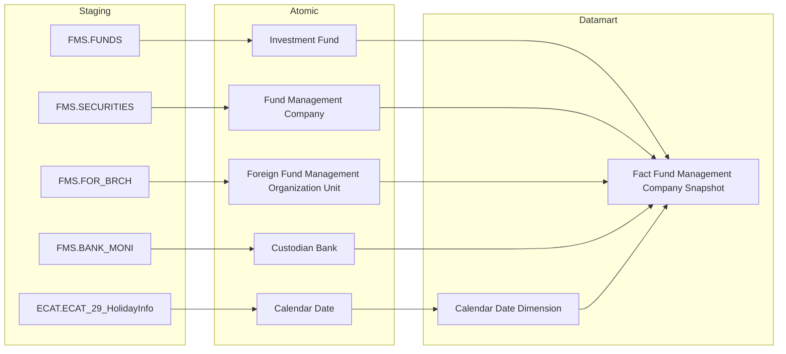
```mermaid
flowchart LR
    subgraph SRC["Staging"]
        FMS_FUNDS["FMS.FUNDS"]
        FMS_SECURITIES["FMS.SECURITIES"]
        FMS_FORBRCH["FMS.FOR_BRCH"]
        FMS_BANKMONI["FMS.BANK_MONI"]
        ECAT_ECAT_29_HolidayInfo["ECAT.ECAT_29_HolidayInfo"]
    end

    subgraph SIL["Atomic"]
        Investment_Fund["Investment Fund"]
        Fund_Management_Company["Fund Management Company"]
        Foreign_Fund_Management_Organization_Unit["Foreign Fund Management Organization Unit"]
        Custodian_Bank["Custodian Bank"]
        Calendar_Date["Calendar Date"]
    end

    subgraph GOLD["Datamart"]
        fct_fnd_mgt_co_snpst["Fact Fund Management Company Snapshot"]
        cdr_dt_dim["Calendar Date Dimension"]
    end

    FMS_FUNDS --> Investment_Fund
    FMS_SECURITIES --> Fund_Management_Company
    FMS_FORBRCH --> Foreign_Fund_Management_Organization_Unit
    FMS_BANKMONI --> Custodian_Bank
    ECAT_ECAT_29_HolidayInfo --> Calendar_Date

    Investment_Fund --> fct_fnd_mgt_co_snpst
    Fund_Management_Company --> fct_fnd_mgt_co_snpst
    Foreign_Fund_Management_Organization_Unit --> fct_fnd_mgt_co_snpst
    Custodian_Bank --> fct_fnd_mgt_co_snpst
    Calendar_Date --> cdr_dt_dim
    cdr_dt_dim --> fct_fnd_mgt_co_snpst
```

---

##### Cụm 1: Danh sách CTQLQ — flat (Tác nghiệp)

Phục vụ Tab TỔNG QUAN CTQLQ — Nhóm 3. Bảng flat `Fund Management Company Profile` — 6/13 chỉ tiêu READY (Thời gian, Tên công ty, Số lượng Quỹ, Xếp loại, CAMEL, Vốn điều lệ); 7 chỉ tiêu còn lại PENDING (Người đại diện theo pháp luật — BA chưa xác nhận cột nguồn đúng; AUM/Thị phần/CAR/Lợi nhuận/Vốn CSH/Số HĐ UTQLDM — engine báo cáo định kỳ, xem O_QLQ_15). **[CẬP NHẬT 2026-09-26]** Bổ sung entity `Member Rating` (Xếp loại/CAMEL) và `Investment Fund` (Số lượng Quỹ); gỡ `Fund Management Company Employee` (Người đại diện hạ về PENDING, không dùng `FMS.TL_PROFILES` như thiết kế cũ).

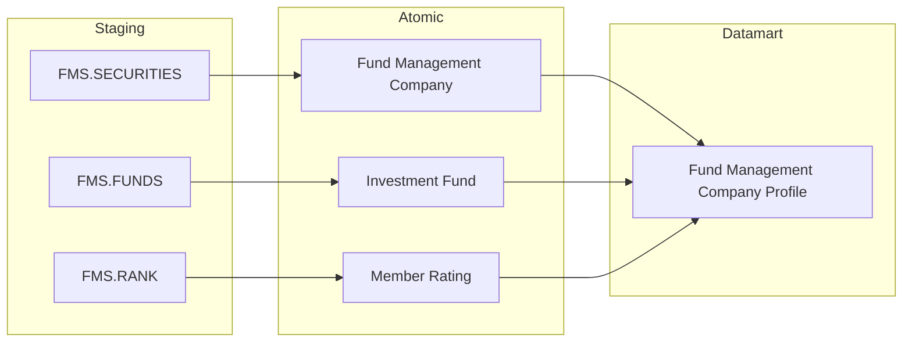
```mermaid
flowchart LR
    subgraph SRC["Staging"]
        FMS_SECURITIES["FMS.SECURITIES"]
        FMS_FUNDS["FMS.FUNDS"]
        FMS_RANK["FMS.RANK"]
    end

    subgraph SIL["Atomic"]
        Fund_Management_Company["Fund Management Company"]
        Investment_Fund["Investment Fund"]
        Member_Rating["Member Rating"]
    end

    subgraph GOLD["Datamart"]
        fnd_mgt_co_prf["Fund Management Company Profile"]
    end

    FMS_SECURITIES --> Fund_Management_Company
    FMS_FUNDS --> Investment_Fund
    FMS_RANK --> Member_Rating

    Fund_Management_Company --> fnd_mgt_co_prf
    Investment_Fund --> fnd_mgt_co_prf
    Member_Rating --> fnd_mgt_co_prf
```

---

##### Cụm 2: Chi tiết Quỹ của một CTQLQ (Tác nghiệp)

Phục vụ Tab TỔNG QUAN CTQLQ — Nhóm 4. Bảng con drill-down `Fund Management Company Fund List` — 2/3 chỉ tiêu READY (Tên quỹ, Loại hình quỹ); Giá trị NAV PENDING (Dữ liệu động).

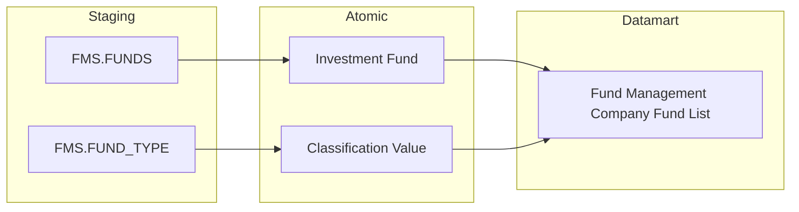
```mermaid
flowchart LR
    subgraph SRC["Staging"]
        FMS_FUNDS["FMS.FUNDS"]
        FMS_FUND_TYPE["FMS.FUND_TYPE"]
    end

    subgraph SIL["Atomic"]
        Investment_Fund["Investment Fund"]
        Classification_Value["Classification Value"]
    end

    subgraph GOLD["Datamart"]
        fnd_mgt_co_fnd_lst["Fund Management Company Fund List"]
    end

    FMS_FUNDS --> Investment_Fund
    FMS_FUND_TYPE --> Classification_Value

    Investment_Fund --> fnd_mgt_co_fnd_lst
    Classification_Value --> fnd_mgt_co_fnd_lst
```

---

> **[CẬP NHẬT 2026-09-26]** `Fund Management Company Contract List` (Nhóm 5) đã gỡ khỏi Section 1 — BA đổi hẳn nguồn sang engine báo cáo định kỳ, cả 3/3 chỉ tiêu nay PENDING (không còn dùng `FMS.INVES_ACC` trực tiếp, xem O_QLQ_5, O_QLQ_14). `Investment Fund Distribution Agent List` (Nhóm 14) cũng gỡ khỏi Section 1 — K_QLQ_103 hạ về PENDING (gap AGENCY_TYPE, xem O_QLQ_9).

##### Cụm 6: Biểu đồ Tổng NAV Quỹ và Tỷ lệ NAV/GDP (`Fact Investment Fund NAV Snapshot`, partial)

Phục vụ Tab QUỸ ĐẦU TƯ — Nhóm 7, tái sử dụng ở Nhóm 8/9 (K_QLQ_44 PENDING ở 2 Nhóm đó vì không có measure NAV độc lập đi kèm). 3/6 chỉ tiêu READY (Thời gian, Loại hình quỹ, GDP); NAV chính (K_QLQ_46/48/49) và toàn bộ Nhóm 8/9 PENDING (engine báo cáo định kỳ, xem O_QLQ_15). GDP **reuse** module PTTT — xem Section 4.

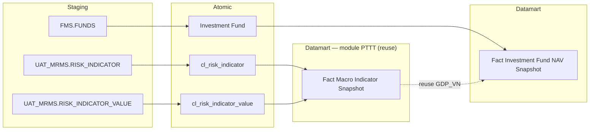
```mermaid
flowchart LR
    subgraph SRC["Staging"]
        FMS_FUNDS["FMS.FUNDS"]
        UAT_MRMS_RISKIND["UAT_MRMS.RISK_INDICATOR"]
        UAT_MRMS_RISKINDVAL["UAT_MRMS.RISK_INDICATOR_VALUE"]
    end

    subgraph SIL["Atomic"]
        Investment_Fund["Investment Fund"]
        cl_risk_indicator["cl_risk_indicator"]
        cl_risk_indicator_value["cl_risk_indicator_value"]
    end

    subgraph GOLD_PTTT["Datamart — module PTTT (reuse)"]
        fct_macro_indicator_snpst["Fact Macro Indicator Snapshot"]
    end

    subgraph GOLD["Datamart"]
        fct_investment_fund_nav_snpst["Fact Investment Fund NAV Snapshot"]
    end

    FMS_FUNDS --> Investment_Fund
    UAT_MRMS_RISKIND --> cl_risk_indicator
    UAT_MRMS_RISKINDVAL --> cl_risk_indicator_value

    Investment_Fund --> fct_investment_fund_nav_snpst
    cl_risk_indicator --> fct_macro_indicator_snpst
    cl_risk_indicator_value --> fct_macro_indicator_snpst
    fct_macro_indicator_snpst -.->|"reuse GDP_VN"| fct_investment_fund_nav_snpst
```

---

##### Cụm 6b: Số lượng quỹ đầu tư chứng khoán (`Fact Investment Fund Count Snapshot`)

Phục vụ Tab QUỸ ĐẦU TƯ — Nhóm 10, tái sử dụng ở Nhóm 6 (K_QLQ_41). Toàn bộ 9/9 (Nhóm 10) + 1/1 (Nhóm 6) chỉ tiêu READY — nguồn trực tiếp `FMS.FUNDS`, không qua engine báo cáo như thiết kế cũ giả định (`FMS.FUND_REPORT`, chưa từng tồn tại).

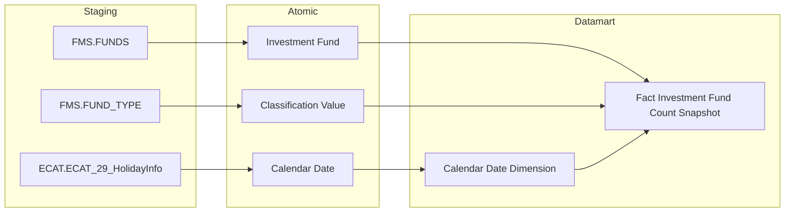
```mermaid
flowchart LR
    subgraph SRC["Staging"]
        FMS_FUNDS["FMS.FUNDS"]
        FMS_FUNDTYPE["FMS.FUND_TYPE"]
        ECAT_ECAT_29_HolidayInfo["ECAT.ECAT_29_HolidayInfo"]
    end

    subgraph SIL["Atomic"]
        Investment_Fund["Investment Fund"]
        Classification_Value["Classification Value"]
        Calendar_Date["Calendar Date"]
    end

    subgraph GOLD["Datamart"]
        fct_investment_fund_cnt_snpst["Fact Investment Fund Count Snapshot"]
        cdr_dt_dim["Calendar Date Dimension"]
    end

    FMS_FUNDS --> Investment_Fund
    FMS_FUNDTYPE --> Classification_Value
    ECAT_ECAT_29_HolidayInfo --> Calendar_Date

    Investment_Fund --> fct_investment_fund_cnt_snpst
    Classification_Value --> fct_investment_fund_cnt_snpst
    Calendar_Date --> cdr_dt_dim
    cdr_dt_dim --> fct_investment_fund_cnt_snpst
```

---

##### Cụm 6c: Tăng trưởng CCQ lưu hành (`Fact Investment Fund CCQ Snapshot`)

Phục vụ Tab QUỸ ĐẦU TƯ — Nhóm 11. Toàn bộ 9/9 chỉ tiêu READY — nguồn trực tiếp `FMS.FUNDS.TOTAL_QTTY`, không qua VSDC/engine báo cáo như thiết kế cũ giả định (xem O_QLQ_7, Closed).

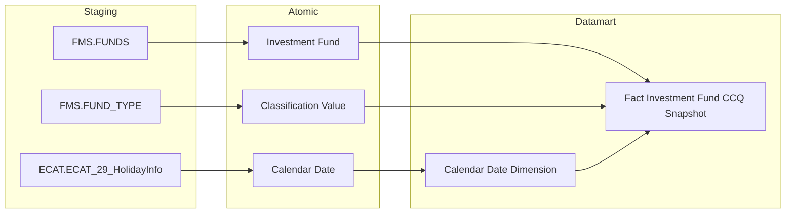
```mermaid
flowchart LR
    subgraph SRC["Staging"]
        FMS_FUNDS["FMS.FUNDS"]
        FMS_FUNDTYPE["FMS.FUND_TYPE"]
        ECAT_ECAT_29_HolidayInfo["ECAT.ECAT_29_HolidayInfo"]
    end

    subgraph SIL["Atomic"]
        Investment_Fund["Investment Fund"]
        Classification_Value["Classification Value"]
        Calendar_Date["Calendar Date"]
    end

    subgraph GOLD["Datamart"]
        fct_investment_fund_ccq_snpst["Fact Investment Fund CCQ Snapshot"]
        cdr_dt_dim["Calendar Date Dimension"]
    end

    FMS_FUNDS --> Investment_Fund
    FMS_FUNDTYPE --> Classification_Value
    ECAT_ECAT_29_HolidayInfo --> Calendar_Date

    Investment_Fund --> fct_investment_fund_ccq_snpst
    Classification_Value --> fct_investment_fund_ccq_snpst
    Calendar_Date --> cdr_dt_dim
    cdr_dt_dim --> fct_investment_fund_ccq_snpst
```

---

##### Cụm 6d: Tỉ lệ tăng trưởng NAV/CCQ so với VN-Index và Lãi suất liên NH (`Fact Investment Fund NAV per CCQ Snapshot`, partial)

Phục vụ Tab QUỸ ĐẦU TƯ — Nhóm 12. 4/15 chỉ tiêu READY (Thời gian, VN-Index, Lãi suất liên NH qua đêm, Loại hình quỹ chi tiết); NAV/CCQ và 9 phân loại chi tiết PENDING (engine báo cáo định kỳ, xem O_QLQ_15). VN-Index **reuse** module GSTT, Lãi suất liên NH **reuse** module PTTT — xem Section 4.

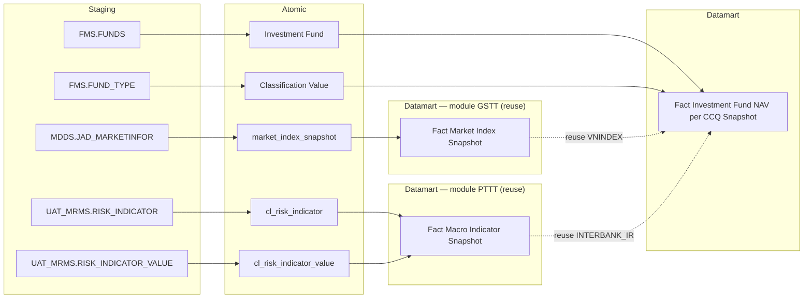
```mermaid
flowchart LR
    subgraph SRC["Staging"]
        FMS_FUNDS["FMS.FUNDS"]
        FMS_FUNDTYPE["FMS.FUND_TYPE"]
        MDDS_JADMARKET["MDDS.JAD_MARKETINFOR"]
        UAT_MRMS_RISKIND["UAT_MRMS.RISK_INDICATOR"]
        UAT_MRMS_RISKINDVAL["UAT_MRMS.RISK_INDICATOR_VALUE"]
    end

    subgraph SIL["Atomic"]
        Investment_Fund["Investment Fund"]
        Classification_Value["Classification Value"]
        market_index_snapshot["market_index_snapshot"]
        cl_risk_indicator["cl_risk_indicator"]
        cl_risk_indicator_value["cl_risk_indicator_value"]
    end

    subgraph GOLD_GSTT["Datamart — module GSTT (reuse)"]
        fct_market_index_snpst["Fact Market Index Snapshot"]
    end

    subgraph GOLD_PTTT["Datamart — module PTTT (reuse)"]
        fct_macro_indicator_snpst["Fact Macro Indicator Snapshot"]
    end

    subgraph GOLD["Datamart"]
        fct_investment_fund_nav_per_ccq_snpst["Fact Investment Fund NAV per CCQ Snapshot"]
    end

    FMS_FUNDS --> Investment_Fund
    FMS_FUNDTYPE --> Classification_Value
    MDDS_JADMARKET --> market_index_snapshot
    UAT_MRMS_RISKIND --> cl_risk_indicator
    UAT_MRMS_RISKINDVAL --> cl_risk_indicator_value

    Investment_Fund --> fct_investment_fund_nav_per_ccq_snpst
    Classification_Value --> fct_investment_fund_nav_per_ccq_snpst
    market_index_snapshot --> fct_market_index_snpst
    cl_risk_indicator --> fct_macro_indicator_snpst
    cl_risk_indicator_value --> fct_macro_indicator_snpst
    fct_market_index_snpst -.->|"reuse VNINDEX"| fct_investment_fund_nav_per_ccq_snpst
    fct_macro_indicator_snpst -.->|"reuse INTERBANK_IR"| fct_investment_fund_nav_per_ccq_snpst
```

---

##### Cụm 8: Danh sách quỹ đầu tư (Tác nghiệp)

Phục vụ Tab QUỸ ĐẦU TƯ — Nhóm 13. Bảng flat `Investment Fund Profile` — 8/11 chỉ tiêu READY (Thời gian, Tên quỹ, Phân loại, Công ty quản lý, Ngân hàng giám sát, Số TV BĐD, Số người điều hành, KL CCQ lưu hành); 3 chỉ tiêu PENDING (Số ĐLPP — thiếu attribute AGENCY_TYPE, xem O_QLQ_9; NAV hiện tại/LN YTD — engine báo cáo định kỳ, xem O_QLQ_15). **[CẬP NHẬT 2026-09-26]** Gỡ entity `Investment Fund X Fund Distribution Agent Relationship` (FMS.AGEN_FUNDS) khỏi diagram — Số ĐLPP (K_QLQ_97) hạ về PENDING; KL CCQ lưu hành (K_QLQ_101) không cần entity mới, đã có sẵn trên `Investment Fund`.

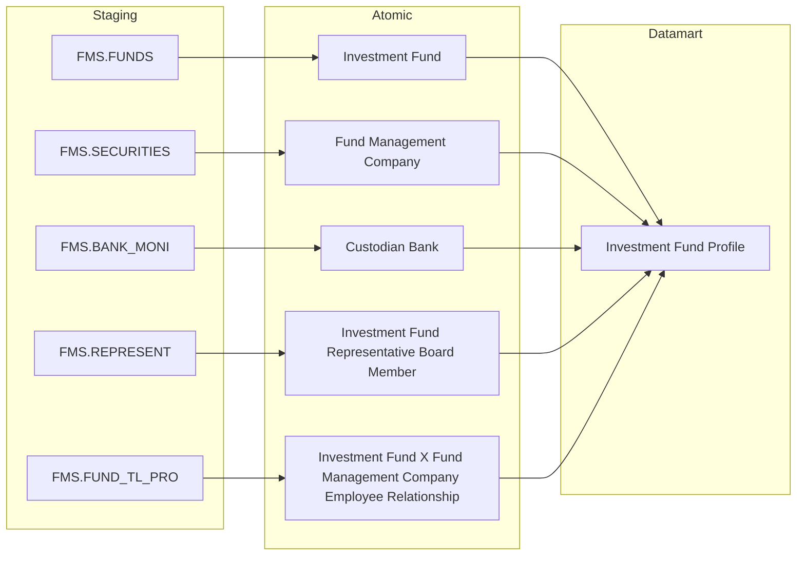
```mermaid
flowchart LR
    subgraph SRC["Staging"]
        FMS_FUNDS["FMS.FUNDS"]
        FMS_SECURITIES["FMS.SECURITIES"]
        FMS_BANKMONI["FMS.BANK_MONI"]
        FMS_REPRESENT["FMS.REPRESENT"]
        FMS_FUNDTLPRO["FMS.FUND_TL_PRO"]
    end

    subgraph SIL["Atomic"]
        Investment_Fund["Investment Fund"]
        Fund_Management_Company["Fund Management Company"]
        Custodian_Bank["Custodian Bank"]
        Investment_Fund_Representative_Board_Member["Investment Fund Representative Board Member"]
        Investment_Fund_X_Fund_Management_Company_Employee_Relationship["Investment Fund X Fund Management Company Employee Relationship"]
    end

    subgraph GOLD["Datamart"]
        inv_fnd_prf["Investment Fund Profile"]
    end

    FMS_FUNDS --> Investment_Fund
    FMS_SECURITIES --> Fund_Management_Company
    FMS_BANKMONI --> Custodian_Bank
    FMS_REPRESENT --> Investment_Fund_Representative_Board_Member
    FMS_FUNDTLPRO --> Investment_Fund_X_Fund_Management_Company_Employee_Relationship

    Investment_Fund --> inv_fnd_prf
    Fund_Management_Company --> inv_fnd_prf
    Custodian_Bank --> inv_fnd_prf
    Investment_Fund_Representative_Board_Member --> inv_fnd_prf
    Investment_Fund_X_Fund_Management_Company_Employee_Relationship --> inv_fnd_prf
```

---

> **[CẬP NHẬT 2026-09-26]** `Investment Fund Distribution Agent List` (Nhóm 14) đã gỡ khỏi Section 1 — K_QLQ_103 hạ về PENDING (cùng gap AGENCY_TYPE với K_QLQ_97/Nhóm 13, xem O_QLQ_9).

##### Cụm 9: Drill-down danh sách thành viên ban đại diện của quỹ (Tác nghiệp)

Phục vụ Tab QUỸ ĐẦU TƯ — Nhóm 15. Bảng con drill-down từ Nhóm 13, 1 chỉ tiêu READY.

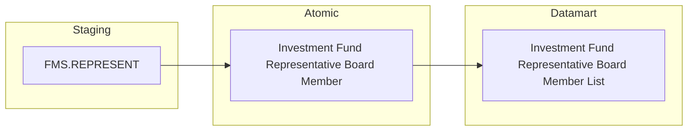
```mermaid
flowchart LR
    subgraph SRC["Staging"]
        FMS_REPRESENT["FMS.REPRESENT"]
    end

    subgraph SIL["Atomic"]
        Investment_Fund_Representative_Board_Member["Investment Fund Representative Board Member"]
    end

    subgraph GOLD["Datamart"]
        inv_fnd_rep_brd_mbr_lst["Investment Fund Representative Board Member List"]
    end

    FMS_REPRESENT --> Investment_Fund_Representative_Board_Member

    Investment_Fund_Representative_Board_Member --> inv_fnd_rep_brd_mbr_lst
```

---

##### Cụm 10: Drill-down danh sách người điều hành quỹ (Tác nghiệp)

Phục vụ Tab QUỸ ĐẦU TƯ — Nhóm 16. Bảng con drill-down từ Nhóm 13, 1 chỉ tiêu READY.

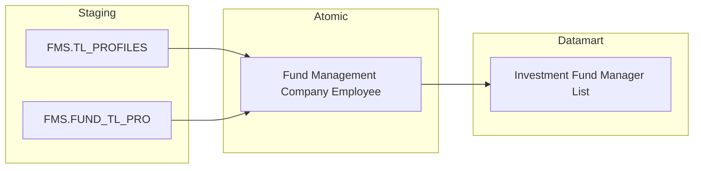
```mermaid
flowchart LR
    subgraph SRC["Staging"]
        FMS_TLPROFILES["FMS.TL_PROFILES"]
        FMS_FUNDTLPRO["FMS.FUND_TL_PRO"]
    end

    subgraph SIL["Atomic"]
        Fund_Management_Company_Employee["Fund Management Company Employee"]
    end

    subgraph GOLD["Datamart"]
        inv_fnd_mgr_lst["Investment Fund Manager List"]
    end

    FMS_TLPROFILES --> Fund_Management_Company_Employee
    FMS_FUNDTLPRO --> Fund_Management_Company_Employee

    Fund_Management_Company_Employee --> inv_fnd_mgr_lst
```

---

##### Cụm 11: Thống kê chung Đại lý phân phối (`Fact Fund Distribution Agent Snapshot`)

Phục vụ Tab TỔNG QUAN ĐẠI LÝ PHÂN PHỐI — Nhóm 17. 2/5 chỉ tiêu READY: Chiều Thời gian và Số lượng ĐLPP (COUNT db). Số tài khoản/Giá trị phát hành/mua lại PENDING (engine báo cáo định kỳ, xem O_QLQ_15). **[CẬP NHẬT 2026-09-26]** Sửa lại nguồn: BA hiện hành dùng `FMS.DISTRIBUTOR_AGENT` (entity `Securities Distribution Agent`), không phải `FMS.AGENCIES` (`Fund Distribution Agent`) như thiết kế cũ — xem O_QLQ_10 (khả năng trùng nghiệp vụ, chưa xác nhận). Chiều Thời gian lấy từ shared entity `Involved Party Alternative Identification` (`identification_issue_dt` WHERE `identification_tp_code = 'OPERATION_LICENSE'`).

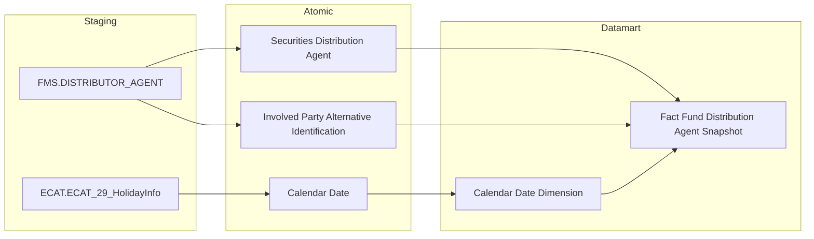
```mermaid
flowchart LR
    subgraph SRC["Staging"]
        FMS_DISTRIBUTORAGENT["FMS.DISTRIBUTOR_AGENT"]
        ECAT_ECAT_29_HolidayInfo["ECAT.ECAT_29_HolidayInfo"]
    end

    subgraph SIL["Atomic"]
        Securities_Distribution_Agent["Securities Distribution Agent"]
        Involved_Party_Alternative_Identification["Involved Party Alternative Identification"]
        Calendar_Date["Calendar Date"]
    end

    subgraph GOLD["Datamart"]
        fct_fnd_dist_agt_snpst["Fact Fund Distribution Agent Snapshot"]
        cdr_dt_dim["Calendar Date Dimension"]
    end

    FMS_DISTRIBUTORAGENT --> Securities_Distribution_Agent
    FMS_DISTRIBUTORAGENT --> Involved_Party_Alternative_Identification
    ECAT_ECAT_29_HolidayInfo --> Calendar_Date

    Securities_Distribution_Agent --> fct_fnd_dist_agt_snpst
    Involved_Party_Alternative_Identification --> fct_fnd_dist_agt_snpst
    Calendar_Date --> cdr_dt_dim
    cdr_dt_dim --> fct_fnd_dist_agt_snpst
```

---

##### Cụm 12: Danh sách Đại lý phân phối (Tác nghiệp)

Phục vụ Tab TỔNG QUAN ĐẠI LÝ PHÂN PHỐI — Nhóm 22. Bảng flat `Fund Distribution Agent Profile` — 7/22 chỉ tiêu READY. **[CẬP NHẬT 2026-09-26]** Sửa lại nguồn: BA hiện hành dùng `FMS.DISTRIBUTOR_AGENT` (entity `Securities Distribution Agent`), không phải `FMS.AGENCIES` — cùng phát hiện với Nhóm 17 (xem O_QLQ_10). Số GP/Ngày cấp GP và Địa chỉ nằm ở 2 shared entity `Involved Party Alternative Identification`/`Involved Party Postal Address`, cả 2 đã READY.

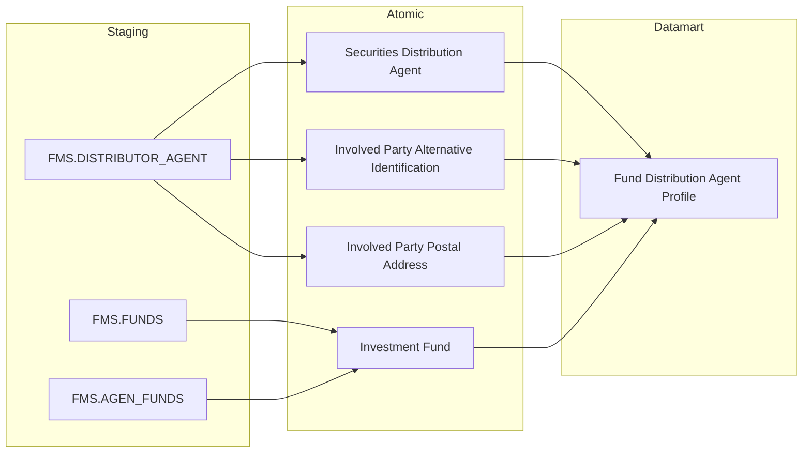
```mermaid
flowchart LR
    subgraph SRC["Staging"]
        FMS_DISTRIBUTORAGENT["FMS.DISTRIBUTOR_AGENT"]
        FMS_FUNDS["FMS.FUNDS"]
        FMS_AGENFUNDS["FMS.AGEN_FUNDS"]
    end

    subgraph SIL["Atomic"]
        Securities_Distribution_Agent["Securities Distribution Agent"]
        Involved_Party_Alternative_Identification["Involved Party Alternative Identification"]
        Involved_Party_Postal_Address["Involved Party Postal Address"]
        Investment_Fund["Investment Fund"]
    end

    subgraph GOLD["Datamart"]
        fnd_dist_agt_prf["Fund Distribution Agent Profile"]
    end

    FMS_DISTRIBUTORAGENT --> Securities_Distribution_Agent
    FMS_DISTRIBUTORAGENT --> Involved_Party_Alternative_Identification
    FMS_DISTRIBUTORAGENT --> Involved_Party_Postal_Address
    FMS_FUNDS --> Investment_Fund
    FMS_AGENFUNDS --> Investment_Fund

    Securities_Distribution_Agent --> fnd_dist_agt_prf
    Involved_Party_Alternative_Identification --> fnd_dist_agt_prf
    Involved_Party_Postal_Address --> fnd_dist_agt_prf
    Investment_Fund --> fnd_dist_agt_prf
```

---

##### Cụm 13: Danh sách các Quỹ đang phân phối (Tác nghiệp)

Phục vụ Tab TỔNG QUAN ĐẠI LÝ PHÂN PHỐI — Nhóm 23. Bảng con drill-down `Fund Distribution Agent Fund List` — 1 chỉ tiêu READY.

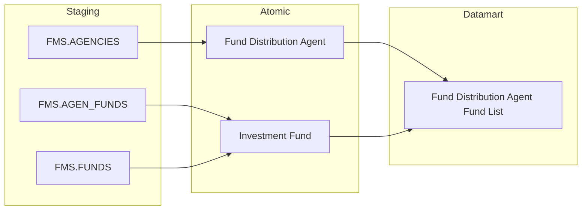
```mermaid
flowchart LR
    subgraph SRC["Staging"]
        FMS_AGENCIES["FMS.AGENCIES"]
        FMS_AGENFUNDS["FMS.AGEN_FUNDS"]
        FMS_FUNDS["FMS.FUNDS"]
    end

    subgraph SIL["Atomic"]
        Fund_Distribution_Agent["Fund Distribution Agent"]
        Investment_Fund["Investment Fund"]
    end

    subgraph GOLD["Datamart"]
        fnd_dist_agt_fnd_lst["Fund Distribution Agent Fund List"]
    end

    FMS_AGENCIES --> Fund_Distribution_Agent
    FMS_AGENFUNDS --> Investment_Fund
    FMS_FUNDS --> Investment_Fund

    Fund_Distribution_Agent --> fnd_dist_agt_fnd_lst
    Investment_Fund --> fnd_dist_agt_fnd_lst
```

---

##### Cụm 14: Thống kê chung CN CTQLQ nước ngoài tại VN (`Fact Foreign Fund Management Organization Unit Snapshot`)

Phục vụ Tab TỔNG QUAN CN CTQLQ NN TẠI VN — Nhóm 24. Fact Market-Level Snapshot — 2 measure READY (Chiều Thời gian, đếm CN).

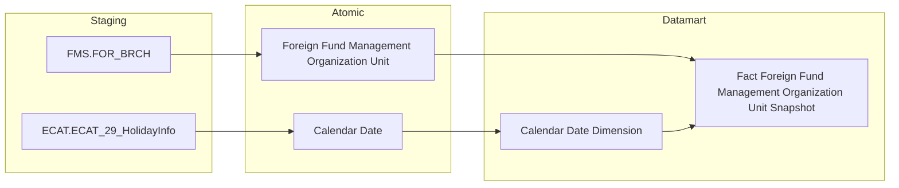
```mermaid
flowchart LR
    subgraph SRC["Staging"]
        FMS_FORBRCH["FMS.FOR_BRCH"]
        ECAT_ECAT_29_HolidayInfo["ECAT.ECAT_29_HolidayInfo"]
    end

    subgraph SIL["Atomic"]
        Foreign_Fund_Management_Organization_Unit["Foreign Fund Management Organization Unit"]
        Calendar_Date["Calendar Date"]
    end

    subgraph GOLD["Datamart"]
        fct_frgn_fnd_mgt_org_unit_snpst["Fact Foreign Fund Management Organization Unit Snapshot"]
        cdr_dt_dim["Calendar Date Dimension"]
    end

    FMS_FORBRCH --> Foreign_Fund_Management_Organization_Unit
    ECAT_ECAT_29_HolidayInfo --> Calendar_Date

    Foreign_Fund_Management_Organization_Unit --> fct_frgn_fnd_mgt_org_unit_snpst
    Calendar_Date --> cdr_dt_dim
    cdr_dt_dim --> fct_frgn_fnd_mgt_org_unit_snpst
```

---

##### Cụm 15: Danh sách CN CTQLQ nước ngoài tại VN (Tác nghiệp)

Phục vụ Tab TỔNG QUAN CN CTQLQ NN TẠI VN — Nhóm 26 (11 dòng BA, gồm cả popup Mockup (b) "Chi tiết hợp đồng UTQLDM" — cùng STT=26, không tách Nhóm riêng, xem `O_QLQ_20`). Bảng flat `Foreign Fund Management Organization Unit Profile` — 3/8 chỉ tiêu READY (Chiều Thời gian, Tên CN, Giám đốc CN); popup `Foreign Fund Management Organization Unit Contract List` PENDING toàn bộ (3 chỉ tiêu). **[SỬA 2026-09-28]** Số nhân viên CCHN (K_QLQ_174) hạ về PENDING — BA đổi nguồn sang engine báo cáo định kỳ (trước đây COUNT trực tiếp `Foreign Fund Management Organization Unit Staff`). **Đã sửa lại nhận định sai 2026-09-26** cho rằng BA tách 1 Nhóm 27 riêng cho popup này — thực tế không có STT=27 nào cho UTQLDM (xem Nhóm 26 ở Section 2).

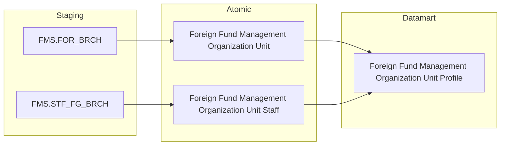
```mermaid
flowchart LR
    subgraph SRC["Staging"]
        FMS_FORBRCH["FMS.FOR_BRCH"]
        FMS_STFFGBRCH["FMS.STF_FG_BRCH"]
    end

    subgraph SIL["Atomic"]
        Foreign_Fund_Management_Organization_Unit["Foreign Fund Management Organization Unit"]
        Foreign_Fund_Management_Organization_Unit_Staff["Foreign Fund Management Organization Unit Staff"]
    end

    subgraph GOLD["Datamart"]
        frgn_fnd_mgt_org_unit_prf["Foreign Fund Management Organization Unit Profile"]
    end

    FMS_FORBRCH --> Foreign_Fund_Management_Organization_Unit
    FMS_STFFGBRCH --> Foreign_Fund_Management_Organization_Unit_Staff

    Foreign_Fund_Management_Organization_Unit --> frgn_fnd_mgt_org_unit_prf
    Foreign_Fund_Management_Organization_Unit_Staff --> frgn_fnd_mgt_org_unit_prf
```

---

## Section 2 — Tổng quan báo cáo

### Tab: TỔNG QUAN CTQLQ

**Slicer chung:** Tháng/Năm (ví dụ: "THÁNG 5 — 2024")

---

#### Nhóm 1 - Thống kê chung

> Phân loại: **Phân tích**
> Atomic: `Investment Fund` ← FMS.FUNDS — READY
> Atomic: `Fund Management Company` ← FMS.SECURITIES — READY (Classification Value `operation_status_code`, scheme `FMS_OPERATION_STATUS`)
> Atomic: `Foreign Fund Management Organization Unit` ← FMS.FOR_BRCH — READY (Classification Value `operation_status_code`, scheme `FMS_OPERATION_STATUS`)
> Atomic: `Custodian Bank` ← FMS.BANK_MONI — READY
> **[CẬP NHẬT 2026-09-26 — gỡ gating "Dữ liệu động" sai]** Toàn bộ Nhóm này trước đây PENDING chỉ vì áp dụng quy tắc "BA đánh Dữ liệu động → PENDING dù Atomic đã sẵn sàng" — quy tắc này đã bị xác nhận SAI (xem `feedback_ignore_ba_column_z.md`: "Loại dữ liệu" không phải lý do PENDING hợp lệ). Đối chiếu lại BA hiện hành (`BA_analyst_FMS.csv` dòng 4-14): 6/11 chỉ tiêu có Atomic đầy đủ → nâng READY. K_QLQ_3/4/7 vẫn PENDING — BA hiện hành cho thấy nguồn thật của cả 3 dòng này là engine báo cáo định kỳ EAV `FMS_UAT.RPT_TEMP/SHEET/RPT_VALUES/RPT_MEMBER/RPT_PERIOD` (K_QLQ_3 BA đã đổi nguồn khỏi giả định cũ "Discretionary Investment Account/FMS.INVES_ACC" — không còn dùng bảng INVES_ACC trực tiếp; xem O_QLQ_15, đã đổi tên khỏi giả định cũ `FMS.FUND_REPORT`). BA note lặp lại nhiều dòng RPT: *"HTTT báo dữ liệu từ bảng không đúng --> nên lấy từ báo cáo"* — xác nhận đây là chủ đích của BA (không phải có thể lách qua bằng cột trực tiếp trên FUNDS/SECURITIES/INVES_ACC), giữ PENDING đúng.

**Bảng KPI:**

| KPI ID | Tên KPI | Đơn vị | Tính chất | Công thức | Ghi chú | Trạng thái |
|---|---|---|---|---|---|---|
| K_QLQ_1 | Thời gian | — | Chiều | `Snapshot_Date_Dimension_Id` → `cdr_dt_dim` (grain tháng) — lọc theo `fund_management_company.actual_operation_commencement_dt`/`suspension_dt`/`effective_end_dt` khi tính các COUNT bên dưới | Chiều slicer chung cho Nhóm — nay có ý nghĩa vì đã có measure READY đi kèm | READY |
| K_QLQ_2 | Quỹ đầu tư chứng khoán | Quỹ | Cơ sở | `COUNT(investment_fund.investment_fund_id)` WHERE quỹ đang hoạt động tại tháng snapshot (theo `investment_fund` SCD4A hiệu lực tại kỳ) | Investment Fund đã READY — công thức tương đương K_QLQ_40 (Nhóm 6), 2 dòng BA cùng 1 measure (BA đánh "Trùng"), giữ 1 KPI_ID | READY |
| K_QLQ_3 | Hợp đồng UTDM | Hợp đồng | Cơ sở | | **Lý do pending:** BA đã đổi nguồn — nay là engine báo cáo định kỳ `FMS_UAT.RPT_TEMP/SHEET/RPT_VALUES/RPT_MEMBER/RPT_PERIOD` (Mapping báo cáo đầu vào: Báo cáo tình hình hoạt động của CTQLQ >> HDQuanLyDanhMucDauTu_06015 >> Tổng (I+II)), không còn dùng `FMS.INVES_ACC` trực tiếp như thiết kế cũ giả định. **Atomic cần bổ sung:** entity cho engine báo cáo định kỳ FMS (đề xuất tên: FMC Periodic Report Value — xem O_QLQ_15). **Mart dự kiến:** `Fact Fund Management Company Snapshot`. | PENDING |
| K_QLQ_4 | Tổng AUM quản lý | Nghìn tỷ VND | Cơ sở | | **Lý do pending:** nguồn thật là engine báo cáo định kỳ `FMS_UAT.RPT_TEMP/SHEET/RPT_VALUES/RPT_MEMBER/RPT_PERIOD` (BA note: "HTTT báo dữ liệu từ bảng không đúng --> nên lấy từ báo cáo"), không phải cột trực tiếp trên FUNDS/SECURITIES. **Atomic cần bổ sung:** như K_QLQ_3. **Mart dự kiến:** `Fact Fund Management Company Snapshot`. | PENDING |
| K_QLQ_5 | CTQLQ đang hoạt động | Công ty | Cơ sở | `COUNT(fund_management_company.fmc_id)` WHERE `fund_management_company.operation_status_code` (JOIN `cl_value` scheme `FMS_OPERATION_STATUS`) = 'Hoạt động' | Xác nhận Atomic có FK Classification Value sẵn trên `fund_management_company` (nguồn `FMS.SECURITIES.STATUS_ID`) — đủ điều kiện READY | READY |
| K_QLQ_6 | VPĐD QLQ nước ngoài tại VN | Văn phòng | Cơ sở | `COUNT(foreign_fm_ou.foreign_fm_ou_id)` WHERE `foreign_fm_ou.branch_tp_code` = 0 (Branch_Flag) AND hiệu lực tại tháng snapshot | Foreign Fund Management Organization Unit đã READY | READY |
| K_QLQ_7 | Số lượng hợp đồng tư vấn đầu tư | Hợp đồng | Cơ sở | | **Lý do pending:** BA nay đã bổ sung nguồn (trước đây để trống) — nguồn thật là engine báo cáo định kỳ `FMS_UAT.RPT_TEMP/SHEET/RPT_VALUES/RPT_MEMBER/RPT_PERIOD` (Mapping báo cáo đầu vào: Báo cáo tình hình hoạt động của CTQLQ >> HDTuVanDauTuCK_06016 >> Tổng (I+II)). **Atomic cần bổ sung:** như K_QLQ_3. **Mart dự kiến:** `Fact Fund Management Company Snapshot`. | PENDING |
| K_QLQ_8 | VPĐD CTQLQ NN tại VN đang hoạt động | Văn phòng | Cơ sở | `COUNT(foreign_fm_ou.foreign_fm_ou_id)` WHERE `branch_tp_code` = 0 AND `operation_status_code` (JOIN `cl_value` scheme `FMS_OPERATION_STATUS`) = 'Hoạt động' | Cùng Classification Value scheme với K_QLQ_5 | READY |
| K_QLQ_9 | VPĐD CTQLQ NN tại VN đang chờ đóng cửa | Văn phòng | Cơ sở | `COUNT(foreign_fm_ou.foreign_fm_ou_id)` WHERE `branch_tp_code` = 0 AND `operation_status_code` LIKE '%chờ đóng cửa%' | Cùng Classification Value scheme với K_QLQ_5 | READY |
| K_QLQ_10 | VPĐD CTQLQ NN tại VN đã đóng cửa | Văn phòng | Cơ sở | `COUNT(foreign_fm_ou.foreign_fm_ou_id)` WHERE `branch_tp_code` = 0 AND `operation_status_code` NOT LIKE '%chờ%' AND `operation_status_code` LIKE '%đóng cửa%'/'%chấm dứt%'/'%giải thể%' | Cùng Classification Value scheme với K_QLQ_5 | READY |
| K_QLQ_11 | Tổng số ngân hàng giám sát | Ngân hàng | Cơ sở | `COUNT(custodian_bank.custodian_bank_id)` WHERE hiệu lực tại tháng snapshot | Custodian Bank đã READY | READY |

**Bảng mapping nguồn:**

| Tên KPI | Bảng nguồn (BA) | Atomic entity | Atomic table |
|---|---|---|---|
| K_QLQ_2, K_QLQ_40 (Nhóm 6, reuse) | FMS_UAT.FUNDS | Investment Fund | investment_fund |
| K_QLQ_5, K_QLQ_8, K_QLQ_9, K_QLQ_10 | FMS_UAT.SECURITIES / FMS_UAT.FOR_BRCH | Fund Management Company / Foreign Fund Management Organization Unit | fund_management_company / foreign_fm_ou |
| K_QLQ_6 | FMS_UAT.FOR_BRCH | Foreign Fund Management Organization Unit | foreign_fm_ou |
| K_QLQ_3, K_QLQ_4, K_QLQ_7 | FMS_UAT.RPT_TEMP FMS_UAT.SHEET FMS_UAT.RPT_VALUES FMS_UAT.RPT_MEMBER FMS_UAT.RPT_PERIOD | FMC Periodic Report Value *(chưa có Atomic entity)* | TBD |
| K_QLQ_11 | FMS_UAT.BANK_MONI | Custodian Bank | custodian_bank |

---

#### Nhóm 2 - Số liệu hợp đồng uỷ thác danh mục

> Phân loại: **Phân tích**
> **[CẬP NHẬT 2026-09-26]** Toàn bộ Nhóm vẫn PENDING, nhưng lý do đã đổi: thiết kế cũ giả định nguồn là `Discretionary Investment Account` (FMS.INVES_ACC, đã READY) và chỉ PENDING vì gating "Dữ liệu động" sai (xem `feedback_ignore_ba_column_z.md`). BA hiện hành (`BA_analyst_FMS.csv` dòng 15-21) đã đổi nguồn thật sang engine báo cáo định kỳ EAV `FMS_UAT.RPT_TEMP/SHEET/RPT_VALUES/RPT_MEMBER/RPT_PERIOD` (Mapping báo cáo đầu vào: Báo cáo về tình hình quản lý danh mục đầu tư >> Chung_TinhHinhQLDMDT_06020) cho cả 7/7 chỉ tiêu — không còn dùng `FMS.INVES_ACC` trực tiếp. BA note lặp lại: *"HTTT báo dữ liệu từ bảng không đúng --> nên lấy từ báo cáo"*. Atomic entity cho engine báo cáo định kỳ FMS chưa tồn tại (xem O_QLQ_15) → giữ PENDING đúng, nhưng vì lý do khác thiết kế cũ.

**Bảng KPI:**

| KPI ID | Tên KPI | Đơn vị | Tính chất | Công thức | Ghi chú | Trạng thái |
|---|---|---|---|---|---|---|
| K_QLQ_12 | Thời gian | — | Chiều | | **Lý do pending:** Nhóm không còn measure nào READY. Nguồn thời gian nay là `RPT_MEMBER.PERIOD_TYPE/PERIOD_VALUE/YEAR_VALUE` (engine báo cáo định kỳ), không phải cột ngày trực tiếp. **Atomic cần bổ sung:** entity cho engine báo cáo định kỳ FMS (xem O_QLQ_15). **Mart dự kiến:** `Fact Discretionary Investment Contract Snapshot` — grain: 1 CTQLQ × 1 tháng. | PENDING |
| K_QLQ_13 | Số lượng hợp đồng UTDM cá nhân | HĐ | Cơ sở | | **Lý do pending:** BA đã đổi nguồn — nay là engine báo cáo định kỳ (Mapping báo cáo đầu vào: Chung_TinhHinhQLDMDT_06020 >> Tổng số HĐ ủy thác đầu tư đang thực hiện >> Cá nhân), không còn dùng `FMS.INVES_ACC` trực tiếp như thiết kế cũ giả định. **Atomic cần bổ sung:** như K_QLQ_12. **Mart dự kiến:** `Fact Discretionary Investment Contract Snapshot`. | PENDING |
| K_QLQ_14 | Giá trị thị trường hợp đồng UTDM cá nhân | Tỷ VND | Cơ sở | | **Lý do pending:** Tương tự K_QLQ_13 — Mapping báo cáo đầu vào: Tổng giá trị thị trường các HĐ ủy thác đầu tư (VND) >> Cá nhân. **Atomic cần bổ sung:** như K_QLQ_12. **Mart dự kiến:** `Fact Discretionary Investment Contract Snapshot`. | PENDING |
| K_QLQ_15 | Số lượng hợp đồng UTDM tổ chức | HĐ | Cơ sở | | **Lý do pending:** Tương tự K_QLQ_13, nhánh Tổ chức. **Atomic cần bổ sung:** như K_QLQ_12. **Mart dự kiến:** `Fact Discretionary Investment Contract Snapshot`. | PENDING |
| K_QLQ_16 | Giá trị thị trường hợp đồng UTDM tổ chức | Tỷ VND | Cơ sở | | **Lý do pending:** Tương tự K_QLQ_14, nhánh Tổ chức. **Atomic cần bổ sung:** như K_QLQ_12. **Mart dự kiến:** `Fact Discretionary Investment Contract Snapshot`. | PENDING |
| K_QLQ_17 | Tổng số lượng hợp đồng UTDM | HĐ | Cơ sở | | **Lý do pending:** BA đã đổi nguồn — Mapping báo cáo đầu vào: Tổng số HĐ ủy thác đầu tư đang thực hiện (không tách cá nhân/tổ chức). **Atomic cần bổ sung:** như K_QLQ_12. **Mart dự kiến:** `Fact Discretionary Investment Contract Snapshot`. | PENDING |
| K_QLQ_18 | Tổng giá trị ủy thác | Tỷ VND | Cơ sở | | **Lý do pending:** Tương tự K_QLQ_17 — Mapping báo cáo đầu vào: Tổng giá trị thị trường các HĐ ủy thác đầu tư (VND), không tách cá nhân/tổ chức. **Atomic cần bổ sung:** như K_QLQ_12. **Mart dự kiến:** `Fact Discretionary Investment Contract Snapshot`. | PENDING |

**Bảng mapping nguồn:**

| Tên KPI | Bảng nguồn (BA) | Atomic entity | Atomic table |
|---|---|---|---|
| K_QLQ_12–18 | FMS_UAT.RPT_TEMP FMS_UAT.SHEET FMS_UAT.RPT_VALUES FMS_UAT.RPT_MEMBER FMS_UAT.RPT_PERIOD | FMC Periodic Report Value *(chưa có Atomic entity — cùng gap với K_QLQ_3/4/7, xem O_QLQ_15)* | TBD |

---

#### Nhóm 3 - Danh sách các Công ty quản lý quỹ

> Phân loại: **Tác nghiệp**
> Atomic: `Fund Management Company` ← FMS.SECURITIES — READY (Classification Value, Charter Capital, Actual Operation Commencement Date)
> Atomic: `Investment Fund` ← FMS.FUNDS — READY (COUNT theo fmc_id)
> Atomic: `Member Rating` ← FMS.RANK — READY (rank_index, total_score_amt)
> Atomic: `Discretionary Investment Account` ← FMS.INVES_ACC (draft, Nguồn 2), 2 tầng JOIN qua `Discretionary Investment Investor` ← FMS.INVES — READY (COUNT theo fmc_id, xem Nhóm 5)
> **[CẬP NHẬT 2026-09-26]** Rà lại toàn bộ Nhóm theo BA hiện hành + gỡ gating "Dữ liệu động" sai (xem `feedback_ignore_ba_column_z.md`):
> - **Nâng READY (5 chỉ tiêu):** K_QLQ_19 (Thời gian), K_QLQ_23 (Số lượng Quỹ), K_QLQ_24 (Xếp loại), K_QLQ_25 (CAMEL), K_QLQ_26 (Vốn điều lệ) — Atomic đã sẵn sàng, không còn blocker thật.
> - **HẠ xuống PENDING (1 chỉ tiêu, khác hướng thông thường):** K_QLQ_21 (Người đại diện theo pháp luật) — thiết kế cũ giả định READY từ `Fund Management Company Employee.Item_Name` (FMS.TL_PROFILES), nhưng BA hiện hành (dòng 24) đánh **Trạng thái mapping = Pending**, Note: *"Chưa có cách lấy đúng, đang chờ cf từ Tinh Vân"* — BA tự nhận chưa xác định được cột nguồn đáng tin cậy cho "người đại diện theo pháp luật" (khác Director/Deputy Director đã có trên `fund_management_company`, không chắc trùng vai trò pháp lý). Tôn trọng đánh giá của BA, không giữ READY theo giả định cũ.
> - **Giữ PENDING, sửa lại lý do đúng (5 chỉ tiêu):** K_QLQ_22/27/28/30 dùng engine báo cáo định kỳ EAV `FMS_UAT.RPT_TEMP/SHEET/RPT_VALUES/RPT_MEMBER/RPT_PERIOD` (không phải giả định cũ `FMS.SECURITIES_REPORT`, entity đó chưa từng tồn tại — xem O_QLQ_15). K_QLQ_29 (CAR) và K_QLQ_31 (Vốn CSH) BA nay **đã cung cấp nguồn** (Báo cáo tỷ lệ an toàn tài chính / Báo cáo tài chính — BangCanDoiKeToan), cũng qua engine RPT, không còn "BA chưa cung cấp Bảng nguồn" như thiết kế cũ.
> - **[SỬA LẠI 2026-09-28] Nâng READY (1 chỉ tiêu):** K_QLQ_32 (Số lượng hợp đồng UTQLDM) — ghi chú trước đây (2026-09-26) khẳng định "BA đã đổi nguồn khỏi FMS.INVES_ACC sang engine báo cáo định kỳ, cùng mẫu hình với Nhóm 2" là **SAI**, cùng dạng lỗi phân loại nhầm đã ghi ở `O_QLQ_22`. Đối chiếu lại BA thật (`BA_analyst_FMS.csv` dòng 39, Nhóm 5) xác nhận nguồn vẫn là `FMSQLQ.INVES_ACC.CONTRACT_NO`, không đổi. Chuỗi FK từng bị nghi thiếu (`discretionary_investment_account` → Fund Management Company) nay đã xác nhận đủ qua `discretionary_investment_investor.fmc_id` (2 tầng JOIN, xem Nhóm 5) — chuyển READY, đếm theo cùng nguồn `discretionary_investment_account` dùng ở Nhóm 5.

**Mockup:**

| Mã | Tên CT | Người đại diện | Số nhân viên CCHN | Số lượng Quỹ | Xếp loại | CAMEL | Vốn điều lệ | AUM | Thị phần | CAR | Lợi nhuận | Vốn CSH | Số HĐ UTQLDM |
|---|---|---|---|---|---|---|---|---|---|---|---|---|---|
| CT1 | Công ty ABC | Nguyễn Văn A | 12 | 5 | A | 89.5% | 150 | 25.450 | 8.2% | 18.5% | 120.4 | 165 | 350 |

**Source:** `Fund Management Company Profile`

**Bảng KPI:**

| KPI ID | Tên KPI | Đơn vị | Tính chất | Công thức | Ghi chú | Trạng thái |
|---|---|---|---|---|---|---|
| K_QLQ_19 | Thời gian | — | Chiều | `Snapshot_Date_Dimension_Id` → `cdr_dt_dim` (grain tháng) — lọc `fund_management_company.actual_operation_commencement_dt` <= cuối tháng AND (`suspension_dt`/`effective_end_dt` IS NULL) | Nay có ý nghĩa vì Nhóm đã có nhiều measure READY | READY |
| K_QLQ_20 | Tên công ty | — | Cơ sở | `fmc_full_nm`, `fmc_short_nm` ← Fund Management Company | | READY |
| K_QLQ_21 | Người đại diện theo pháp luật | — | Cơ sở | | **Lý do pending:** BA đánh Trạng thái mapping = Pending (dòng 24 BA), Note: "Chưa có cách lấy đúng, đang chờ cf từ Tinh Vân". Không dùng `fund_management_company.director_full_nm`/`deputy_director_full_nm` thay thế vì chưa xác nhận vai trò Director trùng vai trò pháp lý "Người đại diện theo pháp luật". **Atomic cần bổ sung:** không xác định — chờ BA/Tinh Vân xác nhận cột nguồn đúng. **Mart dự kiến:** `Fund Management Company Profile`. | PENDING |
| K_QLQ_22 | Số lượng nhân viên có CCHN | Người | Cơ sở | | **Lý do pending:** nguồn thật là engine báo cáo định kỳ `FMS_UAT.RPT_TEMP/SHEET/RPT_VALUES/RPT_MEMBER/RPT_PERIOD` (Mapping báo cáo đầu vào: Báo cáo tình hình hoạt động của CTQLQ >> CoCauToChuc_06018). **Atomic cần bổ sung:** entity cho engine báo cáo định kỳ FMS (xem O_QLQ_15). **Mart dự kiến:** `Fund Management Company Profile`. | PENDING |
| K_QLQ_23 | Số lượng Quỹ | Quỹ | Cơ sở | `COUNT(investment_fund.investment_fund_id)` WHERE `investment_fund.fmc_id` = CTQLQ hiện tại AND hiệu lực tại tháng snapshot | Investment Fund đã READY | READY |
| K_QLQ_24 | Xếp loại | — | Cơ sở | `member_rating.rank_index` WHERE `member_rating.fmc_id` = CTQLQ, lấy kỳ xếp hạng gần nhất (bán niên/năm) tính đến tháng snapshot | Member Rating đã READY — cần xác nhận LLD cách lấy "kỳ gần nhất" (`rating_period_tp_code`/`data_dt` MAX) | READY |
| K_QLQ_25 | CAMEL | % | Cơ sở | `member_rating.total_score_amt` WHERE `member_rating.fmc_id` = CTQLQ, cùng kỳ xếp hạng với K_QLQ_24 | Member Rating đã READY | READY |
| K_QLQ_26 | Vốn điều lệ | Tỷ VND | Cơ sở | `fund_management_company.charter_capital_amt` | Fund Management Company đã READY | READY |
| K_QLQ_27 | AUM | Tỷ VND | Cơ sở | | **Lý do pending:** nguồn thật là engine báo cáo định kỳ `FMS_UAT.RPT_TEMP/SHEET/RPT_VALUES/RPT_MEMBER/RPT_PERIOD` (Mapping báo cáo đầu vào: Báo cáo tình hình hoạt động của CTQLQ >> HDQuanLyQuy_06014 >> Tổng giá trị tài sản ròng). **Atomic cần bổ sung:** như K_QLQ_22. **Mart dự kiến:** `Fund Management Company Profile`. | PENDING |
| K_QLQ_28 | Thị phần | % | Phái sinh | | **Lý do pending:** phụ thuộc K_QLQ_27 (AUM, PENDING) — Thị phần = AUM CTQLQ / Tổng AUM thị trường × 100%. **Atomic cần bổ sung:** như K_QLQ_22. **Mart dự kiến:** `Fund Management Company Profile`. | PENDING |
| K_QLQ_29 | CAR (ATTC) | % | Cơ sở | | **Lý do pending:** BA nay đã bổ sung nguồn (trước đây để trống) — nguồn thật là engine báo cáo định kỳ (Mapping báo cáo đầu vào: Báo cáo tỷ lệ an toàn tài chính >> BangTongHop_06013 >> Tỷ lệ vốn khả dụng). **Atomic cần bổ sung:** như K_QLQ_22. **Mart dự kiến:** `Fund Management Company Profile`. | PENDING |
| K_QLQ_30 | Lợi nhuận | Tỷ VND | Cơ sở | | **Lý do pending:** nguồn thật là engine báo cáo định kỳ (Mapping báo cáo đầu vào: Báo cáo tài chính >> BCKetQuaHoatDongKinhDoanh >> Lợi nhuận sau thuế TNDN). **Atomic cần bổ sung:** như K_QLQ_22. **Mart dự kiến:** `Fund Management Company Profile`. | PENDING |
| K_QLQ_31 | Vốn CSH | Tỷ VND | Cơ sở | | **Lý do pending:** BA nay đã bổ sung nguồn (trước đây để trống) — nguồn thật là engine báo cáo định kỳ (Mapping báo cáo đầu vào: Báo cáo tài chính >> BangCanDoiKeToan >> B - VỐN CHỦ SỞ HỮU). **Atomic cần bổ sung:** như K_QLQ_22. **Mart dự kiến:** `Fund Management Company Profile`. | PENDING |
| K_QLQ_32 | Số lượng hợp đồng UTQLDM | HĐ | Cơ sở | `COUNT(discretionary_investment_account.discretionary_investment_account_id)` JOIN `discretionary_investment_investor` ON `discretionary_investment_investor.discretionary_investment_investor_id = discretionary_investment_account.discretionary_investment_investor_id` WHERE `discretionary_investment_investor.fmc_id` = CTQLQ hiện tại | **[SỬA LẠI 2026-09-28]** Xem ghi chú Nhóm — Discretionary Investment Account đã READY, 2 tầng JOIN qua Discretionary Investment Investor đã xác nhận đủ FK tới Fund Management Company (xem Nhóm 5) | READY |

**Bảng mapping nguồn:**

| Tên KPI | Bảng nguồn (BA) | Atomic entity | Atomic table |
|---|---|---|---|
| K_QLQ_20, K_QLQ_26 | FMS_UAT.SECURITIES | Fund Management Company | fund_management_company |
| K_QLQ_23 | FMS_UAT.FUNDS | Investment Fund | investment_fund |
| K_QLQ_24, K_QLQ_25 | FMS_UAT."RANK" | Member Rating | member_rating |
| K_QLQ_32 | FMS_UAT.INVES_ACC (qua FMS_UAT.INVES) | Discretionary Investment Account | discretionary_investment_account |
| K_QLQ_22, 27, 28, 29, 30, 31 | FMS_UAT.RPT_TEMP FMS_UAT.SHEET FMS_UAT.RPT_VALUES FMS_UAT.RPT_MEMBER FMS_UAT.RPT_PERIOD | FMC Periodic Report Value *(chưa có Atomic entity)* | TBD |
| K_QLQ_21 | *(BA Pending — chờ Tinh Vân)* | TBD | TBD |

**Schema bảng tác nghiệp — Fund Management Company Profile:**

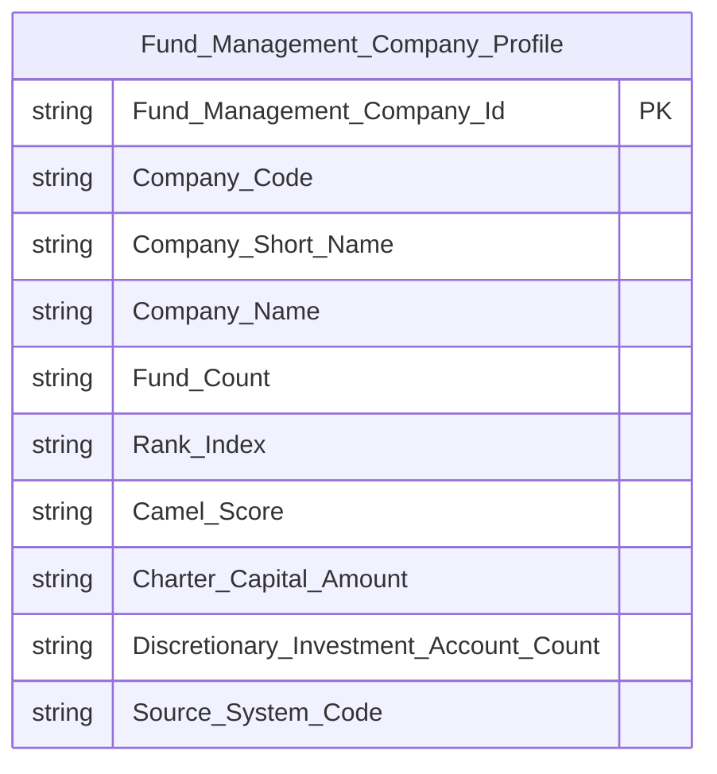
```mermaid
erDiagram
    Fund_Management_Company_Profile {
        string Fund_Management_Company_Id PK
        string Company_Code
        string Company_Short_Name
        string Company_Name
        string Fund_Count
        string Rank_Index
        string Camel_Score
        string Charter_Capital_Amount
        string Discretionary_Investment_Account_Count
        string Source_System_Code
    }
```

> 7/13 cột READY đưa vào schema (Tên CT, Số lượng Quỹ, Xếp loại, CAMEL, Vốn điều lệ, Số HĐ UTQLDM + Chiều Thời gian) — 6 cột còn lại PENDING (Người đại diện, Số NV CCHN, AUM, Thị phần, CAR, Lợi nhuận, Vốn CSH), sẽ bổ sung vào schema khi chuyển READY. **[CẬP NHẬT 2026-09-26]** `Legal_Representative_Name` đã gỡ khỏi schema (K_QLQ_21 hạ về PENDING). **[SỬA LẠI 2026-09-28]** `Discretionary_Investment_Account_Count` thêm vào schema (K_QLQ_32 nâng READY).

**Lineage Mart → Báo cáo:**

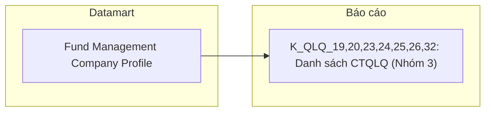
```mermaid
flowchart LR
    subgraph GOLD["Datamart"]
        G1["Fund Management Company Profile"]
    end
    subgraph RPT["Báo cáo"]
        R1["K_QLQ_19,20,23,24,25,26,32: Danh sách CTQLQ (Nhóm 3)"]
    end
    G1 --> R1
```

**Bảng grain:**

| Tên bảng | Grain |
|---|---|
| Fund Management Company Profile | Tác nghiệp — bảng flat \| 1 CTQLQ × 1 tháng slicer |

---

#### Nhóm 4 - Chi tiết Quỹ của một CTQLQ

> Phân loại: **Tác nghiệp**
> Atomic: `Investment Fund` ← FMS.FUNDS — READY *(K_QLQ_33: Tên quỹ, K_QLQ_34: Loại hình quỹ, K_QLQ_35: Giá trị NAV)*
> Ghi chú: Popup drill-down khi bấm vào Số lượng Quỹ ở Nhóm 3 — FK về `Fund_Management_Company_Id`. Loại hình quỹ là Classification Value (scheme `FMS_FUND_TYPE`) → reuse `cl_dim`, không tạo Dimension riêng. **[SỬA 2026-09-28 — hoàn tác nhận định sai 2026-09-26]** Ghi chú trước đây khẳng định K_QLQ_35 lấy từ engine báo cáo định kỳ (BCTaiSan >> Tài sản ròng) — xác minh lại BA (dòng 38) cho thấy `Bảng nguồn = FMSQLQ.FUNDS`, `Trường nguồn = FUNDS.NAV` trực tiếp, và Atomic `investment_fund` đã có `net_asset_val_amt` (Nguồn 1) — cùng phát hiện với Nhóm 6 (xem ghi chú Nhóm đó). K_QLQ_35 nâng READY.

**Mockup — popup "DANH SÁCH QUỸ":**

| Mã quỹ | Tên quỹ | Loại hình quỹ | NAV (tỷ) |
|---|---|---|---|
| QA1 | Quỹ ABC Cổ phần | Quỹ mở | 1.250 |

**Source:** `Fund Management Company Fund List`

**Bảng KPI:**

| KPI ID | Tên KPI | Đơn vị | Tính chất | Công thức | Ghi chú | Trạng thái |
|---|---|---|---|---|---|---|
| K_QLQ_33 | Tên quỹ | — | Cơ sở | `investment_fund.investment_fund_full_nm` | | READY |
| K_QLQ_34 | Loại hình quỹ | — | Cơ sở | `investment_fund.fund_tp_code` JOIN `cl_value` scheme `FMS_FUND_TYPE` | reuse `cl_dim` — xem Lớp 2 Reuse Analysis | READY |
| K_QLQ_35 | Giá trị NAV của từng quỹ của CTQLQ | Tỷ VND | Cơ sở | `investment_fund.net_asset_val_amt` | **[SỬA 2026-09-28]** Nâng READY — xem ghi chú Nhóm. Không lọc `TRUNC(LAST_DAY(FUNDS.DEC_DATE))` như Câu lệnh tham khảo BA (bảng Active-only), luôn hiển thị trạng thái hiện tại | READY |

**Schema bảng con — Fund Management Company Fund List:**

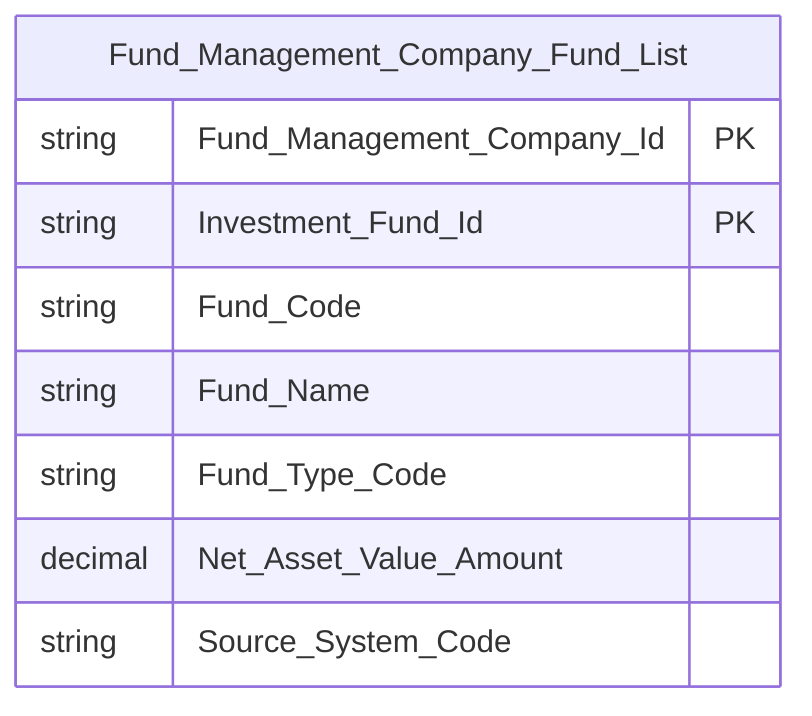
```mermaid
erDiagram
    Fund_Management_Company_Fund_List {
        string Fund_Management_Company_Id PK
        string Investment_Fund_Id PK
        string Fund_Code
        string Fund_Name
        string Fund_Type_Code
        decimal Net_Asset_Value_Amount
        string Source_System_Code
    }
```

**Lineage Mart → Báo cáo:**

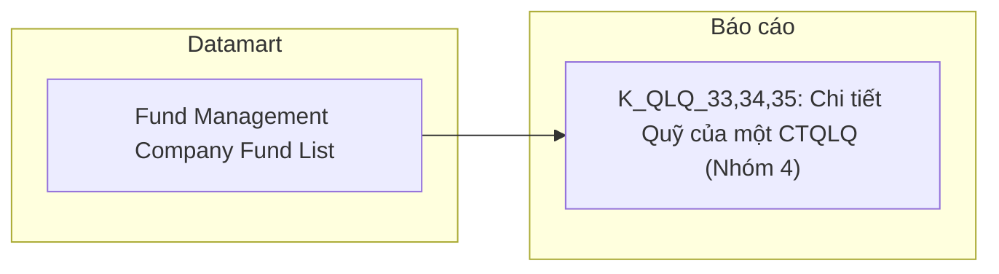
```mermaid
flowchart LR
    subgraph GOLD["Datamart"]
        G1["Fund Management Company Fund List"]
    end
    subgraph RPT["Báo cáo"]
        R1["K_QLQ_33,34,35: Chi tiết Quỹ của một CTQLQ (Nhóm 4)"]
    end
    G1 --> R1
```

**Bảng grain:**

| Tên bảng | Grain |
|---|---|
| Fund Management Company Fund List | Tác nghiệp — bảng con drill-down \| 1 quỹ × 1 CTQLQ × 1 tháng slicer |

**Bảng mapping nguồn:**

| Tên KPI | Bảng nguồn (BA) | Atomic entity | Atomic table |
|---|---|---|---|
| K_QLQ_33, K_QLQ_34, K_QLQ_35 | FMS_UAT.FUNDS | Investment Fund | investment_fund |

---

#### Nhóm 5 - Chi tiết các hợp đồng UTDM của CTQLQ

> Phân loại: **Tác nghiệp**
> Atomic: `Discretionary Investment Account` ← FMS.INVES_ACC (draft, Nguồn 2) — READY *(K_QLQ_36: Mã số hợp đồng UTQLDM, K_QLQ_37: Số tài khoản lưu ký, K_QLQ_38: Giá trị của từng hợp đồng UTDM)*
> Ghi chú: Popup drill-down khi bấm vào Số lượng hợp đồng UTQLDM ở Nhóm 3 (K_QLQ_32). **[SỬA LẠI 2026-09-28]** Ghi chú "[CẬP NHẬT 2026-09-26]" trước đây khẳng định BA đã đổi K_QLQ_36 từ "Mã số hợp đồng UTQLDM" sang "Tên khách hàng" và chuyển cả 3 chỉ tiêu sang engine báo cáo định kỳ — **đối chiếu lại trực tiếp `BRD/BA/BA_analyst_FMS.csv` (dòng 39-41, cả cột Note đều rỗng) và `git log` (file không đổi từ commit `f955fb39`, 2026-09-03) cho thấy khẳng định đó SAI**: BA hiện hành vẫn giữ nguyên "Mã số hợp đồng UTQLDM"/"Số tài khoản lưu ký"/"Giá trị của từng hợp đồng UTDM", nguồn thật vẫn là `FMSQLQ.INVES_ACC` (CONTRACT_NO/ACCOUNT/LIST_VALUE) như thiết kế gốc — cùng dạng lỗi phân loại nhầm đã ghi ở O_QLQ_22 (PENDING nhầm sang engine báo cáo trong khi có Bảng nguồn/Trường nguồn cụ thể), nhưng ở đây còn thêm chi tiết bịa một nội dung đổi tên KPI chưa từng xảy ra. Đồng thời đã xác nhận được chuỗi FK còn thiếu ở K_QLQ_32 (Nhóm 3, `O_QLQ_21`... xem O_QLQ_22): `discretionary_investment_account.discretionary_investment_investor_id` → `discretionary_investment_investor.discretionary_investment_investor_id`, và `discretionary_investment_investor` đã có sẵn FK trực tiếp `fmc_id` → `fund_management_company` (nguồn Atomic 1, `dm_atm_discretionary_investment_investor-FMS.INVES.yaml`) — nên cả Nhóm 5 chuyển READY, và K_QLQ_32 (Nhóm 3) cũng sẽ được nâng READY cùng đợt. **Mockup gốc ghi tiêu đề cột "Tên khách hàng"** nhưng BA không có chỉ tiêu tên khách hàng nào trong Nhóm này (3 chỉ tiêu Done đều là Mã HĐ/STK/Giá trị) — giữ nguyên mockup làm tham chiếu lịch sử, thiết kế theo đúng 3 chỉ tiêu BA thật (xem `O_QLQ_23` mới).

**Mockup — popup "DANH SÁCH HĐ UTDM":**

| Tên khách hàng | Số TK lưu ký | Giá trị (tỷ) |
|---|---|---|
| Nguyễn Văn A | 001C123456 | 25.4 |

**Source:** `Fund Management Company Contract List`

**Bảng KPI:**

| KPI ID | Tên KPI | Đơn vị | Tính chất | Công thức | Ghi chú | Trạng thái |
|---|---|---|---|---|---|---|
| K_QLQ_36 | Mã số hợp đồng UTQLDM | — | Cơ sở | `discretionary_investment_account.contract_nbr` | | READY |
| K_QLQ_37 | Số tài khoản lưu ký | — | Cơ sở | `discretionary_investment_account.account_nbr` | | READY |
| K_QLQ_38 | Giá trị của từng hợp đồng UTDM của CTQLQ | Tỷ VND | Cơ sở | `discretionary_investment_account.portfolio_val_amt` | Bảng Active-only — không lọc `TRUNC(LAST_DAY(INVES_ACC.DATE_REPORT))` như Câu lệnh tham khảo BA, luôn hiển thị trạng thái hiện tại | READY |

**Schema bảng con — Fund Management Company Contract List:**

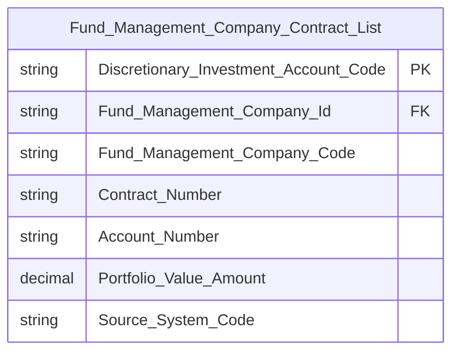
```mermaid
erDiagram
    Fund_Management_Company_Contract_List {
        string Discretionary_Investment_Account_Code PK
        string Fund_Management_Company_Id FK
        string Fund_Management_Company_Code
        string Contract_Number
        string Account_Number
        decimal Portfolio_Value_Amount
        string Source_System_Code
    }
```

**Lineage Mart → Báo cáo:**

```mermaid
flowchart LR
    subgraph SRC["FMS"]
        S1["INVES_ACC"]
        S2["INVES"]
    end
    subgraph SIL["Atomic"]
        A1["discretionary_investment_account"]
        A2["discretionary_investment_investor"]
    end
    subgraph GOLD["Datamart"]
        G1["Fund Management Company Contract List"]
    end
    subgraph RPT["Báo cáo"]
        R1["K_QLQ_36,37,38: Chi tiết HĐ UTDM của CTQLQ (Nhóm 5)"]
    end
    S1 --> A1
    S2 --> A2
    A1 --> G1
    A2 -.FK fmc_id.-> G1
    G1 --> R1
```

**Bảng grain:**

| Tên bảng | Grain |
|---|---|
| Fund Management Company Contract List | Tác nghiệp — bảng con drill-down \| 1 hợp đồng UTDM (Discretionary Investment Account) × 1 CTQLQ |

**Bảng mapping nguồn:**

| Tên KPI | Bảng nguồn (BA) | Atomic entity | Atomic table |
|---|---|---|---|
| K_QLQ_36, K_QLQ_37, K_QLQ_38 | FMSQLQ.INVES_ACC | Discretionary Investment Account | discretionary_investment_account |
| (FK CTQLQ) | FMSQLQ.INVES | Discretionary Investment Investor | discretionary_investment_investor |

---

### Tab: QUỸ ĐẦU TƯ

**Slicer chung:** Tháng/Năm (tháng slicer); một số nhóm có thêm slicer Từ tháng / Đến tháng

---

#### Nhóm 6 - Thống kê chung của QĐT

> Phân loại: **Phân tích**
> Atomic: `Investment Fund` ← FMS.FUNDS — READY (Classification Value `fund_tp_code`, scheme `FMS_FUND_TYPE`; `net_asset_val_amt` — NAV trực tiếp)
> **[CẬP NHẬT 2026-09-26 — gỡ gating "Dữ liệu động" sai]** 3/5 chỉ tiêu nâng READY (K_QLQ_39/40/41) — Atomic đã sẵn sàng, gating cũ là lý do duy nhất giữ PENDING.
> **[SỬA 2026-09-28 — hoàn tác nhận định sai về K_QLQ_42/43]** Ghi chú trước đây khẳng định "BA hiện hành lấy từ engine báo cáo định kỳ (BCTaiSan >> Tài sản ròng)" — xác minh lại trực tiếp BA (dòng 45-46) cho thấy `Bảng nguồn = FMSQLQ.FUNDS`, `Trường nguồn = FUNDS.NAV` (không phải RPT engine), và Atomic `investment_fund` **đã có** `net_asset_val_amt` (FMS.FUNDS.NAV) ngay từ Nguồn 1 (`dm_atm_investment_fund-FMS.FUNDS.yaml`) — nhận định PENDING trước đây sai, cùng dạng lỗi phân loại nhầm đã ghi ở O_QLQ_22/O_QLQ_5. K_QLQ_42/43 nâng READY. **Cùng gap đã biết:** không lọc được `TRUNC(LAST_DAY(FUNDS.ID_DATE))` (cột chưa có trong Atomic, cùng gap với K_QLQ_2/40); trạng thái "hoạt động" dùng literal TBD (chưa xác minh mã FMS.STATUS vật lý). **Cảnh báo cho Nhóm khác:** cùng thuộc tính `net_asset_val_amt` này có thể ảnh hưởng Nhóm 4 (K_QLQ_35), Nhóm 7-9 (NAV core), Nhóm 12 (NAV/CCQ core) — cần đối chiếu lại BA `--with-sql` từng Nhóm đó khi Phase 2 xử lý tới, không mặc định giữ PENDING theo ghi chú cũ.

**Bảng KPI:**

| KPI ID | Tên KPI | Đơn vị | Tính chất | Công thức | Ghi chú | Trạng thái |
|---|---|---|---|---|---|---|
| K_QLQ_39 | Thời gian | — | Chiều | `Snapshot_Date_Dimension_Id` → `cdr_dt_dim` (grain tháng) — lọc `investment_fund` hiệu lực tại tháng snapshot | Nay có ý nghĩa vì đã có measure READY đi kèm | READY |
| K_QLQ_40 | Tổng số lượng QĐT | Quỹ | Cơ sở | `COUNT(investment_fund.investment_fund_id)` WHERE hiệu lực tại tháng snapshot | Trùng với K_QLQ_2 (Nhóm 1) — cùng 1 measure, BA đánh "Trùng", giữ 1 KPI_ID dùng chung | READY |
| K_QLQ_41 | Số lượng quỹ theo từng loại hình quỹ | Quỹ | Cơ sở | `COUNT(investment_fund.investment_fund_id)` WHERE hiệu lực tại tháng snapshot, GROUP BY `investment_fund.fund_tp_code` (JOIN `cl_value` scheme `FMS_FUND_TYPE`) | Investment Fund + Classification Value đã READY | READY |
| K_QLQ_42 | Tổng giá trị NAV | Tỷ VND | Cơ sở | `SUM(investment_fund.net_asset_val_amt)` WHERE hiệu lực tại tháng snapshot | **[SỬA 2026-09-28]** Nâng READY — xem ghi chú Nhóm. Đặt trên `Fact Fund Management Company Snapshot` (song song `Investment Fund Count`) | READY |
| K_QLQ_43 | Tổng giá trị NAV của từng loại hình quỹ | Tỷ VND | Cơ sở | `SUM(investment_fund.net_asset_val_amt)` WHERE hiệu lực tại tháng snapshot, GROUP BY `investment_fund.fund_tp_code` | **[SỬA 2026-09-28]** Nâng READY — xem ghi chú Nhóm. Đặt trên `Fact Investment Fund Count Snapshot` (song song `Fund Count`, cùng grain) | READY |

**Bảng mapping nguồn:**

| Tên KPI | Bảng nguồn (BA) | Atomic entity | Atomic table |
|---|---|---|---|
| K_QLQ_39, K_QLQ_40, K_QLQ_41, K_QLQ_42, K_QLQ_43 | FMS_UAT.FUNDS, FMS_UAT.FUND_TYPE, FMS_UAT.STATUS | Investment Fund | investment_fund |

---

#### Nhóm 7 - Biểu đồ Tổng NAV Quỹ và Tỷ lệ NAV/GDP

> Phân loại: **Phân tích**
> Atomic: `Investment Fund` ← FMS.FUNDS — READY (Classification Value `fund_tp_code`, scheme `FMS_FUND_TYPE`)
> Atomic: `cl_risk_indicator` / `cl_risk_indicator_value` ← MRMS.RISK_INDICATOR / RISK_INDICATOR_VALUE — READY (đã ở track chuẩn `DataModel/Atomic/Common/`, KHÔNG chỉ có ở `Atomic_LinhLV` như thiết kế cũ giả định)
> **[CẬP NHẬT 2026-09-26]** 3/6 chỉ tiêu nâng READY:
> - **K_QLQ_47 (GDP):** thiết kế cũ cho rằng `Risk Indicator Value` chỉ tồn tại ở track cá nhân lỗi thời `DataModel/working/Atomic_LinhLV/` — **sai**, entity `cl_risk_indicator`/`cl_risk_indicator_value` đã có ở track chuẩn `DataModel/Atomic/Common/` (`dm_atm_cl_risk_indicator-MRMS.RISK_INDICATOR.yaml`). Hơn nữa module PTTT đã xây sẵn `Fact Macro Indicator Snapshot` (`fct_macro_indicator_snpst`) đúng filter `macro_indicator_code = 'GDP_VN'` khớp 100% với SQL BA — **reuse trực tiếp**, không cần bảng mới.
> - **K_QLQ_44 (Thời gian), K_QLQ_45 (Loại hình quỹ):** gỡ gating "Dữ liệu động" sai (xem `feedback_ignore_ba_column_z.md`) — Investment Fund/Classification Value đã sẵn sàng.
> **[SỬA 2026-09-28 — sửa lý do PENDING của K_QLQ_46/48/49, KHÔNG nâng READY]** Ghi chú trước đây gộp K46/48/49 vào O_QLQ_15 (engine EAV `RPT_TEMP/SHEET/RPT_VALUES/RPT_MEMBER/RPT_PERIOD`) — xác minh lại `ba_slice.py --with-sql` (dòng 49) cho thấy `Bảng nguồn` thật là **`FMSQLQ.FUND_REPORT`** (`FUND_REPORT.NAV`, `FUND_REPORT.EXCUTION_DATE`, filter `PERIOD_TYPE = 3`) — một bảng cụ thể, KHÔNG phải hệ EAV 5 bảng trừu tượng, cùng dạng lỗi phân loại nhầm đã ghi ở O_QLQ_22. `FMSQLQ.FUND_REPORT` **chưa có Atomic entity** (grep `dm_manifest.yaml`/`lld/manifest.yaml` không thấy) nên K_QLQ_46/48/49 **vẫn đúng là PENDING** — chỉ sửa lại lý do, không nâng READY. Lưu ý: `FUND_REPORT` là bảng báo cáo định kỳ theo quý (`PERIOD_TYPE = 3`, filter khoảng tháng `BETWEEN :filter_frmonth AND :filter_tomonth`) — khác hẳn `FUNDS.NAV` (giá trị hiện tại, dùng ở Nhóm 4/6) vì cần dữ liệu chuỗi thời gian lịch sử cho biểu đồ, `FUNDS` (bảng live, Active-only) không lưu lịch sử NAV theo tháng. Xem `O_QLQ_24` (đã cập nhật).

**Bảng KPI:**

| KPI ID | Tên KPI | Đơn vị | Tính chất | Công thức | Ghi chú | Trạng thái |
|---|---|---|---|---|---|---|
| K_QLQ_44 | Thời gian | — | Chiều | `Snapshot_Date_Dimension_Id` → `cdr_dt_dim` (grain tháng) | Chiều slicer chung cho biểu đồ — phục vụ đường GDP (reuse) và Loại hình quỹ; đường NAV vẫn PENDING | READY |
| K_QLQ_45 | Loại hình quỹ | — | Chiều | `investment_fund.fund_tp_code` JOIN `cl_value` scheme `FMS_FUND_TYPE` | Investment Fund đã READY | READY |
| K_QLQ_46 | Tổng NAV của quỹ | Tỷ VND | Cơ sở | | **[SỬA 2026-09-28] Lý do pending (đã sửa):** nguồn thật là `FMSQLQ.FUND_REPORT.NAV` (báo cáo định kỳ quý, `PERIOD_TYPE = 3`) — một bảng cụ thể, KHÔNG phải hệ EAV RPT_TEMP/SHEET/RPT_VALUES trừu tượng như ghi trước. `FMSQLQ.FUND_REPORT` chưa có Atomic entity. **Mart dự kiến:** `Fact Investment Fund NAV Snapshot`. | PENDING |
| K_QLQ_47 | GDP | Nghìn tỷ VND | Cơ sở | `cl_risk_indicator_value.val` WHERE `cl_risk_indicator.cl_risk_ind_code = 'GDP_VN'` — **reuse** `Fact Macro Indicator Snapshot` (module PTTT), filter `macro_indicator_code = 'GDP_VN'` | Atomic đã ở track chuẩn (Common/), không phải chỉ Atomic_LinhLV như ghi trước đây. Reuse xuyên module PTTT — xem Section 4 | READY |
| K_QLQ_48 | Tỷ lệ NAV/GDP | % | Phái sinh | | **Lý do pending:** phụ thuộc K_QLQ_46 (NAV, PENDING) — Tỷ lệ = K_QLQ_46 / K_QLQ_47 × 100%; mẫu số (GDP) đã READY nhưng tử số (NAV) chưa. **Atomic cần bổ sung:** như K_QLQ_46 (`FMSQLQ.FUND_REPORT`). **Mart dự kiến:** `Fact Investment Fund NAV Snapshot`. | PENDING |
| K_QLQ_49 | Tổng NAV của từng loại hình quỹ | Tỷ VND | Phái sinh | | **[SỬA 2026-09-28] Lý do pending (đã sửa):** cùng nguồn `FMSQLQ.FUND_REPORT.NAV` như K_QLQ_46, GROUP BY loại hình quỹ. **Atomic cần bổ sung:** như K_QLQ_46. **Mart dự kiến:** `Fact Investment Fund NAV Snapshot`. | PENDING |

**Bảng mapping nguồn:**

| Tên KPI | Bảng nguồn (BA) | Atomic entity | Atomic table |
|---|---|---|---|
| K_QLQ_44, K_QLQ_45 | FMS_UAT.FUNDS, FMS_UAT.FUND_TYPE | Investment Fund | investment_fund |
| K_QLQ_47 | UAT_MRMS.RISK_INDICATOR, UAT_MRMS.RISK_INDICATOR_VALUE | cl_risk_indicator / cl_risk_indicator_value (reuse `fct_macro_indicator_snpst`, module PTTT) | cl_risk_indicator / cl_risk_indicator_value |
| K_QLQ_46, K_QLQ_48, K_QLQ_49 | FMSQLQ.FUND_REPORT | FMC Periodic Fund Report *(chưa có Atomic entity)* | TBD |

---

#### Nhóm 8 - Biểu đồ Phân bổ tài sản của Quỹ đầu tư

> Phân loại: **Phân tích**
> **[SỬA 2026-09-28 — sửa lý do PENDING, KHÔNG nâng READY]** Vẫn PENDING toàn bộ — không có chỉ tiêu nào lên READY được (khác Nhóm 7, vốn có Loại hình quỹ/GDP độc lập với NAV). Ghi chú trước đây (2026-09-26) khẳng định nguồn là engine EAV `RPT_TEMP/SHEET/RPT_VALUES/RPT_MEMBER/RPT_PERIOD` — xác minh lại `ba_slice.py --with-sql` (dòng 53-59) cho thấy `Bảng nguồn` thật là **`FMSQLQ.FUND_REPORT`** cụ thể (cột `PROP_PUBLIC_STOCK`/`PROP_PRIVATE_STOCK`/`PROP_BONDS`/`PROP_MONEY`/`PROP_OTHER_STOCK`/`PROP_OTHER_PROPERTY`) — cùng bảng với Nhóm 7 (K_QLQ_46/48/49), không phải hệ EAV trừu tượng, cùng dạng lỗi phân loại nhầm đã ghi ở O_QLQ_22/O_QLQ_24. `FMSQLQ.FUND_REPORT` chưa có Atomic entity nên toàn bộ Nhóm **vẫn đúng là PENDING** — chỉ sửa lại lý do.

**Bảng KPI:**

| KPI ID | Tên KPI | Đơn vị | Tính chất | Công thức | Ghi chú | Trạng thái |
|---|---|---|---|---|---|---|
| K_QLQ_44 | Thời gian | — | Chiều | | **Lý do pending:** Reuse KPI_ID từ Nhóm 7 (nay đã READY ở đó vì có Loại hình quỹ/GDP độc lập) — nhưng trong Nhóm 8, không còn measure nào READY đi kèm (toàn bộ 6 chỉ tiêu phân bổ tài sản PENDING) nên Chiều không có ý nghĩa hiển thị độc lập tại Nhóm này. **[SỬA 2026-09-28]** Atomic cần bổ sung: `FMSQLQ.FUND_REPORT` (bảng cụ thể, xem ghi chú Nhóm — không phải hệ EAV). **Mart dự kiến:** `Fact Investment Fund NAV Snapshot`. | PENDING |
| K_QLQ_50 | Cổ phiếu niêm yết | Tỷ VND | Phái sinh | | **[SỬA 2026-09-28] Lý do pending (đã sửa):** nguồn thật là `FMSQLQ.FUND_REPORT.PROP_PUBLIC_STOCK` — bảng cụ thể, chưa có Atomic entity (xem ghi chú Nhóm). **Mart dự kiến:** `Fact Investment Fund NAV Snapshot`. | PENDING |
| K_QLQ_51 | Cổ phiếu chưa niêm yết | Tỷ VND | Phái sinh | | **[SỬA 2026-09-28]** Tương tự K_QLQ_50 — nguồn `FMSQLQ.FUND_REPORT.PROP_PRIVATE_STOCK`. **Mart dự kiến:** `Fact Investment Fund NAV Snapshot`. | PENDING |
| K_QLQ_52 | Trái phiếu | Tỷ VND | Phái sinh | | **[SỬA 2026-09-28]** Tương tự K_QLQ_50 — nguồn `FMSQLQ.FUND_REPORT.PROP_BONDS`. **Mart dự kiến:** `Fact Investment Fund NAV Snapshot`. | PENDING |
| K_QLQ_53 | Tiền | Tỷ VND | Phái sinh | | **[SỬA 2026-09-28]** Tương tự K_QLQ_50 — nguồn `FMSQLQ.FUND_REPORT.PROP_MONEY`. **Mart dự kiến:** `Fact Investment Fund NAV Snapshot`. | PENDING |
| K_QLQ_54 | Các loại chứng khoán khác | Tỷ VND | Phái sinh | | **[SỬA 2026-09-28]** Tương tự K_QLQ_50 — nguồn `FMSQLQ.FUND_REPORT.PROP_OTHER_STOCK`. **Mart dự kiến:** `Fact Investment Fund NAV Snapshot`. | PENDING |
| K_QLQ_55 | Các tài sản khác | Tỷ VND | Phái sinh | | **[SỬA 2026-09-28]** Tương tự K_QLQ_50 — nguồn `FMSQLQ.FUND_REPORT.PROP_OTHER_PROPERTY`. **Mart dự kiến:** `Fact Investment Fund NAV Snapshot`. | PENDING |

**Bảng mapping nguồn:**

| Tên KPI | Bảng nguồn (BA) | Atomic entity | Atomic table |
|---|---|---|---|
| K_QLQ_44, K_QLQ_50–55 | FMSQLQ.FUND_REPORT | FMC Periodic Fund Report *(chưa có Atomic entity)* | TBD |

---

#### Nhóm 9 - Sự biến động về NAV của các Quỹ ĐTCK

> Phân loại: **Phân tích**
> **[SỬA 2026-09-28 — sửa lý do PENDING, KHÔNG nâng READY]** Vẫn PENDING toàn bộ (cùng lý do với Nhóm 8 — không có measure độc lập ngoài NAV). Ghi chú trước đây (2026-09-26) khẳng định nguồn là engine EAV `RPT_TEMP/SHEET/RPT_VALUES/RPT_MEMBER/RPT_PERIOD` — xác minh lại `ba_slice.py --with-sql` (dòng 60-63) cho thấy `Bảng nguồn` thật là **`FMSQLQ.FUND_REPORT`** (`FUND_REPORT.NAV`, `FUND_REPORT.EXCUTION_DATE`) — cùng bảng với Nhóm 7/8, không phải hệ EAV trừu tượng, cùng dạng lỗi phân loại nhầm đã ghi ở O_QLQ_22/O_QLQ_24. `FMSQLQ.FUND_REPORT` chưa có Atomic entity nên toàn bộ Nhóm **vẫn đúng là PENDING** — chỉ sửa lại lý do.

**Bảng KPI:**

| KPI ID | Tên KPI | Đơn vị | Tính chất | Công thức | Ghi chú | Trạng thái |
|---|---|---|---|---|---|---|
| K_QLQ_44 | Thời gian | — | Chiều | | **Lý do pending:** Reuse KPI_ID từ Nhóm 7 (nay đã READY ở đó) — nhưng trong Nhóm 9 không còn measure nào READY đi kèm. **[SỬA 2026-09-28]** Atomic cần bổ sung: `FMSQLQ.FUND_REPORT` (bảng cụ thể, xem ghi chú Nhóm). **Mart dự kiến:** `Fact Investment Fund NAV Snapshot` — grain: 1 quỹ × 1 tháng. | PENDING |
| K_QLQ_56 | NAV của các quỹ ĐTCK | Tỷ VND | Cơ sở | | **[SỬA 2026-09-28] Lý do pending (đã sửa):** nguồn thật là `FMSQLQ.FUND_REPORT.NAV` — reuse ý nghĩa với K_QLQ_46 (Nhóm 7) nhưng cấp ID riêng vì BA liệt kê dòng độc lập. Bảng cụ thể, chưa có Atomic entity (xem ghi chú Nhóm). **Mart dự kiến:** `Fact Investment Fund NAV Snapshot`. | PENDING |
| K_QLQ_57 | Tăng trưởng NAV từng tháng | % | Phái sinh | | **Lý do pending:** Phụ thuộc K_QLQ_56 (PENDING) — (NAV[T] − NAV[T−1]) / NAV[T−1] × 100%. **Atomic cần bổ sung:** như K_QLQ_56. **Mart dự kiến:** `Fact Investment Fund NAV Snapshot`. | PENDING |
| K_QLQ_58 | Trung bình tăng trưởng NAV | % | Phái sinh | | **Lý do pending:** Phụ thuộc K_QLQ_57 (PENDING) — AVG(K_QLQ_57) trong khoảng thời gian chọn. **Atomic cần bổ sung:** như K_QLQ_56. **Mart dự kiến:** `Fact Investment Fund NAV Snapshot`. | PENDING |

**Bảng mapping nguồn:**

| Tên KPI | Bảng nguồn (BA) | Atomic entity | Atomic table |
|---|---|---|---|
| K_QLQ_44, K_QLQ_56, K_QLQ_57, K_QLQ_58 | FMSQLQ.FUND_REPORT | FMC Periodic Fund Report *(chưa có Atomic entity)* | TBD |

---

#### Nhóm 10 - Số lượng quỹ đầu tư chứng khoán

> Phân loại: **Phân tích**
> Atomic: `Investment Fund` ← FMS.FUNDS — READY (Classification Value `fund_tp_code`, scheme `FMS_FUND_TYPE`)
> **[CẬP NHẬT 2026-09-26]** Toàn bộ 9/9 chỉ tiêu nâng READY. Cả 7 chỉ tiêu đếm theo loại hình (K_QLQ_61-67) đều là **cùng 1 measure** ("Fund Count") lọc theo `fund_tp_code` khác nhau (BA đánh "Trùng") — giữ 7 KPI_ID riêng theo thiết kế cũ để không phá vỡ tham chiếu, nhưng công thức nền giống hệt nhau.
> **[SỬA 2026-09-28 — sửa lại claim sai về nguồn BA, KHÔNG đổi kiến trúc]** Ghi chú 2026-09-26 khẳng định "BA hiện hành dùng trực tiếp FMS_UAT.FUNDS" — xác minh lại trực tiếp (`ba_slice.py --with-sql` + đọc thô CSV không qua script) cho thấy khẳng định đó **sai**: `Bảng nguồn`/`Trường nguồn` thật của BA cho K_QLQ_61-67 là **`FMSQLQ.FUND_REPORT.FUND_ID`** (không phải `FUNDS`), và Câu lệnh tham khảo BA (dòng 64) join với 1 CTE calendar trải dài `:filter_fr → :filter_to` (nhiều tháng/quý/năm) — khác Nhóm 6 (K_QLQ_41, chỉ 1 tháng `:filter_month`, thật sự dùng `FMS_UAT.FUNDS` trực tiếp). Lý do BA dùng `FUND_REPORT`: đây là bảng báo cáo định kỳ đã có sẵn lịch sử nhiều tháng trên hệ thống nguồn cũ, phục vụ vẽ biểu đồ xu hướng lùi về quá khứ. **Quyết định kiến trúc giữ nguyên (không đổi):** `fct_investment_fund_count_snpst` là Fact Periodic Snapshot (grain 1 loại hình quỹ × 1 tháng) — kể từ khi ETL chạy hàng tháng, mỗi lần chạy tự chèn 1 dòng mới từ trạng thái `investment_fund` **hiện tại** (không cần đọc lại `FUND_REPORT`), nên số liệu các tháng **từ ngày go-live trở đi** hoàn toàn chính xác dùng `investment_fund` như thiết kế cũ. **Giới hạn cần lưu ý (mới, 2026-09-28):** số liệu các tháng **trước ngày go-live** (backfill lịch sử) sẽ cần nguồn `FMSQLQ.FUND_REPORT` (chưa có Atomic entity, cùng gap O_QLQ_24) — nếu dashboard cần xem xu hướng lùi về quá khứ trước go-live, phải xử lý backfill riêng, ngoài phạm vi ETL định kỳ chuẩn của LLD này. Giữ nguyên Trạng thái READY cho cả 9 chỉ tiêu (áp dụng từ go-live trở đi).

**Bảng KPI:**

| KPI ID | Tên KPI | Đơn vị | Tính chất | Công thức | Ghi chú | Trạng thái |
|---|---|---|---|---|---|---|
| K_QLQ_59 | Thời gian | — | Chiều | `Snapshot_Date_Dimension_Id` → `cdr_dt_dim` (grain tháng) | Nay có ý nghĩa vì có 7 measure READY đi kèm. Chỉ chính xác từ tháng go-live trở đi (xem ghi chú Nhóm về backfill) | READY |
| K_QLQ_60 | Loại hình quỹ | — | Chiều | `investment_fund.fund_tp_code` JOIN `cl_value` scheme `FMS_FUND_TYPE` | Investment Fund đã READY | READY |
| K_QLQ_61 | Quỹ mở | Quỹ | Phái sinh | `COUNT(investment_fund.investment_fund_id)` WHERE `fund_tp_code` = 'Quỹ mở' (JOIN `cl_value`) AND hiệu lực tại tháng snapshot | Cùng measure nền "Fund Count" với K_QLQ_62-67, khác giá trị filter. Chỉ chính xác từ go-live trở đi | READY |
| K_QLQ_62 | Quỹ thành viên | Quỹ | Phái sinh | `COUNT(investment_fund.investment_fund_id)` WHERE `fund_tp_code` = 'Quỹ thành viên' AND hiệu lực tại tháng snapshot | Cùng measure nền với K_QLQ_61 | READY |
| K_QLQ_63 | Quỹ ETF | Quỹ | Phái sinh | `COUNT(investment_fund.investment_fund_id)` WHERE `fund_tp_code` = 'Quỹ ETF' AND hiệu lực tại tháng snapshot | Cùng measure nền với K_QLQ_61 | READY |
| K_QLQ_64 | Quỹ đóng | Quỹ | Phái sinh | `COUNT(investment_fund.investment_fund_id)` WHERE `fund_tp_code` = 'Quỹ đóng' AND hiệu lực tại tháng snapshot | Cùng measure nền với K_QLQ_61 | READY |
| K_QLQ_65 | Quỹ BĐS | Quỹ | Phái sinh | `COUNT(investment_fund.investment_fund_id)` WHERE `fund_tp_code` = 'Quỹ BĐS' AND hiệu lực tại tháng snapshot | Cùng measure nền với K_QLQ_61 | READY |
| K_QLQ_66 | Quỹ đầu tư công cụ thị trường tiền tệ | Quỹ | Phái sinh | `COUNT(investment_fund.investment_fund_id)` WHERE `fund_tp_code` = 'Quỹ đầu tư công cụ thị trường tiền tệ' AND hiệu lực tại tháng snapshot | Cùng measure nền với K_QLQ_61 | READY |
| K_QLQ_67 | Quỹ đầu tư trái phiếu hạ tầng | Quỹ | Phái sinh | `COUNT(investment_fund.investment_fund_id)` WHERE `fund_tp_code` = 'Quỹ đầu tư trái phiếu hạ tầng' AND hiệu lực tại tháng snapshot | Cùng measure nền với K_QLQ_61 | READY |

**Bảng mapping nguồn:**

| Tên KPI | Bảng nguồn (BA) | Atomic entity | Atomic table |
|---|---|---|---|
| K_QLQ_59-67 | FMS_UAT.FUNDS (ETL định kỳ, đi tới); `FMSQLQ.FUND_REPORT` (chỉ cần cho backfill trước go-live, chưa có Atomic entity) | Investment Fund | investment_fund |

---

#### Nhóm 11 - Tăng trưởng số lượng CCQ lưu hành của các quỹ đầu tư

> Phân loại: **Phân tích**
> Atomic: `Investment Fund` ← FMS.FUNDS — READY (`total_outstanding_unit_quantity`, Classification Value `fund_tp_code`)
> **[CẬP NHẬT 2026-09-26]** Toàn bộ 9/9 chỉ tiêu nâng READY. Thiết kế cũ giả định nguồn CCQ lưu hành là `FMS.FUND_REPORT.TOTAL_CCQ` (chưa có Atomic) — **sai**: BA hiện hành (`BA_analyst_FMS.csv` dòng 73-81) dùng trực tiếp `FMS_UAT.FUNDS.TOTAL_QTTY` (điều kiện `TRUNC(LAST_DAY(FUNDS.ID_DATE)) = filter_value AND FUNDS.DELETED = 0`), không qua engine báo cáo. 7 chỉ tiêu theo loại hình (K_QLQ_70-76) là cùng 1 measure ("Outstanding Fund Cert Volume") lọc theo `fund_tp_code` khác nhau (BA đánh "Trùng").

**Bảng KPI:**

| KPI ID | Tên KPI | Đơn vị | Tính chất | Công thức | Ghi chú | Trạng thái |
|---|---|---|---|---|---|---|
| K_QLQ_68 | Thời gian | — | Chiều | `Snapshot_Date_Dimension_Id` → `cdr_dt_dim` (grain tháng) | Nay có ý nghĩa vì có 7 measure READY đi kèm | READY |
| K_QLQ_69 | Loại hình quỹ | — | Chiều | `investment_fund.fund_tp_code` JOIN `cl_value` scheme `FMS_FUND_TYPE` | Investment Fund đã READY | READY |
| K_QLQ_70 | Quỹ mở | CCQ | Phái sinh | `SUM(investment_fund.total_outstanding_unit_quantity)` WHERE `fund_tp_code` = 'Quỹ mở' AND hiệu lực tại tháng snapshot | Cùng measure nền với K_QLQ_71-76, khác giá trị filter | READY |
| K_QLQ_71 | Quỹ ETF | CCQ | Phái sinh | `SUM(investment_fund.total_outstanding_unit_quantity)` WHERE `fund_tp_code` = 'Quỹ ETF' AND hiệu lực tại tháng snapshot | Cùng measure nền với K_QLQ_70 | READY |
| K_QLQ_72 | Quỹ đóng | CCQ | Phái sinh | `SUM(investment_fund.total_outstanding_unit_quantity)` WHERE `fund_tp_code` = 'Quỹ đóng' AND hiệu lực tại tháng snapshot | Cùng measure nền với K_QLQ_70 | READY |
| K_QLQ_73 | Quỹ BĐS | CCQ | Phái sinh | `SUM(investment_fund.total_outstanding_unit_quantity)` WHERE `fund_tp_code` = 'Quỹ BĐS' AND hiệu lực tại tháng snapshot | Cùng measure nền với K_QLQ_70 | READY |
| K_QLQ_74 | Quỹ thành viên | CCQ | Phái sinh | `SUM(investment_fund.total_outstanding_unit_quantity)` WHERE `fund_tp_code` = 'Quỹ thành viên' AND hiệu lực tại tháng snapshot | Cùng measure nền với K_QLQ_70 | READY |
| K_QLQ_75 | Quỹ đầu tư công cụ thị trường tiền tệ | CCQ | Phái sinh | `SUM(investment_fund.total_outstanding_unit_quantity)` WHERE `fund_tp_code` = 'Quỹ đầu tư công cụ thị trường tiền tệ' AND hiệu lực tại tháng snapshot | Cùng measure nền với K_QLQ_70 | READY |
| K_QLQ_76 | Quỹ đầu tư trái phiếu hạ tầng | CCQ | Phái sinh | `SUM(investment_fund.total_outstanding_unit_quantity)` WHERE `fund_tp_code` = 'Quỹ đầu tư trái phiếu hạ tầng' AND hiệu lực tại tháng snapshot | Cùng measure nền với K_QLQ_70 | READY |

**Bảng mapping nguồn:**

| Tên KPI | Bảng nguồn (BA) | Atomic entity | Atomic table |
|---|---|---|---|
| K_QLQ_68-76 | FMS_UAT.FUNDS | Investment Fund | investment_fund |

---

#### Nhóm 12 - Tỉ lệ tăng trưởng NAV/CCQ một năm theo loại hình quỹ so với VN-Index và Lãi suất liên ngân hàng qua đêm

> Phân loại: **Phân tích**
> Atomic: `Investment Fund` ← FMS.FUNDS — READY
> Atomic: `market_index_snapshot` ← MDDS.JAD_MARKETINFOR — READY (đã approved, track chuẩn)
> Atomic: `cl_risk_indicator` / `cl_risk_indicator_value` ← MRMS.RISK_INDICATOR/VALUE — READY (track chuẩn `DataModel/Atomic/Common/`, KHÔNG chỉ Atomic_LinhLV như ghi trước đây)
> **[CẬP NHẬT 2026-09-26]** 4/15 chỉ tiêu nâng READY:
> - **K_QLQ_77 (Thời gian):** thiết kế cũ giả định nguồn `FMS.FUND_REPORT.EXCUTION_DATE` (chưa có Atomic) — **sai**: BA hiện hành (dòng 82) dùng trực tiếp `FMS_UAT.FUNDS.ID_DATE`, không qua engine báo cáo. Grain thật của Chiều Thời gian là 1 tháng (từ FUNDS), không phụ thuộc FUND_REPORT.
> - **K_QLQ_80 (Loại hình quỹ chi tiết):** BA hiện hành (dòng 83) dùng trực tiếp `FMS_UAT.FUND_TYPE.ITEM_NAME` (9 giá trị chi tiết, mịn hơn 7 loại của Nhóm 10/11 — cùng bảng FUND_TYPE, chỉ nhiều dòng dữ liệu hơn), không qua FUND_REPORT.
> - **K_QLQ_78 (VN-Index), K_QLQ_79 (Lãi suất liên NH):** không còn phụ thuộc K_QLQ_77 vì Thời gian đã READY độc lập (không cần FUND_REPORT). K_QLQ_78 **reuse** `Fact Market Index Snapshot` (module GSTT), filter `index_nm = 'VNINDEX'` — khớp 100% SQL BA (`indexname = 'VNINDEX'`). K_QLQ_79 **reuse** `Fact Macro Indicator Snapshot` (module PTTT), filter `macro_indicator_code = 'INTERBANK_IR'`.
> - **K_QLQ_81/82/83-91 (NAV/CCQ và 9 phân loại chi tiết) vẫn PENDING** — nguồn thật là engine báo cáo định kỳ EAV `FMS_UAT.RPT_TEMP/SHEET/RPT_VALUES/RPT_MEMBER/RPT_PERIOD` (Mapping báo cáo đầu vào: BCTaiSan >> Giá trị tài sản ròng trên một chứng chỉ quỹ/cổ phiếu), không phải cột `FUND_REPORT.NAV_CCQ` như thiết kế cũ giả định — cùng gap RPT engine (xem O_QLQ_15).

**Bảng KPI:**

| KPI ID | Tên KPI | Đơn vị | Tính chất | Công thức | Ghi chú | Trạng thái |
|---|---|---|---|---|---|---|
| K_QLQ_77 | Thời gian | — | Chiều | `Snapshot_Date_Dimension_Id` → `cdr_dt_dim` (grain tháng) | Nguồn `FMS_UAT.FUNDS.ID_DATE` trực tiếp, không qua FUND_REPORT | READY |
| K_QLQ_78 | VN-Index | Điểm | Cơ sở | `market_index_snapshot.market_index_val` WHERE `market_index_snapshot.index_nm = 'VNINDEX'` — **reuse** `Fact Market Index Snapshot` (module GSTT) | Reuse xuyên module — xem Section 4 | READY |
| K_QLQ_79 | Lãi suất liên ngân hàng qua đêm | %/năm | Cơ sở | `cl_risk_indicator_value.val` WHERE `cl_risk_indicator.cl_risk_ind_code = 'INTERBANK_IR'` — **reuse** `Fact Macro Indicator Snapshot` (module PTTT) | Reuse xuyên module — xem Section 4 | READY |
| K_QLQ_80 | Loại hình quỹ chi tiết | — | Chiều | `FUND_TYPE.ITEM_NAME` (Classification Value, scheme `FMS_FUND_TYPE`) — 9 giá trị chi tiết (Quỹ mở CP/TP/cân bằng tách riêng) | Investment Fund/Classification Value đã READY | READY |
| K_QLQ_81 | NAV/CCQ | VND/CCQ | Cơ sở | | **Lý do pending:** nguồn thật là engine báo cáo định kỳ `FMS_UAT.RPT_TEMP/SHEET/RPT_VALUES/RPT_MEMBER/RPT_PERIOD` (Mapping báo cáo đầu vào: BCTaiSan >> Giá trị tài sản ròng trên một chứng chỉ quỹ/cổ phiếu). **Atomic cần bổ sung:** entity cho engine báo cáo định kỳ FMS (xem O_QLQ_15). **Mart dự kiến:** `Fact Investment Fund NAV per CCQ Snapshot`. | PENDING |
| K_QLQ_82 | Tỷ lệ tăng trưởng NAV/CCQ | % | Phái sinh | | **Lý do pending:** phụ thuộc K_QLQ_81 (PENDING) — (NAV/CCQ kỳ này − kỳ trước)/kỳ trước × 100%. **Atomic cần bổ sung:** như K_QLQ_81. **Mart dự kiến:** `Fact Investment Fund NAV per CCQ Snapshot`. | PENDING |
| K_QLQ_83 | Quỹ mở CP | VND/CCQ | Phái sinh | | **Lý do pending:** cùng nguồn BCTaiSan như K_QLQ_81, lọc Loại hình quỹ chi tiết = 'Quỹ mở CP'. **Atomic cần bổ sung:** như K_QLQ_81. **Mart dự kiến:** `Fact Investment Fund NAV per CCQ Snapshot`. | PENDING |
| K_QLQ_84 | Quỹ mở TP | VND/CCQ | Phái sinh | | **Lý do pending:** Tương tự K_QLQ_83, lọc 'Quỹ mở TP'. **Atomic cần bổ sung:** như K_QLQ_81. **Mart dự kiến:** `Fact Investment Fund NAV per CCQ Snapshot`. | PENDING |
| K_QLQ_85 | Quỹ mở cân bằng | VND/CCQ | Phái sinh | | **Lý do pending:** Tương tự K_QLQ_83, lọc 'Quỹ mở cân bằng'. **Atomic cần bổ sung:** như K_QLQ_81. **Mart dự kiến:** `Fact Investment Fund NAV per CCQ Snapshot`. | PENDING |
| K_QLQ_86 | Quỹ ETF | VND/CCQ | Phái sinh | | **Lý do pending:** Tương tự K_QLQ_83, lọc 'Quỹ ETF'. **Atomic cần bổ sung:** như K_QLQ_81. **Mart dự kiến:** `Fact Investment Fund NAV per CCQ Snapshot`. | PENDING |
| K_QLQ_87 | Quỹ đóng | VND/CCQ | Phái sinh | | **Lý do pending:** Tương tự K_QLQ_83, lọc 'Quỹ đóng'. **Atomic cần bổ sung:** như K_QLQ_81. **Mart dự kiến:** `Fact Investment Fund NAV per CCQ Snapshot`. | PENDING |
| K_QLQ_88 | Quỹ BĐS | VND/CCQ | Phái sinh | | **Lý do pending:** Tương tự K_QLQ_83, lọc 'Quỹ BĐS'. **Atomic cần bổ sung:** như K_QLQ_81. **Mart dự kiến:** `Fact Investment Fund NAV per CCQ Snapshot`. | PENDING |
| K_QLQ_89 | Quỹ thành viên | VND/CCQ | Phái sinh | | **Lý do pending:** Tương tự K_QLQ_83, lọc 'Quỹ thành viên'. **Atomic cần bổ sung:** như K_QLQ_81. **Mart dự kiến:** `Fact Investment Fund NAV per CCQ Snapshot`. | PENDING |
| K_QLQ_90 | Quỹ đầu tư công cụ thị trường tiền tệ | VND/CCQ | Phái sinh | | **Lý do pending:** Tương tự K_QLQ_83, lọc 'Quỹ đầu tư công cụ thị trường tiền tệ'. **Atomic cần bổ sung:** như K_QLQ_81. **Mart dự kiến:** `Fact Investment Fund NAV per CCQ Snapshot`. | PENDING |
| K_QLQ_91 | Quỹ đầu tư trái phiếu hạ tầng | VND/CCQ | Phái sinh | | **Lý do pending:** Tương tự K_QLQ_83, lọc 'Quỹ đầu tư trái phiếu hạ tầng'. **Atomic cần bổ sung:** như K_QLQ_81. **Mart dự kiến:** `Fact Investment Fund NAV per CCQ Snapshot`. | PENDING |

**Bảng mapping nguồn:**

| Tên KPI | Bảng nguồn (BA) | Atomic entity | Atomic table |
|---|---|---|---|
| K_QLQ_77, K_QLQ_80 | FMS_UAT.FUNDS, FMS_UAT.FUND_TYPE | Investment Fund | investment_fund |
| K_QLQ_78 | uat_mdds_stg.jad_marketinfor | market_index_snapshot (reuse `fct_market_index_snpst`, module GSTT) | market_index_snapshot |
| K_QLQ_79 | UAT_MRMS.RISK_INDICATOR, UAT_MRMS.RISK_INDICATOR_VALUE | cl_risk_indicator / cl_risk_indicator_value (reuse `fct_macro_indicator_snpst`, module PTTT) | cl_risk_indicator / cl_risk_indicator_value |
| K_QLQ_81-91 | FMS_UAT.RPT_TEMP FMS_UAT.SHEET FMS_UAT.RPT_VALUES FMS_UAT.RPT_MEMBER FMS_UAT.RPT_PERIOD | FMC Periodic Report Value *(chưa có Atomic entity)* | TBD |

---

#### Nhóm 13 - Danh sách các quỹ đầu tư

> Phân loại: **Tác nghiệp**
> Atomic: `Investment Fund` ← FMS.FUNDS — READY *(Tên quỹ, Phân loại, KL CCQ lưu hành)*
> Atomic: `Fund Management Company` ← FMS.SECURITIES — READY *(Công ty quản lý)*
> Atomic: `Custodian Bank` ← FMS.BANK_MONI — READY *(Ngân hàng giám sát)*
> Atomic: `Investment Fund Representative Board Member` ← FMS.REPRESENT — READY (`job_title_code` → `cl_fms_position.job_tp_code` → `cl_value` scheme `FMS_JOB_TYPE`, filter 'ban đại diện')
> Atomic: `Fund Management Company Employee` ← FMS.TL_PROFILES — READY (`job_tp_code` trực tiếp, scheme `FMS_JOB_TYPE`, filter 'ban điều hành')
> **[CẬP NHẬT 2026-09-26]**
> - **K_QLQ_101 (KL CCQ đang lưu hành) nâng READY:** nguồn thật là `FMS_UAT.FUNDS.TOTAL_QTTY` trực tiếp (`investment_fund.total_outstanding_unit_quantity`) — thiết kế cũ ghi nhầm là `NAV_CCQ` và PENDING theo gating "Dữ liệu động" sai; thực tế Atomic đã đủ.
> - **K_QLQ_97 (Số lượng đại lý phân phối) HẠ xuống PENDING (khác hướng thông thường):** thiết kế cũ đánh READY (COUNT Fund Distribution Agent join AGEN_FUNDS), nhưng BA hiện hành (dòng 102) yêu cầu lọc thêm `AGENCY_TYPE.ITEM_NAME LIKE '%đại lý phân phối%'` — `fund_distribution_agent` (FMS.AGENCIES) **chưa có attribute nào cho scheme `FMS_AGENCY_TYPE`** dù scheme đã đăng ký trong `classification_schemes.yaml` (`used_in_entities: Fund Distribution Agent`) — thiếu FK thật trên entity, khác với `FMS_OPERATION_STATUS`/`FMS_FUND_TYPE`/`FMS_JOB_TYPE` đã wired đầy đủ (xem `feedback_fms_atomic_classification_coverage.md`). Không thể lọc đúng "đại lý phân phối" khỏi các loại đại lý khác trong `AGENCIES` → PENDING thật.
> - **K_QLQ_100 (NAV hiện tại) giữ PENDING, sửa lý do:** nguồn thật là engine báo cáo định kỳ (Mapping báo cáo đầu vào: BCTaiSan >> Tài sản ròng của Quỹ/Công ty đầu tư), không phải `FUNDS.NAV` trực tiếp.
> - **K_QLQ_102 (Lợi nhuận YTD) giữ PENDING nhưng nay đã có nguồn** (trước đây "BA chưa cung cấp"): engine báo cáo định kỳ, 2 nhánh BCTC tùy loại hình quỹ (TT 198/2012 cho Quỹ mở/công cụ TT tiền tệ, QĐ 63/2005 cho Quỹ đóng/BĐS/CTĐTCK/thành viên/TP hạ tầng, TT 181/2015 cho Quỹ ETF) — BA note: hiện chỉ có data cho Quỹ BĐS/CTĐTCK, Quỹ mở, Quỹ thành viên.

**Mockup:**

| Tên quỹ | Công ty quản lý | Phân loại | NH giám sát | Số TV BĐD | Số người điều hành | KL CCQ lưu hành | Số ĐLPP | NAV (tỷ) | LN YTD (tỷ) |
|---|---|---|---|---|---|---|---|---|---|
| Q1 / Quỹ ABC 1 | Công ty ABC 1 | Quỹ mở | NH Vietcombank | 5 | 2 | 188.481.686 | 3 | 12.580 | 120.4 |

**Source:** `Investment Fund Profile`

**Bảng KPI:**

| KPI ID | Tên KPI | Đơn vị | Tính chất | Công thức | Ghi chú | Trạng thái |
|---|---|---|---|---|---|---|
| K_QLQ_92 | Thời gian | — | Chiều | `Snapshot_Date_Dimension_Id` → `cdr_dt_dim` (grain tháng) — lọc `investment_fund` hiệu lực <= cuối tháng | | READY |
| K_QLQ_93 | Tên quỹ | — | Chiều | `investment_fund.investment_fund_full_nm`, `investment_fund.investment_fund_short_nm` | | READY |
| K_QLQ_94 | Phân loại | — | Chiều | `investment_fund.fund_tp_code` JOIN `cl_value` scheme `FMS_FUND_TYPE` | reuse `cl_dim` | READY |
| K_QLQ_95 | Công ty quản lý | — | Cơ sở | `fund_management_company.fmc_short_nm` JOIN qua `investment_fund.fmc_id` | | READY |
| K_QLQ_96 | Ngân hàng giám sát | — | Cơ sở | `custodian_bank.custodian_bank_full_nm` JOIN qua `investment_fund.custodian_bank_id` | | READY |
| K_QLQ_97 | Số lượng đại lý phân phối | Đại lý | Cơ sở | | **Lý do pending:** BA yêu cầu lọc `AGENCY_TYPE.ITEM_NAME LIKE '%đại lý phân phối%'` nhưng `fund_distribution_agent` (FMS.AGENCIES) chưa có FK cho scheme `FMS_AGENCY_TYPE` (scheme đã đăng ký, entity chưa wired). **Atomic cần bổ sung:** thêm attribute FK scheme `FMS_AGENCY_TYPE` lên `fund_distribution_agent` (nguồn `FMS.AGENCIES.AGENCY_TYPE_ID`). **Mart dự kiến:** `Investment Fund Profile`. | PENDING |
| K_QLQ_98 | Số lượng thành viên ban đại diện | Người | Cơ sở | `COUNT(investment_fund_representative_board_member.investment_fund_representative_board_member_id)` WHERE `job_title_code` (JOIN `cl_fms_position` → `job_tp_code` → `cl_value` scheme `FMS_JOB_TYPE`) = 'ban đại diện' AND `active_status_flag` = 1, GROUP BY `investment_fund_id` | | READY |
| K_QLQ_99 | Số lượng người điều hành quỹ | Người | Cơ sở | `COUNT(fmc_employee.fmc_employee_id)` WHERE `job_tp_code` (JOIN `cl_value` scheme `FMS_JOB_TYPE`) = 'ban điều hành' AND liên kết tới quỹ qua bảng phụ (FMS.FUND_TL_PRO — cần xác nhận Atomic representation ở LLD), GROUP BY quỹ | Fund Management Company Employee đã READY về entity; liên kết Employee↔Fund qua FUND_TL_PRO cần xác nhận Atomic tại LLD | READY |
| K_QLQ_100 | NAV hiện tại | Tỷ VND | Cơ sở | | **Lý do pending:** nguồn thật là engine báo cáo định kỳ `FMS_UAT.RPT_TEMP/SHEET/RPT_VALUES/RPT_MEMBER/RPT_PERIOD` (Mapping báo cáo đầu vào: BCTaiSan >> Tài sản ròng của Quỹ/Công ty đầu tư), không phải `FUNDS.NAV` trực tiếp. **Atomic cần bổ sung:** entity cho engine báo cáo định kỳ FMS (xem O_QLQ_15). **Mart dự kiến:** `Investment Fund Profile` — grain: 1 quỹ × 1 tháng slicer. | PENDING |
| K_QLQ_101 | KL CCQ đang lưu hành | CCQ | Phái sinh | `investment_fund.total_outstanding_unit_quantity` | Investment Fund đã READY — nguồn `FMS.FUNDS.TOTAL_QTTY` trực tiếp | READY |
| K_QLQ_102 | Lợi nhuận YTD | Tỷ VND | Phái sinh | | **Lý do pending:** nguồn thật là engine báo cáo định kỳ, 2 nhánh tùy loại hình quỹ (Mapping báo cáo đầu vào: BCThuNhap "VIII. LỢI NHUẬN KẾ TOÁN SAU THUẾ TNDN" cho Quỹ mở/công cụ TT tiền tệ theo TT 198/2012; BCKetQuaHoatDongKinhDoanh "III. Kết quả hoạt động ròng..." cho Quỹ đóng/BĐS/CTĐTCK/thành viên/TP hạ tầng theo QĐ 63/2005; Quỹ ETF theo TT 181/2015 — BA note hiện chỉ có data cho Quỹ BĐS/CTĐTCK, Quỹ mở, Quỹ thành viên). **Atomic cần bổ sung:** như K_QLQ_100. **Mart dự kiến:** `Investment Fund Profile`. | PENDING |

**Bảng mapping nguồn:**

| Tên KPI | Bảng nguồn (BA) | Atomic entity | Atomic table |
|---|---|---|---|
| K_QLQ_92, 93, 94, 101 | FMS_UAT.FUNDS, FMS_UAT.FUND_TYPE | Investment Fund | investment_fund |
| K_QLQ_95 | FMS_UAT.SECURITIES | Fund Management Company | fund_management_company |
| K_QLQ_96 | FMS_UAT.BANK_MONI | Custodian Bank | custodian_bank |
| K_QLQ_98 | FMS_UAT.REPRESENT | Investment Fund Representative Board Member | investment_fund_representative_board_member |
| K_QLQ_99 | FMS_UAT.TL_PROFILES | Fund Management Company Employee | fmc_employee |
| K_QLQ_97 | FMS_UAT.AGENCIES | Fund Distribution Agent *(thiếu attribute AGENCY_TYPE)* | fund_distribution_agent |
| K_QLQ_100, K_QLQ_102 | FMS_UAT.RPT_TEMP FMS_UAT.SHEET FMS_UAT.RPT_VALUES FMS_UAT.RPT_MEMBER FMS_UAT.RPT_PERIOD | FMC Periodic Report Value *(chưa có Atomic entity)* | TBD |

**Schema bảng tác nghiệp — Investment Fund Profile:**

```mermaid
erDiagram
    Investment_Fund_Profile {
        string Investment_Fund_Id PK
        string Fund_Management_Company_Id
        string Fund_Code
        string Fund_Short_Name
        string Fund_Name
        string Fund_Type_Code
        string Custodian_Bank_Name
        int Representative_Count
        int Employee_Count
        bigint Outstanding_Unit_Count
        string Source_System_Code
    }
```

> **[CẬP NHẬT 2026-09-26]** `Distribution_Agent_Count` gỡ khỏi schema (K_QLQ_97 hạ về PENDING); `Outstanding_Unit_Count` thêm vào (K_QLQ_101 lên READY). `NAV_Amount`/`YTD_Profit_Amount` vẫn PENDING (xem Bảng KPI).

**Lineage Mart → Báo cáo:**

```mermaid
flowchart LR
    subgraph GOLD["Datamart"]
        G1["Investment Fund Profile"]
    end
    subgraph RPT["Báo cáo"]
        R1["K_QLQ_92-96,98,99,101: Danh sách các quỹ đầu tư (Nhóm 13)"]
    end
    G1 --> R1
```

**Bảng grain:**

| Tên bảng | Grain |
|---|---|
| Investment Fund Profile | 1 quỹ × 1 tháng slicer |

---

#### Nhóm 14 - Danh sách đại lý phân phối

> Phân loại: **Tác nghiệp**
> **[CẬP NHẬT 2026-09-26 — HẠ xuống PENDING]** Thiết kế cũ đánh READY, nhưng BA hiện hành (dòng 108) yêu cầu lọc `AGENCY_TYPE.ITEM_NAME LIKE '%đại lý phân phối%'` — cùng gap với K_QLQ_97 (Nhóm 13): `fund_distribution_agent` (FMS.AGENCIES) chưa có attribute cho scheme `FMS_AGENCY_TYPE` (đã đăng ký nhưng chưa wired — xem `feedback_fms_atomic_classification_coverage.md`). Không lọc được đúng "đại lý phân phối" khỏi các loại đại lý khác trong AGENCIES.

**Mockup — popup "DANH SÁCH ĐẠI LÝ PHÂN PHỐI":**

| Tên đại lý phân phối |
|---|
| Công ty Chứng khoán XYZ |

**Source:** `Investment Fund Distribution Agent List`

**Bảng KPI:**

| KPI ID | Tên KPI | Đơn vị | Tính chất | Công thức | Ghi chú | Trạng thái |
|---|---|---|---|---|---|---|
| K_QLQ_103 | Danh sách đại lý phân phối | — | Cơ sở | | **Lý do pending:** cùng gap AGENCY_TYPE với K_QLQ_97 (Nhóm 13) — `fund_distribution_agent` chưa có FK scheme `FMS_AGENCY_TYPE`. **Atomic cần bổ sung:** thêm attribute FK scheme `FMS_AGENCY_TYPE` lên `fund_distribution_agent` (nguồn `FMS.AGENCIES.AGENCY_TYPE_ID`). **Mart dự kiến:** `Investment Fund Distribution Agent List`. | PENDING |

**Bảng mapping nguồn:**

| Tên KPI | Bảng nguồn (BA) | Atomic entity | Atomic table |
|---|---|---|---|
| K_QLQ_103 | FMS_UAT.AGENCIES | Fund Distribution Agent *(thiếu attribute AGENCY_TYPE)* | fund_distribution_agent |

**Schema bảng con — Investment Fund Distribution Agent List:**

```mermaid
erDiagram
    Investment_Fund_Distribution_Agent_List {
        string Investment_Fund_Id PK
        string Fund_Distribution_Agent_Id PK
        string Fund_Distribution_Agent_Name
        string Source_System_Code
    }
```

> Schema dự kiến — chưa hiện thực hóa vì K_QLQ_103 PENDING.

**Lineage Mart → Báo cáo:**

```mermaid
flowchart LR
    subgraph GOLD["Datamart"]
        G1["Investment Fund Distribution Agent List"]
    end
    subgraph RPT["Báo cáo"]
        R1["Danh sách đại lý phân phối (Nhóm 14) — PENDING"]
    end
    G1 -.-> R1
```

**Bảng grain:**

| Tên bảng | Grain |
|---|---|
| Investment Fund Distribution Agent List | Tác nghiệp — bảng con drill-down \| 1 đại lý phân phối × 1 quỹ |

---

#### Nhóm 15 - Danh sách thành viên ban đại diện

> Phân loại: **Tác nghiệp**
> Atomic: `Investment Fund Representative Board Member` ← FMS.REPRESENT — READY *(K_QLQ_104: Danh sách thành viên ban đại diện)*
> Ghi chú: Popup drill-down khi bấm vào Số lượng thành viên ban đại diện ở Nhóm 13 (K_QLQ_98) — FK về `Investment_Fund_Id`.

**Mockup — popup "DANH SÁCH THÀNH VIÊN BAN ĐẠI DIỆN":**

| Tên thành viên |
|---|
| Nguyễn Văn A |

**Source:** `Investment Fund Representative Board Member List`

**Bảng KPI:**

| KPI ID | Tên KPI | Đơn vị | Tính chất | Công thức | Ghi chú | Trạng thái |
|---|---|---|---|---|---|---|
| K_QLQ_104 | Danh sách thành viên ban đại diện | — | Cơ sở | `Item_Name` ← Investment Fund Representative Board Member (FMS.REPRESENT) | | READY |

**Schema bảng con — Investment Fund Representative Board Member List:**

```mermaid
erDiagram
    Investment_Fund_Representative_Board_Member_List {
        string Investment_Fund_Id PK
        string Representative_Board_Member_Id PK
        string Representative_Board_Member_Name
        string Source_System_Code
    }
```

**Lineage Mart → Báo cáo:**

```mermaid
flowchart LR
    subgraph GOLD["Datamart"]
        G1["Investment Fund Representative Board Member List"]
    end
    subgraph RPT["Báo cáo"]
        R1["K_QLQ_104: Danh sách thành viên ban đại diện (Nhóm 15)"]
    end
    G1 --> R1
```

**Bảng grain:**

| Tên bảng | Grain |
|---|---|
| Investment Fund Representative Board Member List | Tác nghiệp — bảng con drill-down \| 1 thành viên BĐD × 1 quỹ |

---

#### Nhóm 16 - Danh sách người điều hành quỹ

> Phân loại: **Tác nghiệp**
> Atomic: `Fund Management Company Employee` ← FMS.TL_PROFILES — READY *(K_QLQ_105: Danh sách người điều hành quỹ)*
> Ghi chú: Popup drill-down khi bấm vào Số lượng người điều hành quỹ ở Nhóm 13 (K_QLQ_99) — FK về `Investment_Fund_Id`, join `FMS.FUND_TL_PRO`.

**Mockup — popup "DANH SÁCH NGƯỜI ĐIỀU HÀNH QUỸ":**

| Tên người điều hành |
|---|
| Trần Thị B |

**Source:** `Investment Fund Manager List`

**Bảng KPI:**

| KPI ID | Tên KPI | Đơn vị | Tính chất | Công thức | Ghi chú | Trạng thái |
|---|---|---|---|---|---|---|
| K_QLQ_105 | Danh sách người điều hành quỹ | — | Cơ sở | `Item_Name` ← Fund Management Company Employee (FMS.TL_PROFILES), join FMS.FUND_TL_PRO | | READY |

**Schema bảng con — Investment Fund Manager List:**

```mermaid
erDiagram
    Investment_Fund_Manager_List {
        string Investment_Fund_Id PK
        string Fund_Management_Company_Employee_Id PK
        string Fund_Manager_Name
        string Source_System_Code
    }
```

**Lineage Mart → Báo cáo:**

```mermaid
flowchart LR
    subgraph GOLD["Datamart"]
        G1["Investment Fund Manager List"]
    end
    subgraph RPT["Báo cáo"]
        R1["K_QLQ_105: Danh sách người điều hành quỹ (Nhóm 16)"]
    end
    G1 --> R1
```

**Bảng grain:**

| Tên bảng | Grain |
|---|---|
| Investment Fund Manager List | Tác nghiệp — bảng con drill-down \| 1 người điều hành × 1 quỹ |

---

### Tab: BÁO CÁO / CÔNG TY QLQ

**Slicer chung:** CTQLQ, kỳ thời gian

---

#### Nhóm 27 - Thống kê giao dịch của nhân viên công ty QLQ

> Phân loại: **Tác nghiệp**
> **[SỬA 2026-09-28]** Số Nhóm đúng là **27** — BA_analyst_FMS.csv dòng 177-186 xác nhận STT=27 cho Nhóm này (không có STT=28). Trước đó (2026-09-26) đã đổi nhầm số Nhóm này thành "28" do lần đọc BA bị lệch cấu hình cột (xem ghi chú sửa ở Nhóm 26) khiến tưởng có 1 STT=27 riêng chen vào ("Chi tiết hợp đồng UTQLDM" — thực ra vẫn là STT=26, xem Mockup (b) ở Nhóm 26). Nội dung/KPI_ID không đổi (K_QLQ_106-115).
> Atomic: `Fund Management Company Key Person` ← FMS.TL_PROFILES — READY *(K_QLQ_106: Số CCCD/Hộ chiếu)*
> **[CẬP NHẬT 2026-09-26]** Sửa lại lý do pending cho 8 chỉ tiêu sổ lệnh: track Atomic `Securities Trade` cho `OrderTrade.Trade_HOSE`/`Trade_HNX` **đã được thiết kế trong track chuẩn** (`DataModel/working/Atomic/lld/ORDERTRADE/lld_ORDERTRADE_TRADE_BOOK_HOSE.yaml`/`_HNX.yaml`, `design_status: approved`) trong phiên GSTT trước — không còn là gap "chỉ có ở Atomic_LinhLV" như ghi trước đây. Gap thật bây giờ là **cầu nối định danh nhà đầu tư**: BA join `FMS.TL_PROFILES.ID_NO` (CCCD nhân viên) → bảng đăng ký nhà đầu tư VSDC (`open_investors`/`updated_investors`) → `trading_account_no` → `trade_book`. Bảng cầu nối VSDC này được chính tài liệu Atomic (`DataModel/working/Atomic/lld/VSDC/mapping_vsdc_ods_atm.md`) ghi rõ "KHÔNG map — xử lý cơ chế riêng" — chưa có Atomic entity. Ghi chú PII: `FMS.TL_PROFILES.ID_NO` (CCCD/Hộ chiếu) chỉ dùng để JOIN, không xuất thành cột Datamart (NĐ 13/2023, xem A14).

**Bảng KPI:**

| KPI ID | Tên KPI | Đơn vị | Tính chất | Công thức | Ghi chú | Trạng thái |
|---|---|---|---|---|---|---|
| K_QLQ_106 | Số CCCD/Hộ chiếu | — | Chiều | `Id_No` ← Fund Management Company Key Person (FMS.TL_PROFILES) — chỉ dùng để JOIN nội bộ ETL, KHÔNG xuất thành cột Datamart (PII, xem A14) | Chiều join key — chờ measure sổ lệnh READY để ghép cùng Fact | READY |
| K_QLQ_107 | Tài khoản giao dịch chứng khoán | — | Cơ sở | | **Lý do pending:** cầu nối định danh VSDC (`open_investors`/`updated_investors`, JOIN `FMS.TL_PROFILES.ID_NO` = `id_number` → `trading_account_no`) chưa có Atomic entity — "KHÔNG map — xử lý cơ chế riêng" theo `mapping_vsdc_ods_atm.md`. Bảng đích `trade_book` (HOSE/HNX) đã READY (track chuẩn ORDERTRADE), chỉ thiếu mắt xích này. **Atomic cần bổ sung:** entity cho VSDC investor registry bridge. **Mart dự kiến:** `Fund Management Company Staff Trade Report` — grain: 1 lần khớp lệnh × 1 nhân viên CTQLQ. | PENDING |
| K_QLQ_108 | Mã CTCK nơi mở tài khoản | — | Chiều | | **Lý do pending:** Tương tự K_QLQ_107. **Atomic cần bổ sung:** như trên. **Mart dự kiến:** `Fund Management Company Staff Trade Report`. | PENDING |
| K_QLQ_109 | Ngày giao dịch | — | Chiều | | **Lý do pending:** Tương tự K_QLQ_107. **Atomic cần bổ sung:** như trên. **Mart dự kiến:** `Fund Management Company Staff Trade Report`. | PENDING |
| K_QLQ_110 | Phương thức giao dịch | — | Cơ sở | | **Lý do pending:** BA nay đã có Trạng thái mapping = Done (trước đây Pending) — nguồn `trade_book.board_type`/`board_id`, đã READY ở tầng Atomic (ORDERTRADE). Vẫn PENDING vì cùng phụ thuộc cầu nối VSDC như K_QLQ_107. **Atomic cần bổ sung:** như trên. **Mart dự kiến:** `Fund Management Company Staff Trade Report`. | PENDING |
| K_QLQ_111 | Lệnh mua/bán | — | Cơ sở | | **Lý do pending:** Tương tự K_QLQ_107. **Atomic cần bổ sung:** như trên. **Mart dự kiến:** `Fund Management Company Staff Trade Report`. | PENDING |
| K_QLQ_112 | Mã CK | — | Chiều | | **Lý do pending:** Tương tự K_QLQ_107. **Atomic cần bổ sung:** như trên. **Mart dự kiến:** `Fund Management Company Staff Trade Report`. | PENDING |
| K_QLQ_113 | Số lượng CK | CK | Cơ sở | | **Lý do pending:** Tương tự K_QLQ_107. **Atomic cần bổ sung:** như trên. **Mart dự kiến:** `Fund Management Company Staff Trade Report`. | PENDING |
| K_QLQ_114 | Giá | VND | Cơ sở | | **Lý do pending:** Tương tự K_QLQ_107. **Atomic cần bổ sung:** như trên. **Mart dự kiến:** `Fund Management Company Staff Trade Report`. | PENDING |
| K_QLQ_115 | Tổng giá trị | VND | Cơ sở | | **Lý do pending:** Tương tự K_QLQ_107. **Atomic cần bổ sung:** như trên. **Mart dự kiến:** `Fund Management Company Staff Trade Report`. | PENDING |

**Bảng mapping nguồn:**

| Tên KPI | Bảng nguồn (BA) | Atomic entity | Atomic table |
|---|---|---|---|
| K_QLQ_106 | FMS_UAT.TL_PROFILES | Fund Management Company Key Person | fmc_employee |
| K_QLQ_107-115 | uat_hose_stg.trade_book, uat_hnx_stg.trade_book (qua cầu nối VSDC investor registry) | Securities Trade *(READY, track chuẩn ORDERTRADE)* + VSDC investor bridge *(chưa có Atomic entity)* | securities_trade / TBD |

---

### Tab: DATA EXPLORER

**Đặc điểm chung:** DataExplorer là **pass-through** — hiển thị trực tiếp nội dung báo cáo BC từ `Report Import Value` ← FMS.RPTVALUES. Người dùng chọn loại báo cáo, kỳ, CTQLQ/quỹ → hệ thống render các dòng chỉ tiêu theo mã báo cáo.

> **PENDING toàn bộ 63 STT Data Explorer (STT 28–90 theo BA).** Toàn bộ dòng BA thuộc dải STT này đánh **Dữ liệu động** 100% — theo gating "Loại dữ liệu", PENDING dù Atomic nguồn (`Report Import Value` ← FMS.RPTVALUES) đã READY. Xem chi tiết theo từng loại báo cáo ở Tab DATA EXPLORER (Section 2, phần cuối).

### Tab: TỔNG QUAN ĐẠI LÝ PHÂN PHỐI

#### Nhóm 17 - Thống kê chung

> Phân loại: **Phân tích**
> Atomic: `Securities Distribution Agent` ← FMS.DISTRIBUTOR_AGENT — READY *(K_QLQ_116, K_QLQ_117)*
> **[CẬP NHẬT 2026-09-26]** Sửa lại nguồn K_QLQ_116/117: BA hiện hành dùng `FMS_UAT.DISTRIBUTOR_AGENT` (Atomic entity `Securities Distribution Agent`), không phải `FMS.AGENCIES` (`Fund Distribution Agent`) như thiết kế cũ ghi — 2 bảng nguồn khác nhau, dù chính ghi chú thiết kế Atomic (`lld_FMS_DISTRIBUTOR_AGENT.yaml`) nghi ngờ có thể trùng nghiệp vụ (T5-02, chưa xác nhận) — xem Open Issue mới. **[SỬA 2026-09-26 lần 2]** Cột "as of" `DISTRIBUTION_CERT_DATE` **đã wired** — không phải chưa wired như ghi lần đầu — nằm trên shared entity `Involved Party Alternative Identification` (`ip_alternative_identification.identification_issue_dt` WHERE `identification_tp_code = 'OPERATION_LICENSE'`), phát hiện khi thiết kế Nhóm 22 (cùng entity, cùng nguồn `FMS.DISTRIBUTOR_AGENT`). K_QLQ_118-121 (Số tài khoản, Số tài khoản lũy kế, Giá trị phát hành/mua lại) nay đã có nguồn (trước đây "BA chưa cung cấp") — engine báo cáo định kỳ (Báo cáo hoạt động đại lý phân phối >> TinhHinhGiaoDichCCQ_06268), vẫn PENDING vì engine đó chưa có Atomic entity (xem O_QLQ_15).

**Mockup:**

| Chỉ tiêu | Giá trị |
|---|---|
| Số lượng Đại lý phân phối | 49 |

**Source:** `Fact Fund Distribution Agent Snapshot` → `Calendar Date Dimension`

**Bảng KPI:**

| KPI ID | Tên KPI | Đơn vị | Tính chất | Công thức | Ghi chú | Trạng thái |
|---|---|---|---|---|---|---|
| K_QLQ_116 | Thời gian | — | Chiều | `Snapshot_Date_Dimension_Id` → `cdr_dt_dim` (grain quý/năm) — lọc `ip_alternative_identification.identification_issue_dt` WHERE `identification_tp_code = 'OPERATION_LICENSE'` | | READY |
| K_QLQ_117 | Số lượng Đại lý phân phối | Đại lý | Cơ sở | `COUNT(securities_distribution_agent.securities_distribution_agent_id)` WHERE `active_status_flag` = 1 | | READY |
| K_QLQ_118 | Số tài khoản | TK | Cơ sở | | **Lý do pending:** nguồn thật là engine báo cáo định kỳ `FMS_UAT.RPT_TEMP/SHEET/RPT_VALUES/RPT_MEMBER/RPT_PERIOD` (Mapping báo cáo đầu vào: Báo cáo hoạt động đại lý phân phối >> TinhHinhGiaoDichCCQ_06268 >> Số lượng tài khoản giao dịch CCQ đã mở trong kỳ). **Atomic cần bổ sung:** entity cho engine báo cáo định kỳ FMS (xem O_QLQ_15). **Mart dự kiến:** `Fact Fund Distribution Agent Snapshot` — grain: 1 ĐLPP × 1 quý/năm. | PENDING |
| K_QLQ_119 | Số tài khoản lũy kế | TK | Cơ sở | | **Lý do pending:** cùng nguồn K_QLQ_118, cột "Lũy kế từ đầu năm đến kỳ báo cáo". **Atomic cần bổ sung:** như K_QLQ_118. **Mart dự kiến:** `Fact Fund Distribution Agent Snapshot`. | PENDING |
| K_QLQ_120 | Giá trị phát hành | Tỷ VND | Cơ sở | | **Lý do pending:** cùng nguồn engine báo cáo định kỳ (Mapping báo cáo đầu vào: TinhHinhGiaoDichCCQ_06268 >> Tổng giá trị CCQ phát hành trong kỳ). **Atomic cần bổ sung:** như K_QLQ_118. **Mart dự kiến:** `Fact Fund Distribution Agent Snapshot`. | PENDING |
| K_QLQ_121 | Giá trị mua lại | Tỷ VND | Cơ sở | | **Lý do pending:** cùng nguồn engine báo cáo định kỳ (Mapping báo cáo đầu vào: TinhHinhGiaoDichCCQ_06268 >> Tổng giá trị CCQ mua lại trong kỳ). **Atomic cần bổ sung:** như K_QLQ_118. **Mart dự kiến:** `Fact Fund Distribution Agent Snapshot`. | PENDING |

**Star Schema:**

```mermaid
erDiagram
    Fact_Fund_Distribution_Agent_Snapshot {
        int Snapshot_Date_Dimension_Id FK
        int Distribution_Agent_Count
    }
    Calendar_Date_Dimension {
        string Calendar_Date_Dimension_Id PK
        date Calendar_Date
        int Year
        int Month
        int Quarter
        int Day_Of_Week
        boolean Is_Weekend
        boolean Holiday_Flag
        string Holiday_Name
        string Source_System_Code
    }

    Calendar_Date_Dimension ||--o{ Fact_Fund_Distribution_Agent_Snapshot : "Snapshot Date Dimension Id"
```

> Chỉ `Distribution_Agent_Count` READY — `Account_Count`/`Issue_Value_Amount`/`Redeem_Value_Amount` đang PENDING, bổ sung khi có Atomic entity engine báo cáo định kỳ.

**Lineage Mart → Báo cáo:**

```mermaid
flowchart LR
    subgraph GOLD["Datamart"]
        G1["Fact Fund Distribution Agent Snapshot"]
        G2["Calendar Date Dimension"]
    end
    subgraph RPT["Báo cáo"]
        R1["K_QLQ_116,117: Thống kê chung Đại lý phân phối (Nhóm 17)"]
    end
    G2 --> G1
    G1 --> R1
```

**Bảng grain:**

| Tên bảng | Grain |
|---|---|
| Fact Fund Distribution Agent Snapshot | 1 snapshot toàn thị trường × 1 quý/năm |
| Calendar Date Dimension | 1 ngày |

**Bảng mapping nguồn:**

| Tên KPI | Bảng nguồn (BA) | Atomic entity | Atomic table |
|---|---|---|---|
| K_QLQ_116 | FMS_UAT.DISTRIBUTOR_AGENT | Involved Party Alternative Identification (shared) | ip_alternative_identification |
| K_QLQ_117 | FMS_UAT.DISTRIBUTOR_AGENT | Securities Distribution Agent | securities_distribution_agent |
| K_QLQ_118-121 | FMS_UAT.RPT_TEMP FMS_UAT.SHEET FMS_UAT.RPT_VALUES FMS_UAT.RPT_MEMBER FMS_UAT.RPT_PERIOD | FMC Periodic Report Value *(chưa có Atomic entity)* | TBD |

---

#### Nhóm 18 - Tổng số tài khoản giao dịch chứng chỉ quỹ

> Phân loại: **Phân tích**
> **[CẬP NHẬT 2026-09-26]** Vẫn PENDING toàn bộ, nhưng nay đã có nguồn (trước đây "BA chưa cung cấp"): engine báo cáo định kỳ EAV `FMS_UAT.RPT_TEMP/SHEET/RPT_VALUES/RPT_MEMBER/RPT_PERIOD` (Mapping báo cáo đầu vào: Báo cáo hoạt động đại lý phân phối >> TinhHinhGiaoDichCCQ_06268) — chưa có Atomic entity (xem O_QLQ_15).

**Bảng KPI:**

| KPI ID | Tên KPI | Đơn vị | Tính chất | Công thức | Ghi chú | Trạng thái |
|---|---|---|---|---|---|---|
| K_QLQ_122 | Thời gian | — | Chiều | | **Lý do pending:** Không measure nào READY cùng Fact. **Atomic cần bổ sung:** entity cho engine báo cáo định kỳ FMS (xem O_QLQ_15). **Mart dự kiến:** `Fact Fund Distribution Agent Account Snapshot` — grain: 1 ĐLPP × 1 quý/năm. | PENDING |
| K_QLQ_123 | Tổ chức | TK | Cơ sở | | **Lý do pending:** nguồn thật là engine báo cáo định kỳ (Mapping báo cáo đầu vào: TinhHinhGiaoDichCCQ_06268 >> Số lượng tài khoản của NĐT tổ chức trong nước). **Atomic cần bổ sung:** như trên. **Mart dự kiến:** `Fact Fund Distribution Agent Account Snapshot`. | PENDING |
| K_QLQ_124 | Cá nhân | TK | Cơ sở | | **Lý do pending:** cùng nguồn, NĐT cá nhân trong nước. **Atomic cần bổ sung:** như trên. **Mart dự kiến:** `Fact Fund Distribution Agent Account Snapshot`. | PENDING |
| K_QLQ_125 | Nước ngoài | TK | Cơ sở | | **Lý do pending:** cùng nguồn, NĐT nước ngoài. **Atomic cần bổ sung:** như trên. **Mart dự kiến:** `Fact Fund Distribution Agent Account Snapshot`. | PENDING |

**Bảng mapping nguồn:**

| Tên KPI | Bảng nguồn (BA) | Atomic entity | Atomic table |
|---|---|---|---|
| K_QLQ_122-125 | FMS_UAT.RPT_TEMP FMS_UAT.SHEET FMS_UAT.RPT_VALUES FMS_UAT.RPT_MEMBER FMS_UAT.RPT_PERIOD | FMC Periodic Report Value *(chưa có Atomic entity)* | TBD |

---

#### Nhóm 19 - Số tài khoản nắm giữ chứng chỉ quỹ

> Phân loại: **Phân tích**
> **[CẬP NHẬT 2026-09-26]** Vẫn PENDING toàn bộ, nhưng nay đã có nguồn (trước đây "BA chưa cung cấp"): engine báo cáo định kỳ EAV `FMS_UAT.RPT_TEMP/SHEET/RPT_VALUES/RPT_MEMBER/RPT_PERIOD` (Mapping báo cáo đầu vào: Báo cáo hoạt động đại lý phân phối >> TinhHinhGiaoDichCCQ_06268) — chưa có Atomic entity (xem O_QLQ_15).

**Bảng KPI:**

| KPI ID | Tên KPI | Đơn vị | Tính chất | Công thức | Ghi chú | Trạng thái |
|---|---|---|---|---|---|---|
| K_QLQ_126 | Thời gian | — | Chiều | | **Lý do pending:** Không measure nào READY cùng Fact. **Atomic cần bổ sung:** entity cho engine báo cáo định kỳ FMS (xem O_QLQ_15). **Mart dự kiến:** `Fact Fund Distribution Agent Holding Snapshot` — grain: 1 ĐLPP × 1 quý/năm. | PENDING |
| K_QLQ_127 | Tổ chức | TK | Cơ sở | | **Lý do pending:** nguồn thật là engine báo cáo định kỳ (Mapping báo cáo đầu vào: TinhHinhGiaoDichCCQ_06268 >> Số lượng tài khoản nắm giữ CCQ cuối kỳ của NĐT tổ chức trong nước). **Atomic cần bổ sung:** như trên. **Mart dự kiến:** `Fact Fund Distribution Agent Holding Snapshot`. | PENDING |
| K_QLQ_128 | Cá nhân | TK | Cơ sở | | **Lý do pending:** cùng nguồn, NĐT cá nhân trong nước. **Atomic cần bổ sung:** như trên. **Mart dự kiến:** `Fact Fund Distribution Agent Holding Snapshot`. | PENDING |
| K_QLQ_129 | Nước ngoài | TK | Cơ sở | | **Lý do pending:** cùng nguồn, NĐT nước ngoài. **Atomic cần bổ sung:** như trên. **Mart dự kiến:** `Fact Fund Distribution Agent Holding Snapshot`. | PENDING |

**Bảng mapping nguồn:**

| Tên KPI | Bảng nguồn (BA) | Atomic entity | Atomic table |
|---|---|---|---|
| K_QLQ_126-129 | FMS_UAT.RPT_TEMP FMS_UAT.SHEET FMS_UAT.RPT_VALUES FMS_UAT.RPT_MEMBER FMS_UAT.RPT_PERIOD | FMC Periodic Report Value *(chưa có Atomic entity)* | TBD |

---

#### Nhóm 20 - Giá trị chứng chỉ quỹ

> Phân loại: **Phân tích**
> **[CẬP NHẬT 2026-09-26]** Vẫn PENDING toàn bộ, nhưng nay đã có nguồn (trước đây "BA chưa cung cấp"): engine báo cáo định kỳ EAV `FMS_UAT.RPT_TEMP/SHEET/RPT_VALUES/RPT_MEMBER/RPT_PERIOD` (Mapping báo cáo đầu vào: Báo cáo hoạt động đại lý phân phối >> TinhHinhGiaoDichCCQ_06268) — chưa có Atomic entity (xem O_QLQ_15).

**Bảng KPI:**

| KPI ID | Tên KPI | Đơn vị | Tính chất | Công thức | Ghi chú | Trạng thái |
|---|---|---|---|---|---|---|
| K_QLQ_130 | Thời gian | — | Chiều | | **Lý do pending:** Không measure nào READY cùng Fact. **Atomic cần bổ sung:** entity cho engine báo cáo định kỳ FMS (xem O_QLQ_15). **Mart dự kiến:** `Fact Fund Distribution Agent Certificate Value Snapshot` — grain: 1 ĐLPP × 1 quý/năm. | PENDING |
| K_QLQ_131 | Tổ chức | Tỷ VND | Cơ sở | | **Lý do pending:** nguồn thật là engine báo cáo định kỳ (Mapping báo cáo đầu vào: TinhHinhGiaoDichCCQ_06268 >> Giá trị CCQ nắm giữ bởi NĐT tổ chức trong nước). **Atomic cần bổ sung:** như trên. **Mart dự kiến:** `Fact Fund Distribution Agent Certificate Value Snapshot`. | PENDING |
| K_QLQ_132 | Cá nhân | Tỷ VND | Cơ sở | | **Lý do pending:** cùng nguồn, NĐT cá nhân trong nước. **Atomic cần bổ sung:** như trên. **Mart dự kiến:** `Fact Fund Distribution Agent Certificate Value Snapshot`. | PENDING |
| K_QLQ_133 | Nước ngoài | Tỷ VND | Cơ sở | | **Lý do pending:** cùng nguồn, NĐT nước ngoài. **Atomic cần bổ sung:** như trên. **Mart dự kiến:** `Fact Fund Distribution Agent Certificate Value Snapshot`. | PENDING |

**Bảng mapping nguồn:**

| Tên KPI | Bảng nguồn (BA) | Atomic entity | Atomic table |
|---|---|---|---|
| K_QLQ_130-133 | FMS_UAT.RPT_TEMP FMS_UAT.SHEET FMS_UAT.RPT_VALUES FMS_UAT.RPT_MEMBER FMS_UAT.RPT_PERIOD | FMC Periodic Report Value *(chưa có Atomic entity)* | TBD |

---

#### Nhóm 21 - Giao dịch thông qua Đại lý phân phối

> Phân loại: **Phân tích**
> **[CẬP NHẬT 2026-09-26]** Vẫn PENDING toàn bộ, nhưng nay đã có nguồn (trước đây "BA chưa cung cấp"): engine báo cáo định kỳ EAV `FMS_UAT.RPT_TEMP/SHEET/RPT_VALUES/RPT_MEMBER/RPT_PERIOD` (Mapping báo cáo đầu vào: Báo cáo hoạt động đại lý phân phối >> TinhHinhGiaoDichCCQ_06268) — chưa có Atomic entity (xem O_QLQ_15). Cùng nguồn với K_QLQ_120/121 (Nhóm 17) — có thể là cùng measure, cần xác nhận tại LLD.

**Bảng KPI:**

| KPI ID | Tên KPI | Đơn vị | Tính chất | Công thức | Ghi chú | Trạng thái |
|---|---|---|---|---|---|---|
| K_QLQ_134 | Thời gian | — | Chiều | | **Lý do pending:** Không measure nào READY cùng Fact. **Atomic cần bổ sung:** entity cho engine báo cáo định kỳ FMS (xem O_QLQ_15). **Mart dự kiến:** `Fact Fund Distribution Agent Transaction Snapshot` — grain: 1 ĐLPP × 1 quý/năm. | PENDING |
| K_QLQ_135 | Giá trị phát hành (PH) | Tỷ VND | Cơ sở | | **Lý do pending:** nguồn thật là engine báo cáo định kỳ (Mapping báo cáo đầu vào: TinhHinhGiaoDichCCQ_06268 >> Tổng giá trị CCQ phát hành trong kỳ) — trùng nguồn với K_QLQ_120 (Nhóm 17), cần xác nhận tại LLD có phải cùng measure hay không. **Atomic cần bổ sung:** như trên. **Mart dự kiến:** `Fact Fund Distribution Agent Transaction Snapshot`. | PENDING |
| K_QLQ_136 | Giá trị mua lại (ML) | Tỷ VND | Cơ sở | | **Lý do pending:** tương tự K_QLQ_135 — trùng nguồn với K_QLQ_121 (Nhóm 17). **Atomic cần bổ sung:** như trên. **Mart dự kiến:** `Fact Fund Distribution Agent Transaction Snapshot`. | PENDING |

**Bảng mapping nguồn:**

| Tên KPI | Bảng nguồn (BA) | Atomic entity | Atomic table |
|---|---|---|---|
| K_QLQ_134-136 | FMS_UAT.RPT_TEMP FMS_UAT.SHEET FMS_UAT.RPT_VALUES FMS_UAT.RPT_MEMBER FMS_UAT.RPT_PERIOD | FMC Periodic Report Value *(chưa có Atomic entity)* | TBD |

---

#### Nhóm 22 - Danh sách Đại lý phân phối

> Phân loại: **Tác nghiệp**
> Atomic: `Securities Distribution Agent` ← FMS.DISTRIBUTOR_AGENT — READY
> Atomic: `Involved Party Alternative Identification` (shared entity) ← FMS.DISTRIBUTOR_AGENT — READY (Số GP/Ngày cấp GP)
> Atomic: `Involved Party Postal Address` (shared entity) ← FMS.DISTRIBUTOR_AGENT — READY (Địa chỉ)
> **[CẬP NHẬT 2026-09-26]** Sửa lại nguồn 7/22 chỉ tiêu READY: BA hiện hành dùng `FMS_UAT.DISTRIBUTOR_AGENT` (không phải `FMS.AGENCIES`) — cùng phát hiện với Nhóm 17. Số GP/Ngày cấp GP nằm ở shared entity `Involved Party Alternative Identification` (filter `identification_tp_code = 'BUSINESS_LICENSE'`), Địa chỉ ở `Involved Party Postal Address` (filter `adr_tp_code = 'HEAD_OFFICE'`) — cả 2 đã READY. Ghi chú thêm: cột `DISTRIBUTION_CERT_DATE` (dùng cho Chiều Thời gian) thực ra ĐÃ wired trên `Involved Party Alternative Identification.identification_issue_dt` (filter `identification_tp_code = 'OPERATION_LICENSE'`) — sửa lại nhận định "chưa wired" đã ghi ở Nhóm 17, K_QLQ_116 dùng cùng nguồn này. 15/22 chỉ tiêu còn lại (tài khoản GD/nắm giữ theo Tổ chức/Cá nhân/NN, giá trị CCQ, giá trị PH/ML, thị phần) nay đã có nguồn (trước đây "BA chưa cung cấp") — engine báo cáo định kỳ (TinhHinhGiaoDichCCQ_06268), vẫn PENDING vì chưa có Atomic entity (xem O_QLQ_15). Nhiều chỉ tiêu trùng nguồn với Nhóm 18/19/20 — cần xác nhận tại LLD có phải cùng measure (đã đếm 1 lần) hay khác kỳ báo cáo.
> **[SỬA 2026-09-28 — phát hiện tại LLD]** K_QLQ_143 (Quỹ đang phân phối) **HẠ xuống PENDING**: công thức cũ ghi JOIN `Investment Fund X Fund Distribution Agent Relationship` (FMS.AGEN_FUNDS), nhưng Atomic entity đó (`fund_distribution_agent_x_investment_fund_relationship`) chỉ có 2 FK là `investment_fund_id` + `fund_distribution_agent_id` (khóa tới **Fund Distribution Agent**/FMS.AGENCIES) — không có FK nào tới **Securities Distribution Agent**/FMS.DISTRIBUTOR_AGENT (entity của chính Nhóm này). Không có junction Atomic nào nối Investment Fund ↔ Securities Distribution Agent. Chỉ còn 6/22 chỉ tiêu READY (K137-142).

**Mockup:**

| Tên ĐLPP | Số GP | Ngày cấp GP | Địa chỉ | Tình trạng | Quỹ đang PP |
|---|---|---|---|---|---|
| Công ty Chứng khoán XYZ | 123/GP | 01/01/2020 | Hà Nội | Hoạt động | 5 |

**Source:** `Fund Distribution Agent Profile`

**Bảng KPI:**

| KPI ID | Tên KPI | Đơn vị | Tính chất | Công thức | Ghi chú | Trạng thái |
|---|---|---|---|---|---|---|
| K_QLQ_137 | Thời gian | — | Chiều | `Snapshot_Date_Dimension_Id` → `cdr_dt_dim` — lọc `ip_alternative_identification.identification_issue_dt` WHERE `identification_tp_code = 'OPERATION_LICENSE'` | | READY |
| K_QLQ_138 | Tên Đại lý phân phối | — | Cơ sở | `securities_distribution_agent.securities_distribution_agent_full_nm` | | READY |
| K_QLQ_139 | Số GP thành lập | — | Cơ sở | `ip_alternative_identification.identification_nbr` WHERE `identification_tp_code = 'BUSINESS_LICENSE'` | | READY |
| K_QLQ_140 | Ngày cấp GP thành lập | — | Cơ sở | `ip_alternative_identification.identification_issue_dt` WHERE `identification_tp_code = 'BUSINESS_LICENSE'` | | READY |
| K_QLQ_141 | Địa chỉ | — | Cơ sở | `ip_postal_address.adr_val` WHERE `adr_tp_code = 'HEAD_OFFICE'` | | READY |
| K_QLQ_142 | Tình trạng hoạt động | — | Cơ sở | `securities_distribution_agent.active_status_flag`, `termination_dt` | | READY |
| K_QLQ_143 | Quỹ đang phân phối | Quỹ | Cơ sở | | **Lý do pending:** công thức cũ ghi JOIN `Investment Fund X Fund Distribution Agent Relationship` (FMS.AGEN_FUNDS), nhưng entity đó chỉ nối tới `Fund Distribution Agent` (FMS.AGENCIES), không có FK tới `Securities Distribution Agent` (FMS.DISTRIBUTOR_AGENT — entity của Nhóm này). **Atomic cần bổ sung:** junction Investment Fund ↔ Securities Distribution Agent (chưa tồn tại — báo Atomic team xác nhận có nguồn thật hay BA đã nhầm 2 loại đại lý). **Mart dự kiến:** `Fund Distribution Agent Profile`. | PENDING |
| K_QLQ_144 | Tài khoản giao dịch | TK | Cơ sở | | **Lý do pending:** nguồn thật là engine báo cáo định kỳ (Mapping báo cáo đầu vào: TinhHinhGiaoDichCCQ_06268 >> Số lượng tài khoản giao dịch CCQ đã mở trong kỳ) — trùng nguồn K_QLQ_118 (Nhóm 18), cần xác nhận tại LLD. **Atomic cần bổ sung:** entity cho engine báo cáo định kỳ FMS (xem O_QLQ_15). **Mart dự kiến:** `Fund Distribution Agent Profile`. | PENDING |
| K_QLQ_145 | Tài khoản giao dịch (YTD) | TK | Cơ sở | | **Lý do pending:** cùng nguồn K_QLQ_144, cột lũy kế — trùng nguồn K_QLQ_119 (Nhóm 18). **Atomic cần bổ sung:** như trên. **Mart dự kiến:** `Fund Distribution Agent Profile`. | PENDING |
| K_QLQ_146 | Tổng số tài khoản giao dịch CCQ - Tổ chức | TK | Cơ sở | | **Lý do pending:** nguồn engine báo cáo định kỳ (Số lượng tài khoản NĐT tổ chức trong nước) — trùng nguồn K_QLQ_123 (Nhóm 18). **Atomic cần bổ sung:** như trên. **Mart dự kiến:** `Fund Distribution Agent Profile`. | PENDING |
| K_QLQ_147 | Tổng số tài khoản giao dịch CCQ - Cá nhân | TK | Cơ sở | | **Lý do pending:** cùng nguồn K_QLQ_146, NĐT cá nhân — trùng K_QLQ_124 (Nhóm 18). **Atomic cần bổ sung:** như trên. **Mart dự kiến:** `Fund Distribution Agent Profile`. | PENDING |
| K_QLQ_148 | Tổng số tài khoản giao dịch CCQ - Nước ngoài | TK | Cơ sở | | **Lý do pending:** cùng nguồn K_QLQ_146, NĐT nước ngoài — trùng K_QLQ_125 (Nhóm 18). **Atomic cần bổ sung:** như trên. **Mart dự kiến:** `Fund Distribution Agent Profile`. | PENDING |
| K_QLQ_149 | Số tài khoản nắm giữ CCQ - Tổ chức | TK | Cơ sở | | **Lý do pending:** nguồn engine báo cáo định kỳ (Số lượng TK nắm giữ CCQ cuối kỳ NĐT tổ chức) — trùng K_QLQ_127 (Nhóm 19). **Atomic cần bổ sung:** như trên. **Mart dự kiến:** `Fund Distribution Agent Profile`. | PENDING |
| K_QLQ_150 | Số tài khoản nắm giữ CCQ - Cá nhân | TK | Cơ sở | | **Lý do pending:** cùng nguồn K_QLQ_149, cá nhân — trùng K_QLQ_128 (Nhóm 19). **Atomic cần bổ sung:** như trên. **Mart dự kiến:** `Fund Distribution Agent Profile`. | PENDING |
| K_QLQ_151 | Số tài khoản nắm giữ CCQ - Nước ngoài | TK | Cơ sở | | **Lý do pending:** cùng nguồn K_QLQ_149, nước ngoài — trùng K_QLQ_129 (Nhóm 19). **Atomic cần bổ sung:** như trên. **Mart dự kiến:** `Fund Distribution Agent Profile`. | PENDING |
| K_QLQ_152 | Giá trị chứng chỉ quỹ - Tổ chức | Tỷ VND | Cơ sở | | **Lý do pending:** nguồn engine báo cáo định kỳ (Giá trị CCQ nắm giữ bởi NĐT tổ chức) — trùng K_QLQ_131 (Nhóm 20). **Atomic cần bổ sung:** như trên. **Mart dự kiến:** `Fund Distribution Agent Profile`. | PENDING |
| K_QLQ_153 | Giá trị chứng chỉ quỹ - Cá nhân | Tỷ VND | Cơ sở | | **Lý do pending:** cùng nguồn K_QLQ_152, cá nhân — trùng K_QLQ_132 (Nhóm 20). **Atomic cần bổ sung:** như trên. **Mart dự kiến:** `Fund Distribution Agent Profile`. | PENDING |
| K_QLQ_154 | Giá trị chứng chỉ quỹ - Nước ngoài | Tỷ VND | Cơ sở | | **Lý do pending:** cùng nguồn K_QLQ_152, nước ngoài — trùng K_QLQ_133 (Nhóm 20). **Atomic cần bổ sung:** như trên. **Mart dự kiến:** `Fund Distribution Agent Profile`. | PENDING |
| K_QLQ_155 | Giá trị phát hành (PH) | Tỷ VND | Cơ sở | | **Lý do pending:** nguồn engine báo cáo định kỳ (Tổng giá trị CCQ phát hành trong kỳ) — trùng K_QLQ_120 (Nhóm 17)/K_QLQ_135 (Nhóm 21). **Atomic cần bổ sung:** như trên. **Mart dự kiến:** `Fund Distribution Agent Profile`. | PENDING |
| K_QLQ_156 | Giá trị phát hành (PH) (YTD) | Tỷ VND | Cơ sở | | **Lý do pending:** cùng nguồn K_QLQ_155, cột lũy kế. **Atomic cần bổ sung:** như trên. **Mart dự kiến:** `Fund Distribution Agent Profile`. | PENDING |
| K_QLQ_157 | Giá trị mua lại (ML) | Tỷ VND | Cơ sở | | **Lý do pending:** nguồn engine báo cáo định kỳ (Tổng giá trị CCQ mua lại trong kỳ) — trùng K_QLQ_121 (Nhóm 17)/K_QLQ_136 (Nhóm 21). **Atomic cần bổ sung:** như trên. **Mart dự kiến:** `Fund Distribution Agent Profile`. | PENDING |
| K_QLQ_158 | Thị phần (TP) | % | Phái sinh | | **Lý do pending:** phụ thuộc K_QLQ_155/157 (PENDING) — Thị phần = (PH của ĐLPP này + ML của ĐLPP này) / Tổng toàn thị trường × 100%. **Atomic cần bổ sung:** như trên. **Mart dự kiến:** `Fund Distribution Agent Profile`. | PENDING |

**Bảng mapping nguồn:**

| Tên KPI | Bảng nguồn (BA) | Atomic entity | Atomic table |
|---|---|---|---|
| K_QLQ_137, 138, 142 | FMS_UAT.DISTRIBUTOR_AGENT | Securities Distribution Agent | securities_distribution_agent |
| K_QLQ_139, 140 | FMS_UAT.DISTRIBUTOR_AGENT | Involved Party Alternative Identification (shared) | ip_alternative_identification |
| K_QLQ_141 | FMS_UAT.DISTRIBUTOR_AGENT | Involved Party Postal Address (shared) | ip_postal_address |
| K_QLQ_143 | FMS_UAT.AGEN_FUNDS | *(chưa có junction Investment Fund ↔ Securities Distribution Agent)* | TBD |
| K_QLQ_144-158 | FMS_UAT.RPT_TEMP FMS_UAT.SHEET FMS_UAT.RPT_VALUES FMS_UAT.RPT_MEMBER FMS_UAT.RPT_PERIOD | FMC Periodic Report Value *(chưa có Atomic entity)* | TBD |

**Schema bảng tác nghiệp — Fund Distribution Agent Profile:**

```mermaid
erDiagram
    Fund_Distribution_Agent_Profile {
        string Fund_Distribution_Agent_Id PK
        string Agent_Name
        string License_Number
        date License_Date
        string Address
        boolean Active_Status_Flag
        date Termination_Date
        string Source_System_Code
    }
```

> **[SỬA 2026-09-28]** `Distributing_Fund_Count` gỡ khỏi schema (K_QLQ_143 hạ về PENDING — không có junction Atomic tới Securities Distribution Agent).

**Lineage Mart → Báo cáo:**

```mermaid
flowchart LR
    subgraph GOLD["Datamart"]
        G1["Fund Distribution Agent Profile"]
    end
    subgraph RPT["Báo cáo"]
        R1["K_QLQ_137-142: Danh sách Đại lý phân phối (Nhóm 22)"]
    end
    G1 --> R1
```

**Bảng grain:**

| Tên bảng | Grain |
|---|---|
| Fund Distribution Agent Profile | Tác nghiệp — bảng flat \| 1 ĐLPP × 1 tháng slicer |

---

#### Nhóm 23 - Danh sách các Quỹ đang phân phối

> Phân loại: **Tác nghiệp**
> Atomic: `Investment Fund` ← FMS.FUNDS — READY *(K_QLQ_159: Danh sách các Quỹ đang phân phối)*
> Ghi chú: Popup drill-down khi bấm vào Quỹ đang phân phối ở Nhóm 22 (K_QLQ_143) — FK về `Fund_Distribution_Agent_Id`, join `Investment Fund X Fund Distribution Agent Relationship` (FMS.AGEN_FUNDS).

**Mockup — popup "DANH SÁCH CÁC QUỸ ĐANG PHÂN PHỐI":**

| Tên quỹ |
|---|
| Quỹ ABC Cổ phần |

**Source:** `Fund Distribution Agent Fund List`

**Bảng KPI:**

| KPI ID | Tên KPI | Đơn vị | Tính chất | Công thức | Ghi chú | Trạng thái |
|---|---|---|---|---|---|---|
| K_QLQ_159 | Danh sách các Quỹ đang phân phối | — | Cơ sở | `Fund_Name` ← Investment Fund (FMS.FUNDS), join Investment Fund X Fund Distribution Agent Relationship (FMS.AGEN_FUNDS) | | READY |

**Schema bảng con — Fund Distribution Agent Fund List:**

```mermaid
erDiagram
    Fund_Distribution_Agent_Fund_List {
        string Fund_Distribution_Agent_Id PK
        string Investment_Fund_Id PK
        string Fund_Name
        string Source_System_Code
    }
```

**Lineage Mart → Báo cáo:**

```mermaid
flowchart LR
    subgraph GOLD["Datamart"]
        G1["Fund Distribution Agent Fund List"]
    end
    subgraph RPT["Báo cáo"]
        R1["K_QLQ_159: Danh sách các Quỹ đang phân phối (Nhóm 23)"]
    end
    G1 --> R1
```

**Bảng grain:**

| Tên bảng | Grain |
|---|---|
| Fund Distribution Agent Fund List | Tác nghiệp — bảng con drill-down \| 1 quỹ × 1 ĐLPP |

---

### Tab: TỔNG QUAN CN CTQLQ NN TẠI VN

#### Nhóm 24 - Thống kê chung

> Phân loại: **Phân tích**
> Atomic: `Foreign Fund Management Organization Unit` ← FMS.FOR_BRCH — READY *(K_QLQ_161: Chi nhánh CTQLQ nước ngoài tại Việt Nam)*
> **[CẬP NHẬT 2026-09-26]** K_QLQ_162/163 nay đã có nguồn (trước đây "BA chưa cung cấp"): engine báo cáo định kỳ (Báo cáo tình hình quản lý danh mục đầu tư chi nhánh nước ngoài), vẫn PENDING vì chưa có Atomic entity (xem O_QLQ_15).

**Mockup:**

| Chỉ tiêu | Giá trị |
|---|---|
| Chi nhánh CTQLQ nước ngoài tại VN | 8 |

**Source:** `Fact Foreign Fund Management Organization Unit Snapshot` → `Calendar Date Dimension`

**Bảng KPI:**

| KPI ID | Tên KPI | Đơn vị | Tính chất | Công thức | Ghi chú | Trạng thái |
|---|---|---|---|---|---|---|
| K_QLQ_160 | Thời gian | — | Chiều | `Snapshot_Date_Dimension_Id` → `cdr_dt_dim` (grain tháng) — lọc `COALESCE(foreign_fm_ou.effective_start_dt, ...)` <= cuối tháng | | READY |
| K_QLQ_161 | Chi nhánh CTQLQ nước ngoài tại Việt Nam | Chi nhánh | Cơ sở | `COUNT(foreign_fm_ou.foreign_fm_ou_id)` WHERE `branch_tp_code` = 1 (Branch_Flag) AND hiệu lực tại tháng snapshot | | READY |
| K_QLQ_162 | Hợp đồng quản lý danh mục đầu tư | HĐ | Cơ sở | | **Lý do pending:** nguồn thật là engine báo cáo định kỳ `FMS_UAT.RPT_TEMP/SHEET/RPT_VALUES/RPT_MEMBER/RPT_PERIOD` (Mapping báo cáo đầu vào: Báo cáo tình hình quản lý danh mục đầu tư chi nhánh nước ngoài >> Tổng số HĐ ủy thác đầu tư đang thực hiện). **Atomic cần bổ sung:** entity cho engine báo cáo định kỳ FMS (xem O_QLQ_15). **Mart dự kiến:** `Fact Foreign Fund Management Organization Unit Snapshot` — grain: 1 CN × 1 tháng. | PENDING |
| K_QLQ_163 | Giá trị hợp đồng quản lý danh mục đầu tư | Tỷ VND | Cơ sở | | **Lý do pending:** cùng nguồn K_QLQ_162 (Tổng giá trị thị trường các danh mục đầu tư). **Atomic cần bổ sung:** như trên. **Mart dự kiến:** `Fact Foreign Fund Management Organization Unit Snapshot`. | PENDING |

**Star Schema:**

```mermaid
erDiagram
    Fact_Foreign_Fund_Management_Organization_Unit_Snapshot {
        int Snapshot_Date_Dimension_Id FK
        int Branch_Count
    }
    Calendar_Date_Dimension {
        string Calendar_Date_Dimension_Id PK
        date Calendar_Date
        int Year
        int Month
        int Quarter
        int Day_Of_Week
        boolean Is_Weekend
        boolean Holiday_Flag
        string Holiday_Name
        string Source_System_Code
    }

    Calendar_Date_Dimension ||--o{ Fact_Foreign_Fund_Management_Organization_Unit_Snapshot : "Snapshot Date Dimension Id"
```

**Lineage Mart → Báo cáo:**

```mermaid
flowchart LR
    subgraph GOLD["Datamart"]
        G1["Fact Foreign Fund Management Organization Unit Snapshot"]
        G2["Calendar Date Dimension"]
    end
    subgraph RPT["Báo cáo"]
        R1["K_QLQ_160,161: Thống kê chung CN CTQLQ NN (Nhóm 24)"]
    end
    G2 --> G1
    G1 --> R1
```

**Bảng grain:**

| Tên bảng | Grain |
|---|---|
| Fact Foreign Fund Management Organization Unit Snapshot | 1 snapshot toàn thị trường × 1 tháng |
| Calendar Date Dimension | 1 ngày |

**Bảng mapping nguồn:**

| Tên KPI | Bảng nguồn (BA) | Atomic entity | Atomic table |
|---|---|---|---|
| K_QLQ_160, K_QLQ_161 | FMS_UAT.FOR_BRCH | Foreign Fund Management Organization Unit | foreign_fm_ou |
| K_QLQ_162, K_QLQ_163 | FMS_UAT.RPT_TEMP FMS_UAT.SHEET FMS_UAT.RPT_VALUES FMS_UAT.RPT_MEMBER FMS_UAT.RPT_PERIOD | FMC Periodic Report Value *(chưa có Atomic entity)* | TBD |

---

#### Nhóm 25 - Số liệu hợp đồng uỷ thác danh mục

> Phân loại: **Phân tích**
> **[CẬP NHẬT 2026-09-26]** Vẫn PENDING toàn bộ, nhưng nay đã có nguồn (trước đây "BA chưa cung cấp"): engine báo cáo định kỳ EAV `FMS_UAT.RPT_TEMP/SHEET/RPT_VALUES/RPT_MEMBER/RPT_PERIOD` (Mapping báo cáo đầu vào: Báo cáo tình hình quản lý danh mục đầu tư chi nhánh nước ngoài) — chưa có Atomic entity (xem O_QLQ_15). Cùng mẫu hình với Nhóm 2 (CTQLQ trong nước).

**Bảng KPI:**

| KPI ID | Tên KPI | Đơn vị | Tính chất | Công thức | Ghi chú | Trạng thái |
|---|---|---|---|---|---|---|
| K_QLQ_164 | Thời gian | — | Chiều | | **Lý do pending:** Không measure nào READY cùng Fact. **Atomic cần bổ sung:** entity cho engine báo cáo định kỳ FMS (xem O_QLQ_15). **Mart dự kiến:** `Fact Foreign Fund Management Organization Unit Contract Snapshot` — grain: 1 CN × 1 tháng. | PENDING |
| K_QLQ_165 | Số lượng hợp đồng UTQLDM cá nhân | HĐ | Cơ sở | | **Lý do pending:** nguồn engine báo cáo định kỳ (Tổng số HĐ ủy thác đầu tư đang thực hiện >> Cá nhân). **Atomic cần bổ sung:** như trên. **Mart dự kiến:** `Fact Foreign Fund Management Organization Unit Contract Snapshot`. | PENDING |
| K_QLQ_166 | Giá trị thị trường hợp đồng UTQLDM cá nhân | Tỷ VND | Cơ sở | | **Lý do pending:** cùng nguồn K_QLQ_165 (Tổng giá trị thị trường các danh mục đầu tư >> Cá nhân). **Atomic cần bổ sung:** như trên. **Mart dự kiến:** `Fact Foreign Fund Management Organization Unit Contract Snapshot`. | PENDING |
| K_QLQ_167 | Số lượng hợp đồng UTQLDM tổ chức | HĐ | Cơ sở | | **Lý do pending:** cùng nguồn K_QLQ_165, nhánh Tổ chức. **Atomic cần bổ sung:** như trên. **Mart dự kiến:** `Fact Foreign Fund Management Organization Unit Contract Snapshot`. | PENDING |
| K_QLQ_168 | Giá trị thị trường hợp đồng UTQLDM tổ chức | Tỷ VND | Cơ sở | | **Lý do pending:** cùng nguồn K_QLQ_166, nhánh Tổ chức. **Atomic cần bổ sung:** như trên. **Mart dự kiến:** `Fact Foreign Fund Management Organization Unit Contract Snapshot`. | PENDING |
| K_QLQ_169 | Tổng số lượng hợp đồng UTQLDM | HĐ | Cơ sở | | **Lý do pending:** nguồn engine báo cáo định kỳ (Tổng số HĐ ủy thác đầu tư đang thực hiện, không tách cá nhân/tổ chức). **Atomic cần bổ sung:** như trên. **Mart dự kiến:** `Fact Foreign Fund Management Organization Unit Contract Snapshot`. | PENDING |
| K_QLQ_170 | Tổng giá trị ủy thác | Tỷ VND | Cơ sở | | **Lý do pending:** cùng nguồn K_QLQ_169 (Tổng giá trị thị trường các danh mục đầu tư, không tách cá nhân/tổ chức). **Atomic cần bổ sung:** như trên. **Mart dự kiến:** `Fact Foreign Fund Management Organization Unit Contract Snapshot`. | PENDING |

**Bảng mapping nguồn:**

| Tên KPI | Bảng nguồn (BA) | Atomic entity | Atomic table |
|---|---|---|---|
| K_QLQ_164-170 | FMS_UAT.RPT_TEMP FMS_UAT.SHEET FMS_UAT.RPT_VALUES FMS_UAT.RPT_MEMBER FMS_UAT.RPT_PERIOD | FMC Periodic Report Value *(chưa có Atomic entity)* | TBD |

---

#### Nhóm 26 - Danh sách các Chi nhánh CTQLQ nước ngoài tại Việt Nam

> Phân loại: **Tác nghiệp**
> Atomic: `Foreign Fund Management Organization Unit` ← FMS.FOR_BRCH — READY *(K_QLQ_172: Tên Chi nhánh)*
> Atomic: `Foreign Fund Management Organization Unit Staff` ← FMS.STF_FG_BRCH — READY *(K_QLQ_173: Giám đốc chi nhánh)*
> **[SỬA 2026-09-28 — đảo ngược nhận định sai ngày 2026-09-26]** Đã xác minh lại trực tiếp trên `BA_analyst_FMS.csv` (dòng 166-176, cột STT) sau khi phát hiện và sửa lỗi cấu hình `ba_column_profile.yaml` cho module FMS (đã sai delimiter/số cột trong khoảng 2026-09-26 → 2026-09-28, khiến lần đọc trước gán nhầm 3 dòng UTQLDM sang STT=27 không có thật). **Toàn bộ 11 dòng (166-176) đều mang STT=26** — không có STT=27 riêng cho "Chi tiết hợp đồng UTQLDM" trong BA. Đây là trường hợp BA gộp 2 màn hình (danh sách CN chính + popup drill-down hợp đồng UTQLDM) chung 1 STT, đúng mẫu hình quy tắc H6/S2 (`datamart-hld-design/SKILL.md`) — xử lý bằng mockup (a)/(b) trong CÙNG 1 Nhóm, không tách Nhóm riêng. Đã gộp lại 3 KPI K_QLQ_179/180/181 vào Nhóm này (xem Mockup (b) bên dưới) và xóa bỏ mục "Nhóm 27 - Chi tiết hợp đồng UTQLDM" đã tạo nhầm trước đây; "Nhóm 28" (giao dịch nhân viên) đã đổi lại đúng số thật **Nhóm 27** (xem ngay sau Tab QUỸ ĐẦU TƯ). Mở `O_QLQ_20` đề nghị BA tách STT riêng cho drill-down này nếu muốn 2 bảng độc lập rõ ràng hơn.
> **HẠ xuống PENDING (khác hướng thông thường):** K_QLQ_174 (Số lượng nhân viên có CCHN) — thiết kế cũ đánh READY (COUNT trực tiếp `Foreign Fund Management Organization Unit Staff`), nhưng BA hiện hành (dòng 169) đã đổi nguồn sang engine báo cáo định kỳ (Mapping báo cáo đầu vào: Báo cáo hoạt động CN CTQLQ NN >> Cơ cấu tổ chức >> Số nhân viên có CCHN) — khác K_QLQ_173 (Giám đốc chi nhánh) vẫn dùng trực tiếp `STF_FG_BRCH.BRANCH_DIRECTOR`.
> K_QLQ_175/176/177/178 (CAR, Lợi nhuận, Vốn CSH, Số lượng HĐ UTQLDM) vẫn PENDING nhưng nay đã có nguồn thật (trước đây "BA chưa cung cấp") — engine báo cáo định kỳ, chưa có Atomic entity (xem O_QLQ_15).

**Mockup (a) — bảng chính:**

| Tên CN | Giám đốc CN |
|---|---|
| CN Công ty ABC tại VN | Nguyễn Văn C |

**Source:** `Foreign Fund Management Organization Unit Profile`

**Bảng KPI:**

| KPI ID | Tên KPI | Đơn vị | Tính chất | Công thức | Ghi chú | Trạng thái |
|---|---|---|---|---|---|---|
| K_QLQ_171 | Thời gian | — | Chiều | `Snapshot_Date_Dimension_Id` → `cdr_dt_dim` (grain tháng) — lọc `COALESCE(foreign_fm_ou.effective_start_dt, ...)` <= cuối tháng | | READY |
| K_QLQ_172 | Tên Chi nhánh CTQLQ nước ngoài tại Việt Nam | — | Cơ sở | `foreign_fm_ou.foreign_fm_ou_full_nm`, `foreign_fm_ou_short_nm` | | READY |
| K_QLQ_173 | Giám đốc chi nhánh | — | Cơ sở | `foreign_fm_ou_staff.foreign_fm_ou_staff_full_nm` WHERE `branch_director_flag` = 1 | | READY |
| K_QLQ_174 | Số lượng nhân viên có CCHN | Người | Cơ sở | | **Lý do pending:** BA đã đổi nguồn — nay là engine báo cáo định kỳ `FMS_UAT.RPT_TEMP/SHEET/RPT_VALUES/RPT_MEMBER/RPT_PERIOD` (Mapping báo cáo đầu vào: Báo cáo hoạt động của CN CTQLQ NN tại VN >> 1. Cơ cấu tổ chức >> Số nhân viên có CCHN), không còn COUNT trực tiếp `Foreign Fund Management Organization Unit Staff` như thiết kế cũ giả định. **Atomic cần bổ sung:** entity cho engine báo cáo định kỳ FMS (xem O_QLQ_15). **Mart dự kiến:** `Foreign Fund Management Organization Unit Profile`. | PENDING |
| K_QLQ_175 | CAR (ATTC) | % | Cơ sở | | **Lý do pending:** nguồn thật là engine báo cáo định kỳ (Mapping báo cáo đầu vào: Báo cáo tỷ lệ an toàn tài chính >> BangTongHop_06013 >> Tỷ lệ vốn khả dụng). **Atomic cần bổ sung:** như K_QLQ_174. **Mart dự kiến:** `Foreign Fund Management Organization Unit Profile`. | PENDING |
| K_QLQ_176 | Lợi nhuận (Tỷ đồng) | Tỷ VND | Cơ sở | | **Lý do pending:** nguồn engine báo cáo định kỳ (Mapping báo cáo đầu vào: BCKetQuaHoatDongKinhDoanh >> Lợi nhuận sau thuế TNDN). **Atomic cần bổ sung:** như K_QLQ_174. **Mart dự kiến:** `Foreign Fund Management Organization Unit Profile`. | PENDING |
| K_QLQ_177 | Vốn CSH | Tỷ VND | Cơ sở | | **Lý do pending:** nguồn engine báo cáo định kỳ (Mapping báo cáo đầu vào: BangCanDoiKeToan >> B - VỐN CHỦ SỞ HỮU). **Atomic cần bổ sung:** như K_QLQ_174. **Mart dự kiến:** `Foreign Fund Management Organization Unit Profile`. | PENDING |
| K_QLQ_178 | Số lượng hợp đồng UTQLDM | HĐ | Cơ sở | | **Lý do pending:** nguồn engine báo cáo định kỳ (Mapping báo cáo đầu vào: Báo cáo tình hình quản lý danh mục đầu tư chi nhánh nước ngoài >> Tổng số HĐ ủy thác đầu tư đang thực hiện). Khi có nguồn, số này còn dùng để trigger popup Mockup (b) bên dưới. **Atomic cần bổ sung:** như K_QLQ_174. **Mart dự kiến:** `Foreign Fund Management Organization Unit Profile`. | PENDING |

**Mockup (b) — popup "CHI TIẾT HỢP ĐỒNG UTQLDM"** (drill-down khi bấm vào K_QLQ_178, BA chưa tách STT riêng — xem `O_QLQ_20`):

| Tên khách hàng | Số TK lưu ký | Giá trị (tỷ) |
|---|---|---|
| Nguyễn Văn A | 001C123456 | 25.4 |

**Source (popup):** `Foreign Fund Management Organization Unit Contract List`

| KPI ID | Tên KPI | Đơn vị | Tính chất | Công thức | Ghi chú | Trạng thái |
|---|---|---|---|---|---|---|
| K_QLQ_179 | Tên khách hàng | — | Cơ sở | | **Lý do pending:** BA đổi nội dung KPI (từ "Mã hợp đồng UTQLDM" — không còn nguồn tin cậy) sang "Tên khách hàng", theo BA note *"Đổi chỉ tiêu từ 'Mã hợp đồng' sang 'Tên khách hàng' do không có nguồn tin cậy để khai thác chỉ tiêu mã hợp đồng"* (cùng mẫu hình với K_QLQ_36, Nhóm 5). Nguồn là engine báo cáo định kỳ `FMS_UAT.RPT_TEMP/SHEET/RPT_VALUES/RPT_MEMBER/RPT_PERIOD` (Mapping báo cáo đầu vào: Báo cáo tình hình quản lý danh mục đầu tư chi nhánh nước ngoài >> III. Thông tin tổng hợp về các HĐ ủy thác đầu tư >> 1. Tên khách hàng). **Atomic cần bổ sung:** entity cho engine báo cáo định kỳ FMS (xem O_QLQ_15). **Mart dự kiến:** `Foreign Fund Management Organization Unit Contract List` — grain cần xác nhận lại (cùng nhận định như Nhóm 5, K_QLQ_36-38). | PENDING |
| K_QLQ_180 | Số tài khoản lưu ký | — | Cơ sở | | **Lý do pending:** cùng nguồn K_QLQ_179 (Mapping báo cáo đầu vào: III. Thông tin tổng hợp về các HĐ ủy thác đầu tư >> 3. Tài khoản lưu ký). **Atomic cần bổ sung:** như K_QLQ_179. **Mart dự kiến:** `Foreign Fund Management Organization Unit Contract List`. | PENDING |
| K_QLQ_181 | Giá trị thị trường của từng hợp đồng UTQLDM | Tỷ VND | Cơ sở | | **Lý do pending:** nguồn engine báo cáo định kỳ (Mapping báo cáo đầu vào: I. Thông tin chung về tình hình quản lý danh mục đầu tư >> Tổng giá trị thị trường các danh mục đầu tư) — trùng nguồn K_QLQ_163 (Nhóm 24)/K_QLQ_166+168 (Nhóm 25), cần xác nhận tại LLD có phải cùng measure ở grain khác. **Atomic cần bổ sung:** như K_QLQ_179. **Mart dự kiến:** `Foreign Fund Management Organization Unit Contract List`. | PENDING |

**Bảng mapping nguồn:**

| Tên KPI | Bảng nguồn (BA) | Atomic entity | Atomic table |
|---|---|---|---|
| K_QLQ_171, K_QLQ_172 | FMS_UAT.FOR_BRCH | Foreign Fund Management Organization Unit | foreign_fm_ou |
| K_QLQ_173 | FMS_UAT.STF_FG_BRCH | Foreign Fund Management Organization Unit Staff | foreign_fm_ou_staff |
| K_QLQ_174-178 | FMS_UAT.RPT_TEMP FMS_UAT.SHEET FMS_UAT.RPT_VALUES FMS_UAT.RPT_MEMBER FMS_UAT.RPT_PERIOD | FMC Periodic Report Value *(chưa có Atomic entity)* | TBD |
| K_QLQ_179, K_QLQ_180, K_QLQ_181 (popup) | FMS_UAT.RPT_TEMP FMS_UAT.SHEET FMS_UAT.RPT_VALUES FMS_UAT.RPT_MEMBER FMS_UAT.RPT_PERIOD | FMC Periodic Report Value *(chưa có Atomic entity)* | TBD |

**Schema bảng tác nghiệp — Foreign Fund Management Organization Unit Profile:**

```mermaid
erDiagram
    Foreign_Fund_Management_Organization_Unit_Profile {
        string Foreign_Fund_Management_Organization_Unit_Id PK
        string Foreign_Fm_Ou_Full_Nm
        string Foreign_Fm_Ou_Short_Nm
        string Director_Name
        string Source_System_Code
    }
```

> **[CẬP NHẬT 2026-09-26]** `Certified_Staff_Count` gỡ khỏi schema (K_QLQ_174 hạ về PENDING) — chỉ còn 2 cột READY (Tên CN, Giám đốc CN) + Chiều Thời gian.

**Schema bảng con (popup) — Foreign Fund Management Organization Unit Contract List:**

```mermaid
erDiagram
    Foreign_Fund_Management_Organization_Unit_Contract_List {
        string Foreign_Fund_Management_Organization_Unit_Id PK
        string Contract_Id PK
        string Customer_Name
        string Custody_Account_Number
        decimal Contract_Value_Amount
        string Source_System_Code
    }
```

> Schema dự kiến — chưa hiện thực hóa, toàn bộ 3 cột popup PENDING.

**Lineage Mart → Báo cáo:**

```mermaid
flowchart LR
    subgraph GOLD["Datamart"]
        G1["Foreign Fund Management Organization Unit Profile"]
        G2["Foreign Fund Management Organization Unit Contract List (popup)"]
    end
    subgraph RPT["Báo cáo"]
        R1["K_QLQ_171,172,173: Danh sách CN CTQLQ NN (Nhóm 26)"]
    end
    G1 --> R1
    G2 -.-> R1
```

**Bảng grain:**

| Tên bảng | Grain |
|---|---|
| Foreign Fund Management Organization Unit Profile | Tác nghiệp — bảng flat \| 1 CN × 1 tháng slicer |
| Foreign Fund Management Organization Unit Contract List | Tác nghiệp — bảng con drill-down (popup) \| grain cần xác nhận lại khi có nguồn (xem Ghi chú Nhóm) |

---

### Tab: DATA EXPLORER

**PENDING toàn bộ 63 STT Data Explorer (STT 28–90 theo BA).** Toàn bộ measure thuộc dải STT này BA đánh **Dữ liệu động** 100% — theo gating "Loại dữ liệu", PENDING dù Atomic nguồn (`Report Import Value` ← FMS.RPTVALUES) đã READY.

**Atomic cần bổ sung:** không — Atomic `Report Import Value` đã READY; cần mapping `Row_Code` cụ thể per chỉ tiêu (xem O_QLQ_1) khi BA xác nhận lại quy tắc khai thác.

**Mart dự kiến:** `Report Pass-through View` — grain: 1 CTQLQ/Quỹ × 1 mẫu BC × 1 kỳ × 1 dòng chỉ tiêu.

Chi tiết từng loại báo cáo dưới đây (7 nhóm nội dung, mỗi KPI ID = 1 dòng/chỉ tiêu báo cáo chi tiết — chưa khai sinh mapping `Row_Code` riêng, hiện gộp theo nhóm báo cáo):

---

#### Nhóm — BCTC-BCLCTT_GianTiep

**KPI liên quan:** K_QLQ_182 – K_QLQ_221

| KPI ID | Tên KPI | Tính chất | Trạng thái |
|---|---|---|---|
| K_QLQ_182 | I. Lưu chuyển tiền từ hoạt động kinh doanh | Cơ sở | PENDING |
| K_QLQ_183 | 1. Lợi nhuận trước thuế | Cơ sở | PENDING |
| K_QLQ_184 | 2. Điều chỉnh cho các khoản | Cơ sở | PENDING |
| K_QLQ_185 | - Khấu hao TSCĐ | Cơ sở | PENDING |
| K_QLQ_186 | - Các khoản dự phòng | Cơ sở | PENDING |
| K_QLQ_187 | - Lãi, lỗ chênh lệch tỷ giá hối đoái chưa thực hiện | Cơ sở | PENDING |
| K_QLQ_188 | - Lãi, lỗ từ hoạt động đầu tư | Cơ sở | PENDING |
| K_QLQ_189 | - Chi phí lãi vay | Cơ sở | PENDING |
| K_QLQ_190 | 3. Lợi nhuận từ hoạt động kinh doanh trước thay đổi vốn lưu động | Cơ sở | PENDING |
| K_QLQ_191 | - Tăng, giảm các khoản phải thu | Cơ sở | PENDING |
| K_QLQ_192 | - Tăng, giảm hàng tồn kho | Cơ sở | PENDING |
| K_QLQ_193 | - Tăng, giảm các khoản phải trả (Không kể lãi vay phải trả, thuế thu nhập doanh nghiệp phải nộp) | Cơ sở | PENDING |
| K_QLQ_194 | - Tăng, giảm chi phí trả trước. | Cơ sở | PENDING |
| K_QLQ_195 | - Tiền lãi vay đã trả | Cơ sở | PENDING |
| K_QLQ_196 | - Thuế thu nhập doanh nghiệp đã nộp | Cơ sở | PENDING |
| K_QLQ_197 | - Tiền khu khác từ hoạt động kinh doanh | Cơ sở | PENDING |
| K_QLQ_198 | - Tiền chi khác cho hoạt động kinh doanh | Cơ sở | PENDING |
| K_QLQ_199 | Lưu chuyển tiền thuần từ hoạt động kinh doanh | Cơ sở | PENDING |
| K_QLQ_200 | II. Lưu chuyển tiền từ hoạt động đầu tư | Cơ sở | PENDING |
| K_QLQ_201 | 1. Tiền chi để mua sắm, xây dựng TSCĐ và các tài sản dài hạn khác | Cơ sở | PENDING |
| K_QLQ_202 | 2. Tiền thu từ thanh lý, nhượng bán TSCĐ và các tài sản dài hạn khác | Cơ sở | PENDING |
| K_QLQ_203 | 3. Tiền chi mua các công cụ nợ của đơn vị khác | Cơ sở | PENDING |
| K_QLQ_204 | 4. Tiền thu từ thanh lý các công cụ nợ của đơn vị khác | Cơ sở | PENDING |
| K_QLQ_205 | 5. Tiền chi đầu tư góp vốn vào đơn vị khác | Cơ sở | PENDING |
| K_QLQ_206 | 6. Tiền thu hồi đầu tư góp vốn vào đơn vị khác | Cơ sở | PENDING |
| K_QLQ_207 | 7. Tiền thu cổ tức và lợi nhuận được chia | Cơ sở | PENDING |
| K_QLQ_208 | Lưu chuyển tiền thuần từ hoạt động đầu tư | Cơ sở | PENDING |
| K_QLQ_209 | III. Lưu chuyển tiền từ hoạt động tài chính | Cơ sở | PENDING |
| K_QLQ_210 | 1. Tiền thu từ phát hành cổ phiếu, trái phiếu, nhận vốn góp của chủ sở hữu | Cơ sở | PENDING |
| K_QLQ_211 | 2. Tiền chi trả vốn góp cho các chủ sở hữu, mua lại cổ phiếu của công ty đã phát hành | Cơ sở | PENDING |
| K_QLQ_212 | 3. Tiền vay ngắn hạn, dài hạn nhận được | Cơ sở | PENDING |
| K_QLQ_213 | 4. Tiền chi trả nợ gốc vay | Cơ sở | PENDING |
| K_QLQ_214 | 5. Tiền chi trả nợ thuê tài chính | Cơ sở | PENDING |
| K_QLQ_215 | 6. Cổ tức, lợi nhuận đã trả cho chủ sở hữu | Cơ sở | PENDING |
| K_QLQ_216 | Khác | Cơ sở | PENDING |
| K_QLQ_217 | Lưu chuyển tiền thuần từ hoạt động tài chính | Cơ sở | PENDING |
| K_QLQ_218 | Lưu chuyển tiền thuần trong kỳ (50 = 20+30+40) | Cơ sở | PENDING |
| K_QLQ_219 | Tiền và tương đương tiền đầu kỳ | Cơ sở | PENDING |
| K_QLQ_220 | Ảnh hưởng của thay đổi tỷ giá hối đoái quy đổi ngoại tệ | Cơ sở | PENDING |
| K_QLQ_221 | Tiền và tương đương tiền cuối kỳ (70 = 50+60+61) | Cơ sở | PENDING |

#### Nhóm — BCTC-BCLCTT_TrucTiep

**KPI liên quan:** K_QLQ_222 – K_QLQ_251

| KPI ID | Tên KPI | Tính chất | Trạng thái |
|---|---|---|---|
| K_QLQ_222 | I. Lưu chuyển tiền từ hoạt động kinh doanh | Cơ sở | PENDING |
| K_QLQ_223 | 1. Tiền thu từ hoạt động nghiệp vụ, cung cấp dịch vụ và doanh thu khác | Cơ sở | PENDING |
| K_QLQ_224 | 2. Tiền chi trả cho hoạt động nghiệp vụ và người cung cấp hàng hóa, dịch vụ | Cơ sở | PENDING |
| K_QLQ_225 | 3. Tiền chi trả cho người lao động | Cơ sở | PENDING |
| K_QLQ_226 | 4. Tiền chi trả lãi vay | Cơ sở | PENDING |
| K_QLQ_227 | 5. Tiền chi nộp thuế thu nhập doanh nghiệp | Cơ sở | PENDING |
| K_QLQ_228 | 6. Tiền thu khác từ hoạt động kinh doanh | Cơ sở | PENDING |
| K_QLQ_229 | 7. Tiền chi khác từ hoạt động kinh doanh | Cơ sở | PENDING |
| K_QLQ_230 | Lưu chuyển tiền thuần từ hoạt động kinh doanh | Cơ sở | PENDING |
| K_QLQ_231 | II. Lưu chuyển tiền từ hoạt động đầu tư | Cơ sở | PENDING |
| K_QLQ_232 | 1.Tiền chi để mua sắm, xây dựng TSCĐ và các tài sản dài hạn khác | Cơ sở | PENDING |
| K_QLQ_233 | 2.Tiền thu từ thanh lý, nhượng bán TSCĐ và các tài sản dài hạn khác | Cơ sở | PENDING |
| K_QLQ_234 | 3. Tiền chi mua các công cụ nợ của đơn vị khác | Cơ sở | PENDING |
| K_QLQ_235 | 4. Tiền thu từ thanh lý các khoản đầu tư công cụ nợ của đơn vị khác | Cơ sở | PENDING |
| K_QLQ_236 | 5.Tiền chi đầu tư góp vốn vào đơn vị khác | Cơ sở | PENDING |
| K_QLQ_237 | 6.Tiền thu hồi đầu tư góp vốn vào đơn vị khác | Cơ sở | PENDING |
| K_QLQ_238 | 7. Tiền thu cổ tức và lợi nhuận được chia | Cơ sở | PENDING |
| K_QLQ_239 | Lưu chuyển tiền thuần từ hoạt động đầu tư | Cơ sở | PENDING |
| K_QLQ_240 | III. Lưu chuyển tiền từ hoạt động tài chính | Cơ sở | PENDING |
| K_QLQ_241 | 1. Tiền thu từ phát hành cổ phiếu, trái phiếu, nhận vốn góp của chủ sở hữu | Cơ sở | PENDING |
| K_QLQ_242 | 2. Tiền chi trả vốn cho các chủ sở hữu, mua lại cổ phiếu của công ty đã phát hành | Cơ sở | PENDING |
| K_QLQ_243 | 3. Tiền vay ngắn hạn, dài hạn nhận được | Cơ sở | PENDING |
| K_QLQ_244 | 4.Tiền chi trả nợ gốc vay | Cơ sở | PENDING |
| K_QLQ_245 | 5.Tiền chi trả nợ thuê tài chính | Cơ sở | PENDING |
| K_QLQ_246 | 6. Cổ tức, lợi nhuận đã trả cho chủ sở hữu | Cơ sở | PENDING |
| K_QLQ_247 | Lưu chuyển tiền thuần từ hoạt động tài chính | Cơ sở | PENDING |
| K_QLQ_248 | Lưu chuyển tiền thuần trong kỳ (50 = 20+30+40) | Cơ sở | PENDING |
| K_QLQ_249 | Tiền và tương đương tiền đầu kỳ | Cơ sở | PENDING |
| K_QLQ_250 | Ảnh hưởng của thay đổi tỷ giá hối đoái quy đổi ngoại tệ | Cơ sở | PENDING |
| K_QLQ_251 | Tiền và tương đương tiền cuối kỳ (70 = 50+60+61) | Cơ sở | PENDING |

#### Nhóm — BCTC-BCTinhHinhBienDongVCSH

**KPI liên quan:** K_QLQ_252 – K_QLQ_262

| KPI ID | Tên KPI | Tính chất | Trạng thái |
|---|---|---|---|
| K_QLQ_252 | 1. Vốn đầu tư của chủ sở hữu | Cơ sở | PENDING |
| K_QLQ_253 | 2. Thặng dư vốn cổ phần | Cơ sở | PENDING |
| K_QLQ_254 | 3. Vốn khác của chủ sở hữu | Cơ sở | PENDING |
| K_QLQ_255 | 4. Cổ phiếu quỹ (*) | Cơ sở | PENDING |
| K_QLQ_256 | 5. Chênh lệch đánh giá lại tài sản | Cơ sở | PENDING |
| K_QLQ_257 | 6. Chênh lệch tỷ giá hối đoái | Cơ sở | PENDING |
| K_QLQ_258 | 7. Quỹ đầu tư phát triển | Cơ sở | PENDING |
| K_QLQ_259 | 8. Quỹ dự phòng tài chính | Cơ sở | PENDING |
| K_QLQ_260 | 9. Các Quỹ khác thuộc vốn chủ sở hữu | Cơ sở | PENDING |
| K_QLQ_261 | 10. Lợi nhuận chưa phân phối | Cơ sở | PENDING |
| K_QLQ_262 | Cộng | Cơ sở | PENDING |

#### Nhóm — BCTC-Báo cáo kết quả hoạt động kinh doanh

**KPI liên quan:** K_QLQ_263 – K_QLQ_279

| KPI ID | Tên KPI | Tính chất | Trạng thái |
|---|---|---|---|
| K_QLQ_263 | 1. Doanh thu | Cơ sở | PENDING |
| K_QLQ_264 | 2. Các khoản giảm trừ doanh thu | Cơ sở | PENDING |
| K_QLQ_265 | 3. Doanh thu thuần về hoạt động kinh doanh (10=01-02) | Cơ sở | PENDING |
| K_QLQ_266 | 4. Chi phí hoạt động kinh doanh, giá vốn hàng bán | Cơ sở | PENDING |
| K_QLQ_267 | 5. Lợi nhuận gộp của hoạt động kinh doanh(20=10-11) | Cơ sở | PENDING |
| K_QLQ_268 | 6. Doanh thu hoạt động tài chính | Cơ sở | PENDING |
| K_QLQ_269 | 7. Chi phí tài chính | Cơ sở | PENDING |
| K_QLQ_270 | 8. Chi phí quản lý doanh nghiệp | Cơ sở | PENDING |
| K_QLQ_271 | 9. Lợi nhuận thuần từ hoạt động kinh doanh (30=20 +(21-22)- 25) | Cơ sở | PENDING |
| K_QLQ_272 | 10. Thu nhập khác | Cơ sở | PENDING |
| K_QLQ_273 | 11. Chi phí khác | Cơ sở | PENDING |
| K_QLQ_274 | 12. Lợi nhuận khác (40=31-32) | Cơ sở | PENDING |
| K_QLQ_275 | 13. Tổng lợi nhuận kế toán trước thuế (50=30+40) | Cơ sở | PENDING |
| K_QLQ_276 | 14. Chi phí thuế TNDN hiện hành | Cơ sở | PENDING |
| K_QLQ_277 | 15. Chi phí thuế TNDN hoãn lại | Cơ sở | PENDING |
| K_QLQ_278 | 16. Lợi nhuận sau thuế TNDN (60=50-51-52) | Cơ sở | PENDING |
| K_QLQ_279 | 17. Lãi trên cổ phiếu (*) | Cơ sở | PENDING |

#### Nhóm — BCTC-Bảng cân đối kế toán

**KPI liên quan:** K_QLQ_280 – K_QLQ_389

| KPI ID | Tên KPI | Tính chất | Trạng thái |
|---|---|---|---|
| K_QLQ_280 | A- TÀI SẢN NGẮN HẠN(100 = 110 + 120 + 130 + 140 + 150) | Cơ sở | PENDING |
| K_QLQ_281 | I.Tiền và các khoản tương đương tiền | Cơ sở | PENDING |
| K_QLQ_282 | 1. Tiền | Cơ sở | PENDING |
| K_QLQ_283 | 2. Các khoản tương đương tiền | Cơ sở | PENDING |
| K_QLQ_284 | II. Các khoản đầu tư tài chính ngắn hạn | Cơ sở | PENDING |
| K_QLQ_285 | 1. Đầu tư ngắn hạn | Cơ sở | PENDING |
| K_QLQ_286 | 2. Dự phòng giảm giá đầu tư tài chính ngắn hạn(*) | Cơ sở | PENDING |
| K_QLQ_287 | III. Các khoản phải thu ngắn hạn | Cơ sở | PENDING |
| K_QLQ_288 | 1. Phải thu của khách hàng | Cơ sở | PENDING |
| K_QLQ_289 | 2. Trả trước cho người bán | Cơ sở | PENDING |
| K_QLQ_290 | 3. Phải thu nội bộ ngắn hạn | Cơ sở | PENDING |
| K_QLQ_291 | 5. Các khoản phải thu khác | Cơ sở | PENDING |
| K_QLQ_292 | 6. Dự phòng phải thu ngắn hạn khó đòi(*) | Cơ sở | PENDING |
| K_QLQ_293 | IV. Hàng tồn kho | Cơ sở | PENDING |
| K_QLQ_294 | V. Tài sản ngắn hạn khác | Cơ sở | PENDING |
| K_QLQ_295 | 1. Chi phí trả trước ngắn hạn | Cơ sở | PENDING |
| K_QLQ_296 | 2. Thuế GTGT được khấu trừ | Cơ sở | PENDING |
| K_QLQ_297 | 3. Thuế và các khoản phải thu nhà nước | Cơ sở | PENDING |
| K_QLQ_298 | 4. Giao dịch mua bán lại trái phiếu Chính phủ | Cơ sở | PENDING |
| K_QLQ_299 | 5. Tài sản ngắn hạn khác | Cơ sở | PENDING |
| K_QLQ_300 | B. TÀI SẢN DÀI HẠN (200 = 210 + 220 + 250 + 260) | Cơ sở | PENDING |
| K_QLQ_301 | I. Các khoản phải thu dài hạn | Cơ sở | PENDING |
| K_QLQ_302 | 1. Phải thu dài hạn của khách hàng | Cơ sở | PENDING |
| K_QLQ_303 | 2.Vốn kinh doanh ở đơn vị trực thuộc | Cơ sở | PENDING |
| K_QLQ_304 | 3. Phải thu dài hạn nội bộ | Cơ sở | PENDING |
| K_QLQ_305 | 4. Phải thu dài hạn khác | Cơ sở | PENDING |
| K_QLQ_306 | 5. Dự phòng phải thu dài hạn khó đòi(*) | Cơ sở | PENDING |
| K_QLQ_307 | II. Tài sản cố định | Cơ sở | PENDING |
| K_QLQ_308 | 1. Tài sản cố định hữu hình | Cơ sở | PENDING |
| K_QLQ_309 | - Nguyên giá | Cơ sở | PENDING |
| K_QLQ_310 | - Giá trị hao mòn luỹ kế(*) | Cơ sở | PENDING |
| K_QLQ_311 | 2. Tài sản cố định thuê tài chính | Cơ sở | PENDING |
| K_QLQ_312 | - Nguyên giá | Cơ sở | PENDING |
| K_QLQ_313 | - Giá trị hao mòn luỹ kế (*) | Cơ sở | PENDING |
| K_QLQ_314 | 3. Tài sản cố định vô hình | Cơ sở | PENDING |
| K_QLQ_315 | - Nguyên giá | Cơ sở | PENDING |
| K_QLQ_316 | - Giá trị hao mòn luỹ kế (*) | Cơ sở | PENDING |
| K_QLQ_317 | 4. Chi phí đầu tư xây dựng cơ bản dở dang | Cơ sở | PENDING |
| K_QLQ_318 | III. Các khoản đầu tư tài chính dài hạn | Cơ sở | PENDING |
| K_QLQ_319 | 1. Đầu tư vào công ty con | Cơ sở | PENDING |
| K_QLQ_320 | 2. Đầu tư vào công ty liên kết, liên doanh | Cơ sở | PENDING |
| K_QLQ_321 | 3. Đầu tư dài hạn khác | Cơ sở | PENDING |
| K_QLQ_322 | 4. Dự phòng giảm giá đầu tư tài chính dài hạn (*) | Cơ sở | PENDING |
| K_QLQ_323 | IV. Tài sản dài hạn khác | Cơ sở | PENDING |
| K_QLQ_324 | 1. Chi phí trả trước dài hạn | Cơ sở | PENDING |
| K_QLQ_325 | 2. Tài sản thuế thu nhập hoãn lại | Cơ sở | PENDING |
| K_QLQ_326 | 3. Tài sản dài hạn khác | Cơ sở | PENDING |
| K_QLQ_327 | TỔNG CỘNG TÀI SẢN (270 = 100 + 200) | Cơ sở | PENDING |
| K_QLQ_328 | A – NỢ PHẢI TRẢ (300 = 310 + 330) | Cơ sở | PENDING |
| K_QLQ_329 | I. Nợ ngắn hạn | Cơ sở | PENDING |
| K_QLQ_330 | 1.Vay ngắn hạn | Cơ sở | PENDING |
| K_QLQ_331 | 2. Phải trả người bán | Cơ sở | PENDING |
| K_QLQ_332 | 3. Người mua trả tiền trước | Cơ sở | PENDING |
| K_QLQ_333 | 4. Thuế và các khoản phải nộp Nhà nước | Cơ sở | PENDING |
| K_QLQ_334 | 5. Phải trả người lao động | Cơ sở | PENDING |
| K_QLQ_335 | 6. Chi phí phải trả | Cơ sở | PENDING |
| K_QLQ_336 | 7. Phải trả nội bộ | Cơ sở | PENDING |
| K_QLQ_337 | 8. Các khoản phải trả, phải nộp ngắn hạn khác | Cơ sở | PENDING |
| K_QLQ_338 | 9. Dự phòng phải trả ngắn hạn | Cơ sở | PENDING |
| K_QLQ_339 | 10. Quỹ khen thưởng, phúc lợi | Cơ sở | PENDING |
| K_QLQ_340 | 11. Giao dịch mua bán lại trái phiếu Chính phủ | Cơ sở | PENDING |
| K_QLQ_341 | 12. Doanh thu chưa thực hiện ngắn hạn | Cơ sở | PENDING |
| K_QLQ_342 | II. Nợ dài hạn | Cơ sở | PENDING |
| K_QLQ_343 | 1. Phải trả dài hạn người bán | Cơ sở | PENDING |
| K_QLQ_344 | 2. Phải trả dài hạn nội bộ | Cơ sở | PENDING |
| K_QLQ_345 | 3. Phải trả dài hạn khác | Cơ sở | PENDING |
| K_QLQ_346 | 4. Vay và nợ dài hạn | Cơ sở | PENDING |
| K_QLQ_347 | 5. Thuế thu nhập hoãn lại phải trả | Cơ sở | PENDING |
| K_QLQ_348 | 6. Dự phòng trợ cấp mất việc làm | Cơ sở | PENDING |
| K_QLQ_349 | 7. Dự phòng phải trả dài hạn | Cơ sở | PENDING |
| K_QLQ_350 | 8. Doanh thu chưa thực hiện dài hạn | Cơ sở | PENDING |
| K_QLQ_351 | 9. Quỹ phát triển khoa học và công nghệ | Cơ sở | PENDING |
| K_QLQ_352 | 10. Quỹ dự phòng bồi thường thiệt hại cho nhà đầu tư | Cơ sở | PENDING |
| K_QLQ_353 | B - VỐN CHỦ SỞ HỮU | Cơ sở | PENDING |
| K_QLQ_354 | 1. Vốn đầu tư của chủ sở hữu | Cơ sở | PENDING |
| K_QLQ_355 | 2. Thặng dư vốn cổ phần | Cơ sở | PENDING |
| K_QLQ_356 | 3. Vốn khác của chủ sở hữu | Cơ sở | PENDING |
| K_QLQ_357 | 4. Cổ phiếu quỹ (*) | Cơ sở | PENDING |
| K_QLQ_358 | 5. Chênh lệch đánh giá lại tài sản | Cơ sở | PENDING |
| K_QLQ_359 | 6. Chênh lệch tỷ giá hối đoái | Cơ sở | PENDING |
| K_QLQ_360 | 7. Quỹ đầu tư phát triển | Cơ sở | PENDING |
| K_QLQ_361 | 8. Quỹ dự phòng tài chính | Cơ sở | PENDING |
| K_QLQ_362 | 9. Quỹ khác thuộc vốn chủ sở hữu | Cơ sở | PENDING |
| K_QLQ_363 | 10. Lợi nhuận sau thuế chưa phân phối | Cơ sở | PENDING |
| K_QLQ_364 | TỔNG CỘNG NGUỒN VỐN (440 = 300 + 400) | Cơ sở | PENDING |
| K_QLQ_365 | 1. Tài sản cố định thuê ngoài | Cơ sở | PENDING |
| K_QLQ_366 | 2. Vật tư, chứng chỉ có giá nhận giữ hộ | Cơ sở | PENDING |
| K_QLQ_367 | 3. Tài sản nhận ký cược | Cơ sở | PENDING |
| K_QLQ_368 | 4. Nợ khó đòi đã xử lý | Cơ sở | PENDING |
| K_QLQ_369 | 5. Ngoại tệ các loại | Cơ sở | PENDING |
| K_QLQ_370 | 6. Chứng khoán lưu ký của công ty quản lý quỹ | Cơ sở | PENDING |
| K_QLQ_371 | Trong đó: | Cơ sở | PENDING |
| K_QLQ_372 | 6.1. Chứng khoán giao dịch | Cơ sở | PENDING |
| K_QLQ_373 | 6.2. Chứng khoán tạm ngừng giao dịch | Cơ sở | PENDING |
| K_QLQ_374 | 6.3. Chứng khoán cầm cố | Cơ sở | PENDING |
| K_QLQ_375 | 6.4. Chứng khoán tạm giữ | Cơ sở | PENDING |
| K_QLQ_376 | 6.5. Chứng khoán chờ thanh toán | Cơ sở | PENDING |
| K_QLQ_377 | 6.6. Chứng khoán phong toả chờ rút | Cơ sở | PENDING |
| K_QLQ_378 | 6.7. Chứng khoán chờ giao dịch | Cơ sở | PENDING |
| K_QLQ_379 | 6.8. Chứng khoán ký quỹ đảm bảo khoản vay | Cơ sở | PENDING |
| K_QLQ_380 | 6.9 Chứng khoán sửa lỗi giao dịch | Cơ sở | PENDING |
| K_QLQ_381 | 7. Chứng khoán chưa lưu ký của Công ty quản lý quỹ | Cơ sở | PENDING |
| K_QLQ_382 | 8. Tiền gửi của nhà đầu tư ủy thác | Cơ sở | PENDING |
| K_QLQ_383 | - Tiền gửi của nhà đầu tư ủy thác trong nước | Cơ sở | PENDING |
| K_QLQ_384 | - Tiền gửi của nhà đầu tư ủy thác nước ngoài | Cơ sở | PENDING |
| K_QLQ_385 | 9. Danh mục đầu tư của nhà đầu tư ủy thác | Cơ sở | PENDING |
| K_QLQ_386 | 9.1. Nhà đầu tư ủy thác trong nước | Cơ sở | PENDING |
| K_QLQ_387 | 9.2. Nhà đầu tư ủy thác nước ngoài | Cơ sở | PENDING |
| K_QLQ_388 | 10. Các khoản phải thu của nhà đầu tư ủy thác | Cơ sở | PENDING |
| K_QLQ_389 | 11. Các khoản phải trả của nhà đầu tư ủy thác | Cơ sở | PENDING |

#### Nhóm — Báo cáo tỷ lệ an toàn tài chính

**KPI liên quan:** K_QLQ_390 – K_QLQ_545

| KPI ID | Tên KPI | Tính chất | Trạng thái |
|---|---|---|---|
| K_QLQ_390 | Nguồn vốn chủ sở hữu | Cơ sở | PENDING |
| K_QLQ_391 | Vốn chủ sở hữu không bao gồm cổ phần ưu đãi hoàn lại (nếu có) | Cơ sở | PENDING |
| K_QLQ_392 | Thặng dư vốn cổ phần không bao gồm cổ phần ưu đãi hoàn lại (nếu có) | Cơ sở | PENDING |
| K_QLQ_393 | Cổ phiếu quỹ | Cơ sở | PENDING |
| K_QLQ_394 | Quỹ dự trữ bổ sung vốn điều lệ (nếu có) | Cơ sở | PENDING |
| K_QLQ_395 | Quỹ đầu tư phát triển (nếu có) | Cơ sở | PENDING |
| K_QLQ_396 | Quỹ dự phòng tài chính và rủi ro nghiệp vụ | Cơ sở | PENDING |
| K_QLQ_397 | Quỹ khác thuộc vốn chủ sở hữu | Cơ sở | PENDING |
| K_QLQ_398 | Lợi nhuận sau thuế chưa phân phối | Cơ sở | PENDING |
| K_QLQ_399 | Số dư dự phòng suy giảm giá trị tài sản | Cơ sở | PENDING |
| K_QLQ_400 | Chênh lệch đánh giá lại tài sản cố định | Cơ sở | PENDING |
| K_QLQ_401 | Chênh lệch tỷ giá hối đoái | Cơ sở | PENDING |
| K_QLQ_402 | Các khoản nợ có thể chuyển đổi | Cơ sở | PENDING |
| K_QLQ_403 | Toàn bộ phần giảm đi hoặc tăng thêm của các chứng khoán tại chỉ tiêu đầu tư tài chính | Cơ sở | PENDING |
| K_QLQ_404 | Vốn khác (nếu có) | Cơ sở | PENDING |
| K_QLQ_405 | Tổng | Cơ sở | PENDING |
| K_QLQ_406 | Tài sản ngắn hạn | Cơ sở | PENDING |
| K_QLQ_407 | Tiền và các khoản tương đương tiền | Cơ sở | PENDING |
| K_QLQ_408 | Các khoản đầu tư tài chính ngắn hạn | Cơ sở | PENDING |
| K_QLQ_409 | Đầu tư ngắn hạn | Cơ sở | PENDING |
| K_QLQ_410 | Chứng khoán tiềm ẩn rủi ro thị trường theo quy định tại khoản 2 Điều 9 | Cơ sở | PENDING |
| K_QLQ_411 | Chứng khoán bị giảm trừ khỏi vốn khả dụng theo quy định khoản 5 Điều 6 | Cơ sở | PENDING |
| K_QLQ_412 | Dự phòng giảm giá đầu tư ngắn hạn | Cơ sở | PENDING |
| K_QLQ_413 | Các khoản phải thu ngắn hạn, kể cả phải thu từ hoạt động ủy thác | Cơ sở | PENDING |
| K_QLQ_414 | Phải thu của khách hàng | Cơ sở | PENDING |
| K_QLQ_415 | Phải thu của khách hàng có thời hạn thanh toán còn lại từ 90 ngày trở xuống | Cơ sở | PENDING |
| K_QLQ_416 | Phải thu của khách hàng có thời hạn thanh toán còn lại trên 90 ngày | Cơ sở | PENDING |
| K_QLQ_417 | Trả trước cho người bán | Cơ sở | PENDING |
| K_QLQ_418 | Phải thu hoạt động nghiệp vụ | Cơ sở | PENDING |
| K_QLQ_419 | Phải thu hoạt động nghiệp vụ có thời hạn thanh toán còn lại từ 90 ngày trở xuống | Cơ sở | PENDING |
| K_QLQ_420 | Phải thu hoạt động nghiệp vụ có thời hạn thanh toán còn lại trên 90 ngày | Cơ sở | PENDING |
| K_QLQ_421 | Phải thu nội bộ ngắn hạn | Cơ sở | PENDING |
| K_QLQ_422 | Phải thu nội bộ có thời hạn thanh toán còn lại từ 90 ngày trở xuống | Cơ sở | PENDING |
| K_QLQ_423 | Phải thu nội bộ có thời hạn thanh toán còn lại trên 90 ngày | Cơ sở | PENDING |
| K_QLQ_424 | Phải thu hoạt động giao dịch chứng khoán | Cơ sở | PENDING |
| K_QLQ_425 | Phải thu hoạt động giao dịch chứng khoán có thời hạn thanh toán còn lại từ 90 ngày trở xuống | Cơ sở | PENDING |
| K_QLQ_426 | Phải thu hoạt động giao dịch chứng khoán có thời hạn thanh toán còn lại trên 90 ngày | Cơ sở | PENDING |
| K_QLQ_427 | Các khoản phải thu khác | Cơ sở | PENDING |
| K_QLQ_428 | Phải thu khác có thời hạn thanh toán còn lại từ 90 ngày trở xuống | Cơ sở | PENDING |
| K_QLQ_429 | Phải thu khác có thời hạn thanh toán còn lại trên 90 ngày | Cơ sở | PENDING |
| K_QLQ_430 | Dự phòng phải thu ngắn hạn khó đòi | Cơ sở | PENDING |
| K_QLQ_431 | Hàng tồn kho | Cơ sở | PENDING |
| K_QLQ_432 | Tài sản ngắn hạn khác | Cơ sở | PENDING |
| K_QLQ_433 | Chi phí trả trước ngắn hạn | Cơ sở | PENDING |
| K_QLQ_434 | Thuế GTGT được khấu trừ | Cơ sở | PENDING |
| K_QLQ_435 | Thuế và các khoản phải thu nhà nước | Cơ sở | PENDING |
| K_QLQ_436 | Tài sản ngắn hạn khác | Cơ sở | PENDING |
| K_QLQ_437 | Tạm ứng | Cơ sở | PENDING |
| K_QLQ_438 | Tạm ứng có thời hạn hoàn ứng còn lại từ 90 ngày trở xuống | Cơ sở | PENDING |
| K_QLQ_439 | Tạm ứng có thời hạn hoàn ứng còn lại trên 90 ngày | Cơ sở | PENDING |
| K_QLQ_440 | Tài sản ngắn hạn khác | Cơ sở | PENDING |
| K_QLQ_441 | Tổng | Cơ sở | PENDING |
| K_QLQ_442 | Tài sản dài hạn | Cơ sở | PENDING |
| K_QLQ_443 | Các khoản phải thu dài hạn, kể cả phải thu từ hoạt động ủy thác | Cơ sở | PENDING |
| K_QLQ_444 | Phải thu dài hạn của khách hàng | Cơ sở | PENDING |
| K_QLQ_445 | Phải thu dài hạn của khách hàng có thời hạn thanh toán còn lại từ 90 ngày trở xuống | Cơ sở | PENDING |
| K_QLQ_446 | Phải thu dài hạn của khách hàng có thời hạn thanh toán còn lại trên 90 ngày | Cơ sở | PENDING |
| K_QLQ_447 | Vốn kinh doanh ở đơn vị trực thuộc | Cơ sở | PENDING |
| K_QLQ_448 | Phải thu dài hạn nội bộ | Cơ sở | PENDING |
| K_QLQ_449 | Phải thu dài hạn nội bộ có thời hạn thanh toán còn lại từ 90 ngày trở xuống | Cơ sở | PENDING |
| K_QLQ_450 | Phải thu dài hạn nội bộ có thời hạn thanh toán còn lại trên 90 ngày | Cơ sở | PENDING |
| K_QLQ_451 | Phải thu dài hạn khác | Cơ sở | PENDING |
| K_QLQ_452 | Phải thu dài hạn khác có thời hạn thanh toán còn lại từ 90 ngày trở xuống | Cơ sở | PENDING |
| K_QLQ_453 | Phải thu dài hạn khác có thời hạn thanh toán còn lại trên 90 ngày | Cơ sở | PENDING |
| K_QLQ_454 | Dự phòng phải thu dài hạn khó đòi | Cơ sở | PENDING |
| K_QLQ_455 | Tài sản cố định | Cơ sở | PENDING |
| K_QLQ_456 | Bất động sản đầu tư | Cơ sở | PENDING |
| K_QLQ_457 | Các khoản đầu tư tài chính dài hạn | Cơ sở | PENDING |
| K_QLQ_458 | Đầu tư vào công ty con | Cơ sở | PENDING |
| K_QLQ_459 | Đầu tư chứng khoán dài hạn | Cơ sở | PENDING |
| K_QLQ_460 | Chứng khoán tiềm ẩn rủi ro thị trường theo quy định tại khoản 2 Điều 9 | Cơ sở | PENDING |
| K_QLQ_461 | Chứng khoán bị giảm trừ khỏi vốn khả dụng theo quy định tại khoản 5 Điều 6 | Cơ sở | PENDING |
| K_QLQ_462 | Các khoản đầu tư dài hạn ra nước ngoài | Cơ sở | PENDING |
| K_QLQ_463 | Đầu tư dài hạn khác | Cơ sở | PENDING |
| K_QLQ_464 | Dự phòng giảm giá đầu tư tài chính dài hạn | Cơ sở | PENDING |
| K_QLQ_465 | Tài sản dài hạn khác | Cơ sở | PENDING |
| K_QLQ_466 | Chi phí trả trước dài hạn | Cơ sở | PENDING |
| K_QLQ_467 | Tài sản thuế thu nhập hoãn lại | Cơ sở | PENDING |
| K_QLQ_468 | Ký cược, ký quỹ dài hạn | Cơ sở | PENDING |
| K_QLQ_469 | Các chỉ tiêu tài sản bị coi là khoản ngoại trừ, có ý kiến trái ngược hoặc từ chối đưa ra ý kiến tại báo cáo tài chính đã được kiểm toán, soát xét mà không bị tính giảm trừ theo quy định tại Điều 6 | Cơ sở | PENDING |
| K_QLQ_470 | Tổng | Cơ sở | PENDING |
| K_QLQ_471 | VỐN KHẢ DỤNG = 1A-1B-1C | Cơ sở | PENDING |
| K_QLQ_472 | RỦI RO THỊ TRƯỜNG | Cơ sở | PENDING |
| K_QLQ_473 | Tiền và các khoản tương đương tiền, công cụ thị trường tiền tệ | Cơ sở | PENDING |
| K_QLQ_474 | Tiền mặt (VND) | Cơ sở | PENDING |
| K_QLQ_475 | Các khoản tương đương tiền | Cơ sở | PENDING |
| K_QLQ_476 | Giấy tờ có giá, công cụ chuyển nhượng trên thị trường tiền tệ, chứng chỉ tiền gửi | Cơ sở | PENDING |
| K_QLQ_477 | Trái phiếu Chính phủ | Cơ sở | PENDING |
| K_QLQ_478 | Trái phiếu Chính phủ không trả lại | Cơ sở | PENDING |
| K_QLQ_479 | Trái phiếu Chính phủ trả lãi suất cuống phiếu: Trái phiếu Chính phủ (bao gồm công trái và trái phiếu công trình đã phát hành trước đây), trái phiếu Chính phủ các nước thuộc khối OECD hoặc được bảo lãnh bởi Chính phủ hoặc Ngân hàng Trung ương của các nước thuộc khối này, trái phiếu được phát hành bởi các tổ chức quốc tế IBRD, ADB, IADB, AFDB, EIB và EBRD, Trái phiếu chính quyền địa phương. | Cơ sở | PENDING |
| K_QLQ_480 | Trái phiếu tổ chức tín dụng | Cơ sở | PENDING |
| K_QLQ_481 | Trái phiếu tổ chức tín dụng có thời gian đáo hạn còn lại dưới 1 năm, kể cả trái phiếu chuyển đổi | Cơ sở | PENDING |
| K_QLQ_482 | Trái phiếu tổ chức tín dụng có thời gian đáo hạn còn từ 1 năm đến dưới 3 năm, kể cả trái phiếu chuyển đổi | Cơ sở | PENDING |
| K_QLQ_483 | Trái phiếu tổ chức tín dụng có thời gian đáo hạn còn lại từ 3 năm đến dưới 5 năm, kể cả trái phiếu chuyển đổi | Cơ sở | PENDING |
| K_QLQ_484 | Trái phiếu tổ chức tín dụng có thời gian đáo hạn còn lại từ 5 năm trở lên, kể cả trái phiếu chuyển đổi | Cơ sở | PENDING |
| K_QLQ_485 | Trái phiếu doanh nghiệp | Cơ sở | PENDING |
| K_QLQ_486 | Trái phiếu doanh nghiệp niêm yết | Cơ sở | PENDING |
| K_QLQ_487 | Trái phiếu niêm yết có thời gian đáo hạn còn lại dưới 1 năm, kể cả trái phiếu chuyển đổi | Cơ sở | PENDING |
| K_QLQ_488 | Trái phiếu niêm yết có thời gian đáo hạn còn lại từ 1 năm đến dưới 3 năm, kể cả trái phiếu chuyển đổi | Cơ sở | PENDING |
| K_QLQ_489 | Trái phiếu niêm yết có thời gian đáo hạn còn lại từ 3 năm đến dưới 5 năm, kể cả trái phiếu chuyển đổi | Cơ sở | PENDING |
| K_QLQ_490 | Trái phiếu niêm yết có thời gian đáo hạn còn lại từ 5 năm trở lên, kể cả trái phiếu chuyển đổi | Cơ sở | PENDING |
| K_QLQ_491 | Trái phiếu doanh nghiệp không niêm yết | Cơ sở | PENDING |
| K_QLQ_492 | Trái phiếu không niêm yết do doanh nghiệp niêm yết phát hành có thời gian đáo hạn còn lại dưới 1 năm, kể cả trái phiếu chuyển đổi | Cơ sở | PENDING |
| K_QLQ_493 | Trái phiếu không niêm yết do doanh nghiệp niêm yết phát hành có thời gian đáo hạn còn lại từ 1 năm đến dưới 3 năm, kể cả trái phiếu chuyển đổi | Cơ sở | PENDING |
| K_QLQ_494 | Trái phiếu không niêm yết do doanh nghiệp niêm yết phát hành có thời gian đáo hạn còn lại từ 3 năm đến dưới 5 năm, kể cả trái phiếu chuyển đổi | Cơ sở | PENDING |
| K_QLQ_495 | Trái phiếu không niêm yết do doanh nghiệp niêm yết phát hành có thời gian đáo hạn còn lại từ 5 năm trở lên, kể cả trái phiếu chuyển đổi | Cơ sở | PENDING |
| K_QLQ_496 | Trái phiếu không niêm yết do doanh nghiệp khác phát hành có thời gian đáo hạn còn lại dưới 1 năm, kể cả trái phiếu chuyển đổi | Cơ sở | PENDING |
| K_QLQ_497 | Trái phiếu không niêm yết do doanh nghiệp khác phát hành có thời gian đáo hạn còn lại từ 1 năm đến dưới 3 năm, kể cả trái phiếu chuyển đổi | Cơ sở | PENDING |
| K_QLQ_498 | Trái phiếu không niêm yết do doanh nghiệp khác phát hành có thời gian đáo hạn còn lại từ 3 năm đến dưới 5 năm, kể cả trái phiếu chuyển đổi | Cơ sở | PENDING |
| K_QLQ_499 | Trái phiếu không niêm yết do doanh nghiệp khác phát hành có thời gian đáo hạn còn lại từ 5 năm trở lên, kể cả trái phiếu chuyển đổi | Cơ sở | PENDING |
| K_QLQ_500 | Cổ phiếu phổ thông, cổ phiếu ưu đãi của các tổ chức niêm yết tại Sở giao dịch Chứng khoán Thành phố Hồ Chí Minh; chứng chỉ quỹ mở | Cơ sở | PENDING |
| K_QLQ_501 | Cổ phiếu phổ thông, cổ phiếu ưu đãi của các tổ chức niêm yết tại Sở Giao dịch Chứng khoán Hà Nội | Cơ sở | PENDING |
| K_QLQ_502 | Cổ phiếu phổ thông, cổ phiếu ưu đãi các công ty đại chúng chưa niêm yết, đăng ký giao dịch qua hệ thống UpCom | Cơ sở | PENDING |
| K_QLQ_503 | Cổ phiếu phổ thông, cổ phiếu ưu đãi của các công ty đại chúng đã đăng ký lưu ký, nhưng chưa niêm yết hoặc đăng ký giao dịch; cổ phiếu đang trong đợt phát hành lần đầu (IPO) | Cơ sở | PENDING |
| K_QLQ_504 | Cổ phiếu của các công ty đại chúng khác | Cơ sở | PENDING |
| K_QLQ_505 | Quỹ đại chúng, bao gồm cả công ty đầu tư chứng khoán đại chúng | Cơ sở | PENDING |
| K_QLQ_506 | Quỹ thành viên, công ty đầu tư chứng khoán riêng lẻ | Cơ sở | PENDING |
| K_QLQ_507 | Chứng khoán công ty đại chúng chưa niêm yết bị nhắc nhở do chậm công bố thông tin báo cáo tài chính kiểm toán/soát xét theo quy định | Cơ sở | PENDING |
| K_QLQ_508 | Chứng khoán niêm yết bị cảnh báo | Cơ sở | PENDING |
| K_QLQ_509 | Chứng khoán niêm yết bị kiểm soát | Cơ sở | PENDING |
| K_QLQ_510 | Chứng khoán bị tạm ngừng, hạn chế giao dịch | Cơ sở | PENDING |
| K_QLQ_511 | Chứng khoán bị hủy niêm yết, hủy giao dịch | Cơ sở | PENDING |
| K_QLQ_512 | Cổ phiếu, trái phiếu của công ty chưa đại chúng phát hành không có báo cáo tài chính kiểm toán gần nhất đến thời điểm lập báo cáo hoặc có báo cáo tài chính kiểm toán nhưng có ý kiến kiểm toán là trái ngược, từ chối đưa ra ý kiến hoặc ý kiến không chấp thuận toàn phần. | Cơ sở | PENDING |
| K_QLQ_513 | Cổ phần, phần vốn góp và các loại chứng khoán khác | Cơ sở | PENDING |
| K_QLQ_514 | Các tài sản đầu tư khác | Cơ sở | PENDING |
| K_QLQ_515 | RỦI RO THANH TOÁN | Cơ sở | PENDING |
| K_QLQ_516 | Rủi ro trước thời hạn thanh toán | Cơ sở | PENDING |
| K_QLQ_517 | Tiền gửi có kỳ hạn, chứng chỉ tiền gửi, các khoản tiền cho vay không có tài sản bảo đảm, các khoản phải thu từ hoạt động kinh doanh chứng khoán và các khoản mục tiềm ẩn rủi ro thanh toán khác | Cơ sở | PENDING |
| K_QLQ_518 | Cho vay chứng khoán/Các thỏa thuận kinh tế có cùng bản chất | Cơ sở | PENDING |
| K_QLQ_519 | Vay chứng khoán/Các thỏa thuận kinh tế có cùng bản chất | Cơ sở | PENDING |
| K_QLQ_520 | Hợp đồng mua chứng khoán có cam kết bán lại/Các thỏa thuận kinh tế có cùng bản chất | Cơ sở | PENDING |
| K_QLQ_521 | Hợp đồng bán chứng khoán có cam kết mua lại/Các thỏa thuận kinh tế có cùng bản chất | Cơ sở | PENDING |
| K_QLQ_522 | Hợp đồng cho vay mua ký quỹ (cho khách hàng vay mua chứng khoán)/Các thỏa thuận kinh tế có cùng bản chất | Cơ sở | PENDING |
| K_QLQ_523 | Rủi ro quá thời hạn thanh toán | Cơ sở | PENDING |
| K_QLQ_524 | Từ 0 đến 15 ngày sau thời hạn thanh toán, chuyển giao chứng khoán | Cơ sở | PENDING |
| K_QLQ_525 | Từ 16 đến 30 ngày sau thời hạn thanh toán, chuyển giao chứng khoán | Cơ sở | PENDING |
| K_QLQ_526 | Từ 31 đến 60 ngày sau thời hạn thanh toán, chuyển giao chứng khoán | Cơ sở | PENDING |
| K_QLQ_527 | Trên 60 ngày sau thời hạn thanh toán, chuyển giao chứng khoán | Cơ sở | PENDING |
| K_QLQ_528 | Rủi ro tăng thêm (nếu có) | Cơ sở | PENDING |
| K_QLQ_529 | Chi tiết tới từng khoản vay, tới từng đối tác | Cơ sở | PENDING |
| K_QLQ_530 | RỦI RO HOẠT ĐỘNG (TÍNH TRONG VÒNG 12 THÁNG) | Cơ sở | PENDING |
| K_QLQ_531 | Tổng chi phí hoạt động phát sinh trong vòng 12 tháng tính tới tháng xx năm 20xx | Cơ sở | PENDING |
| K_QLQ_532 | Các khoản giảm trừ khỏi tổng chi phí | Cơ sở | PENDING |
| K_QLQ_533 | Chi phí khấu hao | Cơ sở | PENDING |
| K_QLQ_534 | Chi phí/Hoàn nhập dự phòng giảm giá đầu tư chứng khoán ngắn hạn | Cơ sở | PENDING |
| K_QLQ_535 | Chi phí/Hoàn nhập dự phòng giảm giá đầu tư chứng khoán dài hạn | Cơ sở | PENDING |
| K_QLQ_536 | Chi phí/Hoàn nhập dự phòng phải thu khó đòi | Cơ sở | PENDING |
| K_QLQ_537 | Tổng chi phí sau khi giảm trừ (III = I – II) | Cơ sở | PENDING |
| K_QLQ_538 | 25% Tổng chi phí sau khi giảm trừ (IV = 25% III) | Cơ sở | PENDING |
| K_QLQ_539 | 20% Vốn pháp định của tổ chức kinh doanh chứng khoán | Cơ sở | PENDING |
| K_QLQ_540 | Tổng giá trị rủi ro thị trường | Cơ sở | PENDING |
| K_QLQ_541 | Tổng giá trị rủi ro thanh toán | Cơ sở | PENDING |
| K_QLQ_542 | Tổng giá trị rủi ro hoạt động | Cơ sở | PENDING |
| K_QLQ_543 | Tổng giá trị rủi ro (4=1+2+3) | Cơ sở | PENDING |
| K_QLQ_544 | Vốn khả dụng | Cơ sở | PENDING |
| K_QLQ_545 | Tỷ lệ vốn khả dụng tháng (6=5/4) | Cơ sở | PENDING |

#### Nhóm — Báo cáo về tình hình quản lý danh mục đầu tư

**KPI liên quan:** K_QLQ_546 – K_QLQ_981

| KPI ID | Tên KPI | Tính chất | Trạng thái |
|---|---|---|---|
| K_QLQ_546 | Tổng số Hợp đồng ủy thác đầu tư đang thực hiện | Cơ sở | PENDING |
| K_QLQ_547 | - Tổ chức (%) | Cơ sở | PENDING |
| K_QLQ_548 | - Cá nhân (%) | Cơ sở | PENDING |
| K_QLQ_549 | Tổng giá trị các Hợp đồng ủy thác đầu tư (Hợp đồng khung) (VND) | Cơ sở | PENDING |
| K_QLQ_550 | - Tổ chức (%) | Cơ sở | PENDING |
| K_QLQ_551 | - Cá nhân (%) | Cơ sở | PENDING |
| K_QLQ_552 | Tổng giá trị các Hợp đồng ủy thác đầu tư (Giá trị giải ngân thực tế) (VND) | Cơ sở | PENDING |
| K_QLQ_553 | - Tổ chức (%) | Cơ sở | PENDING |
| K_QLQ_554 | - Cá nhân (%) | Cơ sở | PENDING |
| K_QLQ_555 | Tổng giá trị thị trường các Hợp đồng ủy thác đầu tư (VND) | Cơ sở | PENDING |
| K_QLQ_556 | - Tổ chức (%) | Cơ sở | PENDING |
| K_QLQ_557 | - Cá nhân (%) | Cơ sở | PENDING |
| K_QLQ_558 | Tổng giá trị giá dịch vụ quản lý danh mục đầu tư thu được trong kỳ (VND) | Cơ sở | PENDING |
| K_QLQ_559 | Tỷ lệ giá dịch vụ quản lý danh mục đầu tư bình quân (5/4) | Cơ sở | PENDING |
| K_QLQ_560 | Khối lượng (Mua) | Cơ sở | PENDING |
| K_QLQ_561 | Giá trị giao dịch (VND) (Mua) | Cơ sở | PENDING |
| K_QLQ_562 | Khối lượng (Bán) | Cơ sở | PENDING |
| K_QLQ_563 | Giá trị giao dịch (VND) (Bán) | Cơ sở | PENDING |
| K_QLQ_564 | Tổng giá trị mua bán/tổng giá trị tài sản quản lý ủy thác bình quân-Kỳ này | Cơ sở | PENDING |
| K_QLQ_565 | Tổng giá trị mua bán/tổng giá trị tài sản quản lý ủy thác bình quân-Kỳ trước | Cơ sở | PENDING |
| K_QLQ_566 | Giá trị HĐUT | Cơ sở | PENDING |
| K_QLQ_567 | Giá trị giải ngân thực tế | Cơ sở | PENDING |
| K_QLQ_568 | Phí QL | Cơ sở | PENDING |
| K_QLQ_569 | Chứng khoán niêm yết, đăng ký giao dịch | Cơ sở | PENDING |
| K_QLQ_570 | Cổ phiếu niêm yết | Cơ sở | PENDING |
| K_QLQ_571 | Tổng | Cơ sở | PENDING |
| K_QLQ_572 | Chứng chỉ quỹ | Cơ sở | PENDING |
| K_QLQ_573 | Tổng | Cơ sở | PENDING |
| K_QLQ_574 | Cổ phiếu đăng ký giao dịch | Cơ sở | PENDING |
| K_QLQ_575 | Tổng | Cơ sở | PENDING |
| K_QLQ_576 | Trái phiếu | Cơ sở | PENDING |
| K_QLQ_577 | Tổng | Cơ sở | PENDING |
| K_QLQ_578 | Các loại chứng khoán niêm yết | Cơ sở | PENDING |
| K_QLQ_579 | Tổng | Cơ sở | PENDING |
| K_QLQ_580 | Tổng chứng khoán niêm yết, đăng ký giao dịch | Cơ sở | PENDING |
| K_QLQ_581 | Chứng khoán chưa niêm yết, chưa đăng ký giao dịch | Cơ sở | PENDING |
| K_QLQ_582 | Cổ phiếu | Cơ sở | PENDING |
| K_QLQ_583 | Tổng | Cơ sở | PENDING |
| K_QLQ_584 | Chứng chỉ quỹ | Cơ sở | PENDING |
| K_QLQ_585 | Tổng | Cơ sở | PENDING |
| K_QLQ_586 | Trái phiếu | Cơ sở | PENDING |
| K_QLQ_587 | Tổng | Cơ sở | PENDING |
| K_QLQ_588 | Các loại chứng khoán chưa niêm yết, chưa đăng ký giao dịch khác | Cơ sở | PENDING |
| K_QLQ_589 | Tổng | Cơ sở | PENDING |
| K_QLQ_590 | Tổng chứng khoán chưa niêm yết, chưa đăng ký giao dịch | Cơ sở | PENDING |
| K_QLQ_591 | Các tài sản khác | Cơ sở | PENDING |
| K_QLQ_592 | Tổng | Cơ sở | PENDING |
| K_QLQ_593 | Tiền | Cơ sở | PENDING |
| K_QLQ_594 | Tiền, tương đương tiền | Cơ sở | PENDING |
| K_QLQ_595 | Tiền gửi ngân hàng | Cơ sở | PENDING |
| K_QLQ_596 | Tổng | Cơ sở | PENDING |
| K_QLQ_597 | Tổng các danh mục đầu tư | Cơ sở | PENDING |
| K_QLQ_598 | Giá trị HĐUT | Cơ sở | PENDING |
| K_QLQ_599 | Giá trị giải ngân thực tế | Cơ sở | PENDING |
| K_QLQ_600 | Phí QL | Cơ sở | PENDING |
| K_QLQ_601 | Chứng khoán niêm yết, đăng ký giao dịch | Cơ sở | PENDING |
| K_QLQ_602 | Cổ phiếu niêm yết | Cơ sở | PENDING |
| K_QLQ_603 | Tổng | Cơ sở | PENDING |
| K_QLQ_604 | Chứng chỉ quỹ | Cơ sở | PENDING |
| K_QLQ_605 | Tổng | Cơ sở | PENDING |
| K_QLQ_606 | Cổ phiếu đăng ký giao dịch | Cơ sở | PENDING |
| K_QLQ_607 | Tổng | Cơ sở | PENDING |
| K_QLQ_608 | Trái phiếu | Cơ sở | PENDING |
| K_QLQ_609 | Tổng | Cơ sở | PENDING |
| K_QLQ_610 | Các loại chứng khoán niêm yết | Cơ sở | PENDING |
| K_QLQ_611 | Tổng | Cơ sở | PENDING |
| K_QLQ_612 | Tổng chứng khoán niêm yết, đăng ký giao dịch | Cơ sở | PENDING |
| K_QLQ_613 | Chứng khoán chưa niêm yết, chưa đăng ký giao dịch | Cơ sở | PENDING |
| K_QLQ_614 | Cổ phiếu | Cơ sở | PENDING |
| K_QLQ_615 | Tổng | Cơ sở | PENDING |
| K_QLQ_616 | Chứng chỉ quỹ | Cơ sở | PENDING |
| K_QLQ_617 | Tổng | Cơ sở | PENDING |
| K_QLQ_618 | Trái phiếu | Cơ sở | PENDING |
| K_QLQ_619 | Tổng | Cơ sở | PENDING |
| K_QLQ_620 | Các loại chứng khoán chưa niêm yết, chưa đăng ký giao dịch khác | Cơ sở | PENDING |
| K_QLQ_621 | Tổng | Cơ sở | PENDING |
| K_QLQ_622 | Tổng chứng khoán chưa niêm yết, chưa đăng ký giao dịch | Cơ sở | PENDING |
| K_QLQ_623 | Các tài sản khác | Cơ sở | PENDING |
| K_QLQ_624 | Tổng | Cơ sở | PENDING |
| K_QLQ_625 | Tiền | Cơ sở | PENDING |
| K_QLQ_626 | Tiền, tương đương tiền | Cơ sở | PENDING |
| K_QLQ_627 | Tiền gửi ngân hàng | Cơ sở | PENDING |
| K_QLQ_628 | Tổng | Cơ sở | PENDING |
| K_QLQ_629 | Tổng các danh mục đầu tư | Cơ sở | PENDING |
| K_QLQ_630 | Giá trị HĐUT | Cơ sở | PENDING |
| K_QLQ_631 | Giá trị giải ngân thực tế | Cơ sở | PENDING |
| K_QLQ_632 | Phí QL | Cơ sở | PENDING |
| K_QLQ_633 | Chứng khoán niêm yết, đăng ký giao dịch | Cơ sở | PENDING |
| K_QLQ_634 | Cổ phiếu niêm yết | Cơ sở | PENDING |
| K_QLQ_635 | Tổng | Cơ sở | PENDING |
| K_QLQ_636 | Chứng chỉ quỹ | Cơ sở | PENDING |
| K_QLQ_637 | Tổng | Cơ sở | PENDING |
| K_QLQ_638 | Cổ phiếu đăng ký giao dịch | Cơ sở | PENDING |
| K_QLQ_639 | Tổng | Cơ sở | PENDING |
| K_QLQ_640 | Trái phiếu | Cơ sở | PENDING |
| K_QLQ_641 | Tổng | Cơ sở | PENDING |
| K_QLQ_642 | Các loại chứng khoán niêm yết | Cơ sở | PENDING |
| K_QLQ_643 | Tổng | Cơ sở | PENDING |
| K_QLQ_644 | Tổng chứng khoán niêm yết, đăng ký giao dịch | Cơ sở | PENDING |
| K_QLQ_645 | Chứng khoán chưa niêm yết, chưa đăng ký giao dịch | Cơ sở | PENDING |
| K_QLQ_646 | Cổ phiếu | Cơ sở | PENDING |
| K_QLQ_647 | Tổng | Cơ sở | PENDING |
| K_QLQ_648 | Chứng chỉ quỹ | Cơ sở | PENDING |
| K_QLQ_649 | Tổng | Cơ sở | PENDING |
| K_QLQ_650 | Trái phiếu | Cơ sở | PENDING |
| K_QLQ_651 | Tổng | Cơ sở | PENDING |
| K_QLQ_652 | Các loại chứng khoán chưa niêm yết, chưa đăng ký giao dịch khác | Cơ sở | PENDING |
| K_QLQ_653 | Tổng | Cơ sở | PENDING |
| K_QLQ_654 | Tổng chứng khoán chưa niêm yết, chưa đăng ký giao dịch | Cơ sở | PENDING |
| K_QLQ_655 | Các tài sản khác | Cơ sở | PENDING |
| K_QLQ_656 | Tổng | Cơ sở | PENDING |
| K_QLQ_657 | Tiền | Cơ sở | PENDING |
| K_QLQ_658 | Tiền, tương đương tiền | Cơ sở | PENDING |
| K_QLQ_659 | Tiền gửi ngân hàng | Cơ sở | PENDING |
| K_QLQ_660 | Tổng | Cơ sở | PENDING |
| K_QLQ_661 | Tổng các danh mục đầu tư | Cơ sở | PENDING |
| K_QLQ_662 | Chứng khoán niêm yết, đăng ký giao dịch | Cơ sở | PENDING |
| K_QLQ_663 | Cổ phiếu niêm yết | Cơ sở | PENDING |
| K_QLQ_664 | Tổng | Cơ sở | PENDING |
| K_QLQ_665 | Chứng chỉ quỹ | Cơ sở | PENDING |
| K_QLQ_666 | Tổng | Cơ sở | PENDING |
| K_QLQ_667 | Cổ phiếu đăng ký giao dịch | Cơ sở | PENDING |
| K_QLQ_668 | Tổng | Cơ sở | PENDING |
| K_QLQ_669 | Trái phiếu | Cơ sở | PENDING |
| K_QLQ_670 | Tổng | Cơ sở | PENDING |
| K_QLQ_671 | Các loại chứng khoán niêm yết | Cơ sở | PENDING |
| K_QLQ_672 | Tổng | Cơ sở | PENDING |
| K_QLQ_673 | Tổng chứng khoán niêm yết, đăng ký giao dịch | Cơ sở | PENDING |
| K_QLQ_674 | Chứng khoán chưa niêm yết, chưa đăng ký giao dịch | Cơ sở | PENDING |
| K_QLQ_675 | Cổ phiếu | Cơ sở | PENDING |
| K_QLQ_676 | Tổng | Cơ sở | PENDING |
| K_QLQ_677 | Chứng chỉ quỹ | Cơ sở | PENDING |
| K_QLQ_678 | Tổng | Cơ sở | PENDING |
| K_QLQ_679 | Trái phiếu | Cơ sở | PENDING |
| K_QLQ_680 | Tổng | Cơ sở | PENDING |
| K_QLQ_681 | Các loại chứng khoán chưa niêm yết, chưa đăng ký giao dịch khác | Cơ sở | PENDING |
| K_QLQ_682 | Tổng | Cơ sở | PENDING |
| K_QLQ_683 | Tổng chứng khoán chưa niêm yết, chưa đăng ký giao dịch | Cơ sở | PENDING |
| K_QLQ_684 | Các tài sản khác | Cơ sở | PENDING |
| K_QLQ_685 | Tổng | Cơ sở | PENDING |
| K_QLQ_686 | Tiền | Cơ sở | PENDING |
| K_QLQ_687 | Tiền, tương đương tiền | Cơ sở | PENDING |
| K_QLQ_688 | Tiền gửi ngân hàng | Cơ sở | PENDING |
| K_QLQ_689 | Tổng | Cơ sở | PENDING |
| K_QLQ_690 | Tổng các danh mục đầu tư | Cơ sở | PENDING |
| K_QLQ_691 | Chứng khoán niêm yết, đăng ký giao dịch | Cơ sở | PENDING |
| K_QLQ_692 | Cổ phiếu niêm yết | Cơ sở | PENDING |
| K_QLQ_693 | Tổng | Cơ sở | PENDING |
| K_QLQ_694 | Chứng chỉ quỹ | Cơ sở | PENDING |
| K_QLQ_695 | Tổng | Cơ sở | PENDING |
| K_QLQ_696 | Cổ phiếu đăng ký giao dịch | Cơ sở | PENDING |
| K_QLQ_697 | Tổng | Cơ sở | PENDING |
| K_QLQ_698 | Trái phiếu | Cơ sở | PENDING |
| K_QLQ_699 | Tổng | Cơ sở | PENDING |
| K_QLQ_700 | Các loại chứng khoán niêm yết | Cơ sở | PENDING |
| K_QLQ_701 | Tổng | Cơ sở | PENDING |
| K_QLQ_702 | Tổng chứng khoán niêm yết, đăng ký giao dịch | Cơ sở | PENDING |
| K_QLQ_703 | Chứng khoán chưa niêm yết, chưa đăng ký giao dịch | Cơ sở | PENDING |
| K_QLQ_704 | Cổ phiếu | Cơ sở | PENDING |
| K_QLQ_705 | Tổng | Cơ sở | PENDING |
| K_QLQ_706 | Chứng chỉ quỹ | Cơ sở | PENDING |
| K_QLQ_707 | Tổng | Cơ sở | PENDING |
| K_QLQ_708 | Trái phiếu | Cơ sở | PENDING |
| K_QLQ_709 | Tổng | Cơ sở | PENDING |
| K_QLQ_710 | Các loại chứng khoán chưa niêm yết, chưa đăng ký giao dịch khác | Cơ sở | PENDING |
| K_QLQ_711 | Tổng | Cơ sở | PENDING |
| K_QLQ_712 | Tổng chứng khoán chưa niêm yết, chưa đăng ký giao dịch | Cơ sở | PENDING |
| K_QLQ_713 | Các tài sản khác | Cơ sở | PENDING |
| K_QLQ_714 | Tổng | Cơ sở | PENDING |
| K_QLQ_715 | Tiền | Cơ sở | PENDING |
| K_QLQ_716 | Tiền, tương đương tiền | Cơ sở | PENDING |
| K_QLQ_717 | Tiền gửi ngân hàng | Cơ sở | PENDING |
| K_QLQ_718 | Tổng | Cơ sở | PENDING |
| K_QLQ_719 | Tổng các danh mục đầu tư | Cơ sở | PENDING |
| K_QLQ_720 | Chứng khoán niêm yết, đăng ký giao dịch | Cơ sở | PENDING |
| K_QLQ_721 | Cổ phiếu niêm yết | Cơ sở | PENDING |
| K_QLQ_722 | Tổng | Cơ sở | PENDING |
| K_QLQ_723 | Chứng chỉ quỹ | Cơ sở | PENDING |
| K_QLQ_724 | Tổng | Cơ sở | PENDING |
| K_QLQ_725 | Cổ phiếu đăng ký giao dịch | Cơ sở | PENDING |
| K_QLQ_726 | Tổng | Cơ sở | PENDING |
| K_QLQ_727 | Trái phiếu | Cơ sở | PENDING |
| K_QLQ_728 | Tổng | Cơ sở | PENDING |
| K_QLQ_729 | Các loại chứng khoán niêm yết | Cơ sở | PENDING |
| K_QLQ_730 | Tổng | Cơ sở | PENDING |
| K_QLQ_731 | Tổng chứng khoán niêm yết, đăng ký giao dịch | Cơ sở | PENDING |
| K_QLQ_732 | Chứng khoán chưa niêm yết, chưa đăng ký giao dịch | Cơ sở | PENDING |
| K_QLQ_733 | Cổ phiếu | Cơ sở | PENDING |
| K_QLQ_734 | Tổng | Cơ sở | PENDING |
| K_QLQ_735 | Chứng chỉ quỹ | Cơ sở | PENDING |
| K_QLQ_736 | Tổng | Cơ sở | PENDING |
| K_QLQ_737 | Trái phiếu | Cơ sở | PENDING |
| K_QLQ_738 | Tổng | Cơ sở | PENDING |
| K_QLQ_739 | Các loại chứng khoán chưa niêm yết, chưa đăng ký giao dịch khác | Cơ sở | PENDING |
| K_QLQ_740 | Tổng | Cơ sở | PENDING |
| K_QLQ_741 | Tổng chứng khoán chưa niêm yết, chưa đăng ký giao dịch | Cơ sở | PENDING |
| K_QLQ_742 | Các tài sản khác | Cơ sở | PENDING |
| K_QLQ_743 | Tổng | Cơ sở | PENDING |
| K_QLQ_744 | Tiền | Cơ sở | PENDING |
| K_QLQ_745 | Tiền, tương đương tiền | Cơ sở | PENDING |
| K_QLQ_746 | Tiền gửi ngân hàng | Cơ sở | PENDING |
| K_QLQ_747 | Tổng | Cơ sở | PENDING |
| K_QLQ_748 | Tổng các danh mục đầu tư | Cơ sở | PENDING |
| K_QLQ_749 | Chứng khoán niêm yết, đăng ký giao dịch | Cơ sở | PENDING |
| K_QLQ_750 | Cổ phiếu niêm yết | Cơ sở | PENDING |
| K_QLQ_751 | Tổng | Cơ sở | PENDING |
| K_QLQ_752 | Chứng chỉ quỹ | Cơ sở | PENDING |
| K_QLQ_753 | Tổng | Cơ sở | PENDING |
| K_QLQ_754 | Cổ phiếu đăng ký giao dịch | Cơ sở | PENDING |
| K_QLQ_755 | Tổng | Cơ sở | PENDING |
| K_QLQ_756 | Trái phiếu | Cơ sở | PENDING |
| K_QLQ_757 | Tổng | Cơ sở | PENDING |
| K_QLQ_758 | Các loại chứng khoán niêm yết | Cơ sở | PENDING |
| K_QLQ_759 | Tổng | Cơ sở | PENDING |
| K_QLQ_760 | Tổng chứng khoán niêm yết, đăng ký giao dịch | Cơ sở | PENDING |
| K_QLQ_761 | Chứng khoán chưa niêm yết, chưa đăng ký giao dịch | Cơ sở | PENDING |
| K_QLQ_762 | Cổ phiếu | Cơ sở | PENDING |
| K_QLQ_763 | Tổng | Cơ sở | PENDING |
| K_QLQ_764 | Chứng chỉ quỹ | Cơ sở | PENDING |
| K_QLQ_765 | Tổng | Cơ sở | PENDING |
| K_QLQ_766 | Trái phiếu | Cơ sở | PENDING |
| K_QLQ_767 | Tổng | Cơ sở | PENDING |
| K_QLQ_768 | Các loại chứng khoán chưa niêm yết, chưa đăng ký giao dịch khác | Cơ sở | PENDING |
| K_QLQ_769 | Tổng | Cơ sở | PENDING |
| K_QLQ_770 | Tổng chứng khoán chưa niêm yết, chưa đăng ký giao dịch | Cơ sở | PENDING |
| K_QLQ_771 | Các tài sản khác | Cơ sở | PENDING |
| K_QLQ_772 | Tổng | Cơ sở | PENDING |
| K_QLQ_773 | Tiền | Cơ sở | PENDING |
| K_QLQ_774 | Tiền, tương đương tiền | Cơ sở | PENDING |
| K_QLQ_775 | Tiền gửi ngân hàng | Cơ sở | PENDING |
| K_QLQ_776 | Tổng | Cơ sở | PENDING |
| K_QLQ_777 | Tổng các danh mục đầu tư | Cơ sở | PENDING |
| K_QLQ_778 | Chứng khoán niêm yết, đăng ký giao dịch | Cơ sở | PENDING |
| K_QLQ_779 | Cổ phiếu niêm yết | Cơ sở | PENDING |
| K_QLQ_780 | Tổng | Cơ sở | PENDING |
| K_QLQ_781 | Chứng chỉ quỹ | Cơ sở | PENDING |
| K_QLQ_782 | Tổng | Cơ sở | PENDING |
| K_QLQ_783 | Cổ phiếu đăng ký giao dịch | Cơ sở | PENDING |
| K_QLQ_784 | Tổng | Cơ sở | PENDING |
| K_QLQ_785 | Trái phiếu | Cơ sở | PENDING |
| K_QLQ_786 | Tổng | Cơ sở | PENDING |
| K_QLQ_787 | Các loại chứng khoán niêm yết khác | Cơ sở | PENDING |
| K_QLQ_788 | Tổng | Cơ sở | PENDING |
| K_QLQ_789 | Tổng chứng khoán niêm yết, đăng ký giao dịch | Cơ sở | PENDING |
| K_QLQ_790 | Chứng khoán chưa niêm yết, chưa đăng ký giao dịch | Cơ sở | PENDING |
| K_QLQ_791 | Cổ phiếu | Cơ sở | PENDING |
| K_QLQ_792 | Tổng | Cơ sở | PENDING |
| K_QLQ_793 | Chứng chỉ quỹ | Cơ sở | PENDING |
| K_QLQ_794 | Tổng | Cơ sở | PENDING |
| K_QLQ_795 | Trái phiếu | Cơ sở | PENDING |
| K_QLQ_796 | Tổng | Cơ sở | PENDING |
| K_QLQ_797 | Các loại chứng khoán chưa niêm yết, chưa đăng ký giao dịch khác | Cơ sở | PENDING |
| K_QLQ_798 | Tổng | Cơ sở | PENDING |
| K_QLQ_799 | Tổng chứng khoán chưa niêm yết, chưa đăng ký giao dịch | Cơ sở | PENDING |
| K_QLQ_800 | Các tài sản khác | Cơ sở | PENDING |
| K_QLQ_801 | Tổng | Cơ sở | PENDING |
| K_QLQ_802 | Tiền | Cơ sở | PENDING |
| K_QLQ_803 | Tiền, tương đương tiền | Cơ sở | PENDING |
| K_QLQ_804 | Tiền gửi ngân hàng | Cơ sở | PENDING |
| K_QLQ_805 | Tổng | Cơ sở | PENDING |
| K_QLQ_806 | Tổng các danh mục đầu tư | Cơ sở | PENDING |
| K_QLQ_807 | Chứng khoán niêm yết, đăng ký giao dịch | Cơ sở | PENDING |
| K_QLQ_808 | Cổ phiếu niêm yết | Cơ sở | PENDING |
| K_QLQ_809 | Tổng | Cơ sở | PENDING |
| K_QLQ_810 | Chứng chỉ quỹ | Cơ sở | PENDING |
| K_QLQ_811 | Tổng | Cơ sở | PENDING |
| K_QLQ_812 | Cổ phiếu đăng ký giao dịch | Cơ sở | PENDING |
| K_QLQ_813 | Tổng | Cơ sở | PENDING |
| K_QLQ_814 | Trái phiếu | Cơ sở | PENDING |
| K_QLQ_815 | Tổng | Cơ sở | PENDING |
| K_QLQ_816 | Các loại chứng khoán niêm yết khác | Cơ sở | PENDING |
| K_QLQ_817 | Tổng | Cơ sở | PENDING |
| K_QLQ_818 | Tổng chứng khoán niêm yết, đăng ký giao dịch | Cơ sở | PENDING |
| K_QLQ_819 | Chứng khoán chưa niêm yết, chưa đăng ký giao dịch | Cơ sở | PENDING |
| K_QLQ_820 | Cổ phiếu | Cơ sở | PENDING |
| K_QLQ_821 | Tổng | Cơ sở | PENDING |
| K_QLQ_822 | Chứng chỉ quỹ | Cơ sở | PENDING |
| K_QLQ_823 | Tổng | Cơ sở | PENDING |
| K_QLQ_824 | Trái phiếu | Cơ sở | PENDING |
| K_QLQ_825 | Tổng | Cơ sở | PENDING |
| K_QLQ_826 | Các loại chứng khoán chưa niêm yết, chưa đăng ký giao dịch khác | Cơ sở | PENDING |
| K_QLQ_827 | Tổng | Cơ sở | PENDING |
| K_QLQ_828 | Tổng chứng khoán chưa niêm yết, chưa đăng ký giao dịch | Cơ sở | PENDING |
| K_QLQ_829 | Các tài sản khác | Cơ sở | PENDING |
| K_QLQ_830 | Tổng | Cơ sở | PENDING |
| K_QLQ_831 | Tiền | Cơ sở | PENDING |
| K_QLQ_832 | Tiền, tương đương tiền | Cơ sở | PENDING |
| K_QLQ_833 | Tiền gửi ngân hàng | Cơ sở | PENDING |
| K_QLQ_834 | Tổng | Cơ sở | PENDING |
| K_QLQ_835 | Tổng các danh mục đầu tư | Cơ sở | PENDING |
| K_QLQ_836 | Chứng khoán niêm yết, đăng ký giao dịch | Cơ sở | PENDING |
| K_QLQ_837 | Cổ phiếu niêm yết | Cơ sở | PENDING |
| K_QLQ_838 | Tổng | Cơ sở | PENDING |
| K_QLQ_839 | Chứng chỉ quỹ | Cơ sở | PENDING |
| K_QLQ_840 | Tổng | Cơ sở | PENDING |
| K_QLQ_841 | Cổ phiếu đăng ký giao dịch | Cơ sở | PENDING |
| K_QLQ_842 | Tổng | Cơ sở | PENDING |
| K_QLQ_843 | Trái phiếu | Cơ sở | PENDING |
| K_QLQ_844 | Tổng | Cơ sở | PENDING |
| K_QLQ_845 | Các loại chứng khoán niêm yết khác | Cơ sở | PENDING |
| K_QLQ_846 | Tổng | Cơ sở | PENDING |
| K_QLQ_847 | Tổng chứng khoán niêm yết, đăng ký giao dịch | Cơ sở | PENDING |
| K_QLQ_848 | Chứng khoán chưa niêm yết, chưa đăng ký giao dịch | Cơ sở | PENDING |
| K_QLQ_849 | Cổ phiếu | Cơ sở | PENDING |
| K_QLQ_850 | Tổng | Cơ sở | PENDING |
| K_QLQ_851 | Chứng chỉ quỹ | Cơ sở | PENDING |
| K_QLQ_852 | Tổng | Cơ sở | PENDING |
| K_QLQ_853 | Trái phiếu | Cơ sở | PENDING |
| K_QLQ_854 | Tổng | Cơ sở | PENDING |
| K_QLQ_855 | Các loại chứng khoán chưa niêm yết, chưa đăng ký giao dịch khác | Cơ sở | PENDING |
| K_QLQ_856 | Tổng | Cơ sở | PENDING |
| K_QLQ_857 | Tổng chứng khoán chưa niêm yết, chưa đăng ký giao dịch | Cơ sở | PENDING |
| K_QLQ_858 | Các tài sản khác | Cơ sở | PENDING |
| K_QLQ_859 | Tổng | Cơ sở | PENDING |
| K_QLQ_860 | Tiền | Cơ sở | PENDING |
| K_QLQ_861 | Tiền, tương đương tiền | Cơ sở | PENDING |
| K_QLQ_862 | Tiền gửi ngân hàng | Cơ sở | PENDING |
| K_QLQ_863 | Tổng | Cơ sở | PENDING |
| K_QLQ_864 | Tổng các danh mục đầu tư | Cơ sở | PENDING |
| K_QLQ_865 | Hạn mức nhận ủy thác được Ngân hàng Nhà nước xác nhận | Cơ sở | PENDING |
| K_QLQ_866 | Giá trị đã nhận ủy thác tính đến thời điểm cuối tháng | Cơ sở | PENDING |
| K_QLQ_867 | Giá trị đã nhận ủy thác trong tháng | Cơ sở | PENDING |
| K_QLQ_868 | Giá trị còn được nhận ủy thác (4)=(1)-(2) | Cơ sở | PENDING |
| K_QLQ_869 | Tổng số Hợp đồng ủy thác đầu tư đang thực hiện | Cơ sở | PENDING |
| K_QLQ_870 | - Tổ chức (%) | Cơ sở | PENDING |
| K_QLQ_871 | - Cá nhân (%) | Cơ sở | PENDING |
| K_QLQ_872 | Tổng giá trị các Hợp đồng ủy thác đầu tư (Hợp đồng khung) | Cơ sở | PENDING |
| K_QLQ_873 | - Tổ chức (%) | Cơ sở | PENDING |
| K_QLQ_874 | - Cá nhân (%) | Cơ sở | PENDING |
| K_QLQ_875 | Tổng giá trị các Hợp đồng ủy thác đầu tư (Giá trị giải ngân thực tế) | Cơ sở | PENDING |
| K_QLQ_876 | - Tổ chức (%) | Cơ sở | PENDING |
| K_QLQ_877 | - Cá nhân (%) | Cơ sở | PENDING |
| K_QLQ_878 | Tổng giá trị thị trường các Hợp đồng ủy thác đầu tư | Cơ sở | PENDING |
| K_QLQ_879 | - Tổ chức (%) | Cơ sở | PENDING |
| K_QLQ_880 | - Cá nhân (%) | Cơ sở | PENDING |
| K_QLQ_881 | Tổng giá trị giá dịch vụ quản lý danh mục đầu tư thu được trong kỳ | Cơ sở | PENDING |
| K_QLQ_882 | Tỷ lệ giá dịch vụ quản lý danh mục đầu tư bình quân (5/4) | Cơ sở | PENDING |
| K_QLQ_883 | Khối lượng mua | Cơ sở | PENDING |
| K_QLQ_884 | Giá trị mua (USD) | Cơ sở | PENDING |
| K_QLQ_885 | Giá trị mua (VND) | Cơ sở | PENDING |
| K_QLQ_886 | Khối lượng bán | Cơ sở | PENDING |
| K_QLQ_887 | Giá trị bán (USD) | Cơ sở | PENDING |
| K_QLQ_888 | Giá trị bán (VND) | Cơ sở | PENDING |
| K_QLQ_889 | Tổng giá trị mua bán/tổng giá trị tài sản quản lý ủy thác bình quân - Kỳ trước | Cơ sở | PENDING |
| K_QLQ_890 | Tổng giá trị mua bán/tổng giá trị tài sản quản lý ủy thác bình quân - Kỳ này | Cơ sở | PENDING |
| K_QLQ_891 | Chứng chỉ tiền gửi | Cơ sở | PENDING |
| K_QLQ_892 | Tổng | Cơ sở | PENDING |
| K_QLQ_893 | Trái phiếu Chính phủ | Cơ sở | PENDING |
| K_QLQ_894 | Tổng | Cơ sở | PENDING |
| K_QLQ_895 | Cổ phiếu niêm yết | Cơ sở | PENDING |
| K_QLQ_896 | Tổng | Cơ sở | PENDING |
| K_QLQ_897 | Trái phiếu niêm yết | Cơ sở | PENDING |
| K_QLQ_898 | Tổng | Cơ sở | PENDING |
| K_QLQ_899 | Chứng chỉ quỹ niêm yết | Cơ sở | PENDING |
| K_QLQ_900 | Tổng | Cơ sở | PENDING |
| K_QLQ_901 | Các loại tài sản khác | Cơ sở | PENDING |
| K_QLQ_902 | Tổng | Cơ sở | PENDING |
| K_QLQ_903 | Tổng danh mục đầu tư | Cơ sở | PENDING |
| K_QLQ_904 | Chứng chỉ tiền gửi | Cơ sở | PENDING |
| K_QLQ_905 | Tổng | Cơ sở | PENDING |
| K_QLQ_906 | Trái phiếu Chính phủ | Cơ sở | PENDING |
| K_QLQ_907 | Tổng | Cơ sở | PENDING |
| K_QLQ_908 | Cổ phiếu niêm yết | Cơ sở | PENDING |
| K_QLQ_909 | Tổng | Cơ sở | PENDING |
| K_QLQ_910 | Trái phiếu niêm yết | Cơ sở | PENDING |
| K_QLQ_911 | Tổng | Cơ sở | PENDING |
| K_QLQ_912 | Chứng chỉ quỹ niêm yết | Cơ sở | PENDING |
| K_QLQ_913 | Tổng | Cơ sở | PENDING |
| K_QLQ_914 | Các loại tài sản khác | Cơ sở | PENDING |
| K_QLQ_915 | Tổng | Cơ sở | PENDING |
| K_QLQ_916 | Tổng danh mục đầu tư | Cơ sở | PENDING |
| K_QLQ_917 | Chứng chỉ tiền gửi | Cơ sở | PENDING |
| K_QLQ_918 | Tổng | Cơ sở | PENDING |
| K_QLQ_919 | Trái phiếu Chính phủ | Cơ sở | PENDING |
| K_QLQ_920 | Tổng | Cơ sở | PENDING |
| K_QLQ_921 | Cổ phiếu niêm yết | Cơ sở | PENDING |
| K_QLQ_922 | Tổng | Cơ sở | PENDING |
| K_QLQ_923 | Trái phiếu niêm yết | Cơ sở | PENDING |
| K_QLQ_924 | Tổng | Cơ sở | PENDING |
| K_QLQ_925 | Chứng chỉ quỹ niêm yết | Cơ sở | PENDING |
| K_QLQ_926 | Tổng | Cơ sở | PENDING |
| K_QLQ_927 | Các loại tài sản khác | Cơ sở | PENDING |
| K_QLQ_928 | Tổng | Cơ sở | PENDING |
| K_QLQ_929 | Tổng danh mục đầu tư | Cơ sở | PENDING |
| K_QLQ_930 | Chứng chỉ tiền gửi | Cơ sở | PENDING |
| K_QLQ_931 | Tổng | Cơ sở | PENDING |
| K_QLQ_932 | Trái phiếu Chính phủ | Cơ sở | PENDING |
| K_QLQ_933 | Tổng | Cơ sở | PENDING |
| K_QLQ_934 | Cổ phiếu niêm yết | Cơ sở | PENDING |
| K_QLQ_935 | Tổng | Cơ sở | PENDING |
| K_QLQ_936 | Trái phiếu niêm yết | Cơ sở | PENDING |
| K_QLQ_937 | Tổng | Cơ sở | PENDING |
| K_QLQ_938 | Chứng chỉ quỹ niêm yết | Cơ sở | PENDING |
| K_QLQ_939 | Tổng | Cơ sở | PENDING |
| K_QLQ_940 | Các loại tài sản khác | Cơ sở | PENDING |
| K_QLQ_941 | Tổng | Cơ sở | PENDING |
| K_QLQ_942 | Tổng danh mục đầu tư | Cơ sở | PENDING |
| K_QLQ_943 | Chứng chỉ tiền gửi | Cơ sở | PENDING |
| K_QLQ_944 | Tổng | Cơ sở | PENDING |
| K_QLQ_945 | Trái phiếu Chính phủ | Cơ sở | PENDING |
| K_QLQ_946 | Tổng | Cơ sở | PENDING |
| K_QLQ_947 | Cổ phiếu niêm yết | Cơ sở | PENDING |
| K_QLQ_948 | Tổng | Cơ sở | PENDING |
| K_QLQ_949 | Trái phiếu niêm yết | Cơ sở | PENDING |
| K_QLQ_950 | Tổng | Cơ sở | PENDING |
| K_QLQ_951 | Chứng chỉ quỹ niêm yết | Cơ sở | PENDING |
| K_QLQ_952 | Tổng | Cơ sở | PENDING |
| K_QLQ_953 | Các loại tài sản khác | Cơ sở | PENDING |
| K_QLQ_954 | Tổng | Cơ sở | PENDING |
| K_QLQ_955 | Tổng danh mục đầu tư | Cơ sở | PENDING |
| K_QLQ_956 | Chứng chỉ tiền gửi | Cơ sở | PENDING |
| K_QLQ_957 | Tổng | Cơ sở | PENDING |
| K_QLQ_958 | Trái phiếu Chính phủ | Cơ sở | PENDING |
| K_QLQ_959 | Tổng | Cơ sở | PENDING |
| K_QLQ_960 | Cổ phiếu niêm yết | Cơ sở | PENDING |
| K_QLQ_961 | Tổng | Cơ sở | PENDING |
| K_QLQ_962 | Trái phiếu niêm yết | Cơ sở | PENDING |
| K_QLQ_963 | Tổng | Cơ sở | PENDING |
| K_QLQ_964 | Chứng chỉ quỹ niêm yết | Cơ sở | PENDING |
| K_QLQ_965 | Tổng | Cơ sở | PENDING |
| K_QLQ_966 | Các loại tài sản khác | Cơ sở | PENDING |
| K_QLQ_967 | Tổng | Cơ sở | PENDING |
| K_QLQ_968 | Tổng danh mục đầu tư | Cơ sở | PENDING |
| K_QLQ_969 | Chứng chỉ tiền gửi | Cơ sở | PENDING |
| K_QLQ_970 | Tổng | Cơ sở | PENDING |
| K_QLQ_971 | Trái phiếu Chính phủ | Cơ sở | PENDING |
| K_QLQ_972 | Tổng | Cơ sở | PENDING |
| K_QLQ_973 | Cổ phiếu niêm yết | Cơ sở | PENDING |
| K_QLQ_974 | Tổng | Cơ sở | PENDING |
| K_QLQ_975 | Trái phiếu niêm yết | Cơ sở | PENDING |
| K_QLQ_976 | Tổng | Cơ sở | PENDING |
| K_QLQ_977 | Chứng chỉ quỹ niêm yết | Cơ sở | PENDING |
| K_QLQ_978 | Tổng | Cơ sở | PENDING |
| K_QLQ_979 | Các loại tài sản khác | Cơ sở | PENDING |
| K_QLQ_980 | Tổng | Cơ sở | PENDING |
| K_QLQ_981 | Tổng danh mục đầu tư | Cơ sở | PENDING |

## Section 3 — Mô hình tổng thể (READY only)

> **[CẬP NHẬT 2026-09-26, sửa số Nhóm 2026-09-28]** Rà lại toàn bộ Nhóm 1-27 sau khi gỡ gating "Dữ liệu động" sai và đối chiếu BA hiện hành (xem Section 2 từng Nhóm, Section 5 O_QLQ_2/3/7/9/10). Bổ sung nhiều Fact/Dimension trước đây bị loại khỏi Section 3 vì tưởng không có measure READY nào.

```mermaid
graph TB
    classDef fact fill:#4472C4,color:#fff
    classDef dim fill:#70AD47,color:#fff
    classDef operational fill:#ED7D31,color:#fff

    DIM_DATE(["Calendar Date Dimension"]):::dim
    DIM_FMC(["Fund Management Company Dimension"]):::dim
    DIM_FUND(["Investment Fund Dimension"]):::dim
    DIM_BANK(["Custodian Bank Dimension"]):::dim
    DIM_FRGN(["Foreign Fund Management Organization Unit Dimension"]):::dim
    DIM_FRGN_STF(["Foreign Fund Management Organization Unit Staff Dimension"]):::dim
    DIM_SCR_AGT(["Securities Distribution Agent Dimension"]):::dim
    DIM_FND_AGT(["Fund Distribution Agent Dimension"]):::dim

    FACT_FMC(["Fact Fund Management Company Snapshot"]):::fact
    FACT_FND_CNT(["Fact Investment Fund Count Snapshot"]):::fact
    FACT_FND_CCQ(["Fact Investment Fund CCQ Snapshot"]):::fact
    FACT_FND_NAV(["Fact Investment Fund NAV Snapshot"]):::fact
    FACT_FND_NAVCCQ(["Fact Investment Fund NAV per CCQ Snapshot"]):::fact
    FACT_DIST(["Fact Fund Distribution Agent Snapshot"]):::fact
    FACT_FRGN(["Fact Foreign Fund Management Organization Unit Snapshot"]):::fact

    OPR_CO_PRF(["Fund Management Company Profile"]):::operational
    OPR_FND_LST(["Fund Management Company Fund List"]):::operational
    OPR_FUND_PRF(["Investment Fund Profile"]):::operational
    OPR_REP_BRD_LST(["Investment Fund Representative Board Member List"]):::operational
    OPR_MGR_LST(["Investment Fund Manager List"]):::operational
    OPR_DIST_PRF(["Fund Distribution Agent Profile"]):::operational
    OPR_DIST_FND_LST(["Fund Distribution Agent Fund List"]):::operational
    OPR_FRGN_PRF(["Foreign Fund Management Organization Unit Profile"]):::operational

    DIM_DATE --> FACT_FMC
    DIM_FUND --> FACT_FMC
    DIM_FRGN --> FACT_FMC
    DIM_BANK --> FACT_FMC

    DIM_DATE --> FACT_FND_CNT
    DIM_FUND --> FACT_FND_CNT
    DIM_DATE --> FACT_FND_CCQ
    DIM_FUND --> FACT_FND_CCQ
    DIM_DATE --> FACT_FND_NAV
    DIM_FUND --> FACT_FND_NAV
    DIM_DATE --> FACT_FND_NAVCCQ
    DIM_FUND --> FACT_FND_NAVCCQ

    DIM_DATE --> FACT_DIST
    DIM_SCR_AGT --> FACT_DIST
    DIM_DATE --> FACT_FRGN
    DIM_FRGN --> FACT_FRGN

    DIM_FMC --> OPR_CO_PRF
    DIM_FUND --> OPR_FND_LST
    DIM_FUND --> OPR_FUND_PRF
    DIM_FMC --> OPR_FUND_PRF
    DIM_BANK --> OPR_FUND_PRF
    OPR_FUND_PRF --> OPR_REP_BRD_LST
    OPR_FUND_PRF --> OPR_MGR_LST
    DIM_SCR_AGT --> OPR_DIST_PRF
    OPR_DIST_PRF --> OPR_DIST_FND_LST
    DIM_FND_AGT --> OPR_DIST_FND_LST
    DIM_FRGN --> OPR_FRGN_PRF
    DIM_FRGN_STF --> OPR_FRGN_PRF
```

**Bảng Phân tích (Star Schema):**

| Bảng | Pattern | Grain | KPI READY | Trạng thái |
|---|---|---|---|---|
| Fact Fund Management Company Snapshot | Periodic Snapshot (Market-Level) | 1 snapshot toàn thị trường × 1 tháng | K_QLQ_1,2,5,6,8,9,10,11 (Nhóm 1); K_QLQ_39,40,42 (Nhóm 6, K42 mới + K39/40 reuse) | READY (partial — AUM K_QLQ_4 PENDING, xem O_QLQ_15) |
| Fact Investment Fund Count Snapshot | Periodic Snapshot (by loại hình) | 1 loại hình quỹ × 1 tháng | K_QLQ_41,43 (Nhóm 6, K43 mới); K_QLQ_59–67 (Nhóm 10, full) | READY |
| Fact Investment Fund CCQ Snapshot | Periodic Snapshot (by loại hình) | 1 loại hình quỹ × 1 tháng | K_QLQ_68–76 (Nhóm 11, full) | READY |
| Fact Investment Fund NAV Snapshot | Periodic Snapshot | 1 quỹ × 1 tháng | K_QLQ_44,45,47 (Nhóm 7) | READY (partial — NAV core K_QLQ_46,48,49,56–58 ghi PENDING, O_QLQ_15) — **[CẢNH BÁO 2026-09-28]** K_QLQ_35/42/43 (NAV ở Nhóm 4/6) hoá ra READY qua `investment_fund.net_asset_val_amt` trực tiếp dù ghi chú cũ cũng khẳng định RPT engine sai tương tự — PHẢI đối chiếu lại BA `--with-sql` cho K46/48/49/56-58 khi Phase 2 xử lý Nhóm 7-9, không mặc định tin theo cột "Trạng thái" hiện tại |
| Fact Investment Fund NAV per CCQ Snapshot | Periodic Snapshot | 1 loại hình quỹ chi tiết × 1 tháng | K_QLQ_77,78,79,80 (Nhóm 12) | READY (partial — NAV/CCQ core K_QLQ_81–91 ghi PENDING, O_QLQ_15) — **cùng cảnh báo NAV như trên, đối chiếu lại khi Phase 2 tới Nhóm 12** |
| Fact Fund Distribution Agent Snapshot | Periodic Snapshot (Market-Level) | 1 snapshot toàn thị trường × 1 quý/năm | K_QLQ_116, 117 (Nhóm 17) | READY (partial — 2/5 chỉ tiêu) |
| Fact Foreign Fund Management Organization Unit Snapshot | Periodic Snapshot (Market-Level) | 1 snapshot toàn thị trường × 1 tháng | K_QLQ_160, 161 (Nhóm 24) | READY (partial — 2/4 chỉ tiêu) |

> **Reuse xuyên module (không phải bảng của QLQ):** GDP (K_QLQ_47) và Lãi suất liên NH qua đêm (K_QLQ_79) đọc trực tiếp từ `Fact Macro Indicator Snapshot` (module PTTT); VN-Index (K_QLQ_78) đọc từ `Fact Market Index Snapshot` (module GSTT) — xem Section 4.
>
> **Vẫn PENDING toàn bộ, không đưa vào graph trên:** `Fact Discretionary Investment Contract Snapshot` (Nhóm 2 — 0 KPI READY; **[SỬA 2026-09-28]** không liên quan gap O_QLQ_14 đã đóng — Nhóm 2 PENDING vì nguồn thật là engine báo cáo định kỳ, xem O_QLQ_15, còn Discretionary Investment Account nay đã dùng ở Nhóm 3/5), `Fact Fund Management Company Staff Trade Report` (Nhóm 27 — chỉ 1 Chiều join-key READY, không phải measure), `Operational Foreign Fund Management Organization Unit Contract List` (popup trong Nhóm 26, cùng STT=26 — không phải Nhóm riêng, xem O_QLQ_20). Bảng Tác nghiệp `Report Pass-through View` (Tab DATA EXPLORER) cũng chưa thiết kế.

**Bảng Tác nghiệp (Denormalized):**

| Bảng | Loại | Grain | KPI READY | Trạng thái |
|---|---|---|---|---|
| Fund Management Company Profile | Flat chính | 1 CTQLQ × 1 tháng slicer | K_QLQ_19,20,23,24,25,26 (Nhóm 3) | READY (partial — 6/13; K_QLQ_21 Legal Rep hạ về PENDING) |
| Fund Management Company Fund List | Bảng con drill-down | 1 quỹ × 1 CTQLQ × 1 tháng slicer | K_QLQ_33, 34, 35 (Nhóm 4) | READY (3/3, K_QLQ_35 nâng READY 2026-09-28) |
| Investment Fund Profile | Flat | 1 quỹ × 1 tháng slicer | K_QLQ_92-96, 98, 99, 101 (Nhóm 13) | READY (partial — 8/11; K_QLQ_97 ĐLPP count hạ về PENDING) |
| Investment Fund Representative Board Member List | Bảng con drill-down | 1 thành viên BĐD × 1 quỹ | K_QLQ_104 (Nhóm 15) | READY |
| Investment Fund Manager List | Bảng con drill-down | 1 người điều hành × 1 quỹ | K_QLQ_105 (Nhóm 16) | READY |
| Fund Distribution Agent Profile | Flat | 1 ĐLPP × 1 tháng slicer | K_QLQ_137–142 (Nhóm 22) | READY (partial — 6/22; nguồn sửa lại thành FMS.DISTRIBUTOR_AGENT; K_QLQ_143 hạ về PENDING — thiếu junction Atomic, xem O_QLQ_21) |
| Fund Distribution Agent Fund List | Bảng con drill-down | 1 quỹ × 1 ĐLPP | K_QLQ_159 (Nhóm 23) | READY |
| Foreign Fund Management Organization Unit Profile | Flat | 1 CN × 1 tháng slicer | K_QLQ_171, 172, 173 (Nhóm 26) | READY (partial — 3/8; K_QLQ_174 CCHN count hạ về PENDING) |
| Fund Management Company Contract List | Bảng con drill-down | 1 hợp đồng UTDM (Discretionary Investment Account) × 1 CTQLQ | K_QLQ_36, 37, 38 (Nhóm 5) | READY *(**[SỬA 2026-09-28]** hoàn tác nhận định sai 2026-09-26 — xem O_QLQ_5, O_QLQ_14)* |

> **PENDING toàn bộ, loại khỏi bảng trên:** `Investment Fund Distribution Agent List` (Nhóm 14 — K_QLQ_103 hạ về PENDING cùng gap AGENCY_TYPE với K_QLQ_97, xem O_QLQ_9), `Foreign Fund Management Organization Unit Contract List` (popup trong Nhóm 26, xem O_QLQ_20).

**Bảng Dimension:**

*Tất cả Dimension áp dụng SCD Type 4A.*

| Dimension | Mô tả | Grain | Nguồn Atomic chính | Conformed |
|---|---|---|---|---|
| Calendar Date Dimension | Lịch ngày — năm/quý/tháng/ngày lễ phục vụ slicer | 1 ngày | Calendar Date | Có |
| Fund Management Company Dimension | CTQLQ — Mã/Tên/Vốn ĐL/Trạng thái | 1 CTQLQ | Fund Management Company | Không |
| Investment Fund Dimension | Quỹ đầu tư — Mã/Tên/Loại hình/KL CCQ lưu hành | 1 quỹ | Investment Fund | Không |
| Custodian Bank Dimension | Ngân hàng giám sát | 1 NH | Custodian Bank | Không |
| Foreign Fund Management Organization Unit Dimension | CN CTQLQ nước ngoài tại VN | 1 CN | Foreign Fund Management Organization Unit | Không |
| Foreign Fund Management Organization Unit Staff Dimension | Nhân viên CN CTQLQ nước ngoài | 1 nhân viên | Foreign Fund Management Organization Unit Staff | Không |
| Securities Distribution Agent Dimension | ĐLPP (nguồn FMS.DISTRIBUTOR_AGENT) — tên/GP/địa chỉ qua shared IP Alt Identification + IP Postal Address | 1 ĐLPP | Securities Distribution Agent | Không |
| Fund Distribution Agent Dimension | ĐLPP (nguồn FMS.AGENCIES) | 1 ĐLPP | Fund Distribution Agent | Không — xem O_QLQ_10 (khả năng trùng với Securities Distribution Agent) |

> **Ghi chú:** `Discretionary Investment Account` (nguồn cho `Fund Management Company Contract List`, xem Bảng Tác nghiệp) và `Discretionary Investment Investor` (chỉ dùng làm cầu nối JOIN lấy FK CTQLQ, không expose thành cột riêng) không tạo Dimension riêng — không phải Conformed Dim, chỉ phục vụ 1 bảng con duy nhất. **[SỬA 2026-09-28]** Đã hoàn tác nhận định sai 2026-09-26 rằng 2 entity này 0 KPI dùng, xem O_QLQ_14.

---

## Section 4 — Reuse Analysis

> **[CẬP NHẬT 2026-09-26]** Bổ sung 3 reuse xuyên module xác nhận trong phiên rà soát (GDP/Lãi suất liên NH ← PTTT, VN-Index ← GSTT) và toàn bộ Dimension mới phát sinh khi nhiều Nhóm chuyển READY (Custodian Bank, Foreign Fund Management Organization Unit (+Staff), Securities Distribution Agent, Fund Distribution Agent). **[SỬA 2026-09-28]** Đã hoàn tác nhận định sai rằng `Discretionary Investment Account` 0 KPI dùng (xem O_QLQ_14) — nay dùng bởi `Fund Management Company Contract List` (Nhóm 5) và measure COUNT của Nhóm 3 (K_QLQ_32), qua cầu nối `Discretionary Investment Investor`.

| Datamart Entity | datamart_table | reuse_status | Ghi chú |
|---|---|---|---|
| Calendar Date Dimension | cdr_dt_dim | reuse | Conformed Dim toàn hệ thống — dùng chung mọi Fact có chiều thời gian |
| Classification Dimension | cl_dim | reuse | Dùng cho Loại hình quỹ (scheme FMS_FUND_TYPE, Nhóm 4/6/7/10/11/12/13) và các scheme khác (FMS_OPERATION_STATUS, FMS_JOB_TYPE) khi cần |
| Fund Management Company Dimension | fnd_mgt_co_dim | new | **[MỚI 2026-09-26]** Nay cần thiết kế thật — dùng bởi Fact Fund Management Company Snapshot (Nhóm 1) và Fund Management Company Profile/Fund List (Nhóm 3/4), nguồn `Fund Management Company` (FMS.SECURITIES) |
| Investment Fund Dimension | investment_fund_dim | new | **[MỚI 2026-09-26]** Nay cần thiết kế thật — dùng bởi Fact Fund Management Company Snapshot (Nhóm 1), Fact Investment Fund Count/CCQ Snapshot (Nhóm 6/10/11), Investment Fund Profile (Nhóm 13), Fund Distribution Agent Fund List (Nhóm 23), nguồn `Investment Fund` (FMS.FUNDS) |
| Custodian Bank Dimension | cstd_bank_dim | new | **[MỚI 2026-09-26]** Dùng bởi Fact Fund Management Company Snapshot (Nhóm 1 — đếm NH giám sát) và Investment Fund Profile (Nhóm 13 — tên NH), nguồn `Custodian Bank` (FMS.BANK_MONI) |
| Foreign Fund Management Organization Unit Dimension | frgn_fnd_mgt_org_unit_dim | new | Module đầu tiên — Nhóm 1, 24, 26 |
| Foreign Fund Management Organization Unit Staff Dimension | frgn_fnd_mgt_org_unit_stf_dim | new | Module đầu tiên — Nhóm 26 (Giám đốc chi nhánh) |
| Securities Distribution Agent Dimension (+ Involved Party Alternative Identification, Involved Party Postal Address — shared entity) | scr_dist_agt_dim | new | **[MỚI 2026-09-26]** Nguồn `FMS.DISTRIBUTOR_AGENT` — Nhóm 17, 22. Khả năng trùng nghiệp vụ với Fund Distribution Agent (AGENCIES), xem O_QLQ_10 |
| Fund Distribution Agent Dimension | fnd_dist_agt_dim | new | Nguồn `FMS.AGENCIES` — dùng cho Nhóm 13(K_QLQ_143)/22(Quỹ đang PP)/23; đếm/liệt kê "đại lý phân phối" riêng (K_QLQ_97,103) PENDING vì thiếu AGENCY_TYPE, xem O_QLQ_9 |
| Fact Fund Management Company Snapshot | fct_fnd_mgt_co_snpst | new | **[SỬA 2026-09-28]** Nhóm 1 (K_QLQ_1,2,5,6,8,9,10,11 READY) + Nhóm 6 (K_QLQ_39,40 reuse; K_QLQ_42 mới, NAV toàn thị trường qua `investment_fund.net_asset_val_amt`) — grain 1 snapshot toàn thị trường × 1 tháng. AUM (K_QLQ_4) vẫn PENDING (RPT engine, O_QLQ_15 — khác NAV, xem ghi chú Nhóm 6) |
| Fact Investment Fund Count Snapshot | fct_investment_fund_cnt_snpst | new | **[SỬA 2026-09-28]** Nhóm 6 (K_QLQ_41; K_QLQ_43 mới, NAV theo loại hình) + Nhóm 10 (K_QLQ_59-67, full) READY — grain 1 loại hình quỹ × 1 tháng |
| Fact Investment Fund CCQ Snapshot | fct_investment_fund_ccq_snpst | new | **[CẬP NHẬT 2026-09-26]** Nhóm 11 (K_QLQ_68-76, full) READY — grain 1 loại hình quỹ × 1 tháng (khác mô tả cũ "1 quỹ", đã sửa theo SUM GROUP BY loại hình thật) |
| Fact Investment Fund NAV Snapshot | fct_investment_fund_nav_snpst | new | **[CẬP NHẬT 2026-09-26]** Nhóm 7 (K_QLQ_44,45,47 READY — GDP reuse PTTT) + Nhóm 8/9 (chỉ Chiều, PENDING vì 0 measure riêng READY) — grain 1 quỹ × 1 tháng. NAV core (K_QLQ_46,48,49,56-58) vẫn PENDING (RPT, O_QLQ_15) |
| Fact Investment Fund NAV per CCQ Snapshot | fct_investment_fund_nav_per_ccq_snpst | new | **[CẬP NHẬT 2026-09-26]** Nhóm 12 (K_QLQ_77,78,80 READY trực tiếp; K_QLQ_79 reuse PTTT) — grain 1 loại hình quỹ chi tiết × 1 tháng. NAV/CCQ core (K_QLQ_81-91) vẫn PENDING (RPT, O_QLQ_15) |
| Fund Management Company Profile | fnd_mgt_co_prf | new | Module đầu tiên của FMS — chưa có trong datamart_model.yaml. 6/13 chỉ tiêu READY (Nhóm 3) |
| Fund Management Company Fund List | fnd_mgt_co_fnd_lst | new | **[SỬA 2026-09-28]** Bảng con drill-down — Nhóm 4, **3/3 chỉ tiêu READY** (K_QLQ_35 NAV nâng READY, hoàn tác nhận định sai 2026-09-26) |
| Fund Management Company Contract List | fnd_mgt_co_ctr_lst | new | **[SỬA 2026-09-28]** Nhóm 5 — **READY toàn bộ** (3/3 chỉ tiêu) qua `FMS.INVES_ACC` (Discretionary Investment Account) trực tiếp + FK CTQLQ qua Discretionary Investment Investor. Ghi chú "[CẬP NHẬT 2026-09-26]" trước đây (BA đổi nguồn sang engine báo cáo định kỳ) là nhận định sai, đã hoàn tác — xem O_QLQ_5, O_QLQ_14 |
| Fact Macro Indicator Snapshot (reuse module PTTT) | fct_macro_indicator_snpst | reuse | **[MỚI 2026-09-26]** GDP (K_QLQ_47, Nhóm 7) và Lãi suất liên NH qua đêm (K_QLQ_79, Nhóm 12) — filter `macro_indicator_code IN ('GDP_VN','INTERBANK_IR')`, khớp 100% SQL BA |
| Fact Market Index Snapshot (reuse module GSTT) | fct_market_index_snpst | reuse | **[MỚI 2026-09-26]** VN-Index (K_QLQ_78, Nhóm 12) — filter `index_nm = 'VNINDEX'` trên `market_index_snapshot`, khớp 100% SQL BA (`indexname = 'VNINDEX'`) |
| Investment Fund Profile | inv_fnd_prf | new | Module đầu tiên của FMS. 8/11 chỉ tiêu READY (Nhóm 13) |
| Investment Fund Distribution Agent List | inv_fnd_dist_agt_lst | new | **[CẬP NHẬT 2026-09-26]** Nhóm 14 — nay **PENDING** (K_QLQ_103 hạ về PENDING, cùng gap AGENCY_TYPE với K_QLQ_97, xem O_QLQ_9); trước đây đánh READY nhầm |
| Investment Fund Representative Board Member List | inv_fnd_rep_brd_mbr_lst | new | Bảng con drill-down mới (Nhóm 15) — READY |
| Investment Fund Manager List | inv_fnd_mgr_lst | new | Bảng con drill-down mới (Nhóm 16) — READY |
| Report Pass-through View | rpt_pass_thru_view | new | Tab DATA EXPLORER (STT 28-90) — chưa khảo sát, chưa cần bảng thật |
| Fact Fund Distribution Agent Snapshot | fct_fnd_dist_agt_snpst | new | **[CẬP NHẬT 2026-09-26]** Module đầu tiên — Nhóm 17, nguồn sửa lại thành `Securities Distribution Agent` (FMS.DISTRIBUTOR_AGENT), không phải Fund Distribution Agent (AGENCIES) như ghi trước đây |
| Fund Distribution Agent Profile | fnd_dist_agt_prf | new | **[CẬP NHẬT 2026-09-26]** Module đầu tiên — Nhóm 22, nguồn sửa lại thành `Securities Distribution Agent` (FMS.DISTRIBUTOR_AGENT) + shared IP Alt Identification/Postal Address |
| Fund Distribution Agent Fund List | fnd_dist_agt_fnd_lst | new | Bảng con drill-down mới — Nhóm 23, READY |
| Fact Foreign Fund Management Organization Unit Snapshot | fct_frgn_fnd_mgt_org_unit_snpst | new | Module đầu tiên — Nhóm 24 |
| Foreign Fund Management Organization Unit Profile | frgn_fnd_mgt_org_unit_prf | new | **[CẬP NHẬT 2026-09-26]** Module đầu tiên — Nhóm 26, nay 3/8 chỉ tiêu READY (K_QLQ_174 Số NV CCHN hạ về PENDING — BA đổi sang RPT) |
| Foreign Fund Management Organization Unit Contract List | frgn_fnd_mgt_org_unit_ctr_lst | new | **[SỬA 2026-09-28]** Bảng con drill-down popup trong Nhóm 26 (cùng STT=26, không phải Nhóm riêng — xem O_QLQ_20), PENDING toàn bộ (RPT, O_QLQ_15) |
| Fund Management Company Staff Trade Report | fnd_mgt_co_stf_trd_rpt | new | **[SỬA 2026-09-28]** Nhóm 27 — PENDING toàn bộ; Atomic Securities Trade đã READY (track chuẩn ORDERTRADE), chỉ còn thiếu cầu nối VSDC investor registry (O_QLQ_11) |

> `datamart_model.yaml` hiện chưa có entry cho module QLQ (module đầu tiên) — toàn bộ bảng mới đánh `new`, chờ user xác nhận trước khi ghi vào registry ở bước `datamart-lld-design`.

---

## Section 5 — Vấn đề mở

> **[CẬP NHẬT 2026-09-26]** Rà lại toàn bộ Nhóm 1-27 theo BA hiện hành + gỡ gating "Dữ liệu động" sai (xem `feedback_ignore_ba_column_z.md`). Nhiều Open Issue cũ (O_QLQ_2/3/7/16/17) hóa ra không phải Atomic gap thật — chỉ vì gating hoặc vì thiết kế cũ dùng tên bảng đoán (`FMS.FUND_REPORT`/`FMS.SECURITIES_REPORT`) thay vì tên bảng thật BA đã cung cấp (engine báo cáo định kỳ EAV `FMS_UAT.RPT_TEMP/SHEET/RPT_VALUES/RPT_MEMBER/RPT_PERIOD`) — gộp về O_QLQ_15 duy nhất.

| ID | Vấn đề | Giả định hiện tại | KPI liên quan | Trạng thái |
|---|---|---|---|---|
| O_QLQ_1 | RPTVALUES lưu dạng cell value (sheet/ô) — mapping report_template_code + row_code cho các chỉ tiêu BC cũ | Áp dụng cho Tab DATA EXPLORER (STT 28-90) — hiện PENDING toàn bộ (BA Pending 100%, chưa khảo sát). Nhóm 1-27 đã khảo sát xong, dùng nguồn db trực tiếp hoặc engine báo cáo định kỳ (xem O_QLQ_15) | K_QLQ_182–981 (Data Explorer, chưa thiết kế) | Open (ngoài phạm vi Nhóm 1-27) |
| O_QLQ_2 | Mapping Xếp loại và CAMEL từ FMS.RANK | **[Closed 2026-09-26]** Gating "Dữ liệu động" đã gỡ — K_QLQ_24/25 nâng READY, Member Rating đã đủ Atomic | K_QLQ_24, K_QLQ_25 | **Closed** |
| O_QLQ_3 | Vốn điều lệ CTQLQ — xác nhận trường nguồn | **[Closed 2026-09-26]** K_QLQ_26 nâng READY — `fund_management_company.charter_capital_amt` (FMS.SECURITIES.CAPITAL) | K_QLQ_26 | **Closed** |
| O_QLQ_4 | Vốn CSH — mapping chỉ tiêu BCTC cụ thể | **[CẬP NHẬT 2026-09-26]** BA nay đã cung cấp nguồn cho cả K_QLQ_31 (Nhóm 3, BangCanDoiKeToan) và K_QLQ_177 (Nhóm 26, cùng mẫu báo cáo) — cả 2 đều qua engine báo cáo định kỳ, gộp về O_QLQ_15 | K_QLQ_31, K_QLQ_177 | **Closed — gộp về O_QLQ_15** |
| O_QLQ_5 | Grain Contract List — 1 INVESACC = 1 HĐUTDM | **[SỬA 2026-09-28 — huỷ bỏ nhận định sai 2026-09-26]** Ghi chú 2026-09-26 khẳng định BA đã đổi hẳn nguồn Nhóm 5 sang engine báo cáo định kỳ và đổi nội dung K_QLQ_36 sang "Tên khách hàng" — xác minh lại trực tiếp `BA_analyst_FMS.csv` dòng 39-41 (cột Note rỗng) và `git log` (file không đổi từ `f955fb39`, 2026-09-03) cho thấy khẳng định đó **sai hoàn toàn**, không có cơ sở. BA hiện hành vẫn dùng `FMS.INVES_ACC` trực tiếp, grain gốc **được xác nhận đúng: 1 Discretionary Investment Account (INVESACC) = 1 hợp đồng UTDM** | K_QLQ_36–38 | **Closed — grain xác nhận đúng như giả định gốc** |
| O_QLQ_7 | CCQ lưu hành quỹ đóng — nguồn VSDC chưa xác định | **[Closed 2026-09-26]** Giả định gốc sai — BA hiện hành dùng trực tiếp `FMS.FUNDS.TOTAL_QTTY` cho toàn bộ 7 loại hình quỹ (kể cả đóng), không qua VSDC hay FUND_REPORT. Toàn bộ Nhóm 11 (K_QLQ_68-76) đã nâng READY | K_QLQ_70–76 (Nhóm 11) | **Closed** |
| O_QLQ_9 | Fund Distribution Agent (FMS.AGENCIES) thiếu attribute cho scheme `FMS_AGENCY_TYPE` | **[MỚI 2026-09-26]** Scheme `FMS_AGENCY_TYPE` đã đăng ký trong `classification_schemes.yaml` (`used_in_entities: Fund Distribution Agent`) nhưng chưa có attribute FK nào wired lên entity `fund_distribution_agent` thật (nguồn dự kiến `FMS.AGENCIES.AGENCY_TYPE_ID`) — khác `FMS_OPERATION_STATUS`/`FMS_FUND_TYPE`/`FMS_JOB_TYPE` đã wired đầy đủ trên các entity khác (xem `feedback_fms_atomic_classification_coverage.md`). Chặn 2 KPI: đếm "đại lý phân phối" cần lọc đúng loại trong AGENCIES (khác đại lý khác) | K_QLQ_97 (Nhóm 13), K_QLQ_103 (Nhóm 14) | Open — cần Atomic team bổ sung attribute |
| O_QLQ_10 | Securities Distribution Agent (FMS.DISTRIBUTOR_AGENT) và Fund Distribution Agent (FMS.AGENCIES) khả năng trùng nghiệp vụ | **[MỚI 2026-09-26]** BA dùng 2 bảng nguồn khác nhau cho khái niệm "Đại lý phân phối" tùy Nhóm: Nhóm 13/14/22(Quỹ đang PP)/23 dùng `FMS.AGENCIES`; Nhóm 17/22(hồ sơ ĐLPP) dùng `FMS.DISTRIBUTOR_AGENT`. Chính ghi chú thiết kế Atomic (`lld_FMS_DISTRIBUTOR_AGENT.yaml`, tag T5-02) tự nghi ngờ 2 bảng này trùng lặp nghiệp vụ, chưa xác nhận. Ảnh hưởng thiết kế: hiện đang giữ 2 Dimension riêng (`Fund Distribution Agent` và `Securities Distribution Agent`) — nếu Atomic xác nhận trùng, cần hợp nhất và sửa lại FK ở nhiều Nhóm | K_QLQ_97,103,143,158,159 (AGENCIES) và K_QLQ_116-121,137-158 (DISTRIBUTOR_AGENT) | Open — cần Atomic team xác nhận |
| O_QLQ_11 | Báo cáo GD nhân viên CTQLQ — cross-module QLQ × GSGD, sổ lệnh PENDING (VSDC) | **[CẬP NHẬT 2026-09-26; sửa số Nhóm 2026-09-28 — số Nhóm đúng là 27, không phải 28]** `Securities Trade` (`OrderTrade.Trade_HOSE`/`Trade_HNX`) **nay đã READY** ở track chuẩn (`DataModel/working/Atomic/lld/ORDERTRADE/`, `design_status: approved`, thiết kế trong phiên GSTT). Gap thật còn lại là cầu nối định danh nhà đầu tư: BA join `FMS.TL_PROFILES.ID_NO` → bảng đăng ký nhà đầu tư VSDC (`open_investors`/`updated_investors`) → `trading_account_no` → `trade_book`. Bảng cầu nối này được `DataModel/working/Atomic/lld/VSDC/mapping_vsdc_ods_atm.md` ghi rõ "KHÔNG map — xử lý cơ chế riêng" — cần Atomic team thiết kế entity cho cầu nối này (không phải thiết kế lại Securities Trade như ghi trước đây) | K_QLQ_107–115 (Nhóm 27) | Open |
| O_QLQ_12 | Calendar Date Dimension map từ Atomic `cdr_dt` | Áp dụng cho tất cả KPI dùng chiều thời gian | Tất cả KPI dùng chiều thời gian | Confirmed |
| O_QLQ_13 | Nghi ngờ đếm trùng (double-count) giữa các Nhóm cùng nguồn engine báo cáo định kỳ TinhHinhGiaoDichCCQ_06268 | **[MỚI 2026-09-26]** Nhiều KPI ở Nhóm 17/18/19/20/21/22 trích cùng 1 report line (VD "Tổng giá trị CCQ phát hành trong kỳ" xuất hiện ở cả K_QLQ_120 Nhóm 17, K_QLQ_135 Nhóm 21, K_QLQ_155 Nhóm 22) — có thể là cùng 1 measure hiển thị ở nhiều Nhóm (không cộng dồn 2 lần khi thiết kế Fact), hoặc khác nhau ở kỳ báo cáo/phạm vi ĐLPP. Cần xác nhận tại LLD trước khi thiết kế Detail Mapping để không nhân đôi giá trị | K_QLQ_118,120,121 (Nhóm 17); K_QLQ_144-158 (Nhóm 22); K_QLQ_123-136 (Nhóm 18-21) | Open — cần xác nhận tại LLD |
| O_QLQ_14 | Discretionary Investment Account (FMS.INVES_ACC) — 0 KPI còn dùng sau khi BA đổi nguồn | **[SỬA 2026-09-28 — huỷ bỏ nhận định sai 2026-09-26]** Ghi chú 2026-09-26 khẳng định BA đã đổi toàn bộ đo lường "hợp đồng UTDM/UTQLDM" sang engine báo cáo định kỳ, khiến `Discretionary Investment Account` 0 KPI dùng — xác minh lại trực tiếp BA + `git log` (xem O_QLQ_5) cho thấy nhận định đó sai. Nguồn thật vẫn là `FMS.INVES_ACC` trực tiếp cho Nhóm 5 (K_QLQ_36-38) và Nhóm 3 (K_QLQ_32, COUNT) — cả 2 đã nâng READY. Riêng Nhóm 1 (K_QLQ_3) và Nhóm 2 (toàn bộ) **vẫn PENDING đúng** vì đó là 2 KPI khác (Tổng số HĐ UTDM toàn thị trường theo kỳ báo cáo, không phải danh sách theo CTQLQ) — Câu lệnh tham khảo BA của 2 Nhóm này thật sự trỏ engine RPT (`Chung_TinhHinhQLDMDT_06020`), không nhầm lẫn với Nhóm 3/5 | K_QLQ_32 (Nhóm 3), K_QLQ_36-38 (Nhóm 5) đã READY; K_QLQ_3 (Nhóm 1), toàn bộ Nhóm 2 vẫn PENDING đúng (O_QLQ_15) | **Closed một phần — Discretionary Investment Account đã có KPI dùng thật** |
| O_QLQ_15 | Engine báo cáo định kỳ EAV FMS (`FMS_UAT.RPT_TEMP/SHEET/RPT_VALUES/RPT_MEMBER/RPT_PERIOD`) chưa có Atomic entity — gap lớn nhất, ảnh hưởng gần như toàn bộ Nhóm 1-27 | **[CẬP NHẬT 2026-09-26; sửa danh sách KPI 2026-09-28]** Đổi tên khỏi 2 giả định cũ sai (`FMS.FUND_REPORT`, `FMS.SECURITIES_REPORT` — cả 2 bảng này chưa từng tồn tại, chỉ là suy đoán của thiết kế trước). Nguồn thật đã xác nhận qua BA hiện hành: 5 bảng EAV báo cáo định kỳ dùng chung cho MỌI loại báo cáo định kỳ CTQLQ/Quỹ/CN CTQLQ NN/ĐLPP (Báo cáo tình hình hoạt động CTQLQ, BCTaiSan, BCDanhMucDauTu, Báo cáo tài chính, Báo cáo tỷ lệ ATTC, Báo cáo QLDMĐT CN nước ngoài, Báo cáo hoạt động ĐLPP...) — khóa nối `RPT_MEMBER.SEC_ID`/`FND_ID`/`FR_BR_ID`/`DISTRIBUTOR_ID` tùy loại đối tượng báo cáo. Cần Atomic team ưu tiên thiết kế entity cho engine này (đề xuất tên: FMC Periodic Report Value / Report Import Value — pattern EAV tương tự `sc_periodic_report`/`sc_report_input_value` của SCMS nhưng nguồn khác, KHÔNG dùng chung được) | K_QLQ_3,4,7 (Nhóm 1); toàn bộ Nhóm 2; K_QLQ_22,27,29,30,31,32 (Nhóm 3); K_QLQ_35 (Nhóm 4); toàn bộ Nhóm 5; K_QLQ_42,43 (Nhóm 6); K_QLQ_46,48,49 (Nhóm 7); toàn bộ Nhóm 8, 9; K_QLQ_81-91 (Nhóm 12); K_QLQ_100,102 (Nhóm 13); K_QLQ_118-121 (Nhóm 17); toàn bộ Nhóm 18-21, 25; K_QLQ_144-158 (Nhóm 22); K_QLQ_162,163 (Nhóm 24); K_QLQ_174-178, K_QLQ_179-181 (popup) (Nhóm 26) | Open — Atomic team ưu tiên cao |
| O_QLQ_18 | KPI_ID đã đánh lại liên tục 1-981 (K_QLQ_1–981), thay tiền tố K_FMS → K_QLQ; đồng thời đổi tên module Datamart từ FMS → QLQ (file HLD, Entities, docs/output) (2026-07-24) | Mapping đầy đủ K_FMS_x cũ → K_QLQ_y mới lưu tại lịch sử renumber. Lưu ý: mã `source_system` T24 gốc (`FMS.INVES_ACC`, `FMS.RPTVALUES`...) vẫn giữ nguyên "FMS" — chỉ đổi tên ở tầng thiết kế Datamart (KPI_ID, tên file, Vấn đề mở), không đụng BRD/Source hay DataModel/Atomic. Không còn áp dụng quy tắc "giữ gap KPI_ID" cho lần renumber toàn diện này | — | Confirmed (đã xử lý xong) |
| O_QLQ_19 | **[SỬA 2026-09-28 — huỷ bỏ nhận định sai 2026-09-26]** Lượt sửa ngày 2026-09-26 kết luận sai rằng BA chèn thêm 1 Nhóm 27 mới ("Chi tiết HĐ UTQLDM"), dồn Nhóm 27 cũ (GD nhân viên) thành Nhóm 28. Nguyên nhân: `system/rules/ba_column_profile.yaml` (module FMS) đã bị cấu hình sai delimiter/số cột trong khoảng 2026-09-26, khiến `ba_slice.py` đọc lệch cột và gán nhầm 3 dòng UTQLDM (thực chất STT=26) sang một STT=27 không tồn tại | Xác minh lại 2026-09-28 bằng cách đọc trực tiếp header sống + grep STT thô trên file BA gốc (không qua script): dòng 166-176 đều mang STT=26; dòng 177-186 mang STT=27 ("Thống kê giao dịch của nhân viên công ty QLQ"). Đã hoàn tác toàn bộ renumber sai — gộp lại K_QLQ_179-181 vào Nhóm 26 (Mockup b), đổi "Nhóm 28" về lại **Nhóm 27**. Đồng thời đã sửa `ba_column_profile.yaml` (FMS: quay lại delimiter ';', 31 cột — khớp file thật, git-clean, HEAD từ 2026-09-03) | — | Confirmed (đã xử lý xong) |
| O_QLQ_20 | BA gộp 2 màn hình chung 1 STT=26: danh sách CN CTQLQ NN chính + popup drill-down "Chi tiết hợp đồng UTQLDM" (K_QLQ_179-181) — không có STT riêng cho popup | Theo quy tắc H6/S2 (`datamart-hld-design/SKILL.md`): mặc định gộp vào 1 Nhóm HLD, dùng Mockup (a)/(b) — đã áp dụng ở Nhóm 26 (Section 2). Đề nghị BA tách STT riêng cho popup này nếu muốn quản lý như 1 màn hình độc lập, đồng nhất với cách BA đã làm ở Nhóm 3→4/5, 13→14/15/16, 22→23 (đều có STT riêng cho drill-down) | K_QLQ_179, K_QLQ_180, K_QLQ_181 | Open — chờ BA xác nhận có tách STT hay không |
| O_QLQ_21 | **[MỚI 2026-09-28, phát hiện tại LLD]** Không có junction Atomic nối Investment Fund ↔ Securities Distribution Agent | Công thức cũ của K_QLQ_143 (Nhóm 22, "Quỹ đang phân phối") ghi JOIN `Investment Fund X Fund Distribution Agent Relationship` (FMS.AGEN_FUNDS) — nhưng khi tra trực tiếp file LLD Atomic (`lld_FMS_AGEN_FUNDS.yaml`), entity này chỉ có 2 FK (`investment_fund_id`, `fund_distribution_agent_id`) nối tới **Fund Distribution Agent** (FMS.AGENCIES), không phải **Securities Distribution Agent** (FMS.DISTRIBUTOR_AGENT — entity thật của Nhóm 22 sau khi sửa nguồn 2026-09-26). Không rõ đây là lỗi công thức BA (nhầm 2 loại đại lý) hay thật sự thiếu 1 junction Atomic riêng cho DISTRIBUTOR_AGENT — cần Atomic team + BA xác nhận | K_QLQ_143 (Nhóm 22) | Open — cần Atomic team/BA xác nhận |
| O_QLQ_22 | **[MỚI 2026-09-28, phát hiện tại LLD Phase 2]** Lần rà soát HLD 2026-09-26 gán sai một số KPI vào O_QLQ_15 (RPT engine EAV) trong khi thực ra có `Bảng nguồn`/`Trường nguồn` cụ thể trong BA — không phải "Chỉ tiêu BC" (không có `Bảng nguồn`) như O_QLQ_15 mô tả | Khi đối chiếu `ba_slice.py --with-sql` cho Nhóm 3: K_QLQ_22 (CCHN), K_QLQ_27/28 (AUM/Thị phần), K_QLQ_30 (Lợi nhuận) đều có `Bảng nguồn = FMSQLQ.SECURITIES_REPORT` cụ thể (không phải RPT_TEMP/SHEET/RPT_VALUES) — grep `dm_manifest.yaml`/`lld/manifest.yaml` xác nhận `SECURITIES_REPORT` **cũng chưa có Atomic entity** (khác `FUND_REPORT`, cũng chưa có) nên các KPI này vẫn PENDING, nhưng lý do đúng là "thiếu Atomic cho bảng `SECURITIES_REPORT`" (1 bảng cụ thể, không phải hệ EAV 5 bảng). Riêng K_QLQ_32 (Số lượng HĐ UTQLDM) dùng `FMSQLQ.INVES_ACC.CONTRACT_NO` — bảng này **ĐÃ có** Atomic entity (`Discretionary Investment Account`, `lld_FMS_INVES_ACC.yaml`, có sẵn `contract_nbr`). **[SỬA 2026-09-28 — đã xác nhận tại LLD Nhóm 5]** Chuỗi FK tới Fund Management Company **đủ**: `discretionary_investment_account.discretionary_investment_investor_id` → `discretionary_investment_investor.discretionary_investment_investor_id`, và `discretionary_investment_investor` có sẵn FK trực tiếp `fmc_id` (nguồn Atomic 1, `dm_atm_discretionary_investment_investor-FMS.INVES.yaml`) — K_QLQ_32 đã nâng READY (Nhóm 3), cùng đợt với toàn bộ Nhóm 5 (K_QLQ_36-38, xem O_QLQ_5/O_QLQ_14). Chỉ K_QLQ_29 (CAR) và K_QLQ_31 (Vốn CSH) thực sự là "Chỉ tiêu BC" đúng nghĩa O_QLQ_15 (không có `Bảng nguồn`). **Đang sửa dần theo từng Nhóm khi Phase 2 xử lý tới (không rà soát lại toàn bộ 27 Nhóm ngay)** — xem ghi chú Detail Mapping từng KPI để biết đã đối chiếu chưa | K_QLQ_22,27,28,30 (Nhóm 3, vẫn PENDING đúng); K_QLQ_32 (Nhóm 3, đã READY) — có thể còn ở các Nhóm khác chưa đối chiếu | Open một phần — K_QLQ_32 đã resolved, phần còn lại đang xử lý dần qua Phase 2 |
| O_QLQ_23 | **[MỚI 2026-09-28]** Mockup gốc popup "DANH SÁCH HĐ UTDM" (Nhóm 5) ghi tiêu đề cột "Tên khách hàng", nhưng BA hiện hành không có chỉ tiêu nào đo "tên khách hàng" trong Nhóm này (3 chỉ tiêu Done thực tế là Mã HĐ/STK lưu ký/Giá trị) | Không rõ mockup gốc (từ screenshot Phase 1 HLD) có đúng với màn hình thật hay đã lỗi thời — thiết kế đã theo đúng 3 chỉ tiêu BA cung cấp (Contract Number/Account Number/Portfolio Value Amount), không suy diễn thêm cột Tên khách hàng vì không có Bảng nguồn/Trường nguồn cho nó | K_QLQ_36, K_QLQ_37, K_QLQ_38 (Nhóm 5) | Open — cần Data Modeler/BA xác nhận mockup gốc có còn đúng không |
| O_QLQ_24 | **[MỚI 2026-09-28, phát hiện tại LLD Phase 2]** Cùng dạng lỗi phân loại nhầm như O_QLQ_22/O_QLQ_5, nhưng riêng cho nhóm KPI "NAV" — nhiều Nhóm ghi PENDING với lý do "nguồn thật là engine báo cáo định kỳ BCTaiSan >> Tài sản ròng", trong khi BA thực tế cho 1 số dòng ghi thẳng `Bảng nguồn = FMSQLQ.FUNDS`, `Trường nguồn = FUNDS.NAV`, và Atomic `investment_fund` đã có sẵn `net_asset_val_amt` (cả Nguồn 1 lẫn Nguồn 2) từ trước | Xác nhận và sửa tại Nhóm 4 (K_QLQ_35) và Nhóm 6 (K_QLQ_42, K_QLQ_43) — cả 3 nâng READY 2026-09-28. **[SỬA 2026-09-28 — đã đối chiếu Nhóm 7]** K_QLQ_46/48/49 (Nhóm 7) **vẫn đúng PENDING** — nguồn thật khác hẳn: `FMSQLQ.FUND_REPORT.NAV` (bảng báo cáo định kỳ quý riêng, `PERIOD_TYPE = 3`, có lịch sử theo tháng cho biểu đồ), không phải `FUNDS.NAV` (bảng live chỉ có giá trị hiện tại) và cũng không phải hệ EAV 5 bảng trừu tượng — `FUND_REPORT` chưa có Atomic entity, xem chi tiết ghi chú Nhóm 7. **[SỬA 2026-09-28 — đã đối chiếu Nhóm 8]** K_QLQ_44,50-55 (Nhóm 8, phân bổ tài sản) **cũng đúng PENDING** — cùng bảng `FMSQLQ.FUND_REPORT` với Nhóm 7 (cột `PROP_PUBLIC_STOCK`/`PROP_PRIVATE_STOCK`/`PROP_BONDS`/`PROP_MONEY`/`PROP_OTHER_STOCK`/`PROP_OTHER_PROPERTY`), không phải hệ EAV — đã sửa lý do, không nâng READY. **[SỬA 2026-09-28 — đã đối chiếu Nhóm 9]** K_QLQ_44,56-58 (Nhóm 9, biến động NAV) **cũng đúng PENDING** — cùng bảng `FMSQLQ.FUND_REPORT.NAV` với Nhóm 7 (K_QLQ_56 reuse ý nghĩa K_QLQ_46 nhưng cấp ID riêng). **Chưa xác nhận** cho Nhóm 12 (`Fact Investment Fund NAV per CCQ Snapshot`, K_QLQ_81-91) — đối chiếu khi Phase 2 tới | K_QLQ_46,48,49 (Nhóm 7); K_QLQ_44,50-55 (Nhóm 8); K_QLQ_44,56-58 (Nhóm 9) — đã đối chiếu, đúng PENDING, lý do sửa; K_QLQ_81-91 (Nhóm 12) — chưa đối chiếu | Open một phần — Nhóm 7/8/9 đã xử lý xong, chỉ còn Nhóm 12 |

---
