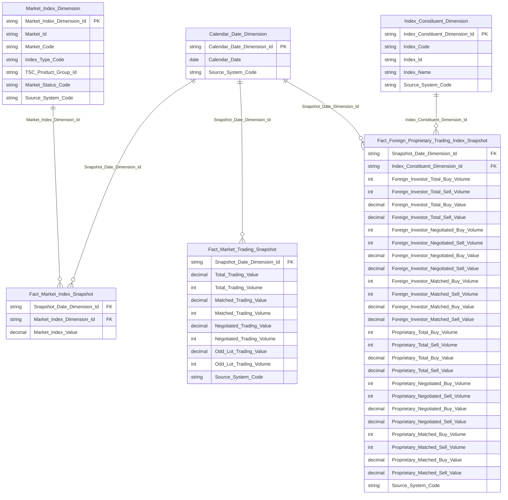

# Entities — Datamart TKNB (Thống kê nội bộ)

## Ghi chú thiết kế

19/20 bảng còn lại là `operational` (bảng phẳng theo từng báo cáo — EAV `item_code` hoặc danh sách) theo quyết định thiết kế module TKNB "mỗi báo cáo 1 bảng phẳng riêng, không tách Dimension dùng chung". **[SỬA 2026-09-22, datamart-review — Kịch bản D]** Ngoại lệ duy nhất: qua review phát hiện `Market Trading Report (BM030a)` gộp sai 2 grain khác nhau vào cùng 1 bảng EAV (Nhóm 18), và `Foreign Proprietary Trading Report (BM031a)` (Nhóm 23) không tận dụng được Dimension dùng chung đã có sẵn cross-module — cả 2 bảng đã DEPRECATED và **xóa khỏi bảng dưới đây** (theo All-Tier Cleanup Protocol — orphan checker yêu cầu xóa hẳn khỏi Entities.csv/.md, không giữ dòng ghost; lịch sử bãi bỏ vẫn lưu đầy đủ ở Section 4 `DTM_TKNB_HLD.md`), thay bằng 3 Fact + 2 Dimension chuẩn Star Schema (2 Fact mới sở hữu TKNB, 1 Fact + 2 Dimension reuse từ QLKD/GSTT). 19 bảng operational còn lại không có FK/relationship với nhau — mỗi bảng độc lập theo layout báo cáo gốc.

## erDiagram (chỉ 5 entity Star Schema mới — 19 bảng Operational khác không vẽ, không có quan hệ)

## Bảng entity tóm tắt (25 bảng: 5 Star Schema mới/reuse + 20 Operational — 2 bảng Operational cũ (BM030a/BM031a) đã DEPRECATED và xóa khỏi bảng này, xem lịch sử tại Section 4 `DTM_TKNB_HLD.md`, sắp theo thứ tự Nhóm trong HLD)

| STT | Datamart Entity | Loại | Reuse | Mô tả | Grain | KPI |
|---|---|---|---|---|---|---|
| — | Calendar Date Dimension | Dimension | reuse | Lịch ngày dùng chung | 1 dòng/1 ngày | — |
| — | Market Index Dimension | Dimension | reuse (QLKD) | Danh mục chỉ số thị trường | 1 dòng/combo Market Id+Market Code | — |
| — | Index Constituent Dimension | Dimension | reuse (GSTT) | Danh mục rổ chỉ số | 1 dòng/Index Code | — |
| — | Fact Market Index Snapshot | Fact | reuse (QLKD) | Snapshot chỉ số thị trường | 1 dòng/market_code/ngày | K_TKNB_1014 (Nhóm 18) |
| — | Fact Market Trading Snapshot | Fact | new | GTGD/KLGD toàn thị trường cổ phiếu theo ngày | 1 dòng/Trade Date | K_TKNB_1015–1022 (Nhóm 18) |
| — | Fact Foreign Proprietary Trading Index Snapshot | Fact | new | GD NĐTNN/tự doanh theo chỉ số | 1 dòng/Trade Date × Index Code | K_TKNB_1070–1093 (Nhóm 23) |

| STT | Datamart Entity | Loại | Reuse | Mô tả | Grain | KPI |
|---|---|---|---|---|---|---|
| 1 | Stock Trading Report (HNX01) | Operational | new | Báo cáo giao dịch thị trường cổ phiếu HNX theo kỳ | 1 dòng/1 chỉ tiêu/1 kỳ báo cáo | K_TKNB_1–108 |
| 2 | Gov Bond OTC Trading Report (HNX02) | Operational | new | Báo cáo giao dịch trái phiếu Chính phủ OTC trên HNX (7/165 KPI READY — 3/7 loại hình GD) | 1 dòng/1 chỉ tiêu/1 kỳ báo cáo | K_TKNB_109–273 |
| 3 | Derivative Trading Report (HNX03) | Operational | new | Báo cáo giao dịch thị trường CKPS (HNX) theo kỳ | 1 dòng/1 chỉ tiêu/1 kỳ báo cáo | K_TKNB_274–286 |
| 4 | Market Scale Report (HNX04) | Operational | new | Báo cáo tổng hợp quy mô TTCK HNX | 1 dòng/1 chỉ tiêu/1 kỳ báo cáo/1 period_type | K_TKNB_290–471 |
| 6 | Corp Bond Trading Report (HNX07) | Operational | new | Báo cáo giao dịch TPDN niêm yết trên HNX theo kỳ | 1 dòng/1 chỉ tiêu/1 kỳ báo cáo | K_TKNB_497–519 |
| 10 | Stock Trading Report (HSX01) | Operational | new | Báo cáo giao dịch thị trường cổ phiếu HOSE theo kỳ | 1 dòng/1 chỉ tiêu/1 kỳ báo cáo | K_TKNB_571–695 |
| 11 | Listing Trading Report (HSX02) | Operational | new | Báo cáo niêm yết và giao dịch chứng khoán HOSE kỳ tháng | 1 dòng/1 chỉ tiêu/1 kỳ báo cáo/1 period_type | K_TKNB_696–792 |
| 12 | Proprietary Trading Report (HSX04) | Operational | new | Báo cáo giao dịch tự doanh của CTCK trên HOSE theo kỳ | 1 dòng/1 chỉ tiêu/1 kỳ báo cáo | K_TKNB_793–820 |
| 14 | CW Outstanding Report (TTLK10) | Operational | new | Danh sách chứng quyền đang lưu hành | 1 dòng/1 mã chứng quyền/1 kỳ báo cáo | K_TKNB_843–845 |
| 15 | Offering Result Report (0513.H.UBCK.QG) | Operational | new | Báo cáo kết quả thực hiện phát hành chứng khoán | 1 dòng/1 chỉ tiêu/1 kỳ báo cáo | K_TKNB_846–874 |
| 16 | Market Summary Report (TK-04.BTC) | Operational | new | Báo cáo tổng hợp TTCK theo quý/lũy kế | 1 dòng/1 chỉ tiêu/1 kỳ gốc (period_marker) | K_TKNB_875–917 |
| 17 | Market Annual Report (TK_NienGiam) | Operational | new | Niên giám thống kê thị trường chứng khoán theo năm | 1 dòng/1 chỉ tiêu/1 năm báo cáo | K_TKNB_918–1011 |
| 20 | Corp Bond Trading Report (BM030c) | Operational | new | Thống kê giao dịch toàn thị trường TPDN niêm yết theo ngày (cộng gộp 2 sàn) | 1 dòng/1 chỉ tiêu/1 kỳ báo cáo | K_TKNB_1037–1045 |
| 22 | Fund Cert ETF CW Trading Report (BM030e) | Operational | new | Thống kê giao dịch thị trường CCQ/ETF/CW toàn thị trường theo ngày | 1 dòng/1 chỉ tiêu/1 kỳ báo cáo | K_TKNB_1053–1067 |
| 24 | Gov Bond Foreign Proprietary Trading Report (BM031b) | Operational | new | Giao dịch NĐTNN/tự doanh thị trường TPCP theo ngày | 1 dòng/1 chỉ tiêu/1 kỳ báo cáo | K_TKNB_1094–1112 |
| 25 | Corp Bond Foreign Proprietary Trading Report (BM031c) | Operational | new | Giao dịch NĐTNN/tự doanh thị trường TPDN niêm yết theo ngày | 1 dòng/1 chỉ tiêu/1 kỳ báo cáo | K_TKNB_1113–1122 |
| 26 | Fund Cert ETF CW Foreign Proprietary Trading Report (BM031d) | Operational | new | Giao dịch NĐTNN/tự doanh thị trường CCQ/ETF/CW theo ngày | 1 dòng/1 chỉ tiêu/1 kỳ báo cáo | K_TKNB_1123–1173 |
| 27 | Derivatives Foreign Proprietary Trading Report (BM031f) | Operational | new | Thống kê giao dịch thị trường CKPS (NĐTNN/tự doanh) theo ngày | 1 dòng/1 chỉ tiêu/1 kỳ báo cáo | K_TKNB_1174–1186 |
| 28 | Security Trading Detail Report (BM035) | Operational | new | Thống kê giao dịch chi tiết theo TỪNG MÃ chứng khoán theo ngày | 1 dòng/1 chỉ tiêu/1 mã CK/1 kỳ báo cáo | K_TKNB_1187–1239 |
| 29 | Derivatives Security Detail Report (BM043) | Operational | new | Thị trường CKPS chi tiết theo từng mã hợp đồng theo ngày | 1 dòng/1 chỉ tiêu/1 mã CK/1 kỳ báo cáo | K_TKNB_1240–1255 |

## Nguồn Atomic theo bảng

| Datamart Entity | source_table (Atomic physical_name) |
|---|---|
| Calendar Date Dimension | cdr_dt_dim (conformed, không có Atomic source riêng) |
| Market Index Dimension | market_index_snapshot |
| Index Constituent Dimension | index_constituent_snapshot |
| Fact Market Index Snapshot | market_index_snapshot |
| Fact Market Trading Snapshot | securities_trade |
| Fact Foreign Proprietary Trading Index Snapshot | securities_trade / index_constituent_snapshot |
| Stock Trading Report (HNX01) | market_index_snapshot / security_trading_snapshot / securities_trade |
| Gov Bond OTC Trading Report (HNX02) | bond_order_book |
| Derivative Trading Report (HNX03) | security_trading_snapshot / securities_trade |
| Market Scale Report (HNX04) | securities_trade / security_trading_snapshot |
| Corp Bond Trading Report (HNX07) | securities_trade |
| Stock Trading Report (HSX01) | market_index_snapshot / securities_trade / security_trading_snapshot |
| Listing Trading Report (HSX02) | market_index_snapshot / securities_trade / security_trading_snapshot |
| Proprietary Trading Report (HSX04) | securities_trade / security_trading_snapshot |
| CW Outstanding Report (TTLK10) | sc_disclosure_securities_offering |
| Offering Result Report (0513.H.UBCK.QG) | pc_securities_offering_result |
| Market Summary Report (TK-04.BTC) | securities_trade |
| Market Annual Report (TK_NienGiam) | market_index_snapshot / securities_trade / security_trading_snapshot / public_company / securities_company / fund_management_company |
| Corp Bond Trading Report (BM030c) | securities_trade |
| Fund Cert ETF CW Trading Report (BM030e) | securities_trade / security_trading_snapshot |
| Gov Bond Foreign Proprietary Trading Report (BM031b) | securities_trade |
| Corp Bond Foreign Proprietary Trading Report (BM031c) | securities_trade |
| Fund Cert ETF CW Foreign Proprietary Trading Report (BM031d) | securities_trade / security_trading_snapshot |
| Derivatives Foreign Proprietary Trading Report (BM031f) | securities_trade / security_trading_snapshot |
| Security Trading Detail Report (BM035) | securities_trade / security_trading_snapshot |
| Derivatives Security Detail Report (BM043) | securities_trade / security_trading_snapshot |
