# HLD — Datamart TKNB (Thống kê nội bộ)

## Ghi chú thiết kế đặc thù module TKNB

Nguồn TKNB gồm các báo cáo thống kê định kỳ do Sở GDCK/UBCKNN công bố theo mẫu biểu cố định (không phải dashboard khai thác tự do). Theo quyết định của team thiết kế:

- **Mỗi báo cáo (Mã dashboard/BC trong BA) → 1 bảng phẳng (flat table) riêng**, đặt tên `{tên báo cáo}_rpt` (physical name hậu tố `_rpt`, logical name hậu tố "Report", không mang tiền tố "Fact" — theo `reference/naming_conventions.md`).
- **Không tách Dimension dùng chung** (không reuse `cdr_dt_dim`/`cl_dim`/Fact của module khác dù cùng nguồn Atomic) — denormalize hoàn toàn theo đúng layout báo cáo gốc.
- **Cấu trúc EAV (Entity-Attribute-Value) theo dòng chỉ tiêu, không wide-table**: báo cáo gốc là bảng liệt kê chỉ tiêu theo dòng (STT | Chỉ tiêu | Đơn vị tính | Giá trị), kể cả phân cấp (I/1/1a...). Bảng phẳng giữ đúng cấu trúc này — mỗi dòng = 1 chỉ tiêu (`item_code`) trong 1 kỳ báo cáo (`report_period_dt`), giá trị lưu ở cột `item_value` dùng chung. KHÔNG bung mỗi chỉ tiêu thành 1 cột riêng (wide-table).
- **Composite key**: `report_code + report_period_dt + item_code` — không dùng surrogate key riêng.
- **Cấu trúc phân cấp** (I/II/III..., 1/2..., 1a/1b...) thể hiện qua `item_stt` (giữ đúng số thứ tự/định danh cấp trong mẫu biểu, VD: "4", "4.1", "4.2") — không dùng cột `parent_item_code` riêng.
- **Dòng tổng (derived) lưu vật lý**: các dòng tổng/mục lớn (VD: mục 4 = tổng 5 dòng con) được ETL tự tính `SUM` và insert thành 1 dòng vật lý riêng trong bảng — khi SELECT theo đúng `item_stt` sẽ ra ngay bảng giống layout báo cáo gốc, không cần tầng BI tính lại.
- Lý do: lưu trên kho MinIO, không lo chi phí/hiệu năng storage do trùng lặp dữ liệu chiều giữa các bảng report; mỗi báo cáo có mẫu biểu cố định theo quy định pháp lý, không có nhu cầu khai thác cắt lớp linh hoạt xuyên nhiều báo cáo.
- Vẫn giữ discipline cơ bản: grain rõ ràng, technical fields `ds_` theo quy tắc chung.

---

## Section 1 — Data Lineage

### Cụm 1a: HNX01 — Báo cáo về giao dịch trên thị trường cổ phiếu

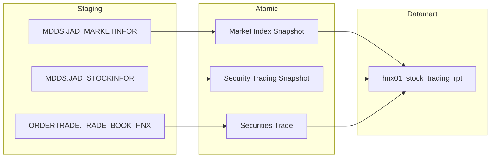

> Nhóm 2 (HNX02) 100% PENDING — chưa có Fact/Atomic thật, không vẽ Cụm Data Lineage (theo checklist Nhóm 100% PENDING).

### Cụm 3: TK-HNX03 — Báo cáo về giao dịch trên thị trường Chứng khoán Phái sinh

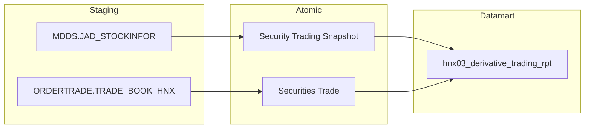

### Cụm 4: HNX04 — Báo cáo tổng hợp về quy mô TTCK

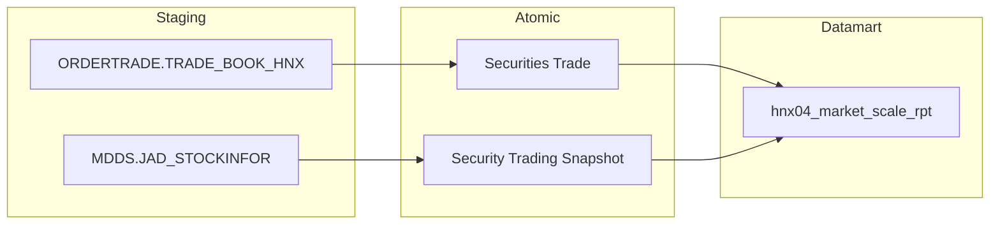

> Nguồn biểu mẫu (HNX.BM24/BM32/BM23/BM34/BM25, VSDC.BM1) chưa có Atomic — không vẽ trong Cụm 4 (chỉ vẽ nguồn Atomic thật đã READY, theo `flowchart_rules.md`).

> Nhóm 5 (HNX06), Nhóm 7 (HNX10), Nhóm 8 (HNX11), Nhóm 9 (HNX12) và Nhóm 13 (TTLK01) 100% PENDING — chưa có Fact/Atomic thật, không vẽ Cụm Data Lineage (theo checklist Nhóm 100% PENDING).

### Cụm 6: TK-HNX07 — Báo cáo về giao dịch trên thị trường TPDN niêm yết

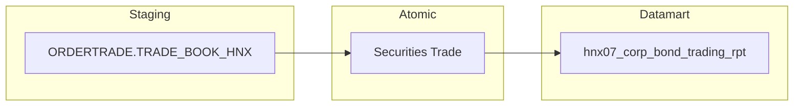

### Cụm 10: TK-HSX01 — Báo cáo về giao dịch trên thị trường Cổ phiếu HOSE

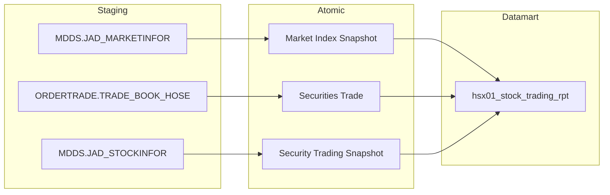

> Nguồn biểu mẫu (VSDC.BM1, VSDC.MB1, phân ngành GICS) chưa có Atomic — không vẽ trong Cụm 10 (chỉ vẽ nguồn Atomic thật đã READY, theo `flowchart_rules.md`).

### Cụm 11: HSX02 — Báo cáo về niêm yết và giao dịch chứng khoán HOSE, kỳ tháng

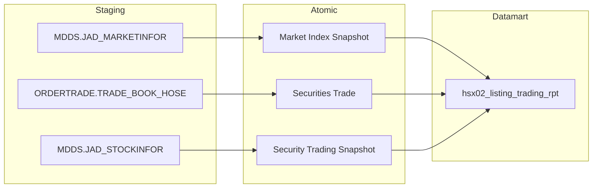

> Nguồn biểu mẫu (HOSE.BM15, HOSE.BM16, VSDC.BM1) chưa có Atomic — không vẽ trong Cụm 11 (chỉ vẽ nguồn Atomic thật đã READY, theo `flowchart_rules.md`).

### Cụm 12: TK-HSX04 — Báo cáo về giao dịch tự doanh của CTCK trên HOSE

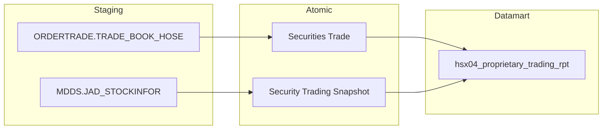

> Nhóm 13 (TTLK01) 100% PENDING — chưa có Fact/Atomic thật, không vẽ Cụm Data Lineage (theo checklist Nhóm 100% PENDING).
> Nhóm 19 (BM030b_MSS) và Nhóm 21 (BM030d_MSS) cũng 100% PENDING — chưa có Fact/Atomic thật, không vẽ Cụm Data Lineage (theo checklist Nhóm 100% PENDING).

### Cụm 14: TTLK10 — Danh sách chứng quyền đang lưu hành

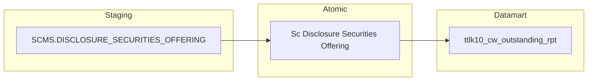

### Cụm 15: Biểu 0513.H.UBCK.QG — Báo cáo kết quả thực hiện phát hành

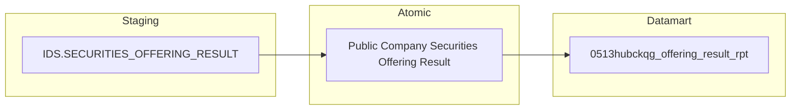

### Cụm 16: Biểu TK-04.BTC — Báo cáo tổng hợp thị trường chứng khoán theo quý/lũy kế

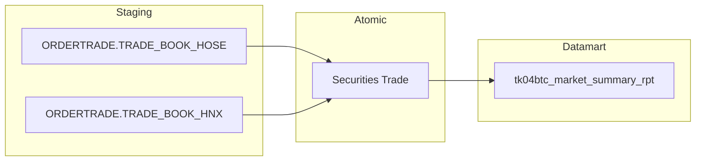

> Nguồn biểu mẫu (VSDC.BM1/BM2/BM5, HNX.BM39/BM40/BM7, HOSE.BM1/BM15/BM9, IDS/SCMS/FMS tổng hợp, SSC_SCMS.MEMBER_REPORT) chưa có Atomic — không vẽ trong Cụm 16 (chỉ vẽ nguồn Atomic thật đã READY, theo `flowchart_rules.md`).

### Cụm 17: TK_NienGiam — Niên giám thống kê thị trường chứng khoán

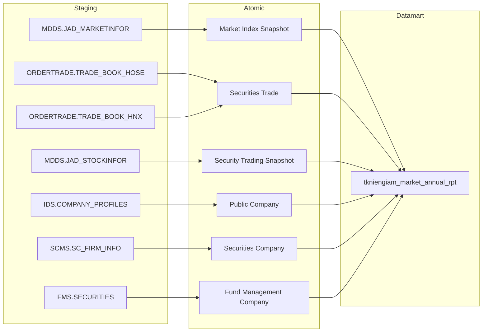

> Nguồn biểu mẫu (VSDC.BM1, HNX.BM24/BM11/BM25/BM34/BM23/BM28/BM32-35, VSDC.BM58) chưa có Atomic — không vẽ trong Cụm 17 (chỉ vẽ nguồn Atomic thật đã READY, theo `flowchart_rules.md`).

---

### Cụm 18: BM030a_MSS — Thống kê giao dịch toàn thị trường cổ phiếu

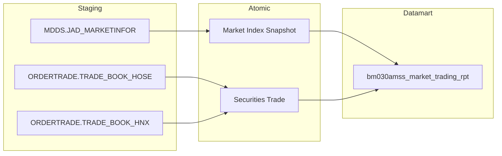

---

### Cụm 20: BM030c_MSS — Thống kê giao dịch toàn thị trường trái phiếu doanh nghiệp niêm yết

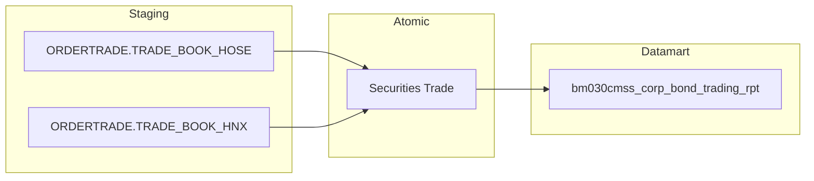

---

### Cụm 22: BM030e_MSS — Thống kê giao dịch thị trường chứng chỉ quỹ, ETF và CW

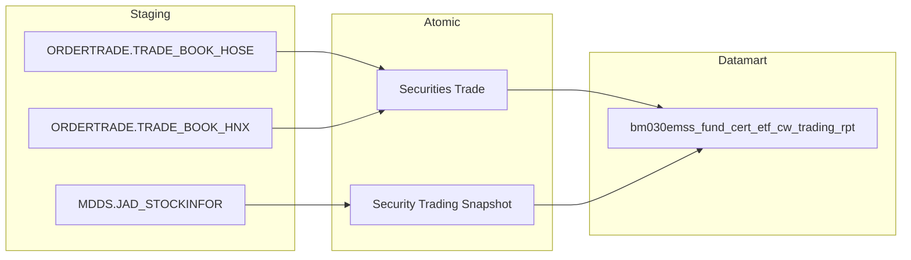

---

### Cụm 23: BM031a_MSS — Bảng dữ liệu giao dịch NĐTNN/tự doanh thị trường cổ phiếu

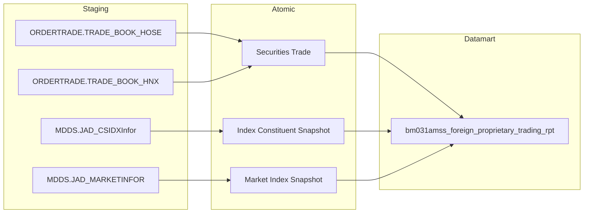

---

### Cụm 24: BM031b_MSS — Bảng dữ liệu giao dịch NĐTNN/tự doanh thị trường TPCP

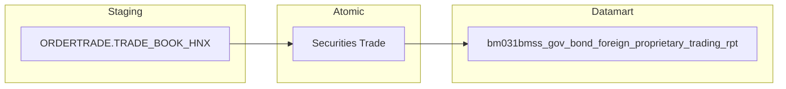

> Nguồn biểu mẫu (HNX.BM29 — khối NĐTNN) chưa có Atomic — không vẽ trong Cụm 24 (chỉ vẽ nguồn Atomic thật đã READY, theo `flowchart_rules.md`).

---

### Cụm 25: BM031C_MSS — Bảng dữ liệu giao dịch NĐTNN/tự doanh thị trường TPDN niêm yết

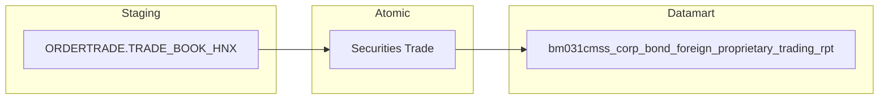

---

### Cụm 26: BM031d_MSS — Bảng dữ liệu giao dịch NĐTNN/tự doanh thị trường CCQ, ETF, CW

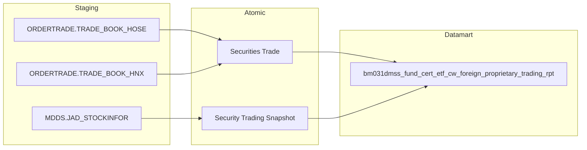

---

### Cụm 27: BM031f_MSS — Thống kê giao dịch thị trường chứng khoán phái sinh

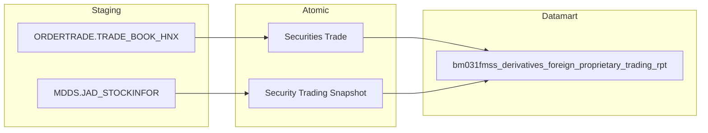

> Nguồn biểu mẫu (VSDC.BM1 — KL hợp đồng đang lưu hành) chưa có Atomic — không vẽ trong Cụm 27 (chỉ vẽ nguồn Atomic thật đã READY, theo `flowchart_rules.md`).

---

### Cụm 28: BM035_MSS — Thống kê thông tin giao dịch của từng mã chứng khoán

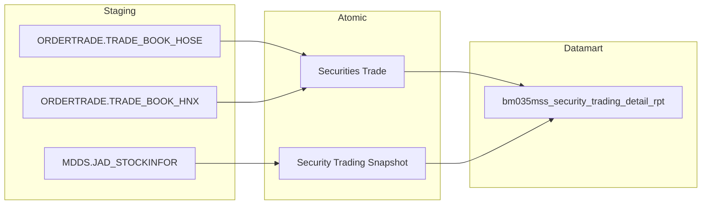

> Nguồn biểu mẫu (VSDC.BM64 — Tỷ lệ sở hữu NĐTNN) chưa có Atomic — không vẽ trong Cụm 28 (chỉ vẽ nguồn Atomic thật đã READY, theo `flowchart_rules.md`).

---

### Cụm 29: BM043_MSS — Thị trường chứng khoán phái sinh - chi tiết từng mã

```mermaid
flowchart LR
    subgraph SRC["Staging"]
        S1["ORDERTRADE.TRADE_BOOK_HNX"]
        S2["MDDS.JAD_STOCKINFOR"]
    end
    subgraph SIL["Atomic"]
        A1["Securities Trade"]
        A2["Security Trading Snapshot"]
    end
    subgraph GOLD["Datamart"]
        G1["bm043mss_derivatives_security_detail_rpt"]
    end
    S1 --> A1
    S2 --> A2
    A1 --> G1
    A2 --> G1
```

> Nguồn biểu mẫu (VSDC.BM1 — KL hợp đồng đang lưu hành) chưa có Atomic — không vẽ trong Cụm 29 (chỉ vẽ nguồn Atomic thật đã READY, theo `flowchart_rules.md`).

---

## Section 2 — Tổng quan báo cáo

### Tab HNX01

#### Nhóm 1 - Báo cáo về giao dịch trên thị trường cổ phiếu

**Phân loại:** Báo cáo thống kê định kỳ, layout cố định theo mẫu biểu Sở GDCK HNX (I/II/III/IV/V/VI/VII — Giá trị GDCK toàn TT, Khối lượng GDCK toàn TT, Vốn hóa, Giao dịch khớp lệnh, Giao dịch thỏa thuận, Giao dịch CP quỹ, Giao dịch NĐTNN).

**Atomic:**
- `Market Index Snapshot` (nguồn `MDDS.JAD_MARKETINFOR`) — READY (`DataModel/Atomic/Group/dm_atm_market_index_snapshot-MDDS.JAD_MARKETINFOR.yaml`)
- `Security Trading Snapshot` (nguồn `MDDS.JAD_STOCKINFOR`) — READY (`DataModel/Atomic/Product/dm_atm_security_trading_snapshot-MDDS.JAD_STOCKINFOR.yaml`)
- `Securities Trade` (nguồn `ORDERTRADE.TRADE_BOOK_HNX`) — READY (`DataModel/Atomic/Transaction/dm_atm_securities_trade-ORDERTRADE.TRADE_BOOK_HNX.yaml`)
- Nguồn `VSDC.BM1`/`VSDC.BM41`/`VSDC.MB1` (biểu mẫu đầu vào: KL chứng khoán đang lưu hành, Vốn hóa thị trường HNX, KL mua lại CP quỹ) — **PENDING** (Chưa có CSDL - Map biểu mẫu, chưa tích hợp hệ thống)

**Mockup:** Báo cáo HNX01 — cấu trúc bảng biểu phân cấp I→VII, mỗi mục lớn có sub-total theo Loại CK (CPNY/UpCom/TPDN/CCQ/ETF).

**Nguồn:** MDDS (thông tin thị trường + thông tin CK), MSS/ORDERTRADE (sổ lệnh giao dịch từ SGDCK).

**Bảng KPI:**

| KPI ID | Tên KPI | Đơn vị | Tính chất | Công thức | Ghi chú | Trạng thái |
|---|---|---|---|---|---|---|
| K_TKNB_1 | Sàn | - | Chiều | `market_index_code` filter `market_id_code IN ('10','02','04')` | [STT=1, item_code=`floor_hnx`] Sàn: HNX (`market_id_code = '02'`) | READY |
| K_TKNB_2 | Chỉ số | - | Chiều | `market_index_code`/`market_index_name` — danh mục VN-Index/HNX-Index/UPCOM-Index | [STT=2, item_code=`market_index_type`] Chiều slicer chọn chỉ số | READY |
| K_TKNB_3 | Giá trị chỉ số | Điểm | Cơ sở | `MAX(market_index_val)` theo `market_id_code`, `trading_dt = :to_date`, lấy bản ghi `index_time` mới nhất | [STT=3, item_code=`market_index_value`] Nguồn `Market Index Snapshot` | READY |
| K_TKNB_4 | Chỉ số HNX-INDEX (cuối ngày) | Điểm | Cơ sở | Reuse K_TKNB_3, filter `market_id_code = '02'` | [STT=4, item_code=`hnx_index_eod`] Trùng — sub-component của K_TKNB_3 | READY |
| K_TKNB_5 | Chỉ số HNX30 | Điểm | Cơ sở | Reuse K_TKNB_3, filter `market_id_code = '30'` | [STT=5, item_code=`hnx30_index_eod`] Trùng — sub-component của K_TKNB_3 | READY |
| K_TKNB_6 | Chỉ số UPCoM Index | Điểm | Cơ sở | Reuse K_TKNB_3, filter `market_id_code = '04'` | [STT=6, item_code=`upcom_index_eod`] Trùng — sub-component của K_TKNB_3 | READY |
| K_TKNB_7 | Loại CK | - | Chiều | `stock_tp_code`/`fund_tp_code` filter `floor_code IN ('02','04')` | [STT=7, item_code=`security_type`] Chiều slicer Loại CK/Thị trường | READY |
| K_TKNB_8 | I. Giá trị chứng khoán giao dịch toàn thị trường | VND | Phái sinh | `= K_TKNB_9 + K_TKNB_10 + K_TKNB_11 + K_TKNB_12 + K_TKNB_13` | [STT=8, item_code=`total_trading_value`] Tổng GTGD 5 loại CK | READY |
| K_TKNB_9 | I.1 Giá trị GTGD — Cổ phiếu Niêm Yết | VND | Cơ sở | `SUM(execution_price * execution_vol)` filter `market_id_code IN ('STO','STX')` | [STT=9, item_code=`trading_value_cpny`] Nguồn `Securities Trade` | READY |
| K_TKNB_10 | I.2 Giá trị GTGD — Cổ phiếu UpCom | VND | Cơ sở | `SUM(execution_price * execution_vol)` filter `market_id_code = 'UPX'` | | READY |
| K_TKNB_11 | I.3 Giá trị GTGD — Trái phiếu doanh nghiệp | VND | Cơ sở | `SUM(execution_price * execution_vol)` filter `market_id_code = 'HCX'` | | READY |
| K_TKNB_12 | I.4 Giá trị GTGD — Chứng chỉ quỹ | VND | Cơ sở | `SUM(execution_price * execution_vol)` filter `security_symbol_code` join `stock_tp_code='3' AND fund_tp_code='M'` | [STT=12, item_code=`trading_value_ccq`] Join `Security Trading Snapshot` | READY |
| K_TKNB_13 | I.5 Giá trị GTGD — Chứng chỉ quỹ (ETF) | VND | Cơ sở | `SUM(execution_price * execution_vol)` filter `security_symbol_code` join `stock_tp_code='3' AND fund_tp_code='E'` | [STT=13, item_code=`trading_value_etf`] Join `Security Trading Snapshot` | READY |
| K_TKNB_14 | II. Khối lượng chứng khoán giao dịch toàn thị trường | CK | Phái sinh | `= K_TKNB_15 + K_TKNB_16 + K_TKNB_17 + K_TKNB_18 + K_TKNB_19` | [STT=14, item_code=`total_trading_volume`] Tổng KLGD 5 loại CK | READY |
| K_TKNB_15 | II.1 KLGD — Cổ phiếu Niêm Yết | CK | Cơ sở | `SUM(execution_vol)` filter `market_id_code IN ('STO','STX')` | | READY |
| K_TKNB_16 | II.2 KLGD — Cổ phiếu UpCom | CK | Cơ sở | `SUM(execution_vol)` filter `market_id_code = 'UPX'` | | READY |
| K_TKNB_17 | II.3 KLGD — Trái phiếu doanh nghiệp | CK | Cơ sở | `SUM(execution_vol)` filter `market_id_code = 'HCX'` | | READY |
| K_TKNB_18 | II.4 KLGD — Chứng chỉ quỹ | CK | Cơ sở | `SUM(execution_vol)` filter join `stock_tp_code='3' AND fund_tp_code='M'` | | READY |
| K_TKNB_19 | II.5 KLGD — Chứng chỉ quỹ (ETF) | CK | Cơ sở | `SUM(execution_vol)` filter join `stock_tp_code='3' AND fund_tp_code='E'` | | READY |
| K_TKNB_20 | III. Tổng giá trị vốn hóa thị trường cổ phiếu | VND | Phái sinh | `= SUM(close_price * KL_chứng_khoán_đang_lưu_hành)` | [STT=20, item_code=`total_market_cap`] Đơn vị "KL chứng khoán đang lưu hành" chưa có CSDL — chờ Atomic bổ sung. Atomic cần bổ sung: entity lưu KL CK lưu hành từ báo cáo VSDC.BM1. Mart dự kiến: populate `item_value` cho dòng `item_code = 'total_market_cap'` khi Atomic sẵn sàng — không đổi `item_code`/`item_stt` đã khai | PENDING |
| K_TKNB_21 | III.1 Vốn hóa Niêm yết (theo phân ngành - Ngành cấp 1) | VND | Cơ sở | Sub-component của K_TKNB_20, filter theo ngành cấp 1 | [STT=21, item_code=`market_cap_cpny_by_sector1`] Cùng lý do PENDING với K_TKNB_20 — thêm chiều phân ngành (cần Atomic Industry Classification) | PENDING |
| K_TKNB_22 | III.2 Vốn hóa UPCoM | VND | Cơ sở | Sub-component của K_TKNB_20, filter `market_id_code = 'UPX'` | [STT=22, item_code=`market_cap_upcom`] Cùng lý do PENDING với K_TKNB_20 | PENDING |
| K_TKNB_23 | IV. Giao dịch khớp lệnh | - | Chiều | BA đánh N/A (Bảng nguồn/Trường nguồn) — không có giá trị | [STT=23, item_code=`matched_trading_volume`] Label-only, `item_value = NULL` theo thiết kế. Chỉ là tên nhãn nhóm hiển thị, không SUM. Chứa 2 nhóm con: KLGD khớp lệnh (K_TKNB_24), GTGD khớp lệnh (K_TKNB_29) | READY |
| K_TKNB_24 | IV.1 Khối lượng giao dịch khớp lệnh | CK | Phái sinh | `= K_TKNB_25 + K_TKNB_26 + K_TKNB_27 + K_TKNB_28` | [STT=24, item_code=`matched_trading_volume_total`] Filter `board_tp_code IN ('G1','G2','G3','G4','G7','G8')` | READY |
| K_TKNB_25 | IV.1a KLGD khớp lệnh — Cổ phiếu Niêm Yết | CK | Cơ sở | `SUM(execution_vol)` filter `market_id_code IN ('STO','STX')` AND `board_tp_code IN ('G1'..'G8')` | | READY |
| K_TKNB_26 | IV.1b KLGD khớp lệnh — Cổ phiếu UpCom | CK | Cơ sở | `SUM(execution_vol)` filter `market_id_code='UPX'` AND `board_tp_code IN ('G1'..'G8')` | | READY |
| K_TKNB_27 | IV.1c KLGD khớp lệnh — Chứng chỉ quỹ | CK | Cơ sở | `SUM(execution_vol)` filter join `fund_tp_code='M'` AND `board_tp_code IN ('G1'..'G8')` | | READY |
| K_TKNB_28 | IV.1d KLGD khớp lệnh — Chứng chỉ quỹ (ETF) | CK | Cơ sở | `SUM(execution_vol)` filter join `fund_tp_code='E'` AND `board_tp_code IN ('G1'..'G8')` | | READY |
| K_TKNB_29 | IV.2 Giá trị giao dịch khớp lệnh (GTGD) | VND | Phái sinh | `= K_TKNB_30 + K_TKNB_31 + K_TKNB_32 + K_TKNB_33` | [STT=29, item_code=`matched_trading_value_total`] Filter `board_tp_code IN ('G1'..'G8')` | READY |
| K_TKNB_30 | IV.2a GTGD khớp lệnh — Cổ phiếu Niêm Yết | VND | Cơ sở | `SUM(execution_price * execution_vol)` filter `market_id_code IN ('STO','STX')` AND `board_tp_code IN ('G1'..'G8')` | | READY |
| K_TKNB_31 | IV.2b GTGD khớp lệnh — Cổ phiếu UpCom | VND | Cơ sở | `SUM(execution_price * execution_vol)` filter `market_id_code='UPX'` AND `board_tp_code IN ('G1'..'G8')` | | READY |
| K_TKNB_32 | IV.2c GTGD khớp lệnh — Chứng chỉ quỹ | VND | Cơ sở | `SUM(execution_price * execution_vol)` filter join `fund_tp_code='M'` AND `board_tp_code IN ('G1'..'G8')` | | READY |
| K_TKNB_33 | IV.2d GTGD khớp lệnh — Chứng chỉ quỹ (ETF) | VND | Cơ sở | `SUM(execution_price * execution_vol)` filter join `fund_tp_code='E'` AND `board_tp_code IN ('G1'..'G8')` | | READY |
| K_TKNB_34 | V. Giao dịch thỏa thuận | - | Chiều | BA đánh N/A (Bảng nguồn/Trường nguồn) — không có giá trị | [STT=34, item_code=`put_through_trading`] Label-only, `item_value = NULL` theo thiết kế. Filter dùng ở KPI con: `board_tp_code IN ('T1','T2','T3','T4','T6','R1')`. Chứa 2 nhóm con: KLGD thỏa thuận (K_TKNB_35), GTGD thỏa thuận (K_TKNB_41) | READY |
| K_TKNB_35 | V.1 Khối lượng giao dịch thỏa thuận | CK | Phái sinh | `= K_TKNB_36 + K_TKNB_37 + K_TKNB_38 + K_TKNB_39 + K_TKNB_40` | | READY |
| K_TKNB_36 | V.1a KLGD thỏa thuận — Cổ phiếu Niêm Yết | CK | Cơ sở | `SUM(execution_vol)` filter `market_id_code IN ('STO','STX')` AND `board_tp_code IN ('T1'..'R1')` | | READY |
| K_TKNB_37 | V.1b KLGD thỏa thuận — Cổ phiếu UpCom | CK | Cơ sở | `SUM(execution_vol)` filter `market_id_code='UPX'` AND `board_tp_code IN ('T1'..'R1')` | | READY |
| K_TKNB_38 | V.1c KLGD thỏa thuận — Trái phiếu doanh nghiệp | CK | Cơ sở | `SUM(execution_vol)` filter `market_id_code='HCX'` AND `board_tp_code IN ('T1'..'R1')` | | READY |
| K_TKNB_39 | V.1d KLGD thỏa thuận — Chứng chỉ quỹ | CK | Cơ sở | `SUM(execution_vol)` filter join `fund_tp_code='M'` AND `board_tp_code IN ('T1'..'R1')` | | READY |
| K_TKNB_40 | V.1e KLGD thỏa thuận — Chứng chỉ quỹ (ETF) | CK | Cơ sở | `SUM(execution_vol)` filter join `fund_tp_code='E'` AND `board_tp_code IN ('T1'..'R1')` | | READY |
| K_TKNB_41 | V.2 Giá trị giao dịch thỏa thuận (GTGD) | VND | Cơ sở | `= K_TKNB_42 + K_TKNB_43 + K_TKNB_44 + K_TKNB_45 + K_TKNB_46` | | READY |
| K_TKNB_42 | V.2a GTGD thỏa thuận — Cổ phiếu Niêm Yết | VND | Cơ sở | `SUM(execution_price * execution_vol)` filter `market_id_code IN ('STO','STX')` AND `board_tp_code IN ('T1'..'R1')` | | READY |
| K_TKNB_43 | V.2b GTGD thỏa thuận — Cổ phiếu UpCom | VND | Cơ sở | `SUM(execution_price * execution_vol)` filter `market_id_code='UPX'` AND `board_tp_code IN ('T1'..'R1')` | | READY |
| K_TKNB_44 | V.2c GTGD thỏa thuận — Trái phiếu doanh nghiệp | VND | Cơ sở | `SUM(execution_price * execution_vol)` filter `market_id_code='HCX'` AND `board_tp_code IN ('T1'..'R1')` | | READY |
| K_TKNB_45 | V.2d GTGD thỏa thuận — Chứng chỉ quỹ | VND | Cơ sở | `SUM(execution_price * execution_vol)` filter join `fund_tp_code='M'` AND `board_tp_code IN ('T1'..'R1')` | | READY |
| K_TKNB_46 | V.2e GTGD thỏa thuận — Chứng chỉ quỹ (ETF) | VND | Cơ sở | `SUM(execution_price * execution_vol)` filter join `fund_tp_code='E'` AND `board_tp_code IN ('T1'..'R1')` | | READY |
| K_TKNB_108 | VI. Giao dịch cổ phiếu quỹ | - | Chiều | Header mục lớn — không có giá trị riêng | [STT=47, item_code=`treasury_stock_trading`] Chứa 2 measure con: KLGD (K_TKNB_47), GTGD (K_TKNB_48) | PENDING |
| K_TKNB_47 | VI.1 Giao dịch cổ phiếu quỹ — Khối lượng giao dịch | CK | Phái sinh | Nguồn báo cáo VSDC.MB1 "KL chứng khoán mua lại (Cổ phiếu quỹ)" | [STT=48, item_code=`treasury_stock_volume`] Chưa có CSDL — Atomic cần bổ sung entity lưu số liệu VSDC.MB1. Mart dự kiến: populate `item_value` cho dòng `item_code = 'treasury_stock_volume'` khi Atomic sẵn sàng | PENDING |
| K_TKNB_48 | VI.2 Giao dịch cổ phiếu quỹ — Giá trị giao dịch | VND | Cơ sở | Nguồn báo cáo VSDC.MB1 — BA ghi "Không có dữ liệu" | [STT=49, item_code=`treasury_stock_value`] Chưa có CSDL, BA xác nhận hiện chưa có nguồn. Mart dự kiến: populate `item_value` cho dòng `item_code = 'treasury_stock_value'` khi có nguồn | PENDING |
| K_TKNB_49 | VII. Giao dịch Nhà đầu tư nước ngoài (GDNĐTNN) | - | Chiều | BA đánh N/A (Bảng nguồn/Trường nguồn) — không có giá trị | [STT=50, item_code=`foreign_investor_trading`] Label-only, `item_value = NULL` theo thiết kế. Filter dùng ở KPI con: `buy_foreign_investor_tp_code <> '00'` (mua) hoặc `sell_foreign_investor_tp_code <> '00'` (bán). Chứa 2 nhóm con: Khớp lệnh (K_TKNB_50), Thỏa thuận (K_TKNB_72) | READY |
| K_TKNB_50 | VII.1 Giao dịch khớp lệnh (GDNĐTNN) | - | Chiều | BA đánh N/A (Bảng nguồn/Trường nguồn) — không có giá trị | [STT=51, item_code=`foreign_matched_trading`] Label-only, `item_value = NULL` theo thiết kế. Filter dùng ở KPI con: `board_tp_code IN ('G1'..'G8')`. Chứa 3 loại CK con: CPNY (K_TKNB_51), CCQ (K_TKNB_58), ETF (K_TKNB_65) | READY |
| K_TKNB_51 | VII.1a GDNĐTNN khớp lệnh — Cổ phiếu niêm yết | - | Chiều | BA đánh N/A (Bảng nguồn/Trường nguồn) — không có giá trị | [STT=52, item_code=`foreign_matched_cpny`] Label-only, `item_value = NULL` theo thiết kế. Filter dùng ở KPI con: `market_id_code IN ('STO','STX')` | READY |
| K_TKNB_52 | KLGD khớp lệnh NĐTNN CPNY | CK | Phái sinh | `= K_TKNB_53 + K_TKNB_54` | | READY |
| K_TKNB_53 | KLGD khớp lệnh NĐTNN CPNY — Mua | CK | Phái sinh | `SUM(execution_vol)` filter `buy_foreign_investor_tp_code <> '00'` AND CPNY AND khớp lệnh | | READY |
| K_TKNB_54 | KLGD khớp lệnh NĐTNN CPNY — Bán | CK | Cơ sở | `SUM(execution_vol)` filter `sell_foreign_investor_tp_code <> '00'` AND CPNY AND khớp lệnh | | READY |
| K_TKNB_55 | GTGD khớp lệnh NĐTNN CPNY | VND | Phái sinh | `= K_TKNB_56 + K_TKNB_57` | | READY |
| K_TKNB_56 | GTGD khớp lệnh NĐTNN CPNY — Mua | VND | Phái sinh | `SUM(execution_price * execution_vol)` filter `buy_foreign_investor_tp_code <> '00'` AND CPNY AND khớp lệnh | | READY |
| K_TKNB_57 | GTGD khớp lệnh NĐTNN CPNY — Bán | VND | Cơ sở | `SUM(execution_price * execution_vol)` filter `sell_foreign_investor_tp_code <> '00'` AND CPNY AND khớp lệnh | | READY |
| K_TKNB_58 | VII.1b GDNĐTNN khớp lệnh — Chứng chỉ quỹ | - | Chiều | BA đánh N/A (Bảng nguồn/Trường nguồn) — không có giá trị | [STT=59, item_code=`foreign_matched_ccq`] Label-only, `item_value = NULL` theo thiết kế. Filter dùng ở KPI con: join `fund_tp_code='M'` | READY |
| K_TKNB_59 | KLGD khớp lệnh NĐTNN CCQ | CK | Phái sinh | `= K_TKNB_60 + K_TKNB_61` | | READY |
| K_TKNB_60 | KLGD khớp lệnh NĐTNN CCQ — Mua | CK | Cơ sở | `SUM(execution_vol)` filter `buy_foreign_investor_tp_code <> '00'` AND CCQ AND khớp lệnh | | READY |
| K_TKNB_61 | KLGD khớp lệnh NĐTNN CCQ — Bán | CK | Cơ sở | `SUM(execution_vol)` filter `sell_foreign_investor_tp_code <> '00'` AND CCQ AND khớp lệnh | | READY |
| K_TKNB_62 | GTGD khớp lệnh NĐTNN CCQ | VND | Phái sinh | `= K_TKNB_63 + K_TKNB_64` | | READY |
| K_TKNB_63 | GTGD khớp lệnh NĐTNN CCQ — Mua | VND | Cơ sở | `SUM(execution_price * execution_vol)` filter `buy_foreign_investor_tp_code <> '00'` AND CCQ AND khớp lệnh | | READY |
| K_TKNB_64 | GTGD khớp lệnh NĐTNN CCQ — Bán | VND | Cơ sở | `SUM(execution_price * execution_vol)` filter `sell_foreign_investor_tp_code <> '00'` AND CCQ AND khớp lệnh | | READY |
| K_TKNB_65 | VII.1c GDNĐTNN khớp lệnh — ETF | - | Chiều | BA đánh N/A (Bảng nguồn/Trường nguồn) — không có giá trị | [STT=66, item_code=`foreign_matched_etf`] Label-only, `item_value = NULL` theo thiết kế. Filter dùng ở KPI con: join `fund_tp_code='E'` | READY |
| K_TKNB_66 | KLGD khớp lệnh NĐTNN ETF | CK | Phái sinh | `= K_TKNB_67 + K_TKNB_68` | | READY |
| K_TKNB_67 | KLGD khớp lệnh NĐTNN ETF — Mua | CK | Cơ sở | `SUM(execution_vol)` filter `buy_foreign_investor_tp_code <> '00'` AND ETF AND khớp lệnh | | READY |
| K_TKNB_68 | KLGD khớp lệnh NĐTNN ETF — Bán | CK | Cơ sở | `SUM(execution_vol)` filter `sell_foreign_investor_tp_code <> '00'` AND ETF AND khớp lệnh | | READY |
| K_TKNB_69 | GTGD khớp lệnh NĐTNN ETF | VND | Phái sinh | `= K_TKNB_70 + K_TKNB_71` | | READY |
| K_TKNB_70 | GTGD khớp lệnh NĐTNN ETF — Mua | VND | Cơ sở | `SUM(execution_price * execution_vol)` filter `buy_foreign_investor_tp_code <> '00'` AND ETF AND khớp lệnh | | READY |
| K_TKNB_71 | GTGD khớp lệnh NĐTNN ETF — Bán | VND | Cơ sở | `SUM(execution_price * execution_vol)` filter `sell_foreign_investor_tp_code <> '00'` AND ETF AND khớp lệnh | | READY |
| K_TKNB_72 | VII.2 Giao dịch thỏa thuận (GDNĐTNN) | - | Chiều | BA đánh N/A (Bảng nguồn/Trường nguồn) — không có giá trị | [STT=73, item_code=`foreign_put_through_trading`] Label-only, `item_value = NULL` theo thiết kế. Filter dùng ở KPI con: `board_tp_code IN ('T1'..'R1')`. Chứa 4 loại CK con: CPNY (K_TKNB_73), TPDN (K_TKNB_80), CCQ (K_TKNB_87), ETF (K_TKNB_94), Upcom (K_TKNB_101) | READY |
| K_TKNB_73 | VII.2a GDNĐTNN thỏa thuận — Cổ phiếu niêm yết | - | Chiều | BA đánh N/A (Bảng nguồn/Trường nguồn) — không có giá trị | [STT=74, item_code=`foreign_put_through_cpny`] Label-only, `item_value = NULL` theo thiết kế. Filter dùng ở KPI con: `market_id_code IN ('STO','STX')` | READY |
| K_TKNB_74 | KLGD thỏa thuận NĐTNN CPNY | CK | Phái sinh | `= K_TKNB_75 + K_TKNB_76` | | READY |
| K_TKNB_75 | KLGD thỏa thuận NĐTNN CPNY — Mua | CK | Cơ sở | `SUM(execution_vol)` filter `buy_foreign_investor_tp_code <> '00'` AND CPNY AND thỏa thuận | | READY |
| K_TKNB_76 | KLGD thỏa thuận NĐTNN CPNY — Bán | CK | Cơ sở | `SUM(execution_vol)` filter `sell_foreign_investor_tp_code <> '00'` AND CPNY AND thỏa thuận | | READY |
| K_TKNB_77 | GTGD thỏa thuận NĐTNN CPNY | VND | Phái sinh | `= K_TKNB_78 + K_TKNB_79` | | READY |
| K_TKNB_78 | GTGD thỏa thuận NĐTNN CPNY — Mua | VND | Cơ sở | `SUM(execution_price * execution_vol)` filter `buy_foreign_investor_tp_code <> '00'` AND CPNY AND thỏa thuận | | READY |
| K_TKNB_79 | GTGD thỏa thuận NĐTNN CPNY — Bán | VND | Cơ sở | `SUM(execution_price * execution_vol)` filter `sell_foreign_investor_tp_code <> '00'` AND CPNY AND thỏa thuận | | READY |
| K_TKNB_80 | VII.2b GDNĐTNN thỏa thuận — Trái phiếu doanh nghiệp | - | Chiều | BA đánh N/A (Bảng nguồn/Trường nguồn) — không có giá trị | [STT=81, item_code=`foreign_put_through_tpdn`] Label-only, `item_value = NULL` theo thiết kế. Filter dùng ở KPI con: `market_id_code='HCX'` | READY |
| K_TKNB_81 | KLGD thỏa thuận NĐTNN TPDN | CK | Phái sinh | `= K_TKNB_82 + K_TKNB_83` | | READY |
| K_TKNB_82 | KLGD thỏa thuận NĐTNN TPDN — Mua | CK | Cơ sở | `SUM(execution_vol)` filter `buy_foreign_investor_tp_code <> '00'` AND TPDN AND thỏa thuận | | READY |
| K_TKNB_83 | KLGD thỏa thuận NĐTNN TPDN — Bán | CK | Cơ sở | `SUM(execution_vol)` filter `sell_foreign_investor_tp_code <> '00'` AND TPDN AND thỏa thuận | | READY |
| K_TKNB_84 | GTGD thỏa thuận NĐTNN TPDN | VND | Phái sinh | `= K_TKNB_85 + K_TKNB_86` | | READY |
| K_TKNB_85 | GTGD thỏa thuận NĐTNN TPDN — Mua | VND | Cơ sở | `SUM(execution_price * execution_vol)` filter `buy_foreign_investor_tp_code <> '00'` AND TPDN AND thỏa thuận | | READY |
| K_TKNB_86 | GTGD thỏa thuận NĐTNN TPDN — Bán | VND | Cơ sở | `SUM(execution_price * execution_vol)` filter `sell_foreign_investor_tp_code <> '00'` AND TPDN AND thỏa thuận | | READY |
| K_TKNB_87 | VII.2c GDNĐTNN thỏa thuận — Chứng chỉ quỹ | - | Chiều | BA đánh N/A (Bảng nguồn/Trường nguồn) — không có giá trị | [STT=88, item_code=`foreign_put_through_ccq`] Label-only, `item_value = NULL` theo thiết kế. Filter dùng ở KPI con: join `fund_tp_code='M'` | READY |
| K_TKNB_88 | KLGD thỏa thuận NĐTNN CCQ | CK | Phái sinh | `= K_TKNB_89 + K_TKNB_90` | | READY |
| K_TKNB_89 | KLGD thỏa thuận NĐTNN CCQ — Mua | CK | Cơ sở | `SUM(execution_vol)` filter `buy_foreign_investor_tp_code <> '00'` AND CCQ AND thỏa thuận | | READY |
| K_TKNB_90 | KLGD thỏa thuận NĐTNN CCQ — Bán | CK | Cơ sở | `SUM(execution_vol)` filter `sell_foreign_investor_tp_code <> '00'` AND CCQ AND thỏa thuận | | READY |
| K_TKNB_91 | GTGD thỏa thuận NĐTNN CCQ | VND | Phái sinh | `= K_TKNB_92 + K_TKNB_93` | | READY |
| K_TKNB_92 | GTGD thỏa thuận NĐTNN CCQ — Mua | VND | Cơ sở | `SUM(execution_price * execution_vol)` filter `buy_foreign_investor_tp_code <> '00'` AND CCQ AND thỏa thuận | | READY |
| K_TKNB_93 | GTGD thỏa thuận NĐTNN CCQ — Bán | VND | Cơ sở | `SUM(execution_price * execution_vol)` filter `sell_foreign_investor_tp_code <> '00'` AND CCQ AND thỏa thuận | | READY |
| K_TKNB_94 | VII.2d GDNĐTNN thỏa thuận — ETF | - | Chiều | BA đánh N/A (Bảng nguồn/Trường nguồn) — không có giá trị | [STT=95, item_code=`foreign_put_through_etf`] Label-only, `item_value = NULL` theo thiết kế. Filter dùng ở KPI con: join `fund_tp_code='E'` | READY |
| K_TKNB_95 | KLGD thỏa thuận NĐTNN ETF | CK | Phái sinh | `= K_TKNB_96 + K_TKNB_97` | | READY |
| K_TKNB_96 | KLGD thỏa thuận NĐTNN ETF — Mua | CK | Cơ sở | `SUM(execution_vol)` filter `buy_foreign_investor_tp_code <> '00'` AND ETF AND thỏa thuận | | READY |
| K_TKNB_97 | KLGD thỏa thuận NĐTNN ETF — Bán | CK | Cơ sở | `SUM(execution_vol)` filter `sell_foreign_investor_tp_code <> '00'` AND ETF AND thỏa thuận | | READY |
| K_TKNB_98 | GTGD thỏa thuận NĐTNN ETF | VND | Phái sinh | `= K_TKNB_99 + K_TKNB_100` | | READY |
| K_TKNB_99 | GTGD thỏa thuận NĐTNN ETF — Mua | VND | Cơ sở | `SUM(execution_price * execution_vol)` filter `buy_foreign_investor_tp_code <> '00'` AND ETF AND thỏa thuận | | READY |
| K_TKNB_100 | GTGD thỏa thuận NĐTNN ETF — Bán | VND | Cơ sở | `SUM(execution_price * execution_vol)` filter `sell_foreign_investor_tp_code <> '00'` AND ETF AND thỏa thuận | | READY |
| K_TKNB_101 | VII.2e GDNĐTNN thỏa thuận — Cổ phiếu đăng ký giao dịch (Upcom) | - | Chiều | BA đánh N/A (Bảng nguồn/Trường nguồn) — không có giá trị | [STT=102, item_code=`foreign_put_through_upcom`] Label-only, `item_value = NULL` theo thiết kế. Filter dùng ở KPI con: `market_id_code='UPX'` | READY |
| K_TKNB_102 | KLGD thỏa thuận NĐTNN Upcom | CK | Phái sinh | `= K_TKNB_103 + K_TKNB_104` | | READY |
| K_TKNB_103 | KLGD thỏa thuận NĐTNN Upcom — Mua | CK | Cơ sở | `SUM(execution_vol)` filter `buy_foreign_investor_tp_code <> '00'` AND Upcom AND thỏa thuận | | READY |
| K_TKNB_104 | KLGD thỏa thuận NĐTNN Upcom — Bán | CK | Cơ sở | `SUM(execution_vol)` filter `sell_foreign_investor_tp_code <> '00'` AND Upcom AND thỏa thuận | | READY |
| K_TKNB_105 | GTGD thỏa thuận NĐTNN Upcom | VND | Phái sinh | `= K_TKNB_106 + K_TKNB_107` | | READY |
| K_TKNB_106 | GTGD thỏa thuận NĐTNN Upcom — Mua | VND | Cơ sở | `SUM(execution_price * execution_vol)` filter `buy_foreign_investor_tp_code <> '00'` AND Upcom AND thỏa thuận | | READY |
| K_TKNB_107 | GTGD thỏa thuận NĐTNN Upcom — Bán | VND | Cơ sở | `SUM(execution_price * execution_vol)` filter `sell_foreign_investor_tp_code <> '00'` AND Upcom AND thỏa thuận | | READY |

**Bảng mapping nguồn (Atomic Placeholder — cho các dòng PENDING):**

| Bảng nguồn BA | Atomic entity dự kiến | Atomic table dự kiến | KPI liên quan |
|---|---|---|---|
| Báo cáo VSDC.BM1 (Khối lượng chứng khoán đang lưu hành) | TBD — chưa có thiết kế Atomic | TBD | K_TKNB_20, K_TKNB_21, K_TKNB_22 |
| Báo cáo HNX.BM41 (Vốn hóa thị trường HNX) | TBD — chưa có thiết kế Atomic | TBD | K_TKNB_20, K_TKNB_21, K_TKNB_22 |
| Báo cáo VSDC.MB1 (Khối lượng chứng khoán mua lại — Cổ phiếu quỹ) | TBD — chưa có thiết kế Atomic | TBD | K_TKNB_47, K_TKNB_48 |

#### Nhóm 2 - Báo cáo về giao dịch trên thị trường Trái phiếu Chính phủ (HNX02)

**Phân loại:** Báo cáo thống kê định kỳ, layout cố định gồm 7 Cột (KLGD toàn TT, GTGD toàn TT, Vùng lợi suất, KLNN mua, KLNN bán, GTNN mua, GTNN bán) × 7 loại hình giao dịch (Thông thường, Mua bán lại lần 1/2, Vay và cho vay, Hoàn trả sau vay, Bán trong GD bán kết hợp mua lại, Mua lại) × 3 loại TP (TPCP/TPCP bảo lãnh/TPCQĐP).

**Atomic:** Không áp dụng — toàn bộ measure của báo cáo (Cột 1-7) có nguồn từ biểu mẫu `BM 24_Dữ liệu về giao dịch TPCP theo loại hình giao dịch` (89/165 dòng) hoặc BA ghi trực tiếp "Không có dữ liệu > để trống cột" (21/165 dòng) — biểu mẫu giấy/Excel từ HNX, chưa tích hợp CSDL hệ thống. Chỉ 2 dòng Chiều (`Sàn` — có Atomic `JAD_STOCKINFOR`, `Kỳ báo cáo` — chiều thời gian) có nguồn/khả năng tra Atomic thật, nhưng đây là slicer, không có measure độc lập đi kèm trong Nhóm này.

**Mockup:** Báo cáo HNX02 — cấu trúc bảng biểu 7 Cột, mỗi Cột lặp lại đúng layout 7 loại hình giao dịch × 3 loại TP giống nhau.

**Kết luận: PENDING TOÀN BỘ báo cáo** — 100% KPI (165/165) không có nguồn CSDL sẵn sàng. Không thiết kế bảng vật lý/erDiagram/Star Schema/Bảng grain ở giai đoạn này (theo checklist Nhóm 100% PENDING).

**Bảng KPI:**

| KPI ID | Tên KPI | Đơn vị | Tính chất | Công thức | Ghi chú | Trạng thái |
|---|---|---|---|---|---|---|
| K_TKNB_109 | Sàn | - | Chiều | TBD — chờ Atomic | [STT=1] Chiều slicer — Atomic sẵn có (JAD_STOCKINFOR) nhưng toàn Nhóm PENDING vì measure chính (Cột 1-7) đều thiếu CSDL | PENDING |
| K_TKNB_110 | Loại CK | - | Chiều | TBD — chờ Atomic | [STT=2] Nguồn: BM 24 (biểu mẫu HNX chưa có CSDL) | PENDING |
| K_TKNB_111 | Kỳ báo cáo | - | Chiều | TBD — chờ Atomic | [STT=3] Chiều slicer — không có measure độc lập đi kèm trong Nhóm này | PENDING |
| K_TKNB_112 | Cột 1: Tổng khối lượng GD toàn thị trường (KL giao dịch trái phiếu): | - | Cơ sở | TBD — chờ Atomic | [STT=4] Nguồn: BM 24 (biểu mẫu HNX chưa có CSDL) | PENDING |
| K_TKNB_113 | 1. Giao dịch thông thường | - | Cơ sở | TBD — chờ Atomic | [STT=5] Nguồn: BM 24 (biểu mẫu HNX chưa có CSDL) | PENDING |
| K_TKNB_114 | Trái phiếu Chính phủ | - | Cơ sở | TBD — chờ Atomic | [STT=6] Nguồn: BM 24 (biểu mẫu HNX chưa có CSDL) | PENDING |
| K_TKNB_115 | Trái phiếu Chính phủ bảo lãnh | - | Cơ sở | TBD — chờ Atomic | [STT=7] Nguồn: BM 24 (biểu mẫu HNX chưa có CSDL) | PENDING |
| K_TKNB_116 | Trái phiếu Chính quyền địa phương | - | Cơ sở | TBD — chờ Atomic | [STT=8] Nguồn: BM 24 (biểu mẫu HNX chưa có CSDL) | PENDING |
| K_TKNB_117 | 2. Giao dịch mua bán lại lần 1 | - | Cơ sở | TBD — chờ Atomic | [STT=9] Nguồn: BM 24 (biểu mẫu HNX chưa có CSDL) | PENDING |
| K_TKNB_118 | Trái phiếu Chính phủ | - | Cơ sở | TBD — chờ Atomic | [STT=10] Nguồn: BM 24 (biểu mẫu HNX chưa có CSDL) | PENDING |
| K_TKNB_119 | Trái phiếu Chính phủ bảo lãnh | - | Cơ sở | TBD — chờ Atomic | [STT=11] Nguồn: BM 24 (biểu mẫu HNX chưa có CSDL) | PENDING |
| K_TKNB_120 | Trái phiếu Chính quyền địa phương | - | Cơ sở | TBD — chờ Atomic | [STT=12] Nguồn: BM 24 (biểu mẫu HNX chưa có CSDL) | PENDING |
| K_TKNB_121 | 3. Giao dịch mua bán lại lần 2 | - | Cơ sở | TBD — chờ Atomic | [STT=13] Sub-item của Cột — cùng nguồn BM 24 với dòng cha | PENDING |
| K_TKNB_122 | Trái phiếu Chính phủ | - | Cơ sở | TBD — chờ Atomic | [STT=14] Nguồn: BM 24 (biểu mẫu HNX chưa có CSDL) | PENDING |
| K_TKNB_123 | Trái phiếu Chính phủ bảo lãnh | - | Cơ sở | TBD — chờ Atomic | [STT=15] Nguồn: BM 24 (biểu mẫu HNX chưa có CSDL) | PENDING |
| K_TKNB_124 | Trái phiếu Chính quyền địa phương | - | Cơ sở | TBD — chờ Atomic | [STT=16] Nguồn: BM 24 (biểu mẫu HNX chưa có CSDL) | PENDING |
| K_TKNB_125 | 4. Giao dịch vay và cho vay | - | Cơ sở | TBD — chờ Atomic | [STT=17] Sub-item của Cột — cùng nguồn BM 24 với dòng cha | PENDING |
| K_TKNB_126 | Trái phiếu Chính phủ | - | Cơ sở | TBD — chờ Atomic | [STT=18] Sub-item của Cột — cùng nguồn BM 24 với dòng cha | PENDING |
| K_TKNB_127 | Trái phiếu Chính phủ bảo lãnh | - | Cơ sở | TBD — chờ Atomic | [STT=19] Sub-item của Cột — cùng nguồn BM 24 với dòng cha | PENDING |
| K_TKNB_128 | Trái phiếu Chính quyền địa phương | - | Cơ sở | TBD — chờ Atomic | [STT=20] Sub-item của Cột — cùng nguồn BM 24 với dòng cha | PENDING |
| K_TKNB_129 | 5. Giao dịch hoàn trả sau vay | - | Cơ sở | TBD — chờ Atomic | [STT=21] Sub-item của Cột — cùng nguồn BM 24 với dòng cha | PENDING |
| K_TKNB_130 | 6. Giao dịch bán trong giao dịch bán kết hợp mua lại | - | Cơ sở | TBD — chờ Atomic | [STT=22] Sub-item của Cột — cùng nguồn BM 24 với dòng cha | PENDING |
| K_TKNB_131 | Trái phiếu Chính phủ | - | Cơ sở | TBD — chờ Atomic | [STT=23] Sub-item của Cột — cùng nguồn BM 24 với dòng cha | PENDING |
| K_TKNB_132 | Trái phiếu Chính phủ bảo lãnh | - | Cơ sở | TBD — chờ Atomic | [STT=24] Sub-item của Cột — cùng nguồn BM 24 với dòng cha | PENDING |
| K_TKNB_133 | Trái phiếu Chính quyền địa phương | - | Cơ sở | TBD — chờ Atomic | [STT=25] Sub-item của Cột — cùng nguồn BM 24 với dòng cha | PENDING |
| K_TKNB_134 | 7.Giao dịch mua lại | - | Cơ sở | TBD — chờ Atomic | [STT=26] BA ghi 'Không có dữ liệu' | PENDING |
| K_TKNB_135 | Cột 2: Tổng giá trị GD toàn thị trường (GT giao dịch trái phiếu) | - | Cơ sở | TBD — chờ Atomic | [STT=27] Nguồn: BM 24 (biểu mẫu HNX chưa có CSDL) | PENDING |
| K_TKNB_136 | 1. Giao dịch thông thường | - | Cơ sở | TBD — chờ Atomic | [STT=28] Nguồn: BM 24 (biểu mẫu HNX chưa có CSDL) | PENDING |
| K_TKNB_137 | Trái phiếu Chính phủ | - | Cơ sở | TBD — chờ Atomic | [STT=29] Nguồn: BM 24 (biểu mẫu HNX chưa có CSDL) | PENDING |
| K_TKNB_138 | Trái phiếu Chính phủ bảo lãnh | - | Cơ sở | TBD — chờ Atomic | [STT=30] Nguồn: BM 24 (biểu mẫu HNX chưa có CSDL) | PENDING |
| K_TKNB_139 | Trái phiếu Chính quyền địa phương | - | Cơ sở | TBD — chờ Atomic | [STT=31] Nguồn: BM 24 (biểu mẫu HNX chưa có CSDL) | PENDING |
| K_TKNB_140 | 2. Giao dịch mua bán lại lần 1 | - | Cơ sở | TBD — chờ Atomic | [STT=32] Nguồn: BM 24 (biểu mẫu HNX chưa có CSDL) | PENDING |
| K_TKNB_141 | Trái phiếu Chính phủ | - | Cơ sở | TBD — chờ Atomic | [STT=33] Nguồn: BM 24 (biểu mẫu HNX chưa có CSDL) | PENDING |
| K_TKNB_142 | Trái phiếu Chính phủ bảo lãnh | - | Cơ sở | TBD — chờ Atomic | [STT=34] Nguồn: BM 24 (biểu mẫu HNX chưa có CSDL) | PENDING |
| K_TKNB_143 | Trái phiếu Chính quyền địa phương | - | Cơ sở | TBD — chờ Atomic | [STT=35] Nguồn: BM 24 (biểu mẫu HNX chưa có CSDL) | PENDING |
| K_TKNB_144 | 3. Giao dịch mua bán lại lần 2 | - | Cơ sở | TBD — chờ Atomic | [STT=36] Nguồn: BM 24 (biểu mẫu HNX chưa có CSDL) | PENDING |
| K_TKNB_145 | Trái phiếu Chính phủ | - | Cơ sở | TBD — chờ Atomic | [STT=37] Nguồn: BM 24 (biểu mẫu HNX chưa có CSDL) | PENDING |
| K_TKNB_146 | Trái phiếu Chính phủ bảo lãnh | - | Cơ sở | TBD — chờ Atomic | [STT=38] Nguồn: BM 24 (biểu mẫu HNX chưa có CSDL) | PENDING |
| K_TKNB_147 | Trái phiếu Chính quyền địa phương | - | Cơ sở | TBD — chờ Atomic | [STT=39] Nguồn: BM 24 (biểu mẫu HNX chưa có CSDL) | PENDING |
| K_TKNB_148 | 4. Giao dịch vay và cho vay | - | Cơ sở | TBD — chờ Atomic | [STT=40] Sub-item của Cột — cùng nguồn BM 24 với dòng cha | PENDING |
| K_TKNB_149 | Trái phiếu Chính phủ | - | Cơ sở | TBD — chờ Atomic | [STT=41] Sub-item của Cột — cùng nguồn BM 24 với dòng cha | PENDING |
| K_TKNB_150 | Trái phiếu Chính phủ bảo lãnh | - | Cơ sở | TBD — chờ Atomic | [STT=42] Sub-item của Cột — cùng nguồn BM 24 với dòng cha | PENDING |
| K_TKNB_151 | Trái phiếu Chính quyền địa phương | - | Cơ sở | TBD — chờ Atomic | [STT=43] Sub-item của Cột — cùng nguồn BM 24 với dòng cha | PENDING |
| K_TKNB_152 | 5. Giao dịch hoàn trả sau vay | - | Cơ sở | TBD — chờ Atomic | [STT=44] Sub-item của Cột — cùng nguồn BM 24 với dòng cha | PENDING |
| K_TKNB_153 | 6. Giao dịch bán trong giao dịch bán kết hợp mua lại | - | Cơ sở | TBD — chờ Atomic | [STT=45] Sub-item của Cột — cùng nguồn BM 24 với dòng cha | PENDING |
| K_TKNB_154 | Trái phiếu Chính phủ | - | Cơ sở | TBD — chờ Atomic | [STT=46] Sub-item của Cột — cùng nguồn BM 24 với dòng cha | PENDING |
| K_TKNB_155 | Trái phiếu Chính phủ bảo lãnh | - | Cơ sở | TBD — chờ Atomic | [STT=47] Sub-item của Cột — cùng nguồn BM 24 với dòng cha | PENDING |
| K_TKNB_156 | Trái phiếu Chính quyền địa phương | - | Cơ sở | TBD — chờ Atomic | [STT=48] Sub-item của Cột — cùng nguồn BM 24 với dòng cha | PENDING |
| K_TKNB_157 | 7.Giao dịch mua lại | - | Cơ sở | TBD — chờ Atomic | [STT=49] BA ghi 'Không có dữ liệu' | PENDING |
| K_TKNB_158 | Cột 3: Vùng lợi suất | - | Cơ sở | TBD — chờ Atomic | [STT=50] Nguồn: BM 24 (biểu mẫu HNX chưa có CSDL) | PENDING |
| K_TKNB_159 | 1. Giao dịch thông thường | - | Cơ sở | TBD — chờ Atomic | [STT=51] Nguồn: BM 24 (biểu mẫu HNX chưa có CSDL) | PENDING |
| K_TKNB_160 | Trái phiếu Chính phủ | - | Cơ sở | TBD — chờ Atomic | [STT=52] Nguồn: BM 24 (biểu mẫu HNX chưa có CSDL) | PENDING |
| K_TKNB_161 | Trái phiếu Chính phủ bảo lãnh | - | Cơ sở | TBD — chờ Atomic | [STT=53] Nguồn: BM 24 (biểu mẫu HNX chưa có CSDL) | PENDING |
| K_TKNB_162 | Trái phiếu Chính quyền địa phương | - | Cơ sở | TBD — chờ Atomic | [STT=54] Nguồn: BM 24 (biểu mẫu HNX chưa có CSDL) | PENDING |
| K_TKNB_163 | 2. Giao dịch mua bán lại lần 1 | - | Cơ sở | TBD — chờ Atomic | [STT=55] Nguồn: BM 24 (biểu mẫu HNX chưa có CSDL) | PENDING |
| K_TKNB_164 | Trái phiếu Chính phủ | - | Cơ sở | TBD — chờ Atomic | [STT=56] Nguồn: BM 24 (biểu mẫu HNX chưa có CSDL) | PENDING |
| K_TKNB_165 | Trái phiếu Chính phủ bảo lãnh | - | Cơ sở | TBD — chờ Atomic | [STT=57] Nguồn: BM 24 (biểu mẫu HNX chưa có CSDL) | PENDING |
| K_TKNB_166 | Trái phiếu Chính quyền địa phương | - | Cơ sở | TBD — chờ Atomic | [STT=58] Nguồn: BM 24 (biểu mẫu HNX chưa có CSDL) | PENDING |
| K_TKNB_167 | 3. Giao dịch mua bán lại lần 2 | - | Cơ sở | TBD — chờ Atomic | [STT=59] Sub-item của Cột — cùng nguồn BM 24 với dòng cha | PENDING |
| K_TKNB_168 | Trái phiếu Chính phủ | - | Cơ sở | TBD — chờ Atomic | [STT=60] Nguồn: BM 24 (biểu mẫu HNX chưa có CSDL) | PENDING |
| K_TKNB_169 | Trái phiếu Chính phủ bảo lãnh | - | Cơ sở | TBD — chờ Atomic | [STT=61] Nguồn: BM 24 (biểu mẫu HNX chưa có CSDL) | PENDING |
| K_TKNB_170 | Trái phiếu Chính quyền địa phương | - | Cơ sở | TBD — chờ Atomic | [STT=62] Nguồn: BM 24 (biểu mẫu HNX chưa có CSDL) | PENDING |
| K_TKNB_171 | 4. Giao dịch vay và cho vay | - | Cơ sở | TBD — chờ Atomic | [STT=63] BA ghi 'Không có dữ liệu' | PENDING |
| K_TKNB_172 | Trái phiếu Chính phủ | - | Cơ sở | TBD — chờ Atomic | [STT=64] BA ghi 'Không có dữ liệu' | PENDING |
| K_TKNB_173 | Trái phiếu Chính phủ bảo lãnh | - | Cơ sở | TBD — chờ Atomic | [STT=65] BA ghi 'Không có dữ liệu' | PENDING |
| K_TKNB_174 | Trái phiếu Chính quyền địa phương | - | Cơ sở | TBD — chờ Atomic | [STT=66] BA ghi 'Không có dữ liệu' | PENDING |
| K_TKNB_175 | 5. Giao dịch hoàn trả sau vay | - | Cơ sở | TBD — chờ Atomic | [STT=67] BA ghi 'Không có dữ liệu' | PENDING |
| K_TKNB_176 | 6. Giao dịch bán trong giao dịch bán kết hợp mua lại | - | Cơ sở | TBD — chờ Atomic | [STT=68] Sub-item của Cột — cùng nguồn BM 24 với dòng cha | PENDING |
| K_TKNB_177 | Trái phiếu Chính phủ | - | Cơ sở | TBD — chờ Atomic | [STT=69] Sub-item của Cột — cùng nguồn BM 24 với dòng cha | PENDING |
| K_TKNB_178 | Trái phiếu Chính phủ bảo lãnh | - | Cơ sở | TBD — chờ Atomic | [STT=70] Sub-item của Cột — cùng nguồn BM 24 với dòng cha | PENDING |
| K_TKNB_179 | Trái phiếu Chính quyền địa phương | - | Cơ sở | TBD — chờ Atomic | [STT=71] Sub-item của Cột — cùng nguồn BM 24 với dòng cha | PENDING |
| K_TKNB_180 | 7.Giao dịch mua lại | - | Cơ sở | TBD — chờ Atomic | [STT=72] BA ghi 'Không có dữ liệu' | PENDING |
| K_TKNB_181 | Giao dịch của nhà đầu tư nước ngoài | - | Chiều | TBD — chờ Atomic | [STT=73] Chiều slicer — không có measure độc lập đi kèm trong Nhóm này | PENDING |
| K_TKNB_182 | Cột 4: Tổng KLNN giao dịch (trái phiếu) Mua | - | Cơ sở | TBD — chờ Atomic | [STT=74] Nguồn: BM 24 (biểu mẫu HNX chưa có CSDL) | PENDING |
| K_TKNB_183 | 1. Giao dịch thông thường | - | Cơ sở | TBD — chờ Atomic | [STT=75] Nguồn: BM 24 (biểu mẫu HNX chưa có CSDL) | PENDING |
| K_TKNB_184 | Trái phiếu Chính phủ | - | Cơ sở | TBD — chờ Atomic | [STT=76] Nguồn: BM 24 (biểu mẫu HNX chưa có CSDL) | PENDING |
| K_TKNB_185 | Trái phiếu Chính phủ bảo lãnh | - | Cơ sở | TBD — chờ Atomic | [STT=77] Nguồn: BM 24 (biểu mẫu HNX chưa có CSDL) | PENDING |
| K_TKNB_186 | Trái phiếu Chính quyền địa phương | - | Cơ sở | TBD — chờ Atomic | [STT=78] Nguồn: BM 24 (biểu mẫu HNX chưa có CSDL) | PENDING |
| K_TKNB_187 | 2. Giao dịch mua bán lại lần 1 | - | Cơ sở | TBD — chờ Atomic | [STT=79] Nguồn: BM 24 (biểu mẫu HNX chưa có CSDL) | PENDING |
| K_TKNB_188 | Trái phiếu Chính phủ | - | Cơ sở | TBD — chờ Atomic | [STT=80] Nguồn: BM 24 (biểu mẫu HNX chưa có CSDL) | PENDING |
| K_TKNB_189 | Trái phiếu Chính phủ bảo lãnh | - | Cơ sở | TBD — chờ Atomic | [STT=81] Nguồn: BM 24 (biểu mẫu HNX chưa có CSDL) | PENDING |
| K_TKNB_190 | Trái phiếu Chính quyền địa phương | - | Cơ sở | TBD — chờ Atomic | [STT=82] Nguồn: BM 24 (biểu mẫu HNX chưa có CSDL) | PENDING |
| K_TKNB_191 | 3. Giao dịch mua bán lại lần 2 | - | Cơ sở | TBD — chờ Atomic | [STT=83] Nguồn: BM 24 (biểu mẫu HNX chưa có CSDL) | PENDING |
| K_TKNB_192 | Trái phiếu Chính phủ | - | Cơ sở | TBD — chờ Atomic | [STT=84] Nguồn: BM 24 (biểu mẫu HNX chưa có CSDL) | PENDING |
| K_TKNB_193 | Trái phiếu Chính phủ bảo lãnh | - | Cơ sở | TBD — chờ Atomic | [STT=85] Nguồn: BM 24 (biểu mẫu HNX chưa có CSDL) | PENDING |
| K_TKNB_194 | Trái phiếu Chính quyền địa phương | - | Cơ sở | TBD — chờ Atomic | [STT=86] Nguồn: BM 24 (biểu mẫu HNX chưa có CSDL) | PENDING |
| K_TKNB_195 | 4. Giao dịch vay và cho vay | - | Cơ sở | TBD — chờ Atomic | [STT=87] Sub-item của Cột — cùng nguồn BM 24 với dòng cha | PENDING |
| K_TKNB_196 | Trái phiếu Chính phủ | - | Cơ sở | TBD — chờ Atomic | [STT=88] Sub-item của Cột — cùng nguồn BM 24 với dòng cha | PENDING |
| K_TKNB_197 | Trái phiếu Chính phủ bảo lãnh | - | Cơ sở | TBD — chờ Atomic | [STT=89] Sub-item của Cột — cùng nguồn BM 24 với dòng cha | PENDING |
| K_TKNB_198 | Trái phiếu Chính quyền địa phương | - | Cơ sở | TBD — chờ Atomic | [STT=90] Sub-item của Cột — cùng nguồn BM 24 với dòng cha | PENDING |
| K_TKNB_199 | 5. Giao dịch hoàn trả sau vay | - | Cơ sở | TBD — chờ Atomic | [STT=91] Sub-item của Cột — cùng nguồn BM 24 với dòng cha | PENDING |
| K_TKNB_200 | 6. Giao dịch bán trong giao dịch bán kết hợp mua lại | - | Cơ sở | TBD — chờ Atomic | [STT=92] Sub-item của Cột — cùng nguồn BM 24 với dòng cha | PENDING |
| K_TKNB_201 | Trái phiếu Chính phủ | - | Cơ sở | TBD — chờ Atomic | [STT=93] Sub-item của Cột — cùng nguồn BM 24 với dòng cha | PENDING |
| K_TKNB_202 | Trái phiếu Chính phủ bảo lãnh | - | Cơ sở | TBD — chờ Atomic | [STT=94] Sub-item của Cột — cùng nguồn BM 24 với dòng cha | PENDING |
| K_TKNB_203 | Trái phiếu Chính quyền địa phương | - | Cơ sở | TBD — chờ Atomic | [STT=95] Sub-item của Cột — cùng nguồn BM 24 với dòng cha | PENDING |
| K_TKNB_204 | 7.Giao dịch mua lại | - | Cơ sở | TBD — chờ Atomic | [STT=96] BA ghi 'Không có dữ liệu' | PENDING |
| K_TKNB_205 | Cột 5: Tổng KLNN giao dịch (trái phiếu) Bán | - | Cơ sở | TBD — chờ Atomic | [STT=97] Nguồn: BM 24 (biểu mẫu HNX chưa có CSDL) | PENDING |
| K_TKNB_206 | 1. Giao dịch thông thường | - | Cơ sở | TBD — chờ Atomic | [STT=98] Nguồn: BM 24 (biểu mẫu HNX chưa có CSDL) | PENDING |
| K_TKNB_207 | Trái phiếu Chính phủ | - | Cơ sở | TBD — chờ Atomic | [STT=99] Nguồn: BM 24 (biểu mẫu HNX chưa có CSDL) | PENDING |
| K_TKNB_208 | Trái phiếu Chính phủ bảo lãnh | - | Cơ sở | TBD — chờ Atomic | [STT=100] Nguồn: BM 24 (biểu mẫu HNX chưa có CSDL) | PENDING |
| K_TKNB_209 | Trái phiếu Chính quyền địa phương | - | Cơ sở | TBD — chờ Atomic | [STT=101] Nguồn: BM 24 (biểu mẫu HNX chưa có CSDL) | PENDING |
| K_TKNB_210 | 2. Giao dịch mua bán lại lần 1 | - | Cơ sở | TBD — chờ Atomic | [STT=102] Nguồn: BM 24 (biểu mẫu HNX chưa có CSDL) | PENDING |
| K_TKNB_211 | Trái phiếu Chính phủ | - | Cơ sở | TBD — chờ Atomic | [STT=103] Nguồn: BM 24 (biểu mẫu HNX chưa có CSDL) | PENDING |
| K_TKNB_212 | Trái phiếu Chính phủ bảo lãnh | - | Cơ sở | TBD — chờ Atomic | [STT=104] Nguồn: BM 24 (biểu mẫu HNX chưa có CSDL) | PENDING |
| K_TKNB_213 | Trái phiếu Chính quyền địa phương | - | Cơ sở | TBD — chờ Atomic | [STT=105] Nguồn: BM 24 (biểu mẫu HNX chưa có CSDL) | PENDING |
| K_TKNB_214 | 3. Giao dịch mua bán lại lần 2 | - | Cơ sở | TBD — chờ Atomic | [STT=106] Nguồn: BM 24 (biểu mẫu HNX chưa có CSDL) | PENDING |
| K_TKNB_215 | Trái phiếu Chính phủ | - | Cơ sở | TBD — chờ Atomic | [STT=107] Nguồn: BM 24 (biểu mẫu HNX chưa có CSDL) | PENDING |
| K_TKNB_216 | Trái phiếu Chính phủ bảo lãnh | - | Cơ sở | TBD — chờ Atomic | [STT=108] Nguồn: BM 24 (biểu mẫu HNX chưa có CSDL) | PENDING |
| K_TKNB_217 | Trái phiếu Chính quyền địa phương | - | Cơ sở | TBD — chờ Atomic | [STT=109] Nguồn: BM 24 (biểu mẫu HNX chưa có CSDL) | PENDING |
| K_TKNB_218 | 4. Giao dịch vay và cho vay | - | Cơ sở | TBD — chờ Atomic | [STT=110] Sub-item của Cột — cùng nguồn BM 24 với dòng cha | PENDING |
| K_TKNB_219 | Trái phiếu Chính phủ | - | Cơ sở | TBD — chờ Atomic | [STT=111] Sub-item của Cột — cùng nguồn BM 24 với dòng cha | PENDING |
| K_TKNB_220 | Trái phiếu Chính phủ bảo lãnh | - | Cơ sở | TBD — chờ Atomic | [STT=112] Sub-item của Cột — cùng nguồn BM 24 với dòng cha | PENDING |
| K_TKNB_221 | Trái phiếu Chính quyền địa phương | - | Cơ sở | TBD — chờ Atomic | [STT=113] Sub-item của Cột — cùng nguồn BM 24 với dòng cha | PENDING |
| K_TKNB_222 | 5. Giao dịch hoàn trả sau vay | - | Cơ sở | TBD — chờ Atomic | [STT=114] Sub-item của Cột — cùng nguồn BM 24 với dòng cha | PENDING |
| K_TKNB_223 | 6. Giao dịch bán trong giao dịch bán kết hợp mua lại | - | Cơ sở | TBD — chờ Atomic | [STT=115] Sub-item của Cột — cùng nguồn BM 24 với dòng cha | PENDING |
| K_TKNB_224 | Trái phiếu Chính phủ | - | Cơ sở | TBD — chờ Atomic | [STT=116] Sub-item của Cột — cùng nguồn BM 24 với dòng cha | PENDING |
| K_TKNB_225 | Trái phiếu Chính phủ bảo lãnh | - | Cơ sở | TBD — chờ Atomic | [STT=117] Sub-item của Cột — cùng nguồn BM 24 với dòng cha | PENDING |
| K_TKNB_226 | Trái phiếu Chính quyền địa phương | - | Cơ sở | TBD — chờ Atomic | [STT=118] Sub-item của Cột — cùng nguồn BM 24 với dòng cha | PENDING |
| K_TKNB_227 | 7.Giao dịch mua lại | - | Cơ sở | TBD — chờ Atomic | [STT=119] BA ghi 'Không có dữ liệu' | PENDING |
| K_TKNB_228 | Cột 6: Tổng Giá trị NN giao dịch (VND) Mua | - | Cơ sở | TBD — chờ Atomic | [STT=120] Nguồn: BM 24 (biểu mẫu HNX chưa có CSDL) | PENDING |
| K_TKNB_229 | 1. Giao dịch thông thường | - | Cơ sở | TBD — chờ Atomic | [STT=121] Nguồn: BM 24 (biểu mẫu HNX chưa có CSDL) | PENDING |
| K_TKNB_230 | Trái phiếu Chính phủ | - | Cơ sở | TBD — chờ Atomic | [STT=122] Nguồn: BM 24 (biểu mẫu HNX chưa có CSDL) | PENDING |
| K_TKNB_231 | Trái phiếu Chính phủ bảo lãnh | - | Cơ sở | TBD — chờ Atomic | [STT=123] Nguồn: BM 24 (biểu mẫu HNX chưa có CSDL) | PENDING |
| K_TKNB_232 | Trái phiếu Chính quyền địa phương | - | Cơ sở | TBD — chờ Atomic | [STT=124] Nguồn: BM 24 (biểu mẫu HNX chưa có CSDL) | PENDING |
| K_TKNB_233 | 2. Giao dịch mua bán lại lần 1 | - | Cơ sở | TBD — chờ Atomic | [STT=125] Nguồn: BM 24 (biểu mẫu HNX chưa có CSDL) | PENDING |
| K_TKNB_234 | Trái phiếu Chính phủ | - | Cơ sở | TBD — chờ Atomic | [STT=126] Nguồn: BM 24 (biểu mẫu HNX chưa có CSDL) | PENDING |
| K_TKNB_235 | Trái phiếu Chính phủ bảo lãnh | - | Cơ sở | TBD — chờ Atomic | [STT=127] Nguồn: BM 24 (biểu mẫu HNX chưa có CSDL) | PENDING |
| K_TKNB_236 | Trái phiếu Chính quyền địa phương | - | Cơ sở | TBD — chờ Atomic | [STT=128] Nguồn: BM 24 (biểu mẫu HNX chưa có CSDL) | PENDING |
| K_TKNB_237 | 3. Giao dịch mua bán lại lần 2 | - | Cơ sở | TBD — chờ Atomic | [STT=129] Nguồn: BM 24 (biểu mẫu HNX chưa có CSDL) | PENDING |
| K_TKNB_238 | Trái phiếu Chính phủ | - | Cơ sở | TBD — chờ Atomic | [STT=130] Nguồn: BM 24 (biểu mẫu HNX chưa có CSDL) | PENDING |
| K_TKNB_239 | Trái phiếu Chính phủ bảo lãnh | - | Cơ sở | TBD — chờ Atomic | [STT=131] Nguồn: BM 24 (biểu mẫu HNX chưa có CSDL) | PENDING |
| K_TKNB_240 | Trái phiếu Chính quyền địa phương | - | Cơ sở | TBD — chờ Atomic | [STT=132] Nguồn: BM 24 (biểu mẫu HNX chưa có CSDL) | PENDING |
| K_TKNB_241 | 4. Giao dịch vay và cho vay | - | Cơ sở | TBD — chờ Atomic | [STT=133] Sub-item của Cột — cùng nguồn BM 24 với dòng cha | PENDING |
| K_TKNB_242 | Trái phiếu Chính phủ | - | Cơ sở | TBD — chờ Atomic | [STT=134] Sub-item của Cột — cùng nguồn BM 24 với dòng cha | PENDING |
| K_TKNB_243 | Trái phiếu Chính phủ bảo lãnh | - | Cơ sở | TBD — chờ Atomic | [STT=135] Sub-item của Cột — cùng nguồn BM 24 với dòng cha | PENDING |
| K_TKNB_244 | Trái phiếu Chính quyền địa phương | - | Cơ sở | TBD — chờ Atomic | [STT=136] Sub-item của Cột — cùng nguồn BM 24 với dòng cha | PENDING |
| K_TKNB_245 | 5. Giao dịch hoàn trả sau vay | - | Cơ sở | TBD — chờ Atomic | [STT=137] Sub-item của Cột — cùng nguồn BM 24 với dòng cha | PENDING |
| K_TKNB_246 | 6. Giao dịch bán trong giao dịch bán kết hợp mua lại | - | Cơ sở | TBD — chờ Atomic | [STT=138] Sub-item của Cột — cùng nguồn BM 24 với dòng cha | PENDING |
| K_TKNB_247 | Trái phiếu Chính phủ | - | Cơ sở | TBD — chờ Atomic | [STT=139] Sub-item của Cột — cùng nguồn BM 24 với dòng cha | PENDING |
| K_TKNB_248 | Trái phiếu Chính phủ bảo lãnh | - | Cơ sở | TBD — chờ Atomic | [STT=140] Sub-item của Cột — cùng nguồn BM 24 với dòng cha | PENDING |
| K_TKNB_249 | Trái phiếu Chính quyền địa phương | - | Cơ sở | TBD — chờ Atomic | [STT=141] Sub-item của Cột — cùng nguồn BM 24 với dòng cha | PENDING |
| K_TKNB_250 | 7.Giao dịch mua lại | - | Cơ sở | TBD — chờ Atomic | [STT=142] BA ghi 'Không có dữ liệu' | PENDING |
| K_TKNB_251 | Cột 7: Tổng Giá trị giao dịch (VND) Bán | - | Cơ sở | TBD — chờ Atomic | [STT=143] Nguồn: BM 24 (biểu mẫu HNX chưa có CSDL) | PENDING |
| K_TKNB_252 | 1. Giao dịch thông thường | - | Cơ sở | TBD — chờ Atomic | [STT=144] Nguồn: BM 24 (biểu mẫu HNX chưa có CSDL) | PENDING |
| K_TKNB_253 | Trái phiếu Chính phủ | - | Cơ sở | TBD — chờ Atomic | [STT=145] Nguồn: BM 24 (biểu mẫu HNX chưa có CSDL) | PENDING |
| K_TKNB_254 | Trái phiếu Chính phủ bảo lãnh | - | Cơ sở | TBD — chờ Atomic | [STT=146] Nguồn: BM 24 (biểu mẫu HNX chưa có CSDL) | PENDING |
| K_TKNB_255 | Trái phiếu Chính quyền địa phương | - | Cơ sở | TBD — chờ Atomic | [STT=147] Nguồn: BM 24 (biểu mẫu HNX chưa có CSDL) | PENDING |
| K_TKNB_256 | 2. Giao dịch mua bán lại lần 1 | - | Cơ sở | TBD — chờ Atomic | [STT=148] Nguồn: BM 24 (biểu mẫu HNX chưa có CSDL) | PENDING |
| K_TKNB_257 | Trái phiếu Chính phủ | - | Cơ sở | TBD — chờ Atomic | [STT=149] Nguồn: BM 24 (biểu mẫu HNX chưa có CSDL) | PENDING |
| K_TKNB_258 | Trái phiếu Chính phủ bảo lãnh | - | Cơ sở | TBD — chờ Atomic | [STT=150] Nguồn: BM 24 (biểu mẫu HNX chưa có CSDL) | PENDING |
| K_TKNB_259 | Trái phiếu Chính quyền địa phương | - | Cơ sở | TBD — chờ Atomic | [STT=151] Nguồn: BM 24 (biểu mẫu HNX chưa có CSDL) | PENDING |
| K_TKNB_260 | 3. Giao dịch mua bán lại lần 2 | - | Cơ sở | TBD — chờ Atomic | [STT=152] Sub-item của Cột — cùng nguồn BM 24 với dòng cha | PENDING |
| K_TKNB_261 | Trái phiếu Chính phủ | - | Cơ sở | TBD — chờ Atomic | [STT=153] Nguồn: BM 24 (biểu mẫu HNX chưa có CSDL) | PENDING |
| K_TKNB_262 | Trái phiếu Chính phủ bảo lãnh | - | Cơ sở | TBD — chờ Atomic | [STT=154] Nguồn: BM 24 (biểu mẫu HNX chưa có CSDL) | PENDING |
| K_TKNB_263 | Trái phiếu Chính quyền địa phương | - | Cơ sở | TBD — chờ Atomic | [STT=155] Nguồn: BM 24 (biểu mẫu HNX chưa có CSDL) | PENDING |
| K_TKNB_264 | 4. Giao dịch vay và cho vay | - | Cơ sở | TBD — chờ Atomic | [STT=156] BA ghi 'Không có dữ liệu' | PENDING |
| K_TKNB_265 | Trái phiếu Chính phủ | - | Cơ sở | TBD — chờ Atomic | [STT=157] BA ghi 'Không có dữ liệu' | PENDING |
| K_TKNB_266 | Trái phiếu Chính phủ bảo lãnh | - | Cơ sở | TBD — chờ Atomic | [STT=158] BA ghi 'Không có dữ liệu' | PENDING |
| K_TKNB_267 | Trái phiếu Chính quyền địa phương | - | Cơ sở | TBD — chờ Atomic | [STT=159] BA ghi 'Không có dữ liệu' | PENDING |
| K_TKNB_268 | 5. Giao dịch hoàn trả sau vay | - | Cơ sở | TBD — chờ Atomic | [STT=160] BA ghi 'Không có dữ liệu' | PENDING |
| K_TKNB_269 | 6. Giao dịch bán trong giao dịch bán kết hợp mua lại | - | Cơ sở | TBD — chờ Atomic | [STT=161] BA ghi 'Không có dữ liệu' | PENDING |
| K_TKNB_270 | Trái phiếu Chính phủ | - | Cơ sở | TBD — chờ Atomic | [STT=162] BA ghi 'Không có dữ liệu' | PENDING |
| K_TKNB_271 | Trái phiếu Chính phủ bảo lãnh | - | Cơ sở | TBD — chờ Atomic | [STT=163] BA ghi 'Không có dữ liệu' | PENDING |
| K_TKNB_272 | Trái phiếu Chính quyền địa phương | - | Cơ sở | TBD — chờ Atomic | [STT=164] BA ghi 'Không có dữ liệu' | PENDING |
| K_TKNB_273 | 7.Giao dịch mua lại | - | Cơ sở | TBD — chờ Atomic | [STT=165] BA ghi 'Không có dữ liệu' | PENDING |

**Bảng mapping nguồn (Atomic Placeholder):**

| Bảng nguồn BA | Atomic entity dự kiến | Atomic table dự kiến | KPI liên quan |
|---|---|---|---|
| Báo cáo HNX.BM24 (Dữ liệu về giao dịch TPCP theo loại hình giao dịch) | TBD — chưa có thiết kế Atomic | TBD | K_TKNB_110, K_TKNB_112–K_TKNB_273 (toàn bộ Cột 1-7 và sub-item, trừ K_TKNB_109 Sàn và K_TKNB_111 Kỳ báo cáo) |

#### Nhóm 3 - Báo cáo về giao dịch trên thị trường Chứng khoán Phái sinh (TK-HNX03)

**Phân loại:** Báo cáo thống kê định kỳ, layout dạng bảng liệt kê chỉ tiêu giao dịch CKPS (Chứng khoán Phái sinh) sàn HNX theo ngày báo cáo.

**Atomic:**
- `Securities Trade` (nguồn `ORDERTRADE.TRADE_BOOK_HNX`) — READY (`DataModel/Atomic/Transaction/dm_atm_securities_trade-ORDERTRADE.TRADE_BOOK_HNX.yaml`), filter `market_id_code = 'DVX'`
- `Security Trading Snapshot` (nguồn `MDDS.JAD_STOCKINFOR`) — READY (`DataModel/Atomic/Product/dm_atm_security_trading_snapshot-MDDS.JAD_STOCKINFOR.yaml`), dùng attribute `maturity_dt` (Maturity Date) + `contract_multiplier` (Contract Multiplier) — cả 2 đã có sẵn trong Atomic
- Nguồn `VSDC.BM2_Báo cáo về khối lượng mở cuối ngày` (biểu mẫu đầu vào: KL hợp đồng đang lưu hành - OI) — **PENDING** (Chưa có CSDL - Map biểu mẫu, chưa tích hợp hệ thống)

**Mockup:** Báo cáo TK-HNX03 — bảng chỉ tiêu giao dịch CKPS: Loại CK/Sàn/Ngày đáo hạn (Chiều), Số lượng mã CKPS, KLGD/GTGD toàn TT (+ phần của mã CKPS đáo hạn gần nhất), KL hợp đồng mở (OI), Giao dịch NĐTNN (KL/GT mua-bán).

**Nguồn:** MSS/ORDERTRADE (sổ lệnh giao dịch CKPS từ SGDCK), MDDS (thông tin CKPS: ngày đáo hạn, hệ số nhân hợp đồng).

**Bảng KPI:**

| KPI ID | Tên KPI | Đơn vị | Tính chất | Công thức | Ghi chú | Trạng thái |
|---|---|---|---|---|---|---|
| K_TKNB_274 | Số lượng mã CKPS đang giao dịch | Mã | Cơ sở | `COUNT(DISTINCT security_symbol_code)` filter `market_id_code = 'DVX'` | [STT=1, item_code=\`derivative_symbol_count\`] Nguồn \`Securities Trade\`. \`Loại CK\`/\`Sàn\` (BA idx 0,1) là điều kiện lọc cố định của báo cáo (CKPS, sàn HNX) — không phải dòng chỉ tiêu hiển thị riêng, đã loại theo template ảnh mẫu | READY |
| K_TKNB_275 | Khối lượng chứng khoán Phái sinh giao dịch toàn thị trường (số lượng hợp đồng) | Hợp đồng | Phái sinh | `SUM(execution_vol)` filter `market_id_code = 'DVX'` | [STT=2, item_code=\`total_derivative_volume\`] Nguồn \`Securities Trade\` | READY |
| K_TKNB_276 | Trong đó: Khối lượng giao dịch của mã CKPS có tháng đáo hạn gần nhất | Hợp đồng | Cơ sở | `SUM(execution_vol)` filter `market_id_code = 'DVX'` AND `maturity_dt = MIN(maturity_dt) WHERE maturity_dt >= :to_date` | [STT=2.1, item_code=\`nearest_maturity_derivative_volume\`] Join \`Security Trading Snapshot\` lấy \`maturity_dt\` gần nhất — sub-item của STT=2, không đánh STT riêng theo template | READY |
| K_TKNB_277 | Giá trị chứng khoán Phái sinh giao dịch toàn thị trường (theo quy mô danh nghĩa hợp đồng) | VND | Phái sinh | `SUM(execution_price * execution_vol * contract_multiplier)` filter `market_id_code = 'DVX'` | [STT=3, item_code=\`total_derivative_value\`] Join \`Security Trading Snapshot\` lấy \`contract_multiplier\` (hệ số nhân) | READY |
| K_TKNB_278 | Trong đó: Giá trị giao dịch của mã CKPS có tháng đáo hạn gần nhất | VND | Cơ sở | `SUM(execution_price * execution_vol * contract_multiplier)` filter `market_id_code = 'DVX'` AND `maturity_dt = MIN(maturity_dt) WHERE maturity_dt >= :to_date` | [STT=3.1, item_code=\`nearest_maturity_derivative_value\`] Join \`Security Trading Snapshot\` — sub-item của STT=3, không đánh STT riêng theo template | READY |
| K_TKNB_279 | Khối lượng hợp đồng đang lưu hành (OI) | Hợp đồng | Cơ sở | TBD — chờ Atomic | [STT=4, item_code=\`open_interest_volume\`] Nguồn báo cáo \`VSDC.BM2_Báo cáo về khối lượng mở cuối ngày\` — biểu mẫu chưa có CSDL. Atomic cần bổ sung: entity lưu KL hợp đồng mở (OI) từ VSDC.BM2, join theo mã hợp đồng = \`security_symbol_code\`. Mart dự kiến: populate \`item_value\` cho \`item_code = 'open_interest_volume'\` khi Atomic sẵn sàng | PENDING |
| K_TKNB_280 | Giao dịch Nhà đầu tư nước ngoài | - | Chiều | BA đánh N/A tương tự pattern header — không có giá trị riêng | [STT=5, item_code=\`foreign_derivative_trading\`] Label-only, \`item_value = NULL\` theo thiết kế. Filter dùng ở 6 KPI con: \`buy_foreign_investor_tp_code <> '00'\` (mua)/\`sell_foreign_investor_tp_code <> '00'\` (bán) | READY |
| K_TKNB_281 | Khối lượng giao dịch chứng khoán phái sinh | Hợp đồng | Phái sinh | `= K_TKNB_282 + K_TKNB_283` | [STT=5.1, item_code=\`foreign_derivative_volume_total\`] Sub-item của STT=5 | READY |
| K_TKNB_282 | Khối lượng mua | Hợp đồng | Cơ sở | `SUM(execution_vol)` filter `market_id_code = 'DVX'` AND `buy_foreign_investor_tp_code <> '00'` | [STT=5.2, item_code=\`foreign_derivative_volume_buy\`] Sub-item của STT=5 | READY |
| K_TKNB_283 | Khối lượng bán | Hợp đồng | Cơ sở | `SUM(execution_vol)` filter `market_id_code = 'DVX'` AND `sell_foreign_investor_tp_code <> '00'` | [STT=5.3, item_code=\`foreign_derivative_volume_sell\`] Sub-item của STT=5 | READY |
| K_TKNB_284 | Giá trị giao dịch chứng khoán phái sinh | VND | Cơ sở | `= K_TKNB_285 + K_TKNB_286` | [STT=5.4, item_code=\`foreign_derivative_value_total\`] Sub-item của STT=5 | READY |
| K_TKNB_285 | Giá trị mua | VND | Cơ sở | `SUM(execution_price * execution_vol * contract_multiplier)` filter `market_id_code = 'DVX'` AND `buy_foreign_investor_tp_code <> '00'` | [STT=5.5, item_code=\`foreign_derivative_value_buy\`] Join \`Security Trading Snapshot\` lấy \`contract_multiplier\` — sub-item của STT=5 | READY |
| K_TKNB_286 | Giá trị bán | VND | Cơ sở | `SUM(execution_price * execution_vol * contract_multiplier)` filter `market_id_code = 'DVX'` AND `sell_foreign_investor_tp_code <> '00'` | [STT=5.6, item_code=\`foreign_derivative_value_sell\`] Join \`Security Trading Snapshot\` lấy \`contract_multiplier\` — sub-item của STT=5 | READY |

**Bảng mapping nguồn (Atomic Placeholder — cho dòng PENDING):**

| Bảng nguồn BA | Atomic entity dự kiến | Atomic table dự kiến | KPI liên quan |
|---|---|---|---|
| Báo cáo VSDC.BM2 (Khối lượng mở cuối ngày — OI) | TBD — chưa có thiết kế Atomic | TBD | K_TKNB_279 |

#### Nhóm 4 - Báo cáo tổng hợp về quy mô TTCK (HNX04)

**Phân loại:** Báo cáo thống kê định kỳ, layout dạng bảng liệt kê chỉ tiêu (STT | Chỉ tiêu | Trong kỳ - Phát sinh | Trong kỳ - Tăng/giảm so với kỳ trước (%) | Cộng dồn đến cuối kỳ - Phát sinh | Cộng dồn đến cuối kỳ - Tăng/giảm so với cùng kỳ (%)) — cấu trúc EAV mở rộng với `period_type` phân biệt "Trong kỳ" (phát sinh trong tháng) vs "Cộng dồn" (lũy kế từ đầu năm). 26 mục chỉ tiêu (1-26), một số mục có tới 8 sub-item theo Loại CK (CPNY/CP ĐKGD/TPCP/TPCQĐP/TPCPBL/TPDN/Tín phiếu KB/CCQ ETF).

**Atomic:**
- `Securities Trade` (nguồn `ORDERTRADE.TRADE_BOOK_HNX`) — READY, dùng cho GTGD/KLGD (mục 2, 3)
- `Security Trading Snapshot` (nguồn `MDDS.JAD_STOCKINFOR`) — READY, join lấy `floor_code`/`stock_tp_code`/`fund_tp_code`/`close_price`
- Nguồn `HNX.BM24` (Dữ liệu giao dịch TPCP theo loại hình — Outright), `VSDC.BM1` (KL CK đang lưu hành), `HNX.BM32` (niêm yết/hủy NY/ĐKGD), `HNX.BM23` (danh sách TPCP niêm yết), `HNX.BM34` (danh sách CP niêm yết/ĐKGD), `HNX.BM25` (niêm yết bổ sung TPCP) — **PENDING** toàn bộ (Chưa có CSDL - Map biểu mẫu, chưa tích hợp hệ thống)
- **Mục 1 (Chỉ số) và mục 4-11 (KL/GT CK niêm yết-ĐKGD, mới, bổ sung, hủy niêm yết) hoàn toàn THIẾU trong BA hiện tại** — đã đối chiếu với biểu mẫu Excel chuẩn `HNX04 Bao cao tong hop ve quy mo TTCK.xlsx` (user cung cấp 2026-08-10) và bổ sung đầy đủ 77 KPI (K_TKNB_395–471) đánh **PENDING** để giữ đúng vị trí layout; Atomic entity dự kiến để **TBD** — cần BA xác nhận nguồn thật trước khi thiết kế Atomic

**Mockup:** Báo cáo HNX04 — 9 sheet Excel tương ứng 26 mục (Sheet1=mục1, Sheet2=mục2, Sheet3=mục4-5, "Sheet 4"=mục6-11, Sheet5=mục12, Sheet6=mục14, Sheet7=mục17-19, Sheet8=mục20-23, Sheet9=mục25-26), mỗi mục có tối đa 4 cột giá trị (Trong kỳ-Phát sinh/%, Cộng dồn-Phát sinh/%).

**Kết luận: 23 KPI READY (mục 2.1/2.2/2.3/2.6/2.8, mục 3.1/3.2/3.3/3.6/3.8, mục 17.1/17.2, 18.1/18.2, dòng Chiều Sàn/Ngày GD/Kỳ báo cáo/Loại CK), 159 KPI PENDING** (mục 12-16, 19-26 toàn bộ biểu mẫu; mục 1, 4-11 thiếu trong BA; các sub-item TPCQĐP/TPCPBL/Tín phiếu KB của mục 2,3 theo biểu mẫu BM24; mục 19 PENDING theo dây chuyền do phụ thuộc mẫu số mục 16 PENDING dù tử số mục 18 READY).

**Bảng KPI:**

| KPI ID | Tên KPI | Đơn vị | Tính chất | Công thức | Ghi chú | Trạng thái |
|---|---|---|---|---|---|---|
| K_TKNB_290 | Loại CK | Danh mục | Chiều | Enum tĩnh: CPNY, CP ĐKGD, TPCP, TPCQĐP, TPCPBL, TPDN, Tín phiếu KB, CCQ ETF (map từ `stock_tp_code`/`market_id_code` của Security Trading Snapshot/Securities Trade) | [STT=1, item_code=`dim_security_type`, period_type=ca_hai] Chiều lọc loại CK cho toàn báo cáo; không phải giá trị đo, không cần lưu item_value riêng — dùng làm filter khi ETL populate từng item_code con | READY |
| K_TKNB_291 | Sàn | Danh mục | Chiều | `market_id_code` (Securities Trade) — cố định = HNX cho báo cáo HNX04 | [STT=2, item_code=`dim_floor`, period_type=ca_hai] bang_nguon=TRADE_BOOK_HNX; BA ghi truong_nguon="Trade date" (có thể nhầm, đúng ra là Market ID) — vẫn READY vì cột nguồn tồn tại trong Securities Trade | READY |
| K_TKNB_292 | Ngày giao dịch | Ngày | Chiều | `trade_dt` (Securities Trade) — dùng để tổng hợp theo `report_period_dt` | [STT=3, item_code=`dim_trade_date`, period_type=ca_hai] Field gốc để derive kỳ báo cáo (`report_period_dt`), không lưu độc lập trong bảng phẳng | READY |
| K_TKNB_293 | Kỳ báo cáo | Chiều thời gian | Chiều | `report_period_dt` = tháng/năm; ETL group theo tháng (trong_ky) hoặc lũy kế từ đầu năm đến cuối kỳ (cong_don) | [STT=4, item_code=`dim_report_period`, period_type=ca_hai] Composite key chính; xác định period_type=trong_ky (DL phát sinh trong kỳ) hay cong_don (lũy kế từ đầu năm) | READY |
| K_TKNB_294 | (cột 1) Trong kỳ - Phát sinh | Nhãn cột | Chiều | Nhãn hiển thị cột `item_value` khi `period_type='trong_ky'` | [STT=5, item_code=`dim_col_trong_ky_phat_sinh`, period_type=trong_ky] Metadata mô tả cột, không phải giá trị đo — không cần lưu vật lý | READY |
| K_TKNB_295 | 2. Giá trị chứng khoán giao dịch (VND) | VND | Phái sinh | `NULL` | [STT=6, item_code=`mkt_scale_trd_value_total`, period_type=ca_hai] Header — biểu mẫu gốc không hiển thị giá trị tổng cho mục này (chỉ liệt kê từng loại CK con), không tính SUM một phần | READY |
| K_TKNB_296 | 2.1 Cổ phiếu niêm yết (GTGD) | VND | Cơ sở | `SUM(execution_price * execution_vol)` FROM securities_trade WHERE market_id_code IN ('STX','UPX') AND trade_dt BETWEEN :from_date AND :to_date | [STT=6.1, item_code=`mkt_scale_trd_value_stock_listed`, period_type=ca_hai] Nguồn Securities Trade (TRADE_BOOK_HNX) | READY |
| K_TKNB_297 | 2.2 Cổ phiếu đăng ký giao dịch | VND | Cơ sở | `SUM(t.execution_price * t.execution_vol)` FROM securities_trade t JOIN security_trading_snapshot s ON s.symbol=t.security_symbol_code AND s.trading_dt=t.trade_dt WHERE t.market_id_code IN ('STX','UPX') AND s.floor_code='04' AND s.stock_tp_code='2' AND t.trade_dt BETWEEN :from_date AND :to_date | [STT=6.2, item_code=`mkt_scale_trd_value_stock_registered`, period_type=ca_hai] Chỉ có trên UpCom — join Security Trading Snapshot lấy floor_code/stock_tp_code | READY |
| K_TKNB_298 | 2.3 Trái phiếu chính phủ (GTGD) | VND | Cơ sở | `SUM(execution_price * execution_vol)` FROM securities_trade WHERE market_id_code = 'BDX' AND trade_dt BETWEEN :from_date AND :to_date | [STT=6.3, item_code=`mkt_scale_trd_value_gov_bond`, period_type=ca_hai] Nguồn Securities Trade | READY |
| K_TKNB_299 | 2.4 Trái phiếu chính quyền địa phương (GTGD) | VND | Cơ sở | Chưa xác định — chờ nguồn BM24 | [STT=6.4, item_code=`mkt_scale_trd_value_local_gov_bond`, period_type=ca_hai] bang_nguon=HNX.BM 24 (biểu mẫu Outright) — loai_du_lieu="Chưa có CSDL - Map biểu mẫu"; Atomic cần bổ sung: bảng nguồn Outright/BM24 chưa có Atomic entity tương ứng; Mart dự kiến: `hnx04_market_scale_rpt` (bảng phẳng riêng cho báo cáo HNX04, theo quyết định thiết kế TKNB) | PENDING |
| K_TKNB_300 | 2.5 Trái phiếu chính phủ bảo lãnh (GTGD) | VND | Cơ sở | Chưa xác định — chờ nguồn BM24 | [STT=6.5, item_code=`mkt_scale_trd_value_gov_guar_bond`, period_type=ca_hai] bang_nguon=HNX.BM 24 (biểu mẫu) — loai_du_lieu="Chưa có CSDL - Map biểu mẫu"; Atomic cần bổ sung: bảng nguồn Outright/BM24 chưa có Atomic entity tương ứng; Mart dự kiến: `hnx04_market_scale_rpt` (bảng phẳng riêng cho báo cáo HNX04, theo quyết định thiết kế TKNB) | PENDING |
| K_TKNB_301 | 2.6 Trái phiếu doanh nghiệp (GTGD) | VND | Cơ sở | `SUM(execution_price * execution_vol)` FROM securities_trade WHERE market_id_code IN ('BDO','HCX') AND trade_dt BETWEEN :from_date AND :to_date | [STT=6.6, item_code=`mkt_scale_trd_value_corp_bond`, period_type=ca_hai] Nguồn Securities Trade | READY |
| K_TKNB_302 | 2.7 Tín phiếu kho bạc (GTGD) | VND | Cơ sở | Chưa xác định — chờ nguồn BM24 | [STT=6.7, item_code=`mkt_scale_trd_value_tbill`, period_type=ca_hai] bang_nguon=HNX.BM 24 (biểu mẫu) — loai_du_lieu="Chưa có CSDL - Map biểu mẫu"; Atomic cần bổ sung: bảng nguồn Outright/BM24 chưa có Atomic entity tương ứng; Mart dự kiến: `hnx04_market_scale_rpt` (bảng phẳng riêng cho báo cáo HNX04, theo quyết định thiết kế TKNB) | PENDING |
| K_TKNB_303 | 2.8 Chứng chỉ quỹ (ETF) (GTGD) | VND | Cơ sở | `SUM(t.execution_price * t.execution_vol)` FROM securities_trade t JOIN security_trading_snapshot s ON s.symbol=t.security_symbol_code AND s.trading_dt=t.trade_dt WHERE t.market_id_code IN ('STX','UPX') AND s.floor_code='02' AND s.stock_tp_code='3' AND s.fund_tp_code='E' AND t.trade_dt BETWEEN :from_date AND :to_date | [STT=6.8, item_code=`mkt_scale_trd_value_etf`, period_type=ca_hai] Join Security Trading Snapshot lấy stock_tp_code/fund_tp_code | READY |
| K_TKNB_304 | 3. Khối lượng chứng khoán giao dịch (chứng khoán) | Chứng khoán | Phái sinh | `NULL` | [STT=7, item_code=`mkt_scale_trd_vol_total`, period_type=ca_hai] Header — biểu mẫu gốc không hiển thị giá trị tổng cho mục này (chỉ liệt kê từng loại CK con), không tính SUM một phần | READY |
| K_TKNB_305 | 3.1 Cổ phiếu niêm yết (KLGD) | Chứng khoán | Cơ sở | `SUM(execution_vol)` FROM securities_trade WHERE market_id_code IN ('STX','UPX') AND trade_dt BETWEEN :from_date AND :to_date | [STT=7.1, item_code=`mkt_scale_trd_vol_stock_listed`, period_type=ca_hai] Nguồn Securities Trade | READY |
| K_TKNB_306 | 3.2 Cổ phiếu đăng ký giao dịch (KLGD) | Chứng khoán | Cơ sở | `SUM(t.execution_vol)` FROM securities_trade t JOIN security_trading_snapshot s ON s.symbol=t.security_symbol_code AND s.trading_dt=t.trade_dt WHERE t.market_id_code IN ('STX','UPX') AND s.floor_code='04' AND s.stock_tp_code='2' AND t.trade_dt BETWEEN :from_date AND :to_date | [STT=7.2, item_code=`mkt_scale_trd_vol_stock_registered`, period_type=ca_hai] Join Security Trading Snapshot | READY |
| K_TKNB_307 | 3.3 Trái phiếu chính phủ (KLGD) | Chứng khoán | Cơ sở | `SUM(execution_vol)` FROM securities_trade WHERE market_id_code = 'BDX' AND trade_dt BETWEEN :from_date AND :to_date | [STT=7.3, item_code=`mkt_scale_trd_vol_gov_bond`, period_type=ca_hai] Nguồn Securities Trade | READY |
| K_TKNB_308 | 3.4 Trái phiếu chính quyền địa phương (KLGD) | Chứng khoán | Cơ sở | Chưa xác định — chờ nguồn BM24 | [STT=7.4, item_code=`mkt_scale_trd_vol_local_gov_bond`, period_type=ca_hai] bang_nguon=HNX.BM 24 — loai_du_lieu="Chưa có CSDL - Map biểu mẫu"; Atomic cần bổ sung: bảng nguồn Outright/BM24 chưa có Atomic entity tương ứng; Mart dự kiến: `hnx04_market_scale_rpt` (bảng phẳng riêng cho báo cáo HNX04, theo quyết định thiết kế TKNB) | PENDING |
| K_TKNB_309 | 3.5 Trái phiếu chính phủ bảo lãnh (KLGD) | Chứng khoán | Cơ sở | Chưa xác định — chờ nguồn BM24 | [STT=7.5, item_code=`mkt_scale_trd_vol_gov_guar_bond`, period_type=ca_hai] bang_nguon=HNX.BM 24 — loai_du_lieu="Chưa có CSDL - Map biểu mẫu"; Atomic cần bổ sung: bảng nguồn Outright/BM24 chưa có Atomic entity tương ứng; Mart dự kiến: `hnx04_market_scale_rpt` (bảng phẳng riêng cho báo cáo HNX04, theo quyết định thiết kế TKNB) | PENDING |
| K_TKNB_310 | 3.6 Trái phiếu doanh nghiệp (KLGD) | Chứng khoán | Cơ sở | `SUM(execution_vol)` FROM securities_trade WHERE market_id_code IN ('BDO','HCX') AND trade_dt BETWEEN :from_date AND :to_date | [STT=7.6, item_code=`mkt_scale_trd_vol_corp_bond`, period_type=ca_hai] Nguồn Securities Trade | READY |
| K_TKNB_311 | 3.7 Tín phiếu kho bạc (KLGD) | Chứng khoán | Cơ sở | Chưa xác định — chờ nguồn BM24 | [STT=7.7, item_code=`mkt_scale_trd_vol_tbill`, period_type=ca_hai] bang_nguon=HNX.BM 24 — loai_du_lieu="Chưa có CSDL - Map biểu mẫu"; Atomic cần bổ sung: bảng nguồn Outright/BM24 chưa có Atomic entity tương ứng; Mart dự kiến: `hnx04_market_scale_rpt` (bảng phẳng riêng cho báo cáo HNX04, theo quyết định thiết kế TKNB) | PENDING |
| K_TKNB_312 | 3.8 Chứng chỉ quỹ (ETF) (KLGD) | Chứng khoán | Cơ sở | `SUM(t.execution_vol)` FROM securities_trade t JOIN security_trading_snapshot s ON s.symbol=t.security_symbol_code AND s.trading_dt=t.trade_dt WHERE t.market_id_code IN ('STX','UPX') AND s.floor_code='02' AND s.stock_tp_code='3' AND s.fund_tp_code='E' AND t.trade_dt BETWEEN :from_date AND :to_date | [STT=7.8, item_code=`mkt_scale_trd_vol_etf`, period_type=ca_hai] Join Security Trading Snapshot | READY |
| K_TKNB_313 | 12. Vốn hóa thị trường (VND) | VND | Phái sinh | Chưa xác định — chờ nguồn VSDC.BM1 + JAD_STOCKINFOR.closePrice | [STT=8, item_code=`mkt_scale_market_cap_total`, period_type=ca_hai] Cần "Khối lượng CK đang lưu hành" từ VSDC.BM1 (chưa có Atomic) — toàn bộ con cũng PENDING nên header PENDING toàn bộ; Atomic cần bổ sung: VSDC.BM1 (KL CK đang lưu hành) chưa có Atomic entity; Mart dự kiến: `hnx04_market_scale_rpt` (bảng phẳng riêng cho báo cáo HNX04, theo quyết định thiết kế TKNB) | PENDING |
| K_TKNB_314 | 12.1 Cổ phiếu niêm yết (Vốn hóa) | VND | Cơ sở | Chưa xác định — chờ nguồn VSDC.BM1 | [STT=8.1, item_code=`mkt_scale_market_cap_stock_listed`, period_type=ca_hai] Tử số close_price có trong Security Trading Snapshot nhưng mẫu số "KL CK đang lưu hành" (VSDC.BM1) chưa có Atomic; Atomic cần bổ sung: VSDC.BM1; Mart dự kiến: `hnx04_market_scale_rpt` (bảng phẳng riêng cho báo cáo HNX04, theo quyết định thiết kế TKNB) | PENDING |
| K_TKNB_315 | 12.2 Cổ phiếu đăng ký giao dịch (Vốn hóa) | VND | Cơ sở | Chưa xác định — chờ nguồn VSDC.BM1 | [STT=8.2, item_code=`mkt_scale_market_cap_stock_registered`, period_type=ca_hai] Thiếu VSDC.BM1; Atomic cần bổ sung: VSDC.BM1; Mart dự kiến: `hnx04_market_scale_rpt` (bảng phẳng riêng cho báo cáo HNX04, theo quyết định thiết kế TKNB) | PENDING |
| K_TKNB_316 | 12.3 Trái phiếu chính phủ (Vốn hóa) | VND | Cơ sở | Chưa xác định — chờ nguồn VSDC.BM1 | [STT=8.3, item_code=`mkt_scale_market_cap_gov_bond`, period_type=ca_hai] Thiếu VSDC.BM1; Atomic cần bổ sung: VSDC.BM1; Mart dự kiến: `hnx04_market_scale_rpt` (bảng phẳng riêng cho báo cáo HNX04, theo quyết định thiết kế TKNB) | PENDING |
| K_TKNB_317 | 12.4 Trái phiếu chính quyền địa phương (Vốn hóa) | VND | Cơ sở | Chưa xác định — chờ nguồn VSDC.BM1 | [STT=8.4, item_code=`mkt_scale_market_cap_local_gov_bond`, period_type=ca_hai] Thiếu VSDC.BM1; Atomic cần bổ sung: VSDC.BM1; Mart dự kiến: `hnx04_market_scale_rpt` (bảng phẳng riêng cho báo cáo HNX04, theo quyết định thiết kế TKNB) | PENDING |
| K_TKNB_318 | 12.5 Trái phiếu chính phủ bảo lãnh (Vốn hóa) | VND | Cơ sở | Chưa xác định — chờ nguồn VSDC.BM1 | [STT=8.5, item_code=`mkt_scale_market_cap_gov_guar_bond`, period_type=ca_hai] Thiếu VSDC.BM1; Atomic cần bổ sung: VSDC.BM1; Mart dự kiến: `hnx04_market_scale_rpt` (bảng phẳng riêng cho báo cáo HNX04, theo quyết định thiết kế TKNB) | PENDING |
| K_TKNB_319 | 12.6 Trái phiếu doanh nghiệp (Vốn hóa) | VND | Cơ sở | Chưa xác định — chờ nguồn VSDC.BM1 | [STT=8.6, item_code=`mkt_scale_market_cap_corp_bond`, period_type=ca_hai] Thiếu VSDC.BM1; Atomic cần bổ sung: VSDC.BM1; Mart dự kiến: `hnx04_market_scale_rpt` (bảng phẳng riêng cho báo cáo HNX04, theo quyết định thiết kế TKNB) | PENDING |
| K_TKNB_320 | 12.7 Tín phiếu kho bạc (Vốn hóa) | VND | Cơ sở | Chưa xác định — chờ nguồn VSDC.BM1 | [STT=8.7, item_code=`mkt_scale_market_cap_tbill`, period_type=ca_hai] Thiếu VSDC.BM1; Atomic cần bổ sung: VSDC.BM1; Mart dự kiến: `hnx04_market_scale_rpt` (bảng phẳng riêng cho báo cáo HNX04, theo quyết định thiết kế TKNB) | PENDING |
| K_TKNB_321 | 12.8 Chứng chỉ quỹ (ETF) (Vốn hóa) | VND | Cơ sở | Chưa xác định — chờ nguồn VSDC.BM1 | [STT=8.8, item_code=`mkt_scale_market_cap_etf`, period_type=ca_hai] Thiếu VSDC.BM1; Atomic cần bổ sung: VSDC.BM1; Mart dự kiến: `hnx04_market_scale_rpt` (bảng phẳng riêng cho báo cáo HNX04, theo quyết định thiết kế TKNB) | PENDING |
| K_TKNB_322 | 13. Vốn hóa thị trường theo phân ngành (VND) | VND | Phái sinh | Chưa xác định — chờ nguồn VSDC.BM1 + IDS.categories | [STT=9, item_code=`mkt_scale_market_cap_by_industry_total`, period_type=ca_hai] Cần phân ngành IDS + VSDC.BM1, cả 2 chưa Atomic hoàn chỉnh cho mục đích này; Atomic cần bổ sung: VSDC.BM1 + IDS.categories; Mart dự kiến: `hnx04_market_scale_rpt` (bảng phẳng riêng cho báo cáo HNX04, theo quyết định thiết kế TKNB) | PENDING |
| K_TKNB_323 | Phân ngành theo IDS | Danh mục | Chiều | Chưa xác định — chờ nguồn IDS.categories | [STT=9(chiều), item_code=`dim_industry_ids`, period_type=ca_hai] BA tự đánh loai_du_lieu="Chưa có CSDL - Map biểu mẫu" cho dòng chiều này; Atomic cần bổ sung: IDS.categories; Mart dự kiến: `hnx04_market_scale_rpt` (bảng phẳng riêng cho báo cáo HNX04, theo quyết định thiết kế TKNB) | PENDING |
| K_TKNB_324 | 13.1 Công nghiệp (Vốn hóa) | VND | Cơ sở | Chưa xác định — chờ nguồn VSDC.BM1 + IDS | [STT=9.1, item_code=`mkt_scale_market_cap_ind_industrial`, period_type=ca_hai] loai_du_lieu="Map biểu mẫu"; Atomic cần bổ sung: VSDC.BM1 + IDS.categories; Mart dự kiến: `hnx04_market_scale_rpt` (bảng phẳng riêng cho báo cáo HNX04, theo quyết định thiết kế TKNB) | PENDING |
| K_TKNB_325 | 13.2 Hoạt động CM,KH&CN; hành chính & DV hỗ trợ (Vốn hóa) | VND | Cơ sở | Chưa xác định — chờ nguồn VSDC.BM1 + IDS | [STT=9.2, item_code=`mkt_scale_market_cap_ind_professional`, period_type=ca_hai] loai_du_lieu="Map biểu mẫu"; Atomic cần bổ sung: VSDC.BM1 + IDS.categories; Mart dự kiến: `hnx04_market_scale_rpt` (bảng phẳng riêng cho báo cáo HNX04, theo quyết định thiết kế TKNB) | PENDING |
| K_TKNB_326 | 13.3 Hoạt động kinh doanh bất động sản (Vốn hóa) | VND | Cơ sở | Chưa xác định — chờ nguồn VSDC.BM1 + IDS | [STT=9.3, item_code=`mkt_scale_market_cap_ind_realestate`, period_type=ca_hai] loai_du_lieu="Map biểu mẫu"; Atomic cần bổ sung: VSDC.BM1 + IDS.categories; Mart dự kiến: `hnx04_market_scale_rpt` (bảng phẳng riêng cho báo cáo HNX04, theo quyết định thiết kế TKNB) | PENDING |
| K_TKNB_327 | 13.4 Khai khoáng và Dầu khí (Vốn hóa) | VND | Cơ sở | Chưa xác định — chờ nguồn VSDC.BM1 + IDS | [STT=9.4, item_code=`mkt_scale_market_cap_ind_mining_oil`, period_type=ca_hai] loai_du_lieu="Map biểu mẫu"; Atomic cần bổ sung: VSDC.BM1 + IDS.categories; Mart dự kiến: `hnx04_market_scale_rpt` (bảng phẳng riêng cho báo cáo HNX04, theo quyết định thiết kế TKNB) | PENDING |
| K_TKNB_328 | 13.5 Nông nghiệp, Lâm nghiệp, Thủy sản (Vốn hóa) | VND | Cơ sở | Chưa xác định — chờ nguồn VSDC.BM1 + IDS | [STT=9.5, item_code=`mkt_scale_market_cap_ind_agriculture`, period_type=ca_hai] loai_du_lieu="Map biểu mẫu"; Atomic cần bổ sung: VSDC.BM1 + IDS.categories; Mart dự kiến: `hnx04_market_scale_rpt` (bảng phẳng riêng cho báo cáo HNX04, theo quyết định thiết kế TKNB) | PENDING |
| K_TKNB_329 | 13.6 Thông tin, truyền thông và hoạt động khác (Vốn hóa) | VND | Cơ sở | Chưa xác định — chờ nguồn VSDC.BM1 + IDS | [STT=9.6, item_code=`mkt_scale_market_cap_ind_it_comm`, period_type=ca_hai] loai_du_lieu="Map biểu mẫu"; Atomic cần bổ sung: VSDC.BM1 + IDS.categories; Mart dự kiến: `hnx04_market_scale_rpt` (bảng phẳng riêng cho báo cáo HNX04, theo quyết định thiết kế TKNB) | PENDING |
| K_TKNB_330 | 13.7 Thương mại và dịch vụ lưu trú, ăn uống (Vốn hóa) | VND | Cơ sở | Chưa xác định — chờ nguồn VSDC.BM1 + IDS | [STT=9.7, item_code=`mkt_scale_market_cap_ind_trade_service`, period_type=ca_hai] loai_du_lieu="Map biểu mẫu"; Atomic cần bổ sung: VSDC.BM1 + IDS.categories; Mart dự kiến: `hnx04_market_scale_rpt` (bảng phẳng riêng cho báo cáo HNX04, theo quyết định thiết kế TKNB) | PENDING |
| K_TKNB_331 | 13.8 Tài chính (Vốn hóa) | VND | Cơ sở | Chưa xác định — chờ nguồn VSDC.BM1 + IDS | [STT=9.8, item_code=`mkt_scale_market_cap_ind_finance`, period_type=ca_hai] loai_du_lieu="Map biểu mẫu"; Atomic cần bổ sung: VSDC.BM1 + IDS.categories; Mart dự kiến: `hnx04_market_scale_rpt` (bảng phẳng riêng cho báo cáo HNX04, theo quyết định thiết kế TKNB) | PENDING |
| K_TKNB_332 | 13.9 Vận tải kho bãi (Vốn hóa) | VND | Cơ sở | Chưa xác định — chờ nguồn VSDC.BM1 + IDS | [STT=9.9, item_code=`mkt_scale_market_cap_ind_transport`, period_type=ca_hai] loai_du_lieu="Map biểu mẫu"; Atomic cần bổ sung: VSDC.BM1 + IDS.categories; Mart dự kiến: `hnx04_market_scale_rpt` (bảng phẳng riêng cho báo cáo HNX04, theo quyết định thiết kế TKNB) | PENDING |
| K_TKNB_333 | 13.10 Xây dựng (Vốn hóa) | VND | Cơ sở | Chưa xác định — chờ nguồn VSDC.BM1 + IDS | [STT=9.10, item_code=`mkt_scale_market_cap_ind_construction`, period_type=ca_hai] loai_du_lieu="Map biểu mẫu"; Atomic cần bổ sung: VSDC.BM1 + IDS.categories; Mart dự kiến: `hnx04_market_scale_rpt` (bảng phẳng riêng cho báo cáo HNX04, theo quyết định thiết kế TKNB) | PENDING |
| K_TKNB_334 | 13.11 Y tế (Vốn hóa) | VND | Cơ sở | Chưa xác định — chờ nguồn VSDC.BM1 + IDS | [STT=9.11, item_code=`mkt_scale_market_cap_ind_health`, period_type=ca_hai] loai_du_lieu="Map biểu mẫu"; Atomic cần bổ sung: VSDC.BM1 + IDS.categories; Mart dự kiến: `hnx04_market_scale_rpt` (bảng phẳng riêng cho báo cáo HNX04, theo quyết định thiết kế TKNB) | PENDING |
| K_TKNB_335 | 14. Chứng khoán niêm yết mới (mã chứng khoán) | Mã CK | Phái sinh | Chưa xác định — chờ nguồn BM32 | [STT=10, item_code=`mkt_scale_new_listed_secu_total`, period_type=ca_hai] bang_nguon=HNX_BM32 — toàn bộ con PENDING; Atomic cần bổ sung: HNX.BM32 chưa có Atomic entity; Mart dự kiến: `hnx04_market_scale_rpt` (bảng phẳng riêng cho báo cáo HNX04, theo quyết định thiết kế TKNB) | PENDING |
| K_TKNB_336 | 14.1 Cổ phiếu niêm yết (mới) | Mã CK | Cơ sở | Chưa xác định — chờ nguồn BM32 | [STT=10.1, item_code=`mkt_scale_new_listed_stock`, period_type=ca_hai] bang_nguon=HNX.BM 32; Atomic cần bổ sung: HNX.BM32; Mart dự kiến: `hnx04_market_scale_rpt` (bảng phẳng riêng cho báo cáo HNX04, theo quyết định thiết kế TKNB) | PENDING |
| K_TKNB_337 | 14.2 Cổ phiếu đăng ký giao dịch (mới) | Mã CK | Cơ sở | Chưa xác định — chờ nguồn BM32 | [STT=10.2, item_code=`mkt_scale_new_registered_stock`, period_type=ca_hai] bang_nguon=HNX.BM 32; Atomic cần bổ sung: HNX.BM32; Mart dự kiến: `hnx04_market_scale_rpt` (bảng phẳng riêng cho báo cáo HNX04, theo quyết định thiết kế TKNB) | PENDING |
| K_TKNB_338 | 14.3 Trái phiếu chính phủ (mới) | Mã CK | Cơ sở | Chưa xác định — chờ nguồn BM23 | [STT=10.3, item_code=`mkt_scale_new_gov_bond`, period_type=ca_hai] bang_nguon=HNX.BM 23; Atomic cần bổ sung: HNX.BM23; Mart dự kiến: `hnx04_market_scale_rpt` (bảng phẳng riêng cho báo cáo HNX04, theo quyết định thiết kế TKNB) | PENDING |
| K_TKNB_339 | 14.4 Trái phiếu chính quyền địa phương (mới) | Mã CK | Cơ sở | Không có dữ liệu | [STT=10.4, item_code=`mkt_scale_new_local_gov_bond`, period_type=ca_hai] bang_nguon="Không có dữ liệu > Để trống cột"; Atomic cần bổ sung: không có nguồn xác định; Mart dự kiến: `hnx04_market_scale_rpt` (bảng phẳng riêng cho báo cáo HNX04, theo quyết định thiết kế TKNB) | PENDING |
| K_TKNB_340 | 14.5 Trái phiếu chính phủ bảo lãnh (mới) | Mã CK | Cơ sở | Không có dữ liệu | [STT=10.5, item_code=`mkt_scale_new_gov_guar_bond`, period_type=ca_hai] bang_nguon="Không có dữ liệu > Để trống cột"; Atomic cần bổ sung: không có nguồn xác định; Mart dự kiến: `hnx04_market_scale_rpt` (bảng phẳng riêng cho báo cáo HNX04, theo quyết định thiết kế TKNB) | PENDING |
| K_TKNB_341 | 14.6 Trái phiếu doanh nghiệp (mới) | Mã CK | Cơ sở | Chưa xác định — chờ nguồn BM32 | [STT=10.6, item_code=`mkt_scale_new_corp_bond`, period_type=ca_hai] bang_nguon=HNX.BM 32; Atomic cần bổ sung: HNX.BM32; Mart dự kiến: `hnx04_market_scale_rpt` (bảng phẳng riêng cho báo cáo HNX04, theo quyết định thiết kế TKNB) | PENDING |
| K_TKNB_342 | 14.7 Tín phiếu kho bạc (mới) | Mã CK | Cơ sở | Không có dữ liệu | [STT=10.7, item_code=`mkt_scale_new_tbill`, period_type=ca_hai] bang_nguon="Không có dữ liệu > Để trống cột"; Atomic cần bổ sung: không có nguồn xác định; Mart dự kiến: `hnx04_market_scale_rpt` (bảng phẳng riêng cho báo cáo HNX04, theo quyết định thiết kế TKNB) | PENDING |
| K_TKNB_343 | 14.8 Chứng chỉ quỹ ETF (mới) | Mã CK | Cơ sở | Chưa xác định — chờ nguồn BM32 | [STT=10.8, item_code=`mkt_scale_new_etf`, period_type=ca_hai] bang_nguon=HNX.BM 32; Atomic cần bổ sung: HNX.BM32; Mart dự kiến: `hnx04_market_scale_rpt` (bảng phẳng riêng cho báo cáo HNX04, theo quyết định thiết kế TKNB) | PENDING |
| K_TKNB_344 | 15. Chứng khoán hủy niêm yết (mã chứng khoán) | Mã CK | Phái sinh | Header = tổng các mục con | [STT=11, item_code=`mkt_scale_delisted_secu_total`, period_type=ca_hai] Toàn bộ con PENDING (BM32/không có dữ liệu); Atomic cần bổ sung: HNX.BM32; Mart dự kiến: `hnx04_market_scale_rpt` (bảng phẳng riêng cho báo cáo HNX04, theo quyết định thiết kế TKNB) | PENDING |
| K_TKNB_345 | 15.1 Cổ phiếu niêm yết (hủy) | Mã CK | Cơ sở | Chưa xác định — chờ nguồn BM32 | [STT=11.1, item_code=`mkt_scale_delisted_stock`, period_type=ca_hai] bang_nguon=HNX.BM 32; Atomic cần bổ sung: HNX.BM32; Mart dự kiến: `hnx04_market_scale_rpt` (bảng phẳng riêng cho báo cáo HNX04, theo quyết định thiết kế TKNB) | PENDING |
| K_TKNB_346 | 15.2 Cổ phiếu đăng ký giao dịch (hủy) | Mã CK | Cơ sở | Chưa xác định — chờ nguồn BM32 | [STT=11.2, item_code=`mkt_scale_delisted_registered`, period_type=ca_hai] bang_nguon=HNX.BM 32; Atomic cần bổ sung: HNX.BM32; Mart dự kiến: `hnx04_market_scale_rpt` (bảng phẳng riêng cho báo cáo HNX04, theo quyết định thiết kế TKNB) | PENDING |
| K_TKNB_347 | 15.3 Trái phiếu chính phủ (hủy) | Mã CK | Cơ sở | Chưa xác định — chờ nguồn BM32 | [STT=11.3, item_code=`mkt_scale_delisted_gov_bond`, period_type=ca_hai] bang_nguon=HNX.BM 32; Atomic cần bổ sung: HNX.BM32; Mart dự kiến: `hnx04_market_scale_rpt` (bảng phẳng riêng cho báo cáo HNX04, theo quyết định thiết kế TKNB) | PENDING |
| K_TKNB_348 | 15.4 Trái phiếu chính quyền địa phương (hủy) | Mã CK | Cơ sở | Không có dữ liệu | [STT=11.4, item_code=`mkt_scale_delisted_local_gov_bond`, period_type=ca_hai] bang_nguon="Không có dữ liệu > Để trống cột"; Atomic cần bổ sung: không có nguồn xác định; Mart dự kiến: `hnx04_market_scale_rpt` (bảng phẳng riêng cho báo cáo HNX04, theo quyết định thiết kế TKNB) | PENDING |
| K_TKNB_349 | 15.5 Trái phiếu chính phủ bảo lãnh (hủy) | Mã CK | Cơ sở | Không có dữ liệu | [STT=11.5, item_code=`mkt_scale_delisted_gov_guar_bond`, period_type=ca_hai] bang_nguon="Không có dữ liệu > Để trống cột"; Atomic cần bổ sung: không có nguồn xác định; Mart dự kiến: `hnx04_market_scale_rpt` (bảng phẳng riêng cho báo cáo HNX04, theo quyết định thiết kế TKNB) | PENDING |
| K_TKNB_350 | 15.6 Trái phiếu doanh nghiệp (hủy) | Mã CK | Cơ sở | Chưa xác định — chờ nguồn BM32 | [STT=11.6, item_code=`mkt_scale_delisted_corp_bond`, period_type=ca_hai] bang_nguon=HNX.BM 32; Atomic cần bổ sung: HNX.BM32; Mart dự kiến: `hnx04_market_scale_rpt` (bảng phẳng riêng cho báo cáo HNX04, theo quyết định thiết kế TKNB) | PENDING |
| K_TKNB_351 | 15.7 Tín phiếu kho bạc (hủy) | Mã CK | Cơ sở | Không có dữ liệu | [STT=11.7, item_code=`mkt_scale_delisted_tbill`, period_type=ca_hai] bang_nguon="Không có dữ liệu > Để trống cột"; Atomic cần bổ sung: không có nguồn xác định; Mart dự kiến: `hnx04_market_scale_rpt` (bảng phẳng riêng cho báo cáo HNX04, theo quyết định thiết kế TKNB) | PENDING |
| K_TKNB_352 | 15.8 Chứng chỉ quỹ ETF (hủy) | Mã CK | Cơ sở | Chưa xác định — chờ nguồn BM32 | [STT=11.8, item_code=`mkt_scale_delisted_etf`, period_type=ca_hai] bang_nguon=HNX.BM 32; Atomic cần bổ sung: HNX.BM32; Mart dự kiến: `hnx04_market_scale_rpt` (bảng phẳng riêng cho báo cáo HNX04, theo quyết định thiết kế TKNB) | PENDING |
| K_TKNB_353 | 16. Chứng khoán niêm yết đến thời điểm hiện tại (mã chứng khoán) | Mã CK | Phái sinh | Header = tổng các mục con | [STT=12, item_code=`mkt_scale_listed_current_total`, period_type=ca_hai] Toàn bộ con PENDING (BM32) — LÀ MẪU SỐ của mục 19, phải hoàn thiện trước khi mục 19 tính được; Atomic cần bổ sung: HNX.BM32; Mart dự kiến: `hnx04_market_scale_rpt` (bảng phẳng riêng cho báo cáo HNX04, theo quyết định thiết kế TKNB) | PENDING |
| K_TKNB_354 | 16.1 Cổ phiếu niêm yết (đến hiện tại) | Mã CK | Cơ sở | Chưa xác định — chờ nguồn BM32 | [STT=12.1, item_code=`mkt_scale_listed_current_stock`, period_type=ca_hai] bang_nguon=HNX.BM 32; Atomic cần bổ sung: HNX.BM32; Mart dự kiến: `hnx04_market_scale_rpt` (bảng phẳng riêng cho báo cáo HNX04, theo quyết định thiết kế TKNB) | PENDING |
| K_TKNB_355 | 16.2 Cổ phiếu đăng ký giao dịch (đến hiện tại) | Mã CK | Cơ sở | Chưa xác định — chờ nguồn BM32 | [STT=12.2, item_code=`mkt_scale_listed_current_registered`, period_type=ca_hai] bang_nguon=HNX.BM 32; Atomic cần bổ sung: HNX.BM32; Mart dự kiến: `hnx04_market_scale_rpt` (bảng phẳng riêng cho báo cáo HNX04, theo quyết định thiết kế TKNB) | PENDING |
| K_TKNB_356 | 16.3 Trái phiếu chính phủ (đến hiện tại) | Mã CK | Cơ sở | Chưa xác định — chờ nguồn BM32 | [STT=12.3, item_code=`mkt_scale_listed_current_gov_bond`, period_type=ca_hai] bang_nguon=HNX.BM 32; Atomic cần bổ sung: HNX.BM32; Mart dự kiến: `hnx04_market_scale_rpt` (bảng phẳng riêng cho báo cáo HNX04, theo quyết định thiết kế TKNB) | PENDING |
| K_TKNB_357 | 16.4 Trái phiếu chính quyền địa phương (đến hiện tại) | Mã CK | Cơ sở | Không có dữ liệu | [STT=12.4, item_code=`mkt_scale_listed_current_local_gov_bond`, period_type=ca_hai] bang_nguon="Không có dữ liệu > Để trống cột"; Atomic cần bổ sung: không có nguồn xác định; Mart dự kiến: `hnx04_market_scale_rpt` (bảng phẳng riêng cho báo cáo HNX04, theo quyết định thiết kế TKNB) | PENDING |
| K_TKNB_358 | 16.5 Trái phiếu chính phủ bảo lãnh (đến hiện tại) | Mã CK | Cơ sở | Không có dữ liệu | [STT=12.5, item_code=`mkt_scale_listed_current_gov_guar_bond`, period_type=ca_hai] bang_nguon="Không có dữ liệu > Để trống cột"; Atomic cần bổ sung: không có nguồn xác định; Mart dự kiến: `hnx04_market_scale_rpt` (bảng phẳng riêng cho báo cáo HNX04, theo quyết định thiết kế TKNB) | PENDING |
| K_TKNB_359 | 16.6 Trái phiếu doanh nghiệp (đến hiện tại) | Mã CK | Cơ sở | Chưa xác định — chờ nguồn BM32 | [STT=12.6, item_code=`mkt_scale_listed_current_corp_bond`, period_type=ca_hai] bang_nguon=HNX.BM 32; Atomic cần bổ sung: HNX.BM32; Mart dự kiến: `hnx04_market_scale_rpt` (bảng phẳng riêng cho báo cáo HNX04, theo quyết định thiết kế TKNB) | PENDING |
| K_TKNB_360 | 16.7 Tín phiếu kho bạc (đến hiện tại) | Mã CK | Cơ sở | Không có dữ liệu | [STT=12.7, item_code=`mkt_scale_listed_current_tbill`, period_type=ca_hai] bang_nguon="Không có dữ liệu > Để trống cột"; Atomic cần bổ sung: không có nguồn xác định; Mart dự kiến: `hnx04_market_scale_rpt` (bảng phẳng riêng cho báo cáo HNX04, theo quyết định thiết kế TKNB) | PENDING |
| K_TKNB_361 | 16.8 Chứng chỉ quỹ ETF (đến hiện tại) | Mã CK | Cơ sở | Chưa xác định — chờ nguồn BM32 | [STT=12.8, item_code=`mkt_scale_listed_current_etf`, period_type=ca_hai] bang_nguon=HNX.BM 32; Atomic cần bổ sung: HNX.BM32; Mart dự kiến: `hnx04_market_scale_rpt` (bảng phẳng riêng cho báo cáo HNX04, theo quyết định thiết kế TKNB) | PENDING |
| K_TKNB_362 | 17. Số phiên thực hiện giao dịch | Phiên | Phái sinh | `COUNT(DISTINCT trade_dt)` toàn thị trường, hợp nhất HOSE+HNX FROM securities_trade WHERE trade_dt BETWEEN :dau_thang AND :cuoi_thang | [STT=13, item_code=`mkt_scale_trd_sessions_total`, period_type=ca_hai] Header derived-sum; con 17.3, 17.4 PENDING — tổng một phần, thiếu 2 con PENDING | READY |
| K_TKNB_363 | 17.1 Cổ phiếu niêm yết (Số phiên GD) | Phiên | Cơ sở | `COUNT(DISTINCT trade_dt)` FROM securities_trade WHERE market_id_code IN ('STO','STX') AND trade_dt BETWEEN :dau_thang AND :cuoi_thang | [STT=13.1, item_code=`mkt_scale_trd_sessions_stock_listed`, period_type=ca_hai] Nguồn Securities Trade (hợp nhất HOSE+HNX) | READY |
| K_TKNB_364 | 17.2 Cổ phiếu đăng ký giao dịch (Số phiên GD) | Phiên | Cơ sở | `COUNT(DISTINCT trade_dt)` FROM securities_trade WHERE market_id_code = 'UPX' AND trade_dt BETWEEN :dau_thang AND :cuoi_thang | [STT=13.2, item_code=`mkt_scale_trd_sessions_registered`, period_type=ca_hai] Nguồn Securities Trade | READY |
| K_TKNB_365 | 17.3 Trái phiếu Chính phủ (Số phiên GD) | Phiên | Cơ sở | Chưa xác định — BA đánh Map biểu mẫu dù có SQL tham khảo TRADE_BOOK | [STT=13.3, item_code=`mkt_scale_trd_sessions_gov_bond`, period_type=ca_hai] loai_du_lieu="Chưa có CSDL - Map biểu mẫu" — override theo rule dù có cau_lenh_tham_khao dùng TRADE_BOOK; Atomic cần bổ sung: xác nhận lại nguồn chính thức theo biểu mẫu; Mart dự kiến: `hnx04_market_scale_rpt` (bảng phẳng riêng cho báo cáo HNX04, theo quyết định thiết kế TKNB) | PENDING |
| K_TKNB_366 | 17.4 Tín phiếu kho bạc (Số phiên GD) | Phiên | Cơ sở | Không có dữ liệu | [STT=13.4, item_code=`mkt_scale_trd_sessions_tbill`, period_type=ca_hai] bang_nguon="Không có dữ liệu > Để trống cột"; Atomic cần bổ sung: không có nguồn xác định; Mart dự kiến: `hnx04_market_scale_rpt` (bảng phẳng riêng cho báo cáo HNX04, theo quyết định thiết kế TKNB) | PENDING |
| K_TKNB_367 | 18. Giá trị giao dịch bình quân 1 phiên (VND) | VND | Phái sinh | `NULL` | [STT=14, item_code=`mkt_scale_avg_trd_value_per_session_total`, period_type=ca_hai] Header — biểu mẫu gốc không hiển thị giá trị tổng cho mục này (chỉ liệt kê từng loại CK con), không tính SUM một phần | READY |
| K_TKNB_368 | 18.1 Cổ phiếu niêm yết (GTGD BQ/phiên) | VND | Cơ sở | `ROUND(SUM(execution_price*execution_vol)/COUNT(DISTINCT trade_dt),2)` FROM securities_trade WHERE market_id_code IN ('STO','STX') AND trade_dt BETWEEN :dau_thang AND :cuoi_thang | [STT=14.1, item_code=`mkt_scale_avg_trd_value_per_session_stock_listed`, period_type=ca_hai] Nguồn Securities Trade (hợp nhất HOSE+HNX, tính theo ngày rồi AVG) | READY |
| K_TKNB_369 | 18.2 Cổ phiếu đăng ký giao dịch (GTGD BQ/phiên) | VND | Cơ sở | `ROUND(SUM(execution_price*execution_vol)/COUNT(DISTINCT trade_dt),2)` FROM securities_trade WHERE market_id_code = 'UPX' AND trade_dt BETWEEN :dau_thang AND :cuoi_thang | [STT=14.2, item_code=`mkt_scale_avg_trd_value_per_session_registered`, period_type=ca_hai] Nguồn Securities Trade | READY |
| K_TKNB_370 | 18.3 Trái phiếu Chính phủ (GTGD BQ/phiên) | VND | Cơ sở | Chưa xác định — BA đánh Map biểu mẫu | [STT=14.3, item_code=`mkt_scale_avg_trd_value_per_session_gov_bond`, period_type=ca_hai] loai_du_lieu="Chưa có CSDL - Map biểu mẫu"; Atomic cần bổ sung: xác nhận lại nguồn chính thức theo biểu mẫu; Mart dự kiến: `hnx04_market_scale_rpt` (bảng phẳng riêng cho báo cáo HNX04, theo quyết định thiết kế TKNB) | PENDING |
| K_TKNB_371 | 18.4 Tín phiếu kho bạc (GTGD BQ/phiên) | VND | Cơ sở | Không có dữ liệu | [STT=14.4, item_code=`mkt_scale_avg_trd_value_per_session_tbill`, period_type=ca_hai] bang_nguon="Không có dữ liệu > Để trống cột"; Atomic cần bổ sung: không có nguồn xác định; Mart dự kiến: `hnx04_market_scale_rpt` (bảng phẳng riêng cho báo cáo HNX04, theo quyết định thiết kế TKNB) | PENDING |
| K_TKNB_372 | 19. Tỷ trọng GTGD BQ phiên trên GT niêm yết (%) | % | Phái sinh | Mục 18/Mục 16*100 (mẫu số Mục 16 PENDING) | [STT=15, item_code=`mkt_scale_avg_value_ratio_total`, period_type=ca_hai] Phụ thuộc mục 16 (PENDING) làm mẫu số — không thể tính dù tử số (mục 18) READY; Atomic cần bổ sung: HNX.BM32 (mẫu số Mục 16); Mart dự kiến: `hnx04_market_scale_rpt` (bảng phẳng riêng cho báo cáo HNX04, theo quyết định thiết kế TKNB) | PENDING |
| K_TKNB_373 | 19.1 Cổ phiếu niêm yết (Tỷ trọng GTGD BQ/GT niêm yết) | % | Cơ sở | =Mục 18.1/Mục 16.1*100 | [STT=15.1, item_code=`mkt_scale_avg_value_ratio_stock_listed`, period_type=ca_hai] Phụ thuộc mục 16.1 (PENDING) làm mẫu số — không thể tính dù tử số (mục 18.1) READY. BA ghi bang_nguon=TRADE_BOOK (nhầm/copy từ 18.1) — quyết định đã chốt: vẫn PENDING; Atomic cần bổ sung: HNX.BM32 (mẫu số Mục 16.1); Mart dự kiến: `hnx04_market_scale_rpt` (bảng phẳng riêng cho báo cáo HNX04, theo quyết định thiết kế TKNB) | PENDING |
| K_TKNB_374 | 19.2 Cổ phiếu đăng ký giao dịch (Tỷ trọng GTGD BQ/GT niêm yết) | % | Cơ sở | =Mục 18.2/Mục 16.2*100 | [STT=15.2, item_code=`mkt_scale_avg_value_ratio_registered`, period_type=ca_hai] Phụ thuộc mục 16.2 (PENDING) làm mẫu số; Atomic cần bổ sung: HNX.BM32 (mẫu số Mục 16.2); Mart dự kiến: `hnx04_market_scale_rpt` (bảng phẳng riêng cho báo cáo HNX04, theo quyết định thiết kế TKNB) | PENDING |
| K_TKNB_375 | 19.3 Trái phiếu Chính phủ (Tỷ trọng GTGD BQ/GT niêm yết) | % | Cơ sở | =Mục 18.3/Mục 16.3*100 | [STT=15.3, item_code=`mkt_scale_avg_value_ratio_gov_bond`, period_type=ca_hai] Phụ thuộc mục 16.3 (PENDING); tử số 18.3 cũng PENDING; Atomic cần bổ sung: HNX.BM32 (mẫu số) + xác nhận nguồn tử số 18.3; Mart dự kiến: `hnx04_market_scale_rpt` (bảng phẳng riêng cho báo cáo HNX04, theo quyết định thiết kế TKNB) | PENDING |
| K_TKNB_376 | 19.4 Tín phiếu kho bạc (Tỷ trọng GTGD BQ/GT niêm yết) | % | Cơ sở | =Mục 18.4/Mục 16.7*100 | [STT=15.4, item_code=`mkt_scale_avg_value_ratio_tbill`, period_type=ca_hai] Phụ thuộc mục 16.7 (PENDING); tử số 18.4 cũng PENDING; bang_nguon="Không có dữ liệu"; Atomic cần bổ sung: HNX.BM32 (mẫu số) — tử số không có nguồn; Mart dự kiến: `hnx04_market_scale_rpt` (bảng phẳng riêng cho báo cáo HNX04, theo quyết định thiết kế TKNB) | PENDING |
| K_TKNB_377 | 20. GTNY - Cổ phiếu niêm yết (VND) | VND | Cơ sở | Chưa xác định — chờ nguồn BM34 | [STT=16, item_code=`mkt_scale_listed_value_stock`, period_type=trong_ky] bang_nguon=HNX.BM 34 (Danh sách CPNY/ĐKGD, TPDN NY) — cột "Thời điểm hiện tại"/"Tăng giảm so với kỳ trước" = trong_ky-phát sinh/tăng giảm; Atomic cần bổ sung: HNX.BM34; Mart dự kiến: `hnx04_market_scale_rpt` (bảng phẳng riêng cho báo cáo HNX04, theo quyết định thiết kế TKNB) | PENDING |
| K_TKNB_378 | 21. GTNY - Cổ phiếu đăng ký giao dịch (VND) | VND | Cơ sở | Chưa xác định — chờ nguồn BM34 | [STT=17, item_code=`mkt_scale_listed_value_registered`, period_type=trong_ky] bang_nguon=HNX.BM 34; Atomic cần bổ sung: HNX.BM34; Mart dự kiến: `hnx04_market_scale_rpt` (bảng phẳng riêng cho báo cáo HNX04, theo quyết định thiết kế TKNB) | PENDING |
| K_TKNB_379 | 22. GTNY - Tín phiếu kho bạc (VND) | VND | Cơ sở | Không có dữ liệu | [STT=18, item_code=`mkt_scale_listed_value_tbill`, period_type=trong_ky] bang_nguon="Không có dữ liệu > Để trống cột"; Atomic cần bổ sung: không có nguồn xác định; Mart dự kiến: `hnx04_market_scale_rpt` (bảng phẳng riêng cho báo cáo HNX04, theo quyết định thiết kế TKNB) | PENDING |
| K_TKNB_380 | 23. GTNY - Trái phiếu Chính phủ (TPCP+TPCQĐP+TPCPBL) (VND) | VND | Phái sinh | `SUM(item_value)` của 3 con (23.1,23.2,23.3) | [STT=19, item_code=`mkt_scale_listed_value_gov_bond_total`, period_type=trong_ky] Header; toàn bộ con PENDING (BM25) — PENDING toàn bộ; Atomic cần bổ sung: HNX.BM25; Mart dự kiến: `hnx04_market_scale_rpt` (bảng phẳng riêng cho báo cáo HNX04, theo quyết định thiết kế TKNB) | PENDING |
| K_TKNB_381 | 23.1 GTNY - Trái phiếu Chính phủ | VND | Cơ sở | Chưa xác định — chờ nguồn BM25 | [STT=19.1, item_code=`mkt_scale_listed_value_gov_bond`, period_type=trong_ky] bang_nguon=HNX.BM 25 (Dữ liệu niêm yết bổ sung TPCP); Atomic cần bổ sung: HNX.BM25; Mart dự kiến: `hnx04_market_scale_rpt` (bảng phẳng riêng cho báo cáo HNX04, theo quyết định thiết kế TKNB) | PENDING |
| K_TKNB_382 | 23.2 GTNY - Trái phiếu Chính phủ bảo lãnh | VND | Cơ sở | Chưa xác định — chờ nguồn BM25 | [STT=19.2, item_code=`mkt_scale_listed_value_gov_guar_bond`, period_type=trong_ky] bang_nguon=HNX.BM 25; Atomic cần bổ sung: HNX.BM25; Mart dự kiến: `hnx04_market_scale_rpt` (bảng phẳng riêng cho báo cáo HNX04, theo quyết định thiết kế TKNB) | PENDING |
| K_TKNB_383 | 23.3 GTNY - Trái phiếu Chính quyền địa phương | VND | Cơ sở | Chưa xác định — chờ nguồn BM25 | [STT=19.3, item_code=`mkt_scale_listed_value_local_gov_bond`, period_type=trong_ky] bang_nguon=HNX.BM 25; Atomic cần bổ sung: HNX.BM25; Mart dự kiến: `hnx04_market_scale_rpt` (bảng phẳng riêng cho báo cáo HNX04, theo quyết định thiết kế TKNB) | PENDING |
| K_TKNB_384 | 24. GTNY - Chứng chỉ quỹ | VND | Cơ sở | Chưa xác định — chưa có bang_nguon | [STT=20, item_code=`mkt_scale_listed_value_etf`, period_type=trong_ky] BA không cung cấp bang_nguon/truong_nguon — chưa xác nhận nguồn; Atomic cần bổ sung: nguồn TBD, chờ BA xác nhận; Mart dự kiến: `hnx04_market_scale_rpt` (bảng phẳng riêng cho báo cáo HNX04, theo quyết định thiết kế TKNB) | PENDING |
| K_TKNB_385 | 25. GTGD (VND) [trái phiếu outright] | VND | Phái sinh | Tổng 4 cột dưới (25.1..25.4) | [STT=21, item_code=`mkt_scale_bond_outright_trd_value_total`, period_type=ca_hai] bang_nguon=HNX.BM 24 — toàn bộ con PENDING; Atomic cần bổ sung: HNX.BM24 (Outright); Mart dự kiến: `hnx04_market_scale_rpt` (bảng phẳng riêng cho báo cáo HNX04, theo quyết định thiết kế TKNB) | PENDING |
| K_TKNB_386 | 25.1 Trái phiếu chính phủ (GTGD outright) | VND | Cơ sở | Chưa xác định — chờ nguồn BM24 | [STT=21.1, item_code=`mkt_scale_bond_outright_trd_value_gov_bond`, period_type=ca_hai] bang_nguon=HNX.BM 24; Atomic cần bổ sung: HNX.BM24; Mart dự kiến: `hnx04_market_scale_rpt` (bảng phẳng riêng cho báo cáo HNX04, theo quyết định thiết kế TKNB) | PENDING |
| K_TKNB_387 | 25.2 Trái phiếu chính quyền địa phương (GTGD outright) | VND | Cơ sở | Chưa xác định — chờ nguồn BM24 | [STT=21.2, item_code=`mkt_scale_bond_outright_trd_value_local_gov_bond`, period_type=ca_hai] bang_nguon=HNX.BM 24; Atomic cần bổ sung: HNX.BM24; Mart dự kiến: `hnx04_market_scale_rpt` (bảng phẳng riêng cho báo cáo HNX04, theo quyết định thiết kế TKNB) | PENDING |
| K_TKNB_388 | 25.3 Trái phiếu chính phủ bảo lãnh (GTGD outright) | VND | Cơ sở | Chưa xác định — chờ nguồn BM24 | [STT=21.3, item_code=`mkt_scale_bond_outright_trd_value_gov_guar_bond`, period_type=ca_hai] bang_nguon=HNX.BM 24; Atomic cần bổ sung: HNX.BM24; Mart dự kiến: `hnx04_market_scale_rpt` (bảng phẳng riêng cho báo cáo HNX04, theo quyết định thiết kế TKNB) | PENDING |
| K_TKNB_389 | 25.4 Tín phiếu kho bạc (GTGD outright) | VND | Cơ sở | Chưa xác định — chờ nguồn BM24 | [STT=21.4, item_code=`mkt_scale_bond_outright_trd_value_tbill`, period_type=ca_hai] bang_nguon=HNX.BM 24; Atomic cần bổ sung: HNX.BM24; Mart dự kiến: `hnx04_market_scale_rpt` (bảng phẳng riêng cho báo cáo HNX04, theo quyết định thiết kế TKNB) | PENDING |
| K_TKNB_390 | 26. KLGD (trái phiếu) [outright] | Trái phiếu | Phái sinh | Header = tổng các mục con | [STT=22, item_code=`mkt_scale_bond_outright_trd_vol_total`, period_type=ca_hai] Toàn bộ con PENDING (BM24); Atomic cần bổ sung: HNX.BM24; Mart dự kiến: `hnx04_market_scale_rpt` (bảng phẳng riêng cho báo cáo HNX04, theo quyết định thiết kế TKNB) | PENDING |
| K_TKNB_391 | 26.1 Trái phiếu chính phủ (KLGD outright) | Trái phiếu | Cơ sở | Chưa xác định — chờ nguồn BM24 | [STT=22.1, item_code=`mkt_scale_bond_outright_trd_vol_gov_bond`, period_type=ca_hai] bang_nguon=HNX.BM 24; Atomic cần bổ sung: HNX.BM24; Mart dự kiến: `hnx04_market_scale_rpt` (bảng phẳng riêng cho báo cáo HNX04, theo quyết định thiết kế TKNB) | PENDING |
| K_TKNB_392 | 26.2 Trái phiếu chính quyền địa phương (KLGD outright) | Trái phiếu | Cơ sở | Chưa xác định — chờ nguồn BM24 | [STT=22.2, item_code=`mkt_scale_bond_outright_trd_vol_local_gov_bond`, period_type=ca_hai] bang_nguon=HNX.BM 24; Atomic cần bổ sung: HNX.BM24; Mart dự kiến: `hnx04_market_scale_rpt` (bảng phẳng riêng cho báo cáo HNX04, theo quyết định thiết kế TKNB) | PENDING |
| K_TKNB_393 | 26.3 Trái phiếu chính phủ bảo lãnh (KLGD outright) | Trái phiếu | Cơ sở | Chưa xác định — chờ nguồn BM24 | [STT=22.3, item_code=`mkt_scale_bond_outright_trd_vol_gov_guar_bond`, period_type=ca_hai] bang_nguon=HNX.BM 24; Atomic cần bổ sung: HNX.BM24; Mart dự kiến: `hnx04_market_scale_rpt` (bảng phẳng riêng cho báo cáo HNX04, theo quyết định thiết kế TKNB) | PENDING |
| K_TKNB_394 | 26.4 Tín phiếu kho bạc (KLGD outright) | Trái phiếu | Cơ sở | Chưa xác định — chờ nguồn BM24 | [STT=22.4, item_code=`mkt_scale_bond_outright_trd_vol_tbill`, period_type=ca_hai] bang_nguon=HNX.BM 24; Atomic cần bổ sung: HNX.BM24; Mart dự kiến: `hnx04_market_scale_rpt` (bảng phẳng riêng cho báo cáo HNX04, theo quyết định thiết kế TKNB) | PENDING |
| K_TKNB_395 | 1. Chỉ số | Điểm | Phái sinh | Header = tổng/trung bình 4 chỉ số con (1.1 HNX-Index, HNXFFIndex, 1.2 HNXUpcom-Index, HNXFFUpcomIndex) | [STT=23, item_code=`mkt_scale_index_total`, period_type=trong_ky] BA chưa cung cấp — bổ sung từ biểu mẫu Excel chuẩn HNX04 (Sheet1); chỉ có 2 cột (Trong kỳ-phát sinh, Trong kỳ-Tăng/giảm), KHÔNG có Cộng dồn vì chỉ số không lũy kế được; Atomic cần bổ sung: entity Index (HNX-Index/HNXUpcom-Index) TBD; Mart dự kiến: `hnx04_market_scale_rpt` (bảng phẳng riêng cho báo cáo HNX04, theo quyết định thiết kế TKNB) | PENDING |
| K_TKNB_396 | 1.1 HNX-Index | Điểm | Cơ sở | Chưa xác định — chờ nguồn Atomic thật | [STT=23.1, item_code=`mkt_scale_index_hnx`, period_type=trong_ky] BA chưa cung cấp — bổ sung từ Sheet1 Excel template; Atomic entity dự kiến TBD; Mart dự kiến: `hnx04_market_scale_rpt` (bảng phẳng riêng cho báo cáo HNX04, theo quyết định thiết kế TKNB) | PENDING |
| K_TKNB_397 | HNXFFIndex | Điểm | Cơ sở | Chưa xác định — chờ nguồn Atomic thật | [STT=23.1b, item_code=`mkt_scale_index_hnx_ff`, period_type=trong_ky] BA chưa cung cấp — bổ sung từ Sheet1 Excel template (dòng con của 1.1, không có số hiển thị riêng trong template); Atomic entity dự kiến TBD; Mart dự kiến: `hnx04_market_scale_rpt` (bảng phẳng riêng cho báo cáo HNX04, theo quyết định thiết kế TKNB) | PENDING |
| K_TKNB_398 | 1.2 HNXUpcom-Index | Điểm | Cơ sở | Chưa xác định — chờ nguồn Atomic thật | [STT=23.2, item_code=`mkt_scale_index_hnx_upcom`, period_type=trong_ky] BA chưa cung cấp — bổ sung từ Sheet1 Excel template; Atomic entity dự kiến TBD; Mart dự kiến: `hnx04_market_scale_rpt` (bảng phẳng riêng cho báo cáo HNX04, theo quyết định thiết kế TKNB) | PENDING |
| K_TKNB_399 | HNXFFUpcomIndex | Điểm | Cơ sở | Chưa xác định — chờ nguồn Atomic thật | [STT=23.2b, item_code=`mkt_scale_index_hnx_ff_upcom`, period_type=trong_ky] BA chưa cung cấp — bổ sung từ Sheet1 Excel template (dòng con của 1.2); Atomic entity dự kiến TBD; Mart dự kiến: `hnx04_market_scale_rpt` (bảng phẳng riêng cho báo cáo HNX04, theo quyết định thiết kế TKNB) | PENDING |
| K_TKNB_400 | 4. Khối lượng CK niêm yết và ĐKGD (chứng khoán) | Chứng khoán | Phái sinh | Header = tổng 8 sub-item (4.1..4.8) | [STT=24, item_code=`mkt_scale_listed_registered_vol_total`, period_type=ca_hai] BA chưa cung cấp — bổ sung từ Sheet3 Excel template; khác mục 3 (KLGD) — đây là SỐ LƯỢNG CK ĐANG NIÊM YẾT, không phải khối lượng giao dịch; Atomic entity dự kiến TBD; Mart dự kiến: `hnx04_market_scale_rpt` (bảng phẳng riêng cho báo cáo HNX04, theo quyết định thiết kế TKNB) | PENDING |
| K_TKNB_401 | 4.1 Cổ phiếu niêm yết (số lượng NY) | Chứng khoán | Cơ sở | Chưa xác định — chờ nguồn Atomic thật | [STT=24.1, item_code=`mkt_scale_listed_registered_vol_stock_listed`, period_type=ca_hai] BA chưa cung cấp — bổ sung từ Sheet3; Atomic entity dự kiến TBD; Mart dự kiến: `hnx04_market_scale_rpt` (bảng phẳng riêng cho báo cáo HNX04, theo quyết định thiết kế TKNB) | PENDING |
| K_TKNB_402 | 4.2 Cổ phiếu đăng ký giao dịch (số lượng ĐKGD) | Chứng khoán | Cơ sở | Chưa xác định — chờ nguồn Atomic thật | [STT=24.2, item_code=`mkt_scale_listed_registered_vol_stock_registered`, period_type=ca_hai] BA chưa cung cấp — bổ sung từ Sheet3; Atomic entity dự kiến TBD; Mart dự kiến: `hnx04_market_scale_rpt` (bảng phẳng riêng cho báo cáo HNX04, theo quyết định thiết kế TKNB) | PENDING |
| K_TKNB_403 | 4.3 Trái phiếu chính phủ (số lượng NY) | Chứng khoán | Cơ sở | Chưa xác định — chờ nguồn Atomic thật | [STT=24.3, item_code=`mkt_scale_listed_registered_vol_gov_bond`, period_type=ca_hai] BA chưa cung cấp — bổ sung từ Sheet3; Atomic entity dự kiến TBD; Mart dự kiến: `hnx04_market_scale_rpt` (bảng phẳng riêng cho báo cáo HNX04, theo quyết định thiết kế TKNB) | PENDING |
| K_TKNB_404 | 4.4 Trái phiếu chính quyền địa phương (số lượng NY) | Chứng khoán | Cơ sở | Chưa xác định — chờ nguồn Atomic thật | [STT=24.4, item_code=`mkt_scale_listed_registered_vol_local_gov_bond`, period_type=ca_hai] BA chưa cung cấp — bổ sung từ Sheet3; Atomic entity dự kiến TBD; Mart dự kiến: `hnx04_market_scale_rpt` (bảng phẳng riêng cho báo cáo HNX04, theo quyết định thiết kế TKNB) | PENDING |
| K_TKNB_405 | 4.5 Trái phiếu chính phủ bảo lãnh (số lượng NY) | Chứng khoán | Cơ sở | Chưa xác định — chờ nguồn Atomic thật | [STT=24.5, item_code=`mkt_scale_listed_registered_vol_gov_guar_bond`, period_type=ca_hai] BA chưa cung cấp — bổ sung từ Sheet3; Atomic entity dự kiến TBD; Mart dự kiến: `hnx04_market_scale_rpt` (bảng phẳng riêng cho báo cáo HNX04, theo quyết định thiết kế TKNB) | PENDING |
| K_TKNB_406 | 4.6 Trái phiếu doanh nghiệp (số lượng NY) | Chứng khoán | Cơ sở | Chưa xác định — chờ nguồn Atomic thật | [STT=24.6, item_code=`mkt_scale_listed_registered_vol_corp_bond`, period_type=ca_hai] BA chưa cung cấp — bổ sung từ Sheet3; Atomic entity dự kiến TBD; Mart dự kiến: `hnx04_market_scale_rpt` (bảng phẳng riêng cho báo cáo HNX04, theo quyết định thiết kế TKNB) | PENDING |
| K_TKNB_407 | 4.7 Tín phiếu kho bạc (số lượng NY) | Chứng khoán | Cơ sở | Chưa xác định — chờ nguồn Atomic thật | [STT=24.7, item_code=`mkt_scale_listed_registered_vol_tbill`, period_type=ca_hai] BA chưa cung cấp — bổ sung từ Sheet3; Atomic entity dự kiến TBD; Mart dự kiến: `hnx04_market_scale_rpt` (bảng phẳng riêng cho báo cáo HNX04, theo quyết định thiết kế TKNB) | PENDING |
| K_TKNB_408 | 4.8 Chứng chỉ quỹ ETF (số lượng NY) | Chứng khoán | Cơ sở | Chưa xác định — chờ nguồn Atomic thật | [STT=24.8, item_code=`mkt_scale_listed_registered_vol_etf`, period_type=ca_hai] BA chưa cung cấp — bổ sung từ Sheet3; Atomic entity dự kiến TBD; Mart dự kiến: `hnx04_market_scale_rpt` (bảng phẳng riêng cho báo cáo HNX04, theo quyết định thiết kế TKNB) | PENDING |
| K_TKNB_409 | 5. Giá trị CK niêm yết và ĐKGD (VND) | VND | Phái sinh | Header = tổng 8 sub-item (5.1..5.8) | [STT=25, item_code=`mkt_scale_listed_registered_value_total`, period_type=ca_hai] BA chưa cung cấp — bổ sung từ Sheet3 Excel template; Atomic entity dự kiến TBD; Mart dự kiến: `hnx04_market_scale_rpt` (bảng phẳng riêng cho báo cáo HNX04, theo quyết định thiết kế TKNB) | PENDING |
| K_TKNB_410 | 5.1 Cổ phiếu niêm yết (GT NY) | VND | Cơ sở | Chưa xác định — chờ nguồn Atomic thật | [STT=25.1, item_code=`mkt_scale_listed_registered_value_stock_listed`, period_type=ca_hai] BA chưa cung cấp — bổ sung từ Sheet3; Atomic entity dự kiến TBD; Mart dự kiến: `hnx04_market_scale_rpt` (bảng phẳng riêng cho báo cáo HNX04, theo quyết định thiết kế TKNB) | PENDING |
| K_TKNB_411 | 5.2 Cổ phiếu đăng ký giao dịch (GT ĐKGD) | VND | Cơ sở | Chưa xác định — chờ nguồn Atomic thật | [STT=25.2, item_code=`mkt_scale_listed_registered_value_stock_registered`, period_type=ca_hai] BA chưa cung cấp — bổ sung từ Sheet3; Atomic entity dự kiến TBD; Mart dự kiến: `hnx04_market_scale_rpt` (bảng phẳng riêng cho báo cáo HNX04, theo quyết định thiết kế TKNB) | PENDING |
| K_TKNB_412 | 5.3 Trái phiếu chính phủ (GT NY) | VND | Cơ sở | Chưa xác định — chờ nguồn Atomic thật | [STT=25.3, item_code=`mkt_scale_listed_registered_value_gov_bond`, period_type=ca_hai] BA chưa cung cấp — bổ sung từ Sheet3; Atomic entity dự kiến TBD; Mart dự kiến: `hnx04_market_scale_rpt` (bảng phẳng riêng cho báo cáo HNX04, theo quyết định thiết kế TKNB) | PENDING |
| K_TKNB_413 | 5.4 Trái phiếu chính quyền địa phương (GT NY) | VND | Cơ sở | Chưa xác định — chờ nguồn Atomic thật | [STT=25.4, item_code=`mkt_scale_listed_registered_value_local_gov_bond`, period_type=ca_hai] BA chưa cung cấp — bổ sung từ Sheet3; Atomic entity dự kiến TBD; Mart dự kiến: `hnx04_market_scale_rpt` (bảng phẳng riêng cho báo cáo HNX04, theo quyết định thiết kế TKNB) | PENDING |
| K_TKNB_414 | 5.5 Trái phiếu chính phủ bảo lãnh (GT NY) | VND | Cơ sở | Chưa xác định — chờ nguồn Atomic thật | [STT=25.5, item_code=`mkt_scale_listed_registered_value_gov_guar_bond`, period_type=ca_hai] BA chưa cung cấp — bổ sung từ Sheet3; Atomic entity dự kiến TBD; Mart dự kiến: `hnx04_market_scale_rpt` (bảng phẳng riêng cho báo cáo HNX04, theo quyết định thiết kế TKNB) | PENDING |
| K_TKNB_415 | 5.6 Trái phiếu doanh nghiệp (GT NY) | VND | Cơ sở | Chưa xác định — chờ nguồn Atomic thật | [STT=25.6, item_code=`mkt_scale_listed_registered_value_corp_bond`, period_type=ca_hai] BA chưa cung cấp — bổ sung từ Sheet3; Atomic entity dự kiến TBD; Mart dự kiến: `hnx04_market_scale_rpt` (bảng phẳng riêng cho báo cáo HNX04, theo quyết định thiết kế TKNB) | PENDING |
| K_TKNB_416 | 5.7 Tín phiếu kho bạc (GT NY) | VND | Cơ sở | Chưa xác định — chờ nguồn Atomic thật | [STT=25.7, item_code=`mkt_scale_listed_registered_value_tbill`, period_type=ca_hai] BA chưa cung cấp — bổ sung từ Sheet3; Atomic entity dự kiến TBD; Mart dự kiến: `hnx04_market_scale_rpt` (bảng phẳng riêng cho báo cáo HNX04, theo quyết định thiết kế TKNB) | PENDING |
| K_TKNB_417 | 5.8 Chứng chỉ quỹ ETF (GT NY) | VND | Cơ sở | Chưa xác định — chờ nguồn Atomic thật | [STT=25.8, item_code=`mkt_scale_listed_registered_value_etf`, period_type=ca_hai] BA chưa cung cấp — bổ sung từ Sheet3; Atomic entity dự kiến TBD; Mart dự kiến: `hnx04_market_scale_rpt` (bảng phẳng riêng cho báo cáo HNX04, theo quyết định thiết kế TKNB) | PENDING |
| K_TKNB_418 | 6. KL CK niêm yết và ĐKGD mới (chứng khoán) | Chứng khoán | Phái sinh | Header = tổng 8 sub-item (6.1..6.8) | [STT=26, item_code=`mkt_scale_new_listed_registered_vol_total`, period_type=ca_hai] BA chưa cung cấp — bổ sung từ Sheet 4 Excel template; Atomic entity dự kiến TBD; Mart dự kiến: `hnx04_market_scale_rpt` (bảng phẳng riêng cho báo cáo HNX04, theo quyết định thiết kế TKNB) | PENDING |
| K_TKNB_419 | 6.1 Cổ phiếu niêm yết mới (số lượng) | Chứng khoán | Cơ sở | Chưa xác định — chờ nguồn Atomic thật | [STT=26.1, item_code=`mkt_scale_new_listed_registered_vol_stock_listed`, period_type=ca_hai] BA chưa cung cấp — bổ sung từ Sheet 4; Atomic entity dự kiến TBD; Mart dự kiến: `hnx04_market_scale_rpt` (bảng phẳng riêng cho báo cáo HNX04, theo quyết định thiết kế TKNB) | PENDING |
| K_TKNB_420 | 6.2 Cổ phiếu đăng ký giao dịch mới (số lượng) | Chứng khoán | Cơ sở | Chưa xác định — chờ nguồn Atomic thật | [STT=26.2, item_code=`mkt_scale_new_listed_registered_vol_stock_registered`, period_type=ca_hai] BA chưa cung cấp — bổ sung từ Sheet 4; Atomic entity dự kiến TBD; Mart dự kiến: `hnx04_market_scale_rpt` (bảng phẳng riêng cho báo cáo HNX04, theo quyết định thiết kế TKNB) | PENDING |
| K_TKNB_421 | 6.3 Trái phiếu chính phủ mới (số lượng) | Chứng khoán | Cơ sở | Chưa xác định — chờ nguồn Atomic thật | [STT=26.3, item_code=`mkt_scale_new_listed_registered_vol_gov_bond`, period_type=ca_hai] BA chưa cung cấp — bổ sung từ Sheet 4; Atomic entity dự kiến TBD; Mart dự kiến: `hnx04_market_scale_rpt` (bảng phẳng riêng cho báo cáo HNX04, theo quyết định thiết kế TKNB) | PENDING |
| K_TKNB_422 | 6.4 Trái phiếu chính quyền địa phương mới (số lượng) | Chứng khoán | Cơ sở | Chưa xác định — chờ nguồn Atomic thật | [STT=26.4, item_code=`mkt_scale_new_listed_registered_vol_local_gov_bond`, period_type=ca_hai] BA chưa cung cấp — bổ sung từ Sheet 4; Atomic entity dự kiến TBD; Mart dự kiến: `hnx04_market_scale_rpt` (bảng phẳng riêng cho báo cáo HNX04, theo quyết định thiết kế TKNB) | PENDING |
| K_TKNB_423 | 6.5 Trái phiếu chính phủ bảo lãnh mới (số lượng) | Chứng khoán | Cơ sở | Chưa xác định — chờ nguồn Atomic thật | [STT=26.5, item_code=`mkt_scale_new_listed_registered_vol_gov_guar_bond`, period_type=ca_hai] BA chưa cung cấp — bổ sung từ Sheet 4; Atomic entity dự kiến TBD; Mart dự kiến: `hnx04_market_scale_rpt` (bảng phẳng riêng cho báo cáo HNX04, theo quyết định thiết kế TKNB) | PENDING |
| K_TKNB_424 | 6.6 Trái phiếu doanh nghiệp mới (số lượng) | Chứng khoán | Cơ sở | Chưa xác định — chờ nguồn Atomic thật | [STT=26.6, item_code=`mkt_scale_new_listed_registered_vol_corp_bond`, period_type=ca_hai] BA chưa cung cấp — bổ sung từ Sheet 4; Atomic entity dự kiến TBD; Mart dự kiến: `hnx04_market_scale_rpt` (bảng phẳng riêng cho báo cáo HNX04, theo quyết định thiết kế TKNB) | PENDING |
| K_TKNB_425 | 6.7 Tín phiếu kho bạc mới (số lượng) | Chứng khoán | Cơ sở | Chưa xác định — chờ nguồn Atomic thật | [STT=26.7, item_code=`mkt_scale_new_listed_registered_vol_tbill`, period_type=ca_hai] BA chưa cung cấp — bổ sung từ Sheet 4; Atomic entity dự kiến TBD; Mart dự kiến: `hnx04_market_scale_rpt` (bảng phẳng riêng cho báo cáo HNX04, theo quyết định thiết kế TKNB) | PENDING |
| K_TKNB_426 | 6.8 Chứng chỉ quỹ ETF mới (số lượng) | Chứng khoán | Cơ sở | Chưa xác định — chờ nguồn Atomic thật | [STT=26.8, item_code=`mkt_scale_new_listed_registered_vol_etf`, period_type=ca_hai] BA chưa cung cấp — bổ sung từ Sheet 4; Atomic entity dự kiến TBD; Mart dự kiến: `hnx04_market_scale_rpt` (bảng phẳng riêng cho báo cáo HNX04, theo quyết định thiết kế TKNB) | PENDING |
| K_TKNB_427 | 7. Giá trị CK niêm yết và ĐKGD mới (VND) | VND | Phái sinh | Header = tổng 8 sub-item (7.1..7.8) | [STT=27, item_code=`mkt_scale_new_listed_registered_value_total`, period_type=ca_hai] BA chưa cung cấp — bổ sung từ Sheet 4 Excel template; Atomic entity dự kiến TBD; Mart dự kiến: `hnx04_market_scale_rpt` (bảng phẳng riêng cho báo cáo HNX04, theo quyết định thiết kế TKNB) | PENDING |
| K_TKNB_428 | 7.1 Cổ phiếu niêm yết mới (giá trị) | VND | Cơ sở | Chưa xác định — chờ nguồn Atomic thật | [STT=27.1, item_code=`mkt_scale_new_listed_registered_value_stock_listed`, period_type=ca_hai] BA chưa cung cấp — bổ sung từ Sheet 4; Atomic entity dự kiến TBD; Mart dự kiến: `hnx04_market_scale_rpt` (bảng phẳng riêng cho báo cáo HNX04, theo quyết định thiết kế TKNB) | PENDING |
| K_TKNB_429 | 7.2 Cổ phiếu đăng ký giao dịch mới (giá trị) | VND | Cơ sở | Chưa xác định — chờ nguồn Atomic thật | [STT=27.2, item_code=`mkt_scale_new_listed_registered_value_stock_registered`, period_type=ca_hai] BA chưa cung cấp — bổ sung từ Sheet 4; Atomic entity dự kiến TBD; Mart dự kiến: `hnx04_market_scale_rpt` (bảng phẳng riêng cho báo cáo HNX04, theo quyết định thiết kế TKNB) | PENDING |
| K_TKNB_430 | 7.3 Trái phiếu chính phủ mới (giá trị) | VND | Cơ sở | Chưa xác định — chờ nguồn Atomic thật | [STT=27.3, item_code=`mkt_scale_new_listed_registered_value_gov_bond`, period_type=ca_hai] BA chưa cung cấp — bổ sung từ Sheet 4; Atomic entity dự kiến TBD; Mart dự kiến: `hnx04_market_scale_rpt` (bảng phẳng riêng cho báo cáo HNX04, theo quyết định thiết kế TKNB) | PENDING |
| K_TKNB_431 | 7.4 Trái phiếu chính quyền địa phương mới (giá trị) | VND | Cơ sở | Chưa xác định — chờ nguồn Atomic thật | [STT=27.4, item_code=`mkt_scale_new_listed_registered_value_local_gov_bond`, period_type=ca_hai] BA chưa cung cấp — bổ sung từ Sheet 4; Atomic entity dự kiến TBD; Mart dự kiến: `hnx04_market_scale_rpt` (bảng phẳng riêng cho báo cáo HNX04, theo quyết định thiết kế TKNB) | PENDING |
| K_TKNB_432 | 7.5 Trái phiếu chính phủ bảo lãnh mới (giá trị) | VND | Cơ sở | Chưa xác định — chờ nguồn Atomic thật | [STT=27.5, item_code=`mkt_scale_new_listed_registered_value_gov_guar_bond`, period_type=ca_hai] BA chưa cung cấp — bổ sung từ Sheet 4; Atomic entity dự kiến TBD; Mart dự kiến: `hnx04_market_scale_rpt` (bảng phẳng riêng cho báo cáo HNX04, theo quyết định thiết kế TKNB) | PENDING |
| K_TKNB_433 | 7.6 Trái phiếu doanh nghiệp mới (giá trị) | VND | Cơ sở | Chưa xác định — chờ nguồn Atomic thật | [STT=27.6, item_code=`mkt_scale_new_listed_registered_value_corp_bond`, period_type=ca_hai] BA chưa cung cấp — bổ sung từ Sheet 4; Atomic entity dự kiến TBD; Mart dự kiến: `hnx04_market_scale_rpt` (bảng phẳng riêng cho báo cáo HNX04, theo quyết định thiết kế TKNB) | PENDING |
| K_TKNB_434 | 7.7 Tín phiếu kho bạc mới (giá trị) | VND | Cơ sở | Chưa xác định — chờ nguồn Atomic thật | [STT=27.7, item_code=`mkt_scale_new_listed_registered_value_tbill`, period_type=ca_hai] BA chưa cung cấp — bổ sung từ Sheet 4; Atomic entity dự kiến TBD; Mart dự kiến: `hnx04_market_scale_rpt` (bảng phẳng riêng cho báo cáo HNX04, theo quyết định thiết kế TKNB) | PENDING |
| K_TKNB_435 | 7.8 Chứng chỉ quỹ ETF mới (giá trị) | VND | Cơ sở | Chưa xác định — chờ nguồn Atomic thật | [STT=27.8, item_code=`mkt_scale_new_listed_registered_value_etf`, period_type=ca_hai] BA chưa cung cấp — bổ sung từ Sheet 4; Atomic entity dự kiến TBD; Mart dự kiến: `hnx04_market_scale_rpt` (bảng phẳng riêng cho báo cáo HNX04, theo quyết định thiết kế TKNB) | PENDING |
| K_TKNB_436 | 8. KL CK niêm yết và ĐKGD bổ sung (chứng khoán) | Chứng khoán | Phái sinh | Header = tổng 8 sub-item (8.1..8.8) | [STT=28, item_code=`mkt_scale_additional_listed_registered_vol_total`, period_type=ca_hai] BA chưa cung cấp — bổ sung từ Sheet 4 Excel template; Atomic entity dự kiến TBD; Mart dự kiến: `hnx04_market_scale_rpt` (bảng phẳng riêng cho báo cáo HNX04, theo quyết định thiết kế TKNB) | PENDING |
| K_TKNB_437 | 8.1 Cổ phiếu niêm yết bổ sung (số lượng) | Chứng khoán | Cơ sở | Chưa xác định — chờ nguồn Atomic thật | [STT=28.1, item_code=`mkt_scale_additional_listed_registered_vol_stock_listed`, period_type=ca_hai] BA chưa cung cấp — bổ sung từ Sheet 4; Atomic entity dự kiến TBD; Mart dự kiến: `hnx04_market_scale_rpt` (bảng phẳng riêng cho báo cáo HNX04, theo quyết định thiết kế TKNB) | PENDING |
| K_TKNB_438 | 8.2 Cổ phiếu đăng ký giao dịch bổ sung (số lượng) | Chứng khoán | Cơ sở | Chưa xác định — chờ nguồn Atomic thật | [STT=28.2, item_code=`mkt_scale_additional_listed_registered_vol_stock_registered`, period_type=ca_hai] BA chưa cung cấp — bổ sung từ Sheet 4; Atomic entity dự kiến TBD; Mart dự kiến: `hnx04_market_scale_rpt` (bảng phẳng riêng cho báo cáo HNX04, theo quyết định thiết kế TKNB) | PENDING |
| K_TKNB_439 | 8.3 Trái phiếu chính phủ bổ sung (số lượng) | Chứng khoán | Cơ sở | Chưa xác định — chờ nguồn Atomic thật | [STT=28.3, item_code=`mkt_scale_additional_listed_registered_vol_gov_bond`, period_type=ca_hai] BA chưa cung cấp — bổ sung từ Sheet 4; Atomic entity dự kiến TBD; Mart dự kiến: `hnx04_market_scale_rpt` (bảng phẳng riêng cho báo cáo HNX04, theo quyết định thiết kế TKNB) | PENDING |
| K_TKNB_440 | 8.4 Trái phiếu chính quyền địa phương bổ sung (số lượng) | Chứng khoán | Cơ sở | Chưa xác định — chờ nguồn Atomic thật | [STT=28.4, item_code=`mkt_scale_additional_listed_registered_vol_local_gov_bond`, period_type=ca_hai] BA chưa cung cấp — bổ sung từ Sheet 4; Atomic entity dự kiến TBD; Mart dự kiến: `hnx04_market_scale_rpt` (bảng phẳng riêng cho báo cáo HNX04, theo quyết định thiết kế TKNB) | PENDING |
| K_TKNB_441 | 8.5 Trái phiếu chính phủ bảo lãnh bổ sung (số lượng) | Chứng khoán | Cơ sở | Chưa xác định — chờ nguồn Atomic thật | [STT=28.5, item_code=`mkt_scale_additional_listed_registered_vol_gov_guar_bond`, period_type=ca_hai] BA chưa cung cấp — bổ sung từ Sheet 4; Atomic entity dự kiến TBD; Mart dự kiến: `hnx04_market_scale_rpt` (bảng phẳng riêng cho báo cáo HNX04, theo quyết định thiết kế TKNB) | PENDING |
| K_TKNB_442 | 8.6 Trái phiếu doanh nghiệp bổ sung (số lượng) | Chứng khoán | Cơ sở | Chưa xác định — chờ nguồn Atomic thật | [STT=28.6, item_code=`mkt_scale_additional_listed_registered_vol_corp_bond`, period_type=ca_hai] BA chưa cung cấp — bổ sung từ Sheet 4; Atomic entity dự kiến TBD; Mart dự kiến: `hnx04_market_scale_rpt` (bảng phẳng riêng cho báo cáo HNX04, theo quyết định thiết kế TKNB) | PENDING |
| K_TKNB_443 | 8.7 Tín phiếu kho bạc bổ sung (số lượng) | Chứng khoán | Cơ sở | Chưa xác định — chờ nguồn Atomic thật | [STT=28.7, item_code=`mkt_scale_additional_listed_registered_vol_tbill`, period_type=ca_hai] BA chưa cung cấp — bổ sung từ Sheet 4; Atomic entity dự kiến TBD; Mart dự kiến: `hnx04_market_scale_rpt` (bảng phẳng riêng cho báo cáo HNX04, theo quyết định thiết kế TKNB) | PENDING |
| K_TKNB_444 | 8.8 Chứng chỉ quỹ ETF bổ sung (số lượng) | Chứng khoán | Cơ sở | Chưa xác định — chờ nguồn Atomic thật | [STT=28.8, item_code=`mkt_scale_additional_listed_registered_vol_etf`, period_type=ca_hai] BA chưa cung cấp — bổ sung từ Sheet 4; Atomic entity dự kiến TBD; Mart dự kiến: `hnx04_market_scale_rpt` (bảng phẳng riêng cho báo cáo HNX04, theo quyết định thiết kế TKNB) | PENDING |
| K_TKNB_445 | 9. Giá trị CK niêm yết và ĐKGD bổ sung (VND) | VND | Phái sinh | Header = tổng 8 sub-item (9.1..9.8) | [STT=29, item_code=`mkt_scale_additional_listed_registered_value_total`, period_type=ca_hai] BA chưa cung cấp — bổ sung từ Sheet 4 Excel template; Atomic entity dự kiến TBD; Mart dự kiến: `hnx04_market_scale_rpt` (bảng phẳng riêng cho báo cáo HNX04, theo quyết định thiết kế TKNB) | PENDING |
| K_TKNB_446 | 9.1 Cổ phiếu niêm yết bổ sung (giá trị) | VND | Cơ sở | Chưa xác định — chờ nguồn Atomic thật | [STT=29.1, item_code=`mkt_scale_additional_listed_registered_value_stock_listed`, period_type=ca_hai] BA chưa cung cấp — bổ sung từ Sheet 4; Atomic entity dự kiến TBD; Mart dự kiến: `hnx04_market_scale_rpt` (bảng phẳng riêng cho báo cáo HNX04, theo quyết định thiết kế TKNB) | PENDING |
| K_TKNB_447 | 9.2 Cổ phiếu đăng ký giao dịch bổ sung (giá trị) | VND | Cơ sở | Chưa xác định — chờ nguồn Atomic thật | [STT=29.2, item_code=`mkt_scale_additional_listed_registered_value_stock_registered`, period_type=ca_hai] BA chưa cung cấp — bổ sung từ Sheet 4; Atomic entity dự kiến TBD; Mart dự kiến: `hnx04_market_scale_rpt` (bảng phẳng riêng cho báo cáo HNX04, theo quyết định thiết kế TKNB) | PENDING |
| K_TKNB_448 | 9.3 Trái phiếu chính phủ bổ sung (giá trị) | VND | Cơ sở | Chưa xác định — chờ nguồn Atomic thật | [STT=29.3, item_code=`mkt_scale_additional_listed_registered_value_gov_bond`, period_type=ca_hai] BA chưa cung cấp — bổ sung từ Sheet 4; Atomic entity dự kiến TBD; Mart dự kiến: `hnx04_market_scale_rpt` (bảng phẳng riêng cho báo cáo HNX04, theo quyết định thiết kế TKNB) | PENDING |
| K_TKNB_449 | 9.4 Trái phiếu chính quyền địa phương bổ sung (giá trị) | VND | Cơ sở | Chưa xác định — chờ nguồn Atomic thật | [STT=29.4, item_code=`mkt_scale_additional_listed_registered_value_local_gov_bond`, period_type=ca_hai] BA chưa cung cấp — bổ sung từ Sheet 4; Atomic entity dự kiến TBD; Mart dự kiến: `hnx04_market_scale_rpt` (bảng phẳng riêng cho báo cáo HNX04, theo quyết định thiết kế TKNB) | PENDING |
| K_TKNB_450 | 9.5 Trái phiếu chính phủ bảo lãnh bổ sung (giá trị) | VND | Cơ sở | Chưa xác định — chờ nguồn Atomic thật | [STT=29.5, item_code=`mkt_scale_additional_listed_registered_value_gov_guar_bond`, period_type=ca_hai] BA chưa cung cấp — bổ sung từ Sheet 4; Atomic entity dự kiến TBD; Mart dự kiến: `hnx04_market_scale_rpt` (bảng phẳng riêng cho báo cáo HNX04, theo quyết định thiết kế TKNB) | PENDING |
| K_TKNB_451 | 9.6 Trái phiếu doanh nghiệp bổ sung (giá trị) | VND | Cơ sở | Chưa xác định — chờ nguồn Atomic thật | [STT=29.6, item_code=`mkt_scale_additional_listed_registered_value_corp_bond`, period_type=ca_hai] BA chưa cung cấp — bổ sung từ Sheet 4; Atomic entity dự kiến TBD; Mart dự kiến: `hnx04_market_scale_rpt` (bảng phẳng riêng cho báo cáo HNX04, theo quyết định thiết kế TKNB) | PENDING |
| K_TKNB_452 | 9.7 Tín phiếu kho bạc bổ sung (giá trị) | VND | Cơ sở | Chưa xác định — chờ nguồn Atomic thật | [STT=29.7, item_code=`mkt_scale_additional_listed_registered_value_tbill`, period_type=ca_hai] BA chưa cung cấp — bổ sung từ Sheet 4; Atomic entity dự kiến TBD; Mart dự kiến: `hnx04_market_scale_rpt` (bảng phẳng riêng cho báo cáo HNX04, theo quyết định thiết kế TKNB) | PENDING |
| K_TKNB_453 | 9.8 Chứng chỉ quỹ ETF bổ sung (giá trị) | VND | Cơ sở | Chưa xác định — chờ nguồn Atomic thật | [STT=29.8, item_code=`mkt_scale_additional_listed_registered_value_etf`, period_type=ca_hai] BA chưa cung cấp — bổ sung từ Sheet 4; Atomic entity dự kiến TBD; Mart dự kiến: `hnx04_market_scale_rpt` (bảng phẳng riêng cho báo cáo HNX04, theo quyết định thiết kế TKNB) | PENDING |
| K_TKNB_454 | 10. KL CK niêm yết và ĐKGD hủy niêm yết (chứng khoán) | Chứng khoán | Phái sinh | Header = tổng 8 sub-item (10.1..10.8) | [STT=30, item_code=`mkt_scale_delisted_listed_registered_vol_total`, period_type=ca_hai] BA chưa cung cấp — bổ sung từ Sheet 4 Excel template; Atomic entity dự kiến TBD; Mart dự kiến: `hnx04_market_scale_rpt` (bảng phẳng riêng cho báo cáo HNX04, theo quyết định thiết kế TKNB) | PENDING |
| K_TKNB_455 | 10.1 Cổ phiếu niêm yết (hủy NY, số lượng) | Chứng khoán | Cơ sở | Chưa xác định — chờ nguồn Atomic thật | [STT=30.1, item_code=`mkt_scale_delisted_listed_registered_vol_stock_listed`, period_type=ca_hai] BA chưa cung cấp — bổ sung từ Sheet 4; Atomic entity dự kiến TBD; Mart dự kiến: `hnx04_market_scale_rpt` (bảng phẳng riêng cho báo cáo HNX04, theo quyết định thiết kế TKNB) | PENDING |
| K_TKNB_456 | 10.2 Cổ phiếu đăng ký giao dịch (hủy NY, số lượng) | Chứng khoán | Cơ sở | Chưa xác định — chờ nguồn Atomic thật | [STT=30.2, item_code=`mkt_scale_delisted_listed_registered_vol_stock_registered`, period_type=ca_hai] BA chưa cung cấp — bổ sung từ Sheet 4; Atomic entity dự kiến TBD; Mart dự kiến: `hnx04_market_scale_rpt` (bảng phẳng riêng cho báo cáo HNX04, theo quyết định thiết kế TKNB) | PENDING |
| K_TKNB_457 | 10.3 Trái phiếu chính phủ (hủy NY, số lượng) | Chứng khoán | Cơ sở | Chưa xác định — chờ nguồn Atomic thật | [STT=30.3, item_code=`mkt_scale_delisted_listed_registered_vol_gov_bond`, period_type=ca_hai] BA chưa cung cấp — bổ sung từ Sheet 4; Atomic entity dự kiến TBD; Mart dự kiến: `hnx04_market_scale_rpt` (bảng phẳng riêng cho báo cáo HNX04, theo quyết định thiết kế TKNB) | PENDING |
| K_TKNB_458 | 10.4 Trái phiếu chính quyền địa phương (hủy NY, số lượng) | Chứng khoán | Cơ sở | Chưa xác định — chờ nguồn Atomic thật | [STT=30.4, item_code=`mkt_scale_delisted_listed_registered_vol_local_gov_bond`, period_type=ca_hai] BA chưa cung cấp — bổ sung từ Sheet 4; Atomic entity dự kiến TBD; Mart dự kiến: `hnx04_market_scale_rpt` (bảng phẳng riêng cho báo cáo HNX04, theo quyết định thiết kế TKNB) | PENDING |
| K_TKNB_459 | 10.5 Trái phiếu chính phủ bảo lãnh (hủy NY, số lượng) | Chứng khoán | Cơ sở | Chưa xác định — chờ nguồn Atomic thật | [STT=30.5, item_code=`mkt_scale_delisted_listed_registered_vol_gov_guar_bond`, period_type=ca_hai] BA chưa cung cấp — bổ sung từ Sheet 4; Atomic entity dự kiến TBD; Mart dự kiến: `hnx04_market_scale_rpt` (bảng phẳng riêng cho báo cáo HNX04, theo quyết định thiết kế TKNB) | PENDING |
| K_TKNB_460 | 10.6 Trái phiếu doanh nghiệp (hủy NY, số lượng) | Chứng khoán | Cơ sở | Chưa xác định — chờ nguồn Atomic thật | [STT=30.6, item_code=`mkt_scale_delisted_listed_registered_vol_corp_bond`, period_type=ca_hai] BA chưa cung cấp — bổ sung từ Sheet 4; Atomic entity dự kiến TBD; Mart dự kiến: `hnx04_market_scale_rpt` (bảng phẳng riêng cho báo cáo HNX04, theo quyết định thiết kế TKNB) | PENDING |
| K_TKNB_461 | 10.7 Tín phiếu kho bạc (hủy NY, số lượng) | Chứng khoán | Cơ sở | Chưa xác định — chờ nguồn Atomic thật | [STT=30.7, item_code=`mkt_scale_delisted_listed_registered_vol_tbill`, period_type=ca_hai] BA chưa cung cấp — bổ sung từ Sheet 4; Atomic entity dự kiến TBD; Mart dự kiến: `hnx04_market_scale_rpt` (bảng phẳng riêng cho báo cáo HNX04, theo quyết định thiết kế TKNB) | PENDING |
| K_TKNB_462 | 10.8 Chứng chỉ quỹ ETF (hủy NY, số lượng) | Chứng khoán | Cơ sở | Chưa xác định — chờ nguồn Atomic thật | [STT=30.8, item_code=`mkt_scale_delisted_listed_registered_vol_etf`, period_type=ca_hai] BA chưa cung cấp — bổ sung từ Sheet 4; Atomic entity dự kiến TBD; Mart dự kiến: `hnx04_market_scale_rpt` (bảng phẳng riêng cho báo cáo HNX04, theo quyết định thiết kế TKNB) | PENDING |
| K_TKNB_463 | 11. Giá trị CK niêm yết và ĐKGD hủy niêm yết (VND) | VND | Phái sinh | Header = tổng 8 sub-item (11.1..11.8) | [STT=31, item_code=`mkt_scale_delisted_listed_registered_value_total`, period_type=ca_hai] BA chưa cung cấp — bổ sung từ Sheet 4 Excel template; Atomic entity dự kiến TBD; Mart dự kiến: `hnx04_market_scale_rpt` (bảng phẳng riêng cho báo cáo HNX04, theo quyết định thiết kế TKNB) | PENDING |
| K_TKNB_464 | 11.1 Cổ phiếu niêm yết (hủy NY, giá trị) | VND | Cơ sở | Chưa xác định — chờ nguồn Atomic thật | [STT=31.1, item_code=`mkt_scale_delisted_listed_registered_value_stock_listed`, period_type=ca_hai] BA chưa cung cấp — bổ sung từ Sheet 4; Atomic entity dự kiến TBD; Mart dự kiến: `hnx04_market_scale_rpt` (bảng phẳng riêng cho báo cáo HNX04, theo quyết định thiết kế TKNB) | PENDING |
| K_TKNB_465 | 11.2 Cổ phiếu đăng ký giao dịch (hủy NY, giá trị) | VND | Cơ sở | Chưa xác định — chờ nguồn Atomic thật | [STT=31.2, item_code=`mkt_scale_delisted_listed_registered_value_stock_registered`, period_type=ca_hai] BA chưa cung cấp — bổ sung từ Sheet 4; Atomic entity dự kiến TBD; Mart dự kiến: `hnx04_market_scale_rpt` (bảng phẳng riêng cho báo cáo HNX04, theo quyết định thiết kế TKNB) | PENDING |
| K_TKNB_466 | 11.3 Trái phiếu chính phủ (hủy NY, giá trị) | VND | Cơ sở | Chưa xác định — chờ nguồn Atomic thật | [STT=31.3, item_code=`mkt_scale_delisted_listed_registered_value_gov_bond`, period_type=ca_hai] BA chưa cung cấp — bổ sung từ Sheet 4; Atomic entity dự kiến TBD; Mart dự kiến: `hnx04_market_scale_rpt` (bảng phẳng riêng cho báo cáo HNX04, theo quyết định thiết kế TKNB) | PENDING |
| K_TKNB_467 | 11.4 Trái phiếu chính quyền địa phương (hủy NY, giá trị) | VND | Cơ sở | Chưa xác định — chờ nguồn Atomic thật | [STT=31.4, item_code=`mkt_scale_delisted_listed_registered_value_local_gov_bond`, period_type=ca_hai] BA chưa cung cấp — bổ sung từ Sheet 4; Atomic entity dự kiến TBD; Mart dự kiến: `hnx04_market_scale_rpt` (bảng phẳng riêng cho báo cáo HNX04, theo quyết định thiết kế TKNB) | PENDING |
| K_TKNB_468 | 11.5 Trái phiếu chính phủ bảo lãnh (hủy NY, giá trị) | VND | Cơ sở | Chưa xác định — chờ nguồn Atomic thật | [STT=31.5, item_code=`mkt_scale_delisted_listed_registered_value_gov_guar_bond`, period_type=ca_hai] BA chưa cung cấp — bổ sung từ Sheet 4; Atomic entity dự kiến TBD; Mart dự kiến: `hnx04_market_scale_rpt` (bảng phẳng riêng cho báo cáo HNX04, theo quyết định thiết kế TKNB) | PENDING |
| K_TKNB_469 | 11.6 Trái phiếu doanh nghiệp (hủy NY, giá trị) | VND | Cơ sở | Chưa xác định — chờ nguồn Atomic thật | [STT=31.6, item_code=`mkt_scale_delisted_listed_registered_value_corp_bond`, period_type=ca_hai] BA chưa cung cấp — bổ sung từ Sheet 4; Atomic entity dự kiến TBD; Mart dự kiến: `hnx04_market_scale_rpt` (bảng phẳng riêng cho báo cáo HNX04, theo quyết định thiết kế TKNB) | PENDING |
| K_TKNB_470 | 11.7 Tín phiếu kho bạc (hủy NY, giá trị) | VND | Cơ sở | Chưa xác định — chờ nguồn Atomic thật | [STT=31.7, item_code=`mkt_scale_delisted_listed_registered_value_tbill`, period_type=ca_hai] BA chưa cung cấp — bổ sung từ Sheet 4; Atomic entity dự kiến TBD; Mart dự kiến: `hnx04_market_scale_rpt` (bảng phẳng riêng cho báo cáo HNX04, theo quyết định thiết kế TKNB) | PENDING |
| K_TKNB_471 | 11.8 Chứng chỉ quỹ ETF (hủy NY, giá trị) | VND | Cơ sở | Chưa xác định — chờ nguồn Atomic thật | [STT=31.8, item_code=`mkt_scale_delisted_listed_registered_value_etf`, period_type=ca_hai] BA chưa cung cấp — bổ sung từ Sheet 4; Atomic entity dự kiến TBD; Mart dự kiến: `hnx04_market_scale_rpt` (bảng phẳng riêng cho báo cáo HNX04, theo quyết định thiết kế TKNB) | PENDING |
**Bảng mapping nguồn (Atomic Placeholder — cho dòng PENDING):**

| Bảng nguồn BA | Atomic entity dự kiến | Atomic table dự kiến | KPI liên quan |
|---|---|---|---|
| HNX.BM24 (Dữ liệu về giao dịch TPCP theo loại hình giao dịch — Outright) | TBD — chưa có thiết kế Atomic | TBD | K_TKNB_299, 300, 302 (sub-item TPCQĐP/TPCPBL/Tín phiếu KB mục 2), K_TKNB_308, 309, 311 (mục 3), K_TKNB_385–394 (mục 25,26 GTGD/KLGD trái phiếu outright) |
| VSDC.BM1 (Khối lượng chứng khoán đang lưu hành) + JAD_STOCKINFOR.close_price | TBD — chưa có thiết kế Atomic | TBD | K_TKNB_313–321 (mục 12 Vốn hóa thị trường) |
| VSDC.BM1 + phân ngành IDS.categories | TBD — chưa có thiết kế Atomic | TBD | K_TKNB_322–334 (mục 13 Vốn hóa theo phân ngành) |
| HNX.BM32 (Thông tin về niêm yết lần đầu, niêm yết bổ sung, hủy niêm yết) | TBD — chưa có thiết kế Atomic | TBD | K_TKNB_335–343 (mục 14 CK niêm yết mới), K_TKNB_344–352 (mục 15 CK hủy niêm yết), K_TKNB_353–361 (mục 16 CK niêm yết đến hiện tại), K_TKNB_372–376 (mục 19, phụ thuộc dây chuyền mục 16) |
| HNX.BM23 (Danh sách TPCP niêm yết) | TBD — chưa có thiết kế Atomic | TBD | Sub-item TPCP của K_TKNB_335–361 |
| HNX.BM34 (Danh sách CP niêm yết/ĐKGD, TPDN niêm yết) | TBD — chưa có thiết kế Atomic | TBD | K_TKNB_377, 378 (mục 20,21 GTNY CP niêm yết/ĐKGD) |
| HNX.BM25 (Dữ liệu về niêm yết bổ sung TPCP) | TBD — chưa có thiết kế Atomic | TBD | K_TKNB_380–383 (mục 23 GTNY Trái phiếu Chính phủ) |
| Excel template HNX04 Sheet1 (mục 1 Chỉ số — HNX-Index, HNXFFIndex, HNXUpcom-Index, HNXFFUpcomIndex) | TBD — chưa có thiết kế Atomic | TBD | K_TKNB_395–399 — BA chưa cung cấp, bổ sung từ biểu mẫu Excel chuẩn |
| Excel template HNX04 Sheet3/"Sheet 4" (mục 4-11 KL/GT CK niêm yết-ĐKGD, mới, bổ sung, hủy niêm yết) | TBD — chưa có thiết kế Atomic | TBD | K_TKNB_400–471 — BA chưa cung cấp, bổ sung từ biểu mẫu Excel chuẩn |

#### Nhóm 5 - Báo cáo thống kê hoạt động đấu thầu Trái phiếu (HNX06)

**Phân loại:** Báo cáo thống kê định kỳ theo kỳ (tháng), layout cố định gồm 3 nhóm chỉ tiêu chính: (1) Tổng số đợt đấu thầu đã thực hiện, (2) Tổng số loại trái phiếu đấu thầu, (3) Tổng giá trị trái phiếu gọi thầu — breakdown 8 kỳ hạn (2/3/5/10/15/20/30 năm + Tín phiếu), (4) Tổng giá trị trái phiếu trúng thầu — breakdown 9 kỳ hạn (2/3/5/7/10/15/20/30 năm + Tín phiếu), (5) Tổng số tiền thanh toán trúng thầu. Mỗi chỉ tiêu có 2 cột giá trị: Phát sinh trong kỳ, Cộng dồn từ đầu năm đến cuối kỳ.

**Atomic:** Không áp dụng — toàn bộ 25/25 dòng BA (bao gồm cả 3 dòng Chiều: Kỳ báo cáo, Sàn, Loại CK) đánh `Loại dữ liệu = "Map biểu mẫu"` (biến thể "Chưa có CSDL - Map biểu mẫu"). Nguồn duy nhất là `BM 22_Dữ liệu các đợt chào bán TPCP (Chi tiết theo từng đợt chào bán)` — biểu mẫu Excel/giấy từ HNX, chưa tích hợp CSDL hệ thống. Grep `DataModel/Atomic/` và `DataModel/working/Atomic/` không tìm thấy entity nào liên quan đến đấu thầu trái phiếu (auction/đấu thầu/gọi thầu/trúng thầu).

**Mockup:** Báo cáo HNX06 — user cung cấp template thật, xác nhận đúng 25 dòng chỉ tiêu/chiều (không dư/thiếu so với BA), 2 cột giá trị (Phát sinh trong kỳ / Cộng dồn từ đầu năm đến cuối kỳ).

**Kết luận: PENDING TOÀN BỘ báo cáo** — 100% KPI (25/25) không có nguồn CSDL sẵn sàng. Không thiết kế bảng vật lý/erDiagram/Star Schema/Bảng grain ở giai đoạn này (theo checklist Nhóm 100% PENDING).

**Bảng KPI:**

| KPI ID | Tên KPI | Đơn vị | Tính chất | Công thức | Ghi chú | Trạng thái |
|---|---|---|---|---|---|---|
| K_TKNB_472 | Kỳ báo cáo | - | Chiều | TBD — chờ Atomic | [STT=1] Chiều slicer — kỳ tháng, có phát sinh trong kỳ + lũy kế từ đầu năm; nguồn CSDLTT nhưng đánh Map biểu mẫu | PENDING |
| K_TKNB_473 | Sàn | - | Chiều | TBD — chờ Atomic | [STT=2] Chiều slicer — Sàn: HNX; Map biểu mẫu | PENDING |
| K_TKNB_474 | Loại CK | - | Chiều | TBD — chờ Atomic | [STT=3] Chiều slicer — Loại CK: Trái phiếu đấu thầu; nguồn BM 22 | PENDING |
| K_TKNB_475 | Tổng số đợt đấu thầu đã thực hiện | Đợt | Cơ sở | TBD — chờ Atomic | [STT=1(bảng)] Nguồn BM 22 — count(Đợt đấu thầu); Map biểu mẫu | PENDING |
| K_TKNB_476 | Tổng số loại trái phiếu đấu thầu | Loại | Cơ sở | TBD — chờ Atomic | [STT=2(bảng)] Nguồn BM 22 — count distinct(Loại trái phiếu); Map biểu mẫu | PENDING |
| K_TKNB_477 | Tổng giá trị trái phiếu gọi thầu | VND | Phái sinh | TBD — chờ Atomic | [STT=3(bảng)] Nguồn BM 22 — Giá trị gọi thầu; Map biểu mẫu | PENDING |
| K_TKNB_478 | Tổng giá trị trái phiếu gọi thầu — 2 năm | VND | Cơ sở | TBD — chờ Atomic | [STT=3.1] Group by Kỳ hạn = 2 năm; Map biểu mẫu | PENDING |
| K_TKNB_479 | Tổng giá trị trái phiếu gọi thầu — 3 năm | VND | Cơ sở | TBD — chờ Atomic | [STT=3.2] Group by Kỳ hạn = 3 năm; Map biểu mẫu | PENDING |
| K_TKNB_480 | Tổng giá trị trái phiếu gọi thầu — 5 năm | VND | Cơ sở | TBD — chờ Atomic | [STT=3.3] Group by Kỳ hạn = 5 năm; Map biểu mẫu | PENDING |
| K_TKNB_481 | Tổng giá trị trái phiếu gọi thầu — 10 năm | VND | Cơ sở | TBD — chờ Atomic | [STT=3.4] Group by Kỳ hạn = 10 năm; Map biểu mẫu | PENDING |
| K_TKNB_482 | Tổng giá trị trái phiếu gọi thầu — 15 năm | VND | Cơ sở | TBD — chờ Atomic | [STT=3.5] Group by Kỳ hạn = 15 năm; Map biểu mẫu | PENDING |
| K_TKNB_483 | Tổng giá trị trái phiếu gọi thầu — 20 năm | VND | Cơ sở | TBD — chờ Atomic | [STT=3.6] Group by Kỳ hạn = 20 năm; Map biểu mẫu | PENDING |
| K_TKNB_484 | Tổng giá trị trái phiếu gọi thầu — 30 năm | VND | Cơ sở | TBD — chờ Atomic | [STT=3.7] Group by Kỳ hạn = 30 năm; Map biểu mẫu | PENDING |
| K_TKNB_485 | Tổng giá trị trái phiếu gọi thầu — Tín phiếu | VND | Cơ sở | TBD — chờ Atomic | [STT=3.8] Filter Loại trái phiếu = 'Tín Phiếu'; Map biểu mẫu | PENDING |
| K_TKNB_486 | Tổng giá trị trái phiếu trúng thầu | VND | Phái sinh | TBD — chờ Atomic | [STT=4(bảng)] Nguồn BM 22 — Giá trị trúng thầu; Map biểu mẫu | PENDING |
| K_TKNB_487 | Tổng giá trị trái phiếu trúng thầu — 2 năm | VND | Cơ sở | TBD — chờ Atomic | [STT=4.1] Group by Kỳ hạn = 2 năm; Map biểu mẫu | PENDING |
| K_TKNB_488 | Tổng giá trị trái phiếu trúng thầu — 3 năm | VND | Cơ sở | TBD — chờ Atomic | [STT=4.2] Group by Kỳ hạn = 3 năm; Map biểu mẫu | PENDING |
| K_TKNB_489 | Tổng giá trị trái phiếu trúng thầu — 5 năm | VND | Cơ sở | TBD — chờ Atomic | [STT=4.3] Group by Kỳ hạn = 5 năm; Map biểu mẫu | PENDING |
| K_TKNB_490 | Tổng giá trị trái phiếu trúng thầu — 7 năm | VND | Cơ sở | TBD — chờ Atomic | [STT=4.4] Group by Kỳ hạn = 7 năm; Map biểu mẫu | PENDING |
| K_TKNB_491 | Tổng giá trị trái phiếu trúng thầu — 10 năm | VND | Cơ sở | TBD — chờ Atomic | [STT=4.5] Group by Kỳ hạn = 10 năm; Map biểu mẫu | PENDING |
| K_TKNB_492 | Tổng giá trị trái phiếu trúng thầu — 15 năm | VND | Cơ sở | TBD — chờ Atomic | [STT=4.6] Group by Kỳ hạn = 15 năm; Map biểu mẫu | PENDING |
| K_TKNB_493 | Tổng giá trị trái phiếu trúng thầu — 20 năm | VND | Cơ sở | TBD — chờ Atomic | [STT=4.7] Group by Kỳ hạn = 20 năm; Map biểu mẫu | PENDING |
| K_TKNB_494 | Tổng giá trị trái phiếu trúng thầu — 30 năm | VND | Cơ sở | TBD — chờ Atomic | [STT=4.8] Group by Kỳ hạn = 30 năm; Map biểu mẫu | PENDING |
| K_TKNB_495 | Tổng giá trị trái phiếu trúng thầu — Tín phiếu | VND | Cơ sở | TBD — chờ Atomic | [STT=4.9] Filter Loại trái phiếu = 'Tín Phiếu'; Map biểu mẫu | PENDING |
| K_TKNB_496 | Tổng số tiền thanh toán trúng thầu | VND | Phái sinh | TBD — chờ Atomic | [STT=5(bảng)] Nguồn BM 22 — sum(Giá trị trúng thầu); Map biểu mẫu | PENDING |

**Bảng mapping nguồn (Atomic Placeholder — cho dòng PENDING):**

| Bảng nguồn BA | Atomic entity dự kiến | Atomic table dự kiến | KPI liên quan |
|---|---|---|---|
| BM 22_Dữ liệu các đợt chào bán TPCP (Chi tiết theo từng đợt chào bán) | TBD — chưa có thiết kế Atomic | TBD | K_TKNB_472–496 (toàn bộ Nhóm 5) |

#### Nhóm 6 - Báo cáo về giao dịch trên thị trường TPDN niêm yết (TK-HNX07)

**Phân loại:** Báo cáo thống kê giao dịch TPDN niêm yết trên HNX, gồm 2 khối: (1) Tổng KLGD/GTGD toàn thị trường breakdown Khớp lệnh/Thỏa thuận, (2) GDNĐTNN breakdown theo Khớp lệnh/Thỏa thuận × Khối lượng/Giá trị × Mua/Bán.

**Atomic:** `Securities Trade` (nguồn `ORDERTRADE.TRADE_BOOK_HNX`, physical_name `securities_trade`) — READY, cùng nguồn Atomic đã dùng ở Nhóm 1/3/4 module TKNB. Grep xác nhận lại riêng cho Nhóm 6: đủ toàn bộ attribute cần dùng — `market_id_code`, `board_tp_code`, `execution_price`, `execution_vol`, `sell_foreign_investor_tp_code`, `buy_foreign_investor_tp_code`. Filter TPDN niêm yết sàn HNX: `market_id_code = 'HCX'`.

**Mockup:** Template HNX07 do user cung cấp — 23 dòng, khớp đúng số dòng con BA STT=6 (23/23).

**Bảng KPI:**

| KPI ID | Tên KPI | Đơn vị | Tính chất | Công thức | Ghi chú | Trạng thái |
|---|---|---|---|---|---|---|
| K_TKNB_497 | Sàn | - | Phái sinh | `market_id_code = 'HCX'` | [STT=1, item_code=`floor_hnx`] Chiều slicer — Sàn HNX | READY |
| K_TKNB_498 | Loại CK | - | Phái sinh | `market_id_code = 'HCX'` | [STT=2, item_code=`security_type_corp_bond`] Chiều slicer — Loại CK: TPDN niêm yết (HNX: market_id='HCX', phân biệt với HOSE: market_id='BDO') | READY |
| K_TKNB_499 | Khối lượng giao dịch | CK | Phái sinh | `SUM(execution_vol)` filter `market_id_code = 'HCX'` | [STT=3, item_code=`total_trading_volume`] Tổng KLGD TPDN niêm yết sàn HNX | READY |
| K_TKNB_500 | Khối lượng giao dịch — Khớp lệnh | CK | Cơ sở | `SUM(execution_vol)` filter `market_id_code = 'HCX'` AND `board_tp_code IN ('G1','G2','G3','G4','G7','G8')` | [STT=3.1, item_code=`trading_volume_matched`] Sub-item của K_TKNB_499 | READY |
| K_TKNB_501 | Khối lượng giao dịch — Thỏa thuận | CK | Cơ sở | `SUM(execution_vol)` filter `market_id_code = 'HCX'` AND `board_tp_code IN ('T1','T2','T3','T4','T6','R1')` | [STT=3.2, item_code=`trading_volume_negotiated`] Sub-item của K_TKNB_499. BA có mâu thuẫn tập Board ID thỏa thuận giữa các dòng (`T1,T2,T3,T4,TR` vs `T1,T2,T3,T4,T6,R1`) — dùng bộ chi tiết hơn, xem Vấn đề mở | READY |
| K_TKNB_502 | Giá trị giao dịch | VND | Phái sinh | `SUM(execution_price * execution_vol)` filter `market_id_code = 'HCX'` | [STT=4, item_code=`total_trading_value`] Tổng GTGD TPDN niêm yết sàn HNX | READY |
| K_TKNB_503 | Giá trị giao dịch — Khớp lệnh | VND | Cơ sở | `SUM(execution_price * execution_vol)` filter `market_id_code = 'HCX'` AND `board_tp_code IN ('G1','G2','G3','G4','G7','G8')` | [STT=4.1, item_code=`trading_value_matched`] Sub-item của K_TKNB_502 | READY |
| K_TKNB_504 | Giá trị giao dịch — Thỏa thuận | VND | Cơ sở | `SUM(execution_price * execution_vol)` filter `market_id_code = 'HCX'` AND `board_tp_code IN ('T1','T2','T3','T4','T6','R1')` | [STT=4.2, item_code=`trading_value_negotiated`] Sub-item của K_TKNB_502. Cùng ghi chú mâu thuẫn Board ID như K_TKNB_501 | READY |
| K_TKNB_505 | Giao dịch Nhà đầu tư nước ngoài (GDNĐTNN) | - | Chiều | BA đánh N/A (Bảng nguồn/Trường nguồn = N/A) — không có giá trị | [STT=5, item_code=`foreign_trading_header`] Label-only, `item_value = NULL`. Header mục lớn — chứa 2 khối con: Giao dịch khớp lệnh (K_TKNB_506), Giao dịch thỏa thuận (K_TKNB_513) | READY |
| K_TKNB_506 | Giao dịch khớp lệnh | - | Chiều | BA đánh N/A — không có giá trị | [STT=5.1, item_code=`foreign_matched_header`] Label-only, `item_value = NULL`. Header mục con — chứa KL/GT giao dịch NĐTNN khớp lệnh | READY |
| K_TKNB_507 | GDNĐTNN Khớp lệnh — Khối lượng giao dịch | CK | Phái sinh | `SUM(execution_vol)` filter `market_id_code='HCX'` AND `board_tp_code IN ('G1','G2','G3','G4','G7','G8')` AND (`buy_foreign_investor_tp_code <> '00'` OR `sell_foreign_investor_tp_code <> '00'`) | [STT=5.1.1, item_code=`foreign_matched_volume`] Tổng KL mua+bán NĐTNN khớp lệnh | READY |
| K_TKNB_508 | GDNĐTNN Khớp lệnh — Khối lượng mua | CK | Cơ sở | `SUM(execution_vol)` filter `market_id_code='HCX'` AND `board_tp_code IN ('G1','G2','G3','G4','G7','G8')` AND `buy_foreign_investor_tp_code <> '00'` | [STT=5.1.2, item_code=`foreign_matched_volume_buy`] Sub-item của K_TKNB_507 | READY |
| K_TKNB_509 | GDNĐTNN Khớp lệnh — Khối lượng bán | CK | Cơ sở | `SUM(execution_vol)` filter `market_id_code='HCX'` AND `board_tp_code IN ('G1','G2','G3','G4','G7','G8')` AND `sell_foreign_investor_tp_code <> '00'` | [STT=5.1.3, item_code=`foreign_matched_volume_sell`] Sub-item của K_TKNB_507. BA cột Công thức tham khảo bị cắt cụt (SQL không đầy đủ) nhưng điều kiện lọc đã rõ, đủ để thiết kế | READY |
| K_TKNB_510 | GDNĐTNN Khớp lệnh — Giá trị giao dịch | VND | Phái sinh | `SUM(execution_price * execution_vol)` filter `market_id_code='HCX'` AND `board_tp_code IN ('G1','G2','G3','G4','G7','G8')` AND (`buy_foreign_investor_tp_code <> '00'` OR `sell_foreign_investor_tp_code <> '00'`) | [STT=5.1.4, item_code=`foreign_matched_value`] Tổng GT mua+bán NĐTNN khớp lệnh | READY |
| K_TKNB_511 | GDNĐTNN Khớp lệnh — Giá trị mua | VND | Cơ sở | `SUM(execution_price * execution_vol)` filter `market_id_code='HCX'` AND `board_tp_code IN ('G1','G2','G3','G4','G7','G8')` AND `buy_foreign_investor_tp_code <> '00'` | [STT=5.1.5, item_code=`foreign_matched_value_buy`] Sub-item của K_TKNB_510 | READY |
| K_TKNB_512 | GDNĐTNN Khớp lệnh — Giá trị bán | VND | Cơ sở | `SUM(execution_price * execution_vol)` filter `market_id_code='HCX'` AND `board_tp_code IN ('G1','G2','G3','G4','G7','G8')` AND `sell_foreign_investor_tp_code <> '00'` | [STT=5.1.6, item_code=`foreign_matched_value_sell`] Sub-item của K_TKNB_510 | READY |
| K_TKNB_513 | Giao dịch thỏa thuận | - | Chiều | BA đánh N/A — không có giá trị | [STT=5.2, item_code=`foreign_negotiated_header`] Label-only, `item_value = NULL`. Header mục con — chứa KL/GT giao dịch NĐTNN thỏa thuận | READY |
| K_TKNB_514 | GDNĐTNN Thỏa thuận — Khối lượng giao dịch | CK | Phái sinh | `SUM(execution_vol)` filter `market_id_code='HCX'` AND `board_tp_code IN ('T1','T2','T3','T4','T6','R1')` AND (`buy_foreign_investor_tp_code <> '00'` OR `sell_foreign_investor_tp_code <> '00'`) | [STT=5.2.1, item_code=`foreign_negotiated_volume`] Tổng KL mua+bán NĐTNN thỏa thuận | READY |
| K_TKNB_515 | GDNĐTNN Thỏa thuận — Khối lượng mua | CK | Cơ sở | `SUM(execution_vol)` filter `market_id_code='HCX'` AND `board_tp_code IN ('T1','T2','T3','T4','T6','R1')` AND `buy_foreign_investor_tp_code <> '00'` | [STT=5.2.2, item_code=`foreign_negotiated_volume_buy`] Sub-item của K_TKNB_514 | READY |
| K_TKNB_516 | GDNĐTNN Thỏa thuận — Khối lượng bán | CK | Cơ sở | `SUM(execution_vol)` filter `market_id_code='HCX'` AND `board_tp_code IN ('T1','T2','T3','T4','T6','R1')` AND `sell_foreign_investor_tp_code <> '00'` | [STT=5.2.3, item_code=`foreign_negotiated_volume_sell`] Sub-item của K_TKNB_514 | READY |
| K_TKNB_517 | GDNĐTNN Thỏa thuận — Giá trị giao dịch | VND | Phái sinh | `SUM(execution_price * execution_vol)` filter `market_id_code='HCX'` AND `board_tp_code IN ('T1','T2','T3','T4','T6','R1')` AND (`buy_foreign_investor_tp_code <> '00'` OR `sell_foreign_investor_tp_code <> '00'`) | [STT=5.2.4, item_code=`foreign_negotiated_value`] Tổng GT mua+bán NĐTNN thỏa thuận | READY |
| K_TKNB_518 | GDNĐTNN Thỏa thuận — Giá trị mua | VND | Cơ sở | `SUM(execution_price * execution_vol)` filter `market_id_code='HCX'` AND `board_tp_code IN ('T1','T2','T3','T4','T6','R1')` AND `buy_foreign_investor_tp_code <> '00'` | [STT=5.2.5, item_code=`foreign_negotiated_value_buy`] Sub-item của K_TKNB_517 | READY |
| K_TKNB_519 | GDNĐTNN Thỏa thuận — Giá trị bán | VND | Cơ sở | `SUM(execution_price * execution_vol)` filter `market_id_code='HCX'` AND `board_tp_code IN ('T1','T2','T3','T4','T6','R1')` AND `sell_foreign_investor_tp_code <> '00'` | [STT=5.2.6, item_code=`foreign_negotiated_value_sell`] Sub-item của K_TKNB_517 | READY |

#### Nhóm 7 - Báo cáo về đăng ký giao dịch Trái phiếu doanh nghiệp (HNX10)

**Phân loại:** Báo cáo thống kê định kỳ theo tháng, gồm 5 nhóm chỉ tiêu: (1) Đăng ký giao dịch thời điểm cuối tháng (breakdown kỳ hạn còn lại <1 năm/>1 năm), (2) Đăng ký giao dịch mới trong tháng, (3) Hủy đăng ký giao dịch trong tháng, (4) Giá trị TPDNRL đăng ký giao dịch điều chỉnh tăng/giảm, (5) Giá trị TPDNRL giao dịch trong tháng — trong đó TPDNRL = Trái phiếu doanh nghiệp riêng lẻ.

**Atomic:** Không áp dụng — toàn bộ 17/17 dòng BA có nguồn từ biểu mẫu `HNX_BM 29_Quy mô đăng ký giao dịch và khối lượng đang lưu hành` / `HNX_BM 30_Thống kê thay đổi trạng thái đăng ký giao dịch` (15/17 dòng, `Loại dữ liệu = "Chưa có CSDL - Map biểu mẫu"` hoặc rỗng nhưng cùng bảng nguồn biểu mẫu), hoặc BA ghi thẳng "Không có dữ liệu > Để trống cột" kèm note "Hỏi Phương lấy ở đâu" (2/17 dòng: K_TKNB_534, 535). Grep `DataModel/Atomic/` và `DataModel/working/Atomic/` không tìm thấy entity nào liên quan đến đăng ký giao dịch TPDN (registration/đăng ký giao dịch).

**Mockup:** Báo cáo HNX10 — user cung cấp template thật, xác nhận đúng 17 dòng chỉ tiêu/chiều (không dư/thiếu so với BA), 1 cột Giá trị.

**Kết luận: PENDING TOÀN BỘ báo cáo** — 100% KPI (17/17) không có nguồn CSDL sẵn sàng. Không thiết kế bảng vật lý/erDiagram/Star Schema/Bảng grain ở giai đoạn này (theo checklist Nhóm 100% PENDING).

**Bảng KPI:**

| KPI ID | Tên KPI | Đơn vị | Tính chất | Công thức | Ghi chú | Trạng thái |
|---|---|---|---|---|---|---|
| K_TKNB_520 | Sàn | - | Chiều | TBD — chờ Atomic | [STT=1] Chiều slicer — Map biểu mẫu HNX_BM 29 | PENDING |
| K_TKNB_521 | Loại CK | - | Chiều | TBD — chờ Atomic | [STT=2] Chiều slicer — Map biểu mẫu HNX_BM 29 | PENDING |
| K_TKNB_522 | Kỳ báo cáo: tháng | - | Chiều | TBD — chờ Atomic | [STT=3] Chiều slicer — Map biểu mẫu HNX_BM 29 | PENDING |
| K_TKNB_523 | Đăng ký giao dịch thời điểm cuối tháng | - | Chiều | TBD — chờ Atomic | [STT=1(bảng)] Header mục lớn — Map biểu mẫu HNX_BM 29 | PENDING |
| K_TKNB_524 | Số mã TPDN đăng ký giao dịch | Mã | Cơ sở | TBD — chờ Atomic | [STT=1.1] Nguồn HNX_BM 29 — Tổng số lượng Mã TP; Map biểu mẫu | PENDING |
| K_TKNB_525 | Giá trị TPDN đăng ký giao dịch | VND | Phái sinh | TBD — chờ Atomic | [STT=1.2] Nguồn HNX_BM 29 — Tổng (KL đăng ký giao dịch × Mệnh giá); Map biểu mẫu | PENDING |
| K_TKNB_526 | Kỳ hạn còn lại dưới 1 năm | VND | Cơ sở | TBD — chờ Atomic | [STT=1.3] Sub-item của K_TKNB_525, filter kỳ hạn còn lại <1 năm; Map biểu mẫu | PENDING |
| K_TKNB_527 | Kỳ hạn còn lại trên 1 năm | VND | Cơ sở | TBD — chờ Atomic | [STT=1.4] Sub-item của K_TKNB_525, filter kỳ hạn còn lại >1 năm; Map biểu mẫu | PENDING |
| K_TKNB_528 | Đăng ký giao dịch mới trong tháng | - | Chiều | TBD — chờ Atomic | [STT=2(bảng)] Header mục lớn — Nguồn HNX_BM 30 (Trạng thái đăng ký giao dịch); Map biểu mẫu | PENDING |
| K_TKNB_529 | Số mã TPDN đăng ký giao dịch mới | Mã | Cơ sở | TBD — chờ Atomic | [STT=2.1] Nguồn HNX_BM 30 — Count distinct(Mã trái phiếu); Map biểu mẫu | PENDING |
| K_TKNB_530 | Giá trị TPDN đăng ký giao dịch mới | VND | Cơ sở | TBD — chờ Atomic | [STT=2.2] Nguồn HNX_BM 30 — Tổng (KL đang đăng ký GD × Mệnh giá); Map biểu mẫu | PENDING |
| K_TKNB_531 | Hủy đăng ký giao dịch trong tháng | - | Chiều | TBD — chờ Atomic | [STT=3(bảng)] Header mục lớn — Nguồn HNX_BM 30 (Trạng thái đăng ký giao dịch); Map biểu mẫu | PENDING |
| K_TKNB_532 | Số mã TPDN hủy đăng ký giao dịch | Mã | Cơ sở | TBD — chờ Atomic | [STT=3.1] Nguồn HNX_BM 30 — Count distinct(Mã trái phiếu); Map biểu mẫu | PENDING |
| K_TKNB_533 | Giá trị TPDN hủy đăng ký giao dịch | VND | Cơ sở | TBD — chờ Atomic | [STT=3.2] Nguồn HNX_BM 30 — Tổng (KL đang đăng ký GD × Mệnh giá); Map biểu mẫu | PENDING |
| K_TKNB_534 | Giá trị TPDNRL đăng ký giao dịch điều chỉnh tăng | VND | Cơ sở | TBD — chờ Atomic | [STT=4] BA ghi thẳng "Không có dữ liệu > Để trống cột", note "Hỏi Phương lấy ở đâu" — chưa xác định nguồn | PENDING |
| K_TKNB_535 | Giá trị TPDNRL đăng ký giao dịch điều chỉnh giảm | VND | Cơ sở | TBD — chờ Atomic | [STT=5] BA ghi thẳng "Không có dữ liệu > Để trống cột", note "Hỏi Phương lấy ở đâu" — chưa xác định nguồn | PENDING |
| K_TKNB_536 | Giá trị TPDNRL giao dịch trong tháng | VND | Phái sinh | TBD — chờ Atomic | [STT=6] Nguồn HNX.BM 29 — Tổng (KL phát hành − KL còn lưu hành) × Mệnh giá; Map biểu mẫu | PENDING |

**Bảng mapping nguồn (Atomic Placeholder — cho dòng PENDING):**

| Bảng nguồn BA | Atomic entity dự kiến | Atomic table dự kiến | KPI liên quan |
|---|---|---|---|
| HNX_BM 29 (Quy mô đăng ký giao dịch và khối lượng đang lưu hành) | TBD — chưa có thiết kế Atomic | TBD | K_TKNB_520–527, K_TKNB_536 |
| HNX_BM 30 (Thống kê thay đổi trạng thái đăng ký giao dịch) | TBD — chưa có thiết kế Atomic | TBD | K_TKNB_528–533 |
| Chưa xác định nguồn (BA note "Hỏi Phương lấy ở đâu") | TBD | TBD | K_TKNB_534, K_TKNB_535 |

#### Nhóm 8 - Báo cáo danh sách phát hành Trái phiếu doanh nghiệp (HNX11)

**Phân loại:** Báo cáo danh sách (list-detail) — mỗi dòng STT = 1 mã trái phiếu doanh nghiệp riêng lẻ (TPDNRL) phát hành trong kỳ, gồm 16 cột thuộc tính: thông tin doanh nghiệp phát hành (Tên/Loại hình/Lĩnh vực), thông tin trái phiếu (Mã TP/Giá trị PH/Kỳ hạn/Lãi suất/Ngày PH/Ngày đáo hạn), đặc điểm trái phiếu (Thanh toán lãi/Chuyển đổi/Kèm chứng quyền/Có bảo đảm). Khác cấu trúc EAV của Nhóm 1/3/6 (báo cáo tổng hợp số liệu) — đây là bảng danh sách chi tiết từng trái phiếu.

**Atomic:** Không áp dụng — toàn bộ 16/16 dòng BA có nguồn từ biểu mẫu `HNX.BM 27_Tình hình chào bán TPDNRL trong nước` / `HNX.BM 32_Tình hình chào bán TPDNRL trong nước` (`Loại dữ liệu = "Chưa có CSDL - Map biểu mẫu"`). Có xét entity `Public Company Securities Offering Result`/`Plan` (nguồn IDS, đã tìm thấy qua grep "offering"/"issuance") nhưng đọc kỹ mô tả: đây là khái niệm "chào bán chứng khoán" của công ty đại chúng nói chung (Business Activity concept, nguồn IDS — Information Disclosure System), KHÔNG phải nguồn TPDNRL phát hành trên HNX mà BA yêu cầu (nguồn HNX.BM27/BM32) — khác concept, không dùng để lấp PENDING.

**Mockup:** Báo cáo HNX11 — user cung cấp template thật (2 khối bảng: "Doanh nghiệp phát hành + Kỳ phát hành", "Lãi suất phát hành + đặc điểm trái phiếu"), khớp đúng 16 cột với BA.

**Kết luận: PENDING TOÀN BỘ báo cáo** — 100% KPI (16/16) không có nguồn CSDL sẵn sàng. Không thiết kế bảng vật lý/erDiagram/Star Schema/Bảng grain ở giai đoạn này (theo checklist Nhóm 100% PENDING).

**Bảng KPI:**

| KPI ID | Tên KPI | Đơn vị | Tính chất | Công thức | Ghi chú | Trạng thái |
|---|---|---|---|---|---|---|
| K_TKNB_537 | Kỳ báo cáo: Quý | - | Chiều | TBD — chờ Atomic | [STT=1] Chiều slicer — Map biểu mẫu HNX.BM 27 | PENDING |
| K_TKNB_538 | Tên Doanh nghiệp phát hành | - | Cơ sở | TBD — chờ Atomic | [STT=2] Nguồn HNX.BM 27 — Tên DN; Map biểu mẫu | PENDING |
| K_TKNB_539 | Loại hình doanh nghiệp | - | Cơ sở | TBD — chờ Atomic | [STT=3] Nguồn HNX.BM 27 — Loại hình doanh nghiệp; Map biểu mẫu | PENDING |
| K_TKNB_540 | Lĩnh vực hoạt động doanh nghiệp | - | Cơ sở | TBD — chờ Atomic | [STT=4] Nguồn HNX.BM 27 — Lĩnh vực hoạt động; Map biểu mẫu | PENDING |
| K_TKNB_541 | Mã trái phiếu | - | Cơ sở | TBD — chờ Atomic | [STT=5] Nguồn HNX.BM 27 — Mã trái phiếu; Map biểu mẫu | PENDING |
| K_TKNB_542 | Giá trị phát hành | VND | Cơ sở | TBD — chờ Atomic | [STT=6] Nguồn HNX.BM 27 — Khối lượng chào bán × Mệnh giá; Map biểu mẫu | PENDING |
| K_TKNB_543 | Đơn vị kỳ hạn phát hành | - | Chiều | TBD — chờ Atomic | [STT=7] Nguồn HNX.BM 27 — Đơn vị kỳ hạn; Map biểu mẫu | PENDING |
| K_TKNB_544 | Kỳ hạn phát hành | - | Cơ sở | TBD — chờ Atomic | [STT=8] Nguồn HNX.BM 27 — Kỳ hạn; Map biểu mẫu | PENDING |
| K_TKNB_545 | Loại lãi suất phát hành | - | Chiều | TBD — chờ Atomic | [STT=9] Nguồn HNX.BM 27 — Loại lãi suất; Map biểu mẫu | PENDING |
| K_TKNB_546 | Lãi suất thực tế | % | Cơ sở | TBD — chờ Atomic | [STT=10] Nguồn HNX.BM 27 — Lãi suất phát hành (%); Map biểu mẫu | PENDING |
| K_TKNB_547 | Ngày phát hành | Ngày | Cơ sở | TBD — chờ Atomic | [STT=11] Nguồn HNX.BM 27 — Ngày phát hành; Map biểu mẫu | PENDING |
| K_TKNB_548 | Ngày đáo hạn | Ngày | Cơ sở | TBD — chờ Atomic | [STT=12] Nguồn HNX.BM 27 — Ngày đáo hạn; Map biểu mẫu | PENDING |
| K_TKNB_549 | Thanh toán lãi | - | Cơ sở | TBD — chờ Atomic | [STT=13] Nguồn HNX.BM 32 — Phương thức thanh toán lãi; Map biểu mẫu | PENDING |
| K_TKNB_550 | Trái phiếu chuyển đổi | - | Cơ sở | TBD — chờ Atomic | [STT=14] Nguồn HNX.BM 32 — TP chuyển đổi (Có/Không); Map biểu mẫu | PENDING |
| K_TKNB_551 | Trái phiếu kèm chứng quyền | - | Cơ sở | TBD — chờ Atomic | [STT=15] Nguồn HNX.BM 32 — TP kèm chứng quyền (Có/Không); Map biểu mẫu | PENDING |
| K_TKNB_552 | Trái phiếu có bảo đảm | - | Cơ sở | TBD — chờ Atomic | [STT=16] Nguồn HNX.BM 32 — TP bảo đảm (Có/Không); Map biểu mẫu | PENDING |

**Bảng mapping nguồn (Atomic Placeholder — cho dòng PENDING):**

| Bảng nguồn BA | Atomic entity dự kiến | Atomic table dự kiến | KPI liên quan |
|---|---|---|---|
| HNX.BM 27 (Tình hình chào bán TPDNRL trong nước — thông tin DN + kỳ phát hành) | TBD — chưa có thiết kế Atomic | TBD | K_TKNB_537–548 |
| HNX.BM 32 (Tình hình chào bán TPDNRL trong nước — lãi suất + đặc điểm trái phiếu) | TBD — chưa có thiết kế Atomic | TBD | K_TKNB_549–552 |

#### Nhóm 9 - Báo cáo danh sách phát hành Trái phiếu doanh nghiệp ra thị trường quốc tế (HNX12)

**Phân loại:** Báo cáo danh sách (list-detail) — mỗi dòng STT = 1 mã TPDNRL phát hành ra thị trường quốc tế trong kỳ, gồm 18 cột thuộc tính (tương tự Nhóm 8/HNX11 nhưng bổ sung "Thị trường phát hành"/"Đồng tiền phát hành" — đặc thù phát hành quốc tế, khác thị trường trong nước).

**Atomic:** Không áp dụng — toàn bộ 18/18 dòng BA có nguồn duy nhất từ biểu mẫu `HNX.BM 33_Tình hình chào bán TPDNRL ra thị trường quốc tế` (`Loại dữ liệu = "Map biểu mẫu"`). Grep `DataModel/Atomic/` và `DataModel/working/Atomic/` không tìm thấy entity nào cho phát hành TPDN ra thị trường quốc tế.

**Mockup:** Báo cáo HNX12 — user cung cấp template thật (2 khối bảng: "Doanh nghiệp phát hành + Thị trường/Đồng tiền/Khối lượng + Kỳ phát hành", "Lãi suất phát hành + đặc điểm trái phiếu"), khớp cấu trúc với BA — riêng cột "Lãi suất thực tế" (STT=12) không thấy trong template, khớp với BA tự ghi "Không thấy trường này" ở Trường nguồn.

**Kết luận: PENDING TOÀN BỘ báo cáo** — 100% KPI (18/18) không có nguồn CSDL sẵn sàng. Không thiết kế bảng vật lý/erDiagram/Star Schema/Bảng grain ở giai đoạn này (theo checklist Nhóm 100% PENDING).

**Bảng KPI:**

| KPI ID | Tên KPI | Đơn vị | Tính chất | Công thức | Ghi chú | Trạng thái |
|---|---|---|---|---|---|---|
| K_TKNB_553 | Kỳ báo cáo: Quý | - | Chiều | TBD — chờ Atomic | [STT=1] Chiều slicer — Map biểu mẫu HNX.BM 33, trường nguồn NGÀY | PENDING |
| K_TKNB_554 | Tên Doanh nghiệp phát hành TPDN ra TT quốc tế | - | Cơ sở | TBD — chờ Atomic | [STT=2] Nguồn HNX.BM 33 — Tên DN; Map biểu mẫu | PENDING |
| K_TKNB_555 | Loại hình doanh nghiệp | - | Cơ sở | TBD — chờ Atomic | [STT=3] Nguồn HNX.BM 33 — Loại hình doanh nghiệp; Map biểu mẫu | PENDING |
| K_TKNB_556 | Lĩnh vực hoạt động | - | Cơ sở | TBD — chờ Atomic | [STT=4] Nguồn HNX.BM 33 — Lĩnh vực hoạt động; Map biểu mẫu | PENDING |
| K_TKNB_557 | Mã trái phiếu | - | Cơ sở | TBD — chờ Atomic | [STT=5] Nguồn HNX.BM 33 — Mã trái phiếu; Map biểu mẫu | PENDING |
| K_TKNB_558 | Thị trường phát hành | - | Cơ sở | TBD — chờ Atomic | [STT=6] Nguồn HNX.BM 33 — Thị trường phát hành; Map biểu mẫu | PENDING |
| K_TKNB_559 | Đồng tiền phát hành | - | Cơ sở | TBD — chờ Atomic | [STT=7] Nguồn HNX.BM 33 — Tiền tệ; Map biểu mẫu | PENDING |
| K_TKNB_560 | Khối lượng phát hành | - | Phái sinh | TBD — chờ Atomic | [STT=8] Nguồn HNX.BM 33 — Khối lượng chào bán; Map biểu mẫu | PENDING |
| K_TKNB_561 | Đơn vị kỳ hạn | - | Chiều | TBD — chờ Atomic | [STT=9] Nguồn HNX.BM 33 — Đơn vị kỳ hạn; Map biểu mẫu | PENDING |
| K_TKNB_562 | Kỳ hạn | - | Cơ sở | TBD — chờ Atomic | [STT=10] Nguồn HNX.BM 33 — Kỳ hạn; Map biểu mẫu | PENDING |
| K_TKNB_563 | Loại lãi suất | - | Chiều | TBD — chờ Atomic | [STT=11] Nguồn HNX.BM 33 — Loại lãi suất; Map biểu mẫu | PENDING |
| K_TKNB_564 | Lãi suất thực tế | % | Cơ sở | TBD — chờ Atomic | [STT=12] BA tự ghi "Không thấy trường này" tại HNX.BM 33 — biểu mẫu quốc tế không có cột này, cần xác nhận lại có giữ chỉ tiêu hay bỏ. Xem Vấn đề mở | PENDING |
| K_TKNB_565 | Ngày phát hành | Ngày | Cơ sở | TBD — chờ Atomic | [STT=13] Nguồn HNX.BM 33 — Ngày phát hành; Map biểu mẫu | PENDING |
| K_TKNB_566 | Ngày đáo hạn | Ngày | Cơ sở | TBD — chờ Atomic | [STT=14] Nguồn HNX.BM 33 — Ngày đáo hạn; Map biểu mẫu | PENDING |
| K_TKNB_567 | Thanh toán lãi | - | Cơ sở | TBD — chờ Atomic | [STT=15] Nguồn HNX.BM 33 — Phương thức thanh toán lãi; Map biểu mẫu | PENDING |
| K_TKNB_568 | Trái phiếu chuyển đổi | - | Phái sinh | TBD — chờ Atomic | [STT=16] Nguồn HNX.BM 33 — TP chuyển đổi (Có/Không); Map biểu mẫu | PENDING |
| K_TKNB_569 | Trái phiếu kèm chứng quyền | - | Phái sinh | TBD — chờ Atomic | [STT=17] Nguồn HNX.BM 33 — TP kèm chứng quyền (Có/Không); Map biểu mẫu | PENDING |
| K_TKNB_570 | Trái phiếu có bảo đảm | - | Phái sinh | TBD — chờ Atomic | [STT=18] Nguồn HNX.BM 33 — TP bảo đảm (Có/Không); Map biểu mẫu | PENDING |

**Bảng mapping nguồn (Atomic Placeholder — cho dòng PENDING):**

| Bảng nguồn BA | Atomic entity dự kiến | Atomic table dự kiến | KPI liên quan |
|---|---|---|---|
| HNX.BM 33 (Tình hình chào bán TPDNRL ra thị trường quốc tế) | TBD — chưa có thiết kế Atomic | TBD | K_TKNB_553–570 (toàn bộ Nhóm 9) |

#### Nhóm 10 - Báo cáo về giao dịch trên thị trường Cổ phiếu HOSE (TK-HSX01)

**Phân loại:** Báo cáo thống kê định kỳ, layout cố định gồm: chỉ số (VN-Index/VN30/VNX AllShare), GTGD/KLGD toàn thị trường breakdown theo 5 loại CK (Cổ phiếu/Trái phiếu/CCQ/ETF/CW), vốn hóa thị trường theo phân ngành GICS, GD khớp lệnh/thỏa thuận breakdown 5 loại CK, GD cổ phiếu quỹ, GDNĐTNN breakdown Khớp lệnh/Thỏa thuận × 5 loại CK × Mua/Bán. Cùng cấu trúc EAV như Nhóm 1 (HNX01) nhưng cho thị trường HOSE.

**Atomic:**
- `Market Index Snapshot` (nguồn `MDDS.JAD_MARKETINFOR`) — READY, dùng cho VN-Index (`market_id='10'`), VN30 (`market_id='30'`), VNX AllShare (`market_id='XALL'`)
- `Securities Trade` (nguồn `ORDERTRADE.TRADE_BOOK_HOSE`, physical_name `securities_trade`) — READY. LƯU Ý: đây là entity vật lý thống nhất chứa cả HOSE và HNX (mô tả YAML: "Từng lần khớp lệnh thành công trên HOSE và HNX") — filter thị trường: `market_id_code='STO'` (cổ phiếu HOSE), `'BDO'` (trái phiếu DN HOSE), khác `'STX'`/`'HCX'` dùng cho HNX ở Nhóm 1/6. Board khớp lệnh HOSE = `('G1','G2','G3','G4','G7','G8')` — xác nhận đúng từ `dieu_kien` gốc của BA (19 vị trí), CÙNG tập giá trị với HNX (không khác như ban đầu ngờ). Board thỏa thuận HOSE = `('T1','T2','T3','T4','TR')` — 5 mã, khác HNX Nhóm 6 dùng `('T1','T2','T3','T4','T6','R1')`.
- `Security Trading Snapshot` (nguồn `MDDS.JAD_STOCKINFOR`) — READY, join lấy `stock_tp_code`/`fund_tp_code` phân loại CCQ/ETF/CW, filter `floor_code='10'` (HOSE)
- Nguồn `VSDC.BM1` (KL CK đang lưu hành + phân ngành GICS), `VSDC.MB1` (KL CK mua lại — cổ phiếu quỹ, BA xác nhận "không có dữ liệu") — **PENDING** (Chưa có CSDL - Map biểu mẫu / chưa có dữ liệu thực tế)

**Mockup:** Báo cáo HSX01 — user cung cấp template thật (STT 1–7.2, mở rộng đến GDNĐTNN mục 60-125 theo BA), cấu trúc phân cấp tương tự HNX01 nhưng breakdown vốn hóa theo chuẩn phân ngành GICS (khác Ngành cấp 1 IDS đã dùng ở Nhóm 4).

**Thiết kế qua Workflow (soạn + verify độc lập):** Do khối lượng 125 dòng BA, dùng agent soạn + agent verify độc lập + agent fix. Verify agent phát hiện 1 lỗi HIGH: compose ban đầu đọc nhầm cột `cau_lenh` (SQL mẫu của BA có nhiều lỗi copy-paste) và bỏ sót cột `dieu_kien` (nơi BA ghi rõ Board ID khớp lệnh HOSE = G1-G8), dẫn đến 36 KPI bị đánh sai PENDING kèm 1 Open Issue không cần thiết. Đã tự verify lại độc lập bằng cách đọc trực tiếp BA gốc — xác nhận đúng lỗi, áp dụng bản fix.

**Bảng KPI:**

| KPI ID | Tên KPI | Đơn vị | Tính chất | Công thức | Ghi chú | Trạng thái |
|---|---|---|---|---|---|---|
| K_TKNB_571 | Sàn | Text | Chiều | SELECT DISTINCT market_id, market_code FROM market_index_snapshot WHERE market_id='10' (VN-Index/HOSE) | [STT=1, item_code=`floor_hose`] Chiều Sàn HOSE, lấy từ Market Index Snapshot (MDDS.JAD_MARKETINFOR), marketId='10' ánh xạ VN-Index/HOSE theo sheet map index. | READY |
| K_TKNB_572 | Loại CK | Text | Chiều | Phân loại theo stock_tp_code (Security Trading Snapshot), filter floor_code='10' (HOSE) | [STT=2, item_code=`security_type_hose`] BA ghi dieu_kien lọc FloorCode 02/04 (HNX/UPCOM) — với Nhóm 10 (HOSE) phải đảo lại filter floor_code='10' cho đúng scope báo cáo. StockType tra Classification MDDS_STOCK_TYPE. | READY |
| K_TKNB_573 | Chỉ số VN-INDEX (cuối ngày) | Điểm | Cơ sở | SELECT market_index_val FROM market_index_snapshot WHERE market_id='10' AND trading_dt=:ngay_bc ORDER BY index_time DESC FETCH FIRST 1 | [STT=3, item_code=`vn_index_eod`] Chỉ số VN-Index chốt phiên, bản ghi index_time lớn nhất trong ngày, market_id='10'. Atomic: Market Index Snapshot. | READY |
| K_TKNB_574 | Chỉ số VN30 | Điểm | Cơ sở | SELECT market_index_val FROM market_index_snapshot WHERE market_id='30' AND trading_dt=:ngay_bc ORDER BY index_time DESC FETCH FIRST 1 | [STT=4, item_code=`vn30_index_eod`] Chỉ số VN30 chốt phiên, market_id='30' theo sheet map index. | READY |
| K_TKNB_575 | Chỉ số VNX AllShare | Điểm | Cơ sở | SELECT market_index_val FROM market_index_snapshot WHERE market_id='XALL' AND trading_dt=:ngay_bc ORDER BY index_time DESC FETCH FIRST 1 | [STT=5, item_code=`vnx_allshare_index_eod`] Chỉ số VNX AllShare chốt phiên, market_id='XALL'. | READY |
| K_TKNB_576 | Giá trị chứng khoán giao dịch toàn thị trường | Tỷ VND | Phái sinh | SUM(K_TKNB_577..581) = Cổ phiếu + Trái phiếu + CCQ + ETF + CW | [STT=6, item_code=`total_trading_value_hose`] Header có ý nghĩa đo lường — SUM tổng GTGD toàn thị trường HOSE (5 loại CK con). Giữ READY theo pattern derived-sum. | READY |
| K_TKNB_577 | Cổ phiếu (GTGD) | Tỷ VND | Cơ sở | SUM(execution_val) FROM securities_trade WHERE market_id_code='STO' AND src_stm_code='ORDERTRADE_TRADE_BOOK_HOSE' | [STT=7, item_code=`stock_trading_value_hose`] GTGD cổ phiếu HOSE, market_id_code='STO'. Atomic: Securities Trade (execution_val). | READY |
| K_TKNB_578 | Trái phiếu (GTGD) | Tỷ VND | Cơ sở | SUM(execution_val) FROM securities_trade WHERE market_id_code='BDO' AND src_stm_code='ORDERTRADE_TRADE_BOOK_HOSE' | [STT=8, item_code=`bond_trading_value_hose`] GTGD trái phiếu DN niêm yết HOSE, market_id_code='BDO'. | READY |
| K_TKNB_579 | Chứng chỉ quỹ (GTGD) | Tỷ VND | Cơ sở | SUM(t.execution_val) FROM securities_trade t JOIN security_trading_snapshot s ON s.symbol=t.security_symbol_code AND s.trading_dt=t.trade_dt WHERE s.floor_code='10' AND s.stock_tp_code='3' AND s.fund_tp_code='M' | [STT=9, item_code=`fund_cert_trading_value_hose`] GTGD CCQ thông thường HOSE, join Securities Trade với Security Trading Snapshot theo symbol+ngày, filter stock_tp_code='3' (CCQ) và fund_tp_code='M'. | READY |
| K_TKNB_580 | ETF (GTGD) | Tỷ VND | Cơ sở | SUM(t.execution_val) FROM securities_trade t JOIN security_trading_snapshot s ON ... WHERE s.floor_code='10' AND s.stock_tp_code='3' AND s.fund_tp_code='E' | [STT=10, item_code=`etf_trading_value_hose`] GTGD ETF HOSE, tương tự K_TKNB_579 nhưng fund_tp_code='E'. | READY |
| K_TKNB_581 | Chứng quyền có bảo đảm (CW) (GTGD) | Tỷ VND | Cơ sở | SUM(t.execution_val) FROM securities_trade t JOIN security_trading_snapshot s ON ... WHERE s.floor_code='10' AND s.stock_tp_code='4' | [STT=11, item_code=`cw_trading_value_hose`] GTGD CW HOSE, stock_tp_code='4'. | READY |
| K_TKNB_582 | Khối lượng chứng khoán giao dịch toàn thị trường | CK | Phái sinh | SUM(K_TKNB_583..587) = Cổ phiếu + Trái phiếu + CCQ + ETF + CW | [STT=12, item_code=`total_trading_volume_hose`] Header derived-sum, tổng KLGD toàn thị trường HOSE. | READY |
| K_TKNB_583 | Cổ phiếu (KLGD) | CK | Cơ sở | SUM(execution_vol) FROM securities_trade WHERE market_id_code='STO' AND src_stm_code='ORDERTRADE_TRADE_BOOK_HOSE' | [STT=13, item_code=`stock_trading_volume_hose`] KLGD cổ phiếu HOSE, execution_vol tương ứng "Execution - Volume" BA. | READY |
| K_TKNB_584 | Trái phiếu (KLGD) | CK | Cơ sở | SUM(execution_vol) FROM securities_trade WHERE market_id_code='BDO' AND src_stm_code='ORDERTRADE_TRADE_BOOK_HOSE' | [STT=14, item_code=`bond_trading_volume_hose`] KLGD trái phiếu DN niêm yết HOSE. | READY |
| K_TKNB_585 | Chứng chỉ quỹ (KLGD) | CK | Cơ sở | SUM(t.execution_vol) FROM securities_trade t JOIN security_trading_snapshot s ON ... WHERE s.floor_code='10' AND s.stock_tp_code='3' AND s.fund_tp_code='M' | [STT=15, item_code=`fund_cert_trading_volume_hose`] KLGD CCQ thông thường HOSE. | READY |
| K_TKNB_586 | ETF (KLGD) | CK | Cơ sở | SUM(t.execution_vol) FROM securities_trade t JOIN security_trading_snapshot s ON ... WHERE s.floor_code='10' AND s.stock_tp_code='3' AND s.fund_tp_code='E' | [STT=16, item_code=`etf_trading_volume_hose`] KLGD ETF HOSE. | READY |
| K_TKNB_587 | CW (KLGD) | CK | Cơ sở | SUM(t.execution_vol) FROM securities_trade t JOIN security_trading_snapshot s ON ... WHERE s.floor_code='10' AND s.stock_tp_code='4' | [STT=17, item_code=`cw_trading_volume_hose`] KLGD CW HOSE. | READY |
| K_TKNB_588 | 6. Tổng giá trị vốn hóa thị trường cổ phiếu | Tỷ VND | Phái sinh | =6.1 | [STT=18, item_code=`total_market_cap_hose`] loai_du_lieu="Chưa có CSDL - Map biểu mẫu". Cần VSDC.BM1 (KL CK lưu hành) chưa có Atomic. **PENDING**. Mart dự kiến: hsx01_stock_trading_rpt. | PENDING |
| K_TKNB_589 | 6.1 Cổ phiếu niêm yết | Tỷ VND | Cơ sở | SUM(closePrice * KL_luu_hanh) — closePrice từ Security Trading Snapshot, KL lưu hành từ VSDC.BM1 (chưa có Atomic) | [STT=19, item_code=`listed_stock_market_cap_hose`] Giá đóng cửa có sẵn (Security Trading Snapshot.close_price) nhưng KL lưu hành (VSDC.BM1) chưa có Atomic. Atomic cần bổ sung: entity lưu KL CK lưu hành từ VSDC.BM1. Mart dự kiến: hsx01_stock_trading_rpt. | PENDING |
| K_TKNB_590 | 6.2 Vốn hóa thị trường theo phân ngành (GICS) | Tỷ VND | Phái sinh | SUM(K_TKNB_591..600) theo industry_cd GICS | [STT=20, item_code=`market_cap_by_gics_sector_hose`] Note BA: "chưa có nguồn phân loại theo ngành GICS, hỏi lại c phương". Atomic cần bổ sung: entity phân ngành GICS (khác Ngành cấp 1 IDS ở Nhóm 4). Mart dự kiến: hsx01_stock_trading_rpt. | PENDING |
| K_TKNB_591 | Năng lượng | Tỷ VND | Cơ sở | SUM(closePrice * KL_luu_hanh) WHERE industry_cd='10' AND floor_code='10' | [STT=21, item_code=`market_cap_energy_hose`] industry_cd='10'. Thiếu cả GICS mapping và VSDC.BM1. | PENDING |
| K_TKNB_592 | Nguyên vật liệu | Tỷ VND | Cơ sở | SUM(closePrice * KL_luu_hanh) WHERE industry_cd='15' AND floor_code='10' | [STT=22, item_code=`market_cap_materials_hose`] Cùng lý do PENDING. | PENDING |
| K_TKNB_593 | Công nghiệp | Tỷ VND | Cơ sở | SUM(closePrice * KL_luu_hanh) WHERE industry_cd='20' AND floor_code='10' | [STT=23, item_code=`market_cap_industrials_hose`] Cùng lý do PENDING. | PENDING |
| K_TKNB_594 | Hàng tiêu dùng không thiết yếu | Tỷ VND | Cơ sở | SUM(closePrice * KL_luu_hanh) WHERE industry_cd='25' AND floor_code='10' | [STT=24, item_code=`market_cap_consumer_discretionary_hose`] Cùng lý do PENDING. | PENDING |
| K_TKNB_595 | Hàng tiêu dùng thiết yếu | Tỷ VND | Cơ sở | SUM(closePrice * KL_luu_hanh) WHERE industry_cd='30' AND floor_code='10' | [STT=25, item_code=`market_cap_consumer_staples_hose`] Cùng lý do PENDING. | PENDING |
| K_TKNB_596 | Chăm sóc sức khỏe | Tỷ VND | Cơ sở | SUM(closePrice * KL_luu_hanh) WHERE industry_cd='35' AND floor_code='10' | [STT=26, item_code=`market_cap_healthcare_hose`] Cùng lý do PENDING. | PENDING |
| K_TKNB_597 | Tài chính | Tỷ VND | Cơ sở | SUM(closePrice * KL_luu_hanh) WHERE industry_cd='40' AND floor_code='10' | [STT=27, item_code=`market_cap_financials_hose`] Cùng lý do PENDING. | PENDING |
| K_TKNB_598 | Công nghệ thông tin | Tỷ VND | Cơ sở | SUM(closePrice * KL_luu_hanh) WHERE industry_cd='45' AND floor_code='10' | [STT=28, item_code=`market_cap_it_hose`] Cùng lý do PENDING. | PENDING |
| K_TKNB_599 | Dịch vụ viễn thông | Tỷ VND | Cơ sở | SUM(closePrice * KL_luu_hanh) WHERE industry_cd='50' AND floor_code='10' | [STT=29, item_code=`market_cap_telecom_hose`] Cùng lý do PENDING. | PENDING |
| K_TKNB_600 | Dịch vụ tiện ích | Tỷ VND | Cơ sở | SUM(closePrice * KL_luu_hanh) WHERE industry_cd='55' AND floor_code='10' | [STT=30, item_code=`market_cap_utilities_hose`] Cùng lý do PENDING. | PENDING |
| K_TKNB_601 | Giao dịch khớp lệnh | N/A | Chiều | N/A (label-only) | [STT=31, item_code=`matched_trading_group_hose`] Header label-only. item_value=NULL. | READY |
| K_TKNB_602 | Khối lượng giao dịch (khớp lệnh) | CK | Phái sinh | SUM(K_TKNB_603..607) | [STT=32, item_code=`matched_trading_volume_hose`] board_tp_code IN ('G1','G2','G3','G4','G7','G8'). | READY |
| K_TKNB_603 | Cổ phiếu (KLGD khớp lệnh) | CK | Cơ sở | SUM(execution_vol) FROM securities_trade WHERE market_id_code='STO' AND board_tp_code IN ('G1','G2','G3','G4','G7','G8') | [STT=33, item_code=`matched_stock_volume_hose`] **FIX**: BA xác nhận rõ trong dieu_kien: "KL giao dịch khớp lệnh: HOSE: Execution - Volume and Board Type in (G1,G2,G3,G4,G7,G8)". | READY |
| K_TKNB_604 | Trái phiếu (KLGD khớp lệnh) | CK | Cơ sở | SUM(execution_vol) FROM securities_trade WHERE market_id_code='BDO' AND board_tp_code IN ('G1','G2','G3','G4','G7','G8') | [STT=34, item_code=`matched_bond_volume_hose`] **FIX**: idx 34 dieu_kien xác nhận cùng board khớp lệnh. | READY |
| K_TKNB_605 | Chứng chỉ quỹ đầu tư (KLGD khớp lệnh) | CK | Cơ sở | SUM(t.execution_vol) ... AND s.fund_tp_code='M' AND t.board_tp_code IN ('G1','G2','G3','G4','G7','G8') | [STT=35, item_code=`matched_fund_cert_volume_hose`] **FIX**: idx 35. | READY |
| K_TKNB_606 | ETF (KLGD khớp lệnh) | CK | Cơ sở | SUM(t.execution_vol) ... AND s.fund_tp_code='E' AND t.board_tp_code IN ('G1','G2','G3','G4','G7','G8') | [STT=36, item_code=`matched_etf_volume_hose`] **FIX**: idx 36. | READY |
| K_TKNB_607 | CW (KLGD khớp lệnh) | CK | Cơ sở | SUM(t.execution_vol) ... AND s.stock_tp_code='4' AND t.board_tp_code IN ('G1','G2','G3','G4','G7','G8') | [STT=37, item_code=`matched_cw_volume_hose`] **FIX**: idx 37. | READY |
| K_TKNB_608 | Giá trị giao dịch (khớp lệnh) | Tỷ VND | Phái sinh | SUM(K_TKNB_609..613) | [STT=38, item_code=`matched_trading_value_hose`] board_tp_code IN ('G1','G2','G3','G4','G7','G8'). | READY |
| K_TKNB_609 | Cổ phiếu (GTGD khớp lệnh) | Tỷ VND | Cơ sở | SUM(execution_val) FROM securities_trade WHERE market_id_code='STO' AND board_tp_code IN ('G1','G2','G3','G4','G7','G8') | [STT=39, item_code=`matched_stock_value_hose`] **FIX**: idx 39. | READY |
| K_TKNB_610 | Trái phiếu (GTGD khớp lệnh) | Tỷ VND | Cơ sở | SUM(execution_val) FROM securities_trade WHERE market_id_code='BDO' AND board_tp_code IN ('G1','G2','G3','G4','G7','G8') | [STT=40, item_code=`matched_bond_value_hose`] **FIX**: idx 40. | READY |
| K_TKNB_611 | Chứng chỉ quỹ đầu tư (GTGD khớp lệnh) | Tỷ VND | Cơ sở | SUM(t.execution_val) ... AND s.fund_tp_code='M' AND t.board_tp_code IN ('G1','G2','G3','G4','G7','G8') | [STT=41, item_code=`matched_fund_cert_value_hose`] **FIX**: idx 41. | READY |
| K_TKNB_612 | ETF (GTGD khớp lệnh) | Tỷ VND | Cơ sở | SUM(t.execution_val) ... AND s.fund_tp_code='E' AND t.board_tp_code IN ('G1','G2','G3','G4','G7','G8') | [STT=42, item_code=`matched_etf_value_hose`] **FIX**: idx 42. | READY |
| K_TKNB_613 | CW (GTGD khớp lệnh) | Tỷ VND | Cơ sở | SUM(t.execution_val) ... AND s.stock_tp_code='4' AND t.board_tp_code IN ('G1','G2','G3','G4','G7','G8') | [STT=43, item_code=`matched_cw_value_hose`] **FIX**: idx 43. | READY |
| K_TKNB_614 | Giao dịch thỏa thuận | N/A | Chiều | N/A (label-only) | [STT=44, item_code=`negotiated_trading_group_hose`] Board thỏa thuận HOSE = board_tp_code IN ('T1','T2','T3','T4','TR'). item_value=NULL. | READY |
| K_TKNB_615 | Khối lượng giao dịch (thỏa thuận) | CK | Phái sinh | SUM(K_TKNB_616..620) | [STT=45, item_code=`negotiated_trading_volume_hose`] | READY |
| K_TKNB_616 | Cổ phiếu (KLGD thỏa thuận) | CK | Cơ sở | SUM(execution_vol) FROM securities_trade WHERE market_id_code='STO' AND board_tp_code IN ('T1','T2','T3','T4','TR') | [STT=46, item_code=`negotiated_stock_volume_hose`] | READY |
| K_TKNB_617 | Trái phiếu (KLGD thỏa thuận) | CK | Cơ sở | SUM(execution_vol) FROM securities_trade WHERE market_id_code='BDO' AND board_tp_code IN ('T1','T2','T3','T4','TR') | [STT=47, item_code=`negotiated_bond_volume_hose`] | READY |
| K_TKNB_618 | Chứng chỉ quỹ đầu tư (KLGD thỏa thuận) | CK | Cơ sở | SUM(t.execution_vol) ... AND s.fund_tp_code='M' AND t.board_tp_code IN ('T1','T2','T3','T4','TR') | [STT=48, item_code=`negotiated_fund_cert_volume_hose`] | READY |
| K_TKNB_619 | ETF (KLGD thỏa thuận) | CK | Cơ sở | SUM(t.execution_vol) ... AND s.fund_tp_code='E' AND t.board_tp_code IN ('T1','T2','T3','T4','TR') | [STT=49, item_code=`negotiated_etf_volume_hose`] | READY |
| K_TKNB_620 | CW (KLGD thỏa thuận) | CK | Cơ sở | SUM(t.execution_vol) ... AND s.stock_tp_code='4' AND t.board_tp_code IN ('T1','T2','T3','T4','TR') | [STT=50, item_code=`negotiated_cw_volume_hose`] | READY |
| K_TKNB_621 | Giá trị giao dịch (thỏa thuận) | Tỷ VND | Phái sinh | SUM(K_TKNB_622..626) | [STT=51, item_code=`negotiated_trading_value_hose`] | READY |
| K_TKNB_622 | Cổ phiếu (GTGD thỏa thuận) | Tỷ VND | Cơ sở | SUM(execution_val) FROM securities_trade WHERE market_id_code='STO' AND board_tp_code IN ('T1','T2','T3','T4','TR') | [STT=52, item_code=`negotiated_stock_value_hose`] | READY |
| K_TKNB_623 | Trái phiếu (GTGD thỏa thuận) | Tỷ VND | Cơ sở | SUM(execution_val) FROM securities_trade WHERE market_id_code='BDO' AND board_tp_code IN ('T1','T2','T3','T4','TR') | [STT=53, item_code=`negotiated_bond_value_hose`] | READY |
| K_TKNB_624 | Chứng chỉ quỹ đầu tư (GTGD thỏa thuận) | Tỷ VND | Cơ sở | SUM(t.execution_val) ... AND s.fund_tp_code='M' AND t.board_tp_code IN ('T1','T2','T3','T4','TR') | [STT=54, item_code=`negotiated_fund_cert_value_hose`] | READY |
| K_TKNB_625 | ETF (GTGD thỏa thuận) | Tỷ VND | Cơ sở | SUM(t.execution_val) ... AND s.fund_tp_code='E' AND t.board_tp_code IN ('T1','T2','T3','T4','TR') | [STT=55, item_code=`negotiated_etf_value_hose`] | READY |
| K_TKNB_626 | CW (GTGD thỏa thuận) | Tỷ VND | Cơ sở | SUM(t.execution_val) ... AND s.stock_tp_code='4' AND t.board_tp_code IN ('T1','T2','T3','T4','TR') | [STT=56, item_code=`negotiated_cw_value_hose`] | READY |
| K_TKNB_627 | Giao dịch cổ phiếu quỹ (Chứng khoán mua lại) | N/A | Chiều | N/A | [STT=57, item_code=`treasury_stock_trading_group_hose`] VSDC.MB1 không có KLGD/GTGD thực tế. | PENDING |
| K_TKNB_628 | Khối lượng giao dịch CP quỹ | CK | Cơ sở | Không có công thức — VSDC.MB1 chưa có dữ liệu thực tế | [STT=58, item_code=`treasury_stock_trading_volume_hose`] | PENDING |
| K_TKNB_629 | Giá trị giao dịch CP quỹ | Tỷ VND | Cơ sở | Không có công thức — VSDC.MB1 chưa có dữ liệu thực tế | [STT=59, item_code=`treasury_stock_trading_value_hose`] | PENDING |
| K_TKNB_630 | Giao dịch Nhà đầu tư nước ngoài | N/A | Chiều | N/A (label-only) | [STT=60, item_code=`foreign_investor_trading_group_hose`] Header label-only. item_value=NULL. | READY |
| K_TKNB_631 | Giao dịch khớp lệnh (GDNĐTNN) | N/A | Chiều | N/A (label-only) | [STT=61, item_code=`foreign_matched_trading_group_hose`] Header label-only, tên nhóm cho mục 62-88. item_value=NULL. | READY |
| K_TKNB_632 | GDNĐTNN cổ phiếu niêm yết | N/A | Chiều | N/A (label-only) | [STT=62, item_code=`foreign_matched_stock_group_hose`] Header label-only. item_value=NULL. | READY |
| K_TKNB_633 | Khối lượng giao dịch cổ phiếu niêm yết (NĐTNN khớp lệnh) | CK | Phái sinh | SUM(K_TKNB_634..635) | [STT=63, item_code=`foreign_matched_stock_volume_hose`] **FIX**: dieu_kien idx 63 xác nhận board khớp lệnh HOSE = G1,G2,G3,G4,G7,G8. | READY |
| K_TKNB_634 | Khối lượng mua (NĐTNN, cổ phiếu, khớp lệnh) | CK | Cơ sở | SUM(t.execution_vol) WHERE market_id_code='STO' AND buy_foreign_investor_tp_code<>'00' AND board_tp_code IN ('G1','G2','G3','G4','G7','G8') | [STT=64, item_code=`foreign_buy_matched_stock_volume_hose`] **FIX**: board khớp lệnh kế thừa từ header cha idx 63. | READY |
| K_TKNB_635 | Khối lượng bán (NĐTNN, cổ phiếu, khớp lệnh) | CK | Cơ sở | SUM(t.execution_vol) WHERE market_id_code='STO' AND sell_foreign_investor_tp_code<>'00' AND board_tp_code IN ('G1','G2','G3','G4','G7','G8') | [STT=65, item_code=`foreign_sell_matched_stock_volume_hose`] **FIX**. | READY |
| K_TKNB_636 | Giá trị giao dịch cổ phiếu niêm yết (VND) (NĐTNN khớp lệnh) | Tỷ VND | Phái sinh | SUM(K_TKNB_637..638) | [STT=66, item_code=`foreign_matched_stock_value_hose`] **FIX**: dieu_kien idx 66. | READY |
| K_TKNB_637 | Giá trị mua (NĐTNN, cổ phiếu, khớp lệnh) | Tỷ VND | Cơ sở | SUM(t.execution_val) WHERE market_id_code='STO' AND buy_foreign_investor_tp_code<>'00' AND board_tp_code IN ('G1','G2','G3','G4','G7','G8') | [STT=67, item_code=`foreign_buy_matched_stock_value_hose`] **FIX**. | READY |
| K_TKNB_638 | Giá trị bán (NĐTNN, cổ phiếu, khớp lệnh) | Tỷ VND | Cơ sở | SUM(t.execution_val) WHERE market_id_code='STO' AND sell_foreign_investor_tp_code<>'00' AND board_tp_code IN ('G1','G2','G3','G4','G7','G8') | [STT=68, item_code=`foreign_sell_matched_stock_value_hose`] **FIX**. | READY |
| K_TKNB_639 | GDNĐTNN chứng chỉ quỹ | N/A | Chiều | N/A (label-only) | [STT=69, item_code=`foreign_matched_fund_cert_group_hose`] item_value=NULL. | READY |
| K_TKNB_640 | Khối lượng giao dịch Chứng chỉ quỹ (NĐTNN khớp lệnh) | CK | Phái sinh | SUM(K_TKNB_641..642) | [STT=70, item_code=`foreign_matched_fund_cert_volume_hose`] **FIX**: dieu_kien idx 70. | READY |
| K_TKNB_641 | Khối lượng mua (NĐTNN, CCQ, khớp lệnh) | CK | Cơ sở | SUM(t.execution_vol) ... AND s.fund_tp_code='M' AND buy_foreign_investor_tp_code<>'00' AND board_tp_code IN ('G1','G2','G3','G4','G7','G8') | [STT=71] **FIX**. | READY |
| K_TKNB_642 | Khối lượng bán (NĐTNN, CCQ, khớp lệnh) | CK | Cơ sở | SUM(t.execution_vol) ... AND s.fund_tp_code='M' AND sell_foreign_investor_tp_code<>'00' AND board_tp_code IN ('G1','G2','G3','G4','G7','G8') | [STT=72] **FIX**. | READY |
| K_TKNB_643 | Giá trị giao dịch chứng chỉ quỹ (VND) (NĐTNN khớp lệnh) | Tỷ VND | Phái sinh | SUM(K_TKNB_644..645) | [STT=73] **FIX**: dieu_kien idx 73. | READY |
| K_TKNB_644 | Giá trị mua (NĐTNN, CCQ, khớp lệnh) | Tỷ VND | Cơ sở | SUM(t.execution_val) ... AND s.fund_tp_code='M' AND buy_foreign_investor_tp_code<>'00' AND board_tp_code IN ('G1','G2','G3','G4','G7','G8') | [STT=74] **FIX**. | READY |
| K_TKNB_645 | Giá trị bán (NĐTNN, CCQ, khớp lệnh) | Tỷ VND | Cơ sở | SUM(t.execution_val) ... AND s.fund_tp_code='M' AND sell_foreign_investor_tp_code<>'00' AND board_tp_code IN ('G1','G2','G3','G4','G7','G8') | [STT=75] **FIX**. | READY |
| K_TKNB_646 | GDNĐTNN ETF | N/A | Chiều | N/A (label-only) | [STT=76, item_code=`foreign_matched_etf_group_hose`] item_value=NULL. | READY |
| K_TKNB_647 | Khối lượng giao dịch ETF (NĐTNN khớp lệnh) | CK | Phái sinh | SUM(K_TKNB_648..649) | [STT=77] **FIX**: dieu_kien idx 77. | READY |
| K_TKNB_648 | Khối lượng mua (NĐTNN, ETF, khớp lệnh) | CK | Cơ sở | SUM(t.execution_vol) ... AND s.fund_tp_code='E' AND buy_foreign_investor_tp_code<>'00' AND board_tp_code IN ('G1','G2','G3','G4','G7','G8') | [STT=78] **FIX**. | READY |
| K_TKNB_649 | Khối lượng bán (NĐTNN, ETF, khớp lệnh) | CK | Cơ sở | SUM(t.execution_vol) ... AND s.fund_tp_code='E' AND sell_foreign_investor_tp_code<>'00' AND board_tp_code IN ('G1','G2','G3','G4','G7','G8') | [STT=79] **FIX**. | READY |
| K_TKNB_650 | Giá trị giao dịch ETF (VND) (NĐTNN khớp lệnh) | Tỷ VND | Phái sinh | SUM(K_TKNB_651..652) | [STT=80] **FIX**: dieu_kien idx 80. | READY |
| K_TKNB_651 | Giá trị mua (NĐTNN, ETF, khớp lệnh) | Tỷ VND | Cơ sở | SUM(t.execution_val) ... AND s.fund_tp_code='E' AND buy_foreign_investor_tp_code<>'00' AND board_tp_code IN ('G1','G2','G3','G4','G7','G8') | [STT=81] **FIX**. | READY |
| K_TKNB_652 | Giá trị bán (NĐTNN, ETF, khớp lệnh) | Tỷ VND | Cơ sở | SUM(t.execution_val) ... AND s.fund_tp_code='E' AND sell_foreign_investor_tp_code<>'00' AND board_tp_code IN ('G1','G2','G3','G4','G7','G8') | [STT=82] **FIX**. | READY |
| K_TKNB_653 | GDNĐTNN CW | N/A | Chiều | N/A (label-only) | [STT=83, item_code=`foreign_matched_cw_group_hose`] item_value=NULL. | READY |
| K_TKNB_654 | Khối lượng giao dịch CW (NĐTNN khớp lệnh) | CK | Phái sinh | SUM(K_TKNB_655..656) | [STT=84] **FIX**: dieu_kien idx 84. | READY |
| K_TKNB_655 | Khối lượng mua (NĐTNN, CW, khớp lệnh) | CK | Cơ sở | SUM(t.execution_vol) ... AND s.stock_tp_code='4' AND buy_foreign_investor_tp_code<>'00' AND board_tp_code IN ('G1','G2','G3','G4','G7','G8') | [STT=85] **FIX**. | READY |
| K_TKNB_656 | Khối lượng bán (NĐTNN, CW, khớp lệnh) | CK | Cơ sở | SUM(t.execution_vol) ... AND s.stock_tp_code='4' AND sell_foreign_investor_tp_code<>'00' AND board_tp_code IN ('G1','G2','G3','G4','G7','G8') | [STT=86] **FIX**. | READY |
| K_TKNB_657 | Giá trị giao dịch CW (VND) (NĐTNN khớp lệnh) | Tỷ VND | Phái sinh | SUM(K_TKNB_658..659) | [STT=87] **FIX**: dieu_kien idx 87. | READY |
| K_TKNB_658 | Giá trị mua (NĐTNN, CW, khớp lệnh) | Tỷ VND | Cơ sở | SUM(t.execution_val) ... AND s.stock_tp_code='4' AND buy_foreign_investor_tp_code<>'00' AND board_tp_code IN ('G1','G2','G3','G4','G7','G8') | [STT=88] **FIX**. | READY |
| K_TKNB_659 | Giá trị bán (NĐTNN, CW, khớp lệnh) | Tỷ VND | Cơ sở | SUM(t.execution_val) ... AND s.stock_tp_code='4' AND sell_foreign_investor_tp_code<>'00' AND board_tp_code IN ('G1','G2','G3','G4','G7','G8') | [STT=89] **FIX**. | READY |
| K_TKNB_660 | Giao dịch thỏa thuận (GDNĐTNN) | N/A | Chiều | N/A (label-only) | [STT=90, item_code=`foreign_negotiated_trading_group_hose`] board_tp_code IN ('T1','T2','T3','T4','TR'). item_value=NULL. | READY |
| K_TKNB_661 | GDNĐTNN cổ phiếu niêm yết (thỏa thuận) | N/A | Chiều | N/A (label-only) | [STT=91, item_code=`foreign_negotiated_stock_group_hose`] item_value=NULL. | READY |
| K_TKNB_662 | Khối lượng giao dịch cổ phiếu niêm yết (NĐTNN thỏa thuận) | CK | Phái sinh | SUM(K_TKNB_663..664) | [STT=92] board_tp_code thỏa thuận đã xác nhận. | READY |
| K_TKNB_663 | Khối lượng mua (NĐTNN, cổ phiếu, thỏa thuận) | CK | Cơ sở | SUM(execution_vol) WHERE market_id_code='STO' AND buy_foreign_investor_tp_code<>'00' AND board_tp_code IN ('T1','T2','T3','T4','TR') | [STT=93] | READY |
| K_TKNB_664 | Khối lượng bán (NĐTNN, cổ phiếu, thỏa thuận) | CK | Cơ sở | SUM(execution_vol) WHERE market_id_code='STO' AND sell_foreign_investor_tp_code<>'00' AND board_tp_code IN ('T1','T2','T3','T4','TR') | [STT=94] | READY |
| K_TKNB_665 | Giá trị giao dịch cổ phiếu niêm yết (NĐTNN thỏa thuận) | Tỷ VND | Phái sinh | SUM(K_TKNB_666..667) | [STT=95] | READY |
| K_TKNB_666 | Giá trị mua (NĐTNN, cổ phiếu, thỏa thuận) | Tỷ VND | Cơ sở | SUM(execution_val) WHERE market_id_code='STO' AND buy_foreign_investor_tp_code<>'00' AND board_tp_code IN ('T1','T2','T3','T4','TR') | [STT=96] | READY |
| K_TKNB_667 | Giá trị bán (NĐTNN, cổ phiếu, thỏa thuận) | Tỷ VND | Cơ sở | SUM(execution_val) WHERE market_id_code='STO' AND sell_foreign_investor_tp_code<>'00' AND board_tp_code IN ('T1','T2','T3','T4','TR') | [STT=97] | READY |
| K_TKNB_668 | GDNĐTNN chứng chỉ quỹ (thỏa thuận) | N/A | Chiều | N/A (label-only) | [STT=98, item_code=`foreign_negotiated_fund_cert_group_hose`] | READY |
| K_TKNB_669 | Khối lượng giao dịch Chứng chỉ quỹ (NĐTNN thỏa thuận) | CK | Phái sinh | SUM(K_TKNB_670..671) | [STT=99] | READY |
| K_TKNB_670 | Khối lượng mua (NĐTNN, CCQ, thỏa thuận) | CK | Cơ sở | SUM(t.execution_vol) ... AND s.fund_tp_code='M' AND buy_foreign_investor_tp_code<>'00' AND board_tp_code IN ('T1','T2','T3','T4','TR') | [STT=100] | READY |
| K_TKNB_671 | Khối lượng bán (NĐTNN, CCQ, thỏa thuận) | CK | Cơ sở | SUM(t.execution_vol) ... AND s.fund_tp_code='M' AND sell_foreign_investor_tp_code<>'00' AND board_tp_code IN ('T1','T2','T3','T4','TR') | [STT=101] | READY |
| K_TKNB_672 | Giá trị giao dịch chứng chỉ quỹ (NĐTNN thỏa thuận) | Tỷ VND | Phái sinh | SUM(K_TKNB_673..674) | [STT=102] | READY |
| K_TKNB_673 | Giá trị mua (NĐTNN, CCQ, thỏa thuận) | Tỷ VND | Cơ sở | SUM(t.execution_val) ... AND s.fund_tp_code='M' AND buy_foreign_investor_tp_code<>'00' AND board_tp_code IN ('T1','T2','T3','T4','TR') | [STT=103] | READY |
| K_TKNB_674 | Giá trị bán (NĐTNN, CCQ, thỏa thuận) | Tỷ VND | Cơ sở | SUM(t.execution_val) ... AND s.fund_tp_code='M' AND sell_foreign_investor_tp_code<>'00' AND board_tp_code IN ('T1','T2','T3','T4','TR') | [STT=104] | READY |
| K_TKNB_675 | GDNĐTNN ETF (thỏa thuận) | N/A | Chiều | N/A (label-only) | [STT=105, item_code=`foreign_negotiated_etf_group_hose`] | READY |
| K_TKNB_676 | Khối lượng giao dịch ETF (NĐTNN thỏa thuận) | CK | Phái sinh | SUM(K_TKNB_677..678) | [STT=106] | READY |
| K_TKNB_677 | Khối lượng mua (NĐTNN, ETF, thỏa thuận) | CK | Cơ sở | SUM(t.execution_vol) ... AND s.fund_tp_code='E' AND buy_foreign_investor_tp_code<>'00' AND board_tp_code IN ('T1','T2','T3','T4','TR') | [STT=107] | READY |
| K_TKNB_678 | Khối lượng bán (NĐTNN, ETF, thỏa thuận) | CK | Cơ sở | SUM(t.execution_vol) ... AND s.fund_tp_code='E' AND sell_foreign_investor_tp_code<>'00' AND board_tp_code IN ('T1','T2','T3','T4','TR') | [STT=108] | READY |
| K_TKNB_679 | Giá trị giao dịch ETF (NĐTNN thỏa thuận) | Tỷ VND | Phái sinh | SUM(K_TKNB_680..681) | [STT=109] | READY |
| K_TKNB_680 | Giá trị mua (NĐTNN, ETF, thỏa thuận) | Tỷ VND | Cơ sở | SUM(t.execution_val) ... AND s.fund_tp_code='E' AND buy_foreign_investor_tp_code<>'00' AND board_tp_code IN ('T1','T2','T3','T4','TR') | [STT=110] | READY |
| K_TKNB_681 | Giá trị bán (NĐTNN, ETF, thỏa thuận) | Tỷ VND | Cơ sở | SUM(t.execution_val) ... AND s.fund_tp_code='E' AND sell_foreign_investor_tp_code<>'00' AND board_tp_code IN ('T1','T2','T3','T4','TR') | [STT=111] | READY |
| K_TKNB_682 | GDNĐTNN CW (thỏa thuận) | N/A | Chiều | N/A (label-only) | [STT=112, item_code=`foreign_negotiated_cw_group_hose`] | READY |
| K_TKNB_683 | Khối lượng giao dịch CW (NĐTNN thỏa thuận) | CK | Phái sinh | SUM(K_TKNB_684..685) | [STT=113] | READY |
| K_TKNB_684 | Khối lượng mua (NĐTNN, CW, thỏa thuận) | CK | Cơ sở | SUM(t.execution_vol) ... AND s.stock_tp_code='4' AND buy_foreign_investor_tp_code<>'00' AND board_tp_code IN ('T1','T2','T3','T4','TR') | [STT=114] | READY |
| K_TKNB_685 | Khối lượng bán (NĐTNN, CW, thỏa thuận) | CK | Cơ sở | SUM(t.execution_vol) ... AND s.stock_tp_code='4' AND sell_foreign_investor_tp_code<>'00' AND board_tp_code IN ('T1','T2','T3','T4','TR') | [STT=115] | READY |
| K_TKNB_686 | Giá trị giao dịch CW (NĐTNN thỏa thuận) | Tỷ VND | Phái sinh | SUM(K_TKNB_687..688) | [STT=116] | READY |
| K_TKNB_687 | Giá trị mua (NĐTNN, CW, thỏa thuận) | Tỷ VND | Cơ sở | SUM(t.execution_val) ... AND s.stock_tp_code='4' AND buy_foreign_investor_tp_code<>'00' AND board_tp_code IN ('T1','T2','T3','T4','TR') | [STT=117] | READY |
| K_TKNB_688 | Giá trị bán (NĐTNN, CW, thỏa thuận) | Tỷ VND | Cơ sở | SUM(t.execution_val) ... AND s.stock_tp_code='4' AND sell_foreign_investor_tp_code<>'00' AND board_tp_code IN ('T1','T2','T3','T4','TR') | [STT=118] | READY |
| K_TKNB_689 | GDNĐTNN trái phiếu (thỏa thuận) | N/A | Chiều | N/A (label-only) | [STT=119, item_code=`foreign_negotiated_bond_group_hose`] Header label-only, dù dòng có bang_nguon="TRADE_BOOK_HOSE"/truong_nguon="Market ID" nhưng không có công thức SUM riêng — xử lý nhất quán như các header khác. | READY |
| K_TKNB_690 | Khối lượng giao dịch trái phiếu (NĐTNN thỏa thuận) | CK | Phái sinh | SUM(K_TKNB_691..692) | [STT=120] market_id_code='BDO'. | READY |
| K_TKNB_691 | Khối lượng mua (NĐTNN, trái phiếu, thỏa thuận) | CK | Cơ sở | SUM(execution_vol) WHERE market_id_code='BDO' AND buy_foreign_investor_tp_code<>'00' AND board_tp_code IN ('T1','T2','T3','T4','TR') | [STT=121] | READY |
| K_TKNB_692 | Khối lượng bán (NĐTNN, trái phiếu, thỏa thuận) | CK | Cơ sở | SUM(execution_vol) WHERE market_id_code='BDO' AND sell_foreign_investor_tp_code<>'00' AND board_tp_code IN ('T1','T2','T3','T4','TR') | [STT=122] | READY |
| K_TKNB_693 | Giá trị giao dịch trái phiếu (NĐTNN thỏa thuận) | Tỷ VND | Phái sinh | SUM(K_TKNB_694..695) | [STT=123] | READY |
| K_TKNB_694 | Giá trị mua (NĐTNN, trái phiếu, thỏa thuận) | Tỷ VND | Cơ sở | SUM(execution_val) WHERE market_id_code='BDO' AND buy_foreign_investor_tp_code<>'00' AND board_tp_code IN ('T1','T2','T3','T4','TR') | [STT=124] | READY |
| K_TKNB_695 | Giá trị bán (NĐTNN, trái phiếu, thỏa thuận) | Tỷ VND | Cơ sở | SUM(execution_val) WHERE market_id_code='BDO' AND sell_foreign_investor_tp_code<>'00' AND board_tp_code IN ('T1','T2','T3','T4','TR') | [STT=125] | READY |

**Bảng mapping nguồn (Atomic Placeholder — cho dòng PENDING):**

| Bảng nguồn BA | Atomic entity dự kiến | Atomic table dự kiến | KPI liên quan |
|---|---|---|---|
| VSDC.BM1 (Khối lượng chứng khoán đang lưu hành) | TBD — chưa có thiết kế Atomic | TBD | K_TKNB_588, K_TKNB_589 |
| VSDC.BM1 + phân ngành GICS (chưa có nguồn phân loại GICS) | TBD — chưa có thiết kế Atomic | TBD | K_TKNB_590–600 (mục 6.2, 11 dòng) |
| Báo cáo VSDC.MB1 (Khối lượng chứng khoán mua lại — Cổ phiếu quỹ, BA xác nhận không có dữ liệu thực tế) | TBD — chưa có thiết kế Atomic | TBD | K_TKNB_627–629 |

#### Nhóm 11 - Báo cáo về niêm yết và giao dịch chứng khoán HOSE, kỳ tháng (HSX02)

**Phân loại:** Báo cáo thống kê định kỳ theo tháng, cấu trúc EAV mở rộng `period_type` (Trong kỳ / Cộng dồn đến cuối kỳ) — giống `hnx04_market_scale_rpt` (Nhóm 4). Gồm: chỉ số VN-Index, GTGD/KLGD toàn thị trường breakdown 6 loại CK (Cổ phiếu/TPCQĐP/TPDN/CCQ/ETF/CW), KL/GT CK niêm yết, niêm yết mới, niêm yết bổ sung, hủy niêm yết/đáo hạn, số mã CK niêm yết/mới/hủy, số phiên giao dịch.

**Atomic:**
- `Market Index Snapshot` (nguồn `MDDS.JAD_MARKETINFOR`) — READY, VN-Index `market_id='10'`
- `Securities Trade` (nguồn `ORDERTRADE.TRADE_BOOK_HOSE`) — READY, filter `market_id_code='STO'` (cổ phiếu HOSE), `'BDO'` (TPDN HOSE) — không dùng `'STX'`/`'HCX'` (HNX)
- `Security Trading Snapshot` (nguồn `MDDS.JAD_STOCKINFOR`) — READY, dùng `listed_share_count`/`total_listing_volume` cho KL niêm yết, join lấy `stock_tp_code`/`fund_tp_code` phân loại CCQ/ETF/CW
- Nguồn `HOSE.BM15` (Giá tham chiếu niêm yết), `HOSE.BM16` (lịch sử biến động niêm yết theo kỳ, chỉ 1 dòng có `Loại dữ liệu` tường minh), `VSDC.BM1` (KL CK lưu hành) — **PENDING** (biểu mẫu chưa có CSDL/Atomic)

**Đặc thù danh mục:** HSX02 dùng **TPCQĐP** (Trái phiếu chính quyền địa phương) làm loại trái phiếu thứ 2 trong danh mục 6 loại CK — khác HNX04/HSX01 dùng TPCP. BA xác nhận rõ qua note lặp lại ở 13 dòng: "HOSE không có dữ liệu về trái phiếu nên bỏ trống trường này" — đây là **N/A theo nghiệp vụ** (HOSE literally không giao dịch/niêm yết TPCQĐP), KHÔNG phải PENDING chờ Atomic; các dòng này đánh READY với `item_value` cố định NULL.

**Xử lý 3 loại "ô trống" khác nhau trong BA** (đúc kết từ bài học đọc nhầm SQL mẫu lỗi ở Nhóm 10):
1. N/A theo nghiệp vụ (note "HOSE không có dữ liệu...") → READY, `item_value=NULL`
2. Trống do tránh double-count (note "đã tính lên phần niêm yết mới...") → READY, `item_value=NULL`, ghi rõ KPI đã cộng dồn vào
3. Trống thật không có note giải thích → PENDING (thiếu nguồn)

**Mockup:** Báo cáo HSX02 — user cung cấp template thật (STT 1-4+, 2 khối "Trong kỳ"/"Cộng dồn đến cuối kỳ" × "Phát sinh"/"Tăng-giảm %"), khớp cấu trúc EAV mở rộng `period_type`.

**Thiết kế qua Workflow (soạn + verify độc lập):** Do khối lượng 97 dòng BA với nhiều trường hợp ô trống có ý nghĩa khác nhau, dùng agent soạn + agent verify độc lập + agent fix. Verify agent không phát hiện lỗi số liệu/trạng thái KPI nào (10/11 mục PASS, 1 mục PASS có lưu ý) — chỉ 2 finding về cách diễn đạt Open Issue (đã sửa: gộp Open Issue về cụm 8 dòng TPDN thay vì tách riêng 2 dòng; gọi đúng tên "xử lý khác biệt có chủ đích giữa BM15/BM16" thay vì "nhất quán").

**Bảng KPI:**

| KPI ID | Tên KPI | Đơn vị | Tính chất | Công thức | Ghi chú | Trạng thái |
|---|---|---|---|---|---|---|
| K_TKNB_696 | Kỳ báo cáo | Tháng/Năm | Chiều | `report_period_dt` — kỳ báo cáo tháng | [STT=1, item_code=`dim_report_period`] Composite key chính (cùng `report_code`, `item_code`, `period_type`); xác định period_type=trong_ky hoặc cong_don. Nguồn MSS (metadata hệ thống báo cáo). | READY |
| K_TKNB_697 | Sàn | Text | Chiều | `market_id_code` (Securities Trade) filter `IN ('STO','BDO')` — HOSE; tương ứng `marketId='10'` (Market Index Snapshot) cho chỉ số | [STT=2, item_code=`dim_floor_hose`] BA liệt kê cả HNX ('02')/UPCOM ('04') trong SQL mẫu chung nhưng HSX02 chỉ lấy phạm vi HOSE — filter cố định `market_id_code IN ('STO','BDO')` / `marketId='10'`. | READY |
| K_TKNB_698 | Chỉ số VN-Index | Điểm | Cơ sở | `market_index_val` (Market Index Snapshot) WHERE `market_id='10'`, bản ghi chốt phiên cuối ngày cuối kỳ (`ORDER BY index_time DESC FETCH FIRST 1 ROW`) | [STT=3, item_code=`vn_index_hsx02`] Snapshot chỉ số cuối kỳ báo cáo. | READY |
| K_TKNB_699 | Giá trị chứng khoán giao dịch | Tỷ VND | Phái sinh | `= Σ(K_TKNB_700..705)` | [STT=4, item_code=`trading_value_total`] Header derived-sum = CP + TPCQĐP + TPDN + CCQ + ETF + CW (GTGD). | READY |
| K_TKNB_700 | Cổ phiếu niêm yết (GTGD) | Tỷ VND | Cơ sở | `SUM(execution_val)` FROM `securities_trade` WHERE `market_id_code='STO'` | [STT=5, item_code=`trading_value_stock`] GTGD cổ phiếu niêm yết HOSE. BA note gốc SQL mẫu gộp cả 'STX' (HNX) — loại bỏ, chỉ giữ 'STO' đúng scope HOSE. | READY |
| K_TKNB_701 | TPCQĐP (GTGD) | Tỷ VND | Cơ sở | N/A | [STT=6, item_code=`trading_value_local_govt_bond`] N/A theo nghiệp vụ — HOSE không có TPCQĐP, không phải PENDING chờ Atomic. item_value luôn NULL. | READY |
| K_TKNB_702 | Trái phiếu doanh nghiệp (GTGD) | Tỷ VND | Cơ sở | `SUM(execution_val)` FROM `securities_trade` WHERE `market_id_code='BDO'` | [STT=7, item_code=`trading_value_corp_bond`] GTGD TPDN giao dịch qua thị trường trái phiếu HOSE (mã BDO). | READY |
| K_TKNB_703 | Chứng chỉ quỹ (GTGD) | Tỷ VND | Cơ sở | `SUM(t.execution_val)` FROM `securities_trade` t JOIN `security_trading_snapshot` s ON symbol+trading_dt WHERE `s.floor_code='10' AND s.stock_tp_code='3' AND s.fund_tp_code='M'` | [STT=8, item_code=`trading_value_fund_cert`] CCQ thông thường. | READY |
| K_TKNB_704 | ETF (GTGD) | Tỷ VND | Cơ sở | Như trên, `fund_tp_code='E'` | [STT=9, item_code=`trading_value_etf`] | READY |
| K_TKNB_705 | Chứng quyền có bảo đảm — CW (GTGD) | Tỷ VND | Cơ sở | Như trên, `stock_tp_code='4'` | [STT=10, item_code=`trading_value_cw`] | READY |
| K_TKNB_706 | Khối lượng chứng khoán giao dịch | CK | Phái sinh | `= Σ(K_TKNB_707..712)` | [STT=11, item_code=`trading_volume_total`] Header derived-sum KLGD toàn thị trường HOSE. | READY |
| K_TKNB_707 | Cổ phiếu niêm yết (KLGD) | CK | Cơ sở | `SUM(execution_vol)` FROM `securities_trade` WHERE `market_id_code='STO'` | [STT=12, item_code=`trading_volume_stock`] | READY |
| K_TKNB_708 | TPCQĐP (KLGD) | CK | Cơ sở | N/A | [STT=13, item_code=`trading_volume_local_govt_bond`] N/A theo nghiệp vụ — HOSE không có TPCQĐP. | READY |
| K_TKNB_709 | Trái phiếu doanh nghiệp (KLGD) | CK | Cơ sở | `SUM(execution_vol)` FROM `securities_trade` WHERE `market_id_code='BDO'` | [STT=14, item_code=`trading_volume_corp_bond`] | READY |
| K_TKNB_710 | Chứng chỉ quỹ (KLGD) | CK | Cơ sở | `SUM(t.execution_vol)` JOIN filter `stock_tp_code='3' AND fund_tp_code='M'` | [STT=15, item_code=`trading_volume_fund_cert`] | READY |
| K_TKNB_711 | ETF (KLGD) | CK | Cơ sở | Như trên, `fund_tp_code='E'` | [STT=16, item_code=`trading_volume_etf`] | READY |
| K_TKNB_712 | CW (KLGD) | CK | Cơ sở | Như trên, `stock_tp_code='4'` | [STT=17, item_code=`trading_volume_cw`] | READY |
| K_TKNB_713 | Khối lượng chứng khoán niêm yết | CK | Phái sinh | `= Σ(K_TKNB_714..719)` | [STT=18, item_code=`listed_volume_total`] Header derived-sum KL CK niêm yết toàn thị trường HOSE. | READY |
| K_TKNB_714 | Cổ phiếu niêm yết (KL) | CK | Cơ sở | `listed_share_count` (Security Trading Snapshot) WHERE `floor_code='10' AND stock_tp_code='2'`, bản ghi mới nhất theo `trading_time` trong ngày báo cáo | [STT=19, item_code=`listed_volume_stock`] `listed_share_count`/`total_listing_vol` 2 trường trùng giá trị theo BA note. | READY |
| K_TKNB_715 | TPCQĐP (KL niêm yết) | CK | Cơ sở | N/A | [STT=20, item_code=`listed_volume_local_govt_bond`] N/A theo nghiệp vụ — HOSE không có TPCQĐP. | READY |
| K_TKNB_716 | Trái phiếu doanh nghiệp (KL niêm yết) | CK | Cơ sở | N/A | [STT=21, item_code=`listed_volume_corp_bond`] N/A theo nghiệp vụ — BA note "HOSE không có dữ liệu về trái phiếu nên bỏ trống trường này" áp dụng dù cột Bảng nguồn/Trường nguồn còn ghi SQL mẫu `JAD_STOCKINFOR.listedshare stocktype='1'` (template thừa từ báo cáo khác — note của BA ghi đè, ưu tiên xử lý theo note). item_value luôn NULL. | READY |
| K_TKNB_717 | Chứng chỉ quỹ (KL niêm yết) | CK | Cơ sở | `listed_share_count` WHERE `floor_code='10' AND stock_tp_code='3' AND fund_tp_code='M'`, bản ghi mới nhất theo `trading_time` | [STT=22, item_code=`listed_volume_fund_cert`] | READY |
| K_TKNB_718 | ETF (KL niêm yết) | CK | Cơ sở | Như trên, `fund_tp_code='E'` | [STT=23, item_code=`listed_volume_etf`] | READY |
| K_TKNB_719 | CW (KL niêm yết) | CK | Cơ sở | Như trên, `stock_tp_code='4'` | [STT=24, item_code=`listed_volume_cw`] | READY |
| K_TKNB_720 | Giá trị chứng khoán niêm yết | Tỷ VND | Phái sinh | `= Σ(K_TKNB_721..726)` | [STT=25, item_code=`listed_value_total`] Header derived-sum. GT niêm yết = KL × mệnh giá niêm yết (TP=10.000đ, CP theo BM15 giá tham chiếu). Đa số con PENDING (CCQ/ETF/CW cần BM15) — header vẫn READY cho phần CP/TPDN có nguồn. | READY |
| K_TKNB_721 | Cổ phiếu niêm yết (GT niêm yết) | Tỷ VND | Cơ sở | `SUM(listed_share_count * bm15.Gia_tham_chieu)` | [STT=26, item_code=`listed_value_stock`] PENDING — cần JOIN với biểu mẫu `HOSE.BM15_DANH_SACH_MA_CO_PHIEU_NIEM_YET` lấy Giá tham chiếu; BM15 là biểu mẫu giấy, chưa có Atomic entity. Atomic cần bổ sung: entity lưu Giá tham chiếu niêm yết theo BM15. Mart dự kiến: `hsx02_listing_trading_rpt`. | PENDING |
| K_TKNB_722 | TPCQĐP (GT niêm yết) | Tỷ VND | Cơ sở | N/A | [STT=27, item_code=`listed_value_local_govt_bond`] N/A theo nghiệp vụ — HOSE không có TPCQĐP. | READY |
| K_TKNB_723 | Trái phiếu doanh nghiệp (GT niêm yết) | Tỷ VND | Cơ sở | N/A | [STT=28, item_code=`listed_value_corp_bond`] N/A theo nghiệp vụ (note ghi đè SQL mẫu `listedshare*100000`, cùng pattern idx 21). | READY |
| K_TKNB_724 | Chứng chỉ quỹ (GT niêm yết) | Tỷ VND | Cơ sở | `SUM(listed_share_count * bm15.Gia_tham_chieu)` filter `fund_tp_code='M'` | [STT=29, item_code=`listed_value_fund_cert`] PENDING — cùng lý do BM15 chưa có Atomic. Atomic cần bổ sung: entity Giá tham chiếu niêm yết (BM15). Mart dự kiến: `hsx02_listing_trading_rpt`. | PENDING |
| K_TKNB_725 | ETF (GT niêm yết) | Tỷ VND | Cơ sở | Như trên, `fund_tp_code='E'` | [STT=30, item_code=`listed_value_etf`] PENDING — cùng lý do BM15. Atomic cần bổ sung: entity Giá tham chiếu niêm yết (BM15). Mart dự kiến: `hsx02_listing_trading_rpt`. | PENDING |
| K_TKNB_726 | CW (GT niêm yết) | Tỷ VND | Cơ sở | Như trên, `stock_tp_code='4'` | [STT=31, item_code=`listed_value_cw`] `loai_du_lieu`="Chưa có CSDL - Map biểu mẫu". PENDING — cùng lý do BM15. Atomic cần bổ sung: entity Giá tham chiếu niêm yết (BM15). Mart dự kiến: `hsx02_listing_trading_rpt`. | PENDING |
| K_TKNB_727 | Vốn hóa thị trường cổ phiếu | Tỷ VND | Cơ sở | `Σ(giá đóng cửa × KL cổ phiếu lưu hành)` | [STT=32, item_code=`market_cap_stock_hsx02`] `loai_du_lieu`="Chưa có CSDL - Map biểu mẫu". Giá đóng cửa có sẵn (Security Trading Snapshot.close_price) nhưng KL lưu hành (`VSDC.BM1_Báo cáo về khối lượng chứng khoán đang lưu hành`) chưa có Atomic — cùng gap đã ghi nhận ở Nhóm 10 (TK-HSX01). Atomic cần bổ sung: entity lưu KL CK lưu hành từ VSDC.BM1. Mart dự kiến: `hsx02_listing_trading_rpt`. | PENDING |
| K_TKNB_728 | Khối lượng chứng khoán niêm yết mới | CK | Phái sinh | `= Σ(K_TKNB_729..734)` | [STT=33, item_code=`new_listed_volume_total`] Header derived-sum KL CK niêm yết mới trong kỳ. | READY |
| K_TKNB_729 | Cổ phiếu niêm yết (KL niêm yết mới) | CK | Cơ sở | `SUM(bm16.So_luong_CK_niem_yet_moi)` JOIN `security_trading_snapshot` (floor_code='10', stock_tp_code='2') ON symbol WHERE `bm16.Ngay_hieu_luc BETWEEN đầu_tháng AND cuối_tháng` | [STT=34, item_code=`new_listed_volume_stock`] READY một phần — BA có field cụ thể (`Số lượng CK niêm yết mới`) từ `BM16_Thông tin về niêm yết lần đầu/bổ sung/hủy niêm yết`. Atomic hiện tại (Security Trading Snapshot) chỉ lưu snapshot hiện tại, không lưu lịch sử biến động niêm yết theo kỳ — cần bổ sung entity lưu lịch sử BM16 khi triển khai ETL thật; ghi nhận là READY thiết kế logic theo field BA cung cấp rõ, chưa phải PENDING do thiếu field map. | READY |
| K_TKNB_730 | TPCQĐP (KL niêm yết mới) | CK | Cơ sở | N/A | [STT=35, item_code=`new_listed_volume_local_govt_bond`] N/A theo nghiệp vụ — HOSE không có TPCQĐP. | READY |
| K_TKNB_731 | Trái phiếu doanh nghiệp (KL niêm yết mới) | CK | Cơ sở | N/A | [STT=36, item_code=`new_listed_volume_corp_bond`] N/A theo nghiệp vụ (note ghi đè SQL mẫu, cùng pattern idx 21/28). | READY |
| K_TKNB_732 | Chứng chỉ quỹ (KL niêm yết mới) | CK | Cơ sở | `SUM(listed_share_count)` WHERE `stock_tp_code='3' AND fund_tp_code='M' AND first_trading_dt BETWEEN đầu_tháng AND cuối_tháng` | [STT=37, item_code=`new_listed_volume_fund_cert`] BA note: "HOSE không có dữ liệu thường xuyên và từng loại niêm yết mới/bổ sung của CCQ, CW, ETF" — dùng `first_trading_dt` (Security Trading Snapshot) làm proxy niêm yết mới. | READY |
| K_TKNB_733 | ETF (KL niêm yết mới) | CK | Cơ sở | Như trên, `fund_tp_code='E'` | [STT=38, item_code=`new_listed_volume_etf`] | READY |
| K_TKNB_734 | CW (KL niêm yết mới) | CK | Cơ sở | Như trên, `stock_tp_code='4'` | [STT=39, item_code=`new_listed_volume_cw`] | READY |
| K_TKNB_735 | Giá trị chứng khoán niêm yết mới | Tỷ VND | Phái sinh | `= Σ(K_TKNB_736..741)` | [STT=40, item_code=`new_listed_value_total`] Header derived-sum. | READY |
| K_TKNB_736 | Cổ phiếu niêm yết (GT niêm yết mới) | Tỷ VND | Cơ sở | `SUM(bm16.Gia_tri_CK_niem_yet)` JOIN filter tương tự K_TKNB_729, `bm16.Ngay_hieu_luc` trong kỳ | [STT=41, item_code=`new_listed_value_stock`] READY một phần — BA có field cụ thể (`Giá trị CK niêm yết`) từ BM16. Cùng ghi chú gap lịch sử như K_TKNB_729. | READY |
| K_TKNB_737 | TPCQĐP (GT niêm yết mới) | Tỷ VND | Cơ sở | N/A | [STT=42, item_code=`new_listed_value_local_govt_bond`] N/A theo nghiệp vụ. | READY |
| K_TKNB_738 | Trái phiếu doanh nghiệp (GT niêm yết mới) | Tỷ VND | Cơ sở | N/A | [STT=43, item_code=`new_listed_value_corp_bond`] N/A theo nghiệp vụ (note ghi đè SQL mẫu). | READY |
| K_TKNB_739 | Chứng chỉ quỹ (GT niêm yết mới) | Tỷ VND | Cơ sở | `SUM(listed_share_count * bm15.Gia_tham_chieu)` WHERE `fund_tp_code='M' AND first_trading_dt` trong kỳ | [STT=44, item_code=`new_listed_value_fund_cert`] PENDING — cần Giá tham chiếu từ BM15 (chưa có Atomic). Atomic cần bổ sung: entity Giá tham chiếu niêm yết (BM15). Mart dự kiến: `hsx02_listing_trading_rpt`. | PENDING |
| K_TKNB_740 | ETF (GT niêm yết mới) | Tỷ VND | Cơ sở | Như trên, `fund_tp_code='E'` | [STT=45, item_code=`new_listed_value_etf`] PENDING — cùng lý do BM15. Atomic cần bổ sung: entity Giá tham chiếu niêm yết (BM15). Mart dự kiến: `hsx02_listing_trading_rpt`. | PENDING |
| K_TKNB_741 | CW (GT niêm yết mới) | Tỷ VND | Cơ sở | Như trên, `stock_tp_code='4'` | [STT=46, item_code=`new_listed_value_cw`] BA note: "VSDC không có thông tin chứng quyền niêm yết mới". PENDING — cần BM15 + dữ liệu CW niêm yết mới chưa có. Atomic cần bổ sung: entity Giá tham chiếu niêm yết (BM15) + nguồn CW niêm yết mới. Mart dự kiến: `hsx02_listing_trading_rpt`. | PENDING |
| K_TKNB_742 | Khối lượng chứng khoán niêm yết bổ sung | CK | Phái sinh | `= Σ(K_TKNB_743..748)` | [STT=47, item_code=`add_listed_volume_total`] Header derived-sum. | READY |
| K_TKNB_743 | Cổ phiếu niêm yết (KL niêm yết bổ sung) | CK | Cơ sở | `SUM(bm16.So_luong_CK_niem_yet_bo_sung)` JOIN filter tương tự, `bm16.Ngay_hieu_luc` trong kỳ | [STT=48, item_code=`add_listed_volume_stock`] READY một phần — BA có field cụ thể (`Số lượng CK niêm yết bổ sung`) từ BM16. Cùng gap lịch sử như K_TKNB_729. | READY |
| K_TKNB_744 | TPCQĐP (KL niêm yết bổ sung) | CK | Cơ sở | N/A | [STT=49, item_code=`add_listed_volume_local_govt_bond`] N/A theo nghiệp vụ. | READY |
| K_TKNB_745 | Trái phiếu doanh nghiệp (KL niêm yết bổ sung) | CK | Cơ sở | N/A | [STT=50, item_code=`add_listed_volume_corp_bond`] N/A theo nghiệp vụ — HOSE không có dữ liệu về trái phiếu. | READY |
| K_TKNB_746 | Chứng chỉ quỹ (KL niêm yết bổ sung) | CK | Cơ sở | N/A | [STT=51, item_code=`add_listed_volume_fund_cert`] Đã tính vào K_TKNB_732 (niêm yết mới) — tránh double-count, không lưu giá trị riêng ở đây theo xác nhận BA. item_value luôn NULL. | READY |
| K_TKNB_747 | ETF (KL niêm yết bổ sung) | CK | Cơ sở | N/A | [STT=52, item_code=`add_listed_volume_etf`] Đã tính vào K_TKNB_733 (niêm yết mới) — tránh double-count, không lưu giá trị riêng ở đây theo xác nhận BA. | READY |
| K_TKNB_748 | CW (KL niêm yết bổ sung) | CK | Cơ sở | N/A | [STT=53, item_code=`add_listed_volume_cw`] Đã tính vào K_TKNB_734 (niêm yết mới) — tránh double-count, không lưu giá trị riêng ở đây theo xác nhận BA. | READY |
| K_TKNB_749 | Giá trị chứng khoán niêm yết bổ sung | Tỷ VND | Phái sinh | `= Σ(K_TKNB_750..755)` | [STT=54, item_code=`add_listed_value_total`] Header derived-sum. | READY |
| K_TKNB_750 | Cổ phiếu niêm yết (GT niêm yết bổ sung) | Tỷ VND | Cơ sở | `SUM(bm16.Gia_tri_CK_niem_yet_bo_sung)` JOIN filter tương tự, `bm16.Ngay_hieu_luc` trong kỳ | [STT=55, item_code=`add_listed_value_stock`] READY một phần — BA có field cụ thể (`Giá trị CK niêm yết bổ sung`) từ BM16. Cùng gap lịch sử như K_TKNB_729. | READY |
| K_TKNB_751 | TPCQĐP (GT niêm yết bổ sung) | Tỷ VND | Cơ sở | N/A | [STT=56, item_code=`add_listed_value_local_govt_bond`] N/A theo nghiệp vụ. | READY |
| K_TKNB_752 | Trái phiếu doanh nghiệp (GT niêm yết bổ sung) | Tỷ VND | Cơ sở | N/A | [STT=57, item_code=`add_listed_value_corp_bond`] N/A theo nghiệp vụ. | READY |
| K_TKNB_753 | Chứng chỉ quỹ (GT niêm yết bổ sung) | Tỷ VND | Cơ sở | N/A | [STT=58, item_code=`add_listed_value_fund_cert`] Đã tính vào K_TKNB_739 (niêm yết mới) — tránh double-count, không lưu giá trị riêng ở đây theo xác nhận BA. | READY |
| K_TKNB_754 | ETF (GT niêm yết bổ sung) | Tỷ VND | Cơ sở | N/A | [STT=59, item_code=`add_listed_value_etf`] Đã tính vào K_TKNB_740 (niêm yết mới) — tránh double-count, không lưu giá trị riêng ở đây theo xác nhận BA. | READY |
| K_TKNB_755 | CW (GT niêm yết bổ sung) | Tỷ VND | Cơ sở | N/A | [STT=60, item_code=`add_listed_value_cw`] Đã tính vào K_TKNB_741 (niêm yết mới) — tránh double-count, không lưu giá trị riêng ở đây theo xác nhận BA. | READY |
| K_TKNB_756 | Khối lượng chứng khoán hủy niêm yết, đáo hạn | CK | Phái sinh | `= Σ(K_TKNB_757..762)` | [STT=61, item_code=`delisted_volume_total`] Header derived-sum. | READY |
| K_TKNB_757 | Cổ phiếu niêm yết (KL hủy niêm yết) | CK | Cơ sở | `SUM(bm16.So_luong_CK_huy_niem_yet)` JOIN filter tương tự, `bm16.Ngay_giao_dich_cuoi_cung` trong kỳ | [STT=62, item_code=`delisted_volume_stock`] READY một phần — BA có field cụ thể (`Số lượng CK hủy niêm yết`) từ BM16. Cùng gap lịch sử như K_TKNB_729. | READY |
| K_TKNB_758 | TPCQĐP (KL hủy niêm yết) | CK | Cơ sở | N/A | [STT=63, item_code=`delisted_volume_local_govt_bond`] N/A theo nghiệp vụ. | READY |
| K_TKNB_759 | Trái phiếu doanh nghiệp (KL hủy niêm yết) | CK | Cơ sở | `SUM(listed_share_count)` WHERE `stock_tp_code='1' AND floor_code='10'`, snapshot tại `trading_dt = last_trading_dt`, `last_trading_dt` trong kỳ | [STT=64, item_code=`delisted_volume_corp_bond`] Cùng template TPDN với các dòng idx 21/28/36/43/85/92 trong nhóm (CTE `latest`, `ROW_NUMBER() PARTITION BY symbol`, filter `floorcode='10' AND stocktype='1'`, label `ChiTieu` bị copy-paste sai tên) — chỉ khác điểm `tradingdate=lasttradingdate` thay vì `tradingdate=:ngay_bc`, phù hợp ngữ cảnh "hủy niêm yết" cần snapshot tại ngày cuối. Note BA vẫn ghi "HOSE không có dữ liệu về trái phiếu nên bỏ trống trường này" — xử lý theo note (ưu tiên tuyệt đối), N/A theo nghiệp vụ, không PENDING. Xem Open Issue D2 (đã gộp chung với cả cụm 8 dòng TPDN idx 21/28/36/43/64/71/85/92) — cần BA xác nhận có nên bật lại toàn bộ cụm này thành READY có giá trị thật hay giữ N/A. | READY |
| K_TKNB_760 | Chứng chỉ quỹ (KL hủy niêm yết) | CK | Cơ sở | `SUM(listed_share_count)` WHERE `stock_tp_code='3' AND fund_tp_code='M'`, snapshot tại `trading_dt=last_trading_dt`, `last_trading_dt` trong kỳ | [STT=65, item_code=`delisted_volume_fund_cert`] Lấy snapshot tại ngày giao dịch cuối cùng (trước hủy niêm yết) vì mã có thể không còn xuất hiện ở các ngày sau đó. | READY |
| K_TKNB_761 | ETF (KL hủy niêm yết) | CK | Cơ sở | Như trên, `fund_tp_code='E'` | [STT=66, item_code=`delisted_volume_etf`] | READY |
| K_TKNB_762 | CW (KL hủy niêm yết) | CK | Cơ sở | Như trên, `stock_tp_code='4'` | [STT=67, item_code=`delisted_volume_cw`] | READY |
| K_TKNB_763 | Giá trị chứng khoán hủy niêm yết, đáo hạn | Tỷ VND | Phái sinh | `= Σ(K_TKNB_764..769)` | [STT=68, item_code=`delisted_value_total`] Header derived-sum. | READY |
| K_TKNB_764 | Cổ phiếu niêm yết (GT hủy niêm yết) | Tỷ VND | Cơ sở | `SUM(bm16.Gia_tri_CK_huy_niem_yet)` JOIN filter tương tự, `bm16.Ngay_giao_dich_cuoi_cung` trong kỳ | [STT=69, item_code=`delisted_value_stock`] READY một phần — BA có field cụ thể (`Giá trị CK huỷ niêm yết`) từ BM16 (idx69 note ghi "mapping bằng biểu mẫu (BM16)"). Cùng gap lịch sử như K_TKNB_729. | READY |
| K_TKNB_765 | TPCQĐP (GT hủy niêm yết) | Tỷ VND | Cơ sở | N/A | [STT=70, item_code=`delisted_value_local_govt_bond`] N/A theo nghiệp vụ. | READY |
| K_TKNB_766 | Trái phiếu doanh nghiệp (GT hủy niêm yết) | Tỷ VND | Cơ sở | `SUM(listed_share_count*100000)` WHERE `stock_tp_code='1'`, snapshot `trading_dt=last_trading_dt` trong kỳ | [STT=71, item_code=`delisted_value_corp_bond`] Cùng template TPDN với cả cụm idx 21/28/36/43/64/85/92 (xem giải thích ở K_TKNB_759) — note ghi đè N/A. Xem Open Issue D2. | READY |
| K_TKNB_767 | Chứng chỉ quỹ (GT hủy niêm yết) | Tỷ VND | Cơ sở | `SUM(listed_share_count * bm15.Gia_tham_chieu)` WHERE `fund_tp_code='M'`, snapshot `trading_dt=last_trading_dt` trong kỳ | [STT=72, item_code=`delisted_value_fund_cert`] PENDING — cần Giá tham chiếu từ BM15 (chưa có Atomic). Atomic cần bổ sung: entity Giá tham chiếu niêm yết (BM15). Mart dự kiến: `hsx02_listing_trading_rpt`. | PENDING |
| K_TKNB_768 | ETF (GT hủy niêm yết) | Tỷ VND | Cơ sở | Như trên, `fund_tp_code='E'` | [STT=73, item_code=`delisted_value_etf`] PENDING — cùng lý do BM15. Atomic cần bổ sung: entity Giá tham chiếu niêm yết (BM15). Mart dự kiến: `hsx02_listing_trading_rpt`. | PENDING |
| K_TKNB_769 | CW (GT hủy niêm yết) | Tỷ VND | Cơ sở | Như trên, `stock_tp_code='4'` | [STT=74, item_code=`delisted_value_cw`] PENDING — cùng lý do BM15. Atomic cần bổ sung: entity Giá tham chiếu niêm yết (BM15). Mart dự kiến: `hsx02_listing_trading_rpt`. | PENDING |
| K_TKNB_770 | Số mã chứng khoán niêm yết tại thời điểm cuối tháng | Mã | Phái sinh | `= Σ(K_TKNB_771..776)` | [STT=75, item_code=`listed_code_count_total`] Header derived-sum. | READY |
| K_TKNB_771 | Cổ phiếu niêm yết (Số mã) | Mã | Cơ sở | `COUNT(DISTINCT symbol)` FROM `security_trading_snapshot` WHERE `floor_code='10' AND stock_tp_code='2'`, `trading_dt` = ngày báo cáo (cuối kỳ) | [STT=76, item_code=`listed_code_count_stock`] | READY |
| K_TKNB_772 | TPCQĐP (Số mã) | Mã | Cơ sở | N/A | [STT=77, item_code=`listed_code_count_local_govt_bond`] N/A theo nghiệp vụ — HOSE không có TPCQĐP, suy theo pattern các dòng TPCQĐP khác trong cùng báo cáo (BA không ghi note tường minh dòng này — xem Open Issue D1). | READY |
| K_TKNB_773 | Trái phiếu doanh nghiệp (Số mã) | Mã | Cơ sở | `COUNT(DISTINCT symbol)` WHERE `floor_code='10' AND stock_tp_code='1'`, `trading_dt` = ngày báo cáo | [STT=78, item_code=`listed_code_count_corp_bond`] Khác pattern các dòng TPDN khác trong nhóm — dòng này KHÔNG có note "HOSE không có dữ liệu về trái phiếu", có SQL thật đếm mã đang niêm yết tại thời điểm hiện tại (khác với đo lường biến động KL/GT niêm yết mới/bổ sung/hủy) → READY thật, không áp dụng N/A override. | READY |
| K_TKNB_774 | Chứng chỉ quỹ (Số mã) | Mã | Cơ sở | `COUNT(DISTINCT symbol)` WHERE `floor_code='10' AND stock_tp_code='3' AND fund_tp_code='M'`, `trading_dt` = ngày báo cáo | [STT=79, item_code=`listed_code_count_fund_cert`] | READY |
| K_TKNB_775 | ETF (Số mã) | Mã | Cơ sở | Như trên, `fund_tp_code='E'` | [STT=80, item_code=`listed_code_count_etf`] | READY |
| K_TKNB_776 | CW (Số mã) | Mã | Cơ sở | `COUNT(DISTINCT symbol)` WHERE `floor_code='10' AND stock_tp_code='4'`, `trading_dt` = ngày báo cáo | [STT=81, item_code=`listed_code_count_cw`] | READY |
| K_TKNB_777 | Số mã chứng khoán niêm yết mới trong tháng | Mã | Phái sinh | `= Σ(K_TKNB_778..783)` | [STT=82, item_code=`new_listed_code_count_total`] Header derived-sum. | READY |
| K_TKNB_778 | Cổ phiếu niêm yết (Số mã mới) | Mã | Cơ sở | `COUNT(DISTINCT bm16.Ma_CK)` JOIN filter tương tự K_TKNB_729, `bm16.Ngay_hieu_luc` trong kỳ | [STT=83, item_code=`new_listed_code_count_stock`] READY một phần — BM16, cùng gap lịch sử như K_TKNB_729. | READY |
| K_TKNB_779 | TPCQĐP (Số mã mới) | Mã | Cơ sở | N/A | [STT=84, item_code=`new_listed_code_count_local_govt_bond`] N/A theo nghiệp vụ. | READY |
| K_TKNB_780 | Trái phiếu doanh nghiệp (Số mã mới) | Mã | Cơ sở | N/A | [STT=85, item_code=`new_listed_code_count_corp_bond`] N/A theo nghiệp vụ — note ghi đè SQL mẫu `COUNT(DISTINCT symbol) WHERE firsttradingdate` (cùng pattern idx 21/28/36/43). | READY |
| K_TKNB_781 | Chứng chỉ quỹ (Số mã mới) | Mã | Cơ sở | `COUNT(DISTINCT symbol)` WHERE `stock_tp_code='3' AND fund_tp_code='M' AND first_trading_dt` trong kỳ | [STT=86, item_code=`new_listed_code_count_fund_cert`] | READY |
| K_TKNB_782 | ETF (Số mã mới) | Mã | Cơ sở | Như trên, `fund_tp_code='E'` | [STT=87, item_code=`new_listed_code_count_etf`] | READY |
| K_TKNB_783 | CW (Số mã mới) | Mã | Cơ sở | `COUNT(DISTINCT symbol)` WHERE `stock_tp_code='4' AND first_trading_dt` trong kỳ | [STT=88, item_code=`new_listed_code_count_cw`] | READY |
| K_TKNB_784 | Số mã chứng khoán hủy niêm yết, đáo hạn trong tháng | Mã | Phái sinh | `= Σ(K_TKNB_785..790)` | [STT=89, item_code=`delisted_code_count_total`] Header derived-sum. | READY |
| K_TKNB_785 | Cổ phiếu niêm yết (Số mã hủy) | Mã | Cơ sở | `COUNT(DISTINCT bm16.Ma_CK)` JOIN filter tương tự, `bm16.Ngay_giao_dich_cuoi_cung` trong kỳ | [STT=90, item_code=`delisted_code_count_stock`] `loai_du_lieu`="Chưa có CSDL - Map biểu mẫu" (cột này ghi rõ dù có bang_nguon/truong_nguon — theo rule ưu tiên: Loại dữ liệu quyết định). Atomic cần bổ sung: entity lưu lịch sử niêm yết/hủy niêm yết theo kỳ (BM16) — Security Trading Snapshot chỉ lưu snapshot hiện tại. Mart dự kiến: `hsx02_listing_trading_rpt`. | PENDING |
| K_TKNB_786 | TPCQĐP (Số mã hủy) | Mã | Cơ sở | N/A | [STT=91, item_code=`delisted_code_count_local_govt_bond`] N/A theo nghiệp vụ. | READY |
| K_TKNB_787 | Trái phiếu doanh nghiệp (Số mã hủy) | Mã | Cơ sở | N/A | [STT=92, item_code=`delisted_code_count_corp_bond`] N/A theo nghiệp vụ — note ghi đè SQL mẫu (cùng pattern idx 21/28/36/43/64/71/85). | READY |
| K_TKNB_788 | Chứng chỉ quỹ (Số mã hủy) | Mã | Cơ sở | `COUNT(DISTINCT symbol)` WHERE `stock_tp_code='3' AND fund_tp_code='M' AND last_trading_dt` trong kỳ | [STT=93, item_code=`delisted_code_count_fund_cert`] | READY |
| K_TKNB_789 | ETF (Số mã hủy) | Mã | Cơ sở | Như trên, `fund_tp_code='E'` | [STT=94, item_code=`delisted_code_count_etf`] | READY |
| K_TKNB_790 | CW (Số mã hủy) | Mã | Cơ sở | `COUNT(DISTINCT symbol)` WHERE `stock_tp_code='4' AND last_trading_dt` trong kỳ | [STT=95, item_code=`delisted_code_count_cw`] | READY |
| K_TKNB_791 | Số phiên thực hiện giao dịch | Phiên | Phái sinh | `= K_TKNB_792` | [STT=96, item_code=`trading_session_count_total`] Header derived-sum — chỉ có 1 dòng con (SGDCK TP.HCM), không có breakdown theo loại CK. | READY |
| K_TKNB_792 | SGDCK TP.HCM (Số phiên GD) | Phiên | Cơ sở | `COUNT(DISTINCT trade_dt)` FROM `securities_trade` WHERE `trade_dt BETWEEN đầu_tháng AND cuối_tháng` (filter phạm vi HOSE ngầm định qua nguồn `securities_trade`/TRADE_BOOK_HOSE) | [STT=97, item_code=`trading_session_count_hose`] Đếm số ngày giao dịch phân biệt trong kỳ báo cáo trên HOSE. | READY |

**Tổng kết trạng thái:** READY = 85 KPI, PENDING = 12 KPI (K_TKNB_721, 724, 725, 726, 727, 739, 740, 741, 767, 768, 769, 785).

**Bảng mapping nguồn (Atomic Placeholder — cho dòng PENDING):**

| Bảng nguồn BA | Atomic entity dự kiến | Atomic table dự kiến | KPI liên quan |
|---|---|---|---|
| HOSE.BM15_Danh sách mã cổ phiếu niêm yết (Giá tham chiếu) | TBD — chưa có thiết kế Atomic (đề xuất: Listing Reference Price Snapshot) | TBD | K_TKNB_721, 724, 725, 726, 739, 740, 741, 767, 768, 769 |
| HOSE.BM16_Thông tin về niêm yết lần đầu/bổ sung/hủy niêm yết | TBD — chưa có thiết kế Atomic (đề xuất: Listing Movement History) | TBD | K_TKNB_785 (Số mã CK hủy niêm yết — theo cột Loại dữ liệu) |
| VSDC.BM1_Báo cáo về khối lượng chứng khoán đang lưu hành | TBD — chưa có thiết kế Atomic (cùng gap đã ghi ở Nhóm 10) | TBD | K_TKNB_727 (Vốn hóa thị trường cổ phiếu) |

#### Nhóm 12 - Báo cáo về giao dịch tự doanh của CTCK trên HOSE (TK-HSX04)

**Phân loại:** Báo cáo thống kê giao dịch tự doanh (proprietary trading) của CTCK trên HOSE, breakdown 4 loại CK (Cổ phiếu niêm yết, CCQ, ETF, CW) × KL/GT giao dịch × Mua/Bán.

**Atomic:**
- `Securities Trade` (nguồn `ORDERTRADE.TRADE_BOOK_HOSE`) — READY. Filter tự doanh: `buy_client_house_cl_code='30'` (mua) / `sell_client_house_cl_code='30'` (bán). Filter Cổ phiếu niêm yết: `market_id_code='STO'`.
- `Security Trading Snapshot` (nguồn `MDDS.JAD_STOCKINFOR`) — READY, join lấy `stock_tp_code`/`fund_tp_code` phân loại CCQ (`stock_tp_code='3' AND fund_tp_code='M'`), ETF (`fund_tp_code='E'`), CW (`stock_tp_code='4'`).

**Mockup:** Báo cáo HSX04 — user cung cấp template thật, 28 dòng khớp đúng BA (Loại CK slicer + 4 mục × 6-7 dòng).

**Mart:** `hsx04_proprietary_trading_rpt` — bảng phẳng EAV mới riêng cho báo cáo TK-HSX04, cấu trúc giống `hnx01_stock_trading_rpt`/`hnx07_corp_bond_trading_rpt`/`hsx01_stock_trading_rpt`.

**Bảng KPI:**

| KPI ID | Tên KPI | Đơn vị | Tính chất | Công thức | Ghi chú | Trạng thái |
|---|---|---|---|---|---|---|
| K_TKNB_793 | Loại chứng khoán | - | Chiều | `stock_tp_code` (Security Trading Snapshot) — danh mục CP/TP/CCQ/CW theo bảng map HNX/HSX | [STT=1, item_code=`dim_security_type_hsx04`] Chiều slicer chung cho toàn báo cáo. | READY |
| K_TKNB_794 | Khối lượng giao dịch cổ phiếu niêm yết | CK | Phái sinh | `= K_TKNB_795 + K_TKNB_796` | [STT=2, item_code=`prop_trading_volume_stock`] Header derived-sum — tổng KL mua+bán tự doanh CPNY. | READY |
| K_TKNB_795 | Khối lượng mua (CPNY) | CK | Cơ sở | `SUM(execution_vol)` FROM `securities_trade` WHERE `market_id_code='STO'` AND `buy_client_house_cl_code='30'` | [STT=3, item_code=`prop_trading_volume_stock_buy`] GD tự doanh mua CPNY HOSE. | READY |
| K_TKNB_796 | Khối lượng bán (CPNY) | CK | Cơ sở | `SUM(execution_vol)` FROM `securities_trade` WHERE `market_id_code='STO'` AND `sell_client_house_cl_code='30'` | [STT=4, item_code=`prop_trading_volume_stock_sell`] GD tự doanh bán CPNY HOSE. | READY |
| K_TKNB_797 | Giá trị giao dịch cổ phiếu niêm yết (VND) | VND | Phái sinh | `= K_TKNB_798 + K_TKNB_799` | [STT=5, item_code=`prop_trading_value_stock`] Header derived-sum — tổng GT mua+bán tự doanh CPNY. | READY |
| K_TKNB_798 | Giá trị mua (CPNY) | VND | Cơ sở | `SUM(execution_price * execution_vol)` FROM `securities_trade` WHERE `market_id_code='STO'` AND `buy_client_house_cl_code='30'` | [STT=6, item_code=`prop_trading_value_stock_buy`] | READY |
| K_TKNB_799 | Giá trị bán (CPNY) | VND | Cơ sở | `SUM(execution_price * execution_vol)` FROM `securities_trade` WHERE `market_id_code='STO'` AND `sell_client_house_cl_code='30'` | [STT=7, item_code=`prop_trading_value_stock_sell`] | READY |
| K_TKNB_800 | GD tự doanh chứng chỉ quỹ (CCQ) | - | Chiều | Header mục lớn — không có giá trị riêng | [STT=8, item_code=`prop_trading_fund_cert_header`] Header label-only. Chứa KL/GT giao dịch CCQ tự doanh (K_TKNB_801, K_TKNB_804). | READY |
| K_TKNB_801 | Khối lượng giao dịch chứng chỉ quỹ | CK | Phái sinh | `= K_TKNB_802 + K_TKNB_803` | [STT=9, item_code=`prop_trading_volume_fund_cert`] Header derived-sum. | READY |
| K_TKNB_802 | Khối lượng mua (CCQ) | CK | Cơ sở | `SUM(t.execution_vol)` FROM `securities_trade` t JOIN `security_trading_snapshot` s ON symbol+trading_dt WHERE `market_id_code='STO'` AND `buy_client_house_cl_code='30'` AND `s.floor_code='10'` AND `s.stock_tp_code='3'` AND `s.fund_tp_code='M'` | [STT=10, item_code=`prop_trading_volume_fund_cert_buy`] CCQ thông thường (không gồm ETF). | READY |
| K_TKNB_803 | Khối lượng bán (CCQ) | CK | Cơ sở | Như trên, `sell_client_house_cl_code='30'` | [STT=11, item_code=`prop_trading_volume_fund_cert_sell`] | READY |
| K_TKNB_804 | Giá trị giao dịch chứng chỉ quỹ (VND) | VND | Phái sinh | `= K_TKNB_805 + K_TKNB_806` | [STT=12, item_code=`prop_trading_value_fund_cert`] Header derived-sum. | READY |
| K_TKNB_805 | Giá trị mua (CCQ) | VND | Cơ sở | `SUM(t.execution_price * t.execution_vol)` JOIN filter như K_TKNB_802, `buy_client_house_cl_code='30'` | [STT=13, item_code=`prop_trading_value_fund_cert_buy`] | READY |
| K_TKNB_806 | Giá trị bán (CCQ) | VND | Cơ sở | Như trên, `sell_client_house_cl_code='30'` | [STT=14, item_code=`prop_trading_value_fund_cert_sell`] | READY |
| K_TKNB_807 | GD tự doanh ETF | - | Chiều | Header mục lớn — không có giá trị riêng | [STT=15, item_code=`prop_trading_etf_header`] Header label-only. Chứa KL/GT giao dịch ETF tự doanh (K_TKNB_808, K_TKNB_811). | READY |
| K_TKNB_808 | Khối lượng giao dịch ETF | CK | Phái sinh | `= K_TKNB_809 + K_TKNB_810` | [STT=16, item_code=`prop_trading_volume_etf`] Header derived-sum. | READY |
| K_TKNB_809 | Khối lượng mua (ETF) | CK | Cơ sở | `SUM(t.execution_vol)` JOIN filter `s.stock_tp_code='3' AND s.fund_tp_code='E'`, `buy_client_house_cl_code='30'` | [STT=17, item_code=`prop_trading_volume_etf_buy`] | READY |
| K_TKNB_810 | Khối lượng bán (ETF) | CK | Cơ sở | Như trên, `sell_client_house_cl_code='30'` | [STT=18, item_code=`prop_trading_volume_etf_sell`] | READY |
| K_TKNB_811 | Giá trị giao dịch ETF (VND) | VND | Phái sinh | `= K_TKNB_812 + K_TKNB_813` | [STT=19, item_code=`prop_trading_value_etf`] Header derived-sum. | READY |
| K_TKNB_812 | Giá trị mua (ETF) | VND | Cơ sở | `SUM(t.execution_price * t.execution_vol)` JOIN filter như K_TKNB_809, `buy_client_house_cl_code='30'` | [STT=20, item_code=`prop_trading_value_etf_buy`] | READY |
| K_TKNB_813 | Giá trị bán (ETF) | VND | Cơ sở | Như trên, `sell_client_house_cl_code='30'` | [STT=21, item_code=`prop_trading_value_etf_sell`] | READY |
| K_TKNB_814 | GD tự doanh CW | - | Chiều | Header mục lớn — không có giá trị riêng | [STT=22, item_code=`prop_trading_cw_header`] Header label-only. Chứa KL/GT giao dịch CW tự doanh (K_TKNB_815, K_TKNB_818). | READY |
| K_TKNB_815 | Khối lượng giao dịch CW | CK | Phái sinh | `= K_TKNB_816 + K_TKNB_817` | [STT=23, item_code=`prop_trading_volume_cw`] Header derived-sum. | READY |
| K_TKNB_816 | Khối lượng mua (CW) | CK | Cơ sở | `SUM(t.execution_vol)` JOIN filter `s.stock_tp_code='4'`, `buy_client_house_cl_code='30'` | [STT=24, item_code=`prop_trading_volume_cw_buy`] | READY |
| K_TKNB_817 | Khối lượng bán (CW) | CK | Cơ sở | Như trên, `sell_client_house_cl_code='30'` | [STT=25, item_code=`prop_trading_volume_cw_sell`] | READY |
| K_TKNB_818 | Giá trị giao dịch CW | VND | Phái sinh | `= K_TKNB_819 + K_TKNB_820` | [STT=26, item_code=`prop_trading_value_cw`] Header derived-sum. | READY |
| K_TKNB_819 | Giá trị mua (CW) | VND | Cơ sở | `SUM(t.execution_price * t.execution_vol)` JOIN filter như K_TKNB_816, `buy_client_house_cl_code='30'` | [STT=27, item_code=`prop_trading_value_cw_buy`] | READY |
| K_TKNB_820 | Giá trị bán (CW) | VND | Cơ sở | Như trên, `sell_client_house_cl_code='30'` | [STT=28, item_code=`prop_trading_value_cw_sell`] | READY |

#### Nhóm 13 - Báo cáo về tình hình đóng/mở tài khoản lưu ký (TTLK01)

**Phân loại:** Báo cáo thống kê định kỳ về số lượng tài khoản lưu ký (TKLK) tại Thành viên lưu ký (TVLK), breakdown: Số dư đầu kỳ, Số mở trong kỳ, Số đóng trong kỳ, Số dư cuối kỳ — mỗi mục × 2 chiều (Trong nước/Nước ngoài) × 2 loại NĐT (Cá nhân/Tổ chức) = 4 tổ hợp, + Tổng cộng.

**Atomic:** Không áp dụng — toàn bộ 22/22 dòng BA có nguồn duy nhất từ biểu mẫu `VSDC.BM 45_TTLK_01_Báo cáo về tình hình đóng mở tài khoản` (`Loại dữ liệu = "Map biểu mẫu"`, kể cả dòng Chiều TVLK). Có xét entity `Foreign Investor Securities Account` (nguồn FIMS, tìm thấy qua grep "securities_account"/"depository") nhưng đọc kỹ: đây là bảng SCD4A lưu **trạng thái hiện tại** tài khoản NĐT nước ngoài (current state, không có lịch sử đóng/mở theo kỳ) và **không bao gồm tài khoản trong nước** — khác hẳn yêu cầu BM45 cần cả 4 tổ hợp Trong nước/Nước ngoài × Cá nhân/Tổ chức và số liệu biến động theo kỳ (mở/đóng), không phải snapshot hiện tại. Không dùng để lấp PENDING.

**Mockup:** Báo cáo TTLK01 — user cung cấp template thật, cấu trúc bảng theo TVLK (mỗi dòng = 1 Thành viên lưu ký), 4 khối Đầu kỳ/Mở/Đóng/Cuối kỳ × 2 cột (Trong nước, Nước ngoài) × 2 sub-cột (CN, TC) + cột Tổng cộng — khớp đúng 22 dòng BA.

**Kết luận: PENDING TOÀN BỘ báo cáo** — 100% KPI (22/22) không có nguồn CSDL sẵn sàng. Không thiết kế bảng vật lý/erDiagram/Star Schema/Bảng grain ở giai đoạn này (theo checklist Nhóm 100% PENDING).

**Bảng KPI:**

| KPI ID | Tên KPI | Đơn vị | Tính chất | Công thức | Ghi chú | Trạng thái |
|---|---|---|---|---|---|---|
| K_TKNB_821 | TVLK | - | Chiều | TBD — chờ Atomic | [STT=1] Chiều slicer — Thành viên lưu ký; Map biểu mẫu VSDC.BM 45. BA note "Giả định cách lấy chỉ tiêu, map theo biểu mẫu" | PENDING |
| K_TKNB_822 | Số lượng đầu kỳ | TK | Phái sinh | TBD — chờ Atomic | [STT=2] Header derived-sum — Nguồn BM 45, SUM(4 tổ hợp con); Map biểu mẫu | PENDING |
| K_TKNB_823 | Số lượng đầu kỳ — Trong nước, Cá nhân | TK | Cơ sở | TBD — chờ Atomic | [STT=2.1] Nguồn BM 45 — "Số lượng tài khoản đầu kỳ Trong nước cá nhân"; Map biểu mẫu | PENDING |
| K_TKNB_824 | Số lượng đầu kỳ — Trong nước, Tổ chức | TK | Cơ sở | TBD — chờ Atomic | [STT=2.2] Nguồn BM 45; Map biểu mẫu | PENDING |
| K_TKNB_825 | Số lượng đầu kỳ — Nước ngoài, Cá nhân | TK | Cơ sở | TBD — chờ Atomic | [STT=2.3] Nguồn BM 45; Map biểu mẫu | PENDING |
| K_TKNB_826 | Số lượng đầu kỳ — Nước ngoài, Tổ chức | TK | Cơ sở | TBD — chờ Atomic | [STT=2.4] Nguồn BM 45; Map biểu mẫu | PENDING |
| K_TKNB_827 | Số lượng mở trong kỳ | TK | Phái sinh | TBD — chờ Atomic | [STT=3] Header derived-sum — Nguồn BM 45, SUM(4 tổ hợp con); Map biểu mẫu | PENDING |
| K_TKNB_828 | Số lượng mở trong kỳ — Trong nước, Cá nhân | TK | Cơ sở | TBD — chờ Atomic | [STT=3.1] Nguồn BM 45; Map biểu mẫu | PENDING |
| K_TKNB_829 | Số lượng mở trong kỳ — Trong nước, Tổ chức | TK | Cơ sở | TBD — chờ Atomic | [STT=3.2] Nguồn BM 45; Map biểu mẫu | PENDING |
| K_TKNB_830 | Số lượng mở trong kỳ — Nước ngoài, Cá nhân | TK | Cơ sở | TBD — chờ Atomic | [STT=3.3] Nguồn BM 45; Map biểu mẫu | PENDING |
| K_TKNB_831 | Số lượng mở trong kỳ — Nước ngoài, Tổ chức | TK | Cơ sở | TBD — chờ Atomic | [STT=3.4] Nguồn BM 45; Map biểu mẫu | PENDING |
| K_TKNB_832 | Số lượng đóng trong kỳ | TK | Phái sinh | TBD — chờ Atomic | [STT=4] Header derived-sum — Nguồn BM 45, SUM(4 tổ hợp con); Map biểu mẫu | PENDING |
| K_TKNB_833 | Số lượng đóng trong kỳ — Trong nước, Cá nhân | TK | Cơ sở | TBD — chờ Atomic | [STT=4.1] Nguồn BM 45; Map biểu mẫu | PENDING |
| K_TKNB_834 | Số lượng đóng trong kỳ — Trong nước, Tổ chức | TK | Cơ sở | TBD — chờ Atomic | [STT=4.2] Nguồn BM 45; Map biểu mẫu | PENDING |
| K_TKNB_835 | Số lượng đóng trong kỳ — Nước ngoài, Cá nhân | TK | Cơ sở | TBD — chờ Atomic | [STT=4.3] Nguồn BM 45; Map biểu mẫu | PENDING |
| K_TKNB_836 | Số lượng đóng trong kỳ — Nước ngoài, Tổ chức | TK | Cơ sở | TBD — chờ Atomic | [STT=4.4] Nguồn BM 45; Map biểu mẫu | PENDING |
| K_TKNB_837 | Số lượng cuối kỳ | TK | Phái sinh | TBD — chờ Atomic | [STT=5] Header derived-sum — Nguồn BM 45, SUM(4 tổ hợp con); Map biểu mẫu | PENDING |
| K_TKNB_838 | Số lượng cuối kỳ — Trong nước, Cá nhân | TK | Cơ sở | TBD — chờ Atomic | [STT=5.1] Nguồn BM 45; Map biểu mẫu | PENDING |
| K_TKNB_839 | Số lượng cuối kỳ — Trong nước, Tổ chức | TK | Cơ sở | TBD — chờ Atomic | [STT=5.2] Nguồn BM 45; Map biểu mẫu | PENDING |
| K_TKNB_840 | Số lượng cuối kỳ — Nước ngoài, Cá nhân | TK | Cơ sở | TBD — chờ Atomic | [STT=5.3] Nguồn BM 45; Map biểu mẫu | PENDING |
| K_TKNB_841 | Số lượng cuối kỳ — Nước ngoài, Tổ chức | TK | Cơ sở | TBD — chờ Atomic | [STT=5.4] Nguồn BM 45; Map biểu mẫu | PENDING |
| K_TKNB_842 | Tổng cộng | TK | Phái sinh | TBD — chờ Atomic | [STT=6] Nguồn BM 45 — cột "Tổng cộng"; Map biểu mẫu | PENDING |

**Bảng mapping nguồn (Atomic Placeholder — cho dòng PENDING):**

| Bảng nguồn BA | Atomic entity dự kiến | Atomic table dự kiến | KPI liên quan |
|---|---|---|---|
| VSDC.BM 45_TTLK_01_Báo cáo về tình hình đóng mở tài khoản | TBD — chưa có thiết kế Atomic | TBD | K_TKNB_821–842 (toàn bộ Nhóm 13) |

#### Nhóm 14 - Danh sách chứng quyền đang lưu hành (TTLK10)

**Phân loại:** Báo cáo danh sách (list-detail) — mỗi dòng STT = 1 mã chứng quyền (CW), gồm 3 cột: Tên chứng quyền, Mã chứng quyền, Khối lượng đang lưu hành.

**Atomic:** `Sc Disclosure Securities Offering` (nguồn `SCMS.DISCLOSURE_SECURITIES_OFFERING`, physical_name `sc_disclosure_securities_offering`) — READY (`DataModel/Atomic/`, status draft nhưng có entry ở Nguồn 1 nên vẫn READY theo rule). Đủ toàn bộ attribute BA cần: `covered_warrant_nm`, `listed_cw_code`, `cw_permitted_quantity`, `cw_distributed_quantity`, filter `securities_tp_code='CW'`. Khác với Nhóm 9 (HNX12) — nơi đã loại trừ reuse `Public Company Securities Offering Result` (nguồn IDS, khái niệm chào bán công ty đại chúng nói chung) — ở đây BA yêu cầu đúng nguồn `SCMS.DISCLOSURE_SECURITIES_OFFERING`, đã grep xác nhận entity thật tồn tại và đủ field.

**Mockup:** Báo cáo TTLK10 — user cung cấp template thật (2 bảng con giống nhau, có thể là 2 loại CW hoặc cùng 1 báo cáo lặp mẫu), 3 cột khớp đúng BA.

**Mart:** `ttlk10_cw_outstanding_rpt` — bảng phẳng mới, grain 1 dòng/1 mã chứng quyền/1 kỳ báo cáo (không phải EAV item_code như các Nhóm HNX/HSX trước — đây là danh sách chi tiết từng mã, giống pattern `hsx04`... không, giống Nhóm 8/9 dạng bảng danh sách).

**Bảng KPI:**

| KPI ID | Tên KPI | Đơn vị | Tính chất | Công thức | Ghi chú | Trạng thái |
|---|---|---|---|---|---|---|
| K_TKNB_843 | Tên chứng quyền | - | Chiều | `covered_warrant_nm` filter `securities_tp_code='CW'` | [STT=1] Nguồn `Sc Disclosure Securities Offering` | READY |
| K_TKNB_844 | Mã chứng quyền | - | Chiều | `listed_cw_code` filter `securities_tp_code='CW'` | [STT=2] Nguồn `Sc Disclosure Securities Offering` | READY |
| K_TKNB_845 | Khối lượng đang lưu hành (chứng quyền) | CQ | Cơ sở | `cw_permitted_quantity - cw_distributed_quantity` filter `securities_tp_code='CW'` | [STT=3] KL cho phép phát hành trừ KL đã phân phối = KL còn lưu hành | READY |

**Bảng mapping nguồn:** Không có dòng PENDING — toàn bộ 3/3 KPI READY.

#### Nhóm 15 - Báo cáo kết quả thực hiện phát hành (Biểu 0513.H.UBCK.QG)

**Phân loại:** Báo cáo tổng hợp kết quả phát hành chứng khoán, phân cấp I. Cổ phiếu / II. Trái phiếu × các hình thức phát hành (chào bán công chúng, riêng lẻ, hoán đổi, trả cổ tức...) × 2 cột Số lượng/Giá trị (triệu đồng).

**Atomic:** `Public Company Securities Offering Result` (nguồn `IDS.SECURITIES_OFFERING_RESULT`, physical_name `pc_securities_offering_result`) — READY (`DataModel/Atomic/Business_Activity/`). Đã re-verify riêng cho Nhóm 15 (không suy diễn từ Nhóm 9, nơi đã loại entity này vì BA yêu cầu nguồn khác `HNX.BM 33`): lần này BA cung cấp SQL đầy đủ (idx 1) dùng đúng bảng `IDS.SECURITIES_OFFERING_RESULT` với filter `SECURITY_TYPE_CD IN ('CP','TP')` và phân loại "Hình thức phát hành" bằng `LOWER(OFFERING_METHOD_CD) LIKE '%...%'` — khớp hoàn toàn field Atomic `security_tp_code` + `offering_method_code_snpst`. Field `total_successful_quantity` (Số lượng), `total_collected_amt` (Giá trị, cần `/1000000` đổi sang triệu đồng) đều có sẵn.

**Mockup:** Báo cáo 0513.H.UBCK.QG — user cung cấp template thật, cấu trúc I/II × 1-3 mục lớn × 1.1-2.1 mục nhỏ × 2 cột, khớp đúng 29 dòng BA (1 Chiều + 14 mục hàng × 2 cột).

**Mart:** `0513hubckqg_offering_result_rpt` — bảng phẳng EAV mới, cấu trúc giống `hnx01_stock_trading_rpt`.

**Bảng KPI:**

| KPI ID | Tên KPI | Đơn vị | Tính chất | Công thức | Ghi chú | Trạng thái |
|---|---|---|---|---|---|---|
| K_TKNB_846 | Hình thức phát hành | - | Chiều | `offering_method_code_snpst`/`security_tp_code` (Public Company Securities Offering Result) — phân loại bằng `LIKE` pattern trên `OFFERING_METHOD_CD` | [STT=1, item_code=`dim_offering_method`] Chiều slicer — 14 hình thức phát hành, phân loại theo SQL CASE/LIKE của BA (idx 1), không dùng code cứng vì scheme `IDS_SO_OFFERING_METHOD` chưa sync giá trị (`values: []`). | READY |
| K_TKNB_847 | I. Cổ phiếu - 1. Chào bán ra công chúng - Số lượng | CP | Phái sinh | `SUM(total_successful_quantity)` FROM `pc_securities_offering_result` WHERE `security_tp_code='CP'` AND `offering_method_code_snpst` NOT LIKE '%riêng lẻ%' AND NOT LIKE '%hoán đổi%' | [STT=2, item_code=`stock_public_offering_qty`] Header derived-sum — SUM(1.1..1.6) theo SQL UNION của BA. | READY |
| K_TKNB_848 | I. Cổ phiếu - 1. Chào bán ra công chúng - Giá trị (triệu đồng) | Triệu VND | Phái sinh | `ROUND(SUM(total_collected_amt)/1000000, 2)` cùng filter K_TKNB_847 | [STT=3, item_code=`stock_public_offering_val`] Header derived-sum. | READY |
| K_TKNB_849 | I. Cổ phiếu - 1.1 Chào bán cổ phiếu ra công chúng - Số lượng | CP | Cơ sở | `SUM(total_successful_quantity)` WHERE `security_tp_code='CP'` AND `LOWER(offering_method_code_snpst) LIKE '%cổ phiếu ra công chúng%'` | [STT=4, item_code=`stock_public_offering_normal_qty`] | READY |
| K_TKNB_850 | I. Cổ phiếu - 1.1 Chào bán cổ phiếu ra công chúng - Giá trị (triệu đồng) | Triệu VND | Cơ sở | `ROUND(SUM(total_collected_amt)/1000000, 2)` cùng filter K_TKNB_849 | [STT=5, item_code=`stock_public_offering_normal_val`] | READY |
| K_TKNB_851 | I. Cổ phiếu - 1.2 Chào bán cổ phiếu của cổ đông lớn ra công chúng - Số lượng | CP | Cơ sở | `SUM(total_successful_quantity)` WHERE `security_tp_code='CP'` AND `LOWER(offering_method_code_snpst) LIKE '%cổ phiếu của cổ đông lớn ra công chúng%'` | [STT=6, item_code=`stock_major_shareholder_offering_qty`] | READY |
| K_TKNB_852 | I. Cổ phiếu - 1.2 Chào bán cổ phiếu của cổ đông lớn ra công chúng - Giá trị (triệu đồng) | Triệu VND | Cơ sở | `ROUND(SUM(total_collected_amt)/1000000, 2)` cùng filter K_TKNB_851 | [STT=7, item_code=`stock_major_shareholder_offering_val`] | READY |
| K_TKNB_853 | I. Cổ phiếu - 1.3 Phát hành cổ phiếu trả cổ tức - Số lượng | CP | Cơ sở | `SUM(total_successful_quantity)` WHERE `security_tp_code='CP'` AND `LOWER(offering_method_code_snpst) LIKE '%cổ phiếu trả cổ tức%'` | [STT=8, item_code=`stock_dividend_issuance_qty`] | READY |
| K_TKNB_854 | I. Cổ phiếu - 1.3 Phát hành cổ phiếu trả cổ tức - Giá trị (triệu đồng) | Triệu VND | Cơ sở | `ROUND(SUM(total_collected_amt)/1000000, 2)` cùng filter K_TKNB_853 | [STT=9, item_code=`stock_dividend_issuance_val`] | READY |
| K_TKNB_855 | I. Cổ phiếu - 1.4 Phát hành cổ phiếu để tăng vốn cổ phần từ nguồn vốn chủ sở hữu - Số lượng | CP | Cơ sở | `SUM(total_successful_quantity)` WHERE `security_tp_code='CP'` AND `LOWER(offering_method_code_snpst) LIKE '%cổ phiếu để tăng vốn cổ phần%'` | [STT=10, item_code=`stock_capital_increase_qty`] | READY |
| K_TKNB_856 | I. Cổ phiếu - 1.4 Phát hành cổ phiếu để tăng vốn cổ phần từ nguồn vốn chủ sở hữu - Giá trị (triệu đồng) | Triệu VND | Cơ sở | `ROUND(SUM(total_collected_amt)/1000000, 2)` cùng filter K_TKNB_855 | [STT=11, item_code=`stock_capital_increase_val`] | READY |
| K_TKNB_857 | I. Cổ phiếu - 1.5 Phát hành cổ phiếu theo chương trình lựa chọn cho người lao động - Số lượng | CP | Cơ sở | `SUM(total_successful_quantity)` WHERE `security_tp_code='CP'` AND `LOWER(offering_method_code_snpst) LIKE '%cổ phiếu theo chương trình lựa chọn cho người lao động%'` | [STT=12, item_code=`stock_esop_qty`] | READY |
| K_TKNB_858 | I. Cổ phiếu - 1.5 Phát hành cổ phiếu theo chương trình lựa chọn cho người lao động - Giá trị (triệu đồng) | Triệu VND | Cơ sở | `ROUND(SUM(total_collected_amt)/1000000, 2)` cùng filter K_TKNB_857 | [STT=13, item_code=`stock_esop_val`] | READY |
| K_TKNB_859 | I. Cổ phiếu - 1.6 Loại khác - Số lượng | CP | Cơ sở | `SUM(total_successful_quantity)` WHERE `security_tp_code='CP'` AND `LOWER(offering_method_code_snpst) LIKE '%ra công chúng theo hình thức khác%'` | [STT=14, item_code=`stock_public_offering_other_qty`] | READY |
| K_TKNB_860 | I. Cổ phiếu - 1.6 Loại khác - Giá trị (triệu đồng) | Triệu VND | Cơ sở | `ROUND(SUM(total_collected_amt)/1000000, 2)` cùng filter K_TKNB_859 | [STT=15, item_code=`stock_public_offering_other_val`] | READY |
| K_TKNB_861 | I. Cổ phiếu - 2. Chào bán cổ phiếu riêng lẻ - Số lượng | CP | Cơ sở | `SUM(total_successful_quantity)` WHERE `security_tp_code='CP'` AND `LOWER(offering_method_code_snpst) LIKE '%cổ phiếu riêng lẻ%'` | [STT=16, item_code=`stock_private_offering_qty`] | READY |
| K_TKNB_862 | I. Cổ phiếu - 2. Chào bán cổ phiếu riêng lẻ - Giá trị (triệu đồng) | Triệu VND | Cơ sở | `ROUND(SUM(total_collected_amt)/1000000, 2)` cùng filter K_TKNB_861 | [STT=17, item_code=`stock_private_offering_val`] | READY |
| K_TKNB_863 | I. Cổ phiếu - 3. Phát hành cổ phiếu để hoán đổi cổ phần - Số lượng | CP | Cơ sở | `SUM(total_successful_quantity)` WHERE `security_tp_code='CP'` AND `LOWER(offering_method_code_snpst) LIKE '%hoán đổi cổ phần%'` | [STT=18, item_code=`stock_swap_issuance_qty`] | READY |
| K_TKNB_864 | I. Cổ phiếu - 3. Phát hành cổ phiếu để hoán đổi cổ phần - Giá trị (triệu đồng) | Triệu VND | Cơ sở | `ROUND(SUM(total_collected_amt)/1000000, 2)` cùng filter K_TKNB_863 | [STT=19, item_code=`stock_swap_issuance_val`] | READY |
| K_TKNB_865 | II. Trái phiếu - 1. Chào bán ra công chúng - Số lượng | TP | Phái sinh | `SUM(total_successful_quantity)` FROM `pc_securities_offering_result` WHERE `security_tp_code='TP'` AND `offering_method_code_snpst` NOT LIKE '%chuyển đổi riêng lẻ%' | [STT=20, item_code=`bond_public_offering_qty`] Header derived-sum — SUM(1.1, 1.2) theo SQL UNION của BA. | READY |
| K_TKNB_866 | II. Trái phiếu - 1. Chào bán ra công chúng - Giá trị (triệu đồng) | Triệu VND | Phái sinh | `ROUND(SUM(total_collected_amt)/1000000, 2)` cùng filter K_TKNB_865 | [STT=21, item_code=`bond_public_offering_val`] Header derived-sum. | READY |
| K_TKNB_867 | II. Trái phiếu - 1.1 Chào bán trái phiếu ra công chúng - Số lượng | TP | Cơ sở | `SUM(total_successful_quantity)` WHERE `security_tp_code='TP'` AND `LOWER(offering_method_code_snpst) LIKE '%trái phiếu ra công chúng%'` | [STT=22, item_code=`bond_public_offering_normal_qty`] | READY |
| K_TKNB_868 | II. Trái phiếu - 1.1 Chào bán trái phiếu ra công chúng - Giá trị (triệu đồng) | Triệu VND | Cơ sở | `ROUND(SUM(total_collected_amt)/1000000, 2)` cùng filter K_TKNB_867 | [STT=23, item_code=`bond_public_offering_normal_val`] | READY |
| K_TKNB_869 | II. Trái phiếu - 1.2 Chào bán trái phiếu chuyển đổi ra công chúng - Số lượng | TP | Cơ sở | `SUM(total_successful_quantity)` WHERE `security_tp_code='TP'` AND `LOWER(offering_method_code_snpst) LIKE '%chuyển đổi ra công chúng%'` | [STT=24, item_code=`convertible_bond_public_offering_qty`] | READY |
| K_TKNB_870 | II. Trái phiếu - 1.2 Chào bán trái phiếu chuyển đổi ra công chúng - Giá trị (triệu đồng) | Triệu VND | Cơ sở | `ROUND(SUM(total_collected_amt)/1000000, 2)` cùng filter K_TKNB_869 | [STT=25, item_code=`convertible_bond_public_offering_val`] | READY |
| K_TKNB_871 | II. Trái phiếu - 2. Chào bán riêng lẻ - Số lượng | TP | Phái sinh | `SUM(total_successful_quantity)` WHERE `security_tp_code='TP'` AND `LOWER(offering_method_code_snpst) LIKE '%chuyển đổi riêng lẻ%'` | [STT=26, item_code=`bond_private_offering_qty`] Header — chỉ 1 mục con (2.1), theo SQL BA không SUM thêm gì khác. | READY |
| K_TKNB_872 | II. Trái phiếu - 2. Chào bán riêng lẻ - Giá trị (triệu đồng) | Triệu VND | Phái sinh | `ROUND(SUM(total_collected_amt)/1000000, 2)` cùng filter K_TKNB_871 | [STT=27, item_code=`bond_private_offering_val`] | READY |
| K_TKNB_873 | II. Trái phiếu - 2.1 Chào bán trái phiếu chuyển đổi riêng lẻ - Số lượng | TP | Cơ sở | `SUM(total_successful_quantity)` WHERE `security_tp_code='TP'` AND `LOWER(offering_method_code_snpst) LIKE '%chuyển đổi riêng lẻ%'` | [STT=28, item_code=`convertible_bond_private_offering_qty`] Trùng điều kiện với K_TKNB_871 (header = con duy nhất) — reuse giá trị, không tính 2 lần. | READY |
| K_TKNB_874 | II. Trái phiếu - 2.1 Chào bán trái phiếu chuyển đổi riêng lẻ - Giá trị (triệu đồng) | Triệu VND | Cơ sở | `ROUND(SUM(total_collected_amt)/1000000, 2)` cùng filter K_TKNB_873 | [STT=29, item_code=`convertible_bond_private_offering_val`] Reuse giá trị K_TKNB_872. | READY |

**Bảng mapping nguồn:** Không có dòng PENDING — toàn bộ 29/29 KPI READY.

#### Nhóm 16 - Báo cáo tổng hợp thị trường chứng khoán theo quý/lũy kế (Biểu TK-04.BTC)

**Phân loại:** Báo cáo tổng hợp 12 mục lớn (I-XII: vốn hóa, số TK NĐT, KL/GT giao dịch, KL/GT niêm yết, số loại CK niêm yết, CKPS, số phiên GD, GDNĐTNN, cổ phần hóa, huy động vốn, doanh thu CTCK/CTQLQ) × 5 mốc thời gian trong năm (Quý I, Quý II, 6 tháng đầu năm, Quý III, 9 tháng đầu năm).

**Quyết định thiết kế grain (đã thảo luận và chốt cùng user):** 3 phương án đã so sánh — (A) lưu 5 giá trị song song theo `period_marker`, (B) grain theo ngày/tháng rồi SUM lên, (C) chỉ lưu 3 kỳ gốc không chồng lấp (Q1/Q2/Q3), derive H1/9M lúc đọc. Chọn **phương án C**: phương án B không khả thi vì phần lớn nguồn (biểu mẫu VSDC/HNX/HOSE) không có granularity ngày/tháng để tách; phương án A tốn ETL và có rủi ro trùng lặp vật lý. Phương án C giảm số dòng ETL/kỳ, không trùng lặp, khớp đúng granularity nguồn thật.

- `period_marker` ∈ {Q1, Q2, Q3} — chỉ 3 giá trị, KHÔNG lưu H1/9M vật lý.
- Mỗi `item_code` gắn 1 `measure_type` ('flow' hoặc 'snapshot') quyết định cách derive H1/9M ở tầng BI:
  - **flow** (phát sinh cộng dồn được — KLGD/GTGD, doanh thu, số phiên GD...): H1 = SUM(Q1,Q2); 9M = SUM(Q1,Q2,Q3).
  - **snapshot** (tại 1 thời điểm chốt — vốn hóa, số dư TK, số loại CK niêm yết, KL mở OI, GDNĐTNN "đang nắm giữ"...): H1 = giá trị của Q2 (cùng ngày chốt); 9M = giá trị của Q3 (cùng ngày chốt) — chỉ lookup, không SUM.
  - 2 trường hợp dễ nhầm đã xác nhận đúng: "Khối lượng mở OI" (mục VI) là snapshot dù nằm cạnh các chỉ tiêu flow khác; GDNĐTNN "đang nắm giữ" (mục VIII) là snapshot (số dư mua lũy kế − bán lũy kế tại thời điểm), KHÔNG phải KLGD/GTGD phát sinh dù tên gọi dễ nhầm với mục III.

**Atomic:**
- `Securities Trade` (nguồn `ORDERTRADE.TRADE_BOOK_HOSE` + `TRADE_BOOK_HNX`) — READY. Dùng cho mục III (KLGD/GTGD CP/TP/CCQ), VII (số phiên GD), VIII phần CP/TP (GDNĐTNN đang nắm giữ). **Cộng CẢ 2 SÀN** (không tách riêng HOSE/HNX như các Nhóm trước — đây là báo cáo toàn thị trường quốc gia).
- Nguồn biểu mẫu chưa có Atomic (8 nhóm gap riêng biệt, xem Bảng mapping): VSDC.BM1 (vốn hóa), VSDC.BM5 (số TK NĐT), HNX.BM39+HOSE.BM15/BM1 (niêm yết/ĐKGD), HNX.BM40 (quy mô GD CKPS), VSDC.BM2 (KL mở OI), HNX.BM7/HNX05+HOSE.BM9/HSX03 (cổ phần hóa — **chưa từng có Atomic entity, đã grep xác nhận**), tổng hợp đa nguồn IDS/SCMS/FMS/đấu thầu TPCP (huy động vốn — PENDING do 1 thành phần con là đấu thầu TPCP đã PENDING ở Nhóm 5 module này), SSC_SCMS.MEMBER_REPORT/REPORT_CELL_VALUE (doanh thu CTCK — pattern "EAV báo cáo định kỳ" đã xác nhận không có Atomic thật, chỉ tồn tại ở track cũ Atomic_LinhLV đã revert, cấm dùng).

**Mockup:** Báo cáo TK-04.BTC — user cung cấp template thật, cấu trúc A/B/C (STT/Bộ ngành/Đơn vị tính) × 5 cột thời gian, khớp đúng 43 dòng BA.

**Mart:** `tk04btc_market_summary_rpt` — bảng phẳng EAV mở rộng `period_marker` + `measure_type`.

**Thiết kế qua Workflow (soạn + verify độc lập):** Do khối lượng 43 dòng với nhiều nguồn phức tạp và điểm dễ nhầm measure_type, dùng agent soạn + agent verify độc lập. Verify agent xác nhận toàn bộ 10 mục checklist PASS, đặc biệt xác nhận đúng measure_type cho các trường hợp dễ nhầm (OI, TK giao dịch phái sinh, GDNĐTNN "đang nắm giữ") và xác nhận không nhầm reuse Atomic entity nào cho mục XI (doanh thu CTCK). Sau verify, tôi tự phát hiện và sửa 6 dòng header có cột "Tính chất" sai format (ghi "header"/"Chỉ tiêu phái sinh (header)" thay vì 1 trong 3 giá trị chuẩn Chiều/Cơ sở/Phái sinh) — đã chuẩn hóa về `Chiều` cho các dòng label-only.

**Bảng KPI:**

| KPI ID | Tên KPI | Đơn vị | Tính chất | Công thức | Ghi chú | Trạng thái |
|---|---|---|---|---|---|---|
| K_TKNB_875 | Quý ... | - | Chiều | N/A | [STT=1, item_code=n_a_quarter_dimension, measure_type=N/A] Chiều slicer kỳ báo cáo (Q1/Q2/H1/Q3/9M) — chưa rõ nguồn dữ liệu kỳ báo cáo dùng để derive. Atomic cần bổ sung: chưa xác định. Mart dự kiến: tk04btc_market_summary_rpt. | PENDING |
| K_TKNB_876 | Vốn hóa thị trường chứng khoán | Tỷ đồng | Phái sinh | = SUM(K_TKNB_877, K_TKNB_878) | [STT=2, item_code=market_capitalization, measure_type=snapshot] Header derived-sum của Vốn hóa CP + GT TP niêm yết; tất cả con đều PENDING nên header PENDING. Atomic cần bổ sung: entity chứa KL CK lưu hành + giá đóng (VSDC.BM1 + JAD_STOCKINFOR). Mart dự kiến: tk04btc_market_summary_rpt. | PENDING |
| K_TKNB_877 | Vốn hóa thị trường cổ phiếu | Tỷ đồng | Cơ sở | KL CK đang lưu hành (CP) × Giá đóng cửa | [STT=3, item_code=stock_market_capitalization, measure_type=snapshot] Nguồn VSDC.BM1 (KL CK lưu hành) + JAD_STOCKINFOR (giá) — chưa có Atomic entity. Cùng gap đã ghi ở Nhóm 10/11 module TKNB. Atomic cần bổ sung: entity "Securities Outstanding Volume/Market Price" từ VSDC.BM1 + JAD_STOCKINFOR. Mart dự kiến: tk04btc_market_summary_rpt. | PENDING |
| K_TKNB_878 | Giá trị trái phiếu niêm yết | Tỷ đồng | Cơ sở | KL CK đang lưu hành (TP) × Giá đóng cửa | [STT=4, item_code=listed_bond_value, measure_type=snapshot] Cùng nguồn VSDC.BM1/JAD_STOCKINFOR như K_TKNB_877, chỉ khác filter stocktype=1 (TP). Atomic cần bổ sung: entity "Securities Outstanding Volume/Market Price". Mart dự kiến: tk04btc_market_summary_rpt. | PENDING |
| K_TKNB_879 | Số lượng tài khoản nhà đầu tư | TK | Cơ sở | COUNT DISTINCT Mã TKGD (BM5 JOIN TRADE_BOOK_HOSE/HNX) | [STT=5, item_code=investor_account_count, measure_type=snapshot] Nguồn VSDC.BM5 (danh tính NĐT mở TK) — chưa có Atomic entity. Đây là số dư TK tại thời điểm chốt kỳ, không phải phát sinh. BA note "Hỏi Phương" — cần làm rõ định nghĩa đếm (TK đang hoạt động hay TK có giao dịch trong kỳ). Atomic cần bổ sung: entity "Investor Trading Account" từ VSDC.BM5. Mart dự kiến: tk04btc_market_summary_rpt. | PENDING |
| K_TKNB_880 | Khối lượng và giá trị chứng khoán giao dịch | - | Chiều | N/A — header nhóm, không có value riêng | [STT=6, item_code=n_a_securities_traded_header, measure_type=N/A] Header label-only (giống pattern đã dùng ở Nhóm 1/6/10/11 module TKNB) — không phải 1 chỉ tiêu độc lập có value, item_value=NULL. | READY |
| K_TKNB_881 | Khối lượng cổ phiếu giao dịch | CP | Cơ sở | SUM(execution_volume) WHERE market_id_code IN ('STO','STX','UPX') | [STT=7, item_code=stock_trading_volume, measure_type=flow] Entity Securities Trade (securities_trade, cả HOSE+HNX cộng gộp toàn thị trường). Atomic READY. | READY |
| K_TKNB_882 | Giá trị cổ phiếu giao dịch | Tỷ đồng | Cơ sở | SUM(execution_value) WHERE market_id_code IN ('STO','STX','UPX') | [STT=8, item_code=stock_trading_value, measure_type=flow] Entity Securities Trade, cộng cả 2 sàn. Atomic READY. | READY |
| K_TKNB_883 | Khối lượng trái phiếu giao dịch | TP | Cơ sở | SUM(execution_volume) WHERE market_id_code IN ('BDO','HCX') | [STT=9, item_code=bond_trading_volume, measure_type=flow] Entity Securities Trade, cộng cả 2 sàn. Atomic READY. | READY |
| K_TKNB_884 | Giá trị trái phiếu giao dịch | Tỷ đồng | Cơ sở | SUM(execution_value) WHERE market_id_code IN ('BDO','HCX') | [STT=10, item_code=bond_trading_value, measure_type=flow] Entity Securities Trade, cộng cả 2 sàn. Atomic READY. | READY |
| K_TKNB_885 | Khối lượng chứng chỉ quỹ giao dịch | CCQ | Cơ sở | SUM(execution_volume) WHERE market_id_code='STX' AND stock_type='3' AND fund_type='M' (JOIN JAD_STOCKINFOR) | [STT=11, item_code=fund_certificate_trading_volume, measure_type=flow] Entity Securities Trade JOIN JAD_STOCKINFOR (phân loại CCQ). Phần Securities Trade READY; JAD_STOCKINFOR (phân loại stock_type/fund_type) là dữ liệu tham chiếu — cần xác nhận đã có trong Atomic Classification/Product. Atomic cần bổ sung: xác nhận nguồn phân loại CCQ nếu chưa có. Mart dự kiến: tk04btc_market_summary_rpt. | READY |
| K_TKNB_886 | Giá trị chứng chỉ quỹ giao dịch | Tỷ đồng | Cơ sở | SUM(execution_value) WHERE market_id_code='STX' AND stock_type='3' AND fund_type='M' | [STT=12, item_code=fund_certificate_trading_value, measure_type=flow] Cùng nguồn K_TKNB_885. Atomic READY. | READY |
| K_TKNB_887 | Khối lượng và giá trị chứng khoán niêm yết và đăng ký giao dịch | - | Chiều | N/A | [STT=13, item_code=n_a_listed_securities_header, measure_type=N/A] Header phân nhóm mục IV — toàn bộ con PENDING nên header cũng PENDING (item_value không xác định). | PENDING |
| K_TKNB_888 | KL cổ phiếu niêm yết/ĐKGD | CP | Cơ sở | HNX.BM39 + HOSE.BM15 số lượng CP niêm yết (join Securities Trade để lọc market) | [STT=14, item_code=listed_stock_volume, measure_type=snapshot] Nguồn HNX.BM39 + HOSE.BM1/BM15 — chưa có Atomic entity đủ lịch sử. Cùng gap đã ghi ở Nhóm 11 module TKNB cho BM15/BM16. Đây là số dư đang niêm yết tại thời điểm chốt, không phải phát sinh. Atomic cần bổ sung: entity "Listed Securities Registry" từ HNX.BM39 + HOSE.BM15. Mart dự kiến: tk04btc_market_summary_rpt. | PENDING |
| K_TKNB_889 | Giá trị cổ phiếu niêm yết/ĐKGD | Tỷ đồng | Cơ sở | KL niêm yết × Mệnh giá | [STT=15, item_code=listed_stock_value, measure_type=snapshot] Cùng nguồn K_TKNB_888. Atomic cần bổ sung: entity "Listed Securities Registry". Mart dự kiến: tk04btc_market_summary_rpt. | PENDING |
| K_TKNB_890 | KL trái phiếu niêm yết | TP | Cơ sở | HNX.BM39 + HOSE.BM15 số lượng TP DN niêm yết | [STT=16, item_code=listed_bond_volume, measure_type=snapshot] Cùng nguồn K_TKNB_888, filter TPDN. Atomic cần bổ sung: entity "Listed Securities Registry". Mart dự kiến: tk04btc_market_summary_rpt. | PENDING |
| K_TKNB_891 | Giá trị trái phiếu niêm yết | Tỷ đồng | Cơ sở | KL niêm yết TP × Mệnh giá | [STT=17, item_code=listed_bond_registered_value, measure_type=snapshot] Cùng nguồn K_TKNB_888/890. Atomic cần bổ sung: entity "Listed Securities Registry". Mart dự kiến: tk04btc_market_summary_rpt. | PENDING |
| K_TKNB_892 | KL chứng chỉ quỹ niêm yết | CCQ | Cơ sở | HNX.BM39 + HOSE.BM15 filter fund_type='M' | [STT=18, item_code=listed_fund_certificate_volume, measure_type=snapshot] Cùng nguồn K_TKNB_888. Atomic cần bổ sung: entity "Listed Securities Registry". Mart dự kiến: tk04btc_market_summary_rpt. | PENDING |
| K_TKNB_893 | Giá trị chứng chỉ quỹ niêm yết | Tỷ đồng | Cơ sở | KL niêm yết CCQ × Mệnh giá | [STT=19, item_code=listed_fund_certificate_value, measure_type=snapshot] Cùng nguồn K_TKNB_888. Atomic cần bổ sung: entity "Listed Securities Registry". Mart dự kiến: tk04btc_market_summary_rpt. | PENDING |
| K_TKNB_894 | Số loại chứng khoán niêm yết và đăng ký giao dịch | Loại | Phái sinh | = SUM(K_TKNB_895, K_TKNB_896, K_TKNB_897) | [STT=20, item_code=listed_securities_type_count, measure_type=snapshot] Header derived-sum CP+TP+CCQ; tất cả con PENDING nên header PENDING. Atomic cần bổ sung: entity "Listed Securities Registry". Mart dự kiến: tk04btc_market_summary_rpt. | PENDING |
| K_TKNB_895 | Cổ phiếu (số loại niêm yết) | Mã | Cơ sở | COUNT DISTINCT Mã cổ phiếu (HNX.BM39/HOSE.BM15) | [STT=21, item_code=listed_stock_code_count, measure_type=snapshot] Nguồn HNX.BM39/HOSE.BM15 — chưa có Atomic entity. Atomic cần bổ sung: entity "Listed Securities Registry". Mart dự kiến: tk04btc_market_summary_rpt. | PENDING |
| K_TKNB_896 | Trái phiếu (số loại niêm yết) | Mã | Cơ sở | COUNT DISTINCT Mã trái phiếu (HNX.BM39/HOSE.BM15) | [STT=22, item_code=listed_bond_code_count, measure_type=snapshot] Cùng nguồn K_TKNB_895. Atomic cần bổ sung: entity "Listed Securities Registry". Mart dự kiến: tk04btc_market_summary_rpt. | PENDING |
| K_TKNB_897 | Chứng chỉ quỹ (số loại niêm yết) | Mã | Cơ sở | COUNT DISTINCT Mã CCQ (HNX.BM39/HOSE.BM15, filter fund_type='M') | [STT=23, item_code=listed_fund_certificate_code_count, measure_type=snapshot] Cùng nguồn K_TKNB_895. Atomic cần bổ sung: entity "Listed Securities Registry". Mart dự kiến: tk04btc_market_summary_rpt. | PENDING |
| K_TKNB_898 | Thị trường chứng khoán phái sinh và các sản phẩm khác | - | Chiều | N/A | [STT=24, item_code=n_a_derivatives_market_header, measure_type=N/A] Header phân nhóm mục VI, các con khác measure_type nhau (25=flow, 26/27=snapshot) nên không áp derived-sum số học — chỉ là nhóm hiển thị, item_value không xác định. | PENDING |
| K_TKNB_899 | Quy mô giao dịch (CK phái sinh) | Tỷ đồng | Cơ sở | SUM(Tổng GTGD) FROM HNX.BM40 WHERE Phân loại='3-CK phái sinh' | [STT=25, item_code=derivatives_trading_scale, measure_type=flow] Nguồn HNX.BM40 (thị phần môi giới CTCK) — chưa có Atomic entity. Atomic cần bổ sung: entity "Derivatives Trading Scale/Market Share" từ HNX.BM40. Mart dự kiến: tk04btc_market_summary_rpt. | PENDING |
| K_TKNB_900 | Khối lượng mở OI | Hợp đồng | Cơ sở | SUM(Khối lượng hợp đồng mở OI) FROM VSDC.BM2 (bản ghi cuối kỳ) | [STT=26, item_code=open_interest_volume, measure_type=snapshot] LƯU Ý: OI là "khối lượng hợp đồng đang lưu hành" tại thời điểm chốt — snapshot thật, không phải phát sinh, dù nằm cạnh các chỉ tiêu flow khác trong mục VI. Nguồn VSDC.BM2 — chưa có Atomic entity. Cùng gap đã ghi ở Nhóm 3 module TKNB. Atomic cần bổ sung: entity "Derivatives Open Interest" từ VSDC.BM2. Mart dự kiến: tk04btc_market_summary_rpt. | PENDING |
| K_TKNB_901 | Số lượng tài khoản giao dịch phái sinh | TK | Cơ sở | COUNT DISTINCT Acct No (TRADE_BOOK JOIN VSDC.BM5/BM2, filter floorcode='03', stocktype IN (4,5)) | [STT=27, item_code=derivatives_trading_account_count, measure_type=snapshot] Số dư TK giao dịch phái sinh đang hoạt động tại thời điểm chốt — snapshot, không phải phát sinh. Nguồn VSDC.BM5 + BM2 — chưa có Atomic entity. Atomic cần bổ sung: entity "Investor Trading Account" (mở rộng phái sinh) từ VSDC.BM5+BM2. Mart dự kiến: tk04btc_market_summary_rpt. | PENDING |
| K_TKNB_902 | Số phiên thực hiện giao dịch | Phiên | Cơ sở | COUNT DISTINCT trade_dt (UNION 2 sàn) | [STT=28, item_code=trading_session_count, measure_type=flow] Entity Securities Trade, COUNT DISTINCT trade_dt cả 2 sàn (UNION, không cộng riêng lẻ theo sàn để tránh đếm trùng phiên). Atomic READY. | READY |
| K_TKNB_903 | Giao dịch của nhà đầu tư nước ngoài | - | Chiều | N/A | [STT=29, item_code=n_a_foreign_investor_trading_header, measure_type=N/A] Header phân nhóm mục VIII. Cả 2 nhóm con (KL/GT đang nắm giữ) READY ở phần CP/TP; riêng "chứng khoán khác" PENDING — xem Open Issue. | READY |
| K_TKNB_904 | Khối lượng chứng khoán NĐTNN đang nắm giữ | CK | Phái sinh | = SUM(K_TKNB_905, K_TKNB_906) [không cộng K_TKNB_907 do PENDING] | [STT=30, item_code=foreign_investor_holding_volume, measure_type=snapshot] "Đang nắm giữ" = SỐ DƯ tại thời điểm (KL mua lũy kế − KL bán lũy kế), không phải KLGD phát sinh dù dễ nhầm là flow. Header derived-sum CP+TP; phần "chứng khoán khác" (K_TKNB_907) PENDING nên header chỉ phản ánh CP+TP, cần lưu ý khi hiển thị tổng. Atomic READY cho CP/TP. Mart dự kiến: tk04btc_market_summary_rpt. | READY |
| K_TKNB_905 | Cổ phiếu (KL NĐTNN đang nắm giữ) | CP | Cơ sở | SUM(buy_qty WHERE buy_foreign_investor_tp_code<>'00') − SUM(sell_qty WHERE sell_foreign_investor_tp_code<>'00'), market_id_code IN ('STO','STX','UPX') | [STT=31, item_code=foreign_investor_holding_stock_volume, measure_type=snapshot] Entity Securities Trade, cộng cả 2 sàn. Atomic READY. | READY |
| K_TKNB_906 | Trái phiếu (KL NĐTNN đang nắm giữ) | TP | Cơ sở | SUM(buy_qty WHERE buy_foreign_investor_tp_code<>'00') − SUM(sell_qty WHERE sell_foreign_investor_tp_code<>'00'), market_id_code IN ('BDO','HCX') | [STT=32, item_code=foreign_investor_holding_bond_volume, measure_type=snapshot] Entity Securities Trade, cộng cả 2 sàn. Atomic READY. | READY |
| K_TKNB_907 | Chứng khoán khác (KL NĐTNN đang nắm giữ) | CK | Cơ sở | Toàn thị trường − CP − TP (BA chưa có SQL cụ thể) | [STT=33, item_code=foreign_investor_holding_other_volume, measure_type=snapshot] BA không có SQL cụ thể, chỉ ghi "CK khác = Toàn thị trường − CP − TP" — chưa rõ định nghĩa "chứng khoán khác" gồm CCQ/CW/ETF/phái sinh hay chỉ phần dư market_id_code còn lại. Xem Open Issue #1. Atomic cần bổ sung: làm rõ business rule trước khi map, tạm PENDING. Mart dự kiến: tk04btc_market_summary_rpt. | PENDING |
| K_TKNB_908 | Giá trị chứng khoán NĐTNN đang nắm giữ | Tỷ đồng | Phái sinh | = SUM(K_TKNB_909, K_TKNB_910) [không cộng K_TKNB_911 do PENDING] | [STT=34, item_code=foreign_investor_holding_value, measure_type=snapshot] Cùng bản chất snapshot như K_TKNB_904 (GT mua lũy kế − GT bán lũy kế = GT đang nắm giữ tại thời điểm). Header derived-sum CP+TP; "chứng khoán khác" (K_TKNB_911) PENDING. Atomic READY cho CP/TP. Mart dự kiến: tk04btc_market_summary_rpt. | READY |
| K_TKNB_909 | Cổ phiếu (GT NĐTNN đang nắm giữ) | Tỷ đồng | Cơ sở | SUM(buy_value WHERE buy_foreign_investor_tp_code<>'00') − SUM(sell_value WHERE sell_foreign_investor_tp_code<>'00'), market_id_code IN ('STO','STX','UPX') | [STT=35, item_code=foreign_investor_holding_stock_value, measure_type=snapshot] Entity Securities Trade, cộng cả 2 sàn (buy_value = execution_value hoặc trade_price×trade_quantity). Atomic READY. | READY |
| K_TKNB_910 | Trái phiếu (GT NĐTNN đang nắm giữ) | Tỷ đồng | Cơ sở | SUM(buy_value WHERE buy_foreign_investor_tp_code<>'00') − SUM(sell_value WHERE sell_foreign_investor_tp_code<>'00'), market_id_code IN ('BDO','HCX') | [STT=36, item_code=foreign_investor_holding_bond_value, measure_type=snapshot] Entity Securities Trade, cộng cả 2 sàn. Atomic READY. | READY |
| K_TKNB_911 | Chứng khoán khác (GT NĐTNN đang nắm giữ) | Tỷ đồng | Cơ sở | Toàn thị trường − CP − TP (BA chưa có SQL cụ thể rõ ràng) | [STT=37, item_code=foreign_investor_holding_other_value, measure_type=snapshot] Tương tự K_TKNB_907, BA chỉ ghi "CK khác (không gồm CP, TP)" nhưng chưa rõ định nghĩa phạm vi (CCQ/CW/ETF/phái sinh). Xem Open Issue #1. Atomic cần bổ sung: làm rõ business rule. Mart dự kiến: tk04btc_market_summary_rpt. | PENDING |
| K_TKNB_912 | Hoạt động cổ phần hóa và thoái vốn | - | Chiều | N/A | [STT=38, item_code=n_a_equitization_header, measure_type=N/A] Header phân nhóm mục IX (chỉ tính DN đấu giá qua Sở GDCK). BA note "Hỏi lại Phương". item_value không xác định vì con PENDING. | PENDING |
| K_TKNB_913 | Số lượng DN được cổ phần hóa | DN | Cơ sở | COUNT DISTINCT Tên công ty (HNX.BM7/HNX05 + HOSE.BM9/HSX03) | [STT=39, item_code=equitized_enterprise_count, measure_type=flow] Đếm số DN đấu giá cổ phần hóa phát sinh trong kỳ — flow. Nguồn HNX.BM7/HNX05 + HOSE.BM9/HSX03 — grep xác nhận KHÔNG có Atomic entity nào cho "cổ phần hóa"/"equitization"/"đấu giá" trong DataModel/Atomic hay DataModel/working/Atomic. BA note "không có cột mã công ty/mã CK để liên kết" — rủi ro thêm về data quality. Atomic cần bổ sung: entity mới "Equitization Auction Result". Mart dự kiến: tk04btc_market_summary_rpt. | PENDING |
| K_TKNB_914 | Khối lượng cổ phiếu được cổ phần hóa | CP | Cơ sở | SUM(Số CP trúng giá NĐT trong nước + NĐT nước ngoài) (HNX05/HSX03) | [STT=40, item_code=equitized_stock_volume, measure_type=flow] KL CP trúng giá đấu giá phát sinh trong kỳ — flow. Cùng nguồn K_TKNB_913, chưa có Atomic entity. Atomic cần bổ sung: entity mới "Equitization Auction Result". Mart dự kiến: tk04btc_market_summary_rpt. | PENDING |
| K_TKNB_915 | Tổng mức huy động vốn trên thị trường chứng khoán | Tỷ đồng | Cơ sở | SUM(Giá trị chào bán thực tế) đa nguồn: IDS.SECURITIES_OFFERING_RESULT + SCMS.DISCLOSURE_SECURITIES_OFFERING + FMS.OFFERING + đấu thầu TPCP | [STT=41, item_code=total_capital_mobilization_value, measure_type=flow] Tổng hợp phát sinh trong kỳ — flow. Chỉ tiêu TỔNG HỢP đa nguồn: 1 số nguồn con đã có Atomic riêng lẻ (Public Company Securities Offering Result, Sc Disclosure Securities Offering — đã dùng ở Nhóm 14/15 module TKNB), nhưng thành phần "đấu thầu TPCP" (Nhóm 5 module này) đã xác nhận PENDING toàn bộ → tổng PENDING theo rule "mức thấp nhất trong tập giá trị". Xem Open Issue #2. Atomic cần bổ sung: entity đấu thầu TPCP + cơ chế tổng hợp cross-source. Mart dự kiến: tk04btc_market_summary_rpt. | PENDING |
| K_TKNB_916 | Tổng doanh thu các công ty chứng khoán | Tỷ đồng | Cơ sở | MAX(CASE WHEN COLUMN_NAME='Năm nay' AND ROW_CODE='2') FROM SSC_SCMS.REPORT_CELL_VALUE WHERE REPORT_CODE='BCTCRLCTCK' | [STT=42, item_code=securities_company_total_revenue, measure_type=flow] Doanh thu phát sinh trong kỳ báo cáo — flow. Nguồn SSC_SCMS.MEMBER_REPORT/FORM_REPORT/REPORT_CELL_VALUE/FORM_SHEET_ROW — pattern "EAV báo cáo định kỳ CTCK" đã xác nhận KHÔNG có Atomic entity thật trong track hiện hành (chỉ có ý tưởng ở track cũ Atomic_LinhLV đã revert, cấm dùng). Atomic cần bổ sung: entity chuẩn hóa báo cáo tài chính CTCK (thay EAV report cell value). Mart dự kiến: tk04btc_market_summary_rpt. | PENDING |
| K_TKNB_917 | Tổng doanh thu các công ty quản lý quỹ | Tỷ đồng | Cơ sở | Từ BCTC của CTQLQ (chờ passing) | [STT=43, item_code=fund_management_company_total_revenue, measure_type=flow] Doanh thu phát sinh trong kỳ — flow. loai_du_lieu ghi rõ "Chưa có CSDL - Map biểu mẫu". Atomic cần bổ sung: entity BCTC CTQLQ (chưa passing dữ liệu nguồn). Mart dự kiến: tk04btc_market_summary_rpt. | PENDING |

**Bảng mapping nguồn (Atomic Placeholder — cho dòng PENDING):**

| Bảng nguồn BA | Atomic entity dự kiến | Atomic table dự kiến | KPI liên quan |
|---|---|---|---|
| VSDC.BM1 (KL CK đang lưu hành) + JAD_STOCKINFOR (giá đóng cửa) | TBD — chưa có thiết kế Atomic (đề xuất: Securities Outstanding Volume/Market Price) | TBD | K_TKNB_876, 877, 878 |
| VSDC.BM5 (Thông tin & danh tính NĐT mở TK) | TBD — chưa có thiết kế Atomic (đề xuất: Investor Trading Account) | TBD | K_TKNB_879, 901 |
| HNX.BM39 (Danh sách CP niêm yết/ĐKGD, TPDN niêm yết) + HOSE.BM15/BM1 | TBD — chưa có thiết kế Atomic (đề xuất: Listed Securities Registry) | TBD | K_TKNB_887–897 |
| HNX.BM40 (Thị phần môi giới CTCK — Phân loại=CK phái sinh) | TBD — chưa có thiết kế Atomic (đề xuất: Derivatives Trading Scale/Market Share) | TBD | K_TKNB_899 |
| VSDC.BM2 (KL mở cuối ngày — Open Interest) | TBD — chưa có thiết kế Atomic (đề xuất: Derivatives Open Interest, cùng gap đã ghi ở Nhóm 3) | TBD | K_TKNB_900 |
| HNX.BM7/HNX05 + HOSE.BM9/HSX03 (Báo cáo đấu giá cổ phần hóa) | TBD — chưa có thiết kế Atomic (đề xuất: Equitization Auction Result) | TBD | K_TKNB_912, 913, 914 |
| Tổng hợp IDS/SCMS/FMS + đấu thầu TPCP (Nhóm 5, đã PENDING) | TBD — thiếu entity đấu thầu TPCP + cơ chế tổng hợp cross-source | TBD | K_TKNB_915 |
| SSC_SCMS.MEMBER_REPORT/FORM_REPORT/REPORT_CELL_VALUE (doanh thu CTCK) | TBD — chưa có thiết kế Atomic (pattern EAV report-cell, KHÔNG dùng ý tưởng cũ ở Atomic_LinhLV đã revert) | TBD | K_TKNB_916 |
| BCTC của CTQLQ (chưa passing dữ liệu nguồn) | TBD — chưa có thiết kế Atomic | TBD | K_TKNB_917 |
| Chưa xác định nguồn kỳ báo cáo | TBD | TBD | K_TKNB_875 |
| TRADE_BOOK_HOSE/HNX phần "Chứng khoán khác" (business rule chưa rõ) | Securities Trade (đã READY, nhưng cần BA làm rõ định nghĩa phạm vi trước khi map) | securities_trade | K_TKNB_907, K_TKNB_911 |

#### Nhóm 17 - Niên giám thống kê thị trường chứng khoán (TK_NienGiam)

**Phân loại:** Báo cáo tổng hợp theo NĂM (song ngữ VN/EN), gồm chỉ số thị trường, vốn hóa, GTGD/KLGD CP-TP-CCQ, KL/GT niêm yết-ĐKGD, số loại CK niêm yết theo loại TP, số phiên GD, số lượng công ty niêm yết/ĐKGD/CTCK/CTQLQ — hầu hết breakdown theo sàn (HCM/HN/UPCoM).

**Atomic:**
- `Market Index Snapshot` (nguồn `MDDS.JAD_MARKETINFOR`) — READY, VN-Index/HNX-Index/UPCoM-Index/HOSE-Index.
- `Securities Trade` (nguồn `ORDERTRADE.TRADE_BOOK_HOSE`+`TRADE_BOOK_HNX`) — READY, GTGD/KLGD CP/TPDN niêm yết/CCQ, số phiên GD. **Tách riêng theo sàn** (`market_id_code='STO'`=HCM, `'STX'`=HN, `'UPX'`=UPCoM — UNION 2 bảng vì UPCoM khớp lệnh ở cả 2 sàn kỹ thuật) — khác Nhóm 16 (cộng gộp không tách sàn).
- `Security Trading Snapshot` (nguồn `MDDS.JAD_STOCKINFOR`) — READY, KL CP/CCQ niêm yết, KL/GT CP ĐKGD.
- `Public Company` (nguồn `IDS.COMPANY_PROFILES`) — READY, số lượng công ty niêm yết/ĐKGD theo sàn.
- `Securities Company` (nguồn `SCMS.SC_FIRM_INFO`) — READY, số lượng CTCK cấp phép (BA dùng field `BUSINESS_LICENSE_DATE` không tồn tại trong Atomic — khuyến nghị dùng `cl_firm_status_code` thay thế, xem Vấn đề mở).
- `Fund Management Company` (nguồn `FMS.SECURITIES`) — READY, số lượng CTQLQ. BA ghi nguồn "FMSQLQ.SECURITIES" (khác tên schema hiển thị, cùng `source_table SECURITIES`) — đã xác nhận là alias, không phải nguồn khác.
- Nguồn biểu mẫu chưa có Atomic (8 nhóm gap riêng biệt, xem Bảng mapping): VSDC.BM1 (vốn hóa — cùng gap Nhóm 1/10/11/16), HNX.BM24/BM11 (TPCP/TPDNRL giao dịch OTC qua HNX), BM25/BM34 (niêm yết bổ sung/quy mô ĐKGD TPCP/TPDNRL), BM23/BM28 (danh sách TPCP niêm yết, thiếu SQL/field phân loại), VSDC.BM58+HNX.BM32-35 (TPDNRL — cùng gap Nhóm 8).

**Mockup:** Báo cáo TK_NienGiam — user cung cấp template thật (song ngữ VN/EN), cấu trúc phân cấp STT × Chỉ tiêu × Đơn vị tính × Giá trị năm N, khớp đúng 94 dòng BA.

**Mart:** `tkniengiam_market_annual_rpt` — bảng phẳng EAV theo năm, composite key `report_code + report_period_dt(năm) + item_code`. Không cần `period_marker`/`period_type` như Nhóm 4/11/16 vì `report_period_dt` ở đây bản thân là đơn vị năm.

**Thiết kế qua Workflow (soạn + verify độc lập):** Do khối lượng 94 dòng với nhiều breakdown theo sàn phức tạp, dùng agent soạn + agent verify độc lập + agent fix. Verify agent phát hiện 1 lỗi HIGH: 4 dòng (K_TKNB_986, 987, 990, 993 — mục Trái phiếu niêm yết/Chính phủ/Doanh nghiệp/Chính quyền địa phương) bị gán sai cột "Tính chất" thành "Cơ sở" dù BA đánh rõ `phan_loai="Chỉ tiêu phái sinh"` — đã tự đối chiếu lại BA gốc xác nhận đúng lỗi, áp bản fix. Compose agent cũng tự phát hiện và ghi nhận 5 mâu thuẫn/nghi vấn thật trong dữ liệu BA gốc (mã marketId VN-Index/HOSE, nhãn HCM/HN lệch điều kiện group by, SQL trùng giữa TPCP/TPDN, nhầm stock_tp_code CCQ/cổ phiếu) — xem Vấn đề mở.

**Bảng KPI:**

| KPI ID | Tên KPI | Đơn vị | Tính chất | Công thức | Ghi chú | Trạng thái |
|---|---|---|---|---|---|---|
| K_TKNB_918 | Loại Chỉ số | - | Chiều | Chiều lọc `market_id_code IN ('10','02','04')` (VN-Index/HNX-Index/UPCoM-Index) | [STT=1, item_code=`index_type_dimension`] Entity Market Index Snapshot, physical field `market_id`/`market_code`. Atomic READY. | READY |
| K_TKNB_919 | Sàn | - | Chiều | Chiều lọc theo sàn (HOSE/HNX/UPCoM) | [STT=2, item_code=`exchange_dimension`] Chiều kỹ thuật báo cáo (BA ghi nguồn "MSS" — Market Statistics System nội bộ báo cáo, không phải bảng CSDL cụ thể). Là slicer hiển thị dùng chung cho các dòng breakdown theo sàn (HCM/HN/UPCoM) trong toàn Nhóm — không cần entity Atomic riêng, derive từ filter `market_id_code`/`floor_code` đã có ở các KPI con. | READY |
| K_TKNB_920 | Năm N | - | Chiều | `report_period_dt` = năm báo cáo | [STT=3, item_code=`report_year_dimension`] Chiều kỳ báo cáo — BA ghi nguồn "CSDLTT" nhưng thực chất chính là `report_period_dt` (năm) của thiết kế bảng phẳng `tkniengiam_market_annual_rpt`, không cần entity Atomic riêng. | READY |
| K_TKNB_921 | Chỉ số VN-Index | Điểm | Cơ sở | `market_index_val` WHERE `market_id_code='02'` AND `trading_dt = :to_date`, lấy bản ghi `index_time = MAX(index_time)` | [STT=4, item_code=`vn_index_value`] Entity Market Index Snapshot. LƯU Ý: BA ghi điều kiện `marketId='02'` cho VN-Index trong dieu_kien của idx 4 nhưng comment idx 1 lại ghi `'10' -> VN-Index (HOSE)`— có mâu thuẫn mã marketId giữa 2 dòng BA (xem Open Issue). Tạm theo comment idx 1 (chuẩn nghiệp vụ: VN-Index gắn với HOSE, marketId='10'), cần BA xác nhận lại. Atomic READY, chỉ cần chốt đúng mã lọc. | READY |
| K_TKNB_922 | Chỉ số HOSE | Điểm | Cơ sở | `market_index_val` WHERE `market_id_code='10'` AND `trading_dt = :to_date`, lấy bản ghi `index_time = MAX(index_time)` | [STT=5, item_code=`hose_index_value`] Entity Market Index Snapshot. Cùng lưu ý mâu thuẫn mã marketId như K_TKNB_921 — nếu marketId='10' là VN-Index/HOSE thì "Chỉ số HOSE" và "VN-Index" có thể là cùng 1 giá trị (trùng lặp khái niệm) — cần BA làm rõ 2 dòng này có phải 2 chỉ số khác nhau hay chỉ 1. Xem Open Issue. Atomic READY. | READY |
| K_TKNB_923 | Tổng giá trị vốn hóa thị trường | Tỷ đồng | Phái sinh | `= SUM(K_TKNB_924, K_TKNB_925, K_TKNB_926)` | [STT=6, item_code=`total_market_capitalization`] Công thức = Σ(giá đóng cửa × KL cổ phiếu lưu hành). Nguồn VSDC.BM1 (KL CK lưu hành) + JAD_STOCKINFOR (giá) — chưa có Atomic entity. Cùng gap đã ghi ở Nhóm 1/10/11/16 module TKNB (đề xuất entity "Securities Outstanding Volume/Market Price"). Header derived-sum của 3 dòng con, tất cả PENDING nên header PENDING. Atomic cần bổ sung: entity "Securities Outstanding Volume/Market Price" từ VSDC.BM1 + JAD_STOCKINFOR. Mart dự kiến: tkniengiam_market_annual_rpt. | PENDING |
| K_TKNB_924 | - SGDCK HCM (vốn hóa) | Tỷ đồng | Cơ sở | KL CK lưu hành (HCM, VSDC.BM1) × giá đóng cửa (JAD_STOCKINFOR) | [STT=7, item_code=`market_cap_hcm`] BA ghi bang_nguon "JAD_STOCKINFOR + Báo cáo VSDC.BM1" nhưng dieu_kien lại ghi "group by HNX" — nhãn thong_tin ghi HCM nhưng điều kiện group by lại là HNX, có khả năng BA nhập nhầm nhãn/điều kiện giữa idx 7/8 (xem Open Issue). Cùng gap VSDC.BM1 đã ghi ở Nhóm 1/10/11/16. PENDING. Atomic cần bổ sung: entity "Securities Outstanding Volume/Market Price". Mart dự kiến: tkniengiam_market_annual_rpt. | PENDING |
| K_TKNB_925 | - SGDCK HN (vốn hóa) | Tỷ đồng | Cơ sở | KL CK lưu hành (HN, VSDC.BM1) × giá đóng cửa (JAD_STOCKINFOR) | [STT=8, item_code=`market_cap_hn`] BA ghi dieu_kien "Group by UpCom" cho dòng nhãn "SGDCK HN" — cùng nghi vấn lệch nhãn/điều kiện như K_TKNB_924 (xem Open Issue). Cùng gap VSDC.BM1. PENDING. Atomic cần bổ sung: entity "Securities Outstanding Volume/Market Price". Mart dự kiến: tkniengiam_market_annual_rpt. | PENDING |
| K_TKNB_926 | - Thị trường đăng ký giao dịch UPCoM (vốn hóa) | Tỷ đồng | Cơ sở | KL CK lưu hành (UPCoM, VSDC.BM1) × giá đóng cửa (JAD_STOCKINFOR) | [STT=9, item_code=`market_cap_upcom`] BA không ghi cột `loai_du_lieu="Chưa có CSDL"` tường minh cho dòng này (khác idx 6-8) nhưng dùng chung `bang_nguon`/`truong_nguon` (JAD_STOCKINFOR + VSDC.BM1) — vẫn PENDING theo cùng lý do gap VSDC.BM1, không đánh READY chỉ vì thiếu cột tường minh. Atomic cần bổ sung: entity "Securities Outstanding Volume/Market Price". Mart dự kiến: tkniengiam_market_annual_rpt. | PENDING |
| K_TKNB_927 | Giá trị chứng khoán giao dịch | Tỷ đồng | Phái sinh | `= K_TKNB_928 + K_TKNB_936 + K_TKNB_940` | [STT=10, item_code=`total_securities_trading_value`] Header derived-sum: Cộng GTGD cổ phiếu + trái phiếu + chứng chỉ quỹ (toàn thị trường, cộng cả 2 sàn). Entity Securities Trade READY. | READY |
| K_TKNB_928 | Giá trị cổ phiếu giao dịch | Tỷ đồng | Phái sinh | `= SUM(K_TKNB_929, K_TKNB_930, K_TKNB_931)` | [STT=11, item_code=`stock_trading_value`] Header derived-sum HCM+HN+UPCoM. Entity Securities Trade READY. | READY |
| K_TKNB_929 | - SGDCK HCM (GTGD cổ phiếu) | Tỷ đồng | Cơ sở | `SUM(execution_val)` filter `market_id_code='STO'` (Securities Trade, năm N) | [STT=12, item_code=`stock_trading_value_hcm`] Entity Securities Trade (`TRADE_BOOK_HOSE`). BA ghi điều kiện gộp cả 'STO'/'STX' nhưng dòng này chỉ tính riêng sàn HCM ('STO') theo đúng note bài toán (KHÔNG cộng gộp, tách theo sàn). Atomic READY. | READY |
| K_TKNB_930 | - SGDCK HN (GTGD cổ phiếu) | Tỷ đồng | Cơ sở | `SUM(execution_price * execution_vol)` filter `market_id_code='STX'` (Securities Trade, năm N) | [STT=13, item_code=`stock_trading_value_hn`] Entity Securities Trade (`TRADE_BOOK_HNX`). Chỉ tính riêng sàn HN, không cộng UPCoM (khác K_TKNB_931). Atomic READY. | READY |
| K_TKNB_931 | - Thị trường đăng ký giao dịch UPCoM (GTGD cổ phiếu) | Tỷ đồng | Cơ sở | `SUM(execution_price * execution_vol)` filter `market_id_code='UPX'`, UNION cả bảng HOSE và HNX (Securities Trade) | [STT=14, item_code=`stock_trading_value_upcom`] Entity Securities Trade, UNION ALL `TRADE_BOOK_HOSE` + `TRADE_BOOK_HNX` filter `market_id_code='UPX'` (CP UPCoM có thể khớp lệnh ở cả 2 sàn kỹ thuật). Atomic READY. | READY |
| K_TKNB_932 | Giá trị trái phiếu giao dịch | Tỷ đồng | Phái sinh | `= SUM(K_TKNB_933, K_TKNB_934, K_TKNB_935)` | [STT=15, item_code=`bond_trading_value`] Header derived-sum HCM (TPCP+TPDNNY niêm yết HOSE) + HN (TPCP+TPDNNY+TPDNRL qua HNX). Note BA "Tổng của HOSE và HNX". Entity Securities Trade READY cho phần niêm yết qua sàn; phần TPCP OTC/TPDNRL biểu mẫu HNX.BM24/BM11 KHÔNG có Atomic (đã xác nhận PENDING ở các Nhóm khác module này) nhưng ở đây BA gộp luôn info biểu mẫu này vào K_TKNB_934 — xem chi tiết ở dòng con. | READY |
| K_TKNB_933 | - SGDCK HCM (GTGD trái phiếu) | Tỷ đồng | Cơ sở | `SUM(execution_val)` filter `market_id_code='BDO'` (TPDN niêm yết HOSE, năm N) | [STT=16, item_code=`bond_trading_value_hcm`] Entity Securities Trade (`TRADE_BOOK_HOSE`, `market_id_code='BDO'`). Chỉ phần TPDN niêm yết qua HOSE — Atomic READY. | READY |
| K_TKNB_934 | - SGDCK Hà Nội (GTGD trái phiếu) | Tỷ đồng | Cơ sở | `SUM(execution_price * execution_vol)` filter `market_id_code='HCX'` (Securities Trade) + GTGD TPCP (HNX.BM24) + GTGD TPDNRL (HNX.BM11) | [STT=17, item_code=`bond_trading_value_hn`] Note BA "Tổng của cả 3 loại TP (TPCP, TPDNNY, TPDNRL)". Entity Securities Trade READY cho phần TPDNNY (`market_id_code='HCX'`); nhưng TPCP (HNX.BM24) và TPDNRL (HNX.BM11) là biểu mẫu KHÔNG có Atomic entity — cùng gap đã PENDING ở các Nhóm khác module TKNB (VD Nhóm 5 đấu thầu TPCP). Áp rule "mức thấp nhất trong tập giá trị" → PENDING toàn dòng vì thiếu 2/3 thành phần. Atomic cần bổ sung: entity cho HNX.BM24 (giao dịch TPCP theo loại hình) + HNX.BM11 (giao dịch TPDNRL). Mart dự kiến: tkniengiam_market_annual_rpt. | PENDING |
| K_TKNB_935 | + Trái phiếu DN riêng lẻ (GTGD, breakdown HN) | Tỷ đồng | Cơ sở | GTGD (HNX.BM11 — Báo cáo giao dịch TPDNRL qua hệ thống SGDCK Hà Nội) | [STT=20, item_code=`otc_corporate_bond_trading_value`] Biểu mẫu HNX.BM11 — chưa có Atomic entity. Cùng gap đã ghi ở K_TKNB_934. Atomic cần bổ sung: entity "OTC Corporate Bond Trading" từ HNX.BM11. Mart dự kiến: tkniengiam_market_annual_rpt. | PENDING |
| K_TKNB_936 | + Trái phiếu chính phủ (TPCP, GTGD breakdown HN) | Tỷ đồng | Cơ sở | GTGD (HNX.BM24 — Dữ liệu giao dịch TPCP theo loại hình giao dịch) | [STT=18, item_code=`government_bond_trading_value`] Biểu mẫu HNX.BM24 (2 biểu Outright/Repo, sẽ điều chỉnh sau khi có thiết kế DB — BA note). Chưa có Atomic entity. Atomic cần bổ sung: entity "Government Bond OTC Trading" từ HNX.BM24. Mart dự kiến: tkniengiam_market_annual_rpt. | PENDING |
| K_TKNB_937 | + Trái phiếu DN NY (GTGD breakdown HN) | Tỷ đồng | Cơ sở | `SUM(execution_price * execution_vol)` filter `market_id_code='HCX'` (Securities Trade, năm N) | [STT=19, item_code=`listed_corporate_bond_trading_value`] Entity Securities Trade (`TRADE_BOOK_HNX`). Atomic READY. | READY |
| K_TKNB_938 | Giá trị chứng chỉ quỹ giao dịch | Tỷ đồng | Phái sinh | `= SUM(K_TKNB_939, K_TKNB_940)` | [STT=21, item_code=`fund_certificate_trading_value`] Header derived-sum HCM+HN. Entity Securities Trade JOIN Security Trading Snapshot (`stock_tp_code='3'`) để lọc CCQ. Atomic READY. | READY |
| K_TKNB_939 | - SGDCK HCM (GTGD chứng chỉ quỹ) | Tỷ đồng | Cơ sở | `SUM(execution_val)` (Securities Trade) JOIN Security Trading Snapshot ON `security_symbol_code=symbol` WHERE `stock_tp_code='3'` AND `floor_code='10'` | [STT=22, item_code=`fund_certificate_trading_value_hcm`] Entity Securities Trade JOIN Security Trading Snapshot (lọc CCQ qua `stock_tp_code`). Atomic READY. | READY |
| K_TKNB_940 | - SGDCK HN (GTGD chứng chỉ quỹ) | Tỷ đồng | Cơ sở | `SUM(execution_price * execution_vol)` (Securities Trade) JOIN Security Trading Snapshot ON `security_symbol_code=symbol` WHERE `stock_tp_code='3'` AND `floor_code IN ('02','04')` | [STT=23, item_code=`fund_certificate_trading_value_hn`] Entity Securities Trade JOIN Security Trading Snapshot. Atomic READY. | READY |
| K_TKNB_941 | Khối lượng chứng khoán giao dịch | CK | Phái sinh | `= K_TKNB_942 + K_TKNB_950 + K_TKNB_958` | [STT=24, item_code=`total_securities_trading_volume`] Header derived-sum KLGD cổ phiếu + trái phiếu + chứng chỉ quỹ. Entity Securities Trade READY. | READY |
| K_TKNB_942 | Khối lượng cổ phiếu giao dịch | CP | Phái sinh | `= SUM(K_TKNB_943, K_TKNB_944, K_TKNB_945)` | [STT=25, item_code=`stock_trading_volume`] Header derived-sum HCM+HN+UPCoM. Entity Securities Trade READY. | READY |
| K_TKNB_943 | - SGDCK HCM (KLGD cổ phiếu) | CP | Cơ sở | `SUM(execution_vol)` filter `market_id_code='STK'` (Securities Trade, năm N) | [STT=26, item_code=`stock_trading_volume_hcm`] Entity Securities Trade (`TRADE_BOOK_HOSE`). Atomic READY. | READY |
| K_TKNB_944 | - SGDCK HN (KLGD cổ phiếu) | CP | Cơ sở | `SUM(execution_vol)` filter `market_id_code='STX'` (Securities Trade, năm N) | [STT=27, item_code=`stock_trading_volume_hn`] Entity Securities Trade (`TRADE_BOOK_HNX`). Atomic READY. | READY |
| K_TKNB_945 | - Thị trường đăng ký giao dịch UPCoM (KLGD cổ phiếu) | CP | Cơ sở | `SUM(execution_vol)` filter `market_id_code='UPX'` (Securities Trade, năm N) | [STT=28, item_code=`stock_trading_volume_upcom`] Entity Securities Trade (`TRADE_BOOK_HNX`). Atomic READY. | READY |
| K_TKNB_946 | Khối lượng trái phiếu giao dịch | TP | Phái sinh | `= SUM(K_TKNB_947, K_TKNB_948, K_TKNB_949)` | [STT=29, item_code=`bond_trading_volume`] Header derived-sum HCM+HN(+TPCP/TPDNRL biểu mẫu). Note BA "Tổng của sở HOSE và HNX". Cùng cấu trúc như K_TKNB_932 — phần HN gộp cả biểu mẫu PENDING. | READY |
| K_TKNB_947 | - SGDCK HCM (KLGD trái phiếu) | TP | Cơ sở | `SUM(execution_vol)` filter `market_id_code='BDO'` (Securities Trade, năm N) | [STT=30, item_code=`bond_trading_volume_hcm`] Entity Securities Trade (`TRADE_BOOK_HOSE`). Atomic READY. | READY |
| K_TKNB_948 | - SGDCK HN (KLGD trái phiếu) | TP | Cơ sở | `SUM(TRADE_QUANTITY)` (HNX.BM24 — TPCP) + `SUM(execution_vol)` filter `market_id_code='HCX'` (Securities Trade — TPDNNY) | [STT=31, item_code=`bond_trading_volume_hn`] Note BA "Tổng của cả 3 loại TP". Entity Securities Trade READY cho phần TPDNNY; HNX.BM24 (TPCP) chưa có Atomic entity — cùng gap K_TKNB_936. Áp rule "mức thấp nhất" → PENDING toàn dòng. Atomic cần bổ sung: entity "Government Bond OTC Trading" từ HNX.BM24. Mart dự kiến: tkniengiam_market_annual_rpt. | PENDING |
| K_TKNB_949 | + TPCP (KLGD breakdown HN) | TP | Cơ sở | KLGD (HNX.BM24 — Dữ liệu giao dịch TPCP theo loại hình giao dịch) | [STT=32, item_code=`government_bond_trading_volume`] Cùng nguồn K_TKNB_936, biểu mẫu HNX.BM24 chưa có Atomic entity. Atomic cần bổ sung: entity "Government Bond OTC Trading". Mart dự kiến: tkniengiam_market_annual_rpt. | PENDING |
| K_TKNB_950 | Khối lượng chứng chỉ quỹ giao dịch | CCQ | Phái sinh | `= SUM(K_TKNB_951, K_TKNB_952)` | [STT=35, item_code=`fund_certificate_trading_volume`] Header derived-sum HCM+HN. Entity Securities Trade JOIN Security Trading Snapshot READY. | READY |
| K_TKNB_951 | - SGDCK HCM (KLGD chứng chỉ quỹ) | CCQ | Cơ sở | `SUM(execution_vol)` (Securities Trade) JOIN Security Trading Snapshot ON `security_symbol_code=symbol` WHERE `stock_tp_code='3'` AND `floor_code='10'` | [STT=36, item_code=`fund_certificate_trading_volume_hcm`] Entity Securities Trade JOIN Security Trading Snapshot. Atomic READY. | READY |
| K_TKNB_952 | - SGDCK HN (KLGD chứng chỉ quỹ) | CCQ | Cơ sở | `SUM(execution_vol)` (Securities Trade) JOIN Security Trading Snapshot ON `security_symbol_code=symbol` WHERE `stock_tp_code='3'` AND `floor_code IN ('02','04')` | [STT=37, item_code=`fund_certificate_trading_volume_hn`] Entity Securities Trade JOIN Security Trading Snapshot. Atomic READY. | READY |
| K_TKNB_953 | + Trái phiếu DN NY (KLGD breakdown HN) | TP | Cơ sở | `SUM(TRADE_QUANTITY)` filter `market_id_code='HCX'` (Securities Trade, năm N) | [STT=33, item_code=`listed_corporate_bond_trading_volume`] Entity Securities Trade (`TRADE_BOOK_HNX`). Atomic READY. | READY |
| K_TKNB_954 | + Trái phiếu DN riêng lẻ (KLGD breakdown HN) | TP | Cơ sở | Không có dữ liệu | [STT=34, item_code=`otc_corporate_bond_trading_volume`] BA ghi rõ "Không có dữ liệu > để trống cột". PENDING. Atomic cần bổ sung: entity "OTC Corporate Bond Trading" (đồng thời cũng cần cho K_TKNB_935 GTGD). Mart dự kiến: tkniengiam_market_annual_rpt. | PENDING |
| K_TKNB_955 | Khối lượng chứng khoán niêm yết | CK | Phái sinh | `= K_TKNB_956 + K_TKNB_959 + K_TKNB_966` | [STT=38, item_code=`total_listed_securities_volume`] Header derived-sum KL cổ phiếu niêm yết + trái phiếu niêm yết + CCQ niêm yết. Entity Security Trading Snapshot READY (CP/CCQ); TP niêm yết một phần PENDING (xem K_TKNB_959 nhóm con) → header vẫn READY nhưng chỉ phản ánh CP+CCQ+phần TPDNNY, thiếu TPCP/TPDNRL niêm yết PENDING (xem Open Issue). | READY |
| K_TKNB_956 | Khối lượng cổ phiếu niêm yết | CP | Phái sinh | `= SUM(K_TKNB_957, K_TKNB_958)` | [STT=39, item_code=`listed_stock_volume`] Header derived-sum HCM+HN. Entity Security Trading Snapshot READY, `total_listing_vol` filter `stock_tp_code='2'`. | READY |
| K_TKNB_957 | - SGDCK HCM (KL cổ phiếu niêm yết) | CP | Cơ sở | `SUM(total_listing_vol)` filter `floor_code='10'` AND `stock_tp_code='2'`, năm N (Security Trading Snapshot) | [STT=40, item_code=`listed_stock_volume_hcm`] Entity Security Trading Snapshot. Atomic READY. | READY |
| K_TKNB_958 | - SGDCK HN (KL cổ phiếu niêm yết) | CP | Cơ sở | `SUM(total_listing_vol)` filter `floor_code='02'` AND `stock_tp_code='2'`, năm N (Security Trading Snapshot) | [STT=41, item_code=`listed_stock_volume_hn`] Entity Security Trading Snapshot. Atomic READY. | READY |
| K_TKNB_959 | Khối lượng trái phiếu niêm yết/đăng ký giao dịch | TP | Phái sinh | `= SUM(K_TKNB_960, K_TKNB_961, K_TKNB_962, K_TKNB_963)` | [STT=42, item_code=`listed_bond_volume`] Header derived-sum HCM + HN(TPCP+TPDNNY+TPDNRL). Note "Tổng của cả 3 loại TP". Phần TPDNNY (HCM/HN qua Security Trading Snapshot) READY; TPCP (BM25) và TPDNRL (BM34) PENDING → header derived-sum chỉ tính được phần TPDNNY, cần cảnh báo thiếu tại BI. Đánh READY vì Trạm chính (breakdown HCM) READY, các con PENDING ghi rõ riêng. | READY |
| K_TKNB_960 | - SGDCK HCM (KL trái phiếu niêm yết) | TP | Cơ sở | `SUM(total_listing_vol)` filter `floor_code='10'` AND `stock_tp_code='1'`, năm N (Security Trading Snapshot) | [STT=43, item_code=`listed_bond_volume_hcm`] Entity Security Trading Snapshot. Atomic READY. | READY |
| K_TKNB_961 | - SGDCK HN (KL trái phiếu niêm yết, tổng 3 loại TP) | TP | Cơ sở | BM25 (TPCP) + Security Trading Snapshot (TPDNNY) + BM34 (TPDNRL, "Khối lượng còn lưu hành") | [STT=44, item_code=`listed_bond_volume_hn`] Note "Tổng của cả 3 loại TP (TPCP, TPDNNY, TPDNRL)". Chỉ phần TPDNNY (K_TKNB_962) có Atomic; BM25/BM34 (K_TKNB_963 và TPCP) chưa có. Áp rule "mức thấp nhất" → PENDING toàn dòng tổng HN. Atomic cần bổ sung: entity cho BM25 (TPCP niêm yết bổ sung) + BM34 (quy mô ĐKGD TPDNRL). Mart dự kiến: tkniengiam_market_annual_rpt. | PENDING |
| K_TKNB_962 | + TPCP (KL niêm yết breakdown HN) | TP | Cơ sở | Khối lượng (BM25 — Dữ liệu về niêm yết bổ sung TPCP) | [STT=45, item_code=`government_bond_listed_volume`] Biểu mẫu BM25 — chưa có Atomic entity. Atomic cần bổ sung: entity "Government Bond Additional Listing" từ BM25. Mart dự kiến: tkniengiam_market_annual_rpt. | PENDING |
| K_TKNB_963 | + Trái phiếu DN NY (KL niêm yết breakdown HN) | TP | Cơ sở | `SUM(total_listing_vol)` filter `floor_code='02'` AND `stock_tp_code='1'`, năm N (Security Trading Snapshot) | [STT=46, item_code=`listed_corporate_bond_volume_hn`] Entity Security Trading Snapshot. Atomic READY. | READY |
| K_TKNB_964 | + Trái phiếu DN riêng lẻ (KL niêm yết breakdown HN) | TP | Cơ sở | Khối lượng còn lưu hành (BM34 — Quy mô đăng ký giao dịch và khối lượng đang lưu hành) | [STT=47, item_code=`otc_corporate_bond_registered_volume`] Biểu mẫu BM34 — chưa có Atomic entity. Atomic cần bổ sung: entity "OTC Corporate Bond Registration Scale" từ BM34. Mart dự kiến: tkniengiam_market_annual_rpt. | PENDING |
| K_TKNB_965 | Khối lượng chứng chỉ quỹ niêm yết | CCQ | Phái sinh | `= SUM(K_TKNB_966, K_TKNB_967)` | [STT=48, item_code=`listed_fund_certificate_volume`] Header derived-sum HCM+HN. Entity Security Trading Snapshot READY (`stock_tp_code='3'`). | READY |
| K_TKNB_966 | - SGDCK HCM (KL CCQ niêm yết) | CCQ | Cơ sở | `SUM(total_listing_vol)` filter `floor_code='10'` AND `stock_tp_code='3'`, năm N (Security Trading Snapshot) | [STT=49, item_code=`listed_fund_certificate_volume_hcm`] Entity Security Trading Snapshot. Atomic READY. | READY |
| K_TKNB_967 | - SGDCK HN (KL CCQ niêm yết) | CCQ | Cơ sở | `SUM(total_listing_vol)` filter `floor_code='02'` AND `stock_tp_code='3'`, năm N (Security Trading Snapshot) | [STT=50, item_code=`listed_fund_certificate_volume_hn`] Entity Security Trading Snapshot. Atomic READY. | READY |
| K_TKNB_968 | Giá trị chứng khoán niêm yết | Tỷ đồng | Phái sinh | `= K_TKNB_969 + K_TKNB_972 + K_TKNB_978` | [STT=51, item_code=`total_listed_securities_value`] Header derived-sum GT CP + TP + CCQ niêm yết. Entity Security Trading Snapshot READY (CP/CCQ); TP niêm yết một phần PENDING (giống K_TKNB_955). | READY |
| K_TKNB_969 | Giá trị cổ phiếu niêm yết | Tỷ đồng | Phái sinh | `= SUM(K_TKNB_970, K_TKNB_971)` | [STT=52, item_code=`listed_stock_value`] Header derived-sum HCM+HN. `total_listing_vol × mệnh giá`. Entity Security Trading Snapshot READY (mệnh giá cần tra thêm Classification/Product nếu chưa có trong entity — xem lưu ý ở dòng con). | READY |
| K_TKNB_970 | - SGDCK HCM (GT cổ phiếu niêm yết) | Tỷ đồng | Cơ sở | `SUM(total_listing_vol * mệnh_giá)` filter `floor_code='10'` AND `stock_tp_code='2'`, năm N | [STT=53, item_code=`listed_stock_value_hcm`] Entity Security Trading Snapshot cho `total_listing_vol`; "mệnh giá" là hằng số nghiệp vụ theo loại CK (thường 10.000đ/CP) — cần xác nhận field mệnh giá thực tế nằm ở entity nào (Security Trading Snapshot không có cột mệnh giá tường minh, BA cũng ghi kèm nguồn phụ "BM15/BM39"). Tạm READY do field KL đã có; ghi Open Issue về nguồn mệnh giá chính thức. | READY |
| K_TKNB_971 | - SGDCK HN (GT cổ phiếu niêm yết) | Tỷ đồng | Cơ sở | `SUM(total_listing_vol * mệnh_giá)` filter `floor_code='02'` AND `stock_tp_code='2'`, năm N | [STT=54, item_code=`listed_stock_value_hn`] Cùng lưu ý nguồn mệnh giá như K_TKNB_970. Entity Security Trading Snapshot. Atomic READY. | READY |
| K_TKNB_972 | Giá trị trái phiếu niêm yết, đăng ký giao dịch | Tỷ đồng | Phái sinh | `= SUM(K_TKNB_973, K_TKNB_974)` | [STT=55, item_code=`listed_bond_value`] Header derived-sum HCM+HN(3 loại TP). Note "Tổng của cả 3 loại TP". | READY |
| K_TKNB_973 | - SGDCK HCM (GT trái phiếu niêm yết) | Tỷ đồng | Cơ sở | `SUM(total_listing_vol * mệnh_giá)` filter `floor_code='10'` AND `stock_tp_code='1'`, năm N | [STT=56, item_code=`listed_bond_value_hcm`] Entity Security Trading Snapshot. Cùng lưu ý nguồn mệnh giá K_TKNB_970. Atomic READY. | READY |
| K_TKNB_974 | - SGDCK HN (GT trái phiếu niêm yết, tổng 3 loại TP) | Tỷ đồng | Cơ sở | `= K_TKNB_975 + K_TKNB_976 + K_TKNB_977` | [STT=57, item_code=`listed_bond_value_hn`] Note "Tổng của cả 3 loại TP (TPCP, TPDNNY, TPDNRL)". Chỉ phần TPDNNY (K_TKNB_976) READY; TPCP (K_TKNB_975) và TPDNRL (K_TKNB_977) chưa có bang_nguon rõ trong BA — PENDING. Áp rule "mức thấp nhất" → PENDING toàn dòng tổng. Atomic cần bổ sung: entity BM25 (TPCP) — xem K_TKNB_962. Mart dự kiến: tkniengiam_market_annual_rpt. | PENDING |
| K_TKNB_975 | + Trái phiếu CP (GT niêm yết breakdown HN) | Tỷ đồng | Cơ sở | Khối lượng (BM25) × mệnh giá 100.000 | [STT=58, item_code=`government_bond_listed_value`] BA ghi "Nhân với mệnh giá 100.000". Biểu mẫu BM25 — chưa có Atomic entity, cùng gap K_TKNB_962. Atomic cần bổ sung: entity "Government Bond Additional Listing" từ BM25. Mart dự kiến: tkniengiam_market_annual_rpt. | PENDING |
| K_TKNB_976 | + Trái phiếu DN NY (GT niêm yết breakdown HN) | Tỷ đồng | Cơ sở | `SUM(total_listing_vol * mệnh_giá)` filter `floor_code='02'` AND `stock_tp_code='1'`, năm N | [STT=59, item_code=`listed_corporate_bond_value_hn`] Entity Security Trading Snapshot. Atomic READY. | READY |
| K_TKNB_977 | + Trái phiếu DN riêng lẻ (GT niêm yết breakdown HN) | Tỷ đồng | Cơ sở | Khối lượng còn lưu hành × Mệnh giá (BM34) | [STT=60, item_code=`otc_corporate_bond_registered_value`] BA note "Cần confirm lại với chị Ngọc". Biểu mẫu BM34 — chưa có Atomic entity, cùng gap K_TKNB_964. Atomic cần bổ sung: entity "OTC Corporate Bond Registration Scale" từ BM34. Mart dự kiến: tkniengiam_market_annual_rpt. | PENDING |
| K_TKNB_978 | Giá trị chứng chỉ quỹ niêm yết | Tỷ đồng | Phái sinh | `= SUM(K_TKNB_979, K_TKNB_980)` | [STT=61, item_code=`listed_fund_certificate_value`] Header derived-sum HCM+HN. | READY |
| K_TKNB_979 | - SGDCK HCM (GT CCQ niêm yết) | Tỷ đồng | Cơ sở | `SUM(total_listing_vol * mệnh_giá)` filter `floor_code='10'` AND `stock_tp_code='3'`, năm N | [STT=62, item_code=`listed_fund_certificate_value_hcm`] Entity Security Trading Snapshot. Atomic READY. | READY |
| K_TKNB_980 | - SGDCK HN (GT CCQ niêm yết) | Tỷ đồng | Cơ sở | `SUM(total_listing_vol * mệnh_giá)` filter `floor_code='02'` AND `stock_tp_code='3'`, năm N | [STT=63, item_code=`listed_fund_certificate_value_hn`] Entity Security Trading Snapshot. Atomic READY. | READY |
| K_TKNB_981 | Khối lượng cổ phiếu đăng ký giao dịch | CP | Cơ sở | `SUM(total_listing_vol)` filter `floor_code='04'` AND `stock_tp_code='3'`, năm N (Security Trading Snapshot) | [STT=64, item_code=`registered_stock_volume`] LƯU Ý: BA gán filter `stock_tp_code='3'` (thường là CCQ) cho "Khối lượng cổ phiếu đăng ký giao dịch" — nghi vấn nhầm `stock_tp_code` giữa cổ phiếu ('2') và CCQ ('3'), xem Open Issue. Entity Security Trading Snapshot có field, tạm READY theo đúng SQL BA cung cấp; cần BA xác nhận lại mã `stock_tp_code`. | READY |
| K_TKNB_982 | Giá trị cổ phiếu đăng ký giao dịch | Tỷ đồng | Cơ sở | `SUM(total_listing_vol * 10000)` filter `floor_code='04'` AND `stock_tp_code='3'`, năm N (Security Trading Snapshot) | [STT=65, item_code=`registered_stock_value`] Cùng lưu ý nghi vấn `stock_tp_code` như K_TKNB_981. Mệnh giá hằng số 10.000đ theo SQL BA. Entity Security Trading Snapshot. Atomic READY (cần BA xác nhận mã loại CK). | READY |
| K_TKNB_983 | Tổng số loại chứng khoán niêm yết | Loại | Phái sinh | `= K_TKNB_984 + K_TKNB_985` | [STT=66, item_code=`total_listed_securities_type_count`] Header derived-sum HCM+HN, note "Cộng của HNX+HOSE". | READY |
| K_TKNB_984 | - SGDCK HCM (tổng số loại CK niêm yết) | Loại | Cơ sở | `COUNT DISTINCT security_symbol_code` filter `floor_code='10'`, breakdown CP+TP+CCQ (Security Trading Snapshot) | [STT=67, item_code=`listed_securities_type_count_hcm`] Note "Cộng của cổ phiếu + trái phiếu + chứng chỉ quỹ của HOSE". Entity Security Trading Snapshot, `COUNT DISTINCT symbol` theo từng `stock_tp_code`. Atomic READY. | READY |
| K_TKNB_985 | - SGDCK HN (tổng số loại CK niêm yết) | Loại | Cơ sở | `COUNT DISTINCT security_symbol_code` filter `floor_code='02'`, breakdown CP+TP+CCQ (Security Trading Snapshot) | [STT=68, item_code=`listed_securities_type_count_hn`] Note "Cộng của cổ phiếu + trái phiếu + chứng chỉ quỹ của HNX". Entity Security Trading Snapshot. Atomic READY. | READY |
| K_TKNB_986 | Trái phiếu niêm yết/đăng ký giao dịch (số loại) | Loại | Phái sinh | Header tổng breakdown TPCP + TPDN (+TPCQĐP/TPDNRL) niêm yết, không có SQL trực tiếp | [STT=69, item_code=`listed_bond_type_count`] **[SỬA]** BA `phan_loai="Chỉ tiêu phái sinh"` — sửa lại đúng theo BA (compose bản trước ghi sai "Cơ sở"). Biểu mẫu BM23 (Danh sách TPCP niêm yết) — không có SQL cụ thể từ BA, chỉ ghi tên biểu mẫu, không có `truong_nguon`/`cau_lenh`. Chưa đủ để COUNT DISTINCT bằng Atomic hiện có (BM23 không có nguồn số hoá cụ thể qua JAD_STOCKINFOR như các dòng idx 70-75). Là header tổng hợp của các dòng con TPCP/TPDN/TPCQĐP/TPDNRL — hiện phần lớn con PENDING → PENDING. Atomic cần bổ sung: entity/số hoá BM23. Mart dự kiến: tkniengiam_market_annual_rpt. | PENDING |
| K_TKNB_987 | Trái phiếu Chính phủ (số loại niêm yết) | Loại | Phái sinh | `COUNT DISTINCT symbol` filter `floor_code IN ('10','02')` AND `stock_tp_code='1'`, năm N (Security Trading Snapshot) | [STT=70, item_code=`government_bond_type_count`] **[SỬA]** BA `phan_loai="Chỉ tiêu phái sinh"` — sửa lại đúng theo BA (compose bản trước ghi sai "Cơ sở"). Đây vẫn là dòng tổng/cha của breakdown HCM+HN theo đúng cấu trúc Nhóm này (con là K_TKNB_988/989), nên giữ đúng phân loại BA dù có 1 câu SQL COUNT DISTINCT trực tiếp — BA ghi bang_nguon "BM28 + JAD_STOCKINFOR" nhưng `cau_lenh` thực tế CHỈ dùng JAD_STOCKINFOR, không tham chiếu BM28. Entity Security Trading Snapshot đủ dùng cho COUNT DISTINCT. Atomic READY (đọc kỹ `cau_lenh`, không chỉ theo `bang_nguon`). | READY |
| K_TKNB_988 | - SGDCK HCM (số loại TPCP niêm yết) | Loại | Cơ sở | Không có dữ liệu | [STT=71, item_code=`government_bond_type_count_hcm`] BA ghi rõ "Không có dữ liệu > để trống cột" cho cả 5 cột. PENDING — không phải do thiếu Atomic mà do BA xác nhận TPCP không niêm yết ở sàn HCM (breakdown theo sàn không áp dụng). Mart dự kiến: tkniengiam_market_annual_rpt. | PENDING |
| K_TKNB_989 | - SGDCK HN (số loại TPCP niêm yết) | Loại | Cơ sở | `COUNT DISTINCT` Mã trái phiếu (BM28 — Dữ liệu về danh sách TPCP niêm yết) | [STT=72, item_code=`government_bond_type_count_hn`] `cau_lenh` = "count distinct Mã trái phiếu" trên biểu mẫu BM28 — không tham chiếu JAD_STOCKINFOR như K_TKNB_987, chỉ ghi tên biểu mẫu, không có mapping cột cụ thể đủ tin cậy. Khác với K_TKNB_987 (có SQL JAD_STOCKINFOR rõ ràng) — dòng breakdown theo sàn HN này CHƯA đủ Atomic. PENDING. Atomic cần bổ sung: entity/số hoá BM28. Mart dự kiến: tkniengiam_market_annual_rpt. | PENDING |
| K_TKNB_990 | Trái phiếu Doanh nghiệp (số loại niêm yết) | Loại | Phái sinh | `COUNT DISTINCT symbol` filter `floor_code IN ('10','02')` AND `stock_tp_code='1'`, năm N (Security Trading Snapshot) | [STT=73, item_code=`corporate_bond_type_count`] **[SỬA]** BA `phan_loai="Chỉ tiêu phái sinh"` — sửa lại đúng theo BA (compose bản trước ghi sai "Cơ sở"). Note "Cộng TPDN ở sàn HNX và sàn HOSE" — là dòng tổng/cha của breakdown HCM+HN (con là K_TKNB_991/992). Entity Security Trading Snapshot đủ dùng COUNT DISTINCT symbol. Atomic READY. LƯU Ý: SQL BA giống hệt K_TKNB_987 (TPCP) — có khả năng BA copy nhầm SQL giữa 2 dòng TPCP/TPDN (xem Open Issue), cần xác nhận lại điều kiện phân biệt TPCP vs TPDN (thường qua field phân loại trái phiếu khác, không chỉ `stock_tp_code='1'`). | READY |
| K_TKNB_991 | - SGDCK HCM (số loại TPDN niêm yết) | Loại | Cơ sở | `COUNT DISTINCT symbol` filter `floor_code='10'` AND `stock_tp_code='1'`, năm N (Security Trading Snapshot) | [STT=74, item_code=`corporate_bond_type_count_hcm`] Entity Security Trading Snapshot. Atomic READY. | READY |
| K_TKNB_992 | - SGDCK HN (số loại TPDN niêm yết) | Loại | Cơ sở | `COUNT DISTINCT symbol` filter `floor_code='02'` AND `stock_tp_code='1'`, năm N (Security Trading Snapshot) | [STT=75, item_code=`corporate_bond_type_count_hn`] Entity Security Trading Snapshot. Atomic READY. | READY |
| K_TKNB_993 | Trái phiếu chính quyền địa phương (số loại) | Loại | Phái sinh | Header tổng breakdown HCM+HN, không có SQL trực tiếp | [STT=76, item_code=`municipal_bond_type_count`] **[SỬA]** BA `phan_loai="Chỉ tiêu phái sinh"` — sửa lại đúng theo BA (compose bản trước ghi sai "Cơ sở"). Là dòng tổng/cha của breakdown HCM+HN (con là K_TKNB_994/995), filter `Loại trái phiếu='Trái phiếu chính quyền địa phương'` (BM28) — chưa có Atomic entity đủ để lọc theo "Loại trái phiếu" (không có field phân loại municipal bond trong Security Trading Snapshot hiện tại). Con PENDING → header PENDING. Atomic cần bổ sung: entity/số hoá BM28 với field phân loại municipal bond. Mart dự kiến: tkniengiam_market_annual_rpt. | PENDING |
| K_TKNB_994 | - SGDCK HCM (số loại TP CQĐP) | Loại | Cơ sở | Không có dữ liệu | [STT=77, item_code=`municipal_bond_type_count_hcm`] `loai_du_lieu="Chưa có CSDL - Map biểu mẫu"` tường minh. PENDING. Mart dự kiến: tkniengiam_market_annual_rpt. | PENDING |
| K_TKNB_995 | - SGDCK HN (số loại TP CQĐP) | Loại | Cơ sở | `COUNT DISTINCT` Mã trái phiếu filter `Loại trái phiếu='Trái phiếu chính quyền địa phương'` (BM23) | [STT=78, item_code=`municipal_bond_type_count_hn`] `loai_du_lieu="Chưa có CSDL - Map biểu mẫu"` tường minh. Biểu mẫu BM23 — chưa có Atomic entity. Atomic cần bổ sung: entity/số hoá BM23 với field phân loại municipal bond. Mart dự kiến: tkniengiam_market_annual_rpt. | PENDING |
| K_TKNB_996 | Trái phiếu doanh nghiệp riêng lẻ (số loại) | Loại | Cơ sở | `COUNT DISTINCT` Mã trái phiếu, JOIN VSDC.BM58 (danh mục NĐTNN) với JAD_STOCKINFOR ON `Mã chứng khoán=symbol` | [STT=79, item_code=`otc_corporate_bond_type_count`] `loai_du_lieu="Chưa có CSDL - Map biểu mẫu"` tường minh. Nguồn chính VSDC.BM58 + HNX.BM32/33/34/35 — chưa có Atomic entity, JAD_STOCKINFOR chỉ dùng làm khóa join phụ, không đủ tự thân để COUNT DISTINCT TPDNRL. PENDING. Atomic cần bổ sung: entity "OTC Corporate Bond Registry" từ VSDC.BM58/HNX.BM32-35. Mart dự kiến: tkniengiam_market_annual_rpt. | PENDING |
| K_TKNB_997 | Cổ phiếu niêm yết (số loại) | Mã | Phái sinh | `= SUM(K_TKNB_998, K_TKNB_999)` | [STT=80, item_code=`listed_stock_type_count`] Header derived-sum HCM+HN. Entity Security Trading Snapshot READY. | READY |
| K_TKNB_998 | - SGDCK HCM (số loại CP niêm yết) | Mã | Cơ sở | `COUNT DISTINCT symbol` filter `floor_code='10'` AND `stock_tp_code='2'`, năm N (Security Trading Snapshot) | [STT=81, item_code=`listed_stock_type_count_hcm`] Entity Security Trading Snapshot. Atomic READY. | READY |
| K_TKNB_999 | - SGDCK HN (số loại CP niêm yết) | Mã | Cơ sở | `COUNT DISTINCT symbol` filter `floor_code='02'` AND `stock_tp_code='2'`, năm N (Security Trading Snapshot) | [STT=82, item_code=`listed_stock_type_count_hn`] Entity Security Trading Snapshot. Atomic READY. | READY |
| K_TKNB_1000 | Chứng chỉ quỹ niêm yết (số loại) | Mã | Phái sinh | `= SUM(K_TKNB_1001, K_TKNB_1002)` | [STT=83, item_code=`listed_fund_certificate_type_count`] Header derived-sum HCM+HN. Con HN (K_TKNB_1002) PENDING → header chỉ phản ánh phần HCM có dữ liệu, cần cảnh báo BI. Đánh READY do trạm chính HCM READY, con PENDING ghi rõ riêng theo pattern K_TKNB_959. | READY |
| K_TKNB_1001 | - SGDCK HCM (số loại CCQ niêm yết) | Mã | Cơ sở | `COUNT DISTINCT symbol` filter `floor_code='10'` AND `stock_tp_code='3'`, năm N (Security Trading Snapshot) | [STT=84, item_code=`listed_fund_certificate_type_count_hcm`] Entity Security Trading Snapshot. Atomic READY. | READY |
| K_TKNB_1002 | - SGDCK HN (số loại CCQ niêm yết) | Mã | Cơ sở | Không có dữ liệu | [STT=85, item_code=`listed_fund_certificate_type_count_hn`] BA ghi rõ "Không có dữ liệu > để trống cột" — CCQ không niêm yết ở sàn HN (business fact, không phải gap Atomic). PENDING. Mart dự kiến: tkniengiam_market_annual_rpt. | PENDING |
| K_TKNB_1003 | Số phiên thực hiện giao dịch | Phiên | Phái sinh | `= COUNT DISTINCT trade_dt` UNION cả 2 sàn (Securities Trade) | [STT=86, item_code=`trading_session_count`] Entity Securities Trade, `COUNT DISTINCT trade_dt` UNION (không cộng riêng lẻ HCM+HN để tránh đếm trùng phiên trùng ngày cả 2 sàn). Cùng pattern đã dùng ở K_TKNB_902 (Nhóm 16). Atomic READY. | READY |
| K_TKNB_1004 | - SGDCK HCM (số phiên giao dịch) | Phiên | Cơ sở | `COUNT DISTINCT trade_dt` (Securities Trade — `TRADE_BOOK_HOSE`) | [STT=87, item_code=`trading_session_count_hcm`] Entity Securities Trade. Atomic READY. | READY |
| K_TKNB_1005 | - SGDCK HN (số phiên giao dịch) | Phiên | Cơ sở | `COUNT DISTINCT trade_dt` (Securities Trade — `TRADE_BOOK_HNX`) | [STT=88, item_code=`trading_session_count_hn`] Entity Securities Trade. Atomic READY. | READY |
| K_TKNB_1006 | Số lượng công ty niêm yết chứng khoán | DN | Phái sinh | `= SUM(K_TKNB_1007, K_TKNB_1008)` | [STT=89, item_code=`listed_company_count`] Header derived-sum HCM+HN, note "Cộng cả 2 sở HNX và HOSE". Entity Public Company READY. | READY |
| K_TKNB_1007 | - SGDCK HCM (số lượng công ty niêm yết) | DN | Cơ sở | `COUNT DISTINCT pc_code` filter `equity_listing_exchange_code='HOSE'` (Public Company) | [STT=90, item_code=`listed_company_count_hcm`] Entity Public Company, physical field `equity_listing_exchange_code` (BA dùng `BUSINESS_REG_NO`/`equity_listing_exch` — tương đương). Atomic READY. | READY |
| K_TKNB_1008 | - SGDCK HN (số lượng công ty niêm yết) | DN | Cơ sở | `COUNT DISTINCT pc_code` filter `equity_listing_exchange_code='HNX'` (Public Company) | [STT=91, item_code=`listed_company_count_hn`] Entity Public Company. Atomic READY. | READY |
| K_TKNB_1009 | Số lượng công ty đăng ký giao dịch | DN | Cơ sở | `COUNT DISTINCT pc_code` filter `equity_listing_exchange_code='UPCOM'` (Public Company) | [STT=92, item_code=`registered_company_count`] Entity Public Company. Atomic READY. | READY |
| K_TKNB_1010 | Số lượng công ty chứng khoán được cấp phép | CTCK | Cơ sở | `COUNT DISTINCT sc_id` filter đã được cấp phép AND `BUSINESS_LICENSE_DATE <= ngày hiện tại` (Securities Company) | [STT=93, item_code=`licensed_securities_company_count`] Entity Securities Company READY. LƯU Ý: BA dùng field `BUSINESS_LICENSE_DATE` nhưng Atomic entity `securities_company` không có field cùng tên tương đương — chỉ có `foundation_license_file_path` (đường dẫn file, không phải ngày) và `cl_firm_status_code` (trạng thái pháp nhân). Khuyến nghị dùng `cl_firm_status_code` (= trạng thái "đang hoạt động"/đã cấp phép) làm filter chính khi build ETL thay vì tìm cột ngày cấp phép không tồn tại — xem Open Issue. | READY |
| K_TKNB_1011 | Số lượng công ty quản lý quỹ | CTQLQ | Cơ sở | `COUNT(*)` filter `deleted_ind=0` AND `operation_status_code='Hoạt động'` (Fund Management Company, JOIN status) | [STT=94, item_code=`fund_management_company_count`] Entity Fund Management Company. LƯU Ý: BA ghi nguồn "FMSQLQ.SECURITIES" (khác chữ hoa/tên schema so với "FMS.SECURITIES" trong Atomic YAML) — đây là cùng `source_table` SECURITIES, cùng hệ thống FMS, chỉ khác tên schema/alias hiển thị trong BA. Ghi rõ để tránh nhầm lẫn khi review. Atomic READY, field tương đương `operation_status_code`. | READY |

**Bảng mapping nguồn (Atomic Placeholder — cho dòng PENDING):**

| Bảng nguồn BA | Atomic entity dự kiến | Atomic table dự kiến | KPI liên quan |
|---|---|---|---|
| VSDC.BM1 (KL CK lưu hành) + JAD_STOCKINFOR (giá đóng cửa) | TBD — chưa có thiết kế Atomic (cùng gap Nhóm 1/10/11/16, đề xuất Securities Outstanding Volume/Market Price) | TBD | K_TKNB_923, 924, 925, 926 |
| HNX.BM24 (Dữ liệu giao dịch TPCP theo loại hình giao dịch) | TBD — chưa có thiết kế Atomic (đề xuất Government Bond OTC Trading) | TBD | K_TKNB_934, 936, 948, 949 |
| HNX.BM11 (Báo cáo giao dịch TPDNRL qua hệ thống SGDCK Hà Nội) | TBD — chưa có thiết kế Atomic (đề xuất OTC Corporate Bond Trading) | TBD | K_TKNB_934, 935, 954 |
| BM25 (Dữ liệu về niêm yết bổ sung TPCP) | TBD — chưa có thiết kế Atomic (đề xuất Government Bond Additional Listing) | TBD | K_TKNB_961, 962, 974, 975 |
| BM34 (Quy mô đăng ký giao dịch và khối lượng đang lưu hành TPDNRL) | TBD — chưa có thiết kế Atomic (đề xuất OTC Corporate Bond Registration Scale) | TBD | K_TKNB_961, 964, 974, 977 |
| BM23 (Danh sách TPCP niêm yết — không có SQL BA cụ thể) | TBD — cần số hóa biểu mẫu BM23 | TBD | K_TKNB_986, 989, 994, 995 |
| BM28 (Dữ liệu về danh sách TPCP niêm yết — phân loại municipal bond) | TBD — cần số hóa BM28 với field phân loại loại trái phiếu | TBD | K_TKNB_993, 994, 995 |
| VSDC.BM58 + HNX.BM32/33/34/35 (TPDNRL) | TBD — chưa có thiết kế Atomic (đề xuất OTC Corporate Bond Registry, cùng gap Nhóm 8) | TBD | K_TKNB_996 |

#### Nhóm 18 - Thống kê giao dịch toàn thị trường cổ phiếu (BM030a_MSS)

**Phân loại:** Báo cáo tổng hợp giao dịch cổ phiếu toàn thị trường theo ngày — gồm 4 chỉ số thị trường (HNXIndex, VNIndex, HNX30, VN30) + 8 chỉ tiêu KL/GT giao dịch (Tổng, Khớp lệnh, Thỏa thuận, Lô lẻ) cộng gộp cả 3 sàn HOSE/HNX/UPCoM.

**Atomic:**
- `Market Index Snapshot` (nguồn `MDDS.JAD_MARKETINFOR`) — READY. Lấy `market_index_val` theo `market_code IN ('HOSE','HNX','UPCOM')`, bản ghi cuối cùng trong ngày (`trading_dt` + `index_time` DESC).
- `Securities Trade` (nguồn `ORDERTRADE.TRADE_BOOK_HOSE` + `TRADE_BOOK_HNX`) — READY. Filter Cổ phiếu toàn thị trường: `market_id_code IN ('STO','STX','UPX')` ('STO'=HOSE, 'STX'=HNX, 'UPX'=UPCoM — cả 'STX'/'UPX' cùng nguồn TRADE_BOOK_HNX). Khớp lệnh: `board_tp_code IN ('G1','G2','G3','G4','G7','G8')`. Thỏa thuận: `board_tp_code IN ('T1','T2','T3','T4','TR')`. Lô lẻ: `board_tp_code IN ('G4','T4','T6')`.

**Mockup:** Báo cáo BM030a_MSS — user cung cấp template thật, 11 cột khớp đúng BA (Ngày GD, Loại chỉ số, Giá trị chỉ số, Tổng GTGD, Tổng KLGD, KLGD/GTGD khớp lệnh, KLGD/GTGD thỏa thuận, KLGD/GTGD lô lẻ). Cấu trúc long/EAV: mỗi Ngày GD có 4 dòng (1 dòng/loại chỉ số); 8 chỉ tiêu thị trường không phụ thuộc loại chỉ số nên tách thành item_code riêng, không lặp theo 4 dòng chỉ số.

**Bảng KPI:**

| KPI ID | Tên KPI | Đơn vị | Tính chất | Công thức | Ghi chú | Trạng thái |
|---|---|---|---|---|---|---|
| K_TKNB_1012 | Ngày GD | - | Chiều | `trading_dt` (Market Index Snapshot) / `trade_dt` (Securities Trade) | [STT=1, item_code=`dim_trade_date_mss030a`] Chiều thời gian chung cho toàn báo cáo. | READY |
| K_TKNB_1013 | Loại chỉ số | - | Chiều | `market_code` (Market Index Snapshot) — `IN ('HOSE','HNX','UPCOM')` → tên hiển thị VN-Index/HNX-Index/UPCoM-Index | [STT=2, item_code=`dim_index_type_mss030a`] BA yêu cầu 4 giá trị: HNXIndex, VNIndex, HNX30, VN30. Chỉ xác nhận Atomic cho 3/4 (VNIndex/HNXIndex/UPCoM qua `market_code`); HNX30/VN30 không có SQL/điều kiện lọc từ BA, scheme `index_tp_code` (MDDS_INDEX_TYPE) chưa sync values — không đủ chứng cứ. Theo rule "domain chưa đầy đủ → PENDING toàn KPI", đánh PENDING cả dòng chờ bổ sung nguồn HNX30/VN30. Xem Open Issue #25. Atomic cần bổ sung: xác nhận index_tp_code cho HNX30/VN30 hoặc nguồn khác. | PENDING |
| K_TKNB_1014 | Giá trị chỉ số CP toàn thị trường | Điểm | Cơ sở | `market_index_val` FROM `market_index_snapshot` WHERE `market_code` khớp Loại chỉ số, lấy bản ghi cuối trong ngày (`trading_dt` + `index_time` DESC) | [STT=3, item_code=`market_index_value`] Đánh giá="Trùng" — đã tính ở Nhóm 1 (K_TKNB_2xx dạng khác), nhưng BA yêu cầu lặp lại cho báo cáo này với grain riêng. Phụ thuộc trực tiếp Chiều K_TKNB_1013 (PENDING do thiếu 2/4 giá trị) — kéo theo PENDING. Atomic cần bổ sung: như K_TKNB_1013. | PENDING |
| K_TKNB_1015 | Tổng giá trị giao dịch CP toàn thị trường | Tỷ đồng | Cơ sở | `SUM(execution_val)` FROM `securities_trade` WHERE `market_id_code IN ('STO','STX','UPX')` GROUP BY `trade_dt` | [STT=4, item_code=`total_trading_value_mss030a`] Không phụ thuộc Loại chỉ số — giá trị lặp lại trên 4 dòng cùng Ngày GD. Atomic READY. | READY |
| K_TKNB_1016 | Tổng khối lượng giao dịch CP toàn thị trường | CP | Cơ sở | `SUM(execution_vol)` FROM `securities_trade` WHERE `market_id_code IN ('STO','STX','UPX')` GROUP BY `trade_dt` | [STT=5, item_code=`total_trading_volume_mss030a`] Không phụ thuộc Loại chỉ số. Atomic READY. | READY |
| K_TKNB_1017 | KLGD khớp lệnh CP toàn thị trường | CP | Cơ sở | `SUM(execution_vol)` FROM `securities_trade` WHERE `market_id_code IN ('STO','STX','UPX')` AND `board_tp_code IN ('G1','G2','G3','G4','G7','G8')` GROUP BY `trade_dt` | [STT=6, item_code=`matched_trading_volume_mss030a`] Không phụ thuộc Loại chỉ số. Atomic READY. | READY |
| K_TKNB_1018 | GTGD khớp lệnh CP toàn thị trường | Tỷ đồng | Cơ sở | `SUM(execution_val)` FROM `securities_trade` WHERE `market_id_code IN ('STO','STX','UPX')` AND `board_tp_code IN ('G1','G2','G3','G4','G7','G8')` GROUP BY `trade_dt` | [STT=7, item_code=`matched_trading_value_mss030a`] Không phụ thuộc Loại chỉ số. Atomic READY. | READY |
| K_TKNB_1019 | KLGD thỏa thuận CP toàn thị trường | CP | Cơ sở | `SUM(execution_vol)` FROM `securities_trade` WHERE `market_id_code IN ('STO','STX','UPX')` AND `board_tp_code IN ('T1','T2','T3','T4','TR')` GROUP BY `trade_dt` | [STT=8, item_code=`negotiated_trading_volume_mss030a`] Không phụ thuộc Loại chỉ số. Atomic READY. | READY |
| K_TKNB_1020 | GTGD thỏa thuận CP toàn thị trường | Tỷ đồng | Cơ sở | `SUM(execution_val)` FROM `securities_trade` WHERE `market_id_code IN ('STO','STX','UPX')` AND `board_tp_code IN ('T1','T2','T3','T4','TR')` GROUP BY `trade_dt` | [STT=9, item_code=`negotiated_trading_value_mss030a`] Không phụ thuộc Loại chỉ số. Atomic READY. | READY |
| K_TKNB_1021 | KLGD lô lẻ CP toàn thị trường | CP | Cơ sở | `SUM(execution_vol)` FROM `securities_trade` WHERE `market_id_code IN ('STO','STX','UPX')` AND `board_tp_code IN ('G4','T4','T6')` GROUP BY `trade_dt` | [STT=10, item_code=`odd_lot_trading_volume_mss030a`] Không phụ thuộc Loại chỉ số. Atomic READY. | READY |
| K_TKNB_1022 | GTGD lô lẻ CP toàn thị trường | Tỷ đồng | Cơ sở | `SUM(execution_val)` FROM `securities_trade` WHERE `market_id_code IN ('STO','STX','UPX')` AND `board_tp_code IN ('G4','T4','T6')` GROUP BY `trade_dt` | [STT=11, item_code=`odd_lot_trading_value_mss030a`] Không phụ thuộc Loại chỉ số. Atomic READY. | READY |

**Bảng mapping nguồn (Atomic Placeholder — cho dòng PENDING):**

| Tên KPI | Bảng nguồn (BA) | Atomic entity dự kiến | Atomic table dự kiến |
|---|---|---|---|
| Loại chỉ số (HNX30/VN30) | MDDS.JAD_MARKETINFOR (scheme `index_tp_code`/MDDS_INDEX_TYPE chưa sync values) | Market Index Snapshot (mở rộng scheme) | market_index_snapshot |
| Giá trị chỉ số CP toàn thị trường (phụ thuộc Loại chỉ số) | MDDS.JAD_MARKETINFOR (cùng gap HNX30/VN30) | Market Index Snapshot (mở rộng scheme) | market_index_snapshot |

#### Nhóm 19 - Thống kê giao dịch toàn thị trường trái phiếu Chính phủ (BM030b_MSS)

**Phân loại:** Báo cáo thống kê định kỳ giao dịch TPCP toàn thị trường theo kỳ — breakdown Khối lượng/Giá trị theo 3 loại hình giao dịch (Giao dịch thông thường, Mua bán lại lần 1, Mua bán lại lần 2) + Tổng KLGD/GTGD theo 3 loại trái phiếu (TPCP, TPCP Bảo lãnh, TP chính quyền địa phương).

**Atomic:** Không áp dụng — toàn bộ 14/14 dòng BA có nguồn duy nhất từ biểu mẫu `HNX.BM 24_Dữ liệu về giao dịch TPCP theo loại hình giao dịch` (`Loại dữ liệu = "Chưa có CSDL - Map biểu mẫu"`, kể cả dòng Chiều Thời gian). Grep xác nhận không có Atomic entity nào cho BM24 trong `DataModel/Atomic/` hay `DataModel/working/Atomic/lld/` — cùng gap đã ghi nhận ở Nhóm 4 (HNX04), Nhóm 16 (TK-04.BTC), Nhóm 17 (TK_NienGiam), đều dùng nguồn BM24 này cho các chỉ tiêu liên quan TPCP OTC.

**Mockup:** Báo cáo BM030b_MSS — user cung cấp template thật, cấu trúc: Thời gian (1 cột) × Khối lượng (Giao dịch thông thường, Mua bán lại lần 1, Mua bán lại lần 2) × Giá trị (cùng 3 cột) × Tổng KLGD (TPCP, TPCP Bảo lãnh, TP chính quyền địa phương) × Tổng GTGD (cùng 3 cột) — khớp đúng 14 dòng BA.

**Kết luận: PENDING TOÀN BỘ báo cáo** — 100% KPI (14/14) không có nguồn CSDL sẵn sàng. Không thiết kế bảng vật lý/erDiagram/Star Schema/Bảng grain ở giai đoạn này (theo checklist Nhóm 100% PENDING).

**Bảng KPI:**

| KPI ID | Tên KPI | Đơn vị | Tính chất | Công thức | Ghi chú | Trạng thái |
|---|---|---|---|---|---|---|
| K_TKNB_1023 | Kỳ báo cáo | - | Chiều | TBD — chờ Atomic | [STT=1] Chiều thời gian — kỳ báo cáo; Map biểu mẫu HNX.BM24. | PENDING |
| K_TKNB_1024 | Thời gian | - | Chiều | TBD — chờ Atomic | [STT=2] BA lặp lại "Thời gian" ở dòng riêng (Phân loại=Chỉ tiêu cơ sở) — cùng ý nghĩa Kỳ báo cáo, giữ đúng 2 dòng BA gốc để khớp đối chiếu 1-1. Map biểu mẫu HNX.BM24. | PENDING |
| K_TKNB_1025 | Khối lượng TPCP Giao dịch thông thường | TP | Cơ sở | TBD — chờ Atomic | [STT=3] Nguồn HNX.BM24 (mẫu Outright — GD thông thường), trường Σ Khối lượng giao dịch; Map biểu mẫu. | PENDING |
| K_TKNB_1026 | Khối lượng TPCP Mua bán lại lần 1 | TP | Cơ sở | TBD — chờ Atomic | [STT=4] Nguồn HNX.BM24 (mẫu Outright — GD REPO), trường Σ Khối lượng giao dịch; Map biểu mẫu. | PENDING |
| K_TKNB_1027 | Khối lượng TPCP Mua bán lại lần 2 | TP | Cơ sở | TBD — chờ Atomic | [STT=5] Nguồn HNX.BM24 (mẫu Outright — GD REPO), trường Σ Khối lượng giao dịch; Map biểu mẫu. | PENDING |
| K_TKNB_1028 | Giá trị TPCP Giao dịch thông thường | Tỷ đồng | Cơ sở | TBD — chờ Atomic | [STT=6] Nguồn HNX.BM24 (mẫu Outright — GD thông thường), trường Σ Giá trị giao dịch; Map biểu mẫu. | PENDING |
| K_TKNB_1029 | Giá trị TPCP Mua bán lại lần 1 | Tỷ đồng | Cơ sở | TBD — chờ Atomic | [STT=7] Nguồn HNX.BM24 (mẫu Outright — GD REPO), trường Σ Giá trị giao dịch; Map biểu mẫu. | PENDING |
| K_TKNB_1030 | Giá trị TPCP Mua bán lại lần 2 | Tỷ đồng | Cơ sở | TBD — chờ Atomic | [STT=8] Nguồn HNX.BM24 (mẫu Outright — GD REPO), trường Σ Giá trị giao dịch; Map biểu mẫu. | PENDING |
| K_TKNB_1031 | Tổng KLGD TPCP | TP | Cơ sở | TBD — chờ Atomic | [STT=9] Nguồn HNX.BM24 (cả mẫu Outright và Repo), trường Σ Khối lượng giao dịch WHERE Loại trái phiếu = Trái phiếu chính phủ. Mô tả BA: "Tổng KLGD toàn thị trường". Map biểu mẫu. | PENDING |
| K_TKNB_1032 | Tổng KLGD TPCP Bảo lãnh | TP | Cơ sở | TBD — chờ Atomic | [STT=10] Nguồn HNX.BM24, trường Σ Khối lượng giao dịch WHERE Loại trái phiếu = Trái phiếu chính phủ bảo lãnh; Map biểu mẫu. | PENDING |
| K_TKNB_1033 | Tổng KLGD TP chính quyền địa phương | TP | Cơ sở | TBD — chờ Atomic | [STT=11] Nguồn HNX.BM24, trường Σ Khối lượng giao dịch WHERE Loại trái phiếu = Trái phiếu chính quyền địa phương; Map biểu mẫu. | PENDING |
| K_TKNB_1034 | Tổng GTGD TPCP | Tỷ đồng | Cơ sở | TBD — chờ Atomic | [STT=12] Nguồn HNX.BM24, trường Σ Giá trị giao dịch WHERE Loại trái phiếu = Trái phiếu chính phủ; Map biểu mẫu. | PENDING |
| K_TKNB_1035 | Tổng GTGD TPCP Bảo lãnh | Tỷ đồng | Cơ sở | TBD — chờ Atomic | [STT=13] Nguồn HNX.BM24, trường Σ Giá trị giao dịch WHERE Loại trái phiếu = Trái phiếu chính phủ bảo lãnh. Mô tả BA: "Tổng GTGD TPCP Bảo lãnh toàn thị trường". Map biểu mẫu. | PENDING |
| K_TKNB_1036 | Tổng GTGD TP chính quyền địa phương | Tỷ đồng | Cơ sở | TBD — chờ Atomic | [STT=14] Nguồn HNX.BM24, trường Σ Giá trị giao dịch WHERE Loại trái phiếu = Trái phiếu chính quyền địa phương. BA ghi thêm nguồn SCMS bên cạnh SGDCK (chưa rõ vai trò SCMS trong công thức này). Mô tả BA: "Tổng GTGD TP chính quyền địa phương toàn thị trường". Map biểu mẫu. | PENDING |

**Bảng mapping nguồn (Atomic Placeholder):**

| Tên KPI | Bảng nguồn (BA) | Atomic entity dự kiến | Atomic table dự kiến |
|---|---|---|---|
| Toàn bộ 14/14 KPI (K_TKNB_1023–1036) | HNX.BM 24_Dữ liệu về giao dịch TPCP theo loại hình giao dịch | Gov Bond OTC Trading Report (cùng gap Nhóm 4/16/17) | TBD |

#### Nhóm 20 - Thống kê giao dịch toàn thị trường trái phiếu doanh nghiệp niêm yết (BM030c_MSS)

**Phân loại:** Báo cáo tổng hợp giao dịch TPDN niêm yết toàn thị trường theo ngày — breakdown Khối lượng/Giá trị theo 2 loại GD (Thỏa thuận, Khớp lệnh) + Tổng KLGD/GTGD, cộng gộp cả 2 sàn HOSE+HNX.

**Atomic:**
- `Securities Trade` (nguồn `ORDERTRADE.TRADE_BOOK_HOSE` + `TRADE_BOOK_HNX`) — READY. Filter TPDN niêm yết: `market_id_code IN ('BDO','HCX')` ('BDO'=HoSE Bond dùng cho TPDN niêm yết HOSE, 'HCX'=HNX Corp Bond). Khớp lệnh: `board_tp_code IN ('G1','G2','G3','G4','G7','G8')`. Thỏa thuận: `board_tp_code IN ('T1','T2','T3','T4','TR')`.

**Mockup:** Báo cáo BM030c_MSS — user cung cấp template thật, cấu trúc: Thời gian × Khối lượng (Thỏa thuận, Khớp lệnh) × Giá trị (Thỏa thuận, Khớp lệnh) × Tổng KLGD × Tổng GTGD — khớp đúng 9 dòng BA (2 dòng Thời gian lặp ý nghĩa + 1 Chiều Loại CK ẩn (filter cố định TPDN niêm yết) + 6 measure).

**Bảng KPI:**

| KPI ID | Tên KPI | Đơn vị | Tính chất | Công thức | Ghi chú | Trạng thái |
|---|---|---|---|---|---|---|
| K_TKNB_1037 | Thời gian (kỳ báo cáo) | - | Chiều | `trade_dt` (Securities Trade) | [STT=1, item_code=`dim_trade_date_mss030c`] Chiều thời gian, mô tả BA "Kỳ báo cáo: ngày... tháng ... năm...". | READY |
| K_TKNB_1038 | Loại CK (TPDN niêm yết) | - | Chiều | `market_id_code` (Securities Trade) — `IN ('BDO','HCX')` ('BDO'=HOSE, 'HCX'=HNX) | [STT=2, item_code=`dim_security_type_mss030c`] Chiều filter cố định — báo cáo chỉ có 1 giá trị "TPDN niêm yết", không phải slicer đa giá trị như Nhóm 18. | READY |
| K_TKNB_1039 | Thời gian | - | Chiều | `trade_dt` (Securities Trade) | [STT=3] BA lặp lại "Thời gian" ở dòng riêng (Phân loại=Chỉ tiêu cơ sở) — cùng ý nghĩa K_TKNB_1037, giữ đúng 2 dòng BA gốc để khớp đối chiếu 1-1. | READY |
| K_TKNB_1040 | Khối lượng GD TPDN NY Thỏa thuận | TP | Cơ sở | `SUM(execution_vol)` FROM `securities_trade` WHERE `market_id_code IN ('BDO','HCX')` AND `board_tp_code IN ('T1','T2','T3','T4','TR')` GROUP BY `trade_dt` | [STT=4, item_code=`negotiated_trading_volume_mss030c`] Atomic READY. | READY |
| K_TKNB_1041 | Khối lượng GD TPDN NY Khớp lệnh | TP | Cơ sở | `SUM(execution_vol)` FROM `securities_trade` WHERE `market_id_code IN ('BDO','HCX')` AND `board_tp_code IN ('G1','G2','G3','G4','G7','G8')` GROUP BY `trade_dt` | [STT=5, item_code=`matched_trading_volume_mss030c`] Atomic READY. | READY |
| K_TKNB_1042 | Giá trị GD TPDN NY Thỏa thuận | Tỷ đồng | Cơ sở | `SUM(execution_val)` FROM `securities_trade` WHERE `market_id_code IN ('BDO','HCX')` AND `board_tp_code IN ('T1','T2','T3','T4','TR')` GROUP BY `trade_dt` | [STT=6, item_code=`negotiated_trading_value_mss030c`] Atomic READY. | READY |
| K_TKNB_1043 | Giá trị GD TPDN NY Khớp lệnh | Tỷ đồng | Cơ sở | `SUM(execution_val)` FROM `securities_trade` WHERE `market_id_code IN ('BDO','HCX')` AND `board_tp_code IN ('G1','G2','G3','G4','G7','G8')` GROUP BY `trade_dt` | [STT=7, item_code=`matched_trading_value_mss030c`] Atomic READY. | READY |
| K_TKNB_1044 | Tổng KLGD GD TPDN NY | TP | Cơ sở | `SUM(execution_vol)` FROM `securities_trade` WHERE `market_id_code IN ('BDO','HCX')` GROUP BY `trade_dt` | [STT=8, item_code=`total_trading_volume_mss030c`] Không phân biệt loại GD — tổng cả Thỏa thuận+Khớp lệnh. Atomic READY. | READY |
| K_TKNB_1045 | Tổng GTGD GD TPDN NY | Tỷ đồng | Cơ sở | `SUM(execution_val)` FROM `securities_trade` WHERE `market_id_code IN ('BDO','HCX')` GROUP BY `trade_dt` | [STT=9, item_code=`total_trading_value_mss030c`] Không phân biệt loại GD. Atomic READY. | READY |

#### Nhóm 21 - Thống kê giao dịch thị trường trái phiếu doanh nghiệp riêng lẻ (BM030d_MSS)

**Phân loại:** Báo cáo thống kê định kỳ giao dịch TPDNRL — Giá trị TPDNRL đang lưu hành + GD NĐTNN (Mua/Bán) + GD tự doanh (Mua/Bán).

**Atomic:** Không áp dụng — toàn bộ 7/7 dòng BA có nguồn từ biểu mẫu, không phải Atomic entity thật:
- Dòng Thời gian + Giá trị TPDNRL: nguồn `HNX.BM 29_Quy mô đăng ký giao dịch và khối lượng đang lưu hành` — biểu mẫu, cùng gap đã ghi nhận ở Nhóm 9 (HNX12, module TKNB dùng BM33/BM34 tương tự nhóm biểu mẫu TPDNRL của HNX).
- Dòng GD NĐTNN Mua/Bán: nguồn `ISS.FACT_REPORT_DATA`/`ISS.INPUT_REPORT_*` (báo cáo định kỳ dạng JSON theo template — pattern "EAV báo cáo định kỳ", `loai_du_lieu="Chưa có CSDL - Map biểu mẫu"`) hoặc raw `HNX.BM 11_HNX09`. Grep xác nhận không có Atomic entity cho hệ thống `ISS` (2 match tìm được là false positive: `SCMS.BANK.INPUT_REPORT_DATA` chỉ là 1 field trùng tên chuỗi, và `SCMS.FORM_REPORT` là hệ thống SCMS khác, không phải ISS).
- Dòng GD tự doanh Mua/Bán: nguồn `HNX.BM 11_HNX09_Báo cáo về giao dịch TPDNRL qua hệ thống giao dịch của SGDCK Hà Nội` — cùng biểu mẫu BM11 đã PENDING ở Nhóm 17 (K_TKNB_934, K_TKNB_948).

**Mockup:** Báo cáo BM030d_MSS — user cung cấp template thật, cấu trúc: Thời gian × Giá trị TPDNRL × GD NĐTNN (Mua, Bán) × GD tự doanh (Mua, Bán) — khớp đúng 7 dòng BA (2 dòng Thời gian lặp ý nghĩa + 5 chỉ tiêu).

**Kết luận: PENDING TOÀN BỘ báo cáo** — 100% KPI (7/7) không có nguồn CSDL sẵn sàng. Không thiết kế bảng vật lý/erDiagram/Star Schema/Bảng grain ở giai đoạn này (theo checklist Nhóm 100% PENDING).

**Bảng KPI:**

| KPI ID | Tên KPI | Đơn vị | Tính chất | Công thức | Ghi chú | Trạng thái |
|---|---|---|---|---|---|---|
| K_TKNB_1046 | Kỳ báo cáo | - | Chiều | TBD — chờ Atomic | [STT=1] Chiều thời gian, mô tả BA "Kỳ báo cáo: Từ ngày... đến ngày...". Map biểu mẫu HNX.BM29. | PENDING |
| K_TKNB_1047 | Thời gian (ngày giao dịch) | - | Chiều | TBD — chờ Atomic | [STT=2] BA lặp lại "Thời gian" ở dòng riêng (Phân loại=Chỉ tiêu cơ sở), mô tả "Ngày giao dịch" — cùng ý nghĩa Kỳ báo cáo, giữ đúng 2 dòng BA gốc để khớp đối chiếu 1-1. Map biểu mẫu HNX.BM29. | PENDING |
| K_TKNB_1048 | Giá trị TPDNRL | Tỷ đồng | Cơ sở | TBD — chờ Atomic | [STT=3] Công thức BA: `=Tổng (KL phát hành - Khối lượng còn lưu hành)* Mệnh giá`. Nguồn HNX.BM29 — biểu mẫu chưa có CSDL. Atomic cần bổ sung: entity "OTC Corporate Bond Registration Scale" từ HNX.BM29 (cùng gap đã đề xuất ở Nhóm 9). Mart dự kiến: mss030d_otc_corp_bond_trading_rpt. | PENDING |
| K_TKNB_1049 | GD NĐTNN Mua | Tỷ đồng | Cơ sở | TBD — chờ Atomic | [STT=4] Nguồn `ISS.FACT_REPORT_DATA` (report_code='HNX09', sheet='Sheet1', hàng "Giá trị giao dịch NĐTNN > Giá trị mua") hoặc raw HNX.BM11. Pattern EAV báo cáo định kỳ — không có Atomic entity cho hệ thống ISS. Atomic cần bổ sung: entity chuẩn hóa báo cáo định kỳ HNX09 (thay EAV report_data JSON). Mart dự kiến: mss030d_otc_corp_bond_trading_rpt. | PENDING |
| K_TKNB_1050 | GD NĐTNN Bán | Tỷ đồng | Cơ sở | TBD — chờ Atomic | [STT=5] Nguồn `ISS.FACT_REPORT_DATA` (report_code='HNX09', hàng "Giá trị giao dịch NĐTNN > Giá trị bán") hoặc raw HNX.BM11. Cùng gap K_TKNB_1049. Mart dự kiến: mss030d_otc_corp_bond_trading_rpt. | PENDING |
| K_TKNB_1051 | GD tự doanh Mua | Tỷ đồng | Cơ sở | TBD — chờ Atomic | [STT=6] Nguồn `HNX.BM 11_HNX09` trực tiếp, cột "Giá trị" WHERE "Chỉ tiêu"="Giá trị giao dịch của khối tự doanh - Giá trị mua". Biểu mẫu chưa có CSDL — cùng gap K_TKNB_934/948 (Nhóm 17). Mart dự kiến: mss030d_otc_corp_bond_trading_rpt. | PENDING |
| K_TKNB_1052 | GD tự doanh Bán | Tỷ đồng | Cơ sở | TBD — chờ Atomic | [STT=7] Nguồn `HNX.BM 11_HNX09` trực tiếp, cột "Giá trị" WHERE "Chỉ tiêu"="Giá trị giao dịch của khối tự doanh - Giá trị bán". Cùng gap K_TKNB_1051. Mart dự kiến: mss030d_otc_corp_bond_trading_rpt. | PENDING |

**Bảng mapping nguồn (Atomic Placeholder):**

| Tên KPI | Bảng nguồn (BA) | Atomic entity dự kiến | Atomic table dự kiến |
|---|---|---|---|
| Kỳ báo cáo, Thời gian, Giá trị TPDNRL | HNX.BM 29_Quy mô đăng ký giao dịch và khối lượng đang lưu hành | OTC Corporate Bond Registration Scale | mss030d_otc_corp_bond_trading_rpt |
| GD NĐTNN Mua/Bán | ISS.FACT_REPORT_DATA (report_code='HNX09') hoặc raw HNX.BM 11_HNX09 | Chuẩn hóa báo cáo định kỳ HNX09 (thay EAV report_data) | mss030d_otc_corp_bond_trading_rpt |
| GD tự doanh Mua/Bán | HNX.BM 11_HNX09_Báo cáo về giao dịch TPDNRL qua hệ thống giao dịch của SGDCK Hà Nội | Chuẩn hóa báo cáo định kỳ HNX09 (cùng gap Nhóm 17, K_TKNB_934/948) | mss030d_otc_corp_bond_trading_rpt |

#### Nhóm 22 - Thống kê giao dịch thị trường chứng chỉ quỹ, ETF và CW (BM030e_MSS)

**Phân loại:** Báo cáo tổng hợp giao dịch CCQ/ETF/CW toàn thị trường theo ngày — breakdown Khối lượng/Giá trị theo Toàn thị trường và Khớp lệnh, cộng gộp cả 2 sàn HOSE+HNX, phân theo 3 loại CK.

**Atomic:**
- `Securities Trade` (nguồn `ORDERTRADE.TRADE_BOOK_HOSE` + `TRADE_BOOK_HNX`) — READY. `execution_vol`/`execution_val` là measure KL/GT giao dịch. Khớp lệnh: `board_tp_code IN ('G1','G2','G3','G4','G7','G8')`.
- `Security Trading Snapshot` (nguồn `MDDS.JAD_STOCKINFOR`) — READY. JOIN theo `security_symbol_code`+`trading_dt`, lấy `stock_tp_code`/`fund_tp_code` phân loại: CCQ (`stock_tp_code='3' AND fund_tp_code='M'`), ETF (`stock_tp_code='3' AND fund_tp_code='E'`), CW (`stock_tp_code='4'`). `floor_code` phân biệt sàn ('02'=HNX, '10'=HOSE) — cùng pattern đã dùng ở Nhóm 12 (TK-HSX04).

**Mockup:** Báo cáo BM030e_MSS — user cung cấp template thật, cấu trúc: Thời gian × Khối lượng GD toàn thị trường (CCQ, ETF, CW) × Giá trị GD toàn thị trường (CCQ, ETF, CW) × Khối lượng GD khớp lệnh (CCQ, ETF, CW) × Giá trị GD khớp lệnh (CCQ, ETF, CW) — khớp đúng 15 dòng BA (2 Chiều + 2 dòng Thời gian lặp ý nghĩa + 12 measure).

**Bảng KPI:**

| KPI ID | Tên KPI | Đơn vị | Tính chất | Công thức | Ghi chú | Trạng thái |
|---|---|---|---|---|---|---|
| K_TKNB_1053 | Kỳ báo cáo | - | Chiều | `trade_dt` (Securities Trade) | [STT=1, item_code=`dim_report_period_mss030e`] Chiều thời gian, mô tả BA "Kỳ báo cáo: từ ngày... đến ngày". | READY |
| K_TKNB_1054 | Loại CK (CCQ/ETF/CW) | - | Chiều | `stock_tp_code`/`fund_tp_code` (Security Trading Snapshot) — CCQ: `stock_tp_code='3' AND fund_tp_code='M'`; ETF: `stock_tp_code='3' AND fund_tp_code='E'`; CW: `stock_tp_code='4'` | [STT=2, item_code=`dim_security_type_mss030e`] Chiều slicer 3 giá trị: CCQ, ETF, CW. | READY |
| K_TKNB_1055 | Thời gian (ngày giao dịch) | - | Chiều | `trade_dt` (Securities Trade) | [STT=3] BA lặp lại "Thời gian" ở dòng riêng (Phân loại=Chỉ tiêu cơ sở), mô tả "Ngày giao dịch" — cùng ý nghĩa K_TKNB_1053, giữ đúng 2 dòng BA gốc để khớp đối chiếu 1-1. | READY |
| K_TKNB_1056 | Khối lượng giao dịch toàn thị trường CCQ | CCQ | Cơ sở | `SUM(t.execution_vol)` JOIN `security_trading_snapshot` s ON symbol+trading_dt WHERE `s.stock_tp_code='3' AND s.fund_tp_code='M'` GROUP BY `trade_dt` | [STT=4, item_code=`total_trading_volume_fund_cert_mss030e`] Cộng cả 2 sàn (HOSE `floor_code='10'` + HNX `floor_code='02'`). Atomic READY. | READY |
| K_TKNB_1057 | Khối lượng giao dịch toàn thị trường ETF | ETF | Cơ sở | `SUM(t.execution_vol)` JOIN `security_trading_snapshot` s WHERE `s.stock_tp_code='3' AND s.fund_tp_code='E'` GROUP BY `trade_dt` | [STT=5, item_code=`total_trading_volume_etf_mss030e`] Cộng cả 2 sàn. Atomic READY. | READY |
| K_TKNB_1058 | Khối lượng giao dịch toàn thị trường CW | CW | Cơ sở | `SUM(t.execution_vol)` JOIN `security_trading_snapshot` s WHERE `s.stock_tp_code='4'` GROUP BY `trade_dt` | [STT=6, item_code=`total_trading_volume_cw_mss030e`] Cộng cả 2 sàn. Atomic READY. | READY |
| K_TKNB_1059 | Giá trị giao dịch toàn thị trường CCQ | Tỷ đồng | Cơ sở | `SUM(t.execution_val)` JOIN `security_trading_snapshot` s WHERE `s.stock_tp_code='3' AND s.fund_tp_code='M'` GROUP BY `trade_dt` | [STT=7, item_code=`total_trading_value_fund_cert_mss030e`] Cộng cả 2 sàn. Atomic READY. | READY |
| K_TKNB_1060 | Giá trị giao dịch toàn thị trường ETF | Tỷ đồng | Cơ sở | `SUM(t.execution_val)` JOIN `security_trading_snapshot` s WHERE `s.stock_tp_code='3' AND s.fund_tp_code='E'` GROUP BY `trade_dt` | [STT=8, item_code=`total_trading_value_etf_mss030e`] Cộng cả 2 sàn. Atomic READY. | READY |
| K_TKNB_1061 | Giá trị giao dịch toàn thị trường CW | Tỷ đồng | Cơ sở | `SUM(t.execution_val)` JOIN `security_trading_snapshot` s WHERE `s.stock_tp_code='4'` GROUP BY `trade_dt` | [STT=9, item_code=`total_trading_value_cw_mss030e`] Cộng cả 2 sàn. Atomic READY. | READY |
| K_TKNB_1062 | Khối lượng giao dịch khớp lệnh CCQ | CCQ | Cơ sở | `SUM(t.execution_vol)` JOIN `security_trading_snapshot` s WHERE `s.stock_tp_code='3' AND s.fund_tp_code='M'` AND `t.board_tp_code IN ('G1','G2','G3','G4','G7','G8')` GROUP BY `trade_dt` | [STT=10, item_code=`matched_trading_volume_fund_cert_mss030e`] Cộng cả 2 sàn, chỉ tính GD khớp lệnh. Atomic READY. | READY |
| K_TKNB_1063 | Khối lượng giao dịch khớp lệnh ETF | ETF | Cơ sở | `SUM(t.execution_vol)` JOIN `security_trading_snapshot` s WHERE `s.stock_tp_code='3' AND s.fund_tp_code='E'` AND `t.board_tp_code IN ('G1','G2','G3','G4','G7','G8')` GROUP BY `trade_dt` | [STT=11, item_code=`matched_trading_volume_etf_mss030e`] Cộng cả 2 sàn. Atomic READY. | READY |
| K_TKNB_1064 | Khối lượng giao dịch khớp lệnh CW | CW | Cơ sở | `SUM(t.execution_vol)` JOIN `security_trading_snapshot` s WHERE `s.stock_tp_code='4'` AND `t.board_tp_code IN ('G1','G2','G3','G4','G7','G8')` GROUP BY `trade_dt` | [STT=12, item_code=`matched_trading_volume_cw_mss030e`] Cộng cả 2 sàn. Atomic READY. | READY |
| K_TKNB_1065 | Giá trị giao dịch khớp lệnh CCQ | Tỷ đồng | Cơ sở | `SUM(t.execution_val)` JOIN `security_trading_snapshot` s WHERE `s.stock_tp_code='3' AND s.fund_tp_code='M'` AND `t.board_tp_code IN ('G1','G2','G3','G4','G7','G8')` GROUP BY `trade_dt` | [STT=13, item_code=`matched_trading_value_fund_cert_mss030e`] Cộng cả 2 sàn. Atomic READY. | READY |
| K_TKNB_1066 | Giá trị giao dịch khớp lệnh ETF | Tỷ đồng | Cơ sở | `SUM(t.execution_val)` JOIN `security_trading_snapshot` s WHERE `s.stock_tp_code='3' AND s.fund_tp_code='E'` AND `t.board_tp_code IN ('G1','G2','G3','G4','G7','G8')` GROUP BY `trade_dt` | [STT=14, item_code=`matched_trading_value_etf_mss030e`] Cộng cả 2 sàn. Atomic READY. | READY |
| K_TKNB_1067 | Giá trị giao dịch khớp lệnh CW | Tỷ đồng | Cơ sở | `SUM(t.execution_val)` JOIN `security_trading_snapshot` s WHERE `s.stock_tp_code='4'` AND `t.board_tp_code IN ('G1','G2','G3','G4','G7','G8')` GROUP BY `trade_dt` | [STT=15, item_code=`matched_trading_value_cw_mss030e`] Cộng cả 2 sàn. Atomic READY. | READY |

#### Nhóm 23 - Bảng dữ liệu giao dịch NĐTNN/tự doanh thị trường cổ phiếu (BM031a_MSS)

**Phân loại:** Báo cáo chi tiết GD NĐTNN + GD tự doanh trên thị trường cổ phiếu, breakdown theo 4 chỉ số (VNIndex, HNXIndex, HNX30, VN30) × Toàn thị trường/Thỏa thuận/Khớp lệnh × Mua/Bán × KL/GT.

**Atomic:**
- `Securities Trade` (nguồn `ORDERTRADE.TRADE_BOOK_HOSE` + `TRADE_BOOK_HNX`) — READY. `buy_foreign_investor_tp_code`/`sell_foreign_investor_tp_code <> '00'` xác định GD NĐTNN; `buy_client_house_cl_code`/`sell_client_house_cl_code = '30'` xác định GD tự doanh. Khớp lệnh: `board_tp_code IN ('G1','G2','G3','G4','G7','G8')`. Thỏa thuận: `board_tp_code IN ('T1','T2','T3','T4','TR')`. Filter Cổ phiếu toàn thị trường: `market_id_code IN ('STO','STX','UPX')`.
- `Index Constituent Snapshot` (nguồn `MDDS.JAD_CSIDXINFOR`) — READY (entity mới, lần đầu dùng trong module TKNB). JOIN theo `symbol`+`trading_dt` với `Securities Trade` (`security_symbol_code`/`trade_dt`) để lấy `index_code` — breakdown measure theo từng chỉ số (VNIndex/HNXIndex/HNX30/VN30) mà mã CK đó thuộc rổ chỉ số.
- `Market Index Snapshot` (nguồn `MDDS.JAD_MARKETINFOR`) — READY, dùng cho dòng Chiều "Chỉ số" (giống Nhóm 18).

**Mockup:** Báo cáo BM031a_MSS — user cung cấp template thật, cấu trúc: Thời gian × Loại chỉ số (VNIndex/HNXIndex/HNX30/VN30) × NĐTNN (Tổng KL mua/bán, Tổng GT mua/bán, KL/GT mua/bán thỏa thuận, KL/GT mua/bán khớp lệnh) × Tự doanh (cùng 12 measure) — khớp đúng 26 dòng BA (2 Chiều + 24 measure).

**Bảng KPI:**

| KPI ID | Tên KPI | Đơn vị | Tính chất | Công thức | Ghi chú | Trạng thái |
|---|---|---|---|---|---|---|
| K_TKNB_1068 | Kỳ báo cáo | - | Chiều | `trade_dt` (Securities Trade) | [STT=1, item_code=`dim_report_period_mss031a`] Chiều thời gian, mô tả BA "Kỳ báo cáo: ngày giao dịch". | READY |
| K_TKNB_1069 | Chỉ số (VNIndex, HNXIndex, HNX30, VN30) | - | Chiều | `index_code` (Index Constituent Snapshot), JOIN `securities_trade` theo `symbol`+`trading_dt` | [STT=2, item_code=`dim_index_type_mss031a`] Chiều slicer 4 giá trị — breakdown measure theo từng chỉ số mã CK thuộc rổ. | READY |
| K_TKNB_1070 | NĐTNN Tổng KL mua | CP | Cơ sở | `SUM(t.execution_vol)` JOIN `index_constituent_snapshot` c ON symbol+trading_dt WHERE `t.buy_foreign_investor_tp_code<>'00'` AND `t.market_id_code IN ('STO','STX','UPX')` GROUP BY `trade_dt`,`c.index_code` | [STT=3, item_code=`foreign_investor_total_buy_volume_mss031a`] Đánh giá="Trùng" — cùng khái niệm GD NĐTNN đã dùng ở Nhóm 16/17 nhưng breakdown theo chỉ số ở đây. Cộng cả 2 sàn. Atomic READY. | READY |
| K_TKNB_1071 | NĐTNN Tổng KL bán | CP | Cơ sở | `SUM(t.execution_vol)` JOIN `index_constituent_snapshot` c WHERE `t.sell_foreign_investor_tp_code<>'00'` AND `t.market_id_code IN ('STO','STX','UPX')` GROUP BY `trade_dt`,`c.index_code` | [STT=4, item_code=`foreign_investor_total_sell_volume_mss031a`] Cộng cả 2 sàn. Atomic READY. | READY |
| K_TKNB_1072 | NĐTNN Tổng GT mua | Tỷ đồng | Cơ sở | `SUM(t.execution_val)` JOIN `index_constituent_snapshot` c WHERE `t.buy_foreign_investor_tp_code<>'00'` AND `t.market_id_code IN ('STO','STX','UPX')` GROUP BY `trade_dt`,`c.index_code` | [STT=5, item_code=`foreign_investor_total_buy_value_mss031a`] Cộng cả 2 sàn. Atomic READY. | READY |
| K_TKNB_1073 | NĐTNN Tổng GT bán | Tỷ đồng | Cơ sở | `SUM(t.execution_val)` JOIN `index_constituent_snapshot` c WHERE `t.sell_foreign_investor_tp_code<>'00'` AND `t.market_id_code IN ('STO','STX','UPX')` GROUP BY `trade_dt`,`c.index_code` | [STT=6, item_code=`foreign_investor_total_sell_value_mss031a`] Cộng cả 2 sàn. Atomic READY. | READY |
| K_TKNB_1074 | NĐTNN KL mua thỏa thuận | CP | Cơ sở | `SUM(t.execution_vol)` JOIN `index_constituent_snapshot` c WHERE `t.buy_foreign_investor_tp_code<>'00'` AND `t.board_tp_code IN ('T1','T2','T3','T4','TR')` GROUP BY `trade_dt`,`c.index_code` | [STT=7, item_code=`foreign_investor_negotiated_buy_volume_mss031a`] Cộng cả 2 sàn. Atomic READY. | READY |
| K_TKNB_1075 | NĐTNN KL bán thỏa thuận | CP | Cơ sở | `SUM(t.execution_vol)` JOIN `index_constituent_snapshot` c WHERE `t.sell_foreign_investor_tp_code<>'00'` AND `t.board_tp_code IN ('T1','T2','T3','T4','TR')` GROUP BY `trade_dt`,`c.index_code` | [STT=8, item_code=`foreign_investor_negotiated_sell_volume_mss031a`] Cộng cả 2 sàn. Atomic READY. | READY |
| K_TKNB_1076 | NĐTNN GT mua thỏa thuận | Tỷ đồng | Cơ sở | `SUM(t.execution_val)` JOIN `index_constituent_snapshot` c WHERE `t.buy_foreign_investor_tp_code<>'00'` AND `t.board_tp_code IN ('T1','T2','T3','T4','TR')` GROUP BY `trade_dt`,`c.index_code` | [STT=9, item_code=`foreign_investor_negotiated_buy_value_mss031a`] Cộng cả 2 sàn. Atomic READY. | READY |
| K_TKNB_1077 | NĐTNN GT bán thỏa thuận | Tỷ đồng | Cơ sở | `SUM(t.execution_val)` JOIN `index_constituent_snapshot` c WHERE `t.sell_foreign_investor_tp_code<>'00'` AND `t.board_tp_code IN ('T1','T2','T3','T4','TR')` GROUP BY `trade_dt`,`c.index_code` | [STT=10, item_code=`foreign_investor_negotiated_sell_value_mss031a`] Cộng cả 2 sàn. Atomic READY. | READY |
| K_TKNB_1078 | NĐTNN KL mua khớp lệnh | CP | Cơ sở | `SUM(t.execution_vol)` JOIN `index_constituent_snapshot` c WHERE `t.buy_foreign_investor_tp_code<>'00'` AND `t.board_tp_code IN ('G1','G2','G3','G4','G7','G8')` GROUP BY `trade_dt`,`c.index_code` | [STT=11, item_code=`foreign_investor_matched_buy_volume_mss031a`] Cộng cả 2 sàn. Atomic READY. | READY |
| K_TKNB_1079 | NĐTNN KL bán khớp lệnh | CP | Cơ sở | `SUM(t.execution_vol)` JOIN `index_constituent_snapshot` c WHERE `t.sell_foreign_investor_tp_code<>'00'` AND `t.board_tp_code IN ('G1','G2','G3','G4','G7','G8')` GROUP BY `trade_dt`,`c.index_code` | [STT=12, item_code=`foreign_investor_matched_sell_volume_mss031a`] Cộng cả 2 sàn. Atomic READY. | READY |
| K_TKNB_1080 | NĐTNN GT mua khớp lệnh | Tỷ đồng | Cơ sở | `SUM(t.execution_val)` JOIN `index_constituent_snapshot` c WHERE `t.buy_foreign_investor_tp_code<>'00'` AND `t.board_tp_code IN ('G1','G2','G3','G4','G7','G8')` GROUP BY `trade_dt`,`c.index_code` | [STT=13, item_code=`foreign_investor_matched_buy_value_mss031a`] Cộng cả 2 sàn. Atomic READY. | READY |
| K_TKNB_1081 | NĐTNN GT bán khớp lệnh | Tỷ đồng | Cơ sở | `SUM(t.execution_val)` JOIN `index_constituent_snapshot` c WHERE `t.sell_foreign_investor_tp_code<>'00'` AND `t.board_tp_code IN ('G1','G2','G3','G4','G7','G8')` GROUP BY `trade_dt`,`c.index_code` | [STT=14, item_code=`foreign_investor_matched_sell_value_mss031a`] Cộng cả 2 sàn. Atomic READY. | READY |
| K_TKNB_1082 | Giao dịch khối tự doanh Tổng KL mua | CP | Cơ sở | `SUM(t.execution_vol)` JOIN `index_constituent_snapshot` c WHERE `t.buy_client_house_cl_code='30'` AND `t.board_tp_code IN ('G1','G2','G3','G4','G7','G8')` GROUP BY `trade_dt`,`c.index_code` | [STT=15, item_code=`proprietary_total_buy_volume_mss031a`] BA note: SQL mẫu chỉ tổng hợp GD khớp lệnh cho tự doanh (`Board ID/Type IN (G1..G8)`), không cộng thỏa thuận vào "Tổng" — khác pattern NĐTNN (Tổng = cộng cả 2 loại GD). Cộng cả 2 sàn. Atomic READY. | READY |
| K_TKNB_1083 | Giao dịch khối tự doanh Tổng KL bán | CP | Cơ sở | `SUM(t.execution_vol)` JOIN `index_constituent_snapshot` c WHERE `t.sell_client_house_cl_code='30'` AND `t.board_tp_code IN ('G1','G2','G3','G4','G7','G8')` GROUP BY `trade_dt`,`c.index_code` | [STT=16, item_code=`proprietary_total_sell_volume_mss031a`] Cộng cả 2 sàn. Atomic READY. | READY |
| K_TKNB_1084 | Giao dịch khối tự doanh Tổng GT mua | Tỷ đồng | Cơ sở | `SUM(t.execution_val)` JOIN `index_constituent_snapshot` c WHERE `t.buy_client_house_cl_code='30'` AND `t.board_tp_code IN ('G1','G2','G3','G4','G7','G8')` GROUP BY `trade_dt`,`c.index_code` | [STT=17, item_code=`proprietary_total_buy_value_mss031a`] Cộng cả 2 sàn. Atomic READY. | READY |
| K_TKNB_1085 | Giao dịch khối tự doanh Tổng GT bán | Tỷ đồng | Cơ sở | `SUM(t.execution_val)` JOIN `index_constituent_snapshot` c WHERE `t.sell_client_house_cl_code='30'` AND `t.board_tp_code IN ('G1','G2','G3','G4','G7','G8')` GROUP BY `trade_dt`,`c.index_code` | [STT=18, item_code=`proprietary_total_sell_value_mss031a`] Cộng cả 2 sàn. Atomic READY. | READY |
| K_TKNB_1086 | Giao dịch khối tự doanh KL mua thỏa thuận | CP | Cơ sở | `SUM(t.execution_vol)` JOIN `index_constituent_snapshot` c WHERE `t.buy_client_house_cl_code='30'` AND `t.board_tp_code IN ('T1','T2','T3','T4','TR')` GROUP BY `trade_dt`,`c.index_code` | [STT=19, item_code=`proprietary_negotiated_buy_volume_mss031a`] Cộng cả 2 sàn. Atomic READY. | READY |
| K_TKNB_1087 | Giao dịch khối tự doanh KL bán thỏa thuận | CP | Cơ sở | `SUM(t.execution_vol)` JOIN `index_constituent_snapshot` c WHERE `t.sell_client_house_cl_code='30'` AND `t.board_tp_code IN ('T1','T2','T3','T4','TR')` GROUP BY `trade_dt`,`c.index_code` | [STT=20, item_code=`proprietary_negotiated_sell_volume_mss031a`] Cộng cả 2 sàn. Atomic READY. | READY |
| K_TKNB_1088 | Giao dịch khối tự doanh GT mua thỏa thuận | Tỷ đồng | Cơ sở | `SUM(t.execution_val)` JOIN `index_constituent_snapshot` c WHERE `t.buy_client_house_cl_code='30'` AND `t.board_tp_code IN ('T1','T2','T3','T4','TR')` GROUP BY `trade_dt`,`c.index_code` | [STT=21, item_code=`proprietary_negotiated_buy_value_mss031a`] Cộng cả 2 sàn. Atomic READY. | READY |
| K_TKNB_1089 | Giao dịch khối tự doanh GT bán thỏa thuận | Tỷ đồng | Cơ sở | `SUM(t.execution_val)` JOIN `index_constituent_snapshot` c WHERE `t.sell_client_house_cl_code='30'` AND `t.board_tp_code IN ('T1','T2','T3','T4','TR')` GROUP BY `trade_dt`,`c.index_code` | [STT=22, item_code=`proprietary_negotiated_sell_value_mss031a`] Cộng cả 2 sàn. Atomic READY. | READY |
| K_TKNB_1090 | Giao dịch khối tự doanh KL mua khớp lệnh | CP | Cơ sở | `SUM(t.execution_vol)` JOIN `index_constituent_snapshot` c WHERE `t.buy_client_house_cl_code='30'` AND `t.board_tp_code IN ('G1','G2','G3','G4','G7','G8')` GROUP BY `trade_dt`,`c.index_code` | [STT=23, item_code=`proprietary_matched_buy_volume_mss031a`] Cộng cả 2 sàn. Atomic READY. | READY |
| K_TKNB_1091 | Giao dịch khối tự doanh KL bán khớp lệnh | CP | Cơ sở | `SUM(t.execution_vol)` JOIN `index_constituent_snapshot` c WHERE `t.sell_client_house_cl_code='30'` AND `t.board_tp_code IN ('G1','G2','G3','G4','G7','G8')` GROUP BY `trade_dt`,`c.index_code` | [STT=24, item_code=`proprietary_matched_sell_volume_mss031a`] Cộng cả 2 sàn. Atomic READY. | READY |
| K_TKNB_1092 | Giao dịch khối tự doanh GT mua khớp lệnh | Tỷ đồng | Cơ sở | `SUM(t.execution_val)` JOIN `index_constituent_snapshot` c WHERE `t.buy_client_house_cl_code='30'` AND `t.board_tp_code IN ('G1','G2','G3','G4','G7','G8')` GROUP BY `trade_dt`,`c.index_code` | [STT=25, item_code=`proprietary_matched_buy_value_mss031a`] Cộng cả 2 sàn. Atomic READY. | READY |
| K_TKNB_1093 | Giao dịch khối tự doanh GT bán khớp lệnh | Tỷ đồng | Cơ sở | `SUM(t.execution_val)` JOIN `index_constituent_snapshot` c WHERE `t.sell_client_house_cl_code='30'` AND `t.board_tp_code IN ('G1','G2','G3','G4','G7','G8')` GROUP BY `trade_dt`,`c.index_code` | [STT=26, item_code=`proprietary_matched_sell_value_mss031a`] Cộng cả 2 sàn. Atomic READY. | READY |

#### Nhóm 24 - Bảng dữ liệu giao dịch NĐTNN/tự doanh thị trường TPCP (BM031b_MSS)

**Phân loại:** Báo cáo chi tiết GD NĐTNN (GD thông thường + Mua bán lại lần 1/2) và GD tự doanh trên thị trường TPCP.

**Atomic:**
- Khối **NĐTNN** (10/19 dòng): nguồn `HNX.BM 29_Dữ liệu về giao dịch TPCP theo loại hình giao dịch` (biểu mẫu Outright/Repo) — biểu mẫu, `loai_du_lieu` đa số ghi "Chưa có CSDL - Map biểu mẫu"/"Map biểu mẫu". Grep xác nhận không có Atomic entity cho BM29 (cùng gap đã ghi ở Nhóm 21). PENDING toàn khối.
- Khối **tự doanh** (4/19 dòng): `Securities Trade` (nguồn `ORDERTRADE.TRADE_BOOK_HNX`) — READY. Filter TPCP: `market_id_code='BDX'` (HNX Gov Bond — theo `dieu_kien` BA "Cách 1: từ sổ lệnh Market ID='BDX' --HNX"). Tự doanh: `buy_client_house_cl_code`/`sell_client_house_cl_code='30'`. **Chỉ HNX** — TPCP không niêm yết/giao dịch qua HOSE (SQL mẫu BA có UNION khối HOSE nhưng vẫn filter `Market ID='BDX'` là lỗi copy-paste, vì mã `BDX` chỉ tồn tại trong `TRADE_BOOK_HNX`; đã ưu tiên đọc `dieu_kien` đúng thay vì `cau_lenh` lỗi — cùng nguyên tắc xử lý mâu thuẫn đã áp dụng ở Nhóm 6/10). Không filter theo `board_tp_code` (SQL mẫu BA comment out điều kiện khớp lệnh) — tính TẤT CẢ giao dịch tự doanh TPCP bất kể loại hình GD.

**Mockup:** Báo cáo BM031b_MSS — user cung cấp template thật, cấu trúc: Thời gian × NĐTNN (GD thông thường KL/GT mua/bán, GD mua bán lại lần 1 KL/GT mua/bán, GD mua bán lại lần 2 KL/GT mua/bán) × Giao dịch khối tự doanh (KL/GT mua/bán) — khớp đúng 19 dòng BA (1 Chiều + 2 header label-only + 16 measure).

**Bảng KPI:**

| KPI ID | Tên KPI | Đơn vị | Tính chất | Công thức | Ghi chú | Trạng thái |
|---|---|---|---|---|---|---|
| K_TKNB_1094 | Thời gian | - | Chiều | TBD — chờ Atomic | [STT=1] Chiều thời gian. Nguồn HNX.BM29 — biểu mẫu chưa có CSDL. | PENDING |
| K_TKNB_1095 | GD thông thường của NĐTNN | - | Chiều | N/A | [STT=2] Header label-only — phân nhóm mục con (KL/GT mua/bán NĐTNN GD thông thường). `phan_loai`/`nguon` đều rỗng trong BA, chỉ dùng làm nhãn nhóm hiển thị. item_value NULL vì toàn bộ con PENDING. | PENDING |
| K_TKNB_1096 | NĐTNN GD thông thường KL mua | TP | Cơ sở | TBD — chờ Atomic | [STT=3] Nguồn HNX.BM29 (biểu mẫu Outright), trường "KL NĐTNN mua". Điều kiện tham khảo BA: `Buy Foreign Investor Type Code <> '00'`. Biểu mẫu chưa có CSDL. Atomic cần bổ sung: entity "OTC Government Bond Trading" từ HNX.BM29. Mart dự kiến: bm031bmss_gov_bond_foreign_proprietary_trading_rpt. | PENDING |
| K_TKNB_1097 | NĐTNN GD thông thường KL bán | TP | Cơ sở | TBD — chờ Atomic | [STT=4] Nguồn HNX.BM29, trường "KL NĐTNN bán". Cùng gap K_TKNB_1096. Mart dự kiến: bm031bmss_gov_bond_foreign_proprietary_trading_rpt. | PENDING |
| K_TKNB_1098 | NĐTNN GD thông thường GT mua | Tỷ đồng | Cơ sở | TBD — chờ Atomic | [STT=5] Nguồn HNX.BM29, trường "Giá trị NĐTNN mua". Cùng gap K_TKNB_1096. Mart dự kiến: bm031bmss_gov_bond_foreign_proprietary_trading_rpt. | PENDING |
| K_TKNB_1099 | NĐTNN GD thông thường GT bán | Tỷ đồng | Cơ sở | TBD — chờ Atomic | [STT=6] Nguồn HNX.BM29, trường "Giá trị NĐTNN bán". Cùng gap K_TKNB_1096. Mart dự kiến: bm031bmss_gov_bond_foreign_proprietary_trading_rpt. | PENDING |
| K_TKNB_1100 | GD mua bán lại của NĐTNN | - | Chiều | N/A | [STT=7] Header label-only — phân nhóm mục con (KL/GT mua/bán NĐTNN GD mua bán lại lần 1/2). `phan_loai`/`nguon` đều rỗng trong BA. item_value NULL vì toàn bộ con PENDING. | PENDING |
| K_TKNB_1101 | NĐTNN GD mua bán lại lần 1 KL mua | TP | Cơ sở | TBD — chờ Atomic | [STT=8] Nguồn HNX.BM29 (biểu mẫu Repo), trường "KL NĐTNN mua" WHERE Kỳ hạn Repo=1. Biểu mẫu chưa có CSDL. Mart dự kiến: bm031bmss_gov_bond_foreign_proprietary_trading_rpt. | PENDING |
| K_TKNB_1102 | NĐTNN GD mua bán lại lần 1 KL bán | TP | Cơ sở | TBD — chờ Atomic | [STT=9] Nguồn HNX.BM29 (Repo), trường "KL NĐTNN bán" WHERE Kỳ hạn Repo=1. Cùng gap K_TKNB_1101. | PENDING |
| K_TKNB_1103 | NĐTNN GD mua bán lại lần 1 GT mua | Tỷ đồng | Cơ sở | TBD — chờ Atomic | [STT=10] Nguồn HNX.BM29 (Repo), trường "Giá trị NĐTNN mua" WHERE Kỳ hạn Repo=1. Cùng gap K_TKNB_1101. | PENDING |
| K_TKNB_1104 | NĐTNN GD mua bán lại lần 1 GT bán | Tỷ đồng | Cơ sở | TBD — chờ Atomic | [STT=11] Nguồn HNX.BM29 (Repo), trường "Giá trị NĐTNN bán" WHERE Kỳ hạn Repo=1. Cùng gap K_TKNB_1101. | PENDING |
| K_TKNB_1105 | NĐTNN GD mua bán lại lần 2 KL mua | TP | Cơ sở | TBD — chờ Atomic | [STT=12] Nguồn HNX.BM29 (Repo), trường "KL NĐTNN mua" WHERE Kỳ hạn Repo=2. Cùng gap K_TKNB_1101. | PENDING |
| K_TKNB_1106 | NĐTNN GD mua bán lại lần 2 KL bán | TP | Cơ sở | TBD — chờ Atomic | [STT=13] Nguồn HNX.BM29 (Repo), trường "KL NĐTNN bán" WHERE Kỳ hạn Repo=2. Cùng gap K_TKNB_1101. | PENDING |
| K_TKNB_1107 | NĐTNN GD mua bán lại lần 2 GT mua | Tỷ đồng | Cơ sở | TBD — chờ Atomic | [STT=14] Nguồn HNX.BM29 (Repo), trường "Giá trị NĐTNN mua" WHERE Kỳ hạn Repo=2. Cùng gap K_TKNB_1101. | PENDING |
| K_TKNB_1108 | NĐTNN GD mua bán lại lần 2 GT bán | Tỷ đồng | Cơ sở | TBD — chờ Atomic | [STT=15] Nguồn HNX.BM29 (Repo), trường "Giá trị NĐTNN bán" WHERE Kỳ hạn Repo=2. Cùng gap K_TKNB_1101. | PENDING |
| K_TKNB_1109 | Giao dịch khối tự doanh GD KL mua | TP | Cơ sở | `SUM(t.execution_vol)` FROM `securities_trade` t WHERE `t.market_id_code='BDX'` AND `t.buy_client_house_cl_code='30'` GROUP BY `t.trade_dt` | [STT=16, item_code=`proprietary_gov_bond_buy_volume_mss031b`] Mô tả BA "Σ KL mua của khối tự doanh". Chỉ HNX (BDX) — TPCP không giao dịch qua HOSE. Không filter board_tp_code (SQL mẫu comment out điều kiện khớp lệnh) — tính mọi loại hình GD. Atomic READY. | READY |
| K_TKNB_1110 | Giao dịch khối tự doanh GD KL bán | TP | Cơ sở | `SUM(t.execution_vol)` FROM `securities_trade` t WHERE `t.market_id_code='BDX'` AND `t.sell_client_house_cl_code='30'` GROUP BY `t.trade_dt` | [STT=17, item_code=`proprietary_gov_bond_sell_volume_mss031b`] Mô tả BA "Σ KL bán của khối tự doanh". Cùng logic K_TKNB_1109. Atomic READY. | READY |
| K_TKNB_1111 | Giao dịch khối tự doanh GD GT mua | Tỷ đồng | Cơ sở | `SUM(t.execution_val)` FROM `securities_trade` t WHERE `t.market_id_code='BDX'` AND `t.buy_client_house_cl_code='30'` GROUP BY `t.trade_dt` | [STT=18, item_code=`proprietary_gov_bond_buy_value_mss031b`] Mô tả BA "Σ GT mua của khối tự doanh". Cùng logic K_TKNB_1109. Atomic READY. | READY |
| K_TKNB_1112 | Giao dịch khối tự doanh GD GT bán | Tỷ đồng | Cơ sở | `SUM(t.execution_val)` FROM `securities_trade` t WHERE `t.market_id_code='BDX'` AND `t.sell_client_house_cl_code='30'` GROUP BY `t.trade_dt` | [STT=19, item_code=`proprietary_gov_bond_sell_value_mss031b`] Mô tả BA "Σ GT bán của khối tự doanh". Cùng logic K_TKNB_1109. Atomic READY. | READY |

**Bảng mapping nguồn (Atomic Placeholder — cho dòng PENDING):**

| Tên KPI | Bảng nguồn (BA) | Atomic entity dự kiến | Atomic table dự kiến |
|---|---|---|---|
| Thời gian, khối NĐTNN GD thông thường (K_TKNB_1096–1099) | HNX.BM 29_Dữ liệu về giao dịch TPCP theo loại hình giao dịch (mẫu Outright) | OTC Government Bond Trading (cùng gap Nhóm 21) | bm031bmss_gov_bond_foreign_proprietary_trading_rpt |
| Khối NĐTNN GD mua bán lại lần 1/2 (K_TKNB_1101–1108) | HNX.BM 29 (mẫu Repo) | OTC Government Bond Trading (cùng gap Nhóm 21) | bm031bmss_gov_bond_foreign_proprietary_trading_rpt |

#### Nhóm 25 - Bảng dữ liệu giao dịch NĐTNN/tự doanh thị trường TPDN niêm yết (BM031C_MSS)

**Phân loại:** Báo cáo chi tiết GD NĐTNN + GD tự doanh trên thị trường TPDN niêm yết (chỉ HNX).

**Atomic:**
- `Securities Trade` (nguồn `ORDERTRADE.TRADE_BOOK_HNX`) — READY. Filter TPDN niêm yết: `market_id_code='HCX'` (HNX Corp Bond). GD NĐTNN: `buy_foreign_investor_tp_code`/`sell_foreign_investor_tp_code <> '00'`. GD tự doanh: `buy_client_house_cl_code`/`sell_client_house_cl_code='30'`. **Chỉ HNX** — BA chỉ cung cấp nguồn `TRADE_BOOK_HNX` cho báo cáo này (không UNION HOSE như Nhóm 20/BM030c_MSS); không tự suy diễn thêm HOSE dù cùng khái niệm nghiệp vụ TPDN niêm yết — mỗi Nhóm đọc đúng nguồn BA cung cấp riêng.

**Mockup:** Báo cáo BM031C_MSS — user cung cấp template thật, cấu trúc: Thời gian × GD NĐTNN (KL mua, KL bán, GT mua, GT bán) × GD tự doanh (KL mua, KL bán, GT mua, GT bán) — khớp đúng 10 dòng BA (2 dòng Thời gian lặp ý nghĩa + 8 measure).

**Bảng KPI:**

| KPI ID | Tên KPI | Đơn vị | Tính chất | Công thức | Ghi chú | Trạng thái |
|---|---|---|---|---|---|---|
| K_TKNB_1113 | Kỳ báo cáo | - | Chiều | `trade_dt` (Securities Trade) | [STT=1, item_code=`dim_report_period_mss031c`] Chiều thời gian, mô tả BA "Kỳ báo cáo: từ ngày... đến ngày". | READY |
| K_TKNB_1114 | Thời gian (ngày giao dịch) | - | Chiều | `trade_dt` (Securities Trade) WHERE `market_id_code='HCX'` | [STT=2] BA lặp lại "Thời gian" ở dòng riêng (Phân loại=Chỉ tiêu cơ sở), mô tả "Ngày giao dịch" — cùng ý nghĩa K_TKNB_1113, giữ đúng 2 dòng BA gốc để khớp đối chiếu 1-1. | READY |
| K_TKNB_1115 | GD NĐTNN - KL mua | TP | Cơ sở | `SUM(execution_vol)` FROM `securities_trade` WHERE `market_id_code='HCX'` AND `buy_foreign_investor_tp_code<>'00'` GROUP BY `trade_dt` | [STT=3, item_code=`foreign_investor_buy_volume_mss031c`] Chỉ HNX. Atomic READY. | READY |
| K_TKNB_1116 | GD NĐTNN - KL bán | TP | Cơ sở | `SUM(execution_vol)` FROM `securities_trade` WHERE `market_id_code='HCX'` AND `sell_foreign_investor_tp_code<>'00'` GROUP BY `trade_dt` | [STT=4, item_code=`foreign_investor_sell_volume_mss031c`] Chỉ HNX. Atomic READY. | READY |
| K_TKNB_1117 | GD NĐTNN - GT mua | Tỷ đồng | Cơ sở | `SUM(execution_val)` FROM `securities_trade` WHERE `market_id_code='HCX'` AND `buy_foreign_investor_tp_code<>'00'` GROUP BY `trade_dt` | [STT=5, item_code=`foreign_investor_buy_value_mss031c`] Chỉ HNX. Atomic READY. | READY |
| K_TKNB_1118 | GD NĐTNN - GT bán | Tỷ đồng | Cơ sở | `SUM(execution_val)` FROM `securities_trade` WHERE `market_id_code='HCX'` AND `sell_foreign_investor_tp_code<>'00'` GROUP BY `trade_dt` | [STT=6, item_code=`foreign_investor_sell_value_mss031c`] Chỉ HNX. Atomic READY. | READY |
| K_TKNB_1119 | GD tự doanh KL mua | TP | Cơ sở | `SUM(execution_vol)` FROM `securities_trade` WHERE `market_id_code='HCX'` AND `buy_client_house_cl_code='30'` GROUP BY `trade_dt` | [STT=7, item_code=`proprietary_buy_volume_mss031c`] Chỉ HNX. Atomic READY. | READY |
| K_TKNB_1120 | GD tự doanh KL bán | TP | Cơ sở | `SUM(execution_vol)` FROM `securities_trade` WHERE `market_id_code='HCX'` AND `sell_client_house_cl_code='30'` GROUP BY `trade_dt` | [STT=8, item_code=`proprietary_sell_volume_mss031c`] Chỉ HNX. Atomic READY. | READY |
| K_TKNB_1121 | GD tự doanh GT mua | Tỷ đồng | Cơ sở | `SUM(execution_val)` FROM `securities_trade` WHERE `market_id_code='HCX'` AND `buy_client_house_cl_code='30'` GROUP BY `trade_dt` | [STT=9, item_code=`proprietary_buy_value_mss031c`] Chỉ HNX. Atomic READY. | READY |
| K_TKNB_1122 | GD tự doanh GT bán | Tỷ đồng | Cơ sở | `SUM(execution_val)` FROM `securities_trade` WHERE `market_id_code='HCX'` AND `sell_client_house_cl_code='30'` GROUP BY `trade_dt` | [STT=10, item_code=`proprietary_sell_value_mss031c`] Chỉ HNX. Atomic READY. | READY |

#### Nhóm 26 - Bảng dữ liệu giao dịch NĐTNN/tự doanh thị trường CCQ, ETF, CW (BM031d_MSS)

**Phân loại:** Báo cáo chi tiết GD NĐTNN + GD tự doanh trên thị trường CCQ/ETF/CW — GDNĐTNN phân biệt Khớp lệnh/Thỏa thuận theo từng loại CK (2 bộ 4 measure/loại), GD tự doanh không phân biệt loại hình GD (1 bộ 4 measure/loại CK).

**Atomic:**
- `Securities Trade` (nguồn `ORDERTRADE.TRADE_BOOK_HOSE` + `TRADE_BOOK_HNX`) — READY. GD NĐTNN: `buy_foreign_investor_tp_code`/`sell_foreign_investor_tp_code<>'00'`. GD tự doanh: `buy_client_house_cl_code`/`sell_client_house_cl_code='30'`. Khớp lệnh: `board_tp_code IN ('G1'..'G8')`. Thỏa thuận: `board_tp_code IN ('T1','T2','T3','T4','TR')`.
- `Security Trading Snapshot` (nguồn `MDDS.JAD_STOCKINFOR`) — READY. JOIN theo `symbol`+`trading_dt`, phân loại: CCQ (`stock_tp_code='3' AND fund_tp_code='M'`), ETF (`stock_tp_code='3' AND fund_tp_code='E'`), CW (`stock_tp_code='4'`) — cùng pattern đã dùng ở Nhóm 12/22.

**Mockup:** Báo cáo BM031d_MSS — user cung cấp template thật, cấu trúc 3 khối: (1) GDNĐTNN theo CCQ/ETF/CW, mỗi loại CK có 2 nhóm con Khớp lệnh và Thỏa thuận (mỗi nhóm 4 measure KL mua/bán, GT mua/bán); (2) GD tự doanh theo CCQ/ETF/CW, mỗi loại CK chỉ có 1 bộ 4 measure (không phân Khớp lệnh/Thỏa thuận) — khớp đúng 51 dòng BA (1 Chiều Thời gian + 14 header phân nhóm label-only + 36 measure đo lường).

**Bảng KPI:**

| KPI ID | Tên KPI | Đơn vị | Tính chất | Công thức | Ghi chú | Trạng thái |
|---|---|---|---|---|---|---|
| K_TKNB_1123 | Thời gian | - | Chiều | N/A | [STT=1, item_code=`time_period_mss031d`] Kỳ báo cáo từ ngày đến ngày | READY |
| K_TKNB_1124 | GDNĐTNN | - | Chiều | N/A | [STT=2, item_code=`foreign_investor_trade_header_mss031d`] Header phân nhóm: giao dịch NĐTNN, lọc `Securities Trade.buy_foreign_investor_tp_code<>'00'` OR `sell_foreign_investor_tp_code<>'00'` | READY |
| K_TKNB_1125 | GDNĐTNN - CCQ | - | Chiều | N/A | [STT=3, item_code=`foreign_investor_ccq_header_mss031d`] Header phân nhóm CCQ, lọc `Security Trading Snapshot.stock_tp_code='3' AND fund_tp_code='M'` | READY |
| K_TKNB_1126 | Giao dịch khớp lệnh NĐTNN - CCQ | - | Chiều | N/A | [STT=4, item_code=`foreign_investor_ccq_matched_header_mss031d`] Header phân nhóm khớp lệnh, lọc `board_tp_code IN (G1,G2,G3,G4,G7,G8)` | READY |
| K_TKNB_1127 | GDNĐTNN CCQ KL mua Khớp lệnh | CCQ | Cơ sở | SUM(`Securities Trade.execution_vol`) JOIN `Security Trading Snapshot` ON symbol+trading_dt WHERE `Security Trading Snapshot.stock_tp_code='3'` AND `fund_tp_code='M'` AND `Securities Trade.board_tp_code IN ('G1','G2','G3','G4','G7','G8')` AND `Securities Trade.buy_foreign_investor_tp_code<>'00'` | [STT=5, item_code=`foreign_investor_ccq_matched_buy_vol_mss031d`] KL mua khớp lệnh NĐTNN - CCQ | READY |
| K_TKNB_1128 | GDNĐTNN CCQ KL bán Khớp lệnh | CCQ | Cơ sở | SUM(`Securities Trade.execution_vol`) JOIN `Security Trading Snapshot` ON symbol+trading_dt WHERE `Security Trading Snapshot.stock_tp_code='3'` AND `fund_tp_code='M'` AND `Securities Trade.board_tp_code IN ('G1','G2','G3','G4','G7','G8')` AND `Securities Trade.sell_foreign_investor_tp_code<>'00'` | [STT=6, item_code=`foreign_investor_ccq_matched_sell_vol_mss031d`] KL bán khớp lệnh NĐTNN - CCQ; dieu_kien kế thừa từ STT=4 | READY |
| K_TKNB_1129 | GDNĐTNN CCQ GT mua Khớp lệnh | Tỷ đồng | Cơ sở | SUM(`Securities Trade.execution_val`) JOIN `Security Trading Snapshot` ON symbol+trading_dt WHERE `Security Trading Snapshot.stock_tp_code='3'` AND `fund_tp_code='M'` AND `Securities Trade.board_tp_code IN ('G1','G2','G3','G4','G7','G8')` AND `Securities Trade.buy_foreign_investor_tp_code<>'00'` | [STT=7, item_code=`foreign_investor_ccq_matched_buy_val_mss031d`] GT mua khớp lệnh NĐTNN - CCQ; dieu_kien kế thừa từ STT=4 | READY |
| K_TKNB_1130 | GDNĐTNN CCQ GT bán Khớp lệnh | Tỷ đồng | Cơ sở | SUM(`Securities Trade.execution_val`) JOIN `Security Trading Snapshot` ON symbol+trading_dt WHERE `Security Trading Snapshot.stock_tp_code='3'` AND `fund_tp_code='M'` AND `Securities Trade.board_tp_code IN ('G1','G2','G3','G4','G7','G8')` AND `Securities Trade.sell_foreign_investor_tp_code<>'00'` | [STT=8, item_code=`foreign_investor_ccq_matched_sell_val_mss031d`] GT bán khớp lệnh NĐTNN - CCQ; dieu_kien kế thừa từ STT=4 | READY |
| K_TKNB_1131 | Giao dịch thỏa thuận NĐTNN - CCQ | - | Chiều | N/A | [STT=9, item_code=`foreign_investor_ccq_negotiated_header_mss031d`] Header phân nhóm thỏa thuận, lọc `board_tp_code IN (T1,T2,T3,T4,TR)` | READY |
| K_TKNB_1132 | GDNĐTNN CCQ KL mua TT (thỏa thuận) | CCQ | Cơ sở | SUM(`Securities Trade.execution_vol`) JOIN `Security Trading Snapshot` ON symbol+trading_dt WHERE `Security Trading Snapshot.stock_tp_code='3'` AND `fund_tp_code='M'` AND `Securities Trade.board_tp_code IN ('T1','T2','T3','T4','TR')` AND `Securities Trade.buy_foreign_investor_tp_code<>'00'` | [STT=10, item_code=`foreign_investor_ccq_negotiated_buy_vol_mss031d`] KL mua thỏa thuận NĐTNN - CCQ | READY |
| K_TKNB_1133 | GDNĐTNN CCQ KL bán TT | CCQ | Cơ sở | SUM(`Securities Trade.execution_vol`) JOIN `Security Trading Snapshot` ON symbol+trading_dt WHERE `Security Trading Snapshot.stock_tp_code='3'` AND `fund_tp_code='M'` AND `Securities Trade.board_tp_code IN ('T1','T2','T3','T4','TR')` AND `Securities Trade.sell_foreign_investor_tp_code<>'00'` | [STT=11, item_code=`foreign_investor_ccq_negotiated_sell_vol_mss031d`] KL bán thỏa thuận NĐTNN - CCQ; dieu_kien kế thừa từ STT=9 | READY |
| K_TKNB_1134 | GDNĐTNN CCQ GT mua TT | Tỷ đồng | Cơ sở | SUM(`Securities Trade.execution_val`) JOIN `Security Trading Snapshot` ON symbol+trading_dt WHERE `Security Trading Snapshot.stock_tp_code='3'` AND `fund_tp_code='M'` AND `Securities Trade.board_tp_code IN ('T1','T2','T3','T4','TR')` AND `Securities Trade.buy_foreign_investor_tp_code<>'00'` | [STT=12, item_code=`foreign_investor_ccq_negotiated_buy_val_mss031d`] GT mua thỏa thuận NĐTNN - CCQ; dieu_kien kế thừa từ STT=9 | READY |
| K_TKNB_1135 | GDNĐTNN CCQ GT bán TT | Tỷ đồng | Cơ sở | SUM(`Securities Trade.execution_val`) JOIN `Security Trading Snapshot` ON symbol+trading_dt WHERE `Security Trading Snapshot.stock_tp_code='3'` AND `fund_tp_code='M'` AND `Securities Trade.board_tp_code IN ('T1','T2','T3','T4','TR')` AND `Securities Trade.sell_foreign_investor_tp_code<>'00'` | [STT=13, item_code=`foreign_investor_ccq_negotiated_sell_val_mss031d`] GT bán thỏa thuận NĐTNN - CCQ; dieu_kien kế thừa từ STT=9 | READY |
| K_TKNB_1136 | GDNĐTNN - ETF | - | Chiều | N/A | [STT=14, item_code=`foreign_investor_etf_header_mss031d`] Header phân nhóm ETF, lọc `Security Trading Snapshot.stock_tp_code='3' AND fund_tp_code='E'` | READY |
| K_TKNB_1137 | Giao dịch khớp lệnh NĐTNN - ETF | - | Chiều | N/A | [STT=15, item_code=`foreign_investor_etf_matched_header_mss031d`] Header phân nhóm khớp lệnh ETF, lọc `board_tp_code IN (G1..G8)` | READY |
| K_TKNB_1138 | GDNĐTNN ETF KL mua Khớp lệnh | ETF | Cơ sở | SUM(`Securities Trade.execution_vol`) JOIN `Security Trading Snapshot` ON symbol+trading_dt WHERE `Security Trading Snapshot.stock_tp_code='3'` AND `fund_tp_code='E'` AND `Securities Trade.board_tp_code IN ('G1','G2','G3','G4','G7','G8')` AND `Securities Trade.buy_foreign_investor_tp_code<>'00'` | [STT=16, item_code=`foreign_investor_etf_matched_buy_vol_mss031d`] KL mua khớp lệnh NĐTNN - ETF | READY |
| K_TKNB_1139 | GDNĐTNN ETF KL bán Khớp lệnh | ETF | Cơ sở | SUM(`Securities Trade.execution_vol`) JOIN `Security Trading Snapshot` ON symbol+trading_dt WHERE `Security Trading Snapshot.stock_tp_code='3'` AND `fund_tp_code='E'` AND `Securities Trade.board_tp_code IN ('G1','G2','G3','G4','G7','G8')` AND `Securities Trade.sell_foreign_investor_tp_code<>'00'` | [STT=17, item_code=`foreign_investor_etf_matched_sell_vol_mss031d`] KL bán khớp lệnh NĐTNN - ETF; dieu_kien kế thừa từ STT=15 | READY |
| K_TKNB_1140 | GDNĐTNN ETF GT mua Khớp lệnh | Tỷ đồng | Cơ sở | SUM(`Securities Trade.execution_val`) JOIN `Security Trading Snapshot` ON symbol+trading_dt WHERE `Security Trading Snapshot.stock_tp_code='3'` AND `fund_tp_code='E'` AND `Securities Trade.board_tp_code IN ('G1','G2','G3','G4','G7','G8')` AND `Securities Trade.buy_foreign_investor_tp_code<>'00'` | [STT=18, item_code=`foreign_investor_etf_matched_buy_val_mss031d`] GT mua khớp lệnh NĐTNN - ETF; dieu_kien kế thừa từ STT=15 | READY |
| K_TKNB_1141 | GDNĐTNN ETF GT bán Khớp lệnh | Tỷ đồng | Cơ sở | SUM(`Securities Trade.execution_val`) JOIN `Security Trading Snapshot` ON symbol+trading_dt WHERE `Security Trading Snapshot.stock_tp_code='3'` AND `fund_tp_code='E'` AND `Securities Trade.board_tp_code IN ('G1','G2','G3','G4','G7','G8')` AND `Securities Trade.sell_foreign_investor_tp_code<>'00'` | [STT=19, item_code=`foreign_investor_etf_matched_sell_val_mss031d`] GT bán khớp lệnh NĐTNN - ETF; dieu_kien kế thừa từ STT=15 | READY |
| K_TKNB_1142 | Giao dịch thỏa thuận NĐTNN - ETF | - | Chiều | N/A | [STT=20, item_code=`foreign_investor_etf_negotiated_header_mss031d`] Header phân nhóm thỏa thuận ETF, lọc `board_tp_code IN (T1,T2,T3,T4,TR)` | READY |
| K_TKNB_1143 | GDNĐTNN ETF KL mua TT (thỏa thuận) | ETF | Cơ sở | SUM(`Securities Trade.execution_vol`) JOIN `Security Trading Snapshot` ON symbol+trading_dt WHERE `Security Trading Snapshot.stock_tp_code='3'` AND `fund_tp_code='E'` AND `Securities Trade.board_tp_code IN ('T1','T2','T3','T4','TR')` AND `Securities Trade.buy_foreign_investor_tp_code<>'00'` | [STT=21, item_code=`foreign_investor_etf_negotiated_buy_vol_mss031d`] KL mua thỏa thuận NĐTNN - ETF | READY |
| K_TKNB_1144 | GDNĐTNN ETF KL bán TT | ETF | Cơ sở | SUM(`Securities Trade.execution_vol`) JOIN `Security Trading Snapshot` ON symbol+trading_dt WHERE `Security Trading Snapshot.stock_tp_code='3'` AND `fund_tp_code='E'` AND `Securities Trade.board_tp_code IN ('T1','T2','T3','T4','TR')` AND `Securities Trade.sell_foreign_investor_tp_code<>'00'` | [STT=22, item_code=`foreign_investor_etf_negotiated_sell_vol_mss031d`] KL bán thỏa thuận NĐTNN - ETF; dieu_kien kế thừa từ STT=20 | READY |
| K_TKNB_1145 | GDNĐTNN ETF GT mua TT | Tỷ đồng | Cơ sở | SUM(`Securities Trade.execution_val`) JOIN `Security Trading Snapshot` ON symbol+trading_dt WHERE `Security Trading Snapshot.stock_tp_code='3'` AND `fund_tp_code='E'` AND `Securities Trade.board_tp_code IN ('T1','T2','T3','T4','TR')` AND `Securities Trade.buy_foreign_investor_tp_code<>'00'` | [STT=23, item_code=`foreign_investor_etf_negotiated_buy_val_mss031d`] GT mua thỏa thuận NĐTNN - ETF; dieu_kien kế thừa từ STT=20 | READY |
| K_TKNB_1146 | GDNĐTNN ETF GT bán TT | Tỷ đồng | Cơ sở | SUM(`Securities Trade.execution_val`) JOIN `Security Trading Snapshot` ON symbol+trading_dt WHERE `Security Trading Snapshot.stock_tp_code='3'` AND `fund_tp_code='E'` AND `Securities Trade.board_tp_code IN ('T1','T2','T3','T4','TR')` AND `Securities Trade.sell_foreign_investor_tp_code<>'00'` | [STT=24, item_code=`foreign_investor_etf_negotiated_sell_val_mss031d`] GT bán thỏa thuận NĐTNN - ETF; dieu_kien kế thừa từ STT=20 | READY |
| K_TKNB_1147 | GDNĐTNN - CW | - | Chiều | N/A | [STT=25, item_code=`foreign_investor_cw_header_mss031d`] Header phân nhóm CW, lọc `Security Trading Snapshot.stock_tp_code='4'` | READY |
| K_TKNB_1148 | Giao dịch khớp lệnh NĐTNN - CW | - | Chiều | N/A | [STT=26, item_code=`foreign_investor_cw_matched_header_mss031d`] Header phân nhóm khớp lệnh CW, lọc `board_tp_code IN (G1..G8)` | READY |
| K_TKNB_1149 | GDNĐTNN CW KL mua Khớp lệnh | CW | Cơ sở | SUM(`Securities Trade.execution_vol`) JOIN `Security Trading Snapshot` ON symbol+trading_dt WHERE `Security Trading Snapshot.stock_tp_code='4'` AND `Securities Trade.board_tp_code IN ('G1','G2','G3','G4','G7','G8')` AND `Securities Trade.buy_foreign_investor_tp_code<>'00'` | [STT=27, item_code=`foreign_investor_cw_matched_buy_vol_mss031d`] KL mua khớp lệnh NĐTNN - CW | READY |
| K_TKNB_1150 | GDNĐTNN CW KL bán Khớp lệnh | CW | Cơ sở | SUM(`Securities Trade.execution_vol`) JOIN `Security Trading Snapshot` ON symbol+trading_dt WHERE `Security Trading Snapshot.stock_tp_code='4'` AND `Securities Trade.board_tp_code IN ('G1','G2','G3','G4','G7','G8')` AND `Securities Trade.sell_foreign_investor_tp_code<>'00'` | [STT=28, item_code=`foreign_investor_cw_matched_sell_vol_mss031d`] KL bán khớp lệnh NĐTNN - CW; dieu_kien kế thừa từ STT=26 | READY |
| K_TKNB_1151 | GDNĐTNN CW GT mua Khớp lệnh | Tỷ đồng | Cơ sở | SUM(`Securities Trade.execution_val`) JOIN `Security Trading Snapshot` ON symbol+trading_dt WHERE `Security Trading Snapshot.stock_tp_code='4'` AND `Securities Trade.board_tp_code IN ('G1','G2','G3','G4','G7','G8')` AND `Securities Trade.buy_foreign_investor_tp_code<>'00'` | [STT=29, item_code=`foreign_investor_cw_matched_buy_val_mss031d`] GT mua khớp lệnh NĐTNN - CW; dieu_kien kế thừa từ STT=26 | READY |
| K_TKNB_1152 | GDNĐTNN CW GT bán Khớp lệnh | Tỷ đồng | Cơ sở | SUM(`Securities Trade.execution_val`) JOIN `Security Trading Snapshot` ON symbol+trading_dt WHERE `Security Trading Snapshot.stock_tp_code='4'` AND `Securities Trade.board_tp_code IN ('G1','G2','G3','G4','G7','G8')` AND `Securities Trade.sell_foreign_investor_tp_code<>'00'` | [STT=30, item_code=`foreign_investor_cw_matched_sell_val_mss031d`] GT bán khớp lệnh NĐTNN - CW; dieu_kien kế thừa từ STT=26 | READY |
| K_TKNB_1153 | Giao dịch thỏa thuận NĐTNN - CW | - | Chiều | N/A | [STT=31, item_code=`foreign_investor_cw_negotiated_header_mss031d`] Header phân nhóm thỏa thuận CW, lọc `board_tp_code IN (T1,T2,T3,T4,TR)` | READY |
| K_TKNB_1154 | GDNĐTNN CW KL mua TT (thỏa thuận) | CW | Cơ sở | SUM(`Securities Trade.execution_vol`) JOIN `Security Trading Snapshot` ON symbol+trading_dt WHERE `Security Trading Snapshot.stock_tp_code='4'` AND `Securities Trade.board_tp_code IN ('T1','T2','T3','T4','TR')` AND `Securities Trade.buy_foreign_investor_tp_code<>'00'` | [STT=32, item_code=`foreign_investor_cw_negotiated_buy_vol_mss031d`] KL mua thỏa thuận NĐTNN - CW | READY |
| K_TKNB_1155 | GDNĐTNN CW KL bán TT | CW | Cơ sở | SUM(`Securities Trade.execution_vol`) JOIN `Security Trading Snapshot` ON symbol+trading_dt WHERE `Security Trading Snapshot.stock_tp_code='4'` AND `Securities Trade.board_tp_code IN ('T1','T2','T3','T4','TR')` AND `Securities Trade.sell_foreign_investor_tp_code<>'00'` | [STT=33, item_code=`foreign_investor_cw_negotiated_sell_vol_mss031d`] KL bán thỏa thuận NĐTNN - CW; dieu_kien kế thừa từ STT=31 | READY |
| K_TKNB_1156 | GDNĐTNN CW GT mua TT | Tỷ đồng | Cơ sở | SUM(`Securities Trade.execution_val`) JOIN `Security Trading Snapshot` ON symbol+trading_dt WHERE `Security Trading Snapshot.stock_tp_code='4'` AND `Securities Trade.board_tp_code IN ('T1','T2','T3','T4','TR')` AND `Securities Trade.buy_foreign_investor_tp_code<>'00'` | [STT=34, item_code=`foreign_investor_cw_negotiated_buy_val_mss031d`] GT mua thỏa thuận NĐTNN - CW; dieu_kien kế thừa từ STT=31 | READY |
| K_TKNB_1157 | GDNĐTNN CW GT bán TT | Tỷ đồng | Cơ sở | SUM(`Securities Trade.execution_val`) JOIN `Security Trading Snapshot` ON symbol+trading_dt WHERE `Security Trading Snapshot.stock_tp_code='4'` AND `Securities Trade.board_tp_code IN ('T1','T2','T3','T4','TR')` AND `Securities Trade.sell_foreign_investor_tp_code<>'00'` | [STT=35, item_code=`foreign_investor_cw_negotiated_sell_val_mss031d`] GT bán thỏa thuận NĐTNN - CW; dieu_kien kế thừa từ STT=31 | READY |
| K_TKNB_1158 | GD tự doanh | - | Chiều | N/A | [STT=36, item_code=`proprietary_trade_header_mss031d`] Header phân nhóm giao dịch tự doanh, lọc `Securities Trade.buy_client_house_cl_code='30' OR sell_client_house_cl_code='30'` | READY |
| K_TKNB_1159 | GD tự doanh - CCQ | - | Chiều | N/A | [STT=37, item_code=`proprietary_ccq_header_mss031d`] Header phân nhóm tự doanh CCQ, lọc `Security Trading Snapshot.stock_tp_code='3' AND fund_tp_code='M'` | READY |
| K_TKNB_1160 | GD tự doanh CCQ KL mua | CCQ | Cơ sở | SUM(`Securities Trade.execution_vol`) JOIN `Security Trading Snapshot` ON symbol+trading_dt WHERE `Security Trading Snapshot.stock_tp_code='3'` AND `fund_tp_code='M'` AND `Securities Trade.buy_client_house_cl_code='30'` | [STT=38, item_code=`proprietary_ccq_buy_vol_mss031d`] KL mua tự doanh CCQ — không phân biệt khớp lệnh/thỏa thuận (BA note comment out Board ID filter) | READY |
| K_TKNB_1161 | GD tự doanh CCQ KL bán | CCQ | Cơ sở | SUM(`Securities Trade.execution_vol`) JOIN `Security Trading Snapshot` ON symbol+trading_dt WHERE `Security Trading Snapshot.stock_tp_code='3'` AND `fund_tp_code='M'` AND `Securities Trade.sell_client_house_cl_code='30'` | [STT=39, item_code=`proprietary_ccq_sell_vol_mss031d`] KL bán tự doanh CCQ; dieu_kien kế thừa từ STT=37 | READY |
| K_TKNB_1162 | GD tự doanh CCQ GT mua | Tỷ đồng | Cơ sở | SUM(`Securities Trade.execution_val`) JOIN `Security Trading Snapshot` ON symbol+trading_dt WHERE `Security Trading Snapshot.stock_tp_code='3'` AND `fund_tp_code='M'` AND `Securities Trade.buy_client_house_cl_code='30'` | [STT=40, item_code=`proprietary_ccq_buy_val_mss031d`] GT mua tự doanh CCQ; dieu_kien kế thừa từ STT=37 | READY |
| K_TKNB_1163 | GD tự doanh CCQ GT bán | Tỷ đồng | Cơ sở | SUM(`Securities Trade.execution_val`) JOIN `Security Trading Snapshot` ON symbol+trading_dt WHERE `Security Trading Snapshot.stock_tp_code='3'` AND `fund_tp_code='M'` AND `Securities Trade.sell_client_house_cl_code='30'` | [STT=41, item_code=`proprietary_ccq_sell_val_mss031d`] GT bán tự doanh CCQ; dieu_kien kế thừa từ STT=37 | READY |
| K_TKNB_1164 | GD tự doanh - ETF | - | Chiều | N/A | [STT=42, item_code=`proprietary_etf_header_mss031d`] Header phân nhóm tự doanh ETF, lọc `Security Trading Snapshot.stock_tp_code='3' AND fund_tp_code='E'` | READY |
| K_TKNB_1165 | GD tự doanh ETF KL mua | ETF | Cơ sở | SUM(`Securities Trade.execution_vol`) JOIN `Security Trading Snapshot` ON symbol+trading_dt WHERE `Security Trading Snapshot.stock_tp_code='3'` AND `fund_tp_code='E'` AND `Securities Trade.buy_client_house_cl_code='30'` | [STT=43, item_code=`proprietary_etf_buy_vol_mss031d`] KL mua tự doanh ETF | READY |
| K_TKNB_1166 | GD tự doanh ETF KL bán | ETF | Cơ sở | SUM(`Securities Trade.execution_vol`) JOIN `Security Trading Snapshot` ON symbol+trading_dt WHERE `Security Trading Snapshot.stock_tp_code='3'` AND `fund_tp_code='E'` AND `Securities Trade.sell_client_house_cl_code='30'` | [STT=44, item_code=`proprietary_etf_sell_vol_mss031d`] KL bán tự doanh ETF; dieu_kien kế thừa từ STT=42 | READY |
| K_TKNB_1167 | GD tự doanh ETF GT mua | Tỷ đồng | Cơ sở | SUM(`Securities Trade.execution_val`) JOIN `Security Trading Snapshot` ON symbol+trading_dt WHERE `Security Trading Snapshot.stock_tp_code='3'` AND `fund_tp_code='E'` AND `Securities Trade.buy_client_house_cl_code='30'` | [STT=45, item_code=`proprietary_etf_buy_val_mss031d`] GT mua tự doanh ETF; dieu_kien kế thừa từ STT=42 | READY |
| K_TKNB_1168 | GD tự doanh ETF GT bán | Tỷ đồng | Cơ sở | SUM(`Securities Trade.execution_val`) JOIN `Security Trading Snapshot` ON symbol+trading_dt WHERE `Security Trading Snapshot.stock_tp_code='3'` AND `fund_tp_code='E'` AND `Securities Trade.sell_client_house_cl_code='30'` | [STT=46, item_code=`proprietary_etf_sell_val_mss031d`] GT bán tự doanh ETF; dieu_kien kế thừa từ STT=42 | READY |
| K_TKNB_1169 | GD tự doanh - CW | - | Chiều | N/A | [STT=47, item_code=`proprietary_cw_header_mss031d`] Header phân nhóm tự doanh CW, lọc `Security Trading Snapshot.stock_tp_code='4'` | READY |
| K_TKNB_1170 | GD tự doanh CW KL mua | CW | Cơ sở | SUM(`Securities Trade.execution_vol`) JOIN `Security Trading Snapshot` ON symbol+trading_dt WHERE `Security Trading Snapshot.stock_tp_code='4'` AND `Securities Trade.buy_client_house_cl_code='30'` | [STT=48, item_code=`proprietary_cw_buy_vol_mss031d`] KL mua tự doanh CW | READY |
| K_TKNB_1171 | GD tự doanh CW KL bán | CW | Cơ sở | SUM(`Securities Trade.execution_vol`) JOIN `Security Trading Snapshot` ON symbol+trading_dt WHERE `Security Trading Snapshot.stock_tp_code='4'` AND `Securities Trade.sell_client_house_cl_code='30'` | [STT=49, item_code=`proprietary_cw_sell_vol_mss031d`] KL bán tự doanh CW; dieu_kien kế thừa từ STT=47 | READY |
| K_TKNB_1172 | GD tự doanh CW GT mua | Tỷ đồng | Cơ sở | SUM(`Securities Trade.execution_val`) JOIN `Security Trading Snapshot` ON symbol+trading_dt WHERE `Security Trading Snapshot.stock_tp_code='4'` AND `Securities Trade.buy_client_house_cl_code='30'` | [STT=50, item_code=`proprietary_cw_buy_val_mss031d`] GT mua tự doanh CW; dieu_kien kế thừa từ STT=47 | READY |
| K_TKNB_1173 | GD tự doanh CW GT bán | Tỷ đồng | Cơ sở | SUM(`Securities Trade.execution_val`) JOIN `Security Trading Snapshot` ON symbol+trading_dt WHERE `Security Trading Snapshot.stock_tp_code='4'` AND `Securities Trade.sell_client_house_cl_code='30'` | [STT=51, item_code=`proprietary_cw_sell_val_mss031d`] GT bán tự doanh CW; dieu_kien kế thừa từ STT=47 | READY |

#### Nhóm 27 - Thống kê giao dịch thị trường chứng khoán phái sinh (BM031f_MSS)

**Phân loại:** Báo cáo tổng hợp giao dịch CKPS (Futures/Options qua HNX) — Số lượng mã GD, KL/GT GD, KL hợp đồng đang lưu hành, GD NĐTNN (KL/GT mua/bán), GD tự doanh (KL/GT mua/bán).

**Atomic:**
- `Securities Trade` (nguồn `ORDERTRADE.TRADE_BOOK_HNX`) — READY. Filter CKPS: `market_id_code='DVX'` (HNX Derivatives). GD NĐTNN: `buy_foreign_investor_tp_code`/`sell_foreign_investor_tp_code<>'00'`. GD tự doanh: `buy_client_house_cl_code`/`sell_client_house_cl_code='30'`. Chỉ HNX — CKPS hiện chỉ giao dịch qua HNX (theo `cau_lenh` BA "CKPS hiện chỉ có ở HNX").
- `Security Trading Snapshot` (nguồn `MDDS.JAD_STOCKINFOR`) — READY. `floor_code='03'` (FDS/phái sinh), `stock_tp_code IN ('4','5')` (Futures/Options) dùng cho SL mã GD (COUNT DISTINCT symbol).
- `VSDC.BM 1_Báo cáo về khối lượng chứng khoán đang lưu hành` — biểu mẫu, `loai_du_lieu="Chưa có CSDL - Map biểu mẫu"`. Khác nguồn với gap OI đã ghi ở Nhóm 3 (dùng `VSDC.BM2_Báo cáo về khối lượng mở cuối ngày`) — BA tự đặt câu hỏi mở "Kiểm tra openInterest (OI) có phải là KL CK đang lưu hành không?", ghi nhận là 2 khái niệm/nguồn riêng biệt cho tới khi có xác nhận thêm. PENDING.

**Mockup:** Báo cáo BM031f_MSS — user cung cấp template thật, cấu trúc: Thời gian × Số lượng mã GD × KL GD × GT GD × KL hợp đồng đang lưu hành × GDNĐTNN (KL mua, KL bán, GT mua, GT bán) × GD tự doanh (KL mua, KL bán, GT mua, GT bán) — khớp đúng 13 dòng BA.

**Bảng KPI:**

| KPI ID | Tên KPI | Đơn vị | Tính chất | Công thức | Ghi chú | Trạng thái |
|---|---|---|---|---|---|---|
| K_TKNB_1174 | Thời gian | - | Chiều | `trade_dt` (Securities Trade) | [STT=1, item_code=`dim_trade_date_mss031f`] Chiều thời gian, mô tả BA "Ngày giao dịch". | READY |
| K_TKNB_1175 | SL mã GD TTCK phái sinh | Hợp đồng | Cơ sở | `COUNT(DISTINCT symbol)` FROM `security_trading_snapshot` WHERE `floor_code='03'` | [STT=2, item_code=`derivatives_traded_symbol_count_mss031f`] BA mô tả "Số lượng hợp đồng CKPS????" (dấu hỏi thể hiện chưa chắc chắn nội hàm) — đếm số mã hợp đồng có giao dịch, không phải KL/GT. Atomic READY. | READY |
| K_TKNB_1176 | KLGD TTCK phái sinh | Hợp đồng | Cơ sở | `SUM(execution_vol)` FROM `securities_trade` WHERE `market_id_code='DVX'` GROUP BY `trade_dt` | [STT=3, item_code=`derivatives_trading_volume_mss031f`] Chỉ HNX. Atomic READY. | READY |
| K_TKNB_1177 | GTGD TTCK phái sinh | Tỷ đồng | Cơ sở | `SUM(execution_val)` FROM `securities_trade` WHERE `market_id_code='DVX'` GROUP BY `trade_dt` | [STT=4, item_code=`derivatives_trading_value_mss031f`] Chỉ HNX. Atomic READY. | READY |
| K_TKNB_1178 | KL hợp đồng đang lưu hành TTCK phái sinh | Hợp đồng | Cơ sở | TBD — chờ Atomic | [STT=5] Nguồn `VSDC.BM 1_Báo cáo về khối lượng chứng khoán đang lưu hành` — biểu mẫu chưa có CSDL. BA tự đặt câu hỏi mở "Kiểm tra trường openInterest (OI) có phải là KL CK đang lưu hành không?" — khác nguồn với gap OI đã ghi ở Nhóm 3 (VSDC.BM2). Xem Open Issue. Atomic cần bổ sung: xác nhận VSDC.BM1 có áp dụng cho CKPS hay chỉ dành cho cổ phiếu/TPDN, và làm rõ quan hệ với entity OI (VSDC.BM2) nếu có. Mart dự kiến: bm031fmss_derivatives_foreign_proprietary_trading_rpt. | PENDING |
| K_TKNB_1179 | GDNĐTNN KL mua TTCK phái sinh | Hợp đồng | Cơ sở | `SUM(execution_vol)` FROM `securities_trade` WHERE `market_id_code='DVX'` AND `buy_foreign_investor_tp_code<>'00'` GROUP BY `trade_dt` | [STT=6, item_code=`foreign_investor_derivatives_buy_vol_mss031f`] Chỉ HNX. Atomic READY. | READY |
| K_TKNB_1180 | GDNĐTNN KL bán TTCK phái sinh | Hợp đồng | Cơ sở | `SUM(execution_vol)` FROM `securities_trade` WHERE `market_id_code='DVX'` AND `sell_foreign_investor_tp_code<>'00'` GROUP BY `trade_dt` | [STT=7, item_code=`foreign_investor_derivatives_sell_vol_mss031f`] Chỉ HNX. Atomic READY. | READY |
| K_TKNB_1181 | GDNĐTNN GT mua TTCK phái sinh | Tỷ đồng | Cơ sở | `SUM(execution_val)` FROM `securities_trade` WHERE `market_id_code='DVX'` AND `buy_foreign_investor_tp_code<>'00'` GROUP BY `trade_dt` | [STT=8, item_code=`foreign_investor_derivatives_buy_val_mss031f`] Chỉ HNX. Atomic READY. | READY |
| K_TKNB_1182 | GDNĐTNN GT bán TTCK phái sinh | Tỷ đồng | Cơ sở | `SUM(execution_val)` FROM `securities_trade` WHERE `market_id_code='DVX'` AND `sell_foreign_investor_tp_code<>'00'` GROUP BY `trade_dt` | [STT=9, item_code=`foreign_investor_derivatives_sell_val_mss031f`] Chỉ HNX. Atomic READY. | READY |
| K_TKNB_1183 | Giao dịch khối tự doanh KL mua TTCK phái sinh | Hợp đồng | Cơ sở | `SUM(execution_vol)` FROM `securities_trade` WHERE `market_id_code='DVX'` AND `buy_client_house_cl_code='30'` GROUP BY `trade_dt` | [STT=10, item_code=`proprietary_derivatives_buy_vol_mss031f`] Chỉ HNX. Atomic READY. | READY |
| K_TKNB_1184 | Giao dịch khối tự doanh KL bán TTCK phái sinh | Hợp đồng | Cơ sở | `SUM(execution_vol)` FROM `securities_trade` WHERE `market_id_code='DVX'` AND `sell_client_house_cl_code='30'` GROUP BY `trade_dt` | [STT=11, item_code=`proprietary_derivatives_sell_vol_mss031f`] Chỉ HNX. Atomic READY. | READY |
| K_TKNB_1185 | Giao dịch khối tự doanh GT mua TTCK phái sinh | Tỷ đồng | Cơ sở | `SUM(execution_val)` FROM `securities_trade` WHERE `market_id_code='DVX'` AND `buy_client_house_cl_code='30'` GROUP BY `trade_dt` | [STT=12, item_code=`proprietary_derivatives_buy_val_mss031f`] Chỉ HNX. Atomic READY. | READY |
| K_TKNB_1186 | Giao dịch khối tự doanh GT bán TTCK phái sinh | Tỷ đồng | Cơ sở | `SUM(execution_val)` FROM `securities_trade` WHERE `market_id_code='DVX'` AND `sell_client_house_cl_code='30'` GROUP BY `trade_dt` | [STT=13, item_code=`proprietary_derivatives_sell_val_mss031f`] Chỉ HNX. Atomic READY. | READY |

**Bảng mapping nguồn (Atomic Placeholder — cho dòng PENDING):**

| Tên KPI | Bảng nguồn (BA) | Atomic entity dự kiến | Atomic table dự kiến |
|---|---|---|---|
| KL hợp đồng đang lưu hành TTCK phái sinh (K_TKNB_1178) | VSDC.BM 1_Báo cáo về khối lượng chứng khoán đang lưu hành | TBD — cần xác nhận quan hệ với entity OI (VSDC.BM2, gap Nhóm 3) | bm031fmss_derivatives_foreign_proprietary_trading_rpt |

#### Nhóm 28 - Thống kê thông tin giao dịch của từng mã chứng khoán (BM035_MSS)

**Phân loại:** Báo cáo chi tiết theo TỪNG MÃ CHỨNG KHOÁN (khác grain EAV thị trường tổng ở các Nhóm trước) — Giá CK, Quy mô cung cầu (đặt lệnh), Quy mô giao dịch (khớp lệnh/thỏa thuận/lô lẻ/tổng), GD NĐTNN, GD tự doanh.

**Atomic:**
- `Security Trading Snapshot` (nguồn `MDDS.JAD_STOCKINFOR`) — READY. Dùng cho Chiều (symbol, trading_dt, security_event_status_code — map từ cột `Status`) và 7 measure Giá (`reference_price`, `ceiling_price`, `floor_price`, `close_price`, `average_price`, `high_price`, `low_price` — đã grep xác nhận đúng physical_name, không đoán tên cột).
- `Securities Trade` (nguồn `ORDERTRADE.TRADE_BOOK_HOSE` + `TRADE_BOOK_HNX`) — READY. `execution_vol`/`execution_val` cho measure GD; `buy_order_vol`/`sell_order_vol` cho Quy mô cung cầu; `board_tp_code` phân loại khớp lệnh (G1-G8)/thỏa thuận (T1-T4,TR)/lô lẻ (G4); `buy/sell_foreign_investor_tp_code<>'00'` cho GD NĐTNN; `buy/sell_client_house_cl_code='30'` cho GD tự doanh.
- `VSDC.BM 64_Quản lý thông tin nhà đầu tư nước ngoài` — biểu mẫu, `loai_du_lieu="Chưa có CSDL - Map biểu mẫu"`. Grep xác nhận không có entity map trực tiếp biểu mẫu này — entity gần giống nhất `Public Company Foreign Ownership Limit` (nguồn `IDS.FOREIGN_OWNER_LIMIT`) là nguồn khác hoàn toàn, không dùng để lấp PENDING (đúng rule "không suy diễn nguồn khác dù cùng khái niệm nghiệp vụ"). PENDING.

**Mockup:** Báo cáo BM035_MSS — user cung cấp template thật, cấu trúc nhiều block: Thời gian/Mã CK/Trạng thái GD × Giá CK (7 cột) × Quy mô cung cầu (4 cột) × Quy mô giao dịch (8 cột) × GD NĐTNN (Tỷ lệ sở hữu + 12 measure) × GD tự doanh (12 measure) — khớp đúng 53 dòng BA (5 header label-only + 48 measure/chiều).

**Bảng KPI:**

| KPI ID | Tên KPI | Đơn vị | Tính chất | Công thức | Ghi chú | Trạng thái |
|---|---|---|---|---|---|---|
| K_TKNB_1187 | Thời gian | Ngày | Chiều | N/A | [STT=1, item_code=`report_period_dt_mss035`] `security_trading_snapshot.trading_dt` — ngày cuối cùng của kỳ báo cáo (`tradingdate`) | READY |
| K_TKNB_1188 | Mã chứng khoán | Text | Chiều | N/A | [STT=2, item_code=`security_symbol_code_mss035`] `security_trading_snapshot.symbol` (StockId) — ID duy nhất mỗi mã CK | READY |
| K_TKNB_1189 | Trạng thái giao dịch | Classification Value | Chiều | N/A | [STT=3, item_code=`trading_status_code_mss035`] `security_trading_snapshot.security_event_status_code` (nguồn `Status`) — trạng thái GD của mã CK theo ngày | READY |
| K_TKNB_1190 | Giá chứng khoán | - | Chiều | N/A | [STT=4, item_code=`security_price_group_mss035`] Header label-only — nhóm các KPI giá (STT 5-11), không có bảng nguồn | READY |
| K_TKNB_1191 | Giá tham chiếu | VND | Cơ sở | `security_trading_snapshot.reference_price` | [STT=5, item_code=`reference_price_mss035`] Giá tham chiếu theo mã CK, theo ngày | READY |
| K_TKNB_1192 | Giá trần | VND | Cơ sở | `security_trading_snapshot.ceiling_price` | [STT=6, item_code=`ceiling_price_mss035`] Giá trần theo mã CK, theo ngày | READY |
| K_TKNB_1193 | Giá sàn | VND | Cơ sở | `security_trading_snapshot.floor_price` | [STT=7, item_code=`floor_price_mss035`] Giá sàn theo mã CK, theo ngày | READY |
| K_TKNB_1194 | Giá đóng cửa | VND | Cơ sở | `security_trading_snapshot.close_price` | [STT=8, item_code=`close_price_mss035`] Giá đóng cửa theo mã CK, theo ngày | READY |
| K_TKNB_1195 | Giá bình quân | VND | Cơ sở | `security_trading_snapshot.average_price` | [STT=9, item_code=`average_price_mss035`] Giá bình quân theo mã CK, theo ngày | READY |
| K_TKNB_1196 | Giá khớp cao nhất | VND | Cơ sở | `MAX(security_trading_snapshot.high_price)` | [STT=10, item_code=`highest_matched_price_mss035`] Giá khớp cao nhất trong kỳ, theo mã CK | READY |
| K_TKNB_1197 | Giá khớp thấp nhất | VND | Cơ sở | `MIN(security_trading_snapshot.low_price)` | [STT=11, item_code=`lowest_matched_price_mss035`] Giá khớp thấp nhất trong kỳ, theo mã CK | READY |
| K_TKNB_1198 | Quy mô cung cầu | - | Chiều | N/A | [STT=12, item_code=`supply_demand_scale_group_mss035`] Header label-only — nhóm KPI đặt lệnh mua/bán (STT 13-16) | READY |
| K_TKNB_1199 | Số lượng lệnh đặt mua | Lệnh | Cơ sở | `COUNT(*)` trên `securities_trade` WHERE `buy_order_vol IS NOT NULL`, GROUP BY `security_symbol_code, trade_dt` | [STT=13, item_code=`buy_order_count_mss035`] Đếm số lệnh đặt mua (không phải SUM khối lượng); Order Quantity = Executed + Remaining + Cancelled | READY |
| K_TKNB_1200 | Khối lượng đặt mua | CP | Cơ sở | `SUM(securities_trade.buy_order_vol)` | [STT=14, item_code=`buy_order_vol_mss035`] Tổng khối lượng đặt mua, theo mã CK, trạng thái GD | READY |
| K_TKNB_1201 | Số lượng lệnh đặt bán | Lệnh | Cơ sở | `COUNT(*)` trên `securities_trade` WHERE `sell_order_vol IS NOT NULL`, GROUP BY `security_symbol_code, trade_dt` | [STT=15, item_code=`sell_order_count_mss035`] Đếm số lệnh đặt bán (không phải SUM khối lượng) | READY |
| K_TKNB_1202 | Khối lượng đặt bán | CP | Cơ sở | `SUM(securities_trade.sell_order_vol)` | [STT=16, item_code=`sell_order_vol_mss035`] Tổng khối lượng đặt bán, theo mã CK, trạng thái GD | READY |
| K_TKNB_1203 | Quy mô giao dịch | - | Chiều | N/A | [STT=17, item_code=`trading_scale_group_mss035`] Header label-only — nhóm KPI KLGD/GTGD theo loại hình khớp lệnh/thỏa thuận/lô lẻ/tổng (STT 18-25) | READY |
| K_TKNB_1204 | KLGD khớp lệnh | CP | Cơ sở | `SUM(securities_trade.execution_vol)` WHERE `board_tp_code IN ('G1','G2','G3','G4','G7','G8')` | [STT=18, item_code=`matched_trading_vol_mss035`] Tổng KLGD khớp lệnh trong kỳ, theo mã CK, trạng thái GD | READY |
| K_TKNB_1205 | GTGD khớp lệnh | Tỷ đồng | Cơ sở | `SUM(securities_trade.execution_val)` WHERE `board_tp_code IN ('G1','G2','G3','G4','G7','G8')` | [STT=19, item_code=`matched_trading_val_mss035`] Tổng GTGD khớp lệnh trong kỳ, theo mã CK, trạng thái GD | READY |
| K_TKNB_1206 | KLGD thỏa thuận | CP | Cơ sở | `SUM(securities_trade.execution_vol)` WHERE `board_tp_code IN ('T1','T2','T3','T4','TR')` | [STT=20, item_code=`negotiated_trading_vol_mss035`] Tổng KLGD thỏa thuận trong kỳ, theo mã CK, trạng thái GD | READY |
| K_TKNB_1207 | GTGD thỏa thuận | Tỷ đồng | Cơ sở | `SUM(securities_trade.execution_val)` WHERE `board_tp_code IN ('T1','T2','T3','T4','TR')` | [STT=21, item_code=`negotiated_trading_val_mss035`] Tổng GTGD thỏa thuận trong kỳ, theo mã CK, trạng thái GD | READY |
| K_TKNB_1208 | KLGD lô lẻ | CP | Cơ sở | `SUM(securities_trade.execution_vol)` WHERE `board_tp_code = 'G4'` | [STT=22, item_code=`odd_lot_trading_vol_mss035`] G4 = Odd lot, GD lô lẻ (<100 cổ phiếu) | READY |
| K_TKNB_1209 | GTGD Lô lẻ | Tỷ đồng | Cơ sở | `SUM(securities_trade.execution_val)` WHERE `board_tp_code = 'G4'` | [STT=23, item_code=`odd_lot_trading_val_mss035`] G4 = Odd lot, GD lô lẻ (<100 cổ phiếu) | READY |
| K_TKNB_1210 | Tổng KLGD | CP | Cơ sở | `SUM(securities_trade.execution_vol)` GROUP BY `security_symbol_code, trade_dt` (không filter board_tp_code) | [STT=24, item_code=`total_trading_vol_mss035`] Tổng KLGD toàn thị trường trong kỳ, theo mã CK, trạng thái GD | READY |
| K_TKNB_1211 | Tổng GTGD | Tỷ đồng | Cơ sở | `SUM(securities_trade.execution_val)` GROUP BY `security_symbol_code, trade_dt` (không filter board_tp_code) | [STT=25, item_code=`total_trading_val_mss035`] Tổng GTGD toàn thị trường trong kỳ, theo mã CK, trạng thái GD | READY |
| K_TKNB_1212 | GD NĐTNN | - | Chiều | N/A | [STT=26, item_code=`foreign_investor_trading_group_mss035`] Header label-only — nhóm KPI GD của NĐTNN (STT 27-40); điều kiện chung: `buy_foreign_investor_tp_code <> '00'` (mua) hoặc `sell_foreign_investor_tp_code <> '00'` (bán) | READY |
| K_TKNB_1213 | Tỷ lệ được phép sở hữu của NĐTNN | % | Cơ sở | TBD — chờ Atomic | [STT=27, item_code=`foreign_max_ownership_rate_mss035`] Nguồn VSDC.BM 64 (biểu mẫu) — grep xác nhận không có entity map trực tiếp biểu mẫu VSDC.BM64; entity gần giống nhất `Public Company Foreign Ownership Limit` (IDS.FOREIGN_OWNER_LIMIT) là nguồn khác, không đúng nguồn BA yêu cầu — không dùng để lấp PENDING. Atomic cần bổ sung: entity map biểu mẫu VSDC.BM64. Mart dự kiến: bm035mss_security_trading_detail_rpt. | PENDING |
| K_TKNB_1214 | Tỷ lệ còn được phép mua của NĐTNN | % | Cơ sở | TBD — chờ Atomic | [STT=28, item_code=`foreign_remaining_buy_rate_mss035`] Nguồn VSDC.BM 64 (biểu mẫu), `loai_du_lieu="Chưa có CSDL - Map biểu mẫu"`. Cùng gap K_TKNB_1213. Mart dự kiến: bm035mss_security_trading_detail_rpt. | PENDING |

**Bảng mapping nguồn (Atomic Placeholder — cho dòng PENDING):**

| Tên KPI | Bảng nguồn (BA) | Atomic entity dự kiến | Atomic table dự kiến |
|---|---|---|---|
| Tỷ lệ được phép sở hữu của NĐTNN (K_TKNB_1213), Tỷ lệ còn được phép mua của NĐTNN (K_TKNB_1214) | VSDC.BM 64_Quản lý thông tin nhà đầu tư nước ngoài | TBD — không dùng `Public Company Foreign Ownership Limit` (IDS.FOREIGN_OWNER_LIMIT, nguồn khác) | bm035mss_security_trading_detail_rpt |
| K_TKNB_1215 | Tổng KL mua | CP | Cơ sở | `SUM(securities_trade.execution_vol)` WHERE `buy_foreign_investor_tp_code <> '00'` | [STT=29, item_code=`foreign_buy_vol_total_mss035`] Tổng KL mua của NĐTNN trong kỳ, theo mã CK, trạng thái GD | READY |
| K_TKNB_1216 | Tổng KL bán | CP | Cơ sở | `SUM(securities_trade.execution_vol)` WHERE `sell_foreign_investor_tp_code <> '00'` | [STT=30, item_code=`foreign_sell_vol_total_mss035`] Tổng KL bán của NĐTNN trong kỳ, theo mã CK, trạng thái GD; kế thừa điều kiện NĐTNN từ STT=26 | READY |
| K_TKNB_1217 | Tổng GT mua | Tỷ đồng | Cơ sở | `SUM(securities_trade.execution_val)` WHERE `buy_foreign_investor_tp_code <> '00'` | [STT=31, item_code=`foreign_buy_val_total_mss035`] Tổng GT mua của NĐTNN trong kỳ, theo mã CK, trạng thái GD; kế thừa điều kiện NĐTNN từ STT=26 | READY |
| K_TKNB_1218 | Tổng GT bán | Tỷ đồng | Cơ sở | `SUM(securities_trade.execution_val)` WHERE `sell_foreign_investor_tp_code <> '00'` | [STT=32, item_code=`foreign_sell_val_total_mss035`] Tổng GT bán của NĐTNN trong kỳ, theo mã CK, trạng thái GD; kế thừa điều kiện NĐTNN từ STT=26 | READY |
| K_TKNB_1219 | KL mua thỏa thuận | CP | Cơ sở | `SUM(securities_trade.execution_vol)` WHERE `board_tp_code IN ('T1','T2','T3','T4','TR')` AND `buy_foreign_investor_tp_code <> '00'` | [STT=33, item_code=`foreign_negotiated_buy_vol_mss035`] KL mua thỏa thuận của NĐTNN, theo mã CK, trạng thái GD | READY |
| K_TKNB_1220 | KL bán thỏa thuận | CP | Cơ sở | `SUM(securities_trade.execution_vol)` WHERE `board_tp_code IN ('T1','T2','T3','T4','TR')` AND `sell_foreign_investor_tp_code <> '00'` | [STT=34, item_code=`foreign_negotiated_sell_vol_mss035`] KL bán thỏa thuận của NĐTNN; kế thừa điều kiện thỏa thuận (STT=33) + NĐTNN bán (STT=26) | READY |
| K_TKNB_1221 | GT mua thỏa thuận | Tỷ đồng | Cơ sở | `SUM(securities_trade.execution_val)` WHERE `board_tp_code IN ('T1','T2','T3','T4','TR')` AND `buy_foreign_investor_tp_code <> '00'` | [STT=35, item_code=`foreign_negotiated_buy_val_mss035`] GT mua thỏa thuận của NĐTNN; kế thừa điều kiện từ STT=33 | READY |
| K_TKNB_1222 | GT bán thỏa thuận | Tỷ đồng | Cơ sở | `SUM(securities_trade.execution_val)` WHERE `board_tp_code IN ('T1','T2','T3','T4','TR')` AND `sell_foreign_investor_tp_code <> '00'` | [STT=36, item_code=`foreign_negotiated_sell_val_mss035`] GT bán thỏa thuận của NĐTNN; kế thừa điều kiện từ STT=34 | READY |
| K_TKNB_1223 | KL mua khớp lệnh | CP | Cơ sở | `SUM(securities_trade.execution_vol)` WHERE `board_tp_code IN ('G1','G2','G3','G4','G7','G8')` AND `buy_foreign_investor_tp_code <> '00'` | [STT=37, item_code=`foreign_matched_buy_vol_mss035`] KL mua khớp lệnh của NĐTNN, theo mã CK, trạng thái GD | READY |
| K_TKNB_1224 | KL bán khớp lệnh | CP | Cơ sở | `SUM(securities_trade.execution_vol)` WHERE `board_tp_code IN ('G1','G2','G3','G4','G7','G8')` AND `sell_foreign_investor_tp_code <> '00'` | [STT=38, item_code=`foreign_matched_sell_vol_mss035`] KL bán khớp lệnh của NĐTNN; kế thừa điều kiện khớp lệnh (STT=37) + NĐTNN bán | READY |
| K_TKNB_1225 | GT mua khớp lệnh | Tỷ đồng | Cơ sở | `SUM(securities_trade.execution_val)` WHERE `board_tp_code IN ('G1','G2','G3','G4','G7','G8')` AND `buy_foreign_investor_tp_code <> '00'` | [STT=39, item_code=`foreign_matched_buy_val_mss035`] GT mua khớp lệnh của NĐTNN; kế thừa điều kiện từ STT=37 | READY |
| K_TKNB_1226 | GT bán khớp lệnh | Tỷ đồng | Cơ sở | `SUM(securities_trade.execution_val)` WHERE `board_tp_code IN ('G1','G2','G3','G4','G7','G8')` AND `sell_foreign_investor_tp_code <> '00'` | [STT=40, item_code=`foreign_matched_sell_val_mss035`] GT bán khớp lệnh của NĐTNN; kế thừa điều kiện từ STT=38 | READY |
| K_TKNB_1227 | GD của khối tự doanh | - | Chiều | N/A | [STT=41, item_code=`proprietary_trading_group_mss035`] Header label-only — nhóm KPI GD tự doanh (STT 42-53); điều kiện chung: `buy_client_house_cl_code = '30'` (mua) hoặc `sell_client_house_cl_code = '30'` (bán); '30'=tự doanh, '10'=môi giới | READY |
| K_TKNB_1228 | Tổng KL mua | CP | Cơ sở | `SUM(securities_trade.execution_vol)` WHERE `buy_client_house_cl_code = '30'` | [STT=42, item_code=`prop_buy_vol_total_mss035`] Tổng KL mua của GD tự doanh, theo mã CK, trạng thái GD | READY |
| K_TKNB_1229 | Tổng KL bán | CP | Cơ sở | `SUM(securities_trade.execution_vol)` WHERE `sell_client_house_cl_code = '30'` | [STT=43, item_code=`prop_sell_vol_total_mss035`] Tổng KL bán của GD tự doanh; kế thừa điều kiện tự doanh từ STT=41 | READY |
| K_TKNB_1230 | Tổng GT mua | Tỷ đồng | Cơ sở | `SUM(securities_trade.execution_val)` WHERE `buy_client_house_cl_code = '30'` | [STT=44, item_code=`prop_buy_val_total_mss035`] Tổng GT mua của GD tự doanh; kế thừa điều kiện tự doanh từ STT=41 | READY |
| K_TKNB_1231 | Tổng GT bán | Tỷ đồng | Cơ sở | `SUM(securities_trade.execution_val)` WHERE `sell_client_house_cl_code = '30'` | [STT=45, item_code=`prop_sell_val_total_mss035`] Tổng GT bán của GD tự doanh; kế thừa điều kiện tự doanh từ STT=41 | READY |
| K_TKNB_1232 | KL mua thỏa thuận | CP | Cơ sở | `SUM(securities_trade.execution_vol)` WHERE `board_tp_code IN ('T1','T2','T3','T4','TR')` AND `buy_client_house_cl_code = '30'` | [STT=46, item_code=`prop_negotiated_buy_vol_mss035`] KL mua thỏa thuận của GD tự doanh, theo mã CK, trạng thái GD | READY |
| K_TKNB_1233 | KL bán thỏa thuận | CP | Cơ sở | `SUM(securities_trade.execution_vol)` WHERE `board_tp_code IN ('T1','T2','T3','T4','TR')` AND `sell_client_house_cl_code = '30'` | [STT=47, item_code=`prop_negotiated_sell_vol_mss035`] KL bán thỏa thuận của GD tự doanh; kế thừa điều kiện từ STT=46 | READY |
| K_TKNB_1234 | GT mua thỏa thuận | Tỷ đồng | Cơ sở | `SUM(securities_trade.execution_val)` WHERE `board_tp_code IN ('T1','T2','T3','T4','TR')` AND `buy_client_house_cl_code = '30'` | [STT=48, item_code=`prop_negotiated_buy_val_mss035`] GT mua thỏa thuận của GD tự doanh; kế thừa điều kiện từ STT=46 | READY |
| K_TKNB_1235 | GT bán thỏa thuận | Tỷ đồng | Cơ sở | `SUM(securities_trade.execution_val)` WHERE `board_tp_code IN ('T1','T2','T3','T4','TR')` AND `sell_client_house_cl_code = '30'` | [STT=49, item_code=`prop_negotiated_sell_val_mss035`] GT bán thỏa thuận của GD tự doanh; kế thừa điều kiện từ STT=47 | READY |
| K_TKNB_1236 | KL mua khớp lệnh | CP | Cơ sở | `SUM(securities_trade.execution_vol)` WHERE `board_tp_code IN ('G1','G2','G3','G4','G7','G8')` AND `buy_client_house_cl_code = '30'` | [STT=50, item_code=`prop_matched_buy_vol_mss035`] KL mua khớp lệnh của GD tự doanh, theo mã CK, trạng thái GD | READY |
| K_TKNB_1237 | KL bán khớp lệnh | CP | Cơ sở | `SUM(securities_trade.execution_vol)` WHERE `board_tp_code IN ('G1','G2','G3','G4','G7','G8')` AND `sell_client_house_cl_code = '30'` | [STT=51, item_code=`prop_matched_sell_vol_mss035`] KL bán khớp lệnh của GD tự doanh; kế thừa điều kiện từ STT=50 | READY |
| K_TKNB_1238 | GT mua khớp lệnh | Tỷ đồng | Cơ sở | `SUM(securities_trade.execution_val)` WHERE `board_tp_code IN ('G1','G2','G3','G4','G7','G8')` AND `buy_client_house_cl_code = '30'` | [STT=52, item_code=`prop_matched_buy_val_mss035`] GT mua khớp lệnh của GD tự doanh; kế thừa điều kiện từ STT=50 | READY |
| K_TKNB_1239 | GT bán khớp lệnh | Tỷ đồng | Cơ sở | `SUM(securities_trade.execution_val)` WHERE `board_tp_code IN ('G1','G2','G3','G4','G7','G8')` AND `sell_client_house_cl_code = '30'` | [STT=53, item_code=`prop_matched_sell_val_mss035`] GT bán khớp lệnh của GD tự doanh; kế thừa điều kiện từ STT=51 | READY |

#### Nhóm 29 - Thị trường chứng khoán phái sinh - chi tiết từng mã (BM043_MSS)

**Phân loại:** Báo cáo chi tiết CKPS theo TỪNG MÃ hợp đồng — Thời gian đáo hạn, KL hợp đồng đang lưu hành, KL/GT GD, GD NĐTNN (KL/GT mua/bán), GD tự doanh (KL/GT mua/bán). Grain khác thị trường tổng — theo `security_symbol_code` như Nhóm 28.

**Atomic:**
- `Security Trading Snapshot` (nguồn `MDDS.JAD_STOCKINFOR`) — READY. `floor_code='03'` (FDS/phái sinh) xác định mã CKPS; `maturity_dt` (map `MATURITYDATE`) cho Thời gian đáo hạn.
- `Securities Trade` (nguồn `ORDERTRADE.TRADE_BOOK_HNX`) — READY. Filter CKPS: `market_id_code='DVX'`. GD NĐTNN: `buy_foreign_investor_tp_code`/`sell_foreign_investor_tp_code<>'00'`. GD tự doanh: `buy_client_house_cl_code`/`sell_client_house_cl_code='30'`. Chỉ HNX — CKPS hiện chỉ có trên HNX (BA note xác nhận).
- `VSDC.BM 1_Báo cáo về khối lượng chứng khoán đang lưu hành` — biểu mẫu, `loai_du_lieu="Chưa có CSDL - Map biểu mẫu"`. Cùng gap KL hợp đồng đang lưu hành đã ghi ở Nhóm 27 (K_TKNB_1178) — cùng nguồn VSDC.BM1, khác với gap Open Interest ở Nhóm 3 (VSDC.BM2). PENDING.

**Mockup:** Báo cáo BM043_MSS — user cung cấp template thật, cấu trúc: Mã CK × Thời gian × Thời gian đáo hạn × KL hợp đồng đang lưu hành × KL/GT giao dịch × GD NĐTNN (KL mua, KL bán, GT mua, GT bán) × GD tự doanh (KL mua, KL bán, GT mua, GT bán) — khớp đúng 16 dòng BA (2 Chiều + 2 header label-only + 12 measure).

**Bảng KPI:**

| KPI ID | Tên KPI | Đơn vị | Tính chất | Công thức | Ghi chú | Trạng thái |
|---|---|---|---|---|---|---|
| K_TKNB_1240 | Mã CK | - | Chiều | `symbol` (Security Trading Snapshot) WHERE `floor_code='03'` | [STT=1, item_code=`dim_security_symbol_mss043`] Chiều mã hợp đồng CKPS. CKPS hiện chỉ có trên HNX. | READY |
| K_TKNB_1241 | Thời gian | - | Chiều | `trade_dt` (Securities Trade) | [STT=2, item_code=`dim_trade_date_mss043`] Chiều thời gian, mô tả BA "Ngày giao dịch". | READY |
| K_TKNB_1242 | Thời gian đáo hạn | - | Cơ sở | `maturity_dt` (Security Trading Snapshot) | [STT=3, item_code=`maturity_date_mss043`] Ngày đáo hạn hợp đồng CKPS, theo mã CK. | READY |
| K_TKNB_1243 | Khối lượng hợp đồng đang lưu hành | Hợp đồng | Cơ sở | TBD — chờ Atomic | [STT=4] Nguồn `VSDC.BM 1_Báo cáo về khối lượng chứng khoán đang lưu hành`, JOIN theo mã CK WHERE `floor_code='03'` — biểu mẫu chưa có CSDL. Cùng gap K_TKNB_1178 (Nhóm 27). Atomic cần bổ sung: entity map biểu mẫu VSDC.BM1 cho CKPS. Mart dự kiến: bm043mss_derivatives_security_detail_rpt. | PENDING |
| K_TKNB_1244 | Khối lượng giao dịch | Hợp đồng | Cơ sở | `SUM(execution_vol)` FROM `securities_trade` WHERE `market_id_code='DVX'` GROUP BY `security_symbol_code, trade_dt` | [STT=5, item_code=`trading_volume_mss043`] Chỉ HNX. Atomic READY. | READY |
| K_TKNB_1245 | Giá trị giao dịch | Tỷ đồng | Cơ sở | `SUM(execution_val)` FROM `securities_trade` WHERE `market_id_code='DVX'` GROUP BY `security_symbol_code, trade_dt` | [STT=6, item_code=`trading_value_mss043`] Chỉ HNX. Atomic READY. | READY |
| K_TKNB_1246 | Giao dịch của NĐTNN | - | Chiều | N/A | [STT=7, item_code=`foreign_investor_trading_group_mss043`] Header label-only — nhóm KPI GD NĐTNN (STT 8-11); điều kiện chung: `buy_foreign_investor_tp_code<>'00'` (mua) hoặc `sell_foreign_investor_tp_code<>'00'` (bán), WHERE `market_id_code='DVX'`. | READY |
| K_TKNB_1247 | Khối lượng mua | Hợp đồng | Cơ sở | `SUM(execution_vol)` FROM `securities_trade` WHERE `market_id_code='DVX'` AND `buy_foreign_investor_tp_code<>'00'` GROUP BY `security_symbol_code, trade_dt` | [STT=8, item_code=`foreign_investor_buy_vol_mss043`] Chỉ HNX. Atomic READY. | READY |
| K_TKNB_1248 | Khối lượng bán | Hợp đồng | Cơ sở | `SUM(execution_vol)` FROM `securities_trade` WHERE `market_id_code='DVX'` AND `sell_foreign_investor_tp_code<>'00'` GROUP BY `security_symbol_code, trade_dt` | [STT=9, item_code=`foreign_investor_sell_vol_mss043`] Chỉ HNX; kế thừa điều kiện NĐTNN từ STT=7. | READY |
| K_TKNB_1249 | Giá trị mua | Tỷ đồng | Cơ sở | `SUM(execution_val)` FROM `securities_trade` WHERE `market_id_code='DVX'` AND `buy_foreign_investor_tp_code<>'00'` GROUP BY `security_symbol_code, trade_dt` | [STT=10, item_code=`foreign_investor_buy_val_mss043`] Chỉ HNX; kế thừa điều kiện từ STT=8. | READY |
| K_TKNB_1250 | Giá trị bán | Tỷ đồng | Cơ sở | `SUM(execution_val)` FROM `securities_trade` WHERE `market_id_code='DVX'` AND `sell_foreign_investor_tp_code<>'00'` GROUP BY `security_symbol_code, trade_dt` | [STT=11, item_code=`foreign_investor_sell_val_mss043`] Chỉ HNX; kế thừa điều kiện từ STT=9. | READY |
| K_TKNB_1251 | Giao dịch của khối tự doanh | - | Chiều | N/A | [STT=12, item_code=`proprietary_trading_group_mss043`] Header label-only — nhóm KPI GD tự doanh (STT 13-16); điều kiện chung: `buy_client_house_cl_code='30'` (mua) hoặc `sell_client_house_cl_code='30'` (bán), WHERE `market_id_code='DVX'`. | READY |
| K_TKNB_1252 | Khối lượng mua | Hợp đồng | Cơ sở | `SUM(execution_vol)` FROM `securities_trade` WHERE `market_id_code='DVX'` AND `buy_client_house_cl_code='30'` GROUP BY `security_symbol_code, trade_dt` | [STT=13, item_code=`proprietary_buy_vol_mss043`] Chỉ HNX. Atomic READY. | READY |
| K_TKNB_1253 | Khối lượng bán | Hợp đồng | Cơ sở | `SUM(execution_vol)` FROM `securities_trade` WHERE `market_id_code='DVX'` AND `sell_client_house_cl_code='30'` GROUP BY `security_symbol_code, trade_dt` | [STT=14, item_code=`proprietary_sell_vol_mss043`] Chỉ HNX; kế thừa điều kiện tự doanh từ STT=12. | READY |
| K_TKNB_1254 | Giá trị mua | Tỷ đồng | Cơ sở | `SUM(execution_val)` FROM `securities_trade` WHERE `market_id_code='DVX'` AND `buy_client_house_cl_code='30'` GROUP BY `security_symbol_code, trade_dt` | [STT=15, item_code=`proprietary_buy_val_mss043`] Chỉ HNX; kế thừa điều kiện từ STT=13. | READY |
| K_TKNB_1255 | Giá trị bán | Tỷ đồng | Cơ sở | `SUM(execution_val)` FROM `securities_trade` WHERE `market_id_code='DVX'` AND `sell_client_house_cl_code='30'` GROUP BY `security_symbol_code, trade_dt` | [STT=16, item_code=`proprietary_sell_val_mss043`] Chỉ HNX; kế thừa điều kiện từ STT=14. | READY |

**Bảng mapping nguồn (Atomic Placeholder — cho dòng PENDING):**

| Tên KPI | Bảng nguồn (BA) | Atomic entity dự kiến | Atomic table dự kiến |
|---|---|---|---|
| Khối lượng hợp đồng đang lưu hành (K_TKNB_1243) | VSDC.BM 1_Báo cáo về khối lượng chứng khoán đang lưu hành | TBD — cùng gap Nhóm 27 (K_TKNB_1178) | bm043mss_derivatives_security_detail_rpt |

---

## Section 3 — Mô hình tổng thể

### 3.1 graph TB

```mermaid
graph TB
    classDef oper fill:#E8F5E9,stroke:#2E7D32,color:#1B5E20

    OpHNX01["Stock Trading Report (HNX01)"]:::oper
    OpHNX03["Derivative Trading Report (HNX03)"]:::oper
    OpHNX04["Market Scale Report (HNX04)"]:::oper
    OpHNX07["Corp Bond Trading Report (HNX07)"]:::oper
    OpHSX01["Stock Trading Report (HSX01)"]:::oper
    OpHSX02["Listing Trading Report (HSX02)"]:::oper
    OpHSX04["Proprietary Trading Report (HSX04)"]:::oper
    OpTTLK10["CW Outstanding Report (TTLK10)"]:::oper
    OpQG0513["Offering Result Report (QG0513)"]:::oper
    OpTK04BTC["Market Summary Report (TK-04.BTC)"]:::oper
    OpNienGiam["Market Annual Report (Niên giám)"]:::oper
    OpMSS030a["Market Trading Report (BM030a)"]:::oper
    OpMSS030c["Corp Bond Trading Report (BM030c)"]:::oper
    OpMSS030e["Fund Cert ETF CW Trading Report (BM030e)"]:::oper
    OpMSS031a["Foreign Proprietary Trading Report (BM031a)"]:::oper
    OpMSS031b["Gov Bond Foreign Proprietary Trading Report (BM031b)"]:::oper
    OpMSS031c["Corp Bond Foreign Proprietary Trading Report (BM031c)"]:::oper
    OpMSS031d["Fund Cert ETF CW Foreign Proprietary Trading Report (BM031d)"]:::oper
    OpMSS031f["Derivatives Foreign Proprietary Trading Report (BM031f)"]:::oper
    OpMSS035["Security Trading Detail Report (BM035)"]:::oper
    OpMSS043["Derivatives Security Detail Report (BM043)"]:::oper
```

> Nhóm 2 (HNX02), Nhóm 5 (HNX06), Nhóm 7 (HNX10), Nhóm 8 (HNX11), Nhóm 9 (HNX12), Nhóm 13 (TTLK01), Nhóm 19 (BM030b_MSS) và Nhóm 21 (BM030d_MSS) 100% PENDING — chưa có bảng vật lý, không đưa vào graph TB (theo checklist Nhóm 100% PENDING).

### 3.2 Bảng Phân tích (chỉ liệt kê Fact)

Không có — toàn bộ báo cáo TKNB dùng bảng Tác nghiệp (xem 3.3), không có Fact Star Schema.

### 3.3 Bảng Tác nghiệp

| Bảng | Grain | KPI | Trạng thái |
|---|---|---|---|
| `hnx01_stock_trading_rpt` | 1 dòng / 1 chỉ tiêu (`item_code`) / 1 kỳ báo cáo (`report_period_dt`) — cấu trúc EAV theo đúng grain 1 dòng của mẫu biểu (STT \| Chỉ tiêu \| Đơn vị tính \| Giá trị), không phải wide-table 1 dòng/1 ngày với nhiều cột measure | K_TKNB_1–108 (Nhóm 1) | READY (95 KPI) / PENDING (13 KPI label-only + 5 KPI chờ Atomic VSDC.BM1/BM41/MB1) |
| `hnx03_derivative_trading_rpt` | 1 dòng / 1 chỉ tiêu (`item_code`) / 1 kỳ báo cáo (`report_period_dt`) — cùng cấu trúc EAV với `hnx01_stock_trading_rpt` | K_TKNB_274–286 (Nhóm 3) | READY (12 KPI) / PENDING (1 KPI chờ Atomic VSDC.BM2) |
| `hnx04_market_scale_rpt` | 1 dòng / 1 chỉ tiêu (`item_code`) / 1 kỳ báo cáo (`report_period_dt`) / 1 loại kỳ (`period_type` ∈ {trong_ky, cong_don}) — mở rộng thêm chiều `period_type` so với 2 bảng trên vì báo cáo HNX04 có cả số liệu "Trong kỳ - Phát sinh" và "Cộng dồn đến cuối kỳ - Phát sinh" cho cùng 1 chỉ tiêu | K_TKNB_290–471 (Nhóm 4) | READY (23 KPI) / PENDING (159 KPI — biểu mẫu BM24/VSDC.BM1/BM32/BM23/BM34/BM25 + 77 KPI mục 1,4-11 BA chưa cung cấp) |
| `hnx07_corp_bond_trading_rpt` | 1 dòng / 1 chỉ tiêu (`item_code`) / 1 kỳ báo cáo (`report_period_dt`) — cùng cấu trúc EAV với `hnx01_stock_trading_rpt`/`hnx03_derivative_trading_rpt` | K_TKNB_497–519 (Nhóm 6) | READY (23/23 KPI) |
| `hsx01_stock_trading_rpt` | 1 dòng / 1 chỉ tiêu (`item_code`) / 1 kỳ báo cáo (`report_period_dt`) — cùng cấu trúc EAV, cho thị trường HOSE (khác `hnx01_stock_trading_rpt` là thị trường HNX) | K_TKNB_571–695 (Nhóm 10) | READY (109 KPI) / PENDING (16 KPI — biểu mẫu VSDC.BM1 vốn hóa + phân ngành GICS, VSDC.MB1 cổ phiếu quỹ) |
| `hsx02_listing_trading_rpt` | 1 dòng / 1 chỉ tiêu (`item_code`) / 1 kỳ báo cáo (`report_period_dt`) / 1 loại kỳ (`period_type` ∈ {trong_ky, cong_don}) — cùng cấu trúc EAV mở rộng `period_type` với `hnx04_market_scale_rpt` | K_TKNB_696–792 (Nhóm 11) | READY (85 KPI, gồm N/A theo nghiệp vụ + tránh double-count) / PENDING (12 KPI — biểu mẫu HOSE.BM15/BM16, VSDC.BM1) |
| `hsx04_proprietary_trading_rpt` | 1 dòng / 1 chỉ tiêu (`item_code`) / 1 kỳ báo cáo (`report_period_dt`) — cùng cấu trúc EAV với `hnx01_stock_trading_rpt`/`hnx07_corp_bond_trading_rpt`/`hsx01_stock_trading_rpt` | K_TKNB_793–820 (Nhóm 12) | READY (28/28 KPI) |
| `ttlk10_cw_outstanding_rpt` | 1 dòng / 1 mã chứng quyền (`listed_cw_code`) / 1 kỳ báo cáo (`report_period_dt`) — bảng DANH SÁCH (list-detail), khác cấu trúc EAV `item_code` của các bảng trên; mỗi dòng là 1 mã CW với đầy đủ thuộc tính (tên, mã, KL lưu hành) trên cùng 1 dòng | K_TKNB_843–845 (Nhóm 14) | READY (3/3 KPI) |
| `0513hubckqg_offering_result_rpt` | 1 dòng / 1 chỉ tiêu (`item_code`) / 1 kỳ báo cáo (`report_period_dt`) — cùng cấu trúc EAV với `hnx01_stock_trading_rpt` | K_TKNB_846–874 (Nhóm 15) | READY (29/29 KPI) |
| `tk04btc_market_summary_rpt` | 1 dòng / 1 chỉ tiêu (`item_code`) / 1 kỳ gốc (`period_marker` ∈ {Q1, Q2, Q3}, KHÔNG lưu H1/9M — derive lúc đọc theo `measure_type`) | K_TKNB_875–917 (Nhóm 16) | READY (15/43 KPI) / PENDING (28/43 KPI — 8 nhóm gap biểu mẫu/entity riêng biệt, xem Bảng mapping) |
| `tkniengiam_market_annual_rpt` | 1 dòng / 1 chỉ tiêu (`item_code`) / 1 năm báo cáo (`report_period_dt`) — EAV cơ bản theo năm, không cần `period_marker`/`period_type` | K_TKNB_918–1011 (Nhóm 17) | READY (70/94 KPI) / PENDING (24/94 KPI — 8 nhóm gap biểu mẫu TPCP/TPDNRL, xem Bảng mapping) |
| `bm030amss_market_trading_rpt` | 1 dòng / 1 chỉ tiêu (`item_code`) / 1 kỳ báo cáo (`report_period_dt`) — cùng cấu trúc EAV với `hnx01_stock_trading_rpt`, không cần `period_type`/`period_marker` (báo cáo theo ngày, không có cột song song kỳ) | K_TKNB_1012–1022 (Nhóm 18) | READY (9/11 KPI) / PENDING (2/11 KPI — Chiều "Loại chỉ số" thiếu bằng chứng Atomic cho HNX30/VN30) |
| `bm030cmss_corp_bond_trading_rpt` | 1 dòng / 1 chỉ tiêu (`item_code`) / 1 kỳ báo cáo (`report_period_dt`) — cùng cấu trúc EAV với `bm030amss_market_trading_rpt` | K_TKNB_1037–1045 (Nhóm 20) | READY (9/9 KPI) |
| `bm030emss_fund_cert_etf_cw_trading_rpt` | 1 dòng / 1 chỉ tiêu (`item_code`) / 1 kỳ báo cáo (`report_period_dt`) — cùng cấu trúc EAV với `bm030amss_market_trading_rpt`/`bm030cmss_corp_bond_trading_rpt` | K_TKNB_1053–1067 (Nhóm 22) | READY (15/15 KPI) |
| `bm031amss_foreign_proprietary_trading_rpt` | 1 dòng / 1 chỉ tiêu (`item_code`) / 1 kỳ báo cáo (`report_period_dt`) — cùng cấu trúc EAV với các bảng `mss03xx`, breakdown thêm theo `index_code` trong `item_code` (không tách cột riêng) | K_TKNB_1068–1093 (Nhóm 23) | READY (26/26 KPI) |
| `bm031bmss_gov_bond_foreign_proprietary_trading_rpt` | 1 dòng / 1 chỉ tiêu (`item_code`) / 1 kỳ báo cáo (`report_period_dt`) — cùng cấu trúc EAV với `bm031amss_foreign_proprietary_trading_rpt` | K_TKNB_1094–1112 (Nhóm 24) | READY (4/19 KPI) / PENDING (15/19 KPI — biểu mẫu HNX.BM29, khối NĐTNN) |
| `bm031cmss_corp_bond_foreign_proprietary_trading_rpt` | 1 dòng / 1 chỉ tiêu (`item_code`) / 1 kỳ báo cáo (`report_period_dt`) — cùng cấu trúc EAV với `bm031amss_foreign_proprietary_trading_rpt`/`bm031bmss_gov_bond_foreign_proprietary_trading_rpt` | K_TKNB_1113–1122 (Nhóm 25) | READY (10/10 KPI) |
| `bm031dmss_fund_cert_etf_cw_foreign_proprietary_trading_rpt` | 1 dòng / 1 chỉ tiêu (`item_code`) / 1 kỳ báo cáo (`report_period_dt`) — cùng cấu trúc EAV với các bảng `mss031x` | K_TKNB_1123–1173 (Nhóm 26) | READY (51/51 KPI) |
| `bm031fmss_derivatives_foreign_proprietary_trading_rpt` | 1 dòng / 1 chỉ tiêu (`item_code`) / 1 kỳ báo cáo (`report_period_dt`) — cùng cấu trúc EAV với các bảng `mss031x` | K_TKNB_1174–1186 (Nhóm 27) | READY (12/13 KPI) / PENDING (1/13 KPI — biểu mẫu VSDC.BM1, KL hợp đồng đang lưu hành) |
| `bm035mss_security_trading_detail_rpt` | 1 dòng / 1 chỉ tiêu (`item_code`) / 1 mã CK (`security_symbol_code`) / 1 kỳ báo cáo (`report_period_dt`) — grain chi tiết theo TỪNG MÃ CK, khác các bảng EAV thị trường tổng khác của module | K_TKNB_1187–1239 (Nhóm 28) | READY (51/53 KPI) / PENDING (2/53 KPI — biểu mẫu VSDC.BM64, tỷ lệ sở hữu NĐTNN) |
| `bm043mss_derivatives_security_detail_rpt` | 1 dòng / 1 chỉ tiêu (`item_code`) / 1 mã CK (`security_symbol_code`) / 1 kỳ báo cáo (`report_period_dt`) — cùng cấu trúc grain chi tiết theo mã CK với `bm035mss_security_trading_detail_rpt`, áp dụng riêng cho CKPS | K_TKNB_1240–1255 (Nhóm 29) | READY (15/16 KPI) / PENDING (1/16 KPI — biểu mẫu VSDC.BM1, KL hợp đồng đang lưu hành) |

**Composite key**: `hnx01_stock_trading_rpt`/`hnx03_derivative_trading_rpt`/`hnx07_corp_bond_trading_rpt`/`hsx01_stock_trading_rpt`/`hsx04_proprietary_trading_rpt`/`0513hubckqg_offering_result_rpt`/`tkniengiam_market_annual_rpt`/`bm030amss_market_trading_rpt`/`bm030cmss_corp_bond_trading_rpt`/`bm030emss_fund_cert_etf_cw_trading_rpt`/`bm031amss_foreign_proprietary_trading_rpt`/`bm031bmss_gov_bond_foreign_proprietary_trading_rpt`/`bm031cmss_corp_bond_foreign_proprietary_trading_rpt`/`bm031dmss_fund_cert_etf_cw_foreign_proprietary_trading_rpt`/`bm031fmss_derivatives_foreign_proprietary_trading_rpt` = `report_code + report_period_dt + item_code`; `bm035mss_security_trading_detail_rpt`/`bm043mss_derivatives_security_detail_rpt` = `report_code + report_period_dt + security_symbol_code + item_code` (thêm `security_symbol_code` do grain chi tiết theo mã CK); `hnx04_market_scale_rpt`/`hsx02_listing_trading_rpt` = `report_code + report_period_dt + item_code + period_type`; `tk04btc_market_summary_rpt` = `report_code + report_period_dt + item_code + period_marker` (period_marker khác period_type — 3 giá trị Q1/Q2/Q3 cố định, không phải trong_ky/cong_don); `ttlk10_cw_outstanding_rpt` = `report_code + report_period_dt + listed_cw_code` (khóa nghiệp vụ mã CW, không dùng `item_code` vì đây là bảng danh sách không phải EAV). Không dùng surrogate key riêng cho cả 21 bảng.

**`tk04btc_market_summary_rpt` — cột `measure_type` quyết định cách derive H1 (6 tháng)/9M (9 tháng) ở tầng BI, KHÔNG lưu vật lý 2 giá trị này**: `measure_type='flow'` → H1=SUM(Q1,Q2), 9M=SUM(Q1,Q2,Q3); `measure_type='snapshot'` → H1=giá trị Q2, 9M=giá trị Q3 (lookup, không SUM). Quyết định thiết kế này (phương án C trong 3 phương án đã so sánh) nhằm tránh trùng lặp vật lý và khớp đúng granularity nguồn thật (đa số nguồn biểu mẫu chỉ có sẵn theo Quý/6-tháng/9-tháng, không có breakdown ngày/tháng).

**`hsx02_listing_trading_rpt` — 3 loại "ô trống" trong BA, không phải mọi ô trống đều PENDING**: (1) N/A theo nghiệp vụ (BA note "HOSE không có dữ liệu về trái phiếu" — HOSE literally không có TPCQĐP) → READY, `item_value=NULL`; (2) tránh double-count (BA note "đã tính lên phần niêm yết mới") → READY, `item_value=NULL`; (3) trống thật không có note giải thích → PENDING. Bài học từ lỗi đã xảy ra ở Nhóm 10 (đọc nhầm SQL mẫu lỗi của BA thay vì cột điều kiện lọc thật).

**Cột %-tăng/giảm của `hnx04_market_scale_rpt` KHÔNG lưu vật lý**: mẫu biểu có 2 cột %-tăng/giảm ("Trong kỳ - Tăng/giảm so với kỳ trước" và "Cộng dồn - Tăng/giảm so với cùng kỳ") nhưng bảng chỉ lưu `item_value` (giá trị Phát sinh thật) — % tính bằng `LAG()` so kỳ trước ở tầng BI/reporting khi cần, tránh rủi ro lệch dữ liệu nếu ETL tự tính sai %.

```mermaid
erDiagram
    hnx01_stock_trading_rpt {
        string report_code PK
        date report_period_dt PK
        string item_code PK
        int item_stt
        string item_unit
        float item_value
        string Source_System_Code
    }
    hnx03_derivative_trading_rpt {
        string report_code PK
        date report_period_dt PK
        string item_code PK
        int item_stt
        string item_unit
        float item_value
        string Source_System_Code
    }
    hnx04_market_scale_rpt {
        string report_code PK
        date report_period_dt PK
        string item_code PK
        string period_type PK
        int item_stt
        string item_unit
        float item_value
        string Source_System_Code
    }
    hnx07_corp_bond_trading_rpt {
        string report_code PK
        date report_period_dt PK
        string item_code PK
        int item_stt
        string item_unit
        float item_value
        string Source_System_Code
    }
    hsx01_stock_trading_rpt {
        string report_code PK
        date report_period_dt PK
        string item_code PK
        int item_stt
        string item_unit
        float item_value
        string Source_System_Code
    }
    hsx02_listing_trading_rpt {
        string report_code PK
        date report_period_dt PK
        string item_code PK
        string period_type PK
        int item_stt
        string item_unit
        float item_value
        string Source_System_Code
    }
    hsx04_proprietary_trading_rpt {
        string report_code PK
        date report_period_dt PK
        string item_code PK
        int item_stt
        string item_unit
        float item_value
        string Source_System_Code
    }
    ttlk10_cw_outstanding_rpt {
        string report_code PK
        date report_period_dt PK
        string listed_cw_code PK
        string covered_warrant_nm
        float outstanding_quantity
        string Source_System_Code
    }
    0513hubckqg_offering_result_rpt {
        string report_code PK
        date report_period_dt PK
        string item_code PK
        int item_stt
        string item_unit
        float item_value
        string Source_System_Code
    }
    tk04btc_market_summary_rpt {
        string report_code PK
        date report_period_dt PK
        string item_code PK
        string period_marker PK
        int item_stt
        string item_unit
        string measure_type
        float item_value
        string Source_System_Code
    }
    tkniengiam_market_annual_rpt {
        string report_code PK
        date report_period_dt PK
        string item_code PK
        int item_stt
        string item_unit
        float item_value
        string Source_System_Code
    }
    bm030amss_market_trading_rpt {
        string report_code PK
        date report_period_dt PK
        string item_code PK
        int item_stt
        string item_unit
        float item_value
        string Source_System_Code
    }
    bm030cmss_corp_bond_trading_rpt {
        string report_code PK
        date report_period_dt PK
        string item_code PK
        int item_stt
        string item_unit
        float item_value
        string Source_System_Code
    }
    bm030emss_fund_cert_etf_cw_trading_rpt {
        string report_code PK
        date report_period_dt PK
        string item_code PK
        int item_stt
        string item_unit
        float item_value
        string Source_System_Code
    }
    bm031amss_foreign_proprietary_trading_rpt {
        string report_code PK
        date report_period_dt PK
        string item_code PK
        int item_stt
        string item_unit
        float item_value
        string Source_System_Code
    }
    bm031bmss_gov_bond_foreign_proprietary_trading_rpt {
        string report_code PK
        date report_period_dt PK
        string item_code PK
        int item_stt
        string item_unit
        float item_value
        string Source_System_Code
    }
    bm031cmss_corp_bond_foreign_proprietary_trading_rpt {
        string report_code PK
        date report_period_dt PK
        string item_code PK
        int item_stt
        string item_unit
        float item_value
        string Source_System_Code
    }
    bm031dmss_fund_cert_etf_cw_foreign_proprietary_trading_rpt {
        string report_code PK
        date report_period_dt PK
        string item_code PK
        int item_stt
        string item_unit
        float item_value
        string Source_System_Code
    }
    bm031fmss_derivatives_foreign_proprietary_trading_rpt {
        string report_code PK
        date report_period_dt PK
        string item_code PK
        int item_stt
        string item_unit
        float item_value
        string Source_System_Code
    }
    bm035mss_security_trading_detail_rpt {
        string report_code PK
        date report_period_dt PK
        string security_symbol_code PK
        string item_code PK
        int item_stt
        string item_unit
        float item_value
        string Source_System_Code
    }
    bm043mss_derivatives_security_detail_rpt {
        string report_code PK
        date report_period_dt PK
        string security_symbol_code PK
        string item_code PK
        int item_stt
        string item_unit
        float item_value
        string Source_System_Code
    }
```

**Cột `item_stt`**: số nguyên tăng dần theo đúng thứ tự xuất hiện trong mẫu biểu báo cáo (không phải số hiển thị gốc I/II/1a/1b) — mục đích để `ORDER BY item_stt` cho ra đúng layout khi hiển thị/xuất báo cáo. Ánh xạ đầy đủ `item_stt`/`item_code` cho từng KPI đã ghi trong cột Ghi chú của Bảng KPI ở Section 2 (không lặp lại thành bảng riêng ở đây).

### 3.4 Bảng Dimension

Không có — TKNB không tách Dimension dùng chung (theo quyết định thiết kế ở đầu file), toàn bộ chiều (Sàn, Chỉ số, Loại CK...) nằm trong `item_code` của từng bảng Tác nghiệp.

---

## Section 4 — Reuse Analysis

| Datamart Entity | datamart_table | reuse_status | Ghi chú |
|---|---|---|---|
| Báo cáo về giao dịch trên thị trường cổ phiếu (HNX01) | hnx01_stock_trading_rpt | new | Theo quyết định thiết kế TKNB (bảng phẳng riêng cho từng báo cáo) — KHÔNG reuse `fct_market_index_snpst` (QLKD), `fct_securities_foreign_trading_snpst`/`foreign_investor_trading_*_rpt` (NDTNN), `fct_stock_portfolio_snpst`/`fct_market_index_intraday` (GSTT), `fct_market_statistics_snpst` (PTTT) dù cùng nguồn Atomic (`market_index_snapshot`, `security_trading_snapshot`, `securities_trade`). TKNB độc lập hoàn toàn theo layout báo cáo gốc, không tách Dimension dùng chung. |
| Báo cáo về giao dịch trên thị trường Chứng khoán Phái sinh (TK-HNX03) | hnx03_derivative_trading_rpt | new | Cùng quyết định thiết kế TKNB — bảng phẳng riêng, không reuse `fct_futures_intraday_snpst`/`fct_futures_investor_flow_snpst` (PTTT) dù cùng nguồn Atomic (`securities_trade`, `security_trading_snapshot`). |
| Báo cáo tổng hợp về quy mô TTCK (HNX04) | hnx04_market_scale_rpt | new | Cùng quyết định thiết kế TKNB — bảng phẳng riêng, không reuse Fact module khác dù cùng nguồn Atomic (`securities_trade`, `security_trading_snapshot`). Mở rộng composite key thêm `period_type` (trong_ky/cong_don) do đặc thù báo cáo có cả số liệu phát sinh trong kỳ và lũy kế — khác 2 bảng HNX01/HNX03 chỉ có 1 period_type. |
| Báo cáo về giao dịch trên thị trường TPDN niêm yết (TK-HNX07) | hnx07_corp_bond_trading_rpt | new | Cùng quyết định thiết kế TKNB — bảng phẳng riêng, không reuse `hnx01_stock_trading_rpt`/`hnx03_derivative_trading_rpt` dù cùng nguồn Atomic `securities_trade` và cùng cấu trúc EAV — mỗi báo cáo TKNB độc lập theo layout gốc, không share bảng vật lý. |
| Báo cáo về giao dịch trên thị trường Cổ phiếu HOSE (TK-HSX01) | hsx01_stock_trading_rpt | new | Cùng quyết định thiết kế TKNB — bảng phẳng riêng, không reuse `hnx01_stock_trading_rpt` dù cùng nguồn Atomic (`securities_trade`, `market_index_snapshot`, `security_trading_snapshot`) và cùng cấu trúc EAV — HSX01 là báo cáo riêng cho thị trường HOSE, khác `market_id_code`/board filter với HNX01. |
| Báo cáo về niêm yết và giao dịch chứng khoán HOSE, kỳ tháng (HSX02) | hsx02_listing_trading_rpt | new | Cùng quyết định thiết kế TKNB — bảng phẳng riêng, không reuse `hnx04_market_scale_rpt` dù cùng cấu trúc EAV mở rộng `period_type` và tương tự nguồn Atomic — HSX02 là báo cáo riêng cho HOSE với danh mục TPCQĐP (khác TPCP của HNX04), không share bảng vật lý. |
| Báo cáo về giao dịch tự doanh của CTCK trên HOSE (TK-HSX04) | hsx04_proprietary_trading_rpt | new | Cùng quyết định thiết kế TKNB — bảng phẳng riêng, không reuse `hsx01_stock_trading_rpt`/`hnx07_corp_bond_trading_rpt` dù cùng nguồn Atomic (`securities_trade`, `security_trading_snapshot`) và cùng cấu trúc EAV — TK-HSX04 là báo cáo riêng cho giao dịch tự doanh (proprietary), khác nghiệp vụ với GDNĐTNN/GD khớp lệnh-thỏa thuận toàn thị trường đã có ở HSX01/HNX07. |
| Danh sách chứng quyền đang lưu hành (TTLK10) | ttlk10_cw_outstanding_rpt | new | Bảng phẳng mới, cấu trúc DANH SÁCH (không phải EAV) — khác hẳn 7 bảng EAV còn lại trong module. Không reuse Atomic entity nào từ module khác vì đây là lần đầu module TKNB dùng nguồn `Sc Disclosure Securities Offering` (SCMS). |
| Báo cáo kết quả thực hiện phát hành (Biểu 0513.H.UBCK.QG) | 0513hubckqg_offering_result_rpt | new | Bảng phẳng EAV mới — lần đầu module TKNB dùng nguồn `Public Company Securities Offering Result` (IDS). Không reuse entity này với bất kỳ Fact/Dim module khác dù cùng nguồn Atomic — theo quyết định thiết kế TKNB (mỗi báo cáo = 1 bảng phẳng riêng). |
| Báo cáo tổng hợp thị trường chứng khoán theo quý/lũy kế (Biểu TK-04.BTC) | tk04btc_market_summary_rpt | new | Bảng phẳng EAV mở rộng `period_marker`+`measure_type` — không reuse `hnx01_stock_trading_rpt`/`hsx01_stock_trading_rpt` dù dùng chung entity `Securities Trade` cho các measure III/VII/VIII, vì đây là báo cáo tổng hợp toàn thị trường quốc gia (cộng cả 2 sàn) khác grain/mục đích với 2 bảng theo từng sàn riêng. |
| Niên giám thống kê thị trường chứng khoán (TK_NienGiam) | tkniengiam_market_annual_rpt | new | Bảng phẳng EAV theo năm — không reuse `hnx01_stock_trading_rpt`/`hsx01_stock_trading_rpt`/`tk04btc_market_summary_rpt` dù dùng chung entity `Securities Trade`/`Market Index Snapshot`/`Security Trading Snapshot`, vì đây là báo cáo năm tổng hợp riêng biệt, breakdown theo sàn khác grain 2 bảng HNX/HSX theo từng sàn và khác `period_marker` của TK-04.BTC. Lần đầu module TKNB dùng nguồn `Public Company` (IDS), `Securities Company` (SCMS), `Fund Management Company` (FMS) — 3 entity Involved Party mới cho module này. |
| Thống kê giao dịch toàn thị trường cổ phiếu (BM030a_MSS) | bm030amss_market_trading_rpt | new | Bảng phẳng EAV theo ngày — không reuse `hnx01_stock_trading_rpt`/`hsx01_stock_trading_rpt`/`tk04btc_market_summary_rpt` dù cùng nguồn Atomic (`Market Index Snapshot`, `Securities Trade`) và cùng cấu trúc EAV, vì BM030a_MSS là báo cáo tổng hợp TOÀN THỊ TRƯỜNG (cộng cả 3 sàn HOSE+HNX+UPCoM trên cùng 1 dòng) theo grain ngày — khác 2 bảng HNX01/HSX01 breakdown riêng theo từng sàn, và khác TK-04.BTC theo grain quý/lũy kế. |
| Thống kê giao dịch toàn thị trường trái phiếu doanh nghiệp niêm yết (BM030c_MSS) | bm030cmss_corp_bond_trading_rpt | new | Bảng phẳng EAV theo ngày — không reuse `bm030amss_market_trading_rpt` (Nhóm 18, cùng dạng "toàn thị trường theo ngày") dù cùng nguồn Atomic `Securities Trade` và cấu trúc EAV giống hệt, vì đây là báo cáo riêng cho TPDN niêm yết (`market_id_code IN ('BDO','HCX')`) — khác đối tượng chứng khoán với BM030a_MSS (cổ phiếu). Cũng không reuse `hnx07_corp_bond_trading_rpt` (Nhóm 6, TK-HNX07) dù cùng khái niệm TPDN niêm yết và cùng entity nguồn, vì HNX07 chỉ tính riêng sàn HNX (`market_id_code='HCX'`), còn BM030c_MSS cộng gộp cả 2 sàn HOSE+HNX (`market_id_code IN ('BDO','HCX')`) — khác grain/phạm vi tổng hợp. |
| Thống kê giao dịch thị trường chứng chỉ quỹ, ETF và CW (BM030e_MSS) | bm030emss_fund_cert_etf_cw_trading_rpt | new | Bảng phẳng EAV theo ngày — không reuse `bm030amss_market_trading_rpt`/`bm030cmss_corp_bond_trading_rpt` (Nhóm 18/20, cùng dạng "toàn thị trường theo ngày") dù cùng nguồn Atomic `Securities Trade` và cấu trúc EAV giống hệt, vì đối tượng chứng khoán khác (CCQ/ETF/CW thay vì cổ phiếu/TPDN). Cũng không reuse `hsx04_proprietary_trading_rpt` (Nhóm 12, TK-HSX04) dù cùng dùng `Security Trading Snapshot` để phân loại CCQ/ETF/CW theo `stock_tp_code`/`fund_tp_code`, vì HSX04 chỉ tính GD tự doanh trên riêng sàn HOSE, còn BM030e_MSS tính toàn thị trường (mọi loại NĐT) cộng gộp cả 2 sàn HOSE+HNX — khác phạm vi lọc và grain tổng hợp. |
| Bảng dữ liệu giao dịch NĐTNN/tự doanh thị trường cổ phiếu (BM031a_MSS) | bm031amss_foreign_proprietary_trading_rpt | new | Bảng phẳng EAV theo ngày — không reuse `bm030amss_market_trading_rpt` (Nhóm 18, cùng đối tượng cổ phiếu toàn thị trường) dù cùng nguồn Atomic `Securities Trade`, vì BM031a_MSS breakdown thêm theo chỉ số (`index_code` từ `Index Constituent Snapshot`, entity lần đầu dùng trong module) — khác grain với BM030a_MSS không có chiều chỉ số. Lần đầu module TKNB dùng entity `Index Constituent Snapshot` (nguồn `MDDS.JAD_CSIDXINFOR`). |
| Bảng dữ liệu giao dịch NĐTNN/tự doanh thị trường TPCP (BM031b_MSS) | bm031bmss_gov_bond_foreign_proprietary_trading_rpt | new | Bảng phẳng EAV theo ngày, mixed READY/PENDING — không reuse `bm031amss_foreign_proprietary_trading_rpt` (Nhóm 23, cùng khái niệm GD NĐTNN/tự doanh) dù cùng entity nguồn `Securities Trade`, vì đối tượng chứng khoán khác (TPCP thay vì cổ phiếu, `market_id_code='BDX'` thay vì `IN ('STO','STX','UPX')`) và không có chiều chỉ số. Phần tự doanh (4/19 KPI) dùng `Securities Trade` READY; phần NĐTNN (15/19 KPI) PENDING do nguồn biểu mẫu HNX.BM29 — cùng gap đã ghi ở Nhóm 21 (BM030d_MSS). |
| Bảng dữ liệu giao dịch NĐTNN/tự doanh thị trường TPDN niêm yết (BM031C_MSS) | bm031cmss_corp_bond_foreign_proprietary_trading_rpt | new | Bảng phẳng EAV theo ngày — không reuse `bm031amss_foreign_proprietary_trading_rpt`/`bm031bmss_gov_bond_foreign_proprietary_trading_rpt` (Nhóm 23/24, cùng khái niệm GD NĐTNN/tự doanh) dù cùng entity nguồn `Securities Trade`, vì đối tượng chứng khoán khác (TPDN niêm yết, `market_id_code='HCX'`). Cũng không reuse `bm030cmss_corp_bond_trading_rpt` (Nhóm 20, cùng đối tượng TPDN niêm yết) vì BM030c_MSS là tổng hợp toàn thị trường (không NĐTNN/tự doanh) và cộng cả 2 sàn HOSE+HNX, còn BM031C_MSS chỉ tính riêng HNX theo đúng nguồn BA cung cấp — không tự suy diễn thêm HOSE dù cùng khái niệm nghiệp vụ. |
| Bảng dữ liệu giao dịch NĐTNN/tự doanh thị trường CCQ, ETF, CW (BM031d_MSS) | bm031dmss_fund_cert_etf_cw_foreign_proprietary_trading_rpt | new | Bảng phẳng EAV theo ngày — không reuse `bm031amss_foreign_proprietary_trading_rpt`/`bm031bmss_gov_bond_foreign_proprietary_trading_rpt`/`bm031cmss_corp_bond_foreign_proprietary_trading_rpt` (Nhóm 23/24/25, cùng khái niệm GD NĐTNN/tự doanh) dù cùng entity nguồn `Securities Trade`, vì đối tượng chứng khoán khác (CCQ/ETF/CW thay vì cổ phiếu/TPCP/TPDN). Cũng không reuse `bm030emss_fund_cert_etf_cw_trading_rpt` (Nhóm 22, cùng đối tượng CCQ/ETF/CW) vì BM030e_MSS là tổng hợp toàn thị trường (không NĐTNN/tự doanh) — khác nghiệp vụ, dù cùng dùng `Security Trading Snapshot` để phân loại 3 loại CK. |
| Thống kê giao dịch thị trường chứng khoán phái sinh (BM031f_MSS) | bm031fmss_derivatives_foreign_proprietary_trading_rpt | new | Bảng phẳng EAV theo ngày, mixed READY/PENDING — không reuse `mss031a`/`mss031b`/`mss031c`/`mss031d` (Nhóm 23-26, cùng khái niệm GD NĐTNN/tự doanh) dù cùng entity nguồn `Securities Trade`, vì đối tượng chứng khoán khác (CKPS, `market_id_code='DVX'`). 12/13 KPI dùng `Securities Trade`/`Security Trading Snapshot` READY; 1/13 KPI (KL hợp đồng đang lưu hành) PENDING do nguồn biểu mẫu VSDC.BM1 — khác nguồn với gap OI đã ghi ở Nhóm 3 (VSDC.BM2), cần BA xác nhận quan hệ giữa 2 khái niệm này. |
| Thống kê thông tin giao dịch của từng mã chứng khoán (BM035_MSS) | bm035mss_security_trading_detail_rpt | new | Bảng phẳng EAV theo mã CK — grain khác hẳn mọi bảng khác trong module (thêm `security_symbol_code` vào composite key), không reuse bảng nào dù cùng dùng entity nguồn `Securities Trade`/`Security Trading Snapshot`, vì đây là báo cáo chi tiết cấp mã CK (không phải tổng hợp thị trường). 51/53 KPI READY; 2/53 KPI (Tỷ lệ sở hữu NĐTNN) PENDING do nguồn biểu mẫu VSDC.BM64 — đã grep xác nhận entity `Public Company Foreign Ownership Limit` (IDS.FOREIGN_OWNER_LIMIT) là nguồn khác, không dùng để lấp gap. |
| Thị trường chứng khoán phái sinh - chi tiết từng mã (BM043_MSS) | bm043mss_derivatives_security_detail_rpt | new | Bảng phẳng EAV theo mã CK, cùng grain `bm035mss_security_trading_detail_rpt` (Nhóm 28) nhưng không reuse — đối tượng khác (CKPS, `market_id_code='DVX'`, chỉ HNX) so với cổ phiếu toàn thị trường của Nhóm 28. Cũng không reuse `bm031fmss_derivatives_foreign_proprietary_trading_rpt` (Nhóm 27, cùng đối tượng CKPS) vì Nhóm 27 là tổng hợp thị trường (EAV item_code thường), còn Nhóm 29 chi tiết theo từng mã hợp đồng (thêm `security_symbol_code`). 15/16 KPI READY; 1/16 KPI (KL hợp đồng đang lưu hành) PENDING — cùng gap VSDC.BM1 đã ghi ở Nhóm 27. |

---

## Section 5 — Vấn đề mở

1. **Nguồn VSDC biểu mẫu (BM1/BM41/MB1) chưa có CSDL** — 5 KPI (K_TKNB_20, 21, 22, 47, 48) hiện PENDING vì dữ liệu "Khối lượng chứng khoán đang lưu hành", "Vốn hóa thị trường HNX", "Khối lượng CP quỹ mua lại" chỉ tồn tại dưới dạng biểu mẫu báo cáo giấy/Excel từ VSDC/HNX, chưa được tích hợp vào hệ thống nguồn số hóa. Cần làm việc với phân hệ VSDC để xác định bảng/cột lưu trữ trước khi thiết kế Atomic + Mart cho các KPI này.
2. **Cấu trúc bảng phẳng phân cấp (I/II/III.../1a/1b...) — 2 loại dòng header khác nhau, phân biệt theo BA, KHÔNG suy diễn theo cấp phân cấp**:
   - **Header CÓ giá trị (derived-sum)**: các mục lớn mà BA vẫn ghi Bảng nguồn/Trường nguồn cụ thể (VD: K_TKNB_8 "I. Giá trị CK GD toàn TT" nguồn `TRADE_BOOK_HNX`/`JAD_STOCKINFOR`, K_TKNB_14, K_TKNB_35, K_TKNB_41) — vẫn là 1 dòng vật lý với `item_value` do ETL tự `SUM` các dòng con cùng kỳ báo cáo rồi insert.
   - **Header LABEL-ONLY (N/A)**: 13 KPI mà BA đánh N/A ở cả 2 cột Bảng nguồn và Trường nguồn (K_TKNB_23, 34, 49, 50, 51, 58, 65, 72, 73, 80, 87, 94, 101 — tương ứng mục IV, V, VII và các sub-header GDNĐTNN theo loại CK) — đây chỉ là tên nhãn nhóm hiển thị trên báo cáo, KHÔNG có giá trị. Vẫn insert thành 1 dòng vật lý (giữ đúng `item_stt` để layout không bị lệch khi `ORDER BY`) nhưng `item_value = NULL`, không SUM.
   - Bài học: đã có lần đầu tự suy diễn "mọi dòng mục lớn I/II/III.../header đều là derived-sum có giá trị" chỉ dựa vào cấu trúc phân cấp tên hiển thị — sai với 13 dòng BA đã xác nhận N/A. Phải đọc đúng giá trị cột Bảng nguồn/Trường nguồn của từng dòng BA, không suy diễn theo mẫu tên/cấp số.
3. **Nhóm 3 (TK-HNX03) — 3 dòng BA KHÔNG map thành KPI/item_code**: `Loại CK` (BA idx 0), `Sàn` (BA idx 1), `Ngày đáo hạn` (BA idx 2) — theo template ảnh mẫu báo cáo chính thức (user cung cấp 2026-08-10), báo cáo TK-HNX03 chỉ có 13 dòng chỉ tiêu (STT 1–5, kể cả sub-item "Trong đó"/"Khối lượng-Giá trị mua-bán" của NĐTNN), không có dòng/cột nào cho `Loại CK`/`Sàn`/`Ngày đáo hạn`. Đây là điều kiện lọc CỐ ĐỊNH của báo cáo (luôn = CKPS, sàn HNX) chứ không phải chỉ tiêu hiển thị độc lập — nên BA có 16 dòng nhưng HLD chỉ khai 13 KPI (K_TKNB_274–286), KHÔNG vi phạm rule đối chiếu số lượng BA↔KPI (đây là loại-scope theo xác nhận template thật, không phải bỏ sót).
4. **Nhóm 6 (TK-HNX07) — mâu thuẫn tập Board ID "Giao dịch thỏa thuận" giữa các dòng BA**: dòng mô tả tổng quát (Thông tin="Loại CK", "Giao dịch Nhà đầu tư nước ngoài...") ghi `Board ID: T1, T2, T3, T4, TR là thỏa thuận`, nhưng các dòng chi tiết có SQL tham khảo cụ thể (Thông tin="Thỏa thuận", "Khối lượng mua/bán", "Giá trị mua/bán"...) đều ghi điều kiện `board_id IN ('T1','T2','T3','T4','T6','R1')`. HLD dùng bộ chi tiết hơn (`T1,T2,T3,T4,T6,R1`) cho toàn bộ K_TKNB_501/504/514–519 vì đây là điều kiện filter thực tế dùng trong SQL, còn dòng mô tả tổng chỉ là văn xuôi tóm tắt (có thể viết tắt `TR` cho cả `T6`+`R1`). Cần BA xác nhận lại 2 tập này có tương đương hay không trước khi build ETL chính thức.
5. **Nhóm 9 (HNX12) — "Lãi suất thực tế" (K_TKNB_564) không có cột nguồn tương ứng ở biểu mẫu quốc tế**: BA tự ghi tại Trường nguồn "Không thấy trường này" khi map vào `HNX.BM 33_Tình hình chào bán TPDNRL ra thị trường quốc tế` — khác với Nhóm 8 (HNX11, biểu mẫu trong nước `BM 27`) có đủ cả "Loại lãi suất" và "Lãi suất thực tế". Giữ nguyên KPI này trong bảng theo đúng tên chỉ tiêu hiển thị trên template (đã xác nhận qua ảnh user gửi 2026-08-10, khối "Lãi suất phát hành" không có ô riêng ghi %), đánh PENDING vì chưa có nguồn — cần hỏi lại HNX/BA liệu chỉ tiêu này có thực sự áp dụng cho phát hành quốc tế hay chỉ là copy nhầm từ mẫu HNX11.
6. **Nhóm 10 (TK-HSX01) — VSDC.BM1 (KL CK lưu hành) và phân ngành GICS chưa có Atomic entity**: mục 6 "Tổng giá trị vốn hóa thị trường cổ phiếu" (13 dòng, K_TKNB_588–600) toàn bộ PENDING do thiếu 2 nguồn: (a) VSDC.BM1 lưu KL CK đang lưu hành, (b) bảng phân loại ngành GICS — khác với "Ngành cấp 1" (IDS.categories) đã dùng cho vốn hóa HNX01 ở Nhóm 4, đây là 2 chuẩn phân ngành riêng biệt, không dùng chung 1 Atomic entity. BA cũng đang treo câu hỏi tương tự ("chưa có nguồn phân loại theo ngành GICS, hỏi lại c phương").
7. **Nhóm 10 (TK-HSX01) — VSDC.MB1 (Giao dịch cổ phiếu quỹ) không có dữ liệu thực tế**: K_TKNB_627–629 — báo cáo VSDC.MB1 chỉ lưu KL chứng khoán mua lại (biểu mẫu lưu hành), không có KLGD/GTGD giao dịch cổ phiếu quỹ thực tế theo xác nhận của BA. Gap ở nguồn VSDC, không phải gap thiết kế Atomic/Datamart.
8. **Nhóm 10 (TK-HSX01) — mâu thuẫn nội bộ trong câu lệnh SQL mẫu (`cau_lenh`) của BA, không ảnh hưởng thiết kế**: một số dòng mẫu SQL tham khảo ghi sai bảng nguồn (`TRADE_BOOK_HNX` dù đang mô tả HOSE) hoặc sai mã Board (`GT1` — không tồn tại trong Board Type Code). HLD đã ưu tiên đọc cột `dieu_kien` (điều kiện lọc mô tả rõ ràng, nhất quán) thay vì `cau_lenh` (SQL mẫu, nhiều lỗi copy-paste) khi 2 cột mâu thuẫn — theo đúng cách đã xử lý mâu thuẫn Board ID ở Nhóm 6. Cần BA soát lại các dòng `cau_lenh` mẫu này khi build ETL chính thức để tránh nhầm lẫn cho người đọc sau.
9. **Nhóm 11 (HSX02) — 1 dòng TPCQĐP (K_TKNB_772, "Số mã CK niêm yết cuối tháng") thiếu note tường minh**: đây là dòng TPCQĐP duy nhất trong 13 dòng TPCQĐP của Nhóm không có note "HOSE không có dữ liệu về trái phiếu..." (mọi cột đều rỗng). Đã xử lý N/A theo nghiệp vụ, suy theo pattern 12 dòng TPCQĐP khác cùng Nhóm — cần BA xác nhận lại đây có đúng là N/A hay là dòng bị bỏ sót khi soát BA gốc.
10. **Nhóm 11 (HSX02) — cụm 8 dòng Trái phiếu doanh nghiệp (K_TKNB_716, 723, 731, 738, 759, 766, 780, 787) dùng chung 1 SQL template copy-paste nhưng note ghi N/A**: cả 8 dòng cùng cấu trúc SQL tham khảo (CTE `latest`, `ROW_NUMBER() PARTITION BY symbol`, filter `floorcode='10' AND stocktype='1'`, label `ChiTieu` bị đặt sai tên do copy-paste — ví dụ ghi "Chứng chỉ quỹ" cho dòng đang mô tả TPDN) — dấu hiệu rõ ràng là artifact nhân bản template, không phải case riêng lẻ. Đã xử lý N/A nhất quán cho toàn bộ 8 dòng theo note BA (ưu tiên tuyệt đối so với SQL mẫu lỗi). Cần BA xác nhận 1 câu hỏi chung cho cả cụm: TPDN có thực sự "không có dữ liệu" trên HOSE hay đã có SQL cập nhật đúng nhưng quên xóa note cũ — nếu đúng có dữ liệu, xem xét đổi đồng thời cả cụm sang READY, không tách riêng bất kỳ dòng nào.
11. **Nhóm 11 (HSX02) — xử lý khác biệt có chủ đích giữa nhóm biểu mẫu BM15 và BM16, không phải "áp dụng nhất quán"**: nhóm BM16 (niêm yết mới/bổ sung/hủy) chỉ đánh PENDING cho dòng có cột `Loại dữ liệu` ghi rõ "Chưa có CSDL" (K_TKNB_785), các dòng khác cùng nhóm có field cụ thể (BA ghi rõ cột join) vẫn READY. Nhóm BM15 (Giá tham chiếu niêm yết) chỉ 1/10 dòng có `Loại dữ liệu` ghi rõ, nhưng cả 10 dòng đều PENDING — vì đối tượng BM15 hoàn toàn không có Atomic entity ánh xạ được, khác BM16 còn tạm ánh xạ vào `Security Trading Snapshot`. Kết luận PENDING cho BM15 hợp lý về nghiệp vụ, nhưng cần BA xác nhận lại để điền đầy đủ cột `Loại dữ liệu` cho 9 dòng còn thiếu — tránh đọc sai khi audit lại bằng script tự động dựa thuần vào cột này.
12. **Nhóm 15 (0513.H.UBCK.QG) dùng `Public Company Securities Offering Result` (IDS) — cùng entity đã LOẠI ở Nhóm 9 (HNX12), nhưng ở đây là dùng ĐÚNG**: không phải mâu thuẫn. Ở Nhóm 9, BA yêu cầu nguồn `HNX.BM 33` (TPDNRL ra thị trường quốc tế, biểu mẫu HNX) — entity IDS không khớp nguồn đó nên bị loại. Ở Nhóm 15, chính BA cung cấp SQL đầy đủ dùng trực tiếp bảng `IDS.SECURITIES_OFFERING_RESULT` (chào bán chứng khoán công chúng, đúng phạm vi entity `Public Company Securities Offering Result`) — đã re-verify độc lập, không suy diễn theo kết luận Nhóm 9. Bài học: cùng 1 Atomic entity có thể READY cho Nhóm này nhưng PENDING cho Nhóm khác tùy theo BA yêu cầu nguồn gì, không tồn tại quy tắc chung "entity X luôn dùng được/không dùng được" xuyên suốt module.
13. **Nhóm 15 — scheme `IDS_SO_OFFERING_METHOD` chưa sync giá trị code cụ thể (`values: []`)**: thiết kế dùng đúng logic phân loại bằng `LOWER(offering_method_code_snpst) LIKE '%...%'` theo SQL BA cung cấp (text match trên mô tả hình thức phát hành), không dùng code cứng vì chưa có danh sách code chuẩn. Khi build ETL chính thức, cần làm việc với đội quản trị Atomic để sync đầy đủ `values` cho scheme này, tránh rủi ro `LIKE` pattern match sai/thiếu khi dữ liệu nguồn có biến thể text khác.
14. **Nhóm 16 (TK-04.BTC) — "Chứng khoán khác" (K_TKNB_907, K_TKNB_911) chưa rõ định nghĩa phạm vi**: BA chỉ ghi công thức tổng quát "CK khác = Toàn thị trường − CP − TP" nhưng SQL thực tế filter `market_id_code NOT IN (...)` không nhất quán giữa các dòng — chưa rõ có gồm CCQ/CW/ETF/phái sinh hay chỉ là phần dư residual. Đánh PENDING. Hệ quả: header derived-sum K_TKNB_904/908 (KL/GT NĐTNN đang nắm giữ) chỉ phản ánh CP+TP, thiếu phần "khác" — cần cảnh báo rõ ở tầng BI/dashboard tránh hiểu nhầm là tổng đầy đủ. Cần làm rõ với BA trước khi build ETL.
15. **Nhóm 16 — "Tổng mức huy động vốn" (K_TKNB_915) là tổng hợp cross-source phức tạp, nhiều thành phần đã có Atomic riêng lẻ nhưng vẫn PENDING cả tổng**: cộng gộp từ ≥4 nguồn (IDS.SECURITIES_OFFERING_RESULT, SCMS.DISCLOSURE_SECURITIES_OFFERING, FMS.OFFERING, đấu thầu TPCP), mỗi nguồn có business rule lọc trạng thái/ngày riêng biệt. Dù `Public Company Securities Offering Result` và `Sc Disclosure Securities Offering` đã READY (dùng ở Nhóm 14/15 module này), thành phần "đấu thầu TPCP" (Nhóm 5) đã PENDING toàn bộ Atomic → áp rule "mức thấp nhất trong tập giá trị" → cả tổng PENDING. Khi Atomic bổ sung xong đấu thầu TPCP, cần thiết kế thêm cơ chế tổng hợp cross-source (UNION/SUM theo period, khử trùng theo entity ID khác namespace), không đơn giản là JOIN 1 entity.
16. **Nhóm 16 — định nghĩa đếm "Số lượng tài khoản NĐT" (K_TKNB_879) và "Số TK giao dịch phái sinh" (K_TKNB_901) chưa rõ**: BA note "Hỏi Phương" cho K_TKNB_879; SQL tham khảo dùng JOIN với `TRADE_BOOK` để đếm TK — nghĩa là chỉ đếm TK có giao dịch phát sinh trong kỳ (gần với "TK hoạt động"), không phải tổng số TK đã mở tại VSDC (toàn bộ, kể cả TK không giao dịch). Cần chốt lại định nghĩa trước khi thiết kế Atomic entity "Investor Trading Account" — ảnh hưởng trực tiếp business rule.
17. **Nhóm 4 (HNX04) — 77 KPI (K_TKNB_395–471, mục 1 "Chỉ số" và mục 4-11 "KL/GT CK niêm yết-ĐKGD, mới, bổ sung, hủy niêm yết") được bổ sung ngoài phạm vi BA gốc**: BA file (STT=4) hoàn toàn thiếu các mục này — đã đối chiếu với biểu mẫu Excel chuẩn `HNX04 Bao cao tong hop ve quy mo TTCK.xlsx` (user cung cấp 2026-08-10) để xác định đúng vị trí/tên chỉ tiêu theo layout gốc và khai sinh đủ KPI ID, đánh **PENDING** toàn bộ 77 KPI (Atomic entity dự kiến để TBD, chưa có SQL/nguồn tham khảo từ BA). Cần BA xác nhận lại nguồn dữ liệu thật cho từng mục trước khi thiết kế Atomic — đây là phần mở rộng dựa theo bằng chứng template thật (không phải suy diễn), nhưng khác quy trình chuẩn nên cần soát riêng khi review BA↔KPI.
18. **Nhóm 18 (BM030a_MSS) — Chiều "Loại chỉ số" thiếu bằng chứng Atomic cho HNX30/VN30 (K_TKNB_1013, K_TKNB_1014)**: BA chỉ ghi điều kiện lọc `market_code IN ('HOSE','HNX','UPCOM')` (khớp 3/4 giá trị: VNIndex/HNX-Index/UPCoM-Index), không cung cấp SQL/điều kiện riêng cho 2 sub-index HNX30 và VN30. Scheme `MDDS_INDEX_TYPE` (`index_tp_code`) tồn tại trong `classification_schemes.yaml` nhưng `values: []` — chưa sync để xác nhận HNX30/VN30 có nằm trong entity `Market Index Snapshot` (cùng bảng `JAD_MARKETINFOR`, phân biệt bằng `index_tp_code`) hay cần nguồn khác hoàn toàn. Áp dụng rule "domain Chiều chưa đầy đủ giá trị → PENDING toàn KPI" — đánh PENDING cả K_TKNB_1013/1014 dù 3/4 giá trị đã có Atomic, tránh thiết kế Chiều thiếu domain. Cần BA/team quản trị Atomic xác nhận nguồn HNX30/VN30 và sync `values` cho scheme `MDDS_INDEX_TYPE` trước khi build ETL.
19. **Nhóm 16 — "Số lượng DN được cổ phần hóa" (K_TKNB_913, K_TKNB_914) thiếu khóa liên kết**: BA tự ghi chú nguồn `HNX.BM7`/`HOSE.BM9` "không có cột mã công ty hoặc mã CK để liên kết" — rủi ro data quality nghiêm trọng khi thiết kế Atomic entity mới (không match được DN cổ phần hóa với entity Involved Party/Issuer hiện có). Cần khảo sát thêm nguồn trước khi lên HLD Atomic cho entity "Equitization Auction Result".
20. **Nhóm 16 — "Doanh thu CTCK/CTQLQ" (K_TKNB_916, K_TKNB_917) phụ thuộc pattern EAV báo cáo định kỳ chưa chuẩn hóa, gap xuyên nhiều Nhóm module TKNB**: cả 2 dựa trên cấu trúc "form/cell value" (SCMS report hoặc BCTC CTQLQ "chưa passing dữ liệu nguồn") — cùng loại gap đã ghi nhận ở `project_financial_report_value_eav_deprecated` (không dùng cấu trúc nguồn EAV cũ làm nền Fact). Đề xuất: cần 1 thiết kế Atomic entity chuẩn hóa dùng chung cho mọi báo cáo tài chính định kỳ CTCK/CTQLQ, không nên thiết kế riêng lẻ theo từng Nhóm khi Atomic được bổ sung.
21. **Nhóm 16 — chiều "Quý..." (K_TKNB_875) PENDING nhưng là chiều slicer chính của toàn báo cáo**: BA ghi "Chưa có CSDL - Map biểu mẫu" không kèm mô tả nguồn cụ thể. Cần xác nhận liệu `period_marker`/`report_period_dt` trong thiết kế bảng phẳng đã tự đủ đáp ứng chiều hiển thị này hay còn thiếu thông tin khác (label hiển thị "Quý I/2026" so với ngày chốt kỳ thực tế).
22. **Nhóm 17 (TK_NienGiam) — mâu thuẫn mã `marketId` giữa VN-Index và HOSE-Index (K_TKNB_921/922)**: idx 1 (comment BA) ghi `'10' -> VN-Index (HOSE)`, nhưng idx 4 (dieu_kien) lại ghi lọc `marketId='02'` cho "Chỉ số VN-Index/VN-Index". Nếu marketId='10' đồng thời là "VN-Index" và "HOSE" thì K_TKNB_921 và K_TKNB_922 có nguy cơ trùng lặp cùng 1 giá trị, hoặc marketId='02' thực ra là chỉ số khác (comment idx 1 ghi `'02' -> HNX-Index`). Cần BA xác nhận lại đúng mã cho từng chỉ số trước khi build ETL chính thức.
23. **Nhóm 17 — nghi vấn lệch nhãn HCM/HN và điều kiện `group by` ở mục vốn hóa (K_TKNB_924, K_TKNB_925, idx 7/8)**: `thong_tin`="SGDCK HCM" nhưng `dieu_kien`="group by HNX"; `thong_tin`="SGDCK HN" nhưng `dieu_kien`="Group by UpCom" — khả năng BA nhập lệch dòng/copy-paste nhầm điều kiện. Không ảnh hưởng trạng thái hiện tại (cả 3 dòng vốn hóa đều PENDING do gap VSDC.BM1) nhưng cần làm rõ trước khi Atomic được bổ sung, tránh map sai breakdown theo sàn.
24. **Nhóm 17 — nghi vấn copy nhầm SQL giữa "Trái phiếu Chính phủ" và "Trái phiếu Doanh nghiệp" số loại niêm yết (K_TKNB_987 vs K_TKNB_990, idx 70 vs idx 73)**: cả 2 dòng có `cau_lenh` giống hệt nhau (cùng filter `floor_code IN ('10','02')` AND `stock_tp_code='1'`) nhưng là 2 chỉ tiêu khác nhau (TPCP vs TPDN) — SQL hiện tại không có field phân biệt loại trái phiếu. Đang đánh READY theo đúng SQL BA cung cấp nhưng có rủi ro thật 2 KPI trả cùng 1 số. Cần BA xác nhận điều kiện phân biệt chính xác trước khi build ETL.
25. **Nhóm 17 — nghi vấn nhầm `stock_tp_code` ở "Khối lượng/Giá trị cổ phiếu đăng ký giao dịch" (idx 64-65)**: BA filter `stock_tp_code='3'` (mã thường gán cho CCQ trong toàn Nhóm này) cho chỉ tiêu "cổ phiếu đăng ký giao dịch" — trong khi mã cổ phiếu thường là `stock_tp_code='2'`. Cần BA xác nhận lại trước khi build ETL, tránh đếm nhầm CCQ thành cổ phiếu ở UPCoM.
26. **Nhóm 17 — nhiều header derived-sum có con vừa READY vừa PENDING (VD "Giá trị trái phiếu giao dịch" tổng HCM+HN, trong đó phần HCM/TPDNNY READY nhưng phần TPCP OTC/TPDNRL biểu mẫu PENDING)**: theo cùng pattern đã ghi Open Issue ở Nhóm 16 (#14), header vẫn đánh READY khi phần lớn con READY, nhưng tổng số thực tế sẽ THIẾU phần PENDING — cần cảnh báo rõ ở tầng BI/dashboard để tránh hiểu nhầm là tổng đầy đủ 100% khi các nguồn biểu mẫu TPCP/TPDNRL (HNX.BM24/BM11/BM25/BM34) chưa có Atomic.
27. **Nhóm 27 (BM031f_MSS) — "KL hợp đồng đang lưu hành TTCK phái sinh" (K_TKNB_1178) nghi vấn trùng khái niệm với "Open Interest" đã PENDING ở Nhóm 3**: BA tự đặt câu hỏi mở trong cột Note "Kiểm tra trường openInterest (OI) có phải là KL chứng khoán đang lưu hành không?" — Nhóm 27 dùng nguồn `VSDC.BM1_Báo cáo về khối lượng chứng khoán đang lưu hành` (khối lượng CK lưu hành nói chung), còn Nhóm 3 (K_TKNB_279) dùng `VSDC.BM2_Báo cáo về khối lượng mở cuối ngày` (Open Interest — khối lượng hợp đồng mở, khái niệm chuyên biệt của CKPS). Cả 2 hiện đều PENDING (khác gap, chưa có Atomic) nên chưa ảnh hưởng thiết kế hiện tại, nhưng nếu 2 khái niệm thực chất là 1 thì khi Atomic bổ sung xong, có thể gộp thành 1 entity dùng chung cho cả 2 KPI — cần BA/team quản trị dữ liệu VSDC xác nhận trước khi thiết kế Atomic.
