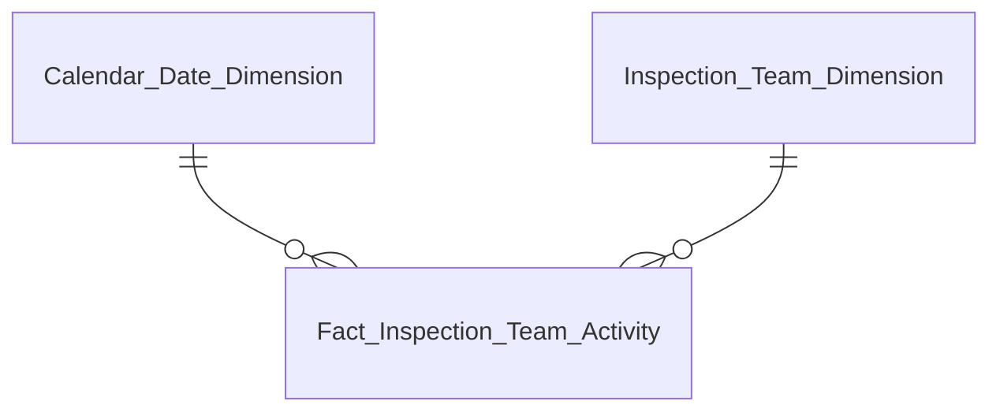
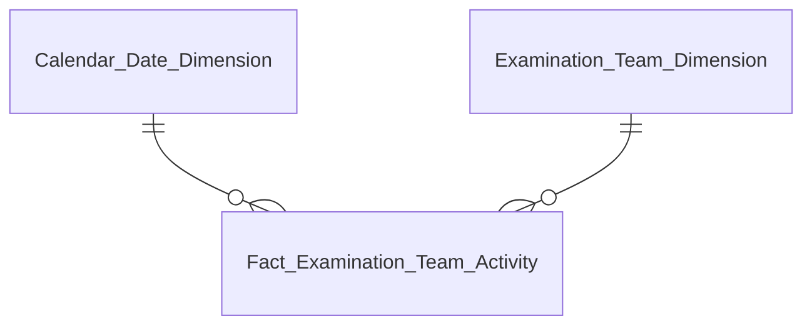
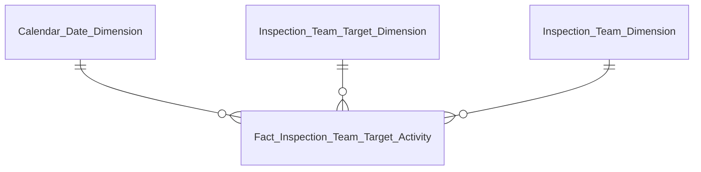
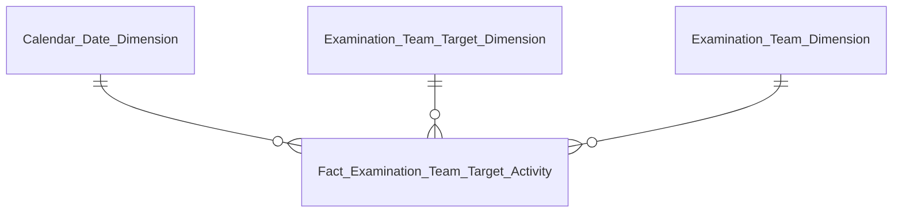
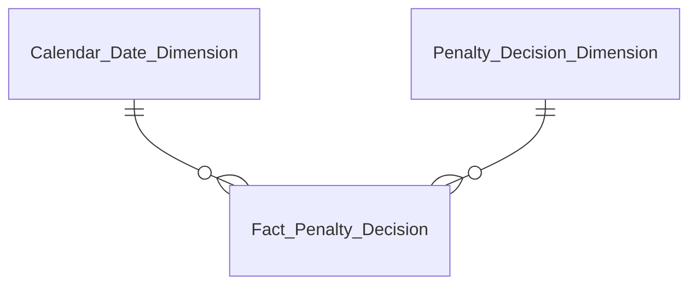
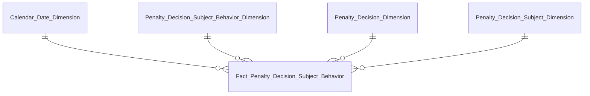
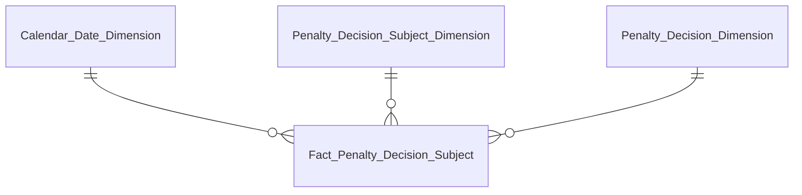

# DTM_TT_Entities — Data Mart: Phân hệ Thanh Tra (TT)

**Phạm vi:** 20 Datamart entities — 7 Fact (2 new + 5 partial, tách khỏi 3 Fact gốc để tránh fanout) + 9 Dimension (2 Conformed reuse + 7 mới) + 4 Tác nghiệp

---

## Cụm 1: Tab TỔNG QUAN — Thống kê chung, xu hướng theo tháng, cơ cấu vi phạm (Nhóm 1–3)

| Datamart Entity | Loại | Reuse | Mô tả | Grain | KPI |
|---|---|---|---|---|---|
| Fact Inspection Team Activity | Fact — Event | new | 1 đoàn thanh tra | 1 row per `INSPECTION_TEAM` | K_TT_1–7 (Nhóm 1), K_TT_8–10 (Nhóm 2), K_TT_11–17 (Nhóm 3) |
| Calendar Date Dimension | Dimension | reuse | Lịch ngày | 1 row / ngày | — |
| Inspection Team Dimension | Dimension | new | Thuộc tính mô tả đoàn thanh tra | 1 row / đoàn thanh tra | — |

---

## Cụm 1b: Tab KIỂM TRA — Thống kê chung, xu hướng theo tháng, cơ cấu kiểm tra (Nhóm 6–8)

| Datamart Entity | Loại | Reuse | Mô tả | Grain | KPI |
|---|---|---|---|---|---|
| Fact Examination Team Activity | Fact — Event | new | 1 vụ việc kiểm tra | 1 row per `EXAMINATION_TEAM` | K_TT_32–38 (Nhóm 6), K_TT_39–41 (Nhóm 7), K_TT_42–64 (Nhóm 8) |
| Calendar Date Dimension | Dimension | reuse | Lịch ngày | 1 row / ngày | — |
| Examination Team Dimension | Dimension | new | Thuộc tính mô tả vụ việc kiểm tra | 1 row / vụ việc kiểm tra | — |

---

## Cụm 1c: Tab TỔNG QUAN — Cơ cấu vi phạm theo đối tượng (Nhóm 4)

| Datamart Entity | Loại | Reuse | Mô tả | Grain | KPI |
|---|---|---|---|---|---|
| Fact Inspection Team Target Activity | Fact — Event | partial | 1 đoàn thanh tra × 1 đối tượng — tách riêng để tránh fanout so với Fact Inspection Team Activity | 1 row per `INSPECTION_TEAM` × `INSPECTION_TEAM_TARGET` (N:1) | K_TT_18–26 (Nhóm 4) |
| Calendar Date Dimension | Dimension | reuse | Lịch ngày (join qua Inspection Team) | 1 row / ngày | — |
| Inspection Team Target Dimension | Dimension | new | Thuộc tính mô tả đối tượng bị thanh tra | 1 row / đối tượng bị thanh tra | — |
| Inspection Team Dimension | Dimension | new (reuse Cụm 1) | FK cha — thuộc tính đoàn thanh tra | 1 row / đoàn thanh tra | — |

---

## Cụm 1d: Tab KIỂM TRA — Cơ cấu kiểm tra theo đối tượng (Nhóm 9)

| Datamart Entity | Loại | Reuse | Mô tả | Grain | KPI |
|---|---|---|---|---|---|
| Fact Examination Team Target Activity | Fact — Event | partial | 1 vụ kiểm tra × 1 đối tượng — tách riêng để tránh fanout so với Fact Examination Team Activity. Đóng O_TT_7 | 1 row per `EXAMINATION_TEAM` × `EXAMINATION_TEAM_TARGET` (N:1) | K_TT_65–74, K_TT_75 (Nhóm 9) |
| Calendar Date Dimension | Dimension | reuse | Lịch ngày (join qua Examination Team) | 1 row / ngày | — |
| Examination Team Target Dimension | Dimension | new | Thuộc tính mô tả đối tượng bị kiểm tra | 1 row / đối tượng bị kiểm tra | — |
| Examination Team Dimension | Dimension | new (reuse Cụm 1b) | FK cha — thuộc tính vụ việc kiểm tra | 1 row / vụ việc kiểm tra | — |

---

## Cụm 2: Tab TỔNG QUAN — Danh sách vụ việc Thanh tra (Nhóm 5)

| Datamart Entity | Loại | Reuse | Mô tả | Grain | KPI |
|---|---|---|---|---|---|
| Operational Inspection Case List | Tác nghiệp | new | Danh sách đoàn thanh tra × đối tượng — latest state. Không reuse `securities_company_compliance_hist` (module QLKD, khác table_type/mục đích) | 1 row per `INSPECTION_TEAM` × `INSPECTION_TEAM_TARGET` (N:1) | Nhóm 5 (TT) |

---

## Cụm 2b: Tab KIỂM TRA — Danh sách vụ việc Kiểm tra (Nhóm 10)

| Datamart Entity | Loại | Reuse | Mô tả | Grain | KPI |
|---|---|---|---|---|---|
| Operational Examination Case List | Tác nghiệp | new | Danh sách vụ kiểm tra × đối tượng — latest state. Không reuse Operational Inspection Case List (khác nguồn Atomic) | 1 row per `EXAMINATION_TEAM` × `EXAMINATION_TEAM_TARGET` (N:1) | Nhóm 10 (KT) |

---

## Cụm 3: Tab XỬ PHẠT — Thống kê chung, xu hướng theo tháng (Nhóm 11–12)

| Datamart Entity | Loại | Reuse | Mô tả | Grain | KPI |
|---|---|---|---|---|---|
| Fact Penalty Decision | Fact — Event | partial | 1 quyết định xử phạt | 1 row per `PENALTY_DECISION` | K_TT_81–85 (Nhóm 11), K_TT_86–87 (Nhóm 12) |
| Calendar Date Dimension | Dimension | reuse | Lịch ngày | 1 row / ngày | — |
| Penalty Decision Dimension | Dimension | new | Thuộc tính định danh quyết định xử phạt | 1 row / quyết định xử phạt | — |

---

## Cụm 3b: Tab XỬ PHẠT — Cơ cấu xử phạt theo loại hành vi + Báo cáo hoạt động vi phạm TTCK (Nhóm 13, STT 20)

| Datamart Entity | Loại | Reuse | Mô tả | Grain | KPI |
|---|---|---|---|---|---|
| Fact Penalty Decision Subject Behavior | Fact — Event | partial | 1 QĐ × 1 đối tượng × 1 hành vi — 4-way join. Đóng O_TT_8 | 1 row per `PENALTY_DECISION` × `PENALTY_DECISION_SUBJECT` × `PENALTY_DECISION_SUBJECT_BEHAVIOR` × `VIOLATION_BEHAVIOR` | K_TT_88–110 (Nhóm 13), K_TT_136–150 (Nhóm 20 — reuse) |
| Calendar Date Dimension | Dimension | reuse | Lịch ngày (join qua Penalty Decision) | 1 row / ngày | — |
| Penalty Decision Subject Behavior Dimension | Dimension | new | Thuộc tính mô tả hành vi vi phạm bị xử phạt theo từng đối tượng | 1 row / hành vi vi phạm per đối tượng | — |
| Penalty Decision Dimension | Dimension | new (reuse Cụm 3) | FK cha — thuộc tính định danh quyết định xử phạt | 1 row / quyết định xử phạt | — |
| Penalty Decision Subject Dimension | Dimension | new (reuse Cụm 3c) | FK cha — thuộc tính mô tả đối tượng bị xử phạt | 1 row / đối tượng bị xử phạt | — |

---

## Cụm 3c: Tab XỬ PHẠT — Cơ cấu xử phạt theo đối tượng (Nhóm 14)

| Datamart Entity | Loại | Reuse | Mô tả | Grain | KPI |
|---|---|---|---|---|---|
| Fact Penalty Decision Subject | Fact — Event | partial | 1 QĐ × 1 đối tượng. Đóng O_TT_9 | 1 row per `PENALTY_DECISION` × `PENALTY_DECISION_SUBJECT` (N:1) | K_TT_111–115 (Nhóm 14) |
| Calendar Date Dimension | Dimension | reuse | Lịch ngày (join qua Penalty Decision) | 1 row / ngày | — |
| Penalty Decision Subject Dimension | Dimension | new | Thuộc tính mô tả đối tượng bị xử phạt | 1 row / đối tượng bị xử phạt | — |
| Penalty Decision Dimension | Dimension | new (reuse Cụm 3) | FK cha — thuộc tính định danh quyết định xử phạt | 1 row / quyết định xử phạt | — |

---

## Cụm 3d: Tab XỬ PHẠT — Danh sách quyết định xử phạt (Nhóm 15)

| Datamart Entity | Loại | Reuse | Mô tả | Grain | KPI |
|---|---|---|---|---|---|
| Operational Penalty Decision List | Tác nghiệp | new | Danh sách QĐ × đối tượng — latest state | 1 row per `PENALTY_DECISION` × `PENALTY_DECISION_SUBJECT` (N:1) | Nhóm 15 (XP) |

---

## Cụm 4: Tab ĐƠN THƯ — KPI card, biểu đồ xu hướng, cơ cấu, danh sách chi tiết (Nhóm 16–19)

| Datamart Entity | Loại | Reuse | Mô tả | Grain | KPI |
|---|---|---|---|---|---|
| Operational Petition List | Tác nghiệp | new | Đơn thư — latest state. Serve cả KPI aggregate (Nhóm 16–18) lẫn danh sách chi tiết (Nhóm 19). Đóng O_TT_10 | 1 row per `PETITION` | Nhóm 16–19 (ĐT), K_TT_121–131 |

---

## Tổng quan toàn bộ mô hình

```mermaid
erDiagram
    Calendar_Date_Dimension ||--o{ Fact_Inspection_Team_Activity : " "
    Inspection_Team_Dimension ||--o{ Fact_Inspection_Team_Activity : " "
    Calendar_Date_Dimension ||--o{ Fact_Examination_Team_Activity : " "
    Examination_Team_Dimension ||--o{ Fact_Examination_Team_Activity : " "
    Calendar_Date_Dimension ||--o{ Fact_Inspection_Team_Target_Activity : " "
    Inspection_Team_Target_Dimension ||--o{ Fact_Inspection_Team_Target_Activity : " "
    Inspection_Team_Dimension ||--o{ Fact_Inspection_Team_Target_Activity : " "
    Calendar_Date_Dimension ||--o{ Fact_Examination_Team_Target_Activity : " "
    Examination_Team_Target_Dimension ||--o{ Fact_Examination_Team_Target_Activity : " "
    Examination_Team_Dimension ||--o{ Fact_Examination_Team_Target_Activity : " "
    Calendar_Date_Dimension ||--o{ Fact_Penalty_Decision : " "
    Penalty_Decision_Dimension ||--o{ Fact_Penalty_Decision : " "
    Calendar_Date_Dimension ||--o{ Fact_Penalty_Decision_Subject_Behavior : " "
    Penalty_Decision_Subject_Behavior_Dimension ||--o{ Fact_Penalty_Decision_Subject_Behavior : " "
    Penalty_Decision_Dimension ||--o{ Fact_Penalty_Decision_Subject_Behavior : " "
    Penalty_Decision_Subject_Dimension ||--o{ Fact_Penalty_Decision_Subject_Behavior : " "
    Calendar_Date_Dimension ||--o{ Fact_Penalty_Decision_Subject : " "
    Penalty_Decision_Subject_Dimension ||--o{ Fact_Penalty_Decision_Subject : " "
    Penalty_Decision_Dimension ||--o{ Fact_Penalty_Decision_Subject : " "
```

**Bảng tổng hợp:**

| Datamart Entity | Loại | Reuse | Grain | Source Atomic | KPI phục vụ |
|---|---|---|---|---|---|
| Calendar Date Dimension | Dim — Conformed | reuse | 1 ngày | `cdr_dt` | — |
| Classification Dimension | Dim — Conformed | reuse | 1 (Scheme, Code) | `cv` | — (không nhóm nào tham chiếu, giữ vì Conformed toàn hệ thống) |
| Inspection Team Dimension | Dim — Reference per module | new | 1 đoàn thanh tra | `inspection_team` | — |
| Examination Team Dimension | Dim — Reference per module | new | 1 vụ việc kiểm tra | `examination_team` | — |
| Inspection Team Target Dimension | Dim — Reference per module | new | 1 đối tượng bị thanh tra | `inspection_team_target` | — |
| Examination Team Target Dimension | Dim — Reference per module | new | 1 đối tượng bị kiểm tra | `examination_team_target` | — |
| Penalty Decision Dimension | Dim — Reference per module | new | 1 quyết định xử phạt | `penalty_decision` | — |
| Penalty Decision Subject Dimension | Dim — Reference per module | new | 1 đối tượng bị xử phạt | `penalty_decision_subject` | — |
| Penalty Decision Subject Behavior Dimension | Dim — Reference per module | new | 1 hành vi vi phạm per đối tượng | `pd_subject_behavior` / `violation_behavior` | — |
| Fact Inspection Team Activity | Fact — Event | new | 1 đoàn thanh tra | `inspection_team` | K_TT_1–7, K_TT_8–10, K_TT_11–17 |
| Fact Examination Team Activity | Fact — Event | new | 1 vụ việc kiểm tra | `examination_team` | K_TT_32–38, K_TT_39–41, K_TT_42–64 |
| Fact Inspection Team Target Activity | Fact — Event | partial | 1 đoàn × 1 đối tượng | `inspection_team` / `inspection_team_target` | K_TT_18–26 |
| Fact Examination Team Target Activity | Fact — Event | partial | 1 vụ × 1 đối tượng | `examination_team` / `examination_team_target` | K_TT_65–74, K_TT_75 |
| Fact Penalty Decision | Fact — Event | partial | 1 QĐXP | `penalty_decision` | K_TT_81–85, K_TT_86–87 |
| Fact Penalty Decision Subject Behavior | Fact — Event | partial | 1 QĐ × 1 đối tượng × 1 hành vi | `penalty_decision` / `penalty_decision_subject` / `pd_subject_behavior` / `violation_behavior` | K_TT_88–110, K_TT_136–150 |
| Fact Penalty Decision Subject | Fact — Event | partial | 1 QĐ × 1 đối tượng | `penalty_decision` / `penalty_decision_subject` | K_TT_111–115 |
| Operational Inspection Case List | Tác nghiệp | new | 1 đoàn × 1 đối tượng (latest) | `inspection_team` / `inspection_team_target` | Nhóm 5 |
| Operational Examination Case List | Tác nghiệp | new | 1 vụ × 1 đối tượng (latest) | `examination_team` / `examination_team_target` | Nhóm 10 |
| Operational Penalty Decision List | Tác nghiệp | new | 1 QĐ × 1 đối tượng (latest) | `penalty_decision` / `penalty_decision_subject` / `violation_case` | Nhóm 15 |
| Operational Petition List | Tác nghiệp | new | 1 đơn thư (latest) | `petition` | Nhóm 16–19, K_TT_121–131 |
