# DTM_TT_HLD — Data Mart: Phân hệ Thanh Tra (TT)

**Phiên bản:** 2.3  
**Ngày:** 27/04/2026  
**Phạm vi:** Tab **TỔNG QUAN** + **KIỂM TRA** + **XỬ PHẠT** + **ĐƠN THƯ** + **Báo cáo hoạt động vi phạm TTCK** — 4 tab dashboard + 1 báo cáo, 20 nhóm (K_TT_1–88 + K_TT_89–100)

---

## Section 1 — Data Lineage: Source → Atomic → Data Mart

##### Cụm 1: Thống kê vụ việc Thanh tra (Fact Inspection Team Activity)

> **[ĐIỀU CHỈNH 2026-07-20]** Thiết kế lại theo Atomic THANHTRA schema mới (đã tái cấu trúc — xem `DataModel/working/Atomic/hld/THANHTRA_LinhLV_Reuse_Analysis.md`). Schema cũ (`TT_HO_SO`/`TT_QUYET_DINH`/`TT_QUYET_DINH_DOI_TUONG`/`TT_KET_LUAN`) đã deprecated, không còn tồn tại trong Atomic hiện hành. BA đã cập nhật mapping kỹ thuật (`BRD/BA/BA_analyst_TT.csv`, cột Bảng nguồn/Trường nguồn/Câu lệnh tham khảo) xác nhận nguồn mới: `INSPECTION_TEAM` (Thanh tra) và `EXAMINATION_TEAM` (Kiểm tra) — **2 bảng Atomic riêng biệt**, không còn dùng chung 1 Fact phân biệt bằng `Inspection_Type_Code` như thiết kế cũ. Cụm 1 phục vụ riêng Tab TỔNG QUAN (Thanh tra); Kiểm tra xem Cụm 1b.

> **[TÁI CẤU TRÚC 2026-07-20]** Tách `Inspection Team Dimension` riêng khỏi Fact — grain Fact = 1 đoàn thanh tra, không có measure định lượng thật (mọi KPI là `COUNT` trên chính grain), nên các thuộc tính mô tả (`Start_Date`/`End_Date`/`Content`) đúng ra thuộc Dimension theo lý thuyết star schema (Kimball), không nằm trực tiếp trên Fact. Fact giờ chỉ giữ 2 FK: `Calendar Date Dimension` (qua `Decision_Date`) và `Inspection Team Dimension`.

Phục vụ Tab TỔNG QUAN — KPI cards Thống kê chung (Nhóm 1) và biểu đồ theo tháng (Nhóm 2).

- **Grain Fact: 1 row per `INSPECTION_TEAM`** — 1 đoàn thanh tra. Đếm số đoàn dùng `COUNT(Inspection_Team_Dimension_Id)` qua Dimension (grain Fact/Dimension đều 1:1, không fanout).
- **Grain Dimension: 1 row per `INSPECTION_TEAM`** — chứa `Inspection_Team_Code` (BK), `Start_Date`, `End_Date`, `Content` — mọi thuộc tính mô tả của đoàn thanh tra.
- Date key: `Decision_Date` (`INSPECTION_TEAM.DECISION_DATE`) — theo đúng SQL tham khảo BA (STT 1), KHÔNG phải Received Date như thiết kế cũ (đóng O_TT_3 theo hướng dùng Decision Date). Fact join `Calendar Date Dimension` qua `Decision_Date`.
- Trạng thái Hoàn thành/Đang thực hiện **ETL-derived trên `Inspection Team Dimension` từ `Start_Date`/`End_Date`** — không cần field status riêng trên Atomic: `End_Date IS NOT NULL AND Start_Date IS NOT NULL` → Hoàn thành; `End_Date IS NULL AND Start_Date IS NOT NULL` → Đang thực hiện. Atomic `Inspection Team` không có field `life_cycle_status_code`/`case_status_code` — BA tự giải quyết bằng logic 2 cột ngày này, không phải gap Atomic.
- Nhóm 3 (Cơ cấu theo hành vi) đã điều chỉnh xong — reuse Fact + Dimension này, dùng `Content` trên Dimension để derive phân loại vi phạm bằng text-matching LIKE.
- Nhóm 4 (Cơ cấu theo đối tượng) — nguồn Atomic cho `Subject_Category` **chưa được kiểm tra lại theo BA CSV mới** — xem Nhóm 4 khi review tiếp.

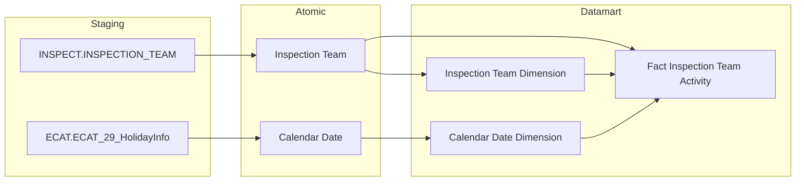

##### Cụm 1b: Thống kê vụ việc Kiểm tra (Fact Examination Team Activity)

Phục vụ Tab KIỂM TRA — KPI cards Thống kê chung (Nhóm 6) và biểu đồ theo tháng (Nhóm 7). Nguồn Atomic riêng biệt hoàn toàn với Cụm 1 — `EXAMINATION_TEAM` (không phải `INSPECTION_TEAM` filter theo loại hình như thiết kế cũ).

> **[TÁI CẤU TRÚC 2026-07-20]** Cùng kiến trúc Cụm 1 — tách `Examination Team Dimension` riêng khỏi Fact, giữ nhất quán cấu trúc star schema.
> **[ĐIỀU CHỈNH 2026-07-20]** Nhóm 6 và Nhóm 7 đã review xong nội dung KPI theo BA CSV mới (xem Nhóm 6, Nhóm 7).

- **Grain Fact: 1 row per `EXAMINATION_TEAM`** — 1 vụ việc kiểm tra. Đếm dùng `COUNT(Examination_Team_Dimension_Id)` qua Dimension.
- **Grain Dimension: 1 row per `EXAMINATION_TEAM`** — chứa `Examination_Team_Code` (BK), `Start_Date`, `End_Date`, `Content`.
- Date key: `Decision_Date` (`EXAMINATION_TEAM.DECISION_DATE`). Fact join `Calendar Date Dimension` qua `Decision_Date`.
- Trạng thái Hoàn thành/Đang thực hiện — cùng logic ETL-derived trên `Examination Team Dimension` từ `Start_Date`/`End_Date` như Cụm 1.

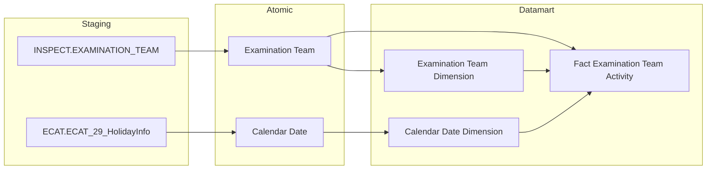

##### Cụm 1c: Cơ cấu vi phạm theo đối tượng (Fact Inspection Team Target Activity)

> **[MỚI 2026-07-20]** Nhóm 4 (Cơ cấu vi phạm theo đối tượng) — thiết kế lại theo Atomic THANHTRA schema mới, thay thế thiết kế cũ dùng `Inspection Decision Subject`/`TT_QUYET_DINH_DOI_TUONG` + polymorphic FK (đã deprecated).

Phục vụ Tab TỔNG QUAN — Biểu đồ cơ cấu vi phạm theo đối tượng (Nhóm 4). Grain khác Cụm 1 — `INSPECTION_TEAM_TARGET` quan hệ N:1 với `INSPECTION_TEAM` (1 đoàn có thể có nhiều đối tượng), nên tách Fact riêng grain 1 đoàn × 1 đối tượng, không gắn vào `Fact Inspection Team Activity` để tránh fanout ảnh hưởng K_TT_1-15 (Nhóm 1/2/3).

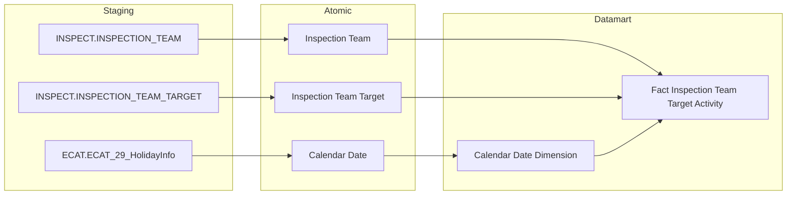

##### Cụm 1d: Cơ cấu kiểm tra theo đối tượng (Fact Examination Team Target Activity)

> **[MỚI 2026-07-20]** Nhóm 9 (Cơ cấu kiểm tra theo đối tượng) — thiết kế lại theo Atomic THANHTRA schema mới, thay thế thiết kế cũ dùng `Inspection Decision Subject`/`TT_QUYET_DINH_DOI_TUONG` (đã deprecated). Đóng O_TT_7.

Phục vụ Tab KIỂM TRA — Biểu đồ cơ cấu kiểm tra theo đối tượng (Nhóm 9). Cùng kiến trúc Cụm 1c — `EXAMINATION_TEAM_TARGET` quan hệ N:1 với `EXAMINATION_TEAM` (1 vụ kiểm tra có thể có nhiều đối tượng), nên tách Fact riêng grain 1 vụ × 1 đối tượng, không gắn vào `Fact Examination Team Activity` để tránh fanout ảnh hưởng K_TT_24-44k (Nhóm 6/7/8).

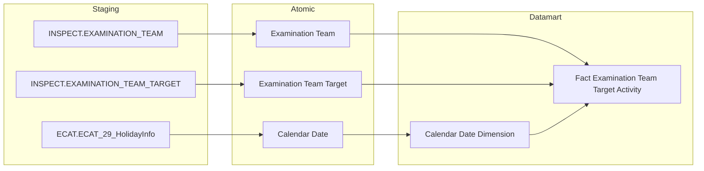

##### Cụm 2: Danh sách vụ việc Thanh tra (Inspection Case List)

> **[ĐIỀU CHỈNH 2026-07-20]** Thiết kế lại theo Atomic THANHTRA schema mới. Thiết kế cũ dùng `Inspection Case`/`Inspection Decision` ← `TT_HO_SO`/`TT_QUYET_DINH` — đã deprecated. Nguồn mới: `Inspection Team` + `Inspection Team Target` (cùng nguồn Cụm 1/1c), grain 1 đoàn × 1 đối tượng.

Phục vụ block Danh sách vụ việc Thanh tra (Nhóm 5, Tab TỔNG QUAN). Lấy dữ liệu trực tiếp từ Atomic — không qua Dimension. Tab KIỂM TRA (Nhóm 10) dùng nguồn Atomic riêng (`EXAMINATION_TEAM`/`EXAMINATION_TEAM_TARGET`), bảng riêng `Examination Case List` — xem Cụm 2b.

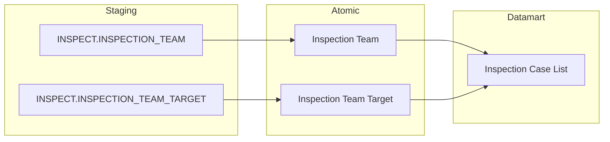

##### Cụm 2b: Danh sách vụ việc Kiểm tra (Examination Case List)

> **[MỚI 2026-07-20]** Nhóm 10 (Danh sách vụ việc Kiểm tra) — thiết kế lại theo Atomic THANHTRA schema mới, thay thế thiết kế cũ dùng `Inspection Case`/`Inspection Decision` ← `TT_HO_SO`/`TT_QUYET_DINH` + reuse sai `Inspection Case List` (Nhóm 5, nguồn TT khác luồng).

Phục vụ block Danh sách vụ việc Kiểm tra (Nhóm 10, Tab KIỂM TRA). Cùng cấu trúc Cụm 2 nhưng nguồn Atomic riêng biệt (`EXAMINATION_TEAM`/`EXAMINATION_TEAM_TARGET`, cùng nguồn Cụm 1b/1d), không reuse chung bảng với Nhóm 5 (`table_type` giống nhưng nguồn Atomic khác — theo Bước 3 Lớp 3).

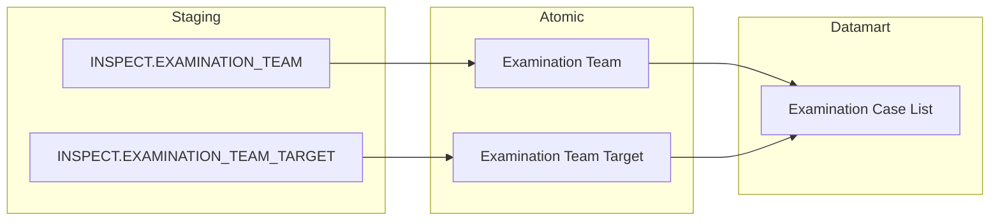

##### Cụm 3: Xử phạt vi phạm (Fact Penalty Decision + Penalty Decision List)

Phục vụ Tab XỬ PHẠT — KPI cards tổng hợp, biểu đồ dual axis theo tháng, donut cơ cấu hành vi và đối tượng, danh sách quyết định. Nguồn Atomic khác hoàn toàn với Cụm 1 — từ luồng Giám sát (`GS_*`), không phải luồng Thanh tra (`TT_*`).

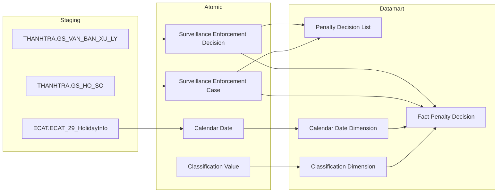

##### Cụm 4: Đơn thư khiếu nại tố cáo (Complaint Petition List)

Phục vụ Tab ĐƠN THƯ — KPI aggregate (tổng, theo tháng, theo loại) và danh sách chi tiết. Toàn bộ KPI serve từ `Complaint Petition List` — không tạo Fact riêng vì grain giống hệt tác nghiệp, volume nhỏ, không có fanout.

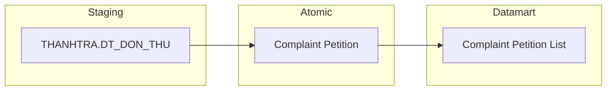

##### Cụm 5: Báo cáo hoạt động vi phạm TTCK (Fact Penalty Decision — reuse)

Phục vụ Báo cáo STT 20 — bảng pivot nhóm đối tượng × loại vi phạm × (số lượng + số tiền). Reuse hoàn toàn `Fact Penalty Decision` từ Cụm 3 — không tạo Fact hay Atomic entity mới.

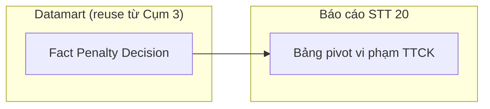

---

## Section 2 — Tổng quan báo cáo

### Tab: TỔNG QUAN

**Slicer chung:** Năm (NĂM 202X — góc trên phải dashboard)

---

#### Nhóm 1 — KPI cards Thống kê chung (STT 1)

> **[ĐIỀU CHỈNH 2026-07-20]** Thiết kế lại theo BA_analyst_TT.csv mới (cột Bảng nguồn/Trường nguồn/Câu lệnh tham khảo, Trạng thái mapping=Done) + Atomic THANHTRA schema mới.
> **[TÁI CẤU TRÚC 2026-07-20]** Tách `Inspection Team Dimension` — Fact chỉ còn FK, mọi thuộc tính mô tả (`Start_Date`/`End_Date`/`Content`) chuyển sang Dimension. Công thức KPI giờ join Fact → Dimension trước khi filter.
> Phân loại: **Phân tích**
> Atomic: `Inspection Team` ← THANHTRA.INSPECTION_TEAM (`INSPECT.INSPECTION_TEAM`) — **READY** (`DataModel/Atomic/Business_Activity/dm_atm_inspection_team-THANHTRA.INSPECTION_TEAM.yaml`)
> Ghi chú:
> - Không còn Fact dùng chung Thanh tra + Kiểm tra như thiết kế cũ — `INSPECTION_TEAM` là nguồn riêng cho Thanh tra; Kiểm tra dùng `EXAMINATION_TEAM` riêng (xem Nhóm 6). Không cần `Inspection_Type_Code` để lọc TT/KT nữa.
> - `Case_Status` (Hoàn thành/Đang thực hiện) **không tồn tại như 1 field riêng trên Atomic** — ETL-derived trên `Inspection Team Dimension` từ `Start_Date`/`End_Date`: `End_Date IS NOT NULL AND Start_Date IS NOT NULL` → Hoàn thành; `End_Date IS NULL AND Start_Date IS NOT NULL` → Đang thực hiện. Đúng theo SQL tham khảo BA STT 1.
> - Date key dùng `Decision_Date` (không phải Received Date như thiết kế cũ) — đúng theo SQL tham khảo BA: `EXTRACT(YEAR FROM DECISION_DATE)`. Fact join `Calendar Date Dimension` qua `Decision_Date`.

**Mockup:**

| ĐOÀN ▲ 8% | ĐOÀN ▲ 12% | ĐOÀN ▲ 5% |
|---|---|---|
| Tổng số đoàn thanh tra | Số đoàn đã hoàn thành | Số đoàn đang thực hiện |

**Source:** `Fact Inspection Team Activity` → `Calendar Date Dimension`, `Inspection Team Dimension`

**Bảng KPI:**

| KPI ID | Tên KPI | Đơn vị | Tính chất | Công thức | Ghi chú |
|---|---|---|---|---|---|
| K_TT_1 | Tổng số đoàn thanh tra | Đoàn | Base | COUNT(Fact_Inspection_Team_Activity JOIN Inspection Team Dimension) WHERE Year(Calendar Date Dimension.Decision_Date)=selected_year | |
| K_TT_2 | Tổng số thanh tra SSCK (%) | % | Derived | (K_TT_1[Y] − K_TT_1[Y−1]) / K_TT_1[Y−1] × 100% | |
| K_TT_3 | Số đoàn đã hoàn thành | Đoàn | Base | COUNT(...) WHERE Year(Decision_Date)=selected_year AND Inspection Team Dimension.End_Date IS NOT NULL AND Inspection Team Dimension.Start_Date IS NOT NULL | |
| K_TT_4 | Số đoàn hoàn thành SSCK (%) | % | Derived | (K_TT_3[Y] − K_TT_3[Y−1]) / K_TT_3[Y−1] × 100% | |
| K_TT_5 | Số đoàn đang thực hiện | Đoàn | Base | COUNT(...) WHERE Year(Decision_Date)=selected_year AND Inspection Team Dimension.End_Date IS NULL AND Inspection Team Dimension.Start_Date IS NOT NULL | |
| K_TT_6 | Số đoàn đang thực hiện SSCK (%) | % | Derived | (K_TT_5[Y] − K_TT_5[Y−1]) / K_TT_5[Y−1] × 100% | |
| K_TT_6b | Thời gian (năm thống kê) | Năm | Chiều | Year(Calendar Date Dimension.Calendar_Date) — slicer chọn năm thống kê, join qua `Decision_Date_Dimension_Id` | Chiều lọc dùng chung cho K_TT_1-6 |

**Star Schema:**

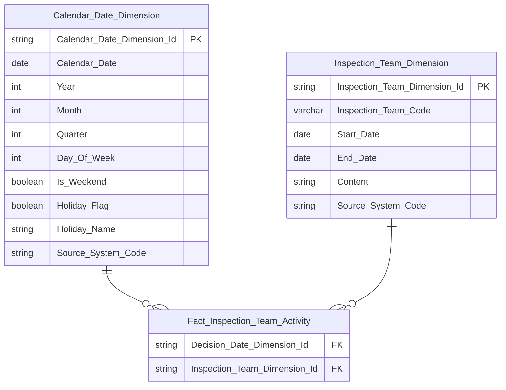

> Field mapping Atomic source: `Inspection_Team_Code` ← `Inspection Team.Inspection Team Code` (`INSPECTION_TEAM.CODE`, BK — dùng `COUNT()` qua join Fact-Dimension để đếm đoàn, grain 1:1 không fanout nên không cần DISTINCT); `Start_Date`/`End_Date` ← `Inspection Team.Start Date`/`End Date` (`INSPECTION_TEAM.START_DATE`/`END_DATE`, dùng kết hợp để ETL-derive trạng thái Hoàn thành/Đang thực hiện); `Content` ← `Inspection Team.Content` (`INSPECTION_TEAM.CONTENT`, nguồn CLOB — ETL truncate nếu vượt ngưỡng, dùng derive `Phân loại vi phạm` K_TT_9b ở Nhóm 3).

**Lineage Mart → Báo cáo:**

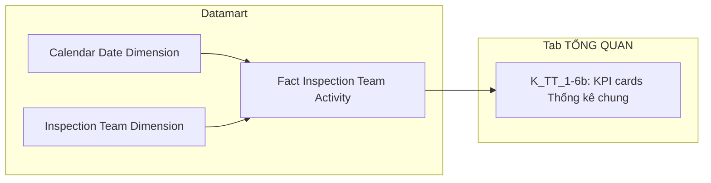

**Bảng grain:**

| Tên bảng | Grain | Date key | Filter mặc định |
|---|---|---|---|
| Fact Inspection Team Activity | 1 đoàn thanh tra (`INSPECTION_TEAM`) — 2 FK: Calendar Date, Inspection Team Dimension | `Decision_Date_Dimension_Id` ← join Calendar Date Dimension | Year = selected_year (slicer NĂM 202X) |
| Inspection Team Dimension | 1 đoàn thanh tra (`INSPECTION_TEAM`) — SCD Type 4A | — | — |

---

#### Nhóm 2 — Biểu đồ Thống kê số vụ việc theo tháng (STT 2)

> **[ĐIỀU CHỈNH 2026-07-20]** Thiết kế lại theo BA_analyst_TT.csv mới + Atomic THANHTRA schema mới — reuse 100% `Fact Inspection Team Activity` đã thiết kế ở Nhóm 1 (nguồn `INSPECTION_TEAM`, cùng entity, cùng field), không cần Atomic entity mới, không cần Fact mới.
> **[TÁI CẤU TRÚC 2026-07-20]** Reuse cùng cấu trúc Fact + Inspection Team Dimension đã tách ở Nhóm 1 — công thức join Dimension trước khi filter.
> Phân loại: **Phân tích**
> Atomic: `Inspection Team` ← THANHTRA.INSPECTION_TEAM (`INSPECT.INSPECTION_TEAM`) — **READY** (`DataModel/Atomic/Business_Activity/dm_atm_inspection_team-THANHTRA.INSPECTION_TEAM.yaml`)
> Ghi chú: Reuse `Fact Inspection Team Activity` + `Inspection Team Dimension` — GROUP BY `Calendar_Date_Dimension.Month` ở presentation layer. Trạng thái Hoàn thành/Đang thực hiện ETL-derived trên Dimension từ `Start_Date`/`End_Date` (giống Nhóm 1, xem SQL BA STT 2).

**Mockup:**

| Tháng | T1 | T2 | T3 | ... | T12 |
|---|---|---|---|---|---|
| Tổng số vụ | 4 | 6 | 5 | ... | 24 |
| Đang thực hiện | 2 | 3 | 2 | ... | 12 |
| Đã hoàn thành | 2 | 3 | 3 | ... | 12 |

**Source:** `Fact Inspection Team Activity` → `Calendar Date Dimension`, `Inspection Team Dimension`

**Bảng KPI:**

| KPI ID | Tên KPI | Đơn vị | Tính chất | Công thức | Ghi chú |
|---|---|---|---|---|---|
| K_TT_7 | Số vụ việc thanh tra theo tháng (tổng) | Vụ | Base | COUNT(Fact_Inspection_Team_Activity JOIN Inspection Team Dimension) WHERE Year(Decision_Date)=selected_year GROUP BY Calendar_Date_Dimension.Month | |
| K_TT_8 | Số vụ đang thực hiện theo tháng | Vụ | Base | COUNT(...) WHERE Year(Decision_Date)=selected_year AND Inspection Team Dimension.End_Date IS NULL AND Inspection Team Dimension.Start_Date IS NOT NULL GROUP BY Month | |
| K_TT_9 | Số vụ đã hoàn thành theo tháng | Vụ | Base | COUNT(...) WHERE Year(Decision_Date)=selected_year AND Inspection Team Dimension.End_Date IS NOT NULL AND Inspection Team Dimension.Start_Date IS NOT NULL GROUP BY Month | |

**Star Schema:** giống Nhóm 1 (reuse 100% `Fact Inspection Team Activity` + `Calendar Date Dimension` + `Inspection Team Dimension`, không thêm FK/measure mới).

**Lineage Mart → Báo cáo:**

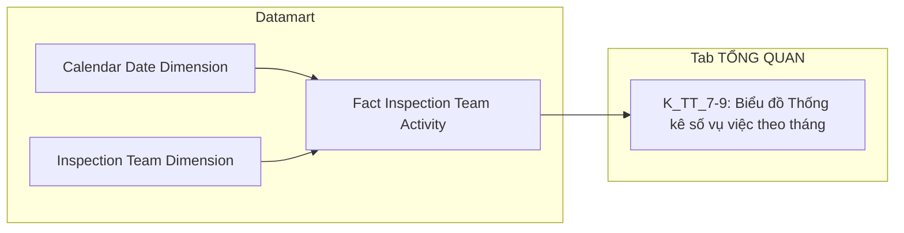

**Bảng grain:**

| Tên bảng | Grain | Date key | Filter mặc định | Phân tích theo tháng |
|---|---|---|---|---|
| Fact Inspection Team Activity | reuse — 1 đoàn thanh tra. Đếm dùng `COUNT()` qua join Dimension | `Decision_Date_Dimension_Id` | Year=selected_year | GROUP BY Calendar_Date_Dimension.Month ở query time |
| Inspection Team Dimension | reuse — 1 đoàn thanh tra (`INSPECTION_TEAM`), SCD Type 4A | — | — | — |

---

#### Nhóm 3 — Cơ cấu vi phạm theo loại hành vi (STT 3)

> **[ĐIỀU CHỈNH 2026-07-20]** Thiết kế lại theo BA_analyst_TT.csv mới + Atomic THANHTRA schema mới — reuse 100% `Fact Inspection Team Activity` (Nhóm 1/2). Thiết kế cũ dùng `Inspection Case`/`Inspection Case Conclusion` (deprecated) + `Violation_Type_Dimension_Id` FK → Classification Dimension (scheme `TT_VIOLATION_TYPE`, 11 giá trị, ETL join Conclusion) — hoàn toàn không còn đúng.
> **[TÁI CẤU TRÚC 2026-07-20]** `Content` giờ nằm trên `Inspection Team Dimension` (không phải Fact) — công thức join qua Dimension trước khi LIKE-match.
> Phân loại: **Phân tích**
> Atomic: `Inspection Team` ← THANHTRA.INSPECTION_TEAM (`INSPECT.INSPECTION_TEAM`) — **READY** (reuse Nhóm 1/2, không cần entity mới)
> Ghi chú:
> - Phân loại hành vi **derive trực tiếp bằng text-matching trên `Inspection Team Dimension.Content`** — KHÔNG qua Classification Dimension/scheme nào: `CASE WHEN LOWER(Content) LIKE '%thao túng thị trường%' THEN 'Thao túng thị trường' WHEN LOWER(Content) LIKE '%cho mượn tài khoản%' THEN 'Cho mượn tài khoản' WHEN LOWER(Content) LIKE '%công bố thông tin%' THEN 'Công bố thông tin' ELSE NULL END` — đúng theo SQL tham khảo BA STT 3. Bản ghi không khớp cả 3 mẫu → `NULL`, loại khỏi thống kê (không phải giá trị thứ 4).
> - **"CBTT" là tên viết tắt hiển thị của "Công bố thông tin"** — BA đặt tên KPI/Thông tin là "CBTT" nhưng SQL literal thực tế trả về chuỗi `'Công bố thông tin'`. Dùng `'Công bố thông tin'` làm giá trị so khớp/lưu trữ, "CBTT" chỉ dùng khi hiển thị rút gọn.
> - `Content` (← `INSPECTION_TEAM.CONTENT`) đã có sẵn trên `Inspection Team Dimension` từ Nhóm 1 — không cần thêm gì mới.

**Mockup:**

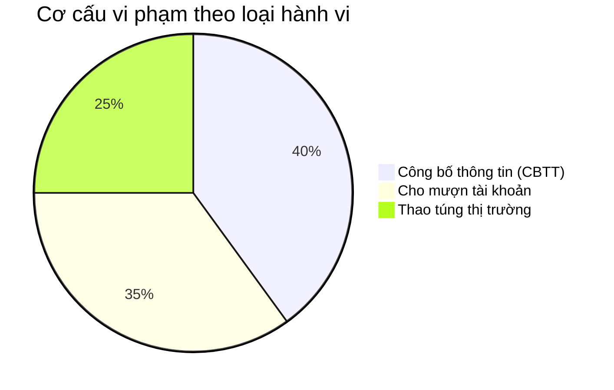

**Source:** `Fact Inspection Team Activity` → `Calendar Date Dimension`, `Inspection Team Dimension`

**Bảng KPI:**

| KPI ID | Tên KPI | Đơn vị | Tính chất | Công thức | Ghi chú |
|---|---|---|---|---|---|
| K_TT_9b | Phân loại vi phạm | — | Chiều | `CASE WHEN LOWER(Inspection Team Dimension.Content) LIKE '%thao túng thị trường%' THEN 'Thao túng thị trường' WHEN LIKE '%cho mượn tài khoản%' THEN 'Cho mượn tài khoản' WHEN LIKE '%công bố thông tin%' THEN 'Công bố thông tin' ELSE NULL END` | Chiều lọc/nhóm dùng chung cho K_TT_10-15 |
| K_TT_10 | Số vi phạm Thao túng thị trường | Vụ | Base | COUNT(Fact_Inspection_Team_Activity JOIN Inspection Team Dimension) WHERE Year(Decision_Date)=selected_year AND LOWER(Inspection Team Dimension.Content) LIKE '%thao túng thị trường%' | |
| K_TT_11 | Tỷ lệ % Thao túng thị trường | % | Derived | K_TT_10 / K_TT_1 × 100% | |
| K_TT_12 | Số vi phạm Cho mượn tài khoản | Vụ | Base | COUNT(...) WHERE Year(Decision_Date)=selected_year AND LOWER(Inspection Team Dimension.Content) LIKE '%cho mượn tài khoản%' | |
| K_TT_13 | Tỷ lệ % Cho mượn tài khoản | % | Derived | K_TT_12 / K_TT_1 × 100% | |
| K_TT_14 | Số vi phạm CBTT (Công bố thông tin) | Vụ | Base | COUNT(...) WHERE Year(Decision_Date)=selected_year AND LOWER(Inspection Team Dimension.Content) LIKE '%công bố thông tin%' | |
| K_TT_15 | Tỷ lệ % CBTT (Công bố thông tin) | % | Derived | K_TT_14 / K_TT_1 × 100% | |

**Star Schema:** giống Nhóm 1 (reuse 100% `Fact Inspection Team Activity` + `Calendar Date Dimension` + `Inspection Team Dimension`, không thêm FK/measure mới — `Content` đã có sẵn trên Dimension từ Nhóm 1).

**Lineage Mart → Báo cáo:**

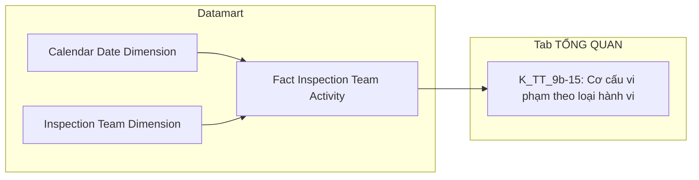

**Bảng grain:**

| Tên bảng | Grain | Date key | Filter mặc định | Phân tích theo hành vi |
|---|---|---|---|---|
| Fact Inspection Team Activity | reuse — 1 đoàn thanh tra. Đếm dùng `COUNT()` qua join Dimension | `Decision_Date_Dimension_Id` | Year=selected_year | GROUP BY CASE WHEN LOWER(Inspection Team Dimension.Content) LIKE ... ở query time |
| Inspection Team Dimension | reuse — 1 đoàn thanh tra (`INSPECTION_TEAM`), SCD Type 4A | — | — | — |

---

#### Nhóm 4 — Cơ cấu vi phạm theo đối tượng (STT 4)

> **[ĐIỀU CHỈNH 2026-07-20]** Thiết kế lại theo BA_analyst_TT.csv mới + Atomic THANHTRA schema mới. Thiết kế cũ dùng `Inspection Decision Subject` ← `TT_QUYET_DINH_DOI_TUONG` + polymorphic FK resolve qua 4 bảng danh mục (`DM_CONG_TY_CK`/`DM_CONG_TY_QLQ`/`DM_CONG_TY_DC`/`DM_DOI_TUONG_KHAC`) — toàn bộ các bảng này đã deprecated, không còn tồn tại trong Atomic hiện hành (xem `DataModel/working/Atomic/hld/THANHTRA_LinhLV_Reuse_Analysis.md`).
> Phân loại: **Phân tích**
> Atomic: `Inspection Team` ← THANHTRA.INSPECTION_TEAM (`INSPECT.INSPECTION_TEAM`) — **READY** (reuse Nhóm 1, không cần entity mới)
> Atomic: `Inspection Team Target` ← THANHTRA.INSPECTION_TEAM_TARGET (`INSPECT.INSPECTION_TEAM_TARGET`) — **READY** (`DataModel/Atomic/Business_Activity/dm_atm_inspection_team_target-THANHTRA.INSPECTION_TEAM_TARGET.yaml`)
> Ghi chú:
> - **Grain khác Nhóm 1/2/3** — `INSPECTION_TEAM_TARGET` quan hệ N:1 với `INSPECTION_TEAM` (1 đoàn thanh tra có thể có nhiều đối tượng, xem Atomic description "Danh sách đối tượng được thanh tra trong đoàn cụ thể"). SQL tham khảo BA dùng `COUNT(a.ID)` sau JOIN với target — KHÔNG DISTINCT — nghĩa là đếm theo **số lượt đối tượng**, không phải số đoàn. Vì vậy tách riêng **Fact Inspection Team Target Activity** (grain 1 đoàn × 1 đối tượng), KHÔNG gắn FK Target vào `Fact Inspection Team Activity` (Nhóm 1/2/3, grain 1 đoàn) để tránh fanout làm sai K_TT_1-15 đã thiết kế.
> - `Target_Type_Code` (← `INSPECTION_TEAM_TARGET.TARGET_TYPE`) map 1:1 trực tiếp từ nguồn — **KHÔNG phải Classification Value**, không qua Classification Dimension/scheme. Giá trị: `SECURITIES_COMPANY, FUND_MANAGEMENT_COMPANY, PUBLIC_COMPANY, AUDIT_COMPANY, CRYPTO_SERVICE_PROVIDER, INDIVIDUAL, ORGANIZATION` (7 giá trị, đủ phân biệt — đóng O_TT_4, xem Section 5).
> - Mapping 4 nhóm BA STT 4 → Target Type Code: Cá nhân=`INDIVIDUAL`, CTĐC=`PUBLIC_COMPANY`, CTCK=`SECURITIES_COMPANY`, CTQLQ=`FUND_MANAGEMENT_COMPANY`.
> - Date key: `Decision_Date` (← `INSPECTION_TEAM.DECISION_DATE`, qua join với Inspection Team) — cùng date key với Nhóm 1.
> - Công thức % theo đúng SQL BA (window function `PARTITION BY Year`): tỷ lệ tính trên **tổng số lượt đối tượng cùng năm** (SUM của 4 KPI Base K_TT_16/18/20/22), KHÔNG chia cho K_TT_1 (K_TT_1 là số đoàn, khác grain).

**Mockup:**

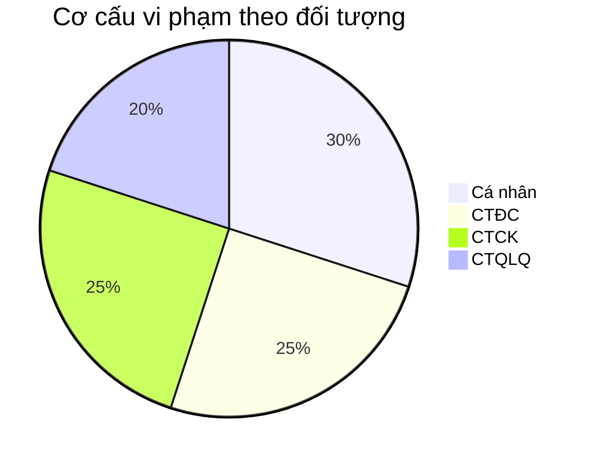

**Source:** `Fact Inspection Team Target Activity` → `Calendar Date Dimension`

**Bảng KPI:**

| KPI ID | Tên KPI | Đơn vị | Tính chất | Công thức | Ghi chú |
|---|---|---|---|---|---|
| K_TT_16 | Số vi phạm đối tượng Cá nhân | Vụ | Base | COUNT(Fact_Inspection_Team_Target_Activity) WHERE Year(Decision_Date)=selected_year AND Target_Type_Code=`INDIVIDUAL` | |
| K_TT_17 | Tỷ lệ % Cá nhân | % | Derived | K_TT_16 / (K_TT_16+K_TT_18+K_TT_20+K_TT_22) × 100% | Base = tổng lượt đối tượng cùng năm, theo đúng window function BA SQL |
| K_TT_18 | Số vi phạm đối tượng CTĐC | Vụ | Base | COUNT(Fact_Inspection_Team_Target_Activity) WHERE Year(Decision_Date)=selected_year AND Target_Type_Code=`PUBLIC_COMPANY` | |
| K_TT_19 | Tỷ lệ % CTĐC | % | Derived | K_TT_18 / (K_TT_16+K_TT_18+K_TT_20+K_TT_22) × 100% | |
| K_TT_20 | Số vi phạm đối tượng CTCK | Vụ | Base | COUNT(Fact_Inspection_Team_Target_Activity) WHERE Year(Decision_Date)=selected_year AND Target_Type_Code=`SECURITIES_COMPANY` | |
| K_TT_21 | Tỷ lệ % CTCK | % | Derived | K_TT_20 / (K_TT_16+K_TT_18+K_TT_20+K_TT_22) × 100% | |
| K_TT_22 | Số vi phạm đối tượng CTQLQ | Vụ | Base | COUNT(Fact_Inspection_Team_Target_Activity) WHERE Year(Decision_Date)=selected_year AND Target_Type_Code=`FUND_MANAGEMENT_COMPANY` | |
| K_TT_23 | Tỷ lệ % CTQLQ | % | Derived | K_TT_22 / (K_TT_16+K_TT_18+K_TT_20+K_TT_22) × 100% | |
| K_TT_23b | Phân loại đối tượng | — | Chiều | `Target_Type_Code` — giá trị: `INDIVIDUAL`/`PUBLIC_COMPANY`/`SECURITIES_COMPANY`/`FUND_MANAGEMENT_COMPANY` (map hiển thị: Cá nhân/CTĐC/CTCK/CTQLQ) | Chiều lọc/nhóm dùng chung cho K_TT_16-23 — BA STT 4 dòng 1 (Phân loại: Chiều) |

**Star Schema:**

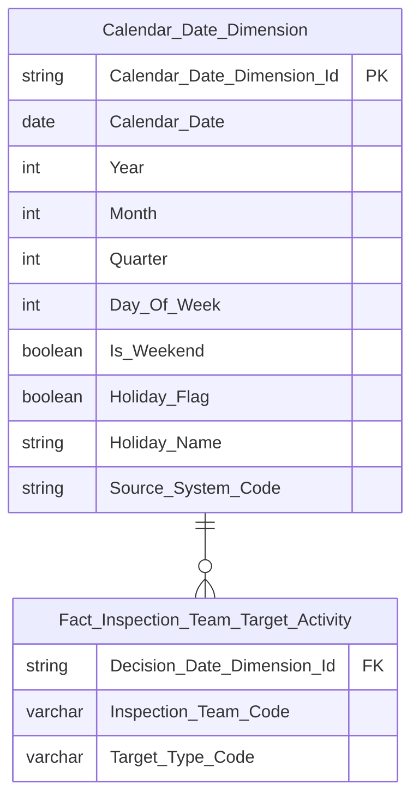

> Field mapping Atomic source: `Inspection_Team_Code` ← `Inspection Team.Inspection Team Code` (`INSPECTION_TEAM.CODE`, degenerate key — mỗi dòng Fact là 1 lượt đoàn×đối tượng, không phải PK unique); `Target_Type_Code` ← `Inspection Team Target.Target Type Code` (`INSPECTION_TEAM_TARGET.TARGET_TYPE`, map 1:1 từ nguồn, không qua Classification Value). Decision_Date lấy từ `Inspection Team` (ETL join `INSPECTION_TEAM_TARGET.INSPECTION_TEAM_ID = INSPECTION_TEAM.ID`).

**Lineage Mart → Báo cáo:**

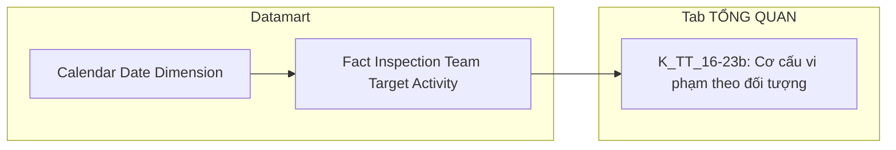

**Bảng grain:**

| Tên bảng | Grain | Date key | Filter mặc định |
|---|---|---|---|
| Fact Inspection Team Target Activity | 1 đoàn thanh tra × 1 đối tượng (`INSPECTION_TEAM` × `INSPECTION_TEAM_TARGET`, N:1) — không fanout Fact Inspection Team Activity (Nhóm 1/2/3) vì tách riêng bảng | `Decision_Date_Dimension_Id` ← join Inspection Team → Calendar Date Dimension | Year = selected_year (slicer NĂM 202X) |

---

#### Nhóm 5 — Danh sách vụ việc Thanh tra (STT 5)

> **[ĐIỀU CHỈNH 2026-07-20]** Thiết kế lại theo BA_analyst_TT.csv mới + Atomic THANHTRA schema mới. Thiết kế cũ dùng `Inspection Case` ← `TT_HO_SO` + `Inspection Decision` ← `TT_QUYET_DINH` — cả 2 bảng đã deprecated, không còn tồn tại trong Atomic hiện hành.
> Phân loại: **Tác nghiệp**
> Atomic: `Inspection Team` ← THANHTRA.INSPECTION_TEAM (`INSPECT.INSPECTION_TEAM`) — **READY** (reuse Nhóm 1/4, không cần entity mới)
> Atomic: `Inspection Team Target` ← THANHTRA.INSPECTION_TEAM_TARGET (`INSPECT.INSPECTION_TEAM_TARGET`) — **READY** (reuse Nhóm 4, không cần entity mới)
> Ghi chú:
> - **Tên Nhóm đổi từ "Thanh tra/Kiểm tra" → "Thanh tra"** — Tab TỔNG QUAN chỉ phục vụ luồng Thanh tra (`INSPECTION_TEAM`); Kiểm tra dùng nguồn `EXAMINATION_TEAM`/`EXAMINATION_TEAM_TARGET` riêng ở Nhóm 10 (chưa review lại, xem ghi chú Tab KIỂM TRA).
> - **Grain giống Cụm 1c (Nhóm 4)** — 1 đoàn thanh tra × 1 đối tượng, do SQL BA JOIN `INSPECTION_TEAM` với `INSPECTION_TEAM_TARGET` (N:1). Không reuse trực tiếp `Fact Inspection Team Target Activity` (Nhóm 4) vì khác mục đích/table_type (Fact phục vụ KPI aggregate, đây là bảng Tác nghiệp denormalized phục vụ lookup danh sách) — theo Bước 3 Lớp 3, `table_type` khác nhau (`fact` vs `operational`) → `new`. Cùng nguồn Atomic join nên cùng grain, không mâu thuẫn.
> - Cột **"Mã vụ việc"** ← `Inspection Team.Inspection Team Code` (`INSPECTION_TEAM.CODE`)
> - Cột **"Đối tượng"** ← `Inspection Team Target.Target Name` (`INSPECTION_TEAM_TARGET.TARGET_NAME`)
> - Cột **"Phân loại đối tượng"** ← `Inspection Team Target.Target Type Code` (`INSPECTION_TEAM_TARGET.TARGET_TYPE`) — map 1:1 trực tiếp, không qua Classification Value (giống Nhóm 4)
> - Cột **"Loại hình"** ← `Inspection Team.Form Type Code` (`INSPECTION_TEAM.FORM_TYPE`) — scheme `TT_REVIEW_FORM_TYPE` (PERIODIC/UNSCHEDULED → Định kỳ/Đột xuất)
> - Cột **"Trạng thái"** ← ETL-derived từ `Inspection Team.Start Date`/`End Date` (`INSPECTION_TEAM.START_DATE`/`END_DATE`) — **3 giá trị** (khác Nhóm 1 chỉ 2 giá trị): `START_DATE IS NOT NULL AND END_DATE IS NULL` → Đang thực hiện; `START_DATE IS NOT NULL AND END_DATE IS NOT NULL` → Đã hoàn thành; `START_DATE IS NULL AND END_DATE IS NULL` → Chưa thực hiện. Đúng theo SQL tham khảo BA STT 5.
> - Date key: `Decision_Date` (← `INSPECTION_TEAM.DECISION_DATE`) — cùng date key Nhóm 1/4.

**Mockup:**

| Mã vụ việc | Đối tượng | Phân loại đối tượng | Loại hình | Trạng thái |
|---|---|---|---|---|
| INS-2024-001 | Công ty ABC | Công ty chứng khoán | Đột xuất | Tại thực địa |
| INS-2024-002 | Công ty XYZ | Quỹ đầu tư | Định kỳ | Đang thực hiện |

**Schema bảng tác nghiệp:**

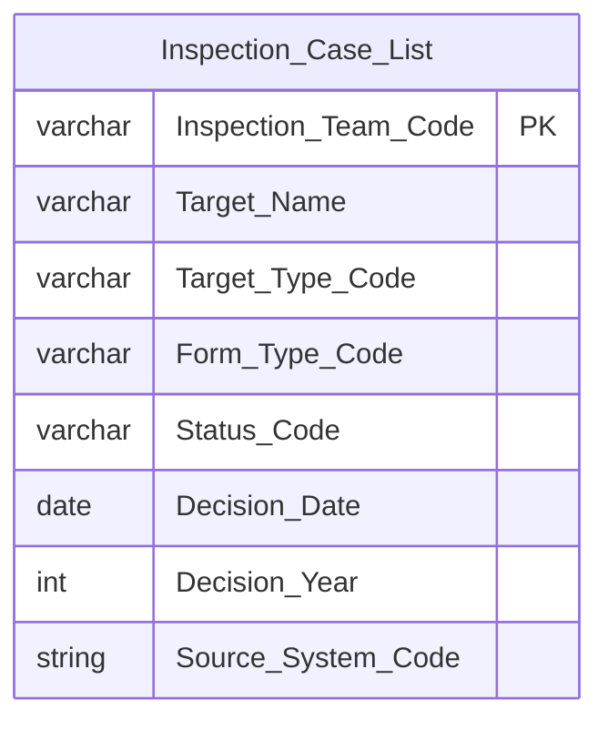

**Lineage Mart → Báo cáo:**

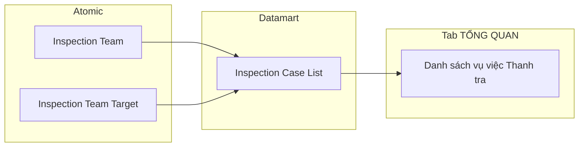

**Bảng grain:**

| Tên bảng | Grain | Nguồn chính | Filter mặc định | Ghi chú |
|---|---|---|---|---|
| Inspection Case List | 1 đoàn thanh tra × 1 đối tượng (`INSPECTION_TEAM` × `INSPECTION_TEAM_TARGET`, N:1) | `Inspection Team` + `Inspection Team Target` (join qua `INSPECTION_TEAM_ID`) | Year=selected_year (Decision_Date); filter Loại hình và Trạng thái ở query time | Phân trang ở presentation layer |

---

### Tab: KIỂM TRA

**Slicer chung:** Năm (NĂM 202X — góc trên phải dashboard)

> **[Cập nhật 2026-07-20 — hoàn tất]** Ghi chú chung Tab KIỂM TRA cũ ghi "Toàn bộ 5 block reuse `Fact Inspection Case Activity` và `Inspection Case List`" — đã sai, được thay thế hoàn toàn: Nhóm 6-10 nay dùng nguồn Atomic riêng `EXAMINATION_TEAM`/`EXAMINATION_TEAM_TARGET` (tách biệt hoàn toàn với luồng Thanh tra `INSPECTION_TEAM`/`INSPECTION_TEAM_TARGET` của Tab TỔNG QUAN). Nhóm 6-9 reuse `Fact Examination Team Activity`/`Fact Examination Team Target Activity` (Cụm 1b/1d); Nhóm 10 dùng bảng Tác nghiệp riêng `Examination Case List` (Cụm 2b). Đã review xong toàn bộ Nhóm 6-10, đóng O_TT_4/O_TT_7.

---

#### Nhóm 6 — KPI cards Thống kê chung Kiểm tra (STT 6)

> **[ĐIỀU CHỈNH 2026-07-20]** Thiết kế lại theo BA_analyst_TT.csv mới + Atomic THANHTRA schema mới. Thiết kế cũ dùng `Inspection Case` ← `TT_HO_SO` (deprecated). Hoàn tất phần "chưa review lại nội dung KPI" đã ghi chú ở Cụm 1b — reuse cấu trúc Fact/Dimension Examination Team đã tạo sẵn (Nhóm 1b).
> Phân loại: **Phân tích**
> Atomic: `Examination Team` ← THANHTRA.EXAMINATION_TEAM (`INSPECT.EXAMINATION_TEAM`) — **READY** (`DataModel/Atomic/Business_Activity/dm_atm_examination_team-THANHTRA.EXAMINATION_TEAM.yaml`)
> Ghi chú:
> - Reuse `Fact Examination Team Activity` + `Examination Team Dimension` đã tạo ở Cụm 1b — không cần entity/Fact mới.
> - `Case_Status` (Hoàn thành/Đang thực hiện) ETL-derived trên `Examination Team Dimension` từ `Start_Date`/`End_Date`: `End_Date IS NOT NULL AND Start_Date IS NOT NULL` → Hoàn thành; `End_Date IS NULL AND Start_Date IS NOT NULL` → Đang thực hiện. Đúng theo SQL tham khảo BA STT 6 — chỉ 2 giá trị (khác Nhóm 5 có 3 giá trị).
> - Date key dùng `Decision_Date` (← `EXAMINATION_TEAM.DECISION_DATE`) — cùng cấu trúc Nhóm 1.

**Mockup:**

| TỔNG SỐ CUỘC KIỂM TRA ▲ 10% | TỔNG SỐ ĐÃ HOÀN THÀNH ▲ 15% | TỔNG SỐ ĐANG THỰC HIỆN ▲ 5% |
|---|---|---|
| 5 Số cuộc | 2 Số cuộc | 3 Số cuộc |

**Source:** `Fact Examination Team Activity` → `Calendar Date Dimension`, `Examination Team Dimension`

**Bảng KPI:**

| KPI ID | Tên KPI | Đơn vị | Tính chất | Công thức | Ghi chú |
|---|---|---|---|---|---|
| K_TT_24 | Tổng số cuộc kiểm tra | Cuộc | Base | COUNT(Fact_Examination_Team_Activity JOIN Examination Team Dimension) WHERE Year(Calendar Date Dimension.Decision_Date)=selected_year | |
| K_TT_25 | Tổng số kiểm tra SSCK (%) | % | Derived | (K_TT_24[Y] − K_TT_24[Y−1]) / K_TT_24[Y−1] × 100% | |
| K_TT_26 | Số cuộc kiểm tra đã hoàn thành | Cuộc | Base | COUNT(...) WHERE Year(Decision_Date)=selected_year AND Examination Team Dimension.End_Date IS NOT NULL AND Examination Team Dimension.Start_Date IS NOT NULL | |
| K_TT_27 | Số cuộc kiểm tra hoàn thành SSCK (%) | % | Derived | (K_TT_26[Y] − K_TT_26[Y−1]) / K_TT_26[Y−1] × 100% | |
| K_TT_28 | Số cuộc kiểm tra đang thực hiện | Cuộc | Base | COUNT(...) WHERE Year(Decision_Date)=selected_year AND Examination Team Dimension.End_Date IS NULL AND Examination Team Dimension.Start_Date IS NOT NULL | |
| K_TT_29 | Số cuộc kiểm tra đang thực hiện SSCK (%) | % | Derived | (K_TT_28[Y] − K_TT_28[Y−1]) / K_TT_28[Y−1] × 100% | |
| K_TT_29b | Thời gian (năm thống kê) | Năm | Chiều | Year(Calendar Date Dimension.Calendar_Date) — slicer chọn năm thống kê, join qua `Decision_Date_Dimension_Id` | Chiều lọc dùng chung cho K_TT_24-29 |

**Star Schema:** giống Nhóm 1 (thay `Fact Inspection Team Activity`/`Inspection Team Dimension` bằng `Fact Examination Team Activity`/`Examination Team Dimension`, erDiagram đã định nghĩa ở Cụm 1b/Section 3).

**Lineage Mart → Báo cáo:**

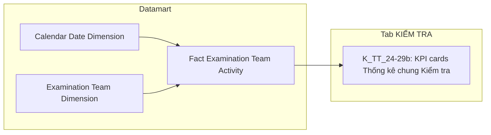

**Bảng grain:**

| Tên bảng | Grain | Date key | Filter mặc định |
|---|---|---|---|
| Fact Examination Team Activity | 1 vụ việc kiểm tra (`EXAMINATION_TEAM`) — 2 FK: Calendar Date, Examination Team Dimension | `Decision_Date_Dimension_Id` ← join Calendar Date Dimension | Year = selected_year (slicer NĂM 202X) |
| Examination Team Dimension | 1 vụ việc kiểm tra (`EXAMINATION_TEAM`) — SCD Type 4A | — | — |

---

#### Nhóm 7 — Biểu đồ xu hướng số cuộc kiểm tra theo tháng (STT 7)

> **[ĐIỀU CHỈNH 2026-07-20]** Thiết kế lại theo BA_analyst_TT.csv mới + Atomic THANHTRA schema mới. Thiết kế cũ dùng `Inspection Case` ← `TT_HO_SO` (deprecated). Hoàn tất phần "chưa review lại nội dung KPI" đã ghi chú ở Cụm 1b — reuse 100% `Fact Examination Team Activity` + `Examination Team Dimension` đã tạo ở Nhóm 6.
> Phân loại: **Phân tích**
> Atomic: `Examination Team` ← THANHTRA.EXAMINATION_TEAM (`INSPECT.EXAMINATION_TEAM`) — **READY** (reuse Nhóm 1b/6, không cần entity mới)
> Ghi chú: Reuse `Fact Examination Team Activity` + `Examination Team Dimension` — GROUP BY `Calendar_Date_Dimension.Month` ở presentation layer. Trạng thái Hoàn thành/Đang thực hiện ETL-derived trên Dimension từ `Start_Date`/`End_Date` (giống Nhóm 6). *Lưu ý: BA STT 7 dòng 2/3 có cột Mô tả (cột 4) bị đảo ngược so với tên KPI (cột 3) — thiết kế theo đúng tên KPI + logic SQL, không theo Mô tả mâu thuẫn.*

**Mockup:**

| Tháng | T1 | T2 | ... | T12 |
|---|---|---|---|---|
| Số lượng vụ việc kiểm tra | 2 | 4 | ... | 32 |
| Đang thực hiện | 1 | 2 | ... | 18 |
| Đã hoàn thành | 1 | 2 | ... | 14 |

**Source:** `Fact Examination Team Activity` → `Calendar Date Dimension`, `Examination Team Dimension`

**Bảng KPI:**

| KPI ID | Tên KPI | Đơn vị | Tính chất | Công thức | Ghi chú |
|---|---|---|---|---|---|
| K_TT_30 | Số lượng vụ việc kiểm tra theo tháng (tổng) | Cuộc | Base | COUNT(Fact_Examination_Team_Activity JOIN Examination Team Dimension) WHERE Year(Decision_Date)=selected_year GROUP BY Calendar_Date_Dimension.Month | |
| K_TT_31 | Số vụ việc đã hoàn thành theo tháng | Cuộc | Base | COUNT(...) WHERE Year(Decision_Date)=selected_year AND Examination Team Dimension.End_Date IS NOT NULL AND Examination Team Dimension.Start_Date IS NOT NULL GROUP BY Month | |
| K_TT_32 | Số vụ việc đang thực hiện theo tháng | Cuộc | Base | COUNT(...) WHERE Year(Decision_Date)=selected_year AND Examination Team Dimension.End_Date IS NULL AND Examination Team Dimension.Start_Date IS NOT NULL GROUP BY Month | |

**Star Schema:** giống Nhóm 6 (reuse 100% `Fact Examination Team Activity` + `Calendar Date Dimension` + `Examination Team Dimension`, không thêm FK/measure mới).

**Lineage Mart → Báo cáo:**

```mermaid
flowchart LR
    subgraph Datamart["Datamart"]
        G1["Fact Examination Team Activity"]
        G2["Calendar Date Dimension"]
        G3["Examination Team Dimension"]
    end
    subgraph RPT["Tab KIỂM TRA"]
        R1["K_TT_30-32: Biểu đồ xu hướng số cuộc kiểm tra theo tháng"]
    end
    G2 --> G1
    G3 --> G1
    G1 --> R1
```

**Bảng grain:**

| Tên bảng | Grain | Date key | Filter mặc định | Phân tích theo tháng |
|---|---|---|---|---|
| Fact Examination Team Activity | reuse — 1 vụ việc kiểm tra. Đếm dùng `COUNT()` qua join Dimension | `Decision_Date_Dimension_Id` | Year=selected_year | GROUP BY Calendar_Date_Dimension.Month ở query time |
| Examination Team Dimension | reuse — 1 vụ việc kiểm tra (`EXAMINATION_TEAM`), SCD Type 4A | — | — | — |

---

#### Nhóm 8 — Cơ cấu kiểm tra theo loại hành vi (STT 8)

> **[ĐIỀU CHỈNH 2026-07-20]** Thiết kế lại theo BA_analyst_TT.csv mới + Atomic THANHTRA schema mới. Thiết kế cũ dùng `Inspection Case Conclusion` ← `TT_KET_LUAN` + `Violation_Type_Dimension_Id` FK → Classification Dimension (scheme `TT_VIOLATION_TYPE`) — không khớp BA CSV mới, không phải Atomic hợp lệ cho Nhóm này.
> Phân loại: **Phân tích**
> Atomic: `Examination Team` ← THANHTRA.EXAMINATION_TEAM (`INSPECT.EXAMINATION_TEAM`) — **READY** (reuse Nhóm 1b/6/7, không cần entity mới)
> Ghi chú:
> - Phân loại hành vi **derive trực tiếp bằng text-matching trên `Examination Team Dimension.Content`** — KHÔNG qua Classification Dimension/scheme nào (giống pattern Nhóm 3, nguồn `EXAMINATION_TEAM.CONTENT` thay vì `INSPECTION_TEAM.CONTENT`): `CASE WHEN LOWER(Content) LIKE '%công bố thông tin%' THEN 'Vi phạm CBTT' WHEN LOWER(Content) LIKE '%hoạt động chào bán%' THEN 'Vi phạm hoạt động chào bán' WHEN LOWER(Content) LIKE '%hoạt động của cổ động%' THEN 'Vi phạm hoạt động của Cổ đông nội bộ, cổ đông lớn' WHEN LOWER(Content) LIKE '%giao dịch%' THEN 'Giao dịch' WHEN LOWER(Content) LIKE '%công ty đại chúng%' THEN 'Vi phạm hoạt động của Công ty đại chúng' WHEN LOWER(Content) LIKE '%công ty chứng khoán%' THEN 'Vi phạm hoạt động của Công ty chứng khoán' WHEN LOWER(Content) LIKE '%tổ chức phát hành trái phiếu%' THEN 'Vi phạm hoạt động của tổ chức PHTP' WHEN LOWER(Content) LIKE '%thao túng%' THEN 'Thao túng' WHEN LOWER(Content) LIKE '%cho mượn%' THEN 'Cho mượn' WHEN LOWER(Content) LIKE '%tổ chức kiểm toán%' THEN 'Vi phạm hoạt động của tổ chức kiểm toán' WHEN LOWER(Content) LIKE '%sở giao dịch%' THEN 'Vi phạm hoạt động của sở giao dịch' ELSE NULL END` — đúng theo SQL tham khảo BA STT 8. Bản ghi không khớp mẫu nào → `NULL`, loại khỏi thống kê.
> - `Content` (← `EXAMINATION_TEAM.CONTENT`) đã có sẵn trên `Examination Team Dimension` từ Nhóm 6/7 — không cần thêm gì mới.
> - **Công thức % KHÔNG chia cho K_TT_24** (K_TT_24 đếm mọi vụ việc kể cả Content không khớp mẫu nào nên khác grain) — theo đúng window function BA SQL (`SUM(COUNT(ID)) OVER (PARTITION BY Year)`), mẫu số là **tổng 11 KPI Base cùng năm** (chỉ các vụ việc Content khớp ít nhất 1 trong 11 mẫu).

**Mockup:**

```mermaid
pie title Cơ cấu kiểm tra theo loại hành vi
    "CBTT" : 15
    "Chào bán" : 12
    "Cổ đông nội bộ/lớn" : 10
    "Giao dịch" : 10
    "CTĐC" : 10
    "CTCK" : 10
    "Tổ chức PHTP" : 8
    "Thao túng" : 8
    "Cho mượn" : 7
    "Tổ chức kiểm toán" : 5
    "Sở giao dịch" : 5
```

**Source:** `Fact Examination Team Activity` → `Calendar Date Dimension`, `Examination Team Dimension`

**Bảng KPI:**

| KPI ID | Tên KPI | Đơn vị | Tính chất | Công thức | Ghi chú |
|---|---|---|---|---|---|
| K_TT_32b | Phân loại hành vi | — | Chiều | `CASE WHEN LOWER(Examination Team Dimension.Content) LIKE '%công bố thông tin%' THEN 'Vi phạm CBTT' WHEN LIKE '%hoạt động chào bán%' THEN 'Vi phạm hoạt động chào bán' WHEN LIKE '%hoạt động của cổ động%' THEN 'Vi phạm hoạt động của Cổ đông nội bộ, cổ đông lớn' WHEN LIKE '%giao dịch%' THEN 'Giao dịch' WHEN LIKE '%công ty đại chúng%' THEN 'Vi phạm hoạt động của Công ty đại chúng' WHEN LIKE '%công ty chứng khoán%' THEN 'Vi phạm hoạt động của Công ty chứng khoán' WHEN LIKE '%tổ chức phát hành trái phiếu%' THEN 'Vi phạm hoạt động của tổ chức PHTP' WHEN LIKE '%thao túng%' THEN 'Thao túng' WHEN LIKE '%cho mượn%' THEN 'Cho mượn' WHEN LIKE '%tổ chức kiểm toán%' THEN 'Vi phạm hoạt động của tổ chức kiểm toán' WHEN LIKE '%sở giao dịch%' THEN 'Vi phạm hoạt động của sở giao dịch' ELSE NULL END` | Chiều lọc/nhóm dùng chung cho K_TT_33-44k |
| K_TT_33 | Số vi phạm CBTT (KT) | Cuộc | Base | COUNT(Fact_Examination_Team_Activity JOIN Examination Team Dimension) WHERE Year(Decision_Date)=selected_year AND LOWER(Examination Team Dimension.Content) LIKE '%công bố thông tin%' | |
| K_TT_34 | Tỷ lệ % CBTT (KT) | % | Derived | K_TT_33 / (K_TT_33+35+37+39+41+43+44b+44d+44f+44h+44j) × 100% | Mẫu số = tổng 11 KPI Base cùng năm, theo đúng window function BA SQL |
| K_TT_35 | Số vi phạm Hoạt động chào bán (KT) | Cuộc | Base | COUNT(...) WHERE Year(Decision_Date)=selected_year AND LOWER(Examination Team Dimension.Content) LIKE '%hoạt động chào bán%' | |
| K_TT_36 | Tỷ lệ % Hoạt động chào bán (KT) | % | Derived | K_TT_35 / (K_TT_33+35+37+39+41+43+44b+44d+44f+44h+44j) × 100% | |
| K_TT_37 | Số vi phạm Cổ đông nội bộ/lớn (KT) | Cuộc | Base | COUNT(...) WHERE Year(Decision_Date)=selected_year AND LOWER(Examination Team Dimension.Content) LIKE '%hoạt động của cổ động%' | |
| K_TT_38 | Tỷ lệ % Cổ đông nội bộ/lớn (KT) | % | Derived | K_TT_37 / (K_TT_33+35+37+39+41+43+44b+44d+44f+44h+44j) × 100% | |
| K_TT_39 | Số vi phạm Giao dịch (KT) | Cuộc | Base | COUNT(...) WHERE Year(Decision_Date)=selected_year AND LOWER(Examination Team Dimension.Content) LIKE '%giao dịch%' | |
| K_TT_40 | Tỷ lệ % Giao dịch (KT) | % | Derived | K_TT_39 / (K_TT_33+35+37+39+41+43+44b+44d+44f+44h+44j) × 100% | |
| K_TT_41 | Số vi phạm CTĐC (KT) | Cuộc | Base | COUNT(...) WHERE Year(Decision_Date)=selected_year AND LOWER(Examination Team Dimension.Content) LIKE '%công ty đại chúng%' | |
| K_TT_42 | Tỷ lệ % CTĐC (KT) | % | Derived | K_TT_41 / (K_TT_33+35+37+39+41+43+44b+44d+44f+44h+44j) × 100% | |
| K_TT_43 | Số vi phạm CTCK (KT) | Cuộc | Base | COUNT(...) WHERE Year(Decision_Date)=selected_year AND LOWER(Examination Team Dimension.Content) LIKE '%công ty chứng khoán%' | |
| K_TT_44 | Tỷ lệ % CTCK (KT) | % | Derived | K_TT_43 / (K_TT_33+35+37+39+41+43+44b+44d+44f+44h+44j) × 100% | |
| K_TT_44b | Số vi phạm Tổ chức phát hành TP (KT) | Cuộc | Base | COUNT(...) WHERE Year(Decision_Date)=selected_year AND LOWER(Examination Team Dimension.Content) LIKE '%tổ chức phát hành trái phiếu%' | |
| K_TT_44c | Tỷ lệ % Tổ chức PHTP (KT) | % | Derived | K_TT_44b / (K_TT_33+35+37+39+41+43+44b+44d+44f+44h+44j) × 100% | |
| K_TT_44d | Số vi phạm Thao túng (KT) | Cuộc | Base | COUNT(...) WHERE Year(Decision_Date)=selected_year AND LOWER(Examination Team Dimension.Content) LIKE '%thao túng%' | |
| K_TT_44e | Tỷ lệ % Thao túng (KT) | % | Derived | K_TT_44d / (K_TT_33+35+37+39+41+43+44b+44d+44f+44h+44j) × 100% | |
| K_TT_44f | Số vi phạm Cho mượn tài khoản (KT) | Cuộc | Base | COUNT(...) WHERE Year(Decision_Date)=selected_year AND LOWER(Examination Team Dimension.Content) LIKE '%cho mượn%' | |
| K_TT_44g | Tỷ lệ % Cho mượn (KT) | % | Derived | K_TT_44f / (K_TT_33+35+37+39+41+43+44b+44d+44f+44h+44j) × 100% | |
| K_TT_44h | Số vi phạm Tổ chức kiểm toán (KT) | Cuộc | Base | COUNT(...) WHERE Year(Decision_Date)=selected_year AND LOWER(Examination Team Dimension.Content) LIKE '%tổ chức kiểm toán%' | |
| K_TT_44i | Tỷ lệ % Tổ chức kiểm toán (KT) | % | Derived | K_TT_44h / (K_TT_33+35+37+39+41+43+44b+44d+44f+44h+44j) × 100% | |
| K_TT_44j | Số vi phạm Sở giao dịch (KT) | Cuộc | Base | COUNT(...) WHERE Year(Decision_Date)=selected_year AND LOWER(Examination Team Dimension.Content) LIKE '%sở giao dịch%' | |
| K_TT_44k | Tỷ lệ % Sở giao dịch (KT) | % | Derived | K_TT_44j / (K_TT_33+35+37+39+41+43+44b+44d+44f+44h+44j) × 100% | |

**Star Schema:** giống Nhóm 6/7 (reuse 100% `Fact Examination Team Activity` + `Calendar Date Dimension` + `Examination Team Dimension`, không thêm FK/measure mới — `Content` đã có sẵn trên Dimension).

**Lineage Mart → Báo cáo:**

```mermaid
flowchart LR
    subgraph Datamart["Datamart"]
        G1["Fact Examination Team Activity"]
        G2["Calendar Date Dimension"]
        G3["Examination Team Dimension"]
    end
    subgraph RPT["Tab KIỂM TRA"]
        R1["K_TT_32b-44k: Cơ cấu kiểm tra theo loại hành vi"]
    end
    G2 --> G1
    G3 --> G1
    G1 --> R1
```

**Bảng grain:**

| Tên bảng | Grain | Date key | Filter mặc định | Phân tích theo hành vi |
|---|---|---|---|---|
| Fact Examination Team Activity | reuse — 1 vụ việc kiểm tra. Đếm dùng `COUNT()` qua join Dimension | `Decision_Date_Dimension_Id` | Year=selected_year | GROUP BY CASE WHEN LOWER(Examination Team Dimension.Content) LIKE ... ở query time |
| Examination Team Dimension | reuse — 1 vụ việc kiểm tra (`EXAMINATION_TEAM`), SCD Type 4A | — | — | — |

---

#### Nhóm 9 — Cơ cấu kiểm tra theo đối tượng (STT 9)

> **[ĐIỀU CHỈNH 2026-07-20]** Thiết kế lại theo BA_analyst_TT.csv mới + Atomic THANHTRA schema mới, đóng O_TT_7. Thiết kế cũ dùng `Inspection Decision Subject` ← `TT_QUYET_DINH_DOI_TUONG` + `Subject_Category_Dimension_Id` FK → Classification Dimension (scheme `TT_SUBJECT_CATEGORY`, 6 giá trị tạm) — đã deprecated.
> Phân loại: **Phân tích**
> Atomic: `Examination Team` ← THANHTRA.EXAMINATION_TEAM (`INSPECT.EXAMINATION_TEAM`) — **READY** (reuse Nhóm 1b/6/7/8, không cần entity mới)
> Atomic: `Examination Team Target` ← THANHTRA.EXAMINATION_TEAM_TARGET (`INSPECT.EXAMINATION_TEAM_TARGET`) — **READY** (`DataModel/Atomic/Business_Activity/dm_atm_examination_team_target-THANHTRA.EXAMINATION_TEAM_TARGET.yaml`)
> Ghi chú:
> - **Cùng kiến trúc Nhóm 4 (TT)** — `EXAMINATION_TEAM_TARGET` quan hệ N:1 với `EXAMINATION_TEAM` (1 vụ kiểm tra có thể có nhiều đối tượng). SQL tham khảo BA: `COUNT(a.ID)` sau JOIN với target, `GROUP BY b.TARGET_TYPE` — không filter cứng theo danh sách giá trị cố định. Tách riêng **Fact Examination Team Target Activity** (grain 1 vụ kiểm tra × 1 đối tượng), KHÔNG gắn FK Target vào `Fact Examination Team Activity` (Nhóm 6/7/8, grain 1 vụ) để tránh fanout ảnh hưởng K_TT_24-44k.
> - `Target_Type_Code` (← `EXAMINATION_TEAM_TARGET.TARGET_TYPE`) map 1:1 trực tiếp từ nguồn — **KHÔNG phải Classification Value**. Giá trị thực tế trong Atomic: `SECURITIES_COMPANY, FUND_MANAGEMENT_COMPANY, PUBLIC_COMPANY, AUDIT_COMPANY, CRYPTO_SERVICE_PROVIDER, INDIVIDUAL, ORGANIZATION` (7 giá trị).
> - **[Đóng O_TT_7]** BA STT 9 liệt kê tên 5 nhóm ở cột Mô tả (CTCK / CTQLQ+NHLK / CTĐC / CTKT / Tổ chức PHTP) nhưng đây chỉ là mô tả minh họa — theo xác nhận nghiệp vụ, thiết kế **lấy trực tiếp toàn bộ giá trị `Target_Type_Code` thực tế có trong dữ liệu** (GROUP BY động, đúng theo SQL tham khảo BA), không hardcode ánh xạ cố định 5 nhóm. Nếu Atomic có nhiều hơn 5 giá trị phân biệt (VD: `CRYPTO_SERVICE_PROVIDER` tách riêng khỏi `ORGANIZATION`), biểu đồ hiển thị đúng số lượng giá trị thực tế đó — không giới hạn ở 5 lát bánh. Mapping tham khảo hiển thị: CTCK=`SECURITIES_COMPANY`, CTQLQ=`FUND_MANAGEMENT_COMPANY`, CTĐC=`PUBLIC_COMPANY`, CTKT=`AUDIT_COMPANY`, "Tổ chức khác" (gồm NHLK/Tổ chức PHTP/Organization khác)=`ORGANIZATION`, Cá nhân=`INDIVIDUAL`.
> - Date key: `Decision_Date` (← `EXAMINATION_TEAM.DECISION_DATE`, qua join với Examination Team) — cùng date key Nhóm 6.
> - Công thức % theo đúng SQL BA (window function `PARTITION BY Year`): tỷ lệ tính trên **tổng số lượt đối tượng cùng năm** (SUM toàn bộ KPI Base theo từng giá trị Target_Type_Code xuất hiện), KHÔNG chia cho K_TT_24 (K_TT_24 là số vụ kiểm tra, khác grain).

**Mockup:**

```mermaid
pie title Cơ cấu kiểm tra theo đối tượng
    "CTCK" : 30
    "CTQLQ" : 20
    "CTĐC" : 20
    "CTKT" : 20
    "Tổ chức khác (NHLK/PHTP/...)" : 10
```

**Source:** `Fact Examination Team Target Activity` → `Calendar Date Dimension`

**Bảng KPI:**

| KPI ID | Tên KPI | Đơn vị | Tính chất | Công thức | Ghi chú |
|---|---|---|---|---|---|
| K_TT_45 | Số vi phạm đối tượng CTCK (KT) | Cuộc | Base | COUNT(Fact_Examination_Team_Target_Activity) WHERE Year(Decision_Date)=selected_year AND Target_Type_Code=`SECURITIES_COMPANY` | |
| K_TT_46 | Tỷ lệ % CTCK (KT) | % | Derived | K_TT_45 / SUM(tất cả KPI Base K_TT_45/47/49/51/53 cùng năm) × 100% | Mẫu số = tổng lượt đối tượng cùng năm theo đúng window function BA SQL |
| K_TT_47 | Số vi phạm đối tượng CTKT (KT) | Cuộc | Base | COUNT(Fact_Examination_Team_Target_Activity) WHERE Year(Decision_Date)=selected_year AND Target_Type_Code=`AUDIT_COMPANY` | |
| K_TT_48 | Tỷ lệ % CTKT (KT) | % | Derived | K_TT_47 / SUM(tất cả KPI Base K_TT_45/47/49/51/53 cùng năm) × 100% | |
| K_TT_49 | Số vi phạm đối tượng CTQLQ (KT) | Cuộc | Base | COUNT(Fact_Examination_Team_Target_Activity) WHERE Year(Decision_Date)=selected_year AND Target_Type_Code=`FUND_MANAGEMENT_COMPANY` | |
| K_TT_50 | Tỷ lệ % CTQLQ (KT) | % | Derived | K_TT_49 / SUM(tất cả KPI Base K_TT_45/47/49/51/53 cùng năm) × 100% | |
| K_TT_51 | Số vi phạm đối tượng CTĐC (KT) | Cuộc | Base | COUNT(Fact_Examination_Team_Target_Activity) WHERE Year(Decision_Date)=selected_year AND Target_Type_Code=`PUBLIC_COMPANY` | |
| K_TT_52 | Tỷ lệ % CTĐC (KT) | % | Derived | K_TT_51 / SUM(tất cả KPI Base K_TT_45/47/49/51/53 cùng năm) × 100% | |
| K_TT_53 | Số vi phạm đối tượng khác — NHLK/Tổ chức PHTP/Organization khác (KT) | Cuộc | Base | COUNT(Fact_Examination_Team_Target_Activity) WHERE Year(Decision_Date)=selected_year AND Target_Type_Code=`ORGANIZATION` | Gộp mọi giá trị `ORGANIZATION` — Atomic không phân biệt riêng NHLK/Tổ chức PHTP (xem ghi chú trên) |
| K_TT_54 | Tỷ lệ % Tổ chức khác (KT) | % | Derived | K_TT_53 / SUM(tất cả KPI Base K_TT_45/47/49/51/53 cùng năm) × 100% | |
| K_TT_49b | Phân loại đối tượng | — | Chiều | `Target_Type_Code` — lấy trực tiếp toàn bộ giá trị thực tế trong data (không hardcode danh sách cố định), GROUP BY động theo đúng SQL BA | Chiều lọc/nhóm dùng chung cho K_TT_45-54 — BA STT 9 dòng 1 (Phân loại: Chiều) |

**Star Schema:**

```mermaid
erDiagram
    Calendar_Date_Dimension ||--o{ Fact_Examination_Team_Target_Activity : " "
    Fact_Examination_Team_Target_Activity {
        string Decision_Date_Dimension_Id FK
        varchar Examination_Team_Code
        varchar Target_Type_Code
    }
    Calendar_Date_Dimension {
        string Calendar_Date_Dimension_Id PK
        date Calendar_Date
        int Year
        int Month
        int Quarter
        int Day_Of_Week
        boolean Is_Weekend
        boolean Holiday_Flag
        string Holiday_Name
        string Source_System_Code
    }
```

> Field mapping Atomic source: `Examination_Team_Code` ← `Examination Team.Examination Team Code` (`EXAMINATION_TEAM.CODE`, degenerate key — mỗi dòng Fact là 1 lượt vụ×đối tượng, không phải PK unique); `Target_Type_Code` ← `Examination Team Target.Target Type Code` (`EXAMINATION_TEAM_TARGET.TARGET_TYPE`, map 1:1 từ nguồn, không qua Classification Value). Decision_Date lấy từ `Examination Team` (ETL join `EXAMINATION_TEAM_TARGET.EXAMINATION_TEAM_ID = EXAMINATION_TEAM.ID`).

**Lineage Mart → Báo cáo:**

```mermaid
flowchart LR
    subgraph SRC["Staging"]
        S1["INSPECT.EXAMINATION_TEAM"]
        S2["INSPECT.EXAMINATION_TEAM_TARGET"]
    end
    subgraph SIL["Atomic"]
        SV1["Examination Team"]
        SV2["Examination Team Target"]
    end
    subgraph Datamart["Datamart"]
        G1["Fact Examination Team Target Activity"]
        G2["Calendar Date Dimension"]
    end
    subgraph RPT["Tab KIỂM TRA"]
        R1["K_TT_45-54, K_TT_49b: Cơ cấu kiểm tra theo đối tượng"]
    end
    S1 --> SV1
    S2 --> SV2
    SV1 --> G1
    SV2 --> G1
    G2 --> G1
    G1 --> R1
```

**Bảng grain:**

| Tên bảng | Grain | Date key | Filter mặc định |
|---|---|---|---|
| Fact Examination Team Target Activity | 1 vụ kiểm tra × 1 đối tượng (`EXAMINATION_TEAM` × `EXAMINATION_TEAM_TARGET`, N:1) — không fanout Fact Examination Team Activity (Nhóm 6/7/8) vì tách riêng bảng | `Decision_Date_Dimension_Id` ← join Examination Team → Calendar Date Dimension | Year = selected_year (slicer NĂM 202X) |

---

#### Nhóm 10 — Danh sách vụ việc Kiểm tra (STT 10)

> **[ĐIỀU CHỈNH 2026-07-20]** Thiết kế lại theo BA_analyst_TT.csv mới + Atomic THANHTRA schema mới. Thiết kế cũ dùng `Inspection Case` ← `TT_HO_SO` + `Inspection Decision` ← `TT_QUYET_DINH`, reuse `Inspection Case List` (bảng của Nhóm 5, nguồn `INSPECTION_TEAM`) — hoàn toàn sai: Nhóm 5 (TT) và Nhóm 10 (KT) dùng 2 nguồn Atomic khác nhau (`INSPECTION_TEAM` vs `EXAMINATION_TEAM`), không thể reuse chung 1 bảng bằng cách filter `Inspection_Type_Code` (field này không tồn tại ở kiến trúc mới — 2 luồng TT/KT tách nguồn riêng ngay từ Atomic).
> Phân loại: **Tác nghiệp**
> Atomic: `Examination Team` ← THANHTRA.EXAMINATION_TEAM (`INSPECT.EXAMINATION_TEAM`) — **READY** (reuse Nhóm 1b/6/7/8/9, không cần entity mới)
> Atomic: `Examination Team Target` ← THANHTRA.EXAMINATION_TEAM_TARGET (`INSPECT.EXAMINATION_TEAM_TARGET`) — **READY** (reuse Nhóm 9, không cần entity mới)
> Ghi chú:
> - **Grain giống Cụm 1d (Nhóm 9)** — 1 vụ kiểm tra × 1 đối tượng, do SQL BA JOIN `EXAMINATION_TEAM` với `EXAMINATION_TEAM_TARGET` (N:1). Không reuse trực tiếp `Fact Examination Team Target Activity` (Nhóm 9) vì khác mục đích/table_type (Fact phục vụ KPI aggregate, đây là bảng Tác nghiệp denormalized phục vụ lookup danh sách) — theo Bước 3 Lớp 3, `table_type` khác nhau (`fact` vs `operational`) → `new`. Cùng nguồn Atomic join nên cùng grain, không mâu thuẫn. Cùng lý do (`table_type` khác), KHÔNG reuse `Inspection Case List` (Nhóm 5) dù cấu trúc cột giống hệt — 2 bảng khác nguồn Atomic gốc (TT dùng `Inspection Team`, KT dùng `Examination Team`).
> - Cột **"Mã vụ việc"** ← `Examination Team.Examination Team Code` (`EXAMINATION_TEAM.CODE`)
> - Cột **"Đối tượng"** ← `Examination Team Target.Target Name` (`EXAMINATION_TEAM_TARGET.TARGET_NAME`)
> - Cột **"Phân loại đối tượng"** ← `Examination Team Target.Target Type Code` (`EXAMINATION_TEAM_TARGET.TARGET_TYPE`) — map 1:1 trực tiếp, không qua Classification Value (giống Nhóm 9), lấy nguyên giá trị thực tế trong data
> - Cột **"Loại hình"** ← `Examination Team.Form Type Code` (`EXAMINATION_TEAM.FORM_TYPE`) — scheme `TT_REVIEW_FORM_TYPE` (PERIODIC/UNSCHEDULED → Định kỳ/Đột xuất), cùng scheme Nhóm 5
> - Cột **"Trạng thái"** ← ETL-derived từ `Examination Team.Start Date`/`End Date` (`EXAMINATION_TEAM.START_DATE`/`END_DATE`) — **3 giá trị** (giống Nhóm 5, khác Nhóm 6 chỉ 2 giá trị): `START_DATE IS NOT NULL AND END_DATE IS NULL` → Đang thực hiện; `START_DATE IS NOT NULL AND END_DATE IS NOT NULL` → Đã hoàn thành; `START_DATE IS NULL AND END_DATE IS NULL` → Chưa thực hiện. Đúng theo SQL tham khảo BA STT 10.
> - Date key: `Decision_Date` (← `EXAMINATION_TEAM.DECISION_DATE`) — cùng date key Nhóm 6/7/8/9.

**Mockup:**

| Mã vụ việc | Đối tượng | Phân loại đối tượng | Loại hình | Trạng thái |
|---|---|---|---|---|
| EXM-2024-001 | Công ty Chứng khoán VPS | CTCK | Định kỳ | Đã hoàn thành |
| EXM-2024-002 | Công ty CP Đầu tư ABC | CTĐC | Đột xuất | Đang thực hiện |
| EXM-2024-003 | Nguyễn Văn A | Cá nhân | Định kỳ | Chưa thực hiện |
| EXM-2024-004 | Quỹ Đầu tư XYZ | CTQLQ | Định kỳ | Đang thực hiện |
| EXM-2024-005 | Công ty Chứng khoán SSI | CTCK | Đột xuất | Đã hoàn thành |

**Schema bảng tác nghiệp:**

```mermaid
erDiagram
    Examination_Case_List {
        varchar Examination_Team_Code PK
        varchar Target_Name
        varchar Target_Type_Code
        varchar Form_Type_Code
        varchar Status_Code
        date Decision_Date
        int Decision_Year
        string Source_System_Code
    }
```

**Lineage Mart → Báo cáo:**

```mermaid
flowchart LR
    subgraph SIL["Atomic"]
        SV1["Examination Team"]
        SV2["Examination Team Target"]
    end
    subgraph Datamart["Datamart"]
        G1["Examination Case List"]
    end
    subgraph RPT["Tab KIỂM TRA"]
        R1["Danh sách vụ việc Kiểm tra"]
    end
    SV1 --> G1
    SV2 --> G1
    G1 --> R1
```

**Bảng grain:**

| Tên bảng | Grain | Nguồn chính | Filter mặc định | Ghi chú |
|---|---|---|---|---|
| Examination Case List | 1 vụ kiểm tra × 1 đối tượng (`EXAMINATION_TEAM` × `EXAMINATION_TEAM_TARGET`, N:1) | `Examination Team` + `Examination Team Target` (join qua `EXAMINATION_TEAM_ID`) | Year=selected_year (Decision_Date); filter Loại hình và Trạng thái ở query time | Phân trang ở presentation layer |

---

### Tab: XỬ PHẠT

**Slicer chung:** Năm (NĂM 202X — góc trên phải dashboard)

> **[ĐIỀU CHỈNH 2026-07-20]** Thiết kế lại toàn bộ Tab XỬ PHẠT (Nhóm 11-15) theo BA_analyst_TT.csv mới + Atomic THANHTRA schema mới. Thiết kế cũ dùng `Surveillance Enforcement Decision`/`Surveillance Enforcement Case` ← `GS_VAN_BAN_XU_LY`/`GS_HO_SO` (luồng Giám sát) — hoàn toàn deprecated, không còn tồn tại trong Atomic hiện hành. Nguồn mới: **`PENALTY_DECISION`** (quyết định xử phạt) + **`PENALTY_DECISION_SUBJECT`** (đối tượng bị xử phạt, 1:N với QĐ) + **`PENALTY_DECISION_SUBJECT_BEHAVIOR`** (hành vi vi phạm của từng đối tượng, 1:N với Subject) + **`VIOLATION_BEHAVIOR`** (danh mục hành vi vi phạm) + **`VIOLATION_CASE`** (hồ sơ VPHC, liên kết đoàn Thanh tra/Kiểm tra) — tất cả đã approved trong Atomic. Đóng O_TT_8, O_TT_9.
> **3 grain khác nhau, tách 3 bảng riêng** để tránh fanout (theo đúng nguyên tắc đã áp dụng ở Nhóm 4/9 vs Nhóm 1/6):
> - **Fact Penalty Decision** (grain 1 QĐ) — Nhóm 11, 12.
> - **Fact Penalty Decision Subject Behavior** (grain 1 QĐ × 1 đối tượng × 1 hành vi, 4-way join) — Nhóm 13. KHÔNG gắn vào Fact Penalty Decision vì 1 QĐ có thể nhiều đối tượng × nhiều hành vi.
> - **Fact Penalty Decision Subject** (grain 1 QĐ × 1 đối tượng, 2-way join) — Nhóm 14. Khác grain Nhóm 13 (không có hành vi) nên tách riêng, không dùng chung bảng Nhóm 13 rồi filter — sẽ đếm trùng khi 1 đối tượng có nhiều hành vi.
> - **Penalty Decision List** (Tác nghiệp, grain giống Fact Penalty Decision Subject nhưng thêm `Form_Type` qua `VIOLATION_CASE`) — Nhóm 15.

---

#### Nhóm 11 — KPI cards Thống kê chung Xử phạt (STT 11)

> **[ĐIỀU CHỈNH 2026-07-20]** Thiết kế lại theo BA_analyst_TT.csv mới + Atomic THANHTRA schema mới.
> Phân loại: **Phân tích**
> Atomic: `Penalty Decision` ← THANHTRA.PENALTY_DECISION (`INSPECT.PENALTY_DECISION`) — **READY** (`DataModel/Atomic/Event/dm_atm_penalty_decision-THANHTRA.PENALTY_DECISION.yaml`)
> Ghi chú:
> - `Total_Fine_Amount` ← `PENALTY_DECISION.TOTAL_FINE_AMOUNT` — measure tiền phạt, đã có sẵn trên `PENALTY_DECISION` (không cần join Subject).
> - Date key: `Issued_Date` (← `PENALTY_DECISION.ISSUED_DATE`) — đúng theo SQL tham khảo BA (`EXTRACT(YEAR FROM ISSUED_DATE)`), khác thiết kế cũ dùng "Ngày biên bản".
> - SSCK (%) tính theo đúng SQL BA: so sánh cùng kỳ năm trước bằng `LEFT JOIN cte b ON a.Year = b.Year + 1`.

**Mockup:**

| TỔNG SỐ QUYẾT ĐỊNH XỬ PHẠT ▲ 12% | TỔNG TIỀN XỬ PHẠT ▲ 18% |
|---|---|
| 5 Số quyết định | 1075 tỷ VNĐ |

**Source:** `Fact Penalty Decision` → `Calendar Date Dimension`

**Bảng KPI:**

| KPI ID | Tên KPI | Đơn vị | Tính chất | Công thức | Ghi chú |
|---|---|---|---|---|---|
| K_TT_55b | Thời gian (năm thống kê) | Năm | Chiều | Year(Calendar Date Dimension.Calendar_Date) — slicer chọn năm thống kê, join qua `Issued_Date_Dimension_Id` | Chiều lọc dùng chung cho K_TT_55-58 |
| K_TT_55 | Tổng số quyết định xử phạt | QĐ | Base | COUNT(Fact_Penalty_Decision) WHERE Year(Issued_Date)=selected_year | |
| K_TT_56 | Tổng số QĐXP SSCK (%) | % | Derived | (K_TT_55[Y] − K_TT_55[Y−1]) / K_TT_55[Y−1] × 100% | |
| K_TT_57 | Tổng tiền xử phạt | Tỷ VNĐ | Base | SUM(Total_Fine_Amount) / 1_000_000_000 WHERE Year(Issued_Date)=selected_year | |
| K_TT_58 | Tổng tiền xử phạt SSCK (%) | % | Derived | (K_TT_57[Y] − K_TT_57[Y−1]) / K_TT_57[Y−1] × 100% | |

**Star Schema:**

```mermaid
erDiagram
    Calendar_Date_Dimension ||--o{ Fact_Penalty_Decision : " "
    Fact_Penalty_Decision {
        string Issued_Date_Dimension_Id FK
        varchar Penalty_Decision_Code
        float Total_Fine_Amount
    }
    Calendar_Date_Dimension {
        string Calendar_Date_Dimension_Id PK
        date Calendar_Date
        int Year
        int Month
        int Quarter
        int Day_Of_Week
        boolean Is_Weekend
        boolean Holiday_Flag
        string Holiday_Name
        string Source_System_Code
    }
```

> Field mapping Atomic source: `Penalty_Decision_Code` ← `Penalty Decision.Penalty Decision Code` (`PENALTY_DECISION.ID`, degenerate key — grain 1 QĐ = 1 row, đếm dùng `COUNT()` trực tiếp không cần DISTINCT); `Total_Fine_Amount` ← `Penalty Decision.Total Fine Amount` (`PENALTY_DECISION.TOTAL_FINE_AMOUNT`). `Issued_Date` ← `Penalty Decision.Issued Date` (`PENALTY_DECISION.ISSUED_DATE`).

**Lineage Mart → Báo cáo:**

```mermaid
flowchart LR
    subgraph Datamart["Datamart"]
        G1["Fact Penalty Decision"]
        G2["Calendar Date Dimension"]
    end
    subgraph RPT["Tab XỬ PHẠT"]
        R1["K_TT_55-58: KPI cards Thống kê chung"]
        R2["K_TT_59-60: Biểu đồ bar+line theo tháng"]
    end
    G2 --> G1
    G1 --> R1
    G1 --> R2
```

**Bảng grain:**

| Tên bảng | Grain | Date key | Filter mặc định |
|---|---|---|---|
| Fact Penalty Decision | 1 quyết định xử phạt (`PENALTY_DECISION`) — 1 FK: Calendar Date Dimension. Date key: Issued Date | Year = selected_year (slicer NĂM 202X) |

---

#### Nhóm 12 — Biểu đồ thống kê xử phạt theo tháng (STT 12)

> **[ĐIỀU CHỈNH 2026-07-20]** Thiết kế lại theo BA_analyst_TT.csv mới + Atomic THANHTRA schema mới — reuse 100% `Fact Penalty Decision` đã thiết kế ở Nhóm 11.
> Phân loại: **Phân tích**
> Atomic: `Penalty Decision` ← THANHTRA.PENALTY_DECISION (`INSPECT.PENALTY_DECISION`) — **READY** (reuse Nhóm 11, không cần entity mới)
> Ghi chú: Dual axis — bar = số QĐ, line = tổng tiền phạt. Reuse `Fact Penalty Decision` — GROUP BY `Calendar_Date_Dimension.Month` ở presentation layer.

**Mockup:**

| Tháng | T1 | T2 | ... | T12 |
|---|---|---|---|---|
| Số QĐ xử phạt (bar) | 8 | 10 | ... | 40 |
| Tổng tiền phạt — tỷ VNĐ (line) | 200 | 350 | ... | 11000 |

**Source:** `Fact Penalty Decision` → `Calendar Date Dimension`

**Bảng KPI:**

| KPI ID | Tên KPI | Đơn vị | Tính chất | Công thức | Ghi chú |
|---|---|---|---|---|---|
| K_TT_59 | Số QĐ xử phạt theo tháng | QĐ | Base | COUNT(Fact_Penalty_Decision) WHERE Year(Issued_Date)=selected_year GROUP BY Calendar_Date_Dimension.Month | |
| K_TT_60 | Tổng tiền xử phạt theo tháng | Tỷ VNĐ | Base | SUM(Total_Fine_Amount) / 1_000_000_000 WHERE Year(Issued_Date)=selected_year GROUP BY Month | |

**Bảng grain:** reuse `Fact Penalty Decision` — GROUP BY Month ở query time.

---

#### Nhóm 13 — Cơ cấu xử phạt theo loại hành vi (STT 13)

> **[ĐIỀU CHỈNH 2026-07-20]** Thiết kế lại theo BA_analyst_TT.csv mới + Atomic THANHTRA schema mới. Thiết kế cũ dùng `Violation_Type_Dimension_Id` FK → Classification Dimension (scheme `TT_VIOLATION_TYPE` giả định, chưa xác nhận field nguồn — O_TT_8) — thay thế hoàn toàn.
> Phân loại: **Phân tích**
> Atomic: `Penalty Decision` ← THANHTRA.PENALTY_DECISION — **READY** (reuse Nhóm 11)
> Atomic: `Penalty Decision Subject` ← THANHTRA.PENALTY_DECISION_SUBJECT (`INSPECT.PENALTY_DECISION_SUBJECT`) — **READY** (`DataModel/Atomic/Event/dm_atm_penalty_decision_subject-THANHTRA.PENALTY_DECISION_SUBJECT.yaml`)
> Atomic: `Penalty Decision Subject Behavior` ← THANHTRA.PENALTY_DECISION_SUBJECT_BEHAVIOR (`INSPECT.PENALTY_DECISION_SUBJECT_BEHAVIOR`) — **READY** (`DataModel/Atomic/Event/dm_atm_pd_subject_behavior-THANHTRA.PENALTY_DECISION_SUBJECT_BEHAVIOR.yaml`)
> Atomic: `Violation Behavior` ← THANHTRA.VIOLATION_BEHAVIOR (`INSPECT.VIOLATION_BEHAVIOR`) — **READY** (`DataModel/Atomic/Business_Activity/dm_atm_violation_behavior-THANHTRA.VIOLATION_BEHAVIOR.yaml`)
> Ghi chú:
> - **[Đóng O_TT_8]** Field nguồn xác nhận: `Violation Behavior.Violation Behavior Name` (← `VIOLATION_BEHAVIOR.NAME`). Không qua Classification Dimension — phân loại hành vi **derive trực tiếp bằng text-matching** trên `Violation_Behavior_Name`, cùng pattern Nhóm 3/8 (Content text-matching): `CASE WHEN LOWER(Name) LIKE '%công bố thông tin%' THEN 'CBTT' WHEN LIKE '%hoạt động chào bán%' THEN 'Vi phạm hoạt động chào bán' WHEN LIKE '%cổ đông%' THEN 'Vi phạm hoạt động của cổ đông nội bộ, cổ đông lớn' WHEN LIKE '%giao dịch%' THEN 'Vi phạm hoạt động giao dịch' WHEN LIKE '%công ty đại chúng%' THEN 'Vi phạm hoạt động của CTĐC' WHEN LIKE '%công ty chứng khoán%' THEN 'Vi phạm hoạt động của CTCK' WHEN LIKE '%tổ chức phát hành trái phiếu%' THEN 'Vi phạm hoạt động của tổ chức PHTP' WHEN LIKE '%thao túng%' THEN 'Vi phạm hoạt động thao túng' WHEN LIKE '%cho mượn%' THEN 'Vi phạm hoạt động cho mượn' WHEN LIKE '%tổ chức kiểm toán%' THEN 'Vi phạm hoạt động của tổ chức kiểm toán' WHEN LIKE '%sở giao dịch%' THEN 'Vi phạm hoạt động của sở giao dịch' ELSE NULL END` — đúng theo SQL tham khảo BA STT 13.
> - **Grain khác Nhóm 11/12** — 4-way join `PENALTY_DECISION` → `PENALTY_DECISION_SUBJECT` → `PENALTY_DECISION_SUBJECT_BEHAVIOR` → `VIOLATION_BEHAVIOR` (1 QĐ có thể nhiều đối tượng × nhiều hành vi). Tách riêng **Fact Penalty Decision Subject Behavior**, KHÔNG gắn vào `Fact Penalty Decision` (Nhóm 11/12, grain 1 QĐ) để tránh fanout ảnh hưởng K_TT_55-60.
> - Công thức % theo đúng SQL BA (window function `PARTITION BY Year`): mẫu số là **tổng 11 KPI Base cùng năm** (chỉ các hành vi Content khớp ít nhất 1 trong 11 mẫu), KHÔNG chia cho K_TT_55 (khác grain).
> - Date key: `Issued_Date` (← `PENALTY_DECISION.ISSUED_DATE`, qua join với Penalty Decision) — cùng date key Nhóm 11/12.

**Mockup:**

```mermaid
pie title Cơ cấu xử phạt theo loại hành vi
    "CBTT" : 20
    "Chào bán" : 15
    "Cổ đông nội bộ" : 10
    "Giao dịch" : 10
    "CTĐC" : 10
    "CTCK" : 10
    "Tổ chức PHTP" : 8
    "Thao túng" : 7
    "Cho mượn" : 5
    "Tổ chức KT" : 3
    "Sở giao dịch" : 2
```

**Source:** `Fact Penalty Decision Subject Behavior` → `Calendar Date Dimension`

**Bảng KPI:**

| KPI ID | Tên KPI | Đơn vị | Tính chất | Công thức | Ghi chú |
|---|---|---|---|---|---|
| K_TT_60b | Phân loại hành vi | — | Chiều | `CASE WHEN LOWER(Violation Behavior.Violation_Behavior_Name) LIKE '%công bố thông tin%' THEN 'CBTT' WHEN LIKE '%hoạt động chào bán%' THEN 'Vi phạm hoạt động chào bán' WHEN LIKE '%cổ đông%' THEN 'Vi phạm hoạt động của cổ đông nội bộ, cổ đông lớn' WHEN LIKE '%giao dịch%' THEN 'Vi phạm hoạt động giao dịch' WHEN LIKE '%công ty đại chúng%' THEN 'Vi phạm hoạt động của CTĐC' WHEN LIKE '%công ty chứng khoán%' THEN 'Vi phạm hoạt động của CTCK' WHEN LIKE '%tổ chức phát hành trái phiếu%' THEN 'Vi phạm hoạt động của tổ chức PHTP' WHEN LIKE '%thao túng%' THEN 'Vi phạm hoạt động thao túng' WHEN LIKE '%cho mượn%' THEN 'Vi phạm hoạt động cho mượn' WHEN LIKE '%tổ chức kiểm toán%' THEN 'Vi phạm hoạt động của tổ chức kiểm toán' WHEN LIKE '%sở giao dịch%' THEN 'Vi phạm hoạt động của sở giao dịch' ELSE NULL END` | Chiều lọc/nhóm dùng chung cho K_TT_61-72k |
| K_TT_61 | Số QĐ XP hành vi CBTT | Cuộc | Base | COUNT(Fact_Penalty_Decision_Subject_Behavior) WHERE Year(Issued_Date)=selected_year AND LOWER(Violation_Behavior_Name) LIKE '%công bố thông tin%' | |
| K_TT_62 | Tỷ lệ % CBTT (XP) | % | Derived | K_TT_61 / (K_TT_61+63+65+67+69+71+72b+72d+72f+72h+72j) × 100% | Mẫu số = tổng 11 KPI Base cùng năm, theo đúng window function BA SQL |
| K_TT_63 | Số QĐ XP Hoạt động chào bán | Cuộc | Base | COUNT(...) WHERE Year(Issued_Date)=selected_year AND LOWER(Violation_Behavior_Name) LIKE '%hoạt động chào bán%' | |
| K_TT_64 | Tỷ lệ % Chào bán (XP) | % | Derived | K_TT_63 / (K_TT_61+63+65+67+69+71+72b+72d+72f+72h+72j) × 100% | |
| K_TT_65 | Số QĐ XP Cổ đông nội bộ/lớn | Cuộc | Base | COUNT(...) WHERE Year(Issued_Date)=selected_year AND LOWER(Violation_Behavior_Name) LIKE '%cổ đông%' | |
| K_TT_66 | Tỷ lệ % Cổ đông nội bộ/lớn (XP) | % | Derived | K_TT_65 / (K_TT_61+63+65+67+69+71+72b+72d+72f+72h+72j) × 100% | |
| K_TT_67 | Số QĐ XP Giao dịch | Cuộc | Base | COUNT(...) WHERE Year(Issued_Date)=selected_year AND LOWER(Violation_Behavior_Name) LIKE '%giao dịch%' | |
| K_TT_68 | Tỷ lệ % Giao dịch (XP) | % | Derived | K_TT_67 / (K_TT_61+63+65+67+69+71+72b+72d+72f+72h+72j) × 100% | |
| K_TT_69 | Số QĐ XP CTĐC | Cuộc | Base | COUNT(...) WHERE Year(Issued_Date)=selected_year AND LOWER(Violation_Behavior_Name) LIKE '%công ty đại chúng%' | |
| K_TT_70 | Tỷ lệ % CTĐC (XP) | % | Derived | K_TT_69 / (K_TT_61+63+65+67+69+71+72b+72d+72f+72h+72j) × 100% | |
| K_TT_71 | Số QĐ XP CTCK | Cuộc | Base | COUNT(...) WHERE Year(Issued_Date)=selected_year AND LOWER(Violation_Behavior_Name) LIKE '%công ty chứng khoán%' | |
| K_TT_72 | Tỷ lệ % CTCK (XP) | % | Derived | K_TT_71 / (K_TT_61+63+65+67+69+71+72b+72d+72f+72h+72j) × 100% | |
| K_TT_72b | Số QĐ XP Tổ chức PHTP | Cuộc | Base | COUNT(...) WHERE Year(Issued_Date)=selected_year AND LOWER(Violation_Behavior_Name) LIKE '%tổ chức phát hành trái phiếu%' | |
| K_TT_72c | Tỷ lệ % Tổ chức PHTP (XP) | % | Derived | K_TT_72b / (K_TT_61+63+65+67+69+71+72b+72d+72f+72h+72j) × 100% | |
| K_TT_72d | Số QĐ XP Thao túng | Cuộc | Base | COUNT(...) WHERE Year(Issued_Date)=selected_year AND LOWER(Violation_Behavior_Name) LIKE '%thao túng%' | |
| K_TT_72e | Tỷ lệ % Thao túng (XP) | % | Derived | K_TT_72d / (K_TT_61+63+65+67+69+71+72b+72d+72f+72h+72j) × 100% | |
| K_TT_72f | Số QĐ XP Cho mượn tài khoản | Cuộc | Base | COUNT(...) WHERE Year(Issued_Date)=selected_year AND LOWER(Violation_Behavior_Name) LIKE '%cho mượn%' | |
| K_TT_72g | Tỷ lệ % Cho mượn (XP) | % | Derived | K_TT_72f / (K_TT_61+63+65+67+69+71+72b+72d+72f+72h+72j) × 100% | |
| K_TT_72h | Số QĐ XP Tổ chức kiểm toán | Cuộc | Base | COUNT(...) WHERE Year(Issued_Date)=selected_year AND LOWER(Violation_Behavior_Name) LIKE '%tổ chức kiểm toán%' | |
| K_TT_72i | Tỷ lệ % Tổ chức kiểm toán (XP) | % | Derived | K_TT_72h / (K_TT_61+63+65+67+69+71+72b+72d+72f+72h+72j) × 100% | |
| K_TT_72j | Số QĐ XP Sở giao dịch | Cuộc | Base | COUNT(...) WHERE Year(Issued_Date)=selected_year AND LOWER(Violation_Behavior_Name) LIKE '%sở giao dịch%' | |
| K_TT_72k | Tỷ lệ % Sở giao dịch (XP) | % | Derived | K_TT_72j / (K_TT_61+63+65+67+69+71+72b+72d+72f+72h+72j) × 100% | |

**Star Schema:**

```mermaid
erDiagram
    Calendar_Date_Dimension ||--o{ Fact_Penalty_Decision_Subject_Behavior : " "
    Fact_Penalty_Decision_Subject_Behavior {
        string Issued_Date_Dimension_Id FK
        varchar Penalty_Decision_Code
        varchar Penalty_Decision_Subject_Code
        varchar Violation_Behavior_Name
    }
    Calendar_Date_Dimension {
        string Calendar_Date_Dimension_Id PK
        date Calendar_Date
        int Year
        int Month
        int Quarter
        int Day_Of_Week
        boolean Is_Weekend
        boolean Holiday_Flag
        string Holiday_Name
        string Source_System_Code
    }
```

> Field mapping Atomic source: `Penalty_Decision_Code` ← `Penalty Decision.Penalty Decision Code` (degenerate key, mỗi dòng Fact là 1 lượt QĐ×đối tượng×hành vi); `Penalty_Decision_Subject_Code` ← `Penalty Decision Subject.Penalty Decision Subject Code`; `Violation_Behavior_Name` ← `Violation Behavior.Violation Behavior Name` (`VIOLATION_BEHAVIOR.NAME`, dùng text-matching, không qua Classification Value). Issued_Date lấy từ `Penalty Decision` (ETL join `PENALTY_DECISION_SUBJECT.PENALTY_DECISION_ID = PENALTY_DECISION.ID` → `PENALTY_DECISION_SUBJECT_BEHAVIOR.PENALTY_DECISION_SUBJECT_ID = PENALTY_DECISION_SUBJECT.ID` → `PENALTY_DECISION_SUBJECT_BEHAVIOR.VIOLATION_BEHAVIOR_ID = VIOLATION_BEHAVIOR.ID`).

**Lineage Mart → Báo cáo:**

```mermaid
flowchart LR
    subgraph SRC["Staging"]
        S1["INSPECT.PENALTY_DECISION"]
        S2["INSPECT.PENALTY_DECISION_SUBJECT"]
        S3["INSPECT.PENALTY_DECISION_SUBJECT_BEHAVIOR"]
        S4["INSPECT.VIOLATION_BEHAVIOR"]
        ECAT_HolidayInfo["ECAT.ECAT_29_HolidayInfo"]
    end

    subgraph SIL["Atomic"]
        SV1["Penalty Decision"]
        SV2["Penalty Decision Subject"]
        SV3["Penalty Decision Subject Behavior"]
        SV4["Violation Behavior"]
        Calendar_Date["Calendar Date"]
    end

    subgraph GOLD["Datamart"]
        G1["Fact Penalty Decision Subject Behavior"]
        G2["Calendar Date Dimension"]
    end

    S1 --> SV1
    S2 --> SV2
    S3 --> SV3
    S4 --> SV4
    ECAT_HolidayInfo --> Calendar_Date

    SV1 --> G1
    SV2 --> G1
    SV3 --> G1
    SV4 --> G1

    Calendar_Date --> G2
    G2 --> G1
```

**Bảng grain:**

| Tên bảng | Grain | Date key | Filter mặc định |
|---|---|---|---|
| Fact Penalty Decision Subject Behavior | 1 QĐ × 1 đối tượng × 1 hành vi (`PENALTY_DECISION` × `PENALTY_DECISION_SUBJECT` × `PENALTY_DECISION_SUBJECT_BEHAVIOR` × `VIOLATION_BEHAVIOR`) — không fanout Fact Penalty Decision (Nhóm 11/12) vì tách riêng bảng | `Issued_Date_Dimension_Id` ← join Penalty Decision → Calendar Date Dimension | Year = selected_year (slicer NĂM 202X) |

---

#### Nhóm 14 — Cơ cấu xử phạt theo đối tượng (STT 14)

> **[ĐIỀU CHỈNH 2026-07-20]** Thiết kế lại theo BA_analyst_TT.csv mới + Atomic THANHTRA schema mới. Thiết kế cũ dùng `Penalty_Subject_Category_Dimension_Id` FK → Classification Dimension (scheme `TT_PENALTY_SUBJECT_CATEGORY` giả định — O_TT_9) — thay thế hoàn toàn.
> Phân loại: **Phân tích**
> Atomic: `Penalty Decision` ← THANHTRA.PENALTY_DECISION — **READY** (reuse Nhóm 11)
> Atomic: `Penalty Decision Subject` ← THANHTRA.PENALTY_DECISION_SUBJECT — **READY** (reuse Nhóm 13)
> Ghi chú:
> - **[Đóng O_TT_9]** Field nguồn xác nhận: `Penalty Decision Subject.Subject Type Code` (← `PENALTY_DECISION_SUBJECT.SUBJECT_TYPE`) — nhưng **chỉ có 2 giá trị**: `INDIVIDUAL` (Cá nhân), `ORGANIZATION` (Tổ chức). BA STT 14 SQL thực tế chỉ `GROUP BY b.SUBJECT_TYPE` (không filter cứng theo 4 nhóm Tổ chức khác/CTKT/Giao dịch NĐT/Cá nhân) — cùng nguyên tắc đã áp dụng ở Nhóm 9: lấy trực tiếp toàn bộ giá trị `Subject_Type_Code` thực tế trong data, không hardcode ánh xạ 4 nhóm cố định. 4 tên nhóm BA liệt kê (Tổ chức khác/CTKT/Giao dịch NĐT/Cá nhân) là mô tả nghiệp vụ minh họa cho `ORGANIZATION` (gộp 3 loại tổ chức) và `INDIVIDUAL`, không phải 4 giá trị code riêng biệt trong Atomic.
> - **Grain khác Nhóm 13** — 2-way join `PENALTY_DECISION` × `PENALTY_DECISION_SUBJECT` (không có hành vi). Tách riêng **Fact Penalty Decision Subject**, KHÔNG dùng chung `Fact Penalty Decision Subject Behavior` (Nhóm 13) vì 1 đối tượng có thể có nhiều hành vi — dùng chung sẽ đếm trùng đối tượng.
> - Công thức % theo đúng SQL BA (window function `PARTITION BY Year`): mẫu số là tổng lượt đối tượng cùng năm (SUM 2 KPI Base), KHÔNG chia cho K_TT_55 (khác grain).
> - Date key: `Issued_Date` (← `PENALTY_DECISION.ISSUED_DATE`, qua join với Penalty Decision) — cùng date key Nhóm 11/12/13.

**Mockup:**

```mermaid
pie title Cơ cấu xử phạt theo đối tượng
    "Tổ chức" : 65
    "Cá nhân" : 35
```

**Source:** `Fact Penalty Decision Subject` → `Calendar Date Dimension`

**Bảng KPI:**

| KPI ID | Tên KPI | Đơn vị | Tính chất | Công thức | Ghi chú |
|---|---|---|---|---|---|
| K_TT_72l | Phân loại đối tượng | — | Chiều | `Subject_Type_Code` — lấy trực tiếp toàn bộ giá trị thực tế trong data (INDIVIDUAL/ORGANIZATION), GROUP BY động theo đúng SQL BA | Chiều lọc/nhóm dùng chung cho K_TT_73-80 |
| K_TT_73 | Số QĐ XP đối tượng Tổ chức | QĐ | Base | COUNT(Fact_Penalty_Decision_Subject) WHERE Year(Issued_Date)=selected_year AND Subject_Type_Code=`ORGANIZATION` | Gộp "Tổ chức khác/CTKT/Giao dịch NĐT" (BA mô tả) — Atomic chỉ có 1 giá trị ORGANIZATION |
| K_TT_74 | Tỷ lệ % Tổ chức (XP) | % | Derived | K_TT_73 / (K_TT_73+K_TT_79) × 100% | Mẫu số = tổng lượt đối tượng cùng năm, theo đúng window function BA SQL |
| K_TT_75 | *(gộp vào K_TT_73 — xem ghi chú)* | — | — | *Không thiết kế riêng: Atomic không phân biệt CTKT khỏi ORGANIZATION* | |
| K_TT_76 | *(gộp vào K_TT_74)* | — | — | | |
| K_TT_77 | *(gộp vào K_TT_73 — xem ghi chú)* | — | — | *Không thiết kế riêng: Atomic không phân biệt Giao dịch NĐT khỏi ORGANIZATION* | |
| K_TT_78 | *(gộp vào K_TT_74)* | — | — | | |
| K_TT_79 | Số QĐ XP đối tượng Cá nhân | QĐ | Base | COUNT(Fact_Penalty_Decision_Subject) WHERE Year(Issued_Date)=selected_year AND Subject_Type_Code=`INDIVIDUAL` | |
| K_TT_80 | Tỷ lệ % Cá nhân (XP) | % | Derived | K_TT_79 / (K_TT_73+K_TT_79) × 100% | |

**Star Schema:**

```mermaid
erDiagram
    Calendar_Date_Dimension ||--o{ Fact_Penalty_Decision_Subject : " "
    Fact_Penalty_Decision_Subject {
        string Issued_Date_Dimension_Id FK
        varchar Penalty_Decision_Code
        varchar Subject_Type_Code
    }
    Calendar_Date_Dimension {
        string Calendar_Date_Dimension_Id PK
        date Calendar_Date
        int Year
        int Month
        int Quarter
        int Day_Of_Week
        boolean Is_Weekend
        boolean Holiday_Flag
        string Holiday_Name
        string Source_System_Code
    }
```

> Field mapping Atomic source: `Penalty_Decision_Code` ← `Penalty Decision.Penalty Decision Code` (degenerate key, mỗi dòng Fact là 1 lượt QĐ×đối tượng); `Subject_Type_Code` ← `Penalty Decision Subject.Subject Type Code` (`PENALTY_DECISION_SUBJECT.SUBJECT_TYPE`, map 1:1 từ nguồn, không qua Classification Value). Issued_Date lấy từ `Penalty Decision` (ETL join `PENALTY_DECISION_SUBJECT.PENALTY_DECISION_ID = PENALTY_DECISION.ID`).

**Lineage Mart → Báo cáo:**

```mermaid
flowchart LR
    subgraph SRC["Staging"]
        S1["INSPECT.PENALTY_DECISION"]
        S2["INSPECT.PENALTY_DECISION_SUBJECT"]
    end
    subgraph SIL["Atomic"]
        SV1["Penalty Decision"]
        SV2["Penalty Decision Subject"]
    end
    subgraph GOLD["Datamart"]
        G1["Fact Penalty Decision Subject"]
        G2["Calendar Date Dimension"]
    end
    subgraph RPT["Tab XỬ PHẠT"]
        R1["K_TT_72l, K_TT_73-80: Cơ cấu xử phạt theo đối tượng"]
    end
    S1 --> SV1
    S2 --> SV2
    SV1 --> G1
    SV2 --> G1
    G2 --> G1
    G1 --> R1
```

**Bảng grain:**

| Tên bảng | Grain | Date key | Filter mặc định |
|---|---|---|---|
| Fact Penalty Decision Subject | 1 QĐ × 1 đối tượng (`PENALTY_DECISION` × `PENALTY_DECISION_SUBJECT`, N:1) — không fanout Fact Penalty Decision (Nhóm 11/12) vì tách riêng bảng | `Issued_Date_Dimension_Id` ← join Penalty Decision → Calendar Date Dimension | Year = selected_year (slicer NĂM 202X) |

---

#### Nhóm 15 — Danh sách quyết định xử phạt (STT 15)

> **[ĐIỀU CHỈNH 2026-07-20]** Thiết kế lại theo BA_analyst_TT.csv mới + Atomic THANHTRA schema mới. Thiết kế cũ dùng `Surveillance Enforcement Decision`/`Surveillance Enforcement Case` — thay thế hoàn toàn.
> Phân loại: **Tác nghiệp**
> Atomic: `Penalty Decision` ← THANHTRA.PENALTY_DECISION — **READY** (reuse Nhóm 11)
> Atomic: `Penalty Decision Subject` ← THANHTRA.PENALTY_DECISION_SUBJECT — **READY** (reuse Nhóm 13/14)
> Atomic: `Violation Case` ← THANHTRA.VIOLATION_CASE (`INSPECT.VIOLATION_CASE`) — **READY** (`DataModel/Atomic/Business_Activity/dm_atm_violation_case-THANHTRA.VIOLATION_CASE.yaml`)
> Ghi chú:
> - **Grain giống Fact Penalty Decision Subject (Nhóm 14)** — 1 QĐ × 1 đối tượng. Không reuse trực tiếp Fact Penalty Decision Subject vì khác mục đích/table_type (Fact phục vụ KPI aggregate, đây là bảng Tác nghiệp denormalized phục vụ lookup danh sách) — theo Bước 3 Lớp 3, `table_type` khác nhau → `new`.
> - Cột **"Mã vụ việc"** ← `Penalty Decision.Penalty Decision Code` (`PENALTY_DECISION.ID`)
> - Cột **"Đối tượng"** ← `Penalty Decision Subject.Subject Name` (`PENALTY_DECISION_SUBJECT.SUBJECT_NAME`)
> - Cột **"Phân loại đối tượng"** ← `Penalty Decision Subject.Subject Type Code` (`PENALTY_DECISION_SUBJECT.SUBJECT_TYPE`) — map 1:1 trực tiếp, không qua Classification Value (giống Nhóm 14), lấy nguyên giá trị thực tế trong data (INDIVIDUAL/ORGANIZATION)
> - Cột **"Loại hình"** ← ETL-derived theo đúng SQL tham khảo BA: `PENALTY_DECISION.VIOLATION_CASE_ID` → `Violation Case` → nếu `Inspection_Team_Id IS NOT NULL` thì lấy `Inspection Team.Form_Type_Code`, nếu `Examination_Team_Id IS NOT NULL` thì lấy `Examination Team.Form_Type_Code` (Định kỳ/Đột xuất, scheme `TT_REVIEW_FORM_TYPE`) — nullable nếu hồ sơ không phát sinh từ đoàn TT/KT (VD: nguồn phát hiện khác — `Source_Category_Code` trên `Violation Case`).
> - Cột **"Trạng thái"** ← `Penalty Decision.Life Cycle Status Code` (`PENALTY_DECISION.STATUS`, scheme `PENALTY_DECISION_STATUS`, 7 giá trị: DRAFT/SUBMITTED/APPROVED/REJECTED/ISSUED/SENT_TO_SUBJECT/ENFORCED) — khác thiết kế cũ dùng scheme `TT_CASE_STATUS` giả định.
> - Date key: `Issued_Date` (← `PENALTY_DECISION.ISSUED_DATE`) — cùng date key Nhóm 11-14.

**Mockup:**

| Mã vụ việc | Đối tượng | Phân loại đối tượng | Loại hình | Trạng thái |
|---|---|---|---|---|
| QD-2024-001 | Nguyễn Văn A | Cá nhân | Định kỳ | ENFORCED |
| QD-2024-002 | Công ty Chứng khoán X | Tổ chức | Đột xuất | ISSUED |
| QD-2024-003 | Tập đoàn Bất động sản Y | Tổ chức | Định kỳ | ENFORCED |
| QD-2024-004 | Công ty Quản lý Quỹ Z | Tổ chức | Định kỳ | APPROVED |
| QD-2024-005 | CTCP Thương mại M | Tổ chức | — | ENFORCED |

**Schema bảng tác nghiệp:**

```mermaid
erDiagram
    Penalty_Decision_List {
        varchar Penalty_Decision_Code PK
        varchar Subject_Name
        varchar Subject_Type_Code
        varchar Form_Type_Code
        varchar Life_Cycle_Status_Code
        date Issued_Date
        int Issued_Year
        float Total_Fine_Amount
        string Source_System_Code
    }
```

**Lineage Mart → Báo cáo:**

```mermaid
flowchart LR
    subgraph SIL["Atomic"]
        SV1["Penalty Decision"]
        SV2["Penalty Decision Subject"]
        SV3["Violation Case"]
    end
    subgraph Datamart["Datamart"]
        G1["Penalty Decision List"]
    end
    subgraph RPT["Tab XỬ PHẠT"]
        R1["Danh sách quyết định xử phạt"]
    end
    SV1 --> G1
    SV2 --> G1
    SV3 --> G1
    G1 --> R1
```

**Bảng grain:**

| Tên bảng | Grain | Nguồn chính | Filter mặc định | Ghi chú |
|---|---|---|---|---|
| Penalty Decision List | 1 QĐ × 1 đối tượng (`PENALTY_DECISION` × `PENALTY_DECISION_SUBJECT`, N:1) | `Penalty Decision` + `Penalty Decision Subject` + `Violation Case` (join Form Type) | Year=selected_year (Issued_Date) | Phân trang ở presentation layer |

---

### Tab: ĐƠN THƯ

**Slicer chung:** Năm (NĂM 202X — góc trên phải dashboard)

> Ghi chú chung Tab ĐƠN THƯ: Nguồn Atomic `Complaint Petition` (`DT_DON_THU`). Toàn bộ KPI aggregate (tổng/tháng/loại) và danh sách đều serve từ `Complaint Petition List` — không tạo Fact riêng vì grain giống hệt, volume nhỏ, không fanout.

---

#### Nhóm 16 — KPI card Tổng số đơn đã xử lý (STT 16)

> Phân loại: **Tác nghiệp** (bảng tác nghiệp phục vụ cả KPI aggregate và danh sách)
> Atomic: `Complaint Petition` ← THANHTRA.DT_DON_THU — **READY**
> Ghi chú:
> - `Petition_Status_Code` ← `DT_DON_THU.TRANG_THAI`, scheme `TT_PETITION_STATUS` (MOI / DANG_XU_LY / HOAN_THANH / DONG)
> - `Petition_Type_Code` ← `DT_DON_THU.LOAI_DON`, scheme `TT_PETITION_TYPE` — 3 giá trị Datamart: KHIEU_NAI / TO_CAO / PHAN_ANH_KIEN_NGHI
> - `Submission_Date` ← `DT_DON_THU.NGAY_TIEP_NHAN` — dùng `YEAR()` / `MONTH()` ở query time

**Mockup:**

| TỔNG SỐ ĐƠN ĐÃ XỬ LÝ ▲ 12% |
|---|
| 286 Đơn thư |

**Source:** `Complaint Petition List`

**Bảng KPI:**

| KPI ID | Tên KPI | Đơn vị | Tính chất | Công thức | Ghi chú |
|---|---|---|---|---|---|
| K_TT_81 | Tổng số đơn đã xử lý | Đơn | Base | COUNT(DISTINCT Complaint_Petition_Code) WHERE Petition_Status_Code=`HOAN_THANH` AND YEAR(Submission_Date)=selected_year | |
| K_TT_82 | Tổng đơn đã xử lý SSCK (%) | % | Derived | (K_TT_81[Y] − K_TT_81[Y−1]) / K_TT_81[Y−1] × 100% | |

**Lineage Mart → Báo cáo:**

```mermaid
flowchart LR
    subgraph SIL["Atomic"]
        SV1["Complaint Petition"]
    end
    subgraph Datamart["Datamart"]
        G1["Complaint Petition List"]
    end
    subgraph RPT["Tab ĐƠN THƯ"]
        R1["KPI card Tổng đơn đã xử lý"]
        R2["Biểu đồ tình hình xử lý"]
        R3["Biểu đồ cơ cấu theo loại đơn"]
    end
    SV1 --> G1
    G1 --> R1
    G1 --> R2
    G1 --> R3
```

**Bảng grain:**

| Tên bảng | Grain | Nguồn chính | Filter mặc định | Ghi chú |
|---|---|---|---|---|
| Complaint Petition List | 1 đơn thư — mỗi row = 1 `DT_DON_THU` (latest state) | `Complaint Petition` | YEAR(Submission_Date)=selected_year | Serve cả KPI aggregate lẫn danh sách chi tiết |
---

#### Nhóm 17 — Biểu đồ Thống kê tình hình xử lý đơn thư (STT 17)

> Phân loại: **Phân tích**
> Atomic: `Complaint Petition` ← THANHTRA.DT_DON_THU — **READY**
> Ghi chú: Biểu đồ bar 1 series — số đơn đã xử lý theo tháng. Reuse `Complaint Petition List` — GROUP BY MONTH(Submission_Date) ở query time. BA STT 17 chỉ định nghĩa 1 KPI: "Số lượng đơn thư đã xử lý".

**Mockup:**

| Tháng | T1 | T2 | ... | T12 |
|---|---|---|---|---|
| Số đơn đã xử lý (bar) | 9 | 11 | ... | 35 |

**Source:** `Complaint Petition List`

**Bảng KPI:**

| KPI ID | Tên KPI | Đơn vị | Tính chất | Công thức | Ghi chú |
|---|---|---|---|---|---|
| K_TT_83 | Số đơn đã xử lý theo tháng | Đơn | Base | COUNT(DISTINCT Complaint_Petition_Code) WHERE Petition_Status_Code=`HOAN_THANH` AND YEAR(Submission_Date)=selected_year GROUP BY MONTH(Submission_Date) | |

**Bảng grain:** reuse `Complaint Petition List` — GROUP BY MONTH(Submission_Date) ở query time.

---

#### Nhóm 18 — Biểu đồ Cơ cấu theo loại đơn thư (STT 18)

> Phân loại: **Phân tích**
> Atomic: `Complaint Petition` ← THANHTRA.DT_DON_THU — **READY**
> Ghi chú: Biểu đồ bar grouped — 3 series theo tháng: Khiếu nại / Tố cáo / Phản ánh kiến nghị. `Petition_Type_Code` ← `DT_DON_THU.LOAI_DON`, scheme `TT_PETITION_TYPE`. *Lưu ý: BA STT 18 đặt tên block là "Biểu đồ cơ cấu theo đối tượng" nhưng KPI thực tế (Rows 132–137) là phân loại theo loại đơn (Khiếu nại/Tố cáo/Phản ánh kiến nghị) — thiết kế theo nội dung KPI, không theo tên block.* ETL map PHAN_ANH và KIEN_NGHI từ Atomic → 1 giá trị `PHAN_ANH_KIEN_NGHI` trên Datamart (O_TT_10 Closed).

**Mockup:**

| Tháng | T1 | T2 | ... | T12 |
|---|---|---|---|---|
| Khiếu nại (xanh dương) | 5 | 7 | ... | 20 |
| Tố cáo (cam) | 2 | 2 | ... | 8 |
| Phản ánh kiến nghị (tím) | 2 | 2 | ... | 7 |

**Source:** `Complaint Petition List`

**Bảng KPI:**

| KPI ID | Tên KPI | Đơn vị | Tính chất | Công thức | Ghi chú |
|---|---|---|---|---|---|
| K_TT_86 | Số đơn Khiếu nại đã xử lý theo tháng | Đơn | Base | COUNT(DISTINCT Complaint_Petition_Code) WHERE Petition_Type_Code=`KHIEU_NAI` AND Petition_Status_Code=`HOAN_THANH` AND YEAR(Submission_Date)=selected_year GROUP BY MONTH(Submission_Date) | |
| K_TT_86b | Tỷ lệ % Khiếu nại | % | Derived | K_TT_86[Month=M] / K_TT_83[Month=M] × 100% | |
| K_TT_87 | Số đơn Tố cáo đã xử lý theo tháng | Đơn | Base | COUNT(DISTINCT Complaint_Petition_Code) WHERE Petition_Type_Code=`TO_CAO` AND Petition_Status_Code=`HOAN_THANH` AND YEAR(Submission_Date)=selected_year GROUP BY MONTH(Submission_Date) | |
| K_TT_87b | Tỷ lệ % Tố cáo | % | Derived | K_TT_87[Month=M] / K_TT_83[Month=M] × 100% | |
| K_TT_88 | Số đơn Phản ánh kiến nghị đã xử lý theo tháng | Đơn | Base | COUNT(DISTINCT Complaint_Petition_Code) WHERE Petition_Type_Code=`PHAN_ANH_KIEN_NGHI` AND Petition_Status_Code=`HOAN_THANH` AND YEAR(Submission_Date)=selected_year GROUP BY MONTH(Submission_Date) | |
| K_TT_88b | Tỷ lệ % Phản ánh kiến nghị | % | Derived | K_TT_88[Month=M] / K_TT_83[Month=M] × 100% | |

**Bảng grain:** reuse `Complaint Petition List` — GROUP BY MONTH(Submission_Date) + Petition_Type_Code ở query time.

---

#### Nhóm 19 — Danh sách đơn thư chi tiết (STT 19)

> Phân loại: **Tác nghiệp**
> Atomic: `Complaint Petition` ← THANHTRA.DT_DON_THU — **READY**
> Ghi chú:
> - Cột **"Mã đơn"** ← `DT_DON_THU.ID` (`Complaint_Petition_Code`)
> - Cột **"Loại đơn"** ← `DT_DON_THU.LOAI_DON` (`Petition_Type_Code`, scheme `TT_PETITION_TYPE`)
> - Cột **"Đối tượng"** ← `DT_DON_THU.TEN_TO_CHUC_CA_NHAN` (`Complaint Petition.Complainant_Name` — snapshot tại thời điểm tiếp nhận)
> - Cột **"Trạng thái"** ← `DT_DON_THU.TRANG_THAI` (`Petition_Status_Code`, scheme `TT_PETITION_STATUS`)

**Mockup:**

| Mã đơn | Loại đơn | Đối tượng | Trạng thái |
|---|---|---|---|
| DT-2024-001 | Khiếu nại | Công ty A | Đã hoàn thành |
| DT-2024-002 | Tố cáo | Ông Nguyễn Văn B | Đã hoàn thành |
| DT-2024-003 | Phản ánh kiến nghị | Bà Lê Thị C | Đã hoàn thành |
| DT-2024-004 | Khiếu nại | Quỹ X | Đã hoàn thành |
| DT-2024-005 | Tố cáo | Công ty Y | Đã hoàn thành |

**Schema bảng tác nghiệp:**

```mermaid
erDiagram
    Complaint_Petition_List {
        varchar Complaint_Petition_Code PK
        varchar Petition_Type_Code
        varchar Complainant_Name
        varchar Petition_Status_Code
        date Submission_Date
        int Submission_Year
        string Source_System_Code
    }
```

**Lineage Mart → Báo cáo:**

```mermaid
flowchart LR
    subgraph SIL["Atomic"]
        SV1["Complaint Petition"]
    end
    subgraph Datamart["Datamart"]
        G1["Complaint Petition List"]
    end
    subgraph RPT["Tab ĐƠN THƯ"]
        R1["Danh sách đơn thư chi tiết"]
    end
    SV1 --> G1
    G1 --> R1
```

**Bảng grain:**

| Tên bảng | Grain | Nguồn chính | Filter mặc định | Ghi chú |
|---|---|---|---|---|
| Complaint Petition List | 1 đơn thư — mỗi row = 1 `DT_DON_THU` (latest state) | `Complaint Petition` (DT_DON_THU) | Year=selected_year | Phân trang ở presentation layer |

---

### Báo cáo: Hoạt động vi phạm trên TTCK (STT 20)

**Slicer chung:** Năm (tương tự các tab dashboard)

> Ghi chú chung: Báo cáo dạng bảng pivot — 6 nhóm đối tượng vi phạm × breakdown theo loại vi phạm × 2 measure (số lượng + số tiền). Reuse `Fact Penalty Decision` — GROUP BY `Penalty_Subject_Category_Dimension_Id` × `Violation_Type_Dimension_Id`. Xem O_TT_8, O_TT_9 về field nguồn trong Atomic.

---

#### Nhóm 20 — Bảng báo cáo hoạt động vi phạm TTCK (STT 20)

> Phân loại: **Phân tích**
> Atomic: `Surveillance Enforcement Decision` ← THANHTRA.GS_VAN_BAN_XU_LY — **READY**
> Atomic: `Surveillance Enforcement Case` ← THANHTRA.GS_HO_SO — **READY**
> Ghi chú: BA STT 20 định nghĩa 6 nhóm đối tượng (CTĐC+CBCK / CTCK / CTQLQ / CĐ nội bộ / Giao dịch thao túng+nội bộ / CBCK / Vi phạm khác) nhưng mỗi nhóm có "Độ chi tiết: Loại vi phạm". Phân tích BA: các nhóm này thực chất là phân nhóm theo **loại hành vi vi phạm** của đối tượng bị xử phạt (không phải Subject_Category của Fact). ETL cần phân biệt qua kết hợp `Penalty_Subject_Category_Dimension_Id` × `Violation_Type_Dimension_Id`. Phụ thuộc O_TT_8, O_TT_9.

**Mockup:**

| Loại hình xử lý | Số lượng vi phạm | Số tiền xử phạt (triệu đồng) |
|---|---|---|
| **Vi phạm của CTĐC, tổ chức CBCK** | | |
| — Hành vi CBTT | N | X |
| — Hành vi Chào bán | N | X |
| — ... | ... | ... |
| **Vi phạm của CTCK** | | |
| **Vi phạm của CTQLQ** | | |
| **Vi phạm của CĐ lớn, CĐ nội bộ** | | |
| **Vi phạm giao dịch thao túng, giao dịch nội bộ** | | |
| **Vi phạm về CBCK** | | |
| **Vi phạm khác** | | |

**Source:** `Fact Penalty Decision` → `Calendar Date Dimension`, `Classification Dimension`

**Bảng KPI:**

| KPI ID | Tên KPI | Đơn vị | Tính chất | Công thức | Ghi chú |
|---|---|---|---|---|---|
| K_TT_89 | Số lượng vi phạm — CTĐC/CBCK | QĐ | Base | COUNT(DISTINCT Penalty_Decision_Code) WHERE Year=selected_year AND Penalty_Subject_Category IN (`CTDC`, `CBCK`) GROUP BY Violation_Type_Dimension_Id — xem O_TT_9 | |
| K_TT_90 | Số tiền xử phạt — CTĐC/CBCK | Triệu VNĐ | Base | SUM(Total_Penalty_Amount) / 1_000_000 WHERE Year=selected_year AND Penalty_Subject_Category IN (`CTDC`, `CBCK`) GROUP BY Violation_Type_Dimension_Id — xem O_TT_9 | |
| K_TT_91 | Số lượng vi phạm — CTCK | QĐ | Base | COUNT(DISTINCT Penalty_Decision_Code) WHERE Year=selected_year AND Penalty_Subject_Category_Dimension_Id=[CTCK] GROUP BY Violation_Type_Dimension_Id — xem O_TT_9 | |
| K_TT_92 | Số tiền xử phạt — CTCK | Triệu VNĐ | Base | SUM(Total_Penalty_Amount) / 1_000_000 WHERE Year=selected_year AND Penalty_Subject_Category_Dimension_Id=[CTCK] GROUP BY Violation_Type_Dimension_Id | |
| K_TT_93 | Số lượng vi phạm — CTQLQ | QĐ | Base | COUNT(DISTINCT Penalty_Decision_Code) WHERE Year=selected_year AND Penalty_Subject_Category_Dimension_Id=[CTQLQ] GROUP BY Violation_Type_Dimension_Id — xem O_TT_9 | |
| K_TT_94 | Số tiền xử phạt — CTQLQ | Triệu VNĐ | Base | SUM(Total_Penalty_Amount) / 1_000_000 WHERE Year=selected_year AND Penalty_Subject_Category_Dimension_Id=[CTQLQ] GROUP BY Violation_Type_Dimension_Id | |
| K_TT_95 | Số lượng vi phạm — CĐ lớn/nội bộ | QĐ | Base | COUNT(DISTINCT Penalty_Decision_Code) WHERE Year=selected_year AND Penalty_Subject_Category_Dimension_Id=[CA_NHAN] AND Violation_Type_Dimension_Id IN [CO_DONG_NOI_BO, GIAO_DICH] GROUP BY Violation_Type_Dimension_Id — xem O_TT_8, O_TT_9 | |
| K_TT_96 | Số tiền xử phạt — CĐ lớn/nội bộ | Triệu VNĐ | Base | SUM(Total_Penalty_Amount) / 1_000_000 WHERE Year=selected_year AND Penalty_Subject_Category_Dimension_Id=[CA_NHAN] AND Violation_Type_Dimension_Id IN [CO_DONG_NOI_BO, GIAO_DICH] GROUP BY Violation_Type_Dimension_Id | |
| K_TT_97 | Số lượng vi phạm — Giao dịch thao túng/nội bộ | QĐ | Base | COUNT(DISTINCT Penalty_Decision_Code) WHERE Year=selected_year AND Violation_Type_Dimension_Id IN [THAO_TUNG, GIAO_DICH] GROUP BY Violation_Type_Dimension_Id — xem O_TT_8 | |
| K_TT_98 | Số tiền xử phạt — Giao dịch thao túng/nội bộ | Triệu VNĐ | Base | SUM(Total_Penalty_Amount) / 1_000_000 WHERE Year=selected_year AND Violation_Type_Dimension_Id IN [THAO_TUNG, GIAO_DICH] GROUP BY Violation_Type_Dimension_Id | |
| K_TT_99 | Số lượng vi phạm — CBCK | QĐ | Base | COUNT(DISTINCT Penalty_Decision_Code) WHERE Year=selected_year AND Violation_Type_Dimension_Id=[CBTT] GROUP BY Violation_Type_Dimension_Id — xem O_TT_8 | |
| K_TT_100 | Số tiền xử phạt — CBCK | Triệu VNĐ | Base | SUM(Total_Penalty_Amount) / 1_000_000 WHERE Year=selected_year AND Violation_Type_Dimension_Id=[CBTT] GROUP BY Violation_Type_Dimension_Id | |

*Ghi chú K_TT_89–100: BA STT 20 phân nhóm theo đối tượng bị xử phạt × loại hành vi vi phạm. Các giá trị `Penalty_Subject_Category` và `Violation_Type_Code` phụ thuộc giải quyết O_TT_8 và O_TT_9 — hiện dùng giá trị tạm thời. Nhóm "Vi phạm khác" chưa có KPI ID vì chờ BA xác nhận mapping scheme.*

**Lineage Mart → Báo cáo:**

```mermaid
flowchart LR
    subgraph Datamart["Datamart"]
        G1["Fact Penalty Decision"]
        G2["Calendar Date Dimension"]
        G3["Classification Dimension"]
    end
    subgraph RPT["Báo cáo vi phạm TTCK"]
        R1["Bảng pivot: Nhóm đối tượng × Loại vi phạm × Số lượng + Số tiền"]
    end
    G2 --> G1
    G3 --> G1
    G1 --> R1
```

**Bảng grain:**

| Tên bảng | Grain | Date key | Filter mặc định | Ghi chú |
|---|---|---|---|---|
| Fact Penalty Decision | reuse — 1 QĐ xử phạt | `Violation_Report_Date_Dimension_Id` | Year=selected_year | GROUP BY Penalty_Subject_Category_Dimension_Id × Violation_Type_Dimension_Id ở presentation layer — tạo bảng pivot |

---

## Section 3 — Mô hình tổng thể (READY only)

```mermaid
graph TB
    classDef fact fill:#4472C4,color:#fff
    classDef dim fill:#70AD47,color:#fff
    classDef operational fill:#ED7D31,color:#fff

    DIM_DATE(["Calendar Date Dimension"]):::dim
    DIM_CLASS(["Classification Dimension"]):::dim
    DIM_INSPTEAM(["Inspection Team Dimension"]):::dim
    DIM_EXAMTEAM(["Examination Team Dimension"]):::dim
    FACT_INSPTEAM(["Fact Inspection Team Activity"]):::fact
    FACT_EXAMTEAM(["Fact Examination Team Activity"]):::fact
    FACT_INSPTARGET(["Fact Inspection Team Target Activity"]):::fact
    FACT_EXAMTARGET(["Fact Examination Team Target Activity"]):::fact
    FACT_PEN(["Fact Penalty Decision"]):::fact
    OPR_LIST(["Inspection Case List"]):::operational
    OPR_PEN(["Penalty Decision List"]):::operational
    OPR_COMP(["Complaint Petition List"]):::operational

    DIM_DATE --> FACT_INSPTEAM
    DIM_INSPTEAM --> FACT_INSPTEAM
    DIM_DATE --> FACT_EXAMTEAM
    DIM_EXAMTEAM --> FACT_EXAMTEAM
    DIM_DATE --> FACT_INSPTARGET
    DIM_DATE --> FACT_EXAMTARGET
    DIM_DATE --> FACT_PEN
    DIM_CLASS --> FACT_PEN
```

**Bảng Phân tích (Star Schema):**

| Bảng | Pattern | Grain | KPI | Trạng thái |
|---|---|---|---|---|
| Fact Inspection Team Activity | Event | 1 đoàn thanh tra (`INSPECTION_TEAM`) — 2 FK: Calendar Date Dimension, Inspection Team Dimension. Date key: Decision Date | K_TT_1–6b (Nhóm 1), K_TT_7–9 (Nhóm 2), K_TT_9b–15 (Nhóm 3) | READY — điều chỉnh + tái cấu trúc 2026-07-20 theo Atomic schema mới, xem Cụm 1 |
| Fact Examination Team Activity | Event | 1 vụ việc kiểm tra (`EXAMINATION_TEAM`) — 2 FK: Calendar Date Dimension, Examination Team Dimension. Date key: Decision Date | K_TT_24–29b (Nhóm 6), K_TT_30–32 (Nhóm 7), K_TT_32b–44k (Nhóm 8) | READY — Nhóm 6, 7, 8 đã review xong 2026-07-20, xem Cụm 1b |
| Fact Inspection Team Target Activity | Event | 1 đoàn thanh tra × 1 đối tượng (`INSPECTION_TEAM` × `INSPECTION_TEAM_TARGET`, N:1) — degenerate key `Inspection_Team_Code` + `Target_Type_Code`. Date key: Decision Date (join qua Inspection Team) | K_TT_16–23b (Nhóm 4) | READY — mới 2026-07-20, xem Cụm 1c |
| Fact Examination Team Target Activity | Event | 1 vụ kiểm tra × 1 đối tượng (`EXAMINATION_TEAM` × `EXAMINATION_TEAM_TARGET`, N:1) — degenerate key `Examination_Team_Code` + `Target_Type_Code`. Date key: Decision Date (join qua Examination Team) | K_TT_45–54, K_TT_49b (Nhóm 9) | READY — mới 2026-07-20, xem Cụm 1d, đóng O_TT_7 |
| Fact Penalty Decision | Event | 1 quyết định xử phạt (`GS_VAN_BAN_XU_LY`). Date key: Violation Report Date | K_TT_55–80 (XP dashboard, bao gồm sub-KPI K_TT_72b–72k) + K_TT_89–100 (Báo cáo STT 20) | READY — xem O_TT_8, O_TT_9 |

**Bảng Tác nghiệp (Denormalized):**

| Bảng | Grain | KPI | Trạng thái |
|---|---|---|---|
| Inspection Case List | 1 đoàn thanh tra × 1 đối tượng (`INSPECTION_TEAM` × `INSPECTION_TEAM_TARGET`, N:1) | Nhóm 5 (TT) | READY — điều chỉnh 2026-07-20 theo Atomic schema mới, xem Cụm 2 |
| Examination Case List | 1 vụ kiểm tra × 1 đối tượng (`EXAMINATION_TEAM` × `EXAMINATION_TEAM_TARGET`, N:1) | Nhóm 10 (KT) | READY — mới 2026-07-20, xem Cụm 2b |
| Penalty Decision List | 1 quyết định xử phạt (GS_VAN_BAN_XU_LY) — latest state | Nhóm 15 (XP) | READY |
| Complaint Petition List | 1 đơn thư (DT_DON_THU) — latest state. Serve cả KPI aggregate (Nhóm 16–18) lẫn danh sách chi tiết (Nhóm 19) | Nhóm 16–19 (ĐT), K_TT_81–88b | READY |

**Bảng Dimension:**

*Tất cả Dimension áp dụng SCD Type 4A.*

| Dimension | Loại | Mô tả | Trạng thái |
|---|---|---|---|
| Calendar Date Dimension | Conformed | Lịch ngày — năm/quý/tháng | READY |
| Classification Dimension | Conformed | Danh mục phân loại — phục vụ 2 scheme (đã bỏ hẳn `TT_SUBJECT_CATEGORY` — cả Nhóm 4 và Nhóm 9 nay dùng thẳng `Target_Type_Code` từ Atomic `Inspection Team Target`/`Examination Team Target`, không qua Classification Dimension, xem O_TT_4/O_TT_7 Closed): (1) scheme `TT_PENALTY_SUBJECT_CATEGORY` (4 giá trị Tab XP — xem O_TT_9); (2) scheme `TT_VIOLATION_TYPE` (11 giá trị — dùng chung TT/KT/XP — xem O_TT_8). Mọi query JOIN Classification Dimension phải kèm filter `WHERE Scheme='...'` đúng với FK tương ứng | READY |
| Inspection Team Dimension | Reference per module | Thuộc tính mô tả đoàn thanh tra — `Inspection_Team_Code` (BK), `Start_Date`, `End_Date`, `Content`. Tách khỏi Fact Inspection Team Activity 2026-07-20 theo đúng lý thuyết star schema (Fact không có measure định lượng thật, mọi thuộc tính mô tả chuyển sang Dimension) | READY — tái cấu trúc 2026-07-20 |
| Examination Team Dimension | Reference per module | Thuộc tính mô tả vụ việc kiểm tra — `Examination_Team_Code` (BK), `Start_Date`, `End_Date`, `Content`. Cùng kiến trúc Inspection Team Dimension | READY (draft) — tái cấu trúc 2026-07-20, chưa review nội dung KPI Nhóm 6/7 |

---

## Section 4 — Reuse Analysis

| Datamart Entity | datamart_table | reuse_status | Ghi chú |
|---|---|---|---|
| Calendar Date Dimension | cdr_dt_dim | reuse | Conformed Dim toàn hệ thống (Lớp 1 whitelist) |
| Classification Dimension | cl_dim | reuse | Conformed Dim toàn hệ thống (Lớp 1 whitelist) |
| Inspection Team Dimension | inspection_team_dim | new | Tách khỏi Fact Inspection Team Activity 2026-07-20 (tái cấu trúc star schema) — chưa có trong registry |
| Examination Team Dimension | examination_team_dim | new | Tách khỏi Fact Examination Team Activity 2026-07-20 (tái cấu trúc star schema) — chưa có trong registry |
| Fact Inspection Team Activity | fct_inspection_team_activity | new | Module TT chưa có entity nào trong `datamart_model.yaml` — không tìm thấy source match (Lớp 3) |
| Fact Inspection Team Target Activity | fct_inspection_team_target_activity | new | Mới 2026-07-20 (Nhóm 4 tách riêng khỏi Fact Inspection Case Activity do đổi nguồn Atomic) — chưa có trong registry |
| Fact Examination Team Target Activity | fct_examination_team_target_activity | new | Mới 2026-07-20 (Nhóm 9 tách riêng khỏi Fact Inspection Case Activity do đổi nguồn Atomic, cùng kiến trúc Fact Inspection Team Target Activity) — chưa có trong registry. Đóng O_TT_7 |
| Fact Penalty Decision | fct_penalty_decision | new | Chưa có trong registry. *Lưu ý: nguồn Atomic thiết kế cũ (`GS_VAN_BAN_XU_LY`/`GS_HO_SO`) đã deprecated — sẽ đổi khi review lại Nhóm 11-15/20* |
| Inspection Case List | opr_inspection_case_list | new | Chưa có trong registry. Đã kiểm tra `securities_company_compliance_history` (module QLKD) cùng dùng nguồn `inspection_team`/`inspection_team_target` nhưng khác `table_type` và mục đích (bảng tổng hợp cross-module, PK khác) → không reuse (Lớp 3: `new`) |
| Examination Case List | opr_examination_case_list | new | Mới 2026-07-20 (Nhóm 10 tách riêng, thay thế reuse sai `Inspection Case List` của thiết kế cũ) — chưa có trong registry |
| Penalty Decision List | opr_penalty_decision_list | new | Chưa có trong registry |
| Complaint Petition List | opr_complaint_petition_list | new | Chưa có trong registry |

---

## Section 5 — Vấn đề mở

| ID | Vấn đề | Giả định hiện tại | KPI liên quan | Trạng thái |
|---|---|---|---|---|
| O_TT_1 | `Violation_Type_Code` — 1 hồ sơ có thể có nhiều kết luận (sơ bộ/chính thức/bổ sung). | ETL lấy kết luận có `MAX(Conclusion_Sequence_Number)` per hồ sơ — grain Fact không fanout. | K_TT_10–15 | **Closed** |
| O_TT_2 | "Số ngày trễ" — BA không có KPI này. | Out of scope — đã loại khỏi thiết kế. | — | **Closed (Out of scope)** |
| O_TT_3 | Trục thời gian biểu đồ bar: dùng `Received Date` (`TT_HO_SO.NGAY_NHAN_HO_SO`) hay `Issue Date` (`TT_QUYET_DINH.NGAY_RA_QUYET_DINH`)? | Tạm thời giữ `Received Date` từ `Inspection Case` làm date key. Chờ BA xác nhận. | K_TT_7–9 | Open |
| O_TT_4 | **[Đã đóng hoàn toàn 2026-07-20]** Thiết kế cũ: `Subject_Category_Code` ETL-derived từ polymorphic FK `TT_QUYET_DINH_DOI_TUONG.DOI_TUONG_REF_ID` — không phân biệt được CTKT/NHLK/TO_CHUC_PHTP vì Atomic `DM_DOI_TUONG_KHAC` không có field `Organization_Type_Code`. Atomic mới xác nhận: cả Nhóm 4 (TT) và Nhóm 9 (KT) dùng thẳng `Target_Type_Code` (`Inspection Team Target`/`Examination Team Target`) — map 1:1 trực tiếp từ nguồn, không cần polymorphic resolve. | **TT (Nhóm 4): Closed** — dùng thẳng `Target_Type_Code`, không qua Classification Value. **KT (Nhóm 9): Closed 2026-07-20** — dùng thẳng `Target_Type_Code` từ `Examination Team Target`, lấy toàn bộ giá trị thực tế trong data (không hardcode ánh xạ cố định), xem O_TT_7. | K_TT_16–23b (TT), K_TT_45–54 + K_TT_49b (KT) | **Closed** |
| O_TT_5 | `TT_QUYET_DINH_DOI_TUONG` quan hệ 1:N với `TT_QUYET_DINH` — 1 hồ sơ có thể có nhiều đối tượng thanh tra gây fanout grain Fact. | **Phương án B:** đổi grain Fact thành 1 row per hồ sơ × đối tượng. Composite key: `Inspection_Case_Code` + `Inspection_Decision_Subject_Code`. Mọi KPI đếm hồ sơ dùng `COUNT(DISTINCT Inspection_Case_Code)`. | K_TT_1–23 | **Closed** |
| O_TT_6 | Tab KIỂM TRA — cột "Loại hình" trong danh sách có xuất hiện giá trị `KIỂM TRA` bên cạnh ĐỊNH KỲ / ĐỘT XUẤT. | Xác nhận: chỉ có 2 giá trị ĐỊNH KỲ / ĐỘT XUẤT. Giá trị "KIỂM TRA" trong screenshot là dữ liệu mẫu sai — không phải giá trị nghiệp vụ. Mockup đã sửa. | Nhóm 10 | **Closed** |
| O_TT_7 | **[Đã đóng 2026-07-20]** Scheme `TT_SUBJECT_CATEGORY` — Tab KIỂM TRA screenshot/BA STT 9 hiển thị 5 nhóm minh họa (CTCK/CTKT/CTQLQ+NHLK/CTĐC/TO_CHUC_PHTP) nhưng thiết kế cũ (`DM_DOI_TUONG_KHAC`) không phân biệt được CTKT/NHLK/TO_CHUC_PHTP. Đã thiết kế lại Nhóm 9 dùng `Examination Team Target.Target_Type_Code` (7 giá trị: SECURITIES_COMPANY/FUND_MANAGEMENT_COMPANY/PUBLIC_COMPANY/AUDIT_COMPANY/CRYPTO_SERVICE_PROVIDER/INDIVIDUAL/ORGANIZATION), tách riêng `Fact Examination Team Target Activity` (Cụm 1d), cùng kiến trúc Nhóm 4. Xác nhận nghiệp vụ: 5 nhóm BA liệt kê chỉ là mô tả minh họa — thiết kế lấy trực tiếp toàn bộ giá trị `Target_Type_Code` thực tế (GROUP BY động), không hardcode ánh xạ cố định. NHLK và Tổ chức PHTP không có giá trị riêng biệt trong Atomic — cả 2 gộp chung dưới `ORGANIZATION` (chấp nhận theo xác nhận nghiệp vụ, không phải gap chờ xử lý). | K_TT_45–54, K_TT_49b | **Closed** |
| O_TT_8 | Tab XỬ PHẠT — `Violation_Type_Code` (hành vi vi phạm) cần thiết cho cột "Loại hình" trong danh sách và donut cơ cấu theo hành vi. Atomic `Surveillance Enforcement Decision` (`GS_VAN_BAN_XU_LY`) không có field này rõ ràng — `Penalty_Content` là text tự do. Atomic `Surveillance Enforcement Case` (`GS_HO_SO`) cũng không có field hành vi vi phạm có thể map về scheme. Source Analysis xác nhận `DM_HANH_VI_VI_PHAM` dùng ở B.2.2 nhưng chưa tìm thấy field FK tương ứng trong Atomic `GS_HO_SO` hay `GS_VAN_BAN_XU_LY`. | Cần xác nhận field nguồn trong `GS_VAN_BAN_XU_LY` hoặc `GS_HO_SO` lưu mã hành vi vi phạm. Nếu có → reuse scheme `TT_VIOLATION_TYPE`. Nếu không → PENDING. Tạm thời để `Violation_Type_Code` PENDING trên `Fact Penalty Decision`. | K_TT_61–72k, K_TT_89–100, Nhóm 15 | Open |
| O_TT_9 | Tab XỬ PHẠT — `Penalty_Subject_Category_Code` (phân loại đối tượng: CTKT/Cá nhân/Giao dịch NĐT/Tổ chức khác) cần thiết cho donut và danh sách. Atomic `GS_HO_SO.TEN_DOI_TUONG` là text tự do — không có polymorphic FK như `TT_QUYET_DINH_DOI_TUONG`. Không rõ ETL resolve phân loại đối tượng từ field nào trong `GS_HO_SO`. | Cần BA/nghiệp vụ xác nhận field phân loại đối tượng trong `GS_HO_SO` hoặc bảng liên kết khác. Scheme `TT_PENALTY_SUBJECT_CATEGORY` tạm thời có 4 giá trị từ BA STT 14: TO_CHUC_KHAC / CTKT / GIAO_DICH_NDT / CA_NHAN. | K_TT_73–80, K_TT_89–96, Nhóm 15 | Open |
| O_TT_10 | Tab ĐƠN THƯ — Atomic `TT_PETITION_TYPE` có 4 giá trị: KHIEU_NAI / TO_CAO / PHAN_ANH / KIEN_NGHI. Dashboard gộp PHAN_ANH và KIEN_NGHI thành 1 legend "Phản ánh kiến nghị". | **Closed:** Mart lưu 1 giá trị gộp `PHAN_ANH_KIEN_NGHI` theo BA. ETL map cả PHAN_ANH và KIEN_NGHI từ Atomic → `PHAN_ANH_KIEN_NGHI` trên Datamart. K_TT_88 đã cập nhật. | K_TT_88, Nhóm 19 | **Closed** |