# DTM_TT_HLD — Data Mart: Phân hệ Thanh Tra (TT)

**Phiên bản:** 2.4
**Ngày:** 27/04/2026
**Phạm vi:** Tab **TỔNG QUAN** + **KIỂM TRA** + **XỬ PHẠT** + **ĐƠN THƯ** + **Báo cáo hoạt động vi phạm TTCK** — 4 tab dashboard + 1 báo cáo, 20 nhóm (K_TT_1–84)

---

## Section 1 — Data Lineage: Source → Atomic → Data Mart

##### Cụm 1: Thống kê vụ việc Thanh tra (Fact Inspection Team Activity)

Phục vụ Tab TỔNG QUAN — Nhóm 1/2/3. Nguồn `INSPECTION_TEAM`. `Inspection Team Dimension` tách riêng khỏi Fact (Fact không có measure định lượng, mọi thuộc tính mô tả chuyển sang Dimension).

- **Grain Fact: 1 row per `INSPECTION_TEAM`.** Đếm dùng `COUNT(Inspection_Team_Dimension_Id)` qua Dimension.
- **Grain Dimension: 1 row per `INSPECTION_TEAM`** — `Inspection_Team_Code` (BK), `Start_Date`, `End_Date`, `Content`.
- Date key: `Decision_Date` (`INSPECTION_TEAM.DECISION_DATE`).
- Trạng thái Hoàn thành/Đang thực hiện ETL-derived trên Dimension từ `Start_Date`/`End_Date`: `End_Date IS NOT NULL AND Start_Date IS NOT NULL` → Hoàn thành; `End_Date IS NULL AND Start_Date IS NOT NULL` → Đang thực hiện.
- Nhóm 3 reuse Fact + Dimension này, dùng `Content` để derive phân loại vi phạm bằng text-matching LIKE.

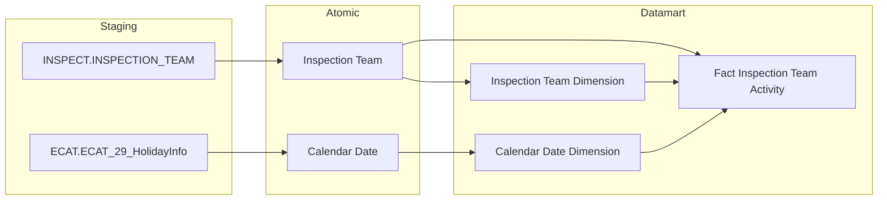

##### Cụm 1b: Thống kê vụ việc Kiểm tra (Fact Examination Team Activity)

Phục vụ Tab KIỂM TRA — Nhóm 6/7. Nguồn Atomic riêng biệt với Cụm 1 — `EXAMINATION_TEAM`. Cùng kiến trúc Cụm 1 — tách `Examination Team Dimension` riêng.

- **Grain Fact: 1 row per `EXAMINATION_TEAM`.** Đếm dùng `COUNT(Examination_Team_Dimension_Id)`.
- **Grain Dimension: 1 row per `EXAMINATION_TEAM`** — `Examination_Team_Code` (BK), `Start_Date`, `End_Date`, `Content`.
- Date key: `Decision_Date` (`EXAMINATION_TEAM.DECISION_DATE`).
- Trạng thái Hoàn thành/Đang thực hiện — cùng logic ETL-derived như Cụm 1.

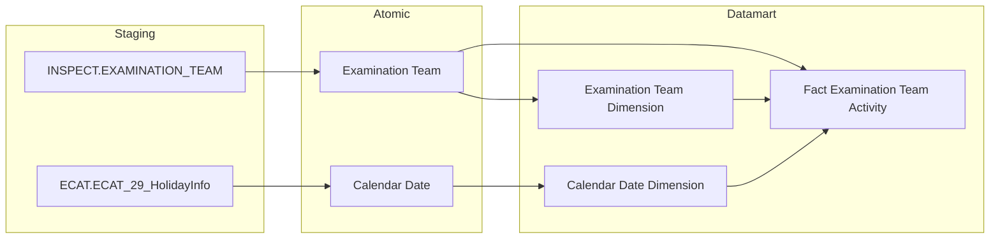

##### Cụm 1c: Cơ cấu vi phạm theo đối tượng (Fact Inspection Team Target Activity)

Phục vụ Nhóm 4. Grain khác Cụm 1 — `INSPECTION_TEAM_TARGET` quan hệ N:1 với `INSPECTION_TEAM` (1 đoàn có thể nhiều đối tượng) → tách Fact riêng grain 1 đoàn × 1 đối tượng, không gắn vào `Fact Inspection Team Activity` để tránh fanout K_TT_1-17. `Inspection Team Target Dimension` tách riêng khỏi Fact (BK per-row unique, không lưu `Inspection_Team_Code` — FK cha `Inspection_Team_Dimension_Id` đặt thẳng trên Fact, trỏ tới `Inspection Team Dimension` đã tách ở Cụm 1).

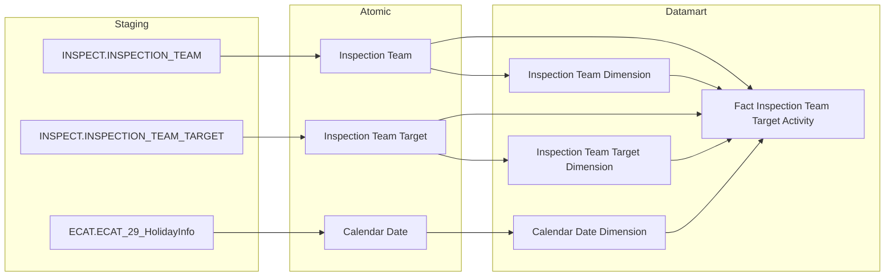

##### Cụm 1d: Cơ cấu kiểm tra theo đối tượng (Fact Examination Team Target Activity)

Phục vụ Nhóm 9. Cùng kiến trúc Cụm 1c — `EXAMINATION_TEAM_TARGET` quan hệ N:1 với `EXAMINATION_TEAM` → tách Fact riêng grain 1 vụ × 1 đối tượng, không gắn vào `Fact Examination Team Activity` để tránh fanout K_TT_20-57. `Examination Team Target Dimension` tách riêng khỏi Fact (BK per-row unique, không lưu `Examination_Team_Code` — FK cha `Examination_Team_Dimension_Id` đặt thẳng trên Fact, trỏ tới `Examination Team Dimension` đã tách ở Cụm 1b).

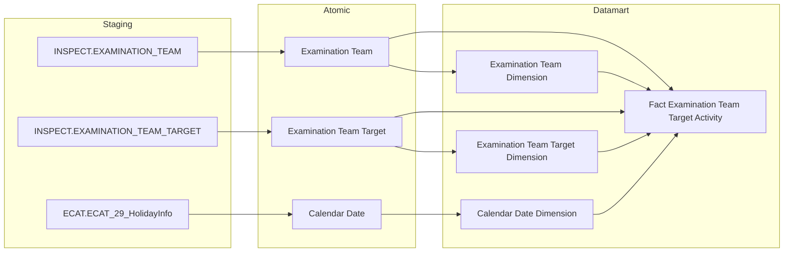

##### Cụm 1e: Cơ cấu vi phạm theo loại hành vi (Fact Inspection Team Violation Behavior)

Phục vụ Nhóm 3. Thiết kế lại 2026-08-07 (phát hiện qua `/datamart-review`) — thay thế thiết kế cũ dùng text-matching trên `Content`. Grain 1 đoàn × 1 biên bản vi phạm × 1 hành vi — `VIOLATION_RECORD_BEHAVIOR` quan hệ N:1 với `VIOLATION_RECORD` (1 biên bản có thể ghi nhiều hành vi) và N:1 với `VIOLATION_BEHAVIOR` → tách Fact riêng, không gắn vào `Fact Inspection Team Activity` để tránh fanout K_TT_1-10. `Violation Record` lọc `INSPECTION_TEAM_ID IS NOT NULL`, join trực tiếp `INSPECTION_TEAM` — không qua `VIOLATION_CASE`/`PENALTY_DECISION`/`PENALTY_DECISION_VIOLATION_RECORD` (bảng cuối chưa có Atomic YAML, không cần thiết vì có đường ngắn hơn).

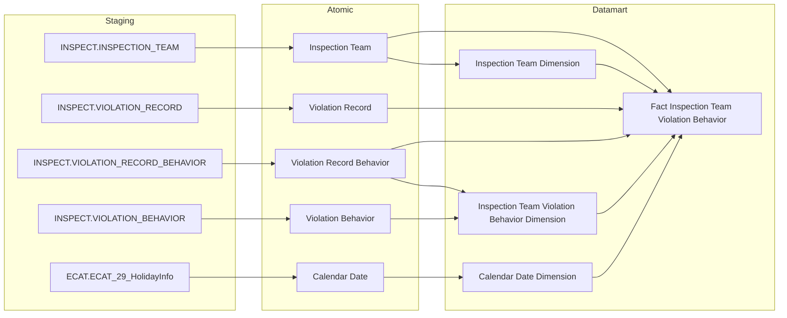

##### Cụm 1f: Cơ cấu kiểm tra theo loại hành vi (Fact Examination Team Violation Behavior)

Phục vụ Nhóm 8. Cùng kiến trúc Cụm 1e — `Violation Record` lọc `EXAMINATION_TEAM_ID IS NOT NULL`, join trực tiếp `EXAMINATION_TEAM`.

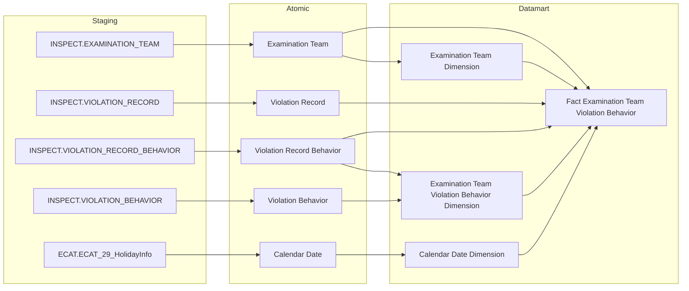

##### Cụm 2: Danh sách vụ việc Thanh tra (Operational Inspection Case List)

Nguồn: `Inspection Team` + `Inspection Team Target` (cùng nguồn Cụm 1/1c), grain 1 đoàn × 1 đối tượng. Phục vụ Nhóm 5. Lấy trực tiếp từ Atomic, không qua Dimension.

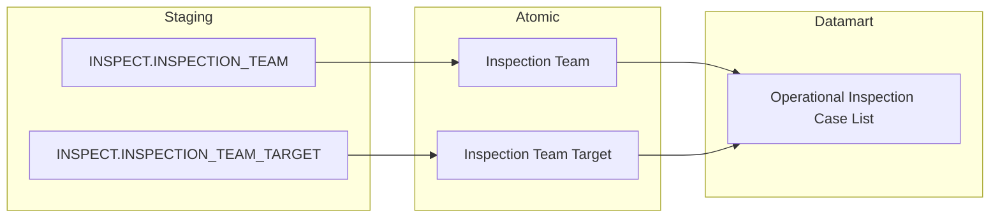

##### Cụm 2b: Danh sách vụ việc Kiểm tra (Operational Examination Case List)

Phục vụ Nhóm 10. Cùng cấu trúc Cụm 2 nhưng nguồn Atomic riêng biệt (`EXAMINATION_TEAM`/`EXAMINATION_TEAM_TARGET`), không reuse chung bảng với Nhóm 5.

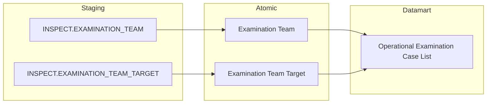

##### Cụm 3: Xử phạt vi phạm — KPI chung (Fact Penalty Decision)

Nguồn: `PENALTY_DECISION`. Phục vụ Nhóm 11, 12. Grain 1 quyết định xử phạt. `Penalty Decision Dimension` tách riêng khỏi Fact (chứa `Penalty_Decision_Code` để Cụm 3b/3c join tới định danh QĐ).

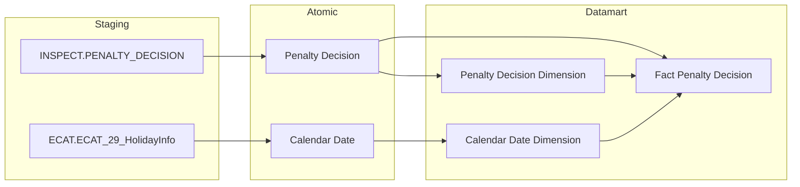

##### Cụm 3b: Xử phạt vi phạm — Cơ cấu theo hành vi (Fact Penalty Decision Subject Behavior)

Phục vụ Nhóm 13 + Nhóm 20 (reuse chung 1 Fact). Grain khác Cụm 3 — `PENALTY_DECISION_SUBJECT_BEHAVIOR` là 4-way join (1 QĐ có thể nhiều đối tượng × nhiều hành vi) → tách Fact riêng, không gắn vào `Fact Penalty Decision` để tránh fanout K_TT_40-45. 2 FK trên Fact trỏ tới `Penalty Decision Dimension` (reuse Cụm 3) và `Penalty Decision Subject Dimension` (reuse Cụm 3c); `Penalty Decision Subject Behavior Dimension` tách riêng khỏi Fact chứa `Violation_Behavior_Name`.

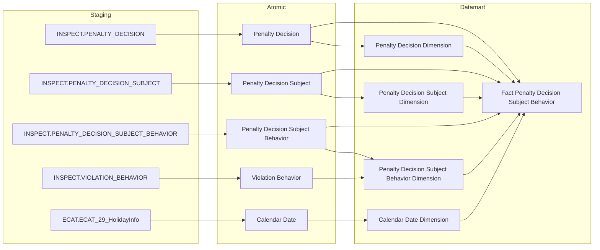

##### Cụm 3c: Xử phạt vi phạm — Cơ cấu theo đối tượng (Fact Penalty Decision Subject)

Phục vụ Nhóm 14. Grain khác Cụm 3/3b — `PENALTY_DECISION_SUBJECT` là 2-way join (không có hành vi) → tách Fact riêng để tránh fanout Cụm 3 và tránh đếm trùng nếu dùng chung Cụm 3b. `Penalty Decision Subject Dimension` tách riêng khỏi Fact (BK per-row unique); FK `Penalty_Decision_Dimension_Id` trên Fact trỏ tới `Penalty Decision Dimension` (reuse Cụm 3).

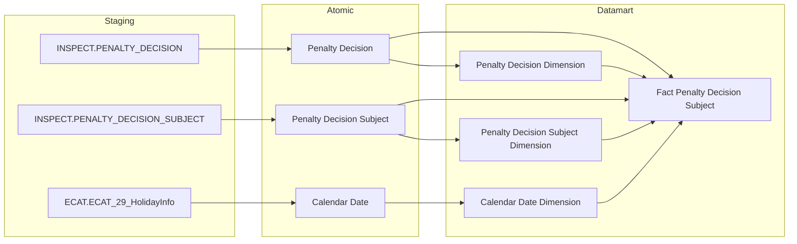

##### Cụm 3d: Danh sách quyết định xử phạt (Operational Penalty Decision List)

Phục vụ Nhóm 15. Bảng Tác nghiệp, grain giống Cụm 3c nhưng thêm join `Violation Case` để lấy `Form_Type` qua Inspection/Examination Team.

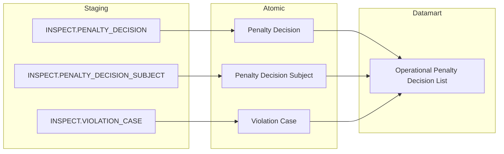

##### Cụm 4: Đơn thư khiếu nại tố cáo (Operational Petition List)

Nguồn: `Petition` ← `PETITION`. Phục vụ Tab ĐƠN THƯ — toàn bộ KPI aggregate + danh sách chi tiết. Không tạo Fact riêng vì grain giống hệt tác nghiệp, volume nhỏ, không fanout.

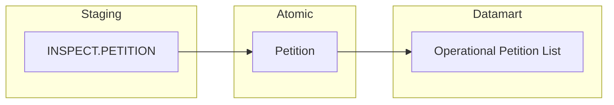

##### Cụm 5: Báo cáo hoạt động vi phạm TTCK (Fact Penalty Decision Subject Behavior — reuse)

Reuse `Fact Penalty Decision Subject Behavior` (Cụm 3b, Nhóm 13) — không phải `Fact Penalty Decision`, vì báo cáo cần phân loại theo hành vi (`VIOLATION_BEHAVIOR.NAME`). Phục vụ Nhóm 20 — bảng 7 nhóm Loại hình xử lý × (số lượng + số tiền).

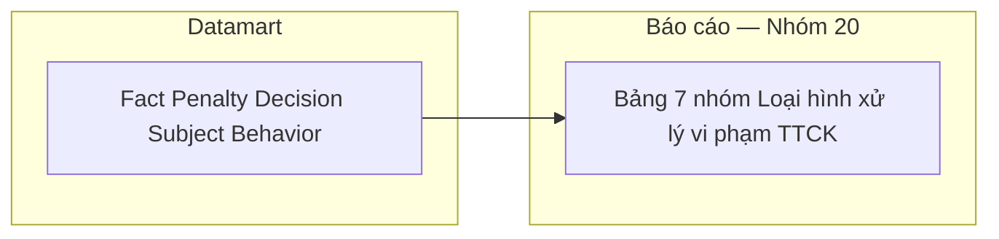

---

## Section 2 — Tổng quan báo cáo

### Tab: TỔNG QUAN

**Slicer chung:** Năm (NĂM 202X — góc trên phải dashboard)

---

#### Nhóm 1 — KPI cards Thống kê chung (STT 1)

> Phân loại: **Phân tích**
> Atomic: `Inspection Team` ← THANHTRA.INSPECTION_TEAM (`INSPECT.INSPECTION_TEAM`) — **READY** (`DataModel/Atomic/Business_Activity/dm_atm_inspection_team-THANHTRA.INSPECTION_TEAM.yaml`)
> Ghi chú:
> - `Case_Status` (Hoàn thành/Đang thực hiện) không tồn tại như field riêng trên Atomic — ETL-derived trên `Inspection Team Dimension` từ `Start_Date`/`End_Date`.
> - Date key dùng `Decision_Date`. Fact join `Calendar Date Dimension` qua `Decision_Date`.

**Mockup:**

| ĐOÀN ▲ 8% | ĐOÀN ▲ 12% | ĐOÀN ▲ 5% |
|---|---|---|
| Tổng số đoàn thanh tra | Số đoàn đã hoàn thành | Số đoàn đang thực hiện |

**Source:** `Fact Inspection Team Activity` → `Calendar Date Dimension`, `Inspection Team Dimension`

**Bảng KPI:**

| KPI ID | Tên KPI | Đơn vị | Tính chất | Công thức | Ghi chú |
|---|---|---|---|---|---|
| K_TT_1 | Tổng số đoàn thanh tra | Đoàn | Base | COUNT(Fact_Inspection_Team_Activity JOIN Inspection Team Dimension) WHERE Year(Calendar Date Dimension.Decision_Date)=selected_year | |
| K_TT_2 | Tổng số thanh tra SSCK (%) | % | Derived | CASE WHEN selected_year = YEAR(CURRENT_DATE()) THEN (COUNT(K_TT_1 nguồn WHERE Decision_Date BETWEEN DATE(CONCAT(Y,'-01-01')) AND CURRENT_DATE()) − COUNT(K_TT_1 nguồn WHERE Decision_Date BETWEEN DATE(CONCAT(Y-1,'-01-01')) AND DATE(CONCAT(Y-1,'-',MONTH(CURRENT_DATE()),'-',DAY(CURRENT_DATE())))) ) / NULLIF(COUNT(K_TT_1 nguồn WHERE Decision_Date BETWEEN DATE(CONCAT(Y-1,'-01-01')) AND DATE(CONCAT(Y-1,'-',MONTH(CURRENT_DATE()),'-',DAY(CURRENT_DATE())))),0) × 100 ELSE (K_TT_1[Y] − K_TT_1[Y−1]) / NULLIF(K_TT_1[Y−1],0) × 100 END | Nếu năm chọn = năm hiện tại → so YTD-to-YTD (đầu năm đến hôm nay, cùng mốc ngày/tháng cho cả 2 năm); nếu năm chọn là năm quá khứ → so cả năm với cả năm như cũ |
| K_TT_3 | Số đoàn đã hoàn thành | Đoàn | Base | COUNT(...) WHERE Year(Decision_Date)=selected_year AND Inspection Team Dimension.End_Date IS NOT NULL AND Inspection Team Dimension.Start_Date IS NOT NULL | |
| K_TT_4 | Số đoàn hoàn thành SSCK (%) | % | Derived | CASE WHEN selected_year = YEAR(CURRENT_DATE()) THEN (COUNT(K_TT_3 nguồn WHERE Decision_Date BETWEEN DATE(CONCAT(Y,'-01-01')) AND CURRENT_DATE() AND End_Date IS NOT NULL AND Start_Date IS NOT NULL) − COUNT(K_TT_3 nguồn WHERE Decision_Date BETWEEN DATE(CONCAT(Y-1,'-01-01')) AND DATE(CONCAT(Y-1,'-',MONTH(CURRENT_DATE()),'-',DAY(CURRENT_DATE()))) AND End_Date IS NOT NULL AND Start_Date IS NOT NULL) ) / NULLIF(COUNT(K_TT_3 nguồn WHERE Decision_Date BETWEEN DATE(CONCAT(Y-1,'-01-01')) AND DATE(CONCAT(Y-1,'-',MONTH(CURRENT_DATE()),'-',DAY(CURRENT_DATE()))) AND End_Date IS NOT NULL AND Start_Date IS NOT NULL),0) × 100 ELSE (K_TT_3[Y] − K_TT_3[Y−1]) / NULLIF(K_TT_3[Y−1],0) × 100 END | Nếu năm chọn = năm hiện tại → so YTD-to-YTD; nếu năm chọn là năm quá khứ → so cả năm với cả năm như cũ |
| K_TT_5 | Số đoàn đang thực hiện | Đoàn | Base | COUNT(...) WHERE Year(Decision_Date)=selected_year AND Inspection Team Dimension.End_Date IS NULL AND Inspection Team Dimension.Start_Date IS NOT NULL | |
| K_TT_6 | Số đoàn đang thực hiện SSCK (%) | % | Derived | CASE WHEN selected_year = YEAR(CURRENT_DATE()) THEN (COUNT(K_TT_5 nguồn WHERE Decision_Date BETWEEN DATE(CONCAT(Y,'-01-01')) AND CURRENT_DATE() AND End_Date IS NULL AND Start_Date IS NOT NULL) − COUNT(K_TT_5 nguồn WHERE Decision_Date BETWEEN DATE(CONCAT(Y-1,'-01-01')) AND DATE(CONCAT(Y-1,'-',MONTH(CURRENT_DATE()),'-',DAY(CURRENT_DATE()))) AND End_Date IS NULL AND Start_Date IS NOT NULL) ) / NULLIF(COUNT(K_TT_5 nguồn WHERE Decision_Date BETWEEN DATE(CONCAT(Y-1,'-01-01')) AND DATE(CONCAT(Y-1,'-',MONTH(CURRENT_DATE()),'-',DAY(CURRENT_DATE()))) AND End_Date IS NULL AND Start_Date IS NOT NULL),0) × 100 ELSE (K_TT_5[Y] − K_TT_5[Y−1]) / NULLIF(K_TT_5[Y−1],0) × 100 END | Nếu năm chọn = năm hiện tại → so YTD-to-YTD; nếu năm chọn là năm quá khứ → so cả năm với cả năm như cũ |
| K_TT_7 | Thời gian (năm thống kê) | Năm | Chiều | Year(Calendar Date Dimension.Calendar_Date) — slicer chọn năm thống kê, join qua `Decision_Date_Dimension_Id` | Chiều lọc dùng chung cho K_TT_1-6 |

**Star Schema:**

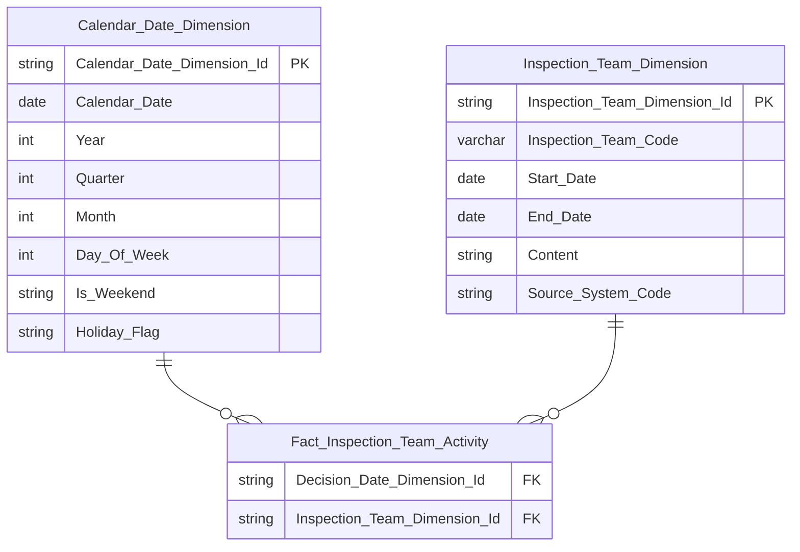

> Field mapping Atomic source: `Inspection_Team_Code` ← `Inspection Team.Inspection Team Code` (`INSPECTION_TEAM.CODE`, BK); `Start_Date`/`End_Date` ← `Inspection Team.Start Date`/`End Date` (`INSPECTION_TEAM.START_DATE`/`END_DATE`); `Content` ← `Inspection Team.Content` (`INSPECTION_TEAM.CONTENT`, CLOB — ETL truncate nếu vượt ngưỡng, dùng derive `Phân loại vi phạm` K_TT_11 ở Nhóm 3).

**Lineage Mart → Báo cáo:**

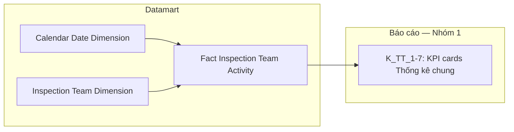

**Bảng grain:**

| Tên bảng | Grain | Date key | Filter mặc định |
|---|---|---|---|
| Fact Inspection Team Activity | 1 đoàn thanh tra (`INSPECTION_TEAM`) — 2 FK: Calendar Date, Inspection Team Dimension | `Decision_Date_Dimension_Id` ← join Calendar Date Dimension | Year = selected_year (slicer NĂM 202X) |
| Inspection Team Dimension | 1 đoàn thanh tra (`INSPECTION_TEAM`) — SCD Type 4A | — | — |

---

#### Nhóm 2 — Biểu đồ Thống kê số vụ việc theo tháng (STT 2)

> Reuse 100% `Fact Inspection Team Activity` + `Inspection Team Dimension` đã thiết kế ở Nhóm 1.
> Phân loại: **Phân tích**
> Atomic: `Inspection Team` ← THANHTRA.INSPECTION_TEAM (`INSPECT.INSPECTION_TEAM`) — **READY** (reuse Nhóm 1)
> Ghi chú: GROUP BY `Calendar_Date_Dimension.Month` ở presentation layer.

**Mockup:**

| Tháng | T1 | T2 | T3 | ... | T12 |
|---|---|---|---|---|---|
| Tổng số vụ | 4 | 6 | 5 | ... | 24 |
| Đang thực hiện | 2 | 3 | 2 | ... | 12 |
| Đã hoàn thành | 2 | 3 | 3 | ... | 12 |

**Source:** `Fact Inspection Team Activity` → `Calendar Date Dimension`, `Inspection Team Dimension`

**Bảng KPI:**

| KPI ID | Tên KPI | Đơn vị | Tính chất | Công thức | Ghi chú |
|---|---|---|---|---|---|
| K_TT_8 | Số vụ việc thanh tra theo tháng (tổng) | Vụ | Base | COUNT(Fact_Inspection_Team_Activity JOIN Inspection Team Dimension) WHERE Year(Decision_Date)=selected_year GROUP BY Calendar_Date_Dimension.Month | |
| K_TT_9 | Số vụ đang thực hiện theo tháng | Vụ | Base | COUNT(...) WHERE Year(Decision_Date)=selected_year AND Inspection Team Dimension.End_Date IS NULL AND Inspection Team Dimension.Start_Date IS NOT NULL GROUP BY Month | |
| K_TT_10 | Số vụ đã hoàn thành theo tháng | Vụ | Base | COUNT(...) WHERE Year(Decision_Date)=selected_year AND Inspection Team Dimension.End_Date IS NOT NULL AND Inspection Team Dimension.Start_Date IS NOT NULL GROUP BY Month | |

**Star Schema:** giống Nhóm 1 (reuse 100%, không thêm FK/measure mới).

**Lineage Mart → Báo cáo:**

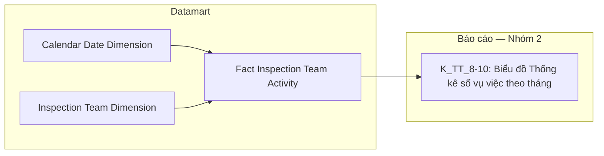

**Bảng grain:**

| Tên bảng | Grain | Date key | Filter mặc định | Phân tích theo tháng |
|---|---|---|---|---|
| Fact Inspection Team Activity | reuse — 1 đoàn thanh tra | `Decision_Date_Dimension_Id` | Year=selected_year | GROUP BY Calendar_Date_Dimension.Month ở query time |
| Inspection Team Dimension | reuse — 1 đoàn thanh tra (`INSPECTION_TEAM`), SCD Type 4A | — | — | — |

---

#### Nhóm 3 — Cơ cấu vi phạm theo loại hành vi (STT 3)

> Phân loại: **Phân tích**
> Atomic: `Violation Record` ← THANHTRA.VIOLATION_RECORD — **READY** (`DataModel/Atomic/Business_Activity/dm_atm_violation_record-THANHTRA.VIOLATION_RECORD.yaml`)
> Atomic: `Violation Record Behavior` ← THANHTRA.VIOLATION_RECORD_BEHAVIOR — **READY** (`DataModel/Atomic/Business_Activity/dm_atm_violation_record_behavior-THANHTRA.VIOLATION_RECORD_BEHAVIOR.yaml`)
> Atomic: `Violation Behavior` ← THANHTRA.VIOLATION_BEHAVIOR — **READY** (`DataModel/Atomic/Business_Activity/dm_atm_violation_behavior-THANHTRA.VIOLATION_BEHAVIOR.yaml`, reuse Nhóm 13)
> Ghi chú:
> - **Sửa 2026-08-07 (phát hiện qua `/datamart-review`):** BA cập nhật SQL tham khảo — thiết kế cũ dùng text-matching 3 pattern trên `Inspection Team Dimension.Content` (ELSE NULL, loại khỏi thống kê) không còn khớp. Nguồn đúng: `Violation Behavior.Violation Behavior Name` — danh mục hành vi chuẩn hoá thật, lấy qua join `Violation Record` (filter `Inspection_Team_Id IS NOT NULL`) → `Violation Record Behavior` → `Violation Behavior` (`Life_Cycle_Status_Code = 'ACTIVE'`). Không dùng lại đường JOIN của SQL BA (`VIOLATION_CASE → PENALTY_DECISION → PENALTY_DECISION_VIOLATION_RECORD`) vì `PENALTY_DECISION_VIOLATION_RECORD` chưa có Atomic YAML — `Violation Record` đã có sẵn FK trực tiếp `Inspection_Team_Id`, đường ngắn hơn và không cần Gap Atomic.
> - Grain khác Nhóm 1/2 — 1 biên bản vi phạm (`VIOLATION_RECORD`) có thể ghi nhận N hành vi qua `VIOLATION_RECORD_BEHAVIOR` (N:1 với `Violation Record`, N:1 với `Violation Behavior`). Tách Fact riêng **Fact Inspection Team Violation Behavior** (grain 1 đoàn × 1 biên bản × 1 hành vi) — không gắn vào `Fact Inspection Team Activity` (grain 1 đoàn) để tránh fanout.
> - `Violation_Behavior_Name` denormalize trực tiếp vào Dimension mới (không tách `Violation Behavior Dimension` riêng) — theo đúng pattern đã dùng ở `Penalty Decision Subject Behavior Dimension` (Nhóm 13).
> - `Inspection_Team_Dimension_Id` là FK trên Fact, trỏ thẳng `Inspection Team Dimension` (Nhóm 1) — reuse, không denormalize `Inspection_Team_Code` vào Dimension mới.
> - ELSE 'Khác' (không loại bỏ) khi `Violation_Behavior_Name` NULL — khác thiết kế cũ (ELSE NULL, loại khỏi thống kê).

**Mockup:**

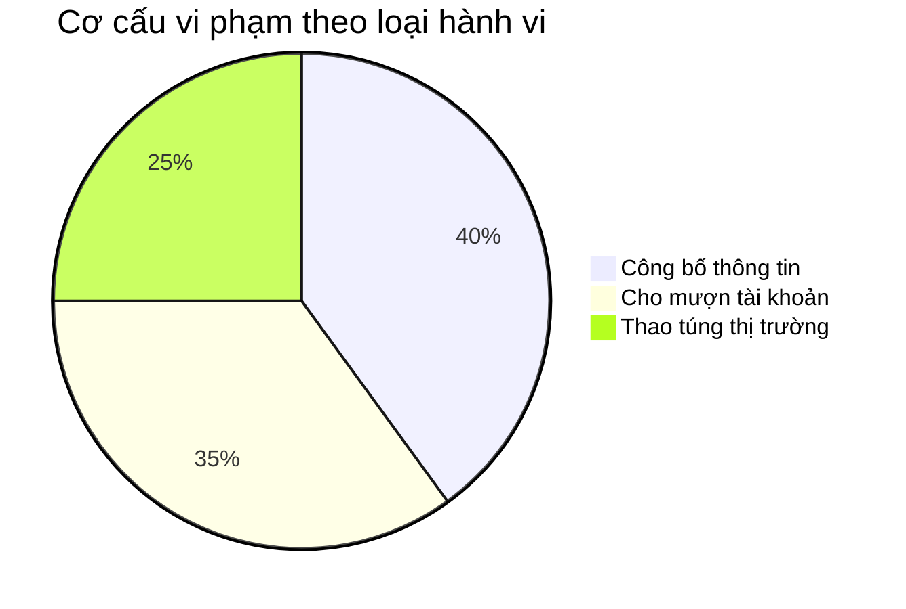

> Số lát pie chart thực tế tùy giá trị `Violation_Behavior_Name` phát sinh trong data (GROUP BY động, không giới hạn số pattern) — mockup chỉ minh họa trường hợp phổ biến.

**Source:** `Fact Inspection Team Violation Behavior` → `Calendar Date Dimension`, `Inspection Team Dimension`, `Inspection Team Violation Behavior Dimension`

**Bảng KPI:**

| KPI ID | Tên KPI | Đơn vị | Tính chất | Công thức | Ghi chú |
|---|---|---|---|---|---|
| K_TT_11 | Số vi phạm theo loại hành vi | Vụ | Base | COUNT(Fact_Inspection_Team_Violation_Behavior) WHERE Year(Decision_Date)=selected_year GROUP BY Violation_Behavior_Name | GROUP BY động — số dòng kết quả tùy `Violation_Behavior_Name` thực tế phát sinh. NULL → gộp 'Khác' (không loại bỏ). Tỷ lệ % tính ở tầng Báo cáo: COUNT(nhóm)/SUM(COUNT toàn bộ nhóm cùng năm) × 100%, không phải KPI Derived |
| K_TT_12 | Phân loại vi phạm | — | Chiều | `COALESCE(Violation_Behavior_Name, 'Khác')` — lấy trực tiếp giá trị thực tế, GROUP BY động | Chiều lọc/nhóm dùng chung cho K_TT_11 |

**Star Schema:**

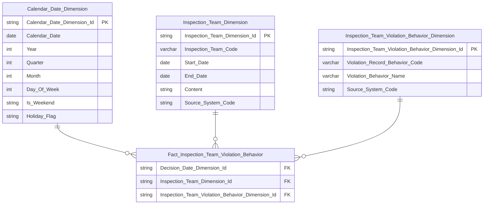

> `Inspection_Team_Dimension_Id` là FK trên Fact, trỏ thẳng tới `Inspection Team Dimension` (Nhóm 1) — Dimension hành vi (`Inspection_Team_Violation_Behavior_Dimension`) không lưu `Inspection_Team_Code`. Muốn lấy thuộc tính đoàn cha thì Fact join trực tiếp `Inspection Team Dimension` qua FK này.
>
> Field mapping Atomic source: `Violation_Record_Behavior_Code` ← `Violation Record Behavior.Violation Record Behavior Code` (`VIOLATION_RECORD_BEHAVIOR.ID`, BK per-row unique); `Violation_Behavior_Name` ← lookup `Violation Behavior.Violation Behavior Name` WHERE `Violation_Behavior_Id` = `Violation Record Behavior.Violation Behavior Id` (filter `Violation Behavior.Life_Cycle_Status_Code = 'ACTIVE'`); `Inspection_Team_Dimension_Id` ← lookup `Inspection_Team_Dimension` WHERE `Inspection_Team_Code` = `Violation Record.Inspection Team Code` (`VIOLATION_RECORD_BEHAVIOR.VIOLATION_RECORD_ID` join `VIOLATION_RECORD.ID`, filter `VIOLATION_RECORD.INSPECTION_TEAM_ID IS NOT NULL`). Decision_Date lấy từ `Inspection Team` (ETL join qua `Inspection_Team_Dimension_Id`). KPI COUNT() dùng `COUNT(DISTINCT Inspection_Team_Violation_Behavior_Dimension_Id)`.

**Lineage Mart → Báo cáo:**

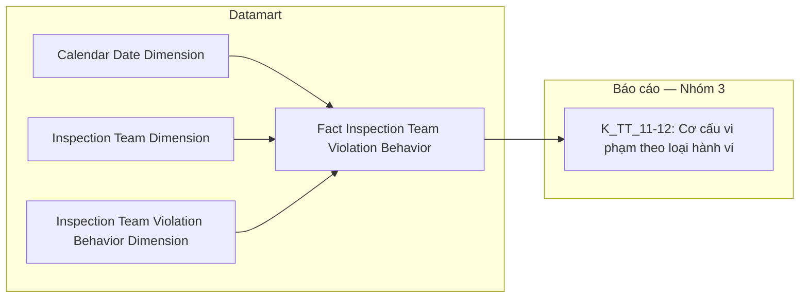

**Bảng grain:**

| Tên bảng | Grain | Date key | Filter mặc định |
|---|---|---|---|
| Fact Inspection Team Violation Behavior | 1 đoàn thanh tra × 1 biên bản × 1 hành vi (`VIOLATION_RECORD` × `VIOLATION_RECORD_BEHAVIOR`, filter `INSPECTION_TEAM_ID IS NOT NULL`) — 3 FK: Calendar Date Dimension, Inspection Team Dimension, Inspection Team Violation Behavior Dimension | `Decision_Date_Dimension_Id` ← join Inspection Team → Calendar Date Dimension | Year=selected_year (slicer NĂM 202X) |

---

#### Nhóm 4 — Cơ cấu vi phạm theo đối tượng (STT 4)

> Phân loại: **Phân tích**
> Atomic: `Inspection Team` ← THANHTRA.INSPECTION_TEAM (`INSPECT.INSPECTION_TEAM`) — **READY** (reuse Nhóm 1)
> Atomic: `Inspection Team Target` ← THANHTRA.INSPECTION_TEAM_TARGET (`INSPECT.INSPECTION_TEAM_TARGET`) — **READY** (`DataModel/Atomic/Business_Activity/dm_atm_inspection_team_target-THANHTRA.INSPECTION_TEAM_TARGET.yaml`)
> Ghi chú:
> - Grain khác Nhóm 1/2/3 — `INSPECTION_TEAM_TARGET` quan hệ N:1 với `INSPECTION_TEAM`. Đếm theo số lượt đối tượng (không DISTINCT theo đoàn), tách riêng **Fact Inspection Team Target Activity** (grain 1 đoàn × 1 đối tượng — dữ liệu chi tiết từng lượt, chưa aggregate).
> - `Target_Type_Code` (← `INSPECTION_TEAM_TARGET.TARGET_TYPE`) map 1:1 trực tiếp từ nguồn — KHÔNG phải Classification Value. Giá trị thực tế trong Atomic: `SECURITIES_COMPANY, FUND_MANAGEMENT_COMPANY, PUBLIC_COMPANY, AUDIT_COMPANY, CRYPTO_SERVICE_PROVIDER, INDIVIDUAL, ORGANIZATION` (7 giá trị).
> - **Sửa 2026-07-21 (phát hiện qua `/datamart-review`):** Thiết kế cũ hardcode 4 cặp KPI Base/Derived cố định (Cá nhân/CTĐC/CTCK/CTQLQ) — bỏ sót 3 giá trị Atomic thật (`AUDIT_COMPANY`, `CRYPTO_SERVICE_PROVIDER`, `ORGANIZATION`) trong cả tử số lẫn mẫu số %, không khớp SQL BA tham khảo (`COUNT(a.ID)*100/SUM(COUNT(a.ID)) OVER (PARTITION BY Year)` — GROUP BY động theo toàn bộ `TARGET_TYPE` thực tế phát sinh, không giới hạn ở 4 loại BA liệt kê minh họa trong Mô tả). Thiết kế lại: 1 KPI Base tổng quát GROUP BY động (số dòng kết quả tùy dữ liệu, tối đa 7) + 1 KPI Chiều — không cố định N cặp Base/Derived. Tỷ lệ % không còn là KPI Derived ở tầng Datamart; tính ở tầng Detail Mapping/Báo cáo (COUNT theo nhóm / SUM COUNT toàn bộ nhóm cùng năm × 100%).
> - Date key: `Decision_Date` (← `INSPECTION_TEAM.DECISION_DATE`, qua join với Inspection Team).
> - Mapping hiển thị tham khảo (label UI, không phải filter cố định): `INDIVIDUAL`=Cá nhân, `PUBLIC_COMPANY`=CTĐC, `SECURITIES_COMPANY`=CTCK, `FUND_MANAGEMENT_COMPANY`=CTQLQ, `AUDIT_COMPANY`=CTKT, `CRYPTO_SERVICE_PROVIDER`=Tổ chức cung cấp dịch vụ tài sản mã hoá, `ORGANIZATION`=Tổ chức khác.

**Mockup:**

```mermaid
pie title Cơ cấu vi phạm theo đối tượng
    "Cá nhân" : 30
    "CTĐC" : 25
    "CTCK" : 25
    "CTQLQ" : 20
```

> Số lát pie chart thực tế tùy số giá trị `Target_Type_Code` phát sinh trong data (tối đa 7) — mockup chỉ minh họa trường hợp phổ biến.

**Source:** `Fact Inspection Team Target Activity` → `Calendar Date Dimension`

**Bảng KPI:**

| KPI ID | Tên KPI | Đơn vị | Tính chất | Công thức | Ghi chú |
|---|---|---|---|---|---|
| K_TT_13 | Số vi phạm theo đối tượng | Vụ | Base | COUNT(Fact_Inspection_Team_Target_Activity) WHERE Year(Decision_Date)=selected_year GROUP BY Target_Type_Code | GROUP BY động trên dữ liệu chi tiết từng lượt — số dòng kết quả tùy giá trị `Target_Type_Code` thực tế phát sinh (tối đa 7). Tỷ lệ % tính ở tầng Báo cáo: COUNT(nhóm)/SUM(COUNT toàn bộ nhóm cùng năm) × 100%, không phải KPI Derived |
| K_TT_14 | Phân loại đối tượng | — | Chiều | `Target_Type_Code` — lấy trực tiếp toàn bộ giá trị thực tế trong data, GROUP BY động (không hardcode danh sách cố định) | Chiều lọc/nhóm dùng chung cho K_TT_13 |

**Star Schema:**

```mermaid
erDiagram
    Calendar_Date_Dimension ||--o{ Fact_Inspection_Team_Target_Activity : " "
    Inspection_Team_Target_Dimension ||--o{ Fact_Inspection_Team_Target_Activity : " "
    Inspection_Team_Dimension ||--o{ Fact_Inspection_Team_Target_Activity : " "
    Fact_Inspection_Team_Target_Activity {
        string Decision_Date_Dimension_Id FK
        string Inspection_Team_Target_Dimension_Id FK
        string Inspection_Team_Dimension_Id FK
    }
    Calendar_Date_Dimension {
        string Calendar_Date_Dimension_Id PK
        date Calendar_Date
        int Year
        int Quarter
        int Month
        int Day_Of_Week
        string Is_Weekend
        string Holiday_Flag
    }
    Inspection_Team_Target_Dimension {
        string Inspection_Team_Target_Dimension_Id PK
        varchar Inspection_Team_Target_Code
        varchar Target_Type_Code
        string Source_System_Code
    }
    Inspection_Team_Dimension {
        string Inspection_Team_Dimension_Id PK
        varchar Inspection_Team_Code
        date Start_Date
        date End_Date
        string Content
        string Source_System_Code
    }
```

> `Inspection_Team_Dimension_Id` là FK trên Fact, trỏ thẳng tới `Inspection Team Dimension` (Nhóm 1) — Dimension con (`Inspection_Team_Target_Dimension`) không lưu `Inspection_Team_Code`. Muốn lấy thuộc tính đoàn cha thì Fact join trực tiếp `Inspection Team Dimension` qua FK này.
>
> Field mapping Atomic source: `Inspection_Team_Target_Code` ← `Inspection Team Target.Inspection Team Target Code` (`INSPECTION_TEAM_TARGET.ID`, BK per-row unique); `Inspection_Team_Dimension_Id` ← lookup `Inspection_Team_Dimension` WHERE `Inspection_Team_Code` = `Inspection Team Target.Inspection Team Code` (`INSPECTION_TEAM_TARGET.INSPECTION_TEAM_ID` join `INSPECTION_TEAM.ID`); `Target_Type_Code` ← `Inspection Team Target.Target Type Code` (`INSPECTION_TEAM_TARGET.TARGET_TYPE`). Decision_Date lấy từ `Inspection Team` (ETL join `INSPECTION_TEAM_TARGET.INSPECTION_TEAM_ID = INSPECTION_TEAM.ID`). KPI COUNT() dùng `COUNT(DISTINCT Inspection_Team_Target_Dimension_Id)`.

**Lineage Mart → Báo cáo:**

```mermaid
flowchart LR
    subgraph Datamart["Datamart"]
        G1["Fact Inspection Team Target Activity"]
        G2["Calendar Date Dimension"]
        G3["Inspection Team Target Dimension"]
        G4["Inspection Team Dimension"]
    end
    subgraph RPT["Báo cáo — Nhóm 4"]
        R1["K_TT_13-14: Cơ cấu vi phạm theo đối tượng"]
    end
    G2 --> G1
    G3 --> G1
    G4 --> G1
    G1 --> R1
```

**Bảng grain:**

| Tên bảng | Grain | Date key | Filter mặc định |
|---|---|---|---|
| Fact Inspection Team Target Activity | 1 đoàn thanh tra × 1 đối tượng (`INSPECTION_TEAM` × `INSPECTION_TEAM_TARGET`, N:1) — 3 FK: Calendar Date Dimension, Inspection Team Target Dimension, Inspection Team Dimension | `Decision_Date_Dimension_Id` ← join Inspection Team → Calendar Date Dimension | Year = selected_year (slicer NĂM 202X) |

---

#### Nhóm 5 — Danh sách vụ việc Thanh tra (STT 5)

> Phân loại: **Tác nghiệp**
> Atomic: `Inspection Team` ← THANHTRA.INSPECTION_TEAM (`INSPECT.INSPECTION_TEAM`) — **READY** (reuse Nhóm 1/4)
> Atomic: `Inspection Team Target` ← THANHTRA.INSPECTION_TEAM_TARGET (`INSPECT.INSPECTION_TEAM_TARGET`) — **READY** (reuse Nhóm 4)
> Ghi chú:
> - Tab TỔNG QUAN chỉ phục vụ luồng Thanh tra (`INSPECTION_TEAM`); Kiểm tra dùng nguồn `EXAMINATION_TEAM`/`EXAMINATION_TEAM_TARGET` riêng ở Nhóm 10.
> - Grain giống Cụm 1c (Nhóm 4) — 1 đoàn thanh tra × 1 đối tượng. Không reuse trực tiếp Fact Inspection Team Target Activity vì khác `table_type` (`fact` vs `operational`).
> - Cột **"Mã vụ việc"** ← `Inspection Team.Inspection Team Code` (`INSPECTION_TEAM.CODE`)
> - Cột **"Đối tượng"** ← `Inspection Team Target.Target Name` (`INSPECTION_TEAM_TARGET.TARGET_NAME`)
> - Cột **"Phân loại đối tượng"** ← `Inspection Team Target.Target Type Code` (`INSPECTION_TEAM_TARGET.TARGET_TYPE`)
> - Cột **"Loại hình"** ← `Inspection Team.Form Type Code` (`INSPECTION_TEAM.FORM_TYPE`) — scheme `TT_REVIEW_FORM_TYPE` (PERIODIC/UNSCHEDULED → Định kỳ/Đột xuất)
> - Cột **"Trạng thái"** ← ETL-derived từ `Inspection Team.Start Date`/`End Date` — **3 giá trị**: `START_DATE IS NOT NULL AND END_DATE IS NULL` → Đang thực hiện; `START_DATE IS NOT NULL AND END_DATE IS NOT NULL` → Đã hoàn thành; `START_DATE IS NULL AND END_DATE IS NULL` → Chưa thực hiện.
> - Date key: `Decision_Date` (← `INSPECTION_TEAM.DECISION_DATE`).

**Mockup:**

| Mã vụ việc | Đối tượng | Phân loại đối tượng | Loại hình | Trạng thái |
|---|---|---|---|---|
| INS-2024-001 | Công ty ABC | Công ty chứng khoán | Đột xuất | Tại thực địa |
| INS-2024-002 | Công ty XYZ | Quỹ đầu tư | Định kỳ | Đang thực hiện |

**Bảng KPI (Attribute hiển thị — Tác nghiệp):**

| KPI ID | Tên KPI | Đơn vị | Tính chất | Công thức | Ghi chú |
|---|---|---|---|---|---|
| K_TT_15 | Mã vụ việc | — | Attribute | `Inspection Team Target.Inspection Team Code` | |
| K_TT_16 | Đối tượng | — | Attribute | `Inspection Team Target.Target Name` | |
| K_TT_17 | Phân loại đối tượng | — | Attribute | `Inspection Team Target.Target Type Code` | |
| K_TT_18 | Loại hình | — | Attribute | `Inspection Team.Form Type Code` (join qua Inspection Team) | scheme TT_REVIEW_FORM_TYPE |
| K_TT_19 | Trạng thái | — | Attribute | ETL-derived từ `Inspection Team.Start Date`/`End Date` (join qua Inspection Team) | 3 giá trị: Chưa thực hiện/Đang thực hiện/Đã hoàn thành |

**Schema bảng tác nghiệp:**

```mermaid
erDiagram
    Operational_Inspection_Case_List {
        varchar Inspection_Team_Code PK
        varchar Target_Name
        varchar Target_Type_Code
        varchar Form_Type_Code
        varchar Status_Code
        date Decision_Date
        int Decision_Year
        string Source_System_Code
    }
```

**Lineage Mart → Báo cáo:**

```mermaid
flowchart LR
    subgraph Datamart["Datamart"]
        G1["Operational Inspection Case List"]
    end
    subgraph RPT["Báo cáo — Nhóm 5"]
        R1["Danh sách vụ việc Thanh tra"]
    end
    G1 --> R1
```

**Bảng grain:**

| Tên bảng | Grain | Nguồn chính | Filter mặc định | Ghi chú |
|---|---|---|---|---|
| Operational Inspection Case List | 1 đoàn thanh tra × 1 đối tượng (`INSPECTION_TEAM` × `INSPECTION_TEAM_TARGET`, N:1) | `Inspection Team` + `Inspection Team Target` (join qua `INSPECTION_TEAM_ID`) | Year=selected_year (Decision_Date); filter Loại hình và Trạng thái ở query time | Phân trang ở presentation layer |

---

### Tab: KIỂM TRA

**Slicer chung:** Năm (NĂM 202X — góc trên phải dashboard)

> Nhóm 6-10 dùng nguồn Atomic riêng `EXAMINATION_TEAM`/`EXAMINATION_TEAM_TARGET` (tách biệt với luồng Thanh tra của Tab TỔNG QUAN). Nhóm 6-9 reuse `Fact Examination Team Activity`/`Fact Examination Team Target Activity` (Cụm 1b/1d); Nhóm 10 dùng bảng Tác nghiệp riêng `Operational Examination Case List` (Cụm 2b).

---

#### Nhóm 6 — KPI cards Thống kê chung Kiểm tra (STT 6)

> Phân loại: **Phân tích**
> Atomic: `Examination Team` ← THANHTRA.EXAMINATION_TEAM (`INSPECT.EXAMINATION_TEAM`) — **READY** (`DataModel/Atomic/Business_Activity/dm_atm_examination_team-THANHTRA.EXAMINATION_TEAM.yaml`)
> Ghi chú:
> - `Case_Status` (Hoàn thành/Đang thực hiện) ETL-derived trên `Examination Team Dimension` từ `Start_Date`/`End_Date` — chỉ 2 giá trị (khác Nhóm 5 có 3 giá trị).
> - Date key dùng `Decision_Date` (← `EXAMINATION_TEAM.DECISION_DATE`).

**Mockup:**

| TỔNG SỐ CUỘC KIỂM TRA ▲ 10% | TỔNG SỐ ĐÃ HOÀN THÀNH ▲ 15% | TỔNG SỐ ĐANG THỰC HIỆN ▲ 5% |
|---|---|---|
| 5 Số cuộc | 2 Số cuộc | 3 Số cuộc |

**Source:** `Fact Examination Team Activity` → `Calendar Date Dimension`, `Examination Team Dimension`

**Bảng KPI:**

| KPI ID | Tên KPI | Đơn vị | Tính chất | Công thức | Ghi chú |
|---|---|---|---|---|---|
| K_TT_20 | Tổng số cuộc kiểm tra | Cuộc | Base | COUNT(Fact_Examination_Team_Activity JOIN Examination Team Dimension) WHERE Year(Calendar Date Dimension.Decision_Date)=selected_year | |
| K_TT_21 | Tổng số kiểm tra SSCK (%) | % | Derived | CASE WHEN selected_year = YEAR(CURRENT_DATE()) THEN (COUNT(K_TT_20 nguồn WHERE Decision_Date BETWEEN DATE(CONCAT(Y,'-01-01')) AND CURRENT_DATE()) − COUNT(K_TT_20 nguồn WHERE Decision_Date BETWEEN DATE(CONCAT(Y-1,'-01-01')) AND DATE(CONCAT(Y-1,'-',MONTH(CURRENT_DATE()),'-',DAY(CURRENT_DATE())))) ) / NULLIF(COUNT(K_TT_20 nguồn WHERE Decision_Date BETWEEN DATE(CONCAT(Y-1,'-01-01')) AND DATE(CONCAT(Y-1,'-',MONTH(CURRENT_DATE()),'-',DAY(CURRENT_DATE())))),0) × 100 ELSE (K_TT_20[Y] − K_TT_20[Y−1]) / NULLIF(K_TT_20[Y−1],0) × 100 END | Nếu năm chọn = năm hiện tại → so YTD-to-YTD (đầu năm đến hôm nay, cùng mốc ngày/tháng cho cả 2 năm); nếu năm chọn là năm quá khứ → so cả năm với cả năm như cũ |
| K_TT_22 | Số cuộc kiểm tra đã hoàn thành | Cuộc | Base | COUNT(...) WHERE Year(Decision_Date)=selected_year AND Examination Team Dimension.End_Date IS NOT NULL AND Examination Team Dimension.Start_Date IS NOT NULL | |
| K_TT_23 | Số cuộc kiểm tra hoàn thành SSCK (%) | % | Derived | CASE WHEN selected_year = YEAR(CURRENT_DATE()) THEN (COUNT(K_TT_22 nguồn WHERE Decision_Date BETWEEN DATE(CONCAT(Y,'-01-01')) AND CURRENT_DATE() AND End_Date IS NOT NULL AND Start_Date IS NOT NULL) − COUNT(K_TT_22 nguồn WHERE Decision_Date BETWEEN DATE(CONCAT(Y-1,'-01-01')) AND DATE(CONCAT(Y-1,'-',MONTH(CURRENT_DATE()),'-',DAY(CURRENT_DATE()))) AND End_Date IS NOT NULL AND Start_Date IS NOT NULL) ) / NULLIF(COUNT(K_TT_22 nguồn WHERE Decision_Date BETWEEN DATE(CONCAT(Y-1,'-01-01')) AND DATE(CONCAT(Y-1,'-',MONTH(CURRENT_DATE()),'-',DAY(CURRENT_DATE()))) AND End_Date IS NOT NULL AND Start_Date IS NOT NULL),0) × 100 ELSE (K_TT_22[Y] − K_TT_22[Y−1]) / NULLIF(K_TT_22[Y−1],0) × 100 END | Nếu năm chọn = năm hiện tại → so YTD-to-YTD; nếu năm chọn là năm quá khứ → so cả năm với cả năm như cũ |
| K_TT_24 | Số cuộc kiểm tra đang thực hiện | Cuộc | Base | COUNT(...) WHERE Year(Decision_Date)=selected_year AND Examination Team Dimension.End_Date IS NULL AND Examination Team Dimension.Start_Date IS NOT NULL | |
| K_TT_25 | Số cuộc kiểm tra đang thực hiện SSCK (%) | % | Derived | CASE WHEN selected_year = YEAR(CURRENT_DATE()) THEN (COUNT(K_TT_24 nguồn WHERE Decision_Date BETWEEN DATE(CONCAT(Y,'-01-01')) AND CURRENT_DATE() AND End_Date IS NULL AND Start_Date IS NOT NULL) − COUNT(K_TT_24 nguồn WHERE Decision_Date BETWEEN DATE(CONCAT(Y-1,'-01-01')) AND DATE(CONCAT(Y-1,'-',MONTH(CURRENT_DATE()),'-',DAY(CURRENT_DATE()))) AND End_Date IS NULL AND Start_Date IS NOT NULL) ) / NULLIF(COUNT(K_TT_24 nguồn WHERE Decision_Date BETWEEN DATE(CONCAT(Y-1,'-01-01')) AND DATE(CONCAT(Y-1,'-',MONTH(CURRENT_DATE()),'-',DAY(CURRENT_DATE()))) AND End_Date IS NULL AND Start_Date IS NOT NULL),0) × 100 ELSE (K_TT_24[Y] − K_TT_24[Y−1]) / NULLIF(K_TT_24[Y−1],0) × 100 END | Nếu năm chọn = năm hiện tại → so YTD-to-YTD; nếu năm chọn là năm quá khứ → so cả năm với cả năm như cũ |
| K_TT_26 | Thời gian (năm thống kê) | Năm | Chiều | Year(Calendar Date Dimension.Calendar_Date) — slicer chọn năm thống kê, join qua `Decision_Date_Dimension_Id` | Chiều lọc dùng chung cho K_TT_20-25 |

**Star Schema:**

```mermaid
erDiagram
    Calendar_Date_Dimension ||--o{ Fact_Examination_Team_Activity : " "
    Examination_Team_Dimension ||--o{ Fact_Examination_Team_Activity : " "
    Fact_Examination_Team_Activity {
        string Decision_Date_Dimension_Id FK
        string Examination_Team_Dimension_Id FK
    }
    Calendar_Date_Dimension {
        string Calendar_Date_Dimension_Id PK
        date Calendar_Date
        int Year
        int Quarter
        int Month
        int Day_Of_Week
        string Is_Weekend
        string Holiday_Flag
    }
    Examination_Team_Dimension {
        string Examination_Team_Dimension_Id PK
        varchar Examination_Team_Code
        date Start_Date
        date End_Date
        string Content
        string Source_System_Code
    }
```

> Field mapping Atomic source: `Examination_Team_Code` ← `Examination Team.Examination Team Code` (`EXAMINATION_TEAM.CODE`, BK); `Start_Date`/`End_Date` ← `Examination Team.Start Date`/`End Date` (`EXAMINATION_TEAM.START_DATE`/`END_DATE`); `Content` ← `Examination Team.Content` (`EXAMINATION_TEAM.CONTENT`, CLOB — dùng derive `Phân loại hành vi` K_TT_30 ở Nhóm 8).

**Lineage Mart → Báo cáo:**

```mermaid
flowchart LR
    subgraph Datamart["Datamart"]
        G1["Fact Examination Team Activity"]
        G2["Calendar Date Dimension"]
        G3["Examination Team Dimension"]
    end
    subgraph RPT["Báo cáo — Nhóm 6"]
        R1["K_TT_20-26: KPI cards Thống kê chung Kiểm tra"]
    end
    G2 --> G1
    G3 --> G1
    G1 --> R1
```

**Bảng grain:**

| Tên bảng | Grain | Date key | Filter mặc định |
|---|---|---|---|
| Fact Examination Team Activity | 1 vụ việc kiểm tra (`EXAMINATION_TEAM`) — 2 FK: Calendar Date, Examination Team Dimension | `Decision_Date_Dimension_Id` ← join Calendar Date Dimension | Year = selected_year (slicer NĂM 202X) |
| Examination Team Dimension | 1 vụ việc kiểm tra (`EXAMINATION_TEAM`) — SCD Type 4A | — | — |

---

#### Nhóm 7 — Biểu đồ xu hướng số cuộc kiểm tra theo tháng (STT 7)

> Reuse 100% `Fact Examination Team Activity` + `Examination Team Dimension` đã tạo ở Nhóm 6.
> Phân loại: **Phân tích**
> Atomic: `Examination Team` ← THANHTRA.EXAMINATION_TEAM (`INSPECT.EXAMINATION_TEAM`) — **READY** (reuse Nhóm 6)
> Ghi chú: GROUP BY `Calendar_Date_Dimension.Month` ở presentation layer.

**Mockup:**

| Tháng | T1 | T2 | ... | T12 |
|---|---|---|---|---|
| Số lượng vụ việc kiểm tra | 2 | 4 | ... | 32 |
| Đang thực hiện | 1 | 2 | ... | 18 |
| Đã hoàn thành | 1 | 2 | ... | 14 |

**Source:** `Fact Examination Team Activity` → `Calendar Date Dimension`, `Examination Team Dimension`

**Bảng KPI:**

| KPI ID | Tên KPI | Đơn vị | Tính chất | Công thức | Ghi chú |
|---|---|---|---|---|---|
| K_TT_27 | Số lượng vụ việc kiểm tra theo tháng (tổng) | Cuộc | Base | COUNT(Fact_Examination_Team_Activity JOIN Examination Team Dimension) WHERE Year(Decision_Date)=selected_year GROUP BY Calendar_Date_Dimension.Month | |
| K_TT_28 | Số vụ việc đã hoàn thành theo tháng | Cuộc | Base | COUNT(...) WHERE Year(Decision_Date)=selected_year AND Examination Team Dimension.End_Date IS NOT NULL AND Examination Team Dimension.Start_Date IS NOT NULL GROUP BY Month | |
| K_TT_29 | Số vụ việc đang thực hiện theo tháng | Cuộc | Base | COUNT(...) WHERE Year(Decision_Date)=selected_year AND Examination Team Dimension.End_Date IS NULL AND Examination Team Dimension.Start_Date IS NOT NULL GROUP BY Month | |

**Star Schema:** giống Nhóm 6 (reuse 100%, không thêm FK/measure mới).

**Lineage Mart → Báo cáo:**

```mermaid
flowchart LR
    subgraph Datamart["Datamart"]
        G1["Fact Examination Team Activity"]
        G2["Calendar Date Dimension"]
        G3["Examination Team Dimension"]
    end
    subgraph RPT["Báo cáo — Nhóm 7"]
        R1["K_TT_27-29: Biểu đồ xu hướng số cuộc kiểm tra theo tháng"]
    end
    G2 --> G1
    G3 --> G1
    G1 --> R1
```

**Bảng grain:**

| Tên bảng | Grain | Date key | Filter mặc định | Phân tích theo tháng |
|---|---|---|---|---|
| Fact Examination Team Activity | reuse — 1 vụ việc kiểm tra | `Decision_Date_Dimension_Id` | Year=selected_year | GROUP BY Calendar_Date_Dimension.Month ở query time |
| Examination Team Dimension | reuse — 1 vụ việc kiểm tra (`EXAMINATION_TEAM`), SCD Type 4A | — | — | — |

---

#### Nhóm 8 — Cơ cấu kiểm tra theo loại hành vi (STT 8)

> Phân loại: **Phân tích**
> Atomic: `Violation Record` ← THANHTRA.VIOLATION_RECORD — **READY** (reuse Nhóm 3)
> Atomic: `Violation Record Behavior` ← THANHTRA.VIOLATION_RECORD_BEHAVIOR — **READY** (reuse Nhóm 3)
> Atomic: `Violation Behavior` ← THANHTRA.VIOLATION_BEHAVIOR — **READY** (reuse Nhóm 3/13)
> Ghi chú:
> - **Sửa 2026-08-07 (phát hiện qua `/datamart-review`):** Đồng bộ với Nhóm 3 (Thanh tra) — BA cập nhật SQL tham khảo, thiết kế cũ dùng text-matching 11 pattern trên `Examination Team Dimension.Content` (ELSE NULL) không còn khớp. Nguồn đúng: `Violation Behavior.Violation Behavior Name`, lấy qua join `Violation Record` (filter `Examination_Team_Id IS NOT NULL`) → `Violation Record Behavior` → `Violation Behavior`. SQL BA Nhóm 8 không filter `Life_Cycle_Status_Code = 'ACTIVE'` (khác Nhóm 3) — giữ nguyên không filter theo đúng BA.
> - Grain khác Nhóm 6/7 — 1 biên bản vi phạm có thể ghi nhận N hành vi. Tách Fact riêng **Fact Examination Team Violation Behavior** (grain 1 vụ kiểm tra × 1 biên bản × 1 hành vi), cùng kiến trúc Fact Inspection Team Violation Behavior (Nhóm 3).
> - `Violation_Behavior_Name` denormalize vào Dimension mới, không tách `Violation Behavior Dimension` riêng — cùng pattern Nhóm 3.
> - ELSE 'Khác' (không loại bỏ) khi `Violation_Behavior_Name` NULL.

**Mockup:**

```mermaid
pie title Cơ cấu kiểm tra theo loại hành vi
    "Công bố thông tin" : 30
    "Giao dịch" : 25
    "Thao túng" : 20
    "Khác" : 25
```

> Số lát pie chart thực tế tùy giá trị `Violation_Behavior_Name` phát sinh trong data (GROUP BY động) — mockup chỉ minh họa trường hợp phổ biến.

**Source:** `Fact Examination Team Violation Behavior` → `Calendar Date Dimension`, `Examination Team Dimension`, `Examination Team Violation Behavior Dimension`

**Bảng KPI:**

| KPI ID | Tên KPI | Đơn vị | Tính chất | Công thức | Ghi chú |
|---|---|---|---|---|---|
| K_TT_30 | Số vi phạm theo loại hành vi (KT) | Cuộc | Base | COUNT(Fact_Examination_Team_Violation_Behavior) WHERE Year(Decision_Date)=selected_year GROUP BY Violation_Behavior_Name | GROUP BY động — số dòng kết quả tùy `Violation_Behavior_Name` thực tế phát sinh. NULL → gộp 'Khác'. Tỷ lệ % tính ở tầng Báo cáo: COUNT(nhóm)/SUM(COUNT toàn bộ nhóm cùng năm) × 100%, không phải KPI Derived |
| K_TT_31 | Phân loại hành vi | — | Chiều | `COALESCE(Violation_Behavior_Name, 'Khác')` — lấy trực tiếp giá trị thực tế, GROUP BY động | Chiều lọc/nhóm dùng chung cho K_TT_30 |

**Star Schema:**

```mermaid
erDiagram
    Calendar_Date_Dimension ||--o{ Fact_Examination_Team_Violation_Behavior : " "
    Examination_Team_Dimension ||--o{ Fact_Examination_Team_Violation_Behavior : " "
    Examination_Team_Violation_Behavior_Dimension ||--o{ Fact_Examination_Team_Violation_Behavior : " "
    Fact_Examination_Team_Violation_Behavior {
        string Decision_Date_Dimension_Id FK
        string Examination_Team_Dimension_Id FK
        string Examination_Team_Violation_Behavior_Dimension_Id FK
    }
    Calendar_Date_Dimension {
        string Calendar_Date_Dimension_Id PK
        date Calendar_Date
        int Year
        int Quarter
        int Month
        int Day_Of_Week
        string Is_Weekend
        string Holiday_Flag
    }
    Examination_Team_Dimension {
        string Examination_Team_Dimension_Id PK
        varchar Examination_Team_Code
        date Start_Date
        date End_Date
        string Content
        string Source_System_Code
    }
    Examination_Team_Violation_Behavior_Dimension {
        string Examination_Team_Violation_Behavior_Dimension_Id PK
        varchar Violation_Record_Behavior_Code
        varchar Violation_Behavior_Name
        string Source_System_Code
    }
```

> `Examination_Team_Dimension_Id` là FK trên Fact, trỏ thẳng tới `Examination Team Dimension` (Nhóm 6) — Dimension hành vi không lưu `Examination_Team_Code`.
>
> Field mapping Atomic source: giống hệt Nhóm 3, thay `Inspection_Team_Id`/`Inspection Team Code` bằng `Examination_Team_Id`/`Examination Team Code` (filter `VIOLATION_RECORD.EXAMINATION_TEAM_ID IS NOT NULL`), KHÔNG filter `Violation Behavior.Life_Cycle_Status_Code` (khác Nhóm 3, theo đúng SQL BA). KPI COUNT() dùng `COUNT(DISTINCT Examination_Team_Violation_Behavior_Dimension_Id)`.

**Lineage Mart → Báo cáo:**

```mermaid
flowchart LR
    subgraph Datamart["Datamart"]
        G1["Fact Examination Team Violation Behavior"]
        G2["Calendar Date Dimension"]
        G3["Examination Team Dimension"]
        G4["Examination Team Violation Behavior Dimension"]
    end
    subgraph RPT["Báo cáo — Nhóm 8"]
        R1["K_TT_30-31: Cơ cấu kiểm tra theo loại hành vi"]
    end
    G2 --> G1
    G3 --> G1
    G4 --> G1
    G1 --> R1
```

**Bảng grain:**

| Tên bảng | Grain | Date key | Filter mặc định |
|---|---|---|---|
| Fact Examination Team Violation Behavior | 1 vụ kiểm tra × 1 biên bản × 1 hành vi (`VIOLATION_RECORD` × `VIOLATION_RECORD_BEHAVIOR`, filter `EXAMINATION_TEAM_ID IS NOT NULL`) — 3 FK: Calendar Date Dimension, Examination Team Dimension, Examination Team Violation Behavior Dimension | `Decision_Date_Dimension_Id` ← join Examination Team → Calendar Date Dimension | Year=selected_year (slicer NĂM 202X) |

---

#### Nhóm 9 — Cơ cấu kiểm tra theo đối tượng (STT 9)

> Phân loại: **Phân tích**
> Atomic: `Examination Team` ← THANHTRA.EXAMINATION_TEAM (`INSPECT.EXAMINATION_TEAM`) — **READY** (reuse Nhóm 6/7/8)
> Atomic: `Examination Team Target` ← THANHTRA.EXAMINATION_TEAM_TARGET (`INSPECT.EXAMINATION_TEAM_TARGET`) — **READY** (`DataModel/Atomic/Business_Activity/dm_atm_examination_team_target-THANHTRA.EXAMINATION_TEAM_TARGET.yaml`)
> Ghi chú:
> - Cùng kiến trúc Nhóm 4 — `EXAMINATION_TEAM_TARGET` quan hệ N:1 với `EXAMINATION_TEAM`. Tách riêng **Fact Examination Team Target Activity** (grain 1 vụ kiểm tra × 1 đối tượng — dữ liệu chi tiết từng lượt, chưa aggregate).
> - `Target_Type_Code` (← `EXAMINATION_TEAM_TARGET.TARGET_TYPE`) map 1:1 trực tiếp từ nguồn — KHÔNG phải Classification Value. Giá trị thực tế trong Atomic: `SECURITIES_COMPANY, FUND_MANAGEMENT_COMPANY, PUBLIC_COMPANY, AUDIT_COMPANY, CRYPTO_SERVICE_PROVIDER, INDIVIDUAL, ORGANIZATION` (7 giá trị).
> - **Sửa 2026-07-21 (phát hiện qua `/datamart-review`):** Thiết kế cũ hardcode 5 cặp KPI Base/Derived cố định (CTCK/CTKT/CTQLQ/CTĐC/Tổ chức khác-gộp) — bỏ sót 2 giá trị Atomic thật (`INDIVIDUAL`, `CRYPTO_SERVICE_PROVIDER`) hoàn toàn không xuất hiện ở bất kỳ KPI nào dù ghi chú cũ nói "Cá nhân=INDIVIDUAL". Mâu thuẫn với chính SQL BA (`GROUP BY b.TARGET_TYPE` động theo toàn bộ giá trị thực tế phát sinh, không giới hạn 5 loại BA liệt kê minh họa trong Mô tả). Thiết kế lại theo đúng bản chất GROUP BY động: 1 KPI Base tổng quát (số dòng kết quả tùy dữ liệu, tối đa 7) + 1 KPI Chiều — không cố định N cặp Base/Derived, không gộp "Tổ chức khác". Tỷ lệ % không còn là KPI Derived ở tầng Datamart; tính ở tầng Detail Mapping/Báo cáo (COUNT theo nhóm / SUM COUNT toàn bộ nhóm cùng năm × 100%).
> - Date key: `Decision_Date` (← `EXAMINATION_TEAM.DECISION_DATE`, qua join với Examination Team).
> - Mapping hiển thị tham khảo (label UI, không phải filter cố định): `SECURITIES_COMPANY`=CTCK, `FUND_MANAGEMENT_COMPANY`=CTQLQ, `PUBLIC_COMPANY`=CTĐC, `AUDIT_COMPANY`=CTKT, `INDIVIDUAL`=Cá nhân, `CRYPTO_SERVICE_PROVIDER`=Tổ chức cung cấp dịch vụ tài sản mã hoá, `ORGANIZATION`=Tổ chức khác (gồm NHLK/Tổ chức PHTP/Organization khác — Atomic không phân biệt riêng).

**Mockup:**

```mermaid
pie title Cơ cấu kiểm tra theo đối tượng
    "CTCK" : 30
    "CTQLQ" : 20
    "CTĐC" : 20
    "CTKT" : 20
    "Tổ chức khác (NHLK/PHTP/...)" : 10
```

> Số lát pie chart thực tế tùy số giá trị `Target_Type_Code` phát sinh trong data (tối đa 7) — mockup chỉ minh họa trường hợp phổ biến.

**Source:** `Fact Examination Team Target Activity` → `Calendar Date Dimension`

**Bảng KPI:**

| KPI ID | Tên KPI | Đơn vị | Tính chất | Công thức | Ghi chú |
|---|---|---|---|---|---|
| K_TT_32 | Số vi phạm theo đối tượng (KT) | Cuộc | Base | COUNT(Fact_Examination_Team_Target_Activity) WHERE Year(Decision_Date)=selected_year GROUP BY Target_Type_Code | GROUP BY động trên dữ liệu chi tiết từng lượt — số dòng kết quả tùy giá trị `Target_Type_Code` thực tế phát sinh (tối đa 7). Tỷ lệ % tính ở tầng Báo cáo: COUNT(nhóm)/SUM(COUNT toàn bộ nhóm cùng năm) × 100%, không phải KPI Derived |
| K_TT_33 | Phân loại đối tượng (KT) | — | Chiều | `Target_Type_Code` — lấy trực tiếp toàn bộ giá trị thực tế trong data, GROUP BY động (không hardcode danh sách cố định) | Chiều lọc/nhóm dùng chung cho K_TT_32 |

**Star Schema:**

```mermaid
erDiagram
    Calendar_Date_Dimension ||--o{ Fact_Examination_Team_Target_Activity : " "
    Examination_Team_Target_Dimension ||--o{ Fact_Examination_Team_Target_Activity : " "
    Examination_Team_Dimension ||--o{ Fact_Examination_Team_Target_Activity : " "
    Fact_Examination_Team_Target_Activity {
        string Decision_Date_Dimension_Id FK
        string Examination_Team_Target_Dimension_Id FK
        string Examination_Team_Dimension_Id FK
    }
    Calendar_Date_Dimension {
        string Calendar_Date_Dimension_Id PK
        date Calendar_Date
        int Year
        int Quarter
        int Month
        int Day_Of_Week
        string Is_Weekend
        string Holiday_Flag
    }
    Examination_Team_Target_Dimension {
        string Examination_Team_Target_Dimension_Id PK
        varchar Examination_Team_Target_Code
        varchar Target_Type_Code
        string Source_System_Code
    }
    Examination_Team_Dimension {
        string Examination_Team_Dimension_Id PK
        varchar Examination_Team_Code
        date Start_Date
        date End_Date
        string Content
        string Source_System_Code
    }
```

> `Examination_Team_Dimension_Id` là FK trên Fact, trỏ thẳng tới `Examination Team Dimension` (Nhóm 6) — Dimension con không lưu `Examination_Team_Code`.
>
> Field mapping Atomic source: `Examination_Team_Target_Code` ← `Examination Team Target.Examination Team Target Code` (`EXAMINATION_TEAM_TARGET.ID`, BK per-row unique); `Examination_Team_Dimension_Id` ← lookup `Examination_Team_Dimension` WHERE `Examination_Team_Code` = `Examination Team Target.Examination Team Code` (`EXAMINATION_TEAM_TARGET.EXAMINATION_TEAM_ID` join `EXAMINATION_TEAM.ID`); `Target_Type_Code` ← `Examination Team Target.Target Type Code` (`EXAMINATION_TEAM_TARGET.TARGET_TYPE`). Decision_Date lấy từ `Examination Team` (ETL join `EXAMINATION_TEAM_TARGET.EXAMINATION_TEAM_ID = EXAMINATION_TEAM.ID`). KPI COUNT() dùng `COUNT(DISTINCT Examination_Team_Target_Dimension_Id)`.

**Lineage Mart → Báo cáo:**

```mermaid
flowchart LR
    subgraph Datamart["Datamart"]
        G1["Fact Examination Team Target Activity"]
        G2["Calendar Date Dimension"]
        G3["Examination Team Target Dimension"]
        G4["Examination Team Dimension"]
    end
    subgraph RPT["Báo cáo — Nhóm 9"]
        R1["K_TT_32-33: Cơ cấu kiểm tra theo đối tượng"]
    end
    G2 --> G1
    G3 --> G1
    G4 --> G1
    G1 --> R1
```

**Bảng grain:**

| Tên bảng | Grain | Date key | Filter mặc định |
|---|---|---|---|
| Fact Examination Team Target Activity | 1 vụ kiểm tra × 1 đối tượng (`EXAMINATION_TEAM` × `EXAMINATION_TEAM_TARGET`, N:1) — 3 FK: Calendar Date Dimension, Examination Team Target Dimension, Examination Team Dimension | `Decision_Date_Dimension_Id` ← join Examination Team → Calendar Date Dimension | Year = selected_year (slicer NĂM 202X) |

---

#### Nhóm 10 — Danh sách vụ việc Kiểm tra (STT 10)

> Không reuse `Operational Inspection Case List` (Nhóm 5) — Nhóm 5 (TT) và Nhóm 10 (KT) dùng 2 nguồn Atomic khác nhau.
> Phân loại: **Tác nghiệp**
> Atomic: `Examination Team` ← THANHTRA.EXAMINATION_TEAM (`INSPECT.EXAMINATION_TEAM`) — **READY** (reuse Nhóm 6/9)
> Atomic: `Examination Team Target` ← THANHTRA.EXAMINATION_TEAM_TARGET (`INSPECT.EXAMINATION_TEAM_TARGET`) — **READY** (reuse Nhóm 9)
> Ghi chú:
> - Grain giống Cụm 1d (Nhóm 9) — 1 vụ kiểm tra × 1 đối tượng. Không reuse Fact Examination Team Target Activity vì khác `table_type` (`fact` vs `operational`).
> - Cột **"Mã vụ việc"** ← `Examination Team.Examination Team Code` (`EXAMINATION_TEAM.CODE`)
> - Cột **"Đối tượng"** ← `Examination Team Target.Target Name` (`EXAMINATION_TEAM_TARGET.TARGET_NAME`)
> - Cột **"Phân loại đối tượng"** ← `Examination Team Target.Target Type Code` (`EXAMINATION_TEAM_TARGET.TARGET_TYPE`), lấy nguyên giá trị thực tế trong data
> - Cột **"Loại hình"** ← `Examination Team.Form Type Code` (`EXAMINATION_TEAM.FORM_TYPE`) — scheme `TT_REVIEW_FORM_TYPE` (PERIODIC/UNSCHEDULED → Định kỳ/Đột xuất)
> - Cột **"Trạng thái"** ← ETL-derived từ `Examination Team.Start Date`/`End Date` — **3 giá trị**: `START_DATE IS NOT NULL AND END_DATE IS NULL` → Đang thực hiện; `START_DATE IS NOT NULL AND END_DATE IS NOT NULL` → Đã hoàn thành; `START_DATE IS NULL AND END_DATE IS NULL` → Chưa thực hiện.
> - Date key: `Decision_Date` (← `EXAMINATION_TEAM.DECISION_DATE`).

**Mockup:**

| Mã vụ việc | Đối tượng | Phân loại đối tượng | Loại hình | Trạng thái |
|---|---|---|---|---|
| EXM-2024-001 | Công ty Chứng khoán VPS | CTCK | Định kỳ | Đã hoàn thành |
| EXM-2024-002 | Công ty CP Đầu tư ABC | CTĐC | Đột xuất | Đang thực hiện |
| EXM-2024-003 | Nguyễn Văn A | Cá nhân | Định kỳ | Chưa thực hiện |
| EXM-2024-004 | Quỹ Đầu tư XYZ | CTQLQ | Định kỳ | Đang thực hiện |
| EXM-2024-005 | Công ty Chứng khoán SSI | CTCK | Đột xuất | Đã hoàn thành |

**Bảng KPI (Attribute hiển thị — Tác nghiệp):**

| KPI ID | Tên KPI | Đơn vị | Tính chất | Công thức | Ghi chú |
|---|---|---|---|---|---|
| K_TT_34 | Mã vụ việc | — | Attribute | `Examination Team Target.Examination Team Code` | |
| K_TT_35 | Đối tượng | — | Attribute | `Examination Team Target.Target Name` | |
| K_TT_36 | Phân loại đối tượng | — | Attribute | `Examination Team Target.Target Type Code` | |
| K_TT_37 | Loại hình | — | Attribute | `Examination Team.Form Type Code` (join qua Examination Team) | scheme TT_REVIEW_FORM_TYPE |
| K_TT_38 | Trạng thái | — | Attribute | ETL-derived từ `Examination Team.Start Date`/`End Date` (join qua Examination Team) | 3 giá trị: Chưa thực hiện/Đang thực hiện/Đã hoàn thành |

**Schema bảng tác nghiệp:**

```mermaid
erDiagram
    Operational_Examination_Case_List {
        varchar Examination_Team_Code PK
        varchar Target_Name
        varchar Target_Type_Code
        varchar Form_Type_Code
        varchar Status_Code
        date Decision_Date
        int Decision_Year
        string Source_System_Code
    }
```

**Lineage Mart → Báo cáo:**

```mermaid
flowchart LR
    subgraph Datamart["Datamart"]
        G1["Operational Examination Case List"]
    end
    subgraph RPT["Báo cáo — Nhóm 10"]
        R1["Danh sách vụ việc Kiểm tra"]
    end
    G1 --> R1
```

**Bảng grain:**

| Tên bảng | Grain | Nguồn chính | Filter mặc định | Ghi chú |
|---|---|---|---|---|
| Operational Examination Case List | 1 vụ kiểm tra × 1 đối tượng (`EXAMINATION_TEAM` × `EXAMINATION_TEAM_TARGET`, N:1) | `Examination Team` + `Examination Team Target` (join qua `EXAMINATION_TEAM_ID`) | Year=selected_year (Decision_Date); filter Loại hình và Trạng thái ở query time | Phân trang ở presentation layer |

---

### Tab: XỬ PHẠT

**Slicer chung:** Năm (NĂM 202X — góc trên phải dashboard)

> Nguồn Atomic Tab XỬ PHẠT (Nhóm 11-15): `PENALTY_DECISION` + `PENALTY_DECISION_SUBJECT` (1:N với QĐ) + `PENALTY_DECISION_SUBJECT_BEHAVIOR` (1:N với Subject) + `VIOLATION_BEHAVIOR` (danh mục hành vi) + `VIOLATION_CASE` (liên kết đoàn TT/KT).
> **3 grain khác nhau, tách 3 bảng riêng** để tránh fanout:
> - **Fact Penalty Decision** (grain 1 QĐ) — Nhóm 11, 12.
> - **Fact Penalty Decision Subject Behavior** (grain 1 QĐ × 1 đối tượng × 1 hành vi, 4-way join) — Nhóm 13.
> - **Fact Penalty Decision Subject** (grain 1 QĐ × 1 đối tượng, 2-way join) — Nhóm 14.
> - **Operational Penalty Decision List** (Tác nghiệp, grain giống Fact Penalty Decision Subject + `Form_Type` qua `VIOLATION_CASE`) — Nhóm 15.

---

#### Nhóm 11 — KPI cards Thống kê chung Xử phạt (STT 11)

> Phân loại: **Phân tích**
> Atomic: `Penalty Decision` ← THANHTRA.PENALTY_DECISION (`INSPECT.PENALTY_DECISION`) — **READY** (`DataModel/Atomic/Event/dm_atm_penalty_decision-THANHTRA.PENALTY_DECISION.yaml`)
> Ghi chú:
> - `Total_Fine_Amount` ← `PENALTY_DECISION.TOTAL_FINE_AMOUNT` — measure tiền phạt, đã có sẵn trên `PENALTY_DECISION`.
> - Date key: `Issued_Date` (← `PENALTY_DECISION.ISSUED_DATE`).
> - SSCK (%) so sánh cùng kỳ năm trước bằng `LEFT JOIN cte b ON a.Year = b.Year + 1`.

**Mockup:**

| TỔNG SỐ QUYẾT ĐỊNH XỬ PHẠT ▲ 12% | TỔNG TIỀN XỬ PHẠT ▲ 18% |
|---|---|
| 5 Số quyết định | 1075 tỷ VNĐ |

**Source:** `Fact Penalty Decision` → `Calendar Date Dimension`

**Bảng KPI:**

| KPI ID | Tên KPI | Đơn vị | Tính chất | Công thức | Ghi chú |
|---|---|---|---|---|---|
| K_TT_39 | Thời gian (năm thống kê) | Năm | Chiều | Year(Calendar Date Dimension.Calendar_Date) — slicer chọn năm thống kê, join qua `Issued_Date_Dimension_Id` | Chiều lọc dùng chung cho K_TT_40-43 |
| K_TT_40 | Tổng số quyết định xử phạt | QĐ | Base | COUNT(DISTINCT Penalty_Decision_Dimension_Id) WHERE Year(Issued_Date)=selected_year | |
| K_TT_41 | Tổng số QĐXP SSCK (%) | % | Derived | CASE WHEN selected_year = YEAR(CURRENT_DATE()) THEN (COUNT(K_TT_40 nguồn WHERE Issued_Date BETWEEN DATE(CONCAT(Y,'-01-01')) AND CURRENT_DATE()) − COUNT(K_TT_40 nguồn WHERE Issued_Date BETWEEN DATE(CONCAT(Y-1,'-01-01')) AND DATE(CONCAT(Y-1,'-',MONTH(CURRENT_DATE()),'-',DAY(CURRENT_DATE())))) ) / NULLIF(COUNT(K_TT_40 nguồn WHERE Issued_Date BETWEEN DATE(CONCAT(Y-1,'-01-01')) AND DATE(CONCAT(Y-1,'-',MONTH(CURRENT_DATE()),'-',DAY(CURRENT_DATE())))),0) × 100 ELSE (K_TT_40[Y] − K_TT_40[Y−1]) / NULLIF(K_TT_40[Y−1],0) × 100 END | Nếu năm chọn = năm hiện tại → so YTD-to-YTD (đầu năm đến hôm nay, cùng mốc ngày/tháng cho cả 2 năm); nếu năm chọn là năm quá khứ → so cả năm với cả năm như cũ |
| K_TT_42 | Tổng tiền xử phạt | Tỷ VNĐ | Base | SUM(Total_Fine_Amount) / 1_000_000_000 WHERE Year(Issued_Date)=selected_year | |
| K_TT_43 | Tổng tiền xử phạt SSCK (%) | % | Derived | CASE WHEN selected_year = YEAR(CURRENT_DATE()) THEN (SUM(K_TT_42 nguồn WHERE Issued_Date BETWEEN DATE(CONCAT(Y,'-01-01')) AND CURRENT_DATE()) − SUM(K_TT_42 nguồn WHERE Issued_Date BETWEEN DATE(CONCAT(Y-1,'-01-01')) AND DATE(CONCAT(Y-1,'-',MONTH(CURRENT_DATE()),'-',DAY(CURRENT_DATE())))) ) / NULLIF(SUM(K_TT_42 nguồn WHERE Issued_Date BETWEEN DATE(CONCAT(Y-1,'-01-01')) AND DATE(CONCAT(Y-1,'-',MONTH(CURRENT_DATE()),'-',DAY(CURRENT_DATE())))),0) × 100 ELSE (K_TT_42[Y] − K_TT_42[Y−1]) / NULLIF(K_TT_42[Y−1],0) × 100 END | Nếu năm chọn = năm hiện tại → so YTD-to-YTD; nếu năm chọn là năm quá khứ → so cả năm với cả năm như cũ |

**Star Schema:**

```mermaid
erDiagram
    Calendar_Date_Dimension ||--o{ Fact_Penalty_Decision : " "
    Penalty_Decision_Dimension ||--o{ Fact_Penalty_Decision : " "
    Fact_Penalty_Decision {
        string Issued_Date_Dimension_Id FK
        string Penalty_Decision_Dimension_Id FK
        float Total_Fine_Amount
    }
    Calendar_Date_Dimension {
        string Calendar_Date_Dimension_Id PK
        date Calendar_Date
        int Year
        int Quarter
        int Month
        int Day_Of_Week
        string Is_Weekend
        string Holiday_Flag
    }
    Penalty_Decision_Dimension {
        string Penalty_Decision_Dimension_Id PK
        varchar Penalty_Decision_Code
        string Source_System_Code
    }
```

> `Penalty Decision Dimension` chứa `Penalty_Decision_Code` — dùng để Nhóm 13/14 join tới định danh QĐ. Fact Penalty Decision giữ `Total_Fine_Amount` (measure đúng grain 1:1).
>
> Field mapping Atomic source: `Penalty_Decision_Code` ← `Penalty Decision.Penalty Decision Code` (`PENALTY_DECISION.ID`, BK, PK của Dimension); `Total_Fine_Amount` ← `Penalty Decision.Total Fine Amount` (`PENALTY_DECISION.TOTAL_FINE_AMOUNT`, measure, grain 1:1). `Issued_Date` ← `Penalty Decision.Issued Date` (`PENALTY_DECISION.ISSUED_DATE`). KPI COUNT() dùng `COUNT(DISTINCT Penalty_Decision_Dimension_Id)`.

**Lineage Mart → Báo cáo:**

```mermaid
flowchart LR
    subgraph Datamart["Datamart"]
        G1["Fact Penalty Decision"]
        G2["Calendar Date Dimension"]
        G3["Penalty Decision Dimension"]
    end
    subgraph RPT["Báo cáo — Nhóm 11"]
        R1["K_TT_40-43: KPI cards Thống kê chung"]
    end
    G2 --> G1
    G3 --> G1
    G1 --> R1
```

**Bảng grain:**

| Tên bảng | Grain | Date key | Filter mặc định |
|---|---|---|---|
| Fact Penalty Decision | 1 quyết định xử phạt (`PENALTY_DECISION`) — 2 FK: Calendar Date Dimension, Penalty Decision Dimension. Date key: Issued Date | Year = selected_year (slicer NĂM 202X) |

---

#### Nhóm 12 — Biểu đồ thống kê xử phạt theo tháng (STT 12)

> Reuse 100% `Fact Penalty Decision` đã thiết kế ở Nhóm 11.
> Phân loại: **Phân tích**
> Atomic: `Penalty Decision` ← THANHTRA.PENALTY_DECISION (`INSPECT.PENALTY_DECISION`) — **READY** (reuse Nhóm 11)
> Ghi chú: Dual axis — bar = số QĐ, line = tổng tiền phạt. GROUP BY `Calendar_Date_Dimension.Month` ở presentation layer.

**Mockup:**

| Tháng | T1 | T2 | ... | T12 |
|---|---|---|---|---|
| Số QĐ xử phạt (bar) | 8 | 10 | ... | 40 |
| Tổng tiền phạt — tỷ VNĐ (line) | 200 | 350 | ... | 11000 |

**Source:** `Fact Penalty Decision` → `Calendar Date Dimension`

**Bảng KPI:**

| KPI ID | Tên KPI | Đơn vị | Tính chất | Công thức | Ghi chú |
|---|---|---|---|---|---|
| K_TT_44 | Số QĐ xử phạt theo tháng | QĐ | Base | COUNT(DISTINCT Penalty_Decision_Dimension_Id) WHERE Year(Issued_Date)=selected_year GROUP BY Calendar_Date_Dimension.Month | |
| K_TT_45 | Tổng tiền xử phạt theo tháng | Tỷ VNĐ | Base | SUM(Total_Fine_Amount) / 1_000_000_000 WHERE Year(Issued_Date)=selected_year GROUP BY Month | |

**Lineage Mart → Báo cáo:**

```mermaid
flowchart LR
    subgraph Datamart["Datamart"]
        G1["Fact Penalty Decision"]
        G2["Calendar Date Dimension"]
    end
    subgraph RPT["Báo cáo — Nhóm 12"]
        R1["K_TT_44-45: Biểu đồ bar+line theo tháng"]
    end
    G2 --> G1
    G1 --> R1
```

**Bảng grain:** reuse `Fact Penalty Decision` — GROUP BY Month ở query time.

---

#### Nhóm 13 — Cơ cấu xử phạt theo loại hành vi (STT 13)

> Phân loại: **Phân tích**
> Atomic: `Penalty Decision` ← THANHTRA.PENALTY_DECISION — **READY** (reuse Nhóm 11)
> Atomic: `Penalty Decision Subject` ← THANHTRA.PENALTY_DECISION_SUBJECT (`INSPECT.PENALTY_DECISION_SUBJECT`) — **READY** (`DataModel/Atomic/Event/dm_atm_penalty_decision_subject-THANHTRA.PENALTY_DECISION_SUBJECT.yaml`)
> Atomic: `Penalty Decision Subject Behavior` ← THANHTRA.PENALTY_DECISION_SUBJECT_BEHAVIOR (`INSPECT.PENALTY_DECISION_SUBJECT_BEHAVIOR`) — **READY** (`DataModel/Atomic/Event/dm_atm_pd_subject_behavior-THANHTRA.PENALTY_DECISION_SUBJECT_BEHAVIOR.yaml`)
> Atomic: `Violation Behavior` ← THANHTRA.VIOLATION_BEHAVIOR (`INSPECT.VIOLATION_BEHAVIOR`) — **READY** (`DataModel/Atomic/Business_Activity/dm_atm_violation_behavior-THANHTRA.VIOLATION_BEHAVIOR.yaml`)
> Ghi chú:
> - Field nguồn: `Violation Behavior.Violation Behavior Name` (← `VIOLATION_BEHAVIOR.NAME`), lấy trực tiếp giá trị thật — GROUP BY động, không giới hạn danh sách pattern cố định.
> - Grain khác Nhóm 11/12 — 4-way join `PENALTY_DECISION` → `PENALTY_DECISION_SUBJECT` → `PENALTY_DECISION_SUBJECT_BEHAVIOR` → `VIOLATION_BEHAVIOR`. Tách riêng **Fact Penalty Decision Subject Behavior**.
> - Date key: `Issued_Date` (← `PENALTY_DECISION.ISSUED_DATE`, qua join với Penalty Decision).
> - **Sửa 2026-07-21 (phát hiện qua `/datamart-review`):** Đây là biểu đồ tròn GROUP BY theo 1 chiều phân loại — thiết kế lại 1 KPI Base tổng quát GROUP BY động + 1 KPI Chiều. Tỷ lệ % chuyển xuống tầng Detail Mapping/Báo cáo.
> - **Sửa 2026-08-07 (phát hiện qua `/datamart-review`, đối chiếu sâu SQL BA đầy đủ):** BA đã cập nhật SQL tham khảo — bỏ hẳn text-matching 11 pattern LIKE (`CASE WHEN LOWER(Name) LIKE '%...' THEN ... ELSE NULL END`), chuyển sang lấy trực tiếp `Violation_Behavior_Name` thật (`CASE WHEN Name IS NOT NULL THEN Name ELSE 'Khác' END`, GROUP BY động không giới hạn, ELSE 'Khác' — không loại bỏ dữ liệu không khớp). Không cần đổi cấu trúc Attributes/Dimension — `Violation_Behavior_Name` đã có sẵn trên `Penalty Decision Subject Behavior Dimension`, chỉ đổi công thức KPI. Xem O_TT_12. **Không ảnh hưởng Nhóm 20** — Nhóm 20 dùng công thức "Loại hình xử lý" riêng (6 nhóm cố định + "Vi phạm khác"), BA không đổi SQL Nhóm 20, 2 Nhóm độc lập nhau dù cùng dùng 1 Dimension.

**Mockup:**

```mermaid
pie title Cơ cấu xử phạt theo loại hành vi
    "Công bố thông tin" : 20
    "Chào bán chứng khoán" : 15
    "Thao túng thị trường" : 15
    "Khác" : 50
```

> Số lát pie chart thực tế tùy giá trị `Violation_Behavior_Name` phát sinh trong data (GROUP BY động, không giới hạn số pattern) — mockup chỉ minh họa trường hợp phổ biến.

**Source:** `Fact Penalty Decision Subject Behavior` → `Calendar Date Dimension`

**Bảng KPI:**

| KPI ID | Tên KPI | Đơn vị | Tính chất | Công thức | Ghi chú |
|---|---|---|---|---|---|
| K_TT_46 | Số QĐ XP theo loại hành vi | Cuộc | Base | COUNT(Fact_Penalty_Decision_Subject_Behavior) WHERE Year(Issued_Date)=selected_year GROUP BY COALESCE(Violation_Behavior_Name, 'Khác') | Sửa 2026-08-07 — GROUP BY động trên giá trị thật, NULL gộp 'Khác' (không loại bỏ). Tỷ lệ % tính ở tầng Báo cáo: COUNT(nhóm)/SUM(COUNT toàn bộ nhóm cùng năm) × 100%, không phải KPI Derived |
| K_TT_47 | Phân loại hành vi | — | Chiều | `COALESCE(Violation Behavior.Violation_Behavior_Name, 'Khác')` — lấy trực tiếp giá trị thực tế, GROUP BY động | Chiều lọc/nhóm dùng chung cho K_TT_46. Sửa 2026-08-07 — xem ghi chú K_TT_46 |

**Star Schema:**

```mermaid
erDiagram
    Calendar_Date_Dimension ||--o{ Fact_Penalty_Decision_Subject_Behavior : " "
    Penalty_Decision_Subject_Behavior_Dimension ||--o{ Fact_Penalty_Decision_Subject_Behavior : " "
    Penalty_Decision_Dimension ||--o{ Fact_Penalty_Decision_Subject_Behavior : " "
    Penalty_Decision_Subject_Dimension ||--o{ Fact_Penalty_Decision_Subject_Behavior : " "
    Fact_Penalty_Decision_Subject_Behavior {
        string Issued_Date_Dimension_Id FK
        string Penalty_Decision_Subject_Behavior_Dimension_Id FK
        string Penalty_Decision_Dimension_Id FK
        string Penalty_Decision_Subject_Dimension_Id FK
        float Applied_Fine_Amount
    }
    Calendar_Date_Dimension {
        string Calendar_Date_Dimension_Id PK
        date Calendar_Date
        int Year
        int Quarter
        int Month
        int Day_Of_Week
        string Is_Weekend
        string Holiday_Flag
    }
    Penalty_Decision_Subject_Behavior_Dimension {
        string Penalty_Decision_Subject_Behavior_Dimension_Id PK
        varchar Penalty_Decision_Subject_Behavior_Code
        varchar Violation_Behavior_Name
        string Source_System_Code
    }
    Penalty_Decision_Dimension {
        string Penalty_Decision_Dimension_Id PK
        varchar Penalty_Decision_Code
        string Source_System_Code
    }
    Penalty_Decision_Subject_Dimension {
        string Penalty_Decision_Subject_Dimension_Id PK
        varchar Penalty_Decision_Subject_Code
        varchar Subject_Type_Code
        string Source_System_Code
    }
```

> `Penalty_Decision_Dimension_Id` và `Penalty_Decision_Subject_Dimension_Id` là FK trên Fact trỏ tới 2 Dimension đã tách (`Penalty Decision Dimension` — Nhóm 11; `Penalty Decision Subject Dimension` — Nhóm 14).
>
> Field mapping Atomic source: `Penalty_Decision_Subject_Behavior_Code` ← `Penalty Decision Subject Behavior.Penalty Decision Subject Behavior Code` (`PENALTY_DECISION_SUBJECT_BEHAVIOR.ID`, BK per-row unique); `Penalty_Decision_Dimension_Id` ← lookup `Penalty_Decision_Dimension` WHERE `Penalty_Decision_Code` = `Penalty Decision.Penalty Decision Code` (join `PENALTY_DECISION_SUBJECT.PENALTY_DECISION_ID = PENALTY_DECISION.ID`); `Penalty_Decision_Subject_Dimension_Id` ← lookup `Penalty_Decision_Subject_Dimension` WHERE `Penalty_Decision_Subject_Code` = `Penalty Decision Subject.Penalty Decision Subject Code` (`PENALTY_DECISION_SUBJECT_BEHAVIOR.PENALTY_DECISION_SUBJECT_ID` join `PENALTY_DECISION_SUBJECT.ID`); `Violation_Behavior_Name` ← `Violation Behavior.Violation Behavior Name` (`VIOLATION_BEHAVIOR.NAME`). Issued_Date lấy từ `Penalty Decision` (ETL join `PENALTY_DECISION_SUBJECT.PENALTY_DECISION_ID = PENALTY_DECISION.ID` → `PENALTY_DECISION_SUBJECT_BEHAVIOR.PENALTY_DECISION_SUBJECT_ID = PENALTY_DECISION_SUBJECT.ID` → `PENALTY_DECISION_SUBJECT_BEHAVIOR.VIOLATION_BEHAVIOR_ID = VIOLATION_BEHAVIOR.ID`). KPI COUNT() dùng `COUNT(DISTINCT Penalty_Decision_Subject_Behavior_Dimension_Id)`. **(Thêm 2026-08-08)** `Applied_Fine_Amount` ← `Penalty Decision Subject Behavior.Applied Fine Amount` (`PENALTY_DECISION_SUBJECT_BEHAVIOR.APPLIED_FINE_AMOUNT`, direct trên driving table) — đúng grain Fact, phục vụ K_TT_72/74/76/78/80/82/84 (Nhóm 20). Đóng O_TT_13.
>
> `Total_Fine_Amount` KHÔNG đặt trên Fact này — grain Fact mịn hơn cấp QĐ (`Penalty_Decision.Total_Fine_Amount`) hoặc cấp đối tượng (`Penalty_Decision_Subject.Total_Fine_Amount`), đặt measure cấp thô hơn lên Fact grain mịn hơn sẽ khiến `SUM()` đếm lặp theo số dòng fanout. **(Sửa 2026-08-08)** `Applied_Fine_Amount` (khác `Total_Fine_Amount`) ĐÃ đặt trên Fact này — đúng grain (1 QĐ × 1 đối tượng × 1 hành vi), nguồn trực tiếp `Penalty Decision Subject Behavior.Applied Fine Amount` — không fanout khi SUM. Xem Nhóm 20, đóng O_TT_13.

**Lineage Mart → Báo cáo:**

```mermaid
flowchart LR
    subgraph Datamart["Datamart"]
        G1["Fact Penalty Decision Subject Behavior"]
        G2["Calendar Date Dimension"]
        G3["Penalty Decision Subject Behavior Dimension"]
        G4["Penalty Decision Dimension"]
        G5["Penalty Decision Subject Dimension"]
    end
    subgraph RPT["Báo cáo — Nhóm 13"]
        R1["K_TT_46-47: Cơ cấu xử phạt theo loại hành vi"]
    end
    G2 --> G1
    G3 --> G1
    G4 --> G1
    G5 --> G1
    G1 --> R1
```

**Bảng grain:**

| Tên bảng | Grain | Date key | Filter mặc định |
|---|---|---|---|
| Fact Penalty Decision Subject Behavior | 1 QĐ × 1 đối tượng × 1 hành vi (`PENALTY_DECISION` × `PENALTY_DECISION_SUBJECT` × `PENALTY_DECISION_SUBJECT_BEHAVIOR` × `VIOLATION_BEHAVIOR`) — 4 FK: Calendar Date Dimension, Penalty Decision Subject Behavior Dimension, Penalty Decision Dimension, Penalty Decision Subject Dimension | `Issued_Date_Dimension_Id` ← join Penalty Decision → Calendar Date Dimension | Year = selected_year (slicer NĂM 202X) |

---

#### Nhóm 14 — Cơ cấu xử phạt theo đối tượng (STT 14)

> Phân loại: **Phân tích**
> Atomic: `Penalty Decision` ← THANHTRA.PENALTY_DECISION — **READY** (reuse Nhóm 11)
> Atomic: `Penalty Decision Subject` ← THANHTRA.PENALTY_DECISION_SUBJECT — **READY** (reuse Nhóm 13)
> Ghi chú:
> - Field nguồn: `Penalty Decision Subject.Subject Type Code` (← `PENALTY_DECISION_SUBJECT.SUBJECT_TYPE`) — chỉ 2 giá trị thực tế trong Atomic: `INDIVIDUAL` (Cá nhân), `ORGANIZATION` (Tổ chức). BA STT 14 chỉ `GROUP BY b.SUBJECT_TYPE` (không filter cứng theo 4 nhóm minh họa "Tổ chức khác/CTKT/Giao dịch NĐT/Cá nhân") — lấy trực tiếp toàn bộ giá trị thực tế trong data.
> - Grain khác Nhóm 13 — 2-way join `PENALTY_DECISION` × `PENALTY_DECISION_SUBJECT` (không có hành vi). Tách riêng **Fact Penalty Decision Subject**.
> - Date key: `Issued_Date` (← `PENALTY_DECISION.ISSUED_DATE`, qua join với Penalty Decision).
> - **Sửa 2026-07-21 (phát hiện qua `/datamart-review`):** Đồng bộ hoá format với Nhóm 3/4/8/9/13 (cùng là pie chart GROUP BY theo 1 chiều phân loại). Dù Atomic chỉ có đúng 2 giá trị (không thiếu sót dữ liệu như Nhóm 4/9 cũ), vẫn đổi sang 1 KPI Base tổng quát GROUP BY động + 1 KPI Chiều cho nhất quán style toàn module — không hardcode 2 cặp Base/Derived riêng biệt. Tỷ lệ % chuyển xuống tầng Detail Mapping/Báo cáo.

**Mockup:**

```mermaid
pie title Cơ cấu xử phạt theo đối tượng
    "Tổ chức" : 65
    "Cá nhân" : 35
```

**Source:** `Fact Penalty Decision Subject` → `Calendar Date Dimension`

**Bảng KPI:**

| KPI ID | Tên KPI | Đơn vị | Tính chất | Công thức | Ghi chú |
|---|---|---|---|---|---|
| K_TT_48 | Số QĐ XP theo đối tượng | QĐ | Base | COUNT(Fact_Penalty_Decision_Subject) WHERE Year(Issued_Date)=selected_year GROUP BY Subject_Type_Code | GROUP BY động — số dòng kết quả tùy giá trị `Subject_Type_Code` thực tế (INDIVIDUAL/ORGANIZATION — chỉ 2 giá trị trong Atomic hiện tại). Tỷ lệ % tính ở tầng Báo cáo: COUNT(nhóm)/SUM(COUNT toàn bộ nhóm cùng năm) × 100%, không phải KPI Derived |
| K_TT_49 | Phân loại đối tượng | — | Chiều | `Subject_Type_Code` — lấy trực tiếp toàn bộ giá trị thực tế trong data (INDIVIDUAL/ORGANIZATION), GROUP BY động | Chiều lọc/nhóm dùng chung cho K_TT_48 |

**Star Schema:**

```mermaid
erDiagram
    Calendar_Date_Dimension ||--o{ Fact_Penalty_Decision_Subject : " "
    Penalty_Decision_Subject_Dimension ||--o{ Fact_Penalty_Decision_Subject : " "
    Penalty_Decision_Dimension ||--o{ Fact_Penalty_Decision_Subject : " "
    Fact_Penalty_Decision_Subject {
        string Issued_Date_Dimension_Id FK
        string Penalty_Decision_Subject_Dimension_Id FK
        string Penalty_Decision_Dimension_Id FK
    }
    Calendar_Date_Dimension {
        string Calendar_Date_Dimension_Id PK
        date Calendar_Date
        int Year
        int Quarter
        int Month
        int Day_Of_Week
        string Is_Weekend
        string Holiday_Flag
    }
    Penalty_Decision_Subject_Dimension {
        string Penalty_Decision_Subject_Dimension_Id PK
        varchar Penalty_Decision_Subject_Code
        varchar Subject_Type_Code
        string Source_System_Code
    }
    Penalty_Decision_Dimension {
        string Penalty_Decision_Dimension_Id PK
        varchar Penalty_Decision_Code
        string Source_System_Code
    }
```

> `Penalty_Decision_Dimension_Id` là FK trên Fact trỏ tới `Penalty Decision Dimension` (Nhóm 11).
>
> Field mapping Atomic source: `Penalty_Decision_Subject_Code` ← `Penalty Decision Subject.Penalty Decision Subject Code` (`PENALTY_DECISION_SUBJECT.ID`, BK per-row unique); `Penalty_Decision_Dimension_Id` ← lookup `Penalty_Decision_Dimension` WHERE `Penalty_Decision_Code` = `Penalty Decision.Penalty Decision Code` (`PENALTY_DECISION_SUBJECT.PENALTY_DECISION_ID` join `PENALTY_DECISION.ID`); `Subject_Type_Code` ← `Penalty Decision Subject.Subject Type Code` (`PENALTY_DECISION_SUBJECT.SUBJECT_TYPE`). Issued_Date lấy từ `Penalty Decision` (ETL join `PENALTY_DECISION_SUBJECT.PENALTY_DECISION_ID = PENALTY_DECISION.ID`). KPI COUNT() dùng `COUNT(DISTINCT Penalty_Decision_Subject_Dimension_Id)`.

**Lineage Mart → Báo cáo:**

```mermaid
flowchart LR
    subgraph Datamart["Datamart"]
        G1["Fact Penalty Decision Subject"]
        G2["Calendar Date Dimension"]
        G3["Penalty Decision Subject Dimension"]
        G4["Penalty Decision Dimension"]
    end
    subgraph RPT["Báo cáo — Nhóm 14"]
        R1["K_TT_48-49: Cơ cấu xử phạt theo đối tượng"]
    end
    G2 --> G1
    G3 --> G1
    G4 --> G1
    G1 --> R1
```

**Bảng grain:**

| Tên bảng | Grain | Date key | Filter mặc định |
|---|---|---|---|
| Fact Penalty Decision Subject | 1 QĐ × 1 đối tượng (`PENALTY_DECISION` × `PENALTY_DECISION_SUBJECT`, N:1) — 3 FK: Calendar Date Dimension, Penalty Decision Subject Dimension, Penalty Decision Dimension | `Issued_Date_Dimension_Id` ← join Penalty Decision → Calendar Date Dimension | Year = selected_year (slicer NĂM 202X) |

---

#### Nhóm 15 — Danh sách quyết định xử phạt (STT 15)

> Phân loại: **Tác nghiệp**
> Atomic: `Penalty Decision` ← THANHTRA.PENALTY_DECISION — **READY** (reuse Nhóm 11)
> Atomic: `Penalty Decision Subject` ← THANHTRA.PENALTY_DECISION_SUBJECT — **READY** (reuse Nhóm 13/14)
> Atomic: `Violation Case` ← THANHTRA.VIOLATION_CASE (`INSPECT.VIOLATION_CASE`) — **READY** (`DataModel/Atomic/Business_Activity/dm_atm_violation_case-THANHTRA.VIOLATION_CASE.yaml`)
> Ghi chú:
> - Grain giống Fact Penalty Decision Subject (Nhóm 14) — 1 QĐ × 1 đối tượng. Không reuse Fact Penalty Decision Subject vì khác `table_type` (`fact` vs `operational`).
> - **Sửa 2026-08-07 (phát hiện qua `/datamart-review`):** Cột **"Mã vụ việc"** đổi nguồn từ `Penalty Decision.Penalty Decision Code` (mã quyết định xử phạt) sang `Violation Case.Violation Case Code` (mã hồ sơ thanh tra/kiểm tra gốc) — BA xác nhận SQL tham khảo lấy `VIOLATION_CASE.CODE`, không phải `PENALTY_DECISION.ID`. Join qua `Penalty Decision.Violation_Case_Id` (đã có sẵn trong scope, dùng chung JOIN với cột "Loại hình").
> - Cột **"Mã vụ việc"** ← `Violation Case.Violation Case Code` (`VIOLATION_CASE.CODE`, join qua `PENALTY_DECISION.VIOLATION_CASE_ID = VIOLATION_CASE.ID`)
> - Cột **"Đối tượng"** ← `Penalty Decision Subject.Subject Name` (`PENALTY_DECISION_SUBJECT.SUBJECT_NAME`)
> - Cột **"Phân loại đối tượng"** ← `Penalty Decision Subject.Subject Type Code` (`PENALTY_DECISION_SUBJECT.SUBJECT_TYPE`), lấy nguyên giá trị thực tế (INDIVIDUAL/ORGANIZATION)
> - Cột **"Loại hình"** ← ETL-derived: `PENALTY_DECISION.VIOLATION_CASE_ID` → `Violation Case` → nếu `Inspection_Team_Id IS NOT NULL` thì lấy `Inspection Team.Form_Type_Code`, nếu `Examination_Team_Id IS NOT NULL` thì lấy `Examination Team.Form_Type_Code` (Định kỳ/Đột xuất, scheme `TT_REVIEW_FORM_TYPE`) — **(Sửa 2026-08-08)** trả về `'Khác'` nếu hồ sơ không phát sinh từ đoàn TT/KT (không còn để NULL, khớp SQL BA cập nhật). Đóng O_TT_14.
> - Cột **"Trạng thái"** ← `Penalty Decision.Life Cycle Status Code` (`PENALTY_DECISION.STATUS`, scheme `PENALTY_DECISION_STATUS`, 7 giá trị: DRAFT/SUBMITTED/APPROVED/REJECTED/ISSUED/SENT_TO_SUBJECT/ENFORCED).
> - Date key: `Issued_Date` (← `PENALTY_DECISION.ISSUED_DATE`).

**Mockup:**

| Mã vụ việc | Đối tượng | Phân loại đối tượng | Loại hình | Trạng thái |
|---|---|---|---|---|
| QD-2024-001 | Nguyễn Văn A | Cá nhân | Định kỳ | ENFORCED |
| QD-2024-002 | Công ty Chứng khoán X | Tổ chức | Đột xuất | ISSUED |
| QD-2024-003 | Tập đoàn Bất động sản Y | Tổ chức | Định kỳ | ENFORCED |
| QD-2024-004 | Công ty Quản lý Quỹ Z | Tổ chức | Định kỳ | APPROVED |
| QD-2024-005 | CTCP Thương mại M | Tổ chức | — | ENFORCED |

**Bảng KPI (Attribute hiển thị — Tác nghiệp):**

| KPI ID | Tên KPI | Đơn vị | Tính chất | Công thức | Ghi chú |
|---|---|---|---|---|---|
| K_TT_50 | Mã vụ việc | — | Attribute | `Violation Case.Violation Case Code` (join qua Penalty Decision) | Sửa 2026-08-07 — trước đây dùng `Penalty Decision Code`, đổi sang mã hồ sơ TT/KT gốc |
| K_TT_51 | Đối tượng | — | Attribute | `Penalty Decision Subject.Subject Name` | |
| K_TT_52 | Phân loại đối tượng | — | Attribute | `Penalty Decision Subject.Subject Type Code` | |
| K_TT_53 | Loại hình | — | Attribute | ETL-derived qua `Violation Case` → `Inspection Team`/`Examination Team`, `CASE WHEN ... ELSE 'Khác' END` | (Sửa 2026-08-08) 'Khác' nếu hồ sơ không từ đoàn TT/KT — trước đây NULL |
| K_TT_54 | Trạng thái | — | Attribute | `Penalty Decision.Life Cycle Status Code` | scheme PENALTY_DECISION_STATUS, 7 giá trị |

**Schema bảng tác nghiệp:**

```mermaid
erDiagram
    Operational_Penalty_Decision_List {
        varchar Penalty_Decision_Subject_Code PK
        varchar Violation_Case_Code
        varchar Subject_Name
        varchar Subject_Type_Code
        varchar Form_Type_Code
        varchar Life_Cycle_Status_Code
        date Issued_Date
        int Issued_Year
        float Total_Fine_Amount
        string Source_System_Code
    }
```

**Lineage Mart → Báo cáo:**

```mermaid
flowchart LR
    subgraph Datamart["Datamart"]
        G1["Operational Penalty Decision List"]
    end
    subgraph RPT["Báo cáo — Nhóm 15"]
        R1["Danh sách quyết định xử phạt"]
    end
    G1 --> R1
```

**Bảng grain:**

| Tên bảng | Grain | Nguồn chính | Filter mặc định | Ghi chú |
|---|---|---|---|---|
| Operational Penalty Decision List | 1 QĐ × 1 đối tượng (`PENALTY_DECISION` × `PENALTY_DECISION_SUBJECT`, N:1) | `Penalty Decision` + `Penalty Decision Subject` + `Violation Case` (join Form Type) | Year=selected_year (Issued_Date) | Phân trang ở presentation layer |

---

### Tab: ĐƠN THƯ

**Slicer chung:** Năm (NĂM 202X — góc trên phải dashboard)

> Nguồn: `PETITION` (`DataModel/Atomic/Communication/dm_atm_petition-THANHTRA.PETITION.yaml`). Toàn bộ KPI aggregate và danh sách đều serve từ `Operational Petition List` — không tạo Fact riêng vì grain giống hệt, volume nhỏ, không fanout. Atomic có `Petition_Category_Code` với đúng 3 giá trị (`FEEDBACK_SUGGESTION`/`COMPLAINT`/`DENUNCIATION`).

---

#### Nhóm 16 — KPI card Tổng số đơn đã xử lý (STT 16)

> Phân loại: **Tác nghiệp** (bảng tác nghiệp phục vụ cả KPI aggregate và danh sách)
> Atomic: `Petition` ← THANHTRA.PETITION (`INSPECT.PETITION`) — **READY**
> Ghi chú:
> - `Life_Cycle_Status_Code` ← `PETITION.STATUS` — 2 giá trị: `RECEIVED` (Đã tiếp nhận), `PROCESSED` (Đã xử lý xong).
> - `Petition_Category_Code` ← `PETITION.PETITION_CATEGORY` — 3 giá trị: `FEEDBACK_SUGGESTION` (Phản ánh kiến nghị), `COMPLAINT` (Khiếu nại), `DENUNCIATION` (Tố cáo).
> - Date key: `Received_Date` (← `PETITION.RECEIVED_DATE`).
> - SSCK (%) dùng `LEFT JOIN` sub-query năm trước cùng filter `STATUS='PROCESSED'`.

**Mockup:**

| TỔNG SỐ ĐƠN ĐÃ XỬ LÝ ▲ 12% |
|---|
| 286 Đơn thư |

**Source:** `Operational Petition List`

**Bảng KPI:**

| KPI ID | Tên KPI | Đơn vị | Tính chất | Công thức | Ghi chú |
|---|---|---|---|---|---|
| K_TT_55 | Thời gian (năm thống kê) | Năm | Chiều | Year(Received_Date) — slicer chọn năm thống kê | Chiều lọc dùng chung cho K_TT_56-57 |
| K_TT_56 | Tổng số đơn đã xử lý | Đơn | Base | COUNT(Operational_Petition_List) WHERE Life_Cycle_Status_Code=`PROCESSED` AND Year(Received_Date)=selected_year | |
| K_TT_57 | Tổng đơn đã xử lý SSCK (%) | % | Derived | CASE WHEN selected_year = YEAR(CURRENT_DATE()) THEN (COUNT(K_TT_56 nguồn WHERE Received_Date BETWEEN DATE(CONCAT(Y,'-01-01')) AND CURRENT_DATE() AND Life_Cycle_Status_Code='PROCESSED') − COUNT(K_TT_56 nguồn WHERE Received_Date BETWEEN DATE(CONCAT(Y-1,'-01-01')) AND DATE(CONCAT(Y-1,'-',MONTH(CURRENT_DATE()),'-',DAY(CURRENT_DATE()))) AND Life_Cycle_Status_Code='PROCESSED') ) / NULLIF(COUNT(K_TT_56 nguồn WHERE Received_Date BETWEEN DATE(CONCAT(Y-1,'-01-01')) AND DATE(CONCAT(Y-1,'-',MONTH(CURRENT_DATE()),'-',DAY(CURRENT_DATE()))) AND Life_Cycle_Status_Code='PROCESSED'),0) × 100 ELSE (K_TT_56[Y] − K_TT_56[Y−1]) / NULLIF(K_TT_56[Y−1],0) × 100 END | Nếu năm chọn = năm hiện tại → so YTD-to-YTD; nếu năm chọn là năm quá khứ → so cả năm với cả năm như cũ |

**Lineage Mart → Báo cáo:**

```mermaid
flowchart LR
    subgraph Datamart["Datamart"]
        G1["Operational Petition List"]
    end
    subgraph RPT["Báo cáo — Nhóm 16"]
        R1["K_TT_55-57: KPI card Tổng đơn đã xử lý"]
    end
    G1 --> R1
```

**Bảng grain:**

| Tên bảng | Grain | Nguồn chính | Filter mặc định | Ghi chú |
|---|---|---|---|---|
| Operational Petition List | 1 đơn thư — mỗi row = 1 `PETITION` (latest state) | `Petition` | Year(Received_Date)=selected_year | Serve cả KPI aggregate lẫn danh sách chi tiết |

---

#### Nhóm 17 — Biểu đồ Thống kê tình hình xử lý đơn thư (STT 17)

> Reuse 100% `Operational Petition List` đã thiết kế ở Nhóm 16.
> Phân loại: **Phân tích**
> Atomic: `Petition` ← THANHTRA.PETITION — **READY** (reuse Nhóm 16)
> Ghi chú: GROUP BY MONTH(Received_Date) ở query time. Giữ nhất quán filter `PROCESSED` theo đúng ý nghĩa tên KPI "đã xử lý".

**Mockup:**

| Tháng | T1 | T2 | ... | T12 |
|---|---|---|---|---|
| Số đơn đã xử lý (bar) | 9 | 11 | ... | 35 |

**Source:** `Operational Petition List`

**Bảng KPI:**

| KPI ID | Tên KPI | Đơn vị | Tính chất | Công thức | Ghi chú |
|---|---|---|---|---|---|
| K_TT_58 | Số đơn đã xử lý theo tháng | Đơn | Base | COUNT(Operational_Petition_List) WHERE Life_Cycle_Status_Code=`PROCESSED` AND Year(Received_Date)=selected_year GROUP BY MONTH(Received_Date) | |

**Lineage Mart → Báo cáo:**

```mermaid
flowchart LR
    subgraph Datamart["Datamart"]
        G1["Operational Petition List"]
    end
    subgraph RPT["Báo cáo — Nhóm 17"]
        R1["K_TT_58: Biểu đồ Thống kê tình hình xử lý đơn thư"]
    end
    G1 --> R1
```

**Bảng grain:** reuse `Operational Petition List` — GROUP BY MONTH(Received_Date) ở query time.

---

#### Nhóm 18 — Biểu đồ Cơ cấu theo loại đơn thư (STT 18)

> Reuse 100% `Operational Petition List`.
> Phân loại: **Phân tích**
> Atomic: `Petition` ← THANHTRA.PETITION — **READY** (reuse Nhóm 16/17)
> Ghi chú: Biểu đồ bar grouped — 3 series theo tháng: Khiếu nại / Tố cáo / Phản ánh kiến nghị. `Petition_Category_Code` ← `PETITION.PETITION_CATEGORY`, 3 giá trị trực tiếp, map 1:1, không qua Classification Dimension. SQL BA không filter `Life_Cycle_Status_Code` — GROUP BY trực tiếp trên toàn bộ đơn trong năm (khác Nhóm 16/17).

**Mockup:**

| Tháng | T1 | T2 | ... | T12 |
|---|---|---|---|---|
| Khiếu nại (xanh dương) | 5 | 7 | ... | 20 |
| Tố cáo (cam) | 2 | 2 | ... | 8 |
| Phản ánh kiến nghị (tím) | 2 | 2 | ... | 7 |

**Source:** `Operational Petition List`

**Bảng KPI:**

| KPI ID | Tên KPI | Đơn vị | Tính chất | Công thức | Ghi chú |
|---|---|---|---|---|---|
| K_TT_59 | Phân loại đơn thư | — | Chiều | `Petition_Category_Code` — `COMPLAINT`/`DENUNCIATION`/`FEEDBACK_SUGGESTION`, map hiển thị: Khiếu nại/Tố cáo/Phản ánh kiến nghị | Chiều lọc/nhóm dùng chung cho K_TT_60-65 |
| K_TT_60 | Số đơn Khiếu nại theo tháng | Đơn | Base | COUNT(Operational_Petition_List) WHERE Petition_Category_Code=`COMPLAINT` AND Year(Received_Date)=selected_year GROUP BY MONTH(Received_Date) | |
| K_TT_61 | Tỷ lệ % Khiếu nại | % | Derived | K_TT_60[Month=M] / (K_TT_60+K_TT_62+K_TT_64)[Month=M] × 100% | Mẫu số = tổng 3 KPI Base cùng tháng |
| K_TT_62 | Số đơn Tố cáo theo tháng | Đơn | Base | COUNT(Operational_Petition_List) WHERE Petition_Category_Code=`DENUNCIATION` AND Year(Received_Date)=selected_year GROUP BY MONTH(Received_Date) | |
| K_TT_63 | Tỷ lệ % Tố cáo | % | Derived | K_TT_62[Month=M] / (K_TT_60+K_TT_62+K_TT_64)[Month=M] × 100% | |
| K_TT_64 | Số đơn Phản ánh kiến nghị theo tháng | Đơn | Base | COUNT(Operational_Petition_List) WHERE Petition_Category_Code=`FEEDBACK_SUGGESTION` AND Year(Received_Date)=selected_year GROUP BY MONTH(Received_Date) | |
| K_TT_65 | Tỷ lệ % Phản ánh kiến nghị | % | Derived | K_TT_64[Month=M] / (K_TT_60+K_TT_62+K_TT_64)[Month=M] × 100% | |

**Lineage Mart → Báo cáo:**

```mermaid
flowchart LR
    subgraph Datamart["Datamart"]
        G1["Operational Petition List"]
    end
    subgraph RPT["Báo cáo — Nhóm 18"]
        R1["K_TT_59-65: Biểu đồ Cơ cấu theo loại đơn thư"]
    end
    G1 --> R1
```

**Bảng grain:** reuse `Operational Petition List` — GROUP BY MONTH(Received_Date) + Petition_Category_Code ở query time.

---

#### Nhóm 19 — Danh sách đơn thư chi tiết (STT 19)

> Phân loại: **Tác nghiệp**
> Atomic: `Petition` ← THANHTRA.PETITION — **READY** (reuse Nhóm 16-18)
> Ghi chú:
> - Cột **"Mã đơn"** ← `Petition.Petition Code` (`PETITION.CODE`)
> - Cột **"Loại đơn"** ← `Petition.Petition Category Code` (`PETITION.PETITION_CATEGORY`)
> - Cột **"Đối tượng"** ← `Petition.Content` (`PETITION.CONTENT`) — nguồn không có trường riêng cho tên đối tượng, `CONTENT` chứa luôn tên đối tượng.
> - Cột **"Trạng thái"** ← `Petition.Life Cycle Status Code` (`PETITION.STATUS`, 2 giá trị: `RECEIVED`/`PROCESSED`)

**Mockup:**

| Mã đơn | Loại đơn | Đối tượng | Trạng thái |
|---|---|---|---|
| DA-2540 | Khiếu nại | Công ty A liên quan giao dịch bất thường | PROCESSED |
| DA-2541 | Tố cáo | Ông Nguyễn Văn B thao túng giá cổ phiếu | PROCESSED |
| DA-2542 | Phản ánh kiến nghị | Bà Lê Thị C phản ánh về CBTT | RECEIVED |
| DA-2543 | Khiếu nại | Quỹ X khiếu nại quyết định xử phạt | PROCESSED |
| DA-2544 | Tố cáo | Công ty Y vi phạm quy định giao dịch | PROCESSED |

**Bảng KPI (Attribute hiển thị — Tác nghiệp):**

| KPI ID | Tên KPI | Đơn vị | Tính chất | Công thức | Ghi chú |
|---|---|---|---|---|---|
| K_TT_66 | Mã đơn | — | Attribute | `Petition.Petition Code` | |
| K_TT_67 | Loại đơn | — | Attribute | `Petition.Petition Category Code` | |
| K_TT_68 | Đối tượng | — | Attribute | `Petition.Content` | Content chứa tên đối tượng |
| K_TT_69 | Trạng thái | — | Attribute | `Petition.Life Cycle Status Code` | 2 giá trị: RECEIVED/PROCESSED |

**Schema bảng tác nghiệp:**

```mermaid
erDiagram
    Operational_Petition_List {
        varchar Petition_Code PK
        varchar Petition_Category_Code
        varchar Content
        varchar Life_Cycle_Status_Code
        date Received_Date
        int Received_Year
        string Source_System_Code
    }
```

**Lineage Mart → Báo cáo:**

```mermaid
flowchart LR
    subgraph Datamart["Datamart"]
        G1["Operational Petition List"]
    end
    subgraph RPT["Báo cáo — Nhóm 19"]
        R1["K_TT_66-69: Danh sách đơn thư chi tiết"]
    end
    G1 --> R1
```

**Bảng grain:**

| Tên bảng | Grain | Nguồn chính | Filter mặc định | Ghi chú |
|---|---|---|---|---|
| Operational Petition List | 1 đơn thư — mỗi row = 1 `PETITION` (latest state) | `Petition` | Year(Received_Date)=selected_year | Phân trang ở presentation layer |

---

#### Nhóm 20 — Báo cáo hoạt động vi phạm trên TTCK (STT 20)

**Slicer chung:** Tháng/Năm (`filter_month` dạng `MM/YYYY`, khác slicer Năm của các tab dashboard khác)

> Reuse 100% `Fact Penalty Decision Subject Behavior` đã thiết kế ở Nhóm 13.
> Phân loại: **Phân tích**
> Atomic: `Penalty Decision` + `Penalty Decision Subject` + `Penalty Decision Subject Behavior` + `Violation Behavior` — **READY** (reuse Nhóm 13)
> Ghi chú:
> - Filter theo tháng (`LAST_DAY(a.ISSUED_DATE) = LAST_DAY(TO_DATE(:filter_month,'MM/YYYY'))`), khác slicer Năm của Nhóm 11-15.
> - Phân loại **6 nhóm "Loại hình xử lý"** derive bằng text-matching trên `Violation_Behavior_Name`: `CASE WHEN (LOWER(Name) LIKE '%công ty đại chúng%' OR LIKE '%tổ chức chào bán chứng khoán%') THEN 'Vi phạm của CTĐC, tổ chức CBCK' WHEN LIKE '%công ty chứng khoán%' THEN 'Vi phạm của CTCK' WHEN LIKE '%công ty quản lý quỹ%' THEN 'Vi phạm của CTQLQ' WHEN LIKE '%cổ đông%' THEN 'Vi phạm của CĐ lớn, CĐ nội bộ, người có liên quan của CĐ nội bộ' WHEN LIKE '%giao dịch%' THEN 'Vi phạm giao dịch thao túng, giao dịch nội bộ' WHEN LIKE '%chào bán chứng khoán%' THEN 'Vi phạm về CBCK' ELSE 'Vi phạm khác' END`. Khác Nhóm 13 ở chỗ dùng `ELSE 'Vi phạm khác'` (không loại NULL) — mọi hành vi không khớp 6 mẫu đều gộp vào nhóm "Vi phạm khác".
> - 2 measure mỗi nhóm: `COUNT(DISTINCT Penalty_Decision_Dimension_Id)` (số lượng QĐ) và `ROUND(SUM(Applied_Fine_Amount)/1000000, 2)` (số tiền, triệu đồng).
> - **Sửa 2026-08-08 (phát hiện qua `/datamart-review`, BA cập nhật SQL tham khảo):** BA đã tự sửa đúng vấn đề fanout từng phát hiện trước đây (xem O_TT_13) — SQL mới dùng `COUNT(DISTINCT a.ID)` (`a` = `PENALTY_DECISION`, đếm số QĐ duy nhất, không đếm số dòng fanout do JOIN qua Subject × Behavior) và `SUM(c.APPLIED_FINE_AMOUNT)` (`c` = `PENALTY_DECISION_SUBJECT_BEHAVIOR` — chính là driving entity của `Fact Penalty Decision Subject Behavior`, đúng bằng grain Fact). Vì `Applied_Fine_Amount` là số tiền phạt áp dụng cho từng hành vi cụ thể (không phải tổng số tiền của cả đối tượng như `Total_Fine_Amount`), SUM trực tiếp trên Fact không còn fanout — **không cần pre-aggregate qua sub-query như thiết kế trước đây**, và vấn đề "Edge case chia tách không chính xác" (1 đối tượng nhiều hành vi khác nhóm Loại hình) cũng không còn tồn tại vì mỗi hành vi đã có số tiền riêng.
> - `Applied_Fine_Amount` là measure mới, đúng grain Fact — bổ sung trực tiếp vào `Fact Penalty Decision Subject Behavior` (xem Nhóm 13, Section 3). Khác `Total_Fine_Amount` (grain QĐ, trên `Penalty Decision`) không đặt được lên Fact này do lệch grain.

**Mockup:**

| Loại hình xử lý | Số lượng vi phạm | Số tiền xử phạt (triệu đồng) |
|---|---|---|
| Vi phạm của CTĐC, tổ chức CBCK | N | X |
| Vi phạm của CTCK | N | X |
| Vi phạm của CTQLQ | N | X |
| Vi phạm của CĐ lớn, CĐ nội bộ, người có liên quan của CĐ nội bộ | N | X |
| Vi phạm giao dịch thao túng, giao dịch nội bộ | N | X |
| Vi phạm về CBCK | N | X |
| Vi phạm khác | N | X |

**Source:** `Fact Penalty Decision Subject Behavior` (reuse Nhóm 13) → `Calendar Date Dimension`

**Bảng KPI:**

| KPI ID | Tên KPI | Đơn vị | Tính chất | Công thức | Ghi chú |
|---|---|---|---|---|---|
| K_TT_70 | Loại hình xử lý | — | Chiều | `CASE WHEN (LOWER(Violation_Behavior_Name) LIKE '%công ty đại chúng%' OR LIKE '%tổ chức chào bán chứng khoán%') THEN 'Vi phạm của CTĐC, tổ chức CBCK' WHEN LIKE '%công ty chứng khoán%' THEN 'Vi phạm của CTCK' WHEN LIKE '%công ty quản lý quỹ%' THEN 'Vi phạm của CTQLQ' WHEN LIKE '%cổ đông%' THEN 'Vi phạm của CĐ lớn, CĐ nội bộ, người có liên quan của CĐ nội bộ' WHEN LIKE '%giao dịch%' THEN 'Vi phạm giao dịch thao túng, giao dịch nội bộ' WHEN LIKE '%chào bán chứng khoán%' THEN 'Vi phạm về CBCK' ELSE 'Vi phạm khác' END` | Chiều lọc/nhóm dùng chung cho K_TT_71-82. Khác K_TT_46 (Nhóm 13): dùng `ELSE 'Vi phạm khác'` thay vì `ELSE NULL` |
| K_TT_71 | Số lượng vi phạm — CTĐC/tổ chức CBCK | QĐ | Base | COUNT(DISTINCT Penalty_Decision_Dimension_Id) WHERE MONTH/YEAR(Issued_Date)=selected_month AND Loại_hình_xử_lý=`Vi phạm của CTĐC, tổ chức CBCK` | (Sửa 2026-08-08) Đếm số QĐ duy nhất — DISTINCT theo Penalty_Decision_Dimension_Id, không phải số dòng Fact |
| K_TT_72 | Số tiền xử phạt — CTĐC/tổ chức CBCK | Triệu VNĐ | Base | SUM(Applied_Fine_Amount)/1_000_000, ROUND 2, WHERE MONTH/YEAR(Issued_Date)=selected_month AND Loại_hình_xử_lý=`Vi phạm của CTĐC, tổ chức CBCK` | (Sửa 2026-08-08) SUM trực tiếp trên Fact — Applied_Fine_Amount đúng grain, không fanout |
| K_TT_73 | Số lượng vi phạm — CTCK | QĐ | Base | COUNT(DISTINCT Penalty_Decision_Dimension_Id) WHERE MONTH/YEAR(Issued_Date)=selected_month AND Loại_hình_xử_lý=`Vi phạm của CTCK` | (Sửa 2026-08-08) |
| K_TT_74 | Số tiền xử phạt — CTCK | Triệu VNĐ | Base | SUM(Applied_Fine_Amount)/1_000_000, ROUND 2, filter Loại_hình_xử_lý=`Vi phạm của CTCK` | (Sửa 2026-08-08) |
| K_TT_75 | Số lượng vi phạm — CTQLQ | QĐ | Base | COUNT(DISTINCT Penalty_Decision_Dimension_Id) WHERE MONTH/YEAR(Issued_Date)=selected_month AND Loại_hình_xử_lý=`Vi phạm của CTQLQ` | (Sửa 2026-08-08) |
| K_TT_76 | Số tiền xử phạt — CTQLQ | Triệu VNĐ | Base | SUM(Applied_Fine_Amount)/1_000_000, ROUND 2, filter Loại_hình_xử_lý=`Vi phạm của CTQLQ` | (Sửa 2026-08-08) |
| K_TT_77 | Số lượng vi phạm — CĐ lớn/nội bộ | QĐ | Base | COUNT(DISTINCT Penalty_Decision_Dimension_Id) WHERE MONTH/YEAR(Issued_Date)=selected_month AND Loại_hình_xử_lý=`Vi phạm của CĐ lớn, CĐ nội bộ, người có liên quan của CĐ nội bộ` | (Sửa 2026-08-08) |
| K_TT_78 | Số tiền xử phạt — CĐ lớn/nội bộ | Triệu VNĐ | Base | SUM(Applied_Fine_Amount)/1_000_000, ROUND 2, filter Loại_hình_xử_lý=`Vi phạm của CĐ lớn, CĐ nội bộ, người có liên quan của CĐ nội bộ` | (Sửa 2026-08-08) |
| K_TT_79 | Số lượng vi phạm — Giao dịch thao túng/nội bộ | QĐ | Base | COUNT(DISTINCT Penalty_Decision_Dimension_Id) WHERE MONTH/YEAR(Issued_Date)=selected_month AND Loại_hình_xử_lý=`Vi phạm giao dịch thao túng, giao dịch nội bộ` | (Sửa 2026-08-08) |
| K_TT_80 | Số tiền xử phạt — Giao dịch thao túng/nội bộ | Triệu VNĐ | Base | SUM(Applied_Fine_Amount)/1_000_000, ROUND 2, filter Loại_hình_xử_lý=`Vi phạm giao dịch thao túng, giao dịch nội bộ` | (Sửa 2026-08-08) |
| K_TT_81 | Số lượng vi phạm — Về CBCK | QĐ | Base | COUNT(DISTINCT Penalty_Decision_Dimension_Id) WHERE MONTH/YEAR(Issued_Date)=selected_month AND Loại_hình_xử_lý=`Vi phạm về CBCK` | (Sửa 2026-08-08) |
| K_TT_82 | Số tiền xử phạt — Về CBCK | Triệu VNĐ | Base | SUM(Applied_Fine_Amount)/1_000_000, ROUND 2, filter Loại_hình_xử_lý=`Vi phạm về CBCK` | (Sửa 2026-08-08) |
| K_TT_83 | Số lượng vi phạm — Khác | QĐ | Base | COUNT(DISTINCT Penalty_Decision_Dimension_Id) WHERE MONTH/YEAR(Issued_Date)=selected_month AND Loại_hình_xử_lý=`Vi phạm khác` | (Sửa 2026-08-08) Nhóm "Vi phạm khác" — nhánh `ELSE` |
| K_TT_84 | Số tiền xử phạt — Khác | Triệu VNĐ | Base | SUM(Applied_Fine_Amount)/1_000_000, ROUND 2, filter Loại_hình_xử_lý=`Vi phạm khác` | (Sửa 2026-08-08) |

> Field mapping Atomic source: giống hệt Nhóm 13 cho phần Chiều (Loại_hình_xử_lý). `Penalty_Decision_Dimension_Id` là FK có sẵn trên Fact (trỏ tới Penalty Decision Dimension — Nhóm 11), dùng COUNT(DISTINCT ...) để đếm đúng số QĐ khi Fact fanout theo N đối tượng × M hành vi. `Applied_Fine_Amount` ← `Penalty Decision Subject Behavior.Applied Fine Amount` (`PENALTY_DECISION_SUBJECT_BEHAVIOR.APPLIED_FINE_AMOUNT`) — đúng grain Fact (1 QĐ × 1 đối tượng × 1 hành vi), SUM trực tiếp không fanout.

**Lineage Mart → Báo cáo:**

```mermaid
flowchart LR
    subgraph Datamart["Datamart"]
        G1["Fact Penalty Decision Subject Behavior"]
        G2["Calendar Date Dimension"]
    end
    subgraph RPT["Báo cáo — Nhóm 20"]
        R1["K_TT_70-84: Bảng 7 nhóm Loại hình xử lý × Số lượng + Số tiền"]
    end
    G2 --> G1
    G1 --> R1
```

**Bảng grain:**

| Tên bảng | Grain | Date key | Filter mặc định | Ghi chú |
|---|---|---|---|---|
| Fact Penalty Decision Subject Behavior | reuse Nhóm 13 — 1 QĐ × 1 đối tượng × 1 hành vi | `Issued_Date_Dimension_Id` | Month/Year = selected_month (`MM/YYYY`) | GROUP BY Loại_hình_xử_lý (6 nhóm + Vi phạm khác) ở presentation layer |

---

## Section 3 — Mô hình tổng thể (READY only)

```mermaid
graph TB
    classDef fact fill:#4472C4,color:#fff
    classDef dim fill:#70AD47,color:#fff
    classDef operational fill:#ED7D31,color:#fff

    DIM_DATE(["Calendar Date Dimension"]):::dim
    DIM_CLASS(["Classification Dimension"]):::dim
    DIM_INSPTEAM(["Inspection Team Dimension"]):::dim
    DIM_EXAMTEAM(["Examination Team Dimension"]):::dim
    DIM_INSPTARGET(["Inspection Team Target Dimension"]):::dim
    DIM_EXAMTARGET(["Examination Team Target Dimension"]):::dim
    DIM_PENDECISION(["Penalty Decision Dimension"]):::dim
    DIM_PENSUBJECT(["Penalty Decision Subject Dimension"]):::dim
    DIM_PENBEHAVIOR(["Penalty Decision Subject Behavior Dimension"]):::dim
    DIM_INSPVIOLBEHAVIOR(["Inspection Team Violation Behavior Dimension"]):::dim
    DIM_EXAMVIOLBEHAVIOR(["Examination Team Violation Behavior Dimension"]):::dim
    FACT_INSPTEAM(["Fact Inspection Team Activity"]):::fact
    FACT_EXAMTEAM(["Fact Examination Team Activity"]):::fact
    FACT_INSPTARGET(["Fact Inspection Team Target Activity"]):::fact
    FACT_EXAMTARGET(["Fact Examination Team Target Activity"]):::fact
    FACT_INSPVIOLBEHAVIOR(["Fact Inspection Team Violation Behavior"]):::fact
    FACT_EXAMVIOLBEHAVIOR(["Fact Examination Team Violation Behavior"]):::fact
    FACT_PEN(["Fact Penalty Decision"]):::fact
    FACT_PENBEHAVIOR(["Fact Penalty Decision Subject Behavior"]):::fact
    FACT_PENSUBJECT(["Fact Penalty Decision Subject"]):::fact
    OPR_LIST(["Operational Inspection Case List"]):::operational
    OPR_EXAMLIST(["Operational Examination Case List"]):::operational
    OPR_PEN(["Operational Penalty Decision List"]):::operational
    OPR_COMP(["Operational Petition List"]):::operational

    DIM_DATE --> FACT_INSPTEAM
    DIM_INSPTEAM --> FACT_INSPTEAM
    DIM_DATE --> FACT_EXAMTEAM
    DIM_EXAMTEAM --> FACT_EXAMTEAM
    DIM_DATE --> FACT_INSPTARGET
    DIM_INSPTARGET --> FACT_INSPTARGET
    DIM_INSPTEAM --> FACT_INSPTARGET
    DIM_DATE --> FACT_EXAMTARGET
    DIM_EXAMTARGET --> FACT_EXAMTARGET
    DIM_EXAMTEAM --> FACT_EXAMTARGET
    DIM_DATE --> FACT_INSPVIOLBEHAVIOR
    DIM_INSPTEAM --> FACT_INSPVIOLBEHAVIOR
    DIM_INSPVIOLBEHAVIOR --> FACT_INSPVIOLBEHAVIOR
    DIM_DATE --> FACT_EXAMVIOLBEHAVIOR
    DIM_EXAMTEAM --> FACT_EXAMVIOLBEHAVIOR
    DIM_EXAMVIOLBEHAVIOR --> FACT_EXAMVIOLBEHAVIOR
    DIM_DATE --> FACT_PEN
    DIM_PENDECISION --> FACT_PEN
    DIM_DATE --> FACT_PENBEHAVIOR
    DIM_PENBEHAVIOR --> FACT_PENBEHAVIOR
    DIM_PENDECISION --> FACT_PENBEHAVIOR
    DIM_PENSUBJECT --> FACT_PENBEHAVIOR
    DIM_DATE --> FACT_PENSUBJECT
    DIM_PENSUBJECT --> FACT_PENSUBJECT
    DIM_PENDECISION --> FACT_PENSUBJECT
```

**Bảng Phân tích (Star Schema):**

| Bảng | Pattern | Grain | KPI | Trạng thái |
|---|---|---|---|---|
| Fact Inspection Team Activity | Event | 1 đoàn thanh tra (`INSPECTION_TEAM`) — 2 FK: Calendar Date Dimension, Inspection Team Dimension. Date key: Decision Date | K_TT_1–7 (Nhóm 1), K_TT_8–10 (Nhóm 2) | READY — xem Cụm 1 |
| Fact Examination Team Activity | Event | 1 vụ việc kiểm tra (`EXAMINATION_TEAM`) — 2 FK: Calendar Date Dimension, Examination Team Dimension. Date key: Decision Date | K_TT_20–26 (Nhóm 6), K_TT_27–29 (Nhóm 7) | READY — xem Cụm 1b |
| Fact Inspection Team Target Activity | Event | 1 đoàn thanh tra × 1 đối tượng (`INSPECTION_TEAM` × `INSPECTION_TEAM_TARGET`, N:1) — 3 FK: Calendar Date Dimension, Inspection Team Target Dimension, Inspection Team Dimension. Date key: Decision Date (join qua Inspection Team) | K_TT_13–14 (Nhóm 4) | READY — xem Cụm 1c |
| Fact Examination Team Target Activity | Event | 1 vụ kiểm tra × 1 đối tượng (`EXAMINATION_TEAM` × `EXAMINATION_TEAM_TARGET`, N:1) — 3 FK: Calendar Date Dimension, Examination Team Target Dimension, Examination Team Dimension. Date key: Decision Date (join qua Examination Team) | K_TT_32–33 (Nhóm 9) | READY — xem Cụm 1d |
| Fact Inspection Team Violation Behavior | Event | 1 đoàn thanh tra × 1 biên bản × 1 hành vi (`VIOLATION_RECORD` × `VIOLATION_RECORD_BEHAVIOR`, filter `INSPECTION_TEAM_ID IS NOT NULL`) — 3 FK: Calendar Date Dimension, Inspection Team Dimension, Inspection Team Violation Behavior Dimension. Date key: Decision Date (join qua Inspection Team) | K_TT_11–12 (Nhóm 3) | READY — xem Nhóm 3 |
| Fact Examination Team Violation Behavior | Event | 1 vụ kiểm tra × 1 biên bản × 1 hành vi (`VIOLATION_RECORD` × `VIOLATION_RECORD_BEHAVIOR`, filter `EXAMINATION_TEAM_ID IS NOT NULL`) — 3 FK: Calendar Date Dimension, Examination Team Dimension, Examination Team Violation Behavior Dimension. Date key: Decision Date (join qua Examination Team) | K_TT_30–31 (Nhóm 8) | READY — xem Nhóm 8 |
| Fact Penalty Decision | Event | 1 quyết định xử phạt (`PENALTY_DECISION`) — 2 FK: Calendar Date Dimension, Penalty Decision Dimension. Date key: Issued Date | K_TT_39–43 (Nhóm 11), K_TT_44–45 (Nhóm 12) | READY — xem Cụm 3 |
| Fact Penalty Decision Subject Behavior | Event | 1 QĐ × 1 đối tượng × 1 hành vi (`PENALTY_DECISION` × `PENALTY_DECISION_SUBJECT` × `PENALTY_DECISION_SUBJECT_BEHAVIOR` × `VIOLATION_BEHAVIOR`, 4-way join) — 4 FK: Calendar Date Dimension, Penalty Decision Subject Behavior Dimension, Penalty Decision Dimension, Penalty Decision Subject Dimension. Measure: `Applied_Fine_Amount` (Thêm 2026-08-08, đúng grain Fact). Date key: Issued Date (join qua Penalty Decision) | K_TT_46–47 (Nhóm 13), K_TT_70–84 (Nhóm 20 — reuse) | READY — xem Cụm 3b |
| Fact Penalty Decision Subject | Event | 1 QĐ × 1 đối tượng (`PENALTY_DECISION` × `PENALTY_DECISION_SUBJECT`, N:1) — 3 FK: Calendar Date Dimension, Penalty Decision Subject Dimension, Penalty Decision Dimension. Date key: Issued Date (join qua Penalty Decision) | K_TT_48–49 (Nhóm 14) | READY — xem Cụm 3c |

**Bảng Tác nghiệp (Denormalized):**

| Bảng | Grain | KPI | Trạng thái |
|---|---|---|---|
| Operational Inspection Case List | 1 đoàn thanh tra × 1 đối tượng (`INSPECTION_TEAM` × `INSPECTION_TEAM_TARGET`, N:1) | Nhóm 5 (TT) | READY — xem Cụm 2 |
| Operational Examination Case List | 1 vụ kiểm tra × 1 đối tượng (`EXAMINATION_TEAM` × `EXAMINATION_TEAM_TARGET`, N:1) | Nhóm 10 (KT) | READY — xem Cụm 2b |
| Operational Penalty Decision List | 1 QĐ × 1 đối tượng (`PENALTY_DECISION` × `PENALTY_DECISION_SUBJECT`, N:1) | Nhóm 15 (XP) | READY — xem Cụm 3d |
| Operational Petition List | 1 đơn thư (`PETITION`) — latest state. Serve cả KPI aggregate (Nhóm 16–18) lẫn danh sách chi tiết (Nhóm 19) | Nhóm 16–19 (ĐT), K_TT_55–69 | READY — xem Cụm 4 |

**Bảng Dimension:**

*Tất cả Dimension áp dụng SCD Type 4A.*

| Dimension | Loại | Mô tả | Trạng thái |
|---|---|---|---|
| Calendar Date Dimension | Conformed | Lịch ngày — năm/quý/tháng | READY |
| Classification Dimension | Conformed | Danh mục phân loại dùng chung hệ thống. Module TT hiện không có nhóm nào tham chiếu — mọi phân loại (Nhóm 4, 9, 13, 14, 20) dùng thẳng field Atomic (`Target_Type_Code`) hoặc text-matching. Giữ trong mô hình vì là Conformed Dim toàn hệ thống | READY |
| Inspection Team Dimension | Reference per module | Thuộc tính mô tả đoàn thanh tra — `Inspection_Team_Code` (BK), `Start_Date`, `End_Date`, `Content` | READY |
| Examination Team Dimension | Reference per module | Thuộc tính mô tả vụ việc kiểm tra — `Examination_Team_Code` (BK), `Start_Date`, `End_Date`, `Content` | READY |
| Inspection Team Target Dimension | Reference per module | Thuộc tính mô tả đối tượng bị thanh tra — `Inspection_Team_Target_Code` (BK, per-row unique — PK nguồn `THANHTRA.INSPECTION_TEAM_TARGET.ID`), `Target_Type_Code`. Không chứa `Inspection_Team_Code` (là FK riêng trên Fact — xem Nhóm 4) | READY |
| Examination Team Target Dimension | Reference per module | Thuộc tính mô tả đối tượng bị kiểm tra — `Examination_Team_Target_Code` (BK, per-row unique — PK nguồn `THANHTRA.EXAMINATION_TEAM_TARGET.ID`), `Target_Type_Code`. Không chứa `Examination_Team_Code` (là FK riêng trên Fact — xem Nhóm 9) | READY |
| Penalty Decision Dimension | Reference per module | Thuộc tính định danh quyết định xử phạt — `Penalty_Decision_Code` (BK, PK nguồn `THANHTRA.PENALTY_DECISION.ID`). `Total_Fine_Amount` vẫn là measure trên Fact Penalty Decision, không chuyển sang Dimension này | READY |
| Penalty Decision Subject Dimension | Reference per module | Thuộc tính mô tả đối tượng bị xử phạt — `Penalty_Decision_Subject_Code` (BK, per-row unique — PK nguồn `THANHTRA.PENALTY_DECISION_SUBJECT.ID`), `Subject_Type_Code`. Không chứa `Penalty_Decision_Code` (FK riêng `Penalty_Decision_Dimension_Id` trên Fact) | READY |
| Penalty Decision Subject Behavior Dimension | Reference per module | Thuộc tính mô tả hành vi vi phạm bị xử phạt theo từng đối tượng — `Penalty_Decision_Subject_Behavior_Code` (BK, per-row unique — PK nguồn `THANHTRA.PENALTY_DECISION_SUBJECT_BEHAVIOR.ID`), `Violation_Behavior_Name`. Không chứa `Penalty_Decision_Code`/`Penalty_Decision_Subject_Code` (2 FK riêng trên Fact) | READY |
| Inspection Team Violation Behavior Dimension | Reference per module | Thuộc tính mô tả hành vi vi phạm ghi nhận qua biên bản của đoàn thanh tra — `Violation_Record_Behavior_Code` (BK, per-row unique — PK nguồn `THANHTRA.VIOLATION_RECORD_BEHAVIOR.ID`), `Violation_Behavior_Name`. Không chứa `Inspection_Team_Code` (FK riêng `Inspection_Team_Dimension_Id` trên Fact — xem Nhóm 3) | READY |
| Examination Team Violation Behavior Dimension | Reference per module | Thuộc tính mô tả hành vi vi phạm ghi nhận qua biên bản của đoàn kiểm tra — `Violation_Record_Behavior_Code` (BK, per-row unique), `Violation_Behavior_Name`. Không chứa `Examination_Team_Code` (FK riêng trên Fact — xem Nhóm 8) | READY |

---

## Section 4 — Reuse Analysis

| Datamart Entity | datamart_table | reuse_status | Ghi chú |
|---|---|---|---|
| Calendar Date Dimension | cdr_dt_dim | reuse | Conformed Dim toàn hệ thống (Lớp 1 whitelist) |
| Classification Dimension | cl_dim | reuse | Conformed Dim toàn hệ thống (Lớp 1 whitelist) |
| Inspection Team Dimension | inspection_team_dim | new | Tách khỏi Fact Inspection Team Activity. Đã merge vào registry qua Phase 1 LLD |
| Examination Team Dimension | examination_team_dim | new | Tách khỏi Fact Examination Team Activity. Đã merge vào registry qua Phase 1 LLD |
| Inspection Team Target Dimension | inspection_team_target_dim | new | Tách khỏi Fact Inspection Team Target Activity — Fact grain N:1 không thể dùng degenerate key vì trùng lặp per-row; BK = `inspection_team_target_code` (PK nguồn UUID). FK cha (`Inspection_Team_Dimension_Id`) đặt trên Fact, không lưu trong Dimension con |
| Examination Team Target Dimension | examination_team_target_dim | new | Cùng lý do và kiến trúc Inspection Team Target Dimension |
| Penalty Decision Dimension | penalty_decision_dim | new | Tách khỏi Fact Penalty Decision — Dimension chứa `Penalty_Decision_Code` để Fact 13/14 join tới đúng chuẩn star schema. `Total_Fine_Amount` vẫn ở Fact Penalty Decision (measure) |
| Penalty Decision Subject Dimension | penalty_decision_subject_dim | new | Tách khỏi Fact Penalty Decision Subject — BK = `pd_subject_code` (PK nguồn unique per-row). FK cha `Penalty_Decision_Dimension_Id` đặt trên Fact |
| Penalty Decision Subject Behavior Dimension | penalty_decision_subject_behavior_dim | new | Tách khỏi Fact Penalty Decision Subject Behavior — BK = `pd_subject_behavior_code`. 2 FK cha (Penalty Decision Dimension, Penalty Decision Subject Dimension) đặt trên Fact |
| Fact Inspection Team Activity | fct_inspection_team_activity | new | Module TT là entity đầu tiên khai sinh từ nguồn này. Đã merge vào registry qua Phase 1 LLD |
| Fact Examination Team Activity | fct_examination_team_activity | new | Nguồn `EXAMINATION_TEAM`. Đã merge vào registry qua Phase 1 LLD |
| Fact Inspection Team Target Activity | fct_inspection_team_target_activity | partial | Nhóm 4 tách riêng grain 1 đoàn × 1 đối tượng. FK → Inspection Team Target Dimension + FK `Inspection_Team_Dimension_Id` → Inspection Team Dimension |
| Fact Examination Team Target Activity | fct_examination_team_target_activity | partial | Nhóm 9 tách riêng grain 1 vụ × 1 đối tượng, cùng kiến trúc Fact Inspection Team Target Activity |
| Fact Penalty Decision | fct_penalty_decision | partial | Nguồn `PENALTY_DECISION`. FK `Penalty_Decision_Dimension_Id` trỏ tới Penalty Decision Dimension; `Total_Fine_Amount` là measure trên Fact |
| Fact Penalty Decision Subject Behavior | fct_penalty_decision_subject_behavior | partial | Nhóm 13 tách riêng grain 4-way join. 2 FK trên Fact trỏ tới Penalty Decision Dimension và Penalty Decision Subject Dimension. Không có measure `Total_Fine_Amount` (thuộc grain QĐ/đối tượng, không phải grain Fact này — xem Nhóm 20 cách tính số tiền qua pre-aggregate). (Thêm 2026-08-08) `Applied_Fine_Amount` là measure đúng grain Fact này — mức phạt tiền áp dụng thực tế cho từng hành vi |
| Fact Penalty Decision Subject | fct_penalty_decision_subject | partial | Nhóm 14 tách riêng grain 2-way join. FK `Penalty_Decision_Dimension_Id` trên Fact trỏ tới Penalty Decision Dimension |
| Inspection Team Violation Behavior Dimension | inspection_team_violation_behavior_dim | new | 2026-08-07 — tách khỏi Fact Inspection Team Violation Behavior. BK = `violation_record_behavior_code` (PK nguồn UUID). Thay thế thiết kế cũ (text-matching trên `Inspection Team Dimension.Content`) |
| Examination Team Violation Behavior Dimension | examination_team_violation_behavior_dim | new | 2026-08-07 — cùng lý do và kiến trúc Inspection Team Violation Behavior Dimension |
| Fact Inspection Team Violation Behavior | fct_inspection_team_violation_behavior | new | 2026-08-07 — Nhóm 3 thiết kế lại (phát hiện qua `/datamart-review`). Nguồn `Violation Record` + `Violation Record Behavior` + `Violation Behavior`, thay thế thiết kế cũ reuse `Fact Inspection Team Activity` |
| Fact Examination Team Violation Behavior | fct_examination_team_violation_behavior | new | 2026-08-07 — Nhóm 8 thiết kế lại, cùng kiến trúc Fact Inspection Team Violation Behavior |
| Operational Inspection Case List | opr_inspection_case_list | new | Không reuse `securities_company_compliance_hist` (module QLKD) — khác `table_type` và mục đích. Đã merge vào registry qua Phase 1 LLD |
| Operational Examination Case List | opr_examination_case_list | new | Nhóm 10 tách riêng, không reuse `Operational Inspection Case List` (khác nguồn Atomic). Đã merge vào registry qua Phase 1 LLD |
| Operational Penalty Decision List | opr_penalty_decision_list | new | Nhóm 15, nguồn `PENALTY_DECISION`/`PENALTY_DECISION_SUBJECT`/`VIOLATION_CASE`. Đã merge vào registry qua Phase 1 LLD |
| Operational Petition List | opr_petition_list | new | Nguồn `PETITION`. Đã merge vào registry qua Phase 1 LLD |

---

## Section 5 — Vấn đề mở

| ID | Vấn đề | Kết luận | KPI liên quan | Trạng thái |
|---|---|---|---|---|
| O_TT_1 | `Violation_Type_Code` — 1 hồ sơ có thể có nhiều kết luận (sơ bộ/chính thức/bổ sung). | **Superseded 2026-08-07** — Nhóm 3/8 thiết kế lại hoàn toàn theo nguồn `Violation Record`/`Violation Record Behavior`/`Violation Behavior` (xem O_TT_11), không còn dùng `Violation_Type_Code` derive từ text-matching Content. Vấn đề gốc (nhiều kết luận/hồ sơ) không còn áp dụng — grain mới là 1 biên bản × 1 hành vi, không phải 1 hồ sơ. | K_TT_11–12 | **Closed (Superseded)** |
| O_TT_2 | "Số ngày trễ" — BA không có KPI này. | Out of scope — đã loại khỏi thiết kế. | — | **Closed (Out of scope)** |
| O_TT_3 | Trục thời gian biểu đồ bar: `Received Date` hay `Issue Date`? | Tạm giữ `Received Date` từ `Inspection Case` làm date key. Chờ BA xác nhận. | K_TT_8–10 | Open |
| O_TT_4 | `Subject_Category_Code` — polymorphic FK không phân biệt CTKT/NHLK/TO_CHUC_PHTP. | Nhóm 4 (TT) và Nhóm 9 (KT) dùng thẳng `Target_Type_Code` (`Inspection Team Target`/`Examination Team Target`) — map 1:1 trực tiếp, không cần polymorphic resolve. | K_TT_13–14 (TT), K_TT_32–33 (KT) | **Closed** |
| O_TT_5 | 1 hồ sơ có thể có nhiều đối tượng thanh tra gây fanout grain Fact. | Đổi grain Fact thành 1 row per hồ sơ × đối tượng. Mọi KPI đếm hồ sơ dùng `COUNT(DISTINCT ...)`. | K_TT_1–14 | **Closed** |
| O_TT_6 | Tab KIỂM TRA — cột "Loại hình" có xuất hiện giá trị `KIỂM TRA` bên cạnh ĐỊNH KỲ/ĐỘT XUẤT. | Xác nhận chỉ có 2 giá trị ĐỊNH KỲ/ĐỘT XUẤT — "KIỂM TRA" là dữ liệu mẫu sai. | Nhóm 10 | **Closed** |
| O_TT_7 | Scheme `TT_SUBJECT_CATEGORY` — BA STT 9 hiển thị 5 nhóm minh họa nhưng Atomic cũ không phân biệt được CTKT/NHLK/TO_CHUC_PHTP. | Nhóm 9 dùng `Examination Team Target.Target_Type_Code` (7 giá trị thực tế), lấy trực tiếp GROUP BY động thật (1 KPI Base tổng quát, không hardcode N cặp cố định). NHLK và Tổ chức PHTP không phân biệt được trong Atomic — cùng gộp dưới giá trị `ORGANIZATION` (không phải lỗi thiết kế, giới hạn dữ liệu nguồn). | K_TT_32–33 | **Closed** |
| O_TT_8 | Tab XỬ PHẠT — `Violation_Type_Code` cần cho cột "Loại hình" và donut cơ cấu theo hành vi. | `Violation Behavior.Violation Behavior Name` (← `VIOLATION_BEHAVIOR.NAME`), phân loại bằng text-matching. | K_TT_46–47 (Nhóm 13), K_TT_70–84 (Nhóm 20) | **Closed** |
| O_TT_9 | Tab XỬ PHẠT — `Penalty_Subject_Category_Code` cần cho donut và danh sách. | `Penalty Decision Subject.Subject Type Code` — chỉ 2 giá trị `INDIVIDUAL`/`ORGANIZATION`, lấy trực tiếp giá trị thực tế. Atomic chỉ 2 giá trị nên không thiết kế riêng 4 nhóm minh họa BA — gộp toàn bộ tổ chức vào 1 cặp KPI. | K_TT_48–49 (Nhóm 14) | **Closed** |
| O_TT_10 | Tab ĐƠN THƯ — thiết kế cũ giả định 4 giá trị loại đơn. | `Petition.Petition_Category_Code` có sẵn đúng 3 giá trị: `FEEDBACK_SUGGESTION`/`COMPLAINT`/`DENUNCIATION` — map 1:1 trực tiếp, không cần ETL gộp giá trị. | K_TT_59–65 (Nhóm 18), Nhóm 19 | **Closed** |
| O_TT_11 | Nhóm 3/8 — thiết kế cũ (text-matching 3/11 pattern trên `Content`) không khớp SQL BA cập nhật 2026-08-07 — nguồn đúng là danh mục hành vi chuẩn hoá `Violation Behavior`. | Thiết kế lại: tách `Fact Inspection/Examination Team Violation Behavior` (grain 1 đoàn × 1 biên bản × 1 hành vi) qua `Violation Record` (FK trực tiếp `Inspection_Team_Id`/`Examination_Team_Id`, không cần qua `Violation Case`/`Penalty Decision`) → `Violation Record Behavior` → `Violation Behavior`. `PENALTY_DECISION_VIOLATION_RECORD` (bảng SQL BA tham chiếu để join) chưa có Atomic YAML nhưng không cần thiết — đường qua `Violation Record` ngắn hơn và đã đủ Atomic READY. | K_TT_11–12 (Nhóm 3), K_TT_30–31 (Nhóm 8) | **Closed** |
| O_TT_12 | Nhóm 13 — thiết kế cũ (text-matching 11 pattern trên `Violation_Behavior_Name`, ELSE NULL) không khớp SQL BA cập nhật 2026-08-07 — phát hiện qua đối chiếu sâu bổ sung, cùng ngày với O_TT_11 nhưng bị bỏ sót ở lượt review đầu vì SQL 80 ký tự đầu giống bản cũ. | BA đổi CASE WHEN sang lấy trực tiếp `Violation_Behavior_Name` thật, ELSE 'Khác' (không loại bỏ). Không cần đổi Fact/Dimension — field đã có sẵn trên `Penalty Decision Subject Behavior Dimension`, chỉ đổi công thức KPI K_TT_46/47. Nhóm 20 (reuse cùng Fact/Dimension, công thức "Loại hình xử lý" riêng biệt) xác nhận BA không đổi SQL — không bị ảnh hưởng. | K_TT_46–47 (Nhóm 13) | **Closed** |
| O_TT_13 | Nhóm 20 — SQL BA cũ `SUM(a.TOTAL_FINE_AMOUNT)` (a = PENALTY_DECISION, grain QĐ) trong khi JOIN qua Subject × Behavior không DISTINCT — fanout N×M tiềm ẩn nếu chạy trực tiếp. Thiết kế Datamart trước đó (2026-08-07) phải né bằng pre-aggregate sub-query phức tạp. | (Sửa 2026-08-08) BA tự cập nhật SQL — đổi `COUNT(a.ID)` → `COUNT(DISTINCT a.ID)` và `SUM(a.TOTAL_FINE_AMOUNT)` → `SUM(c.APPLIED_FINE_AMOUNT)` (c = PENALTY_DECISION_SUBJECT_BEHAVIOR, đúng grain Fact). Bổ sung measure `Applied_Fine_Amount` trực tiếp lên `Fact Penalty Decision Subject Behavior`, xóa toàn bộ pre-aggregate sub-query — không còn fanout. | K_TT_71–84 (Nhóm 20) | **Closed** |
| O_TT_14 | Nhóm 15 — cột "Loại hình" dùng `ELSE NULL` khi hồ sơ không phát sinh từ đoàn TT/KT, không khớp SQL BA cập nhật 2026-08-08 (`ELSE 'Khác'`). | Đổi `ELSE NULL` → `ELSE 'Khác'` trong công thức K_TT_53. Điều kiện chính (`IS NOT NULL`) đã đúng từ trước, không cần sửa. | K_TT_53 (Nhóm 15) | **Closed** |
