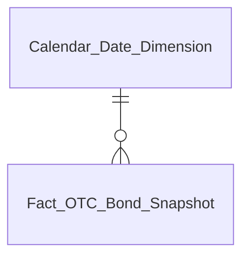
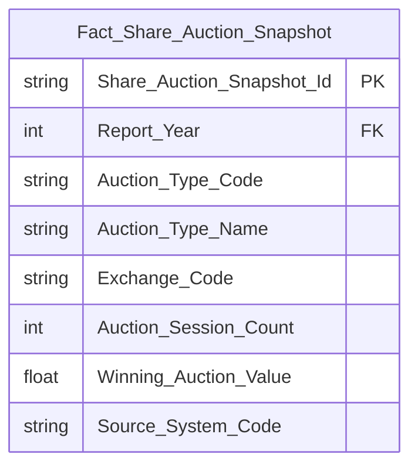
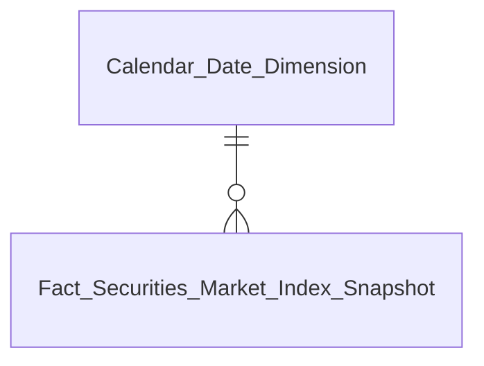
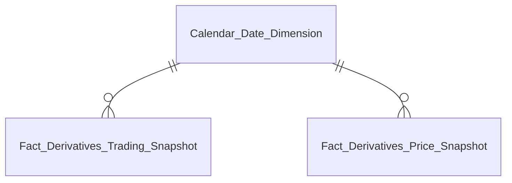
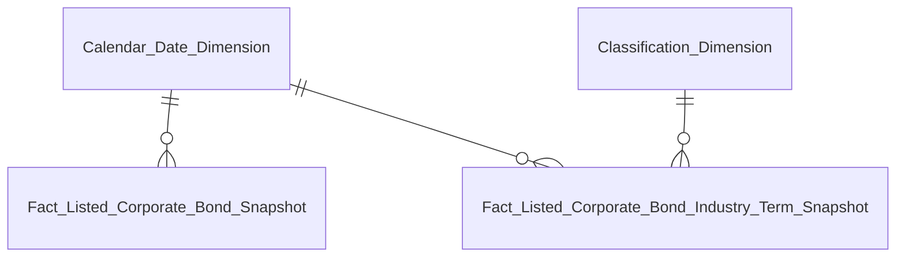

# DTM_VP_Entities — Danh mục thực thể Datamart Phân hệ VP (Văn phòng / Thống kê điều hành)

**Phiên bản:** 1.0  
**Ngày cập nhật:** 2026-10-08  
**Phạm vi:** Star schema diagram và danh mục thực thể Fact / Dimension phân hệ VP, đồng bộ với `DTM_VP_HLD.md`.

---

## 1. Tổng quan kiến trúc mô hình thực thể VP

Phân hệ VP bao gồm 7 bảng Fact và 2 bảng Dimension conformed dùng chung:
- **Fact Securities Market Index Snapshot** (`fct_scr_mkt_indx_snpst`): Phục vụ Nhóm 1, 2.
- **Fact Derivatives Trading Snapshot** (`fct_derv_tdg_snpst`): Phục vụ Nhóm 3, 5, 6.
- **Fact Derivatives Price Snapshot** (`fct_derv_prc_snpst`): Phục vụ Nhóm 4.
- **Fact Listed Corporate Bond Snapshot** (`fct_lst_crp_bnd_snpst`): Phục vụ Nhóm 7, 9.
- **Fact Listed Corporate Bond Industry Term Snapshot** (`fct_lst_crp_bnd_indy_trm_snpst`): Phục vụ Nhóm 8, 10.
- **Fact OTC Bond Snapshot** (`fct_otc_bnd_snpst`): Phục vụ Nhóm 11, 12, 13 (nguồn báo cáo `HNX09` từ `internal_statistical_report`).
- **Fact Share Auction Snapshot** (`fct_share_auction_snpst`): Phục vụ Nhóm 43 (nguồn báo cáo `HSX03` và `HNX05` từ `internal_statistical_report`).
- **Calendar Date Dimension** (`cdr_dt_dim`): Conformed dimension ngày tháng dùng chung toàn hệ thống Lakehouse.
- **Classification Dimension** (`cl_dim`): Conformed dimension phân loại dùng chung.

---

## 2. Chi tiết các thực thể Fact cốt lõi

### 2.1 Fact OTC Bond Snapshot (`fct_otc_bnd_snpst`)

Bảng tổng hợp giao dịch thị trường trái phiếu doanh nghiệp riêng lẻ (TPDN riêng lẻ) theo ngày từ báo cáo điện tử HNX09 (nguồn Atomic: `internal_statistical_report`). Phục vụ các chỉ tiêu Nhóm 11, 12, 13 (`K_VP_48` đến `K_VP_57`).

| Tên thực thể | Tên vật lý | Loại | Grain | Nguồn Atomic | Phục vụ KPI |
|---|---|:---:|---|---|---|
| Fact OTC Bond Snapshot | `fct_otc_bnd_snpst` | Fact | 1 dòng / ngày giao dịch | `internal_statistical_report` (HNX09) | K_VP_48, K_VP_49, K_VP_50, K_VP_51, K_VP_52, K_VP_53, K_VP_54, K_VP_55, K_VP_56, K_VP_57, K_VP_58, K_VP_59 |

---

### 2.2 Fact Share Auction Snapshot (`fct_share_auction_snpst`)

Bảng thống kê kết quả hoạt động đấu giá cổ phần tại Sở GDCK (HOSE & HNX) theo năm và loại hình đấu giá từ báo cáo HSX03 và HNX05 (nguồn Atomic: `internal_statistical_report`). Phục vụ các chỉ tiêu Nhóm 43 (`K_VP_144` đến `K_VP_149`).

| Tên thực thể | Tên vật lý | Loại | Grain | Nguồn Atomic | Phục vụ KPI |
|---|---|:---:|---|---|---|
| Fact Share Auction Snapshot | `fct_share_auction_snpst` | Fact | 1 dòng / năm / loại hình đấu giá / sở tổ chức | `internal_statistical_report` (HSX03, HNX05) | K_VP_144, K_VP_145, K_VP_146, K_VP_147, K_VP_148, K_VP_149 |

---

### 2.3 Fact Securities Market Index Snapshot (`fct_scr_mkt_indx_snpst`)

Bảng tổng hợp giá trị chỉ số thị trường và giao dịch mua/bán ròng theo loại nhà đầu tư theo ngày giao dịch. Phục vụ Nhóm 1, 2.

| Tên thực thể | Tên vật lý | Loại | Grain | Nguồn Atomic | Phục vụ KPI |
|---|---|:---:|---|---|---|
| Fact Securities Market Index Snapshot | `fct_scr_mkt_indx_snpst` | Fact | 1 dòng / thị trường / ngày giao dịch | `mkt_indx_snpst`, `scr_trd` | K_VP_1 đến K_VP_14 |

---

### 2.4 Fact Derivatives Trading Snapshot (`fct_derv_tdg_snpst`) & Fact Derivatives Price Snapshot (`fct_derv_prc_snpst`)

Bảng tổng hợp khối lượng giao dịch phái sinh, giá hợp đồng tương lai và giao dịch NĐTNN theo sản phẩm theo ngày giao dịch. Phục vụ Nhóm 3, 4, 5, 6.

| Tên thực thể | Tên vật lý | Loại | Grain | Nguồn Atomic | Phục vụ KPI |
|---|---|:---:|---|---|---|
| Fact Derivatives Trading Snapshot | `fct_derv_tdg_snpst` | Fact | 1 dòng / sản phẩm phái sinh / ngày giao dịch | `scr_tdg_snpst`, `scr_trd` | K_VP_15 đến K_VP_28 |
| Fact Derivatives Price Snapshot | `fct_derv_prc_snpst` | Fact | 1 dòng / sản phẩm / kỳ hạn / ngày giao dịch | `scr_tdg_snpst` | K_VP_29 đến K_VP_35 |

---

### 2.5 Fact Listed Corporate Bond Snapshot (`fct_lst_crp_bnd_snpst`) & Industry Term Snapshot (`fct_lst_crp_bnd_indy_trm_snpst`)

Bảng tổng hợp giao dịch TPDN niêm yết theo ngày, ngành và kỳ hạn phát hành. Phục vụ Nhóm 7, 8, 9, 10.

| Tên thực thể | Tên vật lý | Loại | Grain | Nguồn Atomic | Phục vụ KPI |
|---|---|:---:|---|---|---|
| Fact Listed Corporate Bond Snapshot | `fct_lst_crp_bnd_snpst` | Fact | 1 dòng / ngày giao dịch | `scr_trd`, `scr_tdg_snpst` | K_VP_36 đến K_VP_41 |
| Fact Listed Corporate Bond Industry Term Snapshot | `fct_lst_crp_bnd_indy_trm_snpst` | Fact | 1 dòng / ngành cấp 1 / nhóm kỳ hạn / ngày giao dịch | `scr_tdg_snpst`, `scr_trd`, `pblc_co` | K_VP_42 đến K_VP_47 |

---

## 3. Danh mục bảng Dimension dùng chung

| Tên thực thể | Tên vật lý | Loại | SCD Type | Mô tả | Nguồn Atomic |
|---|---|:---:|:---:|---|---|
| Calendar Date Dimension | `cdr_dt_dim` | Dimension | SCD 4A | Chiều ngày lịch giao dịch, cờ ngày giao dịch, năm/quý/tháng/tuần | `cdr_dt` (ECAT) |
| Classification Dimension | `cl_dim` | Dimension | SCD 4A | Chiều danh mục phân loại ngành nghề kinh doanh, loại hình | `cv` (Atomic) |
