# DTM_VP — HLD Datamart: Thống kê thị trường chứng khoán (VP)

---

## Section 1 — Data Lineage

##### Cụm 1: Tương quan chỉ số thị trường và giao dịch cổ phiếu (Fact Securities Market Index Snapshot)

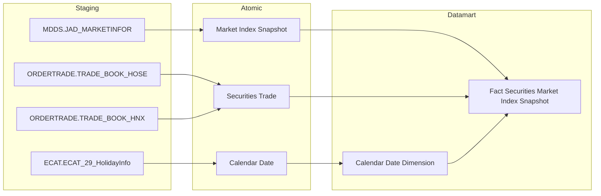

---

##### Cụm 2: Giao dịch phái sinh (Fact Derivatives Trading Snapshot)

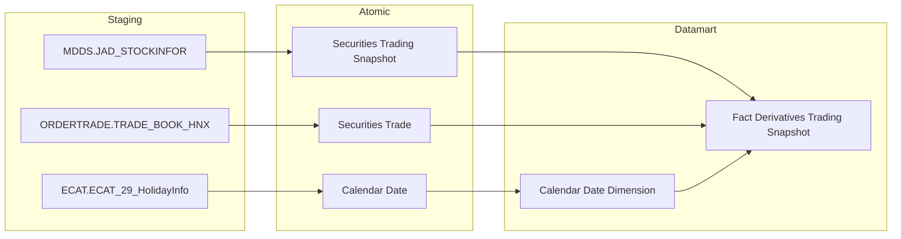

---

##### Cụm 3: Giá HĐTL (Fact Derivatives Price Snapshot)

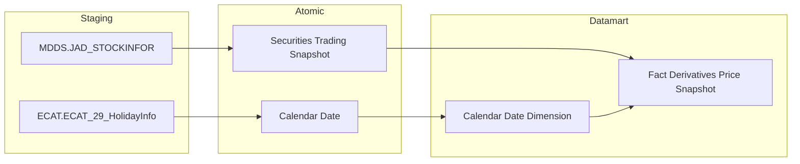

---

##### Cụm 4: TPDN niêm yết (Fact Listed Corporate Bond Snapshot)

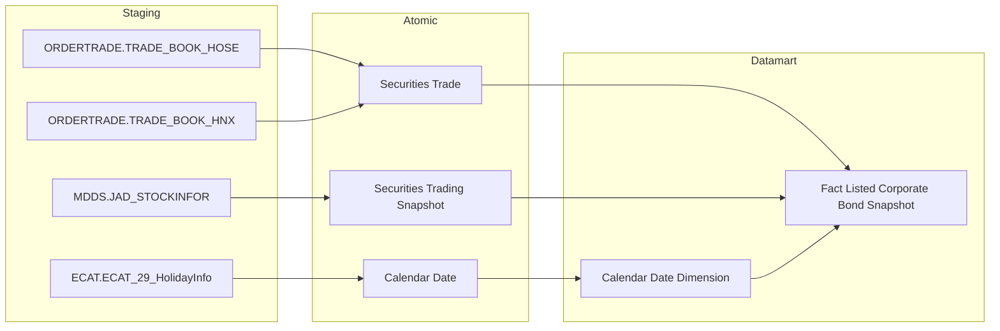

---

##### Cụm 5: TPDN niêm yết theo ngành và kỳ hạn (Fact Listed Corporate Bond Industry Term Snapshot)

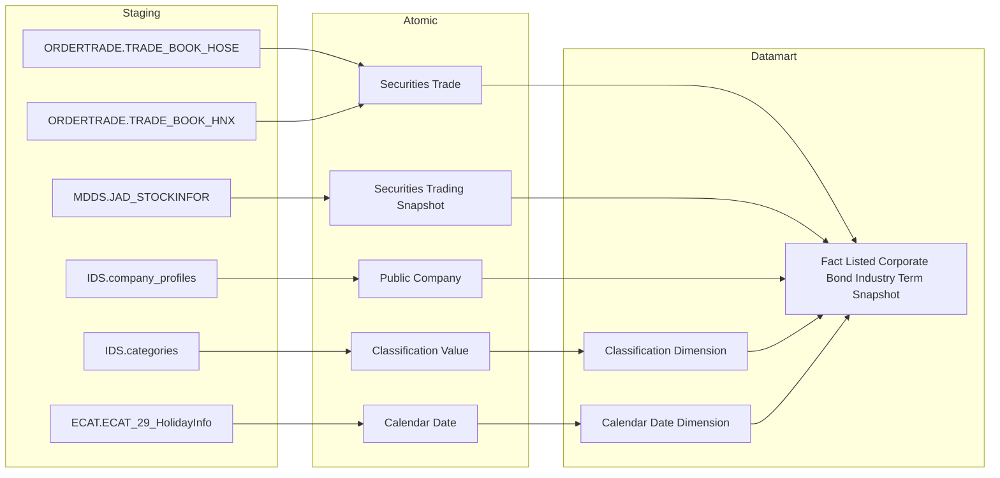

---

## Section 2 — Tổng quan báo cáo

### Tab Dashboard Thống kê thị trường

#### Nhóm 1 - Cổ phiếu >> Biều đồ Giá trị mua/bán ròng NĐTNN và chỉ số Index

> Phân loại: **Phân tích**
> Atomic: `Market Index Snapshot` ← MDDS.JAD_MARKETINFOR — **READY**
> Atomic: `Securities Trade` ← ORDERTRADE.TRADE_BOOK_HOSE / TRADE_BOOK_HNX — **READY**

**Mockup:**

| KỲ | Sàn | Chỉ số | GT ròng NĐTNN (tỷ đồng) | VN-Index (điểm) | HNX-Index (điểm) | UPCOM-Index (điểm) |
|---|---|---|---|---|---|---|
| 19/02/2026 | HOSE | VN-Index | -155 | 1.320 | 225 | 92 |
| 20/02/2026 | HOSE | VN-Index | -168 | 1.318 | 224 | 91 |

*Biểu đồ kết hợp: cột (GT ròng NĐTNN) + đường (VN-Index, HNX-Index, UPCOM-Index). Lọc theo Kỳ (Ngày/Tháng/Quý/Năm), Từ–Đến, Phạm vi (Toàn thị trường / HOSE / HNX / UPCOM).*

**Source:** `Fact Securities Market Index Snapshot` → `Calendar Date Dimension`

**Bảng KPI:**

| KPI ID | Tên KPI | Đơn vị | Tính chất | Công thức | Ghi chú |
|---|---|---|---|---|---|
| K_VP_1 | Sàn giao dịch | — | Chiều | `Market Index Snapshot.Market Code` — HOSE/HNX/UPCOM | Tham số lọc |
| K_VP_2 | Chỉ số thị trường | — | Chiều | `Market Index Snapshot.Market Code` → VN-Index / HNX-Index / UPCOM-Index | Tham số lọc |
| K_VP_3 | Giá trị chỉ số thị trường | Điểm | Cơ sở | `Market Index Snapshot.Market Index Value` | |
| K_VP_4 | Giá trị chỉ số VN-Index | Điểm | Cơ sở | `Market Index Snapshot.Market Index Value` filter `Market Code = 'HOSE'` | |
| K_VP_5 | Giá trị chỉ số HNX-Index | Điểm | Cơ sở | `Market Index Snapshot.Market Index Value` filter `Market Code = 'HNX'` | |
| K_VP_6 | Giá trị chỉ số UPCOM-Index | Điểm | Cơ sở | `Market Index Snapshot.Market Index Value` filter `Market Code = 'UPCOM'` | |
| K_VP_7 | GT mua/bán ròng NĐTNN toàn thị trường | Tỷ đồng | Phái sinh | `SUM(Securities Trade.Execution Value WHERE Buy Foreign Investor Type Code <> '00') - SUM(Securities Trade.Execution Value WHERE Sell Foreign Investor Type Code <> '00')` | |
| K_VP_8 | GT mua/bán ròng NĐTNN trên HOSE | Tỷ đồng | Cơ sở | `SUM(Securities Trade.Execution Value WHERE Buy Foreign Investor Type Code <> '00' AND Market Id Code = 'STO') - SUM(Securities Trade.Execution Value WHERE Sell Foreign Investor Type Code <> '00' AND Market Id Code = 'STO')` | |
| K_VP_9 | GT mua/bán ròng NĐTNN trên HNX | Tỷ đồng | Cơ sở | `SUM(Securities Trade.Execution Value WHERE Buy Foreign Investor Type Code <> '00' AND Market Id Code = 'STX') - SUM(Securities Trade.Execution Value WHERE Sell Foreign Investor Type Code <> '00' AND Market Id Code = 'STX')` | |
| K_VP_10 | GT mua/bán ròng NĐTNN trên UPCOM | Tỷ đồng | Cơ sở | `SUM(Securities Trade.Execution Value WHERE Buy Foreign Investor Type Code <> '00' AND Market Id Code = 'UPX') - SUM(Securities Trade.Execution Value WHERE Sell Foreign Investor Type Code <> '00' AND Market Id Code = 'UPX')` | |

**Star Schema:**

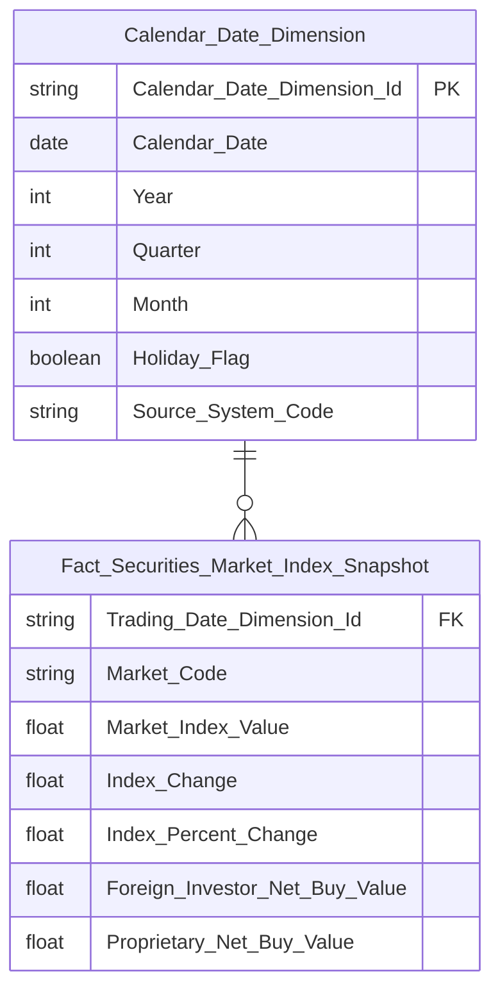

**Lineage Mart → Báo cáo:**


**Bảng grain:**

| Tên bảng | Grain |
|---|---|
| Fact Securities Market Index Snapshot | 1 dòng / thị trường (Market Code) / ngày giao dịch |
| Calendar Date Dimension | SCD4A (current state) |

---

#### Nhóm 2 - Cổ phiếu >> Biều đồ Giá trị mua/bán ròng Tự doanh và chỉ số Index

> Phân loại: **Phân tích**
> Atomic: `Market Index Snapshot` ← MDDS.JAD_MARKETINFOR — **READY**
> Atomic: `Securities Trade` ← ORDERTRADE.TRADE_BOOK_HOSE / TRADE_BOOK_HNX — **READY**

**Mockup:**

| KỲ | Sàn | GT ròng Tự doanh (tỷ đồng) | VN-Index (điểm) | HNX-Index (điểm) | UPCOM-Index (điểm) |
|---|---|---|---|---|---|
| 19/02/2026 | HOSE | +12 | 1.320 | 225 | 92 |

*Biểu đồ kết hợp: cột (GT ròng Tự doanh) + đường (các Index). Cùng filter Kỳ, Từ–Đến, Phạm vi với Nhóm 1.*

**Source:** `Fact Securities Market Index Snapshot` → `Calendar Date Dimension`

**Bảng KPI:**

| KPI ID | Tên KPI | Đơn vị | Tính chất | Công thức | Ghi chú |
|---|---|---|---|---|---|
| K_VP_1 | Sàn giao dịch | — | Chiều | `Market Index Snapshot.Market Code` | Reuse từ Nhóm 1 |
| K_VP_3 | Giá trị chỉ số thị trường | Điểm | Cơ sở | `Market Index Snapshot.Market Index Value` | Reuse từ Nhóm 1 |
| K_VP_4 | Giá trị chỉ số VN-Index | Điểm | Cơ sở | `Market Index Snapshot.Market Index Value` filter `Market Code = 'HOSE'` | Reuse từ Nhóm 1 |
| K_VP_5 | Giá trị chỉ số HNX-Index | Điểm | Cơ sở | `Market Index Snapshot.Market Index Value` filter `Market Code = 'HNX'` | Reuse từ Nhóm 1 |
| K_VP_6 | Giá trị chỉ số UPCOM-Index | Điểm | Cơ sở | `Market Index Snapshot.Market Index Value` filter `Market Code = 'UPCOM'` | Reuse từ Nhóm 1 |
| K_VP_11 | GT mua/bán ròng tự doanh toàn thị trường | Tỷ đồng | Phái sinh | `SUM(Securities Trade.Execution Value WHERE Buy Client House Classification Code = '30') - SUM(Securities Trade.Execution Value WHERE Sell Client House Classification Code = '30')` | |
| K_VP_12 | GT mua/bán ròng tự doanh trên HOSE | Tỷ đồng | Cơ sở | `SUM(Securities Trade.Execution Value WHERE Buy Client House Classification Code = '30' AND Market Id Code = 'STO') - SUM(Securities Trade.Execution Value WHERE Sell Client House Classification Code = '30' AND Market Id Code = 'STO')` | |
| K_VP_13 | GT mua/bán ròng tự doanh trên HNX | Tỷ đồng | Cơ sở | `SUM(Securities Trade.Execution Value WHERE Buy Client House Classification Code = '30' AND Market Id Code = 'STX') - SUM(Securities Trade.Execution Value WHERE Sell Client House Classification Code = '30' AND Market Id Code = 'STX')` | |
| K_VP_14 | GT mua/bán ròng tự doanh trên UPCOM | Tỷ đồng | Cơ sở | `SUM(Securities Trade.Execution Value WHERE Buy Client House Classification Code = '30' AND Market Id Code = 'UPX') - SUM(Securities Trade.Execution Value WHERE Sell Client House Classification Code = '30' AND Market Id Code = 'UPX')` | |

**Star Schema:**


**Lineage Mart → Báo cáo:**


**Bảng grain:**

| Tên bảng | Grain |
|---|---|
| Fact Securities Market Index Snapshot | 1 dòng / thị trường (Market Code) / ngày giao dịch |
| Calendar Date Dimension | SCD4A (current state) |

---

#### Nhóm 3 - Phái sinh >> Chỉ tiêu tổng hợp

> Phân loại: **Phân tích**

##### READY

> Atomic: `Securities Trading Snapshot` ← MDDS.JAD_STOCKINFOR — **READY**
> Atomic: `Securities Trade` ← ORDERTRADE.TRADE_BOOK_HNX — **READY**

**Mockup:**

| Kỳ | Phạm vi | Sản phẩm | Tổng KLGD (HĐ) | KL mua NĐTNN (HĐ) | KL bán NĐTNN (HĐ) | KL ròng NĐTNN (HĐ) |
|---|---|---|---|---|---|---|
| 25/02/2026 | Toàn thị trường | HĐTL VN30 | 245.600 | 12.500 | 11.800 | +700 |
| 25/02/2026 | Toàn thị trường | HĐTL VN100 | ... | ... | ... | ... |

*Thẻ tổng hợp: Tổng KLGD, KL mua/bán/ròng NĐTNN. Lọc theo Kỳ, Phạm vi, Sản phẩm (HĐTL VN30 / VN100 / TPCP / Toàn thị trường).*

**Source:** `Fact Derivatives Trading Snapshot` → `Calendar Date Dimension`

**Bảng KPI:**

| KPI ID | Tên KPI | Đơn vị | Tính chất | Công thức | Ghi chú |
|---|---|---|---|---|---|
| K_VP_15 | Sản phẩm phái sinh | — | Chiều | `Securities Trading Snapshot.Symbol` — HĐTL VN30 / VN100 / TPCP | Tham số lọc |
| K_VP_16 | Tổng khối lượng giao dịch phái sinh | Hợp đồng | Cơ sở | `SUM(Securities Trade.Execution Volume)` | |
| K_VP_17 | KL mua NĐTNN phái sinh | Hợp đồng | Cơ sở | `SUM(Securities Trade.Execution Volume WHERE Buy Foreign Investor Type Code <> '00')` | |
| K_VP_18 | KL bán NĐTNN phái sinh | Hợp đồng | Cơ sở | `SUM(Securities Trade.Execution Volume WHERE Sell Foreign Investor Type Code <> '00')` | |
| K_VP_19 | KL mua/bán ròng NĐTNN phái sinh | Hợp đồng | Phái sinh | `SUM(Securities Trade.Execution Volume WHERE Buy Foreign Investor Type Code <> '00') - SUM(Securities Trade.Execution Volume WHERE Sell Foreign Investor Type Code <> '00')` | |
| K_VP_20 | Tổng KLGD phái sinh % thay đổi so kỳ trước | % | Phái sinh | `(SUM(Securities Trade.Execution Volume) kỳ hiện tại - SUM(Securities Trade.Execution Volume) kỳ trước) / SUM(Securities Trade.Execution Volume) kỳ trước * 100` | |
| K_VP_21 | KL mua NĐTNN phái sinh % thay đổi so kỳ trước | % | Phái sinh | `(SUM(Securities Trade.Execution Volume WHERE Buy Foreign Investor Type Code <> '00') kỳ hiện tại - SUM(Securities Trade.Execution Volume WHERE Buy Foreign Investor Type Code <> '00') kỳ trước) / SUM(Securities Trade.Execution Volume WHERE Buy Foreign Investor Type Code <> '00') kỳ trước * 100` | |
| K_VP_22 | KL bán NĐTNN phái sinh % thay đổi so kỳ trước | % | Phái sinh | `(SUM(Securities Trade.Execution Volume WHERE Sell Foreign Investor Type Code <> '00') kỳ hiện tại - SUM(Securities Trade.Execution Volume WHERE Sell Foreign Investor Type Code <> '00') kỳ trước) / SUM(Securities Trade.Execution Volume WHERE Sell Foreign Investor Type Code <> '00') kỳ trước * 100` | |
| K_VP_23 | KL ròng NĐTNN phái sinh % thay đổi so kỳ trước | % | Phái sinh | `(SUM(Securities Trade.Execution Volume WHERE Buy Foreign Investor Type Code <> '00') - SUM(Securities Trade.Execution Volume WHERE Sell Foreign Investor Type Code <> '00')) kỳ hiện tại - (SUM(Securities Trade.Execution Volume WHERE Buy Foreign Investor Type Code <> '00') - SUM(Securities Trade.Execution Volume WHERE Sell Foreign Investor Type Code <> '00')) kỳ trước) / ABS((SUM(Securities Trade.Execution Volume WHERE Buy Foreign Investor Type Code <> '00') - SUM(Securities Trade.Execution Volume WHERE Sell Foreign Investor Type Code <> '00')) kỳ trước) * 100` | |

**Star Schema:**

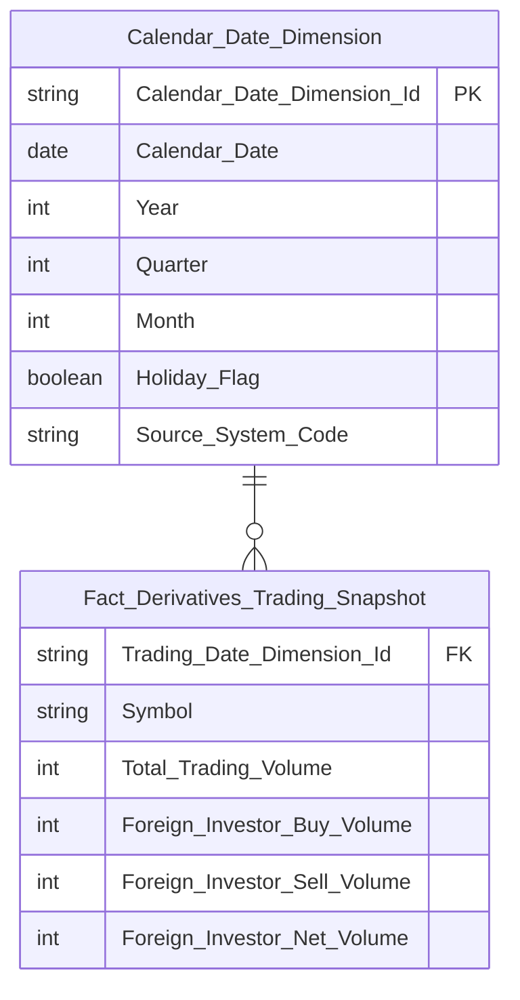

**Lineage Mart → Báo cáo:**

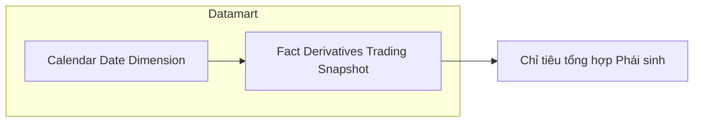

**Bảng grain:**

| Tên bảng | Grain |
|---|---|
| Fact Derivatives Trading Snapshot | 1 dòng / sản phẩm phái sinh (Symbol) / ngày giao dịch |
| Calendar Date Dimension | SCD4A (current state) |

##### PENDING

**KPI liên quan:** K_VP_24 (mới); K_VP_15 (reuse từ READY Nhóm 3)

**Lý do pending:** Khối lượng mở OI lấy từ VSDC BM 2 (báo cáo sở) — chưa có Atomic entity tương ứng.

**Atomic cần bổ sung:** Open Interest Snapshot (nguồn VSDC BM 2)

**Mart dự kiến:**
- Fact Derivatives Trading Snapshot — grain: 1 dòng / sản phẩm phái sinh / ngày (reuse, bổ sung thêm cột OI)

**Bảng mapping nguồn (Atomic Placeholder):**

| Tên KPI | Bảng nguồn (BA) | Atomic entity dự kiến | Atomic table dự kiến |
|---|---|---|---|
| Khối lượng mở OI | `"BM 2_Báo cáo về khối lượng mở cuối ngày"` | Open Interest Snapshot | TBD |

**Bảng KPI PENDING:**

| KPI ID | Tên KPI | Tính chất | Trạng thái |
|---|---|---|---|
| K_VP_15 | Sản phẩm phái sinh (reuse từ READY Nhóm 3) | Chiều | PENDING |
| K_VP_24 | Khối lượng mở (OI) phái sinh | Cơ sở | PENDING |
| K_VP_25 | Khối lượng mở (OI) phái sinh % thay đổi so kỳ trước | Phái sinh | PENDING |

---

#### Nhóm 4 - Phái sinh >> Giá HĐTL

> Phân loại: **Phân tích**
> Atomic: `Securities Trading Snapshot` ← MDDS.JAD_STOCKINFOR — **READY**

**Mockup:**

| Kỳ | Sản phẩm | Kỳ hạn | Giá HĐTL |
|---|---|---|---|
| 25/02/2026 | HĐTL VN30 | Tháng gần nhất | 1.318,5 |
| 25/02/2026 | HĐTL VN30 | Tháng tiếp theo | 1.320,0 |
| 25/02/2026 | HĐTL VN100 | Tháng gần nhất | ... |
| 25/02/2026 | HĐTL TPCP | Tháng gần nhất | ... |

*Biểu đồ: KLGD (cột) + Khối lượng mở (đường). Lọc theo Từ–Đến ngày. Lấy giá đóng cửa tại ngày cuối kỳ báo cáo cho từng sản phẩm / kỳ hạn.*

**Source:** `Fact Derivatives Price Snapshot` → `Calendar Date Dimension`

**Bảng KPI:**

| KPI ID | Tên KPI | Đơn vị | Tính chất | Công thức | Ghi chú |
|---|---|---|---|---|---|
| K_VP_15 | Sản phẩm phái sinh | — | Chiều | `Securities Trading Snapshot.Symbol` — HĐTL VN30 / VN100 / TPCP | Reuse từ Nhóm 3 |
| K_VP_26 | Kỳ hạn HĐTL | — | Chiều | `Securities Trading Snapshot.Maturity Month Year` | Tham số lọc; 4 kỳ hạn: tháng gần nhất, tháng tiếp theo, tháng cuối quý gần nhất, tháng cuối quý tiếp theo |
| K_VP_27 | Giá HĐTL | VND | Cơ sở | `Securities Trading Snapshot.Close Price` — lấy giá đóng cửa tại ngày cuối kỳ báo cáo; filter `Floor Code = '03'` (thị trường phái sinh) | |

**Star Schema:**

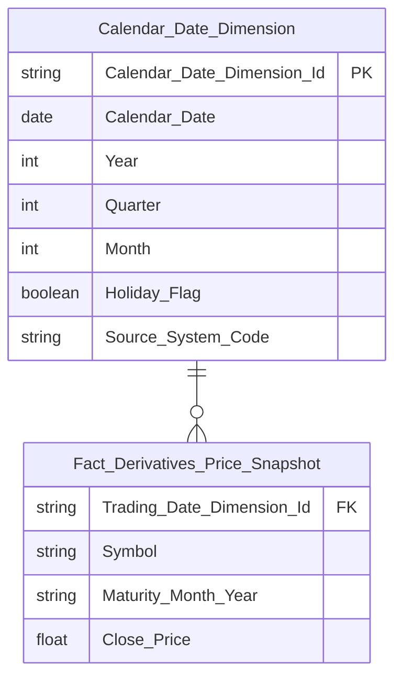

**Lineage Mart → Báo cáo:**

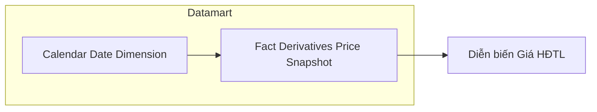

**Bảng grain:**

| Tên bảng | Grain |
|---|---|
| Fact Derivatives Price Snapshot | 1 dòng / sản phẩm phái sinh (Symbol) / kỳ hạn (Maturity Month Year) / ngày giao dịch |
| Calendar Date Dimension | SCD4A (current state) |

---

#### Nhóm 5 - Phái sinh >> Biểu đồ Diễn biến giao dịch thị trường phái sinh

> Phân loại: **Phân tích**
> Atomic: `Securities Trading Snapshot` ← MDDS.JAD_STOCKINFOR — **READY**
> Atomic: `Securities Trade` ← ORDERTRADE.TRADE_BOOK_HNX — **READY**
> Atomic: Open Interest Snapshot ← VSDC BM 2 — **PENDING**

**Mockup:**

| Ngày | KLGD (HĐ) | Khối lượng mở (HĐ) |
|---|---|---|
| 19/02/2026 | 85.000 | 58.000 |
| 20/02/2026 | 84.000 | 65.000 |
| ... | ... | ... |

*Biểu đồ kết hợp: cột KLGD (trục trái) + đường Khối lượng mở OI (trục phải). Lọc theo Từ–Đến ngày. Lọc theo Sản phẩm: HĐTL VN30 / VN100 / TPCP / Toàn thị trường.*

**Source:** `Fact Derivatives Trading Snapshot` + OI từ PENDING → `Calendar Date Dimension`

##### READY

**Bảng KPI:**

| KPI ID | Tên KPI | Đơn vị | Tính chất | Công thức | Ghi chú |
|---|---|---|---|---|---|
| K_VP_15 | Sản phẩm phái sinh | — | Chiều | `Securities Trading Snapshot.Symbol` | Reuse từ Nhóm 3 |
| K_VP_16 | Tổng khối lượng giao dịch phái sinh | Hợp đồng | Cơ sở | `SUM(Securities Trade.Execution Volume)` — filter theo Symbol nếu chọn sản phẩm cụ thể | Reuse từ Nhóm 3 |

**Star Schema:** Reuse `Fact Derivatives Trading Snapshot` → `Calendar Date Dimension` (xem Nhóm 3).

**Lineage Mart → Báo cáo:**

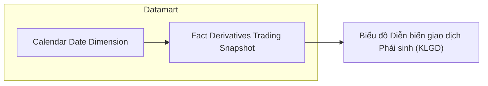

**Bảng grain:**

| Tên bảng | Grain |
|---|---|
| Fact Derivatives Trading Snapshot | 1 dòng / sản phẩm phái sinh (Symbol) / ngày giao dịch |
| Calendar Date Dimension | SCD4A (current state) |

##### PENDING

**KPI liên quan:** K_VP_24 (reuse từ Nhóm 3)

**Lý do pending:** Khối lượng mở OI lấy từ VSDC BM 2 — chưa có Atomic entity tương ứng (xem Nhóm 3).

**Atomic cần bổ sung:** Open Interest Snapshot (nguồn VSDC BM 2) — đã ghi nhận tại Nhóm 3.

**Bảng KPI PENDING:**

| KPI ID | Tên KPI | Tính chất | Trạng thái |
|---|---|---|---|
| K_VP_24 | Khối lượng mở (OI) phái sinh (reuse từ Nhóm 3) | Cơ sở | PENDING |

---

#### Nhóm 6 - Phái sinh >> Biểu đồ Khối lượng mua/bán ròng của NĐTNN

> Phân loại: **Phân tích**
> Atomic: `Securities Trading Snapshot` ← MDDS.JAD_STOCKINFOR — **READY**
> Atomic: `Securities Trade` ← ORDERTRADE.TRADE_BOOK_HNX — **READY**

**Mockup:**

| Ngày | KLGD Bán (HĐ) | KLGD Mua (HĐ) | KLGD Ròng (HĐ) |
|---|---|---|---|
| 19/02/2026 | -2.233 | 2.927 | 694 |
| 20/02/2026 | ... | ... | ... |

*Biểu đồ kết hợp: cột xanh KLGD Mua (trục trái) + cột đỏ KLGD Bán (trục trái, âm) + đường KLGD Ròng (trục phải). Lọc theo Từ–Đến ngày. Lọc theo Sản phẩm: HĐTL VN30 / VN100 / TPCP / Toàn thị trường.*

**Source:** `Fact Derivatives Trading Snapshot` → `Calendar Date Dimension`

**Bảng KPI:**

| KPI ID | Tên KPI | Đơn vị | Tính chất | Công thức | Ghi chú |
|---|---|---|---|---|---|
| K_VP_15 | Sản phẩm phái sinh | — | Chiều | `Securities Trading Snapshot.Symbol` | Reuse từ Nhóm 3 |
| K_VP_17 | KL mua NĐTNN phái sinh | Hợp đồng | Cơ sở | `SUM(Securities Trade.Execution Volume WHERE Buy Foreign Investor Type Code <> '00')` — filter theo Symbol nếu chọn sản phẩm cụ thể | Reuse từ Nhóm 3 |
| K_VP_18 | KL bán NĐTNN phái sinh | Hợp đồng | Cơ sở | `SUM(Securities Trade.Execution Volume WHERE Sell Foreign Investor Type Code <> '00')` — filter theo Symbol nếu chọn sản phẩm cụ thể | Reuse từ Nhóm 3 |
| K_VP_19 | KL mua/bán ròng NĐTNN phái sinh | Hợp đồng | Phái sinh | `SUM(Securities Trade.Execution Volume WHERE Buy Foreign Investor Type Code <> '00') - SUM(Securities Trade.Execution Volume WHERE Sell Foreign Investor Type Code <> '00')` — filter theo Symbol nếu chọn sản phẩm cụ thể | Reuse từ Nhóm 3 |

**Star Schema:** Reuse `Fact Derivatives Trading Snapshot` → `Calendar Date Dimension` (xem Nhóm 3).

**Lineage Mart → Báo cáo:**

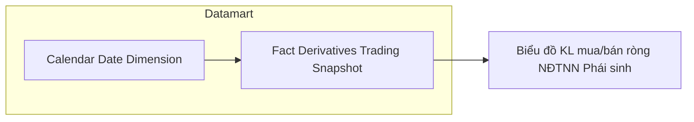

**Bảng grain:**

| Tên bảng | Grain |
|---|---|
| Fact Derivatives Trading Snapshot | 1 dòng / sản phẩm phái sinh (Symbol) / ngày giao dịch |
| Calendar Date Dimension | SCD4A (current state) |

---

### Tab Dashboard TPDN niêm yết

#### Nhóm 7 - TPDN niêm yết >> Chỉ tiêu tổng hợp

> Phân loại: **Phân tích**
> Atomic: `Securities Trade` ← ORDERTRADE.TRADE_BOOK_HOSE / TRADE_BOOK_HNX — **READY**
> Atomic: `Securities Trading Snapshot` ← MDDS.JAD_STOCKINFOR — **READY**

**Mockup:**

| Chỉ tiêu | Giá trị | So kỳ trước |
|---|---|---|
| Tổng KLGD | 8.520.000 Trái Phiếu | +1.200.000 (+16,40%) |
| Tổng GTGD | 8.540 Tỷ Đồng | +1.240 Tỷ đồng (+16,90%) |
| GTGD BQ phiên (YTD) | 1.250 Tỷ Đồng | +50 Tỷ đồng (+4,17%) |
| Số mã TP niêm yết | 482 Mã | +12 Mã (+2,55%) |
| GTGD NĐTNN Mua | 450 Tỷ đồng | +120 (+36,4%) |
| GTGD NĐTNN Bán | 380 Tỷ đồng | +40 (+11,8%) |
| GTGD NĐTNN Ròng | 70 Tỷ đồng | +20 (+40,0%) |

*Thẻ KPI tổng hợp. Lọc theo Kỳ (Ngày/Tháng/Quý/Năm), Từ–Đến.*

**Source:** `Fact Listed Corporate Bond Snapshot` → `Calendar Date Dimension`

**Bảng KPI:**

| KPI ID | Tên KPI | Đơn vị | Tính chất | Công thức | Ghi chú |
|---|---|---|---|---|---|
| K_VP_28 | Tổng KLGD TPDN niêm yết | Trái phiếu | Cơ sở | `SUM(Securities Trade.Execution Volume WHERE Market Id Code IN ('BDO','HCX'))` | BDO = TPDN niêm yết HOSE; HCX = TPDN niêm yết HNX |
| K_VP_29 | Tổng KLGD TPDN niêm yết % thay đổi so kỳ trước | % | Phái sinh | `(SUM(Securities Trade.Execution Volume WHERE Market Id Code IN ('BDO','HCX')) kỳ hiện tại - SUM(Securities Trade.Execution Volume WHERE Market Id Code IN ('BDO','HCX')) kỳ trước) / SUM(Securities Trade.Execution Volume WHERE Market Id Code IN ('BDO','HCX')) kỳ trước * 100` | Trùng pattern |
| K_VP_30 | Tổng GTGD TPDN niêm yết | Tỷ đồng | Cơ sở | `SUM(Securities Trade.Execution Value WHERE Market Id Code IN ('BDO','HCX'))` | |
| K_VP_31 | Tổng GTGD TPDN niêm yết % thay đổi so kỳ trước | % | Phái sinh | `(SUM(Securities Trade.Execution Value WHERE Market Id Code IN ('BDO','HCX')) kỳ hiện tại - SUM(Securities Trade.Execution Value WHERE Market Id Code IN ('BDO','HCX')) kỳ trước) / SUM(Securities Trade.Execution Value WHERE Market Id Code IN ('BDO','HCX')) kỳ trước * 100` | Trùng pattern |
| K_VP_32 | GTGD bình quân phiên TPDN niêm yết (YTD) | Tỷ đồng | Phái sinh | `SUM(Securities Trade.Execution Value WHERE Market Id Code IN ('BDO','HCX') AND Trade Date BETWEEN '01/01/YYYY' AND end_of_period) / COUNT(DISTINCT Trade Date WHERE Market Id Code IN ('BDO','HCX') AND Trade Date BETWEEN '01/01/YYYY' AND end_of_period)` | ETL daily materialize thành 2 cột `YTD_Cumulative_Trading_Value` và `YTD_Trading_Day_Count` trên Fact để tránh scan toàn năm tại query time |
| K_VP_33 | GTGD bình quân phiên TPDN niêm yết (YTD) % thay đổi so kỳ trước | % | Phái sinh | `(K_VP_32 kỳ hiện tại - K_VP_32 kỳ trước) / K_VP_32 kỳ trước * 100` | Trùng pattern; tham chiếu K_VP_32 vì đã materialize sẵn |
| K_VP_34 | Giá trị mua NĐTNN TPDN niêm yết | Tỷ đồng | Cơ sở | `SUM(Securities Trade.Execution Value WHERE Market Id Code IN ('BDO','HCX') AND Buy Foreign Investor Type Code <> '00')` | |
| K_VP_35 | Giá trị mua NĐTNN TPDN niêm yết % thay đổi so kỳ trước | % | Phái sinh | `(SUM(Securities Trade.Execution Value WHERE Market Id Code IN ('BDO','HCX') AND Buy Foreign Investor Type Code <> '00') kỳ hiện tại - SUM(...) kỳ trước) / SUM(...) kỳ trước * 100` | Trùng pattern |
| K_VP_36 | Giá trị bán NĐTNN TPDN niêm yết | Tỷ đồng | Cơ sở | `SUM(Securities Trade.Execution Value WHERE Market Id Code IN ('BDO','HCX') AND Sell Foreign Investor Type Code <> '00')` | |
| K_VP_37 | Giá trị bán NĐTNN TPDN niêm yết % thay đổi so kỳ trước | % | Phái sinh | `(SUM(Securities Trade.Execution Value WHERE Market Id Code IN ('BDO','HCX') AND Sell Foreign Investor Type Code <> '00') kỳ hiện tại - SUM(...) kỳ trước) / SUM(...) kỳ trước * 100` | Trùng pattern |
| K_VP_38 | Giá trị mua/bán ròng NĐTNN TPDN niêm yết | Tỷ đồng | Phái sinh | `SUM(Securities Trade.Execution Value WHERE Market Id Code IN ('BDO','HCX') AND Buy Foreign Investor Type Code <> '00') - SUM(Securities Trade.Execution Value WHERE Market Id Code IN ('BDO','HCX') AND Sell Foreign Investor Type Code <> '00')` | |
| K_VP_39 | Giá trị mua/bán ròng NĐTNN TPDN niêm yết % thay đổi so kỳ trước | % | Phái sinh | `(K_VP_38 kỳ hiện tại - K_VP_38 kỳ trước) / ABS(K_VP_38 kỳ trước) * 100` | Trùng pattern; dùng ABS ở mẫu số vì giá trị ròng có thể âm |
| K_VP_40 | Số mã TPDN niêm yết | Mã | Cơ sở | `COUNT(DISTINCT Securities Trading Snapshot.Symbol WHERE Stock Type Code = '1')` — tại ngày cuối kỳ | Stock Type Code = '1' = TPDN niêm yết (JAD_STOCKINFOR) |

**Star Schema:**

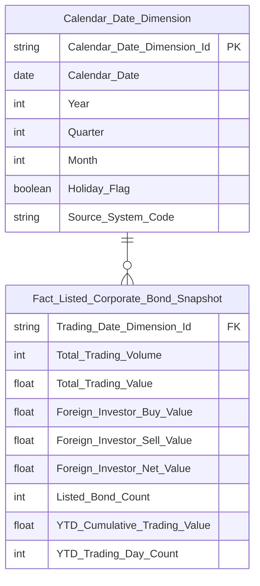

**Lineage Mart → Báo cáo:**

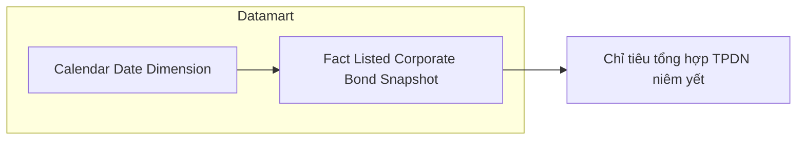

**Bảng grain:**

| Tên bảng | Grain |
|---|---|
| Fact Listed Corporate Bond Snapshot | 1 dòng / ngày giao dịch (toàn thị trường TPDN niêm yết). ETL daily cộng dồn `YTD_Cumulative_Trading_Value` và `YTD_Trading_Day_Count` vào mỗi dòng để tính K_VP_32 O(1). |
| Calendar Date Dimension | SCD4A (current state) |

---

#### Nhóm 8 - TPDN niêm yết >> Thống kê giao dịch TPDN niêm yết theo ngành

> Phân loại: **Phân tích**
> Atomic: `Securities Trading Snapshot` ← MDDS.JAD_STOCKINFOR — **READY**
> Atomic: `Securities Trade` ← ORDERTRADE.TRADE_BOOK_HOSE / TRADE_BOOK_HNX — **READY**
> Atomic: `Public Company` ← IDS.company_profiles — **READY** (thiết kế cũ từ `atomic_attributes.csv`, tạm dùng chờ approved)

**Mockup:**

| Ngành | Kỳ hạn | Số mã TP | Tổng GTGD (Tỷ đồng) | Kỳ hạn còn lại BQ (năm) | KL TP đang LH |
|---|---|---|---|---|---|
| TỔNG | Dưới 1 năm | 12 | 1.240 | 0,6 | 43.587 |
| TỔNG | 1–3 năm | 56 | 5.420 | 2,4 | 31.211 |
| TÀI CHÍNH | 1–3 năm | 18 | 1.820 | 2,1 | 24.267 |
| BẤT ĐỘNG SẢN | 3–5 năm | 19 | 950 | 4,5 | 9.224 |

*Bảng pivot: Ngành (hàng) × Kỳ hạn phát hành (hàng con). Phân trang, hiển thị 10 dòng/trang. Lọc theo Ngày.*

**Source:** `Fact Listed Corporate Bond Industry Term Snapshot` → `Calendar Date Dimension` + `Classification Dimension` (scheme: `IDS_INDUSTRY_CATEGORY`)

**Bảng KPI:**

| KPI ID | Tên KPI | Đơn vị | Tính chất | Công thức | Ghi chú |
|---|---|---|---|---|---|
| K_VP_45 | Ngành nghề kinh tế cấp 1 của TCPH | — | Chiều | `Public Company.Industry Category Level1 Code` (CV scheme `IDS_INDUSTRY_CATEGORY`) — join chain: `Securities Trading Snapshot.Issuer Name` (Stock Type Code='1') → `Securities Trading Snapshot.Issuer Name` (Stock Type Code='2', cùng Trading Date) → `Public Company.Equity Ticker` | Join qua `Issuer Name` giữa TPDN và cổ phiếu cùng TCPH |
| K_VP_41 | Kỳ hạn phát hành TPDN | — | Chiều | `ROUND(MONTHS_BETWEEN(Securities Trading Snapshot.Maturity Date, Securities Trading Snapshot.Issue Date) / 12, 2)` — nhóm ETL: Dưới 1 năm / 1–3 năm / 3–5 năm / Trên 5 năm | Filter `Stock Type Code = '1'`; tính từ `Maturity Date` và `Issue Date` |
| K_VP_40 | Số mã TPDN niêm yết | Mã | Cơ sở | `COUNT(DISTINCT Securities Trading Snapshot.Symbol WHERE Stock Type Code = '1')` — tại ngày cuối kỳ, theo ngành + kỳ hạn | Reuse từ Nhóm 7; breakdown thêm theo Ngành và Kỳ hạn |
| K_VP_42 | Tổng GTGD TPDN niêm yết | Tỷ đồng | Cơ sở | `SUM(Securities Trade.Exec Value WHERE Market Id Code IN ('BDO','HCX'))` — theo ngành + kỳ hạn phát hành | |
| K_VP_43 | Kỳ hạn còn lại bình quân | Năm | Phái sinh | `SUM(MONTHS_BETWEEN(Securities Trading Snapshot.Maturity Date, Trading Date) / 12 * Securities Trading Snapshot.Listed Share * 100000) / SUM(Securities Trading Snapshot.Listed Share * 100000)` — tại ngày cuối kỳ, theo ngành + kỳ hạn | Mệnh giá TPDN = 100.000; dư nợ = Listed Share × 100.000 |
| K_VP_44 | KL TP đang lưu hành | Trái phiếu | Cơ sở | `SUM(Securities Trading Snapshot.Listed Share WHERE Stock Type Code = '1')` — tại ngày cuối kỳ, theo ngành + kỳ hạn | |

**Star Schema:**

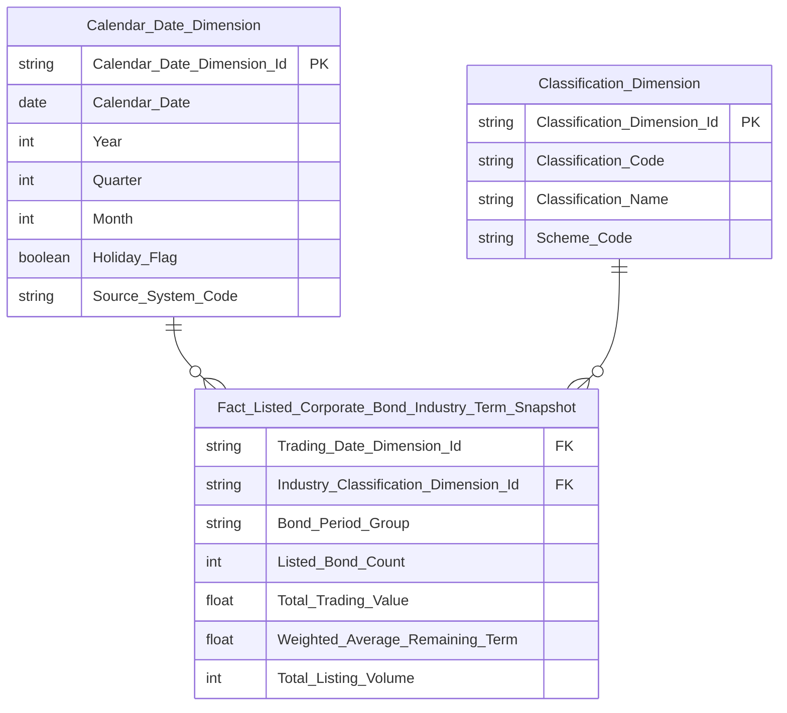

**Lineage Mart → Báo cáo:**

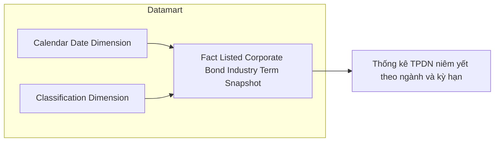

**Bảng grain:**

| Tên bảng | Grain |
|---|---|
| Fact Listed Corporate Bond Industry Term Snapshot | 1 dòng / ngành cấp 1 / nhóm kỳ hạn phát hành / ngày giao dịch |
| Classification Dimension | SCD4A (current state) — filter scheme `IDS_INDUSTRY_CATEGORY` |
| Calendar Date Dimension | SCD4A (current state) |

---

#### Nhóm 9 - TPDN niêm yết >> Biểu đồ Diễn biến GTGD TPDN niêm yết và TPDN riêng lẻ

> Phân loại: **MIXED** (READY + PENDING)
> Atomic READY: `Securities Trade` ← ORDERTRADE.TRADE_BOOK_HOSE / TRADE_BOOK_HNX — **READY**
> Atomic PENDING: ISS (TKNB) — chưa có Atomic entity cho dữ liệu báo cáo TPDN riêng lẻ

**Mockup:**

| Ngày | TPDN Niêm yết (Tỷ đồng) | TPDN Riêng lẻ (Tỷ đồng) | Tổng |
|---|---|---|---|
| 19/02/2026 | 732 | 382 | 1.114 |
| 20/02/2026 | 725 | 327 | 1.052 |
| 25/02/2026 | 705 | 394 | 1.099 |

*Biểu đồ cột stacked theo ngày. Lọc theo khoảng thời gian (Từ kỳ / Đến kỳ).*

---

##### READY

> Atomic: `Securities Trade` ← ORDERTRADE.TRADE_BOOK_HOSE / TRADE_BOOK_HNX — **READY**

**Source:** `Fact Listed Corporate Bond Snapshot` (reuse từ Nhóm 7)

**Bảng KPI:**

| KPI ID | Tên KPI | Đơn vị | Tính chất | Công thức | Ghi chú |
|---|---|---|---|---|---|
| K_VP_30 | Tổng GTGD TPDN niêm yết | Tỷ đồng | Cơ sở | `SUM(Securities Trade.Exec Value WHERE Market Id Code IN ('BDO','HCX'))` | Reuse từ Nhóm 7 |

**Lineage Mart → Báo cáo:**

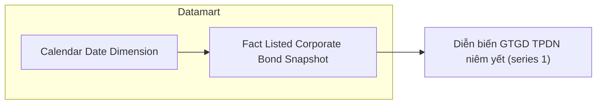

---

##### PENDING

**KPI liên quan:** K_VP_46 (mới)

**Lý do PENDING:** Nguồn TKNB (ISS.FACT_REPORT_DATA / ISS.INPUT_REPORT_SUBMISSION) là hệ thống tiếp nhận báo cáo — chưa có Atomic entity tương ứng trong `dm_manifest.yaml`. Dữ liệu GTGD TPDN riêng lẻ lấy từ báo cáo HNX09 do thành viên nộp, không có trong ORDERTRADE.

**Atomic cần bổ sung:**

| Bảng nguồn BA | Atomic entity dự kiến | Atomic table dự kiến |
|---|---|---|
| ISS.FACT_REPORT_DATA / ISS.INPUT_REPORT_SUBMISSION | Report Submission Data | TBD |

**Mart dự kiến:** Bổ sung cột `OTC_Bond_Trading_Value` vào `Fact Listed Corporate Bond Snapshot` (cùng grain: 1 dòng / ngày) sau khi Atomic entity ISS được approved.

**Bảng KPI:**

| KPI ID | Tên KPI | Tính chất | Trạng thái |
|---|---|---|---|
| K_VP_46 | GTGD TPDN riêng lẻ | Cơ sở | PENDING |

---

## Section 3 — Mô hình tổng thể

*(Cập nhật dần khi hoàn thiện tất cả nhóm)*

### 3.1 Graph TB

```mermaid
graph TB
    classDef fact fill:#4472C4,color:#fff
    classDef dim fill:#70AD47,color:#fff

    fct_scr_mkt_indx_snpst(["Fact Securities Market Index Snapshot"]):::fact
    fct_derv_tdg_snpst(["Fact Derivatives Trading Snapshot"]):::fact
    fct_derv_prc_snpst(["Fact Derivatives Price Snapshot"]):::fact
    fct_lst_crp_bnd_snpst(["Fact Listed Corporate Bond Snapshot"]):::fact
    fct_lst_crp_bnd_indy_trm_snpst(["Fact Listed Corporate Bond Industry Term Snapshot"]):::fact
    cdr_dt_dim(["Calendar Date Dimension"]):::dim
    cls_dim(["Classification Dimension"]):::dim

    cdr_dt_dim --> fct_scr_mkt_indx_snpst
    cdr_dt_dim --> fct_derv_tdg_snpst
    cdr_dt_dim --> fct_derv_prc_snpst
    cdr_dt_dim --> fct_lst_crp_bnd_snpst
    cdr_dt_dim --> fct_lst_crp_bnd_indy_trm_snpst
    cls_dim --> fct_lst_crp_bnd_indy_trm_snpst
```

### 3.2 Bảng Phân tích

| Tên bảng Datamart | Mô tả | Fact Pattern | Grain | Nguồn Atomic chính |
|---|---|---|---|---|
| Fact Securities Market Index Snapshot | Tổng hợp giá trị chỉ số thị trường và giao dịch mua/bán ròng theo loại nhà đầu tư | Fact Snapshot | 1 dòng / thị trường / ngày giao dịch | `mkt_indx_snpst` (MDDS), `scr_trd` (ORDERTRADE) |
| Fact Derivatives Trading Snapshot | Tổng hợp khối lượng giao dịch phái sinh và giao dịch NĐTNN theo sản phẩm | Fact Snapshot | 1 dòng / sản phẩm phái sinh (Symbol) / ngày giao dịch | `scr_tdg_snpst` (MDDS), `scr_trd` (ORDERTRADE) |
| Fact Derivatives Price Snapshot | Giá đóng cửa HĐTL theo sản phẩm và kỳ hạn | Fact Snapshot | 1 dòng / sản phẩm phái sinh (Symbol) / kỳ hạn / ngày giao dịch | `scr_tdg_snpst` (MDDS) |
| Fact Listed Corporate Bond Snapshot | Tổng hợp giao dịch TPDN niêm yết: KLGD, GTGD, NĐTNN, số mã | Fact Snapshot | 1 dòng / ngày giao dịch (toàn thị trường TPDN niêm yết) | `scr_trd` (ORDERTRADE), `scr_tdg_snpst` (MDDS) |
| Fact Listed Corporate Bond Industry Term Snapshot | Thống kê TPDN niêm yết theo ngành và kỳ hạn phát hành: GTGD, kỳ hạn còn lại BQ, KL lưu hành, số mã | Fact Snapshot | 1 dòng / ngành cấp 1 (scheme IDS_INDUSTRY_CATEGORY) / nhóm kỳ hạn phát hành / ngày giao dịch | `scr_tdg_snpst` (MDDS), `scr_trd` (ORDERTRADE), `pblc_co` (IDS) |

### 3.3 Bảng Tác nghiệp

Không có.

### 3.4 Bảng Dimension

*Tất cả Dimension áp dụng SCD Type 4A.*

| Tên bảng Datamart | Mô tả | Grain | Nguồn Atomic chính | Conformed |
|---|---|---|---|---|
| Calendar Date Dimension | Chiều ngày tháng | 1 dòng / ngày | `cdr_dt` (ECAT) | Có |
| Classification Dimension | Chiều phân loại — toàn bộ CV từ Atomic. Nhóm 8 dùng filter scheme `IDS_INDUSTRY_CATEGORY` để lấy ngành cấp 1 | 1 dòng / giá trị phân loại / scheme | `cv` (Atomic) | Có |

---

#### Nhóm 10 - TPDN niêm yết >> Biểu đồ Giá trị giao dịch TPDN theo ngành

> Phân loại: **Phân tích** (toàn bộ reuse)
> Reuse: `Fact Listed Corporate Bond Industry Term Snapshot` (Nhóm 8) — aggregate theo ngành, bỏ chiều kỳ hạn
> Reuse: `Classification Dimension` (scheme: `IDS_INDUSTRY_CATEGORY`) — L2 cls_dim
> Reuse: `Calendar Date Dimension` — L1 Conformed

**Mockup:**

*Biểu đồ donut: GTGD TPDN theo ngành (Tỷ VNĐ). Tâm hiển thị tổng: 7,8T. Phần trăm từng ngành: Tài chính 37.9% / BĐS 29.8% / Công nghiệp 18.6% / Năng lượng 13.7%. Lọc theo khoảng thời gian.*

**Source:** `Fact Listed Corporate Bond Industry Term Snapshot` (reuse từ Nhóm 8) → `Calendar Date Dimension` + `Classification Dimension`

**Bảng KPI:**

| KPI ID | Tên KPI | Đơn vị | Tính chất | Công thức | Ghi chú |
|---|---|---|---|---|---|
| K_VP_45 | Ngành nghề kinh tế cấp 1 của TCPH | — | Chiều | `Public Company.Industry Category Level1 Code` (CV scheme `IDS_INDUSTRY_CATEGORY`) | Reuse từ Nhóm 8 |
| K_VP_42 | Tổng GTGD TPDN niêm yết theo ngành | Tỷ đồng | Cơ sở | `SUM(Securities Trade.Exec Value WHERE Market Id Code IN ('BDO','HCX'))` — group by ngành | Reuse từ Nhóm 8; aggregate bỏ chiều kỳ hạn |
| K_VP_47 | Tỷ trọng GTGD TPDN niêm yết theo ngành | % | Phái sinh | `K_VP_42 ngành / SUM(K_VP_42 toàn thị trường) * 100` | Tính tại query time hoặc ETL materialize cột `Trading_Value_Pct` trên Fact |

**Star Schema:** Reuse `Fact Listed Corporate Bond Industry Term Snapshot` → `Calendar Date Dimension` + `Classification Dimension` (scheme `IDS_INDUSTRY_CATEGORY`) — xem Nhóm 8.

**Lineage Mart → Báo cáo:**

```mermaid
flowchart LR
    subgraph GOLD["Datamart"]
        fct_lst_crp_bnd_indy_trm_snpst["Fact Listed Corporate Bond Industry Term Snapshot"]
        cdr_dt_dim["Calendar Date Dimension"]
        cls_dim["Classification Dimension"]
    end
    cdr_dt_dim --> fct_lst_crp_bnd_indy_trm_snpst
    cls_dim --> fct_lst_crp_bnd_indy_trm_snpst
    fct_lst_crp_bnd_indy_trm_snpst --> RPT10["Biểu đồ GTGD TPDN theo ngành"]
```

**Bảng grain:**

| Tên bảng | Grain |
|---|---|
| Fact Listed Corporate Bond Industry Term Snapshot | 1 dòng / ngành cấp 1 / nhóm kỳ hạn phát hành / ngày giao dịch (aggregate bỏ kỳ hạn tại query time để ra tỷ trọng ngành) |
| Classification Dimension | SCD4A (current state) — filter scheme `IDS_INDUSTRY_CATEGORY` |
| Calendar Date Dimension | SCD4A (current state) |

---

## Section 4 — Vấn đề mở

| ID | Vấn đề | Giả định hiện tại | KPI liên quan | Trạng thái |
|---|---|---|---|---|
| O_VP_1 | Mã phân loại tự doanh trong `scr_trd` (`Buy/Sell Client House Classification Code`) | Xác nhận từ BA: `'30'` = Tự doanh mua/bán | K_VP_11, K_VP_12, K_VP_13, K_VP_14 | Confirmed |
| O_VP_2 | Điều kiện lọc NĐTNN trong `scr_trd` (`Buy/Sell Foreign Investor Type Code`) | Xác nhận từ BA: `<> '00'` (code '00' = trong nước; khác '00' = NĐTNN) | K_VP_7, K_VP_8, K_VP_9, K_VP_10 | Confirmed |
