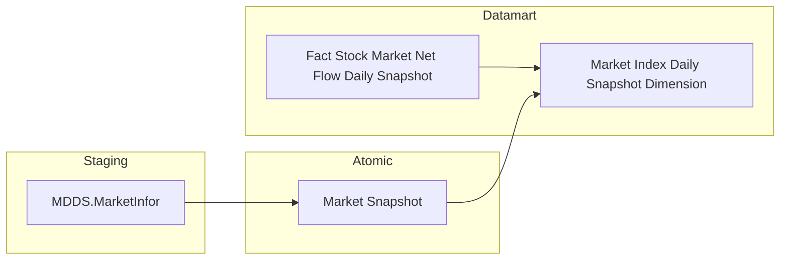
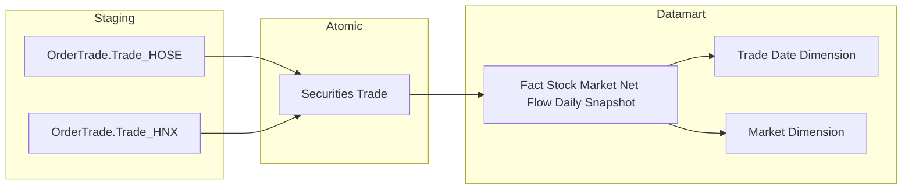
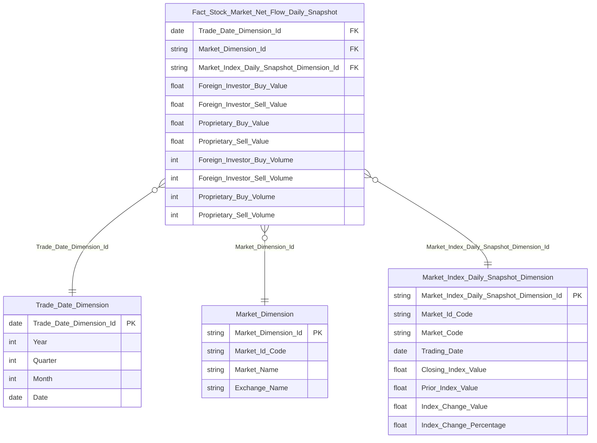
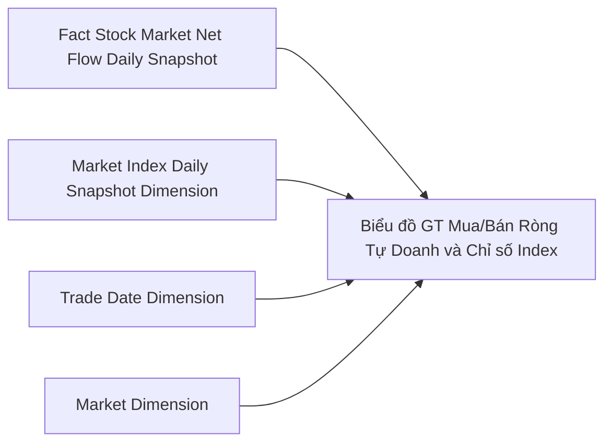
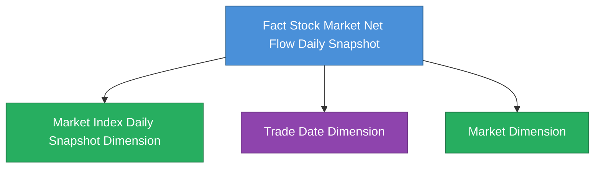

# DTM_VP_HLD — High Level Design
**Module:** VP (Vốn hóa & Phân tích thị trường)  
**Phiên bản:** 1.0 — Draft  
**Phạm vi:** Tab Thống kê thị trường → Sub-tab Cổ phiếu  
**Ngày:** 2026-05-18

---

## Section 1 — Data Lineage

### Cụm 1 — Chỉ số thị trường (Market Index)

Nguồn: MDDS `MarketInfor` → Atomic `Market Snapshot`

### Cụm 2 — Giao dịch khớp lệnh (Securities Trade)

Nguồn: OrderTrade `Trade_HOSE` + `Trade_HNX` → Atomic `Securities Trade`

---

## Section 2 — Tổng quan báo cáo

### Tab Thống kê thị trường

#### Nhóm 1 — Biểu đồ Giá trị mua/bán ròng NĐTNN và chỉ số Index

> Phân loại: **Phân tích**
> Atomic: `Market Snapshot` ← MDDS.MarketInfor — **READY**
> Atomic: `Securities Trade` ← OrderTrade.Trade_HOSE, OrderTrade.Trade_HNX — **READY**

**Mockup:**

| Bộ lọc | Giá trị |
|---|---|
| Kỳ | Ngày / Tháng / Quý / Năm |
| Từ ngày → Đến ngày | 19/02/2026 → 25/02/2026 |
| Phạm vi | Toàn thị trường / HOSE / HNX / UPCOM |

| Trục | Nội dung |
|---|---|
| Trục Y trái | GT mua/bán ròng NĐTNN (Tỷ đồng) — biểu đồ cột |
| Trục Y phải | Giá trị chỉ số VN-Index / HNX-Index / UPCOM-Index (Điểm) — đường |
| Trục X | Ngày giao dịch |

**Source:** `Fact Stock Market Net Flow Daily Snapshot` → `Market Index Daily Snapshot Dimension`, `Trade Date Dimension`, `Market Dimension`

**Bảng KPI:**

| KPI ID | Tên KPI | Đơn vị | Tính chất | Công thức / Nguồn |
|---|---|---|---|---|
| K_VP_1 | Giá trị chỉ số | Điểm | Cơ sở | `Market Snapshot.Market Index Value` tại MAX(Index Time) trong ngày, filter `Market Id IN ('10','02','04')` |
| K_VP_1a | Giá trị chỉ số VN-Index | Điểm | Cơ sở | K_VP_1 filter `Market Id = '10'` |
| K_VP_1b | Giá trị chỉ số HNX-Index | Điểm | Cơ sở | K_VP_1 filter `Market Id = '02'` |
| K_VP_1c | Giá trị chỉ số UPCOM-Index | Điểm | Cơ sở | K_VP_1 filter `Market Id = '04'` |
| K_VP_2 | GT mua NĐTNN | Tỷ đồng | Cơ sở | `SUM(Securities Trade.Exec Value)` WHERE `Buy Foreign Investor Type Code <> '00'` AND `Market Id IN ('STO','STX','UPX')` |
| K_VP_3 | GT bán NĐTNN | Tỷ đồng | Cơ sở | `SUM(Securities Trade.Exec Value)` WHERE `Sell Foreign Investor Type Code <> '00'` AND `Market Id IN ('STO','STX','UPX')` |
| K_VP_4 | GT mua/bán ròng NĐTNN | Tỷ đồng | Phái sinh | K_VP_2 − K_VP_3 (tính tại query layer) |
| K_VP_4a | GT mua/bán ròng NĐTNN — HOSE | Tỷ đồng | Cơ sở | `SUM(Securities Trade.Exec Value)` filter `Buy Frgn <> '00'` − `Sell Frgn <> '00'` AND `Market Id = 'STO'` |
| K_VP_4b | GT mua/bán ròng NĐTNN — HNX | Tỷ đồng | Cơ sở | Như trên, `Market Id = 'STX'` |
| K_VP_4c | GT mua/bán ròng NĐTNN — UPCOM | Tỷ đồng | Cơ sở | Như trên, `Market Id = 'UPX'` |

> **Ghi chú HNX/UPCOM:** `Exec Value` của `Trade_HNX` không có sẵn trong nguồn — ETL tính `exec_prc × exec_vol` tại Atomic layer. Atomic `Securities Trade.exec_val` đã phản ánh điều này.

**Star Schema:**

**Lineage Mart → Báo cáo:**

**Bảng grain:**

| Tên bảng | Grain |
|---|---|
| Fact Stock Market Net Flow Daily Snapshot | 1 row / Ngày giao dịch × Sàn (Market Id: STO / STX / UPX) |
| Market Index Daily Snapshot Dimension | 1 row / Ngày giao dịch × Mã chỉ số (Market Id: '10' / '02' / '04') — giá trị đóng cửa cuối ngày |
| Trade Date Dimension | 1 row / Ngày giao dịch (Calendar Date conformed dim) |
| Market Dimension | 1 row / Mã sàn giao dịch (STO / STX / UPX) |

---

#### Nhóm 2 — Biểu đồ Giá trị mua/bán ròng Tự doanh và chỉ số Index

> Phân loại: **Phân tích**
> Atomic: `Market Snapshot` ← MDDS.MarketInfor — **READY**
> Atomic: `Securities Trade` ← OrderTrade.Trade_HOSE, OrderTrade.Trade_HNX — **READY**

**Mockup:**

| Bộ lọc | Giá trị |
|---|---|
| Kỳ | Ngày / Tháng / Quý / Năm |
| Từ ngày → Đến ngày | 19/02/2026 → 25/02/2026 |
| Phạm vi | Toàn thị trường / HOSE / HNX / UPCOM |

| Trục | Nội dung |
|---|---|
| Trục Y trái | GT mua/bán ròng Tự doanh (Tỷ đồng) — biểu đồ cột |
| Trục Y phải | Giá trị chỉ số VN-Index / HNX-Index / UPCOM-Index (Điểm) — đường |
| Trục X | Ngày giao dịch |

**Source:** `Fact Stock Market Net Flow Daily Snapshot` → `Market Index Daily Snapshot Dimension`, `Trade Date Dimension`, `Market Dimension`

> Nhóm 2 dùng **cùng bảng Fact** với Nhóm 1 — chỉ khác cột measure được chọn (`Proprietary_Buy_Value`, `Proprietary_Sell_Value`). Không tạo Fact riêng.

**Bảng KPI:**

| KPI ID | Tên KPI | Đơn vị | Tính chất | Công thức / Nguồn |
|---|---|---|---|---|
| K_VP_5 | GT mua Tự doanh | Tỷ đồng | Cơ sở | `SUM(Securities Trade.Exec Value)` WHERE `Buy Client House Type Code = '30'` AND `Market Id IN ('STO','STX','UPX')` |
| K_VP_6 | GT bán Tự doanh | Tỷ đồng | Cơ sở | `SUM(Securities Trade.Exec Value)` WHERE `Sell Client House Type Code = '30'` AND `Market Id IN ('STO','STX','UPX')` |
| K_VP_7 | GT mua/bán ròng Tự doanh | Tỷ đồng | Cơ sở | Lưu trực tiếp trong Fact = `Proprietary_Buy_Value − Proprietary_Sell_Value` — tính tại ETL vì BA phân loại là "Chỉ tiêu cơ sở" |
| K_VP_7a | GT mua/bán ròng Tự doanh — HOSE | Tỷ đồng | Cơ sở | K_VP_7 filter `Market Id = 'STO'` |
| K_VP_7b | GT mua/bán ròng Tự doanh — HNX | Tỷ đồng | Cơ sở | K_VP_7 filter `Market Id = 'STX'` |
| K_VP_7c | GT mua/bán ròng Tự doanh — UPCOM | Tỷ đồng | Cơ sở | K_VP_7 filter `Market Id = 'UPX'` |
| K_VP_8 | Giá trị chỉ số (Biểu đồ 2) | Điểm | Cơ sở | Trùng K_VP_1 — cùng bảng `Market Index Daily Snapshot Dimension` |

> **Ghi chú thiết kế K_VP_7:** BA ghi là "Chỉ tiêu cơ sở" (không phải phái sinh) → lưu `Proprietary_Net_Flow_Value` trong Fact. Khác với K_VP_4 (GT ròng NĐTNN) là "Chỉ tiêu phái sinh" → không lưu, tính tại query layer.

**Star Schema:** Dùng chung Star Schema của Nhóm 1 — không vẽ lại.

**Lineage Mart → Báo cáo:**

**Bảng grain:** Dùng chung bảng grain Nhóm 1.

---

## Section 3 — Mô hình tổng thể

**Bảng Phân tích (Star Schema):**

| Tên bảng Datamart | Loại | Grain | Nguồn Atomic chính |
|---|---|---|---|
| Fact Stock Market Net Flow Daily Snapshot | Fact Periodic Snapshot | 1 row / Ngày × Sàn | Securities Trade |
| Market Index Daily Snapshot Dimension | Dimension | 1 row / Ngày × Mã chỉ số | Market Snapshot |
| Trade Date Dimension | Dimension (Conformed) | 1 row / Ngày | Calendar Date |
| Market Dimension | Dimension | 1 row / Mã sàn | Classification Value (ORDERTRADE_MARKET_ID) |

**Bảng Tác nghiệp:** Không có trong scope tab Cổ phiếu này.

**Bảng Dimension (tóm tắt):**

| Tên Dimension | Conformed | SCD |
|---|---|---|
| Trade Date Dimension | Có (dùng chung cross-module) | N/A |
| Market Index Daily Snapshot Dimension | Không | SCD2 |
| Market Dimension | Không | SCD2 |

---

## Section 4 — Vấn đề mở

| ID | Vấn đề | Giả định hiện tại | KPI liên quan | Trạng thái |
|---|---|---|---|---|
| O_VP_1 | `Exec Value` của `Securities Trade` từ HNX không có sẵn trong nguồn — Atomic ETL phải tính `exec_prc × exec_vol`. Cần xác nhận ETL Atomic đã xử lý hay Datamart ETL cần tự tính. | Giả định Atomic `Securities Trade.exec_val` đã được ETL Atomic tính sẵn cho cả HOSE lẫn HNX rows | K_VP_2, K_VP_3, K_VP_5, K_VP_6 | Open |
| O_VP_2 | `Market Index Daily Snapshot Dimension` cần lấy bản ghi `MAX(Index Time)` trong ngày từ Atomic `Market Snapshot` (realtime stream). Cần xác nhận Atomic layer có field `Index Time` (`indx_tm` từ `MarketInfor.indexTime`) để ETL Datamart resolve đúng bản tin cuối ngày. | Dùng `mkt_snpst.indx_tm` (HHmmss string) để lấy MAX per (Market Id × Trading Date) | K_VP_1, K_VP_1a, K_VP_1b, K_VP_1c, K_VP_8 | Open |
| O_VP_3 | `Market Dimension` sẽ có 3 giá trị cố định (STO / STX / UPX) tương ứng HOSE / HNX / UPCOM. Cần xác nhận cách seed Dimension này — từ CV scheme `ORDERTRADE_MARKET_ID` hay hardcode trong ETL. | Seed từ `ORDERTRADE_MARKET_ID` Classification Value, filter 3 giá trị cổ phiếu | K_VP_4a, K_VP_4b, K_VP_4c, K_VP_7a, K_VP_7b, K_VP_7c | Open |
| O_VP_4 | GT ròng NĐTNN (K_VP_4) là "Chỉ tiêu phái sinh" — không lưu trong mart, tính tại query layer (`Foreign_Investor_Buy_Value − Foreign_Investor_Sell_Value`). GT ròng Tự doanh (K_VP_7) là "Chỉ tiêu cơ sở" — lưu `Proprietary_Net_Flow_Value` trong Fact. Cần BA xác nhận lại phân loại này để tránh inconsistency giữa 2 loại "ròng". | Tuân theo phân loại BA — K_VP_4 Derived, K_VP_7 lưu trong Fact | K_VP_4, K_VP_7 | Open |