# DTM_VP — HLD Datamart: Thống kê thị trường chứng khoán (VP)

---

## Section 1 — Data Lineage

##### Cụm 1: Tương quan chỉ số thị trường và giao dịch cổ phiếu (Fact Securities Market Index Snapshot)

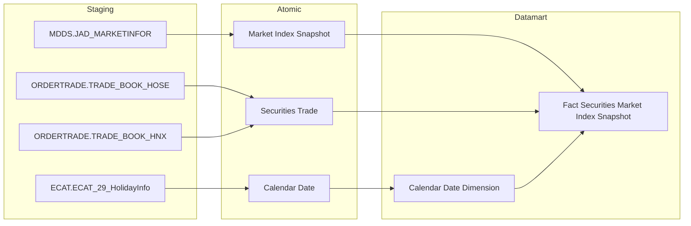

---

##### Cụm 2: Giao dịch phái sinh (Fact Derivatives Trading Snapshot)

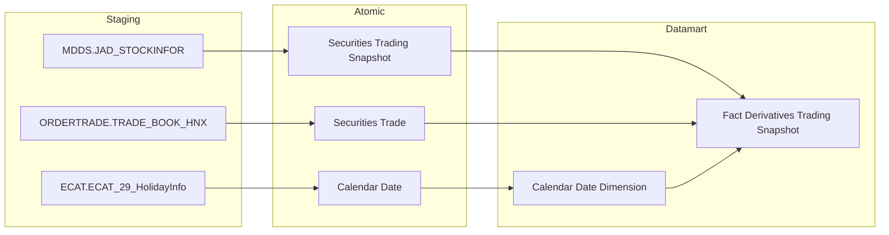

---

##### Cụm 3: Giá HĐTL (Fact Derivatives Price Snapshot)

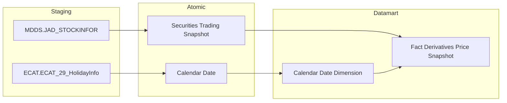

---

##### Cụm 4: TPDN niêm yết (Fact Listed Corporate Bond Snapshot)

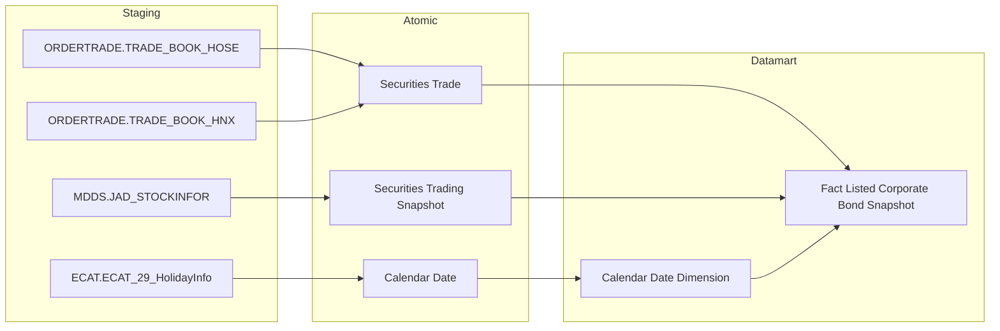

---

##### Cụm 5: TPDN niêm yết theo ngành và kỳ hạn (Fact Listed Corporate Bond Industry Term Snapshot)

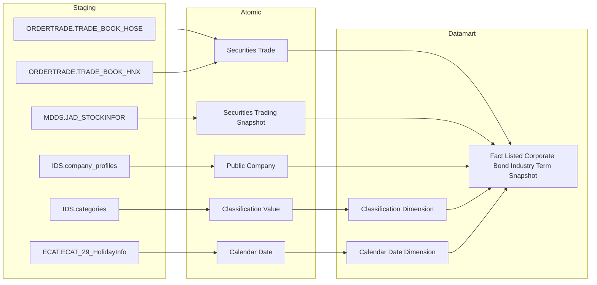

---

## Section 2 — Tổng quan báo cáo

### Tab Dashboard Thống kê thị trường

#### Nhóm 1 - Cổ phiếu >> Biều đồ Giá trị mua/bán ròng NĐTNN và chỉ số Index

> Phân loại: **Phân tích**
> Atomic: `Market Index Snapshot` ← MDDS.JAD_MARKETINFOR — **READY**
> Atomic: `Securities Trade` ← ORDERTRADE.TRADE_BOOK_HOSE / TRADE_BOOK_HNX — **READY**

**Mockup:**

| KỲ | Sàn | Chỉ số | GT ròng NĐTNN (tỷ đồng) | VN-Index (điểm) | HNX-Index (điểm) | UPCOM-Index (điểm) |
|---|---|---|---|---|---|---|
| 19/02/2026 | HOSE | VN-Index | -155 | 1.320 | 225 | 92 |
| 20/02/2026 | HOSE | VN-Index | -168 | 1.318 | 224 | 91 |

*Biểu đồ kết hợp: cột (GT ròng NĐTNN) + đường (VN-Index, HNX-Index, UPCOM-Index). Lọc theo Kỳ (Ngày/Tháng/Quý/Năm), Từ–Đến, Phạm vi (Toàn thị trường / HOSE / HNX / UPCOM).*

**Source:** `Fact Securities Market Index Snapshot` → `Calendar Date Dimension`

**Bảng KPI:**

| KPI ID | Tên KPI | Đơn vị | Tính chất | Công thức | Ghi chú |
|---|---|---|---|---|---|
| K_VP_1 | Sàn giao dịch | — | Chiều | `Market Index Snapshot.Market Code` — HOSE/HNX/UPCOM | Tham số lọc |
| K_VP_2 | Chỉ số thị trường | — | Chiều | `Market Index Snapshot.Market Code` → VN-Index / HNX-Index / UPCOM-Index | Tham số lọc |
| K_VP_3 | Giá trị chỉ số thị trường | Điểm | Cơ sở | `Market Index Snapshot.Market Index Value` | |
| K_VP_4 | Giá trị chỉ số VN-Index | Điểm | Cơ sở | `Market Index Snapshot.Market Index Value` filter `Market Code = 'HOSE'` | |
| K_VP_5 | Giá trị chỉ số HNX-Index | Điểm | Cơ sở | `Market Index Snapshot.Market Index Value` filter `Market Code = 'HNX'` | |
| K_VP_6 | Giá trị chỉ số UPCOM-Index | Điểm | Cơ sở | `Market Index Snapshot.Market Index Value` filter `Market Code = 'UPCOM'` | |
| K_VP_7 | GT mua/bán ròng NĐTNN toàn thị trường | Tỷ đồng | Phái sinh | `SUM(Securities Trade.Execution Value WHERE Buy Foreign Investor Type Code <> '00') - SUM(Securities Trade.Execution Value WHERE Sell Foreign Investor Type Code <> '00')` | |
| K_VP_8 | GT mua/bán ròng NĐTNN trên HOSE | Tỷ đồng | Cơ sở | `SUM(Securities Trade.Execution Value WHERE Buy Foreign Investor Type Code <> '00' AND Market Id Code = 'STO') - SUM(Securities Trade.Execution Value WHERE Sell Foreign Investor Type Code <> '00' AND Market Id Code = 'STO')` | |
| K_VP_9 | GT mua/bán ròng NĐTNN trên HNX | Tỷ đồng | Cơ sở | `SUM(Securities Trade.Execution Value WHERE Buy Foreign Investor Type Code <> '00' AND Market Id Code = 'STX') - SUM(Securities Trade.Execution Value WHERE Sell Foreign Investor Type Code <> '00' AND Market Id Code = 'STX')` | |
| K_VP_10 | GT mua/bán ròng NĐTNN trên UPCOM | Tỷ đồng | Cơ sở | `SUM(Securities Trade.Execution Value WHERE Buy Foreign Investor Type Code <> '00' AND Market Id Code = 'UPX') - SUM(Securities Trade.Execution Value WHERE Sell Foreign Investor Type Code <> '00' AND Market Id Code = 'UPX')` | |

**Star Schema:**

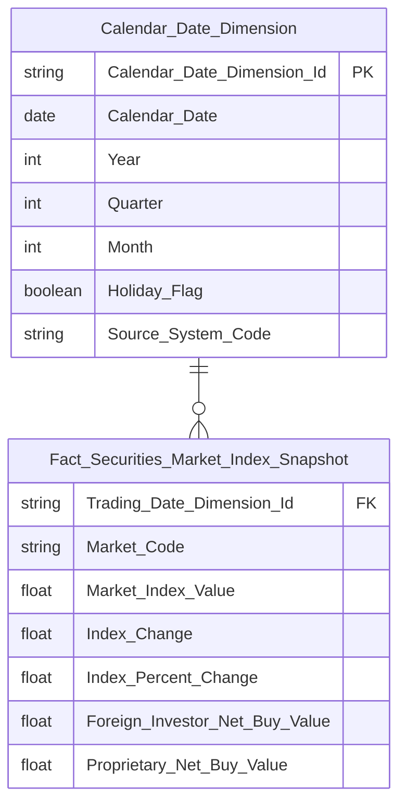

**Lineage Mart → Báo cáo:**


**Bảng grain:**

| Tên bảng | Grain |
|---|---|
| Fact Securities Market Index Snapshot | 1 dòng / thị trường (Market Code) / ngày giao dịch |
| Calendar Date Dimension | SCD4A (current state) |

---

#### Nhóm 2 - Cổ phiếu >> Biều đồ Giá trị mua/bán ròng Tự doanh và chỉ số Index

> Phân loại: **Phân tích**
> Atomic: `Market Index Snapshot` ← MDDS.JAD_MARKETINFOR — **READY**
> Atomic: `Securities Trade` ← ORDERTRADE.TRADE_BOOK_HOSE / TRADE_BOOK_HNX — **READY**

**Mockup:**

| KỲ | Sàn | GT ròng Tự doanh (tỷ đồng) | VN-Index (điểm) | HNX-Index (điểm) | UPCOM-Index (điểm) |
|---|---|---|---|---|---|
| 19/02/2026 | HOSE | +12 | 1.320 | 225 | 92 |

*Biểu đồ kết hợp: cột (GT ròng Tự doanh) + đường (các Index). Cùng filter Kỳ, Từ–Đến, Phạm vi với Nhóm 1.*

**Source:** `Fact Securities Market Index Snapshot` → `Calendar Date Dimension`

**Bảng KPI:**

| KPI ID | Tên KPI | Đơn vị | Tính chất | Công thức | Ghi chú |
|---|---|---|---|---|---|
| K_VP_1 | Sàn giao dịch | — | Chiều | `Market Index Snapshot.Market Code` | Reuse từ Nhóm 1 |
| K_VP_3 | Giá trị chỉ số thị trường | Điểm | Cơ sở | `Market Index Snapshot.Market Index Value` | Reuse từ Nhóm 1 |
| K_VP_4 | Giá trị chỉ số VN-Index | Điểm | Cơ sở | `Market Index Snapshot.Market Index Value` filter `Market Code = 'HOSE'` | Reuse từ Nhóm 1 |
| K_VP_5 | Giá trị chỉ số HNX-Index | Điểm | Cơ sở | `Market Index Snapshot.Market Index Value` filter `Market Code = 'HNX'` | Reuse từ Nhóm 1 |
| K_VP_6 | Giá trị chỉ số UPCOM-Index | Điểm | Cơ sở | `Market Index Snapshot.Market Index Value` filter `Market Code = 'UPCOM'` | Reuse từ Nhóm 1 |
| K_VP_11 | GT mua/bán ròng tự doanh toàn thị trường | Tỷ đồng | Phái sinh | `SUM(Securities Trade.Execution Value WHERE Buy Client House Classification Code = '30') - SUM(Securities Trade.Execution Value WHERE Sell Client House Classification Code = '30')` | |
| K_VP_12 | GT mua/bán ròng tự doanh trên HOSE | Tỷ đồng | Cơ sở | `SUM(Securities Trade.Execution Value WHERE Buy Client House Classification Code = '30' AND Market Id Code = 'STO') - SUM(Securities Trade.Execution Value WHERE Sell Client House Classification Code = '30' AND Market Id Code = 'STO')` | |
| K_VP_13 | GT mua/bán ròng tự doanh trên HNX | Tỷ đồng | Cơ sở | `SUM(Securities Trade.Execution Value WHERE Buy Client House Classification Code = '30' AND Market Id Code = 'STX') - SUM(Securities Trade.Execution Value WHERE Sell Client House Classification Code = '30' AND Market Id Code = 'STX')` | |
| K_VP_14 | GT mua/bán ròng tự doanh trên UPCOM | Tỷ đồng | Cơ sở | `SUM(Securities Trade.Execution Value WHERE Buy Client House Classification Code = '30' AND Market Id Code = 'UPX') - SUM(Securities Trade.Execution Value WHERE Sell Client House Classification Code = '30' AND Market Id Code = 'UPX')` | |

**Star Schema:**


**Lineage Mart → Báo cáo:**


**Bảng grain:**

| Tên bảng | Grain |
|---|---|
| Fact Securities Market Index Snapshot | 1 dòng / thị trường (Market Code) / ngày giao dịch |
| Calendar Date Dimension | SCD4A (current state) |

---

#### Nhóm 3 - Phái sinh >> Chỉ tiêu tổng hợp

> Phân loại: **Phân tích**

##### READY

> Atomic: `Securities Trading Snapshot` ← MDDS.JAD_STOCKINFOR — **READY**
> Atomic: `Securities Trade` ← ORDERTRADE.TRADE_BOOK_HNX — **READY**

**Mockup:**

| Kỳ | Phạm vi | Sản phẩm | Tổng KLGD (HĐ) | KL mua NĐTNN (HĐ) | KL bán NĐTNN (HĐ) | KL ròng NĐTNN (HĐ) |
|---|---|---|---|---|---|---|
| 25/02/2026 | Toàn thị trường | HĐTL VN30 | 245.600 | 12.500 | 11.800 | +700 |
| 25/02/2026 | Toàn thị trường | HĐTL VN100 | ... | ... | ... | ... |

*Thẻ tổng hợp: Tổng KLGD, KL mua/bán/ròng NĐTNN. Lọc theo Kỳ, Phạm vi, Sản phẩm (HĐTL VN30 / VN100 / TPCP / Toàn thị trường).*

**Source:** `Fact Derivatives Trading Snapshot` → `Calendar Date Dimension`

**Bảng KPI:**

| KPI ID | Tên KPI | Đơn vị | Tính chất | Công thức | Ghi chú |
|---|---|---|---|---|---|
| K_VP_15 | Sản phẩm phái sinh | — | Chiều | `Securities Trading Snapshot.Symbol` — HĐTL VN30 / VN100 / TPCP | Tham số lọc |
| K_VP_16 | Tổng khối lượng giao dịch phái sinh | Hợp đồng | Cơ sở | `SUM(Securities Trade.Execution Volume)` | |
| K_VP_17 | KL mua NĐTNN phái sinh | Hợp đồng | Cơ sở | `SUM(Securities Trade.Execution Volume WHERE Buy Foreign Investor Type Code <> '00')` | |
| K_VP_18 | KL bán NĐTNN phái sinh | Hợp đồng | Cơ sở | `SUM(Securities Trade.Execution Volume WHERE Sell Foreign Investor Type Code <> '00')` | |
| K_VP_19 | KL mua/bán ròng NĐTNN phái sinh | Hợp đồng | Phái sinh | `SUM(Securities Trade.Execution Volume WHERE Buy Foreign Investor Type Code <> '00') - SUM(Securities Trade.Execution Volume WHERE Sell Foreign Investor Type Code <> '00')` | |
| K_VP_20 | Tổng KLGD phái sinh % thay đổi so kỳ trước | % | Phái sinh | `(SUM(Securities Trade.Execution Volume) kỳ hiện tại - SUM(Securities Trade.Execution Volume) kỳ trước) / SUM(Securities Trade.Execution Volume) kỳ trước * 100` | |
| K_VP_21 | KL mua NĐTNN phái sinh % thay đổi so kỳ trước | % | Phái sinh | `(SUM(Securities Trade.Execution Volume WHERE Buy Foreign Investor Type Code <> '00') kỳ hiện tại - SUM(Securities Trade.Execution Volume WHERE Buy Foreign Investor Type Code <> '00') kỳ trước) / SUM(Securities Trade.Execution Volume WHERE Buy Foreign Investor Type Code <> '00') kỳ trước * 100` | |
| K_VP_22 | KL bán NĐTNN phái sinh % thay đổi so kỳ trước | % | Phái sinh | `(SUM(Securities Trade.Execution Volume WHERE Sell Foreign Investor Type Code <> '00') kỳ hiện tại - SUM(Securities Trade.Execution Volume WHERE Sell Foreign Investor Type Code <> '00') kỳ trước) / SUM(Securities Trade.Execution Volume WHERE Sell Foreign Investor Type Code <> '00') kỳ trước * 100` | |
| K_VP_23 | KL ròng NĐTNN phái sinh % thay đổi so kỳ trước | % | Phái sinh | `(SUM(Securities Trade.Execution Volume WHERE Buy Foreign Investor Type Code <> '00') - SUM(Securities Trade.Execution Volume WHERE Sell Foreign Investor Type Code <> '00')) kỳ hiện tại - (SUM(Securities Trade.Execution Volume WHERE Buy Foreign Investor Type Code <> '00') - SUM(Securities Trade.Execution Volume WHERE Sell Foreign Investor Type Code <> '00')) kỳ trước) / ABS((SUM(Securities Trade.Execution Volume WHERE Buy Foreign Investor Type Code <> '00') - SUM(Securities Trade.Execution Volume WHERE Sell Foreign Investor Type Code <> '00')) kỳ trước) * 100` | |

**Star Schema:**

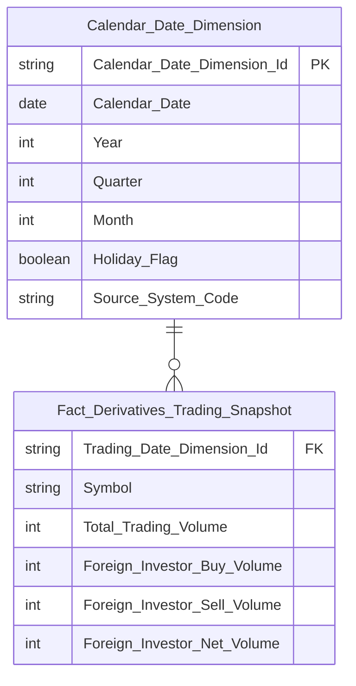

**Lineage Mart → Báo cáo:**

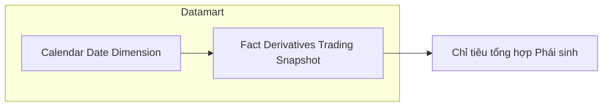

**Bảng grain:**

| Tên bảng | Grain |
|---|---|
| Fact Derivatives Trading Snapshot | 1 dòng / sản phẩm phái sinh (Symbol) / ngày giao dịch |
| Calendar Date Dimension | SCD4A (current state) |

##### PENDING

**KPI liên quan:** K_VP_24 (mới); K_VP_15 (reuse từ READY Nhóm 3)

**Lý do pending:** Khối lượng mở OI lấy từ VSDC BM 2 (báo cáo sở) — chưa có Atomic entity tương ứng.

**Atomic cần bổ sung:** Open Interest Snapshot (nguồn VSDC BM 2)

**Mart dự kiến:**
- Fact Derivatives Trading Snapshot — grain: 1 dòng / sản phẩm phái sinh / ngày (reuse, bổ sung thêm cột OI)

**Bảng mapping nguồn (Atomic Placeholder):**

| Tên KPI | Bảng nguồn (BA) | Atomic entity dự kiến | Atomic table dự kiến |
|---|---|---|---|
| Khối lượng mở OI | `"BM 2_Báo cáo về khối lượng mở cuối ngày"` | Open Interest Snapshot | TBD |

**Bảng KPI PENDING:**

| KPI ID | Tên KPI | Tính chất | Trạng thái |
|---|---|---|---|
| K_VP_15 | Sản phẩm phái sinh (reuse từ READY Nhóm 3) | Chiều | PENDING |
| K_VP_24 | Khối lượng mở (OI) phái sinh | Cơ sở | PENDING |
| K_VP_25 | Khối lượng mở (OI) phái sinh % thay đổi so kỳ trước | Phái sinh | PENDING |

---

#### Nhóm 4 - Phái sinh >> Giá HĐTL

> Phân loại: **Phân tích**
> Atomic: `Securities Trading Snapshot` ← MDDS.JAD_STOCKINFOR — **READY**

**Mockup:**

| Kỳ | Sản phẩm | Kỳ hạn | Giá HĐTL |
|---|---|---|---|
| 25/02/2026 | HĐTL VN30 | Tháng gần nhất | 1.318,5 |
| 25/02/2026 | HĐTL VN30 | Tháng tiếp theo | 1.320,0 |
| 25/02/2026 | HĐTL VN100 | Tháng gần nhất | ... |
| 25/02/2026 | HĐTL TPCP | Tháng gần nhất | ... |

*Biểu đồ: KLGD (cột) + Khối lượng mở (đường). Lọc theo Từ–Đến ngày. Lấy giá đóng cửa tại ngày cuối kỳ báo cáo cho từng sản phẩm / kỳ hạn.*

**Source:** `Fact Derivatives Price Snapshot` → `Calendar Date Dimension`

**Bảng KPI:**

| KPI ID | Tên KPI | Đơn vị | Tính chất | Công thức | Ghi chú |
|---|---|---|---|---|---|
| K_VP_15 | Sản phẩm phái sinh | — | Chiều | `Securities Trading Snapshot.Symbol` — HĐTL VN30 / VN100 / TPCP | Reuse từ Nhóm 3 |
| K_VP_26 | Kỳ hạn HĐTL | — | Chiều | `Securities Trading Snapshot.Maturity Month Year` | Tham số lọc; 4 kỳ hạn: tháng gần nhất, tháng tiếp theo, tháng cuối quý gần nhất, tháng cuối quý tiếp theo |
| K_VP_27 | Giá HĐTL | VND | Cơ sở | `Securities Trading Snapshot.Close Price` — lấy giá đóng cửa tại ngày cuối kỳ báo cáo; filter `Floor Code = '03'` (thị trường phái sinh) | |

**Star Schema:**

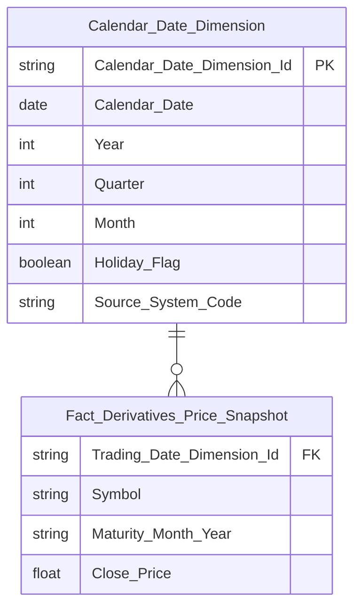

**Lineage Mart → Báo cáo:**

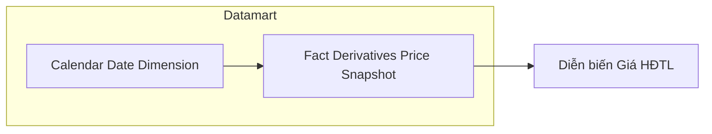

**Bảng grain:**

| Tên bảng | Grain |
|---|---|
| Fact Derivatives Price Snapshot | 1 dòng / sản phẩm phái sinh (Symbol) / kỳ hạn (Maturity Month Year) / ngày giao dịch |
| Calendar Date Dimension | SCD4A (current state) |

---

#### Nhóm 5 - Phái sinh >> Biểu đồ Diễn biến giao dịch thị trường phái sinh

> Phân loại: **Phân tích**
> Atomic: `Securities Trading Snapshot` ← MDDS.JAD_STOCKINFOR — **READY**
> Atomic: `Securities Trade` ← ORDERTRADE.TRADE_BOOK_HNX — **READY**
> Atomic: Open Interest Snapshot ← VSDC BM 2 — **PENDING**

**Mockup:**

| Ngày | KLGD (HĐ) | Khối lượng mở (HĐ) |
|---|---|---|
| 19/02/2026 | 85.000 | 58.000 |
| 20/02/2026 | 84.000 | 65.000 |
| ... | ... | ... |

*Biểu đồ kết hợp: cột KLGD (trục trái) + đường Khối lượng mở OI (trục phải). Lọc theo Từ–Đến ngày. Lọc theo Sản phẩm: HĐTL VN30 / VN100 / TPCP / Toàn thị trường.*

**Source:** `Fact Derivatives Trading Snapshot` + OI từ PENDING → `Calendar Date Dimension`

##### READY

**Bảng KPI:**

| KPI ID | Tên KPI | Đơn vị | Tính chất | Công thức | Ghi chú |
|---|---|---|---|---|---|
| K_VP_15 | Sản phẩm phái sinh | — | Chiều | `Securities Trading Snapshot.Symbol` | Reuse từ Nhóm 3 |
| K_VP_16 | Tổng khối lượng giao dịch phái sinh | Hợp đồng | Cơ sở | `SUM(Securities Trade.Execution Volume)` — filter theo Symbol nếu chọn sản phẩm cụ thể | Reuse từ Nhóm 3 |

**Star Schema:** Reuse `Fact Derivatives Trading Snapshot` → `Calendar Date Dimension` (xem Nhóm 3).

**Lineage Mart → Báo cáo:**

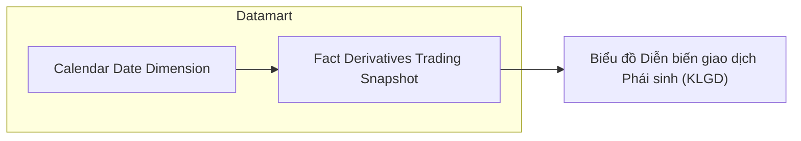

**Bảng grain:**

| Tên bảng | Grain |
|---|---|
| Fact Derivatives Trading Snapshot | 1 dòng / sản phẩm phái sinh (Symbol) / ngày giao dịch |
| Calendar Date Dimension | SCD4A (current state) |

##### PENDING

**KPI liên quan:** K_VP_24 (reuse từ Nhóm 3)

**Lý do pending:** Khối lượng mở OI lấy từ VSDC BM 2 — chưa có Atomic entity tương ứng (xem Nhóm 3).

**Atomic cần bổ sung:** Open Interest Snapshot (nguồn VSDC BM 2) — đã ghi nhận tại Nhóm 3.

**Bảng KPI PENDING:**

| KPI ID | Tên KPI | Tính chất | Trạng thái |
|---|---|---|---|
| K_VP_24 | Khối lượng mở (OI) phái sinh (reuse từ Nhóm 3) | Cơ sở | PENDING |

---

#### Nhóm 6 - Phái sinh >> Biểu đồ Khối lượng mua/bán ròng của NĐTNN

> Phân loại: **Phân tích**
> Atomic: `Securities Trading Snapshot` ← MDDS.JAD_STOCKINFOR — **READY**
> Atomic: `Securities Trade` ← ORDERTRADE.TRADE_BOOK_HNX — **READY**

**Mockup:**

| Ngày | KLGD Bán (HĐ) | KLGD Mua (HĐ) | KLGD Ròng (HĐ) |
|---|---|---|---|
| 19/02/2026 | -2.233 | 2.927 | 694 |
| 20/02/2026 | ... | ... | ... |

*Biểu đồ kết hợp: cột xanh KLGD Mua (trục trái) + cột đỏ KLGD Bán (trục trái, âm) + đường KLGD Ròng (trục phải). Lọc theo Từ–Đến ngày. Lọc theo Sản phẩm: HĐTL VN30 / VN100 / TPCP / Toàn thị trường.*

**Source:** `Fact Derivatives Trading Snapshot` → `Calendar Date Dimension`

**Bảng KPI:**

| KPI ID | Tên KPI | Đơn vị | Tính chất | Công thức | Ghi chú |
|---|---|---|---|---|---|
| K_VP_15 | Sản phẩm phái sinh | — | Chiều | `Securities Trading Snapshot.Symbol` | Reuse từ Nhóm 3 |
| K_VP_17 | KL mua NĐTNN phái sinh | Hợp đồng | Cơ sở | `SUM(Securities Trade.Execution Volume WHERE Buy Foreign Investor Type Code <> '00')` — filter theo Symbol nếu chọn sản phẩm cụ thể | Reuse từ Nhóm 3 |
| K_VP_18 | KL bán NĐTNN phái sinh | Hợp đồng | Cơ sở | `SUM(Securities Trade.Execution Volume WHERE Sell Foreign Investor Type Code <> '00')` — filter theo Symbol nếu chọn sản phẩm cụ thể | Reuse từ Nhóm 3 |
| K_VP_19 | KL mua/bán ròng NĐTNN phái sinh | Hợp đồng | Phái sinh | `SUM(Securities Trade.Execution Volume WHERE Buy Foreign Investor Type Code <> '00') - SUM(Securities Trade.Execution Volume WHERE Sell Foreign Investor Type Code <> '00')` — filter theo Symbol nếu chọn sản phẩm cụ thể | Reuse từ Nhóm 3 |

**Star Schema:** Reuse `Fact Derivatives Trading Snapshot` → `Calendar Date Dimension` (xem Nhóm 3).

**Lineage Mart → Báo cáo:**

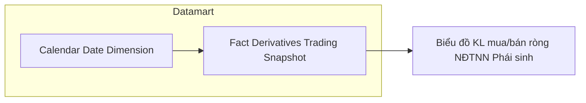

**Bảng grain:**

| Tên bảng | Grain |
|---|---|
| Fact Derivatives Trading Snapshot | 1 dòng / sản phẩm phái sinh (Symbol) / ngày giao dịch |
| Calendar Date Dimension | SCD4A (current state) |

---

### Tab Dashboard TPDN niêm yết

#### Nhóm 7 - TPDN niêm yết >> Chỉ tiêu tổng hợp

> Phân loại: **Phân tích**
> Atomic: `Securities Trade` ← ORDERTRADE.TRADE_BOOK_HOSE / TRADE_BOOK_HNX — **READY**
> Atomic: `Securities Trading Snapshot` ← MDDS.JAD_STOCKINFOR — **READY**

**Mockup:**

| Chỉ tiêu | Giá trị | So kỳ trước |
|---|---|---|
| Tổng KLGD | 8.520.000 Trái Phiếu | +1.200.000 (+16,40%) |
| Tổng GTGD | 8.540 Tỷ Đồng | +1.240 Tỷ đồng (+16,90%) |
| GTGD BQ phiên (YTD) | 1.250 Tỷ Đồng | +50 Tỷ đồng (+4,17%) |
| Số mã TP niêm yết | 482 Mã | +12 Mã (+2,55%) |
| GTGD NĐTNN Mua | 450 Tỷ đồng | +120 (+36,4%) |
| GTGD NĐTNN Bán | 380 Tỷ đồng | +40 (+11,8%) |
| GTGD NĐTNN Ròng | 70 Tỷ đồng | +20 (+40,0%) |

*Thẻ KPI tổng hợp. Lọc theo Kỳ (Ngày/Tháng/Quý/Năm), Từ–Đến.*

**Source:** `Fact Listed Corporate Bond Snapshot` → `Calendar Date Dimension`

**Bảng KPI:**

| KPI ID | Tên KPI | Đơn vị | Tính chất | Công thức | Ghi chú |
|---|---|---|---|---|---|
| K_VP_28 | Tổng KLGD TPDN niêm yết | Trái phiếu | Cơ sở | `SUM(Securities Trade.Execution Volume WHERE Market Id Code IN ('BDO','HCX'))` | BDO = TPDN niêm yết HOSE; HCX = TPDN niêm yết HNX |
| K_VP_29 | Tổng KLGD TPDN niêm yết % thay đổi so kỳ trước | % | Phái sinh | `(SUM(Securities Trade.Execution Volume WHERE Market Id Code IN ('BDO','HCX')) kỳ hiện tại - SUM(Securities Trade.Execution Volume WHERE Market Id Code IN ('BDO','HCX')) kỳ trước) / SUM(Securities Trade.Execution Volume WHERE Market Id Code IN ('BDO','HCX')) kỳ trước * 100` | Trùng pattern |
| K_VP_30 | Tổng GTGD TPDN niêm yết | Tỷ đồng | Cơ sở | `SUM(Securities Trade.Execution Value WHERE Market Id Code IN ('BDO','HCX'))` | |
| K_VP_31 | Tổng GTGD TPDN niêm yết % thay đổi so kỳ trước | % | Phái sinh | `(SUM(Securities Trade.Execution Value WHERE Market Id Code IN ('BDO','HCX')) kỳ hiện tại - SUM(Securities Trade.Execution Value WHERE Market Id Code IN ('BDO','HCX')) kỳ trước) / SUM(Securities Trade.Execution Value WHERE Market Id Code IN ('BDO','HCX')) kỳ trước * 100` | Trùng pattern |
| K_VP_32 | GTGD bình quân phiên TPDN niêm yết (YTD) | Tỷ đồng | Phái sinh | `SUM(Securities Trade.Execution Value WHERE Market Id Code IN ('BDO','HCX') AND Trade Date BETWEEN '01/01/YYYY' AND end_of_period) / COUNT(DISTINCT Trade Date WHERE Market Id Code IN ('BDO','HCX') AND Trade Date BETWEEN '01/01/YYYY' AND end_of_period)` | ETL daily materialize thành 2 cột `YTD_Cumulative_Trading_Value` và `YTD_Trading_Day_Count` trên Fact để tránh scan toàn năm tại query time |
| K_VP_33 | GTGD bình quân phiên TPDN niêm yết (YTD) % thay đổi so kỳ trước | % | Phái sinh | `(K_VP_32 kỳ hiện tại - K_VP_32 kỳ trước) / K_VP_32 kỳ trước * 100` | Trùng pattern; tham chiếu K_VP_32 vì đã materialize sẵn |
| K_VP_34 | Giá trị mua NĐTNN TPDN niêm yết | Tỷ đồng | Cơ sở | `SUM(Securities Trade.Execution Value WHERE Market Id Code IN ('BDO','HCX') AND Buy Foreign Investor Type Code <> '00')` | |
| K_VP_35 | Giá trị mua NĐTNN TPDN niêm yết % thay đổi so kỳ trước | % | Phái sinh | `(SUM(Securities Trade.Execution Value WHERE Market Id Code IN ('BDO','HCX') AND Buy Foreign Investor Type Code <> '00') kỳ hiện tại - SUM(...) kỳ trước) / SUM(...) kỳ trước * 100` | Trùng pattern |
| K_VP_36 | Giá trị bán NĐTNN TPDN niêm yết | Tỷ đồng | Cơ sở | `SUM(Securities Trade.Execution Value WHERE Market Id Code IN ('BDO','HCX') AND Sell Foreign Investor Type Code <> '00')` | |
| K_VP_37 | Giá trị bán NĐTNN TPDN niêm yết % thay đổi so kỳ trước | % | Phái sinh | `(SUM(Securities Trade.Execution Value WHERE Market Id Code IN ('BDO','HCX') AND Sell Foreign Investor Type Code <> '00') kỳ hiện tại - SUM(...) kỳ trước) / SUM(...) kỳ trước * 100` | Trùng pattern |
| K_VP_38 | Giá trị mua/bán ròng NĐTNN TPDN niêm yết | Tỷ đồng | Phái sinh | `SUM(Securities Trade.Execution Value WHERE Market Id Code IN ('BDO','HCX') AND Buy Foreign Investor Type Code <> '00') - SUM(Securities Trade.Execution Value WHERE Market Id Code IN ('BDO','HCX') AND Sell Foreign Investor Type Code <> '00')` | |
| K_VP_39 | Giá trị mua/bán ròng NĐTNN TPDN niêm yết % thay đổi so kỳ trước | % | Phái sinh | `(K_VP_38 kỳ hiện tại - K_VP_38 kỳ trước) / ABS(K_VP_38 kỳ trước) * 100` | Trùng pattern; dùng ABS ở mẫu số vì giá trị ròng có thể âm |
| K_VP_40 | Số mã TPDN niêm yết | Mã | Cơ sở | `COUNT(DISTINCT Securities Trading Snapshot.Symbol WHERE Stock Type Code = '1')` — tại ngày cuối kỳ | Stock Type Code = '1' = TPDN niêm yết (JAD_STOCKINFOR) |

**Star Schema:**

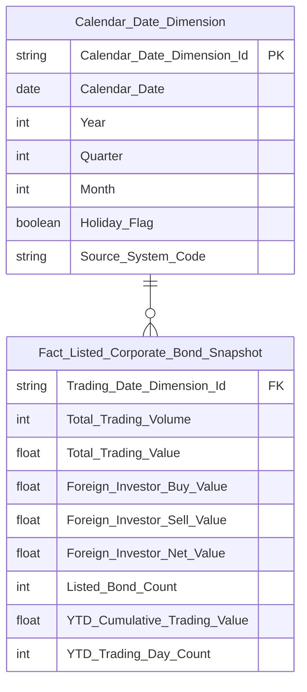

**Lineage Mart → Báo cáo:**

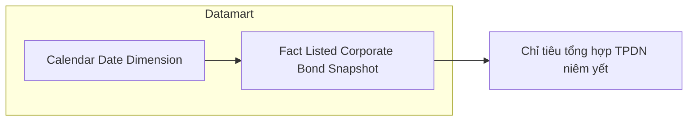

**Bảng grain:**

| Tên bảng | Grain |
|---|---|
| Fact Listed Corporate Bond Snapshot | 1 dòng / ngày giao dịch (toàn thị trường TPDN niêm yết). ETL daily cộng dồn `YTD_Cumulative_Trading_Value` và `YTD_Trading_Day_Count` vào mỗi dòng để tính K_VP_32 O(1). |
| Calendar Date Dimension | SCD4A (current state) |

---

#### Nhóm 8 - TPDN niêm yết >> Thống kê giao dịch TPDN niêm yết theo ngành

> Phân loại: **Phân tích**
> Atomic: `Securities Trading Snapshot` ← MDDS.JAD_STOCKINFOR — **READY**
> Atomic: `Securities Trade` ← ORDERTRADE.TRADE_BOOK_HOSE / TRADE_BOOK_HNX — **READY**
> Atomic: `Public Company` ← IDS.company_profiles — **READY** (thiết kế cũ từ `atomic_attributes.csv`, tạm dùng chờ approved)

**Mockup:**

| Ngành | Kỳ hạn | Số mã TP | Tổng GTGD (Tỷ đồng) | Kỳ hạn còn lại BQ (năm) | KL TP đang LH |
|---|---|---|---|---|---|
| TỔNG | Dưới 1 năm | 12 | 1.240 | 0,6 | 43.587 |
| TỔNG | 1–3 năm | 56 | 5.420 | 2,4 | 31.211 |
| TÀI CHÍNH | 1–3 năm | 18 | 1.820 | 2,1 | 24.267 |
| BẤT ĐỘNG SẢN | 3–5 năm | 19 | 950 | 4,5 | 9.224 |

*Bảng pivot: Ngành (hàng) × Kỳ hạn phát hành (hàng con). Phân trang, hiển thị 10 dòng/trang. Lọc theo Ngày.*

**Source:** `Fact Listed Corporate Bond Industry Term Snapshot` → `Calendar Date Dimension` + `Classification Dimension` (scheme: `IDS_INDUSTRY_CATEGORY`)

**Bảng KPI:**

| KPI ID | Tên KPI | Đơn vị | Tính chất | Công thức | Ghi chú |
|---|---|---|---|---|---|
| K_VP_45 | Ngành nghề kinh tế cấp 1 của TCPH | — | Chiều | `Public Company.Industry Category Level1 Code` (CV scheme `IDS_INDUSTRY_CATEGORY`) — join chain: `Securities Trading Snapshot.Issuer Name` (Stock Type Code='1') → `Securities Trading Snapshot.Issuer Name` (Stock Type Code='2', cùng Trading Date) → `Public Company.Equity Ticker` | Join qua `Issuer Name` giữa TPDN và cổ phiếu cùng TCPH |
| K_VP_41 | Kỳ hạn phát hành TPDN | — | Chiều | `ROUND(MONTHS_BETWEEN(Securities Trading Snapshot.Maturity Date, Securities Trading Snapshot.Issue Date) / 12, 2)` — nhóm ETL: Dưới 1 năm / 1–3 năm / 3–5 năm / Trên 5 năm | Filter `Stock Type Code = '1'`; tính từ `Maturity Date` và `Issue Date` |
| K_VP_40 | Số mã TPDN niêm yết | Mã | Cơ sở | `COUNT(DISTINCT Securities Trading Snapshot.Symbol WHERE Stock Type Code = '1')` — tại ngày cuối kỳ, theo ngành + kỳ hạn | Reuse từ Nhóm 7; breakdown thêm theo Ngành và Kỳ hạn |
| K_VP_42 | Tổng GTGD TPDN niêm yết | Tỷ đồng | Cơ sở | `SUM(Securities Trade.Exec Value WHERE Market Id Code IN ('BDO','HCX'))` — theo ngành + kỳ hạn phát hành | |
| K_VP_43 | Kỳ hạn còn lại bình quân | Năm | Phái sinh | `SUM(MONTHS_BETWEEN(Securities Trading Snapshot.Maturity Date, Trading Date) / 12 * Securities Trading Snapshot.Listed Share * 100000) / SUM(Securities Trading Snapshot.Listed Share * 100000)` — tại ngày cuối kỳ, theo ngành + kỳ hạn | Mệnh giá TPDN = 100.000; dư nợ = Listed Share × 100.000 |
| K_VP_44 | KL TP đang lưu hành | Trái phiếu | Cơ sở | `SUM(Securities Trading Snapshot.Listed Share WHERE Stock Type Code = '1')` — tại ngày cuối kỳ, theo ngành + kỳ hạn | |

**Star Schema:**

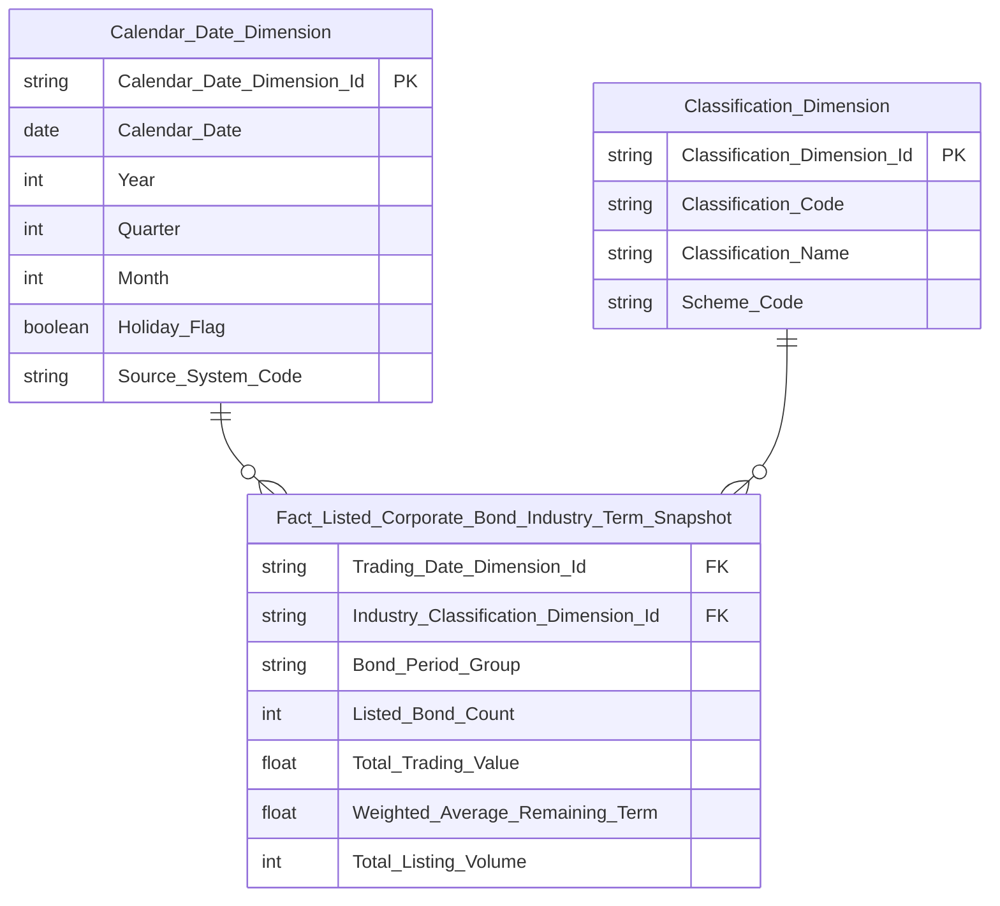

**Lineage Mart → Báo cáo:**

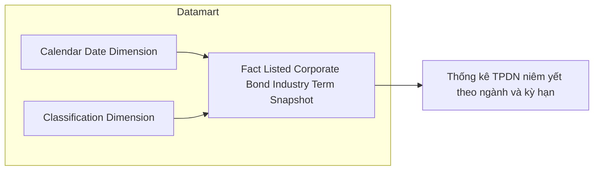

**Bảng grain:**

| Tên bảng | Grain |
|---|---|
| Fact Listed Corporate Bond Industry Term Snapshot | 1 dòng / ngành cấp 1 / nhóm kỳ hạn phát hành / ngày giao dịch |
| Classification Dimension | SCD4A (current state) — filter scheme `IDS_INDUSTRY_CATEGORY` |
| Calendar Date Dimension | SCD4A (current state) |

---

#### Nhóm 9 - TPDN niêm yết >> Biểu đồ Thống kê GTGD TPDN niêm yết và TPDN riêng lẻ

> Phân loại: **MIXED** (READY + PENDING)
> Atomic READY: `Securities Trade` ← ORDERTRADE.TRADE_BOOK_HOSE / TRADE_BOOK_HNX — **READY**
> Atomic PENDING: ISS (TKNB) — chưa có Atomic entity cho dữ liệu báo cáo TPDN riêng lẻ

**Mockup:**

| Ngày | TPDN Niêm yết (Tỷ đồng) | TPDN Riêng lẻ (Tỷ đồng) | Tổng |
|---|---|---|---|
| 19/02/2026 | 732 | 382 | 1.114 |
| 20/02/2026 | 725 | 327 | 1.052 |
| 25/02/2026 | 705 | 394 | 1.099 |

*Biểu đồ cột stacked theo ngày. Lọc theo khoảng thời gian (Từ kỳ / Đến kỳ).*

---

##### READY

> Atomic: `Securities Trade` ← ORDERTRADE.TRADE_BOOK_HOSE / TRADE_BOOK_HNX — **READY**

**Source:** `Fact Listed Corporate Bond Snapshot` (reuse từ Nhóm 7)

**Bảng KPI:**

| KPI ID | Tên KPI | Đơn vị | Tính chất | Công thức | Ghi chú |
|---|---|---|---|---|---|
| K_VP_30 | Tổng GTGD TPDN niêm yết | Tỷ đồng | Cơ sở | `SUM(Securities Trade.Exec Value WHERE Market Id Code IN ('BDO','HCX'))` | Reuse từ Nhóm 7 |

**Lineage Mart → Báo cáo:**

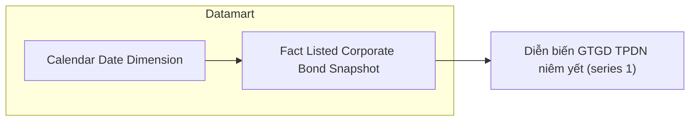

---

##### PENDING

**KPI liên quan:** K_VP_46 (mới)

**Lý do PENDING:** Nguồn TKNB (ISS.FACT_REPORT_DATA / ISS.INPUT_REPORT_SUBMISSION) là hệ thống tiếp nhận báo cáo — chưa có Atomic entity tương ứng trong `dm_manifest.yaml`. Dữ liệu GTGD TPDN riêng lẻ lấy từ báo cáo HNX09 do thành viên nộp, không có trong ORDERTRADE.

**Atomic cần bổ sung:**

| Bảng nguồn BA | Atomic entity dự kiến | Atomic table dự kiến |
|---|---|---|
| ISS.FACT_REPORT_DATA / ISS.INPUT_REPORT_SUBMISSION | Report Submission Data | TBD |

**Mart dự kiến:** Bổ sung cột `OTC_Bond_Trading_Value` vào `Fact Listed Corporate Bond Snapshot` (cùng grain: 1 dòng / ngày) sau khi Atomic entity ISS được approved.

**Bảng KPI:**

| KPI ID | Tên KPI | Tính chất | Trạng thái |
|---|---|---|---|
| K_VP_46 | GTGD TPDN riêng lẻ | Cơ sở | PENDING |

---

## Section 3 — Mô hình tổng thể

*(Cập nhật dần khi hoàn thiện tất cả nhóm)*

### 3.1 Graph TB

```mermaid
graph TB
    classDef fact fill:#4472C4,color:#fff
    classDef dim fill:#70AD47,color:#fff

    fct_scr_mkt_indx_snpst(["Fact Securities Market Index Snapshot"]):::fact
    fct_derv_tdg_snpst(["Fact Derivatives Trading Snapshot"]):::fact
    fct_derv_prc_snpst(["Fact Derivatives Price Snapshot"]):::fact
    fct_lst_crp_bnd_snpst(["Fact Listed Corporate Bond Snapshot"]):::fact
    fct_lst_crp_bnd_indy_trm_snpst(["Fact Listed Corporate Bond Industry Term Snapshot"]):::fact
    cdr_dt_dim(["Calendar Date Dimension"]):::dim
    cl_dim(["Classification Dimension"]):::dim

    cdr_dt_dim --> fct_scr_mkt_indx_snpst
    cdr_dt_dim --> fct_derv_tdg_snpst
    cdr_dt_dim --> fct_derv_prc_snpst
    cdr_dt_dim --> fct_lst_crp_bnd_snpst
    cdr_dt_dim --> fct_lst_crp_bnd_indy_trm_snpst
    cl_dim --> fct_lst_crp_bnd_indy_trm_snpst
```

### 3.2 Bảng Phân tích

| Tên bảng Datamart | Mô tả | Fact Pattern | Grain | Nguồn Atomic chính |
|---|---|---|---|---|
| Fact Securities Market Index Snapshot | Tổng hợp giá trị chỉ số thị trường và giao dịch mua/bán ròng theo loại nhà đầu tư | Fact Snapshot | 1 dòng / thị trường / ngày giao dịch | `mkt_indx_snpst` (MDDS), `scr_trd` (ORDERTRADE) |
| Fact Derivatives Trading Snapshot | Tổng hợp khối lượng giao dịch phái sinh và giao dịch NĐTNN theo sản phẩm | Fact Snapshot | 1 dòng / sản phẩm phái sinh (Symbol) / ngày giao dịch | `scr_tdg_snpst` (MDDS), `scr_trd` (ORDERTRADE) |
| Fact Derivatives Price Snapshot | Giá đóng cửa HĐTL theo sản phẩm và kỳ hạn | Fact Snapshot | 1 dòng / sản phẩm phái sinh (Symbol) / kỳ hạn / ngày giao dịch | `scr_tdg_snpst` (MDDS) |
| Fact Listed Corporate Bond Snapshot | Tổng hợp giao dịch TPDN niêm yết: KLGD, GTGD, NĐTNN, số mã | Fact Snapshot | 1 dòng / ngày giao dịch (toàn thị trường TPDN niêm yết) | `scr_trd` (ORDERTRADE), `scr_tdg_snpst` (MDDS) |
| Fact Listed Corporate Bond Industry Term Snapshot | Thống kê TPDN niêm yết theo ngành và kỳ hạn phát hành: GTGD, kỳ hạn còn lại BQ, KL lưu hành, số mã | Fact Snapshot | 1 dòng / ngành cấp 1 (scheme IDS_INDUSTRY_CATEGORY) / nhóm kỳ hạn phát hành / ngày giao dịch | `scr_tdg_snpst` (MDDS), `scr_trd` (ORDERTRADE), `pblc_co` (IDS) |

### 3.3 Bảng Tác nghiệp

Không có.

### 3.4 Bảng Dimension

*Tất cả Dimension áp dụng SCD Type 4A.*

| Tên bảng Datamart | Mô tả | Grain | Nguồn Atomic chính | Conformed |
|---|---|---|---|---|
| Calendar Date Dimension | Chiều ngày tháng | 1 dòng / ngày | `cdr_dt` (ECAT) | Có |
| Classification Dimension | Chiều phân loại — toàn bộ CV từ Atomic. Nhóm 8 dùng filter scheme `IDS_INDUSTRY_CATEGORY` để lấy ngành cấp 1 | 1 dòng / giá trị phân loại / scheme | `cv` (Atomic) | Có |

---

#### Nhóm 10 - TPDN niêm yết >> Biểu đồ Giá trị giao dịch TPDN theo ngành

> Phân loại: **Phân tích** (toàn bộ reuse)
> Reuse: `Fact Listed Corporate Bond Industry Term Snapshot` (Nhóm 8) — aggregate theo ngành, bỏ chiều kỳ hạn
> Reuse: `Classification Dimension` (scheme: `IDS_INDUSTRY_CATEGORY`) — L2 cl_dim
> Reuse: `Calendar Date Dimension` — L1 Conformed

**Mockup:**

*Biểu đồ donut: GTGD TPDN theo ngành (Tỷ VNĐ). Tâm hiển thị tổng: 7,8T. Phần trăm từng ngành: Tài chính 37.9% / BĐS 29.8% / Công nghiệp 18.6% / Năng lượng 13.7%. Lọc theo khoảng thời gian.*

**Source:** `Fact Listed Corporate Bond Industry Term Snapshot` (reuse từ Nhóm 8) → `Calendar Date Dimension` + `Classification Dimension`

**Bảng KPI:**

| KPI ID | Tên KPI | Đơn vị | Tính chất | Công thức | Ghi chú |
|---|---|---|---|---|---|
| K_VP_45 | Ngành nghề kinh tế cấp 1 của TCPH | — | Chiều | `Public Company.Industry Category Level1 Code` (CV scheme `IDS_INDUSTRY_CATEGORY`) | Reuse từ Nhóm 8 |
| K_VP_42 | Tổng GTGD TPDN niêm yết theo ngành | Tỷ đồng | Cơ sở | `SUM(Securities Trade.Exec Value WHERE Market Id Code IN ('BDO','HCX'))` — group by ngành | Reuse từ Nhóm 8; aggregate bỏ chiều kỳ hạn |
| K_VP_47 | Tỷ trọng GTGD TPDN niêm yết theo ngành | % | Phái sinh | `K_VP_42 ngành / SUM(K_VP_42 toàn thị trường) * 100` | Tính tại query time hoặc ETL materialize cột `Trading_Value_Pct` trên Fact |

**Star Schema:** Reuse `Fact Listed Corporate Bond Industry Term Snapshot` → `Calendar Date Dimension` + `Classification Dimension` (scheme `IDS_INDUSTRY_CATEGORY`) — xem Nhóm 8.

**Lineage Mart → Báo cáo:**

```mermaid
flowchart LR
    subgraph GOLD["Datamart"]
        fct_lst_crp_bnd_indy_trm_snpst["Fact Listed Corporate Bond Industry Term Snapshot"]
        cdr_dt_dim["Calendar Date Dimension"]
        cl_dim["Classification Dimension"]
    end
    cdr_dt_dim --> fct_lst_crp_bnd_indy_trm_snpst
    cl_dim --> fct_lst_crp_bnd_indy_trm_snpst
    fct_lst_crp_bnd_indy_trm_snpst --> RPT10["Biểu đồ GTGD TPDN theo ngành"]
```

**Bảng grain:**

| Tên bảng | Grain |
|---|---|
| Fact Listed Corporate Bond Industry Term Snapshot | 1 dòng / ngành cấp 1 / nhóm kỳ hạn phát hành / ngày giao dịch (aggregate bỏ kỳ hạn tại query time để ra tỷ trọng ngành) |
| Classification Dimension | SCD4A (current state) — filter scheme `IDS_INDUSTRY_CATEGORY` |
| Calendar Date Dimension | SCD4A (current state) |

---

### Tab Dashboard TPDN riêng lẻ

#### Nhóm 11 - TPDN riêng lẻ >> Chỉ tiêu tổng hợp

> Phân loại: **PENDING**
> Nguồn: TKNB (ISS.FACT_REPORT_DATA / ISS.INPUT_REPORT_SUBMISSION) + CSDLTT (JAD_STOCKINFOR) — chưa có Atomic entity cho TPDN riêng lẻ

**Mockup:**

*Thẻ KPI tổng hợp — layout tương tự Nhóm 7 (TPDN niêm yết): Tổng GTGD / GTGD BQ phiên YTD / Số mã TP ĐKGD / GTGD NĐTNN (Mua / Bán / Ròng). Lọc theo Kỳ (Ngày/Tháng/Quý/Năm), Từ–Đến.*

---

**KPI liên quan:** K_VP_48, K_VP_49, K_VP_50, K_VP_51, K_VP_52, K_VP_53, K_VP_54, K_VP_55, K_VP_56, K_VP_57, K_VP_58, K_VP_59

**Lý do PENDING:** Toàn bộ dữ liệu TPDN riêng lẻ lấy từ TKNB (ISS — hệ thống tiếp nhận báo cáo HNX09 từ thành viên). Dữ liệu không có trong ORDERTRADE/CSDLTT (sổ lệnh). Số mã TP ĐKGD từ CSDLTT (`scr_tdg_snpst`) nhưng chưa xác định được filter phân biệt TPDN riêng lẻ.

**Atomic cần bổ sung:**

| Bảng nguồn BA | Atomic entity dự kiến | Atomic table dự kiến |
|---|---|---|
| ISS.FACT_REPORT_DATA / ISS.INPUT_REPORT_SUBMISSION | Report Submission Data (OTC Bond) | TBD |
| MDDS.JAD_STOCKINFOR | Securities Trading Snapshot | `scr_tdg_snpst` (đã có) — cần xác định filter mã TPDN riêng lẻ |

**Mart dự kiến:** Fact OTC Bond Snapshot — grain: 1 dòng / ngày (toàn thị trường TPDN riêng lẻ); bổ sung sau khi Atomic ISS được approved.

**Bảng KPI PENDING:**

| KPI ID | Tên KPI | Tính chất | Trạng thái |
|---|---|---|---|
| K_VP_48 | GTGD TPDN riêng lẻ | Cơ sở | PENDING |
| K_VP_49 | GTGD TPDN riêng lẻ % thay đổi so kỳ trước | Phái sinh | PENDING |
| K_VP_50 | GTGD bình quân phiên TPDN riêng lẻ (YTD) | Phái sinh | PENDING |
| K_VP_51 | GTGD bình quân phiên TPDN riêng lẻ (YTD) % thay đổi so kỳ trước | Phái sinh | PENDING |
| K_VP_52 | Giá trị mua NĐTNN TPDN riêng lẻ | Cơ sở | PENDING |
| K_VP_53 | Giá trị mua NĐTNN TPDN riêng lẻ % thay đổi so kỳ trước | Phái sinh | PENDING |
| K_VP_54 | Giá trị bán NĐTNN TPDN riêng lẻ | Cơ sở | PENDING |
| K_VP_55 | Giá trị bán NĐTNN TPDN riêng lẻ % thay đổi so kỳ trước | Phái sinh | PENDING |
| K_VP_56 | Giá trị mua/bán ròng NĐTNN TPDN riêng lẻ | Phái sinh | PENDING |
| K_VP_57 | Giá trị mua/bán ròng NĐTNN TPDN riêng lẻ % thay đổi so kỳ trước | Phái sinh | PENDING |
| K_VP_58 | Số mã TPDN riêng lẻ ĐKGD | Cơ sở | PENDING |
| K_VP_59 | Số mã TPDN riêng lẻ ĐKGD % thay đổi so kỳ trước | Phái sinh | PENDING |

---

#### Nhóm 12 - TPDN riêng lẻ >> Biểu đồ Diễn biến giao dịch thị trường TPDN riêng lẻ

> Phân loại: **PENDING**
> Nguồn: TKNB (ISS) — cùng lý do Nhóm 11

**Mockup:**

*Biểu đồ cột đơn: GTGD TPDN riêng lẻ (Tỷ đồng) theo ngày. Lọc theo Từ kỳ / Đến kỳ.*

---

**KPI liên quan:** K_VP_48 (reuse từ Nhóm 11)

**Lý do PENDING:** Nguồn TKNB (ISS) chưa có Atomic entity — đã ghi nhận tại Nhóm 11.

**Atomic cần bổ sung:** Report Submission Data (OTC Bond) — đã ghi nhận tại Nhóm 11. Không cần bổ sung thêm.

**Mart dự kiến:** Reuse `Fact OTC Bond Snapshot` (dự kiến từ Nhóm 11) — grain: 1 dòng / ngày; thêm chiều ngày để vẽ diễn biến.

**Bảng KPI PENDING:**

| KPI ID | Tên KPI | Tính chất | Trạng thái |
|---|---|---|---|
| K_VP_48 | GTGD TPDN riêng lẻ (reuse từ Nhóm 11) | Cơ sở | PENDING |

---

---

#### Nhóm 13 - TPDN riêng lẻ >> Giá trị mua/bán ròng NĐTNN trên thị trường TPDN riêng lẻ

> Phân loại: **PENDING**

**Mockup:**

*Biểu đồ kết hợp: cột xanh (GTGD Mua) + cột đỏ (GTGD Bán, âm) + đường (GT Ròng). Trục Y trái: Tỷ đồng, Trục Y phải: Tỷ đồng (ròng). Theo ngày 16/02/2026 → 25/02/2026. Lọc theo Từ kỳ / Đến kỳ.*

---

**KPI liên quan:** K_VP_52, K_VP_54, K_VP_56 (reuse từ Nhóm 11)

**Lý do PENDING:** Nguồn TKNB (ISS) chưa có Atomic entity — đã ghi nhận tại Nhóm 11.

**Atomic cần bổ sung:** Report Submission Data (OTC Bond) — đã ghi nhận tại Nhóm 11. Không cần bổ sung thêm.

**Mart dự kiến:** Reuse `Fact OTC Bond Snapshot` (dự kiến từ Nhóm 11) — thêm chiều ngày để vẽ chuỗi thời gian mua/bán/ròng NĐTNN.

**Bảng KPI PENDING:**

| KPI ID | Tên KPI | Tính chất | Trạng thái |
|---|---|---|---|
| K_VP_52 | Giá trị mua NĐTNN TPDN riêng lẻ (reuse từ Nhóm 11) | Cơ sở | PENDING |
| K_VP_54 | Giá trị bán NĐTNN TPDN riêng lẻ (reuse từ Nhóm 11) | Cơ sở | PENDING |
| K_VP_56 | Giá trị mua/bán ròng NĐTNN TPDN riêng lẻ (reuse từ Nhóm 11) | Phái sinh | PENDING |

---

### Tab Dashboard TPCP

#### Nhóm 14 - TPCP >> Chỉ tiêu tổng hợp

> Phân loại: **PENDING**
> Nguồn: HNX "BM 24_Dữ liệu về giao dịch TPCP theo loại hình giao dịch" — **Dữ liệu tĩnh, chưa có CSDL tương ứng trong Atomic**

**Mockup:**

*Thẻ KPI tổng hợp: KLGD TPCP / GTGD TPCP / GT mua NĐTNN / GT bán NĐTNN / GT ròng NĐTNN — mỗi thẻ kèm % thay đổi so kỳ trước. Lọc theo Kỳ (Ngày/Tháng/Quý/Năm), Từ–Đến.*

---

**KPI liên quan:** K_VP_60, K_VP_61, K_VP_62, K_VP_63, K_VP_64, K_VP_65, K_VP_66, K_VP_67, K_VP_68, K_VP_69

**Lý do PENDING:** Nguồn HNX "BM 24" là biểu mẫu báo cáo tĩnh — **chưa có hệ thống nguồn (CSDL) tương ứng được kết nối vào pipeline**. Không có Atomic entity nào trong `dm_manifest.yaml` chứa dữ liệu giao dịch TPCP từ nguồn này.

**Atomic cần bổ sung:**

| Bảng nguồn BA | Atomic entity dự kiến | Atomic table dự kiến |
|---|---|---|
| HNX - BM 24 (Dữ liệu giao dịch TPCP theo loại hình giao dịch) | Government Bond Trading Snapshot | TBD |

**Mart dự kiến:** Fact Government Bond Snapshot — grain: 1 dòng / ngày (toàn thị trường TPCP); bổ sung sau khi Atomic entity HNX BM24 được approved.

**Bảng KPI PENDING:**

| KPI ID | Tên KPI | Tính chất | Trạng thái |
|---|---|---|---|
| K_VP_60 | KLGD TPCP | Cơ sở | PENDING |
| K_VP_61 | KLGD TPCP % thay đổi so kỳ trước | Phái sinh | PENDING |
| K_VP_62 | GTGD TPCP | Cơ sở | PENDING |
| K_VP_63 | GTGD TPCP % thay đổi so kỳ trước | Phái sinh | PENDING |
| K_VP_64 | Giá trị mua NĐTNN TPCP | Cơ sở | PENDING |
| K_VP_65 | Giá trị mua NĐTNN TPCP % thay đổi so kỳ trước | Phái sinh | PENDING |
| K_VP_66 | Giá trị bán NĐTNN TPCP | Cơ sở | PENDING |
| K_VP_67 | Giá trị bán NĐTNN TPCP % thay đổi so kỳ trước | Phái sinh | PENDING |
| K_VP_68 | Giá trị mua/bán ròng NĐTNN TPCP | Cơ sở | PENDING |
| K_VP_69 | Giá trị mua/bán ròng NĐTNN TPCP % thay đổi so kỳ trước | Phái sinh | PENDING |

---

#### Nhóm 15 - TPCP >> Biểu đồ Diễn biến giao dịch thị trường TPCP

> Phân loại: **PENDING**
> Nguồn: HNX "BM 24_Dữ liệu về giao dịch TPCP theo loại hình giao dịch" — Dữ liệu tĩnh, chưa có CSDL tương ứng trong Atomic (cùng lý do Nhóm 13 Phần B)

**Mockup:**

*Thẻ KPI tổng hợp: TỔNG KLGD (Trái Phiếu) / TỔNG GTGD (Tỷ Đồng) / GTGD NĐTNN (Mua / Bán / Ròng). Lọc theo Ngày/Tháng/Quý/Năm, kỳ báo cáo.*

---

**KPI liên quan:** K_VP_60, K_VP_62 (reuse từ Nhóm 13 Phần B)

**Lý do PENDING:** Nguồn HNX BM 24 chưa có Atomic entity — đã ghi nhận tại Nhóm 13 Phần B.

**Atomic cần bổ sung:** Government Bond Trading Snapshot — đã ghi nhận tại Nhóm 13 Phần B. Không cần bổ sung thêm.

**Mart dự kiến:** Reuse `Fact Government Bond Snapshot` (dự kiến từ Nhóm 13 Phần B) — grain: 1 dòng / ngày; thêm chiều ngày để vẽ chuỗi thời gian KLGD + GTGD TPCP.

**Bảng KPI PENDING:**

| KPI ID | Tên KPI | Tính chất | Trạng thái |
|---|---|---|---|
| K_VP_60 | KLGD TPCP (reuse từ Nhóm 13 Phần B) | Cơ sở | PENDING |
| K_VP_62 | GTGD TPCP (reuse từ Nhóm 13 Phần B) | Cơ sở | PENDING |

#### Nhóm 16 - TPCP >> Biểu đồ Giá trị mua/bán ròng NĐTNN

> Phân loại: **PENDING** (toàn bộ)

**Mockup:**

*Biểu đồ kết hợp cột + đường: GT Bán (cột đỏ âm) / GT Mua (cột xanh dương) / GT Ròng (đường cam). Trục X = ngày, trục Y = Tỷ đồng. Lọc theo khoảng ngày.*

---

**KPI liên quan:** K_VP_64, K_VP_66, K_VP_68 (reuse từ Nhóm 13 Phần B)

**Lý do PENDING:** Nguồn HNX BM 24 chưa có Atomic entity — đã ghi nhận tại Nhóm 13 Phần B.

**Atomic cần bổ sung:** Government Bond Trading Snapshot — đã ghi nhận tại Nhóm 13 Phần B. Không cần bổ sung thêm.

**Mart dự kiến:** Reuse `Fact Government Bond Snapshot` (dự kiến từ Nhóm 13 Phần B) — grain: 1 dòng / ngày; chuỗi thời gian GT Mua + GT Bán + GT Ròng NĐTNN TPCP.

**Bảng KPI PENDING:**

| KPI ID | Tên KPI | Tính chất | Trạng thái |
|---|---|---|---|
| K_VP_64 | Giá trị mua NĐTNN TPCP (reuse từ Nhóm 13 Phần B) | Cơ sở | PENDING |
| K_VP_66 | Giá trị bán NĐTNN TPCP (reuse từ Nhóm 13 Phần B) | Cơ sở | PENDING |
| K_VP_68 | Giá trị mua/bán ròng NĐTNN TPCP (reuse từ Nhóm 13 Phần B) | Cơ sở | PENDING |

### Tab Dashboard Niêm yết

#### Nhóm 17 - Niêm yết >> Chỉ tiêu tổng hợp

> Phân loại: **PENDING** (toàn bộ)

**Mockup:**

*3 nhóm thẻ KPI tổng hợp: Nhóm Số Lượng Mã (Số mã niêm yết hiện tại / Số mã NY/ĐKGD mới / Số mã hủy NY/ĐKGD), Nhóm Khối Lượng (KL niêm yết/ĐKGD hiện tại / KL NY/ĐKGD mới/bổ sung / KL hủy NY/ĐKGD), Nhóm Giá Trị (Giá trị niêm yết). Mỗi thẻ hiển thị giá trị + % thay đổi so kỳ trước. Lọc theo Loại CK (Cổ phiếu / TPCP / TPDN niêm yết / TPDN riêng lẻ / CCQ / ETF / Chứng quyền), Kỳ (Tháng / Quý / Năm).*

---

**KPI liên quan:** K_VP_70, K_VP_71, K_VP_72, K_VP_73, K_VP_74, K_VP_75, K_VP_76, K_VP_77, K_VP_78, K_VP_79, K_VP_80, K_VP_81, K_VP_82, K_VP_83, K_VP_84

**Lý do PENDING:**
- `HNX BM23/BM25/BM29/BM30/BM32` → Dữ liệu tĩnh - Chưa có CSDL, không có Atomic entity
- `HOSE BM18` → Dữ liệu tĩnh - Chưa có CSDL, không có Atomic entity
- KPI Số mã / KL niêm yết cần dữ liệu từ cả cổ phiếu (MDDS ✅) lẫn TPCP + TPDN riêng lẻ (HNX BM static ❌) → chưa đủ nguồn để tổng hợp

*Ghi chú: `MDDS.JAD_STOCKINFOR` → `Security Trading Snapshot` đã **approved**. Unblock hoàn toàn khi có HNX BM23/BM25/BM29/BM30/BM32 và HOSE BM18.*

**Atomic cần bổ sung:**
- Listing Registry Event (HOSE BM18 + HNX BM32) — entity ghi nhận sự kiện niêm yết mới / hủy niêm yết: TBD
- Bond Listing Registry (HNX BM23/BM25/BM29/BM30) — entity danh mục niêm yết TPCP + TPDN riêng lẻ: TBD

**Mart dự kiến:** `Fact Listing Snapshot` — grain: 1 dòng / loại chứng khoán / kỳ (tháng/quý/năm); tổng hợp Số mã + KL + Giá trị niêm yết phân theo loại CK.

**Bảng KPI PENDING:**

| KPI ID | Tên KPI | Tính chất | Trạng thái |
|---|---|---|---|
| K_VP_70 | Loại chứng khoán | Chiều | PENDING |
| K_VP_71 | Số mã niêm yết hiện tại | Cơ sở | PENDING |
| K_VP_72 | Số mã niêm yết hiện tại - % thay đổi so kỳ trước | Phái sinh | PENDING |
| K_VP_73 | Số mã NY/ĐKGD mới | Cơ sở | PENDING |
| K_VP_74 | Số mã NY/ĐKGD mới - % thay đổi so kỳ trước | Phái sinh | PENDING |
| K_VP_75 | Số mã hủy NY/ĐKGD | Cơ sở | PENDING |
| K_VP_76 | Số mã hủy NY/ĐKGD - % thay đổi so kỳ trước | Phái sinh | PENDING |
| K_VP_77 | KL niêm yết/ĐKGD hiện tại | Cơ sở | PENDING |
| K_VP_78 | KL niêm yết/ĐKGD hiện tại - % thay đổi so kỳ trước | Phái sinh | PENDING |
| K_VP_79 | KL NY/ĐKGD mới/bổ sung | Cơ sở | PENDING |
| K_VP_80 | KL NY/ĐKGD mới/bổ sung - % thay đổi so kỳ trước | Phái sinh | PENDING |
| K_VP_81 | KL hủy NY/ĐKGD | Cơ sở | PENDING |
| K_VP_82 | KL hủy NY/ĐKGD - % thay đổi so kỳ trước | Phái sinh | PENDING |
| K_VP_83 | Giá trị niêm yết | Cơ sở | PENDING |
| K_VP_84 | Giá trị niêm yết - % thay đổi so kỳ trước | Phái sinh | PENDING |

> **Ghi chú:** Rows 16–64 trong BA (breakdown per Loại CK: Cổ phiếu / TPCP / TPDN niêm yết / TPDN riêng lẻ / CCQ / ETF / Chứng quyền) đều `Đánh giá=Trùng` → reuse K_VP_71–K_VP_83 tương ứng với filter chiều K_VP_70 (Loại CK). Không cấp ID mới cho breakdown.

---

#### Nhóm 18 - Biểu đồ Khối lượng chứng khoán niêm yết

##### PENDING

**KPI liên quan:** K_VP_70, K_VP_77, K_VP_85

**Lý do PENDING:**
- `HNX BM23` (TPCP) → Dữ liệu tĩnh, chưa có CSDL tích hợp
- `HNX BM29` (TPDN riêng lẻ) → Dữ liệu tĩnh, chưa có CSDL tích hợp
- Biểu đồ KL cần tổng hợp cả cổ phiếu (MDDS ✅) + TPCP (HNX BM23 ❌) + TPDN riêng lẻ (HNX BM29 ❌) → thiếu 2/3 nguồn

*Ghi chú: `MDDS.JAD_STOCKINFOR` → `Security Trading Snapshot` đã **approved**. Unblock hoàn toàn khi có HNX BM23 và HNX BM29.*

**Atomic cần bổ sung:**
- `Listing Registry Event` (HNX BM23 — TPCP) → TBD
- `Bond Listing Registry` (HNX BM29 — TPDN riêng lẻ) → TBD

**Mart dự kiến:** Reuse `Fact Listing Snapshot` (từ Nhóm 16) — grain: 1 dòng / loại CK / sàn / kỳ; bổ sung chiều Sàn

**Bảng mapping nguồn:**

| Bảng nguồn BA | Atomic entity dự kiến | Atomic table dự kiến |
|---|---|---|
| MDDS.JAD_STOCKINFOR | Security Trading Snapshot | `scr_tdg_snpst` (**approved**) |
| HNX - BM 23 | Listing Registry Event | TBD |
| HNX - BM 29 | Bond Listing Registry | TBD |

**Bảng KPI:**

| KPI ID | Tên KPI | Tính chất | Trạng thái |
|---|---|---|---|
| K_VP_70 | Loại chứng khoán (chiều lọc) | Chiều | PENDING (reuse từ Nhóm 16) |
| K_VP_85 | Sàn (chiều lọc: HOSE / HNX / UPCOM) | Chiều | PENDING |
| K_VP_77 | Khối lượng CK niêm yết/ĐKGD hiện tại | Cơ sở | PENDING (reuse từ Nhóm 16) |

> **Ghi chú:** 9 dòng breakdown trong BA (per Loại CK × Sàn) đều `Đánh giá=Trùng` → reuse K_VP_77 với filter theo K_VP_70 (Loại CK) và K_VP_85 (Sàn). Không cấp ID mới cho breakdown.

---

### Tab Dashboard Vốn hóa thị trường

#### Nhóm 19 - Chỉ tiêu tổng hợp - Vốn hóa cổ phiếu

##### PENDING

**KPI liên quan:** K_VP_85, K_VP_86, K_VP_87, K_VP_88, K_VP_89

**Lý do PENDING:**
- `VSDC BM1` (Khối lượng CK đang lưu hành) → Không có Atomic entity tương ứng trong manifest — cần để tính Vốn hóa = Giá đóng cửa × KL lưu hành
- `QLRR.RISK_INDICATOR / RISK_INDICATOR_VALUE` (dữ liệu GDP cho K_VP_89) → Không có trong manifest (namespace QLRR chưa được tích hợp)

*Ghi chú: `MDDS.JAD_STOCKINFOR` → `Security Trading Snapshot` đã **approved** — có Giá đóng cửa. Unblock hoàn toàn khi có VSDC BM1 (KL lưu hành) và QLRR (GDP).*

**Atomic cần bổ sung:**

| Bảng nguồn BA | Atomic entity dự kiến | Atomic table dự kiến |
|---|---|---|
| MDDS.JAD_STOCKINFOR | Security Trading Snapshot | `scr_tdg_snpst` (**approved**) |
| VSDC - BM 1 (KL CK đang lưu hành) | Securities Outstanding Volume Snapshot | TBD |
| QLRR.RISK_INDICATOR + RISK_INDICATOR_VALUE | Macro Risk Indicator Value | TBD |

**Mart dự kiến:** Fact Market Capitalization Snapshot — grain: 1 dòng / sàn (HOSE / HNX / UPCOM / Toàn thị trường) / ngày cuối kỳ; tổng hợp Vốn hóa = Σ(Giá đóng cửa × KL lưu hành) cho cổ phiếu.

**Bảng KPI:**

| KPI ID | Tên KPI | Tính chất | Trạng thái |
|---|---|---|---|
| K_VP_85 | Sàn (chiều lọc: HOSE / HNX / UPCOM) | Chiều | PENDING (reuse từ Nhóm 17) |
| K_VP_86 | Tổng vốn hóa thị trường cổ phiếu | Cơ sở | PENDING |
| K_VP_87 | Tổng vốn hóa thị trường cổ phiếu - % thay đổi so kỳ trước | Phái sinh | PENDING |
| K_VP_88 | Tổng vốn hóa thị trường cổ phiếu - % thay đổi so cuối năm trước | Phái sinh | PENDING |
| K_VP_89 | Tỷ lệ Vốn hóa/GDP | Phái sinh | PENDING |

> **Ghi chú:** 9 dòng breakdown trong BA (Vốn hóa HOSE / HNX / UPCOM × 3 sub-chỉ tiêu) đều `Đánh giá=Trùng` → reuse K_VP_86, K_VP_87, K_VP_88 với filter chiều K_VP_85 (Sàn). Không cấp ID mới cho breakdown.

---

#### Nhóm 20 - Chỉ tiêu tổng hợp - Vốn hóa trái phiếu

##### PENDING

**KPI liên quan:** K_VP_70, K_VP_90, K_VP_91, K_VP_92, K_VP_93

**Lý do PENDING:**
- `HNX BM29` (TPDN riêng lẻ — Quy mô đăng ký giao dịch và KL đang lưu hành) → Dữ liệu tĩnh, chưa có CSDL tích hợp
- `HNX BM23` (TPCP niêm yết — Danh sách TPCP niêm yết) → Dữ liệu tĩnh, chưa có CSDL tích hợp
- `QLRR.RISK_INDICATOR / RISK_INDICATOR_VALUE` (dữ liệu GDP cho K_VP_93) → Không có trong manifest (namespace QLRR chưa được tích hợp vào pipeline)
- Tổng GT niêm yết TP = TPDN niêm yết (MDDS ✅) + TPDN riêng lẻ (HNX BM29 ❌) + TPCP (HNX BM23 ❌) → thiếu 2/3 nguồn cấu thành, không thể tính KPI tổng hợp

*Ghi chú: `MDDS.JAD_STOCKINFOR` → `Security Trading Snapshot` đã **approved** — phần TPDN niêm yết có thể khai thác. Unblock hoàn toàn khi có HNX BM23/BM29 và QLRR.*

**Atomic cần bổ sung:**

| Bảng nguồn BA | Atomic entity dự kiến | Atomic table dự kiến |
|---|---|---|
| MDDS.JAD_STOCKINFOR | Security Trading Snapshot | `scr_tdg_snpst` (**approved**) |
| HNX - BM 29 (KL TP đang lưu hành / đăng ký GD) | Bond Listing Registry | TBD |
| HNX - BM 23 (Danh sách TPCP niêm yết) | Government Bond Listing Registry | TBD |
| QLRR.RISK_INDICATOR + RISK_INDICATOR_VALUE | Macro Risk Indicator Value | TBD |

**Mart dự kiến:** Fact Bond Market Capitalization Snapshot — grain: 1 dòng / loại trái phiếu (TPCP / TPDN niêm yết / TPDN riêng lẻ / Tổng) / ngày cuối kỳ; tổng hợp Giá trị niêm yết TP = Σ(Mệnh giá × KL TP niêm yết/ĐKGD).

**Bảng KPI:**

| KPI ID | Tên KPI | Tính chất | Trạng thái |
|---|---|---|---|
| K_VP_70 | Loại chứng khoán (chiều lọc: TPCP / TPDN niêm yết / TPDN riêng lẻ) | Chiều | PENDING (reuse từ Nhóm 16) |
| K_VP_90 | Tổng giá trị niêm yết TP | Cơ sở | PENDING |
| K_VP_91 | Tổng giá trị niêm yết TP - % thay đổi so kỳ trước | Phái sinh | PENDING |
| K_VP_92 | Tổng giá trị niêm yết TP - % thay đổi so cuối năm trước | Phái sinh | PENDING |
| K_VP_93 | Quy mô thị trường TP/GDP | Phái sinh | PENDING |

> **Ghi chú:** 9 dòng breakdown trong BA (Giá trị niêm yết TPDN niêm yết / TPDN riêng lẻ / TPCP × Cơ sở + So kỳ trước + So năm trước) đều `Đánh giá=Trùng` → reuse K_VP_90, K_VP_91, K_VP_92 với filter chiều K_VP_70 (Loại CK). Không cấp ID mới cho breakdown.

---

#### Nhóm 21 - Biểu đồ Giá trị vốn hóa thị trường cổ phiếu
##### PENDING

**KPI liên quan:** K_VP_85, K_VP_86, K_VP_89

**Lý do PENDING:**
- `VSDC BM1` (Khối lượng CK đang lưu hành) → Không có Atomic entity tương ứng trong manifest — cần để tính Vốn hóa = Giá đóng cửa × KL lưu hành
- `QLRR.RISK_INDICATOR / RISK_INDICATOR_VALUE` (dữ liệu GDP) → Không có trong manifest
- Tổng vốn hóa = Σ(Giá đóng cửa × KL lưu hành) — thiếu KL lưu hành từ VSDC BM1

*Ghi chú: `MDDS.JAD_STOCKINFOR` → `scr_tdg_snpst` (**approved**) — có Giá đóng cửa. Unblock khi có VSDC BM1 (KL lưu hành) và QLRR (GDP).*

**Bảng mapping nguồn:**

| Bảng nguồn BA | Atomic entity dự kiến | Atomic table dự kiến |
|---|---|---|
| MDDS.JAD_STOCKINFOR | Security Trading Snapshot | `scr_tdg_snpst` (**approved**) |
| VSDC - BM 1 (Khối lượng CK đang lưu hành) | Securities Volume Snapshot | TBD |
| QLRR.RISK_INDICATOR + RISK_INDICATOR_VALUE | Macro Risk Indicator Value | TBD |

**Mart dự kiến:** Fact Market Capitalization Snapshot — grain: 1 dòng / sàn (HOSE / HNX / UPCOM / Toàn thị trường) / ngày; tổng hợp Vốn hóa = Σ(Giá đóng cửa × KL lưu hành cổ phiếu). *(Cùng mart với Nhóm 18)*

**Bảng KPI:**

| KPI ID | Tên KPI | Tính chất | Trạng thái |
|---|---|---|---|
| K_VP_85 | Sàn (chiều lọc: HOSE / HNX / UPCOM) | Chiều | PENDING (reuse từ Nhóm 17) |
| K_VP_86 | Tổng vốn hóa thị trường cổ phiếu | Cơ sở | PENDING (reuse từ Nhóm 18) |
| K_VP_89 | Tỷ lệ Vốn hóa/GDP | Phái sinh | PENDING (reuse từ Nhóm 18) |

> **Ghi chú:** Tất cả 6 dòng BA đều `Đánh giá=Trùng`. Biểu đồ này hiển thị Nhóm 18 (tổng hợp) breakdown thêm chiều Sàn → reuse K_VP_86 + K_VP_89 với filter K_VP_85 (Sàn). 3 dòng breakdown per sàn (HOSE/HNX/UPCOM) reuse K_VP_86 với filter tương ứng. Không cấp KPI ID mới trong nhóm này.

---

#### Nhóm 22 - Biểu đồ Cơ cấu vốn hóa cổ phiếu theo ngành
##### PENDING

**KPI liên quan:** K_VP_45, K_VP_94, K_VP_95

**Lý do PENDING:**
- `VSDC BM1` (Khối lượng CK đang lưu hành) → Không có Atomic entity tương ứng trong manifest — cần để tính Vốn hóa = Giá đóng cửa × KL lưu hành
- Vốn hóa theo ngành = Σ(Giá đóng cửa × KL lưu hành) group by ngành — thiếu KL lưu hành từ VSDC BM1

*Ghi chú: `MDDS.JAD_STOCKINFOR` → `scr_tdg_snpst` (**approved**); `IDS.company_profiles` + `IDS.categories` → `Public Company` (**approved** — thiết kế cũ). Unblock khi có VSDC BM1 (KL lưu hành).*

**Bảng mapping nguồn:**

| Bảng nguồn BA | Atomic entity dự kiến | Atomic table dự kiến |
|---|---|---|
| MDDS.JAD_STOCKINFOR | Security Trading Snapshot | `scr_tdg_snpst` (**approved**) |
| IDS.company_profiles + IDS.categories | Public Company | `pblc_co` (**approved** — thiết kế cũ) |
| VSDC - BM 1 (Khối lượng CK đang lưu hành) | Securities Volume Snapshot | TBD |

**Mart dự kiến:** Fact Market Capitalization By Industry Snapshot — grain: 1 dòng / ngành cấp 1 (IDS_INDUSTRY_CATEGORY) / ngày cuối kỳ; tổng hợp Vốn hóa = Σ(Giá đóng cửa × KL lưu hành) group by ngành.

**Bảng KPI:**

| KPI ID | Tên KPI | Tính chất | Trạng thái |
|---|---|---|---|
| K_VP_45 | Ngành nghề kinh tế cấp 1 của CTĐC (chiều lọc) | Chiều | PENDING (reuse từ Nhóm 8) |
| K_VP_94 | Vốn hóa thị trường cổ phiếu theo ngành | Cơ sở | PENDING |
| K_VP_95 | Tỷ trọng vốn hóa ngành / Tổng vốn hóa | Phái sinh | PENDING |

> **Ghi chú:** Ngành (Chiều, Trùng) → reuse K_VP_45. Tỷ trọng (Phái sinh, Trùng trong BA) nhưng concept khác K_VP_47 (tỷ trọng GTGD Nhóm 10) → cấp ID mới K_VP_95. Mart mới (khác Fact Market Capitalization Snapshot Nhóm 18) vì grain thêm chiều Ngành.

---

### Tab Dashboard Huy động vốn

#### Nhóm 23 - Cổ phiếu >> Chỉ tiêu tổng hợp
##### PENDING

**KPI liên quan:** K_VP_96, K_VP_97, K_VP_98, K_VP_99, K_VP_100, K_VP_101, K_VP_102, K_VP_103, K_VP_104, K_VP_105, K_VP_106

**Lý do PENDING:**
- `IDS.SECURITIES_OFFERING / SECURITIES_OFFERING_PLAN / SECURITIES_OFFERING_RESULT` → Namespace IDS không có trong manifest (chỉ có `IDS.company_profiles` / `IDS.categories` qua `pblc_co`)
- `SCMS.DISCLOSURE_SECURITIES_OFFERING` → Có trong manifest nhưng `design_status: draft` — chưa approved
- `FMS.OFFERING` → Namespace FMS không có trong manifest

*Ghi chú: Cần đồng thời approve 3 nguồn (IDS.SECURITIES_OFFERING, SCMS.DISCLOSURE_SECURITIES_OFFERING, FMS.OFFERING) mới unblock được KPI tổng hợp đa-nguồn này.*

**Bảng mapping nguồn:**

| Bảng nguồn BA | Atomic entity dự kiến | Atomic table dự kiến |
|---|---|---|
| IDS.SECURITIES_OFFERING + SECURITIES_OFFERING_PLAN | Securities Offering Plan | TBD |
| IDS.SECURITIES_OFFERING_RESULT | Securities Offering Result | TBD |
| SCMS.DISCLOSURE_SECURITIES_OFFERING | Securities Company Disclosure Securities Offering | TBD (draft) |
| FMS.OFFERING | Fund Offering | TBD |

**Mart dự kiến:** Fact Securities Offering Snapshot — grain: 1 dòng / hình thức phát hành / kỳ (tháng/quý/năm); tổng hợp Số đợt + KL + GT phát hành Đăng ký và Thành công cho cổ phiếu.

**Bảng KPI:**

| KPI ID | Tên KPI | Tính chất | Trạng thái |
|---|---|---|---|
| K_VP_96 | Hình thức phát hành (Công chúng / Riêng lẻ / Chào bán tăng vốn TNHH) | Chiều | PENDING |
| K_VP_97 | Ngày BCKQ gần nhất | Cơ sở | PENDING |
| K_VP_98 | Số đợt phát hành — Đăng ký | Cơ sở | PENDING |
| K_VP_99 | Số đợt phát hành — Đăng ký — % thay đổi so kỳ trước | Phái sinh | PENDING |
| K_VP_100 | Số đợt phát hành — Có kết quả chào bán | Cơ sở | PENDING |
| K_VP_101 | Số đợt phát hành — Có kết quả chào bán — % thay đổi so kỳ trước | Phái sinh | PENDING |
| K_VP_102 | KL phát hành — Đăng ký | Cơ sở | PENDING |
| K_VP_103 | KL phát hành — Thành công | Cơ sở | PENDING |
| K_VP_104 | GT phát hành — Đăng ký | Cơ sở | PENDING |
| K_VP_105 | GT phát hành — Thành công | Cơ sở | PENDING |
| K_VP_106 | Tỷ lệ thành công (KL Thành công / KL Đăng ký × 100) | Phái sinh | PENDING |

> **Ghi chú:** Coverage 27 dòng BA:
> - Row 1–3, 5, 7, 9, 11, 12, 14 (TB — không Trùng) → KPI mới K_VP_96–K_VP_106 (11 KPI, bao gồm K_VP_106 = Tỷ lệ thành công ở Row 11)
> - Rows 4, 6, 8, 10, 13, 15 (% thay đổi, Trùng) → reuse K_VP_98, K_VP_100, K_VP_102, K_VP_103, K_VP_104, K_VP_105 tương ứng với filter chiều K_VP_96
> - Rows 16–27 (breakdown per Hình thức phát hành × Đăng ký/Thành công, Trùng) → reuse K_VP_104, K_VP_105 với filter K_VP_96
> - K_VP_97 (Ngày BCKQ gần nhất) là trường metadata — không phải KPI aggregate

#### Nhóm 24 - Cổ phiếu >> Cơ cấu theo đối tượng phát hành
##### PENDING

**KPI liên quan:** K_VP_107, K_VP_105, K_VP_108

**Lý do PENDING:** Cùng blockers với Nhóm 22 — IDS.SECURITIES_OFFERING*, SCMS.DISCLOSURE_SECURITIES_OFFERING (draft), FMS.OFFERING đều chưa approved trong manifest.

**Bảng mapping nguồn:**

| Bảng nguồn BA | Atomic entity dự kiến | Atomic table dự kiến |
|---|---|---|
| IDS.SECURITIES_OFFERING + SECURITIES_OFFERING_PLAN + SECURITIES_OFFERING_RESULT | Securities Offering Plan / Result | TBD |
| SCMS.DISCLOSURE_SECURITIES_OFFERING | Securities Company Disclosure Securities Offering | TBD (draft) |
| FMS.OFFERING | Fund Offering | TBD |

**Mart dự kiến:** Reuse `Fact Securities Offering Snapshot` (từ Nhóm 22) — bổ sung chiều Đối tượng phát hành (CTĐC / CTCK / CTQLQ) để phân tích cơ cấu GT phát hành.

**Bảng KPI:**

| KPI ID | Tên KPI | Tính chất | Trạng thái |
|---|---|---|---|
| K_VP_107 | Đối tượng phát hành (Công ty đại chúng / Công ty chứng khoán / Công ty quản lý quỹ) | Chiều | PENDING |
| K_VP_105 | GT phát hành — Thành công (reuse từ Nhóm 22) | Cơ sở | PENDING |
| K_VP_108 | Tỷ trọng GT phát hành theo đối tượng / Tổng GT phát hành | Phái sinh | PENDING |

> **Ghi chú:** 3 dòng BA:
> - Dòng 1 (Đối tượng phát hành, Chiều, không Trùng) → KPI mới K_VP_107; join chain: IDS qua `COMPANY_PROFILE_ID`, SCMS qua `SC_FIRM_INFO_ID`, FMS qua `SEC_ID`
> - Dòng 2 (GT phát hành theo đối tượng, Cơ sở, Trùng) → reuse K_VP_105 (GT phát hành Thành công = `TOTAL_COLLECTED_AM` / `PROCEEDS_COLLECTED` / `ACTUAL_TOTAL_VALUE`)
> - Dòng 3 (Tỷ trọng, Phái sinh, Trùng trong BA) nhưng concept khác K_VP_106 (tỷ lệ thành công KL ĐK) → cấp ID mới K_VP_108 = GT nhóm / Tổng GT × 100

---

#### Nhóm 25 - Cổ phiếu >> Biểu đồ Hình thức huy động vốn theo thời gian
##### PENDING

**KPI liên quan:** K_VP_96, K_VP_105

**Lý do PENDING:** Cùng blockers với Nhóm 22/23 — IDS.SECURITIES_OFFERING*, SCMS.DISCLOSURE_SECURITIES_OFFERING (draft), FMS.OFFERING đều chưa approved trong manifest.

**Mart dự kiến:** Reuse `Fact Securities Offering Snapshot` (từ Nhóm 22) — chuỗi thời gian GT phát hành Thành công breakdown theo Hình thức phát hành (K_VP_96) theo tháng/quý/năm.

**Bảng KPI:**

| KPI ID | Tên KPI | Tính chất | Trạng thái |
|---|---|---|---|
| K_VP_96 | Hình thức phát hành (Công chúng / Riêng lẻ / Tăng vốn TNHH) | Chiều | PENDING (reuse từ Nhóm 22) |
| K_VP_105 | GT phát hành — Thành công (reuse từ Nhóm 22) | Cơ sở | PENDING |

> **Ghi chú:** Tất cả 6 dòng BA đều `Đánh giá=Trùng`:
> - Dòng 1 (Chiều HT phát hành, Trùng) → reuse K_VP_96
> - Dòng 2 (GT phát hành theo HT, Cơ sở, Trùng) + Dòng 3 (Tổng GT, Phái sinh, Trùng) → reuse K_VP_105
> - Dòng 4 (GT Công chúng) + Dòng 5 (GT Riêng lẻ) + Dòng 6 (GT Tăng vốn TNHH) → reuse K_VP_105 với filter tương ứng theo K_VP_96
> - 3 series trong biểu đồ stacked = K_VP_105 breakdown theo 3 giá trị của K_VP_96; không cấp KPI ID mới trong nhóm này

---

#### Nhóm 26 - Cổ phiếu >> Biểu đồ Giá trị huy động vốn qua phát hành Cổ phiếu, TPDN, TPCP
##### PENDING

**KPI liên quan:** K_VP_105, K_VP_109, K_VP_110, K_VP_111, K_VP_112

**Lý do PENDING:**
- Cổ phiếu (IDS/SCMS/FMS) → cùng blockers Nhóm 22/23/24 — chưa approved trong manifest
- TPDN riêng lẻ (HNX BM27/BM28) → Dữ liệu tĩnh, chưa có CSDL tích hợp
- TPCP (HNX BM22) → Dữ liệu tĩnh, chưa có CSDL tích hợp
- Tổng GT phát hành 3 loại phụ thuộc toàn bộ 3 nguồn trên → chưa thể tổng hợp

**Bảng mapping nguồn:**

| Bảng nguồn BA | Atomic entity dự kiến | Atomic table dự kiến |
|---|---|---|
| IDS.SECURITIES_OFFERING + SECURITIES_OFFERING_PLAN + SECURITIES_OFFERING_RESULT | Securities Offering Plan / Result | TBD |
| SCMS.DISCLOSURE_SECURITIES_OFFERING | Securities Company Disclosure Securities Offering | TBD (draft) |
| FMS.OFFERING | Fund Offering | TBD |
| HNX - BM 27 + BM 28 (Tình hình chào bán TPDN riêng lẻ trong nước + quốc tế) | OTC Bond Offering Snapshot | TBD |
| HNX - BM 22 (Dữ liệu các đợt chào bán TPCP) | Government Bond Offering Snapshot | TBD |

**Mart dự kiến:**
- Reuse `Fact Securities Offering Snapshot` (từ Nhóm 22) — series Cổ phiếu: GT phát hành Thành công filter loại = Cổ phiếu / TPDN niêm yết (K_VP_105)
- Fact OTC Bond Offering Snapshot (mới) — grain: 1 dòng / tháng; series GT phát hành TPDN riêng lẻ
- Fact Government Bond Offering Snapshot (mới) — grain: 1 dòng / tháng; series GT trúng thầu TPCP

**Bảng KPI:**

| KPI ID | Tên KPI | Tính chất | Trạng thái |
|---|---|---|---|
| K_VP_105 | GT phát hành Cổ phiếu — Thành công (reuse từ Nhóm 22, filter loại CK = CP) | Cơ sở | PENDING |
| K_VP_105 | GT phát hành TPDN niêm yết — Thành công (reuse từ Nhóm 22, filter loại CK = TP/TPCD/TPKCQ) | Cơ sở | PENDING |
| K_VP_109 | GT phát hành TPDN riêng lẻ | Cơ sở | PENDING |
| K_VP_110 | GT phát hành TPDN (tổng = niêm yết + riêng lẻ) | Phái sinh | PENDING |
| K_VP_111 | GT phát hành TPCP (Giá trị trúng thầu) | Cơ sở | PENDING |
| K_VP_112 | Tổng GT phát hành (Cổ phiếu + TPDN + TPCP) | Phái sinh | PENDING |

> **Ghi chú:** Tất cả 6 dòng BA đều `Đánh giá=Trùng`, nhưng phân tích concept:
> - Dòng 1 (GT phát hành cổ phiếu, Trùng) → reuse K_VP_105 filter `SECURITY_TYPE_CD IN ('CP','CPUD')`
> - Dòng 2 (GT phát hành TPDN niêm yết, Trùng) → reuse K_VP_105 filter `SECURITY_TYPE_CD IN ('TP','TPCD','TPKCQ')`
> - Dòng 3 (GT phát hành TPDN riêng lẻ, Trùng trong BA) — nguồn HNX BM27/BM28, concept phát hành OTC chưa từng khai sinh → cấp ID mới **K_VP_109**
> - Dòng 4 (GT phát hành TPDN tổng, Phái sinh, Trùng) — tổng TPDN niêm yết + TPDN riêng lẻ, concept tổng hợp mới → **K_VP_110**
> - Dòng 5 (GT phát hành TPCP, Trùng) — nguồn HNX BM22, concept phát hành TPCP (trúng thầu) chưa từng khai sinh → **K_VP_111**
> - Dòng 6 (Tổng GT 3 loại, Phái sinh, Trùng) — tổng hợp 3 loại, concept tổng mới → **K_VP_112**
> - Biểu đồ stacked bar 3 series: Cổ phiếu (K_VP_105) / TPCP (K_VP_111) / TPDN (K_VP_110) theo tháng

---

#### Nhóm 27 - TPDN >> Chỉ tiêu tổng hợp
##### PENDING

**KPI liên quan:** K_VP_113, K_VP_114, K_VP_105, K_VP_115, K_VP_109, K_VP_116, K_VP_110, K_VP_117, K_VP_118, K_VP_119

**Lý do PENDING:**
- Tổng dư nợ TPDN (HNX BM29 + BM34 + HOSE BM17) → Dữ liệu tĩnh, chưa có CSDL tích hợp
- GT phát hành TPDN niêm yết (IDS/SCMS/FMS) → cùng blockers Nhóm 22/23/24/25 — chưa approved trong manifest
- GT phát hành TPDN riêng lẻ (HNX BM27/BM28) → Dữ liệu tĩnh, chưa có CSDL tích hợp (đã ghi nhận Nhóm 25)
- Kỳ hạn bình quân (IDS/SCMS/FMS) → cùng blockers với GT phát hành TPDN niêm yết

**Bảng mapping nguồn:**

| Bảng nguồn BA | Atomic entity dự kiến | Atomic table dự kiến |
|---|---|---|
| HNX - BM 29 (Quy mô đăng ký GD và KL đang lưu hành) | Bond Listing Registry | TBD |
| HNX - BM 34 (Danh sách TPDN niêm yết) | Securities Trading Snapshot | `scr_tdg_snpst` (approved — phần TPDN niêm yết) |
| HOSE - BM 17 (Danh sách mã CK niêm yết) | Securities Trading Snapshot | `scr_tdg_snpst` (approved) |
| IDS.SECURITIES_OFFERING + SECURITIES_OFFERING_PLAN + SECURITIES_OFFERING_RESULT | Securities Offering Plan / Result | TBD |
| SCMS.DISCLOSURE_SECURITIES_OFFERING | Securities Company Disclosure Securities Offering | TBD (draft) |
| FMS.OFFERING | Fund Offering | TBD |
| HNX - BM 27 + BM 28 (Tình hình chào bán TPDN riêng lẻ trong nước + quốc tế) | OTC Bond Offering Snapshot | TBD |

**Mart dự kiến:**
- Fact Bond Outstanding Snapshot (mới) — grain: 1 dòng / loại TPDN (niêm yết / riêng lẻ) / kỳ (tháng/quý/năm); tổng dư nợ = Σ(Mệnh giá × KL TP đang lưu hành)
- Reuse `Fact Securities Offering Snapshot` (Nhóm 22) — GT phát hành TPDN niêm yết = K_VP_105 filter TPDN
- Reuse `Fact OTC Bond Offering Snapshot` (Nhóm 25) — GT phát hành TPDN riêng lẻ = K_VP_109

**Bảng KPI:**

| KPI ID | Tên KPI | Tính chất | Trạng thái |
|---|---|---|---|
| K_VP_113 | Tổng dư nợ TPDN | Cơ sở | PENDING |
| K_VP_114 | Tổng dư nợ TPDN — % thay đổi so kỳ trước | Phái sinh | PENDING |
| K_VP_105 | GT phát hành TPDN niêm yết — Thành công (reuse từ Nhóm 22, filter TPDN) | Cơ sở | PENDING |
| K_VP_115 | GT phát hành TPDN niêm yết — % thay đổi so kỳ trước | Phái sinh | PENDING |
| K_VP_109 | GT phát hành TPDN riêng lẻ (reuse từ Nhóm 25) | Cơ sở | PENDING |
| K_VP_116 | GT phát hành TPDN riêng lẻ — % thay đổi so kỳ trước | Phái sinh | PENDING |
| K_VP_110 | GT phát hành TPDN (tổng = niêm yết + riêng lẻ) (reuse từ Nhóm 25) | Phái sinh | PENDING |
| K_VP_117 | GT phát hành TPDN (tổng) — % thay đổi so kỳ trước | Phái sinh | PENDING |
| K_VP_118 | Kỳ hạn phát hành bình quân (năm) | Cơ sở | PENDING |
| K_VP_119 | Kỳ hạn phát hành bình quân — % thay đổi so kỳ trước | Phái sinh | PENDING |

> **Ghi chú:** 10 dòng BA — không có dòng nào ghi `Đánh giá=Trùng` (cột Đánh giá trống):
> - Dòng 1 (Tổng dư nợ TP) — concept dư nợ lưu hành mới, chưa từng khai sinh → **K_VP_113**; công thức: Σ(Mệnh giá × KL TP đang lưu hành) cho TPDN niêm yết (BM34/BM17) và TPDN riêng lẻ (BM29)
> - Dòng 2 (% thay đổi dư nợ) → **K_VP_114**
> - Dòng 3 (GT PH TPDN niêm yết) — cùng concept K_VP_105 (GT phát hành Thành công, filter TPDN) → reuse
> - Dòng 4 (% thay đổi GT PH TPDN niêm yết) — concept % mới (chưa từng khai sinh) → **K_VP_115**
> - Dòng 5 (GT PH TPDN riêng lẻ) — đã khai sinh K_VP_109 (Nhóm 25) → reuse
> - Dòng 6 (% thay đổi GT PH TPDN riêng lẻ) — concept % mới → **K_VP_116**
> - Dòng 7 (GT PH TPDN tổng) — đã khai sinh K_VP_110 (Nhóm 25) → reuse
> - Dòng 8 (% thay đổi GT PH TPDN tổng) — concept % mới → **K_VP_117**
> - Dòng 9 (Kỳ hạn phát hành bình quân) — công thức bình quân gia quyền: Σ(Kỳ hạn × GT PH) / Σ(GT PH); nguồn SCMS.MATURITY_YEARS + FMS.BOND_TERM_YEARS → **K_VP_118**
> - Dòng 10 (% thay đổi kỳ hạn BQ) → **K_VP_119**
> - Thẻ "Kỳ hạn còn lại bình quân" trên screenshot = K_VP_43 (đã khai sinh Nhóm 8 — weighted avg remaining term); không cấp ID mới

---

#### Nhóm 28 - TPDN >> Biểu đồ Giá trị phát hành TPDN theo hình thức
##### PENDING

**KPI liên quan:** K_VP_96, K_VP_105, K_VP_109, K_VP_110

**Lý do PENDING:** Cùng blockers với Nhóm 22/23/24/25/26 — IDS/SCMS/FMS chưa approved trong manifest; HNX BM27/28 dữ liệu tĩnh chưa tích hợp.

**Scope:** Biểu đồ stacked bar GT phát hành TPDN theo hình thức (Công chúng / Riêng lẻ) theo tháng. Lọc Từ–Đến. Toàn bộ 6 dòng BA đều `Đánh giá = Trùng` — không cấp KPI ID mới trong nhóm này.

**Mart dự kiến:**
- Reuse `Fact Securities Offering Snapshot` (Nhóm 22) — series TPDN niêm yết: K_VP_105 filter loại CK = TPDN, breakdown theo K_VP_96 (Hình thức phát hành = Công chúng)
- Reuse `Fact OTC Bond Offering Snapshot` (Nhóm 25) — series TPDN riêng lẻ: K_VP_109 (Hình thức phát hành = Riêng lẻ, theo định nghĩa HNX BM27/BM28)

**Bảng KPI (6 dòng — toàn bộ reuse):**

| KPI ID | Tên KPI | Tính chất | Trạng thái |
|---|---|---|---|
| K_VP_70 | Loại chứng khoán (TPDN niêm yết / TPDN riêng lẻ) | Chiều | PENDING (reuse từ Nhóm 16) |
| K_VP_96 | Hình thức phát hành (Công chúng / Riêng lẻ) | Chiều | PENDING (reuse từ Nhóm 22) |
| K_VP_105 | GT phát hành TPDN (tổng, reuse Nhóm 22 — K_VP_105 filter TPDN, breakdown theo K_VP_96) | Cơ sở | PENDING |
| K_VP_105 | GT phát hành TPDN — Công chúng (reuse Nhóm 22, filter TPDN + K_VP_96 = Công chúng) | Cơ sở | PENDING |
| K_VP_109 | GT phát hành TPDN — Riêng lẻ (reuse Nhóm 25) | Cơ sở | PENDING |
| K_VP_110 | Tỷ trọng GT phát hành theo hình thức (reuse Nhóm 25, tính tại query time: K_VP_105 hoặc K_VP_109 / K_VP_110 × 100) | Phái sinh | PENDING |

> **Ghi chú:** 6 dòng BA = 6 dòng bảng KPI, 1:1. Biểu đồ stacked bar 2 series tương ứng Row 4 (Công chúng = K_VP_105 filter) và Row 5 (Riêng lẻ = K_VP_109). Row 3 (GT phát hành tổng) = K_VP_105 không filter hình thức. Row 6 (Tỷ trọng) = phái sinh tính tại query time từ K_VP_110.

---

#### Nhóm 29 - TPDN >> Biểu đồ Dư nợ TPDN theo ngành
##### PENDING

**KPI liên quan:** K_VP_45, K_VP_120, K_VP_121

**Lý do PENDING:** Cùng blockers với Nhóm 22/23/24/25/26/27 — IDS/SCMS/FMS chưa approved trong manifest; dữ liệu dư nợ TPDN riêng lẻ (HNX BM29) chưa tích hợp.

**Scope:** Biểu đồ donut Dư nợ TPDN theo ngành (tổng 383,0T Tỷ VNĐ). Breakdown theo ngành cấp 1 (HTD thiết yếu / Tiện ích / Dịch vụ truyền thông / Năng lượng / CNTT / Nguyên vật liệu / Y tế…). Lọc theo Tháng/Quý/Năm.

**Mart dự kiến:**
- Fact OTC Bond Outstanding By Industry Snapshot — grain: 1 dòng / ngành cấp 1 / loại chứng khoán (TPDN niêm yết / TPDN riêng lẻ) / tháng cuối kỳ
- Công thức: Dư nợ = Σ(Mệnh giá × KL TP lưu hành) group by ngành, tổng cả niêm yết (IDS/MDDS) + riêng lẻ (SCMS/FMS)

**Bảng KPI (3 dòng):**

| KPI ID | Tên KPI | Tính chất | Trạng thái |
|---|---|---|---|
| K_VP_45 | Ngành nghề kinh tế cấp 1 của TCPH | Chiều | PENDING (reuse từ Nhóm 8) |
| K_VP_120 | Tổng dư nợ TPDN theo nhóm ngành | Cơ sở | PENDING |
| K_VP_121 | Tỷ trọng dư nợ TPDN theo nhóm ngành | Phái sinh | PENDING |

> **Ghi chú:**
> - Dòng 1 (Ngành, Chiều, TB) → reuse K_VP_45 (Nhóm 8 — "Ngành nghề kinh tế cấp 1 của TCPH", scheme `IDS_INDUSTRY_CATEGORY`).
> - Dòng 2 (Tổng dư nợ TP theo nhóm ngành, Cơ sở, Khó) — concept dư nợ phân ngành chưa từng khai sinh (K_VP_113 Nhóm 26 là tổng dư nợ TPDN không phân ngành) → **K_VP_120**.
> - Dòng 3 (Tỷ trọng dư nợ theo nhóm ngành, Phái sinh, Trùng) — BA ghi "Trùng" nhưng concept tỷ trọng dư nợ theo ngành chưa khai sinh (K_VP_95 = tỷ trọng vốn hóa, K_VP_47 = tỷ trọng GTGD) → **K_VP_121**. Công thức: K_VP_120 ngành / Σ K_VP_120 toàn thị trường × 100.

---

### Tab Dashboard Huy động vốn (tiếp theo)

#### Nhóm 30 - TPCP >> Chỉ tiêu tổng hợp
##### PENDING

**KPI liên quan:** K_VP_111, K_VP_122, K_VP_123, K_VP_124, K_VP_125, K_VP_126, K_VP_127, K_VP_128

**Lý do PENDING:** Toàn bộ nguồn HNX "BM 22" (chào bán TPCP) và "BM 23/BM 25" (danh sách TPCP niêm yết) là dữ liệu tĩnh — chưa có CSDL tương ứng được kết nối vào pipeline. Không có Atomic entity nào trong `dm_manifest.yaml` chứa dữ liệu này.

**Atomic cần bổ sung:**

| Bảng nguồn BA | Atomic entity dự kiến | Atomic table dự kiến |
|---|---|---|
| HNX - BM 22 (Dữ liệu các đợt chào bán TPCP) | Government Bond Offering Snapshot | TBD |
| HNX - BM 23 (Dữ liệu về danh sách TPCP niêm yết) | Government Bond Listing Registry | TBD |
| HNX - BM 25 (Dữ liệu về niêm yết bổ sung TPCP) | Government Bond Listing Registry | TBD (cùng entity BM 23) |

**Mart dự kiến:**
- Fact Government Bond Snapshot (mới) — grain: 1 dòng / kỳ (tháng/quý/năm); tổng hợp Dư nợ TPCP + GT phát hành + Kỳ hạn BQ + Lãi suất BQ
- Dư nợ TPCP = Σ(Mệnh giá × KL niêm yết) filter TP chưa đáo hạn tại ngày cuối kỳ (nguồn BM23/BM25)
- GT phát hành = Σ(Giá trị trúng thầu) filter `Ngày phát hành` trong kỳ (nguồn BM22)

**Bảng KPI:**

| KPI ID | Tên KPI | Tính chất | Trạng thái |
|---|---|---|---|
| K_VP_122 | Tổng dư nợ TPCP | Cơ sở | PENDING |
| K_VP_123 | Tổng dư nợ TPCP — % thay đổi so kỳ trước | Phái sinh | PENDING |
| K_VP_111 | GT phát hành TPCP (Giá trị trúng thầu) (reuse từ Nhóm 26) | Cơ sở | PENDING |
| K_VP_124 | GT phát hành TPCP — % thay đổi so kỳ trước | Phái sinh | PENDING |
| K_VP_125 | Kỳ hạn phát hành bình quân TPCP (năm) | Phái sinh | PENDING |
| K_VP_126 | Kỳ hạn phát hành bình quân TPCP — % thay đổi so kỳ trước | Phái sinh | PENDING |
| K_VP_127 | Lãi suất bình quân TPCP (%/năm) | Phái sinh | PENDING |
| K_VP_128 | Lãi suất bình quân TPCP — % thay đổi so kỳ trước | Phái sinh | PENDING |

> **Ghi chú (8 dòng BA):**
> - Dòng 1 (Tổng dư nợ TP, TB) — concept dư nợ TPCP chưa từng khai sinh (K_VP_113 = dư nợ TPDN); nguồn HNX BM23/BM25 → **K_VP_122**. Công thức: Σ(BM23 `Khối lượng niêm yết` × 100.000) filter TP chưa đáo hạn tại ngày cuối kỳ.
> - Dòng 2 (% thay đổi dư nợ, Trùng → gốc = "Tổng dư nợ TP") → **K_VP_123**.
> - Dòng 3 (GT phát hành, Trùng) — đã khai sinh **K_VP_111** tại Nhóm 26 (GT trúng thầu HNX BM22) → reuse.
> - Dòng 4 (% thay đổi GT phát hành, Trùng) — concept % thay đổi của K_VP_111 chưa khai sinh → **K_VP_124**.
> - Dòng 5 (Kỳ hạn bình quân, TB) — concept kỳ hạn BQ TPCP (bình quân gia quyền theo GT phát hành: Σ(Kỳ hạn × GT trúng thầu) / Σ(GT trúng thầu)); khác K_VP_118 (kỳ hạn BQ TPDN, nguồn IDS/SCMS/FMS) → **K_VP_125**.
> - Dòng 6 (% thay đổi kỳ hạn BQ, Trùng) → **K_VP_126**.
> - Dòng 7 (Lãi suất bình quân, TB) — concept mới chưa từng khai sinh; nguồn HNX BM22 `Lãi suất trúng thầu`; công thức bình quân gia quyền: Σ(Lãi suất trúng thầu × GT trúng thầu) / Σ(GT trúng thầu) → **K_VP_127**.
> - Dòng 8 (% thay đổi lãi suất BQ, Trùng) → **K_VP_128**.

---

#### Nhóm 31 - TPCP >> Biểu đồ Giá trị trúng thầu TPCP
##### PENDING

**KPI liên quan:** K_VP_111, K_VP_129, K_VP_130

**Lý do PENDING:** Nguồn HNX "BM 22" (Dữ liệu các đợt chào bán TPCP) là dữ liệu tĩnh — chưa có CSDL tương ứng được kết nối vào pipeline (cùng lý do Nhóm 30).

**Atomic cần bổ sung:** Government Bond Offering Snapshot (nguồn HNX BM22) — đã ghi nhận tại Nhóm 30. Không cần bổ sung thêm.

**Mart dự kiến:** Reuse `Fact Government Bond Snapshot` (dự kiến từ Nhóm 30) — grain: 1 dòng / kỳ (tháng/quý/năm); thêm cột `Auction_Call_Value` bên cạnh `Auction_Win_Value` để vẽ biểu đồ GT Gọi thầu / GT Trúng thầu / Tỷ lệ trúng thầu theo tháng.

**Bảng KPI:**

| KPI ID | Tên KPI | Tính chất | Trạng thái |
|---|---|---|---|
| K_VP_129 | GT gọi thầu TPCP | Cơ sở | PENDING |
| K_VP_111 | GT trúng thầu TPCP (reuse từ Nhóm 26) | Cơ sở | PENDING |
| K_VP_130 | Tỷ lệ trúng thầu TPCP (%) | Phái sinh | PENDING |

> **Ghi chú (3 dòng BA):**
> - Dòng 1 (GT gọi thầu, TB) — concept mới chưa từng khai sinh; nguồn HNX BM22 `Giá trị gọi thầu`; công thức: Σ(GT gọi thầu) filter `Ngày phát hành` trong kỳ → **K_VP_129**.
> - Dòng 2 (GT trúng thầu, Trùng) — đã khai sinh **K_VP_111** tại Nhóm 26 (Σ(GT trúng thầu) HNX BM22) → reuse.
> - Dòng 3 (Tỷ lệ trúng thầu, Trùng) — BA ghi "Trùng" nhưng concept tỷ lệ = K_VP_111 / K_VP_129 × 100 chưa từng khai sinh → **K_VP_130**. Ghi chú: Công thức BA ghi `SUM(GT gọi thầu) / SUM(GT trúng thầu) × 100` — đây là tỷ lệ trúng thầu / gọi thầu, không phải ngược lại.

---

### Tab Dashboard Hoạt động của NĐTNN

#### Nhóm 32 - Mua/Bán ròng NĐTNN >> Chỉ tiêu tổng hợp
##### PENDING

**KPI liên quan:** K_VP_131, K_VP_132, K_VP_133, K_VP_134, K_VP_135, K_VP_136

**Lý do PENDING:** GT mua/bán/ròng NĐTNN **tổng hợp toàn thị trường** (tất cả loại CK) yêu cầu gộp 3 nguồn:
- Cổ phiếu / CCQ / ETF / Phái sinh / TPDN niêm yết: TRADE_HOSE + TRADE_HNX → `scr_trd` (**READY**)
- TPCP: HNX "BM 24" → dữ liệu tĩnh, chưa có CSDL (**PENDING**)
- TPDN riêng lẻ: HNX "BM 11" (HNX09 — Báo cáo giao dịch TPDN riêng lẻ) → dữ liệu tĩnh, chưa có CSDL (**PENDING**)

Thiếu 2/3 nguồn → toàn bộ KPI tổng hợp đa loại PENDING.

*Ghi chú: Phần TRADE đã READY. KPI breakdown per loại CK (cổ phiếu / TPDN niêm yết / phái sinh riêng lẻ) có thể unblock một phần khi tách fact riêng per loại, nhưng chỉ tiêu **tổng** ở nhóm này phụ thuộc BM24+BM11.*

**Atomic cần bổ sung:**

| Bảng nguồn BA | Atomic entity dự kiến | Atomic table dự kiến |
|---|---|---|
| ORDERTRADE.TRADE_BOOK_HOSE / TRADE_BOOK_HNX | Securities Trade | `scr_trd` (**approved**) |
| HNX - BM 24 (Giao dịch TPCP theo loại hình giao dịch) | Government Bond Trading Snapshot | TBD |
| HNX - BM 11 (HNX09 — Giao dịch TPDN riêng lẻ) | OTC Bond Trading Report | TBD |

**Mart dự kiến:** Fact Foreign Investor Trading Snapshot — grain: 1 dòng / loại chứng khoán (Cổ phiếu+CCQ+ETF / Phái sinh / TPDN niêm yết / TPCP / TPDN riêng lẻ / Tổng) / kỳ (ngày/tháng/quý/năm); tổng hợp GT mua + GT bán + GT ròng NĐTNN đa loại CK.

**Bảng KPI:**

| KPI ID | Tên KPI | Tính chất | Trạng thái |
|---|---|---|---|
| K_VP_131 | GT mua NĐTNN (toàn thị trường, tổng đa loại CK) | Cơ sở | PENDING |
| K_VP_132 | GT mua NĐTNN — % thay đổi so kỳ trước | Phái sinh | PENDING |
| K_VP_133 | GT bán NĐTNN (toàn thị trường, tổng đa loại CK) | Cơ sở | PENDING |
| K_VP_134 | GT bán NĐTNN — % thay đổi so kỳ trước | Phái sinh | PENDING |
| K_VP_135 | GT mua/bán ròng NĐTNN (toàn thị trường, tổng đa loại CK) | Phái sinh | PENDING |
| K_VP_136 | GT mua/bán ròng NĐTNN — % thay đổi so kỳ trước | Phái sinh | PENDING |

> **Ghi chú (6 dòng BA):**
> - Dòng 1 (GT mua NĐTNN, TB) — concept GT mua tổng hợp đa loại CK (cổ phiếu + CCQ + ETF + phái sinh + TPDN niêm yết + TPCP + TPDN riêng lẻ) chưa từng khai sinh; K_VP_34 = GT mua NĐTNN TPDN niêm yết, K_VP_17 = KL mua NĐTNN phái sinh — đều là per-loại, không phải tổng → **K_VP_131**.
> - Dòng 2 (% thay đổi GT mua, Trùng) → **K_VP_132**.
> - Dòng 3 (GT bán NĐTNN, TB) — cùng logic Dòng 1 → **K_VP_133**.
> - Dòng 4 (% thay đổi GT bán, Trùng) → **K_VP_134**.
> - Dòng 5 (GT mua/bán ròng, Trùng) — K_VP_7 = GT ròng NĐTNN cổ phiếu toàn TT; concept này là **tổng tất cả loại CK** → concept khác → **K_VP_135**.
> - Dòng 6 (% thay đổi GT ròng, Trùng) → **K_VP_136**.

---

#### Nhóm 33 - Mua/Bán ròng NĐTNN >> Chi tiết giao dịch

> Phân loại: **MIXED** (READY + PENDING)
> Atomic READY: `Securities Trade` ← ORDERTRADE.TRADE_BOOK_HOSE / TRADE_BOOK_HNX — **READY**
> Atomic PENDING: Government Bond Trading Snapshot (HNX BM24) + OTC Bond Trading Report (HNX BM11) — **PENDING**

**Mockup:**

| Loại | GT mua (Tỷ đồng) | GT bán (Tỷ đồng) | GT ròng (Tỷ đồng) |
|---|---|---|---|
| **Thị trường cơ sở** | | | |
| Cổ phiếu | 42.150 | 40.120 | 2.030 |
| Chứng chỉ quỹ | 1.250 | 1.540 | -290 |
| Chứng quyền | 850 | 420 | 430 |
| **Phái sinh** | | | |
| Phái sinh | 450.000 | 445.000 | 5.000 |
| **Trái phiếu** | | | |
| TPCP | 8.500 | 5.200 | 3.300 |
| TPDN niêm yết | 1.200 | 1.000 | 200 |
| TPDN riêng lẻ | 500 | 600 | -100 |

*Bảng chi tiết breakdown GT mua/bán/ròng NĐTNN per loại CK, kèm % thay đổi so kỳ trước. Lọc theo Kỳ (Ngày/Tháng/Quý/Năm), Từ–Đến. Đây là bảng tác nghiệp — không aggregate nhiều kỳ, chỉ lookup giá trị của kỳ đang chọn.*

##### READY

> Atomic: `Securities Trade` ← ORDERTRADE.TRADE_BOOK_HOSE / TRADE_BOOK_HNX — **READY**

**Source:** `Fact Foreign Investor Trading Snapshot` (reuse từ Nhóm 32) — filter per loại CK READY

**Bảng KPI:**

| KPI ID | Tên KPI | Đơn vị | Tính chất | Công thức | Ghi chú |
|---|---|---|---|---|---|
| K_VP_70 | Loại chứng khoán | — | Chiều | Filter: Cổ phiếu / CCQ / CQ / Phái sinh / TPDN niêm yết / TPCP / TPDN riêng lẻ | Reuse từ Nhóm 17 |
| K_VP_131 | GT mua NĐTNN (tổng đa loại CK) | Tỷ đồng | Cơ sở | `SUM(Securities Trade.Execution Value WHERE Buy Foreign Investor Type Code <> '00')` | Reuse từ Nhóm 32 |
| K_VP_132 | GT mua NĐTNN — % thay đổi so kỳ trước | % | Phái sinh | `(K_VP_131 kỳ hiện tại - K_VP_131 kỳ trước) / K_VP_131 kỳ trước * 100` | Reuse từ Nhóm 32 |
| K_VP_133 | GT bán NĐTNN (tổng đa loại CK) | Tỷ đồng | Cơ sở | `SUM(Securities Trade.Execution Value WHERE Sell Foreign Investor Type Code <> '00')` | Reuse từ Nhóm 32 |
| K_VP_134 | GT bán NĐTNN — % thay đổi so kỳ trước | % | Phái sinh | `(K_VP_133 kỳ hiện tại - K_VP_133 kỳ trước) / K_VP_133 kỳ trước * 100` | Reuse từ Nhóm 32 |
| K_VP_135 | GT mua/bán ròng NĐTNN (tổng đa loại CK) | Tỷ đồng | Phái sinh | `K_VP_131 - K_VP_133` | Reuse từ Nhóm 32 |
| K_VP_136 | GT mua/bán ròng NĐTNN — % thay đổi so kỳ trước | % | Phái sinh | `(K_VP_135 kỳ hiện tại - K_VP_135 kỳ trước) / ABS(K_VP_135 kỳ trước) * 100` | Reuse từ Nhóm 32 |

*Tất cả KPI trên breakdown thêm theo K_VP_70 (filter per loại CK). Phần READY bao gồm Cổ phiếu / CCQ / Chứng quyền / Phái sinh / TPDN niêm yết.*

**Star Schema:** Reuse `Fact Foreign Investor Trading Snapshot` → `Calendar Date Dimension` (xem Nhóm 32 — cần bổ sung cột `Securities Type Code` làm chiều breakdown).

**Lineage Mart → Báo cáo:**

```mermaid
flowchart LR
    subgraph GOLD["Datamart"]
        fct_fi_tdg_snpst["Fact Foreign Investor Trading Snapshot"]
        cdr_dt_dim["Calendar Date Dimension"]
    end
    cdr_dt_dim --> fct_fi_tdg_snpst
    fct_fi_tdg_snpst --> RPT33["Chi tiết giao dịch NĐTNN (bảng breakdown per loại CK)"]
```

**Bảng grain:**

| Tên bảng | Grain |
|---|---|
| Fact Foreign Investor Trading Snapshot | 1 dòng / loại chứng khoán / kỳ (ngày/tháng/quý/năm) |
| Calendar Date Dimension | SCD4A (current state) |

##### PENDING

**KPI liên quan:** K_VP_70 (reuse), K_VP_131, K_VP_132, K_VP_133, K_VP_134, K_VP_135, K_VP_136

**Lý do PENDING:** Phần TPCP (HNX BM24) và TPDN riêng lẻ (HNX BM11) là dữ liệu tĩnh — cùng blocker Nhóm 32. Các dòng TPCP và TPDN riêng lẻ trong bảng chi tiết chưa thể populate.

**Atomic cần bổ sung:** Government Bond Trading Snapshot (BM24) + OTC Bond Trading Report (BM11) — đã ghi nhận tại Nhóm 32. Không cần bổ sung thêm.

**Mart dự kiến:** Reuse `Fact Foreign Investor Trading Snapshot` (Nhóm 32) — bổ sung thêm dữ liệu TPCP + TPDN riêng lẻ vào cùng fact khi Atomic entity tương ứng được approved.

**Bảng KPI PENDING:**

| KPI ID | Tên KPI | Tính chất | Trạng thái |
|---|---|---|---|
| K_VP_70 | Loại chứng khoán — TPCP / TPDN riêng lẻ (reuse từ Nhóm 17) | Chiều | PENDING |
| K_VP_131 | GT mua NĐTNN — TPCP (reuse từ Nhóm 32, filter TPCP) | Cơ sở | PENDING |
| K_VP_132 | GT mua NĐTNN — TPCP — % thay đổi (reuse từ Nhóm 32) | Phái sinh | PENDING |
| K_VP_133 | GT bán NĐTNN — TPCP (reuse từ Nhóm 32, filter TPCP) | Cơ sở | PENDING |
| K_VP_134 | GT bán NĐTNN — TPCP — % thay đổi (reuse từ Nhóm 32) | Phái sinh | PENDING |
| K_VP_135 | GT ròng NĐTNN — TPCP (reuse từ Nhóm 32, filter TPCP) | Phái sinh | PENDING |
| K_VP_136 | GT ròng NĐTNN — TPCP — % thay đổi (reuse từ Nhóm 32) | Phái sinh | PENDING |
| K_VP_131 | GT mua NĐTNN — TPDN riêng lẻ (reuse từ Nhóm 32, filter TPDN RL) | Cơ sở | PENDING |
| K_VP_133 | GT bán NĐTNN — TPDN riêng lẻ (reuse từ Nhóm 32, filter TPDN RL) | Cơ sở | PENDING |
| K_VP_135 | GT ròng NĐTNN — TPDN riêng lẻ (reuse từ Nhóm 32, filter TPDN RL) | Phái sinh | PENDING |

> **Ghi chú (28 dòng BA):**
> - Dòng 1 (Loại CK, Chiều, Trùng) → reuse K_VP_70
> - Dòng 2 (GT mua tổng, TB) — concept tổng đa loại → reuse K_VP_131 (đã khai sinh Nhóm 32)
> - Dòng 3 (% thay đổi GT mua, Trùng) → reuse K_VP_132
> - Dòng 4 (GT bán tổng, TB) → reuse K_VP_133
> - Dòng 5 (% thay đổi GT bán, Trùng) → reuse K_VP_134
> - Dòng 6 (GT ròng tổng, Trùng) → reuse K_VP_135
> - Dòng 7 (% thay đổi GT ròng, Trùng) → reuse K_VP_136
> - Dòng 8–10 (Cổ phiếu: Mua/Bán/Ròng, Trùng) → reuse K_VP_131 / K_VP_133 / K_VP_135 filter `Stock Type Code = '2'`
> - Dòng 11–13 (CCQ, Trùng) → reuse K_VP_131 / K_VP_133 / K_VP_135 filter `Stock Type Code = '3' AND Fund Type = 'M'`
> - Dòng 14–16 (Chứng quyền, Trùng) → reuse K_VP_131 / K_VP_133 / K_VP_135 filter `Stock Type Code = '4' AND Floor Code = '10'`
> - Dòng 17–19 (Phái sinh, Trùng) → reuse K_VP_131 / K_VP_133 / K_VP_135 filter `Floor Code = '03'`
> - Dòng 20–22 (TPDN niêm yết, Trùng) → reuse K_VP_131 / K_VP_133 / K_VP_135 filter `Market Id Code IN ('BDO','HCX')`
> - Dòng 23–25 (TPDN riêng lẻ, Trùng) → reuse K_VP_131 / K_VP_133 / K_VP_135 filter HNX BM11 — **PENDING**
> - Dòng 26–28 (TPCP, Trùng) → reuse K_VP_131 / K_VP_133 / K_VP_135 filter HNX BM24 — **PENDING**
> - Không cấp KPI ID mới trong nhóm này — tất cả là reuse với filter per loại CK

---

#### Nhóm 34 - Mua/Bán ròng NĐTNN >> Biểu đồ Giá trị mua/bán ròng NĐTNN theo nhóm ngành

> Phân loại: **MIXED** (READY + PENDING)

##### READY

**Phân loại:** Phân tích — reuse `Fact Foreign Investor Trading Snapshot` (Nhóm 32), aggregate thêm chiều ngành tại query time

**Atomic nguồn:**
- `Securities Trade` (`scr_trd`, ORDERTRADE) — READY: đã có trong `fct_fi_tdg_snpst`
- `Public Company` (`pblc_co`, IDS) — READY: join chain Symbol → Equity Ticker → Category_ID → ngành cấp 1

**Mockup:**

| Ngành | GT ròng NĐTNN (Tỷ đồng) |
|---|---|
| HTD không thiết yếu | +3.050 |
| Tiện ích | +1.850 |
| Tài chính | +1.300 |
| CNTT | +1.300 |
| Năng lượng | +50 |
| Công nghiệp | −350 |
| Nguyên vật liệu | −500 |
| Y tế | −550 |
| HTD thiết yếu | −600 |
| BĐS | −2.850 |

*Biểu đồ thanh ngang (horizontal bar chart), cột GT ròng NĐTNN, màu xanh (dương) / đỏ (âm). Lọc theo Kỳ, Từ–Đến.*

**Source:** `Fact Foreign Investor Trading Snapshot` (reuse từ Nhóm 32) → `Calendar Date Dimension` + `Classification Dimension` (scheme `IDS_INDUSTRY_CATEGORY`)

> **Không tạo Fact mới.** Biểu đồ chỉ cần GROUP BY ngành tại query time từ `fct_fi_tdg_snpst`. Ngành là chiều aggregate — không phải grain lưu trữ của Fact.

**Bảng KPI:**

| KPI ID | Tên KPI | Đơn vị | Tính chất | Nguồn / Công thức | Ghi chú |
|---|---|---|---|---|---|
| K_VP_45 | Ngành nghề kinh tế cấp 1 của TCPH | — | Chiều | `Public Company.Industry Category Level1 Code` (CV scheme `IDS_INDUSTRY_CATEGORY`) | Reuse từ Nhóm 8 |
| K_VP_137 | GT mua/bán ròng NĐTNN theo ngành | Tỷ đồng | Phái sinh | `SUM(fct_fi_tdg_snpst.Buy_Value - fct_fi_tdg_snpst.Sell_Value) GROUP BY Industry_Category_Level1_Code` — join `Public Company` qua Symbol → Equity Ticker, filter Stock Type Code = '2' (cổ phiếu) | Query-time aggregate từ `fct_fi_tdg_snpst`; TPDN riêng lẻ + TPCP chưa có nguồn → xem PENDING |

**Star Schema:** Reuse `Fact Foreign Investor Trading Snapshot` → `Calendar Date Dimension` + `Classification Dimension` (xem Nhóm 32; bổ sung join `Classification Dimension` scheme `IDS_INDUSTRY_CATEGORY` cho chiều ngành).

**Lineage Mart → Báo cáo:**

```mermaid
flowchart LR
    subgraph GOLD["Datamart"]
        fct_fi_tdg_snpst["Fact Foreign Investor Trading Snapshot"]
        cdr_dt_dim34["Calendar Date Dimension"]
        cl_dim34["Classification Dimension"]
    end
    cdr_dt_dim34 --> fct_fi_tdg_snpst
    cl_dim34 --> fct_fi_tdg_snpst
    fct_fi_tdg_snpst --> RPT34["Biểu đồ GT mua/bán ròng NĐTNN theo ngành"]
```

**Bảng grain:**

| Bảng | Grain |
|---|---|
| Fact Foreign Investor Trading Snapshot | 1 dòng / loại CK / kỳ (reuse Nhóm 32) — aggregate by ngành tại query time |
| Calendar Date Dimension | SCD4A (current state) |
| Classification Dimension | SCD4A (current state) — filter scheme `IDS_INDUSTRY_CATEGORY` |

##### PENDING

**KPI liên quan:** K_VP_137

**Lý do PENDING:** TPDN riêng lẻ (HNX BM11) và TPCP (HNX BM24) là dữ liệu tĩnh — chưa có Atomic entity. Không thể phân bổ 2 loại này về ngành vì thiếu join chain ngành (không có `Public Company` tương ứng).

**Atomic cần bổ sung:** Government Bond Trading Snapshot (BM24) + OTC Bond Trading Report (BM11) — đã ghi nhận tại Nhóm 32.

**Mart dự kiến:** Bổ sung dữ liệu TPDN riêng lẻ + TPCP vào `Fact Foreign Investor Trading Snapshot` khi Atomic entity tương ứng approved; xây dựng join chain ngành cho 2 loại này.

| KPI ID | Tên KPI | Tính chất | Trạng thái |
|---|---|---|---|
| K_VP_137 | GT mua/bán ròng NĐTNN theo ngành — phần TPDN riêng lẻ + TPCP (reuse từ Nhóm 34, filter per loại CK) | Phái sinh | PENDING |

> **Ghi chú phân tích BA:**
> - Dòng 1 (Ngành, Chiều, Trùng) → reuse K_VP_45
> - Dòng 2 (GT mua/bán ròng per ngành, TB, Done) → **KPI mới K_VP_137** — aggregate `fct_fi_tdg_snpst` GROUP BY ngành; không cần Fact riêng vì ngành là chiều aggregate tại query time, không thay đổi grain lưu trữ
> - Nguồn BA ghi `Dữ liệu tĩnh - Chưa có CSDL` cho phần TPDN riêng lẻ → PENDING

---

---

#### Nhóm 35 - Mua/Bán ròng NĐTNN >> Biểu đồ Giá trị giao dịch Cổ phiếu của NĐTNN

> Phân loại: **READY** (toàn bộ reuse)

**Phân loại:** Phân tích — reuse `Fact Foreign Investor Trading Snapshot` (Nhóm 32), filter cổ phiếu (`Market ID IN ('STO','STX','UPX')`)

**Mockup:**

*Biểu đồ kết hợp: cột đỏ (GT Bán) + cột xanh (GT Mua) + đường cam (GT Ròng). Trục X = tháng (3/2025 → 2/2026). Trục Y trái = Tỷ đồng (Mua/Bán), Trục Y phải = Tỷ đồng (Ròng). Tooltip tháng 12/2025: Bán 5.657 / Mua 7.828 / Ròng 2.171. Lọc theo khoảng thời gian.*

**Source:** `Fact Foreign Investor Trading Snapshot` (reuse từ Nhóm 32) → `Calendar Date Dimension`

**Bảng KPI:**

| KPI ID | Tên KPI | Đơn vị | Tính chất | Công thức | Ghi chú |
|---|---|---|---|---|---|
| K_VP_131 | GT mua NĐTNN cổ phiếu | Tỷ đồng | Cơ sở | `SUM(Securities Trade.Execution Value WHERE Buy Foreign Investor Type Code <> '00' AND Market Id Code IN ('STO','STX','UPX'))` | Reuse từ Nhóm 32; filter cổ phiếu |
| K_VP_133 | GT bán NĐTNN cổ phiếu | Tỷ đồng | Cơ sở | `SUM(Securities Trade.Execution Value WHERE Sell Foreign Investor Type Code <> '00' AND Market Id Code IN ('STO','STX','UPX'))` | Reuse từ Nhóm 32; filter cổ phiếu |
| K_VP_135 | GT mua/bán ròng NĐTNN cổ phiếu | Tỷ đồng | Phái sinh | `K_VP_131 - K_VP_133` (filter cổ phiếu) | Reuse từ Nhóm 32 |

> **Ghi chú (3 dòng BA — tất cả `Đánh giá = Trùng`):**
> - Dòng 1 (GT mua NĐTNN, Trùng) → reuse K_VP_131 filter `Market Id Code IN ('STO','STX','UPX')`
> - Dòng 2 (GT bán NĐTNN, Trùng) → reuse K_VP_133 filter tương tự
> - Dòng 3 (GT ròng NĐTNN, Trùng) → reuse K_VP_135 = K_VP_131 − K_VP_133 filter cổ phiếu
> - Không cấp KPI ID mới trong nhóm này. Biểu đồ này là series cổ phiếu tách ra từ bảng chi tiết Nhóm 33.

**Star Schema:** Reuse `Fact Foreign Investor Trading Snapshot` → `Calendar Date Dimension` (xem Nhóm 32).

**Lineage Mart → Báo cáo:**

```mermaid
flowchart LR
    subgraph GOLD["Datamart"]
        fct_fi_tdg_snpst["Fact Foreign Investor Trading Snapshot"]
        cdr_dt_dim["Calendar Date Dimension"]
    end
    cdr_dt_dim --> fct_fi_tdg_snpst
    fct_fi_tdg_snpst --> RPT35["Biểu đồ GT giao dịch Cổ phiếu của NĐTNN"]
```

**Bảng grain:**

| Tên bảng | Grain |
|---|---|
| Fact Foreign Investor Trading Snapshot | 1 dòng / loại CK / kỳ (reuse Nhóm 32) — filter cổ phiếu tại query time |
| Calendar Date Dimension | SCD4A (current state) |

---

---

#### Nhóm 36 - Mua/Bán ròng NĐTNN >> Biểu đồ Giao dịch Trái phiếu của NĐTNN

> Phân loại: **MIXED** (READY + PENDING)
> Atomic READY: `Securities Trade` ← ORDERTRADE.TRADE_BOOK_HOSE / TRADE_BOOK_HNX — **READY** (phần TPDN niêm yết)
> Atomic PENDING: Government Bond Trading Snapshot (HNX BM24) + OTC Bond Trading Report (HNX BM11) — **PENDING**

**Mockup:**

*Biểu đồ kết hợp: cột đỏ (GT Bán) + cột xanh (GT Mua) + đường cam (GT Ròng). Trục X = tháng (3/2025 → 2/2026). Đơn vị Tỷ đồng. Dropdown lọc: TỔNG / Từ kỳ. Tooltip 4/2025: Bán 8.275 / Mua 5.680 / Ròng −2.595. Layout tương tự Nhóm 35 nhưng scope là Trái phiếu (TPDN niêm yết + TPDN riêng lẻ + TPCP).*

**Source:** `Fact Foreign Investor Trading Snapshot` (reuse từ Nhóm 32) → `Calendar Date Dimension`

> **Không tạo Fact mới.** Cùng fact `fct_fi_tdg_snpst`, filter per loại CK = TP.

##### READY

**Bảng KPI:**

| KPI ID | Tên KPI | Đơn vị | Tính chất | Công thức | Ghi chú |
|---|---|---|---|---|---|
| K_VP_70 | Loại chứng khoán | — | Chiều | Filter: TPDN niêm yết / TPDN riêng lẻ / TPCP | Reuse từ Nhóm 17 |
| K_VP_131 | GT mua NĐTNN TPDN niêm yết | Tỷ đồng | Cơ sở | `SUM(Securities Trade.Execution Value WHERE Buy Foreign Investor Type Code <> '00' AND Market Id Code IN ('BDO','HCX'))` | Reuse từ Nhóm 32; filter TPDN niêm yết |
| K_VP_133 | GT bán NĐTNN TPDN niêm yết | Tỷ đồng | Cơ sở | `SUM(Securities Trade.Execution Value WHERE Sell Foreign Investor Type Code <> '00' AND Market Id Code IN ('BDO','HCX'))` | Reuse từ Nhóm 32; filter TPDN niêm yết |
| K_VP_135 | GT ròng NĐTNN TPDN niêm yết | Tỷ đồng | Phái sinh | `K_VP_131 - K_VP_133` (filter TPDN niêm yết) | Reuse từ Nhóm 32 |

**Lineage Mart → Báo cáo:**

```mermaid
flowchart LR
    subgraph GOLD["Datamart"]
        fct_fi_tdg_snpst["Fact Foreign Investor Trading Snapshot"]
        cdr_dt_dim["Calendar Date Dimension"]
    end
    cdr_dt_dim --> fct_fi_tdg_snpst
    fct_fi_tdg_snpst --> RPT36["Biểu đồ GT giao dịch Trái phiếu của NĐTNN (series TPDN niêm yết)"]
```

**Bảng grain:**

| Tên bảng | Grain |
|---|---|
| Fact Foreign Investor Trading Snapshot | 1 dòng / loại CK / kỳ (reuse Nhóm 32) — filter TPDN niêm yết tại query time |
| Calendar Date Dimension | SCD4A (current state) |

##### PENDING

**KPI liên quan:** K_VP_70 (reuse), K_VP_131, K_VP_133, K_VP_135

**Lý do PENDING:** Phần TPDN riêng lẻ (HNX BM11) và TPCP (HNX BM24) là dữ liệu tĩnh — cùng blocker Nhóm 32/33. Biểu đồ "Tổng" trái phiếu không thể populate đầy đủ khi thiếu 2 nguồn này.

**Atomic cần bổ sung:** Government Bond Trading Snapshot (BM24) + OTC Bond Trading Report (BM11) — đã ghi nhận tại Nhóm 32. Không cần bổ sung thêm.

**Mart dự kiến:** Reuse `Fact Foreign Investor Trading Snapshot` (Nhóm 32) — bổ sung series TPDN riêng lẻ + TPCP khi Atomic entity tương ứng approved.

**Bảng KPI PENDING:**

| KPI ID | Tên KPI | Tính chất | Trạng thái |
|---|---|---|---|
| K_VP_70 | Loại CK — TPDN riêng lẻ / TPCP (reuse từ Nhóm 17) | Chiều | PENDING |
| K_VP_131 | GT mua NĐTNN — TPDN riêng lẻ + TPCP (reuse từ Nhóm 32, filter per loại) | Cơ sở | PENDING |
| K_VP_133 | GT bán NĐTNN — TPDN riêng lẻ + TPCP (reuse từ Nhóm 32, filter per loại) | Cơ sở | PENDING |
| K_VP_135 | GT ròng NĐTNN — TPDN riêng lẻ + TPCP (reuse từ Nhóm 32, filter per loại) | Phái sinh | PENDING |

> **Ghi chú (4 dòng BA — tất cả `Đánh giá = Trùng`):**
> - Dòng 1 (Loại CK, Chiều, Trùng) → reuse K_VP_70
> - Dòng 2 (GT mua, Trùng) → reuse K_VP_131: TPDN niêm yết filter `Market Id Code IN ('BDO','HCX')` (READY); TPDN riêng lẻ filter BM11 (PENDING); TPCP filter BM24 (PENDING)
> - Dòng 3 (GT bán, Trùng) → reuse K_VP_133 với logic tương tự
> - Dòng 4 (GT ròng, Trùng) → reuse K_VP_135 = K_VP_131 − K_VP_133 per loại CK
> - Không cấp KPI ID mới trong nhóm này

> **📌 ETL Note — Multi-source UNION cho `fct_fi_tdg_snpst`:**
>
> Bảng đích `fct_fi_tdg_snpst` được populate bằng **UNION 3 nguồn độc lập**, phân biệt qua cột `Securities_Type_Code`:
>
> | Nguồn ETL | Atomic entity | Loại CK populate | Trạng thái |
> |---|---|---|---|
> | `scr_trd` (ORDERTRADE.TRADE_BOOK_HOSE / TRADE_BOOK_HNX) | Securities Trade | Cổ phiếu / CCQ / CQ / Phái sinh / TPDN niêm yết | **READY** |
> | Government Bond Trading Snapshot (HNX BM24) | TBD | TPCP | **PENDING** |
> | OTC Bond Trading Report (HNX BM11) | TBD | TPDN riêng lẻ | **PENDING** |
>
> **Nguyên tắc thiết kế ETL:**
> - Mỗi nguồn chạy ETL job **độc lập**, INSERT vào cùng bảng đích với `Securities_Type_Code` tương ứng
> - Khi unblock từng nguồn PENDING → bổ sung thêm ETL job tương ứng, **không sửa job READY hiện có**
> - Query time chỉ cần `WHERE Securities_Type_Code IN (...)` hoặc `GROUP BY Securities_Type_Code` để ra từng series
> - Grain không thay đổi khi thêm nguồn mới: vẫn là **1 dòng / loại CK / kỳ**

---

#### Nhóm 37 - Dòng tiền NĐTNN >> Biểu đồ Dòng tiền NĐTNN

> Phân loại: **PENDING** (toàn bộ)
> Nguồn: FIMS (Phân hệ báo cáo hoạt động chu chuyển vốn của nhà đầu tư nước ngoài — ngân hàng lưu ký) — chưa có Atomic entity trong `dm_manifest.yaml`

**Mockup:**

| Thẻ | Giá trị (Tháng 02/2026) | % thay đổi |
|---|---|---|
| VÀO RÒNG/RÚT RÒNG | 1.250 Tỷ đồng | +10,60% so kỳ trước |
| TỔNG DÒNG TIỀN VÀO | 152.430 Tỷ đồng | +6,60% so kỳ trước |
| TỔNG DÒNG TIỀN RA | 151.180 Tỷ đồng | +5,80% so kỳ trước |

*3 thẻ KPI, lọc theo Ngày / Nửa tháng / Tháng / Quý / Năm. Nguồn: Báo cáo PLIV-TT51/2021/TT-BTC của ngân hàng lưu ký nộp qua FIMS.*

---

**KPI liên quan:** K_VP_138, K_VP_139, K_VP_140, K_VP_141, K_VP_142

**Lý do PENDING:** Toàn bộ dữ liệu lấy từ **FIMS** (Phân hệ tiếp nhận báo cáo ngân hàng lưu ký) — biểu mẫu PLIV-TT51/2021/TT-BTC. FIMS không có trong `dm_manifest.yaml`; không có Atomic entity nào chứa dữ liệu này. `Trạng thái mapping` = blank cho toàn bộ 5 dòng.

**Atomic cần bổ sung:**

| Bảng nguồn BA | Atomic entity dự kiến | Atomic table dự kiến |
|---|---|---|
| FIMS — Báo cáo hoạt động chu chuyển vốn (PLIV-TT51/2021) | Foreign Investor Capital Flow Report | TBD |

**Mart dự kiến:** Fact Foreign Investor Capital Flow Snapshot — grain: 1 dòng / kỳ báo cáo (nửa tháng / tháng / quý / năm); tổng hợp GT dòng vào + GT dòng ra + GT ròng từ báo cáo ngân hàng lưu ký.

**Bảng KPI PENDING:**

| KPI ID | Tên KPI | Tính chất | Trạng thái |
|---|---|---|---|
| K_VP_138 | GT vào/rút ròng NĐTNN (Vào ròng/Rút ròng) | Cơ sở | PENDING |
| K_VP_139 | GT vào/rút ròng NĐTNN % thay đổi so kỳ trước | Phái sinh | PENDING |
| K_VP_140 | Tổng dòng tiền vào | Cơ sở | PENDING |
| K_VP_141 | Tổng dòng tiền vào % thay đổi so kỳ trước | Phái sinh | PENDING |
| K_VP_142 | Tổng dòng tiền ra | Cơ sở | PENDING |
| K_VP_143 | Tổng dòng tiền ra % thay đổi so kỳ trước | Phái sinh | PENDING |

> **Ghi chú (5 dòng BA → 6 KPI):**
> - Dòng 1 (GT vào/rút ròng, TB) — concept dòng tiền thuần NĐTNN từ ngân hàng lưu ký chưa từng khai sinh (K_VP_135 = GT ròng từ giao dịch sổ lệnh, khác concept dòng tiền lưu ký) → **K_VP_138**. Hiển thị trên thẻ "VÀO RÒNG/RÚT RÒNG".
> - % thay đổi K_VP_138 — hiển thị dưới thẻ VÀO RÒNG/RÚT RÒNG (+10,60%) → **K_VP_139**.
> - Dòng 2 (Tổng dòng vào, TB) — tổng dòng tiền vào thuần, concept mới → **K_VP_140**. Hiển thị trên thẻ "TỔNG DÒNG TIỀN VÀO" (152.430 Tỷ).
> - % thay đổi K_VP_140 (+6,60%) → **K_VP_141**.
> - Dòng 3 (Tổng dòng ra, TB) — tổng dòng tiền ra thuần, concept mới → **K_VP_142**. Hiển thị trên thẻ "TỔNG DÒNG TIỀN RA" (151.180 Tỷ).
> - % thay đổi K_VP_142 (+5,80%) → **K_VP_143**. Max KPI ID hiện tại: **K_VP_143**.
> - **Ghi chú điều chỉnh:** BA ghi 5 dòng nhưng screenshot xác nhận không có thẻ "YTD" riêng — loại bỏ concept YTD. Bổ sung % thay đổi per thẻ để khớp UI.

#### Nhóm 38 - Dòng tiền NĐTNN >> Biểu đồ thống kê dòng tiền vào/ra theo thời gian

> Phân loại: **PENDING** (toàn bộ)
> Nguồn: FIMS — cùng nguồn với Nhóm 37. Tất cả 3 dòng BA đều đánh giá "Trùng".

**Mockup:**

Biểu đồ combo chart — trục X: tháng (3/2025 → 2/2026); trục Y: Tỷ đồng.
- Cột xanh lá (Dòng tiền vào) + cột đỏ (Dòng tiền ra) xếp song song theo tháng.
- Đường xanh dương (Vào ròng/Rút ròng) — đường line nằm giữa/dưới.
- Filter: Từ tháng → Đến tháng (date range picker).

*Tiêu đề: "THỐNG KÊ DÒNG TIỀN VÀO/RA CỦA NĐTNN THEO THỜI GIAN — Phân tích xu hướng dòng vốn ngoại (Tỷ đồng)". Nguồn: FIMS (báo cáo ngân hàng lưu ký).*

---

**KPI liên quan:** K_VP_138, K_VP_140, K_VP_142

**Lý do PENDING:** Cùng nguồn FIMS với Nhóm 37 — chưa có Atomic entity. Không có KPI mới (3 dòng BA đều "Trùng").

**Atomic cần bổ sung:** Xem Nhóm 37 — cùng Atomic entity `Foreign Investor Capital Flow Report`.

**Mart dự kiến:** Reuse Fact Foreign Investor Capital Flow Snapshot (Nhóm 37) — thêm chiều thời gian (tháng) để vẽ time-series chart.

**Bảng KPI PENDING:**

| KPI ID | Tên KPI | Tính chất | Trạng thái |
|---|---|---|---|
| K_VP_138 | GT vào/rút ròng NĐTNN (reuse từ Nhóm 37) | Cơ sở | PENDING |
| K_VP_140 | Tổng dòng tiền vào (reuse từ Nhóm 37) | Cơ sở | PENDING |
| K_VP_142 | Tổng dòng tiền ra (reuse từ Nhóm 37) | Cơ sở | PENDING |

> **Ghi chú:** 3 dòng BA đều "Trùng" → không cấp KPI_ID mới. Biểu đồ time-series reuse cùng measure với Nhóm 37 (thẻ KPI tổng), chỉ thêm trục thời gian (phân rã theo tháng). Không có % thay đổi riêng cho chart này.

---

## Section 4 — Vấn đề mở

| ID | Vấn đề | Giả định hiện tại | KPI liên quan | Trạng thái |
|---|---|---|---|---|
| O_VP_1 | Mã phân loại tự doanh trong `scr_trd` (`Buy/Sell Client House Classification Code`) | Xác nhận từ BA: `'30'` = Tự doanh mua/bán | K_VP_11, K_VP_12, K_VP_13, K_VP_14 | Confirmed |
| O_VP_2 | Điều kiện lọc NĐTNN trong `scr_trd` (`Buy/Sell Foreign Investor Type Code`) | Xác nhận từ BA: `<> '00'` (code '00' = trong nước; khác '00' = NĐTNN) | K_VP_7, K_VP_8, K_VP_9, K_VP_10 | Confirmed |
