# DTM_VP_HLD — High Level Design
**Module:** VP (Vốn hóa & Phân tích thị trường)
**Phiên bản:** 1.9 — Draft
**Phạm vi:** Tab Thống kê thị trường → Cổ phiếu / Phái sinh / TPDN Niêm yết / TPCP / Niêm yết / Vốn hóa thị trường / Huy động vốn / Hoạt động của NĐTNN
**Ngày:** 2026-05-20

---

## Section 1 — Data Lineage

### Cụm 1 — Fact Stock Market Net Flow Daily Snapshot

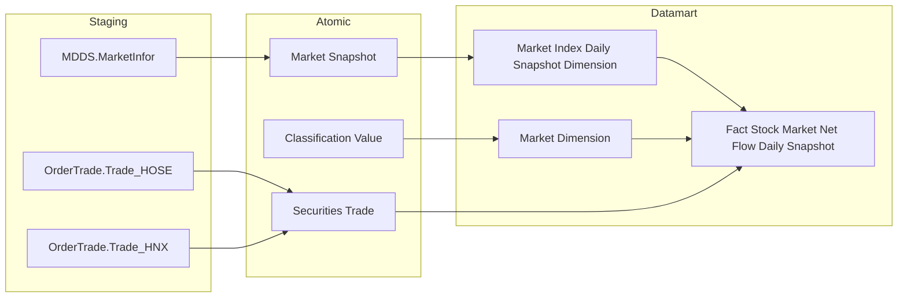

### Cụm 2 — Fact Derivative Market Daily Snapshot

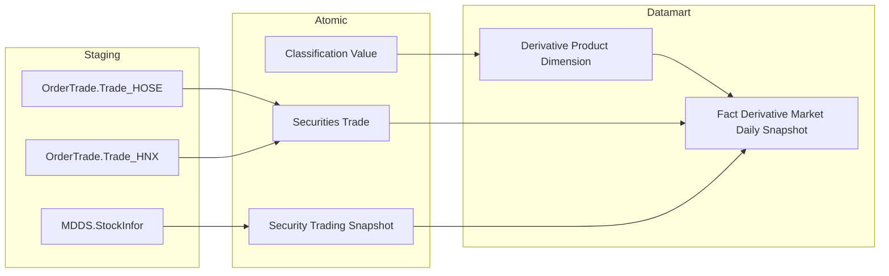

### Cụm 3 — Fact Derivative Contract Price Daily Snapshot

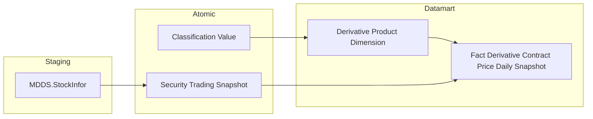

### Cụm 4 — Fact Listed Corporate Bond Trading Daily Snapshot

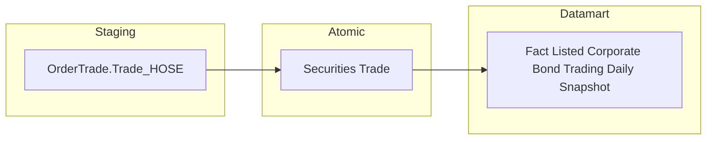

### Cụm 5 — Fact Listed Corporate Bond Market Daily Snapshot

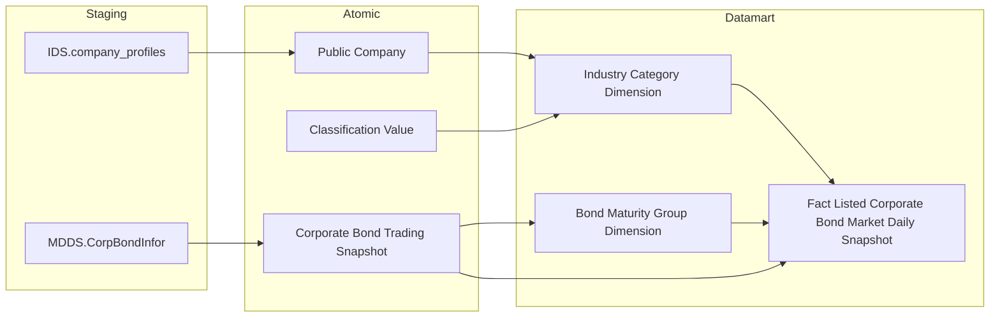

### Cụm 6 — Fact Government Bond Trading Daily Snapshot

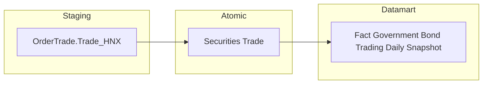

### Cụm 7 — Fact Stock Market Capitalization Daily Snapshot

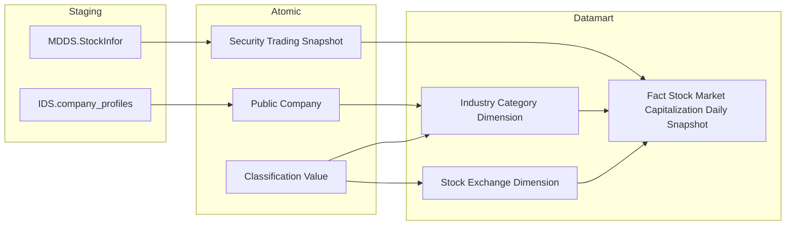

> **Ghi chú:** `Calendar Date Dimension` không vẽ trong lineage (ETL tự sinh). `Industry Category Dimension` là **Conformed Dimension** dùng chung cross-module — vẽ lại trong Cụm 7 vì join path từ Atomic khác (cổ phiếu: `scr_tdg_snpst.symb → pblc_co.eqty_ticker`; TPDN: `corp_bond_tdg_snpst.symb → pblc_co.bond_ticker`), nhưng cả hai đều resolve về cùng entity `Public Company` và cùng cột `idy_cgy_level1_code` — schema Dimension không thay đổi.

---

### Cụm 8 — Fact Securities Issuance Snapshot

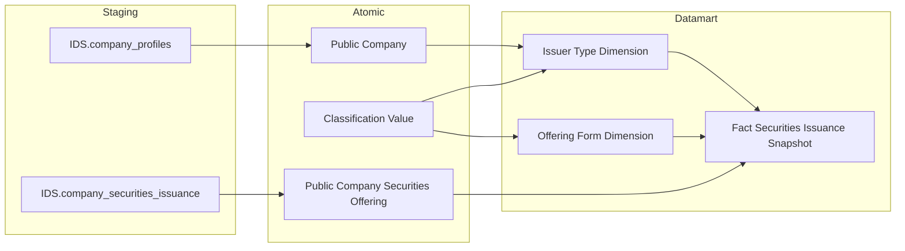

> **Ghi chú Offering Form Dimension:** Dim này seed từ `Classification Value` — 5 giá trị (PUBLIC / PRIVATE / ESOP / DIVIDEND_CAPITAL / CONVERSION) là ETL pivot logic, không có bảng Staging riêng feed vào. LLC_CAPITAL bỏ hoàn toàn — xem O_HDV_2 và O_BCN_1. DIVIDEND_CAPITAL gom 3 sub-type Atomic: `rslt_dvdn_issn_qty` + `rslt_own_cptl_issn_qty` + `rslt_bns_shr_issn_qty`. DIVIDEND_CAPITAL và CONVERSION pending price field (O_BCN_2, O_BCN_3). Link `Classification Value → Offering Form Dimension` phản ánh pattern seed từ CV.

> **Ghi chú Issuer Type Dimension:** Dim seed từ `Classification Value` — 3 giá trị tĩnh (CTĐC / CTCK / CTQLQ). CTCK và CTQLQ chưa có Atomic source feed data vào Fact (O_HDV_1).

> **Ghi chú Biểu đồ tổng hợp:** Biểu đồ "Giá trị HĐV tổng hợp Cổ phiếu + TPDN + TPCP" yêu cầu `Fact Capital Raising Monthly Snapshot` gộp 3 loại CK — thiết kế PENDING do series TPDN và TPCP chưa có Atomic source (O_HDV_4, O_HDV_5, O_HDV_6). Cụm 8 chỉ cover Cổ phiếu từ `Public Company Securities Offering`.

---

### Cụm 9 — Fact Foreign Investor Net Flow Daily Snapshot

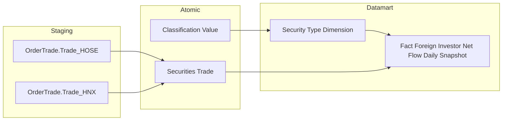

> **Ghi chú `Security Type Dimension`:** Seed dim tĩnh 7 giá trị — ETL derive loại CK từ `scr_trd.mkt_id_code` theo rule: STO/STX/UPX → Cổ phiếu (cần thêm filter `symb_code` cho CCQ và Chứng quyền); BDO → TPDN Niêm yết; BDX → TPCP; DVX → Phái sinh. Giá trị cụ thể xem O_NDTNN_2.
>
> **Ghi chú TPDN Riêng lẻ:** Row `Security_Type_Code = 'CORP_BOND_OTC'` PENDING do O_TPDN_1 — ETL bỏ qua row này cho đến khi Atomic TKNB READY.

---

### Cụm 10 — Fact Foreign Investor Net Flow By Industry Daily Snapshot

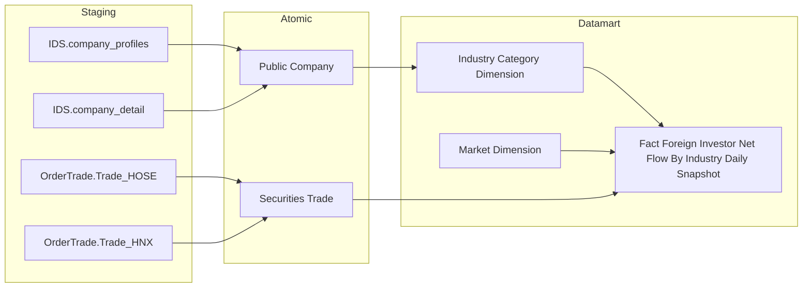

> **Ghi chú join chain:** ETL phải join `scr_trd.symb_code → pblc_co.equity_ticker` (Cổ phiếu) hoặc `scr_trd.symb_code → pblc_co.bond_ticker` (TPDN Niêm yết) để lấy `idy_cgy_level1_code`. LEFT JOIN — nullable khi mã CK không có `pblc_co` tương ứng. Rows NULL Ngành bị loại khỏi Fact này (xem grain).
>
> **Ghi chú `Market Dimension`:** Reuse dim đã có từ Cụm 1 (HLD v1.7) — chỉ cover STO / STX / UPX (Cổ phiếu + TPDN Niêm yết trên sàn).

---

### Cụm 11 — Fact Foreign Investor Capital Flow Snapshot

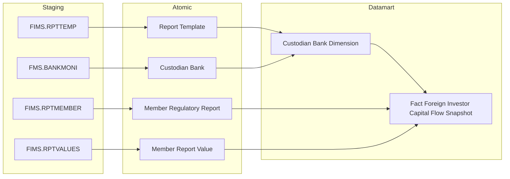

> **Ghi chú ETL lookup:** ETL filter `mbr_reg_rpt.rpt_tpl_code = {{FIMS_TPL_CAPFLOW}}` (mã biểu mẫu "Báo cáo hoạt động chu chuyển vốn NĐTNN" — placeholder, ETL developer profile từ `RPTTEMP.Code`). Sau đó join `Member Report Value` và filter `cell_code IN ({{FIMS_CELL_INFLOW}}, {{FIMS_CELL_OUTFLOW}})`. Giá trị `cell_val` là Text — ETL CAST sang decimal.
>
> **Ghi chú kỳ nửa tháng:** `mbr_reg_rpt.rpt_prd_tp_code = {{FIMS_PERIOD_SEMI_MONTHLY}}` — placeholder, cần BA xác nhận giá trị `PeriodType` trong FIMS.RPTMEMBER cho kỳ nửa tháng (xem O_NDTNN_3).

---

### Cụm 12 — Fact Investor Trading Account Daily Snapshot

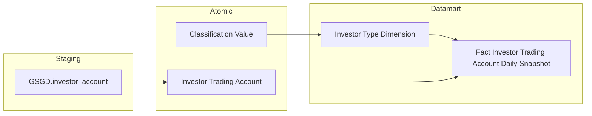

---

## Section 2 — Tổng quan báo cáo

### Tab Cổ phiếu

#### Nhóm 1 — Biểu đồ Giá trị mua/bán ròng NĐTNN và chỉ số Index

> Phân loại: **Phân tích**
> Atomic: `Market Snapshot` ← MDDS.MarketInfor — **READY**
> Atomic: `Securities Trade` ← OrderTrade.Trade_HOSE, OrderTrade.Trade_HNX — **READY**

**Mockup:**

| Bộ lọc | Giá trị |
|---|---|
| Kỳ | Ngày / Tháng / Quý / Năm |
| Từ ngày → Đến ngày | 19/02/2026 → 25/02/2026 |
| Phạm vi | Toàn thị trường / HOSE / HNX / UPCOM |

| Trục | Nội dung |
|---|---|
| Trục Y trái | GT mua/bán ròng NĐTNN (Tỷ đồng) — biểu đồ cột |
| Trục Y phải | Giá trị chỉ số VN-Index / HNX-Index / UPCOM-Index (Điểm) — đường |
| Trục X | Ngày giao dịch |

**Source:** `Fact Stock Market Net Flow Daily Snapshot` → `Market Index Daily Snapshot Dimension`, `Calendar Date Dimension`, `Market Dimension`

**Bảng KPI:**

| KPI ID | Tên KPI | Đơn vị | Tính chất | Công thức / Nguồn |
|---|---|---|---|---|
| K_VP_1 | Giá trị chỉ số | Điểm | Cơ sở | `Market Index Daily Snapshot Dimension.Closing Index Value` — ETL lấy bản tin `MAX(mkt_snpst.indx_tm)` per `(mkt_id × tdg_dt)`, filter `mkt_id IN ('10','02','04')` |
| K_VP_1a | Giá trị chỉ số VN-Index | Điểm | Cơ sở | K_VP_1 filter `Market Id Code = '10'` |
| K_VP_1b | Giá trị chỉ số HNX-Index | Điểm | Cơ sở | K_VP_1 filter `Market Id Code = '02'` |
| K_VP_1c | Giá trị chỉ số UPCOM-Index | Điểm | Cơ sở | K_VP_1 filter `Market Id Code = '04'` |
| K_VP_2 | GT mua NĐTNN | Tỷ đồng | Cơ sở | `Fact.Foreign_Investor_Buy_Value` — ETL: `SUM(scr_trd.exec_val WHERE scr_trd.buy_frgn_ivsr_tp_code <> '00')` GROUP BY `(trd_dt × mkt_id_code)`, filter `mkt_id_code IN ('STO','STX','UPX')` |
| K_VP_3 | GT bán NĐTNN | Tỷ đồng | Cơ sở | `Fact.Foreign_Investor_Sell_Value` — ETL: `SUM(scr_trd.exec_val WHERE scr_trd.sell_frgn_ivsr_tp_code <> '00')` GROUP BY `(trd_dt × mkt_id_code)` |
| K_VP_4 | GT mua/bán ròng NĐTNN | Tỷ đồng | **Phái sinh** | `Fact.Foreign_Investor_Buy_Value − Fact.Foreign_Investor_Sell_Value` — tính tại query layer |
| K_VP_4a | GT mua/bán ròng NĐTNN — HOSE | Tỷ đồng | **Phái sinh** | K_VP_4 filter `Market Dimension.Market Id Code = 'STO'` |
| K_VP_4b | GT mua/bán ròng NĐTNN — HNX | Tỷ đồng | **Phái sinh** | K_VP_4 filter `Market Dimension.Market Id Code = 'STX'` |
| K_VP_4c | GT mua/bán ròng NĐTNN — UPCOM | Tỷ đồng | **Phái sinh** | K_VP_4 filter `Market Dimension.Market Id Code = 'UPX'` |

> **Ghi chú Atomic exec_val HNX:** `Trade_HNX` không có trường `Execution - Value` trong nguồn; ETL Atomic tính `exec_prc × exec_vol` và lưu vào `scr_trd.exec_val`. Datamart ETL đọc trực tiếp.

**Star Schema:**

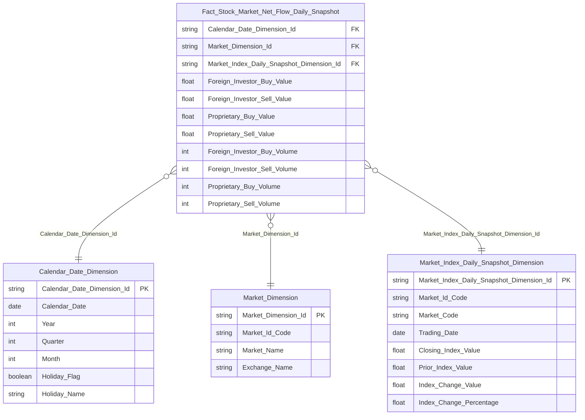

**Lineage Mart → Báo cáo:**

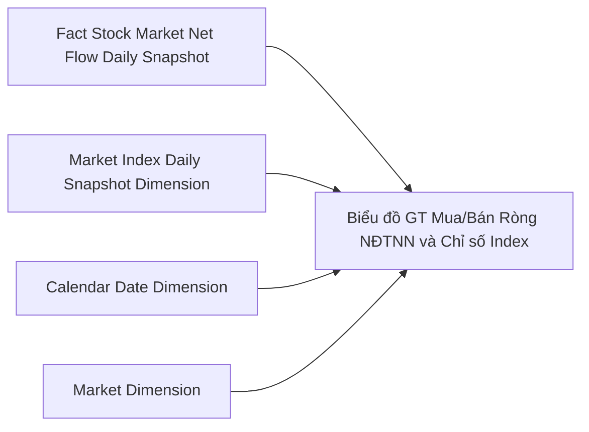

**Bảng grain:**

| Tên bảng | Grain |
|---|---|
| Fact Stock Market Net Flow Daily Snapshot | 1 row / Ngày giao dịch × Sàn (STO / STX / UPX) |
| Market Index Daily Snapshot Dimension | 1 row / Ngày × Mã chỉ số ('10' / '02' / '04') — bản tin `MAX(Index Time)` trong ngày |
| Calendar Date Dimension | 1 row / Ngày dương lịch (Conformed dim) |
| Market Dimension | 1 row / Mã thị trường — seed 8 giá trị CV scheme `ORDERTRADE_MARKET_ID` |

---

#### Nhóm 2 — Biểu đồ Giá trị mua/bán ròng Tự doanh và chỉ số Index

> Phân loại: **Phân tích**
> Atomic: `Market Snapshot` ← MDDS.MarketInfor — **READY**
> Atomic: `Securities Trade` ← OrderTrade.Trade_HOSE, OrderTrade.Trade_HNX — **READY**

> Nhóm 2 dùng **cùng Fact** với Nhóm 1 — chỉ khác cột measure. Không tạo Fact riêng.

**Bảng KPI:**

| KPI ID | Tên KPI | Đơn vị | Tính chất | Công thức / Nguồn |
|---|---|---|---|---|
| K_VP_5 | GT mua Tự doanh | Tỷ đồng | Cơ sở | `Fact.Proprietary_Buy_Value` — ETL: `SUM(scr_trd.exec_val WHERE scr_trd.buy_clnt_hs_tp_code = '30')` GROUP BY `(trd_dt × mkt_id_code)`, filter `mkt_id_code IN ('STO','STX','UPX')` |
| K_VP_6 | GT bán Tự doanh | Tỷ đồng | Cơ sở | `Fact.Proprietary_Sell_Value` — ETL: `SUM(scr_trd.exec_val WHERE scr_trd.sell_clnt_hs_tp_code = '30')` GROUP BY `(trd_dt × mkt_id_code)` |
| K_VP_7 | GT mua/bán ròng Tự doanh | Tỷ đồng | **Phái sinh** | `Fact.Proprietary_Buy_Value − Fact.Proprietary_Sell_Value` — tính tại query layer _(override BA: BA ghi "Cơ sở" — đổi thành Phái sinh để đồng nhất với K_VP_4, quyết định O_VP_4)_ |
| K_VP_7a | GT mua/bán ròng Tự doanh — HOSE | Tỷ đồng | **Phái sinh** | K_VP_7 filter `Market Dimension.Market Id Code = 'STO'` |
| K_VP_7b | GT mua/bán ròng Tự doanh — HNX | Tỷ đồng | **Phái sinh** | K_VP_7 filter `Market Dimension.Market Id Code = 'STX'` |
| K_VP_7c | GT mua/bán ròng Tự doanh — UPCOM | Tỷ đồng | **Phái sinh** | K_VP_7 filter `Market Dimension.Market Id Code = 'UPX'` |
| K_VP_8 | Giá trị chỉ số (Biểu đồ 2) | Điểm | Cơ sở | Trùng K_VP_1 — `Market Index Daily Snapshot Dimension.Closing Index Value` |

**Star Schema:** Dùng chung Star Schema Nhóm 1.

**Lineage Mart → Báo cáo:**

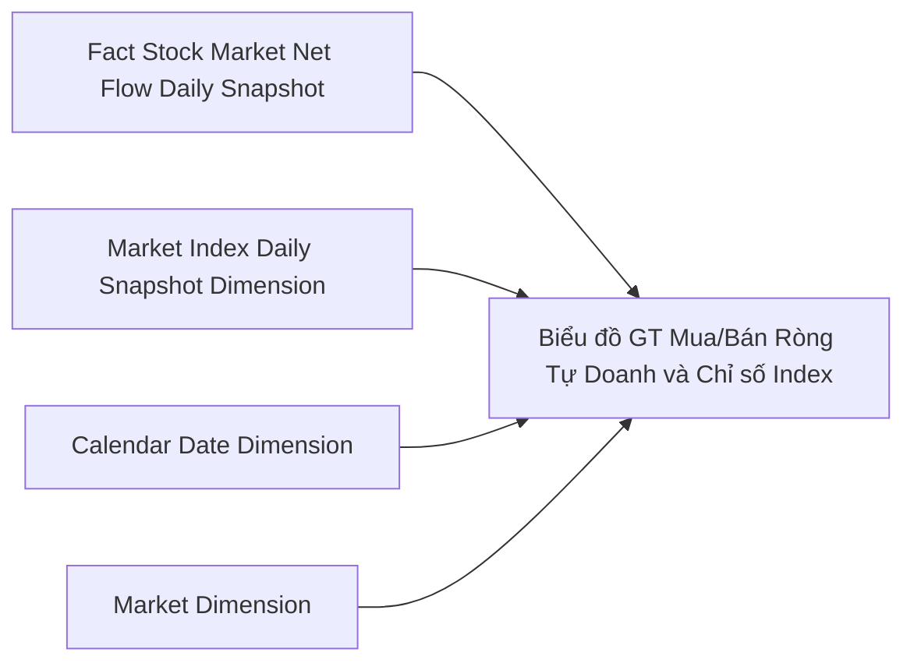

**Bảng grain:** Dùng chung bảng grain Nhóm 1.

---

### Tab Phái sinh

#### Nhóm 1 — Chỉ tiêu tổng hợp (Thẻ KPI)

> Phân loại: **Phân tích**
> Atomic: `Securities Trade` ← OrderTrade.Trade_HOSE, OrderTrade.Trade_HNX — **READY**
> Atomic: `Security Trading Snapshot` ← MDDS.StockInfor — **READY**

**Mockup:**

| Bộ lọc | Giá trị |
|---|---|
| Kỳ | Ngày / Tháng / Quý / Năm |
| Ngày | 25/02/2026 |
| Sản phẩm phái sinh | HĐTL VN30 / HĐTL VN100 / HĐTL TPCP / Toàn thị trường |

| Thẻ KPI | Nội dung |
|---|---|
| Tổng KLGD | Tổng khối lượng giao dịch (Hợp đồng) |
| KL mở (OI) | Khối lượng hợp đồng mở cuối ngày |
| Số lượng tài khoản PS | Số tài khoản có giao dịch phái sinh |
| Giá HĐTL | Giá đóng cửa theo kỳ hạn F1M / F2M / F1Q / F2Q |
| KLGD NĐTNN | Mua / Bán / Ròng (Hợp đồng) |

**Source:**
- KLGD / OI / Số TK / NĐTNN KL: `Fact Derivative Market Daily Snapshot` → `Calendar Date Dimension`, `Derivative Product Dimension`
- Giá HĐTL: `Fact Derivative Contract Price Daily Snapshot` → `Calendar Date Dimension`, `Derivative Product Dimension`

**Bảng KPI:**

| KPI ID | Tên KPI | Đơn vị | Tính chất | Công thức / Nguồn |
|---|---|---|---|---|
| K_VP_9 | Tổng KLGD | Hợp đồng | Cơ sở | `Fact.Total_Exec_Volume` — ETL: `SUM(scr_trd.exec_vol WHERE scr_trd.mkt_id_code = 'DVX')` GROUP BY `(trd_dt × ulyg_symb)` |
| K_VP_9a | Tổng KLGD — HĐTL VN30 | Hợp đồng | Cơ sở | K_VP_9 filter `Derivative Product Dimension.Underlying Symbol = 'VN30'` |
| K_VP_9b | Tổng KLGD — HĐTL VN100 | Hợp đồng | Cơ sở | K_VP_9 filter `Derivative Product Dimension.Underlying Symbol = 'VN100'` |
| K_VP_9c | Tổng KLGD — HĐTL TPCP | Hợp đồng | Cơ sở | K_VP_9 filter `Derivative Product Dimension.Underlying Symbol = 'TPCP'` |
| K_VP_9d | Tổng KLGD — Toàn thị trường | Hợp đồng | Cơ sở | K_VP_9 filter `Derivative Product Dimension.Underlying Symbol = 'ALL'` |
| K_VP_10 | Khối lượng mở (OI) | Hợp đồng | Cơ sở | `Fact.Open_Interest_Volume` — ETL: `SUM(scr_tdg_snpst.opn_int WHERE scr_tdg_snpst.flr_code = '03')` GROUP BY `(tdg_dt × ulyg_symb)` |
| K_VP_10a | OI — HĐTL VN30 | Hợp đồng | Cơ sở | K_VP_10 filter `Derivative Product Dimension.Underlying Symbol = 'VN30'` |
| K_VP_10b | OI — HĐTL VN100 | Hợp đồng | Cơ sở | K_VP_10 filter `Derivative Product Dimension.Underlying Symbol = 'VN100'` |
| K_VP_10c | OI — HĐTL TPCP | Hợp đồng | Cơ sở | K_VP_10 filter `Derivative Product Dimension.Underlying Symbol = 'TPCP'` |
| K_VP_10d | OI — Toàn thị trường | Hợp đồng | Cơ sở | K_VP_10 filter `Derivative Product Dimension.Underlying Symbol = 'ALL'` |
| K_VP_11 | Số lượng tài khoản PS | Tài khoản | Cơ sở | `Fact.Trading_Account_Count` — ETL: `COUNT DISTINCT(scr_trd.buy_ac_nbr UNION ALL scr_trd.sell_ac_nbr) WHERE scr_trd.mkt_id_code = 'DVX'` GROUP BY `(trd_dt × ulyg_symb)` |
| K_VP_11a | Số TK PS — HĐTL VN30 | Tài khoản | Cơ sở | K_VP_11 filter `Derivative Product Dimension.Underlying Symbol = 'VN30'` |
| K_VP_11b | Số TK PS — HĐTL VN100 | Tài khoản | Cơ sở | K_VP_11 filter `Derivative Product Dimension.Underlying Symbol = 'VN100'` |
| K_VP_11c | Số TK PS — HĐTL TPCP | Tài khoản | Cơ sở | K_VP_11 filter `Derivative Product Dimension.Underlying Symbol = 'TPCP'` |
| K_VP_11d | Số TK PS — Toàn thị trường | Tài khoản | Cơ sở | K_VP_11 filter `Derivative Product Dimension.Underlying Symbol = 'ALL'` |
| K_VP_12 | KL mua NĐTNN | Hợp đồng | Cơ sở | `Fact.Foreign_Investor_Buy_Volume` — ETL: `SUM(scr_trd.exec_vol WHERE scr_trd.buy_frgn_ivsr_tp_code <> '00' AND scr_trd.mkt_id_code = 'DVX')` GROUP BY `(trd_dt × ulyg_symb)` |
| K_VP_13 | KL bán NĐTNN | Hợp đồng | Cơ sở | `Fact.Foreign_Investor_Sell_Volume` — ETL: `SUM(scr_trd.exec_vol WHERE scr_trd.sell_frgn_ivsr_tp_code <> '00' AND scr_trd.mkt_id_code = 'DVX')` GROUP BY `(trd_dt × ulyg_symb)` |
| K_VP_14 | KL mua/bán ròng NĐTNN | Hợp đồng | **Phái sinh** | `Fact.Foreign_Investor_Buy_Volume − Fact.Foreign_Investor_Sell_Volume` — tính tại query layer |
| K_VP_15 | % thay đổi KLGD so với kỳ trước | % | **Phái sinh** | `(K_VP_9[kỳ này] − K_VP_9[kỳ trước]) / K_VP_9[kỳ trước] × 100` — tính tại query layer |
| K_VP_16 | % thay đổi OI so với kỳ trước | % | **Phái sinh** | `(K_VP_10[kỳ này] − K_VP_10[kỳ trước]) / K_VP_10[kỳ trước] × 100` — tính tại query layer |
| K_VP_17 | Giá HĐTL theo kỳ hạn | Điểm | Cơ sở | `Fact Derivative Contract Price Daily Snapshot.Close_Price` filter theo `Maturity_Rank_Code` |
| K_VP_17a | Giá HĐTL — F1M | Điểm | Cơ sở | K_VP_17 filter `Maturity_Rank_Code = 'F1M'` |
| K_VP_17b | Giá HĐTL — F2M | Điểm | Cơ sở | K_VP_17 filter `Maturity_Rank_Code = 'F2M'` |
| K_VP_17c | Giá HĐTL — F1Q | Điểm | Cơ sở | K_VP_17 filter `Maturity_Rank_Code = 'F1Q'` |
| K_VP_17d | Giá HĐTL — F2Q | Điểm | Cơ sở | K_VP_17 filter `Maturity_Rank_Code = 'F2Q'` |

**Star Schema — Fact 1 (KLGD / OI / Số TK / NĐTNN):**

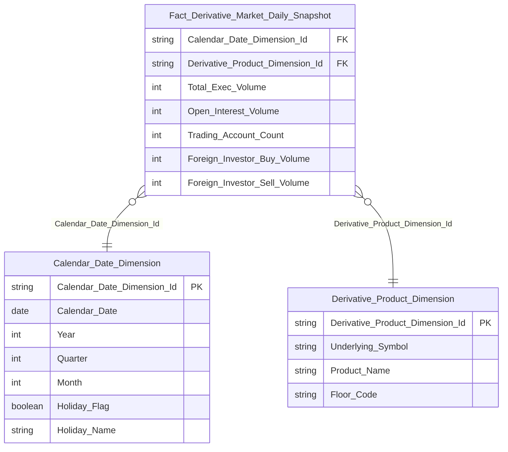

**Star Schema — Fact 2 (Giá HĐTL):**

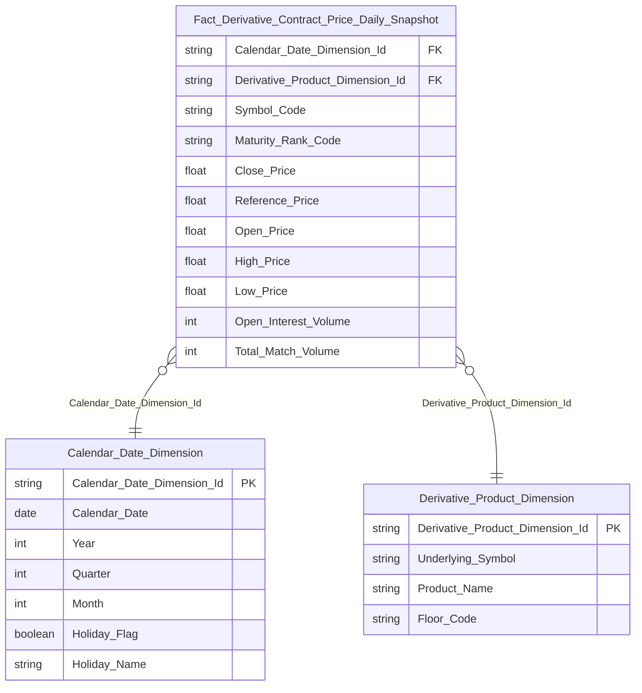

> `Symbol_Code` và `Maturity_Rank_Code` là Degenerate Dimension. ETL derive `Maturity_Rank_Code` bằng `RANK() OVER (PARTITION BY trd_dt, ulyg_symb ORDER BY mat_dt)` → F1M / F2M / F1Q / F2Q.

**Lineage Mart → Báo cáo:**

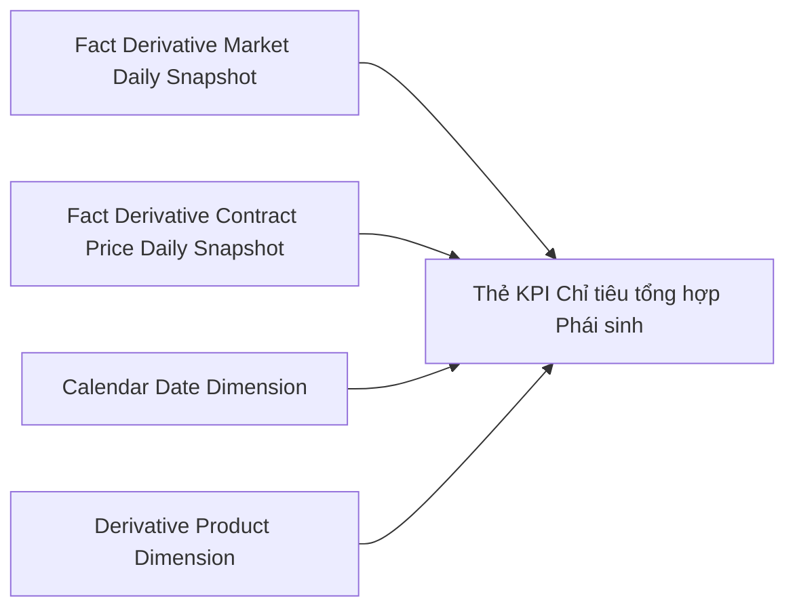

**Bảng grain:**

| Tên bảng | Grain |
|---|---|
| Fact Derivative Market Daily Snapshot | 1 row / Ngày × Sản phẩm (VN30 / VN100 / TPCP / ALL) |
| Fact Derivative Contract Price Daily Snapshot | 1 row / Ngày × Sản phẩm × Maturity Rank Code (F1M / F2M / F1Q / F2Q) |
| Calendar Date Dimension | 1 row / Ngày dương lịch (Conformed dim) |
| Derivative Product Dimension | 1 row / Sản phẩm (VN30 / VN100 / TPCP / ALL) |

---

#### Nhóm 2 — Biểu đồ Diễn biến giao dịch thị trường phái sinh

> Phân loại: **Phân tích**
> Atomic: `Securities Trade` ← OrderTrade.Trade_HOSE, OrderTrade.Trade_HNX — **READY**
> Atomic: `Security Trading Snapshot` ← MDDS.StockInfor — **READY**

> Nhóm 2 dùng **cùng Fact 1** (`Fact Derivative Market Daily Snapshot`) — không tạo Fact riêng.

**Bảng KPI:**

| KPI ID | Tên KPI | Đơn vị | Tính chất | Công thức / Nguồn |
|---|---|---|---|---|
| K_VP_18 | KLGD (Biểu đồ diễn biến) | Hợp đồng | Cơ sở | Trùng K_VP_9 — `Fact Derivative Market Daily Snapshot.Total_Exec_Volume` |
| K_VP_19 | KL mở OI (Biểu đồ diễn biến) | Hợp đồng | Cơ sở | Trùng K_VP_10 — `Fact Derivative Market Daily Snapshot.Open_Interest_Volume` |

**Lineage Mart → Báo cáo:**

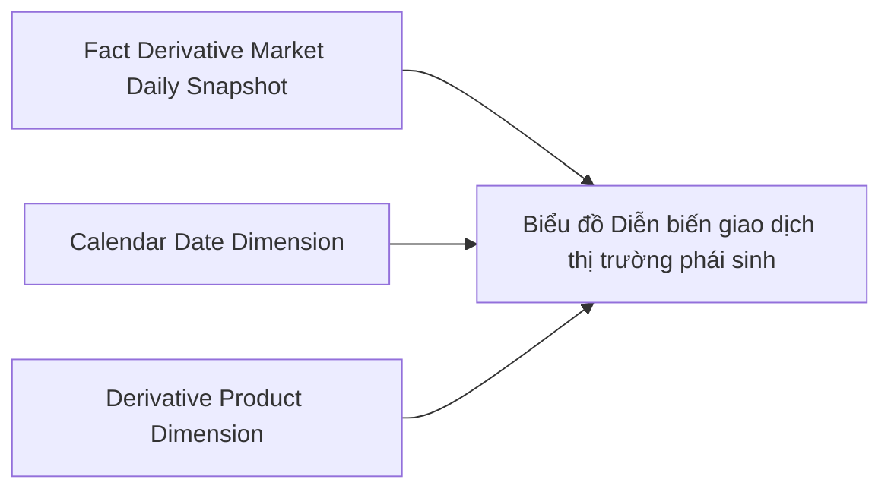

**Bảng grain:** Dùng chung bảng grain Nhóm 1.

---

#### Nhóm 3 — Biểu đồ Khối lượng mua/bán ròng NĐTNN Phái sinh

> Phân loại: **Phân tích**
> Atomic: `Securities Trade` ← OrderTrade.Trade_HOSE, OrderTrade.Trade_HNX — **READY**

> Nhóm 3 dùng **cùng Fact 1** (`Fact Derivative Market Daily Snapshot`) — không tạo Fact riêng.

**Bảng KPI:**

| KPI ID | Tên KPI | Đơn vị | Tính chất | Công thức / Nguồn |
|---|---|---|---|---|
| K_VP_20 | KLGD mua NĐTNN (Biểu đồ) | Hợp đồng | Cơ sở | Trùng K_VP_12 — `Fact Derivative Market Daily Snapshot.Foreign_Investor_Buy_Volume` |
| K_VP_21 | KLGD bán NĐTNN (Biểu đồ) | Hợp đồng | Cơ sở | Trùng K_VP_13 — `Fact Derivative Market Daily Snapshot.Foreign_Investor_Sell_Volume` |
| K_VP_22 | KL mua/bán ròng NĐTNN (Biểu đồ) | Hợp đồng | **Phái sinh** | Trùng K_VP_14 — tính tại query layer |

**Lineage Mart → Báo cáo:**

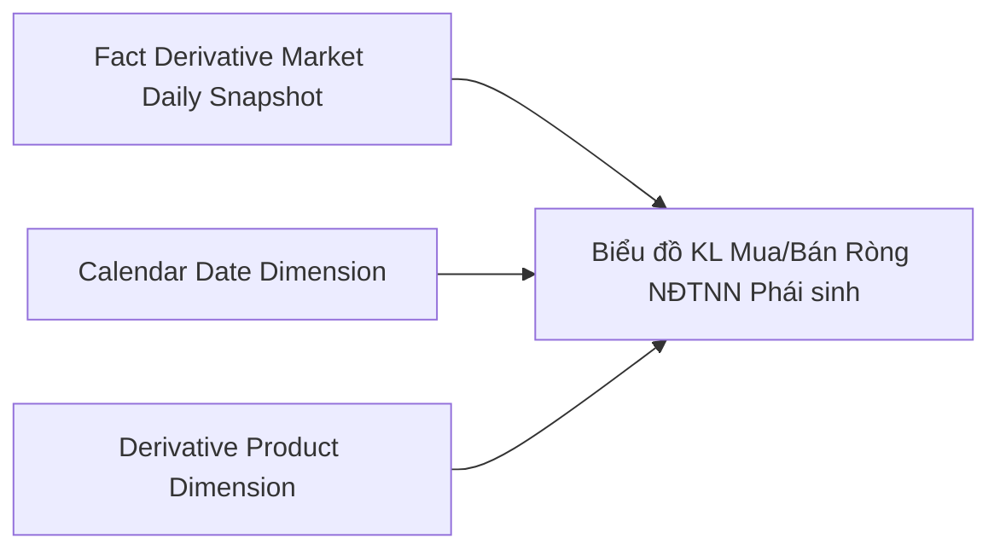

**Bảng grain:** Dùng chung bảng grain Nhóm 1.

---

### Tab TPDN Niêm yết

#### Nhóm 1 — Chỉ tiêu tổng hợp (Thẻ KPI)

> Phân loại: **Phân tích**
> Atomic: `Securities Trade` ← OrderTrade.Trade_HOSE — **READY**

**Mockup:**

| Bộ lọc | Giá trị |
|---|---|
| Kỳ | Ngày / Tháng / Quý / Năm |
| Từ ngày → Đến ngày | 19/02/2026 → 25/02/2026 |

| Thẻ KPI | Nội dung |
|---|---|
| Tổng KLGD | Tổng khối lượng TPDN Niêm yết giao dịch (Trái phiếu) |
| Tổng GTGD | Tổng giá trị giao dịch (Tỷ đồng) |
| GTGD bình quân phiên (YTD) | GTGD / Số phiên từ đầu năm |
| Số mã TP Niêm yết | Số mã TPDN đang niêm yết cuối kỳ |
| GTGD NĐTNN | Mua / Bán / Ròng (Tỷ đồng) |

**Source:** `Fact Listed Corporate Bond Trading Daily Snapshot` → `Calendar Date Dimension`

**Bảng KPI:**

| KPI ID | Tên KPI | Đơn vị | Tính chất | Công thức / Nguồn |
|---|---|---|---|---|
| K_VP_23 | Tổng KLGD TPDN Niêm yết | Trái phiếu | Cơ sở | `Fact.Total_Exec_Volume` — ETL: `SUM(scr_trd.exec_vol WHERE scr_trd.mkt_id_code = 'BDO')` GROUP BY `trd_dt` |
| K_VP_24 | Tổng GTGD TPDN Niêm yết | Tỷ đồng | Cơ sở | `Fact.Total_Exec_Value` — ETL: `SUM(scr_trd.exec_val WHERE scr_trd.mkt_id_code = 'BDO')` GROUP BY `trd_dt` |
| K_VP_25 | GTGD bình quân phiên (YTD) | Tỷ đồng | **Phái sinh** | `SUM(Fact.Total_Exec_Value WHERE year = current_year) / COUNT DISTINCT(trading_days WHERE year = current_year)` — tính tại query layer |
| K_VP_26 | Số mã TP Niêm yết | Mã | Cơ sở | `Fact Listed Corporate Bond Market Daily Snapshot.Listed_Bond_Count` — lấy tại ngày cuối kỳ |
| K_VP_27 | GT mua NĐTNN | Tỷ đồng | Cơ sở | `Fact.Foreign_Investor_Buy_Value` — ETL: `SUM(scr_trd.exec_val WHERE scr_trd.buy_frgn_ivsr_tp_code <> '00' AND scr_trd.mkt_id_code = 'BDO')` GROUP BY `trd_dt` |
| K_VP_28 | GT bán NĐTNN | Tỷ đồng | Cơ sở | `Fact.Foreign_Investor_Sell_Value` — ETL: `SUM(scr_trd.exec_val WHERE scr_trd.sell_frgn_ivsr_tp_code <> '00' AND scr_trd.mkt_id_code = 'BDO')` GROUP BY `trd_dt` |
| K_VP_29 | GT mua/bán ròng NĐTNN | Tỷ đồng | **Phái sinh** | `Fact.Foreign_Investor_Buy_Value − Fact.Foreign_Investor_Sell_Value` — tính tại query layer |
| K_VP_30 | % thay đổi so với kỳ trước | % | **Phái sinh** | `(Giá trị kỳ này − Giá trị kỳ trước) / Giá trị kỳ trước × 100` — tính tại query layer từng KPI cơ sở |

**Star Schema — Nhóm 1:**

```mermaid
erDiagram
    Fact_Listed_Corporate_Bond_Trading_Daily_Snapshot {
        string Calendar_Date_Dimension_Id FK
        int Total_Exec_Volume
        float Total_Exec_Value
        float Foreign_Investor_Buy_Value
        float Foreign_Investor_Sell_Value
    }
    Calendar_Date_Dimension {
        string Calendar_Date_Dimension_Id PK
        date Calendar_Date
        int Year
        int Quarter
        int Month
        boolean Holiday_Flag
        string Holiday_Name
    }
    Fact_Listed_Corporate_Bond_Trading_Daily_Snapshot }o--|| Calendar_Date_Dimension : "Calendar_Date_Dimension_Id"
```

**Lineage Mart → Báo cáo:**

```mermaid
flowchart LR
    F4[Fact Listed Corporate Bond Trading Daily Snapshot]
    D2[Calendar Date Dimension]
    R4[Thẻ KPI Chỉ tiêu tổng hợp TPDN Niêm yết]
    F4 --> R4
    D2 --> R4
```

**Bảng grain:**

| Tên bảng | Grain |
|---|---|
| Fact Listed Corporate Bond Trading Daily Snapshot | 1 row / Ngày giao dịch |
| Calendar Date Dimension | 1 row / Ngày dương lịch (Conformed dim) |

---

#### Nhóm 2 — Bảng Thống kê TPDN Niêm yết theo Ngành × Kỳ hạn

> Phân loại: **Phân tích**
> Atomic: `Corporate Bond Trading Snapshot` ← MDDS.CorpBondInfor — **READY**
> Atomic: `Public Company` ← IDS.company_profiles — **READY**

**Mockup:**

| Ngành | Kỳ hạn | Số mã TP | Tổng GTGD (Tỷ đồng) | Kỳ hạn còn lại BQ (Năm) | KL TP đang LH |
|---|---|---|---|---|---|
| TỔNG | Dưới 1 năm | 51 | 1.240 | 0,6 | 7.623 |
| TỔNG | 1-3 năm | 22 | 5.420 | 2,4 | 48.506 |
| TÀI CHÍNH | 1-3 năm | 42 | 1.820 | 2,1 | 26.601 |

**Source:** `Fact Listed Corporate Bond Market Daily Snapshot` → `Calendar Date Dimension`, `Industry Category Dimension`, `Bond Maturity Group Dimension`

**Bảng KPI:**

| KPI ID | Tên KPI | Đơn vị | Tính chất | Công thức / Nguồn |
|---|---|---|---|---|
| K_VP_31 | Tổng GTGD theo Ngành × Kỳ hạn | Tỷ đồng | Cơ sở | `Fact.Total_Exec_Value` GROUP BY `(trd_dt × idy_cgy_level1_code × bond_maturity_group_code)` |
| K_VP_32 | Số mã TP Niêm yết theo Ngành × Kỳ hạn | Mã | Cơ sở | `Fact.Listed_Bond_Count` — ETL: `COUNT DISTINCT(corp_bond_tdg_snpst.symb)` per `(tdg_dt × idy_cgy_level1_code × bond_maturity_group_code)` |
| K_VP_33 | KL TP đang lưu hành theo Ngành × Kỳ hạn | Trái phiếu | Cơ sở | `Fact.Total_Listing_Volume` — ETL: `SUM(corp_bond_tdg_snpst.tot_listing_vol)` per `(tdg_dt × idy_cgy_level1_code × bond_maturity_group_code)` |
| K_VP_34 | Kỳ hạn còn lại bình quân | Năm | **Phái sinh** | `Fact.Weighted_Period_Remaining / Fact.Total_Par_Value_Amount` — tính tại query layer |

**Star Schema — Nhóm 2:**

```mermaid
erDiagram
    Fact_Listed_Corporate_Bond_Market_Daily_Snapshot {
        string Calendar_Date_Dimension_Id FK
        string Industry_Category_Dimension_Id FK
        string Bond_Maturity_Group_Dimension_Id FK
        int Listed_Bond_Count
        int Total_Listing_Volume
        float Total_Par_Value_Amount
        float Total_Exec_Value
        float Weighted_Period_Remaining
    }
    Calendar_Date_Dimension {
        string Calendar_Date_Dimension_Id PK
        date Calendar_Date
        int Year
        int Quarter
        int Month
        boolean Holiday_Flag
        string Holiday_Name
    }
    Industry_Category_Dimension {
        string Industry_Category_Dimension_Id PK
        string Industry_Category_Level1_Code
        string Industry_Category_Level1_Name
    }
    Bond_Maturity_Group_Dimension {
        string Bond_Maturity_Group_Dimension_Id PK
        string Bond_Maturity_Group_Code
        string Bond_Maturity_Group_Name
        int Range_From_Year
        int Range_To_Year
        int Sort_Order
    }
    Fact_Listed_Corporate_Bond_Market_Daily_Snapshot }o--|| Calendar_Date_Dimension : "Calendar_Date_Dimension_Id"
    Fact_Listed_Corporate_Bond_Market_Daily_Snapshot }o--|| Industry_Category_Dimension : "Industry_Category_Dimension_Id"
    Fact_Listed_Corporate_Bond_Market_Daily_Snapshot }o--|| Bond_Maturity_Group_Dimension : "Bond_Maturity_Group_Dimension_Id"
```

> **Ghi chú K_VP_34:** `Weighted_Period_Remaining = SUM(prd_rman × tot_listing_vol × par_val)` lưu trên Fact — kỳ hạn còn lại bình quân = `Weighted_Period_Remaining / Total_Par_Value_Amount` tính tại query layer.
> **Ghi chú Industry Category:** chain 2 hop: `corp_bond_tdg_snpst.symb → pblc_co.bond_ticker → pblc_co.idy_cgy_level1_code`. LEFT JOIN vì `bond_ticker` nullable.

**Lineage Mart → Báo cáo:**

```mermaid
flowchart LR
    F5[Fact Listed Corporate Bond Market Daily Snapshot]
    D2[Calendar Date Dimension]
    D5[Industry Category Dimension]
    D6[Bond Maturity Group Dimension]
    R5[Bảng Thống kê TPDN Niêm yết theo Ngành]
    F5 --> R5
    D2 --> R5
    D5 --> R5
    D6 --> R5
```

**Bảng grain:**

| Tên bảng | Grain |
|---|---|
| Fact Listed Corporate Bond Market Daily Snapshot | 1 row / Ngày × Ngành (Level 1) × Nhóm kỳ hạn phát hành |
| Calendar Date Dimension | 1 row / Ngày dương lịch (Conformed dim) |
| Industry Category Dimension | 1 row / Mã ngành cấp 1 |
| Bond Maturity Group Dimension | 1 row / Nhóm kỳ hạn (Dưới 1 năm / 1-3 năm / 3-5 năm / Trên 5 năm) |

---

#### Nhóm 3 — Biểu đồ Diễn biến GTGD TPDN Niêm yết và TPDN Riêng lẻ

##### READY

> Phân loại: **Phân tích**
> Atomic: `Securities Trade` ← OrderTrade.Trade_HOSE — **READY**

> Series TPDN Niêm yết dùng **cùng Fact 1** (`Fact Listed Corporate Bond Trading Daily Snapshot`) — không tạo Fact riêng.

**Bảng KPI:**

| KPI ID | Tên KPI | Đơn vị | Tính chất | Công thức / Nguồn |
|---|---|---|---|---|
| K_VP_35 | GTGD TPDN Niêm yết (Biểu đồ) | Tỷ đồng | Cơ sở | Trùng K_VP_24 — `Fact Listed Corporate Bond Trading Daily Snapshot.Total_Exec_Value` |

##### PENDING

**KPI liên quan:** K_VP_36 — GTGD TPDN Riêng lẻ

**Lý do PENDING:** Nguồn TKNB (dữ liệu thống kê từ HNX) chưa có thiết kế Atomic entity.

**Atomic cần bổ sung:** Atomic entity cho báo cáo thống kê TPDN Riêng lẻ từ HNX (nguồn TKNB).

**Mart dự kiến:** `Fact Private Corporate Bond Trading Daily Snapshot` — grain dự kiến: 1 row / Ngày giao dịch.

---

#### Nhóm 4 — Biểu đồ GTGD TPDN theo Ngành (Donut Chart)

> Phân loại: **Phân tích**
> Atomic: `Corporate Bond Trading Snapshot` ← MDDS.CorpBondInfor — **READY**
> Atomic: `Public Company` ← IDS.company_profiles — **READY**

> Nhóm 4 dùng **cùng Fact 2** (`Fact Listed Corporate Bond Market Daily Snapshot`) — không tạo Fact riêng.

**Bảng KPI:**

| KPI ID | Tên KPI | Đơn vị | Tính chất | Công thức / Nguồn |
|---|---|---|---|---|
| K_VP_37 | GTGD TPDN theo Ngành | Tỷ đồng | Cơ sở | Trùng K_VP_31 — `Fact Listed Corporate Bond Market Daily Snapshot.Total_Exec_Value` GROUP BY Ngành |
| K_VP_38 | Tỷ trọng GTGD theo Ngành | % | **Phái sinh** | `K_VP_37[ngành] / SUM(K_VP_37) × 100` — tính tại query layer |

**Lineage Mart → Báo cáo:**

```mermaid
flowchart LR
    F5[Fact Listed Corporate Bond Market Daily Snapshot]
    D2[Calendar Date Dimension]
    D5[Industry Category Dimension]
    R6[Biểu đồ GTGD TPDN theo Ngành]
    F5 --> R6
    D2 --> R6
    D5 --> R6
```

**Bảng grain:** Dùng chung bảng grain Nhóm 2.

---

### Tab TPCP

#### Nhóm 1 — Chỉ tiêu tổng hợp (Thẻ KPI)

> Phân loại: **Phân tích**
> Atomic: `Securities Trade` ← OrderTrade.Trade_HNX — **READY**

**Mockup:**

| Bộ lọc | Giá trị |
|---|---|
| Kỳ | Ngày / Tháng / Quý / Năm |
| Ngày | 25/02/2026 |

| Thẻ KPI | Nội dung |
|---|---|
| Tổng KLGD | Tổng khối lượng TPCP giao dịch (Trái phiếu) |
| Tổng GTGD | Tổng giá trị giao dịch (Tỷ đồng) |
| GTGD NĐTNN | Mua / Bán / Ròng (Tỷ đồng) |

**Source:** `Fact Government Bond Trading Daily Snapshot` → `Calendar Date Dimension`

**Bảng KPI:**

| KPI ID | Tên KPI | Đơn vị | Tính chất | Công thức / Nguồn |
|---|---|---|---|---|
| K_VP_47 | Tổng KLGD TPCP | Trái phiếu | Cơ sở | `Fact.Total_Exec_Volume` — ETL: `SUM(scr_trd.exec_vol WHERE scr_trd.mkt_id_code = 'BDX')` GROUP BY `trd_dt` |
| K_VP_48 | Tổng GTGD TPCP | Tỷ đồng | Cơ sở | `Fact.Total_Exec_Value` — ETL: `SUM(scr_trd.exec_val WHERE scr_trd.mkt_id_code = 'BDX')` GROUP BY `trd_dt` |
| K_VP_49 | GT mua NĐTNN | Tỷ đồng | Cơ sở | `Fact.Foreign_Investor_Buy_Value` — ETL: `SUM(scr_trd.exec_val WHERE scr_trd.buy_frgn_ivsr_tp_code <> '00' AND scr_trd.mkt_id_code = 'BDX')` GROUP BY `trd_dt` |
| K_VP_50 | GT bán NĐTNN | Tỷ đồng | Cơ sở | `Fact.Foreign_Investor_Sell_Value` — ETL: `SUM(scr_trd.exec_val WHERE scr_trd.sell_frgn_ivsr_tp_code <> '00' AND scr_trd.mkt_id_code = 'BDX')` GROUP BY `trd_dt` |
| K_VP_51 | GT mua/bán ròng NĐTNN | Tỷ đồng | **Phái sinh** | `Fact.Foreign_Investor_Buy_Value − Fact.Foreign_Investor_Sell_Value` — tính tại query layer _(override BA nhóm 13 ghi "Cơ sở" — đổi thành Phái sinh để đồng nhất với pattern toàn module, quyết định O_TPCP_1)_ |
| K_VP_52 | % thay đổi so với kỳ trước | % | **Phái sinh** | `(Giá trị kỳ này − Giá trị kỳ trước) / Giá trị kỳ trước × 100` — tính tại query layer từng KPI cơ sở |

**Star Schema:**

```mermaid
erDiagram
    Fact_Government_Bond_Trading_Daily_Snapshot {
        string Calendar_Date_Dimension_Id FK
        int Total_Exec_Volume
        float Total_Exec_Value
        float Foreign_Investor_Buy_Value
        float Foreign_Investor_Sell_Value
    }
    Calendar_Date_Dimension {
        string Calendar_Date_Dimension_Id PK
        date Calendar_Date
        int Year
        int Quarter
        int Month
        boolean Holiday_Flag
        string Holiday_Name
    }
    Fact_Government_Bond_Trading_Daily_Snapshot }o--|| Calendar_Date_Dimension : "Calendar_Date_Dimension_Id"
```

**Lineage Mart → Báo cáo:**

```mermaid
flowchart LR
    F6[Fact Government Bond Trading Daily Snapshot]
    D2[Calendar Date Dimension]
    R7[Thẻ KPI Chỉ tiêu tổng hợp TPCP]
    F6 --> R7
    D2 --> R7
```

**Bảng grain:**

| Tên bảng | Grain |
|---|---|
| Fact Government Bond Trading Daily Snapshot | 1 row / Ngày giao dịch TPCP (`mkt_id_code = 'BDX'`) |
| Calendar Date Dimension | 1 row / Ngày dương lịch (Conformed dim) |

---

#### Nhóm 2 — Biểu đồ Diễn biến giao dịch thị trường TPCP

> Phân loại: **Phân tích**
> Atomic: `Securities Trade` ← OrderTrade.Trade_HNX — **READY**

> Nhóm 2 dùng **cùng Fact** (`Fact Government Bond Trading Daily Snapshot`) với Nhóm 1 — không tạo Fact riêng.

**Bảng KPI:**

| KPI ID | Tên KPI | Đơn vị | Tính chất | Công thức / Nguồn |
|---|---|---|---|---|
| K_VP_53 | KLGD TPCP (Biểu đồ) | Trái phiếu | Cơ sở | Trùng K_VP_47 — `Fact Government Bond Trading Daily Snapshot.Total_Exec_Volume` |
| K_VP_54 | GTGD TPCP (Biểu đồ) | Tỷ đồng | Cơ sở | Trùng K_VP_48 — `Fact Government Bond Trading Daily Snapshot.Total_Exec_Value` |

**Lineage Mart → Báo cáo:**

```mermaid
flowchart LR
    F6[Fact Government Bond Trading Daily Snapshot]
    D2[Calendar Date Dimension]
    R8[Biểu đồ Diễn biến Giao dịch TPCP]
    F6 --> R8
    D2 --> R8
```

**Bảng grain:** Dùng chung bảng grain Nhóm 1.

---

#### Nhóm 3 — Biểu đồ Giá trị mua/bán ròng NĐTNN

> Phân loại: **Phân tích**
> Atomic: `Securities Trade` ← OrderTrade.Trade_HNX — **READY**

> Nhóm 3 dùng **cùng Fact** (`Fact Government Bond Trading Daily Snapshot`) với Nhóm 1 — không tạo Fact riêng.

**Bảng KPI:**

| KPI ID | Tên KPI | Đơn vị | Tính chất | Công thức / Nguồn |
|---|---|---|---|---|
| K_VP_55 | GT mua NĐTNN (Biểu đồ) | Tỷ đồng | Cơ sở | Trùng K_VP_49 — `Fact Government Bond Trading Daily Snapshot.Foreign_Investor_Buy_Value` |
| K_VP_56 | GT bán NĐTNN (Biểu đồ) | Tỷ đồng | Cơ sở | Trùng K_VP_50 — `Fact Government Bond Trading Daily Snapshot.Foreign_Investor_Sell_Value` |
| K_VP_57 | GT mua/bán ròng NĐTNN (Biểu đồ) | Tỷ đồng | **Phái sinh** | Trùng K_VP_51 — `Fact.Foreign_Investor_Buy_Value − Fact.Foreign_Investor_Sell_Value` tính tại query layer |

**Lineage Mart → Báo cáo:**

```mermaid
flowchart LR
    F6[Fact Government Bond Trading Daily Snapshot]
    D2[Calendar Date Dimension]
    R9[Biểu đồ GT Mua/Bán Ròng NĐTNN TPCP]
    F6 --> R9
    D2 --> R9
```

**Bảng grain:** Dùng chung bảng grain Nhóm 1.

---

### Tab Niêm yết

#### Nhóm 1 — Chỉ tiêu tổng hợp (Thẻ KPI)

##### PENDING

**KPI liên quan:**

| KPI ID | Tên KPI | Đơn vị | Tính chất | Lý do PENDING |
|---|---|---|---|---|
| K_VP_58 | Số mã niêm yết hiện tại | Mã | Cơ sở | Tổng hợp nhiều loại CK — một phần READY (Cổ phiếu/TPDN NiêmYết), phần còn lại PENDING (TPCP/TPDN Riêng lẻ chờ TKNB) |
| K_VP_59 | Số mã NY/ĐKGD mới | Mã | Cơ sở | Không có `first_listing_date` cho cổ phiếu trong `Security Trading Snapshot`; nguồn SCMS không có entity niêm yết |
| K_VP_60 | Số mã hủy NY/ĐKGD | Mã | Cơ sở | Tín hiệu từ `hnx_listing_st_code` / `hose_delist_f` trong Atomic nhưng logic detect hủy trong kỳ phức tạp — chưa đủ cơ sở thiết kế |
| K_VP_61 | KL niêm yết/ĐKGD hiện tại | CK | Cơ sở | HOSE không có `tot_listing_vol` trong `StockInfor`; TPCP/TPDN Riêng lẻ chờ TKNB |
| K_VP_62 | KL NY/ĐKGD mới/bổ sung | CK | Cơ sở | Không có nguồn Atomic cho KL niêm yết mới trong kỳ |
| K_VP_63 | KL hủy NY/ĐKGD | CK | Cơ sở | Không có nguồn Atomic cho KL hủy niêm yết trong kỳ |
| K_VP_64 | Giá trị niêm yết | Tỷ đồng | Cơ sở | Phụ thuộc KL lưu hành (K_VP_61 PENDING) và mệnh giá (chưa rõ nguồn cho HOSE) |
| K_VP_65 | % thay đổi so kỳ trước | % | Phái sinh | Phụ thuộc toàn bộ KPI cơ sở trên |

**Lý do PENDING toàn nhóm:**

Nhóm 1 tổng hợp 7 loại chứng khoán (Cổ phiếu HOSE/HNX/UPCOM, TPCP, TPDN Niêm yết, TPDN Riêng lẻ, CCQ, ETF, Chứng quyền). Trong đó:
- **KL lưu hành Cổ phiếu HOSE:** không có trường `Total Listing Volume` trong `Security Trading Snapshot` cho `FloorCode=10` — nguồn VSDC chưa có Atomic entity.
- **Số mã NY mới / hủy:** `Security Trading Snapshot` không có `First Listing Date` cho cổ phiếu (`frst_tdg_dt` chỉ có cho phái sinh/chứng quyền); nguồn SCMS không quản lý nghiệp vụ niêm yết CK.
- **TPCP / TPDN Riêng lẻ:** phụ thuộc TKNB — đang PENDING (xem O_TPDN_1).

**Atomic cần bổ sung:**
- Atomic entity cho VSDC báo cáo khối lượng chứng khoán cuối ngày — cần: ngày, mã CK, sàn, KL lưu hành, mệnh giá
- Nguồn ngày niêm yết lần đầu / ngày hủy niêm yết cho cổ phiếu (HOSE/HNX/UPCOM)

**Mart dự kiến:** `Fact Securities Listing Daily Snapshot` — grain dự kiến: 1 row / Ngày × Loại CK × Sàn

---

#### Nhóm 2 — Biểu đồ Khối lượng chứng khoán niêm yết

##### PENDING

**KPI liên quan:**

| KPI ID | Tên KPI | Đơn vị | Tính chất | Lý do PENDING |
|---|---|---|---|---|
| K_VP_66 | KL CK niêm yết — Cổ phiếu HOSE | CK | Cơ sở | HOSE không có `tot_listing_vol` trong `StockInfor` |
| K_VP_67 | KL CK niêm yết — Cổ phiếu HNX | CK | Cơ sở | `scr_tdg_snpst.tot_listing_vol` READY nhưng phụ thuộc Fact chung với K_VP_66 — chờ giải quyết HOSE |
| K_VP_68 | KL CK niêm yết — Cổ phiếu UPCOM | CK | Cơ sở | Như K_VP_67 |
| K_VP_69 | KL CK niêm yết — TPCP | CK | Cơ sở | Nguồn TKNB PENDING |
| K_VP_70 | KL CK niêm yết — TPDN Niêm yết | CK | Cơ sở | Trùng K_VP_33 — đã READY trong `Fact Listed Corporate Bond Market Daily Snapshot`, nhưng Fact tổng hợp nhóm 2 chưa thiết kế |
| K_VP_71 | KL CK niêm yết — TPDN Riêng lẻ | CK | Cơ sở | Nguồn TKNB PENDING |
| K_VP_72 | KL CK niêm yết — CCQ | CK | Cơ sở | Phụ thuộc Fact chung với K_VP_66 |
| K_VP_73 | KL CK niêm yết — ETF | CK | Cơ sở | Phụ thuộc Fact chung với K_VP_66 |

**Ghi chú quan trọng — K_VP_67/68 và K_VP_70:** Về kỹ thuật, nguồn Atomic đã READY (`scr_tdg_snpst.tot_listing_vol` cho HNX/UPCOM, `corp_bond_tdg_snpst.tot_listing_vol` cho TPDN Niêm yết). Tuy nhiên do Fact tổng hợp `Fact Securities Listing Daily Snapshot` cần cover toàn bộ loại CK trong cùng 1 schema — không thể thiết kế partial. Toàn nhóm 2 PENDING cho đến khi nhóm 1 unblock.

**Lý do PENDING toàn nhóm:** Biểu đồ hiển thị tất cả loại CK dưới dạng stacked bar — cần 1 Fact duy nhất với grain `Ngày × Loại CK × Sàn`. Không thể thiết kế Fact này khi còn thiếu nguồn cho Cổ phiếu HOSE và TPCP/TPDN Riêng lẻ.

**Atomic cần bổ sung:** Như nhóm 1.

**Mart dự kiến:** `Fact Securities Listing Daily Snapshot` — dùng chung với nhóm 1, grain dự kiến: 1 row / Ngày × Loại CK × Sàn.

---

### Tab Vốn hóa thị trường

#### Nhóm 1 — Chỉ tiêu tổng hợp — Vốn hóa cổ phiếu

##### PENDING

**KPI liên quan:**

| KPI ID | Tên KPI | Đơn vị | Tính chất | Lý do PENDING |
|---|---|---|---|---|
| K_VP_74 | Vốn hóa HOSE | Tỷ đồng | Cơ sở | `Security Trading Snapshot` không có `tot_listing_vol` cho `flr_code='10'` — O_NY_1 chưa unblock |
| K_VP_75 | Tổng vốn hóa thị trường CP | Tỷ đồng | Cơ sở | Phụ thuộc K_VP_74 (HOSE) |
| K_VP_75a | Tổng vốn hóa — So với kỳ trước (%) | % | Phái sinh | Phụ thuộc K_VP_75 |
| K_VP_75b | Tổng vốn hóa — So với cuối năm (%) | % | Phái sinh | Phụ thuộc K_VP_75 |
| K_VP_76 | Tỷ lệ vốn hóa/GDP | % | Phái sinh | Phụ thuộc K_VP_75 và GDP (O_VH_1 chưa xác nhận `bsn_key`) |

**Lý do PENDING:** HOSE chiếm tỷ trọng lớn nhất thị trường cổ phiếu (~85%) — thiếu HOSE thì `Tổng vốn hóa` và `VH/GDP` sẽ sai lệch nghiêm trọng, không đủ giá trị nghiệp vụ để đưa vào báo cáo.

**Atomic cần bổ sung:** Như O_NY_1 — Atomic entity cho báo cáo VSDC về KL lưu hành cổ phiếu HOSE.

**Mart dự kiến:** `Fact Stock Market Capitalization Daily Snapshot` — grain dự kiến: 1 row / Ngày × Sàn (HOSE / HNX / UPCOM)

##### READY

> Phân loại: **Phân tích**
> Atomic: `Security Trading Snapshot` ← MDDS.StockInfor — **READY** (HNX `flr_code='02'`, UPCOM `flr_code='04'`)
> Atomic: `Public Company` ← IDS.company_profiles — **READY**

**Mockup:**

| Bộ lọc | Giá trị |
|---|---|
| Kỳ | Ngày / Tháng / Quý / Năm |
| Ngày | 25/02/2026 |
| Sàn | Toàn thị trường / HOSE / HNX / UPCOM |

| Thẻ KPI | Nội dung |
|---|---|
| Vốn hóa HOSE | 5.820.000 Tỷ — PENDING |
| Vốn hóa HNX | 425.000 Tỷ |
| Vốn hóa UPCOM | 297.000 Tỷ |
| Tổng vốn hóa thị trường CP | 6.542.000 Tỷ — PENDING |
| Tỷ lệ vốn hóa/GDP | 78,5% — PENDING |
| So với kỳ trước (%) | PENDING |
| So với cuối năm (%) | PENDING |

**Source:** `Fact Stock Market Capitalization Daily Snapshot` → `Calendar Date Dimension`, `Stock Exchange Dimension`

**Bảng KPI:**

| KPI ID | Tên KPI | Đơn vị | Tính chất | Công thức / Nguồn |
|---|---|---|---|---|
| K_VP_77 | Vốn hóa HNX | Tỷ đồng | Cơ sở | `Fact.Market_Capitalization_Value` filter `Stock Exchange Dimension.Exchange Code = 'HNX'` — ETL: `SUM(scr_tdg_snpst.cls_prc × scr_tdg_snpst.tot_listing_vol WHERE scr_tdg_snpst.flr_code = '02')` GROUP BY `tdg_dt` |
| K_VP_78 | Vốn hóa UPCOM | Tỷ đồng | Cơ sở | `Fact.Market_Capitalization_Value` filter `Stock Exchange Dimension.Exchange Code = 'UPCOM'` — ETL: `SUM(scr_tdg_snpst.cls_prc × scr_tdg_snpst.tot_listing_vol WHERE scr_tdg_snpst.flr_code = '04')` GROUP BY `tdg_dt` |
| K_VP_77a | Vốn hóa HNX — So với kỳ trước (%) | % | Phái sinh | `(K_VP_77[kỳ này] − K_VP_77[kỳ trước]) / K_VP_77[kỳ trước] × 100` — tính tại query layer |
| K_VP_78a | Vốn hóa UPCOM — So với kỳ trước (%) | % | Phái sinh | `(K_VP_78[kỳ này] − K_VP_78[kỳ trước]) / K_VP_78[kỳ trước] × 100` — tính tại query layer |
| K_VP_77b | Vốn hóa HNX — So với cuối năm (%) | % | Phái sinh | `(K_VP_77[ngày báo cáo] − K_VP_77[31/12 năm trước]) / K_VP_77[31/12 năm trước] × 100` — tính tại query layer |
| K_VP_78b | Vốn hóa UPCOM — So với cuối năm (%) | % | Phái sinh | `(K_VP_78[ngày báo cáo] − K_VP_78[31/12 năm trước]) / K_VP_78[31/12 năm trước] × 100` — tính tại query layer |

> **Ghi chú thiết kế:** Fact bảo lưu sẵn cho 3 sàn (grain: `Ngày × Sàn`). Row HOSE có `Market_Capitalization_Value = NULL` cho đến khi O_NY_1 unblock. ETL sẽ điền khi có nguồn VSDC.

**Star Schema:**

```mermaid
erDiagram
    Fact_Stock_Market_Capitalization_Daily_Snapshot {
        string Calendar_Date_Dimension_Id FK
        string Stock_Exchange_Dimension_Id FK
        float Market_Capitalization_Value
        int Total_Listing_Volume
    }
    Calendar_Date_Dimension {
        string Calendar_Date_Dimension_Id PK
        date Calendar_Date
        int Year
        int Quarter
        int Month
        boolean Holiday_Flag
        string Holiday_Name
    }
    Stock_Exchange_Dimension {
        string Stock_Exchange_Dimension_Id PK
        string Exchange_Code
        string Exchange_Name
        string Floor_Code
    }
    Fact_Stock_Market_Capitalization_Daily_Snapshot }o--|| Calendar_Date_Dimension : "Calendar_Date_Dimension_Id"
    Fact_Stock_Market_Capitalization_Daily_Snapshot }o--|| Stock_Exchange_Dimension : "Stock_Exchange_Dimension_Id"
```

> `Total_Listing_Volume` lưu trên Fact để hỗ trợ tính `Giá trị niêm yết cổ phiếu = KL lưu hành × Mệnh giá` khi BA có nhu cầu, và để audit vốn hóa. Mệnh giá cổ phiếu không lưu trên Fact (lấy tại presentation layer nếu cần).

**Lineage Mart → Báo cáo:**

```mermaid
flowchart LR
    F7[Fact Stock Market Capitalization Daily Snapshot]
    D2[Calendar Date Dimension]
    D9[Stock Exchange Dimension]
    R10[Thẻ KPI Vốn hóa cổ phiếu HNX và UPCOM]
    F7 --> R10
    D2 --> R10
    D9 --> R10
```

**Bảng grain:**

| Tên bảng | Grain |
|---|---|
| Fact Stock Market Capitalization Daily Snapshot | 1 row / Ngày × Sàn (HOSE / HNX / UPCOM) — HOSE nullable đến khi O_NY_1 unblock |
| Calendar Date Dimension | 1 row / Ngày dương lịch (Conformed dim) |
| Stock Exchange Dimension | 1 row / Sàn giao dịch cổ phiếu (HOSE / HNX / UPCOM) |

---

#### Nhóm 2 — Chỉ tiêu tổng hợp — Giá trị niêm yết trái phiếu

##### READY

> Phân loại: **Phân tích**
> Atomic: `Corporate Bond Trading Snapshot` ← MDDS.CorpBondInfor — **READY**
> Atomic: `Public Company` ← IDS.company_profiles — **READY**

> Nhóm 2 (TPDN Niêm yết) dùng **cùng Fact** `Fact Listed Corporate Bond Market Daily Snapshot` (đã thiết kế) — không tạo Fact riêng. Measure `Total_Par_Value_Amount = SUM(par_val × tot_listing_vol)` đã có sẵn tại Nhóm 2 Tab TPDN Niêm yết (K_VP_33–34).

**Bảng KPI:**

| KPI ID | Tên KPI | Đơn vị | Tính chất | Công thức / Nguồn |
|---|---|---|---|---|
| K_VP_79 | Giá trị niêm yết TPDN Niêm yết | Tỷ đồng | Cơ sở | `SUM(Fact Listed Corporate Bond Market Daily Snapshot.Total_Par_Value_Amount)` GROUP BY `tdg_dt` — lấy tại ngày cuối kỳ |
| K_VP_79a | Giá trị niêm yết TPDN — So với kỳ trước (%) | % | Phái sinh | `(K_VP_79[kỳ này] − K_VP_79[kỳ trước]) / K_VP_79[kỳ trước] × 100` — tính tại query layer |
| K_VP_79b | Giá trị niêm yết TPDN — So với cuối năm (%) | % | Phái sinh | `(K_VP_79[ngày báo cáo] − K_VP_79[31/12 năm trước]) / K_VP_79[31/12 năm trước] × 100` — tính tại query layer |

##### PENDING

**KPI liên quan:**

| KPI ID | Tên KPI | Đơn vị | Tính chất | Lý do PENDING |
|---|---|---|---|---|
| K_VP_80 | Giá trị niêm yết TPCP | Tỷ đồng | Cơ sở | Nguồn TKNB chưa có Atomic entity — O_TPDN_1 |
| K_VP_81 | Giá trị niêm yết TPDN Riêng lẻ | Tỷ đồng | Cơ sở | Nguồn TKNB chưa có Atomic entity — O_TPDN_1 |
| K_VP_82 | Tổng giá trị niêm yết TP | Tỷ đồng | Cơ sở | Phụ thuộc K_VP_80 và K_VP_81 |
| K_VP_83 | Quy mô thị trường TP/GDP | % | Phái sinh | Phụ thuộc K_VP_82 và GDP (O_VH_1) |
| K_VP_82a | Tổng GT niêm yết TP — So với kỳ trước (%) | % | Phái sinh | Phụ thuộc K_VP_82 |
| K_VP_82b | Tổng GT niêm yết TP — So với cuối năm (%) | % | Phái sinh | Phụ thuộc K_VP_82 |

**Mart dự kiến:** Khi TKNB READY, sẽ dùng chung `Fact Listed Corporate Bond Market Daily Snapshot` (bổ sung Bond Type Dimension) hoặc tạo Fact riêng tùy thiết kế Atomic.

---

#### Nhóm 3 — Biểu đồ Giá trị vốn hóa thị trường cổ phiếu theo thời gian

##### PENDING

**KPI liên quan:**

| KPI ID | Tên KPI | Đơn vị | Tính chất | Lý do PENDING |
|---|---|---|---|---|
| K_VP_84 | Vốn hóa thị trường theo ngày (stacked bar) | Tỷ đồng | Cơ sở | Phụ thuộc K_VP_74 (HOSE) — không thể vẽ stacked bar thiếu sàn lớn nhất |
| K_VP_85 | Tỷ lệ vốn hóa/GDP (đường) | % | Phái sinh | Phụ thuộc K_VP_75 và O_VH_1 |

**Ghi chú:** Biểu đồ stacked bar hiển thị HNX + HOSE + UPCOM cùng lúc. Không thể thiết kế partial vì HOSE block.

**Mart dự kiến:** Dùng `Fact Stock Market Capitalization Daily Snapshot` — dùng chung với Nhóm 1.

---

#### Nhóm 4 — Biểu đồ Cơ cấu vốn hóa cổ phiếu theo ngành

##### PENDING

**KPI liên quan:**

| KPI ID | Tên KPI | Đơn vị | Tính chất | Lý do PENDING |
|---|---|---|---|---|
| K_VP_86 | Vốn hóa theo ngành | Tỷ đồng | Cơ sở | Tương tự Nhóm 1 — HOSE chiếm 85% và không có `tot_listing_vol` |
| K_VP_87 | Tỷ trọng vốn hóa ngành (%) | % | Phái sinh | Phụ thuộc K_VP_86 |

**Ghi chú:** Donut chart thể hiện cơ cấu toàn thị trường. HNX + UPCOM riêng lẻ sẽ tạo ra tỷ trọng sai lệch nghiêm trọng so với thực tế — không đủ điều kiện đưa vào báo cáo.

**Mart dự kiến:** `Fact Stock Market Capitalization Daily Snapshot` bổ sung `Industry Category Dimension` — grain: 1 row / Ngày × Sàn × Ngành (Level 1).

---

---

### Tab Huy động vốn

#### Nhóm 1 — Chỉ tiêu tổng hợp (Thẻ KPI) — Cổ phiếu

##### READY

> Phân loại: **Phân tích**
> Atomic: `Public Company Securities Offering` ← IDS.company_securities_issuance — **READY**
> Atomic: `Public Company` ← IDS.company_profiles — **READY**

**Mockup:**

| Bộ lọc | Giá trị |
|---|---|
| Loại CK | Cổ phiếu |
| Kỳ | Tháng / Quý / Năm |
| Tháng | 02/2026 |

| Thẻ KPI | Nội dung |
|---|---|
| Ngày BCKQ gần nhất | 14/04/2026 |
| Số đợt phát hành | Đăng ký: 50 / Thành công: 42 |
| Khối lượng phát hành | Đăng ký: 2.500 Tr.CP / Thành công: 2.145 Tr.CP |
| Giá trị phát hành (Tỷ đồng) | Đăng ký: 154.000 / Thành công: 125.430 / Tỷ lệ: 81,4% |
| Công chúng | Đăng ký: 60.000 / Thành công: 45.000 |
| Riêng lẻ | Đăng ký: 75.000 / Thành công: 65.000 |
| Tăng vốn TNHH | Đăng ký: 19.000 / Thành công: 15.430 |

**Source:** `Fact Securities Issuance Snapshot` → `Calendar Date Dimension`, `Issuer Type Dimension`, `Offering Form Dimension`

**Bảng KPI:**

| KPI ID | Tên KPI | Đơn vị | Tính chất | Công thức / Nguồn |
|---|---|---|---|---|
| K_VP_88 | Ngày BCKQ gần nhất | Ngày | Cơ sở | `Fact.Latest_Result_Report_Date` — ETL: `MAX(pblc_co_scr_ofrg.ofrg_end_dt)` trong tháng phát hành GROUP BY `(tháng × issuer_type × offering_form)` — xem O_HDV_3 |
| K_VP_89 | Số đợt phát hành — Đăng ký | Đợt | Cơ sở | `Fact.Registration_Count` — ETL: `COUNT(pblc_co_scr_ofrg.pblc_co_scr_ofrg_id)` GROUP BY `(tháng cấp phép × issuer_type × offering_form)` |
| K_VP_90 | Số đợt phát hành — Thành công | Đợt | Cơ sở | `Fact.Success_Count` — ETL: `COUNT(pblc_co_scr_ofrg.pblc_co_scr_ofrg_id WHERE pblc_co_scr_ofrg.scss_scr_qty > 0)` |
| K_VP_91 | KL phát hành — Đăng ký | Tr. CP | Cơ sở | `Fact.Planned_Security_Quantity` — ETL: `SUM(pblc_co_scr_ofrg.pln_scr_qty)` |
| K_VP_92 | KL phát hành — Thành công | Tr. CP | Cơ sở | `Fact.Successful_Security_Quantity` — ETL: `SUM(pblc_co_scr_ofrg.scss_scr_qty)` |
| K_VP_93 | GT phát hành — Đăng ký (Tổng) | Tỷ đồng | Cơ sở | `Fact.Planned_Proceeds_Amount` — ETL: `SUM(pblc_co_scr_ofrg.pln_procd_amt)` |
| K_VP_94 | GT phát hành — Thành công (Tổng) | Tỷ đồng | Cơ sở | `Fact.Actual_Proceeds_Amount` — ETL: `SUM(pblc_co_scr_ofrg.act_procd_amt)` |
| K_VP_95 | Tỷ lệ thành công | % | **Phái sinh** | `Fact.Actual_Proceeds_Amount / Fact.Planned_Proceeds_Amount × 100` — tính tại query layer |
| K_VP_96 | GT phát hành — Đăng ký — Công chúng | Tỷ đồng | Cơ sở | `Fact.Planned_Proceeds_Amount` WHERE `Offering_Form_Dimension.Offering_Form_Code = 'PUBLIC'` — ETL pivot: `SUM((pln_exst_shrhlr_ofrg_qty × pln_exst_shrhlr_ofrg_prc) + (pln_auctn_ofrg_qty × pln_auctn_ofrg_prc) + (pln_pblc_othr_ofrg_qty × pln_pblc_othr_ofrg_prc) + (pln_pblc_co_ofrg_qty × pln_pblc_co_ofrg_prc))` — xem O_HDV_7 |
| K_VP_97 | GT phát hành — Thành công — Công chúng | Tỷ đồng | Cơ sở | `Fact.Actual_Proceeds_Amount` WHERE `Offering_Form_Dimension.Offering_Form_Code = 'PUBLIC'` — ETL pivot: `SUM((rslt_exst_shrhlr_ofrg_qty × rslt_exst_shrhlr_ofrg_prc) + (rslt_auctn_ofrg_qty × rslt_auctn_ofrg_prc) + (rslt_pblc_othr_ofrg_qty × rslt_pblc_othr_ofrg_prc) + (rslt_pblc_co_ofrg_qty × rslt_pblc_co_ofrg_prc))` — xem O_HDV_7 |
| K_VP_98 | GT phát hành — Đăng ký — Riêng lẻ | Tỷ đồng | Cơ sở | `Fact.Planned_Proceeds_Amount` WHERE `Offering_Form_Dimension.Offering_Form_Code = 'PRIVATE'` — ETL pivot: `SUM(pln_prvt_plcmt_ofrg_qty × pln_prvt_plcmt_ofrg_prc)` — xem O_HDV_7 |
| K_VP_99 | GT phát hành — Thành công — Riêng lẻ | Tỷ đồng | Cơ sở | `Fact.Actual_Proceeds_Amount` WHERE `Offering_Form_Dimension.Offering_Form_Code = 'PRIVATE'` — ETL pivot: `SUM(rslt_prvt_plcmt_ofrg_qty × rslt_prvt_plcmt_ofrg_prc)` — xem O_HDV_7 |
| K_VP_100 | GT phát hành — Đăng ký — Tăng vốn TNHH | Tỷ đồng | Cơ sở | `Fact.Planned_Proceeds_Amount` WHERE `Offering_Form_Dimension.Offering_Form_Code = 'LLC_CAPITAL'` — ETL pivot: `SUM((pln_cnvr_ofrg_qty × 0) + (pln_esop_issn_qty × pln_esop_issn_prc) + (pln_bns_shr_issn_qty × pln_bns_shr_issn_prc) + (pln_dvdn_issn_qty × 0) + (pln_own_cptl_issn_qty × 0))` — xem O_HDV_7 |
| K_VP_101 | GT phát hành — Thành công — Tăng vốn TNHH | Tỷ đồng | Cơ sở | `Fact.Actual_Proceeds_Amount` WHERE `Offering_Form_Dimension.Offering_Form_Code = 'LLC_CAPITAL'` — ETL pivot tương tự K_VP_100 dùng `rslt_*` — xem O_HDV_7 |
| K_VP_102 | % thay đổi so với kỳ trước | % | **Phái sinh** | `(Giá trị kỳ này − Giá trị kỳ trước) / Giá trị kỳ trước × 100` — tính tại query layer từng KPI cơ sở |

> **Ghi chú pivot Offering Form (xem O_HDV_7):** `Public Company Securities Offering` không có trường GT tổng riêng per hình thức — Atomic chỉ có `pln_procd_amt` (tổng toàn đợt) và `act_procd_amt` (tổng thực tế). ETL phải tính `qty × price` per sub-type để derive GT per hình thức:
> - `PUBLIC` = tổng 4 sub-type: Existing Shareholder + Auction + Public Other + Public Company
> - `PRIVATE` = sub-type Private Placement
> - `LLC_CAPITAL` = các sub-type còn lại (Conversion / ESOP / Bonus Share / Dividend / Owner Capital) — một số sub-type không có price field (Dividend, Conversion, Owner Capital), GT = 0 hoặc cần nguồn bổ sung
>
> Cần BA xác nhận: (1) phân nhóm sub-type cho LLC_CAPITAL; (2) cách tính GT cho sub-type không có price field.

**Star Schema:**

```mermaid
erDiagram
    Fact_Securities_Issuance_Snapshot {
        string Calendar_Date_Dimension_Id FK
        string Issuer_Type_Dimension_Id FK
        string Offering_Form_Dimension_Id FK
        date Latest_Result_Report_Date
        int Registration_Count
        int Success_Count
        int Planned_Security_Quantity
        int Successful_Security_Quantity
        float Planned_Proceeds_Amount
        float Actual_Proceeds_Amount
    }
    Calendar_Date_Dimension {
        string Calendar_Date_Dimension_Id PK
        date Calendar_Date
        int Year
        int Quarter
        int Month
        boolean Holiday_Flag
        string Holiday_Name
    }
    Issuer_Type_Dimension {
        string Issuer_Type_Dimension_Id PK
        string Issuer_Type_Code
        string Issuer_Type_Name
    }
    Offering_Form_Dimension {
        string Offering_Form_Dimension_Id PK
        string Offering_Form_Code
        string Offering_Form_Name
        int Sort_Order
    }
    Fact_Securities_Issuance_Snapshot }o--|| Calendar_Date_Dimension : "Calendar_Date_Dimension_Id"
    Fact_Securities_Issuance_Snapshot }o--|| Issuer_Type_Dimension : "Issuer_Type_Dimension_Id"
    Fact_Securities_Issuance_Snapshot }o--|| Offering_Form_Dimension : "Offering_Form_Dimension_Id"
```

> **Grain:** 1 row / Tháng phát hành × Loại tổ chức phát hành (CTĐC / CTCK / CTQLQ) × Hình thức phát hành (PUBLIC / PRIVATE / ESOP / DIVIDEND_CAPITAL / CONVERSION). CTCK và CTQLQ PENDING (O_HDV_1) — ETL ban đầu chỉ load rows có `Issuer_Type_Code = 'CTDC'`.
>
> **`Latest_Result_Report_Date`:** Lưu trực tiếp trên Fact — ETL: `MAX(pblc_co_scr_ofrg.ofrg_end_dt)` trong nhóm grain. K_VP_88 đọc thẳng từ cột này, không tính tại query layer.

**Lineage Mart → Báo cáo:**

```mermaid
flowchart LR
    F8[Fact Securities Issuance Snapshot]
    D2[Calendar Date Dimension]
    D10[Issuer Type Dimension]
    D11[Offering Form Dimension]
    R10[Thẻ KPI Chỉ tiêu tổng hợp Huy động vốn Cổ phiếu]
    F8 --> R10
    D2 --> R10
    D10 --> R10
    D11 --> R10
```

**Bảng grain:**

| Tên bảng | Grain |
|---|---|
| Fact Securities Issuance Snapshot | 1 row / Tháng phát hành × Loại tổ chức phát hành × Hình thức phát hành |
| Calendar Date Dimension | 1 row / Ngày dương lịch (Conformed dim) |
| Issuer Type Dimension | 1 row / Loại tổ chức phát hành — seed tĩnh 3 giá trị (CTĐC / CTCK / CTQLQ) |
| Offering Form Dimension | 1 row / Hình thức phát hành — seed tĩnh 5 giá trị (PUBLIC / PRIVATE / ESOP / DIVIDEND_CAPITAL / CONVERSION) |

---

#### Nhóm 2 — Cơ cấu theo đối tượng phát hành — Cổ phiếu

> Phân loại: **Phân tích**
> Atomic: `Public Company Securities Offering` ← IDS.company_securities_issuance — **READY**

> Nhóm 2 dùng **cùng Fact** (`Fact Securities Issuance Snapshot`) với Nhóm 1 — không tạo Fact riêng.

**Bảng KPI:**

| KPI ID | Tên KPI | Đơn vị | Tính chất | Công thức / Nguồn |
|---|---|---|---|---|
| K_VP_103 | GT phát hành theo đối tượng | Tỷ đồng | Cơ sở | `Fact.Actual_Proceeds_Amount` GROUP BY `Issuer_Type_Dimension.Issuer_Type_Code` — xem O_HDV_1 |
| K_VP_104 | Tỷ trọng theo đối tượng | % | **Phái sinh** | `K_VP_103[đối tượng] / SUM(K_VP_103) × 100` — tính tại query layer |

**Lineage Mart → Báo cáo:**

```mermaid
flowchart LR
    F8[Fact Securities Issuance Snapshot]
    D2[Calendar Date Dimension]
    D10[Issuer Type Dimension]
    R11[Biểu đồ Cơ cấu theo đối tượng phát hành]
    F8 --> R11
    D2 --> R11
    D10 --> R11
```

**Bảng grain:** Dùng chung bảng grain Nhóm 1.

---

#### Nhóm 3 — Biểu đồ Hình thức huy động vốn theo thời gian — Cổ phiếu

> Phân loại: **Phân tích**
> Atomic: `Public Company Securities Offering` ← IDS.company_securities_issuance — **READY**

> Nhóm 3 dùng **cùng Fact** (`Fact Securities Issuance Snapshot`) — không tạo Fact riêng.

**Bảng KPI:**

| KPI ID | Tên KPI | Đơn vị | Tính chất | Công thức / Nguồn |
|---|---|---|---|---|
| K_VP_105 | GT phát hành — Công chúng (Biểu đồ) | Tỷ đồng | Cơ sở | `Fact.Actual_Proceeds_Amount` WHERE `Offering_Form_Dimension.Offering_Form_Code = 'PUBLIC'` |
| K_VP_106 | GT phát hành — Riêng lẻ (Biểu đồ) | Tỷ đồng | Cơ sở | `Fact.Actual_Proceeds_Amount` WHERE `Offering_Form_Dimension.Offering_Form_Code = 'PRIVATE'` |
| K_VP_107 | GT phát hành — Tăng vốn TNHH (Biểu đồ) | Tỷ đồng | Cơ sở | `Fact.Actual_Proceeds_Amount` WHERE `Offering_Form_Dimension.Offering_Form_Code = 'LLC_CAPITAL'` |
| K_VP_108 | Tổng GT phát hành Cổ phiếu | Tỷ đồng | **Phái sinh** | `SUM(Fact.Actual_Proceeds_Amount)` GROUP BY tháng — tính tại query layer |

**Lineage Mart → Báo cáo:**

```mermaid
flowchart LR
    F8[Fact Securities Issuance Snapshot]
    D2[Calendar Date Dimension]
    D11[Offering Form Dimension]
    R12[Biểu đồ Hình thức Huy động vốn theo thời gian]
    F8 --> R12
    D2 --> R12
    D11 --> R12
```

**Bảng grain:** Dùng chung bảng grain Nhóm 1.

---

#### Nhóm 4 — Biểu đồ GT HĐV tổng hợp Cổ phiếu + TPDN + TPCP

##### READY

> Phân loại: **Phân tích**
> Atomic: `Public Company Securities Offering` ← IDS.company_securities_issuance — **READY**

> Series Cổ phiếu dùng **cùng Fact** (`Fact Securities Issuance Snapshot`). Không tách Fact riêng để tránh conflict khi `Fact Capital Raising Monthly Snapshot` được thiết kế sau khi TPDN/TPCP unblock (O_HDV_6).

**Bảng KPI:**

| KPI ID | Tên KPI | Đơn vị | Tính chất | Công thức / Nguồn |
|---|---|---|---|---|
| K_VP_109 | GT phát hành Cổ phiếu (Biểu đồ tổng hợp) | Tỷ đồng | Cơ sở | `SUM(Fact.Actual_Proceeds_Amount WHERE Issuer_Type_Dimension.Issuer_Type_Code = 'CTDC')` GROUP BY tháng |

##### PENDING

**KPI liên quan:**

| KPI ID | Tên KPI | Đơn vị | Tính chất | Lý do PENDING |
|---|---|---|---|---|
| K_VP_110 | GT phát hành TPDN | Tỷ đồng | Cơ sở | Nguồn TKNB — chưa có Atomic entity (O_HDV_4) |
| K_VP_111 | GT phát hành TPCP | Tỷ đồng | Cơ sở | Nguồn TKNB — chưa có Atomic entity (O_HDV_5) |
| K_VP_112 | Tổng GT phát hành (CP + TPDN + TPCP) | Tỷ đồng | Phái sinh | Phụ thuộc K_VP_110 và K_VP_111 |

**Lý do PENDING:** Biểu đồ stacked bar yêu cầu 3 series trong cùng 1 Fact — `Fact Capital Raising Monthly Snapshot`, grain: 1 row / Tháng × Loại CK. Không thể thiết kế Fact partial khi TPDN và TPCP chưa có Atomic source (O_HDV_6).

**Atomic cần bổ sung:** Như O_HDV_4 và O_HDV_5.

**Mart dự kiến:** `Fact Capital Raising Monthly Snapshot` — grain dự kiến: 1 row / Tháng × Loại CK (Cổ phiếu / TPDN / TPCP).

---

#### Nhóm 5 — Chỉ tiêu tổng hợp TPDN

##### PENDING

**KPI liên quan:**

| KPI ID | Tên KPI | Đơn vị | Tính chất | Lý do PENDING |
|---|---|---|---|---|
| K_VP_113 | Tổng dư nợ TPDN | Tỷ đồng | Cơ sở | Nguồn TKNB — chưa có Atomic entity (O_HDV_4) |
| K_VP_114 | GT phát hành TPDN | Tỷ đồng | Cơ sở | Nguồn TKNB — chưa có Atomic entity (O_HDV_4) |
| K_VP_115 | Kỳ hạn phát hành bình quân TPDN | Năm | Cơ sở | Nguồn TKNB — bình quân gia quyền theo GT phát hành (O_HDV_4) |
| K_VP_116 | % thay đổi các chỉ tiêu TPDN so kỳ trước | % | Phái sinh | Phụ thuộc toàn bộ KPI cơ sở PENDING |

**Lý do PENDING toàn nhóm:** Tổng dư nợ và GT phát hành TPDN là số liệu thống kê tổng hợp từ HNX (nguồn TKNB). `Corporate Bond Trading Snapshot` (MDDS) chỉ chứa dữ liệu giao dịch thứ cấp hàng ngày, không phải số liệu phát hành sơ cấp.

**Atomic cần bổ sung:** Atomic entity cho báo cáo thống kê phát hành TPDN từ HNX — bao gồm: ngày báo cáo, tổng dư nợ, GT phát hành, kỳ hạn bình quân, phân loại hình thức (Công chúng / Riêng lẻ), phân loại ngành.

**Mart dự kiến:** `Fact Corporate Bond Issuance Snapshot` — grain dự kiến: 1 row / Tháng × Hình thức phát hành.

---

#### Nhóm 6 — Biểu đồ TPDN theo hình thức và theo ngành

##### PENDING

**KPI liên quan:**

| KPI ID | Tên KPI | Đơn vị | Tính chất | Lý do PENDING |
|---|---|---|---|---|
| K_VP_117 | GT phát hành TPDN — Công chúng | Tỷ đồng | Cơ sở | Nguồn TKNB (O_HDV_4) |
| K_VP_118 | GT phát hành TPDN — Riêng lẻ | Tỷ đồng | Cơ sở | Nguồn TKNB (O_HDV_4) |
| K_VP_119 | Tỷ trọng theo hình thức phát hành TPDN | % | Phái sinh | Phụ thuộc K_VP_117, K_VP_118 |
| K_VP_120 | Tổng dư nợ TPDN theo ngành | Tỷ đồng | Cơ sở | Nguồn TKNB — ngành lấy được từ `pblc_co` (IDS READY) nhưng tổng dư nợ PENDING (O_HDV_4) |
| K_VP_121 | Tỷ trọng dư nợ theo ngành TPDN | % | Phái sinh | Phụ thuộc K_VP_120 |

**Lý do PENDING toàn nhóm:** Phụ thuộc Atomic entity TKNB cho TPDN (O_HDV_4). Mặc dù thông tin ngành join được từ `pblc_co` (IDS READY), tổng dư nợ là blocker.

**Atomic cần bổ sung:** Như Nhóm 5.

**Mart dự kiến:** Dùng chung `Fact Corporate Bond Issuance Snapshot` với Nhóm 5.

---

#### Nhóm 7 — Chỉ tiêu tổng hợp TPCP

##### PENDING

**KPI liên quan:**

| KPI ID | Tên KPI | Đơn vị | Tính chất | Lý do PENDING |
|---|---|---|---|---|
| K_VP_122 | Tổng dư nợ TPCP | Tỷ đồng | Cơ sở | Nguồn TKNB — chưa có Atomic entity đấu thầu sơ cấp TPCP (O_HDV_5) |
| K_VP_123 | GT trúng thầu TPCP | Tỷ đồng | Cơ sở | Nguồn TKNB — khác hoàn toàn với giao dịch thứ cấp trong `Securities Trade` |
| K_VP_124 | Kỳ hạn phát hành bình quân TPCP | Năm | Cơ sở | Nguồn TKNB (O_HDV_5) |
| K_VP_125 | Lãi suất bình quân TPCP | %/năm | Cơ sở | Nguồn TKNB (O_HDV_5) |
| K_VP_126 | % thay đổi Tổng dư nợ TPCP so kỳ trước | % | Phái sinh | Phụ thuộc K_VP_122 |
| K_VP_127 | % thay đổi GT trúng thầu TPCP so kỳ trước | % | Phái sinh | Phụ thuộc K_VP_123 |
| K_VP_128 | % thay đổi Kỳ hạn bình quân TPCP so kỳ trước | % | Phái sinh | Phụ thuộc K_VP_124 |
| K_VP_129 | % thay đổi Lãi suất bình quân TPCP so kỳ trước | % | Phái sinh | Phụ thuộc K_VP_125 |

**Lý do PENDING toàn nhóm:** Toàn bộ KPI từ nguồn TKNB — dữ liệu đấu thầu phát hành sơ cấp TPCP từ HNX/Kho bạc Nhà nước. `Securities Trade` (`mkt_id_code = 'BDX'`) chỉ có giao dịch thứ cấp, hoàn toàn khác ngữ nghĩa phát hành sơ cấp.

**Atomic cần bổ sung:** Atomic entity cho kết quả đấu thầu TPCP từ HNX — bao gồm: ngày đấu thầu/kỳ, GT gọi thầu, GT trúng thầu, KL gọi thầu, KL trúng thầu, kỳ hạn, lãi suất, tổng dư nợ.

**Mart dự kiến:** `Fact Government Bond Auction Snapshot` — grain dự kiến: 1 row / Tháng.

---

#### Nhóm 8 — Biểu đồ Giá trị và Khối lượng trúng thầu TPCP

##### PENDING

**KPI liên quan:**

| KPI ID | Tên KPI | Đơn vị | Tính chất | Lý do PENDING |
|---|---|---|---|---|
| K_VP_130 | GT gọi thầu TPCP | Tỷ đồng | Cơ sở | Nguồn TKNB (O_HDV_5) |
| K_VP_131 | GT trúng thầu TPCP (Biểu đồ) | Tỷ đồng | Cơ sở | Trùng K_VP_123 — PENDING |
| K_VP_132 | KL gọi thầu TPCP | Trái phiếu | Cơ sở | Nguồn TKNB (O_HDV_5) |
| K_VP_133 | KL trúng thầu TPCP | Trái phiếu | Cơ sở | Nguồn TKNB (O_HDV_5) |
| K_VP_134 | Tỷ lệ trúng thầu TPCP | % | Phái sinh | `K_VP_123 / K_VP_130 × 100` — tính tại query layer |

**Lý do PENDING toàn nhóm:** Như Nhóm 7.

**Atomic cần bổ sung:** Như Nhóm 7.

**Mart dự kiến:** Dùng chung `Fact Government Bond Auction Snapshot` với Nhóm 7.

---

---

### Tab Hoạt động của NĐTNN

#### Nhóm 1 — Chỉ tiêu tổng hợp Mua/Bán ròng

> Phân loại: **Phân tích**
> Atomic: `Securities Trade` ← OrderTrade.Trade_HOSE, OrderTrade.Trade_HNX — **READY**

**Mockup:**

| Bộ lọc | Giá trị |
|---|---|
| Tab | Mua/Bán ròng |
| Kỳ | Ngày / Tháng / Quý / Năm |
| Tháng | 02/2026 |

| Thẻ KPI | Nội dung |
|---|---|
| GT Mua/Bán ròng (kỳ) | 2.140 Tỷ đồng / +7,50% |
| GT Mua/Bán ròng (YTD) | 45.200 Tỷ đồng / +13,00% |
| GT Giao dịch Mua | 142.500 Tỷ đồng |
| GT Giao dịch Bán | 140.360 Tỷ đồng |

**Source:** `Fact Foreign Investor Net Flow Daily Snapshot` → `Calendar Date Dimension`, `Security Type Dimension`

**Bảng KPI:**

| KPI ID | Tên KPI | Đơn vị | Tính chất | Công thức / Nguồn |
|---|---|---|---|---|
| K_VP_135 | GT mua NĐTNN (Tổng thị trường) | Tỷ đồng | Cơ sở | `SUM(Fact.Foreign_Investor_Buy_Value)` GROUP BY kỳ — filter toàn bộ loại CK |
| K_VP_136 | GT bán NĐTNN (Tổng thị trường) | Tỷ đồng | Cơ sở | `SUM(Fact.Foreign_Investor_Sell_Value)` GROUP BY kỳ |
| K_VP_137 | GT mua/bán ròng NĐTNN (kỳ) | Tỷ đồng | **Phái sinh** | `K_VP_135 − K_VP_136` — tính tại query layer |
| K_VP_138 | GT mua/bán ròng NĐTNN (YTD) | Tỷ đồng | **Phái sinh** | `SUM(Fact.Foreign_Investor_Buy_Value − Fact.Foreign_Investor_Sell_Value WHERE year = current_year)` — tính tại query layer |
| K_VP_139 | % thay đổi GT ròng so kỳ trước | % | **Phái sinh** | `(K_VP_137[kỳ này] − K_VP_137[kỳ trước]) / ABS(K_VP_137[kỳ trước]) × 100` |

**Star Schema:**

```mermaid
erDiagram
    Fact_Foreign_Investor_Net_Flow_Daily_Snapshot {
        string Calendar_Date_Dimension_Id FK
        string Security_Type_Dimension_Id FK
        float Foreign_Investor_Buy_Value
        float Foreign_Investor_Sell_Value
        int Foreign_Investor_Buy_Volume
        int Foreign_Investor_Sell_Volume
    }
    Calendar_Date_Dimension {
        string Calendar_Date_Dimension_Id PK
        date Calendar_Date
        int Year
        int Quarter
        int Month
        boolean Holiday_Flag
        string Holiday_Name
    }
    Security_Type_Dimension {
        string Security_Type_Dimension_Id PK
        string Security_Type_Code
        string Security_Type_Name
        string Market_Id_Code
        int Sort_Order
    }
    Fact_Foreign_Investor_Net_Flow_Daily_Snapshot }o--|| Calendar_Date_Dimension : "Calendar_Date_Dimension_Id"
    Fact_Foreign_Investor_Net_Flow_Daily_Snapshot }o--|| Security_Type_Dimension : "Security_Type_Dimension_Id"
```

> **ETL logic phân loại Security Type:** ETL derive `Security_Type_Code` từ `scr_trd.mkt_id_code` kết hợp logic phân loại loại CK. Mapping cơ bản: `STO/STX/UPX → EQUITY` (Cổ phiếu), `BDO → CORP_BOND_LISTED`, `BDX → GOV_BOND`, `DVX → DERIVATIVE`, `HCX → COVERED_WARRANT`. CCQ và Chứng quyền cùng sàn với Cổ phiếu — phân biệt qua `symb_code` join `Security.scr_tp_code` (ECAT). Xem O_NDTNN_2.

**Lineage Mart → Báo cáo:**

```mermaid
flowchart LR
    F10[Fact Foreign Investor Net Flow Daily Snapshot]
    D2[Calendar Date Dimension]
    D12[Security Type Dimension]
    R1[Thẻ KPI Tổng hợp Mua/Bán ròng NĐTNN]
    F9 --> R1
    D2 --> R1
    D12 --> R1
```

**Bảng grain:**

| Tên bảng | Grain |
|---|---|
| Fact Foreign Investor Net Flow Daily Snapshot | 1 row / Ngày giao dịch × Loại CK |
| Calendar Date Dimension | 1 row / Ngày dương lịch (Conformed dim) |
| Security Type Dimension | 1 row / Loại CK — seed tĩnh 7 giá trị |

---

#### Nhóm 2 — Bảng Chi tiết giao dịch theo Loại CK

> Phân loại: **Phân tích**
> Atomic: `Securities Trade` ← OrderTrade.Trade_HOSE, OrderTrade.Trade_HNX — **READY**

> Nhóm 2 dùng **cùng Fact** (`Fact Foreign Investor Net Flow Daily Snapshot`) — không tạo Fact riêng.

**Mockup:**

| Loại | GT Mua (Tỷ đồng) | GT Bán (Tỷ đồng) | GT Ròng (Tỷ đồng) |
|---|---|---|---|
| **THỊ TRƯỜNG CƠ SỞ** | | | |
| Cổ phiếu | 42.150 | 40.120 | +2.030 |
| Chứng chỉ quỹ | 1.250 | 1.540 | -290 |
| Chứng quyền | 850 | 420 | +430 |
| **PHÁI SINH** | | | |
| Phái sinh | 450.000 | 445.000 | +5.000 |
| **TRÁI PHIẾU** | | | |
| TPCP | 8.500 | 5.200 | +3.300 |
| TPDN niêm yết | 1.200 | 1.000 | +200 |
| TPDN riêng lẻ | 500 | 600 | -100 |

**Bảng KPI:**

| KPI ID | Tên KPI | Đơn vị | Tính chất | Công thức / Nguồn |
|---|---|---|---|---|
| K_VP_140 | GT mua NĐTNN — Cổ phiếu | Tỷ đồng | Cơ sở | `Fact.Foreign_Investor_Buy_Value` WHERE `Security_Type_Code = 'EQUITY'` |
| K_VP_141 | GT bán NĐTNN — Cổ phiếu | Tỷ đồng | Cơ sở | `Fact.Foreign_Investor_Sell_Value` WHERE `Security_Type_Code = 'EQUITY'` |
| K_VP_142 | GT ròng NĐTNN — Cổ phiếu | Tỷ đồng | **Phái sinh** | `K_VP_140 − K_VP_141` — query layer |
| K_VP_143 | GT mua NĐTNN — CCQ | Tỷ đồng | Cơ sở | `Fact.Foreign_Investor_Buy_Value` WHERE `Security_Type_Code = 'ETF_FUND'` |
| K_VP_144 | GT bán NĐTNN — CCQ | Tỷ đồng | Cơ sở | `Fact.Foreign_Investor_Sell_Value` WHERE `Security_Type_Code = 'ETF_FUND'` |
| K_VP_145 | GT ròng NĐTNN — CCQ | Tỷ đồng | **Phái sinh** | `K_VP_143 − K_VP_144` — query layer |
| K_VP_146 | GT mua NĐTNN — Chứng quyền | Tỷ đồng | Cơ sở | `Fact.Foreign_Investor_Buy_Value` WHERE `Security_Type_Code = 'COVERED_WARRANT'` |
| K_VP_147 | GT bán NĐTNN — Chứng quyền | Tỷ đồng | Cơ sở | `Fact.Foreign_Investor_Sell_Value` WHERE `Security_Type_Code = 'COVERED_WARRANT'` |
| K_VP_148 | GT ròng NĐTNN — Chứng quyền | Tỷ đồng | **Phái sinh** | `K_VP_146 − K_VP_147` — query layer |
| K_VP_149 | GT mua NĐTNN — Phái sinh | Tỷ đồng | Cơ sở | `Fact.Foreign_Investor_Buy_Value` WHERE `Security_Type_Code = 'DERIVATIVE'` |
| K_VP_150 | GT bán NĐTNN — Phái sinh | Tỷ đồng | Cơ sở | `Fact.Foreign_Investor_Sell_Value` WHERE `Security_Type_Code = 'DERIVATIVE'` |
| K_VP_151 | GT ròng NĐTNN — Phái sinh | Tỷ đồng | **Phái sinh** | `K_VP_149 − K_VP_150` — query layer |
| K_VP_152 | GT mua NĐTNN — TPCP | Tỷ đồng | Cơ sở | `Fact.Foreign_Investor_Buy_Value` WHERE `Security_Type_Code = 'GOV_BOND'` |
| K_VP_153 | GT bán NĐTNN — TPCP | Tỷ đồng | Cơ sở | `Fact.Foreign_Investor_Sell_Value` WHERE `Security_Type_Code = 'GOV_BOND'` |
| K_VP_154 | GT ròng NĐTNN — TPCP | Tỷ đồng | **Phái sinh** | `K_VP_152 − K_VP_153` — query layer |
| K_VP_155 | GT mua NĐTNN — TPDN Niêm yết | Tỷ đồng | Cơ sở | `Fact.Foreign_Investor_Buy_Value` WHERE `Security_Type_Code = 'CORP_BOND_LISTED'` |
| K_VP_156 | GT bán NĐTNN — TPDN Niêm yết | Tỷ đồng | Cơ sở | `Fact.Foreign_Investor_Sell_Value` WHERE `Security_Type_Code = 'CORP_BOND_LISTED'` |
| K_VP_157 | GT ròng NĐTNN — TPDN Niêm yết | Tỷ đồng | **Phái sinh** | `K_VP_155 − K_VP_156` — query layer |
| K_VP_158 | GT mua NĐTNN — TPDN Riêng lẻ | Tỷ đồng | Cơ sở | PENDING — xem O_TPDN_1 |
| K_VP_159 | GT bán NĐTNN — TPDN Riêng lẻ | Tỷ đồng | Cơ sở | PENDING — xem O_TPDN_1 |
| K_VP_160 | GT ròng NĐTNN — TPDN Riêng lẻ | Tỷ đồng | **Phái sinh** | PENDING — xem O_TPDN_1 |
| K_VP_161 | % thay đổi GT ròng theo loại CK so kỳ trước | % | **Phái sinh** | `(GT ròng kỳ này − GT ròng kỳ trước) / ABS(GT ròng kỳ trước) × 100` — query layer |

**Lineage Mart → Báo cáo:**

```mermaid
flowchart LR
    F10[Fact Foreign Investor Net Flow Daily Snapshot]
    D2[Calendar Date Dimension]
    D12[Security Type Dimension]
    R2[Bảng Chi tiết giao dịch theo Loại CK]
    F9 --> R2
    D2 --> R2
    D12 --> R2
```

**Bảng grain:** Dùng chung bảng grain Nhóm 1.

---

#### Nhóm 3 — Biểu đồ Mua/Bán ròng NĐTNN theo Ngành

> Phân loại: **Phân tích**
> Atomic: `Securities Trade` ← OrderTrade.Trade_HOSE, OrderTrade.Trade_HNX — **READY**
> Atomic: `Public Company` ← IDS.company_profiles, IDS.company_detail — **READY**

**Mockup:**

| Ngành | GT Ròng (Tỷ đồng) |
|---|---|
| Tài chính | +2.850 |
| Nguyên vật liệu | +1.200 |
| Y tế | +980 |
| Năng lượng | -450 |
| BĐS | -1.200 |

**Source:** `Fact Foreign Investor Net Flow By Industry Daily Snapshot` → `Calendar Date Dimension`, `Industry Category Dimension`, `Market Dimension`

**Bảng KPI:**

| KPI ID | Tên KPI | Đơn vị | Tính chất | Công thức / Nguồn |
|---|---|---|---|---|
| K_VP_162 | GT mua NĐTNN theo Ngành | Tỷ đồng | Cơ sở | `Fact.Foreign_Investor_Buy_Value` GROUP BY `Industry_Category_Dimension.Industry_Category_Level1_Code` |
| K_VP_163 | GT bán NĐTNN theo Ngành | Tỷ đồng | Cơ sở | `Fact.Foreign_Investor_Sell_Value` GROUP BY Ngành |
| K_VP_164 | GT mua/bán ròng NĐTNN theo Ngành | Tỷ đồng | **Phái sinh** | `K_VP_162 − K_VP_163` — tính tại query layer |

**Star Schema:**

```mermaid
erDiagram
    Fact_Foreign_Investor_Net_Flow_By_Industry_Daily_Snapshot {
        string Calendar_Date_Dimension_Id FK
        string Industry_Category_Dimension_Id FK
        string Market_Dimension_Id FK
        float Foreign_Investor_Buy_Value
        float Foreign_Investor_Sell_Value
        int Foreign_Investor_Buy_Volume
        int Foreign_Investor_Sell_Volume
    }
    Calendar_Date_Dimension {
        string Calendar_Date_Dimension_Id PK
        date Calendar_Date
        int Year
        int Quarter
        int Month
        boolean Holiday_Flag
        string Holiday_Name
    }
    Industry_Category_Dimension {
        string Industry_Category_Dimension_Id PK
        string Industry_Category_Level1_Code
        string Industry_Category_Level1_Name
    }
    Market_Dimension {
        string Market_Dimension_Id PK
        string Market_Id_Code
        string Market_Name
        string Exchange_Name
    }
    Fact_Foreign_Investor_Net_Flow_By_Industry_Daily_Snapshot }o--|| Calendar_Date_Dimension : "Calendar_Date_Dimension_Id"
    Fact_Foreign_Investor_Net_Flow_By_Industry_Daily_Snapshot }o--|| Industry_Category_Dimension : "Industry_Category_Dimension_Id"
    Fact_Foreign_Investor_Net_Flow_By_Industry_Daily_Snapshot }o--|| Market_Dimension : "Market_Dimension_Id"
```

> **Grain:** 1 row / Ngày × Sàn × Ngành Level 1. Chỉ cover mã CK map được về `Public Company` (Cổ phiếu + TPDN Niêm yết). ETL join: `scr_trd.symb_code → pblc_co.equity_ticker` (Cổ phiếu, mkt IN STO/STX/UPX) hoặc `scr_trd.symb_code → pblc_co.bond_ticker` (TPDN, mkt = BDO). LEFT JOIN — rows không map được Ngành bị loại khỏi Fact.
>
> **`Industry Category Dimension`** và **`Market Dimension`**: Reuse dim đã có từ HLD v1.7 (Tab TPDN Niêm yết và Tab Cổ phiếu). Không tạo mới.

**Lineage Mart → Báo cáo:**

```mermaid
flowchart LR
    F11[Fact Foreign Investor Net Flow By Industry Daily Snapshot]
    D2[Calendar Date Dimension]
    D4[Industry Category Dimension]
    D3[Market Dimension]
    R3[Biểu đồ Mua/Bán ròng NĐTNN theo Ngành]
    F10 --> R3
    D2 --> R3
    D4 --> R3
    D3 --> R3
```

**Bảng grain:**

| Tên bảng | Grain |
|---|---|
| Fact Foreign Investor Net Flow By Industry Daily Snapshot | 1 row / Ngày giao dịch × Sàn × Ngành Level 1 |
| Calendar Date Dimension | 1 row / Ngày dương lịch (Conformed dim) |
| Industry Category Dimension | 1 row / Mã ngành cấp 1 (Conformed dim) |
| Market Dimension | 1 row / Mã thị trường — reuse từ HLD v1.7 |

---

#### Nhóm 4 — Biểu đồ Giá trị giao dịch Cổ phiếu của NĐTNN

> Phân loại: **Phân tích**
> Atomic: `Securities Trade` ← OrderTrade.Trade_HOSE, OrderTrade.Trade_HNX — **READY**

> Nhóm 4 dùng **cùng Fact** (`Fact Foreign Investor Net Flow Daily Snapshot`) filter `Security_Type_Code = 'EQUITY'` — không tạo Fact riêng.

**Bảng KPI:**

| KPI ID | Tên KPI | Đơn vị | Tính chất | Công thức / Nguồn |
|---|---|---|---|---|
| K_VP_165 | GT mua NĐTNN Cổ phiếu (Biểu đồ) | Tỷ đồng | Cơ sở | Trùng K_VP_140 — `Fact.Foreign_Investor_Buy_Value` WHERE `Security_Type_Code = 'EQUITY'` |
| K_VP_166 | GT bán NĐTNN Cổ phiếu (Biểu đồ) | Tỷ đồng | Cơ sở | Trùng K_VP_141 — `Fact.Foreign_Investor_Sell_Value` WHERE `Security_Type_Code = 'EQUITY'` |
| K_VP_167 | GT ròng NĐTNN Cổ phiếu (Biểu đồ) | Tỷ đồng | **Phái sinh** | `K_VP_165 − K_VP_166` — query layer |

**Lineage Mart → Báo cáo:**

```mermaid
flowchart LR
    F10[Fact Foreign Investor Net Flow Daily Snapshot]
    D2[Calendar Date Dimension]
    D12[Security Type Dimension]
    R4[Biểu đồ GT Giao dịch Cổ phiếu của NĐTNN]
    F9 --> R4
    D2 --> R4
    D12 --> R4
```

**Bảng grain:** Dùng chung bảng grain Nhóm 1.

---

#### Nhóm 5 — Biểu đồ Giao dịch Trái phiếu của NĐTNN

> Phân loại: **Phân tích**
> Atomic: `Securities Trade` ← OrderTrade.Trade_HOSE, OrderTrade.Trade_HNX — **READY**

> Nhóm 5 dùng **cùng Fact** (`Fact Foreign Investor Net Flow Daily Snapshot`) filter `Security_Type_Code IN ('GOV_BOND', 'CORP_BOND_LISTED', 'CORP_BOND_OTC')` — không tạo Fact riêng. TPDN Riêng lẻ PENDING.

**Bảng KPI:**

| KPI ID | Tên KPI | Đơn vị | Tính chất | Công thức / Nguồn |
|---|---|---|---|---|
| K_VP_168 | GT mua NĐTNN Trái phiếu (Biểu đồ) | Tỷ đồng | Cơ sở | `SUM(Fact.Foreign_Investor_Buy_Value)` WHERE `Security_Type_Code IN ('GOV_BOND','CORP_BOND_LISTED')` |
| K_VP_169 | GT bán NĐTNN Trái phiếu (Biểu đồ) | Tỷ đồng | Cơ sở | `SUM(Fact.Foreign_Investor_Sell_Value)` WHERE `Security_Type_Code IN ('GOV_BOND','CORP_BOND_LISTED')` |
| K_VP_170 | GT ròng NĐTNN Trái phiếu (Biểu đồ) | Tỷ đồng | **Phái sinh** | `K_VP_168 − K_VP_169` — query layer |

**Lineage Mart → Báo cáo:**

```mermaid
flowchart LR
    F10[Fact Foreign Investor Net Flow Daily Snapshot]
    D2[Calendar Date Dimension]
    D12[Security Type Dimension]
    R5[Biểu đồ GT Giao dịch Trái phiếu của NĐTNN]
    F9 --> R5
    D2 --> R5
    D12 --> R5
```

**Bảng grain:** Dùng chung bảng grain Nhóm 1.

---

#### Nhóm 6 — Chỉ tiêu tổng hợp Dòng tiền NĐTNN

> Phân loại: **Phân tích**
> Atomic: `Member Regulatory Report` ← FIMS.RPTMEMBER — **READY**
> Atomic: `Member Report Value` ← FIMS.RPTVALUES — **READY** (cell_code placeholder)

**Mockup:**

| Bộ lọc | Giá trị |
|---|---|
| Tab | Dòng tiền |
| Kỳ | Ngày / Nửa tháng / Tháng / Quý / Năm |
| Tháng | 02/2026 |

| Thẻ KPI | Nội dung |
|---|---|
| Vào ròng / Rút ròng | 1.250 Tỷ đồng / +10,60% |
| Tổng dòng tiền vào | 152.430 Tỷ đồng / +6,60% |
| Tổng dòng tiền ra | 151.180 Tỷ đồng / +5,80% |

**Source:** `Fact Foreign Investor Capital Flow Snapshot` → `Calendar Date Dimension`, `Custodian Bank Dimension`

**Bảng KPI:**

| KPI ID | Tên KPI | Đơn vị | Tính chất | Công thức / Nguồn |
|---|---|---|---|---|
| K_VP_171 | Tổng dòng tiền vào | Tỷ đồng | Cơ sở | `Fact.Capital_Inflow_Amount` — ETL: `SUM(CAST(mrv.cell_val AS decimal)) WHERE mrv.cell_code = {{FIMS_CELL_INFLOW}}` GROUP BY kỳ |
| K_VP_172 | Tổng dòng tiền ra | Tỷ đồng | Cơ sở | `Fact.Capital_Outflow_Amount` — ETL: `SUM(CAST(mrv.cell_val AS decimal)) WHERE mrv.cell_code = {{FIMS_CELL_OUTFLOW}}` GROUP BY kỳ |
| K_VP_173 | GT vào ròng / Rút ròng | Tỷ đồng | **Phái sinh** | `Fact.Capital_Inflow_Amount − Fact.Capital_Outflow_Amount` — tính tại query layer |
| K_VP_174 | GT vào ròng YTD | Tỷ đồng | **Phái sinh** | `SUM(Fact.Capital_Inflow_Amount − Fact.Capital_Outflow_Amount WHERE year = current_year)` — query layer |
| K_VP_175 | % thay đổi Tổng dòng vào so kỳ trước | % | **Phái sinh** | `(K_VP_171[kỳ này] − K_VP_171[kỳ trước]) / K_VP_171[kỳ trước] × 100` |
| K_VP_176 | % thay đổi Tổng dòng ra so kỳ trước | % | **Phái sinh** | `(K_VP_172[kỳ này] − K_VP_172[kỳ trước]) / K_VP_172[kỳ trước] × 100` |
| K_VP_177 | % thay đổi GT ròng so kỳ trước | % | **Phái sinh** | `(K_VP_173[kỳ này] − K_VP_173[kỳ trước]) / ABS(K_VP_173[kỳ trước]) × 100` |

**Star Schema:**

```mermaid
erDiagram
    Fact_Foreign_Investor_Capital_Flow_Snapshot {
        string Calendar_Date_Dimension_Id FK
        string Custodian_Bank_Dimension_Id FK
        float Capital_Inflow_Amount
        float Capital_Outflow_Amount
        string Report_Template_Code
        string Report_Period_Type_Code
    }
    Calendar_Date_Dimension {
        string Calendar_Date_Dimension_Id PK
        date Calendar_Date
        int Year
        int Quarter
        int Month
        boolean Holiday_Flag
        string Holiday_Name
    }
    Custodian_Bank_Dimension {
        string Custodian_Bank_Dimension_Id PK
        string Custodian_Bank_Code
        string Custodian_Bank_Name
        string Custodian_Bank_Short_Name
    }
    Fact_Foreign_Investor_Capital_Flow_Snapshot }o--|| Calendar_Date_Dimension : "Calendar_Date_Dimension_Id"
    Fact_Foreign_Investor_Capital_Flow_Snapshot }o--|| Custodian_Bank_Dimension : "Custodian_Bank_Dimension_Id"
```

> **`Report_Template_Code`** và **`Report_Period_Type_Code`**: Degenerate Dimension — lưu trên Fact để ETL developer trace ngược về biểu mẫu nguồn và kỳ báo cáo. Không tạo Dim riêng.
>
> **Grain:** 1 row / Kỳ báo cáo × Ngân hàng lưu ký. Kỳ báo cáo bao gồm: Nửa tháng / Tháng / Quý / Năm. FK Calendar Date Dimension map về ngày cuối kỳ (`mbr_reg_rpt.rpt_dt`).
>
> **Custodian Bank Dimension:** Seed từ `Custodian Bank` Atomic (FMS.BANKMONI + FIMS.BANKMONI — shared entity). Dim này mới với module VP.

**Lineage Mart → Báo cáo:**

```mermaid
flowchart LR
    F11[Fact Foreign Investor Capital Flow Snapshot]
    D2[Calendar Date Dimension]
    D13[Custodian Bank Dimension]
    R6[Thẻ KPI Dòng tiền NĐTNN]
    F11 --> R6
    D2 --> R6
    D13 --> R6
```

**Bảng grain:**

| Tên bảng | Grain |
|---|---|
| Fact Foreign Investor Capital Flow Snapshot | 1 row / Kỳ báo cáo × Ngân hàng lưu ký |
| Calendar Date Dimension | 1 row / Ngày dương lịch — map ngày cuối kỳ (Conformed dim) |
| Custodian Bank Dimension | 1 row / Ngân hàng lưu ký |

---

#### Nhóm 7 — Biểu đồ Thống kê dòng tiền vào/ra NĐTNN theo thời gian

> Phân loại: **Phân tích**
> Atomic: `Member Regulatory Report` ← FIMS.RPTMEMBER — **READY**
> Atomic: `Member Report Value` ← FIMS.RPTVALUES — **READY** (cell_code placeholder)

> Nhóm 7 dùng **cùng Fact** (`Fact Foreign Investor Capital Flow Snapshot`) — không tạo Fact riêng.

**Bảng KPI:**

| KPI ID | Tên KPI | Đơn vị | Tính chất | Công thức / Nguồn |
|---|---|---|---|---|
| K_VP_178 | Tổng dòng tiền vào (Biểu đồ) | Tỷ đồng | Cơ sở | Trùng K_VP_171 — `Fact.Capital_Inflow_Amount` GROUP BY kỳ |
| K_VP_179 | Tổng dòng tiền ra (Biểu đồ) | Tỷ đồng | Cơ sở | Trùng K_VP_172 — `Fact.Capital_Outflow_Amount` GROUP BY kỳ |
| K_VP_180 | GT vào/rút ròng (Biểu đồ) | Tỷ đồng | **Phái sinh** | `K_VP_178 − K_VP_179` — query layer |

**Lineage Mart → Báo cáo:**

```mermaid
flowchart LR
    F11[Fact Foreign Investor Capital Flow Snapshot]
    D2[Calendar Date Dimension]
    R7[Biểu đồ Thống kê dòng tiền vào/ra NĐTNN theo thời gian]
    F11 --> R7
    D2 --> R7
```

**Bảng grain:** Dùng chung bảng grain Nhóm 6.

---

### Tab Báo cáo thường niên

> **Lưu ý ghép HLD:** Tab này reuse hoàn toàn `Fact Securities Issuance Snapshot` từ Tab Huy động vốn. Không có Fact hay Dimension mới trong tab này (phần READY). `Offering Form Dimension` mở rộng từ 3 → 5 giá trị theo BA — xem O_BCN_1.

---

#### Nhóm 1 — Biểu đồ Tổng GT cổ phần bán được qua đấu giá

##### PENDING

**KPI liên quan:**

| KPI ID | Tên KPI | Đơn vị | Tính chất | Lý do PENDING |
|---|---|---|---|---|
| K_VP_190 | Chiều Loại hình đấu giá (IPO / Thoái vốn / Đấu giá khác) | — | Chiều | Nguồn TKNB (HSX03, HNX05) — chưa có Atomic entity |
| K_VP_191 | Giá trị trúng giá theo loại hình | Tỷ đồng | Cơ sở | Nguồn TKNB — chưa có Atomic entity |
| K_VP_192 | Số phiên đấu giá | Phiên | Cơ sở | Nguồn TKNB — chưa có Atomic entity |
| K_VP_193 | Giá trị IPO | Tỷ đồng | Cơ sở | Nguồn TKNB — chưa có Atomic entity |
| K_VP_194 | Giá trị thoái vốn | Tỷ đồng | Cơ sở | Nguồn TKNB — chưa có Atomic entity |
| K_VP_195 | Giá trị phát hành ra công chúng / quyền mua | Tỷ đồng | Cơ sở | Nguồn TKNB — chưa có Atomic entity |

**Lý do PENDING:** Nguồn là báo cáo đấu giá cổ phần hóa TKNB (HSX03 từ HoSE, HNX05 từ HNX) — dữ liệu đấu giá cổ phần hóa IPO/thoái vốn DNNN, khác hoàn toàn với `Public Company Securities Offering` (IDS). Không có Atomic entity nào từ TKNB trong `atomic_attributes.csv`.

**Atomic cần bổ sung:** Entity mới từ TKNB (HSX03/HNX05) — ngày đấu giá, loại hình (IPO/thoái vốn/khác), giá trúng, KL trúng, số phiên.

**Mart dự kiến:** `Fact Stock Auction Annual Snapshot` — grain dự kiến: 1 row / Năm × Loại hình đấu giá.

---

#### Nhóm 2 — Biểu đồ Cơ cấu GT phát hành cổ phiếu thực tế trong năm

##### READY

> Phân loại: **Phân tích**
> Atomic: `Public Company Securities Offering` ← IDS.company_securities_issuance — **READY**
> Reuse `Fact Securities Issuance Snapshot` từ Tab Huy động vốn — không tạo Fact mới.

**Mockup:**

```
CƠ CẤU GIÁ TRỊ PHÁT HÀNH THỰC TẾ TRONG NĂM          Năm 2026 ▼
┌──────────────────────────────────────────────────┐
│  [Donut chart — 3 slice READY, 2 slice PENDING]  │
│  ● Phát hành ra công chúng   30.2%   READY       │
│  ● Phát hành riêng lẻ        43.7%   READY       │
│  ● ESOP                       5.7%   READY       │
│  ● Trả cổ tức / tăng vốn CSH 16.8%   PENDING    │
│  ● Hoán đổi / sáp nhập        3.6%   PENDING    │
└──────────────────────────────────────────────────┘
```

**Source:** `Fact Securities Issuance Snapshot` → `Calendar Date Dimension`, `Offering Form Dimension`

**Bảng KPI:**

| KPI ID | Tên KPI | Đơn vị | Tính chất | Công thức |
|---|---|---|---|---|
| K_VP_196 | GT phát hành thực tế — Công chúng | Tỷ đồng | Cơ sở | `SUM(Fact.Actual_Proceeds_Amount WHERE Offering_Form_Code = 'PUBLIC')` GROUP BY Year |
| K_VP_197 | GT phát hành thực tế — Riêng lẻ | Tỷ đồng | Cơ sở | `SUM(Fact.Actual_Proceeds_Amount WHERE Offering_Form_Code = 'PRIVATE')` GROUP BY Year |
| K_VP_198 | GT phát hành thực tế — ESOP | Tỷ đồng | Cơ sở | `SUM(Fact.Actual_Proceeds_Amount WHERE Offering_Form_Code = 'ESOP')` GROUP BY Year |

> **Ghi chú mapping lên báo cáo (bắt buộc):**
> - Tab Huy động vốn (K_VP_96–101, K_VP_105–107): presentation layer nhóm 3 hình thức:
>   - `Công chúng` = `Offering_Form_Code = 'PUBLIC'`
>   - `Riêng lẻ` = `Offering_Form_Code = 'PRIVATE'`
>   - `Tăng vốn TNHH` = `Offering_Form_Code IN ('ESOP', 'DIVIDEND_CAPITAL', 'CONVERSION')`
> - Báo cáo thường niên (K_VP_196–201): dùng từng form riêng lẻ, không gộp.
> - Cả 2 báo cáo query cùng 1 Fact — chỉ khác GROUP BY / FILTER tại presentation layer.

> **Ghi chú pivot ETL (cập nhật từ O_HDV_2, O_BCN_1):**
> Mỗi row Fact = 1 tháng × 1 Issuer_Type × 1 Offering_Form. ETL pivot `pblc_co_scr_ofrg` thành 5 branch theo BA:
> - `PUBLIC` = `rslt_exst_shrhlr_ofrg_qty × rslt_exst_shrhlr_ofrg_prc` + `rslt_auctn_ofrg_qty × rslt_auctn_ofrg_prc` + `rslt_pblc_othr_ofrg_qty × rslt_pblc_othr_ofrg_prc` + `rslt_pblc_co_ofrg_qty × rslt_pblc_co_ofrg_prc` — **READY**
> - `PRIVATE` = `rslt_prvt_plcmt_ofrg_qty × rslt_prvt_plcmt_ofrg_prc` — **READY**
> - `ESOP` = `rslt_esop_issn_qty × rslt_esop_issn_prc` — **READY**
> - `DIVIDEND_CAPITAL` = `rslt_dvdn_issn_qty` + `rslt_own_cptl_issn_qty` + `rslt_bns_shr_issn_qty × rslt_bns_shr_issn_prc` — **PENDING** price: `rslt_dvdn_issn_qty` và `rslt_own_cptl_issn_qty` thiếu price field (xem O_BCN_3)
> - `CONVERSION` = `rslt_cnvr_ofrg_qty` — **PENDING** price field (xem O_BCN_2)
> LLC_CAPITAL không còn được dùng — bỏ hoàn toàn.

**Star Schema:** Reuse Star Schema `Fact Securities Issuance Snapshot` — Tab Huy động vốn Nhóm 1. Các bảng tham gia: `Fact Securities Issuance Snapshot`, `Calendar Date Dimension`, `Issuer Type Dimension`, `Offering Form Dimension`.

**Lineage Mart → Báo cáo:**

```mermaid
flowchart LR
    F8[Fact Securities Issuance Snapshot]
    D2[Calendar Date Dimension]
    D11[Offering Form Dimension]
    R1[Biểu đồ Cơ cấu GT phát hành cổ phiếu thực tế trong năm]
    F8 --> R1
    D2 --> R1
    D11 --> R1
```

**Bảng grain:** Reuse bảng grain Tab Huy động vốn Nhóm 1. Báo cáo thường niên filter `Calendar_Date_Dimension.Year`, aggregate tất cả tháng trong năm. Drill quý: GROUP BY `Calendar_Date_Dimension.Year, Calendar_Date_Dimension.Quarter`.

##### PENDING

**KPI liên quan:**

| KPI ID | Tên KPI | Đơn vị | Tính chất | Lý do PENDING |
|---|---|---|---|---|
| K_VP_199 | GT phát hành thực tế — Trả cổ tức / tăng vốn CSH | Tỷ đồng | Cơ sở | `rslt_dvdn_issn_qty` và `rslt_own_cptl_issn_qty` không có price field trong Atomic — xem O_BCN_3 |
| K_VP_200 | GT phát hành thực tế — Hoán đổi / sáp nhập | Tỷ đồng | Cơ sở | `rslt_cnvr_ofrg_qty` không có price field trong Atomic — xem O_BCN_2 |
| K_VP_201 | Tỷ trọng từng hình thức | % | Phái sinh | Denominator = tổng 5 form (theo màn hình — 5 slice = 100%) — phụ thuộc K_VP_199 và K_VP_200 |

**Lý do PENDING:** K_VP_199 và K_VP_200 thiếu price field tại Atomic layer — `Actual_Proceeds_Amount` = NULL cho 2 form này. K_VP_201 cần đủ 5 form để denominator chính xác (tổng 5 slice = 100% trên màn hình).

**Atomic cần bổ sung:** Price field cho `DIVIDEND_CAPITAL` (dvdn + own_cptl) và `CONVERSION` trong `pblc_co_scr_ofrg` (IDS).

**Mart dự kiến:** Reuse `Fact Securities Issuance Snapshot` — bổ sung giá trị cho `DIVIDEND_CAPITAL` và `CONVERSION` khi O_BCN_2, O_BCN_3 resolved.

---

#### Nhóm 3 — Biểu đồ Kỳ hạn phát hành bình quân TPCP

##### PENDING

**KPI liên quan:**

| KPI ID | Tên KPI | Đơn vị | Tính chất | Lý do PENDING |
|---|---|---|---|---|
| K_VP_202 | Kỳ hạn phát hành bình quân TPCP | Năm | Cơ sở | Nguồn TKNB phát hành sơ cấp — blocker O_HDV_5 |

**Lý do PENDING:** `Corporate Bond Trading Snapshot` là giao dịch thứ cấp, không có kỳ hạn phát hành sơ cấp TPCP. Cùng blocker O_HDV_5.

**Atomic cần bổ sung:** Kết quả đấu thầu TPCP sơ cấp từ TKNB/Kho bạc — kỳ hạn, GT phát hành theo kỳ hạn.

**Mart dự kiến:** Reuse `Fact Government Bond Issuance Snapshot` (mart dự kiến từ O_HDV_5).

---

#### Nhóm 4 — Biểu đồ Lãi suất phát hành bình quân TPCP

##### PENDING

**KPI liên quan:**

| KPI ID | Tên KPI | Đơn vị | Tính chất | Lý do PENDING |
|---|---|---|---|---|
| K_VP_203 | Lãi suất phát hành bình quân TPCP | %/năm | Cơ sở | Nguồn TKNB phát hành sơ cấp — blocker O_HDV_5 |

**Lý do PENDING:** Cùng blocker O_HDV_5.

**Atomic cần bổ sung:** Lãi suất trúng thầu TPCP sơ cấp từ TKNB/Kho bạc.

**Mart dự kiến:** Reuse `Fact Government Bond Issuance Snapshot` từ O_HDV_5.

---

#### Nhóm 5 — Biểu đồ Quy mô niêm yết và giao dịch TPCP

##### PENDING

**KPI liên quan:**

| KPI ID | Tên KPI | Đơn vị | Tính chất | Lý do PENDING |
|---|---|---|---|---|
| K_VP_204 | Giá trị niêm yết TPCP | Tỷ đồng | Cơ sở | Nguồn TKNB niêm yết TPCP — chưa có Atomic entity |
| K_VP_205 | GTGD Outright TPCP | Tỷ đồng | Cơ sở | Nguồn báo cáo HNX02 — chưa có Atomic entity |
| K_VP_206 | GTGD Repos TPCP | Tỷ đồng | Cơ sở | Nguồn báo cáo HNX02 — chưa có Atomic entity |

**Lý do PENDING:** (1) Giá trị niêm yết TPCP = Σ(mệnh giá × KL niêm yết) cần dữ liệu kho TPCP đang lưu hành từ TKNB — không có Atomic entity. (2) GTGD Outright và Repos từ HNX02 là giao dịch trái phiếu kỳ hạn — khác với `Securities Trade` (KRX) và `Corporate Bond Trading Snapshot` (MDDS).

**Atomic cần bổ sung:** Entity niêm yết TPCP từ TKNB; entity GTGD Outright/Repos từ HNX02.

**Mart dự kiến:** `Fact Government Bond Market Annual Snapshot` — grain dự kiến: 1 row / Năm.

---

#### Nhóm 6 — Biểu đồ Thống kê cổ phiếu niêm yết mới

##### PENDING

**KPI liên quan:**

| KPI ID | Tên KPI | Đơn vị | Tính chất | Lý do PENDING |
|---|---|---|---|---|
| K_VP_207 | Số lượng cổ phiếu niêm yết mới | Mã | Cơ sở | Nguồn SCMS — chưa có Atomic entity niêm yết lần đầu/bổ sung |
| K_VP_208 | KL cổ phiếu niêm yết lần đầu và bổ sung (tổng) | Tr. CP | Cơ sở | Nguồn SCMS — chưa có Atomic entity |
| K_VP_209 | KL cổ phiếu niêm yết mới theo sàn (HOSE/HNX/UPCOM) | Tr. CP | Cơ sở | Nguồn SCMS — chưa có Atomic entity |

**Lý do PENDING:** Toàn bộ 26 SCMS entities không có entity niêm yết lần đầu hay niêm yết bổ sung. `Listed Company Corporate Event` (GSGD) chỉ có `Event_Type_Code` và `Event_Date` — không có KL niêm yết. Cùng blocker O_NY_2, O_NY_3.

**Atomic cần bổ sung:** Entity niêm yết cổ phiếu từ SCMS — ngày niêm yết, sàn, loại (lần đầu/bổ sung), KL, mã CK.

**Mart dự kiến:** `Fact Stock Listing Annual Snapshot` — grain dự kiến: 1 row / Năm × Sàn.

---

#### Nhóm 7 — Biểu đồ Thống kê cổ phiếu hủy niêm yết

##### PENDING

**KPI liên quan:**

| KPI ID | Tên KPI | Đơn vị | Tính chất | Lý do PENDING |
|---|---|---|---|---|
| K_VP_210 | SL mã cổ phiếu hủy niêm yết / hủy ĐKGD | Mã | Cơ sở | Nguồn SCMS — chưa có Atomic entity hủy niêm yết |
| K_VP_211 | KL cổ phiếu hủy niêm yết / ĐKGD (tổng) | Tr. CP | Cơ sở | Nguồn SCMS — chưa có Atomic entity |
| K_VP_212 | KL cổ phiếu hủy niêm yết theo sàn (HOSE/HNX/UPCOM) | Tr. CP | Cơ sở | Nguồn SCMS — chưa có Atomic entity |

**Lý do PENDING:** Cùng blocker O_NY_2, O_NY_3 với Nhóm 6.

**Atomic cần bổ sung:** Entity hủy niêm yết cổ phiếu từ SCMS — ngày hủy, sàn, lý do, KL, mã CK.

**Mart dự kiến:** Reuse `Fact Stock Listing Annual Snapshot` từ Nhóm 6 — bổ sung cột `Delisted_Count` và `Delisted_Volume`.

---

### Tab Tài khoản giao dịch

#### Nhóm 1 — Dashboard Chỉ tiêu tổng hợp

##### PENDING

**KPI liên quan:** K_VP_183 (Tổng số tài khoản phái sinh — Dashboard), K_VP_185 (Tổng số tài khoản phái sinh — Biểu đồ), K_VP_187 (Số lượng tài khoản — Data Explorer, filter Thị trường = Phái sinh), K_VP_188 (Số lượng tài khoản mới — Data Explorer, filter Phái sinh), K_VP_189 (Số lượng tài khoản đóng — Data Explorer, filter Phái sinh)

**Lý do pending:** Không có field nào trong `ivsr_tdg_ac` phân biệt tài khoản cơ sở với tài khoản phái sinh. GSGD Source Analysis không đề cập cơ chế phân biệt. Cần BA/ETL xác nhận logic (ký tự mã tài khoản, field riêng từ VSDC, hay join sang bảng khác).

**Atomic cần bổ sung:** Cơ chế phân biệt tài khoản phái sinh trong `GSGD.investor_account` hoặc bảng liên quan.

**Mart dự kiến:** Reuse `Fact Investor Trading Account Daily Snapshot` — bổ sung FK `Market Type Dimension Id` sau khi Atomic READY.

##### READY

> Phân loại: **Phân tích**
> Atomic: `Investor Trading Account` ← GSGD.investor_account — **READY**

**Mockup:**

| Chỉ tiêu | Cá nhân trong nước | Cá nhân nước ngoài | Tổ chức trong nước | Tổ chức nước ngoài |
|---|---|---|---|---|
| Tổng số TK | 7.352.100 | 45.200 | 45.000 | 7.900 |
| MOM (%) | +0.8% | +1.2% | +1.5% | +0.5% |
| YOY (%) | +6.1% | +8.5% | +9.2% | +4.8% |
| SL TK mới (YTD) | — | — | — | — |

**Source:** `Fact Investor Trading Account Daily Snapshot` → `Investor Type Dimension`, `Calendar Date Dimension`

**Bảng KPI:**

| KPI ID | Tên KPI | Đơn vị | Tính chất | Công thức |
|---|---|---|---|---|
| K_VP_181 | Tổng số tài khoản | TK | Cơ sở | COUNT tài khoản có `Account_Status_Code = '1'` (Mở) tại ngày báo cáo |
| K_VP_181a | Tổng số TK cá nhân trong nước | TK | Cơ sở | K_VP_181 WHERE `Investor_Type_Code='1'` AND `Domestic_Foreign_Flag='0'` |
| K_VP_181b | Tổng số TK cá nhân nước ngoài | TK | Cơ sở | K_VP_181 WHERE `Investor_Type_Code='1'` AND `Domestic_Foreign_Flag='1'` |
| K_VP_181c | Tổng số TK tổ chức trong nước | TK | Cơ sở | K_VP_181 WHERE `Investor_Type_Code='2'` AND `Domestic_Foreign_Flag='0'` |
| K_VP_181d | Tổng số TK tổ chức nước ngoài | TK | Cơ sở | K_VP_181 WHERE `Investor_Type_Code='2'` AND `Domestic_Foreign_Flag='1'` |
| K_VP_182 | SL TK mới (YTD) | TK | Cơ sở | COUNT tài khoản có `Open_Date` trong năm hiện tại đến ngày báo cáo |
| K_VP_181_MOM | So sánh cuối tháng trước (%) | % | Phái sinh | (K_VP_181[ngày báo cáo] − K_VP_181[ngày cuối tháng trước]) / K_VP_181[ngày cuối tháng trước] × 100 |
| K_VP_181_YOY | So sánh cuối năm trước (%) | % | Phái sinh | (K_VP_181[ngày báo cáo] − K_VP_181[ngày cuối năm trước]) / K_VP_181[ngày cuối năm trước] × 100 |

**Star Schema:**

```mermaid
erDiagram
    Fact_Investor_Trading_Account_Daily_Snapshot {
        date Snapshot_Date FK
        string Investor_Type_Dimension_Id FK
        int Active_Account_Count
        int New_Account_Count
        int Closed_Account_Count
    }
    Investor_Type_Dimension {
        string Investor_Type_Dimension_Id PK
        string Investor_Type_Code
        string Investor_Type_Name
        string Domestic_Foreign_Flag_Code
        string Domestic_Foreign_Flag_Name
    }
    Calendar_Date_Dimension {
        date Date_Id PK
        int Year
        int Month
        int Quarter
        date Month_End_Date
        date Year_End_Date
    }
    Investor_Type_Dimension ||--o{ Fact_Investor_Trading_Account_Daily_Snapshot : "Investor_Type_Dimension_Id"
    Calendar_Date_Dimension ||--o{ Fact_Investor_Trading_Account_Daily_Snapshot : "Snapshot_Date"
```

**Lineage Mart → Báo cáo:**

```mermaid
flowchart LR
    F12[Fact Investor Trading Account Daily Snapshot]
    D_IT[Investor Type Dimension]
    D_CD[Calendar Date Dimension]
    R1[Dashboard Chỉ tiêu tổng hợp]
    R2[Biểu đồ Tổng số tài khoản theo thời gian]
    R3[Biểu đồ Số lượng tài khoản mới theo thời gian]
    R4[Data Explorer Tài khoản giao dịch]
    F12 --> R1
    D_IT --> R1
    D_CD --> R1
    F12 --> R2
    D_CD --> R2
    F12 --> R3
    D_CD --> R3
    F12 --> R4
    D_IT --> R4
    D_CD --> R4
```

**Bảng grain:**

| Tên bảng Datamart | Grain |
|---|---|
| Fact Investor Trading Account Daily Snapshot | 1 row / Ngày × Loại NĐT (Investor_Type_Code × Domestic_Foreign_Flag) |
| Investor Type Dimension | 1 row / Tổ hợp Investor_Type_Code × Domestic_Foreign_Flag (4 giá trị: Cá nhân × Trong nước / Cá nhân × Nước ngoài / Tổ chức × Trong nước / Tổ chức × Nước ngoài) |
| Calendar Date Dimension | 1 row / Ngày dương lịch |

---

#### Nhóm 2 — Biểu đồ theo thời gian

> Phân loại: **Phân tích**
> Atomic: `Investor Trading Account` ← GSGD.investor_account — **READY**
> Reuse `Fact Investor Trading Account Daily Snapshot` từ Nhóm 1.

**Mockup:**

```
TỔNG SỐ TÀI KHOẢN NĐT (bar chart, trục x = tháng, trục y = số TK)
3/2025 | 4/2025 | ... | 2/2026

SỐ LƯỢNG TÀI KHOẢN MỚI THEO THỜI GIAN (bar chart)
3/2025 | 4/2025 | ... | 2/2026
```

**Source:** `Fact Investor Trading Account Daily Snapshot` → `Calendar Date Dimension`

**Bảng KPI:**

| KPI ID | Tên KPI | Đơn vị | Tính chất | Công thức |
|---|---|---|---|---|
| K_VP_184 | Tổng số tài khoản theo thời gian | TK | Cơ sở | SUM(`Active_Account_Count`) tại ngày cuối kỳ, GROUP BY tháng |
| K_VP_186 | Số lượng TK mới theo thời gian | TK | Cơ sở | SUM(`New_Account_Count`) GROUP BY tháng/quý/năm |

**Star Schema:** Dùng chung Star Schema Nhóm 1.

**Lineage Mart → Báo cáo:** Dùng chung Lineage Nhóm 1.

**Bảng grain:** Dùng chung bảng grain Nhóm 1.

---

#### Nhóm 3 — Data Explorer Tài khoản giao dịch

> Phân loại: **Phân tích**
> Atomic: `Investor Trading Account` ← GSGD.investor_account — **READY**
> Reuse `Fact Investor Trading Account Daily Snapshot` từ Nhóm 1.

**Mockup:**

| Thị trường | Loại NĐT | Trong nước/Nước ngoài | Số lượng tài khoản | Số lượng TK mới | Số lượng TK đóng |
|---|---|---|---|---|---|
| Cơ sở | Cá nhân | Trong nước | 7.352.100 | 12.500 | 3.200 |
| Cơ sở | Cá nhân | Nước ngoài | 45.200 | 320 | 80 |
| ... | ... | ... | ... | ... | ... |

**Source:** `Fact Investor Trading Account Daily Snapshot` → `Investor Type Dimension`, `Calendar Date Dimension`

**Bảng KPI:**

| KPI ID | Tên KPI | Đơn vị | Tính chất | Công thức |
|---|---|---|---|---|
| K_VP_187 | Số lượng tài khoản | TK | Cơ sở | SUM(`Active_Account_Count`) tại ngày cuối kỳ, GROUP BY Loại NĐT × Trong nước/Nước ngoài |
| K_VP_188 | Số lượng tài khoản mới | TK | Cơ sở | SUM(`New_Account_Count`) GROUP BY Loại NĐT × Trong nước/Nước ngoài × kỳ |
| K_VP_189 | Số lượng tài khoản đóng | TK | Cơ sở | SUM(`Closed_Account_Count`) GROUP BY Loại NĐT × Trong nước/Nước ngoài × kỳ |

**Star Schema:** Dùng chung Star Schema Nhóm 1.

**Lineage Mart → Báo cáo:** Dùng chung Lineage Nhóm 1.

**Bảng grain:** Dùng chung bảng grain Nhóm 1.

---

## Section 3 — Mô hình tổng thể

```mermaid
graph TB
    classDef fact fill:#4A90D9,stroke:#2C5F8A,color:#fff
    classDef dim fill:#27AE60,stroke:#1A7040,color:#fff
    classDef caldim fill:#8E44AD,stroke:#6C3483,color:#fff

    F1[Fact Stock Market Net Flow Daily Snapshot]:::fact
    F2[Fact Derivative Market Daily Snapshot]:::fact
    F3[Fact Derivative Contract Price Daily Snapshot]:::fact
    F4[Fact Listed Corporate Bond Trading Daily Snapshot]:::fact
    F5[Fact Listed Corporate Bond Market Daily Snapshot]:::fact
    F6[Fact Government Bond Trading Daily Snapshot]:::fact
    D1[Market Index Daily Snapshot Dimension]:::dim
    D2[Calendar Date Dimension]:::caldim
    D3[Market Dimension]:::dim
    D4[Derivative Product Dimension]:::dim
    D5[Industry Category Dimension]:::dim
    D6[Bond Maturity Group Dimension]:::dim
    F7[Fact Stock Market Capitalization Daily Snapshot]:::fact
    D9[Stock Exchange Dimension]:::dim

    F1 --> D1
    F1 --> D2
    F1 --> D3
    F2 --> D2
    F2 --> D4
    F3 --> D2
    F3 --> D4
    F4 --> D2
    F5 --> D2
    F5 --> D5
    F5 --> D6
    F6 --> D2
    F7 --> D2
    F7 --> D9
    F8[Fact Securities Issuance Snapshot]:::fact
    D10[Issuer Type Dimension]:::dim
    D11[Offering Form Dimension]:::dim
    D2 --> F8
    D10 --> F8
    D11 --> F8
    F9[Fact Foreign Investor Net Flow Daily Snapshot]:::fact
    F10[Fact Foreign Investor Net Flow By Industry Daily Snapshot]:::fact
    F11[Fact Foreign Investor Capital Flow Snapshot]:::fact
    D12[Security Type Dimension]:::dim
    D13[Custodian Bank Dimension]:::dim
    D2 --> F9
    D12 --> F9
    D2 --> F10
    D4 --> F10
    D3 --> F10
    D2 --> F11
    D13 --> F11
    F12[Fact Investor Trading Account Daily Snapshot]:::fact
    D14[Investor Type Dimension]:::dim
    D2 --> F12
    D14 --> F12
```

**Bảng Phân tích:**

| Tên bảng Datamart | Mô tả | Fact Pattern | Grain | Nguồn Atomic chính |
|---|---|---|---|---|
| Fact Stock Market Net Flow Daily Snapshot | Lưu giá trị mua/bán của NĐTNN và tự doanh theo ngày và sàn giao dịch cổ phiếu | Fact Snapshot | 1 row / Ngày × Sàn (STO / STX / UPX) | Securities Trade |
| Fact Derivative Market Daily Snapshot | Lưu KLGD, OI, số tài khoản và KL NĐTNN thị trường phái sinh theo ngày và sản phẩm | Fact Snapshot | 1 row / Ngày × Sản phẩm (VN30 / VN100 / TPCP / ALL) | Securities Trade, Security Trading Snapshot |
| Fact Derivative Contract Price Daily Snapshot | Lưu giá đóng cửa hợp đồng phái sinh theo ngày, sản phẩm và kỳ hạn tương đối | Fact Snapshot | 1 row / Ngày × Sản phẩm × Maturity Rank Code (F1M / F2M / F1Q / F2Q) | Security Trading Snapshot |
| Fact Listed Corporate Bond Trading Daily Snapshot | Lưu GTGD, KLGD và giao dịch NĐTNN của TPDN Niêm yết theo ngày | Fact Snapshot | 1 row / Ngày giao dịch | Securities Trade |
| Fact Listed Corporate Bond Market Daily Snapshot | Lưu thông tin thị trường TPDN Niêm yết theo ngành và nhóm kỳ hạn phát hành | Fact Snapshot | 1 row / Ngày × Ngành (Level 1) × Nhóm kỳ hạn phát hành | Corporate Bond Trading Snapshot, Public Company |
| Fact Government Bond Trading Daily Snapshot | Lưu KLGD, GTGD và giao dịch NĐTNN của TPCP theo ngày | Fact Snapshot | 1 row / Ngày giao dịch TPCP | Securities Trade |
| Fact Stock Market Capitalization Daily Snapshot | Lưu vốn hóa thị trường cổ phiếu theo ngày và sàn giao dịch | Fact Snapshot | 1 row / Ngày × Sàn (HOSE / HNX / UPCOM) — HOSE nullable đến khi O_NY_1 unblock | Security Trading Snapshot |
| Fact Securities Issuance Snapshot | Lưu số đợt, KL và GT phát hành cổ phiếu theo tháng, loại tổ chức phát hành và hình thức phát hành | Fact Snapshot | 1 row / Tháng phát hành × Loại tổ chức phát hành × Hình thức phát hành | Public Company Securities Offering |
| Fact Foreign Investor Net Flow Daily Snapshot | Lưu GT mua/bán của NĐTNN theo ngày và loại chứng khoán, phục vụ tổng hợp và chi tiết giao dịch | Fact Snapshot | 1 row / Ngày giao dịch × Loại CK | Securities Trade |
| Fact Foreign Investor Net Flow By Industry Daily Snapshot | Lưu GT mua/bán của NĐTNN theo ngày, sàn và ngành kinh tế cấp 1 cho Cổ phiếu và TPDN Niêm yết | Fact Snapshot | 1 row / Ngày giao dịch × Sàn × Ngành Level 1 | Securities Trade, Public Company |
| Fact Foreign Investor Capital Flow Snapshot | Lưu dòng tiền vào/ra của NĐTNN theo kỳ báo cáo từ báo cáo ngân hàng lưu ký gửi FIMS | Fact Snapshot | 1 row / Kỳ báo cáo × Ngân hàng lưu ký | Member Regulatory Report, Member Report Value |
| Fact Investor Trading Account Daily Snapshot | Lưu số lượng tài khoản đang mở, mở mới và đóng theo ngày và loại nhà đầu tư | Fact Snapshot | 1 row / Ngày × Loại NĐT (Investor_Type_Code × Domestic_Foreign_Flag) | Investor Trading Account |

**Bảng Tác nghiệp:** Không có.

**Bảng Dimension:**

*Tất cả Dimension áp dụng SCD Type 4A.*

| Tên bảng Datamart | Mô tả | Grain | Nguồn Atomic chính | Conformed |
|---|---|---|---|---|
| Market Index Daily Snapshot Dimension | Lưu giá trị đóng cửa chỉ số thị trường (VN-Index, HNX-Index, UPCOM-Index) theo từng ngày giao dịch | 1 row / Ngày × Mã chỉ số ('10' / '02' / '04') | Market Snapshot | Không |
| Calendar Date Dimension | Chiều ngày dương lịch dùng chung toàn mart | 1 row / Ngày dương lịch | Calendar Date | Có |
| Market Dimension | Danh mục các thị trường giao dịch theo chuẩn KRX | 1 row / Mã thị trường (8 giá trị ORDERTRADE_MARKET_ID) | Classification Value | Không |
| Derivative Product Dimension | Danh mục sản phẩm phái sinh bao gồm giá trị tổng hợp toàn thị trường | 1 row / Sản phẩm (VN30 / VN100 / TPCP / ALL) | Security Trading Snapshot | Không |
| Industry Category Dimension | Danh mục ngành kinh tế cấp 1 dùng chung cho cổ phiếu và trái phiếu — resolve từ `Public Company.idy_cgy_level1_code` qua hai join path khác nhau trên Fact | 1 row / Mã ngành cấp 1 | Public Company | **Có** |
| Bond Maturity Group Dimension | Phân nhóm kỳ hạn phát hành trái phiếu theo dải năm | 1 row / Nhóm kỳ hạn (Dưới 1 năm / 1-3 năm / 3-5 năm / Trên 5 năm) | Corporate Bond Trading Snapshot | Không |
| Stock Exchange Dimension | Danh mục các sàn giao dịch cổ phiếu (HOSE / HNX / UPCOM) | 1 row / Sàn giao dịch cổ phiếu | Classification Value | Không |
| Issuer Type Dimension | Danh mục loại tổ chức phát hành chứng khoán (CTĐC / CTCK / CTQLQ) | 1 row / Loại tổ chức | Classification Value | Không |
| Offering Form Dimension | Danh mục hình thức phát hành cổ phiếu được ETL pivot từ các cột sub-type của Atomic — seed tĩnh 5 giá trị theo BA (PUBLIC / PRIVATE / ESOP / DIVIDEND_CAPITAL / CONVERSION); LLC_CAPITAL bỏ; DIVIDEND_CAPITAL và CONVERSION pending price field (O_BCN_2, O_BCN_3) | 1 row / Hình thức (PUBLIC / PRIVATE / ESOP / DIVIDEND_CAPITAL / CONVERSION) | Classification Value | Không |
| Security Type Dimension | Danh mục loại chứng khoán giao dịch — seed tĩnh 7 giá trị ETL derive từ Market Id Code | 1 row / Loại CK (EQUITY / ETF_FUND / COVERED_WARRANT / DERIVATIVE / GOV_BOND / CORP_BOND_LISTED / CORP_BOND_OTC) | Securities Trade (derive từ `mkt_id_code`) | Không |
| Custodian Bank Dimension | Danh mục ngân hàng lưu ký gửi báo cáo chu chuyển vốn NĐTNN | 1 row / Ngân hàng lưu ký | Custodian Bank | Không |
| Investor Type Dimension | Danh mục 4 phân nhóm nhà đầu tư kết hợp từ Loại NĐT và cờ Trong nước/Nước ngoài — ETL hardcode 4 rows từ cross-product 2 scheme (xem O_TKGD_2) | 1 row / Tổ hợp Investor_Type_Code × Domestic_Foreign_Flag | Classification Value (GSGD_INVESTOR_TYPE × GSGD_DOMESTIC_FOREIGN_FLAG) | Không |

---

## Section 4 — Vấn đề mở

| ID | Vấn đề | Quyết định / Giả định | KPI liên quan | Trạng thái |
|---|---|---|---|---|
| O_VP_1 | `exec_val` của `Securities Trade` từ HNX không có `source_column` trong Atomic. | **Confirmed** — ETL Atomic đã tính `exec_prc × exec_vol` và lưu vào `scr_trd.exec_val` cho HNX rows (`nullable = false`). Datamart ETL đọc trực tiếp. | K_VP_2, K_VP_3, K_VP_5, K_VP_6 | **Closed** |
| O_VP_2 | `Market Index Daily Snapshot Dimension` — cách lấy bản tin cuối ngày từ Atomic `Market Snapshot`. | **Confirmed** — ETL lấy bản tin `MAX(mkt_snpst.indx_tm)` per `(mkt_id × tdg_dt)` theo BA. Ghi chú: bản tin `mkt_st_code = 'ATC'` là cuối ngày chính xác nhất; nếu phát sinh sai lệch sẽ review lại. | K_VP_1, K_VP_1a–c, K_VP_8 | **Closed** |
| O_VP_3 | `Market Dimension` seed bao nhiêu giá trị từ CV scheme `ORDERTRADE_MARKET_ID`. | **Confirmed** — seed đủ 8 giá trị (STO/BDO/RPO/STX/UPX/BDX/DVX/HCX). Fact tab Cổ phiếu chỉ có data cho STO/STX/UPX. | K_VP_4a–c, K_VP_7a–c | **Closed** |
| O_VP_4 | BA phân loại K_VP_7/7a–c (GT ròng Tự doanh) là "Cơ sở" — bất đối xứng với K_VP_4 (Phái sinh). | **Confirmed** — override BA: tất cả GT ròng đều là Derived tại query layer. Fact chỉ lưu `Buy Value` và `Sell Value`. | K_VP_4, K_VP_7, K_VP_4a–c, K_VP_7a–c | **Closed** |
| O_PS_1 | Nguồn OI (Khối lượng mở) — MDDS hay MSS/VSDC. | **Confirmed** — OI lấy từ `Security Trading Snapshot.opn_int` (MDDS.StockInfor.openInterest), filter `flr_code = '03'`. | K_VP_10, K_VP_10a–d, K_VP_19 | **Closed** |
| O_PS_2 | Số lượng tài khoản PS — cách đếm. | **Confirmed** — `COUNT DISTINCT(buy_ac_nbr UNION ALL sell_ac_nbr)` WHERE `mkt_id_code = 'DVX'` — đếm cả tài khoản mua lẫn bán. | K_VP_11, K_VP_11a–d | **Closed** |
| O_PS_3 | Grain Fact Phái sinh — 1 hay 2 Fact table. | **Confirmed** — tách 2 Fact: Fact 1 `Fact Derivative Market Daily Snapshot`, Fact 2 `Fact Derivative Contract Price Daily Snapshot`. | K_VP_9–14, K_VP_17 | **Closed** |
| O_PS_4 | "Toàn thị trường" Phái sinh — lưu hay derive. | **Confirmed** — lưu đủ 4 giá trị trong `Derivative Product Dimension` (VN30/VN100/TPCP/ALL). Row ALL lấy trực tiếp từ Atomic không filter `ulyg_symb`. | K_VP_9d, K_VP_10d, K_VP_11d | **Closed** |
| O_PS_5 | Map `symb_code` → Sản phẩm phái sinh trong `Securities Trade`. | **Confirmed** — INNER JOIN `scr_tdg_snpst` ON `(scr_trd.symb_code = scr_tdg_snpst.symb AND scr_trd.trd_dt = scr_tdg_snpst.tdg_dt)` → lấy `scr_tdg_snpst.ulyg_symb`. | K_VP_9–14 | **Closed** |
| O_PS_6 | Grain Fact 2 Phái sinh — kỳ hạn tương đối hay tuyệt đối. | **Confirmed** — lưu `Maturity_Rank_Code` (F1M/F2M/F1Q/F2Q) dưới dạng Degenerate Dimension. ETL derive bằng `RANK() OVER (PARTITION BY trd_dt, ulyg_symb ORDER BY mat_dt)`. | K_VP_17, K_VP_17a–d | **Closed** |
| O_TPDN_1 | GTGD TPDN Riêng lẻ — nguồn TKNB chưa có Atomic entity. | **Confirmed PENDING** — chờ thiết kế Atomic entity cho báo cáo thống kê TPDN Riêng lẻ từ HNX. Mart dự kiến: `Fact Private Corporate Bond Trading Daily Snapshot`. | K_VP_36 | **Pending** |
| O_TPDN_2 | KL TP đang lưu hành + Kỳ hạn còn lại — nguồn VSDC qua MDDS. | **Confirmed** — `Corporate Bond Trading Snapshot` có đầy đủ `tot_listing_vol`, `par_val`, `prd_rman`. `prd_rman` đã có sẵn — không cần tính từ `mat_dt`. | K_VP_33, K_VP_34 | **Closed** |
| O_TPDN_3 | Ngành tổ chức phát hành — lookup chain từ mã TP sang `pblc_co`. | **Confirmed** — chain 2 hop: `corp_bond_tdg_snpst.symb → pblc_co.bond_ticker → pblc_co.idy_cgy_level1_code`. LEFT JOIN vì `bond_ticker` nullable. | K_VP_31, K_VP_37, K_VP_38 | **Closed** |
| O_TPDN_4 | Tách 2 Fact TPDN Niêm yết — ảnh hưởng join 2 Fact. | **Confirmed** — tách an toàn: không có KPI nào cần join cả 2 Fact cùng lúc. | K_VP_23–30, K_VP_31–34 | **Closed** |
| O_TPDN_5 | Nhóm kỳ hạn phát hành TPDN — Fact hay Dimension. | **Confirmed** — tạo `Bond Maturity Group Dimension` (4 rows). Đúng lý thuyết: kỳ hạn cố định theo trái phiếu, có thể mô tả thêm — khác kỳ hạn HĐTL (tương đối → Degenerate). | K_VP_31–34 | **Closed** |
| O_TPCP_1 | BA nhóm 13 phân loại "GT mua/bán ròng NĐTNN" là "Chỉ tiêu cơ sở" — bất đối xứng với nhóm 15 (Phái sinh) và với pattern tab Cổ phiếu/Phái sinh. | **Confirmed** — override BA: GT ròng NĐTNN là Derived tại query layer. Fact chỉ lưu `Foreign_Investor_Buy_Value` và `Foreign_Investor_Sell_Value`. Công thức: `Fact.Foreign_Investor_Buy_Value − Fact.Foreign_Investor_Sell_Value`. | K_VP_51, K_VP_57 | **Closed** |
| O_NY_1 | KL lưu hành Cổ phiếu HOSE — `Security Trading Snapshot` không có `Total Listing Volume` cho `FloorCode=10`. | **Open** — cần xác nhận nguồn VSDC đã có Atomic entity chưa. Phương án dự phòng: `Public Company.Equity Listed Quantity` từ IDS (cập nhật theo hồ sơ, không daily — cần BA xác nhận độ chính xác có đủ cho dashboard). | K_VP_61, K_VP_64, K_VP_66 | **Open** |
| O_NY_2 | "Số mã NY mới / hủy" — không có nguồn Atomic rõ ràng. `Security Trading Snapshot` không có `First Listing Date` cho cổ phiếu. SCMS không quản lý nghiệp vụ niêm yết CK. | **Open** — cần BA xác nhận hệ thống nào lưu ngày niêm yết lần đầu / ngày hủy niêm yết cho từng mã CK trên HOSE/HNX/UPCOM. | K_VP_59, K_VP_60, K_VP_62, K_VP_63 | **Open** |
| O_NY_3 | BA ghi nguồn `SCMS` cho "Số mã NY mới/hủy" — sau khi kiểm tra SCMS Source Analysis, không có entity nào về niêm yết CK trong SCMS. | **Open** — đề nghị BA xác nhận lại nguồn. Khả năng ghi nhầm hệ thống — hệ thống quản lý niêm yết CK thực tế là gì? | K_VP_59, K_VP_60 | **Open** |
| O_NY_4 | K_VP_67/68 (KL Cổ phiếu HNX/UPCOM) và K_VP_70 (KL TPDN Niêm yết) có Atomic source READY (`tot_listing_vol`) nhưng không thể thiết kế partial vì Fact tổng hợp cần cover toàn bộ loại CK. | **Open** — khi O_NY_1 và O_NY_2 được giải quyết, có thể unblock toàn bộ tab Niêm yết cùng lúc. | K_VP_67, K_VP_68, K_VP_70 | **Open** |
| O_VH_1 | GDP từ QLRR — cần xác nhận `bsn_key` của chỉ tiêu GDP trong `risk_indicator` (ví dụ: `GDP_VN`) và `period_type` (Quý hay Năm). ETL logic dự kiến: `JOIN rsk_ind ON rsk_ind.bsn_key = 'GDP_VN'` → lấy `rsk_ind_val.val WHERE prd_dt = MAX(prd_dt) <= snapshot_date`. | **Open** — chờ BA xác nhận `bsn_key` và `period_type` để viết etl_logic Phase 2. | K_VP_76, K_VP_83, K_VP_85 | **Open** |
| O_VH_2 | `Fact Stock Market Capitalization Daily Snapshot` — grain thiết kế là 1 row / Ngày × Sàn. HOSE row có `Market_Capitalization_Value = NULL` đến khi O_NY_1 unblock. Cần xác nhận với BA: row HOSE NULL có được phép tồn tại trong Fact không, hay chỉ insert khi có đủ data? | **Open** — cần quyết định ETL pattern: insert-with-null vs skip-until-ready. | K_VP_74, K_VP_75, K_VP_84, K_VP_86 | **Open** |
| O_VH_3 | `Industry Category Dimension` dùng chung cho TPDN Niêm yết (Cụm 5) và Vốn hóa cổ phiếu (Cụm 7). Hai join path khác nhau để đến cùng entity: TPDN qua `corp_bond_tdg_snpst.symb → pblc_co.bond_ticker → pblc_co.idy_cgy_level1_code`; Cổ phiếu qua `scr_tdg_snpst.symb → pblc_co.eqty_ticker → pblc_co.idy_cgy_level1_code`. | **Confirmed** — `Industry Category Dimension` là Conformed Dimension, **không bổ sung `Source_System_Code`**. Lý do: (1) Cả cổ phiếu và trái phiếu đều resolve ngành từ cùng 1 entity `Public Company`, cùng cột `idy_cgy_level1_code` — chỉ có 1 nguồn duy nhất. (2) Grain `Public Company` là 1 row/công ty với đúng 1 ngành cấp 1 — `eqty_ticker` và `bond_ticker` là thuộc tính trên cùng row công ty, không tạo ra đa trị. (3) Sự khác biệt join path là ETL logic trên Fact, không ảnh hưởng schema Dimension. Dimension giữ nguyên schema hiện tại: `PK`, `Industry_Category_Level1_Code`, `Industry_Category_Level1_Name`. | K_VP_86, K_VP_37, K_VP_38 | **Closed** |
| O_HDV_1 | Đối tượng phát hành CTCK và CTQLQ — `Public Company Securities Offering` (IDS) chỉ cover CTĐC. `Disclosure Securities Offering` (SCMS) cover CTCK nhưng ngữ nghĩa là CBTT sau khi phát hành, không phải hồ sơ đăng ký. CTQLQ không có entity phát hành CK trong bất kỳ source Atomic nào. | Tạm thời ETL chỉ load `Issuer_Type_Code = 'CTDC'` từ `Public Company Securities Offering`. Rows CTCK và CTQLQ bỏ trống cho đến khi BA xác nhận nguồn chính xác. | K_VP_103, K_VP_104 | Open |
| O_HDV_2 | CV hình thức phát hành — `Public Company Securities Offering` không có field `offering_form_code` tổng hợp; `IDS_ISSUANCE_SECURITY_TYPE` chưa enumerate values cụ thể. | **Confirmed** — ETL pivot từ các cột sub-type: `PUBLIC` = Existing Shareholder + Auction + Public Other + Public Company; `PRIVATE` = Private Placement; `LLC_CAPITAL` = Conversion + ESOP + Bonus Share + Dividend + Owner Capital. BA cần xác nhận phân nhóm LLC_CAPITAL chính xác. **Quyết định v2.0:** Tách LLC_CAPITAL thành 3 form đúng với BA (ESOP / DIVIDEND_CAPITAL / CONVERSION). BONUS_SHARE là sub-type Atomic thuộc DIVIDEND_CAPITAL — không tạo Offering_Form_Code riêng. Tab HĐV aggregate: Tăng vốn TNHH = WHERE Offering_Form_Code IN ('ESOP','DIVIDEND_CAPITAL','CONVERSION'). Báo cáo thường niên dùng 5 form riêng lẻ. KPI K_VP_100/101/107 cập nhật công thức: WHERE Offering_Form_Code IN ('ESOP','DIVIDEND_CAPITAL','CONVERSION'). | K_VP_96–K_VP_101, K_VP_105–K_VP_107 | Open — pending BA xác nhận phân nhóm |
| O_HDV_3 | Ngày BCKQ gần nhất — không có field `actual_report_date` tường minh trong `Public Company Securities Offering`. | Dùng `MAX(pblc_co_scr_ofrg.ofrg_end_dt)` (Offering End Date) trong tháng làm proxy và lưu vào `Fact.Latest_Result_Report_Date`. Cần BA xác nhận `ofrg_end_dt` đúng là ngày BCKQ hay cần trường khác. | K_VP_88 | Open |
| O_HDV_4 | Atomic entity cho thống kê phát hành TPDN từ HNX (TKNB) chưa tồn tại — tra cứu toàn bộ 192 entities trong `atomic_attributes.csv` không tìm thấy. `Corporate Bond Trading Snapshot` là dữ liệu giao dịch thứ cấp, không phải phát hành sơ cấp. | PENDING — chờ thiết kế Atomic entity TKNB cho TPDN. Cần bao gồm: tổng dư nợ, GT phát hành (Công chúng / Riêng lẻ), kỳ hạn bình quân, phân loại ngành. | K_VP_113–K_VP_121 | Open |
| O_HDV_5 | Atomic entity cho kết quả đấu thầu phát hành sơ cấp TPCP từ HNX/Kho bạc (TKNB) chưa tồn tại. `Securities Trade` (`mkt_id_code = 'BDX'`) là giao dịch thứ cấp, ngữ nghĩa hoàn toàn khác với đấu thầu sơ cấp. | PENDING — chờ thiết kế Atomic entity TKNB cho TPCP. Cần bao gồm: GT gọi thầu, GT trúng thầu, KL gọi thầu, KL trúng thầu, kỳ hạn, lãi suất, tổng dư nợ. | K_VP_122–K_VP_134 | Open |
| O_HDV_6 | Biểu đồ "GT HĐV tổng hợp CP + TPDN + TPCP" yêu cầu 1 Fact duy nhất (`Fact Capital Raising Monthly Snapshot`, grain: 1 row / Tháng × Loại CK) để đảm bảo nguyên tắc Star Schema — không join nhiều Fact trong cùng 1 chart. Series Cổ phiếu READY nhưng không tách Fact riêng, tránh conflict khi merge sau. | **Confirmed** — thiết kế 1 Fact duy nhất sau khi O_HDV_4 và O_HDV_5 unblock. Mart dự kiến: `Fact Capital Raising Monthly Snapshot`. | K_VP_109–K_VP_112 | Open — blocker: O_HDV_4, O_HDV_5 |
| O_HDV_7 | GT phát hành phân theo hình thức (Công chúng / Riêng lẻ / LLC_CAPITAL) không có sẵn trong Atomic — `Public Company Securities Offering` chỉ có `pln_procd_amt` và `act_procd_amt` là GT tổng toàn đợt; không có field GT tổng riêng per sub-type. ETL phải tính `SUM(qty × price)` per sub-type. Rủi ro: một số sub-type thuộc LLC_CAPITAL (Conversion, Dividend, Owner Capital) không có price field — GT = 0 hoặc thiếu. | Tạm thời ETL tính `qty × price` cho các sub-type có đủ 2 trường; sub-type thiếu price ghi 0 và flag. Cần BA xác nhận: (1) các sub-type nào thuộc LLC_CAPITAL; (2) cách tính GT cho sub-type không có price field (Dividend dùng mệnh giá? Conversion dùng giá chuyển đổi?). | K_VP_96–K_VP_101, K_VP_105–K_VP_107 | Open |
| O_NDTNN_1 | Biểu đồ Mua/Bán ròng theo Ngành yêu cầu Fact riêng grain `Ngày × Sàn × Ngành` vì `Fact Stock Market Net Flow Daily Snapshot` (HLD v1.7) có grain `Ngày × Sàn` không chứa chiều Ngành. Phương án mở rộng grain Fact cũ bị loại do vi phạm tính thuần nhất của grain (rows Phái sinh/CCQ/TPCP không có Ngành). | **Confirmed** — tách Fact mới `Fact Foreign Investor Net Flow By Industry Daily Snapshot`. Chỉ cover mã CK map được về `Public Company` (Cổ phiếu + TPDN Niêm yết). Các mã không có ngành bị loại khỏi Fact. | K_VP_162–K_VP_164 | Closed |
| O_NDTNN_2 | Bảng Chi tiết giao dịch gộp 7 loại CK từ các `mkt_id_code` khác nhau — không thể dùng 1 Fact cũ vì Fact cũ grain `Ngày × Sàn`, không có chiều Loại CK. ETL derive `Security_Type_Code` từ `mkt_id_code` + logic phân loại: CCQ và Chứng quyền cùng sàn với Cổ phiếu (STO/STX/UPX) cần phân biệt qua `symb_code → Security.scr_tp_code` (ECAT). | **Confirmed** — tạo Fact mới `Fact Foreign Investor Net Flow Daily Snapshot`, grain `Ngày × Loại CK`. `Security Type Dimension` seed tĩnh 7 giá trị. ETL cần thêm join `scr_trd.symb_code → Security.scr_code` để phân biệt CCQ / Chứng quyền. Cần BA xác nhận `Security_Type_Code` cho từng loại CK cụ thể. | K_VP_135–K_VP_170 | Open — pending BA xác nhận mapping Security_Type_Code |
| O_NDTNN_3 | Tab Dòng tiền từ FIMS — `Member Report Value.cell_val` là Text không có schema cố định. `rpt_tpl_code` (mã biểu mẫu "Báo cáo chu chuyển vốn") và `cell_code` (mã ô dòng tiền vào/ra) là placeholder cần ETL developer profile từ `RPTTEMP` và `RPTVALUES`. Kỳ nửa tháng có trong FIMS nhưng giá trị `PeriodType` chưa xác nhận. | Thiết kế với placeholder: `{{FIMS_TPL_CAPFLOW}}` cho mã biểu mẫu, `{{FIMS_CELL_INFLOW}}` / `{{FIMS_CELL_OUTFLOW}}` cho mã ô, `{{FIMS_PERIOD_SEMI_MONTHLY}}` cho kỳ nửa tháng. ETL developer tự profile giá trị từ FIMS database trước khi build. | K_VP_171–K_VP_180 | Open — pending ETL developer profile FIMS; pending BA xác nhận PeriodType nửa tháng |
| O_NDTNN_4 | TPDN Riêng lẻ (K_VP_158–K_VP_160) trong bảng Chi tiết giao dịch — cùng blocker với O_TPDN_1 (nguồn TKNB chưa có Atomic entity). Row `Security_Type_Code = 'CORP_BOND_OTC'` trong `Fact Foreign Investor Net Flow Daily Snapshot` sẽ NULL cho đến khi O_TPDN_1 unblock. | PENDING — ETL bỏ qua row CORP_BOND_OTC. Presentation layer ẩn row này hoặc hiển thị "N/A". | K_VP_158–K_VP_160 | Open — blocker: O_TPDN_1 |
| O_NDTNN_5 | `Market Dimension` (reuse từ HLD v1.7) được thiết kế ban đầu cho Cổ phiếu (STO/STX/UPX). F10 cần thêm row `BDO` (TPDN Niêm yết) để resolve `Market_Dimension_Id` cho giao dịch TPDN của NĐTNN. Nếu Market Dimension v1.7 thiếu row BDO, ETL F10 sẽ bị NULL cho toàn bộ rows TPDN Niêm yết theo Ngành. | Cần BA/ETL developer xác nhận Market Dimension v1.7 đã cover BDO chưa. Nếu chưa: bổ sung row `BDO` vào dim và ETL seed job tương ứng trước khi build F10. | K_VP_162–K_VP_164 | Open — pending xác nhận Market Dimension scope || O_BCN_1 | `Offering Form Dimension` mở rộng từ 3 → 5 giá trị theo BA: PUBLIC / PRIVATE / ESOP / DIVIDEND_CAPITAL / CONVERSION. LLC_CAPITAL bỏ hoàn toàn. BONUS_SHARE là sub-type Atomic thuộc DIVIDEND_CAPITAL — không tạo `Offering_Form_Code` riêng. Tab HĐV aggregate: `Tăng vốn TNHH` = `WHERE Offering_Form_Code IN ('ESOP','DIVIDEND_CAPITAL','CONVERSION')`. KPI K_VP_100/101/107 cập nhật công thức theo mapping mới. | **Confirmed** — 5 form theo BA. Presentation layer chịu trách nhiệm SUM nhóm tùy báo cáo. | K_VP_96–101, K_VP_105–107, K_VP_196–201 | Confirmed |
| O_BCN_2 | `CONVERSION` (Hoán đổi/sáp nhập) — `rslt_cnvr_ofrg_qty` không có price field trong `pblc_co_scr_ofrg`. `pln_cnvr_ofrg_trgt` là text target, không phải giá. | PENDING — `Actual_Proceeds_Amount = NULL` cho CONVERSION. BA cần xác nhận cách tính GT hoán đổi (giá chuyển đổi? giá thị trường tại ngày phát hành?). | K_VP_200, K_VP_201 | Open |
| O_BCN_3 | `DIVIDEND_CAPITAL` gom 3 sub-type Atomic: `rslt_dvdn_issn_qty` (cổ tức cổ phiếu), `rslt_own_cptl_issn_qty` (tăng vốn từ VCSH), `rslt_bns_shr_issn_qty × rslt_bns_shr_issn_prc` (cổ phiếu thưởng — có price). Hai sub-type đầu không có price field trong `pblc_co_scr_ofrg`. | PENDING — `Actual_Proceeds_Amount = NULL` cho dvdn và own_cptl sub-types. BA cần xác nhận: dùng mệnh giá cổ phiếu từ nguồn nào, hay giá thị trường tại ngày phát hành? | K_VP_199, K_VP_201 | Open |
| O_BCN_4 | Đấu giá cổ phần hóa (Tab BCN Nhóm 1, nguồn TKNB HSX03/HNX05) — không có Atomic entity. Hoàn toàn độc lập với `Public Company Securities Offering` (IDS). | PENDING — chờ thiết kế Atomic entity TKNB đấu giá cổ phần hóa. | K_VP_190–195 | Open |
| O_TKGD_1 | Phân biệt tài khoản phái sinh — không có field trong `ivsr_tdg_ac` xác định tài khoản thuộc thị trường cơ sở hay phái sinh. GSGD Source Analysis không đề cập cơ chế này. | PENDING — toàn bộ KPI tài khoản phái sinh chờ xác nhận nguồn. | K_VP_183, K_VP_185, chiều Thị trường trong K_VP_187/188/189 | Open |
| O_TKGD_2 | `Investor Type Dimension` — grain là tổ hợp 4 giá trị (2 × 2) từ 2 scheme độc lập `GSGD_INVESTOR_TYPE` × `GSGD_DOMESTIC_FOREIGN_FLAG`. ETL seed cần cross-join 2 scheme hoặc hardcode 4 rows. Cần xác nhận pattern ETL seed cho Dimension loại này. | ETL hardcode 4 rows: C-TN / C-NN / TC-TN / TC-NN. Không join `cv` vì cross-product không tồn tại trong 1 scheme duy nhất. | K_VP_181a–d, K_VP_187–189 | Open |
| O_TKGD_3 | Trạng thái mapping BA — toàn bộ 19 dòng BA tab Tài khoản giao dịch để trống cột `Trạng thái mapping`. Thiết kế này được thực hiện ở version 1 trước khi BA hoàn thành mapping. | Xem tương đương `Doing` — thiết kế đầy đủ phần READY, ghi chú chờ BA xác nhận. | Toàn bộ K_VP_181–189 | Open |