# DTM_VP — HLD Datamart: Thống kê thị trường chứng khoán (VP)

> Thiết kế lại từ đầu phân hệ VP ngày 2026-10-25 theo BA hiện hành (`BRD/BA/BA_analyst_VP.csv`, MD5 `45CC9091E46ABFBDC499228E05BDEF2F`, mtime 2026-10-25 10:57). Phạm vi hiện tại: Lô 1 + Lô 2 = Nhóm 1–16 — xem O_VP_9.

## Section 1 — Data Lineage

##### Cụm 1: Giao dịch theo nhóm nhà đầu tư (NĐTNN / Tự doanh / Toàn bộ) (Fact Investor Group Trading Snapshot)

Grain: 1 mã chứng khoán/hợp đồng × 1 ngày × 1 sàn × 1 nhóm NĐT. Nhóm NĐT xác định theo ký tự thứ 4 của số tài khoản mua/bán, mỗi phía (mua, bán) xét độc lập: FOREIGN ∈ (E, F); PROPRIETARY ∈ (P, E, A); ALL = mọi giao dịch khớp (Buy = Sell = tổng khớp). **Các nhóm không loại trừ nhau** (tài khoản 'E' thuộc cả FOREIGN và PROPRIETARY) — cấm cộng xuyên nhóm. Giá trị = Execution Value dùng chung cho HOSE và HNX (đồng nhất GSTT; Vuong chốt 2026-10-25). Fact lấy Securities Trade làm bảng dẫn, nối bản tin cuối ngày MDDS theo SQL BA: sàn cổ phiếu (STK/STX/UPX) nối trong (INNER — chỉ giữ giao dịch có bản tin MDDS cùng ngày), phái sinh (DVX) nối ngoài (LEFT — giao dịch không có bản tin vẫn được tính vào 'Toàn thị trường'); khóa nối: HOSE Security Symbol Code = Ticker Symbol; HNX Security Symbol Code (Issue Code) = ISIN Code (SQL BA `h.issue_code = s.symbolisin`). Khóa mã chứng khoán/hợp đồng ở Fact là Security Symbol Code (HOSE = mã giao dịch, HNX = Issue Code); khóa ngoại Security Trading Snapshot Dimension cho phép NULL khi mã chưa từng có trong dimension. Bản tin cuối ngày MDDS: `ROW_NUMBER() OVER (PARTITION BY ticker_symbol, trading_dt ORDER BY trading_time DESC, sequence DESC) = 1`. Nguồn Securities Trade (Sổ lệnh cấp tài khoản) chờ Atomic — O_VP_1.

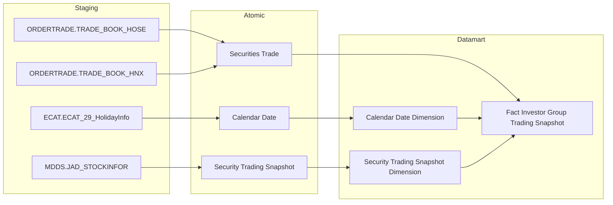
```mermaid
flowchart LR
    subgraph SRC["Staging"]
        ORDERTRADE_TRADE_BOOK_HOSE["ORDERTRADE.TRADE_BOOK_HOSE"]
        ORDERTRADE_TRADE_BOOK_HNX["ORDERTRADE.TRADE_BOOK_HNX"]
        MDDS_JAD_STOCKINFOR["MDDS.JAD_STOCKINFOR"]
        ECAT_ECAT_29_HolidayInfo["ECAT.ECAT_29_HolidayInfo"]
    end
    subgraph SIL["Atomic"]
        Securities_Trade["Securities Trade"]
        Security_Trading_Snapshot["Security Trading Snapshot"]
        Calendar_Date["Calendar Date"]
    end
    subgraph GOLD["Datamart"]
        Calendar_Date_Dimension["Calendar Date Dimension"]
        Security_Trading_Snapshot_Dimension["Security Trading Snapshot Dimension"]
        Fact_Investor_Group_Trading_Snapshot["Fact Investor Group Trading Snapshot"]
    end
    ORDERTRADE_TRADE_BOOK_HOSE --> Securities_Trade
    ORDERTRADE_TRADE_BOOK_HNX --> Securities_Trade
    MDDS_JAD_STOCKINFOR --> Security_Trading_Snapshot
    ECAT_ECAT_29_HolidayInfo --> Calendar_Date
    Securities_Trade --> Fact_Investor_Group_Trading_Snapshot
    Security_Trading_Snapshot --> Security_Trading_Snapshot_Dimension
    Calendar_Date --> Calendar_Date_Dimension
    Calendar_Date_Dimension --> Fact_Investor_Group_Trading_Snapshot
    Security_Trading_Snapshot_Dimension --> Fact_Investor_Group_Trading_Snapshot
```

##### Cụm 2: Chỉ số thị trường cuối ngày (reuse Fact của QLKD) (Fact Market Index Snapshot)

Reuse nguyên Fact Market Index Snapshot (sở hữu QLKD, dùng chung NDTNN/GSTT/TKNB): 1 chỉ số (Market Code) × 1 ngày, giữ bản ghi cuối ngày. VP chỉ đọc Market Index Value; chọn chỉ số theo Market Code ('HOSE', 'HNX', 'UPCOM') — không theo Index Name (H14, quyết định 2026-10-21).

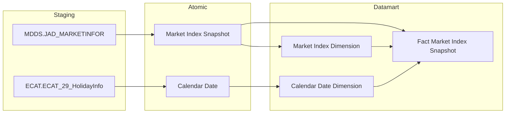
```mermaid
flowchart LR
    subgraph SRC["Staging"]
        MDDS_JAD_MARKETINFOR["MDDS.JAD_MARKETINFOR"]
        ECAT_ECAT_29_HolidayInfo["ECAT.ECAT_29_HolidayInfo"]
    end
    subgraph SIL["Atomic"]
        Market_Index_Snapshot["Market Index Snapshot"]
        Calendar_Date["Calendar Date"]
    end
    subgraph GOLD["Datamart"]
        Calendar_Date_Dimension["Calendar Date Dimension"]
        Market_Index_Dimension["Market Index Dimension"]
        Fact_Market_Index_Snapshot["Fact Market Index Snapshot"]
    end
    MDDS_JAD_MARKETINFOR --> Market_Index_Snapshot
    ECAT_ECAT_29_HolidayInfo --> Calendar_Date
    Market_Index_Snapshot --> Fact_Market_Index_Snapshot
    Market_Index_Snapshot --> Market_Index_Dimension
    Calendar_Date --> Calendar_Date_Dimension
    Calendar_Date_Dimension --> Fact_Market_Index_Snapshot
    Market_Index_Dimension --> Fact_Market_Index_Snapshot
```

##### Cụm 3: Hợp đồng phái sinh theo ngày (khối lượng mở và giá) (Fact Derivative Contract Snapshot)

Grain: 1 mã hợp đồng phái sinh × 1 ngày giao dịch. Open Interest Quantity từ VSDC (Ticker Symbol = mã hợp đồng, Report Date); Close Price từ bản tin cuối ngày MDDS với Floor Code = '03'. Hai nguồn nối FULL OUTER JOIN theo (mã hợp đồng, ngày) để giữ OI của hợp đồng chưa có bản tin MDDS — BA SQL tính 'Toàn thị trường' trên toàn bộ OI VSDC (kể cả hợp đồng không nối được sản phẩm). Sản phẩm phái sinh (HĐTL VN30/VN100/TPCP) suy ra từ Stock Type Code, Underlying Symbol, Product Group Id của Security Trading Snapshot Dimension. Fact giữ Ticker Symbol (mã hợp đồng) làm cột định danh vì khóa ngoại Security Trading Snapshot Dimension cho phép NULL (hợp đồng có OI VSDC nhưng chưa từng có bản tin MDDS).

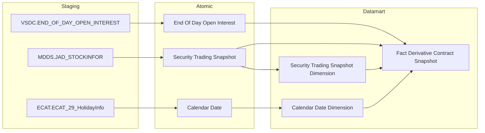
```mermaid
flowchart LR
    subgraph SRC["Staging"]
        VSDC_END_OF_DAY_OPEN_INTEREST["VSDC.END_OF_DAY_OPEN_INTEREST"]
        MDDS_JAD_STOCKINFOR["MDDS.JAD_STOCKINFOR"]
        ECAT_ECAT_29_HolidayInfo["ECAT.ECAT_29_HolidayInfo"]
    end
    subgraph SIL["Atomic"]
        End_Of_Day_Open_Interest["End Of Day Open Interest"]
        Security_Trading_Snapshot["Security Trading Snapshot"]
        Calendar_Date["Calendar Date"]
    end
    subgraph GOLD["Datamart"]
        Calendar_Date_Dimension["Calendar Date Dimension"]
        Security_Trading_Snapshot_Dimension["Security Trading Snapshot Dimension"]
        Fact_Derivative_Contract_Snapshot["Fact Derivative Contract Snapshot"]
    end
    VSDC_END_OF_DAY_OPEN_INTEREST --> End_Of_Day_Open_Interest
    MDDS_JAD_STOCKINFOR --> Security_Trading_Snapshot
    ECAT_ECAT_29_HolidayInfo --> Calendar_Date
    End_Of_Day_Open_Interest --> Fact_Derivative_Contract_Snapshot
    Security_Trading_Snapshot --> Fact_Derivative_Contract_Snapshot
    Security_Trading_Snapshot --> Security_Trading_Snapshot_Dimension
    Calendar_Date --> Calendar_Date_Dimension
    Calendar_Date_Dimension --> Fact_Derivative_Contract_Snapshot
    Security_Trading_Snapshot_Dimension --> Fact_Derivative_Contract_Snapshot
```

##### Cụm 4: TPDN niêm yết theo mã và ngày (giao dịch, ngành, kỳ hạn, lưu hành) (Fact Listed Corporate Bond Snapshot)

Grain: 1 mã trái phiếu (ISIN = Security Symbol Code) × 1 ngày giao dịch. Hàng của Fact là FULL OUTER JOIN theo (ISIN, ngày) giữa (a) giao dịch TPDN niêm yết của Securities Trade (HNX, Market Id Code = 'HCX') gom theo mã × ngày và (b) bản tin cuối ngày MDDS của trái phiếu (Stock Type Code = '1'): giữ giao dịch không có bản tin cùng ngày (Ngành = 'NA', không có kỳ hạn) và giữ mã có bản tin nhưng không giao dịch (phục vụ Số mã, Kỳ hạn còn lại, KL lưu hành); Listed Indicator = TRUE khi mã có bản tin MDDS cùng ngày. Khóa nối giao dịch ↔ bản tin: Security Symbol Code (Issue Code) = ISIN Code và Trade Date = Trading Date (SQL BA Nhóm 8/10: `h.issue_code = s.symbolisin AND to_date(h.trade_date, 'yyyyMMdd') = s.tradingdate`). Bản tin cuối ngày MDDS: `ROW_NUMBER() OVER (PARTITION BY ticker_symbol, trading_dt ORDER BY trading_time DESC, sequence DESC) = 1`. KL lưu hành lấy từ Listed Share Information (HNX), nối bản tin theo Ticker Symbol và Report Date = Trading Date (SQL BA Nhóm 8: `s.tradingdate = ls.report_date AND s.symbol = ls.ticker_symbol`). Ngành xác định theo tổ chức phát hành, qua bản tin cùng ngày: 3 ký tự đầu của Ticker Symbol = Equity Ticker Symbol của Public Company (bỏ hồ sơ bị từ chối) → Business Line Level 1 Code → Industry Dimension; nếu 3 ký tự đầu trùng Securities Code của Securities Company (CTCK) hoặc Stock Ticker Code của Fund Management Company (CTQLQ) thì ngành mặc định '07000' (Tài chính ngân hàng) — SQL BA Nhóm 8/10. Mệnh giá = 100000 × 10^ROUND(LOG10(Reference Price / 100000)) (tính ngược từ giá tham chiếu); Bond Outstanding Value (dư nợ) = KL lưu hành × mệnh giá. Nguồn Securities Trade (Sổ lệnh cấp tài khoản) chờ Atomic — O_VP_1.

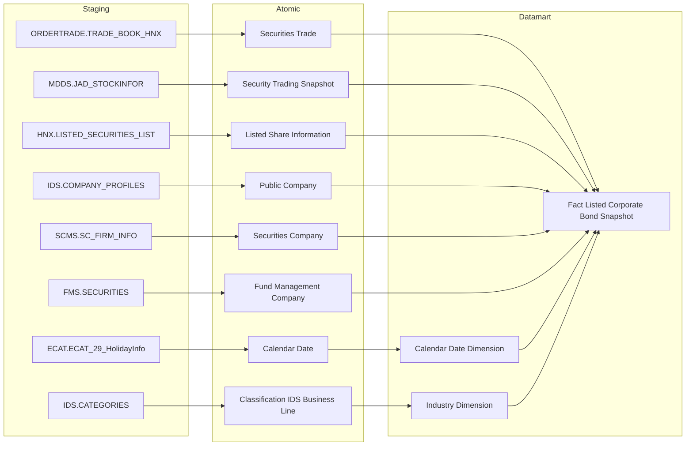
```mermaid
flowchart LR
    subgraph SRC["Staging"]
        ORDERTRADE_TRADE_BOOK_HNX["ORDERTRADE.TRADE_BOOK_HNX"]
        MDDS_JAD_STOCKINFOR["MDDS.JAD_STOCKINFOR"]
        HNX_LISTED_SECURITIES_LIST["HNX.LISTED_SECURITIES_LIST"]
        IDS_COMPANY_PROFILES["IDS.COMPANY_PROFILES"]
        SCMS_SC_FIRM_INFO["SCMS.SC_FIRM_INFO"]
        FMS_SECURITIES["FMS.SECURITIES"]
        IDS_CATEGORIES["IDS.CATEGORIES"]
        ECAT_ECAT_29_HolidayInfo["ECAT.ECAT_29_HolidayInfo"]
    end
    subgraph SIL["Atomic"]
        Securities_Trade["Securities Trade"]
        Security_Trading_Snapshot["Security Trading Snapshot"]
        Listed_Share_Information["Listed Share Information"]
        Public_Company["Public Company"]
        Securities_Company["Securities Company"]
        Fund_Management_Company["Fund Management Company"]
        Classification_IDS_Business_Line["Classification IDS Business Line"]
        Calendar_Date["Calendar Date"]
    end
    subgraph GOLD["Datamart"]
        Calendar_Date_Dimension["Calendar Date Dimension"]
        Industry_Dimension["Industry Dimension"]
        Fact_Listed_Corporate_Bond_Snapshot["Fact Listed Corporate Bond Snapshot"]
    end
    ORDERTRADE_TRADE_BOOK_HNX --> Securities_Trade
    MDDS_JAD_STOCKINFOR --> Security_Trading_Snapshot
    HNX_LISTED_SECURITIES_LIST --> Listed_Share_Information
    IDS_COMPANY_PROFILES --> Public_Company
    SCMS_SC_FIRM_INFO --> Securities_Company
    FMS_SECURITIES --> Fund_Management_Company
    IDS_CATEGORIES --> Classification_IDS_Business_Line
    ECAT_ECAT_29_HolidayInfo --> Calendar_Date
    Securities_Trade --> Fact_Listed_Corporate_Bond_Snapshot
    Security_Trading_Snapshot --> Fact_Listed_Corporate_Bond_Snapshot
    Listed_Share_Information --> Fact_Listed_Corporate_Bond_Snapshot
    Public_Company --> Fact_Listed_Corporate_Bond_Snapshot
    Securities_Company --> Fact_Listed_Corporate_Bond_Snapshot
    Fund_Management_Company --> Fact_Listed_Corporate_Bond_Snapshot
    Classification_IDS_Business_Line --> Industry_Dimension
    Calendar_Date --> Calendar_Date_Dimension
    Calendar_Date_Dimension --> Fact_Listed_Corporate_Bond_Snapshot
    Industry_Dimension --> Fact_Listed_Corporate_Bond_Snapshot
```

##### Cụm 5: TPDN riêng lẻ — giao dịch theo ngày báo cáo HNX09 (Fact Private Corporate Bond Trading Snapshot)

Grain: 1 ngày báo cáo HNX09 (báo cáo ngày TPDN riêng lẻ). Nguồn Internal Statistical Report (dữ liệu mức ô báo cáo): lọc Report Code = 'HNX09', Sheet Name = 'sheet 1', Column Path = 'GIÁ TRỊ', Period Type Code = 'DAILY', Report Submission System Code = 'ICP' (chỉ lấy nguồn từ Sở, không lấy CDW/KDL), Submission Status Code IN ('SUBMITTED', 'LATE_SUBMITTED'). Ngày báo cáo = ngày tạo từ Report Year / Report Month / Report Day. Pivot theo Row Path: 'GIÁ TRỊ GIAO DỊCH' → Trading Value; 'GIÁ TRỊ GIAO DỊCH NHÀ ĐẦU TƯ NƯỚC NGOÀI - GIÁ TRỊ MUA' → Foreign Buy Value; '… - GIÁ TRỊ BÁN' → Foreign Sell Value; Cell Value chỉ ép số khi Data Type Code ∈ (CURRENCY, PERCENTAGE, NUMBER). Nhóm 9 dùng Trading Value (K_VP_89); Nhóm 11–13 dùng thêm Foreign Buy Value (K_VP_94) và Foreign Sell Value (K_VP_96) của cùng báo cáo — Lô 2 chỉ bổ sung KPI, không đổi grain/PK/cột. Khóa ô Atomic không có nguồn nộp — O_VP_21.

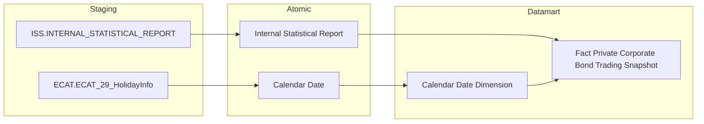
```mermaid
flowchart LR
    subgraph SRC["Staging"]
        ISS_INTERNAL_STATISTICAL_REPORT["ISS.INTERNAL_STATISTICAL_REPORT"]
        ECAT_ECAT_29_HolidayInfo["ECAT.ECAT_29_HolidayInfo"]
    end
    subgraph SIL["Atomic"]
        Internal_Statistical_Report["Internal Statistical Report"]
        Calendar_Date["Calendar Date"]
    end
    subgraph GOLD["Datamart"]
        Calendar_Date_Dimension["Calendar Date Dimension"]
        Fact_Private_Corporate_Bond_Trading_Snapshot["Fact Private Corporate Bond Trading Snapshot"]
    end
    ISS_INTERNAL_STATISTICAL_REPORT --> Internal_Statistical_Report
    ECAT_ECAT_29_HolidayInfo --> Calendar_Date
    Internal_Statistical_Report --> Fact_Private_Corporate_Bond_Trading_Snapshot
    Calendar_Date --> Calendar_Date_Dimension
    Calendar_Date_Dimension --> Fact_Private_Corporate_Bond_Trading_Snapshot
```

##### Cụm 6: TPDN riêng lẻ — số mã đăng ký giao dịch theo tháng báo cáo (Fact Private Corporate Bond Registration Snapshot)

Grain: 1 mã trái phiếu (Bond Code) × 1 tháng báo cáo (Report Year, Report Month). Fact không có measure (factless): mỗi dòng = 1 mã TPDN riêng lẻ đăng ký giao dịch trong báo cáo tháng của HNX; Maturity Date giữ để loại mã đã đáo hạn. Số mã ĐKGD = COUNT(DISTINCT Bond Code) với Maturity Date > ngày cuối kỳ, tại tháng báo cáo chọn theo loại kỳ (SQL BA Nhóm 11): Tháng = chính tháng đó; Quý / Năm = tháng báo cáo mới nhất có dữ liệu trong kỳ; Ngày = tháng của ngày tra cứu nếu là ngày cuối tháng, ngược lại tháng liền trước (báo cáo tháng chưa có). Khóa ngoại ngày Snapshot Date Dimension Id = ngày cuối tháng báo cáo (giả định — O_VP_27); Report Year / Report Month giữ nguyên dạng chuỗi của Atomic và ngày cuối tháng được suy ra bằng ép kiểu số, không phụ thuộc đệm số 0. Không reuse/partial Fact TKNB `fct_private_corporate_bond_issuance_snpst` (cùng Atomic nhưng khác grain/mục đích — Section 4). Khóa Atomic chỉ băm Bond Code (lịch sử tháng có thể bị ghi đè) — O_VP_26.

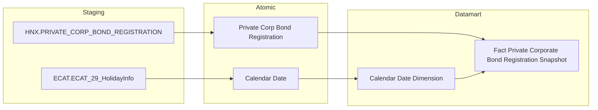
```mermaid
flowchart LR
    subgraph SRC["Staging"]
        HNX_PRIVATE_CORP_BOND_REGISTRATION["HNX.PRIVATE_CORP_BOND_REGISTRATION"]
        ECAT_ECAT_29_HolidayInfo["ECAT.ECAT_29_HolidayInfo"]
    end
    subgraph SIL["Atomic"]
        Private_Corp_Bond_Registration["Private Corp Bond Registration"]
        Calendar_Date["Calendar Date"]
    end
    subgraph GOLD["Datamart"]
        Calendar_Date_Dimension["Calendar Date Dimension"]
        Fact_Private_Corporate_Bond_Registration_Snapshot["Fact Private Corporate Bond Registration Snapshot"]
    end
    HNX_PRIVATE_CORP_BOND_REGISTRATION --> Private_Corp_Bond_Registration
    ECAT_ECAT_29_HolidayInfo --> Calendar_Date
    Private_Corp_Bond_Registration --> Fact_Private_Corporate_Bond_Registration_Snapshot
    Calendar_Date --> Calendar_Date_Dimension
    Calendar_Date_Dimension --> Fact_Private_Corporate_Bond_Registration_Snapshot
```

##### Cụm 7: TPCP — giao dịch theo ngày và loại sổ lệnh (Outright, Repo) (Fact Government Bond Trading Snapshot)

Grain: 1 ngày giao dịch × 1 loại sổ lệnh (Order Book Type Code ∈ OUTRIGHT, REPO). Nguồn Atomic `Bond Order Book` (HNX; mỗi dòng = 1 lệnh), BA đọc 2 bảng staging `outright_order_book` và `repo_order_book`; không đọc REPO2. Chỉ lấy lệnh Order Status = 'ĐTH' cho mọi chỉ tiêu (SQL BA — giá trị literal chưa kiểm, O_VP_32). Trading Volume = Σ Order Bond Quantity; Trading Value = Σ Trading Val (OUTRIGHT) hoặc Σ First Settlement Val (REPO) (Atomic `trading_val` NULL với REPO); Foreign Buy Value / Foreign Sell Value = cùng giá trị lệnh nhưng chỉ lệnh có ký tự thứ 4 của Buying / Selling Account Nbr ∈ ('E','F'). BA không lọc loại trái phiếu: coi toàn bộ sổ lệnh outright/repo HNX là TPCP — O_VP_32. Không reuse Fact module khác — Section 4.

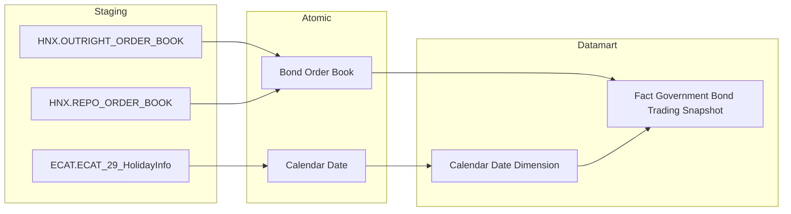
```mermaid
flowchart LR
    subgraph SRC["Staging"]
        HNX_OUTRIGHT_ORDER_BOOK["HNX.OUTRIGHT_ORDER_BOOK"]
        HNX_REPO_ORDER_BOOK["HNX.REPO_ORDER_BOOK"]
        ECAT_ECAT_29_HolidayInfo["ECAT.ECAT_29_HolidayInfo"]
    end
    subgraph SIL["Atomic"]
        Bond_Order_Book["Bond Order Book"]
        Calendar_Date["Calendar Date"]
    end
    subgraph GOLD["Datamart"]
        Calendar_Date_Dimension["Calendar Date Dimension"]
        Fact_Government_Bond_Trading_Snapshot["Fact Government Bond Trading Snapshot"]
    end
    HNX_OUTRIGHT_ORDER_BOOK --> Bond_Order_Book
    HNX_REPO_ORDER_BOOK --> Bond_Order_Book
    ECAT_ECAT_29_HolidayInfo --> Calendar_Date
    Bond_Order_Book --> Fact_Government_Bond_Trading_Snapshot
    Calendar_Date --> Calendar_Date_Dimension
    Calendar_Date_Dimension --> Fact_Government_Bond_Trading_Snapshot
```

## Section 2 — Tổng quan báo cáo

> Quy ước chung: Loại kỳ D/M/Q/Y là tham số lọc; các Fact lưu theo ngày (riêng Fact Private Corporate Bond Registration Snapshot theo tháng báo cáo), tổng hợp theo kỳ và so sánh kỳ trước tính tại presentation layer (Case 2). Kỳ trước của loại kỳ 'D' theo SQL BA là ngày lịch liền trước (O_VP_5). Chỉ tiêu YTD của Nhóm 7 và Nhóm 11 (GTGD YTD, GTGD bình quân phiên YTD) so với CẢ NĂM TRƯỚC (01/01–31/12), không phải kỳ trước. Quy ước đánh số KPI: K_VP_1–114 đã dùng hết; Lô 3 (Nhóm 32–37) cấp ID mới tiếp sau K_VP_114 — O_VP_9.

### Tab Dashboard Thống kê thị trường

#### Nhóm 1 - Cổ phiếu >> Biều đồ Giá trị mua/bán ròng NĐTNN và chỉ số Index

> Phân loại: **Phân tích**
> Atomic: `Market Index Snapshot` ← MDDS.JAD_MARKETINFOR — **READY**; `Securities Trade` ← ORDERTRADE.TRADE_BOOK_HOSE / TRADE_BOOK_HNX — **READY** (nguồn Sổ lệnh chờ Atomic, O_VP_1); `Security Trading Snapshot` ← MDDS.JAD_STOCKINFOR — **READY**

**Mockup (suy từ BA — chưa có screenshot, O_VP_8):**

Tham số: Sàn (HOSE / HNX / UPCOM / Toàn thị trường) · Loại kỳ (D/M/Q/Y) · Từ kỳ — Đến kỳ

| Kỳ | VN-Index | HNX-Index | UPCoM-Index | GT mua/bán ròng NĐTNN |
|---|---|---|---|---|
| 2026-09 | … | … | … | … |

> ⚠️ Presentation Grain: 1 điểm biểu đồ = 1 Kỳ × 1 Sàn (Level 1), kèm điểm chỉ số của sàn (Level 2). Storage Grain: Fact Market Index Snapshot = 1 chỉ số × 1 ngày (Level 2); Fact Investor Group Trading Snapshot = 1 mã × 1 ngày × 1 sàn × 1 nhóm NĐT (Level 4) — presentation thô hơn storage, đạt Iso-Grain.

**Source:** `Fact Market Index Snapshot` → `Calendar Date Dimension`, `Market Index Dimension`; `Fact Investor Group Trading Snapshot` → `Calendar Date Dimension`, `Security Trading Snapshot Dimension`

> **[SỬA 2026-10-28 — BA VP cập nhật Nhóm 1/2: phạm vi 'cổ phiếu, Chứng chỉ quỹ' (bỏ chứng quyền)]** BA đổi Mô tả (bỏ 'chứng quyền'), Độ chi tiết (thêm 'Loại chứng khoán'), Nguồn/Bảng nguồn (thêm MDDS `jad_stockinfor`) và Điều kiện: lấy `jad_stockinfor` bản ghi cuối mỗi `symbol` với `stocktype IN ('2','3','6')`, nối giao dịch `s.symbol = t.symbol` (HOSE) / `s.symbol = h.issue_code` (HNX); SQL đổi CTE `stock_daily_eod` (theo ngày) thành `stock_portfolio` (bản ghi cuối — loại CK không đổi theo ngày). Thiết kế: KPI Nhóm này lọc `Security Trading Snapshot Dimension.Stock Type Code IN ('2','3','6')` qua FK `security_trading_snpst_dim_id` của `Fact Investor Group Trading Snapshot` (HNX/UPCOM: 2 Cổ phiếu, 3 CCQ, 6 ETF; HOSE: 2 Cổ phiếu, 3 CCQ/ETF) — không đổi Fact. **O_VP_4 đã đóng** (trước đây Mô tả/Điều kiện không lọc loại CK còn SQL lọc `stocktype = '2'`). Khác BA: HNX nối theo `isin_code` (ISSUE_CODE HNX lưu ISIN, A17) — **O_VP_33**.

**Bảng KPI:**

| KPI ID | Tên KPI | Đơn vị | Tính chất | Công thức | Ghi chú | Trạng thái |
|---|---|---|---|---|---|---|
| K_VP_1 | Kỳ | — | Chiều | Calendar Date Dimension: Calendar Date → ngày/tháng/quý/năm; Loại kỳ (D/M/Q/Y) và Từ kỳ — Đến kỳ là tham số lọc | Case 1 — reuse Calendar Date Dimension (cdr_dt_dim); kỳ = tham số lọc tại presentation layer | READY |
| K_VP_2 | Sàn | — | Chiều | HOSE / HNX / UPCOM / Toàn thị trường. Chỉ số: Market Index Dimension.Market Code ('HOSE','HNX','UPCOM'); giao dịch: Fact Investor Group Trading Snapshot.Market Id Code (HOSE = 'STK', HNX = 'STX', UPCOM = 'UPX') | Tham số lọc Sàn; ánh xạ HOSE→STK, HNX→STX, UPCOM→UPX theo Điều kiện BA | READY |
| K_VP_3 | Chỉ số | — | Chiều | Market Index Dimension.Index Name với Market Code IN ('HOSE','HNX','UPCOM'); Sàn = 'Toàn thị trường' lấy cả 3 chỉ số | Case 1 — reuse Market Index Dimension (QLKD) | READY |
| K_VP_4 | Giá trị chỉ số | Điểm | Cơ sở | Fact Market Index Snapshot.Market Index Value tại ngày giao dịch cuối cùng của kỳ (Fact giữ bản ghi cuối ngày: Index Time DESC, Sequence DESC) | Case 1 — reuse Fact Market Index Snapshot (QLKD); chọn chỉ số theo Market Code, không theo Index Name (H14) | READY |
| K_VP_5 | GT mua/bán ròng NĐTNN | VND | Phái sinh | SUM(Buy Value − Sell Value) trên Fact Investor Group Trading Snapshot với Investor Group Code = 'FOREIGN', Market Id Code theo Sàn và `Security Trading Snapshot Dimension.Stock Type Code IN ('2','3','6')` (cổ phiếu + CCQ, bỏ chứng quyền), trong kỳ | NĐTNN = ký tự thứ 4 của số tài khoản ∈ (E, F). [!] Nguồn Securities Trade — O_VP_1; phạm vi loại CK: Stock Type Code ∈ ('2','3','6') theo BA 2026-10-28 (O_VP_4 đã đóng); độ chi tiết 'Loại chứng khoán' = Stock Type Code/Name. Case 2 — tính tại presentation layer từ Buy Value / Sell Value | READY |
| K_VP_6 | Giá trị chỉ số - VN-Index | Điểm | Cơ sở | K_VP_4 với Market Code = 'HOSE' (VN-Index) | Case 2 — K_VP_4 lọc Market Code; tính tại presentation layer | READY |
| K_VP_7 | Giá trị chỉ số - HNX-Index | Điểm | Cơ sở | K_VP_4 với Market Code = 'HNX' (HNX-Index) | Case 2 — K_VP_4 lọc Market Code; tính tại presentation layer | READY |
| K_VP_8 | Giá trị chỉ số - UPCoM-Index | Điểm | Cơ sở | K_VP_4 với Market Code = 'UPCOM' (UPCoM-Index) | Case 2 — K_VP_4 lọc Market Code; tính tại presentation layer | READY |
| K_VP_9 | GT mua/bán ròng NĐTNN - HOSE | VND | Cơ sở | K_VP_5 với Market Id Code = 'STK' (HOSE) | Case 2 — K_VP_5 lọc Market Id Code; [!] Nguồn Securities Trade — O_VP_1 | READY |
| K_VP_10 | GT mua/bán ròng NĐTNN - HNX | VND | Cơ sở | K_VP_5 với Market Id Code = 'STX' (HNX) | Case 2 — K_VP_5 lọc Market Id Code; [!] Nguồn Securities Trade — O_VP_1 | READY |
| K_VP_11 | GT mua/bán ròng NĐTNN - UPCoM | VND | Cơ sở | K_VP_5 với Market Id Code = 'UPX' (UPCoM) | Case 2 — K_VP_5 lọc Market Id Code; [!] Nguồn Securities Trade — O_VP_1 | READY |
| K_VP_12 | GT mua/bán ròng NĐTNN - Toàn thị trường | VND | Cơ sở | K_VP_5 với Market Id Code IN ('STK','STX','UPX') (toàn thị trường) | Case 2 — K_VP_5 lọc Market Id Code; [!] Nguồn Securities Trade — O_VP_1 | READY |

**Star Schema:**

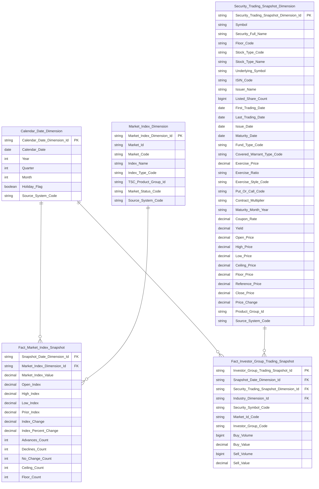
```mermaid
erDiagram
    Calendar_Date_Dimension {
        string Calendar_Date_Dimension_Id PK
        date Calendar_Date
        int Year
        int Quarter
        int Month
        boolean Holiday_Flag
        string Source_System_Code
    }
    Market_Index_Dimension {
        string Market_Index_Dimension_Id PK
        string Market_Id
        string Market_Code
        string Index_Name
        string Index_Type_Code
        string TSC_Product_Group_Id
        string Market_Status_Code
        string Source_System_Code
    }
    Security_Trading_Snapshot_Dimension {
        string Security_Trading_Snapshot_Dimension_Id PK
        string Symbol
        string Security_Full_Name
        string Floor_Code
        string Stock_Type_Code
        string Stock_Type_Name
        string Underlying_Symbol
        string ISIN_Code
        string Issuer_Name
        bigint Listed_Share_Count
        date First_Trading_Date
        date Last_Trading_Date
        date Issue_Date
        date Maturity_Date
        string Fund_Type_Code
        string Covered_Warrant_Type_Code
        decimal Exercise_Price
        string Exercise_Ratio
        string Exercise_Style_Code
        string Put_Or_Call_Code
        string Contract_Multiplier
        string Maturity_Month_Year
        decimal Coupon_Rate
        decimal Yield
        decimal Open_Price
        decimal High_Price
        decimal Low_Price
        decimal Ceiling_Price
        decimal Floor_Price
        decimal Reference_Price
        decimal Close_Price
        decimal Price_Change
        string Product_Group_Id
        string Source_System_Code
    }
    Fact_Market_Index_Snapshot {
        string Snapshot_Date_Dimension_Id FK
        string Market_Index_Dimension_Id FK
        decimal Market_Index_Value
        decimal Open_Index
        decimal High_Index
        decimal Low_Index
        decimal Prior_Index
        decimal Index_Change
        decimal Index_Percent_Change
        int Advances_Count
        int Declines_Count
        int No_Change_Count
        int Ceiling_Count
        int Floor_Count
    }
    Fact_Investor_Group_Trading_Snapshot {
        string Investor_Group_Trading_Snapshot_Id PK
        string Snapshot_Date_Dimension_Id FK
        string Security_Trading_Snapshot_Dimension_Id FK
        string Industry_Dimension_Id FK
        string Security_Symbol_Code
        string Market_Id_Code
        string Investor_Group_Code
        bigint Buy_Volume
        decimal Buy_Value
        bigint Sell_Volume
        decimal Sell_Value
    }
    Calendar_Date_Dimension ||--o{ Fact_Market_Index_Snapshot : " "
    Market_Index_Dimension ||--o{ Fact_Market_Index_Snapshot : " "
    Calendar_Date_Dimension ||--o{ Fact_Investor_Group_Trading_Snapshot : " "
    Security_Trading_Snapshot_Dimension ||--o{ Fact_Investor_Group_Trading_Snapshot : " "
```

**Lineage Mart → Báo cáo:**

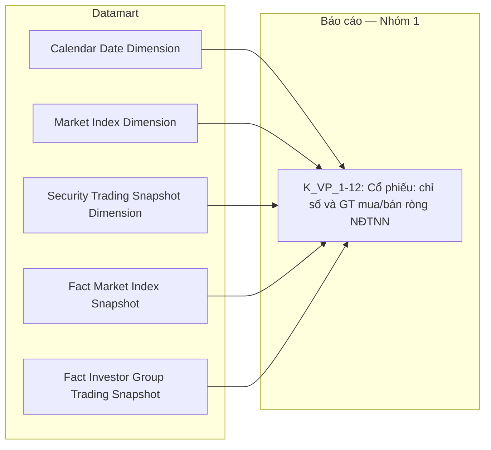
```mermaid
flowchart LR
    subgraph GOLD["Datamart"]
        Calendar_Date_Dimension["Calendar Date Dimension"]
        Market_Index_Dimension["Market Index Dimension"]
        Security_Trading_Snapshot_Dimension["Security Trading Snapshot Dimension"]
        Fact_Market_Index_Snapshot["Fact Market Index Snapshot"]
        Fact_Investor_Group_Trading_Snapshot["Fact Investor Group Trading Snapshot"]
    end
    subgraph RPT["Báo cáo — Nhóm 1"]
        R1["K_VP_1-12: Cổ phiếu: chỉ số và GT mua/bán ròng NĐTNN"]
    end
    Calendar_Date_Dimension --> R1
    Market_Index_Dimension --> R1
    Security_Trading_Snapshot_Dimension --> R1
    Fact_Market_Index_Snapshot --> R1
    Fact_Investor_Group_Trading_Snapshot --> R1
```

**Bảng grain:**

| Tên bảng | Grain |
|---|---|
| Calendar Date Dimension | 1 ngày dương lịch (Conformed Dimension) |
| Market Index Dimension | 1 tổ hợp Market Id + Market Code (SCD4A current-state); sở hữu bởi QLKD |
| Security Trading Snapshot Dimension | 1 mã chứng khoán / hợp đồng phái sinh (SCD4A current-state); sở hữu bởi GSTT |
| Fact Market Index Snapshot | 1 chỉ số (Market Code) × 1 ngày giao dịch — bản ghi cuối ngày; sở hữu bởi QLKD |
| Fact Investor Group Trading Snapshot | 1 mã chứng khoán / hợp đồng × 1 ngày giao dịch × 1 sàn (Market Id Code) × 1 nhóm NĐT (ALL / FOREIGN / PROPRIETARY); PK Investor Group Trading Snapshot Id = hash toàn bộ cột grain (Dạng B, A22) |

#### Nhóm 2 - Cổ phiếu >> Biều đồ Giá trị mua/bán ròng Tự doanh và chỉ số Index

> Phân loại: **Phân tích**
> Atomic: `Market Index Snapshot` ← MDDS.JAD_MARKETINFOR — **READY**; `Securities Trade` ← ORDERTRADE.TRADE_BOOK_HOSE / TRADE_BOOK_HNX — **READY** (nguồn Sổ lệnh chờ Atomic, O_VP_1); `Security Trading Snapshot` ← MDDS.JAD_STOCKINFOR — **READY**

**Mockup (suy từ BA — chưa có screenshot, O_VP_8):**

Tham số: Sàn (HOSE / HNX / UPCOM / Toàn thị trường) · Loại kỳ (D/M/Q/Y) · Từ kỳ — Đến kỳ

| Kỳ | VN-Index | HNX-Index | UPCoM-Index | GT mua/bán ròng Tự doanh |
|---|---|---|---|---|
| 2026-09 | … | … | … | … |

> ⚠️ Presentation Grain: 1 điểm biểu đồ = 1 Kỳ × 1 Sàn (Level 1), kèm điểm chỉ số của sàn (Level 2). Storage Grain: Fact Market Index Snapshot = 1 chỉ số × 1 ngày (Level 2); Fact Investor Group Trading Snapshot = 1 mã × 1 ngày × 1 sàn × 1 nhóm NĐT (Level 4) — presentation thô hơn storage, đạt Iso-Grain.

**Source:** `Fact Market Index Snapshot` → `Calendar Date Dimension`, `Market Index Dimension`; `Fact Investor Group Trading Snapshot` → `Calendar Date Dimension`, `Security Trading Snapshot Dimension`

> **[SỬA 2026-10-28 — BA VP cập nhật Nhóm 1/2: phạm vi 'cổ phiếu, Chứng chỉ quỹ' (bỏ chứng quyền)]** BA đổi Mô tả (bỏ 'chứng quyền'), Độ chi tiết (thêm 'Loại chứng khoán'), Nguồn/Bảng nguồn (thêm MDDS `jad_stockinfor`) và Điều kiện: lấy `jad_stockinfor` bản ghi cuối mỗi `symbol` với `stocktype IN ('2','3','6')`, nối giao dịch `s.symbol = t.symbol` (HOSE) / `s.symbol = h.issue_code` (HNX); SQL đổi CTE `stock_daily_eod` (theo ngày) thành `stock_portfolio` (bản ghi cuối — loại CK không đổi theo ngày). Thiết kế: KPI Nhóm này lọc `Security Trading Snapshot Dimension.Stock Type Code IN ('2','3','6')` qua FK `security_trading_snpst_dim_id` của `Fact Investor Group Trading Snapshot` (HNX/UPCOM: 2 Cổ phiếu, 3 CCQ, 6 ETF; HOSE: 2 Cổ phiếu, 3 CCQ/ETF) — không đổi Fact. **O_VP_4 đã đóng** (trước đây Mô tả/Điều kiện không lọc loại CK còn SQL lọc `stocktype = '2'`). Khác BA: HNX nối theo `isin_code` (ISSUE_CODE HNX lưu ISIN, A17) — **O_VP_33**.

**Bảng KPI:**

| KPI ID | Tên KPI | Đơn vị | Tính chất | Công thức | Ghi chú | Trạng thái |
|---|---|---|---|---|---|---|
| K_VP_1 | Kỳ | — | Chiều | Calendar Date Dimension: Calendar Date → ngày/tháng/quý/năm; Loại kỳ (D/M/Q/Y) và Từ kỳ — Đến kỳ là tham số lọc | Reuse từ Nhóm 1 (K_VP_1) — Case 1: measure vật lý có sẵn trên Fact/Dim | READY |
| K_VP_2 | Sàn | — | Chiều | HOSE / HNX / UPCOM / Toàn thị trường. Chỉ số: Market Index Dimension.Market Code ('HOSE','HNX','UPCOM'); giao dịch: Fact Investor Group Trading Snapshot.Market Id Code (HOSE = 'STK', HNX = 'STX', UPCOM = 'UPX') | Reuse từ Nhóm 1 (K_VP_2) — Case 1: measure vật lý có sẵn trên Fact/Dim | READY |
| K_VP_3 | Chỉ số | — | Chiều | Market Index Dimension.Index Name với Market Code IN ('HOSE','HNX','UPCOM'); Sàn = 'Toàn thị trường' lấy cả 3 chỉ số | Reuse từ Nhóm 1 (K_VP_3) — Case 1: measure vật lý có sẵn trên Fact/Dim | READY |
| K_VP_4 | Giá trị chỉ số | Điểm | Cơ sở | Fact Market Index Snapshot.Market Index Value tại ngày giao dịch cuối cùng của kỳ (Fact giữ bản ghi cuối ngày: Index Time DESC, Sequence DESC) | Reuse từ Nhóm 1 (K_VP_4) — Case 1: measure vật lý có sẵn trên Fact/Dim | READY |
| K_VP_13 | GT mua/bán ròng Tự doanh | VND | Cơ sở | SUM(Buy Value − Sell Value) trên Fact Investor Group Trading Snapshot với Investor Group Code = 'PROPRIETARY', Market Id Code theo Sàn và `Security Trading Snapshot Dimension.Stock Type Code IN ('2','3','6')` (cổ phiếu + CCQ, bỏ chứng quyền), trong kỳ | Tự doanh = ký tự thứ 4 của số tài khoản ∈ (P, E, A) theo BA; GSTT chỉ dùng (P, E) — O_VP_2. [!] Nguồn Securities Trade — O_VP_1; phạm vi loại CK: Stock Type Code ∈ ('2','3','6') theo BA 2026-10-28 (O_VP_4 đã đóng); độ chi tiết 'Loại chứng khoán' = Stock Type Code/Name. Case 2 — tính tại presentation layer | READY |
| K_VP_6 | Giá trị chỉ số - VN-Index | Điểm | Cơ sở | K_VP_4 với Market Code = 'HOSE' (VN-Index) | Reuse từ Nhóm 1 (K_VP_6) — Case 2: tính toán tại presentation layer, không lưu cột riêng trên Fact | READY |
| K_VP_7 | Giá trị chỉ số - HNX-Index | Điểm | Cơ sở | K_VP_4 với Market Code = 'HNX' (HNX-Index) | Reuse từ Nhóm 1 (K_VP_7) — Case 2: tính toán tại presentation layer, không lưu cột riêng trên Fact | READY |
| K_VP_8 | Giá trị chỉ số - UPCoM-Index | Điểm | Cơ sở | K_VP_4 với Market Code = 'UPCOM' (UPCoM-Index) | Reuse từ Nhóm 1 (K_VP_8) — Case 2: tính toán tại presentation layer, không lưu cột riêng trên Fact | READY |
| K_VP_14 | GT mua/bán ròng Tự doanh - HOSE | VND | Cơ sở | K_VP_13 với Market Id Code = 'STK' (HOSE) | Case 2 — K_VP_13 lọc Market Id Code; [!] Nguồn Securities Trade — O_VP_1 | READY |
| K_VP_15 | GT mua/bán ròng Tự doanh - HNX | VND | Cơ sở | K_VP_13 với Market Id Code = 'STX' (HNX) | Case 2 — K_VP_13 lọc Market Id Code; [!] Nguồn Securities Trade — O_VP_1 | READY |
| K_VP_16 | GT mua/bán ròng Tự doanh - UPCOM | VND | Cơ sở | K_VP_13 với Market Id Code = 'UPX' (UPCoM) | Case 2 — K_VP_13 lọc Market Id Code; [!] Nguồn Securities Trade — O_VP_1 | READY |
| K_VP_17 | GT mua/bán ròng Tự doanh - Toàn thị trường | VND | Cơ sở | K_VP_13 với Market Id Code IN ('STK','STX','UPX') (toàn thị trường) | Case 2 — K_VP_13 lọc Market Id Code; [!] Nguồn Securities Trade — O_VP_1 | READY |

**Star Schema:**

```mermaid
erDiagram
    Calendar_Date_Dimension {
        string Calendar_Date_Dimension_Id PK
        date Calendar_Date
        int Year
        int Quarter
        int Month
        boolean Holiday_Flag
        string Source_System_Code
    }
    Market_Index_Dimension {
        string Market_Index_Dimension_Id PK
        string Market_Id
        string Market_Code
        string Index_Name
        string Index_Type_Code
        string TSC_Product_Group_Id
        string Market_Status_Code
        string Source_System_Code
    }
    Security_Trading_Snapshot_Dimension {
        string Security_Trading_Snapshot_Dimension_Id PK
        string Symbol
        string Security_Full_Name
        string Floor_Code
        string Stock_Type_Code
        string Stock_Type_Name
        string Underlying_Symbol
        string ISIN_Code
        string Issuer_Name
        bigint Listed_Share_Count
        date First_Trading_Date
        date Last_Trading_Date
        date Issue_Date
        date Maturity_Date
        string Fund_Type_Code
        string Covered_Warrant_Type_Code
        decimal Exercise_Price
        string Exercise_Ratio
        string Exercise_Style_Code
        string Put_Or_Call_Code
        string Contract_Multiplier
        string Maturity_Month_Year
        decimal Coupon_Rate
        decimal Yield
        decimal Open_Price
        decimal High_Price
        decimal Low_Price
        decimal Ceiling_Price
        decimal Floor_Price
        decimal Reference_Price
        decimal Close_Price
        decimal Price_Change
        string Product_Group_Id
        string Source_System_Code
    }
    Fact_Market_Index_Snapshot {
        string Snapshot_Date_Dimension_Id FK
        string Market_Index_Dimension_Id FK
        decimal Market_Index_Value
        decimal Open_Index
        decimal High_Index
        decimal Low_Index
        decimal Prior_Index
        decimal Index_Change
        decimal Index_Percent_Change
        int Advances_Count
        int Declines_Count
        int No_Change_Count
        int Ceiling_Count
        int Floor_Count
    }
    Fact_Investor_Group_Trading_Snapshot {
        string Investor_Group_Trading_Snapshot_Id PK
        string Snapshot_Date_Dimension_Id FK
        string Security_Trading_Snapshot_Dimension_Id FK
        string Industry_Dimension_Id FK
        string Security_Symbol_Code
        string Market_Id_Code
        string Investor_Group_Code
        bigint Buy_Volume
        decimal Buy_Value
        bigint Sell_Volume
        decimal Sell_Value
    }
    Calendar_Date_Dimension ||--o{ Fact_Market_Index_Snapshot : " "
    Market_Index_Dimension ||--o{ Fact_Market_Index_Snapshot : " "
    Calendar_Date_Dimension ||--o{ Fact_Investor_Group_Trading_Snapshot : " "
    Security_Trading_Snapshot_Dimension ||--o{ Fact_Investor_Group_Trading_Snapshot : " "
```

**Lineage Mart → Báo cáo:**

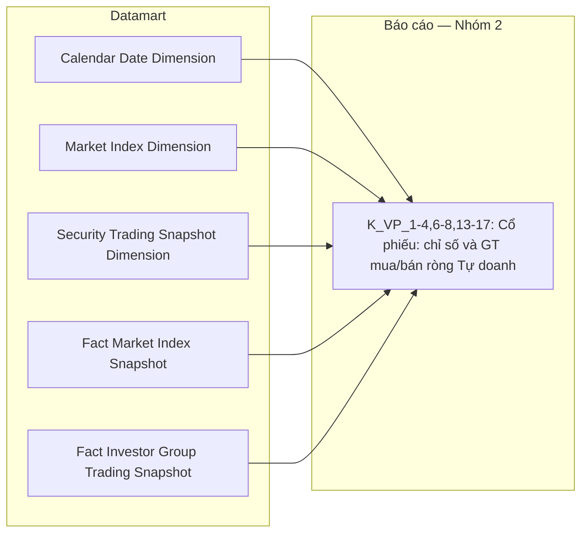
```mermaid
flowchart LR
    subgraph GOLD["Datamart"]
        Calendar_Date_Dimension["Calendar Date Dimension"]
        Market_Index_Dimension["Market Index Dimension"]
        Security_Trading_Snapshot_Dimension["Security Trading Snapshot Dimension"]
        Fact_Market_Index_Snapshot["Fact Market Index Snapshot"]
        Fact_Investor_Group_Trading_Snapshot["Fact Investor Group Trading Snapshot"]
    end
    subgraph RPT["Báo cáo — Nhóm 2"]
        R1["K_VP_1-4,6-8,13-17: Cổ phiếu: chỉ số và GT mua/bán ròng Tự doanh"]
    end
    Calendar_Date_Dimension --> R1
    Market_Index_Dimension --> R1
    Security_Trading_Snapshot_Dimension --> R1
    Fact_Market_Index_Snapshot --> R1
    Fact_Investor_Group_Trading_Snapshot --> R1
```

**Bảng grain:**

| Tên bảng | Grain |
|---|---|
| Calendar Date Dimension | 1 ngày dương lịch (Conformed Dimension) |
| Market Index Dimension | 1 tổ hợp Market Id + Market Code (SCD4A current-state); sở hữu bởi QLKD |
| Security Trading Snapshot Dimension | 1 mã chứng khoán / hợp đồng phái sinh (SCD4A current-state); sở hữu bởi GSTT |
| Fact Market Index Snapshot | 1 chỉ số (Market Code) × 1 ngày giao dịch — bản ghi cuối ngày; sở hữu bởi QLKD |
| Fact Investor Group Trading Snapshot | 1 mã chứng khoán / hợp đồng × 1 ngày giao dịch × 1 sàn (Market Id Code) × 1 nhóm NĐT (ALL / FOREIGN / PROPRIETARY); PK Investor Group Trading Snapshot Id = hash toàn bộ cột grain (Dạng B, A22) |

#### Nhóm 3 - Phái sinh >> Chỉ tiêu tổng hợp

> Phân loại: **Phân tích**
> Atomic: `End Of Day Open Interest` ← VSDC.END_OF_DAY_OPEN_INTEREST — **READY**; `Security Trading Snapshot` ← MDDS.JAD_STOCKINFOR — **READY**; `Securities Trade` ← ORDERTRADE.TRADE_BOOK_HNX — **READY** (nguồn Sổ lệnh chờ Atomic, O_VP_1)

**Mockup (suy từ BA — chưa có screenshot, O_VP_8):**

Tham số: Sản phẩm phái sinh (HĐTL VN30 / HĐTL VN100 / HĐTL TPCP / Toàn thị trường) · Loại kỳ (D/M/Q/Y) · Kỳ

| Chỉ tiêu | Kỳ báo cáo | Kỳ trước | Thay đổi | % thay đổi |
|---|---|---|---|---|
| Khối lượng mở (OI) | … | … | … | … |
| KLGD | … | … | … | … |
| KL mua NĐTNN | … | … | … | … |
| KL bán NĐTNN | … | … | … | … |
| KL mua/bán ròng NĐTNN | … | … | … | … |

> ⚠️ Presentation Grain: 1 dòng = 1 chỉ tiêu × 1 Sản phẩm phái sinh × 1 Kỳ (nhóm hợp đồng cùng sản phẩm). Storage Grain: 1 mã hợp đồng × 1 ngày (Level 4) — presentation thô hơn storage, đạt Iso-Grain.

**Source:** `Fact Derivative Contract Snapshot` → `Calendar Date Dimension`, `Security Trading Snapshot Dimension`; `Fact Investor Group Trading Snapshot` → `Calendar Date Dimension`, `Security Trading Snapshot Dimension`

**Bảng KPI:**

| KPI ID | Tên KPI | Đơn vị | Tính chất | Công thức | Ghi chú | Trạng thái |
|---|---|---|---|---|---|---|
| K_VP_1 | Kỳ | — | Chiều | Calendar Date Dimension: Calendar Date → ngày/tháng/quý/năm; Loại kỳ (D/M/Q/Y) và Từ kỳ — Đến kỳ là tham số lọc | Reuse từ Nhóm 1 (K_VP_1) — Case 1: measure vật lý có sẵn trên Fact/Dim | READY |
| K_VP_18 | Sản phẩm phái sinh | — | Chiều | Sản phẩm phái sinh = CONCAT(CASE Stock Type Code WHEN '4' THEN 'HĐTL' WHEN '5' THEN 'HĐ quyền chọn' END, ' ', CASE WHEN Product Group Id = 'FBX' THEN 'TPCP' ELSE Underlying Symbol END) trên Security Trading Snapshot Dimension với Floor Code = '03'; giá trị hiển thị: HĐTL VN30, HĐTL VN100, HĐTL TPCP, Toàn thị trường | Chiều dẫn xuất từ Security Trading Snapshot Dimension (partial — thêm Product Group Id, O_VP_7) | READY |
| K_VP_19 | Khối lượng mở (OI) | Hợp đồng | Cơ sở | SUM(Open Interest Quantity) trên Fact Derivative Contract Snapshot tại ngày giao dịch cuối cùng của kỳ, theo Sản phẩm phái sinh | Atomic End Of Day Open Interest (VSDC) nối Security Trading Snapshot theo Ticker Symbol = Symbol AND Report Date = Trading Date. Số thời điểm — tại ngày cuối kỳ | READY |
| K_VP_20 | Khối lượng mở (OI) - % thay đổi so với kỳ trước | % | Phái sinh | (K_VP_19 kỳ báo cáo − K_VP_19 kỳ trước) / K_VP_19 kỳ trước × 100 | Case 2 — tính tại presentation layer; kỳ trước — O_VP_5 | READY |
| K_VP_21 | KLGD | Hợp đồng | Cơ sở | SUM(Buy Volume) với Investor Group Code = 'ALL' và Market Id Code = 'DVX' trong kỳ, theo Sản phẩm phái sinh (mỗi giao dịch khớp tính 1 lần ở phía mua) | [!] Nguồn Securities Trade — O_VP_1 (HNX.TRADE_BOOK, market_id = 'DVX') nối Security Trading Snapshot theo Issue Code = ISIN Code. Số tổng trong kỳ | READY |
| K_VP_22 | KLGD - % thay đổi so với kỳ trước | % | Phái sinh | (K_VP_21 kỳ báo cáo − K_VP_21 kỳ trước) / K_VP_21 kỳ trước × 100 | Case 2 — tính tại presentation layer; kỳ trước — O_VP_5; BA ghi nhầm bảng nguồn OI — O_VP_6 | READY |
| K_VP_23 | KL mua NĐTNN | Hợp đồng | Cơ sở | SUM(Buy Volume) với Investor Group Code = 'FOREIGN' và Market Id Code = 'DVX' trong kỳ, theo Sản phẩm phái sinh | NĐTNN = ký tự thứ 4 số tài khoản ∈ (E, F) theo Điều kiện/SQL BA; Mô tả BA ghi Foreign Investor Type Code <> '00' — O_VP_3. [!] Nguồn Securities Trade — O_VP_1 | READY |
| K_VP_24 | KL mua NĐTNN - % thay đổi so với kỳ trước | % | Phái sinh | (K_VP_23 kỳ báo cáo − K_VP_23 kỳ trước) / K_VP_23 kỳ trước × 100 | Case 2 — tính tại presentation layer; kỳ trước — O_VP_5 | READY |
| K_VP_25 | KL bán NĐTNN | Hợp đồng | Cơ sở | SUM(Sell Volume) với Investor Group Code = 'FOREIGN' và Market Id Code = 'DVX' trong kỳ, theo Sản phẩm phái sinh | NĐTNN = ký tự thứ 4 số tài khoản ∈ (E, F) theo Điều kiện/SQL BA — O_VP_3. [!] Nguồn Securities Trade — O_VP_1 | READY |
| K_VP_26 | KL bán NĐTNN - % thay đổi so với kỳ trước | % | Phái sinh | (K_VP_25 kỳ báo cáo − K_VP_25 kỳ trước) / K_VP_25 kỳ trước × 100 | Case 2 — tính tại presentation layer; kỳ trước — O_VP_5 | READY |
| K_VP_27 | KL mua/bán ròng NĐTNN | Hợp đồng | Phái sinh | K_VP_23 − K_VP_25 | Case 2 — tính tại presentation layer từ Buy Volume / Sell Volume; [!] Nguồn Securities Trade — O_VP_1 | READY |
| K_VP_28 | KL mua/bán ròng NĐTNN - % thay đổi so với kỳ trước | % | Phái sinh | (K_VP_27 kỳ báo cáo − K_VP_27 kỳ trước) / ABS(K_VP_27 kỳ trước) × 100 | Case 2 — tính tại presentation layer; BA dòng 39 chia ABS(kỳ trước) trong khi dòng 49/59/69/79 không dùng ABS — O_VP_6; kỳ trước — O_VP_5 | READY |
| K_VP_29 | Khối lượng mở (OI) - HĐTL VN30 | Hợp đồng | Cơ sở | K_VP_19 lọc Sản phẩm phái sinh = 'HĐTL VN30' (Stock Type Code = '4' AND Underlying Symbol = 'VN30') | Case 2 — K_VP_19 lọc theo Sản phẩm phái sinh; tính tại presentation layer | READY |
| K_VP_30 | Khối lượng mở (OI) - % thay đổi so với kỳ trước - HĐTL VN30 | % | Phái sinh | (K_VP_29 kỳ báo cáo − K_VP_29 kỳ trước) / K_VP_29 kỳ trước × 100 | Case 2 — tính tại presentation layer; kỳ trước — O_VP_5 | READY |
| K_VP_31 | KLGD - HĐTL VN30 | Hợp đồng | Cơ sở | K_VP_21 lọc Sản phẩm phái sinh = 'HĐTL VN30' (Stock Type Code = '4' AND Underlying Symbol = 'VN30') | Case 2 — K_VP_21 lọc theo Sản phẩm phái sinh; tính tại presentation layer; [!] Nguồn Securities Trade — O_VP_1 | READY |
| K_VP_32 | KLGD - HĐTL VN30 - % thay đổi so với kỳ trước - HĐTL VN30 | % | Phái sinh | (K_VP_31 kỳ báo cáo − K_VP_31 kỳ trước) / K_VP_31 kỳ trước × 100 | Case 2 — tính tại presentation layer; kỳ trước — O_VP_5 | READY |
| K_VP_33 | KL mua NĐTNN - HĐTL VN30 | Hợp đồng | Cơ sở | K_VP_23 lọc Sản phẩm phái sinh = 'HĐTL VN30' (Stock Type Code = '4' AND Underlying Symbol = 'VN30') | Case 2 — K_VP_23 lọc theo Sản phẩm phái sinh; tính tại presentation layer; [!] Nguồn Securities Trade — O_VP_1 | READY |
| K_VP_34 | KL mua NĐTNN - HĐTL VN30 - % thay đổi so với kỳ trước - HĐTL VN30 | % | Phái sinh | (K_VP_33 kỳ báo cáo − K_VP_33 kỳ trước) / K_VP_33 kỳ trước × 100 | Case 2 — tính tại presentation layer; kỳ trước — O_VP_5 | READY |
| K_VP_35 | KL bán NĐTNN - HĐTL VN30 | Hợp đồng | Cơ sở | K_VP_25 lọc Sản phẩm phái sinh = 'HĐTL VN30' (Stock Type Code = '4' AND Underlying Symbol = 'VN30') | Case 2 — K_VP_25 lọc theo Sản phẩm phái sinh; tính tại presentation layer; [!] Nguồn Securities Trade — O_VP_1 | READY |
| K_VP_36 | KL bán NĐTNN - HĐTL VN30 - % thay đổi so với kỳ trước - HĐTL VN30 | % | Phái sinh | (K_VP_35 kỳ báo cáo − K_VP_35 kỳ trước) / K_VP_35 kỳ trước × 100 | Case 2 — tính tại presentation layer; kỳ trước — O_VP_5 | READY |
| K_VP_37 | KL mua/bán ròng NĐTNN - HĐTL VN30 | Hợp đồng | Cơ sở | K_VP_27 lọc Sản phẩm phái sinh = 'HĐTL VN30' (Stock Type Code = '4' AND Underlying Symbol = 'VN30') | Case 2 — K_VP_27 lọc theo Sản phẩm phái sinh; tính tại presentation layer; [!] Nguồn Securities Trade — O_VP_1 | READY |
| K_VP_38 | KL mua/bán ròng NĐTNN - HĐTL VN30 - % thay đổi so với kỳ trước - HĐTL VN30 | % | Phái sinh | (K_VP_37 kỳ báo cáo − K_VP_37 kỳ trước) / K_VP_37 kỳ trước × 100 | Case 2 — tính tại presentation layer; kỳ trước — O_VP_5; BA không dùng ABS (khác dòng 39) — O_VP_6 | READY |
| K_VP_39 | Khối lượng mở (OI) - HĐTL VN100 | Hợp đồng | Cơ sở | K_VP_19 lọc Sản phẩm phái sinh = 'HĐTL VN100' (Stock Type Code = '4' AND Underlying Symbol = 'VN100') | Case 2 — K_VP_19 lọc theo Sản phẩm phái sinh; tính tại presentation layer | READY |
| K_VP_40 | Khối lượng mở (OI) - % thay đổi so với kỳ trước - HĐTL VN100 | % | Phái sinh | (K_VP_39 kỳ báo cáo − K_VP_39 kỳ trước) / K_VP_39 kỳ trước × 100 | Case 2 — tính tại presentation layer; kỳ trước — O_VP_5 | READY |
| K_VP_41 | KLGD - HĐTL VN100 | Hợp đồng | Cơ sở | K_VP_21 lọc Sản phẩm phái sinh = 'HĐTL VN100' (Stock Type Code = '4' AND Underlying Symbol = 'VN100') | Case 2 — K_VP_21 lọc theo Sản phẩm phái sinh; tính tại presentation layer; [!] Nguồn Securities Trade — O_VP_1 | READY |
| K_VP_42 | KLGD - HĐTL VN100 - % thay đổi so với kỳ trước - HĐTL VN100 | % | Phái sinh | (K_VP_41 kỳ báo cáo − K_VP_41 kỳ trước) / K_VP_41 kỳ trước × 100 | Case 2 — tính tại presentation layer; kỳ trước — O_VP_5 | READY |
| K_VP_43 | KL mua NĐTNN - HĐTL VN100 | Hợp đồng | Cơ sở | K_VP_23 lọc Sản phẩm phái sinh = 'HĐTL VN100' (Stock Type Code = '4' AND Underlying Symbol = 'VN100') | Case 2 — K_VP_23 lọc theo Sản phẩm phái sinh; tính tại presentation layer; [!] Nguồn Securities Trade — O_VP_1 | READY |
| K_VP_44 | KL mua NĐTNN - HĐTL VN100 - % thay đổi so với kỳ trước - HĐTL VN100 | % | Phái sinh | (K_VP_43 kỳ báo cáo − K_VP_43 kỳ trước) / K_VP_43 kỳ trước × 100 | Case 2 — tính tại presentation layer; kỳ trước — O_VP_5 | READY |
| K_VP_45 | KL bán NĐTNN - HĐTL VN100 | Hợp đồng | Cơ sở | K_VP_25 lọc Sản phẩm phái sinh = 'HĐTL VN100' (Stock Type Code = '4' AND Underlying Symbol = 'VN100') | Case 2 — K_VP_25 lọc theo Sản phẩm phái sinh; tính tại presentation layer; [!] Nguồn Securities Trade — O_VP_1 | READY |
| K_VP_46 | KL bán NĐTNN - HĐTL VN100 - % thay đổi so với kỳ trước - HĐTL VN100 | % | Phái sinh | (K_VP_45 kỳ báo cáo − K_VP_45 kỳ trước) / K_VP_45 kỳ trước × 100 | Case 2 — tính tại presentation layer; kỳ trước — O_VP_5 | READY |
| K_VP_47 | KL mua/bán ròng NĐTNN - HĐTL VN100 | Hợp đồng | Cơ sở | K_VP_27 lọc Sản phẩm phái sinh = 'HĐTL VN100' (Stock Type Code = '4' AND Underlying Symbol = 'VN100') | Case 2 — K_VP_27 lọc theo Sản phẩm phái sinh; tính tại presentation layer; [!] Nguồn Securities Trade — O_VP_1 | READY |
| K_VP_48 | KL mua/bán ròng NĐTNN - HĐTL VN100 - % thay đổi so với kỳ trước - HĐTL VN100 | % | Phái sinh | (K_VP_47 kỳ báo cáo − K_VP_47 kỳ trước) / K_VP_47 kỳ trước × 100 | Case 2 — tính tại presentation layer; kỳ trước — O_VP_5; BA không dùng ABS (khác dòng 39) — O_VP_6 | READY |
| K_VP_49 | Khối lượng mở (OI) - HĐTL TPCP | Hợp đồng | Cơ sở | K_VP_19 lọc Sản phẩm phái sinh = 'HĐTL TPCP' (Stock Type Code = '4' AND Product Group Id = 'FBX') | Case 2 — K_VP_19 lọc theo Sản phẩm phái sinh; tính tại presentation layer | READY |
| K_VP_50 | Khối lượng mở (OI) - % thay đổi so với kỳ trước - HĐTL TPCP | % | Phái sinh | (K_VP_49 kỳ báo cáo − K_VP_49 kỳ trước) / K_VP_49 kỳ trước × 100 | Case 2 — tính tại presentation layer; kỳ trước — O_VP_5 | READY |
| K_VP_51 | KLGD - HĐTL TPCP | Hợp đồng | Cơ sở | K_VP_21 lọc Sản phẩm phái sinh = 'HĐTL TPCP' (Stock Type Code = '4' AND Product Group Id = 'FBX') | Case 2 — K_VP_21 lọc theo Sản phẩm phái sinh; tính tại presentation layer; [!] Nguồn Securities Trade — O_VP_1 | READY |
| K_VP_52 | KLGD - HĐTL TPCP - % thay đổi so với kỳ trước - HĐTL TPCP | % | Phái sinh | (K_VP_51 kỳ báo cáo − K_VP_51 kỳ trước) / K_VP_51 kỳ trước × 100 | Case 2 — tính tại presentation layer; kỳ trước — O_VP_5 | READY |
| K_VP_53 | KL mua NĐTNN - HĐTL TPCP | Hợp đồng | Cơ sở | K_VP_23 lọc Sản phẩm phái sinh = 'HĐTL TPCP' (Stock Type Code = '4' AND Product Group Id = 'FBX') | Case 2 — K_VP_23 lọc theo Sản phẩm phái sinh; tính tại presentation layer; [!] Nguồn Securities Trade — O_VP_1 | READY |
| K_VP_54 | KL mua NĐTNN - HĐTL TPCP - % thay đổi so với kỳ trước - HĐTL TPCP | % | Phái sinh | (K_VP_53 kỳ báo cáo − K_VP_53 kỳ trước) / K_VP_53 kỳ trước × 100 | Case 2 — tính tại presentation layer; kỳ trước — O_VP_5 | READY |
| K_VP_55 | KL bán NĐTNN - HĐTL TPCP | Hợp đồng | Cơ sở | K_VP_25 lọc Sản phẩm phái sinh = 'HĐTL TPCP' (Stock Type Code = '4' AND Product Group Id = 'FBX') | Case 2 — K_VP_25 lọc theo Sản phẩm phái sinh; tính tại presentation layer; [!] Nguồn Securities Trade — O_VP_1 | READY |
| K_VP_56 | KL bán NĐTNN - HĐTL TPCP - % thay đổi so với kỳ trước - HĐTL TPCP | % | Phái sinh | (K_VP_55 kỳ báo cáo − K_VP_55 kỳ trước) / K_VP_55 kỳ trước × 100 | Case 2 — tính tại presentation layer; kỳ trước — O_VP_5 | READY |
| K_VP_57 | KL mua/bán ròng NĐTNN - HĐTL TPCP | Hợp đồng | Cơ sở | K_VP_27 lọc Sản phẩm phái sinh = 'HĐTL TPCP' (Stock Type Code = '4' AND Product Group Id = 'FBX') | Case 2 — K_VP_27 lọc theo Sản phẩm phái sinh; tính tại presentation layer; [!] Nguồn Securities Trade — O_VP_1 | READY |
| K_VP_58 | KL mua/bán ròng NĐTNN - HĐTL TPCP - % thay đổi so với kỳ trước - HĐTL TPCP | % | Phái sinh | (K_VP_57 kỳ báo cáo − K_VP_57 kỳ trước) / K_VP_57 kỳ trước × 100 | Case 2 — tính tại presentation layer; kỳ trước — O_VP_5; BA không dùng ABS (khác dòng 39) — O_VP_6 | READY |
| K_VP_59 | Khối lượng mở (OI) - Toàn thị trường | Hợp đồng | Cơ sở | K_VP_19 lọc Sản phẩm phái sinh = 'Toàn thị trường' (mọi hợp đồng phái sinh (Floor Code = '03'), không lọc sản phẩm) | Case 2 — K_VP_19 lọc theo Sản phẩm phái sinh; tính tại presentation layer | READY |
| K_VP_60 | Khối lượng mở (OI) - % thay đổi so với kỳ trước - Toàn thị trường | % | Phái sinh | (K_VP_59 kỳ báo cáo − K_VP_59 kỳ trước) / K_VP_59 kỳ trước × 100 | Case 2 — tính tại presentation layer; kỳ trước — O_VP_5 | READY |
| K_VP_61 | KLGD - Toàn thị trường | Hợp đồng | Cơ sở | K_VP_21 lọc Sản phẩm phái sinh = 'Toàn thị trường' (mọi hợp đồng phái sinh (Floor Code = '03'), không lọc sản phẩm) | Case 2 — K_VP_21 lọc theo Sản phẩm phái sinh; tính tại presentation layer; [!] Nguồn Securities Trade — O_VP_1 | READY |
| K_VP_62 | KLGD - Toàn thị trường - % thay đổi so với kỳ trước - Toàn thị trường | % | Phái sinh | (K_VP_61 kỳ báo cáo − K_VP_61 kỳ trước) / K_VP_61 kỳ trước × 100 | Case 2 — tính tại presentation layer; kỳ trước — O_VP_5 | READY |
| K_VP_63 | KL mua NĐTNN - Toàn thị trường | Hợp đồng | Cơ sở | K_VP_23 lọc Sản phẩm phái sinh = 'Toàn thị trường' (mọi hợp đồng phái sinh (Floor Code = '03'), không lọc sản phẩm) | Case 2 — K_VP_23 lọc theo Sản phẩm phái sinh; tính tại presentation layer; [!] Nguồn Securities Trade — O_VP_1 | READY |
| K_VP_64 | KL mua NĐTNN - Toàn thị trường - % thay đổi so với kỳ trước - Toàn thị trường | % | Phái sinh | (K_VP_63 kỳ báo cáo − K_VP_63 kỳ trước) / K_VP_63 kỳ trước × 100 | Case 2 — tính tại presentation layer; kỳ trước — O_VP_5 | READY |
| K_VP_65 | KL bán NĐTNN - Toàn thị trường | Hợp đồng | Cơ sở | K_VP_25 lọc Sản phẩm phái sinh = 'Toàn thị trường' (mọi hợp đồng phái sinh (Floor Code = '03'), không lọc sản phẩm) | Case 2 — K_VP_25 lọc theo Sản phẩm phái sinh; tính tại presentation layer; [!] Nguồn Securities Trade — O_VP_1 | READY |
| K_VP_66 | KL bán NĐTNN - Toàn thị trường - % thay đổi so với kỳ trước - Toàn thị trường | % | Phái sinh | (K_VP_65 kỳ báo cáo − K_VP_65 kỳ trước) / K_VP_65 kỳ trước × 100 | Case 2 — tính tại presentation layer; kỳ trước — O_VP_5 | READY |
| K_VP_67 | KL mua/bán ròng NĐTNN - Toàn thị trường | Hợp đồng | Cơ sở | K_VP_27 lọc Sản phẩm phái sinh = 'Toàn thị trường' (mọi hợp đồng phái sinh (Floor Code = '03'), không lọc sản phẩm) | Case 2 — K_VP_27 lọc theo Sản phẩm phái sinh; tính tại presentation layer; [!] Nguồn Securities Trade — O_VP_1 | READY |
| K_VP_68 | KL mua/bán ròng NĐTNN - Toàn thị trường - % thay đổi so với kỳ trước - Toàn thị trường | % | Phái sinh | (K_VP_67 kỳ báo cáo − K_VP_67 kỳ trước) / K_VP_67 kỳ trước × 100 | Case 2 — tính tại presentation layer; kỳ trước — O_VP_5; BA không dùng ABS (khác dòng 39) — O_VP_6 | READY |

**Star Schema:**

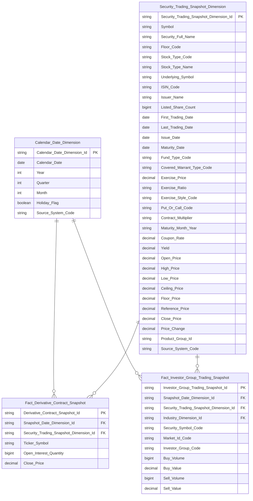
```mermaid
erDiagram
    Calendar_Date_Dimension {
        string Calendar_Date_Dimension_Id PK
        date Calendar_Date
        int Year
        int Quarter
        int Month
        boolean Holiday_Flag
        string Source_System_Code
    }
    Security_Trading_Snapshot_Dimension {
        string Security_Trading_Snapshot_Dimension_Id PK
        string Symbol
        string Security_Full_Name
        string Floor_Code
        string Stock_Type_Code
        string Stock_Type_Name
        string Underlying_Symbol
        string ISIN_Code
        string Issuer_Name
        bigint Listed_Share_Count
        date First_Trading_Date
        date Last_Trading_Date
        date Issue_Date
        date Maturity_Date
        string Fund_Type_Code
        string Covered_Warrant_Type_Code
        decimal Exercise_Price
        string Exercise_Ratio
        string Exercise_Style_Code
        string Put_Or_Call_Code
        string Contract_Multiplier
        string Maturity_Month_Year
        decimal Coupon_Rate
        decimal Yield
        decimal Open_Price
        decimal High_Price
        decimal Low_Price
        decimal Ceiling_Price
        decimal Floor_Price
        decimal Reference_Price
        decimal Close_Price
        decimal Price_Change
        string Product_Group_Id
        string Source_System_Code
    }
    Fact_Derivative_Contract_Snapshot {
        string Derivative_Contract_Snapshot_Id PK
        string Snapshot_Date_Dimension_Id FK
        string Security_Trading_Snapshot_Dimension_Id FK
        string Ticker_Symbol
        bigint Open_Interest_Quantity
        decimal Close_Price
    }
    Fact_Investor_Group_Trading_Snapshot {
        string Investor_Group_Trading_Snapshot_Id PK
        string Snapshot_Date_Dimension_Id FK
        string Security_Trading_Snapshot_Dimension_Id FK
        string Industry_Dimension_Id FK
        string Security_Symbol_Code
        string Market_Id_Code
        string Investor_Group_Code
        bigint Buy_Volume
        decimal Buy_Value
        bigint Sell_Volume
        decimal Sell_Value
    }
    Calendar_Date_Dimension ||--o{ Fact_Derivative_Contract_Snapshot : " "
    Security_Trading_Snapshot_Dimension ||--o{ Fact_Derivative_Contract_Snapshot : " "
    Calendar_Date_Dimension ||--o{ Fact_Investor_Group_Trading_Snapshot : " "
    Security_Trading_Snapshot_Dimension ||--o{ Fact_Investor_Group_Trading_Snapshot : " "
```

**Lineage Mart → Báo cáo:**

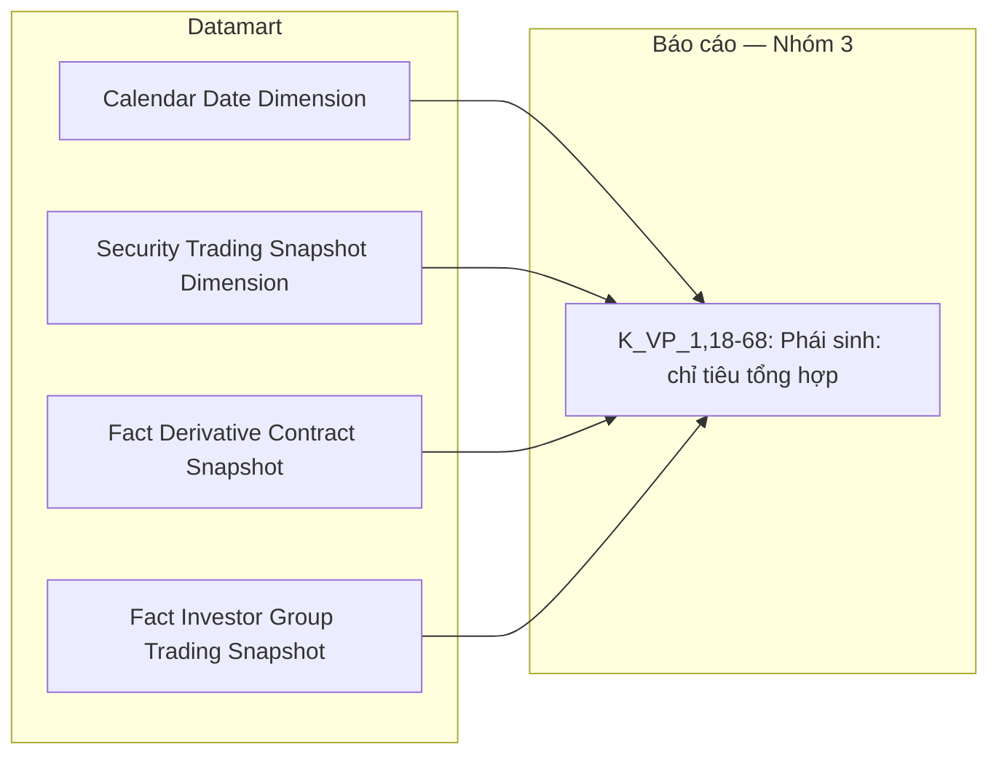
```mermaid
flowchart LR
    subgraph GOLD["Datamart"]
        Calendar_Date_Dimension["Calendar Date Dimension"]
        Security_Trading_Snapshot_Dimension["Security Trading Snapshot Dimension"]
        Fact_Derivative_Contract_Snapshot["Fact Derivative Contract Snapshot"]
        Fact_Investor_Group_Trading_Snapshot["Fact Investor Group Trading Snapshot"]
    end
    subgraph RPT["Báo cáo — Nhóm 3"]
        R1["K_VP_1,18-68: Phái sinh: chỉ tiêu tổng hợp"]
    end
    Calendar_Date_Dimension --> R1
    Security_Trading_Snapshot_Dimension --> R1
    Fact_Derivative_Contract_Snapshot --> R1
    Fact_Investor_Group_Trading_Snapshot --> R1
```

**Bảng grain:**

| Tên bảng | Grain |
|---|---|
| Calendar Date Dimension | 1 ngày dương lịch (Conformed Dimension) |
| Security Trading Snapshot Dimension | 1 mã chứng khoán / hợp đồng phái sinh (SCD4A current-state); sở hữu bởi GSTT |
| Fact Derivative Contract Snapshot | 1 mã hợp đồng phái sinh × 1 ngày giao dịch; PK Derivative Contract Snapshot Id = hash (Snapshot Date, Ticker Symbol) (Dạng B, A22) |
| Fact Investor Group Trading Snapshot | 1 mã chứng khoán / hợp đồng × 1 ngày giao dịch × 1 sàn (Market Id Code) × 1 nhóm NĐT (ALL / FOREIGN / PROPRIETARY); PK Investor Group Trading Snapshot Id = hash toàn bộ cột grain (Dạng B, A22) |

#### Nhóm 4 - Phái sinh >> Giá HĐTL

> Phân loại: **Phân tích**
> Atomic: `Security Trading Snapshot` ← MDDS.JAD_STOCKINFOR — **READY**

**Mockup (suy từ BA — chưa có screenshot, O_VP_8):**

Tham số: Sản phẩm phái sinh · Loại kỳ (D/M/Q/Y) · Kỳ

| Sản phẩm phái sinh | Tháng đáo hạn | Giá |
|---|---|---|
| HĐTL VN30 | 2611 | … |

> ⚠️ Presentation Grain: 1 dòng = 1 Sản phẩm phái sinh × 1 Tháng đáo hạn (= 1 mã hợp đồng) tại ngày cuối kỳ. Storage Grain: 1 mã hợp đồng × 1 ngày (Level 4) — đạt Iso-Grain.

**Source:** `Fact Derivative Contract Snapshot` → `Calendar Date Dimension`, `Security Trading Snapshot Dimension`

**Bảng KPI:**

| KPI ID | Tên KPI | Đơn vị | Tính chất | Công thức | Ghi chú | Trạng thái |
|---|---|---|---|---|---|---|
| K_VP_1 | Kỳ | — | Chiều | Calendar Date Dimension: Calendar Date → ngày/tháng/quý/năm; Loại kỳ (D/M/Q/Y) và Từ kỳ — Đến kỳ là tham số lọc | Reuse từ Nhóm 1 (K_VP_1) — Case 1: measure vật lý có sẵn trên Fact/Dim | READY |
| K_VP_18 | Sản phẩm phái sinh | — | Chiều | Sản phẩm phái sinh = CONCAT(CASE Stock Type Code WHEN '4' THEN 'HĐTL' WHEN '5' THEN 'HĐ quyền chọn' END, ' ', CASE WHEN Product Group Id = 'FBX' THEN 'TPCP' ELSE Underlying Symbol END) trên Security Trading Snapshot Dimension với Floor Code = '03'; giá trị hiển thị: HĐTL VN30, HĐTL VN100, HĐTL TPCP, Toàn thị trường | Reuse từ Nhóm 3 (K_VP_18) — Case 1: measure vật lý có sẵn trên Fact/Dim | READY |
| K_VP_69 | Tháng đáo hạn | — | Cơ sở | Security Trading Snapshot Dimension.Maturity Month Year của hợp đồng phái sinh | Case 1 — thuộc tính Dimension (Maturity Month Year) | READY |
| K_VP_70 | Giá | Giá HĐ | Cơ sở | Fact Derivative Contract Snapshot.Close Price (giá đóng cửa, bản ghi cuối ngày) của từng mã hợp đồng tại ngày giao dịch cuối cùng có dữ liệu trong kỳ | Atomic Security Trading Snapshot (MDDS.JAD_STOCKINFOR, Floor Code = '03'); không phụ thuộc Securities Trade | READY |

**Star Schema:**

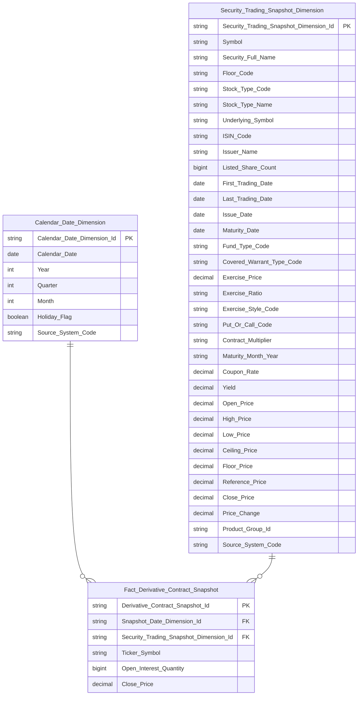
```mermaid
erDiagram
    Calendar_Date_Dimension {
        string Calendar_Date_Dimension_Id PK
        date Calendar_Date
        int Year
        int Quarter
        int Month
        boolean Holiday_Flag
        string Source_System_Code
    }
    Security_Trading_Snapshot_Dimension {
        string Security_Trading_Snapshot_Dimension_Id PK
        string Symbol
        string Security_Full_Name
        string Floor_Code
        string Stock_Type_Code
        string Stock_Type_Name
        string Underlying_Symbol
        string ISIN_Code
        string Issuer_Name
        bigint Listed_Share_Count
        date First_Trading_Date
        date Last_Trading_Date
        date Issue_Date
        date Maturity_Date
        string Fund_Type_Code
        string Covered_Warrant_Type_Code
        decimal Exercise_Price
        string Exercise_Ratio
        string Exercise_Style_Code
        string Put_Or_Call_Code
        string Contract_Multiplier
        string Maturity_Month_Year
        decimal Coupon_Rate
        decimal Yield
        decimal Open_Price
        decimal High_Price
        decimal Low_Price
        decimal Ceiling_Price
        decimal Floor_Price
        decimal Reference_Price
        decimal Close_Price
        decimal Price_Change
        string Product_Group_Id
        string Source_System_Code
    }
    Fact_Derivative_Contract_Snapshot {
        string Derivative_Contract_Snapshot_Id PK
        string Snapshot_Date_Dimension_Id FK
        string Security_Trading_Snapshot_Dimension_Id FK
        string Ticker_Symbol
        bigint Open_Interest_Quantity
        decimal Close_Price
    }
    Calendar_Date_Dimension ||--o{ Fact_Derivative_Contract_Snapshot : " "
    Security_Trading_Snapshot_Dimension ||--o{ Fact_Derivative_Contract_Snapshot : " "
```

**Lineage Mart → Báo cáo:**

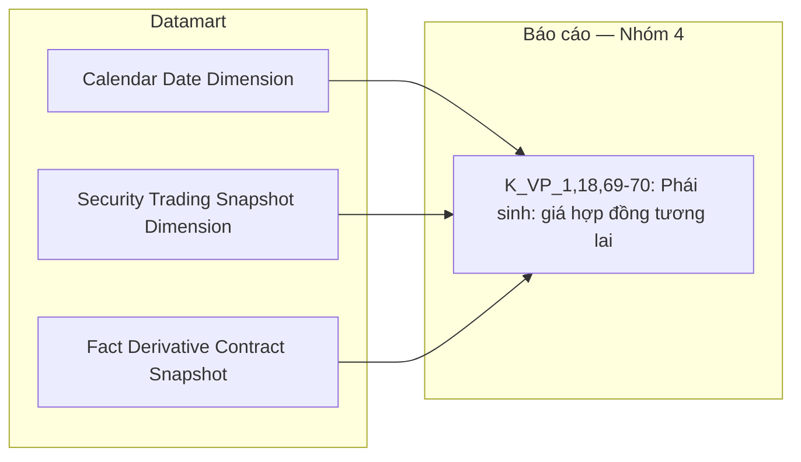
```mermaid
flowchart LR
    subgraph GOLD["Datamart"]
        Calendar_Date_Dimension["Calendar Date Dimension"]
        Security_Trading_Snapshot_Dimension["Security Trading Snapshot Dimension"]
        Fact_Derivative_Contract_Snapshot["Fact Derivative Contract Snapshot"]
    end
    subgraph RPT["Báo cáo — Nhóm 4"]
        R1["K_VP_1,18,69-70: Phái sinh: giá hợp đồng tương lai"]
    end
    Calendar_Date_Dimension --> R1
    Security_Trading_Snapshot_Dimension --> R1
    Fact_Derivative_Contract_Snapshot --> R1
```

**Bảng grain:**

| Tên bảng | Grain |
|---|---|
| Calendar Date Dimension | 1 ngày dương lịch (Conformed Dimension) |
| Security Trading Snapshot Dimension | 1 mã chứng khoán / hợp đồng phái sinh (SCD4A current-state); sở hữu bởi GSTT |
| Fact Derivative Contract Snapshot | 1 mã hợp đồng phái sinh × 1 ngày giao dịch; PK Derivative Contract Snapshot Id = hash (Snapshot Date, Ticker Symbol) (Dạng B, A22) |

#### Nhóm 5 - Phái sinh >> Biểu đồ Diễn biến giao dịch thị trường phái sinh

> Phân loại: **Phân tích**
> Atomic: `End Of Day Open Interest` ← VSDC.END_OF_DAY_OPEN_INTEREST — **READY**; `Security Trading Snapshot` ← MDDS.JAD_STOCKINFOR — **READY**; `Securities Trade` ← ORDERTRADE.TRADE_BOOK_HNX — **READY** (nguồn Sổ lệnh chờ Atomic, O_VP_1)

**Mockup (suy từ BA — chưa có screenshot, O_VP_8):**

Tham số: Sản phẩm phái sinh · Loại kỳ (D/M/Q/Y) · Từ kỳ — Đến kỳ

| Kỳ | KLGD | Khối lượng mở (OI) |
|---|---|---|
| 2026-09 | … | … |

> ⚠️ Presentation Grain: 1 điểm biểu đồ = 1 Kỳ × 1 Sản phẩm phái sinh. Storage Grain: 1 mã hợp đồng × 1 ngày (Level 4) — đạt Iso-Grain.

**Source:** `Fact Derivative Contract Snapshot` → `Calendar Date Dimension`, `Security Trading Snapshot Dimension`; `Fact Investor Group Trading Snapshot` → `Calendar Date Dimension`, `Security Trading Snapshot Dimension`

**Bảng KPI:**

| KPI ID | Tên KPI | Đơn vị | Tính chất | Công thức | Ghi chú | Trạng thái |
|---|---|---|---|---|---|---|
| K_VP_1 | Kỳ | — | Chiều | Calendar Date Dimension: Calendar Date → ngày/tháng/quý/năm; Loại kỳ (D/M/Q/Y) và Từ kỳ — Đến kỳ là tham số lọc | Reuse từ Nhóm 1 (K_VP_1) — Case 1: measure vật lý có sẵn trên Fact/Dim | READY |
| K_VP_18 | Sản phẩm phái sinh | — | Chiều | Sản phẩm phái sinh = CONCAT(CASE Stock Type Code WHEN '4' THEN 'HĐTL' WHEN '5' THEN 'HĐ quyền chọn' END, ' ', CASE WHEN Product Group Id = 'FBX' THEN 'TPCP' ELSE Underlying Symbol END) trên Security Trading Snapshot Dimension với Floor Code = '03'; giá trị hiển thị: HĐTL VN30, HĐTL VN100, HĐTL TPCP, Toàn thị trường | Reuse từ Nhóm 3 (K_VP_18) — Case 1: measure vật lý có sẵn trên Fact/Dim | READY |
| K_VP_21 | KLGD | Hợp đồng | Cơ sở | SUM(Buy Volume) với Investor Group Code = 'ALL' và Market Id Code = 'DVX' trong kỳ, theo Sản phẩm phái sinh (mỗi giao dịch khớp tính 1 lần ở phía mua) | Reuse từ Nhóm 3 (K_VP_21) — Case 1: measure vật lý có sẵn trên Fact/Dim | READY |
| K_VP_19 | Khối lượng mở (OI) | Hợp đồng | Cơ sở | SUM(Open Interest Quantity) trên Fact Derivative Contract Snapshot tại ngày giao dịch cuối cùng của kỳ, theo Sản phẩm phái sinh | Reuse từ Nhóm 3 (K_VP_19) — Case 1: measure vật lý có sẵn trên Fact/Dim | READY |
| K_VP_31 | KLGD - HĐTL VN30 | Hợp đồng | Cơ sở | K_VP_21 lọc Sản phẩm phái sinh = 'HĐTL VN30' (Stock Type Code = '4' AND Underlying Symbol = 'VN30') | Reuse từ Nhóm 3 (K_VP_31) — Case 2: tính toán tại presentation layer, không lưu cột riêng trên Fact | READY |
| K_VP_29 | Khối lượng mở (OI) - HĐTL VN30 | Hợp đồng | Cơ sở | K_VP_19 lọc Sản phẩm phái sinh = 'HĐTL VN30' (Stock Type Code = '4' AND Underlying Symbol = 'VN30') | Reuse từ Nhóm 3 (K_VP_29) — Case 2: tính toán tại presentation layer, không lưu cột riêng trên Fact | READY |
| K_VP_41 | KLGD - HĐTL VN100 | Hợp đồng | Cơ sở | K_VP_21 lọc Sản phẩm phái sinh = 'HĐTL VN100' (Stock Type Code = '4' AND Underlying Symbol = 'VN100') | Reuse từ Nhóm 3 (K_VP_41) — Case 2: tính toán tại presentation layer, không lưu cột riêng trên Fact | READY |
| K_VP_39 | Khối lượng mở (OI) - HĐTL VN100 | Hợp đồng | Cơ sở | K_VP_19 lọc Sản phẩm phái sinh = 'HĐTL VN100' (Stock Type Code = '4' AND Underlying Symbol = 'VN100') | Reuse từ Nhóm 3 (K_VP_39) — Case 2: tính toán tại presentation layer, không lưu cột riêng trên Fact | READY |
| K_VP_51 | KLGD - HĐTL TPCP | Hợp đồng | Cơ sở | K_VP_21 lọc Sản phẩm phái sinh = 'HĐTL TPCP' (Stock Type Code = '4' AND Product Group Id = 'FBX') | Reuse từ Nhóm 3 (K_VP_51) — Case 2: tính toán tại presentation layer, không lưu cột riêng trên Fact. BA nhãn 'HĐTL VN100' nhưng điều kiện Product Group Id = 'FBX' (TPCP) — O_VP_6 | READY |
| K_VP_49 | Khối lượng mở (OI) - HĐTL TPCP | Hợp đồng | Cơ sở | K_VP_19 lọc Sản phẩm phái sinh = 'HĐTL TPCP' (Stock Type Code = '4' AND Product Group Id = 'FBX') | Reuse từ Nhóm 3 (K_VP_49) — Case 2: tính toán tại presentation layer, không lưu cột riêng trên Fact. BA nhãn 'HĐTL VN100' nhưng điều kiện Product Group Id = 'FBX' (TPCP) — O_VP_6 | READY |
| K_VP_61 | KLGD - Toàn thị trường | Hợp đồng | Cơ sở | K_VP_21 lọc Sản phẩm phái sinh = 'Toàn thị trường' (mọi hợp đồng phái sinh (Floor Code = '03'), không lọc sản phẩm) | Reuse từ Nhóm 3 (K_VP_61) — Case 2: tính toán tại presentation layer, không lưu cột riêng trên Fact | READY |
| K_VP_59 | Khối lượng mở (OI) - Toàn thị trường | Hợp đồng | Cơ sở | K_VP_19 lọc Sản phẩm phái sinh = 'Toàn thị trường' (mọi hợp đồng phái sinh (Floor Code = '03'), không lọc sản phẩm) | Reuse từ Nhóm 3 (K_VP_59) — Case 2: tính toán tại presentation layer, không lưu cột riêng trên Fact | READY |

**Star Schema:**

```mermaid
erDiagram
    Calendar_Date_Dimension {
        string Calendar_Date_Dimension_Id PK
        date Calendar_Date
        int Year
        int Quarter
        int Month
        boolean Holiday_Flag
        string Source_System_Code
    }
    Security_Trading_Snapshot_Dimension {
        string Security_Trading_Snapshot_Dimension_Id PK
        string Symbol
        string Security_Full_Name
        string Floor_Code
        string Stock_Type_Code
        string Stock_Type_Name
        string Underlying_Symbol
        string ISIN_Code
        string Issuer_Name
        bigint Listed_Share_Count
        date First_Trading_Date
        date Last_Trading_Date
        date Issue_Date
        date Maturity_Date
        string Fund_Type_Code
        string Covered_Warrant_Type_Code
        decimal Exercise_Price
        string Exercise_Ratio
        string Exercise_Style_Code
        string Put_Or_Call_Code
        string Contract_Multiplier
        string Maturity_Month_Year
        decimal Coupon_Rate
        decimal Yield
        decimal Open_Price
        decimal High_Price
        decimal Low_Price
        decimal Ceiling_Price
        decimal Floor_Price
        decimal Reference_Price
        decimal Close_Price
        decimal Price_Change
        string Product_Group_Id
        string Source_System_Code
    }
    Fact_Derivative_Contract_Snapshot {
        string Derivative_Contract_Snapshot_Id PK
        string Snapshot_Date_Dimension_Id FK
        string Security_Trading_Snapshot_Dimension_Id FK
        string Ticker_Symbol
        bigint Open_Interest_Quantity
        decimal Close_Price
    }
    Fact_Investor_Group_Trading_Snapshot {
        string Investor_Group_Trading_Snapshot_Id PK
        string Snapshot_Date_Dimension_Id FK
        string Security_Trading_Snapshot_Dimension_Id FK
        string Industry_Dimension_Id FK
        string Security_Symbol_Code
        string Market_Id_Code
        string Investor_Group_Code
        bigint Buy_Volume
        decimal Buy_Value
        bigint Sell_Volume
        decimal Sell_Value
    }
    Calendar_Date_Dimension ||--o{ Fact_Derivative_Contract_Snapshot : " "
    Security_Trading_Snapshot_Dimension ||--o{ Fact_Derivative_Contract_Snapshot : " "
    Calendar_Date_Dimension ||--o{ Fact_Investor_Group_Trading_Snapshot : " "
    Security_Trading_Snapshot_Dimension ||--o{ Fact_Investor_Group_Trading_Snapshot : " "
```

**Lineage Mart → Báo cáo:**

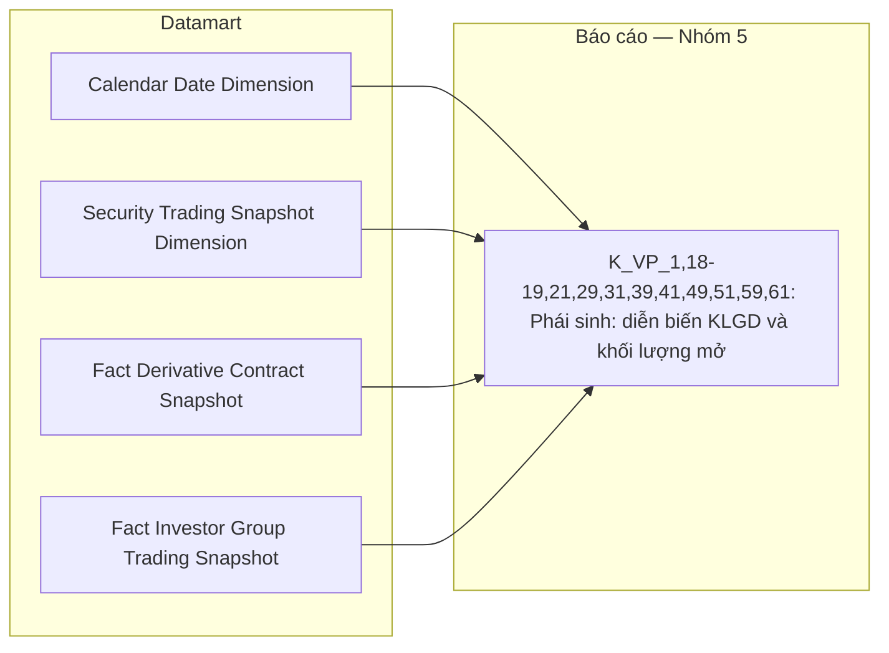
```mermaid
flowchart LR
    subgraph GOLD["Datamart"]
        Calendar_Date_Dimension["Calendar Date Dimension"]
        Security_Trading_Snapshot_Dimension["Security Trading Snapshot Dimension"]
        Fact_Derivative_Contract_Snapshot["Fact Derivative Contract Snapshot"]
        Fact_Investor_Group_Trading_Snapshot["Fact Investor Group Trading Snapshot"]
    end
    subgraph RPT["Báo cáo — Nhóm 5"]
        R1["K_VP_1,18-19,21,29,31,39,41,49,51,59,61: Phái sinh: diễn biến KLGD và khối lượng mở"]
    end
    Calendar_Date_Dimension --> R1
    Security_Trading_Snapshot_Dimension --> R1
    Fact_Derivative_Contract_Snapshot --> R1
    Fact_Investor_Group_Trading_Snapshot --> R1
```

**Bảng grain:**

| Tên bảng | Grain |
|---|---|
| Calendar Date Dimension | 1 ngày dương lịch (Conformed Dimension) |
| Security Trading Snapshot Dimension | 1 mã chứng khoán / hợp đồng phái sinh (SCD4A current-state); sở hữu bởi GSTT |
| Fact Derivative Contract Snapshot | 1 mã hợp đồng phái sinh × 1 ngày giao dịch; PK Derivative Contract Snapshot Id = hash (Snapshot Date, Ticker Symbol) (Dạng B, A22) |
| Fact Investor Group Trading Snapshot | 1 mã chứng khoán / hợp đồng × 1 ngày giao dịch × 1 sàn (Market Id Code) × 1 nhóm NĐT (ALL / FOREIGN / PROPRIETARY); PK Investor Group Trading Snapshot Id = hash toàn bộ cột grain (Dạng B, A22) |

#### Nhóm 6 - Phái sinh >> Biểu đồ Khối lượng mua/bán ròng của NĐTNN

> Phân loại: **Phân tích**
> Atomic: `Securities Trade` ← ORDERTRADE.TRADE_BOOK_HNX — **READY** (nguồn Sổ lệnh chờ Atomic, O_VP_1); `Security Trading Snapshot` ← MDDS.JAD_STOCKINFOR — **READY**

**Mockup (suy từ BA — chưa có screenshot, O_VP_8):**

Tham số: Sản phẩm phái sinh · Loại kỳ (D/M/Q/Y) · Từ kỳ — Đến kỳ

| Kỳ | KLGD mua NĐTNN | KLGD bán NĐTNN | KL mua/bán ròng NĐTNN |
|---|---|---|---|
| 2026-09 | … | … | … |

> ⚠️ Presentation Grain: 1 điểm biểu đồ = 1 Kỳ × 1 Sản phẩm phái sinh. Storage Grain: 1 mã hợp đồng × 1 ngày × 1 sàn × 1 nhóm NĐT (Level 4) — đạt Iso-Grain.

**Source:** `Fact Investor Group Trading Snapshot` → `Calendar Date Dimension`, `Security Trading Snapshot Dimension`

**Bảng KPI:**

| KPI ID | Tên KPI | Đơn vị | Tính chất | Công thức | Ghi chú | Trạng thái |
|---|---|---|---|---|---|---|
| K_VP_1 | Kỳ | — | Chiều | Calendar Date Dimension: Calendar Date → ngày/tháng/quý/năm; Loại kỳ (D/M/Q/Y) và Từ kỳ — Đến kỳ là tham số lọc | Reuse từ Nhóm 1 (K_VP_1) — Case 1: measure vật lý có sẵn trên Fact/Dim | READY |
| K_VP_18 | Sản phẩm phái sinh | — | Chiều | Sản phẩm phái sinh = CONCAT(CASE Stock Type Code WHEN '4' THEN 'HĐTL' WHEN '5' THEN 'HĐ quyền chọn' END, ' ', CASE WHEN Product Group Id = 'FBX' THEN 'TPCP' ELSE Underlying Symbol END) trên Security Trading Snapshot Dimension với Floor Code = '03'; giá trị hiển thị: HĐTL VN30, HĐTL VN100, HĐTL TPCP, Toàn thị trường | Reuse từ Nhóm 3 (K_VP_18) — Case 1: measure vật lý có sẵn trên Fact/Dim | READY |
| K_VP_23 | KLGD mua NĐTNN | Hợp đồng | Cơ sở | SUM(Buy Volume) với Investor Group Code = 'FOREIGN' và Market Id Code = 'DVX' trong kỳ, theo Sản phẩm phái sinh | Reuse từ Nhóm 3 (K_VP_23) — Case 1: measure vật lý có sẵn trên Fact/Dim | READY |
| K_VP_25 | KLGD bán NĐTNN | Hợp đồng | Cơ sở | SUM(Sell Volume) với Investor Group Code = 'FOREIGN' và Market Id Code = 'DVX' trong kỳ, theo Sản phẩm phái sinh | Reuse từ Nhóm 3 (K_VP_25) — Case 1: measure vật lý có sẵn trên Fact/Dim | READY |
| K_VP_27 | KL mua/bán ròng NĐTNN | Hợp đồng | Phái sinh | K_VP_23 − K_VP_25 | Reuse từ Nhóm 3 (K_VP_27) — Case 2: tính toán tại presentation layer, không lưu cột riêng trên Fact | READY |
| K_VP_33 | KLGD mua NĐTNN - HĐTL VN30 | Hợp đồng | Cơ sở | K_VP_23 lọc Sản phẩm phái sinh = 'HĐTL VN30' (Stock Type Code = '4' AND Underlying Symbol = 'VN30') | Reuse từ Nhóm 3 (K_VP_33) — Case 2: tính toán tại presentation layer, không lưu cột riêng trên Fact | READY |
| K_VP_35 | KLGD bán NĐTNN - HĐTL VN30 | Hợp đồng | Cơ sở | K_VP_25 lọc Sản phẩm phái sinh = 'HĐTL VN30' (Stock Type Code = '4' AND Underlying Symbol = 'VN30') | Reuse từ Nhóm 3 (K_VP_35) — Case 2: tính toán tại presentation layer, không lưu cột riêng trên Fact | READY |
| K_VP_37 | KL mua/bán ròng NĐTNN - HĐTL VN30 | Hợp đồng | Cơ sở | K_VP_27 lọc Sản phẩm phái sinh = 'HĐTL VN30' (Stock Type Code = '4' AND Underlying Symbol = 'VN30') | Reuse từ Nhóm 3 (K_VP_37) — Case 2: tính toán tại presentation layer, không lưu cột riêng trên Fact | READY |
| K_VP_43 | KLGD mua NĐTNN - HĐTL VN100 | Hợp đồng | Cơ sở | K_VP_23 lọc Sản phẩm phái sinh = 'HĐTL VN100' (Stock Type Code = '4' AND Underlying Symbol = 'VN100') | Reuse từ Nhóm 3 (K_VP_43) — Case 2: tính toán tại presentation layer, không lưu cột riêng trên Fact | READY |
| K_VP_45 | KLGD bán NĐTNN - HĐTL VN100 | Hợp đồng | Cơ sở | K_VP_25 lọc Sản phẩm phái sinh = 'HĐTL VN100' (Stock Type Code = '4' AND Underlying Symbol = 'VN100') | Reuse từ Nhóm 3 (K_VP_45) — Case 2: tính toán tại presentation layer, không lưu cột riêng trên Fact | READY |
| K_VP_47 | KL mua/bán ròng NĐTNN - HĐTL VN100 | Hợp đồng | Cơ sở | K_VP_27 lọc Sản phẩm phái sinh = 'HĐTL VN100' (Stock Type Code = '4' AND Underlying Symbol = 'VN100') | Reuse từ Nhóm 3 (K_VP_47) — Case 2: tính toán tại presentation layer, không lưu cột riêng trên Fact | READY |
| K_VP_53 | KLGD mua NĐTNN - HĐTL TPCP | Hợp đồng | Cơ sở | K_VP_23 lọc Sản phẩm phái sinh = 'HĐTL TPCP' (Stock Type Code = '4' AND Product Group Id = 'FBX') | Reuse từ Nhóm 3 (K_VP_53) — Case 2: tính toán tại presentation layer, không lưu cột riêng trên Fact | READY |
| K_VP_55 | KLGD bán NĐTNN - HĐTL TPCP | Hợp đồng | Cơ sở | K_VP_25 lọc Sản phẩm phái sinh = 'HĐTL TPCP' (Stock Type Code = '4' AND Product Group Id = 'FBX') | Reuse từ Nhóm 3 (K_VP_55) — Case 2: tính toán tại presentation layer, không lưu cột riêng trên Fact | READY |
| K_VP_57 | KL mua/bán ròng NĐTNN - HĐTL TPCP | Hợp đồng | Cơ sở | K_VP_27 lọc Sản phẩm phái sinh = 'HĐTL TPCP' (Stock Type Code = '4' AND Product Group Id = 'FBX') | Reuse từ Nhóm 3 (K_VP_57) — Case 2: tính toán tại presentation layer, không lưu cột riêng trên Fact | READY |
| K_VP_63 | KLGD mua NĐTNN - Toàn thị trường | Hợp đồng | Cơ sở | K_VP_23 lọc Sản phẩm phái sinh = 'Toàn thị trường' (mọi hợp đồng phái sinh (Floor Code = '03'), không lọc sản phẩm) | Reuse từ Nhóm 3 (K_VP_63) — Case 2: tính toán tại presentation layer, không lưu cột riêng trên Fact. BA Mô tả ghi 'HĐTL TPCP' cho dòng Toàn thị trường; thiết kế theo Điều kiện (không lọc sản phẩm) — O_VP_6 | READY |
| K_VP_65 | KLGD bán NĐTNN - Toàn thị trường | Hợp đồng | Cơ sở | K_VP_25 lọc Sản phẩm phái sinh = 'Toàn thị trường' (mọi hợp đồng phái sinh (Floor Code = '03'), không lọc sản phẩm) | Reuse từ Nhóm 3 (K_VP_65) — Case 2: tính toán tại presentation layer, không lưu cột riêng trên Fact | READY |
| K_VP_67 | KL mua/bán ròng NĐTNN - Toàn thị trường | Hợp đồng | Cơ sở | K_VP_27 lọc Sản phẩm phái sinh = 'Toàn thị trường' (mọi hợp đồng phái sinh (Floor Code = '03'), không lọc sản phẩm) | Reuse từ Nhóm 3 (K_VP_67) — Case 2: tính toán tại presentation layer, không lưu cột riêng trên Fact | READY |

**Star Schema:**

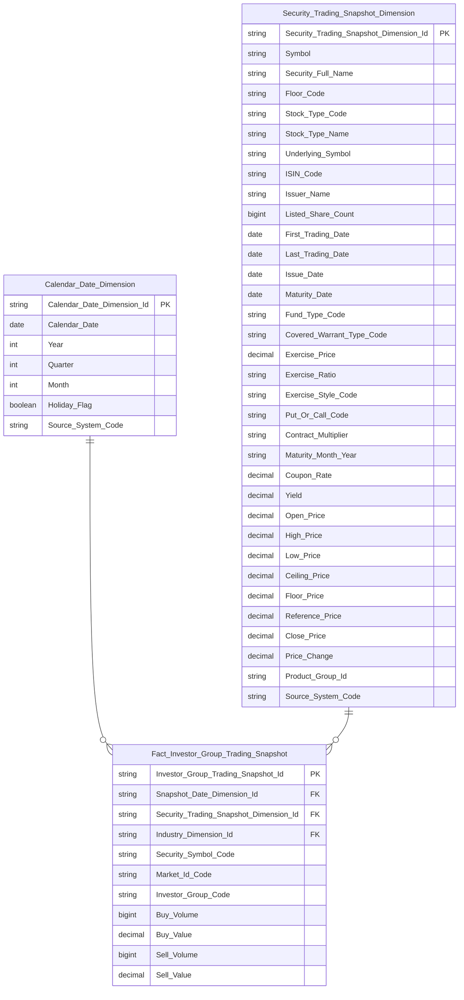
```mermaid
erDiagram
    Calendar_Date_Dimension {
        string Calendar_Date_Dimension_Id PK
        date Calendar_Date
        int Year
        int Quarter
        int Month
        boolean Holiday_Flag
        string Source_System_Code
    }
    Security_Trading_Snapshot_Dimension {
        string Security_Trading_Snapshot_Dimension_Id PK
        string Symbol
        string Security_Full_Name
        string Floor_Code
        string Stock_Type_Code
        string Stock_Type_Name
        string Underlying_Symbol
        string ISIN_Code
        string Issuer_Name
        bigint Listed_Share_Count
        date First_Trading_Date
        date Last_Trading_Date
        date Issue_Date
        date Maturity_Date
        string Fund_Type_Code
        string Covered_Warrant_Type_Code
        decimal Exercise_Price
        string Exercise_Ratio
        string Exercise_Style_Code
        string Put_Or_Call_Code
        string Contract_Multiplier
        string Maturity_Month_Year
        decimal Coupon_Rate
        decimal Yield
        decimal Open_Price
        decimal High_Price
        decimal Low_Price
        decimal Ceiling_Price
        decimal Floor_Price
        decimal Reference_Price
        decimal Close_Price
        decimal Price_Change
        string Product_Group_Id
        string Source_System_Code
    }
    Fact_Investor_Group_Trading_Snapshot {
        string Investor_Group_Trading_Snapshot_Id PK
        string Snapshot_Date_Dimension_Id FK
        string Security_Trading_Snapshot_Dimension_Id FK
        string Industry_Dimension_Id FK
        string Security_Symbol_Code
        string Market_Id_Code
        string Investor_Group_Code
        bigint Buy_Volume
        decimal Buy_Value
        bigint Sell_Volume
        decimal Sell_Value
    }
    Calendar_Date_Dimension ||--o{ Fact_Investor_Group_Trading_Snapshot : " "
    Security_Trading_Snapshot_Dimension ||--o{ Fact_Investor_Group_Trading_Snapshot : " "
```

**Lineage Mart → Báo cáo:**

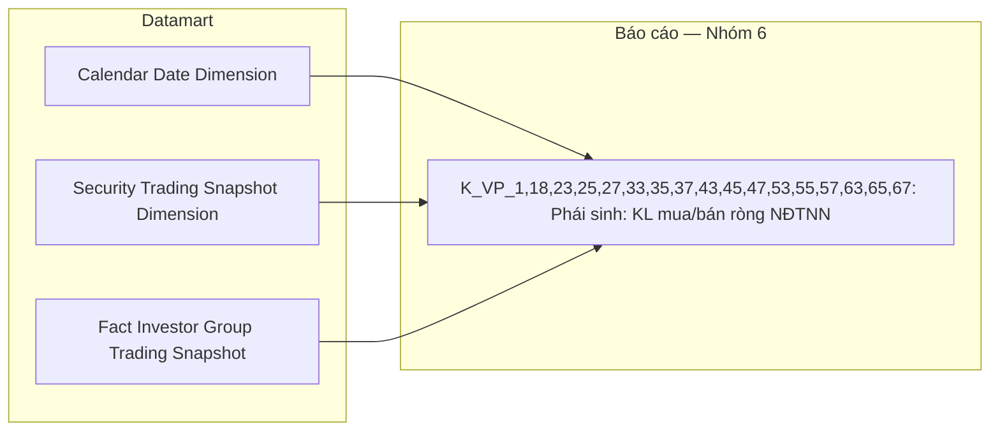
```mermaid
flowchart LR
    subgraph GOLD["Datamart"]
        Calendar_Date_Dimension["Calendar Date Dimension"]
        Security_Trading_Snapshot_Dimension["Security Trading Snapshot Dimension"]
        Fact_Investor_Group_Trading_Snapshot["Fact Investor Group Trading Snapshot"]
    end
    subgraph RPT["Báo cáo — Nhóm 6"]
        R1["K_VP_1,18,23,25,27,33,35,37,43,45,47,53,55,57,63,65,67: Phái sinh: KL mua/bán ròng NĐTNN"]
    end
    Calendar_Date_Dimension --> R1
    Security_Trading_Snapshot_Dimension --> R1
    Fact_Investor_Group_Trading_Snapshot --> R1
```

**Bảng grain:**

| Tên bảng | Grain |
|---|---|
| Calendar Date Dimension | 1 ngày dương lịch (Conformed Dimension) |
| Security Trading Snapshot Dimension | 1 mã chứng khoán / hợp đồng phái sinh (SCD4A current-state); sở hữu bởi GSTT |
| Fact Investor Group Trading Snapshot | 1 mã chứng khoán / hợp đồng × 1 ngày giao dịch × 1 sàn (Market Id Code) × 1 nhóm NĐT (ALL / FOREIGN / PROPRIETARY); PK Investor Group Trading Snapshot Id = hash toàn bộ cột grain (Dạng B, A22) |

#### Nhóm 7 - TPDN niêm yết >> Chỉ tiêu tổng hợp

> Phân loại: **Phân tích**
> Atomic: `Securities Trade` ← ORDERTRADE.TRADE_BOOK_HNX — **READY** (nguồn Sổ lệnh chờ Atomic, O_VP_1); `Security Trading Snapshot` ← MDDS.JAD_STOCKINFOR — **READY**

**Mockup (suy từ BA — chưa có screenshot, O_VP_8):**

Tham số: Loại kỳ (D/M/Q/Y) · Kỳ

| Chỉ tiêu | Kỳ báo cáo | Kỳ trước (GTGD YTD và GTGD bình quân phiên YTD: cả năm trước) | Thay đổi | % thay đổi |
|---|---|---|---|---|
| KLGD | … | … | … | … |
| GTGD | … | … | … | … |
| GTGD YTD | … | … | … | … |
| GTGD bình quân phiên (YTD) | … | … | … | … |
| Giá trị mua NĐTNN | … | … | … | … |
| Giá trị bán NĐTNN | … | … | … | … |
| Giá trị mua/bán ròng NĐTNN | … | … | … | … |
| Số mã TP niêm yết | … | … | … | … |

> ⚠️ Presentation Grain: 1 dòng = 1 chỉ tiêu × 1 Kỳ, toàn thị trường TPDN niêm yết (Level 1). Storage Grain: Fact Listed Corporate Bond Snapshot = 1 mã trái phiếu × 1 ngày giao dịch (Level 4) — presentation thô hơn storage, đạt Iso-Grain. Chỉ tiêu YTD (GTGD YTD, GTGD bình quân phiên YTD) so với CẢ NĂM TRƯỚC (01/01–31/12); các chỉ tiêu còn lại so với kỳ trước (SQL BA).

**Source:** `Fact Listed Corporate Bond Snapshot` → `Calendar Date Dimension`, `Industry Dimension`

**Bảng KPI:**

| KPI ID | Tên KPI | Đơn vị | Tính chất | Công thức | Ghi chú | Trạng thái |
|---|---|---|---|---|---|---|
| K_VP_1 | Kỳ | — | Chiều | Calendar Date Dimension: Calendar Date → ngày/tháng/quý/năm; Loại kỳ (D/M/Q/Y) và Từ kỳ — Đến kỳ là tham số lọc | Reuse từ Nhóm 1 (K_VP_1) — Case 1: measure vật lý có sẵn trên Fact/Dim. BA ghi Phân loại 'Chỉ tiêu cơ sở' nhưng là Chiều thời gian — O_VP_20 | READY |
| K_VP_71 | Tổng KLGD | Trái phiếu | Cơ sở | SUM(Trading Volume) trên Fact Listed Corporate Bond Snapshot trong kỳ (giao dịch TPDN niêm yết: Market Id Code = 'HCX') | Case 1 — measure Trading Volume; [!] Nguồn Securities Trade — O_VP_1; giá trị 'HCX' chưa kiểm — O_VP_16 | READY |
| K_VP_72 | Tổng KLGD - % thay đổi (So sánh với kỳ trước) | % | Phái sinh | (K_VP_71 kỳ báo cáo − K_VP_71 kỳ trước) / K_VP_71 kỳ trước × 100 | Case 2 — tính tại presentation layer; kỳ trước — O_VP_5 | READY |
| K_VP_73 | Tổng GTGD | VND | Cơ sở | SUM(Trading Value) trên Fact Listed Corporate Bond Snapshot trong kỳ; Trading Value = Σ (KLGD × Giá khớp) = Execution Value của Sổ lệnh HNX với Market Id Code = 'HCX' | Case 1 — measure Trading Value; [!] Nguồn Securities Trade — O_VP_1; giá trị 'HCX' chưa kiểm — O_VP_16 | READY |
| K_VP_74 | Tổng GTGD - % thay đổi (So sánh với kỳ trước) | % | Phái sinh | (K_VP_73 kỳ báo cáo − K_VP_73 kỳ trước) / K_VP_73 kỳ trước × 100 | Case 2 — tính tại presentation layer; kỳ trước — O_VP_5 | READY |
| K_VP_112 | GTGD YTD | VND | Phái sinh | K_VP_73 lấy trên khoảng từ 01/01 của năm chứa kỳ báo cáo đến ngày cuối kỳ (YTD); kỳ so sánh = CẢ NĂM TRƯỚC (01/01–31/12 năm trước), không phải cùng kỳ năm trước | Case 2 — tính tại presentation layer; BA CSV thiếu dòng (alias gtgd_ytd của SQL BA dòng 113, H17) — O_VP_18; [!] Nguồn Securities Trade — O_VP_1 | READY |
| K_VP_113 | GTGD YTD - % thay đổi (So sánh với năm trước) | % | Phái sinh | (K_VP_112 kỳ báo cáo − K_VP_112 cả năm trước) / K_VP_112 cả năm trước × 100 | Case 2 — tính tại presentation layer; BA CSV thiếu dòng (change_percent của gtgd_ytd trong SQL BA dòng 113, H17) — O_VP_18; so với cả năm trước — O_VP_20 | READY |
| K_VP_75 | GTGD bình quân phiên (YTD) | VND | Phái sinh | K_VP_112 / Số phiên giao dịch YTD; Số phiên = COUNT(DISTINCT Snapshot Date) trên Fact Listed Corporate Bond Snapshot với Trading Value IS NOT NULL (ngày có giao dịch TPDN niêm yết) từ 01/01 đến ngày cuối kỳ; kỳ so sánh = cả năm trước (01/01–31/12) | Case 2 — tính tại presentation layer; số phiên theo định nghĩa Nhóm 7 (ngày có giao dịch TPDN niêm yết) — O_VP_22 | READY |
| K_VP_76 | GTGD bình quân phiên YTD - % thay đổi (So sánh với GTGD BQ YTD năm trước) | % | Phái sinh | (K_VP_75 kỳ báo cáo − K_VP_75 cả năm trước) / K_VP_75 cả năm trước × 100 | Case 2 — tính tại presentation layer; nhãn BA 'YTD năm trước' nhưng SQL/Điều kiện dòng 118 so với cả năm trước — O_VP_20 | READY |
| K_VP_77 | Giá trị mua NĐTNN | VND | Cơ sở | SUM(Foreign Buy Value) trên Fact Listed Corporate Bond Snapshot trong kỳ; Foreign Buy Value = Σ Execution Value của giao dịch có ký tự thứ 4 của số tài khoản mua ∈ ('E','F') | Case 1 — measure Foreign Buy Value; [!] Nguồn Securities Trade — O_VP_1 | READY |
| K_VP_78 | Giá trị mua NĐTNN - % thay đổi (So sánh với kỳ trước) | % | Phái sinh | (K_VP_77 kỳ báo cáo − K_VP_77 kỳ trước) / K_VP_77 kỳ trước × 100 | Case 2 — tính tại presentation layer; kỳ trước — O_VP_5 | READY |
| K_VP_79 | Giá trị bán NĐTNN | VND | Cơ sở | SUM(Foreign Sell Value) trên Fact Listed Corporate Bond Snapshot trong kỳ; Foreign Sell Value = Σ Execution Value của giao dịch có ký tự thứ 4 của số tài khoản bán ∈ ('E','F') | Case 1 — measure Foreign Sell Value; BA dòng 122 chép công thức của dòng mua (buy_account_number) — dùng số tài khoản bán theo Mô tả/SQL, O_VP_20; [!] Nguồn Securities Trade — O_VP_1 | READY |
| K_VP_80 | Giá trị bán NĐTNN - % thay đổi (So sánh với kỳ trước) | % | Phái sinh | (K_VP_79 kỳ báo cáo − K_VP_79 kỳ trước) / K_VP_79 kỳ trước × 100 | Case 2 — tính tại presentation layer; kỳ trước — O_VP_5 | READY |
| K_VP_81 | Giá trị mua/bán ròng NĐTNN | VND | Phái sinh | K_VP_77 − K_VP_79 | Case 2 — tính tại presentation layer từ Foreign Buy Value / Foreign Sell Value; [!] Nguồn Securities Trade — O_VP_1 | READY |
| K_VP_82 | Giá trị mua/bán ròng NĐTNN - % thay đổi (So sánh với kỳ trước) | % | Phái sinh | (K_VP_81 kỳ báo cáo − K_VP_81 kỳ trước) / K_VP_81 kỳ trước × 100 | Case 2 — tính tại presentation layer; kỳ trước — O_VP_5; BA không dùng ABS (kỳ trước âm đảo dấu) — O_VP_20 | READY |
| K_VP_83 | Số mã TP niêm yết | Mã | Cơ sở | COUNT(DISTINCT Security Symbol Code) trên Fact Listed Corporate Bond Snapshot với Listed Indicator = TRUE và Snapshot Date ≤ ngày cuối kỳ (mỗi mã tính 1 lần theo bản ghi mới nhất không quá ngày cuối kỳ, gồm cả mã đã đáo hạn; bản tin MDDS Stock Type Code = '1') | Case 1 — Listed Indicator trên Fact Listed Corporate Bond Snapshot; số thời điểm tại ngày cuối kỳ; Stock Type Code '1' gồm cả TPCP — O_VP_17; theo Điều kiện BA (Vuong chốt 2026-10-25): bản ghi mới nhất của từng mã ≤ ngày cuối kỳ, nên đếm cả mã đã đáo hạn; SQL BA đếm tại ngày giao dịch cuối trong kỳ — O_VP_20 | READY |
| K_VP_114 | Số mã TP niêm yết - % thay đổi (So sánh với kỳ trước) | % | Phái sinh | (K_VP_83 kỳ báo cáo − K_VP_83 kỳ trước) / K_VP_83 kỳ trước × 100 | Case 2 — tính tại presentation layer; kỳ trước — O_VP_5; BA CSV thiếu dòng (change_percent của sl_ma_niemyet trong SQL BA dòng 113, H17) — O_VP_18 | READY |

**Star Schema:**

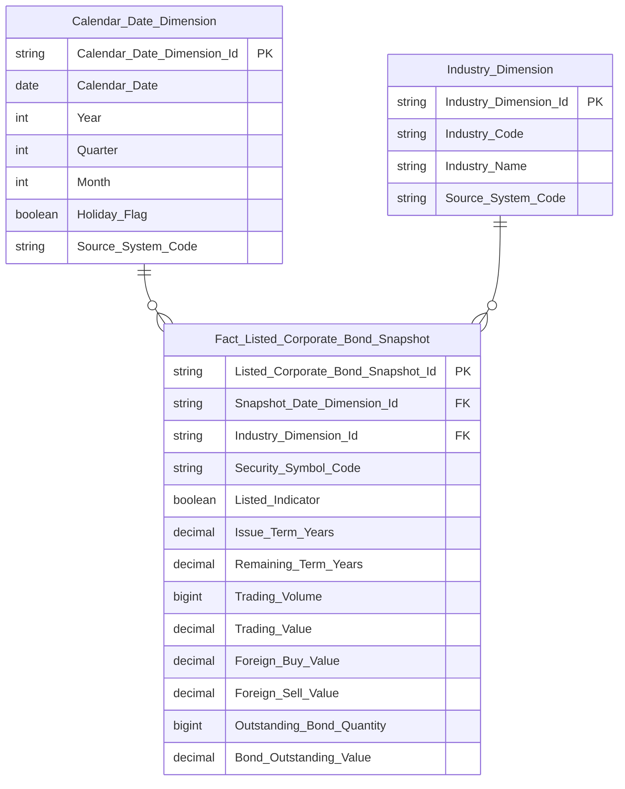
```mermaid
erDiagram
    Calendar_Date_Dimension {
        string Calendar_Date_Dimension_Id PK
        date Calendar_Date
        int Year
        int Quarter
        int Month
        boolean Holiday_Flag
        string Source_System_Code
    }
    Industry_Dimension {
        string Industry_Dimension_Id PK
        string Industry_Code
        string Industry_Name
        string Source_System_Code
    }
    Fact_Listed_Corporate_Bond_Snapshot {
        string Listed_Corporate_Bond_Snapshot_Id PK
        string Snapshot_Date_Dimension_Id FK
        string Industry_Dimension_Id FK
        string Security_Symbol_Code
        boolean Listed_Indicator
        decimal Issue_Term_Years
        decimal Remaining_Term_Years
        bigint Trading_Volume
        decimal Trading_Value
        decimal Foreign_Buy_Value
        decimal Foreign_Sell_Value
        bigint Outstanding_Bond_Quantity
        decimal Bond_Outstanding_Value
    }
    Calendar_Date_Dimension ||--o{ Fact_Listed_Corporate_Bond_Snapshot : " "
    Industry_Dimension ||--o{ Fact_Listed_Corporate_Bond_Snapshot : " "
```

**Lineage Mart → Báo cáo:**

```mermaid
flowchart LR
    subgraph GOLD["Datamart"]
        Calendar_Date_Dimension["Calendar Date Dimension"]
        Industry_Dimension["Industry Dimension"]
        Fact_Listed_Corporate_Bond_Snapshot["Fact Listed Corporate Bond Snapshot"]
    end
    subgraph RPT["Báo cáo — Nhóm 7"]
        R1["K_VP_1,71-83,112-114: TPDN niêm yết: chỉ tiêu tổng hợp"]
    end
    Calendar_Date_Dimension --> R1
    Industry_Dimension --> R1
    Fact_Listed_Corporate_Bond_Snapshot --> R1
```

**Bảng grain:**

| Tên bảng | Grain |
|---|---|
| Calendar Date Dimension | 1 ngày dương lịch (Conformed Dimension) |
| Industry Dimension | 1 ngành nghề kinh doanh cấp 1 hiện hành (SCD4A current-state); sở hữu bởi GSDC |
| Fact Listed Corporate Bond Snapshot | 1 mã trái phiếu (ISIN — Security Symbol Code) × 1 ngày giao dịch; PK Listed Corporate Bond Snapshot Id = hash (Snapshot Date Dimension Id, Security Symbol Code) (Dạng B, A22) |

#### Nhóm 8 - TPDN niêm yết >> Thống kê giao dịch TPDN niêm yết theo ngành

> Phân loại: **Phân tích**
> Atomic: `Securities Trade` ← ORDERTRADE.TRADE_BOOK_HNX — **READY** (nguồn Sổ lệnh chờ Atomic, O_VP_1); `Security Trading Snapshot` ← MDDS.JAD_STOCKINFOR — **READY**; `Listed Share Information` ← HNX.LISTED_SECURITIES_LIST — **READY**; `Public Company` ← IDS.COMPANY_PROFILES — **READY**; `Securities Company` ← SCMS.SC_FIRM_INFO — **READY**; `Fund Management Company` ← FMS.SECURITIES — **READY**; `Classification IDS Business Line` ← IDS.CATEGORIES — **READY**

**Mockup (suy từ BA — chưa có screenshot, O_VP_8):**

Tham số: Loại kỳ (D/M/Q/Y) · Kỳ

| Ngành | Kỳ hạn phát hành (năm) | GTGD | Số mã TP niêm yết | KL TP đang lưu hành | Kỳ hạn còn lại bình quân (năm) |
|---|---|---|---|---|---|
| Tài chính ngân hàng | 5,00 | … | … | … | … |

> ⚠️ Presentation Grain: 1 dòng = 1 Ngành × 1 Kỳ hạn phát hành trong 1 Kỳ (Level 3 × kỳ hạn). Storage Grain: Fact Listed Corporate Bond Snapshot = 1 mã trái phiếu × 1 ngày giao dịch (Level 4) — presentation thô hơn storage, đạt Iso-Grain.

**Source:** `Fact Listed Corporate Bond Snapshot` → `Calendar Date Dimension`, `Industry Dimension`

**Bảng KPI:**

| KPI ID | Tên KPI | Đơn vị | Tính chất | Công thức | Ghi chú | Trạng thái |
|---|---|---|---|---|---|---|
| K_VP_1 | Kỳ | — | Chiều | Calendar Date Dimension: Calendar Date → ngày/tháng/quý/năm; Loại kỳ (D/M/Q/Y) và Từ kỳ — Đến kỳ là tham số lọc | Reuse từ Nhóm 1 (K_VP_1) — Case 1: measure vật lý có sẵn trên Fact/Dim. BA ghi Phân loại 'Chỉ tiêu cơ sở' nhưng là Chiều thời gian — O_VP_20 | READY |
| K_VP_84 | Ngành | — | Chiều | Industry Dimension.Industry Code / Industry Name theo Industry Dimension Id của Fact Listed Corporate Bond Snapshot; Industry Dimension Id NULL → nhóm 'NA' / 'Chưa phân ngành' | Case 1 — reuse Industry Dimension (GSDC). Ngành của tổ chức phát hành: 3 ký tự đầu mã trái phiếu = Equity Ticker Symbol của Public Company (bỏ hồ sơ bị từ chối); CTCK / CTQLQ → '07000' (SQL BA dòng 128) — O_VP_23 | READY |
| K_VP_85 | Kỳ hạn phát hành | Năm | Chiều | Issue Term Years = ROUND(MONTHS_BETWEEN(Maturity Date, Issue Date) / 12, 2) của bản tin cuối ngày MDDS (Stock Type Code = '1') trên Fact Listed Corporate Bond Snapshot | Case 1 — cột Issue Term Years trên Fact Listed Corporate Bond Snapshot; NULL khi giao dịch không có bản tin cùng ngày | READY |
| K_VP_86 | Tổng GTGD TPDN niêm yết | VND | Cơ sở | SUM(Trading Value) theo (Ngành, Kỳ hạn phát hành) trong kỳ (Market Id Code = 'HCX'); giao dịch không có bản tin MDDS cùng ngày thuộc nhóm Ngành 'NA' và Kỳ hạn phát hành NULL | Case 1 — measure Trading Value; nối Sổ lệnh ↔ bản tin MDDS theo Issue Code = ISIN Code và ngày (SQL BA dòng 127/130); [!] Nguồn Securities Trade — O_VP_1; O_VP_16 | READY |
| K_VP_87 | Kỳ hạn còn lại bình quân | Năm | Phái sinh | SUM(Remaining Term Years × Bond Outstanding Value) / SUM(Bond Outstanding Value) theo (Ngành, Kỳ hạn phát hành) tại ngày giao dịch cuối cùng có bản tin trong kỳ, làm tròn 2 chữ số thập phân | Case 2 — tính tại presentation layer từ Remaining Term Years và Bond Outstanding Value. Remaining Term Years = MONTHS_BETWEEN(Maturity Date, Trading Date) / 12 (không làm tròn); Bond Outstanding Value = Outstanding Bond Quantity × mệnh giá, mệnh giá = 100000 × 10^ROUND(LOG10(Reference Price / 100000)); SQL/Điều kiện BA dòng 131 sai — O_VP_20; khóa Atomic Listed Share Information — O_VP_15 | READY |
| K_VP_83 | Số mã TP niêm yết | Mã | Cơ sở | COUNT(DISTINCT Security Symbol Code) trên Fact Listed Corporate Bond Snapshot với Listed Indicator = TRUE và Snapshot Date ≤ ngày cuối kỳ (mỗi mã tính 1 lần theo bản ghi mới nhất không quá ngày cuối kỳ, gồm cả mã đã đáo hạn; bản tin MDDS Stock Type Code = '1') | Reuse từ Nhóm 7 (K_VP_83) — Case 1: measure vật lý có sẵn trên Fact/Dim. Nhóm 8 gom theo (Ngành, Kỳ hạn phát hành) tại ngày cuối kỳ; BA 'Trùng' nhưng SQL nối INNER Listed Securities List — O_VP_20 | READY |
| K_VP_88 | KL TP đang lưu hành | Trái phiếu | Cơ sở | SUM(Outstanding Bond Quantity) theo (Ngành, Kỳ hạn phát hành) tại ngày giao dịch cuối cùng có bản tin trong kỳ | Case 1 — measure Outstanding Bond Quantity (Listed Share Information HNX nối theo Ticker Symbol và Report Date = Trading Date); BA ghi Mapping nghiệp vụ VSDC nhưng Bảng nguồn HNX — theo Bảng nguồn, O_VP_20; khóa Atomic — O_VP_15 | READY |

**Star Schema:**

```mermaid
erDiagram
    Calendar_Date_Dimension {
        string Calendar_Date_Dimension_Id PK
        date Calendar_Date
        int Year
        int Quarter
        int Month
        boolean Holiday_Flag
        string Source_System_Code
    }
    Industry_Dimension {
        string Industry_Dimension_Id PK
        string Industry_Code
        string Industry_Name
        string Source_System_Code
    }
    Fact_Listed_Corporate_Bond_Snapshot {
        string Listed_Corporate_Bond_Snapshot_Id PK
        string Snapshot_Date_Dimension_Id FK
        string Industry_Dimension_Id FK
        string Security_Symbol_Code
        boolean Listed_Indicator
        decimal Issue_Term_Years
        decimal Remaining_Term_Years
        bigint Trading_Volume
        decimal Trading_Value
        decimal Foreign_Buy_Value
        decimal Foreign_Sell_Value
        bigint Outstanding_Bond_Quantity
        decimal Bond_Outstanding_Value
    }
    Calendar_Date_Dimension ||--o{ Fact_Listed_Corporate_Bond_Snapshot : " "
    Industry_Dimension ||--o{ Fact_Listed_Corporate_Bond_Snapshot : " "
```

**Lineage Mart → Báo cáo:**

```mermaid
flowchart LR
    subgraph GOLD["Datamart"]
        Calendar_Date_Dimension["Calendar Date Dimension"]
        Industry_Dimension["Industry Dimension"]
        Fact_Listed_Corporate_Bond_Snapshot["Fact Listed Corporate Bond Snapshot"]
    end
    subgraph RPT["Báo cáo — Nhóm 8"]
        R1["K_VP_1,83-88: TPDN niêm yết: thống kê giao dịch theo ngành và kỳ hạn"]
    end
    Calendar_Date_Dimension --> R1
    Industry_Dimension --> R1
    Fact_Listed_Corporate_Bond_Snapshot --> R1
```

**Bảng grain:**

| Tên bảng | Grain |
|---|---|
| Calendar Date Dimension | 1 ngày dương lịch (Conformed Dimension) |
| Industry Dimension | 1 ngành nghề kinh doanh cấp 1 hiện hành (SCD4A current-state); sở hữu bởi GSDC |
| Fact Listed Corporate Bond Snapshot | 1 mã trái phiếu (ISIN — Security Symbol Code) × 1 ngày giao dịch; PK Listed Corporate Bond Snapshot Id = hash (Snapshot Date Dimension Id, Security Symbol Code) (Dạng B, A22) |

#### Nhóm 9 - TPDN niêm yết >> Biểu đồ Thống kê GTGD TPDN niêm yết và TPDN riêng lẻ

> Phân loại: **Phân tích**
> Atomic: `Securities Trade` ← ORDERTRADE.TRADE_BOOK_HNX — **READY** (nguồn Sổ lệnh chờ Atomic, O_VP_1); `Security Trading Snapshot` ← MDDS.JAD_STOCKINFOR — **READY**; `Internal Statistical Report` ← ISS.INTERNAL_STATISTICAL_REPORT — **READY**

**Mockup (suy từ BA — chưa có screenshot, O_VP_8):**

Tham số: Loại kỳ (D/M/Q/Y) · Từ kỳ — Đến kỳ

| Kỳ | GTGD TPDN niêm yết | GTGD TPDN riêng lẻ |
|---|---|---|
| 2026-09 | … | … |

> ⚠️ Presentation Grain: 1 điểm biểu đồ = 1 Kỳ × 1 loại trái phiếu (niêm yết / riêng lẻ), toàn thị trường (Level 1). Storage Grain: Fact Listed Corporate Bond Snapshot = 1 mã × 1 ngày (Level 4); Fact Private Corporate Bond Trading Snapshot = 1 ngày báo cáo HNX09, toàn thị trường TPDN riêng lẻ (Level 1) — đạt Iso-Grain.

**Source:** `Fact Listed Corporate Bond Snapshot` → `Calendar Date Dimension`, `Industry Dimension`; `Fact Private Corporate Bond Trading Snapshot` → `Calendar Date Dimension`

**Bảng KPI:**

| KPI ID | Tên KPI | Đơn vị | Tính chất | Công thức | Ghi chú | Trạng thái |
|---|---|---|---|---|---|---|
| K_VP_1 | Kỳ | — | Chiều | Calendar Date Dimension: Calendar Date → ngày/tháng/quý/năm; Loại kỳ (D/M/Q/Y) và Từ kỳ — Đến kỳ là tham số lọc | Reuse từ Nhóm 1 (K_VP_1) — Case 1: measure vật lý có sẵn trên Fact/Dim. BA ghi Phân loại 'Chỉ tiêu cơ sở' nhưng là Chiều thời gian (Từ kỳ — Đến kỳ) — O_VP_20 | READY |
| K_VP_73 | GTGD TPDN niêm yết | VND | Cơ sở | SUM(Trading Value) trên Fact Listed Corporate Bond Snapshot trong kỳ; Trading Value = Σ (KLGD × Giá khớp) = Execution Value của Sổ lệnh HNX với Market Id Code = 'HCX' | Reuse từ Nhóm 7 (K_VP_73) — Case 1: measure vật lý có sẵn trên Fact/Dim. Nhóm 9 gom theo kỳ trong khoảng Từ kỳ — Đến kỳ; [!] Nguồn Securities Trade — O_VP_1 | READY |
| K_VP_89 | GTGD TPDN riêng lẻ | VND | Cơ sở | SUM(Trading Value) trên Fact Private Corporate Bond Trading Snapshot trong kỳ; Trading Value = Cell Value (ép số) của ô Row Path = 'GIÁ TRỊ GIAO DỊCH' báo cáo HNX09 | Case 1 — measure Trading Value; Atomic Internal Statistical Report lọc Report Code = 'HNX09', Sheet Name = 'sheet 1', Column Path = 'GIÁ TRỊ', Period Type Code = 'DAILY', Report Submission System Code = 'ICP', Submission Status Code IN ('SUBMITTED','LATE_SUBMITTED'); dữ liệu TPDN riêng lẻ không nằm trong sổ lệnh; BA ghi Mapping nghiệp vụ '#NAME?' — O_VP_20; khóa Atomic — O_VP_21 | READY |

**Star Schema:**

```mermaid
erDiagram
    Calendar_Date_Dimension {
        string Calendar_Date_Dimension_Id PK
        date Calendar_Date
        int Year
        int Quarter
        int Month
        boolean Holiday_Flag
        string Source_System_Code
    }
    Industry_Dimension {
        string Industry_Dimension_Id PK
        string Industry_Code
        string Industry_Name
        string Source_System_Code
    }
    Fact_Listed_Corporate_Bond_Snapshot {
        string Listed_Corporate_Bond_Snapshot_Id PK
        string Snapshot_Date_Dimension_Id FK
        string Industry_Dimension_Id FK
        string Security_Symbol_Code
        boolean Listed_Indicator
        decimal Issue_Term_Years
        decimal Remaining_Term_Years
        bigint Trading_Volume
        decimal Trading_Value
        decimal Foreign_Buy_Value
        decimal Foreign_Sell_Value
        bigint Outstanding_Bond_Quantity
        decimal Bond_Outstanding_Value
    }
    Fact_Private_Corporate_Bond_Trading_Snapshot {
        string Private_Corporate_Bond_Trading_Snapshot_Id PK
        string Snapshot_Date_Dimension_Id FK
        decimal Trading_Value
        decimal Foreign_Buy_Value
        decimal Foreign_Sell_Value
    }
    Calendar_Date_Dimension ||--o{ Fact_Listed_Corporate_Bond_Snapshot : " "
    Industry_Dimension ||--o{ Fact_Listed_Corporate_Bond_Snapshot : " "
    Calendar_Date_Dimension ||--o{ Fact_Private_Corporate_Bond_Trading_Snapshot : " "
```

**Lineage Mart → Báo cáo:**

```mermaid
flowchart LR
    subgraph GOLD["Datamart"]
        Calendar_Date_Dimension["Calendar Date Dimension"]
        Industry_Dimension["Industry Dimension"]
        Fact_Listed_Corporate_Bond_Snapshot["Fact Listed Corporate Bond Snapshot"]
        Fact_Private_Corporate_Bond_Trading_Snapshot["Fact Private Corporate Bond Trading Snapshot"]
    end
    subgraph RPT["Báo cáo — Nhóm 9"]
        R1["K_VP_1,73,89: TPDN: GTGD niêm yết và riêng lẻ theo kỳ"]
    end
    Calendar_Date_Dimension --> R1
    Industry_Dimension --> R1
    Fact_Listed_Corporate_Bond_Snapshot --> R1
    Fact_Private_Corporate_Bond_Trading_Snapshot --> R1
```

**Bảng grain:**

| Tên bảng | Grain |
|---|---|
| Calendar Date Dimension | 1 ngày dương lịch (Conformed Dimension) |
| Industry Dimension | 1 ngành nghề kinh doanh cấp 1 hiện hành (SCD4A current-state); sở hữu bởi GSDC |
| Fact Listed Corporate Bond Snapshot | 1 mã trái phiếu (ISIN — Security Symbol Code) × 1 ngày giao dịch; PK Listed Corporate Bond Snapshot Id = hash (Snapshot Date Dimension Id, Security Symbol Code) (Dạng B, A22) |
| Fact Private Corporate Bond Trading Snapshot | 1 ngày báo cáo HNX09 (báo cáo ngày TPDN riêng lẻ, nguồn nộp ICP); PK Private Corporate Bond Trading Snapshot Id = hash (Snapshot Date Dimension Id) (Dạng B, A22) |

#### Nhóm 10 - TPDN niêm yết >> Biểu đồ Giá trị giao dịch TPDN theo ngành

> Phân loại: **Phân tích**
> Atomic: `Securities Trade` ← ORDERTRADE.TRADE_BOOK_HNX — **READY** (nguồn Sổ lệnh chờ Atomic, O_VP_1); `Security Trading Snapshot` ← MDDS.JAD_STOCKINFOR — **READY**; `Public Company` ← IDS.COMPANY_PROFILES — **READY**; `Securities Company` ← SCMS.SC_FIRM_INFO — **READY**; `Fund Management Company` ← FMS.SECURITIES — **READY**; `Classification IDS Business Line` ← IDS.CATEGORIES — **READY**

**Mockup (suy từ BA — chưa có screenshot, O_VP_8):**

Tham số: Loại kỳ (D/M/Q/Y) · Kỳ

| Ngành | GTGD | Tỷ trọng GTGD (%) |
|---|---|---|
| Tài chính ngân hàng | … | … |

> ⚠️ Presentation Grain: 1 dòng = 1 Ngành trong 1 Kỳ (Level 3). Storage Grain: Fact Listed Corporate Bond Snapshot = 1 mã trái phiếu × 1 ngày giao dịch (Level 4) — presentation thô hơn storage, đạt Iso-Grain.

**Source:** `Fact Listed Corporate Bond Snapshot` → `Calendar Date Dimension`, `Industry Dimension`

**Bảng KPI:**

| KPI ID | Tên KPI | Đơn vị | Tính chất | Công thức | Ghi chú | Trạng thái |
|---|---|---|---|---|---|---|
| K_VP_1 | Kỳ | — | Chiều | Calendar Date Dimension: Calendar Date → ngày/tháng/quý/năm; Loại kỳ (D/M/Q/Y) và Từ kỳ — Đến kỳ là tham số lọc | Reuse từ Nhóm 1 (K_VP_1) — Case 1: measure vật lý có sẵn trên Fact/Dim | READY |
| K_VP_84 | Ngành | — | Chiều | Industry Dimension.Industry Code / Industry Name theo Industry Dimension Id của Fact Listed Corporate Bond Snapshot; Industry Dimension Id NULL → nhóm 'NA' / 'Chưa phân ngành' | Reuse từ Nhóm 8 (K_VP_84) — Case 1: measure vật lý có sẵn trên Fact/Dim | READY |
| K_VP_86 | GTGD trái phiếu từng ngành | VND | Cơ sở | SUM(Trading Value) theo (Ngành, Kỳ hạn phát hành) trong kỳ (Market Id Code = 'HCX'); giao dịch không có bản tin MDDS cùng ngày thuộc nhóm Ngành 'NA' và Kỳ hạn phát hành NULL | Reuse từ Nhóm 8 (K_VP_86) — Case 1: measure vật lý có sẵn trên Fact/Dim. Nhóm 10 gom theo Ngành (cộng Trading Value qua các Kỳ hạn phát hành); [!] Nguồn Securities Trade — O_VP_1 | READY |
| K_VP_90 | Tỷ trọng GTGD theo ngành | % | Phái sinh | K_VP_86 của từng Ngành / SUM(K_VP_86 của mọi Ngành trong kỳ, kể cả nhóm 'NA') × 100, làm tròn 2 chữ số thập phân | Case 2 — tính tại presentation layer; mẫu số = tổng GTGD toàn thị trường TPDN niêm yết gồm cả giao dịch chưa phân ngành (SQL BA dòng 137) | READY |

**Star Schema:**

```mermaid
erDiagram
    Calendar_Date_Dimension {
        string Calendar_Date_Dimension_Id PK
        date Calendar_Date
        int Year
        int Quarter
        int Month
        boolean Holiday_Flag
        string Source_System_Code
    }
    Industry_Dimension {
        string Industry_Dimension_Id PK
        string Industry_Code
        string Industry_Name
        string Source_System_Code
    }
    Fact_Listed_Corporate_Bond_Snapshot {
        string Listed_Corporate_Bond_Snapshot_Id PK
        string Snapshot_Date_Dimension_Id FK
        string Industry_Dimension_Id FK
        string Security_Symbol_Code
        boolean Listed_Indicator
        decimal Issue_Term_Years
        decimal Remaining_Term_Years
        bigint Trading_Volume
        decimal Trading_Value
        decimal Foreign_Buy_Value
        decimal Foreign_Sell_Value
        bigint Outstanding_Bond_Quantity
        decimal Bond_Outstanding_Value
    }
    Calendar_Date_Dimension ||--o{ Fact_Listed_Corporate_Bond_Snapshot : " "
    Industry_Dimension ||--o{ Fact_Listed_Corporate_Bond_Snapshot : " "
```

**Lineage Mart → Báo cáo:**

```mermaid
flowchart LR
    subgraph GOLD["Datamart"]
        Calendar_Date_Dimension["Calendar Date Dimension"]
        Industry_Dimension["Industry Dimension"]
        Fact_Listed_Corporate_Bond_Snapshot["Fact Listed Corporate Bond Snapshot"]
    end
    subgraph RPT["Báo cáo — Nhóm 10"]
        R1["K_VP_1,84,86,90: TPDN niêm yết: GTGD và tỷ trọng theo ngành"]
    end
    Calendar_Date_Dimension --> R1
    Industry_Dimension --> R1
    Fact_Listed_Corporate_Bond_Snapshot --> R1
```

**Bảng grain:**

| Tên bảng | Grain |
|---|---|
| Calendar Date Dimension | 1 ngày dương lịch (Conformed Dimension) |
| Industry Dimension | 1 ngành nghề kinh doanh cấp 1 hiện hành (SCD4A current-state); sở hữu bởi GSDC |
| Fact Listed Corporate Bond Snapshot | 1 mã trái phiếu (ISIN — Security Symbol Code) × 1 ngày giao dịch; PK Listed Corporate Bond Snapshot Id = hash (Snapshot Date Dimension Id, Security Symbol Code) (Dạng B, A22) |

#### Nhóm 11 - TPDN riêng lẻ >> Chỉ tiêu tổng hợp

> Phân loại: **Phân tích**
> Atomic: `Internal Statistical Report` ← ISS.INTERNAL_STATISTICAL_REPORT — **READY**; `Private Corp Bond Registration` ← HNX.PRIVATE_CORP_BOND_REGISTRATION — **READY**

**Mockup (suy từ BA — chưa có screenshot, O_VP_8):**

Tham số: Loại kỳ (D/M/Q/Y) · Kỳ

| Chỉ tiêu | Kỳ báo cáo | Kỳ trước (GTGD bình quân phiên YTD: cả năm trước) | Thay đổi | % thay đổi |
|---|---|---|---|---|
| GTGD | … | … | … | … |
| GTGD bình quân phiên (YTD) | … | … | … | … |
| Giá trị mua NĐTNN | … | … | … | … |
| Giá trị bán NĐTNN | … | … | … | … |
| Giá trị mua/bán ròng NĐTNN | … | … | … | … |
| Số mã TP ĐKGD | … | … | … | … |

> ⚠️ Presentation Grain: 1 dòng = 1 chỉ tiêu × 1 Kỳ, toàn thị trường TPDN riêng lẻ (Level 1). Storage Grain: Fact Private Corporate Bond Trading Snapshot = 1 ngày báo cáo HNX09, toàn thị trường (Level 1 × ngày); Fact Private Corporate Bond Registration Snapshot = 1 mã trái phiếu × 1 tháng báo cáo (Level 4 × tháng) — presentation thô hơn storage, đạt Iso-Grain. Số mã ĐKGD là số thời điểm: loại kỳ Ngày chọn tháng báo cáo theo quy tắc BA (ngày cuối tháng → tháng đó, ngược lại tháng liền trước), không phải Grain Mismatch. Chỉ tiêu GTGD bình quân phiên (YTD) so với CẢ NĂM TRƯỚC (01/01–31/12); các chỉ tiêu còn lại so với kỳ trước (SQL BA).

**Source:** `Fact Private Corporate Bond Trading Snapshot` → `Calendar Date Dimension`; `Fact Private Corporate Bond Registration Snapshot` → `Calendar Date Dimension`

**Bảng KPI:**

| KPI ID | Tên KPI | Đơn vị | Tính chất | Công thức | Ghi chú | Trạng thái |
|---|---|---|---|---|---|---|
| K_VP_1 | Kỳ | — | Chiều | Calendar Date Dimension: Calendar Date → ngày/tháng/quý/năm; Loại kỳ (D/M/Q/Y) và Từ kỳ — Đến kỳ là tham số lọc | Reuse từ Nhóm 1 (K_VP_1) — Case 1: measure vật lý có sẵn trên Fact/Dim. BA ghi Phân loại 'Chỉ tiêu cơ sở' nhưng là Chiều thời gian — O_VP_29 | READY |
| K_VP_89 | GTGD TPDN riêng lẻ | VND | Cơ sở | SUM(Trading Value) trên Fact Private Corporate Bond Trading Snapshot trong kỳ; Trading Value = Cell Value (ép số) của ô Row Path = 'GIÁ TRỊ GIAO DỊCH' báo cáo HNX09 | Reuse từ Nhóm 9 (K_VP_89) — Case 1: measure vật lý có sẵn trên Fact/Dim. Nhóm 11 gom theo kỳ (Σ Trading Value trong kỳ) | READY |
| K_VP_91 | GTGD TPDN riêng lẻ - So sánh với kỳ trước (% thay đổi) | % | Phái sinh | (K_VP_89 kỳ báo cáo − K_VP_89 kỳ trước) / K_VP_89 kỳ trước × 100 | Case 2 — tính tại presentation layer; kỳ trước — O_VP_5; BA đánh giá 'Trùng' nhưng Nhóm 9 chỉ có K_VP_89 (không có % thay đổi) nên khai sinh K_VP_91 — O_VP_29 | READY |
| K_VP_92 | GTGD bình quân phiên (YTD) | VND | Phái sinh | SUM(Trading Value) trên Fact Private Corporate Bond Trading Snapshot từ 01/01 của năm chứa kỳ báo cáo đến ngày cuối kỳ / Số phiên giao dịch cùng khoảng; Số phiên = COUNT(ngày trong Calendar Date Dimension có Is Trading Date = 'Y' trong khoảng 01/01 – ngày cuối kỳ) | Case 2 — tính tại presentation layer từ Trading Value (Fact Private Corporate Bond Trading Snapshot) và Calendar Date Dimension; BA đếm số phiên theo mọi ngày có Sổ lệnh HNX (`trade_book`) — dùng Is Trading Date làm proxy, lệch BA nhẹ — O_VP_30; BA ghi Điều kiện 'GTGD kỳ / Số phiên' nhưng Mô tả/SQL dùng Σ GTGD từ đầu năm — O_VP_29 | READY |
| K_VP_93 | GTGD bình quân phiên (YTD) - % thay đổi (So sánh với GTGD BQ phiên YTD năm trước) | % | Phái sinh | (K_VP_92 kỳ báo cáo − K_VP_92 cả năm trước (01/01–31/12 năm trước)) / K_VP_92 cả năm trước × 100 | Case 2 — tính tại presentation layer; nhãn BA 'YTD năm trước' nhưng SQL dòng 141 so với CẢ NĂM TRƯỚC; bảng nguồn dòng 145 ghi `hose.trade_book` — theo dòng 144/SQL (HNX) — O_VP_29 | READY |
| K_VP_94 | Giá trị mua NĐTNN | VND | Cơ sở | SUM(Foreign Buy Value) trên Fact Private Corporate Bond Trading Snapshot trong kỳ; Foreign Buy Value = Cell Value (ép số) của ô Row Path = 'GIÁ TRỊ GIAO DỊCH NHÀ ĐẦU TƯ NƯỚC NGOÀI - GIÁ TRỊ MUA' báo cáo HNX09 | Case 1 — measure Foreign Buy Value; lọc nguồn HNX09 như K_VP_89 (ICP, đã nộp) — O_VP_21; BA ghi Mapping nghiệp vụ '#NAME?' — O_VP_29 | READY |
| K_VP_95 | Giá trị mua NĐTNN - So sánh với kỳ trước (% thay đổi) | % | Phái sinh | (K_VP_94 kỳ báo cáo − K_VP_94 kỳ trước) / K_VP_94 kỳ trước × 100 | Case 2 — tính tại presentation layer; kỳ trước — O_VP_5 | READY |
| K_VP_96 | Giá trị bán NĐTNN | VND | Cơ sở | SUM(Foreign Sell Value) trên Fact Private Corporate Bond Trading Snapshot trong kỳ; Foreign Sell Value = Cell Value (ép số) của ô Row Path = 'GIÁ TRỊ GIAO DỊCH NHÀ ĐẦU TƯ NƯỚC NGOÀI - GIÁ TRỊ BÁN' báo cáo HNX09 | Case 1 — measure Foreign Sell Value; lọc nguồn HNX09 như K_VP_89 (ICP, đã nộp) — O_VP_21 | READY |
| K_VP_97 | Giá trị bán NĐTNN - So sánh với kỳ trước (% thay đổi) | % | Phái sinh | (K_VP_96 kỳ báo cáo − K_VP_96 kỳ trước) / K_VP_96 kỳ trước × 100 | Case 2 — tính tại presentation layer; kỳ trước — O_VP_5 | READY |
| K_VP_98 | Giá trị mua/bán ròng NĐTNN | VND | Phái sinh | K_VP_94 − K_VP_96 | Case 2 — tính tại presentation layer từ Foreign Buy Value / Foreign Sell Value | READY |
| K_VP_99 | Giá trị mua/bán ròng NĐTNN - So sánh với kỳ trước (% thay đổi) | % | Phái sinh | (K_VP_98 kỳ báo cáo − K_VP_98 kỳ trước) / ABS(K_VP_98 kỳ trước) × 100 | Case 2 — tính tại presentation layer; kỳ trước — O_VP_5; Mô tả và SQL dòng 151 chia ABS(kỳ trước) trong khi dòng 125 (Nhóm 7) và dòng 170 (Nhóm 14) không dùng ABS — O_VP_29 | READY |
| K_VP_100 | Số mã TP ĐKGD | Mã | Cơ sở | COUNT(DISTINCT Bond Code) trên Fact Private Corporate Bond Registration Snapshot với Maturity Date > ngày cuối kỳ, tại tháng báo cáo được chọn theo loại kỳ: Tháng = chính tháng đó; Quý / Năm = tháng báo cáo mới nhất có dữ liệu trong quý/năm (Snapshot Date lớn nhất trong kỳ); Ngày = tháng của ngày tra cứu nếu là ngày cuối tháng, ngược lại tháng liền trước | Case 1 — COUNT(DISTINCT Bond Code) trên Fact Private Corporate Bond Registration Snapshot (factless, mỗi dòng = 1 mã đăng ký giao dịch của 1 tháng báo cáo); số thời điểm tại ngày cuối kỳ; BA ghi Loại dữ liệu 'Chưa có CSDL - Map biểu mẫu' nhưng SQL đọc `private_corp_bond_registration` (Atomic có) — READY, O_VP_29; khóa Atomic chỉ băm Bond Code — O_VP_26; FK ngày = ngày cuối tháng báo cáo — O_VP_27 | READY |
| K_VP_101 | Số mã TP ĐKGD - So sánh với kỳ trước (% thay đổi) | % | Phái sinh | (K_VP_100 kỳ báo cáo − K_VP_100 kỳ trước) / K_VP_100 kỳ trước × 100 | Case 2 — tính tại presentation layer; kỳ trước chọn tháng báo cáo theo cùng quy tắc K_VP_100 — O_VP_5; SQL BA chia ABS(kỳ trước) — vô nghĩa với số đếm ≥ 0, giữ theo Mô tả | READY |

**Star Schema:**

```mermaid
erDiagram
    Calendar_Date_Dimension {
        string Calendar_Date_Dimension_Id PK
        date Calendar_Date
        int Year
        int Quarter
        int Month
        boolean Holiday_Flag
        string Source_System_Code
    }
    Fact_Private_Corporate_Bond_Trading_Snapshot {
        string Private_Corporate_Bond_Trading_Snapshot_Id PK
        string Snapshot_Date_Dimension_Id FK
        decimal Trading_Value
        decimal Foreign_Buy_Value
        decimal Foreign_Sell_Value
    }
    Fact_Private_Corporate_Bond_Registration_Snapshot {
        string Private_Corporate_Bond_Registration_Snapshot_Id PK
        string Snapshot_Date_Dimension_Id FK
        string Bond_Code
        string Report_Year
        string Report_Month
        date Maturity_Date
    }
    Calendar_Date_Dimension ||--o{ Fact_Private_Corporate_Bond_Trading_Snapshot : " "
    Calendar_Date_Dimension ||--o{ Fact_Private_Corporate_Bond_Registration_Snapshot : " "
```

**Lineage Mart → Báo cáo:**

```mermaid
flowchart LR
    subgraph GOLD["Datamart"]
        Calendar_Date_Dimension["Calendar Date Dimension"]
        Fact_Private_Corporate_Bond_Trading_Snapshot["Fact Private Corporate Bond Trading Snapshot"]
        Fact_Private_Corporate_Bond_Registration_Snapshot["Fact Private Corporate Bond Registration Snapshot"]
    end
    subgraph RPT["Báo cáo — Nhóm 11"]
        R1["K_VP_1,89,91-101: TPDN riêng lẻ: chỉ tiêu tổng hợp"]
    end
    Calendar_Date_Dimension --> R1
    Fact_Private_Corporate_Bond_Trading_Snapshot --> R1
    Fact_Private_Corporate_Bond_Registration_Snapshot --> R1
```

**Bảng grain:**

| Tên bảng | Grain |
|---|---|
| Calendar Date Dimension | 1 ngày dương lịch (Conformed Dimension) |
| Fact Private Corporate Bond Trading Snapshot | 1 ngày báo cáo HNX09 (báo cáo ngày TPDN riêng lẻ, nguồn nộp ICP); PK Private Corporate Bond Trading Snapshot Id = hash (Snapshot Date Dimension Id) (Dạng B, A22) |
| Fact Private Corporate Bond Registration Snapshot | 1 mã trái phiếu (Bond Code) × 1 tháng báo cáo (Report Year, Report Month); PK Private Corporate Bond Registration Snapshot Id = hash (Bond Code, Report Year, Report Month) (Dạng B, A22) |

#### Nhóm 12 - TPDN riêng lẻ >> Biểu đồ Diễn biến giao dịch thị trường TPDN riêng lẻ

> Phân loại: **Phân tích**
> Atomic: `Internal Statistical Report` ← ISS.INTERNAL_STATISTICAL_REPORT — **READY**

**Mockup (suy từ BA — chưa có screenshot, O_VP_8):**

Tham số: Loại kỳ (D/M/Q/Y) · Từ kỳ — Đến kỳ

| Kỳ | GTGD TPDN riêng lẻ |
|---|---|
| 2026-09 | … |

> ⚠️ Presentation Grain: 1 điểm biểu đồ = 1 Kỳ, toàn thị trường TPDN riêng lẻ (Level 1). Storage Grain: Fact Private Corporate Bond Trading Snapshot = 1 ngày báo cáo HNX09, toàn thị trường (Level 1 × ngày) — presentation thô hơn hoặc bằng storage, đạt Iso-Grain.

**Source:** `Fact Private Corporate Bond Trading Snapshot` → `Calendar Date Dimension`

**Bảng KPI:**

| KPI ID | Tên KPI | Đơn vị | Tính chất | Công thức | Ghi chú | Trạng thái |
|---|---|---|---|---|---|---|
| K_VP_1 | Kỳ | — | Chiều | Calendar Date Dimension: Calendar Date → ngày/tháng/quý/năm; Loại kỳ (D/M/Q/Y) và Từ kỳ — Đến kỳ là tham số lọc | Reuse từ Nhóm 1 (K_VP_1) — Case 1: measure vật lý có sẵn trên Fact/Dim. BA ghi Chiều thời gian (Từ kỳ — Đến kỳ), Đánh giá 'Trùng' | READY |
| K_VP_89 | GTGD TPDN riêng lẻ | VND | Cơ sở | SUM(Trading Value) trên Fact Private Corporate Bond Trading Snapshot trong kỳ; Trading Value = Cell Value (ép số) của ô Row Path = 'GIÁ TRỊ GIAO DỊCH' báo cáo HNX09 | Reuse từ Nhóm 9 (K_VP_89) — Case 1: measure vật lý có sẵn trên Fact/Dim. Nhóm 12 gom theo kỳ trong khoảng Từ kỳ — Đến kỳ; Nhóm 12 và Nhóm 13 dùng chung SQL BA (dòng 154) — O_VP_29 | READY |

**Star Schema:**

```mermaid
erDiagram
    Calendar_Date_Dimension {
        string Calendar_Date_Dimension_Id PK
        date Calendar_Date
        int Year
        int Quarter
        int Month
        boolean Holiday_Flag
        string Source_System_Code
    }
    Fact_Private_Corporate_Bond_Trading_Snapshot {
        string Private_Corporate_Bond_Trading_Snapshot_Id PK
        string Snapshot_Date_Dimension_Id FK
        decimal Trading_Value
        decimal Foreign_Buy_Value
        decimal Foreign_Sell_Value
    }
    Calendar_Date_Dimension ||--o{ Fact_Private_Corporate_Bond_Trading_Snapshot : " "
```

**Lineage Mart → Báo cáo:**

```mermaid
flowchart LR
    subgraph GOLD["Datamart"]
        Calendar_Date_Dimension["Calendar Date Dimension"]
        Fact_Private_Corporate_Bond_Trading_Snapshot["Fact Private Corporate Bond Trading Snapshot"]
    end
    subgraph RPT["Báo cáo — Nhóm 12"]
        R1["K_VP_1,89: TPDN riêng lẻ: GTGD theo kỳ"]
    end
    Calendar_Date_Dimension --> R1
    Fact_Private_Corporate_Bond_Trading_Snapshot --> R1
```

**Bảng grain:**

| Tên bảng | Grain |
|---|---|
| Calendar Date Dimension | 1 ngày dương lịch (Conformed Dimension) |
| Fact Private Corporate Bond Trading Snapshot | 1 ngày báo cáo HNX09 (báo cáo ngày TPDN riêng lẻ, nguồn nộp ICP); PK Private Corporate Bond Trading Snapshot Id = hash (Snapshot Date Dimension Id) (Dạng B, A22) |

#### Nhóm 13 - TPDN riêng lẻ >> Giá trị mua/bán ròng NĐTNN trên thị trường TPDN riêng lẻ

> Phân loại: **Phân tích**
> Atomic: `Internal Statistical Report` ← ISS.INTERNAL_STATISTICAL_REPORT — **READY**

**Mockup (suy từ BA — chưa có screenshot, O_VP_8):**

Tham số: Loại kỳ (D/M/Q/Y) · Từ kỳ — Đến kỳ

| Kỳ | GTGD mua NĐTNN | GTGD bán NĐTNN | GTGD mua/bán ròng NĐTNN |
|---|---|---|---|
| 2026-09 | … | … | … |

> ⚠️ Presentation Grain: 1 điểm biểu đồ = 1 Kỳ, toàn thị trường TPDN riêng lẻ (Level 1). Storage Grain: Fact Private Corporate Bond Trading Snapshot = 1 ngày báo cáo HNX09, toàn thị trường (Level 1 × ngày) — đạt Iso-Grain.

**Source:** `Fact Private Corporate Bond Trading Snapshot` → `Calendar Date Dimension`

**Bảng KPI:**

| KPI ID | Tên KPI | Đơn vị | Tính chất | Công thức | Ghi chú | Trạng thái |
|---|---|---|---|---|---|---|
| K_VP_1 | Kỳ | — | Chiều | Calendar Date Dimension: Calendar Date → ngày/tháng/quý/năm; Loại kỳ (D/M/Q/Y) và Từ kỳ — Đến kỳ là tham số lọc | Reuse từ Nhóm 1 (K_VP_1) — Case 1: measure vật lý có sẵn trên Fact/Dim. BA ghi Chiều thời gian (Từ kỳ — Đến kỳ), Đánh giá 'Trùng' | READY |
| K_VP_94 | GTGD mua NĐTNN | VND | Cơ sở | SUM(Foreign Buy Value) trên Fact Private Corporate Bond Trading Snapshot trong kỳ; Foreign Buy Value = Cell Value (ép số) của ô Row Path = 'GIÁ TRỊ GIAO DỊCH NHÀ ĐẦU TƯ NƯỚC NGOÀI - GIÁ TRỊ MUA' báo cáo HNX09 | Reuse từ Nhóm 11 (K_VP_94) — Case 1: measure vật lý có sẵn trên Fact/Dim. Nhóm 13 gom theo kỳ trong khoảng Từ kỳ — Đến kỳ; BA đặt tên 'GTGD mua NĐTNN' | READY |
| K_VP_96 | GTGD bán NĐTNN | VND | Cơ sở | SUM(Foreign Sell Value) trên Fact Private Corporate Bond Trading Snapshot trong kỳ; Foreign Sell Value = Cell Value (ép số) của ô Row Path = 'GIÁ TRỊ GIAO DỊCH NHÀ ĐẦU TƯ NƯỚC NGOÀI - GIÁ TRỊ BÁN' báo cáo HNX09 | Reuse từ Nhóm 11 (K_VP_96) — Case 1: measure vật lý có sẵn trên Fact/Dim. Nhóm 13 gom theo kỳ trong khoảng Từ kỳ — Đến kỳ; BA đặt tên 'GTGD bán NĐTNN' | READY |
| K_VP_98 | GTGD mua/bán ròng NĐTNN | VND | Phái sinh | K_VP_94 − K_VP_96 | Reuse từ Nhóm 11 (K_VP_98) — Case 2: tính toán tại presentation layer, không lưu cột riêng trên Fact. Nhóm 13 gom theo kỳ trong khoảng Từ kỳ — Đến kỳ; BA đặt tên 'GTGD mua/bán ròng NĐTNN' | READY |

**Star Schema:**

```mermaid
erDiagram
    Calendar_Date_Dimension {
        string Calendar_Date_Dimension_Id PK
        date Calendar_Date
        int Year
        int Quarter
        int Month
        boolean Holiday_Flag
        string Source_System_Code
    }
    Fact_Private_Corporate_Bond_Trading_Snapshot {
        string Private_Corporate_Bond_Trading_Snapshot_Id PK
        string Snapshot_Date_Dimension_Id FK
        decimal Trading_Value
        decimal Foreign_Buy_Value
        decimal Foreign_Sell_Value
    }
    Calendar_Date_Dimension ||--o{ Fact_Private_Corporate_Bond_Trading_Snapshot : " "
```

**Lineage Mart → Báo cáo:**

```mermaid
flowchart LR
    subgraph GOLD["Datamart"]
        Calendar_Date_Dimension["Calendar Date Dimension"]
        Fact_Private_Corporate_Bond_Trading_Snapshot["Fact Private Corporate Bond Trading Snapshot"]
    end
    subgraph RPT["Báo cáo — Nhóm 13"]
        R1["K_VP_1,94,96,98: TPDN riêng lẻ: GTGD mua/bán ròng NĐTNN theo kỳ"]
    end
    Calendar_Date_Dimension --> R1
    Fact_Private_Corporate_Bond_Trading_Snapshot --> R1
```

**Bảng grain:**

| Tên bảng | Grain |
|---|---|
| Calendar Date Dimension | 1 ngày dương lịch (Conformed Dimension) |
| Fact Private Corporate Bond Trading Snapshot | 1 ngày báo cáo HNX09 (báo cáo ngày TPDN riêng lẻ, nguồn nộp ICP); PK Private Corporate Bond Trading Snapshot Id = hash (Snapshot Date Dimension Id) (Dạng B, A22) |

#### Nhóm 14 - TPCP >> Chỉ tiêu tổng hợp

> Phân loại: **Phân tích**
> Atomic: `Bond Order Book` ← HNX.OUTRIGHT_ORDER_BOOK / HNX.REPO_ORDER_BOOK — **READY** (Order Book Type Code ∈ OUTRIGHT, REPO; không đọc REPO2; không phụ thuộc Securities Trade `[!]`)

**Mockup (suy từ BA — chưa có screenshot, O_VP_8):**

Tham số: Loại kỳ (D/M/Q/Y) · Kỳ

| Chỉ tiêu | Kỳ báo cáo | Kỳ trước | Thay đổi | % thay đổi |
|---|---|---|---|---|
| KLGD TPCP | … | … | … | … |
| GTGD TPCP | … | … | … | … |
| Giá trị mua NĐTNN | … | … | … | … |
| Giá trị bán NĐTNN | … | … | … | … |
| Giá trị mua/bán ròng NĐTNN | … | … | … | … |

> ⚠️ Presentation Grain: 1 dòng = 1 chỉ tiêu × 1 Kỳ, toàn thị trường TPCP (Level 1; cộng gộp OUTRIGHT + REPO theo SQL BA). Storage Grain: Fact Government Bond Trading Snapshot = 1 ngày giao dịch × 1 loại sổ lệnh (OUTRIGHT / REPO) (Level 1 × ngày × phương thức) — presentation thô hơn storage, đạt Iso-Grain.

**Source:** `Fact Government Bond Trading Snapshot` → `Calendar Date Dimension`

**Bảng KPI:**

| KPI ID | Tên KPI | Đơn vị | Tính chất | Công thức | Ghi chú | Trạng thái |
|---|---|---|---|---|---|---|
| K_VP_1 | Kỳ | — | Chiều | Calendar Date Dimension: Calendar Date → ngày/tháng/quý/năm; Loại kỳ (D/M/Q/Y) và Từ kỳ — Đến kỳ là tham số lọc | Reuse từ Nhóm 1 (K_VP_1) — Case 1: measure vật lý có sẵn trên Fact/Dim. BA ghi Chiều thời gian, Đánh giá 'TB' | READY |
| K_VP_102 | KLGD TPCP | Trái phiếu | Cơ sở | SUM(Trading Volume) trên Fact Government Bond Trading Snapshot trong kỳ (gộp Order Book Type Code OUTRIGHT và REPO); Trading Volume = Σ Order Bond Quantity (VOLUME) của lệnh có Order Status = 'ĐTH' | Case 1 — measure Trading Volume; `Bond Order Book` (Atomic) thay cho 2 bảng staging `outright_order_book` / `repo_order_book` của BA; Order Status 'ĐTH' (đã thực hiện) áp cho mọi chỉ tiêu — SQL BA; literal chưa kiểm — O_VP_32; Điều kiện BA ghi `volumne` (typo) — O_VP_31 | READY |
| K_VP_103 | KLGD TPCP - So sánh với kỳ trước | % | Phái sinh | (K_VP_102 kỳ báo cáo − K_VP_102 kỳ trước) / K_VP_102 kỳ trước × 100 | Case 2 — tính tại presentation layer; kỳ trước — O_VP_5 | READY |
| K_VP_104 | GTGD TPCP | VND | Cơ sở | SUM(Trading Value) trên Fact Government Bond Trading Snapshot trong kỳ; Trading Value = Σ Trading Val của lệnh OUTRIGHT + Σ First Settlement Val của lệnh REPO (Order Status = 'ĐTH') | Case 1 — measure Trading Value; Atomic `trading_val` chỉ có ở OUTRIGHT (NULL với REPO) nên REPO dùng `first_settlement_val` theo BA; `Bond Order Book` (Atomic) thay cho 2 bảng staging `outright_order_book` / `repo_order_book` của BA; Order Status 'ĐTH' (đã thực hiện) áp cho mọi chỉ tiêu — SQL BA; literal chưa kiểm — O_VP_32 | READY |
| K_VP_105 | GTGD TPCP - So sánh với kỳ trước | % | Phái sinh | (K_VP_104 kỳ báo cáo − K_VP_104 kỳ trước) / K_VP_104 kỳ trước × 100 | Case 2 — tính tại presentation layer; kỳ trước — O_VP_5 | READY |
| K_VP_106 | Giá trị mua NĐTNN | VND | Cơ sở | SUM(Foreign Buy Value) trên Fact Government Bond Trading Snapshot trong kỳ; Foreign Buy Value = Σ giá trị lệnh (Trading Val với OUTRIGHT, First Settlement Val với REPO) có ký tự thứ 4 của Buying Account Nbr ∈ ('E','F') và Order Status = 'ĐTH' | Case 1 — measure Foreign Buy Value; NĐTNN = ký tự thứ 4 của số tài khoản ∈ (E, F) theo Mô tả BA; Buying Account Nbr có ở Atomic `Bond Order Book`, không phụ thuộc Securities Trade; `Bond Order Book` (Atomic) thay cho 2 bảng staging `outright_order_book` / `repo_order_book` của BA; Order Status 'ĐTH' (đã thực hiện) áp cho mọi chỉ tiêu — SQL BA; literal chưa kiểm — O_VP_32 | READY |
| K_VP_107 | Giá trị mua NĐTNN - So sánh với kỳ trước | % | Phái sinh | (K_VP_106 kỳ báo cáo − K_VP_106 kỳ trước) / K_VP_106 kỳ trước × 100 | Case 2 — tính tại presentation layer; kỳ trước — O_VP_5 | READY |
| K_VP_108 | Giá trị bán NĐTNN | VND | Cơ sở | SUM(Foreign Sell Value) trên Fact Government Bond Trading Snapshot trong kỳ; Foreign Sell Value = Σ giá trị lệnh (Trading Val với OUTRIGHT, First Settlement Val với REPO) có ký tự thứ 4 của Selling Account Nbr ∈ ('E','F') và Order Status = 'ĐTH' | Case 1 — measure Foreign Sell Value; NĐTNN = ký tự thứ 4 của số tài khoản ∈ (E, F) theo Mô tả BA; `Bond Order Book` (Atomic) thay cho 2 bảng staging `outright_order_book` / `repo_order_book` của BA; Order Status 'ĐTH' (đã thực hiện) áp cho mọi chỉ tiêu — SQL BA; literal chưa kiểm — O_VP_32 | READY |
| K_VP_109 | Giá trị bán NĐTNN - So sánh với kỳ trước | % | Phái sinh | (K_VP_108 kỳ báo cáo − K_VP_108 kỳ trước) / K_VP_108 kỳ trước × 100 | Case 2 — tính tại presentation layer; kỳ trước — O_VP_5 | READY |
| K_VP_110 | Giá trị mua/bán ròng NĐTNN | VND | Phái sinh | K_VP_106 − K_VP_108 | Case 2 — tính tại presentation layer từ Foreign Buy Value / Foreign Sell Value; BA ghi Phân loại 'Chỉ tiêu cơ sở' nhưng Mô tả là mua − bán → Tính chất Phái sinh — O_VP_31 | READY |
| K_VP_111 | Giá trị mua/bán ròng NĐTNN - So sánh với kỳ trước | % | Phái sinh | (K_VP_110 kỳ báo cáo − K_VP_110 kỳ trước) / K_VP_110 kỳ trước × 100 | Case 2 — tính tại presentation layer; kỳ trước — O_VP_5; Mô tả BA không dùng ABS (kỳ trước âm đảo dấu) trong khi SQL chia ABS(kỳ trước) — theo Mô tả như K_VP_82 — O_VP_31 | READY |

**Star Schema:**

```mermaid
erDiagram
    Calendar_Date_Dimension {
        string Calendar_Date_Dimension_Id PK
        date Calendar_Date
        int Year
        int Quarter
        int Month
        boolean Holiday_Flag
        string Source_System_Code
    }
    Fact_Government_Bond_Trading_Snapshot {
        string Government_Bond_Trading_Snapshot_Id PK
        string Snapshot_Date_Dimension_Id FK
        string Order_Book_Type_Code
        bigint Trading_Volume
        decimal Trading_Value
        decimal Foreign_Buy_Value
        decimal Foreign_Sell_Value
    }
    Calendar_Date_Dimension ||--o{ Fact_Government_Bond_Trading_Snapshot : " "
```

**Lineage Mart → Báo cáo:**

```mermaid
flowchart LR
    subgraph GOLD["Datamart"]
        Calendar_Date_Dimension["Calendar Date Dimension"]
        Fact_Government_Bond_Trading_Snapshot["Fact Government Bond Trading Snapshot"]
    end
    subgraph RPT["Báo cáo — Nhóm 14"]
        R1["K_VP_1,102-111: TPCP: chỉ tiêu tổng hợp"]
    end
    Calendar_Date_Dimension --> R1
    Fact_Government_Bond_Trading_Snapshot --> R1
```

**Bảng grain:**

| Tên bảng | Grain |
|---|---|
| Calendar Date Dimension | 1 ngày dương lịch (Conformed Dimension) |
| Fact Government Bond Trading Snapshot | 1 ngày giao dịch × 1 loại sổ lệnh (Order Book Type Code ∈ OUTRIGHT, REPO); PK Government Bond Trading Snapshot Id = hash (Snapshot Date Dimension Id, Order Book Type Code) (Dạng B, A22) |

#### Nhóm 15 - TPCP >> Biểu đồ Diễn biến giao dịch thị trường

> Phân loại: **Phân tích**
> Atomic: `Bond Order Book` ← HNX.OUTRIGHT_ORDER_BOOK / HNX.REPO_ORDER_BOOK — **READY** (Order Book Type Code ∈ OUTRIGHT, REPO; không đọc REPO2; không phụ thuộc Securities Trade `[!]`)

**Mockup (suy từ BA — chưa có screenshot, O_VP_8):**

Tham số: Loại kỳ (D/M/Q/Y) · Từ kỳ — Đến kỳ

| Kỳ | KLGD TPCP | GTGD TPCP |
|---|---|---|
| 2026-09 | … | … |

> ⚠️ Presentation Grain: 1 điểm biểu đồ = 1 Kỳ, toàn thị trường TPCP (Level 1; cộng gộp OUTRIGHT + REPO). Storage Grain: Fact Government Bond Trading Snapshot = 1 ngày giao dịch × 1 loại sổ lệnh (Level 1 × ngày × phương thức) — presentation thô hơn storage, đạt Iso-Grain.

**Source:** `Fact Government Bond Trading Snapshot` → `Calendar Date Dimension`

**Bảng KPI:**

| KPI ID | Tên KPI | Đơn vị | Tính chất | Công thức | Ghi chú | Trạng thái |
|---|---|---|---|---|---|---|
| K_VP_1 | Kỳ | — | Chiều | Calendar Date Dimension: Calendar Date → ngày/tháng/quý/năm; Loại kỳ (D/M/Q/Y) và Từ kỳ — Đến kỳ là tham số lọc | Reuse từ Nhóm 1 (K_VP_1) — Case 1: measure vật lý có sẵn trên Fact/Dim. BA ghi Chiều thời gian (Từ kỳ — Đến kỳ), Đánh giá 'TB' | READY |
| K_VP_102 | KLGD TPCP | Trái phiếu | Cơ sở | SUM(Trading Volume) trên Fact Government Bond Trading Snapshot trong kỳ (gộp Order Book Type Code OUTRIGHT và REPO); Trading Volume = Σ Order Bond Quantity (VOLUME) của lệnh có Order Status = 'ĐTH' | Reuse từ Nhóm 14 (K_VP_102) — Case 1: measure vật lý có sẵn trên Fact/Dim. Nhóm 15 gom theo kỳ trong khoảng Từ kỳ — Đến kỳ; Điều kiện BA ghi `volumne` (typo) — O_VP_31 | READY |
| K_VP_104 | GTGD TPCP | VND | Cơ sở | SUM(Trading Value) trên Fact Government Bond Trading Snapshot trong kỳ; Trading Value = Σ Trading Val của lệnh OUTRIGHT + Σ First Settlement Val của lệnh REPO (Order Status = 'ĐTH') | Reuse từ Nhóm 14 (K_VP_104) — Case 1: measure vật lý có sẵn trên Fact/Dim. Nhóm 15 gom theo kỳ trong khoảng Từ kỳ — Đến kỳ | READY |

**Star Schema:**

```mermaid
erDiagram
    Calendar_Date_Dimension {
        string Calendar_Date_Dimension_Id PK
        date Calendar_Date
        int Year
        int Quarter
        int Month
        boolean Holiday_Flag
        string Source_System_Code
    }
    Fact_Government_Bond_Trading_Snapshot {
        string Government_Bond_Trading_Snapshot_Id PK
        string Snapshot_Date_Dimension_Id FK
        string Order_Book_Type_Code
        bigint Trading_Volume
        decimal Trading_Value
        decimal Foreign_Buy_Value
        decimal Foreign_Sell_Value
    }
    Calendar_Date_Dimension ||--o{ Fact_Government_Bond_Trading_Snapshot : " "
```

**Lineage Mart → Báo cáo:**

```mermaid
flowchart LR
    subgraph GOLD["Datamart"]
        Calendar_Date_Dimension["Calendar Date Dimension"]
        Fact_Government_Bond_Trading_Snapshot["Fact Government Bond Trading Snapshot"]
    end
    subgraph RPT["Báo cáo — Nhóm 15"]
        R1["K_VP_1,102,104: TPCP: KLGD và GTGD theo kỳ"]
    end
    Calendar_Date_Dimension --> R1
    Fact_Government_Bond_Trading_Snapshot --> R1
```

**Bảng grain:**

| Tên bảng | Grain |
|---|---|
| Calendar Date Dimension | 1 ngày dương lịch (Conformed Dimension) |
| Fact Government Bond Trading Snapshot | 1 ngày giao dịch × 1 loại sổ lệnh (Order Book Type Code ∈ OUTRIGHT, REPO); PK Government Bond Trading Snapshot Id = hash (Snapshot Date Dimension Id, Order Book Type Code) (Dạng B, A22) |

#### Nhóm 16 - TPCP >> Biểu đồ Giá trị mua/bán ròng NĐTNN

> Phân loại: **Phân tích**
> Atomic: `Bond Order Book` ← HNX.OUTRIGHT_ORDER_BOOK / HNX.REPO_ORDER_BOOK — **READY** (Order Book Type Code ∈ OUTRIGHT, REPO; không đọc REPO2; không phụ thuộc Securities Trade `[!]`)

**Mockup (suy từ BA — chưa có screenshot, O_VP_8):**

Tham số: Loại kỳ (D/M/Q/Y) · Từ kỳ — Đến kỳ

| Kỳ | GTGD mua NĐTNN | GTGD bán NĐTNN | GTGD mua/bán ròng NĐTNN |
|---|---|---|---|
| 2026-09 | … | … | … |

> ⚠️ Presentation Grain: 1 điểm biểu đồ = 1 Kỳ, toàn thị trường TPCP (Level 1; SQL BA cộng gộp OUTRIGHT + REPO). Storage Grain: Fact Government Bond Trading Snapshot = 1 ngày giao dịch × 1 loại sổ lệnh (Level 1 × ngày × phương thức) — presentation thô hơn storage, đạt Iso-Grain; nếu BA cần tách 'Loại CK / Thị trường' thì dùng Order Book Type Code (đã có trong grain) — O_VP_31.

**Source:** `Fact Government Bond Trading Snapshot` → `Calendar Date Dimension`

**Bảng KPI:**

| KPI ID | Tên KPI | Đơn vị | Tính chất | Công thức | Ghi chú | Trạng thái |
|---|---|---|---|---|---|---|
| K_VP_1 | Kỳ | — | Chiều | Calendar Date Dimension: Calendar Date → ngày/tháng/quý/năm; Loại kỳ (D/M/Q/Y) và Từ kỳ — Đến kỳ là tham số lọc | Reuse từ Nhóm 1 (K_VP_1) — Case 1: measure vật lý có sẵn trên Fact/Dim. BA ghi Chiều thời gian (Từ kỳ — Đến kỳ), Đánh giá 'TB' | READY |
| K_VP_106 | GTGD mua NĐTNN | VND | Cơ sở | SUM(Foreign Buy Value) trên Fact Government Bond Trading Snapshot trong kỳ; Foreign Buy Value = Σ giá trị lệnh (Trading Val với OUTRIGHT, First Settlement Val với REPO) có ký tự thứ 4 của Buying Account Nbr ∈ ('E','F') và Order Status = 'ĐTH' | Reuse từ Nhóm 14 (K_VP_106) — Case 1: measure vật lý có sẵn trên Fact/Dim. Nhóm 16 gom theo kỳ trong khoảng Từ kỳ — Đến kỳ; BA ghi Độ chi tiết 'Loại CK / Thị trường, Ngày' nhưng SQL (dùng chung Nhóm 15) cộng gộp OUTRIGHT + REPO; Mô tả/Điều kiện/Đánh giá như dòng 165 — O_VP_31 | READY |
| K_VP_108 | GTGD bán NĐTNN | VND | Cơ sở | SUM(Foreign Sell Value) trên Fact Government Bond Trading Snapshot trong kỳ; Foreign Sell Value = Σ giá trị lệnh (Trading Val với OUTRIGHT, First Settlement Val với REPO) có ký tự thứ 4 của Selling Account Nbr ∈ ('E','F') và Order Status = 'ĐTH' | Reuse từ Nhóm 14 (K_VP_108) — Case 1: measure vật lý có sẵn trên Fact/Dim. Nhóm 16 gom theo kỳ trong khoảng Từ kỳ — Đến kỳ; Độ chi tiết 'Loại CK / Thị trường, Ngày' — O_VP_31 | READY |
| K_VP_110 | GTGD mua/bán ròng NĐTNN | VND | Phái sinh | K_VP_106 − K_VP_108 | Reuse từ Nhóm 14 (K_VP_110) — Case 2: tính toán tại presentation layer, không lưu cột riêng trên Fact. Nhóm 16 gom theo kỳ trong khoảng Từ kỳ — Đến kỳ; Độ chi tiết 'Loại CK / Thị trường, Ngày' — O_VP_31 | READY |

**Star Schema:**

```mermaid
erDiagram
    Calendar_Date_Dimension {
        string Calendar_Date_Dimension_Id PK
        date Calendar_Date
        int Year
        int Quarter
        int Month
        boolean Holiday_Flag
        string Source_System_Code
    }
    Fact_Government_Bond_Trading_Snapshot {
        string Government_Bond_Trading_Snapshot_Id PK
        string Snapshot_Date_Dimension_Id FK
        string Order_Book_Type_Code
        bigint Trading_Volume
        decimal Trading_Value
        decimal Foreign_Buy_Value
        decimal Foreign_Sell_Value
    }
    Calendar_Date_Dimension ||--o{ Fact_Government_Bond_Trading_Snapshot : " "
```

**Lineage Mart → Báo cáo:**

```mermaid
flowchart LR
    subgraph GOLD["Datamart"]
        Calendar_Date_Dimension["Calendar Date Dimension"]
        Fact_Government_Bond_Trading_Snapshot["Fact Government Bond Trading Snapshot"]
    end
    subgraph RPT["Báo cáo — Nhóm 16"]
        R1["K_VP_1,106,108,110: TPCP: GTGD mua/bán ròng NĐTNN theo kỳ"]
    end
    Calendar_Date_Dimension --> R1
    Fact_Government_Bond_Trading_Snapshot --> R1
```

**Bảng grain:**

| Tên bảng | Grain |
|---|---|
| Calendar Date Dimension | 1 ngày dương lịch (Conformed Dimension) |
| Fact Government Bond Trading Snapshot | 1 ngày giao dịch × 1 loại sổ lệnh (Order Book Type Code ∈ OUTRIGHT, REPO); PK Government Bond Trading Snapshot Id = hash (Snapshot Date Dimension Id, Order Book Type Code) (Dạng B, A22) |

#### Nhóm 32 - Mua/Bán ròng NĐTNN >> Chỉ tiêu tổng hợp

> Phân loại: **Phân tích**
> Atomic: tái dùng Fact VP đã thiết kế (Nhóm 1–16): `Fact Investor Group Trading Snapshot` (cổ phiếu/CCQ/chứng quyền/phái sinh — Sổ lệnh HNX/HOSE, **[!] O_VP_1**), `Fact Listed Corporate Bond Snapshot`, `Fact Private Corporate Bond Trading Snapshot`, `Fact Government Bond Trading Snapshot` — KHÔNG thêm bảng/cột Fact mới

> **[GHI CHÚ 2026-10-28 — BA 'Trùng' theo tên ≠ trùng ngữ nghĩa]** BA đánh 'Trùng' 6 dòng (365–368, 370, 378: GT mua/bán ròng NĐTNN, % thay đổi, YTD, % mua/bán) vì cùng TÊN với chỉ tiêu ở Nhóm 1/33, nhưng phạm vi khác: Nhóm 1 chỉ cổ phiếu + CCQ (K_VP_5), Nhóm 32 là Σ 6 loại tài sản (cổ phiếu, chứng quyền, CCQ, TPDN niêm yết, TPDN riêng lẻ, TPCP). Dùng lại K_VP_5 sẽ thiếu 3 loại trái phiếu → thiết kế KPI riêng (K_VP_115–134); vì vậy Δ số lượng BA ↔ HLD = +6 ở Gate 10 là CÓ CHỦ Ý. Thiết kế dùng lại Fact VP Nhóm 1–16, không thêm Fact/cột; sổ lệnh cổ phiếu/CCQ/chứng quyền vẫn chờ Atomic (O_VP_1); dòng BA 382–384 lỗi copy phía mua — O_VP_34.

**Mockup (suy từ BA — chưa có screenshot):**

Tham số: Loại kỳ (D/M/Q/Y) · Kỳ

| Chỉ tiêu | Kỳ báo cáo | Kỳ trước | % thay đổi |
|---|---|---|---|
| GT mua/bán ròng NĐTNN | … | … | … |
| GT mua/bán ròng NĐTNN (YTD) | … | … | … |
| GT mua NĐTNN | … | … | … |
| GT bán NĐTNN | … | … | … |

> ⚠️ Presentation Grain: 1 dòng = 1 chỉ tiêu × 1 Kỳ, toàn thị trường, nhóm NĐT nước ngoài (Level 1); chiều 'Loại chứng khoán' chỉ cắt theo `Stock Type Name` (cổ phiếu) hoặc theo Fact (trái phiếu). Storage Grain: xem Bảng grain.

**Source:** `Fact Investor Group Trading Snapshot`, `Fact Listed Corporate Bond Snapshot`, `Fact Private Corporate Bond Trading Snapshot`, `Fact Government Bond Trading Snapshot` → `Calendar Date Dimension`

**Bảng KPI:**

| KPI ID | Tên KPI | Đơn vị | Tính chất | Công thức | Ghi chú | Trạng thái |
|---|---|---|---|---|---|---|
| K_VP_1 | Kỳ | — | Chiều | Calendar Date Dimension: Calendar Date → ngày/tháng/quý/năm; Loại kỳ (D/M/Q/Y) và Từ kỳ — Đến kỳ là tham số lọc | Reuse từ Nhóm 1 (K_VP_1) — Case 1 | READY |
| K_VP_115 | GT mua/bán ròng NĐTNN | VND | Phái sinh | Σ GT mua NĐTNN − Σ GT bán NĐTNN của 6 loại tài sản trong kỳ | Case 2 — tính tại presentation layer từ 12 chỉ tiêu cơ sở theo loại. [!] Nguồn Securities Trade (cổ phiếu/CCQ/chứng quyền) — O_VP_1 | READY |
| K_VP_116 | GT mua/bán ròng NĐTNN - % thay đổi so với kỳ trước | % | Phái sinh | (GT ròng kỳ báo cáo − GT ròng kỳ trước) / GT ròng kỳ trước × 100 | Case 2 — tính tại presentation layer; kỳ trước — O_VP_5 | READY |
| K_VP_117 | GT mua/bán ròng NĐTNN (YTD) | VND | Phái sinh | Σ GT mua/bán ròng NĐTNN từ đầu năm đến cuối kỳ báo cáo | Case 2 — tính tại presentation layer; kỳ trước — O_VP_5 | READY |
| K_VP_118 | GT mua/bán ròng NĐTNN (YTD) - % thay đổi so với cùng kỳ năm trước | % | Phái sinh | (GT ròng YTD kỳ báo cáo − GT ròng YTD cùng kỳ năm trước) / GT ròng YTD cùng kỳ năm trước × 100 | Case 2 — tính tại presentation layer; kỳ trước — O_VP_5 | READY |
| K_VP_119 | GT mua NĐTNN | VND | Phái sinh | Σ giá trị mua NĐTNN của 6 loại tài sản trong kỳ | Case 2 — cộng 6 chỉ tiêu cơ sở theo loại; BA ghi 'Chỉ tiêu cơ sở' nhưng Mô tả là Σ → Phái sinh. [!] Nguồn Securities Trade (cổ phiếu/CCQ/chứng quyền) — O_VP_1 | READY |
| K_VP_120 | GT mua NĐTNN - % thay đổi so với kỳ trước | % | Phái sinh | (GT mua NĐTNN kỳ báo cáo − kỳ trước) / kỳ trước × 100 | Case 2 — tính tại presentation layer; kỳ trước — O_VP_5 | READY |
| K_VP_121 | GT mua NĐTNN - Cổ phiếu | VND | Cơ sở | SUM(Buy Value) trên Fact Investor Group Trading Snapshot với Investor Group Code = 'FOREIGN', Stock Type Name = 'Cổ phiếu' (Security Trading Snapshot Dimension), Market Id Code ∈ (STK, STX, UPX), trong kỳ | Case 1 — measure Buy Value; cùng measure nền với K_VP_5 (Nhóm 1); [!] Nguồn Securities Trade (cổ phiếu/CCQ/chứng quyền) — O_VP_1 | READY |
| K_VP_122 | GT mua NĐTNN - Chứng quyền | VND | Cơ sở | SUM(Buy Value) trên Fact Investor Group Trading Snapshot với Investor Group Code = 'FOREIGN', Stock Type Name = 'Chứng quyền' (Security Trading Snapshot Dimension), Market Id Code ∈ (STK, STX, UPX), trong kỳ | Case 1 — measure Buy Value; cùng measure nền với K_VP_5 (Nhóm 1); [!] Nguồn Securities Trade (cổ phiếu/CCQ/chứng quyền) — O_VP_1 | READY |
| K_VP_123 | GT mua NĐTNN - Chứng chỉ quỹ | VND | Cơ sở | SUM(Buy Value) trên Fact Investor Group Trading Snapshot với Investor Group Code = 'FOREIGN', Stock Type Name = 'Chứng chỉ quỹ', 'ETF' (Security Trading Snapshot Dimension), Market Id Code ∈ (STK, STX, UPX), trong kỳ | Case 1 — measure Buy Value; cùng measure nền với K_VP_5 (Nhóm 1); [!] Nguồn Securities Trade (cổ phiếu/CCQ/chứng quyền) — O_VP_1 | READY |
| K_VP_124 | GT mua NĐTNN - TPDN niêm yết | VND | Cơ sở | SUM(Foreign Buy Value) trên Fact Listed Corporate Bond Snapshot trong kỳ; Foreign Buy Value = Σ giá trị lệnh có ký tự thứ 4 của số tài khoản mua ∈ ('E','F') | Case 1 — measure Foreign Buy Value; cùng measure nền với K_VP_77/79 (Nhóm 7) | READY |
| K_VP_125 | GT mua NĐTNN - TPDN riêng lẻ | VND | Cơ sở | SUM(Foreign Buy Value) trên Fact Private Corporate Bond Trading Snapshot trong kỳ; Foreign Buy Value = Σ giá trị lệnh có ký tự thứ 4 của số tài khoản mua ∈ ('E','F') | Case 1 — measure Foreign Buy Value; cùng measure nền với K_VP_94/96 (Nhóm 11) | READY |
| K_VP_126 | GT mua NĐTNN - TPCP | VND | Cơ sở | SUM(Foreign Buy Value) trên Fact Government Bond Trading Snapshot trong kỳ; Foreign Buy Value = Σ giá trị lệnh có ký tự thứ 4 của số tài khoản mua ∈ ('E','F') | Case 1 — measure Foreign Buy Value; cùng measure nền với K_VP_106/108 (Nhóm 14) | READY |
| K_VP_127 | GT bán NĐTNN | VND | Phái sinh | Σ giá trị bán NĐTNN của 6 loại tài sản trong kỳ | Case 2 — cộng 6 chỉ tiêu cơ sở theo loại; BA ghi 'Chỉ tiêu cơ sở' nhưng Mô tả là Σ → Phái sinh. [!] Nguồn Securities Trade (cổ phiếu/CCQ/chứng quyền) — O_VP_1 | READY |
| K_VP_128 | GT bán NĐTNN - % thay đổi so với kỳ trước | % | Phái sinh | (GT bán NĐTNN kỳ báo cáo − kỳ trước) / kỳ trước × 100 | Case 2 — tính tại presentation layer; kỳ trước — O_VP_5 | READY |
| K_VP_129 | GT bán NĐTNN - Cổ phiếu | VND | Cơ sở | SUM(Sell Value) trên Fact Investor Group Trading Snapshot với Investor Group Code = 'FOREIGN', Stock Type Name = 'Cổ phiếu' (Security Trading Snapshot Dimension), Market Id Code ∈ (STK, STX, UPX), trong kỳ | Case 1 — measure Sell Value; cùng measure nền với K_VP_5 (Nhóm 1); [!] Nguồn Securities Trade (cổ phiếu/CCQ/chứng quyền) — O_VP_1 | READY |
| K_VP_130 | GT bán NĐTNN - Chứng quyền | VND | Cơ sở | SUM(Sell Value) trên Fact Investor Group Trading Snapshot với Investor Group Code = 'FOREIGN', Stock Type Name = 'Chứng quyền' (Security Trading Snapshot Dimension), Market Id Code ∈ (STK, STX, UPX), trong kỳ | Case 1 — measure Sell Value; cùng measure nền với K_VP_5 (Nhóm 1); [!] Nguồn Securities Trade (cổ phiếu/CCQ/chứng quyền) — O_VP_1 | READY |
| K_VP_131 | GT bán NĐTNN - Chứng chỉ quỹ | VND | Cơ sở | SUM(Sell Value) trên Fact Investor Group Trading Snapshot với Investor Group Code = 'FOREIGN', Stock Type Name = 'Chứng chỉ quỹ', 'ETF' (Security Trading Snapshot Dimension), Market Id Code ∈ (STK, STX, UPX), trong kỳ | Case 1 — measure Sell Value; cùng measure nền với K_VP_5 (Nhóm 1); [!] Nguồn Securities Trade (cổ phiếu/CCQ/chứng quyền) — O_VP_1 | READY |
| K_VP_132 | GT bán NĐTNN - TPDN niêm yết | VND | Cơ sở | SUM(Foreign Sell Value) trên Fact Listed Corporate Bond Snapshot trong kỳ; Foreign Sell Value = Σ giá trị lệnh có ký tự thứ 4 của số tài khoản bán ∈ ('E','F') | Case 1 — measure Foreign Sell Value; cùng measure nền với K_VP_77/79 (Nhóm 7) BA lỗi copy: điều kiện dòng này ghi theo phía MUA (`h.buy_account_number`) dù chỉ tiêu là GT bán — thiết kế theo ý định bán (O_VP_34). | READY |
| K_VP_133 | GT bán NĐTNN - TPDN riêng lẻ | VND | Cơ sở | SUM(Foreign Sell Value) trên Fact Private Corporate Bond Trading Snapshot trong kỳ; Foreign Sell Value = Σ giá trị lệnh có ký tự thứ 4 của số tài khoản bán ∈ ('E','F') | Case 1 — measure Foreign Sell Value; cùng measure nền với K_VP_94/96 (Nhóm 11) BA lỗi copy: điều kiện dòng này ghi theo phía MUA (row_path '…GIÁ TRỊ MUA') dù chỉ tiêu là GT bán — thiết kế theo ý định bán (O_VP_34). | READY |
| K_VP_134 | GT bán NĐTNN - TPCP | VND | Cơ sở | SUM(Foreign Sell Value) trên Fact Government Bond Trading Snapshot trong kỳ; Foreign Sell Value = Σ giá trị lệnh có ký tự thứ 4 của số tài khoản bán ∈ ('E','F') | Case 1 — measure Foreign Sell Value; cùng measure nền với K_VP_106/108 (Nhóm 14) BA lỗi copy: điều kiện dòng này ghi theo phía MUA (`buying_account_no`) dù chỉ tiêu là GT bán — thiết kế theo ý định bán (O_VP_34). | READY |

**Star Schema:**

```mermaid
erDiagram
    Calendar_Date_Dimension {
        string Calendar_Date_Dimension_Id PK
        date Calendar_Date
        int Year
        int Quarter
        int Month
        boolean Holiday_Flag
        string Source_System_Code
    }
    Security_Trading_Snapshot_Dimension {
        string Security_Trading_Snapshot_Dimension_Id PK
        string Symbol
        string Security_Full_Name
        string Floor_Code
        string Stock_Type_Code
        string Stock_Type_Name
        string Underlying_Symbol
        string ISIN_Code
        string Issuer_Name
        bigint Listed_Share_Count
        date First_Trading_Date
        date Last_Trading_Date
        date Issue_Date
        date Maturity_Date
        string Fund_Type_Code
        string Covered_Warrant_Type_Code
        decimal Exercise_Price
        string Exercise_Ratio
        string Exercise_Style_Code
        string Put_Or_Call_Code
        string Contract_Multiplier
        string Maturity_Month_Year
        decimal Coupon_Rate
        decimal Yield
        decimal Open_Price
        decimal High_Price
        decimal Low_Price
        decimal Ceiling_Price
        decimal Floor_Price
        decimal Reference_Price
        decimal Close_Price
        decimal Price_Change
        string Product_Group_Id
        string Source_System_Code
    }
    Fact_Investor_Group_Trading_Snapshot {
        string Investor_Group_Trading_Snapshot_Id PK
        string Snapshot_Date_Dimension_Id FK
        string Security_Trading_Snapshot_Dimension_Id FK
        string Industry_Dimension_Id FK
        string Security_Symbol_Code
        string Market_Id_Code
        string Investor_Group_Code
        bigint Buy_Volume
        decimal Buy_Value
        bigint Sell_Volume
        decimal Sell_Value
    }
    Fact_Listed_Corporate_Bond_Snapshot {
        string Listed_Corporate_Bond_Snapshot_Id PK
        string Snapshot_Date_Dimension_Id FK
        string Industry_Dimension_Id FK
        string Security_Symbol_Code
        boolean Listed_Indicator
        decimal Issue_Term_Years
        decimal Remaining_Term_Years
        bigint Trading_Volume
        decimal Trading_Value
        decimal Foreign_Buy_Value
        decimal Foreign_Sell_Value
        bigint Outstanding_Bond_Quantity
        decimal Bond_Outstanding_Value
    }
    Fact_Private_Corporate_Bond_Trading_Snapshot {
        string Private_Corporate_Bond_Trading_Snapshot_Id PK
        string Snapshot_Date_Dimension_Id FK
        decimal Trading_Value
        decimal Foreign_Buy_Value
        decimal Foreign_Sell_Value
    }
    Fact_Government_Bond_Trading_Snapshot {
        string Government_Bond_Trading_Snapshot_Id PK
        string Snapshot_Date_Dimension_Id FK
        string Order_Book_Type_Code
        bigint Trading_Volume
        decimal Trading_Value
        decimal Foreign_Buy_Value
        decimal Foreign_Sell_Value
    }
    Security_Trading_Snapshot_Dimension ||--o{ Fact_Investor_Group_Trading_Snapshot : " "
    Calendar_Date_Dimension ||--o{ Fact_Investor_Group_Trading_Snapshot : " "
    Calendar_Date_Dimension ||--o{ Fact_Listed_Corporate_Bond_Snapshot : " "
    Calendar_Date_Dimension ||--o{ Fact_Private_Corporate_Bond_Trading_Snapshot : " "
    Calendar_Date_Dimension ||--o{ Fact_Government_Bond_Trading_Snapshot : " "
```

**Lineage Mart → Báo cáo:**

```mermaid
flowchart LR
    subgraph GOLD["Datamart"]
        Calendar_Date_Dimension["Calendar Date Dimension"]
        Security_Trading_Snapshot_Dimension["Security Trading Snapshot Dimension"]
        Fact_Investor_Group_Trading_Snapshot["Fact Investor Group Trading Snapshot"]
        Fact_Listed_Corporate_Bond_Snapshot["Fact Listed Corporate Bond Snapshot"]
        Fact_Private_Corporate_Bond_Trading_Snapshot["Fact Private Corporate Bond Trading Snapshot"]
        Fact_Government_Bond_Trading_Snapshot["Fact Government Bond Trading Snapshot"]
    end
    subgraph RPT["Báo cáo — Nhóm 32"]
        R1["K_VP_1,115,116,117,118,119,120,121,122,123,124,125,126,127,128,129,130,131,132,133,134: Mua/Bán ròng NĐTNN >> Chỉ tiêu tổng hợp"]
    end
    Calendar_Date_Dimension --> R1
    Security_Trading_Snapshot_Dimension --> R1
    Fact_Investor_Group_Trading_Snapshot --> R1
    Fact_Listed_Corporate_Bond_Snapshot --> R1
    Fact_Private_Corporate_Bond_Trading_Snapshot --> R1
    Fact_Government_Bond_Trading_Snapshot --> R1
```

**Bảng grain:**

| Tên bảng | Grain |
|---|---|
| Calendar Date Dimension | 1 ngày dương lịch (Conformed Dimension) |
| Security Trading Snapshot Dimension | 1 mã chứng khoán / hợp đồng phái sinh (SCD4A current-state); sở hữu bởi GSTT |
| Fact Investor Group Trading Snapshot | 1 mã chứng khoán / hợp đồng × 1 ngày giao dịch × 1 sàn (Market Id Code) × 1 nhóm NĐT (ALL / FOREIGN / PROPRIETARY); PK Investor Group Trading Snapshot Id = hash toàn bộ cột grain (Dạng B, A22) |
| Fact Listed Corporate Bond Snapshot | 1 mã trái phiếu (ISIN — Security Symbol Code) × 1 ngày giao dịch; PK Listed Corporate Bond Snapshot Id = hash (Snapshot Date Dimension Id, Security Symbol Code) (Dạng B, A22) |
| Fact Private Corporate Bond Trading Snapshot | 1 ngày báo cáo HNX09 (báo cáo ngày TPDN riêng lẻ, nguồn nộp ICP); PK Private Corporate Bond Trading Snapshot Id = hash (Snapshot Date Dimension Id) (Dạng B, A22) |
| Fact Government Bond Trading Snapshot | 1 ngày giao dịch × 1 loại sổ lệnh (Order Book Type Code ∈ OUTRIGHT, REPO); PK Government Bond Trading Snapshot Id = hash (Snapshot Date Dimension Id, Order Book Type Code) (Dạng B, A22) |

#### Nhóm 33 - Mua/Bán ròng NĐTNN >> Chi tiết giao dịch

> Phân loại: **Phân tích**
> Atomic: tái dùng Fact VP đã thiết kế (Nhóm 1–16): `Fact Investor Group Trading Snapshot` (cổ phiếu/CCQ/chứng quyền/phái sinh — Sổ lệnh HNX/HOSE, **[!] O_VP_1**), `Fact Listed Corporate Bond Snapshot`, `Fact Private Corporate Bond Trading Snapshot`, `Fact Government Bond Trading Snapshot` — KHÔNG thêm bảng/cột Fact mới

**Mockup (suy từ BA — chưa có screenshot):**

Tham số: Loại kỳ (D/M/Q/Y) · Kỳ

| Chỉ tiêu | Kỳ báo cáo | Kỳ trước | % thay đổi |
|---|---|---|---|
| GT mua/bán ròng NĐTNN theo Loại chứng khoán | … | … | … |
| GT mua NĐTNN theo Loại chứng khoán | … | … | … |
| GT bán NĐTNN theo Loại chứng khoán | … | … | … |

> ⚠️ Presentation Grain: 1 dòng = 1 chỉ tiêu × 1 Kỳ, toàn thị trường, nhóm NĐT nước ngoài (Level 1); chiều 'Loại chứng khoán' chỉ cắt theo `Stock Type Name` (cổ phiếu) hoặc theo Fact (trái phiếu). Storage Grain: xem Bảng grain.

**Source:** `Fact Investor Group Trading Snapshot`, `Fact Listed Corporate Bond Snapshot`, `Fact Private Corporate Bond Trading Snapshot`, `Fact Government Bond Trading Snapshot` → `Calendar Date Dimension`

**Bảng KPI:**

| KPI ID | Tên KPI | Đơn vị | Tính chất | Công thức | Ghi chú | Trạng thái |
|---|---|---|---|---|---|---|
| K_VP_135 | Loại chứng khoán | — | Chiều | Security Trading Snapshot Dimension.Stock Type Name (Cổ phiếu / Chứng quyền / Chứng chỉ quỹ·ETF / Phái sinh) + nhãn Fact trái phiếu | Chiều — O_VP_35 | READY |
| K_VP_136 | GT mua/bán ròng NĐTNN | VND | Phái sinh | (Σ GT mua − Σ GT bán) NĐTNN theo từng Loại chứng khoán trong kỳ | Case 2 — tính tại presentation layer. [!] Nguồn Securities Trade (cổ phiếu/CCQ/chứng quyền/phái sinh) — O_VP_1 | READY |
| K_VP_137 | GT mua/bán ròng NĐTNN - % thay đổi so với kỳ trước | % | Phái sinh | (GT ròng kỳ báo cáo − kỳ trước) / kỳ trước × 100 theo Loại chứng khoán | Case 2 — tính tại presentation layer; kỳ trước — O_VP_5 | READY |
| K_VP_138 | GT mua NĐTNN - % thay đổi so với kỳ trước | % | Phái sinh | (GT mua kỳ báo cáo − kỳ trước) / kỳ trước × 100 theo Loại chứng khoán | Case 2 — tính tại presentation layer; kỳ trước — O_VP_5 | READY |
| K_VP_139 | GT bán NĐTNN - % thay đổi so với kỳ trước | % | Phái sinh | (GT bán kỳ báo cáo − kỳ trước) / kỳ trước × 100 theo Loại chứng khoán | Case 2 — tính tại presentation layer; kỳ trước — O_VP_5 | READY |
| K_VP_121 | GT mua NĐTNN - Cổ phiếu | VND | Cơ sở | SUM(Buy Value) trên Fact Investor Group Trading Snapshot với Investor Group Code = 'FOREIGN', Stock Type Name = 'Cổ phiếu' (Security Trading Snapshot Dimension), Market Id Code ∈ (STK, STX, UPX), trong kỳ | Reuse từ Nhóm 32 (K_VP_121) — Case 1; Case 1 — measure Buy Value; cùng measure nền với K_VP_5 (Nhóm 1); [!] Nguồn Securities Trade (cổ phiếu/CCQ/chứng quyền) — O_VP_1 | READY |
| K_VP_122 | GT mua NĐTNN - Chứng quyền | VND | Cơ sở | SUM(Buy Value) trên Fact Investor Group Trading Snapshot với Investor Group Code = 'FOREIGN', Stock Type Name = 'Chứng quyền' (Security Trading Snapshot Dimension), Market Id Code ∈ (STK, STX, UPX), trong kỳ | Reuse từ Nhóm 32 (K_VP_122) — Case 1; Case 1 — measure Buy Value; cùng measure nền với K_VP_5 (Nhóm 1); [!] Nguồn Securities Trade (cổ phiếu/CCQ/chứng quyền) — O_VP_1 | READY |
| K_VP_123 | GT mua NĐTNN - Chứng chỉ quỹ | VND | Cơ sở | SUM(Buy Value) trên Fact Investor Group Trading Snapshot với Investor Group Code = 'FOREIGN', Stock Type Name = 'Chứng chỉ quỹ', 'ETF' (Security Trading Snapshot Dimension), Market Id Code ∈ (STK, STX, UPX), trong kỳ | Reuse từ Nhóm 32 (K_VP_123) — Case 1; Case 1 — measure Buy Value; cùng measure nền với K_VP_5 (Nhóm 1); [!] Nguồn Securities Trade (cổ phiếu/CCQ/chứng quyền) — O_VP_1 | READY |
| K_VP_124 | GT mua NĐTNN - TPDN niêm yết | VND | Cơ sở | SUM(Foreign Buy Value) trên Fact Listed Corporate Bond Snapshot trong kỳ; Foreign Buy Value = Σ giá trị lệnh có ký tự thứ 4 của số tài khoản mua ∈ ('E','F') | Reuse từ Nhóm 32 (K_VP_124) — Case 1; Case 1 — measure Foreign Buy Value; cùng measure nền với K_VP_77/79 (Nhóm 7) | READY |
| K_VP_125 | GT mua NĐTNN - TPDN riêng lẻ | VND | Cơ sở | SUM(Foreign Buy Value) trên Fact Private Corporate Bond Trading Snapshot trong kỳ; Foreign Buy Value = Σ giá trị lệnh có ký tự thứ 4 của số tài khoản mua ∈ ('E','F') | Reuse từ Nhóm 32 (K_VP_125) — Case 1; Case 1 — measure Foreign Buy Value; cùng measure nền với K_VP_94/96 (Nhóm 11) | READY |
| K_VP_126 | GT mua NĐTNN - TPCP | VND | Cơ sở | SUM(Foreign Buy Value) trên Fact Government Bond Trading Snapshot trong kỳ; Foreign Buy Value = Σ giá trị lệnh có ký tự thứ 4 của số tài khoản mua ∈ ('E','F') | Reuse từ Nhóm 32 (K_VP_126) — Case 1; Case 1 — measure Foreign Buy Value; cùng measure nền với K_VP_106/108 (Nhóm 14) | READY |
| K_VP_140 | GT mua NĐTNN - Giao dịch phái sinh | VND | Cơ sở | SUM(Buy Value) trên Fact Investor Group Trading Snapshot với Investor Group Code = 'FOREIGN', Market Id Code = 'DVX', Stock Type Name = 'Phái sinh', trong kỳ | Case 1 — measure Buy Value (K_VP_23/33… dùng Buy Volume cho phái sinh ở Nhóm 3). [!] Nguồn Securities Trade (cổ phiếu/CCQ/chứng quyền/phái sinh) — O_VP_1; cách tính GT phái sinh — O_VP_36 | READY |

**Star Schema:**

```mermaid
erDiagram
    Calendar_Date_Dimension {
        string Calendar_Date_Dimension_Id PK
        date Calendar_Date
        int Year
        int Quarter
        int Month
        boolean Holiday_Flag
        string Source_System_Code
    }
    Security_Trading_Snapshot_Dimension {
        string Security_Trading_Snapshot_Dimension_Id PK
        string Symbol
        string Security_Full_Name
        string Floor_Code
        string Stock_Type_Code
        string Stock_Type_Name
        string Underlying_Symbol
        string ISIN_Code
        string Issuer_Name
        bigint Listed_Share_Count
        date First_Trading_Date
        date Last_Trading_Date
        date Issue_Date
        date Maturity_Date
        string Fund_Type_Code
        string Covered_Warrant_Type_Code
        decimal Exercise_Price
        string Exercise_Ratio
        string Exercise_Style_Code
        string Put_Or_Call_Code
        string Contract_Multiplier
        string Maturity_Month_Year
        decimal Coupon_Rate
        decimal Yield
        decimal Open_Price
        decimal High_Price
        decimal Low_Price
        decimal Ceiling_Price
        decimal Floor_Price
        decimal Reference_Price
        decimal Close_Price
        decimal Price_Change
        string Product_Group_Id
        string Source_System_Code
    }
    Fact_Investor_Group_Trading_Snapshot {
        string Investor_Group_Trading_Snapshot_Id PK
        string Snapshot_Date_Dimension_Id FK
        string Security_Trading_Snapshot_Dimension_Id FK
        string Industry_Dimension_Id FK
        string Security_Symbol_Code
        string Market_Id_Code
        string Investor_Group_Code
        bigint Buy_Volume
        decimal Buy_Value
        bigint Sell_Volume
        decimal Sell_Value
    }
    Fact_Listed_Corporate_Bond_Snapshot {
        string Listed_Corporate_Bond_Snapshot_Id PK
        string Snapshot_Date_Dimension_Id FK
        string Industry_Dimension_Id FK
        string Security_Symbol_Code
        boolean Listed_Indicator
        decimal Issue_Term_Years
        decimal Remaining_Term_Years
        bigint Trading_Volume
        decimal Trading_Value
        decimal Foreign_Buy_Value
        decimal Foreign_Sell_Value
        bigint Outstanding_Bond_Quantity
        decimal Bond_Outstanding_Value
    }
    Fact_Private_Corporate_Bond_Trading_Snapshot {
        string Private_Corporate_Bond_Trading_Snapshot_Id PK
        string Snapshot_Date_Dimension_Id FK
        decimal Trading_Value
        decimal Foreign_Buy_Value
        decimal Foreign_Sell_Value
    }
    Fact_Government_Bond_Trading_Snapshot {
        string Government_Bond_Trading_Snapshot_Id PK
        string Snapshot_Date_Dimension_Id FK
        string Order_Book_Type_Code
        bigint Trading_Volume
        decimal Trading_Value
        decimal Foreign_Buy_Value
        decimal Foreign_Sell_Value
    }
    Security_Trading_Snapshot_Dimension ||--o{ Fact_Investor_Group_Trading_Snapshot : " "
    Calendar_Date_Dimension ||--o{ Fact_Investor_Group_Trading_Snapshot : " "
    Calendar_Date_Dimension ||--o{ Fact_Listed_Corporate_Bond_Snapshot : " "
    Calendar_Date_Dimension ||--o{ Fact_Private_Corporate_Bond_Trading_Snapshot : " "
    Calendar_Date_Dimension ||--o{ Fact_Government_Bond_Trading_Snapshot : " "
```

**Lineage Mart → Báo cáo:**

```mermaid
flowchart LR
    subgraph GOLD["Datamart"]
        Calendar_Date_Dimension["Calendar Date Dimension"]
        Security_Trading_Snapshot_Dimension["Security Trading Snapshot Dimension"]
        Fact_Investor_Group_Trading_Snapshot["Fact Investor Group Trading Snapshot"]
        Fact_Listed_Corporate_Bond_Snapshot["Fact Listed Corporate Bond Snapshot"]
        Fact_Private_Corporate_Bond_Trading_Snapshot["Fact Private Corporate Bond Trading Snapshot"]
        Fact_Government_Bond_Trading_Snapshot["Fact Government Bond Trading Snapshot"]
    end
    subgraph RPT["Báo cáo — Nhóm 33"]
        R1["K_VP_135,136,137,138,139,121,122,123,124,125,126,140: Mua/Bán ròng NĐTNN >> Chi tiết giao dịch"]
    end
    Calendar_Date_Dimension --> R1
    Security_Trading_Snapshot_Dimension --> R1
    Fact_Investor_Group_Trading_Snapshot --> R1
    Fact_Listed_Corporate_Bond_Snapshot --> R1
    Fact_Private_Corporate_Bond_Trading_Snapshot --> R1
    Fact_Government_Bond_Trading_Snapshot --> R1
```

**Bảng grain:**

| Tên bảng | Grain |
|---|---|
| Calendar Date Dimension | 1 ngày dương lịch (Conformed Dimension) |
| Security Trading Snapshot Dimension | 1 mã chứng khoán / hợp đồng phái sinh (SCD4A current-state); sở hữu bởi GSTT |
| Fact Investor Group Trading Snapshot | 1 mã chứng khoán / hợp đồng × 1 ngày giao dịch × 1 sàn (Market Id Code) × 1 nhóm NĐT (ALL / FOREIGN / PROPRIETARY); PK Investor Group Trading Snapshot Id = hash toàn bộ cột grain (Dạng B, A22) |
| Fact Listed Corporate Bond Snapshot | 1 mã trái phiếu (ISIN — Security Symbol Code) × 1 ngày giao dịch; PK Listed Corporate Bond Snapshot Id = hash (Snapshot Date Dimension Id, Security Symbol Code) (Dạng B, A22) |
| Fact Private Corporate Bond Trading Snapshot | 1 ngày báo cáo HNX09 (báo cáo ngày TPDN riêng lẻ, nguồn nộp ICP); PK Private Corporate Bond Trading Snapshot Id = hash (Snapshot Date Dimension Id) (Dạng B, A22) |
| Fact Government Bond Trading Snapshot | 1 ngày giao dịch × 1 loại sổ lệnh (Order Book Type Code ∈ OUTRIGHT, REPO); PK Government Bond Trading Snapshot Id = hash (Snapshot Date Dimension Id, Order Book Type Code) (Dạng B, A22) |

#### Nhóm 34 - Mua/Bán ròng NĐTNN >> Chỉ tiêu tổng hợp

> Phân loại: **Phân tích**
> Atomic: tái dùng Fact VP đã thiết kế (Nhóm 1–16): `Fact Investor Group Trading Snapshot` (cổ phiếu/CCQ/chứng quyền/phái sinh — Sổ lệnh HNX/HOSE, **[!] O_VP_1**), `Fact Listed Corporate Bond Snapshot`, `Fact Private Corporate Bond Trading Snapshot`, `Fact Government Bond Trading Snapshot` — KHÔNG thêm bảng/cột Fact mới

**Mockup (suy từ BA — chưa có screenshot):**

Tham số: Loại kỳ (D/M/Q/Y) · Kỳ

| Chỉ tiêu | Kỳ báo cáo | Kỳ trước | % thay đổi |
|---|---|---|---|
| GT bán NĐTNN theo Loại chứng khoán | … | … | … |

> ⚠️ Presentation Grain: 1 dòng = 1 chỉ tiêu × 1 Kỳ, toàn thị trường, nhóm NĐT nước ngoài (Level 1); chiều 'Loại chứng khoán' chỉ cắt theo `Stock Type Name` (cổ phiếu) hoặc theo Fact (trái phiếu). Storage Grain: xem Bảng grain.

**Source:** `Fact Investor Group Trading Snapshot`, `Fact Listed Corporate Bond Snapshot`, `Fact Private Corporate Bond Trading Snapshot`, `Fact Government Bond Trading Snapshot` → `Calendar Date Dimension`

**Bảng KPI:**

| KPI ID | Tên KPI | Đơn vị | Tính chất | Công thức | Ghi chú | Trạng thái |
|---|---|---|---|---|---|---|
| K_VP_129 | GT bán NĐTNN - Cổ phiếu | VND | Cơ sở | SUM(Sell Value) trên Fact Investor Group Trading Snapshot với Investor Group Code = 'FOREIGN', Stock Type Name = 'Cổ phiếu' (Security Trading Snapshot Dimension), Market Id Code ∈ (STK, STX, UPX), trong kỳ | Reuse từ Nhóm 32 (K_VP_129) — Case 1; Case 1 — measure Sell Value; cùng measure nền với K_VP_5 (Nhóm 1); [!] Nguồn Securities Trade (cổ phiếu/CCQ/chứng quyền) — O_VP_1 | READY |
| K_VP_130 | GT bán NĐTNN - Chứng quyền | VND | Cơ sở | SUM(Sell Value) trên Fact Investor Group Trading Snapshot với Investor Group Code = 'FOREIGN', Stock Type Name = 'Chứng quyền' (Security Trading Snapshot Dimension), Market Id Code ∈ (STK, STX, UPX), trong kỳ | Reuse từ Nhóm 32 (K_VP_130) — Case 1; Case 1 — measure Sell Value; cùng measure nền với K_VP_5 (Nhóm 1); [!] Nguồn Securities Trade (cổ phiếu/CCQ/chứng quyền) — O_VP_1 | READY |
| K_VP_131 | GT bán NĐTNN - Chứng chỉ quỹ | VND | Cơ sở | SUM(Sell Value) trên Fact Investor Group Trading Snapshot với Investor Group Code = 'FOREIGN', Stock Type Name = 'Chứng chỉ quỹ', 'ETF' (Security Trading Snapshot Dimension), Market Id Code ∈ (STK, STX, UPX), trong kỳ | Reuse từ Nhóm 32 (K_VP_131) — Case 1; Case 1 — measure Sell Value; cùng measure nền với K_VP_5 (Nhóm 1); [!] Nguồn Securities Trade (cổ phiếu/CCQ/chứng quyền) — O_VP_1 | READY |
| K_VP_132 | GT bán NĐTNN - TPDN niêm yết | VND | Cơ sở | SUM(Foreign Sell Value) trên Fact Listed Corporate Bond Snapshot trong kỳ; Foreign Sell Value = Σ giá trị lệnh có ký tự thứ 4 của số tài khoản bán ∈ ('E','F') | Reuse từ Nhóm 32 (K_VP_132) — Case 1; Case 1 — measure Foreign Sell Value; cùng measure nền với K_VP_77/79 (Nhóm 7) BA lỗi copy: điều kiện dòng này ghi theo phía MUA (`h.buy_account_number`) dù chỉ tiêu là GT bán — thiết kế theo ý định bán (O_VP_34). | READY |
| K_VP_133 | GT bán NĐTNN - TPDN riêng lẻ | VND | Cơ sở | SUM(Foreign Sell Value) trên Fact Private Corporate Bond Trading Snapshot trong kỳ; Foreign Sell Value = Σ giá trị lệnh có ký tự thứ 4 của số tài khoản bán ∈ ('E','F') | Reuse từ Nhóm 32 (K_VP_133) — Case 1; Case 1 — measure Foreign Sell Value; cùng measure nền với K_VP_94/96 (Nhóm 11) BA lỗi copy: điều kiện dòng này ghi theo phía MUA (row_path '…GIÁ TRỊ MUA') dù chỉ tiêu là GT bán — thiết kế theo ý định bán (O_VP_34). | READY |
| K_VP_134 | GT bán NĐTNN - TPCP | VND | Cơ sở | SUM(Foreign Sell Value) trên Fact Government Bond Trading Snapshot trong kỳ; Foreign Sell Value = Σ giá trị lệnh có ký tự thứ 4 của số tài khoản bán ∈ ('E','F') | Reuse từ Nhóm 32 (K_VP_134) — Case 1; Case 1 — measure Foreign Sell Value; cùng measure nền với K_VP_106/108 (Nhóm 14) BA lỗi copy: điều kiện dòng này ghi theo phía MUA (`buying_account_no`) dù chỉ tiêu là GT bán — thiết kế theo ý định bán (O_VP_34). | READY |
| K_VP_141 | GT bán NĐTNN - Giao dịch phái sinh | VND | Cơ sở | SUM(Sell Value) trên Fact Investor Group Trading Snapshot với Investor Group Code = 'FOREIGN', Market Id Code = 'DVX', Stock Type Name = 'Phái sinh', trong kỳ | Case 1 — measure Sell Value. [!] Nguồn Securities Trade (cổ phiếu/CCQ/chứng quyền/phái sinh) — O_VP_1; cách tính GT phái sinh — O_VP_36 | READY |

**Star Schema:**

```mermaid
erDiagram
    Calendar_Date_Dimension {
        string Calendar_Date_Dimension_Id PK
        date Calendar_Date
        int Year
        int Quarter
        int Month
        boolean Holiday_Flag
        string Source_System_Code
    }
    Security_Trading_Snapshot_Dimension {
        string Security_Trading_Snapshot_Dimension_Id PK
        string Symbol
        string Security_Full_Name
        string Floor_Code
        string Stock_Type_Code
        string Stock_Type_Name
        string Underlying_Symbol
        string ISIN_Code
        string Issuer_Name
        bigint Listed_Share_Count
        date First_Trading_Date
        date Last_Trading_Date
        date Issue_Date
        date Maturity_Date
        string Fund_Type_Code
        string Covered_Warrant_Type_Code
        decimal Exercise_Price
        string Exercise_Ratio
        string Exercise_Style_Code
        string Put_Or_Call_Code
        string Contract_Multiplier
        string Maturity_Month_Year
        decimal Coupon_Rate
        decimal Yield
        decimal Open_Price
        decimal High_Price
        decimal Low_Price
        decimal Ceiling_Price
        decimal Floor_Price
        decimal Reference_Price
        decimal Close_Price
        decimal Price_Change
        string Product_Group_Id
        string Source_System_Code
    }
    Fact_Investor_Group_Trading_Snapshot {
        string Investor_Group_Trading_Snapshot_Id PK
        string Snapshot_Date_Dimension_Id FK
        string Security_Trading_Snapshot_Dimension_Id FK
        string Industry_Dimension_Id FK
        string Security_Symbol_Code
        string Market_Id_Code
        string Investor_Group_Code
        bigint Buy_Volume
        decimal Buy_Value
        bigint Sell_Volume
        decimal Sell_Value
    }
    Fact_Listed_Corporate_Bond_Snapshot {
        string Listed_Corporate_Bond_Snapshot_Id PK
        string Snapshot_Date_Dimension_Id FK
        string Industry_Dimension_Id FK
        string Security_Symbol_Code
        boolean Listed_Indicator
        decimal Issue_Term_Years
        decimal Remaining_Term_Years
        bigint Trading_Volume
        decimal Trading_Value
        decimal Foreign_Buy_Value
        decimal Foreign_Sell_Value
        bigint Outstanding_Bond_Quantity
        decimal Bond_Outstanding_Value
    }
    Fact_Private_Corporate_Bond_Trading_Snapshot {
        string Private_Corporate_Bond_Trading_Snapshot_Id PK
        string Snapshot_Date_Dimension_Id FK
        decimal Trading_Value
        decimal Foreign_Buy_Value
        decimal Foreign_Sell_Value
    }
    Fact_Government_Bond_Trading_Snapshot {
        string Government_Bond_Trading_Snapshot_Id PK
        string Snapshot_Date_Dimension_Id FK
        string Order_Book_Type_Code
        bigint Trading_Volume
        decimal Trading_Value
        decimal Foreign_Buy_Value
        decimal Foreign_Sell_Value
    }
    Security_Trading_Snapshot_Dimension ||--o{ Fact_Investor_Group_Trading_Snapshot : " "
    Calendar_Date_Dimension ||--o{ Fact_Investor_Group_Trading_Snapshot : " "
    Calendar_Date_Dimension ||--o{ Fact_Listed_Corporate_Bond_Snapshot : " "
    Calendar_Date_Dimension ||--o{ Fact_Private_Corporate_Bond_Trading_Snapshot : " "
    Calendar_Date_Dimension ||--o{ Fact_Government_Bond_Trading_Snapshot : " "
```

**Lineage Mart → Báo cáo:**

```mermaid
flowchart LR
    subgraph GOLD["Datamart"]
        Calendar_Date_Dimension["Calendar Date Dimension"]
        Security_Trading_Snapshot_Dimension["Security Trading Snapshot Dimension"]
        Fact_Investor_Group_Trading_Snapshot["Fact Investor Group Trading Snapshot"]
        Fact_Listed_Corporate_Bond_Snapshot["Fact Listed Corporate Bond Snapshot"]
        Fact_Private_Corporate_Bond_Trading_Snapshot["Fact Private Corporate Bond Trading Snapshot"]
        Fact_Government_Bond_Trading_Snapshot["Fact Government Bond Trading Snapshot"]
    end
    subgraph RPT["Báo cáo — Nhóm 34"]
        R1["K_VP_129,130,131,132,133,134,141: Mua/Bán ròng NĐTNN >> Chỉ tiêu tổng hợp"]
    end
    Calendar_Date_Dimension --> R1
    Security_Trading_Snapshot_Dimension --> R1
    Fact_Investor_Group_Trading_Snapshot --> R1
    Fact_Listed_Corporate_Bond_Snapshot --> R1
    Fact_Private_Corporate_Bond_Trading_Snapshot --> R1
    Fact_Government_Bond_Trading_Snapshot --> R1
```

**Bảng grain:**

| Tên bảng | Grain |
|---|---|
| Calendar Date Dimension | 1 ngày dương lịch (Conformed Dimension) |
| Security Trading Snapshot Dimension | 1 mã chứng khoán / hợp đồng phái sinh (SCD4A current-state); sở hữu bởi GSTT |
| Fact Investor Group Trading Snapshot | 1 mã chứng khoán / hợp đồng × 1 ngày giao dịch × 1 sàn (Market Id Code) × 1 nhóm NĐT (ALL / FOREIGN / PROPRIETARY); PK Investor Group Trading Snapshot Id = hash toàn bộ cột grain (Dạng B, A22) |
| Fact Listed Corporate Bond Snapshot | 1 mã trái phiếu (ISIN — Security Symbol Code) × 1 ngày giao dịch; PK Listed Corporate Bond Snapshot Id = hash (Snapshot Date Dimension Id, Security Symbol Code) (Dạng B, A22) |
| Fact Private Corporate Bond Trading Snapshot | 1 ngày báo cáo HNX09 (báo cáo ngày TPDN riêng lẻ, nguồn nộp ICP); PK Private Corporate Bond Trading Snapshot Id = hash (Snapshot Date Dimension Id) (Dạng B, A22) |
| Fact Government Bond Trading Snapshot | 1 ngày giao dịch × 1 loại sổ lệnh (Order Book Type Code ∈ OUTRIGHT, REPO); PK Government Bond Trading Snapshot Id = hash (Snapshot Date Dimension Id, Order Book Type Code) (Dạng B, A22) |

#### Nhóm 35 - Mua/Bán ròng NĐTNN >> Biểu đồ Giá trị mua/bán ròng cổ phiếu NĐTNN theo nhóm ngành

> Phân loại: **Phân tích**
> Atomic: tái dùng Fact VP đã thiết kế (Nhóm 1–16): `Fact Investor Group Trading Snapshot` (cổ phiếu/CCQ/chứng quyền/phái sinh — Sổ lệnh HNX/HOSE, **[!] O_VP_1**), `Fact Listed Corporate Bond Snapshot`, `Fact Private Corporate Bond Trading Snapshot`, `Fact Government Bond Trading Snapshot` — KHÔNG thêm bảng/cột Fact mới

> **[GHI CHÚ 2026-10-28 — O_VP_37, phương án thêm FK]** Fact Investor Group Trading Snapshot có thêm cột `Industry Dimension Id` (FK nullable, chỉ dòng cổ phiếu có ngành; CTCK/CTQLQ đại chúng = 07000) — không đổi grain/PK; flat denormalize `industry_code`/`industry_nm` như Fact TPDN niêm yết. Dev cần ETL + ALTER + nạp lại lịch sử.

**Mockup (suy từ BA — chưa có screenshot):**

Tham số: Loại kỳ (D/M/Q/Y) · Kỳ

| Chỉ tiêu | Kỳ báo cáo | Kỳ trước | % thay đổi |
|---|---|---|---|
| GT mua/bán ròng NĐTNN - Cổ phiếu theo Ngành | … | … | … |

> ⚠️ Presentation Grain: 1 dòng = 1 chỉ tiêu × 1 Kỳ, toàn thị trường, nhóm NĐT nước ngoài (Level 1); chiều 'Loại chứng khoán' chỉ cắt theo `Stock Type Name` (cổ phiếu) hoặc theo Fact (trái phiếu). Storage Grain: xem Bảng grain.

**Source:** `Fact Investor Group Trading Snapshot` → `Calendar Date Dimension`

**Bảng KPI:**

| KPI ID | Tên KPI | Đơn vị | Tính chất | Công thức | Ghi chú | Trạng thái |
|---|---|---|---|---|---|---|
| K_VP_1 | Kỳ | — | Chiều | Calendar Date Dimension: Calendar Date → ngày/tháng/quý/năm; Loại kỳ (D/M/Q/Y) và Từ kỳ — Đến kỳ là tham số lọc | Reuse từ Nhóm 1 (K_VP_1) — Case 1 | READY |
| K_VP_142 | Ngành | — | Chiều | Industry Dimension.Industry Code / Industry Name qua FK Industry Dimension Id của Fact nhóm NĐT; dòng không phải cổ phiếu hoặc không xác định được ngành → nhóm 'NA' (Chưa phân ngành) | Chiều — cột mới industry_dim_id của Fact (O_VP_37); cùng cách K_VP_84 (Nhóm 8) | READY |
| K_VP_143 | GT mua/bán ròng NĐTNN - Cổ phiếu | VND | Phái sinh | SUM(Buy Value) − SUM(Sell Value) trên Fact Investor Group Trading Snapshot với Investor Group Code = 'FOREIGN', Stock Type Name = 'Cổ phiếu', GROUP BY Industry (qua Industry Dimension Id của Fact) và kỳ | Case 2 — tính tại presentation layer; BA ghi 'Chỉ tiêu cơ sở' nhưng là mua − bán. [!] Nguồn Securities Trade (cổ phiếu/CCQ/chứng quyền/phái sinh) — O_VP_1 | READY |

**Star Schema:**

```mermaid
erDiagram
    Calendar_Date_Dimension {
        string Calendar_Date_Dimension_Id PK
        date Calendar_Date
        int Year
        int Quarter
        int Month
        boolean Holiday_Flag
        string Source_System_Code
    }
    Security_Trading_Snapshot_Dimension {
        string Security_Trading_Snapshot_Dimension_Id PK
        string Symbol
        string Security_Full_Name
        string Floor_Code
        string Stock_Type_Code
        string Stock_Type_Name
        string Underlying_Symbol
        string ISIN_Code
        string Issuer_Name
        bigint Listed_Share_Count
        date First_Trading_Date
        date Last_Trading_Date
        date Issue_Date
        date Maturity_Date
        string Fund_Type_Code
        string Covered_Warrant_Type_Code
        decimal Exercise_Price
        string Exercise_Ratio
        string Exercise_Style_Code
        string Put_Or_Call_Code
        string Contract_Multiplier
        string Maturity_Month_Year
        decimal Coupon_Rate
        decimal Yield
        decimal Open_Price
        decimal High_Price
        decimal Low_Price
        decimal Ceiling_Price
        decimal Floor_Price
        decimal Reference_Price
        decimal Close_Price
        decimal Price_Change
        string Product_Group_Id
        string Source_System_Code
    }
    Fact_Investor_Group_Trading_Snapshot {
        string Investor_Group_Trading_Snapshot_Id PK
        string Snapshot_Date_Dimension_Id FK
        string Security_Trading_Snapshot_Dimension_Id FK
        string Industry_Dimension_Id FK
        string Security_Symbol_Code
        string Market_Id_Code
        string Investor_Group_Code
        bigint Buy_Volume
        decimal Buy_Value
        bigint Sell_Volume
        decimal Sell_Value
    }
    Industry_Dimension {
        string Industry_Dimension_Id PK
        string Industry_Code
        string Industry_Name
        string Source_System_Code
    }
    Security_Trading_Snapshot_Dimension ||--o{ Fact_Investor_Group_Trading_Snapshot : " "
    Calendar_Date_Dimension ||--o{ Fact_Investor_Group_Trading_Snapshot : " "
    Industry_Dimension ||--o{ Fact_Investor_Group_Trading_Snapshot : " "
```

**Lineage Mart → Báo cáo:**

```mermaid
flowchart LR
    subgraph GOLD["Datamart"]
        Calendar_Date_Dimension["Calendar Date Dimension"]
        Security_Trading_Snapshot_Dimension["Security Trading Snapshot Dimension"]
        Industry_Dimension["Industry Dimension"]
        Fact_Investor_Group_Trading_Snapshot["Fact Investor Group Trading Snapshot"]
    end
    subgraph RPT["Báo cáo — Nhóm 35"]
        R1["K_VP_1,142,143: Mua/Bán ròng NĐTNN >> Biểu đồ Giá trị mua/bán ròng cổ phiếu NĐTNN theo nhóm ngành"]
    end
    Calendar_Date_Dimension --> R1
    Security_Trading_Snapshot_Dimension --> R1
    Industry_Dimension --> R1
    Fact_Investor_Group_Trading_Snapshot --> R1
```

**Bảng grain:**

| Tên bảng | Grain |
|---|---|
| Calendar Date Dimension | 1 ngày dương lịch (Conformed Dimension) |
| Security Trading Snapshot Dimension | 1 mã chứng khoán / hợp đồng phái sinh (SCD4A current-state); sở hữu bởi GSTT |
| Industry Dimension | 1 ngành nghề kinh doanh cấp 1 hiện hành (SCD4A current-state); sở hữu bởi GSDC |
| Fact Investor Group Trading Snapshot | 1 mã chứng khoán / hợp đồng × 1 ngày giao dịch × 1 sàn (Market Id Code) × 1 nhóm NĐT (ALL / FOREIGN / PROPRIETARY); PK Investor Group Trading Snapshot Id = hash toàn bộ cột grain (Dạng B, A22) |

#### Nhóm 36 - Mua/Bán ròng NĐTNN >> Biểu đồ Giá trị giao dịch Cổ phiếu của NĐTNN

> Phân loại: **Phân tích**
> Atomic: tái dùng Fact VP đã thiết kế (Nhóm 1–16): `Fact Investor Group Trading Snapshot` (cổ phiếu/CCQ/chứng quyền/phái sinh — Sổ lệnh HNX/HOSE, **[!] O_VP_1**), `Fact Listed Corporate Bond Snapshot`, `Fact Private Corporate Bond Trading Snapshot`, `Fact Government Bond Trading Snapshot` — KHÔNG thêm bảng/cột Fact mới

> **[CẬP NHẬT 2026-10-29 — BA VP cập nhật SQL Nhóm 36, O_VP_43]** CTE `stock_daily_eod` (bản ghi cuối theo ngày) đổi thành `stock_portfolio` (bản ghi cuối mỗi symbol trong khoảng kỳ, `stocktype = '2'`), HNX nối `h.issue_code = s.symbolisin`. Mô tả BA và SQL đều chỉ **cổ phiếu** → K_VP_144–146 lọc `Stock Type Code` = '2'; thiết kế 2026-10-28 gộp thêm Chứng quyền / Chứng chỉ quỹ / ETF theo `Stock Type Name` là SAI phạm vi và đã bỏ.

**Mockup (suy từ BA — chưa có screenshot):**

Tham số: Loại kỳ (D/M/Q/Y) · Kỳ

| Chỉ tiêu | Kỳ báo cáo | Kỳ trước | % thay đổi |
|---|---|---|---|
| GT mua NĐTNN | … | … | … |
| GT bán NĐTNN | … | … | … |
| GT ròng NĐTNN | … | … | … |

> ⚠️ Presentation Grain: 1 dòng = 1 chỉ tiêu × 1 Kỳ, toàn thị trường, nhóm NĐT nước ngoài (Level 1); phạm vi chỉ CỔ PHIẾU (`Stock Type Code` = '2'), không cắt thêm loại chứng khoán khác. Storage Grain: xem Bảng grain.

**Source:** `Fact Investor Group Trading Snapshot` → `Calendar Date Dimension`

**Bảng KPI:**

| KPI ID | Tên KPI | Đơn vị | Tính chất | Công thức | Ghi chú | Trạng thái |
|---|---|---|---|---|---|---|
| K_VP_1 | Kỳ | — | Chiều | Calendar Date Dimension: Calendar Date → ngày/tháng/quý/năm; Loại kỳ (D/M/Q/Y) và Từ kỳ — Đến kỳ là tham số lọc | Reuse từ Nhóm 1 (K_VP_1) — Case 1 | READY |
| K_VP_144 | GT mua NĐTNN | VND | Cơ sở | SUM(Buy Value) trên Fact Investor Group Trading Snapshot với Investor Group Code = 'FOREIGN', Stock Type Code = '2' (Cổ phiếu), GROUP BY kỳ | Case 1 — measure Buy Value; khác K_VP_119 (Nhóm 32: Σ 6 loại, Tại kỳ) ở phạm vi (chỉ cổ phiếu) và chuỗi kỳ. [!] Nguồn Securities Trade (cổ phiếu/CCQ/chứng quyền/phái sinh) — O_VP_1 | READY |
| K_VP_145 | GT bán NĐTNN | VND | Cơ sở | SUM(Sell Value) trên Fact Investor Group Trading Snapshot với Investor Group Code = 'FOREIGN', Stock Type Code = '2' (Cổ phiếu), GROUP BY kỳ | Case 1 — measure Sell Value. [!] Nguồn Securities Trade (cổ phiếu/CCQ/chứng quyền/phái sinh) — O_VP_1 | READY |
| K_VP_146 | GT ròng NĐTNN | VND | Phái sinh | Σ Buy Value − Σ Sell Value với Stock Type Code = '2' (Cổ phiếu), theo kỳ | Case 2 — tính tại presentation layer. [!] Nguồn Securities Trade (cổ phiếu/CCQ/chứng quyền/phái sinh) — O_VP_1 | READY |

**Star Schema:**

```mermaid
erDiagram
    Calendar_Date_Dimension {
        string Calendar_Date_Dimension_Id PK
        date Calendar_Date
        int Year
        int Quarter
        int Month
        boolean Holiday_Flag
        string Source_System_Code
    }
    Security_Trading_Snapshot_Dimension {
        string Security_Trading_Snapshot_Dimension_Id PK
        string Symbol
        string Security_Full_Name
        string Floor_Code
        string Stock_Type_Code
        string Stock_Type_Name
        string Underlying_Symbol
        string ISIN_Code
        string Issuer_Name
        bigint Listed_Share_Count
        date First_Trading_Date
        date Last_Trading_Date
        date Issue_Date
        date Maturity_Date
        string Fund_Type_Code
        string Covered_Warrant_Type_Code
        decimal Exercise_Price
        string Exercise_Ratio
        string Exercise_Style_Code
        string Put_Or_Call_Code
        string Contract_Multiplier
        string Maturity_Month_Year
        decimal Coupon_Rate
        decimal Yield
        decimal Open_Price
        decimal High_Price
        decimal Low_Price
        decimal Ceiling_Price
        decimal Floor_Price
        decimal Reference_Price
        decimal Close_Price
        decimal Price_Change
        string Product_Group_Id
        string Source_System_Code
    }
    Fact_Investor_Group_Trading_Snapshot {
        string Investor_Group_Trading_Snapshot_Id PK
        string Snapshot_Date_Dimension_Id FK
        string Security_Trading_Snapshot_Dimension_Id FK
        string Industry_Dimension_Id FK
        string Security_Symbol_Code
        string Market_Id_Code
        string Investor_Group_Code
        bigint Buy_Volume
        decimal Buy_Value
        bigint Sell_Volume
        decimal Sell_Value
    }
    Security_Trading_Snapshot_Dimension ||--o{ Fact_Investor_Group_Trading_Snapshot : " "
    Calendar_Date_Dimension ||--o{ Fact_Investor_Group_Trading_Snapshot : " "
```

**Lineage Mart → Báo cáo:**

```mermaid
flowchart LR
    subgraph GOLD["Datamart"]
        Calendar_Date_Dimension["Calendar Date Dimension"]
        Security_Trading_Snapshot_Dimension["Security Trading Snapshot Dimension"]
        Fact_Investor_Group_Trading_Snapshot["Fact Investor Group Trading Snapshot"]
    end
    subgraph RPT["Báo cáo — Nhóm 36"]
        R1["K_VP_1,144,145,146: Mua/Bán ròng NĐTNN >> Biểu đồ Giá trị giao dịch Cổ phiếu của NĐTNN"]
    end
    Calendar_Date_Dimension --> R1
    Security_Trading_Snapshot_Dimension --> R1
    Fact_Investor_Group_Trading_Snapshot --> R1
```

**Bảng grain:**

| Tên bảng | Grain |
|---|---|
| Calendar Date Dimension | 1 ngày dương lịch (Conformed Dimension) |
| Security Trading Snapshot Dimension | 1 mã chứng khoán / hợp đồng phái sinh (SCD4A current-state); sở hữu bởi GSTT |
| Fact Investor Group Trading Snapshot | 1 mã chứng khoán / hợp đồng × 1 ngày giao dịch × 1 sàn (Market Id Code) × 1 nhóm NĐT (ALL / FOREIGN / PROPRIETARY); PK Investor Group Trading Snapshot Id = hash toàn bộ cột grain (Dạng B, A22) |

#### Nhóm 37 - Mua/Bán ròng NĐTNN >> Biểu đồ Giá trị giao dịch Trái phiếu của NĐTNN

> Phân loại: **Phân tích**
> Atomic: tái dùng Fact VP đã thiết kế (Nhóm 1–16): `Fact Investor Group Trading Snapshot` (cổ phiếu/CCQ/chứng quyền/phái sinh — Sổ lệnh HNX/HOSE, **[!] O_VP_1**), `Fact Listed Corporate Bond Snapshot`, `Fact Private Corporate Bond Trading Snapshot`, `Fact Government Bond Trading Snapshot` — KHÔNG thêm bảng/cột Fact mới

**Mockup (suy từ BA — chưa có screenshot):**

Tham số: Loại kỳ (D/M/Q/Y) · Kỳ

| Chỉ tiêu | Kỳ báo cáo | Kỳ trước | % thay đổi |
|---|---|---|---|
| GT mua/bán ròng NĐTNN theo loại trái phiếu | … | … | … |
| GT mua/bán ròng NĐTNN - Tổng TP | … | … | … |

> ⚠️ Presentation Grain: 1 dòng = 1 chỉ tiêu × 1 Kỳ, toàn thị trường, nhóm NĐT nước ngoài (Level 1); chiều 'Loại chứng khoán' chỉ cắt theo `Stock Type Name` (cổ phiếu) hoặc theo Fact (trái phiếu). Storage Grain: xem Bảng grain.

**Source:** `Fact Listed Corporate Bond Snapshot`, `Fact Private Corporate Bond Trading Snapshot`, `Fact Government Bond Trading Snapshot` → `Calendar Date Dimension`

**Bảng KPI:**

| KPI ID | Tên KPI | Đơn vị | Tính chất | Công thức | Ghi chú | Trạng thái |
|---|---|---|---|---|---|---|
| K_VP_1 | Kỳ | — | Chiều | Calendar Date Dimension: Calendar Date → ngày/tháng/quý/năm; Loại kỳ (D/M/Q/Y) và Từ kỳ — Đến kỳ là tham số lọc | Reuse từ Nhóm 1 (K_VP_1) — Case 1 | READY |
| K_VP_147 | Loại chứng khoán | — | Chiều | Nhãn theo Fact nguồn: TPDN niêm yết / TPDN riêng lẻ / TPCP | Chiều suy từ Fact nguồn — O_VP_35 | PENDING [Nhóm 1 - BA chưa mapping xong] |
| K_VP_148 | GT mua NĐTNN - TPDN niêm yết | VND | Cơ sở | SUM(Foreign Buy Value) trên Fact Listed Corporate Bond Snapshot trong kỳ; Foreign Buy Value = Σ giá trị lệnh có ký tự thứ 4 của số tài khoản mua ∈ ('E','F') và GROUP BY kỳ | Case 1 — measure Foreign Buy Value; cùng measure nền với K_VP_77/79 (Nhóm 7), khác chuỗi kỳ | READY |
| K_VP_149 | GT bán NĐTNN - TPDN niêm yết | VND | Cơ sở | SUM(Foreign Sell Value) trên Fact Listed Corporate Bond Snapshot trong kỳ; Foreign Sell Value = Σ giá trị lệnh có ký tự thứ 4 của số tài khoản bán ∈ ('E','F') và GROUP BY kỳ | Case 1 — measure Foreign Sell Value; cùng measure nền với K_VP_77/79 (Nhóm 7), khác chuỗi kỳ | READY |
| K_VP_150 | GT ròng NĐTNN - TPDN niêm yết | VND | Phái sinh | Σ Foreign Buy Value − Σ Foreign Sell Value trên Fact Listed Corporate Bond Snapshot theo kỳ | Case 2 — tính tại presentation layer từ K_VP_148/K_VP_149 | READY |
| K_VP_151 | GT mua NĐTNN - TPDN riêng lẻ | VND | Cơ sở | SUM(Foreign Buy Value) trên Fact Private Corporate Bond Trading Snapshot trong kỳ; Foreign Buy Value = Σ giá trị lệnh có ký tự thứ 4 của số tài khoản mua ∈ ('E','F') và GROUP BY kỳ | Case 1 — measure Foreign Buy Value; cùng measure nền với K_VP_94/96 (Nhóm 11), khác chuỗi kỳ | READY |
| K_VP_152 | GT bán NĐTNN - TPDN riêng lẻ | VND | Cơ sở | SUM(Foreign Sell Value) trên Fact Private Corporate Bond Trading Snapshot trong kỳ; Foreign Sell Value = Σ giá trị lệnh có ký tự thứ 4 của số tài khoản bán ∈ ('E','F') và GROUP BY kỳ | Case 1 — measure Foreign Sell Value; cùng measure nền với K_VP_94/96 (Nhóm 11), khác chuỗi kỳ | READY |
| K_VP_153 | GT ròng NĐTNN - TPDN riêng lẻ | VND | Phái sinh | Σ Foreign Buy Value − Σ Foreign Sell Value trên Fact Private Corporate Bond Trading Snapshot theo kỳ | Case 2 — tính tại presentation layer từ K_VP_151/K_VP_152 | READY |
| K_VP_154 | GT mua NĐTNN - TPCP | VND | Cơ sở | SUM(Foreign Buy Value) trên Fact Government Bond Trading Snapshot trong kỳ; Foreign Buy Value = Σ giá trị lệnh có ký tự thứ 4 của số tài khoản mua ∈ ('E','F') và GROUP BY kỳ | Case 1 — measure Foreign Buy Value; cùng measure nền với K_VP_106/108 (Nhóm 14), khác chuỗi kỳ | READY |
| K_VP_155 | GT bán NĐTNN - TPCP | VND | Cơ sở | SUM(Foreign Sell Value) trên Fact Government Bond Trading Snapshot trong kỳ; Foreign Sell Value = Σ giá trị lệnh có ký tự thứ 4 của số tài khoản bán ∈ ('E','F') và GROUP BY kỳ | Case 1 — measure Foreign Sell Value; cùng measure nền với K_VP_106/108 (Nhóm 14), khác chuỗi kỳ | READY |
| K_VP_156 | GT ròng NĐTNN - TPCP | VND | Phái sinh | Σ Foreign Buy Value − Σ Foreign Sell Value trên Fact Government Bond Trading Snapshot theo kỳ | Case 2 — tính tại presentation layer từ K_VP_154/K_VP_155 | READY |
| K_VP_157 | GT mua NĐTNN - Tổng TP | VND | Phái sinh | Σ GT mua NĐTNN của 3 loại trái phiếu theo kỳ (Σ Foreign Buy/Sell Value của 3 Fact trái phiếu) | Case 2 — cộng 3 chỉ tiêu cơ sở theo loại; tính tại presentation layer | READY |
| K_VP_158 | GT bán NĐTNN - Tổng TP | VND | Phái sinh | Σ GT bán NĐTNN của 3 loại trái phiếu theo kỳ (Σ Foreign Buy/Sell Value của 3 Fact trái phiếu) | Case 2 — cộng 3 chỉ tiêu cơ sở theo loại; tính tại presentation layer | READY |
| K_VP_159 | GT ròng NĐTNN - Tổng TP | VND | Phái sinh | GT mua − GT bán NĐTNN của 3 loại trái phiếu theo kỳ (Σ Foreign Buy/Sell Value của 3 Fact trái phiếu) | Case 2 — cộng 3 chỉ tiêu cơ sở theo loại; tính tại presentation layer | READY |

**Star Schema:**

```mermaid
erDiagram
    Calendar_Date_Dimension {
        string Calendar_Date_Dimension_Id PK
        date Calendar_Date
        int Year
        int Quarter
        int Month
        boolean Holiday_Flag
        string Source_System_Code
    }
    Fact_Listed_Corporate_Bond_Snapshot {
        string Listed_Corporate_Bond_Snapshot_Id PK
        string Snapshot_Date_Dimension_Id FK
        string Industry_Dimension_Id FK
        string Security_Symbol_Code
        boolean Listed_Indicator
        decimal Issue_Term_Years
        decimal Remaining_Term_Years
        bigint Trading_Volume
        decimal Trading_Value
        decimal Foreign_Buy_Value
        decimal Foreign_Sell_Value
        bigint Outstanding_Bond_Quantity
        decimal Bond_Outstanding_Value
    }
    Fact_Private_Corporate_Bond_Trading_Snapshot {
        string Private_Corporate_Bond_Trading_Snapshot_Id PK
        string Snapshot_Date_Dimension_Id FK
        decimal Trading_Value
        decimal Foreign_Buy_Value
        decimal Foreign_Sell_Value
    }
    Fact_Government_Bond_Trading_Snapshot {
        string Government_Bond_Trading_Snapshot_Id PK
        string Snapshot_Date_Dimension_Id FK
        string Order_Book_Type_Code
        bigint Trading_Volume
        decimal Trading_Value
        decimal Foreign_Buy_Value
        decimal Foreign_Sell_Value
    }
    Calendar_Date_Dimension ||--o{ Fact_Listed_Corporate_Bond_Snapshot : " "
    Calendar_Date_Dimension ||--o{ Fact_Private_Corporate_Bond_Trading_Snapshot : " "
    Calendar_Date_Dimension ||--o{ Fact_Government_Bond_Trading_Snapshot : " "
```

**Lineage Mart → Báo cáo:**

```mermaid
flowchart LR
    subgraph GOLD["Datamart"]
        Calendar_Date_Dimension["Calendar Date Dimension"]
        Fact_Listed_Corporate_Bond_Snapshot["Fact Listed Corporate Bond Snapshot"]
        Fact_Private_Corporate_Bond_Trading_Snapshot["Fact Private Corporate Bond Trading Snapshot"]
        Fact_Government_Bond_Trading_Snapshot["Fact Government Bond Trading Snapshot"]
    end
    subgraph RPT["Báo cáo — Nhóm 37"]
        R1["K_VP_1,147,148,149,150,151,152,153,154,155,156,157,158,159: Mua/Bán ròng NĐTNN >> Biểu đồ Giá trị giao dịch Trái phiếu của NĐTNN"]
    end
    Calendar_Date_Dimension --> R1
    Fact_Listed_Corporate_Bond_Snapshot --> R1
    Fact_Private_Corporate_Bond_Trading_Snapshot --> R1
    Fact_Government_Bond_Trading_Snapshot --> R1
```

**Bảng grain:**

| Tên bảng | Grain |
|---|---|
| Calendar Date Dimension | 1 ngày dương lịch (Conformed Dimension) |
| Fact Listed Corporate Bond Snapshot | 1 mã trái phiếu (ISIN — Security Symbol Code) × 1 ngày giao dịch; PK Listed Corporate Bond Snapshot Id = hash (Snapshot Date Dimension Id, Security Symbol Code) (Dạng B, A22) |
| Fact Private Corporate Bond Trading Snapshot | 1 ngày báo cáo HNX09 (báo cáo ngày TPDN riêng lẻ, nguồn nộp ICP); PK Private Corporate Bond Trading Snapshot Id = hash (Snapshot Date Dimension Id) (Dạng B, A22) |
| Fact Government Bond Trading Snapshot | 1 ngày giao dịch × 1 loại sổ lệnh (Order Book Type Code ∈ OUTRIGHT, REPO); PK Government Bond Trading Snapshot Id = hash (Snapshot Date Dimension Id, Order Book Type Code) (Dạng B, A22) |

#### Nhóm 40 - Chỉ tiêu tổng hợp - Thị trường cơ sở

> Phân loại: **Phân tích**
> Atomic: `Open Investor Account` ← VSDC.OPEN_INVESTORS, `Closed Investor Account` ← VSDC.CLOSED_INVESTORS — **READY** (Fact mới `Fact Investor Account Movement Snapshot`; nguồn VSDC, KHÔNG phụ thuộc Securities Trade)

**[GHI CHÚ 2026-10-29 — BA VP mapping cụm Tài khoản giao dịch (Nhóm 40, 42, 43) từ VSDC]** Nguồn `VSDC.OPEN_INVESTORS` / `VSDC.CLOSED_INVESTORS` (Atomic `open_investor_account` / `closed_investor_account`): Fact mới `Fact Investor Account Movement Snapshot` gộp 2 nguồn theo (ngày phát sinh, loại NĐT) với số TK mở và số TK đóng; số TK lũy kế = Σ mở − Σ đóng đến ngày (đúng công thức BA `COUNT(o.trading_account_no) − COUNT(c.trading_account_no)`). BA 'Trùng' ở một số dòng không nêu trùng với chỉ tiêu nào; các KPI Nhóm 42/43 trùng TÊN với Nhóm 40 nhưng khác ngữ nghĩa thời gian (chuỗi kỳ chứ không phải một kỳ) nên KPI riêng — Δ số lượng BA ↔ HLD ở Gate 10 là CÓ CHỦ Ý. Giả định và mâu thuẫn BA ở O_VP_46; Nhóm 41/44 (tài khoản phái sinh từ biểu mẫu BM 45_TTLK_01) BA chưa mapping — O_VP_47.

**Mockup (suy từ BA — chưa có screenshot):**

Tham số: Loại kỳ (D/M/Q/Y) · Kỳ báo cáo

| Chỉ tiêu | Tổng | Cá nhân trong nước | Cá nhân nước ngoài | Tổ chức trong nước | Tổ chức nước ngoài |
|---|---|---|---|---|---|
| Tổng số tài khoản (+ % so với cuối kỳ trước, % so với cuối năm trước) | … | … | … | … | … |
| SL TK mới (+ % so với kỳ trước, % so với cùng kỳ năm trước) | … | | | | |
| SL TK đóng (+ % so với kỳ trước, % so với cùng kỳ năm trước) | … | | | | |

> ⚠️ Presentation Grain: 1 ô = 1 chỉ tiêu × 1 loại NĐT × 1 kỳ báo cáo (Level 2). Storage Grain: Fact Investor Account Movement Snapshot = 1 ngày phát sinh × 1 loại NĐT (Level 2) — mịn hơn kỳ, đạt Iso-Grain.

**Source:** `Fact Investor Account Movement Snapshot` → `Calendar Date Dimension`

**Bảng KPI:**

| KPI ID | Tên KPI | Đơn vị | Tính chất | Công thức | Ghi chú | Trạng thái |
|---|---|---|---|---|---|---|
| K_VP_212 | Kỳ | — | Chiều | Calendar Date Dimension: ngày/tháng/quý/năm của kỳ báo cáo; kỳ trước, cùng kỳ năm trước và cuối năm trước suy từ tham số kỳ | Tham số lọc 'Tại kỳ' — loại kỳ D/M/Q/Y + kỳ báo cáo (BA dòng 436) | READY |
| K_VP_213 | Loại nhà đầu tư | — | Chiều | Fact Investor Account Movement Snapshot.Investor Type Code → nhãn: 3 Cá nhân trong nước, 4 Cá nhân nước ngoài, 5 Pháp nhân trong nước, 6 Pháp nhân nước ngoài, 7 Nhà nước, khác → 'Khác' | Chiều Loại NĐT; BA chỉ có KPI cho 4 loại (không có Nhà nước) | READY |
| K_VP_214 | Tổng số tài khoản | TK | Cơ sở | Σ Open Account Count − Σ Close Account Count trên Fact Investor Account Movement Snapshot với ngày ≤ ngày cuối kỳ báo cáo (mọi loại NĐT) | Case 2 — lũy kế từ mở − đóng (O_VP_46) | READY |
| K_VP_215 | Tổng số tài khoản - % so với cuối kỳ trước | % | Phái sinh | (Tổng số TK cuối kỳ báo cáo − Tổng số TK cuối kỳ trước) / Tổng số TK cuối kỳ trước × 100 | Case 2 — BA Mô tả ghi 'cuối tháng trước', SQL dùng cuối kỳ trước (theo SQL) | READY |
| K_VP_216 | Tổng số tài khoản - % so với cuối năm trước | % | Phái sinh | (Tổng số TK cuối kỳ báo cáo − Tổng số TK ngày 31/12 năm trước) / Tổng số TK ngày 31/12 năm trước × 100 | Case 2 | READY |
| K_VP_217 | SL TK mới | TK | Cơ sở | SUM(Open Account Count) trên Fact Investor Account Movement Snapshot với ngày trong kỳ báo cáo (mọi loại NĐT) | Case 1 — measure Open Account Count | READY |
| K_VP_218 | SL TK mới - % so với kỳ trước | % | Cơ sở | (SL TK mới kỳ báo cáo − SL TK mới kỳ trước) / SL TK mới kỳ trước × 100 | Case 2 | READY |
| K_VP_219 | SL TK mới - % so với cùng kỳ năm trước | % | Cơ sở | (SL TK mới kỳ báo cáo − SL TK mới cùng kỳ năm trước) / SL TK mới cùng kỳ năm trước × 100 | Case 2 | READY |
| K_VP_220 | SL TK đóng | TK | Cơ sở | SUM(Close Account Count) trên Fact Investor Account Movement Snapshot với ngày trong kỳ báo cáo (mọi loại NĐT) | Case 1 — measure Close Account Count | READY |
| K_VP_221 | SL TK đóng - % so với kỳ trước | % | Cơ sở | (SL TK đóng kỳ báo cáo − SL TK đóng kỳ trước) / SL TK đóng kỳ trước × 100 | Case 2 | READY |
| K_VP_222 | SL TK đóng - % so với cùng kỳ năm trước | % | Cơ sở | (SL TK đóng kỳ báo cáo − SL TK đóng cùng kỳ năm trước) / SL TK đóng cùng kỳ năm trước × 100 | Case 2 | READY |
| K_VP_223 | Tổng số tài khoản - Cá nhân trong nước | TK | Cơ sở | Σ Open Account Count − Σ Close Account Count với Investor Type Code = '3' (Cá nhân trong nước), ngày ≤ ngày cuối kỳ báo cáo | Case 2 — K_VP_214 lọc loại NĐT | READY |
| K_VP_224 | Tổng số tài khoản - Cá nhân trong nước - % so với cuối kỳ trước | % | Phái sinh | % thay đổi số TK Cá nhân trong nước so với cuối kỳ trước | Case 2 — K_VP_215 lọc loại NĐT | READY |
| K_VP_225 | Tổng số tài khoản - Cá nhân trong nước - % so với cuối năm trước | % | Phái sinh | % thay đổi số TK Cá nhân trong nước so với cuối năm trước | Case 2 — K_VP_216 lọc loại NĐT | READY |
| K_VP_226 | Tổng số tài khoản - Cá nhân nước ngoài | TK | Cơ sở | Σ Open Account Count − Σ Close Account Count với Investor Type Code = '4' (Cá nhân nước ngoài), ngày ≤ ngày cuối kỳ báo cáo | Case 2 — K_VP_214 lọc loại NĐT | READY |
| K_VP_227 | Tổng số tài khoản - Cá nhân nước ngoài - % so với cuối kỳ trước | % | Phái sinh | % thay đổi số TK Cá nhân nước ngoài so với cuối kỳ trước | Case 2 — K_VP_215 lọc loại NĐT | READY |
| K_VP_228 | Tổng số tài khoản - Cá nhân nước ngoài - % so với cuối năm trước | % | Phái sinh | % thay đổi số TK Cá nhân nước ngoài so với cuối năm trước | Case 2 — K_VP_216 lọc loại NĐT | READY |
| K_VP_229 | Tổng số tài khoản - Tổ chức trong nước | TK | Cơ sở | Σ Open Account Count − Σ Close Account Count với Investor Type Code = '5' (Tổ chức trong nước), ngày ≤ ngày cuối kỳ báo cáo | Case 2 — K_VP_214 lọc loại NĐT | READY |
| K_VP_230 | Tổng số tài khoản - Tổ chức trong nước - % so với cuối kỳ trước | % | Phái sinh | % thay đổi số TK Tổ chức trong nước so với cuối kỳ trước | Case 2 — K_VP_215 lọc loại NĐT | READY |
| K_VP_231 | Tổng số tài khoản - Tổ chức trong nước - % so với cuối năm trước | % | Phái sinh | % thay đổi số TK Tổ chức trong nước so với cuối năm trước | Case 2 — K_VP_216 lọc loại NĐT | READY |
| K_VP_232 | Tổng số tài khoản - Tổ chức nước ngoài | TK | Cơ sở | Σ Open Account Count − Σ Close Account Count với Investor Type Code = '6' (Tổ chức nước ngoài), ngày ≤ ngày cuối kỳ báo cáo | Case 2 — K_VP_214 lọc loại NĐT | READY |
| K_VP_233 | Tổng số tài khoản - Tổ chức nước ngoài - % so với cuối kỳ trước | % | Phái sinh | % thay đổi số TK Tổ chức nước ngoài so với cuối kỳ trước | Case 2 — K_VP_215 lọc loại NĐT | READY |
| K_VP_234 | Tổng số tài khoản - Tổ chức nước ngoài - % so với cuối năm trước | % | Phái sinh | % thay đổi số TK Tổ chức nước ngoài so với cuối năm trước | Case 2 — K_VP_216 lọc loại NĐT | READY |

**Star Schema:**

```mermaid
erDiagram
    Calendar_Date_Dimension {
        string Calendar_Date_Dimension_Id PK
        date Calendar_Date
        int Year
        int Quarter
        int Month
        boolean Holiday_Flag
        string Source_System_Code
    }
    Fact_Investor_Account_Movement_Snapshot {
        string Investor_Account_Movement_Snapshot_Id PK
        string Snapshot_Date_Dimension_Id FK
        string Investor_Type_Code
        int Open_Account_Count
        int Close_Account_Count
    }
    Calendar_Date_Dimension ||--o{ Fact_Investor_Account_Movement_Snapshot : " "
```

**Lineage Mart → Báo cáo:**

```mermaid
flowchart LR
    subgraph GOLD["Datamart"]
        Calendar_Date_Dimension["Calendar Date Dimension"]
        Fact_Investor_Account_Movement_Snapshot["Fact Investor Account Movement Snapshot"]
    end
    subgraph RPT["Báo cáo — Nhóm 40"]
        R1["K_VP_212,213,214,215,216,217,218,219,220,221,222,223,224,225,226,227,228,229,230,231,232,233,234: Tài khoản giao dịch: chỉ tiêu tổng hợp thị trường cơ sở"]
    end
    Calendar_Date_Dimension --> R1
    Fact_Investor_Account_Movement_Snapshot --> R1
```

**Bảng grain:**

| Tên bảng | Grain |
|---|---|
| Calendar Date Dimension | 1 ngày dương lịch (Conformed Dimension) |
| Fact Investor Account Movement Snapshot | 1 ngày phát sinh (ngày mở hoặc ngày đóng tài khoản) × 1 loại NĐT VSDC (3–7, NA); PK Investor Account Movement Snapshot Id = hash (Snapshot Date Dimension Id, Investor Type Code) (Dạng B, A22); dựng lại toàn bộ mỗi lần chạy |

#### Nhóm 42 - Biểu đồ Tổng số tài khoản theo thời gian

> Phân loại: **Phân tích**
> Atomic: `Open Investor Account` ← VSDC.OPEN_INVESTORS, `Closed Investor Account` ← VSDC.CLOSED_INVESTORS — **READY** (Fact mới `Fact Investor Account Movement Snapshot`; nguồn VSDC, KHÔNG phụ thuộc Securities Trade)

**[GHI CHÚ 2026-10-29 — BA VP mapping cụm Tài khoản giao dịch (Nhóm 40, 42, 43) từ VSDC]** Nguồn `VSDC.OPEN_INVESTORS` / `VSDC.CLOSED_INVESTORS` (Atomic `open_investor_account` / `closed_investor_account`): Fact mới `Fact Investor Account Movement Snapshot` gộp 2 nguồn theo (ngày phát sinh, loại NĐT) với số TK mở và số TK đóng; số TK lũy kế = Σ mở − Σ đóng đến ngày (đúng công thức BA `COUNT(o.trading_account_no) − COUNT(c.trading_account_no)`). BA 'Trùng' ở một số dòng không nêu trùng với chỉ tiêu nào; các KPI Nhóm 42/43 trùng TÊN với Nhóm 40 nhưng khác ngữ nghĩa thời gian (chuỗi kỳ chứ không phải một kỳ) nên KPI riêng — Δ số lượng BA ↔ HLD ở Gate 10 là CÓ CHỦ Ý. Giả định và mâu thuẫn BA ở O_VP_46; Nhóm 41/44 (tài khoản phái sinh từ biểu mẫu BM 45_TTLK_01) BA chưa mapping — O_VP_47.

**Mockup (suy từ BA — chưa có screenshot):**

Tham số: Loại kỳ (D/M/Q/Y) · Từ kỳ — Đến kỳ

| Kỳ | Tổng số tài khoản |
|---|---|
| 2026-08 | … |
| 2026-09 | … |

> ⚠️ Presentation Grain: 1 điểm biểu đồ = 1 kỳ (Level 1), toàn thị trường, mọi loại NĐT. Storage Grain: xem Bảng grain — mịn hơn (ngày × loại NĐT), đạt Iso-Grain.

**Source:** `Fact Investor Account Movement Snapshot` → `Calendar Date Dimension`

**Bảng KPI:**

| KPI ID | Tên KPI | Đơn vị | Tính chất | Công thức | Ghi chú | Trạng thái |
|---|---|---|---|---|---|---|
| K_VP_235 | Kỳ | — | Chiều | Calendar Date Dimension: chuỗi kỳ (D/M/Q/Y) từ Từ kỳ đến Đến kỳ | Tham số lọc 'Từ kỳ - Đến kỳ' (BA dòng 467); kỳ trống vẫn hiển thị | READY |
| K_VP_236 | Tổng số tài khoản | TK | Cơ sở | Σ Open Account Count − Σ Close Account Count lũy kế đến ngày cuối mỗi kỳ trong khoảng Từ kỳ — Đến kỳ (số dư đầu kỳ + phát sinh lũy kế) | Case 2 — chuỗi lũy kế theo kỳ; khác K_VP_214 (một kỳ); BA 'Trùng' theo tên (O_VP_46) | READY |

**Star Schema:**

```mermaid
erDiagram
    Calendar_Date_Dimension {
        string Calendar_Date_Dimension_Id PK
        date Calendar_Date
        int Year
        int Quarter
        int Month
        boolean Holiday_Flag
        string Source_System_Code
    }
    Fact_Investor_Account_Movement_Snapshot {
        string Investor_Account_Movement_Snapshot_Id PK
        string Snapshot_Date_Dimension_Id FK
        string Investor_Type_Code
        int Open_Account_Count
        int Close_Account_Count
    }
    Calendar_Date_Dimension ||--o{ Fact_Investor_Account_Movement_Snapshot : " "
```

**Lineage Mart → Báo cáo:**

```mermaid
flowchart LR
    subgraph GOLD["Datamart"]
        Calendar_Date_Dimension["Calendar Date Dimension"]
        Fact_Investor_Account_Movement_Snapshot["Fact Investor Account Movement Snapshot"]
    end
    subgraph RPT["Báo cáo — Nhóm 42"]
        R1["K_VP_235,236: Tài khoản giao dịch: biểu đồ tổng số tài khoản theo thời gian"]
    end
    Calendar_Date_Dimension --> R1
    Fact_Investor_Account_Movement_Snapshot --> R1
```

**Bảng grain:**

| Tên bảng | Grain |
|---|---|
| Calendar Date Dimension | 1 ngày dương lịch (Conformed Dimension) |
| Fact Investor Account Movement Snapshot | 1 ngày phát sinh (ngày mở hoặc ngày đóng tài khoản) × 1 loại NĐT VSDC (3–7, NA); PK Investor Account Movement Snapshot Id = hash (Snapshot Date Dimension Id, Investor Type Code) (Dạng B, A22); dựng lại toàn bộ mỗi lần chạy |

#### Nhóm 43 - Biểu đồ Số lượng tài khoản mới theo thời gian

> Phân loại: **Phân tích**
> Atomic: `Open Investor Account` ← VSDC.OPEN_INVESTORS, `Closed Investor Account` ← VSDC.CLOSED_INVESTORS — **READY** (Fact mới `Fact Investor Account Movement Snapshot`; nguồn VSDC, KHÔNG phụ thuộc Securities Trade)

**[GHI CHÚ 2026-10-29 — BA VP mapping cụm Tài khoản giao dịch (Nhóm 40, 42, 43) từ VSDC]** Nguồn `VSDC.OPEN_INVESTORS` / `VSDC.CLOSED_INVESTORS` (Atomic `open_investor_account` / `closed_investor_account`): Fact mới `Fact Investor Account Movement Snapshot` gộp 2 nguồn theo (ngày phát sinh, loại NĐT) với số TK mở và số TK đóng; số TK lũy kế = Σ mở − Σ đóng đến ngày (đúng công thức BA `COUNT(o.trading_account_no) − COUNT(c.trading_account_no)`). BA 'Trùng' ở một số dòng không nêu trùng với chỉ tiêu nào; các KPI Nhóm 42/43 trùng TÊN với Nhóm 40 nhưng khác ngữ nghĩa thời gian (chuỗi kỳ chứ không phải một kỳ) nên KPI riêng — Δ số lượng BA ↔ HLD ở Gate 10 là CÓ CHỦ Ý. Giả định và mâu thuẫn BA ở O_VP_46; Nhóm 41/44 (tài khoản phái sinh từ biểu mẫu BM 45_TTLK_01) BA chưa mapping — O_VP_47.

**Mockup (suy từ BA — chưa có screenshot):**

Tham số: Loại kỳ (D/M/Q/Y) · Từ kỳ — Đến kỳ

| Kỳ | Số lượng TK mới |
|---|---|
| 2026-08 | … |
| 2026-09 | … |

> ⚠️ Presentation Grain: 1 điểm biểu đồ = 1 kỳ (Level 1), toàn thị trường, mọi loại NĐT. Storage Grain: xem Bảng grain — mịn hơn (ngày × loại NĐT), đạt Iso-Grain.

**Source:** `Fact Investor Account Movement Snapshot` → `Calendar Date Dimension`

**Bảng KPI:**

| KPI ID | Tên KPI | Đơn vị | Tính chất | Công thức | Ghi chú | Trạng thái |
|---|---|---|---|---|---|---|
| K_VP_237 | Kỳ | — | Chiều | Calendar Date Dimension: chuỗi kỳ (D/M/Q/Y) từ Từ kỳ đến Đến kỳ | Tham số lọc 'Từ kỳ - Đến kỳ' (BA dòng 469) | READY |
| K_VP_238 | Số lượng TK mới | TK | Cơ sở | SUM(Open Account Count) trên Fact Investor Account Movement Snapshot, GROUP BY kỳ trong khoảng Từ kỳ — Đến kỳ | Case 1 — measure Open Account Count; khác K_VP_217 (một kỳ) (O_VP_46) | READY |

**Star Schema:**

```mermaid
erDiagram
    Calendar_Date_Dimension {
        string Calendar_Date_Dimension_Id PK
        date Calendar_Date
        int Year
        int Quarter
        int Month
        boolean Holiday_Flag
        string Source_System_Code
    }
    Fact_Investor_Account_Movement_Snapshot {
        string Investor_Account_Movement_Snapshot_Id PK
        string Snapshot_Date_Dimension_Id FK
        string Investor_Type_Code
        int Open_Account_Count
        int Close_Account_Count
    }
    Calendar_Date_Dimension ||--o{ Fact_Investor_Account_Movement_Snapshot : " "
```

**Lineage Mart → Báo cáo:**

```mermaid
flowchart LR
    subgraph GOLD["Datamart"]
        Calendar_Date_Dimension["Calendar Date Dimension"]
        Fact_Investor_Account_Movement_Snapshot["Fact Investor Account Movement Snapshot"]
    end
    subgraph RPT["Báo cáo — Nhóm 43"]
        R1["K_VP_237,238: Tài khoản giao dịch: biểu đồ số lượng tài khoản mới theo thời gian"]
    end
    Calendar_Date_Dimension --> R1
    Fact_Investor_Account_Movement_Snapshot --> R1
```

**Bảng grain:**

| Tên bảng | Grain |
|---|---|
| Calendar Date Dimension | 1 ngày dương lịch (Conformed Dimension) |
| Fact Investor Account Movement Snapshot | 1 ngày phát sinh (ngày mở hoặc ngày đóng tài khoản) × 1 loại NĐT VSDC (3–7, NA); PK Investor Account Movement Snapshot Id = hash (Snapshot Date Dimension Id, Investor Type Code) (Dạng B, A22); dựng lại toàn bộ mỗi lần chạy |

#### Nhóm 50 - Tổng quan thị trường >> Biểu đồ Thống kê cổ phiếu niêm yết mới

> Phân loại: **Phân tích**
> Atomic: `Listing Status Change` ← HNX.LISTING_STATUS_CHANGE / HOSE.LISTING_STATUS_CHANGE — **READY** (dùng chung `Fact Listing Status Change Snapshot` với Nhóm 51, thêm 4 cột niêm yết mới/bổ sung; nguồn riêng, KHÔNG phụ thuộc Securities Trade); loại chứng khoán/mã sàn lấy từ `Security Trading Snapshot Dimension` (GSTT)

**[GHI CHÚ 2026-10-29 — BA VP mapping Nhóm 50]** BA đánh 'Trùng' 4 dòng KL (499–501) và dòng 498 nhưng không nêu trùng với chỉ tiêu nào (Chỉ tiêu gốc 'KL cổ phiếu niêm yết lần đầu, niêm yết bổ sung' chưa có Nhóm nào) → thiết kế đủ 5 KPI (Kỳ reuse K_VP_160) nên Δ số lượng BA ↔ HLD ở Gate 10 là CÓ CHỦ Ý. Kỳ lọc theo `effective_date` (như Nhóm 51); mâu thuẫn BA (công thức dòng 498 lặp bảng a, Trường nguồn giá trị vs công thức khối lượng, nối MDDS tại ngày hiệu lực) ghi ở O_VP_44, O_VP_45.

**Mockup (suy từ BA — chưa có screenshot):**

Tham số: Từ năm · Đến năm

| Chỉ tiêu | Năm 1 | Năm 2 | … |
|---|---|---|---|
| SL mã cổ phiếu NY/ĐKGD mới (theo năm) | … | … | … |
| KL CP NY mới/bổ sung trên HOSE | … | … | … |
| KL CP NY mới/bổ sung trên HNX | … | … | … |
| KL CP ĐKGD mới/bổ sung trên UPCoM | … | … | … |

> ⚠️ Presentation Grain: 1 điểm biểu đồ = 1 Năm (Từ năm — Đến năm), toàn thị trường; chỉ tiêu KL tách theo sàn (HOSE / HNX / UPCoM). Storage Grain: 1 quyết định thay đổi niêm yết × 1 mã × 1 Sở — xem Bảng grain.

**Source:** `Fact Listing Status Change Snapshot` → `Calendar Date Dimension`, `Security Trading Snapshot Dimension`

**Bảng KPI:**

| KPI ID | Tên KPI | Đơn vị | Tính chất | Công thức | Ghi chú | Trạng thái |
|---|---|---|---|---|---|---|
| K_VP_160 | Kỳ (Năm) | — | Chiều | Calendar Date Dimension: Year (từ năm — đến năm) trên NGÀY HIỆU LỰC của quyết định | Reuse K_VP_160 (Nhóm 51) — năm của ngày hiệu lực (BA 2026-10-29) | READY |
| K_VP_208 | Số lượng mã CP NY/ĐKGD mới | Mã | Cơ sở | COUNT(Ticker Symbol) trên Fact Listing Status Change Snapshot với Stock Type Code = '2' (Security Trading Snapshot Dimension), New Listed Share Quantity > 0, GROUP BY Calendar Date Dimension.Year | Case 1 — đếm quyết định niêm yết/ĐKGD mới của cổ phiếu (cả HNX, UPCoM, HOSE); BA công thức lặp bảng a — O_VP_44 | READY |
| K_VP_209 | KL CP NY mới/bổ sung trên HOSE | CP | Cơ sở | SUM(New Listed Share Quantity) + SUM(Additional Listed Share Quantity) trên Fact Listing Status Change Snapshot với Source System Code = 'HOSE_LISTING_STATUS_CHANGE', Stock Type Code = '2' (Security Trading Snapshot Dimension), (New Listed Share Quantity > 0 hoặc Additional Listed Share Quantity > 0), GROUP BY Calendar Date Dimension.Year | Case 1 — measure New/Additional Listed Share Quantity; nguồn HOSE. Mâu thuẫn Trường nguồn giá trị/khối lượng — O_VP_45 | READY |
| K_VP_210 | KL CP NY mới/bổ sung trên HNX | CP | Cơ sở | SUM(New Listed Share Quantity) + SUM(Additional Listed Share Quantity) trên Fact Listing Status Change Snapshot với Source System Code = 'HNX_LISTING_STATUS_CHANGE' và Floor Code = '02' (HNX), Stock Type Code = '2' (Security Trading Snapshot Dimension), (New Listed Share Quantity > 0 hoặc Additional Listed Share Quantity > 0), GROUP BY Calendar Date Dimension.Year | Case 1 — measure New/Additional Listed Share Quantity; HNX và UPCoM cùng nguồn HNX, tách theo mã sàn. Mâu thuẫn Trường nguồn giá trị/khối lượng — O_VP_45 | READY |
| K_VP_211 | KL CP ĐKGD mới/bổ sung trên UPCoM | CP | Cơ sở | SUM(New Listed Share Quantity) + SUM(Additional Listed Share Quantity) trên Fact Listing Status Change Snapshot với Source System Code = 'HNX_LISTING_STATUS_CHANGE' và Floor Code = '04' (UPCoM), Stock Type Code = '2' (Security Trading Snapshot Dimension), (New Listed Share Quantity > 0 hoặc Additional Listed Share Quantity > 0), GROUP BY Calendar Date Dimension.Year | Case 1 — measure New/Additional Listed Share Quantity; HNX và UPCoM cùng nguồn HNX, tách theo mã sàn. Mâu thuẫn Trường nguồn giá trị/khối lượng — O_VP_45 | READY |

**Star Schema:**

```mermaid
erDiagram
    Calendar_Date_Dimension {
        string Calendar_Date_Dimension_Id PK
        date Calendar_Date
        int Year
        int Quarter
        int Month
        boolean Holiday_Flag
        string Source_System_Code
    }
    Security_Trading_Snapshot_Dimension {
        string Security_Trading_Snapshot_Dimension_Id PK
        string Symbol
        string Security_Full_Name
        string Floor_Code
        string Stock_Type_Code
        string Stock_Type_Name
        string Underlying_Symbol
        string ISIN_Code
        string Issuer_Name
        bigint Listed_Share_Count
        date First_Trading_Date
        date Last_Trading_Date
        date Issue_Date
        date Maturity_Date
        string Fund_Type_Code
        string Covered_Warrant_Type_Code
        decimal Exercise_Price
        string Exercise_Ratio
        string Exercise_Style_Code
        string Put_Or_Call_Code
        string Contract_Multiplier
        string Maturity_Month_Year
        decimal Coupon_Rate
        decimal Yield
        decimal Open_Price
        decimal High_Price
        decimal Low_Price
        decimal Ceiling_Price
        decimal Floor_Price
        decimal Reference_Price
        decimal Close_Price
        decimal Price_Change
        string Product_Group_Id
        string Source_System_Code
    }
    Fact_Listing_Status_Change_Snapshot {
        string Listing_Status_Change_Snapshot_Id PK
        string Snapshot_Date_Dimension_Id FK
        string Security_Trading_Snapshot_Dimension_Id FK
        string Ticker_Symbol
        string Decision_Number
        date Decision_Date
        date Effective_Date
        date Listing_Last_Trading_Date
        bigint Delisted_Share_Quantity
        decimal Delisted_Share_Value
        bigint New_Listed_Share_Quantity
        bigint Additional_Listed_Share_Quantity
        decimal Listed_Share_Value
        decimal Additional_Listed_Share_Value
        string Exchange_Transfer
        string Delist_Transfer_Reason
        string Source_System_Code
    }
    Calendar_Date_Dimension ||--o{ Fact_Listing_Status_Change_Snapshot : " "
    Security_Trading_Snapshot_Dimension ||--o{ Fact_Listing_Status_Change_Snapshot : " "
```

**Lineage Mart → Báo cáo:**

```mermaid
flowchart LR
    subgraph GOLD["Datamart"]
        Calendar_Date_Dimension["Calendar Date Dimension"]
        Security_Trading_Snapshot_Dimension["Security Trading Snapshot Dimension"]
        Fact_Listing_Status_Change_Snapshot["Fact Listing Status Change Snapshot"]
    end
    subgraph RPT["Báo cáo — Nhóm 50"]
        R1["K_VP_160,208,209,210,211: Tổng quan thị trường >> Biểu đồ Thống kê cổ phiếu niêm yết mới"]
    end
    Calendar_Date_Dimension --> R1
    Security_Trading_Snapshot_Dimension --> R1
    Fact_Listing_Status_Change_Snapshot --> R1
```

**Bảng grain:**

| Tên bảng | Grain |
|---|---|
| Calendar Date Dimension | 1 ngày dương lịch (Conformed Dimension) |
| Security Trading Snapshot Dimension | 1 mã chứng khoán / hợp đồng phái sinh (SCD4A current-state); sở hữu bởi GSTT |
| Fact Listing Status Change Snapshot | 1 quyết định thay đổi niêm yết × 1 mã × 1 Sở (HNX gồm UPCoM, HOSE); PK Listing Status Change Snapshot Id = id dòng Atomic `listing_status_change`; kỳ theo ngày hiệu lực (Effective Date) |

#### Nhóm 51 - Tổng quan thị trường >> Biểu đồ Thống kê cổ phiếu hủy niêm yết

> Phân loại: **Phân tích**
> Atomic: `Listing Status Change` ← HNX.LISTING_STATUS_CHANGE / HOSE.LISTING_STATUS_CHANGE — **READY** (Fact mới `Fact Listing Status Change Snapshot`; nguồn riêng, KHÔNG phụ thuộc Securities Trade); loại chứng khoán/mã sàn lấy từ `Security Trading Snapshot Dimension` (GSTT)

> **[GHI CHÚ 2026-10-28 — BA 'Trùng' và mâu thuẫn BA]** BA đánh 'Trùng' 4 dòng (484–487) nhưng không nêu trùng với chỉ tiêu nào (dòng 485–487 có 'Chỉ tiêu gốc: KL cổ phiếu hủy niêm yết/ĐKGD' — các Nhóm Báo cáo thường niên khác chưa mapping); thiết kế đủ 5 KPI nên Δ số lượng BA ↔ HLD ở Gate 10 là CÓ CHỦ Ý. Mâu thuẫn BA ghi ở O_VP_38 (công thức dòng 484 lặp bảng a; dòng 487 nhãn '04 --> HNX'; Kỳ lọc `report_year` vs năm `last_trading_date`); quy tắc ETL/khóa của Fact ở O_VP_39.

> **[CẬP NHẬT 2026-10-29 — BA VP cập nhật Nhóm 51, O_VP_44]** BA đổi: (1) Kỳ lọc `effective_date` (trước `report_year` / `last_trading_date`) → khóa kỳ `snpst_dt_dim_id` của Fact đổi sang `effective_dt`; (2) BỎ điều kiện `exchange_transfer NOT LIKE 'Có%'`; (3) nối MDDS cuối ngày TẠI ngày hiệu lực (`effective_date = tradingdate`), Nguồn thêm HOSE/MDDS; (4) nhãn '04 --> UPCOM' đã sửa. Fact thêm 4 cột niêm yết mới/bổ sung cho Nhóm 50 (K_VP_208–211). Công thức dòng 503 vẫn lặp bảng a.

**Mockup (suy từ BA — chưa có screenshot):**

Tham số: Từ năm · Đến năm

| Chỉ tiêu | Năm 1 | Năm 2 | … |
|---|---|---|---|
| SL mã cổ phiếu hủy niêm yết/ĐKGD (theo năm) | … | … | … |
| KL cổ phiếu hủy niêm yết trên HOSE | … | … | … |
| KL cổ phiếu hủy niêm yết trên HNX | … | … | … |
| KL cổ phiếu hủy ĐKGD trên UPCoM | … | … | … |

> ⚠️ Presentation Grain: 1 điểm biểu đồ = 1 Năm (Từ năm — Đến năm), toàn thị trường; chỉ tiêu KL tách theo sàn (HOSE / HNX / UPCoM). Storage Grain: 1 quyết định thay đổi niêm yết × 1 mã × 1 Sở — xem Bảng grain.

**Source:** `Fact Listing Status Change Snapshot` → `Calendar Date Dimension`

**Bảng KPI:**

| KPI ID | Tên KPI | Đơn vị | Tính chất | Công thức | Ghi chú | Trạng thái |
|---|---|---|---|---|---|---|
| K_VP_160 | Kỳ (Năm) | — | Chiều | Calendar Date Dimension: Year (từ năm — đến năm) trên NGÀY HIỆU LỰC (Effective Date) của quyết định | Chiều — năm của ngày hiệu lực (BA 2026-10-29; O_VP_44) | READY |
| K_VP_161 | SL mã cổ phiếu hủy niêm yết/ĐKGD | Mã | Cơ sở | COUNT(Ticker Symbol) trên Fact Listing Status Change Snapshot với Stock Type Code = '2' (Security Trading Snapshot Dimension), Delisted Share Quantity > 0, GROUP BY Calendar Date Dimension.Year | Case 1 — đếm quyết định hủy niêm yết/ĐKGD của cổ phiếu (cả HNX, UPCoM, HOSE); BA công thức lặp bảng a — O_VP_38. Sổ lệnh không liên quan — nguồn Atomic `listing_status_change` (HNX/HOSE), READY. | READY |
| K_VP_162 | KL cổ phiếu hủy niêm yết trên HOSE | CP | Cơ sở | SUM(Delisted Share Quantity) trên Fact Listing Status Change Snapshot với Source System Code = 'HOSE_LISTING_STATUS_CHANGE', Stock Type Code = '2' (Security Trading Snapshot Dimension), Delisted Share Quantity > 0, GROUP BY Calendar Date Dimension.Year | Case 1 — measure Delisted Share Quantity; HNX và UPCoM cùng nguồn HNX, tách theo mã sàn của Security Trading Snapshot Dimension. | READY |
| K_VP_163 | KL cổ phiếu hủy niêm yết trên HNX | CP | Cơ sở | SUM(Delisted Share Quantity) trên Fact Listing Status Change Snapshot với Source System Code = 'HNX_LISTING_STATUS_CHANGE' và Floor Code = '02' (HNX), Stock Type Code = '2' (Security Trading Snapshot Dimension), Delisted Share Quantity > 0, GROUP BY Calendar Date Dimension.Year | Case 1 — measure Delisted Share Quantity; HNX và UPCoM cùng nguồn HNX, tách theo mã sàn của Security Trading Snapshot Dimension. | READY |
| K_VP_164 | KL cổ phiếu hủy ĐKGD trên UPCoM | CP | Cơ sở | SUM(Delisted Share Quantity) trên Fact Listing Status Change Snapshot với Source System Code = 'HNX_LISTING_STATUS_CHANGE' và Floor Code = '04' (UPCoM), Stock Type Code = '2' (Security Trading Snapshot Dimension), Delisted Share Quantity > 0, GROUP BY Calendar Date Dimension.Year | Case 1 — measure Delisted Share Quantity; HNX và UPCoM cùng nguồn HNX, tách theo mã sàn của Security Trading Snapshot Dimension. BA 2026-10-29 đã sửa nhãn thành '04 --> UPCOM' (khớp thiết kế). | READY |

**Star Schema:**

```mermaid
erDiagram
    Calendar_Date_Dimension {
        string Calendar_Date_Dimension_Id PK
        date Calendar_Date
        int Year
        int Quarter
        int Month
        boolean Holiday_Flag
        string Source_System_Code
    }
    Security_Trading_Snapshot_Dimension {
        string Security_Trading_Snapshot_Dimension_Id PK
        string Symbol
        string Security_Full_Name
        string Floor_Code
        string Stock_Type_Code
        string Stock_Type_Name
        string Underlying_Symbol
        string ISIN_Code
        string Issuer_Name
        bigint Listed_Share_Count
        date First_Trading_Date
        date Last_Trading_Date
        date Issue_Date
        date Maturity_Date
        string Fund_Type_Code
        string Covered_Warrant_Type_Code
        decimal Exercise_Price
        string Exercise_Ratio
        string Exercise_Style_Code
        string Put_Or_Call_Code
        string Contract_Multiplier
        string Maturity_Month_Year
        decimal Coupon_Rate
        decimal Yield
        decimal Open_Price
        decimal High_Price
        decimal Low_Price
        decimal Ceiling_Price
        decimal Floor_Price
        decimal Reference_Price
        decimal Close_Price
        decimal Price_Change
        string Product_Group_Id
        string Source_System_Code
    }
    Fact_Listing_Status_Change_Snapshot {
        string Listing_Status_Change_Snapshot_Id PK
        string Snapshot_Date_Dimension_Id FK
        string Security_Trading_Snapshot_Dimension_Id FK
        string Ticker_Symbol
        string Decision_Number
        date Decision_Date
        date Effective_Date
        date Listing_Last_Trading_Date
        bigint Delisted_Share_Quantity
        decimal Delisted_Share_Value
        bigint New_Listed_Share_Quantity
        bigint Additional_Listed_Share_Quantity
        decimal Listed_Share_Value
        decimal Additional_Listed_Share_Value
        string Exchange_Transfer
        string Delist_Transfer_Reason
        string Source_System_Code
    }
    Calendar_Date_Dimension ||--o{ Fact_Listing_Status_Change_Snapshot : " "
    Security_Trading_Snapshot_Dimension ||--o{ Fact_Listing_Status_Change_Snapshot : " "
```

**Lineage Mart → Báo cáo:**

```mermaid
flowchart LR
    subgraph GOLD["Datamart"]
        Calendar_Date_Dimension["Calendar Date Dimension"]
        Security_Trading_Snapshot_Dimension["Security Trading Snapshot Dimension"]
        Fact_Listing_Status_Change_Snapshot["Fact Listing Status Change Snapshot"]
    end
    subgraph RPT["Báo cáo — Nhóm 51"]
        R1["K_VP_160,161,162,163,164: Tổng quan thị trường >> Biểu đồ Thống kê cổ phiếu hủy niêm yết"]
    end
    Calendar_Date_Dimension --> R1
    Security_Trading_Snapshot_Dimension --> R1
    Fact_Listing_Status_Change_Snapshot --> R1
```

**Bảng grain:**

| Tên bảng | Grain |
|---|---|
| Calendar Date Dimension | 1 ngày dương lịch (Conformed Dimension) |
| Security Trading Snapshot Dimension | 1 mã chứng khoán / hợp đồng phái sinh (SCD4A current-state); sở hữu bởi GSTT |
| Fact Listing Status Change Snapshot | 1 quyết định thay đổi niêm yết × 1 mã chứng khoán × 1 Sở (HNX gồm UPCoM, HOSE); PK Listing Status Change Snapshot Id = id dòng Atomic `listing_status_change_id` (Dạng A, direct); kỳ theo ngày hiệu lực (Effective Date) |

#### Nhóm 55 - Báo cáo VP_TK02 – TTCK bất thường

> Phân loại: **Phân tích**
> Atomic: Fact mới `Fact Listed Equity Snapshot` ← MDDS.JAD_STOCKINFOR (bản tin cuối ngày) + VSDC.OUTSTANDING_SHARES — **READY** (vốn hóa, số mã/giá trị niêm yết); tái dùng `Fact Market Index Snapshot` (QLKD), `Fact Macro Indicator Snapshot` (PTTT, MRMS.RISK_INDICATOR_VALUE; thêm cột Unit Type Code), `Fact Investor Group Trading Snapshot` (GTGD/KLGD cổ phiếu-CCQ, chứng quyền, HĐTL VN30; GT NĐTNN — Sổ lệnh HNX/HOSE, **[!] O_VP_1**), `Fact Derivative Contract Snapshot` (OI VN30, VSDC), `Fact Government Bond Trading Snapshot` (GT NĐTNN TPCP)

> **[TIẾN ĐỘ 2026-10-28 — Nhóm 55 thiết kế theo 4 lô]** BA Nhóm 55 gồm 54 dòng (1 Chiều, 26 Cơ sở, 27 Phái sinh): **55a** (dòng 548, 592–601: ngày báo cáo, VN-Index/HNX-Index, vốn hóa, GDP) và **55b** (dòng 602–611, 621–642: GTGD bình quân cổ phiếu-CCQ, số mã/giá trị niêm yết, HĐTL VN30, chứng quyền, GT NĐTNN ròng) ĐÃ thiết kế — khối này; **55c** (TPCP, dòng 612–620) và **55d** (số tài khoản NĐT, dòng 643–644) chưa làm. Δ số lượng BA ↔ HLD ở Gate 10 là CÓ CHỦ Ý cho tới khi xong 55d. Ghi chú BA: dòng 601 'Đánh giá: Trùng' nhưng không nêu trùng với chỉ tiêu nào (thiết kế mới); dòng 549–591 của file BA là phần SQL tham khảo của dòng 548 bị tách dòng do quote lỗi trong CSV (không phải chỉ tiêu). Giả định/mâu thuẫn ở O_VP_40 (vốn hóa, ngày báo cáo), O_VP_41 (GDP — đóng, chọn thêm cột Unit Type Code vào Fact Macro Indicator Snapshot) và O_VP_42 (55b).

**Mockup (suy từ BA — chưa có screenshot):**

Tham số: Ngày báo cáo

| Chỉ tiêu | Ngày báo cáo / bình quân kỳ | % so với kỳ trước | % so với cùng kỳ / cuối năm trước |
|---|---|---|---|
| Chỉ số VNIndex, HNX-Index | … | … | … |
| Vốn hóa thị trường cổ phiếu (Nghìn tỷ đồng) | … | — | … |
| GDP năm, Tỷ lệ vốn hóa/GDP năm | … | — | — |
| Cổ phiếu, CCQ - GTGD bình quân tháng / năm (Tỷ đồng) | … | … | … |
| Số mã niêm yết HNX, HOSE / ĐKGD UPCoM; Tổng giá trị niêm yết | … | — | … |
| HĐTL VN30 - KLGD bình quân tháng / năm; OI | … | … | … |
| CW - KLGD, GTGD bình quân tháng / năm | … | … | … |
| GT NĐTNN mua/bán ròng cổ phiếu-CCQ, TPCP tháng / năm (Tỷ đồng) | … | — | — |

> ⚠️ Presentation Grain: 1 dòng = 1 chỉ tiêu tại 1 Ngày báo cáo (toàn thị trường). Storage Grain: chỉ số = 1 chỉ số × 1 ngày; vốn hóa/niêm yết = 1 mã × 1 ngày; GTGD/KLGD = 1 mã × 1 ngày × 1 sàn × 1 nhóm NĐT — xem Bảng grain. Mốc ngày và số phiên suy từ Ngày báo cáo tại presentation layer.

**Source:** `Fact Market Index Snapshot`, `Fact Listed Equity Snapshot`, `Fact Macro Indicator Snapshot`, `Fact Investor Group Trading Snapshot`, `Fact Derivative Contract Snapshot`, `Fact Government Bond Trading Snapshot` → `Calendar Date Dimension`

**Bảng KPI:**

| KPI ID | Tên KPI | Đơn vị | Tính chất | Công thức | Ghi chú | Trạng thái |
|---|---|---|---|---|---|---|
| K_VP_165 | Ngày báo cáo | — | Chiều | Calendar Date Dimension: Calendar Date = :report_date; mốc dẫn xuất :d_cur (ngày giao dịch gần nhất <= ngày báo cáo), :d_pm / :d_py (ngày giao dịch cuối cùng tháng/năm trước), :month_start, :pm_start/:pm_end, :lym_start/:lym_end, :year_start, :py_start/:py_end (mốc lịch) | Chiều — tham số báo cáo; mốc dẫn xuất tại presentation layer (O_VP_40) | READY |
| K_VP_166 | Chỉ số VNIndex | Điểm | Cơ sở | argMax(Market Index Value, Calendar Date) trên Fact Market Index Snapshot với Market Code = 'HOSE' tại :d_cur | Case 1 — measure Market Index Value (reuse QLKD, như K_VP_6); điểm tại :d_cur | READY |
| K_VP_167 | Chỉ số VNIndex - % so với cuối tháng trước | % | Phái sinh | (Market Index Value tại :d_cur − tại :d_pm) / tại :d_pm × 100, Market Code = 'HOSE' | Case 2 — tính tại presentation layer từ K_VP_166 tại 2 mốc ngày | READY |
| K_VP_168 | Chỉ số VNIndex - % so với cuối năm trước | % | Phái sinh | (Market Index Value tại :d_cur − tại :d_py) / tại :d_py × 100, Market Code = 'HOSE' | Case 2 — tính tại presentation layer từ K_VP_166 tại 2 mốc ngày | READY |
| K_VP_169 | Chỉ số HNX-Index | Điểm | Cơ sở | argMax(Market Index Value, Calendar Date) trên Fact Market Index Snapshot với Market Code = 'HNX' tại :d_cur | Case 1 — measure Market Index Value (reuse QLKD, như K_VP_7); điểm tại :d_cur | READY |
| K_VP_170 | Chỉ số HNX-Index - % so với cuối tháng trước | % | Phái sinh | (Market Index Value tại :d_cur − tại :d_pm) / tại :d_pm × 100, Market Code = 'HNX' | Case 2 — tính tại presentation layer từ K_VP_169 tại 2 mốc ngày | READY |
| K_VP_171 | Chỉ số HNX-Index - % so với cuối năm trước | % | Phái sinh | (Market Index Value tại :d_cur − tại :d_py) / tại :d_py × 100, Market Code = 'HNX' | Case 2 — tính tại presentation layer từ K_VP_169 tại 2 mốc ngày | READY |
| K_VP_172 | Vốn hóa thị trường cổ phiếu (Nghìn tỷ đồng) | Nghìn tỷ đồng | Cơ sở | SUM(Market Cap Value) trên Fact Listed Equity Snapshot với Stock Type Code = '2' (cổ phiếu), Floor Code ∈ (02, 04, 10) tại :d_cur | Case 1 — measure Market Cap Value (UPCoM: VWAP T+1, xem O_VP_40); lưu VND, hiển thị Nghìn tỷ đồng | READY |
| K_VP_173 | Vốn hóa thị trường cổ phiếu - % so với cuối năm trước | % | Phái sinh | (Σ Market Cap Value tại :d_cur − Σ tại :d_py) / Σ tại :d_py × 100, cổ phiếu, 3 sàn | Case 2 — tính tại presentation layer từ K_VP_172 tại 2 mốc ngày | READY |
| K_VP_174 | GDP năm | VND | Cơ sở | GDP năm (năm báo cáo − 1): ưu tiên kỳ Năm hơn Quý (Quý phải đủ 4 kỳ, cộng 4 quý), mỗi giá trị nhân hệ số đơn vị (mã 3 ×1e9, 8 ×1, 23 ×1e6) về VND | Case 1 — Indicator Value × hệ số đơn vị (Unit Type Code); thêm cột Unit Type Code ở Fact PTTT — O_VP_41 | READY |
| K_VP_175 | Tỷ lệ vốn hóa/GDP năm | % | Phái sinh | Σ Market Cap Value tại :d_cur / GDP năm (VND) × 100 | Case 2 — tính tại presentation layer từ K_VP_172 và K_VP_174 | READY |
| K_VP_176 | Cổ phiếu, CCQ - Giá trị giao dịch bình quân tháng báo cáo (Tỷ đồng) | Tỷ đồng | Phái sinh | Σ giá trị khớp (Buy Value, nhóm ALL) cổ phiếu + CCQ trên HOSE, HNX, UPCoM / số phiên giao dịch (tháng báo cáo (từ đầu tháng đến ngày báo cáo)); số phiên = số ngày cdr_dt_dim.is_trading_date = 'Y' có dữ liệu | Case 2 — Σ / số phiên tại presentation layer; BA ghi 'Chỉ tiêu cơ sở'. [!] Nguồn Securities Trade (sổ lệnh khớp) — O_VP_1 | READY |
| K_VP_177 | Cổ phiếu, CCQ - Giá trị giao dịch bình quân tháng báo cáo - % thay đổi so với bình quân tháng trước | % | Phái sinh | (bình quân/phiên kỳ báo cáo − bình quân/phiên tháng trước) / bình quân/phiên tháng trước × 100 | Case 2 — tính tại presentation layer từ K_VP_176 tại 2 kỳ. [!] Nguồn Securities Trade (sổ lệnh khớp) — O_VP_1 | READY |
| K_VP_178 | Cổ phiếu, CCQ - Giá trị giao dịch bình quân tháng báo cáo - % so với bình quân cùng tháng năm trước | % | Phái sinh | (bình quân/phiên kỳ báo cáo − bình quân/phiên cùng tháng năm trước) / bình quân/phiên cùng tháng năm trước × 100 | Case 2 — tính tại presentation layer từ K_VP_176 tại 2 kỳ. [!] Nguồn Securities Trade (sổ lệnh khớp) — O_VP_1 | READY |
| K_VP_179 | Cổ phiếu, CCQ - Giá trị giao dịch bình quân năm báo cáo | Tỷ đồng | Phái sinh | Σ giá trị khớp (Buy Value, nhóm ALL) cổ phiếu + CCQ trên HOSE, HNX, UPCoM / số phiên giao dịch (năm báo cáo (từ đầu năm đến ngày báo cáo)); số phiên = số ngày cdr_dt_dim.is_trading_date = 'Y' có dữ liệu | Case 2 — Σ / số phiên tại presentation layer; BA ghi 'Chỉ tiêu cơ sở'. [!] Nguồn Securities Trade (sổ lệnh khớp) — O_VP_1 | READY |
| K_VP_180 | Cổ phiếu, CCQ - Giá trị giao dịch bình quân năm báo cáo - % thay đổi so với bình quân năm trước | % | Phái sinh | (bình quân/phiên kỳ báo cáo − bình quân/phiên năm trước) / bình quân/phiên năm trước × 100 | Case 2 — tính tại presentation layer từ K_VP_179 tại 2 kỳ. [!] Nguồn Securities Trade (sổ lệnh khớp) — O_VP_1 | READY |
| K_VP_181 | Cổ phiếu, CCQ - Số mã niêm yết trên HNX, HOSE | Mã | Cơ sở | COUNT(Ticker Symbol) trên Fact Listed Equity Snapshot với Floor Code ∈ (02, 10), Stock Type Code ∈ (2, 3, 6) tại :d_cur | Case 1 — đếm mã trên Fact Listed Equity Snapshot tại :d_cur | READY |
| K_VP_182 | Cổ phiếu - Số mã cổ phiếu ĐKGD trên UPCoM | Mã | Cơ sở | COUNT(Ticker Symbol) trên Fact Listed Equity Snapshot với Floor Code = '04', Stock Type Code = '2' tại :d_cur | Case 1 — đếm mã cổ phiếu UPCoM tại :d_cur | READY |
| K_VP_183 | Cổ phiếu, CCQ - Tổng giá trị niêm yết, ĐKGD (Nghìn tỷ đồng) | Nghìn tỷ đồng | Cơ sở | SUM(Listed Share Value) trên Fact Listed Equity Snapshot với Stock Type Code ∈ (2, 3, 6) tại :d_cur | Case 1 — measure Listed Share Value = Listed Share Quantity × 10.000 | READY |
| K_VP_184 | Cổ phiếu, CCQ - Tổng giá trị niêm yết, ĐKGD - % so với cuối năm trước | % | Phái sinh | (Σ Listed Share Value tại :d_cur − tại :d_py) / tại :d_py × 100 | Case 2 — tính tại presentation layer từ K_VP_183 tại 2 mốc ngày | READY |
| K_VP_185 | Cổ phiếu, CCQ - Tổng giá trị niêm yết, ĐKGD - % so với GDP năm | % | Phái sinh | Σ Listed Share Value tại :d_cur / GDP năm (VND) × 100 | Case 2 — tính tại presentation layer từ K_VP_183 và K_VP_174; BA ghi 'Chỉ tiêu cơ sở' | READY |
| K_VP_186 | HĐTL VN30 - KLGD bình quân/phiên tháng báo cáo | HĐ | Phái sinh | Σ khối lượng khớp (Buy Volume, nhóm ALL) của mọi HĐTL chỉ số VN30 (sàn 03, loại 4, tài sản cơ sở VN30) / số phiên giao dịch (tháng báo cáo (từ đầu tháng đến ngày báo cáo)); số phiên = số ngày cdr_dt_dim.is_trading_date = 'Y' có dữ liệu | Case 2 — Σ / số phiên tại presentation layer; BA ghi 'Chỉ tiêu cơ sở'. [!] Nguồn Securities Trade (sổ lệnh khớp) — O_VP_1 | READY |
| K_VP_187 | HĐTL VN30 - KLGD bình quân tháng báo cáo - % so với bình quân tháng trước | % | Phái sinh | (bình quân/phiên kỳ báo cáo − bình quân/phiên tháng trước) / bình quân/phiên tháng trước × 100 | Case 2 — tính tại presentation layer từ K_VP_186 tại 2 kỳ. [!] Nguồn Securities Trade (sổ lệnh khớp) — O_VP_1 | READY |
| K_VP_188 | HĐTL VN30 - KLGD bình quân tháng báo cáo - % so với bình quân tháng cùng kỳ năm trước | % | Phái sinh | (bình quân/phiên kỳ báo cáo − bình quân/phiên cùng tháng năm trước) / bình quân/phiên cùng tháng năm trước × 100 | Case 2 — tính tại presentation layer từ K_VP_186 tại 2 kỳ. [!] Nguồn Securities Trade (sổ lệnh khớp) — O_VP_1 | READY |
| K_VP_189 | HĐTL VN30 - KLGD bình quân năm báo cáo | HĐ | Phái sinh | Σ khối lượng khớp (Buy Volume, nhóm ALL) của mọi HĐTL chỉ số VN30 (sàn 03, loại 4, tài sản cơ sở VN30) / số phiên giao dịch (năm báo cáo (từ đầu năm đến ngày báo cáo)); số phiên = số ngày cdr_dt_dim.is_trading_date = 'Y' có dữ liệu | Case 2 — Σ / số phiên tại presentation layer; BA ghi 'Chỉ tiêu cơ sở'. [!] Nguồn Securities Trade (sổ lệnh khớp) — O_VP_1 | READY |
| K_VP_190 | HĐTL VN30 - KLGD bình quân năm báo cáo - % so với bình quân năm trước | % | Phái sinh | (bình quân/phiên kỳ báo cáo − bình quân/phiên năm trước) / bình quân/phiên năm trước × 100 | Case 2 — tính tại presentation layer từ K_VP_189 tại 2 kỳ. [!] Nguồn Securities Trade (sổ lệnh khớp) — O_VP_1 | READY |
| K_VP_191 | HĐTL VN30 - Khối lượng mở (OI) ngày báo cáo | HĐ | Cơ sở | SUM(Open Interest Quantity) trên Fact Derivative Contract Snapshot với hợp đồng VN30 (Floor Code = '03', Stock Type Code = '4', Underlying Symbol = 'VN30') tại :d_cur | Case 1 — measure Open Interest Quantity (reuse Nhóm Fact phái sinh VP) | READY |
| K_VP_192 | HĐTL VN30 - Khối lượng mở (OI) - % so với cuối tháng trước | % | Phái sinh | (OI tại :d_cur − OI tại :d_pm) / OI tại :d_pm × 100, HĐTL VN30 | Case 2 — tính tại presentation layer từ K_VP_191 tại 2 mốc ngày | READY |
| K_VP_193 | HĐTL VN30 - Khối lượng mở (OI) - % so với cuối năm trước | % | Phái sinh | (OI tại :d_cur − OI tại :d_py) / OI tại :d_py × 100, HĐTL VN30 | Case 2 — tính tại presentation layer từ K_VP_191 tại 2 mốc ngày | READY |
| K_VP_194 | CW - KLGD bình quân tháng báo cáo | CW | Phái sinh | Σ khối lượng khớp (Buy Volume, nhóm ALL) chứng quyền HOSE / số phiên giao dịch (tháng báo cáo (từ đầu tháng đến ngày báo cáo)); số phiên = số ngày cdr_dt_dim.is_trading_date = 'Y' có dữ liệu | Case 2 — Σ / số phiên tại presentation layer; BA ghi 'Chỉ tiêu cơ sở'. [!] Nguồn Securities Trade (sổ lệnh khớp) — O_VP_1 | READY |
| K_VP_195 | CW - KLGD bình quân tháng báo cáo - % so với bình quân tháng trước | % | Phái sinh | (bình quân/phiên kỳ báo cáo − bình quân/phiên tháng trước) / bình quân/phiên tháng trước × 100 | Case 2 — tính tại presentation layer từ K_VP_194 tại 2 kỳ. [!] Nguồn Securities Trade (sổ lệnh khớp) — O_VP_1 | READY |
| K_VP_196 | CW - KLGD bình quân tháng báo cáo - % so với bình quân tháng cùng kỳ năm trước | % | Phái sinh | (bình quân/phiên kỳ báo cáo − bình quân/phiên cùng tháng năm trước) / bình quân/phiên cùng tháng năm trước × 100 | Case 2 — tính tại presentation layer từ K_VP_194 tại 2 kỳ. [!] Nguồn Securities Trade (sổ lệnh khớp) — O_VP_1 | READY |
| K_VP_197 | CW - GTGD bình quân tháng báo cáo (Tỷ đồng) | Tỷ đồng | Phái sinh | Σ giá trị khớp (Buy Value, nhóm ALL) chứng quyền HOSE / số phiên giao dịch (tháng báo cáo (từ đầu tháng đến ngày báo cáo)); số phiên = số ngày cdr_dt_dim.is_trading_date = 'Y' có dữ liệu | Case 2 — Σ / số phiên tại presentation layer; BA ghi 'Chỉ tiêu cơ sở'. [!] Nguồn Securities Trade (sổ lệnh khớp) — O_VP_1 | READY |
| K_VP_198 | CW - GTGD bình quân tháng báo cáo - % so với bình quân tháng trước | % | Phái sinh | (bình quân/phiên kỳ báo cáo − bình quân/phiên tháng trước) / bình quân/phiên tháng trước × 100 | Case 2 — tính tại presentation layer từ K_VP_197 tại 2 kỳ. [!] Nguồn Securities Trade (sổ lệnh khớp) — O_VP_1 | READY |
| K_VP_199 | CW - GTGD bình quân tháng báo cáo - % so với bình quân tháng cùng kỳ năm trước | % | Phái sinh | (bình quân/phiên kỳ báo cáo − bình quân/phiên cùng tháng năm trước) / bình quân/phiên cùng tháng năm trước × 100 | Case 2 — tính tại presentation layer từ K_VP_197 tại 2 kỳ. [!] Nguồn Securities Trade (sổ lệnh khớp) — O_VP_1 | READY |
| K_VP_200 | CW - KLGD bình quân năm báo cáo (Tỷ đồng) | CW | Phái sinh | Σ khối lượng khớp (Buy Volume, nhóm ALL) chứng quyền HOSE / số phiên giao dịch (năm báo cáo (từ đầu năm đến ngày báo cáo)); số phiên = số ngày cdr_dt_dim.is_trading_date = 'Y' có dữ liệu | Case 2 — Σ / số phiên tại presentation layer; BA ghi 'Chỉ tiêu cơ sở'. [!] Nguồn Securities Trade (sổ lệnh khớp) — O_VP_1 | READY |
| K_VP_201 | CW - KLGD bình quân năm báo cáo - % so với bình quân năm trước | % | Phái sinh | (bình quân/phiên kỳ báo cáo − bình quân/phiên năm trước) / bình quân/phiên năm trước × 100 | Case 2 — tính tại presentation layer từ K_VP_200 tại 2 kỳ. [!] Nguồn Securities Trade (sổ lệnh khớp) — O_VP_1 | READY |
| K_VP_202 | CW - GTGD bình quân năm báo cáo (Tỷ đồng) | Tỷ đồng | Phái sinh | Σ giá trị khớp (Buy Value, nhóm ALL) chứng quyền HOSE / số phiên giao dịch (năm báo cáo (từ đầu năm đến ngày báo cáo)); số phiên = số ngày cdr_dt_dim.is_trading_date = 'Y' có dữ liệu | Case 2 — Σ / số phiên tại presentation layer; BA ghi 'Chỉ tiêu cơ sở'. [!] Nguồn Securities Trade (sổ lệnh khớp) — O_VP_1 | READY |
| K_VP_203 | CW - GTGD bình quân năm báo cáo - % so với bình quân năm trước | % | Phái sinh | (bình quân/phiên kỳ báo cáo − bình quân/phiên năm trước) / bình quân/phiên năm trước × 100 | Case 2 — tính tại presentation layer từ K_VP_202 tại 2 kỳ. [!] Nguồn Securities Trade (sổ lệnh khớp) — O_VP_1 | READY |
| K_VP_204 | GT NĐTNN mua/bán ròng cổ phiếu, CCQ tháng báo cáo (Tỷ đồng) | Tỷ đồng | Phái sinh | Σ Buy Value − Σ Sell Value trên Fact Investor Group Trading Snapshot với Investor Group Code = 'FOREIGN', Stock Type Code ∈ (2, 3, 6), Market Id Code ∈ (STK, STX, UPX), trong tháng báo cáo | Case 2 — mua − bán tại presentation layer; BA ghi 'Chỉ tiêu cơ sở'. [!] Nguồn Securities Trade (sổ lệnh khớp) — O_VP_1 | READY |
| K_VP_205 | GT NĐTNN mua/bán ròng cổ phiếu, CCQ năm báo cáo (Tỷ đồng) | Tỷ đồng | Phái sinh | Σ Buy Value − Σ Sell Value trên Fact Investor Group Trading Snapshot với Investor Group Code = 'FOREIGN', Stock Type Code ∈ (2, 3, 6), Market Id Code ∈ (STK, STX, UPX), trong năm báo cáo | Case 2 — mua − bán tại presentation layer; BA ghi 'Chỉ tiêu cơ sở'. [!] Nguồn Securities Trade (sổ lệnh khớp) — O_VP_1 | READY |
| K_VP_206 | GT NĐTNN mua/bán ròng trái phiếu (TPCP) tháng báo cáo (Tỷ đồng) | Tỷ đồng | Phái sinh | Σ Foreign Buy Value − Σ Foreign Sell Value trên Fact Government Bond Trading Snapshot trong tháng báo cáo | Case 2 — mua − bán tại presentation layer; BA ghi 'Chỉ tiêu cơ sở' | READY |
| K_VP_207 | GT NĐTNN mua/bán ròng trái phiếu (TPCP) năm báo cáo (Tỷ đồng) | Tỷ đồng | Phái sinh | Σ Foreign Buy Value − Σ Foreign Sell Value trên Fact Government Bond Trading Snapshot trong năm báo cáo | Case 2 — mua − bán tại presentation layer; BA ghi 'Chỉ tiêu cơ sở' | READY |

**Star Schema:**

```mermaid
erDiagram
    Calendar_Date_Dimension {
        string Calendar_Date_Dimension_Id PK
        date Calendar_Date
        int Year
        int Quarter
        int Month
        boolean Holiday_Flag
        string Source_System_Code
    }
    Market_Index_Dimension {
        string Market_Index_Dimension_Id PK
        string Market_Id
        string Market_Code
        string Index_Name
        string Index_Type_Code
        string TSC_Product_Group_Id
        string Market_Status_Code
        string Source_System_Code
    }
    Security_Trading_Snapshot_Dimension {
        string Security_Trading_Snapshot_Dimension_Id PK
        string Symbol
        string Security_Full_Name
        string Floor_Code
        string Stock_Type_Code
        string Stock_Type_Name
        string Underlying_Symbol
        string ISIN_Code
        string Issuer_Name
        bigint Listed_Share_Count
        date First_Trading_Date
        date Last_Trading_Date
        date Issue_Date
        date Maturity_Date
        string Fund_Type_Code
        string Covered_Warrant_Type_Code
        decimal Exercise_Price
        string Exercise_Ratio
        string Exercise_Style_Code
        string Put_Or_Call_Code
        string Contract_Multiplier
        string Maturity_Month_Year
        decimal Coupon_Rate
        decimal Yield
        decimal Open_Price
        decimal High_Price
        decimal Low_Price
        decimal Ceiling_Price
        decimal Floor_Price
        decimal Reference_Price
        decimal Close_Price
        decimal Price_Change
        string Product_Group_Id
        string Source_System_Code
    }
    Fact_Market_Index_Snapshot {
        string Snapshot_Date_Dimension_Id FK
        string Market_Index_Dimension_Id FK
        decimal Market_Index_Value
        decimal Open_Index
        decimal High_Index
        decimal Low_Index
        decimal Prior_Index
        decimal Index_Change
        decimal Index_Percent_Change
        int Advances_Count
        int Declines_Count
        int No_Change_Count
        int Ceiling_Count
        int Floor_Count
    }
    Fact_Listed_Equity_Snapshot {
        string Listed_Equity_Snapshot_Id PK
        string Snapshot_Date_Dimension_Id FK
        string Ticker_Symbol
        string Floor_Code
        string Stock_Type_Code
        bigint Outstanding_Share_Quantity
        bigint Listed_Share_Quantity
        decimal Listed_Share_Value
        decimal Close_Price
        decimal Reference_Price
        bigint Next_Day_Volume_Weighted_Average_Price
        decimal Market_Price
        decimal Market_Cap_Value
        string Source_System_Code
    }
    Fact_Macro_Indicator_Snapshot {
        string Snapshot_Date_Dimension_Id FK
        string Macro_Indicator_Code
        string Macro_Indicator_Name
        string Period_Type_Code
        string Period_Label
        decimal Indicator_Val
        string Unit_Type_Code
        decimal Prev_Period_Val
        decimal Pct_Change
        decimal Yoy_Pct_Change
        decimal Ma_N_Val
        string Source_System_Code
    }
    Fact_Investor_Group_Trading_Snapshot {
        string Investor_Group_Trading_Snapshot_Id PK
        string Snapshot_Date_Dimension_Id FK
        string Security_Trading_Snapshot_Dimension_Id FK
        string Industry_Dimension_Id FK
        string Security_Symbol_Code
        string Market_Id_Code
        string Investor_Group_Code
        bigint Buy_Volume
        decimal Buy_Value
        bigint Sell_Volume
        decimal Sell_Value
    }
    Fact_Derivative_Contract_Snapshot {
        string Derivative_Contract_Snapshot_Id PK
        string Snapshot_Date_Dimension_Id FK
        string Security_Trading_Snapshot_Dimension_Id FK
        string Ticker_Symbol
        bigint Open_Interest_Quantity
        decimal Close_Price
    }
    Fact_Government_Bond_Trading_Snapshot {
        string Government_Bond_Trading_Snapshot_Id PK
        string Snapshot_Date_Dimension_Id FK
        string Order_Book_Type_Code
        bigint Trading_Volume
        decimal Trading_Value
        decimal Foreign_Buy_Value
        decimal Foreign_Sell_Value
    }
    Calendar_Date_Dimension ||--o{ Fact_Market_Index_Snapshot : " "
    Calendar_Date_Dimension ||--o{ Fact_Listed_Equity_Snapshot : " "
    Calendar_Date_Dimension ||--o{ Fact_Macro_Indicator_Snapshot : " "
    Calendar_Date_Dimension ||--o{ Fact_Investor_Group_Trading_Snapshot : " "
    Calendar_Date_Dimension ||--o{ Fact_Derivative_Contract_Snapshot : " "
    Calendar_Date_Dimension ||--o{ Fact_Government_Bond_Trading_Snapshot : " "
    Market_Index_Dimension ||--o{ Fact_Market_Index_Snapshot : " "
    Security_Trading_Snapshot_Dimension ||--o{ Fact_Investor_Group_Trading_Snapshot : " "
    Security_Trading_Snapshot_Dimension ||--o{ Fact_Derivative_Contract_Snapshot : " "
```

**Lineage Mart → Báo cáo:**

```mermaid
flowchart LR
    subgraph GOLD["Datamart"]
        Calendar_Date_Dimension["Calendar Date Dimension"]
        Market_Index_Dimension["Market Index Dimension"]
        Security_Trading_Snapshot_Dimension["Security Trading Snapshot Dimension"]
        Fact_Market_Index_Snapshot["Fact Market Index Snapshot"]
        Fact_Listed_Equity_Snapshot["Fact Listed Equity Snapshot"]
        Fact_Macro_Indicator_Snapshot["Fact Macro Indicator Snapshot"]
        Fact_Investor_Group_Trading_Snapshot["Fact Investor Group Trading Snapshot"]
        Fact_Derivative_Contract_Snapshot["Fact Derivative Contract Snapshot"]
        Fact_Government_Bond_Trading_Snapshot["Fact Government Bond Trading Snapshot"]
    end
    subgraph RPT["Báo cáo — Nhóm 55"]
        R1["K_VP_165,166,167,168,169,170,171,172,173,174,175,176,177,178,179,180,181,182,183,184,185,186,187,188,189,190,191,192,193,194,195,196,197,198,199,200,201,202,203,204,205,206,207: Báo cáo VP_TK02 – TTCK bất thường"]
    end
    Calendar_Date_Dimension --> R1
    Market_Index_Dimension --> R1
    Security_Trading_Snapshot_Dimension --> R1
    Fact_Market_Index_Snapshot --> R1
    Fact_Listed_Equity_Snapshot --> R1
    Fact_Macro_Indicator_Snapshot --> R1
    Fact_Investor_Group_Trading_Snapshot --> R1
    Fact_Derivative_Contract_Snapshot --> R1
    Fact_Government_Bond_Trading_Snapshot --> R1
```

**Bảng grain:**

| Tên bảng | Grain |
|---|---|
| Calendar Date Dimension | 1 ngày dương lịch (Conformed Dimension) |
| Market Index Dimension | 1 tổ hợp Market Id + Market Code (SCD4A current-state); sở hữu bởi QLKD |
| Security Trading Snapshot Dimension | 1 mã chứng khoán / hợp đồng phái sinh (SCD4A current-state); sở hữu bởi GSTT |
| Fact Market Index Snapshot | 1 chỉ số (Market Code) × 1 ngày giao dịch — bản ghi cuối ngày; sở hữu bởi QLKD |
| Fact Listed Equity Snapshot | 1 mã cổ phiếu/chứng chỉ quỹ (stock_tp_code 2/3/6) trên HOSE, HNX, UPCoM × 1 ngày giao dịch (bản tin cuối ngày MDDS JAD_STOCKINFOR); PK Listed Equity Snapshot Id = hash (Snapshot Date Dimension Id, Ticker Symbol, Source System Code) (Dạng B, A22) |
| Fact Macro Indicator Snapshot | 1 row / chỉ tiêu vĩ mô / kỳ công bố |
| Fact Investor Group Trading Snapshot | 1 mã chứng khoán / hợp đồng × 1 ngày giao dịch × 1 sàn (Market Id Code) × 1 nhóm NĐT (ALL / FOREIGN / PROPRIETARY); PK Investor Group Trading Snapshot Id = hash toàn bộ cột grain (Dạng B, A22) |
| Fact Derivative Contract Snapshot | 1 mã hợp đồng phái sinh × 1 ngày giao dịch; PK Derivative Contract Snapshot Id = hash (Snapshot Date, Ticker Symbol) (Dạng B, A22) |
| Fact Government Bond Trading Snapshot | 1 ngày giao dịch × 1 loại sổ lệnh (Order Book Type Code ∈ OUTRIGHT, REPO); PK Government Bond Trading Snapshot Id = hash (Snapshot Date Dimension Id, Order Book Type Code) (Dạng B, A22) |

## Section 3 — Mô hình tổng thể

### 3.1 Graph TB

```mermaid
graph TB
    classDef dim fill:#E6F1FB,stroke:#185FA5,color:#0C447C
    classDef fact fill:#FAECE7,stroke:#993C1D,color:#4A1B0C
    classDef oper fill:#E8F5E9,stroke:#2E7D32,color:#1B5E20

    Calendar_Date_Dimension["Calendar Date Dimension"]:::dim
    Market_Index_Dimension["Market Index Dimension"]:::dim
    Security_Trading_Snapshot_Dimension["Security Trading Snapshot Dimension"]:::dim
    Industry_Dimension["Industry Dimension"]:::dim
    Fact_Market_Index_Snapshot["Fact Market Index Snapshot"]:::fact
    Fact_Investor_Group_Trading_Snapshot["Fact Investor Group Trading Snapshot"]:::fact
    Fact_Derivative_Contract_Snapshot["Fact Derivative Contract Snapshot"]:::fact
    Fact_Listed_Corporate_Bond_Snapshot["Fact Listed Corporate Bond Snapshot"]:::fact
    Fact_Private_Corporate_Bond_Trading_Snapshot["Fact Private Corporate Bond Trading Snapshot"]:::fact
    Fact_Private_Corporate_Bond_Registration_Snapshot["Fact Private Corporate Bond Registration Snapshot"]:::fact
    Fact_Government_Bond_Trading_Snapshot["Fact Government Bond Trading Snapshot"]:::fact

    Calendar_Date_Dimension --> Fact_Market_Index_Snapshot
    Market_Index_Dimension --> Fact_Market_Index_Snapshot
    Calendar_Date_Dimension --> Fact_Investor_Group_Trading_Snapshot
    Security_Trading_Snapshot_Dimension --> Fact_Investor_Group_Trading_Snapshot
    Calendar_Date_Dimension --> Fact_Derivative_Contract_Snapshot
    Security_Trading_Snapshot_Dimension --> Fact_Derivative_Contract_Snapshot
    Calendar_Date_Dimension --> Fact_Listed_Corporate_Bond_Snapshot
    Industry_Dimension --> Fact_Listed_Corporate_Bond_Snapshot
    Calendar_Date_Dimension --> Fact_Private_Corporate_Bond_Trading_Snapshot
    Calendar_Date_Dimension --> Fact_Private_Corporate_Bond_Registration_Snapshot
    Calendar_Date_Dimension --> Fact_Government_Bond_Trading_Snapshot
```

### 3.2 Bảng Phân tích

| Bảng | Pattern | Grain | KPI | Trạng thái |
|---|---|---|---|---|
| Fact Market Index Snapshot | Periodic Snapshot | 1 chỉ số (Market Code) × 1 ngày giao dịch — bản ghi cuối ngày; sở hữu bởi QLKD | K_VP_4,6-8 (Nhóm 1, 2) | READY (reuse QLKD) |
| Fact Investor Group Trading Snapshot | Periodic Snapshot | 1 mã chứng khoán / hợp đồng × 1 ngày giao dịch × 1 sàn (Market Id Code) × 1 nhóm NĐT (ALL / FOREIGN / PROPRIETARY); PK Investor Group Trading Snapshot Id = hash toàn bộ cột grain (Dạng B, A22) | K_VP_5,9-17,21-28,31-38,41-48,51-58,61-68 (Nhóm 1, 2, 3, 5, 6) | READY (Atomic draft — chưa approved; nguồn Securities Trade chờ Atomic cung cấp Sổ lệnh cấp tài khoản, O_VP_1) |
| Fact Derivative Contract Snapshot | Periodic Snapshot | 1 mã hợp đồng phái sinh × 1 ngày giao dịch; PK Derivative Contract Snapshot Id = hash (Snapshot Date, Ticker Symbol) (Dạng B, A22) | K_VP_19-20,29-30,39-40,49-50,59-60,70 (Nhóm 3, 4, 5) | READY |
| Fact Listed Corporate Bond Snapshot | Periodic Snapshot | 1 mã trái phiếu (ISIN — Security Symbol Code) × 1 ngày giao dịch; PK Listed Corporate Bond Snapshot Id = hash (Snapshot Date Dimension Id, Security Symbol Code) (Dạng B, A22) | K_VP_71-88,90,112-114 (Nhóm 7, 8, 9, 10) | READY (Atomic draft — chưa approved; nguồn Securities Trade chờ Atomic cung cấp Sổ lệnh cấp tài khoản, O_VP_1) |
| Fact Private Corporate Bond Trading Snapshot | Periodic Snapshot | 1 ngày báo cáo HNX09 (báo cáo ngày TPDN riêng lẻ, nguồn nộp ICP); PK Private Corporate Bond Trading Snapshot Id = hash (Snapshot Date Dimension Id) (Dạng B, A22) | K_VP_89,91-99 (Nhóm 9, 11, 12, 13) | READY |
| Fact Private Corporate Bond Registration Snapshot | Periodic Snapshot | 1 mã trái phiếu (Bond Code) × 1 tháng báo cáo (Report Year, Report Month); PK Private Corporate Bond Registration Snapshot Id = hash (Bond Code, Report Year, Report Month) (Dạng B, A22) | K_VP_100-101 (Nhóm 11) | READY (Atomic draft — chưa approved; khóa Atomic chỉ băm Bond Code, O_VP_26) |
| Fact Government Bond Trading Snapshot | Periodic Snapshot | 1 ngày giao dịch × 1 loại sổ lệnh (Order Book Type Code ∈ OUTRIGHT, REPO); PK Government Bond Trading Snapshot Id = hash (Snapshot Date Dimension Id, Order Book Type Code) (Dạng B, A22) | K_VP_102-111 (Nhóm 14, 15, 16) | READY (Atomic draft — chưa approved; giá trị literal Order Status / Order Book Type chưa kiểm, O_VP_32) |
| Fact Securities Market Index Snapshot | Periodic Snapshot | — | — | DEPRECATED (thiết kế VP cũ bị thay hoàn toàn 2026-10-25, xem Section 4) |
| Fact Derivatives Trading Snapshot | Periodic Snapshot | — | — | DEPRECATED (thiết kế VP cũ bị thay hoàn toàn 2026-10-25, xem Section 4) |
| Fact Derivatives Price Snapshot | Periodic Snapshot | — | — | DEPRECATED (thiết kế VP cũ bị thay hoàn toàn 2026-10-25, xem Section 4) |
| Fact Listed Corporate Bond Industry Term Snapshot | Periodic Snapshot | — | — | DEPRECATED (thiết kế VP cũ bị thay hoàn toàn 2026-10-25, xem Section 4) |
| Fact OTC Bond Snapshot | Periodic Snapshot | — | — | DEPRECATED (thiết kế VP cũ bị thay hoàn toàn 2026-10-25, xem Section 4) |
| Fact Share Auction Snapshot | Periodic Snapshot | — | — | DEPRECATED (thiết kế VP cũ bị thay hoàn toàn 2026-10-25, xem Section 4) |

### 3.3 Bảng Tác nghiệp

Không có.

### 3.4 Bảng Dimension

*Tất cả Dimension áp dụng SCD Type 4A (trừ Calendar Date Dimension).*

| Dimension | Loại | Mô tả | Scheme | Trạng thái |
|---|---|---|---|---|
| Calendar Date Dimension | Conformed | Lịch ngày dùng chung toàn Datamart | — | READY |
| Market Index Dimension | Conformed | Danh mục chỉ số thị trường (Market Id + Market Code); sở hữu QLKD, reuse GSTT/NDTNN/TKNB | — | READY |
| Security Trading Snapshot Dimension | Conformed | Hồ sơ chứng khoán / hợp đồng phái sinh (1 dòng/mã); sở hữu GSTT; VP thêm Product Group Id (partial, O_VP_7) | — | READY |
| Industry Dimension | Conformed | Danh mục ngành nghề kinh doanh cấp 1 (Classification IDS Business Line); sở hữu GSDC, reuse PTTT/GSTT; VP dùng làm khóa ngoại ngành cho Fact TPDN niêm yết | — | READY |

## Section 4 — Reuse Analysis

| Datamart Entity | datamart_table | reuse_status | Ghi chú |
|---|---|---|---|
| Calendar Date Dimension | cdr_dt_dim | reuse | Conformed Dim toàn hệ thống — không thêm nguồn mới |
| Market Index Dimension | market_index_dim | reuse | Cùng nguồn Market Index Snapshot, grain 1 Market Id + Market Code; sở hữu QLKD — human xác nhận 2026-10-25 |
| Fact Market Index Snapshot | fct_market_index_snpst | reuse | Grain 1 chỉ số × 1 ngày (bản ghi cuối ngày) đúng nhu cầu Nhóm 1–2; sở hữu QLKD — human xác nhận 2026-10-25; thay Fact VP cũ `fct_scr_mkt_indx_snpst` |
| Security Trading Snapshot Dimension | security_trading_snpst_dim | partial | Đã xác nhận reuse 2026-10-25; phát sinh partial vì thiếu Product Group Id để nhận diện HĐTL TPCP (O_VP_7) — human xác nhận partial 2026-10-25; không thêm cột tĩnh khác vào dimension GSTT (thay đổi thêm làm ở phía VP nếu cần) |
| Fact Investor Group Trading Snapshot | fct_investor_group_trading_snpst | new | Grain mã × ngày × sàn × nhóm NĐT; không partial `fct_investor_category_trading_snpst` (GSTT) vì khác định nghĩa Tự doanh (P/E/A so với P/E) và khác phạm vi sàn (phái sinh, TPDN) — O_VP_2 |
| Fact Derivative Contract Snapshot | fct_derivative_contract_snpst | new | Grain mã hợp đồng × ngày (OI + giá đóng cửa); PTTT `fct_futures_*` chỉ HĐTL chỉ số, không có OI TPCP/toàn thị trường |
| Industry Dimension | industry_dim | reuse | Cùng nguồn Classification IDS Business Line, grain 1 ngành cấp 1 hiện hành; sở hữu GSDC (đang dùng bởi PTTT, GSTT); VP dùng làm khóa ngoại ngành cho Fact TPDN niêm yết, không thêm cột/nguồn — human xác nhận 2026-10-25 (Lô 1: Nhóm 7–10) |
| Fact Listed Corporate Bond Snapshot | fct_listed_corporate_bond_snpst | new | Grain mã trái phiếu (ISIN) × ngày: giao dịch TPDN niêm yết (Sổ lệnh HNX, Market Id Code 'HCX') FULL OUTER bản tin cuối ngày MDDS (Stock Type Code '1') + KL lưu hành HNX; phục vụ Nhóm 7–10. Không reuse Fact module khác — lệch quy tắc BA: NDTNN `foreign_investor_trading_statistics_rpt` (grain 1 ngày × nhóm loại CK, không theo mã/ngành), PTTT `fct_corporate_bond_*` (tổng thị trường hoặc theo ngành TCPH, loại TPCP theo tiền tố mã, không có kỳ hạn × lưu hành theo mã), GSTT `fct_hnx_securities_trade` (grain 1 giao dịch khớp, có PII) / `opr_security_ref` (danh mục current-state), TKNB. Thay Fact VP cũ cùng tên logic (vật lý cũ `fct_lst_crp_bnd_snpst`, DEPRECATED 2026-10-25 — gộp 1 dòng với bảng mới). Bảng được human xác nhận 2026-10-25 (Lô 1); danh sách cột là kết quả rà measure theo BA, chờ duyệt HLD: thêm Listed Indicator (đếm Số mã) và Issue Term Years (Chiều Kỳ hạn phát hành), bỏ Par Value (chỉ là trung gian tính Bond Outstanding Value) |
| Fact Private Corporate Bond Trading Snapshot | fct_private_corporate_bond_trading_snpst | new | Grain 1 ngày báo cáo HNX09 (Internal Statistical Report, daily/ICP/đã nộp), pivot theo Row Path; Nhóm 9 (Lô 1) dùng Trading Value; Nhóm 11–13 (Lô 2) dùng thêm Foreign Buy Value / Foreign Sell Value — thiết kế Lô 1 đã đủ ba measure nên Lô 2 không đổi grain/PK/cột; thay Fact VP cũ `fct_otc_bnd_snpst` (DEPRECATED); không reuse NDTNN `foreign_investor_trading_statistics_rpt` (nhóm loại CK, không phải báo cáo HNX09 daily) — human xác nhận bảng 2026-10-25 (Lô 1) |
| Fact Private Corporate Bond Registration Snapshot | fct_private_corporate_bond_registration_snpst | new | Grain mã trái phiếu (Bond Code) × tháng báo cáo (Report Year, Report Month): TPDN riêng lẻ đăng ký giao dịch theo báo cáo tháng HNX (Atomic `Private Corp Bond Registration`), factless, phục vụ Số mã TP ĐKGD (Nhóm 11). Không reuse/partial Fact module khác: TKNB `fct_private_corporate_bond_issuance_snpst` đọc cùng Atomic nhưng là số lũy kế phát hành (KL/GT phát hành), nối Dimension TKNB `private_corporate_bond_dim` (nguồn Private Corp Bond Offering, tập mã khác) và FK ngày theo ngày chạy ETL — thêm Maturity Date/đếm mã chưa đáo hạn sẽ đổi số TKNB (H11); VP `fct_private_corporate_bond_trading_snpst` grain 1 ngày báo cáo HNX09 (nguồn ISS), không cùng grain. Human xác nhận bảng 2026-10-25 (Lô 2: Nhóm 11–16); danh sách cột (Report Year/Month, Maturity Date) là kết quả rà theo BA, chờ duyệt HLD; FK ngày = ngày cuối tháng báo cáo (giả định — O_VP_27) |
| Fact Government Bond Trading Snapshot | fct_government_bond_trading_snpst | new | Grain 1 ngày giao dịch × 1 loại sổ lệnh (OUTRIGHT / REPO) từ Atomic `Bond Order Book` (HNX), chỉ lệnh Order Status = 'ĐTH'; phục vụ Nhóm 14–16 (KLGD, GTGD, GT mua/bán/ròng NĐTNN TPCP). Không reuse Fact module khác — lệch quy tắc BA: NDTNN `foreign_investor_trading_statistics_rpt` (grain 1 ngày × nhóm loại CK, gộp 7 nhóm trong đó BOND_GOVT; chỉ có giá trị Buy / Sell / Total Market Value, không có KLGD, không tách OUTRIGHT/REPO; Detail Mapping NDTNN không lọc Order Status = 'ĐTH'), PTTT `fct_corporate_bond_*` (TPDN, không phải TPCP), TKNB (báo cáo tháng). Human xác nhận bảng 2026-10-25 (Lô 2: Nhóm 11–16); danh sách cột là kết quả rà measure theo BA, chờ duyệt HLD |
| Fact Securities Market Index Snapshot | fct_scr_mkt_indx_snpst | DEPRECATED | Thiết kế VP cũ (Atomic_LinhLV `scr_trd`/`scr_tdg_snpst`) bị thay hoàn toàn theo yêu cầu thiết kế lại phân hệ VP ngày 2026-10-25; dọn 5 tầng (LLD, registry, Detail Mapping, model yaml, flat) ở bước LLD |
| Fact Derivatives Trading Snapshot | fct_derv_tdg_snpst | DEPRECATED | Thiết kế VP cũ (Atomic_LinhLV `scr_trd`/`scr_tdg_snpst`) bị thay hoàn toàn theo yêu cầu thiết kế lại phân hệ VP ngày 2026-10-25; dọn 5 tầng (LLD, registry, Detail Mapping, model yaml, flat) ở bước LLD |
| Fact Derivatives Price Snapshot | fct_derv_prc_snpst | DEPRECATED | Thiết kế VP cũ (Atomic_LinhLV `scr_trd`/`scr_tdg_snpst`) bị thay hoàn toàn theo yêu cầu thiết kế lại phân hệ VP ngày 2026-10-25; dọn 5 tầng (LLD, registry, Detail Mapping, model yaml, flat) ở bước LLD |
| Fact Listed Corporate Bond Industry Term Snapshot | fct_lst_crp_bnd_indy_trm_snpst | DEPRECATED | Thiết kế VP cũ (Atomic_LinhLV `scr_trd`/`scr_tdg_snpst`) bị thay hoàn toàn theo yêu cầu thiết kế lại phân hệ VP ngày 2026-10-25; dọn 5 tầng (LLD, registry, Detail Mapping, model yaml, flat) ở bước LLD |
| Fact OTC Bond Snapshot | fct_otc_bnd_snpst | DEPRECATED | Thiết kế VP cũ (Atomic_LinhLV `scr_trd`/`scr_tdg_snpst`) bị thay hoàn toàn theo yêu cầu thiết kế lại phân hệ VP ngày 2026-10-25; dọn 5 tầng (LLD, registry, Detail Mapping, model yaml, flat) ở bước LLD |
| Fact Share Auction Snapshot | fct_share_auction_snpst | DEPRECATED | Thiết kế VP cũ (Atomic_LinhLV `scr_trd`/`scr_tdg_snpst`) bị thay hoàn toàn theo yêu cầu thiết kế lại phân hệ VP ngày 2026-10-25; dọn 5 tầng (LLD, registry, Detail Mapping, model yaml, flat) ở bước LLD |

### Phân Định Reuse Case 1 vs Case 2:
1. **Case 1 (Physical Measure/Dim Reuse):** dùng measure/attribute vật lý có sẵn trên Fact/Dim — ghi `mart_table` + `mart_column` trong Detail Mapping.
2. **Case 2 (Presentation / Derived Reuse):** lọc theo chiều, % thay đổi, hiệu mua − bán tính tại presentation layer — `column_role = 'DERIVED'`, để trống `mart_table`/`mart_column`.

### Giao Thức Bãi Bỏ Bảng Đồng Bộ 5 Tầng (All-Tier Deprecation):
6 bảng VP cũ đã đánh dấu DEPRECATED ở Section 3/4 (bảng cũ thứ 7 `fct_lst_crp_bnd_snpst` được thay bằng Fact Listed Corporate Bond Snapshot mới cùng tên logic, tên vật lý `fct_listed_corporate_bond_snpst`). Các tầng 1–4 và flat table (xóa file LLD, sinh lại registry bằng `build_registry.py`, chuyển Detail Mapping, xóa block `datamart_model.yaml`, xóa DDL/DML) thực hiện ở bước `datamart-lld-design` ngay sau khi HLD được duyệt.

## Section 5 — Vấn đề mở

| ID | Phân loại Blocker | Vấn đề | Giả định hiện tại | KPI liên quan | Đơn vị chủ trì | Trạng thái |
|---|---|---|---|---|---|---|
| O_VP_1 | Nhóm 3 - Thiếu nguồn Atomic / Ngoại lai | Entity Atomic `Securities Trade` (nguồn ORDERTRADE.TRADE_BOOK_HOSE / TRADE_BOOK_HNX) bị gỡ khỏi `DataModel/Atomic` ở commit `bd91cc0a` (2026-10-14); toàn bộ HLD/LLD/entity/BRD phân tích của nguồn ORDERTRADE bị xóa tiếp ở `fbe95329` (2026-10-21, "update brd") — gỡ CÓ CHỦ ĐÍCH, không phải xóa nhầm. Atomic hiện có `Security Match Log` (MDDS.JAD_TRANSLOG, tick khớp lệnh cổ phiếu, KHÔNG có số tài khoản mua/bán), `Bond Order Book` (HNX, có `buying/selling_account_nbr`) và `Private Corp Bond Trading Summary`; BRD MDDS.JAD_ODDLOTTRANSLOG đã có nhưng chưa có entity Atomic. Chưa entity nào thay thế được Sổ lệnh cấp tài khoản (HOSE/HNX `trade_book`) mà BA dùng để nhận diện NĐTNN/Tự doanh theo ký tự thứ 4 của số tài khoản. | Giữ tham chiếu entity và tên cột như GSTT/PTTT/NDTNN (Trade Date, Market Id Code, Security Symbol Code, Execution Volume, Execution Value dùng chung HOSE/HNX, Buy/Sell Account Number); KPI vẫn READY, Gate 0 official hiển thị `[!]`; chờ Atomic team cung cấp nguồn Sổ lệnh cấp tài khoản (hoặc BA đổi nguồn sang `Bond Order Book` cho phần trái phiếu) — Vuong quyết. | K_VP_5,9-17,21-28,31-38,41-48,51-58,61-68,71-82,86,90,112-113 | Data Architecture / Atomic Team | Open |
| O_VP_2 | Quy chuẩn LLD | Định nghĩa Tự doanh khác GSTT: BA VP Nhóm 2 = ký tự thứ 4 số tài khoản ∈ (P, E, A) ('A' = tự doanh thành viên lưu ký trong nước); GSTT Investor Category 'TU_DOANH' = (P, E). | Tạo Fact riêng cho VP, không partial Fact của GSTT (tránh đổi số GSTT — H11). BA xác nhận nên thống nhất (P, E, A) hay (P, E). | K_VP_13-17 | BA Team / Datamart Modeling Team | Open |
| O_VP_3 | Nhóm 1 - BA chưa mapping xong (mâu thuẫn BA) | BA dòng 34, 36 (Nhóm 3): Mô tả định nghĩa NĐTNN phái sinh = Buy/Sell Foreign Investor Type Code <> '00'; Điều kiện và SQL = ký tự thứ 4 số tài khoản ∈ (E, F). | Thiết kế theo Điều kiện/SQL (thống nhất với cổ phiếu). Nếu BA chọn phương án Mô tả: dùng Buy/Sell Foreign Investor Type Code của Securities Trade, đổi quy tắc phân nhóm FOREIGN cho dòng phái sinh. | K_VP_23,25,33,35,43,45,53,55,63,65 | BA Team | Open |
| O_VP_4 | Nhóm 1 - BA chưa mapping xong (mâu thuẫn BA) | [ĐÃ ĐÓNG 2026-10-28 — BA cập nhật Nhóm 1/2: Mô tả bỏ chứng quyền, Điều kiện + SQL lọc stocktype IN ('2','3','6'); thiết kế lọc Stock Type Code IN ('2','3','6') ở K_VP_5, 9–17] (Lịch sử) Nhóm 1–2: Mô tả/Điều kiện ghi thị trường cổ phiếu bao gồm cổ phiếu, chứng chỉ quỹ, chứng quyền (chỉ lọc market_id); SQL tham khảo lọc thêm `stocktype = '2'` (chỉ cổ phiếu) qua CTE stock_daily_eod. | Theo Mô tả/Điều kiện: không lọc Stock Type Code. Nếu BA chọn SQL: thêm Stock Type Code = '2' qua Security Trading Snapshot Dimension. | K_VP_5,9-17 | BA Team | Closed 2026-10-28 |
| O_VP_5 | Nhóm 1 - BA chưa mapping xong (mâu thuẫn BA) | Loại kỳ 'D': SQL BA lấy kỳ trước = ngày lịch liền trước (`DATE_SUB(startdate, 1)`), không phải phiên giao dịch liền trước — Thứ Hai so với Chủ nhật cho kết quả NULL. | Thiết kế % thay đổi đúng SQL BA; BA xác nhận có đổi sang phiên giao dịch liền trước không. | K_VP_20,22,24,26,28,30,32,34,36,38,40,42,44,46,48,50,52,54,56,58,60,62,64,66,68,72,74,78,80,82,91,95,97,99,101,103,105,107,109,111,114 | BA Team | Open |
| O_VP_6 | Nhóm 1 - BA chưa mapping xong (lỗi nhập liệu BA CSV) | (a) Dòng 43/53/63/73 (KLGD % thay đổi từng sản phẩm) ghi bảng nguồn OI VSDC thay vì Sổ lệnh; (b) cột Chỉ tiêu gốc dòng 75–79 lệch hàng; (c) dòng 92/93 (Nhóm 5) nhãn 'HĐTL VN100' nhưng điều kiện `productgrpid = 'FBX'` (TPCP); (d) dòng 110 (Nhóm 6) Mô tả ghi 'HĐTL TPCP' cho Toàn thị trường; (e) % thay đổi KL ròng: dòng 39 chia ABS(kỳ trước), dòng 49/59/69/79 không dùng ABS. | Thiết kế theo Mô tả/Điều kiện từng dòng, bỏ qua ô lệch; (e) giữ nguyên công thức từng dòng. BA sửa CSV và xác nhận ABS. | K_VP_22,28,32,38,42,48-49,51-52,58,62-68 | BA Team | Open |
| O_VP_7 | Nhóm 5 - Datamart chưa thiết kế Fact/Dim | Security Trading Snapshot Dimension (GSTT) thiếu Product Group Id (Atomic `product_group_id`) để nhận diện HĐTL TPCP (`productgrpid = 'FBX'`). | reuse chuyển thành partial: thêm cột Product Group Id (nullable) vào Dimension; khi sửa LLD phải grep mọi KPI GSTT/PTTT/NDTNN dùng dimension này (H11). | K_VP_18-70 | Datamart Modeling Team | Open |
| O_VP_8 | Kỹ thuật Kiến trúc HLD | Chưa có screenshot Dashboard VP; Mockup mọi Nhóm suy từ BA. | Mockup chỉ minh họa; Presentation Grain xác định theo cột Độ chi tiết của BA. | K_VP_1-114 | BA Team / Datamart Modeling Team | Open |
| O_VP_9 | Kỹ thuật Kiến trúc HLD | Phạm vi HLD hiện tại: Lô 1 = Nhóm 1–10 (Nhóm 1–6 duyệt 2026-10-25; Nhóm 7–10 TPDN niêm yết/riêng lẻ bổ sung 2026-10-25); Lô 2 = Nhóm 11–16 (TPDN riêng lẻ Nhóm 11–13, TPCP Nhóm 14–16) bổ sung 2026-10-25. Nhóm 32–37 (Done) bổ sung ở Lô 3; Nhóm 17–31 và 38–55 chưa có mapping (Trạng thái mapping trống) sẽ vào PENDING [Nhóm 1 - BA chưa mapping xong]. Thiết kế VP cũ bị thay hoàn toàn; BA CSV đổi cấu trúc (delimiter ',', 25 cột) — đã cập nhật `ba_column_profile.yaml`. 9 dòng BA 415–423 thuộc Nhóm 37 (Trái phiếu NĐTNN) có cột TT trống nên parser gán khóa '?' — xử lý khi thiết kế Nhóm 37 (S2). Quy ước đánh số KPI: K_VP_1–114 đã dùng hết, không còn ID trống. K_VP_91–111 cấp cho Lô 2 (Nhóm 11 = K_VP_91–101, Nhóm 14 = K_VP_102–111; Nhóm 12, 13, 15, 16 chỉ reuse); K_VP_112–114 cấp cuối dải cho dòng BA CSV còn thiếu của Nhóm 7 (H17, O_VP_18). Lô 3 (Nhóm 32–37) cấp ID mới tiếp sau K_VP_114. | Làm tuần tự theo đợt (giới hạn 6 Nhóm/phiên). | — | Datamart Modeling Team | Open |
| O_VP_10 | Quy chuẩn LLD | SQL BA nối Sổ lệnh với bản tin MDDS khác nhau theo thị trường: cổ phiếu (Nhóm 1–2) nối trong, phái sinh (Nhóm 3/5/6) nối ngoài (LEFT JOIN `stock_daily_eod`). | Vuong chốt 2026-10-25: theo BA. Fact lấy Securities Trade làm bảng dẫn, INNER với STK/STX/UPX và LEFT với DVX; khóa ngoại Security Trading Snapshot Dimension cho phép NULL, thêm cột Security Symbol Code (Fact giao dịch) và Ticker Symbol (Fact hợp đồng phái sinh) để định danh dòng. | K_VP_5,9-17,21-28,31-38,41-48,51-58,61-68 | Datamart Modeling Team | Resolved |
| O_VP_11 | Quy chuẩn LLD | SQL BA Nhóm 1–2 dùng `SUM(CASE … END)` không `ELSE` (NULL khi nhóm không có giao dịch; hiệu mua − bán NULL làm rơi cả ngày); LLD dùng `ELSE 0`. | Vuong chấp nhận 2026-10-25: giữ `ELSE 0` — kết quả khác BA chỉ ở ô không có giao dịch (0 thay vì NULL). | K_VP_5,9-17 | Datamart Modeling Team | Resolved |
| O_VP_12 | Nhóm 3 - Thiếu nguồn Atomic / Ngoại lai | Atomic `End Of Day Open Interest` (VSDC): khóa thay thế `end_of_day_open_interest_id` chỉ băm từ CONTRACT_CODE (không có REPORT_DATE) và cột DS_SNPST_DT của BRD chưa được map. Nếu loader upsert theo khóa này thì lịch sử khối lượng mở theo ngày bị ghi đè. | Datamart giữ nguyên thiết kế Fact theo (mã hợp đồng, ngày báo cáo); báo Atomic team bổ sung ngày báo cáo vào khóa/BK trước khi nạp lịch sử. | K_VP_19-20,29-30,39-40,49-50,59-60 | Data Architecture / Atomic Team | Open |
| O_VP_13 | Quy chuẩn LLD | SQL BA nhận diện 'Sản phẩm phái sinh' (HĐTL VN30/VN100/TPCP) từ bản tin MDDS cuối ngày CÙNG ngày giao dịch (CTE `stock_daily_eod`); Detail Mapping lấy từ Security Trading Snapshot Dimension (current-state) qua khóa ngoại. Hai cách chỉ khác nhau khi hợp đồng không có bản tin MDDS đúng ngày giao dịch (BA: sản phẩm NULL, chỉ vào 'Toàn thị trường'). | Theo dimension current-state (Stock Type Code, Underlying Symbol, Product Group Id là thuộc tính tĩnh theo mã); dòng có khóa ngoại NULL vẫn được tính vào 'Toàn thị trường'. BA xác nhận có cần giữ đúng bản tin cùng ngày không. | K_VP_19-68 | BA Team / Datamart Modeling Team | Open |
| O_VP_14 | Quy chuẩn LLD | K_VP_70 (Giá HĐTL) cần 'ngày cuối cùng có dữ liệu trong kỳ' (BA: `MAX(tradingdate)` với `floorcode = '03'`); Fact Derivative Contract Snapshot không phân biệt 'có bản tin MDDS' với 'giá đóng cửa NULL'. | Detail Mapping dùng ngày lớn nhất trong kỳ có `close_price IS NOT NULL`; lệch BA chỉ khi cả ngày có bản tin nhưng giá đóng cửa NULL. | K_VP_70 | Datamart Modeling Team | Open |
| O_VP_15 | Nhóm 3 - Thiếu nguồn Atomic / Ngoại lai | Atomic `Listed Share Information` (HNX.LISTED_SECURITIES_LIST): khóa thay thế `listed_share_information_id` chỉ băm từ TICKER_SYMBOL (không có REPORT_DATE `rpt_dt`). Nếu loader upsert theo khóa này thì lịch sử khối lượng lưu hành theo ngày bị ghi đè (cùng dạng O_VP_12). | Datamart giữ thiết kế theo (mã, ngày báo cáo) và nối bản tin MDDS theo ngày; báo Atomic team bổ sung ngày báo cáo vào khóa/BK trước khi nạp lịch sử. | K_VP_87-88 | Data Architecture / Atomic Team | Open |
| O_VP_16 | Nhóm 3 - Thiếu nguồn Atomic / Ngoại lai | Giá trị `Market Id Code` = 'HCX' (Sổ lệnh HNX, TPDN niêm yết) và `Stock Type Code` = '1' (trái phiếu, MDDS.JAD_STOCKINFOR) lấy theo literal BA; chưa kiểm được giá trị thật vì Sổ lệnh cấp tài khoản không còn ở Atomic (O_VP_1) và chưa có dữ liệu mẫu. PTTT/NDTNN cũng dùng 'HCX' nhưng chưa ai đối chiếu dữ liệu thật. | Giữ literal BA ('HCX', '1'); Atomic/dev xác nhận giá trị khi có nguồn Sổ lệnh. | K_VP_71-88,90,112-114 | Data Architecture / Atomic Team | Open |
| O_VP_17 | Nhóm 1 - BA chưa mapping xong (mâu thuẫn BA) | Phạm vi TPDN niêm yết của các chỉ tiêu lấy từ bản tin MDDS (Số mã, Ngành, Kỳ hạn, Kỳ hạn còn lại, KL lưu hành): BA chỉ lọc `stocktype = '1'` (Trái phiếu), không loại TPCP/chứng khoán nợ khác. PTTT loại TPCP khỏi Stock Type Code '1' bằng bộ lọc tiền tố mã (fct_corporate_bond_market_snpst); GSTT cũng có loại (theo Data Modeler). | Theo BA literal: không loại TPCP khỏi Stock Type Code = '1'. GTGD (Sổ lệnh Market Id Code 'HCX') không bị ảnh hưởng; các chỉ tiêu từ bản tin MDDS có thể đếm thêm trái phiếu không phải TPDN. BA xác nhận có cần loại TPCP không. | K_VP_83-85,87-88,114 | BA Team | Open |
| O_VP_18 | Nhóm 1 - BA chưa mapping xong (BA CSV thiếu dòng) | Nhóm 7: SQL BA (dòng 113) xuất `gtgd_ytd`, `change_percent` của `gtgd_ytd` và `change_percent` của `sl_ma_niemyet` nhưng BA CSV không có dòng 'GTGD YTD', 'GTGD YTD - % thay đổi', 'Số mã TP niêm yết - % thay đổi' (H17). | Đã thêm K_VP_112–114 theo alias SQL BA; BA bổ sung dòng vào BA CSV và xác nhận tên/phân loại. | K_VP_112-114 | BA Team | Open |
| O_VP_19 | Nhóm 1 - BA chưa mapping xong (cần quyết định nghiệp vụ) | Nhóm 7–9: cột SQL BA không có dòng BA và chưa rõ có hiển thị: (a) Nhóm 8 `duno` (Dư nợ TP = KL lưu hành × mệnh giá); (b) Nhóm 9 dòng `loaitraiphieu = 'TPDN'` (tổng TPDN niêm yết + riêng lẻ); (c) Nhóm 7 `change_value` (thay đổi tuyệt đối kỳ báo cáo − kỳ trước của mọi chỉ tiêu). | Chưa thêm KPI (cần quyết định nghiệp vụ, H17). Bond Outstanding Value đã có trên Fact; 'TPDN' tổng và thay đổi tuyệt đối tính được tại presentation layer từ K_VP_73 + K_VP_89 và các KPI hiện có. BA xác nhận có hiển thị không. | K_VP_71,73,75,77,79,81,83,88,89,112 | BA Team | Open |
| O_VP_20 | Nhóm 1 - BA chưa mapping xong (mâu thuẫn BA) | Nhóm 7–10: (a) dòng 122 (Giá trị bán NĐTNN) chép công thức của dòng mua (`buy_account_number`); (b) dòng 118/119 nhãn 'YTD năm trước' nhưng SQL/Điều kiện so với CẢ NĂM TRƯỚC (01/01–31/12), không phải cùng kỳ năm trước; (c) dòng 113/127/134 (Kỳ) ghi Phân loại 'Chỉ tiêu cơ sở'; (d) dòng 126/132 (Số mã TP niêm yết): Điều kiện `PARTITION BY symbol` (bản ghi mới nhất theo mã) khác SQL (đếm mã theo ngày, lấy ngày cuối cùng trong kỳ); dòng 132 đánh giá 'Trùng' nhưng SQL nối INNER `listed_securities_list` (chỉ tính mã có danh mục HNX cùng ngày); (e) dòng 131 (Kỳ hạn còn lại bình quân): SQL dùng `TO_DATE(tradingdate,'dd/MM/yyyy')` trên cột kiểu DATE và Điều kiện dùng `MAX(s.report_date …)` (cột không tồn tại); (f) dòng 133 Mapping nghiệp vụ ghi VSDC nhưng Bảng nguồn HNX `listed_securities_list`; (g) dòng 125 (% ròng) không dùng ABS; (h) dòng 136 Mapping nghiệp vụ = '#NAME?' (lỗi Excel); (i) SQL BA cứng `ds_snpst_dt` không đồng nhất (IDS '2026-10-17', SCMS '2026-08-22', FMS '2026-10-21', ISS '2026-09-22'). | Thiết kế theo Mô tả/Điều kiện/SQL: (a) dùng số tài khoản bán; (b) so cả năm trước; (c) Chiều, reuse K_VP_1; (d) đếm Listed Indicator tại ngày cuối cùng có bản tin ≤ ngày cuối kỳ; (e) (Maturity Date − Trading Date)/12 theo công thức dòng; (f) theo Bảng nguồn HNX; (g) giữ theo dòng BA; (i) dùng bản hiện hành (`ds_rcrd_st` = 'ACTIVE'). BA sửa CSV/SQL và xác nhận. | K_VP_1,75-76,79,82-83,87-89 | BA Team | Open |
| O_VP_21 | Nhóm 3 - Thiếu nguồn Atomic / Ngoại lai | Atomic `Internal Statistical Report` (ISS): khóa BK ô = (Report Code, Sheet Name, Cell Code, Row Index, Period Value), không gồm Report Submission System Code (nguồn nộp ICP/CDW/KDL) và Submission Status Code. Nếu cùng ô/kỳ có nhiều nguồn hoặc nộp lại thì bản ghi sau ghi đè bản trước, trong khi BA chỉ lấy ICP + SUBMITTED/LATE_SUBMITTED. | Datamart giữ bộ lọc ICP + SUBMITTED/LATE_SUBMITTED như BA; Atomic team xác nhận cách lưu nhiều nguồn/lần nộp (hoặc đưa nguồn nộp vào BK) trước khi nạp lịch sử. | K_VP_89,91-99 | Data Architecture / Atomic Team | Open |
| O_VP_22 | Quy chuẩn LLD | Số phiên giao dịch (mẫu số GTGD bình quân phiên YTD) định nghĩa khác nhau theo Nhóm: Nhóm 7 (dòng 118) = số ngày có giao dịch TPDN niêm yết (`COUNT(DISTINCT trade_date)` với `market_id = 'HCX'`); Nhóm 11 (dòng 144) = số ngày có Sổ lệnh HNX (mọi `trade_book`), thiết kế dùng Is Trading Date của Calendar Date Dimension làm proxy — O_VP_30. | Giữ đúng định nghĩa từng Nhóm: K_VP_75 đếm ngày có Trading Value trên Fact Listed Corporate Bond Snapshot; K_VP_92 (Nhóm 11) đếm ngày Is Trading Date = 'Y' — O_VP_30. BA xác nhận định nghĩa thống nhất. | K_VP_75-76,92-93 | BA Team / Datamart Modeling Team | Open |
| O_VP_23 | Quy chuẩn LLD | Ngành của TPDN niêm yết: Fact dùng khóa ngoại Industry Dimension (GSDC) thay vì sao chép mã/tên ngành; ngành xác định qua tổ chức phát hành (3 ký tự đầu mã trái phiếu = mã cổ phiếu; SQL BA dòng 128) và CTCK/CTQLQ mặc định '07000'. Industry Dimension chưa xác nhận có dòng '07000' (O_GSTT_37 (1a)). | Nếu thiếu '07000' thì Industry Dimension Id NULL → nhóm 'NA'; dev xác nhận value set IDS ↔ Industry Dimension. | K_VP_84,86,90 | Datamart Modeling Team | Open |
| O_VP_24 | Nhóm 3 - Thiếu nguồn Atomic / Ngoại lai | Kiểm tra nguồn thay thế `Securities Trade` cho Sổ lệnh TPDN niêm yết (Vuong yêu cầu 2026-10-25 — kiểm rồi chuyển). Đối chiếu ngoại tuyến (Atomic YAML, BRD, `HNX_UAT_schema.txt`, `mapping_vsdc_ods_atm.md`): `Bond Order Book` (HNX outright/repo/repo2) có `buying/selling_account_nbr` nhưng KHÔNG tài liệu nào có value set của `instrument_tp`/`bond_code` (chỉ ghi 'Loại hàng hóa', 'Mã TP'), BA VP/NDTNN dùng nó cho TPCP, còn TPDN niêm yết dùng Sổ lệnh market 'HCX' ⇒ chưa chứng minh được `Bond Order Book` chứa TPDN niêm yết. `Corporate Bond Trading Snapshot` (MDDS.JAD_CORPBONDINFOR) thay được KLGD/GTGD/số mã/kỳ hạn nhưng KHÔNG có NĐTNN mua/bán. `Security Match Log` không có tài khoản và không có trái phiếu. | Chưa chuyển nguồn (không đủ bằng chứng) — giữ `Securities Trade` kèm `[!]` (O_VP_1). Dev chạy giúp trên UAT: (1) `SELECT instrument_tp, order_book_tp, COUNT(*), COUNT(DISTINCT bond_code), MIN(bond_code), MAX(bond_code) FROM bond_order_book GROUP BY instrument_tp, order_book_tp`; (2) số `bond_code` của `Bond Order Book` khớp `ticker_symbol` hoặc `isin_code` của `Security Trading Snapshot` với `stock_tp_code = '1'`. Nếu khớp phần lớn mã TPDN niêm yết: chuyển K_VP_71–82, 86, 90, 112–113 sang `Bond Order Book` (OUTRIGHT: `trading_val`; NĐTNN theo ký tự thứ 4 tài khoản, lọc `order_status = 'ĐTH'`); nếu không: giữ như hiện tại hoặc BA đổi nguồn. | K_VP_71-82,86,90,112-113 | Data Architecture / Atomic Team | Open |
| O_VP_25 | Quy chuẩn LLD | Ngành TPDN niêm yết (SQL BA dòng 128/138): BA lọc `delete_flg <> '1'` (IDS), `deleted = '0'` (SCMS), `deleted = 0` (FMS); Atomic không còn các cột cờ xóa này. | Thay bằng `ds_rcrd_st = 'ACTIVE'` (viết trần, không kèm tên bảng) theo tiền lệ GSDC/QLCB/PTTT/GSTT; hồ sơ IDS `approval_status_code = 'REJECTED'` vẫn loại như BA. Giả định theo tiền lệ — BA/dev xác nhận. | K_VP_84,86,90 | BA Team / Datamart Modeling Team | Open |
| O_VP_26 | Nhóm 3 - Thiếu nguồn Atomic / Ngoại lai | Atomic `Private Corp Bond Registration` (HNX): khóa thay thế `private_corp_bond_registration_id` chỉ băm từ BOND_CODE, không có tháng báo cáo (`rpt_year`, `rpt_month`, `rpt_day`). Nếu loader upsert theo khóa này thì mỗi mã chỉ còn bản ghi của tháng báo cáo mới nhất và lịch sử số mã đăng ký giao dịch theo tháng bị ghi đè (cùng dạng O_VP_12, O_VP_15). | Datamart giữ grain mã × tháng báo cáo (Fact Private Corporate Bond Registration Snapshot); báo Atomic team bổ sung tháng báo cáo vào khóa/BK trước khi nạp lịch sử. Nếu khóa không đổi: chỉ tính được số mã ĐKGD của tháng báo cáo mới nhất, kỳ trước (K_VP_101) có thể không có dữ liệu. | K_VP_100-101 | Data Architecture / Atomic Team | Open |
| O_VP_27 | Quy chuẩn LLD | Fact Private Corporate Bond Registration Snapshot: (a) Atomic không có ngày snapshot — khóa ngoại ngày được suy ra từ `rpt_year`/`rpt_month`, BA SQL bỏ qua `rpt_day`; (b) `rpt_year`/`rpt_month` kiểu string, chưa kiểm có đệm số 0 — SQL BA `CONCAT(report_year, report_month)` dùng như chuỗi yyyyMM và so sánh/`MAX` theo chuỗi, sai nếu tháng 1–9 không đệm; (c) LLD nạp Fact theo ngày với điều kiện ngày cuối tháng báo cáo = ngày ETL (`:etl_date`) — dòng tháng M chỉ được nạp khi ETL chạy đúng ngày cuối tháng M (flat cùng điều kiện), nên báo cáo HNX đến muộn phải chạy bù. | Snapshot Date Dimension Id = ngày cuối tháng báo cáo (ép kiểu số từ rpt_year/rpt_month, không phụ thuộc đệm số 0); chọn tháng báo cáo mới nhất và so sánh theo ngày thay vì chuỗi. Giả định — dev xác nhận định dạng thật của `rpt_month`, BA xác nhận không cần `rpt_day`. (c) Giữ điều kiện ngày cuối tháng = `:etl_date` theo cách BA coi báo cáo tháng M đã có tại ngày cuối tháng; phương án thay thế là cửa sổ lookback 1 tháng (đổi WHERE ở LLD và flat) — dev/BA chọn. | K_VP_100-101 | Datamart Modeling Team | Open |
| O_VP_28 | Nhóm 1 - BA chưa mapping xong (cần quyết định nghiệp vụ) | SQL BA Nhóm 11 và Nhóm 14 xuất cột không có dòng BA (H17): (a) Nhóm 11 — `gtgd_pct_thaydoi` (alias đặt nhầm: giá trị là hiệu tuyệt đối GTGD kỳ này − kỳ trước, còn `gtgd_pct_thaydoi_pt` mới là %), `gtgd_bq_ytd_thaydoi`, `gtgd_ndtnn_mua_thaydoi`, `gtgd_ndtnn_ban_thaydoi`, `gtgd_ndtnn_rong_thaydoi`, `so_ma_dkgd_thaydoi` (thay đổi tuyệt đối) và `gtgd_bq_ytd_namtruoc` (GTGD bình quân phiên của cả năm trước); (b) Nhóm 14 — `klgd_thaydoi`, `gtgd_thaydoi`, `gtgd_ndtnn_mua_thaydoi`, `gtgd_ndtnn_ban_thaydoi`, `gtgd_ndtnn_rong_thaydoi`, `kytruoc` (mã kỳ trước). Cùng dạng O_VP_19(c) của Nhóm 7 (`change_value`). | Chưa thêm KPI (cần quyết định nghiệp vụ có hiển thị cột 'Thay đổi' tuyệt đối không, H17). Hiệu tuyệt đối và giá trị kỳ trước tính được tại presentation layer từ KPI hiện có ở kỳ báo cáo và kỳ trước. BA xác nhận; nếu hiển thị thì bổ sung dòng BA CSV. | K_VP_89,92,94,96,98,100,102,104,106,108,110 | BA Team | Open |
| O_VP_29 | Nhóm 1 - BA chưa mapping xong (mâu thuẫn BA) | Nhóm 11–13: (a) dòng 141 (Kỳ) Phân loại 'Chỉ tiêu cơ sở' nhưng là Chiều thời gian (cùng dạng O_VP_20(c)); (b) dòng 142–143, 146–151 và 154–159 Mapping nghiệp vụ = '#NAME?' (lỗi Excel, cùng dạng O_VP_20(h)); (c) dòng 143 (GTGD TPDN riêng lẻ — % thay đổi) Đánh giá 'Trùng' nhưng Nhóm 9 chỉ có K_VP_89, chưa có KPI % thay đổi; (d) dòng 144/145 nhãn 'YTD năm trước' nhưng SQL so với CẢ NĂM TRƯỚC (01/01–31/12), và Điều kiện dòng 144 ghi 'GTGD kỳ / Số phiên' trong khi Mô tả và SQL dùng Σ GTGD từ 01/01 đến ngày cuối kỳ; (e) dòng 145 Bảng nguồn ghi `uat_hose_stg.trade_book` (HOSE) trong khi dòng 144 và SQL dùng `uat_hnx_stg.trade_book` (HNX); (f) dòng 151 chia ABS(kỳ trước) (Mô tả + SQL) trong khi dòng 125 (Nhóm 7) và dòng 170 (Nhóm 14) không dùng ABS; (g) dòng 152–153 Loại dữ liệu 'Chưa có CSDL - Map biểu mẫu' nhưng SQL đọc `private_corp_bond_registration` (Atomic có); (h) SQL Nhóm 11 cứng `ds_snpst_dt = '2026-10-22'`, SQL Nhóm 12 cứng `'2026-09-04'` (cùng dạng O_VP_20(i)); (i) Nhóm 12 và Nhóm 13 dùng chung SQL (đặt ở dòng 154), SQL xuất cả `gtgd_ndtnn_*` thuộc Nhóm 13. | Thiết kế theo Mô tả/Điều kiện/SQL: (a) Chiều, reuse K_VP_1; (c) khai sinh K_VP_91; (d) Σ GTGD từ 01/01 đến cuối kỳ, so với cả năm trước; (e) HNX; (f) giữ ABS theo dòng 151; (g) READY (Atomic có); (h) dùng bản hiện hành `ds_rcrd_st = 'ACTIVE'`. BA sửa CSV/SQL và xác nhận. | K_VP_1,89,91-101 | BA Team | Open |
| O_VP_30 | Quy chuẩn LLD | Số phiên giao dịch (mẫu số GTGD bình quân phiên YTD, dòng 144 Nhóm 11) theo BA = số ngày có dữ liệu Sổ lệnh HNX (`COUNT(DISTINCT trade_date)` trên `hnx.trade_book`); Securities Trade bị gỡ khỏi Atomic (O_VP_1) nên không dựng được từ Sổ lệnh. | Dùng Calendar Date Dimension.Is Trading Date = 'Y' (GSTT, O_GSTT_62 — UNION 4 nguồn: Market Index Snapshot, Security Trading Snapshot, Securities Trade nhánh HOSE và HNX) làm proxy cho 'ngày có Sổ lệnh HNX'. Lệch BA nhẹ: ngày chỉ có dữ liệu HOSE/MDDS mà không có Sổ lệnh HNX vẫn được tính. KPI không phụ thuộc trực tiếp Securities Trade. BA xác nhận chấp nhận proxy. | K_VP_92-93 | BA Team / Datamart Modeling Team | Open |
| O_VP_31 | Nhóm 1 - BA chưa mapping xong (mâu thuẫn BA) | Nhóm 14–16: (a) dòng 161/163 (KLGD/GTGD TPCP) không ghi bộ lọc `order_status` nhưng SQL (dòng 160) lọc `order_status = 'ĐTH'` cho mọi chỉ tiêu (dòng 165/167 ghi rõ); (b) dòng 169 (Giá trị mua/bán ròng NĐTNN) Phân loại 'Chỉ tiêu cơ sở' nhưng Mô tả là mua − bán; (c) dòng 175–177 (Nhóm 16) Độ chi tiết 'Loại CK / Thị trường, Ngày' và Đánh giá 'TB' nhưng SQL dùng chung Nhóm 15 cộng gộp OUTRIGHT + REPO, Mô tả/Điều kiện giống dòng 165/167/169; (d) dòng 161/172 Điều kiện ghi `o.volumne` (typo của `volume`); (e) dòng 170 (% ròng): Mô tả không dùng ABS, SQL chia ABS(kỳ trước); (f) dòng 160/171/174 (Kỳ) Đánh giá 'TB' nhưng cùng định nghĩa Kỳ của Nhóm 1. | (a) lọc 'ĐTH' cho mọi chỉ tiêu theo SQL; (b) Tính chất Phái sinh; (c) reuse K_VP_106/108/110 (Case 2) — Order Book Type Code nằm trong grain nên tách được 'Loại CK / Thị trường' nếu BA cần; (d) `volume`; (e) theo Mô tả (không ABS) như K_VP_82; (f) reuse K_VP_1. BA sửa CSV/SQL và xác nhận. | K_VP_1,102-111 | BA Team | Open |
| O_VP_32 | Nhóm 3 - Thiếu nguồn Atomic / Ngoại lai | Atomic `Bond Order Book` (HNX; dùng cho Nhóm 14–16 thay 2 bảng staging `outright_order_book` / `repo_order_book` của BA): (a) literal `order_status = 'ĐTH'` và `order_book_tp` ∈ ('OUTRIGHT', 'REPO') lấy theo BA / Atomic (`etl_derived_value`), chưa kiểm giá trị thật; (b) BA không lọc loại trái phiếu — coi mọi lệnh outright/repo HNX là TPCP, trong khi chưa có value set của `instrument_tp`/`bond_code` (O_VP_24 nghi ngờ bảng chứa cả TPDN); (c) `trading_val` chỉ có ở OUTRIGHT (NULL với REPO) nên REPO dùng `first_settlement_val` (GTTT lần 1) theo BA, REPO2 loại khỏi Fact vì BA không đọc; (d) BA không dùng `order_side`: giả định mỗi dòng đã thực hiện mang đủ số tài khoản mua và bán, không bị nhân đôi theo phía; (e) `foreign_buy_val` / `foreign_sell_val` của Fact TPCP để NULL khi ngày không có lệnh NĐTNN (đúng `SUM(CASE ...)` của BA), khác Fact TPDN niêm yết dùng `ELSE 0` (O_VP_11). | Giữ theo BA; dev xác nhận giá trị `order_status`, value set `order_book_tp`/`instrument_tp` (cùng truy vấn (1) của O_VP_24) và (d) trên UAT. Nếu bảng chứa cả TPDN: thêm bộ lọc loại trái phiếu và mở lại Nhóm 14–16. | K_VP_102-111 | Data Architecture / Atomic Team | Open |
| O_VP_33 | Nhóm 1 - BA chưa mapping xong (mâu thuẫn BA) | Nhóm 1–2 (BA 2026-10-28): điều kiện nối sổ lệnh HNX với danh sách cổ phiếu viết `s.symbol = h.issue_code`, trong khi Atomic/Gate A17: ISSUE_CODE của sổ lệnh HNX lưu mã ISIN (không phải ticker) — nối theo symbol sẽ rơi giao dịch HNX/UPCOM. | Thiết kế nối `Security Trading Snapshot Dimension.isin_code = issue_code` cho HNX (đã là cách Fact đang tra `security_trading_snpst_dim_id`); cần BA xác nhận `issue_code` HNX là ISIN hay symbol. | K_VP_5, 9–17 | BA Team | Open |
| O_VP_34 | Nhóm 32 - BA lỗi copy / mâu thuẫn BA | Nhóm 32 (BA 2026-10-28): (a) dòng 382 (GT bán NĐTNN - TPDN niêm yết) công thức dùng `h.buy_account_number` (phía mua) cho 'GTGD NĐTNN Bán'; dòng 383 (TPDN riêng lẻ) lọc `row_path = '…GIÁ TRỊ MUA'`; dòng 384 (TPCP) ghi 'GT NĐTNN mua' với `buying_account_no` — đều là bản sao điều kiện phía MUA; (b) dòng 369/377 (GT mua/bán NĐTNN tổng) Phân loại 'Chỉ tiêu cơ sở' nhưng Mô tả là Σ 6 loại tài sản. | (a) Thiết kế theo ý định phía bán (sell_account_number / 'GIÁ TRỊ BÁN' / selling_account_no) — dùng `sell_val` / `foreign_sell_val` của Fact; (b) Tính chất Phái sinh (cùng O_VP_31(b)). Cần BA xác nhận (a). | K_VP_115–134 | BA Team | Open |
| O_VP_35 | Nhóm 33/37 - Chiều 'Loại chứng khoán' của trái phiếu | Nhóm 33 (dòng 385) và Nhóm 37 (dòng 412): chiều 'Loại chứng khoán' nối `jad_stockinfor` và `flat_report` nhưng BA không liệt kê tập giá trị cho trái phiếu; 3 Fact trái phiếu VP không có cột loại trái phiếu. | Thiết kế: cổ phiếu/CCQ/chứng quyền/phái sinh lấy từ Security Trading Snapshot Dimension.Stock Type Name; trái phiếu dùng nhãn cố định theo Fact nguồn (TPDN niêm yết / TPDN riêng lẻ / TPCP). Cần BA xác nhận tập giá trị (có tách TPCP theo kỳ hạn/loại không). | K_VP_135, K_VP_147 | BA Team | Open |
| O_VP_36 | Nhóm 33/34 - Giá trị giao dịch phái sinh của NĐTNN | Nhóm 33 dòng 396 / Nhóm 34 dòng 403 'GT mua/bán NĐTNN - Giao dịch phái sinh': BA chỉ ghi nguồn sổ lệnh (trade_book) + jad_stockinfor, không nêu công thức GT (giá × KL × hệ số nhân hợp đồng?) và không ghi mã sàn DVX. | Thiết kế dùng Buy Value / Sell Value của Fact Investor Group Trading Snapshot với Market Id Code = 'DVX', Stock Type Name = 'Phái sinh' (cùng nguồn Sổ lệnh — O_VP_1); cần BA xác nhận công thức GT phái sinh và cách nhận diện NĐTNN (ký tự 4 tài khoản) cho HĐTL. | K_VP_140, K_VP_141 | BA Team | Open |
| O_VP_37 | Nhóm 35 - Đường nối ngành của cổ phiếu | Nhóm 35 dòng 405 'Ngành' (Trùng theo tên với Nhóm 8): BA lấy ngành cổ phiếu qua IDS (jad_stockinfor stocktype = '2' → company_profiles → categories; CTCK/CTQLQ đại chúng mặc định 07000). Fact Investor Group Trading Snapshot không có FK ngành (chỉ Fact TPDN niêm yết có industry_dim_id). | [ĐÃ ĐÓNG 2026-10-28 — Vuong chọn thêm FK] Fact Investor Group Trading Snapshot thêm cột Industry Dimension Id (nullable, chỉ dòng cổ phiếu có ngành; CTCK/CTQLQ = 07000), flat denormalize industry_code/industry_nm; không đổi grain/PK; dev cần ETL + ALTER TABLE + nạp lại lịch sử. (Lịch sử: phương án nối qua Operational Security Reference không dùng.) | K_VP_142, K_VP_143 | Data Modeler | Closed 2026-10-28 |
| O_VP_38 | Nhóm 51 - Mâu thuẫn BA | Nhóm 51 (BA 2026-10-28): (a) dòng 484 công thức 'COUNT(a.ticker_symbol) + COUNT(a.ticker_symbol)' lặp bảng a (HNX), thiếu bảng b (HOSE); Trường nguồn ghi alias n/o không khớp a/b; (b) dòng 487 (UPCoM) ghi `s.floorcode = '04' --> HNX` — mã sàn 04 là UPCoM; (c) [ĐÃ ĐÓNG 2026-10-29 — BA đổi sang `effective_date`, xem O_VP_44] dòng 483 Kỳ lọc `report_year` của 2 bảng nguồn còn các chỉ tiêu lọc năm của `last_trading_date`; (d) dòng 484–487 'Đánh giá: Trùng' nhưng không nêu trùng với chỉ tiêu nào. | (a) Đếm mọi quyết định của cả 2 Sở; (b) UPCoM = Floor Code '04'; (c) dùng năm của `last_trading_date` (khóa ngày của Fact); (d) giữ đủ 5 KPI. Cần BA xác nhận (a), (c). | K_VP_160–164 | BA Team | Open |
| O_VP_39 | Nhóm 51 - Quy tắc ETL / khóa Fact hủy niêm yết | Fact Listing Status Change Snapshot ← Atomic `listing_status_change` (HNX, HOSE): (a) PK Atomic = hash(số quyết định, ngày quyết định, mã) KHÔNG có src_stm_code — trùng giữa 2 Sở coi là không xảy ra; (b) Atomic có `rpt_month` (báo cáo tháng) nhưng chưa rõ định dạng/độ trễ — thiết kế nạp đủ lịch sử theo `decision_dt <= :etl_date` (upsert PK) thay vì theo tháng báo cáo; (c) `exchange_transfer` (bắt đầu bằng 'Có' = chuyển sàn) chưa kiểm giá trị thật; NULL bị loại bởi `NOT LIKE 'Có%'` như SQL BA; (d) FK ngày = `last_trading_dt`, để trống nếu chưa có/ chưa nằm trong lịch ngày; flat INNER JOIN lịch nên dòng không có ngày không vào flat. | Dev kiểm (a) trùng khóa, (c) tập giá trị `exchange_transfer`; Data Modeler xác nhận (b). | Fact Listing Status Change Snapshot, K_VP_160–164 | Dev / Data Modeler | Open |
| O_VP_40 | Nhóm 55a - Vốn hóa cổ phiếu & ngày báo cáo (giả định/lệch BA) | Fact Listed Equity Snapshot (mới, grain 1 mã × 1 ngày) + K_VP_165–173: (1) UPCoM tính vốn hóa theo VWAP ngày T lấy ở bản tin MDDS ngày giao dịch liền sau (BA dòng 598); Atomic `vol_weighted_average_price` (MDDS VWAP, bigint) có chú thích YAML 'tên/diễn giải suy từ tên cột, cần MDDS xác nhận' và nguồn là FLOAT cast bigint; (2) dòng ngày T chỉ đầy đủ `next_day_vol_weighted_average_price`/`market_price`/`market_cap_val` khi đã có bản tin T+1 → ETL mỗi ngày upsert dòng D và D-1; flat DML chuẩn (Gate 4) chỉ làm mới `cdr_dt = :etl_date` nên dev cần chạy lại DML với ngày giao dịch liền trước; (3) khối lượng lưu hành nối ĐÚNG ngày VSDC `transaction_dt = trading_dt` theo BA, khác Fact Stock Portfolio Snapshot (GSTT) lùi về bản ghi gần nhất — nếu VSDC không gửi hằng ngày thì vốn hóa NULL; (4) BA lấy lịch ngày giao dịch từ sổ lệnh HNX trade_book ∪ jad_marketinfor, Datamart dùng `cdr_dt_dim.is_trading_date` (UNION Market Index/Security Trading/Securities Trade); (5) không dùng `total_market_cap_vsdc` của Fact Market Risk Snapshot (PTTT): grain theo ngày, UPCoM dùng giá đóng cửa, KL lưu hành lùi ngày; (6) VN-Index lọc `market_code = 'HOSE'` (CLAUDE.md mục 9, không đổi sang index_nm); (7) file BA CSV: dòng 549–591 là phần câu lệnh tham khảo của dòng 548 bị tách thành dòng do quote lỗi, không phải chỉ tiêu. | (1) Dùng `vol_weighted_average_price` như VWAP của bản tin T+1; NULL khi chưa có T+1 → vốn hóa UPCoM không cộng (như BA); (2) dev upsert D-1 + chạy lại flat DML; (3) giữ nối đúng ngày theo BA, báo lệch với GSTT; (4) dùng `is_trading_date`; mốc :d_cur/:d_pm/:d_py tính tại presentation layer. Data Modeler/MDDS xác nhận (1), (3); BA xác nhận (4) và sửa CSV (7); dev xác nhận (2). | K_VP_165–173, Fact Listed Equity Snapshot | Data Modeler / MDDS / Dev / BA | Open |
| O_VP_41 | Nhóm 55a - GDP năm thiếu cột đơn vị (PENDING K_VP_174–175) | BA dòng 600–601: GDP năm gần nhất (năm báo cáo − 1) từ MRMS `risk_indicator_value` (`GDP_VN`), ưu tiên kỳ Năm hơn Quý (đủ 4 quý), quy đổi VND theo `unit_code` ('3' Tỷ VND ×1e9, '8' VND ×1, '23' Triệu VND ×1e6); Fact Macro Indicator Snapshot (PTTT) chỉ có `indicator_val`, không có cột đơn vị dù Atomic `cl_risk_indicator_value.unit_tp_code` (MRMS UNIT_CODE) có. Câu lệnh tham khảo BA cố định `ds_snpst_dt = '2026-10-23'` (bản chụp ngày cố định, lỗi BA) và lọc `deleted = '0'`; dòng 601 'Đánh giá: Trùng' nhưng không nêu trùng với chỉ tiêu nào. | [ĐÃ ĐÓNG 2026-10-28 — Vuong chọn (a)] Fact Macro Indicator Snapshot (PTTT) thêm cột Unit Type Code (`unit_tp_code` ← MRMS UNIT_CODE; LLD per-table + 4 khối ER HLD PTTT + flat PTTT); K_VP_174/175 và K_VP_185 READY: GDP quy đổi VND theo mã đơn vị, ưu tiên Năm > Quý đủ 4 kỳ. Dev cần ETL + ALTER TABLE pttt_fct_macro_indicator_snpst_flat ADD COLUMN unit_tp_code + nạp lại; mã đơn vị 23 (Triệu VND) trong câu lệnh BA không có trong danh sách mô tả của Atomic (1–10) — Data Modeler/MRMS xác nhận; QLQ Nhóm 7 có thể dùng cột mới để đóng O_QLQ_44 (chưa sửa). (Lịch sử: K_VP_174/175 PENDING. Đề xuất (a) thêm `unit_tp_code` vào `fct_macro_indicator_snpst` (PTTT) + flat PTTT, KPI quy đổi theo đơn vị và ưu tiên Năm > Quý — khuyến nghị, đồng thời đóng O_QLQ_44 (giả định Tỷ VND ×1e9 của QLQ Nhóm 7); (b) giữ giả định Tỷ VND ×1e9 cho cả VP, đặt READY. Chờ Data Modeler chọn (a)/(b). | K_VP_174, K_VP_175, Fact Macro Indicator Snapshot (PTTT) | Data Modeler / BA | Closed 2026-10-28 |
| O_VP_42 | Nhóm 55b - Giả định/mâu thuẫn BA (K_VP_176–207) | (1) GTGD/KLGD bình quân, GT NĐTNN ròng cổ phiếu-CCQ, chứng quyền, HĐTL VN30 đọc Fact Investor Group Trading Snapshot (nhóm ALL = tổng khớp; FOREIGN = NĐTNN) — nguồn Sổ lệnh (Securities Trade) bị gỡ khỏi Atomic, phụ thuộc O_VP_1; (2) số phiên = số ngày Is Trading Date = 'Y' có dữ liệu (proxy như O_VP_30), BA dùng COUNT(trade_date) của sổ lệnh ∪ MDDS; (3) BA lọc đúng ngày báo cáo ở dòng 607 và 626 (số mã niêm yết, OI) — thiết kế dùng :d_cur (ngày giao dịch gần nhất <= ngày báo cáo) như dòng 609; (4) dòng 608 Mô tả 'Cổ phiếu + CCQ' nhưng SQL/tên chỉ tiêu chỉ stocktype 2 → theo SQL; (5) lỗi copy/nhãn BA: dòng 606, 636, 638 Mô tả ghi 'tháng báo cáo' thay 'năm'; dòng 631, 634 ghi 'HĐTL VN30' cho chứng quyền; dòng 635 nhãn '(Tỷ đồng)' cho khối lượng; (6) giá trị niêm yết dùng mệnh giá cố định 10.000 đồng (BA) — chứng chỉ quỹ/ETF cũng 10.000; (7) HĐTL VN30 nhận diện bằng Security Trading Snapshot Dimension (Floor Code = '03', Stock Type Code = '4', Underlying Symbol = 'VN30'), chứng quyền bằng Floor Code = '10' + Stock Type Code = '4' — dimension current-state nên hợp đồng/chứng quyền đã hết hạn giữ thuộc tính cuối; (8) GT NĐTNN ròng TPCP đọc Fact Government Bond Trading Snapshot (outright + repo lần 1, như K_VP_106–108); BA dòng 641–642 ghi `buying_investor_account IN ('E','F')` — thiết kế nhận diện theo ký tự thứ 4 số tài khoản như Fact; (9) Fact Listed Equity Snapshot thêm 2 cột Listed Share Quantity, Listed Share Value — dev cần ETL + ALTER flat + nạp lại lịch sử. | Theo từng điểm ở cột Vấn đề; (1) READY có điều kiện O_VP_1 như Nhóm 1–16, 32–37. Data Modeler/BA xác nhận (2), (3), (4), (6); BA sửa (5). | K_VP_176–207, Fact Listed Equity Snapshot | Data Modeler / BA / Dev | Open |
| O_VP_43 | Quy chuẩn LLD | Nhóm 36 (BA 2026-10-29 cập nhật SQL: CTE `stock_daily_eod` → `stock_portfolio`, `stocktype = '2'`, HNX nối `h.issue_code = s.symbolisin`): thiết kế 2026-10-28 gộp Cổ phiếu / Chứng quyền / Chứng chỉ quỹ / ETF theo `Stock Type Name` trong khi Mô tả BA ('Tổng GTGD mua/bán cổ phiếu của NĐTNN') và SQL chỉ lấy CỔ PHIẾU. | Đã sửa 2026-10-29: K_VP_144–146 lọc `Security Trading Snapshot Dimension.Stock Type Code` = '2' (Cổ phiếu), GROUP BY kỳ; bỏ chiều Stock Type Name. Đối soát với staging nên chạy lại khoảng Từ kỳ - Đến kỳ để thấy số thay đổi. | K_VP_144–146 | Datamart Modeling Team | Resolved |
| O_VP_44 | Nhóm 50/51 - BA cập nhật 2026-10-29 | BA VP cập nhật Nhóm 51 và mapping mới Nhóm 50 (cổ phiếu niêm yết mới): (a) Kỳ lọc `DATE_FORMAT(effective_date, 'yyyy')` (trước `report_year` / `last_trading_date`); (b) BỎ điều kiện `exchange_transfer NOT LIKE 'Có%'`; (c) nối MDDS cuối ngày TẠI ngày hiệu lực (`s.symbol = a.ticker_symbol AND a.effective_date = s.tradingdate`) — quyết định có ngày hiệu lực không có bản tin MDDS cùng ngày (cuối tuần, lễ, mã đã ngừng phát bản tin) bị BA loại; (d) công thức dòng 498 và 503 vẫn 'COUNT(a.ticker_symbol) + COUNT(a.ticker_symbol)' (lặp bảng a). | (a) Khóa kỳ `snpst_dt_dim_id` của `Fact Listing Status Change Snapshot` đổi sang `effective_dt` — dev nạp lại Fact và flat `vp_fct_listing_status_change_snpst_flat`; (b) bỏ khỏi logic K_VP_161–164; (c) thiết kế tra Dimension theo symbol (loại chứng khoán không đổi theo ngày — BA) nên các quyết định đó VẪN được tính — có thể lệch số BA, cần BA xác nhận có chủ ý loại, và UAT đếm quyết định không có bản tin MDDS tại ngày hiệu lực; (d) đếm mọi quyết định của cả 2 Sở. Phần Kỳ của O_VP_38 đóng; nhãn UPCoM '04' BA đã sửa. | K_VP_160–164, K_VP_208–211 | BA Team / Dev | Open |
| O_VP_45 | Nhóm 50 - Mâu thuẫn BA | Nhóm 50 (BA dòng 499–501): 'Trường nguồn' ghi SUM(listed_value) + SUM(additional_listed_value) (GIÁ TRỊ niêm yết) nhưng tên chỉ tiêu 'KL cổ phiếu…', Mô tả 'Σ KL cổ phiếu…' và công thức dùng SUM(new_listed_shares) + SUM(additional_listed_shares) (KHỐI LƯỢNG); dòng HNX/UPCoM viết `b.*` thay `a.*`; dòng 498 điều kiện chỉ `new_listed_shares > 0` (không tính niêm yết bổ sung) trong khi tên 'mã CP NY/ĐKGD mới'. | Theo khối lượng (Mô tả, công thức, tên chỉ tiêu); Fact giữ cả 4 cột (`new/additional_listed_share_quantity`, `listed_share_val`, `additional_listed_share_val`) để đổi nhanh sang giá trị nếu BA chốt; K_VP_208 đếm mã có `new_listed_share_quantity > 0`. Cần BA xác nhận. | K_VP_208–211 | BA Team | Open |
| O_VP_46 | Nhóm 40/42/43 - Fact mới và giả định | Cụm Tài khoản giao dịch (BA 2026-10-29, VSDC): Fact mới `Fact Investor Account Movement Snapshot` (1 ngày phát sinh × 1 loại NĐT; cột `open_account_count`, `close_account_count`) gộp Atomic `open_investor_account` + `closed_investor_account`. Giả định / điểm cần chốt: (1) số TK lũy kế = Σ mở − Σ đóng đến ngày (đúng công thức BA) — không bắt trạng thái mở lại sau đóng; (2) lịch ngày `cdr_dt_dim` phải phủ ngày mở sớm nhất của VSDC, sự kiện ngoài lịch có FK trống làm lệch số lũy kế; (3) Fact dựng lại TOÀN BỘ mỗi lần chạy (sự kiện đóng/mở khai báo lùi ngày), flat TRUNCATE + INSERT; (4) loại NĐT: 3 CN trong nước, 4 CN nước ngoài, 5 Pháp nhân trong nước, 6 Pháp nhân nước ngoài, 7 Nhà nước, khác → 'NA'; BA dòng 456 'Tổ chức nước ngoài' ghi `investor_type = '5'` (gõ nhầm, SQL BA dùng '6'); 'Tổ chức trong nước' chỉ gồm '5' (Nhà nước '7' không có KPI riêng nhưng nằm trong tổng); (5) BA Mô tả dòng 439 'so với cuối THÁNG trước' còn SQL dùng cuối KỲ trước — theo SQL; (6) dòng 468/470 'Loại dữ liệu: Chưa có CSDL - Map biểu mẫu' mâu thuẫn Nguồn VSDC + bảng `open/closed_investors`; (7) Atomic `investor_tp_code` mô tả 'Cá nhân/Tổ chức' nhưng giá trị là mã 3–7 theo BA; (8) KPI Nhóm 42/43 trùng TÊN với Nhóm 40 nhưng là chuỗi kỳ (khác ngữ nghĩa) nên KPI riêng. | Theo công thức BA; ghi vào K_VP_212–238. [YÊU CẦU DEV] tạo bảng + flat `vp_fct_investor_account_movement_snpst_flat` (TRUNCATE + INSERT) và nạp; kiểm phạm vi `cdr_dt_dim`. | K_VP_212–238 | BA Team / Dev | Open |
| O_VP_47 | Nhóm 41/44/55d - BA chưa mapping xong | Nhóm 41 (8 dòng) và Nhóm 44 (2 dòng) — tài khoản giao dịch thị trường PHÁI SINH: BA cấu trúc lại (thêm dòng Kỳ, đổi tên dòng % thành 'so với kỳ trước/cùng kỳ năm trước', thêm Nhóm 43/44) nhưng 'Mapping (nghiệp vụ)' = #NAME?, Trạng thái mapping để trống, nguồn là biểu mẫu VSDC 'BM 45_TTLK_01 — Báo cáo về tình hình đóng mở tài khoản' >> Sheet2 chưa có Atomic. Nhóm 55 'Số lượng tài khoản NĐT' (BA 643–644) nay công thức giản lược COUNT(open_investors) − COUNT(closed_investors) với ngày ≤ ngày báo cáo — cùng nguồn Fact tài khoản mới (O_VP_46), lô 55d chưa thiết kế. | Giữ PENDING Nhóm 41/44 chờ BA mapping và Atomic cho biểu mẫu; Nhóm 55d đọc `Fact Investor Account Movement Snapshot` (Σ mở − Σ đóng đến ngày báo cáo / cuối năm trước) khi làm tiếp. | K_VP (Nhóm 41, 44, 55d chưa đánh số) | BA Team | Open |
