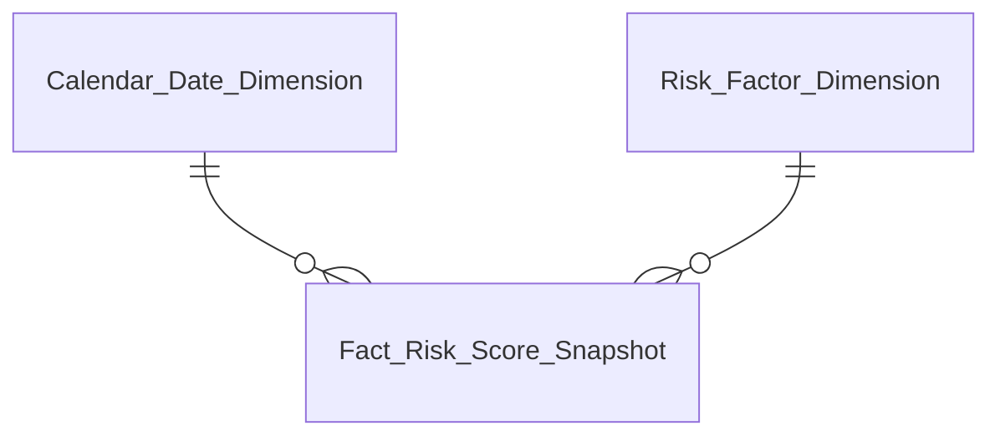
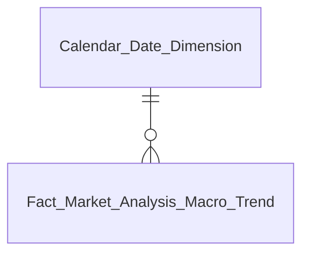
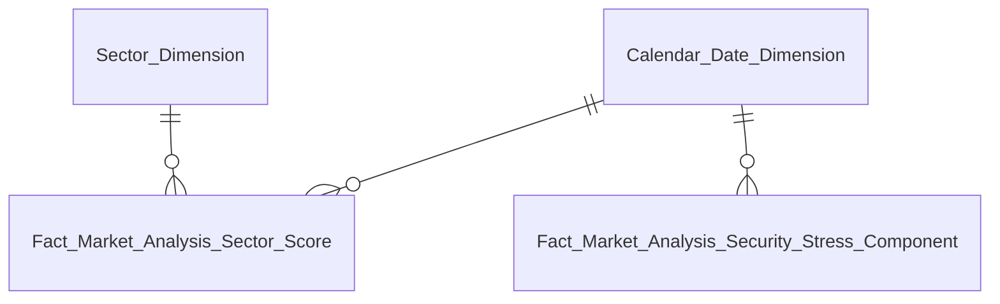
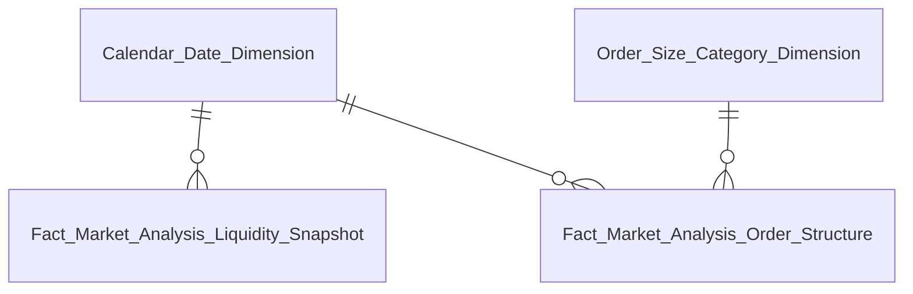
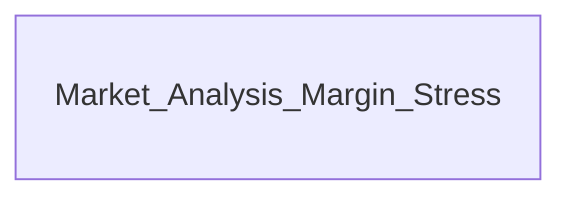
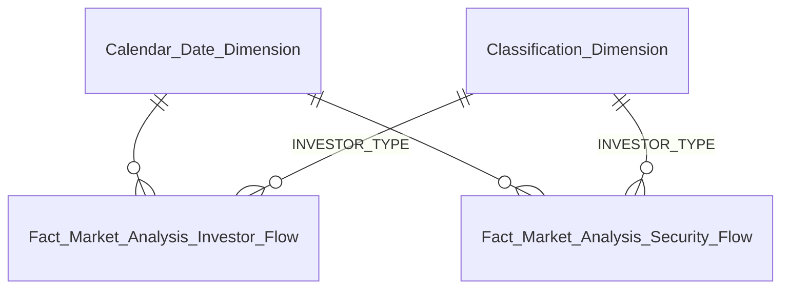
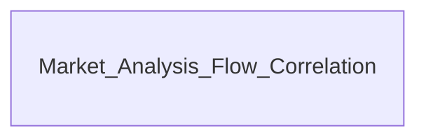
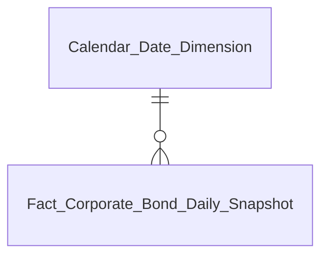
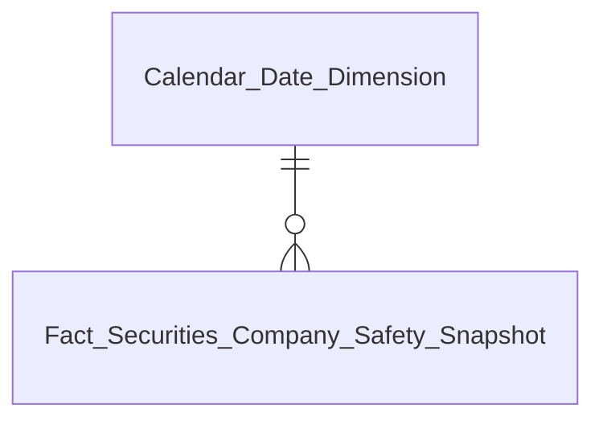

# DTM_PTTT_Entities — Quan hệ bảng Datamart PTTT

---

## Tab Giám sát rủi ro

### Nhóm 1 & 2: Chỉ số rủi ro hệ thống & Phân tích đóng góp rủi ro

| Datamart Entity | Loại | Mô tả | Grain | KPI |
|---|---|---|---|---|
| Calendar Date Dimension | Dimension | Lịch ngày dùng chung | 1 row / ngày | — |
| Risk Factor Dimension | Dimension | 6 yếu tố rủi ro (static) | 1 row / yếu tố | — |
| Fact Risk Score Snapshot | Fact Snapshot | Giá trị, Z-score, beta, Risk Index theo yếu tố rủi ro mỗi ngày | 1 row / ngày / yếu tố rủi ro | K_PTTT_1 ~ K_PTTT_24, K_PTTT_35 ~ K_PTTT_42 |

---

## Tab Sức khỏe thị trường & Vĩ mô

### Nhóm Chỉ số vĩ mô – tiền tệ

| Datamart Entity | Loại | Mô tả | Grain | KPI |
|---|---|---|---|---|
| Market Analysis Macro Indicator | Operational | Giá trị hiện tại và % thay đổi 4 chỉ tiêu vĩ mô | 1 row / chỉ tiêu tại ngày truy vấn | K_PTTT_44 ~ K_PTTT_54 |

### Nhóm Market Health Cockpit

| Datamart Entity | Loại | Mô tả | Grain | KPI |
|---|---|---|---|---|
| Market Analysis Market Health | Operational | Điểm số Margin tension và Systemic vol | 1 row / chỉ số tại ngày truy vấn | K_PTTT_55 ~ K_PTTT_62 |

### Nhóm Macro Correlation Map

| Datamart Entity | Loại | Mô tả | Grain | KPI |
|---|---|---|---|---|
| Market Analysis Macro Correlation | Operational | Hệ số tương quan 2 cặp: VN-Index vs Lãi suất, VN-Index vs DXY | 1 row / cặp tương quan tại ngày truy vấn | K_PTTT_72 ~ K_PTTT_83 |

### Nhóm Tương quan Chỉ số & Lãi suất thực tế

| Datamart Entity | Loại | Mô tả | Grain | KPI |
|---|---|---|---|---|
| Calendar Date Dimension | Dimension | Lịch ngày dùng chung | 1 row / ngày | — |
| Fact Market Analysis Macro Trend | Fact Snapshot | VN-Index bình quân và lãi suất bình quân theo tháng | 1 row / tháng | K_PTTT_84, K_PTTT_85 |

### Nhóm Sector Stress Map

| Datamart Entity | Loại | Mô tả | Grain | KPI |
|---|---|---|---|---|
| Sector Dimension | Dimension | Danh mục nhóm ngành từ IDS | 1 row / nhóm ngành | — |
| Fact Market Analysis Sector Score | Fact Snapshot | Sector Debt Score (Nợ/VCSH) theo ngành tại ngày | 1 row / ngành / ngày | K_PTTT_86 ~ K_PTTT_89 |
| Fact Market Analysis Security Stress Component | Fact Event | Thành phần áp lực từng mã CK: Price Drawdown, Volatility, Selling Pressure, Trading Value | 1 row / mã CK / ngày | K_PTTT_96 ~ K_PTTT_102 |

---

## Tab Thanh khoản & Đòn bẩy

### Nhóm Thanh khoản thị trường & Cấu trúc quy mô lệnh

| Datamart Entity | Loại | Mô tả | Grain | KPI |
|---|---|---|---|---|
| Order Size Category Dimension | Dimension | 2 nhóm quy mô lệnh ≥1 tỷ / <1 tỷ (static) | 1 row / nhóm | — |
| Fact Market Analysis Liquidity Snapshot | Fact Snapshot | GTGD phiên, MA50, KL khớp, số lệnh khớp, quy mô lệnh bình quân theo ngày | 1 row / ngày giao dịch | K_PTTT_106 ~ K_PTTT_116, K_PTTT_249, K_PTTT_250 |
| Fact Market Analysis Order Structure | Fact Event | GTGD, KL khớp, giá khớp bình quân theo nhóm quy mô lệnh trong ngày | 1 row / nhóm quy mô lệnh / ngày | K_PTTT_245 ~ K_PTTT_248 |

### Nhóm Áp lực Đòn bẩy (Margin Stress)

| Datamart Entity | Loại | Mô tả | Grain | KPI |
|---|---|---|---|---|
| Market Analysis Margin Stress | Operational | Dư nợ margin, tỷ lệ bão hòa, Δ margin và trạng thái tại tháng truy vấn | 1 row / chỉ tiêu tại tháng truy vấn | K_PTTT_121 ~ K_PTTT_127 |

---

## Tab Dòng tiền & Cơ cấu nhà đầu tư

### Nhóm Chỉ số chung, Cấu trúc NĐT, Top mua bán ròng

| Datamart Entity | Loại | Mô tả | Grain | KPI |
|---|---|---|---|---|
| Classification Dimension | Dimension | 4 nhóm NĐT theo scheme INVESTOR_TYPE (cross-dim) | 1 row / nhóm NĐT | — |
| Fact Market Analysis Investor Flow | Fact Event | GTGD mua, bán, dòng tiền ròng và tỷ trọng 4 nhóm NĐT theo ngày | 1 row / nhóm NĐT / ngày giao dịch | K_PTTT_128 ~ K_PTTT_146 |
| Fact Market Analysis Security Flow | Fact Event | GTGD mua, bán, dòng tiền ròng theo mã CK và nhóm NĐT theo ngày — nền tảng Top mua/bán ròng | 1 row / mã CK / nhóm NĐT / ngày giao dịch | K_PTTT_151 ~ K_PTTT_157 |

### Nhóm Tương quan dòng tiền khối ngoại & tự doanh

| Datamart Entity | Loại | Mô tả | Grain | KPI |
|---|---|---|---|---|
| Market Analysis Flow Correlation | Operational | Hệ số tương quan Pearson và dòng tiền ròng NĐTNN vs Tự doanh tại ngày truy vấn | 1 row / cặp tương quan tại ngày truy vấn | K_PTTT_147 ~ K_PTTT_150 |

---

## Tab Trái phiếu doanh nghiệp

### Nhóm Giao dịch TPDN hàng ngày

| Datamart Entity | Loại | Mô tả | Grain | KPI |
|---|---|---|---|---|
| Fact Corporate Bond Daily Snapshot | Fact Snapshot | Tổng mệnh giá và GTGD TPDN toàn thị trường theo ngày giao dịch | 1 row / ngày giao dịch | K_PTTT_158 ~ K_PTTT_163 |

### Nhóm Giám sát tín dụng tổ chức phát hành

| Datamart Entity | Loại | Mô tả | Grain | KPI |
|---|---|---|---|---|
| Operational Issuer Credit Monitoring | Operational | D/E, ROE, Tổng nợ, VCSH của từng tổ chức phát hành tại kỳ BCTC | 1 row / tổ chức / năm / quý | K_PTTT_164 ~ K_PTTT_172 |

---

## Tab An toàn CTCK

### Nhóm An toàn CTCK theo ngày

| Datamart Entity | Loại | Mô tả | Grain | KPI |
|---|---|---|---|---|
| Fact Securities Company Safety Snapshot | Fact Snapshot | Tổng dư nợ margin, VCSH và tỷ lệ dư nợ/VCSH toàn thị trường CTCK theo ngày báo cáo | 1 row / ngày báo cáo | K_PTTT_173 ~ K_PTTT_178 |

---

## Tổng hợp tất cả bảng

| Datamart Entity | Loại | Mô tả | Grain | Nguồn Atomic chính |
|---|---|---|---|---|
| Calendar Date Dimension | Dimension | Lịch ngày dùng chung | 1 row / ngày | cdr_dt |
| Risk Factor Dimension | Dimension | 6 yếu tố rủi ro (static) | 1 row / yếu tố | static |
| Sector Dimension | Dimension | Nhóm ngành từ IDS | 1 row / nhóm ngành | pblc_co |
| Classification Dimension | Dimension | 4 nhóm NĐT INVESTOR_TYPE (cross-dim) | 1 row / nhóm NĐT | static |
| Order Size Category Dimension | Dimension | 2 nhóm quy mô lệnh (static) | 1 row / nhóm | static |
| Fact Risk Score Snapshot | Fact Snapshot | Risk Index theo yếu tố rủi ro mỗi ngày | 1 row / ngày / yếu tố | rsk_ind_val |
| Fact Market Analysis Macro Trend | Fact Snapshot | VN-Index và lãi suất bình quân tháng | 1 row / tháng | mkt_indx_snpst, rsk_ind_val |
| Fact Market Analysis Sector Score | Fact Snapshot | Sector Debt Score theo ngành tại ngày | 1 row / ngành / ngày | pblc_co, pblc_co_fnc_rpt_val |
| Fact Market Analysis Security Stress Component | Fact Event | Thành phần áp lực từng mã CK | 1 row / mã CK / ngày | scr_mtch_log, scr_tdg_snpst |
| Fact Market Analysis Liquidity Snapshot | Fact Snapshot | GTGD phiên, MA50, quy mô lệnh toàn thị trường | 1 row / ngày giao dịch | mkt_snpst |
| Fact Market Analysis Investor Flow | Fact Event | Dòng tiền ròng và tỷ trọng 4 nhóm NĐT | 1 row / nhóm NĐT / ngày | scr_trd |
| Fact Market Analysis Security Flow | Fact Event | Dòng tiền ròng theo mã CK và nhóm NĐT | 1 row / mã CK / nhóm NĐT / ngày | scr_trd |
| Fact Corporate Bond Daily Snapshot | Fact Snapshot | Mệnh giá và GTGD TPDN theo ngày | 1 row / ngày giao dịch | corp_bond_tdg_snpst |
| Fact Securities Company Safety Snapshot | Fact Snapshot | Dư nợ margin, VCSH toàn thị trường CTCK | 1 row / ngày báo cáo | mbr_rpt_ind_val |
| Fact Market Analysis Order Structure | Fact Event | GTGD, KL, giá bình quân theo nhóm quy mô lệnh | 1 row / nhóm quy mô lệnh / ngày | scr_trd |
| Market Analysis Macro Indicator | Operational | 4 chỉ tiêu vĩ mô tại ngày truy vấn | 1 row / chỉ tiêu | rsk_ind_val |
| Market Analysis Market Health | Operational | Margin tension và Systemic vol | 1 row / chỉ số | mbr_rpt_ind_val, mkt_indx_snpst |
| Market Analysis Macro Correlation | Operational | Hệ số tương quan VN-Index vs Lãi suất / DXY | 1 row / cặp tương quan | mkt_indx_snpst, rsk_ind_val |
| Market Analysis Margin Stress | Operational | Dư nợ margin, tỷ lệ bão hòa, trạng thái | 1 row / chỉ tiêu tại tháng | mbr_rpt_ind_val |
| Market Analysis Flow Correlation | Operational | Tương quan dòng tiền NĐTNN & Tự doanh | 1 row / cặp tương quan | scr_trd |
| Operational Issuer Credit Monitoring | Operational | D/E, ROE, nợ, VCSH tổ chức phát hành TPDN | 1 row / tổ chức / năm / quý | pblc_co, pblc_co_fnc_rpt_val |
