# DTM_PTTT_HLD — Phân tích thị trường (PTTT)

---

## Section 1 — Data Lineage

##### Cụm 1: Chỉ số rủi ro hệ thống & Phân tích đóng góp rủi ro (Fact Risk Score Snapshot)

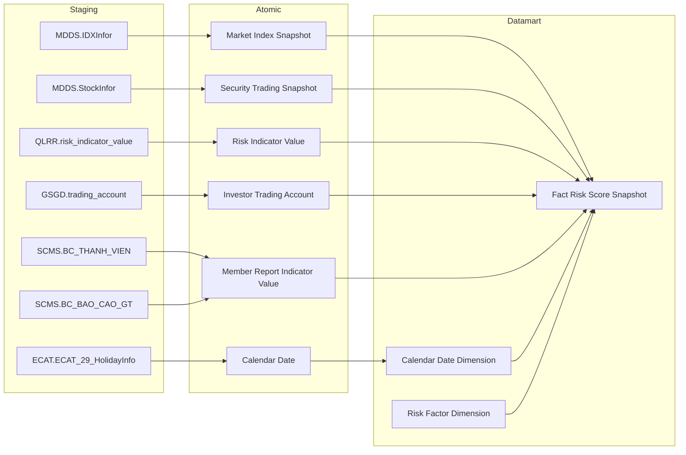

> **Ghi chú:** `Risk Factor Dimension` là static lookup — 6 yếu tố cố định, seed từ file cấu hình, không có Atomic entity tương ứng.

##### Cụm 2: Chỉ số vĩ mô – tiền tệ (Market Analysis Macro Indicator)

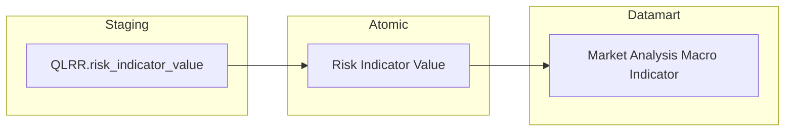

##### Cụm 3: Market Health Cockpit (Market Analysis Market Health)

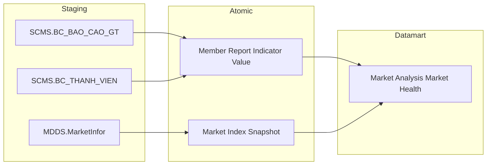

##### Cụm 4: Macro Correlation Map (Market Analysis Macro Correlation)

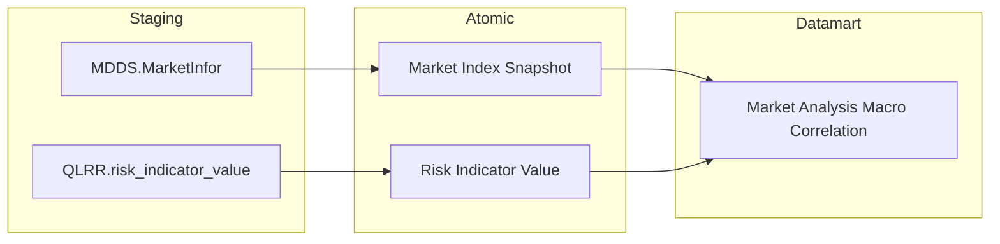

##### Cụm 5: Tương quan Chỉ số & Lãi suất thực tế (Fact Market Analysis Macro Trend)

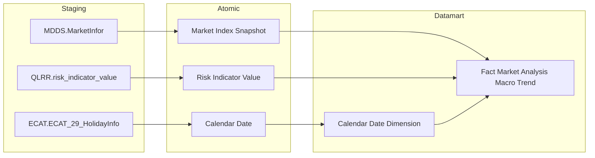

##### Cụm 6a: Sector Stress Map – Debt Score (Fact Market Analysis Sector Score)

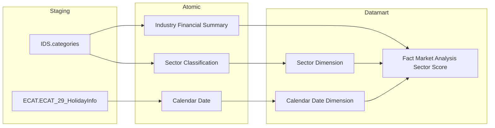

##### Cụm 6b: Sector Stress Map – Security Stress Component (Fact Market Analysis Security Stress Component)

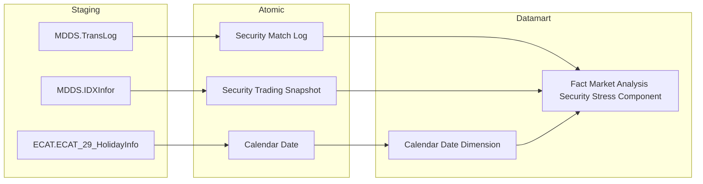

##### Cụm 7: Thanh khoản thị trường (Fact Market Analysis Liquidity Snapshot)

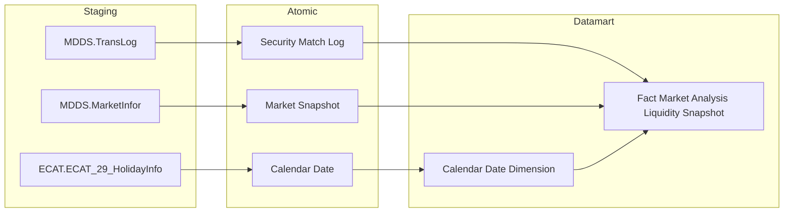

##### Cụm 8: Áp lực Đòn bẩy (Market Analysis Margin Stress)


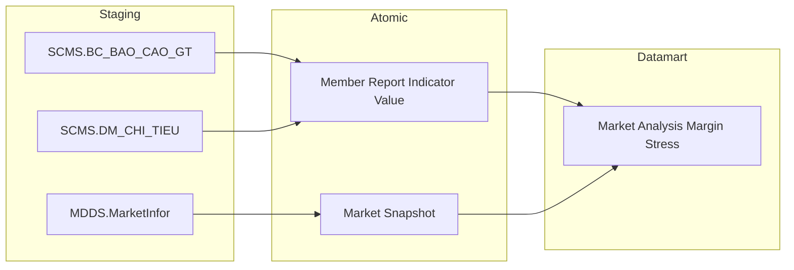

##### Cụm 9: Dòng tiền & Cơ cấu nhà đầu tư (Fact Market Analysis Investor Flow)

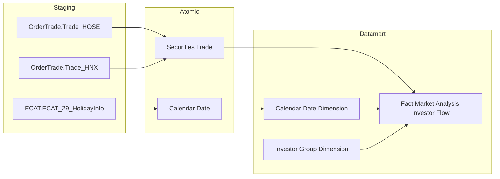

##### Cụm 10: Tương quan dòng tiền khối ngoại & tự doanh (Market Analysis Flow Correlation)

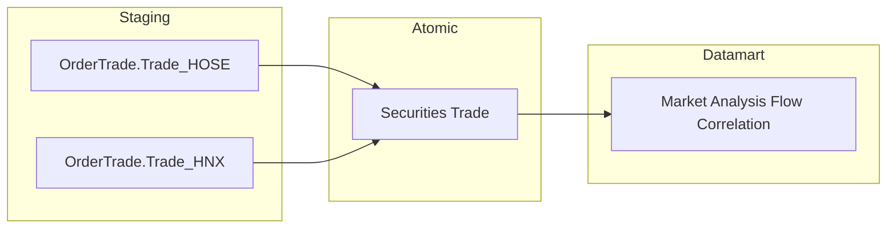

##### Cụm 11: Top mua bán ròng theo mã CK (Fact Market Analysis Security Flow)

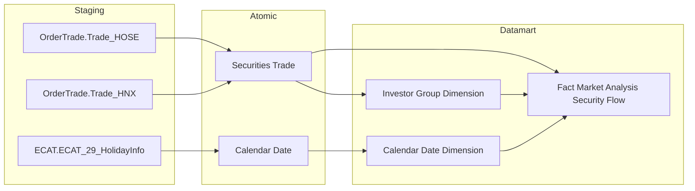

##### Cụm 11b: Cấu trúc quy mô lệnh (Fact Market Analysis Order Structure)

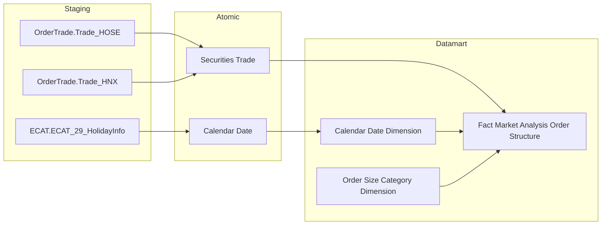

##### Cụm 12: Giao dịch TPDN hàng ngày (Fact Corporate Bond Daily Snapshot)

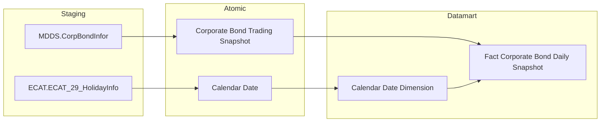

##### Cụm 13: Giám sát tín dụng tổ chức phát hành (Operational Issuer Credit Monitoring)

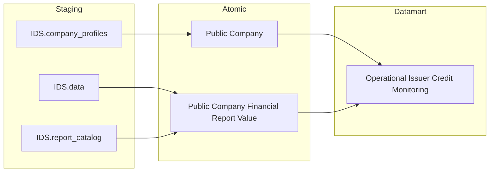

##### Cụm 14: An toàn CTCK theo ngày (Fact Securities Company Safety Snapshot)

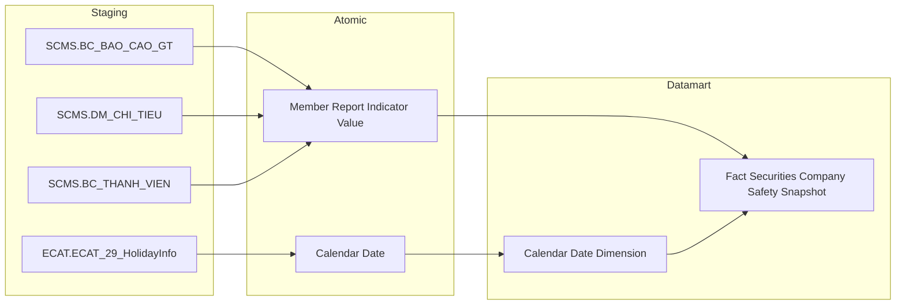

---

## Section 2 — Tổng quan báo cáo

### Tab Giám sát rủi ro

#### Nhóm 1: Chỉ số rủi ro hệ thống

##### READY

> Phân loại: **Phân tích**
> Atomic: `Market Index Snapshot` ← MDDS.IDXInfor — **READY**
> Atomic: `Security Trading Snapshot` ← MDDS.StockInfor — **READY**
> Atomic: `Risk Indicator Value` ← QLRR.risk_indicator_value — **READY**
> Atomic: `Investor Trading Account` ← GSGD.trading_account — **READY**
> Atomic: `Member Report Indicator Value` ← SCMS.BC_THANH_VIEN, SCMS.BC_BAO_CAO_GT — **READY**

**Mockup:**

| Chỉ số rủi ro hệ thống | Giá trị | Z-score |
|---|---|---|
| Biến động giá (Volatility) | σ = 0.015 | 1.82 |
| Thanh khoản (ILLIQ) | ILLIQ = 0.003 | -0.74 |
| Lãi suất liên ngân hàng | 4.5% | 2.10 |
| Dòng tiền ròng NĐTNN | -120 tỷ | -1.30 |
| **Risk Index tổng hợp** | **68.5** | |

**Source:** `Fact Risk Score Snapshot` → `Risk Factor Dimension`, `Calendar Date Dimension`

**Bảng KPI:**

| KPI ID | Tên KPI | Đơn vị | Tính chất | Công thức |
|---|---|---|---|---|
| K_PTTT_1 | Risk Index tổng hợp | Điểm | Phái sinh | Σ (Z-scoreᵢ × βᵢ) cho tất cả yếu tố rủi ro |
| K_PTTT_2 | Z-score Biến động giá | Điểm | Phái sinh | (Volatility_30p − μ_Volatility) / σ_Volatility |
| K_PTTT_3 | Biến động giá Volatility 30 phiên (σ) | % | Phái sinh | Độ lệch chuẩn lợi suất 30 phiên |
| K_PTTT_4 | Lợi suất ngày (x) | % | Cơ sở | (P(t) − P(t−1)) / P(t−1) |
| K_PTTT_5 | Giá đóng cửa P(t) | VNĐ | Cơ sở | Giá đóng cửa ngày t từ MDDS |
| K_PTTT_6 | Giá đóng cửa P(t−1) | VNĐ | Cơ sở | Giá đóng cửa ngày t−1 từ MDDS |
| K_PTTT_7 | Lợi suất trung bình 30 phiên (μ) | % | Phái sinh | Trung bình lợi suất ngày 30 phiên gần nhất |
| K_PTTT_8 | Z-score Thanh khoản | Điểm | Phái sinh | (ILLIQ_t − μ_ILLIQ) / σ_ILLIQ; đảo chiều: giá trị cao = thanh khoản thấp = rủi ro cao |
| K_PTTT_9 | Độ lệch chuẩn ILLIQ (σ) | — | Phái sinh | Độ lệch chuẩn chuỗi ILLIQ 30 phiên |
| K_PTTT_10 | ILLIQ trung bình 30 phiên (R̄) | — | Phái sinh | Trung bình ILLIQ 30 phiên |
| K_PTTT_11 | ILLIQ ngày t (Rₜ) | — | Phái sinh | \|Rₜ\| / VOLDₜ |
| K_PTTT_12 | Giá trị tuyệt đối lợi suất \|Rₜ\| | — | Cơ sở | \|(P(t) − P(t−1)) / P(t−1)\| |
| K_PTTT_13 | Giá trị giao dịch ngày t VOLDₜ | Tỷ VNĐ | Cơ sở | Giá trị giao dịch khớp lệnh ngày t từ GSGD |
| K_PTTT_14 | Tổng dư nợ margin MDₜ | Tỷ VNĐ | Cơ sở | Dư nợ margin tổng hợp từ báo cáo CTCK tháng (SCMS) |
| K_PTTT_15 | Z-score Lãi suất | Điểm | Phái sinh | (Lãi_suất_t − μ_lãi_suất) / σ_lãi_suất |
| K_PTTT_16 | Lãi suất tại ngày t | % | Cơ sở | Lãi suất liên ngân hàng từ QLRR |
| K_PTTT_17 | Lãi suất trung bình N phiên (μ) | % | Phái sinh | Trung bình lãi suất N phiên |
| K_PTTT_18 | Độ lệch chuẩn lãi suất (σ) | — | Phái sinh | Độ lệch chuẩn chuỗi lãi suất N phiên |
| K_PTTT_19 | Z-score Dòng tiền ròng NĐTNN | Điểm | Phái sinh | (NetFlow_t − μ_NetFlow) / σ_NetFlow; đảo chiều |
| K_PTTT_20 | Độ lệch chuẩn dòng tiền ròng NĐTNN (σ) | — | Phái sinh | Độ lệch chuẩn chuỗi dòng tiền ròng NĐTNN |
| K_PTTT_21 | Dòng tiền ròng NĐTNN ngày t | Tỷ VNĐ | Phái sinh | GTGD mua − GTGD bán của NĐTNN |
| K_PTTT_22 | GTGD mua của NĐTNN ngày t | Tỷ VNĐ | Cơ sở | Giá trị giao dịch mua phía NĐTNN từ GSGD |
| K_PTTT_23 | GTGD bán của NĐTNN ngày t | Tỷ VNĐ | Cơ sở | Giá trị giao dịch bán phía NĐTNN từ GSGD |
| K_PTTT_24 | Dòng tiền ròng NĐTNN trung bình phiên (μ) | Tỷ VNĐ | Phái sinh | Trung bình dòng tiền ròng NĐTNN N phiên |

**Star Schema:**

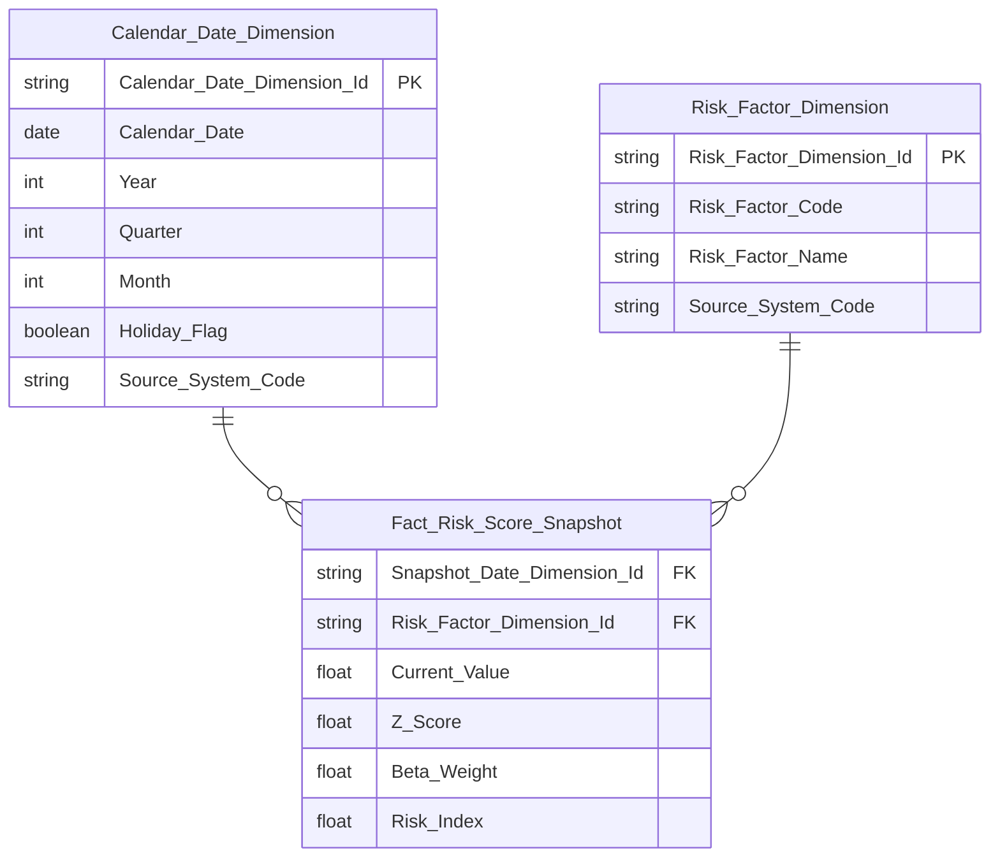

**Lineage Mart → Báo cáo:**


**Bảng grain:**

| Tên bảng | Grain |
|---|---|
| Fact Risk Score Snapshot | 1 dòng / ngày giao dịch / yếu tố rủi ro |
| Risk Factor Dimension | 1 dòng / yếu tố rủi ro |
| Calendar Date Dimension | 1 dòng / ngày dương lịch |

##### PENDING

**KPI liên quan:** K_PTTT_25, K_PTTT_26, K_PTTT_27, K_PTTT_28, K_PTTT_29, K_PTTT_30, K_PTTT_31, K_PTTT_32, K_PTTT_33, K_PTTT_34

**Lý do pending:**
- Nhóm Z-score Dư nợ Margin: cần "KL CK lưu hành tại ngày" để tính MCAPₜ (Tổng vốn hóa thị trường) — chưa có Atomic entity lưu trữ số lượng cổ phiếu lưu hành từ nguồn GSGD
- Nhóm Z-score Huy động vốn cổ phần: cần kết hợp dữ liệu từ SCMS + IDS + FMS — chưa có Atomic entity tổng hợp cross-source

**Atomic cần bổ sung:**
- Entity lưu KL CK lưu hành tại ngày từ GSGD
- Atomic entity tổng hợp Huy động vốn cổ phần từ SCMS + IDS + FMS

**Mart dự kiến:**
- Fact Risk Score Snapshot — grain: 1 dòng / ngày / yếu tố rủi ro (mở rộng thêm 2 yếu tố Margin và Huy động vốn khi Atomic sẵn sàng)

**Bảng KPI PENDING:**

| KPI ID | Tên KPI | Tính chất | Trạng thái |
|---|---|---|---|
| K_PTTT_25 | Z-score Dư nợ Margin | Phái sinh | PENDING |
| K_PTTT_26 | Độ lệch chuẩn Dư nợ Margin (σ) | Phái sinh | PENDING |
| K_PTTT_27 | Tỷ lệ Dư nợ Margin / Tổng vốn hóa thị trường tại ngày (x) | Phái sinh | PENDING |
| K_PTTT_28 | Tỷ lệ Dư nợ Margin / Tổng vốn hóa trung bình (μ) | Phái sinh | PENDING |
| K_PTTT_29 | MCAPₜ — Tổng vốn hóa thị trường ngày t | Phái sinh | PENDING |
| K_PTTT_30 | KL CK lưu hành tại ngày | Cơ sở | PENDING |
| K_PTTT_31 | Z-score Huy động vốn cổ phần | Phái sinh | PENDING |
| K_PTTT_32 | Độ lệch chuẩn Huy động vốn cổ phần (σ) | Phái sinh | PENDING |
| K_PTTT_33 | Huy động vốn cổ phần tại ngày t | Phái sinh | PENDING |
| K_PTTT_34 | Huy động vốn cổ phần trung bình (μ) | Phái sinh | PENDING |

---

#### Nhóm 2: Phân tích đóng góp rủi ro

##### READY

> Phân loại: **Phân tích**
> Atomic: `Market Index Snapshot` ← MDDS.IDXInfor — **READY**
> Atomic: `Security Trading Snapshot` ← MDDS.StockInfor — **READY**
> Atomic: `Risk Indicator Value` ← QLRR.risk_indicator_value — **READY**
> Atomic: `Investor Trading Account` ← GSGD.trading_account — **READY**
> Atomic: `Member Report Indicator Value` ← SCMS.BC_THANH_VIEN, SCMS.BC_BAO_CAO_GT — **READY**

**Mockup:**

| Yếu tố rủi ro | Giá trị hiện tại | Z-score | Tỷ trọng (β) |
|---|---|---|---|
| Biến động giá | σ = 0.015 | 1.82 | 25% |
| Thanh khoản | ILLIQ = 0.003 | -0.74 | 20% |
| Lãi suất | 4.5% | 2.10 | 20% |
| Dòng tiền ròng NĐTNN | -120 tỷ | -1.30 | 20% |

**Source:** `Fact Risk Score Snapshot` → `Risk Factor Dimension`, `Calendar Date Dimension`

**Bảng KPI:**

*KPI mới của Nhóm 2 (chưa khai sinh ở Nhóm 1):*

| KPI ID | Tên KPI | Đơn vị | Tính chất | Công thức |
|---|---|---|---|---|
| K_PTTT_35 | Tỷ trọng Biến động giá (β_Biến_động) | % | Phái sinh | Trọng số beta yếu tố Biến động giá — ETL từ Atomic, lưu trên Fact |
| K_PTTT_36 | Tỷ trọng Thanh khoản (β_Thanh_khoản) | % | Phái sinh | Trọng số beta yếu tố Thanh khoản — ETL từ Atomic, lưu trên Fact |
| K_PTTT_37 | Tỷ trọng Dư nợ Margin (β_Margin) | % | Phái sinh | Trọng số beta yếu tố Dư nợ Margin — ETL từ Atomic, lưu trên Fact |
| K_PTTT_38 | Tỷ trọng Lãi suất liên ngân hàng (β_Lãi_suất) | % | Phái sinh | Trọng số beta yếu tố Lãi suất — ETL từ Atomic, lưu trên Fact |
| K_PTTT_39 | Tỷ trọng Dòng tiền ròng NĐTNN (β_NĐTNN) | % | Phái sinh | Trọng số beta yếu tố Dòng tiền NĐTNN — ETL từ Atomic, lưu trên Fact |
| K_PTTT_40 | Tỷ trọng Huy động vốn cổ phần (β_HVCP) | % | Phái sinh | Trọng số beta yếu tố Huy động vốn — ETL từ Atomic, lưu trên Fact |
| K_PTTT_41 | Giá trị hiện tại Biến động giá ngày t | % | Phái sinh | Volatility 30 phiên tại ngày t — map từ K_PTTT_3 (Current_Value trên Fact, filter Risk_Factor = Biến động giá) |
| K_PTTT_42 | Giá trị hiện tại Thanh khoản ngày t | — | Phái sinh | ILLIQ tại ngày t — map từ K_PTTT_11 (Current_Value trên Fact, filter Risk_Factor = Thanh khoản) |

*KPI reuse từ Nhóm 1 (không cấp ID mới):*

| KPI ID | Tên KPI | Ghi chú |
|---|---|---|
| K_PTTT_2 | Z-score Biến động giá | Reuse từ Nhóm 1 |
| K_PTTT_8 | Z-score Thanh khoản | Reuse từ Nhóm 1 |
| K_PTTT_15 | Z-score Lãi suất | Reuse từ Nhóm 1 |
| K_PTTT_19 | Z-score Dòng tiền ròng NĐTNN | Reuse từ Nhóm 1 |
| K_PTTT_16 | Lãi suất tại ngày t | Reuse từ Nhóm 1 |
| K_PTTT_21 | Dòng tiền ròng NĐTNN ngày t | Reuse từ Nhóm 1 |
| K_PTTT_14 | Tổng dư nợ margin MDₜ | Reuse từ Nhóm 1 |

**Star Schema:**


**Lineage Mart → Báo cáo:**

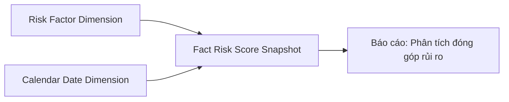

**Bảng grain:**

| Tên bảng | Grain |
|---|---|
| Fact Risk Score Snapshot | 1 dòng / ngày giao dịch / yếu tố rủi ro |
| Risk Factor Dimension | 1 dòng / yếu tố rủi ro |
| Calendar Date Dimension | 1 dòng / ngày dương lịch |

##### PENDING

**KPI liên quan:** K_PTTT_43 (mới); K_PTTT_29, K_PTTT_30, K_PTTT_31, K_PTTT_32, K_PTTT_33, K_PTTT_34 (reuse từ Nhóm 1)

**Lý do pending:**
- Giá trị hiện tại Dư nợ Margin: phụ thuộc MCAPₜ — chưa có KL CK lưu hành từ GSGD (xem O_PTTT_1)
- Z-score Huy động vốn cổ phần và giá trị hiện tại: chưa có Atomic entity cross-source (xem O_PTTT_2)

**Atomic cần bổ sung:**
- Entity lưu KL CK lưu hành tại ngày từ GSGD
- Atomic entity tổng hợp Huy động vốn cổ phần từ SCMS + IDS + FMS

**Mart dự kiến:**
- Fact Risk Score Snapshot — grain: 1 dòng / ngày / yếu tố rủi ro (mở rộng khi Atomic sẵn sàng)

**Bảng KPI PENDING:**

*KPI mới của Nhóm 2 (chưa khai sinh ở Nhóm 1):*

| KPI ID | Tên KPI | Tính chất | Trạng thái |
|---|---|---|---|
| K_PTTT_43 | Giá trị hiện tại Dư nợ Margin / Tổng vốn hóa ngày t | Phái sinh | PENDING |

*KPI reuse từ Nhóm 1 (không cấp ID mới):*

| KPI ID | Tên KPI | Ghi chú |
|---|---|---|
| K_PTTT_29 | MCAPₜ — Tổng vốn hóa thị trường ngày t | Reuse từ Nhóm 1 |
| K_PTTT_30 | KL CK lưu hành tại ngày | Reuse từ Nhóm 1 |
| K_PTTT_31 | Z-score Huy động vốn cổ phần | Reuse từ Nhóm 1 |
| K_PTTT_32 | Độ lệch chuẩn Huy động vốn cổ phần (σ) | Reuse từ Nhóm 1 |
| K_PTTT_33 | Huy động vốn cổ phần tại ngày t | Reuse từ Nhóm 1 |
| K_PTTT_34 | Huy động vốn cổ phần trung bình (μ) | Reuse từ Nhóm 1 |

---

### Tab Sức khỏe thị trường & Vĩ mô

#### Nhóm Chỉ số vĩ mô – tiền tệ

##### READY

> Phân loại: **Tác nghiệp**
> Atomic: `Risk Indicator Value` ← QLRR.risk_indicator_value — **READY**

**Mockup:**

| Chỉ tiêu | Giá trị hiện tại | Giá trị ngày trước | % Thay đổi |
|---|---|---|---|
| Lãi suất liên ngân hàng (ON) | 4.38% | 4.23% | +0.15 |
| Tỷ giá USD/VND | 25.510 | 25.497 | +0.05% |
| Chỉ số CPI (YoY) | 3.97% | 4.09% | −0.12 |
| Tăng trưởng GDP | 5.55% | 5.35% | — |

**Source:** `opr_mta_macro_indicator` ← `Risk Indicator Value` (QLRR), filter theo `indicator_code` ∈ {IR_ON, FX_USDT, CPI_YOY, GDP_GROWTH}

**Bảng KPI:**

| KPI ID | Tên KPI | Đơn vị | Tính chất | Công thức |
|---|---|---|---|---|
| K_PTTT_44 | Lãi suất liên ngân hàng (ON) ngày trước (IRt-1) | % | Cơ sở | Risk Indicator Value: indicator_code=IR_ON, period_date=ngày trước |
| K_PTTT_45 | % thay đổi lãi suất liên ngân hàng | % | Phái sinh | (IRₜ − IRt-1) / IRt-1 × 100 |
| K_PTTT_46 | Tỷ giá USD/VND tại ngày (FXₜ) | VNĐ/USD | Cơ sở | Risk Indicator Value: indicator_code=FX_USDT, period_date=ngày t |
| K_PTTT_47 | Tỷ giá USD/VND ngày trước (FXt-1) | VNĐ/USD | Cơ sở | Risk Indicator Value: indicator_code=FX_USDT, period_date=ngày trước |
| K_PTTT_48 | % thay đổi tỷ giá USD/VND | % | Phái sinh | (FXₜ − FXt-1) / FXt-1 × 100 |
| K_PTTT_49 | Chỉ số CPI (YoY) tại kỳ t | % | Cơ sở | Risk Indicator Value: indicator_code=CPI_YOY, period_date=kỳ t |
| K_PTTT_50 | CPI cùng kỳ năm trước | % | Cơ sở | Risk Indicator Value: indicator_code=CPI_YOY, period_date=cùng kỳ năm trước |
| K_PTTT_51 | % thay đổi CPI (YoY) | % | Phái sinh | (CPI_YoYₜ − CPI_cùng_kỳ) / CPI_cùng_kỳ × 100 |
| K_PTTT_52 | Tăng trưởng GDP | % | Phái sinh | (GDP_kỳ − GDP_kỳ_trước) / GDP_kỳ_trước × 100 |
| K_PTTT_53 | GDP kỳ hiện tại | Tỷ VNĐ | Cơ sở | Risk Indicator Value: indicator_code=GDP, period_date=kỳ t |
| K_PTTT_54 | GDP kỳ trước | Tỷ VNĐ | Cơ sở | Risk Indicator Value: indicator_code=GDP, period_date=kỳ trước |

*KPI reuse từ Nhóm 1 (Giám sát rủi ro):*

| KPI ID | Tên KPI | Ghi chú |
|---|---|---|
| K_PTTT_16 | Lãi suất liên ngân hàng (ON) tại ngày t | Reuse từ Nhóm 1 (Giám sát rủi ro) |

**Thiết kế bảng Tác nghiệp:**

```mermaid
erDiagram
    opr_mta_macro_ind {
        string Market_Analysis_Macro_Indicator_Id PK
        string Macro_Indicator_Code
        string Macro_Indicator_Name
        float Current_Score
        date Reference_Date
        string Source_System_Code
    }
```

**Lineage Mart → Báo cáo:**

```mermaid
flowchart LR
    rsk_ind_val["Risk Indicator Value"] --> opr_mta_macro_ind["Market Analysis Macro Indicator"]
    opr_mta_macro_ind --> rpt["Báo cáo: Chỉ số vĩ mô – tiền tệ"]
```

**Bảng grain:**

| Tên bảng | Grain |
|---|---|
| Market Analysis Macro Indicator | 1 dòng / loại chỉ tiêu vĩ mô tại ngày truy vấn |

##### PENDING

**KPI liên quan:** K_PTTT_243

**Lý do pending:** Chiều Thời gian (kỳ tham chiếu) cho Chỉ số vĩ mô – tiền tệ — `Risk Indicator Value` đã READY nhưng trường `period_date` chưa được ánh xạ thành Calendar Date FK trong bảng Tác nghiệp hiện tại; cần bổ sung để hỗ trợ so sánh theo kỳ.

**Atomic cần bổ sung:** Mở rộng `opr_mta_macro_indicator` — thêm tham chiếu ngày/kỳ tương ứng với Calendar Date Dimension.

**Mart dự kiến:**
- opr_mta_macro_indicator — grain: 1 dòng / loại chỉ tiêu vĩ mô tại ngày truy vấn (bổ sung trường Reference_Period khi sẵn sàng)

**Bảng KPI PENDING:**

*KPI mới (chưa khai sinh ở Nhóm trước):*

| KPI ID | Tên KPI | Tính chất | Trạng thái |
|---|---|---|---|
| K_PTTT_243 | Thời gian (kỳ tham chiếu chỉ số vĩ mô) | Chiều | PENDING |

---

#### Nhóm Market Health Cockpit

##### READY

> Phân loại: **Tác nghiệp**
> Atomic: `Member Report Indicator Value` ← SCMS.BC_BAO_CAO_GT, SCMS.BC_THANH_VIEN — **READY**
> Atomic: `Market Index Snapshot` ← MDDS.MarketInfor — **READY**

**Mockup:**

| Chỉ số | Giá trị | Trạng thái |
|---|---|---|
| Margin tension | 82% | *(màu do UI tính từ ngưỡng)* |
| Systemic vol | 29% | *(màu do UI tính từ ngưỡng)* |

**Source:** `opr_mta_market_health` ← `Member Report Indicator Value` (SCMS), `Market Index Snapshot` (MDDS)

**Bảng KPI:**

*KPI mới:*

| KPI ID | Tên KPI | Đơn vị | Tính chất | Công thức |
|---|---|---|---|---|
| K_PTTT_55 | Thời gian (ngày thống kê) | Ngày | Chiều | Ngày truy vấn |
| K_PTTT_56 | Chỉ số độ căng margin (Margin tension) | % | Phái sinh | Tổng dư nợ margin / Tổng hạn mức margin × 100 |
| K_PTTT_57 | Tổng hạn mức margin | Tỷ VNĐ | Phái sinh | Tổng hợp từ SCMS.BC_BAO_CAO_GT |
| K_PTTT_58 | Chỉ số biến động hệ thống (Systemic vol) | % | Phái sinh | Độ lệch chuẩn lợi suất VN-Index 20 phiên gần nhất |
| K_PTTT_59 | Độ lệch chuẩn lợi suất VN-Index 20 phiên | % | Phái sinh | σ(lợi suất ngày VN-Index, 20 phiên gần nhất) |
| K_PTTT_60 | Lợi suất/ngày VN-Index | % | Phái sinh | (Pt − Pt-1) / Pt-1 |
| K_PTTT_61 | Điểm VN-Index tại ngày t | Điểm | Cơ sở | Market Index Snapshot: IndexCode=VNINDEX, ngày t |
| K_PTTT_62 | Điểm VN-Index tại ngày t-1 | Điểm | Cơ sở | Market Index Snapshot: IndexCode=VNINDEX, ngày t-1 |

*KPI reuse từ Nhóm 1 (không cấp ID mới):*

| KPI ID | Tên KPI | Ghi chú |
|---|---|---|
| K_PTTT_14 | Tổng dư nợ margin MDₜ | Reuse từ Nhóm 1 |

**Thiết kế bảng Tác nghiệp:**

```mermaid
erDiagram
    opr_mta_market_health {
        string Market_Analysis_Market_Health_Id PK
        string Market_Health_Indicator_Code
        string Market_Health_Indicator_Name
        float Current_Score
        date Reference_Date
        string Source_System_Code
    }
```

**Lineage Mart → Báo cáo:**

```mermaid
flowchart LR
    mbr_rpt_ind_val["Member Report Indicator Value"] --> opr_mta_mkt_hlth["Market Analysis Market Health"]
    mkt_idx_snpst["Market Index Snapshot"] --> opr_mta_mkt_hlth
    opr_mta_mkt_hlth --> rpt["Báo cáo: Market Health Cockpit"]
```

**Bảng grain:**

| Tên bảng | Grain |
|---|---|
| Market Analysis Market Health | 1 dòng / chỉ số sức khỏe thị trường (2 dòng: MARGIN_TENSION, SYSTEMIC_VOL) tại ngày truy vấn |

##### PENDING

**KPI liên quan:** K_PTTT_63, K_PTTT_64, K_PTTT_65, K_PTTT_66, K_PTTT_67, K_PTTT_68, K_PTTT_69, K_PTTT_70, K_PTTT_71, K_PTTT_244

**Lý do pending:** (1) Sentiment index, S_liquidity, S_stability phụ thuộc tham số cấu hình trọng số W1/W2 và ngưỡng màu gauge lưu tại `Kho dữ liệu / DW` — chưa có Atomic entity lưu config này; (2) "Chuẩn hóa thang điểm" chưa xác nhận rule chuẩn hóa (BA Pending).

**Atomic cần bổ sung:** Atomic entity lưu tham số cấu hình trọng số W1/W2, ngưỡng trạng thái cho Sentiment/Margin tension/Systemic vol từ DW.

**Mart dự kiến:**
- Market Analysis Market Health — grain: 1 dòng / chỉ số tại ngày truy vấn (mở rộng thêm SENTIMENT khi DW sẵn sàng)

**Bảng KPI PENDING:**

*KPI mới (chưa khai sinh ở Nhóm trước):*

| KPI ID | Tên KPI | Tính chất | Trạng thái |
|---|---|---|---|
| K_PTTT_63 | Chỉ số tâm lý giao dịch (Sentiment index) | Phái sinh | PENDING |
| K_PTTT_64 | Sentiment Score từng mã CK | Phái sinh | PENDING |
| K_PTTT_65 | S_liquidity (Điểm thanh khoản) | Phái sinh | PENDING |
| K_PTTT_66 | S_stability (Điểm ổn định) | Phái sinh | PENDING |
| K_PTTT_67 | Trọng số W1 (S_liquidity) | Cơ sở | PENDING |
| K_PTTT_68 | Trọng số W2 (S_stability) | Cơ sở | PENDING |
| K_PTTT_69 | Ngưỡng trạng thái Sentiment index | Phái sinh | PENDING |
| K_PTTT_70 | Ngưỡng trạng thái Margin tension | Phái sinh | PENDING |
| K_PTTT_71 | Ngưỡng trạng thái Systemic vol | Phái sinh | PENDING |
| K_PTTT_244 | Chuẩn hóa thang điểm (0–100) | Phái sinh | PENDING |

---

#### Nhóm Macro Correlation Map

> Phân loại: **Tác nghiệp**
> Atomic: `Market Index Snapshot` ← MDDS.MarketInfor — **READY**
> Atomic: `Risk Indicator Value` ← QLRR.risk_indicator_value — **READY**

**Mockup:**

| Cặp tương quan | Hệ số r | Diễn giải |
|---|---|---|
| Tương quan Chỉ số & Lãi suất thực tế | −0.8 | Nghịch quan mạnh (Downside Risk) |
| Index vs DXY Index | −0.63 | Nghịch quan vừa (FX Pressure) |

**Source:** `opr_mta_macro_correlation` ← `Market Index Snapshot` (MDDS), `Risk Indicator Value` (QLRR)

**Bảng KPI:**

*KPI mới:*

| KPI ID | Tên KPI | Đơn vị | Tính chất | Công thức |
|---|---|---|---|---|
| K_PTTT_72 | Thời gian (Ngày thống kê) | Ngày | Chiều | Ngày truy vấn |
| K_PTTT_73 | Tương quan VN-Index & Lãi suất liên ngân hàng | — | Phái sinh | Pearson Correlation(Return_VNINDEX, ΔIR) trên N phiên gần nhất |
| K_PTTT_74 | Tương quan Index & DXY Index | — | Phái sinh | Pearson Correlation(Return_VNINDEX, Return_DXY) trên N phiên gần nhất |
| K_PTTT_75 | Return VN-Index tại ngày t | % | Phái sinh | ln(Pt / Pt-1) |
| K_PTTT_76 | Return VN-Index trung bình N phiên | % | Phái sinh | Σ ln(Pt / Pt-1) / N |
| K_PTTT_77 | Δ Lãi suất liên ngân hàng tại ngày t | % | Phái sinh | IRₜ − IRt-1 |
| K_PTTT_78 | Δ Lãi suất liên ngân hàng trung bình N phiên | % | Phái sinh | Σ (IRₜ − IRt-1) / N |
| K_PTTT_79 | Lãi suất liên ngân hàng tại ngày t-1 | % | Cơ sở | Risk Indicator Value: indicator_code=IR_ON, period_date=ngày trước |
| K_PTTT_80 | DXY Index tại ngày t | Điểm | Cơ sở | Risk Indicator Value: indicator_code=DXY, period_date=ngày t |
| K_PTTT_81 | DXY Index tại ngày t-1 | Điểm | Cơ sở | Risk Indicator Value: indicator_code=DXY, period_date=ngày trước |
| K_PTTT_82 | Return DXY tại ngày t | % | Phái sinh | ln(DXYt / DXYt-1) |
| K_PTTT_83 | Return DXY trung bình N phiên | % | Phái sinh | Σ ln(DXYt / DXYt-1) / N |

*KPI reuse (không cấp ID mới):*

| KPI ID | Tên KPI | Ghi chú |
|---|---|---|
| K_PTTT_16 | Lãi suất liên ngân hàng tại ngày t | Reuse từ Nhóm 1 (Giám sát rủi ro) |
| K_PTTT_61 | Điểm VN-Index tại ngày t | Reuse từ Nhóm Market Health Cockpit |
| K_PTTT_62 | Điểm VN-Index tại ngày t-1 | Reuse từ Nhóm Market Health Cockpit |

**Thiết kế bảng Tác nghiệp:**

```mermaid
erDiagram
    opr_mta_macro_correlation {
        string Market_Analysis_Macro_Correlation_Id PK
        string Correlation_Pair_Code
        string Correlation_Pair_Name
        float Correlation_Coefficient
        string Interpretation_Label
        date Reference_Date
        string Source_System_Code
    }
```

**Lineage Mart → Báo cáo:**

```mermaid
flowchart LR
    mkt_idx_snpst["Market Index Snapshot"] --> opr_mta_macro_corr["Market Analysis Macro Correlation"]
    rsk_ind_val["Risk Indicator Value"] --> opr_mta_macro_corr
    opr_mta_macro_corr --> rpt["Báo cáo: Macro Correlation Map"]
```

**Bảng grain:**

| Tên bảng | Grain |
|---|---|
| Market Analysis Macro Correlation | 1 dòng / cặp tương quan (2 dòng: VN-INDEX_IR, INDEX_DXY) tại ngày truy vấn |

---

#### Nhóm Tương quan Chỉ số & Lãi suất thực tế

> Phân loại: **Phân tích**
> Atomic: `Market Index Snapshot` ← MDDS.MarketInfor — **READY**
> Atomic: `Risk Indicator Value` ← QLRR.risk_indicator_value — **READY**

**Mockup:**

| Tháng | VN-Index bình quân | Lãi suất bình quân |
|---|---|---|
| 01/2025 | 1.285 | 4.12% |
| 02/2025 | 1.302 | 4.05% |
| 03/2025 | 1.318 | 3.98% |

**Source:** `fct_mta_macro_trend` → `Calendar Date Dimension`

**Bảng KPI:**

*KPI mới:*

| KPI ID | Tên KPI | Đơn vị | Tính chất | Công thức |
|---|---|---|---|---|
| K_PTTT_84 | Chỉ số VN-Index bình quân tháng | Điểm | Phái sinh | AVG(Market Index Snapshot.Index_Value) trong tháng, IndexCode=VNINDEX |
| K_PTTT_85 | Lãi suất liên ngân hàng bình quân tháng | % | Phái sinh | AVG(Risk Indicator Value.Indicator_Value) trong tháng, indicator_code=IR_ON |

*KPI reuse (không cấp ID mới):*

| KPI ID | Tên KPI | Ghi chú |
|---|---|---|
| K_PTTT_72 | Thời gian (Ngày thống kê) | Reuse từ Nhóm Macro Correlation Map |
| K_PTTT_16 | Lãi suất liên ngân hàng tại ngày t | Reuse từ Nhóm 1 (Giám sát rủi ro) |
| K_PTTT_61 | Điểm VN-Index tại ngày t | Reuse từ Nhóm Market Health Cockpit |

**Star Schema:**

```mermaid
erDiagram
    Calendar_Date_Dimension {
        string Calendar_Date_Dimension_Id PK
        date Calendar_Date
        int Year
        int Quarter
        int Month
        boolean Holiday_Flag
        string Source_System_Code
    }
    Fact_MTA_Macro_Trend {
        string Month_Date_Dimension_Id FK
        float VN_Index_Monthly_Avg
        float Interbank_IR_Monthly_Avg
    }
    Calendar_Date_Dimension ||--o{ Fact_MTA_Macro_Trend : " "
```

**Lineage Mart → Báo cáo:**

```mermaid
flowchart LR
    mkt_idx_snpst["Market Index Snapshot"] --> fct_mta_macro_trend["Fact Market Analysis Macro Trend"]
    rsk_ind_val["Risk Indicator Value"] --> fct_mta_macro_trend
    cdr_dt_dim["Calendar Date Dimension"] --> fct_mta_macro_trend
    fct_mta_macro_trend --> rpt["Báo cáo: Tương quan Chỉ số & Lãi suất thực tế"]
```

**Bảng grain:**

| Tên bảng | Grain |
|---|---|
| Fact Market Analysis Macro Trend | 1 dòng / tháng |
| Calendar Date Dimension | 1 dòng / ngày dương lịch |

---

#### Nhóm Sector Stress Map – Bản đồ áp lực ngành

##### READY

> Phân loại: **Phân tích**
> Atomic: `Industry Financial Summary` ← IDS.categories — **READY**

**Mockup:**

| Nhóm ngành | Nợ / VCSH (Debt Score) |
|---|---|
| Tài chính | 3.21 |
| Bất động sản | 5.84 |
| Công nghiệp | 1.97 |

**Source:** `fct_mta_sector_score` → `Sector Dimension`, `Calendar Date Dimension`

**Bảng KPI:**

*KPI mới:*

| KPI ID | Tên KPI | Đơn vị | Tính chất | Công thức |
|---|---|---|---|---|
| K_PTTT_86 | Nhóm ngành | — | Chiều | industry_cd từ IDS.categories, active_flg = 1 |
| K_PTTT_87 | Sector Debt Score – Chỉ số sức khỏe tài chính ngành | Điểm | Phái sinh | Tổng Nợ phải trả ngành / Tổng VCSH ngành |
| K_PTTT_88 | Nợ phải trả toàn ngành | Tỷ VNĐ | Cơ sở | Tổng hợp nợ phải trả từ IDS theo nhóm ngành |
| K_PTTT_89 | Vốn chủ sở hữu toàn ngành (VCSH) | Tỷ VNĐ | Cơ sở | Tổng hợp VCSH từ IDS theo nhóm ngành |

*KPI reuse (không cấp ID mới):*

| KPI ID | Tên KPI | Ghi chú |
|---|---|---|
| K_PTTT_72 | Thời gian (Ngày thống kê) | Reuse từ Nhóm Macro Correlation Map |

**Star Schema:**

```mermaid
erDiagram
    Calendar_Date_Dimension {
        string Calendar_Date_Dimension_Id PK
        date Calendar_Date
        int Year
        int Quarter
        int Month
        boolean Holiday_Flag
        string Source_System_Code
    }
    Sector_Dimension {
        string Sector_Dimension_Id PK
        string Sector_Code
        string Sector_Name
        string Source_System_Code
    }
    Fact_MTA_Sector_Score {
        string Reference_Date_Dimension_Id FK
        string Sector_Dimension_Id FK
        float Sector_Debt_Score
        float Total_Debt
        float Total_Equity
    }
    Calendar_Date_Dimension ||--o{ Fact_MTA_Sector_Score : " "
    Sector_Dimension ||--o{ Fact_MTA_Sector_Score : " "
```

**Lineage Mart → Báo cáo:**

```mermaid
flowchart LR
    sector_dim["Sector Dimension"] --> fct_mta_sector_score["Fact Market Analysis Sector Score"]
    cdr_dt_dim["Calendar Date Dimension"] --> fct_mta_sector_score
    fct_mta_sector_score --> rpt["Báo cáo: Sector Stress Map – Bản đồ áp lực ngành"]
```

**Bảng grain:**

| Tên bảng | Grain |
|---|---|
| Fact Market Analysis Sector Score | 1 dòng / ngành / ngày truy vấn |
| Sector Dimension | 1 dòng / nhóm ngành |
| Calendar Date Dimension | 1 dòng / ngày dương lịch |

---

> Phân loại: **Phân tích**
> Atomic: `Security Trading Snapshot` ← MDDS.IDXInfor — **READY**; `Security Match Log` ← MDDS.TransLog — **READY**

**Mockup:**

| Mã CK | Ngày | Price Drawdown | Volatility | Selling Pressure | Sell Volume | Trading Value |
|---|---|---|---|---|---|---|
| VHM | 2025-06-06 | 0.12 | 0.034 | 0.58 | 1,200,000 | 45,600,000,000 |
| VIC | 2025-06-06 | 0.08 | 0.021 | 0.42 | 980,000 | 38,200,000,000 |

**Source:** `fct_mta_scr_stress` → `Calendar Date Dimension`

**Bảng KPI:**

*KPI mới:*

| KPI ID | Tên KPI | Đơn vị | Tính chất | Công thức |
|---|---|---|---|---|
| K_PTTT_96 | Price Drawdown (Pdrawdown_i) | Tỷ lệ | Phái sinh | (High Price - Close Price) / High Price — tính theo window ngày |
| K_PTTT_97 | Volatility (Pvolatility_i) | Tỷ lệ | Phái sinh | Độ lệch chuẩn return Close Price theo window N ngày (σ_min ~ σ_max) |
| K_PTTT_98 | Selling Pressure (Pselling_i) | Tỷ lệ | Phái sinh | Total Sell Volume / Accumulated Volume trong ngày |
| K_PTTT_99 | SellVolume_i | Cổ phiếu | Cơ sở | tot_sell_vol từ Security Match Log (lastColor = S) |
| K_PTTT_101 | TotalValue_Sector (Tổng GTGD toàn ngành) | Tỷ VNĐ | Phái sinh | Σ acm_val của các mã thuộc ngành trong ngày |
| K_PTTT_102 | TradingValue_i (GTGD từng mã) | Tỷ VNĐ | Cơ sở | acm_val từ Security Match Log tích lũy cuối ngày |

*KPI reuse (không cấp ID mới):*

| KPI ID | Tên KPI | Ghi chú |
|---|---|---|
| K_PTTT_72 | Thời gian (Ngày thống kê) | Reuse từ Nhóm Macro Correlation Map |
| K_PTTT_86 | Nhóm ngành | Reuse từ READY block Sector Debt Score ở trên |

**Star Schema:**

```mermaid
erDiagram
    Calendar_Date_Dimension {
        string Calendar_Date_Dimension_Id PK
        date Calendar_Date
        int Year
        int Quarter
        int Month
        boolean Holiday_Flag
        string Source_System_Code
    }
    Fact_MTA_Security_Stress_Component {
        string Calendar_Date_Dimension_Id FK
        string Symbol
        float Price_Drawdown
        float Volatility_Sigma_Min
        float Volatility_Sigma_Max
        float Selling_Pressure
        int Sell_Volume
        float Trading_Value
        float Total_Sector_Value
    }
    Calendar_Date_Dimension ||--o{ Fact_MTA_Security_Stress_Component : " "
```

**Lineage Mart → Báo cáo:**

```mermaid
flowchart LR
    scr_mtch_log["Security Match Log"] --> fct_mta_scr_stress["Fact Market Analysis Security Stress Component"]
    scr_tdg_snpst["Security Trading Snapshot"] --> fct_mta_scr_stress
    cdr_dt_dim["Calendar Date Dimension"] --> fct_mta_scr_stress
    fct_mta_scr_stress --> rpt["Báo cáo: Sector Stress Map – Thành phần áp lực từng mã"]
```

**Bảng grain:**

| Tên bảng | Grain |
|---|---|
| Fact Market Analysis Security Stress Component | 1 dòng / mã CK / ngày |
| Calendar Date Dimension | 1 dòng / ngày dương lịch |

##### PENDING

**KPI liên quan:** K_PTTT_90, K_PTTT_91, K_PTTT_92, K_PTTT_93, K_PTTT_94, K_PTTT_95, K_PTTT_100, K_PTTT_103, K_PTTT_104, K_PTTT_105; K_PTTT_5, K_PTTT_75 (reuse)

**Lý do pending:**
- KL CK lưu hành cần từ VSDC (Báo cáo TT138.2025.TT.BTC Mẫu số 01) — MSS chưa có thiết kế CSDL, chưa có Atomic entity (liên quan O_PTTT_1)
- Trọng số W₁/W₂/W₃ cần cấu hình từ DWH (tương tự O_PTTT_3)

**Atomic cần bổ sung:**
- Atomic entity lưu KL CK lưu hành từ VSDC/MSS (theo mã CK, theo ngày)
- Atomic entity lưu tham số trọng số W₁/W₂/W₃ từ DWH config

**Mart dự kiến:**
- Fact Market Analysis Sector Score — grain: 1 dòng / ngành / ngày (mở rộng thêm Sector Stress Score, Sector Liquid Score, Xếp hạng khi Atomic sẵn sàng)
- Fact Market Analysis Security Stress Component — grain: 1 dòng / mã CK / ngày (bổ sung Wi, StressScore_i khi Atomic KL CK lưu hành sẵn sàng)

**Bảng KPI PENDING:**

*KPI mới (chưa khai sinh ở Nhóm trước):*

| KPI ID | Tên KPI | Tính chất | Trạng thái |
|---|---|---|---|
| K_PTTT_90 | Sector Stress Score – Chỉ số mức độ căng thẳng ngành | Phái sinh | PENDING |
| K_PTTT_91 | StressScore từng mã trong ngành (StressScore_i) | Phái sinh | PENDING |
| K_PTTT_92 | Wi – Trọng số vốn hóa mã i trong ngành | Phái sinh | PENDING |
| K_PTTT_93 | Tổng Vốn hóa toàn ngành (ΣMarketCap) | Phái sinh | PENDING |
| K_PTTT_94 | Vốn hóa từng mã (MarketCap_i) | Phái sinh | PENDING |
| K_PTTT_95 | KL CK lưu hành | Cơ sở | PENDING |
| K_PTTT_100 | Sector Liquid Score – Chỉ số dòng tiền ngành | Phái sinh | PENDING |
| K_PTTT_103 | Tổng Vốn hóa Sector (TotalCap_Sector) | Phái sinh | PENDING |
| K_PTTT_104 | Biến động áp lực (ΔStress Score) | Phái sinh | PENDING |
| K_PTTT_105 | Xếp hạng ngành theo Stress Score | Phái sinh | PENDING |

*KPI reuse từ Nhóm trước (không cấp ID mới):*

| KPI ID | Tên KPI | Ghi chú |
|---|---|---|
| K_PTTT_5 | Giá đóng cửa P(t) | Reuse từ Nhóm 1 (Giám sát rủi ro) |
| K_PTTT_75 | Return VN-Index tại ngày t | Reuse từ Nhóm Macro Correlation Map |

---

### Tab Thanh khoản & Đòn bẩy

#### Nhóm Thanh khoản thị trường

##### READY

> Phân loại: **Phân tích**
> Atomic: `Security Match Log` ← MDDS.TransLog — **READY**; `Market Snapshot` ← MDDS.MarketInfor — **READY**

**Mockup:**

| Ngày | GTGD Phiên (Tỷ VNĐ) | % Thay đổi | GTGD MA50 | Quy mô lệnh TB (Tỷ VNĐ) |
|---|---|---|---|---|
| 2026-03-31 | 25.800 | +9.3% | 18.400 | 0,21 |
| 2026-03-30 | 23.600 | −3.1% | 18.200 | 0,19 |

**Source:** `fct_mta_liq_snpst` → `Calendar Date Dimension`

**Bảng KPI:**

*KPI mới:*

| KPI ID | Tên KPI | Đơn vị | Tính chất | Công thức |
|---|---|---|---|---|
| K_PTTT_106 | Thời gian thống kê (Ngày) | Ngày | Chiều | Ngày giao dịch — từ Security Match Log.Trading Date |
| K_PTTT_107 | GTGD phiên (Tổng GTGD toàn thị trường trong ngày) | Tỷ VNĐ | Phái sinh | Σ acm_val cuối ngày của tất cả mã trong ngày |
| K_PTTT_108 | GTGDₜ | Tỷ VNĐ | Cơ sở | GTGD khớp lệnh tại ngày t — tot_mtch_val từ Market Snapshot |
| K_PTTT_109 | GTGDt-1 | Tỷ VNĐ | Cơ sở | GTGD khớp lệnh tại ngày t-1 — tot_mtch_val ngày trước |
| K_PTTT_110 | % thay đổi GTGD | % | Phái sinh | (GTGDₜ − GTGDt-1) / GTGDt-1 × 100 |
| K_PTTT_111 | GTGD (MA50) | Tỷ VNĐ | Phái sinh | Trung bình động 50 phiên của GTGD khớp lệnh |
| K_PTTT_112 | Tổng GTGD khớp lệnh | Tỷ VNĐ | Phái sinh | Σ acm_val tích lũy cuối ngày từ Security Match Log |
| K_PTTT_113 | Tổng số lệnh khớp | Lệnh | Phái sinh | Σ số bản tin TransLog trong ngày (count) |
| K_PTTT_114 | Quy mô lệnh trung bình (Avg Order Size) | Tỷ VNĐ | Phái sinh | Tổng GTGD khớp lệnh / Tổng số lệnh khớp |
| K_PTTT_115 | GTGD khớp lệnh tại ngày | Tỷ VNĐ | Phái sinh | acm_val tích lũy cuối ngày tại ngày t (per mã, sau aggregate toàn sàn) |
| K_PTTT_116 | Khối lượng giao dịch khớp lệnh tại ngày | Cổ phiếu | Cơ sở | acm_vol tích lũy cuối ngày từ Security Match Log |

**Star Schema:**

```mermaid
erDiagram
    Calendar_Date_Dimension {
        string Calendar_Date_Dimension_Id PK
        date Calendar_Date
        int Year
        int Quarter
        int Month
        boolean Holiday_Flag
        string Source_System_Code
    }
    Fact_MTA_Liquidity_Snapshot {
        string Trading_Date_Dimension_Id FK
        float Total_Match_Value
        float Total_Match_Value_Prev
        float Total_Match_Value_Change_Pct
        float Moving_Avg_50_Value
        int Total_Match_Volume
        int Total_Match_Order_Count
        float Avg_Order_Size
    }
    Calendar_Date_Dimension ||--o{ Fact_MTA_Liquidity_Snapshot : " "
```

**Lineage Mart → Báo cáo:**

```mermaid
flowchart LR
    scr_mtch_log["Security Match Log"] --> fct_mta_liq_snpst["Fact Market Analysis Liquidity Snapshot"]
    mkt_snpst["Market Snapshot"] --> fct_mta_liq_snpst
    cdr_dt_dim["Calendar Date Dimension"] --> fct_mta_liq_snpst
    fct_mta_liq_snpst --> rpt["Báo cáo: Xu hướng Thanh khoản thị trường (GTGD vs MA50)"]
```

**Bảng grain:**

| Tên bảng | Grain |
|---|---|
| Fact Market Analysis Liquidity Snapshot | 1 dòng / ngày giao dịch |
| Calendar Date Dimension | 1 dòng / ngày dương lịch |

##### PENDING

**KPI liên quan:** K_PTTT_117, K_PTTT_118, K_PTTT_119, K_PTTT_120; K_PTTT_30, K_PTTT_5 (reuse từ Nhóm 1)

**Lý do pending:** Tốc độ vòng quay (TVI Market) = Σ GTGD / Σ Vốn hóa bình quân — Vốn hóa bình quân cần KL CK lưu hành từ VSDC (TT138.2025 Mẫu số 01), chưa có Atomic entity (O_PTTT_1)

**Atomic cần bổ sung:** Atomic entity lưu KL CK lưu hành từ VSDC/MSS (theo mã CK, theo ngày) — xem O_PTTT_1

**Mart dự kiến:**
- Fact Market Analysis Liquidity Snapshot — grain: 1 dòng / ngày (bổ sung TVI Market, Phân loại TVI khi Atomic sẵn sàng)

**Bảng KPI PENDING:**

*KPI mới (chưa khai sinh ở Nhóm trước):*

| KPI ID | Tên KPI | Tính chất | Trạng thái |
|---|---|---|---|
| K_PTTT_117 | Tốc độ vòng quay thị trường (TVI Market) | Phái sinh | PENDING |
| K_PTTT_118 | Phân loại TVI (A/B/C/D) | Phái sinh | PENDING |
| K_PTTT_119 | Σ Average Market Cap toàn thị trường | Phái sinh | PENDING |
| K_PTTT_120 | Vốn hóa từng mã ngày t (MarketCapₜ) | Phái sinh | PENDING |

*KPI reuse từ Nhóm trước (không cấp ID mới):*

| KPI ID | Tên KPI | Ghi chú |
|---|---|---|
| K_PTTT_30 | KL CK lưu hành tại ngày | Reuse từ Nhóm 1 (Giám sát rủi ro) |
| K_PTTT_5 | Giá đóng cửa P(t) | Reuse từ Nhóm 1 (Giám sát rủi ro) |

---

#### Nhóm Cấu trúc quy mô lệnh

> Phân loại: **Phân tích**
> Atomic: `Securities Trade` ← OrderTrade.Trade_HOSE, OrderTrade.Trade_HNX — **READY**

**Mockup:**

| Ngày | Quy mô lệnh | GTGD (Tỷ VNĐ) | KL khớp (CP) | Giá khớp (VNĐ) |
|---|---|---|---|---|
| 2026-03-31 | GTGD ≥ 1 tỷ | 18.500 | 450.000.000 | 41.000 |
| 2026-03-31 | GTGD < 1 tỷ | 7.300 | 320.000.000 | 22.800 |

**Source:** `Fact_MTA_Order_Structure` → `Order_Size_Category_Dimension`, `Calendar Date Dimension`

**Bảng KPI:**

*KPI mới:*

| KPI ID | Tên KPI | Đơn vị | Tính chất | Công thức |
|---|---|---|---|---|
| K_PTTT_245 | Quy mô lệnh (phân loại theo GTGD) | — | Chiều | Phân loại lệnh: "GTGD ≥ 1 tỷ" / "GTGD < 1 tỷ" theo Execution Value từ Securities Trade |
| K_PTTT_246 | GTGD theo nhóm quy mô lệnh | Tỷ VNĐ | Phái sinh | Σ (KL khớp × Giá khớp) nhóm theo quy mô lệnh trong ngày |
| K_PTTT_247 | KL khớp theo nhóm quy mô lệnh | Cổ phiếu | Cơ sở | Σ Execution Volume từ Securities Trade nhóm theo quy mô lệnh |
| K_PTTT_248 | Giá khớp bình quân theo nhóm quy mô lệnh | VNĐ | Phái sinh | Σ GTGD nhóm / Σ KL khớp nhóm |

*KPI reuse từ Nhóm Thanh khoản thị trường (không cấp ID mới):*

| KPI ID | Tên KPI | Ghi chú |
|---|---|---|
| K_PTTT_106 | Thời gian thống kê (Ngày) | Reuse từ Nhóm Thanh khoản thị trường |

**Star Schema:**

```mermaid
erDiagram
    Calendar_Date_Dimension {
        string Calendar_Date_Dimension_Id PK
        date Calendar_Date
        int Year
        int Quarter
        int Month
        boolean Holiday_Flag
        string Source_System_Code
    }
    Order_Size_Category_Dimension {
        string Order_Size_Category_Dimension_Id PK
        string Order_Size_Category_Code
        string Order_Size_Category_Name
        string Source_System_Code
    }
    Fact_MTA_Order_Structure {
        string Trading_Date_Dimension_Id FK
        string Order_Size_Category_Dimension_Id FK
        float Total_Match_Value
        int Total_Match_Volume
        float Avg_Match_Price
    }
    Calendar_Date_Dimension ||--o{ Fact_MTA_Order_Structure : " "
    Order_Size_Category_Dimension ||--o{ Fact_MTA_Order_Structure : " "
```

**Lineage Mart → Báo cáo:**

```mermaid
flowchart LR
    sec_trade["Securities Trade"] --> fct_mta_ord_str["Fact Market Analysis Order Structure"]
    cdr_dt_dim["Calendar Date Dimension"] --> fct_mta_ord_str
    ord_sz_cat_dim["Order Size Category Dimension"] --> fct_mta_ord_str
    fct_mta_ord_str --> rpt["Báo cáo: Cấu trúc quy mô lệnh"]
```

**Bảng grain:**

| Tên bảng | Grain |
|---|---|
| Fact Market Analysis Order Structure | 1 dòng / nhóm quy mô lệnh / ngày giao dịch |
| Order Size Category Dimension | 1 dòng / nhóm quy mô lệnh (2 nhóm: ≥1 tỷ / <1 tỷ) |
| Calendar Date Dimension | 1 dòng / ngày dương lịch |

---

#### Nhóm Phân bổ thanh khoản theo nhóm vốn hóa

##### READY

> Phân loại: **Phân tích**
> Atomic: `Securities Trade` ← OrderTrade.Trade_HOSE, OrderTrade.Trade_HNX — **READY**; `Security Trading Snapshot` ← MDDS.StockInfor — **READY**

**Mockup:**

| Ngày | GTGD nhóm vốn hóa (Tỷ VNĐ) | Tỷ trọng thanh khoản (%) | KL khớp | Giá khớp |
|---|---|---|---|---|
| 2026-03-31 | *(theo nhóm vốn hóa)* | *(tỷ trọng)* | *(KL)* | *(giá)* |

*Lưu ý: Chiều "Nhóm vốn hóa" Pending — READY block chỉ tổng hợp toàn thị trường; breakdown theo nhóm vốn hóa sẽ có khi Atomic sẵn sàng.*

**Source:** `fct_mta_liq_snpst` → `Calendar Date Dimension`

**Bảng KPI:**

*KPI mới:*

| KPI ID | Tên KPI | Đơn vị | Tính chất | Công thức |
|---|---|---|---|---|
| K_PTTT_249 | GTGD nhóm vốn hóa | Tỷ VNĐ | Phái sinh | Σ (KL khớp × Giá khớp) nhóm theo phân loại vốn hóa từ Securities Trade |
| K_PTTT_250 | Tỷ trọng thanh khoản của từng nhóm vốn hóa | % | Phái sinh | GTGD nhóm vốn hóa / Tổng GTGD toàn thị trường × 100 |

*KPI reuse từ Nhóm Thanh khoản thị trường (không cấp ID mới):*

| KPI ID | Tên KPI | Ghi chú |
|---|---|---|
| K_PTTT_106 | Thời gian thống kê (Ngày) | Reuse từ Nhóm Thanh khoản thị trường |
| K_PTTT_116 | Khối lượng giao dịch khớp lệnh tại ngày | Reuse từ Nhóm Thanh khoản thị trường |

**Star Schema:**

```mermaid
erDiagram
    Calendar_Date_Dimension {
        string Calendar_Date_Dimension_Id PK
        date Calendar_Date
        int Year
        int Quarter
        int Month
        boolean Holiday_Flag
        string Source_System_Code
    }
    Fact_MTA_Liquidity_Snapshot {
        string Trading_Date_Dimension_Id FK
        float Total_Match_Value
        float Total_Match_Value_Prev
        float Total_Match_Value_Change_Pct
        float Moving_Avg_50_Value
        int Total_Match_Volume
        int Total_Match_Order_Count
        float Avg_Order_Size
    }
    Calendar_Date_Dimension ||--o{ Fact_MTA_Liquidity_Snapshot : " "
```

**Lineage Mart → Báo cáo:**

```mermaid
flowchart LR
    sec_trade2["Securities Trade"] --> fct_mta_liq_snpst2["Fact Market Analysis Liquidity Snapshot"]
    cdr_dt_dim2["Calendar Date Dimension"] --> fct_mta_liq_snpst2
    fct_mta_liq_snpst2 --> rpt2["Báo cáo: Phân bổ thanh khoản theo nhóm vốn hóa (phần tổng hợp)"]
```

**Bảng grain:**

| Tên bảng | Grain |
|---|---|
| Fact Market Analysis Liquidity Snapshot | 1 dòng / ngày giao dịch |
| Calendar Date Dimension | 1 dòng / ngày dương lịch |

##### PENDING

**KPI liên quan:** K_PTTT_251, K_PTTT_252, K_PTTT_253, K_PTTT_254; K_PTTT_30, K_PTTT_5 (reuse từ Nhóm Thanh khoản thị trường)

**Lý do pending:** Chiều "Nhóm vốn hóa" cần phân loại Large/Mid/Small cap theo KL CK lưu hành (MarketCap = Giá đóng cửa × KL lưu hành) — KL CK lưu hành từ MSS chưa có Atomic entity (xem O_PTTT_1). Giá đóng cửa đã READY từ `Security Trading Snapshot`.

**Atomic cần bổ sung:** Atomic entity lưu KL CK lưu hành từ MSS/VSDC (xem O_PTTT_1).

**Mart dự kiến:**
- Fact Market Analysis Liquidity Cap Group Snapshot — grain: 1 dòng / nhóm vốn hóa / ngày giao dịch

**Bảng KPI PENDING:**

*KPI mới (chưa khai sinh ở Nhóm trước):*

| KPI ID | Tên KPI | Tính chất | Trạng thái |
|---|---|---|---|
| K_PTTT_251 | Nhóm vốn hóa | Chiều | PENDING |
| K_PTTT_252 | Vốn hóa MarketCap | Phái sinh | PENDING |
| K_PTTT_253 | Phân loại vốn hóa (Large/Mid/Small) | Phái sinh | PENDING |
| K_PTTT_254 | Giá khớp bình quân theo nhóm vốn hóa | Cơ sở | PENDING |

*KPI reuse từ Nhóm Thanh khoản thị trường (không cấp ID mới):*

| KPI ID | Tên KPI | Ghi chú |
|---|---|---|
| K_PTTT_30 | KL CK lưu hành tại ngày | Reuse từ Nhóm 1 (Giám sát rủi ro) |
| K_PTTT_5 | Giá đóng cửa P(t) | Reuse từ Nhóm 1 (Giám sát rủi ro) |

---

#### Nhóm Áp lực Đòn bẩy (Margin Stress)

> Phân loại: **Tác nghiệp**
> Atomic: `Member Report Indicator Value` ← SCMS.BC_BAO_CAO_GT, SCMS.DM_CHI_TIEU — **READY**; `Market Snapshot` ← MDDS.MarketInfor — **READY**

**Mockup:**

| Chỉ tiêu | Giá trị |
|---|---|
| Dư nợ Margin (Tỷ VNĐ) | 252.000 (+3.1%) |
| Tỷ lệ bão hòa | 79% — NGƯỠNG THẬN TRỌNG |
| Δ Margin Balance | +7.500 |

**Source:** `opr_mta_margin_stress` ← `Member Report Indicator Value` (SCMS), `Market Snapshot` (MDDS)

**Bảng KPI:**

*KPI mới:*

| KPI ID | Tên KPI | Đơn vị | Tính chất | Công thức |
|---|---|---|---|---|
| K_PTTT_121 | Dư nợ margin của các CTCK tại tháng | Tỷ VNĐ | Cơ sở | Member Report Indicator Value: chỉ tiêu dư nợ margin, lấy tháng gần nhất |
| K_PTTT_122 | Tỷ lệ bão hòa margin | % | Phái sinh | Dư nợ margin / Tổng hạn mức margin × 100 |
| K_PTTT_123 | Δ Margin Balance (thay đổi dư nợ so với tháng trước) | Tỷ VNĐ | Phái sinh | Margin tháng t − Margin tháng t-1 |
| K_PTTT_124 | Margin tháng t | Tỷ VNĐ | Cơ sở | Member Report Indicator Value: dư nợ margin tháng t |
| K_PTTT_125 | Margin tháng t-1 | Tỷ VNĐ | Cơ sở | Member Report Indicator Value: dư nợ margin tháng trước |
| K_PTTT_126 | GTGD bình quân (Avg Trading Value) | Tỷ VNĐ | Phái sinh | Trung bình GTGD phiên trong tháng |
| K_PTTT_127 | Trạng thái Margin Stress | — | Phái sinh | Phân loại (Normal / Thận trọng / Cảnh báo) tính từ Tỷ lệ bão hòa theo ngưỡng cấu hình |

*KPI reuse từ Nhóm trước (không cấp ID mới):*

| KPI ID | Tên KPI | Ghi chú |
|---|---|---|
| K_PTTT_14 | Tổng dư nợ margin MDₜ | Reuse từ Nhóm 1 (Giám sát rủi ro) |
| K_PTTT_57 | Tổng hạn mức margin | Reuse từ Nhóm Market Health Cockpit |
| K_PTTT_108 | GTGDₜ | Reuse từ Nhóm Thanh khoản thị trường |

**Thiết kế bảng Tác nghiệp:**

```mermaid
erDiagram
    opr_mta_margin_stress {
        string Market_Analysis_Margin_Stress_Id PK
        string Margin_Stress_Indicator_Code
        string Margin_Stress_Indicator_Name
        float Current_Value
        float Previous_Value
        float Change_Value
        float Saturation_Rate
        string Status_Code
        date Reference_Date
        string Source_System_Code
    }
```

**Lineage Mart → Báo cáo:**

```mermaid
flowchart LR
    mbr_rpt_ind_val["Member Report Indicator Value"] --> opr_mta_margin_stress["Market Analysis Margin Stress"]
    mkt_snpst["Market Snapshot"] --> opr_mta_margin_stress
    opr_mta_margin_stress --> rpt["Báo cáo: Áp lực Đòn bẩy hệ thống (Margin Stress)"]
```

**Bảng grain:**

| Tên bảng | Grain |
|---|---|
| Market Analysis Margin Stress | 1 dòng / chỉ tiêu tại tháng truy vấn (Dư nợ, Tỷ lệ bão hòa, Δ Margin, Avg GTGD, Trạng thái) |

---

### Tab Dòng tiền & Cơ cấu nhà đầu tư

#### Nhóm 13 - Chỉ số chung

> Phân loại: **Phân tích**
> Atomic: `Securities Trade` ← OrderTrade.Trade_HOSE, OrderTrade.Trade_HNX — **READY**

**Mockup:**

```
┌──────────────────────┐  ┌──────────────────────┐  ┌──────────────────────┐  ┌──────────────────────┐
│ NĐT NƯỚC NGOÀI (NET) │  │   TỰ DOANH (NET)     │  │  TỔ CHỨC NỘI (NET)   │  │  CÁ NHÂN NỘI (NET)   │
│   −48.1 tỷ VNĐ       │  │  +85.2 tỷ VNĐ        │  │  +42 tỷ VNĐ          │  │  +25.2 tỷ VNĐ        │
└──────────────────────┘  └──────────────────────┘  └──────────────────────┘  └──────────────────────┘

  TƯƠNG QUAN DÒNG TIỀN KHỐI NGOẠI & TỰ DOANH          CẤU TRÚC NHÀ ĐẦU TƯ (% GTGD)
  ┌────────────────────────────────────────┐            ┌──────────────────┐
  │  200 │  ●          ●                  │            │  (Donut chart)   │
  │    0 │──────────────────────────       │            │ ● Cá nhân TN     │
  │ -200 │      ██   ██    ██             │            │ ● Nước ngoài     │
  │ -400 │         ██                     │            │ ● Tổ chức TN     │
  │ -600 │                                │            │ ● Tự doanh       │
  │      └─3/6─3/8─3/10─3/11─3/14─3/15── │            └──────────────────┘
  │        ■ Khối ngoại (NET) ■ Tự doanh  │
  └────────────────────────────────────────┘
```

**Source:** `fct_mta_inv_flow` → `Investor Group Dimension`, `Calendar Date Dimension`

**Bảng KPI:**

| KPI ID | Tên KPI | Đơn vị | Tính chất | Công thức | Ghi chú |
|---|---|---|---|---|---|
| K_PTTT_106 | Thời gian thống kê (Ngày) | Ngày | Chiều | Trade Date từ Trade_HOSE/HNX — filter Market ID IN ('STO','STX','UPX') | Reuse từ Nhóm 8 - Chỉ số chung |
| K_PTTT_129 | Dòng tiền ròng nhóm NĐT NĐTNN | Tỷ VNĐ | Phái sinh | Σ GTGD mua NĐTNN − Σ GTGD bán NĐTNN; Buy/Sell Foreigner Investor Type IN ('10','20'), Market ID IN ('STO','STX','UPX') | |
| K_PTTT_130 | Dòng tiền ròng nhóm NĐT Tự doanh | Tỷ VNĐ | Phái sinh | Σ GTGD mua Tự doanh − Σ GTGD bán Tự doanh; Buy/Sell Client/House Classification Code IN ('30'), Market ID IN ('STO','STX','UPX') | |
| K_PTTT_131 | Dòng tiền ròng nhóm NĐT Tổ chức trong nước | Tỷ VNĐ | Phái sinh | Σ GTGD mua Tổ chức TN − Σ GTGD bán Tổ chức TN; Buy/Sell Investor Classification Code <> '8000', Market ID IN ('STO','STX','UPX') | |
| K_PTTT_132 | Dòng tiền ròng nhóm NĐT Cá nhân trong nước | Tỷ VNĐ | Phái sinh | Σ GTGD mua Cá nhân TN − Σ GTGD bán Cá nhân TN; Buy/Sell Investor Classification Code = '8000', Market ID IN ('STO','STX','UPX') | |
| K_PTTT_133 | GTGD mua NĐTNN | Tỷ VNĐ | Phái sinh | Σ (Execution Volume × Execution Price) từ Trade_HOSE + Σ (Trade Quantity × Trade Price) từ Trade_HNX; Buy Foreigner Investor Type IN ('10','20') | |
| K_PTTT_134 | GTGD bán NĐTNN | Tỷ VNĐ | Phái sinh | Σ (Execution Volume × Execution Price) từ Trade_HOSE + Σ (Trade Quantity × Trade Price) từ Trade_HNX; Sell Foreigner Investor Type IN ('10','20') | |
| K_PTTT_135 | GTGD mua NĐT Tự doanh | Tỷ VNĐ | Phái sinh | Σ (Execution Volume × Execution Price) từ Trade_HOSE + Σ (Trade Quantity × Trade Price) từ Trade_HNX; Buy Client/House Classification Code IN ('30') | |
| K_PTTT_136 | GTGD bán NĐT Tự doanh | Tỷ VNĐ | Phái sinh | Σ (Execution Volume × Execution Price) từ Trade_HOSE + Σ (Trade Quantity × Trade Price) từ Trade_HNX; Sell Client/House Classification Code IN ('30') | |
| K_PTTT_137 | GTGD mua NĐT Tổ chức trong nước | Tỷ VNĐ | Phái sinh | Σ (Execution Volume × Execution Price) từ Trade_HOSE + Σ (Trade Quantity × Trade Price) từ Trade_HNX; Buy Investor Classification Code <> '8000' | |
| K_PTTT_138 | GTGD bán NĐT Tổ chức trong nước | Tỷ VNĐ | Phái sinh | Σ (Execution Volume × Execution Price) từ Trade_HOSE + Σ (Trade Quantity × Trade Price) từ Trade_HNX; Sell Investor Classification Code <> '8000' | |
| K_PTTT_139 | GTGD mua NĐT Cá nhân trong nước | Tỷ VNĐ | Phái sinh | Σ (Execution Volume × Execution Price) từ Trade_HOSE + Σ (Trade Quantity × Trade Price) từ Trade_HNX; Buy Investor Classification Code = '8000' | |
| K_PTTT_140 | GTGD bán NĐT Cá nhân trong nước | Tỷ VNĐ | Phái sinh | Σ (Execution Volume × Execution Price) từ Trade_HOSE + Σ (Trade Quantity × Trade Price) từ Trade_HNX; Sell Investor Classification Code = '8000' | |
| K_PTTT_141 | KLGD | Cổ phiếu | Cơ sở | Σ Execution Volume từ Trade_HOSE + Σ Trade Quantity từ Trade_HNX, Market ID IN ('STO','STX','UPX') | |
| K_PTTT_142 | Giá khớp | VNĐ | Cơ sở | Execution Price từ Trade_HOSE / Trade Price từ Trade_HNX, Market ID IN ('STO','STX','UPX') | |

**Star Schema:**

```mermaid
erDiagram
    Calendar_Date_Dimension {
        string Calendar_Date_Dimension_Id PK
        date Calendar_Date
        int Year
        int Quarter
        int Month
        boolean Holiday_Flag
        string Source_System_Code
    }
    Investor_Group_Dimension {
        string Investor_Group_Dimension_Id PK
        string Investor_Group_Code
        string Investor_Group_Name
        string Source_System_Code
    }
    Fact_MTA_Investor_Flow {
        string Trading_Date_Dimension_Id FK
        string Investor_Group_Dimension_Id FK
        float Buy_Value
        float Sell_Value
        float Net_Flow
        float Market_Share_Pct
    }
    Calendar_Date_Dimension ||--o{ Fact_MTA_Investor_Flow : " "
    Investor_Group_Dimension ||--o{ Fact_MTA_Investor_Flow : " "
```

**Lineage Mart → Báo cáo:**

```mermaid
flowchart LR
    sec_trade9["Securities Trade"] --> fct_mta_inv_flow["Fact Market Analysis Investor Flow"]
    cdr_dt_dim["Calendar Date Dimension"] --> fct_mta_inv_flow
    inv_grp_dim["Investor Group Dimension"] --> fct_mta_inv_flow
    fct_mta_inv_flow --> rpt["Báo cáo: Chỉ số chung Dòng tiền & Cơ cấu NĐT"]
```

**Bảng grain:**

| Tên bảng | Grain |
|---|---|
| Fact Market Analysis Investor Flow | 1 dòng / nhóm NĐT / ngày giao dịch |
| Investor Group Dimension | 1 dòng / nhóm NĐT (4 nhóm: FOREIGN_INDIVIDUAL / FOREIGN_INSTITUTIONAL / INDIVIDUAL / INSTITUTIONAL) |
| Calendar Date Dimension | 1 dòng / ngày dương lịch |

---

#### Nhóm Cấu trúc nhà đầu tư

> Phân loại: **Phân tích**
> Atomic: `Securities Trade` ← OrderTrade.Trade_HOSE, OrderTrade.Trade_HNX — **READY**

**Mockup:**

| Ngày | Nhóm NĐT | GTGD (Tỷ VNĐ) |
|---|---|---|
| 2026-03-31 | Cá nhân trong nước | 8.200 |
| 2026-03-31 | Cá nhân nước ngoài | 3.100 |
| 2026-03-31 | Tổ chức trong nước | 9.700 |
| 2026-03-31 | Tổ chức nước ngoài | 4.800 |

**Source:** `fct_mta_inv_flow` → `Investor Group Dimension`, `Calendar Date Dimension`

**Bảng KPI:**

*KPI reuse từ Nhóm 13 - Chỉ số chung (không cấp ID mới):*

| KPI ID | Tên KPI | Ghi chú |
|---|---|---|
| K_PTTT_106 | Thời gian thống kê (Ngày) | Reuse từ Nhóm 8 - Chỉ số chung |
| K_PTTT_133 | GTGD mua NĐTNN | Reuse từ Nhóm 13 - Chỉ số chung |
| K_PTTT_134 | GTGD bán NĐTNN | Reuse từ Nhóm 13 - Chỉ số chung |
| K_PTTT_135 | GTGD mua NĐT Tự doanh | Reuse từ Nhóm 13 - Chỉ số chung |
| K_PTTT_136 | GTGD bán NĐT Tự doanh | Reuse từ Nhóm 13 - Chỉ số chung |
| K_PTTT_137 | GTGD mua NĐT Tổ chức trong nước | Reuse từ Nhóm 13 - Chỉ số chung |
| K_PTTT_138 | GTGD bán NĐT Tổ chức trong nước | Reuse từ Nhóm 13 - Chỉ số chung |
| K_PTTT_139 | GTGD mua NĐT Cá nhân trong nước | Reuse từ Nhóm 13 - Chỉ số chung |
| K_PTTT_140 | GTGD bán NĐT Cá nhân trong nước | Reuse từ Nhóm 13 - Chỉ số chung |

**Star Schema:**

```mermaid
erDiagram
    Calendar_Date_Dimension {
        string Calendar_Date_Dimension_Id PK
        date Calendar_Date
        int Year
        int Quarter
        int Month
        boolean Holiday_Flag
        string Source_System_Code
    }
    Investor_Group_Dimension {
        string Investor_Group_Dimension_Id PK
        string Investor_Group_Code
        string Investor_Group_Name
        string Source_System_Code
    }
    Fact_MTA_Investor_Flow {
        string Trading_Date_Dimension_Id FK
        string Investor_Group_Dimension_Id FK
        float Buy_Value
        float Sell_Value
        float Net_Flow
        float Market_Share_Pct
    }
    Calendar_Date_Dimension ||--o{ Fact_MTA_Investor_Flow : " "
    Investor_Group_Dimension ||--o{ Fact_MTA_Investor_Flow : " "
```

**Lineage Mart → Báo cáo:**

```mermaid
flowchart LR
    sec_trade_s["Securities Trade"] --> fct_mta_inv_flow_s["Fact Market Analysis Investor Flow"]
    cdr_dt_dim_s["Calendar Date Dimension"] --> fct_mta_inv_flow_s
    inv_grp_dim_s["Investor Group Dimension"] --> fct_mta_inv_flow_s
    fct_mta_inv_flow_s --> rpt_s["Báo cáo: Cấu trúc nhà đầu tư (% GTGD)"]
```

**Bảng grain:**

| Tên bảng | Grain |
|---|---|
| Fact Market Analysis Investor Flow | 1 dòng / nhóm NĐT / ngày giao dịch |
| Investor Group Dimension | 1 dòng / nhóm NĐT (4 nhóm: FOREIGN_INDIVIDUAL / FOREIGN_INSTITUTIONAL / INDIVIDUAL / INSTITUTIONAL) |
| Calendar Date Dimension | 1 dòng / ngày dương lịch |

---

#### Nhóm Tương quan dòng tiền khối ngoại & tự doanh

> Phân loại: **Tác nghiệp**
> Atomic: `Securities Trade` ← OrderTrade.Trade_HOSE, OrderTrade.Trade_HNX — **READY**

**Mockup:**

| Chỉ tiêu | Giá trị |
|---|---|
| Hệ số tương quan (r) | −0.72 |
| Dòng tiền ròng NĐTNN (Tỷ VNĐ) | −1.250 |
| Dòng tiền ròng Tự doanh (Tỷ VNĐ) | +420 |

**Source:** `opr_mta_flow_corr` ← `Securities Trade` (OrderTrade)

**Bảng KPI:**

*KPI mới:*

| KPI ID | Tên KPI | Đơn vị | Tính chất | Công thức |
|---|---|---|---|---|
| K_PTTT_147 | Hệ số tương quan dòng tiền NĐTNN & Tự doanh | — | Phái sinh | Pearson Correlation(Net_Flow_NDTNN, Net_Flow_TuDoanh) trên 30 phiên gần nhất |
| K_PTTT_148 | Dòng tiền ròng NĐTNN trung bình 30 phiên | Tỷ VNĐ | Phái sinh | AVG(Net_Flow_NDTNN, 30 phiên gần nhất) |
| K_PTTT_149 | Dòng tiền ròng Tự doanh tại ngày t | Tỷ VNĐ | Phái sinh | GTGD mua Tự doanh − GTGD bán Tự doanh ngày t |
| K_PTTT_150 | Dòng tiền ròng Tự doanh trung bình 30 phiên | Tỷ VNĐ | Phái sinh | AVG(Net_Flow_TuDoanh, 30 phiên gần nhất) |

*KPI reuse (không cấp ID mới):*

| KPI ID | Tên KPI | Ghi chú |
|---|---|---|
| K_PTTT_106 | Thời gian thống kê (Ngày) | Reuse từ Nhóm Thanh khoản thị trường |
| K_PTTT_129 | Dòng tiền ròng nhóm NĐT NĐTNN | Reuse từ Nhóm Chỉ số chung |
| K_PTTT_130 | Dòng tiền ròng nhóm NĐT Tự doanh | Reuse từ Nhóm Chỉ số chung |
| K_PTTT_133 | GTGD mua NĐTNN | Reuse từ Nhóm Chỉ số chung |
| K_PTTT_134 | GTGD bán NĐTNN | Reuse từ Nhóm Chỉ số chung |
| K_PTTT_135 | GTGD mua Tự doanh | Reuse từ Nhóm Chỉ số chung |
| K_PTTT_136 | GTGD bán Tự doanh | Reuse từ Nhóm Chỉ số chung |

**Thiết kế bảng Tác nghiệp:**

```mermaid
erDiagram
    opr_mta_flow_corr {
        string Market_Analysis_Flow_Correlation_Id PK
        string Correlation_Pair_Code
        float Net_Flow_Foreign
        float Net_Flow_Proprietary
        float Correlation_Coefficient
        date Reference_Date
        string Source_System_Code
    }
```

**Lineage Mart → Báo cáo:**

```mermaid
flowchart LR
    sec_trade10["Securities Trade"] --> opr_mta_flow_corr["Market Analysis Flow Correlation"]
    opr_mta_flow_corr --> rpt["Báo cáo: Tương quan dòng tiền khối ngoại & tự doanh"]
```

**Bảng grain:**

| Tên bảng | Grain |
|---|---|
| Market Analysis Flow Correlation | 1 dòng / cặp tương quan (NĐTNN vs Tự doanh) tại ngày truy vấn |

---

#### Nhóm Top mua bán ròng (theo mã CK)

> Phân loại: **Phân tích**
> Atomic: `Securities Trade` ← OrderTrade.Trade_HOSE, OrderTrade.Trade_HNX — **READY**

**Mockup:**

| Mã CK | Nhóm NĐT | GTGD mua (Tỷ) | GTGD bán (Tỷ) | Dòng tiền ròng (Tỷ) |
|---|---|---|---|---|
| VHM | NĐTNN | 1.200 | 2.800 | −1.600 |
| VIC | NĐTNN | 0.950 | 0.420 | +0.530 |
| MSN | Tự doanh | 0.680 | 1.100 | −0.420 |

**Source:** `fct_mta_scr_flow` → `Investor Group Dimension`, `Calendar Date Dimension`

**Bảng KPI:**

*KPI mới:*

| KPI ID | Tên KPI | Đơn vị | Tính chất | Công thức |
|---|---|---|---|---|
| K_PTTT_151 | Mã CK | — | Chiều | Symbol từ Securities Trade |
| K_PTTT_152 | GTGD mua NĐTNN theo mã CK | Tỷ VNĐ | Phái sinh | Σ (KLGD × Giá khớp): Buy_Foreigner_Investor_Type IN ('10','20'), per symbol, per ngày |
| K_PTTT_153 | GTGD bán NĐTNN theo mã CK | Tỷ VNĐ | Phái sinh | Σ (KLGD × Giá khớp): Sell_Foreigner_Investor_Type IN ('10','20'), per symbol, per ngày |
| K_PTTT_154 | Dòng tiền ròng NĐTNN theo mã CK | Tỷ VNĐ | Phái sinh | GTGD mua NĐTNN − GTGD bán NĐTNN per symbol |
| K_PTTT_155 | GTGD mua Tự doanh theo mã CK | Tỷ VNĐ | Phái sinh | Σ (KLGD × Giá khớp): Buy_Client_House IN ('30'), per symbol, per ngày |
| K_PTTT_156 | GTGD bán Tự doanh theo mã CK | Tỷ VNĐ | Phái sinh | Σ (KLGD × Giá khớp): Sell_Client_House IN ('30'), per symbol, per ngày |
| K_PTTT_157 | Dòng tiền ròng Tự doanh theo mã CK | Tỷ VNĐ | Phái sinh | GTGD mua Tự doanh − GTGD bán Tự doanh per symbol |

*KPI reuse (không cấp ID mới):*

| KPI ID | Tên KPI | Ghi chú |
|---|---|---|
| K_PTTT_106 | Thời gian thống kê (Ngày) | Reuse từ Nhóm 8 - Chỉ số chung |

**Star Schema:**

```mermaid
erDiagram
    Calendar_Date_Dimension {
        string Calendar_Date_Dimension_Id PK
        date Calendar_Date
        int Year
        int Quarter
        int Month
        boolean Holiday_Flag
        string Source_System_Code
    }
    Investor_Group_Dimension {
        string Investor_Group_Dimension_Id PK
        string Investor_Group_Code
        string Investor_Group_Name
        string Source_System_Code
    }
    Fact_MTA_Security_Flow {
        string Trading_Date_Dimension_Id FK
        string Investor_Group_Dimension_Id FK
        string Symbol
        float Buy_Value
        float Sell_Value
        float Net_Flow
    }
    Calendar_Date_Dimension ||--o{ Fact_MTA_Security_Flow : " "
    Investor_Group_Dimension ||--o{ Fact_MTA_Security_Flow : " "
```

**Lineage Mart → Báo cáo:**

```mermaid
flowchart LR
    sec_trade11["Securities Trade"] --> fct_mta_scr_flow["Fact Market Analysis Security Flow"]
    cdr_dt_dim["Calendar Date Dimension"] --> fct_mta_scr_flow
    inv_grp_dim["Investor Group Dimension"] --> fct_mta_scr_flow
    fct_mta_scr_flow --> rpt16["Báo cáo: Top mua bán ròng khối ngoại"]
    fct_mta_scr_flow --> rpt17["Báo cáo: Top mua bán ròng tự doanh"]
```

**Bảng grain:**

| Tên bảng | Grain |
|---|---|
| Fact Market Analysis Security Flow | 1 dòng / mã CK / nhóm NĐT / ngày giao dịch |
| Investor Group Dimension | 1 dòng / nhóm NĐT (4 nhóm) |
| Calendar Date Dimension | 1 dòng / ngày dương lịch |

---

### Tab Trái phiếu doanh nghiệp

#### Nhóm 1 — Chỉ số chung

##### READY

> Phân loại: **Phân tích**
> Atomic: `Corporate Bond Trading Snapshot` ← MDDS.CorpBondInfor — **READY**

**Mockup:**

```
┌──────────────────────┐  ┌──────────────────────┐  ┌──────────────────────┐
│   TỔNG DƯ NỢ TP      │  │  ÁP LỰC ĐÁO HẠN 12T  │  │   LỢI SUẤT TP (AVG)  │
│   1.315 tỷ VNĐ       │  │  245,500 (+15%)      │  │   8.92%  (+0.12)     │
└──────────────────────┘  └──────────────────────┘  └──────────────────────┘

  LỊCH BIỂU ĐÁO HẠN TRÁI PHIẾU (MATURITY WALL)
  ┌────────────────────────────────────────────────────────────────────┐
  │ 60000 │           ██                                              │
  │ 45000 │      ██   ██   ██         ██                             │
  │ 30000 │  ██  ██   ██   ██   ██   ██                             │
  │ 15000 │  ██  ██   ██   ██   ██   ██                             │
  │       └──Q1/26──Q2/26──Q3/26──Q4/26──                           │
  │         ■ GTGD ĐÁO HẠN   ■ RỦI RO CAO                          │
  └────────────────────────────────────────────────────────────────────┘

  CƠ CẤU NỢ VAY THEO NHÓM NGÀNH
  ┌──────────────────────┐
  │   (Donut chart)      │
  │  ● Bất động sản      │
  │  ● Ngân hàng         │
  │  ● Năng lượng        │
  │  ● Khác              │
  └──────────────────────┘
```

**Source:** `Fact Corporate Bond Daily Snapshot` → `Calendar Date Dimension`

**Bảng KPI:**

| KPI ID | Tên KPI | Đơn vị | Tính chất | Công thức |
|---|---|---|---|---|
| K_PTTT_158 | Thời gian (ngày thống kê) | Ngày | Chiều | Ngày giao dịch trái phiếu |
| K_PTTT_159 | Mệnh giá | VND | Cơ sở | Par Value = 100,000 VND/trái phiếu (cố định) |
| K_PTTT_160 | GTGD | Tỷ đồng | Cơ sở | Total Match Value từ Corporate Bond Trading Snapshot |

**Star Schema:**

```mermaid
erDiagram
    Calendar_Date_Dimension {
        string Calendar_Date_Dimension_Id PK
        date Calendar_Date
        int Year
        int Quarter
        int Month
        boolean Holiday_Flag
        string Source_System_Code
    }
    Fact_Corporate_Bond_Daily_Snapshot {
        string Trading_Date_Dimension_Id FK
        float Par_Value
        float Total_Match_Value
    }
    Calendar_Date_Dimension ||--o{ Fact_Corporate_Bond_Daily_Snapshot : " "
```

**Lineage Mart → Báo cáo:**

```mermaid
flowchart LR
    corp_bond18["Corporate Bond Trading Snapshot"] --> fct_cb_daily18["Fact Corporate Bond Daily Snapshot"]
    cdr_dt_dim18["Calendar Date Dimension"] --> fct_cb_daily18
    fct_cb_daily18 --> rpt18a["Báo cáo: Chỉ số TPDN chung — Mệnh giá & GTGD"]
```

**Bảng grain:**

| Tên bảng | Grain |
|---|---|
| Fact Corporate Bond Daily Snapshot | 1 dòng / ngày giao dịch (tổng toàn thị trường TPDN) |
| Calendar Date Dimension | 1 dòng / ngày dương lịch |

##### PENDING

**KPI liên quan:** K_PTTT_161, K_PTTT_162, K_PTTT_163, K_PTTT_164, K_PTTT_165, K_PTTT_166, K_PTTT_167

**Lý do pending:** `KL TP lưu hành` chưa có Atomic entity — nguồn từ VSDC (Báo cáo TT138.2025 Mẫu số 01); HTTT đang chờ phản hồi thiết kế CSDL. `YTMi` đang chờ bổ sung trường vào MDDS.

**Atomic cần bổ sung:**
- Entity lưu KL TP lưu hành từ VSDC/MSS (Báo cáo TT138.2025)
- `YTMi` field trong Corporate Bond Trading Snapshot (MDDS đang bổ sung)

**Mart dự kiến:**
- Fact Corporate Bond Daily Snapshot (bổ sung measure) — grain: 1 dòng / ngày

**Bảng KPI PENDING:**

*KPI mới (chưa khai sinh ở Nhóm trước):*

| KPI ID | Tên KPI | Tính chất | Trạng thái |
|---|---|---|---|
| K_PTTT_161 | Tổng dư nợ TP | Phái sinh | PENDING |
| K_PTTT_162 | KL TP lưu hành | Cơ sở | PENDING |
| K_PTTT_163 | Áp lực đáo hạn 12T | Phái sinh | PENDING |
| K_PTTT_164 | Tăng trưởng áp lực đáo hạn | Phái sinh | PENDING |
| K_PTTT_165 | Áp lực đáo hạn 12T kỳ này | Phái sinh | PENDING |
| K_PTTT_166 | Áp lực đáo hạn 12T kỳ trước | Phái sinh | PENDING |
| K_PTTT_167 | Lợi suất trái phiếu (AVG) | Phái sinh | PENDING |

---

#### Nhóm 2 — Lịch biểu đáo hạn trái phiếu

**KPI liên quan:** K_PTTT_168, K_PTTT_169, K_PTTT_170, K_PTTT_171

**Lý do pending:** Toàn bộ KPI đều phụ thuộc `KL TP lưu hành` (VSDC/MSS chưa có CSDL) và `Xếp hạng tín nhiệm DN` (IDS-GSĐC chưa có bảng nguồn).

**Atomic cần bổ sung:**
- Entity KL TP lưu hành từ VSDC/MSS
- Entity xếp hạng tín nhiệm doanh nghiệp từ IDS-GSĐC

**Mart dự kiến:**
- Fact Corporate Bond Maturity Schedule — grain: 1 dòng / mã TP / kỳ đáo hạn / ngành

**Bảng KPI PENDING:**

*KPI mới (chưa khai sinh ở Nhóm trước):*

| KPI ID | Tên KPI | Tính chất | Trạng thái |
|---|---|---|---|
| K_PTTT_168 | Giá trị đáo hạn | Phái sinh | PENDING |
| K_PTTT_169 | Tổng dư nợ TP theo nhóm ngành | Phái sinh | PENDING |
| K_PTTT_170 | Giá trị đáo hạn rủi ro cao | Phái sinh | PENDING |
| K_PTTT_171 | Xếp hạng tín nhiệm DN | Cơ sở | PENDING |

---

#### Nhóm 3 — Cơ cấu nợ vay theo ngành

**KPI liên quan:** K_PTTT_172, K_PTTT_173, K_PTTT_174; K_PTTT_162 (reuse từ Nhóm 1)

**Lý do pending:** `Tổng dư nợ TP = Σ(Mệnh giá * KL TP lưu hành)` phụ thuộc `KL TP lưu hành` từ MSS/VSDC chưa có CSDL. Chiều `Ngành` từ IDS.categories đã READY nhưng KPI tổng hợp còn blocked.

**Atomic cần bổ sung:**
- Entity KL TP lưu hành từ VSDC/MSS

**Mart dự kiến:**
- Fact Corporate Bond Sector Snapshot — grain: 1 dòng / ngành / ngày

**Bảng KPI PENDING:**

*KPI mới (chưa khai sinh ở Nhóm trước):*

| KPI ID | Tên KPI | Tính chất | Trạng thái |
|---|---|---|---|
| K_PTTT_172 | Ngành | Chiều | PENDING |
| K_PTTT_173 | Tổng dư nợ TP theo nhóm ngành | Phái sinh | PENDING |
| K_PTTT_174 | Tỷ trọng dư nợ theo nhóm ngành | Phái sinh | PENDING |

*KPI reuse từ Nhóm 1 (không cấp ID mới):*

| KPI ID | Tên KPI | Ghi chú |
|---|---|---|
| K_PTTT_162 | KL TP lưu hành | Reuse từ Nhóm 1 |

---

#### Nhóm 4 — Danh mục tổ chức phát hành cần giám sát tín dụng

##### READY

> Phân loại: **Tác nghiệp**
> Atomic: `Public Company Financial Report Value` ← IDS.data — **READY**
> Atomic: `Public Company` ← IDS.company_profiles — **READY**

**Mockup:**

| Tổ chức phát hành | D/E | ROE (%) | Tổng nợ (tỷ đ) | VCSH (tỷ đ) |
|---|---|---|---|---|
| Công ty CP ABC | 3.2 | 12.5 | 1,200 | 375 |
| Công ty CP XYZ | 5.8 | 8.1 | 2,400 | 414 |

**Source:** `Operational Issuer Credit Monitoring`

**Bảng KPI:**

| KPI ID | Tên KPI | Đơn vị | Tính chất | Công thức |
|---|---|---|---|---|
| K_PTTT_175 | Thời gian (ngày thống kê) | Ngày | Chiều | Ngày tham chiếu kỳ báo cáo tài chính |
| K_PTTT_176 | Tổ chức phát hành | — | Chiều | Định danh TCPH (Public Company Code) |
| K_PTTT_177 | D/E | Lần | Phái sinh | Tổng nợ phải trả / VCSH |
| K_PTTT_178 | Tổng nợ phải trả | Tỷ đồng | Cơ sở | SUM(data_value) từ pblc_co_fnc_rpt_val theo row_code nợ phải trả |
| K_PTTT_179 | VCSH | Tỷ đồng | Cơ sở | SUM(data_value) từ pblc_co_fnc_rpt_val theo row_code VCSH |
| K_PTTT_180 | ROE | % | Phái sinh | LNST / VCSH bình quân × 100 |
| K_PTTT_181 | LNST | Tỷ đồng | Cơ sở | SUM(data_value) từ pblc_co_fnc_rpt_val theo row_code LNST |
| K_PTTT_182 | VCSH bình quân | Tỷ đồng | Phái sinh | (VCSH đầu kỳ + VCSH cuối kỳ) / 2 |
| K_PTTT_183 | VCSH đầu kỳ | Tỷ đồng | Cơ sở | SUM(data_value) từ pblc_co_fnc_rpt_val theo row_code VCSH đầu kỳ |
| K_PTTT_184 | VCSH cuối kỳ | Tỷ đồng | Cơ sở | SUM(data_value) từ pblc_co_fnc_rpt_val theo row_code VCSH cuối kỳ |

**Star Schema:**

```mermaid
erDiagram
    Operational_Issuer_Credit_Monitoring {
        string Public_Company_Id PK
        string Public_Company_Code
        string Public_Company_Name
        string Industry_Category_Code
        int Report_Year
        int Report_Quarter
        float Total_Debt
        float Total_Equity
        float Net_Profit_After_Tax
        float Equity_Begin
        float Equity_End
        string Source_System_Code
    }
```

**Lineage Mart → Báo cáo:**

```mermaid
flowchart LR
    pblc_co21["Public Company"] --> op_issuer21["Operational Issuer Credit Monitoring"]
    pblc_co_fnc_rpt21["Public Company Financial Report Value"] --> op_issuer21
    op_issuer21 --> rpt21a["Báo cáo: Danh mục TCPH giám sát tín dụng — D/E & ROE"]
```

**Bảng grain:**

| Tên bảng | Grain |
|---|---|
| Operational Issuer Credit Monitoring | 1 dòng / tổ chức phát hành / năm báo cáo / quý báo cáo |

##### PENDING

**KPI liên quan:** K_PTTT_185, K_PTTT_186, K_PTTT_187, K_PTTT_188; K_PTTT_162 (reuse từ Nhóm 1)

**Lý do pending:** `Dư nợ TP` phụ thuộc `KL TP lưu hành` (MSS/VSDC chưa có CSDL). `Xếp hạng tín nhiệm`, `Ý kiến kiểm toán`, `Xếp loại rủi ro` chưa có bảng nguồn trong IDS-GSĐC.

**Atomic cần bổ sung:**
- Entity KL TP lưu hành từ VSDC/MSS
- Entity xếp hạng tín nhiệm và ý kiến kiểm toán từ IDS-GSĐC

**Mart dự kiến:**
- Operational Issuer Credit Monitoring (bổ sung trường) — grain: 1 dòng / TCPH / kỳ báo cáo

**Bảng KPI PENDING:**

*KPI mới (chưa khai sinh ở Nhóm trước):*

| KPI ID | Tên KPI | Tính chất | Trạng thái |
|---|---|---|---|
| K_PTTT_185 | Dư nợ | Phái sinh | PENDING |
| K_PTTT_186 | Ý kiến kiểm toán | Phái sinh | PENDING |
| K_PTTT_187 | Xếp hạng tín nhiệm | Phái sinh | PENDING |
| K_PTTT_188 | Xếp loại rủi ro | Phái sinh | PENDING |

*KPI reuse từ Nhóm 1 (không cấp ID mới):*

| KPI ID | Tên KPI | Ghi chú |
|---|---|---|
| K_PTTT_162 | KL TP lưu hành | Reuse từ Nhóm 1 |

---

### Tab An toàn CTCK

#### Nhóm 1 — Bộ chỉ tiêu chung

> Phân loại: **Phân tích**
> Atomic: `Member Report Indicator Value` ← SCMS.BC_BAO_CAO_GT + SCMS.DM_CHI_TIEU — **READY**

**Mockup:**

```
┌─────────────────────┐  ┌─────────────────────┐  ┌─────────────────────┐  ┌─────────────────────┐
│   DƯ NỢ MARGIN      │  │ CTCK CẦN KIỂM SOÁT  │  │  TỔNG VỐN CSH       │  │ HỆ SỐ ĐÒN BẨY TB   │
│      146%           │  │        02            │  │   225.4 tỷ VNĐ      │  │       1.2x          │
└─────────────────────┘  └─────────────────────┘  └─────────────────────┘  └─────────────────────┘

  PHÂN BỔ DƯ NỢ MARGIN                    BẢN ĐỒ TƯƠNG QUAN VỐN vs DƯ NỢ MARGIN
  (Càng thấp càng an toàn)
  ┌──────────────────────┐                 ┌────────────────────────────────────────┐
  │ Thấp (≤120%)   ████  │                 │ 200% │ ●  ●                           │
  │ TB (121–160%)  ████  │                 │ 175% │ ──── Ngưỡng Cao ────        ●  │
  │ Cao (>160%)    ████  │                 │ 140% │      ── Ngưỡng Thấp ──  ●      │
  └──────────────────────┘                 │ 105% │                    ●           │
                                           └────────────────────────────────────────┘

  DANH SÁCH GIÁM SÁT RỦI RO DƯ NỢ MARGIN (Thứ tự từ cao xuống thấp)
  ┌─────────────────────────────────────────────────────────────┐
  │ #  │ Tên CTCK  │ Tỷ lệ DƯ NỢ/VCSH (%) │ Mức rủi ro        │
  └─────────────────────────────────────────────────────────────┘
```

**Source:** `Fact Securities Company Safety Snapshot` → `Calendar Date Dimension`

**Bảng KPI:**

| KPI ID | Tên KPI | Đơn vị | Tính chất | Công thức |
|---|---|---|---|---|
| K_PTTT_189 | Ngày thống kê | Ngày | Chiều | Dim filter = Trading Date |
| K_PTTT_190 | Dư nợ margin toàn thị trường | Tỷ đồng | Cơ sở | SUM(Member Report Indicator Value.Value) WHERE Indicator Code = 'DU_NO_MARGIN' |
| K_PTTT_191 | VCSH toàn thị trường | Tỷ đồng | Cơ sở | SUM(Member Report Indicator Value.Value) WHERE Indicator Code = 'VON_CHU_SO_HUU' |
| K_PTTT_192 | Tỷ lệ dư nợ margin / VCSH | % | Phái sinh | K_PTTT_190 / K_PTTT_191 × 100 |

**Star Schema:**

```mermaid
erDiagram
    Calendar_Date_Dimension {
        string Calendar_Date_Dimension_Id PK
        date Calendar_Date
        int Year
        int Quarter
        int Month
        boolean Holiday_Flag
        string Source_System_Code
    }
    Fact_Securities_Company_Safety_Snapshot {
        string Trading_Date_Dimension_Id FK
        float Total_Margin_Debt
        float Total_Equity
        float Margin_Debt_To_Equity_Ratio
    }
    Calendar_Date_Dimension ||--o{ Fact_Securities_Company_Safety_Snapshot : " "
```

**Lineage Mart → Báo cáo:**

```mermaid
flowchart LR
    fct_sc_safety14["Fact Securities Company Safety Snapshot"]
    cdr_dt_dim14["Calendar Date Dimension"]
    rpt14["Tab An toàn CTCK — Bộ chỉ tiêu chung"]
    cdr_dt_dim14 --> fct_sc_safety14
    fct_sc_safety14 --> rpt14
```

**Bảng grain:**

| Tên bảng | Grain |
|---|---|
| Fact Securities Company Safety Snapshot | 1 dòng / ngày báo cáo (tổng toàn thị trường CTCK) |
| Calendar Date Dimension | 1 dòng / ngày dương lịch |

#### Nhóm 2 — Chỉ tiêu an toàn tài chính per CTCK

**KPI liên quan:** K_PTTT_193, K_PTTT_194, K_PTTT_195, K_PTTT_196, K_PTTT_197, K_PTTT_198

**Lý do pending:** Các KPI yêu cầu báo cáo tài chính per CTCK (Tổng VCSH, Hệ số đòn bẩy D/E, Tổng nợ phải trả) — `Member Report Indicator Value` đã có nhưng Fact cần thêm chiều CTCK (Securities Company Dimension); cần xác nhận mã chỉ tiêu MA_CHI_TIEU tương ứng trong DM_CHI_TIEU cho từng KPI.

**Atomic cần bổ sung:** Xác nhận mã MA_CHI_TIEU trong SCMS.DM_CHI_TIEU cho: Tổng VCSH per CTCK, Tổng nợ phải trả per CTCK. Securities Company entity đã READY.

**Mart dự kiến:**
- Fact Securities Company Safety Detail Snapshot — grain: 1 dòng / CTCK / ngày báo cáo

**Bảng KPI PENDING:**

*KPI mới (chưa khai sinh ở Nhóm trước):*

| KPI ID | Tên KPI | Tính chất | Trạng thái |
|---|---|---|---|
| K_PTTT_193 | Ngày thống kê (per CTCK) | Chiều | PENDING |
| K_PTTT_194 | Mã CTCK | Chiều | PENDING |
| K_PTTT_195 | Dư nợ margin per CTCK | Cơ sở | PENDING |
| K_PTTT_196 | VCSH per CTCK | Cơ sở | PENDING |
| K_PTTT_197 | Tổng VCSH (toàn thị trường) | Phái sinh | PENDING |
| K_PTTT_198 | Hệ số đòn bẩy D/E trung bình | Phái sinh | PENDING |

#### Nhóm 3 — Phân bổ dư nợ margin

**KPI liên quan:** K_PTTT_199, K_PTTT_200, K_PTTT_201, K_PTTT_202, K_PTTT_203; K_PTTT_193, K_PTTT_194, K_PTTT_195, K_PTTT_196 (reuse từ Nhóm 2)

**Lý do pending:** Phân bổ dư nợ margin theo xếp hạng tỷ lệ an toàn tài chính (≤120% / 121–160% / >160%) và số lượng CTCK theo từng nhóm — cần per-CTCK Fact (xem Nhóm 2) và logic phân loại xếp hạng từ dữ liệu SCMS.

**Atomic cần bổ sung:** Fact Securities Company Safety Detail Snapshot (xem Nhóm 2); xác nhận logic xếp hạng tỷ lệ an toàn tài chính.

**Mart dự kiến:**
- Fact Securities Company Safety Detail Snapshot — grain: 1 dòng / CTCK / ngày báo cáo (reuse từ Nhóm 2)

**Bảng KPI PENDING:**

*KPI mới (chưa khai sinh ở Nhóm trước):*

| KPI ID | Tên KPI | Tính chất | Trạng thái |
|---|---|---|---|
| K_PTTT_199 | Tỷ lệ dư nợ margin per CTCK | Phái sinh | PENDING |
| K_PTTT_200 | Xếp hạng tỷ lệ an toàn tài chính per CTCK | Phái sinh | PENDING |
| K_PTTT_201 | Số lượng CTCK xếp hạng cao (≤120%) | Phái sinh | PENDING |
| K_PTTT_202 | Số lượng CTCK xếp hạng trung bình (121–160%) | Phái sinh | PENDING |
| K_PTTT_203 | Số lượng CTCK xếp hạng thấp (>160%) | Phái sinh | PENDING |

*KPI reuse từ Nhóm 2 (không cấp ID mới):*

| KPI ID | Tên KPI | Ghi chú |
|---|---|---|
| K_PTTT_193 | Ngày thống kê (per CTCK) | Reuse từ Nhóm 2 |
| K_PTTT_194 | Mã CTCK | Reuse từ Nhóm 2 |
| K_PTTT_195 | Dư nợ margin per CTCK | Reuse từ Nhóm 2 |
| K_PTTT_196 | VCSH per CTCK | Reuse từ Nhóm 2 |

#### Nhóm 4 — Bản đồ tương quan vốn vs dư nợ margin

**KPI liên quan:** K_PTTT_204, K_PTTT_205; K_PTTT_193, K_PTTT_194, K_PTTT_195, K_PTTT_196, K_PTTT_199, K_PTTT_200 (reuse từ Nhóm 2–3)

**Lý do pending:** Biểu đồ scatter per-CTCK (trục X = VCSH, trục Y = Tỷ lệ dư nợ margin, màu = xếp hạng) — cần per-CTCK Fact (xem Nhóm 2).

**Atomic cần bổ sung:** Fact Securities Company Safety Detail Snapshot (xem Nhóm 2).

**Mart dự kiến:**
- Fact Securities Company Safety Detail Snapshot — grain: 1 dòng / CTCK / ngày báo cáo (reuse từ Nhóm 2)

**Bảng KPI PENDING:**

*KPI mới (chưa khai sinh ở Nhóm trước):*

| KPI ID | Tên KPI | Tính chất | Trạng thái |
|---|---|---|---|
| K_PTTT_204 | Tổng nợ phải trả per CTCK | Cơ sở | PENDING |
| K_PTTT_205 | Xếp hạng tỷ lệ an toàn tài chính (scatter color) | Phái sinh | PENDING |

*KPI reuse từ Nhóm 2–3 (không cấp ID mới):*

| KPI ID | Tên KPI | Ghi chú |
|---|---|---|
| K_PTTT_193 | Ngày thống kê (per CTCK) | Reuse từ Nhóm 2 |
| K_PTTT_194 | Mã CTCK | Reuse từ Nhóm 2 |
| K_PTTT_195 | Dư nợ margin per CTCK | Reuse từ Nhóm 2 |
| K_PTTT_196 | VCSH per CTCK | Reuse từ Nhóm 2 |
| K_PTTT_199 | Tỷ lệ dư nợ margin per CTCK | Reuse từ Nhóm 3 |
| K_PTTT_200 | Xếp hạng tỷ lệ an toàn tài chính per CTCK | Reuse từ Nhóm 3 |

---

### Tab Phái sinh

#### Nhóm HĐTL VN30 — Biến động trong phiên (STT 26–27)

**KPI liên quan:** K_PTTT_206, K_PTTT_207, K_PTTT_208, K_PTTT_209, K_PTTT_210, K_PTTT_211, K_PTTT_212

**Lý do pending:** Dữ liệu phái sinh (HĐTL VN30, VN100, TPCP) từ MDDS — `Security Trading Snapshot` có trường OI (Open Interest) và giá đóng cửa cho instrument phái sinh (StockType filter), nhưng chưa có Atomic entity chuyên biệt cho HĐTL. MSS (nguồn dòng tiền NĐT phái sinh) chưa có source analysis.

**Atomic cần bổ sung:** Atomic entity cho Futures Contract Trading Snapshot (từ MDDS, StockType = phái sinh); Atomic entity dòng tiền NĐT phái sinh từ MSS.

**Mart dự kiến:**
- Fact Futures Contract Daily Snapshot — grain: 1 dòng / hợp đồng tương lai / ngày giao dịch

**Bảng KPI PENDING:**

*KPI mới (chưa khai sinh ở Nhóm trước):*

| KPI ID | Tên KPI | Tính chất | Trạng thái |
|---|---|---|---|
| K_PTTT_206 | Ngày | Chiều | PENDING |
| K_PTTT_207 | Hợp đồng tương lai | Chiều | PENDING |
| K_PTTT_208 | Giá trị chỉ số | Cơ sở | PENDING |
| K_PTTT_209 | KLGD | Phái sinh | PENDING |
| K_PTTT_210 | Vị thế mở (OI) | Cơ sở | PENDING |
| K_PTTT_211 | Giá đóng cửa ngày t | Cơ sở | PENDING |
| K_PTTT_212 | Giá đóng cửa ngày t-1 | Cơ sở | PENDING |

#### Nhóm HĐTL VN30 — Biến động giá mạnh nhất (STT 27)

**KPI liên quan:** K_PTTT_213, K_PTTT_214, K_PTTT_255, K_PTTT_256, K_PTTT_257; K_PTTT_206, K_PTTT_207 (reuse từ Nhóm trên)

**Lý do pending:** Cùng nguồn MDDS — cần Fact Futures Contract Daily Snapshot (xem trên).

**Atomic cần bổ sung:** Fact Futures Contract Daily Snapshot (xem Nhóm HĐTL VN30 STT 26–27).

**Mart dự kiến:**
- Fact Futures Contract Daily Snapshot — grain: 1 dòng / hợp đồng tương lai / ngày giao dịch (reuse)

**Bảng KPI PENDING:**

*KPI mới (chưa khai sinh ở Nhóm trước):*

| KPI ID | Tên KPI | Tính chất | Trạng thái |
|---|---|---|---|
| K_PTTT_213 | KLGD hiện tại | Cơ sở | PENDING |
| K_PTTT_214 | KLGD trung bình 50 phiên | Cơ sở | PENDING |
| K_PTTT_255 | Mã CK (phái sinh) | Chiều | PENDING |
| K_PTTT_256 | Tỷ lệ thay đổi giá (%) | Phái sinh | PENDING |
| K_PTTT_257 | Tỉ lệ đột biến thanh khoản | Phái sinh | PENDING |

*KPI reuse từ Nhóm HĐTL VN30 STT 26 (không cấp ID mới):*

| KPI ID | Tên KPI | Ghi chú |
|---|---|---|
| K_PTTT_206 | Ngày | Reuse từ Nhóm HĐTL VN30 STT 26 |
| K_PTTT_207 | Hợp đồng tương lai (Mã CK) | Reuse từ Nhóm HĐTL VN30 STT 26 |

#### Nhóm HĐTL VN30 — Dòng tiền NĐT (STT 28)

**KPI liên quan:** K_PTTT_215, K_PTTT_216, K_PTTT_217, K_PTTT_218, K_PTTT_219, K_PTTT_220, K_PTTT_221; K_PTTT_206 (reuse)

**Lý do pending:** Dữ liệu dòng tiền NĐT phái sinh từ MSS — chưa có source analysis cho MSS phái sinh.

**Atomic cần bổ sung:** Atomic entity dòng tiền NĐT phái sinh từ MSS.

**Mart dự kiến:**
- Fact Futures Investor Flow — grain: 1 dòng / ngày giao dịch / nhóm NĐT

**Bảng KPI PENDING:**

*KPI mới (chưa khai sinh ở Nhóm trước):*

| KPI ID | Tên KPI | Tính chất | Trạng thái |
|---|---|---|---|
| K_PTTT_215 | GTGD NĐTNN mua (phái sinh) | Phái sinh | PENDING |
| K_PTTT_216 | GTGD NĐTNN bán (phái sinh) | Phái sinh | PENDING |
| K_PTTT_217 | GTGD Tự doanh mua (phái sinh) | Phái sinh | PENDING |
| K_PTTT_218 | GTGD Tự doanh bán (phái sinh) | Phái sinh | PENDING |
| K_PTTT_219 | Dòng tiền ròng NĐTNN (phái sinh) | Phái sinh | PENDING |
| K_PTTT_220 | Dòng tiền ròng Tự doanh (phái sinh) | Phái sinh | PENDING |
| K_PTTT_221 | Thời gian (Ngày) phái sinh | Chiều | PENDING |

*KPI reuse từ Nhóm HĐTL VN30 STT 26 (không cấp ID mới):*

| KPI ID | Tên KPI | Ghi chú |
|---|---|---|
| K_PTTT_206 | Ngày | Reuse từ Nhóm HĐTL VN30 STT 26 |

#### Nhóm HĐTL VN100 (STT 29–31)

**KPI liên quan:** K_PTTT_206–K_PTTT_221, K_PTTT_255–K_PTTT_257 (reuse từ các Nhóm HĐTL VN30)

**Lý do pending:** Cùng cấu trúc KPI với HĐTL VN30, áp dụng cho hợp đồng VN100 — cùng nguồn MDDS + MSS, cùng Atomic entity cần bổ sung.

**Atomic cần bổ sung:** Fact Futures Contract Daily Snapshot + Fact Futures Investor Flow (xem Nhóm HĐTL VN30).

**Mart dự kiến:**
- Fact Futures Contract Daily Snapshot — grain: 1 dòng / hợp đồng tương lai / ngày giao dịch (reuse)
- Fact Futures Investor Flow — grain: 1 dòng / ngày giao dịch / nhóm NĐT (reuse)

**Bảng KPI PENDING:**

*KPI reuse từ Nhóm HĐTL VN30 (không cấp ID mới):*

| KPI ID | Tên KPI | Ghi chú |
|---|---|---|
| K_PTTT_206 | Ngày | Reuse từ Nhóm HĐTL VN30 |
| K_PTTT_207 | Hợp đồng tương lai | Reuse từ Nhóm HĐTL VN30 |
| K_PTTT_208 | Giá trị chỉ số | Reuse từ Nhóm HĐTL VN30 |
| K_PTTT_209 | KLGD | Reuse từ Nhóm HĐTL VN30 |
| K_PTTT_210 | Vị thế mở (OI) | Reuse từ Nhóm HĐTL VN30 |
| K_PTTT_211 | Giá đóng cửa ngày t | Reuse từ Nhóm HĐTL VN30 |
| K_PTTT_212 | Giá đóng cửa ngày t-1 | Reuse từ Nhóm HĐTL VN30 |
| K_PTTT_213 | KLGD hiện tại | Reuse từ Nhóm HĐTL VN30 |
| K_PTTT_214 | KLGD trung bình 50 phiên | Reuse từ Nhóm HĐTL VN30 |
| K_PTTT_215 | GTGD NĐTNN mua (phái sinh) | Reuse từ Nhóm HĐTL VN30 |
| K_PTTT_216 | GTGD NĐTNN bán (phái sinh) | Reuse từ Nhóm HĐTL VN30 |
| K_PTTT_217 | GTGD Tự doanh mua (phái sinh) | Reuse từ Nhóm HĐTL VN30 |
| K_PTTT_218 | GTGD Tự doanh bán (phái sinh) | Reuse từ Nhóm HĐTL VN30 |
| K_PTTT_219 | Dòng tiền ròng NĐTNN (phái sinh) | Reuse từ Nhóm HĐTL VN30 |
| K_PTTT_220 | Dòng tiền ròng Tự doanh (phái sinh) | Reuse từ Nhóm HĐTL VN30 |
| K_PTTT_221 | Thời gian (Ngày) phái sinh | Reuse từ Nhóm HĐTL VN30 |
| K_PTTT_255 | Mã CK (phái sinh) | Reuse từ Nhóm HĐTL VN30 STT 27 |
| K_PTTT_256 | Tỷ lệ thay đổi giá (%) | Reuse từ Nhóm HĐTL VN30 STT 27 |
| K_PTTT_257 | Tỉ lệ đột biến thanh khoản | Reuse từ Nhóm HĐTL VN30 STT 27 |

#### Nhóm HĐTL TPCP (STT 32–34)

**KPI liên quan:** K_PTTT_206–K_PTTT_221, K_PTTT_255–K_PTTT_257 (reuse từ các Nhóm HĐTL VN30)

**Lý do pending:** Cùng cấu trúc KPI với HĐTL VN30, áp dụng cho hợp đồng TPCP — cùng nguồn MDDS + MSS, cùng Atomic entity cần bổ sung.

**Atomic cần bổ sung:** Fact Futures Contract Daily Snapshot + Fact Futures Investor Flow (xem Nhóm HĐTL VN30).

**Mart dự kiến:**
- Fact Futures Contract Daily Snapshot — grain: 1 dòng / hợp đồng tương lai / ngày giao dịch (reuse)
- Fact Futures Investor Flow — grain: 1 dòng / ngày giao dịch / nhóm NĐT (reuse)

**Bảng KPI PENDING:**

*KPI reuse từ Nhóm HĐTL VN30 (không cấp ID mới):*

| KPI ID | Tên KPI | Ghi chú |
|---|---|---|
| K_PTTT_206 | Ngày | Reuse từ Nhóm HĐTL VN30 |
| K_PTTT_207 | Hợp đồng tương lai | Reuse từ Nhóm HĐTL VN30 |
| K_PTTT_208 | Giá trị chỉ số | Reuse từ Nhóm HĐTL VN30 |
| K_PTTT_209 | KLGD | Reuse từ Nhóm HĐTL VN30 |
| K_PTTT_210 | Vị thế mở (OI) | Reuse từ Nhóm HĐTL VN30 |
| K_PTTT_211 | Giá đóng cửa ngày t | Reuse từ Nhóm HĐTL VN30 |
| K_PTTT_212 | Giá đóng cửa ngày t-1 | Reuse từ Nhóm HĐTL VN30 |
| K_PTTT_213 | KLGD hiện tại | Reuse từ Nhóm HĐTL VN30 |
| K_PTTT_214 | KLGD trung bình 50 phiên | Reuse từ Nhóm HĐTL VN30 |
| K_PTTT_215 | GTGD NĐTNN mua (phái sinh) | Reuse từ Nhóm HĐTL VN30 |
| K_PTTT_216 | GTGD NĐTNN bán (phái sinh) | Reuse từ Nhóm HĐTL VN30 |
| K_PTTT_217 | GTGD Tự doanh mua (phái sinh) | Reuse từ Nhóm HĐTL VN30 |
| K_PTTT_218 | GTGD Tự doanh bán (phái sinh) | Reuse từ Nhóm HĐTL VN30 |
| K_PTTT_219 | Dòng tiền ròng NĐTNN (phái sinh) | Reuse từ Nhóm HĐTL VN30 |
| K_PTTT_220 | Dòng tiền ròng Tự doanh (phái sinh) | Reuse từ Nhóm HĐTL VN30 |
| K_PTTT_221 | Thời gian (Ngày) phái sinh | Reuse từ Nhóm HĐTL VN30 |
| K_PTTT_255 | Mã CK (phái sinh) | Reuse từ Nhóm HĐTL VN30 STT 27 |
| K_PTTT_256 | Tỷ lệ thay đổi giá (%) | Reuse từ Nhóm HĐTL VN30 STT 27 |
| K_PTTT_257 | Tỉ lệ đột biến thanh khoản | Reuse từ Nhóm HĐTL VN30 STT 27 |

---

### Tab Data Explorer

#### Nhóm Thống kê theo chỉ số (STT 35)

**KPI liên quan:** K_PTTT_222, K_PTTT_223, K_PTTT_224, K_PTTT_225, K_PTTT_226, K_PTTT_227, K_PTTT_228, K_PTTT_229

**Lý do pending:** Dữ liệu kết hợp MDDS (`Market Index Snapshot`, `Security Trading Snapshot`) và SCMS (`Member Report Indicator Value`) — Atomic entity đã READY nhưng chưa có Fact tổng hợp cross-source cho Data Explorer chỉ số. MSS chưa có source analysis.

**Atomic cần bổ sung:** Thiết kế Fact kết hợp Market Index Snapshot + Member Report Indicator Value theo ngày/chỉ số.

**Mart dự kiến:**
- Fact Market Index Daily Summary — grain: 1 dòng / chỉ số / ngày giao dịch

**Bảng KPI PENDING:**

*KPI mới (chưa khai sinh ở Nhóm trước):*

| KPI ID | Tên KPI | Tính chất | Trạng thái |
|---|---|---|---|
| K_PTTT_222 | Thời gian | Chiều | PENDING |
| K_PTTT_223 | Chỉ số | Chiều | PENDING |
| K_PTTT_224 | KLGD theo chỉ số | Cơ sở | PENDING |
| K_PTTT_225 | Giá đóng cửa chỉ số | Cơ sở | PENDING |
| K_PTTT_226 | % thay đổi giá | Phái sinh | PENDING |
| K_PTTT_227 | GTGD phiên theo chỉ số | Phái sinh | PENDING |
| K_PTTT_228 | GTGD MA50 | Phái sinh | PENDING |
| K_PTTT_229 | Dư nợ Margin (theo chỉ số) | Phái sinh | PENDING |

#### Nhóm Theo ngành (STT 36)

**KPI liên quan:** K_PTTT_230, K_PTTT_231, K_PTTT_232, K_PTTT_233

**Lý do pending:** GTGD theo ngành từ MDDS đã có `Security Trading Snapshot` READY; dòng tiền NĐT theo ngành từ MSS chưa có source analysis → chưa có Atomic entity.

**Atomic cần bổ sung:** Atomic entity dòng tiền NĐT theo ngành từ MSS.

**Mart dự kiến:**
- Fact Sector Daily Flow — grain: 1 dòng / ngành / ngày giao dịch

**Bảng KPI PENDING:**

*KPI mới (chưa khai sinh ở Nhóm trước):*

| KPI ID | Tên KPI | Tính chất | Trạng thái |
|---|---|---|---|
| K_PTTT_230 | Ngành nghề | Chiều | PENDING |
| K_PTTT_231 | GTGD theo ngành | Cơ sở | PENDING |
| K_PTTT_232 | Dòng tiền ròng NĐTNN theo ngành | Cơ sở | PENDING |
| K_PTTT_233 | Dòng tiền ròng Tự doanh theo ngành | Cơ sở | PENDING |

#### Nhóm Vốn hóa thị trường (STT 37)

**KPI liên quan:** K_PTTT_234, K_PTTT_235, K_PTTT_236, K_PTTT_237, K_PTTT_238, K_PTTT_239, K_PTTT_240, K_PTTT_241, K_PTTT_242

**Lý do pending:** Vốn hóa theo ngành/nhóm vốn hóa kết hợp IDS (`Public Company`) + MDDS + MSS — IDS và MDDS READY nhưng MSS chưa có source analysis; KL lưu hành (để tính GTGD/GDP) vẫn blocked theo O_PTTT_1.

**Atomic cần bổ sung:** Atomic entity từ MSS cho KLGD/GTGD/giá khớp per CK; KL CK lưu hành (xem O_PTTT_1).

**Mart dự kiến:**
- Fact Market Cap Daily Snapshot — grain: 1 dòng / mã CK / ngày giao dịch

**Bảng KPI PENDING:**

*KPI mới (chưa khai sinh ở Nhóm trước):*

| KPI ID | Tên KPI | Tính chất | Trạng thái |
|---|---|---|---|
| K_PTTT_234 | Ngành nghề kinh tế | Chiều | PENDING |
| K_PTTT_235 | Thời gian | Chiều | PENDING |
| K_PTTT_236 | Chỉ số | Chiều | PENDING |
| K_PTTT_237 | Sàn | Chiều | PENDING |
| K_PTTT_238 | KLGD vốn hóa | Cơ sở | PENDING |
| K_PTTT_239 | GTGD phiên vốn hóa | Phái sinh | PENDING |
| K_PTTT_240 | Giá khớp | Cơ sở | PENDING |
| K_PTTT_241 | GTGD nhóm vốn hóa | Phái sinh | PENDING |
| K_PTTT_242 | GTGD/GDP (%) | Phái sinh | PENDING |

---

## Section 3 — Mô hình tổng thể

### 3.1 Sơ đồ tổng thể

```mermaid
graph TB
    classDef fact fill:#4472C4,color:#fff
    classDef dim fill:#70AD47,color:#fff
    classDef operational fill:#ED7D31,color:#fff

    FactRiskScore([Fact Risk Score Snapshot]):::fact
    CalendarDate([Calendar Date Dimension]):::dim
    RiskFactor([Risk Factor Dimension]):::dim
    OprMacro([Market Analysis Macro Indicator]):::operational
    OprMarketHealth([Market Analysis Market Health]):::operational
    OprMacroCorr([Market Analysis Macro Correlation]):::operational
    FactMacroTrend([Fact Market Analysis Macro Trend]):::fact
    FactSectorScore([Fact Market Analysis Sector Score]):::fact
    SectorDim([Sector Dimension]):::dim
    FactScrStress([Fact Market Analysis Security Stress Component]):::fact
    FactLiq([Fact Market Analysis Liquidity Snapshot]):::fact
    OprMarginStress([Market Analysis Margin Stress]):::operational

    FactInvFlow([Fact Market Analysis Investor Flow]):::fact
    InvestorGroupDim([Investor Group Dimension]):::dim
    OprFlowCorr([Market Analysis Flow Correlation]):::operational
    FactScrFlow([Fact Market Analysis Security Flow]):::fact

    FactCBDaily([Fact Corporate Bond Daily Snapshot]):::fact
    OprIssuerCredit([Operational Issuer Credit Monitoring]):::operational
    FactSCSafety([Fact Securities Company Safety Snapshot]):::fact
    FactOrdStr([Fact Market Analysis Order Structure]):::fact
    OrdSizeCatDim([Order Size Category Dimension]):::dim

    CalendarDate --> FactRiskScore
    RiskFactor --> FactRiskScore
    CalendarDate --> FactMacroTrend
    CalendarDate --> FactSectorScore
    SectorDim --> FactSectorScore
    CalendarDate --> FactScrStress
    CalendarDate --> FactLiq
    CalendarDate --> FactInvFlow
    InvestorGroupDim --> FactInvFlow
    CalendarDate --> FactScrFlow
    InvestorGroupDim --> FactScrFlow
    CalendarDate --> FactCBDaily
    CalendarDate --> FactSCSafety
    CalendarDate --> FactOrdStr
    OrdSizeCatDim --> FactOrdStr
```

### 3.2 Bảng Phân tích

| Tên bảng Datamart | Mô tả | Fact Pattern | Grain | Nguồn Atomic chính |
|---|---|---|---|---|
| Fact Risk Score Snapshot | Lưu giá trị hiện tại, Z-score, trọng số beta và Risk Index tổng hợp theo từng yếu tố rủi ro mỗi ngày | Fact Snapshot | 1 dòng / ngày giao dịch / yếu tố rủi ro | Market Index Snapshot (MDDS), Risk Indicator Value (QLRR), Investor Trading Account (GSGD), Member Report Indicator Value (SCMS) |
| Fact Market Analysis Macro Trend | Lưu VN-Index bình quân và lãi suất bình quân theo tháng để phân tích tương quan time-series | Fact Snapshot | 1 dòng / tháng | Market Index Snapshot (MDDS), Risk Indicator Value (QLRR) |
| Fact Market Analysis Sector Score | Lưu Sector Debt Score (Nợ/VCSH) theo ngành tại ngày truy vấn — mở rộng thêm Stress/Liquid Score khi Atomic sẵn sàng | Fact Snapshot | 1 dòng / ngành / ngày | Industry Financial Summary (IDS) |
| Fact Market Analysis Security Stress Component | Lưu các thành phần áp lực từng mã CK trong ngày: Price Drawdown, Volatility, Selling Pressure, Trading Value — nền tảng để aggregate lên Sector Stress Score | Fact Event | 1 dòng / mã CK / ngày | Security Match Log (MDDS), Security Trading Snapshot (MDDS) |
| Fact Market Analysis Liquidity Snapshot | Lưu GTGD phiên, MA50, KL khớp, số lệnh khớp và quy mô lệnh bình quân toàn thị trường theo ngày | Fact Snapshot | 1 dòng / ngày giao dịch | Security Match Log (MDDS), Market Snapshot (MDDS) |
| Fact Market Analysis Investor Flow | Lưu GTGD mua, bán, dòng tiền ròng và tỷ trọng của 4 nhóm NĐT theo ngày | Fact Event | 1 dòng / nhóm NĐT / ngày giao dịch | Securities Trade (OrderTrade) |
| Fact Market Analysis Security Flow | Lưu GTGD mua, bán, dòng tiền ròng theo từng mã CK và nhóm NĐT theo ngày — nền tảng cho Top mua/bán ròng | Fact Event | 1 dòng / mã CK / nhóm NĐT / ngày giao dịch | Securities Trade (OrderTrade) |
| Fact Corporate Bond Daily Snapshot | Lưu mệnh giá và GTGD giao dịch TPDN toàn thị trường theo ngày | Fact Snapshot | 1 dòng / ngày giao dịch | Corporate Bond Trading Snapshot (MDDS) |
| Fact Securities Company Safety Snapshot | Lưu dư nợ margin, VCSH và tỷ lệ dư nợ/VCSH toàn thị trường CTCK theo ngày | Fact Snapshot | 1 dòng / ngày báo cáo | Member Report Indicator Value (SCMS) |
| Fact Market Analysis Order Structure | Lưu GTGD, KL khớp và giá khớp bình quân theo nhóm quy mô lệnh (≥1 tỷ / <1 tỷ) trong ngày | Fact Event | 1 dòng / nhóm quy mô lệnh / ngày giao dịch | Securities Trade (OrderTrade) |

### 3.3 Bảng Tác nghiệp

| Tên bảng Datamart | Mô tả | Grain | Nguồn Atomic chính |
|---|---|---|---|
| Market Analysis Macro Indicator | Hiển thị giá trị hiện tại, ngày trước và % thay đổi của 4 chỉ tiêu vĩ mô (lãi suất, tỷ giá, CPI, GDP) tại ngày truy vấn | 1 dòng / loại chỉ tiêu vĩ mô tại ngày truy vấn | Risk Indicator Value (QLRR) |
| Market Analysis Market Health | Hiển thị điểm số Margin tension và Systemic vol tại ngày truy vấn — UI tự tính màu từ ngưỡng | 1 dòng / chỉ số sức khỏe thị trường tại ngày truy vấn | Member Report Indicator Value (SCMS), Market Index Snapshot (MDDS) |
| Market Analysis Macro Correlation | Lưu hệ số tương quan và nhãn diễn giải giữa 2 cặp: VN-Index vs Lãi suất, VN-Index vs DXY | 1 dòng / cặp tương quan tại ngày truy vấn | Market Index Snapshot (MDDS), Risk Indicator Value (QLRR) |
| Market Analysis Margin Stress | Hiển thị dư nợ margin, tỷ lệ bão hòa, Δ margin và trạng thái tại tháng truy vấn | 1 dòng / chỉ tiêu tại tháng truy vấn | Member Report Indicator Value (SCMS), Market Snapshot (MDDS) |
| Market Analysis Flow Correlation | Hiển thị hệ số tương quan Pearson và dòng tiền ròng giữa khối NĐTNN và Tự doanh tại ngày truy vấn | 1 dòng / cặp tương quan tại ngày truy vấn | Securities Trade (OrderTrade) |
| Operational Issuer Credit Monitoring | Hiển thị D/E, ROE, Tổng nợ, VCSH của từng tổ chức phát hành trái phiếu tại kỳ báo cáo tài chính | 1 dòng / tổ chức phát hành / năm báo cáo / quý báo cáo | Public Company (IDS), Public Company Financial Report Value (IDS) |

### 3.4 Bảng Dimension

*Tất cả Dimension áp dụng SCD Type 4A.*

| Tên bảng Datamart | Mô tả | Grain | Nguồn Atomic chính | Conformed |
|---|---|---|---|---|
| Risk Factor Dimension | Danh mục 6 yếu tố rủi ro hệ thống — static lookup, seed từ file cấu hình | 1 dòng / yếu tố rủi ro | Static lookup (không có Atomic entity) | Không |
| Calendar Date Dimension | Dimension ngày dương lịch dùng chung toàn hệ thống | 1 dòng / ngày dương lịch | Calendar Date (ECAT) | Có |
| Sector Dimension | Danh mục nhóm ngành từ IDS.categories (active_flg = 1) | 1 dòng / nhóm ngành | IDS.categories | Không |
| Investor Group Dimension | Danh mục 4 nhóm NĐT (NĐTNN Cá nhân / NĐTNN Tổ chức / Cá nhân trong nước / Tổ chức trong nước) — static seed 4 giá trị hardcode, phân loại dựa trên buy/sell_frgn_ivsr_tp_code + buy/sell_ivsr_tp_code từ scr_trd | 1 dòng / nhóm NĐT | Static seed (logic từ Securities Trade) | Không |
| Order Size Category Dimension | Danh mục nhóm quy mô lệnh phân loại theo ngưỡng GTGD (≥1 tỷ / <1 tỷ) — static seed | 1 dòng / nhóm quy mô lệnh | Static lookup | Không |

---

## Section 4 — Vấn đề mở

| ID | Vấn đề | Giả định hiện tại | KPI liên quan | Trạng thái |
|---|---|---|---|---|
| O_PTTT_1 | KL CK lưu hành tại ngày chưa có Atomic entity — cần để tính MCAPₜ (Z-score Dư nợ Margin), MarketCap_i/Wi (Sector Stress Score) và TVI Market (Thanh khoản). Nguồn: VSDC Báo cáo TT138.2025 Mẫu số 01; MSS chưa có thiết kế CSDL | Chờ Atomic LLD bổ sung entity lưu KL CK lưu hành từ VSDC/MSS | K_PTTT_25, K_PTTT_26, K_PTTT_27, K_PTTT_28, K_PTTT_29, K_PTTT_30, K_PTTT_43, K_PTTT_92, K_PTTT_93, K_PTTT_94, K_PTTT_95, K_PTTT_103, K_PTTT_117, K_PTTT_118, K_PTTT_119, K_PTTT_120 | Open |
| O_PTTT_2 | Huy động vốn cổ phần cần kết hợp dữ liệu từ 3 nguồn SCMS + IDS + FMS — chưa có Atomic entity tổng hợp cross-source | Chờ Atomic LLD xác định entity tổng hợp hoặc thiết kế mới | K_PTTT_31, K_PTTT_32, K_PTTT_33, K_PTTT_34 | Open |
| O_PTTT_3 | Trọng số beta (β) cho 6 yếu tố rủi ro do user nhập thủ công — cần xác nhận Atomic entity lưu tham số cấu hình này để ETL lên Fact | Giả định: user nhập file → import Atomic → ETL lên Fact Risk Score Snapshot dưới dạng measure Beta_Weight | K_PTTT_35, K_PTTT_36, K_PTTT_37, K_PTTT_38, K_PTTT_39, K_PTTT_40 | Open |
