# Gold Data Mart HLD — Phân hệ Quản lý công ty quản lý quỹ (FMS)

## 1. Tổng quan báo cáo

### Dashboard Tổng quan CTQLQ — Tab Thống kê chung

**Slicer toàn tab:**
- Chiều thời gian theo tháng (Calendar Date Dimension — mặc định tháng mới nhất, user chọn tháng/năm)

> **Ghi chú cấu trúc:** Tab UI hiển thị 8 thẻ trong 1 khối liền mạch. Thiết kế Gold chia thành 2 sub-block theo grain fact phục vụ:
> - **Nhóm 1a** — 5 thẻ cấp CTQLQ (Quỹ ĐT, HĐ UTDM, Tổng AUM, CTQLQ, Quỹ hưu trí) — dùng Fact Aggregate
> - **Nhóm 1b** — 3 thẻ tổ chức dịch vụ quỹ (VPĐD, CN, Đại lý) — dùng Fact Fund Market Service Provider Snapshot
> UI layout không thay đổi.

#### Nhóm 1a — Thẻ thống kê cấp công ty quản lý quỹ (5 thẻ)

**1. Mockup**

```
┌─────────────────────┐  ┌─────────────────────┐  ┌─────────────────────┐  ┌─────────────────────┐  ┌─────────────────────┐
│ QUỸ ĐẦU TƯ CK       │  │ HĐ ỦY THÁC DANH MỤC │  │ TỔNG AUM QUẢN LÝ    │  │ CÔNG TY QLQ HĐ      │  │ QUỸ HƯU TRÍ         │
│        124 quỹ      │  │      89.521         │  │   839 nghìn tỉ      │  │      43 công ty     │  │        12 quỹ      │
└─────────────────────┘  └─────────────────────┘  └─────────────────────┘  └─────────────────────┘  └─────────────────────┘
```

**2. Source:** `Fact Fund Management Company Aggregate Snapshot` → `Fund Management Company Dimension`, `Calendar Date Dimension`

**3. Bảng KPI**

| # | KPI ID | Tên | Đơn vị | Tính chất | Công thức / Mô tả |
|---|---|---|---|---|---|
| 1 | K_FMS_1 | Số lượng quỹ đầu tư chứng khoán | Quỹ | Stock (Base) | `SUM("Fact Fund Management Company Aggregate Snapshot"."Investment Fund Count") WHERE "Snapshot Date" = <last day of selected month>` |
| 2 | K_FMS_2 | Số lượng HĐ ủy thác danh mục | HĐ | Stock (Base) | `SUM("Fact Fund Management Company Aggregate Snapshot"."Discretionary Investment Account Count") WHERE "Snapshot Date" = <last day of selected month>` |
| 3 | K_FMS_3 | Tổng AUM quản lý | Nghìn tỉ VNĐ | Stock (Base) | `SUM("Fact Fund Management Company Aggregate Snapshot"."Assets Under Management Amount") / 1e12 WHERE "Snapshot Date" = <last day of selected month>` |
| 4 | K_FMS_4 | Số lượng CTQLQ đang hoạt động | Công ty | Stock (Base) | `COUNT DISTINCT "Fact Fund Management Company Aggregate Snapshot"."Fund Management Company Dimension Id" WHERE "Snapshot Date" = <last day of selected month> AND "Fund Management Company Dimension"."Practice Status Code" = '<mã trạng thái Đang hoạt động>'` — xem Issue FMS_O13 |
| 5 | K_FMS_8 | Số lượng quỹ hưu trí | Quỹ | Stock (Base) | `SUM("Fact Fund Management Company Aggregate Snapshot"."Pension Fund Count") WHERE "Snapshot Date" = <last day of selected month>` — xem Issue FMS_O3 |

> **Ghi chú:**
> - Tất cả 5 KPI cùng fact Aggregate grain 1 CTQLQ × 1 ngày. Các count measure pre-aggregated tại ETL per CTQLQ. Nhóm 1a SUM over all CTQLQ để có tổng thị trường.
> - K_FMS_3 Tổng AUM = SUM(AUM per CTQLQ) over all CTQLQ. AUM per CTQLQ tại ETL = SUM NAV các quỹ CTQLQ quản lý + Giá trị thị trường HĐ UTDM (lookup từ RPT per CTQLQ). Công thức BA: `AUM = Σ NAV quỹ + Σ Giá trị thị trường HĐ UTDM` — xem §2.2 mô tả Fact Aggregate và Issue FMS_O1.
> - K_FMS_1 + K_FMS_8 tách làm 2 measure riêng vì BA yêu cầu đếm tách Quỹ ĐT chung vs Quỹ hưu trí.

**4. Star schema**

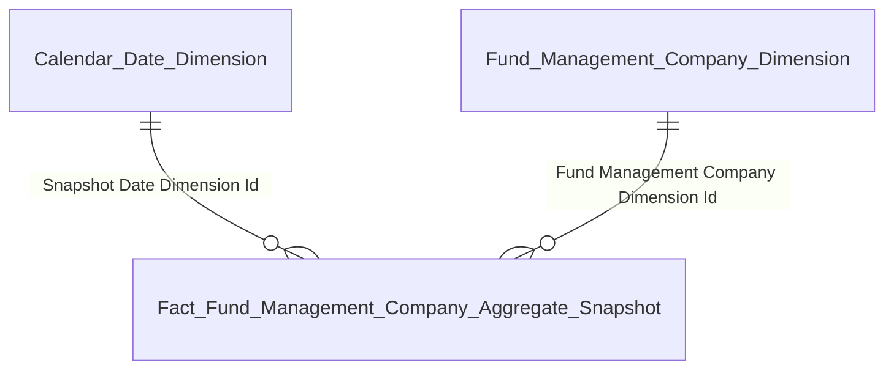

**5. Bảng tham gia**

| Tên bảng | Grain |
|---|---|
| Fact Fund Management Company Aggregate Snapshot | 1 row = 1 CTQLQ × 1 ngày snapshot (daily periodic, consolidated) |
| Fund Management Company Dimension | 1 row = 1 CTQLQ (SCD2) — chứa Practice Status Code |
| Calendar Date Dimension | 1 row = 1 ngày |

---

#### Nhóm 1b — Thẻ thống kê tổ chức dịch vụ quỹ (3 thẻ)

**1. Mockup**

```
┌─────────────────────┐   ┌─────────────────────┐   ┌─────────────────────┐
│ VPĐD QLQ NƯỚC NGOÀI │   │ ĐẠI LÝ PHÂN PHỐI CCQ│   │ CHI NHÁNH CTQLQ NN  │
│    14 VP            │   │    49 đại lý        │   │    8 chi nhánh      │
└─────────────────────┘   └─────────────────────┘   └─────────────────────┘
```

**2. Source:** `Fact Fund Market Service Provider Snapshot` → `Fund Market Service Provider Dimension` (poly dim gom Silver Foreign Fund Management OU + Fund Distribution Agent), `Calendar Date Dimension`

**3. Bảng KPI**

| # | KPI ID | Tên | Đơn vị | Tính chất | Công thức / Mô tả |
|---|---|---|---|---|---|
| 1 | K_FMS_5 | Số lượng VPĐD CTQLQ nước ngoài tại VN | VP | Stock (Base) | `COUNT DISTINCT "Fact Fund Market Service Provider Snapshot"."Fund Market Service Provider Dimension Id" WHERE "Snapshot Date" = <last day of selected month> AND "Fund Market Service Provider Dimension"."Service Provider Type Code" = '<mã VPĐD CTQLQ nước ngoài>' AND "Fund Market Service Provider Dimension"."Practice Status Code" = '<mã trạng thái Đang hoạt động>'` — xem Issue FMS_O7 + FMS_O13 |
| 2 | K_FMS_6 | Số lượng đại lý phân phối CCQ | Đại lý | Stock (Base) | `COUNT DISTINCT "Fact Fund Market Service Provider Snapshot"."Fund Market Service Provider Dimension Id" WHERE "Snapshot Date" = <last day of selected month> AND "Fund Market Service Provider Dimension"."Service Provider Type Code" = '<mã Đại lý phân phối CCQ>' AND "Fund Market Service Provider Dimension"."Practice Status Code" = '<mã trạng thái Đang hoạt động>'` — xem Issue FMS_O13 |
| 3 | K_FMS_7 | Số lượng chi nhánh CTQLQ nước ngoài tại VN | CN | Stock (Base) | `COUNT DISTINCT "Fact Fund Market Service Provider Snapshot"."Fund Market Service Provider Dimension Id" WHERE "Snapshot Date" = <last day of selected month> AND "Fund Market Service Provider Dimension"."Service Provider Type Code" = '<mã CN CTQLQ nước ngoài>' AND "Fund Market Service Provider Dimension"."Practice Status Code" = '<mã trạng thái Đang hoạt động>'` — xem Issue FMS_O7 + FMS_O13 |

> **Ghi chú poly dim:**
> - `Fund Market Service Provider Dimension` là poly dim gom 2 Silver entity (`Foreign Fund Management Organization Unit` + `Fund Distribution Agent`) qua BK cặp (Service Provider Source Entity Code + Service Provider Source Reference Id).
> - `Service Provider Type Code` là attribute Gold ETL derived trên dim (không phải scheme Silver có sẵn). Phân 3 nhóm nghiệp vụ: **VPĐD CTQLQ nước ngoài** / **Chi nhánh CTQLQ nước ngoài** / **Đại lý phân phối CCQ**. Mã code cụ thể chờ Silver phân loại (FMS_O7) — Gold không tự sinh mã.
> - Logic derive cho row "Đại lý phân phối CCQ" rõ ràng (toàn bộ row từ Silver `Fund Distribution Agent`). Logic phân biệt "VPĐD" vs "CN" cho row từ Silver `Foreign Fund Management Organization Unit` chưa có cơ sở dữ liệu — chờ BA confirm trường phân biệt (Issue FMS_O7).
> - `Practice Status Code` đồng nhất từ 2 Silver entity nguồn (cả Foreign FMC OU và Fund Distribution Agent đều dùng `Practice Status Code` trên Silver).

**4. Star schema**

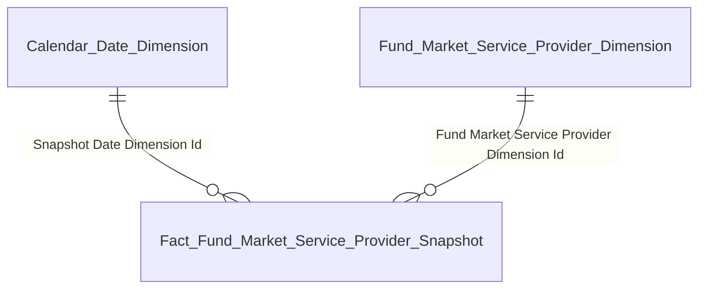

**5. Bảng tham gia**

| Tên bảng | Grain |
|---|---|
| Fact Fund Market Service Provider Snapshot | 1 row = 1 tổ chức dịch vụ quỹ × 1 ngày snapshot (daily periodic, poly) |
| Fund Market Service Provider Dimension | 1 row = 1 tổ chức dịch vụ quỹ (SCD2, poly) — chứa Service Provider Type Code (Gold ETL derived), Practice Status Code |
| Calendar Date Dimension | 1 row = 1 ngày |

---

### Dashboard Tổng quan CTQLQ — Tab Số liệu HĐ ủy thác danh mục

**Slicer toàn tab:**
- Chiều thời gian theo tháng (Calendar Date Dimension)

#### Nhóm 2 — Số liệu hợp đồng UTDM (6 thẻ)

**1. Mockup**

```
┌──────────────────────────────┐   ┌──────────────────────────────┐   ┌─────────────────────────────────┐
│ SỐ LƯỢNG                     │   │ SỐ LƯỢNG                     │   │                                  │
│   89.283                     │   │     238                      │   │   89.521                         │
│ HỢP ĐỒNG CÁ NHÂN             │   │ HỢP ĐỒNG TỔ CHỨC             │   │  Tổng số lượng hợp đồng UTDM     │
└──────────────────────────────┘   └──────────────────────────────┘   │                                  │
┌──────────────────────────────┐   ┌──────────────────────────────┐   │   739.807 tỉ VND                 │
│ GIÁ TRỊ THỊ TRƯỜNG           │   │ GIÁ TRỊ THỊ TRƯỜNG           │   │  Tổng giá trị ủy thác            │
│   11.710 tỉ VND              │   │  728.097 tỉ VND              │   │                                  │
│ HỢP ĐỒNG CÁ NHÂN             │   │ HỢP ĐỒNG TỔ CHỨC             │   │                                  │
└──────────────────────────────┘   └──────────────────────────────┘   └─────────────────────────────────┘
```

**2. Source:** `Fact Report Import Value` → `Reporting Member Dimension`, `Report Target Dimension`, `Reporting Period Dimension`, `Calendar Date Dimension`

**3. Bảng KPI**

| # | KPI ID | Tên | Đơn vị | Tính chất | Công thức / Mô tả |
|---|---|---|---|---|---|
| 1 | K_FMS_9 | Số lượng HĐ UTDM cá nhân | HĐ | Stock (Base) | `SUM(CAST("Fact Report Import Value"."Cell Value" AS DECIMAL(20,0))) WHERE <điều kiện lọc cell code HĐ UTDM cá nhân + kỳ báo cáo — chờ BA/Silver>` — xem Issue FMS_O1 |
| 2 | K_FMS_10 | Giá trị thị trường HĐ UTDM cá nhân | Tỉ VNĐ | Stock (Base) | `SUM(CAST("Fact Report Import Value"."Cell Value" AS DECIMAL(20,2))) / 1e9 WHERE <điều kiện lọc cell code giá trị thị trường HĐ UTDM cá nhân + kỳ báo cáo — chờ BA/Silver>` — xem Issue FMS_O1 |
| 3 | K_FMS_11 | Số lượng HĐ UTDM tổ chức | HĐ | Stock (Base) | `SUM(CAST("Fact Report Import Value"."Cell Value" AS DECIMAL(20,0))) WHERE <điều kiện lọc cell code HĐ UTDM tổ chức + kỳ báo cáo — chờ BA/Silver>` — xem Issue FMS_O1 |
| 4 | K_FMS_12 | Giá trị thị trường HĐ UTDM tổ chức | Tỉ VNĐ | Stock (Base) | `SUM(CAST("Fact Report Import Value"."Cell Value" AS DECIMAL(20,2))) / 1e9 WHERE <điều kiện lọc cell code giá trị thị trường HĐ UTDM tổ chức + kỳ báo cáo — chờ BA/Silver>` — xem Issue FMS_O1 |
| 5 | K_FMS_13 | Tổng số lượng HĐ UTDM | HĐ | Stock (Base) | `SUM(CAST("Fact Report Import Value"."Cell Value" AS DECIMAL(20,0))) WHERE <điều kiện lọc cell code tổng số HĐ UTDM + kỳ báo cáo — chờ BA/Silver>` — xem Issue FMS_O1 |
| 6 | K_FMS_14 | Tổng giá trị ủy thác | Tỉ VNĐ | Stock (Base) | `SUM(CAST("Fact Report Import Value"."Cell Value" AS DECIMAL(20,2))) / 1e9 WHERE <điều kiện lọc cell code tổng giá trị ủy thác + kỳ báo cáo — chờ BA/Silver>` — xem Issue FMS_O1 |

> **Ghi chú:**
> - Nhóm 2 đọc 6 chỉ tiêu riêng biệt từ báo cáo thành viên CTQLQ nộp định kỳ. Mỗi KPI tương ứng 1 cell code cụ thể. Điều kiện lọc chi tiết chờ BA/Silver cung cấp.
> - BA xác nhận Silver `Dorf Indicator` trên Discretionary Investment Investor là phân biệt trong nước/ngoài nước (Dorf = Domestic or Foreign), KHÔNG phải phân biệt cá nhân/tổ chức. Do đó không dùng được attribute Silver để phân biệt cá nhân/tổ chức trên base fact — toàn bộ Nhóm 2 phải đọc từ báo cáo RPT.

**4. Star schema**

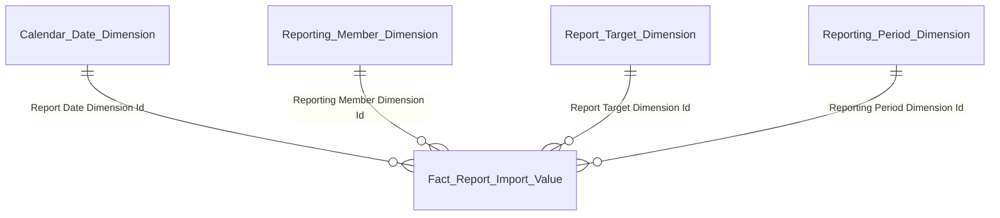

**5. Bảng tham gia**

| Tên bảng | Grain |
|---|---|
| Fact Report Import Value | 1 row = 1 giá trị ô chỉ tiêu × 1 thành viên nộp × 1 kỳ báo cáo |
| Reporting Member Dimension | 1 row = 1 tổ chức nộp báo cáo (poly — SCD2) |
| Report Target Dimension | 1 row = 1 mã chỉ tiêu × 1 biểu mẫu × 1 sheet (SCD2) |
| Reporting Period Dimension | 1 row = 1 kỳ báo cáo (SCD2) |
| Calendar Date Dimension | 1 row = 1 ngày |

---

### Dashboard Tổng quan CTQLQ — Tab Danh sách các CTQLQ

**Slicer toàn tab:**
- Chiều thời gian theo tháng (Calendar Date Dimension)
- Chiều CTQLQ (Fund Management Company Dimension — drill-down per CTQLQ)
- Chiều trạng thái CTQLQ (attribute `Practice Status Code` trên Fund Management Company Dimension)

#### Nhóm 3 — Bảng danh sách các CTQLQ

**1. Mockup**

| Tên công ty | AUM (tỉ đồng) | Số quỹ | Số HĐ UTDM | CAR (%) | Lợi nhuận (tỉ) | Vốn điều lệ (tỉ) | Vốn CSH (tỉ) | Thị phần AUM (%) | Xếp loại | CAMEL |
|---|---|---|---|---|---|---|---|---|---|---|
| CT1 — Công ty ABC 1 | 125.000 | 12 | 1.540 | 215 | 450 | — | — | 15.2 | A | 1.2 |
| CT2 — Công ty ABC 2 | 98.000 | 8 | 1.210 | 195 | 380 | — | — | 12.4 | A | 1.5 |
| CT3 — Công ty ABC 3 | 45.000 | 10 | 890 | 245 | 220 | — | — | 6.8 | B | 2.1 |
| … | … | … | … | … | … | … | … | … | … | … |

> Click cell "Số quỹ" → drill Nhóm 4; Click cell "Số HĐ UTDM" → drill Nhóm 5.

**2. Source:** `Fact Fund Management Company Aggregate Snapshot` → `Fund Management Company Dimension`, `Calendar Date Dimension`

**3. Bảng KPI**

| # | KPI ID | Tên | Đơn vị | Tính chất | Công thức / Mô tả |
|---|---|---|---|---|---|
| 1 | K_FMS_15 | Tên CTQLQ | — | Slicer/Dim attribute | `"Fund Management Company Dimension"."Fund Management Company Short Name"` + `"Fund Management Company Name"` — dim attribute, không phải KPI measure |
| 2 | K_FMS_16 | AUM per CTQLQ | Tỉ VNĐ | Stock (Base) | `"Fact Fund Management Company Aggregate Snapshot"."Assets Under Management Amount" / 1e9 WHERE "Snapshot Date" = <last day of selected month> AND "Fund Management Company Dimension Id" = <CTQLQ filter>` |
| 3 | K_FMS_17 | Số lượng quỹ per CTQLQ | Quỹ | Stock (Base) | `"Fact Fund Management Company Aggregate Snapshot"."Investment Fund Count" + "Pension Fund Count" WHERE "Snapshot Date" = <last day of selected month> AND "Fund Management Company Dimension Id" = <CTQLQ filter>` |
| 4 | K_FMS_18 | Số lượng HĐ UTDM per CTQLQ | HĐ | Stock (Base) | `"Fact Fund Management Company Aggregate Snapshot"."Discretionary Investment Account Count" WHERE "Snapshot Date" = <last day of selected month> AND "Fund Management Company Dimension Id" = <CTQLQ filter>` |
| 5 | K_FMS_19 | CAR (ATTC) per CTQLQ | % | Stock (Base) | `"Fact Fund Management Company Aggregate Snapshot"."Capital Adequacy Ratio" WHERE "Snapshot Date" = <last day of selected month> AND "Fund Management Company Dimension Id" = <CTQLQ filter>` — xem Issue FMS_O1 |
| 6 | K_FMS_20 | Lợi nhuận per CTQLQ | Tỉ VNĐ | Flow (Base) | `"Fact Fund Management Company Aggregate Snapshot"."Accumulated Profit Amount" / 1e9 WHERE "Snapshot Date" = <last day of selected month> AND "Fund Management Company Dimension Id" = <CTQLQ filter>` — xem Issue FMS_O1 |
| 7 | K_FMS_21 | Vốn điều lệ per CTQLQ | Tỉ VNĐ | Stock (Base) | `"Fact Fund Management Company Aggregate Snapshot"."Charter Capital Amount" / 1e9 WHERE "Snapshot Date" = <last day of selected month> AND "Fund Management Company Dimension Id" = <CTQLQ filter>` |
| 8 | K_FMS_22 | Vốn CSH per CTQLQ | Tỉ VNĐ | Stock (Base) | `"Fact Fund Management Company Aggregate Snapshot"."Equity Capital Amount" / 1e9 WHERE "Snapshot Date" = <last day of selected month> AND "Fund Management Company Dimension Id" = <CTQLQ filter>` — xem Issue FMS_O1 |
| 9 | K_FMS_23 | Thị phần AUM (%) per CTQLQ | % | Derived | `K_FMS_16 [Fund Management Company Dimension Id = X] / SUM(K_FMS_16) over all CTQLQ × 100%` |
| 10 | K_FMS_24 | Xếp loại per CTQLQ | — | Stock (Base) | `"Fact Fund Management Company Aggregate Snapshot"."Rating Class Code" WHERE "Snapshot Date" = <last day of selected month> AND "Fund Management Company Dimension Id" = <CTQLQ filter>` |
| 11 | K_FMS_25 | CAMEL per CTQLQ | Điểm | Stock (Base) | `"Fact Fund Management Company Aggregate Snapshot"."CAMEL Total Score" WHERE "Snapshot Date" = <last day of selected month> AND "Fund Management Company Dimension Id" = <CTQLQ filter>` |

> **Ghi chú:**
> - Nhóm 3 là bảng hiển thị per CTQLQ — grain fact Aggregate (1 CTQLQ × 1 ngày) khớp với grain hiển thị. Không có fact-to-fact join.
> - K_FMS_23 Thị phần AUM là Derived — tính UI từ K_FMS_16, không lưu mart.
> - K_FMS_15 là dim attribute. Đánh KPI ID để đồng bộ với BA.
> - K_FMS_17 Số lượng quỹ = `Investment Fund Count + Pension Fund Count` (tổng cả quỹ ĐTCK + hưu trí).
> - CAR/Lợi nhuận/Vốn CSH/Xếp loại/CAMEL denorm từ Silver (RPTVALUES hoặc Member Rating) lên Fact Aggregate tại ETL — query trực tiếp từ cột fact.
> - Xếp loại = `Rank Class Code` (scheme `FMS_RATING_CLASS`), CAMEL = `Total Score` (BA confirm qua FMS_O6).

**4. Star schema**


**5. Bảng tham gia**

| Tên bảng | Grain |
|---|---|
| Fact Fund Management Company Aggregate Snapshot | 1 row = 1 CTQLQ × 1 ngày snapshot (daily periodic, consolidated) |
| Fund Management Company Dimension | 1 row = 1 CTQLQ (SCD2) |
| Calendar Date Dimension | 1 row = 1 ngày |

---

#### Nhóm 4 — Drill-down: Danh sách quỹ của một CTQLQ

**Trigger:** User click cell "Số quỹ" trên Nhóm 3 → mở modal danh sách quỹ của CTQLQ đó.

**Slicer bắt buộc:** `Fund Management Company Dimension Id = <CTQLQ đã click>` + `Calendar Date ≤ selected month end`.

**1. Mockup**

| Tên quỹ | Giá trị NAV (tỉ đồng) |
|---|---|
| Quỹ ABC 1 | 12.500 |
| Quỹ CT1 Asset 2 | 9.211 |
| Quỹ CT1 Asset 3 | 11.673 |
| Quỹ CT1 Asset 4 | 12.119 |
| … | … |

**2. Source:** `Fact Investment Fund Snapshot` → `Investment Fund Dimension`, `Fund Management Company Dimension`, `Calendar Date Dimension`

**3. Bảng KPI**

| # | KPI ID | Tên | Đơn vị | Tính chất | Công thức / Mô tả |
|---|---|---|---|---|---|
| 1 | K_FMS_26 | Tên quỹ (per CTQLQ) | — | Slicer/Dim attribute | `"Investment Fund Dimension"."Investment Fund Name"` — dim attribute, không phải KPI measure |
| 2 | K_FMS_27 | Giá trị NAV của từng quỹ | Tỉ VNĐ | Stock (Base) | `"Fact Investment Fund Snapshot"."Net Asset Value Amount" / 1e9 WHERE "Snapshot Date" = <last day of selected month> AND "Fund Management Company Dimension Id" = <CTQLQ filter> AND "Investment Fund Dimension"."Practice Status Code" = '<mã trạng thái Đang hoạt động>'` — xem Issue FMS_O1 |

> **Ghi chú:** NAV per quỹ denorm trên `Fact Investment Fund Snapshot` (ETL đọc từ Silver RPTVALUES per quỹ — chờ BA/Silver cung cấp cell code NAV, Issue FMS_O1). Sau gộp v0.6, fact có 3 measure (NAV + LN YTD + CCQ) — Nhóm 4 drill chỉ query NAV, 2 measure còn lại phục vụ Nhóm 11. Cùng measure NAV được ETL aggregate SUM lên Fact Fund Management Company Aggregate Snapshot để tạo thành phần thứ 1 của AUM (công thức BA).

**4. Star schema**

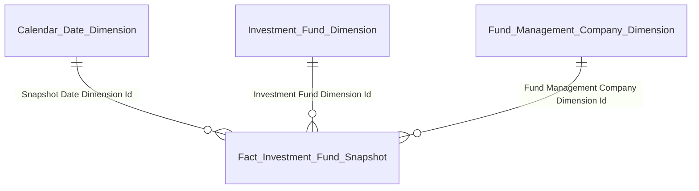

**5. Bảng tham gia**

| Tên bảng | Grain |
|---|---|
| Fact Investment Fund Snapshot | 1 row = 1 quỹ đầu tư × 1 ngày snapshot (daily periodic) — chứa 3 measure denorm từ Silver RPTVALUES: NAV + LN YTD + KL CCQ (mở rộng v0.6 phục vụ cả Nhóm 4 drill, Nhóm 8, Nhóm 11) |
| Investment Fund Dimension | 1 row = 1 quỹ đầu tư (SCD2) — chứa Fund Type Code, Practice Status Code |
| Fund Management Company Dimension | 1 row = 1 CTQLQ (SCD2) |
| Calendar Date Dimension | 1 row = 1 ngày |

---

#### Nhóm 5 — Drill-down: Danh sách HĐ UTDM của một CTQLQ

**Trigger:** User click cell "Số hợp đồng UTDM" trên Nhóm 3 → mở modal danh sách HĐ UTDM của CTQLQ đó.

**Slicer bắt buộc:** `Fund Management Company Dimension Id = <CTQLQ đã click>` + `Calendar Date ≤ selected month end`.

**1. Mockup**

| Tên (mã hợp đồng UTDM) | Giá (tỉ đồng) |
|---|---|
| Hợp đồng UTDM #CT1-1000 | 199 |
| Hợp đồng UTDM #CT1-1001 | 570 |
| Hợp đồng UTDM #CT1-1002 | 417 |
| Hợp đồng UTDM #CT1-1003 | 582 |
| … | … |

**2. Source:** `Fact Discretionary Investment Account Snapshot` → `Discretionary Investment Account Dimension`, `Fund Management Company Dimension`, `Calendar Date Dimension`

**3. Bảng KPI**

| # | KPI ID | Tên | Đơn vị | Tính chất | Công thức / Mô tả |
|---|---|---|---|---|---|
| 1 | K_FMS_28 | Tên (mã hợp đồng UTDM) | — | Slicer/Dim attribute | `"Discretionary Investment Account Dimension"."Contract Number"` — dim attribute |
| 2 | K_FMS_29 | Giá trị của từng hợp đồng UTDM | Tỉ VNĐ | Stock (Base) | `"Fact Discretionary Investment Account Snapshot"."Actual Capital Amount" / 1e9 WHERE "Snapshot Date" = <last day of selected month> AND "Fund Management Company Dimension Id" = <CTQLQ filter> AND "Discretionary Investment Account Dimension"."Life Cycle Status Code" = '<mã trạng thái Đang hoạt động>'` |

> **Ghi chú đặc biệt về Nhóm 5 vs Nhóm 2/3:**
> - Giá trị Nhóm 5 = `Actual Capital Amount` (vốn ủy thác thực tế từ Silver `FMS.INVESACC.AdScale`) — là giá trị base có sẵn trên Silver per HĐ.
> - Giá trị thị trường HĐ UTDM ở Nhóm 2 (K_FMS_10, K_FMS_12, K_FMS_14) và thành phần AUM ở Nhóm 3 (K_FMS_16) lấy từ RPT (cell báo cáo) — grain per CTQLQ, không có per HĐ trên RPT.
> - **2 giá trị này KHÁC nhau** và là **2 chỉ tiêu nghiệp vụ khác nhau**. Không phải bug khi SUM(Actual Capital Amount) các HĐ UTDM per CTQLQ không bằng "Giá trị thị trường HĐ UTDM" trên báo cáo RPT của CTQLQ đó.

**4. Star schema**

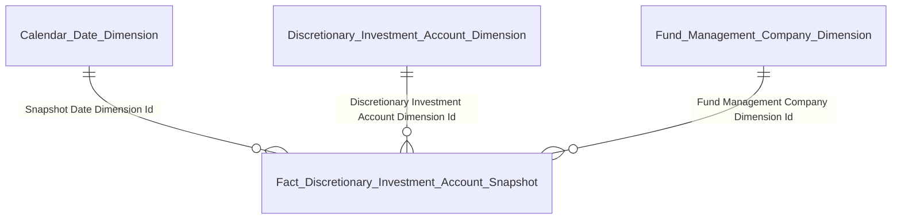

**5. Bảng tham gia**

| Tên bảng | Grain |
|---|---|
| Fact Discretionary Investment Account Snapshot | 1 row = 1 HĐ ủy thác × 1 ngày snapshot (daily periodic) |
| Discretionary Investment Account Dimension | 1 row = 1 HĐ ủy thác (SCD2) — chứa Contract Number, Life Cycle Status Code |
| Fund Management Company Dimension | 1 row = 1 CTQLQ (SCD2) |
| Calendar Date Dimension | 1 row = 1 ngày |

---

### Dashboard Tổng quan Quỹ đầu tư

**Slicer toàn tab:**
- Chiều thời gian theo tháng/quý/năm (Calendar Date Dimension) — user chọn tùy biểu đồ
- Chiều loại hình quỹ (Classification Dimension scheme `FMS_FUND_TYPE`)

#### Nhóm 6 — Biểu đồ Tổng NAV Quỹ & Tỷ lệ NAV/GDP

**1. Mockup**

Line chart theo tháng — 12 series với legend dạng button toggle (theo mockup BA):

- **Trục trái (NAV tỉ VNĐ, 0-160.000):** Tổng NAV + 10 loại hình quỹ chi tiết (Quỹ mở CP, Quỹ mở TP, Quỹ mở Cân bằng, Quỹ ETF, Quỹ đóng, Quỹ BĐS, Quỹ thành viên, QĐT CCTTTT, QĐT TP hạ tầng, Quỹ hưu trí)
- **Trục phải (NAV/GDP %, 0-3%):** NAV/GDP % — dotted line

Slicer: Từ tháng → Đến tháng (mặc định T9/2025 → T10/2025).

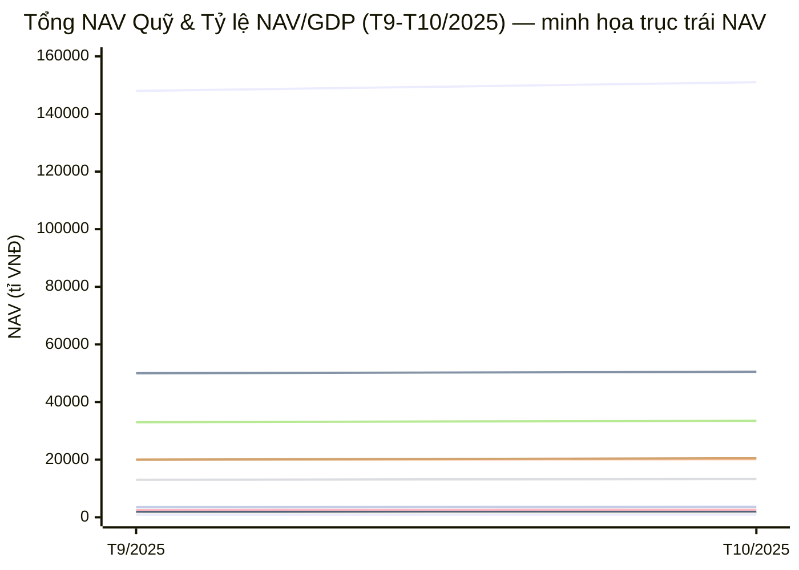

> **Ghi chú mockup:** Mermaid xychart-beta chỉ support single Y-axis — chỉ minh họa 11 series NAV trên trục trái. Series NAV/GDP % (dotted blue line theo ảnh, ở mức ~1.5%) render trục phải tại dashboard implementation (0-3%). Nhóm 6 hiển thị **10 loại hình quỹ chi tiết** theo scheme `FMS_FUND_TYPE` mở rộng — 3 sub-type Quỹ mở (CP/TP/Cân bằng) tách riêng, KHÔNG gộp về "Quỹ mở" cấp 1. Chi tiết dual Y-axis + 12 series + button toggle theo mockup BA Dashboard.

**2. Source:** `Fact Investment Fund Snapshot` (NAV per quỹ) + `Fact Risk Indicator Value Snapshot` (GDP) → `Investment Fund Dimension` (Fund Type Code attribute), `Calendar Date Dimension`

**3. Bảng KPI**

Nhóm 6 có 13 KPI: 1 Tổng NAV thị trường (SUM từ chi tiết quỹ) + 10 NAV per loại hình chi tiết (GROUP BY Fund Type Code trên Investment Fund Dim) + 1 GDP (từ Fact Risk Indicator Value) + 1 Derived NAV/GDP%.

| # | KPI ID | Tên | Đơn vị | Tính chất | Công thức / Mô tả |
|---|---|---|---|---|---|
| 1 | K_FMS_30 | Tổng NAV toàn thị trường | Tỉ VNĐ | Stock (Base) | `SUM("Fact Investment Fund Snapshot"."Net Asset Value Amount") / 1e9 WHERE "Snapshot Date" = <last day selected month> AND "Investment Fund Dimension"."Practice Status Code" = '<mã trạng thái Đang hoạt động>'` — SUM over tất cả Fund Type. Xem Issue FMS_O1 + FMS_O13 |
| 2 | K_FMS_31 | NAV Quỹ mở CP | Tỉ VNĐ | Stock (Base) | K_FMS_30 pattern + `AND "Investment Fund Dimension"."Fund Type Code" = '<mã Quỹ mở CP>'` — xem Issue FMS_O1 + FMS_O9 |
| 3 | K_FMS_32 | NAV Quỹ mở TP | Tỉ VNĐ | Stock (Base) | K_FMS_30 pattern + `AND "Fund Type Code" = '<mã Quỹ mở TP>'` — xem Issue FMS_O1 + FMS_O9 |
| 4 | K_FMS_33 | NAV Quỹ mở Cân bằng | Tỉ VNĐ | Stock (Base) | K_FMS_30 pattern + `AND "Fund Type Code" = '<mã Quỹ mở Cân bằng>'` — xem Issue FMS_O1 + FMS_O9 |
| 5 | K_FMS_34 | NAV Quỹ ETF | Tỉ VNĐ | Stock (Base) | K_FMS_30 pattern + `AND "Fund Type Code" = '<mã Quỹ ETF>'` — xem Issue FMS_O1 |
| 6 | K_FMS_35 | NAV Quỹ đóng | Tỉ VNĐ | Stock (Base) | K_FMS_30 pattern + `AND "Fund Type Code" = '<mã Quỹ đóng>'` — xem Issue FMS_O1 + FMS_O3 |
| 7 | K_FMS_36 | NAV Quỹ BĐS | Tỉ VNĐ | Stock (Base) | K_FMS_30 pattern + `AND "Fund Type Code" = '<mã Quỹ BĐS>'` — xem Issue FMS_O1 + FMS_O3 |
| 8 | K_FMS_37 | NAV Quỹ thành viên | Tỉ VNĐ | Stock (Base) | K_FMS_30 pattern + `AND "Fund Type Code" = '<mã Quỹ thành viên>'` — xem Issue FMS_O1 + FMS_O3 |
| 9 | K_FMS_38 | NAV QĐT CCTTTT | Tỉ VNĐ | Stock (Base) | K_FMS_30 pattern + `AND "Fund Type Code" = '<mã QĐT CCTTTT>'` — xem Issue FMS_O1 + FMS_O3 |
| 10 | K_FMS_39 | NAV QĐT TP hạ tầng | Tỉ VNĐ | Stock (Base) | K_FMS_30 pattern + `AND "Fund Type Code" = '<mã QĐT TP hạ tầng>'` — xem Issue FMS_O1 + FMS_O3 |
| 11 | K_FMS_40 | NAV Quỹ hưu trí | Tỉ VNĐ | Stock (Base) | K_FMS_30 pattern + `AND "Fund Type Code" = '<mã Quỹ hưu trí>'` — xem Issue FMS_O1 + FMS_O3 |
| 12 | K_FMS_41 | GDP | Tỉ VNĐ | Stock (Base) | `"Fact Risk Indicator Value Snapshot"."Value Amount" / 1e9 WHERE "Risk Indicator Business Key" = '<mã GDP Việt Nam>' AND "Period Date" = <last day selected month>` — xem Issue FMS_O12 |
| 13 | K_FMS_42 | Tỷ lệ NAV/GDP | % | Derived | `K_FMS_30 / K_FMS_41 × 100%` |

> **Ghi chú:**
> - **Không tạo fact Market Snapshot riêng.** Nhóm 6 query trực tiếp 2 fact: `Fact Investment Fund Snapshot` (cấp quỹ, daily) cho NAV + `Fact Risk Indicator Value Snapshot` (cross-module QLRR) cho GDP. Dashboard compute Tổng NAV thị trường từ SUM chi tiết quỹ tại BI layer — không cần pre-aggregate trong mart.
> - `Fund Type Code` là **attribute trên Investment Fund Dimension** (không phải FK đến Classification Dim vì Silver `FMS_FUND_TYPE` chỉ có code, không có name). Query qua `Investment Fund Dimension.Fund Type Code`.
> - K_FMS_42 Tỷ lệ NAV/GDP là Derived UI, không lưu mart.
> - Các mã (`<mã Quỹ ...>`, `<mã GDP Việt Nam>`, `<mã trạng thái Đang hoạt động>`) chờ Silver profile — Gold không tự sinh.

**4. Star schema**

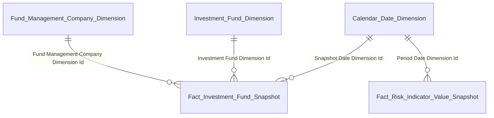

**5. Bảng tham gia**

| Tên bảng | Grain |
|---|---|
| Fact Investment Fund Snapshot | 1 row = 1 quỹ × 1 ngày snapshot (daily periodic) — measure NAV + LN YTD + CCQ. Nhóm 6 query last day of month + GROUP BY `Investment Fund Dimension.Fund Type Code` |
| Fact Risk Indicator Value Snapshot | 1 row = 1 Risk Indicator × 1 tháng (monthly, cross-module Silver QLRR). Nhóm 6 query row GDP |
| Investment Fund Dimension | 1 row = 1 quỹ đầu tư (SCD2) — chứa `Fund Type Code` (attribute phân loại) và `Practice Status Code` |
| Fund Management Company Dimension | 1 row = 1 CTQLQ (SCD2) |
| Calendar Date Dimension | 1 row = 1 ngày |

---

#### Nhóm 7a — Sự biến động về NAV của các Quỹ ĐTCK

**1. Mockup**

Bar chart NAV (trục trái, tỉ VNĐ, 0-12.000) + line Tăng trưởng % (trục phải, -150% đến 450%) theo từng tháng trong range chọn (T1-T12/2025). Loại trừ Quỹ hưu trí (chỉ các quỹ ĐTCK).

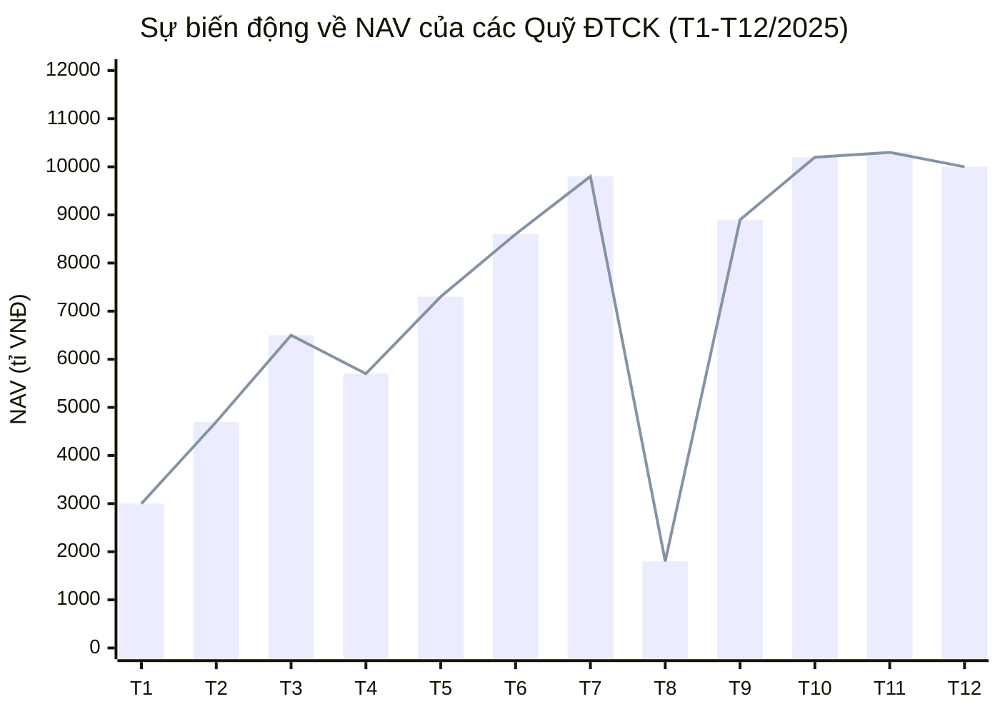

> **Ghi chú mockup:** Mermaid xychart-beta hỗ trợ single Y-axis. Bar là NAV tỉ VNĐ theo tháng (số liệu từ ảnh BA). Series line "Tăng trưởng %" trên mockup BA Dashboard có trục phải riêng — dashboard implementation render dual Y-axis (trái: NAV tỉ VNĐ 0-12.000; phải: Tăng trưởng % -150% đến 450%). KPI K_FMS_44 Derived UI.

**2. Source:** `Fact Report Import Value` → `Reporting Member Dimension` (filter Member Object Type = INVESTMENT_FUND), `Report Target Dimension`, `Reporting Period Dimension`, `Investment Fund Dimension` (lookup Fund Type Code), `Calendar Date Dimension`

**3. Bảng KPI**

| # | KPI ID | Tên | Đơn vị | Tính chất | Công thức / Mô tả |
|---|---|---|---|---|---|
| 1 | K_FMS_43 | NAV tổng các quỹ ĐTCK per tháng | Tỉ VNĐ | Stock (Base) | `SUM(CAST("Fact Report Import Value"."Cell Value" AS DECIMAL(20,2))) / 1e9 WHERE <điều kiện lọc cell code NAV quỹ + kỳ báo cáo tháng>` + JOIN Investment Fund Dim `WHERE "Fund Type Code" ≠ '<mã Quỹ hưu trí>'` — xem Issue FMS_O1 |
| 2 | K_FMS_44 | Tăng trưởng NAV MoM | % | Derived | `(K_FMS_43 [month = m] − K_FMS_43 [month = m−1]) / K_FMS_43 [month = m−1] × 100%` |
| 3 | K_FMS_45 | Trung bình tăng trưởng NAV | % | Derived | `AVG(K_FMS_44) over 12 tháng selected` |

**4. Star schema**

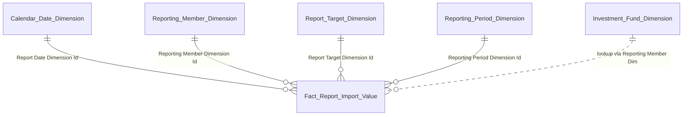

**5. Bảng tham gia**

| Tên bảng | Grain |
|---|---|
| Fact Report Import Value | 1 row = 1 giá trị ô chỉ tiêu × 1 thành viên nộp × 1 kỳ báo cáo |
| Reporting Member Dimension | 1 row = 1 tổ chức nộp báo cáo (poly — SCD2) |
| Report Target Dimension | 1 row = 1 mã chỉ tiêu × 1 biểu mẫu × 1 sheet (SCD2) |
| Reporting Period Dimension | 1 row = 1 kỳ báo cáo (SCD2) |
| Investment Fund Dimension | 1 row = 1 quỹ đầu tư (SCD2) — lookup Fund Type Code qua Reporting Member Dim |
| Calendar Date Dimension | 1 row = 1 ngày |

---

#### Nhóm 7b — Biểu đồ Phân bổ tài sản của Quỹ đầu tư

**1. Mockup**

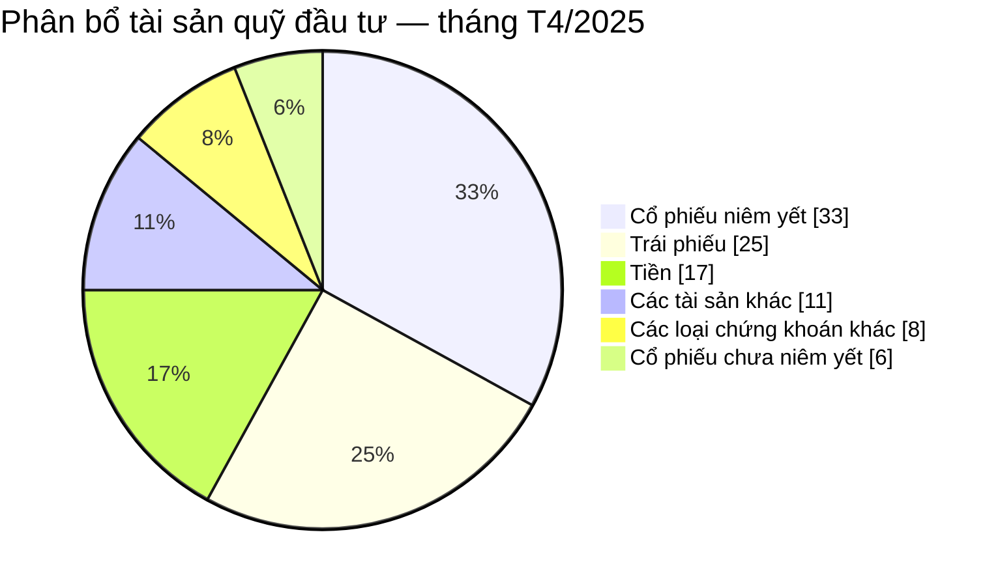

**2. Source:** `Fact Report Import Value` → `Reporting Member Dimension`, `Report Target Dimension`, `Reporting Period Dimension`, `Calendar Date Dimension`

**3. Bảng KPI**

| # | KPI ID | Tên | Đơn vị | Tính chất | Công thức / Mô tả |
|---|---|---|---|---|---|
| 1 | K_FMS_46 | Tổng giá trị tài sản | Tỉ VNĐ | Stock (Base) | `SUM(CAST("Fact Report Import Value"."Cell Value" AS DECIMAL(20,2))) / 1e9 WHERE <6 cell code loại tài sản> AND "Report Date" = <last day selected month>` — xem Issue FMS_O1 |
| 2 | K_FMS_47 | Giá trị Cổ phiếu niêm yết | Tỉ VNĐ | Stock (Base) | `SUM(CAST("Cell Value" AS DECIMAL(20,2))) / 1e9 WHERE <cell code CP niêm yết>` — xem Issue FMS_O1 |
| 3 | K_FMS_48 | Giá trị Cổ phiếu chưa niêm yết | Tỉ VNĐ | Stock (Base) | Tương tự K_FMS_47 với cell code CP chưa niêm yết — xem Issue FMS_O1 |
| 4 | K_FMS_49 | Giá trị Trái phiếu | Tỉ VNĐ | Stock (Base) | Tương tự — xem Issue FMS_O1 |
| 5 | K_FMS_50 | Giá trị Tiền | Tỉ VNĐ | Stock (Base) | Tương tự — xem Issue FMS_O1 |
| 6 | K_FMS_51 | Giá trị các loại chứng khoán khác | Tỉ VNĐ | Stock (Base) | Tương tự — xem Issue FMS_O1 |
| 7 | K_FMS_52 | Giá trị các tài sản khác | Tỉ VNĐ | Stock (Base) | Tương tự — xem Issue FMS_O1 |

> **Ghi chú:** UI tính % mỗi loại tài sản = K_FMS_47..K_FMS_52 / K_FMS_46 (Derived UI). 7 measure base, 6 % là Derived.

**4. Star schema**


**5. Bảng tham gia**

| Tên bảng | Grain |
|---|---|
| Fact Report Import Value | 1 row = 1 giá trị ô chỉ tiêu × 1 thành viên nộp × 1 kỳ báo cáo |
| Reporting Member Dimension | 1 row = 1 tổ chức nộp báo cáo (poly — SCD2) |
| Report Target Dimension | 1 row = 1 mã chỉ tiêu × 1 biểu mẫu × 1 sheet (SCD2) |
| Reporting Period Dimension | 1 row = 1 kỳ báo cáo (SCD2) |
| Calendar Date Dimension | 1 row = 1 ngày |

---

#### Nhóm 8 — Số lượng quỹ đầu tư chứng khoán

**1. Mockup**

Grouped bar chart theo năm (trục X: 2019-2025) × 5 loại hình quỹ (Quỹ mở, Thành viên, ETF, Đóng, BĐS). Tổng mỗi năm hiển thị dưới trục X: 47 / 57 / 71 / 97 / 107 / 120 / 124 quỹ.

```mermaid
xychart-beta
    title "Số lượng Quỹ đầu tư chứng khoán theo năm (2019-2025)"
    x-axis ["2019", "2020", "2021", "2022", "2023", "2024", "2025"]
    y-axis "Số lượng quỹ" 0 --> 85
    bar "Quỹ mở" [32, 28, 40, 51, 56, 65, 70]
    bar "Quỹ thành viên" [10, 14, 12, 12, 32, 35, 32]
    bar "Quỹ ETF" [2, 7, 9, 30, 16, 17, 18]
    bar "Quỹ đóng" [2, 2, 2, 2, 3, 3, 3]
    bar "Quỹ BĐS" [1, 1, 1, 1, 1, 1, 1]
```

> **Ghi chú mockup:** 5 series tương ứng 5 loại hình quỹ cấp 1 — Quỹ mở đã gộp từ 3 sub-type (CP/TP/Cân bằng) theo scheme `FMS_FUND_TYPE` mở rộng (UI/ETL SUM 3 code `<mã Quỹ mở CP>` + `<mã Quỹ mở TP>` + `<mã Quỹ mở Cân bằng>` — FMS_O9). 3 loại còn lại trong scheme (QĐT CCTTTT, QĐT TP hạ tầng, Quỹ hưu trí) không hiển thị ở Nhóm 8 nhưng có data trong Fact Investment Fund Snapshot (xem Nhóm 6, 9).

**Slicer riêng:** Tháng/Quý/Năm + Từ/Đến

**2. Source:** `Fact Investment Fund Snapshot` → `Investment Fund Dimension`, `Calendar Date Dimension`

**3. Bảng KPI**

| # | KPI ID | Tên | Đơn vị | Tính chất | Công thức / Mô tả |
|---|---|---|---|---|---|
| 1 | K_FMS_53 | Tổng số lượng quỹ đầu tư CK | Quỹ | Stock (Base) | `COUNT DISTINCT "Fact Investment Fund Snapshot"."Investment Fund Dimension Id" WHERE "Snapshot Date" = <last day of period> AND "Investment Fund Dimension"."Practice Status Code" = '<mã trạng thái Đang hoạt động>' AND "Investment Fund Dimension"."Fund Type Code" ≠ '<mã Quỹ hưu trí>'` — xem Issue FMS_O3 + FMS_O13 |
| 2 | K_FMS_54 | Số lượng Quỹ mở | Quỹ | Stock (Base) | K_FMS_53 pattern + `AND "Fund Type Code" IN ('<mã Quỹ mở CP>', '<mã Quỹ mở TP>', '<mã Quỹ mở Cân bằng>')` — Quỹ mở cấp 1 = SUM 3 sub-type chi tiết theo scheme `FMS_FUND_TYPE` mở rộng. Xem Issue FMS_O3 + FMS_O9 |
| 3 | K_FMS_55 | Số lượng Quỹ thành viên | Quỹ | Stock (Base) | K_FMS_53 pattern + `AND "Fund Type Code" = '<mã Quỹ thành viên>'` — xem Issue FMS_O3 |
| 4 | K_FMS_56 | Số lượng Quỹ ETF | Quỹ | Stock (Base) | K_FMS_53 pattern + `AND "Fund Type Code" = '<mã Quỹ ETF>'` — xem Issue FMS_O3 |
| 5 | K_FMS_57 | Số lượng Quỹ đóng | Quỹ | Stock (Base) | K_FMS_53 pattern + `AND "Fund Type Code" = '<mã Quỹ đóng>'` — xem Issue FMS_O3 |
| 6 | K_FMS_58 | Số lượng Quỹ BĐS | Quỹ | Stock (Base) | K_FMS_53 pattern + `AND "Fund Type Code" = '<mã Quỹ BĐS>'` — xem Issue FMS_O3 |

> **Ghi chú:**
> - BA scheme `FMS_FUND_TYPE` mở rộng v0.6 có **10 giá trị** (3 sub-type Quỹ mở + Quỹ ETF + Quỹ đóng + Quỹ BĐS + Quỹ thành viên + QĐT CCTTTT + QĐT TP hạ tầng + Quỹ hưu trí). Mã code cụ thể chờ Silver profile `FMS.FUNDS.FundType` — Gold không tự sinh mã. Mockup Nhóm 8 hiển thị 5 loại cấp cha (Quỹ mở gộp 3 sub-type / Thành viên / ETF / Đóng / BĐS) — thiết kế theo mockup: K_FMS_54 "Quỹ mở" = SUM 3 sub-type `<mã Quỹ mở CP>` + `<mã Quỹ mở TP>` + `<mã Quỹ mở Cân bằng>` (FMS_O9). K_FMS_53 (Tổng) = COUNT DISTINCT over tất cả Fund Type chi tiết trừ Quỹ hưu trí.
> - **Mapping slicer Tháng/Quý/Năm → `Snapshot Date`:** User chọn "Năm 2024" → Snapshot Date = 31/12/2024; "Quý 2/2024" → 30/06/2024; "Tháng 03/2024" → 31/03/2024. UI presentation layer tự build predicate "last day of period" theo slicer.
> - 3 loại còn lại trong scheme `FMS_FUND_TYPE` (QĐT CCTTTT, QĐT TP hạ tầng, Quỹ hưu trí) có row data trong Fact Investment Fund Snapshot nhưng không tách KPI riêng cho Nhóm 8 (theo mockup BA). Quỹ hưu trí tách ở Nhóm 1a (K_FMS_8) và Nhóm 6 (K_FMS_40 qua Fact Investment Fund Snapshot + GROUP BY Fund Type Code).

**4. Star schema**


**5. Bảng tham gia**

| Tên bảng | Grain |
|---|---|
| Fact Investment Fund Snapshot | 1 row = 1 quỹ đầu tư × 1 ngày snapshot (daily periodic) |
| Investment Fund Dimension | 1 row = 1 quỹ đầu tư (SCD2) — chứa Fund Type Code, Practice Status Code |
| Fund Management Company Dimension | 1 row = 1 CTQLQ (SCD2) |
| Calendar Date Dimension | 1 row = 1 ngày |

---

#### Nhóm 9 — Tăng trưởng số lượng CCQ lưu hành của các quỹ đầu tư

**1. Mockup**

Stacked bar chart theo tháng × 8 loại hình quỹ (Quỹ mở, ETF, Đóng, BĐS, Thành viên, QĐT CCTTTT, QĐT TP hạ tầng, Quỹ hưu trí). Đơn vị: số lượng CCQ lưu hành (BA confirm — mockup ghi "tỉ đồng" là lỗi hiển thị UI).

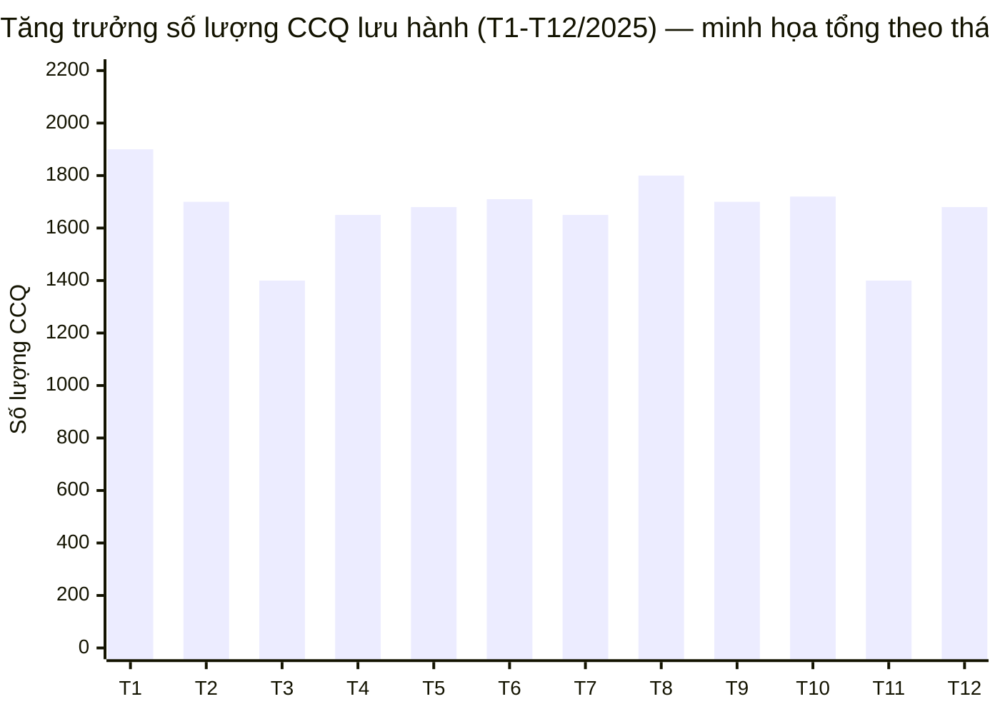

Phân bổ minh họa 8 loại hình tháng T1/2025 (đại diện stacked bar):

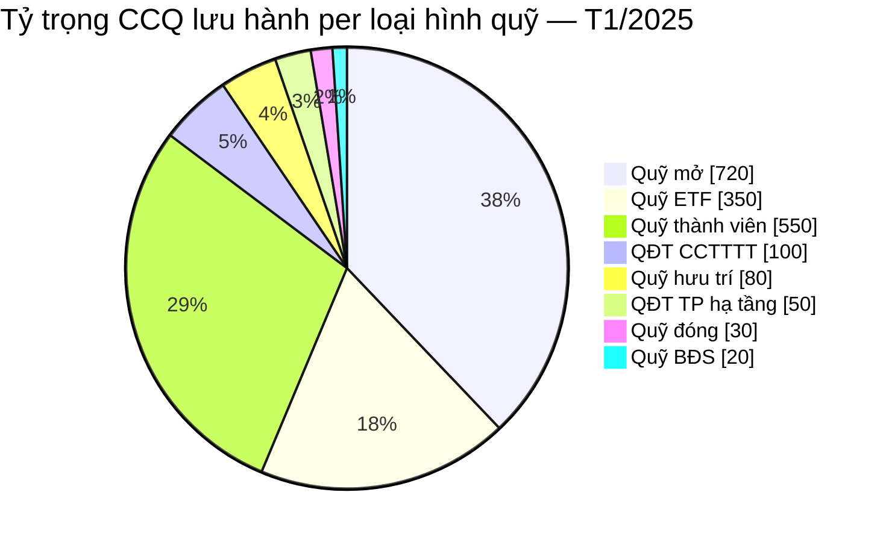

> **Ghi chú mockup:** Biểu đồ chính là **stacked bar 12 tháng × 8 loại hình** (Mermaid xychart-beta không hỗ trợ stacked layout nên hiển thị tổng). Pie chart minh họa phân bổ 8 loại trong 1 tháng đại diện để thấy tỷ trọng stacked layer. Quỹ mở ở Nhóm 9 hiển thị cấp 1 gộp (UI/ETL SUM 3 sub-type `<mã Quỹ mở CP>` + `<mã Quỹ mở TP>` + `<mã Quỹ mở Cân bằng>` — FMS_O9). Đơn vị: số lượng CCQ lưu hành (mockup ghi "tỉ đồng" là lỗi hiển thị UI, BA confirm).

**2. Source:** `Fact Report Import Value` → `Reporting Member Dimension` (filter INVESTMENT_FUND), `Report Target Dimension`, `Reporting Period Dimension`, `Investment Fund Dimension` (lookup Fund Type), `Calendar Date Dimension`

**3. Bảng KPI**

| # | KPI ID | Tên | Đơn vị | Tính chất | Công thức / Mô tả |
|---|---|---|---|---|---|
| 1 | K_FMS_59 | Số lượng CCQ lưu hành per tháng per loại hình quỹ | CCQ | Stock (Base) | `SUM(CAST("Fact Report Import Value"."Cell Value" AS DECIMAL(20,0))) WHERE <điều kiện lọc cell code Số CCQ lưu hành + kỳ báo cáo tháng>` + JOIN Investment Fund Dim `GROUP BY "Fund Type Code"` — xem Issue FMS_O1 |

> **Ghi chú:** 1 KPI base render dynamic 8 stacked bars theo Fund Type Code. UI responsible cho layout stacked bar.

**4. Star schema**


**5. Bảng tham gia**

| Tên bảng | Grain |
|---|---|
| Fact Report Import Value | 1 row = 1 giá trị ô chỉ tiêu × 1 thành viên nộp × 1 kỳ báo cáo |
| Reporting Member Dimension | 1 row = 1 tổ chức nộp báo cáo (poly — SCD2) |
| Report Target Dimension | 1 row = 1 mã chỉ tiêu × 1 biểu mẫu × 1 sheet (SCD2) |
| Reporting Period Dimension | 1 row = 1 kỳ báo cáo (SCD2) |
| Investment Fund Dimension | 1 row = 1 quỹ đầu tư (SCD2) — lookup Fund Type Code |
| Calendar Date Dimension | 1 row = 1 ngày |

---

#### Nhóm 10 — Tỉ lệ tăng trưởng NAV của loại hình quỹ so với VN-Index và Lãi suất LNHQĐ

**1. Mockup**

Line chart theo tháng/năm — 6 series: Quỹ mở CP (xanh đậm), Quỹ mở TP (xanh lá), Quỹ mở Cân bằng (xanh nhạt), Quỹ ETF (xanh navy), VN-Index (đỏ), Lãi suất LNHQĐ (cam). Trục Y: tỉ lệ tăng trưởng (%) từ -40% đến 60%. Tất cả 6 series đều hiển thị dưới dạng % — dashboard tính Derived growth rate MoM từ 4 cột NAV base + 2 cột external (VN-Index Value + LS LNHQĐ Value) lưu trên fact.

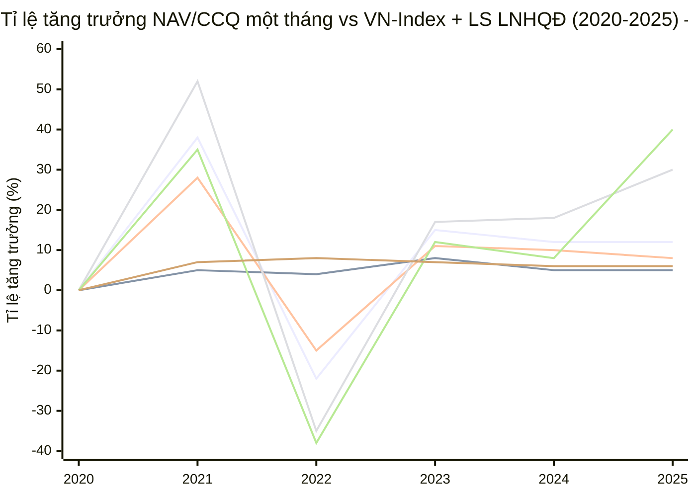

> **Ghi chú mockup:** Trục Y là tỉ lệ tăng trưởng %. 4 series quỹ → dashboard tính Derived từ NAV base lưu trên fact = `(NAV[m] − NAV[m−1]) / NAV[m−1] × 100%`. 2 series VN-Index + LS LNHQĐ → dashboard có thể tính Derived tương tự hoặc hiển thị giá trị trực tiếp tùy yêu cầu BA (mart chỉ lưu Value tại thời điểm, không áp logic hiển thị). Slicer: TỪ THÁNG → ĐẾN THÁNG (Calendar Date Dim).

> **Ghi chú nghiệp vụ BA:** Tiêu đề biểu đồ "Tỉ lệ tăng trưởng NAV/CCQ một tháng". BA giải thích: "NAV/CCQ" = "NAV của quỹ (chứng chỉ quỹ)" — chỉ là NAV, "CCQ" chú thích loại quỹ dạng chứng chỉ. Công thức tăng trưởng = `(NAV kỳ này − NAV kỳ trước) / NAV kỳ trước × 100%` — Derived UI.

**2. Source:** `Fact Investment Fund Snapshot` (NAV per quỹ, GROUP BY `Fund Type Code`) + `Fact Risk Indicator Value Snapshot` (VN-Index + LS LNHQĐ) → `Investment Fund Dimension` (Fund Type Code attribute), `Calendar Date Dimension`

**3. Bảng KPI**

Nhóm 10 query 4 Fund Type chi tiết (3 sub-type Quỹ mở + Quỹ ETF) từ `Fact Investment Fund Snapshot` — giống pattern Nhóm 6 nhưng chỉ 4 loại. VN-Index + LS LNHQĐ query từ `Fact Risk Indicator Value Snapshot`.

| # | KPI ID | Tên | Đơn vị | Tính chất | Công thức / Mô tả |
|---|---|---|---|---|---|
| 1 | K_FMS_60 | NAV Quỹ mở CP | Tỉ VNĐ | Stock (Base) | `SUM("Fact Investment Fund Snapshot"."Net Asset Value Amount") / 1e9 WHERE "Snapshot Date" = <last day selected month> AND "Investment Fund Dimension"."Fund Type Code" = '<mã Quỹ mở CP>' AND "Investment Fund Dimension"."Practice Status Code" = '<mã trạng thái Đang hoạt động>'` — xem Issue FMS_O1 + FMS_O9 + FMS_O13 |
| 2 | K_FMS_61 | NAV Quỹ mở TP | Tỉ VNĐ | Stock (Base) | K_FMS_60 pattern + `AND "Fund Type Code" = '<mã Quỹ mở TP>'` — xem Issue FMS_O1 + FMS_O9 |
| 3 | K_FMS_62 | NAV Quỹ mở Cân bằng | Tỉ VNĐ | Stock (Base) | K_FMS_60 pattern + `AND "Fund Type Code" = '<mã Quỹ mở Cân bằng>'` — xem Issue FMS_O1 + FMS_O9 |
| 4 | K_FMS_63 | NAV Quỹ ETF | Tỉ VNĐ | Stock (Base) | K_FMS_60 pattern + `AND "Fund Type Code" = '<mã Quỹ ETF>'` — xem Issue FMS_O1 |
| 5 | K_FMS_64 | VN-Index | Điểm | Stock (Base) | `"Fact Risk Indicator Value Snapshot"."Value Amount" WHERE "Risk Indicator Business Key" = '<mã VN-Index>' AND "Period Date" = <last day selected month>` — xem Issue FMS_O12 |
| 6 | K_FMS_65 | Lãi suất LNHQĐ | % | Stock (Base) | `"Fact Risk Indicator Value Snapshot"."Value Amount" WHERE "Risk Indicator Business Key" = '<mã Lãi suất liên ngân hàng qua đêm>' AND "Period Date" = <last day selected month>` — xem Issue FMS_O12 |

> **Ghi chú:**
> - 6 KPI là base value tại thời điểm (end of month). Dashboard tự tính Derived growth rate MoM = `(value[m] − value[m−1]) / value[m−1] × 100%`.
> - K_FMS_60..K_FMS_63 và K_FMS_30..K_FMS_42 (Nhóm 6) **cùng fact `Fact Investment Fund Snapshot`** — query pattern đồng nhất, GROUP BY `Investment Fund Dimension.Fund Type Code`.
> - K_FMS_64 + K_FMS_65 và K_FMS_41 (GDP Nhóm 6) **cùng fact `Fact Risk Indicator Value Snapshot`** — phân biệt qua `Risk Indicator Business Key`.
> - Các mã (`<mã VN-Index>`, `<mã Lãi suất liên ngân hàng qua đêm>`, `<mã Quỹ ...>`, `<mã trạng thái Đang hoạt động>`) chờ Silver profile — Gold không tự sinh.

**4. Star schema**


**5. Bảng tham gia**

| Tên bảng | Grain |
|---|---|
| Fact Investment Fund Snapshot | 1 row = 1 quỹ × 1 ngày snapshot (daily periodic) — measure NAV + LN YTD + CCQ. Nhóm 10 query last day of month + filter 4 Fund Type chi tiết (3 sub-type Quỹ mở + Quỹ ETF) |
| Fact Risk Indicator Value Snapshot | 1 row = 1 Risk Indicator × 1 tháng (monthly, cross-module Silver QLRR). Nhóm 10 query 2 row: VN-Index + Lãi suất LNHQĐ |
| Investment Fund Dimension | 1 row = 1 quỹ đầu tư (SCD2) — chứa `Fund Type Code` (attribute phân loại) và `Practice Status Code` |
| Fund Management Company Dimension | 1 row = 1 CTQLQ (SCD2) |
| Calendar Date Dimension | 1 row = 1 ngày |

---

#### Nhóm 11 — Danh sách các quỹ đầu tư

**1. Mockup**

| Tên quỹ | Công ty quản lý | Phân loại | NAV hiện tại (tỉ đồng) | Lợi nhuận YTD (tỉ đồng) | KL CCQ lưu hành |
|---|---|---|---|---|---|
| Quỹ ABC 1 | Công ty ABC 1 | Quỹ đóng | 12.500 | 120.4 | 100.401.606 |
| Quỹ ABC 2 | Công ty ABC 2 | Quỹ mở | 4.500 | 150.2 | 209.302.325 |
| Quỹ ABC 3 | Công ty ABC 3 | ETF | 3.200 | 80.1 | 172.972.972 |
| … | … | … | … | … | … |

Có nút "Xuất XLSX".

**2. Source:** `Fact Investment Fund Snapshot` → `Investment Fund Dimension`, `Fund Management Company Dimension`, `Calendar Date Dimension`

**3. Bảng KPI**

| # | KPI ID | Tên | Đơn vị | Tính chất | Công thức / Mô tả |
|---|---|---|---|---|---|
| 1 | K_FMS_66 | Tên quỹ | — | Slicer/Dim attribute | `"Investment Fund Dimension"."Investment Fund Name"` — dim attribute |
| 2 | K_FMS_67 | Công ty quản lý | — | Slicer/Dim attribute | `"Fund Management Company Dimension"."Fund Management Company Name"` — dim attribute |
| 3 | K_FMS_68 | Phân loại | — | Slicer/Dim attribute | `"Investment Fund Dimension"."Fund Type Code"` — dim attribute. UI layer map Fund Type Code sang label tiếng Việt (Gold-defined mapping hoặc BI decoded) vì Silver scheme `FMS_FUND_TYPE` chỉ có code, không có name |
| 4 | K_FMS_69 | NAV hiện tại | Tỉ VNĐ | Stock (Base) | `"Fact Investment Fund Snapshot"."Net Asset Value Amount" / 1e9 WHERE "Snapshot Date" = <last day selected month> AND "Investment Fund Dimension"."Practice Status Code" = '<mã trạng thái Đang hoạt động>'` — xem Issue FMS_O1 + FMS_O13 |
| 5 | K_FMS_70 | Lợi nhuận YTD | Tỉ VNĐ | Flow (Base) | `"Fact Investment Fund Snapshot"."Year-To-Date Profit Amount" / 1e9 WHERE "Snapshot Date" = <last day selected month> AND "Investment Fund Dimension"."Practice Status Code" = '<mã trạng thái Đang hoạt động>'` — xem Issue FMS_O1 + FMS_O13 |
| 6 | K_FMS_71 | KL CCQ lưu hành | CCQ | Stock (Base) | `"Fact Investment Fund Snapshot"."Outstanding Certificate Count" WHERE "Snapshot Date" = <last day selected month> AND "Investment Fund Dimension"."Practice Status Code" = '<mã trạng thái Đang hoạt động>'` — xem Issue FMS_O1 + FMS_O13 |

> **Ghi chú:**
> - K_FMS_68 query trực tiếp `Fund Type Code` — UI/BI layer chịu trách nhiệm map code sang label tiếng Việt (tra cứu Gold-defined hoặc dashboard config). **Gold không tự sinh `Fund Type Name`** vì Silver scheme `FMS_FUND_TYPE` chỉ có code, không có name attribute đi kèm.
> - Filter `Practice Status Code = '<mã trạng thái Đang hoạt động>'` đảm bảo chỉ hiển thị quỹ đang hoạt động. Mã cụ thể chờ Silver scheme `FMS_OPERATION_STATUS` profile (FMS_O13).
> - **Nhóm 11 dùng chung `Fact Investment Fund Snapshot` với Nhóm 4 drill + Nhóm 8 + Nhóm 6 + Nhóm 10**. Fact có đầy đủ 3 measure RPT (NAV / LN YTD / KL CCQ). Row tồn tại cho mỗi quỹ active per ngày (Silver Investment Fund driven); 3 measure NULL khi quỹ chưa có báo cáo RPT ngày đó — UI handle NULL (hiển thị "—" hoặc ẩn row).

**4. Star schema**


**5. Bảng tham gia**

| Tên bảng | Grain |
|---|---|
| Fact Investment Fund Snapshot | 1 row = 1 quỹ × 1 ngày snapshot (daily periodic). Measure: NAV (cho Nhóm 4 drill + Nhóm 11) + Year-To-Date Profit Amount + Outstanding Certificate Count (cho Nhóm 11). ETL lookup từ Silver RPTVALUES per quỹ (FMS_O1) |
| Investment Fund Dimension | 1 row = 1 quỹ đầu tư (SCD2) |
| Fund Management Company Dimension | 1 row = 1 CTQLQ (SCD2) |
| Calendar Date Dimension | 1 row = 1 ngày |

---

## 2. Mô hình Star Schema (tổng thể)

### 2.1 Diagram

```mermaid
graph TB
    classDef fact fill:#dbeafe,stroke:#2563eb,color:#1e3a5f,stroke-width:2px
    classDef aggfact fill:#fde68a,stroke:#ca8a04,color:#713f12,stroke-width:2px
    classDef dim fill:#dcfce7,stroke:#16a34a,color:#14532d
    classDef conf fill:#fef3c7,stroke:#d97706,color:#78350f

    %% Conformed dimensions
    CAL["Calendar Date Dimension<br/>(Conformed)"]:::conf
    CLS["Classification Dimension<br/>(Conformed)"]:::conf

    %% Reference dimensions per module
    FMC["Fund Management<br/>Company Dimension"]:::dim
    INV["Investment Fund Dimension<br/>(Fund Type Code attribute)"]:::dim
    DIA["Discretionary Investment<br/>Account Dimension"]:::dim
    DII["Discretionary Investment<br/>Investor Dimension"]:::dim
    SP["Fund Market Service<br/>Provider Dimension (poly)"]:::dim
    RPM["Reporting Member<br/>Dimension (poly)"]:::dim
    RPC["Report Cell<br/>Dimension"]:::dim
    RPP["Reporting Period<br/>Dimension"]:::dim

    %% Base facts (blue)
    F_INV["Fact Investment<br/>Fund Snapshot<br/>━━━━━━━━━━━━━<br/>1 quỹ × 1 ngày<br/>Measure: NAV + LN YTD + CCQ<br/>Nhóm 4 drill, 6, 8, 10, 11"]:::fact
    F_DIA["Fact Discretionary<br/>Investment Account Snapshot<br/>━━━━━━━━━━━━━<br/>1 HĐ UTDM × 1 ngày<br/>Nhóm 5 drill"]:::fact
    F_SP["Fact Fund Market<br/>Service Provider Snapshot<br/>━━━━━━━━━━━━━<br/>1 tổ chức × 1 ngày<br/>Nhóm 1b"]:::fact
    F_RPV["Fact Member<br/>Report Value<br/>━━━━━━━━━━━━━<br/>1 ô chỉ tiêu × 1 thành viên × 1 kỳ<br/>Nhóm 2, 7a, 7b, 9"]:::fact
    F_RISK["Fact Risk Indicator<br/>Value Snapshot<br/>━━━━━━━━━━━━━<br/>1 Risk Indicator × 1 tháng<br/>(cross-module Silver QLRR)<br/>Nhóm 6 GDP, Nhóm 10 VN-Index + LS LNHQĐ"]:::fact

    %% Consolidated facts (yellow)
    F_FMC_AGG["Fact Fund Management Company<br/>Aggregate Snapshot<br/>━━━━━━━━━━━━━<br/>1 CTQLQ × 1 ngày<br/>Nhóm 1a, 3"]:::aggfact

    %% Conformed dim → all facts
    CAL --> F_INV
    CAL --> F_DIA
    CAL --> F_SP
    CAL --> F_RPV
    CAL --> F_FMC_AGG
    CAL --> F_RISK

    %% Reference dim → facts phân hệ
    INV --> F_INV
    FMC --> F_INV
    FMC --> F_DIA
    DIA --> F_DIA
    DII --> F_DIA
    SP --> F_SP
    RPM --> F_RPV
    RPC --> F_RPV
    RPP --> F_RPV
    FMC --> F_FMC_AGG

    %% ETL data flow (dashed lines) — from base facts / silver into consolidated facts
    F_INV -.->|ETL SUM NAV per CTQLQ| F_FMC_AGG
    F_RPV -.->|ETL lookup cell CAR / LN / Vốn CSH / Giá trị thị trường HĐ UTDM per CTQLQ| F_FMC_AGG
    F_RPV -.->|ETL lookup cell NAV / LN YTD / KL CCQ per quỹ| F_INV

    %% Cross-module Silver QLRR source
    SLVQLRR["Silver QLRR<br/>risk_indicator + risk_indicator_value<br/>━━━━━━━━━━━━━<br/>GDP / VN-Index / LS LNHQĐ"]:::dim
    SLVQLRR -.->|ETL copy Business Key + Value Amount per tháng| F_RISK
```

> **Ghi chú:**
> - **Nhóm mầu:** Conformed dim (cam/vàng nhạt) dùng chung toàn module; Reference dim (xanh lá) per phân hệ FMS; Base fact (xanh dương) populate trực tiếp từ Silver (gồm cả cross-module QLRR cho `Fact Risk Indicator Value Snapshot`); **Consolidated fact (vàng đậm)** pre-compute từ nhiều nguồn (Fact base + Silver) để tối ưu query Dashboard.
> - **Đường liền `→`:** FK trong mart (dim → fact). **Đường đứt `-.->`:** data flow ETL (fact/Silver nguồn → fact consolidated), KHÔNG phải FK.
> - **Query trong mart không join giữa các fact trong 1 query duy nhất** — BI dashboard layer chịu trách nhiệm merge kết quả 2 fact khi cần (Nhóm 6 merge `Fact Investment Fund Snapshot` NAV với `Fact Risk Indicator Value Snapshot` GDP; Nhóm 10 tương tự với VN-Index + LS LNHQĐ).
> - **`Fact Investment Fund Snapshot` (base, cấp quỹ) gộp 3 measure** (NAV + LN YTD + CCQ) — phục vụ 5 nhóm: Nhóm 4 drill (chỉ NAV), Nhóm 6 (NAV GROUP BY Fund Type Code), Nhóm 8 (COUNT quỹ), Nhóm 10 (NAV 4 Fund Type), Nhóm 11 (cả 3 measure). Fund Type Code là attribute trên Investment Fund Dim (không tách Classification Dim riêng vì Silver chỉ có code).
> - **`Fact Risk Indicator Value Snapshot` cross-module Silver QLRR (§7.6):** Gold FMS tạo fact riêng đọc Silver QLRR `risk_indicator` + `risk_indicator_value` — không reuse Gold dim/fact module khác. Grain 1 Risk Indicator × 1 tháng, 3 row/tháng cho 3 indicators external.

### 2.2 Bảng Fact

| Fact | Pattern | Grain | KPI phục vụ |
|---|---|---|---|
| Fact Investment Fund Snapshot | Periodic Snapshot (daily) | 1 quỹ đầu tư × 1 Snapshot Date | K_FMS_26, K_FMS_27 (Nhóm 4 drill); **K_FMS_30..K_FMS_40 (Nhóm 6 NAV)**; K_FMS_53..K_FMS_58 (Nhóm 8); **K_FMS_60..K_FMS_63 (Nhóm 10 NAV)**; K_FMS_66..K_FMS_71 (Nhóm 11); cung cấp NAV aggregate lên Fact FMC Aggregate |
| Fact Discretionary Investment Account Snapshot | Periodic Snapshot (daily) | 1 HĐ UTDM × 1 Snapshot Date | K_FMS_28, K_FMS_29 (Nhóm 5 drill); cung cấp count HĐ UTDM aggregate lên Fact FMC Aggregate |
| Fact Fund Market Service Provider Snapshot | Periodic Snapshot (daily, poly) | 1 tổ chức dịch vụ × 1 Snapshot Date | K_FMS_5, K_FMS_6, K_FMS_7 (Nhóm 1b) |
| Fact Report Import Value | Event (Report Value Fact §7.7) | 1 giá trị ô chỉ tiêu × 1 thành viên nộp × 1 kỳ báo cáo | K_FMS_9..K_FMS_14 (Nhóm 2); K_FMS_43..K_FMS_45 (Nhóm 7a); K_FMS_46..K_FMS_52 (Nhóm 7b); K_FMS_59 (Nhóm 9); cung cấp lookup cho Fact FMC Aggregate + Fact Investment Fund Snapshot (3 measure per quỹ) |
| Fact Fund Management Company Aggregate Snapshot | Periodic Snapshot (daily, consolidated) | 1 CTQLQ × 1 Snapshot Date | K_FMS_1..K_FMS_4, K_FMS_8 (Nhóm 1a); K_FMS_15..K_FMS_25 (Nhóm 3) |
| **Fact Risk Indicator Value Snapshot** (mới v0.6) | Periodic Snapshot (monthly, cross-module Silver QLRR) | 1 Risk Indicator × 1 tháng | K_FMS_41 (Nhóm 6 GDP); K_FMS_64 + K_FMS_65 (Nhóm 10 VN-Index + LS LNHQĐ) |


### 2.3 Bảng Dimension

| Dim | Loại | Mô tả |
|---|---|---|
| Calendar Date Dimension | Conformed | Lịch ngày — năm/quý/tháng/tuần phục vụ slicer + YoY/MoM derive tại UI |
| Classification Dimension | Conformed | Bảng phân loại chung — gộp các scheme Silver: FMS_OPERATION_STATUS / FMS_FUND_TYPE / FMS_STOCKHOLDER_TYPE / FMS_AGENCY_TYPE / FMS_REPORTING_MEMBER_TYPE / FMS_RATING_CLASS / FMS_REPORTING_PERIOD_TYPE / FMS_CELL_DATA_TYPE / LIFE_CYCLE_STATUS. **Sau v0.6: scheme `FMS_FUND_TYPE` mở rộng cấp chi tiết nhất 10 giá trị** (3 sub-type Quỹ mở: Quỹ mở CP / TP / Cân bằng + Quỹ ETF + Quỹ đóng + Quỹ BĐS + Quỹ thành viên + QĐT CCTTTT + QĐT TP hạ tầng + Quỹ hưu trí). **Mã code cụ thể chờ Silver profile** (FMS_O3 + FMS_O9), Gold không tự sinh mã. Silver `FMS_FUND_TYPE` chỉ có `code` (không có `name`) → **Fund Type Code giữ làm attribute trên Investment Fund Dimension**, không tách Classification Dim riêng, không có FK `Fund Type Dimension Id` trên fact. Classification Dimension giữ để UI lookup decoded label cho các scheme khác. |
| Fund Management Company Dimension | Reference module | CTQLQ trong nước — tên/tên viết tắt/Charter Capital Amount/Practice Status Code/quốc gia đăng ký. SCD2. Silver: Fund Management Company (dùng chung FMS.SECURITIES + FIMS.FUNDCOMPANY). Status attribute `Practice Status Code` theo Silver canonical |
| Investment Fund Dimension | Reference module | Quỹ đầu tư chứng khoán — tên/tên viết tắt/tên tiếng Anh/Fund Capital Amount/**Fund Type Code (theo scheme `FMS_FUND_TYPE` cấp chi tiết nhất 10 giá trị — Silver chỉ có code, không có name → không denorm Fund Type Name)**/Practice Status Code/ngày cấp phép/ngày HĐ/ngày ngừng HĐ. SCD2. Silver: Investment Fund. Status attribute `Practice Status Code` theo Silver `FMS.FUNDS.Status` (scheme `FMS_OPERATION_STATUS` chờ profile — FMS_O13) |
| Discretionary Investment Account Dimension | Reference module | HĐ ủy thác danh mục — Contract Number/Account Number/Life Cycle Status Code. SCD2. Silver: Discretionary Investment Account. Status attribute `Life Cycle Status Code` theo Silver `FMS.INVESACC.Status` |
| Discretionary Investment Investor Dimension | Reference module | NĐT ủy thác — tên/**Dorf Indicator (1 = Trong nước, 0 = Nước ngoài — theo Silver canonical)**/quốc tịch/Stockholder Type Code. SCD2. Silver: Discretionary Investment Investor |
| Fund Market Service Provider Dimension | Reference module (poly) | Tổ chức dịch vụ quỹ — poly gom VPĐD/CN CTQLQ NN + Đại lý phân phối. BK cặp (Service Provider Source Entity Code + Service Provider Source Reference Id). **Service Provider Type Code (Gold ETL derived — 3 nhóm nghiệp vụ: VPĐD CTQLQ nước ngoài / Chi nhánh CTQLQ nước ngoài / Đại lý phân phối CCQ; mã code cụ thể chờ Silver phân loại — FMS_O7).** Practice Status Code (nhất quán từ 2 Silver entity nguồn — chờ scheme `FMS_OPERATION_STATUS` profile, FMS_O13). SCD2. Silver: Foreign Fund Management Organization Unit + Fund Distribution Agent |
| Reporting Member Dimension | Reference module (poly) | Tổ chức nộp báo cáo — poly gom CTQLQ/Quỹ/NHLK/VPĐD+CN NN. BK cặp (Member Object Type Code + Member Source Reference Id). SCD2. Silver: Fund Management Company + Investment Fund + Custodian Bank + Foreign Fund Management Organization Unit |
| Report Target Dimension | Reference module | Mã chỉ tiêu báo cáo — Report Id (biểu mẫu) + Sheet Id + Report Target Id + Cell Code + Cell Name. SCD2. Silver: Report Import Value + RPTTEMP + SHEET (RPTTEMP/SHEET chưa có cột — xem FMS_O1) |
| Reporting Period Dimension | Reference module | Kỳ báo cáo — tên kỳ/loại kỳ/năm/kỳ giá trị. SCD2. Silver: Reporting Period |

**Tổng: 10 dim** (2 conformed + 8 reference per module).

---

## 3. Vấn đề mở & Giả định

| ID | Vấn đề | Giả định | KPI liên quan | Status |
|---|---|---|---|---|
| FMS_O1 | **Cell Code cụ thể + điều kiện lọc chi tiết** cho các chỉ tiêu từ Silver RPTVALUES chưa profile. Gộp các nhóm cell code đang chờ: <br>(a) NAV / LN YTD / KL CCQ per quỹ trên `Fact Investment Fund Snapshot` (gộp 3 measure)<br>(b) CAR / Lợi nhuận / Vốn CSH per CTQLQ trên Fact FMC Aggregate<br>(c) Giá trị thị trường HĐ UTDM per CTQLQ cho thành phần AUM trên Fact FMC Aggregate<br>(d) 6 cell Nhóm 2 (Số HĐ UTDM cá nhân/tổ chức/tổng + Giá trị thị trường tương ứng)<br>(e) **Dashboard 4**: NAV tổng quỹ ĐTCK (Nhóm 7a qua Fact Report Import Value), 6 cell phân bổ tài sản Nhóm 7b (CP niêm yết/CP chưa niêm yết/Trái phiếu/Tiền/CK khác/TS khác), Số CCQ lưu hành per loại hình quỹ per tháng Nhóm 9 qua Fact Report Import Value. Silver Tier 4 `Report Import Value` có cột Values + TgtId nhưng `RPTTEMP` và `SHEET` chưa có cột. | ETL logic chỉ thiết kế ở mức khung (SUM/CAST Cell Value). Cell code cụ thể và điều kiện lọc chờ BA/Silver cung cấp. Pattern đã có tiền lệ ở Gold QLKD + Gold NDTNN. | **Tab 1-3:** K_FMS_9..K_FMS_14, K_FMS_16, K_FMS_19, K_FMS_20, K_FMS_22, K_FMS_27, thành phần AUM K_FMS_3. **Tab 4:** K_FMS_30..K_FMS_40 (NAV Nhóm 6 via Fact Investment Fund Snapshot), K_FMS_43 (NAV Nhóm 7a), K_FMS_46..K_FMS_52 (phân bổ tài sản Nhóm 7b), K_FMS_59 (CCQ Nhóm 9), K_FMS_60..K_FMS_63 (NAV Nhóm 10 via Fact Investment Fund Snapshot), K_FMS_69..K_FMS_71 (Nhóm 11) | Open |
| FMS_O3 | Scheme `FMS_FUND_TYPE` hiện có trong `ref_shared_entity_classifications.csv` đánh dấu `(source)` từ `FMS.FUNDS.FundType` — **chưa profile giá trị code cụ thể**. Scheme mở rộng **10 giá trị** (3 sub-type Quỹ mở + Quỹ ETF + Quỹ đóng + Quỹ BĐS + Quỹ thành viên + QĐT CCTTTT + QĐT TP hạ tầng + Quỹ hưu trí) cần profile đầy đủ Silver để biết mã code cho từng loại. **Silver scheme chỉ có `code`, không có `name`** → Fund Type Code giữ làm attribute trên Investment Fund Dim, không tách Classification Dim riêng. | Placeholder `<mã Quỹ ...tên loại...>` trong ETL logic + formula KPI — Gold không tự sinh mã. Sẽ cập nhật sau khi Silver profile data `FMS.FUNDS.FundType` và confirm từng giá trị. UI layer chịu trách nhiệm map Fund Type Code → label tiếng Việt (Gold-defined mapping hoặc BI dashboard config). | K_FMS_1, K_FMS_8 (Investment Fund Count / Pension Fund Count), K_FMS_31..K_FMS_40 (NAV Nhóm 6 per loại hình), K_FMS_54..K_FMS_58 (số lượng quỹ Nhóm 8), K_FMS_59 (stacked bar Nhóm 9), K_FMS_60..K_FMS_63 (NAV Nhóm 10 sub-type), K_FMS_68 (Phân loại Nhóm 11) | Open |
| FMS_O7 | Logic phân biệt **VPĐD CTQLQ nước ngoài** vs **Chi nhánh CTQLQ nước ngoài** trên Silver `Foreign Fund Management Organization Unit` chưa rõ. Silver `FMS.FORBRCH` hiện chưa có trường `BrType` như `FMS.BRANCHES`. Gold ETL chưa đủ cơ sở derive `Service Provider Type Code` cho row từ FORBRCH. | Dim design đã sẵn cột `Service Provider Type Code` (ETL derived). Placeholder mã `<mã VPĐD CTQLQ nước ngoài>` / `<mã CN CTQLQ nước ngoài>` / `<mã Đại lý phân phối CCQ>` chờ BA confirm. Cần BA xác định: (a) trường nào trên Silver FORBRCH phân biệt VPĐD vs CN, (b) giá trị cụ thể, (c) Gold ETL derive rule. | K_FMS_5, K_FMS_6, K_FMS_7 | Open |
| FMS_O9 | **Sub-type Quỹ mở** (Quỹ mở CP / Quỹ mở TP / Quỹ mở Cân bằng) — Silver `Investment Fund.Fund Type Code` hiện có scheme `FMS_FUND_TYPE` cấp 1, chưa có giá trị sub-type cho Quỹ mở. BA Nhóm 6 + Nhóm 10 yêu cầu phân biệt 3 sub-type Quỹ mở. | **Mở rộng scheme `FMS_FUND_TYPE` sang cấp chi tiết nhất** thay vì tạo scheme riêng. Bổ sung 3 giá trị sub-type: Quỹ mở CP, Quỹ mở TP, Quỹ mở Cân bằng. **Mã code (code value) cụ thể chờ Silver profile** — Gold không tự sinh mã. Quỹ mở cấp 1 ở BI query = IN (3 sub-type codes) hoặc SUM theo mỗi code. Silver cần profile `FMS.FUNDS.FundType` để confirm: (a) đã có sẵn sub-type chưa, (b) tên code cụ thể, (c) nếu chưa có → cần enrichment tại Silver. | K_FMS_31..K_FMS_33 (sub-type NAV Nhóm 6), K_FMS_54 (Quỹ mở cấp 1 Nhóm 8 = SUM 3 sub-type), K_FMS_60..K_FMS_62 (sub-type NAV Nhóm 10) | Open |
| FMS_O12 | **Business Key** chính xác trong Silver QLRR `risk_indicator` cho 3 chỉ tiêu external dùng trong `Fact Risk Indicator Value Snapshot` (GDP + VN-Index + Lãi suất LNHQĐ) chưa profile. BA QLRR003 mô tả tên chỉ tiêu và ví dụ Business Key dạng `GDP_VN`/`CPI_VN`, nhưng Business Key chính xác cho từng chỉ tiêu chờ data profiling Silver QLRR. | Formula KPI dùng placeholder tiếng Việt: `<mã GDP Việt Nam>`, `<mã VN-Index>`, `<mã Lãi suất liên ngân hàng qua đêm>`. Gold không tự sinh Business Key. Sẽ cập nhật sau khi Silver QLRR profile có data thực tế. | K_FMS_41 (GDP Nhóm 6), K_FMS_64 (VN-Index Nhóm 10), K_FMS_65 (LS LNHQĐ Nhóm 10) | Open |
| **FMS_O13** | **Scheme `FMS_OPERATION_STATUS` (cho `Practice Status Code`) + `LIFE_CYCLE_STATUS` (cho `Life Cycle Status Code`) chưa profile giá trị code cụ thể**. Nhiều KPI Dashboard 1a / Nhóm 3 / Nhóm 4 drill / Nhóm 5 drill / Nhóm 8 / Nhóm 11 / Nhóm 1b cần filter "Đang hoạt động" nhưng không biết mã cụ thể (vd: 'ACTIVE' / 'RUNNING' / 'IN_OPERATION' / '1' / v.v.). | Formula KPI dùng placeholder tiếng Việt `'<mã trạng thái Đang hoạt động>'`. Gold không tự sinh mã status. Silver cần profile `FMS_OPERATION_STATUS` + `LIFE_CYCLE_STATUS` để confirm giá trị code "Đang hoạt động" — có thể 1 mã hoặc tập các mã tương đương. | K_FMS_4 (CTQLQ đang hoạt động), K_FMS_5, K_FMS_6, K_FMS_7 (tổ chức dịch vụ đang hoạt động), K_FMS_27 (NAV quỹ active Nhóm 4), K_FMS_29 (Giá trị HĐ UTDM active Nhóm 5), K_FMS_30 (NAV thị trường Nhóm 6), K_FMS_53..K_FMS_58 (quỹ active Nhóm 8), K_FMS_60..K_FMS_63 (NAV quỹ active Nhóm 10), K_FMS_69..K_FMS_71 (quỹ active Nhóm 11); Fact FMC Aggregate cột Investment Fund Count / Pension Fund Count / Discretionary Investment Account Count | Open |