# Data Mart Design — Người hành nghề Chứng khoán (NHNCK)

**Phiên bản:** 2.1  
**Ngày:** 14/04/2026  
**Phạm vi:** Toàn bộ phân hệ NHNCK — 9 dashboard/báo cáo (Tài khoản & Số dư chờ Silver source)  
**Mô hình:** Star Schema thuần túy (không snowflake)  
**Thay đổi v2.1:** Tách Fact Employment riêng cho Quá trình hành nghề. Bỏ Code 0 khỏi Relationship Type Dim. Bỏ Fact Account Snapshot (chờ Silver). Tách nhóm Mạng lưới và Hồ sơ theo đúng 1 fact/nhóm.

---

## 1. Tổng quan báo cáo

### 1.1 Dashboard: Tổng quan Người hành nghề chứng khoán toàn thị trường

**Slicer:** Năm (dropdown)

---

#### Nhóm 1 — Các chỉ tiêu tổng hợp thông tin chung

**Mockup:**

| Tổng người hành nghề | Chứng chỉ cấp mới (YTD) | Bị thu hồi | Cảnh báo NHNCK |
| :---: | :---: | :---: | :---: |
| **21,340** ppl | **1,580** CCHN | **95** case | **148** NHN |
| | Cấp mới: 1,290 · Cấp lại: 290 | | |
| YoY +7.7% | YoY +13.7% | YoY +8% | YoY +8.8% |

| CCHN đang hoạt động | CCHN thu hồi 3 năm | CCHN thu hồi vĩnh viễn | CCHN đã bị hủy |
| :---: | :---: | :---: | :---: |
| **20,180** CCHN | **312** CCHN | **98** CCHN | **750** CCHN |
| YoY +7.7% | YoY -12.2% | YoY +11.4% | YoY -5% |

**Source:** K1 từ `Fact Securities Practitioner Snapshot` → `Calendar Date Dimension`; K2–K5 từ `Fact Securities Practitioner License Certificate Document Snapshot` → `Classification Dimension` (CERTIFICATE_STATUS), `Calendar Date Dimension`; K6 từ `Fact Securities Practitioner Conduct Violation` → `Securities Practitioner Dimension`, `Calendar Date Dimension`

**KPI:**

| # | Tên KPI | Đơn vị | Tính chất | Mô tả |
|---|---------|--------|-----------|-------|
| K_NHNCK_1 | Tổng người hành nghề | Người | Stock | COUNT Practitioner Dimension Id theo năm (Year) |
| K_NHNCK_1_YOY | YoY% | % | Derived | So sánh cùng kỳ K1 |
| K_NHNCK_2 | Chứng chỉ cấp mới (YTD) | CCHN | Flow | COUNT CCHN có Issued In Year Flag = TRUE |
| K_NHNCK_2a | Cấp mới | CCHN | Flow | Issued In Year Flag = TRUE AND Is First Issuance Flag = TRUE |
| K_NHNCK_2b | Cấp lại | CCHN | Flow | Issued In Year Flag = TRUE AND Is First Issuance Flag = FALSE |
| K_NHNCK_2_YOY | YoY% | % | Derived | So sánh cùng kỳ K2 |
| K_NHNCK_3 | Bị thu hồi | Case | ⚠ O1 | Cần xác nhận Stock hay Flow |
| K_NHNCK_3_YOY | YoY% | % | Derived | So sánh cùng kỳ K3 |
| K_NHNCK_4 | CCHN đang hoạt động | CCHN | Stock | Certificate Status Code = 1 theo năm (Year) |
| K_NHNCK_4_YOY | YoY% | % | Derived | So sánh cùng kỳ K4 |
| K_NHNCK_3a | CCHN thu hồi 3 năm | CCHN | Stock | ⚠ O2: chờ Silver bổ sung phân biệt |
| K_NHNCK_3a_YOY | YoY% | % | Derived | So sánh cùng kỳ K3a |
| K_NHNCK_3b | CCHN thu hồi vĩnh viễn | CCHN | Stock | ⚠ O2 |
| K_NHNCK_3b_YOY | YoY% | % | Derived | So sánh cùng kỳ K3b |
| K_NHNCK_5 | CCHN đã bị hủy | CCHN | Stock | Certificate Status Code = 3 theo năm (Year) |
| K_NHNCK_5_YOY | YoY% | % | Derived | So sánh cùng kỳ K5 |
| K_NHNCK_6 | Cảnh báo NHNCK | NHN | Stock | COUNT DISTINCT Practitioner Dimension Id theo năm (Year) |
| K_NHNCK_6_YOY | YoY% | % | Derived | So sánh cùng kỳ K6 |

**Star schema — K1:**

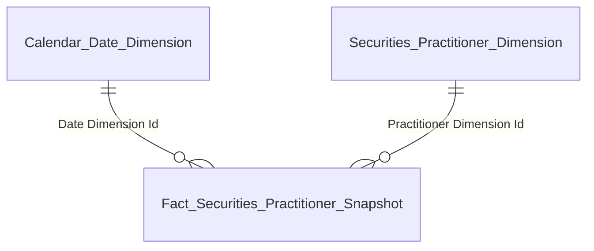

| Tên bảng (Logical) | Grain |
|---|---|
| Fact Securities Practitioner Snapshot | 1 row = 1 NHN × 1 Snapshot Date (daily) |
| Calendar Date Dimension | 1 row = 1 ngày snapshot |
| Securities Practitioner Dimension | 1 row = 1 NHN (SCD2) |

**Star schema — K2–K5:**

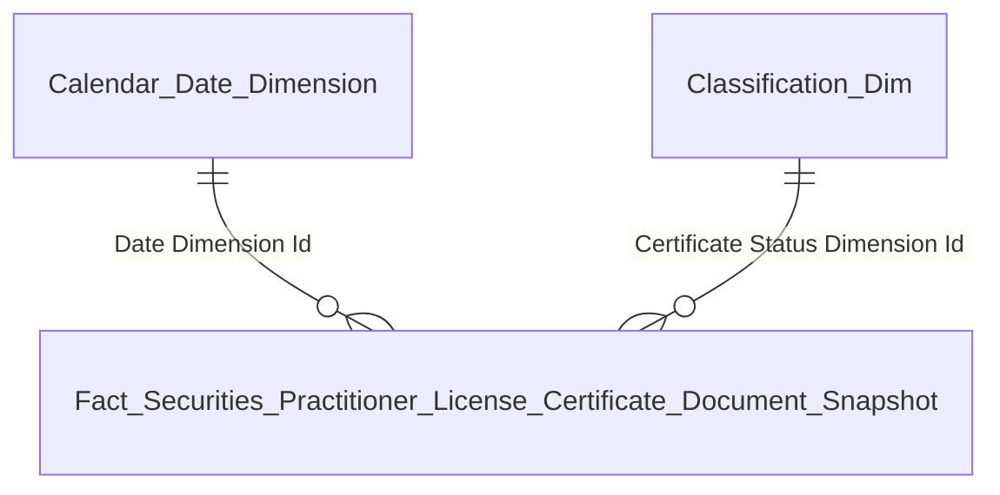

| Tên bảng (Logical) | Grain |
|---|---|
| Fact Securities Practitioner License Certificate Document Snapshot | 1 row = 1 CCHN × 1 Snapshot Date (daily) |
| Calendar Date Dimension | 1 row = 1 ngày snapshot |
| Classification Dimension (CERTIFICATE_STATUS) | 1 row = 1 trạng thái CCHN |

**Star schema — K6:**

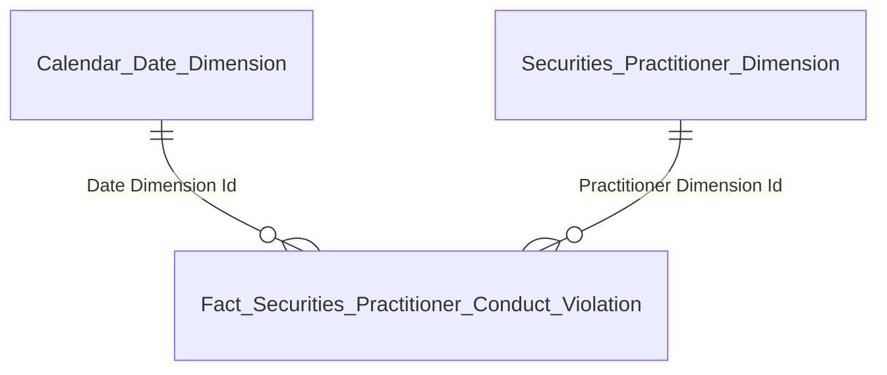

| Tên bảng (Logical) | Grain |
|---|---|
| Fact Securities Practitioner Conduct Violation | 1 row = 1 vi phạm NHN (event — 1 row duy nhất) |
| Calendar Date Dimension | 1 row = 1 ngày vi phạm |
| Securities Practitioner Dimension | 1 row = 1 NHN (SCD2) |

---

#### Nhóm 2 — Biểu đồ Trình độ chuyên môn

**Mockup:**

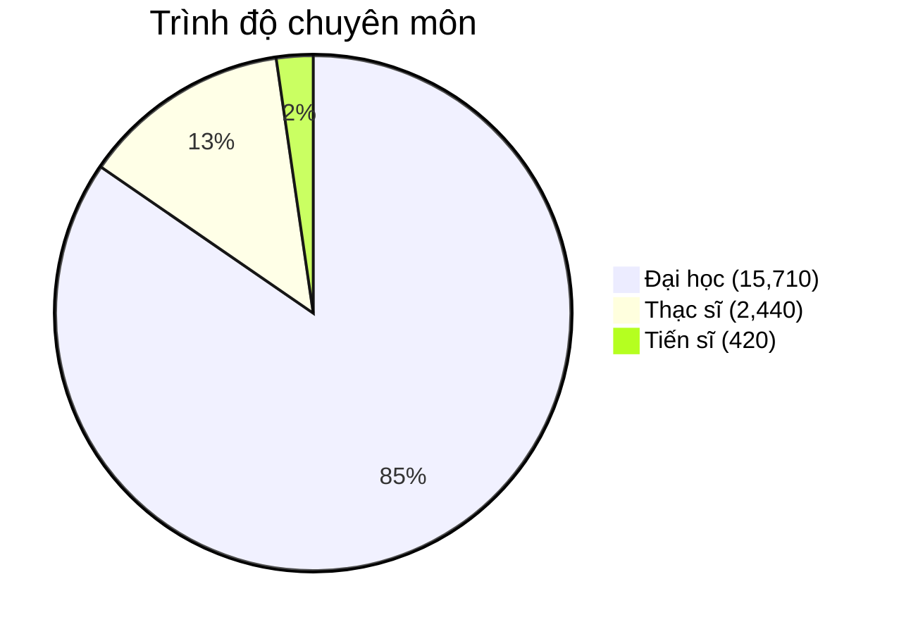

**Source:** `Fact Securities Practitioner Snapshot` → `Securities Practitioner Dimension` (Education Level Code)

**KPI:**

| # | Tên KPI | Đơn vị | Tính chất | Mô tả |
|---|---------|--------|-----------|-------|
| K_NHNCK_7 | Số lượng Tiến sĩ | Người | Stock | COUNT Practitioner Dimension Id WHERE Education Level Code = Tiến sĩ |
| K_NHNCK_8 | Số lượng Thạc sĩ | Người | Stock | COUNT Practitioner Dimension Id WHERE Education Level Code = Thạc sĩ |
| K_NHNCK_9 | Số lượng Đại học | Người | Stock | COUNT Practitioner Dimension Id WHERE Education Level Code = Đại học |
| K_NHNCK_10 | Tỷ lệ Tiến sĩ (%) | % | Derived | K7 / K1 × 100 |
| K_NHNCK_11 | Tỷ lệ Thạc sĩ (%) | % | Derived | K8 / K1 × 100 |
| K_NHNCK_12 | Tỷ lệ Đại học (%) | % | Derived | K9 / K1 × 100 |

**Star schema — K7–K12:**


| Tên bảng (Logical) | Grain |
|---|---|
| Fact Securities Practitioner Snapshot | 1 row = 1 NHN × 1 Snapshot Date (daily) |
| Securities Practitioner Dimension | 1 row = 1 NHN (SCD2) |
| Calendar Date Dimension | 1 row = 1 ngày snapshot |

---

#### Nhóm 3 — Biểu đồ Cơ cấu theo loại hình CCHN

**Mockup:**

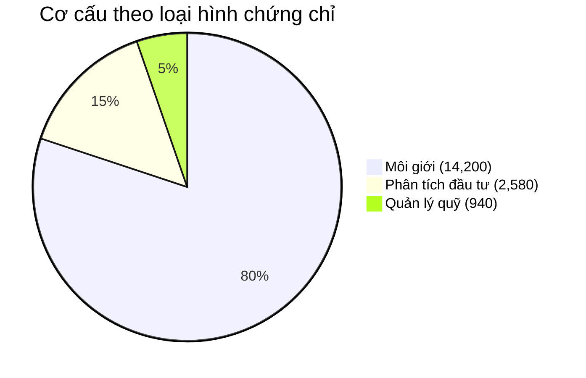

**Source:** `Fact Securities Practitioner License Certificate Document Snapshot` → `Classification Dimension` (CERTIFICATE_TYPE), `Classification Dimension` (CERTIFICATE_STATUS)

**KPI:**

| # | Tên KPI | Đơn vị | Tính chất | Mô tả |
|---|---------|--------|-----------|-------|
| K_NHNCK_13 | Số lượng CCHN là Môi giới | CCHN | Stock | Certificate Status Code = 1 AND Certificate Type Code = Môi giới |
| K_NHNCK_14 | Số lượng CCHN là Phân tích đầu tư | CCHN | Stock | Certificate Status Code = 1 AND Certificate Type Code = Phân tích đầu tư |
| K_NHNCK_15 | Số lượng CCHN là Quản lý quỹ | CCHN | Stock | Certificate Status Code = 1 AND Certificate Type Code = Quản lý quỹ |

**Star schema — K13–K15:**

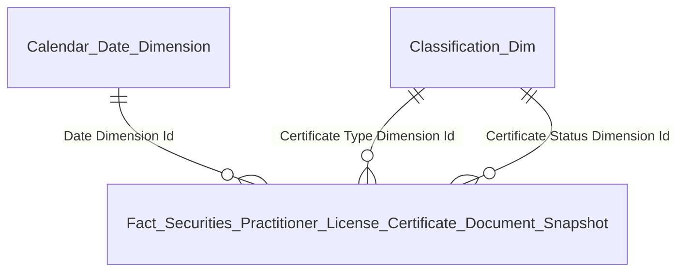

| Tên bảng (Logical) | Grain |
|---|---|
| Fact Securities Practitioner License Certificate Document Snapshot | 1 row = 1 CCHN × 1 Snapshot Date (daily) |
| Classification Dimension (CERTIFICATE_TYPE) | 1 row = 1 loại chứng chỉ |
| Classification Dimension (CERTIFICATE_STATUS) | 1 row = 1 trạng thái CCHN |
| Calendar Date Dimension | 1 row = 1 ngày snapshot |

---

#### Nhóm 4 — Biểu đồ Phân bổ độ tuổi nhân lực ngành

**Mockup (line chart — 2 đường: Việt Nam / Nước ngoài):**

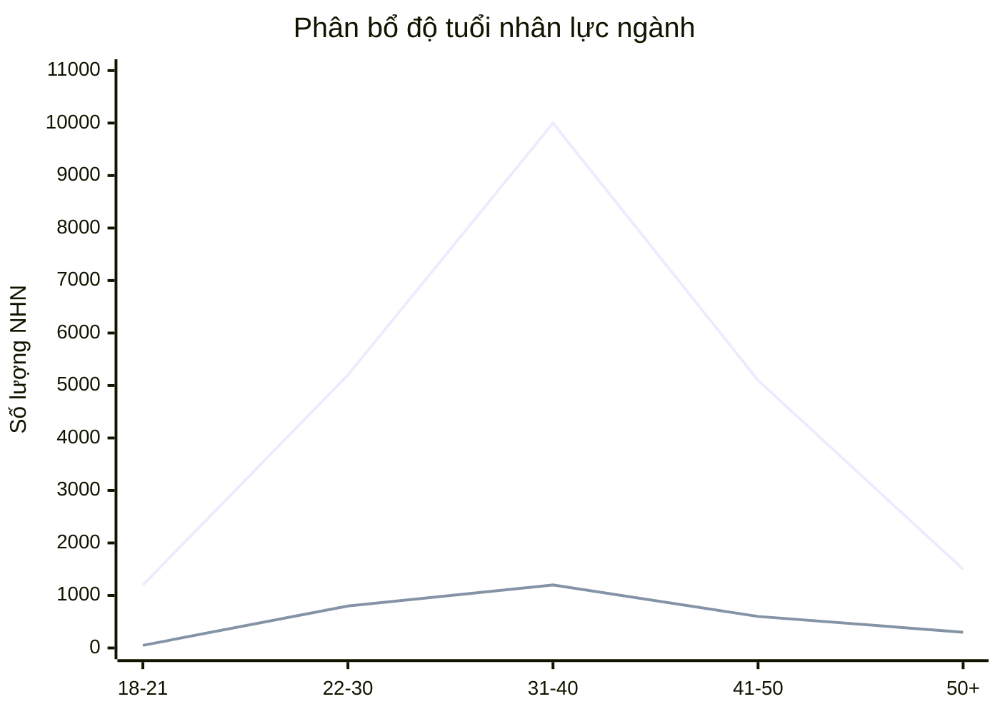

| Nhóm tuổi | 18–21 | 22–30 | 31–40 | 41–50 | 50+ |
|---|:---:|:---:|:---:|:---:|:---:|
| Việt Nam | 1,200 | 5,200 | **10,000** | 5,100 | 1,500 |
| Nước ngoài | 50 | 800 | **1,200** | 600 | 300 |

**Source:** `Fact Securities Practitioner Snapshot` → `Securities Practitioner Dimension` (Date Of Birth, Nationality Code)

**KPI:**

| # | Tên KPI | Đơn vị | Tính chất | Mô tả |
|---|---------|--------|-----------|-------|
| K_NHNCK_16–20 | NHN theo nhóm tuổi VN | Người | Stock | COUNT Practitioner Dimension Id WHERE Nationality Code = 'VN' GROUP BY nhóm tuổi |
| K_NHNCK_21–25 | NHN theo nhóm tuổi nước ngoài | Người | Stock | COUNT Practitioner Dimension Id WHERE Nationality Code ≠ 'VN' GROUP BY nhóm tuổi |

**Star schema — K16–K25:**


| Tên bảng (Logical) | Grain |
|---|---|
| Fact Securities Practitioner Snapshot | 1 row = 1 NHN × 1 Snapshot Date (daily) |
| Securities Practitioner Dimension | 1 row = 1 NHN (SCD2) |
| Calendar Date Dimension | 1 row = 1 ngày snapshot |


---

### 1.2 Dashboard: Tra cứu hồ sơ 360°

**Slicer:** Tìm kiếm (Tên / Số CCHN / Nơi công tác), Loại Chứng chỉ (dropdown)

**Mockup (danh sách thẻ NHN — 1 card = 1 NHN):**

| **Nguyễn Văn A** | **Lê Thị Thu B** | **Trần Minh C** |
| :---: | :---: | :---: |
| 34 tuổi · Việt Nam · Môi giới | 37 tuổi · Việt Nam · Phân tích | 42 tuổi · Nhật · Quản lý quỹ |
| CCHN-2023-001 · TESLA | CCHN-2024-045 · META | CCHN-OLQ-2019-112 · GOOGLE |
| ĐANG HOẠT ĐỘNG | ĐANG HOẠT ĐỘNG | ĐANG HOẠT ĐỘNG |

**Source:** `Fact Securities Practitioner Snapshot` → `Securities Practitioner Dimension` (thông tin cá nhân) + `Securities Organization Reference Dimension` (Nơi công tác — FK trên fact) + `Classification Dimension` (CERTIFICATE_TYPE) (loại CCHN đại diện — FK trên fact)

> **Lưu ý grain:** Dashboard Tra cứu hiển thị ở grain NHN (1 card = 1 người), trong khi 1 NHN có thể có nhiều CCHN. Do đó sử dụng `Fact Securities Practitioner Snapshot` (grain NHN) thay vì `Fact Securities Practitioner License Certificate Document Snapshot` (grain CCHN). Thông tin CCHN đại diện (số CCHN, loại, trạng thái) được ETL tổng hợp lên fact này theo logic "CCHN đại diện" thống nhất (xem mục 4.1).

**KPI:**

| # | Tên KPI | Đơn vị | Tính chất | Mô tả |
|---|---------|--------|-----------|-------|
| K_NHNCK_26 | Họ tên | Text | Stock | Securities Practitioner Dimension.Full Name |
| K_NHNCK_27 | Ngày sinh | Date | Stock | Securities Practitioner Dimension.Date Of Birth |
| K_NHNCK_28 | Tuổi | Năm | Derived | Year(Snapshot Date) − Year(Date Of Birth) |
| K_NHNCK_29 | Quốc tịch | Text | Stock | Securities Practitioner Dimension.Nationality Name |
| K_NHNCK_30 | Số định danh | Text | Stock | Securities Practitioner Dimension.Identification Number |
| K_NHNCK_31 | Nơi công tác hiện tại | Text | Stock | Securities Organization Reference Dimension.Organization Name (FK trên fact, ETL lookup current employment) |
| K_NHNCK_32 | Loại CCHN | Text | Stock | Classification Dimension.Classification Name (via Certificate Type Dimension Id) (FK từ CCHN đại diện) |
| K_NHNCK_33 | Trạng thái NHNCK | Text | Stock | Fact Securities Practitioner Snapshot.Practitioner Consolidated Status Code (ETL derived từ CCHN đại diện) |

**Star schema — K26–K33:**

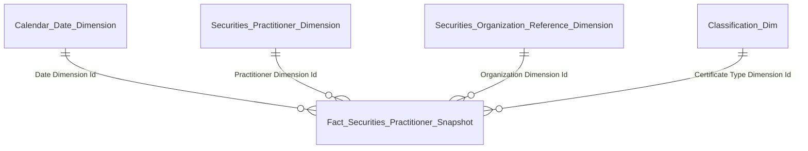

| Tên bảng (Logical) | Grain |
|---|---|
| Fact Securities Practitioner Snapshot | 1 row = 1 NHN × 1 Snapshot Date (daily) |
| Securities Practitioner Dimension | 1 row = 1 NHN (SCD2) |
| Securities Organization Reference Dimension | 1 row = 1 tổ chức (SCD2) |
| Classification Dimension (CERTIFICATE_TYPE) | 1 row = 1 loại chứng chỉ |
| Calendar Date Dimension | 1 row = 1 ngày snapshot |

---

### 1.3 Dashboard: Mạng lưới của NHNCK

**Slicer:** Mã NHN (chọn từ trang Tra cứu)

**Mockup:** Đồ thị mạng lưới quan hệ 360° — node: NHN chính (xanh lá) / Người liên quan (xanh dương) / DN niêm yết (xám). Cạnh: nét liền (trực tiếp) / nét đứt (liên thông).

---

#### Nhóm 1 — Quan hệ công tác (NHN ↔ Tổ chức)

**Source:** `Fact Securities Practitioner Organization Employment Report Snapshot` → `Securities Organization Reference Dimension`, `Securities Practitioner Organization Employment Report Dimension`

**KPI:**

| # | Tên KPI | Đơn vị | Tính chất | Mô tả |
|---|---------|--------|-----------|-------|
| K_NHNCK_34 | Đơn vị công tác | Text | Stock | Fact Securities Practitioner Organization Employment Report Snapshot → Securities Organization Reference Dimension.Organization Name |
| K_NHNCK_35 | Chức vụ / vai trò | Text | Stock | Fact Securities Practitioner Organization Employment Report Snapshot → Securities Practitioner Organization Employment Report Dimension.Position Name |

**Star schema — K34–K35:**

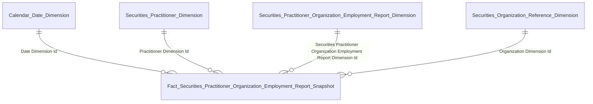

| Tên bảng (Logical) | Grain |
|---|---|
| Fact Securities Practitioner Organization Employment Report Snapshot | 1 row = 1 NHN × 1 lượt công tác × 1 Snapshot Date |
| Securities Practitioner Dimension | 1 row = 1 NHN (SCD2) |
| Securities Practitioner Organization Employment Report Dimension | 1 row = 1 lượt công tác (SCD2) |
| Securities Organization Reference Dimension | 1 row = 1 tổ chức (SCD2) |
| Calendar Date Dimension | 1 row = 1 ngày snapshot |

---

#### Nhóm 2 — Quan hệ gia đình (NHN ↔ Người liên quan)

**Source:** `Fact Securities Practitioner Related Party Snapshot` → `Securities Practitioner Related Party Dimension`, `Classification Dimension` (RELATIONSHIP_TYPE)

**KPI:**

| # | Tên KPI | Đơn vị | Tính chất | Mô tả |
|---|---------|--------|-----------|-------|
| K_NHNCK_36 | Họ tên người liên quan | Text | Stock | Fact Securities Practitioner Related Party Snapshot → Securities Practitioner Related Party Dimension.Related Party Full Name |
| K_NHNCK_37 | Mối quan hệ | Text | Stock | Fact Securities Practitioner Related Party Snapshot → Classification Dimension.Classification Name (via Relationship Type Dimension Id) |
| K_NHNCK_38 | Đơn vị công tác NLQ | Text | Stock | Fact Securities Practitioner Related Party Snapshot → Securities Practitioner Related Party Dimension.Workplace Name |
| K_NHNCK_39 | Chức vụ NLQ | Text | Stock | Fact Securities Practitioner Related Party Snapshot → Securities Practitioner Related Party Dimension.Occupation Name |

**Star schema — K36–K39:**

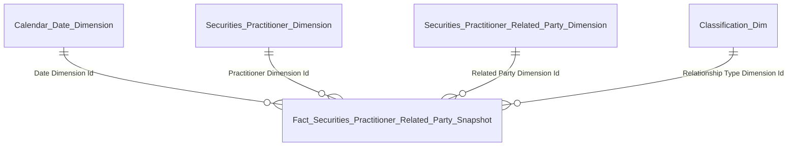

| Tên bảng (Logical) | Grain |
|---|---|
| Fact Securities Practitioner Related Party Snapshot | 1 row = 1 NHN × 1 NLQ × 1 Snapshot Date |
| Securities Practitioner Dimension | 1 row = 1 NHN chủ thể (SCD2) |
| Securities Practitioner Related Party Dimension | 1 row = 1 người liên quan (SCD2) |
| Classification Dimension (RELATIONSHIP_TYPE) | 1 row = 1 loại quan hệ gia đình (Code 1–6) |
| Calendar Date Dimension | 1 row = 1 ngày snapshot |

---

### 1.4 Dashboard: Hồ sơ & Danh mục của NHNCK

**Slicer:** Mã NHN (chọn từ trang Tra cứu)

---

#### Nhóm 1 — Vai trò tại DN niêm yết

**Mockup:**

| Tên DN | Vai trò | Trạng thái | Số CP sở hữu |
| :--- | :--- | :--- | ---: |
| XXX | Thành viên HĐQT | ACTIVE | 450,000 CP |
| YYY | Cổ đông lớn | ACTIVE | 2,500,000 CP |
| ZZZ | Cố vấn chiến lược | ACTIVE | 120,000 CP |

**Source:** `Fact Securities Practitioner Organization Employment Report Snapshot` → `Securities Organization Reference Dimension`, `Securities Practitioner Organization Employment Report Dimension`

**KPI:**

| # | Tên KPI | Đơn vị | Tính chất | Mô tả |
|---|---------|--------|-----------|-------|
| K_NHNCK_40 | Tên DN niêm yết | Text | Stock | Fact Securities Practitioner Organization Employment Report Snapshot → Securities Organization Reference Dimension.Organization Name |
| K_NHNCK_41 | Vai trò | Text | Stock | Fact Securities Practitioner Organization Employment Report Snapshot → Securities Practitioner Organization Employment Report Dimension.Position Name |
| K_NHNCK_42 | Trạng thái | Text | Derived | Fact Securities Practitioner Organization Employment Report Snapshot → Securities Practitioner Organization Employment Report Dimension.Is Current Flag → "ACTIVE" / "INACTIVE" |
| K_NHNCK_43 | Số lượng CP sở hữu | Number | Stock | ⚠ O4: cần cross-module data |

**Star schema — K40–K43:**


| Tên bảng (Logical) | Grain |
|---|---|
| Fact Securities Practitioner Organization Employment Report Snapshot | 1 row = 1 NHN × 1 lượt công tác × 1 Snapshot Date |
| Securities Practitioner Dimension | 1 row = 1 NHN (SCD2) |
| Securities Practitioner Organization Employment Report Dimension | 1 row = 1 lượt công tác (SCD2) |
| Securities Organization Reference Dimension | 1 row = 1 tổ chức (SCD2) |
| Calendar Date Dimension | 1 row = 1 ngày snapshot |

---

#### Nhóm 2 — Mạng lưới người liên quan

**Mockup:**

| Họ tên NLQ | Mối quan hệ | Nghề nghiệp | CCCD/CMND |
| :--- | :--- | :--- | :--- |
| Lê Thị Hồng A | Vợ/Chồng | KD tự do | *** |
| Nguyễn Thế B | Con | Du học sinh | *** |
| Trần Văn C | Vợ/Chồng | GĐ DN tư nhân | *** |

**Source:** `Fact Securities Practitioner Related Party Snapshot` → `Securities Practitioner Related Party Dimension`, `Classification Dimension` (RELATIONSHIP_TYPE)

**KPI:**

| # | Tên KPI | Đơn vị | Tính chất | Mô tả |
|---|---------|--------|-----------|-------|
| K_NHNCK_44 | Họ và tên NLQ | Text | Stock | Fact Securities Practitioner Related Party Snapshot → Securities Practitioner Related Party Dimension.Related Party Full Name |
| K_NHNCK_45 | Mối quan hệ | Text | Stock | Fact Securities Practitioner Related Party Snapshot → Classification Dimension.Classification Name (via Relationship Type Dimension Id) |
| K_NHNCK_46 | Nghề nghiệp NLQ | Text | Stock | Fact Securities Practitioner Related Party Snapshot → Securities Practitioner Related Party Dimension.Occupation Name |
| K_NHNCK_47 | CCCD/CMND/HC NLQ | Text | Stock | Fact Securities Practitioner Related Party Snapshot → Securities Practitioner Related Party Dimension.Identity Reference Code |

**Star schema — K44–K47:**


| Tên bảng (Logical) | Grain |
|---|---|
| Fact Securities Practitioner Related Party Snapshot | 1 row = 1 NHN × 1 NLQ × 1 Snapshot Date |
| Securities Practitioner Dimension | 1 row = 1 NHN chủ thể (SCD2) |
| Securities Practitioner Related Party Dimension | 1 row = 1 người liên quan (SCD2) |
| Classification Dimension (RELATIONSHIP_TYPE) | 1 row = 1 loại quan hệ gia đình (Code 1–6) |
| Calendar Date Dimension | 1 row = 1 ngày snapshot |

---

#### Nhóm 3 — Tài khoản & Số dư (Cross-Broker)

> ⚠ **Chờ Silver source.** Thiết kế sẽ bổ sung khi có thông tin nguồn dữ liệu tài khoản CK cross-broker. KPI K48–K52 tạm chưa mapping.

---

### 1.5 Dashboard: Quá trình hành nghề của NHNCK

**Slicer:** Mã NHN

**Mockup (timeline dọc):**

| Tổ chức | Vị trí | Từ tháng | Đến tháng |
| :--- | :--- | :---: | :---: |
| 🟢 Tesla | Môi giới CK | 12/05/2023 | Hiện nay |
| Công ty CP CK AAA | Trưởng phòng Môi giới | 12/01/2018 | 11/05/2023 |
| Vụ Giám sát TTCK - UBCKNN | Chuyên viên chính | 30/10/2012 | 11/01/2018 |
| Công ty CP CK XXX | Nhân viên Phân tích | 05/01/2009 | 29/10/2012 |

**Source:** `Fact Securities Practitioner Organization Employment Report Snapshot` → `Securities Organization Reference Dimension`, `Securities Practitioner Organization Employment Report Dimension`

**KPI:**

| # | Tên KPI | Đơn vị | Tính chất | Mô tả |
|---|---------|--------|-----------|-------|
| K_NHNCK_53 | Tổ chức | Text | Stock | Fact Securities Practitioner Organization Employment Report Snapshot → Securities Organization Reference Dimension.Organization Name |
| K_NHNCK_54 | Vị trí | Text | Stock | Fact Securities Practitioner Organization Employment Report Snapshot → Securities Practitioner Organization Employment Report Dimension.Position Name |
| K_NHNCK_55 | Từ tháng | Date | Stock | Fact Securities Practitioner Organization Employment Report Snapshot → Securities Practitioner Organization Employment Report Dimension.Hire Date |
| K_NHNCK_56 | Đến tháng | Date/Text | Stock | Fact Securities Practitioner Organization Employment Report Snapshot → Securities Practitioner Organization Employment Report Dimension.Termination Date (NULL = "Hiện nay") |
| K_NHNCK_57 | Trạng thái | Text | Derived | Fact Securities Practitioner Organization Employment Report Snapshot → Securities Practitioner Organization Employment Report Dimension.Is Current Flag = TRUE → "Hiện tại" ELSE "Quá khứ" |

**Star schema — K53–K57:**


| Tên bảng (Logical) | Grain |
|---|---|
| Fact Securities Practitioner Organization Employment Report Snapshot | 1 row = 1 NHN × 1 lượt công tác × 1 Snapshot Date |
| Securities Practitioner Dimension | 1 row = 1 NHN (SCD2) |
| Securities Practitioner Organization Employment Report Dimension | 1 row = 1 lượt công tác (SCD2) |
| Securities Organization Reference Dimension | 1 row = 1 tổ chức (SCD2) |
| Calendar Date Dimension | 1 row = 1 ngày snapshot |

---

### 1.6 Dashboard: Lịch sử cấp chứng chỉ của NHNCK

**Slicer:** Mã NHN

**Mockup (bảng chi tiết):**

| Số CCHN | Loại hình hành nghề | Ngày cấp | Ngày thu hồi | Quyết định cấp | Trạng thái |
| :--- | :--- | :---: | :---: | :--- | :--- |
| CCHN-2023-001 | Môi giới CK | 12/05/2023 | | 145/QĐ-UBCK | 🟢 ĐANG HIỆU LỰC |
| CCHN-2020-045 | Phân tích CK | 20/10/2020 | 20/10/2023 | 89/QĐ-UBCK | 🟡 THU HỒI 3 NĂM |
| CCHN-2017-012 | Môi giới CK | 15/01/2017 | 15/01/2020 | 12/QĐ-UBCK | 🔴 THU HỒI VĨNH VIỄN |

**Source:** `Fact Securities Practitioner License Certificate Document Snapshot` → `Securities Practitioner Dimension`, `Classification Dimension` (CERTIFICATE_TYPE), `Classification Dimension` (CERTIFICATE_STATUS)

**KPI:**

| # | Tên KPI | Đơn vị | Tính chất | Mô tả |
|---|---------|--------|-----------|-------|
| K_NHNCK_58 | Số CCHN | Text | Stock | Fact Securities Practitioner License Certificate Document Snapshot.Certificate Number |
| K_NHNCK_59 | Loại hình | Text | Stock | Fact Securities Practitioner License Certificate Document Snapshot → Classification Dimension.Classification Name (via Certificate Type Dimension Id) |
| K_NHNCK_60 | Ngày cấp | Date | Stock | Fact Securities Practitioner License Certificate Document Snapshot.Certificate Issue Date |
| K_NHNCK_61 | Ngày thu hồi | Date | Stock | Fact Securities Practitioner License Certificate Document Snapshot.Revocation Date |
| K_NHNCK_62 | Quyết định cấp | Text | Stock | Fact Securities Practitioner License Certificate Document Snapshot.Issuance Decision Number |
| K_NHNCK_63 | Trạng thái | Text | Stock | Fact Securities Practitioner License Certificate Document Snapshot → Classification Dimension.Classification Name (via Certificate Status Dimension Id) |

**Star schema — K58–K63:**

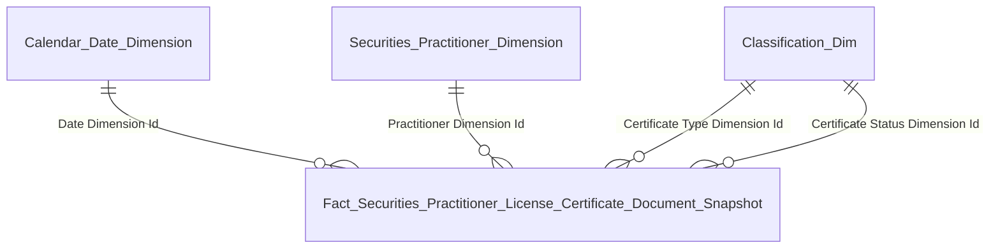

| Tên bảng (Logical) | Grain |
|---|---|
| Fact Securities Practitioner License Certificate Document Snapshot | 1 row = 1 CCHN × 1 Snapshot Date |
| Securities Practitioner Dimension | 1 row = 1 NHN (SCD2) |
| Classification Dimension (CERTIFICATE_TYPE) | 1 row = 1 loại chứng chỉ |
| Classification Dimension (CERTIFICATE_STATUS) | 1 row = 1 trạng thái CCHN |
| Calendar Date Dimension | 1 row = 1 ngày snapshot |

---

### 1.7 Dashboard: Lịch sử vi phạm của NHNCK

**Slicer:** Mã NHN

**Mockup:**

| Ngày QĐ | Số QĐ | Nội dung vi phạm | Hình thức xử phạt | Trạng thái |
| :---: | :--- | :--- | :--- | :--- |
| 15/10/2023 | 142/QĐ-XPHC | Thao túng giá CK | 550,000,000 VND | ĐÃ THỰC THI |
| 05/02/2021 | 24/QĐ-UBCK | Chậm công bố TT sở hữu | Cảnh cáo | ĐÃ BAN HÀNH |
| 12/11/2019 | BC-0012/CTCK | Vi phạm quy trình mở TK | Đình chỉ hành nghề 3 tháng | ĐANG THỰC THI |

**Source:** `Fact Securities Practitioner Conduct Violation` → `Securities Practitioner Dimension`, `Calendar Date Dimension`, `Classification Dimension` (CONDUCT_VIOLATION_TYPE / VIOLATION_STATUS)

**KPI:**

| # | Tên KPI | Đơn vị | Tính chất | Mô tả |
|---|---------|--------|-----------|-------|
| K_NHNCK_71 | Số quyết định | Text | Stock | Fact Securities Practitioner Conduct Violation.Decision Number |
| K_NHNCK_72 | Ngày quyết định | Date | Stock | Fact Securities Practitioner Conduct Violation.Decision Date |
| K_NHNCK_73 | Nội dung vi phạm | Text | Stock | Fact Securities Practitioner Conduct Violation.Violation Note |
| K_NHNCK_74 | Hình thức xử phạt | Text | Stock | Fact Securities Practitioner Conduct Violation.Penalty Description ⚠ O6 |
| K_NHNCK_75 | Trạng thái | Text | Stock | Fact Securities Practitioner Conduct Violation.Violation Execution Status Name ⚠ O7 |

**Star schema — K71–K75:**

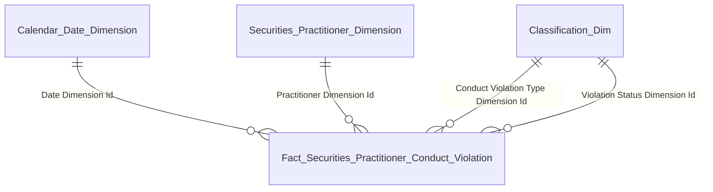

| Tên bảng (Logical) | Grain |
|---|---|
| Fact Securities Practitioner Conduct Violation | 1 row = 1 vi phạm (event) |
| Securities Practitioner Dimension | 1 row = 1 NHN (SCD2) |
| Classification Dimension (CONDUCT_VIOLATION_TYPE) | 1 row = 1 loại vi phạm |
| Classification Dimension (VIOLATION_STATUS) | 1 row = 1 trạng thái hiệu lực |
| Calendar Date Dimension | 1 row = 1 ngày vi phạm |

---

### 1.8 Dashboard: Đợt thi sát hạch của NHNCK

**Slicer:** Mã NHN

**Mockup (timeline dọc):**

| Đợt thi | Điểm | Ngày thi | Số QĐ công bố | Trạng thái |
| :--- | :---: | :---: | :--- | :--- |
| 🟢 Đợt 1/2025 | 82 | 15/03/2025 | 45/QĐ-UBCK · 20/03/2025 | ✓ ĐẠT |
| Đợt 2/2024 | 58 | 18/09/2023 | | ✗ KHÔNG ĐẠT |
| 🟢 Đợt 1/2023 | 75 | 18/03/2023 | 28/QĐ-UBCK · 25/03/2023 | ✓ ĐẠT |

**Source:** `Fact Securities Practitioner Qualification Examination Assessment Result` → `Securities Practitioner Dimension`, `Securities Practitioner Qualification Examination Assessment Dimension`, `Classification Dimension` (EXAMINATION_RESULT), `Calendar Date Dimension`

**KPI:**

| # | Tên KPI | Đơn vị | Tính chất | Mô tả |
|---|---------|--------|-----------|-------|
| K_NHNCK_64 | Đợt thi | Text | Stock | Fact Securities Practitioner Qualification Examination Assessment Result → Securities Practitioner Qualification Examination Assessment Dimension.Session Name |
| K_NHNCK_65 | Ngày thi | Date | Stock | Fact Securities Practitioner Qualification Examination Assessment Result → Securities Practitioner Qualification Examination Assessment Dimension.Examination Start Date |
| K_NHNCK_66 | Điểm thi | Text | Stock | Fact Securities Practitioner Qualification Examination Assessment Result.Total Score |
| K_NHNCK_67 | Số QĐ công bố | Text | Stock | Fact Securities Practitioner Qualification Examination Assessment Result → Securities Practitioner Qualification Examination Assessment Dimension.Decision Number |
| K_NHNCK_68 | Trạng thái | Text | Stock | Fact Securities Practitioner Qualification Examination Assessment Result → Classification Dimension.Classification Name (via Examination Result Dimension Id) |

**Star schema — K64–K68:**

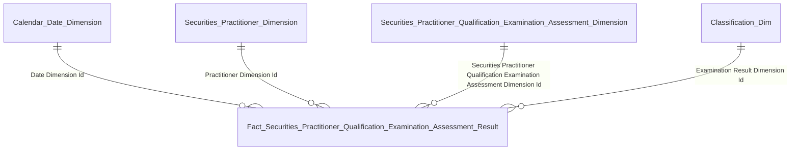

| Tên bảng (Logical) | Grain |
|---|---|
| Fact Securities Practitioner Qualification Examination Assessment Result | 1 row = 1 kết quả thi (event) |
| Securities Practitioner Dimension | 1 row = 1 NHN (SCD2) |
| Securities Practitioner Qualification Examination Assessment Dimension | 1 row = 1 đợt thi (SCD2) |
| Classification Dimension (EXAMINATION_RESULT) | 1 row = 1 kết quả (Đạt / Không đạt / Chưa thi) |
| Calendar Date Dimension | 1 row = 1 ngày thi |

---

### 1.9 Dashboard: Cập nhật kiến thức của NHNCK

**Slicer:** Mã NHN

**Mockup (timeline theo năm):**

| Năm | Số giờ | Kết quả | Trạng thái |
| :--- | :---: | :--- | :--- |
| 🟢 Năm 2024 | 10/8h | LOẠI A | ✓ ĐÃ ĐỦ 8H |
| 🔴 Năm 2023 | 5/8h | CHƯA KIỂM TRA | ✗ CHƯA ĐỦ 8H |
| 🟢 Năm 2021 | 8/8h | LOẠI B | ✓ ĐÃ ĐỦ 8H |

**Source:** `Fact Securities Practitioner Professional Training Class Enrollment` → `Securities Practitioner Dimension`, `Securities Practitioner Professional Training Class Dimension`, `Classification Dimension` (TRAINING_RESULT), `Calendar Date Dimension`

**KPI:**

| # | Tên KPI | Đơn vị | Tính chất | Mô tả |
|---|---------|--------|-----------|-------|
| K_NHNCK_69 | Kết quả kiểm tra / phân loại | Text | Derived | Fact Securities Practitioner Professional Training Class Enrollment → Classification Dimension.Classification Name (via Training Result Dimension Id) → aggregate theo Securities Practitioner Professional Training Class Dimension.Academic Year per NHN |
| K_NHNCK_70 | Trạng thái đủ 8h | Text | Derived | SUM(Fact Securities Practitioner Professional Training Class Enrollment.Training Hours) per NHN per Securities Practitioner Professional Training Class Dimension.Academic Year ≥ 8 → "Đã đủ 8h" ⚠ O9 |

**Star schema — K69–K70:**

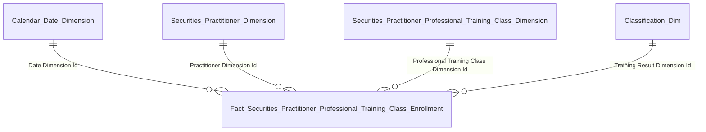

| Tên bảng (Logical) | Grain |
|---|---|
| Fact Securities Practitioner Professional Training Class Enrollment | 1 row = 1 đăng ký khóa học (event) |
| Securities Practitioner Dimension | 1 row = 1 NHN (SCD2) |
| Securities Practitioner Professional Training Class Dimension | 1 row = 1 khóa học (SCD2) |
| Classification Dimension (TRAINING_RESULT) | 1 row = 1 kết quả (Đạt / Không đạt) |
| Calendar Date Dimension | 1 row = 1 ngày khóa học |

---

### 1.10 Yêu cầu khai thác dữ liệu (Data Explorer)

**Slicer:** Loại chứng chỉ (MỌI LOẠI CHỨNG CHỈ / Môi giới / Phân tích / QLQ), Trạng thái (ĐANG HOẠT ĐỘNG / ...)

**Mockup (theo screenshot):**

| TÊN CÁN BỘ | SỐ CCHN | LOẠI HÌNH | CÔNG TY | NGÀY CẤP | TRẠNG THÁI |
| :--- | :--- | :--- | :--- | :---: | :--- |
| Nguyễn Văn A | CCHN-2023-001 | MÔI GIỚI | TESLA | 12/05/2023 | 🟢 ĐANG HOẠT ĐỘNG |
| Lê Thị Thu B | CCHN-2024-045 | PHÂN TÍCH | META | 20/10/2022 | 🟢 ĐANG HOẠT ĐỘNG |
| Trần Minh C | CCHN-QLQ-2019-112 | QUẢN LÝ QUỸ | GOOGLE | 05/01/2019 | 🟢 ĐANG HOẠT ĐỘNG |
| Đinh Quốc G | CCHN-QLQ-2020-055 | QUẢN LÝ QUỸ | DEEPSEEK | 22/07/2020 | 🟢 ĐANG HOẠT ĐỘNG |

> KẾT QUẢ: **4 NHN**

**Source:** `Fact Securities Practitioner License Certificate Document Snapshot` → `Securities Practitioner Dimension`, `Securities Organization Reference Dimension`, `Classification Dimension` (CERTIFICATE_TYPE), `Classification Dimension` (CERTIFICATE_STATUS)

**KPI:**

| # | Tên KPI | Đơn vị | Tính chất | Mô tả |
|---|---------|--------|-----------|-------|
| K_NHNCK_76 | Tên cán bộ | Text | Stock | Fact Securities Practitioner License Certificate Document Snapshot → Securities Practitioner Dimension.Full Name |
| K_NHNCK_77 | Số CCHN | Text | Stock | Fact Securities Practitioner License Certificate Document Snapshot.Certificate Number |
| K_NHNCK_78 | Loại hình | Text | Stock | Fact Securities Practitioner License Certificate Document Snapshot → Classification Dimension.Classification Name (via Certificate Type Dimension Id) |
| K_NHNCK_79 | Công ty | Text | Stock | Fact Securities Practitioner License Certificate Document Snapshot → Securities Organization Reference Dimension.Organization Name |
| K_NHNCK_80 | Ngày cấp | Date | Stock | Fact Securities Practitioner License Certificate Document Snapshot.Certificate Issue Date |
| K_NHNCK_81 | Trạng thái | Text | Stock | Fact Securities Practitioner License Certificate Document Snapshot → Classification Dimension.Classification Name (via Certificate Status Dimension Id) |
| K_NHNCK_82 | Lọc: Loại chứng chỉ | — | Slicer | Fact Securities Practitioner License Certificate Document Snapshot → Classification Dimension.Classification Code (via Certificate Type Dimension Id) |
| K_NHNCK_83 | Lọc: Trạng thái | — | Slicer | Fact Securities Practitioner License Certificate Document Snapshot → Classification Dimension.Classification Code (via Certificate Status Dimension Id) |

**Star schema — K76–K83:**

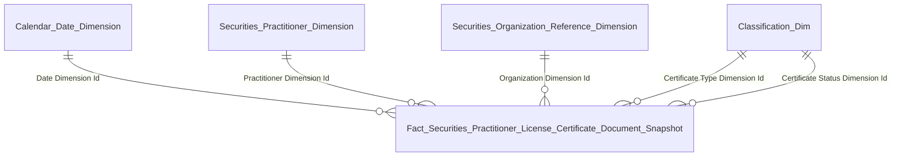

| Tên bảng (Logical) | Grain |
|---|---|
| Fact Securities Practitioner License Certificate Document Snapshot | 1 row = 1 CCHN × 1 Snapshot Date |
| Securities Practitioner Dimension | 1 row = 1 NHN (SCD2) |
| Securities Organization Reference Dimension | 1 row = 1 tổ chức (SCD2) |
| Classification Dimension (CERTIFICATE_TYPE) | 1 row = 1 loại chứng chỉ |
| Classification Dimension (CERTIFICATE_STATUS) | 1 row = 1 trạng thái CCHN |
| Calendar Date Dimension | 1 row = 1 ngày snapshot |

---

## 2. Mô hình Star Schema

### 2.1 Sơ đồ tổng thể

```mermaid
graph TB
    classDef dim fill:#E6F1FB,stroke:#185FA5,color:#0C447C
    classDef ref fill:#E8F5E9,stroke:#2E7D32,color:#1B5E20
    classDef fact fill:#FAECE7,stroke:#993C1D,color:#4A1B0C

    DIM_DATE["Calendar Date Dimension"]:::dim
    DIM_PRAC["Securities Practitioner Dimension — SCD2"]:::dim
    DIM_ORG["Securities Organization Reference Dimension — SCD2"]:::dim
    DIM_REL_PARTY["Securities Practitioner Related Party Dimension — SCD2"]:::dim
    DIM_EMP_REC["Securities Practitioner Organization Employment Report Dimension — SCD2"]:::dim
    DIM_CERT_TYPE["Certificate Type Dimension Id → Classification Dimension"]:::ref
    DIM_CERT_STATUS["Certificate Status Dimension Id → Classification Dimension"]:::ref
    DIM_REL_TYPE["Relationship Type Dimension Id → Classification Dimension"]:::ref
    DIM_VIO_TYPE["Conduct Violation Type Dimension Id → Classification Dimension"]:::ref

    DIM_EXAM_SESSION["Securities Practitioner Qualification Examination Assessment Dimension — SCD2"]:::dim
    DIM_TRAIN_CLASS["Securities Practitioner Professional Training Class Dimension — SCD2"]:::dim

    FACT_PRAC["Fact Securities Practitioner Snapshot — 1 NHN × 1 Snapshot Date"]:::fact
    FACT_CERT["Fact Securities Practitioner License Certificate Document Snapshot — 1 CCHN × 1 Snapshot Date"]:::fact
    FACT_VIO["Fact Securities Practitioner Conduct Violation — 1 vi phạm (event)"]:::fact
    FACT_EMP["Fact Securities Practitioner Organization Employment Report Snapshot — 1 lượt công tác × 1 Snapshot Date"]:::fact
    FACT_REL["Fact Securities Practitioner Related Party Snapshot — 1 NLQ × 1 Snapshot Date"]:::fact
    FACT_EXAM["Fact Securities Practitioner Qualification Examination Assessment Result — 1 kết quả thi (event)"]:::fact
    FACT_TRAIN["Fact Securities Practitioner Professional Training Class Enrollment — 1 đăng ký khóa (event)"]:::fact

    DIM_DATE --- FACT_PRAC
    DIM_DATE --- FACT_CERT
    DIM_DATE --- FACT_VIO
    DIM_DATE --- FACT_EMP
    DIM_DATE --- FACT_REL
    DIM_DATE --- FACT_EXAM
    DIM_DATE --- FACT_TRAIN
    DIM_PRAC --- FACT_PRAC
    DIM_PRAC --- FACT_CERT
    DIM_PRAC --- FACT_VIO
    DIM_PRAC --- FACT_EMP
    DIM_PRAC --- FACT_REL
    DIM_PRAC --- FACT_EXAM
    DIM_PRAC --- FACT_TRAIN
    DIM_ORG --- FACT_PRAC
    DIM_ORG --- FACT_CERT
    DIM_ORG --- FACT_EMP
    DIM_EMP_REC --- FACT_EMP
    DIM_REL_PARTY --- FACT_REL
    DIM_CERT_TYPE --- FACT_PRAC
    DIM_CERT_TYPE --- FACT_CERT
    DIM_CERT_STATUS --- FACT_CERT
    DIM_REL_TYPE --- FACT_REL
    DIM_VIO_TYPE --- FACT_VIO
    DIM_VIO_STATUS["Violation Status Dimension Id → Classification Dimension"]:::ref
    DIM_VIO_STATUS --- FACT_VIO
    DIM_EXAM_SESSION --- FACT_EXAM
    DIM_EXAM_RESULT["Examination Result Dimension Id → Classification Dimension"]:::ref
    DIM_EXAM_RESULT --- FACT_EXAM
    DIM_TRAIN_CLASS --- FACT_TRAIN
    DIM_TRAIN_RESULT["Training Result Dimension Id → Classification Dimension"]:::ref
    DIM_TRAIN_RESULT --- FACT_TRAIN
```

### 2.2 Bảng tổng quan

| Fact Table | Grain | KPI phục vụ |
|------------|-------|-------------|
| Fact Securities Practitioner Snapshot | 1 NHN × 1 Snapshot Date (daily) | K1, K7–K12, K16–K33 |
| Fact Securities Practitioner License Certificate Document Snapshot | 1 CCHN × 1 Snapshot Date (daily) | K2–K5, K13–K15, K58–K63, K76–K83 |
| Fact Securities Practitioner Conduct Violation | 1 vi phạm NHN (event) | K6, K71–K75 |
| Fact Securities Practitioner Organization Employment Report Snapshot | 1 NHN × 1 lượt công tác × 1 Snapshot Date (daily) | K34–K35, K40–K43, K53–K57 |
| Fact Securities Practitioner Related Party Snapshot | 1 NHN × 1 NLQ × 1 Snapshot Date (daily) | K36–K39, K44–K47 |
| Fact Securities Practitioner Qualification Examination Assessment Result | 1 kết quả thi (event) | K64–K68 |
| Fact Securities Practitioner Professional Training Class Enrollment | 1 đăng ký khóa (event) | K69–K70 |

| Dimension | Loại | Mô tả |
|-----------|------|-------|
| Calendar Date Dimension | Conformed | Lịch — slicer năm |
| Securities Practitioner Dimension | Conformed (SCD2) | NHN — tên / ngày sinh / quốc tịch / trình độ / trạng thái / số CMND |
| Securities Organization Reference Dimension | Conformed (SCD2) | Tổ chức CK — tên / loại / trạng thái |
| Securities Practitioner Related Party Dimension | Conformed (SCD2) | Người liên quan của NHN — tên / nghề nghiệp / nơi làm việc / quốc tịch |
| Securities Practitioner Organization Employment Report Dimension | Conformed (SCD2) | Lượt công tác — chức vụ / phòng ban / ngày bắt đầu / ngày kết thúc |
| Securities Practitioner Qualification Examination Assessment Dimension | Conformed (SCD2) | Đợt thi sát hạch — tên đợt / năm / ngày thi / QĐ công nhận |
| Securities Practitioner Professional Training Class Dimension | Conformed (SCD2) | Khóa cập nhật kiến thức — tên khóa / năm học / ngày thi |
| Classification Dimension | Reference (SCD2) | Bảng phân loại chung — gộp tất cả classification value (CERTIFICATE_TYPE / CERTIFICATE_STATUS / RELATIONSHIP_TYPE / CONDUCT_VIOLATION_TYPE / VIOLATION_STATUS / EXAMINATION_RESULT / TRAINING_RESULT / ...). FK trên fact đặt tên theo nghiệp vụ, đều lookup sang bảng này |

---

## 3. Vấn đề mở & Giả định

| # | Vấn đề | Giả định hiện tại | KPI liên quan | Status |
|---|--------|-------------------|---------------|--------|
| O1 | K3 "Bị thu hồi" Stock hay Flow? | Tạm giả định Flow (Revoked In Year Flag) | K3 | Open |
| O2 | Certificate Status Code "2: Thu hồi" không phân biệt 3 năm vs vĩnh viễn | Chờ Silver cập nhật | K3a, K3b | Open |
| O3 | BA phản hồi K3a/K3b khi Silver bổ sung | Chờ BA | K3a, K3b | Open |
| O4 | Số lượng CP sở hữu tại DN niêm yết — source ngoài Silver NHNCK | Tạm giữ placeholder. Chờ xác nhận source (VSD/GSDC) | K43 | Open |
| O5 | Tài khoản & Số dư Cross-Broker (K48–K52) — Silver NHNCK không có entity TK CK. Đã bỏ khỏi HLD | Chờ Silver source. Thiết kế bổ sung khi có thông tin | K48–K52 | Open — chờ Silver |
| O6 | "Hình thức xử phạt" — Silver Violations không có Penalty Description riêng | Tạm ghi Penalty Description. Chờ xác nhận Silver attribute | K74 | Open |
| O7 | "Trạng thái thực thi" — Silver chỉ có Violation Status Code (Hoạt động/Không HĐ/Đã xóa) | Tạm ghi Violation Execution Status Code. Chờ xác nhận | K75 | Open |
| O9 | Training Hours — Silver không có trường này | Chờ xác nhận quy tắc tính + nguồn dữ liệu với BA | K70 | Open — chờ BA |
| O11 | Hồ sơ: "% sở hữu" NLQ + "Số lượng CP sở hữu" — source ngoài Silver NHNCK | Chờ Silver source từ module khác (VSD/GSDC). Thiết kế bổ sung khi có thông tin | K43–K47 | Open — chờ Silver |