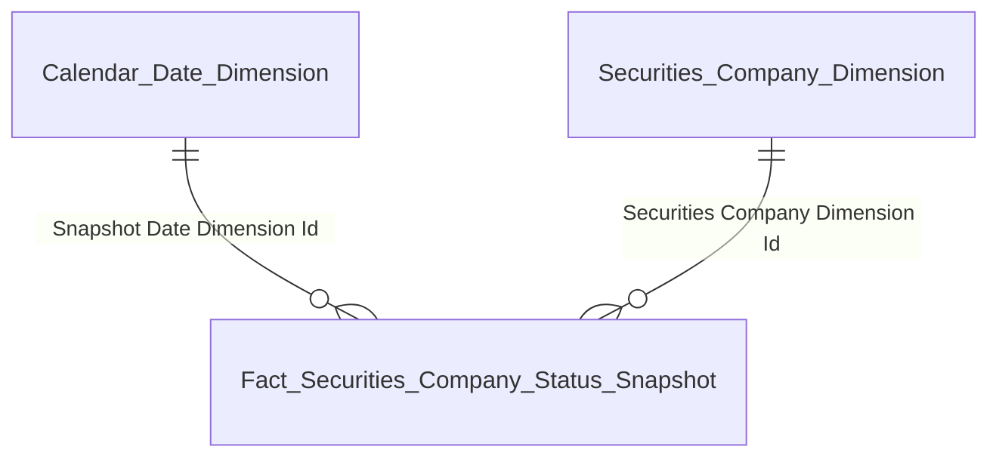
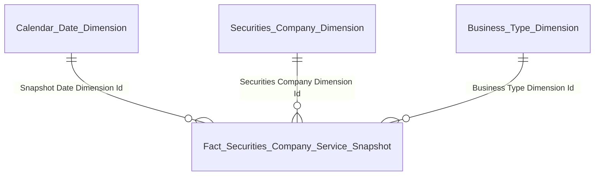
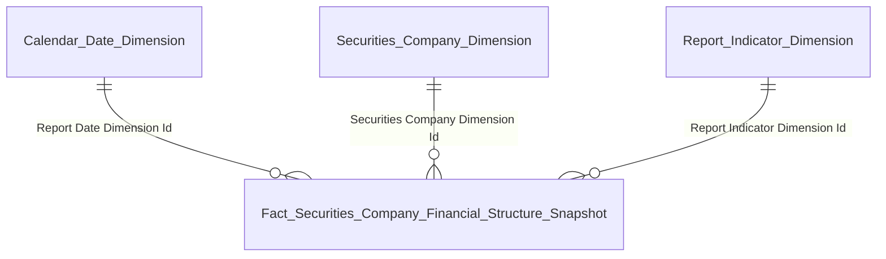
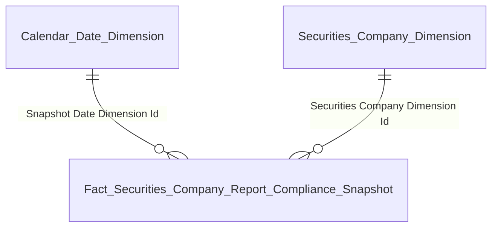

# GOLD_QLKD_Entities — Star Schema per Nhóm báo cáo
**Module:** QLKD — Quản lý kinh doanh
**Phiên bản:** 1.0 — 03/05/2026

## Tab TỔNG QUAN

### Nhóm 1 — Chỉ tiêu thống kê chung (K_QLKD_1–11)

| Gold entity | Description | Grain | KPI |
|---|---|---|---|
| Fact Securities Company Status Snapshot | 1 CTCK × 1 ngày snapshot | 1 CTCK × 1 ngày snapshot | K_QLKD_1–11 |
| Securities Company Dimension | 1 CTCK (SCD2) | 1 CTCK (SCD2) | — |
| Calendar Date Dimension | 1 ngày | 1 ngày | — |

### Nhóm 2/3/4 — Nghiệp vụ & Dịch vụ (K_QLKD_12–21)

| Gold entity | Description | Grain | KPI |
|---|---|---|---|
| Fact Securities Company Service Snapshot | 1 CTCK × 1 mã nghiệp vụ × 1 ngày | 1 CTCK × 1 mã nghiệp vụ × 1 ngày | K_QLKD_12–21 |
| Securities Company Dimension | 1 CTCK (SCD2) | 1 CTCK (SCD2) | — |
| Business Type Dimension | 1 mã nghiệp vụ/dịch vụ (SCD2) | 1 mã nghiệp vụ/dịch vụ (SCD2) | — |
| Calendar Date Dimension | 1 ngày | 1 ngày | — |

### Nhóm 8/9 — Cơ cấu tài chính toàn thị trường (K_QLKD_31–40)

| Gold entity | Description | Grain | KPI |
|---|---|---|---|
| Fact Securities Company Financial Structure Snapshot | 1 CTCK × 1 chỉ tiêu × 1 kỳ | 1 CTCK × 1 chỉ tiêu × 1 kỳ | K_QLKD_31–40, 41–69, 79–86 |
| Securities Company Dimension | 1 CTCK (SCD2) | 1 CTCK (SCD2) | — |
| Report Indicator Dimension | 1 chỉ tiêu báo cáo | 1 chỉ tiêu báo cáo | — |
| Calendar Date Dimension | 1 ngày | 1 ngày | — |

## Tab GIÁM SÁT

### Nhóm GS-1 → GS-8 — Hoạt động tài chính CTCK (K_QLKD_41–69)

> Tái sử dụng `Fact Securities Company Financial Structure Snapshot` — Star Schema giống Nhóm 8/9

| Gold entity | Description | Grain | KPI |
|---|---|---|---|
| Fact Securities Company Financial Structure Snapshot | 1 CTCK × 1 chỉ tiêu × 1 kỳ | 1 CTCK × 1 chỉ tiêu × 1 kỳ | K_QLKD_31–40, 41–69, 79–86 |
| Securities Company Dimension | 1 CTCK (SCD2) | 1 CTCK (SCD2) | — |
| Report Indicator Dimension | 1 chỉ tiêu báo cáo | 1 chỉ tiêu báo cáo | — |
| Calendar Date Dimension | 1 ngày | 1 ngày | — |

### Nhóm GS-9 — Giám sát tuân thủ nộp báo cáo (K_QLKD_70–73)

| Gold entity | Description | Grain | KPI |
|---|---|---|---|
| Fact Securities Company Report Compliance Snapshot | 1 CTCK × 1 biểu mẫu × 1 kỳ | 1 CTCK × 1 biểu mẫu × 1 kỳ | K_QLKD_70–73 |
| Securities Company Dimension | 1 CTCK (SCD2) | 1 CTCK (SCD2) | — |
| Calendar Date Dimension | 1 ngày | 1 ngày | — |

## Tab HỒ SƠ CTCK 360

### Nhóm 360-2 → 360-5 — Biểu đồ tài chính per CTCK (K_QLKD_79–86)

> Tái sử dụng `Fact Securities Company Financial Structure Snapshot` — Star Schema giống GS-1→GS-8

| Gold entity | Description | Grain | KPI |
|---|---|---|---|
| Fact Securities Company Financial Structure Snapshot | 1 CTCK × 1 chỉ tiêu × 1 kỳ | 1 CTCK × 1 chỉ tiêu × 1 kỳ | K_QLKD_31–40, 41–69, 79–86 |
| Securities Company Dimension | 1 CTCK (SCD2) | 1 CTCK (SCD2) | — |
| Report Indicator Dimension | 1 chỉ tiêu báo cáo | 1 chỉ tiêu báo cáo | — |
| Calendar Date Dimension | 1 ngày | 1 ngày | — |

### Nhóm 360-1 Banner (Tác nghiệp)

| Gold entity | Description | Grain | KPI |
|---|---|---|---|
| Securities Company 360 Profile | 1 CTCK (latest state) | 1 CTCK (latest state) | K_QLKD_74–78 |

### Nhóm 360-6 Lịch sử BCTC (Tác nghiệp)

| Gold entity | Description | Grain | KPI |
|---|---|---|---|
| Securities Company Financial Report History | 1 CTCK × 1 biểu mẫu × 1 kỳ × 1 chỉ tiêu | 1 CTCK × 1 biểu mẫu × 1 kỳ × 1 chỉ tiêu | K_QLKD_87–90 |

### Nhóm 360-7 NHNCK (Tác nghiệp)

| Gold entity | Description | Grain | KPI |
|---|---|---|---|
| Securities Company Practitioner Profile | 1 NHN × 1 CTCK | 1 NHN × 1 CTCK | K_QLKD_91–95 |

### Nhóm 360-8 Nhân sự/Cổ đông (Tác nghiệp)

| Gold entity | Description | Grain | KPI |
|---|---|---|---|
| Securities Company Personnel Profile | 1 nhân sự × 1 CTCK | 1 nhân sự × 1 CTCK | K_QLKD_96–98 |
| Securities Company Shareholder Profile | 1 cổ đông × 1 CTCK | 1 cổ đông × 1 CTCK | K_QLKD_97 |

### Nhóm 360-9 Tuân thủ & Vi phạm (Tác nghiệp)

| Gold entity | Description | Grain | KPI |
|---|---|---|---|
| Securities Company Compliance History | 1 lần nộp BC hoặc 1 kết luận thanh tra × 1 CTCK | 1 lần nộp BC hoặc 1 kết luận thanh tra × 1 CTCK | K_QLKD_99–102 |

### Nhóm 360-10 CN/PGD/VPĐD (Tác nghiệp)

| Gold entity | Description | Grain | KPI |
|---|---|---|---|
| Securities Company Organization Unit Profile | 1 đơn vị trực thuộc × 1 CTCK | 1 đơn vị trực thuộc × 1 CTCK | K_QLKD_103, 108 |

## Tab TRA CỨU CÁ NHÂN

### Nhóm TCA-1 Landing page (Tác nghiệp)

| Gold entity | Description | Grain | KPI |
|---|---|---|---|
| Individual Profile | 1 cá nhân × 1 CTCK (latest state) | 1 cá nhân × 1 CTCK (latest state) | K_QLKD_109 |

### Nhóm TCA-2 Mạng lưới 360° (Tác nghiệp)

| Gold entity | Description | Grain | KPI |
|---|---|---|---|
| Individual Related Party Network | 1 người liên quan × 1 cá nhân | 1 người liên quan × 1 cá nhân | K_QLKD_110–111, 114, 117 |

### Nhóm TCA-3 Vai trò DN niêm yết (Tác nghiệp)

| Gold entity | Description | Grain | KPI |
|---|---|---|---|
| Individual Listed Company Role | 1 vai trò × 1 DN niêm yết × 1 cá nhân | 1 vai trò × 1 DN niêm yết × 1 cá nhân | K_QLKD_112–113 |

### Nhóm TCA-4 Người liên quan + TCA-4b Tài khoản (Tác nghiệp)

| Gold entity | Description | Grain | KPI |
|---|---|---|---|
| Individual Related Party Network | 1 người liên quan × 1 cá nhân | 1 người liên quan × 1 cá nhân | K_QLKD_110–111, 114, 117 |
| Individual Trading Account | 1 tài khoản × 1 CTCK × 1 cá nhân | 1 tài khoản × 1 CTCK × 1 cá nhân | K_QLKD_118 |

### Nhóm TCA-5 Quá trình hành nghề (Tác nghiệp)

| Gold entity | Description | Grain | KPI |
|---|---|---|---|
| Individual Work History | 1 lần bổ nhiệm × 1 CTCK × 1 cá nhân | 1 lần bổ nhiệm × 1 CTCK × 1 cá nhân | K_QLKD_119–122 |

### Nhóm TCA-6 Lịch sử vi phạm (Tác nghiệp)

| Gold entity | Description | Grain | KPI |
|---|---|---|---|
| Individual Violation History | 1 kết luận xử phạt × 1 cá nhân | 1 kết luận xử phạt × 1 cá nhân | K_QLKD_123–127 |

## Tab DATA EXPLORER

### Nhóm DE-1 — Tra cứu báo cáo biểu mẫu định kỳ (K_QLKD_128)

| Gold entity | Description | Grain | KPI |
|---|---|---|---|
| Securities Company Report Data | 1 chỉ tiêu × 1 kỳ × 1 CTCK × 1 biểu mẫu | 1 chỉ tiêu × 1 kỳ × 1 CTCK × 1 biểu mẫu | K_QLKD_128 |
| Report Indicator Dimension | 1 chỉ tiêu báo cáo | 1 chỉ tiêu báo cáo | — |
