# Gold Data Mart HLD — Phân hệ Thanh tra (TT)

**Phiên bản:** 1.8  **Ngày:** 17/04/2026
**Phạm vi phiên bản này:** Dashboard Hoạt động Thanh tra (BA STT 1-5) + Dashboard Hoạt động Kiểm tra (BA STT 6-10) + Dashboard Hoạt động Xử phạt (BA STT 11-15) + Dashboard Tình hình Đơn thư (BA STT 16-19) + Báo cáo TT01 (BA STT 20)
**Mô hình:** Star Schema thuần túy

## Thay đổi so với v1.7

- **Thêm Báo cáo Hoạt động xử lý vi phạm trên TTCK (Biểu số TT01, BA STT 20)** — 1 block mới (Nhóm 20), KPI K_TT_75..K_TT_88 (14 KPI).
- **Không tạo scheme gold-derived** — Nhóm 20 reuse scheme `TT_VIOLATION_TYPE` đã có. 7 loại hình trong biểu TT01 tương ứng với 7 mã của TT_VIOLATION_TYPE (mã cụ thể là placeholder chờ profile Silver xác nhận).
- **Fact sử dụng:** reuse `Fact Inspection Penalty Decision` đã có, không thêm entity mới.
- **TT_O20 (open, parked):** 7 mã Classification cụ thể của TT_VIOLATION_TYPE cho biểu TT01 cần trao đổi với BA + khảo sát dữ liệu Silver thực tế để xác nhận mapping chính xác giữa 7 loại hình TT01 và Classification Code trong Silver.

## Thay đổi so với v1.6

- **Thêm Dashboard Tình hình Đơn thư (BA STT 16-19)** — 4 block mới (Nhóm 16-19), KPI K_TT_65..K_TT_77 (13 KPI).
- **Thêm fact mới `Fact Complaint Petition`** — grain 1 row = 1 đơn thư (event tiếp nhận). Source: `Complaint Petition` (DT_DON_THU).
- **Thêm dim mới `Complaint Petition Dimension`** — SCD2, grain 1 đơn thư. Attribute mô tả: Complaint Petition Code (BK) / Petition Name / Complainant Name / Is Anonymous / Written Date.
- **Scheme Classification mới reuse từ Silver:** `TT_PETITION_TYPE` (4 mã) / `TT_PETITION_STATUS` (4 mã) / `TT_PARTY_TYPE` (2 mã: CA_NHAN / TO_CHUC).
- **TT_O18 (closed):** Nhóm 18 giữ nguyên 4 loại đơn theo BA và Silver scheme TT_PETITION_TYPE (KHIEU_NAI / TO_CAO / PHAN_ANH / KIEN_NGHI). Screenshot gộp PHAN_ANH + KIEN_NGHI thành "PHẢN ÁNH KIẾN NGHỊ" chỉ là cách display UI — ETL/fact giữ 4 mã riêng biệt, UI tuỳ chọn mapping label.
- **Label BA STT 18:** BA đặt tên "Biểu đồ cơ cấu theo đối tượng" nhưng nội dung là phân loại đơn thư (theo loại đơn). Screenshot tiêu đề "Biểu đồ cơ cấu theo loại đơn thư" mô tả đúng hơn. Xử lý theo screenshot — không ảnh hưởng thiết kế.

## Thay đổi so với v1.5

- **Expand star schema + bảng tham gia** ở từng block (Nhóm 6-15) — bỏ cú pháp "giống Nhóm X", viết đầy đủ để mỗi block tự đọc được.
- **Chuẩn hoá grain mô tả** `Fact Inspection Penalty Decision` và `Inspection Case Dimension` — 2 entity khác grain nhưng mô tả rõ từng đơn vị: fact = "1 kết luận xử phạt", dim Case = "1 hồ sơ thanh tra/kiểm tra".
- **TT_O17 (closed):** Chốt quy ước: 1 Inspection Case Conclusion = 1 hành vi vi phạm (Silver lưu Violation Type Code đơn trị trên Conclusion — giả định đây là hành vi chính). Nếu profile thực tế có nhiều hành vi trên 1 kết luận, sẽ raise issue sau. Loại khỏi Section 3 Open.

## 1. Tổng quan báo cáo

### Dashboard Hoạt động Thanh tra — Dashboard tổng quan

**Slicer:**
- Năm (mặc định: năm hiện tại, screenshot hiển thị NĂM 2024)

---

#### Nhóm 1 — Thống kê chung (KPI cards)

**1. Mockup:**

```
┌─────────────────────────┐ ┌─────────────────────────┐ ┌─────────────────────────┐
│ TỔNG SỐ ĐOÀN THANH TRA  │ │ SỐ ĐOÀN ĐANG THỰC HIỆN  │ │ SỐ ĐOÀN ĐÃ HOÀN THÀNH   │
│         2               │ │         2               │ │         0               │
│ ĐOÀN        ▲ 8%        │ │ ĐOÀN        ▲ 12%       │ │ ĐOÀN        ▲ 5%        │
└─────────────────────────┘ └─────────────────────────┘ └─────────────────────────┘
```

**2. Source:** `Fact Inspection Case` → `Calendar Date Dimension`, `Classification Dimension` (scheme: TT_CASE_STATUS, TT_PLAN_TYPE)

**3. Bảng KPI:**

| # | KPI ID | Tên | Đơn vị | Tính chất | Công thức/Mô tả |
|---|---|---|---|---|---|
| 1 | K_TT_1 | Tổng số đoàn thanh tra | Đoàn | Stock (Base) | `COUNT "Fact Inspection Case"."Inspection Case Dimension Id"` WHERE `YEAR("Status As Of Date") ≤ selected year` AND `"Classification Dimension"."Classification Code" = 'THANH_TRA'` (via Inspection Type Dimension Id, scheme TT_PLAN_TYPE) |
| 2 | K_TT_1_SSCK | Tổng số đoàn thanh tra SSCK (%) | % | Derived | `(K_TT_1 − K_TT_1 [Year − 1]) / K_TT_1 [Year − 1] × 100%` |
| 3 | K_TT_2 | Số đoàn thanh tra đã hoàn thành | Đoàn | Stock (Base) | `COUNT "Fact Inspection Case"."Inspection Case Dimension Id"` WHERE `YEAR("Status As Of Date") = selected year` AND `"Classification Dimension"."Classification Code" = 'HOAN_THANH'` (via Case Status Dimension Id) AND filter Inspection Type = 'THANH_TRA' |
| 4 | K_TT_2_SSCK | Số đoàn thanh tra đã hoàn thành SSCK (%) | % | Derived | `(K_TT_2 − K_TT_2 [Year − 1]) / K_TT_2 [Year − 1] × 100%` |
| 5 | K_TT_3 | Số đoàn thanh tra đang thực hiện | Đoàn | Stock (Base) | `COUNT "Fact Inspection Case"."Inspection Case Dimension Id"` WHERE `YEAR("Received Date") ≤ selected year` AND `"Classification Dimension"."Classification Code" IN ('MOI_TIEP_NHAN', 'DANG_GIAI_QUYET')` (via Case Status Dimension Id) AND filter Inspection Type = 'THANH_TRA' |
| 6 | K_TT_3_SSCK | Số đoàn thanh tra đang thực hiện SSCK (%) | % | Derived | `(K_TT_3 − K_TT_3 [Year − 1]) / K_TT_3 [Year − 1] × 100%` |

**4. Star schema:**

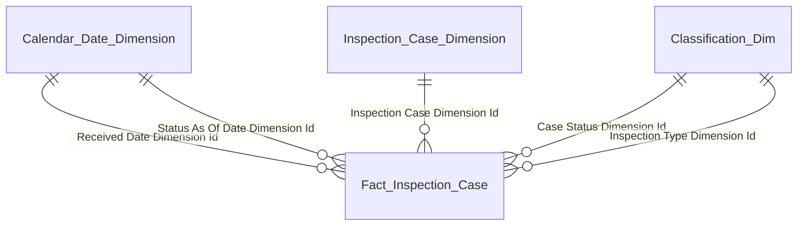

**5. Bảng tham gia:**

| Tên bảng (Logical) | Grain |
|---|---|
| Fact Inspection Case | 1 row = 1 hồ sơ thanh tra/kiểm tra (latest state) |
| Calendar Date Dimension | 1 row = 1 ngày (Received Date / Status As Of Date) |
| Inspection Case Dimension | 1 row = 1 hồ sơ thanh tra/kiểm tra (SCD2) |
| Classification Dimension (TT_CASE_STATUS) | 1 row = 1 trạng thái hồ sơ |
| Classification Dimension (TT_PLAN_TYPE) | 1 row = 1 loại hình (THANH_TRA/KIEM_TRA) |

---

#### Nhóm 2 — Thống kê số vụ thanh tra (biểu đồ cột chồng + đường)

**1. Mockup:**

```
Thống kê số vụ thanh tra (theo tháng)
24 ┤
18 ┤                                                       ●
12 ┤         ●                                        ●    ▓
 6 ┤   ●    ▓▓   ●                              ●    ▓    ▓▓
 0 └──T1───T2───T3───T4───T5───T6───T7───T8───T9───T10──T11──T12
Legend: ● TỔNG SỐ VỤ (đường)  ▓ ĐANG THỰC HIỆN  █ ĐÃ HOÀN THÀNH (cột chồng)
```

**2. Source:** `Fact Inspection Case` → `Calendar Date Dimension`, `Classification Dimension` (scheme: TT_CASE_STATUS, TT_PLAN_TYPE)

**3. Bảng KPI:**

| # | KPI ID | Tên | Đơn vị | Tính chất | Công thức/Mô tả |
|---|---|---|---|---|---|
| 7 | K_TT_4 | Số lượng vụ việc thanh tra | Vụ | Flow (Base) | `COUNT "Fact Inspection Case"."Inspection Case Dimension Id"` GROUP BY `MONTH("Received Date")` WHERE `YEAR("Received Date") = selected year` AND Inspection Type = 'THANH_TRA'. Đếm theo tháng nhận hồ sơ. |
| 8 | K_TT_5 | Số vụ việc thanh tra đang thực hiện | Vụ | Flow (Base) | `COUNT "Fact Inspection Case"."Inspection Case Dimension Id"` GROUP BY `MONTH("Received Date")` WHERE `YEAR("Received Date") = selected year` AND `"Classification Dimension"."Classification Code" IN ('MOI_TIEP_NHAN', 'DANG_GIAI_QUYET')` AND Inspection Type = 'THANH_TRA' |
| 9 | K_TT_6 | Số lượng vụ thanh tra đã hoàn thành | Vụ | Flow (Base) | `COUNT "Fact Inspection Case"."Inspection Case Dimension Id"` GROUP BY `MONTH("Status As Of Date")` WHERE `YEAR("Status As Of Date") = selected year` AND `"Classification Dimension"."Classification Code" = 'HOAN_THANH'` AND Inspection Type = 'THANH_TRA' |

**4. Star schema:**


**5. Bảng tham gia:**

| Tên bảng (Logical) | Grain |
|---|---|
| Fact Inspection Case | 1 row = 1 hồ sơ thanh tra/kiểm tra (latest state) |
| Calendar Date Dimension | 1 row = 1 ngày (Received Date / Status As Of Date) |
| Inspection Case Dimension | 1 row = 1 hồ sơ thanh tra/kiểm tra (SCD2) |
| Classification Dimension (TT_CASE_STATUS) | 1 row = 1 trạng thái hồ sơ |
| Classification Dimension (TT_PLAN_TYPE) | 1 row = 1 loại hình |

---

#### Nhóm 3 — Cơ cấu vi phạm theo loại hành vi (biểu đồ tròn)

**1. Mockup:**

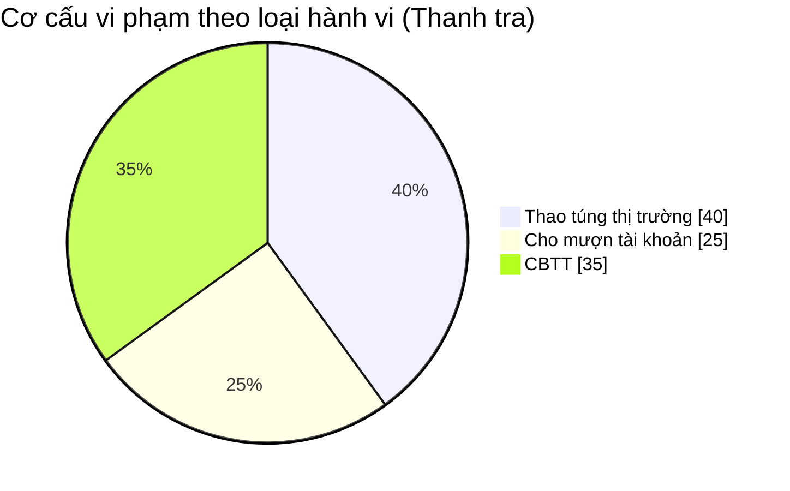

**2. Source:** `Fact Inspection Case Violation` → `Calendar Date Dimension`, `Inspection Case Dimension`, `Classification Dimension` (scheme: TT_VIOLATION_TYPE, TT_PENALTY_TYPE, TT_PLAN_TYPE)

**3. Bảng KPI:**

| # | KPI ID | Tên | Đơn vị | Tính chất | Công thức/Mô tả |
|---|---|---|---|---|---|
| 10 | K_TT_7 | Số lượng vi phạm hành vi Thao túng thị trường | Lượt | Flow (Base) | `COUNT "Fact Inspection Case Violation"."Inspection Case Conclusion Number"` WHERE `YEAR("Conclusion Issue Date") = selected year` AND `"Classification Dimension"."Classification Code" = '<code Thao túng>'` (via Violation Type Dimension Id, scheme TT_VIOLATION_TYPE) AND filter Inspection Type = 'THANH_TRA' |
| 11 | K_TT_7_RATIO | Tỷ lệ % số lượng vi phạm hành vi Thao túng thị trường | % | Derived | `K_TT_7 / (K_TT_7 + K_TT_8 + K_TT_9) × 100%` |
| 12 | K_TT_8 | Số lượng vi phạm hành vi Cho mượn tài khoản | Lượt | Flow (Base) | `COUNT "Fact Inspection Case Violation"."Inspection Case Conclusion Number"` WHERE `YEAR("Conclusion Issue Date") = selected year` AND `"Classification Dimension"."Classification Code" = '<code Cho mượn>'` (via Violation Type Dimension Id) AND Inspection Type = 'THANH_TRA' |
| 13 | K_TT_8_RATIO | Tỷ lệ % số lượng vi phạm hành vi Cho mượn tài khoản | % | Derived | `K_TT_8 / (K_TT_7 + K_TT_8 + K_TT_9) × 100%` |
| 14 | K_TT_9 | Số lượng vi phạm hành vi CBTT | Lượt | Flow (Base) | `COUNT "Fact Inspection Case Violation"."Inspection Case Conclusion Number"` WHERE `YEAR("Conclusion Issue Date") = selected year` AND `"Classification Dimension"."Classification Code" = '<code CBTT>'` (via Violation Type Dimension Id) AND Inspection Type = 'THANH_TRA' |
| 15 | K_TT_9_RATIO | Tỷ lệ % số lượng vi phạm hành vi CBTT | % | Derived | `K_TT_9 / (K_TT_7 + K_TT_8 + K_TT_9) × 100%` |

**4. Star schema:**

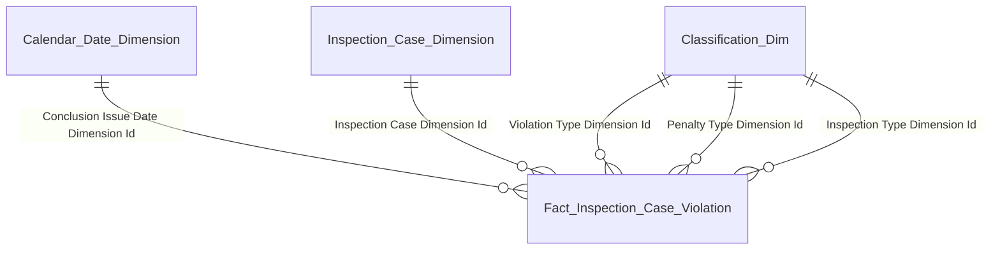

**5. Bảng tham gia:**

| Tên bảng (Logical) | Grain |
|---|---|
| Fact Inspection Case Violation | 1 row = 1 kết luận thanh tra ghi nhận 1 hành vi vi phạm × 1 hình thức phạt (event) |
| Calendar Date Dimension | 1 row = 1 ngày ra kết luận |
| Inspection Case Dimension | 1 row = 1 hồ sơ thanh tra/kiểm tra (SCD2) |
| Classification Dimension (TT_VIOLATION_TYPE) | 1 row = 1 hành vi vi phạm |
| Classification Dimension (TT_PENALTY_TYPE) | 1 row = 1 hình thức phạt |
| Classification Dimension (TT_PLAN_TYPE) | 1 row = 1 loại hình (THANH_TRA/KIEM_TRA) |

---

#### Nhóm 4 — Cơ cấu vi phạm theo đối tượng (biểu đồ tròn)

**1. Mockup:**

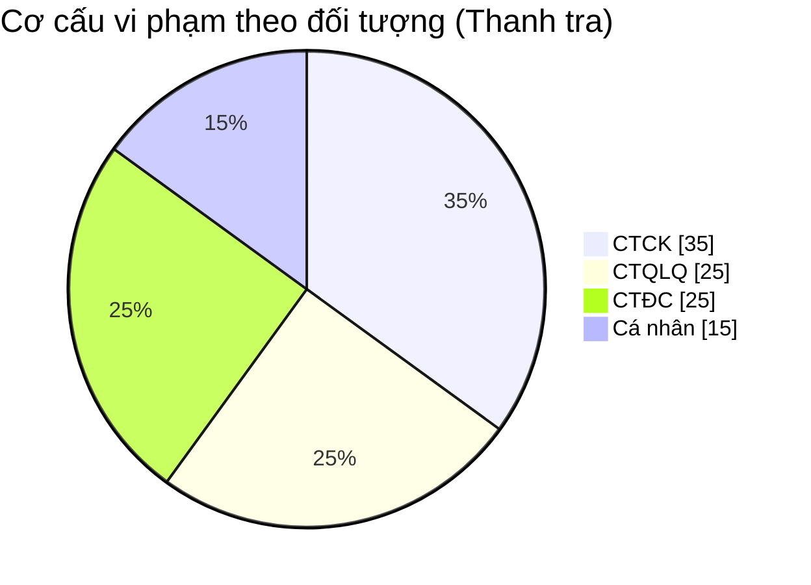

**2. Source:** `Fact Inspection Case Violation` → `Calendar Date Dimension`, `Inspection Subject Dimension`, `Classification Dimension` (scheme: TT_SUBJECT_SOURCE_TYPE, TT_OTHER_PARTY_SUBTYPE, TT_PLAN_TYPE)

**3. Bảng KPI:**

KPI đọc 2 attribute trên `Inspection Subject Dimension`: `Subject Source Type Code` (4 mã gốc) + `Other Party Subtype Code` (chỉ có giá trị khi Source Type = DOI_TUONG_KHAC).

| # | KPI ID | Tên | Đơn vị | Tính chất | Công thức/Mô tả |
|---|---|---|---|---|---|
| 16 | K_TT_10 | Số lượng vi phạm đối tượng Cá nhân | Lượt | Flow (Base) | `COUNT "Fact Inspection Case Violation"."Inspection Case Conclusion Number"` WHERE `YEAR("Conclusion Issue Date") = selected year` AND `"Inspection Subject Dimension"."Subject Source Type Code" = 'DOI_TUONG_KHAC'` AND `"Inspection Subject Dimension"."Other Party Subtype Code" = 'CA_NHAN'` AND Inspection Type = 'THANH_TRA' |
| 17 | K_TT_10_RATIO | Tỷ lệ % vi phạm đối tượng Cá nhân | % | Derived | `K_TT_10 / (K_TT_10 + K_TT_11 + K_TT_12 + K_TT_13) × 100%` |
| 18 | K_TT_11 | Số lượng vi phạm đối tượng CTĐC | Lượt | Flow (Base) | `COUNT "Fact Inspection Case Violation"."Inspection Case Conclusion Number"` WHERE `YEAR("Conclusion Issue Date") = selected year` AND `"Inspection Subject Dimension"."Subject Source Type Code" = 'CTDC'` AND Inspection Type = 'THANH_TRA' |
| 19 | K_TT_11_RATIO | Tỷ lệ % vi phạm đối tượng CTĐC | % | Derived | `K_TT_11 / (K_TT_10 + K_TT_11 + K_TT_12 + K_TT_13) × 100%` |
| 20 | K_TT_12 | Số lượng vi phạm đối tượng CTCK | Lượt | Flow (Base) | `COUNT "Fact Inspection Case Violation"."Inspection Case Conclusion Number"` WHERE `YEAR("Conclusion Issue Date") = selected year` AND `"Inspection Subject Dimension"."Subject Source Type Code" = 'CTCK'` AND Inspection Type = 'THANH_TRA' |
| 21 | K_TT_12_RATIO | Tỷ lệ % vi phạm đối tượng CTCK | % | Derived | `K_TT_12 / (K_TT_10 + K_TT_11 + K_TT_12 + K_TT_13) × 100%` |
| 22 | K_TT_13 | Số lượng vi phạm đối tượng CTQLQ | Lượt | Flow (Base) | `COUNT "Fact Inspection Case Violation"."Inspection Case Conclusion Number"` WHERE `YEAR("Conclusion Issue Date") = selected year` AND `"Inspection Subject Dimension"."Subject Source Type Code" = 'CTQLQ'` AND Inspection Type = 'THANH_TRA' |
| 23 | K_TT_13_RATIO | Tỷ lệ % vi phạm đối tượng CTQLQ | % | Derived | `K_TT_13 / (K_TT_10 + K_TT_11 + K_TT_12 + K_TT_13) × 100%` |

**4. Star schema:**

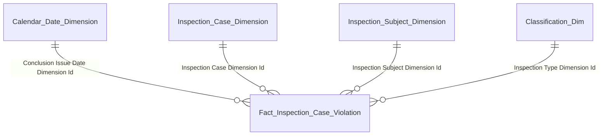

**5. Bảng tham gia:**

| Tên bảng (Logical) | Grain |
|---|---|
| Fact Inspection Case Violation | 1 row = 1 kết luận × 1 hành vi × 1 hình thức phạt (event) |
| Calendar Date Dimension | 1 row = 1 ngày ra kết luận |
| Inspection Case Dimension | 1 row = 1 hồ sơ thanh tra/kiểm tra (SCD2) |
| Inspection Subject Dimension | 1 row = 1 đối tượng thanh tra/kiểm tra (polymorphic, SCD2, 2 attribute phân loại 2 tầng) |
| Classification Dimension (TT_PLAN_TYPE) | 1 row = 1 loại hình |

---

#### Nhóm 5 — Danh sách vụ việc thanh tra

**1. Mockup:**

| Mã vụ việc | Đối tượng | Phân loại đối tượng | Loại hình | Trạng thái |
|---|---|---|---|---|
| INS-2024-001 | Công ty ABC | CÔNG TY CHỨNG KHOÁN | ĐỘT XUẤT | TẠI THỰC ĐỊA |
| INS-2024-002 | Công ty XYZ | QUỸ ĐẦU TƯ | ĐỊNH KỲ | ĐANG THỰC HIỆN |

**2. Source:** `Fact Inspection Case` → `Inspection Case Dimension`, `Inspection Subject Dimension`, `Classification Dimension` (scheme: TT_INSPECTION_SCHEDULE_TYPE, TT_CASE_STATUS, TT_PLAN_TYPE, TT_SUBJECT_SOURCE_TYPE, TT_OTHER_PARTY_SUBTYPE)

**3. Bảng KPI:**

| # | KPI ID | Tên | Đơn vị | Tính chất | Công thức/Mô tả |
|---|---|---|---|---|---|
| 24 | K_TT_14 | Mã vụ việc | Text | Stock | `"Inspection Case Dimension"."Case Number"` WHERE Inspection Type = 'THANH_TRA' |
| 25 | K_TT_15 | Đối tượng | Text | Stock | `"Inspection Subject Dimension"."Subject Name"` |
| 26 | K_TT_16 | Phân loại đối tượng | Text | Stock | Display logic: nếu `Subject Source Type Code IN ('CTDC','CTCK','CTQLQ')` → hiển thị `"Classification Dimension"."Classification Name"` (via Subject Source Type Dimension Id, scheme TT_SUBJECT_SOURCE_TYPE). Nếu `Subject Source Type Code = 'DOI_TUONG_KHAC'` → hiển thị `"Classification Dimension"."Classification Name"` (via Other Party Subtype Dimension Id, scheme TT_OTHER_PARTY_SUBTYPE) — chi tiết hơn. |
| 27 | K_TT_17 | Loại hình (Định kỳ / Đột xuất) | Text | Stock | `"Classification Dimension"."Classification Name"` (via Inspection Schedule Type Dimension Id trên fact, scheme TT_INSPECTION_SCHEDULE_TYPE — ETL derived: Inspection Decision.Inspection Annual Plan Id IS NULL → DOT_XUAT, else → DINH_KY) |
| 28 | K_TT_18 | Trạng thái | Text | Stock | `"Classification Dimension"."Classification Name"` (via Case Status Dimension Id, scheme TT_CASE_STATUS) |

**4. Star schema:**

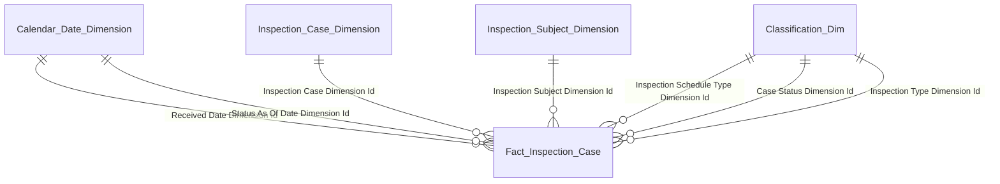

**5. Bảng tham gia:**

| Tên bảng (Logical) | Grain |
|---|---|
| Fact Inspection Case | 1 row = 1 hồ sơ thanh tra/kiểm tra (latest state) |
| Calendar Date Dimension | 1 row = 1 ngày (Received Date / Status As Of Date) |
| Inspection Case Dimension | 1 row = 1 hồ sơ thanh tra/kiểm tra (SCD2) |
| Inspection Subject Dimension | 1 row = 1 đối tượng thanh tra/kiểm tra (polymorphic, SCD2, 2 attribute phân loại 2 tầng) |
| Classification Dimension (TT_INSPECTION_SCHEDULE_TYPE) | 1 row = 1 loại lịch (ĐỊNH KỲ/ĐỘT XUẤT) |
| Classification Dimension (TT_CASE_STATUS) | 1 row = 1 trạng thái hồ sơ |
| Classification Dimension (TT_PLAN_TYPE) | 1 row = 1 loại hình |

---

### Dashboard Hoạt động Kiểm tra — Dashboard tổng quan

**Slicer:**
- Năm (mặc định: năm hiện tại, screenshot hiển thị NĂM 2024)

**Lưu ý phạm vi:** Dashboard này tái sử dụng cùng fact/dim của Dashboard Hoạt động Thanh tra. Phân biệt qua filter `Inspection Type Dimension Id → Classification Code = 'KIEM_TRA'` (scheme TT_PLAN_TYPE).

---

#### Nhóm 6 — Thống kê chung Kiểm tra (KPI cards)

**1. Mockup:**

```
┌─────────────────────────┐ ┌─────────────────────────┐ ┌─────────────────────────┐
│ TỔNG SỐ CUỘC KIỂM TRA   │ │ TỔNG SỐ ĐÃ HOÀN THÀNH   │ │ TỔNG SỐ ĐANG THỰC HIỆN  │
│         5               │ │         2               │ │         3               │
│ SỐ CUỘC     ▲ 10%       │ │ SỐ CUỘC     ▲ 15%       │ │ SỐ CUỘC     ▲ 5%        │
└─────────────────────────┘ └─────────────────────────┘ └─────────────────────────┘
```

**2. Source:** `Fact Inspection Case` → `Calendar Date Dimension`, `Classification Dimension` (scheme: TT_CASE_STATUS, TT_PLAN_TYPE)

**3. Bảng KPI:**

| # | KPI ID | Tên | Đơn vị | Tính chất | Công thức/Mô tả |
|---|---|---|---|---|---|
| 29 | K_TT_19 | Tổng số vụ việc kiểm tra | Cuộc | Stock (Base) | `COUNT "Fact Inspection Case"."Inspection Case Dimension Id"` WHERE `YEAR("Status As Of Date") ≤ selected year` AND `"Classification Dimension"."Classification Code" = 'KIEM_TRA'` (via Inspection Type Dimension Id, scheme TT_PLAN_TYPE) |
| 30 | K_TT_19_SSCK | Tổng số vụ việc kiểm tra SSCK (%) | % | Derived | `(K_TT_19 − K_TT_19 [Year − 1]) / K_TT_19 [Year − 1] × 100%` |
| 31 | K_TT_20 | Số vụ việc kiểm tra đã hoàn thành | Cuộc | Stock (Base) | `COUNT "Fact Inspection Case"."Inspection Case Dimension Id"` WHERE `YEAR("Status As Of Date") = selected year` AND `"Classification Dimension"."Classification Code" = 'HOAN_THANH'` (via Case Status Dimension Id) AND Inspection Type = 'KIEM_TRA' |
| 32 | K_TT_20_SSCK | Số vụ kiểm tra đã hoàn thành SSCK (%) | % | Derived | `(K_TT_20 − K_TT_20 [Year − 1]) / K_TT_20 [Year − 1] × 100%` |
| 33 | K_TT_21 | Số vụ kiểm tra đang thực hiện | Cuộc | Stock (Base) | `COUNT "Fact Inspection Case"."Inspection Case Dimension Id"` WHERE `YEAR("Received Date") ≤ selected year` AND `"Classification Dimension"."Classification Code" IN ('MOI_TIEP_NHAN', 'DANG_GIAI_QUYET')` (via Case Status Dimension Id) AND Inspection Type = 'KIEM_TRA' |
| 34 | K_TT_21_SSCK | Số vụ thanh tra đang thực hiện SSCK (%) | % | Derived | `(K_TT_21 − K_TT_21 [Year − 1]) / K_TT_21 [Year − 1] × 100%` |

**4. Star schema:**


**5. Bảng tham gia:**

| Tên bảng (Logical) | Grain |
|---|---|
| Fact Inspection Case | 1 row = 1 hồ sơ thanh tra/kiểm tra (latest state) |
| Calendar Date Dimension | 1 row = 1 ngày (Received Date / Status As Of Date) |
| Inspection Case Dimension | 1 row = 1 hồ sơ thanh tra/kiểm tra (SCD2) |
| Classification Dimension (TT_CASE_STATUS) | 1 row = 1 trạng thái hồ sơ |
| Classification Dimension (TT_PLAN_TYPE) | 1 row = 1 loại hình |

---

#### Nhóm 7 — Xu hướng số cuộc kiểm tra theo tháng (biểu đồ cột chồng + đường)

**1. Mockup:**

```
Xu hướng số cuộc kiểm tra (theo tháng)
32 ┤                                                       ●
24 ┤                                    ●   ●          ●   ▓
16 ┤                              ●     ▓   ▓   ●      ▓   ▓▓
 8 ┤   ●   ●    ●                                          ▓▓
 0 └──T1───T2───T3───T4───T5───T6───T7───T8───T9───T10──T11──T12
Legend: ● SỐ LƯỢNG VỤ VIỆC KIỂM TRA   ▓ ĐANG THỰC HIỆN   █ ĐÃ HOÀN THÀNH
```

**2. Source:** `Fact Inspection Case` → `Calendar Date Dimension`, `Classification Dimension` (scheme: TT_CASE_STATUS, TT_PLAN_TYPE)

**3. Bảng KPI:**

| # | KPI ID | Tên | Đơn vị | Tính chất | Công thức/Mô tả |
|---|---|---|---|---|---|
| 35 | K_TT_22 | Số lượng vụ việc kiểm tra | Vụ | Flow (Base) | `COUNT "Fact Inspection Case"."Inspection Case Dimension Id"` GROUP BY `MONTH("Received Date")` WHERE `YEAR("Received Date") = selected year` AND Inspection Type = 'KIEM_TRA' |
| 36 | K_TT_23 | Số lượng vụ kiểm tra đã hoàn thành | Vụ | Flow (Base) | `COUNT "Fact Inspection Case"."Inspection Case Dimension Id"` GROUP BY `MONTH("Status As Of Date")` WHERE `YEAR("Status As Of Date") = selected year` AND `"Classification Dimension"."Classification Code" = 'HOAN_THANH'` AND Inspection Type = 'KIEM_TRA' |
| 37 | K_TT_24 | Số lượng vụ kiểm tra đang triển khai | Vụ | Flow (Base) | `COUNT "Fact Inspection Case"."Inspection Case Dimension Id"` GROUP BY `MONTH("Received Date")` WHERE `YEAR("Received Date") = selected year` AND `"Classification Dimension"."Classification Code" IN ('MOI_TIEP_NHAN', 'DANG_GIAI_QUYET')` AND Inspection Type = 'KIEM_TRA' |

**4. Star schema:**


**5. Bảng tham gia:**

| Tên bảng (Logical) | Grain |
|---|---|
| Fact Inspection Case | 1 row = 1 hồ sơ thanh tra/kiểm tra (latest state) |
| Calendar Date Dimension | 1 row = 1 ngày (Received Date / Status As Of Date) |
| Inspection Case Dimension | 1 row = 1 hồ sơ thanh tra/kiểm tra (SCD2) |
| Classification Dimension (TT_CASE_STATUS) | 1 row = 1 trạng thái hồ sơ |
| Classification Dimension (TT_PLAN_TYPE) | 1 row = 1 loại hình |

---

#### Nhóm 8 — Cơ cấu kiểm tra theo loại hành vi (biểu đồ tròn)

**1. Mockup:**

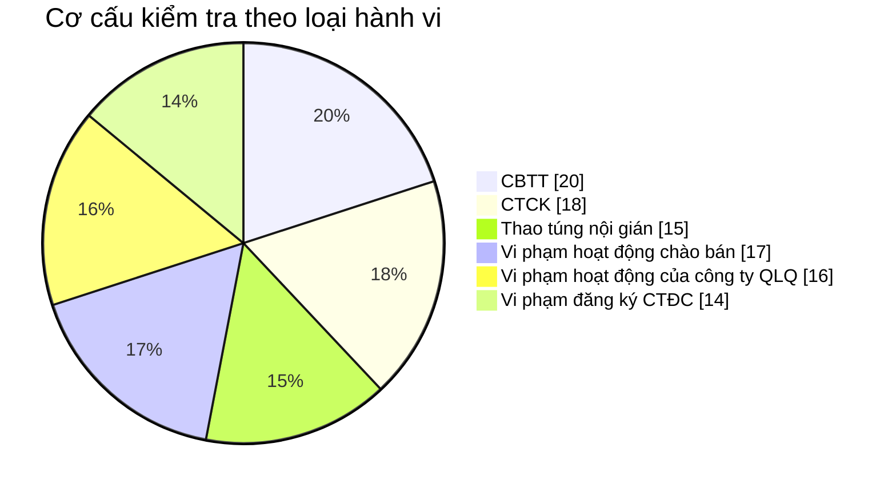

**2. Source:** `Fact Inspection Case Violation` → `Calendar Date Dimension`, `Inspection Case Dimension`, `Classification Dimension` (scheme: TT_VIOLATION_TYPE, TT_PLAN_TYPE)

**3. Bảng KPI:**

| # | KPI ID | Tên | Đơn vị | Tính chất | Công thức/Mô tả |
|---|---|---|---|---|---|
| 38 | K_TT_25 | Số lượng vi phạm hành vi CBTT | Lượt | Flow (Base) | `COUNT "Fact Inspection Case Violation"."Inspection Case Conclusion Number"` WHERE `YEAR("Conclusion Issue Date") = selected year` AND `"Classification Dimension"."Classification Code" = '<code CBTT>'` AND Inspection Type = 'KIEM_TRA' |
| 39 | K_TT_25_RATIO | Tỷ lệ % vi phạm hành vi CBTT | % | Derived | `K_TT_25 / TOTAL × 100%` |
| 40 | K_TT_26 | Số lượng vi phạm hành vi CTCK | Lượt | Flow (Base) | `COUNT ... Classification Code = '<code CTCK>' AND Inspection Type = 'KIEM_TRA'` |
| 41 | K_TT_26_RATIO | Tỷ lệ % vi phạm hành vi CTCK | % | Derived | `K_TT_26 / TOTAL × 100%` |
| 42 | K_TT_27 | Số lượng vi phạm hành vi Thao túng nội gián | Lượt | Flow (Base) | `COUNT ... Classification Code = '<code Thao túng nội gián>' AND Inspection Type = 'KIEM_TRA'` |
| 43 | K_TT_27_RATIO | Tỷ lệ % vi phạm hành vi Thao túng nội gián | % | Derived | `K_TT_27 / TOTAL × 100%` |
| 44 | K_TT_28 | Số lượng vi phạm hành vi Vi phạm hoạt động chào bán | Lượt | Flow (Base) | `COUNT ... Classification Code = '<code Vi phạm hoạt động chào bán>' AND Inspection Type = 'KIEM_TRA'` |
| 45 | K_TT_28_RATIO | Tỷ lệ % vi phạm hành vi Vi phạm hoạt động chào bán | % | Derived | `K_TT_28 / TOTAL × 100%` |
| 46 | K_TT_29 | Số lượng vi phạm hành vi Vi phạm hoạt động của công ty QLQ | Lượt | Flow (Base) | `COUNT ... Classification Code = '<code Vi phạm hoạt động của công ty QLQ>' AND Inspection Type = 'KIEM_TRA'` |
| 47 | K_TT_29_RATIO | Tỷ lệ % vi phạm hành vi Vi phạm hoạt động của công ty QLQ | % | Derived | `K_TT_29 / TOTAL × 100%` |
| 48 | K_TT_30 | Số lượng vi phạm hành vi Vi phạm đăng ký CTĐC | Lượt | Flow (Base) | `COUNT ... Classification Code = '<code Vi phạm đăng ký CTĐC>' AND Inspection Type = 'KIEM_TRA'` |
| 49 | K_TT_30_RATIO | Tỷ lệ % vi phạm hành vi Vi phạm đăng ký CTĐC | % | Derived | `K_TT_30 / TOTAL × 100%` |

**Ghi chú công thức derived:** `TOTAL = K_TT_25 + K_TT_26 + K_TT_27 + K_TT_28 + K_TT_29 + K_TT_30` (sum 6 loại hành vi Dashboard Kiểm tra).

**4. Star schema:**


**5. Bảng tham gia:**

| Tên bảng (Logical) | Grain |
|---|---|
| Fact Inspection Case Violation | 1 row = 1 kết luận × 1 hành vi × 1 hình thức phạt (event) |
| Calendar Date Dimension | 1 row = 1 ngày ra kết luận |
| Inspection Case Dimension | 1 row = 1 hồ sơ thanh tra/kiểm tra (SCD2) |
| Classification Dimension (TT_VIOLATION_TYPE) | 1 row = 1 hành vi vi phạm |
| Classification Dimension (TT_PENALTY_TYPE) | 1 row = 1 hình thức phạt |
| Classification Dimension (TT_PLAN_TYPE) | 1 row = 1 loại hình |

---

#### Nhóm 9 — Cơ cấu kiểm tra theo đối tượng (biểu đồ tròn)

**1. Mockup:**

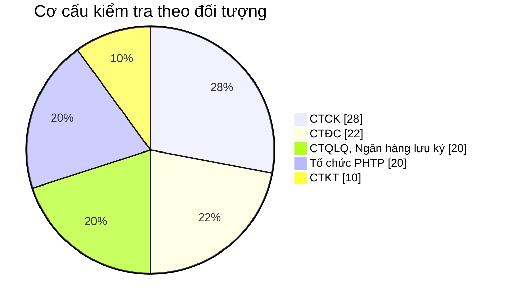

**2. Source:** `Fact Inspection Case Violation` → `Calendar Date Dimension`, `Inspection Subject Dimension`, `Classification Dimension` (scheme: TT_SUBJECT_SOURCE_TYPE, TT_OTHER_PARTY_SUBTYPE, TT_PLAN_TYPE)

**3. Bảng KPI:**

Dashboard Kiểm tra ghép "CTQLQ" và "Ngân hàng lưu ký" thành 1 legend. KPI dùng OR condition trên 2 tầng phân loại.

| # | KPI ID | Tên | Đơn vị | Tính chất | Công thức/Mô tả |
|---|---|---|---|---|---|
| 60 | K_TT_36 | Số lượng vi phạm đối tượng CTCK | Lượt | Flow (Base) | `COUNT "Fact Inspection Case Violation"."Inspection Case Conclusion Number"` WHERE `YEAR("Conclusion Issue Date") = selected year` AND `"Inspection Subject Dimension"."Subject Source Type Code" = 'CTCK'` AND Inspection Type = 'KIEM_TRA' |
| 61 | K_TT_36_RATIO | Tỷ lệ % vi phạm đối tượng CTCK | % | Derived | `K_TT_36 / (K_TT_36 + K_TT_37 + K_TT_38 + K_TT_39 + K_TT_40) × 100%` |
| 62 | K_TT_37 | Số lượng vi phạm đối tượng CTQLQ, Ngân hàng lưu ký | Lượt | Flow (Base) | `COUNT ... WHERE (Subject Source Type Code = 'CTQLQ') OR (Subject Source Type Code = 'DOI_TUONG_KHAC' AND Other Party Subtype Code = 'NHLK')` AND Inspection Type = 'KIEM_TRA' |
| 63 | K_TT_37_RATIO | Tỷ lệ % vi phạm đối tượng CTQLQ, Ngân hàng lưu ký | % | Derived | `K_TT_37 / (K_TT_36 + K_TT_37 + K_TT_38 + K_TT_39 + K_TT_40) × 100%` |
| 64 | K_TT_38 | Số lượng vi phạm đối tượng CTĐC | Lượt | Flow (Base) | `COUNT ... Subject Source Type Code = 'CTDC' AND Inspection Type = 'KIEM_TRA'` |
| 65 | K_TT_38_RATIO | Tỷ lệ % vi phạm đối tượng CTĐC | % | Derived | `K_TT_38 / (K_TT_36 + K_TT_37 + K_TT_38 + K_TT_39 + K_TT_40) × 100%` |
| 66 | K_TT_39 | Số lượng vi phạm đối tượng CTKT | Lượt | Flow (Base) | `COUNT ... Subject Source Type Code = 'DOI_TUONG_KHAC' AND Other Party Subtype Code = 'CTKT' AND Inspection Type = 'KIEM_TRA'` |
| 67 | K_TT_39_RATIO | Tỷ lệ % vi phạm đối tượng CTKT | % | Derived | `K_TT_39 / (K_TT_36 + K_TT_37 + K_TT_38 + K_TT_39 + K_TT_40) × 100%` |
| 68 | K_TT_40 | Số lượng vi phạm đối tượng Tổ chức PHTP | Lượt | Flow (Base) | `COUNT ... Subject Source Type Code = 'DOI_TUONG_KHAC' AND Other Party Subtype Code = 'TO_CHUC_PHTP' AND Inspection Type = 'KIEM_TRA'` |
| 69 | K_TT_40_RATIO | Tỷ lệ % vi phạm đối tượng Tổ chức PHTP | % | Derived | `K_TT_40 / (K_TT_36 + K_TT_37 + K_TT_38 + K_TT_39 + K_TT_40) × 100%` |

**4. Star schema:**


**5. Bảng tham gia:**

| Tên bảng (Logical) | Grain |
|---|---|
| Fact Inspection Case Violation | 1 row = 1 kết luận × 1 hành vi × 1 hình thức phạt (event) |
| Calendar Date Dimension | 1 row = 1 ngày ra kết luận |
| Inspection Case Dimension | 1 row = 1 hồ sơ thanh tra/kiểm tra (SCD2) |
| Inspection Subject Dimension | 1 row = 1 đối tượng thanh tra/kiểm tra (polymorphic, SCD2, 2 attribute phân loại 2 tầng) |
| Classification Dimension (TT_PLAN_TYPE) | 1 row = 1 loại hình |

---

#### Nhóm 10 — Danh sách vụ việc kiểm tra

**1. Mockup:**

| Mã vụ việc | Đối tượng | Phân loại đối tượng | Loại hình | Trạng thái |
|---|---|---|---|---|
| EXM-2024-001 | Công ty Chứng khoán VPS | CTCK | ĐỊNH KỲ | ĐÃ KẾT LUẬN |
| EXM-2024-002 | Công ty CP Đầu tư ABC | CTĐC | ĐỘT XUẤT | ĐANG THỰC HIỆN |
| EXM-2024-003 | Nguyễn Văn A | CÁ NHÂN | ĐỊNH KỲ | TẠI THỰC ĐỊA |
| EXM-2024-004 | Quỹ Đầu tư XYZ | CTQLQ | ĐỊNH KỲ | ĐANG THỰC HIỆN |
| EXM-2024-005 | Công ty Chứng khoán SSI | CTCK | ĐỘT XUẤT | ĐÃ KẾT LUẬN |

**2. Source:** `Fact Inspection Case` → `Inspection Case Dimension`, `Inspection Subject Dimension`, `Classification Dimension` (scheme: TT_INSPECTION_SCHEDULE_TYPE, TT_CASE_STATUS, TT_PLAN_TYPE, TT_SUBJECT_SOURCE_TYPE, TT_OTHER_PARTY_SUBTYPE)

**3. Bảng KPI:**

| # | KPI ID | Tên | Đơn vị | Tính chất | Công thức/Mô tả |
|---|---|---|---|---|---|
| 70 | K_TT_41 | Mã vụ việc | Text | Stock | `"Inspection Case Dimension"."Case Number"` WHERE Inspection Type = 'KIEM_TRA' |
| 71 | K_TT_42 | Đối tượng | Text | Stock | `"Inspection Subject Dimension"."Subject Name"` |
| 72 | K_TT_43 | Phân loại đối tượng | Text | Stock | Display logic giống K_TT_16 Nhóm 5: 2 tầng Source Type + Other Party Subtype |
| 73 | K_TT_44 | Loại hình (Định kỳ / Đột xuất) | Text | Stock | `"Classification Dimension"."Classification Name"` (via Inspection Schedule Type Dimension Id) |
| 74 | K_TT_45 | Trạng thái | Text | Stock | `"Classification Dimension"."Classification Name"` (via Case Status Dimension Id) |

**4. Star schema:**


**5. Bảng tham gia:**

| Tên bảng (Logical) | Grain |
|---|---|
| Fact Inspection Case | 1 row = 1 hồ sơ thanh tra/kiểm tra (latest state) |
| Calendar Date Dimension | 1 row = 1 ngày (Received Date / Status As Of Date) |
| Inspection Case Dimension | 1 row = 1 hồ sơ thanh tra/kiểm tra (SCD2) |
| Inspection Subject Dimension | 1 row = 1 đối tượng thanh tra/kiểm tra (polymorphic, SCD2, 2 attribute phân loại 2 tầng) |
| Classification Dimension (TT_INSPECTION_SCHEDULE_TYPE) | 1 row = 1 loại lịch (ĐỊNH KỲ/ĐỘT XUẤT) |
| Classification Dimension (TT_CASE_STATUS) | 1 row = 1 trạng thái hồ sơ |
| Classification Dimension (TT_PLAN_TYPE) | 1 row = 1 loại hình |

---

### Dashboard Hoạt động Xử phạt — Dashboard tổng quan

**Slicer:**
- Năm (mặc định: năm hiện tại, screenshot hiển thị NĂM 2024)

**Lưu ý phạm vi:** Dashboard này sử dụng fact mới `Fact Inspection Penalty Decision` (grain 1 row = 1 kết luận xử phạt) cho Nhóm 11, 12, 15 + reuse `Fact Inspection Case Violation` cho Nhóm 13, 14. Theo quy ước TT_O17 đã chốt: 1 kết luận xử phạt = 1 hành vi vi phạm (Silver lưu đơn trị Violation Type Code per Conclusion).

---

#### Nhóm 11 — Thống kê chung Xử phạt (KPI cards)

**1. Mockup:**

```
┌─────────────────────────────────────────┐ ┌─────────────────────────────────────────┐
│ TỔNG SỐ QUYẾT ĐỊNH XỬ PHẠT             │ │ TỔNG TIỀN XỬ PHẠT                      │
│             5                          │ │        1075 tỷ VNĐ                     │
│ SỐ QUYẾT ĐỊNH              ▲ 12%       │ │ SỐ TIỀN                    ▲ 18%       │
└─────────────────────────────────────────┘ └─────────────────────────────────────────┘
```

**2. Source:** `Fact Inspection Penalty Decision` → `Calendar Date Dimension`, `Inspection Case Dimension`

**3. Bảng KPI:**

| # | KPI ID | Tên | Đơn vị | Tính chất | Công thức/Mô tả |
|---|---|---|---|---|---|
| 75 | K_TT_46 | Tổng số quyết định xử phạt | Quyết định | Flow (Base) | `COUNT "Fact Inspection Penalty Decision"."Inspection Case Conclusion Number"` WHERE `YEAR("Signing Date") = selected year` |
| 76 | K_TT_46_SSCK | Tổng số quyết định xử phạt SSCK (%) | % | Derived | `(K_TT_46 − K_TT_46 [Year − 1]) / K_TT_46 [Year − 1] × 100%` |
| 77 | K_TT_47 | Tổng tiền xử phạt | Tỷ VNĐ | Flow (Base) | `SUM "Fact Inspection Penalty Decision"."Penalty Amount"` WHERE `YEAR("Signing Date") = selected year` / 1_000_000_000 (display in tỷ VNĐ, Silver lưu đơn vị VNĐ) |
| 78 | K_TT_47_SSCK | Tổng tiền xử phạt SSCK (%) | % | Derived | `(K_TT_47 − K_TT_47 [Year − 1]) / K_TT_47 [Year − 1] × 100%` |

**4. Star schema:**

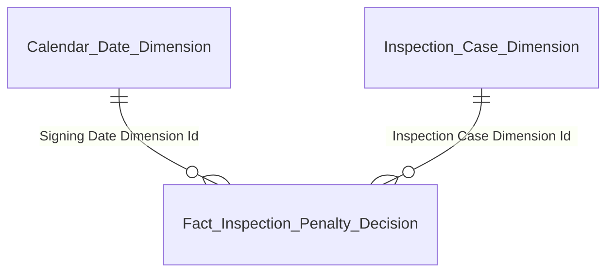

**5. Bảng tham gia:**

| Tên bảng (Logical) | Grain |
|---|---|
| Fact Inspection Penalty Decision | 1 row = 1 kết luận xử phạt (event). Quy ước: 1 kết luận = 1 hành vi vi phạm (TT_O17 closed). |
| Calendar Date Dimension | 1 row = 1 ngày ký kết luận xử phạt |
| Inspection Case Dimension | 1 row = 1 hồ sơ thanh tra/kiểm tra (SCD2) |

---

#### Nhóm 12 — Thống kê xử phạt theo tháng (biểu đồ kết hợp cột + đường)

**1. Mockup:**

```
Thống kê xử phạt vi phạm (Số QĐ & Số tiền)
40 ┤                                              █     ● 12,000
30 ┤                                         ●  ██──●
20 ┤                              █  ●                      9,000
   │                    ●   █  ██    ██
10 ┤  ●  █    ●              ██                             3,000
 0 └──T1───T2───T3───T4───T5───T6───T7───T8───T9───T10──T11──T12 0
Legend: █ SỐ QĐXP (trục trái — cột xanh)   ● TIỀN PHẠT TỶ VNĐ (trục phải — đường cam)
```

**2. Source:** `Fact Inspection Penalty Decision` → `Calendar Date Dimension`, `Inspection Case Dimension`

**3. Bảng KPI:**

| # | KPI ID | Tên | Đơn vị | Tính chất | Công thức/Mô tả |
|---|---|---|---|---|---|
| 79 | K_TT_48 | Số lượng QĐXP | Quyết định | Flow (Base) | `COUNT "Fact Inspection Penalty Decision"."Inspection Case Conclusion Number"` GROUP BY `MONTH("Signing Date")` WHERE `YEAR("Signing Date") = selected year` |
| 80 | K_TT_49 | Tiền phạt (tỷ đồng) | Tỷ VNĐ | Flow (Base) | `SUM "Fact Inspection Penalty Decision"."Penalty Amount" / 1_000_000_000` GROUP BY `MONTH("Signing Date")` WHERE `YEAR("Signing Date") = selected year` |

**4. Star schema:**


**5. Bảng tham gia:**

| Tên bảng (Logical) | Grain |
|---|---|
| Fact Inspection Penalty Decision | 1 row = 1 kết luận xử phạt (event) |
| Calendar Date Dimension | 1 row = 1 ngày ký kết luận xử phạt |
| Inspection Case Dimension | 1 row = 1 hồ sơ thanh tra/kiểm tra (SCD2) |

---

#### Nhóm 13 — Cơ cấu xử phạt theo loại hành vi (biểu đồ tròn)

**1. Mockup:**

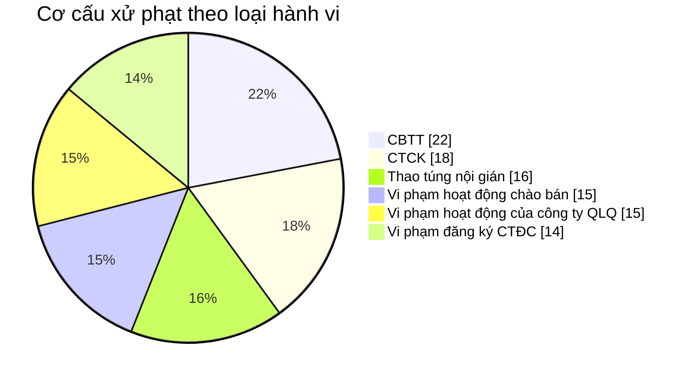

Theo screenshot — 6 loại (tương tự Nhóm 8).

**2. Source:** `Fact Inspection Penalty Decision` → `Calendar Date Dimension`, `Inspection Case Dimension`, `Classification Dimension` (scheme: TT_VIOLATION_TYPE, TT_PENALTY_TYPE)

**Lưu ý:** Theo TT_O17 closed, mỗi kết luận xử phạt mang đúng 1 Violation Type Code. Do đó grain fact `Fact Inspection Penalty Decision` đã đủ để đếm "số kết luận xử phạt theo từng loại hành vi" mà không cần filter thêm điều kiện `Penalty Type IS NOT NULL` (vì mọi row trong fact này đã là QĐXP).

**3. Bảng KPI:**

| # | KPI ID | Tên | Đơn vị | Tính chất | Công thức/Mô tả |
|---|---|---|---|---|---|
| 81 | K_TT_50 | Số lượng xử phạt hành vi CBTT | Quyết định | Flow (Base) | `COUNT "Fact Inspection Penalty Decision"."Inspection Case Conclusion Number"` WHERE `YEAR("Signing Date") = selected year` AND `"Classification Dimension"."Classification Code" = '<code CBTT>'` (via Violation Type Dimension Id, scheme TT_VIOLATION_TYPE) |
| 82 | K_TT_50_RATIO | Tỷ lệ % xử phạt hành vi CBTT | % | Derived | `K_TT_50 / TOTAL × 100%` |
| 83 | K_TT_51 | Số lượng xử phạt hành vi CTCK | Quyết định | Flow (Base) | `COUNT ... Classification Code = '<code CTCK>'` |
| 84 | K_TT_51_RATIO | Tỷ lệ % xử phạt hành vi CTCK | % | Derived | `K_TT_51 / TOTAL × 100%` |
| 85 | K_TT_52 | Số lượng xử phạt hành vi Thao túng nội gián | Quyết định | Flow (Base) | `COUNT ... Classification Code = '<code Thao túng nội gián>'` |
| 86 | K_TT_52_RATIO | Tỷ lệ % xử phạt hành vi Thao túng nội gián | % | Derived | `K_TT_52 / TOTAL × 100%` |
| 87 | K_TT_53 | Số lượng xử phạt hành vi Vi phạm hoạt động chào bán | Quyết định | Flow (Base) | `COUNT ... Classification Code = '<code Vi phạm hoạt động chào bán>'` |
| 88 | K_TT_53_RATIO | Tỷ lệ % xử phạt hành vi Vi phạm hoạt động chào bán | % | Derived | `K_TT_53 / TOTAL × 100%` |
| 89 | K_TT_54 | Số lượng xử phạt hành vi Vi phạm hoạt động của công ty QLQ | Quyết định | Flow (Base) | `COUNT ... Classification Code = '<code Vi phạm hoạt động của công ty QLQ>'` |
| 90 | K_TT_54_RATIO | Tỷ lệ % xử phạt hành vi Vi phạm hoạt động của công ty QLQ | % | Derived | `K_TT_54 / TOTAL × 100%` |
| 91 | K_TT_55 | Số lượng xử phạt hành vi Vi phạm đăng ký CTĐC | Quyết định | Flow (Base) | `COUNT ... Classification Code = '<code Vi phạm đăng ký CTĐC>'` |
| 92 | K_TT_55_RATIO | Tỷ lệ % xử phạt hành vi Vi phạm đăng ký CTĐC | % | Derived | `K_TT_55 / TOTAL × 100%` |

**Ghi chú công thức derived:** `TOTAL = K_TT_50 + K_TT_51 + K_TT_52 + K_TT_53 + K_TT_54 + K_TT_55`.

**4. Star schema:**

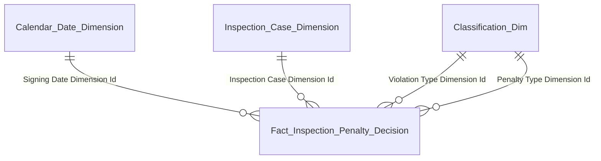

**5. Bảng tham gia:**

| Tên bảng (Logical) | Grain |
|---|---|
| Fact Inspection Penalty Decision | 1 row = 1 kết luận xử phạt (event). 1 kết luận = 1 hành vi vi phạm. |
| Calendar Date Dimension | 1 row = 1 ngày ký kết luận xử phạt |
| Inspection Case Dimension | 1 row = 1 hồ sơ thanh tra/kiểm tra (SCD2) |
| Classification Dimension (TT_VIOLATION_TYPE) | 1 row = 1 hành vi vi phạm |
| Classification Dimension (TT_PENALTY_TYPE) | 1 row = 1 hình thức phạt |

---

#### Nhóm 14 — Cơ cấu xử phạt theo đối tượng (biểu đồ tròn)

**1. Mockup:**

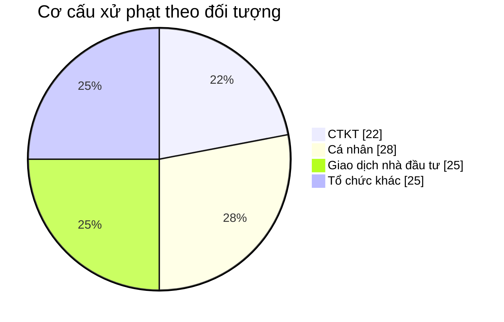

Theo BA — 4 loại, đều là subtype trong Subject Source Type = DOI_TUONG_KHAC.

**2. Source:** `Fact Inspection Penalty Decision` → `Calendar Date Dimension`, `Inspection Case Dimension`, `Inspection Subject Dimension`, `Classification Dimension` (scheme: TT_SUBJECT_SOURCE_TYPE, TT_OTHER_PARTY_SUBTYPE)

**3. Bảng KPI:**

| # | KPI ID | Tên | Đơn vị | Tính chất | Công thức/Mô tả |
|---|---|---|---|---|---|
| 93 | K_TT_56 | Số lượng xử phạt đối tượng Tổ chức khác | Quyết định | Flow (Base) | `COUNT "Fact Inspection Penalty Decision"."Inspection Case Conclusion Number"` WHERE `YEAR("Signing Date") = selected year` AND `"Inspection Subject Dimension"."Subject Source Type Code" = 'DOI_TUONG_KHAC'` AND `"Inspection Subject Dimension"."Other Party Subtype Code" = 'TO_CHUC_KHAC'` |
| 94 | K_TT_56_RATIO | Tỷ lệ % xử phạt đối tượng Tổ chức khác | % | Derived | `K_TT_56 / (K_TT_56 + K_TT_57 + K_TT_58 + K_TT_59) × 100%` |
| 95 | K_TT_57 | Số lượng xử phạt đối tượng CTKT | Quyết định | Flow (Base) | `COUNT ... Subject Source Type Code = 'DOI_TUONG_KHAC' AND Other Party Subtype Code = 'CTKT'` |
| 96 | K_TT_57_RATIO | Tỷ lệ % xử phạt đối tượng CTKT | % | Derived | `K_TT_57 / (K_TT_56 + K_TT_57 + K_TT_58 + K_TT_59) × 100%` |
| 97 | K_TT_58 | Số lượng xử phạt đối tượng Giao dịch nhà đầu tư | Quyết định | Flow (Base) | `COUNT ... Subject Source Type Code = 'DOI_TUONG_KHAC' AND Other Party Subtype Code = 'NHA_DAU_TU'` |
| 98 | K_TT_58_RATIO | Tỷ lệ % xử phạt đối tượng Giao dịch nhà đầu tư | % | Derived | `K_TT_58 / (K_TT_56 + K_TT_57 + K_TT_58 + K_TT_59) × 100%` |
| 99 | K_TT_59 | Số lượng xử phạt đối tượng Cá nhân | Quyết định | Flow (Base) | `COUNT ... Subject Source Type Code = 'DOI_TUONG_KHAC' AND Other Party Subtype Code = 'CA_NHAN'` |
| 100 | K_TT_59_RATIO | Tỷ lệ % xử phạt đối tượng Cá nhân | % | Derived | `K_TT_59 / (K_TT_56 + K_TT_57 + K_TT_58 + K_TT_59) × 100%` |

**Ghi chú:** Đổi từ reuse `Fact Inspection Case Violation` (v1.5) → `Fact Inspection Penalty Decision` (v1.6) do TT_O17 closed đảm bảo 1 kết luận = 1 hành vi, đếm theo grain fact Penalty Decision đúng = "số QĐXP" per đối tượng, không còn cần filter `Penalty Type IS NOT NULL`.

**4. Star schema:**

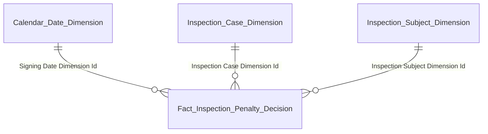

**5. Bảng tham gia:**

| Tên bảng (Logical) | Grain |
|---|---|
| Fact Inspection Penalty Decision | 1 row = 1 kết luận xử phạt (event). 1 kết luận = 1 hành vi vi phạm. |
| Calendar Date Dimension | 1 row = 1 ngày ký kết luận xử phạt |
| Inspection Case Dimension | 1 row = 1 hồ sơ thanh tra/kiểm tra (SCD2) |
| Inspection Subject Dimension | 1 row = 1 đối tượng thanh tra/kiểm tra (polymorphic, SCD2, 2 attribute phân loại 2 tầng) |

---

#### Nhóm 15 — Danh sách quyết định xử phạt

**1. Mockup:**

| Mã vụ việc | Phân loại đối tượng | Đối tượng | Loại hình | Trạng thái |
|---|---|---|---|---|
| QD-2024-001 | CÁ NHÂN | Nguyễn Văn A | THAO TÚNG NỘI GIÁN | ĐÃ HOÀN THÀNH |
| QD-2024-002 | CTCK | Công ty Chứng khoán X | CBTT | ĐÃ HOÀN THÀNH |
| QD-2024-003 | CTĐC | Tập đoàn Bất động sản Y | VI PHẠM HOẠT ĐỘNG CHÀO BÁN | ĐÃ HOÀN THÀNH |
| QD-2024-004 | CTQLQ | Công ty Quản lý Quỹ Z | VI PHẠM HOẠT ĐỘNG CỦA CÔNG TY QLQ | ĐÃ HOÀN THÀNH |
| QD-2024-005 | TỔ CHỨC KHÁC | CTCP Thương mại M | VI PHẠM ĐĂNG KÝ CTĐC | ĐÃ HOÀN THÀNH |

**Ghi chú:** Cột "Loại hình" Nhóm 15 là **hành vi vi phạm** (reuse TT_VIOLATION_TYPE), KHÁC với cột "Loại hình" Nhóm 5/10 (Định kỳ/Đột xuất, scheme TT_INSPECTION_SCHEDULE_TYPE).

**2. Source:** `Fact Inspection Penalty Decision` → `Calendar Date Dimension`, `Inspection Case Dimension`, `Inspection Subject Dimension`, `Classification Dimension` (scheme: TT_VIOLATION_TYPE, TT_CASE_STATUS, TT_SUBJECT_SOURCE_TYPE, TT_OTHER_PARTY_SUBTYPE)

**3. Bảng KPI:**

| # | KPI ID | Tên | Đơn vị | Tính chất | Công thức/Mô tả |
|---|---|---|---|---|---|
| 101 | K_TT_60 | Mã vụ việc | Text | Stock | `"Inspection Case Dimension"."Case Number"` |
| 102 | K_TT_61 | Phân loại đối tượng | Text | Stock | Display logic 2 tầng: nếu `Subject Source Type Code IN ('CTDC','CTCK','CTQLQ')` → hiển thị scheme TT_SUBJECT_SOURCE_TYPE. Nếu `= 'DOI_TUONG_KHAC'` → hiển thị scheme TT_OTHER_PARTY_SUBTYPE (CA_NHAN/NHLK/CTKT/TO_CHUC_PHTP/NHA_DAU_TU/TO_CHUC_KHAC). |
| 103 | K_TT_62 | Đối tượng | Text | Stock | `"Inspection Subject Dimension"."Subject Name"` |
| 104 | K_TT_63 | Loại hình (hành vi vi phạm) | Text | Stock | `"Classification Dimension"."Classification Name"` (via Violation Type Dimension Id trên Fact Inspection Penalty Decision, scheme TT_VIOLATION_TYPE) |
| 105 | K_TT_64 | Trạng thái | Text | Stock | `"Classification Dimension"."Classification Name"` (via Case Status Dimension Id, scheme TT_CASE_STATUS) |

**4. Star schema:**

```mermaid
erDiagram
    Calendar_Date_Dimension ||--o{ Fact_Inspection_Penalty_Decision : "Signing Date Dimension Id"
    Inspection_Case_Dimension ||--o{ Fact_Inspection_Penalty_Decision : "Inspection Case Dimension Id"
    Inspection_Subject_Dimension ||--o{ Fact_Inspection_Penalty_Decision : "Inspection Subject Dimension Id"
    Classification_Dim ||--o{ Fact_Inspection_Penalty_Decision : "Violation Type Dimension Id"
    Classification_Dim ||--o{ Fact_Inspection_Penalty_Decision : "Penalty Type Dimension Id"
    Classification_Dim ||--o{ Fact_Inspection_Penalty_Decision : "Case Status Dimension Id"
```

**5. Bảng tham gia:**

| Tên bảng (Logical) | Grain |
|---|---|
| Fact Inspection Penalty Decision | 1 row = 1 kết luận xử phạt (event). 1 kết luận = 1 hành vi vi phạm. |
| Calendar Date Dimension | 1 row = 1 ngày ký kết luận xử phạt |
| Inspection Case Dimension | 1 row = 1 hồ sơ thanh tra/kiểm tra (SCD2) |
| Inspection Subject Dimension | 1 row = 1 đối tượng thanh tra/kiểm tra (polymorphic, SCD2, 2 attribute phân loại 2 tầng) |
| Classification Dimension (TT_VIOLATION_TYPE) | 1 row = 1 hành vi vi phạm |
| Classification Dimension (TT_PENALTY_TYPE) | 1 row = 1 hình thức phạt |
| Classification Dimension (TT_CASE_STATUS) | 1 row = 1 trạng thái hồ sơ |

---

### Dashboard Tình hình Đơn thư — Dashboard tổng quan

**Slicer:**
- Năm (mặc định: năm hiện tại, screenshot hiển thị NĂM 2024)

**Lưu ý phạm vi:** Dashboard này sử dụng fact mới `Fact Complaint Petition` (grain 1 row = 1 đơn thư) và dim mới `Complaint Petition Dimension`. Silver source độc lập với 3 dashboard trước (luồng DT_* khác luồng TT_* và GS_*).

---

#### Nhóm 16 — Thống kê chung Đơn thư (KPI card)

**1. Mockup:**

```
┌─────────────────────────────────────────────────────────────┐
│                              TỔNG SỐ ĐƠN ĐÃ XỬ LÝ           │
│                                      286                    │
│ ĐƠN THƯ                                       ▲ 12%         │
└─────────────────────────────────────────────────────────────┘
```

**2. Source:** `Fact Complaint Petition` → `Calendar Date Dimension`, `Classification Dimension` (scheme: TT_PETITION_STATUS)

**3. Bảng KPI:**

| # | KPI ID | Tên | Đơn vị | Tính chất | Công thức/Mô tả |
|---|---|---|---|---|---|
| 106 | K_TT_65 | Tổng số đơn đã xử lý | Đơn thư | Flow (Base) | `COUNT "Fact Complaint Petition"."Complaint Petition Dimension Id"` WHERE `YEAR("Submission Date") = selected year` AND `"Classification Dimension"."Classification Code" = 'HOAN_THANH'` (via Petition Status Dimension Id, scheme TT_PETITION_STATUS) |
| 107 | K_TT_65_SSCK | Tổng số đơn đã xử lý SSCK (%) | % | Derived | `(K_TT_65 − K_TT_65 [Year − 1]) / K_TT_65 [Year − 1] × 100%` |

**4. Star schema:**

```mermaid
erDiagram
    Calendar_Date_Dimension ||--o{ Fact_Complaint_Petition : "Submission Date Dimension Id"
    Complaint_Petition_Dimension ||--o{ Fact_Complaint_Petition : "Complaint Petition Dimension Id"
    Classification_Dim ||--o{ Fact_Complaint_Petition : "Petition Status Dimension Id"
```

**5. Bảng tham gia:**

| Tên bảng (Logical) | Grain |
|---|---|
| Fact Complaint Petition | 1 row = 1 đơn thư (event tiếp nhận) |
| Calendar Date Dimension | 1 row = 1 ngày tiếp nhận đơn |
| Complaint Petition Dimension | 1 row = 1 đơn thư (SCD2) |
| Classification Dimension (TT_PETITION_STATUS) | 1 row = 1 trạng thái đơn thư |

---

#### Nhóm 17 — Thống kê tình hình xử lý đơn thư theo tháng (biểu đồ cột)

**1. Mockup:**

```
Thống kê tình hình xử lý đơn thư (theo tháng)
36 ┤                                                         █
27 ┤                      █                          █  █    █
18 ┤         █        █   █    █   █                 █
 9 ┤   █   █          █                █
 0 └──T1──T2──T3──T4──T5──T6──T7──T8──T9──T10──T11──T12
Legend: █ Số lượng đơn thư đã xử lý
```

**2. Source:** `Fact Complaint Petition` → `Calendar Date Dimension`, `Classification Dimension` (scheme: TT_PETITION_STATUS)

**3. Bảng KPI:**

| # | KPI ID | Tên | Đơn vị | Tính chất | Công thức/Mô tả |
|---|---|---|---|---|---|
| 108 | K_TT_66 | Số lượng đơn thư đã xử lý | Đơn thư | Flow (Base) | `COUNT "Fact Complaint Petition"."Complaint Petition Dimension Id"` GROUP BY `MONTH("Submission Date")` WHERE `YEAR("Submission Date") = selected year` AND `"Classification Dimension"."Classification Code" = 'HOAN_THANH'` |

**4. Star schema:**

```mermaid
erDiagram
    Calendar_Date_Dimension ||--o{ Fact_Complaint_Petition : "Submission Date Dimension Id"
    Complaint_Petition_Dimension ||--o{ Fact_Complaint_Petition : "Complaint Petition Dimension Id"
    Classification_Dim ||--o{ Fact_Complaint_Petition : "Petition Status Dimension Id"
```

**5. Bảng tham gia:**

| Tên bảng (Logical) | Grain |
|---|---|
| Fact Complaint Petition | 1 row = 1 đơn thư (event tiếp nhận) |
| Calendar Date Dimension | 1 row = 1 ngày tiếp nhận đơn |
| Complaint Petition Dimension | 1 row = 1 đơn thư (SCD2) |
| Classification Dimension (TT_PETITION_STATUS) | 1 row = 1 trạng thái đơn thư |

---

#### Nhóm 18 — Biểu đồ cơ cấu theo loại đơn thư (biểu đồ cột ghép)

**1. Mockup:**

```
Biểu đồ cơ cấu theo loại đơn thư (theo tháng)
20 ┤                                                      ▓
15 ┤                      ▓                          ▓    ▓
10 ┤         ▓        ▓   ▓                 ▓   ▓    ▓   ▓██
 5 ┤   ▓     ▓▓██     ▓██     ▓ █    ▓██    ▓██      ▓██
 0 └──T1──T2──T3──T4──T5──T6──T7──T8──T9──T10──T11──T12
Legend: ▓ KHIẾU NẠI   ██ TỐ CÁO   (PHẢN ÁNH + KIẾN NGHỊ hiển thị riêng nếu có data)
```

**Ghi chú display:** Screenshot gộp PHAN_ANH + KIEN_NGHI thành 1 label "PHẢN ÁNH KIẾN NGHỊ" tại UI layer. Thiết kế fact/Gold vẫn giữ 4 mã riêng biệt theo Silver scheme TT_PETITION_TYPE — UI có thể tuỳ chọn gộp/tách.

**2. Source:** `Fact Complaint Petition` → `Calendar Date Dimension`, `Classification Dimension` (scheme: TT_PETITION_TYPE, TT_PETITION_STATUS)

**3. Bảng KPI:**

| # | KPI ID | Tên | Đơn vị | Tính chất | Công thức/Mô tả |
|---|---|---|---|---|---|
| 109 | K_TT_67 | Số lượng đơn thư Khiếu nại | Đơn thư | Flow (Base) | `COUNT "Fact Complaint Petition"."Complaint Petition Dimension Id"` GROUP BY `MONTH("Submission Date")` WHERE `YEAR("Submission Date") = selected year` AND `"Classification Dimension"."Classification Code" = 'KHIEU_NAI'` (via Petition Type Dimension Id, scheme TT_PETITION_TYPE) |
| 110 | K_TT_67_RATIO | Tỷ lệ % đơn thư Khiếu nại | % | Derived | `K_TT_67 / (K_TT_67 + K_TT_68 + K_TT_69 + K_TT_70) × 100%` |
| 111 | K_TT_68 | Số lượng đơn thư Tố cáo | Đơn thư | Flow (Base) | `COUNT ... GROUP BY MONTH("Submission Date") WHERE Classification Code = 'TO_CAO'` |
| 112 | K_TT_68_RATIO | Tỷ lệ % đơn thư Tố cáo | % | Derived | `K_TT_68 / (K_TT_67 + K_TT_68 + K_TT_69 + K_TT_70) × 100%` |
| 113 | K_TT_69 | Số lượng đơn thư Phản ánh | Đơn thư | Flow (Base) | `COUNT ... GROUP BY MONTH("Submission Date") WHERE Classification Code = 'PHAN_ANH'` |
| 114 | K_TT_69_RATIO | Tỷ lệ % đơn thư Phản ánh | % | Derived | `K_TT_69 / (K_TT_67 + K_TT_68 + K_TT_69 + K_TT_70) × 100%` |
| 115 | K_TT_70 | Số lượng đơn thư Kiến nghị | Đơn thư | Flow (Base) | `COUNT ... GROUP BY MONTH("Submission Date") WHERE Classification Code = 'KIEN_NGHI'` |
| 116 | K_TT_70_RATIO | Tỷ lệ % đơn thư Kiến nghị | % | Derived | `K_TT_70 / (K_TT_67 + K_TT_68 + K_TT_69 + K_TT_70) × 100%` |

**4. Star schema:**

```mermaid
erDiagram
    Calendar_Date_Dimension ||--o{ Fact_Complaint_Petition : "Submission Date Dimension Id"
    Complaint_Petition_Dimension ||--o{ Fact_Complaint_Petition : "Complaint Petition Dimension Id"
    Classification_Dim ||--o{ Fact_Complaint_Petition : "Petition Type Dimension Id"
    Classification_Dim ||--o{ Fact_Complaint_Petition : "Petition Status Dimension Id"
```

**5. Bảng tham gia:**

| Tên bảng (Logical) | Grain |
|---|---|
| Fact Complaint Petition | 1 row = 1 đơn thư (event tiếp nhận) |
| Calendar Date Dimension | 1 row = 1 ngày tiếp nhận đơn |
| Complaint Petition Dimension | 1 row = 1 đơn thư (SCD2) |
| Classification Dimension (TT_PETITION_TYPE) | 1 row = 1 loại đơn (KHIEU_NAI / TO_CAO / PHAN_ANH / KIEN_NGHI) |
| Classification Dimension (TT_PETITION_STATUS) | 1 row = 1 trạng thái đơn thư |

---

#### Nhóm 19 — Danh sách đơn thư chi tiết

**1. Mockup:**

| Mã đơn | Loại đơn | Đối tượng | Trạng thái |
|---|---|---|---|
| DT-2024-001 | KHIẾU NẠI | Công ty A | ĐÃ HOÀN THÀNH |
| DT-2024-002 | TỐ CÁO | Ông Nguyễn Văn B | ĐÃ HOÀN THÀNH |
| DT-2024-003 | PHẢN ÁNH KIẾN NGHỊ | Bà Lê Thị C | ĐÃ HOÀN THÀNH |
| DT-2024-004 | KHIẾU NẠI | Quỹ X | ĐÃ HOÀN THÀNH |
| DT-2024-005 | TỐ CÁO | Công ty Y | ĐÃ HOÀN THÀNH |

**2. Source:** `Fact Complaint Petition` → `Complaint Petition Dimension`, `Classification Dimension` (scheme: TT_PETITION_TYPE, TT_PETITION_STATUS)

**3. Bảng KPI:**

| # | KPI ID | Tên | Đơn vị | Tính chất | Công thức/Mô tả |
|---|---|---|---|---|---|
| 117 | K_TT_71 | Mã đơn | Text | Stock | `"Complaint Petition Dimension"."Complaint Petition Code"` |
| 118 | K_TT_72 | Loại đơn | Text | Stock | `"Classification Dimension"."Classification Name"` (via Petition Type Dimension Id, scheme TT_PETITION_TYPE) |
| 119 | K_TT_73 | Đối tượng | Text | Stock | `"Complaint Petition Dimension"."Complainant Name"` |
| 120 | K_TT_74 | Trạng thái | Text | Stock | `"Classification Dimension"."Classification Name"` (via Petition Status Dimension Id, scheme TT_PETITION_STATUS) |

**4. Star schema:**

```mermaid
erDiagram
    Calendar_Date_Dimension ||--o{ Fact_Complaint_Petition : "Submission Date Dimension Id"
    Complaint_Petition_Dimension ||--o{ Fact_Complaint_Petition : "Complaint Petition Dimension Id"
    Classification_Dim ||--o{ Fact_Complaint_Petition : "Petition Type Dimension Id"
    Classification_Dim ||--o{ Fact_Complaint_Petition : "Petition Status Dimension Id"
```

**5. Bảng tham gia:**

| Tên bảng (Logical) | Grain |
|---|---|
| Fact Complaint Petition | 1 row = 1 đơn thư (event tiếp nhận) |
| Calendar Date Dimension | 1 row = 1 ngày tiếp nhận đơn |
| Complaint Petition Dimension | 1 row = 1 đơn thư (SCD2) |
| Classification Dimension (TT_PETITION_TYPE) | 1 row = 1 loại đơn |
| Classification Dimension (TT_PETITION_STATUS) | 1 row = 1 trạng thái đơn thư |

---

### Báo cáo — Hoạt động xử lý vi phạm trên TTCK (Biểu số TT01)

**Ngữ cảnh nghiệp vụ:**
- Báo cáo định kỳ Tháng / Năm ban hành kèm theo Quyết định của UBCK (Biểu số **TT01**)
- Đơn vị báo cáo: Vụ Thanh tra
- Đơn vị nhận báo cáo: Cục Công nghệ Thông tin
- Thời hạn: Tháng — 10 ngày kể từ ngày kết thúc tháng báo cáo. Năm — ngày 31/1 năm sau
- **Không có giao diện UI** — báo cáo xuất file (Excel/PDF) chuyển trực tiếp đến đơn vị nhận

**Slicer:**
- Kỳ báo cáo (Tháng hoặc Năm)

---

#### Nhóm 20 — Báo cáo hoạt động xử lý vi phạm trên TTCK (TT01)

**1. Mockup:**

Cấu trúc báo cáo theo biểu mẫu TT01:

| STT | Loại hình xử lý vi phạm | Số lượng | Số tiền xử phạt (triệu đồng) |
|---|---|---|---|
| 1 | Vi phạm của công ty đại chúng, tổ chức chào bán chứng khoán | <số lượng> | <số tiền> |
| 2 | Vi phạm của công ty chứng khoán | <số lượng> | <số tiền> |
| 3 | Vi phạm của công ty quản lý quỹ | <số lượng> | <số tiền> |
| 4 | Vi phạm của cổ đông lớn, cổ đông nội bộ và người có liên quan của cổ đông nội bộ | <số lượng> | <số tiền> |
| 5 | Vi phạm giao dịch thao túng, giao dịch nội bộ | <số lượng> | <số tiền> |
| 6 | Vi phạm về chào bán chứng khoán | <số lượng> | <số tiền> |
| 7 | Các vi phạm khác | <số lượng> | <số tiền> |

**2. Source:** `Fact Inspection Penalty Decision` → `Calendar Date Dimension`, `Classification Dimension` (scheme: TT_VIOLATION_TYPE)

**Ghi chú mapping:** 7 loại hình trong biểu TT01 tương ứng với 7 mã trong scheme `TT_VIOLATION_TYPE` (Classification Dimension). Mã cụ thể `<code ...>` trong logic bên dưới là **placeholder** — cần trao đổi với BA + khảo sát dữ liệu Silver thực tế để xác nhận mapping chính xác (xem TT_O20 — Section 3).

**3. Bảng KPI:**

| # | KPI ID | Tên | Đơn vị | Tính chất | Công thức/Mô tả |
|---|---|---|---|---|---|
| 121 | K_TT_75 | Số lượng vi phạm của CTĐC, tổ chức chào bán chứng khoán | Quyết định | Flow (Base) | `COUNT "Fact Inspection Penalty Decision"."Inspection Case Conclusion Number"` WHERE period matches reporting period (Tháng/Năm trên Signing Date) AND `"Classification Dimension"."Classification Code" = '<code VP_CTDC_TCCBCK>'` (via Violation Type Dimension Id, scheme TT_VIOLATION_TYPE) |
| 122 | K_TT_76 | Số tiền xử phạt vi phạm của CTĐC, tổ chức chào bán chứng khoán | Triệu VNĐ | Flow (Base) | `SUM "Fact Inspection Penalty Decision"."Penalty Amount" / 1_000_000` WHERE period matches AND Classification Code = '<code VP_CTDC_TCCBCK>' |
| 123 | K_TT_77 | Số lượng vi phạm của CTCK | Quyết định | Flow (Base) | `COUNT ... WHERE Classification Code = '<code VP_CTCK>'` |
| 124 | K_TT_78 | Số tiền xử phạt vi phạm của CTCK | Triệu VNĐ | Flow (Base) | `SUM Penalty Amount / 1_000_000 WHERE Classification Code = '<code VP_CTCK>'` |
| 125 | K_TT_79 | Số lượng vi phạm của CTQLQ | Quyết định | Flow (Base) | `COUNT ... WHERE Classification Code = '<code VP_CTQLQ>'` |
| 126 | K_TT_80 | Số tiền xử phạt vi phạm của CTQLQ | Triệu VNĐ | Flow (Base) | `SUM Penalty Amount / 1_000_000 WHERE Classification Code = '<code VP_CTQLQ>'` |
| 127 | K_TT_81 | Số lượng vi phạm của CĐ lớn, CĐ nội bộ và người có liên quan của CĐNB | Quyết định | Flow (Base) | `COUNT ... WHERE Classification Code = '<code VP_CDL_CDNB>'` |
| 128 | K_TT_82 | Số tiền xử phạt vi phạm của CĐ lớn, CĐ nội bộ và người có liên quan của CĐNB | Triệu VNĐ | Flow (Base) | `SUM Penalty Amount / 1_000_000 WHERE Classification Code = '<code VP_CDL_CDNB>'` |
| 129 | K_TT_83 | Số lượng vi phạm giao dịch thao túng, giao dịch nội bộ | Quyết định | Flow (Base) | `COUNT ... WHERE Classification Code = '<code VP_THAO_TUNG_NOI_BO>'` |
| 130 | K_TT_84 | Số tiền xử phạt vi phạm giao dịch thao túng, giao dịch nội bộ | Triệu VNĐ | Flow (Base) | `SUM Penalty Amount / 1_000_000 WHERE Classification Code = '<code VP_THAO_TUNG_NOI_BO>'` |
| 131 | K_TT_85 | Số lượng vi phạm về chào bán chứng khoán | Quyết định | Flow (Base) | `COUNT ... WHERE Classification Code = '<code VP_CHAO_BAN_CK>'` |
| 132 | K_TT_86 | Số tiền xử phạt vi phạm về chào bán chứng khoán | Triệu VNĐ | Flow (Base) | `SUM Penalty Amount / 1_000_000 WHERE Classification Code = '<code VP_CHAO_BAN_CK>'` |
| 133 | K_TT_87 | Số lượng các vi phạm khác | Quyết định | Flow (Base) | `COUNT ... WHERE Classification Code = '<code VP_KHAC>'` |
| 134 | K_TT_88 | Số tiền xử phạt các vi phạm khác | Triệu VNĐ | Flow (Base) | `SUM Penalty Amount / 1_000_000 WHERE Classification Code = '<code VP_KHAC>'` |

**Ghi chú đơn vị tiền:** Biểu TT01 yêu cầu đơn vị "triệu đồng". Silver lưu `Penalty Amount` đơn vị VNĐ → logic KPI chia `/ 1_000_000` ở query time (không pre-aggregate trong fact).

**Ghi chú kỳ báo cáo:** Báo cáo hỗ trợ 2 kỳ:
- **Tháng:** filter `YEAR("Signing Date") = selected year AND MONTH("Signing Date") = selected month`
- **Năm:** filter `YEAR("Signing Date") = selected year`

**4. Star schema:**

```mermaid
erDiagram
    Calendar_Date_Dimension ||--o{ Fact_Inspection_Penalty_Decision : "Signing Date Dimension Id"
    Inspection_Case_Dimension ||--o{ Fact_Inspection_Penalty_Decision : "Inspection Case Dimension Id"
    Classification_Dim ||--o{ Fact_Inspection_Penalty_Decision : "Violation Type Dimension Id"
```

**5. Bảng tham gia:**

| Tên bảng (Logical) | Grain |
|---|---|
| Fact Inspection Penalty Decision | 1 row = 1 kết luận xử phạt (event). 1 kết luận = 1 hành vi vi phạm. |
| Calendar Date Dimension | 1 row = 1 ngày ký kết luận xử phạt |
| Inspection Case Dimension | 1 row = 1 hồ sơ thanh tra/kiểm tra (SCD2) |
| Classification Dimension (TT_VIOLATION_TYPE) | 1 row = 1 hành vi vi phạm (7 mã theo biểu TT01) |

---

## 2. Mô hình Star Schema (tổng thể)

### 2.1 Diagram

```mermaid
graph TB
    classDef dim fill:#E6F1FB,stroke:#185FA5,color:#0C447C
    classDef ref fill:#E8F5E9,stroke:#2E7D32,color:#1B5E20
    classDef fact fill:#FAECE7,stroke:#993C1D,color:#4A1B0C

    DIM_DATE["Calendar Date Dimension"]:::dim
    DIM_CASE["Inspection Case Dimension — SCD2"]:::dim
    DIM_SUBJECT["Inspection Subject Dimension — SCD2 (polymorphic, 2-tier classification)"]:::dim
    DIM_DECISION["Inspection Decision Dimension — SCD2"]:::dim
    DIM_PETITION["Complaint Petition Dimension — SCD2"]:::dim
    DIM_CASE_STATUS["Case Status Dimension Id → Classification"]:::ref
    DIM_PLAN_TYPE["Inspection Type Dimension Id → Classification"]:::ref
    DIM_SCHEDULE_TYPE["Inspection Schedule Type Dimension Id → Classification"]:::ref
    DIM_VIOLATION_TYPE["Violation Type Dimension Id → Classification"]:::ref
    DIM_PENALTY_TYPE["Penalty Type Dimension Id → Classification"]:::ref
    DIM_PETITION_TYPE["Petition Type Dimension Id → Classification"]:::ref
    DIM_PETITION_STATUS["Petition Status Dimension Id → Classification"]:::ref

    FACT_CASE["Fact Inspection Case — 1 hồ sơ thanh tra/kiểm tra (latest state)"]:::fact
    FACT_VIOLATION["Fact Inspection Case Violation — 1 kết luận × 1 hành vi (event)"]:::fact
    FACT_PENALTY["Fact Inspection Penalty Decision — 1 kết luận xử phạt (event, 1 kết luận = 1 hành vi)"]:::fact
    FACT_PETITION["Fact Complaint Petition — 1 đơn thư (event tiếp nhận)"]:::fact

    FACT_CASE --> DIM_DATE
    FACT_CASE --> DIM_CASE
    FACT_CASE --> DIM_SUBJECT
    FACT_CASE --> DIM_DECISION
    FACT_CASE --> DIM_CASE_STATUS
    FACT_CASE --> DIM_PLAN_TYPE
    FACT_CASE --> DIM_SCHEDULE_TYPE

    FACT_VIOLATION --> DIM_DATE
    FACT_VIOLATION --> DIM_CASE
    FACT_VIOLATION --> DIM_SUBJECT
    FACT_VIOLATION --> DIM_VIOLATION_TYPE
    FACT_VIOLATION --> DIM_PENALTY_TYPE
    FACT_VIOLATION --> DIM_PLAN_TYPE

    FACT_PENALTY --> DIM_DATE
    FACT_PENALTY --> DIM_CASE
    FACT_PENALTY --> DIM_SUBJECT
    FACT_PENALTY --> DIM_VIOLATION_TYPE
    FACT_PENALTY --> DIM_PENALTY_TYPE
    FACT_PENALTY --> DIM_CASE_STATUS

    FACT_PETITION --> DIM_DATE
    FACT_PETITION --> DIM_PETITION
    FACT_PETITION --> DIM_PETITION_TYPE
    FACT_PETITION --> DIM_PETITION_STATUS
```

### 2.2 Bảng Fact

| Fact | Pattern | Grain | KPI phục vụ |
|---|---|---|---|
| Fact Inspection Case | Event (1 row/hồ sơ, latest state) | 1 row = 1 hồ sơ thanh tra/kiểm tra với trạng thái hiện tại và 2 mốc thời gian Received Date + Status As Of Date | K_TT_1..K_TT_6, K_TT_14..K_TT_18, K_TT_19..K_TT_24, K_TT_41..K_TT_45 |
| Fact Inspection Case Violation | Event | 1 row = 1 kết luận × 1 hành vi × 1 hình thức phạt | K_TT_7..K_TT_13, K_TT_25..K_TT_30, K_TT_36..K_TT_40 |
| Fact Inspection Penalty Decision | Event | 1 row = 1 kết luận xử phạt. Quy ước: 1 kết luận = 1 hành vi vi phạm (TT_O17 closed). Source: `Inspection Case Conclusion` filter `Penalty Amount > 0` OR `Penalty Type Code IS NOT NULL` | K_TT_46..K_TT_49, K_TT_50..K_TT_55, K_TT_56..K_TT_59, K_TT_60..K_TT_64, K_TT_75..K_TT_88 |
| Fact Complaint Petition | Event | 1 row = 1 đơn thư (event tiếp nhận). Source: `Complaint Petition` (DT_DON_THU). Date: Submission Date (ngày tiếp nhận đơn) | K_TT_65..K_TT_66, K_TT_67..K_TT_70, K_TT_71..K_TT_74 |

### 2.3 Bảng Dimension

| Dim | Loại | Mô tả |
|---|---|---|
| Calendar Date Dimension | Conformed | Lịch ngày — năm/quý/tháng/tuần |
| Classification Dimension | Conformed | Gộp tất cả scheme: TT_CASE_STATUS / TT_PLAN_TYPE / TT_INSPECTION_SCHEDULE_TYPE / TT_SUBJECT_SOURCE_TYPE (4 mã) / TT_OTHER_PARTY_SUBTYPE (6 mã) / TT_VIOLATION_TYPE / TT_PENALTY_TYPE / TT_PETITION_TYPE (4 mã: KHIEU_NAI/TO_CAO/PHAN_ANH/KIEN_NGHI) / TT_PETITION_STATUS (4 mã: MOI/DANG_XU_LY/HOAN_THANH/DONG) / TT_PARTY_TYPE (CA_NHAN/TO_CHUC) |
| Inspection Case Dimension | SCD2 per TT | 1 row = 1 hồ sơ thanh tra/kiểm tra. Attribute mô tả: Case Number / Case Name / Case Content / Archive Number |
| Inspection Subject Dimension | SCD2 per TT (polymorphic, 2-tier classification) | 1 row = 1 đối tượng thanh tra/kiểm tra. Gộp từ 4 Silver entity: Securities Company / Fund Management Company / Public Company / Inspection Subject Other Party. BK cặp: Subject Source Entity Code + Subject Source Reference Id. **2 attribute phân loại 2 tầng:** (1) `Subject Source Type Code` FK → Classification scheme TT_SUBJECT_SOURCE_TYPE (4 mã: CTDC / CTCK / CTQLQ / DOI_TUONG_KHAC) — luôn có giá trị, ETL derive từ source entity. (2) `Other Party Subtype Code` FK → Classification scheme TT_OTHER_PARTY_SUBTYPE (6 mã: CA_NHAN / NHLK / CTKT / TO_CHUC_PHTP / NHA_DAU_TU / TO_CHUC_KHAC) — chỉ có giá trị khi Subject Source Type Code = DOI_TUONG_KHAC, else NULL. ETL derive từ attribute phụ trong `Inspection Subject Other Party`. |
| Inspection Decision Dimension | SCD2 per TT | 1 row = 1 quyết định thanh tra/kiểm tra. Attribute: Decision Number / Issue Date / Announcement Date / Inspection Annual Plan Id (nullable → ĐỘT XUẤT) |
| Complaint Petition Dimension | SCD2 per TT | 1 row = 1 đơn thư khiếu nại/tố cáo/phản ánh/kiến nghị. Source: `Complaint Petition` (DT_DON_THU). Attribute mô tả: Complaint Petition Code (BK) / Petition Name / Complainant Name / Is Anonymous Flag / Written Date / Submission Date (snapshot tại thời điểm tiếp nhận) |

---

## 3. Vấn đề mở & Giả định

| ID | Vấn đề | Giả định | KPI liên quan | Status |
|---|---|---|---|---|
| TT_O20 | Mapping 7 loại hình trong biểu báo cáo TT01 sang Classification Code cụ thể của scheme TT_VIOLATION_TYPE trong Silver chưa được xác nhận. Các mã `<code VP_CTDC_TCCBCK>` / `<code VP_CTCK>` / `<code VP_CTQLQ>` / `<code VP_CDL_CDNB>` / `<code VP_THAO_TUNG_NOI_BO>` / `<code VP_CHAO_BAN_CK>` / `<code VP_KHAC>` trong logic KPI Nhóm 20 hiện là placeholder. | Giả định scheme TT_VIOLATION_TYPE đã bao phủ 7 loại hình theo biểu TT01 (UBCK ban hành chính thức). Cần trao đổi với BA + khảo sát dữ liệu thực tế Silver để xác nhận mã chính xác trong Phase 2 trước khi viết Detail Mapping. | K_TT_75..K_TT_88 | Open |