# NHNCK — Gold Layer Relationship Diagram (Star Schema)

> **Phiên bản:** Thiết kế Datamart tầng Gold cho phân hệ Người hành nghề chứng khoán
>
> **Source layer:** Silver — Securities Practitioner domain
>
> **Mô hình:** Dimensional Modeling (Star Schema) — 6 Dimension + 8 Fact
>
> **Domain prefix:** `SP` (Securities Practitioner)
>
> **Render:** Mở file này trong VS Code với extension **Markdown Preview Mermaid Support**, hoặc dán từng block vào [mermaid.live](https://mermaid.live).
>
> **Ký hiệu:**
> - `──►` (mũi tên liền): quan hệ FK (Fact → Dimension)
> - 🔵 Xanh dương nhạt: Dimension table
> - 🟢 Xanh lá: Fact table
> - Mỗi Fact là trung tâm của 1 star, JOIN sang Dimension qua `<SUBJECT>_DIM_ID`

---

## Đầu vào — Dashboard & Báo cáo từ BA (file BA_analyst_NHNCK.csv)

> **Nguồn dữ liệu:** NHNCK (Phân hệ Quản lý giám sát người hành nghề chứng khoán)
>
> **Tổng số KPI/Attribute:** 87 chỉ tiêu | **Nhóm yêu cầu:** 9 Dashboard + 1 Data Explorer

---

### Dashboard 1 — Tổng quan NHNCK toàn thị trường

#### 1a. Chỉ số tổng hợp thông tin chung (Key Metrics)

**Source:** `FCT_SP_CERTIFICATE_SNAP` → `DIM_SP_PERSON` + `DIM_SP_CERT_TYPE`

| Tổng người hành nghề | CC cấp mới (YTD) | CCHN đang hoạt động | Bị thu hồi | Cảnh báo NHNCK |
| :---: | :---: | :---: | :---: | :---: |
| **12,450** | **1,230** | **10,890** 🟢 | **320** 🔴 | **85** 🟡 |

| Cấp mới | Cấp lại | Thu hồi 3 năm | Thu hồi vĩnh viễn | Đã bị hủy |
| :---: | :---: | :---: | :---: | :---: |
| **980** | **250** | **180** 🟡 | **140** 🔴 | **45** |

> **Ghi chú:** Cảnh báo NHNCK sử dụng `FCT_SP_VIOLATION_DTL` — COUNT(DISTINCT PERSON_DIM_ID)

---

#### 1b. Biểu đồ Trình độ chuyên môn

**Source:** `FCT_SP_PERSON_SNAP` → `DIM_SP_PERSON`

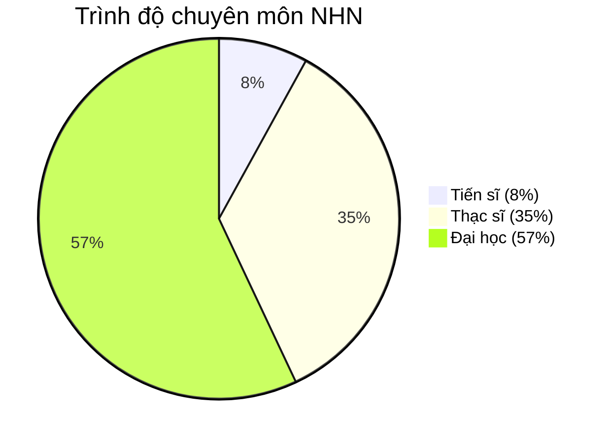

| Trình độ | Số lượng | Tỷ lệ | Rule |
|---|---:|---:|---|
| Tiến sĩ | 996 | 8% | COUNT(PERSON_DIM_ID) WHERE EDUCATION_LEVEL = 'Tiến sĩ' |
| Thạc sĩ | 4,358 | 35% | COUNT(PERSON_DIM_ID) WHERE EDUCATION_LEVEL = 'Thạc sĩ' |
| Đại học | 7,096 | 57% | COUNT(PERSON_DIM_ID) WHERE EDUCATION_LEVEL = 'Đại học' |

---

#### 1c. Biểu đồ Cơ cấu theo loại hình CCHN

**Source:** `FCT_SP_CERTIFICATE_SNAP` → `DIM_SP_CERT_TYPE`

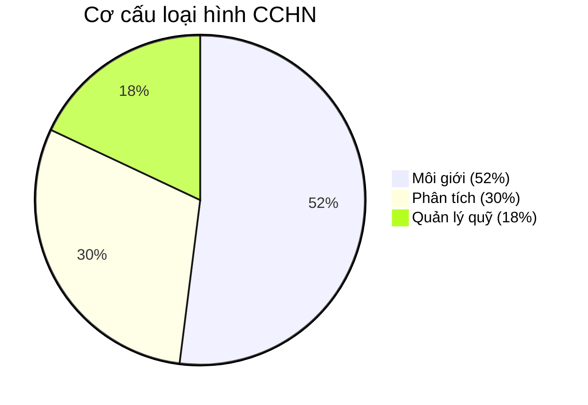

| Loại hình | Số lượng | Rule |
|---|---:|---|
| Môi giới | 5,663 | COUNT(CERTIFICATE_NO) JOIN DIM_SP_CERT_TYPE WHERE CERT_TYPE_NAME = 'Môi giới' |
| Phân tích | 3,267 | COUNT(CERTIFICATE_NO) JOIN DIM_SP_CERT_TYPE WHERE CERT_TYPE_NAME = 'Phân tích' |
| Quản lý quỹ | 1,960 | COUNT(CERTIFICATE_NO) JOIN DIM_SP_CERT_TYPE WHERE CERT_TYPE_NAME = 'Quản lý quỹ' |

---

#### 1d. Biểu đồ Phân bổ độ tuổi theo quốc tịch

**Source:** `FCT_SP_PERSON_SNAP` → `DIM_SP_PERSON`

```mermaid
xychart-beta
    title "Phân bổ độ tuổi NHN theo quốc tịch"
    x-axis ["18-21", "22-30", "31-40", "41-50", "50+"]
    y-axis "Số lượng NHN" 0 --> 5000
    bar [120, 2800, 4500, 3200, 1500]
    bar [5, 45, 80, 60, 30]
```

| Nhóm tuổi | VN | Nước ngoài | Rule |
|---|---:|---:|---|
| 18–21 | 120 | 5 | COUNT(PERSON_DIM_ID) WHERE AGE_GROUP + NATIONALITY |
| 22–30 | 2,800 | 45 | COUNT(PERSON_DIM_ID) WHERE AGE_GROUP + NATIONALITY |
| 31–40 | 4,500 | 80 | COUNT(PERSON_DIM_ID) WHERE AGE_GROUP + NATIONALITY |
| 41–50 | 3,200 | 60 | COUNT(PERSON_DIM_ID) WHERE AGE_GROUP + NATIONALITY |
| 50+ | 1,500 | 30 | COUNT(PERSON_DIM_ID) WHERE AGE_GROUP + NATIONALITY |

> 🔵 Cột xanh = Việt Nam | 🟠 Cột cam = Nước ngoài

---

### Dashboard 2 — Tra cứu hồ sơ 360

**Source:** `FCT_SP_PERSON_SNAP` → `DIM_SP_PERSON` + `DIM_SP_CERT_TYPE`

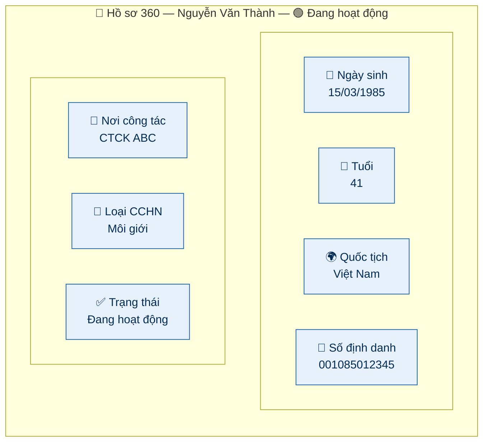

| KPI | Column | Rule |
|---|---|---|
| Họ tên | PERSON_DIM_ID | JOIN DIM_SP_PERSON.PERSON_NAME |
| Ngày sinh | PERSON_DIM_ID | JOIN DIM_SP_PERSON.DATE_OF_BIRTH |
| Tuổi | PERSON_DIM_ID | JOIN DIM_SP_PERSON.AGE |
| Quốc tịch | PERSON_DIM_ID | JOIN DIM_SP_PERSON.NATIONALITY |
| Số định danh / Hộ chiếu | PERSON_DIM_ID | JOIN DIM_SP_PERSON.ID_NUMBER |
| Nơi công tác hiện tại | PERSON_DIM_ID | JOIN DIM_SP_PERSON.CURRENT_WORKPLACE |
| Loại CCHN | CERT_TYPE_DIM_ID | JOIN DIM_SP_CERT_TYPE.CERT_TYPE_NAME |
| Trạng thái NHNCK | PERSON_DIM_ID | JOIN DIM_SP_PERSON.PRACTITIONER_STATUS |

---

### Dashboard 3 — Mạng lưới của NHNCK

**Source:** `FCT_SP_COMPANY_ROLE_DTL` → `DIM_SP_PERSON` + `DIM_SP_LISTED_COMPANY` + `DIM_SP_RELATED_PERSON`

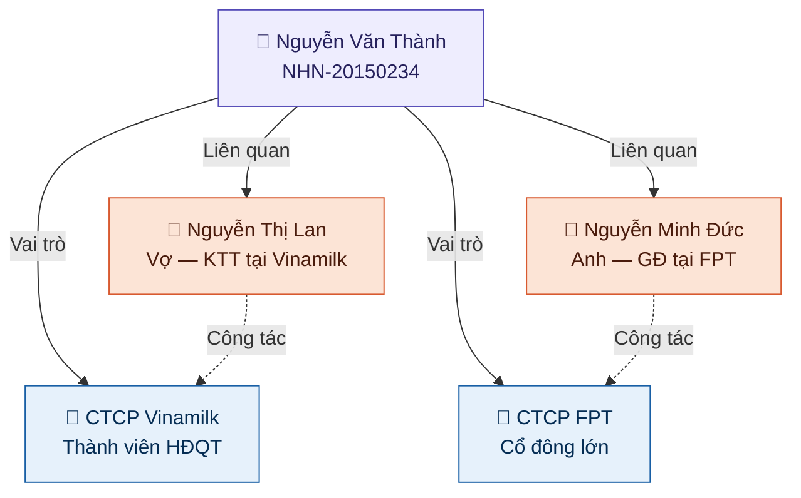

| KPI | Column | Rule |
|---|---|---|
| Đơn vị công tác | LISTED_COMPANY_DIM_ID | JOIN DIM_SP_LISTED_COMPANY.LISTED_COMPANY_NAME |
| Chức vụ, vai trò | ROLE_NAME | Direct |
| Họ tên người liên quan | RELATED_PERSON_DIM_ID | JOIN DIM_SP_RELATED_PERSON.RELATED_PERSON_NAME |
| Mối quan hệ | RELATED_PERSON_DIM_ID | JOIN DIM_SP_RELATED_PERSON.RELATIONSHIP_TYPE |
| Đơn vị công tác (người LQ) | RELATED_PERSON_DIM_ID | JOIN DIM_SP_RELATED_PERSON.WORKPLACE |
| Chức vụ (người LQ) | RELATED_PERSON_DIM_ID | JOIN DIM_SP_RELATED_PERSON.POSITION |

---

### Dashboard 4 — Hồ sơ & Danh mục của NHNCK

#### 4a. Vai trò tại DN niêm yết

**Source:** `FCT_SP_COMPANY_ROLE_DTL` → `DIM_SP_PERSON` + `DIM_SP_LISTED_COMPANY` + `DIM_SP_RELATED_PERSON`

| Tên DN | Vai trò | Trạng thái | CP sở hữu |
|---|---|:---:|---:|
| CTCP Vinamilk | Thành viên HĐQT | 🟢 Đang hoạt động | 150,000 |
| CTCP FPT | Cổ đông lớn | 🟢 Đang hoạt động | 80,000 |

#### 4b. Mạng lưới người có liên quan

| Họ và tên | Mối quan hệ | Nghề nghiệp | CCCD/CMND/HC |
|---|---|---|---|
| Nguyễn Thị Lan | Vợ | Kế toán | 001085067890 |
| Nguyễn Minh Đức | Anh | Giám đốc | 001082034567 |

#### 4c. Tài khoản & số dư

**Source:** `FCT_SP_ACCOUNT_SNAP` → `DIM_SP_PERSON` + `DIM_SP_ORGANIZATION`

| Mã CTCK | Số tài khoản | Chủ TK | Mã CK chính | Số dư (tỷ VNĐ) |
|---|---|---|---|---:|
| SSI | 058C012345 | Nguyễn Văn Thành | VNM, FPT | 2.45 |
| VND | 022C098765 | Nguyễn Văn Thành | HPG | 0.85 |

---

### Dashboard 5 — Quá trình hành nghề

**Source:** `FCT_SP_CAREER_DTL` → `DIM_SP_PERSON` + `DIM_SP_ORGANIZATION`

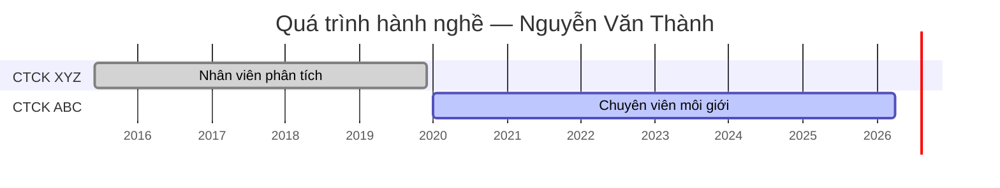

| Tổ chức | Vị trí | Từ tháng | Đến tháng | Trạng thái |
|---|---|---|---|:---:|
| CTCK ABC | Chuyên viên môi giới | 01/2020 | Hiện nay | 🟢 Hiện tại |
| CTCK XYZ | Nhân viên phân tích | 06/2015 | 12/2019 | ⚪ Quá khứ |

---

### Dashboard 6 — Lịch sử cấp chứng chỉ

**Source:** `FCT_SP_CERTIFICATE_SNAP` → `DIM_SP_PERSON` + `DIM_SP_CERT_TYPE`

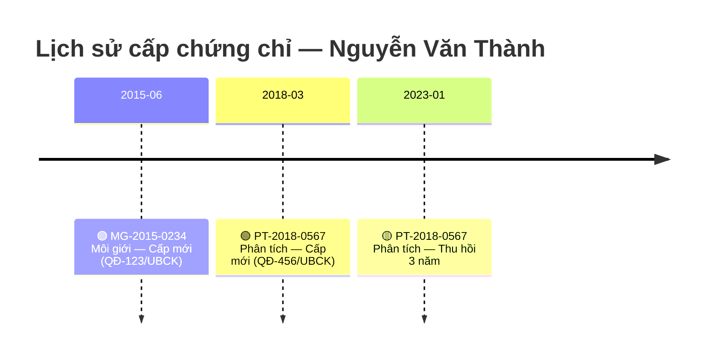

| Số CCHN | Loại hình | Ngày cấp | Ngày thu hồi | Quyết định | Trạng thái |
|---|---|---|---|---|:---:|
| MG-2015-0234 | Môi giới | 15/06/2015 | — | QĐ-123/UBCK | 🟢 Đang hoạt động |
| PT-2018-0567 | Phân tích | 20/03/2018 | 10/01/2023 | QĐ-456/UBCK | 🟡 Thu hồi 3 năm |

---

### Dashboard 7 — Đợt thi sát hạch

**Source:** `FCT_SP_EXAM_DTL` → `DIM_SP_PERSON`

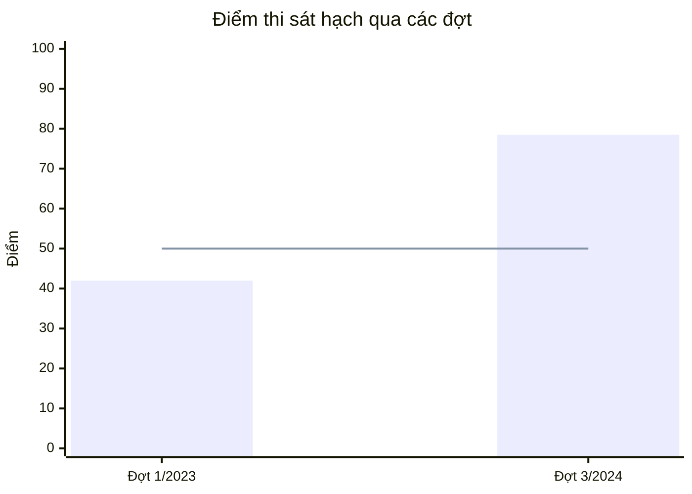

> 📊 Cột = Điểm thi | Đường ngang = Ngưỡng đạt (50 điểm)

| Đợt thi | Ngày thi | Điểm thi | Số QĐ công bố | Trạng thái |
|---|---|---:|---|:---:|
| Đợt 3/2024 | 15/09/2024 | 78.5 | QĐ-789/UBCK | 🟢 Đạt |
| Đợt 1/2023 | 20/03/2023 | 42.0 | QĐ-321/UBCK | 🔴 Không đạt |

---

### Dashboard 8 — Cập nhật kiến thức

**Source:** `FCT_SP_KNOWLEDGE_UPDATE_DTL` → `DIM_SP_PERSON`

> ⚙️ **Cả 2 KPI đều là chỉ tiêu phái sinh**

| Kết quả kiểm tra / phân loại | Trạng thái đủ 8h |
|---|:---:|
| Loại A — Xuất sắc | 🟢 Đã đủ 8h |
| Chưa kiểm tra | 🟡 Chưa đủ 8h |

```
HOURS_STATUS = CASE WHEN TOTAL_HOURS >= 8 
                    THEN 'Đã đủ 8h' 
                    ELSE 'Chưa đủ 8h' 
               END
```

---

### Dashboard 9 — Lịch sử vi phạm

**Source:** `FCT_SP_VIOLATION_DTL` → `DIM_SP_PERSON` + `DIM_SP_VIOLATION_TYPE`

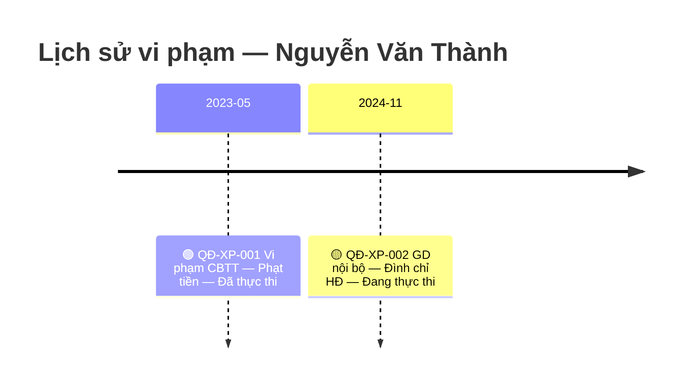

| Số QĐ | Ngày QĐ | Nội dung vi phạm | Hình thức xử phạt | Trạng thái |
|---|---|---|---|:---:|
| QĐ-XP-001 | 10/05/2023 | Vi phạm quy định về CBTT | Phạt tiền | 🟢 Đã thực thi |
| QĐ-XP-002 | 25/11/2024 | Giao dịch nội bộ | Đình chỉ hoạt động | 🟡 Đang thực thi |

---

### Data Explorer — Khai thác dữ liệu

**Source:** `FCT_SP_CERTIFICATE_SNAP` → `DIM_SP_PERSON` + `DIM_SP_CERT_TYPE` + `DIM_SP_ORGANIZATION`

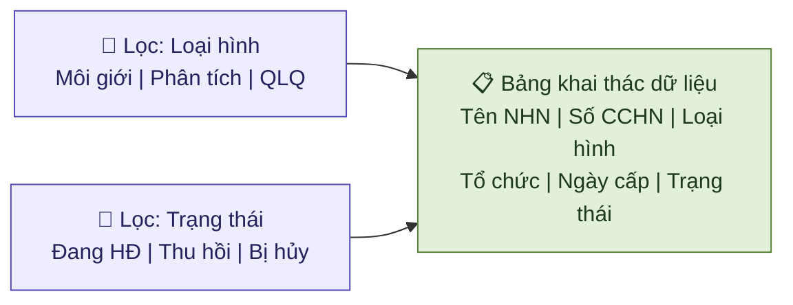

| Tên NHN | Số CCHN | Loại hình | Tổ chức | Ngày cấp | Trạng thái |
|---|---|---|---|---|:---:|
| Nguyễn Văn Thành | MG-2015-0234 | Môi giới | CTCK ABC | 15/06/2015 | 🟢 Đang HĐ |
| Trần Thị Hoa | PT-2020-0891 | Phân tích | CTCK XYZ | 10/08/2020 | 🟢 Đang HĐ |
| Lê Quốc Hùng | QLQ-2019-0456 | Quản lý quỹ | CTQLQ DEF | 05/04/2019 | 🟡 Thu hồi 3 năm |

| Điều kiện lọc | Column | Rule |
|---|---|---|
| Lọc theo Loại hình | CERT_TYPE_DIM_ID | Filter — JOIN DIM_SP_CERT_TYPE.CERT_TYPE_NAME |
| Lọc theo Trạng thái | CERTIFICATE_STATUS | Filter |

---

## Tổng quan Star Schema — Toàn bộ phân hệ NHNCK

```mermaid
graph TB
    classDef dim fill:#D6E4F0,stroke:#2F5496,color:#1e3a5f
    classDef fct fill:#E2EFDA,stroke:#548235,color:#1e3a1e

    DIM_PERSON["🔵 DIM_SP_PERSON\nPerson Dimension\n─────────\nPERSON_DIM_ID (PK)\nPERSON_CODE\nPERSON_NAME\nDATE_OF_BIRTH\nAGE | GENDER\nNATIONALITY\nID_NUMBER\nEDUCATION_LEVEL\nCURRENT_WORKPLACE\nPRACTITIONER_STATUS\nEFF_DT | END_DT"]:::dim

    DIM_ORG["🔵 DIM_SP_ORGANIZATION\nOrganization Dimension\n─────────\nORGANIZATION_DIM_ID (PK)\nORGANIZATION_CODE\nORGANIZATION_NAME\nORGANIZATION_TYPE\nORGANIZATION_SHORT_NAME\nEFF_DT | END_DT"]:::dim

    DIM_CERT["🔵 DIM_SP_CERT_TYPE\nCertificate Type Dimension\n─────────\nCERT_TYPE_DIM_ID (PK)\nCERT_TYPE_CODE\nCERT_TYPE_NAME\nEFF_DT | END_DT"]:::dim

    DIM_COMPANY["🔵 DIM_SP_LISTED_COMPANY\nListed Company Dimension\n─────────\nLISTED_COMPANY_DIM_ID (PK)\nLISTED_COMPANY_CODE\nLISTED_COMPANY_NAME\nLISTING_TYPE\nEFF_DT | END_DT"]:::dim

    DIM_RELATED["🔵 DIM_SP_RELATED_PERSON\nRelated Person Dimension\n─────────\nRELATED_PERSON_DIM_ID (PK)\nRELATED_PERSON_CODE\nRELATED_PERSON_NAME\nRELATIONSHIP_TYPE\nOCCUPATION | ID_NUMBER\nWORKPLACE | POSITION\nEFF_DT | END_DT"]:::dim

    DIM_VIOL["🔵 DIM_SP_VIOLATION_TYPE\nViolation Type Dimension\n─────────\nVIOLATION_TYPE_DIM_ID (PK)\nVIOLATION_TYPE_CODE\nVIOLATION_TYPE_NAME\nPENALTY_TYPE\nEFF_DT | END_DT"]:::dim

    FCT_PERSON["🟢 FCT_SP_PERSON_SNAP\nPerson Snapshot Fact\n─────────\nDATA_DT (PK) | PPN_DT\nPERSON_DIM_ID (FK)\nCERT_TYPE_DIM_ID (FK)\nAGE_GROUP\nTOTAL_CERTIFICATES"]:::fct

    FCT_CERT["🟢 FCT_SP_CERTIFICATE_SNAP\nCertificate Snapshot Fact\n─────────\nDATA_DT (PK) | PPN_DT\nPERSON_DIM_ID (FK)\nCERT_TYPE_DIM_ID (FK)\nCERTIFICATE_NO (PK)\nISSUE_DATE | REVOKE_DATE\nDECISION_NO\nCERTIFICATE_STATUS\nISSUE_TYPE"]:::fct

    FCT_CAREER["🟢 FCT_SP_CAREER_DTL\nCareer Detail Fact\n─────────\nDATA_DT (PK) | PPN_DT\nPERSON_DIM_ID (FK)\nORGANIZATION_DIM_ID (FK)\nPOSITION\nSTART_DATE (PK) | END_DATE\nCAREER_STATUS"]:::fct

    FCT_EXAM["🟢 FCT_SP_EXAM_DTL\nExam Detail Fact\n─────────\nDATA_DT (PK) | PPN_DT\nPERSON_DIM_ID (FK)\nEXAM_SESSION (PK)\nEXAM_DATE | EXAM_SCORE\nANNOUNCEMENT_DECISION_NO\nEXAM_STATUS"]:::fct

    FCT_VIOL["🟢 FCT_SP_VIOLATION_DTL\nViolation Detail Fact\n─────────\nDATA_DT (PK) | PPN_DT\nPERSON_DIM_ID (FK)\nVIOLATION_TYPE_DIM_ID (FK)\nDECISION_NO (PK)\nDECISION_DATE\nVIOLATION_CONTENT\nPENALTY_DETAIL\nEXECUTION_STATUS"]:::fct

    FCT_ACCOUNT["🟢 FCT_SP_ACCOUNT_SNAP\nAccount Snapshot Fact\n─────────\nDATA_DT (PK) | PPN_DT\nPERSON_DIM_ID (FK)\nORGANIZATION_DIM_ID (FK)\nACCOUNT_NO (PK)\nACCOUNT_HOLDER_NAME\nTOP_SECURITIES_CODE\nACCOUNT_BALANCE"]:::fct

    FCT_ROLE["🟢 FCT_SP_COMPANY_ROLE_DTL\nCompany Role Detail Fact\n─────────\nDATA_DT (PK) | PPN_DT\nPERSON_DIM_ID (FK)\nLISTED_COMPANY_DIM_ID (FK)\nRELATED_PERSON_DIM_ID (FK)\nROLE_NAME (PK)\nROLE_STATUS\nSHARES_QUANTITY"]:::fct

    FCT_KNOWLEDGE["🟢 FCT_SP_KNOWLEDGE_UPDATE_DTL\nKnowledge Update Detail Fact\n─────────\nDATA_DT (PK) | PPN_DT\nPERSON_DIM_ID (FK)\nUPDATE_YEAR (PK)\nTOTAL_HOURS\nTEST_RESULT\nHOURS_STATUS"]:::fct

    %% FK relationships
    FCT_PERSON -->|PERSON_DIM_ID| DIM_PERSON
    FCT_PERSON -->|CERT_TYPE_DIM_ID| DIM_CERT

    FCT_CERT -->|PERSON_DIM_ID| DIM_PERSON
    FCT_CERT -->|CERT_TYPE_DIM_ID| DIM_CERT

    FCT_CAREER -->|PERSON_DIM_ID| DIM_PERSON
    FCT_CAREER -->|ORGANIZATION_DIM_ID| DIM_ORG

    FCT_EXAM -->|PERSON_DIM_ID| DIM_PERSON

    FCT_VIOL -->|PERSON_DIM_ID| DIM_PERSON
    FCT_VIOL -->|VIOLATION_TYPE_DIM_ID| DIM_VIOL

    FCT_ACCOUNT -->|PERSON_DIM_ID| DIM_PERSON
    FCT_ACCOUNT -->|ORGANIZATION_DIM_ID| DIM_ORG

    FCT_ROLE -->|PERSON_DIM_ID| DIM_PERSON
    FCT_ROLE -->|LISTED_COMPANY_DIM_ID| DIM_COMPANY
    FCT_ROLE -->|RELATED_PERSON_DIM_ID| DIM_RELATED

    FCT_KNOWLEDGE -->|PERSON_DIM_ID| DIM_PERSON
```

---

## Star Schema chi tiết theo từng Dashboard

### Star 1 — Dashboard tổng quan NHNCK toàn thị trường

> **3 Fact phục vụ 5 chart/widget:**
> - Chỉ tiêu tổng hợp + Cơ cấu loại hình → `FCT_SP_CERTIFICATE_SNAP`
> - Trình độ chuyên môn + Phân bổ độ tuổi → `FCT_SP_PERSON_SNAP`
> - Cảnh báo NHNCK → `FCT_SP_VIOLATION_DTL`

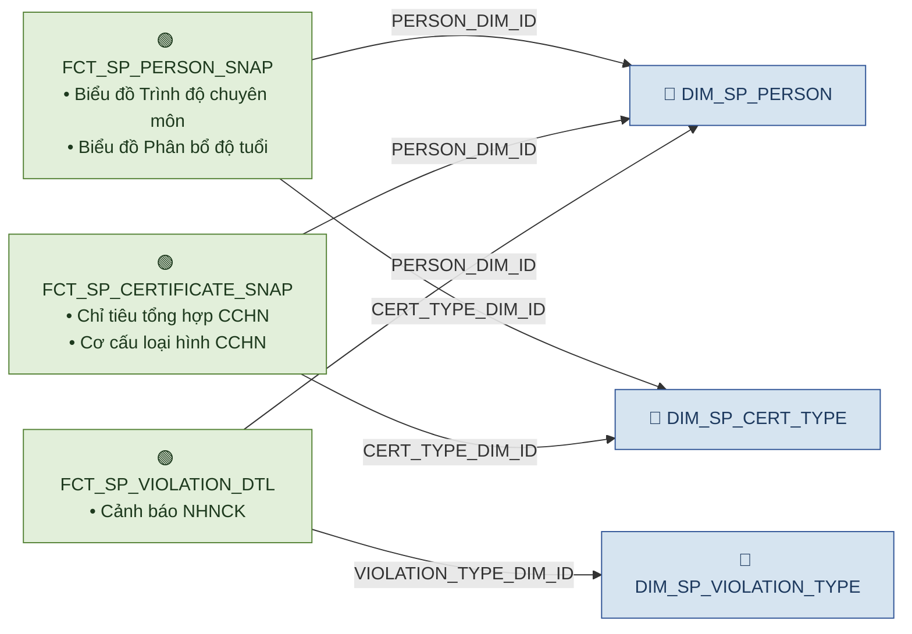

---

### Star 2 — Dashboard Tra cứu hồ sơ 360

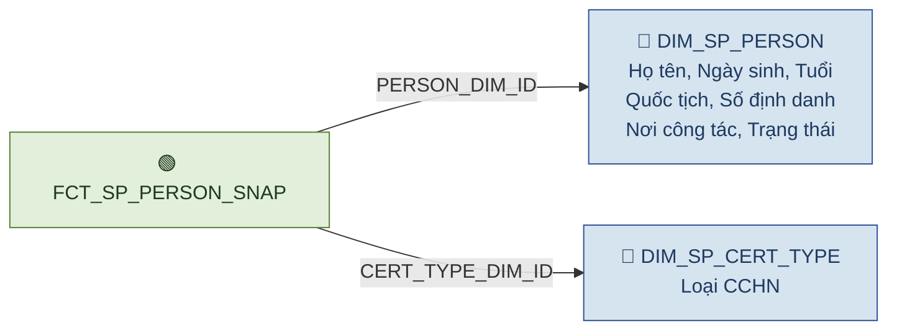

---

### Star 3 — Dashboard Mạng lưới + Hồ sơ & Danh mục (Vai trò DN)

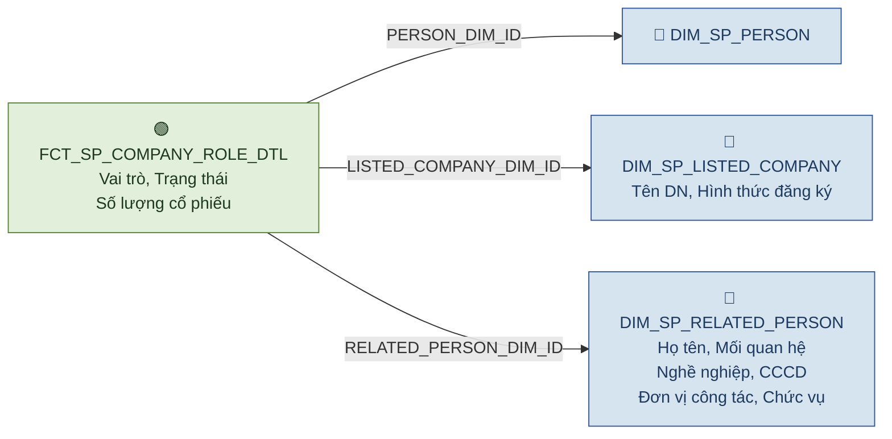

---

### Star 4 — Dashboard Hồ sơ & Danh mục (Tài khoản & số dư)

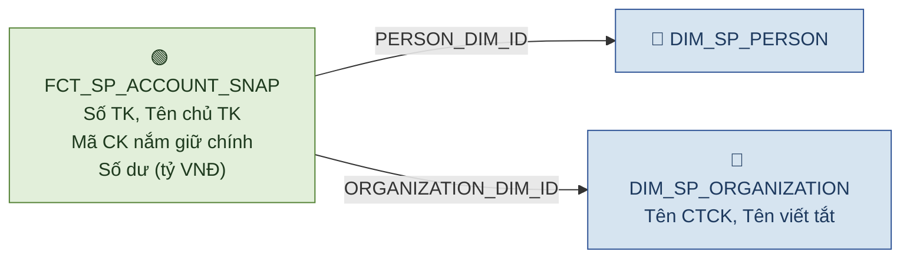

---

### Star 5 — Dashboard Quá trình hành nghề

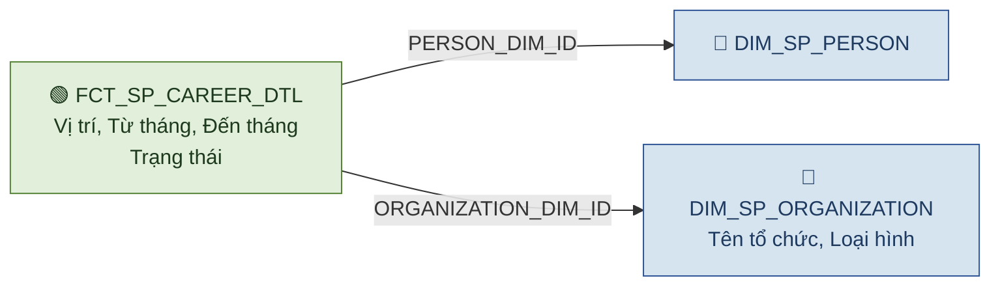

---

### Star 6 — Dashboard Lịch sử cấp chứng chỉ + Data Explorer

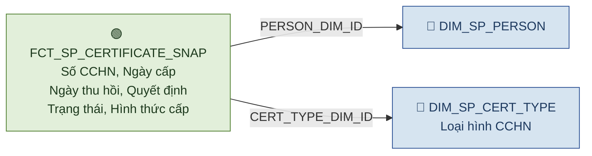

---

### Star 7 — Dashboard Đợt thi sát hạch

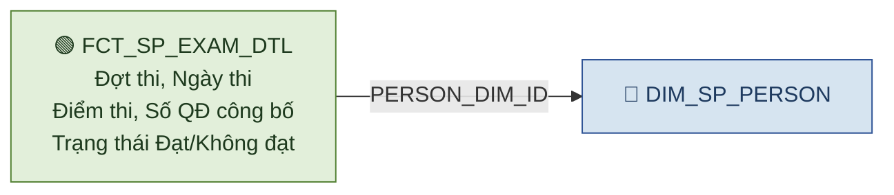

---

### Star 8 — Dashboard Cập nhật kiến thức

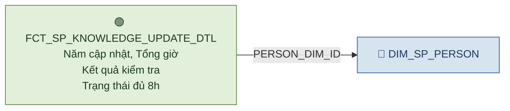

---

### Star 9 — Dashboard Lịch sử vi phạm

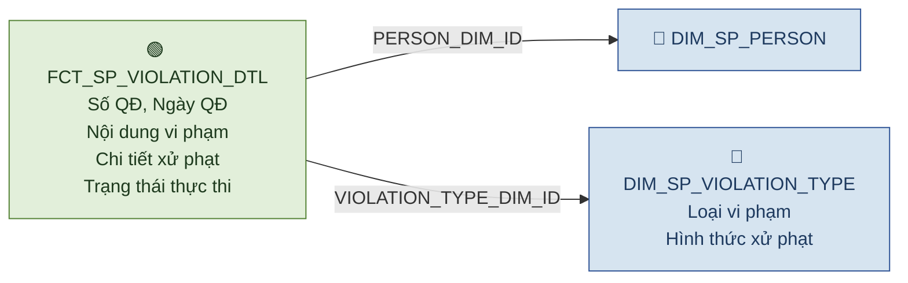

---

## Ma trận Fact — Dimension (Bus Matrix)

| Dimension ↓ \ Fact → | FCT_SP_PERSON_SNAP | FCT_SP_CERTIFICATE_SNAP | FCT_SP_CAREER_DTL | FCT_SP_EXAM_DTL | FCT_SP_VIOLATION_DTL | FCT_SP_ACCOUNT_SNAP | FCT_SP_COMPANY_ROLE_DTL | FCT_SP_KNOWLEDGE_UPDATE_DTL |
|---|:---:|:---:|:---:|:---:|:---:|:---:|:---:|:---:|
| **DIM_SP_PERSON** | ✅ | ✅ | ✅ | ✅ | ✅ | ✅ | ✅ | ✅ |
| **DIM_SP_ORGANIZATION** | | | ✅ | | | ✅ | | |
| **DIM_SP_CERT_TYPE** | ✅ | ✅ | | | | | | |
| **DIM_SP_LISTED_COMPANY** | | | | | | | ✅ | |
| **DIM_SP_RELATED_PERSON** | | | | | | | ✅ | |
| **DIM_SP_VIOLATION_TYPE** | | | | | ✅ | | | |

---

## Mapping Dashboard → Star Schema

| Dashboard / Data Explorer | Chart / Widget | Fact | Dimensions |
|---|---|---|---|
| Tổng quan / Chỉ tiêu tổng hợp | Thống kê CCHN | FCT_SP_CERTIFICATE_SNAP | DIM_SP_PERSON, DIM_SP_CERT_TYPE |
| Tổng quan / Trình độ chuyên môn | Biểu đồ trình độ | FCT_SP_PERSON_SNAP | DIM_SP_PERSON |
| Tổng quan / Cơ cấu loại hình | Biểu đồ cơ cấu | FCT_SP_CERTIFICATE_SNAP | DIM_SP_CERT_TYPE |
| Tổng quan / Phân bổ độ tuổi | Biểu đồ tuổi | FCT_SP_PERSON_SNAP | DIM_SP_PERSON |
| Tổng quan / Cảnh báo | Chỉ số vi phạm | FCT_SP_VIOLATION_DTL | DIM_SP_PERSON, DIM_SP_VIOLATION_TYPE |
| Tra cứu hồ sơ 360 | Thông tin cá nhân | FCT_SP_PERSON_SNAP | DIM_SP_PERSON, DIM_SP_CERT_TYPE |
| Mạng lưới | Quan hệ NHN-DN | FCT_SP_COMPANY_ROLE_DTL | DIM_SP_PERSON, DIM_SP_LISTED_COMPANY, DIM_SP_RELATED_PERSON |
| Hồ sơ & Danh mục / Vai trò DN | Danh sách vai trò | FCT_SP_COMPANY_ROLE_DTL | DIM_SP_PERSON, DIM_SP_LISTED_COMPANY, DIM_SP_RELATED_PERSON |
| Hồ sơ & Danh mục / Tài khoản | Tài khoản & số dư | FCT_SP_ACCOUNT_SNAP | DIM_SP_PERSON, DIM_SP_ORGANIZATION |
| Quá trình hành nghề | Lịch sử công tác | FCT_SP_CAREER_DTL | DIM_SP_PERSON, DIM_SP_ORGANIZATION |
| Lịch sử cấp CC | Chi tiết CCHN | FCT_SP_CERTIFICATE_SNAP | DIM_SP_PERSON, DIM_SP_CERT_TYPE |
| Đợt thi sát hạch | Kết quả thi | FCT_SP_EXAM_DTL | DIM_SP_PERSON |
| Cập nhật kiến thức | Trạng thái CNKT | FCT_SP_KNOWLEDGE_UPDATE_DTL | DIM_SP_PERSON |
| Lịch sử vi phạm | Chi tiết vi phạm | FCT_SP_VIOLATION_DTL | DIM_SP_PERSON, DIM_SP_VIOLATION_TYPE |
| Data Explorer | Khai thác dữ liệu | FCT_SP_CERTIFICATE_SNAP | DIM_SP_PERSON, DIM_SP_CERT_TYPE |