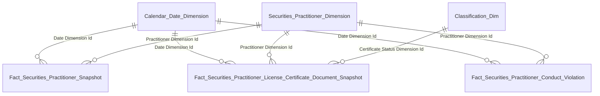
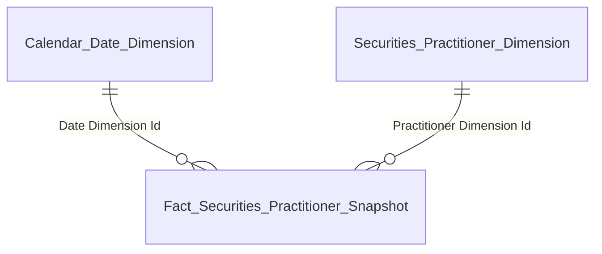
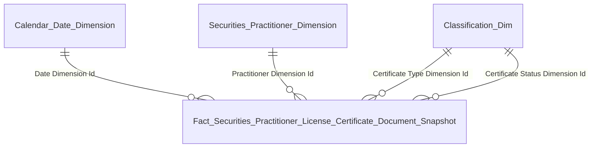
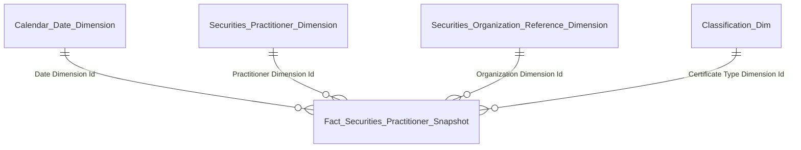
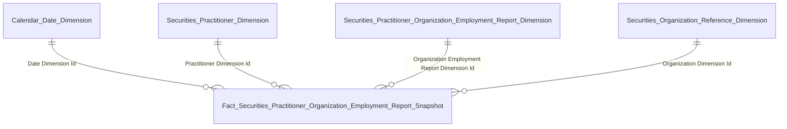
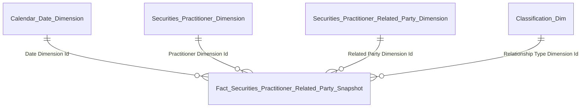
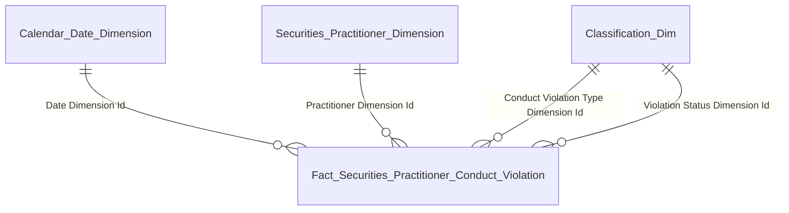
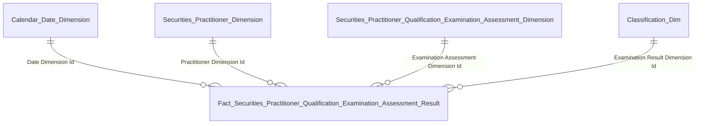
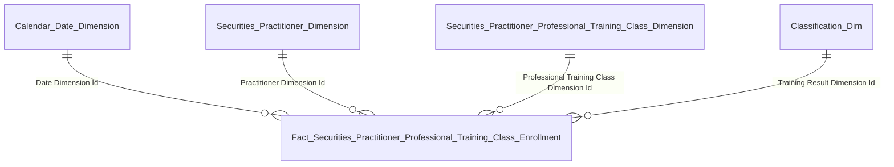
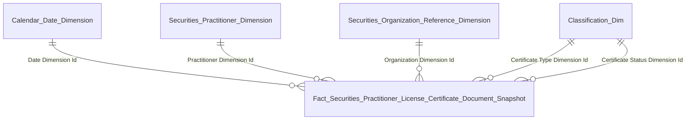

# Gold Entities Overview

## NHNCK — Người hành nghề Chứng khoán

### 1.1 Tổng quan — Nhóm 1: Chỉ tiêu tổng hợp

#### Star schema

#### Bảng entity

| Gold entity | Description | Grain | KPI |
|---|---|---|---|
| Fact Securities Practitioner Snapshot | Periodic snapshot NHN | 1 NHN × 1 Snapshot Date | K1 |
| Fact Securities Practitioner License Certificate Document Snapshot | Periodic snapshot CCHN | 1 CCHN × 1 Snapshot Date | K2–K5 |
| Fact Securities Practitioner Conduct Violation | Event fact vi phạm | 1 vi phạm | K6 |
| Securities Practitioner Dimension | NHN — tên/ngày sinh/... | 1 NHN (SCD2) | — |
| Classification Dimension | Bảng phân loại chung | 1 classification value | — |
| Calendar Date Dimension | Lịch ngày | 1 ngày | — |

### 1.1 Tổng quan — Nhóm 2: Trình độ chuyên môn

#### Star schema

#### Bảng entity

| Gold entity | Description | Grain | KPI |
|---|---|---|---|
| Fact Securities Practitioner Snapshot | Periodic snapshot NHN | 1 NHN × 1 Snapshot Date | K7–K12 |
| Securities Practitioner Dimension | NHN — Education Level Code | 1 NHN (SCD2) | — |
| Calendar Date Dimension | Lịch ngày | 1 ngày | — |

### 1.1 Tổng quan — Nhóm 3: Loại hình CCHN

#### Star schema

#### Bảng entity

| Gold entity | Description | Grain | KPI |
|---|---|---|---|
| Fact Securities Practitioner License Certificate Document Snapshot | Periodic snapshot CCHN | 1 CCHN × 1 Snapshot Date | K13–K15 |
| Securities Practitioner Dimension | NHN | 1 NHN (SCD2) | — |
| Classification Dimension | Loại chứng chỉ + trạng thái | 1 classification value | — |
| Calendar Date Dimension | Lịch ngày | 1 ngày | — |

### 1.1 Tổng quan — Nhóm 4: Độ tuổi / Quốc tịch

#### Star schema

#### Bảng entity

| Gold entity | Description | Grain | KPI |
|---|---|---|---|
| Fact Securities Practitioner Snapshot | Periodic snapshot NHN | 1 NHN × 1 Snapshot Date | K16–K25 |
| Securities Practitioner Dimension | NHN — Date Of Birth / Nationality Code | 1 NHN (SCD2) | — |
| Calendar Date Dimension | Lịch ngày | 1 ngày | — |

### 1.2 Tra cứu hồ sơ 360°

#### Star schema

#### Bảng entity

| Gold entity | Description | Grain | KPI |
|---|---|---|---|
| Fact Securities Practitioner Snapshot | Periodic snapshot NHN + CCHN đại diện | 1 NHN × 1 Snapshot Date | K26–K33 |
| Securities Practitioner Dimension | NHN — thông tin cá nhân | 1 NHN (SCD2) | — |
| Securities Organization Reference Dimension | Tổ chức — nơi công tác | 1 tổ chức (SCD2) | — |
| Classification Dimension | Loại CCHN đại diện | 1 classification value | — |
| Calendar Date Dimension | Lịch ngày | 1 ngày snapshot | — |

### 1.3 Mạng lưới — Nhóm 1: Quan hệ công tác

#### Star schema

#### Bảng entity

| Gold entity | Description | Grain | KPI |
|---|---|---|---|
| Fact Securities Practitioner Organization Employment Report Snapshot | Factless snapshot — quan hệ NHN ↔ Tổ chức | 1 lượt công tác × 1 Snapshot Date | K34–K35 |
| Securities Practitioner Dimension | NHN chủ thể | 1 NHN (SCD2) | — |
| Securities Practitioner Organization Employment Report Dimension | Lượt công tác — chức vụ/phòng ban | 1 lượt công tác (SCD2) | — |
| Securities Organization Reference Dimension | Tổ chức | 1 tổ chức (SCD2) | — |
| Calendar Date Dimension | Lịch ngày | 1 ngày snapshot | — |

### 1.3 Mạng lưới — Nhóm 2: Quan hệ gia đình

#### Star schema

#### Bảng entity

| Gold entity | Description | Grain | KPI |
|---|---|---|---|
| Fact Securities Practitioner Related Party Snapshot | Factless snapshot — quan hệ gia đình NHN ↔ NLQ | 1 NLQ × 1 Snapshot Date | K36–K39 |
| Securities Practitioner Dimension | NHN chủ thể | 1 NHN (SCD2) | — |
| Securities Practitioner Related Party Dimension | Người liên quan — tên/nghề nghiệp/nơi làm việc | 1 NLQ (SCD2) | — |
| Classification Dimension | Loại quan hệ (RELATIONSHIP_TYPE) | 1 classification value | — |
| Calendar Date Dimension | Lịch ngày | 1 ngày snapshot | — |

### 1.4 Hồ sơ — Nhóm 1: Vai trò tại DN niêm yết

#### Star schema

#### Bảng entity

| Gold entity | Description | Grain | KPI |
|---|---|---|---|
| Fact Securities Practitioner Organization Employment Report Snapshot | Factless snapshot — quan hệ NHN ↔ Tổ chức | 1 lượt công tác × 1 Snapshot Date | K40–K43 |
| Securities Practitioner Dimension | NHN | 1 NHN (SCD2) | — |
| Securities Practitioner Organization Employment Report Dimension | Lượt công tác | 1 lượt công tác (SCD2) | — |
| Securities Organization Reference Dimension | Tổ chức | 1 tổ chức (SCD2) | — |
| Calendar Date Dimension | Lịch ngày | 1 ngày snapshot | — |

### 1.4 Hồ sơ — Nhóm 2: Người liên quan

#### Star schema

#### Bảng entity

| Gold entity | Description | Grain | KPI |
|---|---|---|---|
| Fact Securities Practitioner Related Party Snapshot | Factless snapshot — NHN ↔ NLQ | 1 NLQ × 1 Snapshot Date | K44–K47 |
| Securities Practitioner Dimension | NHN | 1 NHN (SCD2) | — |
| Securities Practitioner Related Party Dimension | Người liên quan | 1 NLQ (SCD2) | — |
| Classification Dimension | Loại quan hệ (RELATIONSHIP_TYPE) | 1 classification value | — |
| Calendar Date Dimension | Lịch ngày | 1 ngày snapshot | — |

### 1.5 Quá trình hành nghề

#### Star schema

#### Bảng entity

| Gold entity | Description | Grain | KPI |
|---|---|---|---|
| Fact Securities Practitioner Organization Employment Report Snapshot | Factless snapshot — lịch sử công tác | 1 lượt công tác × 1 Snapshot Date | K53–K57 |
| Securities Practitioner Dimension | NHN | 1 NHN (SCD2) | — |
| Securities Practitioner Organization Employment Report Dimension | Lượt công tác — chức vụ/Hire Date/Termination Date | 1 lượt công tác (SCD2) | — |
| Securities Organization Reference Dimension | Tổ chức | 1 tổ chức (SCD2) | — |
| Calendar Date Dimension | Lịch ngày | 1 ngày snapshot | — |

### 1.6 Lịch sử cấp chứng chỉ

#### Star schema

#### Bảng entity

| Gold entity | Description | Grain | KPI |
|---|---|---|---|
| Fact Securities Practitioner License Certificate Document Snapshot | Periodic snapshot CCHN | 1 CCHN × 1 Snapshot Date | K58–K63 |
| Securities Practitioner Dimension | NHN | 1 NHN (SCD2) | — |
| Classification Dimension | Loại chứng chỉ + trạng thái | 1 classification value | — |
| Calendar Date Dimension | Lịch ngày | 1 ngày snapshot | — |

### 1.7 Lịch sử vi phạm

#### Star schema

#### Bảng entity

| Gold entity | Description | Grain | KPI |
|---|---|---|---|
| Fact Securities Practitioner Conduct Violation | Event fact vi phạm | 1 vi phạm | K71–K75 |
| Securities Practitioner Dimension | NHN | 1 NHN (SCD2) | — |
| Classification Dimension | Loại vi phạm + trạng thái hiệu lực | 1 classification value | — |
| Calendar Date Dimension | Lịch ngày | 1 ngày vi phạm | — |

### 1.8 Đợt thi sát hạch

#### Star schema

#### Bảng entity

| Gold entity | Description | Grain | KPI |
|---|---|---|---|
| Fact Securities Practitioner Qualification Examination Assessment Result | Event fact kết quả thi | 1 kết quả thi | K64–K68 |
| Securities Practitioner Dimension | NHN | 1 NHN (SCD2) | — |
| Securities Practitioner Qualification Examination Assessment Dimension | Đợt thi — tên/năm/QĐ | 1 đợt thi (SCD2) | — |
| Classification Dimension | Kết quả thi (EXAMINATION_RESULT) | 1 classification value | — |
| Calendar Date Dimension | Lịch ngày | 1 ngày thi | — |

### 1.9 Cập nhật kiến thức

#### Star schema

#### Bảng entity

| Gold entity | Description | Grain | KPI |
|---|---|---|---|
| Fact Securities Practitioner Professional Training Class Enrollment | Event fact đăng ký khóa học | 1 đăng ký khóa | K69–K70 |
| Securities Practitioner Dimension | NHN | 1 NHN (SCD2) | — |
| Securities Practitioner Professional Training Class Dimension | Khóa học — tên/năm học | 1 khóa học (SCD2) | — |
| Classification Dimension | Kết quả (TRAINING_RESULT) | 1 classification value | — |
| Calendar Date Dimension | Lịch ngày | 1 ngày khóa học | — |

### 1.10 Data Explorer

#### Star schema

#### Bảng entity

| Gold entity | Description | Grain | KPI |
|---|---|---|---|
| Fact Securities Practitioner License Certificate Document Snapshot | Periodic snapshot CCHN | 1 CCHN × 1 Snapshot Date | K76–K83 |
| Securities Practitioner Dimension | NHN — tên cán bộ | 1 NHN (SCD2) | — |
| Securities Organization Reference Dimension | Công ty | 1 tổ chức (SCD2) | — |
| Classification Dimension | Loại chứng chỉ + trạng thái | 1 classification value | — |
| Calendar Date Dimension | Lịch ngày | 1 ngày snapshot | — |
