# Gold Entities Overview

## NHNCK — Người hành nghề Chứng khoán

### 1.1 Tổng quan — Nhóm 1: Chỉ tiêu tổng hợp

#### Star schema

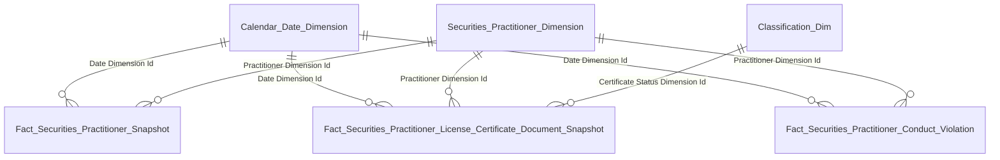

#### Bảng entity

| Gold entity | Description | Grain | KPI |
|---|---|---|---|
| Fact Securities Practitioner Snapshot | Periodic snapshot NHN | 1 NHN × 1 Snapshot Date | K1 |
| Fact Securities Practitioner License Certificate Document Snapshot | Periodic snapshot CCHN | 1 CCHN × 1 Snapshot Date | K2–K5 |
| Fact Securities Practitioner Conduct Violation | Event fact vi phạm | 1 vi phạm | K6 |
| Securities Practitioner Dimension | NHN — tên/ngày sinh/... | 1 NHN (SCD2) | — |
| Classification Dimension | Bảng phân loại chung | 1 classification value | — |
| Calendar Date Dimension | Lịch ngày | 1 ngày | — |

### 1.1 Tổng quan — Nhóm 2: Trình độ chuyên môn

#### Star schema

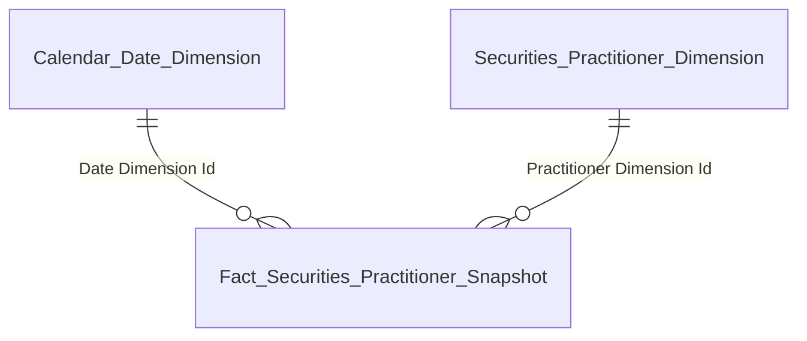

#### Bảng entity

| Gold entity | Description | Grain | KPI |
|---|---|---|---|
| Fact Securities Practitioner Snapshot | Periodic snapshot NHN | 1 NHN × 1 Snapshot Date | K7–K12 |
| Securities Practitioner Dimension | NHN — Education Level Code | 1 NHN (SCD2) | — |
| Calendar Date Dimension | Lịch ngày | 1 ngày | — |

### 1.1 Tổng quan — Nhóm 3: Loại hình CCHN

#### Star schema

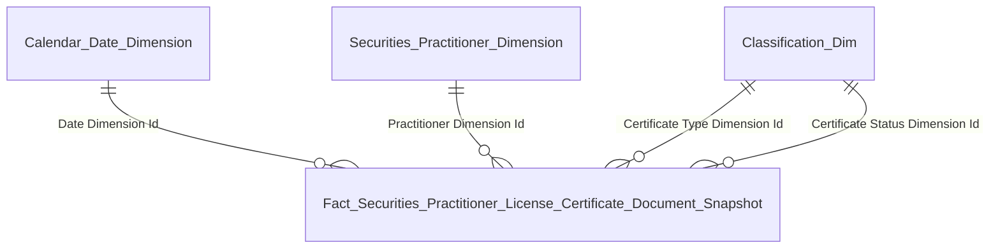

#### Bảng entity

| Gold entity | Description | Grain | KPI |
|---|---|---|---|
| Fact Securities Practitioner License Certificate Document Snapshot | Periodic snapshot CCHN | 1 CCHN × 1 Snapshot Date | K13–K15 |
| Securities Practitioner Dimension | NHN | 1 NHN (SCD2) | — |
| Classification Dimension | Loại chứng chỉ + trạng thái | 1 classification value | — |
| Calendar Date Dimension | Lịch ngày | 1 ngày | — |

### 1.1 Tổng quan — Nhóm 4: Độ tuổi / Quốc tịch

#### Star schema


#### Bảng entity

| Gold entity | Description | Grain | KPI |
|---|---|---|---|
| Fact Securities Practitioner Snapshot | Periodic snapshot NHN | 1 NHN × 1 Snapshot Date | K16–K25 |
| Securities Practitioner Dimension | NHN — Date Of Birth / Nationality Code | 1 NHN (SCD2) | — |
| Calendar Date Dimension | Lịch ngày | 1 ngày | — |

### 1.2 Tra cứu hồ sơ 360°

#### Star schema

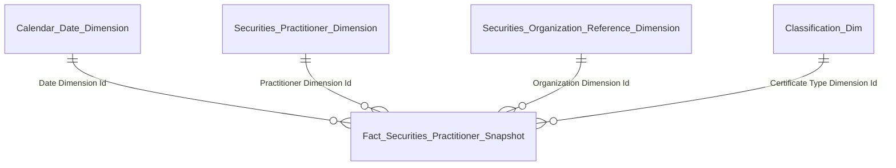

#### Bảng entity

| Gold entity | Description | Grain | KPI |
|---|---|---|---|
| Fact Securities Practitioner Snapshot | Periodic snapshot NHN + CCHN đại diện | 1 NHN × 1 Snapshot Date | K26–K33 |
| Securities Practitioner Dimension | NHN — thông tin cá nhân | 1 NHN (SCD2) | — |
| Securities Organization Reference Dimension | Tổ chức — nơi công tác | 1 tổ chức (SCD2) | — |
| Classification Dimension | Loại CCHN đại diện | 1 classification value | — |
| Calendar Date Dimension | Lịch ngày | 1 ngày snapshot | — |

### 1.3 Mạng lưới — Nhóm 1: Quan hệ công tác

#### Star schema

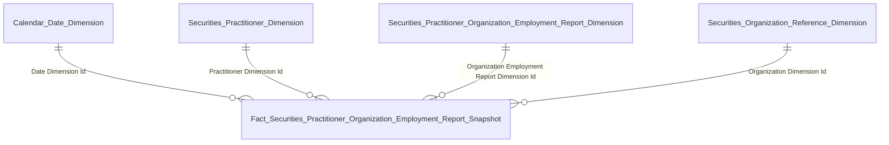

#### Bảng entity

| Gold entity | Description | Grain | KPI |
|---|---|---|---|
| Fact Securities Practitioner Organization Employment Report Snapshot | Factless snapshot — quan hệ NHN ↔ Tổ chức | 1 lượt công tác × 1 Snapshot Date | K34–K35 |
| Securities Practitioner Dimension | NHN chủ thể | 1 NHN (SCD2) | — |
| Securities Practitioner Organization Employment Report Dimension | Lượt công tác — chức vụ/phòng ban | 1 lượt công tác (SCD2) | — |
| Securities Organization Reference Dimension | Tổ chức | 1 tổ chức (SCD2) | — |
| Calendar Date Dimension | Lịch ngày | 1 ngày snapshot | — |

### 1.3 Mạng lưới — Nhóm 2: Quan hệ gia đình

#### Star schema

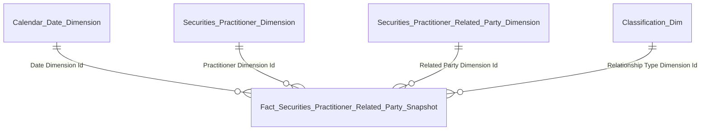

#### Bảng entity

| Gold entity | Description | Grain | KPI |
|---|---|---|---|
| Fact Securities Practitioner Related Party Snapshot | Factless snapshot — quan hệ gia đình NHN ↔ NLQ | 1 NLQ × 1 Snapshot Date | K36–K39 |
| Securities Practitioner Dimension | NHN chủ thể | 1 NHN (SCD2) | — |
| Securities Practitioner Related Party Dimension | Người liên quan — tên/nghề nghiệp/nơi làm việc | 1 NLQ (SCD2) | — |
| Classification Dimension | Loại quan hệ (RELATIONSHIP_TYPE) | 1 classification value | — |
| Calendar Date Dimension | Lịch ngày | 1 ngày snapshot | — |

### 1.4 Hồ sơ — Nhóm 1: Vai trò tại DN niêm yết

#### Star schema


#### Bảng entity

| Gold entity | Description | Grain | KPI |
|---|---|---|---|
| Fact Securities Practitioner Organization Employment Report Snapshot | Factless snapshot — quan hệ NHN ↔ Tổ chức | 1 lượt công tác × 1 Snapshot Date | K40–K43 |
| Securities Practitioner Dimension | NHN | 1 NHN (SCD2) | — |
| Securities Practitioner Organization Employment Report Dimension | Lượt công tác | 1 lượt công tác (SCD2) | — |
| Securities Organization Reference Dimension | Tổ chức | 1 tổ chức (SCD2) | — |
| Calendar Date Dimension | Lịch ngày | 1 ngày snapshot | — |

### 1.4 Hồ sơ — Nhóm 2: Người liên quan

#### Star schema


#### Bảng entity

| Gold entity | Description | Grain | KPI |
|---|---|---|---|
| Fact Securities Practitioner Related Party Snapshot | Factless snapshot — NHN ↔ NLQ | 1 NLQ × 1 Snapshot Date | K44–K47 |
| Securities Practitioner Dimension | NHN | 1 NHN (SCD2) | — |
| Securities Practitioner Related Party Dimension | Người liên quan | 1 NLQ (SCD2) | — |
| Classification Dimension | Loại quan hệ (RELATIONSHIP_TYPE) | 1 classification value | — |
| Calendar Date Dimension | Lịch ngày | 1 ngày snapshot | — |

### 1.5 Quá trình hành nghề

#### Star schema


#### Bảng entity

| Gold entity | Description | Grain | KPI |
|---|---|---|---|
| Fact Securities Practitioner Organization Employment Report Snapshot | Factless snapshot — lịch sử công tác | 1 lượt công tác × 1 Snapshot Date | K53–K57 |
| Securities Practitioner Dimension | NHN | 1 NHN (SCD2) | — |
| Securities Practitioner Organization Employment Report Dimension | Lượt công tác — chức vụ/Hire Date/Termination Date | 1 lượt công tác (SCD2) | — |
| Securities Organization Reference Dimension | Tổ chức | 1 tổ chức (SCD2) | — |
| Calendar Date Dimension | Lịch ngày | 1 ngày snapshot | — |

### 1.6 Lịch sử cấp chứng chỉ

#### Star schema


#### Bảng entity

| Gold entity | Description | Grain | KPI |
|---|---|---|---|
| Fact Securities Practitioner License Certificate Document Snapshot | Periodic snapshot CCHN | 1 CCHN × 1 Snapshot Date | K58–K63 |
| Securities Practitioner Dimension | NHN | 1 NHN (SCD2) | — |
| Classification Dimension | Loại chứng chỉ + trạng thái | 1 classification value | — |
| Calendar Date Dimension | Lịch ngày | 1 ngày snapshot | — |

### 1.7 Lịch sử vi phạm

#### Star schema

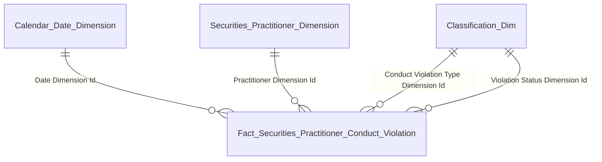

#### Bảng entity

| Gold entity | Description | Grain | KPI |
|---|---|---|---|
| Fact Securities Practitioner Conduct Violation | Event fact vi phạm | 1 vi phạm | K71–K75 |
| Securities Practitioner Dimension | NHN | 1 NHN (SCD2) | — |
| Classification Dimension | Loại vi phạm + trạng thái hiệu lực | 1 classification value | — |
| Calendar Date Dimension | Lịch ngày | 1 ngày vi phạm | — |

### 1.8 Đợt thi sát hạch

#### Star schema

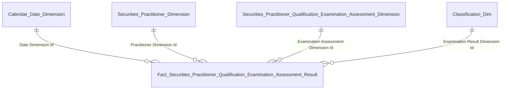

#### Bảng entity

| Gold entity | Description | Grain | KPI |
|---|---|---|---|
| Fact Securities Practitioner Qualification Examination Assessment Result | Event fact kết quả thi | 1 kết quả thi | K64–K68 |
| Securities Practitioner Dimension | NHN | 1 NHN (SCD2) | — |
| Securities Practitioner Qualification Examination Assessment Dimension | Đợt thi — tên/năm/QĐ | 1 đợt thi (SCD2) | — |
| Classification Dimension | Kết quả thi (EXAMINATION_RESULT) | 1 classification value | — |
| Calendar Date Dimension | Lịch ngày | 1 ngày thi | — |

### 1.9 Cập nhật kiến thức

#### Star schema

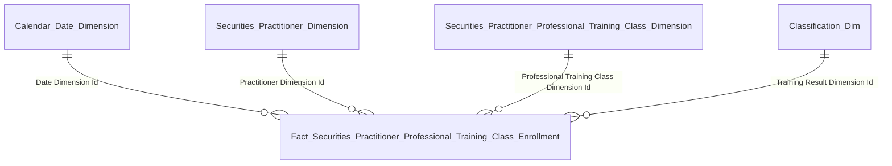

#### Bảng entity

| Gold entity | Description | Grain | KPI |
|---|---|---|---|
| Fact Securities Practitioner Professional Training Class Enrollment | Event fact đăng ký khóa học | 1 đăng ký khóa | K69–K70 |
| Securities Practitioner Dimension | NHN | 1 NHN (SCD2) | — |
| Securities Practitioner Professional Training Class Dimension | Khóa học — tên/năm học | 1 khóa học (SCD2) | — |
| Classification Dimension | Kết quả (TRAINING_RESULT) | 1 classification value | — |
| Calendar Date Dimension | Lịch ngày | 1 ngày khóa học | — |

### 1.10 Data Explorer

#### Star schema

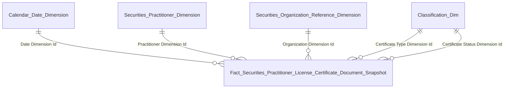

#### Bảng entity

| Gold entity | Description | Grain | KPI |
|---|---|---|---|
| Fact Securities Practitioner License Certificate Document Snapshot | Periodic snapshot CCHN | 1 CCHN × 1 Snapshot Date | K76–K83 |
| Securities Practitioner Dimension | NHN — tên cán bộ | 1 NHN (SCD2) | — |
| Securities Organization Reference Dimension | Công ty | 1 tổ chức (SCD2) | — |
| Classification Dimension | Loại chứng chỉ + trạng thái | 1 classification value | — |
| Calendar Date Dimension | Lịch ngày | 1 ngày snapshot | — |

---

## TT — Thanh tra

### 2.1 Dashboard Hoạt động Thanh tra

#### Star schema

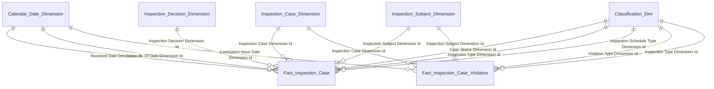

#### Bảng entity

| Gold entity | Description | Grain | KPI |
|---|---|---|---|
| Fact Inspection Case | Event fact hồ sơ thanh tra kiểm tra (filter INSPECTION_TYPE = THANH_TRA) | 1 hồ sơ (latest state) | K_TT_1–K_TT_6, K_TT_14–K_TT_18 |
| Fact Inspection Case Violation | Event fact kết luận × hành vi vi phạm (filter INSPECTION_TYPE = THANH_TRA) | 1 kết luận × 1 hành vi × 1 hình thức phạt | K_TT_7–K_TT_13 |
| Inspection Case Dimension | Hồ sơ thanh tra — mã hồ sơ/tên/nội dung | 1 hồ sơ (SCD2) | — |
| Inspection Subject Dimension | Đối tượng thanh tra polymorphic 2 tầng phân loại | 1 đối tượng (SCD2) | — |
| Inspection Decision Dimension | Quyết định thanh tra | 1 quyết định (SCD2) | — |
| Classification Dimension | Scheme TT_CASE_STATUS / TT_PLAN_TYPE / TT_INSPECTION_SCHEDULE_TYPE / TT_VIOLATION_TYPE / TT_SUBJECT_SOURCE_TYPE / TT_OTHER_PARTY_SUBTYPE | 1 classification value | — |
| Calendar Date Dimension | Lịch ngày | 1 ngày | — |

### 2.2 Dashboard Hoạt động Kiểm tra

#### Star schema


#### Bảng entity

| Gold entity | Description | Grain | KPI |
|---|---|---|---|
| Fact Inspection Case | Event fact hồ sơ thanh tra kiểm tra (filter INSPECTION_TYPE = KIEM_TRA) | 1 hồ sơ (latest state) | K_TT_19–K_TT_24, K_TT_41–K_TT_45 |
| Fact Inspection Case Violation | Event fact kết luận × hành vi vi phạm (filter INSPECTION_TYPE = KIEM_TRA) | 1 kết luận × 1 hành vi × 1 hình thức phạt | K_TT_25–K_TT_30, K_TT_36–K_TT_40 |
| Inspection Case Dimension | Hồ sơ kiểm tra | 1 hồ sơ (SCD2) | — |
| Inspection Subject Dimension | Đối tượng kiểm tra polymorphic 2 tầng phân loại | 1 đối tượng (SCD2) | — |
| Inspection Decision Dimension | Quyết định kiểm tra | 1 quyết định (SCD2) | — |
| Classification Dimension | Scheme TT_CASE_STATUS / TT_PLAN_TYPE / TT_INSPECTION_SCHEDULE_TYPE / TT_VIOLATION_TYPE / TT_SUBJECT_SOURCE_TYPE / TT_OTHER_PARTY_SUBTYPE | 1 classification value | — |
| Calendar Date Dimension | Lịch ngày | 1 ngày | — |

### 2.3 Dashboard Hoạt động Xử phạt

#### Star schema

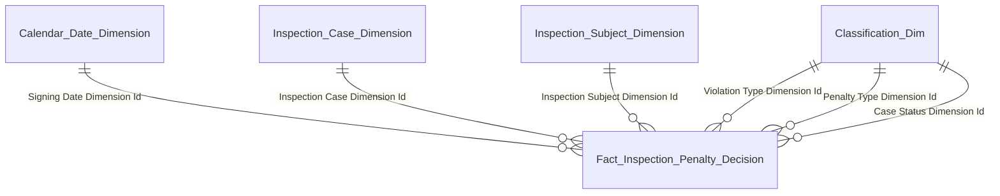

#### Bảng entity

| Gold entity | Description | Grain | KPI |
|---|---|---|---|
| Fact Inspection Penalty Decision | Event fact kết luận xử phạt 1 kết luận = 1 hành vi vi phạm | 1 kết luận xử phạt | K_TT_46–K_TT_64 |
| Inspection Case Dimension | Hồ sơ liên quan | 1 hồ sơ (SCD2) | — |
| Inspection Subject Dimension | Đối tượng bị xử phạt polymorphic 2 tầng phân loại | 1 đối tượng (SCD2) | — |
| Classification Dimension | Scheme TT_VIOLATION_TYPE / TT_PENALTY_TYPE / TT_CASE_STATUS / TT_SUBJECT_SOURCE_TYPE / TT_OTHER_PARTY_SUBTYPE | 1 classification value | — |
| Calendar Date Dimension | Lịch ngày ký kết luận | 1 ngày | — |

### 2.4 Dashboard Tình hình Đơn thư

#### Star schema

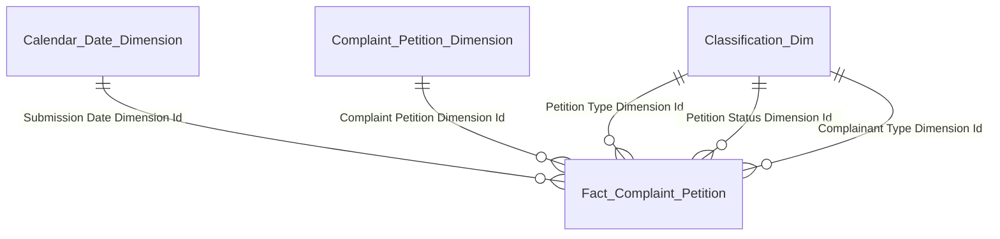

#### Bảng entity

| Gold entity | Description | Grain | KPI |
|---|---|---|---|
| Fact Complaint Petition | Event fact đơn thư khiếu nại tố cáo phản ánh kiến nghị | 1 đơn thư (event tiếp nhận) | K_TT_65–K_TT_74 |
| Complaint Petition Dimension | Đơn thư — mã đơn/tên đơn/tên người gửi/nặc danh/ngày viết | 1 đơn thư (SCD2) | — |
| Classification Dimension | Scheme TT_PETITION_TYPE / TT_PETITION_STATUS / TT_PARTY_TYPE | 1 classification value | — |
| Calendar Date Dimension | Lịch ngày tiếp nhận đơn | 1 ngày | — |

### 2.5 Báo cáo hoạt động xử lý vi phạm trên TTCK (Biểu TT01)

#### Star schema

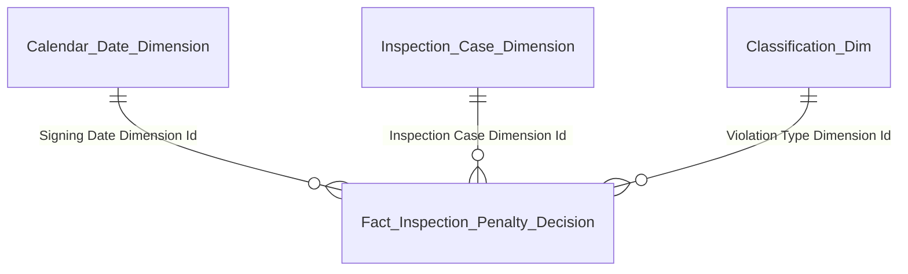

#### Bảng entity

| Gold entity | Description | Grain | KPI |
|---|---|---|---|
| Fact Inspection Penalty Decision | Event fact kết luận xử phạt filter theo kỳ báo cáo Tháng/Năm và 7 mã TT_VIOLATION_TYPE theo biểu TT01 | 1 kết luận xử phạt | K_TT_75–K_TT_88 |
| Inspection Case Dimension | Hồ sơ liên quan | 1 hồ sơ (SCD2) | — |
| Classification Dimension | Scheme TT_VIOLATION_TYPE (7 mã theo biểu TT01) | 1 classification value | — |
| Calendar Date Dimension | Lịch ngày ký kết luận | 1 ngày | — |

## QLKD — Quản lý Kinh doanh Chứng khoán

**HLD tham chiếu:** v0.7 (18/04/2026) · **Scope:** 3 Dashboard × 39 block in-scope × 132 KPI


### Dashboard Tổng quan công ty chứng khoán toàn thị trường


#### Block 1 — Thống kê số lượng CTCK theo trạng thái

##### Star schema

```mermaid
erDiagram
    Securities_Company_Dimension ||--o{ Fact_Securities_Company_Snapshot : "Securities Company Dimension Id"
    Classification_Dimension ||--o{ Fact_Securities_Company_Snapshot : "Classification Dimension Id (multi-FK)"
    Calendar_Date_Dimension ||--o{ Fact_Securities_Company_Snapshot : "Snapshot Date Dimension Id"
```

##### Bảng entity

| Gold entity | Description | Grain | KPI |
|---|---|---|---|
| Fact Securities Company Snapshot | Periodic snapshot CTCK daily | 1 row = 1 CTCK × 1 Snapshot Date (daily batch) | K_QLKD_1, K_QLKD_2, K_QLKD_3, K_QLKD_4, K_QLKD_5, K_QLKD_6, K_QLKD_7, K_QLKD_8, K_QLKD_1_SSCK |
| Securities Company Dimension | Dim CTCK / SCD2 | 1 row = 1 CTCK (SCD2) | - |
| Classification Dimension | Bảng phân loại chung / SCD2 / FK Classification từ fact lookup sang | 1 row = 1 classification value (SCD2) | - |
| Calendar Date Dimension | Lịch hệ thống / slicer năm-quý-tháng | 1 row = 1 ngày snapshot | - |


#### Block 2 — Tài khoản & dư tiền gửi giao dịch toàn thị trường

##### Star schema

```mermaid
erDiagram
    Securities_Company_Dimension ||--o{ Fact_Securities_Company_Member_Report_Value : "Securities Company Dimension Id"
    Securities_Company_Report_Metadata_Dimension ||--o{ Fact_Securities_Company_Member_Report_Value : "Report Metadata Dimension Id"
    Classification_Dimension ||--o{ Fact_Securities_Company_Member_Report_Value : "Classification Dimension Id (multi-FK)"
    Calendar_Date_Dimension ||--o{ Fact_Securities_Company_Member_Report_Value : "Report Date Dimension Id"
```

##### Bảng entity

| Gold entity | Description | Grain | KPI |
|---|---|---|---|
| Fact Securities Company Member Report Value | Snapshot báo cáo thành viên / Cell Value text CAST query-time | 1 row = 1 lần nộp báo cáo × 1 mã chỉ tiêu báo cáo | K_QLKD_9, K_QLKD_10 |
| Securities Company Dimension | Dim CTCK / SCD2 | 1 row = 1 CTCK (SCD2) | - |
| Securities Company Report Metadata Dimension | Tổ hợp Biểu mẫu × Kỳ báo cáo × Mã chỉ tiêu / SCD2 | 1 row = 1 tổ hợp (Biểu mẫu × Kỳ báo cáo × Mã chỉ tiêu) — SCD2 | - |
| Classification Dimension | Bảng phân loại chung / SCD2 / FK Classification từ fact lookup sang | 1 row = 1 classification value (SCD2) | - |
| Calendar Date Dimension | Lịch hệ thống / slicer năm-quý-tháng | 1 row = 1 ngày báo cáo | - |


#### Block 3 — Biểu đồ Nghiệp vụ kinh doanh chứng khoán

##### Star schema

```mermaid
erDiagram
    Securities_Company_Dimension ||--o{ Fact_Securities_Company_Snapshot : "Securities Company Dimension Id"
    Classification_Dimension ||--o{ Fact_Securities_Company_Snapshot : "Classification Dimension Id (multi-FK)"
    Calendar_Date_Dimension ||--o{ Fact_Securities_Company_Snapshot : "Snapshot Date Dimension Id"
```

##### Bảng entity

| Gold entity | Description | Grain | KPI |
|---|---|---|---|
| Fact Securities Company Snapshot | Periodic snapshot CTCK daily | 1 row = 1 CTCK × 1 Snapshot Date (daily batch) | K_QLKD_12, K_QLKD_13, K_QLKD_14, K_QLKD_15 |
| Securities Company Dimension | Dim CTCK / SCD2 | 1 row = 1 CTCK (SCD2) | - |
| Classification Dimension | Bảng phân loại chung / SCD2 / FK Classification từ fact lookup sang | 1 row = 1 classification value (SCD2) | - |
| Calendar Date Dimension | Lịch hệ thống / slicer năm-quý-tháng | 1 row = 1 ngày snapshot | - |


#### Block 4 — Biểu đồ Dịch vụ kinh doanh chứng khoán

##### Star schema

```mermaid
erDiagram
    Securities_Company_Dimension ||--o{ Fact_Securities_Company_Service_Registration_Snapshot : "Securities Company Dimension Id"
    Classification_Dimension ||--o{ Fact_Securities_Company_Service_Registration_Snapshot : "Classification Dimension Id (multi-FK)"
    Calendar_Date_Dimension ||--o{ Fact_Securities_Company_Service_Registration_Snapshot : "Snapshot Date Dimension Id"
```

##### Bảng entity

| Gold entity | Description | Grain | KPI |
|---|---|---|---|
| Fact Securities Company Service Registration Snapshot | Periodic snapshot đăng ký dịch vụ CTCK daily | 1 row = 1 CTCK × 1 Dịch vụ × 1 Snapshot Date (daily batch) | K_QLKD_16, K_QLKD_17, K_QLKD_18 |
| Securities Company Dimension | Dim CTCK / SCD2 | 1 row = 1 CTCK (SCD2) | - |
| Classification Dimension | Bảng phân loại chung / SCD2 / FK Classification từ fact lookup sang | 1 row = 1 classification value (SCD2) | - |
| Calendar Date Dimension | Lịch hệ thống / slicer năm-quý-tháng | 1 row = 1 ngày snapshot | - |


#### Block 5 — Biểu đồ Dịch vụ phái sinh

##### Star schema

```mermaid
erDiagram
    Securities_Company_Dimension ||--o{ Fact_Securities_Company_Service_Registration_Snapshot : "Securities Company Dimension Id"
    Classification_Dimension ||--o{ Fact_Securities_Company_Service_Registration_Snapshot : "Classification Dimension Id (multi-FK)"
    Calendar_Date_Dimension ||--o{ Fact_Securities_Company_Service_Registration_Snapshot : "Snapshot Date Dimension Id"
```

##### Bảng entity

| Gold entity | Description | Grain | KPI |
|---|---|---|---|
| Fact Securities Company Service Registration Snapshot | Periodic snapshot đăng ký dịch vụ CTCK daily | 1 row = 1 CTCK × 1 Dịch vụ × 1 Snapshot Date (daily batch) | K_QLKD_19, K_QLKD_20, K_QLKD_21 |
| Securities Company Dimension | Dim CTCK / SCD2 | 1 row = 1 CTCK (SCD2) | - |
| Classification Dimension | Bảng phân loại chung / SCD2 / FK Classification từ fact lookup sang | 1 row = 1 classification value (SCD2) | - |
| Calendar Date Dimension | Lịch hệ thống / slicer năm-quý-tháng | 1 row = 1 ngày snapshot | - |


#### Block 6 — Duy trì điều kiện cấp phép: Giấy phép hoạt động

##### Star schema

```mermaid
erDiagram
    Securities_Company_Dimension ||--o{ Fact_Securities_Company_Snapshot : "Securities Company Dimension Id"
    Classification_Dimension ||--o{ Fact_Securities_Company_Snapshot : "Classification Dimension Id (multi-FK)"
    Calendar_Date_Dimension ||--o{ Fact_Securities_Company_Snapshot : "Snapshot Date Dimension Id"
```

##### Bảng entity

| Gold entity | Description | Grain | KPI |
|---|---|---|---|
| Fact Securities Company Snapshot | Periodic snapshot CTCK daily | 1 row = 1 CTCK × 1 Snapshot Date (daily batch) | K_QLKD_22, K_QLKD_23, K_QLKD_24 |
| Securities Company Dimension | Dim CTCK / SCD2 | 1 row = 1 CTCK (SCD2) | - |
| Classification Dimension | Bảng phân loại chung / SCD2 / FK Classification từ fact lookup sang | 1 row = 1 classification value (SCD2) | - |
| Calendar Date Dimension | Lịch hệ thống / slicer năm-quý-tháng | 1 row = 1 ngày snapshot | - |


#### Block 7 — Duy trì điều kiện cấp phép: Kinh doanh chứng khoán phái sinh

##### Star schema

```mermaid
erDiagram
    Securities_Company_Dimension ||--o{ Fact_Securities_Company_Service_Registration_Snapshot : "Securities Company Dimension Id"
    Classification_Dimension ||--o{ Fact_Securities_Company_Service_Registration_Snapshot : "Classification Dimension Id (multi-FK)"
    Calendar_Date_Dimension ||--o{ Fact_Securities_Company_Service_Registration_Snapshot : "Snapshot Date Dimension Id"
```

##### Bảng entity

| Gold entity | Description | Grain | KPI |
|---|---|---|---|
| Fact Securities Company Service Registration Snapshot | Periodic snapshot đăng ký dịch vụ CTCK daily | 1 row = 1 CTCK × 1 Dịch vụ × 1 Snapshot Date (daily batch) | K_QLKD_25, K_QLKD_26, K_QLKD_27 |
| Securities Company Dimension | Dim CTCK / SCD2 | 1 row = 1 CTCK (SCD2) | - |
| Classification Dimension | Bảng phân loại chung / SCD2 / FK Classification từ fact lookup sang | 1 row = 1 classification value (SCD2) | - |
| Calendar Date Dimension | Lịch hệ thống / slicer năm-quý-tháng | 1 row = 1 ngày snapshot | - |


#### Block 8 — Duy trì điều kiện cấp phép: Bù trừ, thanh toán giao dịch chứng khoán phái sinh

##### Star schema

```mermaid
erDiagram
    Securities_Company_Dimension ||--o{ Fact_Securities_Company_Service_Registration_Snapshot : "Securities Company Dimension Id"
    Classification_Dimension ||--o{ Fact_Securities_Company_Service_Registration_Snapshot : "Classification Dimension Id (multi-FK)"
    Calendar_Date_Dimension ||--o{ Fact_Securities_Company_Service_Registration_Snapshot : "Snapshot Date Dimension Id"
```

##### Bảng entity

| Gold entity | Description | Grain | KPI |
|---|---|---|---|
| Fact Securities Company Service Registration Snapshot | Periodic snapshot đăng ký dịch vụ CTCK daily | 1 row = 1 CTCK × 1 Dịch vụ × 1 Snapshot Date (daily batch) | K_QLKD_28, K_QLKD_29, K_QLKD_30 |
| Securities Company Dimension | Dim CTCK / SCD2 | 1 row = 1 CTCK (SCD2) | - |
| Classification Dimension | Bảng phân loại chung / SCD2 / FK Classification từ fact lookup sang | 1 row = 1 classification value (SCD2) | - |
| Calendar Date Dimension | Lịch hệ thống / slicer năm-quý-tháng | 1 row = 1 ngày snapshot | - |


#### Block 9 — Biểu đồ Cơ cấu tài sản toàn thị trường

##### Star schema

```mermaid
erDiagram
    Securities_Company_Dimension ||--o{ Fact_Securities_Company_Member_Report_Value : "Securities Company Dimension Id"
    Securities_Company_Report_Metadata_Dimension ||--o{ Fact_Securities_Company_Member_Report_Value : "Report Metadata Dimension Id"
    Classification_Dimension ||--o{ Fact_Securities_Company_Member_Report_Value : "Classification Dimension Id (multi-FK)"
    Calendar_Date_Dimension ||--o{ Fact_Securities_Company_Member_Report_Value : "Report Date Dimension Id"
```

##### Bảng entity

| Gold entity | Description | Grain | KPI |
|---|---|---|---|
| Fact Securities Company Member Report Value | Snapshot báo cáo thành viên / Cell Value text CAST query-time | 1 row = 1 lần nộp báo cáo × 1 mã chỉ tiêu báo cáo | K_QLKD_31, K_QLKD_32, K_QLKD_33, K_QLKD_34, K_QLKD_35, K_QLKD_36 |
| Securities Company Dimension | Dim CTCK / SCD2 | 1 row = 1 CTCK (SCD2) | - |
| Securities Company Report Metadata Dimension | Tổ hợp Biểu mẫu × Kỳ báo cáo × Mã chỉ tiêu / SCD2 | 1 row = 1 tổ hợp (Biểu mẫu × Kỳ báo cáo × Mã chỉ tiêu) — SCD2 | - |
| Classification Dimension | Bảng phân loại chung / SCD2 / FK Classification từ fact lookup sang | 1 row = 1 classification value (SCD2) | - |
| Calendar Date Dimension | Lịch hệ thống / slicer năm-quý-tháng | 1 row = 1 ngày báo cáo | - |


#### Block 10 — Biểu đồ Cơ cấu nguồn vốn toàn thị trường

##### Star schema

```mermaid
erDiagram
    Securities_Company_Dimension ||--o{ Fact_Securities_Company_Member_Report_Value : "Securities Company Dimension Id"
    Securities_Company_Report_Metadata_Dimension ||--o{ Fact_Securities_Company_Member_Report_Value : "Report Metadata Dimension Id"
    Classification_Dimension ||--o{ Fact_Securities_Company_Member_Report_Value : "Classification Dimension Id (multi-FK)"
    Calendar_Date_Dimension ||--o{ Fact_Securities_Company_Member_Report_Value : "Report Date Dimension Id"
```

##### Bảng entity

| Gold entity | Description | Grain | KPI |
|---|---|---|---|
| Fact Securities Company Member Report Value | Snapshot báo cáo thành viên / Cell Value text CAST query-time | 1 row = 1 lần nộp báo cáo × 1 mã chỉ tiêu báo cáo | K_QLKD_37, K_QLKD_38, K_QLKD_39, K_QLKD_40 |
| Securities Company Dimension | Dim CTCK / SCD2 | 1 row = 1 CTCK (SCD2) | - |
| Securities Company Report Metadata Dimension | Tổ hợp Biểu mẫu × Kỳ báo cáo × Mã chỉ tiêu / SCD2 | 1 row = 1 tổ hợp (Biểu mẫu × Kỳ báo cáo × Mã chỉ tiêu) — SCD2 | - |
| Classification Dimension | Bảng phân loại chung / SCD2 / FK Classification từ fact lookup sang | 1 row = 1 classification value (SCD2) | - |
| Calendar Date Dimension | Lịch hệ thống / slicer năm-quý-tháng | 1 row = 1 ngày báo cáo | - |


### Dashboard Giám sát tình hình hoạt động của CTCK toàn thị trường


#### Block 11 — Cơ cấu vốn chủ sở hữu toàn thị trường

##### Star schema

```mermaid
erDiagram
    Securities_Company_Dimension ||--o{ Fact_Securities_Company_Member_Report_Value : "Securities Company Dimension Id"
    Securities_Company_Report_Metadata_Dimension ||--o{ Fact_Securities_Company_Member_Report_Value : "Report Metadata Dimension Id"
    Classification_Dimension ||--o{ Fact_Securities_Company_Member_Report_Value : "Classification Dimension Id (multi-FK)"
    Calendar_Date_Dimension ||--o{ Fact_Securities_Company_Member_Report_Value : "Report Date Dimension Id"
```

##### Bảng entity

| Gold entity | Description | Grain | KPI |
|---|---|---|---|
| Fact Securities Company Member Report Value | Snapshot báo cáo thành viên / Cell Value text CAST query-time | 1 row = 1 lần nộp báo cáo × 1 mã chỉ tiêu báo cáo | K_QLKD_41, K_QLKD_42, K_QLKD_43, K_QLKD_44 |
| Securities Company Dimension | Dim CTCK / SCD2 | 1 row = 1 CTCK (SCD2) | - |
| Securities Company Report Metadata Dimension | Tổ hợp Biểu mẫu × Kỳ báo cáo × Mã chỉ tiêu / SCD2 | 1 row = 1 tổ hợp (Biểu mẫu × Kỳ báo cáo × Mã chỉ tiêu) — SCD2 | - |
| Classification Dimension | Bảng phân loại chung / SCD2 / FK Classification từ fact lookup sang | 1 row = 1 classification value (SCD2) | - |
| Calendar Date Dimension | Lịch hệ thống / slicer năm-quý-tháng | 1 row = 1 ngày báo cáo | - |


#### Block 12 — Biến động Vốn đầu tư chủ sở hữu theo quý

##### Star schema

```mermaid
erDiagram
    Securities_Company_Dimension ||--o{ Fact_Securities_Company_Member_Report_Value : "Securities Company Dimension Id"
    Securities_Company_Report_Metadata_Dimension ||--o{ Fact_Securities_Company_Member_Report_Value : "Report Metadata Dimension Id"
    Classification_Dimension ||--o{ Fact_Securities_Company_Member_Report_Value : "Classification Dimension Id (multi-FK)"
    Calendar_Date_Dimension ||--o{ Fact_Securities_Company_Member_Report_Value : "Report Date Dimension Id"
```

##### Bảng entity

| Gold entity | Description | Grain | KPI |
|---|---|---|---|
| Fact Securities Company Member Report Value | Snapshot báo cáo thành viên / Cell Value text CAST query-time | 1 row = 1 lần nộp báo cáo × 1 mã chỉ tiêu báo cáo | K_QLKD_45 |
| Securities Company Dimension | Dim CTCK / SCD2 | 1 row = 1 CTCK (SCD2) | - |
| Securities Company Report Metadata Dimension | Tổ hợp Biểu mẫu × Kỳ báo cáo × Mã chỉ tiêu / SCD2 | 1 row = 1 tổ hợp (Biểu mẫu × Kỳ báo cáo × Mã chỉ tiêu) — SCD2 | - |
| Classification Dimension | Bảng phân loại chung / SCD2 / FK Classification từ fact lookup sang | 1 row = 1 classification value (SCD2) | - |
| Calendar Date Dimension | Lịch hệ thống / slicer năm-quý-tháng | 1 row = 1 ngày báo cáo | - |


#### Block 13 — Nguồn vốn tăng thêm trong kỳ (chào bán + phát hành)

##### Star schema

```mermaid
erDiagram
    Securities_Company_Dimension ||--o{ Fact_Securities_Offering_Disclosure : "Securities Company Dimension Id"
    Classification_Dimension ||--o{ Fact_Securities_Offering_Disclosure : "Classification Dimension Id (multi-FK)"
    Calendar_Date_Dimension ||--o{ Fact_Securities_Offering_Disclosure : "Disclosure Date Dimension Id"
```

##### Bảng entity

| Gold entity | Description | Grain | KPI |
|---|---|---|---|
| Fact Securities Offering Disclosure | Event công bố chào bán chứng khoán | 1 row = 1 lần công bố chào bán chứng khoán (event) | K_QLKD_46, K_QLKD_47, K_QLKD_48, K_QLKD_49, K_QLKD_50 |
| Securities Company Dimension | Dim CTCK / SCD2 | 1 row = 1 CTCK (SCD2) | - |
| Classification Dimension | Bảng phân loại chung / SCD2 / FK Classification từ fact lookup sang | 1 row = 1 classification value (SCD2) | - |
| Calendar Date Dimension | Lịch hệ thống / slicer năm-quý-tháng | 1 row = 1 ngày công bố | - |


#### Block 14 — Tỷ lệ an toàn tài chính (số lượng CTCK theo mức tỷ lệ vốn khả dụng)

##### Star schema

```mermaid
erDiagram
    Securities_Company_Dimension ||--o{ Fact_Securities_Company_Member_Report_Value : "Securities Company Dimension Id"
    Securities_Company_Report_Metadata_Dimension ||--o{ Fact_Securities_Company_Member_Report_Value : "Report Metadata Dimension Id"
    Classification_Dimension ||--o{ Fact_Securities_Company_Member_Report_Value : "Classification Dimension Id (multi-FK)"
    Calendar_Date_Dimension ||--o{ Fact_Securities_Company_Member_Report_Value : "Report Date Dimension Id"
```

##### Bảng entity

| Gold entity | Description | Grain | KPI |
|---|---|---|---|
| Fact Securities Company Member Report Value | Snapshot báo cáo thành viên / Cell Value text CAST query-time | 1 row = 1 lần nộp báo cáo × 1 mã chỉ tiêu báo cáo | K_QLKD_51, K_QLKD_52, K_QLKD_53 |
| Securities Company Dimension | Dim CTCK / SCD2 | 1 row = 1 CTCK (SCD2) | - |
| Securities Company Report Metadata Dimension | Tổ hợp Biểu mẫu × Kỳ báo cáo × Mã chỉ tiêu / SCD2 | 1 row = 1 tổ hợp (Biểu mẫu × Kỳ báo cáo × Mã chỉ tiêu) — SCD2 | - |
| Classification Dimension | Bảng phân loại chung / SCD2 / FK Classification từ fact lookup sang | 1 row = 1 classification value (SCD2) | - |
| Calendar Date Dimension | Lịch hệ thống / slicer năm-quý-tháng | 1 row = 1 ngày báo cáo | - |


#### Block 15 — Doanh thu và lợi nhuận toàn thị trường (theo nghiệp vụ)

##### Star schema

```mermaid
erDiagram
    Securities_Company_Dimension ||--o{ Fact_Securities_Company_Member_Report_Value : "Securities Company Dimension Id"
    Securities_Company_Report_Metadata_Dimension ||--o{ Fact_Securities_Company_Member_Report_Value : "Report Metadata Dimension Id"
    Classification_Dimension ||--o{ Fact_Securities_Company_Member_Report_Value : "Classification Dimension Id (multi-FK)"
    Calendar_Date_Dimension ||--o{ Fact_Securities_Company_Member_Report_Value : "Report Date Dimension Id"
```

##### Bảng entity

| Gold entity | Description | Grain | KPI |
|---|---|---|---|
| Fact Securities Company Member Report Value | Snapshot báo cáo thành viên / Cell Value text CAST query-time | 1 row = 1 lần nộp báo cáo × 1 mã chỉ tiêu báo cáo | K_QLKD_54, K_QLKD_55, K_QLKD_56, K_QLKD_57, K_QLKD_58, K_QLKD_59, K_QLKD_60 |
| Securities Company Dimension | Dim CTCK / SCD2 | 1 row = 1 CTCK (SCD2) | - |
| Securities Company Report Metadata Dimension | Tổ hợp Biểu mẫu × Kỳ báo cáo × Mã chỉ tiêu / SCD2 | 1 row = 1 tổ hợp (Biểu mẫu × Kỳ báo cáo × Mã chỉ tiêu) — SCD2 | - |
| Classification Dimension | Bảng phân loại chung / SCD2 / FK Classification từ fact lookup sang | 1 row = 1 classification value (SCD2) | - |
| Calendar Date Dimension | Lịch hệ thống / slicer năm-quý-tháng | 1 row = 1 ngày báo cáo | - |


#### Block 16 — Biến động dư nợ margin (phần in-scope SCMS)

##### Star schema

```mermaid
erDiagram
    Securities_Company_Dimension ||--o{ Fact_Securities_Company_Member_Report_Value : "Securities Company Dimension Id"
    Securities_Company_Report_Metadata_Dimension ||--o{ Fact_Securities_Company_Member_Report_Value : "Report Metadata Dimension Id"
    Classification_Dimension ||--o{ Fact_Securities_Company_Member_Report_Value : "Classification Dimension Id (multi-FK)"
    Calendar_Date_Dimension ||--o{ Fact_Securities_Company_Member_Report_Value : "Report Date Dimension Id"
```

##### Bảng entity

| Gold entity | Description | Grain | KPI |
|---|---|---|---|
| Fact Securities Company Member Report Value | Snapshot báo cáo thành viên / Cell Value text CAST query-time | 1 row = 1 lần nộp báo cáo × 1 mã chỉ tiêu báo cáo | K_QLKD_61 |
| Securities Company Dimension | Dim CTCK / SCD2 | 1 row = 1 CTCK (SCD2) | - |
| Securities Company Report Metadata Dimension | Tổ hợp Biểu mẫu × Kỳ báo cáo × Mã chỉ tiêu / SCD2 | 1 row = 1 tổ hợp (Biểu mẫu × Kỳ báo cáo × Mã chỉ tiêu) — SCD2 | - |
| Classification Dimension | Bảng phân loại chung / SCD2 / FK Classification từ fact lookup sang | 1 row = 1 classification value (SCD2) | - |
| Calendar Date Dimension | Lịch hệ thống / slicer năm-quý-tháng | 1 row = 1 ngày báo cáo | - |


#### Block 18 — Lưu chuyển tiền thuần từ hoạt động kinh doanh (CFO) per CTCK

##### Star schema

```mermaid
erDiagram
    Securities_Company_Dimension ||--o{ Fact_Securities_Company_Member_Report_Value : "Securities Company Dimension Id"
    Securities_Company_Report_Metadata_Dimension ||--o{ Fact_Securities_Company_Member_Report_Value : "Report Metadata Dimension Id"
    Classification_Dimension ||--o{ Fact_Securities_Company_Member_Report_Value : "Classification Dimension Id (multi-FK)"
    Calendar_Date_Dimension ||--o{ Fact_Securities_Company_Member_Report_Value : "Report Date Dimension Id"
```

##### Bảng entity

| Gold entity | Description | Grain | KPI |
|---|---|---|---|
| Fact Securities Company Member Report Value | Snapshot báo cáo thành viên / Cell Value text CAST query-time | 1 row = 1 lần nộp báo cáo × 1 mã chỉ tiêu báo cáo | K_QLKD_62, K_QLKD_63 |
| Securities Company Dimension | Dim CTCK / SCD2 | 1 row = 1 CTCK (SCD2) | - |
| Securities Company Report Metadata Dimension | Tổ hợp Biểu mẫu × Kỳ báo cáo × Mã chỉ tiêu / SCD2 | 1 row = 1 tổ hợp (Biểu mẫu × Kỳ báo cáo × Mã chỉ tiêu) — SCD2 | - |
| Classification Dimension | Bảng phân loại chung / SCD2 / FK Classification từ fact lookup sang | 1 row = 1 classification value (SCD2) | - |
| Calendar Date Dimension | Lịch hệ thống / slicer năm-quý-tháng | 1 row = 1 ngày báo cáo | - |


### Dashboard Tra cứu hồ sơ 360° CTCK


#### Tab 1 — Tổng quan


##### Block 19 — Biểu đồ Thống kê chung (KPI cards tổng quan CTCK)

##### Star schema

```mermaid
erDiagram
    Securities_Company_Dimension ||--o{ Fact_Securities_Company_Member_Report_Value : "Securities Company Dimension Id"
    Securities_Company_Report_Metadata_Dimension ||--o{ Fact_Securities_Company_Member_Report_Value : "Report Metadata Dimension Id"
    Classification_Dimension ||--o{ Fact_Securities_Company_Member_Report_Value : "Classification Dimension Id (multi-FK)"
    Calendar_Date_Dimension ||--o{ Fact_Securities_Company_Member_Report_Value : "Report Date Dimension Id"
```

##### Bảng entity

| Gold entity | Description | Grain | KPI |
|---|---|---|---|
| Fact Securities Company Member Report Value | Snapshot báo cáo thành viên / Cell Value text CAST query-time | 1 row = 1 lần nộp báo cáo × 1 mã chỉ tiêu báo cáo | K_QLKD_41, K_QLKD_64, K_QLKD_61, K_QLKD_51, K_QLKD_8, K_QLKD_41_MOM, K_QLKD_61_MOM, K_QLKD_51_MOM |
| Securities Company Dimension | Dim CTCK / SCD2 | 1 row = 1 CTCK (SCD2) | - |
| Securities Company Report Metadata Dimension | Tổ hợp Biểu mẫu × Kỳ báo cáo × Mã chỉ tiêu / SCD2 | 1 row = 1 tổ hợp (Biểu mẫu × Kỳ báo cáo × Mã chỉ tiêu) — SCD2 | - |
| Classification Dimension | Bảng phân loại chung / SCD2 / FK Classification từ fact lookup sang | 1 row = 1 classification value (SCD2) | - |
| Calendar Date Dimension | Lịch hệ thống / slicer năm-quý-tháng | 1 row = 1 ngày báo cáo | - |


##### Block 20 — Biểu đồ Biến động Vốn CSH per CTCK (theo quý)

##### Star schema

```mermaid
erDiagram
    Securities_Company_Dimension ||--o{ Fact_Securities_Company_Member_Report_Value : "Securities Company Dimension Id"
    Securities_Company_Report_Metadata_Dimension ||--o{ Fact_Securities_Company_Member_Report_Value : "Report Metadata Dimension Id"
    Classification_Dimension ||--o{ Fact_Securities_Company_Member_Report_Value : "Classification Dimension Id (multi-FK)"
    Calendar_Date_Dimension ||--o{ Fact_Securities_Company_Member_Report_Value : "Report Date Dimension Id"
```

##### Bảng entity

| Gold entity | Description | Grain | KPI |
|---|---|---|---|
| Fact Securities Company Member Report Value | Snapshot báo cáo thành viên / Cell Value text CAST query-time | 1 row = 1 lần nộp báo cáo × 1 mã chỉ tiêu báo cáo | K_QLKD_41 |
| Securities Company Dimension | Dim CTCK / SCD2 | 1 row = 1 CTCK (SCD2) | - |
| Securities Company Report Metadata Dimension | Tổ hợp Biểu mẫu × Kỳ báo cáo × Mã chỉ tiêu / SCD2 | 1 row = 1 tổ hợp (Biểu mẫu × Kỳ báo cáo × Mã chỉ tiêu) — SCD2 | - |
| Classification Dimension | Bảng phân loại chung / SCD2 / FK Classification từ fact lookup sang | 1 row = 1 classification value (SCD2) | - |
| Calendar Date Dimension | Lịch hệ thống / slicer năm-quý-tháng | 1 row = 1 ngày báo cáo | - |


##### Block 21 — Biểu đồ Cơ cấu tổng tài sản CTCK (theo quý)

##### Star schema

```mermaid
erDiagram
    Securities_Company_Dimension ||--o{ Fact_Securities_Company_Member_Report_Value : "Securities Company Dimension Id"
    Securities_Company_Report_Metadata_Dimension ||--o{ Fact_Securities_Company_Member_Report_Value : "Report Metadata Dimension Id"
    Classification_Dimension ||--o{ Fact_Securities_Company_Member_Report_Value : "Classification Dimension Id (multi-FK)"
    Calendar_Date_Dimension ||--o{ Fact_Securities_Company_Member_Report_Value : "Report Date Dimension Id"
```

##### Bảng entity

| Gold entity | Description | Grain | KPI |
|---|---|---|---|
| Fact Securities Company Member Report Value | Snapshot báo cáo thành viên / Cell Value text CAST query-time | 1 row = 1 lần nộp báo cáo × 1 mã chỉ tiêu báo cáo | K_QLKD_31, K_QLKD_32, K_QLKD_33, K_QLKD_34, K_QLKD_35, K_QLKD_36 |
| Securities Company Dimension | Dim CTCK / SCD2 | 1 row = 1 CTCK (SCD2) | - |
| Securities Company Report Metadata Dimension | Tổ hợp Biểu mẫu × Kỳ báo cáo × Mã chỉ tiêu / SCD2 | 1 row = 1 tổ hợp (Biểu mẫu × Kỳ báo cáo × Mã chỉ tiêu) — SCD2 | - |
| Classification Dimension | Bảng phân loại chung / SCD2 / FK Classification từ fact lookup sang | 1 row = 1 classification value (SCD2) | - |
| Calendar Date Dimension | Lịch hệ thống / slicer năm-quý-tháng | 1 row = 1 ngày báo cáo | - |


##### Block 22 — Biểu đồ Cơ cấu nguồn vốn CTCK (theo quý)

##### Star schema

```mermaid
erDiagram
    Securities_Company_Dimension ||--o{ Fact_Securities_Company_Member_Report_Value : "Securities Company Dimension Id"
    Securities_Company_Report_Metadata_Dimension ||--o{ Fact_Securities_Company_Member_Report_Value : "Report Metadata Dimension Id"
    Classification_Dimension ||--o{ Fact_Securities_Company_Member_Report_Value : "Classification Dimension Id (multi-FK)"
    Calendar_Date_Dimension ||--o{ Fact_Securities_Company_Member_Report_Value : "Report Date Dimension Id"
```

##### Bảng entity

| Gold entity | Description | Grain | KPI |
|---|---|---|---|
| Fact Securities Company Member Report Value | Snapshot báo cáo thành viên / Cell Value text CAST query-time | 1 row = 1 lần nộp báo cáo × 1 mã chỉ tiêu báo cáo | K_QLKD_37, K_QLKD_38, K_QLKD_39, K_QLKD_40 |
| Securities Company Dimension | Dim CTCK / SCD2 | 1 row = 1 CTCK (SCD2) | - |
| Securities Company Report Metadata Dimension | Tổ hợp Biểu mẫu × Kỳ báo cáo × Mã chỉ tiêu / SCD2 | 1 row = 1 tổ hợp (Biểu mẫu × Kỳ báo cáo × Mã chỉ tiêu) — SCD2 | - |
| Classification Dimension | Bảng phân loại chung / SCD2 / FK Classification từ fact lookup sang | 1 row = 1 classification value (SCD2) | - |
| Calendar Date Dimension | Lịch hệ thống / slicer năm-quý-tháng | 1 row = 1 ngày báo cáo | - |


##### Block 23 — Biểu đồ Doanh thu, Lợi nhuận sau thuế CTCK (theo quý)

##### Star schema

```mermaid
erDiagram
    Securities_Company_Dimension ||--o{ Fact_Securities_Company_Member_Report_Value : "Securities Company Dimension Id"
    Securities_Company_Report_Metadata_Dimension ||--o{ Fact_Securities_Company_Member_Report_Value : "Report Metadata Dimension Id"
    Classification_Dimension ||--o{ Fact_Securities_Company_Member_Report_Value : "Classification Dimension Id (multi-FK)"
    Calendar_Date_Dimension ||--o{ Fact_Securities_Company_Member_Report_Value : "Report Date Dimension Id"
```

##### Bảng entity

| Gold entity | Description | Grain | KPI |
|---|---|---|---|
| Fact Securities Company Member Report Value | Snapshot báo cáo thành viên / Cell Value text CAST query-time | 1 row = 1 lần nộp báo cáo × 1 mã chỉ tiêu báo cáo | K_QLKD_54, K_QLKD_55, K_QLKD_56, K_QLKD_57, K_QLKD_58, K_QLKD_59 |
| Securities Company Dimension | Dim CTCK / SCD2 | 1 row = 1 CTCK (SCD2) | - |
| Securities Company Report Metadata Dimension | Tổ hợp Biểu mẫu × Kỳ báo cáo × Mã chỉ tiêu / SCD2 | 1 row = 1 tổ hợp (Biểu mẫu × Kỳ báo cáo × Mã chỉ tiêu) — SCD2 | - |
| Classification Dimension | Bảng phân loại chung / SCD2 / FK Classification từ fact lookup sang | 1 row = 1 classification value (SCD2) | - |
| Calendar Date Dimension | Lịch hệ thống / slicer năm-quý-tháng | 1 row = 1 ngày báo cáo | - |


##### Block 24 — Biểu đồ Chỉ số Dư nợ margin / Vốn CSH (%) theo tháng

##### Star schema

```mermaid
erDiagram
    Securities_Company_Dimension ||--o{ Fact_Securities_Company_Member_Report_Value : "Securities Company Dimension Id"
    Securities_Company_Report_Metadata_Dimension ||--o{ Fact_Securities_Company_Member_Report_Value : "Report Metadata Dimension Id"
    Classification_Dimension ||--o{ Fact_Securities_Company_Member_Report_Value : "Classification Dimension Id (multi-FK)"
    Calendar_Date_Dimension ||--o{ Fact_Securities_Company_Member_Report_Value : "Report Date Dimension Id"
```

##### Bảng entity

| Gold entity | Description | Grain | KPI |
|---|---|---|---|
| Fact Securities Company Member Report Value | Snapshot báo cáo thành viên / Cell Value text CAST query-time | 1 row = 1 lần nộp báo cáo × 1 mã chỉ tiêu báo cáo | K_QLKD_65 |
| Securities Company Dimension | Dim CTCK / SCD2 | 1 row = 1 CTCK (SCD2) | - |
| Securities Company Report Metadata Dimension | Tổ hợp Biểu mẫu × Kỳ báo cáo × Mã chỉ tiêu / SCD2 | 1 row = 1 tổ hợp (Biểu mẫu × Kỳ báo cáo × Mã chỉ tiêu) — SCD2 | - |
| Classification Dimension | Bảng phân loại chung / SCD2 / FK Classification từ fact lookup sang | 1 row = 1 classification value (SCD2) | - |
| Calendar Date Dimension | Lịch hệ thống / slicer năm-quý-tháng | 1 row = 1 ngày báo cáo | - |


##### Block 25 — Biểu đồ Tỷ lệ ATTC theo tháng

##### Star schema

```mermaid
erDiagram
    Securities_Company_Dimension ||--o{ Fact_Securities_Company_Member_Report_Value : "Securities Company Dimension Id"
    Securities_Company_Report_Metadata_Dimension ||--o{ Fact_Securities_Company_Member_Report_Value : "Report Metadata Dimension Id"
    Classification_Dimension ||--o{ Fact_Securities_Company_Member_Report_Value : "Classification Dimension Id (multi-FK)"
    Calendar_Date_Dimension ||--o{ Fact_Securities_Company_Member_Report_Value : "Report Date Dimension Id"
```

##### Bảng entity

| Gold entity | Description | Grain | KPI |
|---|---|---|---|
| Fact Securities Company Member Report Value | Snapshot báo cáo thành viên / Cell Value text CAST query-time | 1 row = 1 lần nộp báo cáo × 1 mã chỉ tiêu báo cáo | K_QLKD_51 |
| Securities Company Dimension | Dim CTCK / SCD2 | 1 row = 1 CTCK (SCD2) | - |
| Securities Company Report Metadata Dimension | Tổ hợp Biểu mẫu × Kỳ báo cáo × Mã chỉ tiêu / SCD2 | 1 row = 1 tổ hợp (Biểu mẫu × Kỳ báo cáo × Mã chỉ tiêu) — SCD2 | - |
| Classification Dimension | Bảng phân loại chung / SCD2 / FK Classification từ fact lookup sang | 1 row = 1 classification value (SCD2) | - |
| Calendar Date Dimension | Lịch hệ thống / slicer năm-quý-tháng | 1 row = 1 ngày báo cáo | - |


#### Tab 2 — Tài chính


##### Block 26 — KPI cards Tài chính (Doanh thu YTD / LN YTD / ROA / ROE)

##### Star schema

```mermaid
erDiagram
    Securities_Company_Dimension ||--o{ Fact_Securities_Company_Member_Report_Value : "Securities Company Dimension Id"
    Securities_Company_Report_Metadata_Dimension ||--o{ Fact_Securities_Company_Member_Report_Value : "Report Metadata Dimension Id"
    Classification_Dimension ||--o{ Fact_Securities_Company_Member_Report_Value : "Classification Dimension Id (multi-FK)"
    Calendar_Date_Dimension ||--o{ Fact_Securities_Company_Member_Report_Value : "Report Date Dimension Id"
```

##### Bảng entity

| Gold entity | Description | Grain | KPI |
|---|---|---|---|
| Fact Securities Company Member Report Value | Snapshot báo cáo thành viên / Cell Value text CAST query-time | 1 row = 1 lần nộp báo cáo × 1 mã chỉ tiêu báo cáo | K_QLKD_66, K_QLKD_67, K_QLKD_68, K_QLKD_69, K_QLKD_70 |
| Securities Company Dimension | Dim CTCK / SCD2 | 1 row = 1 CTCK (SCD2) | - |
| Securities Company Report Metadata Dimension | Tổ hợp Biểu mẫu × Kỳ báo cáo × Mã chỉ tiêu / SCD2 | 1 row = 1 tổ hợp (Biểu mẫu × Kỳ báo cáo × Mã chỉ tiêu) — SCD2 | - |
| Classification Dimension | Bảng phân loại chung / SCD2 / FK Classification từ fact lookup sang | 1 row = 1 classification value (SCD2) | - |
| Calendar Date Dimension | Lịch hệ thống / slicer năm-quý-tháng | 1 row = 1 ngày báo cáo | - |


##### Block 27 — Bảng lịch sử báo cáo tài chính (IDS Lakehouse)

##### Star schema

```mermaid
erDiagram
    Securities_Company_Dimension ||--o{ Fact_Securities_Company_Member_Report_Value : "Securities Company Dimension Id"
    Securities_Company_Report_Metadata_Dimension ||--o{ Fact_Securities_Company_Member_Report_Value : "Report Metadata Dimension Id"
    Member_Periodic_Report_Dimension ||--o{ Fact_Securities_Company_Member_Report_Value : "Member Periodic Report Dimension Id"
    Classification_Dimension ||--o{ Fact_Securities_Company_Member_Report_Value : "Classification Dimension Id (multi-FK)"
    Calendar_Date_Dimension ||--o{ Fact_Securities_Company_Member_Report_Value : "Report Date Dimension Id"
```

##### Bảng entity

| Gold entity | Description | Grain | KPI |
|---|---|---|---|
| Fact Securities Company Member Report Value | Snapshot báo cáo thành viên / Cell Value text CAST query-time — measure K_QLKD_72/73 | 1 row = 1 lần nộp báo cáo × 1 mã chỉ tiêu báo cáo | K_QLKD_72, K_QLKD_73 |
| Member Periodic Report Dimension | Lần nộp báo cáo định kỳ / SCD2 / NEW v0.7 — attribute label cho K_QLKD_71/74/75 | 1 row = 1 lần nộp báo cáo định kỳ (SCD2) — NEW v0.7 | K_QLKD_71, K_QLKD_74, K_QLKD_75 |
| Securities Company Dimension | Dim CTCK / SCD2 — filter per CTCK | 1 row = 1 CTCK (SCD2) | - |
| Securities Company Report Metadata Dimension | Tổ hợp Biểu mẫu × Kỳ báo cáo × Mã chỉ tiêu / SCD2 — filter Cell Code | 1 row = 1 tổ hợp (Biểu mẫu × Kỳ báo cáo × Mã chỉ tiêu) — SCD2 | - |
| Classification Dimension | Decode Report Submission Status (scheme FMS_REPORT_SUBMISSION_STATUS) cho K_QLKD_75 | 1 row = 1 classification value (SCD2) | - |
| Calendar Date Dimension | Lookup Report Date | 1 row = 1 ngày báo cáo | - |

**Ghi chú:** K_QLKD_68 (ROA) và K_QLKD_70 (ROE) xuất hiện trong Block 27 là **reuse derived** từ Block 26 — không lưu mart (derived từ K_QLKD_67/K_QLKD_69 và K_QLKD_67/K_QLKD_41).

> **v0.7 note:** Block này tuân thủ Option C refactor — Member Periodic Report Dimension thay thế fact-fact JOIN cũ (QLKD_O13 Closed).


#### Tab 3 — NHNCK của CTCK


##### Block 28 — KPI cards NHNCK (Tổng LĐ / Có CCHN / Chưa có CC)

##### Star schema

```mermaid
erDiagram
    Securities_Company_Dimension ||--o{ Fact_QLKD_Practitioner_License_Certificate_Snapshot : "Managing Securities Company Dimension Id"
    Securities_Company_Practitioner_Dimension ||--o{ Fact_QLKD_Practitioner_License_Certificate_Snapshot : "Practitioner Dimension Id"
    Classification_Dimension ||--o{ Fact_QLKD_Practitioner_License_Certificate_Snapshot : "Classification Dimension Id (multi-FK)"
    Calendar_Date_Dimension ||--o{ Fact_QLKD_Practitioner_License_Certificate_Snapshot : "Snapshot Date Dimension Id"
```

##### Bảng entity

| Gold entity | Description | Grain | KPI |
|---|---|---|---|
| Fact QLKD Practitioner License Certificate Snapshot | Periodic snapshot NHN × CCHN daily / cross-module NHNCK | 1 row = 1 NHN × 1 loại CCHN × 1 Snapshot Date | K_QLKD_8, K_QLKD_76, K_QLKD_77, K_QLKD_78 |
| Securities Company Dimension | Dim CTCK / SCD2 | 1 row = 1 CTCK (SCD2) | - |
| Securities Company Practitioner Dimension | NHN / SCD2 / cross-module NHNCK | 1 row = 1 NHN (SCD2) — cross-module Silver NHNCK | - |
| Classification Dimension | Bảng phân loại chung / SCD2 / FK Classification từ fact lookup sang | 1 row = 1 classification value (SCD2) | - |
| Calendar Date Dimension | Lịch hệ thống / slicer năm-quý-tháng | 1 row = 1 ngày snapshot | - |


##### Block 29 — Số lượng NHN theo 4 nghiệp vụ

##### Star schema

```mermaid
erDiagram
    Securities_Company_Dimension ||--o{ Fact_QLKD_Practitioner_License_Certificate_Snapshot : "Managing Securities Company Dimension Id"
    Securities_Company_Practitioner_Dimension ||--o{ Fact_QLKD_Practitioner_License_Certificate_Snapshot : "Practitioner Dimension Id"
    Classification_Dimension ||--o{ Fact_QLKD_Practitioner_License_Certificate_Snapshot : "Classification Dimension Id (multi-FK)"
    Calendar_Date_Dimension ||--o{ Fact_QLKD_Practitioner_License_Certificate_Snapshot : "Snapshot Date Dimension Id"
```

##### Bảng entity

| Gold entity | Description | Grain | KPI |
|---|---|---|---|
| Fact QLKD Practitioner License Certificate Snapshot | Periodic snapshot NHN × CCHN daily / cross-module NHNCK | 1 row = 1 NHN × 1 loại CCHN × 1 Snapshot Date | K_QLKD_79, K_QLKD_80, K_QLKD_81, K_QLKD_82 |
| Securities Company Dimension | Dim CTCK / SCD2 | 1 row = 1 CTCK (SCD2) | - |
| Securities Company Practitioner Dimension | NHN / SCD2 / cross-module NHNCK | 1 row = 1 NHN (SCD2) — cross-module Silver NHNCK | - |
| Classification Dimension | Bảng phân loại chung / SCD2 / FK Classification từ fact lookup sang | 1 row = 1 classification value (SCD2) | - |
| Calendar Date Dimension | Lịch hệ thống / slicer năm-quý-tháng | 1 row = 1 ngày snapshot | - |


##### Block 30 — Số lượng NHN theo dịch vụ CKPS (môi giới PS / tư vấn PS / tự doanh PS)

##### Star schema

```mermaid
erDiagram
    Securities_Company_Dimension ||--o{ Fact_QLKD_Practitioner_License_Certificate_Snapshot : "Managing Securities Company Dimension Id"
    Securities_Company_Practitioner_Dimension ||--o{ Fact_QLKD_Practitioner_License_Certificate_Snapshot : "Practitioner Dimension Id"
    Classification_Dimension ||--o{ Fact_QLKD_Practitioner_License_Certificate_Snapshot : "Classification Dimension Id (multi-FK)"
    Calendar_Date_Dimension ||--o{ Fact_QLKD_Practitioner_License_Certificate_Snapshot : "Snapshot Date Dimension Id"
```

##### Bảng entity

| Gold entity | Description | Grain | KPI |
|---|---|---|---|
| Fact QLKD Practitioner License Certificate Snapshot | Periodic snapshot NHN × CCHN daily / cross-module NHNCK | 1 row = 1 NHN × 1 loại CCHN × 1 Snapshot Date | K_QLKD_83, K_QLKD_84, K_QLKD_85 |
| Securities Company Dimension | Dim CTCK / SCD2 | 1 row = 1 CTCK (SCD2) | - |
| Securities Company Practitioner Dimension | NHN / SCD2 / cross-module NHNCK | 1 row = 1 NHN (SCD2) — cross-module Silver NHNCK | - |
| Classification Dimension | Bảng phân loại chung / SCD2 / FK Classification từ fact lookup sang | 1 row = 1 classification value (SCD2) | - |
| Calendar Date Dimension | Lịch hệ thống / slicer năm-quý-tháng | 1 row = 1 ngày snapshot | - |


#### Tab 4 — Nhân sự


##### Block 31 — Nhân sự cao cấp (HĐQT / HĐTV / BKS-UB KT / Ban điều hành)

##### Star schema

```mermaid
erDiagram
    Securities_Company_Dimension ||--o{ Fact_Securities_Company_Senior_Personnel_Tenure : "Securities Company Dimension Id"
    Securities_Company_Senior_Personnel_Dimension ||--o{ Fact_Securities_Company_Senior_Personnel_Tenure : "Senior Personnel Dimension Id"
    Classification_Dimension ||--o{ Fact_Securities_Company_Senior_Personnel_Tenure : "Classification Dimension Id (multi-FK)"
    Calendar_Date_Dimension ||--o{ Fact_Securities_Company_Senior_Personnel_Tenure : "Tenure Start Date Dimension Id"
```

##### Bảng entity

| Gold entity | Description | Grain | KPI |
|---|---|---|---|
| Fact Securities Company Senior Personnel Tenure | Accumulating snapshot nhiệm kỳ NSCC | 1 row = 1 nhiệm kỳ NSCC (1 cá nhân × 1 CTCK × 1 vị trí) — accumulating snapshot | K_QLKD_86, K_QLKD_87, K_QLKD_88, K_QLKD_89, K_QLKD_90, K_QLKD_91, K_QLKD_92, K_QLKD_93, K_QLKD_94 |
| Securities Company Dimension | Dim CTCK / SCD2 | 1 row = 1 CTCK (SCD2) | - |
| Securities Company Senior Personnel Dimension | Nhân sự cao cấp CTCK / SCD2 | 1 row = 1 nhân sự cao cấp (SCD2) | - |
| Classification Dimension | Bảng phân loại chung / SCD2 / FK Classification từ fact lookup sang | 1 row = 1 classification value (SCD2) | - |
| Calendar Date Dimension | Lịch hệ thống / slicer năm-quý-tháng | 1 row = 1 ngày | - |


##### Block 34 — KPI cards Tổng số CN / PGD / VPĐD

##### Star schema

```mermaid
erDiagram
    Securities_Company_Dimension ||--o{ Fact_Securities_Company_Organization_Unit_Snapshot : "Securities Company Dimension Id"
    Securities_Company_Organization_Unit_Dimension ||--o{ Fact_Securities_Company_Organization_Unit_Snapshot : "Organization Unit Dimension Id"
    Classification_Dimension ||--o{ Fact_Securities_Company_Organization_Unit_Snapshot : "Classification Dimension Id (multi-FK)"
    Calendar_Date_Dimension ||--o{ Fact_Securities_Company_Organization_Unit_Snapshot : "Snapshot Date Dimension Id"
```

##### Bảng entity

| Gold entity | Description | Grain | KPI |
|---|---|---|---|
| Fact Securities Company Organization Unit Snapshot | Periodic snapshot đơn vị trực thuộc daily | 1 row = 1 đơn vị (CN/PGD/VPĐD) × 1 Snapshot Date — periodic snapshot | K_QLKD_101, K_QLKD_102, K_QLKD_103 |
| Securities Company Dimension | Dim CTCK / SCD2 | 1 row = 1 CTCK (SCD2) | - |
| Securities Company Organization Unit Dimension | Đơn vị trực thuộc CTCK / SCD2 | 1 row = 1 đơn vị trực thuộc (SCD2) | - |
| Classification Dimension | Bảng phân loại chung / SCD2 / FK Classification từ fact lookup sang | 1 row = 1 classification value (SCD2) | - |
| Calendar Date Dimension | Lịch hệ thống / slicer năm-quý-tháng | 1 row = 1 ngày snapshot | - |


##### Block 35 — Số lượng CN, PGD, VPĐD theo nghiệp vụ (MG/BL/TV/TD)

##### Star schema

```mermaid
erDiagram
    Securities_Company_Dimension ||--o{ Fact_Securities_Company_Organization_Unit_Snapshot : "Securities Company Dimension Id"
    Securities_Company_Organization_Unit_Dimension ||--o{ Fact_Securities_Company_Organization_Unit_Snapshot : "Organization Unit Dimension Id"
    Calendar_Date_Dimension ||--o{ Fact_Securities_Company_Organization_Unit_Snapshot : "Snapshot Date Dimension Id"
```

##### Bảng entity

| Gold entity | Description | Grain | KPI |
|---|---|---|---|
| Fact Securities Company Organization Unit Snapshot | Periodic snapshot đơn vị trực thuộc daily | 1 row = 1 đơn vị × 1 Snapshot Date | K_QLKD_104, K_QLKD_105, K_QLKD_106, K_QLKD_107 |
| Securities Company Dimension | Dim CTCK / SCD2 | 1 row = 1 CTCK (SCD2) | - |
| Securities Company Organization Unit Dimension | Đơn vị trực thuộc CTCK / SCD2 | 1 row = 1 đơn vị trực thuộc (SCD2) | - |
| Calendar Date Dimension | Lịch hệ thống / slicer năm-quý-tháng | 1 row = 1 ngày | - |


##### Block 36 — Số lượng CN, PGD, VPĐD theo dịch vụ KD CK (ký quỹ / ứng trước tiền bán / lưu ký)

##### Star schema

```mermaid
erDiagram
    Securities_Company_Dimension ||--o{ Fact_Securities_Company_Organization_Unit_Service_Registration_Snapshot : "Securities Company Dimension Id"
    Securities_Company_Organization_Unit_Dimension ||--o{ Fact_Securities_Company_Organization_Unit_Service_Registration_Snapshot : "Organization Unit Dimension Id"
    Classification_Dimension ||--o{ Fact_Securities_Company_Organization_Unit_Service_Registration_Snapshot : "Classification Dimension Id (multi-FK)"
    Calendar_Date_Dimension ||--o{ Fact_Securities_Company_Organization_Unit_Service_Registration_Snapshot : "Snapshot Date Dimension Id"
```

##### Bảng entity

| Gold entity | Description | Grain | KPI |
|---|---|---|---|
| Fact Securities Company Organization Unit Service Registration Snapshot | Periodic snapshot đăng ký dịch vụ đơn vị daily | 1 row = 1 đơn vị × 1 dịch vụ × 1 Snapshot Date | K_QLKD_108, K_QLKD_109, K_QLKD_110 |
| Securities Company Dimension | Dim CTCK / SCD2 | 1 row = 1 CTCK (SCD2) | - |
| Securities Company Organization Unit Dimension | Đơn vị trực thuộc CTCK / SCD2 | 1 row = 1 đơn vị trực thuộc (SCD2) | - |
| Classification Dimension | Bảng phân loại chung / SCD2 / FK Classification từ fact lookup sang | 1 row = 1 classification value (SCD2) | - |
| Calendar Date Dimension | Lịch hệ thống / slicer năm-quý-tháng | 1 row = 1 ngày | - |


##### Block 37 — Số lượng CN, PGD, VPĐD theo dịch vụ phái sinh

##### Star schema

```mermaid
erDiagram
    Securities_Company_Dimension ||--o{ Fact_Securities_Company_Organization_Unit_Service_Registration_Snapshot : "Securities Company Dimension Id"
    Securities_Company_Organization_Unit_Dimension ||--o{ Fact_Securities_Company_Organization_Unit_Service_Registration_Snapshot : "Organization Unit Dimension Id"
    Classification_Dimension ||--o{ Fact_Securities_Company_Organization_Unit_Service_Registration_Snapshot : "Classification Dimension Id (multi-FK)"
    Calendar_Date_Dimension ||--o{ Fact_Securities_Company_Organization_Unit_Service_Registration_Snapshot : "Snapshot Date Dimension Id"
```

##### Bảng entity

| Gold entity | Description | Grain | KPI |
|---|---|---|---|
| Fact Securities Company Organization Unit Service Registration Snapshot | Periodic snapshot đăng ký dịch vụ đơn vị daily | 1 row = 1 đơn vị × 1 dịch vụ × 1 Snapshot Date | K_QLKD_111, K_QLKD_112, K_QLKD_113 |
| Securities Company Dimension | Dim CTCK / SCD2 | 1 row = 1 CTCK (SCD2) | - |
| Securities Company Organization Unit Dimension | Đơn vị trực thuộc CTCK / SCD2 | 1 row = 1 đơn vị trực thuộc (SCD2) | - |
| Classification Dimension | Bảng phân loại chung / SCD2 / FK Classification từ fact lookup sang | 1 row = 1 classification value (SCD2) | - |
| Calendar Date Dimension | Lịch hệ thống / slicer năm-quý-tháng | 1 row = 1 ngày | - |


##### Block 38 — Duy trì điều kiện cấp phép (donut 3 mức)

##### Star schema

```mermaid
erDiagram
    Securities_Company_Dimension ||--o{ Fact_Securities_Company_Organization_Unit_Snapshot : "Securities Company Dimension Id"
    Securities_Company_Organization_Unit_Dimension ||--o{ Fact_Securities_Company_Organization_Unit_Snapshot : "Organization Unit Dimension Id"
    Classification_Dimension ||--o{ Fact_Securities_Company_Organization_Unit_Snapshot : "Classification Dimension Id (multi-FK)"
    Calendar_Date_Dimension ||--o{ Fact_Securities_Company_Organization_Unit_Snapshot : "Snapshot Date Dimension Id"
```

##### Bảng entity

| Gold entity | Description | Grain | KPI |
|---|---|---|---|
| Fact Securities Company Organization Unit Snapshot | Periodic snapshot đơn vị trực thuộc daily | 1 row = 1 đơn vị × 1 Snapshot Date | K_QLKD_114, K_QLKD_115, K_QLKD_116 |
| Securities Company Dimension | Dim CTCK / SCD2 | 1 row = 1 CTCK (SCD2) | - |
| Securities Company Organization Unit Dimension | Đơn vị trực thuộc CTCK / SCD2 | 1 row = 1 đơn vị trực thuộc (SCD2) | - |
| Classification Dimension | Bảng phân loại chung / SCD2 / FK Classification từ fact lookup sang | 1 row = 1 classification value (SCD2) | - |
| Calendar Date Dimension | Lịch hệ thống / slicer năm-quý-tháng | 1 row = 1 ngày | - |


##### Block 39 — Danh sách CN, PGD, VPĐD (table)

##### Star schema

```mermaid
erDiagram
    Securities_Company_Organization_Unit_Dimension ||--o{ Fact_Securities_Company_Organization_Unit_Snapshot : "Organization Unit Dimension Id"
```

**Ghi chú:** Dim-only report pattern. K_QLKD_117/118/120/121 query trực tiếp Securities Company Organization Unit Dimension. K_QLKD_119 derive từ Fact OU Snapshot flags (Is Brokerage/Underwriting/Advisory/Proprietary Trading Flag concat query time).

##### Bảng entity

| Gold entity | Description | Grain | KPI |
|---|---|---|---|
| Securities Company Organization Unit Dimension | Đơn vị trực thuộc CTCK / SCD2 | 1 row = 1 đơn vị trực thuộc (SCD2) | K_QLKD_117, K_QLKD_118, K_QLKD_120, K_QLKD_121 |
| Fact Securities Company Organization Unit Snapshot | Periodic snapshot đơn vị — lookup flags để derive K_QLKD_119 concat nghiệp vụ | 1 row = 1 đơn vị × 1 Snapshot Date | K_QLKD_119 |


#### Tab 6 — Tuân thủ


##### Block 40 — KPI cards Tuân thủ (Báo cáo YTD / Số QĐ xử phạt)

##### Star schema

```mermaid
erDiagram
    Securities_Company_Dimension ||--o{ Fact_Securities_Company_Member_Report_Value : "Securities Company Dimension Id"
    Member_Periodic_Report_Dimension ||--o{ Fact_Securities_Company_Member_Report_Value : "Member Periodic Report Dimension Id"
    Calendar_Date_Dimension ||--o{ Fact_Securities_Company_Member_Report_Value : "Report Date Dimension Id"
    Securities_Company_Dimension ||--o{ Fact_Securities_Company_Administrative_Penalty : "Securities Company Dimension Id"
    Calendar_Date_Dimension ||--o{ Fact_Securities_Company_Administrative_Penalty : "Penalty Decision Date Dimension Id"
```

**Ghi chú:** Block composite — 2 KPI cards từ 2 fact khác nhau, cùng slice per CTCK. K_QLKD_122 COUNT DISTINCT MPR FK trên Fact Report Value (Option C — không fact-fact JOIN). K_QLKD_123 COUNT DISTINCT Decision Number trên Fact Administrative Penalty.

##### Bảng entity

| Gold entity | Description | Grain | KPI |
|---|---|---|---|
| Fact Securities Company Member Report Value | Snapshot báo cáo thành viên / Cell Value text CAST query-time | 1 row = 1 lần nộp báo cáo × 1 mã chỉ tiêu báo cáo | K_QLKD_122 |
| Fact Securities Company Administrative Penalty | Event quyết định xử phạt hành chính | 1 row = 1 quyết định xử phạt hành chính (event) | K_QLKD_123 |
| Securities Company Dimension | Dim CTCK / SCD2 | 1 row = 1 CTCK (SCD2) | - |
| Member Periodic Report Dimension | Lần nộp báo cáo định kỳ / SCD2 / NEW v0.7 | 1 row = 1 lần nộp báo cáo định kỳ (SCD2) — v0.7 | - |
| Calendar Date Dimension | Lịch hệ thống / slicer năm-quý-tháng | 1 row = 1 ngày | - |

> **v0.7 note:** Block này tuân thủ Option C refactor — Member Periodic Report Dimension thay thế fact-fact JOIN cũ (QLKD_O13 Closed).


##### Block 41 — Lịch sử nộp báo cáo của CTCK (table)

##### Star schema

```mermaid
erDiagram
    Securities_Company_Dimension ||--o{ Member_Periodic_Report_Dimension : "Securities Company Dimension Id"
    Classification_Dimension ||--o{ Member_Periodic_Report_Dimension : "Report Submission Status Dimension Id"
    Calendar_Date_Dimension ||--o{ Member_Periodic_Report_Dimension : "Submission Date Dimension Id / Submission Deadline Date Dimension Id"
```

**Ghi chú:** Dim-only report pattern (Option C v0.7). Query trực tiếp Member Periodic Report Dimension với filter `Securities Company Dimension Id = <selected CTCK>`. Không cần fact — toàn bộ 5 KPI là attribute/FK của MPR Dim.

##### Bảng entity

| Gold entity | Description | Grain | KPI |
|---|---|---|---|
| Member Periodic Report Dimension | Lần nộp báo cáo định kỳ / SCD2 / NEW v0.7 | 1 row = 1 lần nộp báo cáo định kỳ (SCD2) — NEW v0.7 | K_QLKD_124, K_QLKD_125, K_QLKD_126, K_QLKD_127, K_QLKD_128 |
| Securities Company Dimension | Dim CTCK / SCD2 — filter per CTCK | 1 row = 1 CTCK (SCD2) | - |
| Classification Dimension | Decode Report Submission Status Code (scheme FMS_REPORT_SUBMISSION_STATUS) | 1 row = 1 classification value (SCD2) | - |
| Calendar Date Dimension | Lookup Submission Date / Submission Deadline Date | 1 row = 1 ngày | - |


##### Block 42 — Lịch sử xử phạt, thanh tra, kiểm tra đối với CTCK

##### Star schema

```mermaid
erDiagram
    Securities_Company_Dimension ||--o{ Fact_QLKD_Inspection_Penalty_Record : "Securities Company Dimension Id"
    Classification_Dimension ||--o{ Fact_QLKD_Inspection_Penalty_Record : "Inspection Type / Violation Type / Penalty Type Dimension Id"
    Calendar_Date_Dimension ||--o{ Fact_QLKD_Inspection_Penalty_Record : "Inspection Decision Issue Date Dim Id / Conclusion Signing Date Dim Id"
```

##### Bảng entity

| Gold entity | Description | Grain | KPI |
|---|---|---|---|
| Fact QLKD Inspection Penalty Record | Event QĐ xử phạt thanh tra/kiểm tra / cross-module TT | 1 row = 1 QĐ xử phạt từ thanh tra/kiểm tra CTCK (event) — cross-module Silver TT | K_QLKD_129, K_QLKD_130, K_QLKD_131, K_QLKD_132, K_QLKD_133, K_QLKD_134, K_QLKD_135 |
| Securities Company Dimension | Dim CTCK / SCD2 | 1 row = 1 CTCK (SCD2) | - |
| Classification Dimension | Bảng phân loại chung / SCD2 / FK Classification từ fact lookup sang | 1 row = 1 classification value (SCD2) | - |
| Calendar Date Dimension | Lịch hệ thống / slicer năm-quý-tháng | 1 row = 1 ngày QĐ | - |
