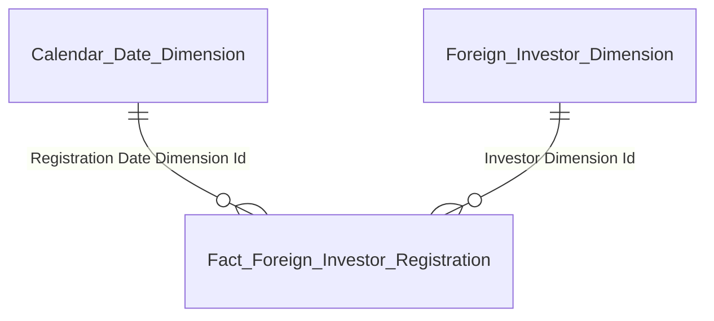
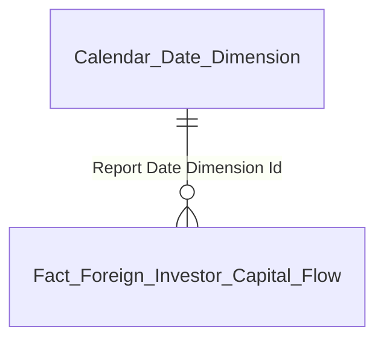
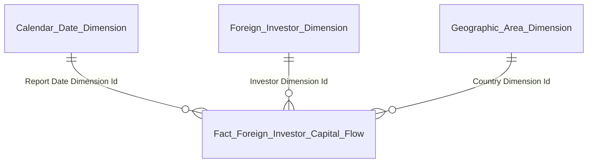
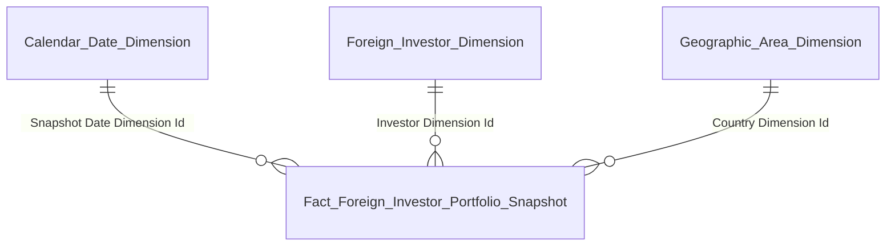
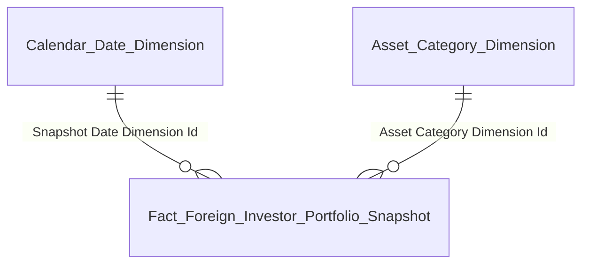
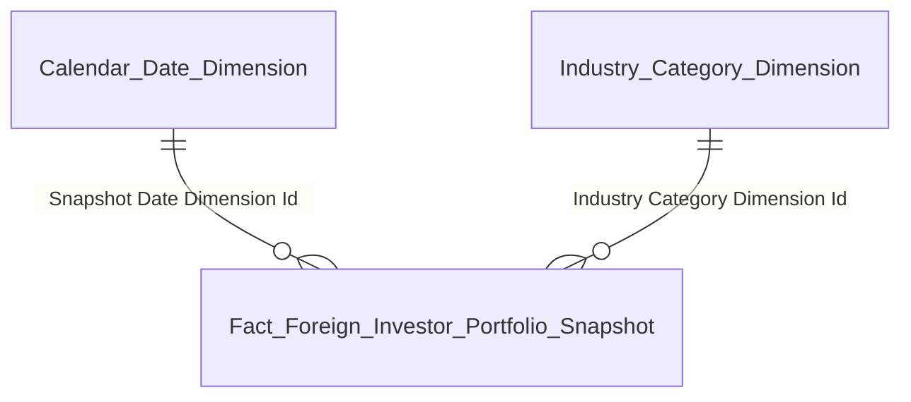
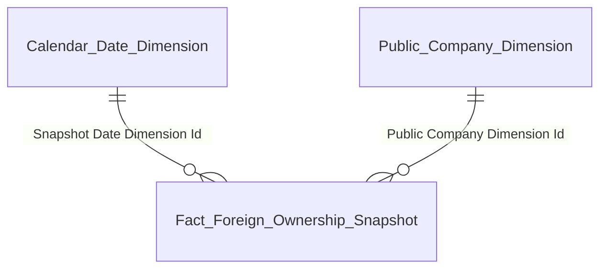
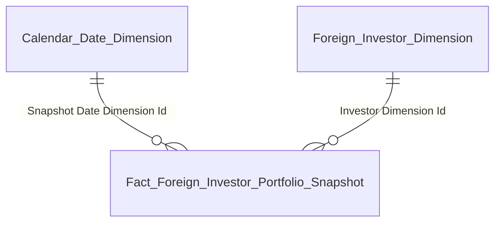

# Gold Entities Overview — NDTNN (Nhà Đầu Tư Nước Ngoài)

---

## Tab GIAO DỊCH

### Nhóm 1 — KPI Cards: Tăng trưởng NĐT mới

#### Star schema

#### Bảng entity

| Gold entity | Description | Grain | KPI |
|---|---|---|---|
| Fact Foreign Investor Registration | Event đăng ký MSGD | 1 row = 1 NĐT NN đăng ký mã giao dịch (event) | K_NDTNN_5–7, 5_YOY |
| Foreign Investor Dimension | NĐT — thông tin định danh (SCD2) | 1 row = 1 NĐT NN (SCD2) | — |
| Calendar Date Dimension | Lịch ngày | 1 row = 1 ngày | — |

---

## Tab GIÁM SÁT DÒNG VỐN

### Nhóm 3 — KPI Cards: Dòng tiền vào / ra / ròng

#### Star schema

#### Bảng entity

| Gold entity | Description | Grain | KPI |
|---|---|---|---|
| Fact Foreign Investor Capital Flow | Event vào/ra vốn — phân biệt chiều bằng Event Type Code | 1 row = 1 sự kiện IN/OUT × 1 NĐT × 1 ngày báo cáo | K_NDTNN_23–25 |
| Calendar Date Dimension | Lịch ngày | 1 row = 1 ngày | — |

---

### Nhóm 5 — Dòng vốn đầu tư gián tiếp nước ngoài

#### Star schema

#### Bảng entity

| Gold entity | Description | Grain | KPI |
|---|---|---|---|
| Fact Foreign Investor Capital Flow | Event vào/ra vốn — Group By loại hình / quốc gia | 1 row = 1 sự kiện IN/OUT × 1 NĐT × 1 ngày báo cáo | K_NDTNN_26–33 |
| Foreign Investor Dimension | NĐT — Investor Object Type Code (SCD2) | 1 row = 1 NĐT NN (SCD2) | — |
| Geographic Area Dimension | Quốc gia / quốc tịch (SCD2) | 1 row = 1 quốc gia (SCD2) | — |
| Calendar Date Dimension | Lịch ngày | 1 row = 1 ngày | — |

---

## Tab DANH MỤC

### Nhóm 6 — Tổng giá trị danh mục

#### Star schema

#### Bảng entity

| Gold entity | Description | Grain | KPI |
|---|---|---|---|
| Fact Foreign Investor Portfolio Snapshot | Periodic snapshot danh mục NĐTNN | 1 row = 1 NĐT × 1 mã tài sản × 1 tháng | K_NDTNN_34–39 |
| Foreign Investor Dimension | NĐT — Investor Object Type Code (SCD2) | 1 row = 1 NĐT NN (SCD2) | — |
| Geographic Area Dimension | Quốc gia / quốc tịch (SCD2) | 1 row = 1 quốc gia (SCD2) | — |
| Calendar Date Dimension | Lịch ngày | 1 row = 1 ngày | — |

---

### Nhóm 7 — Cơ cấu danh mục theo loại hình tài sản

#### Star schema

#### Bảng entity

| Gold entity | Description | Grain | KPI |
|---|---|---|---|
| Fact Foreign Investor Portfolio Snapshot | Periodic snapshot danh mục — filter theo loại tài sản | 1 row = 1 NĐT × 1 mã tài sản × 1 tháng | K_NDTNN_40–44 |
| Asset Category Dimension | Loại hình tài sản — 5 giá trị (SCD2) | 1 row = 1 loại tài sản (SCD2) | — |
| Calendar Date Dimension | Lịch ngày | 1 row = 1 ngày | — |

---

### Nhóm 8 — Bản đồ nhiệt phân ngành

> **Ghi chú:** `Industry Category Dimension` là ETL-derived Conformed Dimension — ETL extract từ `Public Company.Industry Category Level1 Code` (IDS). Không có Silver entity riêng cho danh mục ngành.

#### Star schema

#### Bảng entity

| Gold entity | Description | Grain | KPI |
|---|---|---|---|
| Fact Foreign Investor Portfolio Snapshot | Periodic snapshot danh mục — Group By ngành | 1 row = 1 NĐT × 1 mã tài sản × 1 tháng | K_NDTNN_51 |
| Industry Category Dimension | Nhóm ngành — ETL-derived từ Public Company (IDS) (SCD2) | 1 row = 1 nhóm ngành (SCD2) | — |
| Calendar Date Dimension | Lịch ngày | 1 row = 1 ngày | — |

---

### Nhóm 9 — ROOM sở hữu NĐTNN

#### Star schema

#### Bảng entity

| Gold entity | Description | Grain | KPI |
|---|---|---|---|
| Fact Foreign Ownership Snapshot | Periodic snapshot ROOM — join FIMS.CATEGORIESSTOCK + IDS.foreign_owner_limit | 1 row = 1 mã CK × 1 ngày snapshot | K_NDTNN_45–49 |
| Public Company Dimension | Công ty đại chúng — Stock Code + Industry Category (SCD2) | 1 row = 1 công ty đại chúng (SCD2) | — |
| Calendar Date Dimension | Lịch ngày | 1 row = 1 ngày | — |

---

## Tab NĐTNN 360

### Danh sách tìm kiếm + Hồ sơ định danh (Sub-tab A)

> **Ghi chú:** `Foreign Investor 360 Profile` là bảng tác nghiệp — lấy trực tiếp từ Silver `Foreign Investor` + `Custodian Bank`, không join qua Dimension.

#### Star schema

*Không có relationship line — bảng tác nghiệp*

#### Bảng entity

| Gold entity | Description | Grain | KPI |
|---|---|---|---|
| Foreign Investor 360 Profile | Hồ sơ 360° NĐT — latest state. Silver: Foreign Investor + Custodian Bank | 1 row = 1 NĐT NN (trạng thái mới nhất) | K_NDTNN_L1–L4, P1–P5 |

---

### Sub-tab B — Biến động tài sản

#### Star schema

#### Bảng entity

| Gold entity | Description | Grain | KPI |
|---|---|---|---|
| Fact Foreign Investor Portfolio Snapshot | Periodic snapshot danh mục — filter per NĐT | 1 row = 1 NĐT × 1 mã tài sản × 1 tháng | K_NDTNN_A1–A2 |
| Foreign Investor Dimension | NĐT (SCD2) | 1 row = 1 NĐT NN (SCD2) | — |
| Calendar Date Dimension | Lịch ngày | 1 row = 1 ngày | — |

---

### Sub-tab C — Lịch sử tuân thủ

> **Ghi chú:** `Investor Compliance History` là bảng tác nghiệp — lấy trực tiếp từ Silver `Surveillance Enforcement Case` + `Surveillance Enforcement Decision`, không join qua Dimension.

#### Star schema

*Không có relationship line — bảng tác nghiệp*

#### Bảng entity

| Gold entity | Description | Grain | KPI |
|---|---|---|---|
| Investor Compliance History | Lịch sử tuân thủ — 1 row per quyết định xử phạt. Silver: Surveillance Enforcement Case + Decision | 1 row = 1 quyết định xử phạt / văn bản xử lý của 1 NĐT | K_NDTNN_C1–C5 |
